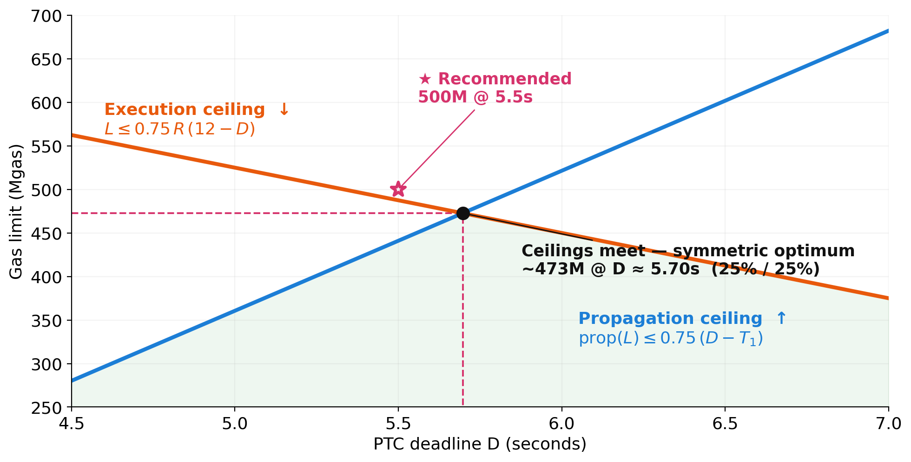

<!-- _class: lead invert -->

# Scaling in Hegota

## Optimal scaling + blockers

# 📈

---

## The one observation everything hangs on

The **21,000-gas ETH transfer bounds both dimensions of the slot.**

- **Execution** — Glamsterdam repricings pushed costs as far as the 21k cap permits → worst-case execution frozen at **100 Mgas/s**.
- **Bandwidth** — a block full of transfers is itself a data payload (envelopes, signatures, BAL entries) that **no pricing instrument can touch** without touching 21k.

> So we use the **transfer-full block as the anchor block** and design everything else around it.

---

<!-- _class: lead invert -->

# The anchor block and pricing worst-case blocks

# 🎯

---

## How many bytes does an ETH transfer carry?

- A transfer has a **data payload of ~221 bytes**:
  - envelope
  - signature
  - BAL entries
- That results in a **byte density** of **~0.0105 B/gas**
- No pricing instrument can change this unless with make ETH transfers cost more than 21k.

> The **transfer-full block is the anchor**: worst-case execution frozen at **100 Mgas/s**, byte density frozen at the **transfer line (~0.0105 B/gas)**.

---

## Where should the PTC deadline go?

The deadline **D** splits the slot. One ceiling **falls** as D grows, the other **rises**: the optimum is where they cross.

> **Recommendation: 500M at D = 5.5s** — just above the symmetric optimum (~23% execution buffer & ~17% propagation buffer).

---

## The adversarial blocks under the new max limit

| Block | β (B/gas) | × ETH transfer line |
|---|---:|---:|
| ETH transfer (anchor) | 0.01052 | 1.00× |
| Cold `SSTORE` | 0.00492 | 0.47× |
| Cold `BALANCE` | 0.00667 | 0.63× |
| Cold `SLOAD` | 0.01067 | 1.01× |
| Calldata at floor (F=64) | 0.01563 | **1.49×** |
| Mixed 25% calldata@16 + 75% `SLOAD` | 0.02363 | **2.25×** |

- **State operations are already correctly priced after EIP-8038** for their byte density — every pure-opcode block sits ≤ the line.
- The **two over-the-line blocks both stem from calldata priced below the transfer line** → how do we tackle them?

---

<!-- _class: lead invert -->

# Open topics for discussion

# 💬

---

<!-- _class: lead invert -->

# Topic 1 — Data

## How do we bring every priced block down to the transfer line?

# 📦

---

## Topic 1 — The questions

- To solve the full call data block, we would only need to bump the floor cost from 64 to 96 gas/byte
- However, this still not solves the mixed block...
- The mixed block is heavy because of the BAL bytes plus the "cheap" calldata bytes — no finite calldata floor can bring it down enough (asymptote pinned at `32/c`, the `SLOAD` block itself).

#### So: how do we tame the residual mixed block (~1.84× the line after the floor bump)?

---

## Option 1 — BAL bytes in the floor ([Toni's proposal](https://github.com/ethereum/EIPs/compare/master...nerolation:EIPs:toni/data-repricing))

Extend the 7623-style floor to **every payload byte**, including BAL bytes. Every priced byte yields ≤ 1/96 B/gas.

**Pros**

- Smallest impact on users — only bites blocks **already over the calldata floor**.
- A step towards multidimensional metering for bandwidth

**Cons**

- New gas-accounting mechanism: a runtime floor accumulator on **every cold-access path**.

---

## Option 2 — Intrinsic data surcharge

Add an explicit data component to **every BAL-contributing op** (cold access, cold storage, etc.). Transfers excluded automatically. Still requires the floor bump.

**Pros**

- **Constants-only** — simplest mechanism on top of the floor.

**Cons**

- State costs raised again (after a big raise in Glamsterdam).
- **Misprices the pure-opcode blocks**, which are already under the line.

---

## Option 3 — Uniform calldata price (~94), no floor pricing

Give calldata a **single rate** at 94 gas/byte. With a single rate, the worst case reverts to cold `SLOAD`, already on the line.

**Pros**

- **Simplest mechanism**: one rate, no BAL accounting, no `max()`.

**Cons**

- Charges **every calldata byte** the floor rate: a **~6× rise** on the 16 standard rate.
- We loose throughput until we implement mutidim metering

---

## Topic 1 — all options

#### Mechanism complexity vs. incidence breadth

| Option | Mechanism | Who pays |
|---|---|---|
| 1 — BAL in floor | New accumulator (heavy) | Only blocks over the floor |
| 2 — Intrinsic surcharge | Constants-only | Every state operation |
| 3 — Uniform calldata | Constants-only | Every calldata byte |

> I personally lean on **Option 3** — direct fix without touching BAL bytes, since state ops are already priced correctly for both execution and bandwidth.

---

<!-- _class: lead invert -->

# Topic 2 — History

## Where (and whether) to reprice?

# 📝

---

## Topic 2 — The questions

- At 500M, history (headers + bodies + receipts) grows at **~2.5 TiB/yr** (scaling the measured ~180 GiB/yr-at-36M linearly).
- This will be higher after BALs and logs from ETH transfers.

#### This is rate feasible? Do we need to be more aggressive with hsitory expiry?

#### Should we need to reprice `LOGDATA`?

---

<!-- _class: lead invert -->

# Topic 3 — Compute

## Do we reprice overpriced compute operations down?

# ⚙️

---

## Topic 3 — The questions

- Freezing the 100 Mgas/s anchor means **most ops are now *over*priced** — worst-case runtime sits **below** their gas cost.
- **~12.4% of block gas is effectively wasted** today on operations charged above their fair runtime cost ([mainnet traffic](https://misilva73.github.io/hegota-compute-repricing/fracgas.html)).

#### Do we reprice the ~62 over-priced EVM ops & precompiles down?

---

## Topic 3 — Options

**A. Reprice down**

- Pro: cuts wasted block gas **12.4% → ~2.6%** (~80% reduction); ~62 ops, 36 do to 1 gas.
- Con: Need more testing and benchmarking to ensure safety

**B. Leave compute as-is**

- Pro: less work, less risk of introducing bottlenecks
- Con: leaves ~12.4% of throughput on the table.

---

<!-- _class: lead invert -->

# 🐈

## Thank you
