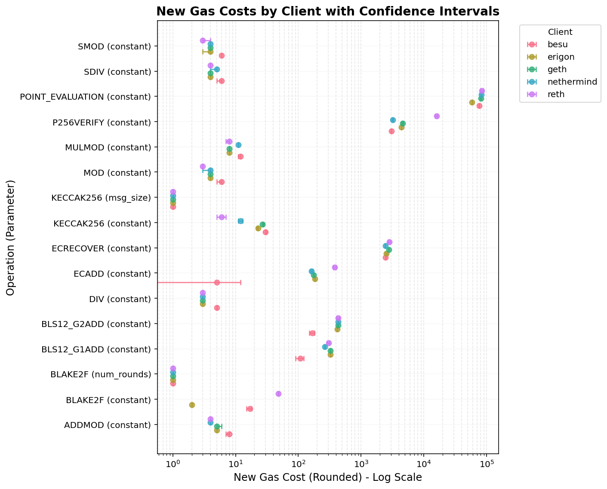
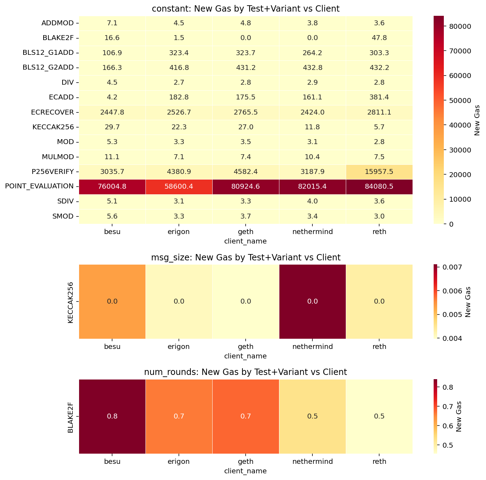

# EIP-7904 & EIP-8038

### Latest runtime-estimation runs

### April 21st, 2026

---

## Methodology recap

- Per-client NNLS regression on benchmark data → per-op runtime (ms)
- Glue-opcode contribution subtracted from the slope
- Worst-case across tests → worst-case across clients
- Gas = `anchor_rate × runtime_ms / 1000`
  - **Osaka anchor**: 60 M gas/s
  - **Amsterdam anchor**: 100 M gas/s

---

# EIP-7904 — Osaka run

---

## EIP-7904 Osaka — proposed gas (worst-case client)

| Opcode | Param | Current | New | Change |
|---|---|---:|---:|---:|
| ADDMOD | constant | 8 | 8 | 0.00 |
| BLAKE2F | constant | 0 | 48 | `inf` |
| BLS12_G1ADD | constant | 375 | 324 | −0.14 |
| BLS12_G2ADD | constant | 600 | 433 | −0.28 |
| DIV | constant | 5 | 5 | 0.00 |
| ECADD | constant | 150 | 382 | +1.55 |
| ECRECOVER | constant | 3000 | 2812 | −0.06 |
| KECCAK256 | constant | 30 | 30 | 0.00 |
| KECCAK256 | msg_size | 6 | 1 | −0.83 |
| MOD / SDIV / SMOD | constant | 5 | 6 | +0.20 |
| MULMOD | constant | 8 | 12 | +0.50 |
| P256VERIFY | constant | 6900 | 15958 | +1.31 |
| POINT_EVALUATION | constant | 50000 | 84081 | +0.68 |

---

## EIP-7904 Osaka — by client

---

## EIP-7904 Osaka — heatmap

---

## Osaka — where worst-case is driven by one client

| Opcode | Worst client | Worst gas | 2nd worst | 2nd gas | Ratio |
|---|---|---:|---|---:|---:|
| BLAKE2F | reth | 48 | besu | 17 | **2.8×** |
| ECADD | reth | 382 | erigon | 183 | **2.1×** |
| P256VERIFY | reth | 15958 | geth | 4583 | **3.5×** |
| KECCAK256 (const) | besu | 30 | geth | 27 | 1.1× |
| MULMOD | besu | 12 | nethermind | 11 | 1.1× |
| POINT_EVALUATION | reth | 84081 | nethermind | 82016 | 1.03× |

> Three precompiles (BLAKE2F, ECADD, P256VERIFY) are **set by reth alone** — 2–3.5× above the next client.

---

## Osaka — takeaways

- **Tight clusters** on POINT_EVALUATION, ECRECOVER, BLS12 ops — clients agree within a few %.
- **Outliers** on BLAKE2F / ECADD / P256VERIFY — one slow client (reth) drives the worst case up 2–3×.
- Small arithmetic ops (ADDMOD/DIV/MOD/…) are dominated by besu at the noise floor; gas changes are ≤1 unit.

---

# EIP-7904 — Amsterdam vs Osaka

---

## Amsterdam vs Osaka — besu runtimes (ms)

| Opcode (param) | Osaka | Amsterdam | Osaka/Amst |
|---|---:|---:|---:|
| ECRECOVER | 0.0408 | 0.0111 | 3.7× |
| POINT_EVALUATION | 1.2667 | 0.3787 | 3.3× |
| KECCAK256 (const) | 0.0005 | 0.0001 | ~5× |
| ECADD | 0.0001 | 0.0000 | — |
| ADDMOD / MULMOD / DIV | ≤ 0.0002 | ≤ 0.0001 | ~2× |

> Amsterdam runs **~3–4× faster** on the heavy precompiles.

---

## Amsterdam vs Osaka — geth runtimes (ms)

| Opcode (param) | Osaka | Amsterdam | Osaka/Amst |
|---|---:|---:|---:|
| ECRECOVER | 0.0461 | 0.0127 | 3.6× |
| POINT_EVALUATION | 1.3487 | 0.3655 | 3.7× |
| ECADD | 0.0029 | 0.0000 | — |
| KECCAK256 (const) | 0.0004 | 0.0001 | 4× |
| MULMOD / MOD | ≤ 0.0001 | ≤ 0.0000 | ~2× |

> Same ~3–4× speed-up pattern as besu.

---

## Amsterdam vs Osaka — takeaways

- Amsterdam hosts are **~3–4× faster** on the compute-heavy precompiles for both besu and geth.
- Amsterdam's higher anchor rate (+67%) does **not** compensate → Amsterdam worst-case gas is **~0.5×** Osaka's.
- Worst-case client rankings are **stable across runs**: geth > besu on ECRECOVER/POINT_EVALUATION in both.

---

# EIP-8038 — Latest run

---

## EIP-8038 — proposed gas (worst-case client)

| Parameter | Current | New | Change |
|---|---:|---:|---:|
| GAS_COLD_ACCOUNT_CODE_ACCESS | 2 600 | 21 457 | +7.3× |
| GAS_COLD_ACCOUNT_NOCODE_ACCESS | 2 600 | 10 591 | +3.1× |
| GAS_COLD_ACCOUNT_WRITE | 6 700 | 224 268 | **+32.5×** |
| GAS_COLD_STORAGE_ACCESS | 2 200 | 191 667 | **+86×** |
| GAS_COLD_STORAGE_WRITE | 2 900 | 149 032 | **+50×** |

Derived: `STORAGE_CLEAR_REFUND` 4 800 → 327 072; `ACCESS_LIST_STORAGE_KEY_COST` 1 900 → 191 667.

---

## EIP-8038 — by client

---

## EIP-8038 — heatmaps

---

## EIP-8038 — worst vs 2nd worst

| Parameter | Worst | Worst gas | 2nd | 2nd gas | Ratio |
|---|---|---:|---|---:|---:|
| GAS_COLD_ACCOUNT_CODE_ACCESS | besu | 21 457 | reth | 5 496 | **3.9×** |
| GAS_COLD_ACCOUNT_NOCODE_ACCESS | nethermind | 10 591 | besu | 10 366 | 1.02× |
| GAS_COLD_ACCOUNT_WRITE | erigon | 224 268 | reth | 117 838 | **1.9×** |
| GAS_COLD_STORAGE_ACCESS | erigon | 191 667 | reth | 184 711 | 1.04× |
| GAS_COLD_STORAGE_WRITE | reth | 149 032 | erigon | 104 522 | 1.4× |

> Half the parameters are set by a **single client** 2–4× above the runner-up.

---

## EIP-8038 — takeaways

- Per-client spread is **much larger** than for 7904: orders of magnitude between fastest and slowest.
- Proposal is driven by **different outlier clients per parameter** — besu, erigon, nethermind and reth each drive at least one worst-case.
- `GAS_COLD_ACCOUNT_CODE_ACCESS` (besu, 3.9×) is the biggest single-client effects.