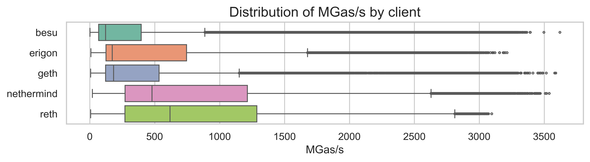
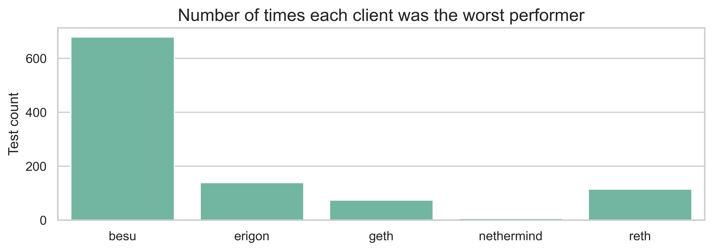
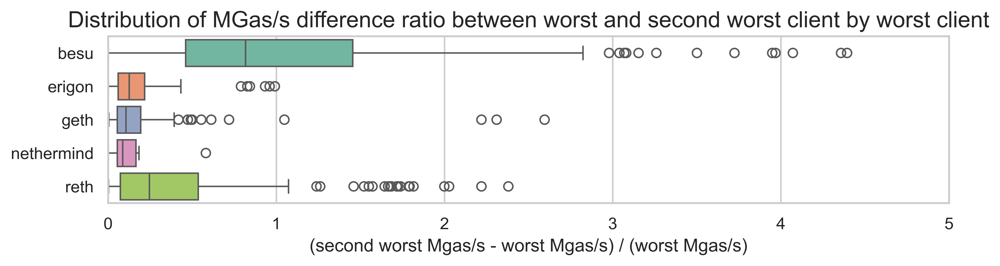

# Compute operations to reprice in EIP-7904

#### Maria Silva, January 2026

In this report, we present which operations should have a cost increase with EIP-7904 and describe the methodology to pick them. The analysis can be reproduced in the [0.5-gasbench_data_eda](https://github.com/misilva73/evm-gas-repricings/blob/185f37f5e0a5636161d5da4983d87a4e420b227a/notebooks/0.5-gasbench_data_eda.ipynb) notebook.

### Methodology

#### Data

The raw benchmark data was generated by running the [EEST benchmark suite](https://github.com/ethereum/execution-spec-tests/tree/main/tests/benchmark) with the [Nethermind benchmarking tooling](https://github.com/NethermindEth/gas-benchmarks). The database is hosted on a PostgreSQL server managed by the Nethermind team.

Each test was run multiple times to isolate random variations in runtime and outliers. The data was collected between 2026-01-05 and 2026-01-22.

The test are still using the Prague fork. A similar analysis is still needed for the Osaka fork.

#### Data processing

The raw benchmark data was processed as follows:

1. **Parsing test metadata**: Each test title was parsed to extract the test file, test name, test parameters, fork version, and the target opcode or precompile being tested.

2. **Filtering invalid data**: Tests with execution time of 0ms were excluded. The ethrex client was also excluded from the analysis as it is still in early development.

3. **Removing outliers**: For each (client, test, opcode) combination, outliers were identified using the interquartile range (IQR) method:
   - Lower threshold: Q1 - 1.5 × IQR
   - Upper threshold: Q3 + 1.5 × IQR
   - Data points outside these thresholds were flagged as outliers and excluded from the worst-case analysis.

4. **Computing worst-case performance**: For each (client, test, opcode) combination, the minimum non-outlier MGas/s value was selected to represent the worst-case execution performance.

5. **Aggregating by opcode**: For each opcode, the worst-performing test across all clients was identified, along with the second-worst client's performance on that same test.

#### Selecting candidates

Operations were selected as candidates for repricing based on the following criteria:

1. **Performance threshold**: The worst-case MGas/s must be below 60 MGas/s. By increase the costs of thesde operations, we will be able to increase our base throughput 3x from our current 20Mgas/s.

2. **Multi-client validation**: To avoid penalizing all clients for a single client's implementation inefficiency, the second-worst client's performance is also considered. If the second-worst client achieves significantly better performance (>20% above the threshold), the operation is flagged for client optimization rather than repricing.

3. **Excluding very slow tests**: Tests with worst-case MGas/s below 20 MGas/s were analyzed separately to understand if the slowness is due to specific test parameters or possible errors in data. After Osaka, we are running at 20Mgas/s, so we should not observe test with values lower than this.

### Performance results

#### Run times distribution by client

The benchmark data covers 237,733 test runs across 4 clients (Besu, Erigon, Geth, Nethermind, and Reth) on the Prague fork. The overall distribution of MGas/s shows significant variation across tests and clients.

The boxplot above shows that different clients have different performance characteristics:

- **Nethermind** and **Reth** the highest median performance
- **Besu** shows a wider distribution with a majority of tests at lower MGas/s values
- **Erigon** and **Geth** have intermediate performance, with still some slower tests, but a higher median performance than Besu.

#### Worst vs. second-worst client

An important consideration for repricing is whether poor performance is isolated to a single client or affects multiple implementations.This is important for distinguishing between:

- Operations that genuinely need repricing (multiple clients struggle)
- Operations where a specific client needs optimization (only one client struggles)

The chart shows the number of tests in which each clietn was the worst performer. We can see that **Besu** is the worst performer in the majority of tests, followed by Erigon.

The next plot shows the distribution of the performance ratio between the worst client and second-worst client. Each boxplot shows this distribution by the client (i.e., when each client is the worst performer).

For a majority of tests, the between worst and second-worst is small (<20%), suggesting that clients have a 

#### Underpriced operations at 60 MGas/s

The following table shows operations with worst-case performance below 60 MGas/s:

| Operation | Worst MGas/s | Worst Client | Second Worst MGas/s |
|-----------|-------------|--------------|---------------------|
| MULMOD | 20.60 | besu | 57.02 |
| MODEXP | 21.63 | geth | 25.06 |
| EQ | 22.80 | besu | 122.96 |
| SDIV | 23.14 | besu | 85.18 |
| REVERT | 23.38 | besu | 110.41 |
| SMOD | 24.99 | besu | 67.98 |
| MOD | 25.27 | besu | 70.98 |
| SAR | 27.15 | besu | 134.36 |
| MUL | 27.60 | besu | 147.87 |
| SUB | 28.80 | besu | 122.66 |
| DIV | 29.94 | besu | 88.54 |
| SHIFT | 30.47 | besu | 124.32 |
| point evaluation | 31.75 | erigon | 31.85 |
| RETURN | 32.95 | besu | 103.85 |
| ADDMOD | 32.98 | besu | 91.12 |
| CALLCODE | 34.78 | besu | 112.96 |
| CALLDATALOAD | 35.52 | besu | 77.65 |
| CALL | 35.60 | besu | 98.94 |
| DELEGATECALL | 36.30 | besu | 127.70 |
| SELFDESTRUCT | 36.65 | besu | 628.81 |
| STATICCALL | 37.60 | besu | 105.77 |
| CALLDATACOPY | 38.08 | besu | 193.12 |
| KECCAK | 38.49 | besu | 70.90 |
| SHL | 39.64 | besu | 136.58 |
| SHR | 41.84 | besu | 134.38 |
| BLS12_G1ADD | 41.97 | besu | 73.64 |
| XOR | 47.34 | besu | 122.21 |
| blake2f | 47.48 | reth | 50.07 |
| ecAdd | 47.89 | besu | 63.51 |
| BLS12_G2ADD | 49.01 | besu | 69.11 |
| SHA2-256 | 52.29 | besu | 235.32 |
| AND | 54.66 | besu | 122.87 |
| identity | 54.74 | besu | 178.01 |
| OR | 54.91 | besu | 126.59 |
| ecRecover | 55.04 | besu | 58.41 |
| TLOAD | 55.90 | erigon | 789.42 |
| CALLDATASIZE | 56.91 | besu | 134.27 |
| MSTORE | 57.07 | besu | 145.72 |
| ecPairing | 57.34 | nethermind | 67.85 |
| ecMul | 58.66 | reth | 90.32 |

As expected, there are a significant number of operations where Besu is performing bellow 60Mgas/s, but the rest of the clients have a significantly higher performance. These are the likely cases where a single client optimization is needed.

MODEXP is still performing at 21.63 Mgas/s, however we expect this value to change in the Osaka branch as this operation was already repriced there. We need to run this again on the newest fork.

#### Slow tests

We also observed test performing at less than 20Mgas/s. Since there are likely issues in the data, we exclude them from the underpriced operations. However, we need to confirm whether this is actually issues in the test and not a new bottleneck. The test in question are the following:

- `test_extcode_ops` in Geth and Erigon
- `test_xcall` in Geth
- `test_artimetic` in Besu (only `opcode_ADD`)
- `test_selfbalance` in Besu (only `contract_balance_0`)
- `test_call_frame_context_ops` in Besu (`opcode_ORIGIN`)

### Final list

#### Candidates for repricing

The following operations are candidates for repricing under EIP-7904. These are operations where:

- The worst-case MGas/s is below 60 MGas/s, AND
- The second-worst client also performs below 72 MGas/s (60 × 1.2), indicating the poor performance is not isolated to a single client

| Operation | Worst MGas/s | Worst Client | Second Worst MGas/s | Second Worst / Worst |
|-----------|-------------|--------------|---------------------|----------------------|
| MULMOD | 20.60 | besu | 57.02 | 2.77× |
| MODEXP | 21.63 | geth | 25.06 | 1.16× |
| SMOD | 24.99 | besu | 67.98 | 2.72× |
| MOD | 25.27 | besu | 70.98 | 2.81× |
| point evaluation | 31.75 | erigon | 31.85 | 1.00× |
| KECCAK | 38.49 | besu | 70.90 | 1.84× |
| BLS12_G1ADD | 41.97 | besu | 73.64 | 1.75× |
| blake2f | 47.48 | reth | 50.07 | 1.05× |
| ecAdd | 47.89 | besu | 63.51 | 1.33× |
| BLS12_G2ADD | 49.01 | besu | 69.11 | 1.41× |
| ecRecover | 55.04 | besu | 58.41 | 1.06× |
| ecPairing | 57.34 | nethermind | 67.85 | 1.18× |

#### Operations requiring client optimization

The following operations have poor performance on a single client but acceptable performance on others. These should be addressed through client optimization rather than protocol-level repricing:

| Operation | Worst MGas/s | Worst Client | Second Worst MGas/s | Gap |
|-----------|-------------|--------------|---------------------|-----|
| EQ | 22.80 | besu | 122.96 | 5.4× |
| SDIV | 23.14 | besu | 85.18 | 3.7× |
| REVERT | 23.38 | besu | 110.41 | 4.7× |
| SAR | 27.15 | besu | 134.36 | 4.9× |
| MUL | 27.60 | besu | 147.87 | 5.4× |
| SUB | 28.80 | besu | 122.66 | 4.3× |
| DIV | 29.94 | besu | 88.54 | 3.0× |
| SHIFT | 30.47 | besu | 124.32 | 4.1× |
| RETURN | 32.95 | besu | 103.85 | 3.2× |
| ADDMOD | 32.98 | besu | 91.12 | 2.8× |
| CALLCODE | 34.78 | besu | 112.96 | 3.2× |
| CALLDATALOAD | 35.52 | besu | 77.65 | 2.2× |
| CALL | 35.60 | besu | 98.94 | 2.8× |
| DELEGATECALL | 36.30 | besu | 127.70 | 3.5× |
| SELFDESTRUCT | 36.65 | besu | 628.81 | 17.2× |
| STATICCALL | 37.60 | besu | 105.77 | 2.8× |
| CALLDATACOPY | 38.08 | besu | 193.12 | 5.1× |
| SHL | 39.64 | besu | 136.58 | 3.4× |
| SHR | 41.84 | besu | 134.38 | 3.2× |
| XOR | 47.34 | besu | 122.21 | 2.6× |
| SHA2-256 | 52.29 | besu | 235.32 | 4.5× |
| AND | 54.66 | besu | 122.87 | 2.2× |
| identity | 54.74 | besu | 178.01 | 3.3× |
| OR | 54.91 | besu | 126.59 | 2.3× |
| TLOAD | 55.90 | erigon | 789.42 | 14.1× |
| CALLDATASIZE | 56.91 | besu | 134.27 | 2.4× |
| MSTORE | 57.07 | besu | 145.72 | 2.6× |
| ecMul | 58.66 | reth | 90.32 | 1.5× |

The next step is to reach out to the individual clients and assess the reason for the slow performance and whether it can be improved by Glamsterdam.
