Operation run times estimation results - EIP-7904
=================================================

Table of contents
=================

* [MULMOD](#mulmod)
* [SMOD](#smod)
* [MOD](#mod)
* [POINT_EVALUATION](#point_evaluation)
* [KECCAK256](#keccak256)
* [BLS12_G1ADD](#bls12_g1add)
* [BLS12_G2ADD](#bls12_g2add)
* [BLAKE2F](#blake2f)
* [ECADD](#ecadd)
* [ECRECOVER](#ecrecover)
* [ECPAIRING](#ecpairing)
* [KECCAK256](#keccak256)
* [BLAKE2F](#blake2f)
* [ECPAIRING](#ecpairing)

# Introduction


This is an automated report generated from the opcode run times 
estimation script `./src/estimate_opcode_run_times.py`. The script 
uses data generated by running the 
[EEST benchmark suite](https://github.com/ethereum/execution-spec-tests/tree/main/tests/benchmark) 
with the [Nethermind benchmarking tooling](https://github.com/NethermindEth/gas-benchmarks).

The data includes all the tests for operations repriced in EIP-7904 run between 2026-01-10 and 2026-01-22.

For each opcode and client, an OLS linear regression model is fitted to estimate the 
opcode run time as a function of the opcode count and other opcode configurations. The results are presented below.

# MULMOD

## geth


```python
                            OLS Regression Results                            
==============================================================================
Dep. Variable:        run_duration_ms   R-squared:                       0.987
Model:                            OLS   Adj. R-squared:                  0.987
Method:                 Least Squares   F-statistic:                 1.584e+04
Date:                Thu, 22 Jan 2026   Prob (F-statistic):          2.82e-198
Time:                        16:48:12   Log-Likelihood:                -1183.6
No. Observations:                 210   AIC:                             2371.
Df Residuals:                     208   BIC:                             2378.
Df Model:                           1                                         
Covariance Type:            nonrobust                                         
==============================================================================
                 coef    std err          t      P>|t|      [0.025      0.975]
------------------------------------------------------------------------------
const         33.9703     10.162      3.343      0.001      13.936      54.004
opcount        0.0687      0.001    125.872      0.000       0.068       0.070
==============================================================================
Omnibus:                       19.241   Durbin-Watson:                   1.138
Prob(Omnibus):                  0.000   Jarque-Bera (JB):               42.321
Skew:                          -0.406   Prob(JB):                     6.46e-10
Kurtosis:                       5.044   Cond. No.                     4.02e+04
==============================================================================

Notes:
[1] Standard Errors assume that the covariance matrix of the errors is correctly specified.
[2] The condition number is large, 4.02e+04. This might indicate that there are
strong multicollinearity or other numerical problems.
```

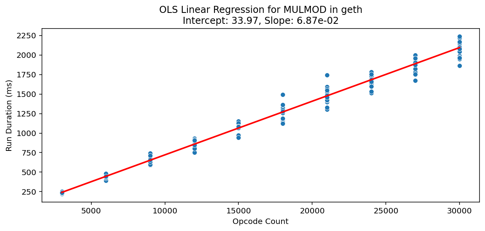

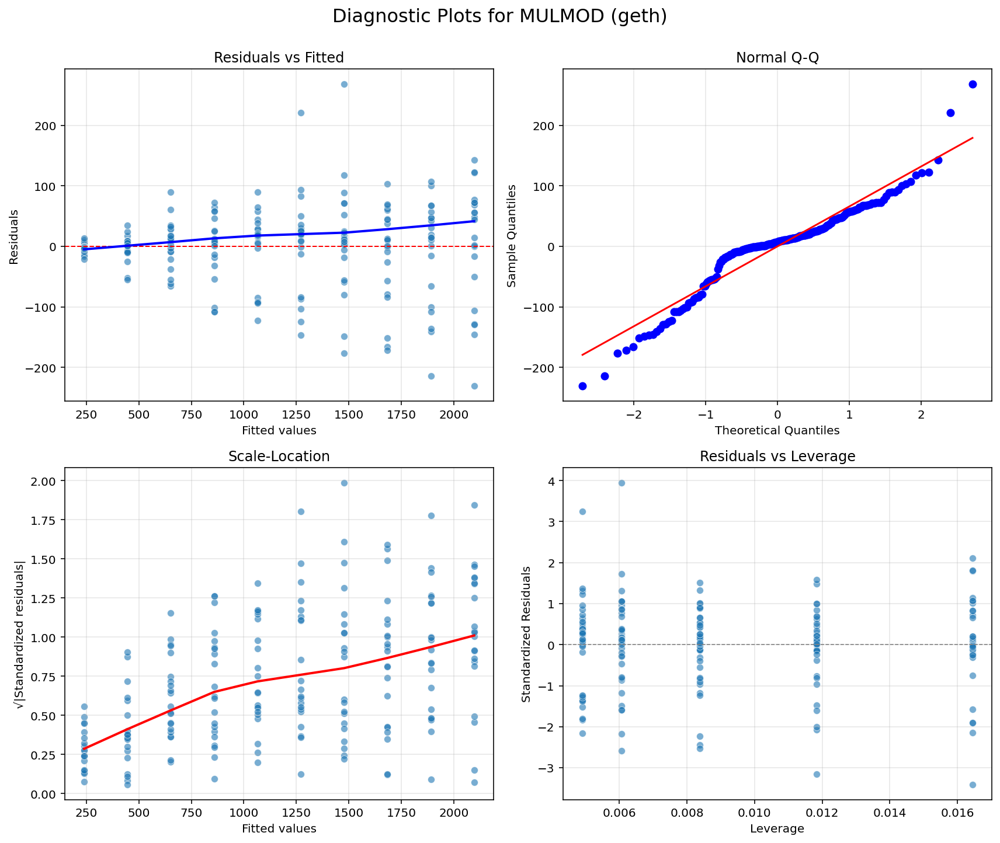


## besu


```python
                            OLS Regression Results                            
==============================================================================
Dep. Variable:        run_duration_ms   R-squared:                       0.985
Model:                            OLS   Adj. R-squared:                  0.985
Method:                 Least Squares   F-statistic:                 1.334e+04
Date:                Thu, 22 Jan 2026   Prob (F-statistic):          1.30e-190
Time:                        16:48:12   Log-Likelihood:                -1401.4
No. Observations:                 210   AIC:                             2807.
Df Residuals:                     208   BIC:                             2814.
Df Model:                           1                                         
Covariance Type:            nonrobust                                         
==============================================================================
                 coef    std err          t      P>|t|      [0.025      0.975]
------------------------------------------------------------------------------
const         49.8550     28.676      1.739      0.084      -6.677     106.387
opcount        0.1779      0.002    115.494      0.000       0.175       0.181
==============================================================================
Omnibus:                       51.070   Durbin-Watson:                   0.848
Prob(Omnibus):                  0.000   Jarque-Bera (JB):               97.149
Skew:                          -1.203   Prob(JB):                     8.02e-22
Kurtosis:                       5.305   Cond. No.                     4.02e+04
==============================================================================

Notes:
[1] Standard Errors assume that the covariance matrix of the errors is correctly specified.
[2] The condition number is large, 4.02e+04. This might indicate that there are
strong multicollinearity or other numerical problems.
```

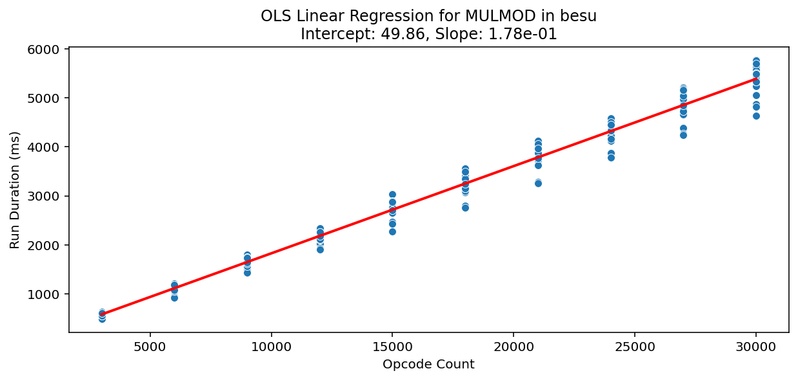

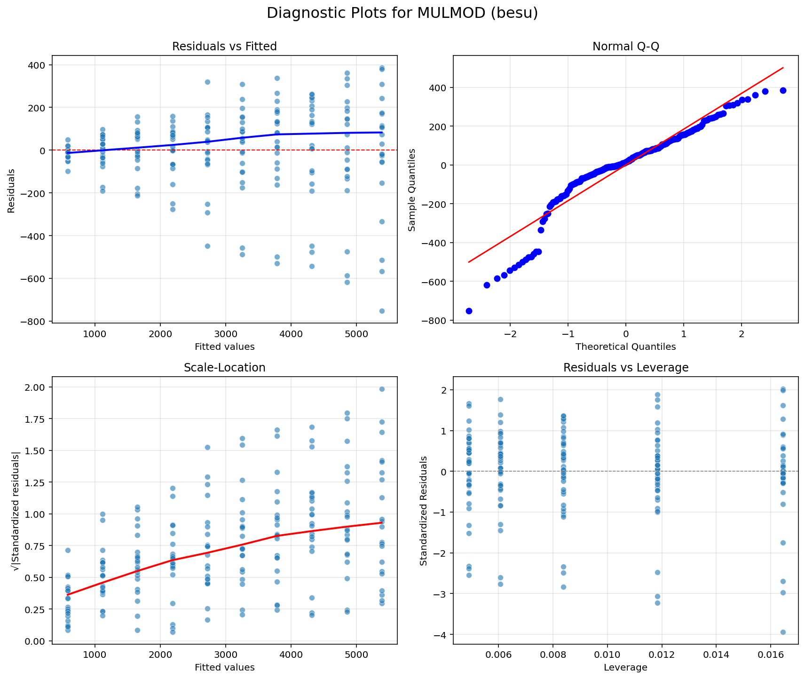


## reth


```python
                            OLS Regression Results                            
==============================================================================
Dep. Variable:        run_duration_ms   R-squared:                       0.994
Model:                            OLS   Adj. R-squared:                  0.994
Method:                 Least Squares   F-statistic:                 1.641e+04
Date:                Thu, 22 Jan 2026   Prob (F-statistic):          6.53e-111
Time:                        16:48:13   Log-Likelihood:                -474.25
No. Observations:                 100   AIC:                             952.5
Df Residuals:                      98   BIC:                             957.7
Df Model:                           1                                         
Covariance Type:            nonrobust                                         
==============================================================================
                 coef    std err          t      P>|t|      [0.025      0.975]
------------------------------------------------------------------------------
const         31.3958      6.057      5.183      0.000      19.375      43.416
opcount        0.0417      0.000    128.085      0.000       0.041       0.042
==============================================================================
Omnibus:                       41.312   Durbin-Watson:                   1.365
Prob(Omnibus):                  0.000   Jarque-Bera (JB):              135.481
Skew:                          -1.378   Prob(JB):                     3.81e-30
Kurtosis:                       7.992   Cond. No.                     4.02e+04
==============================================================================

Notes:
[1] Standard Errors assume that the covariance matrix of the errors is correctly specified.
[2] The condition number is large, 4.02e+04. This might indicate that there are
strong multicollinearity or other numerical problems.
```

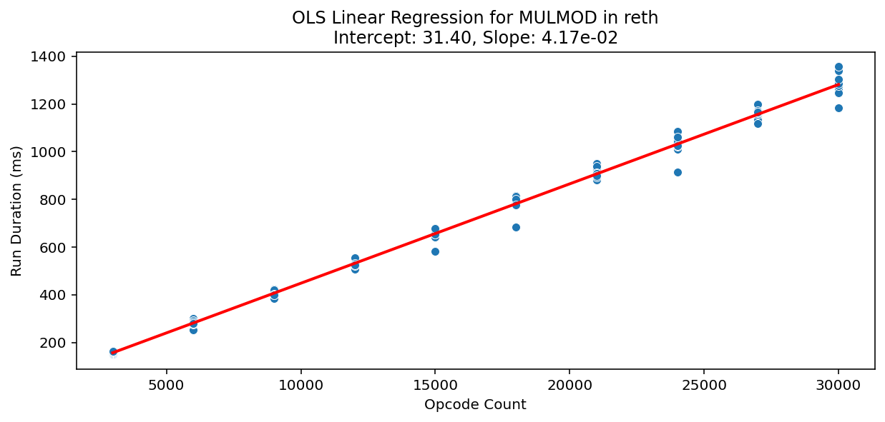

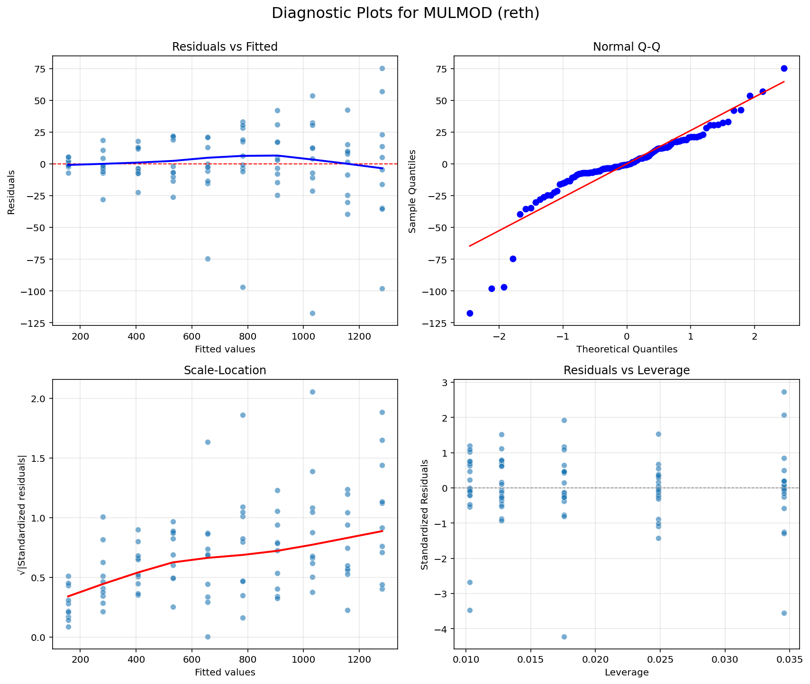


## nethermind


```python
                            OLS Regression Results                            
==============================================================================
Dep. Variable:        run_duration_ms   R-squared:                       0.982
Model:                            OLS   Adj. R-squared:                  0.982
Method:                 Least Squares   F-statistic:                 1.131e+04
Date:                Thu, 22 Jan 2026   Prob (F-statistic):          2.88e-183
Time:                        16:48:13   Log-Likelihood:                -1202.8
No. Observations:                 210   AIC:                             2410.
Df Residuals:                     208   BIC:                             2416.
Df Model:                           1                                         
Covariance Type:            nonrobust                                         
==============================================================================
                 coef    std err          t      P>|t|      [0.025      0.975]
------------------------------------------------------------------------------
const         28.1637     11.135      2.529      0.012       6.211      50.116
opcount        0.0636      0.001    106.328      0.000       0.062       0.065
==============================================================================
Omnibus:                       56.064   Durbin-Watson:                   0.648
Prob(Omnibus):                  0.000   Jarque-Bera (JB):               96.438
Skew:                          -1.418   Prob(JB):                     1.14e-21
Kurtosis:                       4.726   Cond. No.                     4.02e+04
==============================================================================

Notes:
[1] Standard Errors assume that the covariance matrix of the errors is correctly specified.
[2] The condition number is large, 4.02e+04. This might indicate that there are
strong multicollinearity or other numerical problems.
```

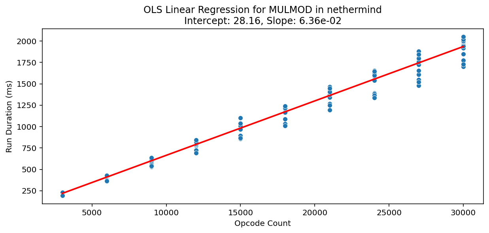

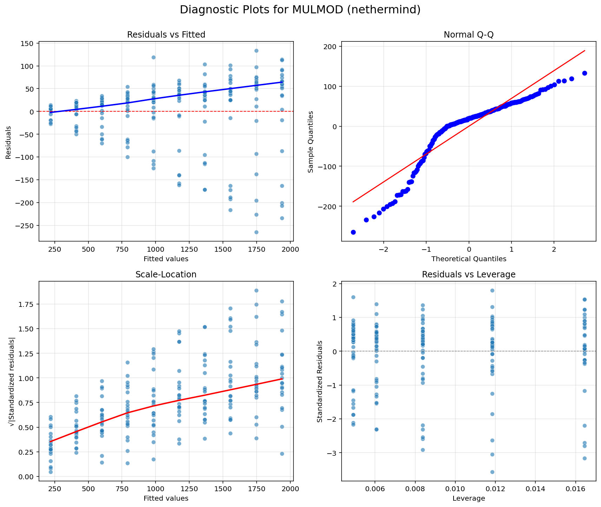


## erigon


```python
                            OLS Regression Results                            
==============================================================================
Dep. Variable:        run_duration_ms   R-squared:                       1.000
Model:                            OLS   Adj. R-squared:                  1.000
Method:                 Least Squares   F-statistic:                 9.010e+04
Date:                Thu, 22 Jan 2026   Prob (F-statistic):           1.17e-50
Time:                        16:48:13   Log-Likelihood:                -115.03
No. Observations:                  30   AIC:                             234.1
Df Residuals:                      28   BIC:                             236.9
Df Model:                           1                                         
Covariance Type:            nonrobust                                         
==============================================================================
                 coef    std err          t      P>|t|      [0.025      0.975]
------------------------------------------------------------------------------
const         27.7081      4.570      6.062      0.000      18.346      37.070
opcount        0.0737      0.000    300.168      0.000       0.073       0.074
==============================================================================
Omnibus:                       18.361   Durbin-Watson:                   1.183
Prob(Omnibus):                  0.000   Jarque-Bera (JB):               25.308
Skew:                           1.476   Prob(JB):                     3.19e-06
Kurtosis:                       6.396   Cond. No.                     4.02e+04
==============================================================================

Notes:
[1] Standard Errors assume that the covariance matrix of the errors is correctly specified.
[2] The condition number is large, 4.02e+04. This might indicate that there are
strong multicollinearity or other numerical problems.
```

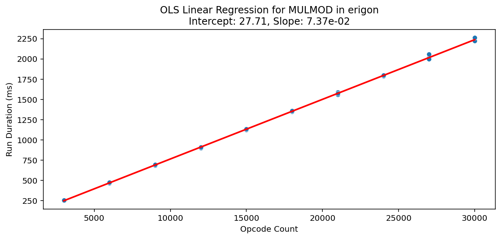

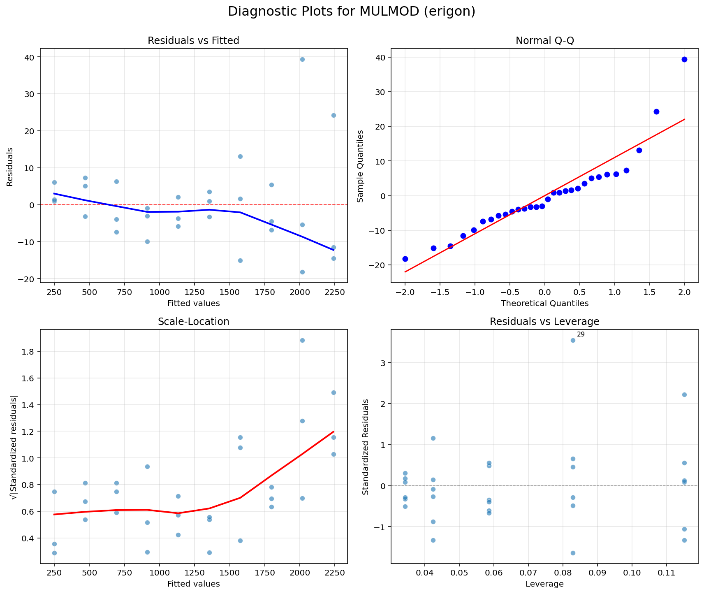


# SMOD

## geth


```python
                            OLS Regression Results                            
==============================================================================
Dep. Variable:        run_duration_ms   R-squared:                       0.948
Model:                            OLS   Adj. R-squared:                  0.948
Method:                 Least Squares   F-statistic:                     5469.
Date:                Thu, 22 Jan 2026   Prob (F-statistic):          8.95e-194
Time:                        16:48:14   Log-Likelihood:                -1653.3
No. Observations:                 300   AIC:                             3311.
Df Residuals:                     298   BIC:                             3318.
Df Model:                           1                                         
Covariance Type:            nonrobust                                         
==============================================================================
                 coef    std err          t      P>|t|      [0.025      0.975]
------------------------------------------------------------------------------
const         36.7706      7.492      4.908      0.000      22.026      51.515
opcount        0.0298      0.000     73.953      0.000       0.029       0.031
==============================================================================
Omnibus:                      499.881   Durbin-Watson:                   1.526
Prob(Omnibus):                  0.000   Jarque-Bera (JB):           177221.993
Skew:                           8.863   Prob(JB):                         0.00
Kurtosis:                     120.744   Cond. No.                     4.02e+04
==============================================================================

Notes:
[1] Standard Errors assume that the covariance matrix of the errors is correctly specified.
[2] The condition number is large, 4.02e+04. This might indicate that there are
strong multicollinearity or other numerical problems.
```

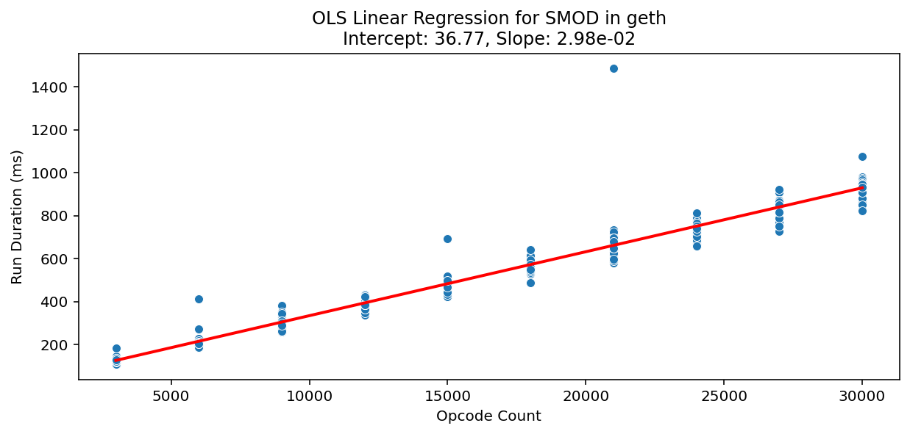

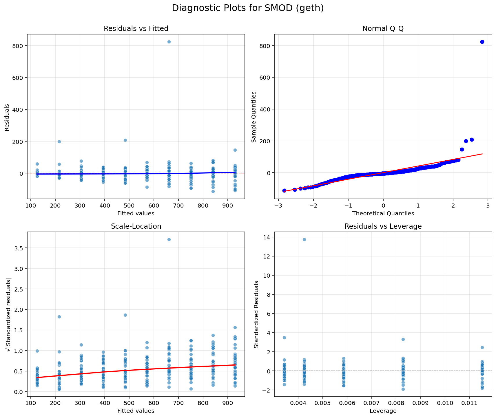


## besu


```python
                            OLS Regression Results                            
==============================================================================
Dep. Variable:        run_duration_ms   R-squared:                       0.984
Model:                            OLS   Adj. R-squared:                  0.984
Method:                 Least Squares   F-statistic:                 1.861e+04
Date:                Thu, 22 Jan 2026   Prob (F-statistic):          1.32e-270
Time:                        16:48:14   Log-Likelihood:                -1571.2
No. Observations:                 300   AIC:                             3146.
Df Residuals:                     298   BIC:                             3154.
Df Model:                           1                                         
Covariance Type:            nonrobust                                         
==============================================================================
                 coef    std err          t      P>|t|      [0.025      0.975]
------------------------------------------------------------------------------
const         28.9424      5.699      5.079      0.000      17.728      40.157
opcount        0.0418      0.000    136.401      0.000       0.041       0.042
==============================================================================
Omnibus:                       75.742   Durbin-Watson:                   0.758
Prob(Omnibus):                  0.000   Jarque-Bera (JB):              230.120
Skew:                          -1.108   Prob(JB):                     1.07e-50
Kurtosis:                       6.674   Cond. No.                     4.02e+04
==============================================================================

Notes:
[1] Standard Errors assume that the covariance matrix of the errors is correctly specified.
[2] The condition number is large, 4.02e+04. This might indicate that there are
strong multicollinearity or other numerical problems.
```

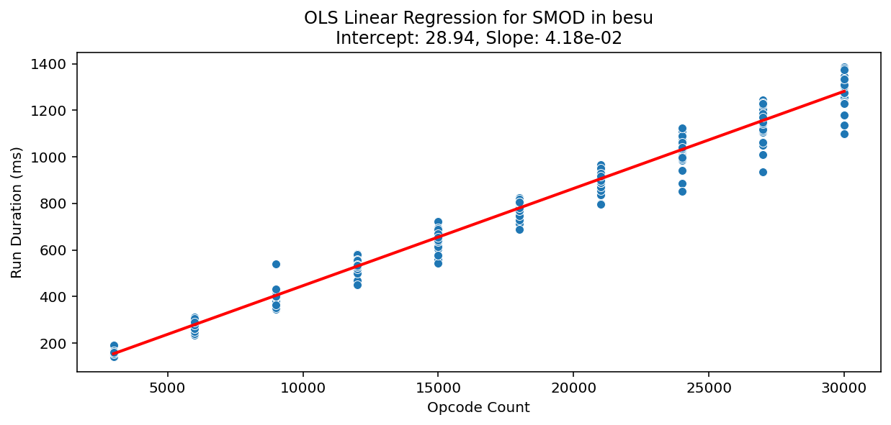

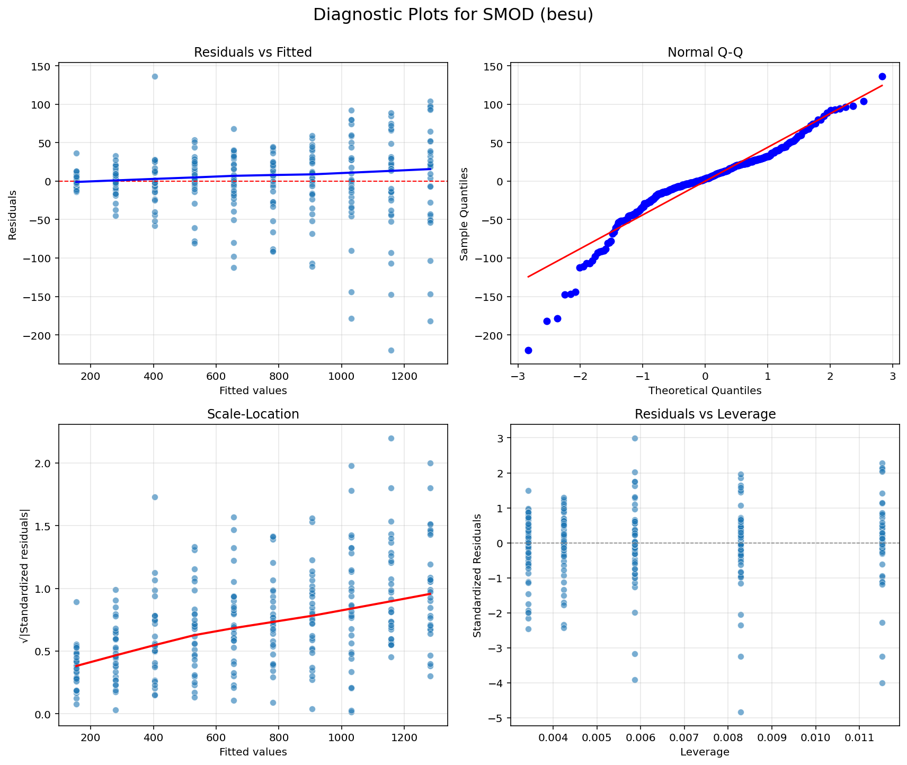


## reth


```python
                            OLS Regression Results                            
==============================================================================
Dep. Variable:        run_duration_ms   R-squared:                       0.970
Model:                            OLS   Adj. R-squared:                  0.969
Method:                 Least Squares   F-statistic:                     6004.
Date:                Thu, 22 Jan 2026   Prob (F-statistic):          1.29e-144
Time:                        16:48:14   Log-Likelihood:                -843.12
No. Observations:                 190   AIC:                             1690.
Df Residuals:                     188   BIC:                             1697.
Df Model:                           1                                         
Covariance Type:            nonrobust                                         
==============================================================================
                 coef    std err          t      P>|t|      [0.025      0.975]
------------------------------------------------------------------------------
const         32.5275      3.224     10.090      0.000      26.168      38.887
opcount        0.0134      0.000     77.484      0.000       0.013       0.014
==============================================================================
Omnibus:                      274.034   Durbin-Watson:                   1.867
Prob(Omnibus):                  0.000   Jarque-Bera (JB):            34770.398
Skew:                           6.139   Prob(JB):                         0.00
Kurtosis:                      68.125   Cond. No.                     4.02e+04
==============================================================================

Notes:
[1] Standard Errors assume that the covariance matrix of the errors is correctly specified.
[2] The condition number is large, 4.02e+04. This might indicate that there are
strong multicollinearity or other numerical problems.
```

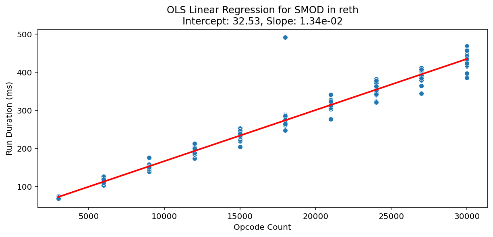

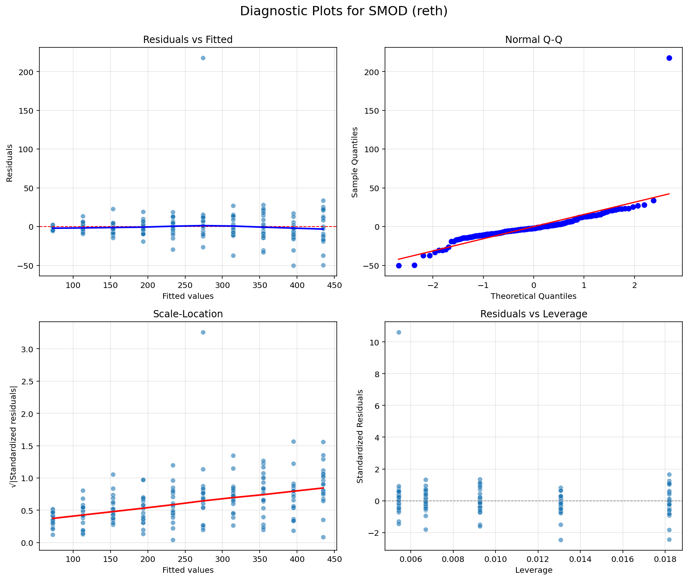


## nethermind


```python
                            OLS Regression Results                            
==============================================================================
Dep. Variable:        run_duration_ms   R-squared:                       0.983
Model:                            OLS   Adj. R-squared:                  0.983
Method:                 Least Squares   F-statistic:                 1.689e+04
Date:                Thu, 22 Jan 2026   Prob (F-statistic):          1.94e-264
Time:                        16:48:14   Log-Likelihood:                -1287.5
No. Observations:                 300   AIC:                             2579.
Df Residuals:                     298   BIC:                             2586.
Df Model:                           1                                         
Covariance Type:            nonrobust                                         
==============================================================================
                 coef    std err          t      P>|t|      [0.025      0.975]
------------------------------------------------------------------------------
const         30.6381      2.213     13.843      0.000      26.283      34.994
opcount        0.0155      0.000    129.952      0.000       0.015       0.016
==============================================================================
Omnibus:                       61.294   Durbin-Watson:                   0.899
Prob(Omnibus):                  0.000   Jarque-Bera (JB):              154.278
Skew:                          -0.959   Prob(JB):                     3.15e-34
Kurtosis:                       5.944   Cond. No.                     4.02e+04
==============================================================================

Notes:
[1] Standard Errors assume that the covariance matrix of the errors is correctly specified.
[2] The condition number is large, 4.02e+04. This might indicate that there are
strong multicollinearity or other numerical problems.
```

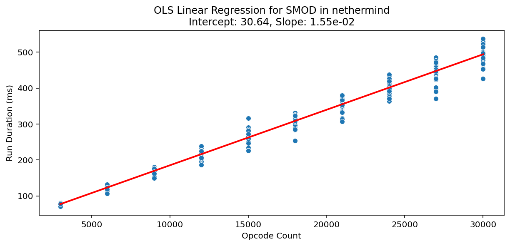

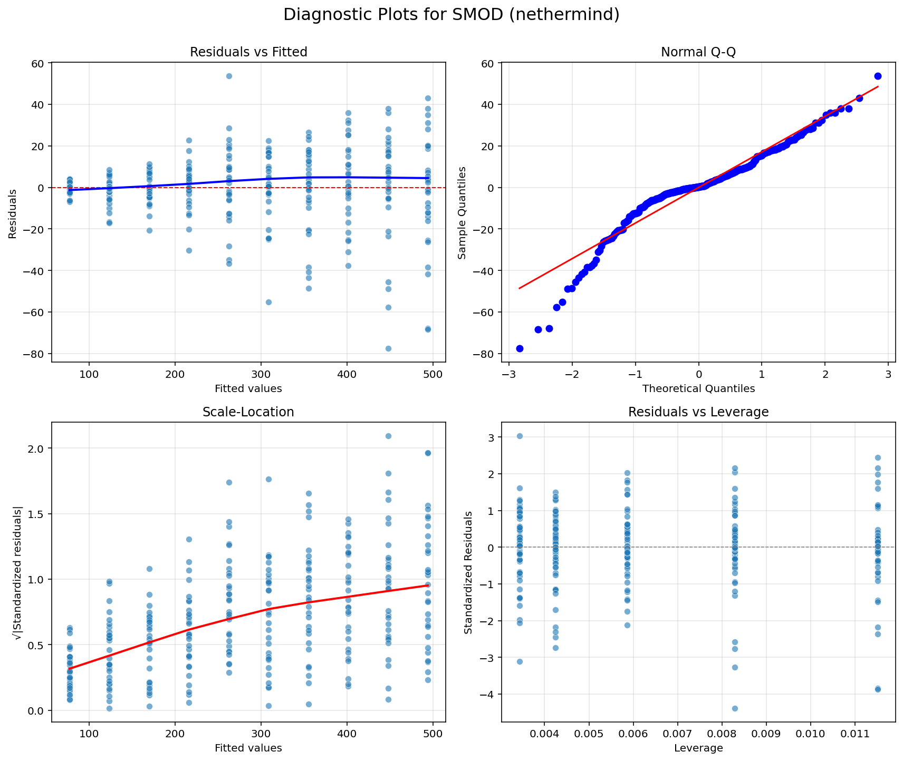


## erigon


```python
                            OLS Regression Results                            
==============================================================================
Dep. Variable:        run_duration_ms   R-squared:                       0.993
Model:                            OLS   Adj. R-squared:                  0.992
Method:                 Least Squares   F-statistic:                     3781.
Date:                Thu, 22 Jan 2026   Prob (F-statistic):           2.02e-31
Time:                        16:48:15   Log-Likelihood:                -138.53
No. Observations:                  30   AIC:                             281.1
Df Residuals:                      28   BIC:                             283.9
Df Model:                           1                                         
Covariance Type:            nonrobust                                         
==============================================================================
                 coef    std err          t      P>|t|      [0.025      0.975]
------------------------------------------------------------------------------
const         22.2938     10.002      2.229      0.034       1.806      42.781
opcount        0.0330      0.001     61.491      0.000       0.032       0.034
==============================================================================
Omnibus:                       58.725   Durbin-Watson:                   2.145
Prob(Omnibus):                  0.000   Jarque-Bera (JB):              463.777
Skew:                           4.002   Prob(JB):                    1.96e-101
Kurtosis:                      20.520   Cond. No.                     4.02e+04
==============================================================================

Notes:
[1] Standard Errors assume that the covariance matrix of the errors is correctly specified.
[2] The condition number is large, 4.02e+04. This might indicate that there are
strong multicollinearity or other numerical problems.
```

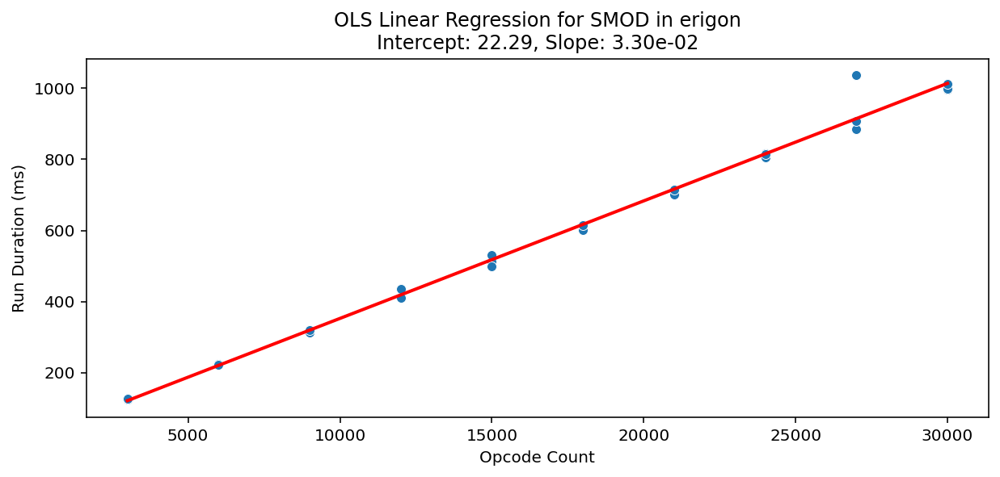


# MOD

## geth


```python
                            OLS Regression Results                            
==============================================================================
Dep. Variable:        run_duration_ms   R-squared:                       0.976
Model:                            OLS   Adj. R-squared:                  0.976
Method:                 Least Squares   F-statistic:                 1.229e+04
Date:                Thu, 22 Jan 2026   Prob (F-statistic):          2.77e-244
Time:                        16:48:15   Log-Likelihood:                -1710.7
No. Observations:                 300   AIC:                             3425.
Df Residuals:                     298   BIC:                             3433.
Df Model:                           1                                         
Covariance Type:            nonrobust                                         
==============================================================================
                 coef    std err          t      P>|t|      [0.025      0.975]
------------------------------------------------------------------------------
const         31.4566      9.071      3.468      0.001      13.606      49.307
opcount        0.0540      0.000    110.853      0.000       0.053       0.055
==============================================================================
Omnibus:                      207.273   Durbin-Watson:                   1.035
Prob(Omnibus):                  0.000   Jarque-Bera (JB):             6841.420
Skew:                           2.288   Prob(JB):                         0.00
Kurtosis:                      25.943   Cond. No.                     4.02e+04
==============================================================================

Notes:
[1] Standard Errors assume that the covariance matrix of the errors is correctly specified.
[2] The condition number is large, 4.02e+04. This might indicate that there are
strong multicollinearity or other numerical problems.
```

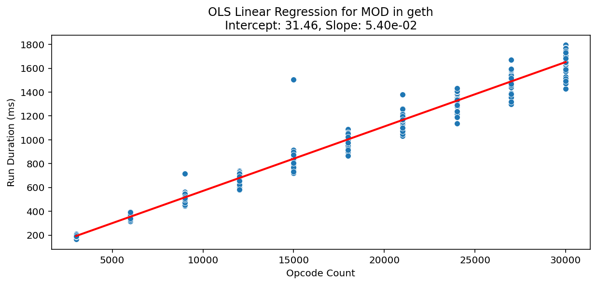

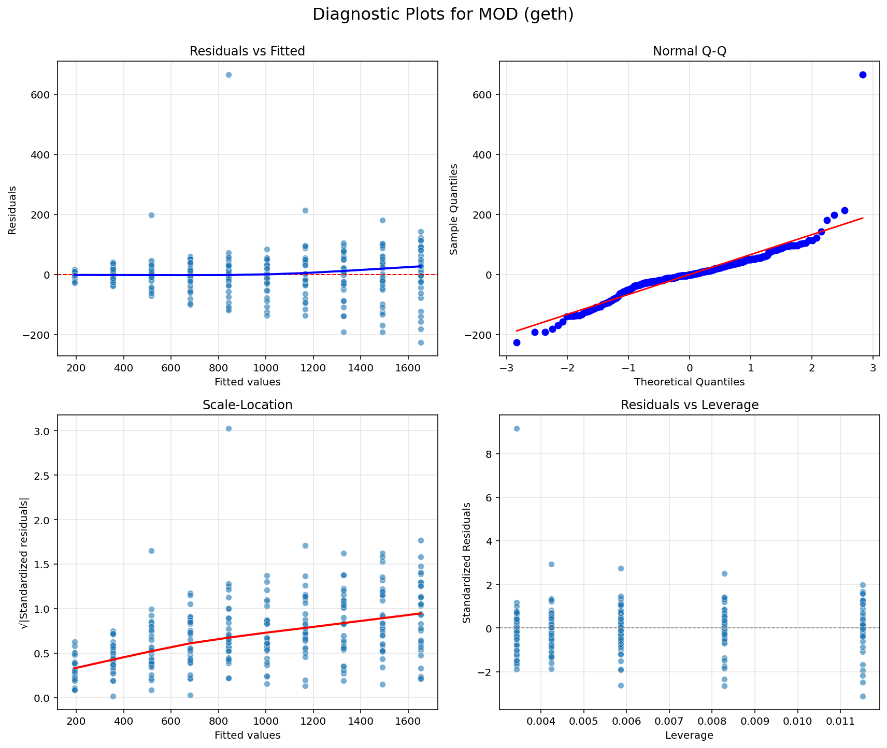


## besu


```python
                            OLS Regression Results                            
==============================================================================
Dep. Variable:        run_duration_ms   R-squared:                       0.981
Model:                            OLS   Adj. R-squared:                  0.980
Method:                 Least Squares   F-statistic:                 1.503e+04
Date:                Thu, 22 Jan 2026   Prob (F-statistic):          4.87e-257
Time:                        16:48:15   Log-Likelihood:                -2070.2
No. Observations:                 300   AIC:                             4144.
Df Residuals:                     298   BIC:                             4152.
Df Model:                           1                                         
Covariance Type:            nonrobust                                         
==============================================================================
                 coef    std err          t      P>|t|      [0.025      0.975]
------------------------------------------------------------------------------
const         43.1356     30.064      1.435      0.152     -16.028     102.300
opcount        0.1980      0.002    122.599      0.000       0.195       0.201
==============================================================================
Omnibus:                       64.549   Durbin-Watson:                   0.765
Prob(Omnibus):                  0.000   Jarque-Bera (JB):              132.143
Skew:                          -1.097   Prob(JB):                     2.02e-29
Kurtosis:                       5.399   Cond. No.                     4.02e+04
==============================================================================

Notes:
[1] Standard Errors assume that the covariance matrix of the errors is correctly specified.
[2] The condition number is large, 4.02e+04. This might indicate that there are
strong multicollinearity or other numerical problems.
```

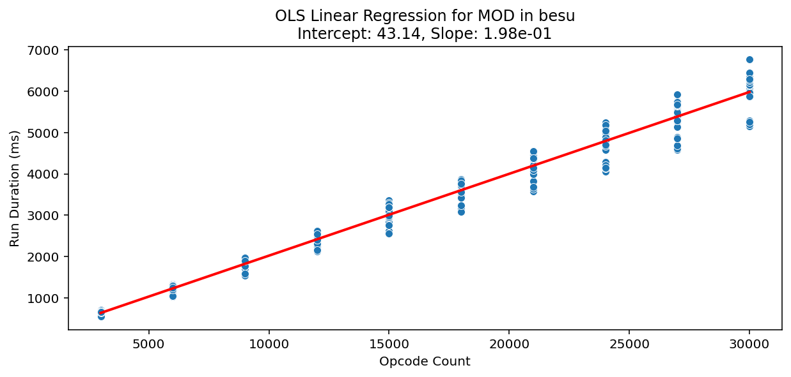

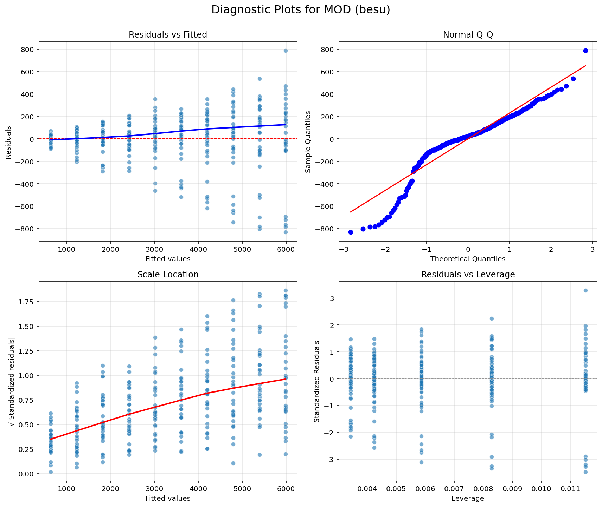


## reth


```python
                            OLS Regression Results                            
==============================================================================
Dep. Variable:        run_duration_ms   R-squared:                       0.993
Model:                            OLS   Adj. R-squared:                  0.993
Method:                 Least Squares   F-statistic:                 2.630e+04
Date:                Thu, 22 Jan 2026   Prob (F-statistic):          5.96e-204
Time:                        16:48:15   Log-Likelihood:                -901.45
No. Observations:                 190   AIC:                             1807.
Df Residuals:                     188   BIC:                             1813.
Df Model:                           1                                         
Covariance Type:            nonrobust                                         
==============================================================================
                 coef    std err          t      P>|t|      [0.025      0.975]
------------------------------------------------------------------------------
const         30.3015      4.382      6.915      0.000      21.657      38.946
opcount        0.0382      0.000    162.162      0.000       0.038       0.039
==============================================================================
Omnibus:                       90.743   Durbin-Watson:                   0.918
Prob(Omnibus):                  0.000   Jarque-Bera (JB):              409.613
Skew:                          -1.841   Prob(JB):                     1.13e-89
Kurtosis:                       9.180   Cond. No.                     4.02e+04
==============================================================================

Notes:
[1] Standard Errors assume that the covariance matrix of the errors is correctly specified.
[2] The condition number is large, 4.02e+04. This might indicate that there are
strong multicollinearity or other numerical problems.
```

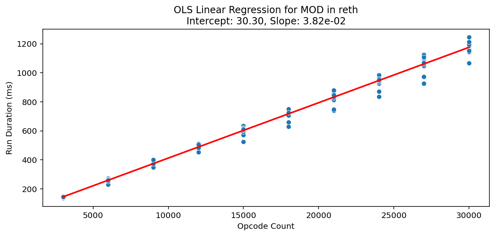

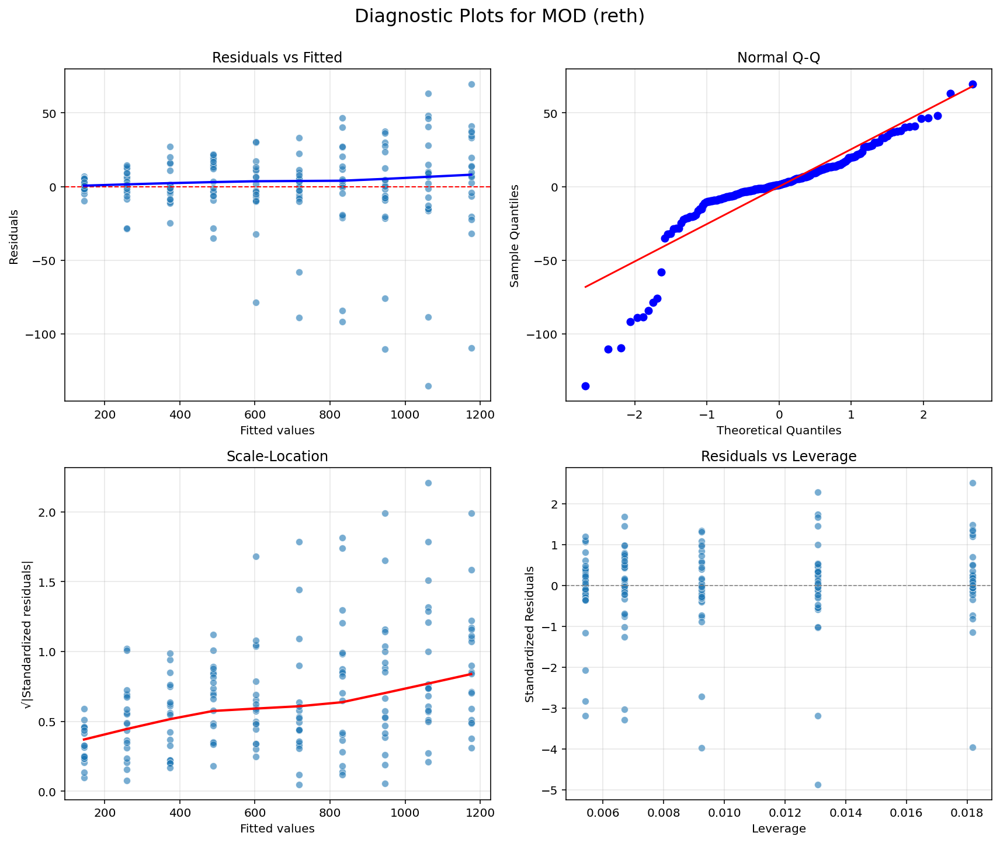


## nethermind


```python
                            OLS Regression Results                            
==============================================================================
Dep. Variable:        run_duration_ms   R-squared:                       0.987
Model:                            OLS   Adj. R-squared:                  0.987
Method:                 Least Squares   F-statistic:                 2.235e+04
Date:                Thu, 22 Jan 2026   Prob (F-statistic):          2.69e-282
Time:                        16:48:16   Log-Likelihood:                -1574.9
No. Observations:                 300   AIC:                             3154.
Df Residuals:                     298   BIC:                             3161.
Df Model:                           1                                         
Covariance Type:            nonrobust                                         
==============================================================================
                 coef    std err          t      P>|t|      [0.025      0.975]
------------------------------------------------------------------------------
const         30.3762      5.768      5.267      0.000      19.026      41.727
opcount        0.0463      0.000    149.495      0.000       0.046       0.047
==============================================================================
Omnibus:                       55.111   Durbin-Watson:                   0.794
Prob(Omnibus):                  0.000   Jarque-Bera (JB):              110.015
Skew:                          -0.954   Prob(JB):                     1.29e-24
Kurtosis:                       5.272   Cond. No.                     4.02e+04
==============================================================================

Notes:
[1] Standard Errors assume that the covariance matrix of the errors is correctly specified.
[2] The condition number is large, 4.02e+04. This might indicate that there are
strong multicollinearity or other numerical problems.
```

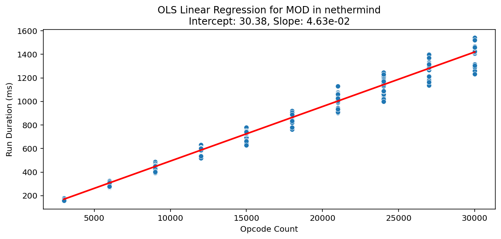

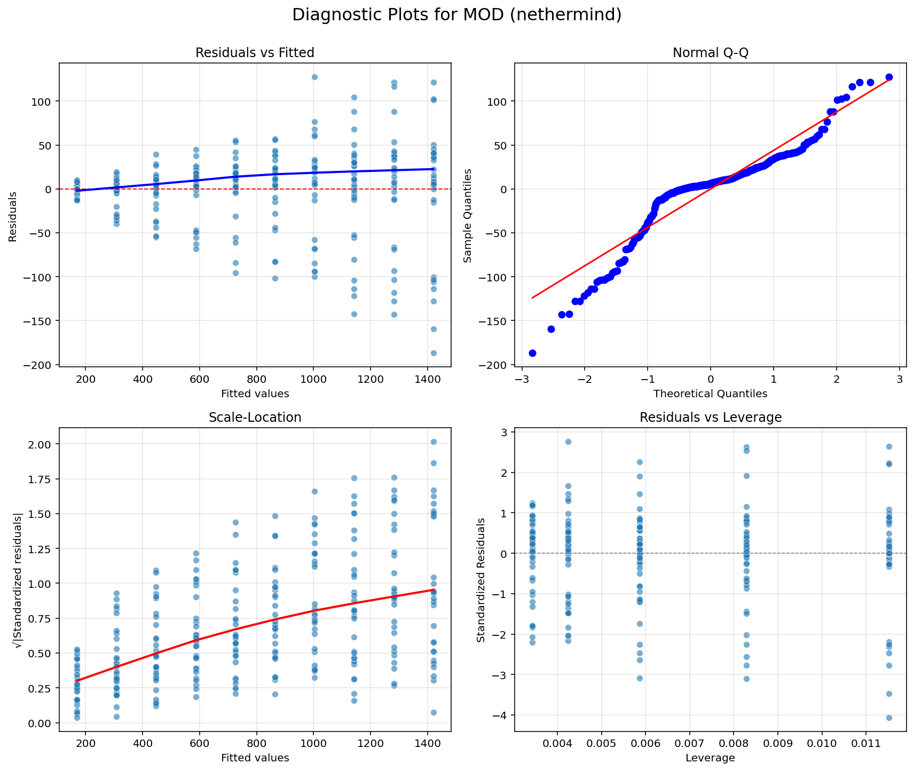


## erigon


```python
                            OLS Regression Results                            
==============================================================================
Dep. Variable:        run_duration_ms   R-squared:                       0.996
Model:                            OLS   Adj. R-squared:                  0.996
Method:                 Least Squares   F-statistic:                     7094.
Date:                Thu, 22 Jan 2026   Prob (F-statistic):           3.16e-35
Time:                        16:48:16   Log-Likelihood:                -144.78
No. Observations:                  30   AIC:                             293.6
Df Residuals:                      28   BIC:                             296.4
Df Model:                           1                                         
Covariance Type:            nonrobust                                         
==============================================================================
                 coef    std err          t      P>|t|      [0.025      0.975]
------------------------------------------------------------------------------
const         39.0732     12.320      3.171      0.004      13.836      64.310
opcount        0.0557      0.001     84.225      0.000       0.054       0.057
==============================================================================
Omnibus:                       16.793   Durbin-Watson:                   1.978
Prob(Omnibus):                  0.000   Jarque-Bera (JB):               21.058
Skew:                           1.410   Prob(JB):                     2.68e-05
Kurtosis:                       5.982   Cond. No.                     4.02e+04
==============================================================================

Notes:
[1] Standard Errors assume that the covariance matrix of the errors is correctly specified.
[2] The condition number is large, 4.02e+04. This might indicate that there are
strong multicollinearity or other numerical problems.
```


# POINT_EVALUATION

## geth


```python
                            OLS Regression Results                            
==============================================================================
Dep. Variable:        run_duration_ms   R-squared:                       0.990
Model:                            OLS   Adj. R-squared:                  0.990
Method:                 Least Squares   F-statistic:                 2.829e+04
Date:                Thu, 22 Jan 2026   Prob (F-statistic):          2.24e-297
Time:                        16:48:16   Log-Likelihood:                -2248.8
No. Observations:                 300   AIC:                             4502.
Df Residuals:                     298   BIC:                             4509.
Df Model:                           1                                         
Covariance Type:            nonrobust                                         
==============================================================================
                 coef    std err          t      P>|t|      [0.025      0.975]
------------------------------------------------------------------------------
const         49.9457     54.538      0.916      0.361     -57.383     157.275
opcount     1478.4152      8.790    168.200      0.000    1461.118    1495.713
==============================================================================
Omnibus:                      103.467   Durbin-Watson:                   0.688
Prob(Omnibus):                  0.000   Jarque-Bera (JB):              238.556
Skew:                          -1.720   Prob(JB):                     1.58e-52
Kurtosis:                       5.694   Cond. No.                         13.7
==============================================================================

Notes:
[1] Standard Errors assume that the covariance matrix of the errors is correctly specified.
```

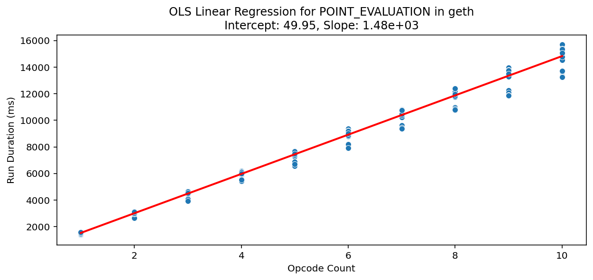

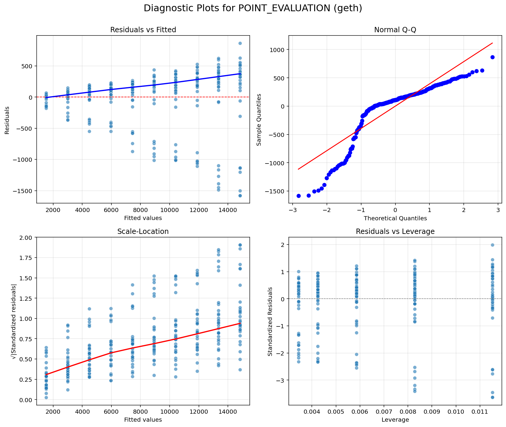


## besu


```python
                            OLS Regression Results                            
==============================================================================
Dep. Variable:        run_duration_ms   R-squared:                       0.993
Model:                            OLS   Adj. R-squared:                  0.993
Method:                 Least Squares   F-statistic:                 4.349e+04
Date:                Thu, 22 Jan 2026   Prob (F-statistic):               0.00
Time:                        16:48:16   Log-Likelihood:                -2189.4
No. Observations:                 300   AIC:                             4383.
Df Residuals:                     298   BIC:                             4390.
Df Model:                           1                                         
Covariance Type:            nonrobust                                         
==============================================================================
                 coef    std err          t      P>|t|      [0.025      0.975]
------------------------------------------------------------------------------
const         30.5851     44.729      0.684      0.495     -57.440     118.610
opcount     1503.2566      7.209    208.532      0.000    1489.070    1517.443
==============================================================================
Omnibus:                      125.600   Durbin-Watson:                   0.641
Prob(Omnibus):                  0.000   Jarque-Bera (JB):              423.332
Skew:                          -1.871   Prob(JB):                     1.19e-92
Kurtosis:                       7.457   Cond. No.                         13.7
==============================================================================

Notes:
[1] Standard Errors assume that the covariance matrix of the errors is correctly specified.
```

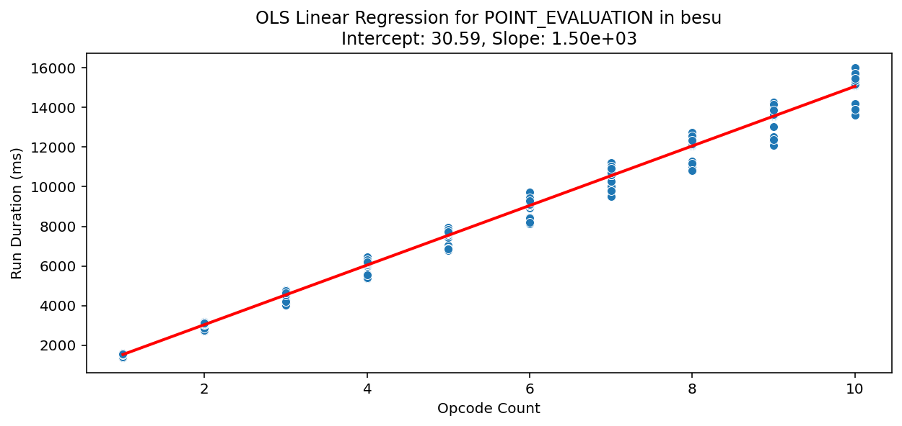

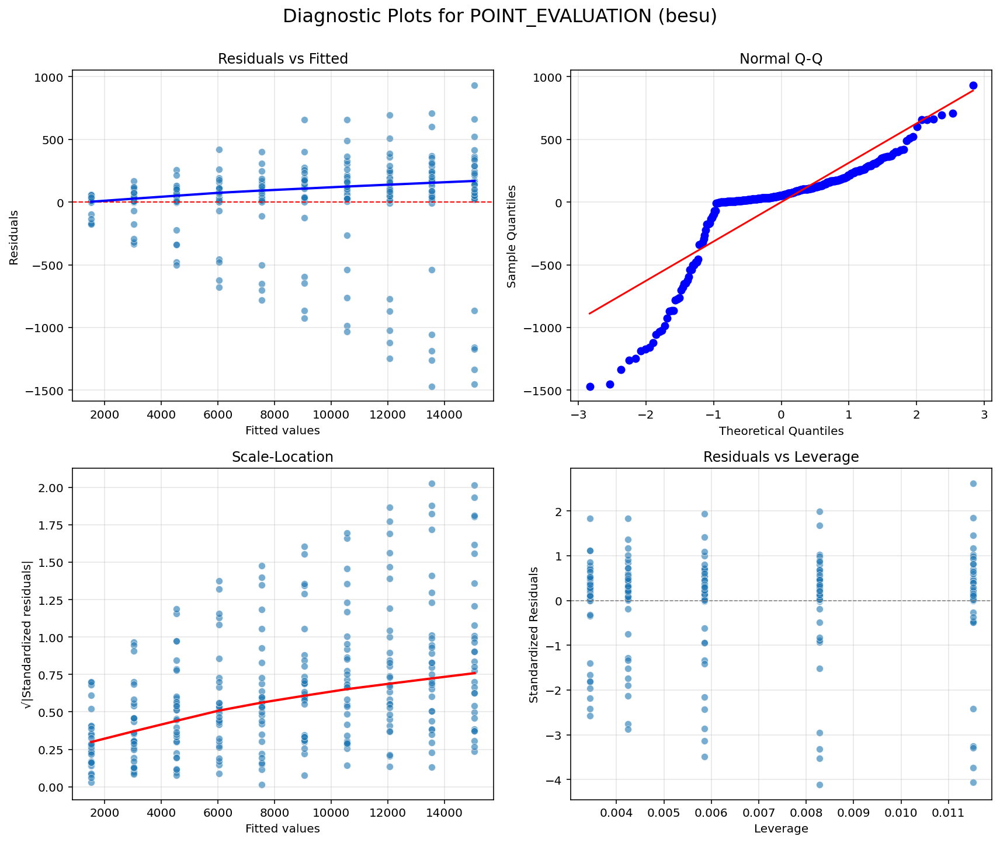


## reth


```python
                            OLS Regression Results                            
==============================================================================
Dep. Variable:        run_duration_ms   R-squared:                       0.995
Model:                            OLS   Adj. R-squared:                  0.995
Method:                 Least Squares   F-statistic:                 3.904e+04
Date:                Thu, 22 Jan 2026   Prob (F-statistic):          5.48e-220
Time:                        16:48:17   Log-Likelihood:                -1352.7
No. Observations:                 190   AIC:                             2709.
Df Residuals:                     188   BIC:                             2716.
Df Model:                           1                                         
Covariance Type:            nonrobust                                         
==============================================================================
                 coef    std err          t      P>|t|      [0.025      0.975]
------------------------------------------------------------------------------
const         29.3309     47.110      0.623      0.534     -63.601     122.263
opcount     1500.1480      7.592    197.584      0.000    1485.171    1515.125
==============================================================================
Omnibus:                      135.145   Durbin-Watson:                   0.588
Prob(Omnibus):                  0.000   Jarque-Bera (JB):              813.823
Skew:                          -2.903   Prob(JB):                    1.91e-177
Kurtosis:                      11.311   Cond. No.                         13.7
==============================================================================

Notes:
[1] Standard Errors assume that the covariance matrix of the errors is correctly specified.
```

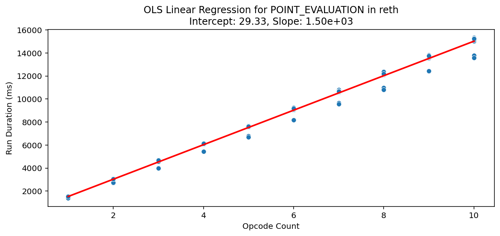

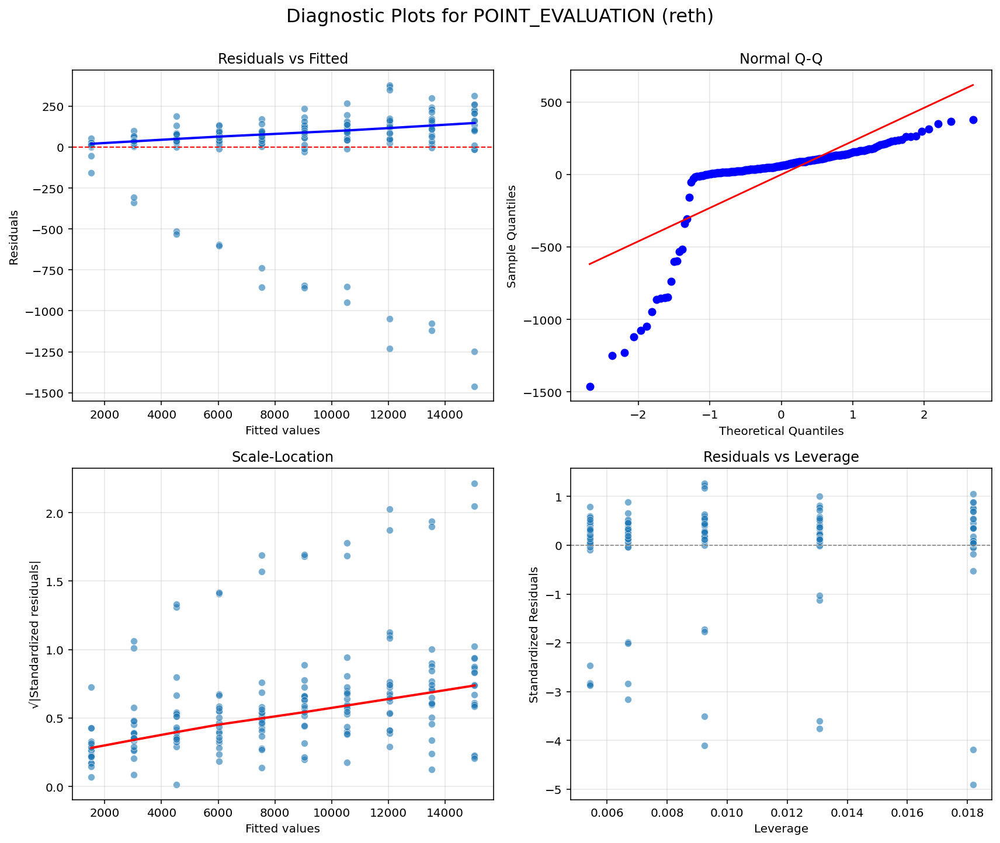


## nethermind


```python
                            OLS Regression Results                            
==============================================================================
Dep. Variable:        run_duration_ms   R-squared:                       0.270
Model:                            OLS   Adj. R-squared:                  0.268
Method:                 Least Squares   F-statistic:                     110.4
Date:                Thu, 22 Jan 2026   Prob (F-statistic):           3.62e-22
Time:                        16:48:17   Log-Likelihood:                -2946.8
No. Observations:                 300   AIC:                             5898.
Df Residuals:                     298   BIC:                             5905.
Df Model:                           1                                         
Covariance Type:            nonrobust                                         
==============================================================================
                 coef    std err          t      P>|t|      [0.025      0.975]
------------------------------------------------------------------------------
const         17.5995    558.541      0.032      0.975   -1081.585    1116.784
opcount      945.6180     90.017     10.505      0.000     768.468    1122.768
==============================================================================
Omnibus:                       39.059   Durbin-Watson:                   0.545
Prob(Omnibus):                  0.000   Jarque-Bera (JB):               30.775
Skew:                          -0.686   Prob(JB):                     2.08e-07
Kurtosis:                       2.238   Cond. No.                         13.7
==============================================================================

Notes:
[1] Standard Errors assume that the covariance matrix of the errors is correctly specified.
```

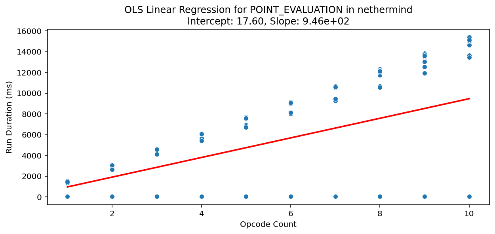

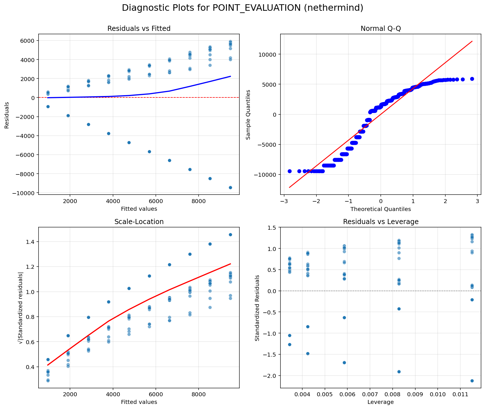


## erigon

OLS model did not run... Error: zero-size array to reduction operation maximum which has no identity

# KECCAK256

## geth


```python
                            OLS Regression Results                            
==============================================================================
Dep. Variable:        run_duration_ms   R-squared:                       0.300
Model:                            OLS   Adj. R-squared:                  0.300
Method:                 Least Squares   F-statistic:                     2058.
Date:                Thu, 22 Jan 2026   Prob (F-statistic):               0.00
Time:                        16:48:17   Log-Likelihood:                -38488.
No. Observations:                4800   AIC:                         7.698e+04
Df Residuals:                    4798   BIC:                         7.699e+04
Df Model:                           1                                         
Covariance Type:            nonrobust                                         
==============================================================================
                 coef    std err          t      P>|t|      [0.025      0.975]
------------------------------------------------------------------------------
const       1014.7863     16.880     60.119      0.000     981.695    1047.878
opcount        0.2988      0.007     45.364      0.000       0.286       0.312
==============================================================================
Omnibus:                     1103.333   Durbin-Watson:                   1.979
Prob(Omnibus):                  0.000   Jarque-Bera (JB):             2227.804
Skew:                           1.368   Prob(JB):                         0.00
Kurtosis:                       4.911   Cond. No.                     4.08e+03
==============================================================================

Notes:
[1] Standard Errors assume that the covariance matrix of the errors is correctly specified.
[2] The condition number is large, 4.08e+03. This might indicate that there are
strong multicollinearity or other numerical problems.
```

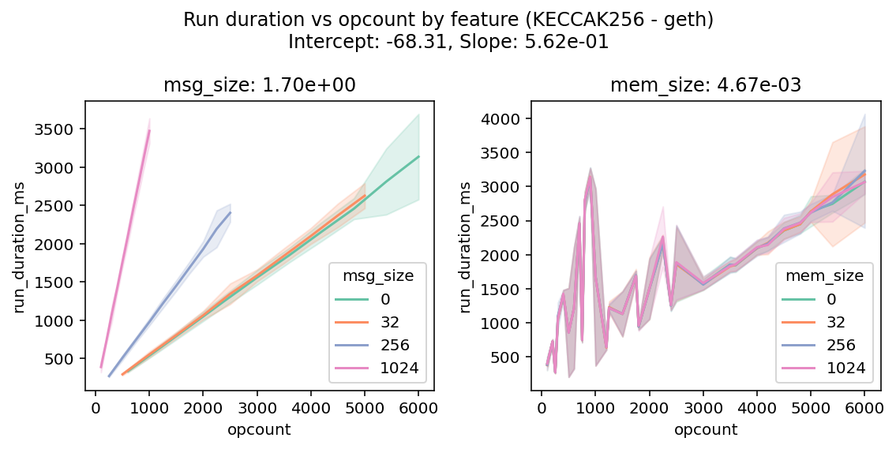

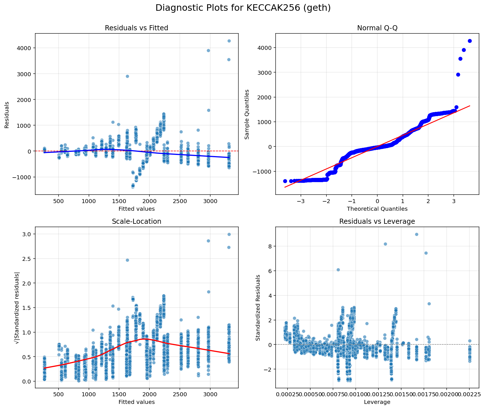


## besu


```python
                            OLS Regression Results                            
==============================================================================
Dep. Variable:        run_duration_ms   R-squared:                       0.427
Model:                            OLS   Adj. R-squared:                  0.427
Method:                 Least Squares   F-statistic:                     3574.
Date:                Thu, 22 Jan 2026   Prob (F-statistic):               0.00
Time:                        16:48:18   Log-Likelihood:                -39773.
No. Observations:                4800   AIC:                         7.955e+04
Df Residuals:                    4798   BIC:                         7.956e+04
Df Model:                           1                                         
Covariance Type:            nonrobust                                         
==============================================================================
                 coef    std err          t      P>|t|      [0.025      0.975]
------------------------------------------------------------------------------
const       1351.2158     22.059     61.256      0.000    1307.971    1394.461
opcount        0.5145      0.009     59.786      0.000       0.498       0.531
==============================================================================
Omnibus:                      889.242   Durbin-Watson:                   1.948
Prob(Omnibus):                  0.000   Jarque-Bera (JB):             1494.725
Skew:                           1.230   Prob(JB):                         0.00
Kurtosis:                       4.191   Cond. No.                     4.08e+03
==============================================================================

Notes:
[1] Standard Errors assume that the covariance matrix of the errors is correctly specified.
[2] The condition number is large, 4.08e+03. This might indicate that there are
strong multicollinearity or other numerical problems.
```

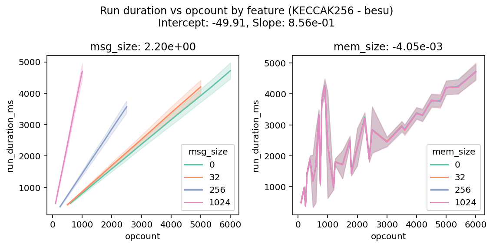

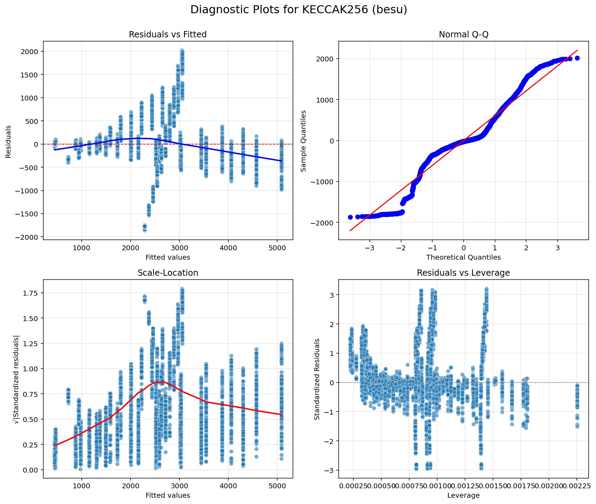


## reth


```python
                            OLS Regression Results                            
==============================================================================
Dep. Variable:        run_duration_ms   R-squared:                       0.125
Model:                            OLS   Adj. R-squared:                  0.124
Method:                 Least Squares   F-statistic:                     433.0
Date:                Thu, 22 Jan 2026   Prob (F-statistic):           5.07e-90
Time:                        16:48:18   Log-Likelihood:                -24155.
No. Observations:                3040   AIC:                         4.831e+04
Df Residuals:                    3038   BIC:                         4.833e+04
Df Model:                           1                                         
Covariance Type:            nonrobust                                         
==============================================================================
                 coef    std err          t      P>|t|      [0.025      0.975]
------------------------------------------------------------------------------
const       1022.4985     19.722     51.845      0.000     983.829    1061.168
opcount       -0.1601      0.008    -20.809      0.000      -0.175      -0.145
==============================================================================
Omnibus:                      304.262   Durbin-Watson:                   1.983
Prob(Omnibus):                  0.000   Jarque-Bera (JB):              403.689
Skew:                           0.892   Prob(JB):                     2.19e-88
Kurtosis:                       3.041   Cond. No.                     4.08e+03
==============================================================================

Notes:
[1] Standard Errors assume that the covariance matrix of the errors is correctly specified.
[2] The condition number is large, 4.08e+03. This might indicate that there are
strong multicollinearity or other numerical problems.
```

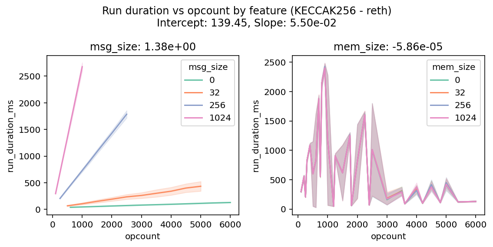

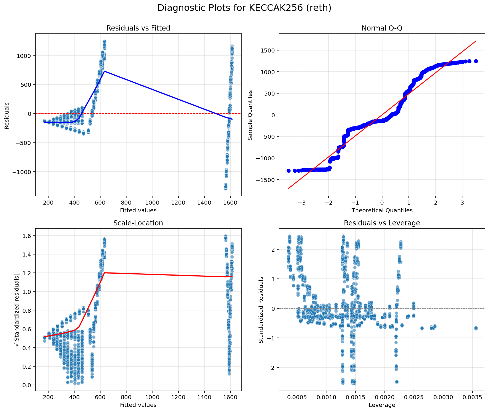


## nethermind


```python
                            OLS Regression Results                            
==============================================================================
Dep. Variable:        run_duration_ms   R-squared:                       0.121
Model:                            OLS   Adj. R-squared:                  0.120
Method:                 Least Squares   F-statistic:                     657.9
Date:                Thu, 22 Jan 2026   Prob (F-statistic):          4.39e-136
Time:                        16:48:18   Log-Likelihood:                -38562.
No. Observations:                4800   AIC:                         7.713e+04
Df Residuals:                    4798   BIC:                         7.714e+04
Df Model:                           1                                         
Covariance Type:            nonrobust                                         
==============================================================================
                 coef    std err          t      P>|t|      [0.025      0.975]
------------------------------------------------------------------------------
const       1103.6838     17.139     64.396      0.000    1070.083    1137.284
opcount       -0.1715      0.007    -25.649      0.000      -0.185      -0.158
==============================================================================
Omnibus:                      495.226   Durbin-Watson:                   1.930
Prob(Omnibus):                  0.000   Jarque-Bera (JB):              664.454
Skew:                           0.911   Prob(JB):                    5.20e-145
Kurtosis:                       3.068   Cond. No.                     4.08e+03
==============================================================================

Notes:
[1] Standard Errors assume that the covariance matrix of the errors is correctly specified.
[2] The condition number is large, 4.08e+03. This might indicate that there are
strong multicollinearity or other numerical problems.
```

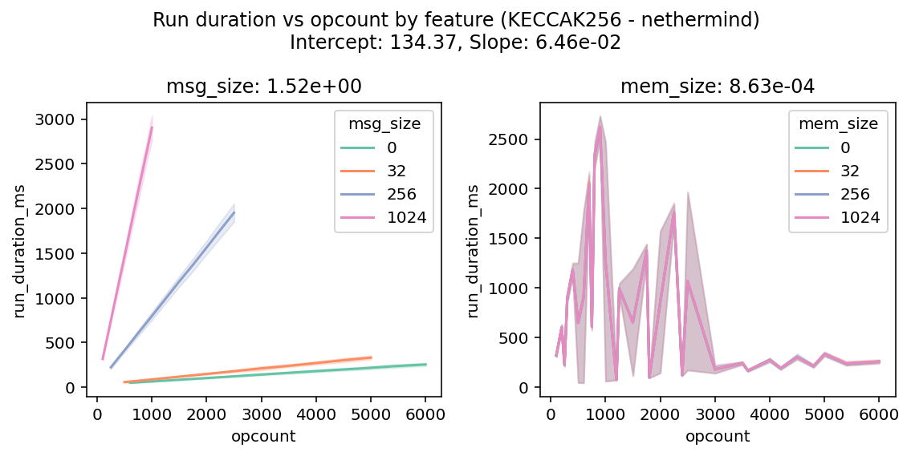

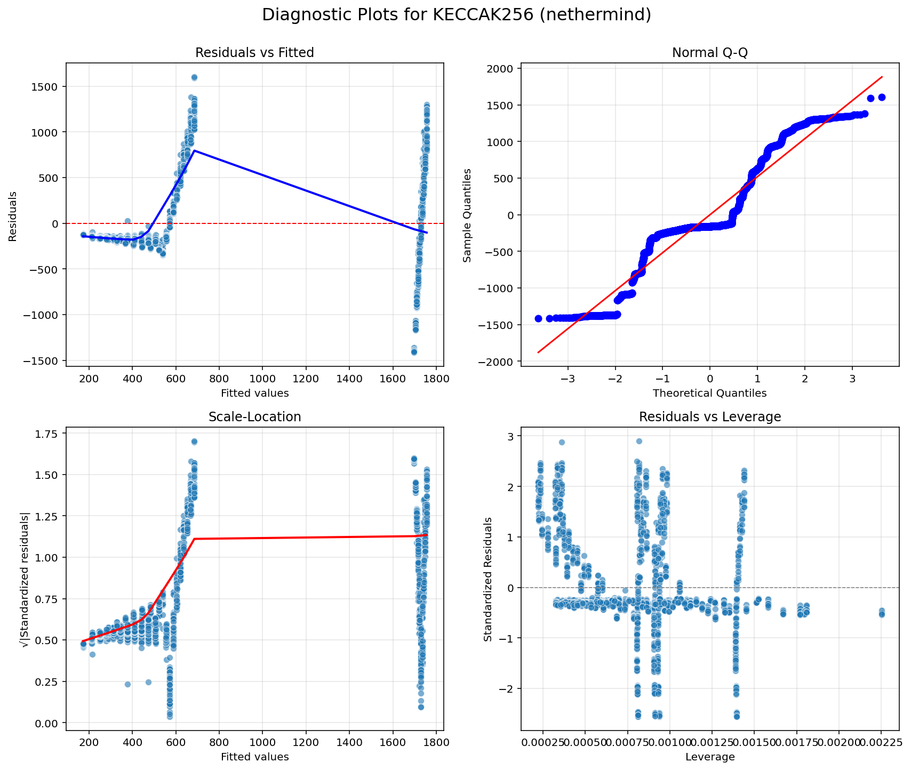


## erigon


```python
                            OLS Regression Results                            
==============================================================================
Dep. Variable:        run_duration_ms   R-squared:                       0.291
Model:                            OLS   Adj. R-squared:                  0.290
Method:                 Least Squares   F-statistic:                     196.3
Date:                Thu, 22 Jan 2026   Prob (F-statistic):           1.28e-37
Time:                        16:48:18   Log-Likelihood:                -3823.2
No. Observations:                 480   AIC:                             7650.
Df Residuals:                     478   BIC:                             7659.
Df Model:                           1                                         
Covariance Type:            nonrobust                                         
==============================================================================
                 coef    std err          t      P>|t|      [0.025      0.975]
------------------------------------------------------------------------------
const        987.4477     50.700     19.476      0.000     887.825    1087.070
opcount        0.2772      0.020     14.012      0.000       0.238       0.316
==============================================================================
Omnibus:                      100.784   Durbin-Watson:                   1.938
Prob(Omnibus):                  0.000   Jarque-Bera (JB):              167.085
Skew:                           1.284   Prob(JB):                     5.22e-37
Kurtosis:                       4.327   Cond. No.                     4.08e+03
==============================================================================

Notes:
[1] Standard Errors assume that the covariance matrix of the errors is correctly specified.
[2] The condition number is large, 4.08e+03. This might indicate that there are
strong multicollinearity or other numerical problems.
```

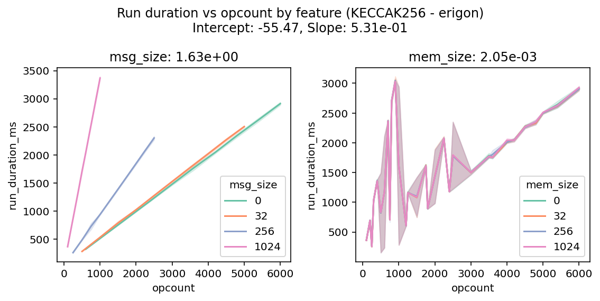

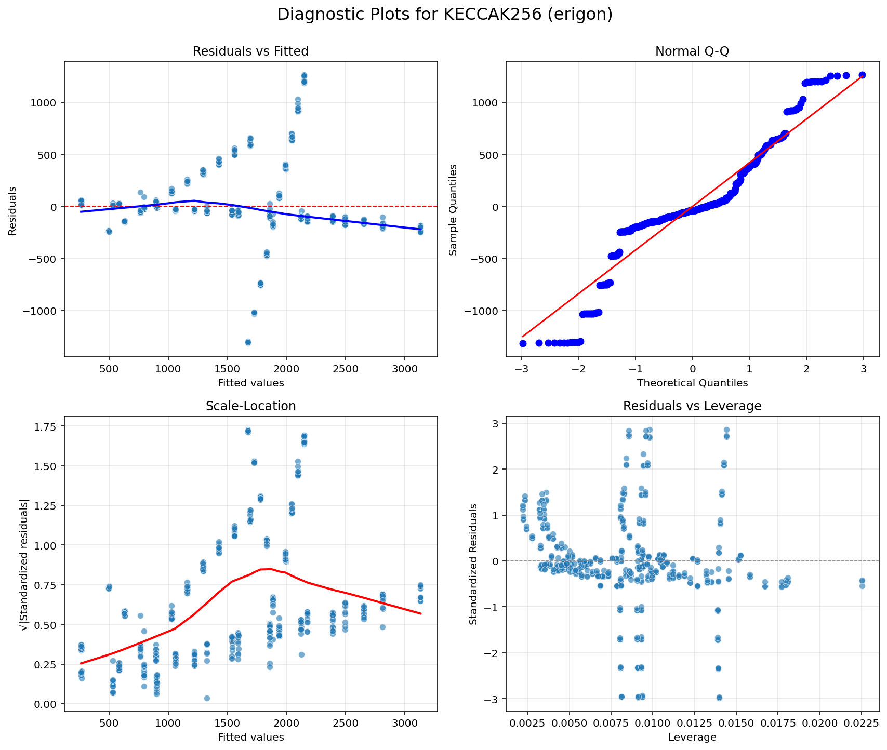


# BLS12_G1ADD

## geth


```python
                            OLS Regression Results                            
==============================================================================
Dep. Variable:        run_duration_ms   R-squared:                       0.989
Model:                            OLS   Adj. R-squared:                  0.989
Method:                 Least Squares   F-statistic:                 2.782e+04
Date:                Thu, 22 Jan 2026   Prob (F-statistic):          2.69e-296
Time:                        16:48:19   Log-Likelihood:                -1728.1
No. Observations:                 300   AIC:                             3460.
Df Residuals:                     298   BIC:                             3468.
Df Model:                           1                                         
Covariance Type:            nonrobust                                         
==============================================================================
                 coef    std err          t      P>|t|      [0.025      0.975]
------------------------------------------------------------------------------
const         26.0095      9.611      2.706      0.007       7.094      44.925
opcount        5.1673      0.031    166.790      0.000       5.106       5.228
==============================================================================
Omnibus:                       59.289   Durbin-Watson:                   1.165
Prob(Omnibus):                  0.000   Jarque-Bera (JB):              134.915
Skew:                          -0.967   Prob(JB):                     5.05e-30
Kurtosis:                       5.656   Cond. No.                         670.
==============================================================================

Notes:
[1] Standard Errors assume that the covariance matrix of the errors is correctly specified.
```

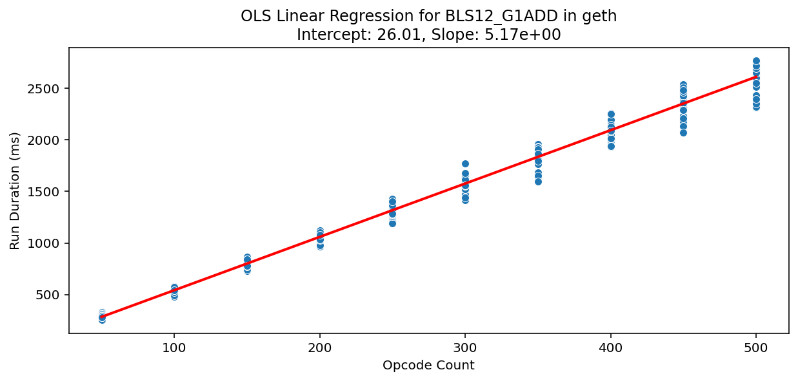

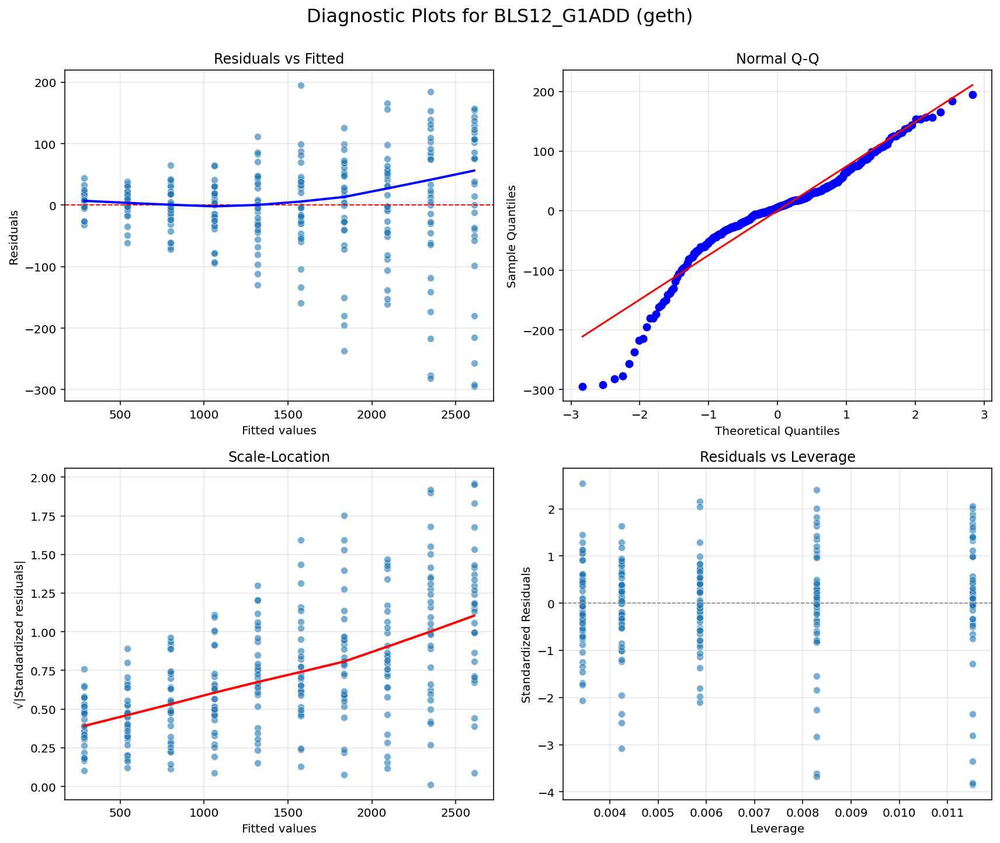


## besu


```python
                            OLS Regression Results                            
==============================================================================
Dep. Variable:        run_duration_ms   R-squared:                       0.959
Model:                            OLS   Adj. R-squared:                  0.959
Method:                 Least Squares   F-statistic:                     6922.
Date:                Thu, 22 Jan 2026   Prob (F-statistic):          2.59e-208
Time:                        16:48:19   Log-Likelihood:                -2168.7
No. Observations:                 300   AIC:                             4341.
Df Residuals:                     298   BIC:                             4349.
Df Model:                           1                                         
Covariance Type:            nonrobust                                         
==============================================================================
                 coef    std err          t      P>|t|      [0.025      0.975]
------------------------------------------------------------------------------
const         31.3598     41.750      0.751      0.453     -50.802     113.521
opcount       11.1958      0.135     83.196      0.000      10.931      11.461
==============================================================================
Omnibus:                       35.181   Durbin-Watson:                   1.223
Prob(Omnibus):                  0.000   Jarque-Bera (JB):               62.514
Skew:                          -0.671   Prob(JB):                     2.66e-14
Kurtosis:                       4.789   Cond. No.                         670.
==============================================================================

Notes:
[1] Standard Errors assume that the covariance matrix of the errors is correctly specified.
```

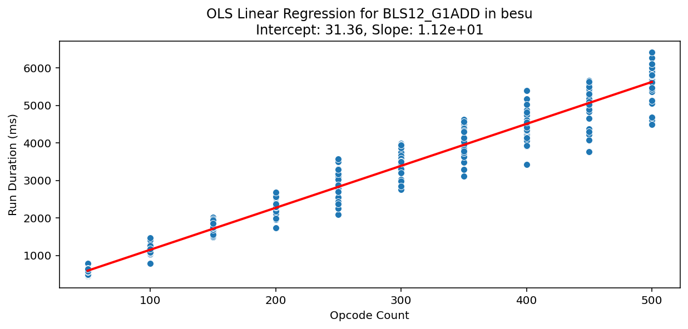

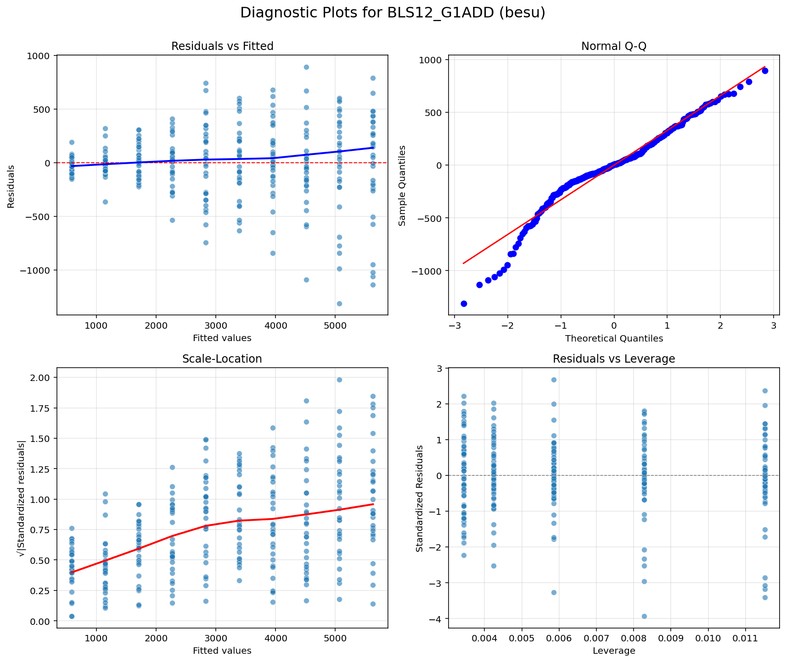


## reth


```python
                            OLS Regression Results                            
==============================================================================
Dep. Variable:        run_duration_ms   R-squared:                       0.991
Model:                            OLS   Adj. R-squared:                  0.991
Method:                 Least Squares   F-statistic:                 2.073e+04
Date:                Thu, 22 Jan 2026   Prob (F-statistic):          2.52e-194
Time:                        16:48:19   Log-Likelihood:                -1080.3
No. Observations:                 190   AIC:                             2165.
Df Residuals:                     188   BIC:                             2171.
Df Model:                           1                                         
Covariance Type:            nonrobust                                         
==============================================================================
                 coef    std err          t      P>|t|      [0.025      0.975]
------------------------------------------------------------------------------
const         28.1563     11.231      2.507      0.013       6.002      50.311
opcount        5.2125      0.036    143.991      0.000       5.141       5.284
==============================================================================
Omnibus:                       75.836   Durbin-Watson:                   1.097
Prob(Omnibus):                  0.000   Jarque-Bera (JB):              292.210
Skew:                          -1.552   Prob(JB):                     3.53e-64
Kurtosis:                       8.223   Cond. No.                         670.
==============================================================================

Notes:
[1] Standard Errors assume that the covariance matrix of the errors is correctly specified.
```

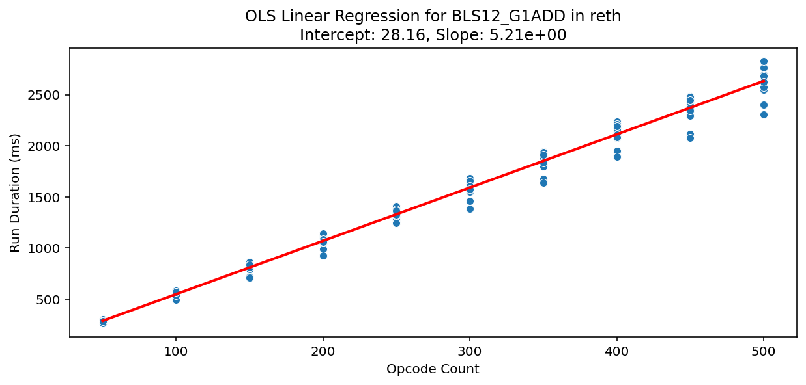

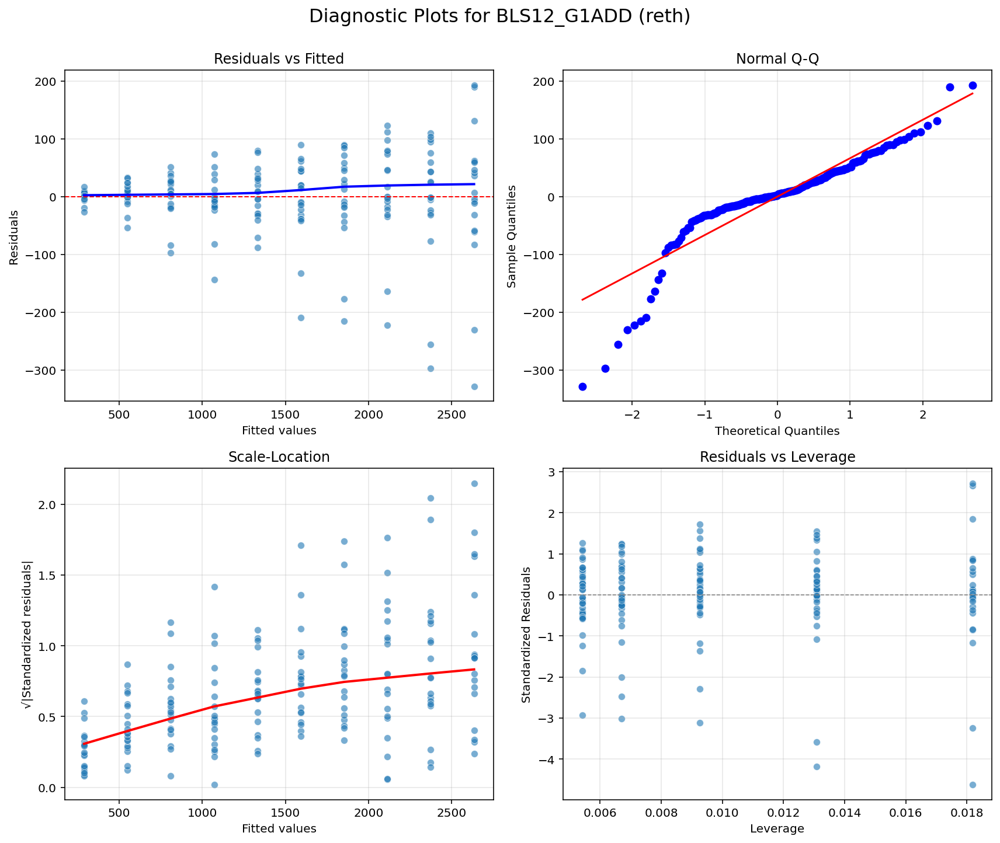


## nethermind


```python
                            OLS Regression Results                            
==============================================================================
Dep. Variable:        run_duration_ms   R-squared:                       0.346
Model:                            OLS   Adj. R-squared:                  0.344
Method:                 Least Squares   F-statistic:                     157.5
Date:                Thu, 22 Jan 2026   Prob (F-statistic):           2.76e-29
Time:                        16:48:19   Log-Likelihood:                -2427.2
No. Observations:                 300   AIC:                             4858.
Df Residuals:                     298   BIC:                             4866.
Df Model:                           1                                         
Covariance Type:            nonrobust                                         
==============================================================================
                 coef    std err          t      P>|t|      [0.025      0.975]
------------------------------------------------------------------------------
const         15.6882     98.822      0.159      0.874    -178.789     210.165
opcount        3.9970      0.319     12.548      0.000       3.370       4.624
==============================================================================
Omnibus:                       35.781   Durbin-Watson:                   0.681
Prob(Omnibus):                  0.000   Jarque-Bera (JB):               28.880
Skew:                          -0.666   Prob(JB):                     5.36e-07
Kurtosis:                       2.266   Cond. No.                         670.
==============================================================================

Notes:
[1] Standard Errors assume that the covariance matrix of the errors is correctly specified.
```

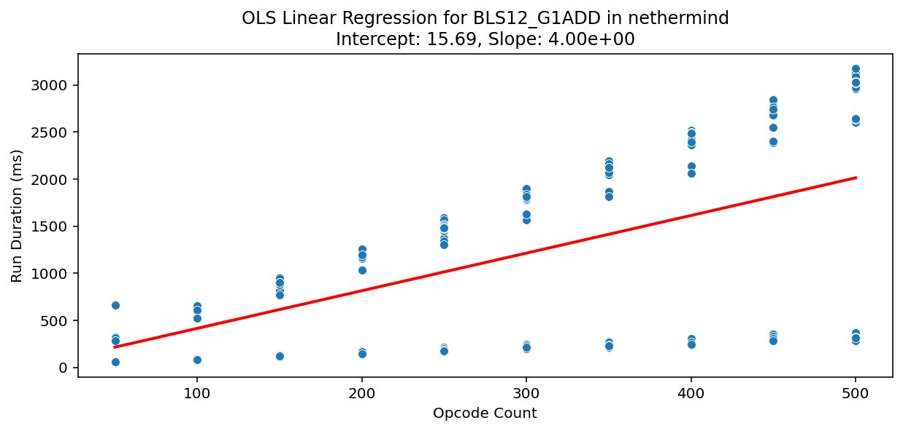

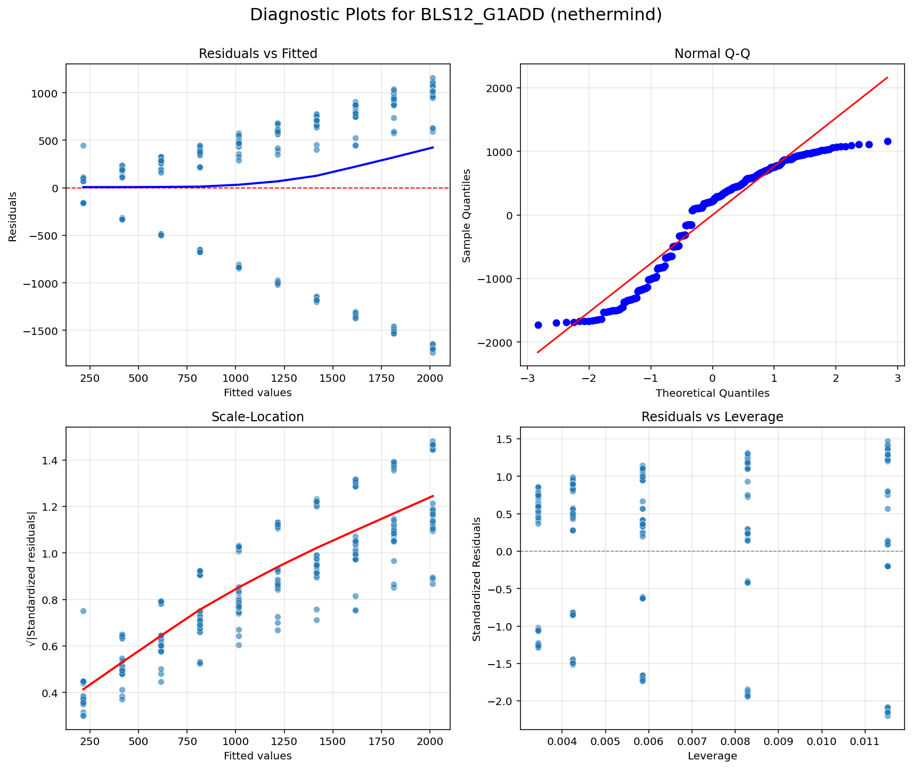


## erigon

OLS model did not run... Error: zero-size array to reduction operation maximum which has no identity

# BLS12_G2ADD

## geth


```python
                            OLS Regression Results                            
==============================================================================
Dep. Variable:        run_duration_ms   R-squared:                       0.991
Model:                            OLS   Adj. R-squared:                  0.991
Method:                 Least Squares   F-statistic:                 3.153e+04
Date:                Thu, 22 Jan 2026   Prob (F-statistic):          2.50e-304
Time:                        16:48:20   Log-Likelihood:                -1648.5
No. Observations:                 300   AIC:                             3301.
Df Residuals:                     298   BIC:                             3308.
Df Model:                           1                                         
Covariance Type:            nonrobust                                         
==============================================================================
                 coef    std err          t      P>|t|      [0.025      0.975]
------------------------------------------------------------------------------
const         30.0658      7.372      4.078      0.000      15.557      44.574
opcount        7.0331      0.040    177.577      0.000       6.955       7.111
==============================================================================
Omnibus:                       35.590   Durbin-Watson:                   0.919
Prob(Omnibus):                  0.000   Jarque-Bera (JB):               61.921
Skew:                          -0.686   Prob(JB):                     3.58e-14
Kurtosis:                       4.752   Cond. No.                         402.
==============================================================================

Notes:
[1] Standard Errors assume that the covariance matrix of the errors is correctly specified.
```

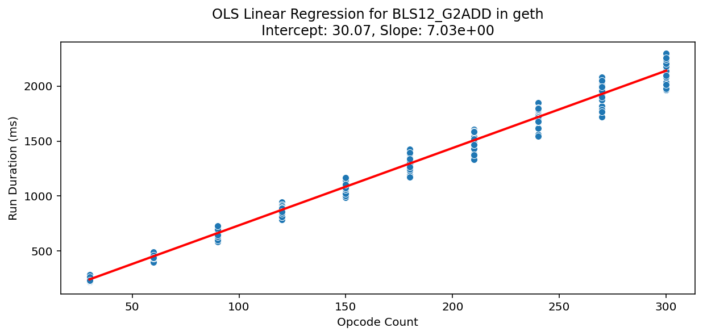

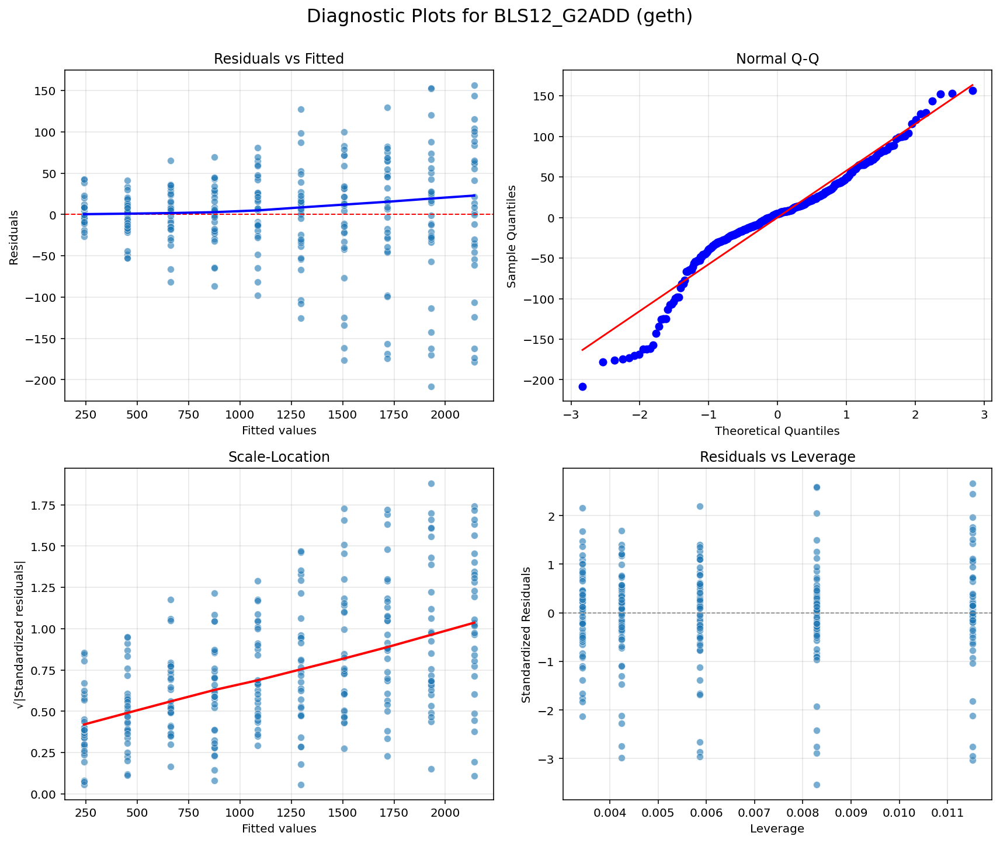


## besu


```python
                            OLS Regression Results                            
==============================================================================
Dep. Variable:        run_duration_ms   R-squared:                       0.964
Model:                            OLS   Adj. R-squared:                  0.964
Method:                 Least Squares   F-statistic:                     8017.
Date:                Thu, 22 Jan 2026   Prob (F-statistic):          1.86e-217
Time:                        16:48:20   Log-Likelihood:                -2047.9
No. Observations:                 300   AIC:                             4100.
Df Residuals:                     298   BIC:                             4107.
Df Model:                           1                                         
Covariance Type:            nonrobust                                         
==============================================================================
                 coef    std err          t      P>|t|      [0.025      0.975]
------------------------------------------------------------------------------
const         12.8665     27.912      0.461      0.645     -42.063      67.796
opcount       13.4261      0.150     89.539      0.000      13.131      13.721
==============================================================================
Omnibus:                       19.696   Durbin-Watson:                   1.178
Prob(Omnibus):                  0.000   Jarque-Bera (JB):               31.309
Skew:                          -0.429   Prob(JB):                     1.59e-07
Kurtosis:                       4.330   Cond. No.                         402.
==============================================================================

Notes:
[1] Standard Errors assume that the covariance matrix of the errors is correctly specified.
```

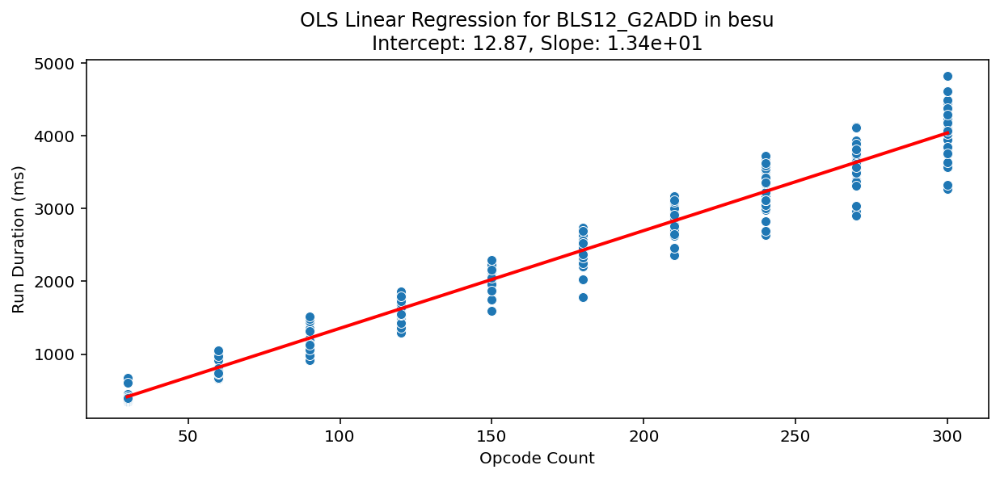

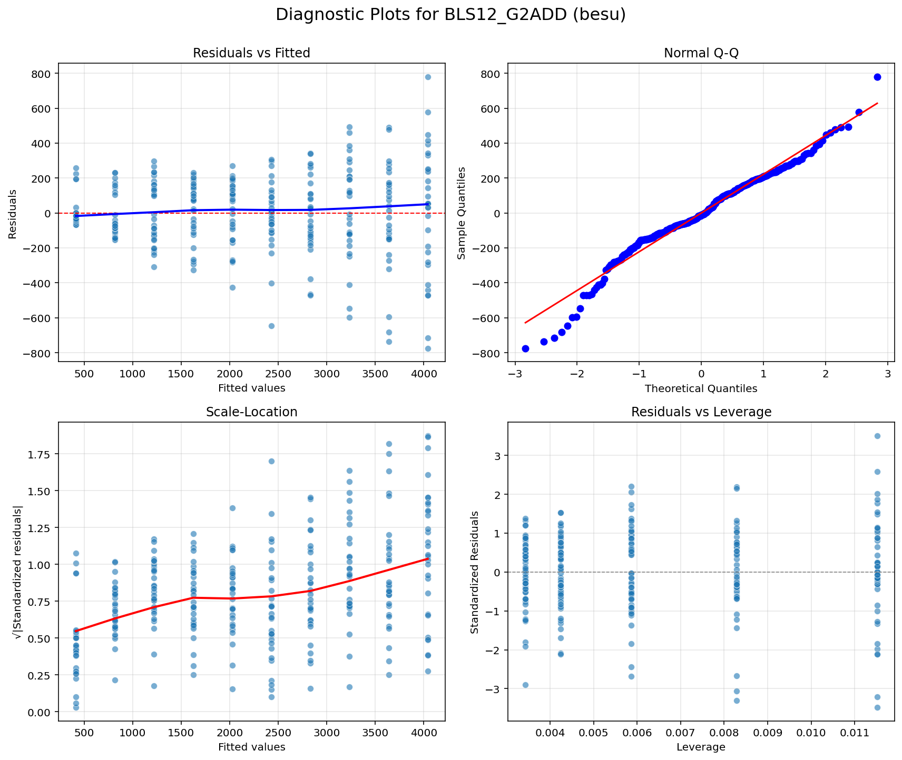


## reth


```python
                            OLS Regression Results                            
==============================================================================
Dep. Variable:        run_duration_ms   R-squared:                       0.993
Model:                            OLS   Adj. R-squared:                  0.993
Method:                 Least Squares   F-statistic:                 2.658e+04
Date:                Thu, 22 Jan 2026   Prob (F-statistic):          2.16e-204
Time:                        16:48:20   Log-Likelihood:                -1027.4
No. Observations:                 190   AIC:                             2059.
Df Residuals:                     188   BIC:                             2065.
Df Model:                           1                                         
Covariance Type:            nonrobust                                         
==============================================================================
                 coef    std err          t      P>|t|      [0.025      0.975]
------------------------------------------------------------------------------
const         38.6950      8.504      4.550      0.000      21.920      55.470
opcount        7.4485      0.046    163.048      0.000       7.358       7.539
==============================================================================
Omnibus:                       60.110   Durbin-Watson:                   0.899
Prob(Omnibus):                  0.000   Jarque-Bera (JB):              171.641
Skew:                          -1.315   Prob(JB):                     5.35e-38
Kurtosis:                       6.843   Cond. No.                         402.
==============================================================================

Notes:
[1] Standard Errors assume that the covariance matrix of the errors is correctly specified.
```

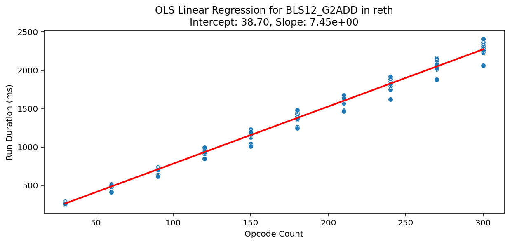

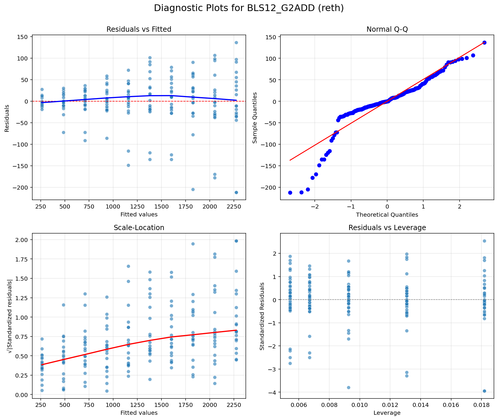


## nethermind


```python
                            OLS Regression Results                            
==============================================================================
Dep. Variable:        run_duration_ms   R-squared:                       0.324
Model:                            OLS   Adj. R-squared:                  0.322
Method:                 Least Squares   F-statistic:                     142.7
Date:                Thu, 22 Jan 2026   Prob (F-statistic):           3.85e-27
Time:                        16:48:20   Log-Likelihood:                -2415.6
No. Observations:                 300   AIC:                             4835.
Df Residuals:                     298   BIC:                             4843.
Df Model:                           1                                         
Covariance Type:            nonrobust                                         
==============================================================================
                 coef    std err          t      P>|t|      [0.025      0.975]
------------------------------------------------------------------------------
const          7.9351     95.073      0.083      0.934    -179.164     195.034
opcount        6.1015      0.511     11.946      0.000       5.096       7.107
==============================================================================
Omnibus:                       35.494   Durbin-Watson:                   0.458
Prob(Omnibus):                  0.000   Jarque-Bera (JB):               29.376
Skew:                          -0.676   Prob(JB):                     4.18e-07
Kurtosis:                       2.277   Cond. No.                         402.
==============================================================================

Notes:
[1] Standard Errors assume that the covariance matrix of the errors is correctly specified.
```

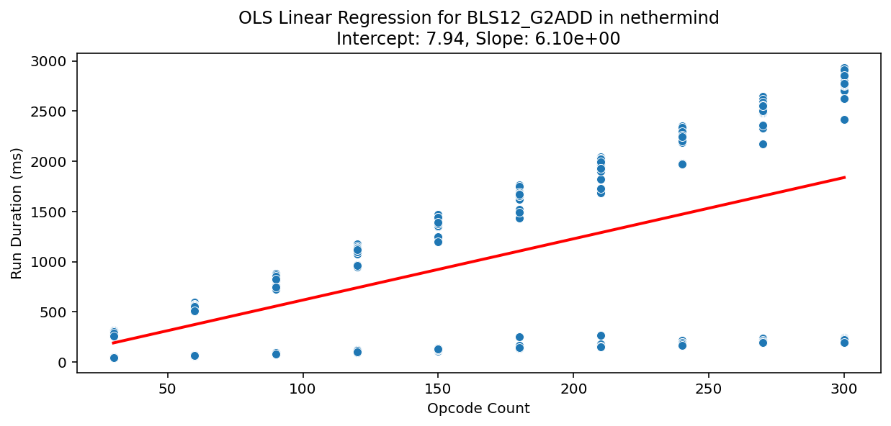

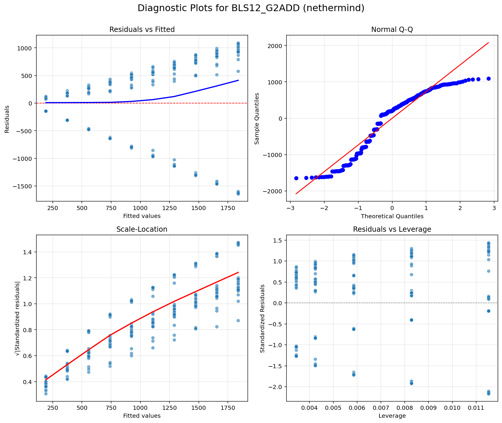


## erigon

OLS model did not run... Error: zero-size array to reduction operation maximum which has no identity

# BLAKE2F

## geth


```python
                            OLS Regression Results                            
==============================================================================
Dep. Variable:        run_duration_ms   R-squared:                       0.009
Model:                            OLS   Adj. R-squared:                  0.007
Method:                 Least Squares   F-statistic:                     8.147
Date:                Thu, 22 Jan 2026   Prob (F-statistic):            0.00441
Time:                        16:48:21   Log-Likelihood:                -8354.7
No. Observations:                 950   AIC:                         1.671e+04
Df Residuals:                     948   BIC:                         1.672e+04
Df Model:                           1                                         
Covariance Type:            nonrobust                                         
==============================================================================
                 coef    std err          t      P>|t|      [0.025      0.975]
------------------------------------------------------------------------------
const       1505.9473     85.255     17.664      0.000    1338.638    1673.257
opcount       -0.2192      0.077     -2.854      0.004      -0.370      -0.069
==============================================================================
Omnibus:                      534.408   Durbin-Watson:                   1.263
Prob(Omnibus):                  0.000   Jarque-Bera (JB):             3386.434
Skew:                           2.615   Prob(JB):                         0.00
Kurtosis:                      10.629   Cond. No.                     1.83e+03
==============================================================================

Notes:
[1] Standard Errors assume that the covariance matrix of the errors is correctly specified.
[2] The condition number is large, 1.83e+03. This might indicate that there are
strong multicollinearity or other numerical problems.
```

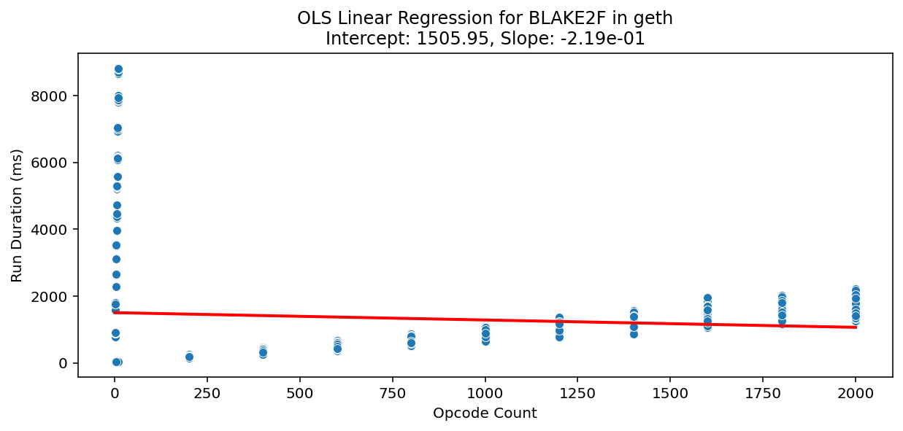

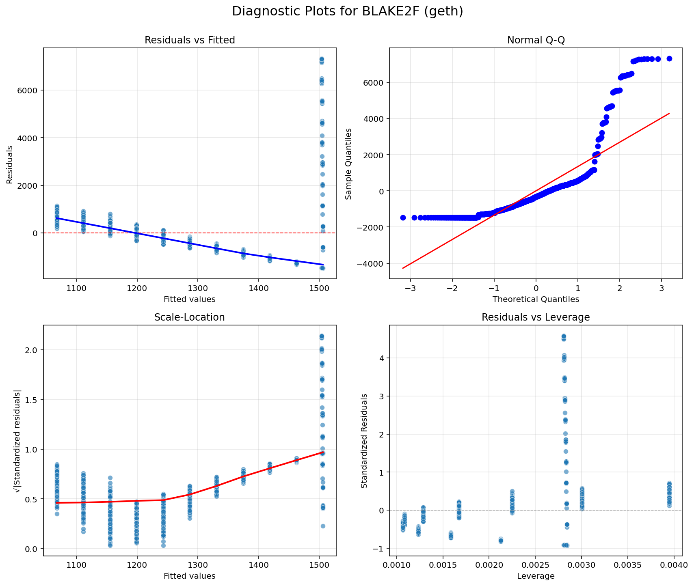


## besu


```python
                            OLS Regression Results                            
==============================================================================
Dep. Variable:        run_duration_ms   R-squared:                       0.164
Model:                            OLS   Adj. R-squared:                  0.163
Method:                 Least Squares   F-statistic:                     185.7
Date:                Thu, 22 Jan 2026   Prob (F-statistic):           9.68e-39
Time:                        16:48:21   Log-Likelihood:                -8706.7
No. Observations:                 950   AIC:                         1.742e+04
Df Residuals:                     948   BIC:                         1.743e+04
Df Model:                           1                                         
Covariance Type:            nonrobust                                         
==============================================================================
                 coef    std err          t      P>|t|      [0.025      0.975]
------------------------------------------------------------------------------
const       2183.6678    123.483     17.684      0.000    1941.335    2426.000
opcount        1.5159      0.111     13.626      0.000       1.298       1.734
==============================================================================
Omnibus:                      527.610   Durbin-Watson:                   1.253
Prob(Omnibus):                  0.000   Jarque-Bera (JB):             3264.037
Skew:                           2.583   Prob(JB):                         0.00
Kurtosis:                      10.467   Cond. No.                     1.83e+03
==============================================================================

Notes:
[1] Standard Errors assume that the covariance matrix of the errors is correctly specified.
[2] The condition number is large, 1.83e+03. This might indicate that there are
strong multicollinearity or other numerical problems.
```

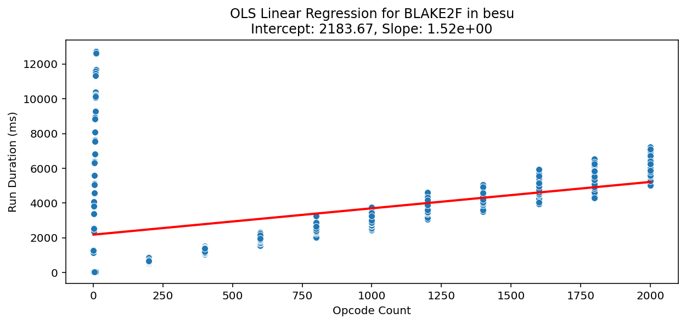

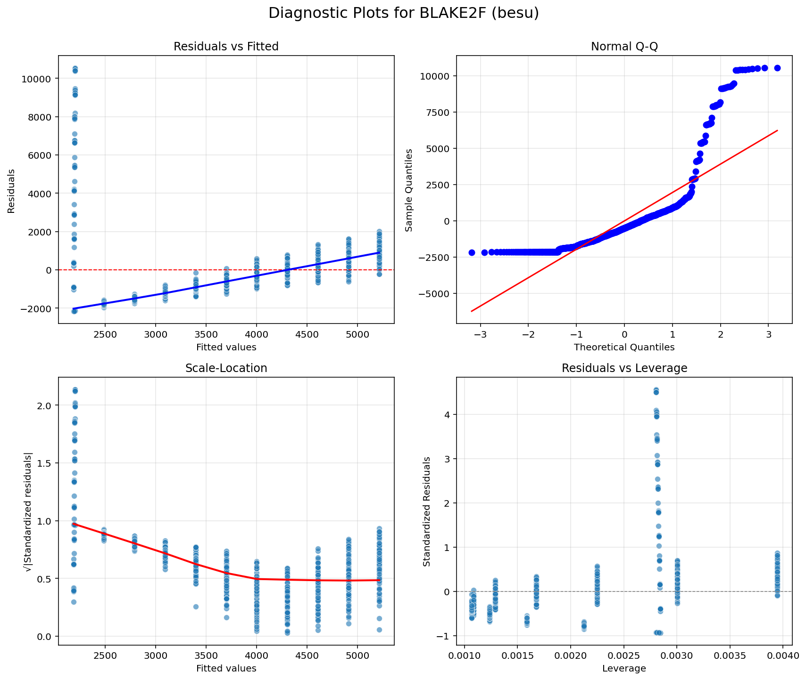


## reth


```python
                            OLS Regression Results                            
==============================================================================
Dep. Variable:        run_duration_ms   R-squared:                       0.087
Model:                            OLS   Adj. R-squared:                  0.085
Method:                 Least Squares   F-statistic:                     48.58
Date:                Thu, 22 Jan 2026   Prob (F-statistic):           9.91e-12
Time:                        16:48:21   Log-Likelihood:                -4830.6
No. Observations:                 510   AIC:                             9665.
Df Residuals:                     508   BIC:                             9674.
Df Model:                           1                                         
Covariance Type:            nonrobust                                         
==============================================================================
                 coef    std err          t      P>|t|      [0.025      0.975]
------------------------------------------------------------------------------
const       3145.4459    196.382     16.017      0.000    2759.626    3531.266
opcount       -1.3924      0.200     -6.970      0.000      -1.785      -1.000
==============================================================================
Omnibus:                      151.755   Durbin-Watson:                   1.350
Prob(Omnibus):                  0.000   Jarque-Bera (JB):              328.689
Skew:                           1.602   Prob(JB):                     4.23e-72
Kurtosis:                       5.281   Cond. No.                     1.38e+03
==============================================================================

Notes:
[1] Standard Errors assume that the covariance matrix of the errors is correctly specified.
[2] The condition number is large, 1.38e+03. This might indicate that there are
strong multicollinearity or other numerical problems.
```

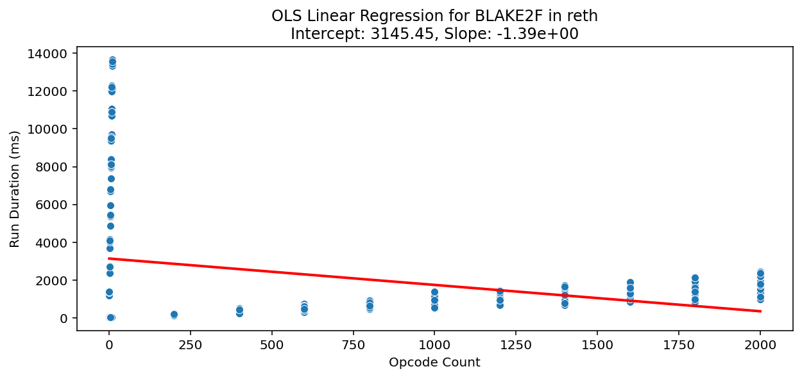

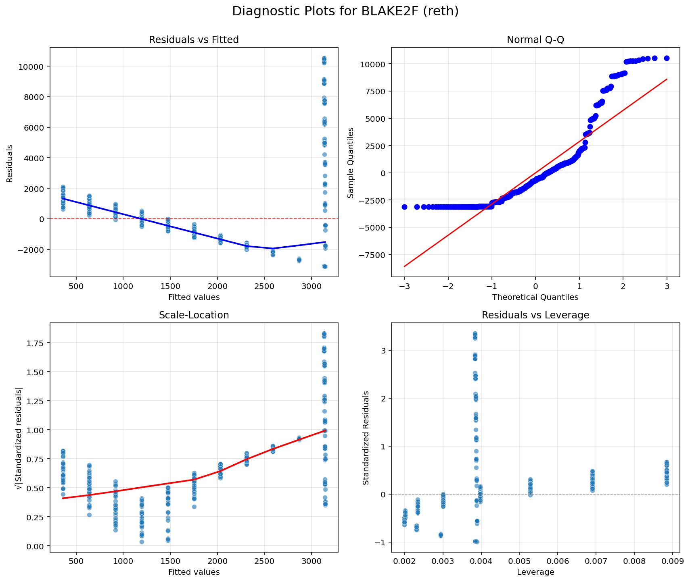


## nethermind


```python
                            OLS Regression Results                            
==============================================================================
Dep. Variable:        run_duration_ms   R-squared:                       0.953
Model:                            OLS   Adj. R-squared:                  0.953
Method:                 Least Squares   F-statistic:                 1.937e+04
Date:                Thu, 22 Jan 2026   Prob (F-statistic):               0.00
Time:                        16:48:22   Log-Likelihood:                -5932.7
No. Observations:                 950   AIC:                         1.187e+04
Df Residuals:                     948   BIC:                         1.188e+04
Df Model:                           1                                         
Covariance Type:            nonrobust                                         
==============================================================================
                 coef    std err          t      P>|t|      [0.025      0.975]
------------------------------------------------------------------------------
const          6.0074      6.660      0.902      0.367      -7.063      19.078
opcount        0.8350      0.006    139.160      0.000       0.823       0.847
==============================================================================
Omnibus:                      122.907   Durbin-Watson:                   1.693
Prob(Omnibus):                  0.000   Jarque-Bera (JB):              264.121
Skew:                           0.750   Prob(JB):                     4.43e-58
Kurtosis:                       5.103   Cond. No.                     1.83e+03
==============================================================================

Notes:
[1] Standard Errors assume that the covariance matrix of the errors is correctly specified.
[2] The condition number is large, 1.83e+03. This might indicate that there are
strong multicollinearity or other numerical problems.
```

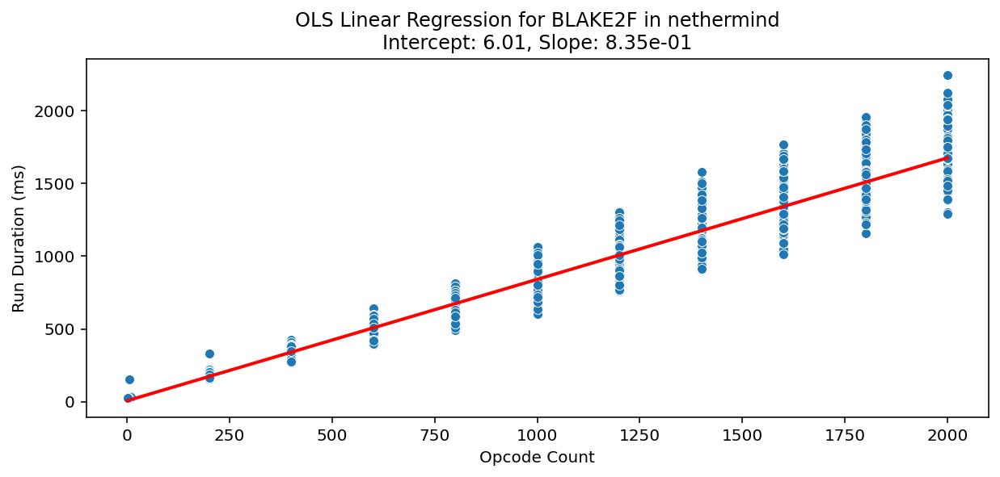

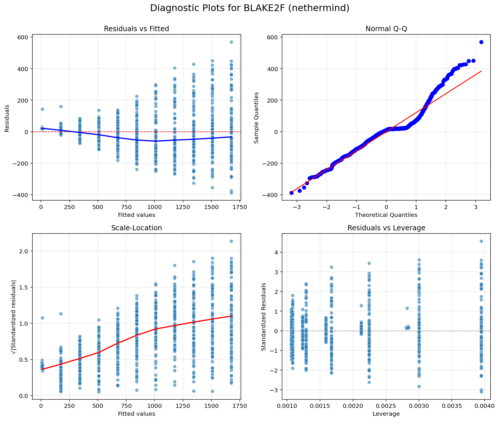


## erigon

OLS model did not run... Error: zero-size array to reduction operation maximum which has no identity

# ECADD

## geth


```python
                            OLS Regression Results                            
==============================================================================
Dep. Variable:        run_duration_ms   R-squared:                       0.365
Model:                            OLS   Adj. R-squared:                  0.364
Method:                 Least Squares   F-statistic:                     343.5
Date:                Thu, 22 Jan 2026   Prob (F-statistic):           6.24e-61
Time:                        16:48:22   Log-Likelihood:                -4772.2
No. Observations:                 600   AIC:                             9548.
Df Residuals:                     598   BIC:                             9557.
Df Model:                           1                                         
Covariance Type:            nonrobust                                         
==============================================================================
                 coef    std err          t      P>|t|      [0.025      0.975]
------------------------------------------------------------------------------
const         21.9190     60.832      0.360      0.719     -97.551     141.389
opcount        1.8170      0.098     18.533      0.000       1.624       2.010
==============================================================================
Omnibus:                      485.741   Durbin-Watson:                   1.799
Prob(Omnibus):                  0.000   Jarque-Bera (JB):               37.711
Skew:                           0.038   Prob(JB):                     6.47e-09
Kurtosis:                       1.774   Cond. No.                     1.34e+03
==============================================================================

Notes:
[1] Standard Errors assume that the covariance matrix of the errors is correctly specified.
[2] The condition number is large, 1.34e+03. This might indicate that there are
strong multicollinearity or other numerical problems.
```

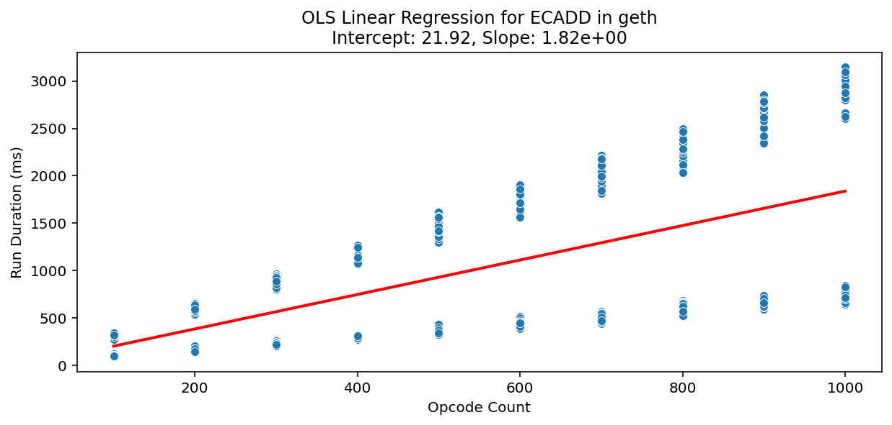

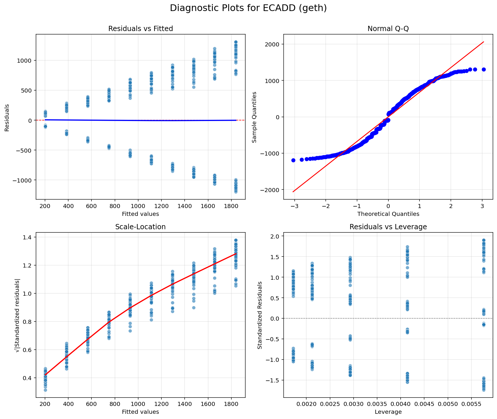


## besu


```python
                            OLS Regression Results                            
==============================================================================
Dep. Variable:        run_duration_ms   R-squared:                       0.779
Model:                            OLS   Adj. R-squared:                  0.779
Method:                 Least Squares   F-statistic:                     2110.
Date:                Thu, 22 Jan 2026   Prob (F-statistic):          2.67e-198
Time:                        16:48:22   Log-Likelihood:                -4741.6
No. Observations:                 600   AIC:                             9487.
Df Residuals:                     598   BIC:                             9496.
Df Model:                           1                                         
Covariance Type:            nonrobust                                         
==============================================================================
                 coef    std err          t      P>|t|      [0.025      0.975]
------------------------------------------------------------------------------
const         30.8463     57.811      0.534      0.594     -82.692     144.384
opcount        4.2801      0.093     45.937      0.000       4.097       4.463
==============================================================================
Omnibus:                       45.316   Durbin-Watson:                   1.790
Prob(Omnibus):                  0.000   Jarque-Bera (JB):               15.980
Skew:                           0.064   Prob(JB):                     0.000339
Kurtosis:                       2.211   Cond. No.                     1.34e+03
==============================================================================

Notes:
[1] Standard Errors assume that the covariance matrix of the errors is correctly specified.
[2] The condition number is large, 1.34e+03. This might indicate that there are
strong multicollinearity or other numerical problems.
```

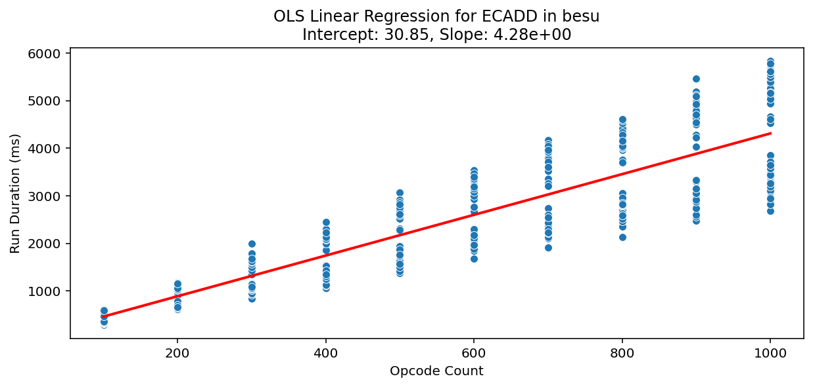

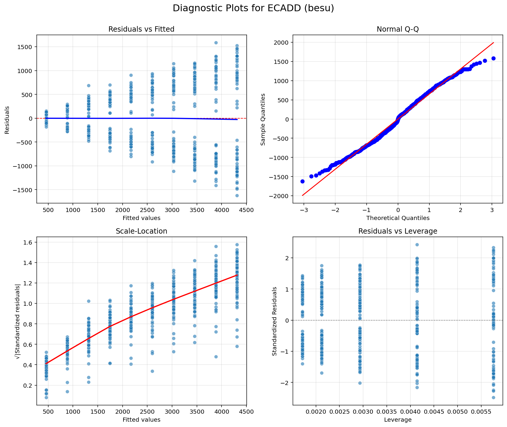


## reth


```python
                            OLS Regression Results                            
==============================================================================
Dep. Variable:        run_duration_ms   R-squared:                       0.306
Model:                            OLS   Adj. R-squared:                  0.305
Method:                 Least Squares   F-statistic:                     167.0
Date:                Thu, 22 Jan 2026   Prob (F-statistic):           6.72e-32
Time:                        16:48:22   Log-Likelihood:                -3156.2
No. Observations:                 380   AIC:                             6316.
Df Residuals:                     378   BIC:                             6324.
Df Model:                           1                                         
Covariance Type:            nonrobust                                         
==============================================================================
                 coef    std err          t      P>|t|      [0.025      0.975]
------------------------------------------------------------------------------
const         36.5608    108.816      0.336      0.737    -177.400     250.521
opcount        2.2666      0.175     12.925      0.000       1.922       2.611
==============================================================================
Omnibus:                      276.663   Durbin-Watson:                   1.760
Prob(Omnibus):                  0.000   Jarque-Bera (JB):               24.018
Skew:                           0.012   Prob(JB):                     6.09e-06
Kurtosis:                       1.769   Cond. No.                     1.34e+03
==============================================================================

Notes:
[1] Standard Errors assume that the covariance matrix of the errors is correctly specified.
[2] The condition number is large, 1.34e+03. This might indicate that there are
strong multicollinearity or other numerical problems.
```

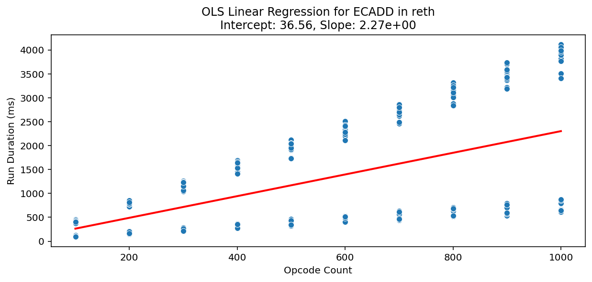

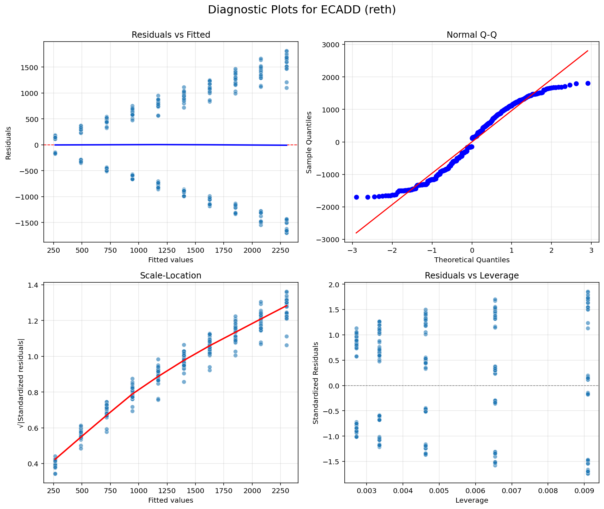


## nethermind


```python
                            OLS Regression Results                            
==============================================================================
Dep. Variable:        run_duration_ms   R-squared:                       0.331
Model:                            OLS   Adj. R-squared:                  0.330
Method:                 Least Squares   F-statistic:                     295.9
Date:                Thu, 22 Jan 2026   Prob (F-statistic):           3.55e-54
Time:                        16:48:23   Log-Likelihood:                -4588.2
No. Observations:                 600   AIC:                             9180.
Df Residuals:                     598   BIC:                             9189.
Df Model:                           1                                         
Covariance Type:            nonrobust                                         
==============================================================================
                 coef    std err          t      P>|t|      [0.025      0.975]
------------------------------------------------------------------------------
const         25.5806     44.766      0.571      0.568     -62.338     113.499
opcount        1.2411      0.072     17.202      0.000       1.099       1.383
==============================================================================
Omnibus:                       72.316   Durbin-Watson:                   1.441
Prob(Omnibus):                  0.000   Jarque-Bera (JB):               98.116
Skew:                           0.989   Prob(JB):                     4.95e-22
Kurtosis:                       2.907   Cond. No.                     1.34e+03
==============================================================================

Notes:
[1] Standard Errors assume that the covariance matrix of the errors is correctly specified.
[2] The condition number is large, 1.34e+03. This might indicate that there are
strong multicollinearity or other numerical problems.
```

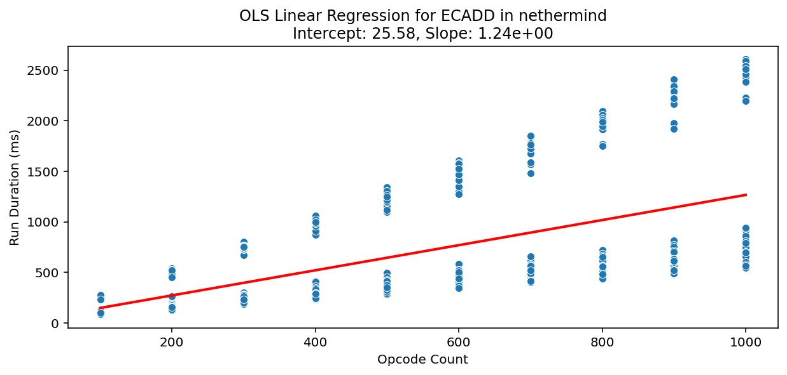

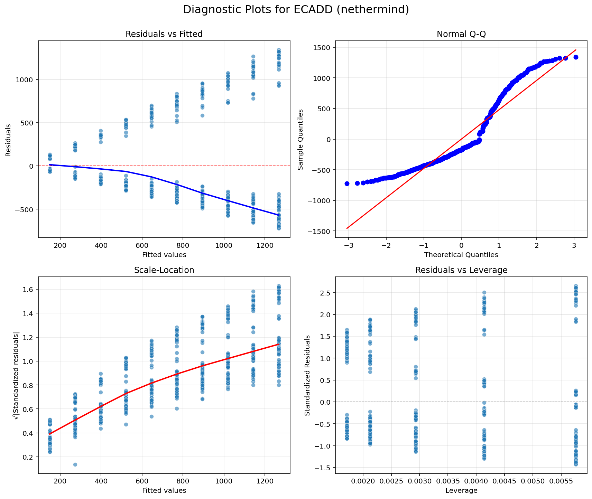


## erigon

OLS model did not run... Error: zero-size array to reduction operation maximum which has no identity

# ECRECOVER

## geth


```python
                            OLS Regression Results                            
==============================================================================
Dep. Variable:        run_duration_ms   R-squared:                       0.992
Model:                            OLS   Adj. R-squared:                  0.992
Method:                 Least Squares   F-statistic:                 3.611e+04
Date:                Thu, 22 Jan 2026   Prob (F-statistic):          5.07e-313
Time:                        16:48:23   Log-Likelihood:                -1808.7
No. Observations:                 300   AIC:                             3621.
Df Residuals:                     298   BIC:                             3629.
Df Model:                           1                                         
Covariance Type:            nonrobust                                         
==============================================================================
                 coef    std err          t      P>|t|      [0.025      0.975]
------------------------------------------------------------------------------
const         37.2744     12.574      2.964      0.003      12.530      62.019
opcount       48.1355      0.253    190.029      0.000      47.637      48.634
==============================================================================
Omnibus:                       62.699   Durbin-Watson:                   0.728
Prob(Omnibus):                  0.000   Jarque-Bera (JB):              129.166
Skew:                          -1.064   Prob(JB):                     8.95e-29
Kurtosis:                       5.410   Cond. No.                         107.
==============================================================================

Notes:
[1] Standard Errors assume that the covariance matrix of the errors is correctly specified.
```

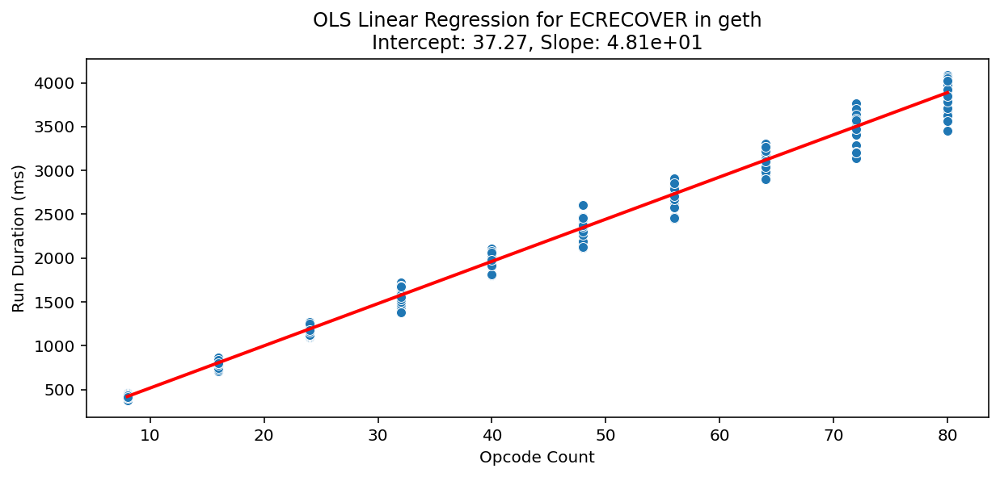

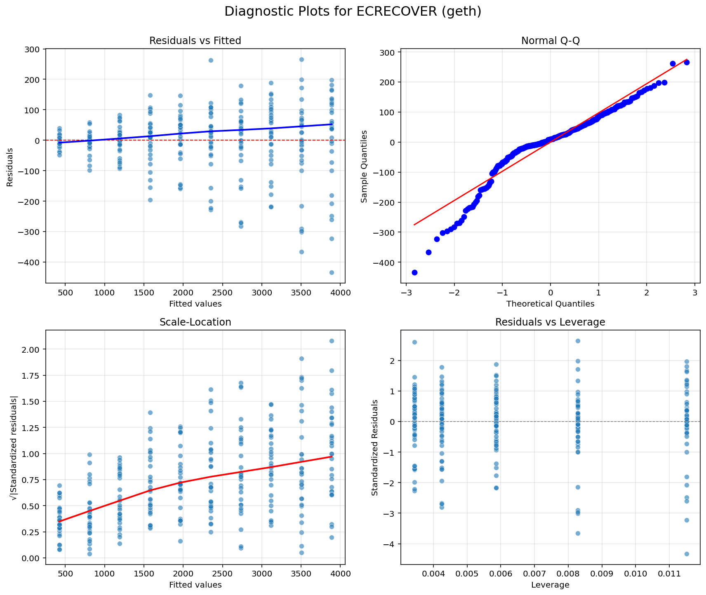


## besu


```python
                            OLS Regression Results                            
==============================================================================
Dep. Variable:        run_duration_ms   R-squared:                       0.984
Model:                            OLS   Adj. R-squared:                  0.984
Method:                 Least Squares   F-statistic:                 1.840e+04
Date:                Thu, 22 Jan 2026   Prob (F-statistic):          7.00e-270
Time:                        16:48:23   Log-Likelihood:                -1916.6
No. Observations:                 300   AIC:                             3837.
Df Residuals:                     298   BIC:                             3845.
Df Model:                           1                                         
Covariance Type:            nonrobust                                         
==============================================================================
                 coef    std err          t      P>|t|      [0.025      0.975]
------------------------------------------------------------------------------
const         29.1293     18.020      1.616      0.107      -6.333      64.592
opcount       49.2366      0.363    135.629      0.000      48.522      49.951
==============================================================================
Omnibus:                       96.334   Durbin-Watson:                   0.646
Prob(Omnibus):                  0.000   Jarque-Bera (JB):              241.742
Skew:                          -1.528   Prob(JB):                     3.21e-53
Kurtosis:                       6.163   Cond. No.                         107.
==============================================================================

Notes:
[1] Standard Errors assume that the covariance matrix of the errors is correctly specified.
```

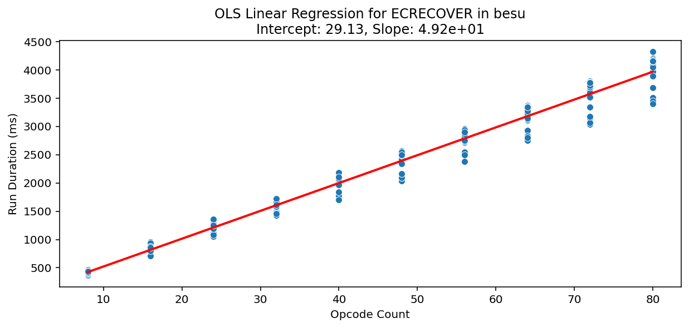

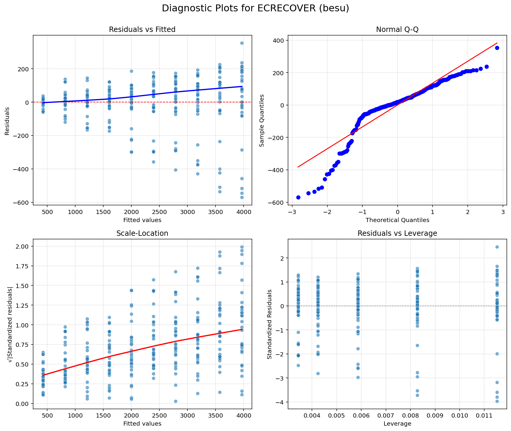


## reth


```python
                            OLS Regression Results                            
==============================================================================
Dep. Variable:        run_duration_ms   R-squared:                       0.993
Model:                            OLS   Adj. R-squared:                  0.993
Method:                 Least Squares   F-statistic:                 2.574e+04
Date:                Thu, 22 Jan 2026   Prob (F-statistic):          4.43e-203
Time:                        16:48:24   Log-Likelihood:                -1131.9
No. Observations:                 190   AIC:                             2268.
Df Residuals:                     188   BIC:                             2274.
Df Model:                           1                                         
Covariance Type:            nonrobust                                         
==============================================================================
                 coef    std err          t      P>|t|      [0.025      0.975]
------------------------------------------------------------------------------
const         33.0983     14.737      2.246      0.026       4.028      62.169
opcount       47.6279      0.297    160.428      0.000      47.042      48.214
==============================================================================
Omnibus:                      117.655   Durbin-Watson:                   0.917
Prob(Omnibus):                  0.000   Jarque-Bera (JB):              662.277
Skew:                          -2.434   Prob(JB):                    1.54e-144
Kurtosis:                      10.744   Cond. No.                         107.
==============================================================================

Notes:
[1] Standard Errors assume that the covariance matrix of the errors is correctly specified.
```

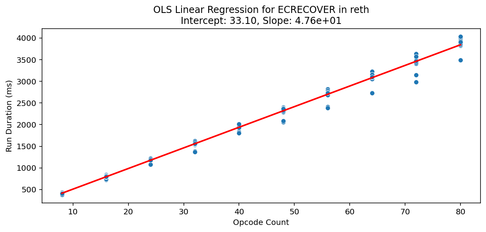

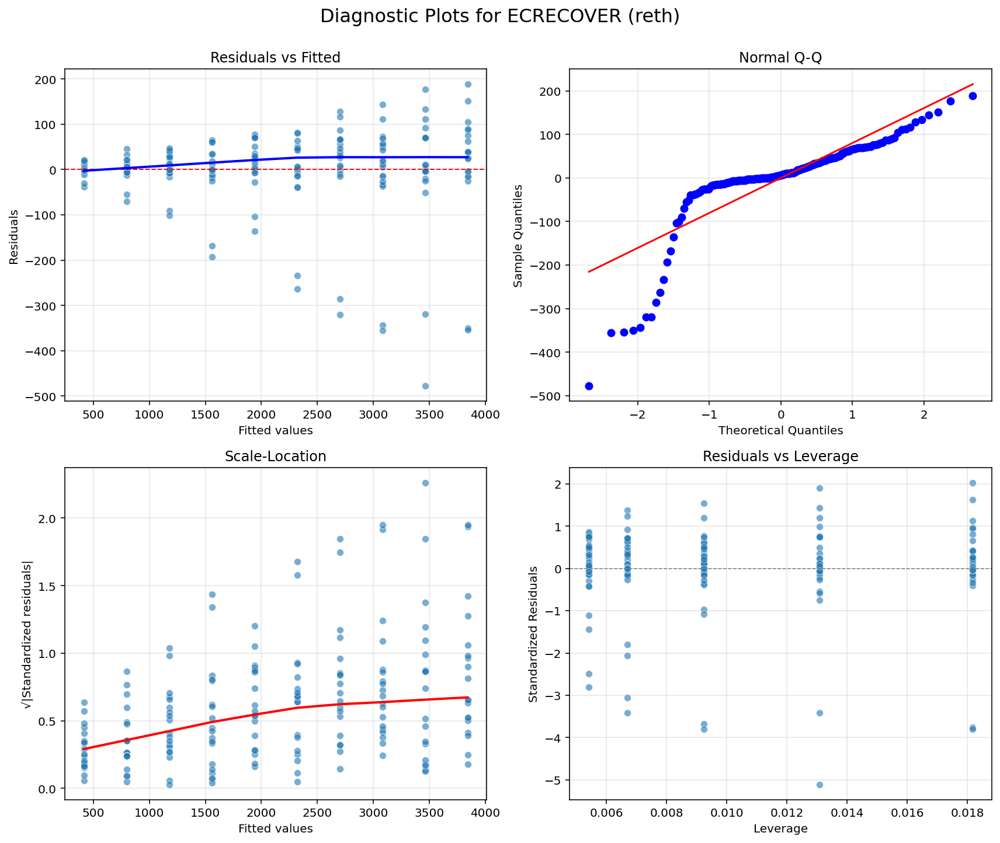


## nethermind


```python
                            OLS Regression Results                            
==============================================================================
Dep. Variable:        run_duration_ms   R-squared:                       0.278
Model:                            OLS   Adj. R-squared:                  0.275
Method:                 Least Squares   F-statistic:                     114.5
Date:                Thu, 22 Jan 2026   Prob (F-statistic):           8.03e-23
Time:                        16:48:24   Log-Likelihood:                -2513.9
No. Observations:                 300   AIC:                             5032.
Df Residuals:                     298   BIC:                             5039.
Df Model:                           1                                         
Covariance Type:            nonrobust                                         
==============================================================================
                 coef    std err          t      P>|t|      [0.025      0.975]
------------------------------------------------------------------------------
const         29.6998    131.968      0.225      0.822    -230.007     289.407
opcount       28.4435      2.659     10.699      0.000      23.212      33.675
==============================================================================
Omnibus:                       38.951   Durbin-Watson:                   0.447
Prob(Omnibus):                  0.000   Jarque-Bera (JB):               30.337
Skew:                          -0.679   Prob(JB):                     2.58e-07
Kurtosis:                       2.235   Cond. No.                         107.
==============================================================================

Notes:
[1] Standard Errors assume that the covariance matrix of the errors is correctly specified.
```

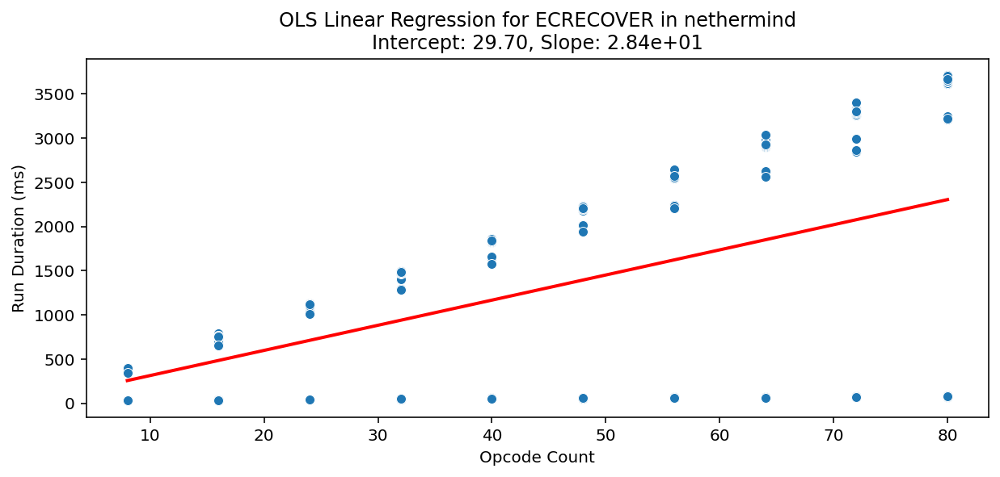

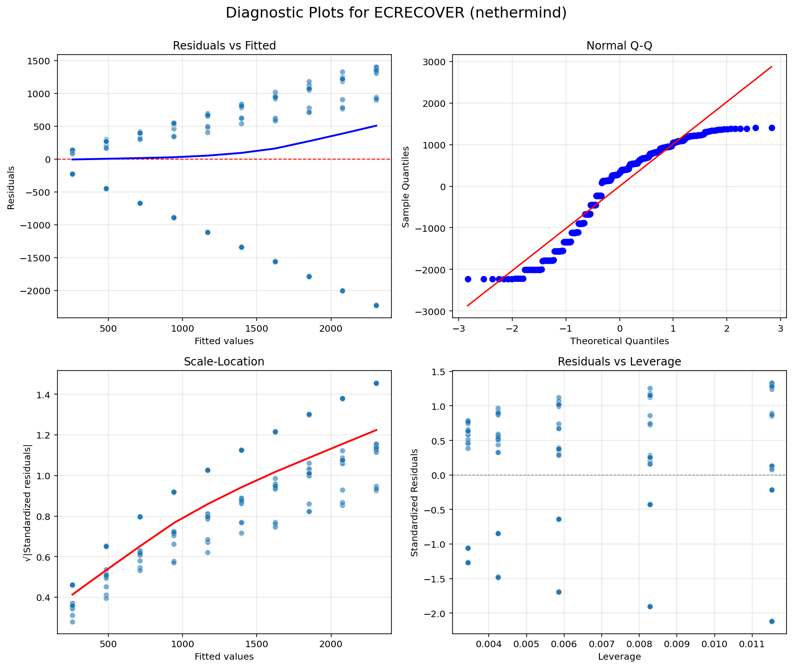


## erigon

OLS model did not run... Error: zero-size array to reduction operation maximum which has no identity

# ECPAIRING

## geth


```python
                            OLS Regression Results                            
==============================================================================
Dep. Variable:        run_duration_ms   R-squared:                       0.061
Model:                            OLS   Adj. R-squared:                  0.060
Method:                 Least Squares   F-statistic:                     61.96
Date:                Thu, 22 Jan 2026   Prob (F-statistic):           9.43e-15
Time:                        16:48:24   Log-Likelihood:                -7227.9
No. Observations:                 960   AIC:                         1.446e+04
Df Residuals:                     958   BIC:                         1.447e+04
Df Model:                           1                                         
Covariance Type:            nonrobust                                         
==============================================================================
                 coef    std err          t      P>|t|      [0.025      0.975]
------------------------------------------------------------------------------
const        695.3009     15.838     43.901      0.000     664.220     726.382
opcount      261.0285     33.160      7.872      0.000     195.954     326.103
==============================================================================
Omnibus:                      657.911   Durbin-Watson:                   2.040
Prob(Omnibus):                  0.000   Jarque-Bera (JB):            20460.439
Skew:                           2.679   Prob(JB):                         0.00
Kurtosis:                      24.973   Cond. No.                         2.38
==============================================================================

Notes:
[1] Standard Errors assume that the covariance matrix of the errors is correctly specified.
```

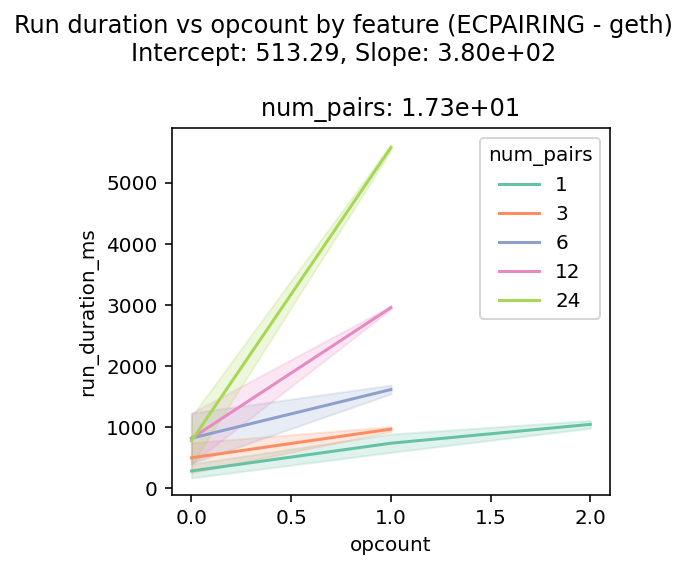

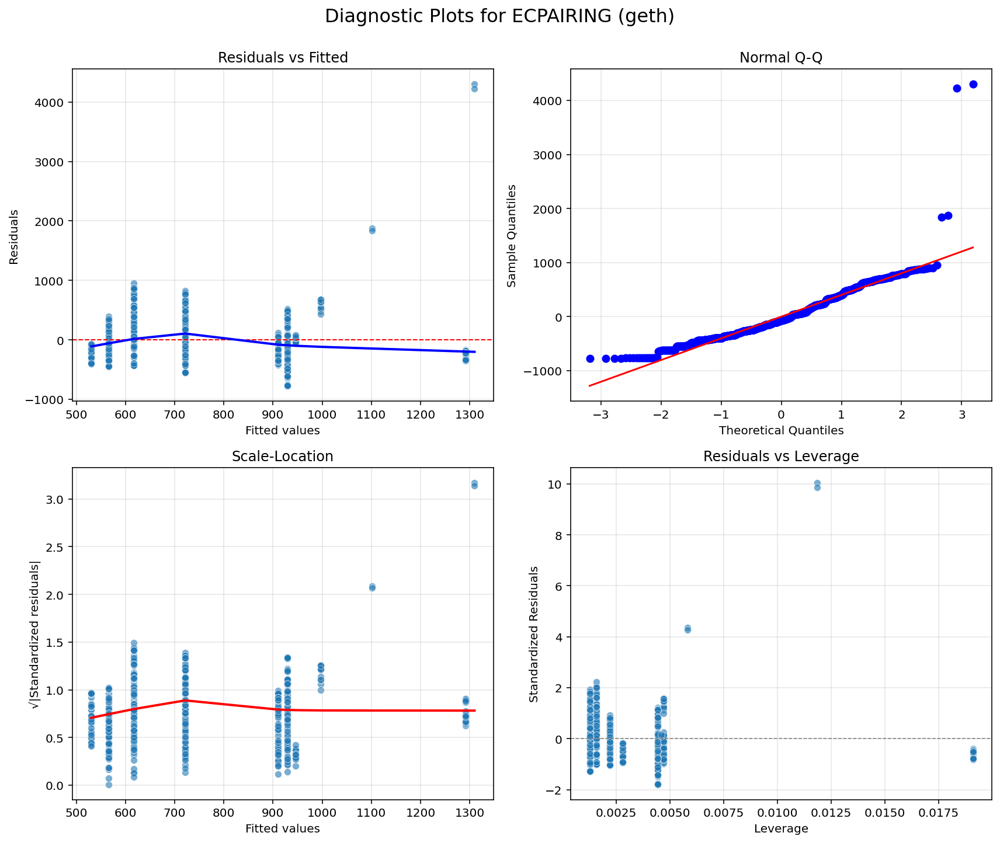


## besu


```python
                            OLS Regression Results                            
==============================================================================
Dep. Variable:        run_duration_ms   R-squared:                       0.063
Model:                            OLS   Adj. R-squared:                  0.062
Method:                 Least Squares   F-statistic:                     64.84
Date:                Thu, 22 Jan 2026   Prob (F-statistic):           2.40e-15
Time:                        16:48:24   Log-Likelihood:                -7221.7
No. Observations:                 960   AIC:                         1.445e+04
Df Residuals:                     958   BIC:                         1.446e+04
Df Model:                           1                                         
Covariance Type:            nonrobust                                         
==============================================================================
                 coef    std err          t      P>|t|      [0.025      0.975]
------------------------------------------------------------------------------
const        691.8441     15.736     43.966      0.000     660.963     722.725
opcount      265.3002     32.946      8.052      0.000     200.645     329.956
==============================================================================
Omnibus:                      647.745   Durbin-Watson:                   2.042
Prob(Omnibus):                  0.000   Jarque-Bera (JB):            19437.618
Skew:                           2.629   Prob(JB):                         0.00
Kurtosis:                      24.408   Cond. No.                         2.38
==============================================================================

Notes:
[1] Standard Errors assume that the covariance matrix of the errors is correctly specified.
```

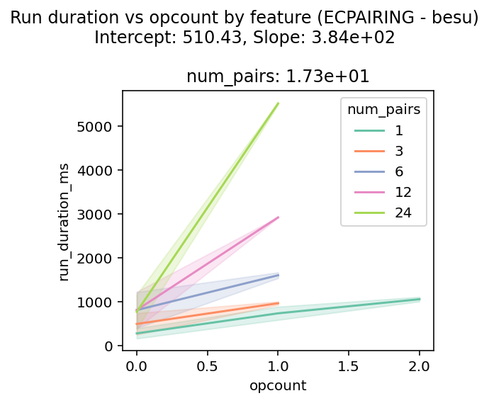

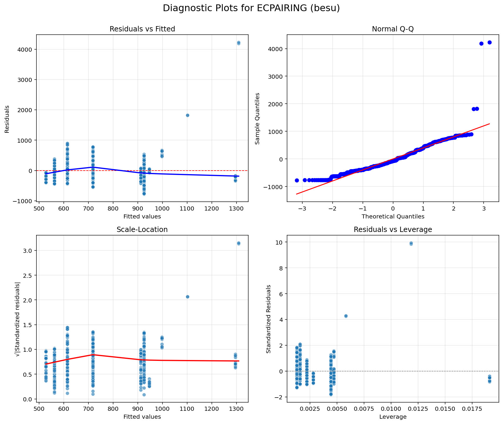


## reth


```python
                            OLS Regression Results                            
==============================================================================
Dep. Variable:        run_duration_ms   R-squared:                       0.066
Model:                            OLS   Adj. R-squared:                  0.063
Method:                 Least Squares   F-statistic:                     28.73
Date:                Thu, 22 Jan 2026   Prob (F-statistic):           1.39e-07
Time:                        16:48:25   Log-Likelihood:                -3468.6
No. Observations:                 410   AIC:                             6941.
Df Residuals:                     408   BIC:                             6949.
Df Model:                           1                                         
Covariance Type:            nonrobust                                         
==============================================================================
                 coef    std err          t      P>|t|      [0.025      0.975]
------------------------------------------------------------------------------
const       1475.0977     61.988     23.797      0.000    1353.242    1596.953
opcount      679.6041    126.790      5.360      0.000     430.361     928.847
==============================================================================
Omnibus:                      364.209   Durbin-Watson:                   1.851
Prob(Omnibus):                  0.000   Jarque-Bera (JB):            13041.409
Skew:                           3.594   Prob(JB):                         0.00
Kurtosis:                      29.679   Cond. No.                         2.35
==============================================================================

Notes:
[1] Standard Errors assume that the covariance matrix of the errors is correctly specified.
```

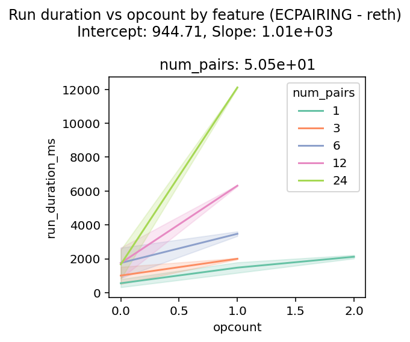

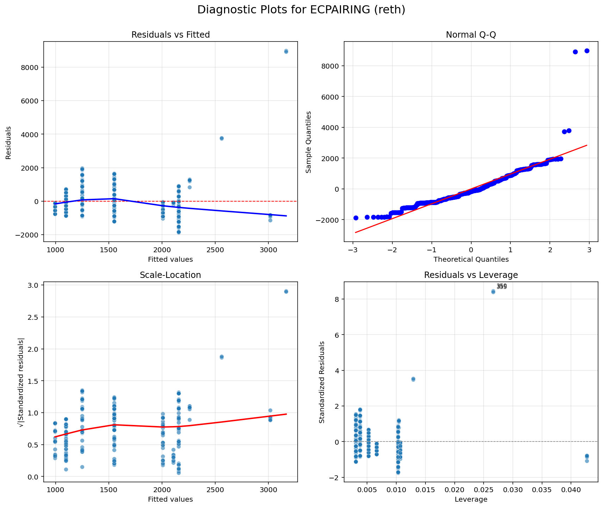


## nethermind


```python
                            OLS Regression Results                            
==============================================================================
Dep. Variable:        run_duration_ms   R-squared:                       0.000
Model:                            OLS   Adj. R-squared:                 -0.001
Method:                 Least Squares   F-statistic:                   0.06793
Date:                Thu, 22 Jan 2026   Prob (F-statistic):              0.794
Time:                        16:48:25   Log-Likelihood:                -7991.9
No. Observations:                 960   AIC:                         1.599e+04
Df Residuals:                     958   BIC:                         1.600e+04
Df Model:                           1                                         
Covariance Type:            nonrobust                                         
==============================================================================
                 coef    std err          t      P>|t|      [0.025      0.975]
------------------------------------------------------------------------------
const       1605.1170     35.103     45.726      0.000    1536.230    1674.004
opcount       19.1551     73.494      0.261      0.794    -125.074     163.384
==============================================================================
Omnibus:                       93.993   Durbin-Watson:                   2.279
Prob(Omnibus):                  0.000   Jarque-Bera (JB):               64.626
Skew:                           0.522   Prob(JB):                     9.26e-15
Kurtosis:                       2.275   Cond. No.                         2.38
==============================================================================

Notes:
[1] Standard Errors assume that the covariance matrix of the errors is correctly specified.
```

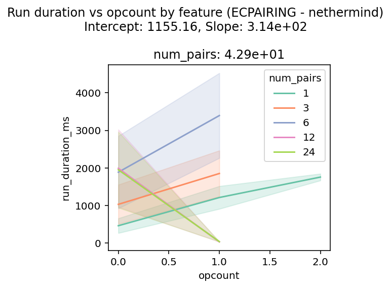

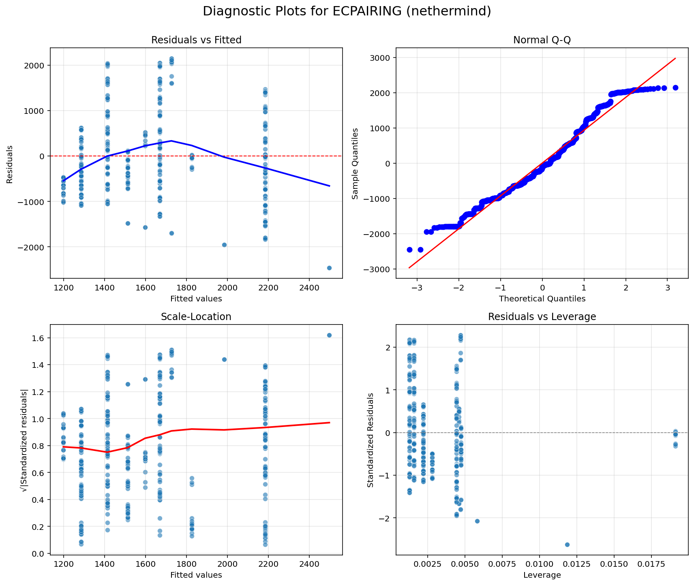


## erigon

OLS model did not run... Error: zero-size array to reduction operation maximum which has no identity

# KECCAK256

## geth


```python
                            OLS Regression Results                            
==============================================================================
Dep. Variable:        run_duration_ms   R-squared:                       0.705
Model:                            OLS   Adj. R-squared:                  0.705
Method:                 Least Squares   F-statistic:                     3816.
Date:                Thu, 22 Jan 2026   Prob (F-statistic):               0.00
Time:                        16:48:25   Log-Likelihood:                -36417.
No. Observations:                4800   AIC:                         7.284e+04
Df Residuals:                    4796   BIC:                         7.287e+04
Df Model:                           3                                         
Covariance Type:            nonrobust                                         
==============================================================================
                 coef    std err          t      P>|t|      [0.025      0.975]
------------------------------------------------------------------------------
const        -68.3117     18.113     -3.771      0.000    -103.822     -32.802
opcount        0.5623      0.005    104.645      0.000       0.552       0.573
msg_size       1.6956      0.021     81.069      0.000       1.655       1.737
mem_size       0.0047      0.017      0.280      0.779      -0.028       0.037
==============================================================================
Omnibus:                      584.613   Durbin-Watson:                   1.779
Prob(Omnibus):                  0.000   Jarque-Bera (JB):             4423.582
Skew:                           0.324   Prob(JB):                         0.00
Kurtosis:                       7.658   Cond. No.                     6.78e+03
==============================================================================

Notes:
[1] Standard Errors assume that the covariance matrix of the errors is correctly specified.
[2] The condition number is large, 6.78e+03. This might indicate that there are
strong multicollinearity or other numerical problems.
```


## besu


```python
                            OLS Regression Results                            
==============================================================================
Dep. Variable:        run_duration_ms   R-squared:                       0.753
Model:                            OLS   Adj. R-squared:                  0.753
Method:                 Least Squares   F-statistic:                     4876.
Date:                Thu, 22 Jan 2026   Prob (F-statistic):               0.00
Time:                        16:48:26   Log-Likelihood:                -37752.
No. Observations:                4800   AIC:                         7.551e+04
Df Residuals:                    4796   BIC:                         7.554e+04
Df Model:                           3                                         
Covariance Type:            nonrobust                                         
==============================================================================
                 coef    std err          t      P>|t|      [0.025      0.975]
------------------------------------------------------------------------------
const        -49.9099     23.920     -2.087      0.037     -96.804      -3.015
opcount        0.8563      0.007    120.668      0.000       0.842       0.870
msg_size       2.1987      0.028     79.601      0.000       2.145       2.253
mem_size      -0.0041      0.022     -0.184      0.854      -0.047       0.039
==============================================================================
Omnibus:                      191.619   Durbin-Watson:                   1.733
Prob(Omnibus):                  0.000   Jarque-Bera (JB):              591.231
Skew:                          -0.059   Prob(JB):                    4.13e-129
Kurtosis:                       4.715   Cond. No.                     6.78e+03
==============================================================================

Notes:
[1] Standard Errors assume that the covariance matrix of the errors is correctly specified.
[2] The condition number is large, 6.78e+03. This might indicate that there are
strong multicollinearity or other numerical problems.
```


## reth


```python
                            OLS Regression Results                            
==============================================================================
Dep. Variable:        run_duration_ms   R-squared:                       0.515
Model:                            OLS   Adj. R-squared:                  0.515
Method:                 Least Squares   F-statistic:                     1075.
Date:                Thu, 22 Jan 2026   Prob (F-statistic):               0.00
Time:                        16:48:26   Log-Likelihood:                -23257.
No. Observations:                3040   AIC:                         4.652e+04
Df Residuals:                    3036   BIC:                         4.655e+04
Df Model:                           3                                         
Covariance Type:            nonrobust                                         
==============================================================================
                 coef    std err          t      P>|t|      [0.025      0.975]
------------------------------------------------------------------------------
const        139.4476     24.258      5.749      0.000      91.884     187.012
opcount        0.0550      0.007      7.648      0.000       0.041       0.069
msg_size       1.3844      0.028     49.423      0.000       1.330       1.439
mem_size   -5.857e-05      0.022     -0.003      0.998      -0.044       0.044
==============================================================================
Omnibus:                       74.423   Durbin-Watson:                   1.900
Prob(Omnibus):                  0.000   Jarque-Bera (JB):               88.905
Skew:                           0.324   Prob(JB):                     4.95e-20
Kurtosis:                       3.530   Cond. No.                     6.78e+03
==============================================================================

Notes:
[1] Standard Errors assume that the covariance matrix of the errors is correctly specified.
[2] The condition number is large, 6.78e+03. This might indicate that there are
strong multicollinearity or other numerical problems.
```


## nethermind


```python
                            OLS Regression Results                            
==============================================================================
Dep. Variable:        run_duration_ms   R-squared:                       0.516
Model:                            OLS   Adj. R-squared:                  0.516
Method:                 Least Squares   F-statistic:                     1707.
Date:                Thu, 22 Jan 2026   Prob (F-statistic):               0.00
Time:                        16:48:27   Log-Likelihood:                -37126.
No. Observations:                4800   AIC:                         7.426e+04
Df Residuals:                    4796   BIC:                         7.429e+04
Df Model:                           3                                         
Covariance Type:            nonrobust                                         
==============================================================================
                 coef    std err          t      P>|t|      [0.025      0.975]
------------------------------------------------------------------------------
const        134.3675     20.997      6.399      0.000      93.204     175.531
opcount        0.0646      0.006     10.369      0.000       0.052       0.077
msg_size       1.5192      0.024     62.657      0.000       1.472       1.567
mem_size       0.0009      0.019      0.045      0.964      -0.037       0.039
==============================================================================
Omnibus:                      152.243   Durbin-Watson:                   1.824
Prob(Omnibus):                  0.000   Jarque-Bera (JB):              191.487
Skew:                           0.370   Prob(JB):                     2.63e-42
Kurtosis:                       3.640   Cond. No.                     6.78e+03
==============================================================================

Notes:
[1] Standard Errors assume that the covariance matrix of the errors is correctly specified.
[2] The condition number is large, 6.78e+03. This might indicate that there are
strong multicollinearity or other numerical problems.
```


## erigon


```python
                            OLS Regression Results                            
==============================================================================
Dep. Variable:        run_duration_ms   R-squared:                       0.715
Model:                            OLS   Adj. R-squared:                  0.713
Method:                 Least Squares   F-statistic:                     397.2
Date:                Thu, 22 Jan 2026   Prob (F-statistic):          3.86e-129
Time:                        16:48:27   Log-Likelihood:                -3605.0
No. Observations:                 480   AIC:                             7218.
Df Residuals:                     476   BIC:                             7235.
Df Model:                           3                                         
Covariance Type:            nonrobust                                         
==============================================================================
                 coef    std err          t      P>|t|      [0.025      0.975]
------------------------------------------------------------------------------
const        -55.4703     53.255     -1.042      0.298    -160.114      49.174
opcount        0.5311      0.016     33.619      0.000       0.500       0.562
msg_size       1.6340      0.061     26.571      0.000       1.513       1.755
mem_size       0.0021      0.049      0.042      0.967      -0.094       0.098
==============================================================================
Omnibus:                       29.196   Durbin-Watson:                   1.709
Prob(Omnibus):                  0.000   Jarque-Bera (JB):               94.395
Skew:                          -0.125   Prob(JB):                     3.18e-21
Kurtosis:                       5.158   Cond. No.                     6.78e+03
==============================================================================

Notes:
[1] Standard Errors assume that the covariance matrix of the errors is correctly specified.
[2] The condition number is large, 6.78e+03. This might indicate that there are
strong multicollinearity or other numerical problems.
```


# BLAKE2F

## geth


```python
                            OLS Regression Results                            
==============================================================================
Dep. Variable:        run_duration_ms   R-squared:                       0.009
Model:                            OLS   Adj. R-squared:                  0.007
Method:                 Least Squares   F-statistic:                     8.147
Date:                Thu, 22 Jan 2026   Prob (F-statistic):            0.00441
Time:                        16:48:27   Log-Likelihood:                -8354.7
No. Observations:                 950   AIC:                         1.671e+04
Df Residuals:                     948   BIC:                         1.672e+04
Df Model:                           1                                         
Covariance Type:            nonrobust                                         
==============================================================================
                 coef    std err          t      P>|t|      [0.025      0.975]
------------------------------------------------------------------------------
const       1505.9473     85.255     17.664      0.000    1338.638    1673.257
opcount       -0.2192      0.077     -2.854      0.004      -0.370      -0.069
==============================================================================
Omnibus:                      534.408   Durbin-Watson:                   1.263
Prob(Omnibus):                  0.000   Jarque-Bera (JB):             3386.434
Skew:                           2.615   Prob(JB):                         0.00
Kurtosis:                      10.629   Cond. No.                     1.83e+03
==============================================================================

Notes:
[1] Standard Errors assume that the covariance matrix of the errors is correctly specified.
[2] The condition number is large, 1.83e+03. This might indicate that there are
strong multicollinearity or other numerical problems.
```
OLS model did not run... Error: Number of columns must be a positive integer, not 0

## besu


```python
                            OLS Regression Results                            
==============================================================================
Dep. Variable:        run_duration_ms   R-squared:                       0.164
Model:                            OLS   Adj. R-squared:                  0.163
Method:                 Least Squares   F-statistic:                     185.7
Date:                Thu, 22 Jan 2026   Prob (F-statistic):           9.68e-39
Time:                        16:48:27   Log-Likelihood:                -8706.7
No. Observations:                 950   AIC:                         1.742e+04
Df Residuals:                     948   BIC:                         1.743e+04
Df Model:                           1                                         
Covariance Type:            nonrobust                                         
==============================================================================
                 coef    std err          t      P>|t|      [0.025      0.975]
------------------------------------------------------------------------------
const       2183.6678    123.483     17.684      0.000    1941.335    2426.000
opcount        1.5159      0.111     13.626      0.000       1.298       1.734
==============================================================================
Omnibus:                      527.610   Durbin-Watson:                   1.253
Prob(Omnibus):                  0.000   Jarque-Bera (JB):             3264.037
Skew:                           2.583   Prob(JB):                         0.00
Kurtosis:                      10.467   Cond. No.                     1.83e+03
==============================================================================

Notes:
[1] Standard Errors assume that the covariance matrix of the errors is correctly specified.
[2] The condition number is large, 1.83e+03. This might indicate that there are
strong multicollinearity or other numerical problems.
```
OLS model did not run... Error: Number of columns must be a positive integer, not 0

## reth


```python
                            OLS Regression Results                            
==============================================================================
Dep. Variable:        run_duration_ms   R-squared:                       0.087
Model:                            OLS   Adj. R-squared:                  0.085
Method:                 Least Squares   F-statistic:                     48.58
Date:                Thu, 22 Jan 2026   Prob (F-statistic):           9.91e-12
Time:                        16:48:27   Log-Likelihood:                -4830.6
No. Observations:                 510   AIC:                             9665.
Df Residuals:                     508   BIC:                             9674.
Df Model:                           1                                         
Covariance Type:            nonrobust                                         
==============================================================================
                 coef    std err          t      P>|t|      [0.025      0.975]
------------------------------------------------------------------------------
const       3145.4459    196.382     16.017      0.000    2759.626    3531.266
opcount       -1.3924      0.200     -6.970      0.000      -1.785      -1.000
==============================================================================
Omnibus:                      151.755   Durbin-Watson:                   1.350
Prob(Omnibus):                  0.000   Jarque-Bera (JB):              328.689
Skew:                           1.602   Prob(JB):                     4.23e-72
Kurtosis:                       5.281   Cond. No.                     1.38e+03
==============================================================================

Notes:
[1] Standard Errors assume that the covariance matrix of the errors is correctly specified.
[2] The condition number is large, 1.38e+03. This might indicate that there are
strong multicollinearity or other numerical problems.
```
OLS model did not run... Error: Number of columns must be a positive integer, not 0

## nethermind


```python
                            OLS Regression Results                            
==============================================================================
Dep. Variable:        run_duration_ms   R-squared:                       0.953
Model:                            OLS   Adj. R-squared:                  0.953
Method:                 Least Squares   F-statistic:                 1.937e+04
Date:                Thu, 22 Jan 2026   Prob (F-statistic):               0.00
Time:                        16:48:27   Log-Likelihood:                -5932.7
No. Observations:                 950   AIC:                         1.187e+04
Df Residuals:                     948   BIC:                         1.188e+04
Df Model:                           1                                         
Covariance Type:            nonrobust                                         
==============================================================================
                 coef    std err          t      P>|t|      [0.025      0.975]
------------------------------------------------------------------------------
const          6.0074      6.660      0.902      0.367      -7.063      19.078
opcount        0.8350      0.006    139.160      0.000       0.823       0.847
==============================================================================
Omnibus:                      122.907   Durbin-Watson:                   1.693
Prob(Omnibus):                  0.000   Jarque-Bera (JB):              264.121
Skew:                           0.750   Prob(JB):                     4.43e-58
Kurtosis:                       5.103   Cond. No.                     1.83e+03
==============================================================================

Notes:
[1] Standard Errors assume that the covariance matrix of the errors is correctly specified.
[2] The condition number is large, 1.83e+03. This might indicate that there are
strong multicollinearity or other numerical problems.
```
OLS model did not run... Error: Number of columns must be a positive integer, not 0

## erigon

OLS model did not run... Error: zero-size array to reduction operation maximum which has no identity

# ECPAIRING

## geth


```python
                            OLS Regression Results                            
==============================================================================
Dep. Variable:        run_duration_ms   R-squared:                       0.144
Model:                            OLS   Adj. R-squared:                  0.142
Method:                 Least Squares   F-statistic:                     80.23
Date:                Thu, 22 Jan 2026   Prob (F-statistic):           6.14e-33
Time:                        16:48:27   Log-Likelihood:                -7183.6
No. Observations:                 960   AIC:                         1.437e+04
Df Residuals:                     957   BIC:                         1.439e+04
Df Model:                           2                                         
Covariance Type:            nonrobust                                         
==============================================================================
                 coef    std err          t      P>|t|      [0.025      0.975]
------------------------------------------------------------------------------
const        513.2940     24.224     21.189      0.000     465.755     560.833
opcount      380.0938     34.012     11.175      0.000     313.347     446.840
num_pairs     17.3433      1.803      9.621      0.000      13.806      20.881
==============================================================================
Omnibus:                      600.985   Durbin-Watson:                   1.948
Prob(Omnibus):                  0.000   Jarque-Bera (JB):            15740.299
Skew:                           2.396   Prob(JB):                         0.00
Kurtosis:                      22.249   Cond. No.                         33.2
==============================================================================

Notes:
[1] Standard Errors assume that the covariance matrix of the errors is correctly specified.
```


## besu


```python
                            OLS Regression Results                            
==============================================================================
Dep. Variable:        run_duration_ms   R-squared:                       0.147
Model:                            OLS   Adj. R-squared:                  0.145
Method:                 Least Squares   F-statistic:                     82.15
Date:                Thu, 22 Jan 2026   Prob (F-statistic):           1.18e-33
Time:                        16:48:28   Log-Likelihood:                -7177.1
No. Observations:                 960   AIC:                         1.436e+04
Df Residuals:                     957   BIC:                         1.437e+04
Df Model:                           2                                         
Covariance Type:            nonrobust                                         
==============================================================================
                 coef    std err          t      P>|t|      [0.025      0.975]
------------------------------------------------------------------------------
const        510.4285     24.061     21.214      0.000     463.211     557.646
opcount      383.9787     33.782     11.366      0.000     317.683     450.274
num_pairs     17.2869      1.790      9.655      0.000      13.773      20.801
==============================================================================
Omnibus:                      590.159   Durbin-Watson:                   1.946
Prob(Omnibus):                  0.000   Jarque-Bera (JB):            14894.982
Skew:                           2.346   Prob(JB):                         0.00
Kurtosis:                      21.718   Cond. No.                         33.2
==============================================================================

Notes:
[1] Standard Errors assume that the covariance matrix of the errors is correctly specified.
```


## reth


```python
                            OLS Regression Results                            
==============================================================================
Dep. Variable:        run_duration_ms   R-squared:                       0.175
Model:                            OLS   Adj. R-squared:                  0.171
Method:                 Least Squares   F-statistic:                     43.22
Date:                Thu, 22 Jan 2026   Prob (F-statistic):           9.50e-18
Time:                        16:48:28   Log-Likelihood:                -3443.0
No. Observations:                 410   AIC:                             6892.
Df Residuals:                     407   BIC:                             6904.
Df Model:                           2                                         
Covariance Type:            nonrobust                                         
==============================================================================
                 coef    std err          t      P>|t|      [0.025      0.975]
------------------------------------------------------------------------------
const        944.7058     92.799     10.180      0.000     762.280    1127.132
opcount     1010.1095    127.481      7.924      0.000     759.507    1260.712
num_pairs     50.4664      6.869      7.348      0.000      36.964      63.969
==============================================================================
Omnibus:                      325.380   Durbin-Watson:                   1.762
Prob(Omnibus):                  0.000   Jarque-Bera (JB):             9081.080
Skew:                           3.098   Prob(JB):                         0.00
Kurtosis:                      25.208   Cond. No.                         32.7
==============================================================================

Notes:
[1] Standard Errors assume that the covariance matrix of the errors is correctly specified.
```


## nethermind


```python
                            OLS Regression Results                            
==============================================================================
Dep. Variable:        run_duration_ms   R-squared:                       0.110
Model:                            OLS   Adj. R-squared:                  0.108
Method:                 Least Squares   F-statistic:                     59.02
Date:                Thu, 22 Jan 2026   Prob (F-statistic):           6.76e-25
Time:                        16:48:28   Log-Likelihood:                -7936.2
No. Observations:                 960   AIC:                         1.588e+04
Df Residuals:                     957   BIC:                         1.589e+04
Df Model:                           2                                         
Covariance Type:            nonrobust                                         
==============================================================================
                 coef    std err          t      P>|t|      [0.025      0.975]
------------------------------------------------------------------------------
const       1155.1584     53.052     21.774      0.000    1051.048    1259.269
opcount      313.5092     74.486      4.209      0.000     167.334     459.685
num_pairs     42.8762      3.948     10.861      0.000      35.129      50.623
==============================================================================
Omnibus:                       35.067   Durbin-Watson:                   2.141
Prob(Omnibus):                  0.000   Jarque-Bera (JB):               33.399
Skew:                           0.410   Prob(JB):                     5.59e-08
Kurtosis:                       2.597   Cond. No.                         33.2
==============================================================================

Notes:
[1] Standard Errors assume that the covariance matrix of the errors is correctly specified.
```


## erigon

OLS model did not run... Error: zero-size array to reduction operation maximum which has no identity
