Operation run times estimation results - EIP-7904
=================================================

Table of contents
=================

* [MULMOD](#mulmod)
* [SMOD](#smod)
* [MOD](#mod)
* [POINT_EVALUATION](#point_evaluation)
* [BLS12_G1ADD](#bls12_g1add)
* [BLS12_G2ADD](#bls12_g2add)
* [ECADD](#ecadd)
* [ECRECOVER](#ecrecover)
* [KECCAK256](#keccak256)
* [BLAKE2F](#blake2f)
* [ECPAIRING](#ecpairing)

# Introduction


This is an automated report generated from the opcode run times 
estimation script `./src/estimate_opcode_run_times.py`. The script 
uses data generated by running the 
[EEST benchmark suite](https://github.com/ethereum/execution-spec-tests/tree/main/tests/benchmark) 
with the [Nethermind benchmarking tooling](https://github.com/NethermindEth/gas-benchmarks).

The data includes all the tests for operations repriced in EIP-7904 run between 2026-01-10 and 2026-01-23.

For each opcode and client, an OLS linear regression model is fitted to estimate the 
opcode run time as a function of the opcode count and other opcode configurations. The results are presented below.

# MULMOD

## geth


```python
                            OLS Regression Results                            
==============================================================================
Dep. Variable:        run_duration_ms   R-squared:                       0.988
Model:                            OLS   Adj. R-squared:                  0.988
Method:                 Least Squares   F-statistic:                 1.982e+04
Date:                Fri, 23 Jan 2026   Prob (F-statistic):          1.28e-238
Time:                        12:16:56   Log-Likelihood:                -1403.0
No. Observations:                 250   AIC:                             2810.
Df Residuals:                     248   BIC:                             2817.
Df Model:                           1                                         
Covariance Type:            nonrobust                                         
==============================================================================
                 coef    std err          t      P>|t|      [0.025      0.975]
------------------------------------------------------------------------------
const         36.5925      9.083      4.029      0.000      18.703      54.482
opcount        0.0687      0.000    140.787      0.000       0.068       0.070
==============================================================================
Omnibus:                       24.534   Durbin-Watson:                   1.109
Prob(Omnibus):                  0.000   Jarque-Bera (JB):               51.605
Skew:                          -0.487   Prob(JB):                     6.23e-12
Kurtosis:                       5.001   Cond. No.                     4.02e+04
==============================================================================

Notes:
[1] Standard Errors assume that the covariance matrix of the errors is correctly specified.
[2] The condition number is large, 4.02e+04. This might indicate that there are
strong multicollinearity or other numerical problems.
```


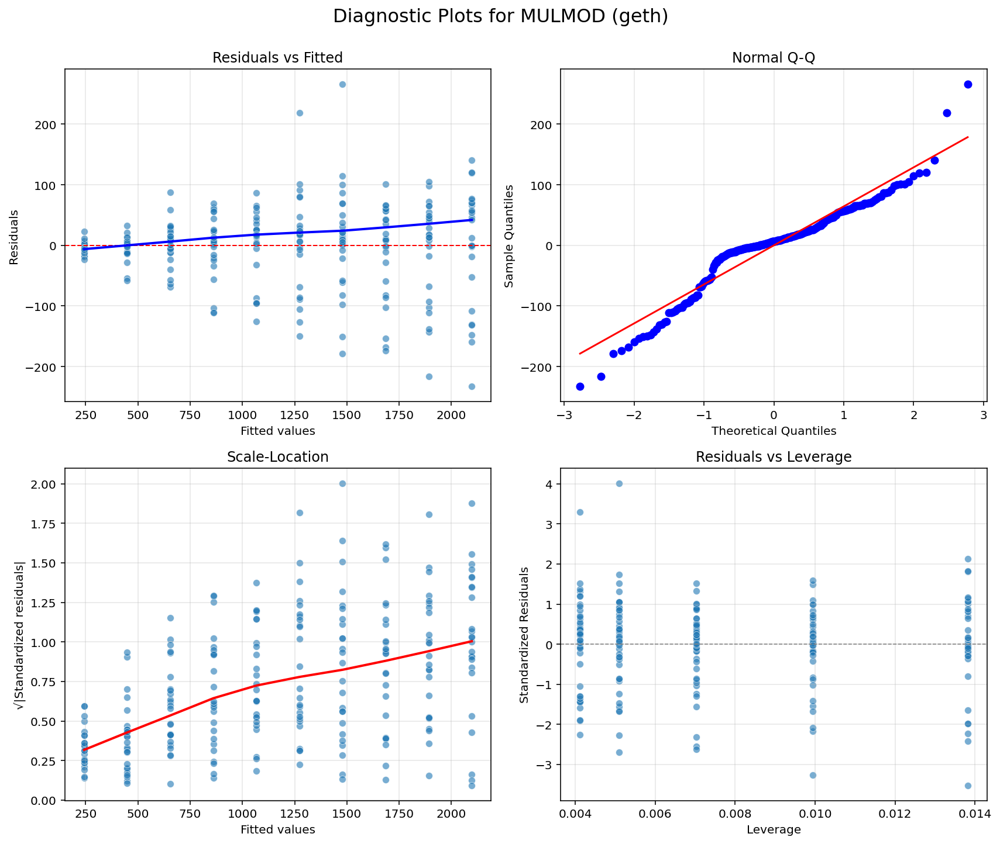


## besu


```python
                            OLS Regression Results                            
==============================================================================
Dep. Variable:        run_duration_ms   R-squared:                       0.982
Model:                            OLS   Adj. R-squared:                  0.981
Method:                 Least Squares   F-statistic:                 1.318e+04
Date:                Fri, 23 Jan 2026   Prob (F-statistic):          5.46e-217
Time:                        12:16:56   Log-Likelihood:                -1690.6
No. Observations:                 250   AIC:                             3385.
Df Residuals:                     248   BIC:                             3392.
Df Model:                           1                                         
Covariance Type:            nonrobust                                         
==============================================================================
                 coef    std err          t      P>|t|      [0.025      0.975]
------------------------------------------------------------------------------
const         48.9546     28.698      1.706      0.089      -7.569     105.478
opcount        0.1770      0.002    114.815      0.000       0.174       0.180
==============================================================================
Omnibus:                       39.652   Durbin-Watson:                   0.921
Prob(Omnibus):                  0.000   Jarque-Bera (JB):               58.370
Skew:                          -0.953   Prob(JB):                     2.11e-13
Kurtosis:                       4.404   Cond. No.                     4.02e+04
==============================================================================

Notes:
[1] Standard Errors assume that the covariance matrix of the errors is correctly specified.
[2] The condition number is large, 4.02e+04. This might indicate that there are
strong multicollinearity or other numerical problems.
```

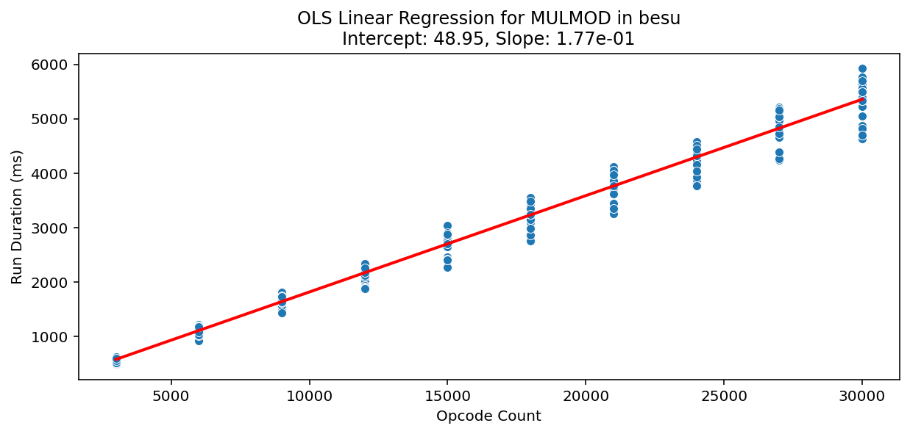

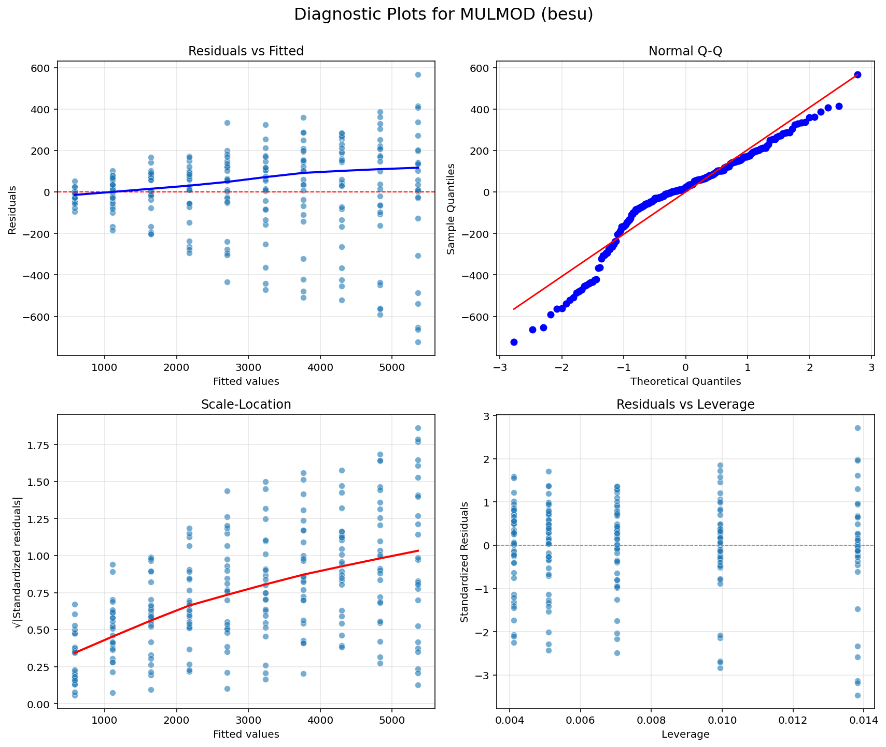


## reth


```python
                            OLS Regression Results                            
==============================================================================
Dep. Variable:        run_duration_ms   R-squared:                       0.993
Model:                            OLS   Adj. R-squared:                  0.993
Method:                 Least Squares   F-statistic:                 1.915e+04
Date:                Fri, 23 Jan 2026   Prob (F-statistic):          6.20e-150
Time:                        12:16:57   Log-Likelihood:                -676.65
No. Observations:                 140   AIC:                             1357.
Df Residuals:                     138   BIC:                             1363.
Df Model:                           1                                         
Covariance Type:            nonrobust                                         
==============================================================================
                 coef    std err          t      P>|t|      [0.025      0.975]
------------------------------------------------------------------------------
const         29.7934      5.590      5.330      0.000      18.741      40.846
opcount        0.0416      0.000    138.400      0.000       0.041       0.042
==============================================================================
Omnibus:                       44.252   Durbin-Watson:                   1.199
Prob(Omnibus):                  0.000   Jarque-Bera (JB):              104.204
Skew:                          -1.301   Prob(JB):                     2.36e-23
Kurtosis:                       6.330   Cond. No.                     4.02e+04
==============================================================================

Notes:
[1] Standard Errors assume that the covariance matrix of the errors is correctly specified.
[2] The condition number is large, 4.02e+04. This might indicate that there are
strong multicollinearity or other numerical problems.
```

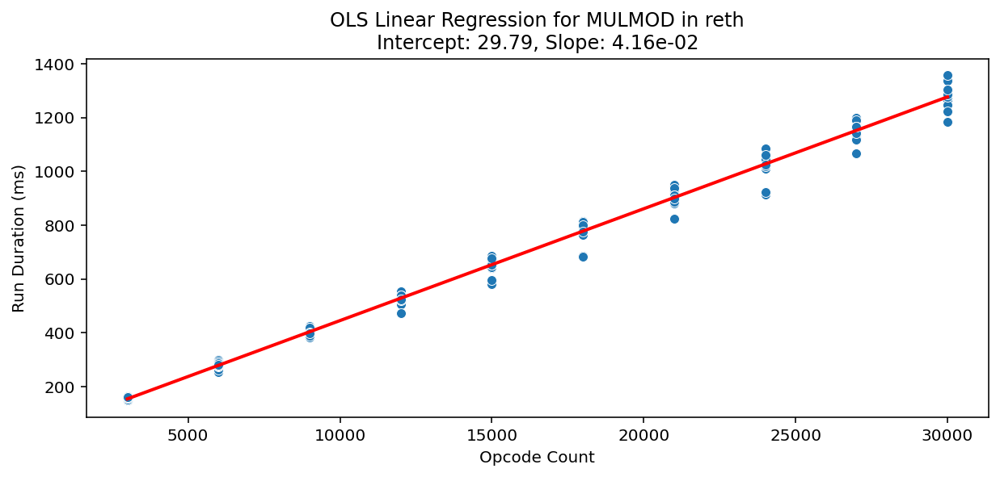

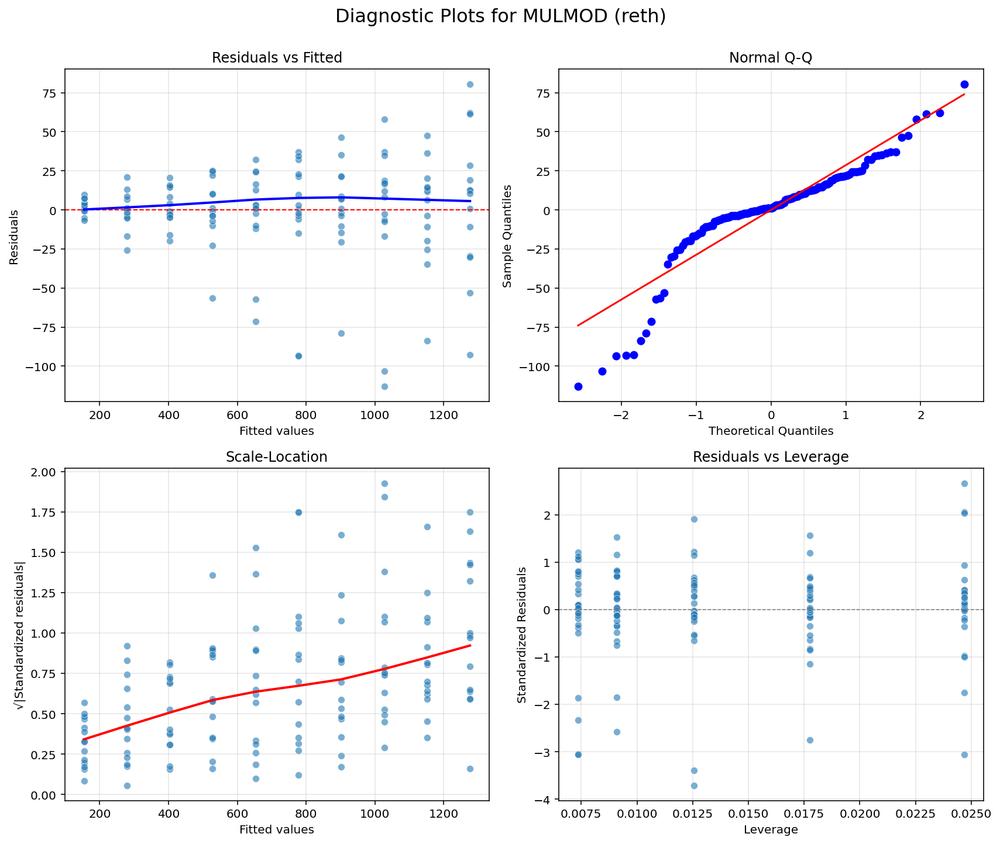


## nethermind


```python
                            OLS Regression Results                            
==============================================================================
Dep. Variable:        run_duration_ms   R-squared:                       0.982
Model:                            OLS   Adj. R-squared:                  0.982
Method:                 Least Squares   F-statistic:                 1.374e+04
Date:                Fri, 23 Jan 2026   Prob (F-statistic):          3.42e-219
Time:                        12:16:57   Log-Likelihood:                -1432.1
No. Observations:                 250   AIC:                             2868.
Df Residuals:                     248   BIC:                             2875.
Df Model:                           1                                         
Covariance Type:            nonrobust                                         
==============================================================================
                 coef    std err          t      P>|t|      [0.025      0.975]
------------------------------------------------------------------------------
const         27.0256     10.204      2.649      0.009       6.928      47.123
opcount        0.0643      0.001    117.232      0.000       0.063       0.065
==============================================================================
Omnibus:                       73.074   Durbin-Watson:                   0.642
Prob(Omnibus):                  0.000   Jarque-Bera (JB):              158.076
Skew:                          -1.422   Prob(JB):                     4.72e-35
Kurtosis:                       5.663   Cond. No.                     4.02e+04
==============================================================================

Notes:
[1] Standard Errors assume that the covariance matrix of the errors is correctly specified.
[2] The condition number is large, 4.02e+04. This might indicate that there are
strong multicollinearity or other numerical problems.
```

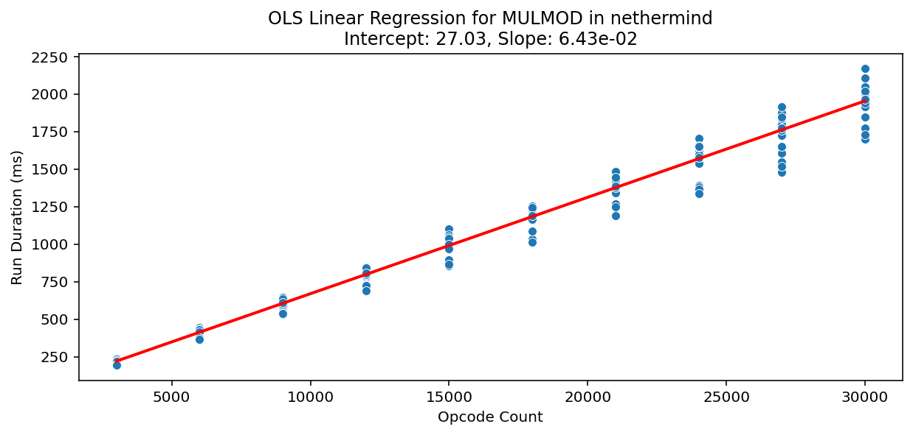

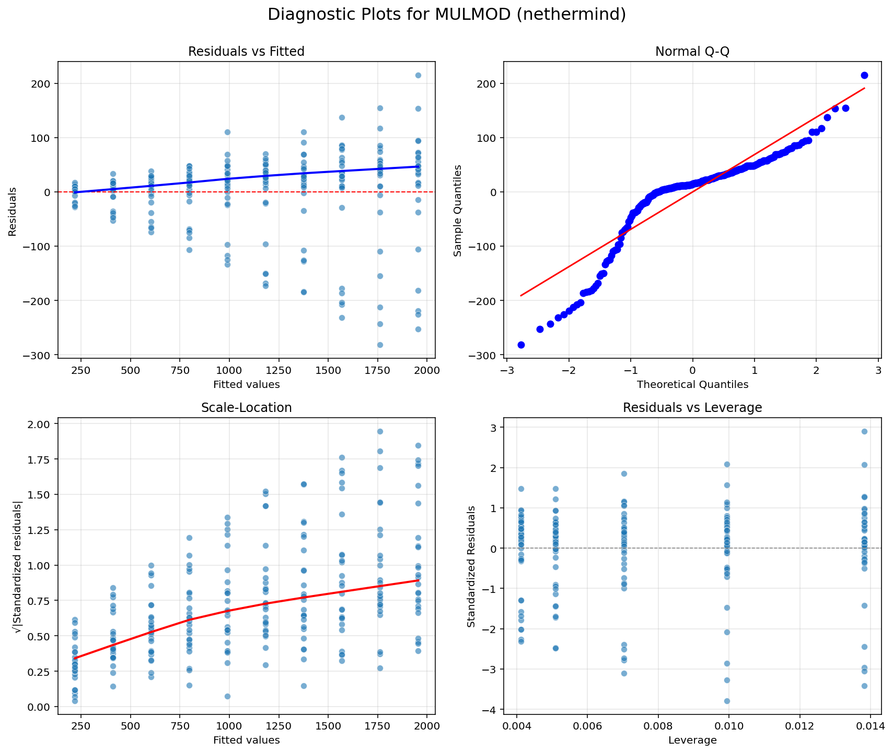


## erigon


```python
                            OLS Regression Results                            
==============================================================================
Dep. Variable:        run_duration_ms   R-squared:                       1.000
Model:                            OLS   Adj. R-squared:                  1.000
Method:                 Least Squares   F-statistic:                 9.010e+04
Date:                Fri, 23 Jan 2026   Prob (F-statistic):           1.17e-50
Time:                        12:16:57   Log-Likelihood:                -115.03
No. Observations:                  30   AIC:                             234.1
Df Residuals:                      28   BIC:                             236.9
Df Model:                           1                                         
Covariance Type:            nonrobust                                         
==============================================================================
                 coef    std err          t      P>|t|      [0.025      0.975]
------------------------------------------------------------------------------
const         27.7081      4.570      6.062      0.000      18.346      37.070
opcount        0.0737      0.000    300.168      0.000       0.073       0.074
==============================================================================
Omnibus:                       18.361   Durbin-Watson:                   1.183
Prob(Omnibus):                  0.000   Jarque-Bera (JB):               25.308
Skew:                           1.476   Prob(JB):                     3.19e-06
Kurtosis:                       6.396   Cond. No.                     4.02e+04
==============================================================================

Notes:
[1] Standard Errors assume that the covariance matrix of the errors is correctly specified.
[2] The condition number is large, 4.02e+04. This might indicate that there are
strong multicollinearity or other numerical problems.
```


# SMOD

## geth


```python
                            OLS Regression Results                            
==============================================================================
Dep. Variable:        run_duration_ms   R-squared:                       0.953
Model:                            OLS   Adj. R-squared:                  0.953
Method:                 Least Squares   F-statistic:                     6853.
Date:                Fri, 23 Jan 2026   Prob (F-statistic):          1.73e-226
Time:                        12:16:57   Log-Likelihood:                -1856.3
No. Observations:                 340   AIC:                             3717.
Df Residuals:                     338   BIC:                             3724.
Df Model:                           1                                         
Covariance Type:            nonrobust                                         
==============================================================================
                 coef    std err          t      P>|t|      [0.025      0.975]
------------------------------------------------------------------------------
const         37.2991      6.681      5.582      0.000      24.157      50.442
opcount        0.0297      0.000     82.782      0.000       0.029       0.030
==============================================================================
Omnibus:                      569.246   Durbin-Watson:                   1.517
Prob(Omnibus):                  0.000   Jarque-Bera (JB):           237909.998
Skew:                           9.159   Prob(JB):                         0.00
Kurtosis:                     131.289   Cond. No.                     4.02e+04
==============================================================================

Notes:
[1] Standard Errors assume that the covariance matrix of the errors is correctly specified.
[2] The condition number is large, 4.02e+04. This might indicate that there are
strong multicollinearity or other numerical problems.
```

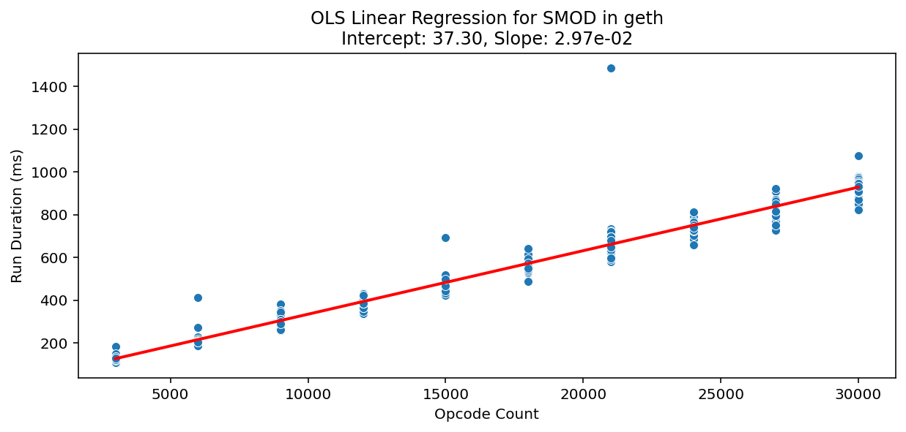

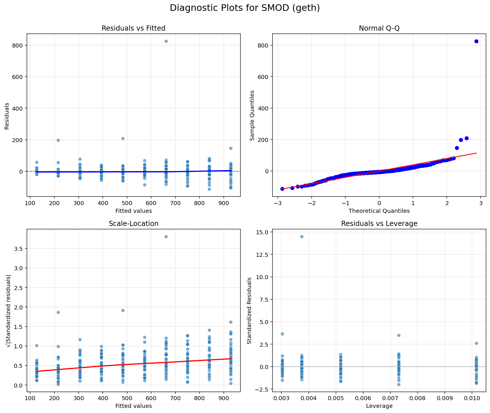


## besu


```python
                            OLS Regression Results                            
==============================================================================
Dep. Variable:        run_duration_ms   R-squared:                       0.983
Model:                            OLS   Adj. R-squared:                  0.983
Method:                 Least Squares   F-statistic:                 1.934e+04
Date:                Fri, 23 Jan 2026   Prob (F-statistic):          2.17e-300
Time:                        12:16:58   Log-Likelihood:                -1794.0
No. Observations:                 340   AIC:                             3592.
Df Residuals:                     338   BIC:                             3600.
Df Model:                           1                                         
Covariance Type:            nonrobust                                         
==============================================================================
                 coef    std err          t      P>|t|      [0.025      0.975]
------------------------------------------------------------------------------
const         28.7256      5.563      5.164      0.000      17.784      39.668
opcount        0.0416      0.000    139.076      0.000       0.041       0.042
==============================================================================
Omnibus:                       64.410   Durbin-Watson:                   0.703
Prob(Omnibus):                  0.000   Jarque-Bera (JB):              146.061
Skew:                          -0.947   Prob(JB):                     1.92e-32
Kurtosis:                       5.593   Cond. No.                     4.02e+04
==============================================================================

Notes:
[1] Standard Errors assume that the covariance matrix of the errors is correctly specified.
[2] The condition number is large, 4.02e+04. This might indicate that there are
strong multicollinearity or other numerical problems.
```

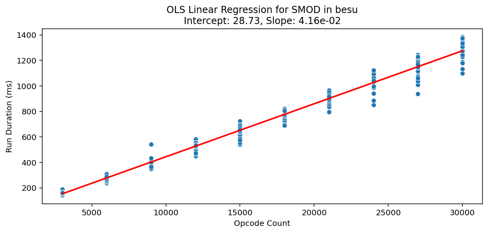

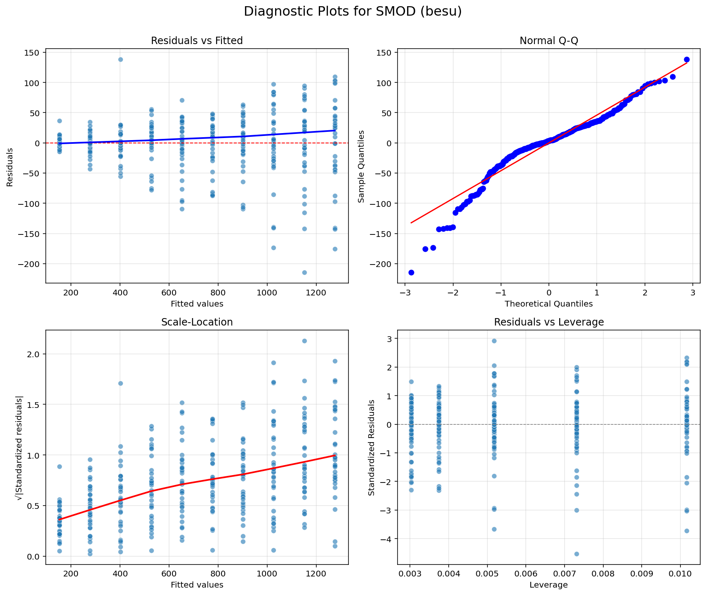


## reth


```python
                            OLS Regression Results                            
==============================================================================
Dep. Variable:        run_duration_ms   R-squared:                       0.971
Model:                            OLS   Adj. R-squared:                  0.971
Method:                 Least Squares   F-statistic:                     7661.
Date:                Fri, 23 Jan 2026   Prob (F-statistic):          1.89e-177
Time:                        12:16:58   Log-Likelihood:                -1012.7
No. Observations:                 230   AIC:                             2029.
Df Residuals:                     228   BIC:                             2036.
Df Model:                           1                                         
Covariance Type:            nonrobust                                         
==============================================================================
                 coef    std err          t      P>|t|      [0.025      0.975]
------------------------------------------------------------------------------
const         32.6914      2.828     11.559      0.000      27.118      38.264
opcount        0.0133      0.000     87.524      0.000       0.013       0.014
==============================================================================
Omnibus:                      310.395   Durbin-Watson:                   1.727
Prob(Omnibus):                  0.000   Jarque-Bera (JB):            40836.391
Skew:                           5.751   Prob(JB):                         0.00
Kurtosis:                      67.256   Cond. No.                     4.02e+04
==============================================================================

Notes:
[1] Standard Errors assume that the covariance matrix of the errors is correctly specified.
[2] The condition number is large, 4.02e+04. This might indicate that there are
strong multicollinearity or other numerical problems.
```

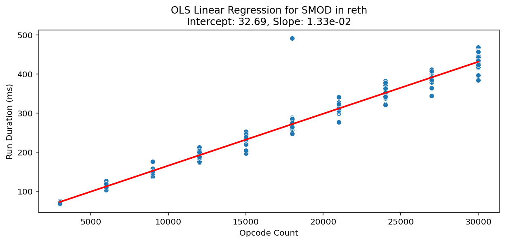

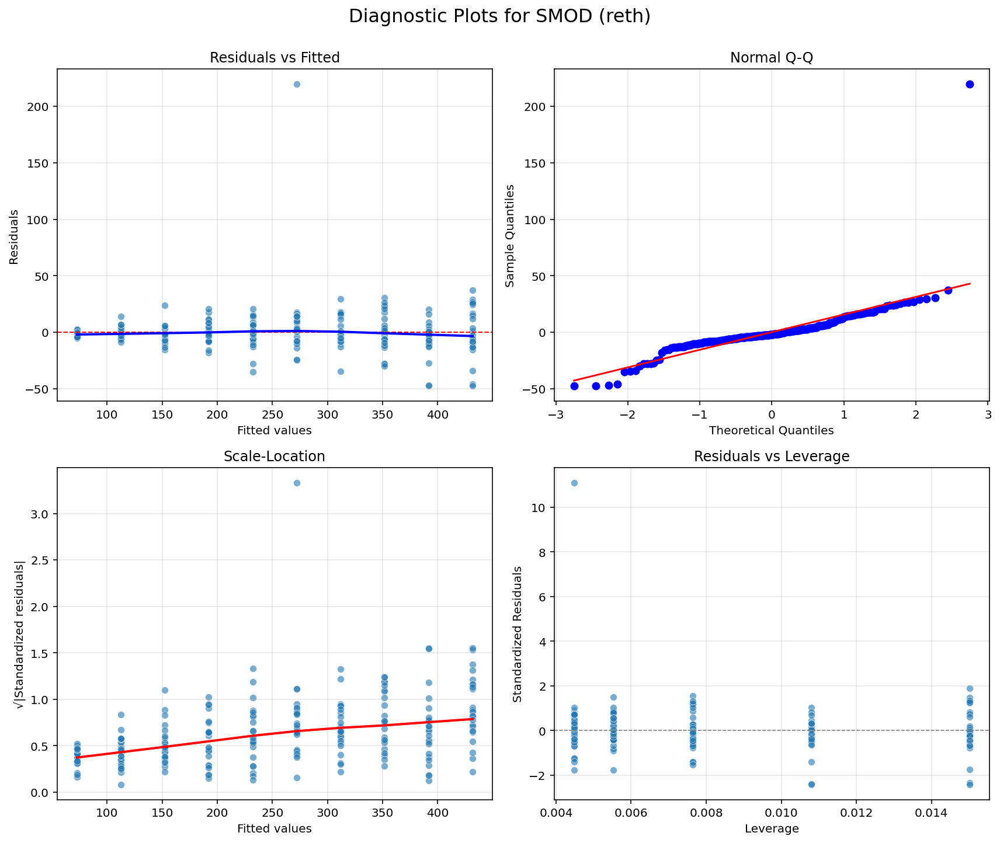


## nethermind


```python
                            OLS Regression Results                            
==============================================================================
Dep. Variable:        run_duration_ms   R-squared:                       0.983
Model:                            OLS   Adj. R-squared:                  0.983
Method:                 Least Squares   F-statistic:                 1.953e+04
Date:                Fri, 23 Jan 2026   Prob (F-statistic):          4.26e-301
Time:                        12:16:58   Log-Likelihood:                -1458.4
No. Observations:                 340   AIC:                             2921.
Df Residuals:                     338   BIC:                             2928.
Df Model:                           1                                         
Covariance Type:            nonrobust                                         
==============================================================================
                 coef    std err          t      P>|t|      [0.025      0.975]
------------------------------------------------------------------------------
const         30.4662      2.073     14.695      0.000      26.388      34.544
opcount        0.0156      0.000    139.760      0.000       0.015       0.016
==============================================================================
Omnibus:                       79.114   Durbin-Watson:                   0.859
Prob(Omnibus):                  0.000   Jarque-Bera (JB):              212.053
Skew:                          -1.086   Prob(JB):                     8.98e-47
Kurtosis:                       6.202   Cond. No.                     4.02e+04
==============================================================================

Notes:
[1] Standard Errors assume that the covariance matrix of the errors is correctly specified.
[2] The condition number is large, 4.02e+04. This might indicate that there are
strong multicollinearity or other numerical problems.
```

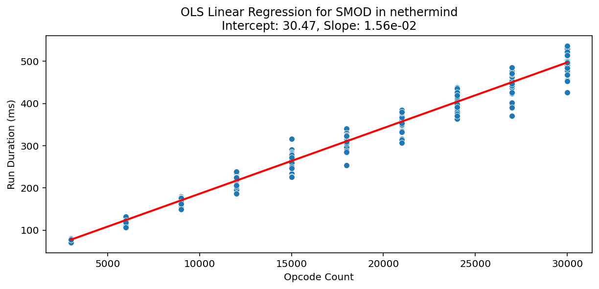

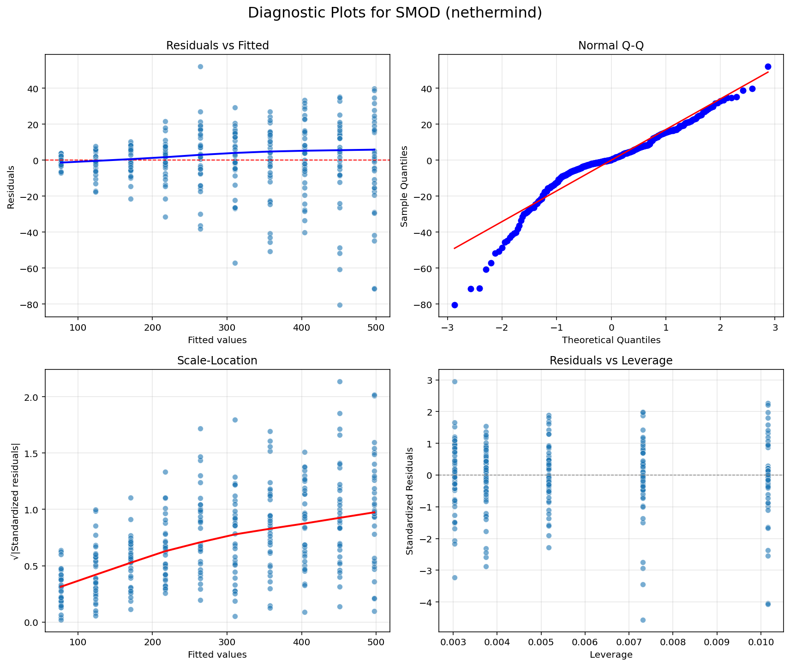


## erigon


```python
                            OLS Regression Results                            
==============================================================================
Dep. Variable:        run_duration_ms   R-squared:                       0.993
Model:                            OLS   Adj. R-squared:                  0.992
Method:                 Least Squares   F-statistic:                     3781.
Date:                Fri, 23 Jan 2026   Prob (F-statistic):           2.02e-31
Time:                        12:16:58   Log-Likelihood:                -138.53
No. Observations:                  30   AIC:                             281.1
Df Residuals:                      28   BIC:                             283.9
Df Model:                           1                                         
Covariance Type:            nonrobust                                         
==============================================================================
                 coef    std err          t      P>|t|      [0.025      0.975]
------------------------------------------------------------------------------
const         22.2938     10.002      2.229      0.034       1.806      42.781
opcount        0.0330      0.001     61.491      0.000       0.032       0.034
==============================================================================
Omnibus:                       58.725   Durbin-Watson:                   2.145
Prob(Omnibus):                  0.000   Jarque-Bera (JB):              463.777
Skew:                           4.002   Prob(JB):                    1.96e-101
Kurtosis:                      20.520   Cond. No.                     4.02e+04
==============================================================================

Notes:
[1] Standard Errors assume that the covariance matrix of the errors is correctly specified.
[2] The condition number is large, 4.02e+04. This might indicate that there are
strong multicollinearity or other numerical problems.
```


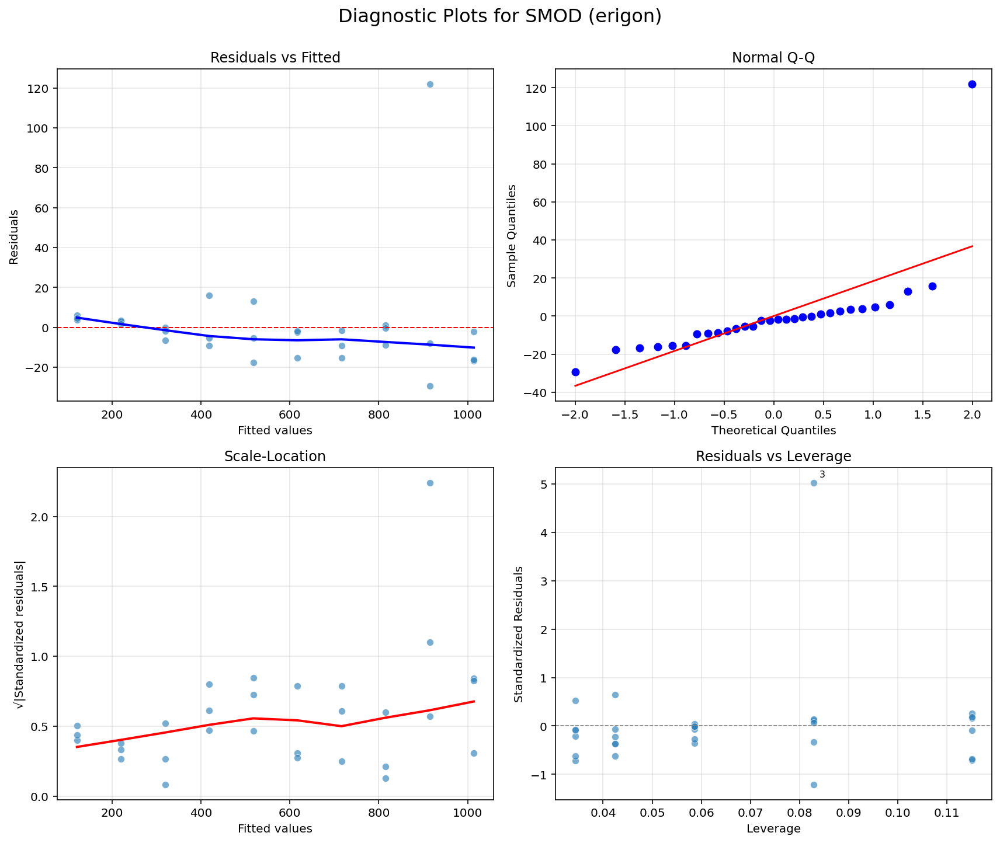


# MOD

## geth


```python
                            OLS Regression Results                            
==============================================================================
Dep. Variable:        run_duration_ms   R-squared:                       0.978
Model:                            OLS   Adj. R-squared:                  0.978
Method:                 Least Squares   F-statistic:                 1.538e+04
Date:                Fri, 23 Jan 2026   Prob (F-statistic):          7.07e-284
Time:                        12:16:59   Log-Likelihood:                -1921.9
No. Observations:                 340   AIC:                             3848.
Df Residuals:                     338   BIC:                             3855.
Df Model:                           1                                         
Covariance Type:            nonrobust                                         
==============================================================================
                 coef    std err          t      P>|t|      [0.025      0.975]
------------------------------------------------------------------------------
const         31.9311      8.104      3.940      0.000      15.991      47.872
opcount        0.0540      0.000    124.006      0.000       0.053       0.055
==============================================================================
Omnibus:                      238.328   Durbin-Watson:                   1.040
Prob(Omnibus):                  0.000   Jarque-Bera (JB):             9122.205
Skew:                           2.350   Prob(JB):                         0.00
Kurtosis:                      27.937   Cond. No.                     4.02e+04
==============================================================================

Notes:
[1] Standard Errors assume that the covariance matrix of the errors is correctly specified.
[2] The condition number is large, 4.02e+04. This might indicate that there are
strong multicollinearity or other numerical problems.
```


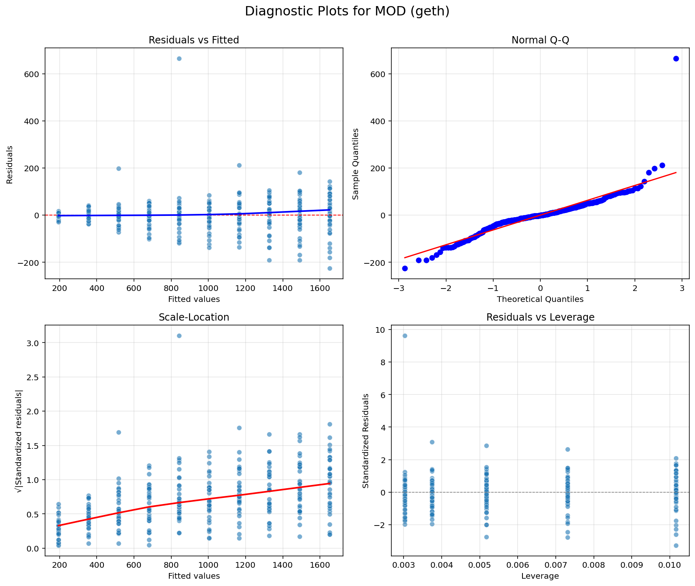


## besu


```python
                            OLS Regression Results                            
==============================================================================
Dep. Variable:        run_duration_ms   R-squared:                       0.979
Model:                            OLS   Adj. R-squared:                  0.979
Method:                 Least Squares   F-statistic:                 1.604e+04
Date:                Fri, 23 Jan 2026   Prob (F-statistic):          6.50e-287
Time:                        12:16:59   Log-Likelihood:                -2355.3
No. Observations:                 340   AIC:                             4715.
Df Residuals:                     338   BIC:                             4722.
Df Model:                           1                                         
Covariance Type:            nonrobust                                         
==============================================================================
                 coef    std err          t      P>|t|      [0.025      0.975]
------------------------------------------------------------------------------
const         46.8171     28.999      1.614      0.107     -10.224     103.858
opcount        0.1973      0.002    126.654      0.000       0.194       0.200
==============================================================================
Omnibus:                       52.090   Durbin-Watson:                   0.812
Prob(Omnibus):                  0.000   Jarque-Bera (JB):               88.762
Skew:                          -0.887   Prob(JB):                     5.32e-20
Kurtosis:                       4.766   Cond. No.                     4.02e+04
==============================================================================

Notes:
[1] Standard Errors assume that the covariance matrix of the errors is correctly specified.
[2] The condition number is large, 4.02e+04. This might indicate that there are
strong multicollinearity or other numerical problems.
```

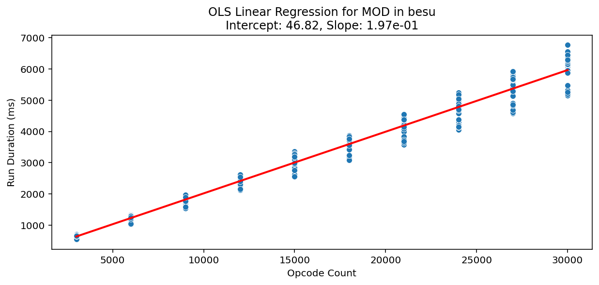

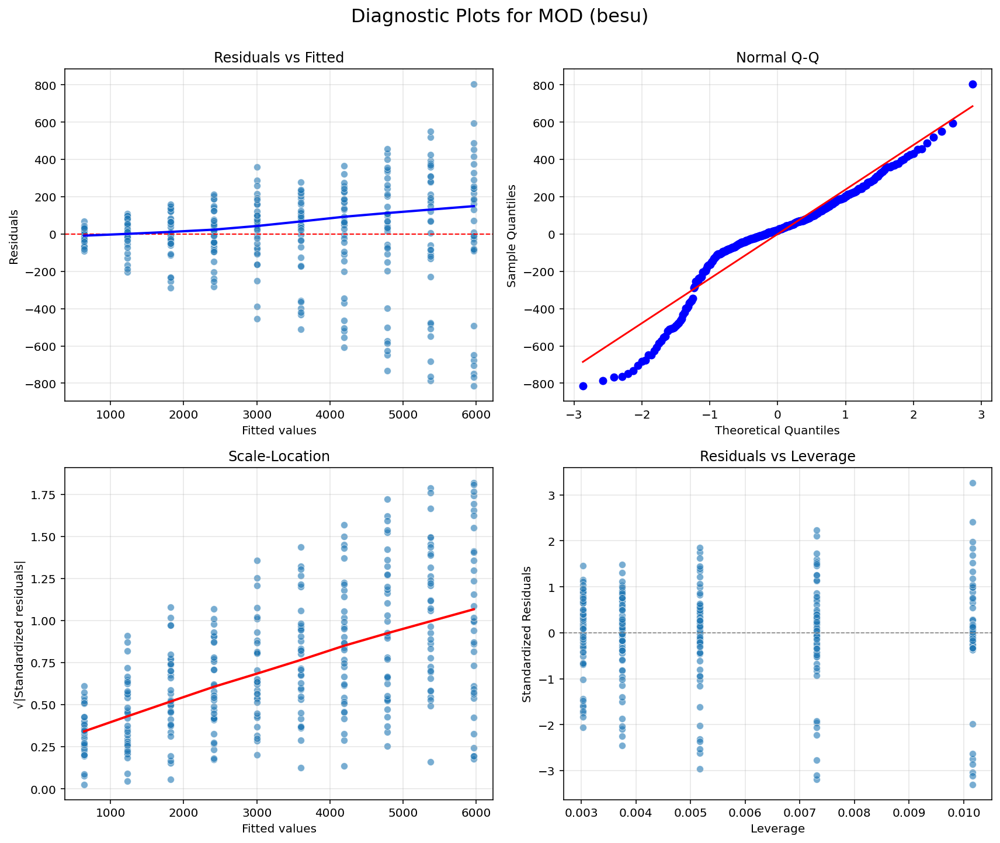


## reth


```python
                            OLS Regression Results                            
==============================================================================
Dep. Variable:        run_duration_ms   R-squared:                       0.992
Model:                            OLS   Adj. R-squared:                  0.992
Method:                 Least Squares   F-statistic:                 2.810e+04
Date:                Fri, 23 Jan 2026   Prob (F-statistic):          9.40e-241
Time:                        12:16:59   Log-Likelihood:                -1104.8
No. Observations:                 230   AIC:                             2214.
Df Residuals:                     228   BIC:                             2221.
Df Model:                           1                                         
Covariance Type:            nonrobust                                         
==============================================================================
                 coef    std err          t      P>|t|      [0.025      0.975]
------------------------------------------------------------------------------
const         31.0537      4.222      7.356      0.000      22.735      39.372
opcount        0.0380      0.000    167.636      0.000       0.038       0.038
==============================================================================
Omnibus:                      102.459   Durbin-Watson:                   0.963
Prob(Omnibus):                  0.000   Jarque-Bera (JB):              416.317
Skew:                          -1.818   Prob(JB):                     3.96e-91
Kurtosis:                       8.497   Cond. No.                     4.02e+04
==============================================================================

Notes:
[1] Standard Errors assume that the covariance matrix of the errors is correctly specified.
[2] The condition number is large, 4.02e+04. This might indicate that there are
strong multicollinearity or other numerical problems.
```

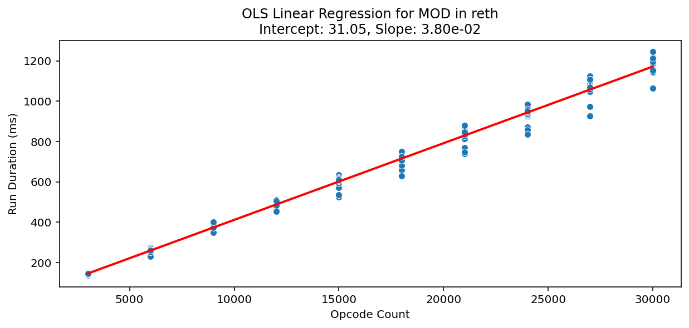

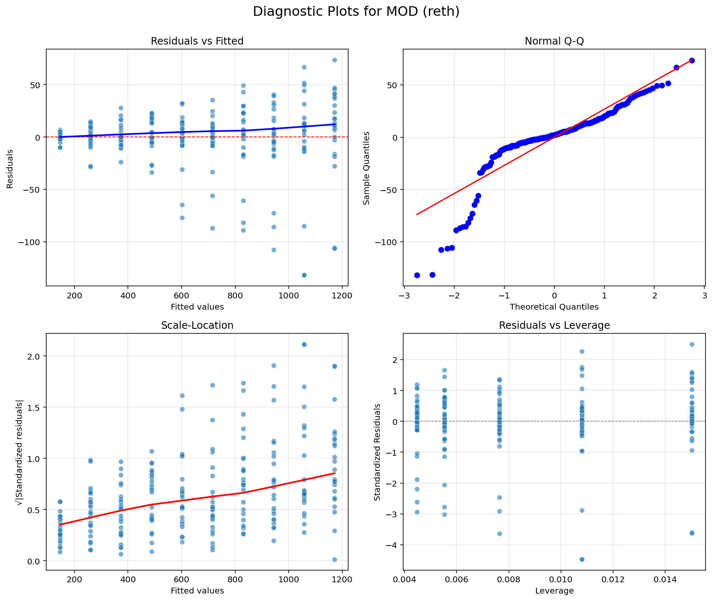


## nethermind


```python
                            OLS Regression Results                            
==============================================================================
Dep. Variable:        run_duration_ms   R-squared:                       0.988
Model:                            OLS   Adj. R-squared:                  0.988
Method:                 Least Squares   F-statistic:                 2.801e+04
Date:                Fri, 23 Jan 2026   Prob (F-statistic):               0.00
Time:                        12:16:59   Log-Likelihood:                -1768.5
No. Observations:                 340   AIC:                             3541.
Df Residuals:                     338   BIC:                             3549.
Df Model:                           1                                         
Covariance Type:            nonrobust                                         
==============================================================================
                 coef    std err          t      P>|t|      [0.025      0.975]
------------------------------------------------------------------------------
const         30.4713      5.162      5.903      0.000      20.318      40.625
opcount        0.0464      0.000    167.361      0.000       0.046       0.047
==============================================================================
Omnibus:                       76.689   Durbin-Watson:                   0.798
Prob(Omnibus):                  0.000   Jarque-Bera (JB):              186.342
Skew:                          -1.092   Prob(JB):                     3.44e-41
Kurtosis:                       5.896   Cond. No.                     4.02e+04
==============================================================================

Notes:
[1] Standard Errors assume that the covariance matrix of the errors is correctly specified.
[2] The condition number is large, 4.02e+04. This might indicate that there are
strong multicollinearity or other numerical problems.
```

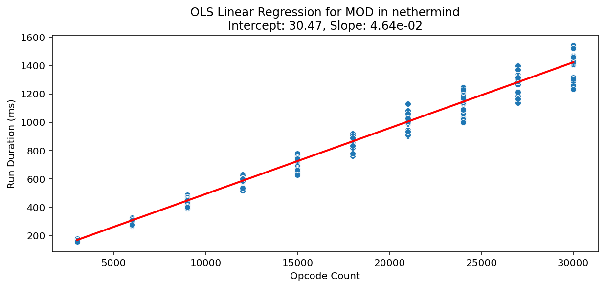

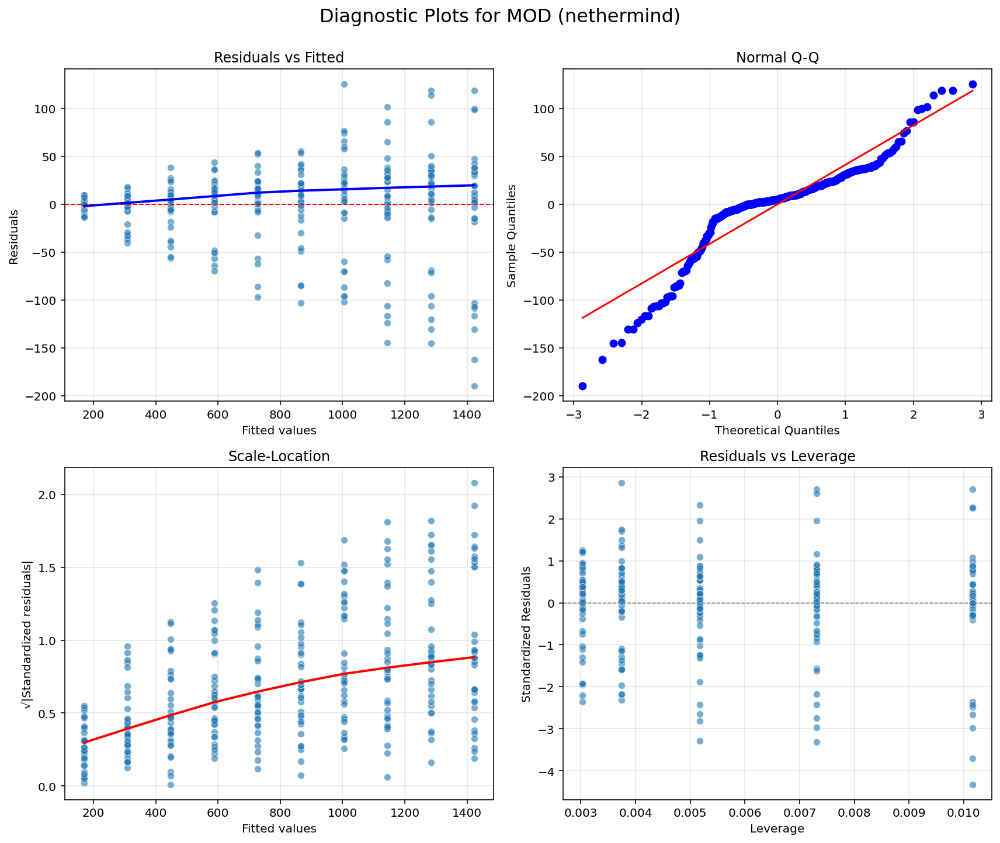


## erigon


```python
                            OLS Regression Results                            
==============================================================================
Dep. Variable:        run_duration_ms   R-squared:                       0.996
Model:                            OLS   Adj. R-squared:                  0.996
Method:                 Least Squares   F-statistic:                     7094.
Date:                Fri, 23 Jan 2026   Prob (F-statistic):           3.16e-35
Time:                        12:17:00   Log-Likelihood:                -144.78
No. Observations:                  30   AIC:                             293.6
Df Residuals:                      28   BIC:                             296.4
Df Model:                           1                                         
Covariance Type:            nonrobust                                         
==============================================================================
                 coef    std err          t      P>|t|      [0.025      0.975]
------------------------------------------------------------------------------
const         39.0732     12.320      3.171      0.004      13.836      64.310
opcount        0.0557      0.001     84.225      0.000       0.054       0.057
==============================================================================
Omnibus:                       16.793   Durbin-Watson:                   1.978
Prob(Omnibus):                  0.000   Jarque-Bera (JB):               21.058
Skew:                           1.410   Prob(JB):                     2.68e-05
Kurtosis:                       5.982   Cond. No.                     4.02e+04
==============================================================================

Notes:
[1] Standard Errors assume that the covariance matrix of the errors is correctly specified.
[2] The condition number is large, 4.02e+04. This might indicate that there are
strong multicollinearity or other numerical problems.
```

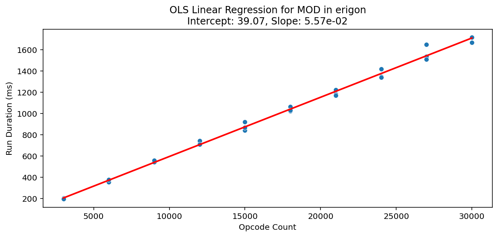

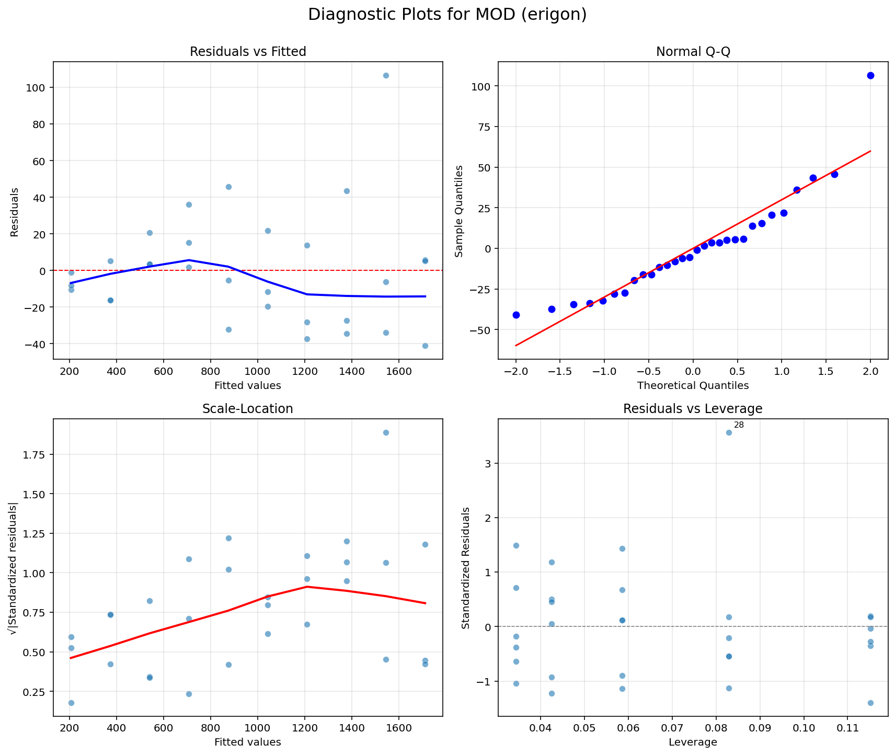


# POINT_EVALUATION

## geth


```python
                            OLS Regression Results                            
==============================================================================
Dep. Variable:        run_duration_ms   R-squared:                       0.989
Model:                            OLS   Adj. R-squared:                  0.989
Method:                 Least Squares   F-statistic:                 3.171e+04
Date:                Fri, 23 Jan 2026   Prob (F-statistic):               0.00
Time:                        12:17:00   Log-Likelihood:                -2550.5
No. Observations:                 340   AIC:                             5105.
Df Residuals:                     338   BIC:                             5113.
Df Model:                           1                                         
Covariance Type:            nonrobust                                         
==============================================================================
                 coef    std err          t      P>|t|      [0.025      0.975]
------------------------------------------------------------------------------
const         48.8807     51.486      0.949      0.343     -52.393     150.154
opcount     1477.6354      8.298    178.077      0.000    1461.314    1493.957
==============================================================================
Omnibus:                      110.615   Durbin-Watson:                   0.686
Prob(Omnibus):                  0.000   Jarque-Bera (JB):              245.042
Skew:                          -1.671   Prob(JB):                     6.16e-54
Kurtosis:                       5.476   Cond. No.                         13.7
==============================================================================

Notes:
[1] Standard Errors assume that the covariance matrix of the errors is correctly specified.
```

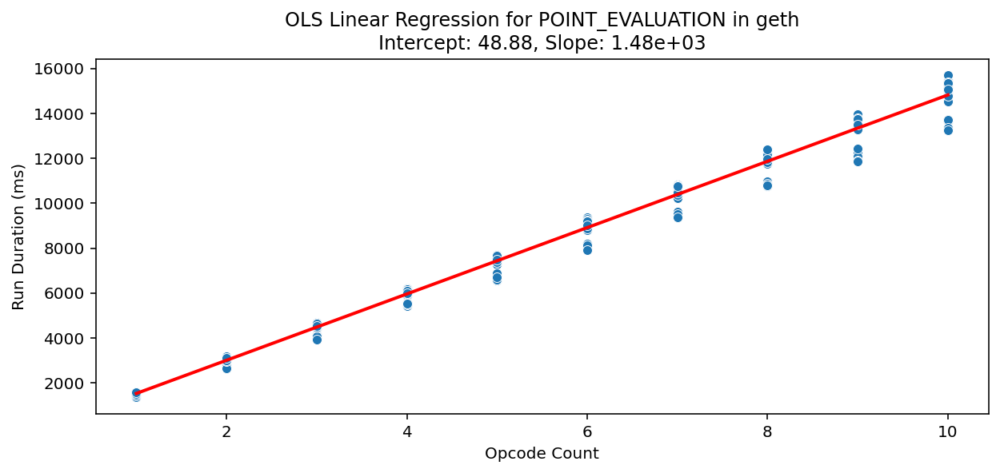

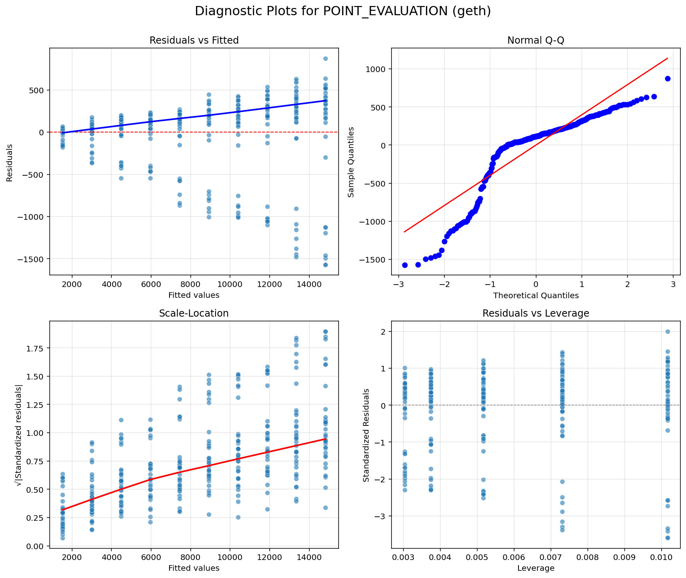


## besu


```python
                            OLS Regression Results                            
==============================================================================
Dep. Variable:        run_duration_ms   R-squared:                       0.992
Model:                            OLS   Adj. R-squared:                  0.992
Method:                 Least Squares   F-statistic:                 4.242e+04
Date:                Fri, 23 Jan 2026   Prob (F-statistic):               0.00
Time:                        12:17:00   Log-Likelihood:                -2505.2
No. Observations:                 340   AIC:                             5014.
Df Residuals:                     338   BIC:                             5022.
Df Model:                           1                                         
Covariance Type:            nonrobust                                         
==============================================================================
                 coef    std err          t      P>|t|      [0.025      0.975]
------------------------------------------------------------------------------
const         40.5412     45.060      0.900      0.369     -48.092     129.174
opcount     1495.7546      7.262    205.969      0.000    1481.470    1510.039
==============================================================================
Omnibus:                      114.919   Durbin-Watson:                   0.718
Prob(Omnibus):                  0.000   Jarque-Bera (JB):              290.897
Skew:                          -1.642   Prob(JB):                     6.80e-64
Kurtosis:                       6.121   Cond. No.                         13.7
==============================================================================

Notes:
[1] Standard Errors assume that the covariance matrix of the errors is correctly specified.
```

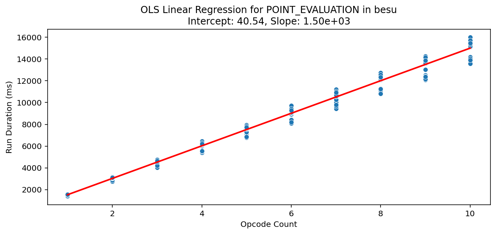

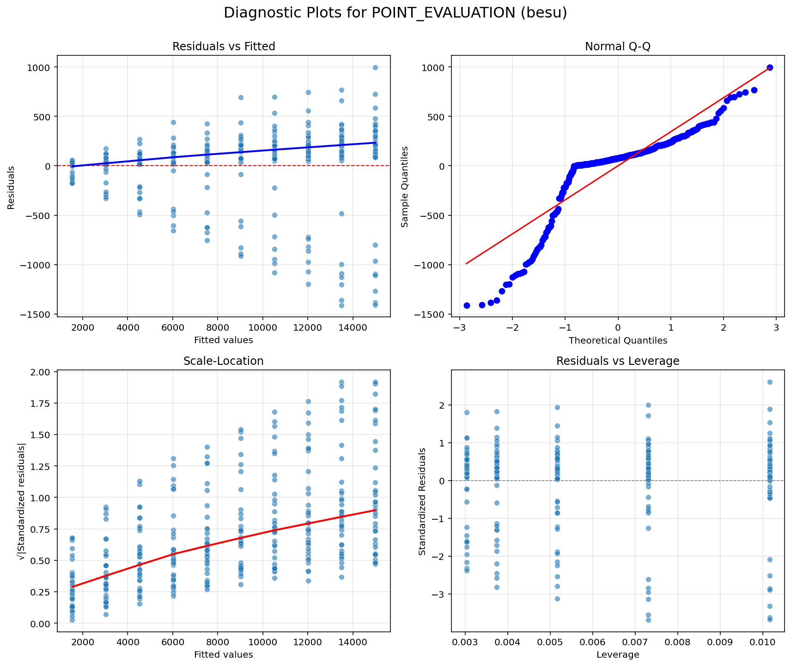


## reth


```python
                            OLS Regression Results                            
==============================================================================
Dep. Variable:        run_duration_ms   R-squared:                       0.994
Model:                            OLS   Adj. R-squared:                  0.994
Method:                 Least Squares   F-statistic:                 3.965e+04
Date:                Fri, 23 Jan 2026   Prob (F-statistic):          1.12e-257
Time:                        12:17:01   Log-Likelihood:                -1657.2
No. Observations:                 230   AIC:                             3318.
Df Residuals:                     228   BIC:                             3325.
Df Model:                           1                                         
Covariance Type:            nonrobust                                         
==============================================================================
                 coef    std err          t      P>|t|      [0.025      0.975]
------------------------------------------------------------------------------
const         31.8956     46.606      0.684      0.494     -59.937     123.728
opcount     1495.5895      7.511    199.115      0.000    1480.789    1510.390
==============================================================================
Omnibus:                      140.180   Durbin-Watson:                   0.636
Prob(Omnibus):                  0.000   Jarque-Bera (JB):              665.948
Skew:                          -2.603   Prob(JB):                    2.46e-145
Kurtosis:                       9.510   Cond. No.                         13.7
==============================================================================

Notes:
[1] Standard Errors assume that the covariance matrix of the errors is correctly specified.
```

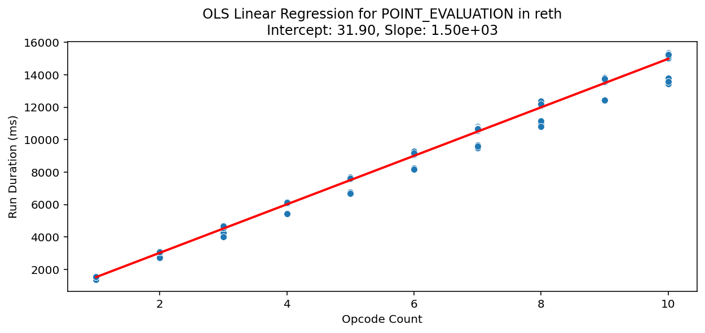

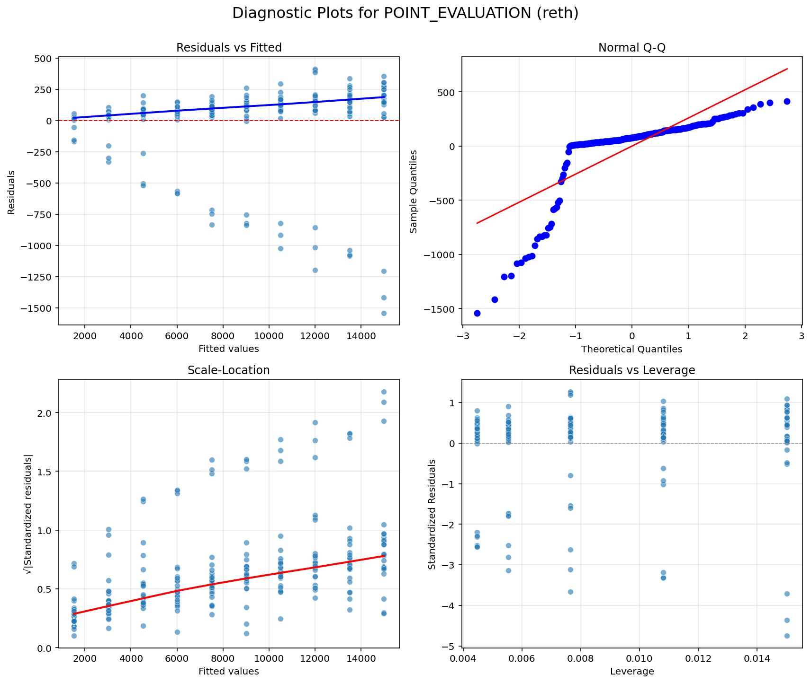


## nethermind


```python
                            OLS Regression Results                            
==============================================================================
Dep. Variable:        run_duration_ms   R-squared:                       0.309
Model:                            OLS   Adj. R-squared:                  0.307
Method:                 Least Squares   F-statistic:                     151.3
Date:                Fri, 23 Jan 2026   Prob (F-statistic):           5.43e-29
Time:                        12:17:01   Log-Likelihood:                -3330.4
No. Observations:                 340   AIC:                             6665.
Df Residuals:                     338   BIC:                             6672.
Df Model:                           1                                         
Covariance Type:            nonrobust                                         
==============================================================================
                 coef    std err          t      P>|t|      [0.025      0.975]
------------------------------------------------------------------------------
const         21.6995    510.264      0.043      0.966    -981.994    1025.393
opcount     1011.6121     82.237     12.301      0.000     849.852    1173.372
==============================================================================
Omnibus:                       40.416   Durbin-Watson:                   0.549
Prob(Omnibus):                  0.000   Jarque-Bera (JB):               51.619
Skew:                          -0.941   Prob(JB):                     6.18e-12
Kurtosis:                       2.679   Cond. No.                         13.7
==============================================================================

Notes:
[1] Standard Errors assume that the covariance matrix of the errors is correctly specified.
```

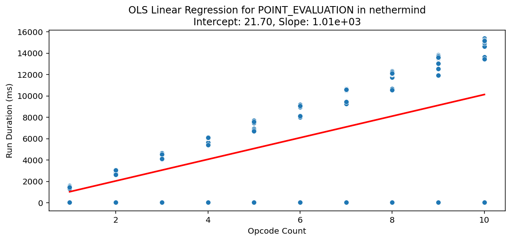

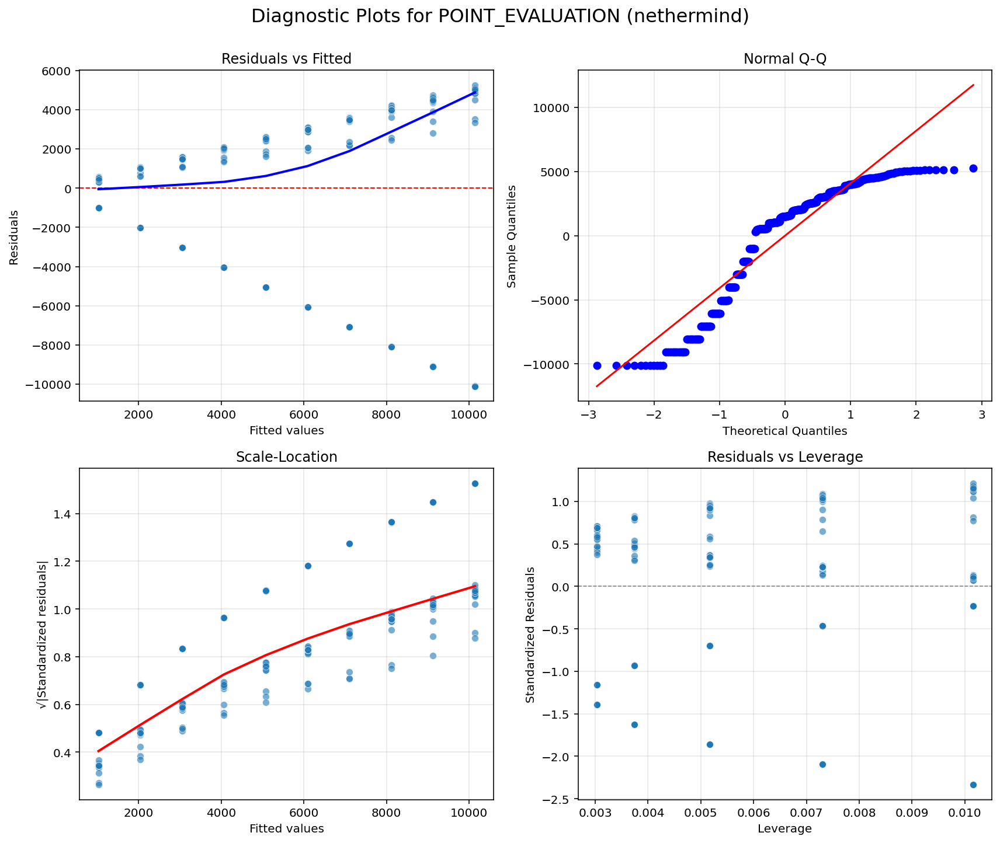


## erigon

OLS model did not run... Error: zero-size array to reduction operation maximum which has no identity

# BLS12_G1ADD

## geth


```python
                            OLS Regression Results                            
==============================================================================
Dep. Variable:        run_duration_ms   R-squared:                       0.990
Model:                            OLS   Adj. R-squared:                  0.990
Method:                 Least Squares   F-statistic:                 3.203e+04
Date:                Fri, 23 Jan 2026   Prob (F-statistic):               0.00
Time:                        12:17:01   Log-Likelihood:                -1955.6
No. Observations:                 340   AIC:                             3915.
Df Residuals:                     338   BIC:                             3923.
Df Model:                           1                                         
Covariance Type:            nonrobust                                         
==============================================================================
                 coef    std err          t      P>|t|      [0.025      0.975]
------------------------------------------------------------------------------
const         26.6948      8.949      2.983      0.003       9.091      44.298
opcount        5.1628      0.029    178.975      0.000       5.106       5.219
==============================================================================
Omnibus:                       65.145   Durbin-Watson:                   1.206
Prob(Omnibus):                  0.000   Jarque-Bera (JB):              145.188
Skew:                          -0.964   Prob(JB):                     2.97e-32
Kurtosis:                       5.556   Cond. No.                         670.
==============================================================================

Notes:
[1] Standard Errors assume that the covariance matrix of the errors is correctly specified.
```

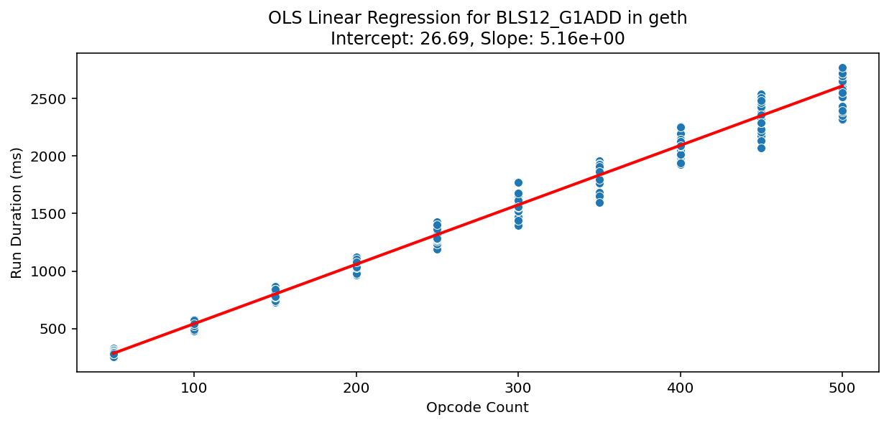

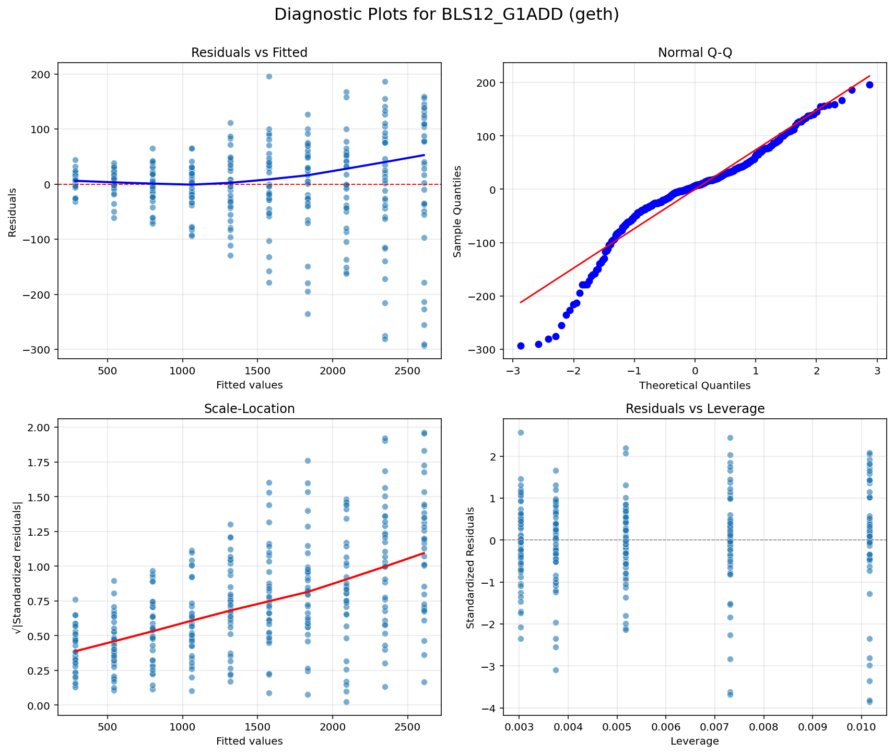


## besu


```python
                            OLS Regression Results                            
==============================================================================
Dep. Variable:        run_duration_ms   R-squared:                       0.952
Model:                            OLS   Adj. R-squared:                  0.952
Method:                 Least Squares   F-statistic:                     6689.
Date:                Fri, 23 Jan 2026   Prob (F-statistic):          8.62e-225
Time:                        12:17:01   Log-Likelihood:                -2481.3
No. Observations:                 340   AIC:                             4967.
Df Residuals:                     338   BIC:                             4974.
Df Model:                           1                                         
Covariance Type:            nonrobust                                         
==============================================================================
                 coef    std err          t      P>|t|      [0.025      0.975]
------------------------------------------------------------------------------
const         35.7817     42.006      0.852      0.395     -46.844     118.408
opcount       11.0733      0.135     81.784      0.000      10.807      11.340
==============================================================================
Omnibus:                       28.866   Durbin-Watson:                   1.280
Prob(Omnibus):                  0.000   Jarque-Bera (JB):               39.571
Skew:                          -0.612   Prob(JB):                     2.55e-09
Kurtosis:                       4.137   Cond. No.                         670.
==============================================================================

Notes:
[1] Standard Errors assume that the covariance matrix of the errors is correctly specified.
```

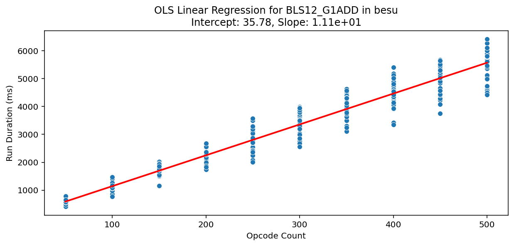

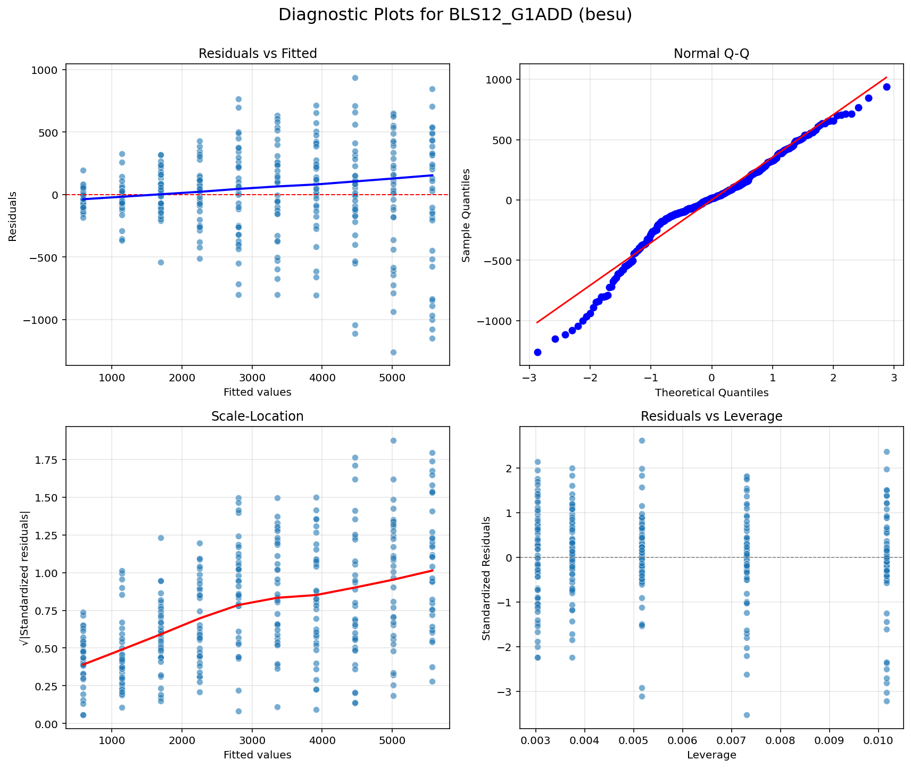


## reth


```python
                            OLS Regression Results                            
==============================================================================
Dep. Variable:        run_duration_ms   R-squared:                       0.991
Model:                            OLS   Adj. R-squared:                  0.991
Method:                 Least Squares   F-statistic:                 2.428e+04
Date:                Fri, 23 Jan 2026   Prob (F-statistic):          1.43e-233
Time:                        12:17:02   Log-Likelihood:                -1311.0
No. Observations:                 230   AIC:                             2626.
Df Residuals:                     228   BIC:                             2633.
Df Model:                           1                                         
Covariance Type:            nonrobust                                         
==============================================================================
                 coef    std err          t      P>|t|      [0.025      0.975]
------------------------------------------------------------------------------
const         27.3730     10.344      2.646      0.009       6.990      47.756
opcount        5.1952      0.033    155.811      0.000       5.129       5.261
==============================================================================
Omnibus:                       77.439   Durbin-Watson:                   1.060
Prob(Omnibus):                  0.000   Jarque-Bera (JB):              251.649
Skew:                          -1.406   Prob(JB):                     2.27e-55
Kurtosis:                       7.284   Cond. No.                         670.
==============================================================================

Notes:
[1] Standard Errors assume that the covariance matrix of the errors is correctly specified.
```

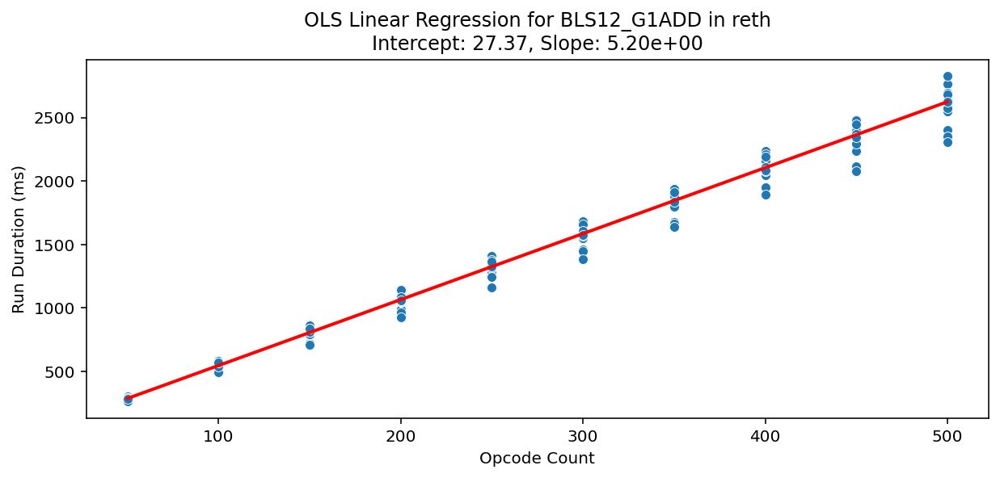

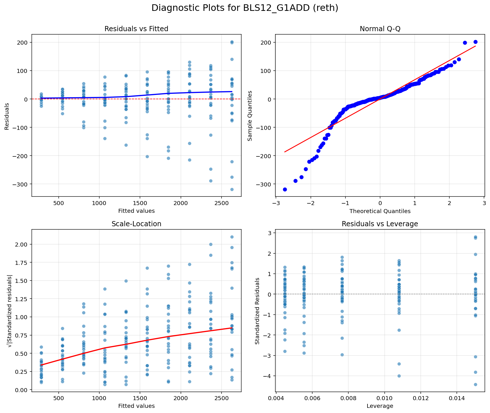


## nethermind


```python
                            OLS Regression Results                            
==============================================================================
Dep. Variable:        run_duration_ms   R-squared:                       0.385
Model:                            OLS   Adj. R-squared:                  0.384
Method:                 Least Squares   F-statistic:                     211.9
Date:                Fri, 23 Jan 2026   Prob (F-statistic):           1.32e-37
Time:                        12:17:02   Log-Likelihood:                -2741.6
No. Observations:                 340   AIC:                             5487.
Df Residuals:                     338   BIC:                             5495.
Df Model:                           1                                         
Covariance Type:            nonrobust                                         
==============================================================================
                 coef    std err          t      P>|t|      [0.025      0.975]
------------------------------------------------------------------------------
const         14.3124     90.326      0.158      0.874    -163.359     191.984
opcount        4.2382      0.291     14.557      0.000       3.665       4.811
==============================================================================
Omnibus:                       38.927   Durbin-Watson:                   0.674
Prob(Omnibus):                  0.000   Jarque-Bera (JB):               49.439
Skew:                          -0.922   Prob(JB):                     1.84e-11
Kurtosis:                       2.701   Cond. No.                         670.
==============================================================================

Notes:
[1] Standard Errors assume that the covariance matrix of the errors is correctly specified.
```


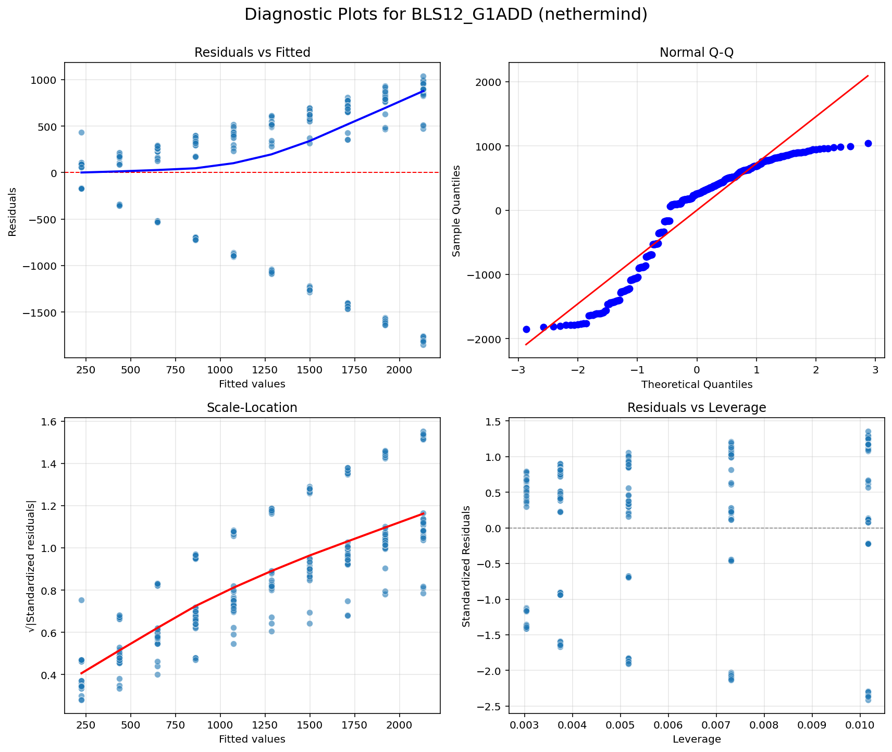


## erigon

OLS model did not run... Error: zero-size array to reduction operation maximum which has no identity

# BLS12_G2ADD

## geth


```python
                            OLS Regression Results                            
==============================================================================
Dep. Variable:        run_duration_ms   R-squared:                       0.990
Model:                            OLS   Adj. R-squared:                  0.990
Method:                 Least Squares   F-statistic:                 3.498e+04
Date:                Fri, 23 Jan 2026   Prob (F-statistic):               0.00
Time:                        12:17:02   Log-Likelihood:                -1872.0
No. Observations:                 340   AIC:                             3748.
Df Residuals:                     338   BIC:                             3756.
Df Model:                           1                                         
Covariance Type:            nonrobust                                         
==============================================================================
                 coef    std err          t      P>|t|      [0.025      0.975]
------------------------------------------------------------------------------
const         29.7455      6.997      4.251      0.000      15.982      43.509
opcount        7.0304      0.038    187.030      0.000       6.956       7.104
==============================================================================
Omnibus:                       39.781   Durbin-Watson:                   0.952
Prob(Omnibus):                  0.000   Jarque-Bera (JB):               65.722
Skew:                          -0.712   Prob(JB):                     5.35e-15
Kurtosis:                       4.616   Cond. No.                         402.
==============================================================================

Notes:
[1] Standard Errors assume that the covariance matrix of the errors is correctly specified.
```

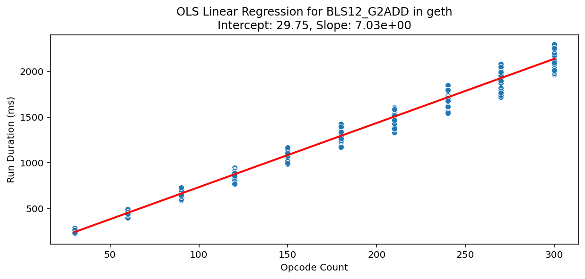

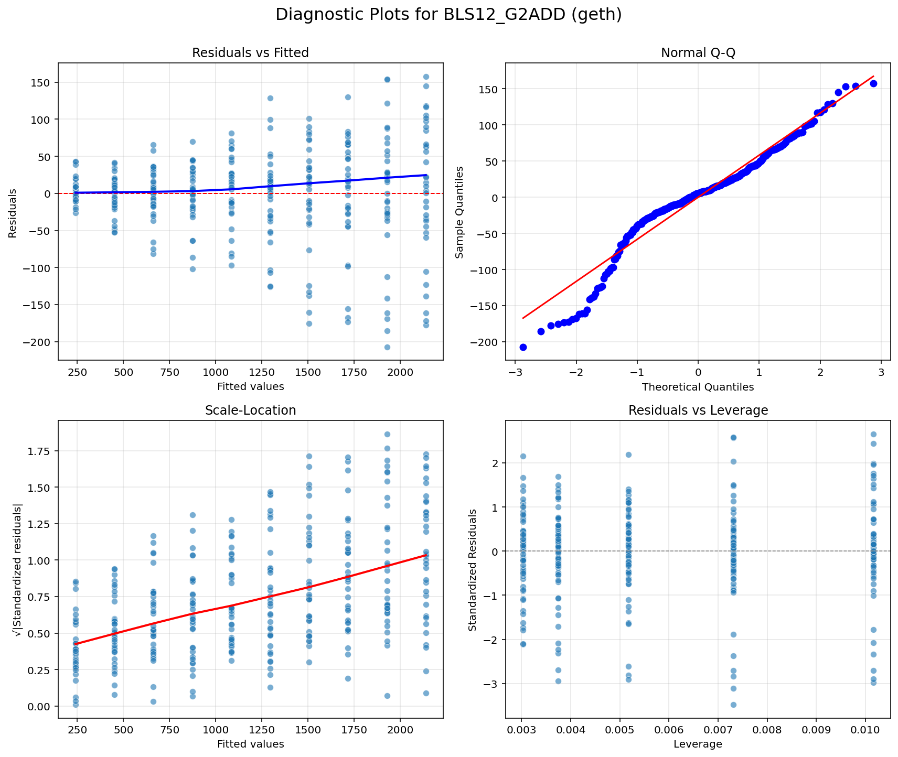


## besu


```python
                            OLS Regression Results                            
==============================================================================
Dep. Variable:        run_duration_ms   R-squared:                       0.954
Model:                            OLS   Adj. R-squared:                  0.954
Method:                 Least Squares   F-statistic:                     7083.
Date:                Fri, 23 Jan 2026   Prob (F-statistic):          8.42e-229
Time:                        12:17:03   Log-Likelihood:                -2357.7
No. Observations:                 340   AIC:                             4719.
Df Residuals:                     338   BIC:                             4727.
Df Model:                           1                                         
Covariance Type:            nonrobust                                         
==============================================================================
                 coef    std err          t      P>|t|      [0.025      0.975]
------------------------------------------------------------------------------
const         16.7413     29.196      0.573      0.567     -40.688      74.171
opcount       13.2005      0.157     84.161      0.000      12.892      13.509
==============================================================================
Omnibus:                       22.960   Durbin-Watson:                   1.046
Prob(Omnibus):                  0.000   Jarque-Bera (JB):               32.447
Skew:                          -0.496   Prob(JB):                     9.00e-08
Kurtosis:                       4.143   Cond. No.                         402.
==============================================================================

Notes:
[1] Standard Errors assume that the covariance matrix of the errors is correctly specified.
```

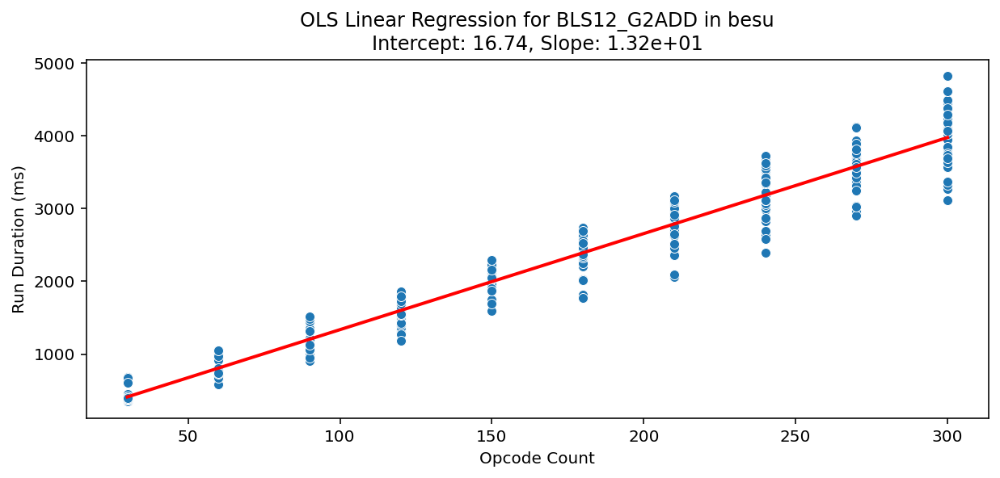

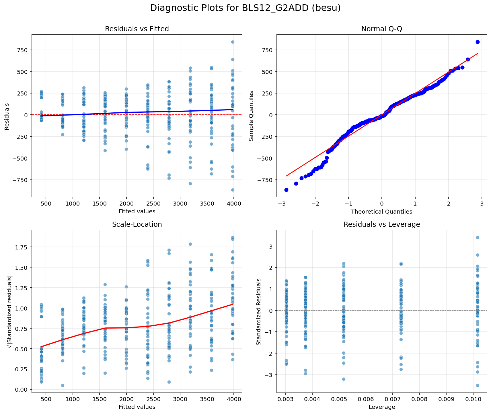


## reth


```python
                            OLS Regression Results                            
==============================================================================
Dep. Variable:        run_duration_ms   R-squared:                       0.992
Model:                            OLS   Adj. R-squared:                  0.992
Method:                 Least Squares   F-statistic:                 3.004e+04
Date:                Fri, 23 Jan 2026   Prob (F-statistic):          5.06e-244
Time:                        12:17:03   Log-Likelihood:                -1251.5
No. Observations:                 230   AIC:                             2507.
Df Residuals:                     228   BIC:                             2514.
Df Model:                           1                                         
Covariance Type:            nonrobust                                         
==============================================================================
                 coef    std err          t      P>|t|      [0.025      0.975]
------------------------------------------------------------------------------
const         36.6751      7.988      4.591      0.000      20.935      52.415
opcount        7.4373      0.043    173.308      0.000       7.353       7.522
==============================================================================
Omnibus:                       64.067   Durbin-Watson:                   0.891
Prob(Omnibus):                  0.000   Jarque-Bera (JB):              153.856
Skew:                          -1.274   Prob(JB):                     3.90e-34
Kurtosis:                       6.092   Cond. No.                         402.
==============================================================================

Notes:
[1] Standard Errors assume that the covariance matrix of the errors is correctly specified.
```

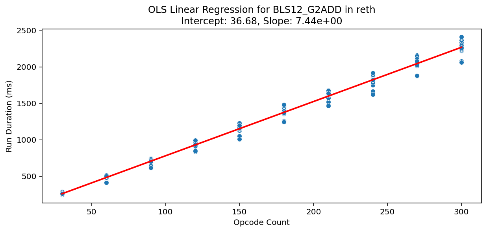

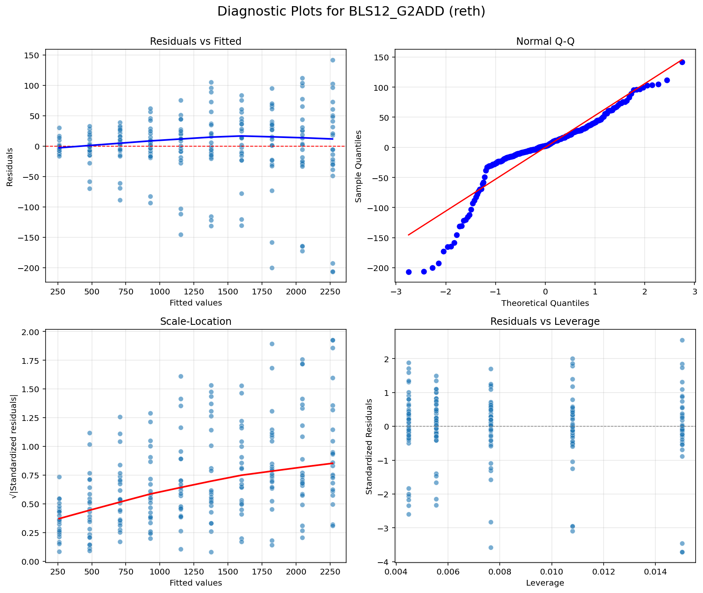


## nethermind


```python
                            OLS Regression Results                            
==============================================================================
Dep. Variable:        run_duration_ms   R-squared:                       0.363
Model:                            OLS   Adj. R-squared:                  0.362
Method:                 Least Squares   F-statistic:                     193.0
Date:                Fri, 23 Jan 2026   Prob (F-statistic):           5.07e-35
Time:                        12:17:03   Log-Likelihood:                -2728.7
No. Observations:                 340   AIC:                             5461.
Df Residuals:                     338   BIC:                             5469.
Df Model:                           1                                         
Covariance Type:            nonrobust                                         
==============================================================================
                 coef    std err          t      P>|t|      [0.025      0.975]
------------------------------------------------------------------------------
const          7.1253     86.954      0.082      0.935    -163.914     178.165
opcount        6.4891      0.467     13.891      0.000       5.570       7.408
==============================================================================
Omnibus:                       39.382   Durbin-Watson:                   0.450
Prob(Omnibus):                  0.000   Jarque-Bera (JB):               50.362
Skew:                          -0.932   Prob(JB):                     1.16e-11
Kurtosis:                       2.717   Cond. No.                         402.
==============================================================================

Notes:
[1] Standard Errors assume that the covariance matrix of the errors is correctly specified.
```

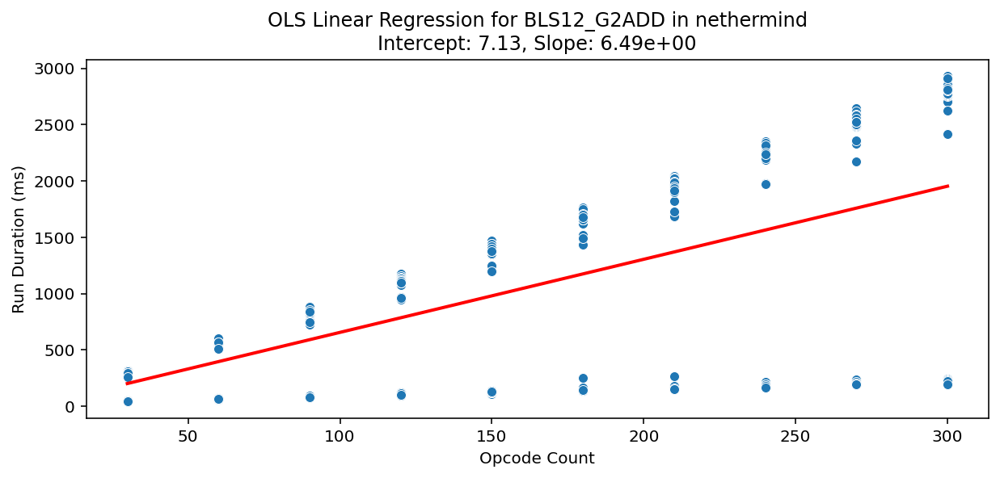

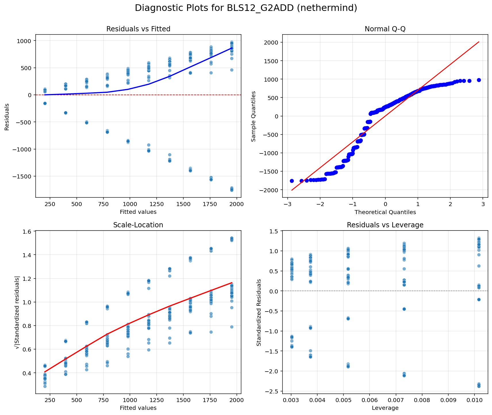


## erigon

OLS model did not run... Error: zero-size array to reduction operation maximum which has no identity

# ECADD

## geth


```python
                            OLS Regression Results                            
==============================================================================
Dep. Variable:        run_duration_ms   R-squared:                       0.365
Model:                            OLS   Adj. R-squared:                  0.364
Method:                 Least Squares   F-statistic:                     389.2
Date:                Fri, 23 Jan 2026   Prob (F-statistic):           8.34e-69
Time:                        12:17:03   Log-Likelihood:                -5408.8
No. Observations:                 680   AIC:                         1.082e+04
Df Residuals:                     678   BIC:                         1.083e+04
Df Model:                           1                                         
Covariance Type:            nonrobust                                         
==============================================================================
                 coef    std err          t      P>|t|      [0.025      0.975]
------------------------------------------------------------------------------
const         21.0621     57.162      0.368      0.713     -91.174     133.298
opcount        1.8174      0.092     19.727      0.000       1.636       1.998
==============================================================================
Omnibus:                      568.817   Durbin-Watson:                   1.821
Prob(Omnibus):                  0.000   Jarque-Bera (JB):               42.730
Skew:                           0.038   Prob(JB):                     5.26e-10
Kurtosis:                       1.774   Cond. No.                     1.34e+03
==============================================================================

Notes:
[1] Standard Errors assume that the covariance matrix of the errors is correctly specified.
[2] The condition number is large, 1.34e+03. This might indicate that there are
strong multicollinearity or other numerical problems.
```

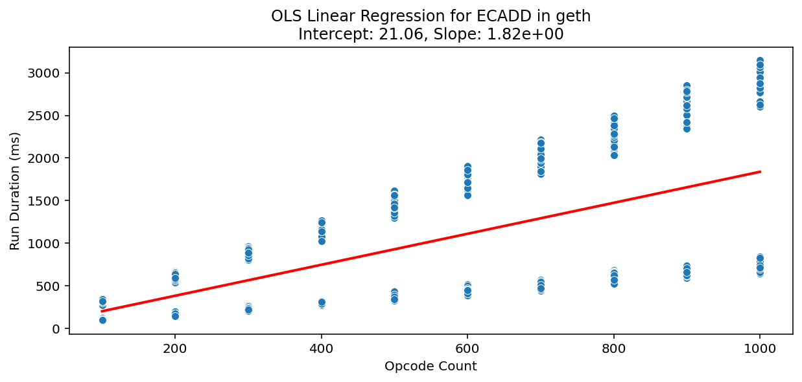

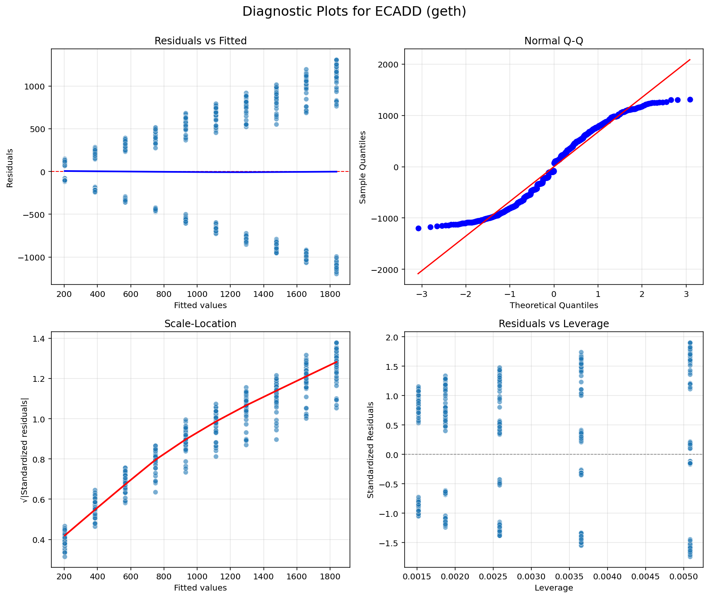


## besu


```python
                            OLS Regression Results                            
==============================================================================
Dep. Variable:        run_duration_ms   R-squared:                       0.779
Model:                            OLS   Adj. R-squared:                  0.779
Method:                 Least Squares   F-statistic:                     2395.
Date:                Fri, 23 Jan 2026   Prob (F-statistic):          1.15e-224
Time:                        12:17:04   Log-Likelihood:                -5375.4
No. Observations:                 680   AIC:                         1.075e+04
Df Residuals:                     678   BIC:                         1.076e+04
Df Model:                           1                                         
Covariance Type:            nonrobust                                         
==============================================================================
                 coef    std err          t      P>|t|      [0.025      0.975]
------------------------------------------------------------------------------
const         31.3093     54.419      0.575      0.565     -75.541     138.160
opcount        4.2918      0.088     48.935      0.000       4.120       4.464
==============================================================================
Omnibus:                       62.281   Durbin-Watson:                   1.816
Prob(Omnibus):                  0.000   Jarque-Bera (JB):               19.807
Skew:                           0.053   Prob(JB):                     5.00e-05
Kurtosis:                       2.171   Cond. No.                     1.34e+03
==============================================================================

Notes:
[1] Standard Errors assume that the covariance matrix of the errors is correctly specified.
[2] The condition number is large, 1.34e+03. This might indicate that there are
strong multicollinearity or other numerical problems.
```

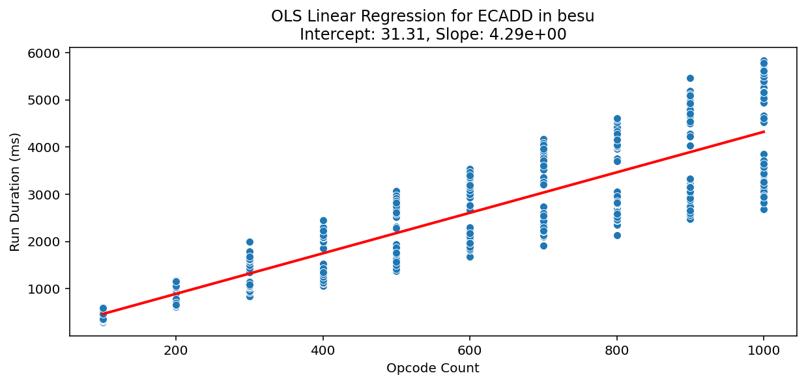

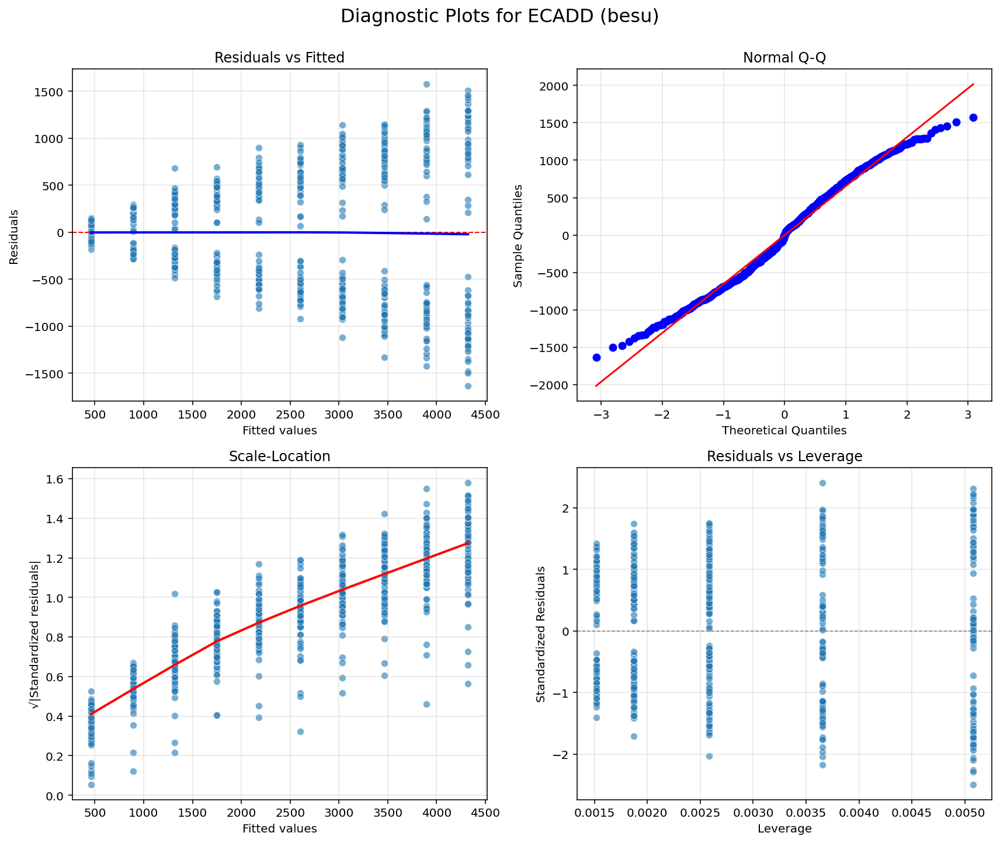


## reth


```python
                            OLS Regression Results                            
==============================================================================
Dep. Variable:        run_duration_ms   R-squared:                       0.307
Model:                            OLS   Adj. R-squared:                  0.306
Method:                 Least Squares   F-statistic:                     203.2
Date:                Fri, 23 Jan 2026   Prob (F-statistic):           2.04e-38
Time:                        12:17:04   Log-Likelihood:                -3817.7
No. Observations:                 460   AIC:                             7639.
Df Residuals:                     458   BIC:                             7648.
Df Model:                           1                                         
Covariance Type:            nonrobust                                         
==============================================================================
                 coef    std err          t      P>|t|      [0.025      0.975]
------------------------------------------------------------------------------
const         35.8447     98.227      0.365      0.715    -157.186     228.876
opcount        2.2565      0.158     14.254      0.000       1.945       2.568
==============================================================================
Omnibus:                      364.184   Durbin-Watson:                   1.796
Prob(Omnibus):                  0.000   Jarque-Bera (JB):               29.175
Skew:                           0.014   Prob(JB):                     4.62e-07
Kurtosis:                       1.767   Cond. No.                     1.34e+03
==============================================================================

Notes:
[1] Standard Errors assume that the covariance matrix of the errors is correctly specified.
[2] The condition number is large, 1.34e+03. This might indicate that there are
strong multicollinearity or other numerical problems.
```

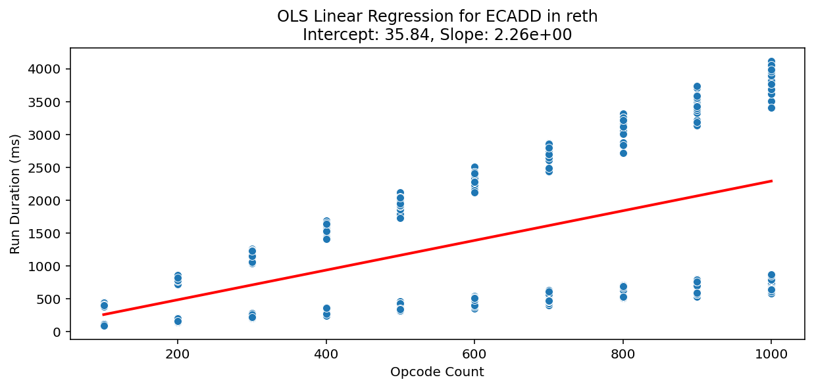

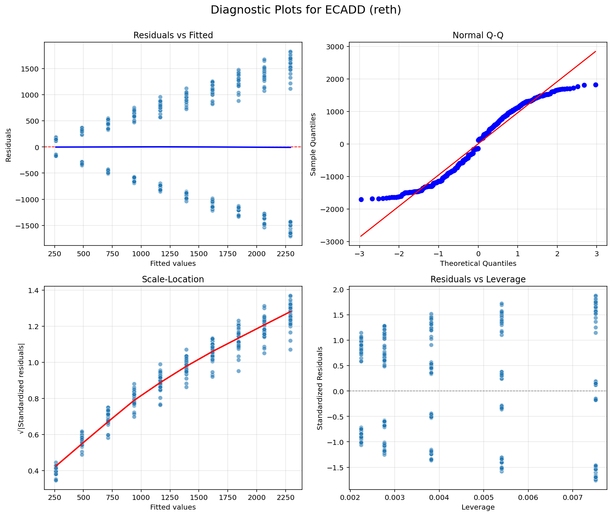


## nethermind


```python
                            OLS Regression Results                            
==============================================================================
Dep. Variable:        run_duration_ms   R-squared:                       0.340
Model:                            OLS   Adj. R-squared:                  0.339
Method:                 Least Squares   F-statistic:                     350.0
Date:                Fri, 23 Jan 2026   Prob (F-statistic):           2.78e-63
Time:                        12:17:04   Log-Likelihood:                -5211.8
No. Observations:                 680   AIC:                         1.043e+04
Df Residuals:                     678   BIC:                         1.044e+04
Df Model:                           1                                         
Covariance Type:            nonrobust                                         
==============================================================================
                 coef    std err          t      P>|t|      [0.025      0.975]
------------------------------------------------------------------------------
const         24.8303     42.783      0.580      0.562     -59.174     108.834
opcount        1.2899      0.069     18.708      0.000       1.155       1.425
==============================================================================
Omnibus:                       70.488   Durbin-Watson:                   1.486
Prob(Omnibus):                  0.000   Jarque-Bera (JB):               86.981
Skew:                           0.856   Prob(JB):                     1.29e-19
Kurtosis:                       2.630   Cond. No.                     1.34e+03
==============================================================================

Notes:
[1] Standard Errors assume that the covariance matrix of the errors is correctly specified.
[2] The condition number is large, 1.34e+03. This might indicate that there are
strong multicollinearity or other numerical problems.
```

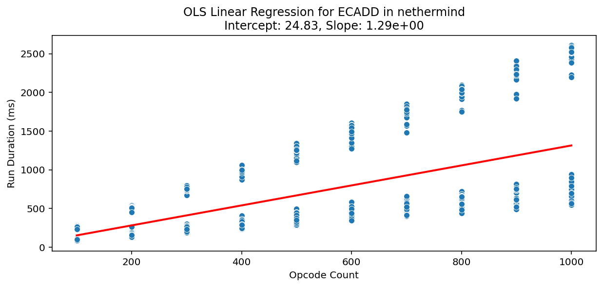

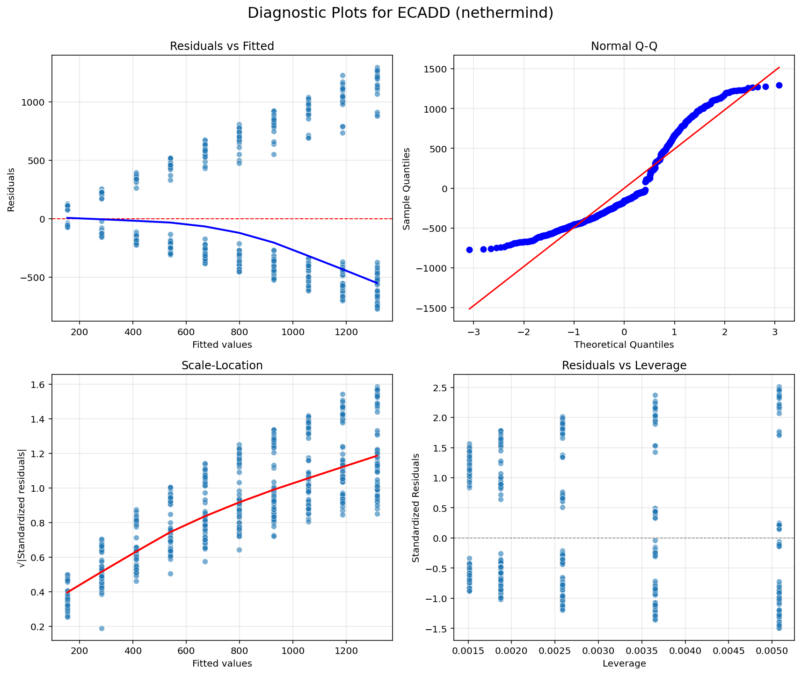


## erigon

OLS model did not run... Error: zero-size array to reduction operation maximum which has no identity

# ECRECOVER

## geth


```python
                            OLS Regression Results                            
==============================================================================
Dep. Variable:        run_duration_ms   R-squared:                       0.992
Model:                            OLS   Adj. R-squared:                  0.992
Method:                 Least Squares   F-statistic:                 4.000e+04
Date:                Fri, 23 Jan 2026   Prob (F-statistic):               0.00
Time:                        12:17:05   Log-Likelihood:                -2053.6
No. Observations:                 340   AIC:                             4111.
Df Residuals:                     338   BIC:                             4119.
Df Model:                           1                                         
Covariance Type:            nonrobust                                         
==============================================================================
                 coef    std err          t      P>|t|      [0.025      0.975]
------------------------------------------------------------------------------
const         36.4190     11.937      3.051      0.002      12.939      59.899
opcount       48.0917      0.240    199.988      0.000      47.619      48.565
==============================================================================
Omnibus:                       65.298   Durbin-Watson:                   0.701
Prob(Omnibus):                  0.000   Jarque-Bera (JB):              125.520
Skew:                          -1.030   Prob(JB):                     5.54e-28
Kurtosis:                       5.149   Cond. No.                         107.
==============================================================================

Notes:
[1] Standard Errors assume that the covariance matrix of the errors is correctly specified.
```

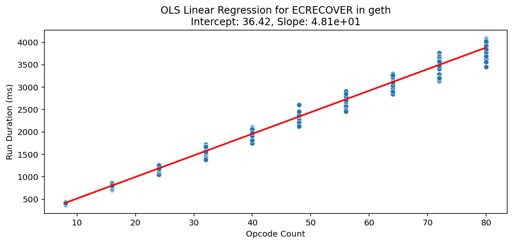

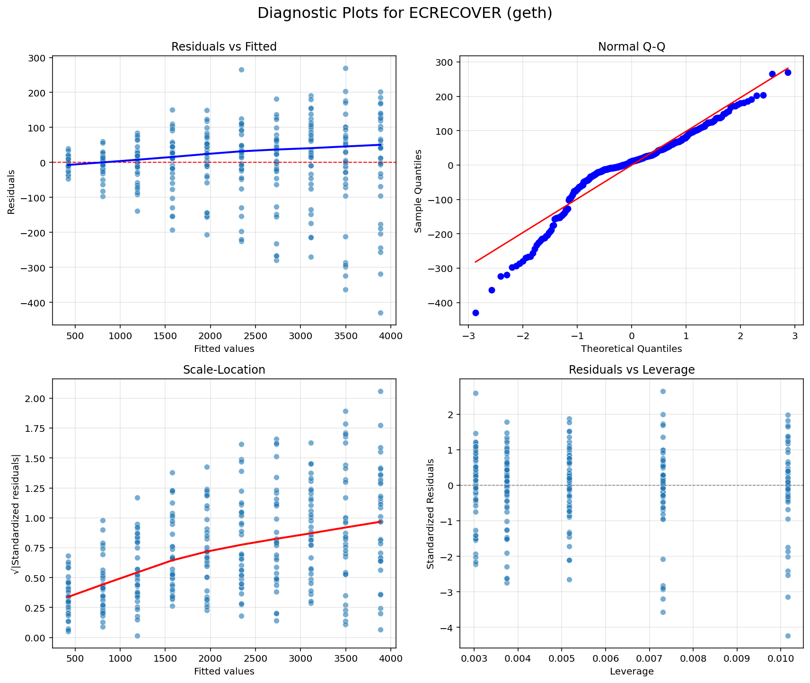


## besu


```python
                            OLS Regression Results                            
==============================================================================
Dep. Variable:        run_duration_ms   R-squared:                       0.984
Model:                            OLS   Adj. R-squared:                  0.984
Method:                 Least Squares   F-statistic:                 2.139e+04
Date:                Fri, 23 Jan 2026   Prob (F-statistic):          1.19e-307
Time:                        12:17:05   Log-Likelihood:                -2166.8
No. Observations:                 340   AIC:                             4338.
Df Residuals:                     338   BIC:                             4345.
Df Model:                           1                                         
Covariance Type:            nonrobust                                         
==============================================================================
                 coef    std err          t      P>|t|      [0.025      0.975]
------------------------------------------------------------------------------
const         32.8201     16.654      1.971      0.050       0.062      65.578
opcount       49.0673      0.336    146.250      0.000      48.407      49.727
==============================================================================
Omnibus:                       97.794   Durbin-Watson:                   0.715
Prob(Omnibus):                  0.000   Jarque-Bera (JB):              228.186
Skew:                          -1.421   Prob(JB):                     2.82e-50
Kurtosis:                       5.834   Cond. No.                         107.
==============================================================================

Notes:
[1] Standard Errors assume that the covariance matrix of the errors is correctly specified.
```

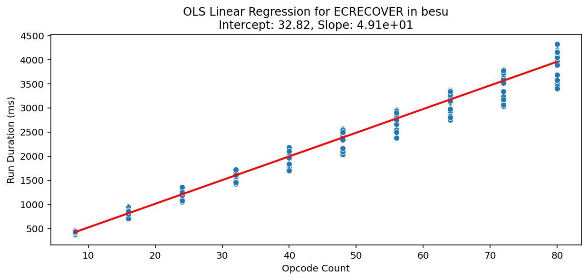

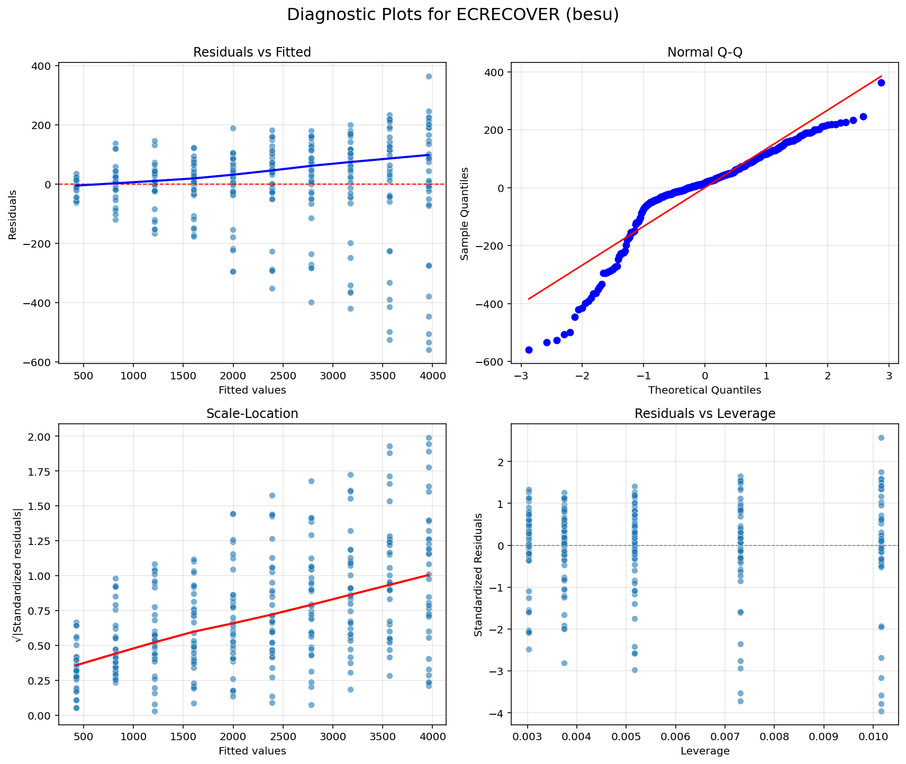


## reth


```python
                            OLS Regression Results                            
==============================================================================
Dep. Variable:        run_duration_ms   R-squared:                       0.992
Model:                            OLS   Adj. R-squared:                  0.992
Method:                 Least Squares   F-statistic:                 2.681e+04
Date:                Fri, 23 Jan 2026   Prob (F-statistic):          1.96e-238
Time:                        12:17:05   Log-Likelihood:                -1386.3
No. Observations:                 230   AIC:                             2777.
Df Residuals:                     228   BIC:                             2784.
Df Model:                           1                                         
Covariance Type:            nonrobust                                         
==============================================================================
                 coef    std err          t      P>|t|      [0.025      0.975]
------------------------------------------------------------------------------
const         35.8397     14.355      2.497      0.013       7.555      64.125
opcount       47.3462      0.289    163.723      0.000      46.776      47.916
==============================================================================
Omnibus:                      125.992   Durbin-Watson:                   0.833
Prob(Omnibus):                  0.000   Jarque-Bera (JB):              606.966
Skew:                          -2.251   Prob(JB):                    1.58e-132
Kurtosis:                       9.562   Cond. No.                         107.
==============================================================================

Notes:
[1] Standard Errors assume that the covariance matrix of the errors is correctly specified.
```

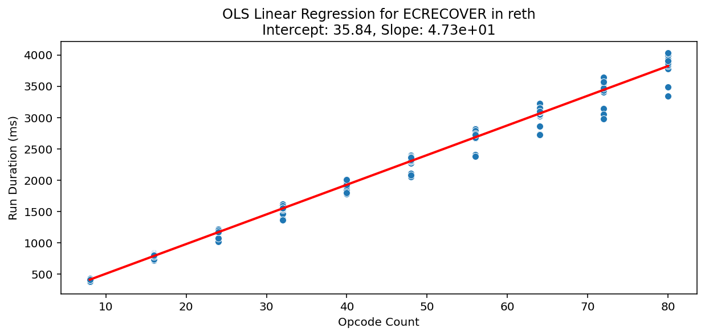

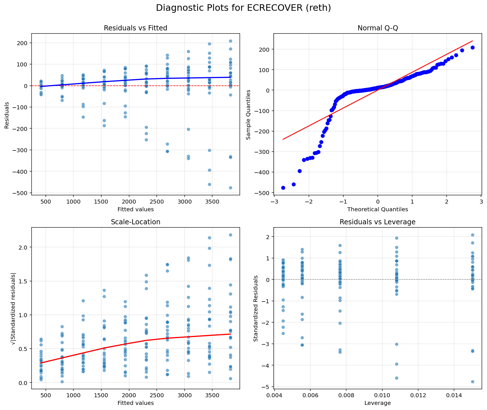


## nethermind


```python
                            OLS Regression Results                            
==============================================================================
Dep. Variable:        run_duration_ms   R-squared:                       0.317
Model:                            OLS   Adj. R-squared:                  0.315
Method:                 Least Squares   F-statistic:                     156.7
Date:                Fri, 23 Jan 2026   Prob (F-statistic):           8.33e-30
Time:                        12:17:05   Log-Likelihood:                -2840.0
No. Observations:                 340   AIC:                             5684.
Df Residuals:                     338   BIC:                             5692.
Df Model:                           1                                         
Covariance Type:            nonrobust                                         
==============================================================================
                 coef    std err          t      P>|t|      [0.025      0.975]
------------------------------------------------------------------------------
const         29.7613    120.642      0.247      0.805    -207.542     267.064
opcount       30.4279      2.430     12.520      0.000      25.647      35.209
==============================================================================
Omnibus:                       40.041   Durbin-Watson:                   0.448
Prob(Omnibus):                  0.000   Jarque-Bera (JB):               50.908
Skew:                          -0.934   Prob(JB):                     8.82e-12
Kurtosis:                       2.673   Cond. No.                         107.
==============================================================================

Notes:
[1] Standard Errors assume that the covariance matrix of the errors is correctly specified.
```

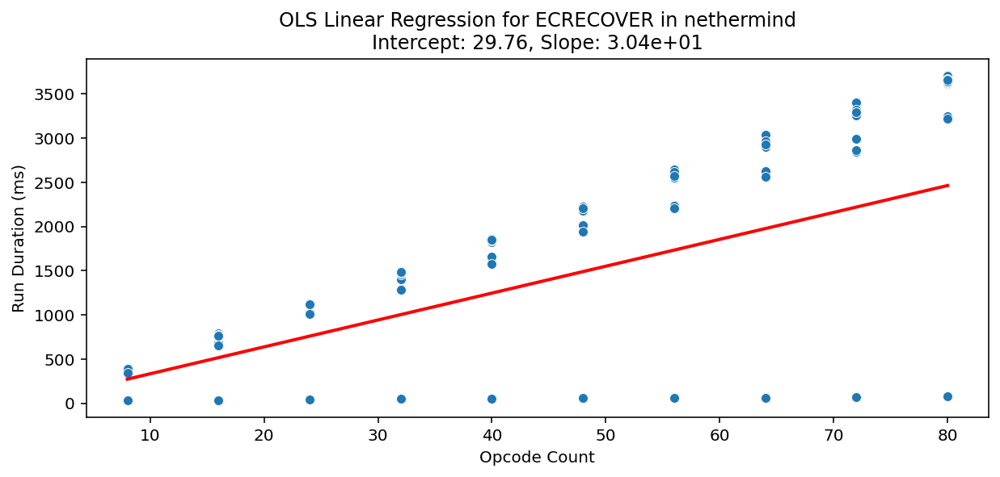

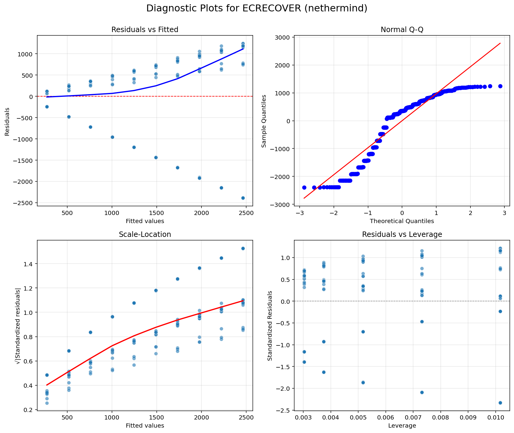


## erigon

OLS model did not run... Error: zero-size array to reduction operation maximum which has no identity

# KECCAK256

## geth


```python
                            OLS Regression Results                            
==============================================================================
Dep. Variable:        run_duration_ms   R-squared:                       0.705
Model:                            OLS   Adj. R-squared:                  0.705
Method:                 Least Squares   F-statistic:                     4324.
Date:                Fri, 23 Jan 2026   Prob (F-statistic):               0.00
Time:                        12:17:06   Log-Likelihood:                -41261.
No. Observations:                5440   AIC:                         8.253e+04
Df Residuals:                    5436   BIC:                         8.256e+04
Df Model:                           3                                         
Covariance Type:            nonrobust                                         
==============================================================================
                 coef    std err          t      P>|t|      [0.025      0.975]
------------------------------------------------------------------------------
const        -66.5706     16.977     -3.921      0.000     -99.853     -33.288
opcount        0.5608      0.005    111.355      0.000       0.551       0.571
msg_size       1.6938      0.020     86.399      0.000       1.655       1.732
mem_size       0.0044      0.016      0.281      0.779      -0.026       0.035
==============================================================================
Omnibus:                      614.536   Durbin-Watson:                   1.770
Prob(Omnibus):                  0.000   Jarque-Bera (JB):             4423.911
Skew:                           0.286   Prob(JB):                         0.00
Kurtosis:                       7.381   Cond. No.                     6.78e+03
==============================================================================

Notes:
[1] Standard Errors assume that the covariance matrix of the errors is correctly specified.
[2] The condition number is large, 6.78e+03. This might indicate that there are
strong multicollinearity or other numerical problems.
```

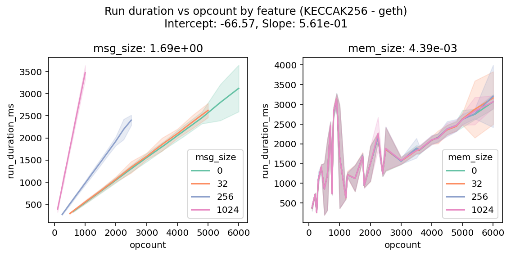

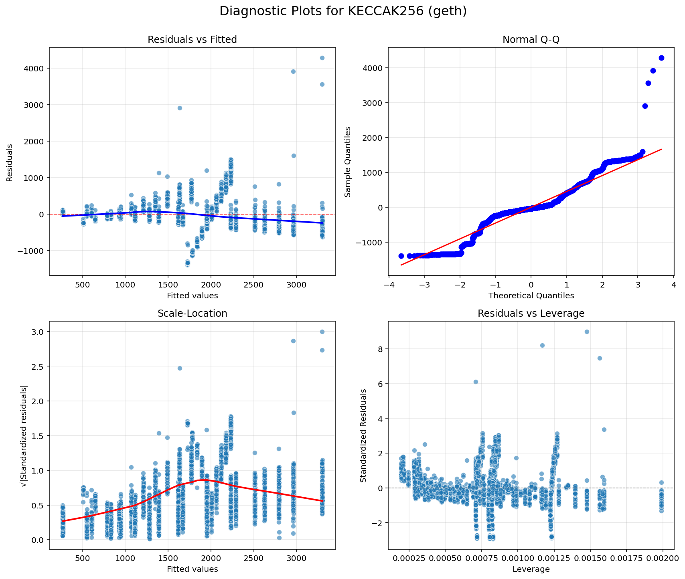


## besu


```python
                            OLS Regression Results                            
==============================================================================
Dep. Variable:        run_duration_ms   R-squared:                       0.753
Model:                            OLS   Adj. R-squared:                  0.753
Method:                 Least Squares   F-statistic:                     5515.
Date:                Fri, 23 Jan 2026   Prob (F-statistic):               0.00
Time:                        12:17:06   Log-Likelihood:                -42769.
No. Observations:                5440   AIC:                         8.555e+04
Df Residuals:                    5436   BIC:                         8.557e+04
Df Model:                           3                                         
Covariance Type:            nonrobust                                         
==============================================================================
                 coef    std err          t      P>|t|      [0.025      0.975]
------------------------------------------------------------------------------
const        -49.9255     22.400     -2.229      0.026     -93.838      -6.013
opcount        0.8528      0.007    128.333      0.000       0.840       0.866
msg_size       2.1877      0.026     84.579      0.000       2.137       2.238
mem_size      -0.0049      0.021     -0.236      0.813      -0.045       0.036
==============================================================================
Omnibus:                      215.676   Durbin-Watson:                   1.719
Prob(Omnibus):                  0.000   Jarque-Bera (JB):              667.774
Skew:                          -0.051   Prob(JB):                    9.88e-146
Kurtosis:                       4.713   Cond. No.                     6.78e+03
==============================================================================

Notes:
[1] Standard Errors assume that the covariance matrix of the errors is correctly specified.
[2] The condition number is large, 6.78e+03. This might indicate that there are
strong multicollinearity or other numerical problems.
```

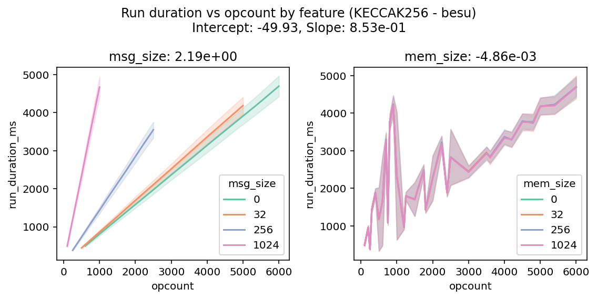

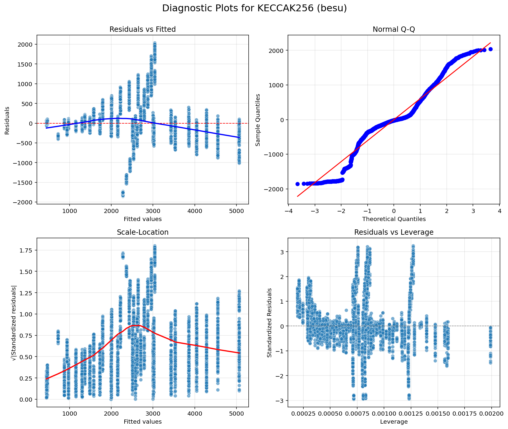


## reth


```python
                            OLS Regression Results                            
==============================================================================
Dep. Variable:        run_duration_ms   R-squared:                       0.515
Model:                            OLS   Adj. R-squared:                  0.515
Method:                 Least Squares   F-statistic:                     1302.
Date:                Fri, 23 Jan 2026   Prob (F-statistic):               0.00
Time:                        12:17:07   Log-Likelihood:                -28142.
No. Observations:                3680   AIC:                         5.629e+04
Df Residuals:                    3676   BIC:                         5.632e+04
Df Model:                           3                                         
Covariance Type:            nonrobust                                         
==============================================================================
                 coef    std err          t      P>|t|      [0.025      0.975]
------------------------------------------------------------------------------
const        138.8191     21.976      6.317      0.000      95.732     181.906
opcount        0.0552      0.007      8.466      0.000       0.042       0.068
msg_size       1.3810      0.025     54.419      0.000       1.331       1.431
mem_size      -0.0007      0.020     -0.035      0.972      -0.040       0.039
==============================================================================
Omnibus:                       90.013   Durbin-Watson:                   1.869
Prob(Omnibus):                  0.000   Jarque-Bera (JB):              107.949
Skew:                           0.324   Prob(JB):                     3.62e-24
Kurtosis:                       3.533   Cond. No.                     6.78e+03
==============================================================================

Notes:
[1] Standard Errors assume that the covariance matrix of the errors is correctly specified.
[2] The condition number is large, 6.78e+03. This might indicate that there are
strong multicollinearity or other numerical problems.
```

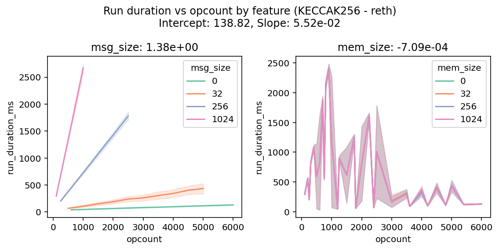

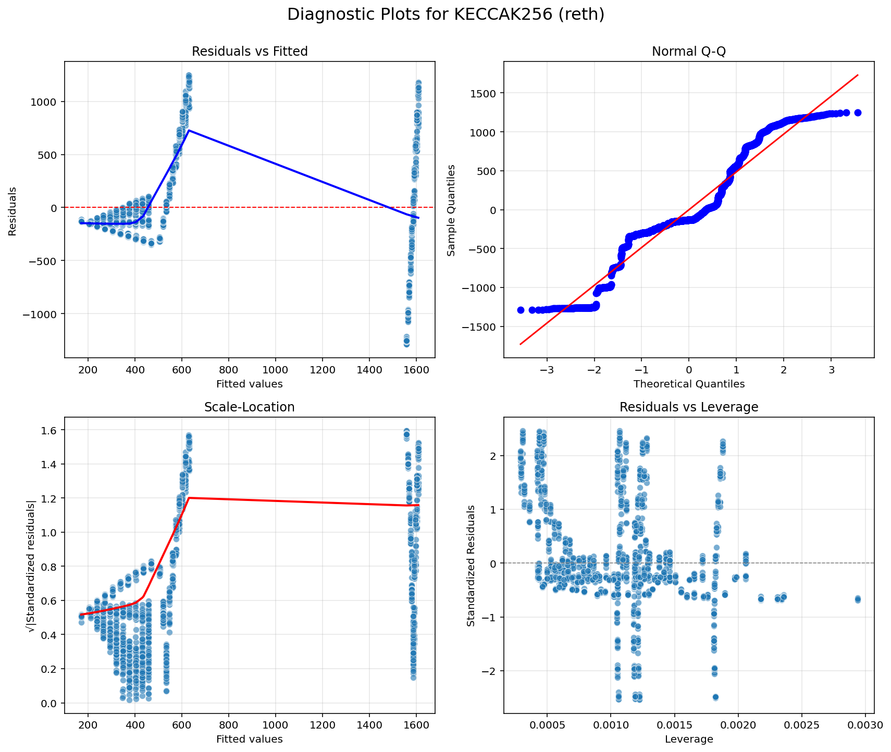


## nethermind


```python
                            OLS Regression Results                            
==============================================================================
Dep. Variable:        run_duration_ms   R-squared:                       0.516
Model:                            OLS   Adj. R-squared:                  0.516
Method:                 Least Squares   F-statistic:                     1935.
Date:                Fri, 23 Jan 2026   Prob (F-statistic):               0.00
Time:                        12:17:07   Log-Likelihood:                -42089.
No. Observations:                5440   AIC:                         8.419e+04
Df Residuals:                    5436   BIC:                         8.421e+04
Df Model:                           3                                         
Covariance Type:            nonrobust                                         
==============================================================================
                 coef    std err          t      P>|t|      [0.025      0.975]
------------------------------------------------------------------------------
const        134.7393     19.768      6.816      0.000      95.987     173.492
opcount        0.0648      0.006     11.052      0.000       0.053       0.076
msg_size       1.5227      0.023     66.710      0.000       1.478       1.567
mem_size       0.0009      0.018      0.048      0.962      -0.035       0.036
==============================================================================
Omnibus:                      171.045   Durbin-Watson:                   1.815
Prob(Omnibus):                  0.000   Jarque-Bera (JB):              214.733
Skew:                           0.369   Prob(JB):                     2.35e-47
Kurtosis:                       3.634   Cond. No.                     6.78e+03
==============================================================================

Notes:
[1] Standard Errors assume that the covariance matrix of the errors is correctly specified.
[2] The condition number is large, 6.78e+03. This might indicate that there are
strong multicollinearity or other numerical problems.
```

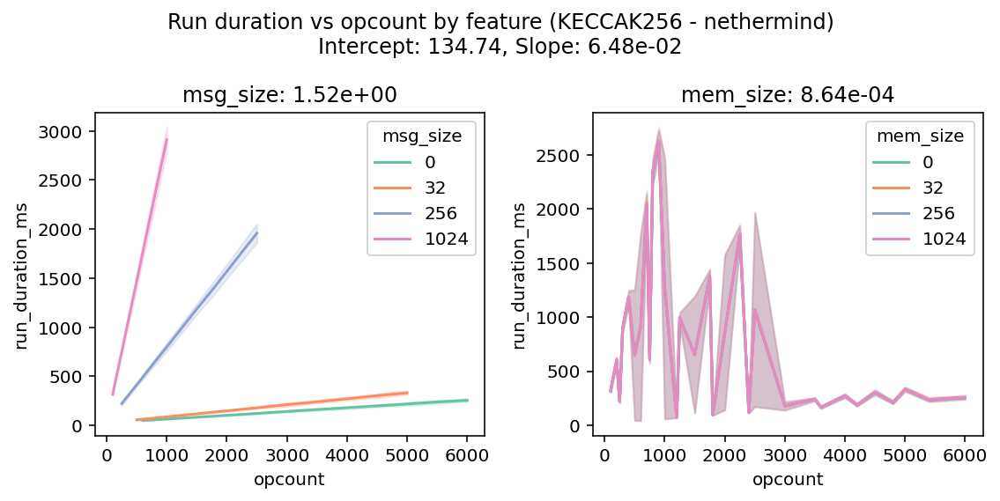

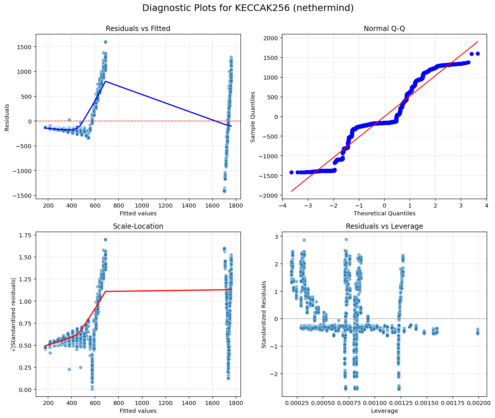


## erigon


```python
                            OLS Regression Results                            
==============================================================================
Dep. Variable:        run_duration_ms   R-squared:                       0.715
Model:                            OLS   Adj. R-squared:                  0.713
Method:                 Least Squares   F-statistic:                     397.2
Date:                Fri, 23 Jan 2026   Prob (F-statistic):          3.86e-129
Time:                        12:17:07   Log-Likelihood:                -3605.0
No. Observations:                 480   AIC:                             7218.
Df Residuals:                     476   BIC:                             7235.
Df Model:                           3                                         
Covariance Type:            nonrobust                                         
==============================================================================
                 coef    std err          t      P>|t|      [0.025      0.975]
------------------------------------------------------------------------------
const        -55.4703     53.255     -1.042      0.298    -160.114      49.174
opcount        0.5311      0.016     33.619      0.000       0.500       0.562
msg_size       1.6340      0.061     26.571      0.000       1.513       1.755
mem_size       0.0021      0.049      0.042      0.967      -0.094       0.098
==============================================================================
Omnibus:                       29.196   Durbin-Watson:                   1.709
Prob(Omnibus):                  0.000   Jarque-Bera (JB):               94.395
Skew:                          -0.125   Prob(JB):                     3.18e-21
Kurtosis:                       5.158   Cond. No.                     6.78e+03
==============================================================================

Notes:
[1] Standard Errors assume that the covariance matrix of the errors is correctly specified.
[2] The condition number is large, 6.78e+03. This might indicate that there are
strong multicollinearity or other numerical problems.
```


# BLAKE2F

## geth


```python
                            OLS Regression Results                            
==============================================================================
Dep. Variable:        run_duration_ms   R-squared:                       0.972
Model:                            OLS   Adj. R-squared:                  0.972
Method:                 Least Squares   F-statistic:                 1.746e+04
Date:                Fri, 23 Jan 2026   Prob (F-statistic):               0.00
Time:                        12:17:08   Log-Likelihood:                -5929.3
No. Observations:                1000   AIC:                         1.186e+04
Df Residuals:                     997   BIC:                         1.188e+04
Df Model:                           2                                         
Covariance Type:            nonrobust                                         
==============================================================================
                 coef    std err          t      P>|t|      [0.025      0.975]
------------------------------------------------------------------------------
const       -127.5419      6.559    -19.446      0.000    -140.413    -114.671
opcount        0.8386      0.005    182.217      0.000       0.830       0.848
num_rounds    13.9266      0.336     41.503      0.000      13.268      14.585
==============================================================================
Omnibus:                       27.891   Durbin-Watson:                   1.702
Prob(Omnibus):                  0.000   Jarque-Bera (JB):               42.952
Skew:                           0.248   Prob(JB):                     4.71e-10
Kurtosis:                       3.885   Cond. No.                     2.71e+03
==============================================================================

Notes:
[1] Standard Errors assume that the covariance matrix of the errors is correctly specified.
[2] The condition number is large, 2.71e+03. This might indicate that there are
strong multicollinearity or other numerical problems.
```

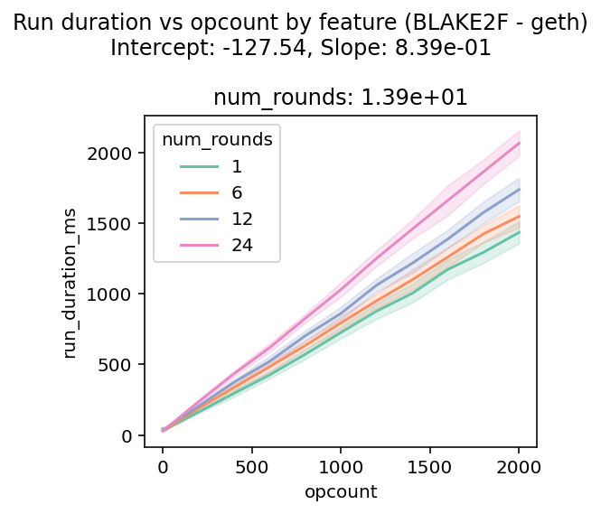

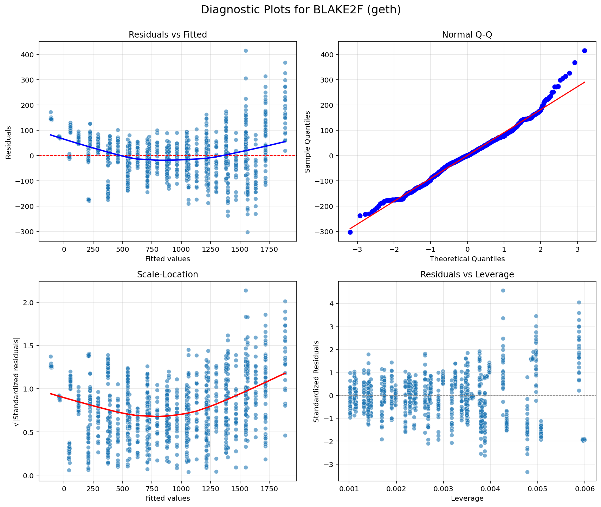


## besu


```python
                            OLS Regression Results                            
==============================================================================
Dep. Variable:        run_duration_ms   R-squared:                       0.978
Model:                            OLS   Adj. R-squared:                  0.978
Method:                 Least Squares   F-statistic:                 2.229e+04
Date:                Fri, 23 Jan 2026   Prob (F-statistic):               0.00
Time:                        12:17:08   Log-Likelihood:                -7069.0
No. Observations:                1000   AIC:                         1.414e+04
Df Residuals:                     997   BIC:                         1.416e+04
Df Model:                           2                                         
Covariance Type:            nonrobust                                         
==============================================================================
                 coef    std err          t      P>|t|      [0.025      0.975]
------------------------------------------------------------------------------
const       -135.3901     20.502     -6.604      0.000    -175.621     -95.159
opcount        3.0278      0.014    210.482      0.000       3.000       3.056
num_rounds    17.5022      1.049     16.686      0.000      15.444      19.561
==============================================================================
Omnibus:                       26.491   Durbin-Watson:                   0.980
Prob(Omnibus):                  0.000   Jarque-Bera (JB):               40.841
Skew:                          -0.236   Prob(JB):                     1.35e-09
Kurtosis:                       3.871   Cond. No.                     2.71e+03
==============================================================================

Notes:
[1] Standard Errors assume that the covariance matrix of the errors is correctly specified.
[2] The condition number is large, 2.71e+03. This might indicate that there are
strong multicollinearity or other numerical problems.
```

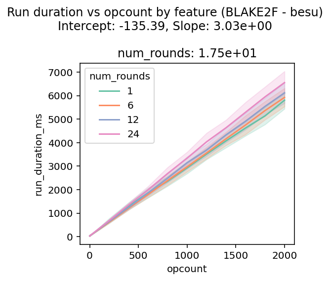

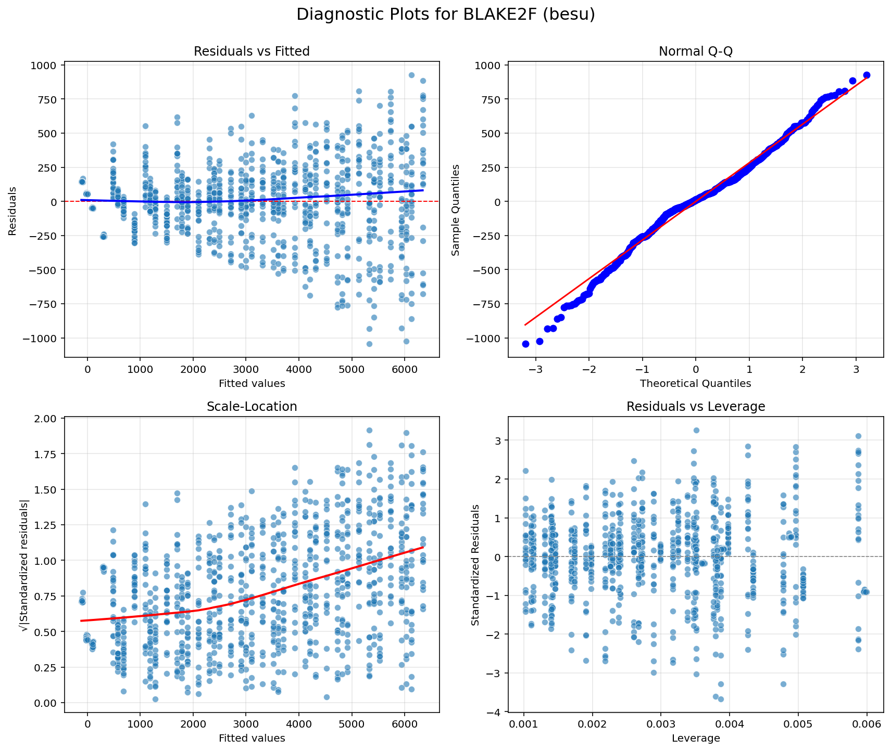


## reth


```python
                            OLS Regression Results                            
==============================================================================
Dep. Variable:        run_duration_ms   R-squared:                       0.921
Model:                            OLS   Adj. R-squared:                  0.920
Method:                 Least Squares   F-statistic:                     3230.
Date:                Fri, 23 Jan 2026   Prob (F-statistic):          3.66e-307
Time:                        12:17:08   Log-Likelihood:                -3653.8
No. Observations:                 560   AIC:                             7314.
Df Residuals:                     557   BIC:                             7327.
Df Model:                           2                                         
Covariance Type:            nonrobust                                         
==============================================================================
                 coef    std err          t      P>|t|      [0.025      0.975]
------------------------------------------------------------------------------
const       -184.3371     15.059    -12.241      0.000    -213.917    -154.757
opcount        0.8179      0.011     76.686      0.000       0.797       0.839
num_rounds    19.6039      0.814     24.074      0.000      18.004      21.203
==============================================================================
Omnibus:                        4.857   Durbin-Watson:                   1.916
Prob(Omnibus):                  0.088   Jarque-Bera (JB):                5.911
Skew:                          -0.072   Prob(JB):                       0.0521
Kurtosis:                       3.482   Cond. No.                     2.48e+03
==============================================================================

Notes:
[1] Standard Errors assume that the covariance matrix of the errors is correctly specified.
[2] The condition number is large, 2.48e+03. This might indicate that there are
strong multicollinearity or other numerical problems.
```

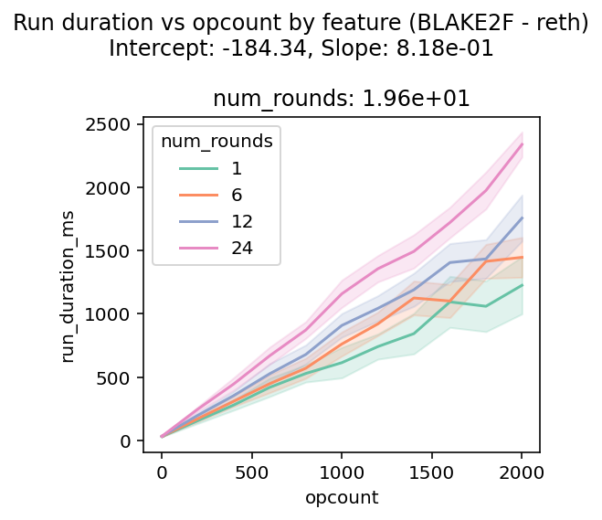

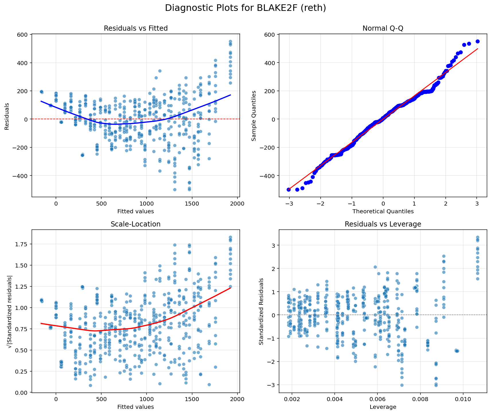


## nethermind


```python
                            OLS Regression Results                            
==============================================================================
Dep. Variable:        run_duration_ms   R-squared:                       0.970
Model:                            OLS   Adj. R-squared:                  0.970
Method:                 Least Squares   F-statistic:                 1.613e+04
Date:                Fri, 23 Jan 2026   Prob (F-statistic):               0.00
Time:                        12:17:09   Log-Likelihood:                -5968.6
No. Observations:                1000   AIC:                         1.194e+04
Df Residuals:                     997   BIC:                         1.196e+04
Df Model:                           2                                         
Covariance Type:            nonrobust                                         
==============================================================================
                 coef    std err          t      P>|t|      [0.025      0.975]
------------------------------------------------------------------------------
const       -120.0841      6.822    -17.602      0.000    -133.472    -106.697
opcount        0.8469      0.005    176.925      0.000       0.838       0.856
num_rounds    10.7678      0.349     30.850      0.000      10.083      11.453
==============================================================================
Omnibus:                       12.679   Durbin-Watson:                   1.399
Prob(Omnibus):                  0.002   Jarque-Bera (JB):               14.651
Skew:                           0.196   Prob(JB):                     0.000659
Kurtosis:                       3.445   Cond. No.                     2.71e+03
==============================================================================

Notes:
[1] Standard Errors assume that the covariance matrix of the errors is correctly specified.
[2] The condition number is large, 2.71e+03. This might indicate that there are
strong multicollinearity or other numerical problems.
```

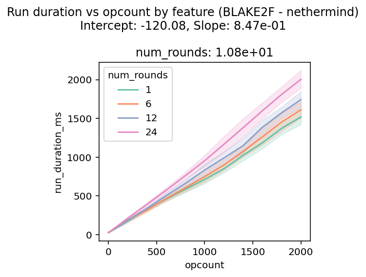

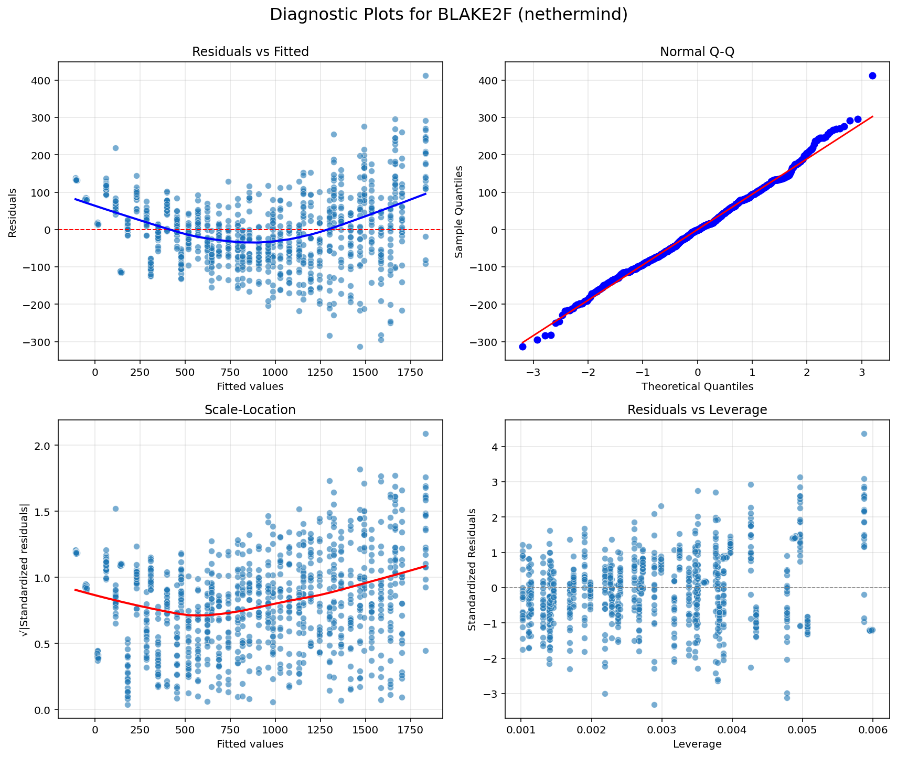


## erigon

OLS model did not run... Error: zero-size array to reduction operation maximum which has no identity

# ECPAIRING

## geth


```python
                            OLS Regression Results                            
==============================================================================
Dep. Variable:        run_duration_ms   R-squared:                       0.139
Model:                            OLS   Adj. R-squared:                  0.137
Method:                 Least Squares   F-statistic:                     93.24
Date:                Fri, 23 Jan 2026   Prob (F-statistic):           2.85e-38
Time:                        12:17:09   Log-Likelihood:                -8656.1
No. Observations:                1160   AIC:                         1.732e+04
Df Residuals:                    1157   BIC:                         1.733e+04
Df Model:                           2                                         
Covariance Type:            nonrobust                                         
==============================================================================
                 coef    std err          t      P>|t|      [0.025      0.975]
------------------------------------------------------------------------------
const        519.3737     21.577     24.071      0.000     477.039     561.708
opcount      365.4473     30.383     12.028      0.000     305.835     425.060
num_pairs     16.7317      1.607     10.414      0.000      13.579      19.884
==============================================================================
Omnibus:                      672.075   Durbin-Watson:                   1.981
Prob(Omnibus):                  0.000   Jarque-Bera (JB):            16056.170
Skew:                           2.197   Prob(JB):                         0.00
Kurtosis:                      20.689   Cond. No.                         33.2
==============================================================================

Notes:
[1] Standard Errors assume that the covariance matrix of the errors is correctly specified.
```

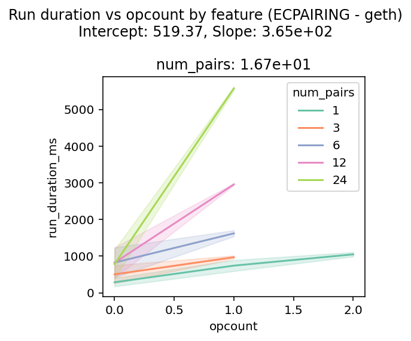


## besu


```python
                            OLS Regression Results                            
==============================================================================
Dep. Variable:        run_duration_ms   R-squared:                       0.142
Model:                            OLS   Adj. R-squared:                  0.140
Method:                 Least Squares   F-statistic:                     95.55
Date:                Fri, 23 Jan 2026   Prob (F-statistic):           3.92e-39
Time:                        12:17:09   Log-Likelihood:                -8644.9
No. Observations:                1160   AIC:                         1.730e+04
Df Residuals:                    1157   BIC:                         1.731e+04
Df Model:                           2                                         
Covariance Type:            nonrobust                                         
==============================================================================
                 coef    std err          t      P>|t|      [0.025      0.975]
------------------------------------------------------------------------------
const        514.6661     21.369     24.084      0.000     472.739     556.593
opcount      369.0224     30.091     12.264      0.000     309.984     428.061
num_pairs     16.5804      1.591     10.420      0.000      13.458      19.703
==============================================================================
Omnibus:                      665.968   Durbin-Watson:                   1.984
Prob(Omnibus):                  0.000   Jarque-Bera (JB):            15707.490
Skew:                           2.172   Prob(JB):                         0.00
Kurtosis:                      20.496   Cond. No.                         33.2
==============================================================================

Notes:
[1] Standard Errors assume that the covariance matrix of the errors is correctly specified.
```

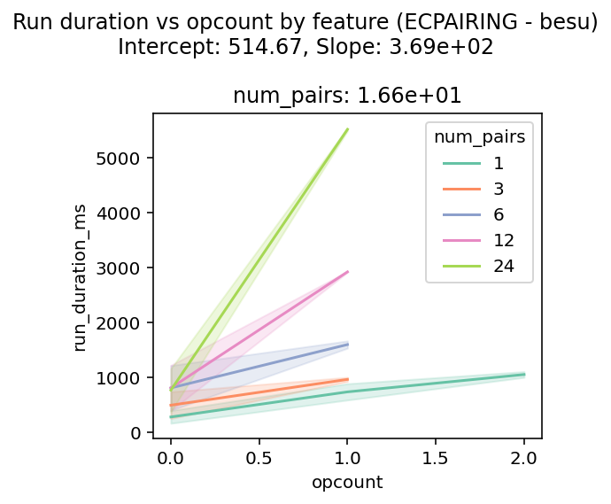

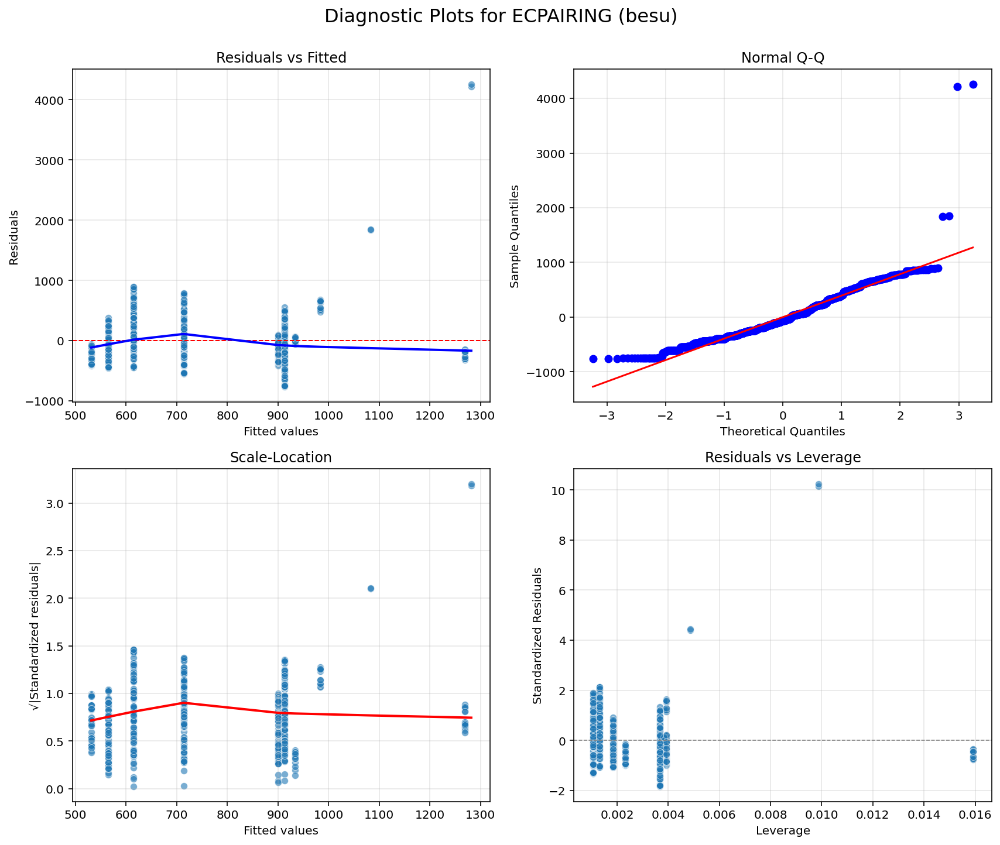


## reth


```python
                            OLS Regression Results                            
==============================================================================
Dep. Variable:        run_duration_ms   R-squared:                       0.156
Model:                            OLS   Adj. R-squared:                  0.153
Method:                 Least Squares   F-statistic:                     56.08
Date:                Fri, 23 Jan 2026   Prob (F-statistic):           4.50e-23
Time:                        12:17:10   Log-Likelihood:                -5077.5
No. Observations:                 610   AIC:                         1.016e+04
Df Residuals:                     607   BIC:                         1.017e+04
Df Model:                           2                                         
Covariance Type:            nonrobust                                         
==============================================================================
                 coef    std err          t      P>|t|      [0.025      0.975]
------------------------------------------------------------------------------
const        996.9567     70.544     14.132      0.000     858.416    1135.497
opcount      879.8623     98.110      8.968      0.000     687.186    1072.538
num_pairs     44.3951      5.237      8.477      0.000      34.110      54.680
==============================================================================
Omnibus:                      449.647   Durbin-Watson:                   1.841
Prob(Omnibus):                  0.000   Jarque-Bera (JB):            13592.977
Skew:                           2.884   Prob(JB):                         0.00
Kurtosis:                      25.395   Cond. No.                         32.9
==============================================================================

Notes:
[1] Standard Errors assume that the covariance matrix of the errors is correctly specified.
```

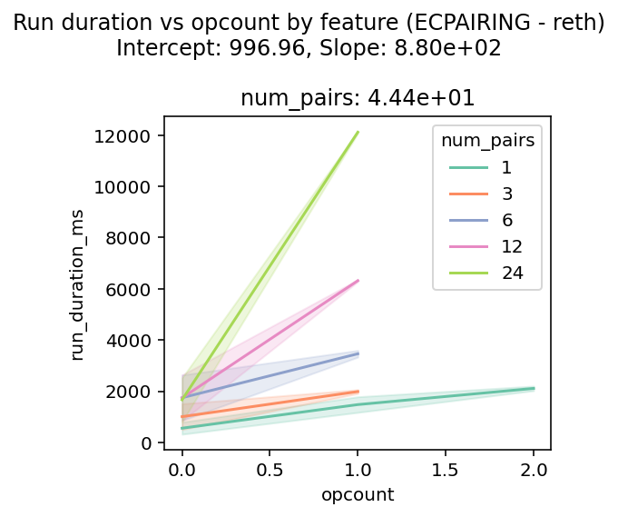

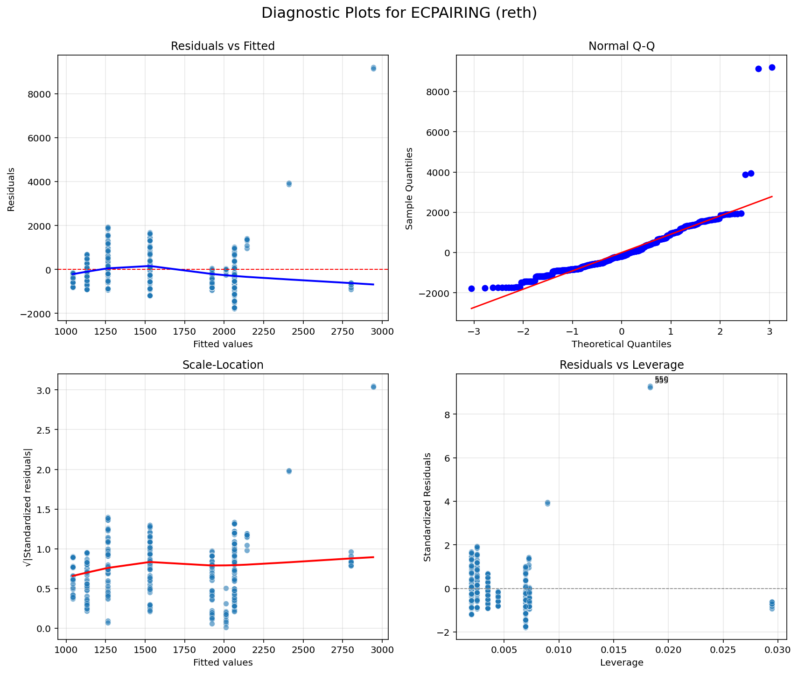


## nethermind


```python
                            OLS Regression Results                            
==============================================================================
Dep. Variable:        run_duration_ms   R-squared:                       0.112
Model:                            OLS   Adj. R-squared:                  0.111
Method:                 Least Squares   F-statistic:                     73.12
Date:                Fri, 23 Jan 2026   Prob (F-statistic):           1.25e-30
Time:                        12:17:10   Log-Likelihood:                -9589.7
No. Observations:                1160   AIC:                         1.919e+04
Df Residuals:                    1157   BIC:                         1.920e+04
Df Model:                           2                                         
Covariance Type:            nonrobust                                         
==============================================================================
                 coef    std err          t      P>|t|      [0.025      0.975]
------------------------------------------------------------------------------
const       1155.6119     48.252     23.949      0.000    1060.940    1250.284
opcount      331.1561     67.945      4.874      0.000     197.846     464.466
num_pairs     43.4157      3.593     12.083      0.000      36.366      50.465
==============================================================================
Omnibus:                       43.816   Durbin-Watson:                   2.153
Prob(Omnibus):                  0.000   Jarque-Bera (JB):               41.426
Skew:                           0.414   Prob(JB):                     1.01e-09
Kurtosis:                       2.586   Cond. No.                         33.2
==============================================================================

Notes:
[1] Standard Errors assume that the covariance matrix of the errors is correctly specified.
```

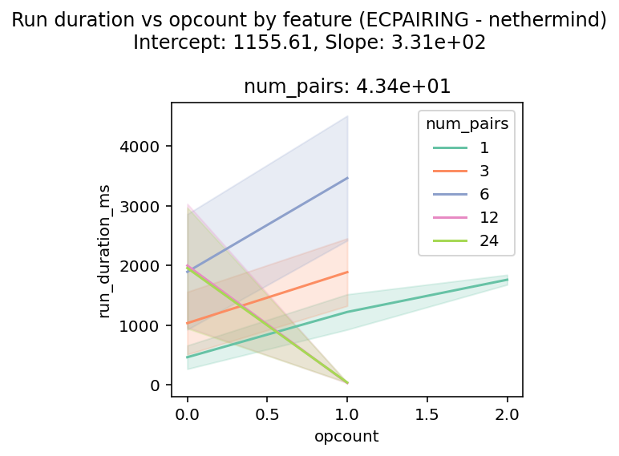

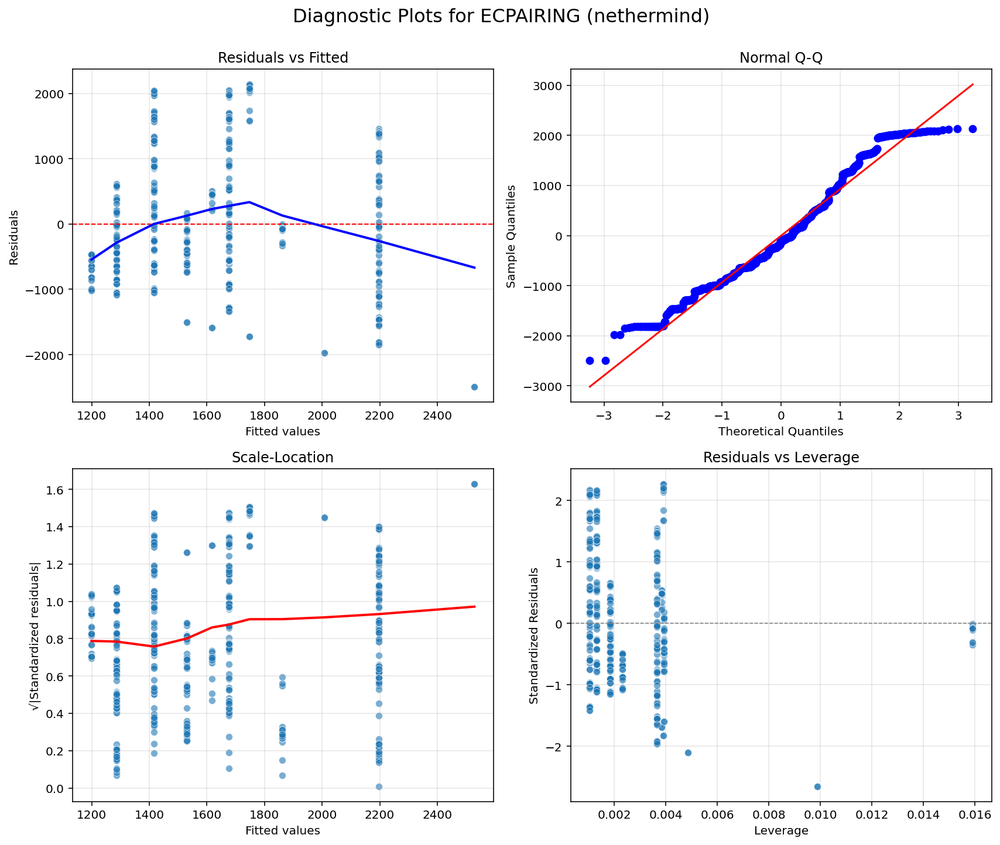


## erigon

OLS model did not run... Error: zero-size array to reduction operation maximum which has no identity
