Operation run times estimation results - EIP-7904
=================================================

Table of contents
=================

* [MULMOD](#mulmod)
* [SMOD](#smod)
* [MOD](#mod)
* [POINT_EVALUATION](#point_evaluation)
* [BLS12_G1ADD](#bls12_g1add)
* [BLS12_G2ADD](#bls12_g2add)
* [ECADD](#ecadd)
* [ECRECOVER](#ecrecover)
* [KECCAK256](#keccak256)
* [BLAKE2F](#blake2f)
* [ECPAIRING](#ecpairing)

# Introduction


This is an automated report generated from the opcode run times 
estimation script `./src/estimate_opcode_run_times.py`. The script 
uses data generated by running the 
[EEST benchmark suite](https://github.com/ethereum/execution-spec-tests/tree/main/tests/benchmark) 
with the [Nethermind benchmarking tooling](https://github.com/NethermindEth/gas-benchmarks).

The data includes all the tests for operations repriced in EIP-7904 run between 2026-01-10 and 2026-01-26.

For each opcode and client, an OLS linear regression model is fitted to estimate the 
opcode run time as a function of the opcode count and other opcode configurations. The results are presented below.

# MULMOD

## nethermind


```python
                            OLS Regression Results                            
==============================================================================
Dep. Variable:        run_duration_ms   R-squared:                       0.983
Model:                            OLS   Adj. R-squared:                  0.983
Method:                 Least Squares   F-statistic:                 2.217e+04
Date:                Mon, 26 Jan 2026   Prob (F-statistic):               0.00
Time:                        15:37:53   Log-Likelihood:                -2230.2
No. Observations:                 390   AIC:                             4464.
Df Residuals:                     388   BIC:                             4472.
Df Model:                           1                                         
Covariance Type:            nonrobust                                         
==============================================================================
                 coef    std err          t      P>|t|      [0.025      0.975]
------------------------------------------------------------------------------
const         28.1567      8.079      3.485      0.001      12.272      44.041
opcount        0.0646      0.000    148.889      0.000       0.064       0.065
==============================================================================
Omnibus:                       95.608   Durbin-Watson:                   0.704
Prob(Omnibus):                  0.000   Jarque-Bera (JB):              209.255
Skew:                          -1.257   Prob(JB):                     3.64e-46
Kurtosis:                       5.561   Cond. No.                     4.02e+04
==============================================================================

Notes:
[1] Standard Errors assume that the covariance matrix of the errors is correctly specified.
[2] The condition number is large, 4.02e+04. This might indicate that there are
strong multicollinearity or other numerical problems.
```

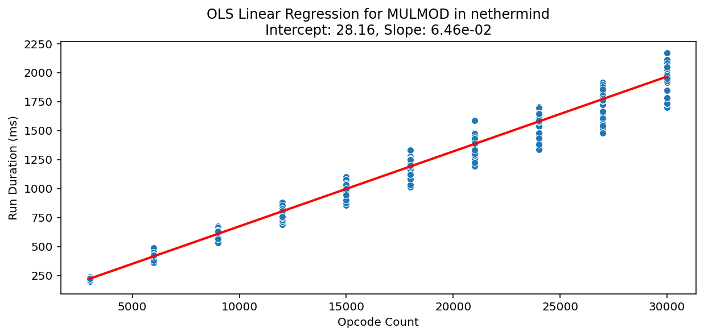

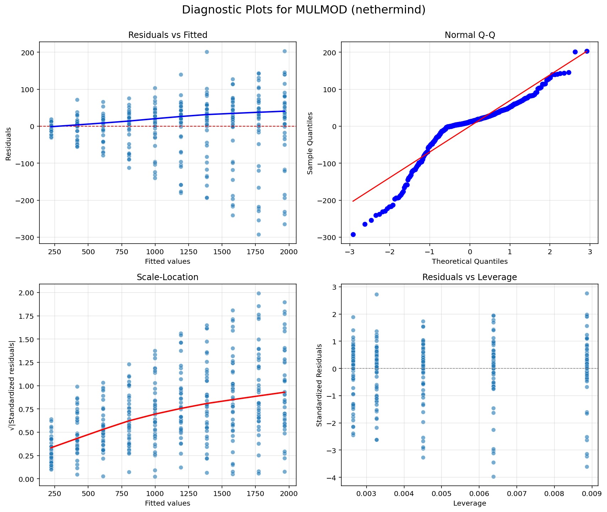


## geth


```python
                            OLS Regression Results                            
==============================================================================
Dep. Variable:        run_duration_ms   R-squared:                       0.990
Model:                            OLS   Adj. R-squared:                  0.990
Method:                 Least Squares   F-statistic:                 4.018e+04
Date:                Mon, 26 Jan 2026   Prob (F-statistic):               0.00
Time:                        15:37:54   Log-Likelihood:                -2142.6
No. Observations:                 390   AIC:                             4289.
Df Residuals:                     388   BIC:                             4297.
Df Model:                           1                                         
Covariance Type:            nonrobust                                         
==============================================================================
                 coef    std err          t      P>|t|      [0.025      0.975]
------------------------------------------------------------------------------
const         33.2944      6.453      5.160      0.000      20.608      45.981
opcount        0.0695      0.000    200.459      0.000       0.069       0.070
==============================================================================
Omnibus:                       71.297   Durbin-Watson:                   1.094
Prob(Omnibus):                  0.000   Jarque-Bera (JB):              251.625
Skew:                          -0.777   Prob(JB):                     2.29e-55
Kurtosis:                       6.615   Cond. No.                     4.02e+04
==============================================================================

Notes:
[1] Standard Errors assume that the covariance matrix of the errors is correctly specified.
[2] The condition number is large, 4.02e+04. This might indicate that there are
strong multicollinearity or other numerical problems.
```

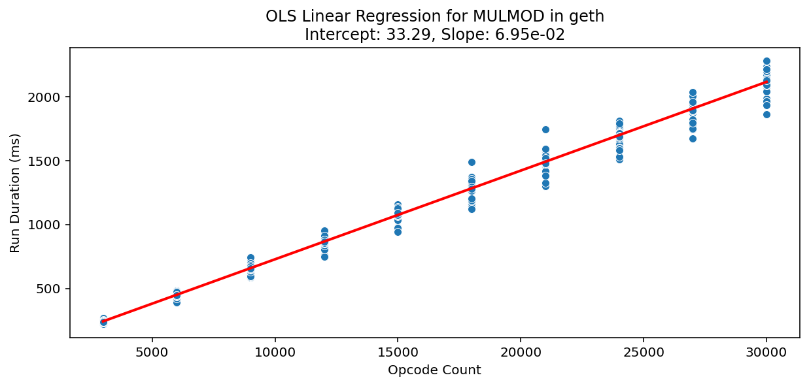

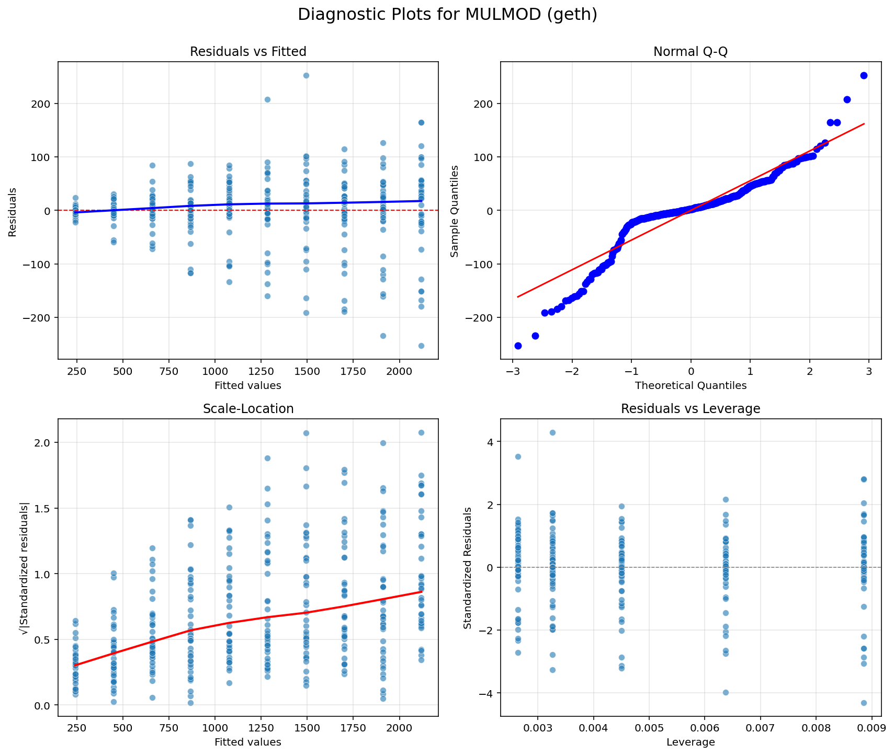


## besu


```python
                            OLS Regression Results                            
==============================================================================
Dep. Variable:        run_duration_ms   R-squared:                       0.982
Model:                            OLS   Adj. R-squared:                  0.982
Method:                 Least Squares   F-statistic:                 2.075e+04
Date:                Mon, 26 Jan 2026   Prob (F-statistic):               0.00
Time:                        15:37:54   Log-Likelihood:                -2636.9
No. Observations:                 390   AIC:                             5278.
Df Residuals:                     388   BIC:                             5286.
Df Model:                           1                                         
Covariance Type:            nonrobust                                         
==============================================================================
                 coef    std err          t      P>|t|      [0.025      0.975]
------------------------------------------------------------------------------
const         41.0632     22.920      1.792      0.074      -4.000      86.126
opcount        0.1774      0.001    144.051      0.000       0.175       0.180
==============================================================================
Omnibus:                       33.991   Durbin-Watson:                   0.903
Prob(Omnibus):                  0.000   Jarque-Bera (JB):               49.338
Skew:                          -0.613   Prob(JB):                     1.93e-11
Kurtosis:                       4.238   Cond. No.                     4.02e+04
==============================================================================

Notes:
[1] Standard Errors assume that the covariance matrix of the errors is correctly specified.
[2] The condition number is large, 4.02e+04. This might indicate that there are
strong multicollinearity or other numerical problems.
```

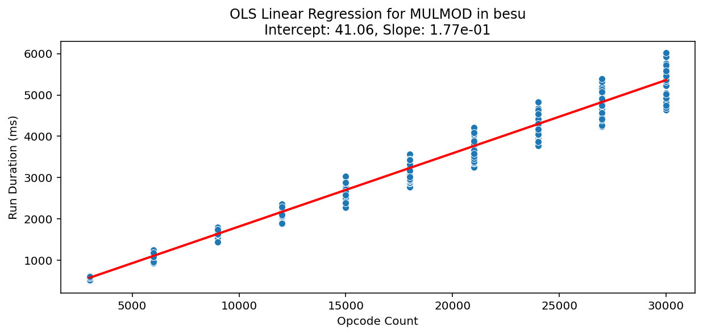

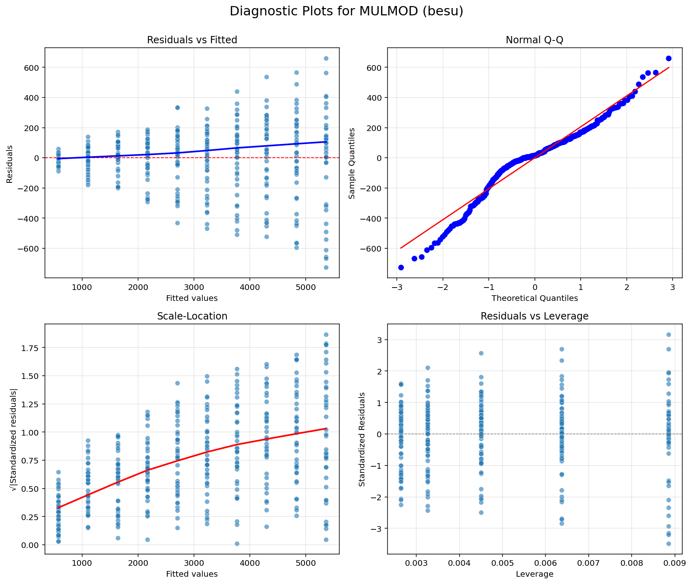


## reth


```python
                            OLS Regression Results                            
==============================================================================
Dep. Variable:        run_duration_ms   R-squared:                       0.991
Model:                            OLS   Adj. R-squared:                  0.991
Method:                 Least Squares   F-statistic:                 2.926e+04
Date:                Mon, 26 Jan 2026   Prob (F-statistic):          1.07e-283
Time:                        15:37:54   Log-Likelihood:                -1390.9
No. Observations:                 280   AIC:                             2786.
Df Residuals:                     278   BIC:                             2793.
Df Model:                           1                                         
Covariance Type:            nonrobust                                         
==============================================================================
                 coef    std err          t      P>|t|      [0.025      0.975]
------------------------------------------------------------------------------
const         32.0806      4.503      7.124      0.000      23.216      40.945
opcount        0.0414      0.000    171.045      0.000       0.041       0.042
==============================================================================
Omnibus:                       57.078   Durbin-Watson:                   1.131
Prob(Omnibus):                  0.000   Jarque-Bera (JB):              211.669
Skew:                          -0.806   Prob(JB):                     1.09e-46
Kurtosis:                       6.942   Cond. No.                     4.02e+04
==============================================================================

Notes:
[1] Standard Errors assume that the covariance matrix of the errors is correctly specified.
[2] The condition number is large, 4.02e+04. This might indicate that there are
strong multicollinearity or other numerical problems.
```

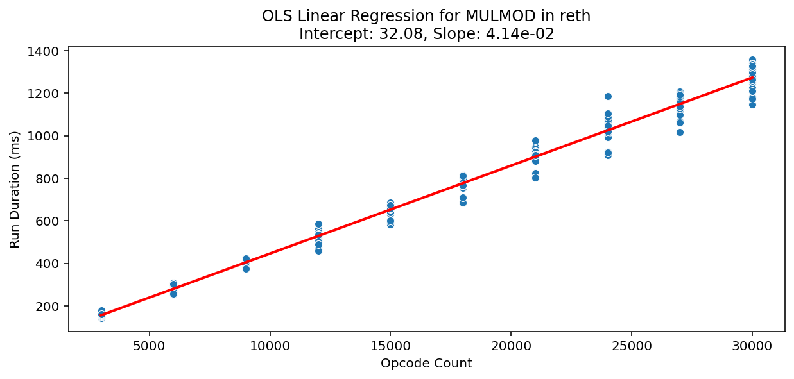

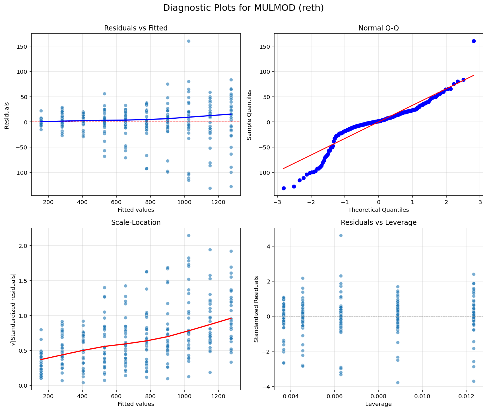


## erigon


```python
                            OLS Regression Results                            
==============================================================================
Dep. Variable:        run_duration_ms   R-squared:                       1.000
Model:                            OLS   Adj. R-squared:                  1.000
Method:                 Least Squares   F-statistic:                 9.010e+04
Date:                Mon, 26 Jan 2026   Prob (F-statistic):           1.17e-50
Time:                        15:37:55   Log-Likelihood:                -115.03
No. Observations:                  30   AIC:                             234.1
Df Residuals:                      28   BIC:                             236.9
Df Model:                           1                                         
Covariance Type:            nonrobust                                         
==============================================================================
                 coef    std err          t      P>|t|      [0.025      0.975]
------------------------------------------------------------------------------
const         27.7081      4.570      6.062      0.000      18.346      37.070
opcount        0.0737      0.000    300.168      0.000       0.073       0.074
==============================================================================
Omnibus:                       18.361   Durbin-Watson:                   1.183
Prob(Omnibus):                  0.000   Jarque-Bera (JB):               25.308
Skew:                           1.476   Prob(JB):                     3.19e-06
Kurtosis:                       6.396   Cond. No.                     4.02e+04
==============================================================================

Notes:
[1] Standard Errors assume that the covariance matrix of the errors is correctly specified.
[2] The condition number is large, 4.02e+04. This might indicate that there are
strong multicollinearity or other numerical problems.
```


# SMOD

## nethermind


```python
                            OLS Regression Results                            
==============================================================================
Dep. Variable:        run_duration_ms   R-squared:                       0.982
Model:                            OLS   Adj. R-squared:                  0.982
Method:                 Least Squares   F-statistic:                 2.543e+04
Date:                Mon, 26 Jan 2026   Prob (F-statistic):               0.00
Time:                        15:37:55   Log-Likelihood:                -2082.8
No. Observations:                 480   AIC:                             4170.
Df Residuals:                     478   BIC:                             4178.
Df Model:                           1                                         
Covariance Type:            nonrobust                                         
==============================================================================
                 coef    std err          t      P>|t|      [0.025      0.975]
------------------------------------------------------------------------------
const         30.3709      1.833     16.572      0.000      26.770      33.972
opcount        0.0157   9.85e-05    159.465      0.000       0.016       0.016
==============================================================================
Omnibus:                       62.957   Durbin-Watson:                   0.902
Prob(Omnibus):                  0.000   Jarque-Bera (JB):              387.098
Skew:                          -0.335   Prob(JB):                     8.77e-85
Kurtosis:                       7.348   Cond. No.                     4.02e+04
==============================================================================

Notes:
[1] Standard Errors assume that the covariance matrix of the errors is correctly specified.
[2] The condition number is large, 4.02e+04. This might indicate that there are
strong multicollinearity or other numerical problems.
```

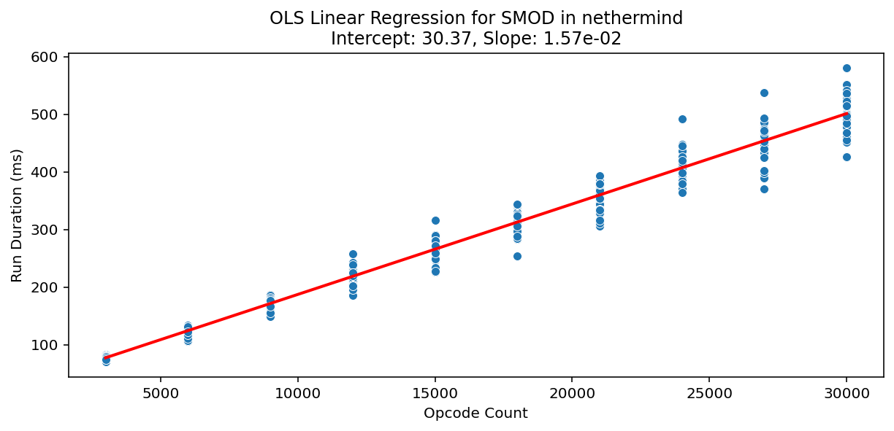

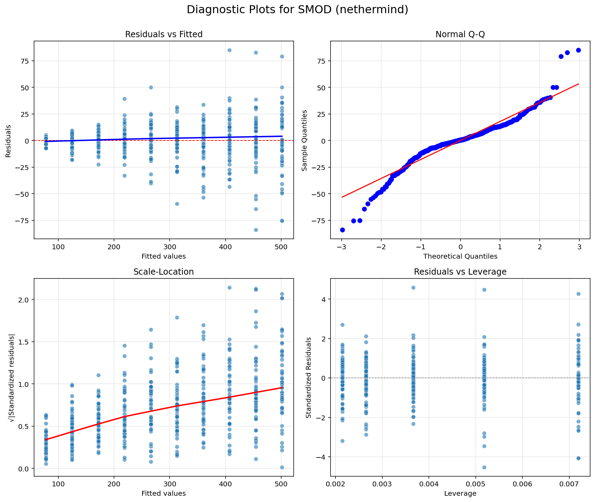


## geth


```python
                            OLS Regression Results                            
==============================================================================
Dep. Variable:        run_duration_ms   R-squared:                       0.963
Model:                            OLS   Adj. R-squared:                  0.963
Method:                 Least Squares   F-statistic:                 1.248e+04
Date:                Mon, 26 Jan 2026   Prob (F-statistic):               0.00
Time:                        15:37:55   Log-Likelihood:                -2564.4
No. Observations:                 480   AIC:                             5133.
Df Residuals:                     478   BIC:                             5141.
Df Model:                           1                                         
Covariance Type:            nonrobust                                         
==============================================================================
                 coef    std err          t      P>|t|      [0.025      0.975]
------------------------------------------------------------------------------
const         34.1586      4.998      6.834      0.000      24.338      43.980
opcount        0.0300      0.000    111.721      0.000       0.029       0.031
==============================================================================
Omnibus:                      788.243   Durbin-Watson:                   1.484
Prob(Omnibus):                  0.000   Jarque-Bera (JB):           425146.928
Skew:                           9.320   Prob(JB):                         0.00
Kurtosis:                     147.603   Cond. No.                     4.02e+04
==============================================================================

Notes:
[1] Standard Errors assume that the covariance matrix of the errors is correctly specified.
[2] The condition number is large, 4.02e+04. This might indicate that there are
strong multicollinearity or other numerical problems.
```

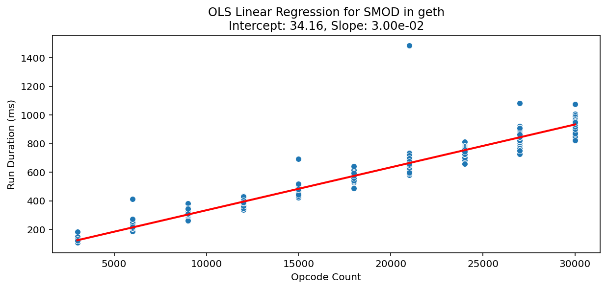

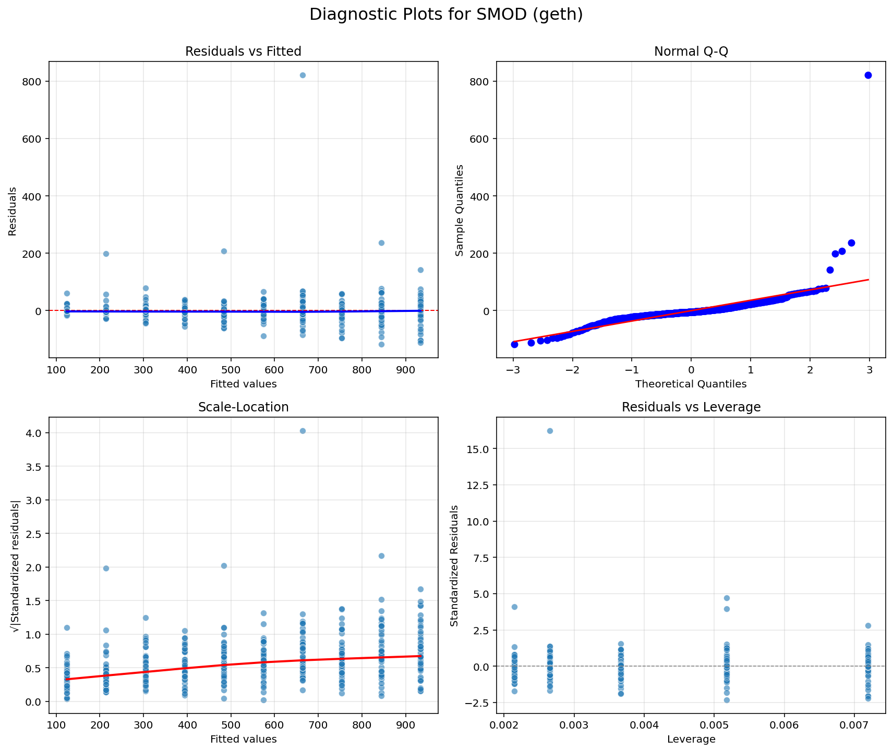


## besu


```python
                            OLS Regression Results                            
==============================================================================
Dep. Variable:        run_duration_ms   R-squared:                       0.984
Model:                            OLS   Adj. R-squared:                  0.984
Method:                 Least Squares   F-statistic:                 2.976e+04
Date:                Mon, 26 Jan 2026   Prob (F-statistic):               0.00
Time:                        15:37:55   Log-Likelihood:                -2508.9
No. Observations:                 480   AIC:                             5022.
Df Residuals:                     478   BIC:                             5030.
Df Model:                           1                                         
Covariance Type:            nonrobust                                         
==============================================================================
                 coef    std err          t      P>|t|      [0.025      0.975]
------------------------------------------------------------------------------
const         29.7487      4.452      6.682      0.000      21.001      38.497
opcount        0.0413      0.000    172.503      0.000       0.041       0.042
==============================================================================
Omnibus:                       72.657   Durbin-Watson:                   0.777
Prob(Omnibus):                  0.000   Jarque-Bera (JB):              168.855
Skew:                          -0.791   Prob(JB):                     2.16e-37
Kurtosis:                       5.437   Cond. No.                     4.02e+04
==============================================================================

Notes:
[1] Standard Errors assume that the covariance matrix of the errors is correctly specified.
[2] The condition number is large, 4.02e+04. This might indicate that there are
strong multicollinearity or other numerical problems.
```

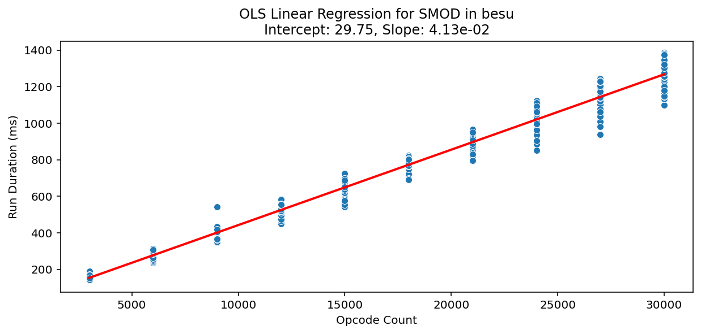

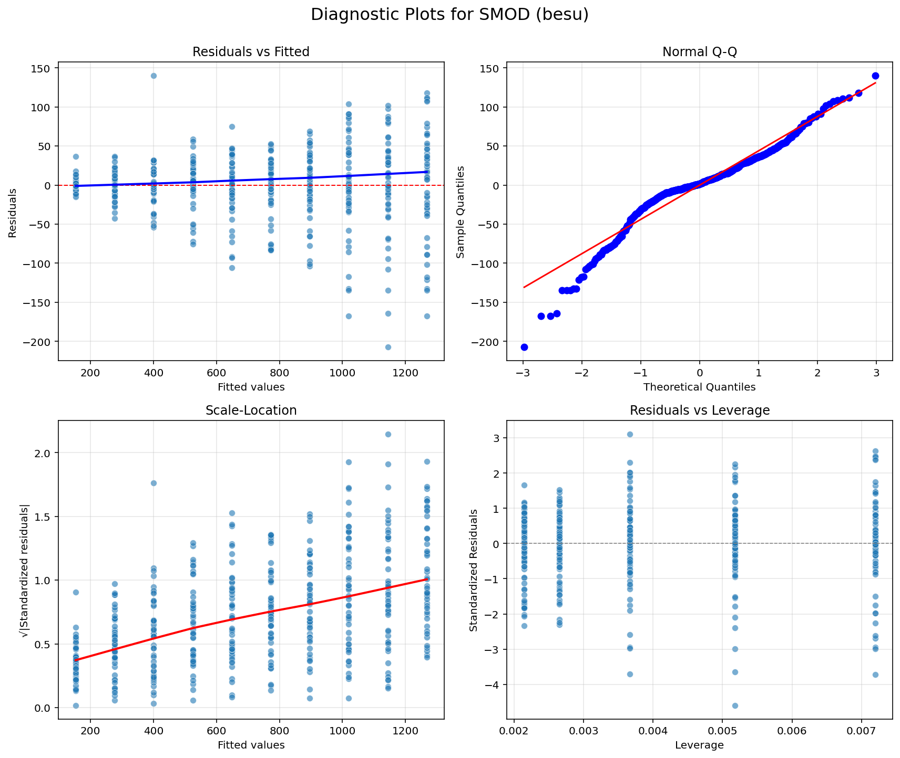


## reth


```python
                            OLS Regression Results                            
==============================================================================
Dep. Variable:        run_duration_ms   R-squared:                       0.977
Model:                            OLS   Adj. R-squared:                  0.977
Method:                 Least Squares   F-statistic:                 1.591e+04
Date:                Mon, 26 Jan 2026   Prob (F-statistic):          6.49e-305
Time:                        15:37:56   Log-Likelihood:                -1581.3
No. Observations:                 370   AIC:                             3167.
Df Residuals:                     368   BIC:                             3174.
Df Model:                           1                                         
Covariance Type:            nonrobust                                         
==============================================================================
                 coef    std err          t      P>|t|      [0.025      0.975]
------------------------------------------------------------------------------
const         31.7629      1.956     16.235      0.000      27.916      35.610
opcount        0.0133      0.000    126.129      0.000       0.013       0.013
==============================================================================
Omnibus:                      454.121   Durbin-Watson:                   1.585
Prob(Omnibus):                  0.000   Jarque-Bera (JB):            76904.769
Skew:                           5.318   Prob(JB):                         0.00
Kurtosis:                      72.823   Cond. No.                     4.02e+04
==============================================================================

Notes:
[1] Standard Errors assume that the covariance matrix of the errors is correctly specified.
[2] The condition number is large, 4.02e+04. This might indicate that there are
strong multicollinearity or other numerical problems.
```

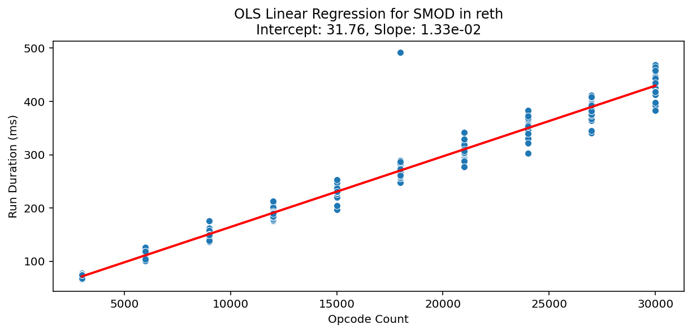

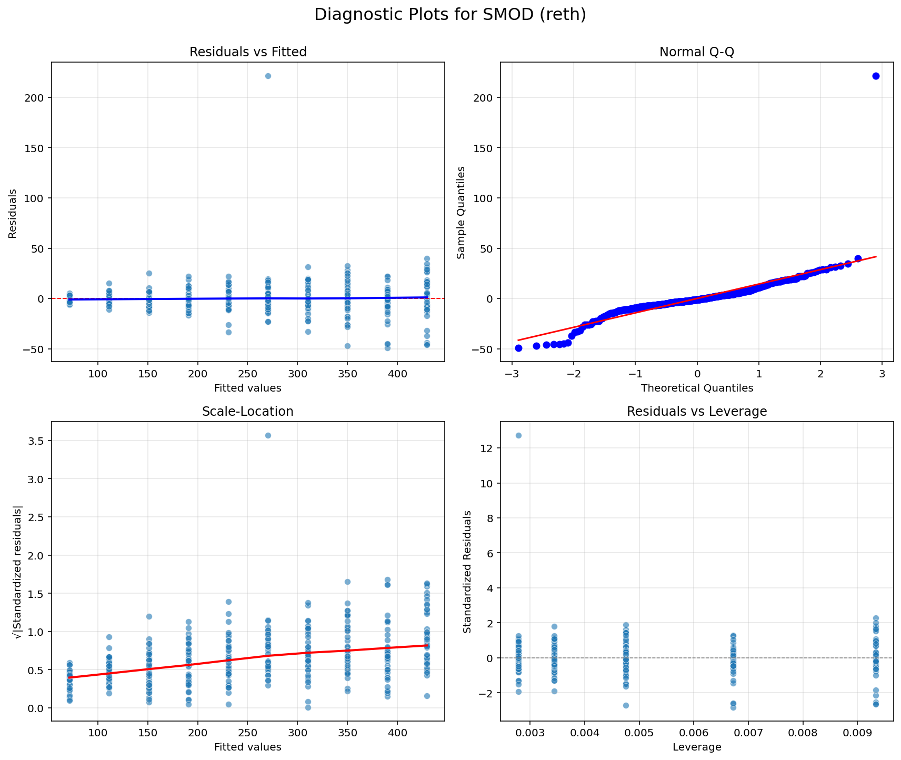


## erigon


```python
                            OLS Regression Results                            
==============================================================================
Dep. Variable:        run_duration_ms   R-squared:                       0.993
Model:                            OLS   Adj. R-squared:                  0.992
Method:                 Least Squares   F-statistic:                     3781.
Date:                Mon, 26 Jan 2026   Prob (F-statistic):           2.02e-31
Time:                        15:37:56   Log-Likelihood:                -138.53
No. Observations:                  30   AIC:                             281.1
Df Residuals:                      28   BIC:                             283.9
Df Model:                           1                                         
Covariance Type:            nonrobust                                         
==============================================================================
                 coef    std err          t      P>|t|      [0.025      0.975]
------------------------------------------------------------------------------
const         22.2938     10.002      2.229      0.034       1.806      42.781
opcount        0.0330      0.001     61.491      0.000       0.032       0.034
==============================================================================
Omnibus:                       58.725   Durbin-Watson:                   2.145
Prob(Omnibus):                  0.000   Jarque-Bera (JB):              463.777
Skew:                           4.002   Prob(JB):                    1.96e-101
Kurtosis:                      20.520   Cond. No.                     4.02e+04
==============================================================================

Notes:
[1] Standard Errors assume that the covariance matrix of the errors is correctly specified.
[2] The condition number is large, 4.02e+04. This might indicate that there are
strong multicollinearity or other numerical problems.
```


# MOD

## nethermind


```python
                            OLS Regression Results                            
==============================================================================
Dep. Variable:        run_duration_ms   R-squared:                       0.988
Model:                            OLS   Adj. R-squared:                  0.988
Method:                 Least Squares   F-statistic:                 3.835e+04
Date:                Mon, 26 Jan 2026   Prob (F-statistic):               0.00
Time:                        15:37:56   Log-Likelihood:                -2502.3
No. Observations:                 480   AIC:                             5009.
Df Residuals:                     478   BIC:                             5017.
Df Model:                           1                                         
Covariance Type:            nonrobust                                         
==============================================================================
                 coef    std err          t      P>|t|      [0.025      0.975]
------------------------------------------------------------------------------
const         30.9108      4.392      7.039      0.000      22.282      39.540
opcount        0.0462      0.000    195.842      0.000       0.046       0.047
==============================================================================
Omnibus:                      104.497   Durbin-Watson:                   0.810
Prob(Omnibus):                  0.000   Jarque-Bera (JB):              245.058
Skew:                          -1.112   Prob(JB):                     6.11e-54
Kurtosis:                       5.703   Cond. No.                     4.02e+04
==============================================================================

Notes:
[1] Standard Errors assume that the covariance matrix of the errors is correctly specified.
[2] The condition number is large, 4.02e+04. This might indicate that there are
strong multicollinearity or other numerical problems.
```

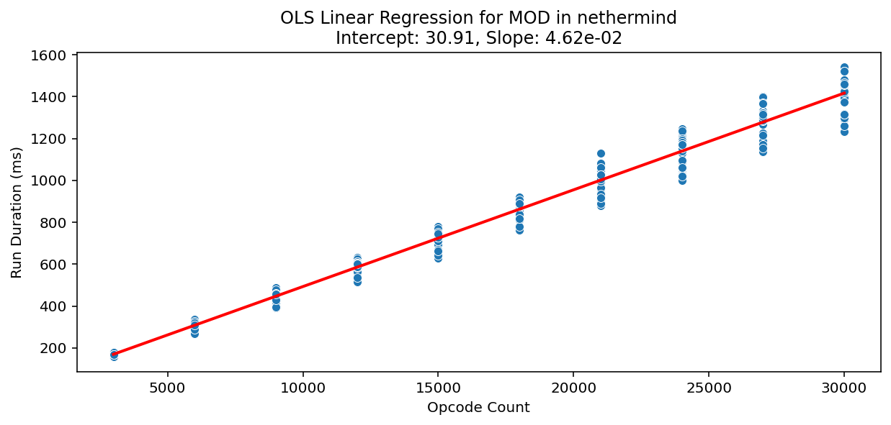

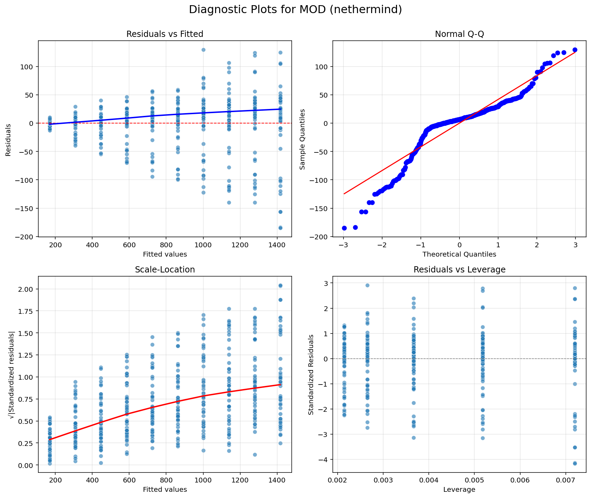


## geth


```python
                            OLS Regression Results                            
==============================================================================
Dep. Variable:        run_duration_ms   R-squared:                       0.984
Model:                            OLS   Adj. R-squared:                  0.984
Method:                 Least Squares   F-statistic:                 2.898e+04
Date:                Mon, 26 Jan 2026   Prob (F-statistic):               0.00
Time:                        15:37:57   Log-Likelihood:                -2644.3
No. Observations:                 480   AIC:                             5293.
Df Residuals:                     478   BIC:                             5301.
Df Model:                           1                                         
Covariance Type:            nonrobust                                         
==============================================================================
                 coef    std err          t      P>|t|      [0.025      0.975]
------------------------------------------------------------------------------
const         32.1090      5.903      5.439      0.000      20.510      43.708
opcount        0.0540      0.000    170.221      0.000       0.053       0.055
==============================================================================
Omnibus:                      357.298   Durbin-Watson:                   1.048
Prob(Omnibus):                  0.000   Jarque-Bera (JB):            21238.791
Skew:                           2.585   Prob(JB):                         0.00
Kurtosis:                      35.175   Cond. No.                     4.02e+04
==============================================================================

Notes:
[1] Standard Errors assume that the covariance matrix of the errors is correctly specified.
[2] The condition number is large, 4.02e+04. This might indicate that there are
strong multicollinearity or other numerical problems.
```


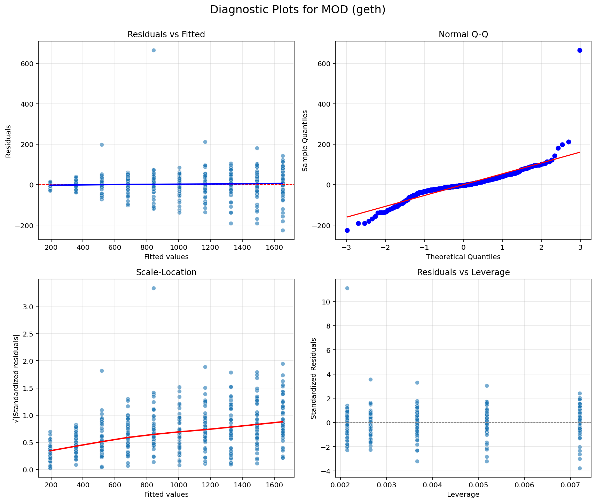


## besu


```python
                            OLS Regression Results                            
==============================================================================
Dep. Variable:        run_duration_ms   R-squared:                       0.978
Model:                            OLS   Adj. R-squared:                  0.978
Method:                 Least Squares   F-statistic:                 2.140e+04
Date:                Mon, 26 Jan 2026   Prob (F-statistic):               0.00
Time:                        15:37:57   Log-Likelihood:                -3336.6
No. Observations:                 480   AIC:                             6677.
Df Residuals:                     478   BIC:                             6685.
Df Model:                           1                                         
Covariance Type:            nonrobust                                         
==============================================================================
                 coef    std err          t      P>|t|      [0.025      0.975]
------------------------------------------------------------------------------
const         43.5340     24.969      1.744      0.082      -5.528      92.596
opcount        0.1962      0.001    146.285      0.000       0.194       0.199
==============================================================================
Omnibus:                       29.231   Durbin-Watson:                   0.806
Prob(Omnibus):                  0.000   Jarque-Bera (JB):               41.911
Skew:                          -0.475   Prob(JB):                     7.93e-10
Kurtosis:                       4.092   Cond. No.                     4.02e+04
==============================================================================

Notes:
[1] Standard Errors assume that the covariance matrix of the errors is correctly specified.
[2] The condition number is large, 4.02e+04. This might indicate that there are
strong multicollinearity or other numerical problems.
```

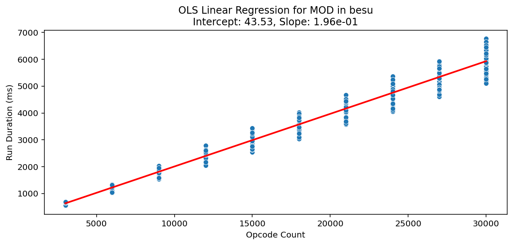

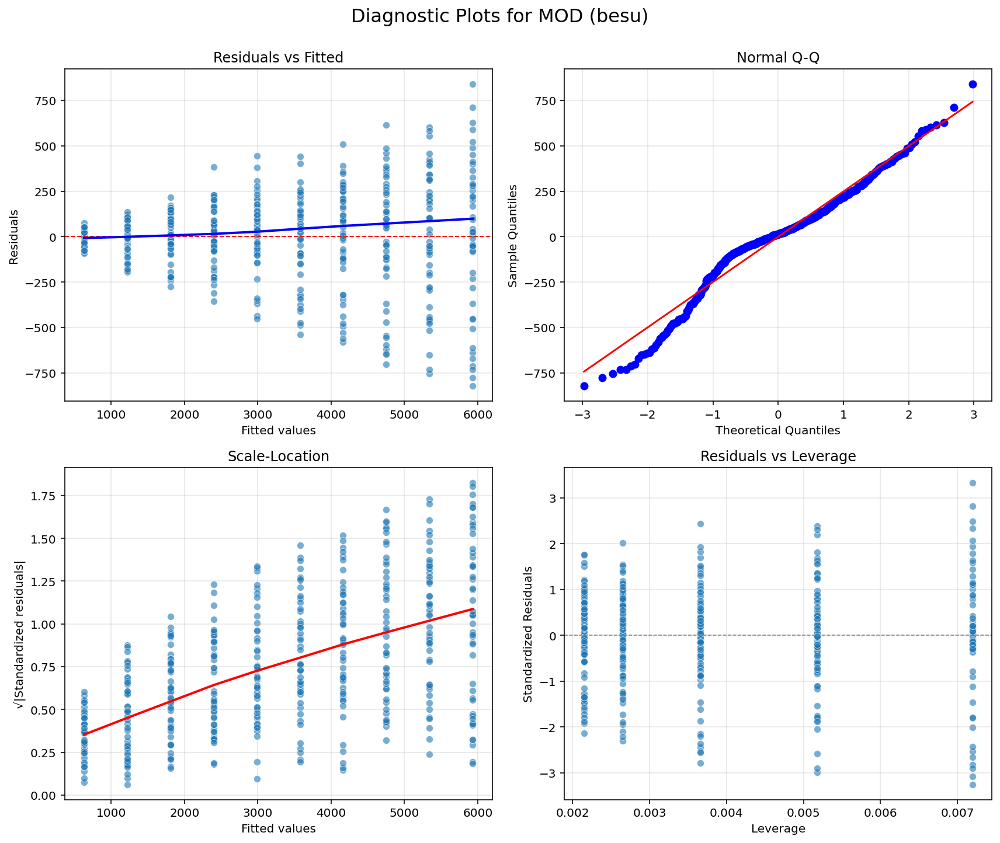


## reth


```python
                            OLS Regression Results                            
==============================================================================
Dep. Variable:        run_duration_ms   R-squared:                       0.991
Model:                            OLS   Adj. R-squared:                  0.991
Method:                 Least Squares   F-statistic:                 4.214e+04
Date:                Mon, 26 Jan 2026   Prob (F-statistic):               0.00
Time:                        15:37:57   Log-Likelihood:                -1789.4
No. Observations:                 370   AIC:                             3583.
Df Residuals:                     368   BIC:                             3591.
Df Model:                           1                                         
Covariance Type:            nonrobust                                         
==============================================================================
                 coef    std err          t      P>|t|      [0.025      0.975]
------------------------------------------------------------------------------
const         32.9160      3.433      9.589      0.000      26.166      39.666
opcount        0.0379      0.000    205.274      0.000       0.037       0.038
==============================================================================
Omnibus:                      128.854   Durbin-Watson:                   0.971
Prob(Omnibus):                  0.000   Jarque-Bera (JB):              431.991
Skew:                          -1.563   Prob(JB):                     1.56e-94
Kurtosis:                       7.272   Cond. No.                     4.02e+04
==============================================================================

Notes:
[1] Standard Errors assume that the covariance matrix of the errors is correctly specified.
[2] The condition number is large, 4.02e+04. This might indicate that there are
strong multicollinearity or other numerical problems.
```

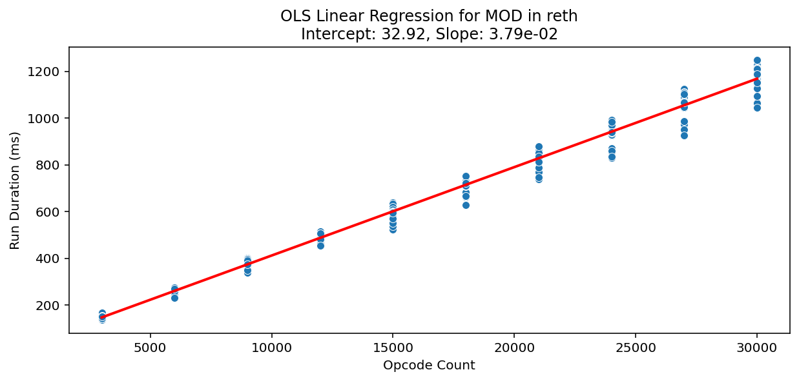


## erigon


```python
                            OLS Regression Results                            
==============================================================================
Dep. Variable:        run_duration_ms   R-squared:                       0.996
Model:                            OLS   Adj. R-squared:                  0.996
Method:                 Least Squares   F-statistic:                     7094.
Date:                Mon, 26 Jan 2026   Prob (F-statistic):           3.16e-35
Time:                        15:37:57   Log-Likelihood:                -144.78
No. Observations:                  30   AIC:                             293.6
Df Residuals:                      28   BIC:                             296.4
Df Model:                           1                                         
Covariance Type:            nonrobust                                         
==============================================================================
                 coef    std err          t      P>|t|      [0.025      0.975]
------------------------------------------------------------------------------
const         39.0732     12.320      3.171      0.004      13.836      64.310
opcount        0.0557      0.001     84.225      0.000       0.054       0.057
==============================================================================
Omnibus:                       16.793   Durbin-Watson:                   1.978
Prob(Omnibus):                  0.000   Jarque-Bera (JB):               21.058
Skew:                           1.410   Prob(JB):                     2.68e-05
Kurtosis:                       5.982   Cond. No.                     4.02e+04
==============================================================================

Notes:
[1] Standard Errors assume that the covariance matrix of the errors is correctly specified.
[2] The condition number is large, 4.02e+04. This might indicate that there are
strong multicollinearity or other numerical problems.
```


# POINT_EVALUATION

## nethermind


```python
                            OLS Regression Results                            
==============================================================================
Dep. Variable:        run_duration_ms   R-squared:                       0.991
Model:                            OLS   Adj. R-squared:                  0.991
Method:                 Least Squares   F-statistic:                 4.057e+04
Date:                Mon, 26 Jan 2026   Prob (F-statistic):               0.00
Time:                        15:37:58   Log-Likelihood:                -2748.3
No. Observations:                 370   AIC:                             5501.
Df Residuals:                     368   BIC:                             5509.
Df Model:                           1                                         
Covariance Type:            nonrobust                                         
==============================================================================
                 coef    std err          t      P>|t|      [0.025      0.975]
------------------------------------------------------------------------------
const         11.9622     45.842      0.261      0.794     -78.183     102.107
opcount     1488.0494      7.388    201.412      0.000    1473.521    1502.578
==============================================================================
Omnibus:                      142.143   Durbin-Watson:                   0.666
Prob(Omnibus):                  0.000   Jarque-Bera (JB):              405.651
Skew:                          -1.842   Prob(JB):                     8.20e-89
Kurtosis:                       6.569   Cond. No.                         13.7
==============================================================================

Notes:
[1] Standard Errors assume that the covariance matrix of the errors is correctly specified.
```

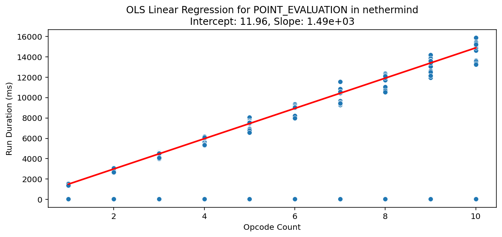

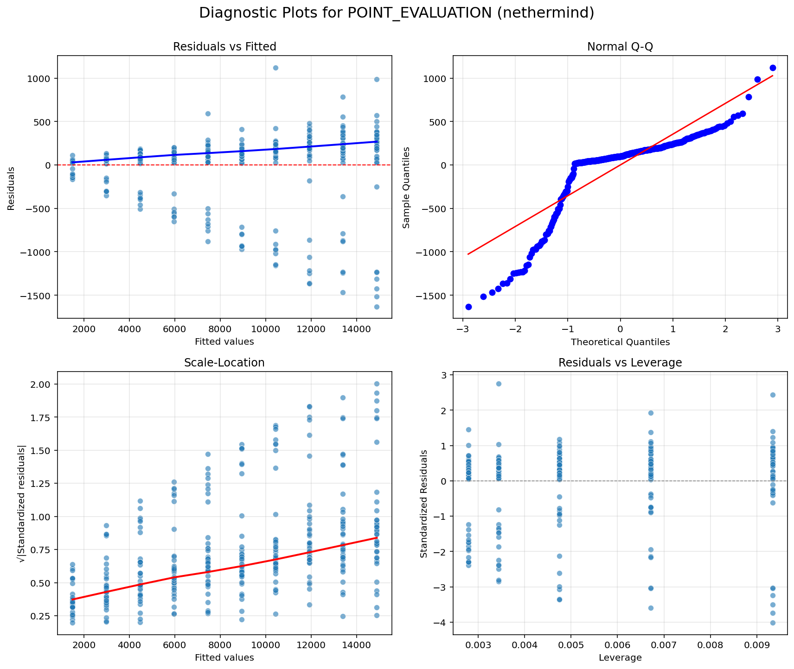


## geth


```python
                            OLS Regression Results                            
==============================================================================
Dep. Variable:        run_duration_ms   R-squared:                       0.992
Model:                            OLS   Adj. R-squared:                  0.992
Method:                 Least Squares   F-statistic:                 6.006e+04
Date:                Mon, 26 Jan 2026   Prob (F-statistic):               0.00
Time:                        15:37:58   Log-Likelihood:                -3533.4
No. Observations:                 480   AIC:                             7071.
Df Residuals:                     478   BIC:                             7079.
Df Model:                           1                                         
Covariance Type:            nonrobust                                         
==============================================================================
                 coef    std err          t      P>|t|      [0.025      0.975]
------------------------------------------------------------------------------
const         42.5469     37.628      1.131      0.259     -31.390     116.484
opcount     1486.1440      6.064    245.064      0.000    1474.228    1498.060
==============================================================================
Omnibus:                      229.146   Durbin-Watson:                   0.686
Prob(Omnibus):                  0.000   Jarque-Bera (JB):              942.470
Skew:                          -2.211   Prob(JB):                    2.21e-205
Kurtosis:                       8.251   Cond. No.                         13.7
==============================================================================

Notes:
[1] Standard Errors assume that the covariance matrix of the errors is correctly specified.
```

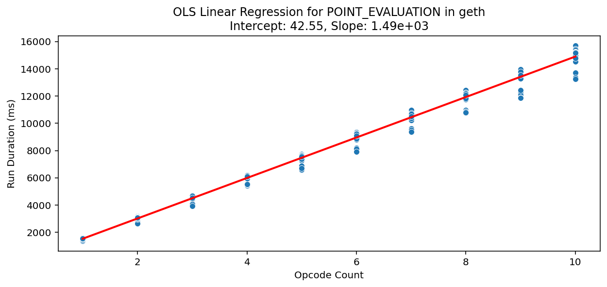

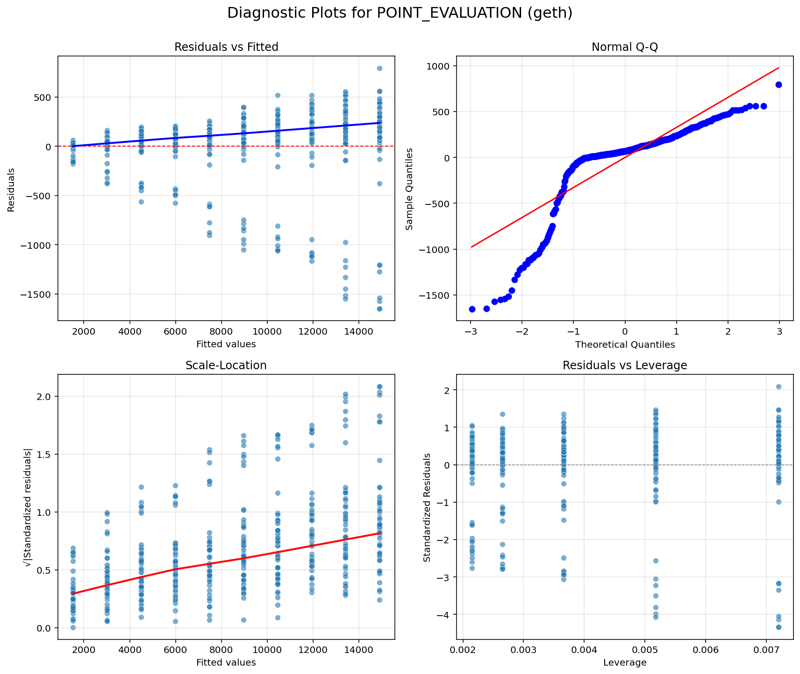


## besu


```python
                            OLS Regression Results                            
==============================================================================
Dep. Variable:        run_duration_ms   R-squared:                       0.991
Model:                            OLS   Adj. R-squared:                  0.991
Method:                 Least Squares   F-statistic:                 5.226e+04
Date:                Mon, 26 Jan 2026   Prob (F-statistic):               0.00
Time:                        15:37:58   Log-Likelihood:                -3568.1
No. Observations:                 480   AIC:                             7140.
Df Residuals:                     478   BIC:                             7148.
Df Model:                           1                                         
Covariance Type:            nonrobust                                         
==============================================================================
                 coef    std err          t      P>|t|      [0.025      0.975]
------------------------------------------------------------------------------
const         27.0787     40.444      0.670      0.503     -52.391     106.549
opcount     1490.0246      6.518    228.596      0.000    1477.217    1502.832
==============================================================================
Omnibus:                      124.201   Durbin-Watson:                   0.665
Prob(Omnibus):                  0.000   Jarque-Bera (JB):              242.443
Skew:                          -1.439   Prob(JB):                     2.26e-53
Kurtosis:                       4.958   Cond. No.                         13.7
==============================================================================

Notes:
[1] Standard Errors assume that the covariance matrix of the errors is correctly specified.
```

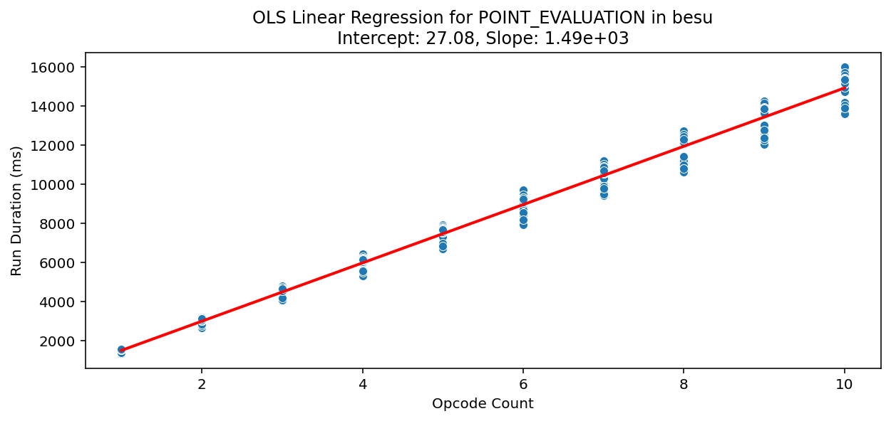

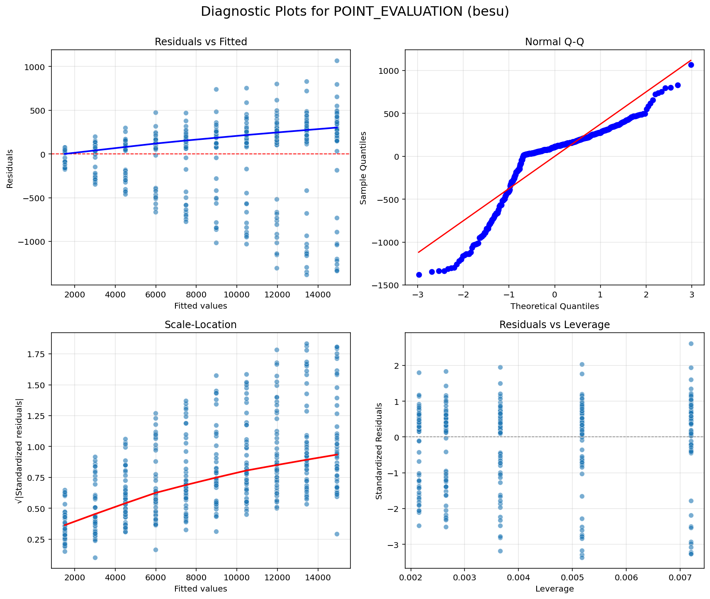


## reth


```python
                            OLS Regression Results                            
==============================================================================
Dep. Variable:        run_duration_ms   R-squared:                       0.994
Model:                            OLS   Adj. R-squared:                  0.994
Method:                 Least Squares   F-statistic:                 6.248e+04
Date:                Mon, 26 Jan 2026   Prob (F-statistic):               0.00
Time:                        15:37:58   Log-Likelihood:                -2669.9
No. Observations:                 370   AIC:                             5344.
Df Residuals:                     368   BIC:                             5352.
Df Model:                           1                                         
Covariance Type:            nonrobust                                         
==============================================================================
                 coef    std err          t      P>|t|      [0.025      0.975]
------------------------------------------------------------------------------
const         32.7350     37.081      0.883      0.378     -40.183     105.653
opcount     1493.8386      5.976    249.964      0.000    1482.087    1505.590
==============================================================================
Omnibus:                      189.660   Durbin-Watson:                   0.701
Prob(Omnibus):                  0.000   Jarque-Bera (JB):              782.628
Skew:                          -2.342   Prob(JB):                    1.13e-170
Kurtosis:                       8.370   Cond. No.                         13.7
==============================================================================

Notes:
[1] Standard Errors assume that the covariance matrix of the errors is correctly specified.
```

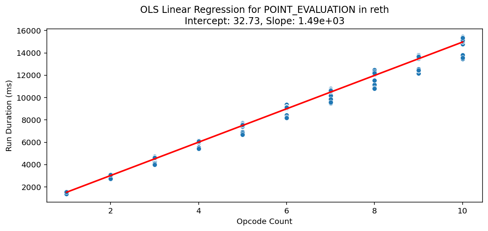

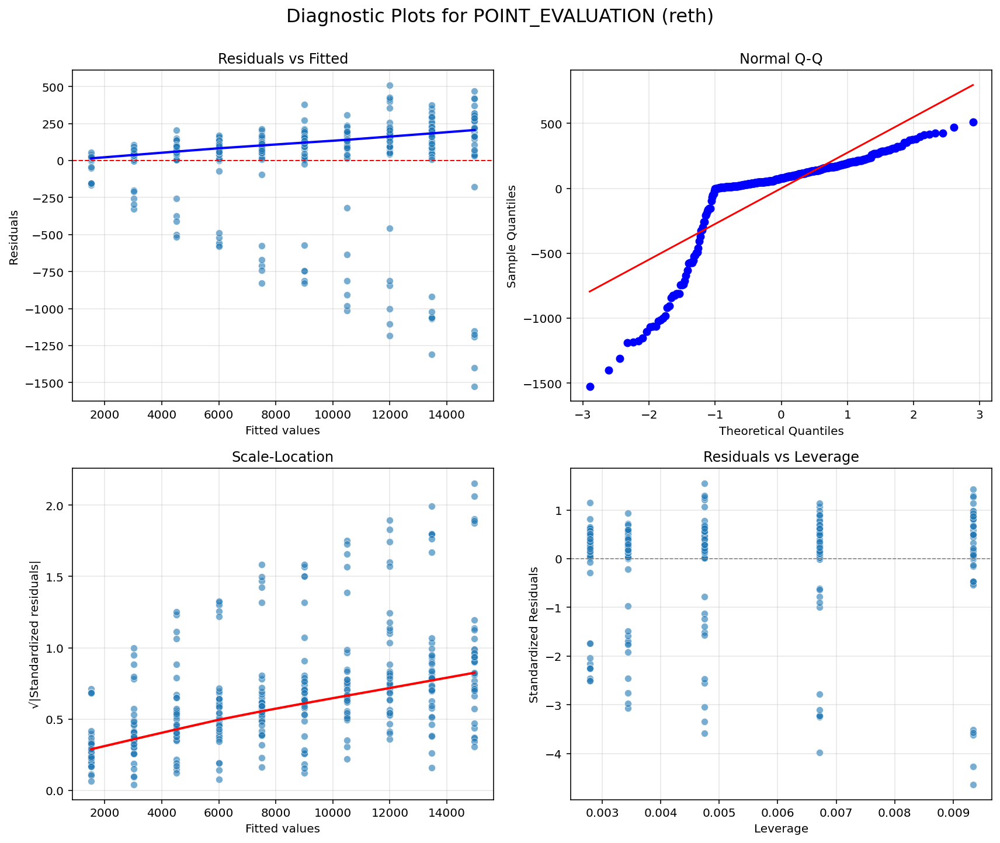


## erigon

OLS model did not run... Error: zero-size array to reduction operation maximum which has no identity

# BLS12_G1ADD

## nethermind


```python
                            OLS Regression Results                            
==============================================================================
Dep. Variable:        run_duration_ms   R-squared:                       0.985
Model:                            OLS   Adj. R-squared:                  0.985
Method:                 Least Squares   F-statistic:                 2.493e+04
Date:                Mon, 26 Jan 2026   Prob (F-statistic):               0.00
Time:                        15:37:59   Log-Likelihood:                -2239.1
No. Observations:                 370   AIC:                             4482.
Df Residuals:                     368   BIC:                             4490.
Df Model:                           1                                         
Covariance Type:            nonrobust                                         
==============================================================================
                 coef    std err          t      P>|t|      [0.025      0.975]
------------------------------------------------------------------------------
const         16.3381     11.576      1.411      0.159      -6.425      39.101
opcount        5.8916      0.037    157.900      0.000       5.818       5.965
==============================================================================
Omnibus:                       68.713   Durbin-Watson:                   1.289
Prob(Omnibus):                  0.000   Jarque-Bera (JB):              215.006
Skew:                          -0.825   Prob(JB):                     2.05e-47
Kurtosis:                       6.351   Cond. No.                         670.
==============================================================================

Notes:
[1] Standard Errors assume that the covariance matrix of the errors is correctly specified.
```

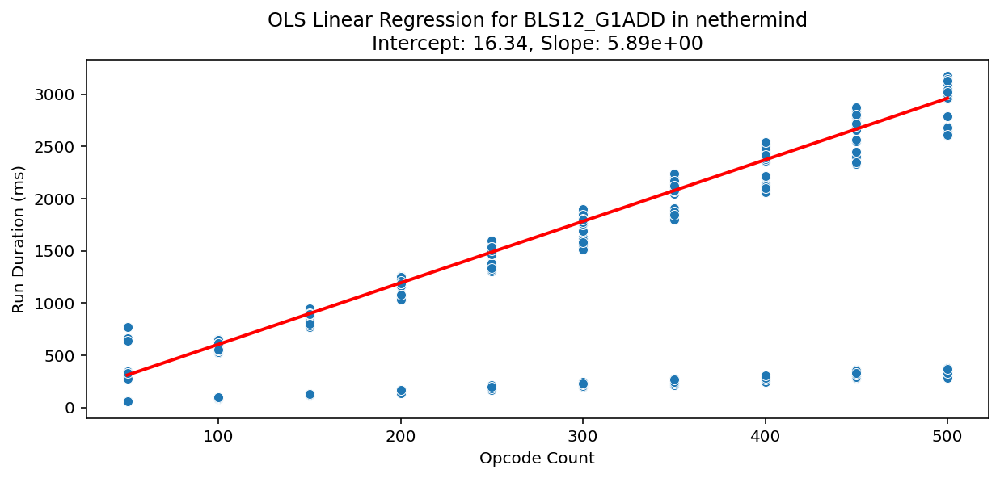

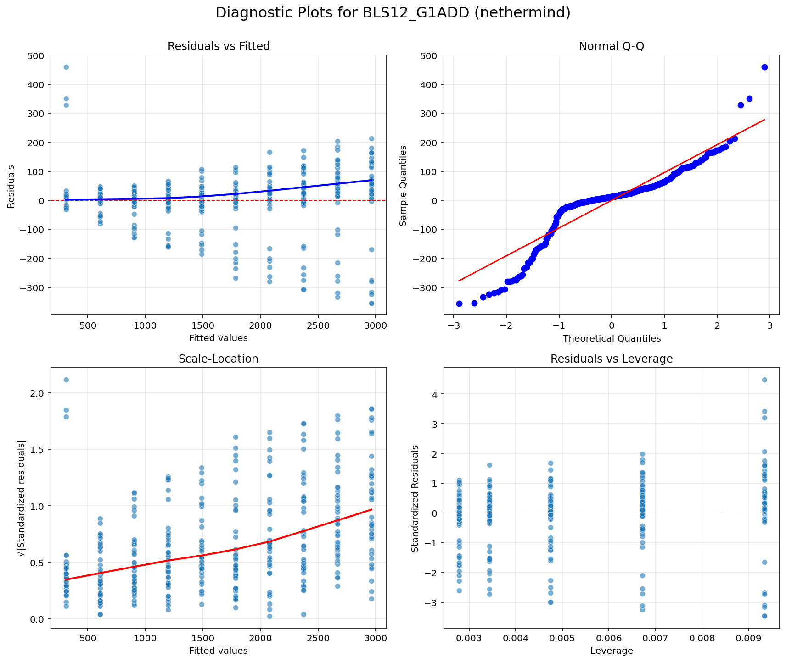


## geth


```python
                            OLS Regression Results                            
==============================================================================
Dep. Variable:        run_duration_ms   R-squared:                       0.991
Model:                            OLS   Adj. R-squared:                  0.991
Method:                 Least Squares   F-statistic:                 5.429e+04
Date:                Mon, 26 Jan 2026   Prob (F-statistic):               0.00
Time:                        15:37:59   Log-Likelihood:                -2717.7
No. Observations:                 480   AIC:                             5439.
Df Residuals:                     478   BIC:                             5448.
Df Model:                           1                                         
Covariance Type:            nonrobust                                         
==============================================================================
                 coef    std err          t      P>|t|      [0.025      0.975]
------------------------------------------------------------------------------
const         29.5933      6.879      4.302      0.000      16.077      43.109
opcount        5.1660      0.022    232.997      0.000       5.122       5.210
==============================================================================
Omnibus:                       91.521   Durbin-Watson:                   1.177
Prob(Omnibus):                  0.000   Jarque-Bera (JB):              271.458
Skew:                          -0.895   Prob(JB):                     1.13e-59
Kurtosis:                       6.220   Cond. No.                         670.
==============================================================================

Notes:
[1] Standard Errors assume that the covariance matrix of the errors is correctly specified.
```

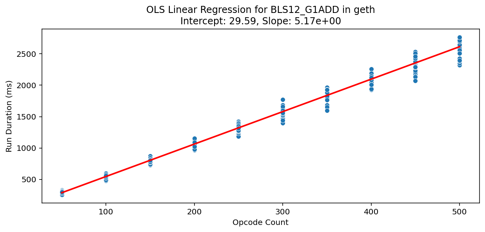

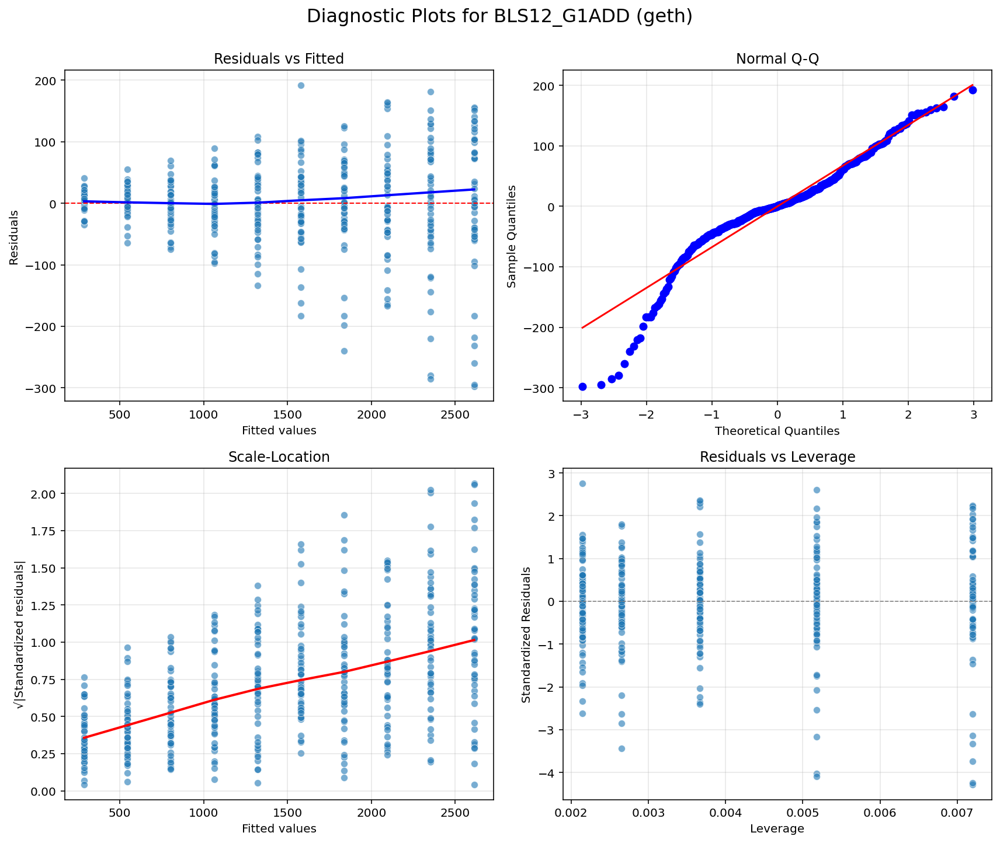


## besu


```python
                            OLS Regression Results                            
==============================================================================
Dep. Variable:        run_duration_ms   R-squared:                       0.946
Model:                            OLS   Adj. R-squared:                  0.945
Method:                 Least Squares   F-statistic:                     8302.
Date:                Mon, 26 Jan 2026   Prob (F-statistic):          2.88e-304
Time:                        15:37:59   Log-Likelihood:                -3525.4
No. Observations:                 480   AIC:                             7055.
Df Residuals:                     478   BIC:                             7063.
Df Model:                           1                                         
Covariance Type:            nonrobust                                         
==============================================================================
                 coef    std err          t      P>|t|      [0.025      0.975]
------------------------------------------------------------------------------
const         22.3550     37.007      0.604      0.546     -50.361      95.071
opcount       10.8686      0.119     91.116      0.000      10.634      11.103
==============================================================================
Omnibus:                        9.157   Durbin-Watson:                   1.339
Prob(Omnibus):                  0.010   Jarque-Bera (JB):                9.532
Skew:                          -0.279   Prob(JB):                      0.00851
Kurtosis:                       3.407   Cond. No.                         670.
==============================================================================

Notes:
[1] Standard Errors assume that the covariance matrix of the errors is correctly specified.
```

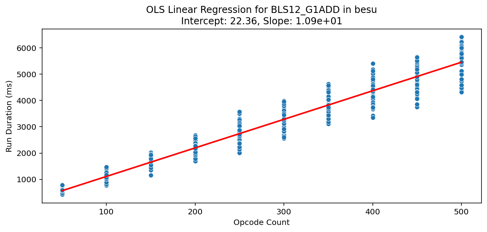

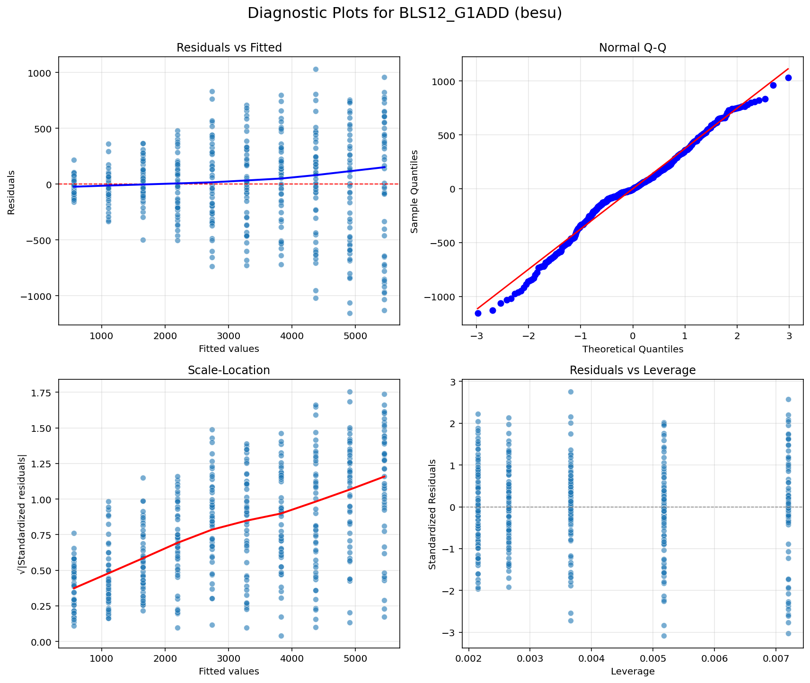


## reth


```python
                            OLS Regression Results                            
==============================================================================
Dep. Variable:        run_duration_ms   R-squared:                       0.991
Model:                            OLS   Adj. R-squared:                  0.991
Method:                 Least Squares   F-statistic:                 3.876e+04
Date:                Mon, 26 Jan 2026   Prob (F-statistic):               0.00
Time:                        15:38:00   Log-Likelihood:                -2109.0
No. Observations:                 370   AIC:                             4222.
Df Residuals:                     368   BIC:                             4230.
Df Model:                           1                                         
Covariance Type:            nonrobust                                         
==============================================================================
                 coef    std err          t      P>|t|      [0.025      0.975]
------------------------------------------------------------------------------
const         30.2475      8.143      3.715      0.000      14.235      46.260
opcount        5.1676      0.026    196.885      0.000       5.116       5.219
==============================================================================
Omnibus:                       90.152   Durbin-Watson:                   1.134
Prob(Omnibus):                  0.000   Jarque-Bera (JB):              237.600
Skew:                          -1.157   Prob(JB):                     2.55e-52
Kurtosis:                       6.171   Cond. No.                         670.
==============================================================================

Notes:
[1] Standard Errors assume that the covariance matrix of the errors is correctly specified.
```

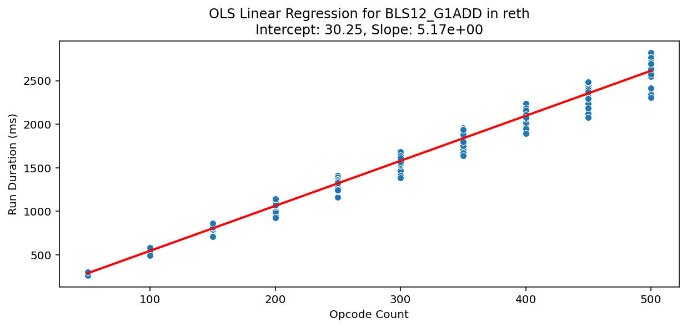

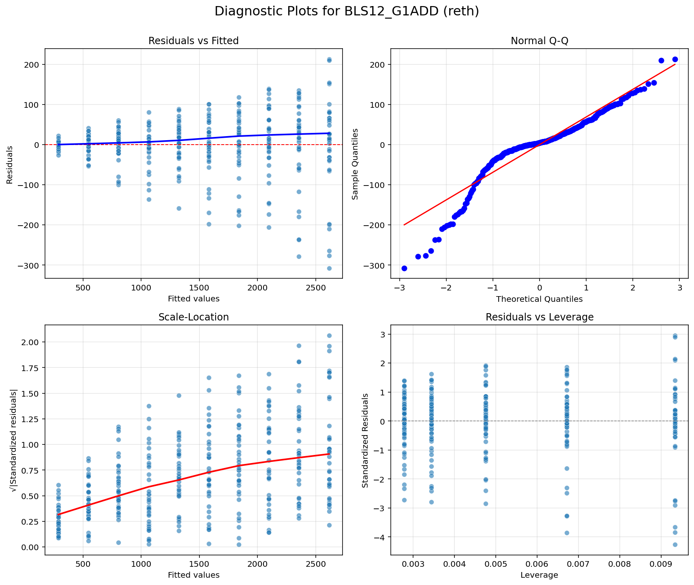


## erigon

OLS model did not run... Error: zero-size array to reduction operation maximum which has no identity

# BLS12_G2ADD

## nethermind


```python
                            OLS Regression Results                            
==============================================================================
Dep. Variable:        run_duration_ms   R-squared:                       0.990
Model:                            OLS   Adj. R-squared:                  0.990
Method:                 Least Squares   F-statistic:                 3.688e+04
Date:                Mon, 26 Jan 2026   Prob (F-statistic):               0.00
Time:                        15:38:00   Log-Likelihood:                -2143.5
No. Observations:                 370   AIC:                             4291.
Df Residuals:                     368   BIC:                             4299.
Df Model:                           1                                         
Covariance Type:            nonrobust                                         
==============================================================================
                 coef    std err          t      P>|t|      [0.025      0.975]
------------------------------------------------------------------------------
const         -4.3673      8.940     -0.489      0.625     -21.946      13.212
opcount        9.2229      0.048    192.043      0.000       9.128       9.317
==============================================================================
Omnibus:                      108.999   Durbin-Watson:                   0.667
Prob(Omnibus):                  0.000   Jarque-Bera (JB):              268.312
Skew:                          -1.443   Prob(JB):                     5.46e-59
Kurtosis:                       6.012   Cond. No.                         402.
==============================================================================

Notes:
[1] Standard Errors assume that the covariance matrix of the errors is correctly specified.
```

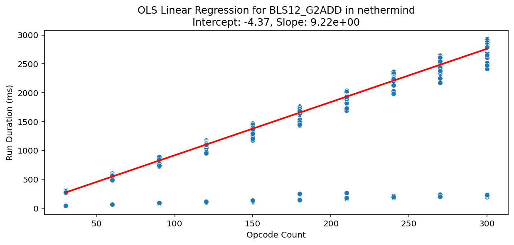

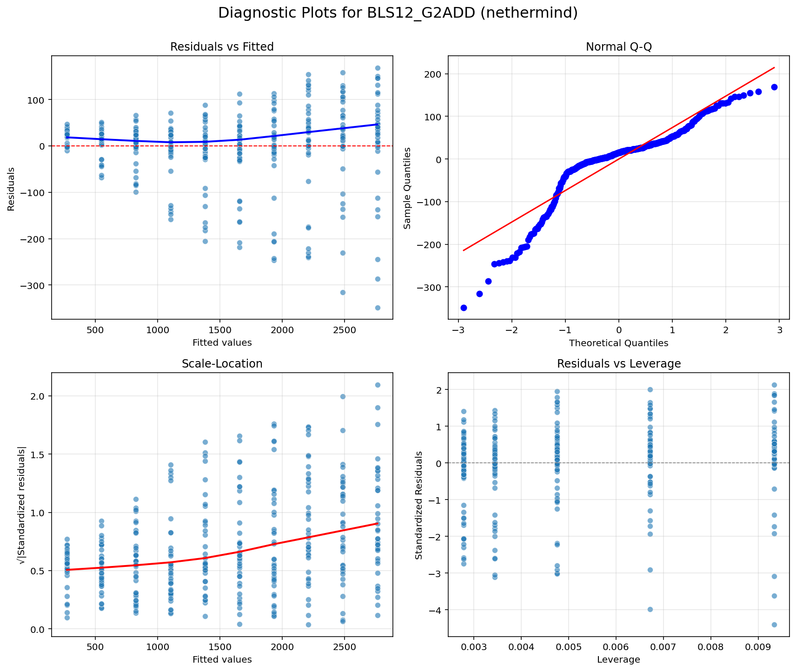


## geth


```python
                            OLS Regression Results                            
==============================================================================
Dep. Variable:        run_duration_ms   R-squared:                       0.992
Model:                            OLS   Adj. R-squared:                  0.992
Method:                 Least Squares   F-statistic:                 6.102e+04
Date:                Mon, 26 Jan 2026   Prob (F-statistic):               0.00
Time:                        15:38:00   Log-Likelihood:                -2593.6
No. Observations:                 480   AIC:                             5191.
Df Residuals:                     478   BIC:                             5199.
Df Model:                           1                                         
Covariance Type:            nonrobust                                         
==============================================================================
                 coef    std err          t      P>|t|      [0.025      0.975]
------------------------------------------------------------------------------
const         28.6263      5.311      5.390      0.000      18.191      39.062
opcount        7.0477      0.029    247.027      0.000       6.992       7.104
==============================================================================
Omnibus:                       64.516   Durbin-Watson:                   0.946
Prob(Omnibus):                  0.000   Jarque-Bera (JB):              153.176
Skew:                          -0.701   Prob(JB):                     5.47e-34
Kurtosis:                       5.386   Cond. No.                         402.
==============================================================================

Notes:
[1] Standard Errors assume that the covariance matrix of the errors is correctly specified.
```

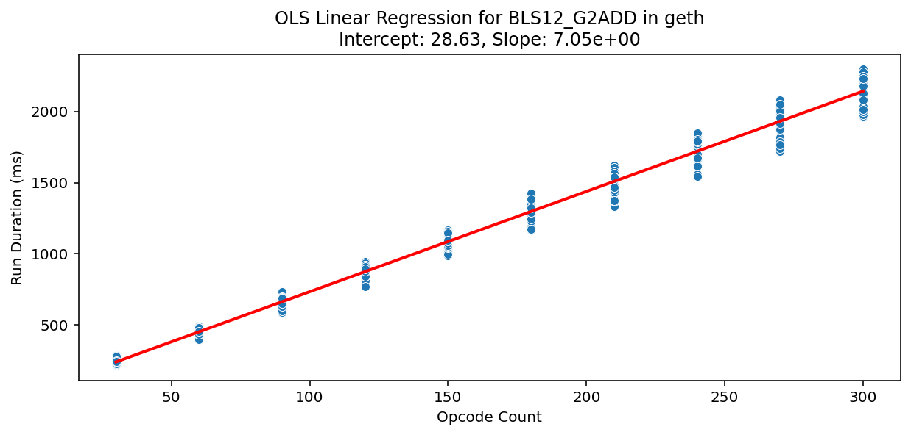

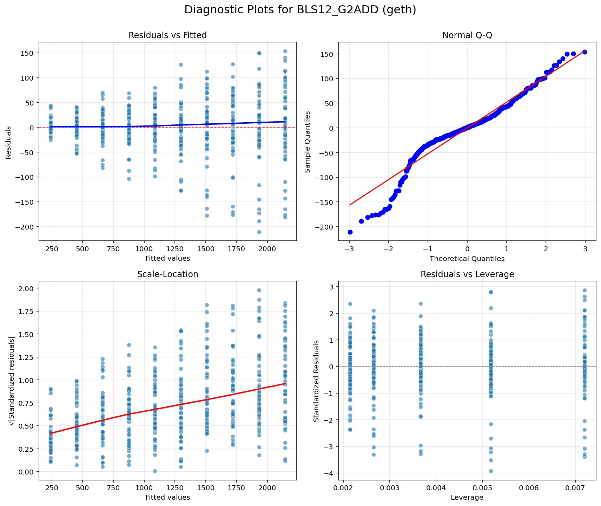


## besu


```python
                            OLS Regression Results                            
==============================================================================
Dep. Variable:        run_duration_ms   R-squared:                       0.954
Model:                            OLS   Adj. R-squared:                  0.954
Method:                 Least Squares   F-statistic:                     9973.
Date:                Mon, 26 Jan 2026   Prob (F-statistic):          2.37e-322
Time:                        15:38:00   Log-Likelihood:                -3323.4
No. Observations:                 480   AIC:                             6651.
Df Residuals:                     478   BIC:                             6659.
Df Model:                           1                                         
Covariance Type:            nonrobust                                         
==============================================================================
                 coef    std err          t      P>|t|      [0.025      0.975]
------------------------------------------------------------------------------
const          3.7116     24.293      0.153      0.879     -44.023      51.446
opcount       13.0331      0.131     99.866      0.000      12.777      13.290
==============================================================================
Omnibus:                       11.478   Durbin-Watson:                   1.168
Prob(Omnibus):                  0.003   Jarque-Bera (JB):               15.852
Skew:                          -0.213   Prob(JB):                     0.000361
Kurtosis:                       3.782   Cond. No.                         402.
==============================================================================

Notes:
[1] Standard Errors assume that the covariance matrix of the errors is correctly specified.
```

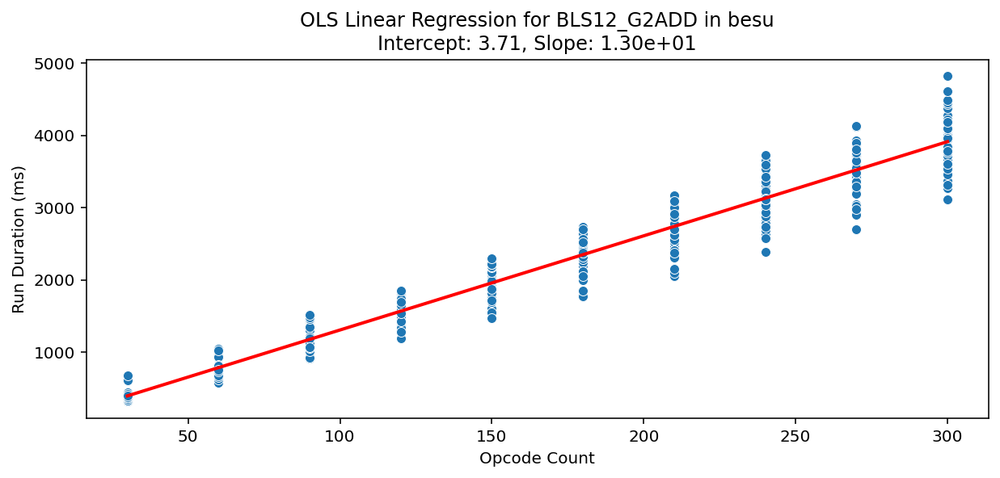

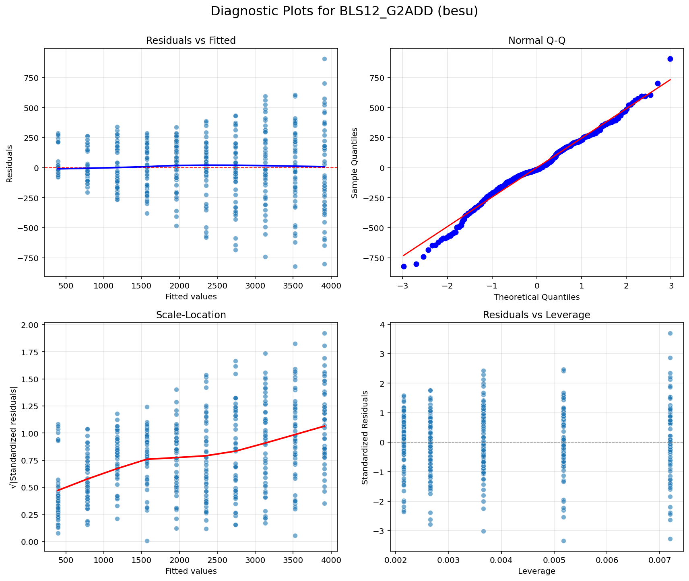


## reth


```python
                            OLS Regression Results                            
==============================================================================
Dep. Variable:        run_duration_ms   R-squared:                       0.992
Model:                            OLS   Adj. R-squared:                  0.992
Method:                 Least Squares   F-statistic:                 4.672e+04
Date:                Mon, 26 Jan 2026   Prob (F-statistic):               0.00
Time:                        15:38:01   Log-Likelihood:                -2020.2
No. Observations:                 370   AIC:                             4044.
Df Residuals:                     368   BIC:                             4052.
Df Model:                           1                                         
Covariance Type:            nonrobust                                         
==============================================================================
                 coef    std err          t      P>|t|      [0.025      0.975]
------------------------------------------------------------------------------
const         36.8159      6.407      5.746      0.000      24.217      49.415
opcount        7.4392      0.034    216.138      0.000       7.371       7.507
==============================================================================
Omnibus:                       87.916   Durbin-Watson:                   0.987
Prob(Omnibus):                  0.000   Jarque-Bera (JB):              218.081
Skew:                          -1.153   Prob(JB):                     4.41e-48
Kurtosis:                       5.971   Cond. No.                         402.
==============================================================================

Notes:
[1] Standard Errors assume that the covariance matrix of the errors is correctly specified.
```

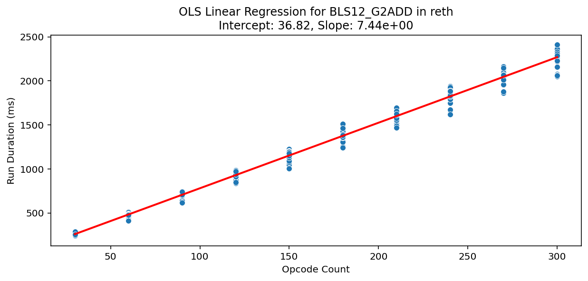

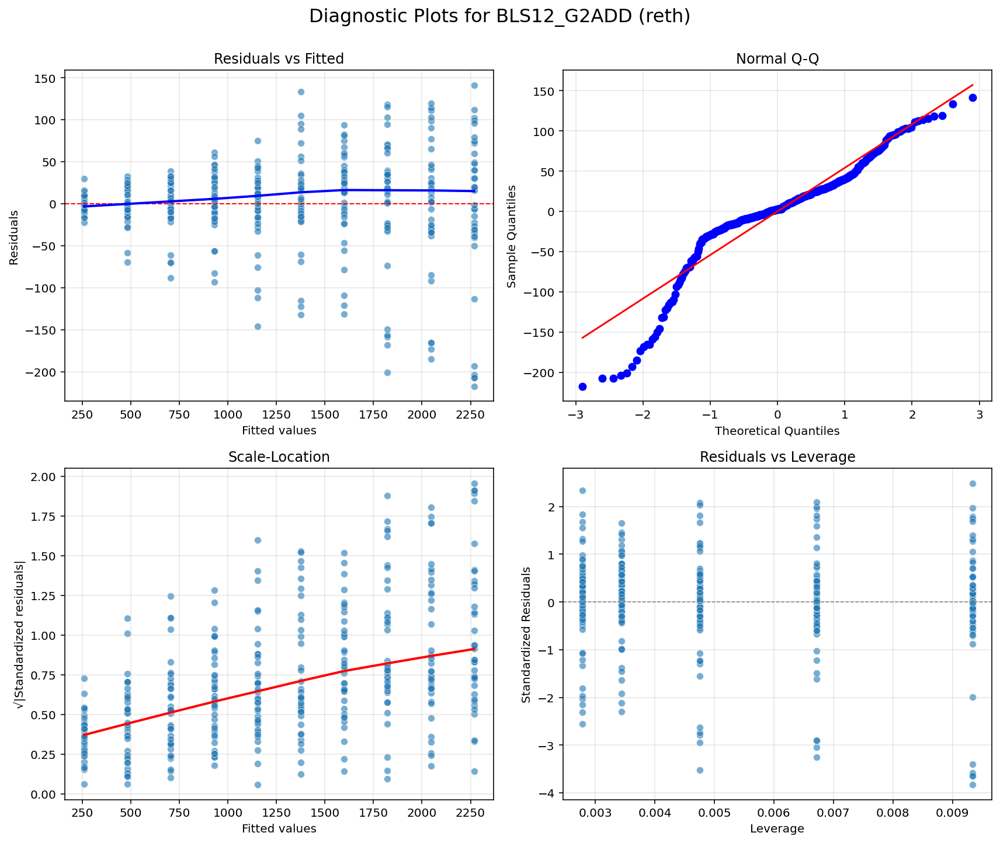


## erigon

OLS model did not run... Error: zero-size array to reduction operation maximum which has no identity

# ECADD

## nethermind


```python
                            OLS Regression Results                            
==============================================================================
Dep. Variable:        run_duration_ms   R-squared:                       0.594
Model:                            OLS   Adj. R-squared:                  0.594
Method:                 Least Squares   F-statistic:                     700.4
Date:                Mon, 26 Jan 2026   Prob (F-statistic):           1.05e-95
Time:                        15:38:01   Log-Likelihood:                -3641.2
No. Observations:                 480   AIC:                             7286.
Df Residuals:                     478   BIC:                             7295.
Df Model:                           1                                         
Covariance Type:            nonrobust                                         
==============================================================================
                 coef    std err          t      P>|t|      [0.025      0.975]
------------------------------------------------------------------------------
const         19.3697     47.107      0.411      0.681     -73.192     111.931
opcount        2.0092      0.076     26.465      0.000       1.860       2.158
==============================================================================
Omnibus:                      126.026   Durbin-Watson:                   0.408
Prob(Omnibus):                  0.000   Jarque-Bera (JB):              232.517
Skew:                          -1.539   Prob(JB):                     3.23e-51
Kurtosis:                       4.469   Cond. No.                     1.34e+03
==============================================================================

Notes:
[1] Standard Errors assume that the covariance matrix of the errors is correctly specified.
[2] The condition number is large, 1.34e+03. This might indicate that there are
strong multicollinearity or other numerical problems.
```

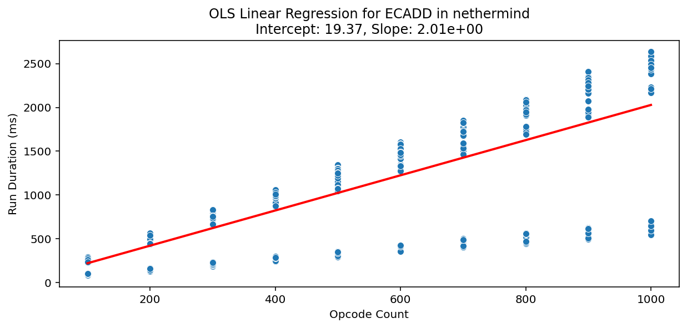

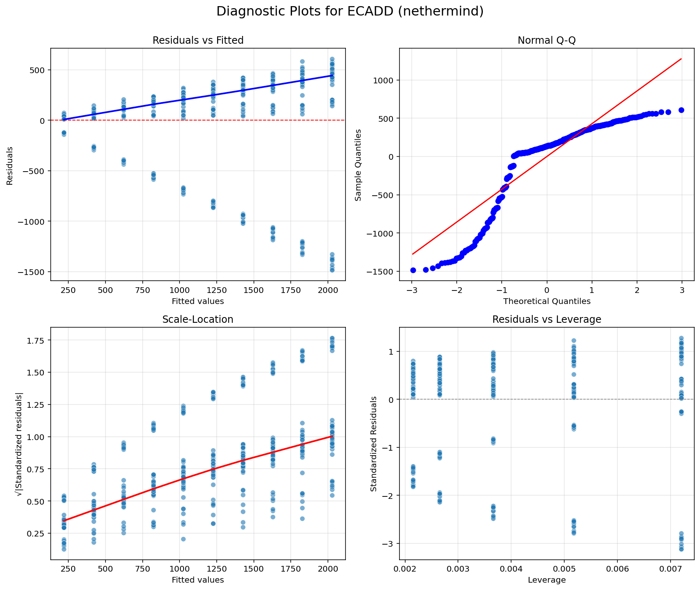


## geth


```python
                            OLS Regression Results                            
==============================================================================
Dep. Variable:        run_duration_ms   R-squared:                       0.989
Model:                            OLS   Adj. R-squared:                  0.989
Method:                 Least Squares   F-statistic:                 4.360e+04
Date:                Mon, 26 Jan 2026   Prob (F-statistic):               0.00
Time:                        15:38:01   Log-Likelihood:                -2831.0
No. Observations:                 480   AIC:                             5666.
Df Residuals:                     478   BIC:                             5674.
Df Model:                           1                                         
Covariance Type:            nonrobust                                         
==============================================================================
                 coef    std err          t      P>|t|      [0.025      0.975]
------------------------------------------------------------------------------
const         20.2530      8.709      2.326      0.020       3.140      37.366
opcount        2.9307      0.014    208.797      0.000       2.903       2.958
==============================================================================
Omnibus:                      104.791   Durbin-Watson:                   0.710
Prob(Omnibus):                  0.000   Jarque-Bera (JB):              234.433
Skew:                          -1.136   Prob(JB):                     1.24e-51
Kurtosis:                       5.562   Cond. No.                     1.34e+03
==============================================================================

Notes:
[1] Standard Errors assume that the covariance matrix of the errors is correctly specified.
[2] The condition number is large, 1.34e+03. This might indicate that there are
strong multicollinearity or other numerical problems.
```

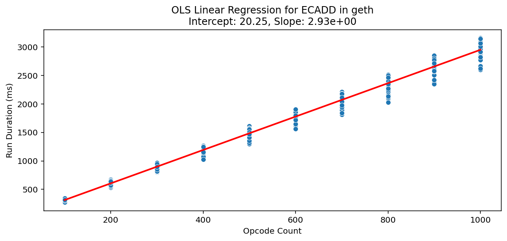

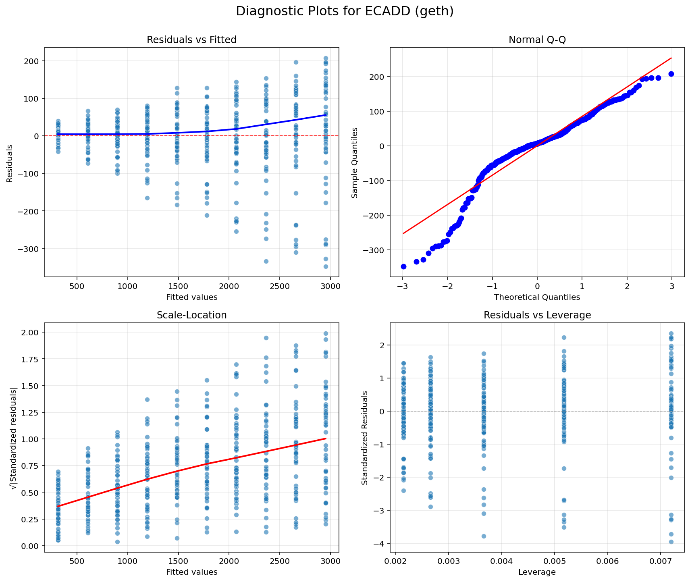


## besu


```python
                            OLS Regression Results                            
==============================================================================
Dep. Variable:        run_duration_ms   R-squared:                       0.981
Model:                            OLS   Adj. R-squared:                  0.981
Method:                 Least Squares   F-statistic:                 2.531e+04
Date:                Mon, 26 Jan 2026   Prob (F-statistic):               0.00
Time:                        15:38:02   Log-Likelihood:                -3243.7
No. Observations:                 480   AIC:                             6491.
Df Residuals:                     478   BIC:                             6500.
Df Model:                           1                                         
Covariance Type:            nonrobust                                         
==============================================================================
                 coef    std err          t      P>|t|      [0.025      0.975]
------------------------------------------------------------------------------
const         24.3762     20.579      1.185      0.237     -16.061      64.813
opcount        5.2760      0.033    159.079      0.000       5.211       5.341
==============================================================================
Omnibus:                       72.157   Durbin-Watson:                   0.878
Prob(Omnibus):                  0.000   Jarque-Bera (JB):              154.735
Skew:                          -0.815   Prob(JB):                     2.51e-34
Kurtosis:                       5.254   Cond. No.                     1.34e+03
==============================================================================

Notes:
[1] Standard Errors assume that the covariance matrix of the errors is correctly specified.
[2] The condition number is large, 1.34e+03. This might indicate that there are
strong multicollinearity or other numerical problems.
```

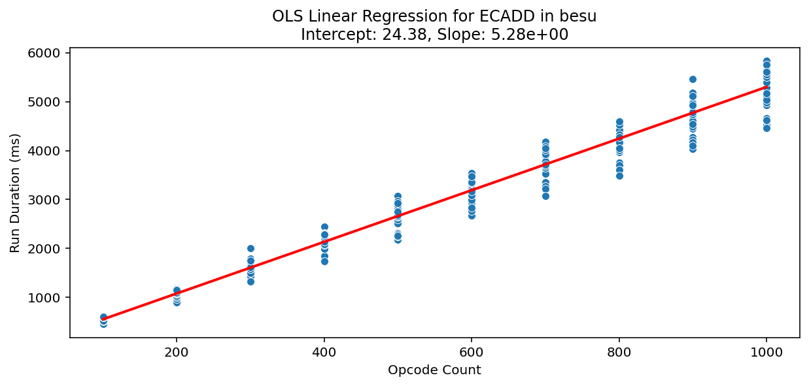

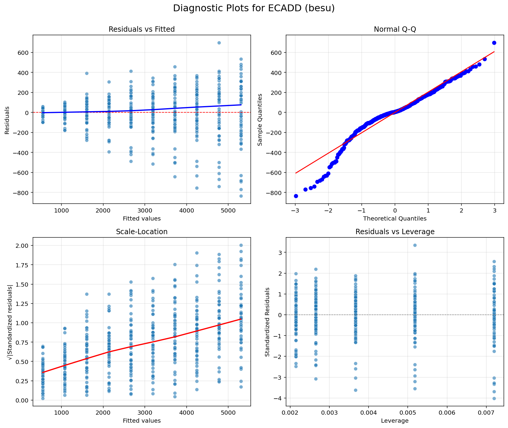


## reth


```python
                            OLS Regression Results                            
==============================================================================
Dep. Variable:        run_duration_ms   R-squared:                       0.991
Model:                            OLS   Adj. R-squared:                  0.991
Method:                 Least Squares   F-statistic:                 4.241e+04
Date:                Mon, 26 Jan 2026   Prob (F-statistic):               0.00
Time:                        15:38:02   Log-Likelihood:                -2236.1
No. Observations:                 370   AIC:                             4476.
Df Residuals:                     368   BIC:                             4484.
Df Model:                           1                                         
Covariance Type:            nonrobust                                         
==============================================================================
                 coef    std err          t      P>|t|      [0.025      0.975]
------------------------------------------------------------------------------
const         29.9519     11.481      2.609      0.009       7.376      52.528
opcount        3.8106      0.019    205.948      0.000       3.774       3.847
==============================================================================
Omnibus:                       35.423   Durbin-Watson:                   1.081
Prob(Omnibus):                  0.000   Jarque-Bera (JB):               69.264
Skew:                          -0.546   Prob(JB):                     9.11e-16
Kurtosis:                       4.816   Cond. No.                     1.34e+03
==============================================================================

Notes:
[1] Standard Errors assume that the covariance matrix of the errors is correctly specified.
[2] The condition number is large, 1.34e+03. This might indicate that there are
strong multicollinearity or other numerical problems.
```


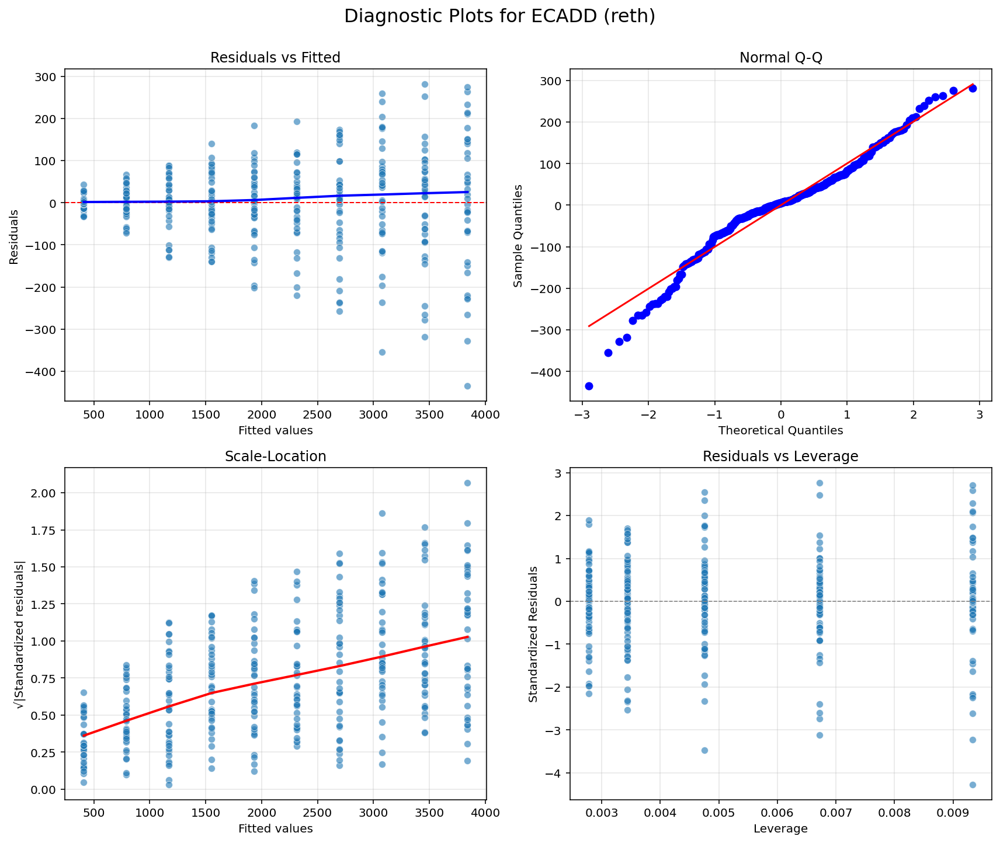


## erigon

OLS model did not run... Error: zero-size array to reduction operation maximum which has no identity

# ECRECOVER

## nethermind


```python
                            OLS Regression Results                            
==============================================================================
Dep. Variable:        run_duration_ms   R-squared:                       0.990
Model:                            OLS   Adj. R-squared:                  0.990
Method:                 Least Squares   F-statistic:                 3.687e+04
Date:                Mon, 26 Jan 2026   Prob (F-statistic):               0.00
Time:                        15:38:02   Log-Likelihood:                -2236.6
No. Observations:                 370   AIC:                             4477.
Df Residuals:                     368   BIC:                             4485.
Df Model:                           1                                         
Covariance Type:            nonrobust                                         
==============================================================================
                 coef    std err          t      P>|t|      [0.025      0.975]
------------------------------------------------------------------------------
const         30.3541     11.497      2.640      0.009       7.747      52.961
opcount       44.4739      0.232    192.024      0.000      44.018      44.929
==============================================================================
Omnibus:                      156.812   Durbin-Watson:                   0.591
Prob(Omnibus):                  0.000   Jarque-Bera (JB):              482.043
Skew:                          -2.020   Prob(JB):                    2.12e-105
Kurtosis:                       6.866   Cond. No.                         107.
==============================================================================

Notes:
[1] Standard Errors assume that the covariance matrix of the errors is correctly specified.
```

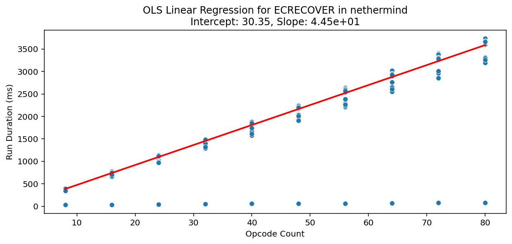

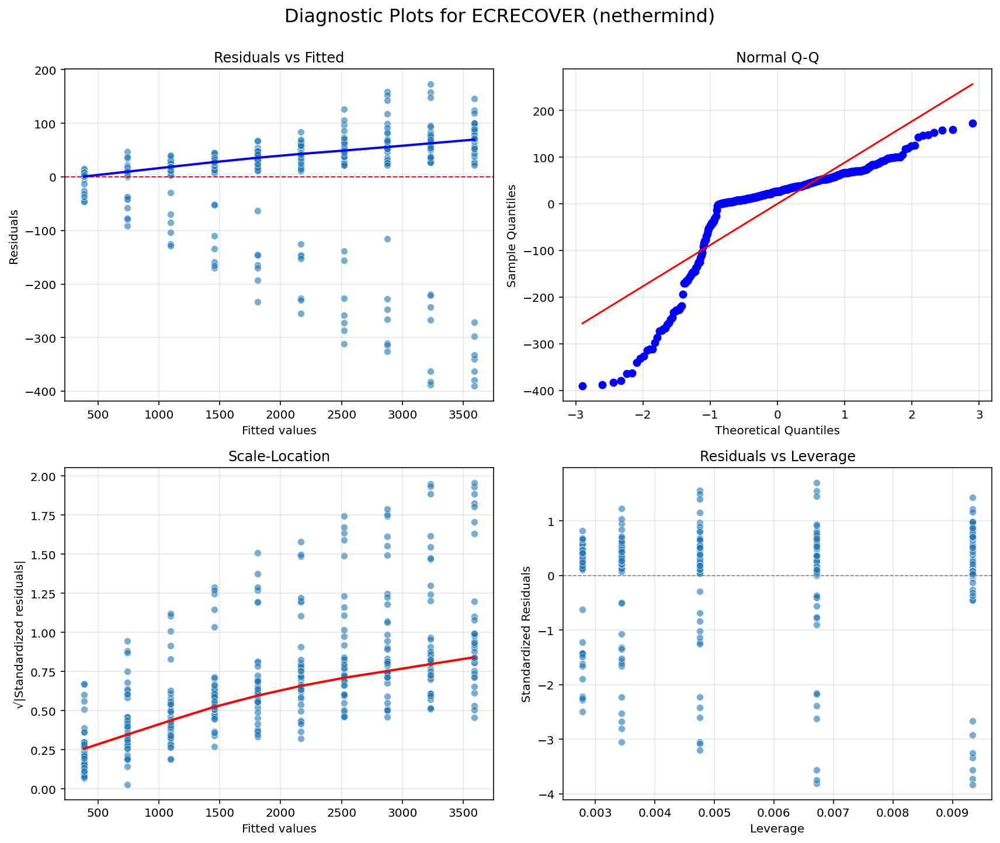


## geth


```python
                            OLS Regression Results                            
==============================================================================
Dep. Variable:        run_duration_ms   R-squared:                       0.993
Model:                            OLS   Adj. R-squared:                  0.993
Method:                 Least Squares   F-statistic:                 6.954e+04
Date:                Mon, 26 Jan 2026   Prob (F-statistic):               0.00
Time:                        15:38:02   Log-Likelihood:                -2850.4
No. Observations:                 480   AIC:                             5705.
Df Residuals:                     478   BIC:                             5713.
Df Model:                           1                                         
Covariance Type:            nonrobust                                         
==============================================================================
                 coef    std err          t      P>|t|      [0.025      0.975]
------------------------------------------------------------------------------
const         35.8839      9.069      3.957      0.000      18.063      53.705
opcount       48.1805      0.183    263.703      0.000      47.821      48.540
==============================================================================
Omnibus:                       96.006   Durbin-Watson:                   0.698
Prob(Omnibus):                  0.000   Jarque-Bera (JB):              269.240
Skew:                          -0.958   Prob(JB):                     3.43e-59
Kurtosis:                       6.129   Cond. No.                         107.
==============================================================================

Notes:
[1] Standard Errors assume that the covariance matrix of the errors is correctly specified.
```

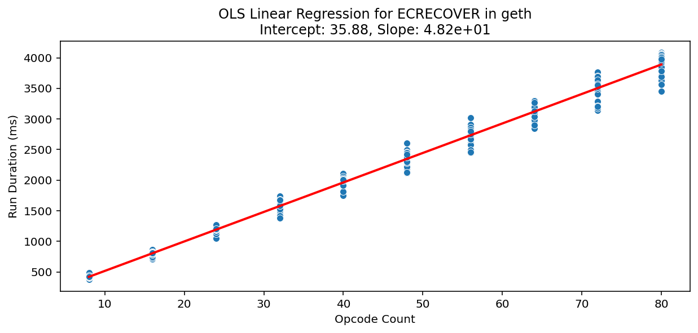

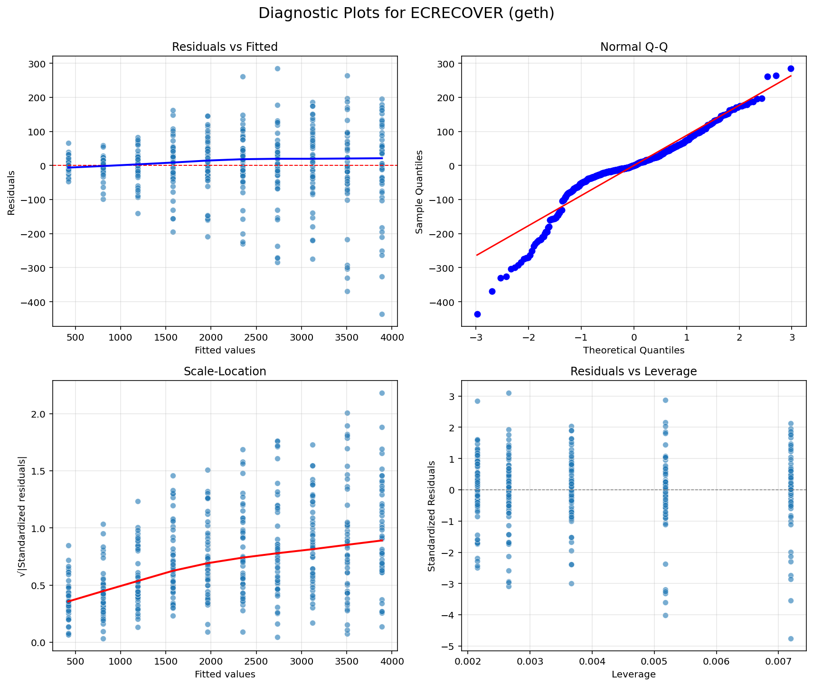


## besu


```python
                            OLS Regression Results                            
==============================================================================
Dep. Variable:        run_duration_ms   R-squared:                       0.984
Model:                            OLS   Adj. R-squared:                  0.984
Method:                 Least Squares   F-statistic:                 3.000e+04
Date:                Mon, 26 Jan 2026   Prob (F-statistic):               0.00
Time:                        15:38:03   Log-Likelihood:                -3056.5
No. Observations:                 480   AIC:                             6117.
Df Residuals:                     478   BIC:                             6125.
Df Model:                           1                                         
Covariance Type:            nonrobust                                         
==============================================================================
                 coef    std err          t      P>|t|      [0.025      0.975]
------------------------------------------------------------------------------
const         33.6757     13.931      2.417      0.016       6.302      61.049
opcount       48.6085      0.281    173.203      0.000      48.057      49.160
==============================================================================
Omnibus:                       97.702   Durbin-Watson:                   0.704
Prob(Omnibus):                  0.000   Jarque-Bera (JB):              182.335
Skew:                          -1.148   Prob(JB):                     2.55e-40
Kurtosis:                       4.960   Cond. No.                         107.
==============================================================================

Notes:
[1] Standard Errors assume that the covariance matrix of the errors is correctly specified.
```

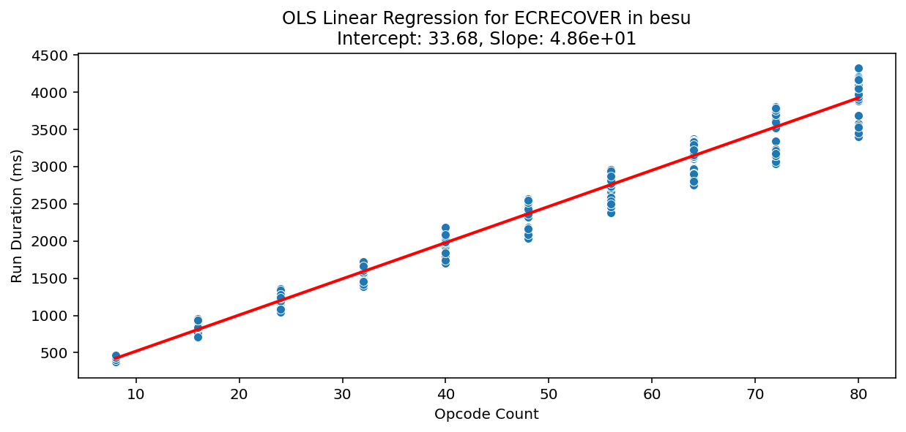

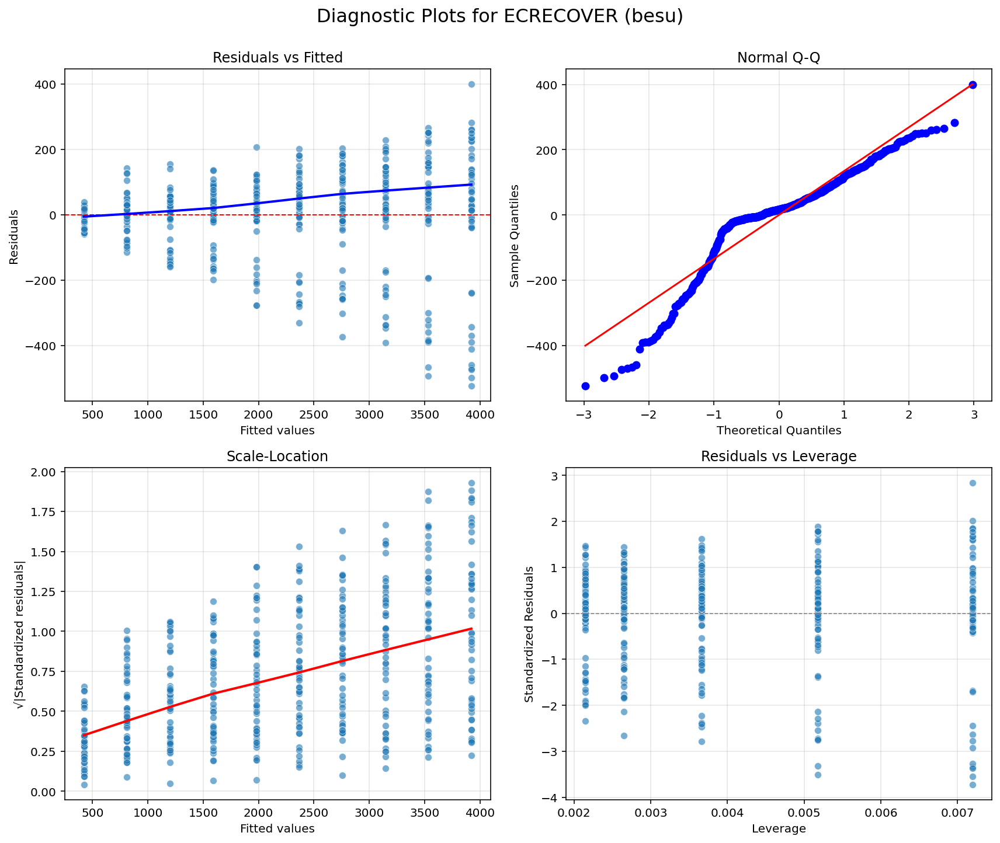


## reth


```python
                            OLS Regression Results                            
==============================================================================
Dep. Variable:        run_duration_ms   R-squared:                       0.991
Model:                            OLS   Adj. R-squared:                  0.991
Method:                 Least Squares   F-statistic:                 4.082e+04
Date:                Mon, 26 Jan 2026   Prob (F-statistic):               0.00
Time:                        15:38:03   Log-Likelihood:                -2240.5
No. Observations:                 370   AIC:                             4485.
Df Residuals:                     368   BIC:                             4493.
Df Model:                           1                                         
Covariance Type:            nonrobust                                         
==============================================================================
                 coef    std err          t      P>|t|      [0.025      0.975]
------------------------------------------------------------------------------
const         34.4168     11.620      2.962      0.003      11.567      57.266
opcount       47.2963      0.234    202.046      0.000      46.836      47.757
==============================================================================
Omnibus:                      158.517   Durbin-Watson:                   0.820
Prob(Omnibus):                  0.000   Jarque-Bera (JB):              622.293
Skew:                          -1.899   Prob(JB):                    7.43e-136
Kurtosis:                       8.094   Cond. No.                         107.
==============================================================================

Notes:
[1] Standard Errors assume that the covariance matrix of the errors is correctly specified.
```

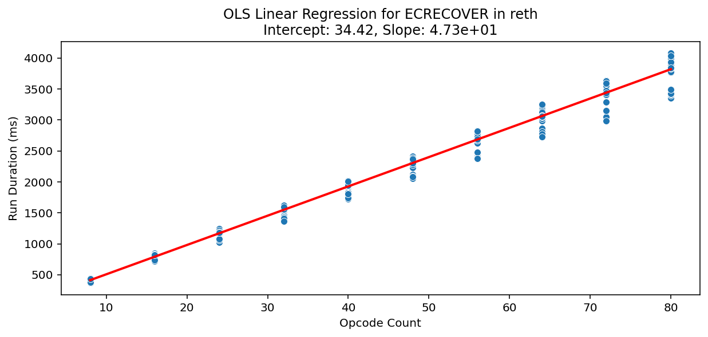

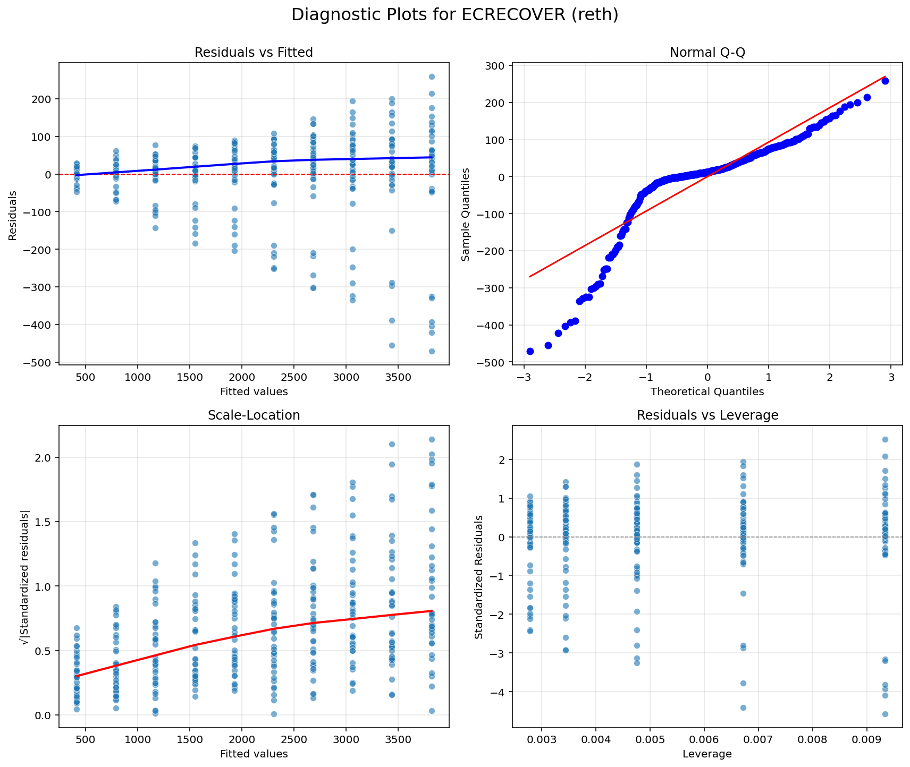


## erigon

OLS model did not run... Error: zero-size array to reduction operation maximum which has no identity

# KECCAK256

## nethermind


```python
                            OLS Regression Results                            
==============================================================================
Dep. Variable:        run_duration_ms   R-squared:                       0.516
Model:                            OLS   Adj. R-squared:                  0.516
Method:                 Least Squares   F-statistic:                     4097.
Date:                Mon, 26 Jan 2026   Prob (F-statistic):               0.00
Time:                        15:38:03   Log-Likelihood:                -59402.
No. Observations:                7680   AIC:                         1.188e+05
Df Residuals:                    7677   BIC:                         1.188e+05
Df Model:                           2                                         
Covariance Type:            nonrobust                                         
==============================================================================
                 coef    std err          t      P>|t|      [0.025      0.975]
------------------------------------------------------------------------------
const        134.6181     15.823      8.508      0.000     103.601     165.635
opcount        0.0649      0.005     13.186      0.000       0.055       0.075
msg_size       1.5194      0.019     79.285      0.000       1.482       1.557
==============================================================================
Omnibus:                      245.149   Durbin-Watson:                   1.793
Prob(Omnibus):                  0.000   Jarque-Bera (JB):              308.948
Skew:                           0.373   Prob(JB):                     8.18e-68
Kurtosis:                       3.639   Cond. No.                     6.43e+03
==============================================================================

Notes:
[1] Standard Errors assume that the covariance matrix of the errors is correctly specified.
[2] The condition number is large, 6.43e+03. This might indicate that there are
strong multicollinearity or other numerical problems.
```

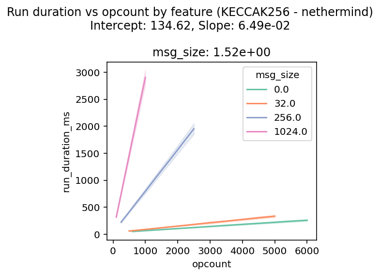

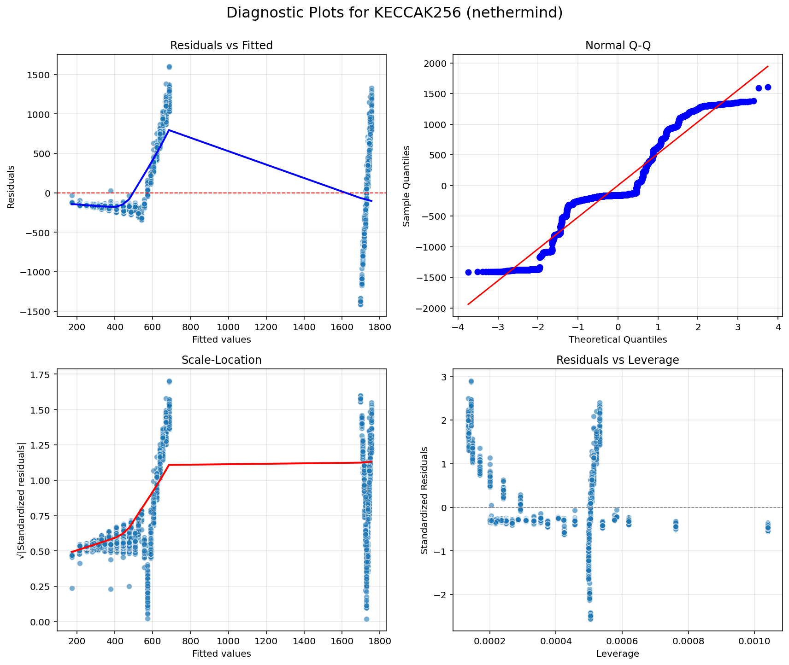


## geth


```python
                            OLS Regression Results                            
==============================================================================
Dep. Variable:        run_duration_ms   R-squared:                       0.698
Model:                            OLS   Adj. R-squared:                  0.697
Method:                 Least Squares   F-statistic:                     8853.
Date:                Mon, 26 Jan 2026   Prob (F-statistic):               0.00
Time:                        15:38:04   Log-Likelihood:                -58390.
No. Observations:                7680   AIC:                         1.168e+05
Df Residuals:                    7677   BIC:                         1.168e+05
Df Model:                           2                                         
Covariance Type:            nonrobust                                         
==============================================================================
                 coef    std err          t      P>|t|      [0.025      0.975]
------------------------------------------------------------------------------
const        -62.6010     13.868     -4.514      0.000     -89.787     -35.415
opcount        0.5609      0.004    129.990      0.000       0.552       0.569
msg_size       1.7012      0.017    101.283      0.000       1.668       1.734
==============================================================================
Omnibus:                     1640.527   Durbin-Watson:                   1.764
Prob(Omnibus):                  0.000   Jarque-Bera (JB):            23594.514
Skew:                           0.619   Prob(JB):                         0.00
Kurtosis:                      11.497   Cond. No.                     6.43e+03
==============================================================================

Notes:
[1] Standard Errors assume that the covariance matrix of the errors is correctly specified.
[2] The condition number is large, 6.43e+03. This might indicate that there are
strong multicollinearity or other numerical problems.
```

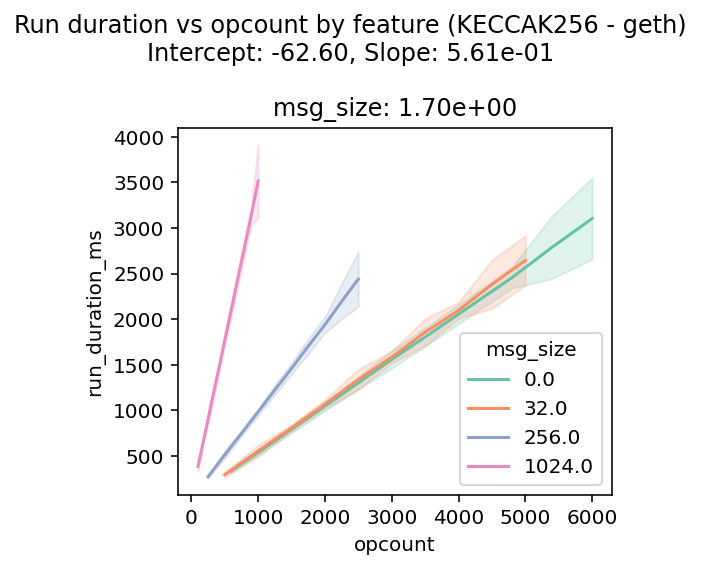

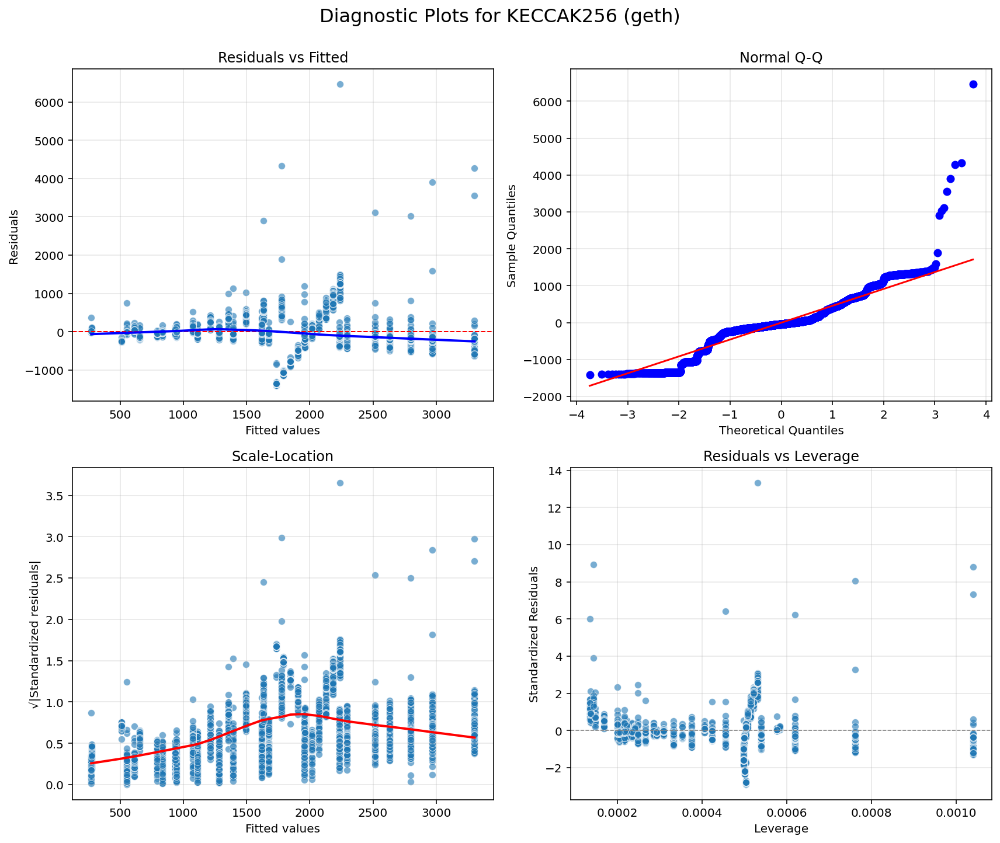


## besu


```python
                            OLS Regression Results                            
==============================================================================
Dep. Variable:        run_duration_ms   R-squared:                       0.754
Model:                            OLS   Adj. R-squared:                  0.754
Method:                 Least Squares   F-statistic:                 1.177e+04
Date:                Mon, 26 Jan 2026   Prob (F-statistic):               0.00
Time:                        15:38:04   Log-Likelihood:                -60310.
No. Observations:                7680   AIC:                         1.206e+05
Df Residuals:                    7677   BIC:                         1.206e+05
Df Model:                           2                                         
Covariance Type:            nonrobust                                         
==============================================================================
                 coef    std err          t      P>|t|      [0.025      0.975]
------------------------------------------------------------------------------
const        -53.2128     17.808     -2.988      0.003     -88.121     -18.304
opcount        0.8482      0.006    153.093      0.000       0.837       0.859
msg_size       2.1730      0.022    100.752      0.000       2.131       2.215
==============================================================================
Omnibus:                      306.816   Durbin-Watson:                   1.703
Prob(Omnibus):                  0.000   Jarque-Bera (JB):              961.481
Skew:                          -0.052   Prob(JB):                    1.65e-209
Kurtosis:                       4.730   Cond. No.                     6.43e+03
==============================================================================

Notes:
[1] Standard Errors assume that the covariance matrix of the errors is correctly specified.
[2] The condition number is large, 6.43e+03. This might indicate that there are
strong multicollinearity or other numerical problems.
```

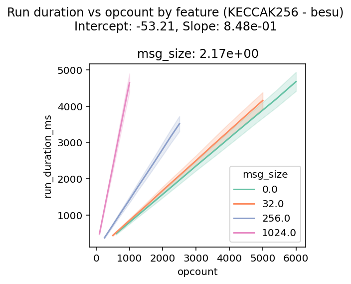

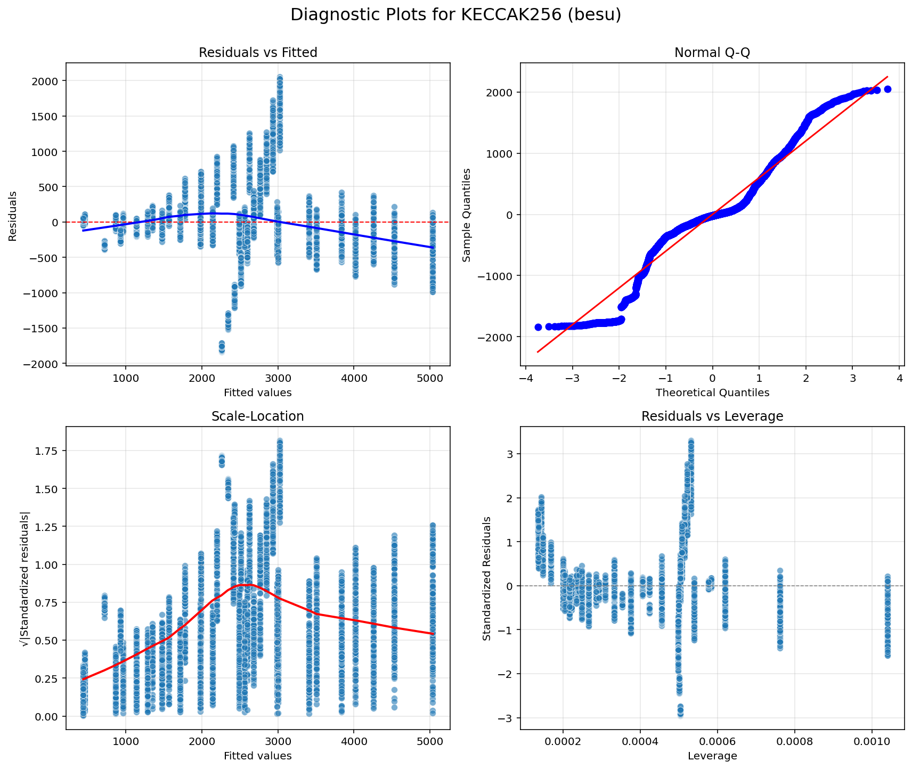


## reth


```python
                            OLS Regression Results                            
==============================================================================
Dep. Variable:        run_duration_ms   R-squared:                       0.514
Model:                            OLS   Adj. R-squared:                  0.514
Method:                 Least Squares   F-statistic:                     3135.
Date:                Mon, 26 Jan 2026   Prob (F-statistic):               0.00
Time:                        15:38:04   Log-Likelihood:                -45263.
No. Observations:                5920   AIC:                         9.053e+04
Df Residuals:                    5917   BIC:                         9.055e+04
Df Model:                           2                                         
Covariance Type:            nonrobust                                         
==============================================================================
                 coef    std err          t      P>|t|      [0.025      0.975]
------------------------------------------------------------------------------
const        139.1559     16.491      8.438      0.000     106.828     171.484
opcount        0.0550      0.005     10.710      0.000       0.045       0.065
msg_size       1.3771      0.020     68.948      0.000       1.338       1.416
==============================================================================
Omnibus:                      145.528   Durbin-Watson:                   1.817
Prob(Omnibus):                  0.000   Jarque-Bera (JB):              175.469
Skew:                           0.326   Prob(JB):                     7.90e-39
Kurtosis:                       3.535   Cond. No.                     6.43e+03
==============================================================================

Notes:
[1] Standard Errors assume that the covariance matrix of the errors is correctly specified.
[2] The condition number is large, 6.43e+03. This might indicate that there are
strong multicollinearity or other numerical problems.
```

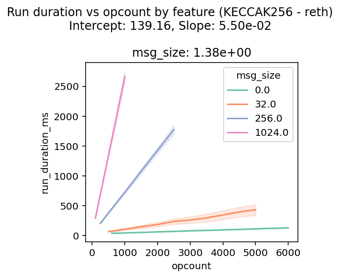

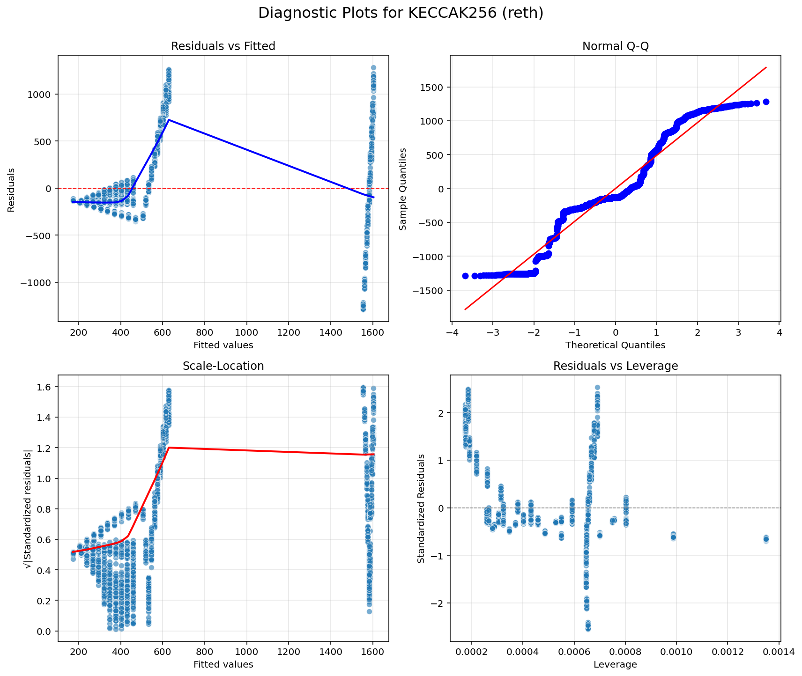


## erigon


```python
                            OLS Regression Results                            
==============================================================================
Dep. Variable:        run_duration_ms   R-squared:                       0.715
Model:                            OLS   Adj. R-squared:                  0.713
Method:                 Least Squares   F-statistic:                     597.0
Date:                Mon, 26 Jan 2026   Prob (F-statistic):          1.40e-130
Time:                        15:38:05   Log-Likelihood:                -3605.0
No. Observations:                 480   AIC:                             7216.
Df Residuals:                     477   BIC:                             7228.
Df Model:                           2                                         
Covariance Type:            nonrobust                                         
==============================================================================
                 coef    std err          t      P>|t|      [0.025      0.975]
------------------------------------------------------------------------------
const        -54.7964     50.722     -1.080      0.281    -154.463      44.870
opcount        0.5311      0.016     33.655      0.000       0.500       0.562
msg_size       1.6340      0.061     26.598      0.000       1.513       1.755
==============================================================================
Omnibus:                       29.195   Durbin-Watson:                   1.710
Prob(Omnibus):                  0.000   Jarque-Bera (JB):               94.388
Skew:                          -0.125   Prob(JB):                     3.19e-21
Kurtosis:                       5.158   Cond. No.                     6.43e+03
==============================================================================

Notes:
[1] Standard Errors assume that the covariance matrix of the errors is correctly specified.
[2] The condition number is large, 6.43e+03. This might indicate that there are
strong multicollinearity or other numerical problems.
```

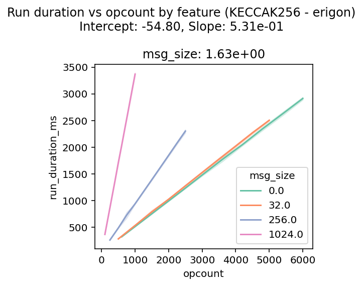

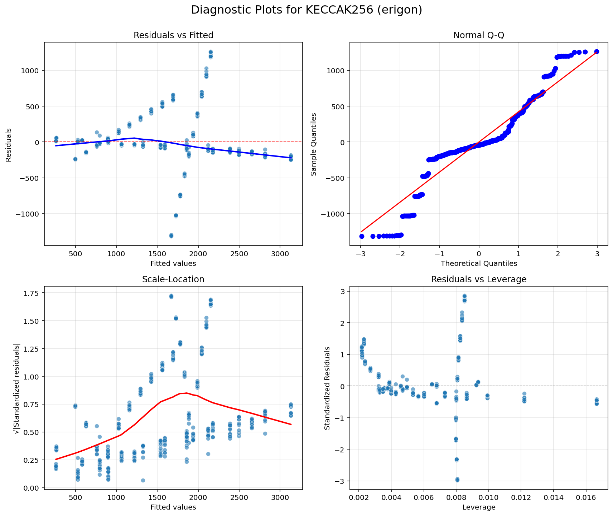


# BLAKE2F

## nethermind


```python
                            OLS Regression Results                            
==============================================================================
Dep. Variable:        run_duration_ms   R-squared:                       0.966
Model:                            OLS   Adj. R-squared:                  0.966
Method:                 Least Squares   F-statistic:                 2.237e+04
Date:                Mon, 26 Jan 2026   Prob (F-statistic):               0.00
Time:                        15:38:05   Log-Likelihood:                -9352.2
No. Observations:                1560   AIC:                         1.871e+04
Df Residuals:                    1557   BIC:                         1.873e+04
Df Model:                           2                                         
Covariance Type:            nonrobust                                         
==============================================================================
                 coef    std err          t      P>|t|      [0.025      0.975]
------------------------------------------------------------------------------
const       -125.7548      5.774    -21.778      0.000    -137.081    -114.429
opcount        0.8402      0.004    207.988      0.000       0.832       0.848
num_rounds    11.0353      0.287     38.483      0.000      10.473      11.598
==============================================================================
Omnibus:                       16.303   Durbin-Watson:                   1.360
Prob(Omnibus):                  0.000   Jarque-Bera (JB):               22.583
Skew:                           0.112   Prob(JB):                     1.25e-05
Kurtosis:                       3.545   Cond. No.                     2.84e+03
==============================================================================

Notes:
[1] Standard Errors assume that the covariance matrix of the errors is correctly specified.
[2] The condition number is large, 2.84e+03. This might indicate that there are
strong multicollinearity or other numerical problems.
```

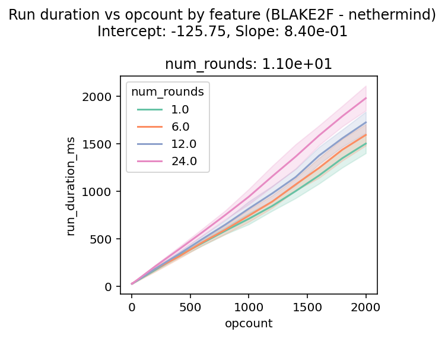

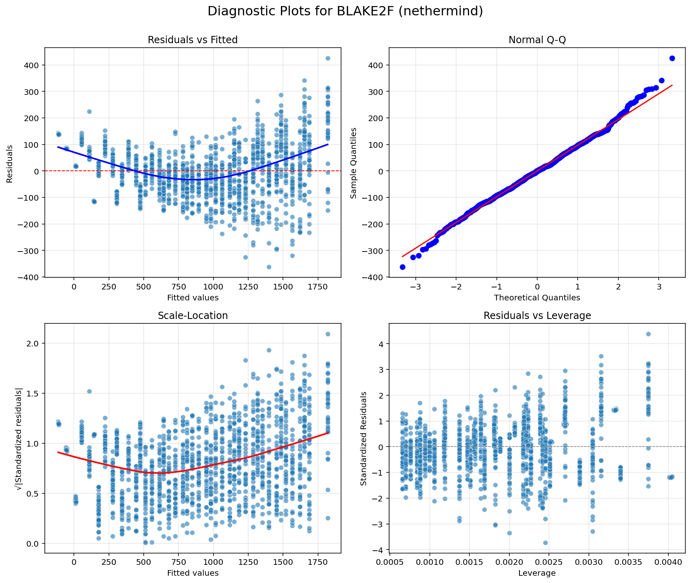


## geth


```python
                            OLS Regression Results                            
==============================================================================
Dep. Variable:        run_duration_ms   R-squared:                       0.972
Model:                            OLS   Adj. R-squared:                  0.972
Method:                 Least Squares   F-statistic:                 2.708e+04
Date:                Mon, 26 Jan 2026   Prob (F-statistic):               0.00
Time:                        15:38:05   Log-Likelihood:                -9216.7
No. Observations:                1560   AIC:                         1.844e+04
Df Residuals:                    1557   BIC:                         1.846e+04
Df Model:                           2                                         
Covariance Type:            nonrobust                                         
==============================================================================
                 coef    std err          t      P>|t|      [0.025      0.975]
------------------------------------------------------------------------------
const       -134.8970      5.294    -25.482      0.000    -145.281    -124.513
opcount        0.8376      0.004    226.182      0.000       0.830       0.845
num_rounds    14.3874      0.263     54.725      0.000      13.872      14.903
==============================================================================
Omnibus:                       51.877   Durbin-Watson:                   1.698
Prob(Omnibus):                  0.000   Jarque-Bera (JB):               81.280
Skew:                           0.298   Prob(JB):                     2.24e-18
Kurtosis:                       3.946   Cond. No.                     2.84e+03
==============================================================================

Notes:
[1] Standard Errors assume that the covariance matrix of the errors is correctly specified.
[2] The condition number is large, 2.84e+03. This might indicate that there are
strong multicollinearity or other numerical problems.
```

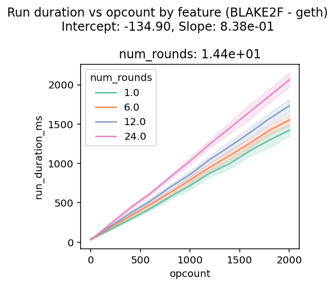

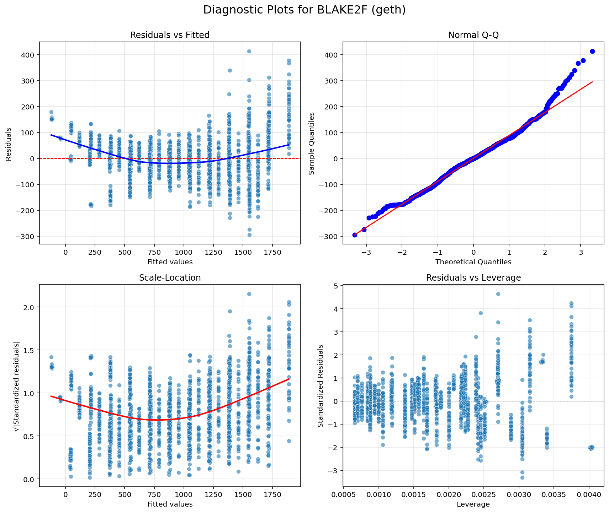


## besu


```python
                            OLS Regression Results                            
==============================================================================
Dep. Variable:        run_duration_ms   R-squared:                       0.976
Model:                            OLS   Adj. R-squared:                  0.976
Method:                 Least Squares   F-statistic:                 3.138e+04
Date:                Mon, 26 Jan 2026   Prob (F-statistic):               0.00
Time:                        15:38:06   Log-Likelihood:                -11061.
No. Observations:                1560   AIC:                         2.213e+04
Df Residuals:                    1557   BIC:                         2.214e+04
Df Model:                           2                                         
Covariance Type:            nonrobust                                         
==============================================================================
                 coef    std err          t      P>|t|      [0.025      0.975]
------------------------------------------------------------------------------
const       -132.3547     17.272     -7.663      0.000    -166.233     -98.476
opcount        3.0168      0.012    249.679      0.000       2.993       3.040
num_rounds    17.6347      0.858     20.559      0.000      15.952      19.317
==============================================================================
Omnibus:                       85.966   Durbin-Watson:                   1.059
Prob(Omnibus):                  0.000   Jarque-Bera (JB):              313.015
Skew:                           0.101   Prob(JB):                     1.07e-68
Kurtosis:                       5.185   Cond. No.                     2.84e+03
==============================================================================

Notes:
[1] Standard Errors assume that the covariance matrix of the errors is correctly specified.
[2] The condition number is large, 2.84e+03. This might indicate that there are
strong multicollinearity or other numerical problems.
```

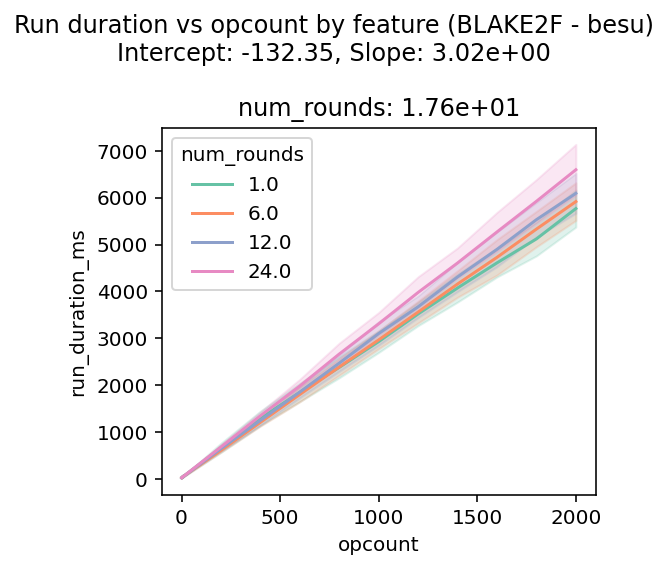

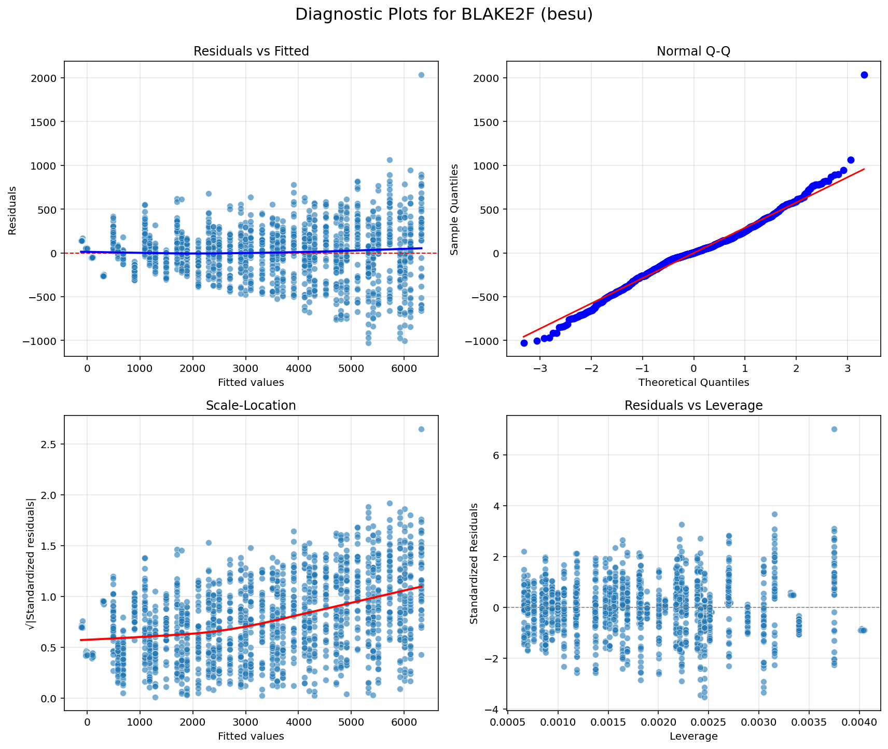


## reth


```python
                            OLS Regression Results                            
==============================================================================
Dep. Variable:        run_duration_ms   R-squared:                       0.920
Model:                            OLS   Adj. R-squared:                  0.919
Method:                 Least Squares   F-statistic:                     6389.
Date:                Mon, 26 Jan 2026   Prob (F-statistic):               0.00
Time:                        15:38:06   Log-Likelihood:                -7259.6
No. Observations:                1120   AIC:                         1.453e+04
Df Residuals:                    1117   BIC:                         1.454e+04
Df Model:                           2                                         
Covariance Type:            nonrobust                                         
==============================================================================
                 coef    std err          t      P>|t|      [0.025      0.975]
------------------------------------------------------------------------------
const       -200.9788     10.859    -18.508      0.000    -222.286    -179.672
opcount        0.8124      0.008    106.730      0.000       0.797       0.827
num_rounds    20.5132      0.551     37.239      0.000      19.432      21.594
==============================================================================
Omnibus:                        9.846   Durbin-Watson:                   1.876
Prob(Omnibus):                  0.007   Jarque-Bera (JB):               10.951
Skew:                          -0.161   Prob(JB):                      0.00419
Kurtosis:                       3.361   Cond. No.                     2.75e+03
==============================================================================

Notes:
[1] Standard Errors assume that the covariance matrix of the errors is correctly specified.
[2] The condition number is large, 2.75e+03. This might indicate that there are
strong multicollinearity or other numerical problems.
```

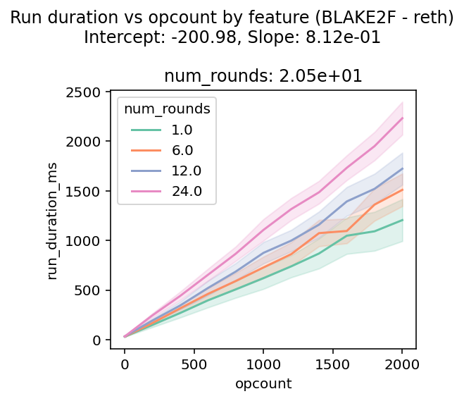

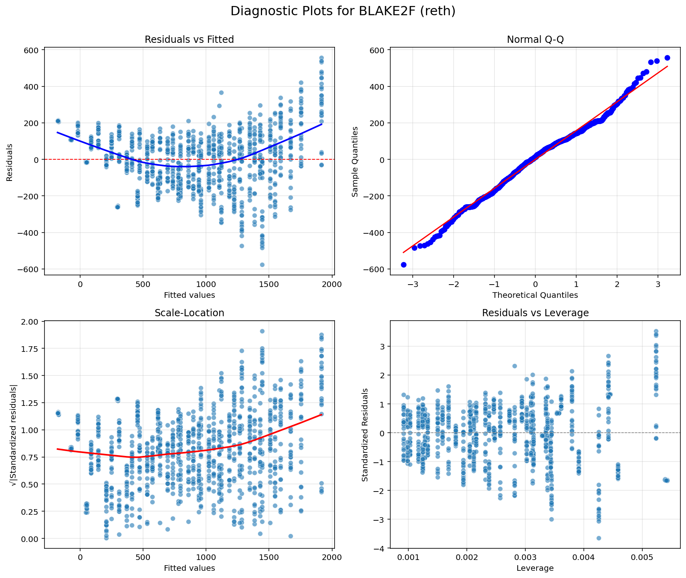


## erigon

OLS model did not run... Error: zero-size array to reduction operation maximum which has no identity

# ECPAIRING

## nethermind


```python
                            OLS Regression Results                            
==============================================================================
Dep. Variable:        run_duration_ms   R-squared:                       0.116
Model:                            OLS   Adj. R-squared:                  0.115
Method:                 Least Squares   F-statistic:                     122.4
Date:                Mon, 26 Jan 2026   Prob (F-statistic):           1.21e-50
Time:                        15:38:06   Log-Likelihood:                -15362.
No. Observations:                1860   AIC:                         3.073e+04
Df Residuals:                    1857   BIC:                         3.075e+04
Df Model:                           2                                         
Covariance Type:            nonrobust                                         
==============================================================================
                 coef    std err          t      P>|t|      [0.025      0.975]
------------------------------------------------------------------------------
const       1143.6499     37.783     30.269      0.000    1069.548    1217.752
opcount      360.6962     53.487      6.744      0.000     255.795     465.597
num_pairs     43.9644      2.817     15.606      0.000      38.439      49.489
==============================================================================
Omnibus:                       75.042   Durbin-Watson:                   2.166
Prob(Omnibus):                  0.000   Jarque-Bera (JB):               72.387
Skew:                           0.438   Prob(JB):                     1.91e-16
Kurtosis:                       2.593   Cond. No.                         33.4
==============================================================================

Notes:
[1] Standard Errors assume that the covariance matrix of the errors is correctly specified.
```

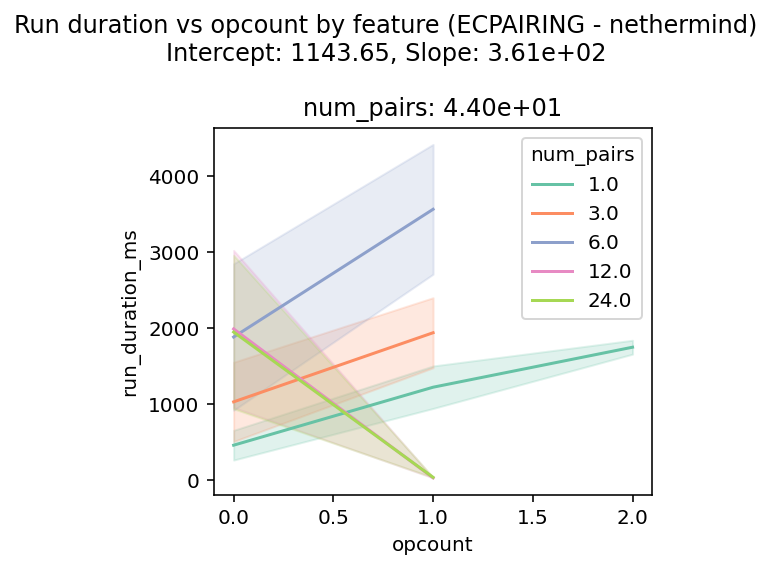

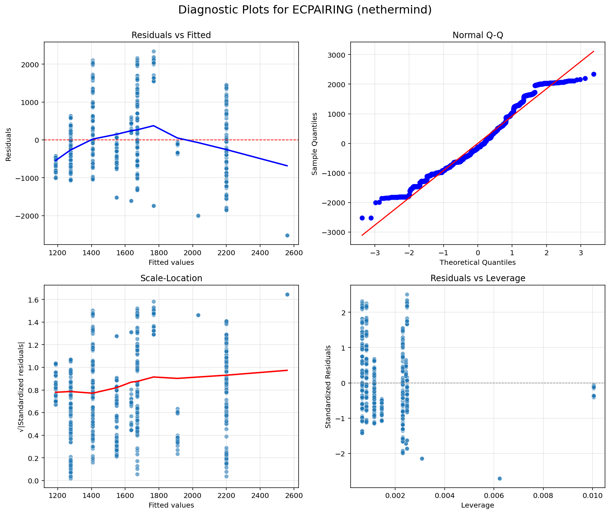


## geth


```python
                            OLS Regression Results                            
==============================================================================
Dep. Variable:        run_duration_ms   R-squared:                       0.130
Model:                            OLS   Adj. R-squared:                  0.129
Method:                 Least Squares   F-statistic:                     139.2
Date:                Mon, 26 Jan 2026   Prob (F-statistic):           4.57e-57
Time:                        15:38:07   Log-Likelihood:                -13810.
No. Observations:                1860   AIC:                         2.763e+04
Df Residuals:                    1857   BIC:                         2.764e+04
Df Model:                           2                                         
Covariance Type:            nonrobust                                         
==============================================================================
                 coef    std err          t      P>|t|      [0.025      0.975]
------------------------------------------------------------------------------
const        535.0328     16.402     32.620      0.000     502.864     567.201
opcount      340.6096     23.219     14.669      0.000     295.071     386.148
num_pairs     15.6466      1.223     12.794      0.000      13.248      18.045
==============================================================================
Omnibus:                      843.933   Durbin-Watson:                   1.999
Prob(Omnibus):                  0.000   Jarque-Bera (JB):            14268.547
Skew:                           1.693   Prob(JB):                         0.00
Kurtosis:                      16.139   Cond. No.                         33.4
==============================================================================

Notes:
[1] Standard Errors assume that the covariance matrix of the errors is correctly specified.
```

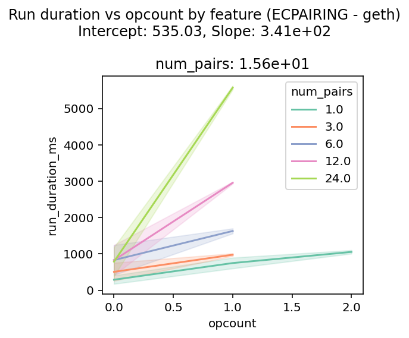


## besu


```python
                            OLS Regression Results                            
==============================================================================
Dep. Variable:        run_duration_ms   R-squared:                       0.132
Model:                            OLS   Adj. R-squared:                  0.132
Method:                 Least Squares   F-statistic:                     141.8
Date:                Mon, 26 Jan 2026   Prob (F-statistic):           4.88e-58
Time:                        15:38:07   Log-Likelihood:                -13783.
No. Observations:                1860   AIC:                         2.757e+04
Df Residuals:                    1857   BIC:                         2.759e+04
Df Model:                           2                                         
Covariance Type:            nonrobust                                         
==============================================================================
                 coef    std err          t      P>|t|      [0.025      0.975]
------------------------------------------------------------------------------
const        524.8116     16.163     32.470      0.000     493.112     556.512
opcount      341.5061     22.881     14.925      0.000     296.630     386.382
num_pairs     15.3599      1.205     12.745      0.000      12.996      17.723
==============================================================================
Omnibus:                      854.632   Durbin-Watson:                   1.994
Prob(Omnibus):                  0.000   Jarque-Bera (JB):            14919.426
Skew:                           1.712   Prob(JB):                         0.00
Kurtosis:                      16.446   Cond. No.                         33.4
==============================================================================

Notes:
[1] Standard Errors assume that the covariance matrix of the errors is correctly specified.
```

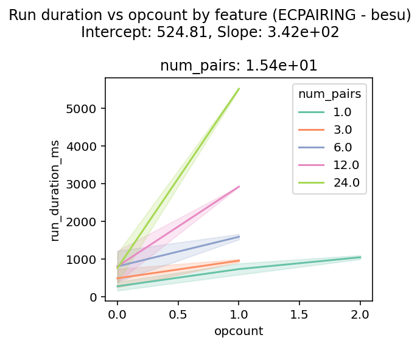

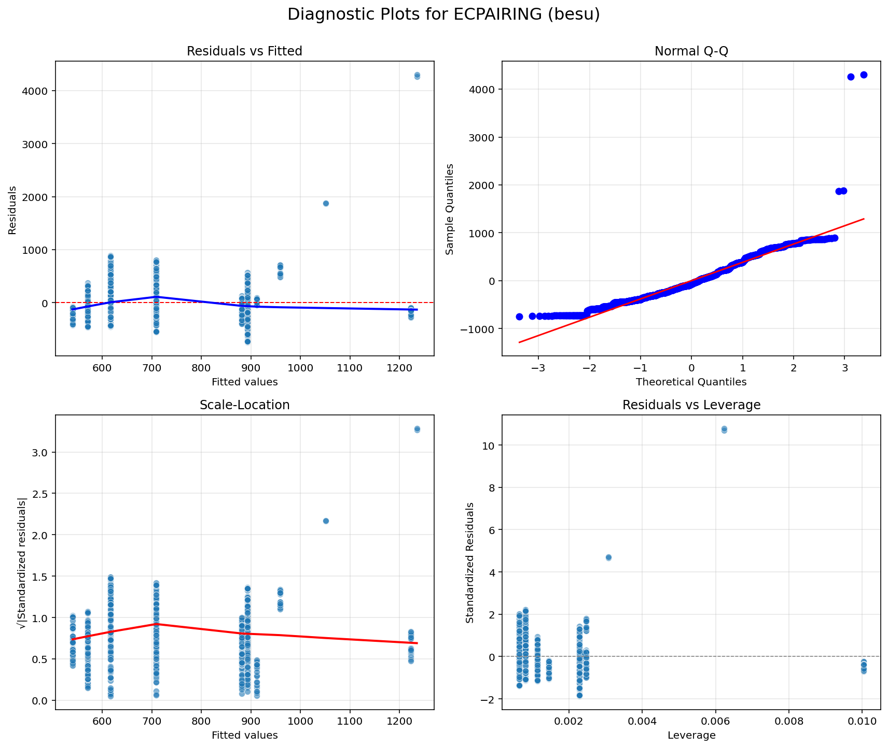


## reth


```python
                            OLS Regression Results                            
==============================================================================
Dep. Variable:        run_duration_ms   R-squared:                       0.133
Model:                            OLS   Adj. R-squared:                  0.132
Method:                 Least Squares   F-statistic:                     100.2
Date:                Mon, 26 Jan 2026   Prob (F-statistic):           3.23e-41
Time:                        15:38:07   Log-Likelihood:                -10779.
No. Observations:                1310   AIC:                         2.156e+04
Df Residuals:                    1307   BIC:                         2.158e+04
Df Model:                           2                                         
Covariance Type:            nonrobust                                         
==============================================================================
                 coef    std err          t      P>|t|      [0.025      0.975]
------------------------------------------------------------------------------
const       1064.7036     43.665     24.384      0.000     979.043    1150.364
opcount      727.3819     61.584     11.811      0.000     606.567     848.197
num_pairs     37.6912      3.253     11.588      0.000      31.310      44.072
==============================================================================
Omnibus:                      732.926   Durbin-Watson:                   1.906
Prob(Omnibus):                  0.000   Jarque-Bera (JB):            16883.651
Skew:                           2.116   Prob(JB):                         0.00
Kurtosis:                      20.071   Cond. No.                         33.3
==============================================================================

Notes:
[1] Standard Errors assume that the covariance matrix of the errors is correctly specified.
```

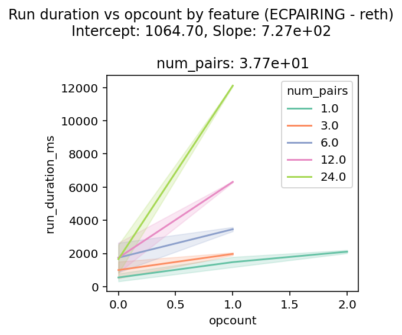

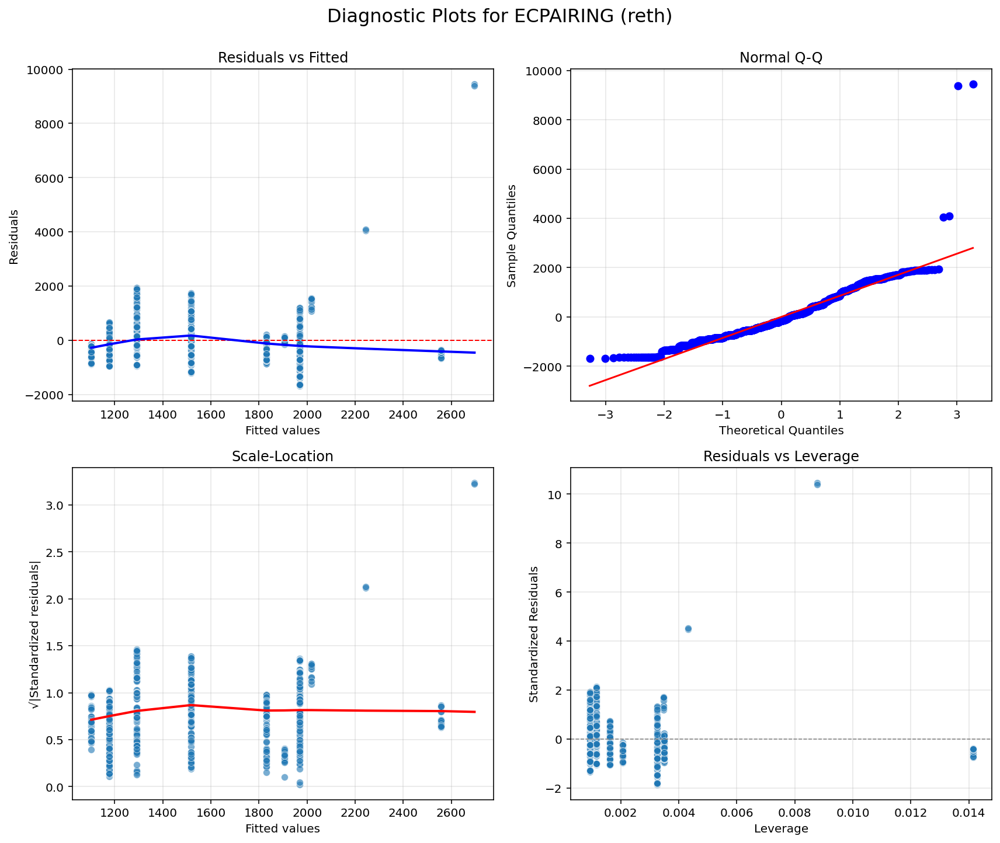


## erigon

OLS model did not run... Error: zero-size array to reduction operation maximum which has no identity
