Operation run times estimation results - EIP-7904
=================================================

Table of contents
=================

* [MULMOD](#mulmod)
* [ADDMOD](#addmod)
* [SMOD](#smod)
* [MOD](#mod)
* [SMOD](#smod)
* [DIV](#div)
* [SDIV](#sdiv)
* [POINT_EVALUATION](#point_evaluation)
* [BLS12_G1ADD](#bls12_g1add)
* [BLS12_G2ADD](#bls12_g2add)
* [ECADD](#ecadd)
* [ECRECOVER](#ecrecover)
* [KECCAK256](#keccak256)
* [BLAKE2F](#blake2f)
* [ECPAIRING](#ecpairing)

# Introduction


This is an automated report generated from the opcode run times 
estimation script `./src/estimate_7904_repricings.py`. The script 
uses data generated by running the 
[EEST benchmark suite](https://github.com/ethereum/execution-spec-tests/tree/main/tests/benchmark) 
with the [Nethermind benchmarking tooling](https://github.com/NethermindEth/gas-benchmarks).

The data includes all the tests for operations repriced in EIP-7904 run 
between 2026-01-15 and 2026-01-28.

For each operation and client, an OLS linear regression model is fitted to estimate the
operation run time as a function of the operation count and other operation-specific parameters
(e.g., number of rounds for BLAKE2F, message size for KECCAK256, number of pairs for ECPAIRING).
The results are presented below.

# MULMOD

## geth


```python
                            OLS Regression Results                            
==============================================================================
Dep. Variable:        run_duration_ms   R-squared:                       0.990
Model:                            OLS   Adj. R-squared:                  0.990
Method:                 Least Squares   F-statistic:                 4.311e+04
Date:                Wed, 28 Jan 2026   Prob (F-statistic):               0.00
Time:                        10:25:55   Log-Likelihood:                -2369.4
No. Observations:                 430   AIC:                             4743.
Df Residuals:                     428   BIC:                             4751.
Df Model:                           1                                         
Covariance Type:            nonrobust                                         
==============================================================================
                 coef    std err          t      P>|t|      [0.025      0.975]
------------------------------------------------------------------------------
const         31.0378      6.245      4.970      0.000      18.762      43.313
opcount     6.966e-05   3.36e-07    207.620      0.000     6.9e-05    7.03e-05
==============================================================================
Omnibus:                       80.440   Durbin-Watson:                   1.095
Prob(Omnibus):                  0.000   Jarque-Bera (JB):              240.059
Skew:                          -0.865   Prob(JB):                     7.45e-53
Kurtosis:                       6.226   Cond. No.                     4.02e+07
==============================================================================

Notes:
[1] Standard Errors assume that the covariance matrix of the errors is correctly specified.
[2] The condition number is large, 4.02e+07. This might indicate that there are
strong multicollinearity or other numerical problems.
```

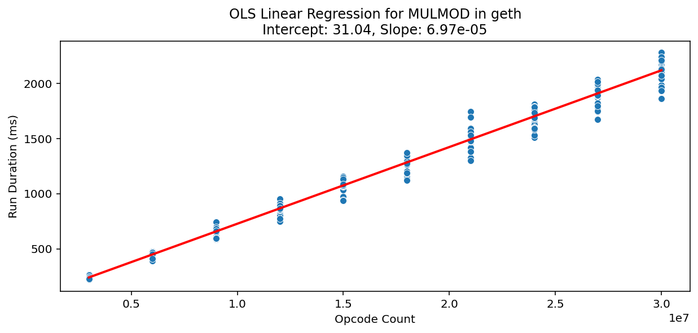

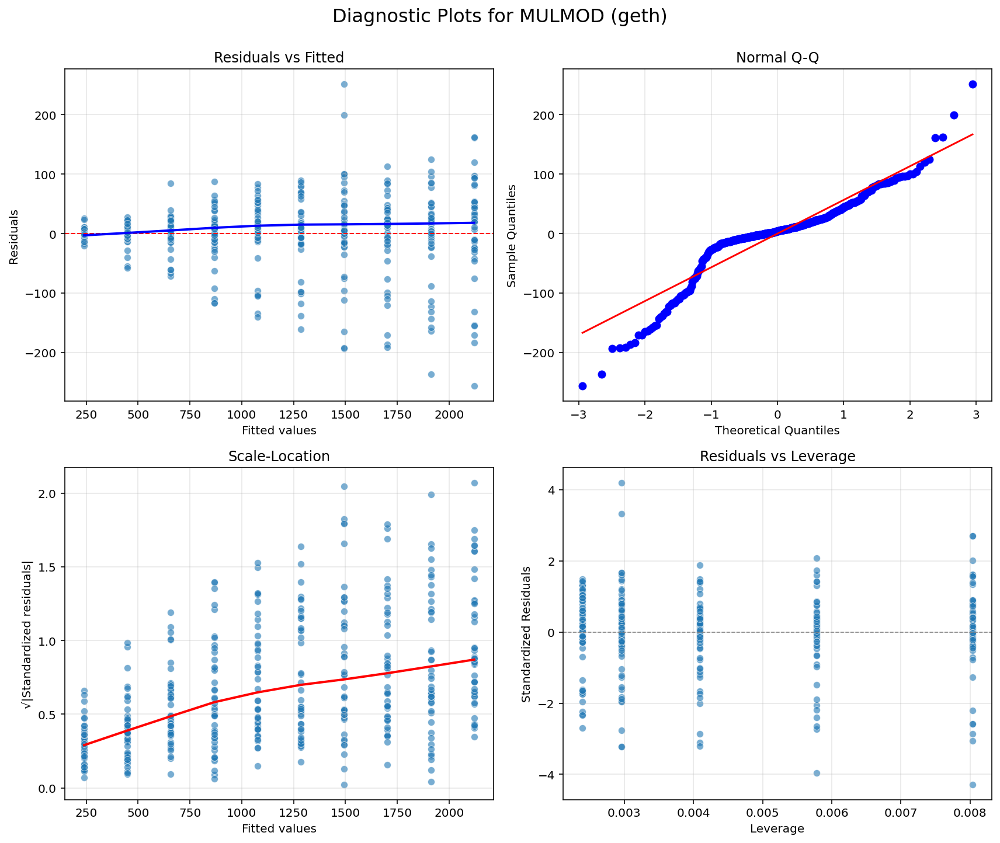


## besu


```python
                            OLS Regression Results                            
==============================================================================
Dep. Variable:        run_duration_ms   R-squared:                       0.980
Model:                            OLS   Adj. R-squared:                  0.980
Method:                 Least Squares   F-statistic:                 2.130e+04
Date:                Wed, 28 Jan 2026   Prob (F-statistic):               0.00
Time:                        10:25:55   Log-Likelihood:                -2924.2
No. Observations:                 430   AIC:                             5852.
Df Residuals:                     428   BIC:                             5860.
Df Model:                           1                                         
Covariance Type:            nonrobust                                         
==============================================================================
                 coef    std err          t      P>|t|      [0.025      0.975]
------------------------------------------------------------------------------
const         40.8901     22.693      1.802      0.072      -3.714      85.495
opcount        0.0002   1.22e-06    145.952      0.000       0.000       0.000
==============================================================================
Omnibus:                       30.545   Durbin-Watson:                   0.874
Prob(Omnibus):                  0.000   Jarque-Bera (JB):               41.002
Skew:                          -0.557   Prob(JB):                     1.25e-09
Kurtosis:                       4.024   Cond. No.                     4.02e+07
==============================================================================

Notes:
[1] Standard Errors assume that the covariance matrix of the errors is correctly specified.
[2] The condition number is large, 4.02e+07. This might indicate that there are
strong multicollinearity or other numerical problems.
```

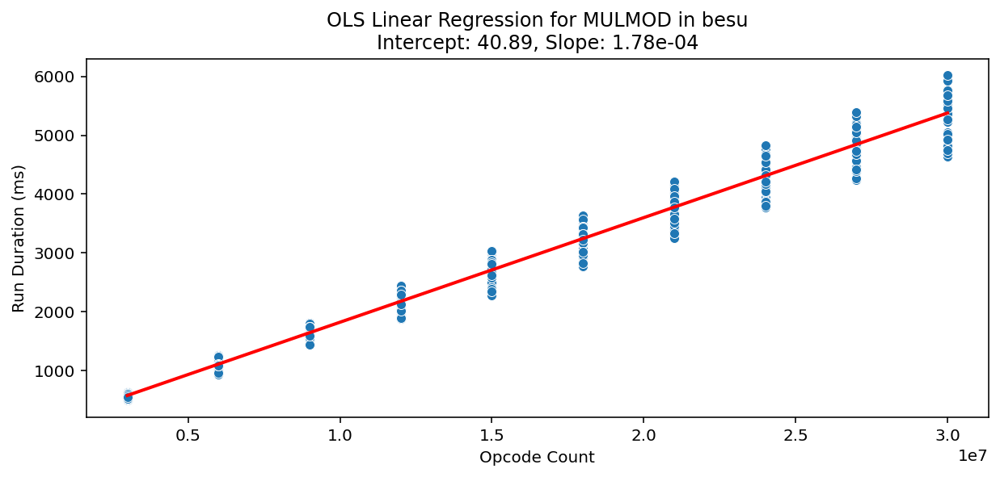

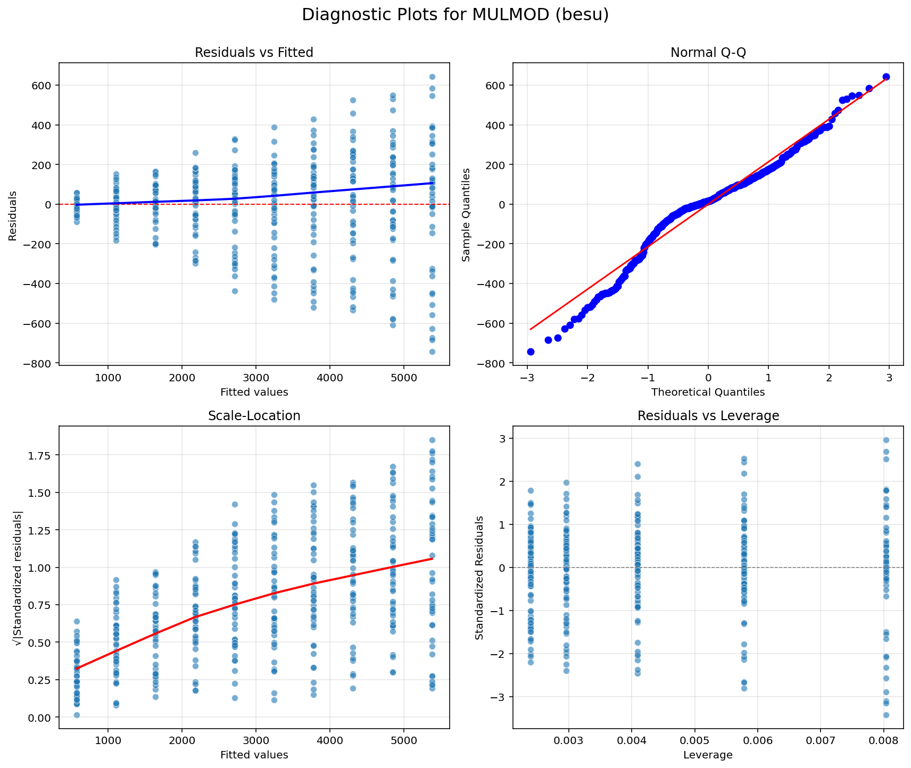


## reth


```python
                            OLS Regression Results                            
==============================================================================
Dep. Variable:        run_duration_ms   R-squared:                       0.989
Model:                            OLS   Adj. R-squared:                  0.989
Method:                 Least Squares   F-statistic:                 2.974e+04
Date:                Wed, 28 Jan 2026   Prob (F-statistic):          3.48e-316
Time:                        10:25:55   Log-Likelihood:                -1607.2
No. Observations:                 320   AIC:                             3218.
Df Residuals:                     318   BIC:                             3226.
Df Model:                           1                                         
Covariance Type:            nonrobust                                         
==============================================================================
                 coef    std err          t      P>|t|      [0.025      0.975]
------------------------------------------------------------------------------
const         31.4231      4.450      7.062      0.000      22.668      40.178
opcount     4.122e-05   2.39e-07    172.455      0.000    4.08e-05    4.17e-05
==============================================================================
Omnibus:                       54.036   Durbin-Watson:                   1.084
Prob(Omnibus):                  0.000   Jarque-Bera (JB):              154.382
Skew:                          -0.759   Prob(JB):                     3.00e-34
Kurtosis:                       6.045   Cond. No.                     4.02e+07
==============================================================================

Notes:
[1] Standard Errors assume that the covariance matrix of the errors is correctly specified.
[2] The condition number is large, 4.02e+07. This might indicate that there are
strong multicollinearity or other numerical problems.
```


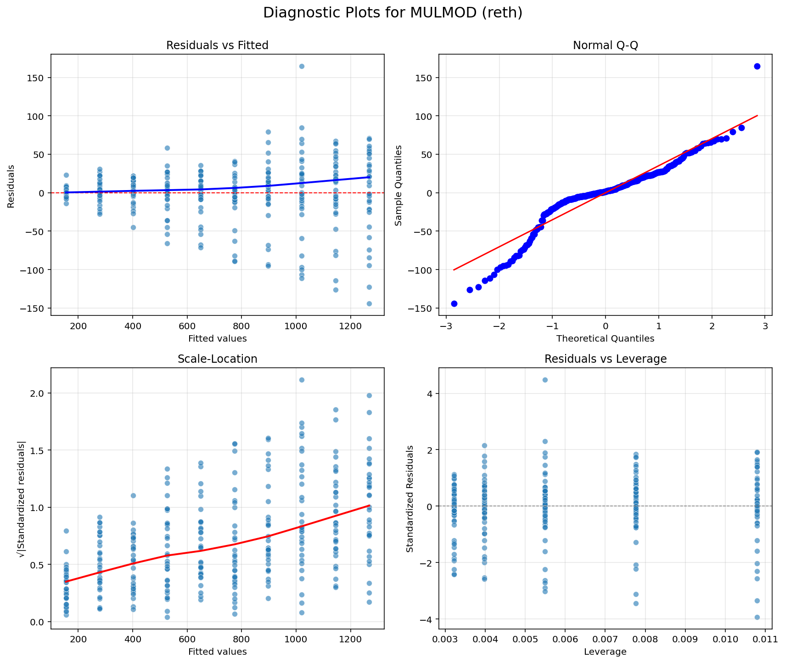


## nethermind


```python
                            OLS Regression Results                            
==============================================================================
Dep. Variable:        run_duration_ms   R-squared:                       0.986
Model:                            OLS   Adj. R-squared:                  0.986
Method:                 Least Squares   F-statistic:                 3.061e+04
Date:                Wed, 28 Jan 2026   Prob (F-statistic):               0.00
Time:                        10:25:55   Log-Likelihood:                -2413.9
No. Observations:                 430   AIC:                             4832.
Df Residuals:                     428   BIC:                             4840.
Df Model:                           1                                         
Covariance Type:            nonrobust                                         
==============================================================================
                 coef    std err          t      P>|t|      [0.025      0.975]
------------------------------------------------------------------------------
const         28.6369      6.927      4.134      0.000      15.021      42.253
opcount     6.511e-05   3.72e-07    174.949      0.000    6.44e-05    6.58e-05
==============================================================================
Omnibus:                      143.327   Durbin-Watson:                   0.772
Prob(Omnibus):                  0.000   Jarque-Bera (JB):              465.250
Skew:                          -1.531   Prob(JB):                    9.38e-102
Kurtosis:                       7.074   Cond. No.                     4.02e+07
==============================================================================

Notes:
[1] Standard Errors assume that the covariance matrix of the errors is correctly specified.
[2] The condition number is large, 4.02e+07. This might indicate that there are
strong multicollinearity or other numerical problems.
```

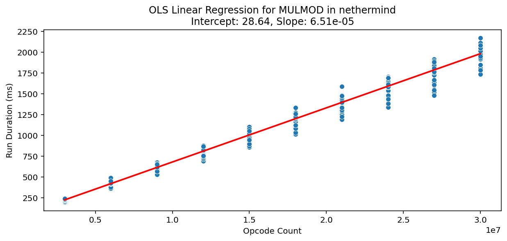

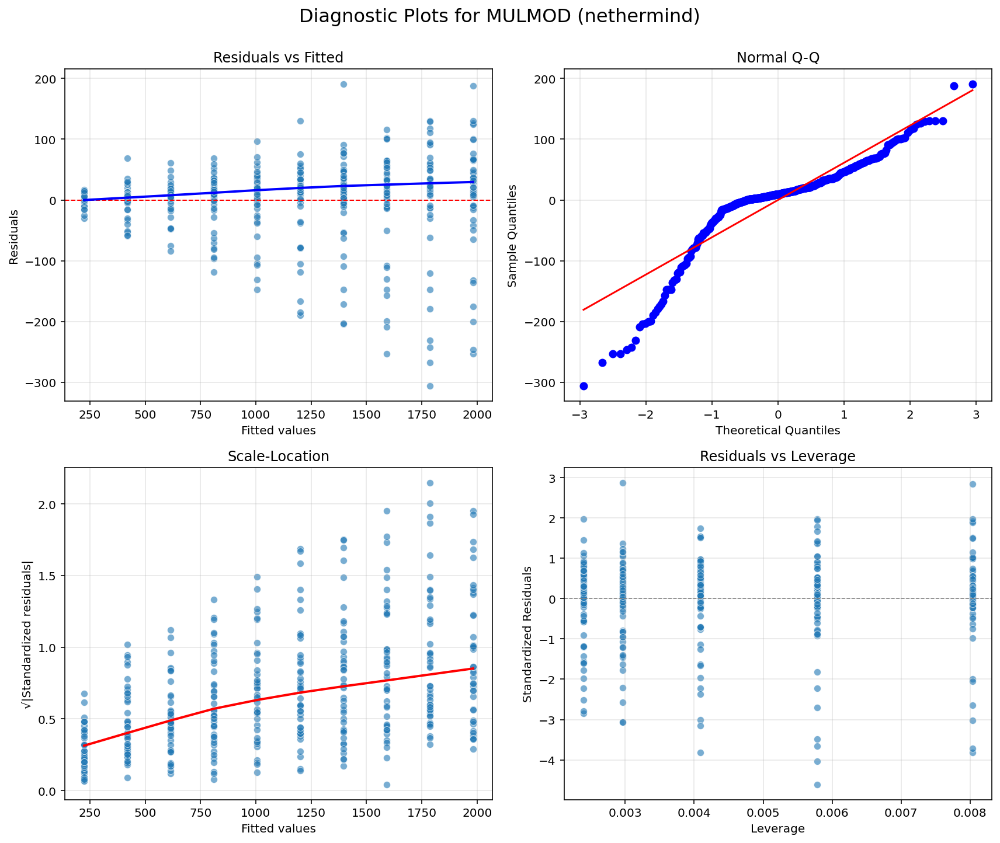


## erigon


```python
                            OLS Regression Results                            
==============================================================================
Dep. Variable:        run_duration_ms   R-squared:                       1.000
Model:                            OLS   Adj. R-squared:                  1.000
Method:                 Least Squares   F-statistic:                 9.010e+04
Date:                Wed, 28 Jan 2026   Prob (F-statistic):           1.17e-50
Time:                        10:25:56   Log-Likelihood:                -115.03
No. Observations:                  30   AIC:                             234.1
Df Residuals:                      28   BIC:                             236.9
Df Model:                           1                                         
Covariance Type:            nonrobust                                         
==============================================================================
                 coef    std err          t      P>|t|      [0.025      0.975]
------------------------------------------------------------------------------
const         27.7081      4.570      6.062      0.000      18.346      37.070
opcount      7.37e-05   2.46e-07    300.168      0.000    7.32e-05    7.42e-05
==============================================================================
Omnibus:                       18.361   Durbin-Watson:                   1.183
Prob(Omnibus):                  0.000   Jarque-Bera (JB):               25.308
Skew:                           1.476   Prob(JB):                     3.19e-06
Kurtosis:                       6.396   Cond. No.                     4.02e+07
==============================================================================

Notes:
[1] Standard Errors assume that the covariance matrix of the errors is correctly specified.
[2] The condition number is large, 4.02e+07. This might indicate that there are
strong multicollinearity or other numerical problems.
```

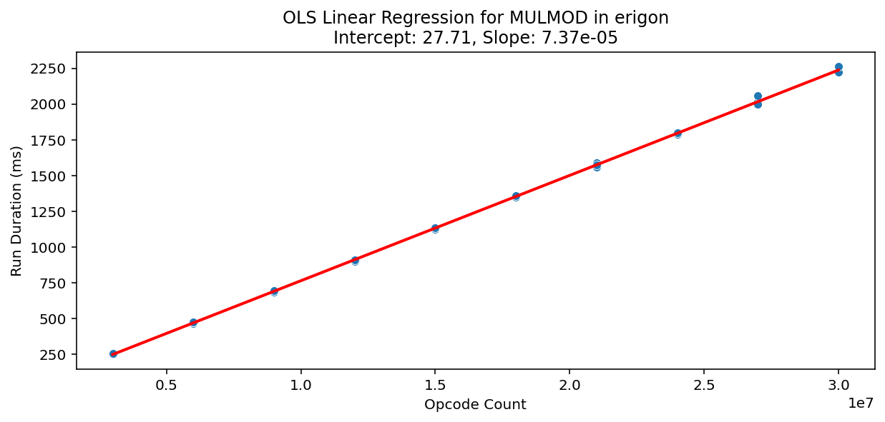

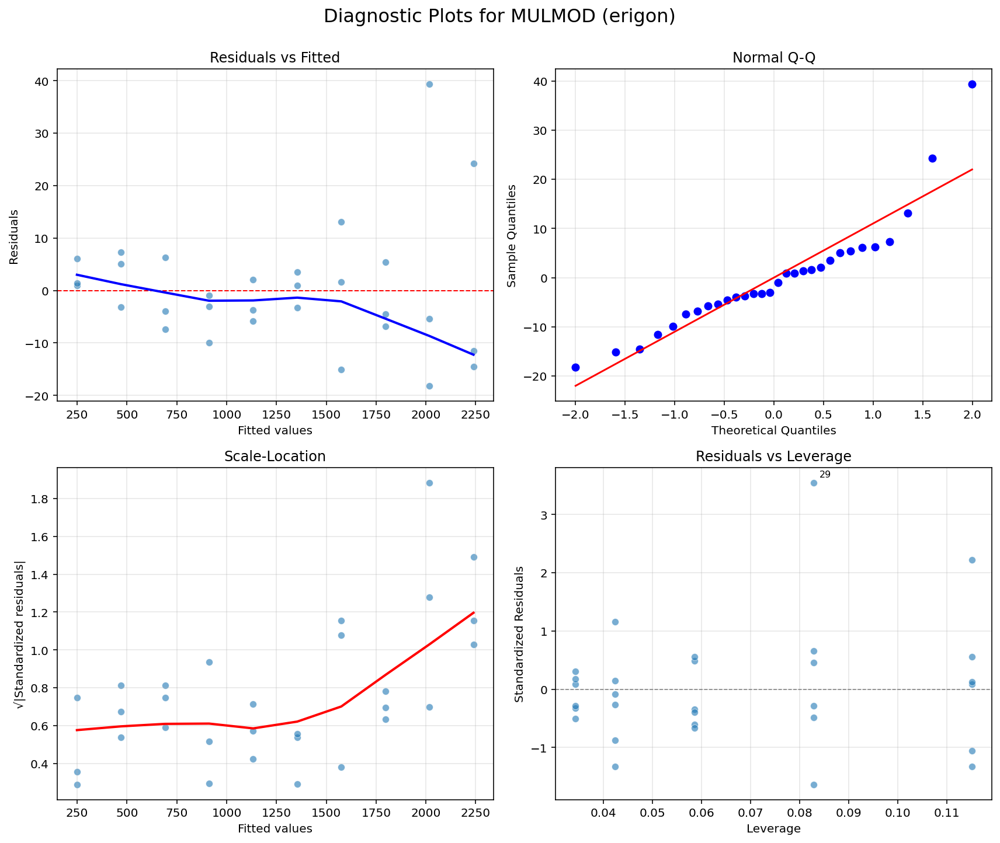


# ADDMOD

## geth


```python
                            OLS Regression Results                            
==============================================================================
Dep. Variable:        run_duration_ms   R-squared:                       0.989
Model:                            OLS   Adj. R-squared:                  0.989
Method:                 Least Squares   F-statistic:                 4.017e+04
Date:                Wed, 28 Jan 2026   Prob (F-statistic):               0.00
Time:                        10:25:56   Log-Likelihood:                -2351.3
No. Observations:                 430   AIC:                             4707.
Df Residuals:                     428   BIC:                             4715.
Df Model:                           1                                         
Covariance Type:            nonrobust                                         
==============================================================================
                 coef    std err          t      P>|t|      [0.025      0.975]
------------------------------------------------------------------------------
const         32.5766      5.988      5.440      0.000      20.806      44.347
opcount     5.527e-05   2.76e-07    200.420      0.000    5.47e-05    5.58e-05
==============================================================================
Omnibus:                       75.291   Durbin-Watson:                   1.048
Prob(Omnibus):                  0.000   Jarque-Bera (JB):              669.048
Skew:                          -0.415   Prob(JB):                    5.22e-146
Kurtosis:                       9.054   Cond. No.                     4.69e+07
==============================================================================

Notes:
[1] Standard Errors assume that the covariance matrix of the errors is correctly specified.
[2] The condition number is large, 4.69e+07. This might indicate that there are
strong multicollinearity or other numerical problems.
```

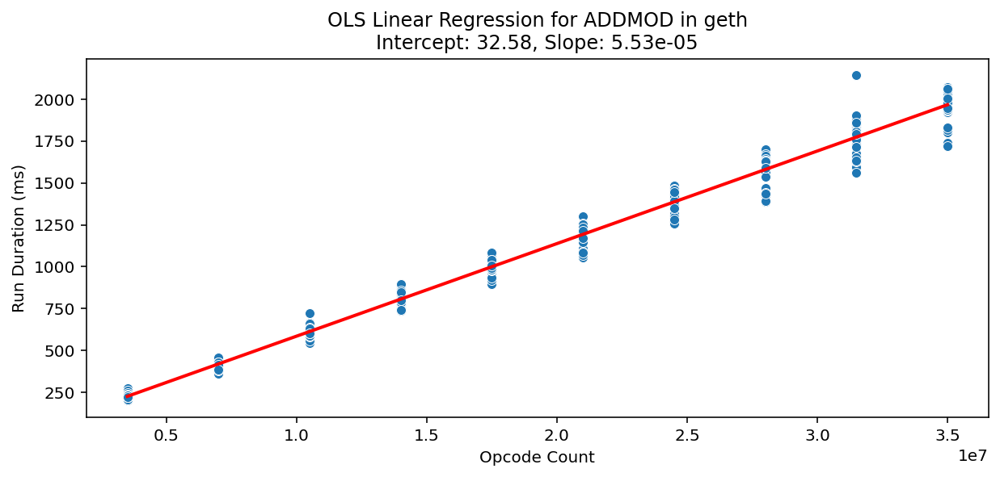

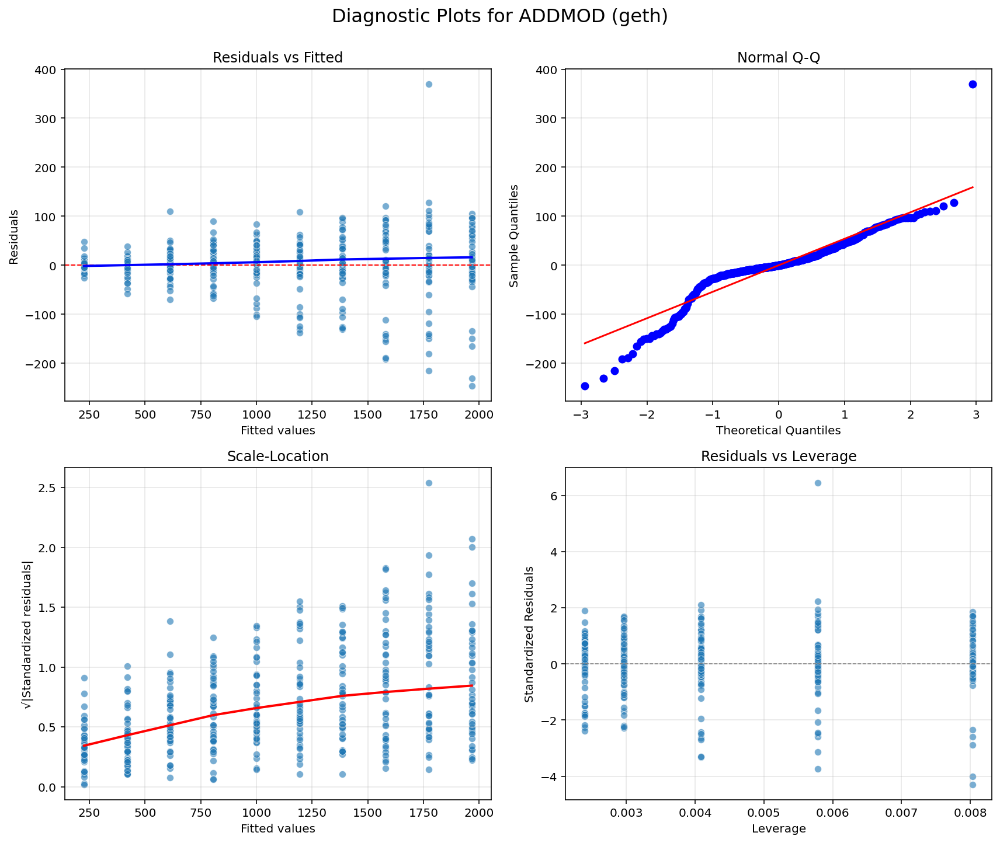


## besu


```python
                            OLS Regression Results                            
==============================================================================
Dep. Variable:        run_duration_ms   R-squared:                       0.980
Model:                            OLS   Adj. R-squared:                  0.979
Method:                 Least Squares   F-statistic:                 2.046e+04
Date:                Wed, 28 Jan 2026   Prob (F-statistic):               0.00
Time:                        10:25:56   Log-Likelihood:                -2846.3
No. Observations:                 430   AIC:                             5697.
Df Residuals:                     428   BIC:                             5705.
Df Model:                           1                                         
Covariance Type:            nonrobust                                         
==============================================================================
                 coef    std err          t      P>|t|      [0.025      0.975]
------------------------------------------------------------------------------
const         35.6849     18.935      1.885      0.060      -1.533      72.902
opcount        0.0001   8.72e-07    143.039      0.000       0.000       0.000
==============================================================================
Omnibus:                       12.265   Durbin-Watson:                   0.948
Prob(Omnibus):                  0.002   Jarque-Bera (JB):               20.671
Skew:                          -0.163   Prob(JB):                     3.25e-05
Kurtosis:                       4.024   Cond. No.                     4.69e+07
==============================================================================

Notes:
[1] Standard Errors assume that the covariance matrix of the errors is correctly specified.
[2] The condition number is large, 4.69e+07. This might indicate that there are
strong multicollinearity or other numerical problems.
```

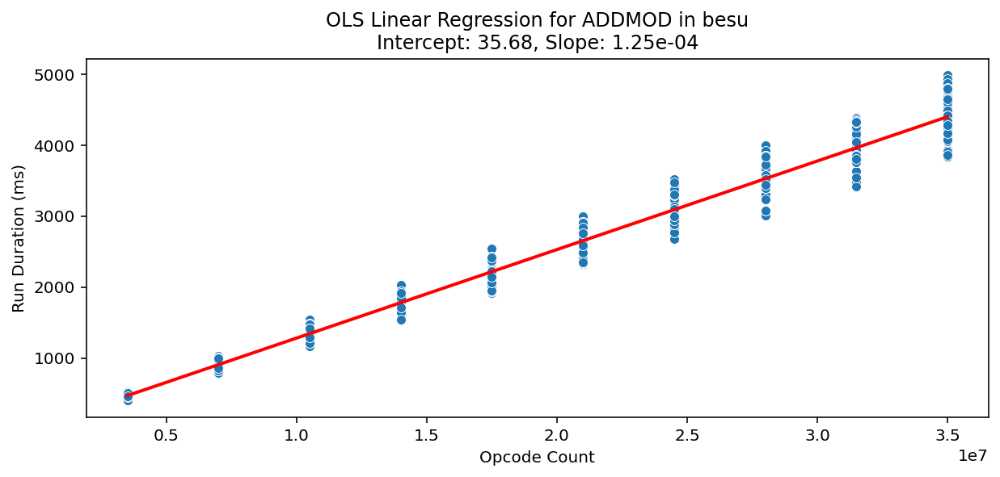

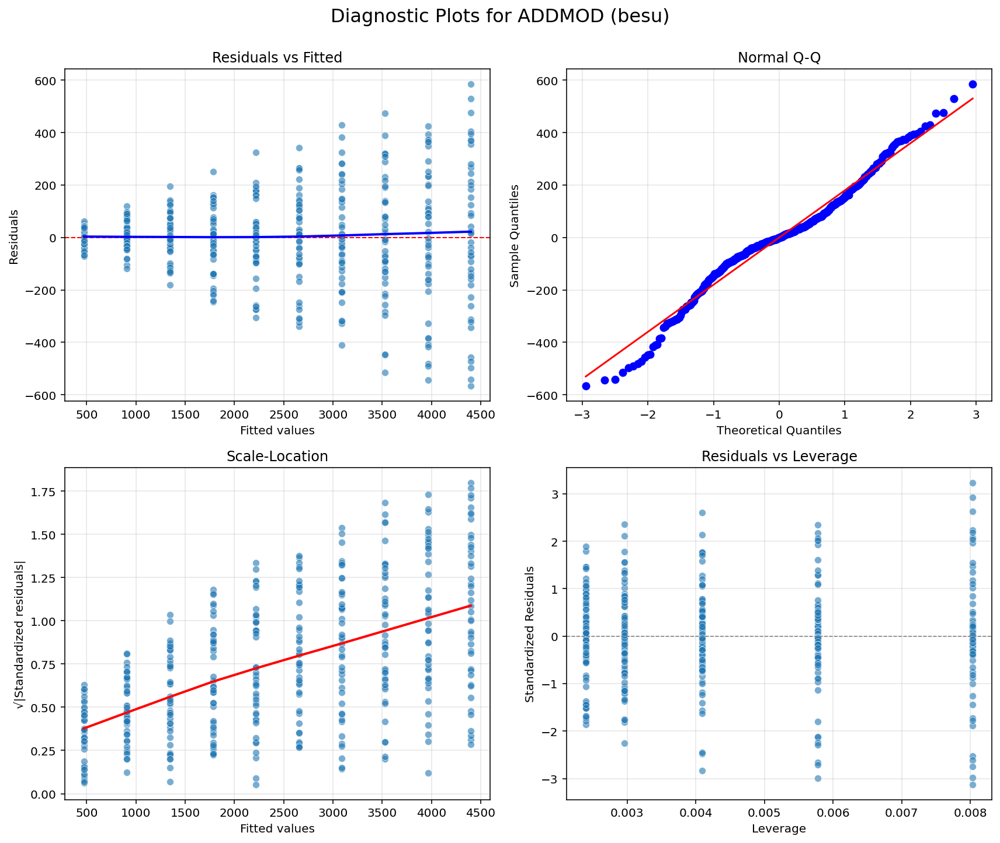


## reth


```python
                            OLS Regression Results                            
==============================================================================
Dep. Variable:        run_duration_ms   R-squared:                       0.991
Model:                            OLS   Adj. R-squared:                  0.991
Method:                 Least Squares   F-statistic:                 3.563e+04
Date:                Wed, 28 Jan 2026   Prob (F-statistic):               0.00
Time:                        10:25:57   Log-Likelihood:                -1505.6
No. Observations:                 320   AIC:                             3015.
Df Residuals:                     318   BIC:                             3023.
Df Model:                           1                                         
Covariance Type:            nonrobust                                         
==============================================================================
                 coef    std err          t      P>|t|      [0.025      0.975]
------------------------------------------------------------------------------
const         32.2943      3.239      9.971      0.000      25.922      38.667
opcount     2.815e-05   1.49e-07    188.748      0.000    2.79e-05    2.84e-05
==============================================================================
Omnibus:                       47.440   Durbin-Watson:                   1.146
Prob(Omnibus):                  0.000   Jarque-Bera (JB):              160.363
Skew:                          -0.604   Prob(JB):                     1.51e-35
Kurtosis:                       6.251   Cond. No.                     4.69e+07
==============================================================================

Notes:
[1] Standard Errors assume that the covariance matrix of the errors is correctly specified.
[2] The condition number is large, 4.69e+07. This might indicate that there are
strong multicollinearity or other numerical problems.
```

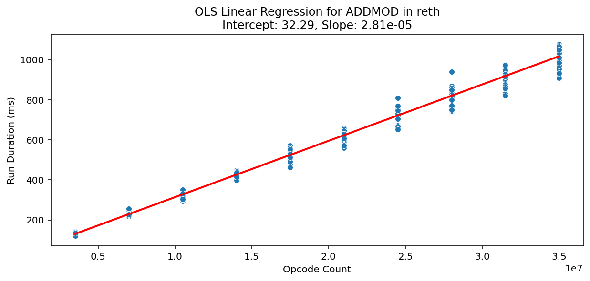

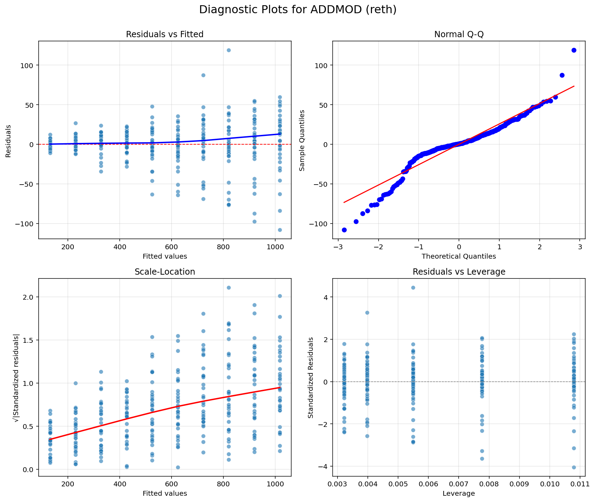


## nethermind


```python
                            OLS Regression Results                            
==============================================================================
Dep. Variable:        run_duration_ms   R-squared:                       0.986
Model:                            OLS   Adj. R-squared:                  0.986
Method:                 Least Squares   F-statistic:                 3.017e+04
Date:                Wed, 28 Jan 2026   Prob (F-statistic):               0.00
Time:                        10:25:57   Log-Likelihood:                -2200.2
No. Observations:                 430   AIC:                             4404.
Df Residuals:                     428   BIC:                             4413.
Df Model:                           1                                         
Covariance Type:            nonrobust                                         
==============================================================================
                 coef    std err          t      P>|t|      [0.025      0.975]
------------------------------------------------------------------------------
const         26.2244      4.215      6.222      0.000      17.940      34.508
opcount     3.371e-05   1.94e-07    173.709      0.000    3.33e-05    3.41e-05
==============================================================================
Omnibus:                      221.152   Durbin-Watson:                   1.223
Prob(Omnibus):                  0.000   Jarque-Bera (JB):             8949.932
Skew:                           1.491   Prob(JB):                         0.00
Kurtosis:                      25.150   Cond. No.                     4.69e+07
==============================================================================

Notes:
[1] Standard Errors assume that the covariance matrix of the errors is correctly specified.
[2] The condition number is large, 4.69e+07. This might indicate that there are
strong multicollinearity or other numerical problems.
```

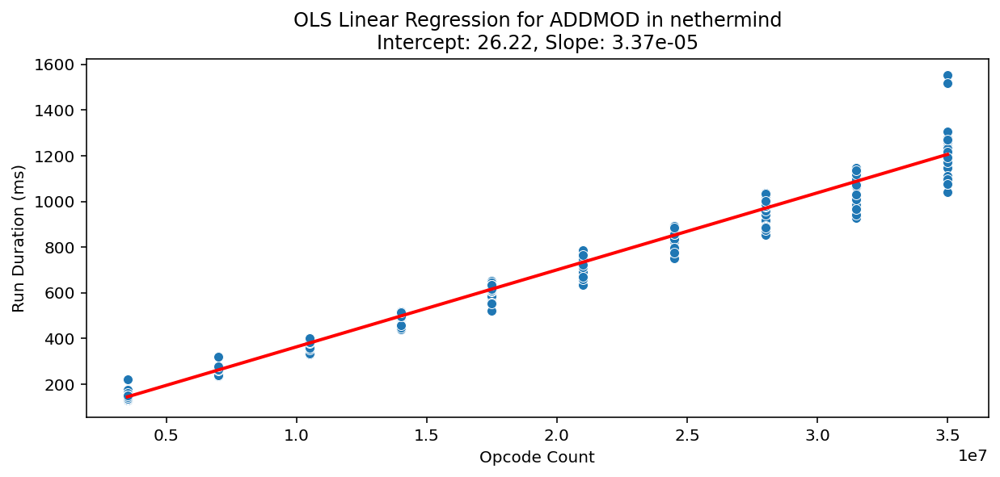

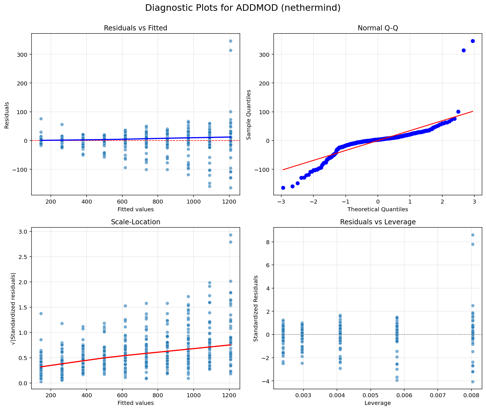


## erigon


```python
                            OLS Regression Results                            
==============================================================================
Dep. Variable:        run_duration_ms   R-squared:                       1.000
Model:                            OLS   Adj. R-squared:                  0.999
Method:                 Least Squares   F-statistic:                 5.620e+04
Date:                Wed, 28 Jan 2026   Prob (F-statistic):           8.62e-48
Time:                        10:25:57   Log-Likelihood:                -120.41
No. Observations:                  30   AIC:                             244.8
Df Residuals:                      28   BIC:                             247.6
Df Model:                           1                                         
Covariance Type:            nonrobust                                         
==============================================================================
                 coef    std err          t      P>|t|      [0.025      0.975]
------------------------------------------------------------------------------
const         29.4920      5.468      5.393      0.000      18.291      40.693
opcount     5.969e-05   2.52e-07    237.062      0.000    5.92e-05    6.02e-05
==============================================================================
Omnibus:                        1.681   Durbin-Watson:                   0.696
Prob(Omnibus):                  0.431   Jarque-Bera (JB):                1.540
Skew:                           0.500   Prob(JB):                        0.463
Kurtosis:                       2.517   Cond. No.                     4.69e+07
==============================================================================

Notes:
[1] Standard Errors assume that the covariance matrix of the errors is correctly specified.
[2] The condition number is large, 4.69e+07. This might indicate that there are
strong multicollinearity or other numerical problems.
```

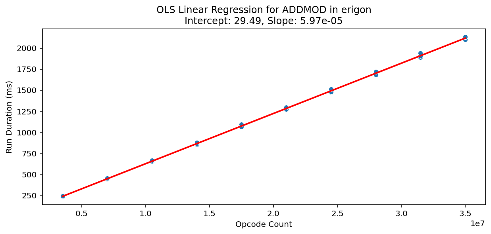

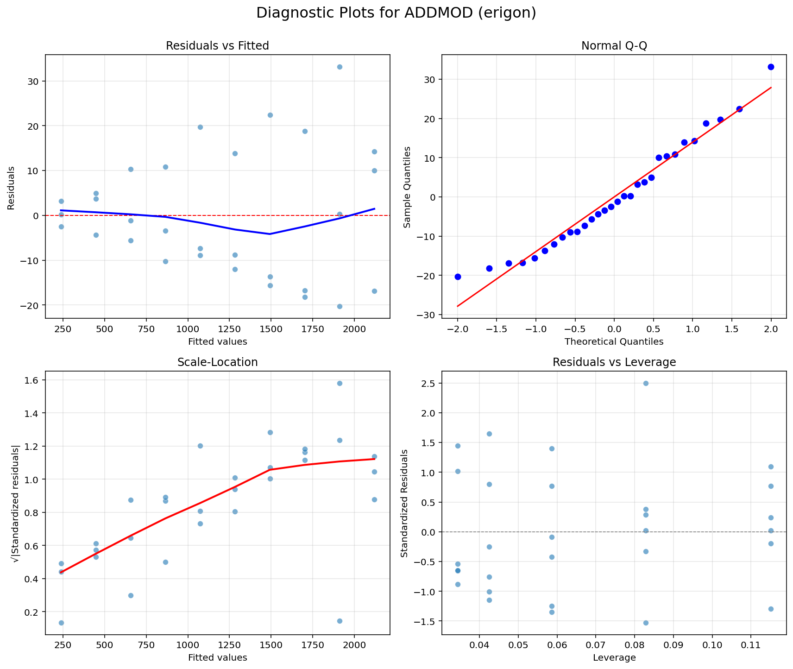


# SMOD

## geth


```python
                            OLS Regression Results                            
==============================================================================
Dep. Variable:        run_duration_ms   R-squared:                       0.958
Model:                            OLS   Adj. R-squared:                  0.958
Method:                 Least Squares   F-statistic:                     9780.
Date:                Wed, 28 Jan 2026   Prob (F-statistic):          6.42e-297
Time:                        10:25:57   Log-Likelihood:                -2327.9
No. Observations:                 430   AIC:                             4660.
Df Residuals:                     428   BIC:                             4668.
Df Model:                           1                                         
Covariance Type:            nonrobust                                         
==============================================================================
                 coef    std err          t      P>|t|      [0.025      0.975]
------------------------------------------------------------------------------
const         33.3730      5.671      5.885      0.000      22.226      44.520
opcount     3.013e-05   3.05e-07     98.896      0.000    2.95e-05    3.07e-05
==============================================================================
Omnibus:                      676.763   Durbin-Watson:                   1.411
Prob(Omnibus):                  0.000   Jarque-Bera (JB):           263799.576
Skew:                           8.500   Prob(JB):                         0.00
Kurtosis:                     123.144   Cond. No.                     4.02e+07
==============================================================================

Notes:
[1] Standard Errors assume that the covariance matrix of the errors is correctly specified.
[2] The condition number is large, 4.02e+07. This might indicate that there are
strong multicollinearity or other numerical problems.
```

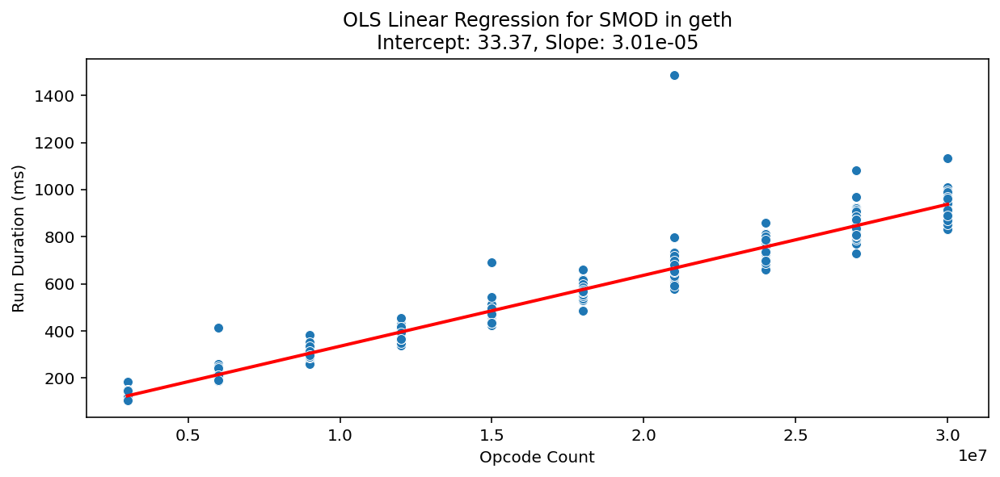

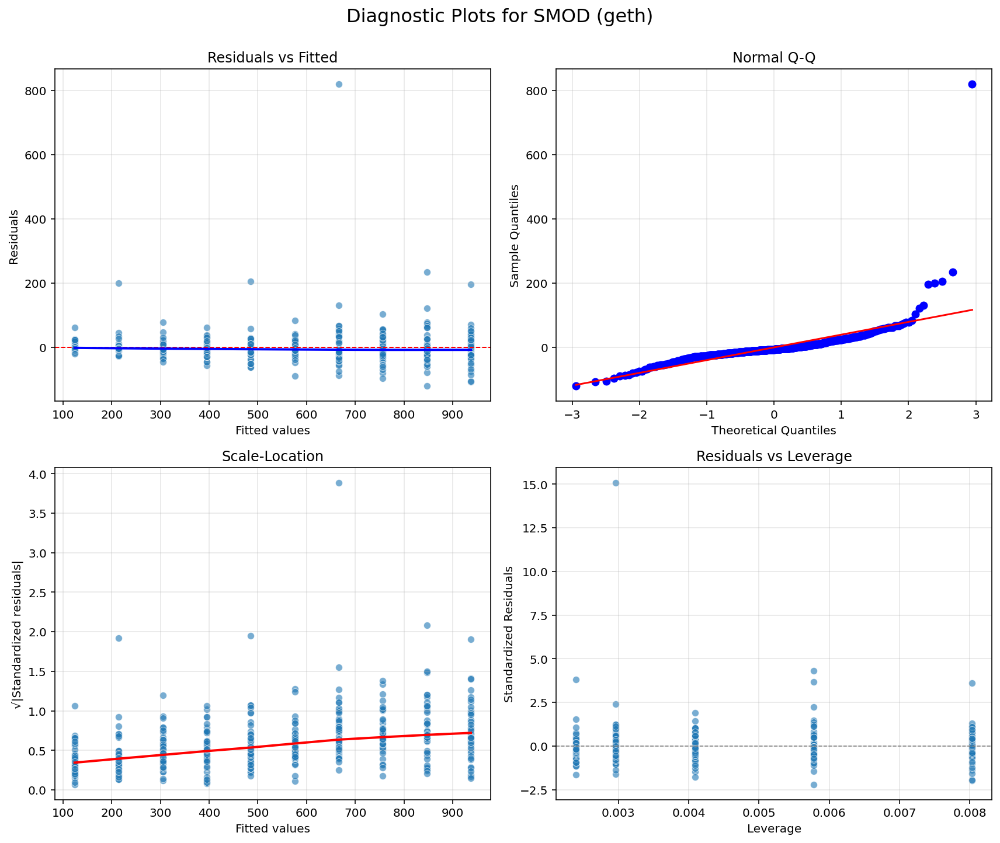


## besu


```python
                            OLS Regression Results                            
==============================================================================
Dep. Variable:        run_duration_ms   R-squared:                       0.984
Model:                            OLS   Adj. R-squared:                  0.984
Method:                 Least Squares   F-statistic:                 2.657e+04
Date:                Wed, 28 Jan 2026   Prob (F-statistic):               0.00
Time:                        10:25:58   Log-Likelihood:                -2244.5
No. Observations:                 430   AIC:                             4493.
Df Residuals:                     428   BIC:                             4501.
Df Model:                           1                                         
Covariance Type:            nonrobust                                         
==============================================================================
                 coef    std err          t      P>|t|      [0.025      0.975]
------------------------------------------------------------------------------
const         30.3917      4.671      6.506      0.000      21.210      39.573
opcount     4.091e-05   2.51e-07    163.001      0.000    4.04e-05    4.14e-05
==============================================================================
Omnibus:                       70.316   Durbin-Watson:                   0.664
Prob(Omnibus):                  0.000   Jarque-Bera (JB):              146.454
Skew:                          -0.881   Prob(JB):                     1.58e-32
Kurtosis:                       5.252   Cond. No.                     4.02e+07
==============================================================================

Notes:
[1] Standard Errors assume that the covariance matrix of the errors is correctly specified.
[2] The condition number is large, 4.02e+07. This might indicate that there are
strong multicollinearity or other numerical problems.
```

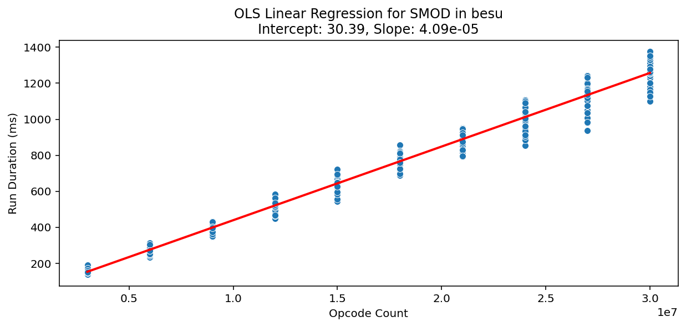

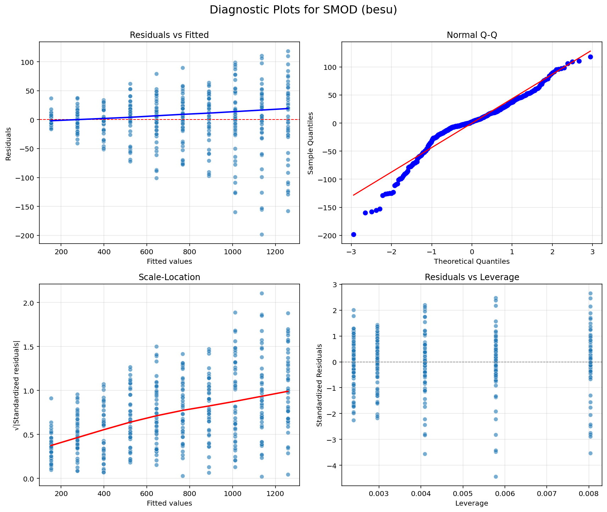


## reth


```python
                            OLS Regression Results                            
==============================================================================
Dep. Variable:        run_duration_ms   R-squared:                       0.986
Model:                            OLS   Adj. R-squared:                  0.986
Method:                 Least Squares   F-statistic:                 2.259e+04
Date:                Wed, 28 Jan 2026   Prob (F-statistic):          1.96e-297
Time:                        10:25:58   Log-Likelihood:                -1284.0
No. Observations:                 320   AIC:                             2572.
Df Residuals:                     318   BIC:                             2580.
Df Model:                           1                                         
Covariance Type:            nonrobust                                         
==============================================================================
                 coef    std err          t      P>|t|      [0.025      0.975]
------------------------------------------------------------------------------
const         31.8194      1.621     19.633      0.000      28.631      35.008
opcount     1.309e-05   8.71e-08    150.311      0.000    1.29e-05    1.33e-05
==============================================================================
Omnibus:                       33.457   Durbin-Watson:                   1.079
Prob(Omnibus):                  0.000   Jarque-Bera (JB):               85.936
Skew:                          -0.482   Prob(JB):                     2.18e-19
Kurtosis:                       5.349   Cond. No.                     4.02e+07
==============================================================================

Notes:
[1] Standard Errors assume that the covariance matrix of the errors is correctly specified.
[2] The condition number is large, 4.02e+07. This might indicate that there are
strong multicollinearity or other numerical problems.
```

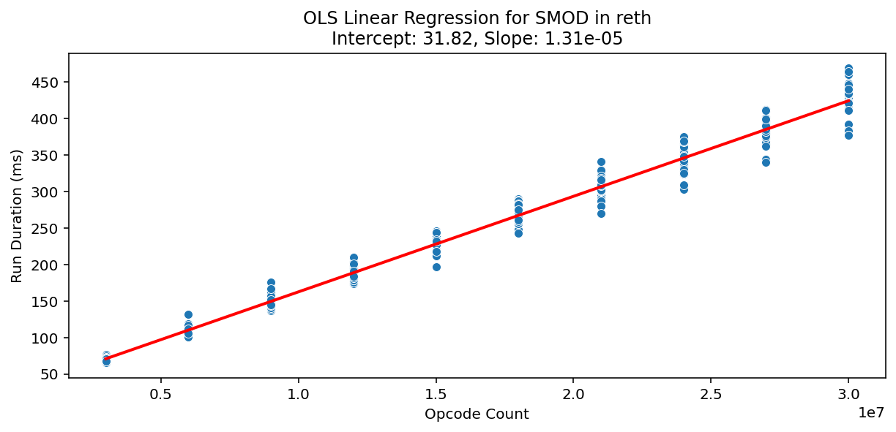

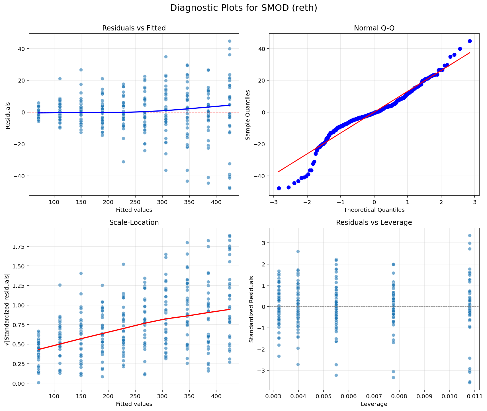


## nethermind


```python
                            OLS Regression Results                            
==============================================================================
Dep. Variable:        run_duration_ms   R-squared:                       0.985
Model:                            OLS   Adj. R-squared:                  0.985
Method:                 Least Squares   F-statistic:                 2.825e+04
Date:                Wed, 28 Jan 2026   Prob (F-statistic):               0.00
Time:                        10:25:58   Log-Likelihood:                -1825.3
No. Observations:                 430   AIC:                             3655.
Df Residuals:                     428   BIC:                             3663.
Df Model:                           1                                         
Covariance Type:            nonrobust                                         
==============================================================================
                 coef    std err          t      P>|t|      [0.025      0.975]
------------------------------------------------------------------------------
const         30.3208      1.762     17.207      0.000      26.857      33.784
opcount     1.591e-05   9.47e-08    168.077      0.000    1.57e-05    1.61e-05
==============================================================================
Omnibus:                       61.123   Durbin-Watson:                   0.882
Prob(Omnibus):                  0.000   Jarque-Bera (JB):              495.640
Skew:                          -0.238   Prob(JB):                    2.36e-108
Kurtosis:                       8.238   Cond. No.                     4.02e+07
==============================================================================

Notes:
[1] Standard Errors assume that the covariance matrix of the errors is correctly specified.
[2] The condition number is large, 4.02e+07. This might indicate that there are
strong multicollinearity or other numerical problems.
```

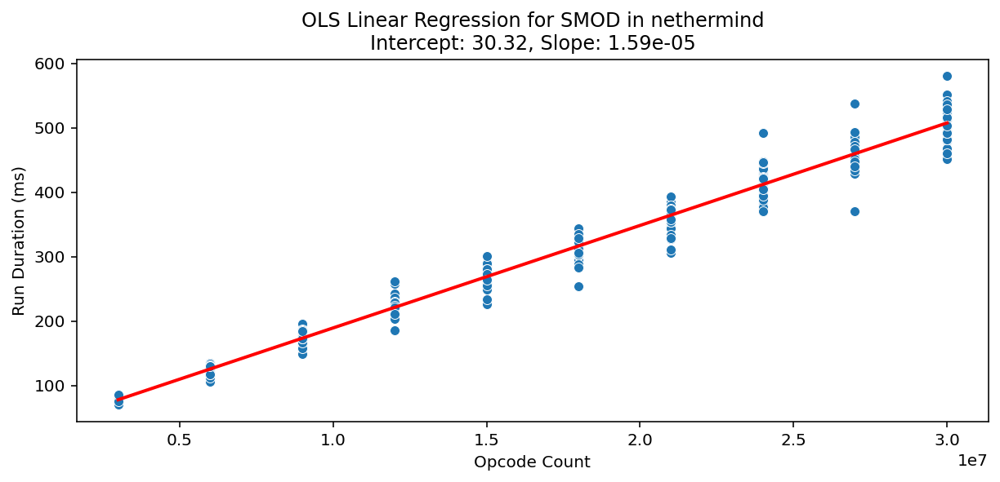

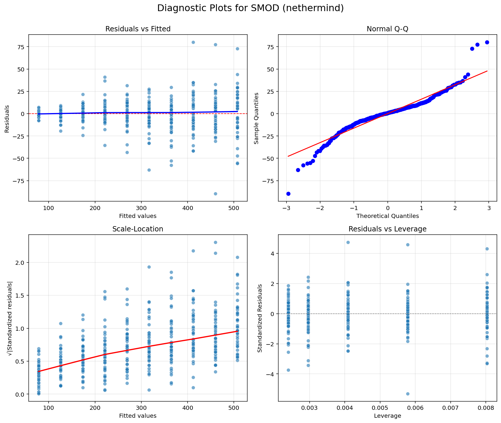


## erigon


```python
                            OLS Regression Results                            
==============================================================================
Dep. Variable:        run_duration_ms   R-squared:                       0.993
Model:                            OLS   Adj. R-squared:                  0.992
Method:                 Least Squares   F-statistic:                     3781.
Date:                Wed, 28 Jan 2026   Prob (F-statistic):           2.02e-31
Time:                        10:25:58   Log-Likelihood:                -138.53
No. Observations:                  30   AIC:                             281.1
Df Residuals:                      28   BIC:                             283.9
Df Model:                           1                                         
Covariance Type:            nonrobust                                         
==============================================================================
                 coef    std err          t      P>|t|      [0.025      0.975]
------------------------------------------------------------------------------
const         22.2938     10.002      2.229      0.034       1.806      42.781
opcount     3.304e-05   5.37e-07     61.491      0.000    3.19e-05    3.41e-05
==============================================================================
Omnibus:                       58.725   Durbin-Watson:                   2.145
Prob(Omnibus):                  0.000   Jarque-Bera (JB):              463.777
Skew:                           4.002   Prob(JB):                    1.96e-101
Kurtosis:                      20.520   Cond. No.                     4.02e+07
==============================================================================

Notes:
[1] Standard Errors assume that the covariance matrix of the errors is correctly specified.
[2] The condition number is large, 4.02e+07. This might indicate that there are
strong multicollinearity or other numerical problems.
```

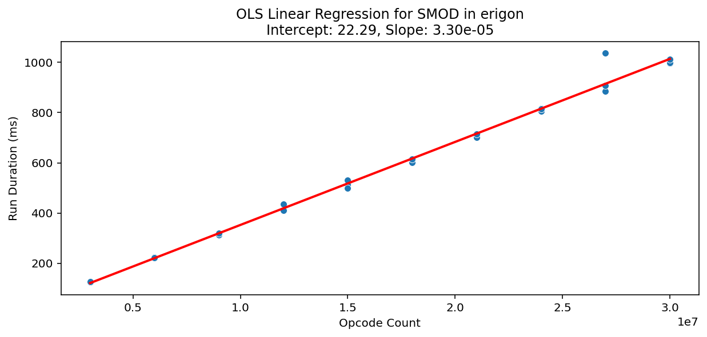

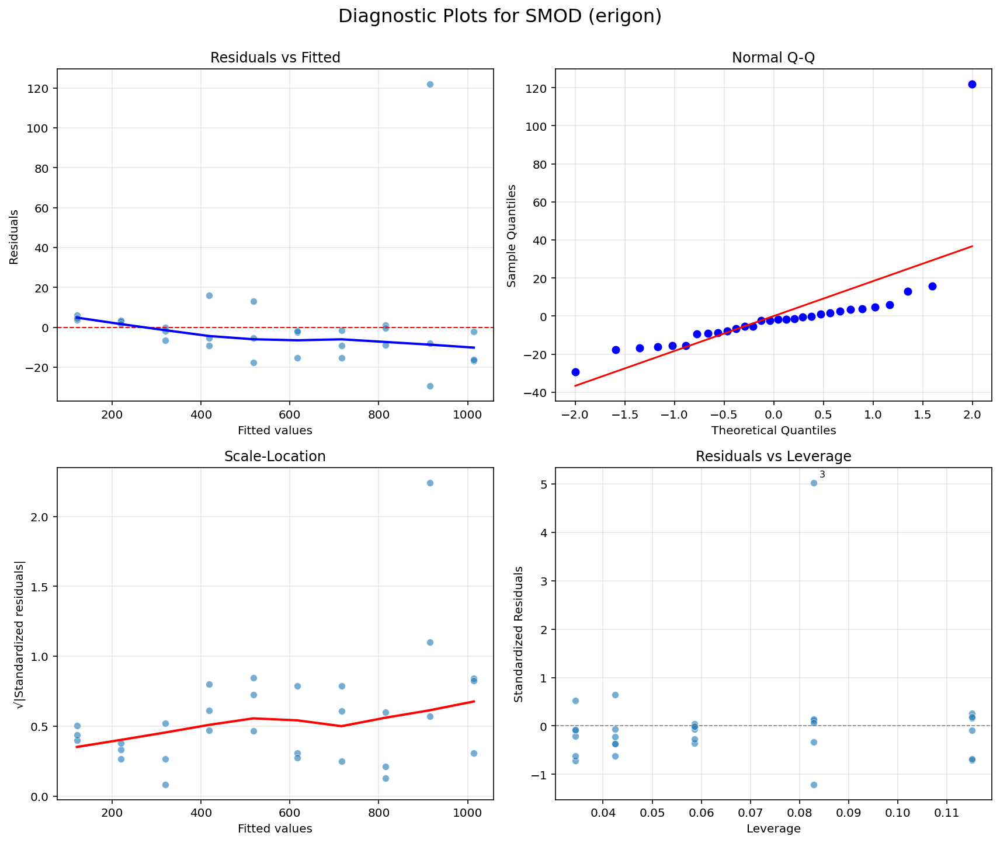


# MOD

## geth


```python
                            OLS Regression Results                            
==============================================================================
Dep. Variable:        run_duration_ms   R-squared:                       0.985
Model:                            OLS   Adj. R-squared:                  0.985
Method:                 Least Squares   F-statistic:                 2.797e+04
Date:                Wed, 28 Jan 2026   Prob (F-statistic):               0.00
Time:                        10:25:59   Log-Likelihood:                -2348.1
No. Observations:                 430   AIC:                             4700.
Df Residuals:                     428   BIC:                             4708.
Df Model:                           1                                         
Covariance Type:            nonrobust                                         
==============================================================================
                 coef    std err          t      P>|t|      [0.025      0.975]
------------------------------------------------------------------------------
const         33.6655      5.944      5.664      0.000      21.983      45.348
opcount      5.34e-05   3.19e-07    167.237      0.000    5.28e-05     5.4e-05
==============================================================================
Omnibus:                      389.210   Durbin-Watson:                   1.178
Prob(Omnibus):                  0.000   Jarque-Bera (JB):            36643.342
Skew:                           3.333   Prob(JB):                         0.00
Kurtosis:                      47.730   Cond. No.                     4.02e+07
==============================================================================

Notes:
[1] Standard Errors assume that the covariance matrix of the errors is correctly specified.
[2] The condition number is large, 4.02e+07. This might indicate that there are
strong multicollinearity or other numerical problems.
```


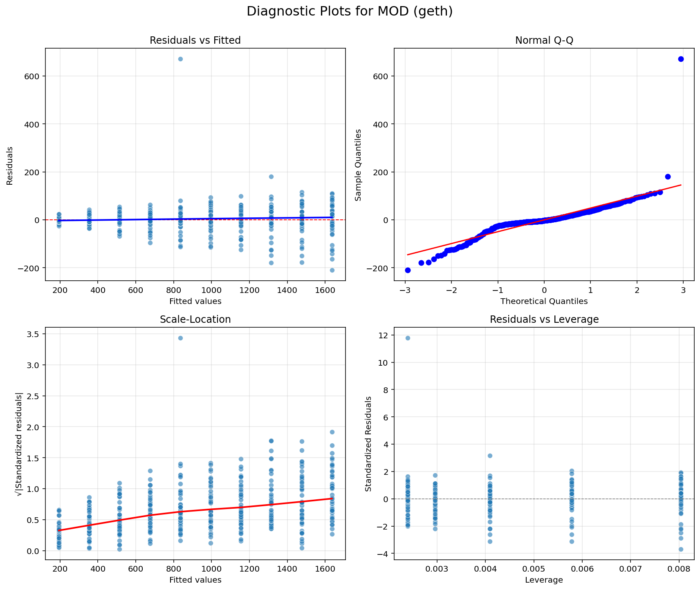


## besu


```python
                            OLS Regression Results                            
==============================================================================
Dep. Variable:        run_duration_ms   R-squared:                       0.977
Model:                            OLS   Adj. R-squared:                  0.977
Method:                 Least Squares   F-statistic:                 1.814e+04
Date:                Wed, 28 Jan 2026   Prob (F-statistic):               0.00
Time:                        10:25:59   Log-Likelihood:                -2997.6
No. Observations:                 430   AIC:                             5999.
Df Residuals:                     428   BIC:                             6007.
Df Model:                           1                                         
Covariance Type:            nonrobust                                         
==============================================================================
                 coef    std err          t      P>|t|      [0.025      0.975]
------------------------------------------------------------------------------
const         42.7935     26.920      1.590      0.113     -10.119      95.706
opcount        0.0002   1.45e-06    134.667      0.000       0.000       0.000
==============================================================================
Omnibus:                       17.113   Durbin-Watson:                   0.893
Prob(Omnibus):                  0.000   Jarque-Bera (JB):               30.789
Skew:                          -0.239   Prob(JB):                     2.06e-07
Kurtosis:                       4.221   Cond. No.                     4.02e+07
==============================================================================

Notes:
[1] Standard Errors assume that the covariance matrix of the errors is correctly specified.
[2] The condition number is large, 4.02e+07. This might indicate that there are
strong multicollinearity or other numerical problems.
```

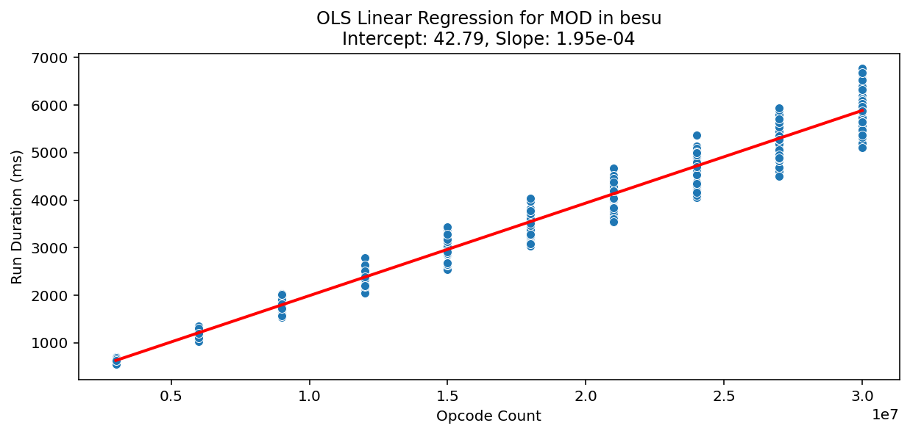

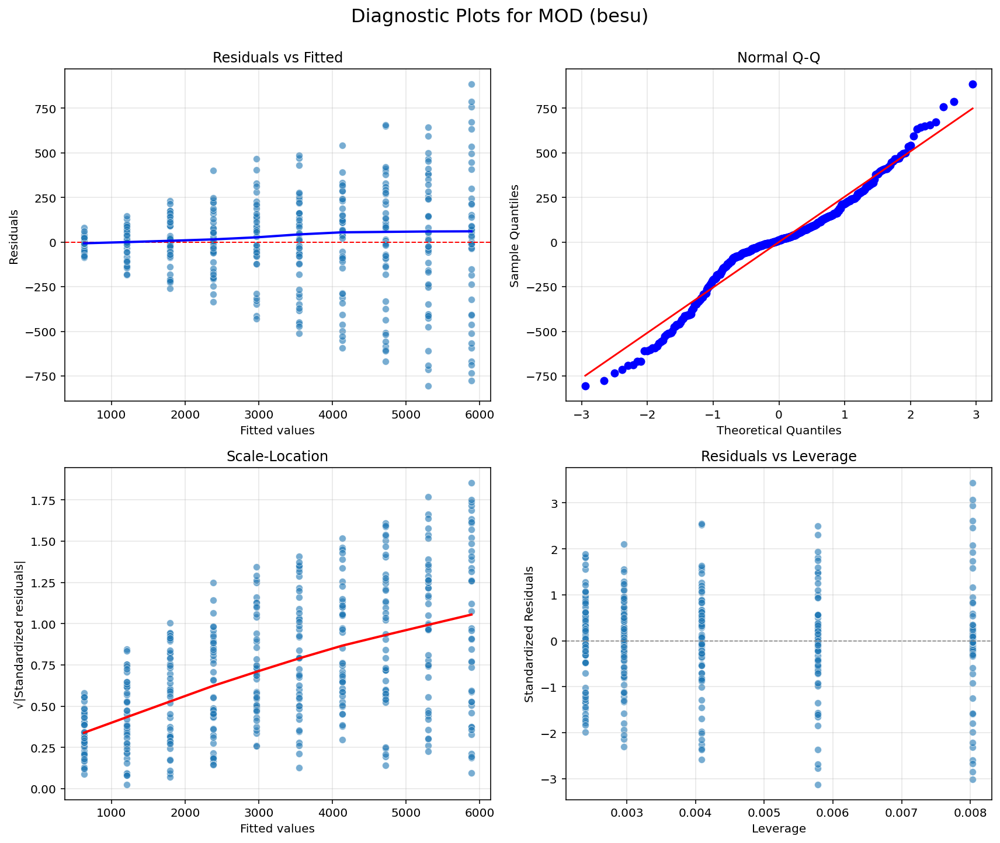


## reth


```python
                            OLS Regression Results                            
==============================================================================
Dep. Variable:        run_duration_ms   R-squared:                       0.991
Model:                            OLS   Adj. R-squared:                  0.991
Method:                 Least Squares   F-statistic:                 3.445e+04
Date:                Wed, 28 Jan 2026   Prob (F-statistic):               0.00
Time:                        10:25:59   Log-Likelihood:                -1553.5
No. Observations:                 320   AIC:                             3111.
Df Residuals:                     318   BIC:                             3119.
Df Model:                           1                                         
Covariance Type:            nonrobust                                         
==============================================================================
                 coef    std err          t      P>|t|      [0.025      0.975]
------------------------------------------------------------------------------
const         34.6663      3.762      9.214      0.000      27.264      42.069
opcount     3.751e-05   2.02e-07    185.594      0.000    3.71e-05    3.79e-05
==============================================================================
Omnibus:                       70.434   Durbin-Watson:                   0.997
Prob(Omnibus):                  0.000   Jarque-Bera (JB):              150.029
Skew:                          -1.113   Prob(JB):                     2.64e-33
Kurtosis:                       5.509   Cond. No.                     4.02e+07
==============================================================================

Notes:
[1] Standard Errors assume that the covariance matrix of the errors is correctly specified.
[2] The condition number is large, 4.02e+07. This might indicate that there are
strong multicollinearity or other numerical problems.
```

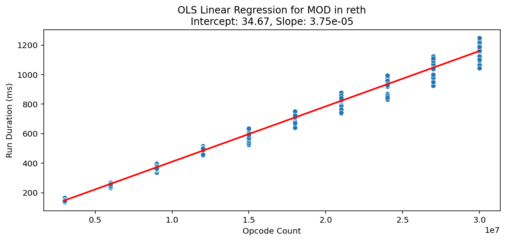

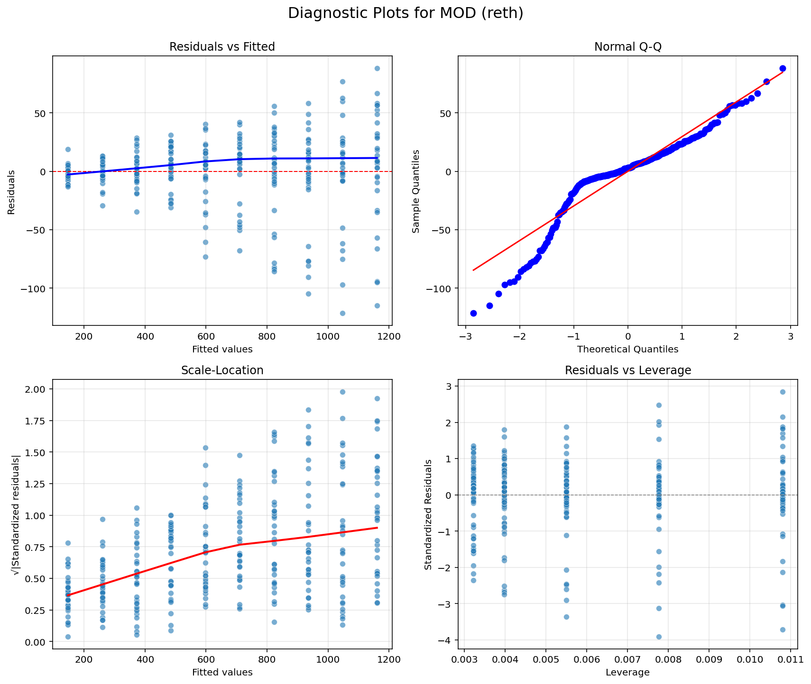


## nethermind


```python
                            OLS Regression Results                            
==============================================================================
Dep. Variable:        run_duration_ms   R-squared:                       0.990
Model:                            OLS   Adj. R-squared:                  0.990
Method:                 Least Squares   F-statistic:                 4.251e+04
Date:                Wed, 28 Jan 2026   Prob (F-statistic):               0.00
Time:                        10:25:59   Log-Likelihood:                -2198.1
No. Observations:                 430   AIC:                             4400.
Df Residuals:                     428   BIC:                             4408.
Df Model:                           1                                         
Covariance Type:            nonrobust                                         
==============================================================================
                 coef    std err          t      P>|t|      [0.025      0.975]
------------------------------------------------------------------------------
const         30.1414      4.193      7.188      0.000      21.899      38.383
opcount     4.645e-05   2.25e-07    206.191      0.000     4.6e-05    4.69e-05
==============================================================================
Omnibus:                      122.108   Durbin-Watson:                   0.872
Prob(Omnibus):                  0.000   Jarque-Bera (JB):              403.792
Skew:                          -1.281   Prob(JB):                     2.08e-88
Kurtosis:                       6.997   Cond. No.                     4.02e+07
==============================================================================

Notes:
[1] Standard Errors assume that the covariance matrix of the errors is correctly specified.
[2] The condition number is large, 4.02e+07. This might indicate that there are
strong multicollinearity or other numerical problems.
```

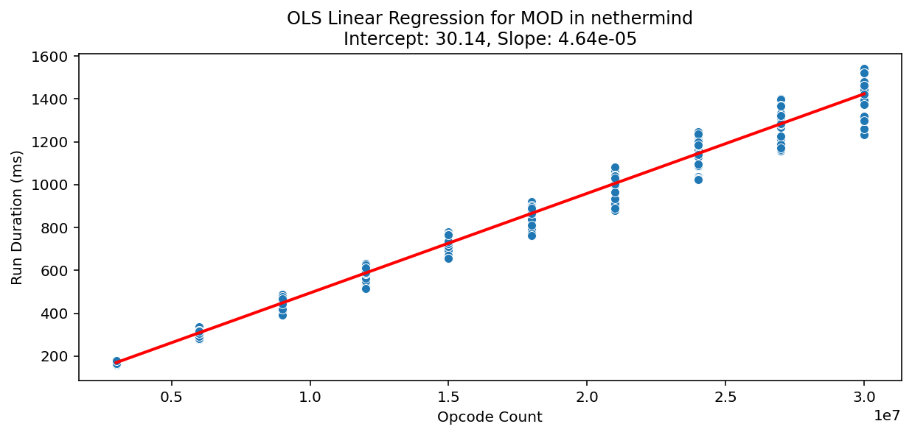

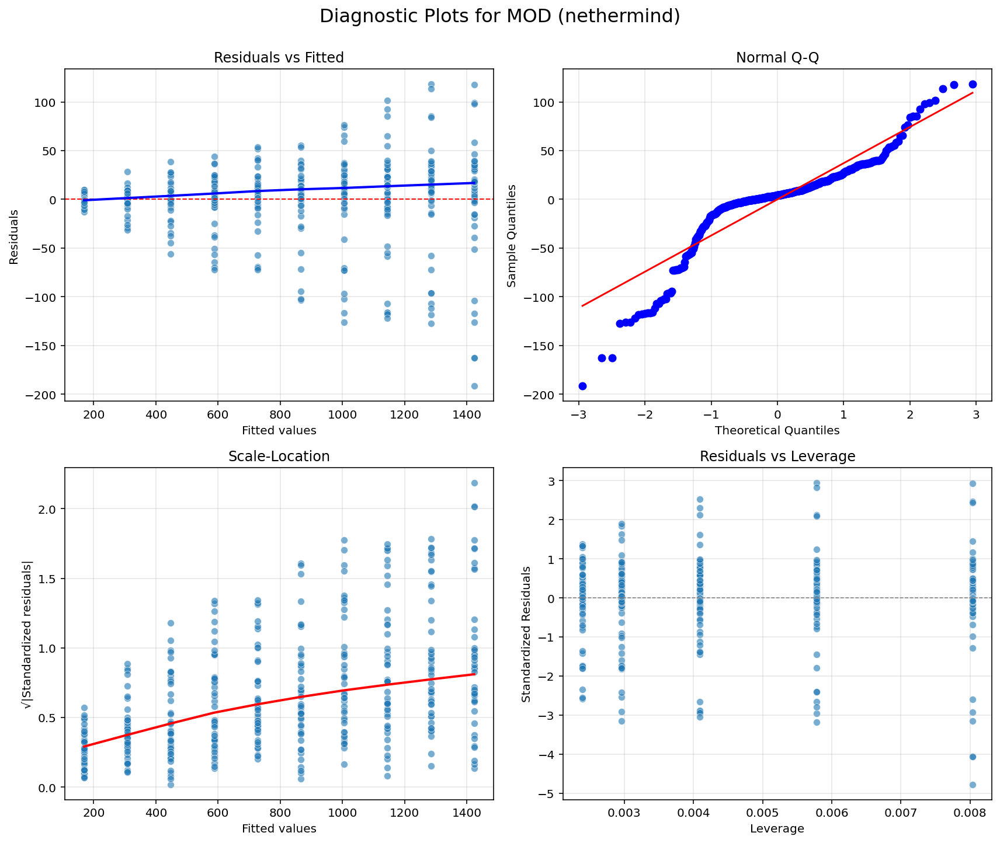


## erigon


```python
                            OLS Regression Results                            
==============================================================================
Dep. Variable:        run_duration_ms   R-squared:                       0.996
Model:                            OLS   Adj. R-squared:                  0.996
Method:                 Least Squares   F-statistic:                     7094.
Date:                Wed, 28 Jan 2026   Prob (F-statistic):           3.16e-35
Time:                        10:26:00   Log-Likelihood:                -144.78
No. Observations:                  30   AIC:                             293.6
Df Residuals:                      28   BIC:                             296.4
Df Model:                           1                                         
Covariance Type:            nonrobust                                         
==============================================================================
                 coef    std err          t      P>|t|      [0.025      0.975]
------------------------------------------------------------------------------
const         39.0732     12.320      3.171      0.004      13.836      64.310
opcount     5.575e-05   6.62e-07     84.225      0.000    5.44e-05    5.71e-05
==============================================================================
Omnibus:                       16.793   Durbin-Watson:                   2.001
Prob(Omnibus):                  0.000   Jarque-Bera (JB):               21.058
Skew:                           1.410   Prob(JB):                     2.68e-05
Kurtosis:                       5.982   Cond. No.                     4.02e+07
==============================================================================

Notes:
[1] Standard Errors assume that the covariance matrix of the errors is correctly specified.
[2] The condition number is large, 4.02e+07. This might indicate that there are
strong multicollinearity or other numerical problems.
```

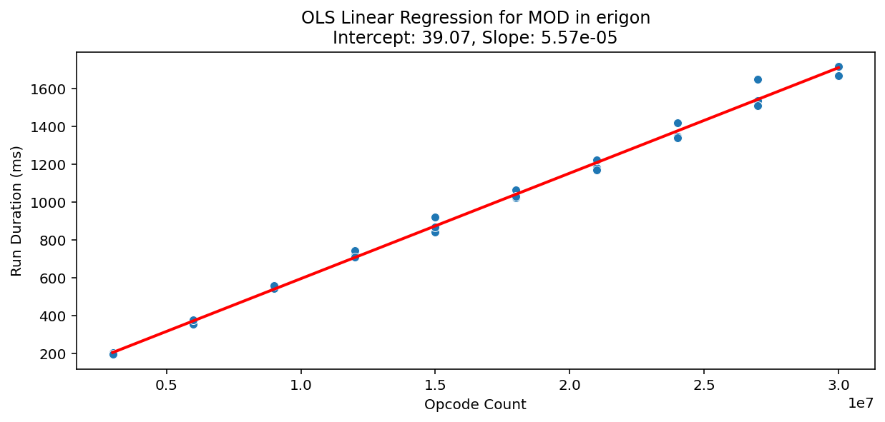

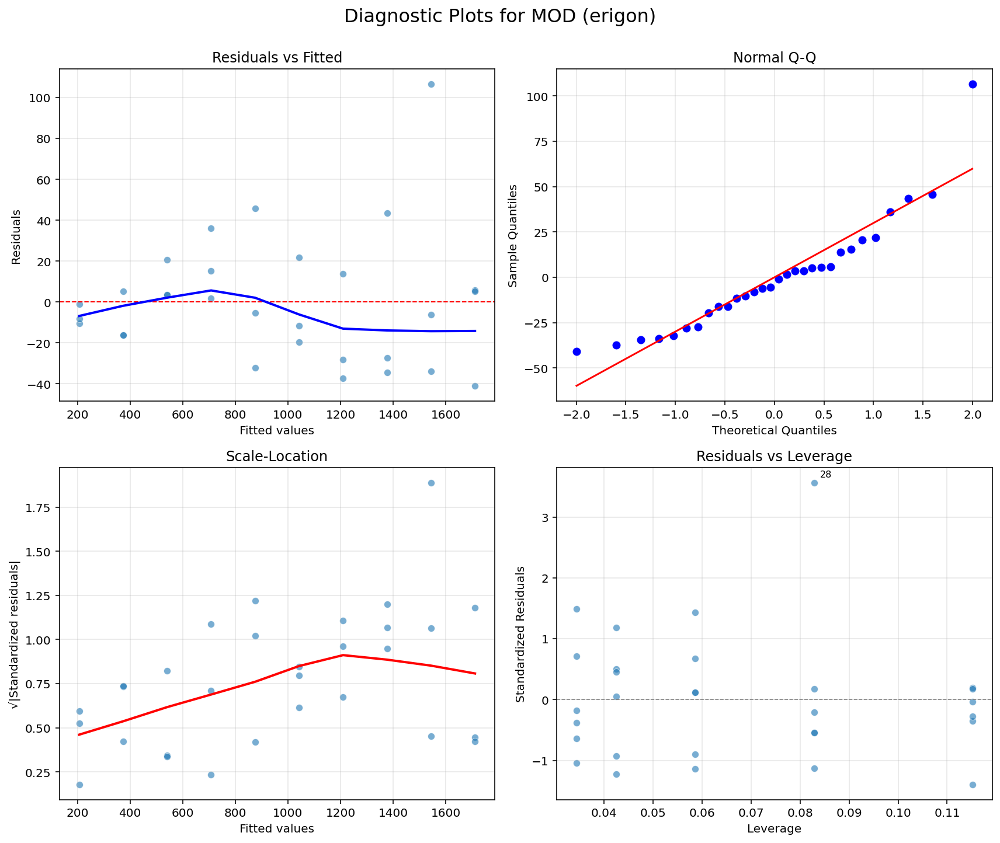


# SMOD

## geth


```python
                            OLS Regression Results                            
==============================================================================
Dep. Variable:        run_duration_ms   R-squared:                       0.958
Model:                            OLS   Adj. R-squared:                  0.958
Method:                 Least Squares   F-statistic:                     9780.
Date:                Wed, 28 Jan 2026   Prob (F-statistic):          6.42e-297
Time:                        10:26:00   Log-Likelihood:                -2327.9
No. Observations:                 430   AIC:                             4660.
Df Residuals:                     428   BIC:                             4668.
Df Model:                           1                                         
Covariance Type:            nonrobust                                         
==============================================================================
                 coef    std err          t      P>|t|      [0.025      0.975]
------------------------------------------------------------------------------
const         33.3730      5.671      5.885      0.000      22.226      44.520
opcount     3.013e-05   3.05e-07     98.896      0.000    2.95e-05    3.07e-05
==============================================================================
Omnibus:                      676.763   Durbin-Watson:                   1.411
Prob(Omnibus):                  0.000   Jarque-Bera (JB):           263799.576
Skew:                           8.500   Prob(JB):                         0.00
Kurtosis:                     123.144   Cond. No.                     4.02e+07
==============================================================================

Notes:
[1] Standard Errors assume that the covariance matrix of the errors is correctly specified.
[2] The condition number is large, 4.02e+07. This might indicate that there are
strong multicollinearity or other numerical problems.
```


## besu


```python
                            OLS Regression Results                            
==============================================================================
Dep. Variable:        run_duration_ms   R-squared:                       0.984
Model:                            OLS   Adj. R-squared:                  0.984
Method:                 Least Squares   F-statistic:                 2.657e+04
Date:                Wed, 28 Jan 2026   Prob (F-statistic):               0.00
Time:                        10:26:00   Log-Likelihood:                -2244.5
No. Observations:                 430   AIC:                             4493.
Df Residuals:                     428   BIC:                             4501.
Df Model:                           1                                         
Covariance Type:            nonrobust                                         
==============================================================================
                 coef    std err          t      P>|t|      [0.025      0.975]
------------------------------------------------------------------------------
const         30.3917      4.671      6.506      0.000      21.210      39.573
opcount     4.091e-05   2.51e-07    163.001      0.000    4.04e-05    4.14e-05
==============================================================================
Omnibus:                       70.316   Durbin-Watson:                   0.664
Prob(Omnibus):                  0.000   Jarque-Bera (JB):              146.454
Skew:                          -0.881   Prob(JB):                     1.58e-32
Kurtosis:                       5.252   Cond. No.                     4.02e+07
==============================================================================

Notes:
[1] Standard Errors assume that the covariance matrix of the errors is correctly specified.
[2] The condition number is large, 4.02e+07. This might indicate that there are
strong multicollinearity or other numerical problems.
```


## reth


```python
                            OLS Regression Results                            
==============================================================================
Dep. Variable:        run_duration_ms   R-squared:                       0.986
Model:                            OLS   Adj. R-squared:                  0.986
Method:                 Least Squares   F-statistic:                 2.259e+04
Date:                Wed, 28 Jan 2026   Prob (F-statistic):          1.96e-297
Time:                        10:26:01   Log-Likelihood:                -1284.0
No. Observations:                 320   AIC:                             2572.
Df Residuals:                     318   BIC:                             2580.
Df Model:                           1                                         
Covariance Type:            nonrobust                                         
==============================================================================
                 coef    std err          t      P>|t|      [0.025      0.975]
------------------------------------------------------------------------------
const         31.8194      1.621     19.633      0.000      28.631      35.008
opcount     1.309e-05   8.71e-08    150.311      0.000    1.29e-05    1.33e-05
==============================================================================
Omnibus:                       33.457   Durbin-Watson:                   1.079
Prob(Omnibus):                  0.000   Jarque-Bera (JB):               85.936
Skew:                          -0.482   Prob(JB):                     2.18e-19
Kurtosis:                       5.349   Cond. No.                     4.02e+07
==============================================================================

Notes:
[1] Standard Errors assume that the covariance matrix of the errors is correctly specified.
[2] The condition number is large, 4.02e+07. This might indicate that there are
strong multicollinearity or other numerical problems.
```


## nethermind


```python
                            OLS Regression Results                            
==============================================================================
Dep. Variable:        run_duration_ms   R-squared:                       0.985
Model:                            OLS   Adj. R-squared:                  0.985
Method:                 Least Squares   F-statistic:                 2.825e+04
Date:                Wed, 28 Jan 2026   Prob (F-statistic):               0.00
Time:                        10:26:01   Log-Likelihood:                -1825.3
No. Observations:                 430   AIC:                             3655.
Df Residuals:                     428   BIC:                             3663.
Df Model:                           1                                         
Covariance Type:            nonrobust                                         
==============================================================================
                 coef    std err          t      P>|t|      [0.025      0.975]
------------------------------------------------------------------------------
const         30.3208      1.762     17.207      0.000      26.857      33.784
opcount     1.591e-05   9.47e-08    168.077      0.000    1.57e-05    1.61e-05
==============================================================================
Omnibus:                       61.123   Durbin-Watson:                   0.882
Prob(Omnibus):                  0.000   Jarque-Bera (JB):              495.640
Skew:                          -0.238   Prob(JB):                    2.36e-108
Kurtosis:                       8.238   Cond. No.                     4.02e+07
==============================================================================

Notes:
[1] Standard Errors assume that the covariance matrix of the errors is correctly specified.
[2] The condition number is large, 4.02e+07. This might indicate that there are
strong multicollinearity or other numerical problems.
```


## erigon


```python
                            OLS Regression Results                            
==============================================================================
Dep. Variable:        run_duration_ms   R-squared:                       0.993
Model:                            OLS   Adj. R-squared:                  0.992
Method:                 Least Squares   F-statistic:                     3781.
Date:                Wed, 28 Jan 2026   Prob (F-statistic):           2.02e-31
Time:                        10:26:01   Log-Likelihood:                -138.53
No. Observations:                  30   AIC:                             281.1
Df Residuals:                      28   BIC:                             283.9
Df Model:                           1                                         
Covariance Type:            nonrobust                                         
==============================================================================
                 coef    std err          t      P>|t|      [0.025      0.975]
------------------------------------------------------------------------------
const         22.2938     10.002      2.229      0.034       1.806      42.781
opcount     3.304e-05   5.37e-07     61.491      0.000    3.19e-05    3.41e-05
==============================================================================
Omnibus:                       58.725   Durbin-Watson:                   2.145
Prob(Omnibus):                  0.000   Jarque-Bera (JB):              463.777
Skew:                           4.002   Prob(JB):                    1.96e-101
Kurtosis:                      20.520   Cond. No.                     4.02e+07
==============================================================================

Notes:
[1] Standard Errors assume that the covariance matrix of the errors is correctly specified.
[2] The condition number is large, 4.02e+07. This might indicate that there are
strong multicollinearity or other numerical problems.
```


# DIV

## geth


```python
                            OLS Regression Results                            
==============================================================================
Dep. Variable:        run_duration_ms   R-squared:                       0.986
Model:                            OLS   Adj. R-squared:                  0.986
Method:                 Least Squares   F-statistic:                 3.096e+04
Date:                Wed, 28 Jan 2026   Prob (F-statistic):               0.00
Time:                        10:26:01   Log-Likelihood:                -2440.0
No. Observations:                 430   AIC:                             4884.
Df Residuals:                     428   BIC:                             4892.
Df Model:                           1                                         
Covariance Type:            nonrobust                                         
==============================================================================
                 coef    std err          t      P>|t|      [0.025      0.975]
------------------------------------------------------------------------------
const         31.4015      7.360      4.266      0.000      16.935      45.868
opcount     6.957e-05   3.95e-07    175.955      0.000    6.88e-05    7.04e-05
==============================================================================
Omnibus:                       66.379   Durbin-Watson:                   0.888
Prob(Omnibus):                  0.000   Jarque-Bera (JB):              278.207
Skew:                          -0.597   Prob(JB):                     3.87e-61
Kurtosis:                       6.755   Cond. No.                     4.02e+07
==============================================================================

Notes:
[1] Standard Errors assume that the covariance matrix of the errors is correctly specified.
[2] The condition number is large, 4.02e+07. This might indicate that there are
strong multicollinearity or other numerical problems.
```

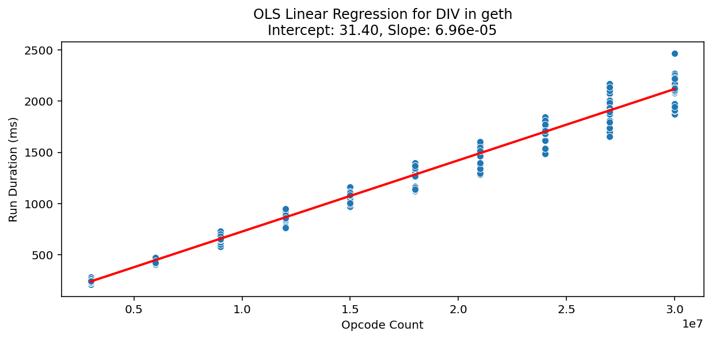

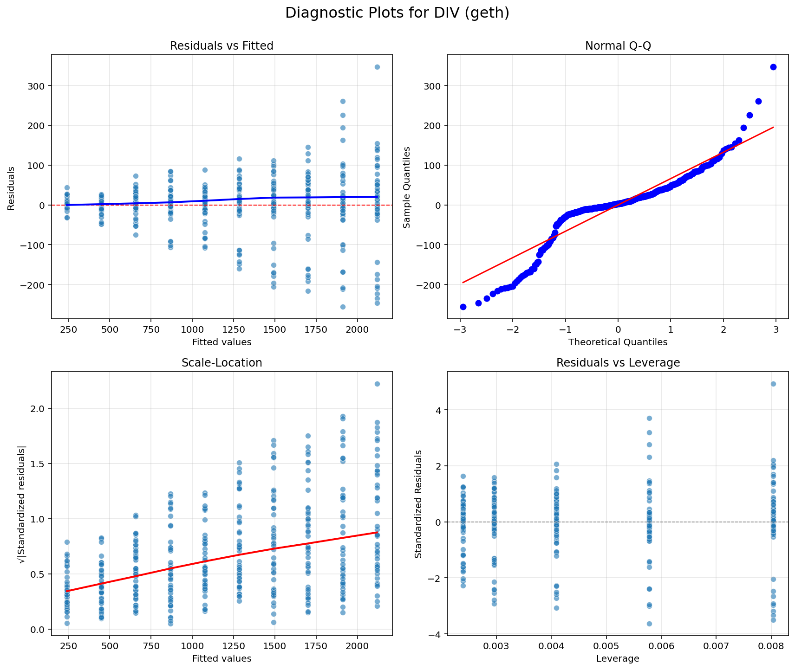


## besu


```python
                            OLS Regression Results                            
==============================================================================
Dep. Variable:        run_duration_ms   R-squared:                       0.969
Model:                            OLS   Adj. R-squared:                  0.969
Method:                 Least Squares   F-statistic:                 1.323e+04
Date:                Wed, 28 Jan 2026   Prob (F-statistic):          4.94e-324
Time:                        10:26:02   Log-Likelihood:                -3161.4
No. Observations:                 430   AIC:                             6327.
Df Residuals:                     428   BIC:                             6335.
Df Model:                           1                                         
Covariance Type:            nonrobust                                         
==============================================================================
                 coef    std err          t      P>|t|      [0.025      0.975]
------------------------------------------------------------------------------
const         41.3458     39.402      1.049      0.295     -36.099     118.791
opcount        0.0002   2.12e-06    115.012      0.000       0.000       0.000
==============================================================================
Omnibus:                       25.611   Durbin-Watson:                   0.750
Prob(Omnibus):                  0.000   Jarque-Bera (JB):               34.548
Skew:                           0.482   Prob(JB):                     3.15e-08
Kurtosis:                       3.999   Cond. No.                     4.02e+07
==============================================================================

Notes:
[1] Standard Errors assume that the covariance matrix of the errors is correctly specified.
[2] The condition number is large, 4.02e+07. This might indicate that there are
strong multicollinearity or other numerical problems.
```

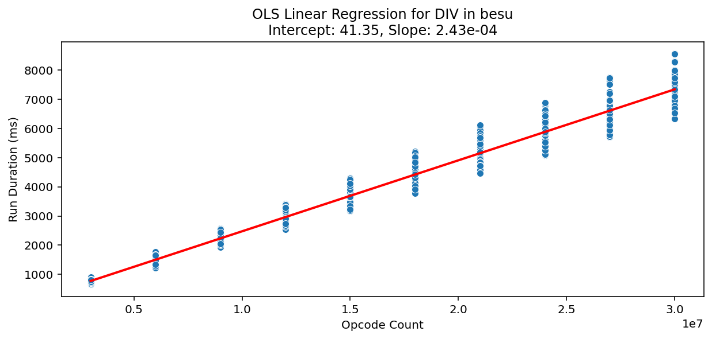

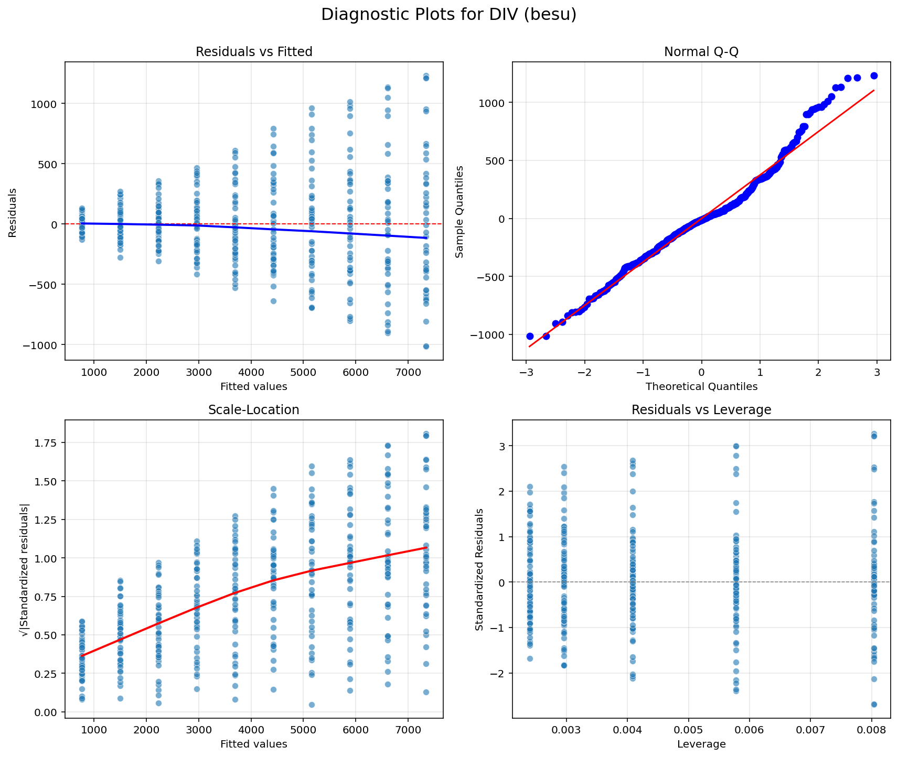


## reth


```python
                            OLS Regression Results                            
==============================================================================
Dep. Variable:        run_duration_ms   R-squared:                       0.991
Model:                            OLS   Adj. R-squared:                  0.991
Method:                 Least Squares   F-statistic:                 3.471e+04
Date:                Wed, 28 Jan 2026   Prob (F-statistic):               0.00
Time:                        10:26:02   Log-Likelihood:                -1664.6
No. Observations:                 320   AIC:                             3333.
Df Residuals:                     318   BIC:                             3341.
Df Model:                           1                                         
Covariance Type:            nonrobust                                         
==============================================================================
                 coef    std err          t      P>|t|      [0.025      0.975]
------------------------------------------------------------------------------
const         33.6486      5.324      6.320      0.000      23.174      44.123
opcount     5.328e-05   2.86e-07    186.302      0.000    5.27e-05    5.38e-05
==============================================================================
Omnibus:                      101.415   Durbin-Watson:                   0.976
Prob(Omnibus):                  0.000   Jarque-Bera (JB):              305.513
Skew:                          -1.427   Prob(JB):                     4.56e-67
Kurtosis:                       6.843   Cond. No.                     4.02e+07
==============================================================================

Notes:
[1] Standard Errors assume that the covariance matrix of the errors is correctly specified.
[2] The condition number is large, 4.02e+07. This might indicate that there are
strong multicollinearity or other numerical problems.
```

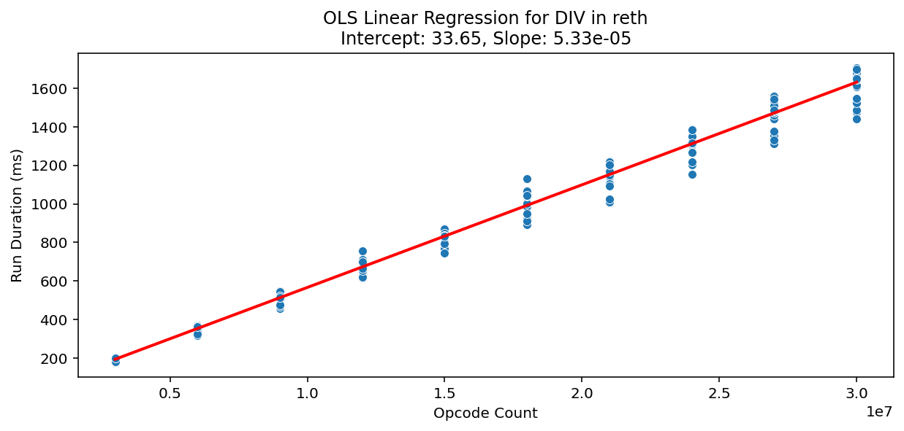

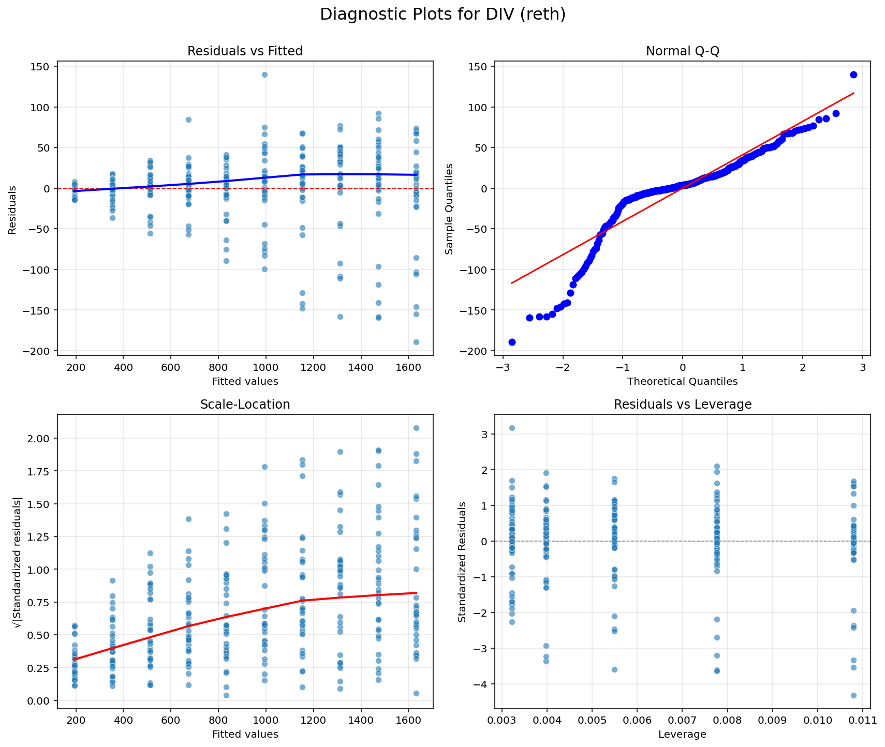


## nethermind


```python
                            OLS Regression Results                            
==============================================================================
Dep. Variable:        run_duration_ms   R-squared:                       0.986
Model:                            OLS   Adj. R-squared:                  0.986
Method:                 Least Squares   F-statistic:                 2.960e+04
Date:                Wed, 28 Jan 2026   Prob (F-statistic):               0.00
Time:                        10:26:02   Log-Likelihood:                -2403.4
No. Observations:                 430   AIC:                             4811.
Df Residuals:                     428   BIC:                             4819.
Df Model:                           1                                         
Covariance Type:            nonrobust                                         
==============================================================================
                 coef    std err          t      P>|t|      [0.025      0.975]
------------------------------------------------------------------------------
const         30.8596      6.760      4.565      0.000      17.574      44.146
opcount     6.247e-05   3.63e-07    172.040      0.000    6.18e-05    6.32e-05
==============================================================================
Omnibus:                       55.898   Durbin-Watson:                   0.754
Prob(Omnibus):                  0.000   Jarque-Bera (JB):              399.677
Skew:                          -0.218   Prob(JB):                     1.63e-87
Kurtosis:                       7.703   Cond. No.                     4.02e+07
==============================================================================

Notes:
[1] Standard Errors assume that the covariance matrix of the errors is correctly specified.
[2] The condition number is large, 4.02e+07. This might indicate that there are
strong multicollinearity or other numerical problems.
```

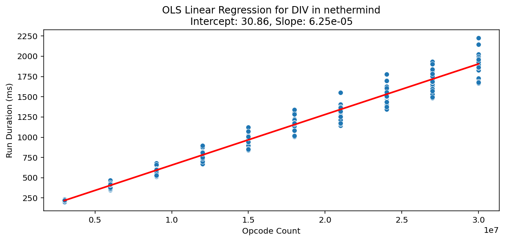

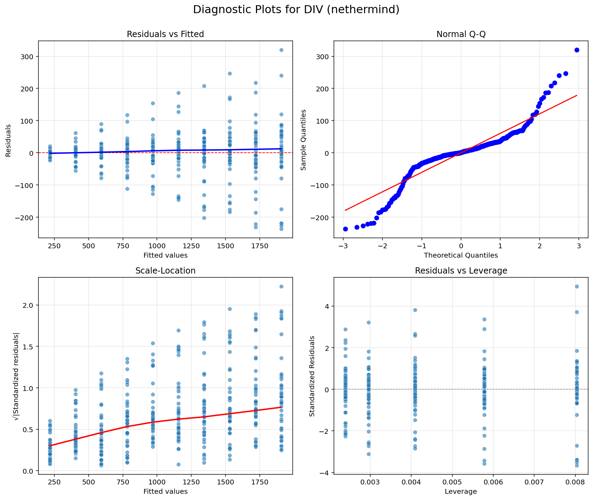


## erigon


```python
                            OLS Regression Results                            
==============================================================================
Dep. Variable:        run_duration_ms   R-squared:                       1.000
Model:                            OLS   Adj. R-squared:                  1.000
Method:                 Least Squares   F-statistic:                 1.150e+05
Date:                Wed, 28 Jan 2026   Prob (F-statistic):           3.82e-52
Time:                        10:26:02   Log-Likelihood:                -110.03
No. Observations:                  30   AIC:                             224.1
Df Residuals:                      28   BIC:                             226.9
Df Model:                           1                                         
Covariance Type:            nonrobust                                         
==============================================================================
                 coef    std err          t      P>|t|      [0.025      0.975]
------------------------------------------------------------------------------
const         33.7244      3.869      8.718      0.000      25.800      41.649
opcount     7.049e-05   2.08e-07    339.171      0.000    7.01e-05    7.09e-05
==============================================================================
Omnibus:                        3.682   Durbin-Watson:                   0.960
Prob(Omnibus):                  0.159   Jarque-Bera (JB):                2.756
Skew:                           0.095   Prob(JB):                        0.252
Kurtosis:                       4.473   Cond. No.                     4.02e+07
==============================================================================

Notes:
[1] Standard Errors assume that the covariance matrix of the errors is correctly specified.
[2] The condition number is large, 4.02e+07. This might indicate that there are
strong multicollinearity or other numerical problems.
```

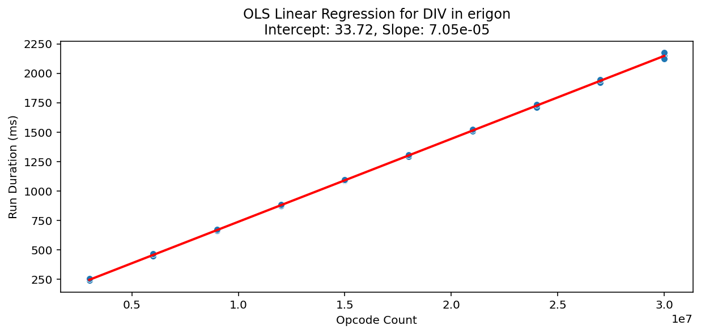

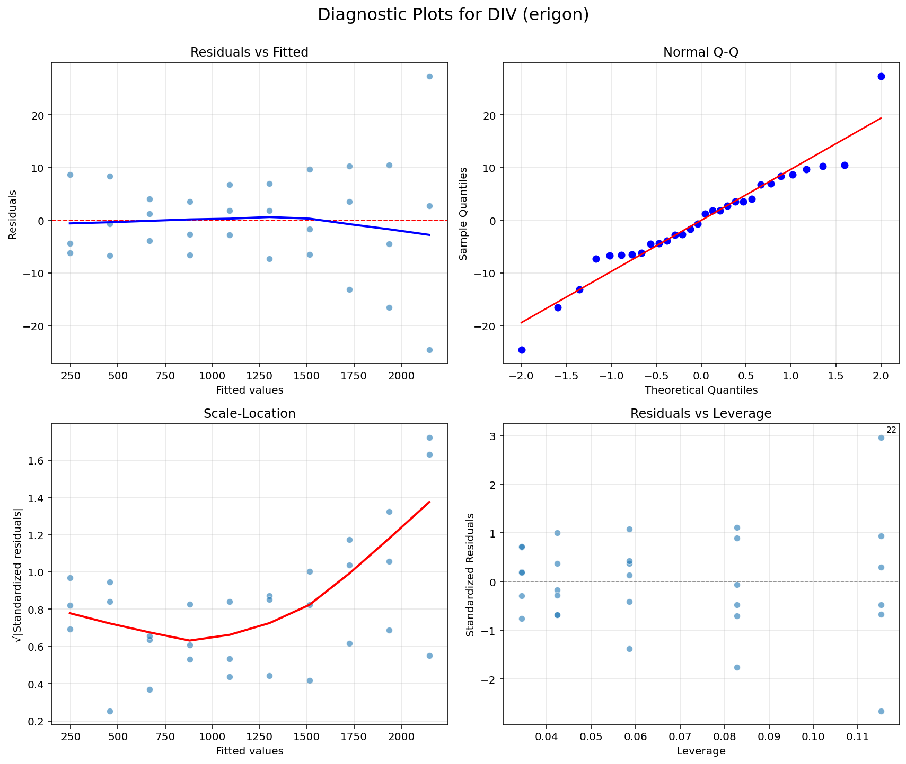


# SDIV

## geth


```python
                            OLS Regression Results                            
==============================================================================
Dep. Variable:        run_duration_ms   R-squared:                       0.988
Model:                            OLS   Adj. R-squared:                  0.988
Method:                 Least Squares   F-statistic:                 3.668e+04
Date:                Wed, 28 Jan 2026   Prob (F-statistic):               0.00
Time:                        10:26:03   Log-Likelihood:                -2427.9
No. Observations:                 430   AIC:                             4860.
Df Residuals:                     428   BIC:                             4868.
Df Model:                           1                                         
Covariance Type:            nonrobust                                         
==============================================================================
                 coef    std err          t      P>|t|      [0.025      0.975]
------------------------------------------------------------------------------
const         28.0247      7.157      3.916      0.000      13.958      42.091
opcount     7.364e-05   3.84e-07    191.523      0.000    7.29e-05    7.44e-05
==============================================================================
Omnibus:                      153.267   Durbin-Watson:                   1.057
Prob(Omnibus):                  0.000   Jarque-Bera (JB):             3654.401
Skew:                           0.939   Prob(JB):                         0.00
Kurtosis:                      17.158   Cond. No.                     4.02e+07
==============================================================================

Notes:
[1] Standard Errors assume that the covariance matrix of the errors is correctly specified.
[2] The condition number is large, 4.02e+07. This might indicate that there are
strong multicollinearity or other numerical problems.
```

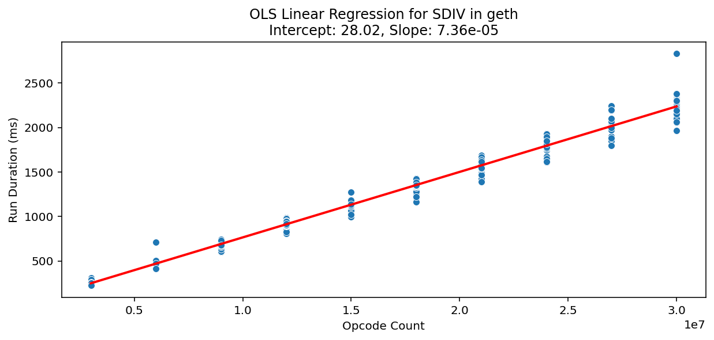

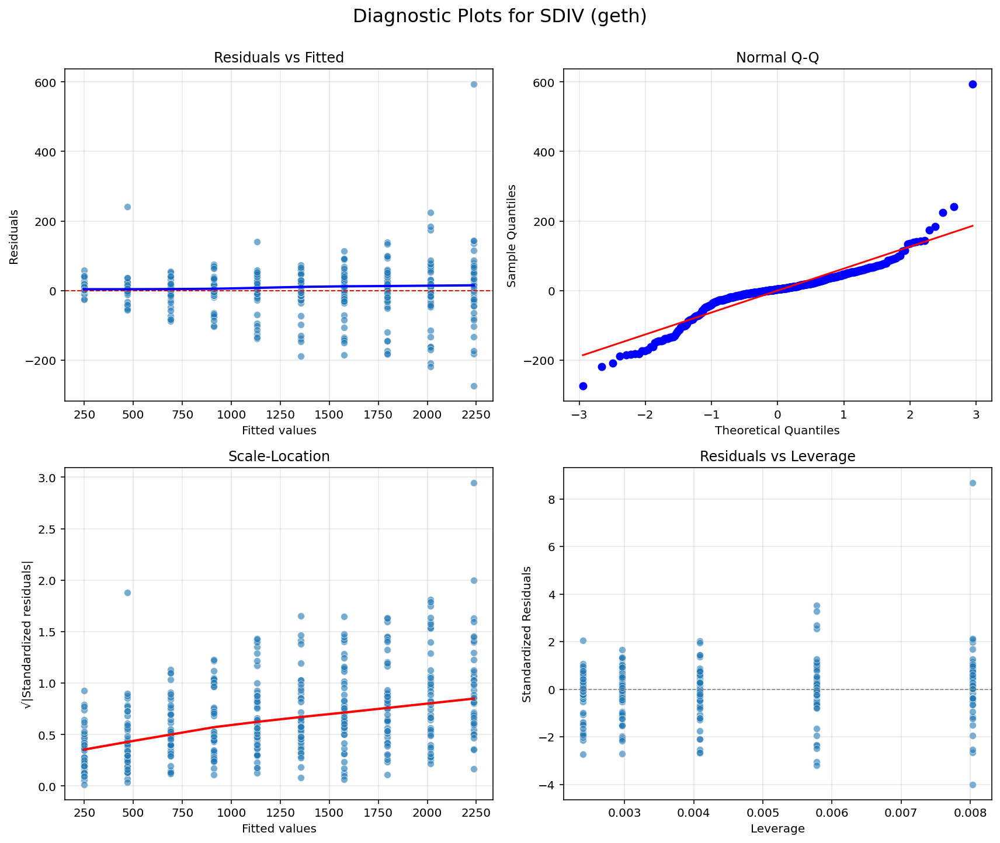


## besu


```python
                            OLS Regression Results                            
==============================================================================
Dep. Variable:        run_duration_ms   R-squared:                       0.971
Model:                            OLS   Adj. R-squared:                  0.971
Method:                 Least Squares   F-statistic:                 1.435e+04
Date:                Wed, 28 Jan 2026   Prob (F-statistic):               0.00
Time:                        10:26:03   Log-Likelihood:                -3267.6
No. Observations:                 430   AIC:                             6539.
Df Residuals:                     428   BIC:                             6547.
Df Model:                           1                                         
Covariance Type:            nonrobust                                         
==============================================================================
                 coef    std err          t      P>|t|      [0.025      0.975]
------------------------------------------------------------------------------
const         26.4209     50.443      0.524      0.601     -72.726     125.568
opcount        0.0003   2.71e-06    119.811      0.000       0.000       0.000
==============================================================================
Omnibus:                       22.756   Durbin-Watson:                   0.857
Prob(Omnibus):                  0.000   Jarque-Bera (JB):               63.457
Skew:                           0.123   Prob(JB):                     1.66e-14
Kurtosis:                       4.866   Cond. No.                     4.02e+07
==============================================================================

Notes:
[1] Standard Errors assume that the covariance matrix of the errors is correctly specified.
[2] The condition number is large, 4.02e+07. This might indicate that there are
strong multicollinearity or other numerical problems.
```

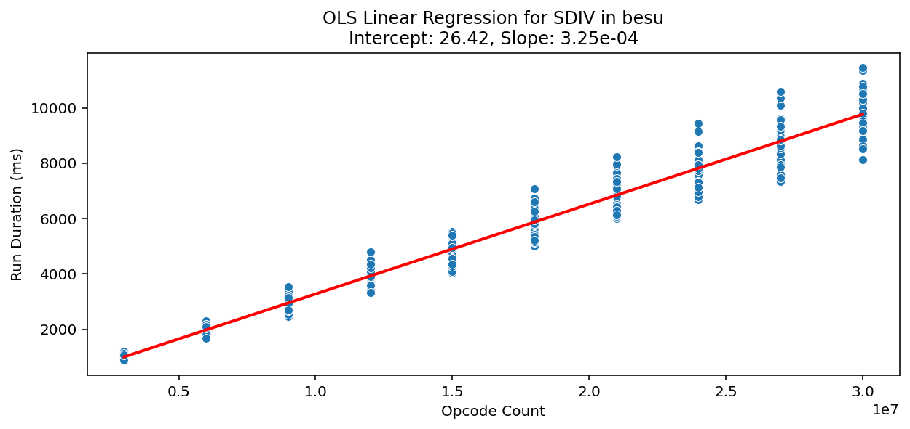

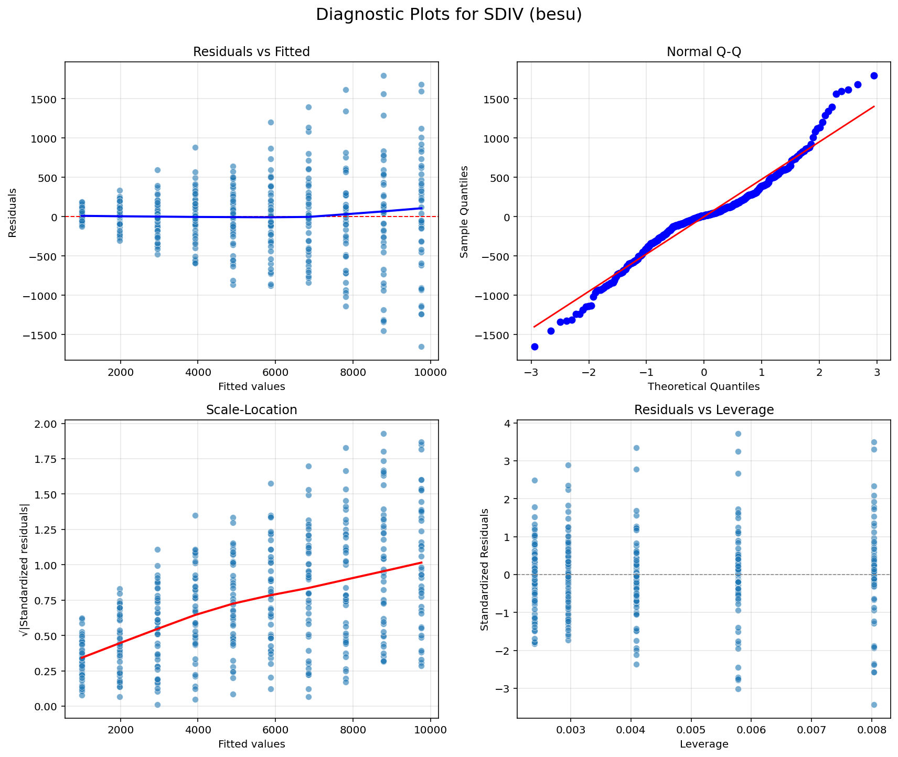


## reth


```python
                            OLS Regression Results                            
==============================================================================
Dep. Variable:        run_duration_ms   R-squared:                       0.990
Model:                            OLS   Adj. R-squared:                  0.990
Method:                 Least Squares   F-statistic:                 3.298e+04
Date:                Wed, 28 Jan 2026   Prob (F-statistic):          2.96e-323
Time:                        10:26:03   Log-Likelihood:                -1748.7
No. Observations:                 320   AIC:                             3501.
Df Residuals:                     318   BIC:                             3509.
Df Model:                           1                                         
Covariance Type:            nonrobust                                         
==============================================================================
                 coef    std err          t      P>|t|      [0.025      0.975]
------------------------------------------------------------------------------
const         31.4257      6.924      4.538      0.000      17.802      45.049
opcount     6.756e-05   3.72e-07    181.608      0.000    6.68e-05    6.83e-05
==============================================================================
Omnibus:                       90.354   Durbin-Watson:                   0.938
Prob(Omnibus):                  0.000   Jarque-Bera (JB):              209.160
Skew:                          -1.386   Prob(JB):                     3.81e-46
Kurtosis:                       5.830   Cond. No.                     4.02e+07
==============================================================================

Notes:
[1] Standard Errors assume that the covariance matrix of the errors is correctly specified.
[2] The condition number is large, 4.02e+07. This might indicate that there are
strong multicollinearity or other numerical problems.
```


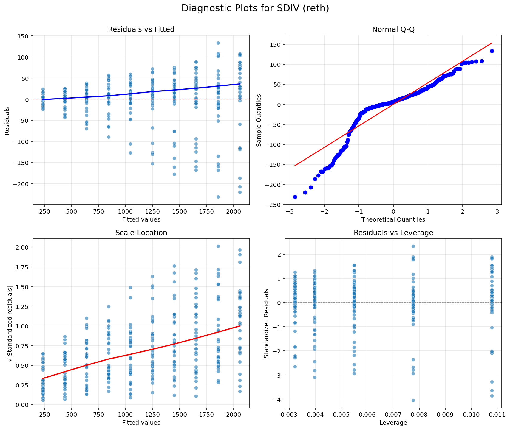


## nethermind


```python
                            OLS Regression Results                            
==============================================================================
Dep. Variable:        run_duration_ms   R-squared:                       0.977
Model:                            OLS   Adj. R-squared:                  0.977
Method:                 Least Squares   F-statistic:                 1.843e+04
Date:                Wed, 28 Jan 2026   Prob (F-statistic):               0.00
Time:                        10:26:04   Log-Likelihood:                -2624.0
No. Observations:                 430   AIC:                             5252.
Df Residuals:                     428   BIC:                             5260.
Df Model:                           1                                         
Covariance Type:            nonrobust                                         
==============================================================================
                 coef    std err          t      P>|t|      [0.025      0.975]
------------------------------------------------------------------------------
const         28.3499     11.290      2.511      0.012       6.158      50.541
opcount     8.233e-05   6.07e-07    135.745      0.000    8.11e-05    8.35e-05
==============================================================================
Omnibus:                       64.626   Durbin-Watson:                   0.994
Prob(Omnibus):                  0.000   Jarque-Bera (JB):              235.521
Skew:                           0.625   Prob(JB):                     7.20e-52
Kurtosis:                       6.403   Cond. No.                     4.02e+07
==============================================================================

Notes:
[1] Standard Errors assume that the covariance matrix of the errors is correctly specified.
[2] The condition number is large, 4.02e+07. This might indicate that there are
strong multicollinearity or other numerical problems.
```

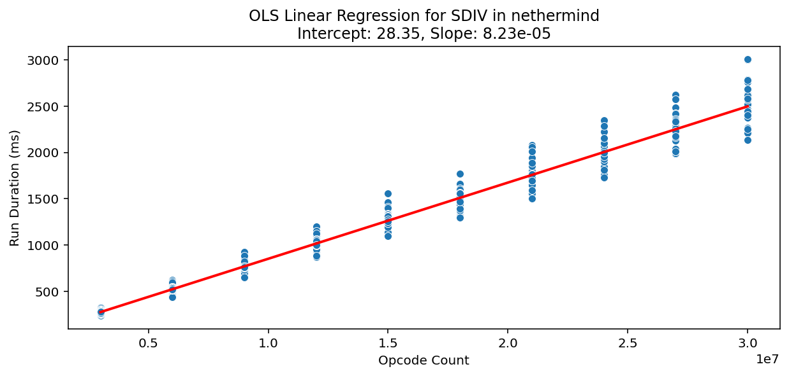


## erigon


```python
                            OLS Regression Results                            
==============================================================================
Dep. Variable:        run_duration_ms   R-squared:                       0.999
Model:                            OLS   Adj. R-squared:                  0.999
Method:                 Least Squares   F-statistic:                 4.002e+04
Date:                Wed, 28 Jan 2026   Prob (F-statistic):           9.95e-46
Time:                        10:26:04   Log-Likelihood:                -127.65
No. Observations:                  30   AIC:                             259.3
Df Residuals:                      28   BIC:                             262.1
Df Model:                           1                                         
Covariance Type:            nonrobust                                         
==============================================================================
                 coef    std err          t      P>|t|      [0.025      0.975]
------------------------------------------------------------------------------
const         32.0771      6.959      4.609      0.000      17.822      46.332
opcount     7.479e-05   3.74e-07    200.061      0.000     7.4e-05    7.56e-05
==============================================================================
Omnibus:                       12.918   Durbin-Watson:                   1.573
Prob(Omnibus):                  0.002   Jarque-Bera (JB):               12.622
Skew:                           1.289   Prob(JB):                      0.00182
Kurtosis:                       4.857   Cond. No.                     4.02e+07
==============================================================================

Notes:
[1] Standard Errors assume that the covariance matrix of the errors is correctly specified.
[2] The condition number is large, 4.02e+07. This might indicate that there are
strong multicollinearity or other numerical problems.
```

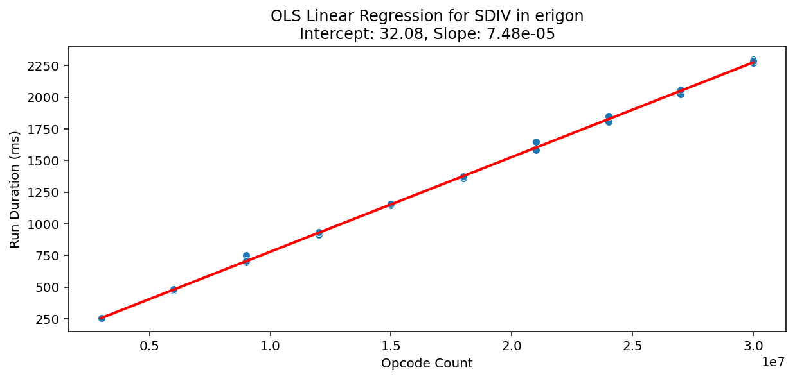

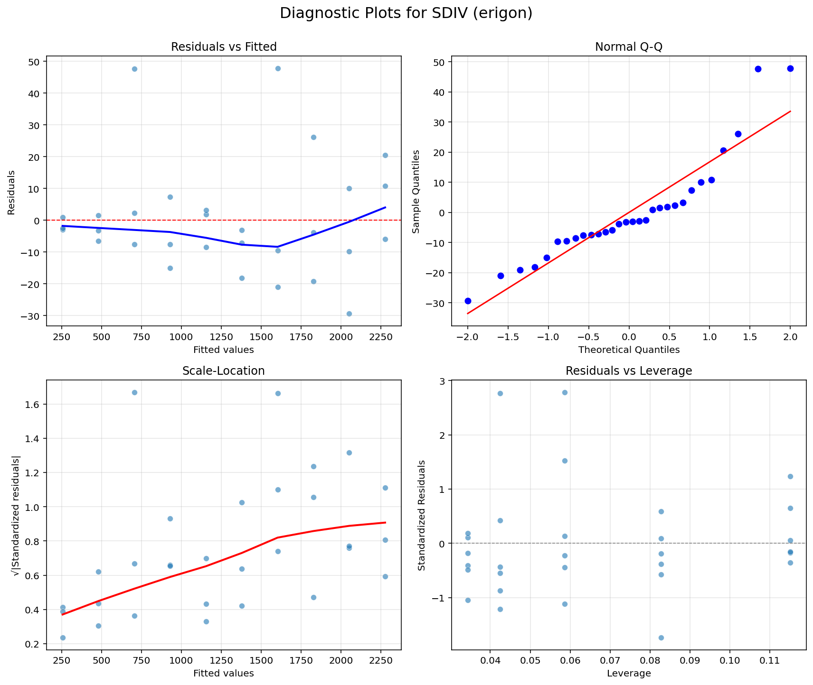


# POINT_EVALUATION

## geth


```python
                            OLS Regression Results                            
==============================================================================
Dep. Variable:        run_duration_ms   R-squared:                       0.992
Model:                            OLS   Adj. R-squared:                  0.992
Method:                 Least Squares   F-statistic:                 5.156e+04
Date:                Wed, 28 Jan 2026   Prob (F-statistic):               0.00
Time:                        10:26:04   Log-Likelihood:                -3173.6
No. Observations:                 430   AIC:                             6351.
Df Residuals:                     428   BIC:                             6359.
Df Model:                           1                                         
Covariance Type:            nonrobust                                         
==============================================================================
                 coef    std err          t      P>|t|      [0.025      0.975]
------------------------------------------------------------------------------
const         40.4320     40.535      0.997      0.319     -39.241     120.105
opcount        1.4835      0.007    227.077      0.000       1.471       1.496
==============================================================================
Omnibus:                      175.732   Durbin-Watson:                   0.645
Prob(Omnibus):                  0.000   Jarque-Bera (JB):              560.374
Skew:                          -1.945   Prob(JB):                    2.07e-122
Kurtosis:                       7.018   Cond. No.                     1.34e+04
==============================================================================

Notes:
[1] Standard Errors assume that the covariance matrix of the errors is correctly specified.
[2] The condition number is large, 1.34e+04. This might indicate that there are
strong multicollinearity or other numerical problems.
```

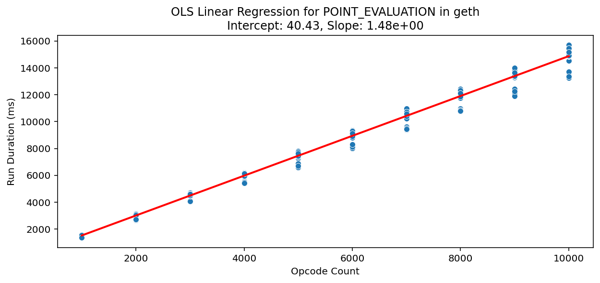

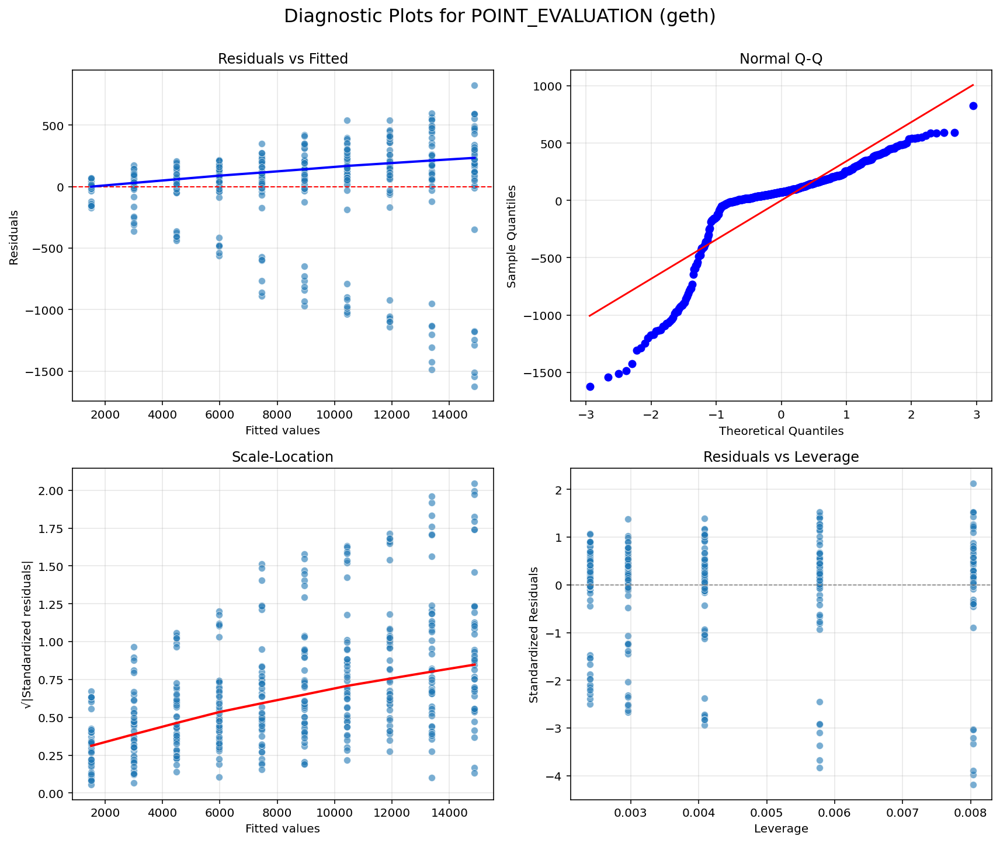


## besu


```python
                            OLS Regression Results                            
==============================================================================
Dep. Variable:        run_duration_ms   R-squared:                       0.991
Model:                            OLS   Adj. R-squared:                  0.991
Method:                 Least Squares   F-statistic:                 4.597e+04
Date:                Wed, 28 Jan 2026   Prob (F-statistic):               0.00
Time:                        10:26:04   Log-Likelihood:                -3198.6
No. Observations:                 430   AIC:                             6401.
Df Residuals:                     428   BIC:                             6409.
Df Model:                           1                                         
Covariance Type:            nonrobust                                         
==============================================================================
                 coef    std err          t      P>|t|      [0.025      0.975]
------------------------------------------------------------------------------
const         28.5453     42.958      0.664      0.507     -55.890     112.980
opcount        1.4843      0.007    214.398      0.000       1.471       1.498
==============================================================================
Omnibus:                      101.457   Durbin-Watson:                   0.665
Prob(Omnibus):                  0.000   Jarque-Bera (JB):              176.358
Skew:                          -1.394   Prob(JB):                     5.06e-39
Kurtosis:                       4.440   Cond. No.                     1.34e+04
==============================================================================

Notes:
[1] Standard Errors assume that the covariance matrix of the errors is correctly specified.
[2] The condition number is large, 1.34e+04. This might indicate that there are
strong multicollinearity or other numerical problems.
```

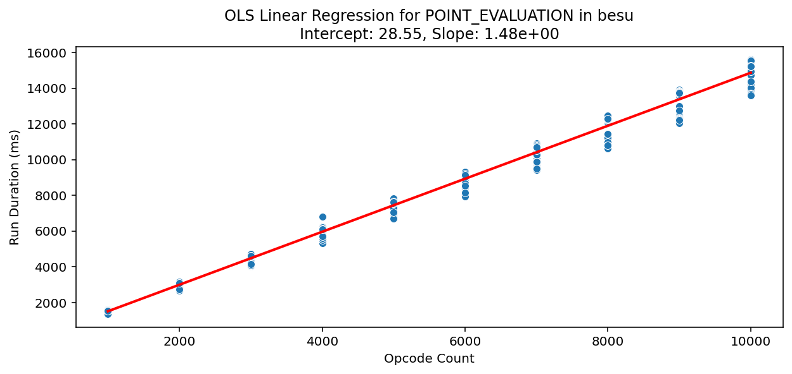

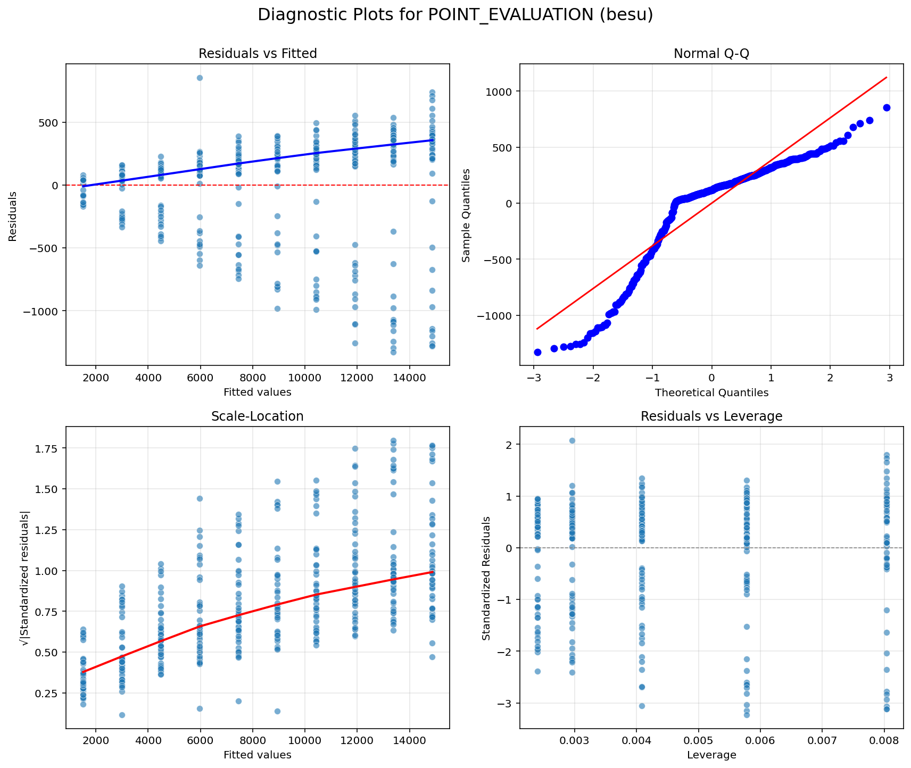


## reth


```python
                            OLS Regression Results                            
==============================================================================
Dep. Variable:        run_duration_ms   R-squared:                       0.993
Model:                            OLS   Adj. R-squared:                  0.993
Method:                 Least Squares   F-statistic:                 4.365e+04
Date:                Wed, 28 Jan 2026   Prob (F-statistic):               0.00
Time:                        10:26:05   Log-Likelihood:                -2341.4
No. Observations:                 320   AIC:                             4687.
Df Residuals:                     318   BIC:                             4694.
Df Model:                           1                                         
Covariance Type:            nonrobust                                         
==============================================================================
                 coef    std err          t      P>|t|      [0.025      0.975]
------------------------------------------------------------------------------
const         33.9425     44.135      0.769      0.442     -52.891     120.776
opcount        1.4861      0.007    208.923      0.000       1.472       1.500
==============================================================================
Omnibus:                      110.139   Durbin-Watson:                   0.731
Prob(Omnibus):                  0.000   Jarque-Bera (JB):              252.693
Skew:                          -1.739   Prob(JB):                     1.34e-55
Kurtosis:                       5.620   Cond. No.                     1.34e+04
==============================================================================

Notes:
[1] Standard Errors assume that the covariance matrix of the errors is correctly specified.
[2] The condition number is large, 1.34e+04. This might indicate that there are
strong multicollinearity or other numerical problems.
```

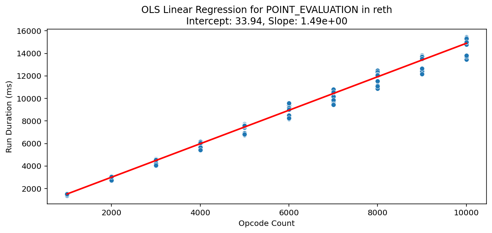

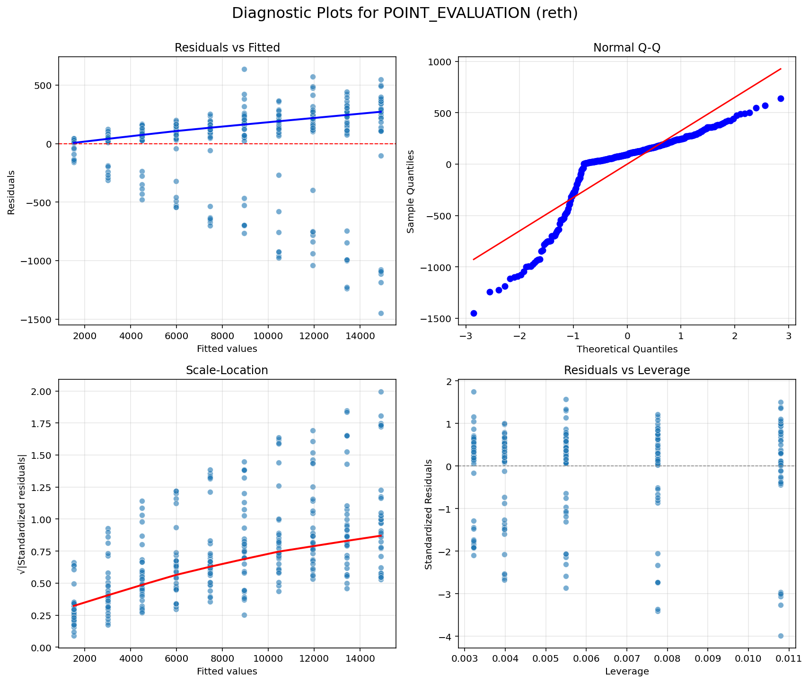


## nethermind


```python
                            OLS Regression Results                            
==============================================================================
Dep. Variable:        run_duration_ms   R-squared:                       0.992
Model:                            OLS   Adj. R-squared:                  0.992
Method:                 Least Squares   F-statistic:                 5.123e+04
Date:                Wed, 28 Jan 2026   Prob (F-statistic):               0.00
Time:                        10:26:05   Log-Likelihood:                -3176.7
No. Observations:                 430   AIC:                             6357.
Df Residuals:                     428   BIC:                             6366.
Df Model:                           1                                         
Covariance Type:            nonrobust                                         
==============================================================================
                 coef    std err          t      P>|t|      [0.025      0.975]
------------------------------------------------------------------------------
const         13.1322     40.830      0.322      0.748     -67.120      93.384
opcount        1.4894      0.007    226.337      0.000       1.476       1.502
==============================================================================
Omnibus:                      173.987   Durbin-Watson:                   0.673
Prob(Omnibus):                  0.000   Jarque-Bera (JB):              552.119
Skew:                          -1.925   Prob(JB):                    1.28e-120
Kurtosis:                       6.999   Cond. No.                     1.34e+04
==============================================================================

Notes:
[1] Standard Errors assume that the covariance matrix of the errors is correctly specified.
[2] The condition number is large, 1.34e+04. This might indicate that there are
strong multicollinearity or other numerical problems.
```

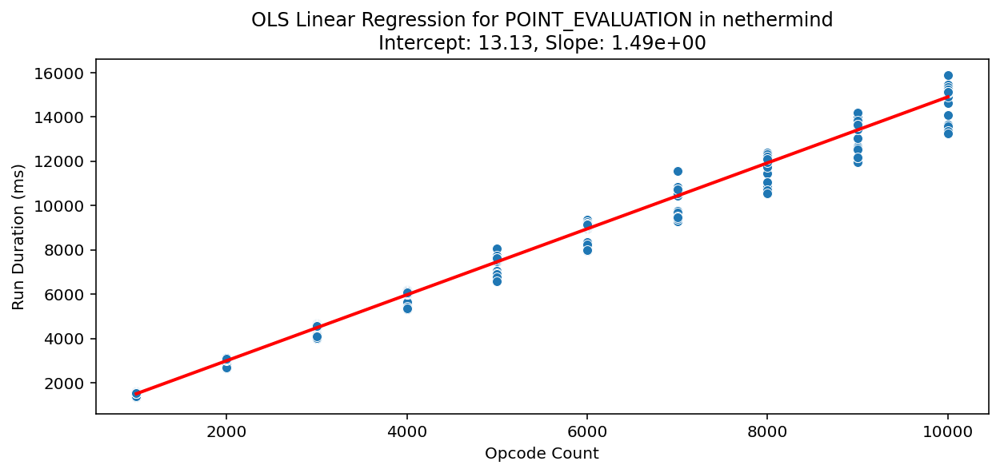

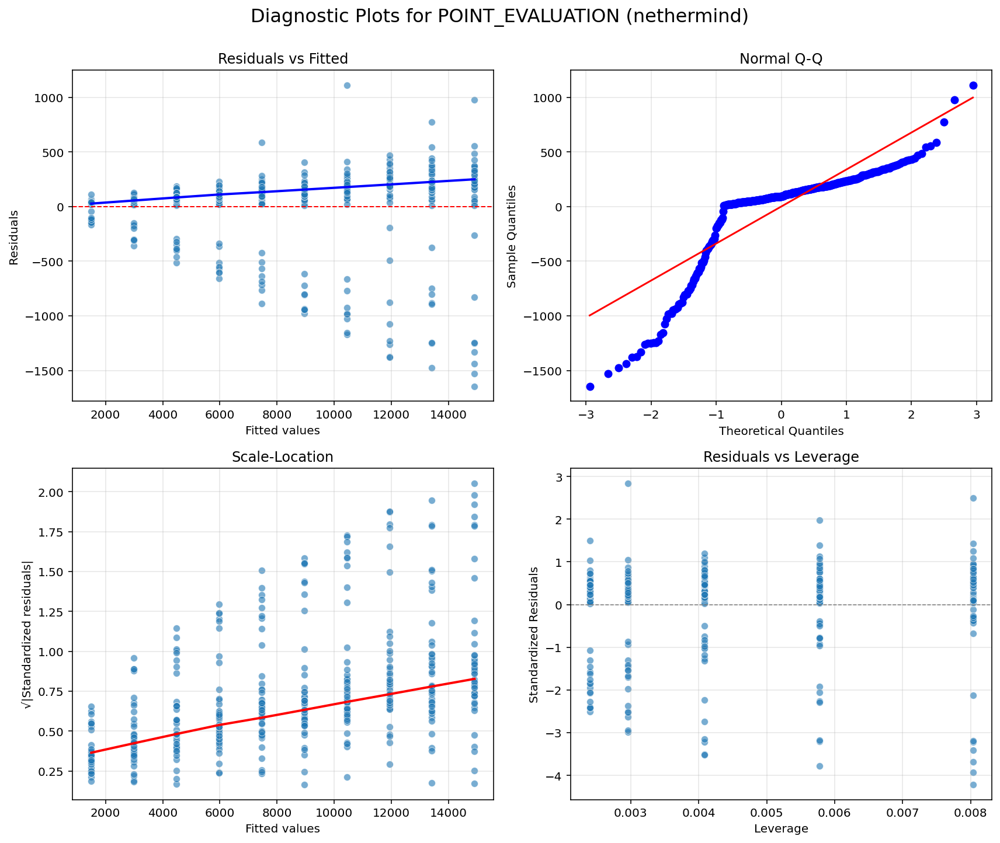


## erigon

OLS model did not run... Error: zero-size array to reduction operation maximum which has no identity

# BLS12_G1ADD

## geth


```python
                            OLS Regression Results                            
==============================================================================
Dep. Variable:        run_duration_ms   R-squared:                       0.992
Model:                            OLS   Adj. R-squared:                  0.992
Method:                 Least Squares   F-statistic:                 5.196e+04
Date:                Wed, 28 Jan 2026   Prob (F-statistic):               0.00
Time:                        10:26:05   Log-Likelihood:                -2417.4
No. Observations:                 430   AIC:                             4839.
Df Residuals:                     428   BIC:                             4847.
Df Model:                           1                                         
Covariance Type:            nonrobust                                         
==============================================================================
                 coef    std err          t      P>|t|      [0.025      0.975]
------------------------------------------------------------------------------
const         33.3366      6.984      4.773      0.000      19.608      47.065
opcount        0.0051   2.25e-05    227.956      0.000       0.005       0.005
==============================================================================
Omnibus:                       61.532   Durbin-Watson:                   1.115
Prob(Omnibus):                  0.000   Jarque-Bera (JB):              175.553
Skew:                          -0.672   Prob(JB):                     7.57e-39
Kurtosis:                       5.827   Cond. No.                     6.70e+05
==============================================================================

Notes:
[1] Standard Errors assume that the covariance matrix of the errors is correctly specified.
[2] The condition number is large, 6.7e+05. This might indicate that there are
strong multicollinearity or other numerical problems.
```

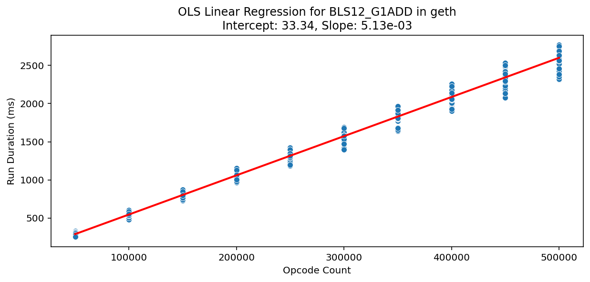

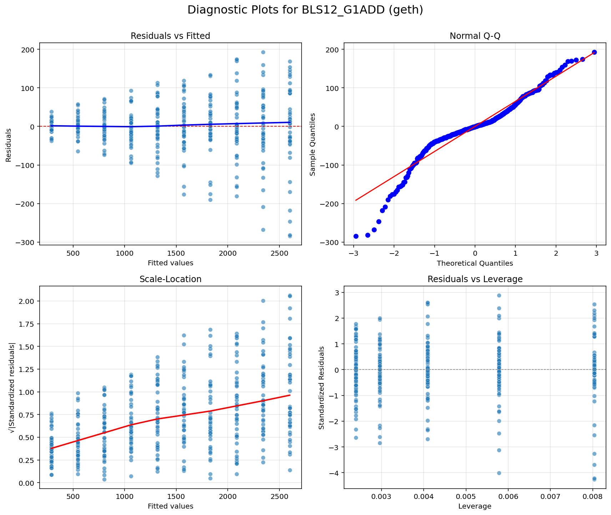


## besu


```python
                            OLS Regression Results                            
==============================================================================
Dep. Variable:        run_duration_ms   R-squared:                       0.943
Model:                            OLS   Adj. R-squared:                  0.943
Method:                 Least Squares   F-statistic:                     7134.
Date:                Wed, 28 Jan 2026   Prob (F-statistic):          4.94e-269
Time:                        10:26:05   Log-Likelihood:                -3160.4
No. Observations:                 430   AIC:                             6325.
Df Residuals:                     428   BIC:                             6333.
Df Model:                           1                                         
Covariance Type:            nonrobust                                         
==============================================================================
                 coef    std err          t      P>|t|      [0.025      0.975]
------------------------------------------------------------------------------
const          4.7707     39.314      0.121      0.903     -72.502      82.043
opcount        0.0107      0.000     84.466      0.000       0.010       0.011
==============================================================================
Omnibus:                        1.533   Durbin-Watson:                   1.519
Prob(Omnibus):                  0.465   Jarque-Bera (JB):                1.358
Skew:                           0.048   Prob(JB):                        0.507
Kurtosis:                       3.258   Cond. No.                     6.70e+05
==============================================================================

Notes:
[1] Standard Errors assume that the covariance matrix of the errors is correctly specified.
[2] The condition number is large, 6.7e+05. This might indicate that there are
strong multicollinearity or other numerical problems.
```

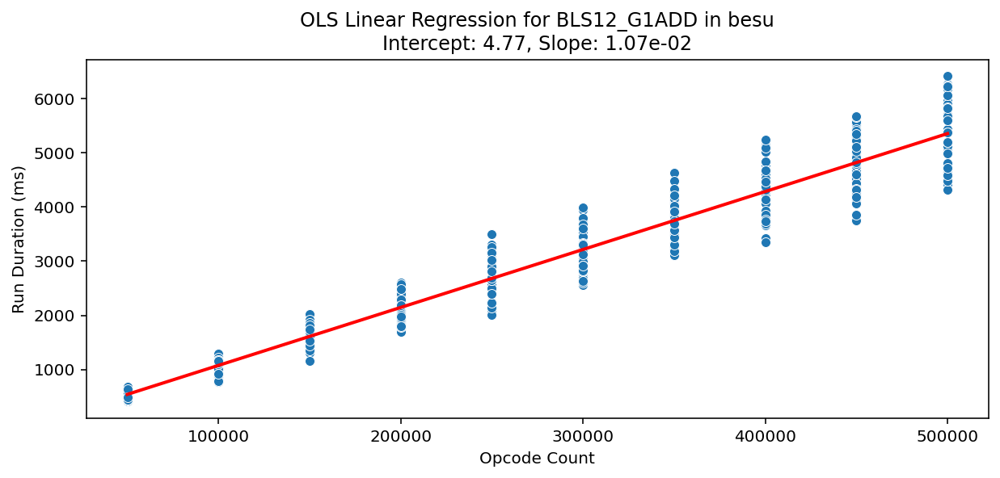

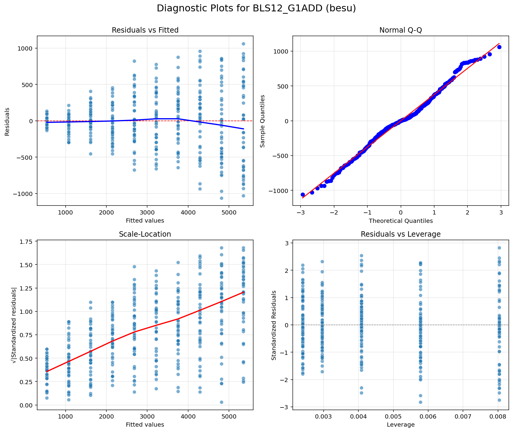


## reth


```python
                            OLS Regression Results                            
==============================================================================
Dep. Variable:        run_duration_ms   R-squared:                       0.990
Model:                            OLS   Adj. R-squared:                  0.990
Method:                 Least Squares   F-statistic:                 3.232e+04
Date:                Wed, 28 Jan 2026   Prob (F-statistic):          7.21e-322
Time:                        10:26:06   Log-Likelihood:                -1827.5
No. Observations:                 320   AIC:                             3659.
Df Residuals:                     318   BIC:                             3667.
Df Model:                           1                                         
Covariance Type:            nonrobust                                         
==============================================================================
                 coef    std err          t      P>|t|      [0.025      0.975]
------------------------------------------------------------------------------
const         32.8474      8.857      3.708      0.000      15.421      50.274
opcount        0.0051   2.85e-05    179.774      0.000       0.005       0.005
==============================================================================
Omnibus:                       34.408   Durbin-Watson:                   1.352
Prob(Omnibus):                  0.000   Jarque-Bera (JB):               60.704
Skew:                          -0.631   Prob(JB):                     6.58e-14
Kurtosis:                       4.721   Cond. No.                     6.70e+05
==============================================================================

Notes:
[1] Standard Errors assume that the covariance matrix of the errors is correctly specified.
[2] The condition number is large, 6.7e+05. This might indicate that there are
strong multicollinearity or other numerical problems.
```

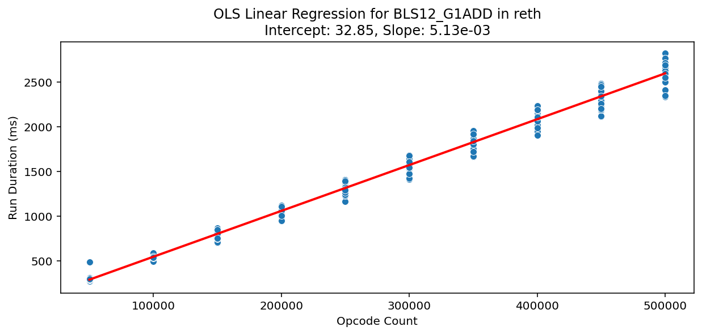

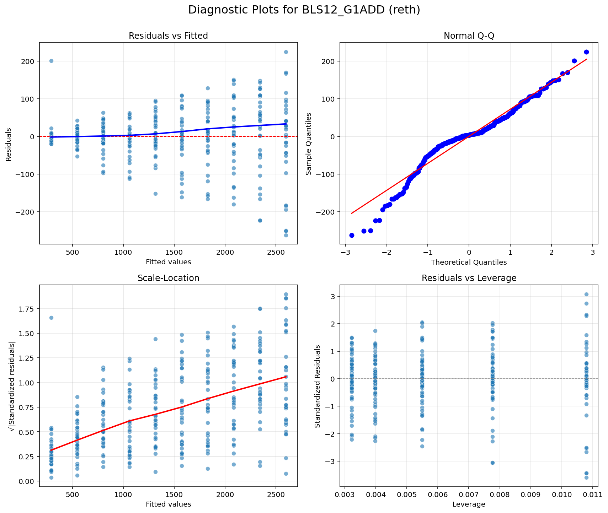


## nethermind


```python
                            OLS Regression Results                            
==============================================================================
Dep. Variable:        run_duration_ms   R-squared:                       0.986
Model:                            OLS   Adj. R-squared:                  0.986
Method:                 Least Squares   F-statistic:                 3.056e+04
Date:                Wed, 28 Jan 2026   Prob (F-statistic):               0.00
Time:                        10:26:06   Log-Likelihood:                -2592.1
No. Observations:                 430   AIC:                             5188.
Df Residuals:                     428   BIC:                             5196.
Df Model:                           1                                         
Covariance Type:            nonrobust                                         
==============================================================================
                 coef    std err          t      P>|t|      [0.025      0.975]
------------------------------------------------------------------------------
const         13.5899     10.484      1.296      0.196      -7.016      34.196
opcount        0.0059   3.38e-05    174.814      0.000       0.006       0.006
==============================================================================
Omnibus:                       81.348   Durbin-Watson:                   1.276
Prob(Omnibus):                  0.000   Jarque-Bera (JB):              269.448
Skew:                          -0.839   Prob(JB):                     3.09e-59
Kurtosis:                       6.496   Cond. No.                     6.70e+05
==============================================================================

Notes:
[1] Standard Errors assume that the covariance matrix of the errors is correctly specified.
[2] The condition number is large, 6.7e+05. This might indicate that there are
strong multicollinearity or other numerical problems.
```

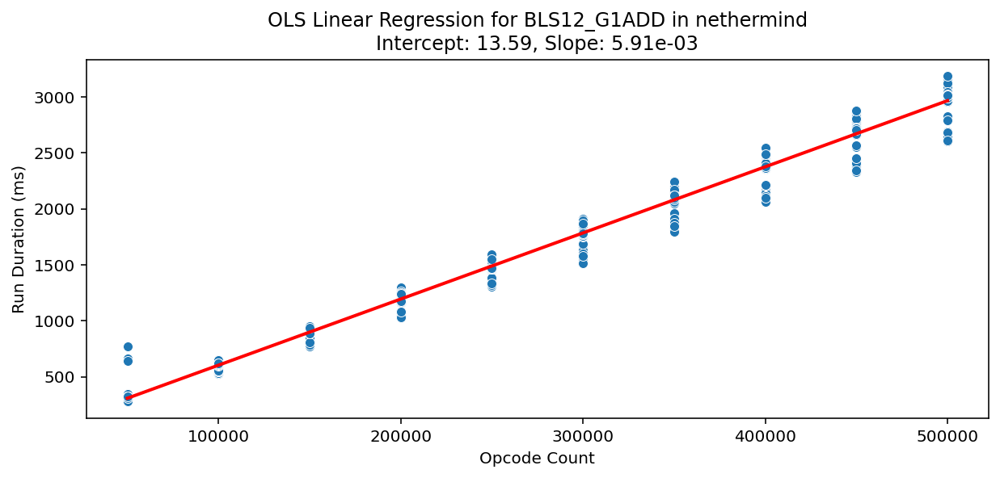

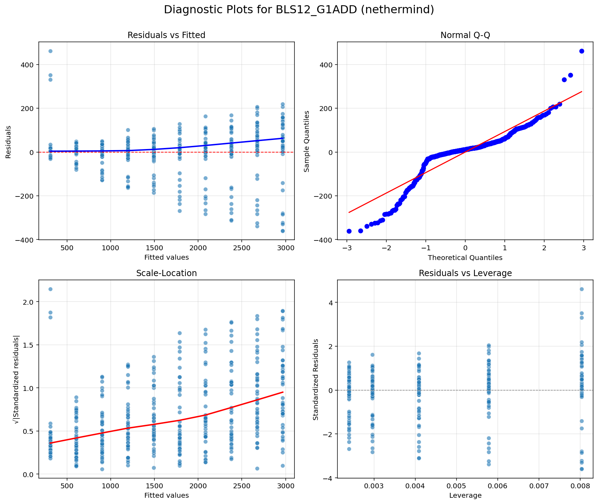


## erigon

OLS model did not run... Error: zero-size array to reduction operation maximum which has no identity

# BLS12_G2ADD

## geth


```python
                            OLS Regression Results                            
==============================================================================
Dep. Variable:        run_duration_ms   R-squared:                       0.992
Model:                            OLS   Adj. R-squared:                  0.992
Method:                 Least Squares   F-statistic:                 5.658e+04
Date:                Wed, 28 Jan 2026   Prob (F-statistic):               0.00
Time:                        10:26:06   Log-Likelihood:                -2313.6
No. Observations:                 430   AIC:                             4631.
Df Residuals:                     428   BIC:                             4639.
Df Model:                           1                                         
Covariance Type:            nonrobust                                         
==============================================================================
                 coef    std err          t      P>|t|      [0.025      0.975]
------------------------------------------------------------------------------
const         29.6103      5.486      5.397      0.000      18.827      40.394
opcount        0.0070   2.95e-05    237.855      0.000       0.007       0.007
==============================================================================
Omnibus:                       48.913   Durbin-Watson:                   1.080
Prob(Omnibus):                  0.000   Jarque-Bera (JB):              156.679
Skew:                          -0.486   Prob(JB):                     9.50e-35
Kurtosis:                       5.793   Cond. No.                     4.02e+05
==============================================================================

Notes:
[1] Standard Errors assume that the covariance matrix of the errors is correctly specified.
[2] The condition number is large, 4.02e+05. This might indicate that there are
strong multicollinearity or other numerical problems.
```

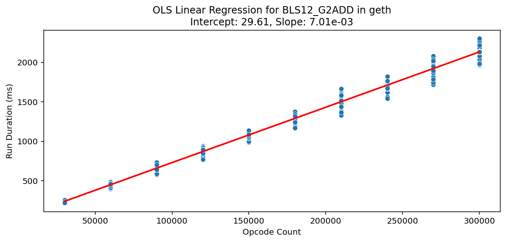

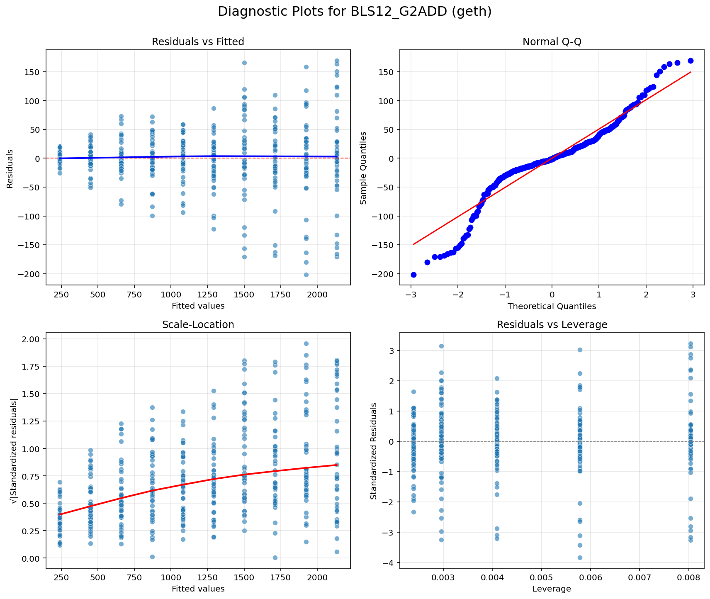


## besu


```python
                            OLS Regression Results                            
==============================================================================
Dep. Variable:        run_duration_ms   R-squared:                       0.958
Model:                            OLS   Adj. R-squared:                  0.958
Method:                 Least Squares   F-statistic:                     9805.
Date:                Wed, 28 Jan 2026   Prob (F-statistic):          3.82e-297
Time:                        10:26:06   Log-Likelihood:                -2947.3
No. Observations:                 430   AIC:                             5899.
Df Residuals:                     428   BIC:                             5907.
Df Model:                           1                                         
Covariance Type:            nonrobust                                         
==============================================================================
                 coef    std err          t      P>|t|      [0.025      0.975]
------------------------------------------------------------------------------
const          1.9380     23.946      0.081      0.936     -45.129      49.005
opcount        0.0127      0.000     99.021      0.000       0.012       0.013
==============================================================================
Omnibus:                        9.756   Durbin-Watson:                   1.426
Prob(Omnibus):                  0.008   Jarque-Bera (JB):               17.090
Skew:                          -0.034   Prob(JB):                     0.000194
Kurtosis:                       3.974   Cond. No.                     4.02e+05
==============================================================================

Notes:
[1] Standard Errors assume that the covariance matrix of the errors is correctly specified.
[2] The condition number is large, 4.02e+05. This might indicate that there are
strong multicollinearity or other numerical problems.
```

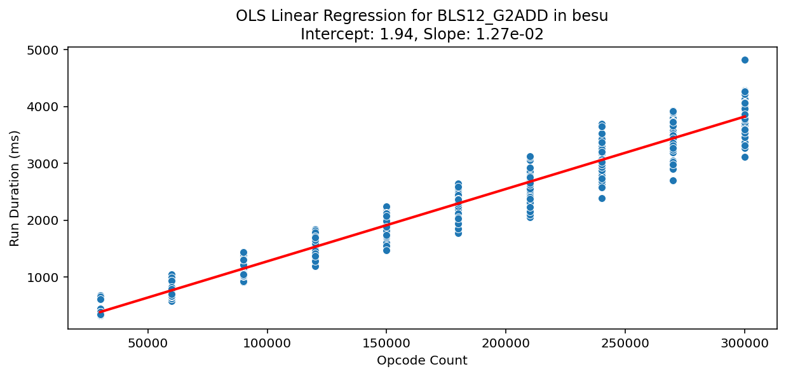

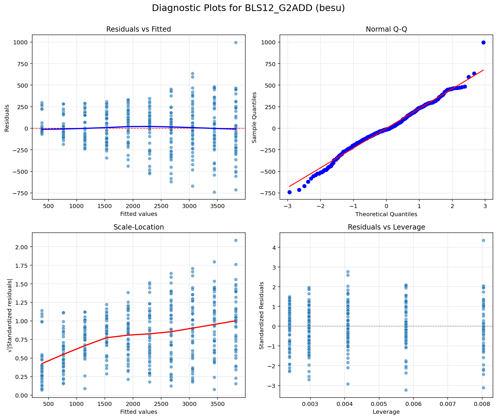


## reth


```python
                            OLS Regression Results                            
==============================================================================
Dep. Variable:        run_duration_ms   R-squared:                       0.991
Model:                            OLS   Adj. R-squared:                  0.991
Method:                 Least Squares   F-statistic:                 3.610e+04
Date:                Wed, 28 Jan 2026   Prob (F-statistic):               0.00
Time:                        10:26:07   Log-Likelihood:                -1764.4
No. Observations:                 320   AIC:                             3533.
Df Residuals:                     318   BIC:                             3540.
Df Model:                           1                                         
Covariance Type:            nonrobust                                         
==============================================================================
                 coef    std err          t      P>|t|      [0.025      0.975]
------------------------------------------------------------------------------
const         34.2802      7.271      4.714      0.000      19.974      48.586
opcount        0.0074   3.91e-05    189.989      0.000       0.007       0.007
==============================================================================
Omnibus:                       57.868   Durbin-Watson:                   1.018
Prob(Omnibus):                  0.000   Jarque-Bera (JB):              104.724
Skew:                          -0.993   Prob(JB):                     1.82e-23
Kurtosis:                       4.977   Cond. No.                     4.02e+05
==============================================================================

Notes:
[1] Standard Errors assume that the covariance matrix of the errors is correctly specified.
[2] The condition number is large, 4.02e+05. This might indicate that there are
strong multicollinearity or other numerical problems.
```

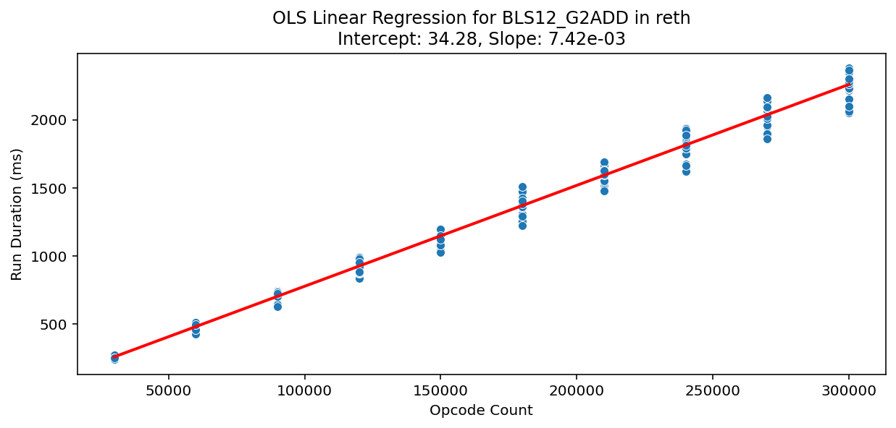

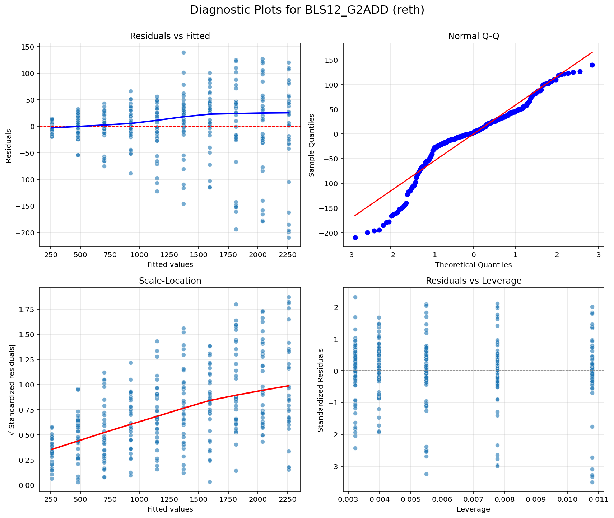


## nethermind


```python
                            OLS Regression Results                            
==============================================================================
Dep. Variable:        run_duration_ms   R-squared:                       0.990
Model:                            OLS   Adj. R-squared:                  0.990
Method:                 Least Squares   F-statistic:                 4.240e+04
Date:                Wed, 28 Jan 2026   Prob (F-statistic):               0.00
Time:                        10:26:07   Log-Likelihood:                -2494.0
No. Observations:                 430   AIC:                             4992.
Df Residuals:                     428   BIC:                             5000.
Df Model:                           1                                         
Covariance Type:            nonrobust                                         
==============================================================================
                 coef    std err          t      P>|t|      [0.025      0.975]
------------------------------------------------------------------------------
const         -3.6176      8.346     -0.433      0.665     -20.022      12.787
opcount        0.0092   4.48e-05    205.905      0.000       0.009       0.009
==============================================================================
Omnibus:                      115.632   Durbin-Watson:                   0.774
Prob(Omnibus):                  0.000   Jarque-Bera (JB):              279.741
Skew:                          -1.343   Prob(JB):                     1.80e-61
Kurtosis:                       5.898   Cond. No.                     4.02e+05
==============================================================================

Notes:
[1] Standard Errors assume that the covariance matrix of the errors is correctly specified.
[2] The condition number is large, 4.02e+05. This might indicate that there are
strong multicollinearity or other numerical problems.
```

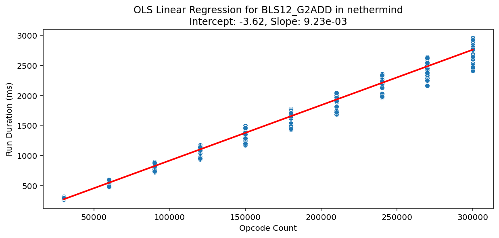

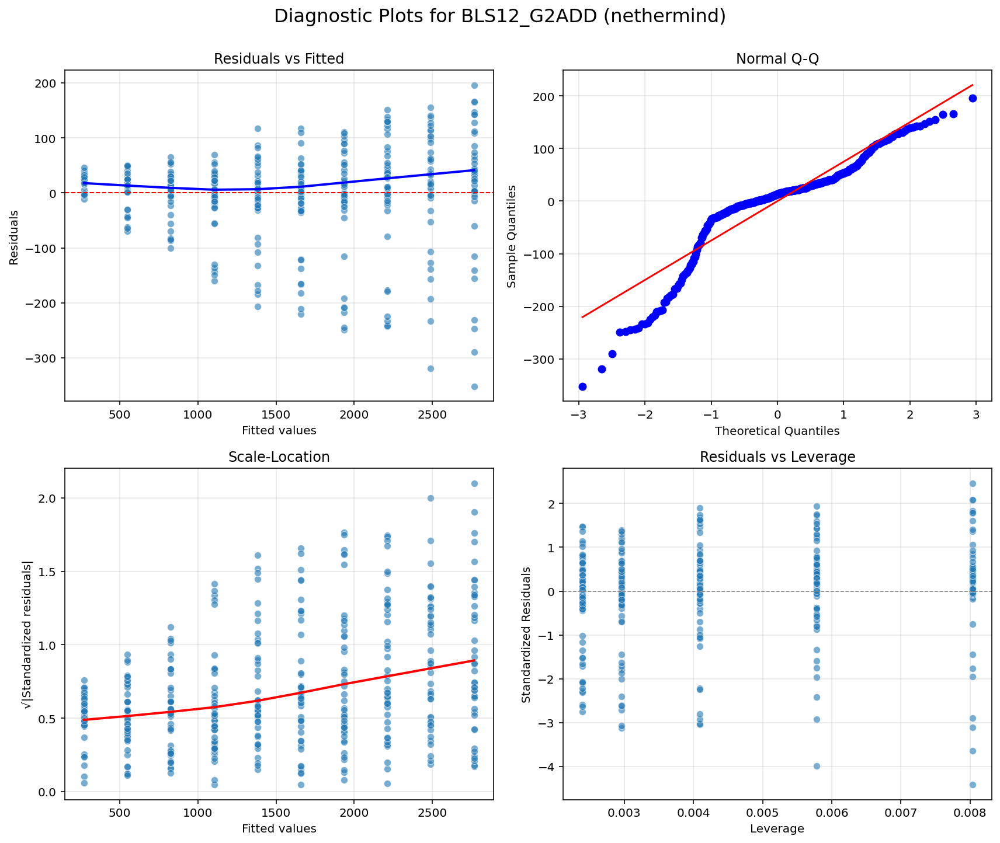


## erigon

OLS model did not run... Error: zero-size array to reduction operation maximum which has no identity

# ECADD

## geth


```python
                            OLS Regression Results                            
==============================================================================
Dep. Variable:        run_duration_ms   R-squared:                       0.989
Model:                            OLS   Adj. R-squared:                  0.989
Method:                 Least Squares   F-statistic:                 4.009e+04
Date:                Wed, 28 Jan 2026   Prob (F-statistic):               0.00
Time:                        10:26:07   Log-Likelihood:                -2527.9
No. Observations:                 430   AIC:                             5060.
Df Residuals:                     428   BIC:                             5068.
Df Model:                           1                                         
Covariance Type:            nonrobust                                         
==============================================================================
                 coef    std err          t      P>|t|      [0.025      0.975]
------------------------------------------------------------------------------
const         21.6074      9.031      2.393      0.017       3.857      39.357
opcount        0.0029   1.46e-05    200.218      0.000       0.003       0.003
==============================================================================
Omnibus:                       66.403   Durbin-Watson:                   0.687
Prob(Omnibus):                  0.000   Jarque-Bera (JB):              124.082
Skew:                          -0.878   Prob(JB):                     1.14e-27
Kurtosis:                       4.960   Cond. No.                     1.34e+06
==============================================================================

Notes:
[1] Standard Errors assume that the covariance matrix of the errors is correctly specified.
[2] The condition number is large, 1.34e+06. This might indicate that there are
strong multicollinearity or other numerical problems.
```


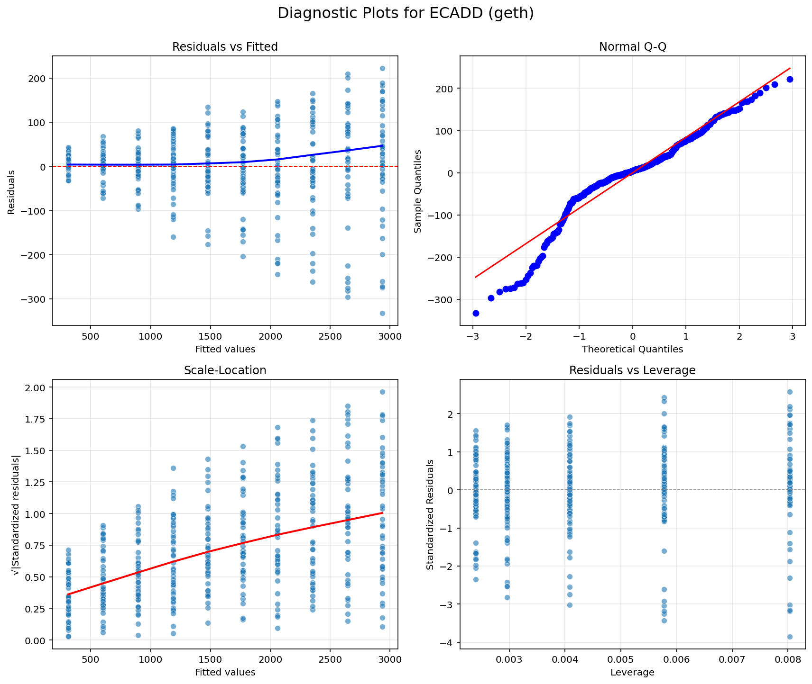


## besu


```python
                            OLS Regression Results                            
==============================================================================
Dep. Variable:        run_duration_ms   R-squared:                       0.982
Model:                            OLS   Adj. R-squared:                  0.982
Method:                 Least Squares   F-statistic:                 2.308e+04
Date:                Wed, 28 Jan 2026   Prob (F-statistic):               0.00
Time:                        10:26:08   Log-Likelihood:                -2897.5
No. Observations:                 430   AIC:                             5799.
Df Residuals:                     428   BIC:                             5807.
Df Model:                           1                                         
Covariance Type:            nonrobust                                         
==============================================================================
                 coef    std err          t      P>|t|      [0.025      0.975]
------------------------------------------------------------------------------
const         25.9624     21.327      1.217      0.224     -15.957      67.882
opcount        0.0052   3.44e-05    151.933      0.000       0.005       0.005
==============================================================================
Omnibus:                       58.065   Durbin-Watson:                   0.863
Prob(Omnibus):                  0.000   Jarque-Bera (JB):              103.851
Skew:                          -0.796   Prob(JB):                     2.81e-23
Kurtosis:                       4.805   Cond. No.                     1.34e+06
==============================================================================

Notes:
[1] Standard Errors assume that the covariance matrix of the errors is correctly specified.
[2] The condition number is large, 1.34e+06. This might indicate that there are
strong multicollinearity or other numerical problems.
```

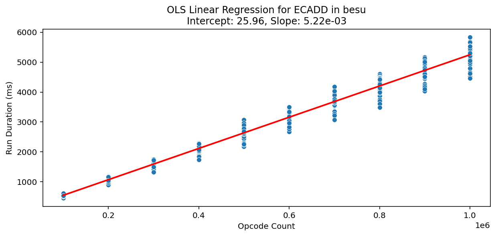

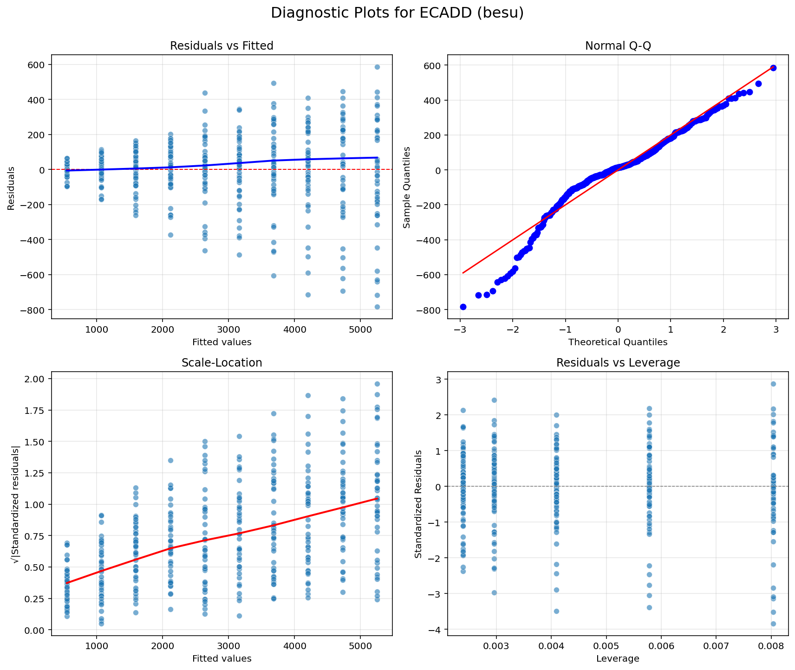


## reth


```python
                            OLS Regression Results                            
==============================================================================
Dep. Variable:        run_duration_ms   R-squared:                       0.991
Model:                            OLS   Adj. R-squared:                  0.991
Method:                 Least Squares   F-statistic:                 3.455e+04
Date:                Wed, 28 Jan 2026   Prob (F-statistic):               0.00
Time:                        10:26:08   Log-Likelihood:                -1941.3
No. Observations:                 320   AIC:                             3887.
Df Residuals:                     318   BIC:                             3894.
Df Model:                           1                                         
Covariance Type:            nonrobust                                         
==============================================================================
                 coef    std err          t      P>|t|      [0.025      0.975]
------------------------------------------------------------------------------
const         29.7112     12.640      2.351      0.019       4.843      54.579
opcount        0.0038   2.04e-05    185.869      0.000       0.004       0.004
==============================================================================
Omnibus:                        7.390   Durbin-Watson:                   0.985
Prob(Omnibus):                  0.025   Jarque-Bera (JB):               11.811
Skew:                          -0.058   Prob(JB):                      0.00272
Kurtosis:                       3.934   Cond. No.                     1.34e+06
==============================================================================

Notes:
[1] Standard Errors assume that the covariance matrix of the errors is correctly specified.
[2] The condition number is large, 1.34e+06. This might indicate that there are
strong multicollinearity or other numerical problems.
```

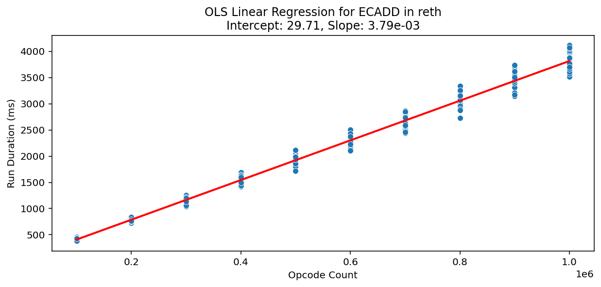

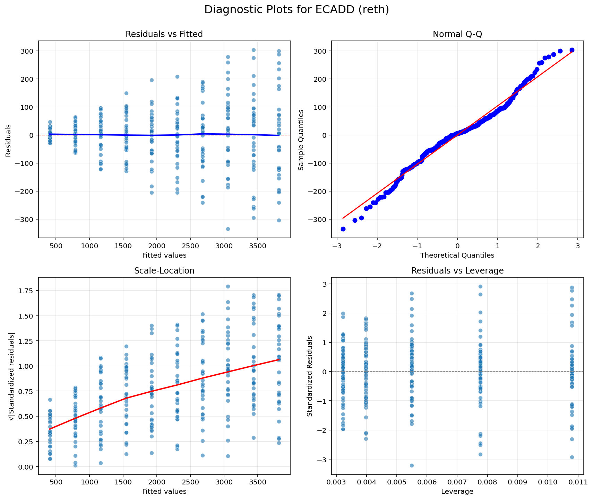


## nethermind


```python
                            OLS Regression Results                            
==============================================================================
Dep. Variable:        run_duration_ms   R-squared:                       0.986
Model:                            OLS   Adj. R-squared:                  0.985
Method:                 Least Squares   F-statistic:                 2.913e+04
Date:                Wed, 28 Jan 2026   Prob (F-statistic):               0.00
Time:                        10:26:08   Log-Likelihood:                -2519.3
No. Observations:                 430   AIC:                             5043.
Df Residuals:                     428   BIC:                             5051.
Df Model:                           1                                         
Covariance Type:            nonrobust                                         
==============================================================================
                 coef    std err          t      P>|t|      [0.025      0.975]
------------------------------------------------------------------------------
const         14.8697      8.851      1.680      0.094      -2.527      32.266
opcount        0.0024   1.43e-05    170.667      0.000       0.002       0.002
==============================================================================
Omnibus:                       95.683   Durbin-Watson:                   0.662
Prob(Omnibus):                  0.000   Jarque-Bera (JB):              189.793
Skew:                          -1.204   Prob(JB):                     6.12e-42
Kurtosis:                       5.190   Cond. No.                     1.34e+06
==============================================================================

Notes:
[1] Standard Errors assume that the covariance matrix of the errors is correctly specified.
[2] The condition number is large, 1.34e+06. This might indicate that there are
strong multicollinearity or other numerical problems.
```

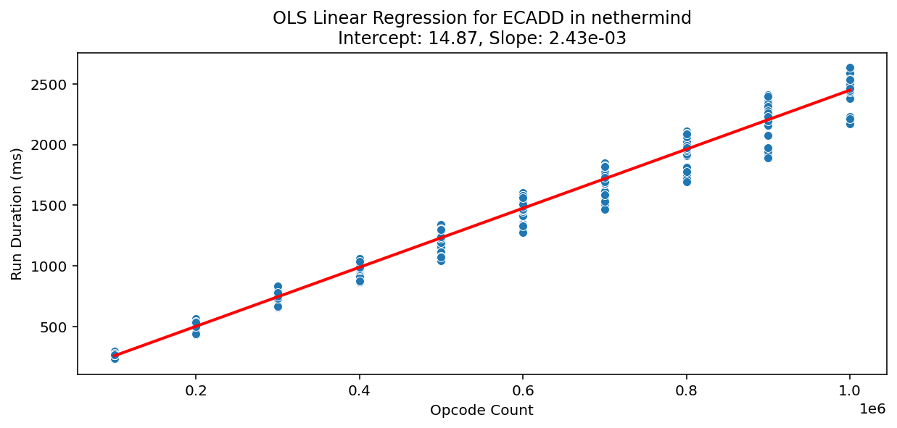

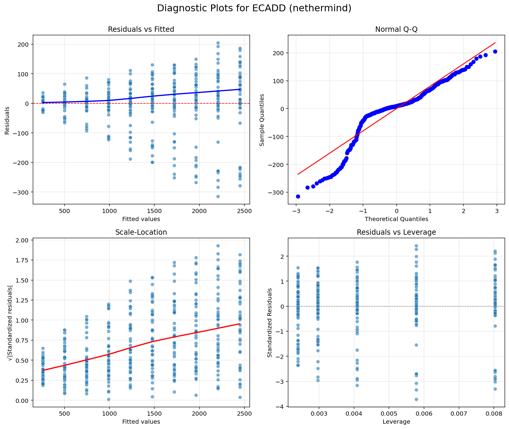


## erigon

OLS model did not run... Error: zero-size array to reduction operation maximum which has no identity

# ECRECOVER

## geth


```python
                            OLS Regression Results                            
==============================================================================
Dep. Variable:        run_duration_ms   R-squared:                       0.993
Model:                            OLS   Adj. R-squared:                  0.993
Method:                 Least Squares   F-statistic:                 5.842e+04
Date:                Wed, 28 Jan 2026   Prob (F-statistic):               0.00
Time:                        10:26:08   Log-Likelihood:                -2566.0
No. Observations:                 430   AIC:                             5136.
Df Residuals:                     428   BIC:                             5144.
Df Model:                           1                                         
Covariance Type:            nonrobust                                         
==============================================================================
                 coef    std err          t      P>|t|      [0.025      0.975]
------------------------------------------------------------------------------
const         36.6028      9.867      3.710      0.000      17.209      55.996
opcount        0.0480      0.000    241.710      0.000       0.048       0.048
==============================================================================
Omnibus:                       54.575   Durbin-Watson:                   0.655
Prob(Omnibus):                  0.000   Jarque-Bera (JB):              133.530
Skew:                          -0.644   Prob(JB):                     1.01e-29
Kurtosis:                       5.407   Cond. No.                     1.07e+05
==============================================================================

Notes:
[1] Standard Errors assume that the covariance matrix of the errors is correctly specified.
[2] The condition number is large, 1.07e+05. This might indicate that there are
strong multicollinearity or other numerical problems.
```

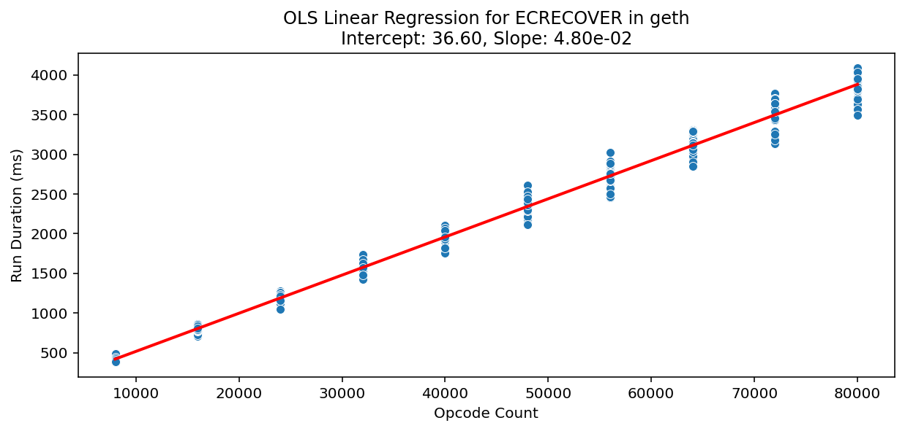

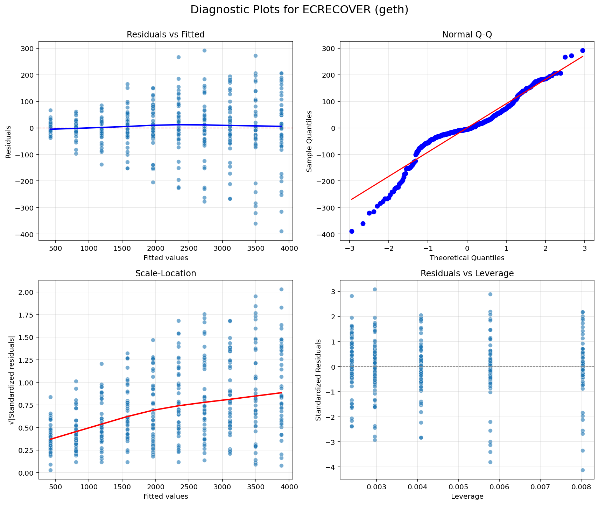


## besu


```python
                            OLS Regression Results                            
==============================================================================
Dep. Variable:        run_duration_ms   R-squared:                       0.985
Model:                            OLS   Adj. R-squared:                  0.985
Method:                 Least Squares   F-statistic:                 2.873e+04
Date:                Wed, 28 Jan 2026   Prob (F-statistic):               0.00
Time:                        10:26:09   Log-Likelihood:                -2721.8
No. Observations:                 430   AIC:                             5448.
Df Residuals:                     428   BIC:                             5456.
Df Model:                           1                                         
Covariance Type:            nonrobust                                         
==============================================================================
                 coef    std err          t      P>|t|      [0.025      0.975]
------------------------------------------------------------------------------
const         29.7974     14.174      2.102      0.036       1.938      57.657
opcount        0.0484      0.000    169.491      0.000       0.048       0.049
==============================================================================
Omnibus:                       89.792   Durbin-Watson:                   0.690
Prob(Omnibus):                  0.000   Jarque-Bera (JB):              174.969
Skew:                          -1.140   Prob(JB):                     1.01e-38
Kurtosis:                       5.136   Cond. No.                     1.07e+05
==============================================================================

Notes:
[1] Standard Errors assume that the covariance matrix of the errors is correctly specified.
[2] The condition number is large, 1.07e+05. This might indicate that there are
strong multicollinearity or other numerical problems.
```

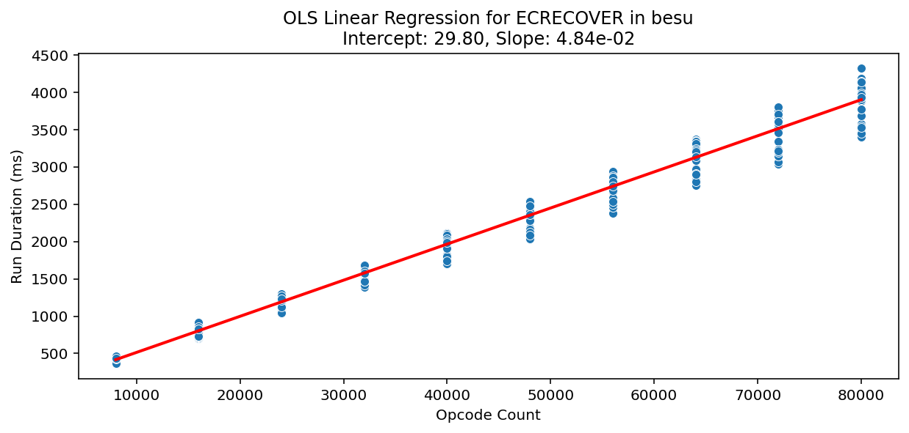

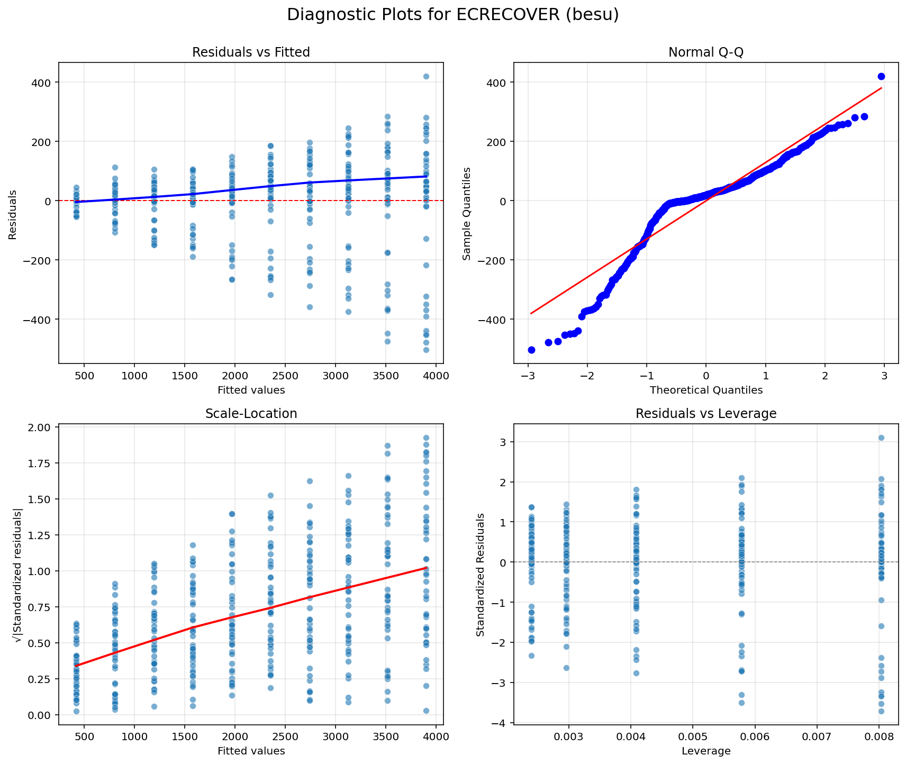


## reth


```python
                            OLS Regression Results                            
==============================================================================
Dep. Variable:        run_duration_ms   R-squared:                       0.990
Model:                            OLS   Adj. R-squared:                  0.990
Method:                 Least Squares   F-statistic:                 3.264e+04
Date:                Wed, 28 Jan 2026   Prob (F-statistic):          1.53e-322
Time:                        10:26:09   Log-Likelihood:                -1947.7
No. Observations:                 320   AIC:                             3899.
Df Residuals:                     318   BIC:                             3907.
Df Model:                           1                                         
Covariance Type:            nonrobust                                         
==============================================================================
                 coef    std err          t      P>|t|      [0.025      0.975]
------------------------------------------------------------------------------
const         40.5342     12.893      3.144      0.002      15.168      65.900
opcount        0.0469      0.000    180.662      0.000       0.046       0.047
==============================================================================
Omnibus:                      103.672   Durbin-Watson:                   0.835
Prob(Omnibus):                  0.000   Jarque-Bera (JB):              274.229
Skew:                          -1.528   Prob(JB):                     2.83e-60
Kurtosis:                       6.352   Cond. No.                     1.07e+05
==============================================================================

Notes:
[1] Standard Errors assume that the covariance matrix of the errors is correctly specified.
[2] The condition number is large, 1.07e+05. This might indicate that there are
strong multicollinearity or other numerical problems.
```

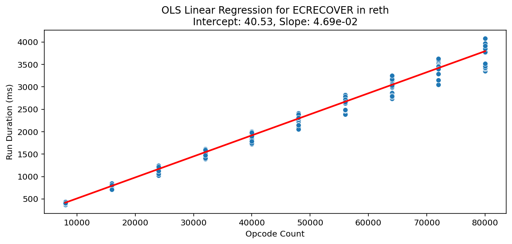

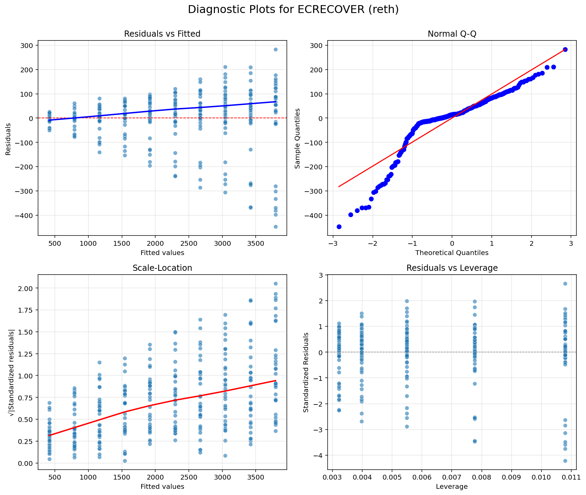


## nethermind


```python
                            OLS Regression Results                            
==============================================================================
Dep. Variable:        run_duration_ms   R-squared:                       0.991
Model:                            OLS   Adj. R-squared:                  0.991
Method:                 Least Squares   F-statistic:                 4.637e+04
Date:                Wed, 28 Jan 2026   Prob (F-statistic):               0.00
Time:                        10:26:09   Log-Likelihood:                -2583.2
No. Observations:                 430   AIC:                             5170.
Df Residuals:                     428   BIC:                             5179.
Df Model:                           1                                         
Covariance Type:            nonrobust                                         
==============================================================================
                 coef    std err          t      P>|t|      [0.025      0.975]
------------------------------------------------------------------------------
const         30.1650     10.270      2.937      0.003       9.979      50.351
opcount        0.0446      0.000    215.335      0.000       0.044       0.045
==============================================================================
Omnibus:                      192.776   Durbin-Watson:                   0.611
Prob(Omnibus):                  0.000   Jarque-Bera (JB):              673.156
Skew:                          -2.116   Prob(JB):                    6.70e-147
Kurtosis:                       7.434   Cond. No.                     1.07e+05
==============================================================================

Notes:
[1] Standard Errors assume that the covariance matrix of the errors is correctly specified.
[2] The condition number is large, 1.07e+05. This might indicate that there are
strong multicollinearity or other numerical problems.
```

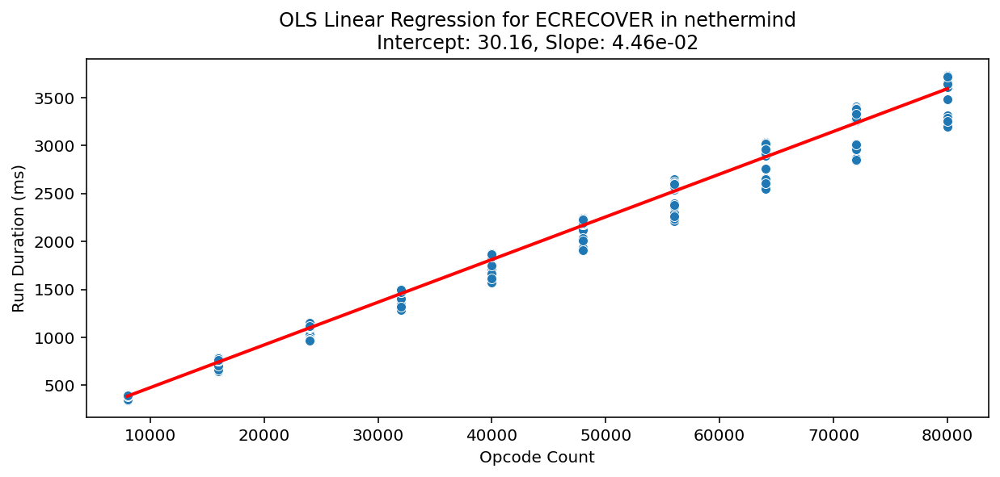

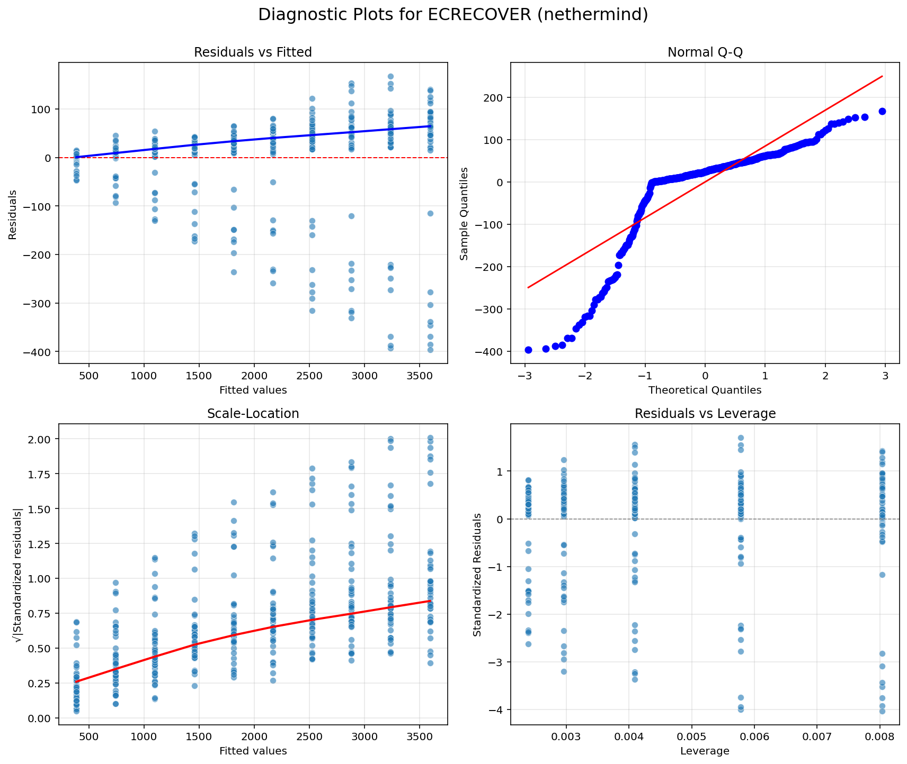


## erigon

OLS model did not run... Error: zero-size array to reduction operation maximum which has no identity

# KECCAK256

## geth


```python
                            OLS Regression Results                            
==============================================================================
Dep. Variable:        run_duration_ms   R-squared:                       0.698
Model:                            OLS   Adj. R-squared:                  0.698
Method:                 Least Squares   F-statistic:                     7962.
Date:                Wed, 28 Jan 2026   Prob (F-statistic):               0.00
Time:                        10:26:10   Log-Likelihood:                -52249.
No. Observations:                6880   AIC:                         1.045e+05
Df Residuals:                    6877   BIC:                         1.045e+05
Df Model:                           2                                         
Covariance Type:            nonrobust                                         
==============================================================================
                 coef    std err          t      P>|t|      [0.025      0.975]
------------------------------------------------------------------------------
const        -58.6347     14.529     -4.036      0.000     -87.116     -30.154
opcount        0.0006   4.52e-06    123.146      0.000       0.001       0.001
msg_size       1.6968      0.018     96.427      0.000       1.662       1.731
==============================================================================
Omnibus:                     1415.920   Durbin-Watson:                   1.718
Prob(Omnibus):                  0.000   Jarque-Bera (JB):            21349.988
Skew:                           0.560   Prob(JB):                         0.00
Kurtosis:                      11.557   Cond. No.                     6.42e+06
==============================================================================

Notes:
[1] Standard Errors assume that the covariance matrix of the errors is correctly specified.
[2] The condition number is large, 6.42e+06. This might indicate that there are
strong multicollinearity or other numerical problems.
```

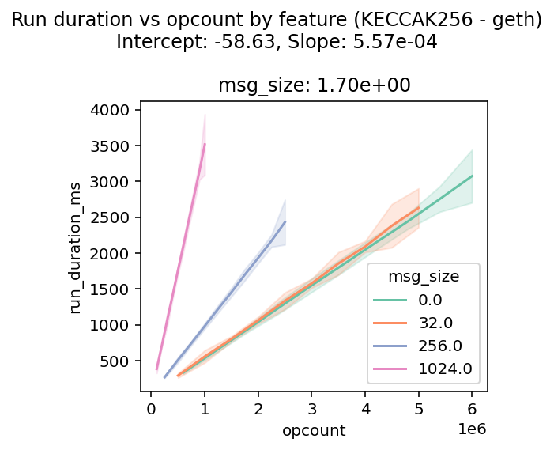

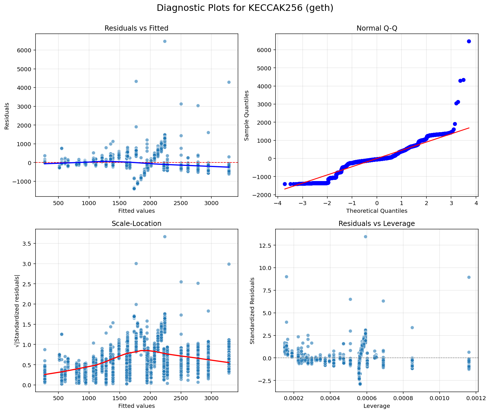


## besu


```python
                            OLS Regression Results                            
==============================================================================
Dep. Variable:        run_duration_ms   R-squared:                       0.755
Model:                            OLS   Adj. R-squared:                  0.755
Method:                 Least Squares   F-statistic:                 1.059e+04
Date:                Wed, 28 Jan 2026   Prob (F-statistic):               0.00
Time:                        10:26:10   Log-Likelihood:                -53978.
No. Observations:                6880   AIC:                         1.080e+05
Df Residuals:                    6877   BIC:                         1.080e+05
Df Model:                           2                                         
Covariance Type:            nonrobust                                         
==============================================================================
                 coef    std err          t      P>|t|      [0.025      0.975]
------------------------------------------------------------------------------
const        -53.3329     18.682     -2.855      0.004     -89.955     -16.711
opcount        0.0008   5.81e-06    145.256      0.000       0.001       0.001
msg_size       2.1588      0.023     95.413      0.000       2.114       2.203
==============================================================================
Omnibus:                      276.123   Durbin-Watson:                   1.654
Prob(Omnibus):                  0.000   Jarque-Bera (JB):              864.585
Skew:                          -0.055   Prob(JB):                    1.81e-188
Kurtosis:                       4.733   Cond. No.                     6.42e+06
==============================================================================

Notes:
[1] Standard Errors assume that the covariance matrix of the errors is correctly specified.
[2] The condition number is large, 6.42e+06. This might indicate that there are
strong multicollinearity or other numerical problems.
```

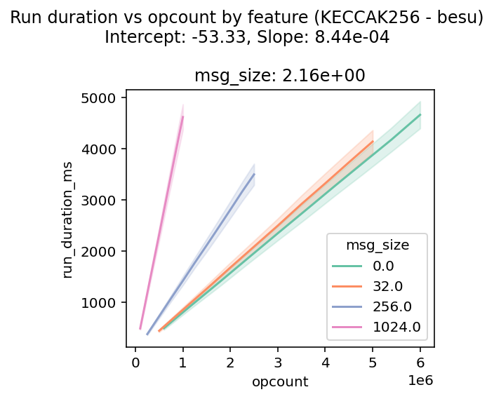

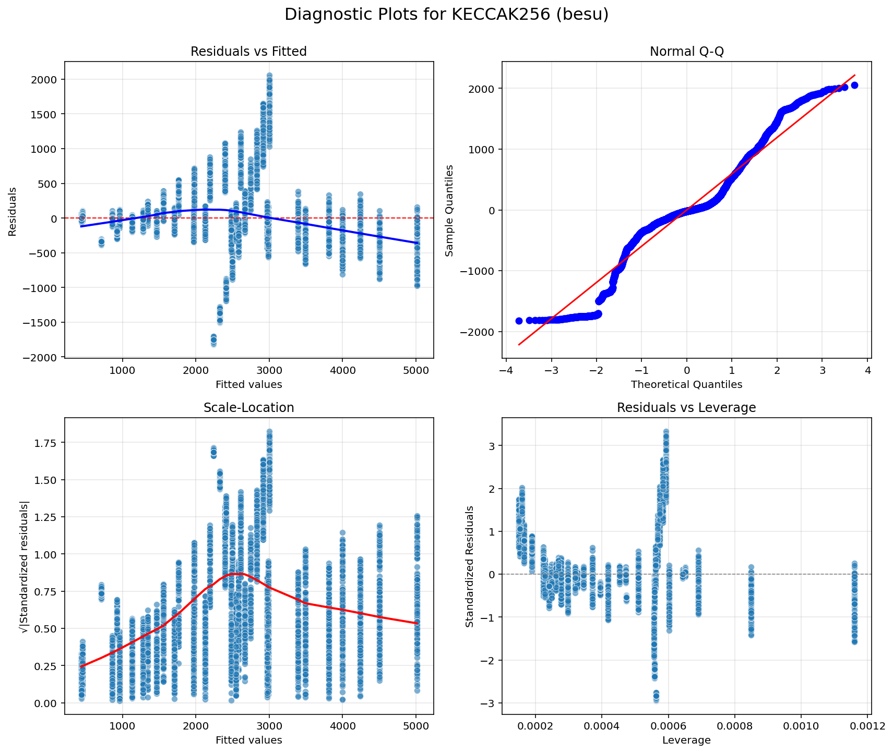


## reth


```python
                            OLS Regression Results                            
==============================================================================
Dep. Variable:        run_duration_ms   R-squared:                       0.514
Model:                            OLS   Adj. R-squared:                  0.514
Method:                 Least Squares   F-statistic:                     2706.
Date:                Wed, 28 Jan 2026   Prob (F-statistic):               0.00
Time:                        10:26:10   Log-Likelihood:                -39124.
No. Observations:                5120   AIC:                         7.825e+04
Df Residuals:                    5117   BIC:                         7.827e+04
Df Model:                           2                                         
Covariance Type:            nonrobust                                         
==============================================================================
                 coef    std err          t      P>|t|      [0.025      0.975]
------------------------------------------------------------------------------
const        138.5065     17.656      7.845      0.000     103.893     173.120
opcount     5.499e-05   5.49e-06     10.011      0.000    4.42e-05    6.58e-05
msg_size       1.3704      0.021     64.087      0.000       1.329       1.412
==============================================================================
Omnibus:                      127.652   Durbin-Watson:                   1.736
Prob(Omnibus):                  0.000   Jarque-Bera (JB):              153.971
Skew:                           0.328   Prob(JB):                     3.68e-34
Kurtosis:                       3.539   Cond. No.                     6.42e+06
==============================================================================

Notes:
[1] Standard Errors assume that the covariance matrix of the errors is correctly specified.
[2] The condition number is large, 6.42e+06. This might indicate that there are
strong multicollinearity or other numerical problems.
```

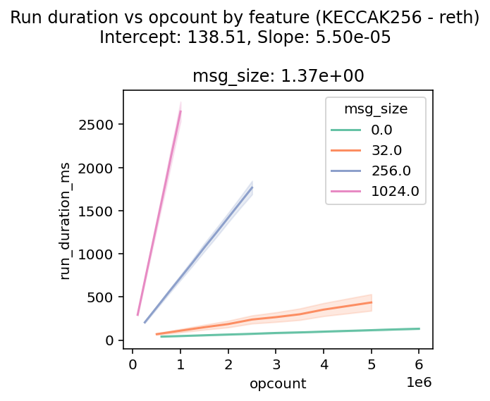

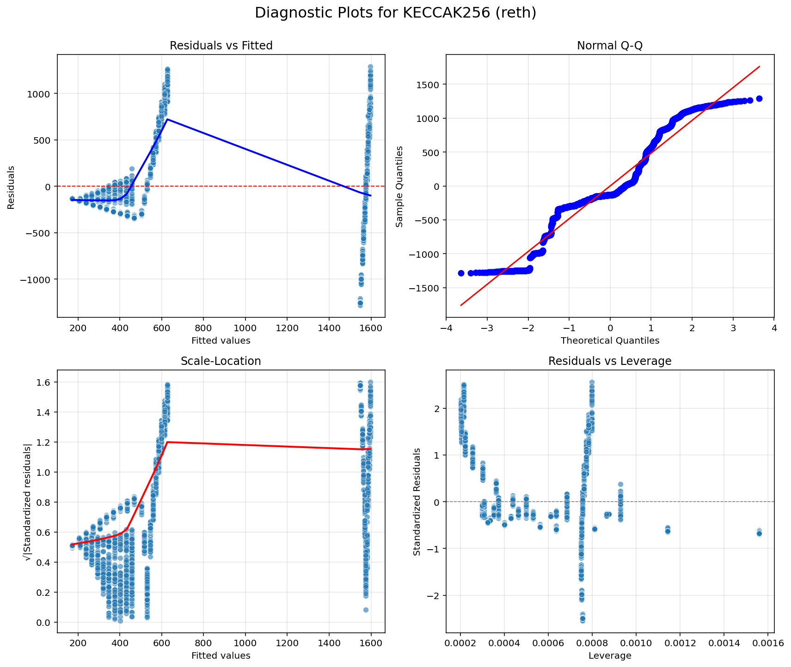


## nethermind


```python
                            OLS Regression Results                            
==============================================================================
Dep. Variable:        run_duration_ms   R-squared:                       0.516
Model:                            OLS   Adj. R-squared:                  0.516
Method:                 Least Squares   F-statistic:                     3665.
Date:                Wed, 28 Jan 2026   Prob (F-statistic):               0.00
Time:                        10:26:11   Log-Likelihood:                -53245.
No. Observations:                6880   AIC:                         1.065e+05
Df Residuals:                    6877   BIC:                         1.065e+05
Df Model:                           2                                         
Covariance Type:            nonrobust                                         
==============================================================================
                 coef    std err          t      P>|t|      [0.025      0.975]
------------------------------------------------------------------------------
const        135.9706     16.794      8.097      0.000     103.050     168.891
opcount     6.531e-05   5.23e-06     12.499      0.000    5.51e-05    7.56e-05
msg_size       1.5254      0.020     74.999      0.000       1.486       1.565
==============================================================================
Omnibus:                      218.485   Durbin-Watson:                   1.735
Prob(Omnibus):                  0.000   Jarque-Bera (JB):              273.537
Skew:                           0.374   Prob(JB):                     4.00e-60
Kurtosis:                       3.629   Cond. No.                     6.42e+06
==============================================================================

Notes:
[1] Standard Errors assume that the covariance matrix of the errors is correctly specified.
[2] The condition number is large, 6.42e+06. This might indicate that there are
strong multicollinearity or other numerical problems.
```

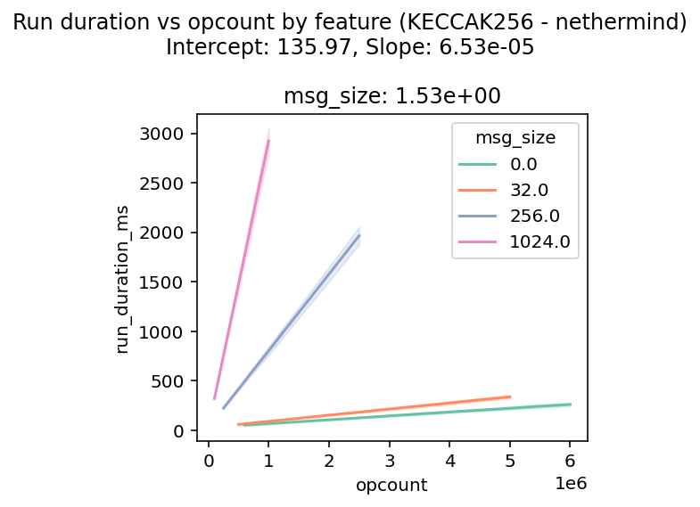

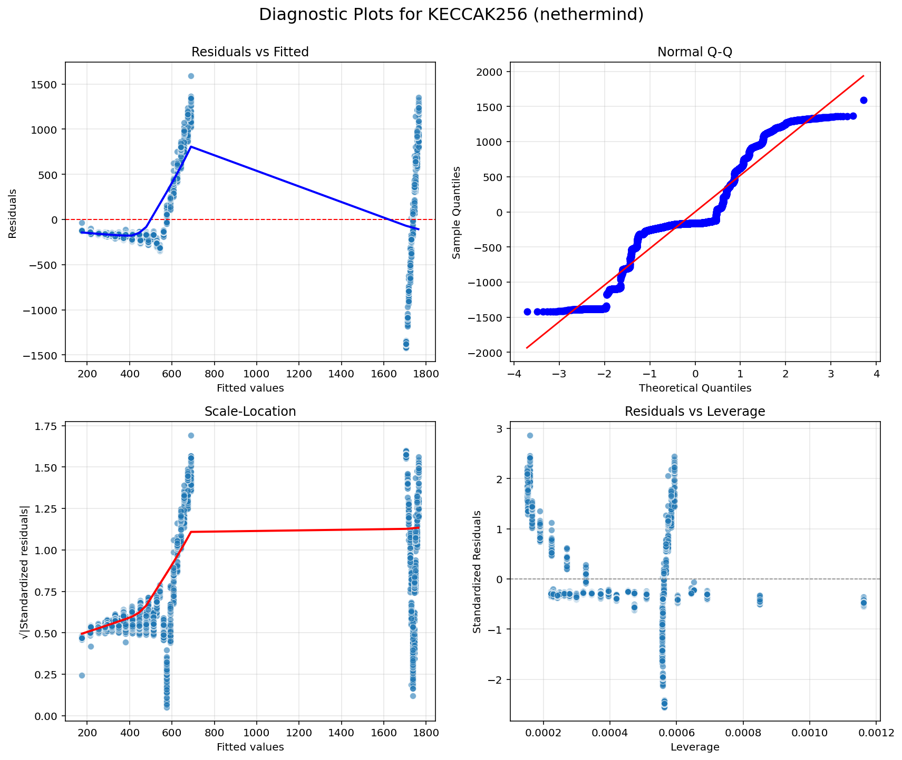


## erigon


```python
                            OLS Regression Results                            
==============================================================================
Dep. Variable:        run_duration_ms   R-squared:                       0.715
Model:                            OLS   Adj. R-squared:                  0.713
Method:                 Least Squares   F-statistic:                     597.0
Date:                Wed, 28 Jan 2026   Prob (F-statistic):          1.40e-130
Time:                        10:26:11   Log-Likelihood:                -3605.0
No. Observations:                 480   AIC:                             7216.
Df Residuals:                     477   BIC:                             7228.
Df Model:                           2                                         
Covariance Type:            nonrobust                                         
==============================================================================
                 coef    std err          t      P>|t|      [0.025      0.975]
------------------------------------------------------------------------------
const        -54.7964     50.722     -1.080      0.281    -154.463      44.870
opcount        0.0005   1.58e-05     33.655      0.000       0.001       0.001
msg_size       1.6340      0.061     26.598      0.000       1.513       1.755
==============================================================================
Omnibus:                       29.195   Durbin-Watson:                   1.710
Prob(Omnibus):                  0.000   Jarque-Bera (JB):               94.388
Skew:                          -0.125   Prob(JB):                     3.19e-21
Kurtosis:                       5.158   Cond. No.                     6.42e+06
==============================================================================

Notes:
[1] Standard Errors assume that the covariance matrix of the errors is correctly specified.
[2] The condition number is large, 6.42e+06. This might indicate that there are
strong multicollinearity or other numerical problems.
```

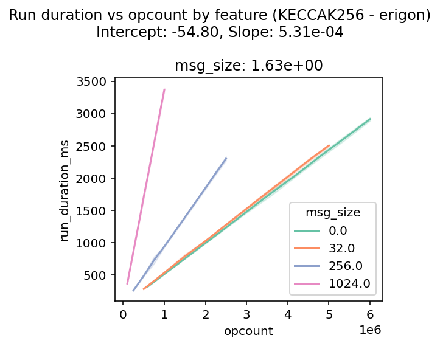

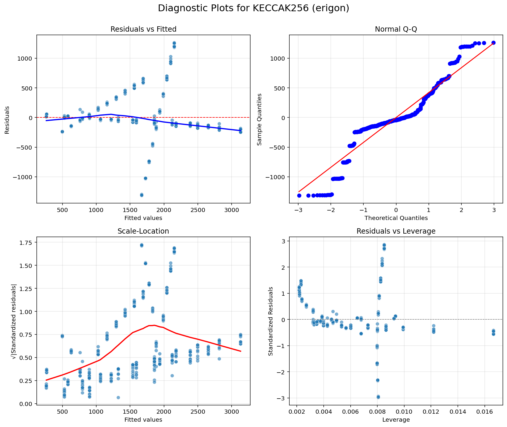


# BLAKE2F

## geth


```python
                            OLS Regression Results                            
==============================================================================
Dep. Variable:        run_duration_ms   R-squared:                       0.970
Model:                            OLS   Adj. R-squared:                  0.970
Method:                 Least Squares   F-statistic:                 2.814e+04
Date:                Wed, 28 Jan 2026   Prob (F-statistic):               0.00
Time:                        10:26:11   Log-Likelihood:                -10122.
No. Observations:                1720   AIC:                         2.025e+04
Df Residuals:                    1717   BIC:                         2.027e+04
Df Model:                           2                                         
Covariance Type:            nonrobust                                         
==============================================================================
                 coef    std err          t      P>|t|      [0.025      0.975]
------------------------------------------------------------------------------
const       -144.5552      5.243    -27.570      0.000    -154.839    -134.271
opcount        0.0008   3.66e-06    229.061      0.000       0.001       0.001
num_rounds    15.0909      0.245     61.691      0.000      14.611      15.571
==============================================================================
Omnibus:                       53.518   Durbin-Watson:                   1.636
Prob(Omnibus):                  0.000   Jarque-Bera (JB):               84.866
Skew:                           0.280   Prob(JB):                     3.73e-19
Kurtosis:                       3.934   Cond. No.                     3.10e+06
==============================================================================

Notes:
[1] Standard Errors assume that the covariance matrix of the errors is correctly specified.
[2] The condition number is large, 3.1e+06. This might indicate that there are
strong multicollinearity or other numerical problems.
```

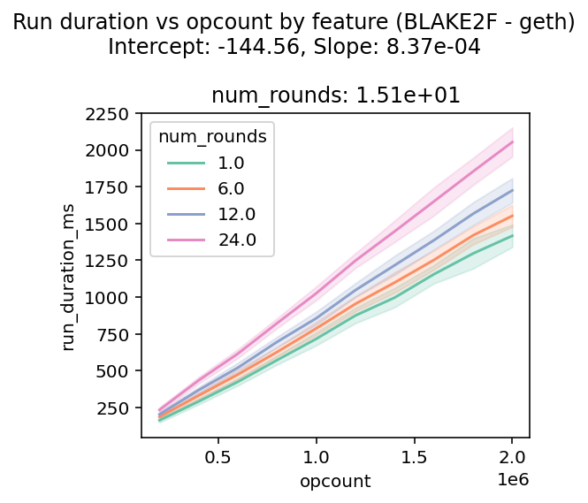

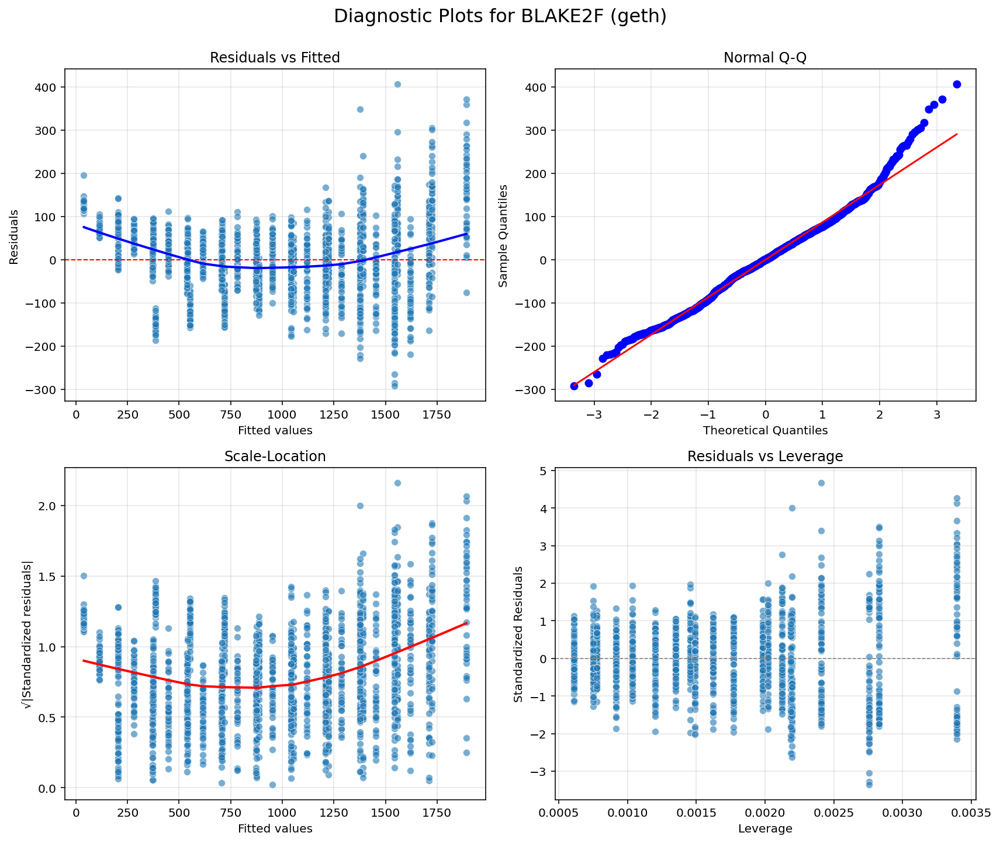


## besu


```python
                            OLS Regression Results                            
==============================================================================
Dep. Variable:        run_duration_ms   R-squared:                       0.972
Model:                            OLS   Adj. R-squared:                  0.972
Method:                 Least Squares   F-statistic:                 2.981e+04
Date:                Wed, 28 Jan 2026   Prob (F-statistic):               0.00
Time:                        10:26:12   Log-Likelihood:                -12217.
No. Observations:                1720   AIC:                         2.444e+04
Df Residuals:                    1717   BIC:                         2.446e+04
Df Model:                           2                                         
Covariance Type:            nonrobust                                         
==============================================================================
                 coef    std err          t      P>|t|      [0.025      0.975]
------------------------------------------------------------------------------
const       -135.0286     17.728     -7.617      0.000    -169.800    -100.257
opcount        0.0030   1.24e-05    243.149      0.000       0.003       0.003
num_rounds    18.3800      0.827     22.222      0.000      16.758      20.002
==============================================================================
Omnibus:                       78.806   Durbin-Watson:                   1.041
Prob(Omnibus):                  0.000   Jarque-Bera (JB):              255.323
Skew:                           0.067   Prob(JB):                     3.61e-56
Kurtosis:                       4.883   Cond. No.                     3.10e+06
==============================================================================

Notes:
[1] Standard Errors assume that the covariance matrix of the errors is correctly specified.
[2] The condition number is large, 3.1e+06. This might indicate that there are
strong multicollinearity or other numerical problems.
```

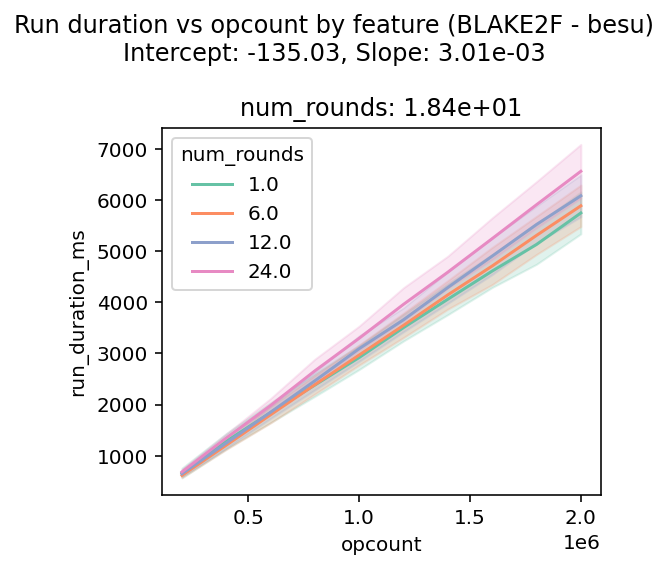

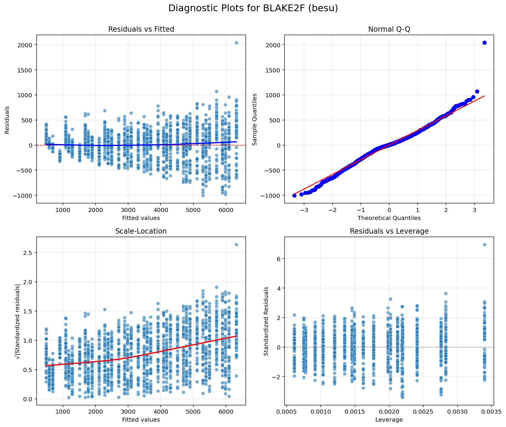


## reth


```python
                            OLS Regression Results                            
==============================================================================
Dep. Variable:        run_duration_ms   R-squared:                       0.915
Model:                            OLS   Adj. R-squared:                  0.915
Method:                 Least Squares   F-statistic:                     6882.
Date:                Wed, 28 Jan 2026   Prob (F-statistic):               0.00
Time:                        10:26:12   Log-Likelihood:                -8257.2
No. Observations:                1280   AIC:                         1.652e+04
Df Residuals:                    1277   BIC:                         1.654e+04
Df Model:                           2                                         
Covariance Type:            nonrobust                                         
==============================================================================
                 coef    std err          t      P>|t|      [0.025      0.975]
------------------------------------------------------------------------------
const       -219.9001     10.708    -20.536      0.000    -240.907    -198.893
opcount        0.0008   7.47e-06    108.876      0.000       0.001       0.001
num_rounds    21.8354      0.500     43.709      0.000      20.855      22.815
==============================================================================
Omnibus:                       10.017   Durbin-Watson:                   1.848
Prob(Omnibus):                  0.007   Jarque-Bera (JB):               10.704
Skew:                          -0.166   Prob(JB):                      0.00474
Kurtosis:                       3.300   Cond. No.                     3.10e+06
==============================================================================

Notes:
[1] Standard Errors assume that the covariance matrix of the errors is correctly specified.
[2] The condition number is large, 3.1e+06. This might indicate that there are
strong multicollinearity or other numerical problems.
```

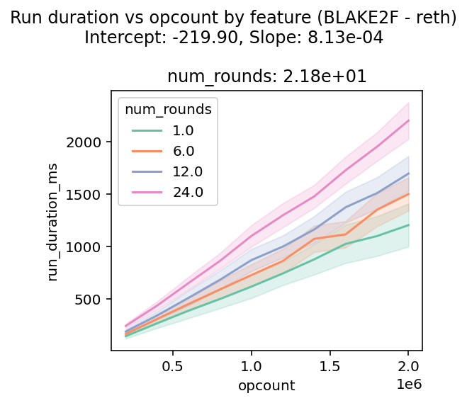

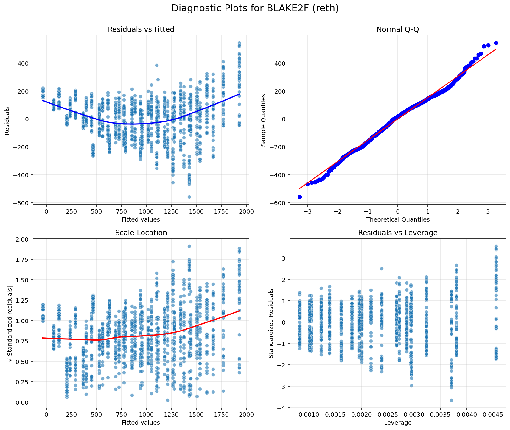


## nethermind


```python
                            OLS Regression Results                            
==============================================================================
Dep. Variable:        run_duration_ms   R-squared:                       0.964
Model:                            OLS   Adj. R-squared:                  0.964
Method:                 Least Squares   F-statistic:                 2.329e+04
Date:                Wed, 28 Jan 2026   Prob (F-statistic):               0.00
Time:                        10:26:12   Log-Likelihood:                -10284.
No. Observations:                1720   AIC:                         2.057e+04
Df Residuals:                    1717   BIC:                         2.059e+04
Df Model:                           2                                         
Covariance Type:            nonrobust                                         
==============================================================================
                 coef    std err          t      P>|t|      [0.025      0.975]
------------------------------------------------------------------------------
const       -139.9203      5.761    -24.289      0.000    -151.219    -128.622
opcount        0.0008   4.02e-06    211.375      0.000       0.001       0.001
num_rounds    11.6958      0.269     43.519      0.000      11.169      12.223
==============================================================================
Omnibus:                       20.175   Durbin-Watson:                   1.344
Prob(Omnibus):                  0.000   Jarque-Bera (JB):               31.863
Skew:                           0.069   Prob(JB):                     1.20e-07
Kurtosis:                       3.652   Cond. No.                     3.10e+06
==============================================================================

Notes:
[1] Standard Errors assume that the covariance matrix of the errors is correctly specified.
[2] The condition number is large, 3.1e+06. This might indicate that there are
strong multicollinearity or other numerical problems.
```

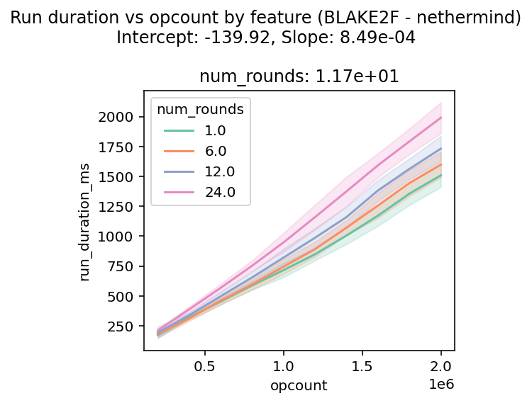

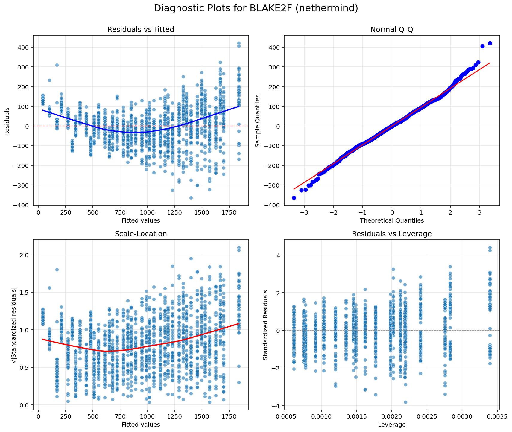


## erigon

OLS model did not run... Error: zero-size array to reduction operation maximum which has no identity

# ECPAIRING

## geth


```python
                            OLS Regression Results                            
==============================================================================
Dep. Variable:        run_duration_ms   R-squared:                       0.316
Model:                            OLS   Adj. R-squared:                  0.315
Method:                 Least Squares   F-statistic:                     495.0
Date:                Wed, 28 Jan 2026   Prob (F-statistic):          1.65e-177
Time:                        10:26:13   Log-Likelihood:                -15516.
No. Observations:                2150   AIC:                         3.104e+04
Df Residuals:                    2147   BIC:                         3.106e+04
Df Model:                           2                                         
Covariance Type:            nonrobust                                         
==============================================================================
                 coef    std err          t      P>|t|      [0.025      0.975]
------------------------------------------------------------------------------
const        228.6212     17.881     12.786      0.000     193.555     263.687
opcount        0.5516      0.018     30.100      0.000       0.516       0.588
num_pairs     25.4878      1.039     24.519      0.000      23.449      27.526
==============================================================================
Omnibus:                       91.690   Durbin-Watson:                   2.158
Prob(Omnibus):                  0.000   Jarque-Bera (JB):              101.682
Skew:                           0.524   Prob(JB):                     8.32e-23
Kurtosis:                       2.809   Cond. No.                     1.71e+03
==============================================================================

Notes:
[1] Standard Errors assume that the covariance matrix of the errors is correctly specified.
[2] The condition number is large, 1.71e+03. This might indicate that there are
strong multicollinearity or other numerical problems.
```

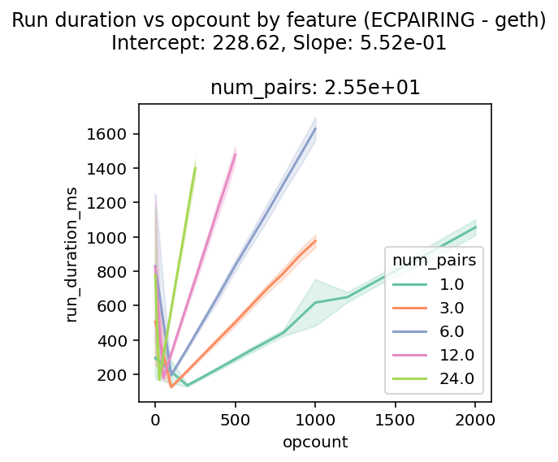

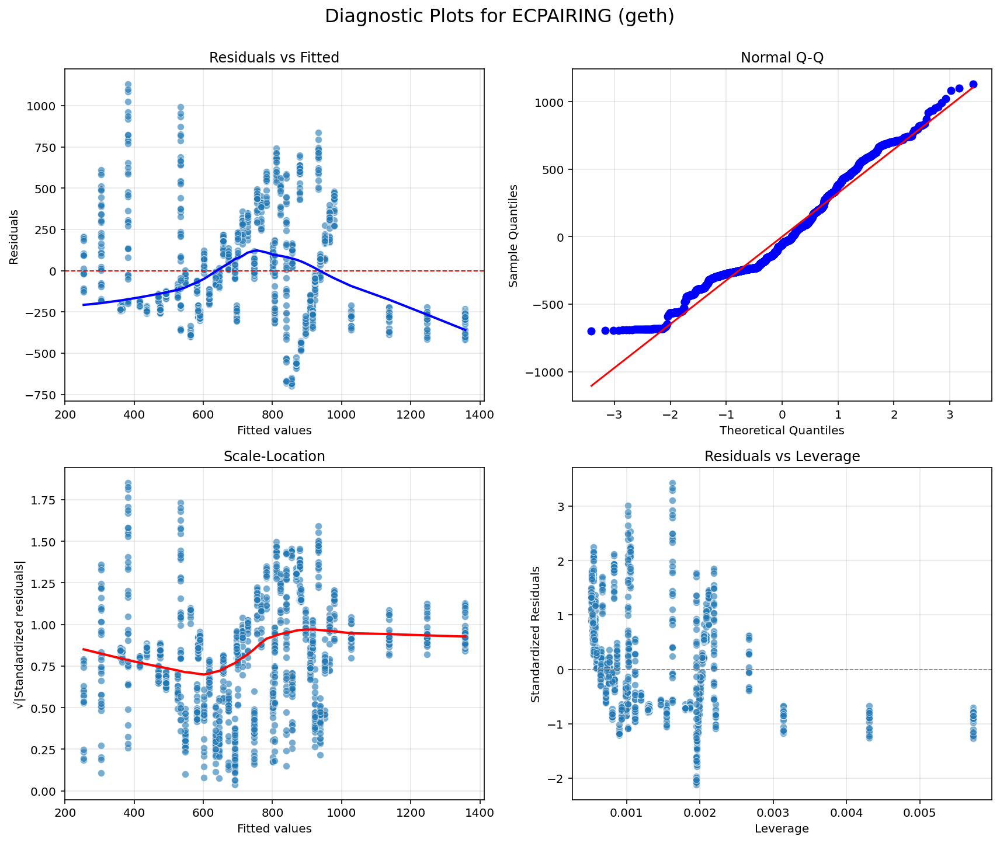


## besu


```python
                            OLS Regression Results                            
==============================================================================
Dep. Variable:        run_duration_ms   R-squared:                       0.314
Model:                            OLS   Adj. R-squared:                  0.314
Method:                 Least Squares   F-statistic:                     491.8
Date:                Wed, 28 Jan 2026   Prob (F-statistic):          1.51e-176
Time:                        10:26:13   Log-Likelihood:                -15493.
No. Observations:                2150   AIC:                         3.099e+04
Df Residuals:                    2147   BIC:                         3.101e+04
Df Model:                           2                                         
Covariance Type:            nonrobust                                         
==============================================================================
                 coef    std err          t      P>|t|      [0.025      0.975]
------------------------------------------------------------------------------
const        224.7861     17.691     12.706      0.000     190.093     259.479
opcount        0.5449      0.018     30.054      0.000       0.509       0.580
num_pairs     25.0163      1.028     24.325      0.000      23.000      27.033
==============================================================================
Omnibus:                       95.561   Durbin-Watson:                   2.118
Prob(Omnibus):                  0.000   Jarque-Bera (JB):              107.574
Skew:                           0.544   Prob(JB):                     4.37e-24
Kurtosis:                       2.872   Cond. No.                     1.71e+03
==============================================================================

Notes:
[1] Standard Errors assume that the covariance matrix of the errors is correctly specified.
[2] The condition number is large, 1.71e+03. This might indicate that there are
strong multicollinearity or other numerical problems.
```

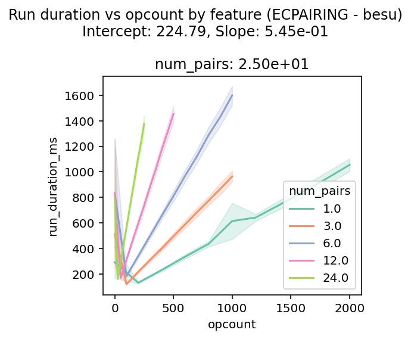

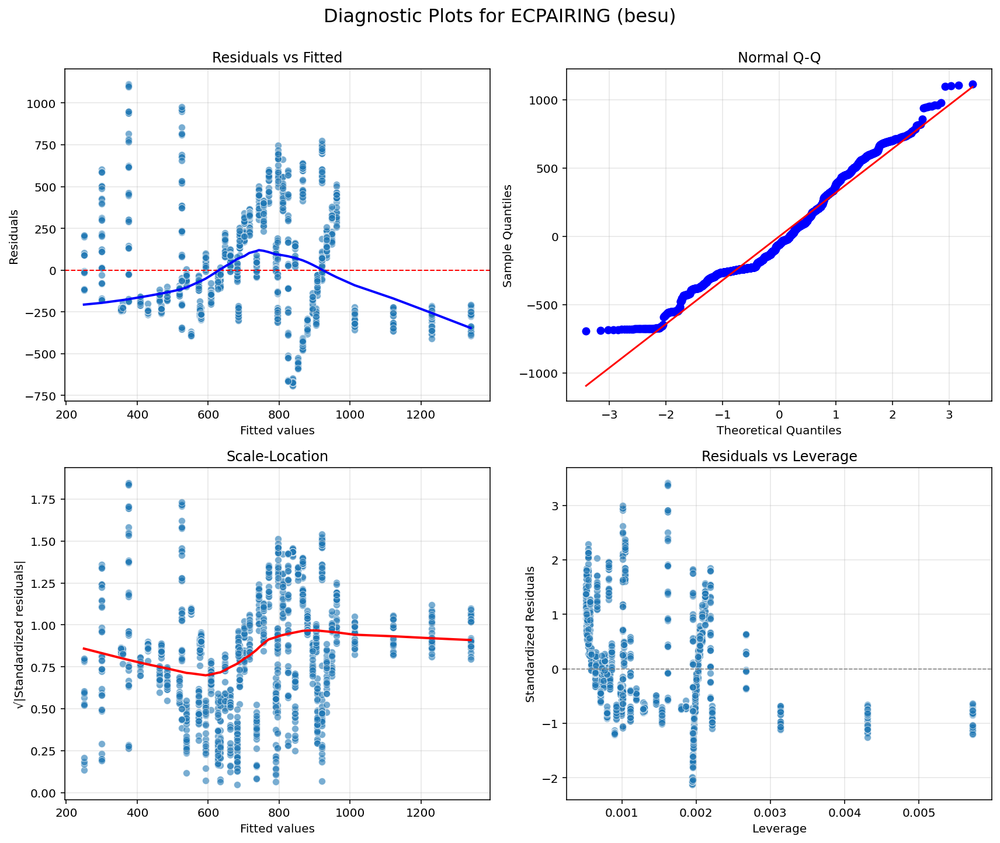


## reth


```python
                            OLS Regression Results                            
==============================================================================
Dep. Variable:        run_duration_ms   R-squared:                       0.286
Model:                            OLS   Adj. R-squared:                  0.285
Method:                 Least Squares   F-statistic:                     319.6
Date:                Wed, 28 Jan 2026   Prob (F-statistic):          1.76e-117
Time:                        10:26:13   Log-Likelihood:                -12807.
No. Observations:                1600   AIC:                         2.562e+04
Df Residuals:                    1597   BIC:                         2.564e+04
Df Model:                           2                                         
Covariance Type:            nonrobust                                         
==============================================================================
                 coef    std err          t      P>|t|      [0.025      0.975]
------------------------------------------------------------------------------
const        496.7620     44.632     11.130      0.000     409.218     584.306
opcount        1.0868      0.046     23.580      0.000       0.996       1.177
num_pairs     54.2068      2.627     20.635      0.000      49.054      59.359
==============================================================================
Omnibus:                       74.277   Durbin-Watson:                   2.087
Prob(Omnibus):                  0.000   Jarque-Bera (JB):               83.028
Skew:                           0.549   Prob(JB):                     9.35e-19
Kurtosis:                       2.802   Cond. No.                     1.66e+03
==============================================================================

Notes:
[1] Standard Errors assume that the covariance matrix of the errors is correctly specified.
[2] The condition number is large, 1.66e+03. This might indicate that there are
strong multicollinearity or other numerical problems.
```

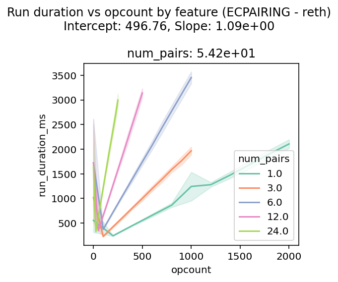

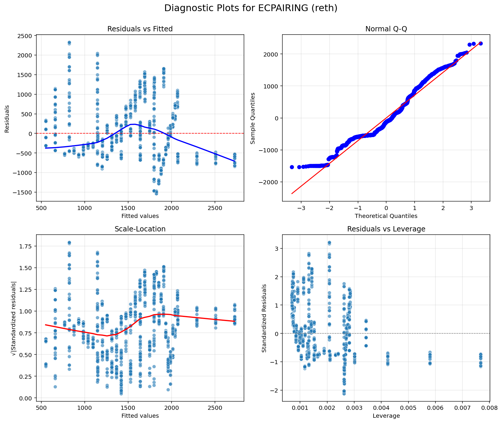


## nethermind


```python
                            OLS Regression Results                            
==============================================================================
Dep. Variable:        run_duration_ms   R-squared:                       0.255
Model:                            OLS   Adj. R-squared:                  0.254
Method:                 Least Squares   F-statistic:                     367.4
Date:                Wed, 28 Jan 2026   Prob (F-statistic):          6.08e-138
Time:                        10:26:14   Log-Likelihood:                -17567.
No. Observations:                2150   AIC:                         3.514e+04
Df Residuals:                    2147   BIC:                         3.516e+04
Df Model:                           2                                         
Covariance Type:            nonrobust                                         
==============================================================================
                 coef    std err          t      P>|t|      [0.025      0.975]
------------------------------------------------------------------------------
const        485.5086     46.422     10.459      0.000     394.472     576.545
opcount        1.0154      0.048     21.342      0.000       0.922       1.109
num_pairs     69.6973      2.699     25.826      0.000      64.405      74.990
==============================================================================
Omnibus:                       84.167   Durbin-Watson:                   2.137
Prob(Omnibus):                  0.000   Jarque-Bera (JB):               89.824
Skew:                           0.482   Prob(JB):                     3.13e-20
Kurtosis:                       2.727   Cond. No.                     1.71e+03
==============================================================================

Notes:
[1] Standard Errors assume that the covariance matrix of the errors is correctly specified.
[2] The condition number is large, 1.71e+03. This might indicate that there are
strong multicollinearity or other numerical problems.
```

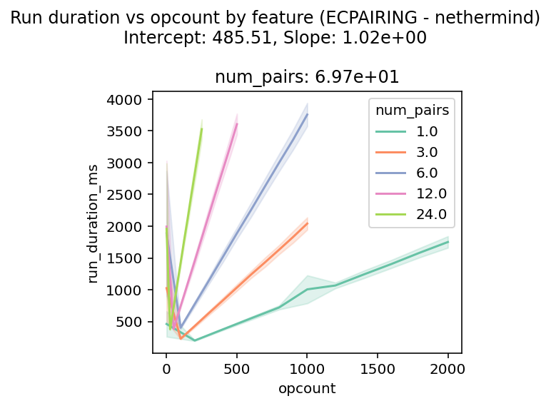

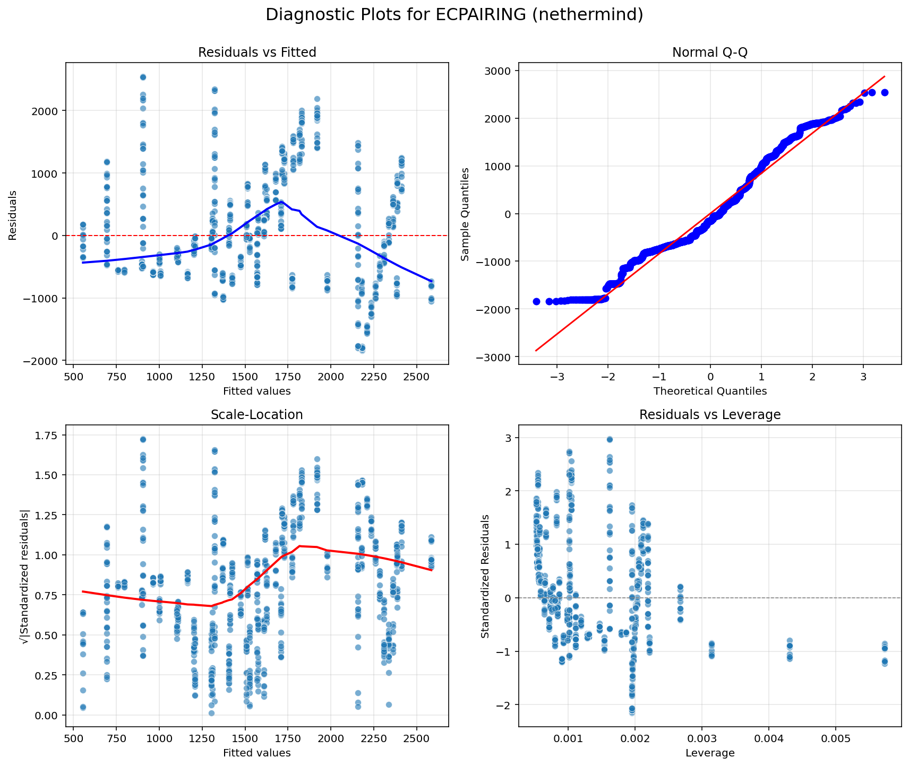


## erigon

OLS model did not run... Error: zero-size array to reduction operation maximum which has no identity
