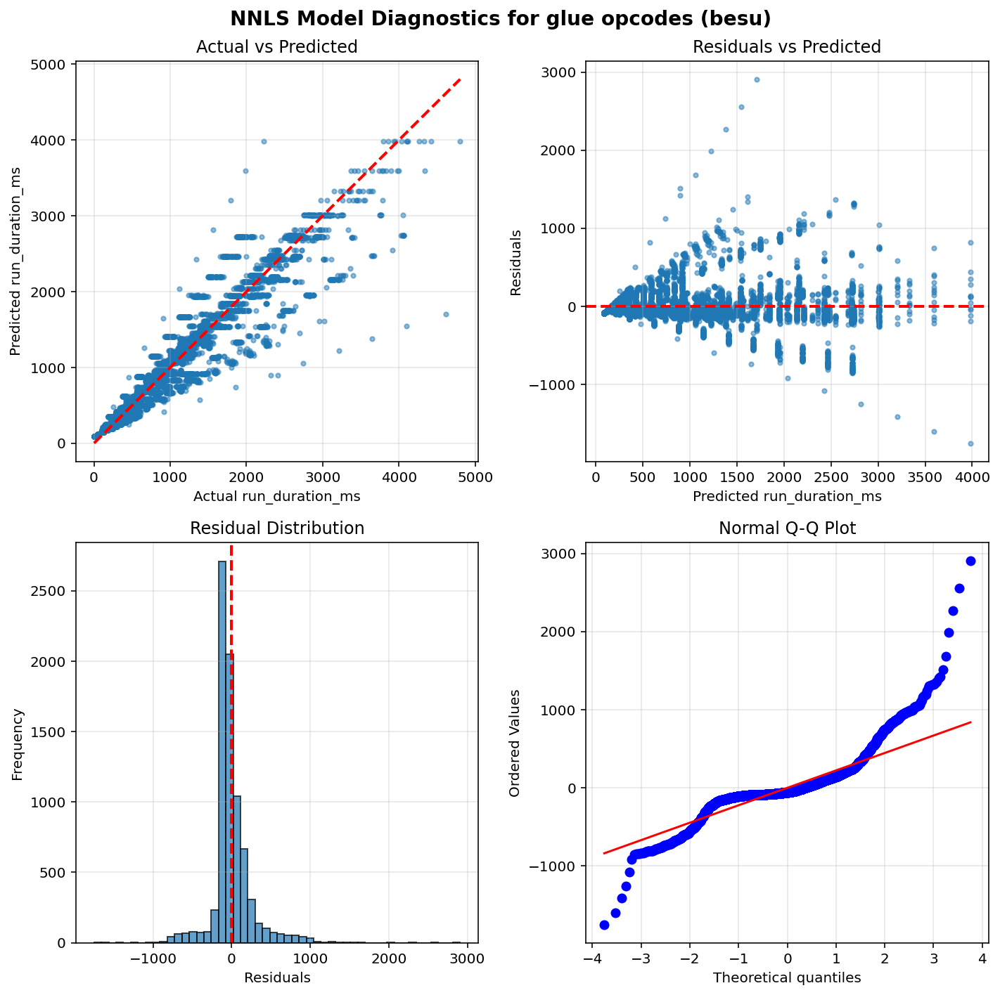
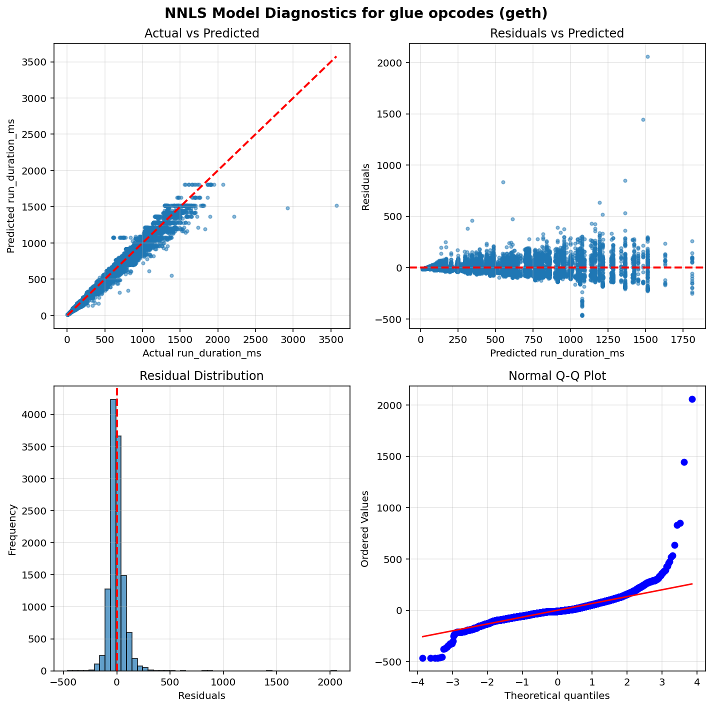
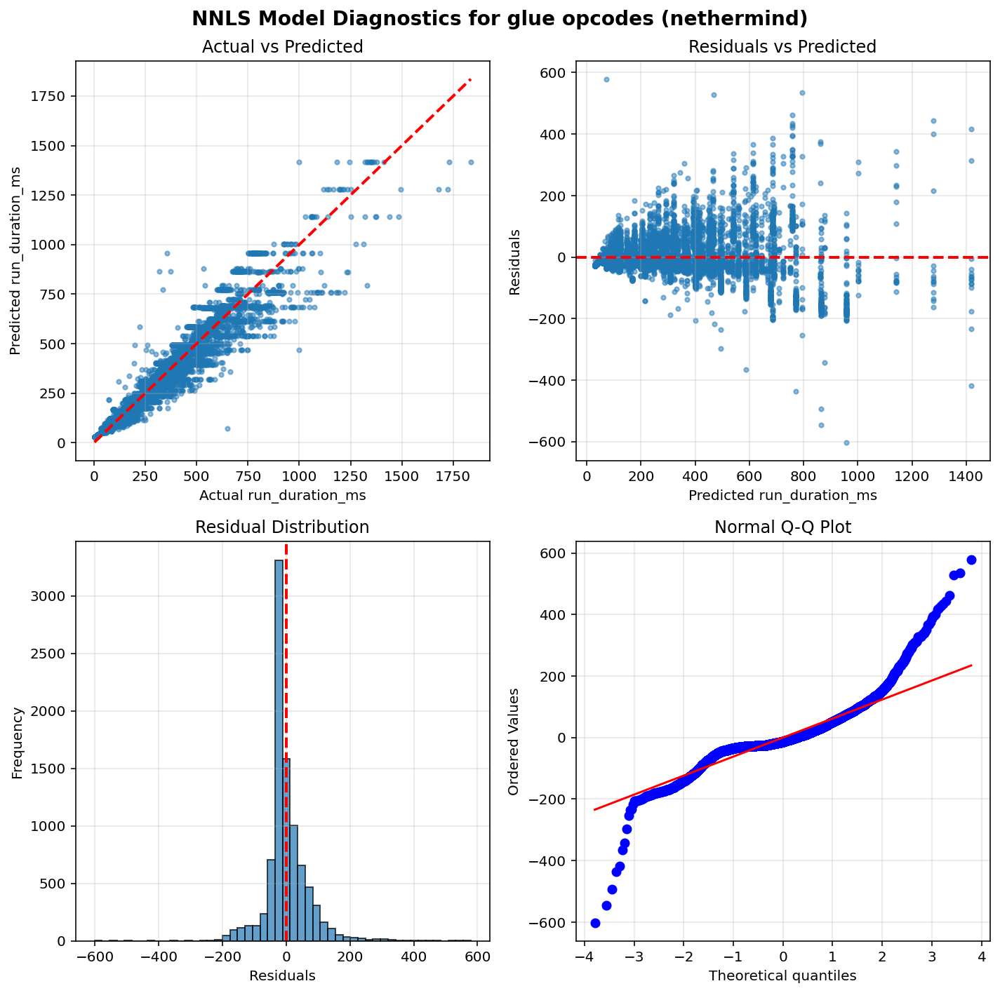
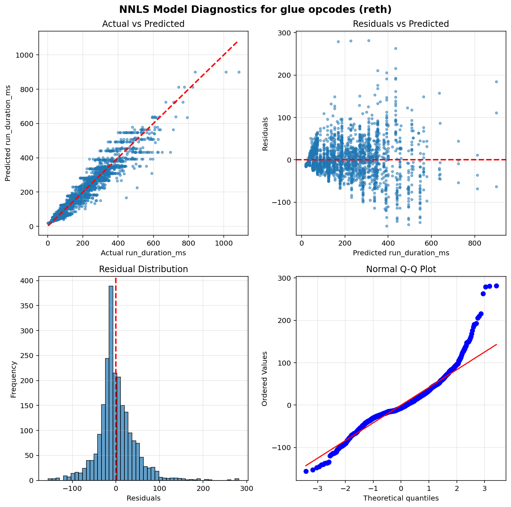
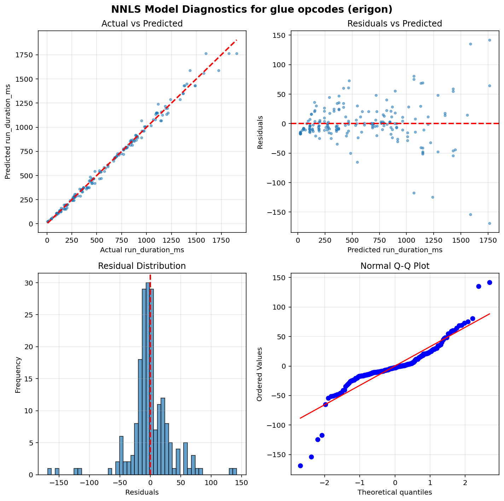

Operation run times estimation results - Glue opcodes
=====================================================

Table of contents
=================

* [besu](#besu)
* [geth](#geth)
* [nethermind](#nethermind)
* [reth](#reth)
* [erigon](#erigon)

# Introduction


This is an automated report generated from the opcode run times
estimation script `./src/glue.py`. The script
uses data generated by running the
[EEST benchmark suite](https://github.com/ethereum/execution-spec-tests/tree/main/tests/benchmark)
with the [Nethermind benchmarking tooling](https://github.com/NethermindEth/gas-benchmarks).

The data includes all the tests for glue operations repriced in EIP-7904 run
between 2026-01-27 and 2026-03-04.

For each operation and client, an NNLS linear regression model is fitted to estimate the
operation run time as a function of the operation count.
The results are presented below.

# How to Interpret the Results

## Model Used


**Non-Negative Least Squares (NNLS) Linear Regression** is used to estimate glue operation runtimes.
This model ensures all coefficients are non-negative, which is physically meaningful since
execution time cannot be negative.

Unlike the per-opcode models used for target operations, glue opcodes are estimated using a
**single model per client** that fits all glue opcode counts as features simultaneously. This means
the model estimates the runtime coefficients of all glue opcodes at the same time by solving:

`runtime = intercept + coef_1 × opcode_1_count + coef_2 × opcode_2_count + ... + coef_n × opcode_n_count`

where each `coef_i` represents the estimated per-execution runtime of the corresponding glue opcode.
This joint estimation approach accounts for correlations between glue opcode counts across tests,
producing more accurate estimates than fitting each glue opcode independently.

Only warm CALL variants are included in the model (cold CALL tests are excluded).

## Model Quality Metrics


Each model reports two key metrics to assess the quality of the fit:

**R² (R-squared / Coefficient of Determination)**
- Ranges from 0 to 1 (or can be negative for very poor fits)
- Measures how well the model explains the variance in the data
- **Interpretation**:
  - R² > 0.9: Excellent fit - the model explains >90% of the variance
  - R² > 0.7: Good fit - the model captures most of the relationship
  - R² > 0.5: Acceptable fit - the model has predictive power but notable variance remains
  - R² < 0.5: Poor fit - the model may not be reliable

**p-value**
- Tests the statistical significance of each coefficient, based on a bootstrap sample estimation
- **Interpretation**:
  - p < 0.05: Statistically significant - the parameter has a real effect on runtime
  - p ≥ 0.05: Not significant - the parameter's effect cannot be distinguished from random noise

We also plot some diagnostic graphs for each operation and client combination to visually assess the model fit.

# besu


```python
==============================================================================
                           NNLS Regression Results                            
==============================================================================
Dep. Variable:          run_duration_ms              R-squared:          0.901
Model:                  NNLS                    Adj. R-squared:          0.901
No. Observations:       8028                              RMSE:         249.35
Df Residuals:           7999                               MAE:         154.12
Df Model:               28     
==============================================================================
                      coef     std err     P-value      [0.025      0.975]
------------------------------------------------------------------------------
         const     89.8838      3.3319       0.000     83.4472     96.7355
          DUP2      0.0000      0.0000       0.000      0.0000      0.0000
  CALLDATACOPY      0.0001      0.0000       0.000      0.0001      0.0001
         PUSH1      0.0000      0.0000       0.000      0.0000      0.0000
          DUP4      0.0000      0.0000       0.000      0.0000      0.0000
         DUP10      0.0000      0.0000       0.000      0.0000      0.0000
      JUMPDEST      0.0000      0.0000       0.000      0.0000      0.0000
          DUP3      0.0000      0.0000       0.000      0.0000      0.0000
         DUP15      0.0000      0.0000       0.000      0.0000      0.0000
          DUP8      0.0000      0.0000       0.000      0.0000      0.0000
           GAS      0.0000      0.0000       0.000      0.0000      0.0000
  CALLDATALOAD      0.0000      0.0000       1.000      0.0000      0.0000
          DUP5      0.0000      0.0000       0.000      0.0000      0.0000
         PUSH2      0.0000      0.0000       0.000      0.0000      0.0000
         DUP11      0.0000      0.0000       0.000      0.0000      0.0000
          DUP9      0.0000      0.0000       0.000      0.0000      0.0000
          JUMP      0.0002      0.0000       0.000      0.0002      0.0002
         DUP16      0.0000      0.0000       0.000      0.0000      0.0000
        PUSH32      0.0000      0.0000       0.000      0.0000      0.0000
          DUP7      0.0000      0.0000       0.000      0.0000      0.0000
         DUP13      0.0000      0.0000       0.000      0.0000      0.0000
         DUP12      0.0000      0.0000       0.000      0.0000      0.0000
         DUP14      0.0000      0.0000       0.000      0.0000      0.0000
    STATICCALL      0.0000      0.0005       1.000      0.0000      0.0012
           POP      0.0012      0.0005       0.258      0.0000      0.0013
         PUSH0      0.0000      0.0000       0.000      0.0000      0.0000
          DUP6      0.0000      0.0000       0.000      0.0000      0.0000
        MSTORE      0.0001      0.0000       0.000      0.0001      0.0001
  CALLDATASIZE      0.0000      0.0000       0.000      0.0000      0.0000
==============================================================================
Notes: Non-negative least squares with bootstrap inference (1000 iterations)
==============================================================================
```




# geth


```python
==============================================================================
                           NNLS Regression Results                            
==============================================================================
Dep. Variable:          run_duration_ms              R-squared:          0.966
Model:                  NNLS                    Adj. R-squared:          0.966
No. Observations:       11981                             RMSE:          72.35
Df Residuals:           11952                              MAE:          46.97
Df Model:               28     
==============================================================================
                      coef     std err     P-value      [0.025      0.975]
------------------------------------------------------------------------------
         const     15.0095      0.8141       0.000     13.3631     16.5420
          DUP2      0.0000      0.0000       0.000      0.0000      0.0000
  CALLDATACOPY      0.0000      0.0000       0.000      0.0000      0.0000
         PUSH1      0.0000      0.0000       0.000      0.0000      0.0000
          DUP4      0.0000      0.0000       0.000      0.0000      0.0000
         DUP10      0.0000      0.0000       0.000      0.0000      0.0000
      JUMPDEST      0.0000      0.0000       0.000      0.0000      0.0000
          DUP3      0.0000      0.0000       0.000      0.0000      0.0000
         DUP15      0.0000      0.0000       0.000      0.0000      0.0000
          DUP8      0.0000      0.0000       0.000      0.0000      0.0000
           GAS      0.0000      0.0000       0.000      0.0000      0.0000
  CALLDATALOAD      0.0000      0.0000       1.000      0.0000      0.0000
          DUP5      0.0000      0.0000       0.000      0.0000      0.0000
         PUSH2      0.0000      0.0000       0.000      0.0000      0.0000
         DUP11      0.0000      0.0000       0.000      0.0000      0.0000
          DUP9      0.0000      0.0000       0.000      0.0000      0.0000
          JUMP      0.0000      0.0000       0.000      0.0000      0.0000
         DUP16      0.0000      0.0000       0.000      0.0000      0.0000
        PUSH32      0.0000      0.0000       0.000      0.0000      0.0000
          DUP7      0.0000      0.0000       0.000      0.0000      0.0000
         DUP13      0.0000      0.0000       0.000      0.0000      0.0000
         DUP12      0.0000      0.0000       0.000      0.0000      0.0000
         DUP14      0.0000      0.0000       0.000      0.0000      0.0000
    STATICCALL      0.0000      0.0003       1.000      0.0000      0.0007
           POP      0.0007      0.0003       0.503      0.0000      0.0007
         PUSH0      0.0000      0.0000       0.000      0.0000      0.0000
          DUP6      0.0000      0.0000       0.000      0.0000      0.0000
        MSTORE      0.0000      0.0000       0.000      0.0000      0.0000
  CALLDATASIZE      0.0000      0.0000       0.000      0.0000      0.0000
==============================================================================
Notes: Non-negative least squares with bootstrap inference (1000 iterations)
==============================================================================
```




# nethermind


```python
==============================================================================
                           NNLS Regression Results                            
==============================================================================
Dep. Variable:          run_duration_ms              R-squared:          0.920
Model:                  NNLS                    Adj. R-squared:          0.920
No. Observations:       9263                              RMSE:          66.20
Df Residuals:           9234                               MAE:          44.09
Df Model:               28     
==============================================================================
                      coef     std err     P-value      [0.025      0.975]
------------------------------------------------------------------------------
         const     29.4851      0.8698       0.000     27.7458     31.1763
          DUP2      0.0000      0.0000       0.000      0.0000      0.0000
  CALLDATACOPY      0.0000      0.0000       0.000      0.0000      0.0000
         PUSH1      0.0000      0.0000       0.000      0.0000      0.0000
          DUP4      0.0000      0.0000       0.000      0.0000      0.0000
         DUP10      0.0000      0.0000       0.000      0.0000      0.0000
      JUMPDEST      0.0000      0.0000       0.000      0.0000      0.0000
          DUP3      0.0000      0.0000       0.000      0.0000      0.0000
         DUP15      0.0000      0.0000       0.000      0.0000      0.0000
          DUP8      0.0000      0.0000       0.000      0.0000      0.0000
           GAS      0.0000      0.0000       0.000      0.0000      0.0000
  CALLDATALOAD      0.0000      0.0000       1.000      0.0000      0.0000
          DUP5      0.0000      0.0000       0.000      0.0000      0.0000
         PUSH2      0.0000      0.0000       0.000      0.0000      0.0000
         DUP11      0.0000      0.0000       0.000      0.0000      0.0000
          DUP9      0.0000      0.0000       0.000      0.0000      0.0000
          JUMP      0.0000      0.0000       0.000      0.0000      0.0000
         DUP16      0.0000      0.0000       0.000      0.0000      0.0000
        PUSH32      0.0000      0.0000       0.000      0.0000      0.0000
          DUP7      0.0000      0.0000       0.000      0.0000      0.0000
         DUP13      0.0000      0.0000       0.000      0.0000      0.0000
         DUP12      0.0000      0.0000       0.000      0.0000      0.0000
         DUP14      0.0000      0.0000       0.000      0.0000      0.0000
    STATICCALL      0.0000      0.0002       1.000      0.0000      0.0005
           POP      0.0005      0.0002       0.108      0.0000      0.0006
         PUSH0      0.0000      0.0000       0.000      0.0000      0.0000
          DUP6      0.0000      0.0000       0.000      0.0000      0.0000
        MSTORE      0.0000      0.0000       0.000      0.0000      0.0000
  CALLDATASIZE      0.0000      0.0000       0.000      0.0000      0.0000
==============================================================================
Notes: Non-negative least squares with bootstrap inference (1000 iterations)
==============================================================================
```




# reth


```python
==============================================================================
                           NNLS Regression Results                            
==============================================================================
Dep. Variable:          run_duration_ms              R-squared:          0.919
Model:                  NNLS                    Adj. R-squared:          0.918
No. Observations:       2252                              RMSE:          43.27
Df Residuals:           2223                               MAE:          30.38
Df Model:               28     
==============================================================================
                      coef     std err     P-value      [0.025      0.975]
------------------------------------------------------------------------------
         const     18.8896      1.1941       0.000     16.5652     21.0996
          DUP2      0.0000      0.0000       0.000      0.0000      0.0000
  CALLDATACOPY      0.0000      0.0000       0.000      0.0000      0.0000
         PUSH1      0.0000      0.0000       0.000      0.0000      0.0000
          DUP4      0.0000      0.0000       0.000      0.0000      0.0000
         DUP10      0.0000      0.0000       0.000      0.0000      0.0000
      JUMPDEST      0.0000      0.0000       0.000      0.0000      0.0000
          DUP3      0.0000      0.0000       0.000      0.0000      0.0000
         DUP15      0.0000      0.0000       0.000      0.0000      0.0000
          DUP8      0.0000      0.0000       0.000      0.0000      0.0000
           GAS      0.0000      0.0000       0.000      0.0000      0.0000
  CALLDATALOAD      0.0000      0.0000       1.000      0.0000      0.0000
          DUP5      0.0000      0.0000       0.000      0.0000      0.0000
         PUSH2      0.0000      0.0000       0.000      0.0000      0.0000
         DUP11      0.0000      0.0000       0.000      0.0000      0.0000
          DUP9      0.0000      0.0000       0.000      0.0000      0.0000
          JUMP      0.0000      0.0000       0.000      0.0000      0.0000
         DUP16      0.0000      0.0000       0.000      0.0000      0.0000
        PUSH32      0.0000      0.0000       0.000      0.0000      0.0000
          DUP7      0.0000      0.0000       0.000      0.0000      0.0000
         DUP13      0.0000      0.0000       0.000      0.0000      0.0000
         DUP12      0.0000      0.0000       0.000      0.0000      0.0000
         DUP14      0.0000      0.0000       0.000      0.0000      0.0000
    STATICCALL      0.0003      0.0002       0.309      0.0000      0.0004
           POP      0.0000      0.0002       1.000      0.0000      0.0004
         PUSH0      0.0000      0.0000       0.000      0.0000      0.0000
          DUP6      0.0000      0.0000       0.000      0.0000      0.0000
        MSTORE      0.0000      0.0000       0.000      0.0000      0.0000
  CALLDATASIZE      0.0000      0.0000       0.000      0.0000      0.0000
==============================================================================
Notes: Non-negative least squares with bootstrap inference (1000 iterations)
==============================================================================
```




# erigon


```python
==============================================================================
                           NNLS Regression Results                            
==============================================================================
Dep. Variable:          run_duration_ms              R-squared:          0.993
Model:                  NNLS                    Adj. R-squared:          0.992
No. Observations:       195                               RMSE:          35.23
Df Residuals:           166                                MAE:          21.85
Df Model:               28     
==============================================================================
                      coef     std err     P-value      [0.025      0.975]
------------------------------------------------------------------------------
         const     23.9199      3.3207       0.000     18.0853     31.1208
          DUP2      0.0000      0.0000       0.044      0.0000      0.0000
  CALLDATACOPY      0.0000      0.0000       0.000      0.0000      0.0000
         PUSH1      0.0000      0.0000       0.002      0.0000      0.0000
          DUP4      0.0000      0.0000       0.123      0.0000      0.0000
         DUP10      0.0000      0.0000       0.021      0.0000      0.0000
      JUMPDEST      0.0000      0.0000       0.000      0.0000      0.0000
          DUP3      0.0000      0.0000       0.000      0.0000      0.0000
         DUP15      0.0000      0.0000       0.050      0.0000      0.0000
          DUP8      0.0000      0.0000       0.020      0.0000      0.0000
           GAS      0.0000      0.0001       0.090      0.0000      0.0003
  CALLDATALOAD      0.0000      0.0000       1.000      0.0000      0.0000
          DUP5      0.0000      0.0000       0.002      0.0000      0.0000
         PUSH2      0.0000      0.0745       0.011      0.0000      0.1147
         DUP11      0.0000      0.0000       0.352      0.0000      0.0000
          DUP9      0.0000      0.0000       0.019      0.0000      0.0000
          JUMP      0.0000      0.0000       0.078      0.0000      0.0000
         DUP16      0.0000      0.0000       0.016      0.0000      0.0000
        PUSH32      0.0000      0.0000       0.121      0.0000      0.0000
          DUP7      0.0000      0.0000       0.014      0.0000      0.0000
         DUP13      0.0000      0.0000       0.384      0.0000      0.0000
         DUP12      0.0000      0.0000       0.016      0.0000      0.0000
         DUP14      0.0000      0.0000       0.043      0.0000      0.0000
    STATICCALL      0.0000      0.0004       1.000      0.0000      0.0003
           POP      0.0003      0.0004       0.190      0.0000      0.0003
         PUSH0      0.0000      0.0000       1.000      0.0000      0.0000
          DUP6      0.0000      0.0000       0.364      0.0000      0.0000
        MSTORE      0.0000      0.0000       0.346      0.0000      0.0000
  CALLDATASIZE      0.0000      0.0000       0.000      0.0000      0.0000
==============================================================================
Notes: Non-negative least squares with bootstrap inference (1000 iterations)
==============================================================================
```



