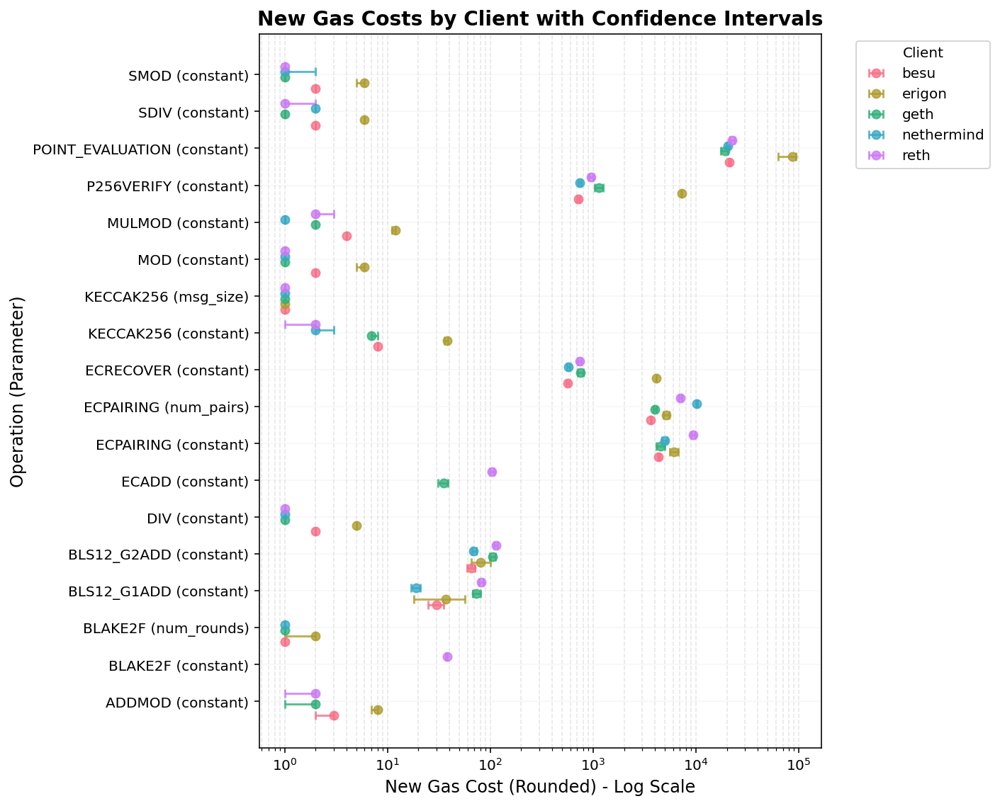
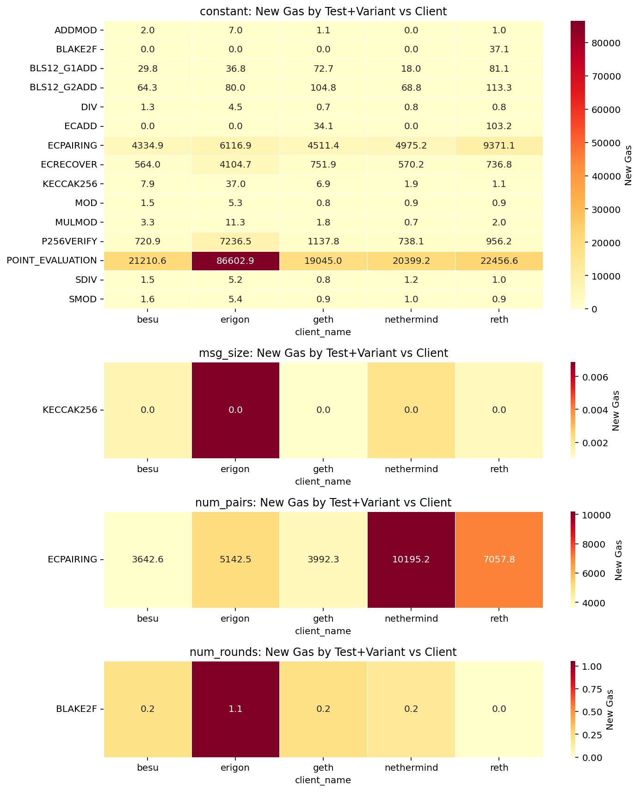

New gas cost proposal for EIP-7904
==================================


This is an automated report generated from the script `./src/estimate_7904_repricings.py`. 
The script uses the runtime estimation output generated by this script. 
The report with the runtime estimation results can be found in 
`./reports/eip-7904/2026-05-01_2026-05-11/runtime_estimation_autogenerated_report.md`.

## Methodology


New gas costs are calculated using an anchor rate of **100 million gas per second**,
which represents a target execution rate for EVM operations. The formula used is:

```
new_gas = (anchor_rate * runtime_ms) / 1000
```

Where `runtime_ms` is the estimated runtime in milliseconds from the regression models.

**Glue opcode adjustment:** Each benchmark test includes auxiliary "glue" opcodes (e.g., PUSH, CALL)
that scale linearly with the main opcode count. Because the regression model's slope coefficient
captures the combined runtime of both the target opcode and its glue opcodes, we subtract the
estimated glue opcode runtime to isolate the true per-execution cost of the target opcode:

```
adjusted_slope = slope - sum(ratio_i * glue_runtime_i)
```

Where `ratio_i` is the average number of executions of glue opcode *i* per execution of the target
opcode (averaged across test parameters), and `glue_runtime_i` is the estimated per-execution runtime
of glue opcode *i* for the given client. Only glue opcodes with a statistically significant fit
(p-value < 0.05) are included in the adjustment. The adjusted slope is clipped to a minimum of zero.
Glue opcode runtimes are estimated separately using the same NNLS regression approach (see the
[glue opcodes report](./glue_opcodes_autogenerated_report.md) for details).

## Understanding the results


The table below shows the **worst-case** gas costs across all tested clients (taking the maximum
estimated cost per operation). This conservative approach ensures that the new gas costs account
for the slowest implementation among the major Ethereum clients.

The **Change** column shows the relative change as a decimal (e.g., 1.0 = 100% increase, 0.5 = 50% increase,
-0.25 = 25% decrease). Operations with `inf` indicate costs going from 0 to a positive value.

For each operation, parameter, and client combination, the worst-case runtime across all
test configurations is selected. If any configuration has a statistically significant fit
(p-value < 0.05), the worst case among significant fits is used. Otherwise, the worst case
from all configurations is used. Operations with no significant fits are listed separately
in the "Errors and caveats" section.

## New gas proposal


The following table shows the new gas cost for all operations and parameters with a good model fit.


|Opcode|Parameter|Current Gas|New Gas (Rounded)|Change|
| :---: | :---: | :---: | :---: | :---: |
|ADDMOD|constant|8|8|0.0|
|BLAKE2F|constant|0|38|inf|
|BLAKE2F|num_rounds|1|2|1.0|
|BLS12_G1ADD|constant|375|82|-0.78|
|BLS12_G2ADD|constant|600|114|-0.81|
|DIV|constant|5|5|0.0|
|ECADD|constant|150|104|-0.31|
|ECPAIRING|constant|45000|9372|-0.79|
|ECPAIRING|num_pairs|34000|10196|-0.7|
|ECRECOVER|constant|3000|4105|0.37|
|KECCAK256|constant|30|38|0.27|
|KECCAK256|msg_size|6|1|-0.83|
|MOD|constant|5|6|0.2|
|MULMOD|constant|8|12|0.5|
|P256VERIFY|constant|6900|7237|0.05|
|POINT_EVALUATION|constant|50000|86603|0.73|
|SDIV|constant|5|6|0.2|
|SMOD|constant|5|6|0.2|

## Gas costs by client


The following plot shows the new gas costs (rounded) for each operation parameter across different clients, with error bars representing the confidence intervals.




The following heatmaps show the new gas costs (rounded) for each opcode and parameter combination, broken down by client.




The following table shows the worst-case runtime (after glue adjustment) and the glue adjustment applied for each opcode, parameter, and client.


|Opcode|Parameter|Client|Runtime (ms)|Glue Adj. (ms)|New Gas (Rounded)|
| :---: | :---: | :---: | :---: | :---: | :---: |
|ADDMOD|constant|besu|0.0000|0.0000|3|
|ADDMOD|constant|erigon|0.0001|0.0000|8|
|ADDMOD|constant|geth|0.0000|0.0000|2|
|ADDMOD|constant|nethermind|0.0000|0.0000|0|
|ADDMOD|constant|reth|0.0000|0.0000|2|
|BLAKE2F|constant|besu|0.0000|0.0018|0|
|BLAKE2F|constant|erigon|0.0000|0.0013|0|
|BLAKE2F|constant|geth|0.0000|0.0002|0|
|BLAKE2F|constant|nethermind|0.0000|0.0008|0|
|BLAKE2F|constant|reth|0.0004|0.0001|38|
|BLAKE2F|num_rounds|besu|0.0000|0.0000|1|
|BLAKE2F|num_rounds|erigon|0.0000|0.0000|2|
|BLAKE2F|num_rounds|geth|0.0000|0.0000|1|
|BLAKE2F|num_rounds|nethermind|0.0000|0.0000|1|
|BLAKE2F|num_rounds|reth|0.0000|0.0000|0|
|BLS12_G1ADD|constant|besu|0.0003|0.0018|30|
|BLS12_G1ADD|constant|erigon|0.0004|0.0014|37|
|BLS12_G1ADD|constant|geth|0.0007|0.0002|73|
|BLS12_G1ADD|constant|nethermind|0.0002|0.0008|19|
|BLS12_G1ADD|constant|reth|0.0008|0.0001|82|
|BLS12_G2ADD|constant|besu|0.0006|0.0018|65|
|BLS12_G2ADD|constant|erigon|0.0008|0.0014|81|
|BLS12_G2ADD|constant|geth|0.0010|0.0002|105|
|BLS12_G2ADD|constant|nethermind|0.0007|0.0008|69|
|BLS12_G2ADD|constant|reth|0.0011|0.0001|114|
|DIV|constant|besu|0.0000|0.0000|2|
|DIV|constant|erigon|0.0000|0.0000|5|
|DIV|constant|geth|0.0000|0.0000|1|
|DIV|constant|nethermind|0.0000|0.0000|1|
|DIV|constant|reth|0.0000|0.0000|1|
|ECADD|constant|besu|0.0000|0.0018|0|
|ECADD|constant|erigon|0.0000|0.0014|0|
|ECADD|constant|geth|0.0003|0.0002|35|
|ECADD|constant|nethermind|0.0000|0.0008|0|
|ECADD|constant|reth|0.0010|0.0001|104|
|ECPAIRING|constant|besu|0.0433|0.0018|4335|
|ECPAIRING|constant|erigon|0.0612|0.0014|6117|
|ECPAIRING|constant|geth|0.0451|0.0003|4512|
|ECPAIRING|constant|nethermind|0.0498|0.0008|4976|
|ECPAIRING|constant|reth|0.0937|0.0001|9372|
|ECPAIRING|num_pairs|besu|0.0364|0.0000|3643|
|ECPAIRING|num_pairs|erigon|0.0514|0.0000|5143|
|ECPAIRING|num_pairs|geth|0.0399|0.0000|3993|
|ECPAIRING|num_pairs|nethermind|0.1020|0.0000|10196|
|ECPAIRING|num_pairs|reth|0.0706|0.0000|7058|
|ECRECOVER|constant|besu|0.0056|0.0018|565|
|ECRECOVER|constant|erigon|0.0410|0.0013|4105|
|ECRECOVER|constant|geth|0.0075|0.0002|752|
|ECRECOVER|constant|nethermind|0.0057|0.0008|571|
|ECRECOVER|constant|reth|0.0074|0.0001|737|
|KECCAK256|constant|besu|0.0001|0.0000|8|
|KECCAK256|constant|erigon|0.0004|0.0000|38|
|KECCAK256|constant|geth|0.0001|0.0000|7|
|KECCAK256|constant|nethermind|0.0000|0.0000|2|
|KECCAK256|constant|reth|0.0000|0.0000|2|
|KECCAK256|msg_size|besu|0.0000|0.0000|1|
|KECCAK256|msg_size|erigon|0.0000|0.0000|1|
|KECCAK256|msg_size|geth|0.0000|0.0000|1|
|KECCAK256|msg_size|nethermind|0.0000|0.0000|1|
|KECCAK256|msg_size|reth|0.0000|0.0000|1|
|MOD|constant|besu|0.0000|0.0000|2|
|MOD|constant|erigon|0.0001|0.0000|6|
|MOD|constant|geth|0.0000|0.0000|1|
|MOD|constant|nethermind|0.0000|0.0000|1|
|MOD|constant|reth|0.0000|0.0000|1|
|MULMOD|constant|besu|0.0000|0.0000|4|
|MULMOD|constant|erigon|0.0001|0.0000|12|
|MULMOD|constant|geth|0.0000|0.0000|2|
|MULMOD|constant|nethermind|0.0000|0.0000|1|
|MULMOD|constant|reth|0.0000|0.0000|2|
|P256VERIFY|constant|besu|0.0072|0.0018|721|
|P256VERIFY|constant|erigon|0.0724|0.0013|7237|
|P256VERIFY|constant|geth|0.0114|0.0002|1138|
|P256VERIFY|constant|nethermind|0.0074|0.0008|739|
|P256VERIFY|constant|reth|0.0096|0.0001|957|
|POINT_EVALUATION|constant|besu|0.2121|0.0018|21211|
|POINT_EVALUATION|constant|erigon|0.8660|0.0013|86603|
|POINT_EVALUATION|constant|geth|0.1905|0.0002|19046|
|POINT_EVALUATION|constant|nethermind|0.2040|0.0008|20400|
|POINT_EVALUATION|constant|reth|0.2246|0.0001|22457|
|SDIV|constant|besu|0.0000|0.0000|2|
|SDIV|constant|erigon|0.0001|0.0000|6|
|SDIV|constant|geth|0.0000|0.0000|1|
|SDIV|constant|nethermind|0.0000|0.0000|2|
|SDIV|constant|reth|0.0000|0.0000|1|
|SMOD|constant|besu|0.0000|0.0000|2|
|SMOD|constant|erigon|0.0001|0.0000|6|
|SMOD|constant|geth|0.0000|0.0000|1|
|SMOD|constant|nethermind|0.0000|0.0000|1|
|SMOD|constant|reth|0.0000|0.0000|1|


The following table shows which test configurations were selected as the worst case for each operation, parameter, and client.


|Opcode|Parameter|Client Name|Test Name|
| :---: | :---: | :---: | :---: |
|ADDMOD|constant|besu|test_mod_arithmetic|
|ADDMOD|constant|erigon|test_mod_arithmetic|
|ADDMOD|constant|geth|test_mod_arithmetic|
|ADDMOD|constant|nethermind|test_mod_arithmetic|
|ADDMOD|constant|reth|test_mod_arithmetic|
|BLAKE2F|constant|besu|test_blake2f_benchmark|
|BLAKE2F|constant|erigon|test_blake2f_benchmark|
|BLAKE2F|constant|geth|test_blake2f_benchmark|
|BLAKE2F|constant|nethermind|test_blake2f_benchmark|
|BLAKE2F|constant|reth|test_blake2f_benchmark|
|BLAKE2F|num_rounds|besu|test_blake2f_uncachable|
|BLAKE2F|num_rounds|erigon|test_blake2f_benchmark|
|BLAKE2F|num_rounds|geth|test_blake2f_benchmark|
|BLAKE2F|num_rounds|nethermind|test_blake2f_uncachable|
|BLAKE2F|num_rounds|reth|test_blake2f_benchmark|
|BLS12_G1ADD|constant|besu|test_bls12_381_uncachable|
|BLS12_G1ADD|constant|erigon|test_bls12_381_uncachable|
|BLS12_G1ADD|constant|geth|test_bls12_381_uncachable|
|BLS12_G1ADD|constant|nethermind|test_bls12_381_uncachable|
|BLS12_G1ADD|constant|reth|test_bls12_381_uncachable|
|BLS12_G2ADD|constant|besu|test_bls12_381_uncachable|
|BLS12_G2ADD|constant|erigon|test_bls12_381_uncachable|
|BLS12_G2ADD|constant|geth|test_bls12_381_uncachable|
|BLS12_G2ADD|constant|nethermind|test_bls12_381_uncachable|
|BLS12_G2ADD|constant|reth|test_bls12_381_uncachable|
|DIV|constant|besu|test_arithmetic|
|DIV|constant|erigon|test_arithmetic|
|DIV|constant|geth|test_arithmetic|
|DIV|constant|nethermind|test_arithmetic|
|DIV|constant|reth|test_arithmetic|
|ECADD|constant|besu|test_alt_bn128_uncachable|
|ECADD|constant|erigon|test_alt_bn128_uncachable|
|ECADD|constant|geth|test_alt_bn128_uncachable|
|ECADD|constant|nethermind|test_alt_bn128_uncachable|
|ECADD|constant|reth|test_alt_bn128_uncachable|
|ECPAIRING|constant|besu|test_ec_pairing|
|ECPAIRING|constant|erigon|test_ec_pairing|
|ECPAIRING|constant|geth|test_ec_pairing|
|ECPAIRING|constant|nethermind|test_ec_pairing|
|ECPAIRING|constant|reth|test_ec_pairing|
|ECPAIRING|num_pairs|besu|test_ec_pairing|
|ECPAIRING|num_pairs|erigon|test_ec_pairing|
|ECPAIRING|num_pairs|geth|test_ec_pairing|
|ECPAIRING|num_pairs|nethermind|test_ec_pairing|
|ECPAIRING|num_pairs|reth|test_ec_pairing|
|ECRECOVER|constant|besu|test_ecrecover|
|ECRECOVER|constant|erigon|test_ecrecover|
|ECRECOVER|constant|geth|test_ecrecover|
|ECRECOVER|constant|nethermind|test_ecrecover|
|ECRECOVER|constant|reth|test_ecrecover|
|KECCAK256|constant|besu|test_keccak_diff_mem_msg_sizes|
|KECCAK256|constant|erigon|test_keccak_diff_mem_msg_sizes|
|KECCAK256|constant|geth|test_keccak_diff_mem_msg_sizes|
|KECCAK256|constant|nethermind|test_keccak_diff_mem_msg_sizes|
|KECCAK256|constant|reth|test_keccak_diff_mem_msg_sizes|
|KECCAK256|msg_size|besu|test_keccak_diff_mem_msg_sizes|
|KECCAK256|msg_size|erigon|test_keccak_diff_mem_msg_sizes|
|KECCAK256|msg_size|geth|test_keccak_diff_mem_msg_sizes|
|KECCAK256|msg_size|nethermind|test_keccak_diff_mem_msg_sizes|
|KECCAK256|msg_size|reth|test_keccak_diff_mem_msg_sizes|
|MOD|constant|besu|test_mod|
|MOD|constant|erigon|test_mod|
|MOD|constant|geth|test_mod|
|MOD|constant|nethermind|test_mod|
|MOD|constant|reth|test_mod|
|MULMOD|constant|besu|test_mod_arithmetic|
|MULMOD|constant|erigon|test_mod_arithmetic|
|MULMOD|constant|geth|test_mod_arithmetic|
|MULMOD|constant|nethermind|test_mod_arithmetic|
|MULMOD|constant|reth|test_mod_arithmetic|
|P256VERIFY|constant|besu|test_p256verify|
|P256VERIFY|constant|erigon|test_p256verify|
|P256VERIFY|constant|geth|test_p256verify|
|P256VERIFY|constant|nethermind|test_p256verify_uncachable|
|P256VERIFY|constant|reth|test_p256verify_uncachable|
|POINT_EVALUATION|constant|besu|test_point_evaluation_uncachable|
|POINT_EVALUATION|constant|erigon|test_point_evaluation|
|POINT_EVALUATION|constant|geth|test_point_evaluation|
|POINT_EVALUATION|constant|nethermind|test_point_evaluation_uncachable|
|POINT_EVALUATION|constant|reth|test_point_evaluation|
|SDIV|constant|besu|test_arithmetic|
|SDIV|constant|erigon|test_arithmetic|
|SDIV|constant|geth|test_arithmetic|
|SDIV|constant|nethermind|test_arithmetic|
|SDIV|constant|reth|test_arithmetic|
|SMOD|constant|besu|test_mod|
|SMOD|constant|erigon|test_mod|
|SMOD|constant|geth|test_mod|
|SMOD|constant|nethermind|test_mod|
|SMOD|constant|reth|test_mod|

## Errors and caveats


The following parameters had a poor model fit:


- BLAKE2F - num_rounds - reth


All operations have estimations for all clients.


The following glue opcodes had a poor fit (p-value >= 0.05), meaning their runtime could not be reliably estimated. The slope of the affected test opcodes is not adjusted for these glue opcodes' contribution:


- **CALLDATALOAD** (clients: besu, erigon, geth, nethermind, reth) — affects: ADDMOD, MOD, MULMOD, SMOD

- **JUMPI** (clients: nethermind) — affects: BLAKE2F, BLS12_G1ADD, BLS12_G2ADD, ECADD, ECPAIRING, P256VERIFY, POINT_EVALUATION

- **MLOAD** (clients: besu, erigon, geth, nethermind, reth) — affects: ECPAIRING, ECRECOVER, P256VERIFY, POINT_EVALUATION

- **POP** (clients: erigon) — affects: ADDMOD, BLAKE2F, BLS12_G1ADD, BLS12_G2ADD, ECADD, ECPAIRING, MOD, MULMOD, P256VERIFY, POINT_EVALUATION, SMOD
