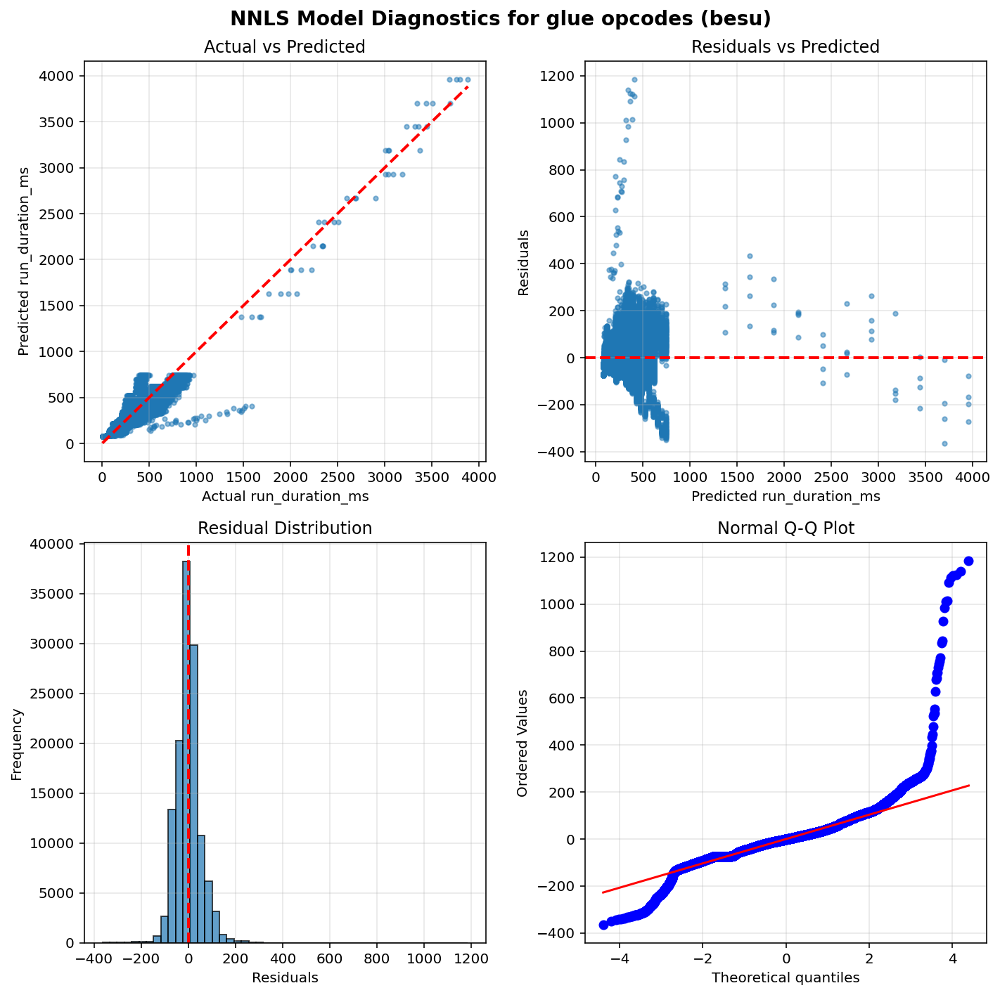
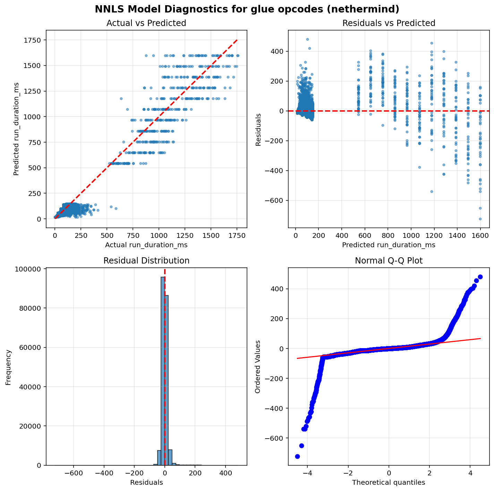
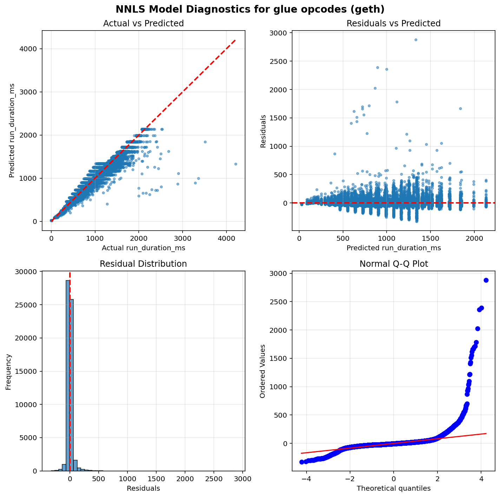
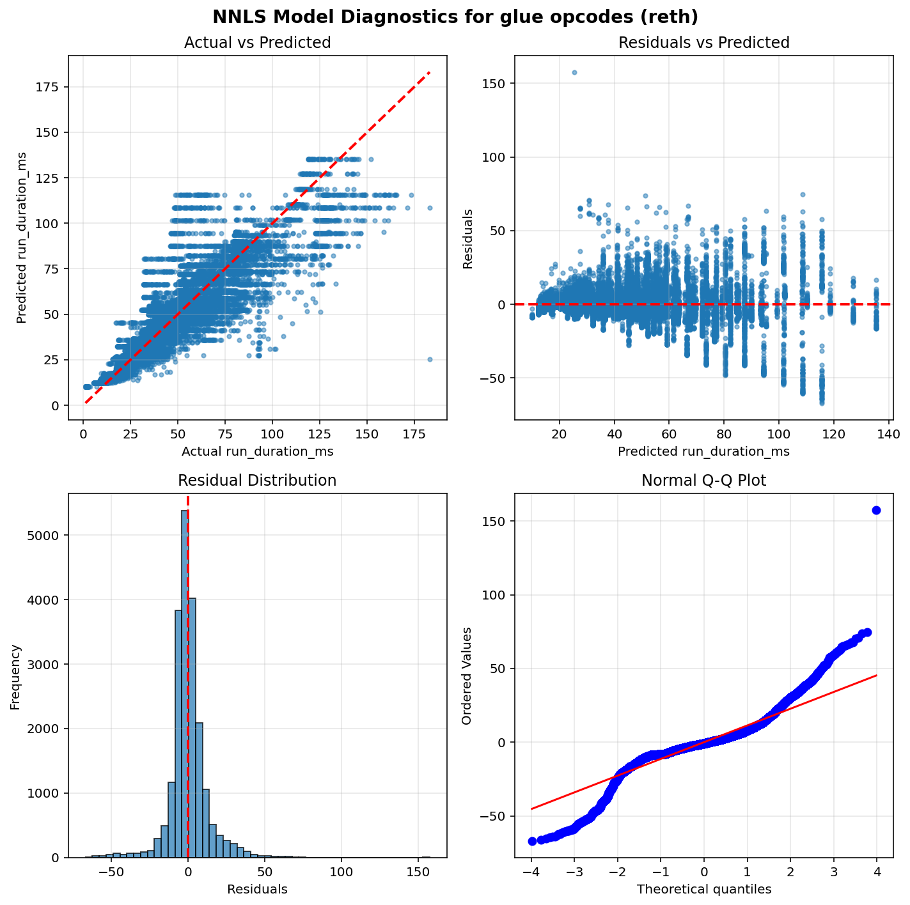
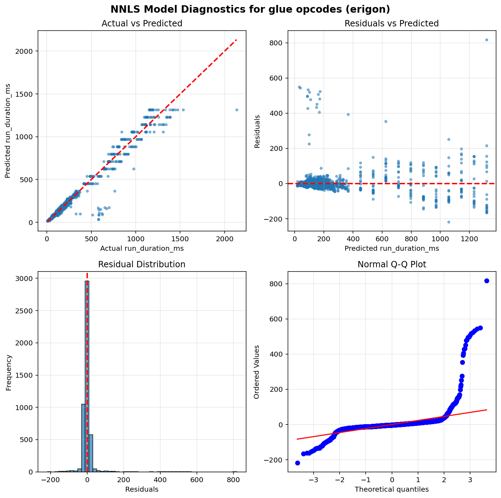

Operation run times estimation results - Glue opcodes
=====================================================

Table of contents
=================

* [besu](#besu)
* [nethermind](#nethermind)
* [geth](#geth)
* [reth](#reth)
* [erigon](#erigon)

# Introduction


This is an automated report generated from the opcode run times
estimation script `./src/glue.py`. The script
uses data generated by running the
[EEST benchmark suite](https://github.com/ethereum/execution-spec-tests/tree/main/tests/benchmark)
with the [Nethermind benchmarking tooling](https://github.com/NethermindEth/gas-benchmarks).

The data includes all the tests for glue operations repriced in EIP-7904 run
between 2026-05-22 and 2026-05-26.

## What is a glue opcode?


A **glue opcode** is an opcode whose execution count scales proportionally with the count of
a target opcode under test. Concretely, an opcode is classified as a glue opcode for a given
test if its execution count has a Pearson correlation ≥ 0.95 with the target opcode count
across different test parameter values, and its average count per target opcode execution
is at least 0.0005. Self-correlations are excluded. This identification is done automatically
from opcode-level execution traces.

The glue opcode set is also expanded transitively: if opcode A is a glue opcode for a target,
and opcode B is a glue opcode for A, then B is also included. This captures indirect
dependencies in the benchmark scaffolding.

**Why do glue opcodes matter?**

Because glue opcodes scale with the target opcode count, their runtime is absorbed into the
slope coefficient when regressing total test execution time on target opcode count. Without
correction, the slope overestimates the target opcode's per-execution runtime. The glue opcode
runtimes estimated in this report are used to compute a **glue adjustment** — a correction
subtracted from each target opcode's slope to remove the contribution of glue opcodes.

## How glue opcode runtimes are estimated?


**Non-Negative Least Squares (NNLS) Linear Regression** is used to estimate glue operation runtimes.
This model ensures all coefficients are non-negative, which is physically meaningful since
execution time cannot be negative.

Unlike the per-opcode models used for target operations, glue opcodes are estimated using a
**single model per client** that fits all glue opcode counts as features simultaneously. This means
the model estimates the runtime coefficients of all glue opcodes at the same time by solving:

`runtime = intercept + coef_1 × opcode_1_count + coef_2 × opcode_2_count + ... + coef_n × opcode_n_count`

where each `coef_i` represents the estimated per-execution runtime of the corresponding glue opcode.
This joint estimation approach accounts for correlations between glue opcode counts across tests,
producing more accurate estimates than fitting each glue opcode independently.

Only warm CALL variants are included in the model (cold CALL tests are excluded).

## Model Quality Metrics


Each model reports two key metrics to assess the quality of the fit:

**R² (R-squared / Coefficient of Determination)**
- Ranges from 0 to 1 (or can be negative for very poor fits)
- Measures how well the model explains the variance in the data
- **Interpretation**:
  - R² > 0.9: Excellent fit - the model explains >90% of the variance
  - R² > 0.7: Good fit - the model captures most of the relationship
  - R² > 0.5: Acceptable fit - the model has predictive power but notable variance remains
  - R² < 0.5: Poor fit - the model may not be reliable

**p-value**
- Tests the statistical significance of each coefficient, based on a bootstrap sample estimation
- **Interpretation**:
  - p < 0.05: Statistically significant - the parameter has a real effect on runtime
  - p ≥ 0.05: Not significant - the parameter's effect cannot be distinguished from random noise

We also plot some diagnostic graphs for each operation and client combination to visually assess the model fit.

# besu


```python
==============================================================================
                           NNLS Regression Results                            
==============================================================================
Dep. Variable:          run_duration_ms              R-squared:          0.871
Model:                  NNLS                    Adj. R-squared:          0.871
No. Observations:       127094                            RMSE:          53.50
Df Residuals:           127058                             MAE:          38.20
Df Model:               35     
==============================================================================
                      coef     std err     P-value      [0.025      0.975]
------------------------------------------------------------------------------
         const     77.0272      0.3379       0.000     76.3986     77.7333
         PUSH2      0.0000      0.0000       0.000      0.0000      0.0000
         DUP16      0.0000      0.0000       0.000      0.0000      0.0000
          DUP8      0.0000      0.0000       0.000      0.0000      0.0000
         PUSH0      0.0000      0.0000       0.000      0.0000      0.0000
          DUP2      0.0000      0.0000       0.000      0.0000      0.0000
         PUSH1      0.0000      0.0000       0.000      0.0000      0.0000
    STATICCALL      0.0016      0.0000       0.000      0.0015      0.0016
        PUSH32      0.0000      0.0000       0.000      0.0000      0.0000
           POP      0.0000      0.0000       0.000      0.0000      0.0000
         MLOAD      0.0000      0.0000       1.000      0.0000      0.0000
          DUP3      0.0000      0.0000       0.000      0.0000      0.0000
          DUP6      0.0000      0.0000       0.000      0.0000      0.0000
            PC      0.0000      0.0000       0.000      0.0000      0.0000
          DUP4      0.0000      0.0000       0.000      0.0000      0.0000
         DUP13      0.0000      0.0000       0.000      0.0000      0.0000
           ADD      0.0000      0.0000       0.000      0.0000      0.0000
         DUP10      0.0000      0.0000       0.000      0.0000      0.0000
           GAS      0.0000      0.0000       0.000      0.0000      0.0000
         DUP15      0.0000      0.0000       0.000      0.0000      0.0000
            GT      0.0000      0.0000       0.000      0.0000      0.0000
  CALLDATASIZE      0.0000      0.0000       0.000      0.0000      0.0000
          DUP9      0.0000      0.0000       0.000      0.0000      0.0000
           SUB      0.0000      0.0000       0.000      0.0000      0.0000
  CALLDATALOAD      0.0000      0.0000       1.000      0.0000      0.0000
         PUSH4      0.0000      0.0000       0.000      0.0000      0.0000
      JUMPDEST      0.0000      0.0000       0.000      0.0000      0.0000
  CALLDATACOPY      0.0000      0.0000       0.000      0.0000      0.0000
         JUMPI      0.0000      0.0000       0.117      0.0000      0.0000
          DUP5      0.0000      0.0000       0.000      0.0000      0.0000
         DUP14      0.0000      0.0000       0.000      0.0000      0.0000
          DUP7      0.0000      0.0000       0.000      0.0000      0.0000
        MSTORE      0.0000      0.0000       0.000      0.0000      0.0000
         DUP12      0.0000      0.0000       0.000      0.0000      0.0000
         DUP11      0.0000      0.0000       0.000      0.0000      0.0000
          JUMP      0.0000      0.0000       0.000      0.0000      0.0000
==============================================================================
Notes: Non-negative least squares with bootstrap inference (1000 iterations)
==============================================================================
```




# nethermind


```python
==============================================================================
                           NNLS Regression Results                            
==============================================================================
Dep. Variable:          run_duration_ms              R-squared:          0.916
Model:                  NNLS                    Adj. R-squared:          0.916
No. Observations:       199859                            RMSE:          17.32
Df Residuals:           199823                             MAE:          10.01
Df Model:               35     
==============================================================================
                      coef     std err     P-value      [0.025      0.975]
------------------------------------------------------------------------------
         const     16.7096      0.0687       0.000     16.5755     16.8554
         PUSH2      0.0000      0.0000       0.000      0.0000      0.0000
         DUP16      0.0000      0.0000       0.000      0.0000      0.0000
          DUP8      0.0000      0.0000       0.000      0.0000      0.0000
         PUSH0      0.0000      0.0000       0.000      0.0000      0.0000
          DUP2      0.0000      0.0000       0.000      0.0000      0.0000
         PUSH1      0.0000      0.0000       0.000      0.0000      0.0000
    STATICCALL      0.0006      0.0000       0.000      0.0006      0.0007
        PUSH32      0.0000      0.0000       0.000      0.0000      0.0000
           POP      0.0000      0.0000       0.000      0.0000      0.0000
         MLOAD      0.0000      0.0000       1.000      0.0000      0.0000
          DUP3      0.0000      0.0000       0.000      0.0000      0.0000
          DUP6      0.0000      0.0000       0.000      0.0000      0.0000
            PC      0.0000      0.0000       0.000      0.0000      0.0000
          DUP4      0.0000      0.0000       0.000      0.0000      0.0000
         DUP13      0.0000      0.0000       0.000      0.0000      0.0000
           ADD      0.0000      0.0000       0.000      0.0000      0.0000
         DUP10      0.0000      0.0000       0.000      0.0000      0.0000
           GAS      0.0000      0.0000       0.000      0.0000      0.0000
         DUP15      0.0000      0.0000       0.000      0.0000      0.0000
            GT      0.0000      0.0000       0.000      0.0000      0.0000
  CALLDATASIZE      0.0000      0.0000       0.000      0.0000      0.0000
          DUP9      0.0000      0.0000       0.000      0.0000      0.0000
           SUB      0.0000      0.0000       0.000      0.0000      0.0000
  CALLDATALOAD      0.0000      0.0000       1.000      0.0000      0.0000
         PUSH4      0.0000      0.0000       0.000      0.0000      0.0000
      JUMPDEST      0.0000      0.0000       0.000      0.0000      0.0000
  CALLDATACOPY      0.0000      0.0000       0.000      0.0000      0.0000
         JUMPI      0.0000      0.0000       0.000      0.0000      0.0000
          DUP5      0.0000      0.0000       0.000      0.0000      0.0000
         DUP14      0.0000      0.0000       0.000      0.0000      0.0000
          DUP7      0.0000      0.0000       0.000      0.0000      0.0000
        MSTORE      0.0000      0.0000       0.000      0.0000      0.0000
         DUP12      0.0000      0.0000       0.000      0.0000      0.0000
         DUP11      0.0000      0.0000       0.000      0.0000      0.0000
          JUMP      0.0000      0.0000       0.000      0.0000      0.0000
==============================================================================
Notes: Non-negative least squares with bootstrap inference (1000 iterations)
==============================================================================
```




# geth


```python
==============================================================================
                           NNLS Regression Results                            
==============================================================================
Dep. Variable:          run_duration_ms              R-squared:          0.984
Model:                  NNLS                    Adj. R-squared:          0.984
No. Observations:       58388                             RMSE:          55.27
Df Residuals:           58352                              MAE:          27.29
Df Model:               35     
==============================================================================
                      coef     std err     P-value      [0.025      0.975]
------------------------------------------------------------------------------
         const     27.0701      0.3226       0.000     26.3980     27.7035
         PUSH2      0.0000      0.0000       0.000      0.0000      0.0000
         DUP16      0.0000      0.0000       0.000      0.0000      0.0000
          DUP8      0.0000      0.0000       0.000      0.0000      0.0000
         PUSH0      0.0000      0.0000       0.000      0.0000      0.0000
          DUP2      0.0000      0.0000       0.000      0.0000      0.0000
         PUSH1      0.0000      0.0000       0.000      0.0000      0.0000
    STATICCALL      0.0006      0.0000       0.000      0.0006      0.0006
        PUSH32      0.0000      0.0000       0.000      0.0000      0.0000
           POP      0.0000      0.0000       0.000      0.0000      0.0000
         MLOAD      0.0000      0.0000       1.000      0.0000      0.0000
          DUP3      0.0000      0.0000       0.000      0.0000      0.0000
          DUP6      0.0000      0.0000       0.000      0.0000      0.0000
            PC      0.0000      0.0000       0.000      0.0000      0.0000
          DUP4      0.0000      0.0000       0.000      0.0000      0.0000
         DUP13      0.0000      0.0000       0.000      0.0000      0.0000
           ADD      0.0000      0.0000       0.000      0.0000      0.0000
         DUP10      0.0000      0.0000       0.000      0.0000      0.0000
           GAS      0.0000      0.0000       0.000      0.0000      0.0000
         DUP15      0.0000      0.0000       0.000      0.0000      0.0000
            GT      0.0000      0.0000       0.000      0.0000      0.0000
  CALLDATASIZE      0.0000      0.0000       0.000      0.0000      0.0000
          DUP9      0.0000      0.0000       0.000      0.0000      0.0000
           SUB      0.0000      0.0000       0.000      0.0000      0.0000
  CALLDATALOAD      0.0000      0.0000       1.000      0.0000      0.0000
         PUSH4      0.0000      0.0000       0.000      0.0000      0.0000
      JUMPDEST      0.0000      0.0000       0.000      0.0000      0.0000
  CALLDATACOPY      0.0000      0.0000       0.000      0.0000      0.0000
         JUMPI      0.0000      0.0000       0.000      0.0000      0.0000
          DUP5      0.0000      0.0000       0.000      0.0000      0.0000
         DUP14      0.0000      0.0000       0.000      0.0000      0.0000
          DUP7      0.0000      0.0000       0.000      0.0000      0.0000
        MSTORE      0.0000      0.0000       0.000      0.0000      0.0000
         DUP12      0.0000      0.0000       0.000      0.0000      0.0000
         DUP11      0.0000      0.0000       0.000      0.0000      0.0000
          JUMP      0.0000      0.0000       0.000      0.0000      0.0000
==============================================================================
Notes: Non-negative least squares with bootstrap inference (1000 iterations)
==============================================================================
```




# reth


```python
==============================================================================
                           NNLS Regression Results                            
==============================================================================
Dep. Variable:          run_duration_ms              R-squared:          0.799
Model:                  NNLS                    Adj. R-squared:          0.798
No. Observations:       20581                             RMSE:          12.05
Df Residuals:           20545                              MAE:           7.79
Df Model:               35     
==============================================================================
                      coef     std err     P-value      [0.025      0.975]
------------------------------------------------------------------------------
         const     10.0508      0.1324       0.000      9.7959     10.3091
         PUSH2      0.0000      0.0000       0.000      0.0000      0.0000
         DUP16      0.0000      0.0000       0.000      0.0000      0.0000
          DUP8      0.0000      0.0000       0.000      0.0000      0.0000
         PUSH0      0.0000      0.0000       0.000      0.0000      0.0000
          DUP2      0.0000      0.0000       0.000      0.0000      0.0000
         PUSH1      0.0000      0.0000       0.000      0.0000      0.0000
    STATICCALL      0.0000      0.0000       0.000      0.0000      0.0000
        PUSH32      0.0000      0.0000       0.000      0.0000      0.0000
           POP      0.0000      0.0000       0.000      0.0000      0.0000
         MLOAD      0.0000      0.0000       1.000      0.0000      0.0000
          DUP3      0.0000      0.0000       0.000      0.0000      0.0000
          DUP6      0.0000      0.0000       0.000      0.0000      0.0000
            PC      0.0000      0.0000       0.000      0.0000      0.0000
          DUP4      0.0000      0.0000       0.000      0.0000      0.0000
         DUP13      0.0000      0.0000       0.000      0.0000      0.0000
           ADD      0.0000      0.0000       0.000      0.0000      0.0000
         DUP10      0.0000      0.0000       0.000      0.0000      0.0000
           GAS      0.0000      0.0000       0.000      0.0000      0.0000
         DUP15      0.0000      0.0000       0.000      0.0000      0.0000
            GT      0.0000      0.0000       0.000      0.0000      0.0000
  CALLDATASIZE      0.0000      0.0000       0.000      0.0000      0.0000
          DUP9      0.0000      0.0000       0.000      0.0000      0.0000
           SUB      0.0000      0.0000       0.000      0.0000      0.0000
  CALLDATALOAD      0.0000      0.0000       1.000      0.0000      0.0000
         PUSH4      0.0000      0.0000       0.000      0.0000      0.0000
      JUMPDEST      0.0000      0.0000       0.000      0.0000      0.0000
  CALLDATACOPY      0.0000      0.0000       0.000      0.0000      0.0000
         JUMPI      0.0000      0.0000       0.000      0.0000      0.0000
          DUP5      0.0000      0.0000       0.000      0.0000      0.0000
         DUP14      0.0000      0.0000       0.000      0.0000      0.0000
          DUP7      0.0000      0.0000       0.000      0.0000      0.0000
        MSTORE      0.0000      0.0000       0.000      0.0000      0.0000
         DUP12      0.0000      0.0000       0.000      0.0000      0.0000
         DUP11      0.0000      0.0000       0.000      0.0000      0.0000
          JUMP      0.0000      0.0000       0.000      0.0000      0.0000
==============================================================================
Notes: Non-negative least squares with bootstrap inference (1000 iterations)
==============================================================================
```




# erigon


```python
==============================================================================
                           NNLS Regression Results                            
==============================================================================
Dep. Variable:          run_duration_ms              R-squared:          0.959
Model:                  NNLS                    Adj. R-squared:          0.959
No. Observations:       4840                              RMSE:          37.31
Df Residuals:           4804                               MAE:          13.63
Df Model:               35     
==============================================================================
                      coef     std err     P-value      [0.025      0.975]
------------------------------------------------------------------------------
         const     17.9259      0.9209       0.000     16.1755     19.7744
         PUSH2      0.0000      0.0000       0.000      0.0000      0.0000
         DUP16      0.0000      0.0000       0.000      0.0000      0.0000
          DUP8      0.0000      0.0000       0.000      0.0000      0.0000
         PUSH0      0.0000      0.0000       0.000      0.0000      0.0000
          DUP2      0.0000      0.0000       0.000      0.0000      0.0000
         PUSH1      0.0000      0.0000       0.000      0.0000      0.0000
    STATICCALL      0.0005      0.0000       0.000      0.0005      0.0005
        PUSH32      0.0000      0.0000       0.000      0.0000      0.0000
           POP      0.0000      0.0000       0.000      0.0000      0.0000
         MLOAD      0.0000      0.0000       1.000      0.0000      0.0000
          DUP3      0.0000      0.0000       0.000      0.0000      0.0000
          DUP6      0.0000      0.0000       0.000      0.0000      0.0000
            PC      0.0000      0.0000       0.000      0.0000      0.0000
          DUP4      0.0000      0.0000       0.000      0.0000      0.0000
         DUP13      0.0000      0.0000       0.000      0.0000      0.0000
           ADD      0.0000      0.0000       0.000      0.0000      0.0000
         DUP10      0.0000      0.0000       0.000      0.0000      0.0000
           GAS      0.0000      0.0000       0.000      0.0000      0.0000
         DUP15      0.0000      0.0000       0.000      0.0000      0.0000
            GT      0.0000      0.0000       0.000      0.0000      0.0000
  CALLDATASIZE      0.0000      0.0000       0.000      0.0000      0.0000
          DUP9      0.0000      0.0000       0.000      0.0000      0.0000
           SUB      0.0000      0.0000       0.000      0.0000      0.0000
  CALLDATALOAD      0.0000      0.0000       1.000      0.0000      0.0000
         PUSH4      0.0000      0.0000       0.000      0.0000      0.0000
      JUMPDEST      0.0000      0.0000       0.000      0.0000      0.0000
  CALLDATACOPY      0.0000      0.0000       0.000      0.0000      0.0000
         JUMPI      0.0000      0.0000       0.000      0.0000      0.0000
          DUP5      0.0000      0.0000       0.000      0.0000      0.0000
         DUP14      0.0000      0.0000       0.000      0.0000      0.0000
          DUP7      0.0000      0.0000       0.000      0.0000      0.0000
        MSTORE      0.0000      0.0000       0.000      0.0000      0.0000
         DUP12      0.0000      0.0000       0.000      0.0000      0.0000
         DUP11      0.0000      0.0000       0.000      0.0000      0.0000
          JUMP      0.0000      0.0000       0.000      0.0000      0.0000
==============================================================================
Notes: Non-negative least squares with bootstrap inference (1000 iterations)
==============================================================================
```



