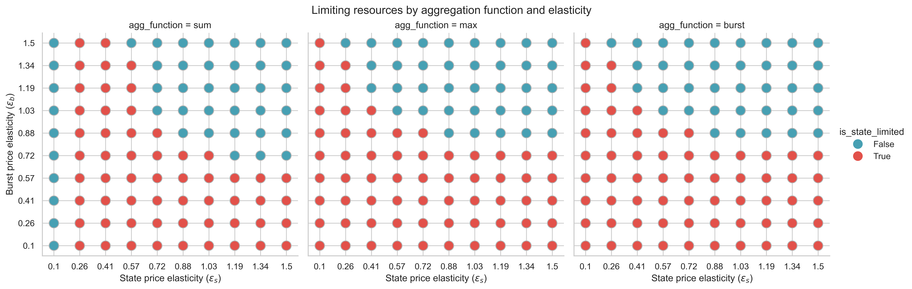
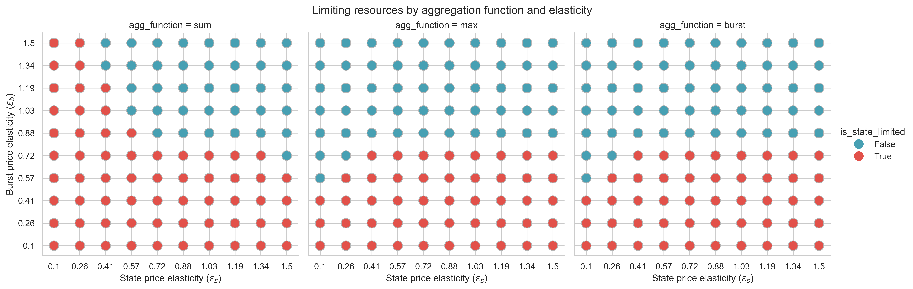
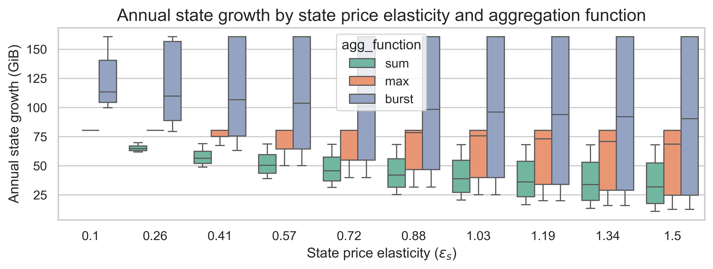
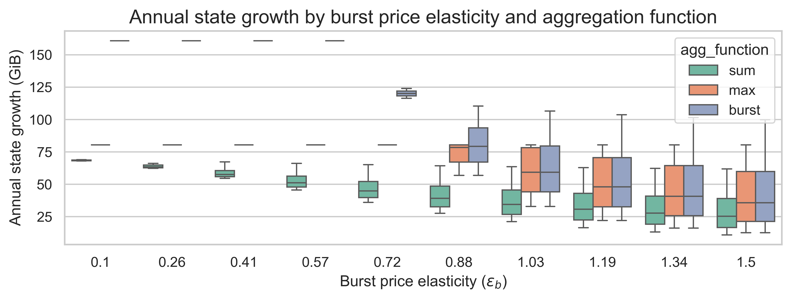
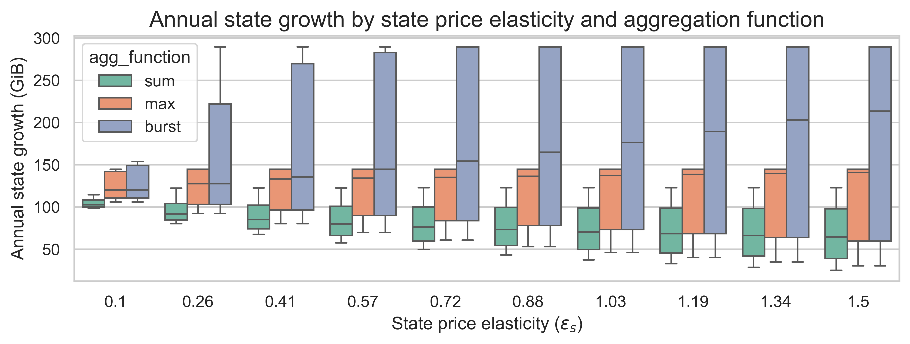
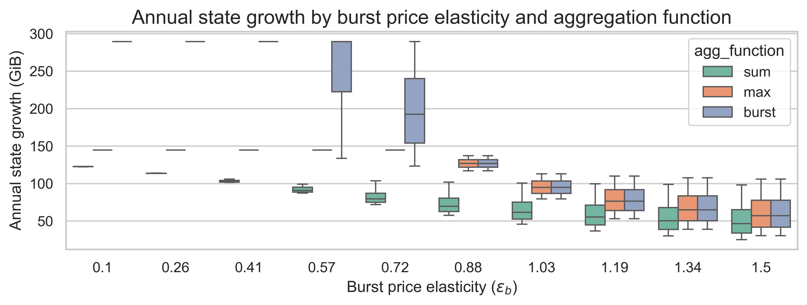
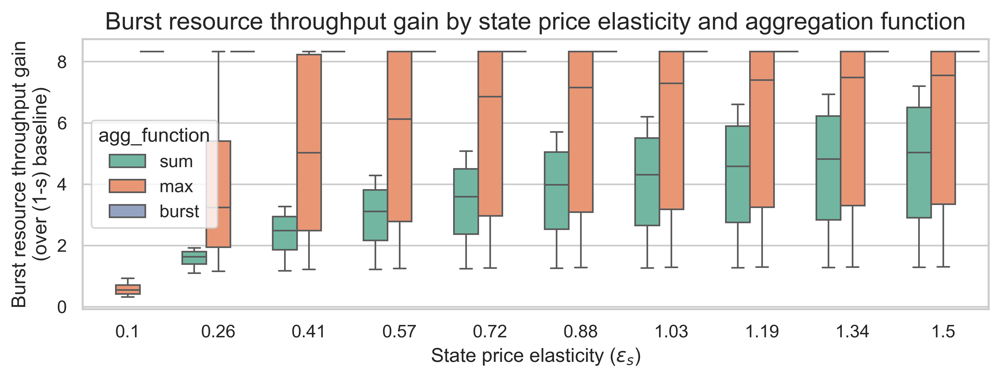
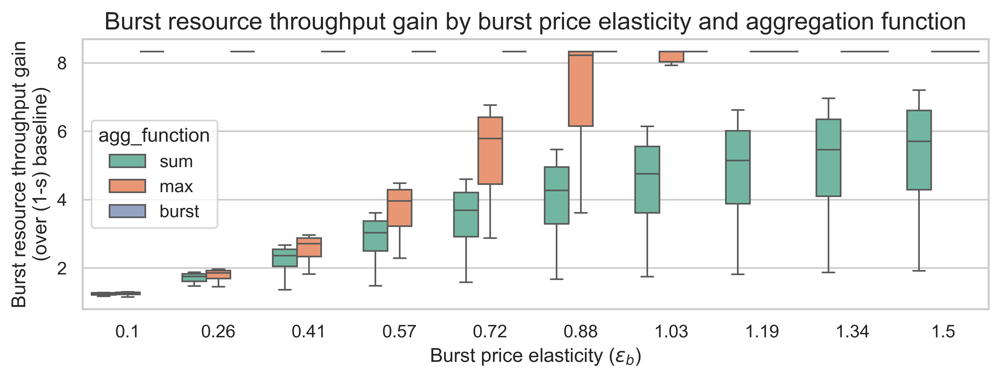
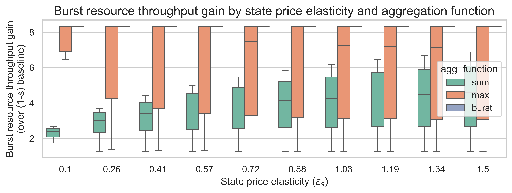
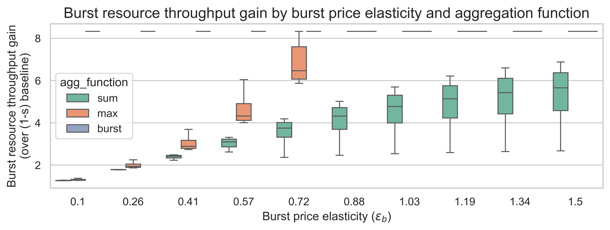

# Analysis of different aggregation functions for EIP-8037 under different elasticity regimes

#### Maria Silva, February 2026

This report examines the performance of different aggregation functions for EIP-8037's multidimensional metering system across various demand elasticity regimes. The aggregation function impacts how state gas and burst gas interact when setting the base fee, affecting throughput and state growth.

We evaluate three aggregation functions:
- **Sum**: Additive resource sharing (current EIP-1559 method)
- **Max**: Pricing set by the bottleneck resource (current EIP-8037 proposal)
- **Burst**: Pricing influenced only by burst resources (alternative method)

Our analysis models equilibrium outcomes for different elasticity scenarios and two repricing multipliers (10x and 18x). We find a trade-off: higher throughput gains often lead to increased state growth, while effective state growth control typically sacrifices throughput.

Based on our analysis, we identify two viable paths forward for EIP-8037:

**Option 1: Burst function with higher state cost increase (e.g., 20x-30x)**
- Maximizes throughput gains (~8x), ensuring EIP-8037 delivers its full scaling promise
- Requires substantially higher state repricing to compensate for ignoring state usage in base fee updates
- Best choice if throughput is the primary objective and high state repricing is acceptable

**Option 2: Max function with moderate state cost increase (e.g., 10x)**
- Balances throughput gains (2-8x depending on limiting resource) with state growth control
- Performance depends critically on burst demand elasticity
- Works well when burst resources are price-elastic, but can underperform in low-elasticity regimes
- Best choice if we want to avoid extreme state repricing while maintaining good throughput

The sum function, while providing the strongest state growth control, delivers the lowest throughput gains and is therefore not recommended for EIP-8037's goal of scaling throughput.

**Critical next step**: The choice between these options depends on empirical measurement of burst resource price elasticity. We recommend conducting empirical analysis using historical base fee and gas consumption data to estimate burst resource elasticity before finalizing the EIP-8037 design.

## EIP-8037

[EIP-8037](https://eips.ethereum.org/EIPS/eip-8037) proposes a gas schedule repricing for EVM operations that create new state (e.g., `SSTORE`, contract creation). The goal is to increase the cost of state-creating operations relative to other ("burst") operations, allowing for higher overall throughput while keeping state growth manageable.

The current EIP-8037 design uses a **multidimensional metering** approach similar to [EIP-8011](https://eips.ethereum.org/EIPS/eip-8011), where state creation and burst resources are metered independently by state gas and regular gas, respectively. With multidimensional metering, both the block validity condition that defines when a block is too full and the base fee update for the next block only depend on the bottleneck resource.

Previous work identified two failure modes for EIP-8037 (see [Failure modes in EIP-8037 and state-gas scaling](https://ethresear.ch/t/failure-modes-in-eip-8037-and-state-gas-scaling/23975)) that arise from using the bottleneck resource to update the base fee:

1. **State underutilization failure**: If demand for state creation is relatively lower than predicted, burst resources will be the bottleneck and too little state is created under equilibrium (its price is too high to match demand).
2. **Throughput failure**: If demand for state creation is relatively higher than predicted, too little regular gas is consumed under equilibrium (its price is too high to match demand).

Arguably, the throughput failure is the most worrisome as the demand for state creation would reduce our scaling gains on all the other resources. Therefore, it is important to understand how bad this failure mode can get and how different aggregation functions for the base fee update can impact the throughput gain and state growth under equilibrium.

We consider three possible aggregation functions:

| Function | Equilibrium Condition | Description |
|----------|----------------------|-------------|
| **Sum** | state_gas + regular_gas | Resources share block space additively. This is the function we use today. |
| **Max** | max(state_gas, regular_gas) | Each resource has independent target and the bottleneck resource sets the price. This is the current proposal in EIP-8037 |
| **Burst** | regular_gas | Only the burst resource affects pricing and state "rides free". This is a new function we want to test. |

## Methodology

### Model

We use the same equilibrium model created for our previous analysis on [state growth scenarios and the impact of repricings](https://ethresear.ch/t/state-growth-scenarios-and-the-impact-of-repricings/23476). The model assumes:

- **Isoelastic demand**: Users respond to price changes with constant elasticity
  - State demand: $S(p) = A_s \cdot p^{-\varepsilon_s}$
  - Burst demand: $B(p) = A_b \cdot p^{-\varepsilon_b}$
- **EIP-1559 equilibrium**: The base fee adjusts until gas usage meets the target (50% of limit)

The **price elasticity** ($\varepsilon$) measures how sensitive demand is to price changes:

- $\varepsilon < 1$: Inelastic demand (users are not very price-sensitive)
- $\varepsilon > 1$: Elastic demand (users significantly reduce usage when prices rise)

### Equilibrium derivation

For the **sum** function, we solve numerically for the base fee where total gas usage equals the target. For details, see the full derivation in our previous [post](https://ethresear.ch/t/state-growth-scenarios-and-the-impact-of-repricings/23476#p-57031-h-31-model-and-derivation-5).

For the **max** function, we compute two candidate equilibria and take the maximum:

- State-limited: $r_{\text{state}} = (s \cdot m^{1-\varepsilon_s} / n)^{1/\varepsilon_s}$
- Burst-limited: $r_{\text{burst}} = ((1-s) / n)^{1/\varepsilon_b}$

The intuition is that whichever resource requires a higher base fee to reach the target becomes the limiting resource. For the full derivation, see [this report](max_based_equilibrium_derivation.md).

For the **burst** function, we only consider burst demand when setting the base fee, ignoring state usage entirely. We use the same formula as the burst-limited equation from the **max** function.

### Parameters and calibration

| Parameter | Value | Description |
|-----------|-------|-------------|
| $n$ | 5 | Gas limit multiplier (5x increase). This would lead to increasing the block limit from 60M gas to 300M gas |
| $m$ | 18 or 10 | State gas cost multiplier, i.e., how much state creation costs increases. EIP-8037 is currently setting a 18x increase |
| $s$ | 0.4 | Initial state share of gas usage. We're using a higher value than in our previous analysis to account for [latest empirical analysis](https://github.com/misilva73/evm-gas-repricings/blob/939e1284a3ab50e1c55d992b31186f81e80b0328/reports/gas_limit_increase_empirical_analysis.md#impact-on-state-growth) |
| $G^0$ | 60M gas | Current gas limit |
| $b^0$ | 1 gwei | Baseline base fee |
| $S^0$ | 47.4 kB/block | Current state growth (325 MiB/day), taken from the [latest empirical analysis](https://github.com/misilva73/evm-gas-repricings/blob/939e1284a3ab50e1c55d992b31186f81e80b0328/reports/gas_limit_increase_empirical_analysis.md#impact-on-state-growth) |
| $\varepsilon_s, \varepsilon_b$ | 0.1 to 1.5 | Price elasticities. We are sweeping a range of values as the actual values are yet unknown |

## Limiting resource

The "limiting resource" determines which type of gas usage sets the equilibrium base fee. Understanding this helps predict how each aggregation function behaves.

### With 18x state gas repricing (m=18)

**Key findings:**

- **Sum function**: The limiting resource depends on the relationship between elasticities. State tends to be limiting when burst elasticity ($\varepsilon_b$) exceeds state elasticity ($\varepsilon_s$).
- **Max function**: Similar pattern to sum, with state being limiting in roughly the same regions.
- **Burst function**: By design, burst is always the limiting resource (state is ignored).

### With 10x state gas repricing (m=10)

**Key findings:**

- The patterns remain similar to m=18.
- With lower state costs, the regions where burst becomes limiting expand slightly for sum and max functions.

## Impact on state growth

One of the primary concerns with increasing the gas limit is the potential for accelerated state growth. Currently, the Ethereum state is growing at approximately 100 GiB per year. In this section, we analyze how different aggregation functions and repricing multipliers affect state growth under equilibrium conditions. We examine two scenarios: the current EIP-8037 proposal with an 18x state gas cost increase (m=18) and a more moderate 10x increase (m=10). For each scenario, we evaluate how state growth varies across different elasticity regimes for the three aggregation functions under consideration.

### With 18x state gas repricing (m=18)

**Key findings:**

1. **Sum consistently achieves the lowest state growth** (25-70 GiB/year), making it the best choice for state growth mitigation.

2. **Burst produces the highest state growth** (80-160 GiB/year), staying nearly constant regardless of elasticities. This is expected since burst ignores state usage when pricing.

3. **Max falls between the two**, with state growth ranging from 40-95 GiB/year depending on elasticities.

4. **Higher state elasticity reduces state growth** for sum and max functions, but has minimal effect on the burst function.

5. **Higher burst elasticity has a larger effect on state growth** for all aggregation functions, as more elastic burst demand leads to higher base fees that also suppress state creation.

6. **With a 18x increase, the worst-case state growth is 160 GiB** for the burst function, followed by 80 GiB with the max function and 50 GiB with the sum function. This means that in the current design of 8037 (using the max function), a 18x increase may be too harsh.

### With 10x state gas repricing (m=10)

**Key findings:**

1. **State growth increases substantially** compared to m=18 for all aggregation functions. The worst-case state growths are 290 GiB, 145 GiB, and 123 GiB for the burst, max and sum functions respectively.

2. **The relative behavior of the aggregation functions does not change**, however, a lower state cost increase reduces the impact of the state elasticity on state growth and makes the burst elasticity even more impactful in all aggregation functions.

3. **The repricing multiplier matters more than the aggregation function** for absolute state growth levels.

## Impact on throughput gain

Throughput gain measures how much additional burst resource capacity is achieved relative to the baseline. A gain of 5x would mean the EIP fully delivers the expected throughput increase from a 5x gas limit.

### With 18x state gas repricing (m=18)

**Key findings:**

1. **Burst function delivers the highest throughput gains** (~8x), exceeding the 5x gas limit increase because state operations no longer compete for block space.

2. **Max function achieves moderate-to-high throughput gains** (2-8x), depending on whether burst or state is the limiting resource.

3. **Sum function produces the lowest throughput gains** (1-6x), as state and burst must share the available capacity.

4. **Higher elasticities increase throughput gains** for all functions, as demand responds more strongly to the lower effective prices from increased capacity. The impact is more prominent for the burst price elasticity.

### With 10x state gas repricing (m=10)

**Key findings:**

1. **The relative ranking of aggregation functions is preserved**: burst > max > sum.

2. **Throughput gains are higher** than with m=18, since lower state costs leave more room for the other resources.

3. **Sum still achieves meaningful throughput gains** (2-6x). Moreover, the max function achieves 5x or more throughput gain in 64% of all elasticity scenarios. This demonstrates that state growth control doesn't necessarily mean sacrificing throughput.

## Conclusions

The choice of aggregation function represents a fundamental policy trade-off:

- The burst function ensures the maximum throughput gain, but leads to the highest state growth. Without considering state growth for the base fee update, using more than 50% of the block to create state does not increase the base fee and thus the equilibrium block will tend to have more state creation operations.
- The max function is a middle ground between the burst and sum functions. It leads to less state growth than the burst function, but, in some elasticity regimes, this comes at the cost of reduced throughput gains. When the burst resources are the limiting resources, this function works well. However, when state is the limiting resource, the likelihood of having lower gains is higher.

Thus, for EIP-8037 we have two options:

- Use the burst function with a higher increase in state creation (e.g., 20x-30x for a 5x gas limit increase). This ensures high throughput gains. However, the relative cost of state creation to all the other resources needs to be much higher to reduce the worst-case state growth.
- Use the max function with a lower increase in state creation (e.g., 10x for a 5x gas limit increase). This option will work the best if the elasticity of the burst resources is high enough, but can lead to lower throughput gains in lower elasticity regimes.

How to choose between the two? We need an empirical measurement of the price elasticity of burst resources. This could be done by using time-series regression models to estimate the relationship between base fees and gas consumption excluding state creation. This would involve collecting data on base fees and total gas consumed by resource. Additionally, we can look into how resource consumption changed in the last year during the 3 gas limit increases.

The challenge is that elasticity may vary across different market conditions and time horizons. Short-run elasticity (within hours or days) may differ from long-run elasticity (weeks or months) as users adjust their behavior or migrate to alternative platforms. Additionally, distinguishing between genuine price sensitivity and exogenous demand shifts requires a careful model design. Despite these challenges, a robust empirical measurement of burst resource elasticity would provide critical guidance for choosing the optimal aggregation function and repricing multiplier for EIP-8037.
