Operation run times estimation results - EIP-8038
=================================================

Table of contents
=================

* [SSTORE](#sstore)
* [SLOAD](#sload)

# Introduction


This is an automated report generated from the opcode run times
estimation script `./src/estimate_8038_repricings.py`. The script
uses data generated by running the
[EEST benchmark suite](https://github.com/ethereum/execution-spec-tests/tree/main/tests/benchmark)
with the [Nethermind benchmarking tooling](https://github.com/NethermindEth/gas-benchmarks).

The data includes all the tests for operations repriced in EIP-8038 run
between 2026-01-26 and 2026-02-02.

For each operation and client, an NNLS linear regression model is fitted to estimate the
operation run time as a function of the operation count and other operation-specific parameters.
The results are presented below.

# How to Interpret the Results

## Model Used


**Non-Negative Least Squares (NNLS) Linear Regression** is used to estimate operation runtimes.
This model ensures all coefficients are non-negative, which is physically meaningful since
execution time cannot be negative. The model estimates runtime as a linear combination of:

- **Constant term (intercept)**: Base overhead for executing the test, which includes setup and teardown time
- **Operation count (slope)**: Number of times the operation is executed in the test. This paramater 
is the one that allows us to estimate the per-operation runtime.
- **Operation-specific parameters**: Variables like number of rounds, message size, or number of pairs

For simple operations, the model estimates: `runtime = intercept + slope × operation_count`

For variable operations, the model estimates: `runtime = intercept + slope × operation_count +
 param1_coef × operation_count × param1 + param2_coef × operation_count × param2 + ...`

## Model Quality Metrics


Each model reports two key metrics to assess the quality of the fit:

**R² (R-squared / Coefficient of Determination)**
- Ranges from 0 to 1 (or can be negative for very poor fits)
- Measures how well the model explains the variance in the data
- **Interpretation**:
  - R² > 0.9: Excellent fit - the model explains >90% of the variance
  - R² > 0.7: Good fit - the model captures most of the relationship
  - R² > 0.5: Acceptable fit - the model has predictive power but notable variance remains
  - R² < 0.5: Poor fit - the model may not be reliable

**p-value**
- Tests the statistical significance of each coefficient, based on a bootstrap sample estimation
- **Interpretation**:
  - p < 0.05: Statistically significant - the parameter has a real effect on runtime
  - p ≥ 0.05: Not significant - the parameter's effect cannot be distinguished from random noise

We also plot some diagnostic graphs for each operation and client combination to visually assess the model fit.

# SSTORE

## geth


```python
==============================================================================
                           NNLS Regression Results                            
==============================================================================
Dep. Variable:          run_duration_ms              R-squared:          0.988
Model:                  NNLS                    Adj. R-squared:          0.988
No. Observations:       180                               RMSE:          35.83
Df Residuals:           176                                MAE:          24.56
Df Model:               3      
==============================================================================
                      coef     std err     P-value      [0.025      0.975]
------------------------------------------------------------------------------
         const     35.2320      4.0454       0.000     27.6164     43.3923
       opcount      0.0003      0.0000       0.000      0.0003      0.0003
           new      0.0003      0.0000       0.000      0.0003      0.0003
          cold      0.0000      0.0000       1.000      0.0000      0.0000
==============================================================================
Notes: Non-negative least squares with bootstrap inference (1000 iterations)
==============================================================================
```

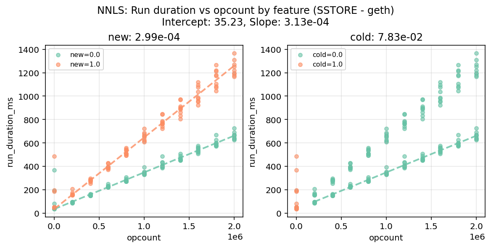

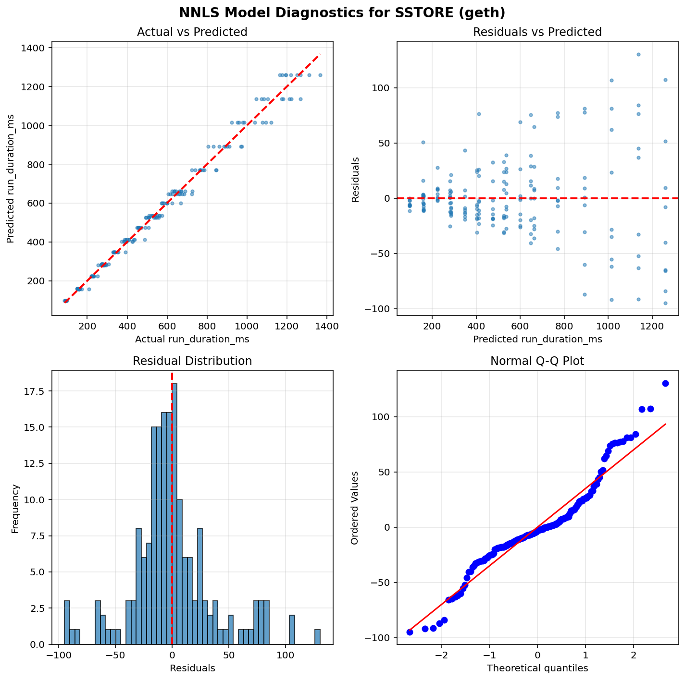

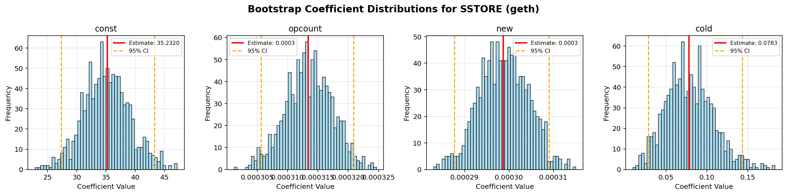


## besu


```python
==============================================================================
                           NNLS Regression Results                            
==============================================================================
Dep. Variable:          run_duration_ms              R-squared:          0.895
Model:                  NNLS                    Adj. R-squared:          0.894
No. Observations:       180                               RMSE:         130.10
Df Residuals:           176                                MAE:          98.62
Df Model:               3      
==============================================================================
                      coef     std err     P-value      [0.025      0.975]
------------------------------------------------------------------------------
         const      0.2682      8.7377       0.516      0.0000     28.7558
       opcount      0.0005      0.0000       0.000      0.0005      0.0006
           new      0.0002      0.0000       0.000      0.0002      0.0002
          cold      0.0000      0.0000       1.000      0.0000      0.0000
==============================================================================
Notes: Non-negative least squares with bootstrap inference (1000 iterations)
==============================================================================
```

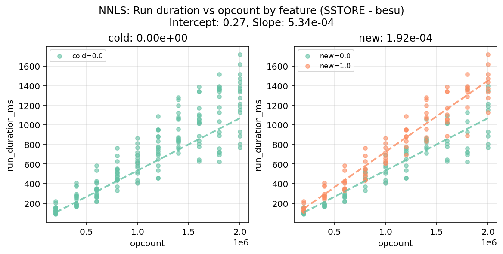

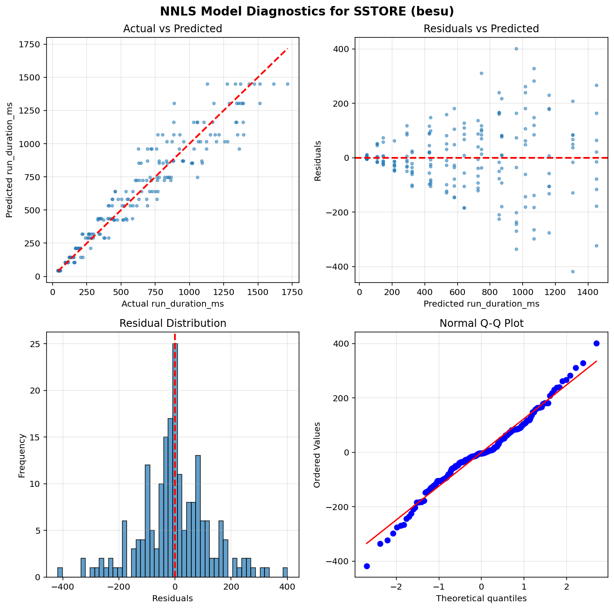

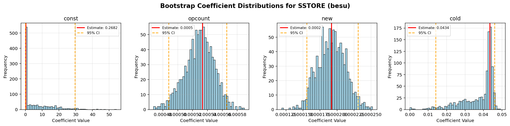


## reth


```python
==============================================================================
                           NNLS Regression Results                            
==============================================================================
Dep. Variable:          run_duration_ms              R-squared:          0.980
Model:                  NNLS                    Adj. R-squared:          0.979
No. Observations:       180                               RMSE:          19.92
Df Residuals:           176                                MAE:          12.67
Df Model:               3      
==============================================================================
                      coef     std err     P-value      [0.025      0.975]
------------------------------------------------------------------------------
         const     33.1851      2.2322       0.000     28.7283     37.6281
       opcount      0.0001      0.0000       0.000      0.0001      0.0001
           new      0.0002      0.0000       0.000      0.0002      0.0002
          cold      0.0000      0.0000       1.000      0.0000      0.0000
==============================================================================
Notes: Non-negative least squares with bootstrap inference (1000 iterations)
==============================================================================
```

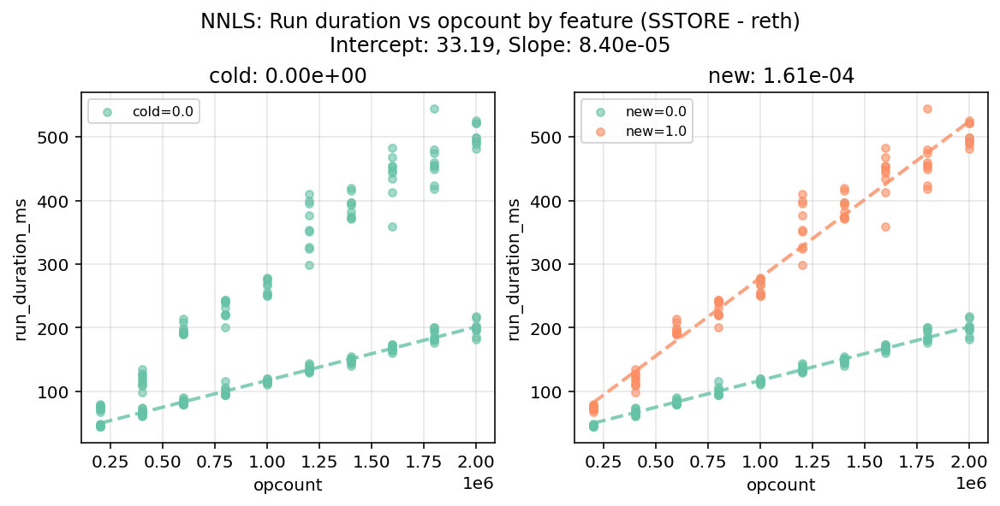

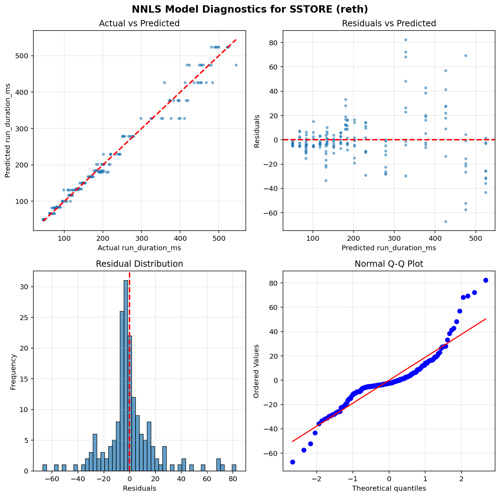

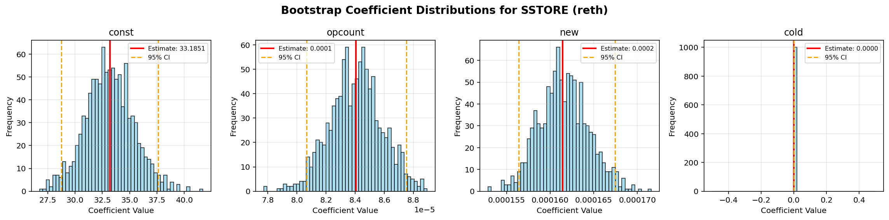


## nethermind


```python
==============================================================================
                           NNLS Regression Results                            
==============================================================================
Dep. Variable:          run_duration_ms              R-squared:          0.984
Model:                  NNLS                    Adj. R-squared:          0.984
No. Observations:       180                               RMSE:          19.55
Df Residuals:           176                                MAE:          12.25
Df Model:               3      
==============================================================================
                      coef     std err     P-value      [0.025      0.975]
------------------------------------------------------------------------------
         const     28.3639      2.3863       0.000     23.6647     33.2222
       opcount      0.0001      0.0000       0.000      0.0001      0.0001
           new      0.0002      0.0000       0.000      0.0002      0.0002
          cold      0.0000      0.0000       1.000      0.0000      0.0000
==============================================================================
Notes: Non-negative least squares with bootstrap inference (1000 iterations)
==============================================================================
```

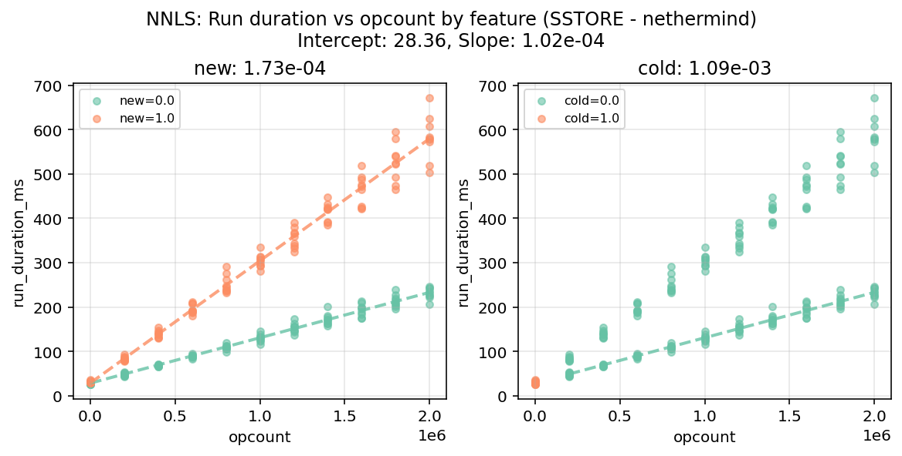

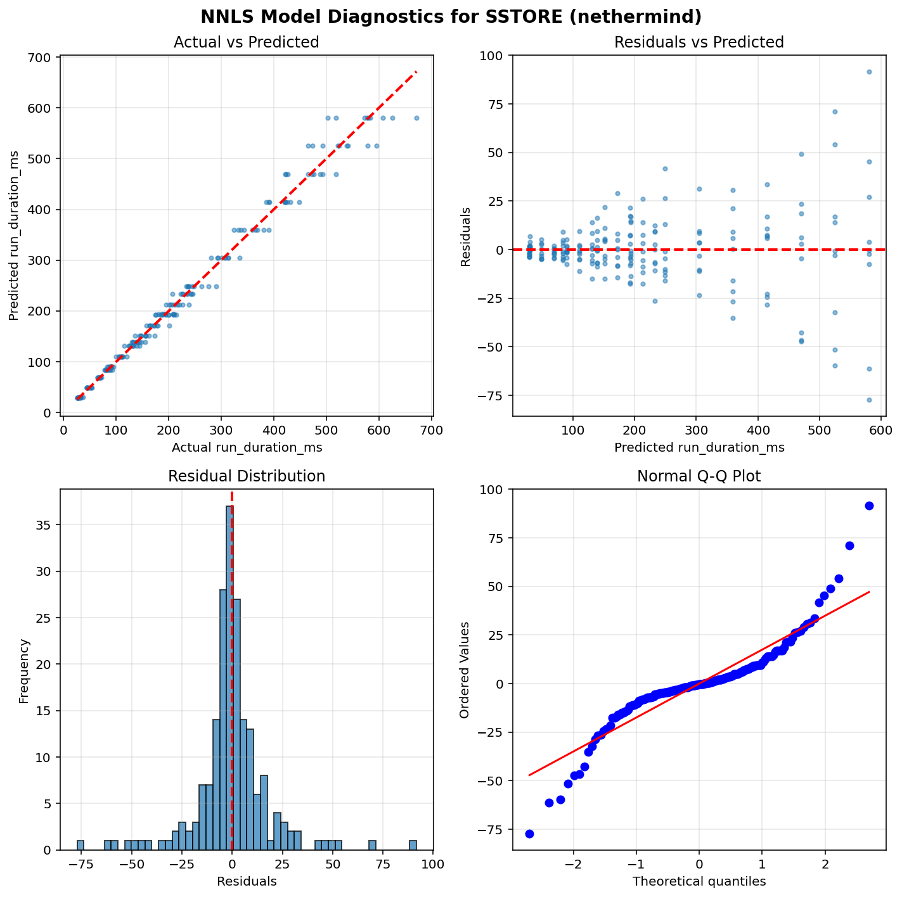

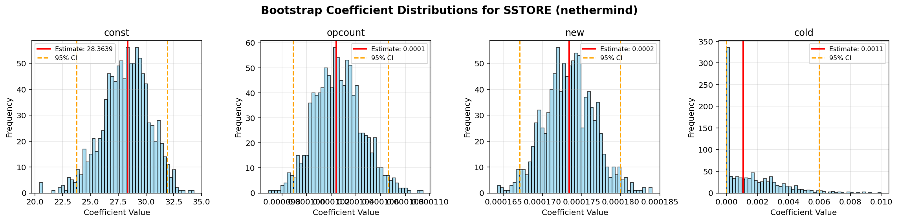


# SLOAD

## geth


```python
==============================================================================
                           NNLS Regression Results                            
==============================================================================
Dep. Variable:          run_duration_ms              R-squared:          0.189
Model:                  NNLS                    Adj. R-squared:          0.180
No. Observations:       178                               RMSE:        4459.74
Df Residuals:           175                                MAE:        2360.35
Df Model:               2      
==============================================================================
                      coef     std err     P-value      [0.025      0.975]
------------------------------------------------------------------------------
         const    365.5180    190.5026       0.125      0.0000    674.3245
       opcount      0.0000      0.0001       1.000      0.0000      0.0002
          cold      0.0640      0.0149       0.000      0.0382      0.0946
==============================================================================
Notes: Non-negative least squares with bootstrap inference (1000 iterations)
==============================================================================
```

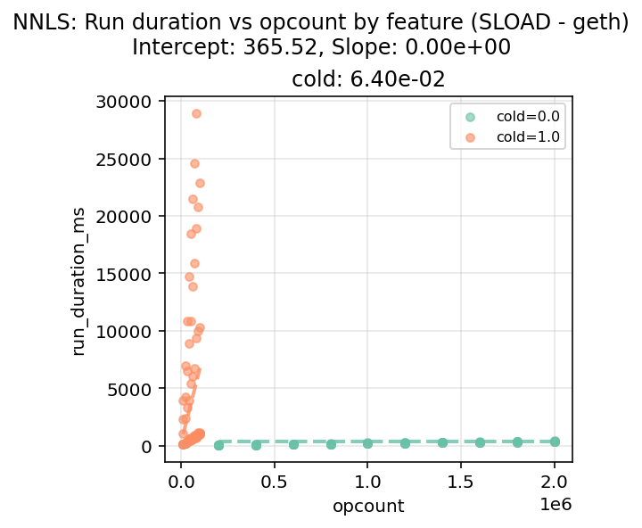

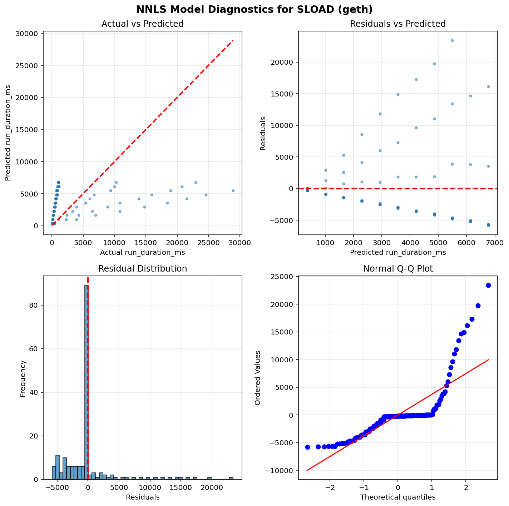

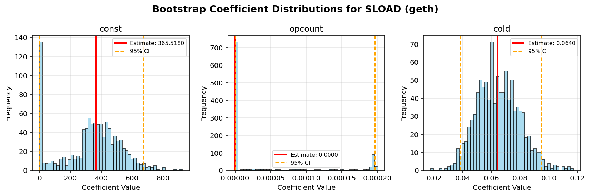


## besu


```python
==============================================================================
                           NNLS Regression Results                            
==============================================================================
Dep. Variable:          run_duration_ms              R-squared:          0.899
Model:                  NNLS                    Adj. R-squared:          0.898
No. Observations:       180                               RMSE:          90.10
Df Residuals:           177                                MAE:          66.48
Df Model:               2      
==============================================================================
                      coef     std err     P-value      [0.025      0.975]
------------------------------------------------------------------------------
         const      7.2959      7.9856       0.231      0.0000     26.2164
       opcount      0.0004      0.0000       0.000      0.0004      0.0004
          cold      0.0096      0.0002       0.000      0.0091      0.0099
==============================================================================
Notes: Non-negative least squares with bootstrap inference (1000 iterations)
==============================================================================
```

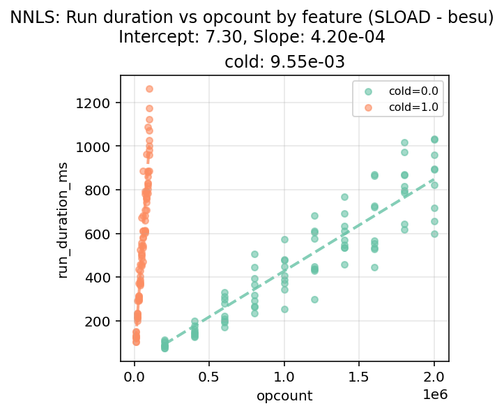

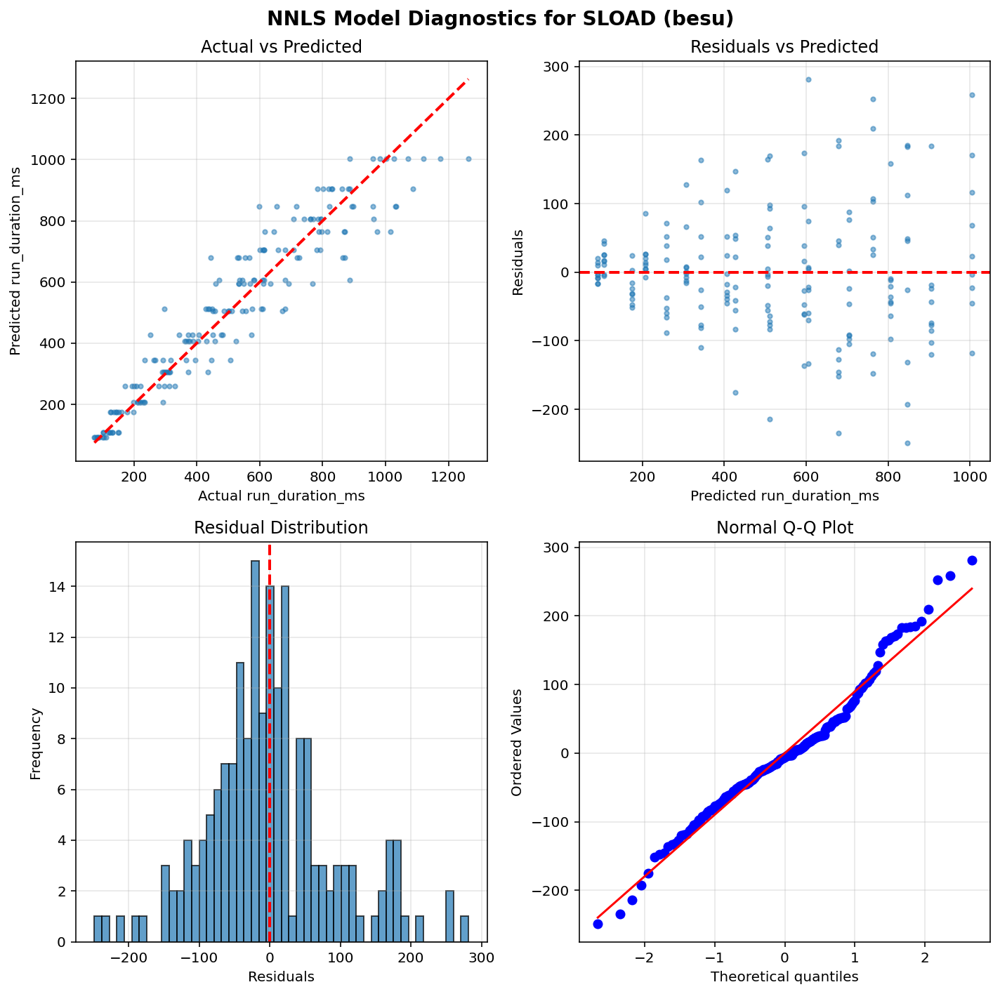

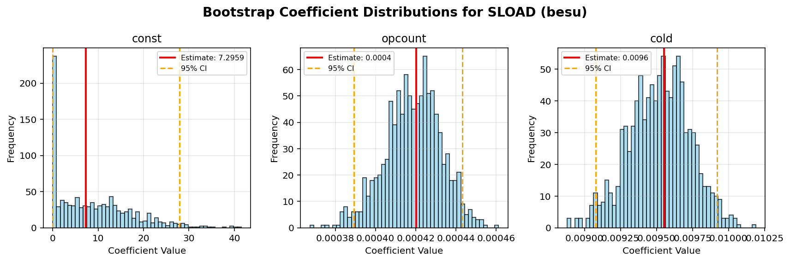


## reth


```python
==============================================================================
                           NNLS Regression Results                            
==============================================================================
Dep. Variable:          run_duration_ms              R-squared:          0.976
Model:                  NNLS                    Adj. R-squared:          0.976
No. Observations:       180                               RMSE:          17.22
Df Residuals:           177                                MAE:          11.03
Df Model:               2      
==============================================================================
                      coef     std err     P-value      [0.025      0.975]
------------------------------------------------------------------------------
         const     33.0459      1.9209       0.000     29.1364     36.5089
       opcount      0.0001      0.0000       0.000      0.0001      0.0001
          cold      0.0038      0.0001       0.000      0.0037      0.0039
==============================================================================
Notes: Non-negative least squares with bootstrap inference (1000 iterations)
==============================================================================
```

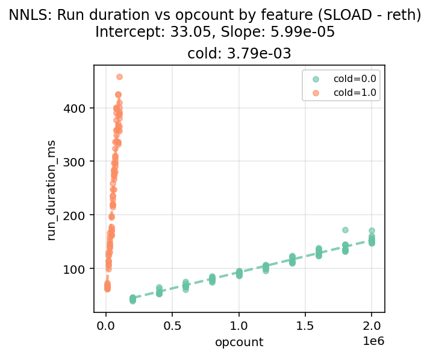

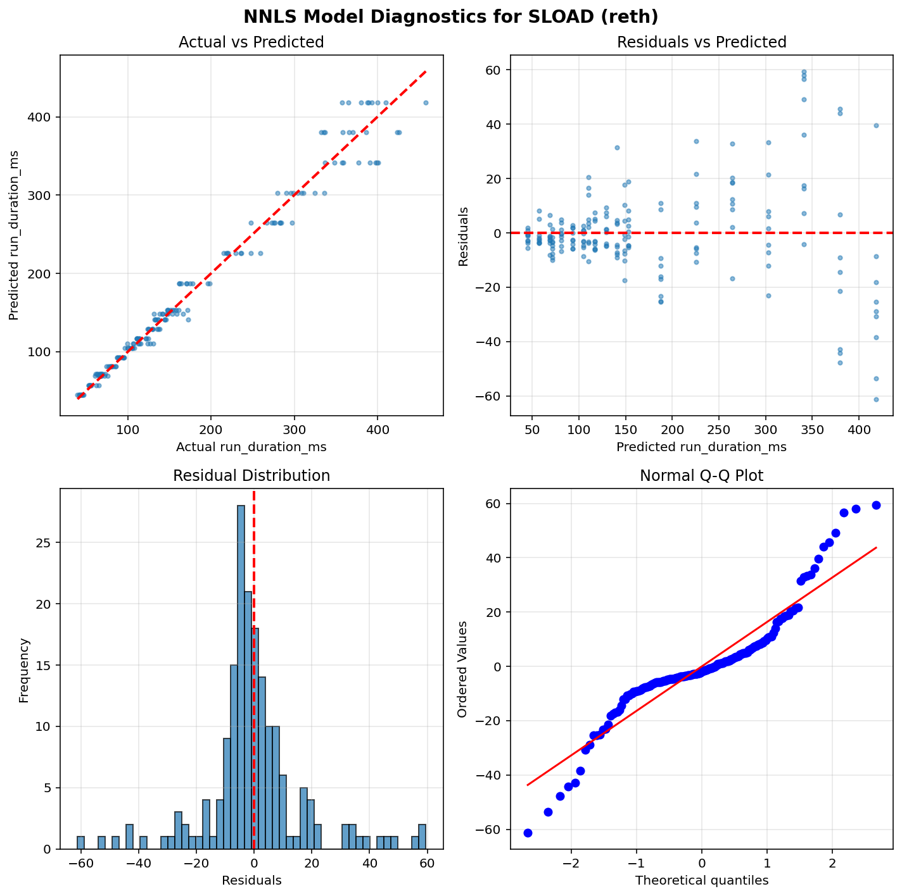

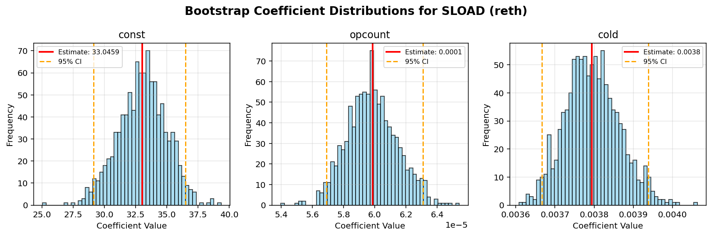


## nethermind


```python
==============================================================================
                           NNLS Regression Results                            
==============================================================================
Dep. Variable:          run_duration_ms              R-squared:          0.887
Model:                  NNLS                    Adj. R-squared:          0.886
No. Observations:       180                               RMSE:          19.05
Df Residuals:           177                                MAE:           7.68
Df Model:               2      
==============================================================================
                      coef     std err     P-value      [0.025      0.975]
------------------------------------------------------------------------------
         const     34.8527      5.4450       0.000     26.5483     46.7309
       opcount      0.0001      0.0000       0.000      0.0001      0.0001
          cold      0.0005      0.0001       0.000      0.0004      0.0006
==============================================================================
Notes: Non-negative least squares with bootstrap inference (1000 iterations)
==============================================================================
```

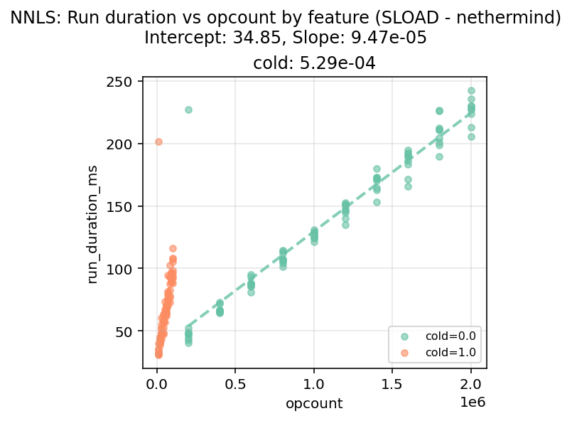

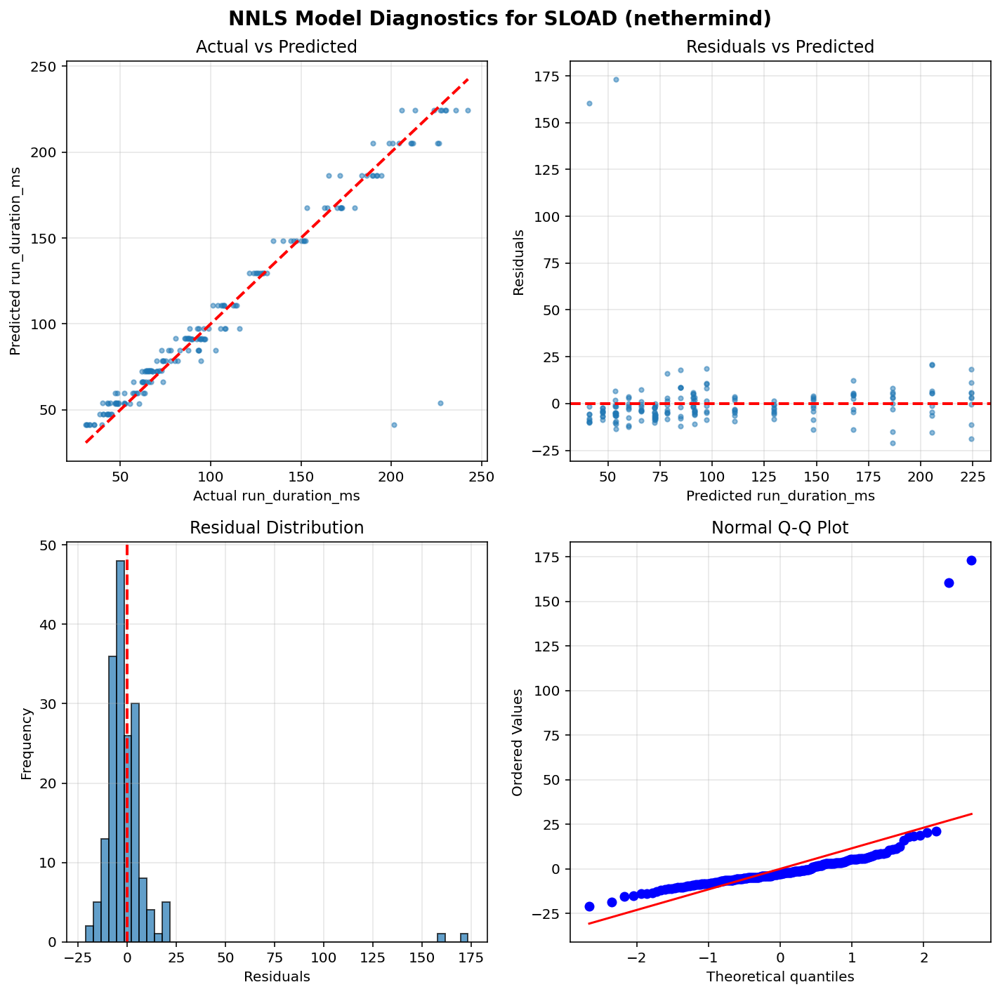

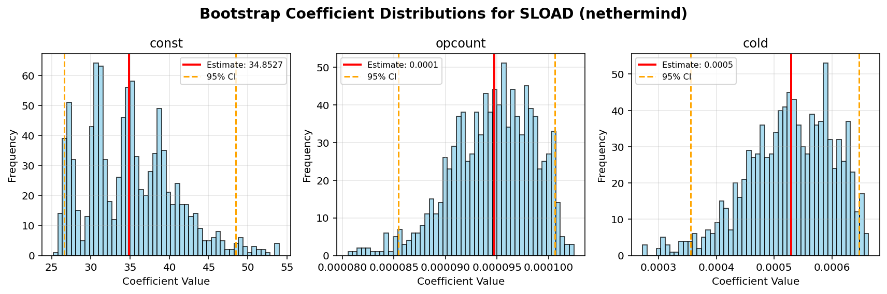

