Operation run times estimation results - EIP-8038
=================================================

Table of contents
=================

* [SSTORE](#sstore)
* [SLOAD](#sload)

# Introduction


This is an automated report generated from the opcode run times
estimation script `./src/estimate_8038_repricings.py`. The script
uses data generated by running the
[EEST benchmark suite](https://github.com/ethereum/execution-spec-tests/tree/main/tests/benchmark)
with the [Nethermind benchmarking tooling](https://github.com/NethermindEth/gas-benchmarks).

The data includes all the tests for operations repriced in EIP-8038 run
between 2026-01-26 and 2026-02-16.

For each operation and client, an NNLS linear regression model is fitted to estimate the
operation run time as a function of the operation count and other operation-specific parameters.
The results are presented below.

# How to Interpret the Results

## Model Used


**Non-Negative Least Squares (NNLS) Linear Regression** is used to estimate operation runtimes.
This model ensures all coefficients are non-negative, which is physically meaningful since
execution time cannot be negative. The model estimates runtime as a linear combination of:

- **Constant term (intercept)**: Base overhead for executing the test, which includes setup and teardown time
- **Operation count (slope)**: Number of times the operation is executed in the test. This paramater 
is the one that allows us to estimate the per-operation runtime.
- **Operation-specific parameters**: Variables like number of rounds, message size, or number of pairs

For simple operations, the model estimates: `runtime = intercept + slope × operation_count`

For variable operations, the model estimates: `runtime = intercept + slope × operation_count +
 param1_coef × operation_count × param1 + param2_coef × operation_count × param2 + ...`

## Model Quality Metrics


Each model reports two key metrics to assess the quality of the fit:

**R² (R-squared / Coefficient of Determination)**
- Ranges from 0 to 1 (or can be negative for very poor fits)
- Measures how well the model explains the variance in the data
- **Interpretation**:
  - R² > 0.9: Excellent fit - the model explains >90% of the variance
  - R² > 0.7: Good fit - the model captures most of the relationship
  - R² > 0.5: Acceptable fit - the model has predictive power but notable variance remains
  - R² < 0.5: Poor fit - the model may not be reliable

**p-value**
- Tests the statistical significance of each coefficient, based on a bootstrap sample estimation
- **Interpretation**:
  - p < 0.05: Statistically significant - the parameter has a real effect on runtime
  - p ≥ 0.05: Not significant - the parameter's effect cannot be distinguished from random noise

We also plot some diagnostic graphs for each operation and client combination to visually assess the model fit.

# SSTORE

## besu


```python
==============================================================================
                           NNLS Regression Results                            
==============================================================================
Dep. Variable:          run_duration_ms              R-squared:          0.560
Model:                  NNLS                    Adj. R-squared:          0.555
No. Observations:       408                               RMSE:         246.74
Df Residuals:           403                                MAE:         129.45
Df Model:               4      
==============================================================================
                      coef     std err     P-value      [0.025      0.975]
------------------------------------------------------------------------------
         const     79.6181      9.0802       0.000     62.6878     98.4331
       opcount      0.0104      0.0010       0.000      0.0085      0.0124
           new      0.0000      0.0000       1.000      0.0000      0.0000
          cold      0.0000      0.0000       1.000      0.0000      0.0000
        update      0.0000      0.0000       1.000      0.0000      0.0000
==============================================================================
Notes: Non-negative least squares with bootstrap inference (1000 iterations)
==============================================================================
```

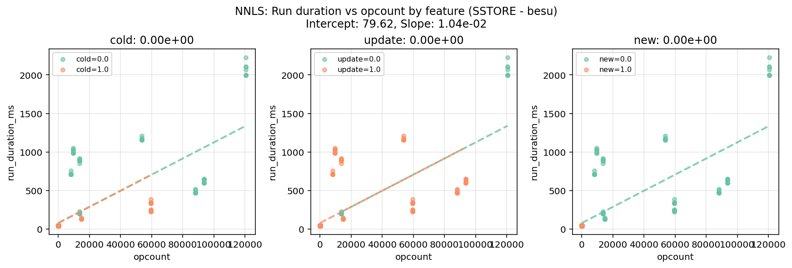

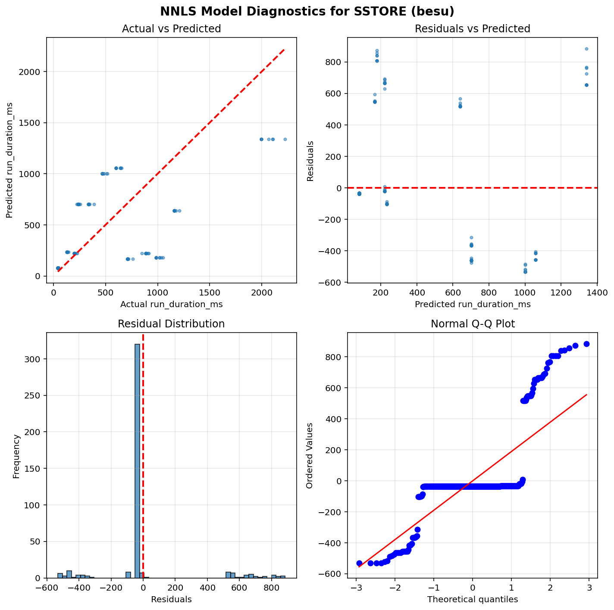

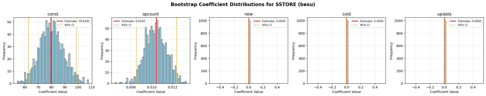


## geth


```python
==============================================================================
                           NNLS Regression Results                            
==============================================================================
Dep. Variable:          run_duration_ms              R-squared:          0.513
Model:                  NNLS                    Adj. R-squared:          0.508
No. Observations:       342                               RMSE:          11.17
Df Residuals:           337                                MAE:           3.52
Df Model:               4      
==============================================================================
                      coef     std err     P-value      [0.025      0.975]
------------------------------------------------------------------------------
         const     47.6581      0.4071       0.000     46.8027     48.4714
       opcount      0.0007      0.0002       0.000      0.0003      0.0011
           new      0.0000      0.0030       1.000      0.0000      0.0114
          cold      0.0000      0.0001       1.000      0.0000      0.0000
        update      0.0000      0.0000       1.000      0.0000      0.0000
==============================================================================
Notes: Non-negative least squares with bootstrap inference (1000 iterations)
==============================================================================
```

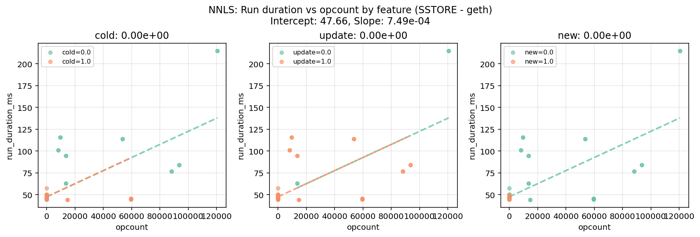

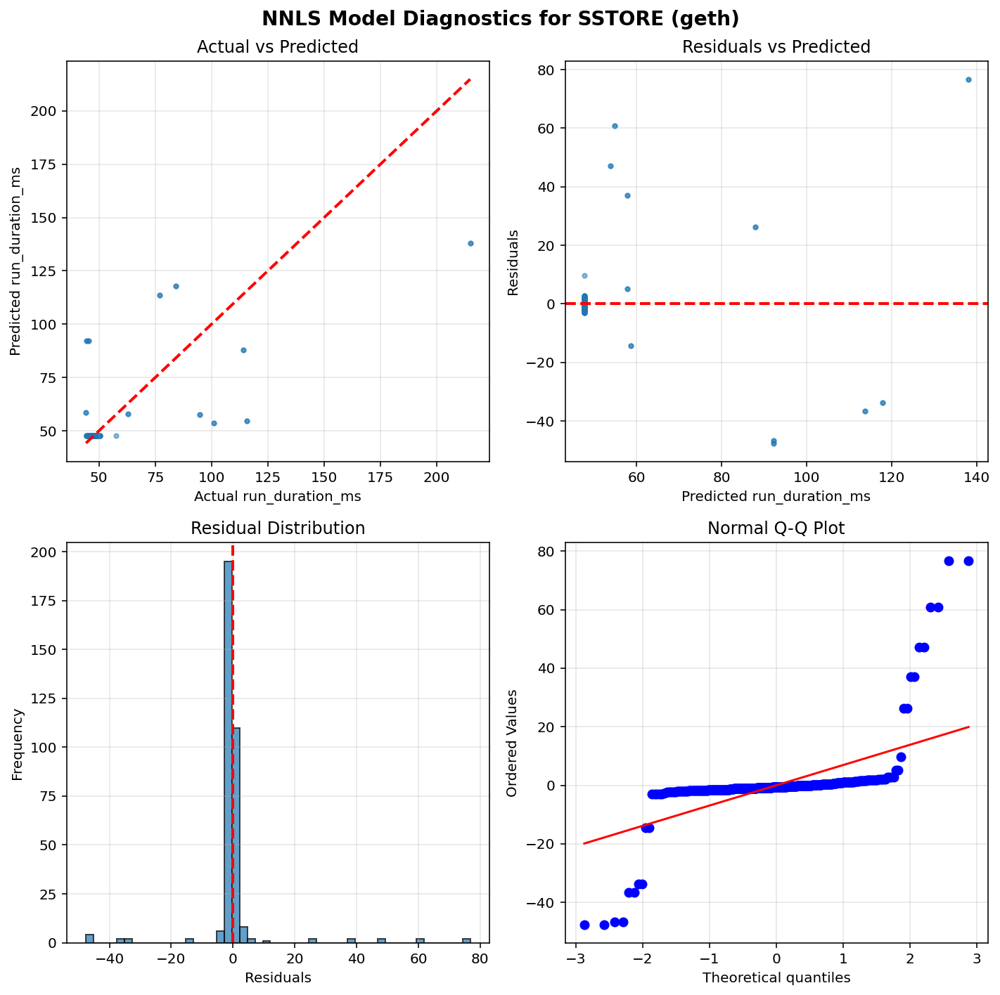

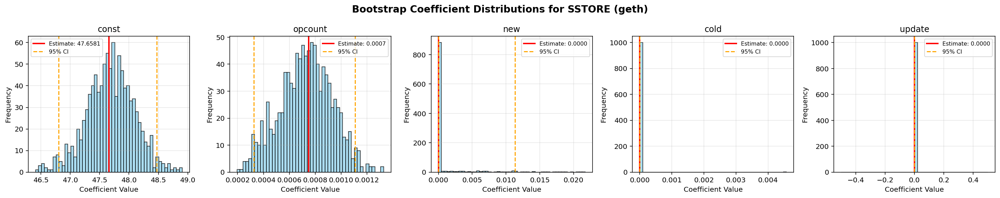


## nethermind


```python
==============================================================================
                           NNLS Regression Results                            
==============================================================================
Dep. Variable:          run_duration_ms              R-squared:          0.586
Model:                  NNLS                    Adj. R-squared:          0.582
No. Observations:       408                               RMSE:          38.77
Df Residuals:           403                                MAE:          19.42
Df Model:               4      
==============================================================================
                      coef     std err     P-value      [0.025      0.975]
------------------------------------------------------------------------------
         const     51.8841      1.4109       0.000     49.1491     54.9759
       opcount      0.0017      0.0002       0.000      0.0014      0.0021
           new      0.0000      0.0000       1.000      0.0000      0.0000
          cold      0.0000      0.0000       1.000      0.0000      0.0000
        update      0.0000      0.0000       1.000      0.0000      0.0000
==============================================================================
Notes: Non-negative least squares with bootstrap inference (1000 iterations)
==============================================================================
```

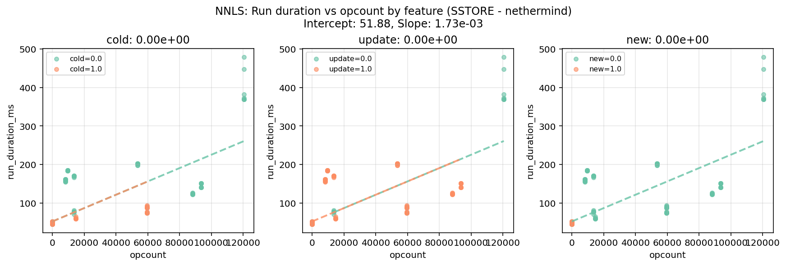

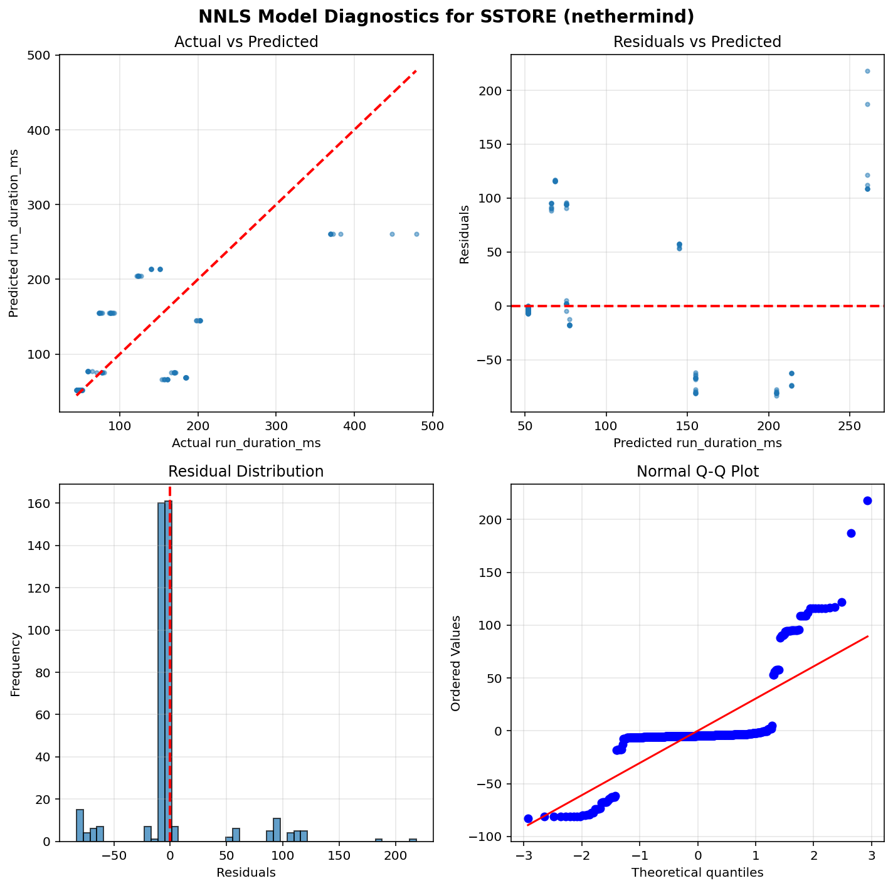

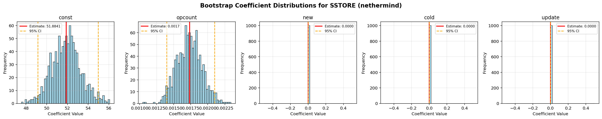


# SLOAD

## besu


```python
==============================================================================
                           NNLS Regression Results                            
==============================================================================
Dep. Variable:          run_duration_ms              R-squared:          0.981
Model:                  NNLS                    Adj. R-squared:          0.981
No. Observations:       160                               RMSE:          15.44
Df Residuals:           157                                MAE:          12.35
Df Model:               2      
==============================================================================
                      coef     std err     P-value      [0.025      0.975]
------------------------------------------------------------------------------
         const     74.4116      3.5658       0.000     67.2151     81.2448
       opcount      0.0001      0.0000       0.000      0.0001      0.0001
          cold      0.0004      0.0000       0.000      0.0003      0.0005
==============================================================================
Notes: Non-negative least squares with bootstrap inference (1000 iterations)
==============================================================================
```

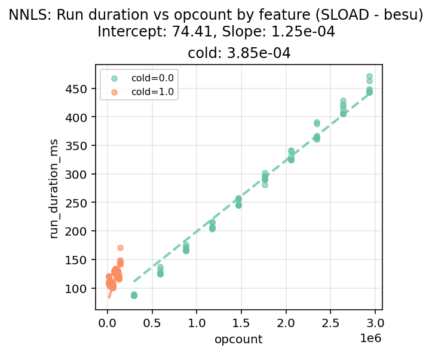

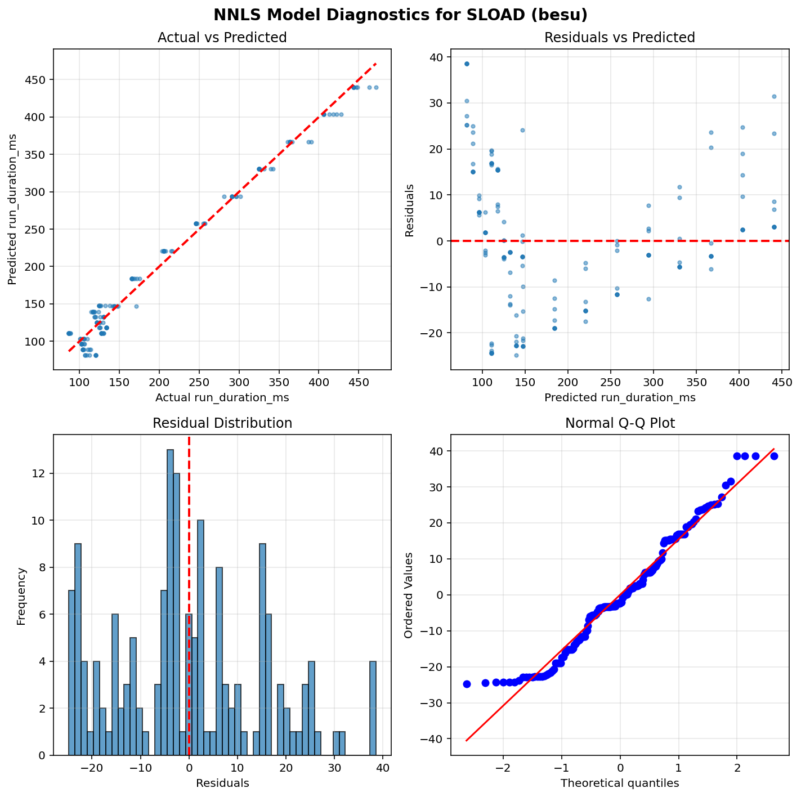

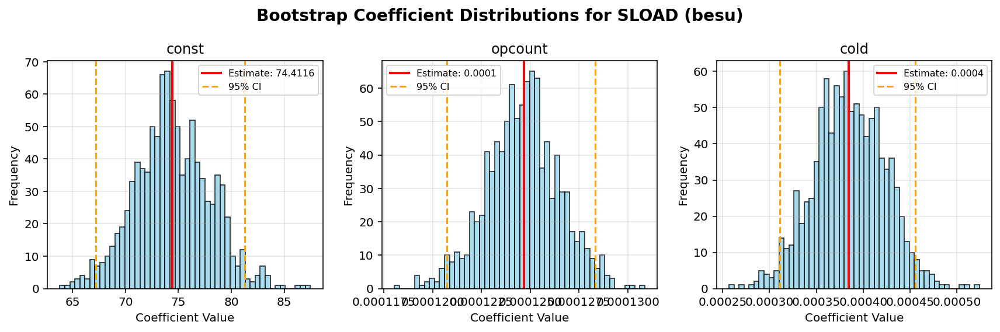


## geth


```python
==============================================================================
                           NNLS Regression Results                            
==============================================================================
Dep. Variable:          run_duration_ms              R-squared:          0.925
Model:                  NNLS                    Adj. R-squared:          0.924
No. Observations:       160                               RMSE:          18.92
Df Residuals:           157                                MAE:          15.36
Df Model:               2      
==============================================================================
                      coef     std err     P-value      [0.025      0.975]
------------------------------------------------------------------------------
         const     79.6042      4.0717       0.000     71.8762     87.4285
       opcount      0.0001      0.0000       0.000      0.0001      0.0001
          cold      0.0008      0.0000       0.000      0.0007      0.0009
==============================================================================
Notes: Non-negative least squares with bootstrap inference (1000 iterations)
==============================================================================
```

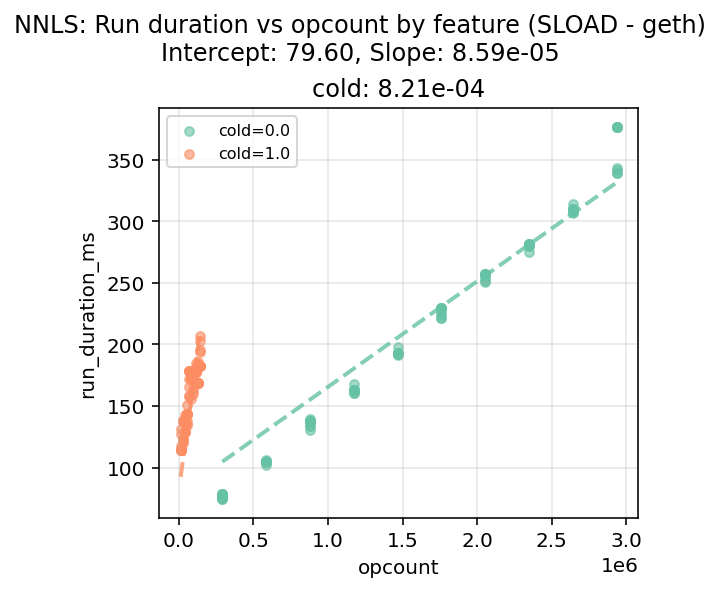

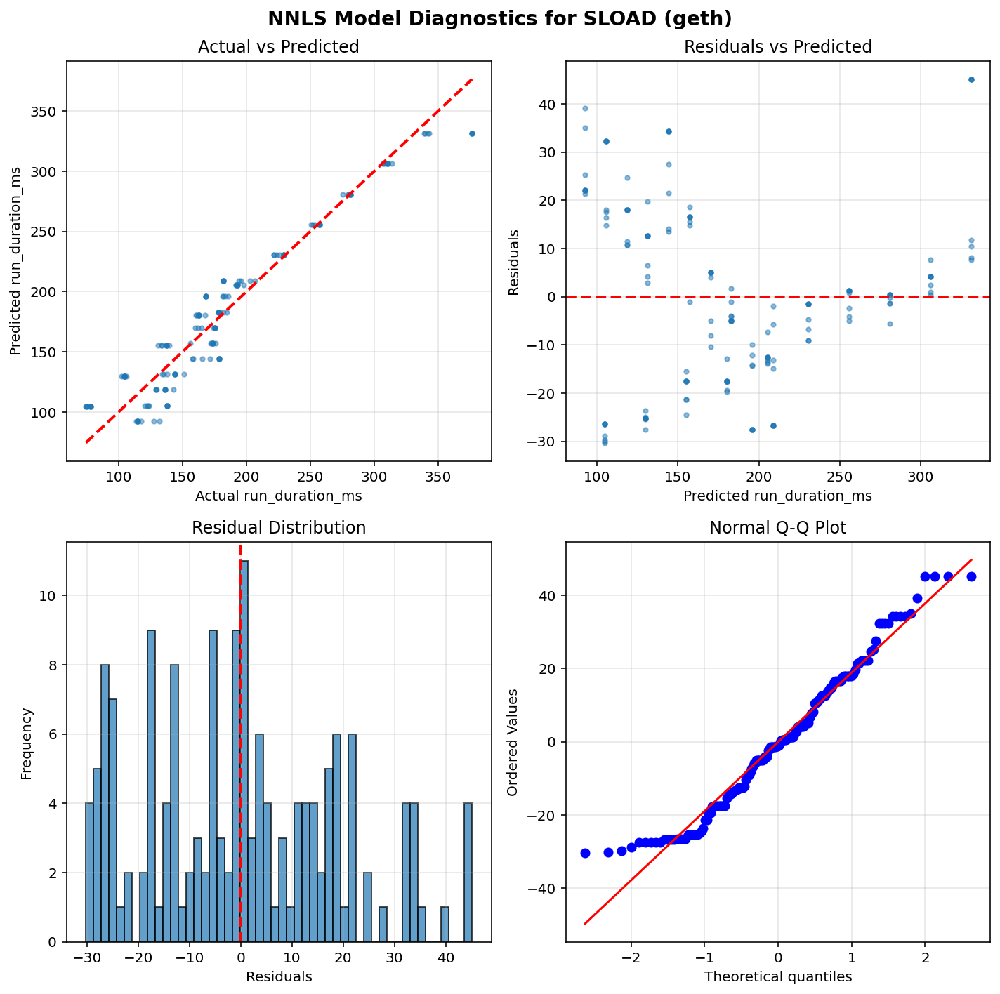

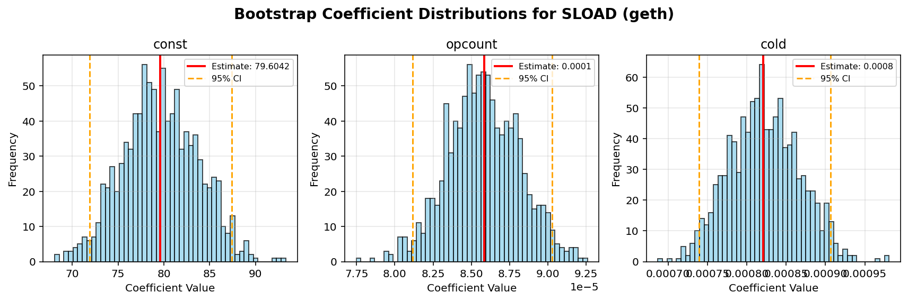


## nethermind


```python
==============================================================================
                           NNLS Regression Results                            
==============================================================================
Dep. Variable:          run_duration_ms              R-squared:          0.974
Model:                  NNLS                    Adj. R-squared:          0.974
No. Observations:       160                               RMSE:           6.95
Df Residuals:           157                                MAE:           2.81
Df Model:               2      
==============================================================================
                      coef     std err     P-value      [0.025      0.975]
------------------------------------------------------------------------------
         const     49.1789      0.6410       0.000     47.8382     50.3356
       opcount      0.0001      0.0000       0.000      0.0001      0.0001
          cold      0.0004      0.0000       0.000      0.0003      0.0004
==============================================================================
Notes: Non-negative least squares with bootstrap inference (1000 iterations)
==============================================================================
```

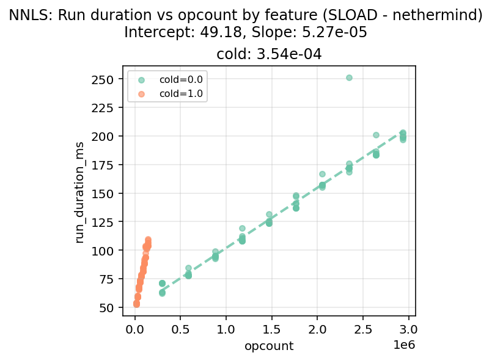

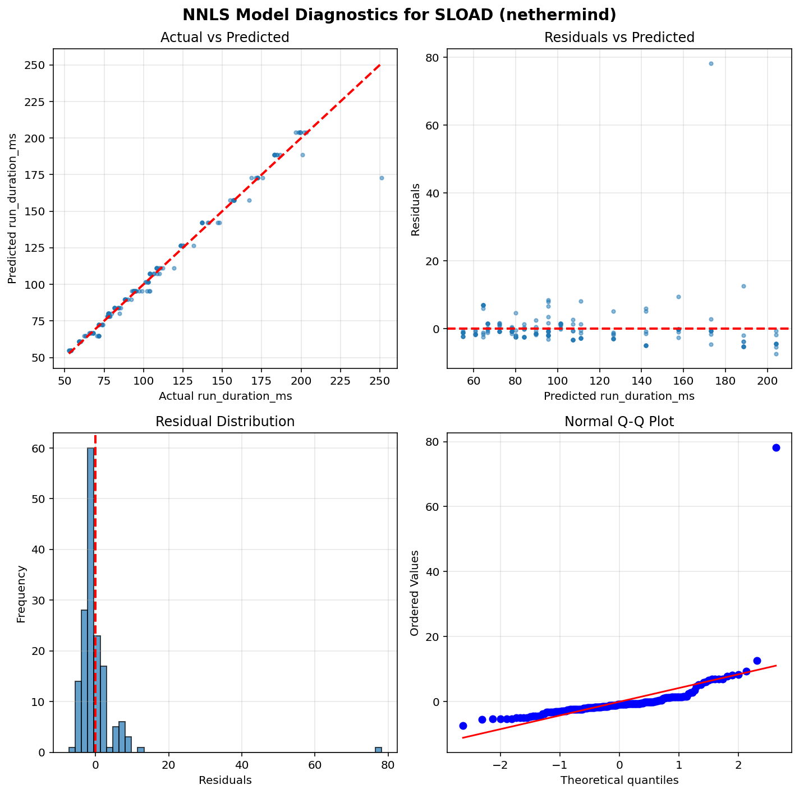

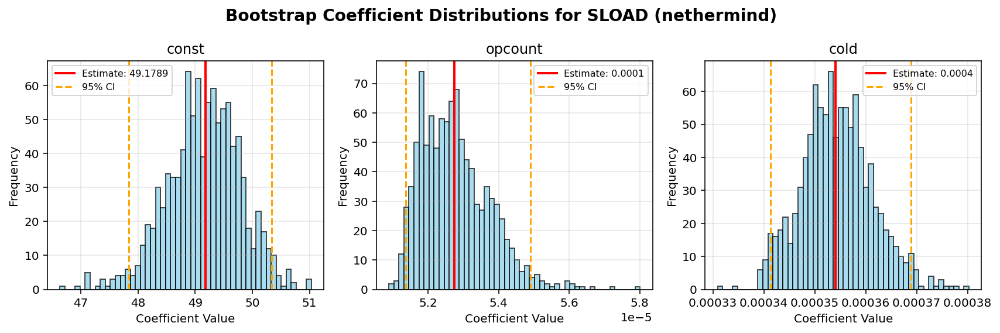

