Operation run times estimation results - EIP-8038
=================================================

Table of contents
=================

* [SSTORE](#sstore)
* [SLOAD](#sload)

# Introduction


This is an automated report generated from the opcode run times
estimation script `./src/estimate_8038_repricings.py`. The script
uses data generated by running the
[EEST benchmark suite](https://github.com/ethereum/execution-spec-tests/tree/main/tests/benchmark)
with the [Nethermind benchmarking tooling](https://github.com/NethermindEth/gas-benchmarks).

The data includes all the tests for operations repriced in EIP-8038 run
between 2026-01-26 and 2026-02-17.

For each operation and client, an NNLS linear regression model is fitted to estimate the
operation run time as a function of the operation count and other operation-specific parameters.
The results are presented below.

# How to Interpret the Results

## Model Used


**Non-Negative Least Squares (NNLS) Linear Regression** is used to estimate operation runtimes.
This model ensures all coefficients are non-negative, which is physically meaningful since
execution time cannot be negative. The model estimates runtime as a linear combination of:

- **Constant term (intercept)**: Base overhead for executing the test, which includes setup and teardown time
- **Operation count (slope)**: Number of times the operation is executed in the test. This paramater 
is the one that allows us to estimate the per-operation runtime.
- **Operation-specific parameters**: Variables like number of rounds, message size, or number of pairs

For simple operations, the model estimates: `runtime = intercept + slope × operation_count`

For variable operations, the model estimates: `runtime = intercept + slope × operation_count +
 param1_coef × operation_count × param1 + param2_coef × operation_count × param2 + ...`

## Model Quality Metrics


Each model reports two key metrics to assess the quality of the fit:

**R² (R-squared / Coefficient of Determination)**
- Ranges from 0 to 1 (or can be negative for very poor fits)
- Measures how well the model explains the variance in the data
- **Interpretation**:
  - R² > 0.9: Excellent fit - the model explains >90% of the variance
  - R² > 0.7: Good fit - the model captures most of the relationship
  - R² > 0.5: Acceptable fit - the model has predictive power but notable variance remains
  - R² < 0.5: Poor fit - the model may not be reliable

**p-value**
- Tests the statistical significance of each coefficient, based on a bootstrap sample estimation
- **Interpretation**:
  - p < 0.05: Statistically significant - the parameter has a real effect on runtime
  - p ≥ 0.05: Not significant - the parameter's effect cannot be distinguished from random noise

We also plot some diagnostic graphs for each operation and client combination to visually assess the model fit.

# SSTORE

## besu


```python
==============================================================================
                           NNLS Regression Results                            
==============================================================================
Dep. Variable:          run_duration_ms              R-squared:          0.234
Model:                  NNLS                    Adj. R-squared:          0.228
No. Observations:       520                               RMSE:         189.29
Df Residuals:           515                                MAE:         111.40
Df Model:               4      
==============================================================================
                      coef     std err     P-value      [0.025      0.975]
------------------------------------------------------------------------------
         const    101.8025      7.5558       0.000     86.9434    115.8896
       opcount      0.0040      0.0007       0.000      0.0024      0.0053
           new      0.0000      0.0000       1.000      0.0000      0.0000
          cold      0.0004      0.0008       0.379      0.0000      0.0026
        update      0.0000      0.0000       1.000      0.0000      0.0000
==============================================================================
Notes: Non-negative least squares with bootstrap inference (1000 iterations)
==============================================================================
```

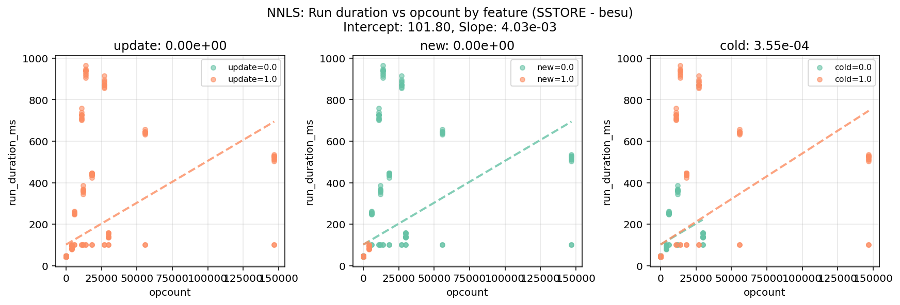

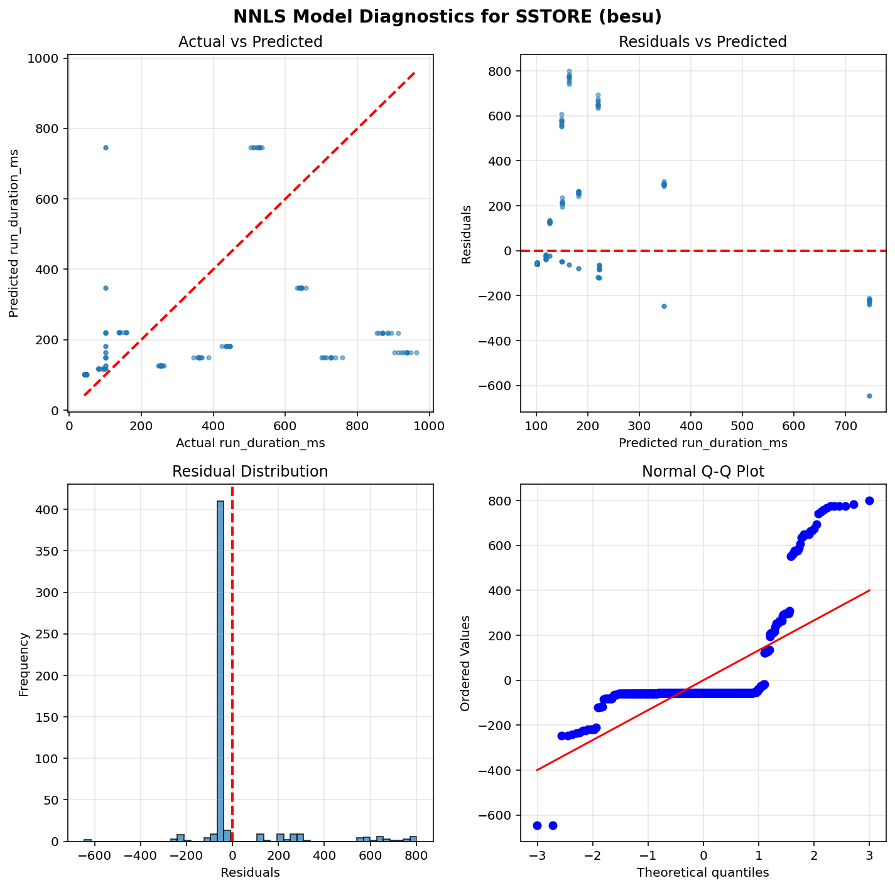

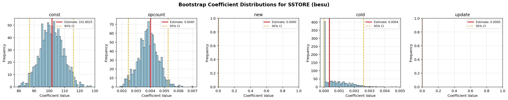


## geth


```python
==============================================================================
                           NNLS Regression Results                            
==============================================================================
Dep. Variable:          run_duration_ms              R-squared:          0.196
Model:                  NNLS                    Adj. R-squared:          0.189
No. Observations:       440                               RMSE:           8.16
Df Residuals:           435                                MAE:           3.37
Df Model:               4      
==============================================================================
                      coef     std err     P-value      [0.025      0.975]
------------------------------------------------------------------------------
         const     48.4785      0.3147       0.000     47.8770     49.1053
       opcount      0.0002      0.0001       0.000      0.0001      0.0005
           new      0.0048      0.0029       0.138      0.0000      0.0099
          cold      0.0000      0.0000       1.000      0.0000      0.0000
        update      0.0000      0.0000       1.000      0.0000      0.0000
==============================================================================
Notes: Non-negative least squares with bootstrap inference (1000 iterations)
==============================================================================
```

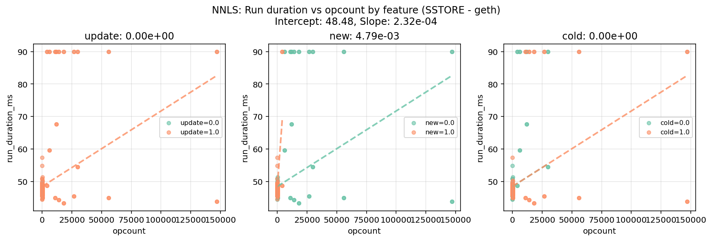

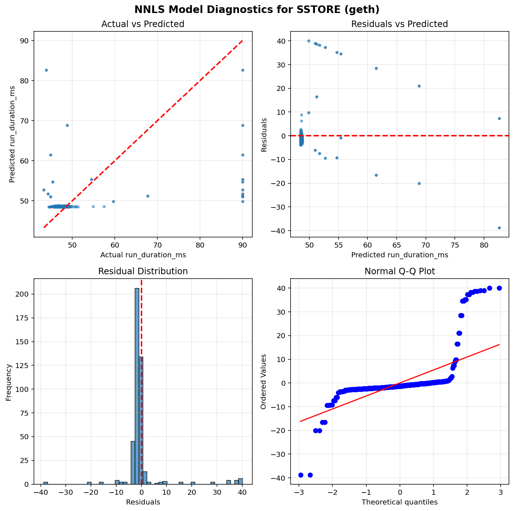

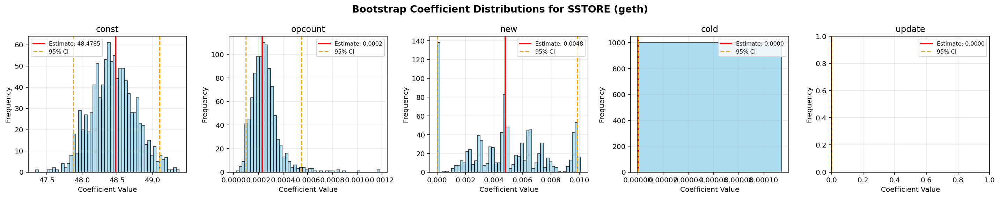


## nethermind


```python
==============================================================================
                           NNLS Regression Results                            
==============================================================================
Dep. Variable:          run_duration_ms              R-squared:          0.236
Model:                  NNLS                    Adj. R-squared:          0.230
No. Observations:       520                               RMSE:          30.91
Df Residuals:           515                                MAE:          18.60
Df Model:               4      
==============================================================================
                      coef     std err     P-value      [0.025      0.975]
------------------------------------------------------------------------------
         const     57.3619      1.2716       0.000     54.9277     59.6652
       opcount      0.0007      0.0001       0.000      0.0006      0.0010
           new      0.0000      0.0003       1.000      0.0000      0.0011
          cold      0.0000      0.0000       1.000      0.0000      0.0000
        update      0.0000      0.0000       1.000      0.0000      0.0000
==============================================================================
Notes: Non-negative least squares with bootstrap inference (1000 iterations)
==============================================================================
```

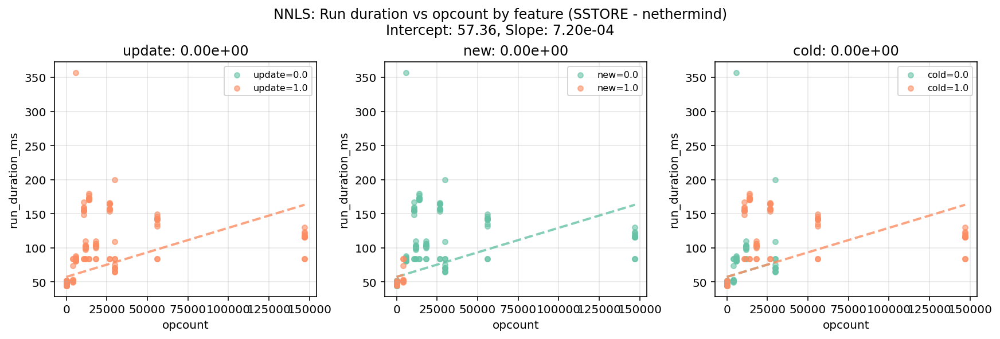

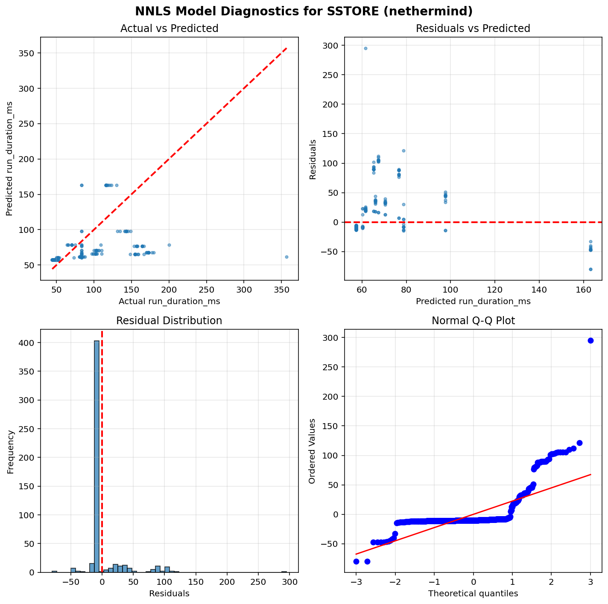

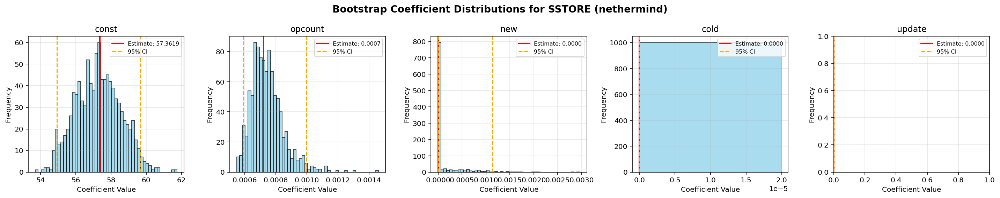


# SLOAD

## besu


```python
==============================================================================
                           NNLS Regression Results                            
==============================================================================
Dep. Variable:          run_duration_ms              R-squared:          0.974
Model:                  NNLS                    Adj. R-squared:          0.974
No. Observations:       200                               RMSE:          18.38
Df Residuals:           197                                MAE:          14.73
Df Model:               2      
==============================================================================
                      coef     std err     P-value      [0.025      0.975]
------------------------------------------------------------------------------
         const     79.9680      3.5175       0.000     73.3410     86.6679
       opcount      0.0001      0.0000       0.000      0.0001      0.0001
          cold      0.0004      0.0000       0.000      0.0003      0.0005
==============================================================================
Notes: Non-negative least squares with bootstrap inference (1000 iterations)
==============================================================================
```

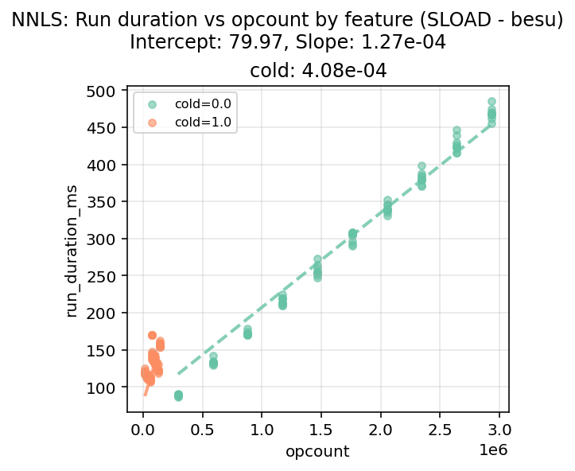

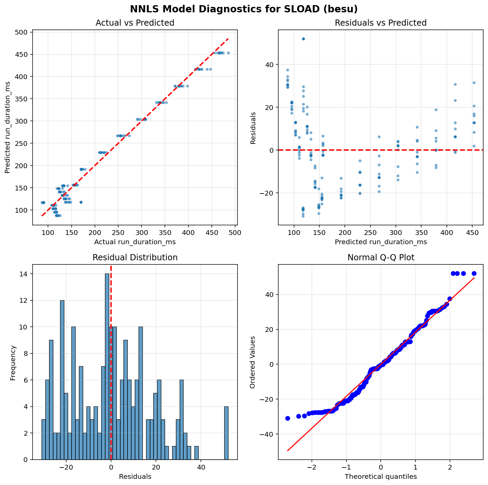

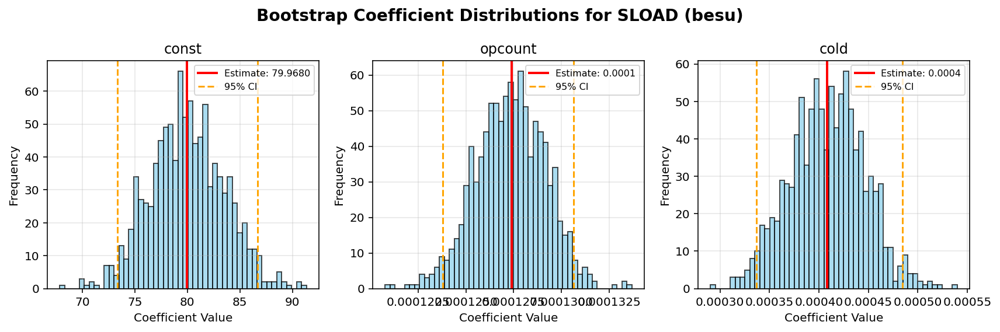


## geth


```python
==============================================================================
                           NNLS Regression Results                            
==============================================================================
Dep. Variable:          run_duration_ms              R-squared:          0.931
Model:                  NNLS                    Adj. R-squared:          0.931
No. Observations:       200                               RMSE:          18.05
Df Residuals:           197                                MAE:          14.58
Df Model:               2      
==============================================================================
                      coef     std err     P-value      [0.025      0.975]
------------------------------------------------------------------------------
         const     78.8736      3.3920       0.000     72.6697     85.3786
       opcount      0.0001      0.0000       0.000      0.0001      0.0001
          cold      0.0009      0.0000       0.000      0.0008      0.0009
==============================================================================
Notes: Non-negative least squares with bootstrap inference (1000 iterations)
==============================================================================
```

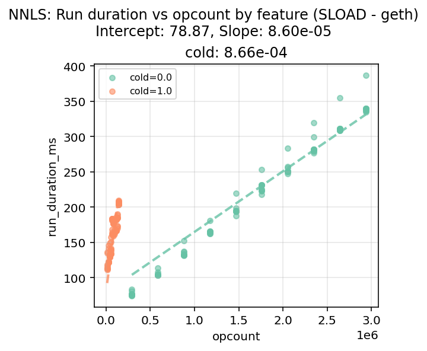

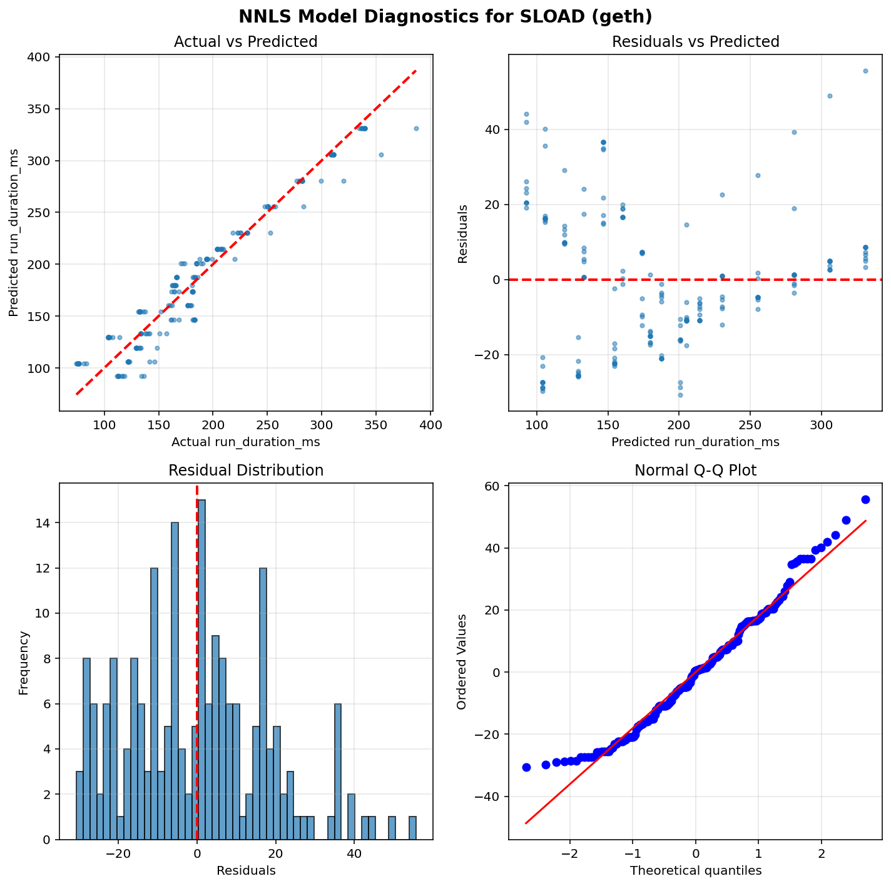

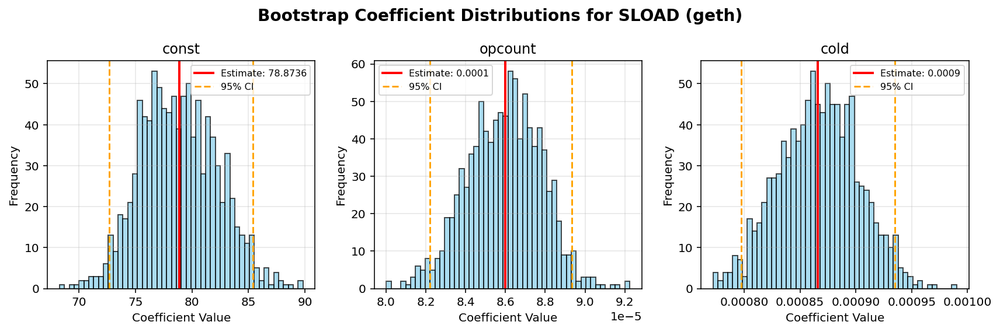


## nethermind


```python
==============================================================================
                           NNLS Regression Results                            
==============================================================================
Dep. Variable:          run_duration_ms              R-squared:          0.997
Model:                  NNLS                    Adj. R-squared:          0.997
No. Observations:       200                               RMSE:           2.09
Df Residuals:           197                                MAE:           1.57
Df Model:               2      
==============================================================================
                      coef     std err     P-value      [0.025      0.975]
------------------------------------------------------------------------------
         const     49.0298      0.2832       0.000     48.5010     49.6295
       opcount      0.0000      0.0000       0.000      0.0000      0.0000
          cold      0.0003      0.0000       0.000      0.0003      0.0003
==============================================================================
Notes: Non-negative least squares with bootstrap inference (1000 iterations)
==============================================================================
```

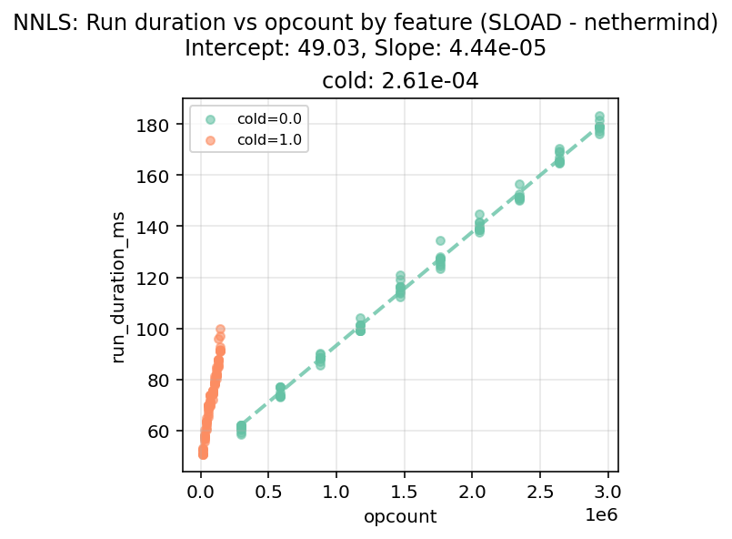

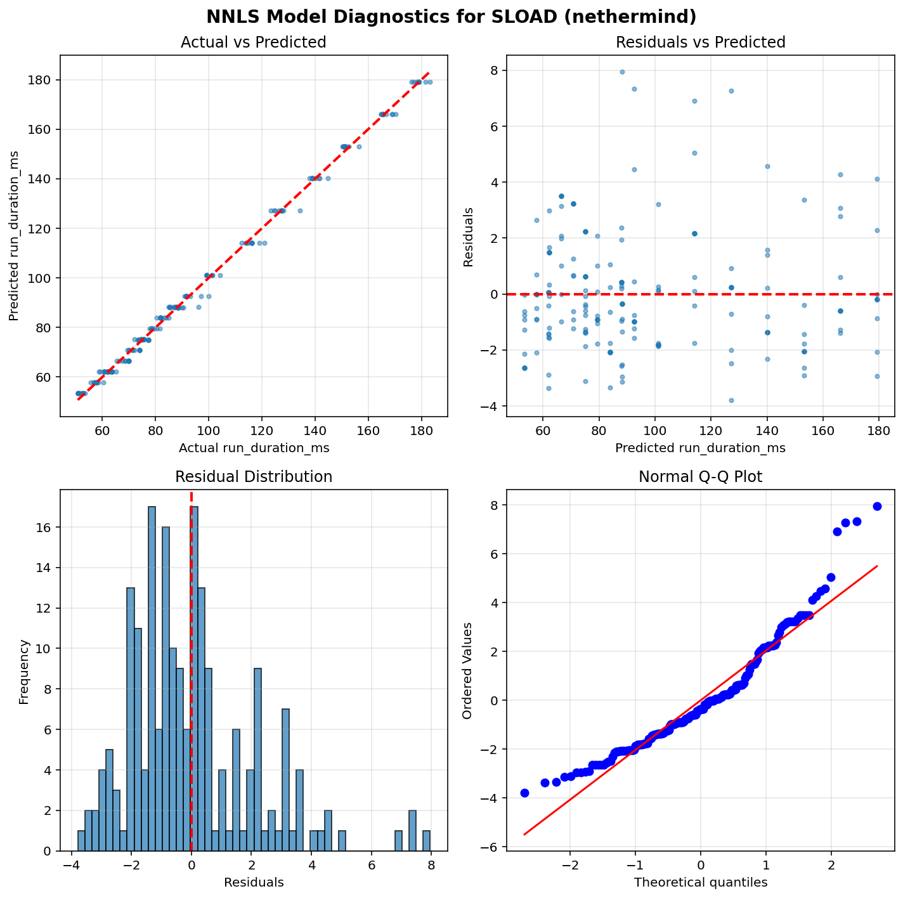

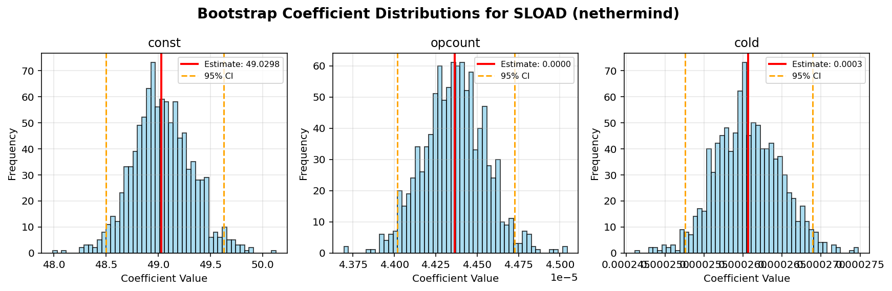

