Operation run times estimation results - EIP-8038
=================================================

Table of contents
=================

* [SSTORE](#sstore)
* [SLOAD](#sload)

# Introduction


This is an automated report generated from the opcode run times
estimation script `./src/estimate_8038_repricings.py`. The script
uses data generated by running the
[EEST benchmark suite](https://github.com/ethereum/execution-spec-tests/tree/main/tests/benchmark)
with the [Nethermind benchmarking tooling](https://github.com/NethermindEth/gas-benchmarks).

The data includes all the tests for operations repriced in EIP-8038 run
between 2026-01-26 and 2026-02-19.

For each operation and client, an NNLS linear regression model is fitted to estimate the
operation run time as a function of the operation count and other operation-specific parameters.
The results are presented below.

# How to Interpret the Results

## Model Used


**Non-Negative Least Squares (NNLS) Linear Regression** is used to estimate operation runtimes.
This model ensures all coefficients are non-negative, which is physically meaningful since
execution time cannot be negative. The model estimates runtime as a linear combination of:

- **Constant term (intercept)**: Base overhead for executing the test, which includes setup and teardown time
- **Operation count (slope)**: Number of times the operation is executed in the test. This paramater 
is the one that allows us to estimate the per-operation runtime.
- **Operation-specific parameters**: Variables like number of rounds, message size, or number of pairs

For simple operations, the model estimates: `runtime = intercept + slope × operation_count`

For variable operations, the model estimates: `runtime = intercept + slope × operation_count +
 param1_coef × operation_count × param1 + param2_coef × operation_count × param2 + ...`

## Model Quality Metrics


Each model reports two key metrics to assess the quality of the fit:

**R² (R-squared / Coefficient of Determination)**
- Ranges from 0 to 1 (or can be negative for very poor fits)
- Measures how well the model explains the variance in the data
- **Interpretation**:
  - R² > 0.9: Excellent fit - the model explains >90% of the variance
  - R² > 0.7: Good fit - the model captures most of the relationship
  - R² > 0.5: Acceptable fit - the model has predictive power but notable variance remains
  - R² < 0.5: Poor fit - the model may not be reliable

**p-value**
- Tests the statistical significance of each coefficient, based on a bootstrap sample estimation
- **Interpretation**:
  - p < 0.05: Statistically significant - the parameter has a real effect on runtime
  - p ≥ 0.05: Not significant - the parameter's effect cannot be distinguished from random noise

We also plot some diagnostic graphs for each operation and client combination to visually assess the model fit.

# SSTORE

## besu


```python
==============================================================================
                           NNLS Regression Results                            
==============================================================================
Dep. Variable:          run_duration_ms              R-squared:          0.953
Model:                  NNLS                    Adj. R-squared:          0.953
No. Observations:       3400                              RMSE:         120.07
Df Residuals:           3395                               MAE:          71.05
Df Model:               4      
==============================================================================
                      coef     std err     P-value      [0.025      0.975]
------------------------------------------------------------------------------
         const     20.5525      1.4667       0.000     17.6807     23.2922
       opcount      0.0129      0.0001       0.000      0.0127      0.0130
           new      0.0000      0.0000       1.000      0.0000      0.0000
          cold      0.0000      0.0000       1.000      0.0000      0.0000
        update      0.0060      0.0001       0.000      0.0058      0.0062
==============================================================================
Notes: Non-negative least squares with bootstrap inference (1000 iterations)
==============================================================================
```

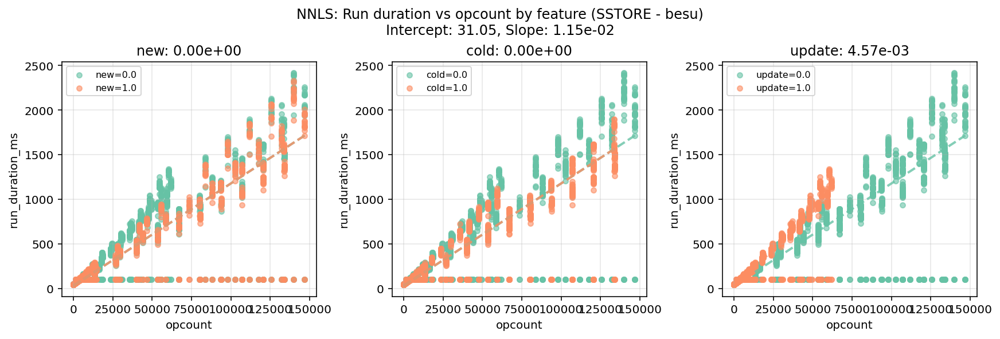

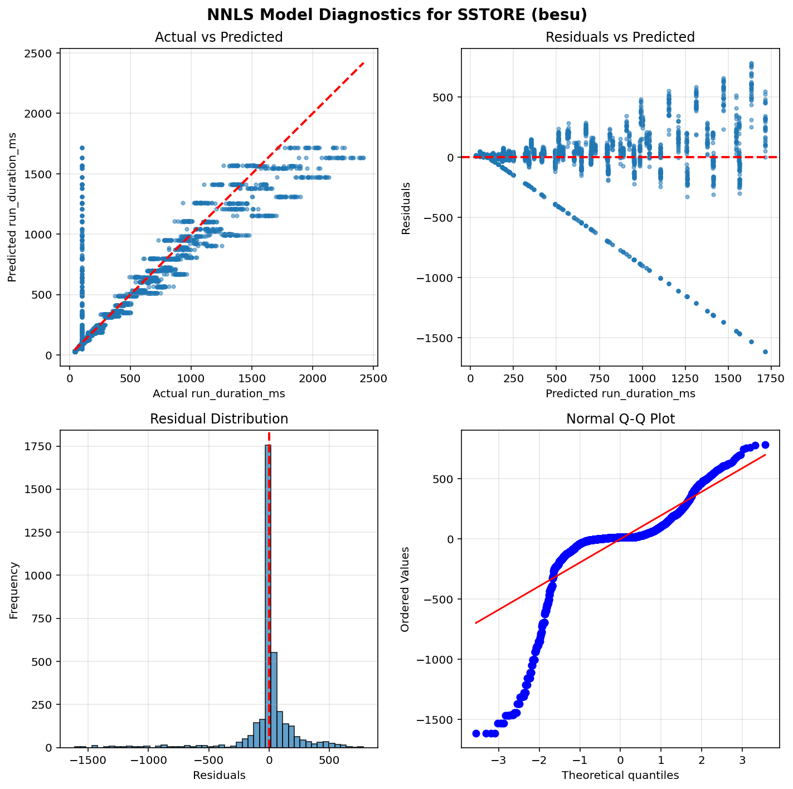

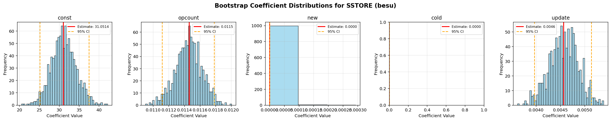


## geth


```python
==============================================================================
                           NNLS Regression Results                            
==============================================================================
Dep. Variable:          run_duration_ms              R-squared:          0.508
Model:                  NNLS                    Adj. R-squared:          0.506
No. Observations:       1075                              RMSE:          75.53
Df Residuals:           1070                               MAE:          34.70
Df Model:               4      
==============================================================================
                      coef     std err     P-value      [0.025      0.975]
------------------------------------------------------------------------------
         const     45.3972      1.2246       0.000     42.8523     47.7095
       opcount      0.0006      0.0001       0.000      0.0005      0.0007
           new      0.0000      0.0000       1.000      0.0000      0.0001
          cold      0.0000      0.0000       1.000      0.0000      0.0002
        update      0.0053      0.0005       0.000      0.0042      0.0062
==============================================================================
Notes: Non-negative least squares with bootstrap inference (1000 iterations)
==============================================================================
```

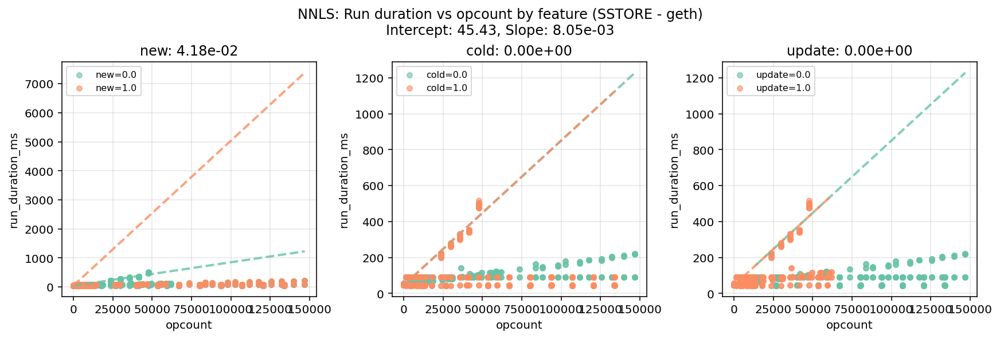

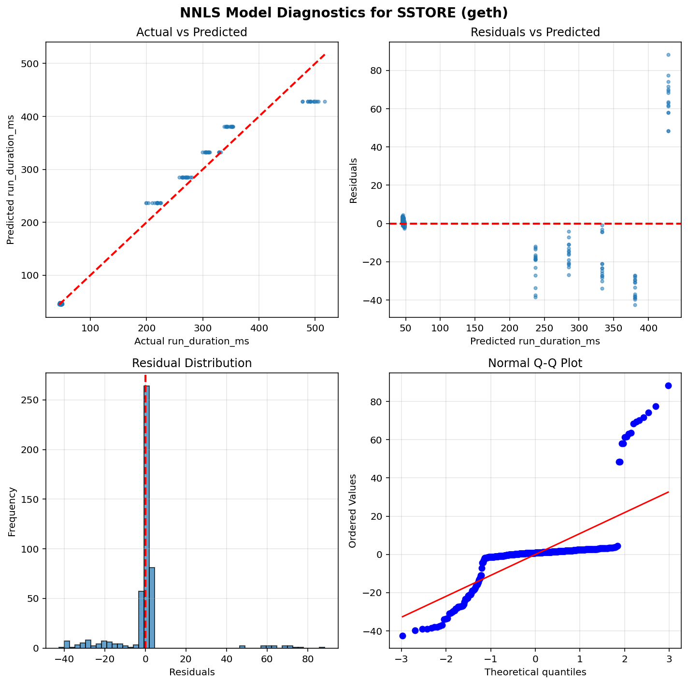

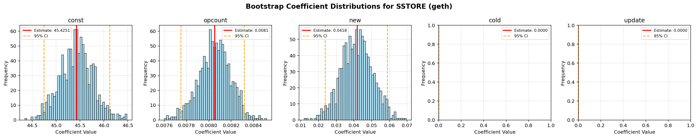


## nethermind


```python
==============================================================================
                           NNLS Regression Results                            
==============================================================================
Dep. Variable:          run_duration_ms              R-squared:          0.162
Model:                  NNLS                    Adj. R-squared:          0.161
No. Observations:       3400                              RMSE:         147.53
Df Residuals:           3395                               MAE:          49.57
Df Model:               4      
==============================================================================
                      coef     std err     P-value      [0.025      0.975]
------------------------------------------------------------------------------
         const     56.0483      3.0834       0.000     50.6843     62.6674
       opcount      0.0014      0.0001       0.000      0.0013      0.0015
           new      0.0000      0.0000       1.000      0.0000      0.0000
          cold      0.0000      0.0000       1.000      0.0000      0.0000
        update      0.0019      0.0002       0.000      0.0016      0.0023
==============================================================================
Notes: Non-negative least squares with bootstrap inference (1000 iterations)
==============================================================================
```

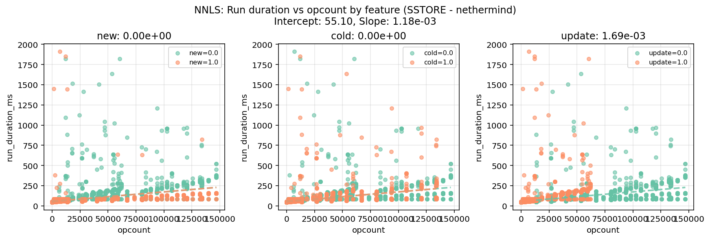

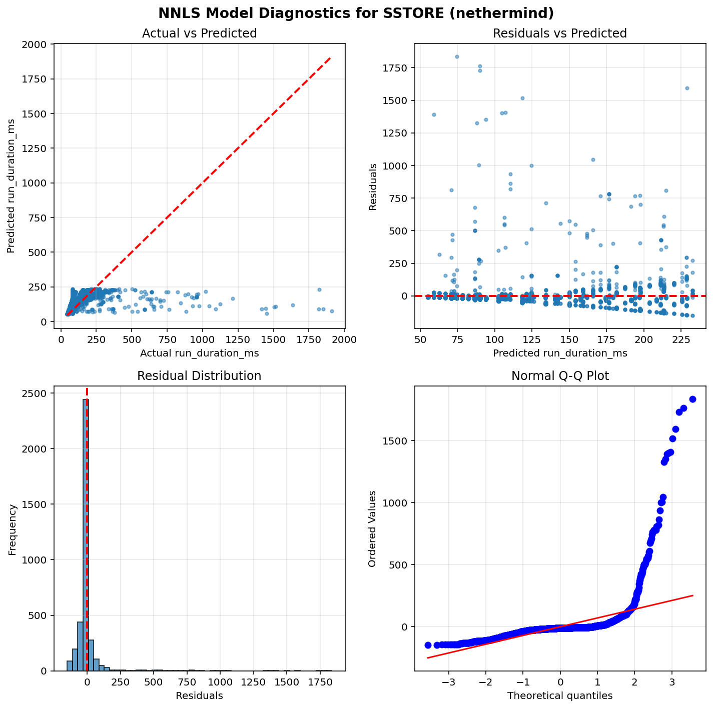

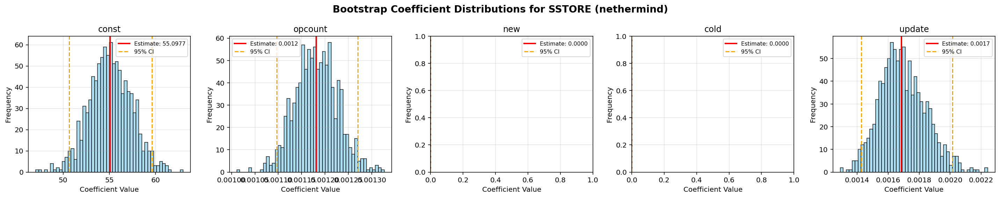


# SLOAD

## besu


```python
==============================================================================
                           NNLS Regression Results                            
==============================================================================
Dep. Variable:          run_duration_ms              R-squared:          0.001
Model:                  NNLS                    Adj. R-squared:         -0.001
No. Observations:       1020                              RMSE:         383.18
Df Residuals:           1017                               MAE:         315.96
Df Model:               2      
==============================================================================
                      coef     std err     P-value      [0.025      0.975]
------------------------------------------------------------------------------
         const    500.1087     15.1107       0.000    468.7736    527.1898
       opcount      0.0000      0.0000       1.000      0.0000      0.0000
          cold      0.0002      0.0002       0.173      0.0000      0.0007
==============================================================================
Notes: Non-negative least squares with bootstrap inference (1000 iterations)
==============================================================================
```

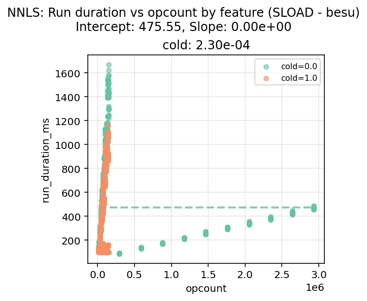

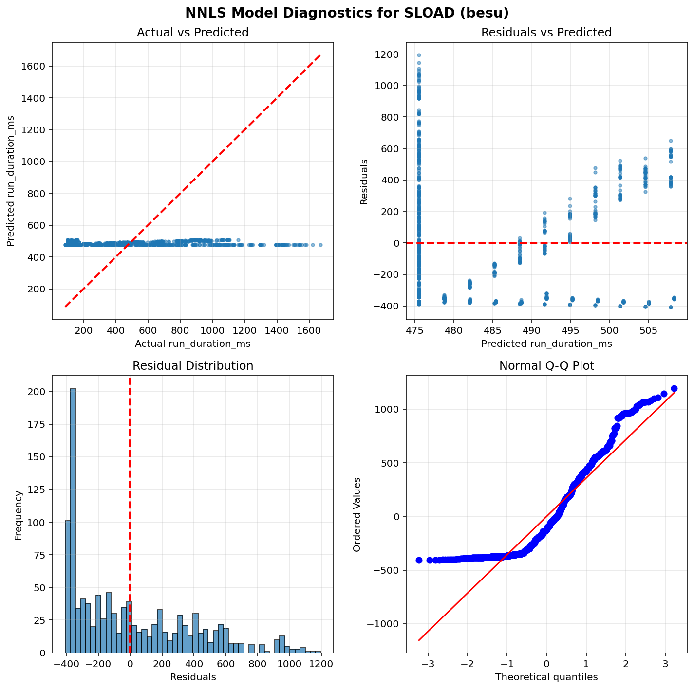

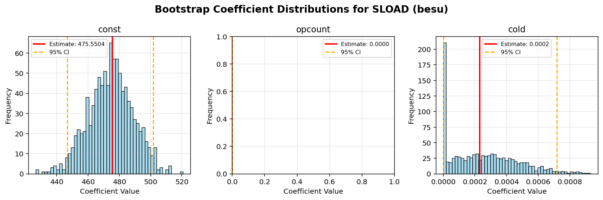


## geth


```python
==============================================================================
                           NNLS Regression Results                            
==============================================================================
Dep. Variable:          run_duration_ms              R-squared:          0.711
Model:                  NNLS                    Adj. R-squared:          0.710
No. Observations:       420                               RMSE:          40.27
Df Residuals:           417                                MAE:          29.90
Df Model:               2      
==============================================================================
                      coef     std err     P-value      [0.025      0.975]
------------------------------------------------------------------------------
         const     94.7104      4.0659       0.000     87.0779    102.2723
       opcount      0.0001      0.0000       0.000      0.0001      0.0001
          cold      0.0004      0.0001       0.000      0.0003      0.0005
==============================================================================
Notes: Non-negative least squares with bootstrap inference (1000 iterations)
==============================================================================
```

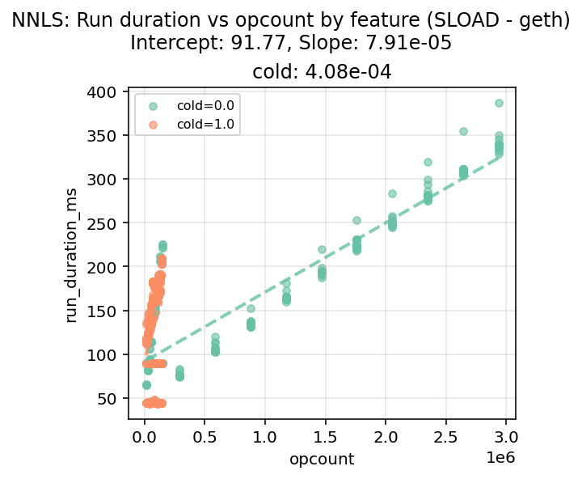

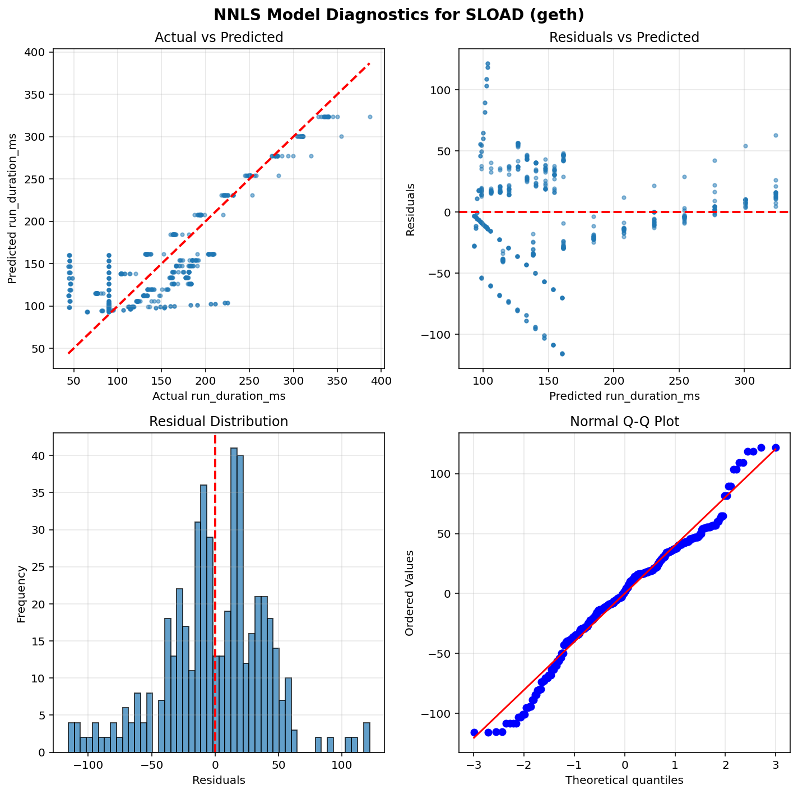

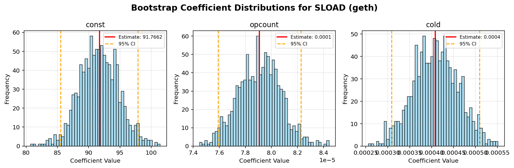


## nethermind


```python
==============================================================================
                           NNLS Regression Results                            
==============================================================================
Dep. Variable:          run_duration_ms              R-squared:          0.001
Model:                  NNLS                    Adj. R-squared:         -0.001
No. Observations:       1020                              RMSE:         286.81
Df Residuals:           1017                               MAE:          84.80
Df Model:               2      
==============================================================================
                      coef     std err     P-value      [0.025      0.975]
------------------------------------------------------------------------------
         const    142.7695     10.7692       0.000    123.9135    165.7638
       opcount      0.0000      0.0000       0.020      0.0000      0.0000
          cold      0.0000      0.0000       1.000      0.0000      0.0000
==============================================================================
Notes: Non-negative least squares with bootstrap inference (1000 iterations)
==============================================================================
```

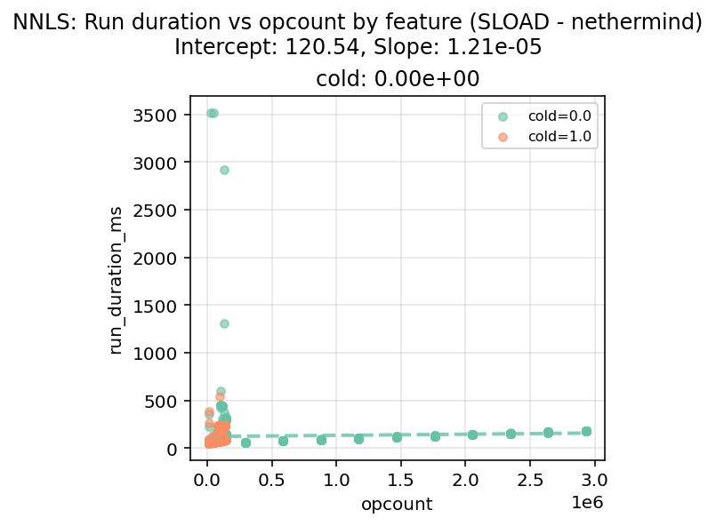

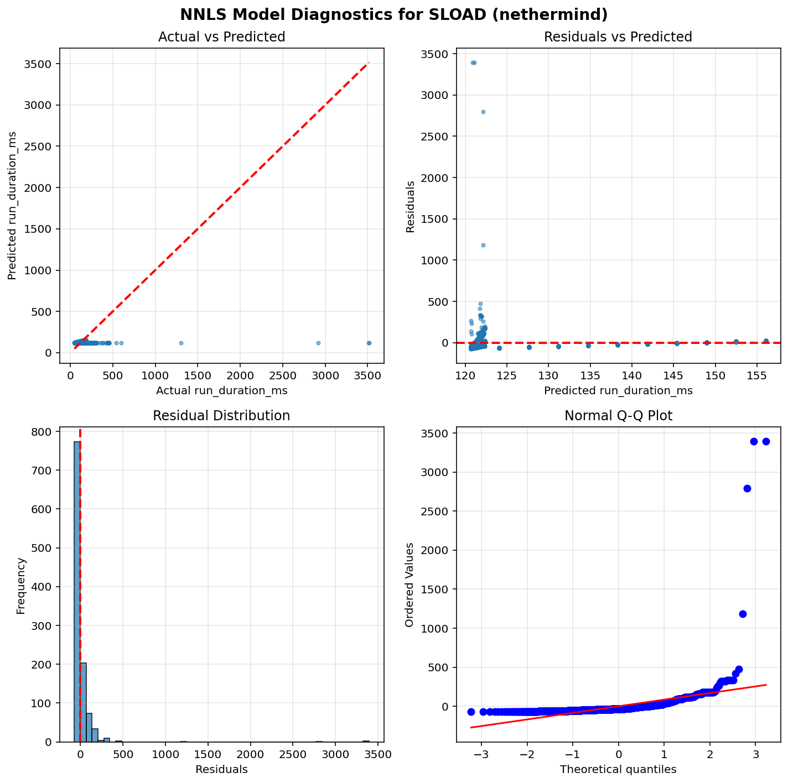

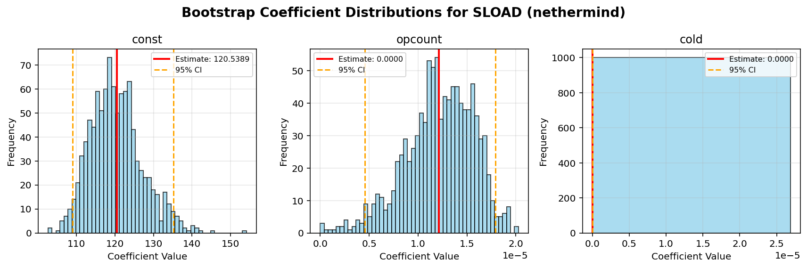

