Operation run times estimation results - EIP-8038
=================================================

Table of contents
=================

* [BALANCE](#balance)
* [EXTCODESIZE](#extcodesize)
* [EXTCODECOPY](#extcodecopy)
* [EXTCODEHASH](#extcodehash)
* [SLOAD](#sload)
* [SSTORE](#sstore)
* [DELEGATECALL](#delegatecall)
* [STATICCALL](#staticcall)
* [CALL](#call)
* [CALLCODE](#callcode)
* [SELFDESTRUCT](#selfdestruct)

# Introduction


This is an automated report generated from the opcode run times
estimation script `./src/estimate_8038_repricings.py`. The script
uses data generated by running the
[EEST benchmark suite](https://github.com/ethereum/execution-spec-tests/tree/main/tests/benchmark)
with the [Nethermind benchmarking tooling](https://github.com/NethermindEth/gas-benchmarks).

The data includes all the tests for operations repriced in EIP-8038 run
between 2026-01-26 and 2026-02-23.

For each operation and client, an NNLS linear regression model is fitted to estimate the
operation run time as a function of the operation count and other operation-specific parameters.
The results are presented below.

# How to Interpret the Results

## Model Used


**Non-Negative Least Squares (NNLS) Linear Regression** is used to estimate operation runtimes.
This model ensures all coefficients are non-negative, which is physically meaningful since
execution time cannot be negative. The model estimates runtime as a linear combination of:

- **Constant term (intercept)**: Base overhead for executing the test, which includes setup and teardown time
- **Operation count (slope)**: Number of times the operation is executed in the test. This paramater 
is the one that allows us to estimate the per-operation runtime.
- **Operation-specific parameters**: Variables like number of rounds, message size, or number of pairs

For simple operations, the model estimates: `runtime = intercept + slope × operation_count`

For variable operations, the model estimates: `runtime = intercept + slope × operation_count +
 param1_coef × operation_count × param1 + param2_coef × operation_count × param2 + ...`

## Model Quality Metrics


Each model reports two key metrics to assess the quality of the fit:

**R² (R-squared / Coefficient of Determination)**
- Ranges from 0 to 1 (or can be negative for very poor fits)
- Measures how well the model explains the variance in the data
- **Interpretation**:
  - R² > 0.9: Excellent fit - the model explains >90% of the variance
  - R² > 0.7: Good fit - the model captures most of the relationship
  - R² > 0.5: Acceptable fit - the model has predictive power but notable variance remains
  - R² < 0.5: Poor fit - the model may not be reliable

**p-value**
- Tests the statistical significance of each coefficient, based on a bootstrap sample estimation
- **Interpretation**:
  - p < 0.05: Statistically significant - the parameter has a real effect on runtime
  - p ≥ 0.05: Not significant - the parameter's effect cannot be distinguished from random noise

We also plot some diagnostic graphs for each operation and client combination to visually assess the model fit.

# BALANCE

## geth


```python
==============================================================================
                           NNLS Regression Results                            
==============================================================================
Dep. Variable:          run_duration_ms              R-squared:          0.799
Model:                  NNLS                    Adj. R-squared:          0.797
No. Observations:       160                               RMSE:          67.90
Df Residuals:           157                                MAE:          41.89
Df Model:               2      
==============================================================================
                      coef     std err     P-value      [0.025      0.975]
------------------------------------------------------------------------------
         const     38.8088      5.6297       0.000     28.6309     50.5971
       opcount      0.0042      0.0001       0.000      0.0039      0.0044
          cold      0.0000      0.0000       1.000      0.0000      0.0000
==============================================================================
Notes: Non-negative least squares with bootstrap inference (1000 iterations)
==============================================================================
```

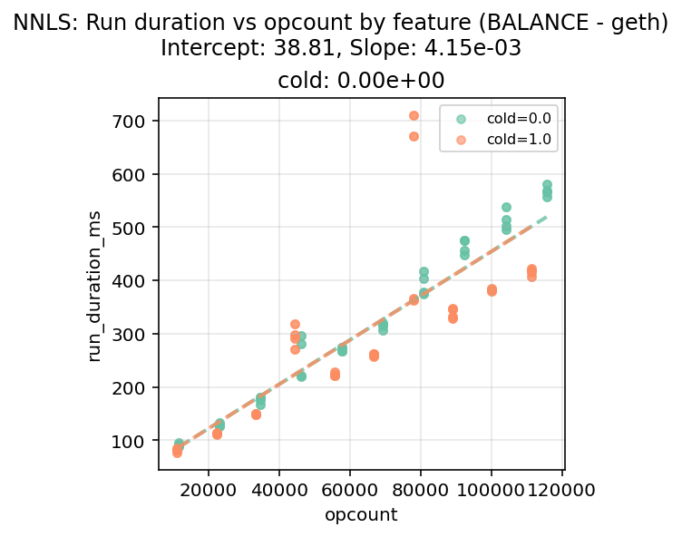

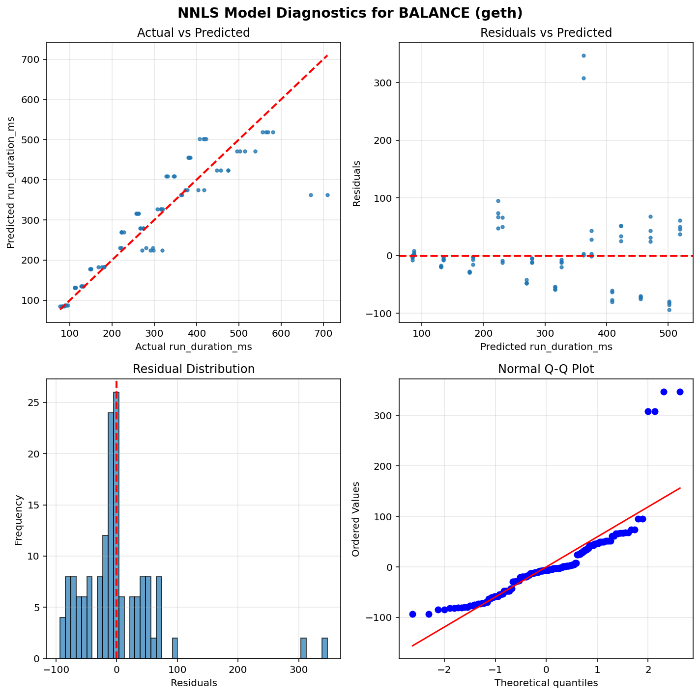

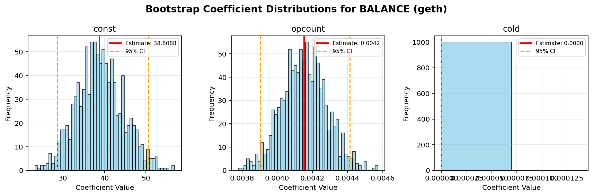


## besu


```python
==============================================================================
                           NNLS Regression Results                            
==============================================================================
Dep. Variable:          run_duration_ms              R-squared:          0.946
Model:                  NNLS                    Adj. R-squared:          0.945
No. Observations:       160                               RMSE:         160.37
Df Residuals:           157                                MAE:         119.49
Df Model:               2      
==============================================================================
                      coef     std err     P-value      [0.025      0.975]
------------------------------------------------------------------------------
         const      0.0000     11.4601       1.000      0.0000     38.9863
       opcount      0.0206      0.0002       0.000      0.0199      0.0209
          cold      0.0000      0.0000       1.000      0.0000      0.0000
==============================================================================
Notes: Non-negative least squares with bootstrap inference (1000 iterations)
==============================================================================
```

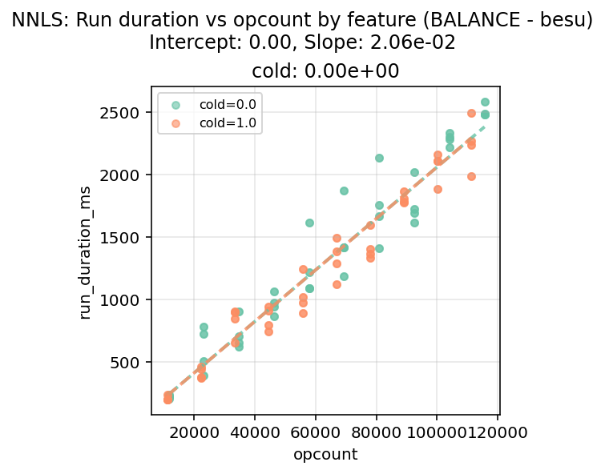

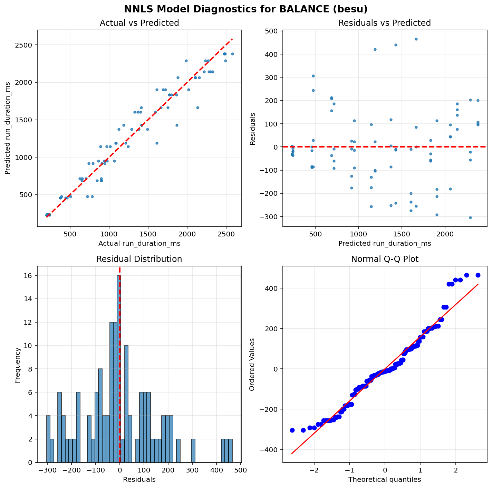

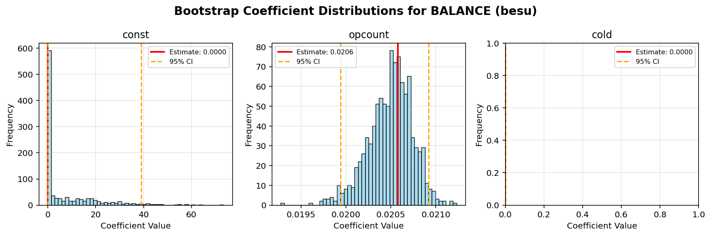


## nethermind


```python
==============================================================================
                           NNLS Regression Results                            
==============================================================================
Dep. Variable:          run_duration_ms              R-squared:          0.977
Model:                  NNLS                    Adj. R-squared:          0.976
No. Observations:       80                                RMSE:          11.32
Df Residuals:           77                                 MAE:           9.25
Df Model:               2      
==============================================================================
                      coef     std err     P-value      [0.025      0.975]
------------------------------------------------------------------------------
         const     52.9368      2.2605       0.000     48.7724     57.4702
       opcount      0.0023      0.0000       0.000      0.0022      0.0023
          cold      0.0000      0.0000       1.000      0.0000      0.0000
==============================================================================
Notes: Non-negative least squares with bootstrap inference (1000 iterations)
==============================================================================
```

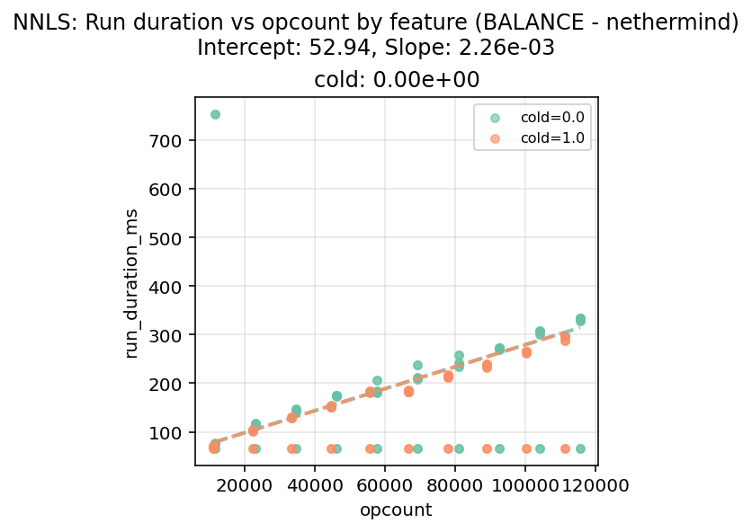

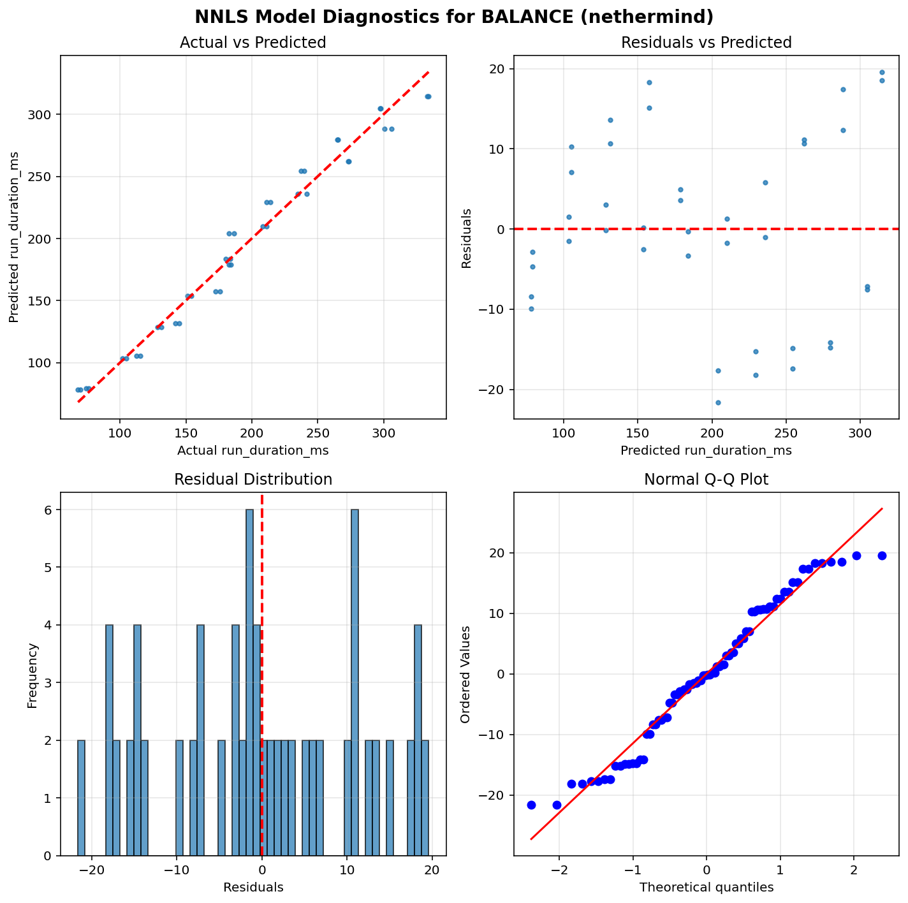

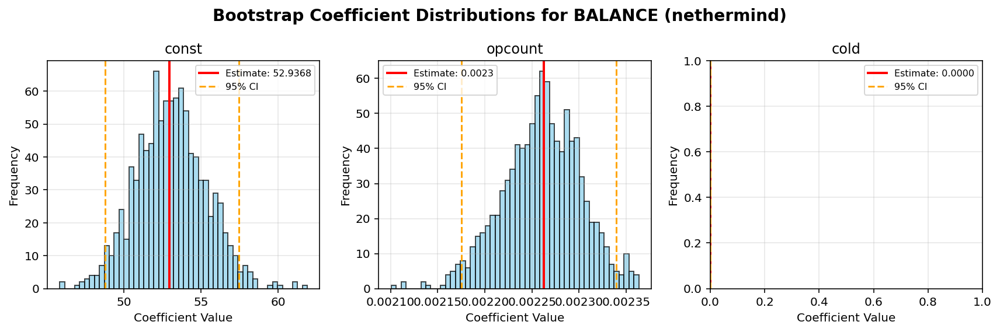


# EXTCODESIZE

## geth

NNLS model did not run... Error: No valid data remaining after dropping NaN values

## besu


```python
==============================================================================
                           NNLS Regression Results                            
==============================================================================
Dep. Variable:          run_duration_ms              R-squared:          0.944
Model:                  NNLS                    Adj. R-squared:          0.943
No. Observations:       160                               RMSE:         173.40
Df Residuals:           157                                MAE:         137.46
Df Model:               2      
==============================================================================
                      coef     std err     P-value      [0.025      0.975]
------------------------------------------------------------------------------
         const      0.0000      2.7788       1.000      0.0000      4.6008
       opcount      0.0213      0.0002       0.000      0.0208      0.0217
          cold      0.0000      0.0002       1.000      0.0000      0.0006
==============================================================================
Notes: Non-negative least squares with bootstrap inference (1000 iterations)
==============================================================================
```

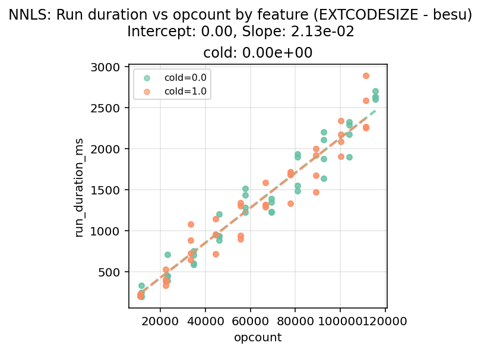

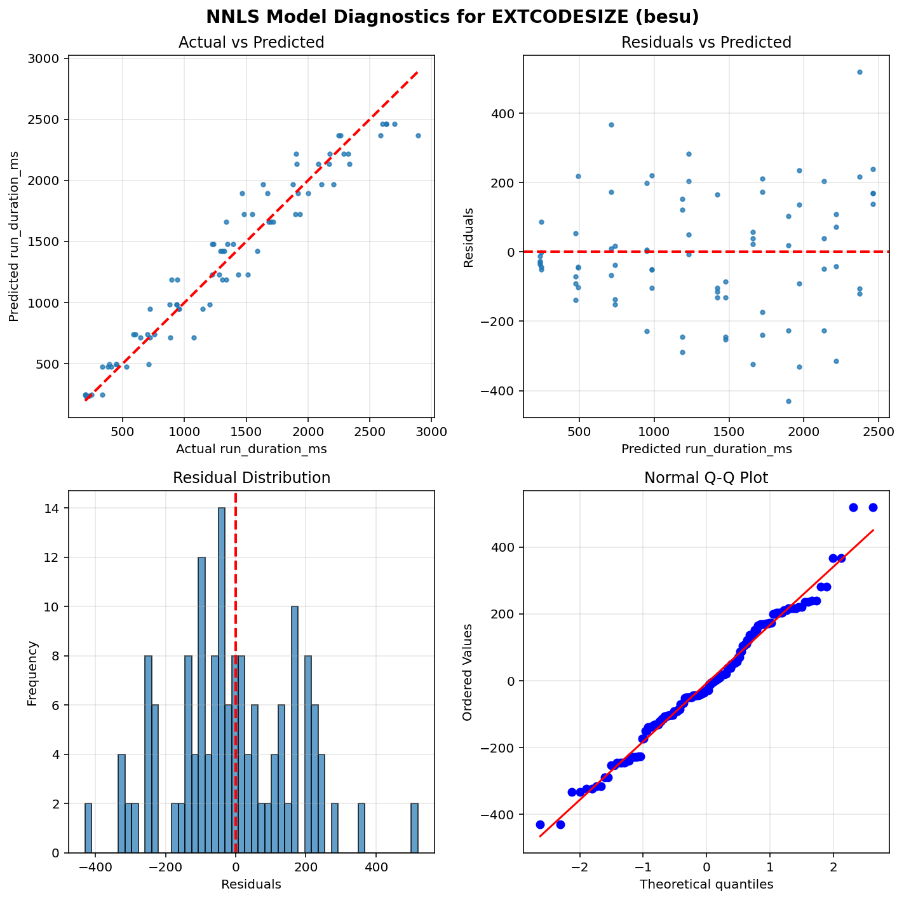

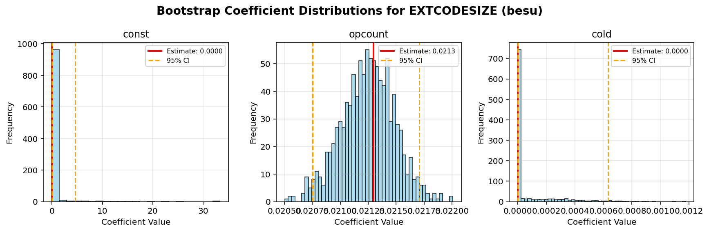


## nethermind


```python
==============================================================================
                           NNLS Regression Results                            
==============================================================================
Dep. Variable:          run_duration_ms              R-squared:          0.957
Model:                  NNLS                    Adj. R-squared:          0.956
No. Observations:       120                               RMSE:          16.51
Df Residuals:           117                                MAE:          13.54
Df Model:               2      
==============================================================================
                      coef     std err     P-value      [0.025      0.975]
------------------------------------------------------------------------------
         const     53.4485      2.8137       0.000     47.8620     58.9974
       opcount      0.0024      0.0001       0.000      0.0023      0.0025
          cold      0.0000      0.0000       1.000      0.0000      0.0000
==============================================================================
Notes: Non-negative least squares with bootstrap inference (1000 iterations)
==============================================================================
```

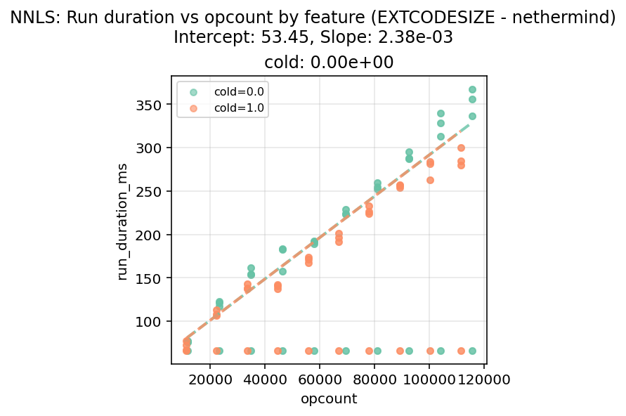

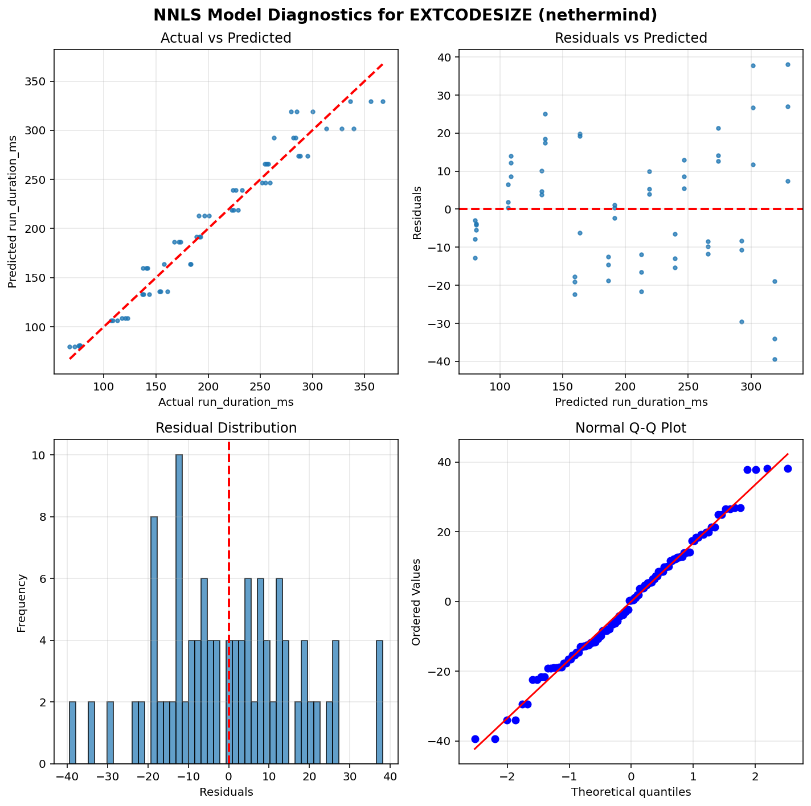

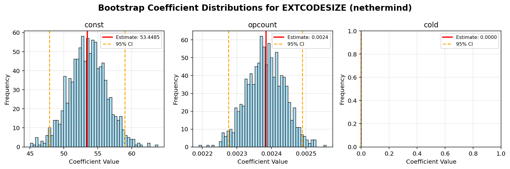


# EXTCODECOPY

## geth

NNLS model did not run... Error: No valid data remaining after dropping NaN values

## besu


```python
==============================================================================
                           NNLS Regression Results                            
==============================================================================
Dep. Variable:          run_duration_ms              R-squared:          0.000
Model:                  NNLS                    Adj. R-squared:         -0.002
No. Observations:       2560                              RMSE:        1267.12
Df Residuals:           2555                               MAE:         894.59
Df Model:               4      
==============================================================================
                      coef     std err     P-value      [0.025      0.975]
------------------------------------------------------------------------------
         const    971.7039     27.0384       0.000    915.4787   1020.0248
       opcount      0.0000      0.0000       1.000      0.0000      0.0000
          cold      0.0000      0.0000       0.457      0.0000      0.0001
      mem_size      0.0000      0.0000       1.000      0.0000      0.0000
     code_size      0.0000      0.0000       1.000      0.0000      0.0000
==============================================================================
Notes: Non-negative least squares with bootstrap inference (1000 iterations)
==============================================================================
```

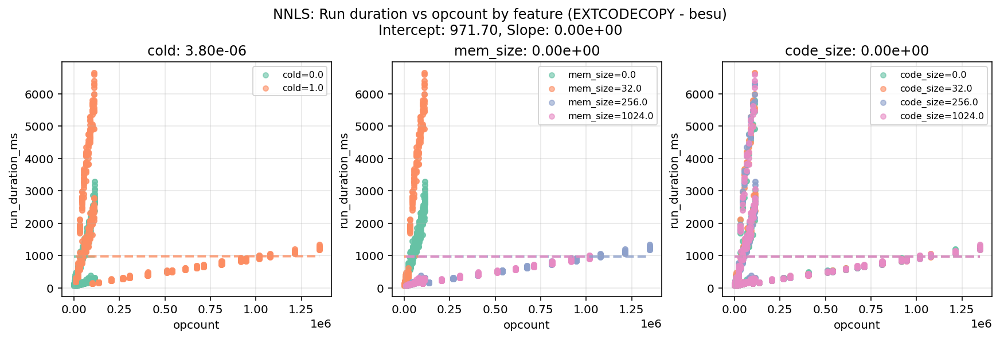

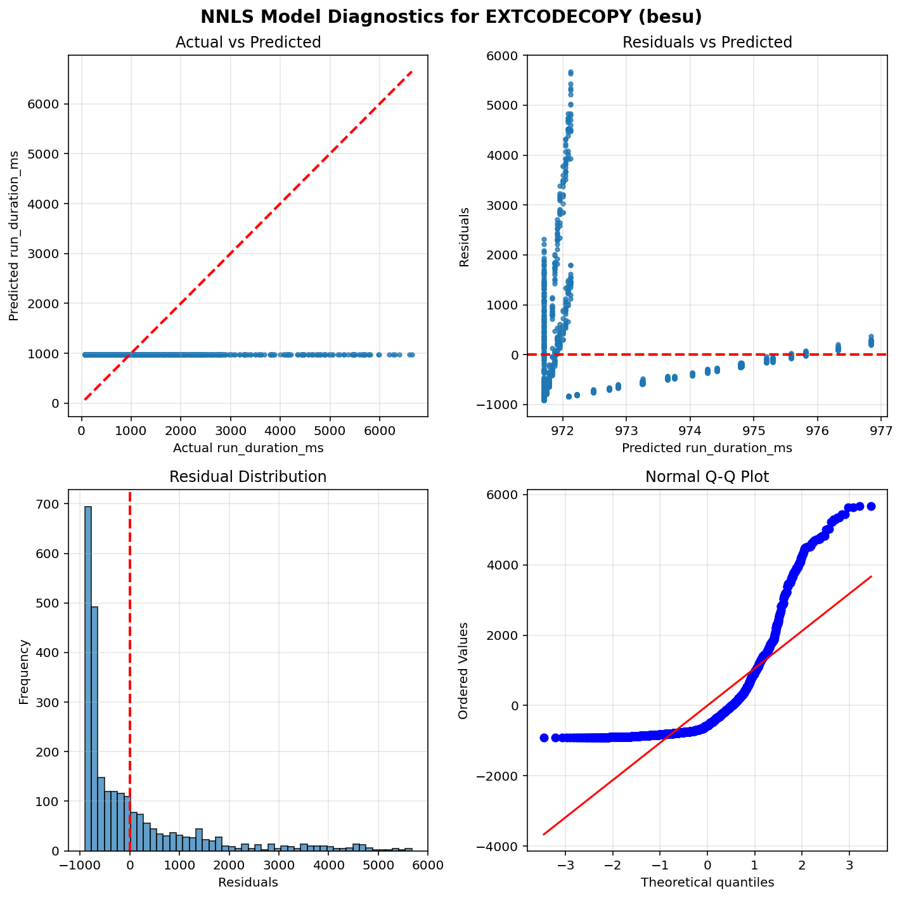

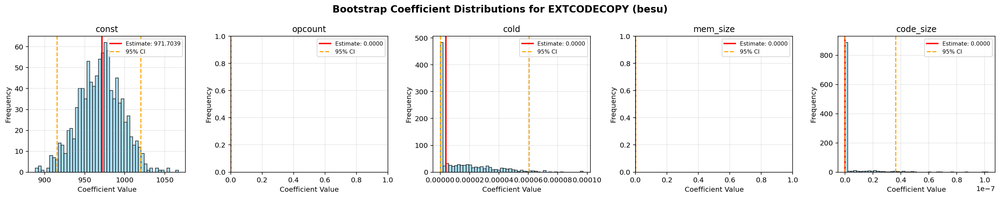


## nethermind


```python
==============================================================================
                           NNLS Regression Results                            
==============================================================================
Dep. Variable:          run_duration_ms              R-squared:          0.092
Model:                  NNLS                    Adj. R-squared:          0.091
No. Observations:       2560                              RMSE:          94.50
Df Residuals:           2555                               MAE:          40.57
Df Model:               4      
==============================================================================
                      coef     std err     P-value      [0.025      0.975]
------------------------------------------------------------------------------
         const    100.1264      2.5740       0.000     95.3499    105.4160
       opcount      0.0001      0.0000       0.127      0.0000      0.0001
          cold      0.0000      0.0000       0.208      0.0000      0.0001
      mem_size      0.0000      0.0000       1.000      0.0000      0.0000
     code_size      0.0000      0.0000       1.000      0.0000      0.0000
==============================================================================
Notes: Non-negative least squares with bootstrap inference (1000 iterations)
==============================================================================
```

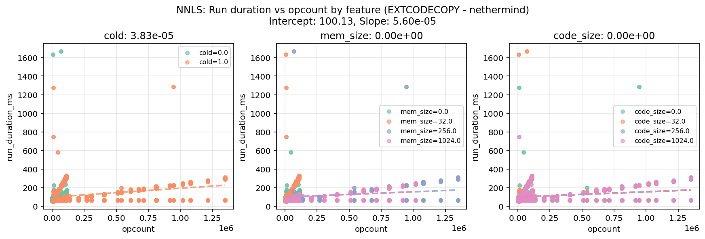

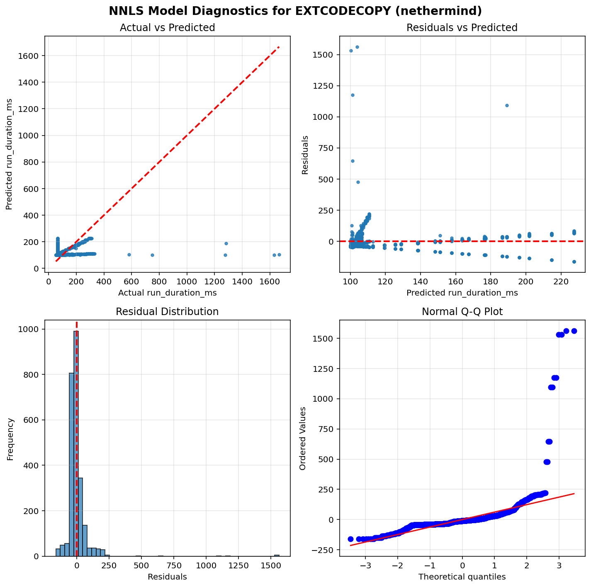

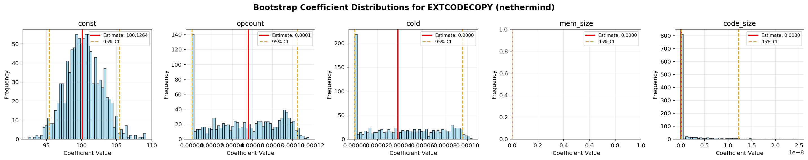


# EXTCODEHASH

## geth

NNLS model did not run... Error: No valid data remaining after dropping NaN values

## besu


```python
==============================================================================
                           NNLS Regression Results                            
==============================================================================
Dep. Variable:          run_duration_ms              R-squared:          0.957
Model:                  NNLS                    Adj. R-squared:          0.957
No. Observations:       160                               RMSE:         148.65
Df Residuals:           157                                MAE:         114.58
Df Model:               2      
==============================================================================
                      coef     std err     P-value      [0.025      0.975]
------------------------------------------------------------------------------
         const      0.0000      9.3875       1.000      0.0000     34.5033
       opcount      0.0214      0.0003       0.000      0.0208      0.0218
          cold      0.0000      0.0000       1.000      0.0000      0.0000
==============================================================================
Notes: Non-negative least squares with bootstrap inference (1000 iterations)
==============================================================================
```


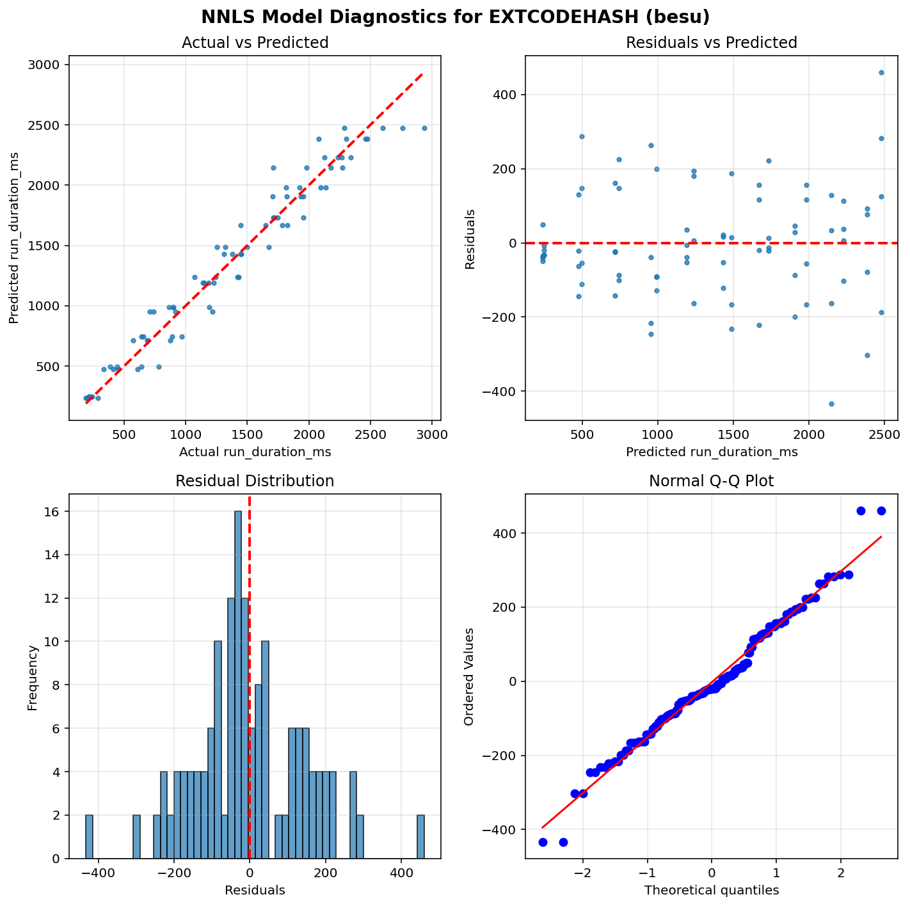

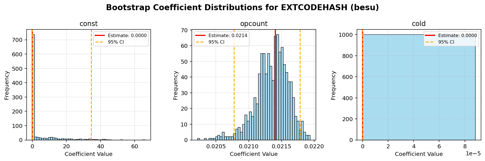


## nethermind


```python
==============================================================================
                           NNLS Regression Results                            
==============================================================================
Dep. Variable:          run_duration_ms              R-squared:          0.130
Model:                  NNLS                    Adj. R-squared:          0.118
No. Observations:       160                               RMSE:         199.40
Df Residuals:           157                                MAE:          69.34
Df Model:               2      
==============================================================================
                      coef     std err     P-value      [0.025      0.975]
------------------------------------------------------------------------------
         const     45.9201     14.3957       0.006     15.2410     70.9857
       opcount      0.0024      0.0004       0.000      0.0016      0.0034
          cold      0.0000      0.0000       1.000      0.0000      0.0000
==============================================================================
Notes: Non-negative least squares with bootstrap inference (1000 iterations)
==============================================================================
```

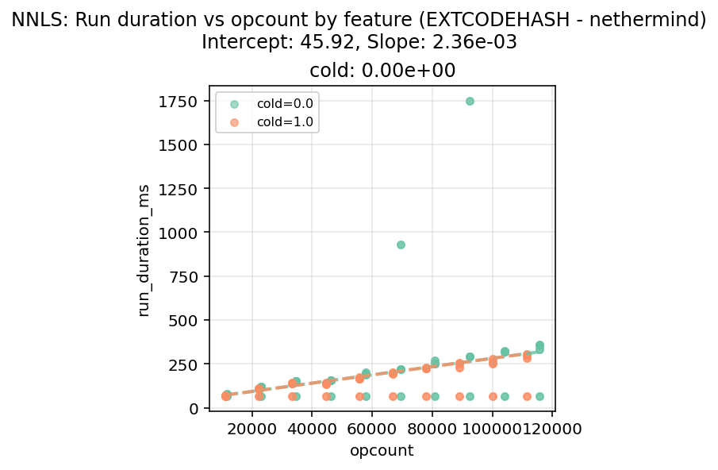

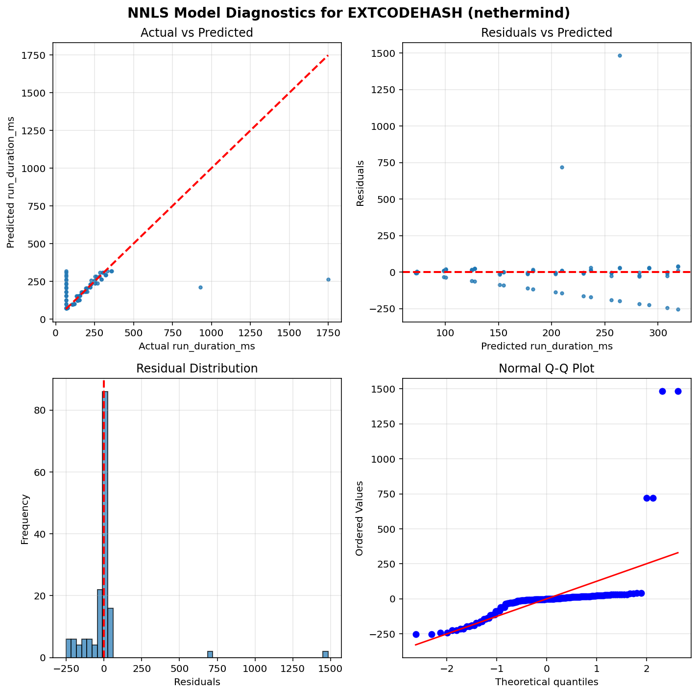

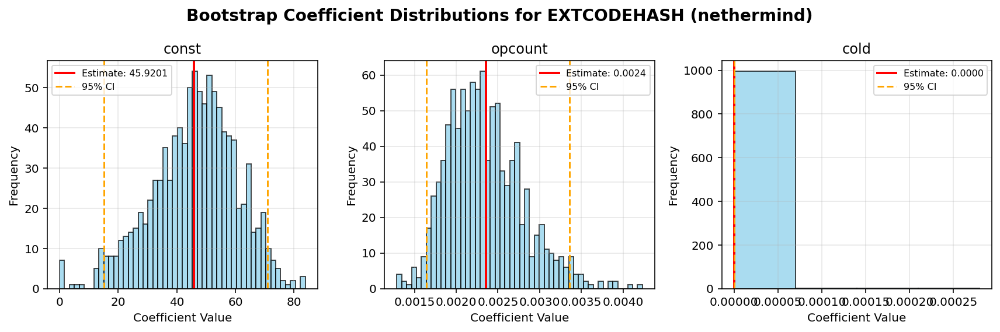


# SLOAD

## geth


```python
==============================================================================
                           NNLS Regression Results                            
==============================================================================
Dep. Variable:          run_duration_ms              R-squared:          0.698
Model:                  NNLS                    Adj. R-squared:          0.697
No. Observations:       1040                              RMSE:          76.64
Df Residuals:           1035                               MAE:          54.08
Df Model:               4      
==============================================================================
                      coef     std err     P-value      [0.025      0.975]
------------------------------------------------------------------------------
         const    118.7068      3.0651       0.000    112.8204    124.6493
       opcount      0.0000      0.0000       1.000      0.0000      0.0000
           new      0.0000      0.0000       1.000      0.0000      0.0000
          cold      0.0015      0.0000       0.000      0.0015      0.0016
  storage_size      0.0003      0.0000       0.000      0.0003      0.0003
==============================================================================
Notes: Non-negative least squares with bootstrap inference (1000 iterations)
==============================================================================
```

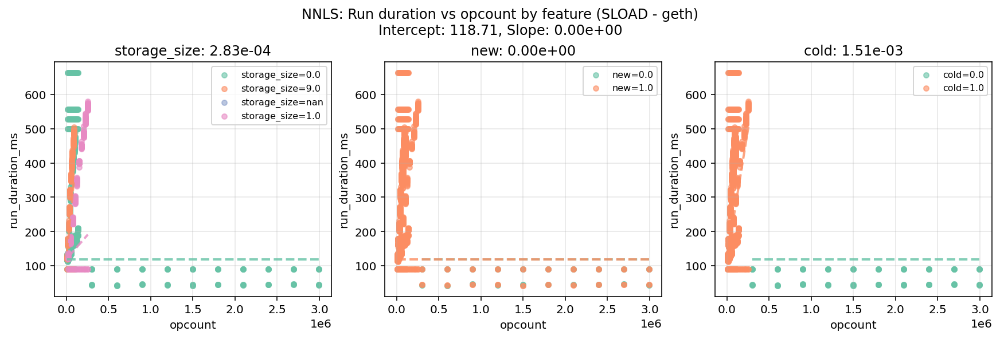

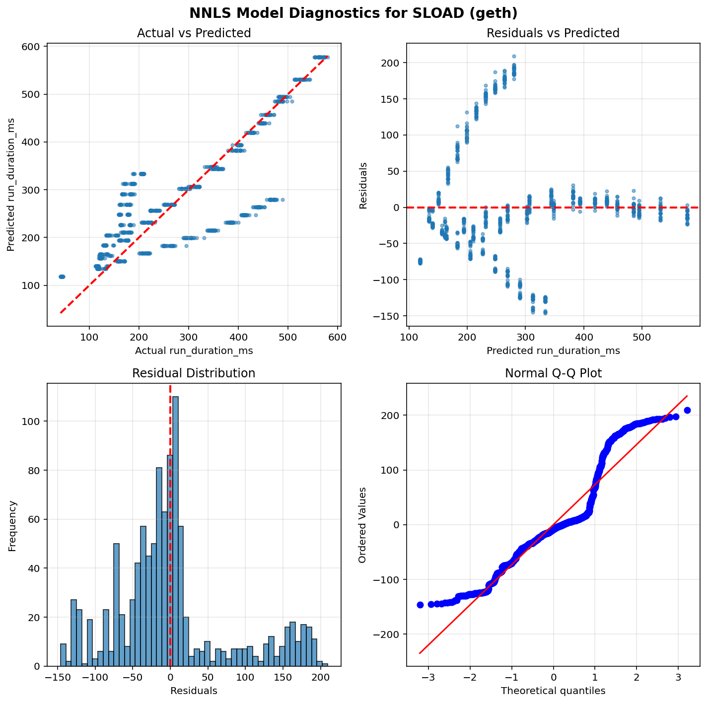

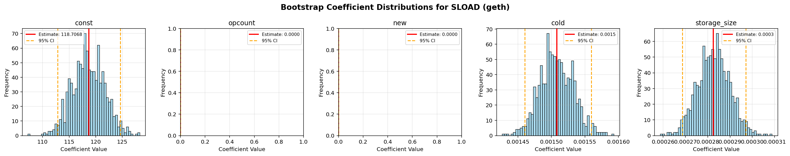


## besu


```python
==============================================================================
                           NNLS Regression Results                            
==============================================================================
Dep. Variable:          run_duration_ms              R-squared:          0.706
Model:                  NNLS                    Adj. R-squared:          0.705
No. Observations:       1500                              RMSE:         154.23
Df Residuals:           1495                               MAE:          93.49
Df Model:               4      
==============================================================================
                      coef     std err     P-value      [0.025      0.975]
------------------------------------------------------------------------------
         const    115.8620      5.5726       0.000    105.4818    127.0350
       opcount      0.0001      0.0000       0.000      0.0001      0.0001
           new      0.0000      0.0000       0.159      0.0000      0.0000
          cold      0.0026      0.0001       0.000      0.0025      0.0028
  storage_size      0.0008      0.0000       0.000      0.0008      0.0008
==============================================================================
Notes: Non-negative least squares with bootstrap inference (1000 iterations)
==============================================================================
```

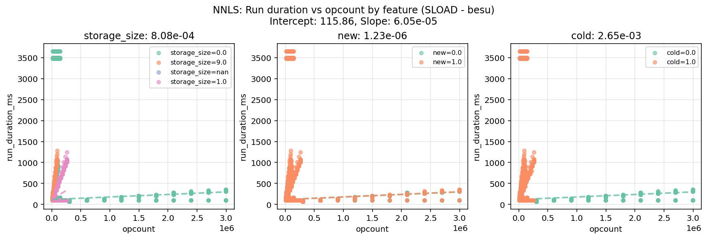

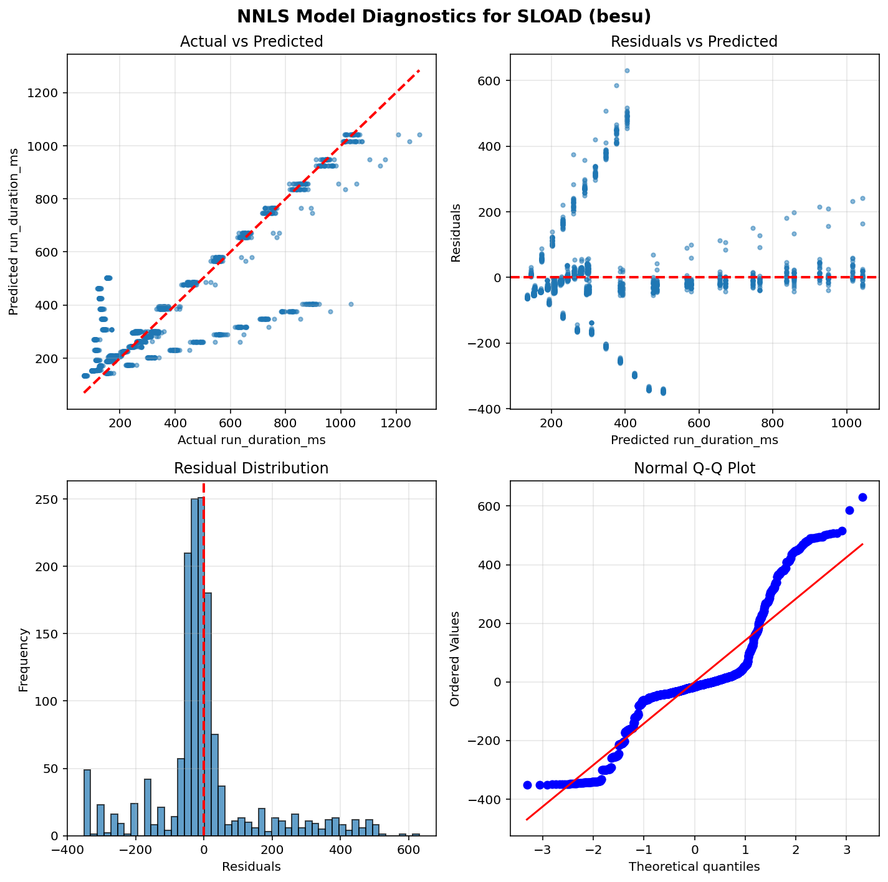

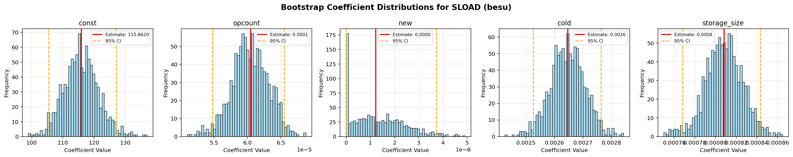


## nethermind


```python
==============================================================================
                           NNLS Regression Results                            
==============================================================================
Dep. Variable:          run_duration_ms              R-squared:          0.068
Model:                  NNLS                    Adj. R-squared:          0.066
No. Observations:       1680                              RMSE:         213.96
Df Residuals:           1675                               MAE:          55.76
Df Model:               4      
==============================================================================
                      coef     std err     P-value      [0.025      0.975]
------------------------------------------------------------------------------
         const     67.2346      4.6537       0.000     58.2551     77.0674
       opcount      0.0000      0.0000       0.000      0.0000      0.0000
           new      0.0000      0.0000       0.002      0.0000      0.0001
          cold      0.0006      0.0000       0.000      0.0005      0.0007
  storage_size      0.0001      0.0000       0.000      0.0001      0.0002
==============================================================================
Notes: Non-negative least squares with bootstrap inference (1000 iterations)
==============================================================================
```

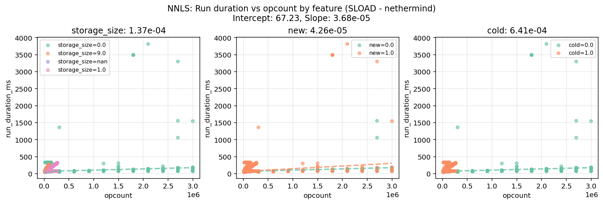

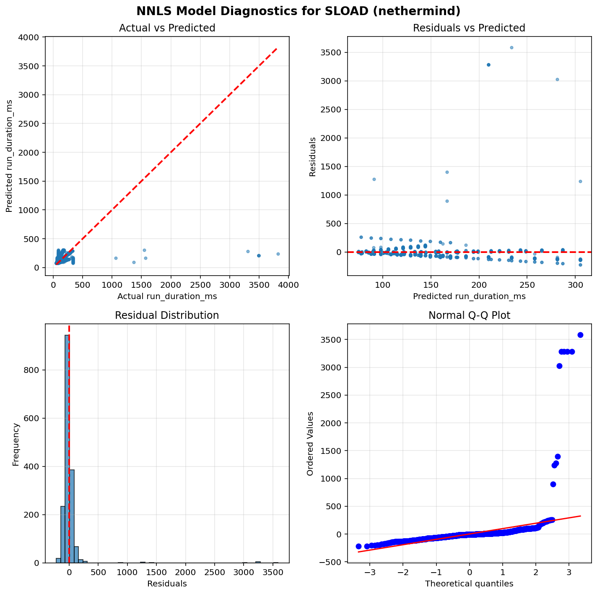

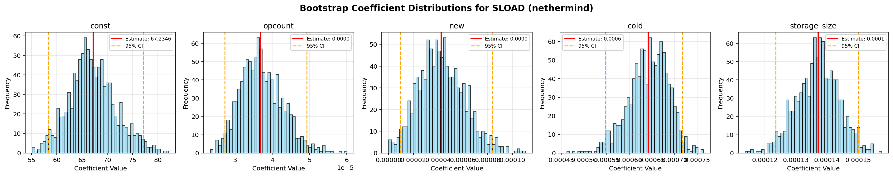


# SSTORE

## geth


```python
==============================================================================
                           NNLS Regression Results                            
==============================================================================
Dep. Variable:          run_duration_ms              R-squared:          0.001
Model:                  NNLS                    Adj. R-squared:         -0.001
No. Observations:       2130                              RMSE:         179.60
Df Residuals:           2124                               MAE:         132.79
Df Model:               5      
==============================================================================
                      coef     std err     P-value      [0.025      0.975]
------------------------------------------------------------------------------
         const    157.7732      5.4159       0.000    146.8036    168.3942
       opcount      0.0011      0.0007       0.124      0.0000      0.0024
           new      0.0000      0.0000       1.000      0.0000      0.0000
          cold      0.0000      0.0002       1.000      0.0000      0.0002
        update      0.0000      0.0002       1.000      0.0000      0.0000
  storage_size      0.0001      0.0001       0.030      0.0000      0.0003
==============================================================================
Notes: Non-negative least squares with bootstrap inference (1000 iterations)
==============================================================================
```

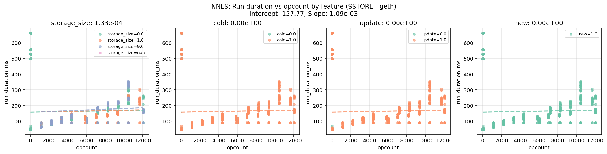

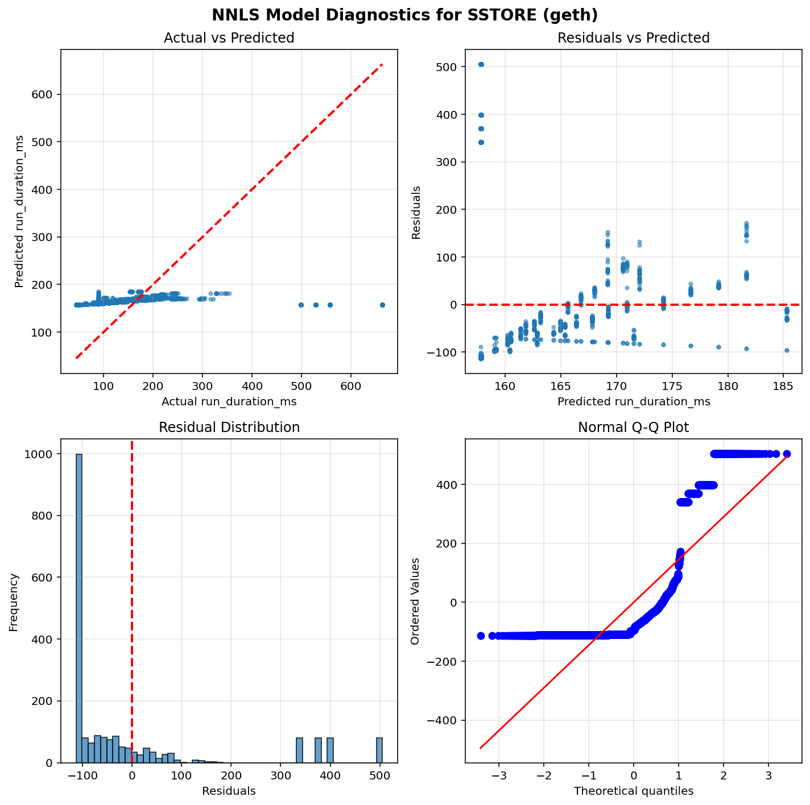

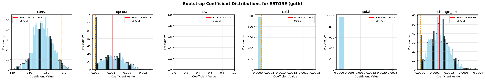


## besu


```python
==============================================================================
                           NNLS Regression Results                            
==============================================================================
Dep. Variable:          run_duration_ms              R-squared:          0.000
Model:                  NNLS                    Adj. R-squared:         -0.002
No. Observations:       2130                              RMSE:        1232.04
Df Residuals:           2124                               MAE:         879.41
Df Model:               5      
==============================================================================
                      coef     std err     P-value      [0.025      0.975]
------------------------------------------------------------------------------
         const    603.0525     27.2402       0.000    549.0447    657.5718
       opcount      0.0000      0.0000       1.000      0.0000      0.0000
           new      0.0000      0.0000       1.000      0.0000      0.0000
          cold      0.0000      0.0000       1.000      0.0000      0.0000
        update      0.0000      0.0000       1.000      0.0000      0.0000
  storage_size      0.0000      0.0000       1.000      0.0000      0.0000
==============================================================================
Notes: Non-negative least squares with bootstrap inference (1000 iterations)
==============================================================================
```

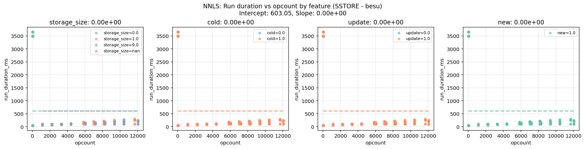

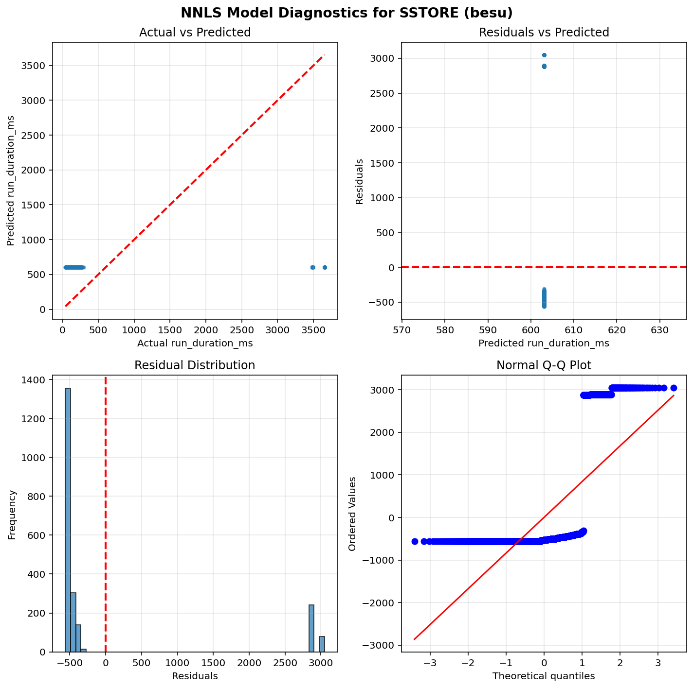

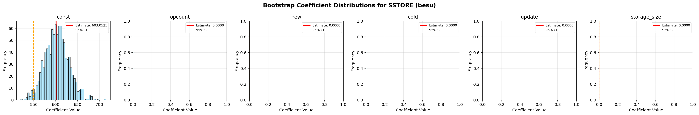


## nethermind


```python
==============================================================================
                           NNLS Regression Results                            
==============================================================================
Dep. Variable:          run_duration_ms              R-squared:          0.081
Model:                  NNLS                    Adj. R-squared:          0.079
No. Observations:       2130                              RMSE:          55.52
Df Residuals:           2124                               MAE:          26.21
Df Model:               5      
==============================================================================
                      coef     std err     P-value      [0.025      0.975]
------------------------------------------------------------------------------
         const     67.7991      1.6378       0.000     64.5772     70.9348
       opcount      0.0030      0.0014       0.597      0.0000      0.0033
           new      0.0000      0.0000       1.000      0.0000      0.0000
          cold      0.0000      0.0013       1.000      0.0000      0.0033
        update      0.0000      0.0014       1.000      0.0000      0.0033
  storage_size      0.0003      0.0000       0.000      0.0003      0.0004
==============================================================================
Notes: Non-negative least squares with bootstrap inference (1000 iterations)
==============================================================================
```

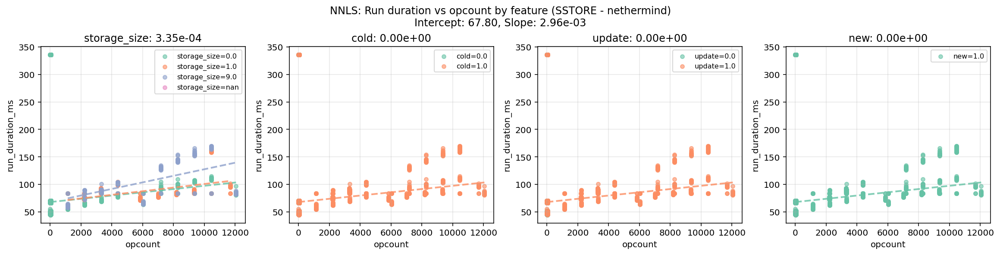

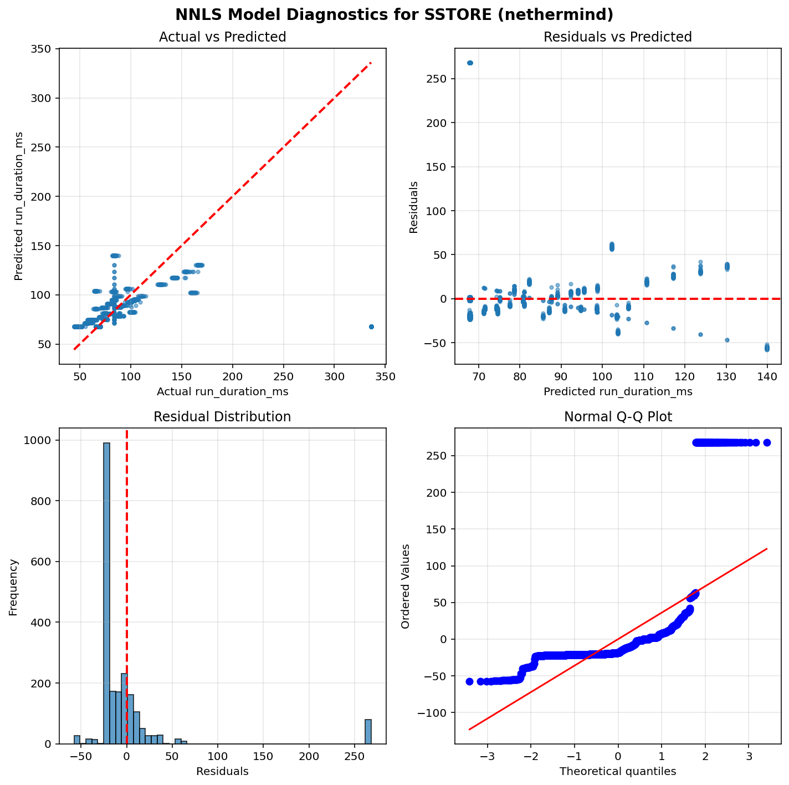

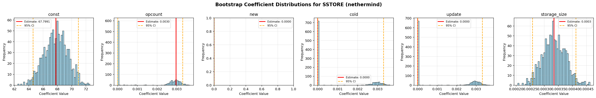


# DELEGATECALL

## geth

NNLS model did not run... Error: No valid data remaining after dropping NaN values

## besu


```python
==============================================================================
                           NNLS Regression Results                            
==============================================================================
Dep. Variable:          run_duration_ms              R-squared:          0.949
Model:                  NNLS                    Adj. R-squared:          0.949
No. Observations:       640                               RMSE:         173.86
Df Residuals:           636                                MAE:         132.94
Df Model:               3      
==============================================================================
                      coef     std err     P-value      [0.025      0.975]
------------------------------------------------------------------------------
         const      0.0000      0.0000       1.000      0.0000      0.0000
       opcount      0.0225      0.0001       0.000      0.0222      0.0227
          cold      0.0000      0.0000       1.000      0.0000      0.0000
      mem_size      0.0000      0.0000       0.228      0.0000      0.0000
==============================================================================
Notes: Non-negative least squares with bootstrap inference (1000 iterations)
==============================================================================
```

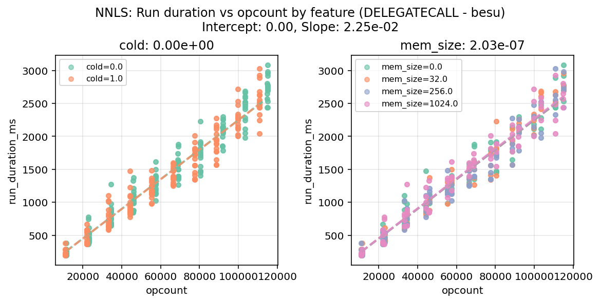

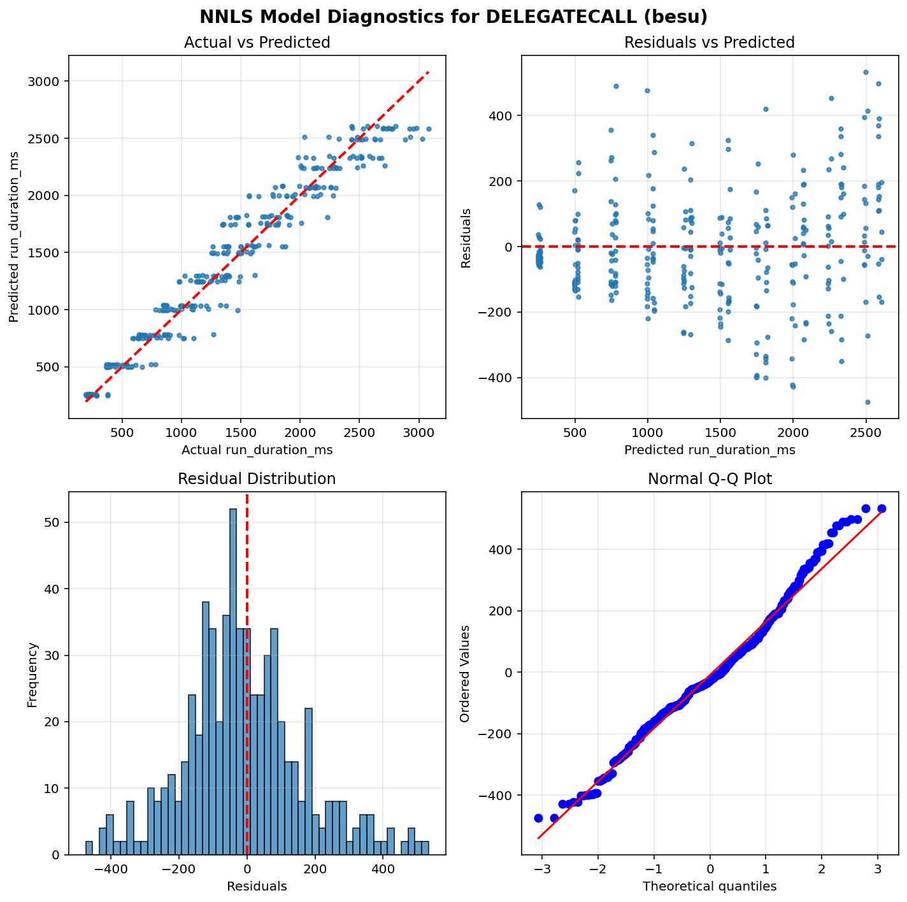

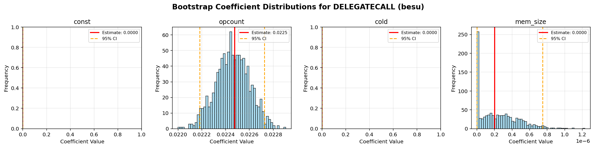


## nethermind


```python
==============================================================================
                           NNLS Regression Results                            
==============================================================================
Dep. Variable:          run_duration_ms              R-squared:          0.225
Model:                  NNLS                    Adj. R-squared:          0.221
No. Observations:       640                               RMSE:         110.27
Df Residuals:           636                                MAE:          67.42
Df Model:               3      
==============================================================================
                      coef     std err     P-value      [0.025      0.975]
------------------------------------------------------------------------------
         const     78.8761      9.4973       0.000     62.2679     98.9422
       opcount      0.0018      0.0001       0.000      0.0015      0.0021
          cold      0.0000      0.0000       1.000      0.0000      0.0000
      mem_size      0.0000      0.0000       1.000      0.0000      0.0000
==============================================================================
Notes: Non-negative least squares with bootstrap inference (1000 iterations)
==============================================================================
```

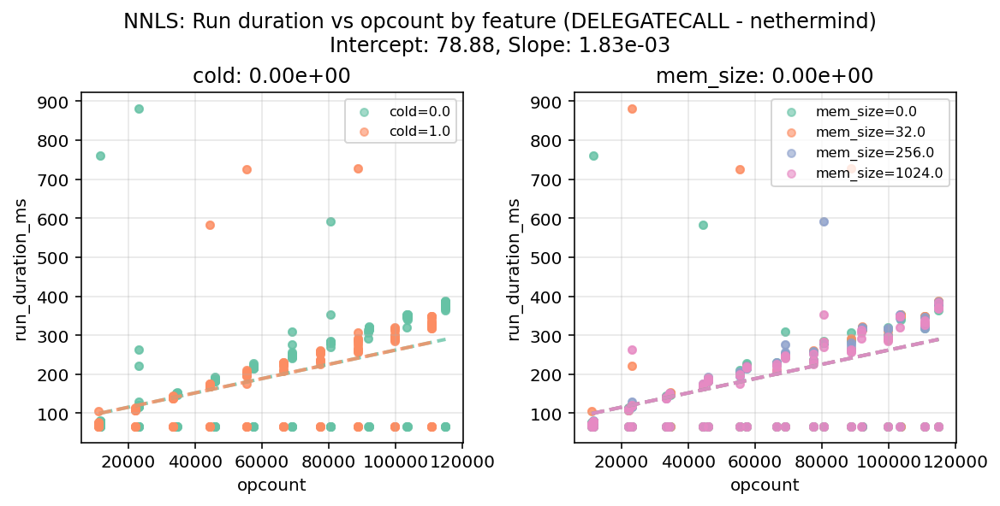

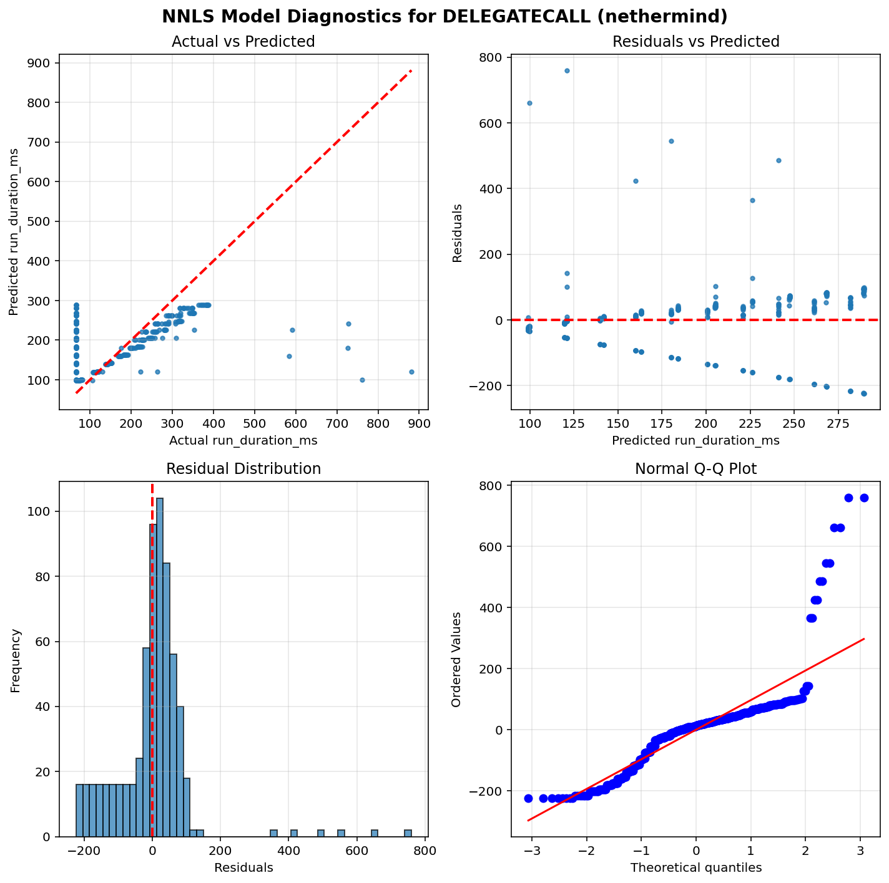

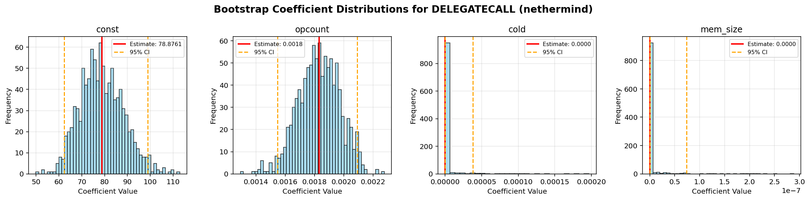


# STATICCALL

## geth

NNLS model did not run... Error: No valid data remaining after dropping NaN values

## besu


```python
==============================================================================
                           NNLS Regression Results                            
==============================================================================
Dep. Variable:          run_duration_ms              R-squared:          0.943
Model:                  NNLS                    Adj. R-squared:          0.943
No. Observations:       640                               RMSE:         191.70
Df Residuals:           636                                MAE:         146.19
Df Model:               3      
==============================================================================
                      coef     std err     P-value      [0.025      0.975]
------------------------------------------------------------------------------
         const      0.0000      0.0000       1.000      0.0000      0.0000
       opcount      0.0232      0.0001       0.000      0.0229      0.0235
          cold      0.0000      0.0000       1.000      0.0000      0.0000
      mem_size      0.0000      0.0000       1.000      0.0000      0.0000
==============================================================================
Notes: Non-negative least squares with bootstrap inference (1000 iterations)
==============================================================================
```

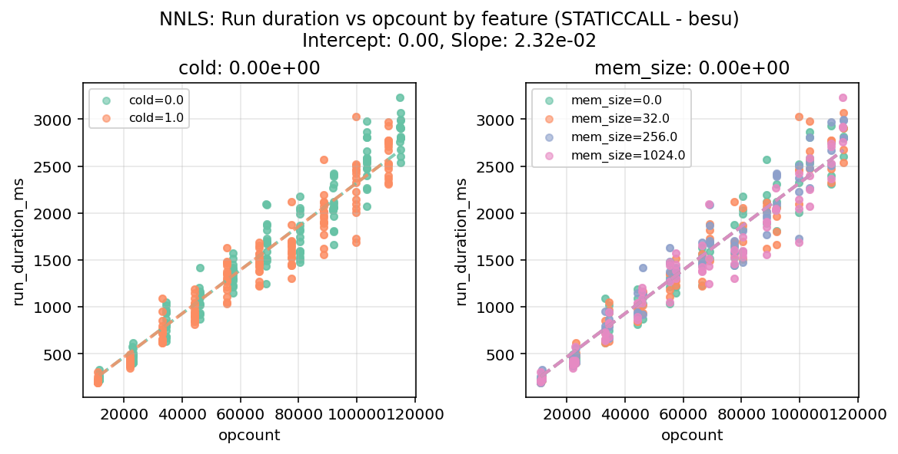

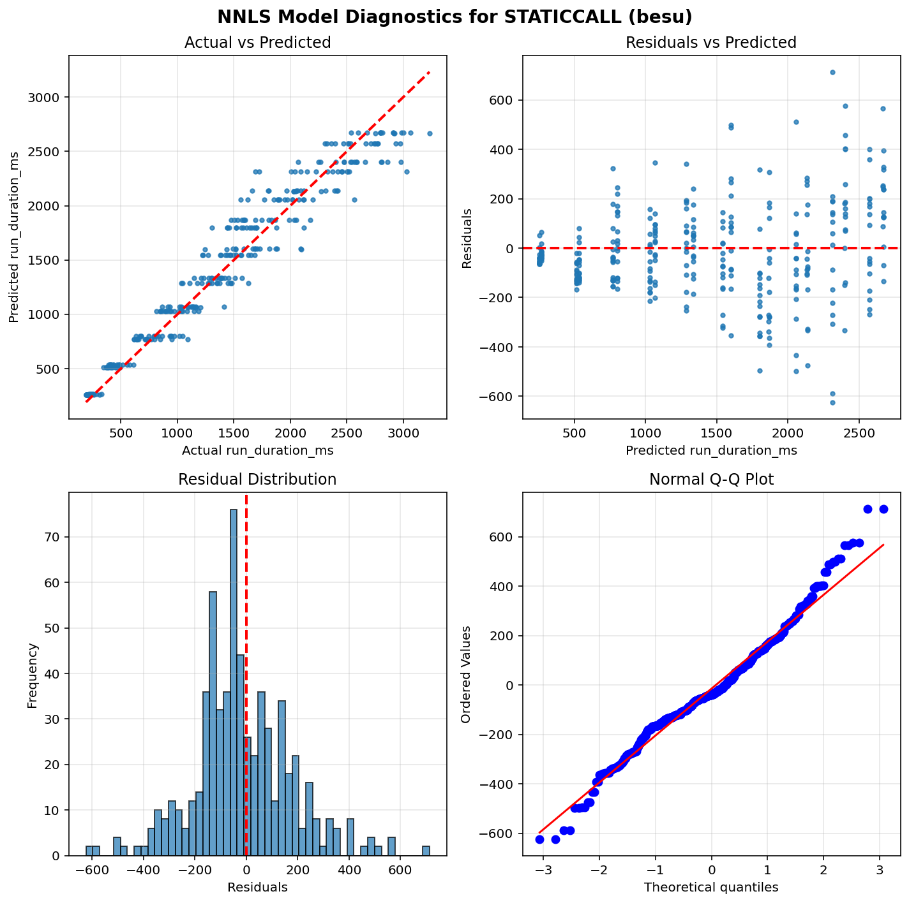

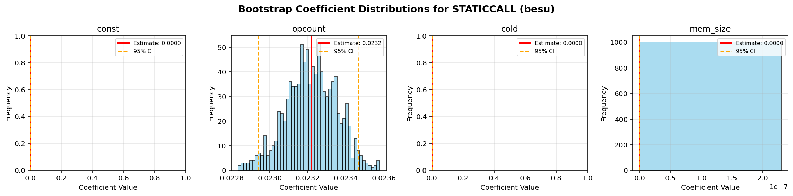


## nethermind


```python
==============================================================================
                           NNLS Regression Results                            
==============================================================================
Dep. Variable:          run_duration_ms              R-squared:          0.062
Model:                  NNLS                    Adj. R-squared:          0.058
No. Observations:       640                               RMSE:         205.75
Df Residuals:           636                                MAE:          78.91
Df Model:               3      
==============================================================================
                      coef     std err     P-value      [0.025      0.975]
------------------------------------------------------------------------------
         const    101.7480     20.5594       0.000     65.9876    145.1203
       opcount      0.0014      0.0003       0.000      0.0009      0.0019
          cold      0.0000      0.0000       1.000      0.0000      0.0000
      mem_size      0.0000      0.0000       0.050      0.0000      0.0000
==============================================================================
Notes: Non-negative least squares with bootstrap inference (1000 iterations)
==============================================================================
```

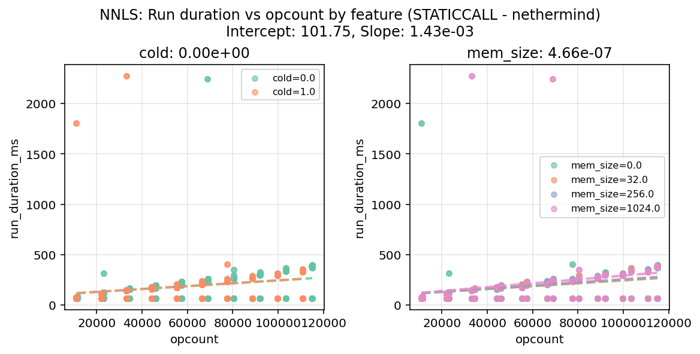

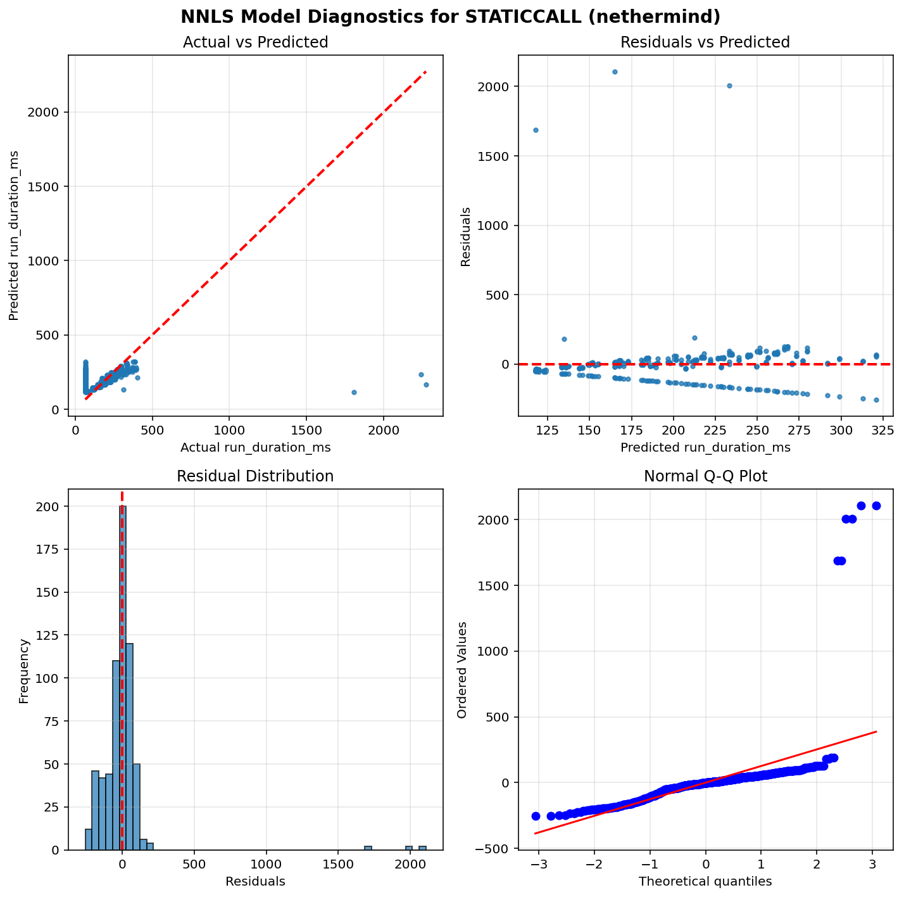

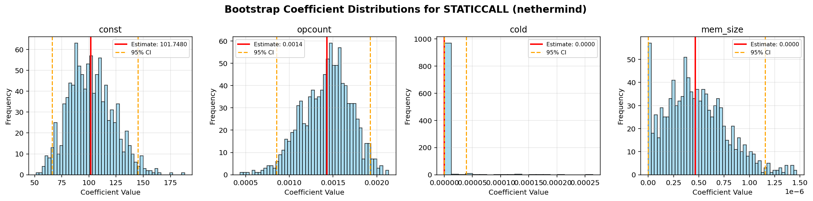


# CALL

## geth


```python
==============================================================================
                           NNLS Regression Results                            
==============================================================================
Dep. Variable:          run_duration_ms              R-squared:          0.723
Model:                  NNLS                    Adj. R-squared:          0.722
No. Observations:       1280                              RMSE:          88.75
Df Residuals:           1275                               MAE:          58.97
Df Model:               4      
==============================================================================
                      coef     std err     P-value      [0.025      0.975]
------------------------------------------------------------------------------
         const     84.4368      3.2329       0.000     78.2624     91.0010
       opcount      0.0040      0.0001       0.000      0.0038      0.0042
          cold      0.0000      0.0000       1.000      0.0000      0.0000
      mem_size      0.0000      0.0000       0.136      0.0000      0.0000
    value_sent      0.0000      0.0000       1.000      0.0000      0.0000
==============================================================================
Notes: Non-negative least squares with bootstrap inference (1000 iterations)
==============================================================================
```

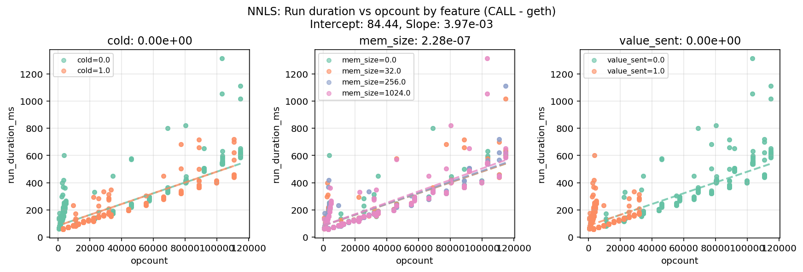

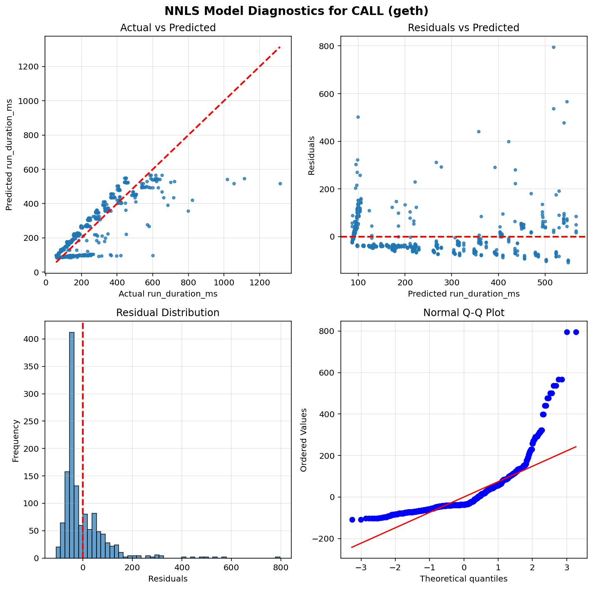

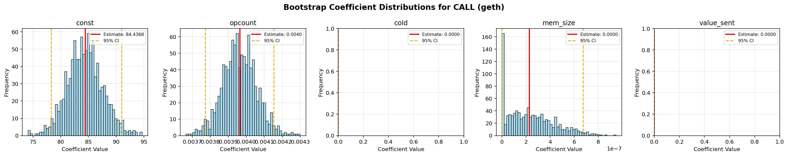


## besu


```python
==============================================================================
                           NNLS Regression Results                            
==============================================================================
Dep. Variable:          run_duration_ms              R-squared:          0.965
Model:                  NNLS                    Adj. R-squared:          0.965
No. Observations:       1280                              RMSE:         155.60
Df Residuals:           1275                               MAE:         114.17
Df Model:               4      
==============================================================================
                      coef     std err     P-value      [0.025      0.975]
------------------------------------------------------------------------------
         const     21.9781      4.3415       0.000     14.1864     30.4807
       opcount      0.0231      0.0002       0.000      0.0228      0.0235
          cold      0.0000      0.0000       1.000      0.0000      0.0000
      mem_size      0.0000      0.0000       1.000      0.0000      0.0000
    value_sent      0.0000      0.0000       1.000      0.0000      0.0000
==============================================================================
Notes: Non-negative least squares with bootstrap inference (1000 iterations)
==============================================================================
```

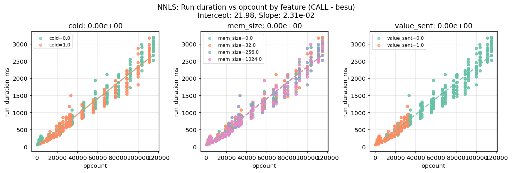

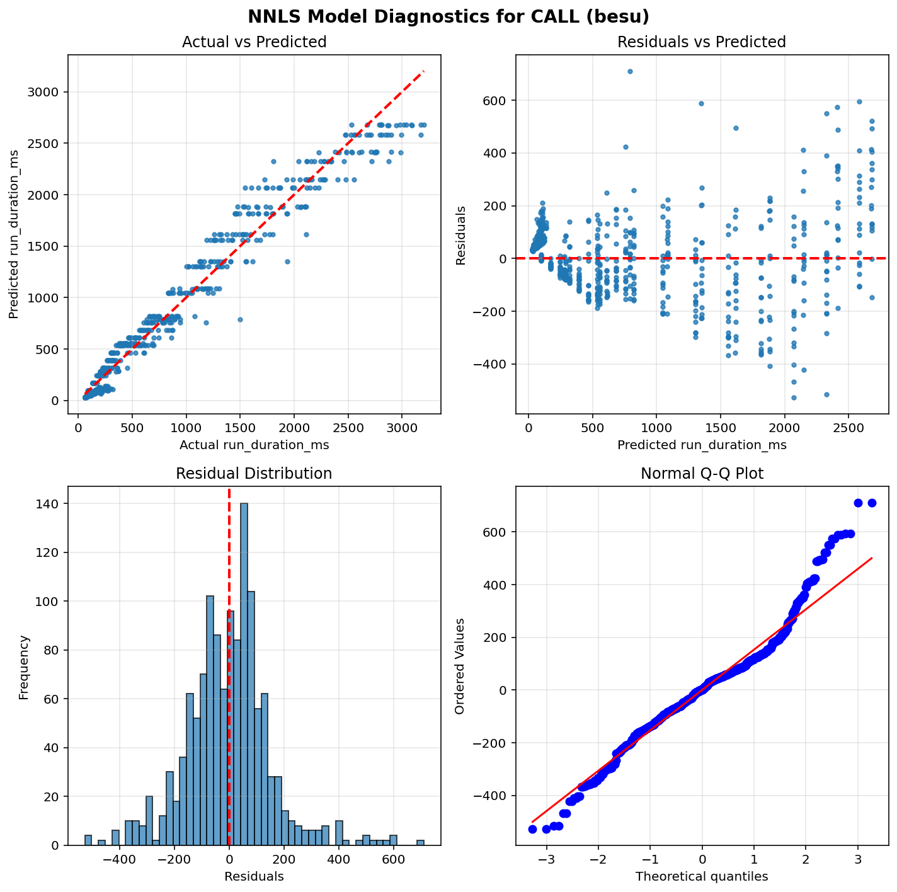

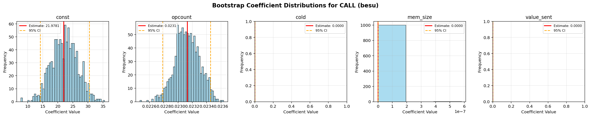


## nethermind


```python
==============================================================================
                           NNLS Regression Results                            
==============================================================================
Dep. Variable:          run_duration_ms              R-squared:          0.690
Model:                  NNLS                    Adj. R-squared:          0.688
No. Observations:       640                               RMSE:          63.88
Df Residuals:           635                                MAE:          25.23
Df Model:               4      
==============================================================================
                      coef     std err     P-value      [0.025      0.975]
------------------------------------------------------------------------------
         const     68.8784      2.3468       0.000     64.1150     73.0494
       opcount      0.0027      0.0001       0.000      0.0025      0.0028
          cold      0.0000      0.0000       1.000      0.0000      0.0000
      mem_size      0.0000      0.0000       0.378      0.0000      0.0000
    value_sent      0.0000      0.0001       1.000      0.0000      0.0005
==============================================================================
Notes: Non-negative least squares with bootstrap inference (1000 iterations)
==============================================================================
```

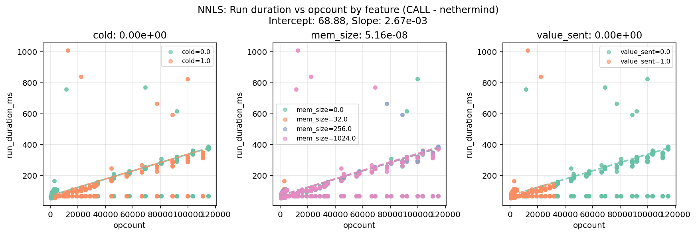

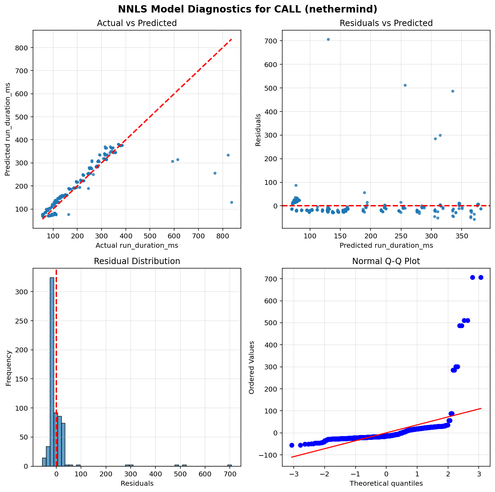

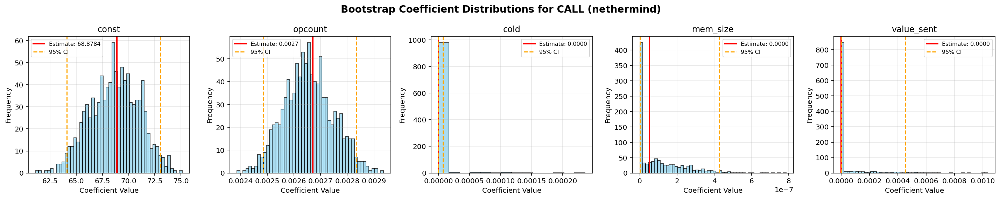


# CALLCODE

## geth


```python
==============================================================================
                           NNLS Regression Results                            
==============================================================================
Dep. Variable:          run_duration_ms              R-squared:          0.000
Model:                  NNLS                    Adj. R-squared:         -0.009
No. Observations:       444                               RMSE:        2261.67
Df Residuals:           439                                MAE:         367.30
Df Model:               4      
==============================================================================
                      coef     std err     P-value      [0.025      0.975]
------------------------------------------------------------------------------
         const    421.5720    148.7159       0.000    115.5283    651.2128
       opcount      0.0000      0.0012       1.000      0.0000      0.0036
          cold      0.0000      0.0000       1.000      0.0000      0.0000
      mem_size      0.0000      0.0000       1.000      0.0000      0.0000
    value_sent      0.0000      0.0001       1.000      0.0000      0.0000
==============================================================================
Notes: Non-negative least squares with bootstrap inference (1000 iterations)
==============================================================================
```

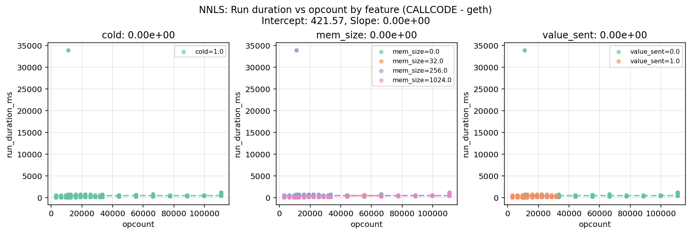

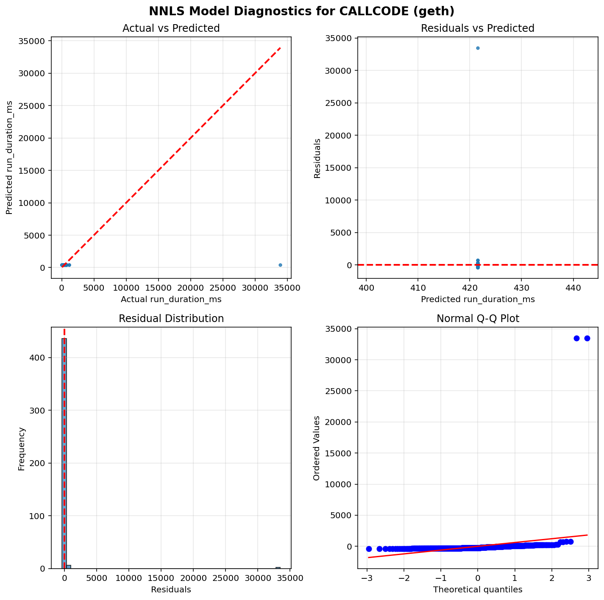

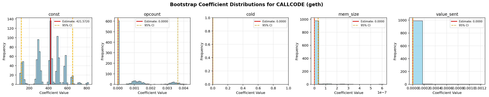


## besu


```python
==============================================================================
                           NNLS Regression Results                            
==============================================================================
Dep. Variable:          run_duration_ms              R-squared:          0.961
Model:                  NNLS                    Adj. R-squared:          0.961
No. Observations:       1280                              RMSE:         162.85
Df Residuals:           1275                               MAE:         108.81
Df Model:               4      
==============================================================================
                      coef     std err     P-value      [0.025      0.975]
------------------------------------------------------------------------------
         const     20.6110      4.1357       0.000     12.7221     28.5501
       opcount      0.0229      0.0002       0.000      0.0226      0.0233
          cold      0.0000      0.0000       1.000      0.0000      0.0000
      mem_size      0.0000      0.0000       1.000      0.0000      0.0000
    value_sent      0.0000      0.0000       1.000      0.0000      0.0000
==============================================================================
Notes: Non-negative least squares with bootstrap inference (1000 iterations)
==============================================================================
```

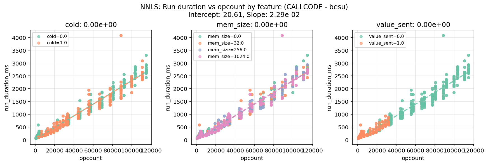

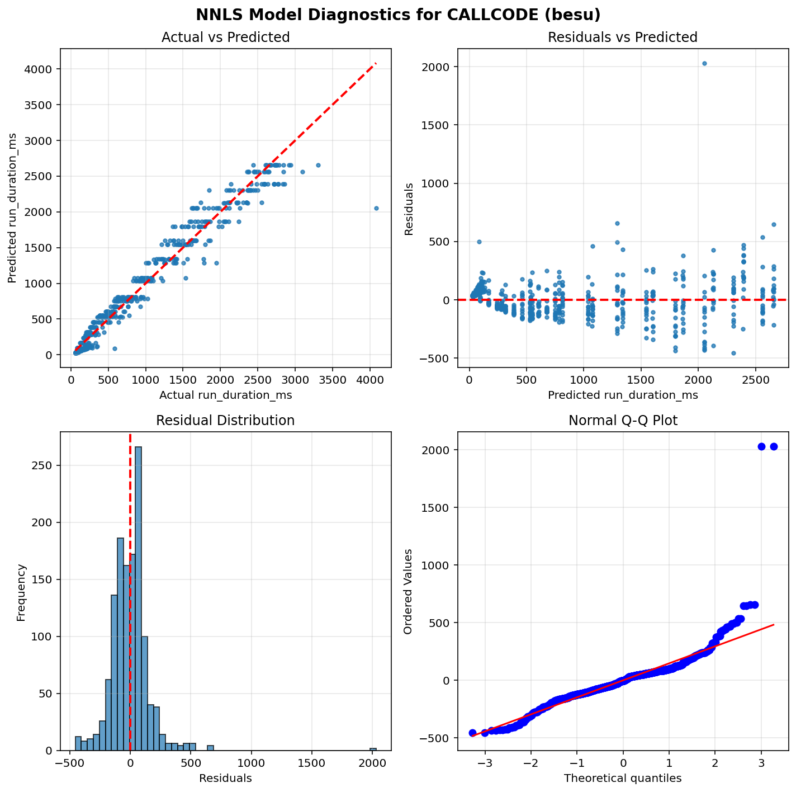

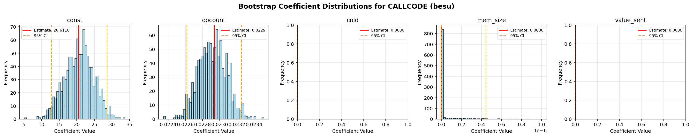


## nethermind


```python
==============================================================================
                           NNLS Regression Results                            
==============================================================================
Dep. Variable:          run_duration_ms              R-squared:          0.298
Model:                  NNLS                    Adj. R-squared:          0.296
No. Observations:       1280                              RMSE:         100.98
Df Residuals:           1275                               MAE:          47.30
Df Model:               4      
==============================================================================
                      coef     std err     P-value      [0.025      0.975]
------------------------------------------------------------------------------
         const     77.1898      3.2064       0.000     71.6147     84.0139
       opcount      0.0019      0.0001       0.000      0.0017      0.0020
          cold      0.0000      0.0000       1.000      0.0000      0.0000
      mem_size      0.0000      0.0000       1.000      0.0000      0.0000
    value_sent      0.0000      0.0000       1.000      0.0000      0.0000
==============================================================================
Notes: Non-negative least squares with bootstrap inference (1000 iterations)
==============================================================================
```

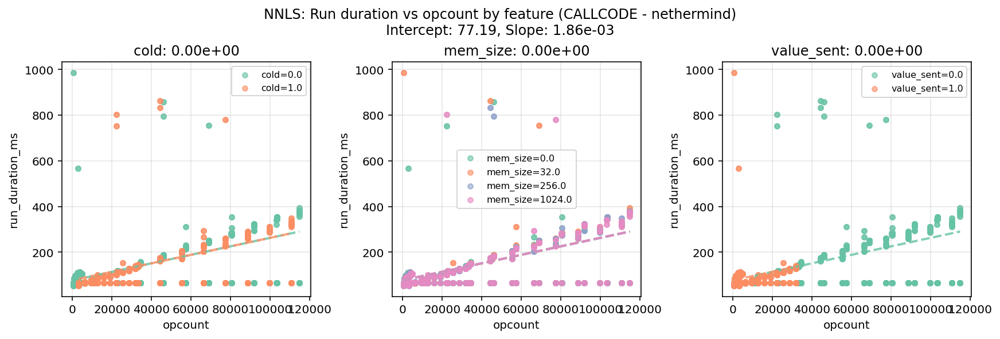

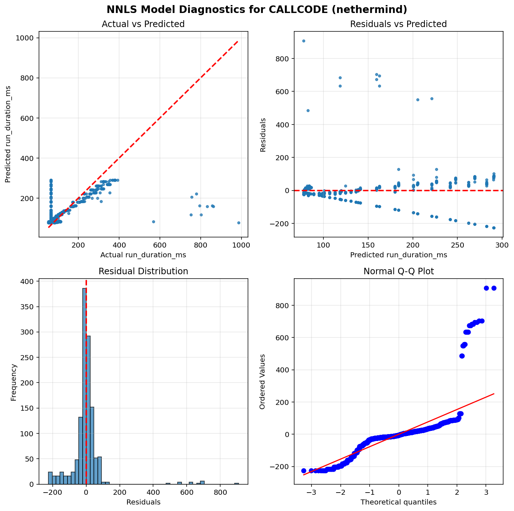

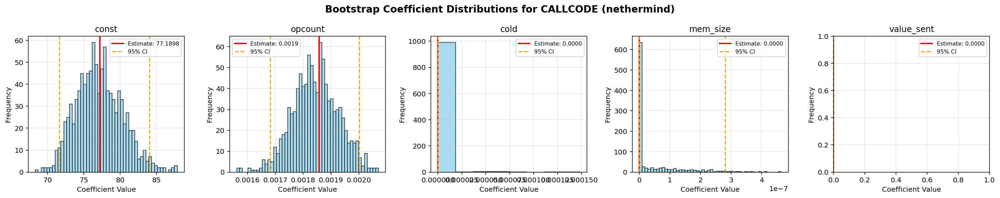


# SELFDESTRUCT

## geth

NNLS model did not run... Error: No valid data remaining after dropping NaN values

## besu

NNLS model did not run... Error: No valid data remaining after dropping NaN values

## nethermind

NNLS model did not run... Error: No valid data remaining after dropping NaN values
