Operation run times estimation results - EIP-8038
=================================================

Table of contents
=================

* [BALANCE](#balance)
* [EXTCODESIZE](#extcodesize)
* [EXTCODECOPY](#extcodecopy)
* [EXTCODEHASH](#extcodehash)
* [SLOAD](#sload)
* [SSTORE](#sstore)
* [DELEGATECALL](#delegatecall)
* [STATICCALL](#staticcall)
* [CALL](#call)
* [CALLCODE](#callcode)
* [SELFDESTRUCT](#selfdestruct)

# Introduction


This is an automated report generated from the opcode run times
estimation script `./src/estimate_8038_repricings.py`. The script
uses data generated by running the
[EEST benchmark suite](https://github.com/ethereum/execution-spec-tests/tree/main/tests/benchmark)
with the [Nethermind benchmarking tooling](https://github.com/NethermindEth/gas-benchmarks).

The data includes all the tests for operations repriced in EIP-8038 run
between 2026-01-26 and 2026-02-23.

For each operation and client, an NNLS linear regression model is fitted to estimate the
operation run time as a function of the operation count and other operation-specific parameters.
The results are presented below.

# How to Interpret the Results

## Model Used


**Non-Negative Least Squares (NNLS) Linear Regression** is used to estimate operation runtimes.
This model ensures all coefficients are non-negative, which is physically meaningful since
execution time cannot be negative. The model estimates runtime as a linear combination of:

- **Constant term (intercept)**: Base overhead for executing the test, which includes setup and teardown time
- **Operation count (slope)**: Number of times the operation is executed in the test. This paramater 
is the one that allows us to estimate the per-operation runtime.
- **Operation-specific parameters**: Variables like number of rounds, message size, or number of pairs

For simple operations, the model estimates: `runtime = intercept + slope × operation_count`

For variable operations, the model estimates: `runtime = intercept + slope × operation_count +
 param1_coef × operation_count × param1 + param2_coef × operation_count × param2 + ...`

## Model Quality Metrics


Each model reports two key metrics to assess the quality of the fit:

**R² (R-squared / Coefficient of Determination)**
- Ranges from 0 to 1 (or can be negative for very poor fits)
- Measures how well the model explains the variance in the data
- **Interpretation**:
  - R² > 0.9: Excellent fit - the model explains >90% of the variance
  - R² > 0.7: Good fit - the model captures most of the relationship
  - R² > 0.5: Acceptable fit - the model has predictive power but notable variance remains
  - R² < 0.5: Poor fit - the model may not be reliable

**p-value**
- Tests the statistical significance of each coefficient, based on a bootstrap sample estimation
- **Interpretation**:
  - p < 0.05: Statistically significant - the parameter has a real effect on runtime
  - p ≥ 0.05: Not significant - the parameter's effect cannot be distinguished from random noise

We also plot some diagnostic graphs for each operation and client combination to visually assess the model fit.

# BALANCE

## besu

NNLS model did not run... Error: No valid data remaining after dropping NaN values

## geth

NNLS model did not run... Error: No valid data remaining after dropping NaN values

## nethermind

NNLS model did not run... Error: No valid data remaining after dropping NaN values

# EXTCODESIZE

## besu

NNLS model did not run... Error: No valid data remaining after dropping NaN values

## geth

NNLS model did not run... Error: No valid data remaining after dropping NaN values

## nethermind

NNLS model did not run... Error: No valid data remaining after dropping NaN values

# EXTCODECOPY

## besu

NNLS model did not run... Error: No valid data remaining after dropping NaN values

## geth

NNLS model did not run... Error: No valid data remaining after dropping NaN values

## nethermind

NNLS model did not run... Error: No valid data remaining after dropping NaN values

# EXTCODEHASH

## besu

NNLS model did not run... Error: No valid data remaining after dropping NaN values

## geth

NNLS model did not run... Error: No valid data remaining after dropping NaN values

## nethermind

NNLS model did not run... Error: No valid data remaining after dropping NaN values

# SLOAD

## besu


```python
==============================================================================
                           NNLS Regression Results                            
==============================================================================
Dep. Variable:          run_duration_ms              R-squared:          0.836
Model:                  NNLS                    Adj. R-squared:          0.836
No. Observations:       1750                              RMSE:         222.40
Df Residuals:           1745                               MAE:         158.24
Df Model:               4      
==============================================================================
                      coef     std err     P-value      [0.025      0.975]
------------------------------------------------------------------------------
         const    229.3435     11.0062       0.000    207.5749    251.9052
       opcount      0.0000      0.0000       0.018      0.0000      0.0000
           new      0.0000      0.0000       1.000      0.0000      0.0000
          cold      0.0021      0.0001       0.000      0.0019      0.0023
  storage_size      0.0006      0.0000       0.000      0.0006      0.0007
==============================================================================
Notes: Non-negative least squares with bootstrap inference (1000 iterations)
==============================================================================
```

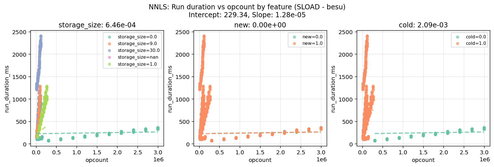

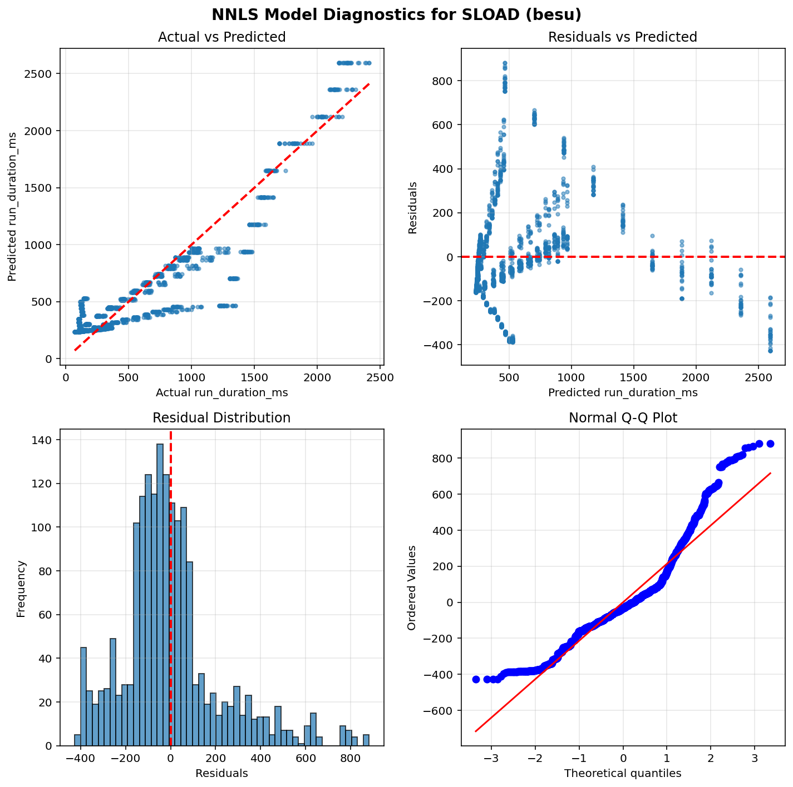

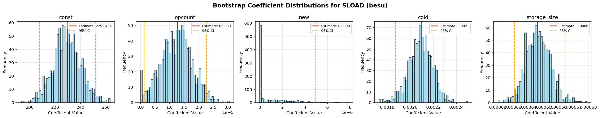


## geth


```python
==============================================================================
                           NNLS Regression Results                            
==============================================================================
Dep. Variable:          run_duration_ms              R-squared:          0.615
Model:                  NNLS                    Adj. R-squared:          0.613
No. Observations:       1290                              RMSE:          83.66
Df Residuals:           1285                               MAE:          65.27
Df Model:               4      
==============================================================================
                      coef     std err     P-value      [0.025      0.975]
------------------------------------------------------------------------------
         const    130.8379      2.8440       0.000    125.2632    136.5116
       opcount      0.0000      0.0000       1.000      0.0000      0.0000
           new      0.0000      0.0000       1.000      0.0000      0.0000
          cold      0.0017      0.0000       0.000      0.0016      0.0017
  storage_size      0.0001      0.0000       0.000      0.0001      0.0001
==============================================================================
Notes: Non-negative least squares with bootstrap inference (1000 iterations)
==============================================================================
```

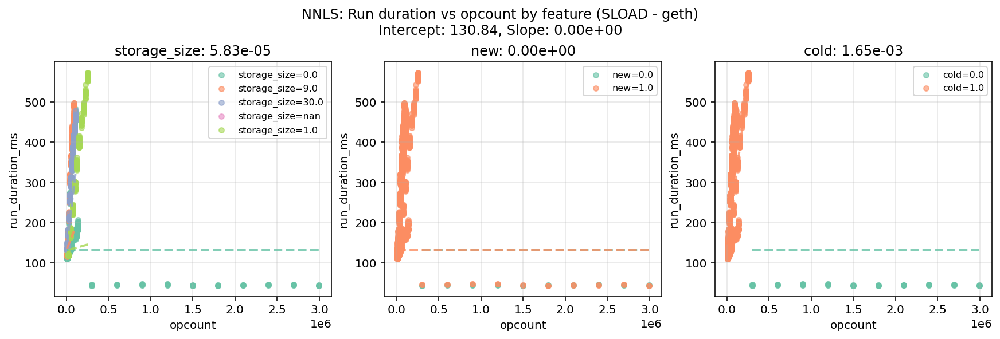

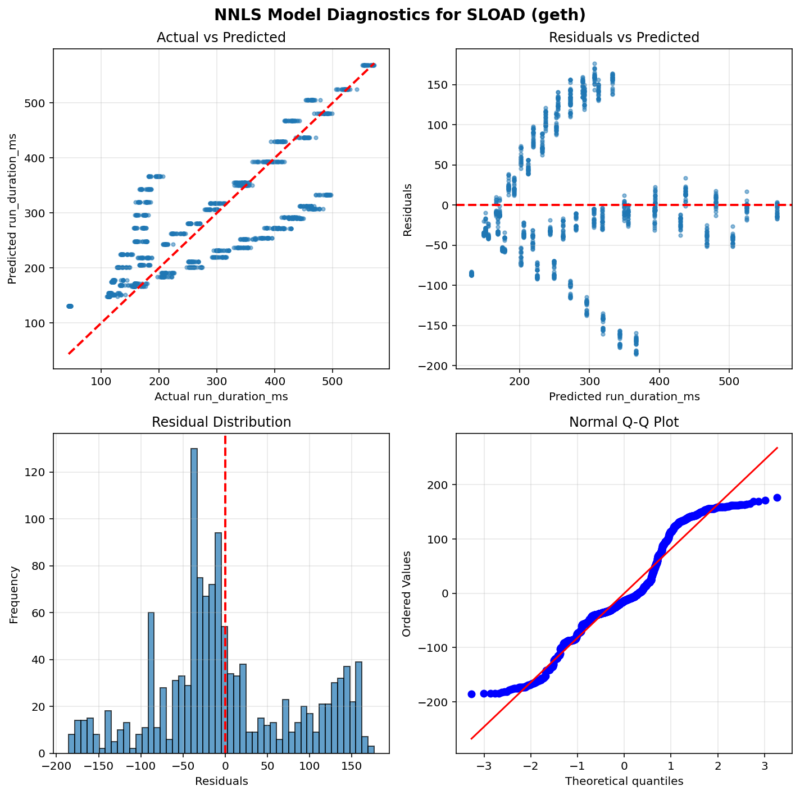

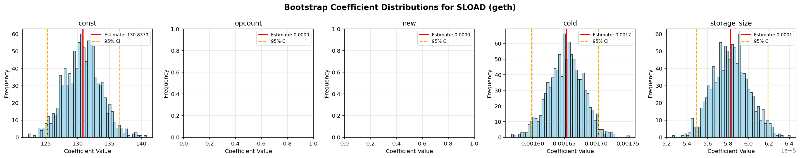


## nethermind


```python
==============================================================================
                           NNLS Regression Results                            
==============================================================================
Dep. Variable:          run_duration_ms              R-squared:          0.081
Model:                  NNLS                    Adj. R-squared:          0.079
No. Observations:       1750                              RMSE:         204.68
Df Residuals:           1745                               MAE:          49.00
Df Model:               4      
==============================================================================
                      coef     std err     P-value      [0.025      0.975]
------------------------------------------------------------------------------
         const     74.9020      6.0336       0.000     65.2013     88.8381
       opcount      0.0001      0.0000       0.000      0.0000      0.0001
           new      0.0000      0.0000       0.128      0.0000      0.0001
          cold      0.0009      0.0000       0.000      0.0007      0.0009
  storage_size      0.0000      0.0000       0.000      0.0000      0.0000
==============================================================================
Notes: Non-negative least squares with bootstrap inference (1000 iterations)
==============================================================================
```

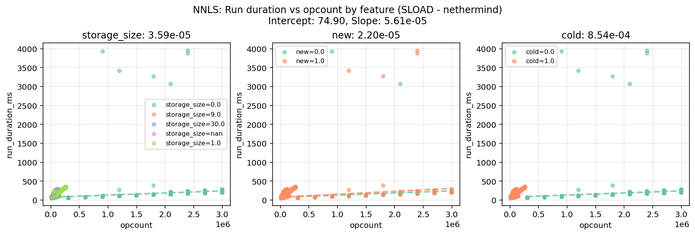

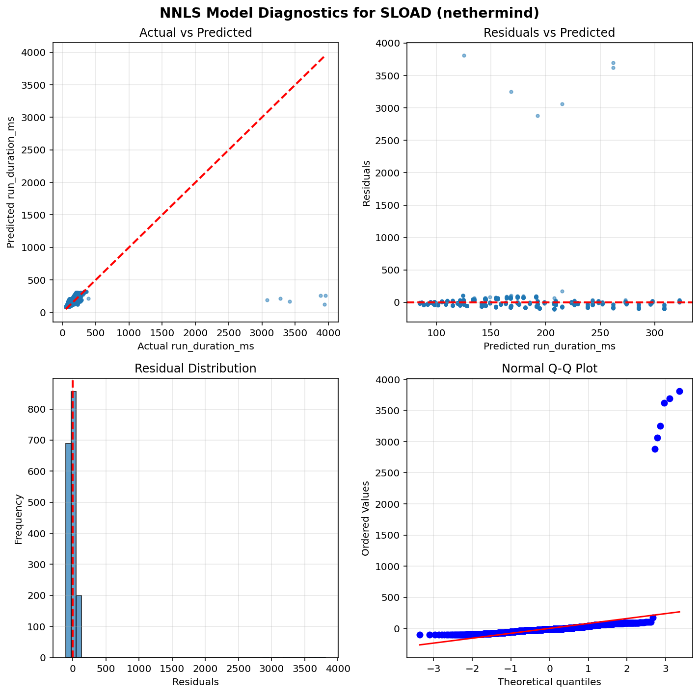

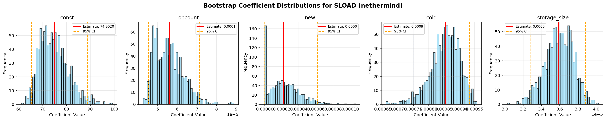


# SSTORE

## besu


```python
==============================================================================
                           NNLS Regression Results                            
==============================================================================
Dep. Variable:          run_duration_ms              R-squared:          0.917
Model:                  NNLS                    Adj. R-squared:          0.917
No. Observations:       2000                              RMSE:          17.67
Df Residuals:           1994                               MAE:           9.48
Df Model:               5      
==============================================================================
                      coef     std err     P-value      [0.025      0.975]
------------------------------------------------------------------------------
         const     46.5103      0.2005       0.000     46.1368     46.9079
       opcount      0.0000      0.0000       1.000      0.0000      0.0000
           new      0.0000      0.0000       1.000      0.0000      0.0000
          cold      0.0066      0.0022       0.002      0.0025      0.0110
        update      0.0080      0.0022       0.001      0.0036      0.0121
  storage_size      0.0000      0.0000       1.000      0.0000      0.0000
==============================================================================
Notes: Non-negative least squares with bootstrap inference (1000 iterations)
==============================================================================
```

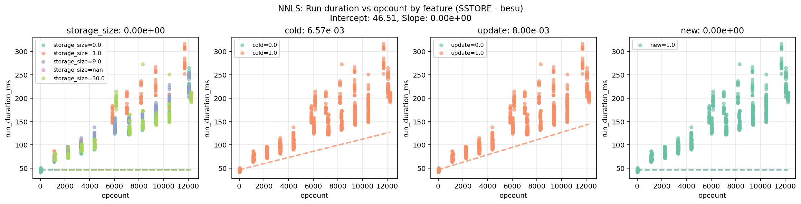

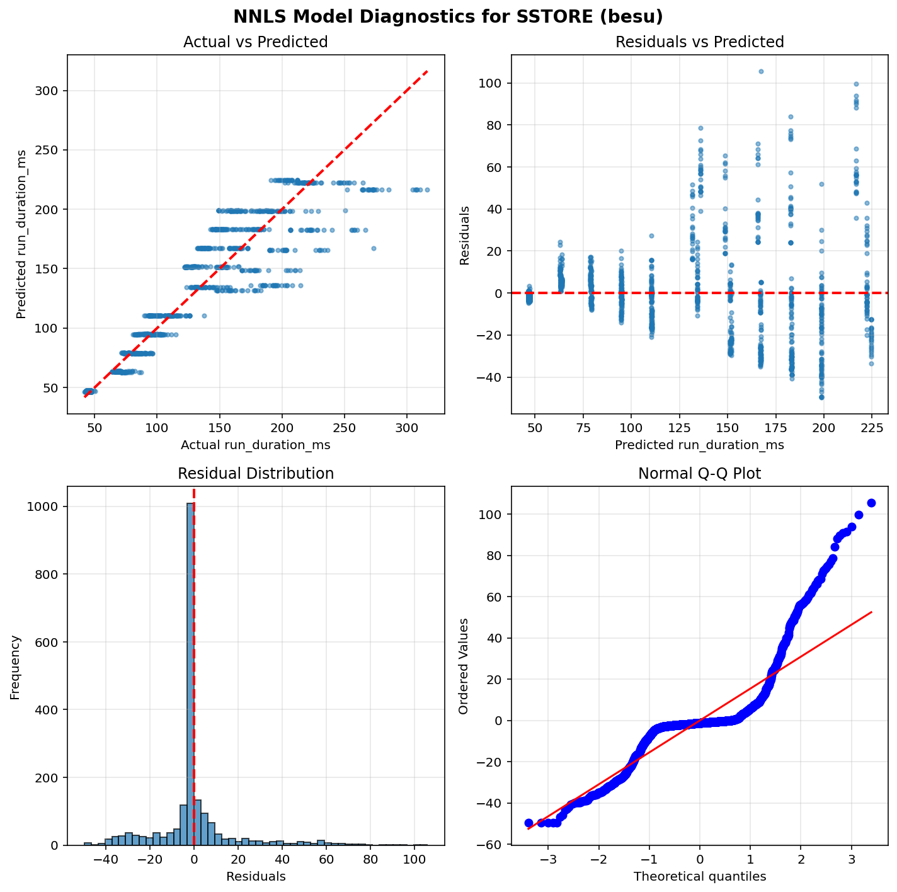

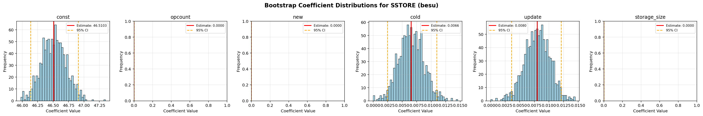


## geth


```python
==============================================================================
                           NNLS Regression Results                            
==============================================================================
Dep. Variable:          run_duration_ms              R-squared:          0.785
Model:                  NNLS                    Adj. R-squared:          0.785
No. Observations:       2000                              RMSE:          42.03
Df Residuals:           1994                               MAE:          28.51
Df Model:               5      
==============================================================================
                      coef     std err     P-value      [0.025      0.975]
------------------------------------------------------------------------------
         const     55.7278      0.6067       0.000     54.5524     56.9198
       opcount      0.0000      0.0000       1.000      0.0000      0.0000
           new      0.0000      0.0000       1.000      0.0000      0.0000
          cold      0.0111      0.0075       0.175      0.0000      0.0203
        update      0.0088      0.0075       0.233      0.0000      0.0202
  storage_size      0.0000      0.0000       1.000      0.0000      0.0000
==============================================================================
Notes: Non-negative least squares with bootstrap inference (1000 iterations)
==============================================================================
```

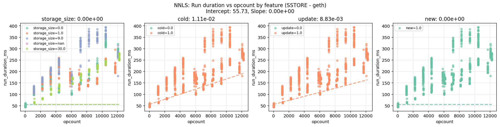

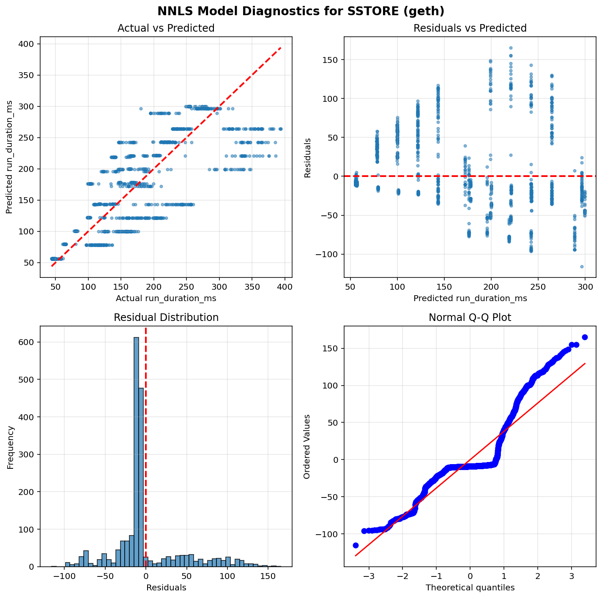

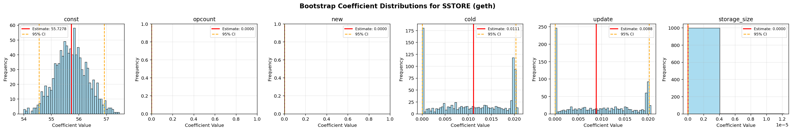


## nethermind


```python
==============================================================================
                           NNLS Regression Results                            
==============================================================================
Dep. Variable:          run_duration_ms              R-squared:          0.855
Model:                  NNLS                    Adj. R-squared:          0.855
No. Observations:       2000                              RMSE:          14.88
Df Residuals:           1994                               MAE:           8.69
Df Model:               5      
==============================================================================
                      coef     std err     P-value      [0.025      0.975]
------------------------------------------------------------------------------
         const     49.7096      0.2093       0.000     49.2956     50.1085
       opcount      0.0000      0.0000       1.000      0.0000      0.0000
           new      0.0000      0.0000       1.000      0.0000      0.0000
          cold      0.0040      0.0024       0.155      0.0000      0.0065
        update      0.0023      0.0024       0.245      0.0000      0.0065
  storage_size      0.0002      0.0000       0.000      0.0002      0.0002
==============================================================================
Notes: Non-negative least squares with bootstrap inference (1000 iterations)
==============================================================================
```

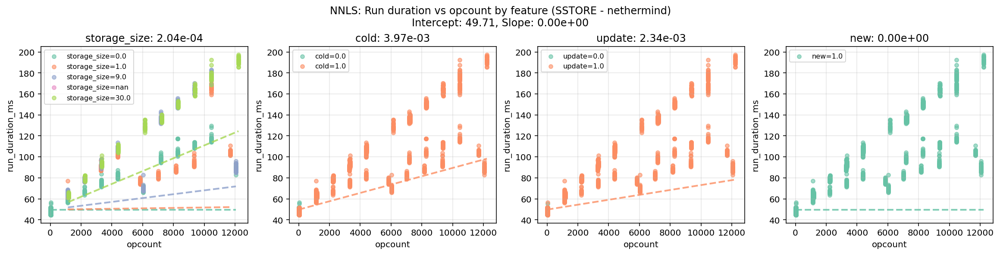

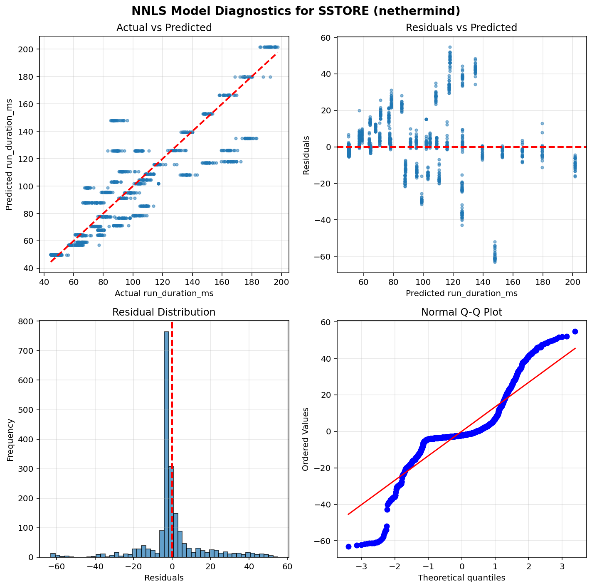

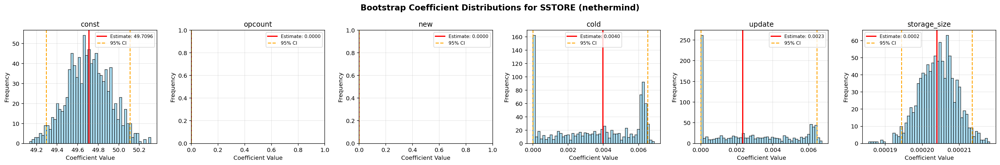


# DELEGATECALL

## besu

NNLS model did not run... Error: No valid data remaining after dropping NaN values

## geth

NNLS model did not run... Error: No valid data remaining after dropping NaN values

## nethermind

NNLS model did not run... Error: No valid data remaining after dropping NaN values

# STATICCALL

## besu

NNLS model did not run... Error: No valid data remaining after dropping NaN values

## geth

NNLS model did not run... Error: No valid data remaining after dropping NaN values

## nethermind

NNLS model did not run... Error: No valid data remaining after dropping NaN values

# CALL

## besu

NNLS model did not run... Error: No valid data remaining after dropping NaN values

## geth

NNLS model did not run... Error: No valid data remaining after dropping NaN values

## nethermind

NNLS model did not run... Error: No valid data remaining after dropping NaN values

# CALLCODE

## besu

NNLS model did not run... Error: No valid data remaining after dropping NaN values

## geth

NNLS model did not run... Error: No valid data remaining after dropping NaN values

## nethermind

NNLS model did not run... Error: No valid data remaining after dropping NaN values

# SELFDESTRUCT

## besu

NNLS model did not run... Error: No valid data remaining after dropping NaN values

## geth

NNLS model did not run... Error: No valid data remaining after dropping NaN values

## nethermind

NNLS model did not run... Error: No valid data remaining after dropping NaN values
