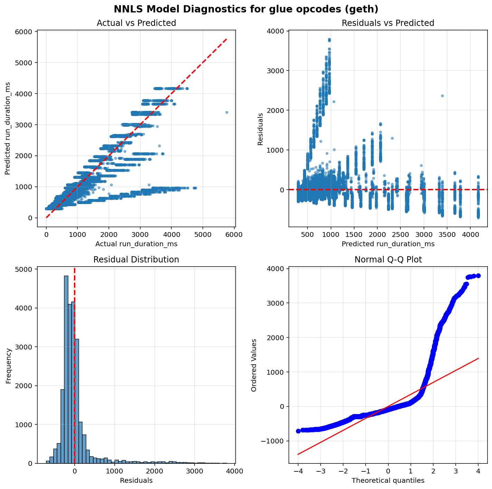
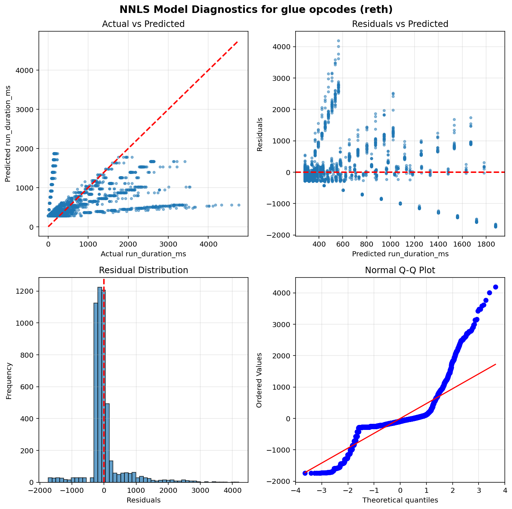
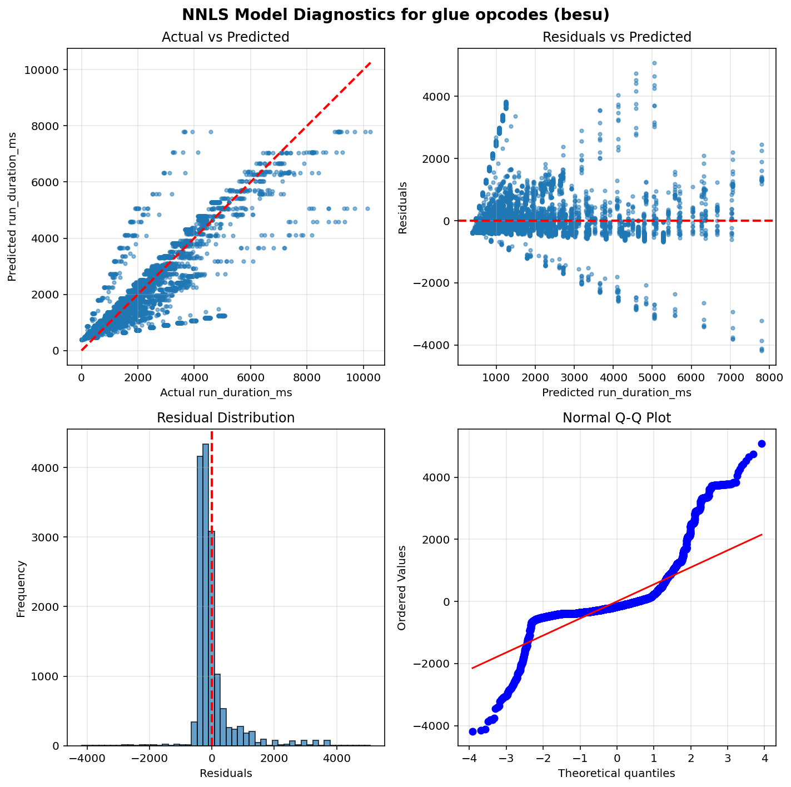
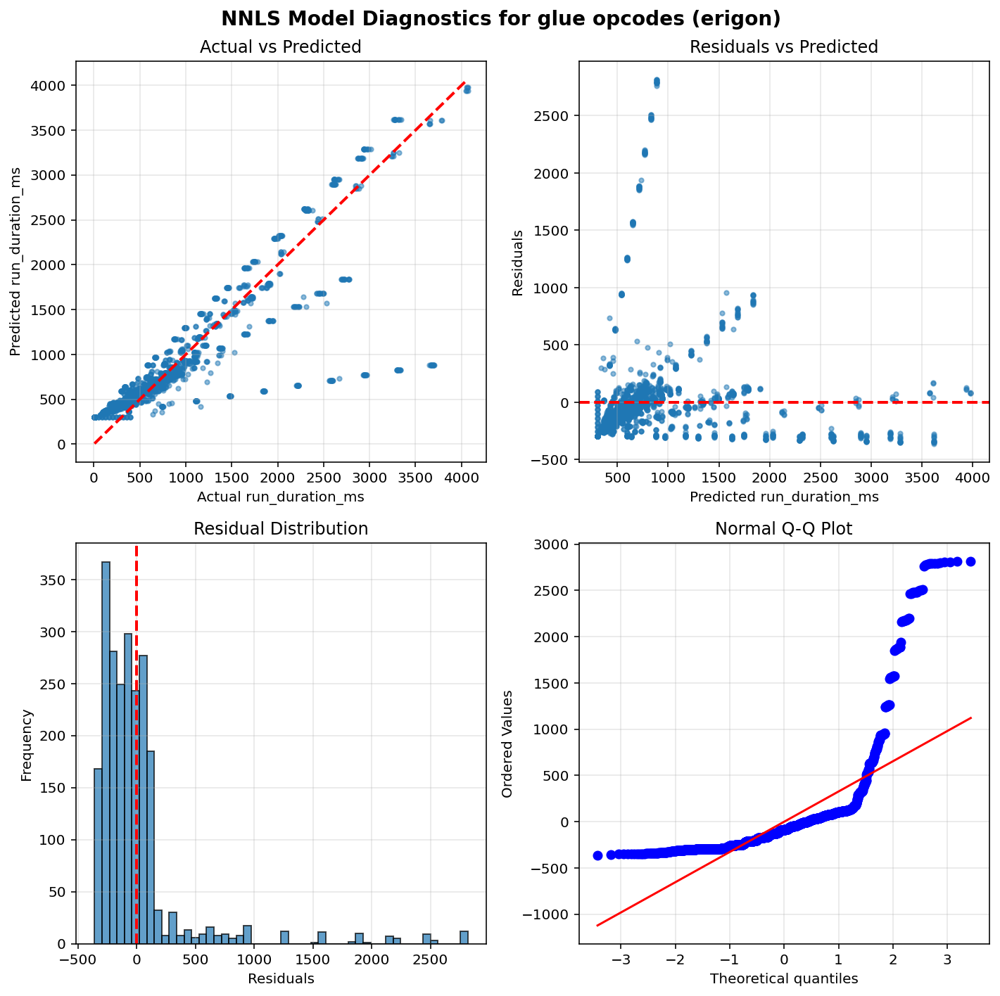
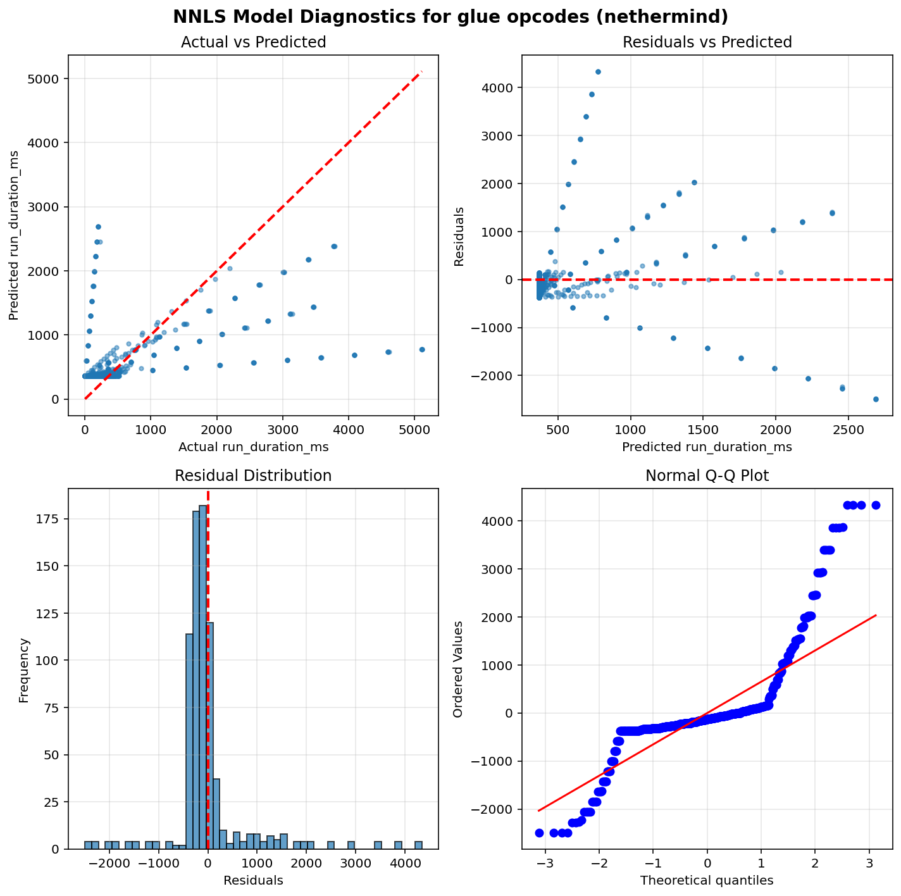

Operation run times estimation results - Glue opcodes
=====================================================

Table of contents
=================

* [geth](#geth)
* [reth](#reth)
* [besu](#besu)
* [erigon](#erigon)
* [nethermind](#nethermind)

# Introduction


This is an automated report generated from the opcode run times
estimation script `./src/glue.py`. The script
uses data generated by running the
[EEST benchmark suite](https://github.com/ethereum/execution-spec-tests/tree/main/tests/benchmark)
with the [Nethermind benchmarking tooling](https://github.com/NethermindEth/gas-benchmarks).

The data includes all the tests for glue operations repriced in EIP-8038 run
between 2026-03-01 and 2026-03-22.

## What is a glue opcode?


A **glue opcode** is an opcode whose execution count scales proportionally with the count of
a target opcode under test. Concretely, an opcode is classified as a glue opcode for a given
test if its execution count has a Pearson correlation ≥ 0.95 with the target opcode count
across different test parameter values, and its average count per target opcode execution
is at least 0.0005. Self-correlations are excluded. This identification is done automatically
from opcode-level execution traces.

The glue opcode set is also expanded transitively: if opcode A is a glue opcode for a target,
and opcode B is a glue opcode for A, then B is also included. This captures indirect
dependencies in the benchmark scaffolding.

**Why do glue opcodes matter?**

Because glue opcodes scale with the target opcode count, their runtime is absorbed into the
slope coefficient when regressing total test execution time on target opcode count. Without
correction, the slope overestimates the target opcode's per-execution runtime. The glue opcode
runtimes estimated in this report are used to compute a **glue adjustment** — a correction
subtracted from each target opcode's slope to remove the contribution of glue opcodes.

## How glue opcode runtimes are estimated?


**Non-Negative Least Squares (NNLS) Linear Regression** is used to estimate glue operation runtimes.
This model ensures all coefficients are non-negative, which is physically meaningful since
execution time cannot be negative.

Unlike the per-opcode models used for target operations, glue opcodes are estimated using a
**single model per client** that fits all glue opcode counts as features simultaneously. This means
the model estimates the runtime coefficients of all glue opcodes at the same time by solving:

`runtime = intercept + coef_1 × opcode_1_count + coef_2 × opcode_2_count + ... + coef_n × opcode_n_count`

where each `coef_i` represents the estimated per-execution runtime of the corresponding glue opcode.
This joint estimation approach accounts for correlations between glue opcode counts across tests,
producing more accurate estimates than fitting each glue opcode independently.

Only warm CALL variants are included in the model (cold CALL tests are excluded).

## Model Quality Metrics


Each model reports two key metrics to assess the quality of the fit:

**R² (R-squared / Coefficient of Determination)**
- Ranges from 0 to 1 (or can be negative for very poor fits)
- Measures how well the model explains the variance in the data
- **Interpretation**:
  - R² > 0.9: Excellent fit - the model explains >90% of the variance
  - R² > 0.7: Good fit - the model captures most of the relationship
  - R² > 0.5: Acceptable fit - the model has predictive power but notable variance remains
  - R² < 0.5: Poor fit - the model may not be reliable

**p-value**
- Tests the statistical significance of each coefficient, based on a bootstrap sample estimation
- **Interpretation**:
  - p < 0.05: Statistically significant - the parameter has a real effect on runtime
  - p ≥ 0.05: Not significant - the parameter's effect cannot be distinguished from random noise

We also plot some diagnostic graphs for each operation and client combination to visually assess the model fit.

# geth


```python
==============================================================================
                           NNLS Regression Results                            
==============================================================================
Dep. Variable:          run_duration_ms              R-squared:          0.712
Model:                  NNLS                    Adj. R-squared:          0.711
No. Observations:       23100                             RMSE:         447.39
Df Residuals:           23052                              MAE:         238.88
Df Model:               47     
==============================================================================
                      coef     std err     P-value      [0.025      0.975]
------------------------------------------------------------------------------
         const    294.2728      6.6487       0.000    281.6503    307.7062
          DUP1      0.0000      0.0000       0.000      0.0000      0.0000
  CALLDATASIZE      0.0000      0.0000       0.000      0.0000      0.0000
           SLT      0.0000      0.0000       0.000      0.0000      0.0000
            LT      0.0000      0.0000       0.000      0.0000      0.0000
           GAS      0.0000      0.0000       0.000      0.0000      0.0000
      JUMPDEST      0.0000      0.0000       0.000      0.0000      0.0000
        ISZERO      0.0000      0.0000       0.000      0.0000      0.0000
         SWAP1      0.0000      0.0000       0.000      0.0000      0.0000
        RETURN      0.0000      0.0000       1.000      0.0000      0.0000
           AND      0.0000      0.0000       0.000      0.0000      0.0000
     KECCAK256      0.0005      0.0000       0.000      0.0005      0.0005
         SWAP4      0.0000      0.0000       0.000      0.0000      0.0000
           SHL      0.0000      0.0000       0.000      0.0000      0.0000
         SWAP3      0.0000      0.0000       0.000      0.0000      0.0000
         MLOAD      0.0000      0.0000       0.000      0.0000      0.0000
     CALLVALUE      0.0000      0.0000       1.000      0.0000      0.0000
         SWAP5      0.0000      0.0000       0.000      0.0000      0.0000
           SUB      0.0000      0.0000       0.000      0.0000      0.0000
        CALLER      0.0000      0.0000       0.000      0.0000      0.0000
          DUP3      0.0000      0.0000       0.000      0.0000      0.0000
         PUSH0      0.0000      0.0000       0.000      0.0000      0.0000
         PUSH1      0.0000      0.0000       0.000      0.0000      0.0000
           POP      0.0000      0.0000       0.000      0.0000      0.0000
         SWAP2      0.0000      0.0000       0.000      0.0000      0.0000
          DUP6      0.0000      0.0000       0.000      0.0000      0.0000
        PUSH20      0.0000      0.0000       0.000      0.0000      0.0000
            PC      0.0000      0.0000       0.000      0.0000      0.0000
  CALLDATALOAD      0.0000      0.0000       1.000      0.0000      0.0000
       INVALID      0.0000      0.0000       1.000      0.0000      0.0000
            GT      0.0000      0.0000       0.000      0.0000      0.0000
          DUP7      0.0000      0.0000       0.000      0.0000      0.0000
          DUP4      0.0000      0.0000       0.000      0.0000      0.0000
          DUP2      0.0000      0.0000       0.000      0.0000      0.0000
           ADD      0.0000      0.0000       0.000      0.0000      0.0000
        MSTORE      0.0000      0.0000       0.000      0.0000      0.0000
       ADDRESS      0.0000      0.0000       0.000      0.0000      0.0000
           EXP      0.0000      0.0000       1.000      0.0000      0.0000
         PUSH2      0.0000      0.0000       0.000      0.0000      0.0000
           SHR      0.0000      0.0000       0.000      0.0000      0.0000
         PUSH4      0.0000      0.0000       0.000      0.0000      0.0000
       MSTORE8      0.0000      0.0000       0.000      0.0000      0.0000
          JUMP      0.0000      0.0000       0.000      0.0000      0.0000
         JUMPI      0.0000      0.0000       1.000      0.0000      0.0000
          DUP5      0.0000      0.0000       0.000      0.0000      0.0000
            EQ      0.0000      0.0000       0.000      0.0000      0.0000
           MUL      0.0000      0.0000       0.000      0.0000      0.0000
           DIV      0.0000      0.0000       0.000      0.0000      0.0000
==============================================================================
Notes: Non-negative least squares with bootstrap inference (1000 iterations)
==============================================================================
```




# reth


```python
==============================================================================
                           NNLS Regression Results                            
==============================================================================
Dep. Variable:          run_duration_ms              R-squared:          0.249
Model:                  NNLS                    Adj. R-squared:          0.242
No. Observations:       5070                              RMSE:         562.05
Df Residuals:           5022                               MAE:         305.20
Df Model:               47     
==============================================================================
                      coef     std err     P-value      [0.025      0.975]
------------------------------------------------------------------------------
         const    283.9399      7.6920       0.000    268.5819    299.0312
          DUP1      0.0000      0.0000       1.000      0.0000      0.0000
  CALLDATASIZE      0.0000      0.0000       0.000      0.0000      0.0000
           SLT      0.0000      0.0000       1.000      0.0000      0.0000
            LT      0.0000      0.0000       1.000      0.0000      0.0000
           GAS      0.0000      0.0000       0.000      0.0000      0.0000
      JUMPDEST      0.0000      0.0000       0.000      0.0000      0.0000
        ISZERO      0.0000      0.0000       1.000      0.0000      0.0000
         SWAP1      0.0000      0.0000       1.000      0.0000      0.0000
        RETURN      0.0000      0.0000       1.000      0.0000      0.0000
           AND      0.0000      0.0000       1.000      0.0000      0.0000
     KECCAK256      0.0002      0.0000       0.000      0.0002      0.0002
         SWAP4      0.0000      0.0000       1.000      0.0000      0.0000
           SHL      0.0000      0.0000       0.000      0.0000      0.0000
         SWAP3      0.0000      0.0000       1.000      0.0000      0.0000
         MLOAD      0.0000      0.0000       1.000      0.0000      0.0000
     CALLVALUE      0.0000      0.0000       0.141      0.0000      0.0000
         SWAP5      0.0000      0.0000       1.000      0.0000      0.0000
           SUB      0.0000      0.0000       1.000      0.0000      0.0000
        CALLER      0.0000      0.0000       0.000      0.0000      0.0000
          DUP3      0.0000      0.0000       1.000      0.0000      0.0000
         PUSH0      0.0000      0.0000       1.000      0.0000      0.0000
         PUSH1      0.0000      0.0000       1.000      0.0000      0.0000
           POP      0.0000      0.0000       1.000      0.0000      0.0000
         SWAP2      0.0000      0.0000       1.000      0.0000      0.0000
          DUP6      0.0000      0.0000       1.000      0.0000      0.0000
        PUSH20      0.0000      0.0000       1.000      0.0000      0.0000
            PC      0.0000      0.0000       0.000      0.0000      0.0000
  CALLDATALOAD      0.0000      0.0000       1.000      0.0000      0.0000
       INVALID      0.0000      0.0000       1.000      0.0000      0.0000
            GT      0.0000      0.0000       1.000      0.0000      0.0000
          DUP7      0.0000      0.0000       1.000      0.0000      0.0000
          DUP4      0.0000      0.0000       1.000      0.0000      0.0000
          DUP2      0.0000      0.0000       1.000      0.0000      0.0000
           ADD      0.0000      0.0000       1.000      0.0000      0.0000
        MSTORE      0.0000      0.0000       1.000      0.0000      0.0000
       ADDRESS      0.0000      0.0000       0.000      0.0000      0.0000
           EXP      0.0004      0.0001       0.002      0.0002      0.0007
         PUSH2      0.0000      0.0000       0.000      0.0000      0.0000
           SHR      0.0000      0.0000       0.000      0.0000      0.0000
         PUSH4      0.0000      0.0000       1.000      0.0000      0.0000
       MSTORE8      0.0000      0.0000       1.000      0.0000      0.0000
          JUMP      0.0000      0.0000       1.000      0.0000      0.0000
         JUMPI      0.0000      0.0000       1.000      0.0000      0.0000
          DUP5      0.0000      0.0000       1.000      0.0000      0.0000
            EQ      0.0000      0.0000       0.000      0.0000      0.0000
           MUL      0.0000      0.0000       1.000      0.0000      0.0000
           DIV      0.0000      0.0000       0.000      0.0000      0.0000
==============================================================================
Notes: Non-negative least squares with bootstrap inference (1000 iterations)
==============================================================================
```




# besu


```python
==============================================================================
                           NNLS Regression Results                            
==============================================================================
Dep. Variable:          run_duration_ms              R-squared:          0.749
Model:                  NNLS                    Adj. R-squared:          0.748
No. Observations:       15400                             RMSE:         678.80
Df Residuals:           15352                              MAE:         386.12
Df Model:               47     
==============================================================================
                      coef     std err     P-value      [0.025      0.975]
------------------------------------------------------------------------------
         const    391.7140     11.5314       0.000    369.3409    413.9537
          DUP1      0.0000      0.0000       0.000      0.0000      0.0000
  CALLDATASIZE      0.0000      0.0000       0.000      0.0000      0.0000
           SLT      0.0000      0.0000       0.000      0.0000      0.0000
            LT      0.0000      0.0000       0.000      0.0000      0.0000
           GAS      0.0000      0.0000       0.000      0.0000      0.0000
      JUMPDEST      0.0000      0.0000       0.000      0.0000      0.0000
        ISZERO      0.0000      0.0000       0.000      0.0000      0.0000
         SWAP1      0.0000      0.0000       0.000      0.0000      0.0000
        RETURN      0.0000      0.0000       1.000      0.0000      0.0000
           AND      0.0000      0.0000       0.000      0.0000      0.0000
     KECCAK256      0.0006      0.0000       0.000      0.0006      0.0006
         SWAP4      0.0000      0.0000       0.000      0.0000      0.0000
           SHL      0.0000      0.0000       0.000      0.0000      0.0000
         SWAP3      0.0000      0.0000       0.000      0.0000      0.0000
         MLOAD      0.0000      0.0000       0.000      0.0000      0.0000
     CALLVALUE      0.0000      0.0000       1.000      0.0000      0.0000
         SWAP5      0.0000      0.0000       0.000      0.0000      0.0000
           SUB      0.0001      0.0000       0.000      0.0001      0.0001
        CALLER      0.0000      0.0000       0.000      0.0000      0.0000
          DUP3      0.0000      0.0000       0.000      0.0000      0.0000
         PUSH0      0.0000      0.0000       0.000      0.0000      0.0000
         PUSH1      0.0000      0.0000       0.000      0.0000      0.0000
           POP      0.0000      0.0000       0.000      0.0000      0.0000
         SWAP2      0.0000      0.0000       0.000      0.0000      0.0000
          DUP6      0.0000      0.0000       0.000      0.0000      0.0000
        PUSH20      0.0000      0.0000       0.000      0.0000      0.0000
            PC      0.0000      0.0000       0.000      0.0000      0.0000
  CALLDATALOAD      0.0000      0.0000       1.000      0.0000      0.0000
       INVALID      0.0000      0.0000       1.000      0.0000      0.0000
            GT      0.0001      0.0000       0.000      0.0001      0.0001
          DUP7      0.0000      0.0000       0.000      0.0000      0.0000
          DUP4      0.0000      0.0000       0.000      0.0000      0.0000
          DUP2      0.0000      0.0000       0.000      0.0000      0.0000
           ADD      0.0001      0.0000       0.000      0.0000      0.0001
        MSTORE      0.0001      0.0000       0.000      0.0001      0.0001
       ADDRESS      0.0000      0.0000       0.000      0.0000      0.0000
           EXP      0.0047      0.0001       0.000      0.0045      0.0049
         PUSH2      0.0000      0.0000       0.000      0.0000      0.0000
           SHR      0.0000      0.0000       0.000      0.0000      0.0000
         PUSH4      0.0000      0.0000       0.000      0.0000      0.0000
       MSTORE8      0.0000      0.0000       0.000      0.0000      0.0000
          JUMP      0.0001      0.0000       0.000      0.0001      0.0001
         JUMPI      0.0000      0.0000       1.000      0.0000      0.0000
          DUP5      0.0000      0.0000       0.000      0.0000      0.0000
            EQ      0.0001      0.0000       0.000      0.0001      0.0001
           MUL      0.0002      0.0000       0.000      0.0002      0.0002
           DIV      0.0002      0.0000       0.000      0.0002      0.0002
==============================================================================
Notes: Non-negative least squares with bootstrap inference (1000 iterations)
==============================================================================
```




# erigon


```python
==============================================================================
                           NNLS Regression Results                            
==============================================================================
Dep. Variable:          run_duration_ms              R-squared:          0.697
Model:                  NNLS                    Adj. R-squared:          0.690
No. Observations:       2310                              RMSE:         434.17
Df Residuals:           2262                               MAE:         230.92
Df Model:               47     
==============================================================================
                      coef     std err     P-value      [0.025      0.975]
------------------------------------------------------------------------------
         const    303.9091     21.4612       0.000    265.3680    349.2675
          DUP1      0.0000      0.0000       0.000      0.0000      0.0000
  CALLDATASIZE      0.0000      0.0000       0.000      0.0000      0.0000
           SLT      0.0000      0.0000       0.001      0.0000      0.0000
            LT      0.0000      0.0000       0.000      0.0000      0.0000
           GAS      0.0000      0.0000       0.000      0.0000      0.0000
      JUMPDEST      0.0000      0.0000       0.000      0.0000      0.0000
        ISZERO      0.0000      0.0000       0.000      0.0000      0.0000
         SWAP1      0.0000      0.0000       0.000      0.0000      0.0000
        RETURN      0.0000      0.0000       1.000      0.0000      0.0000
           AND      0.0000      0.0000       0.000      0.0000      0.0000
     KECCAK256      0.0004      0.0000       0.000      0.0004      0.0004
         SWAP4      0.0000      0.0000       0.000      0.0000      0.0000
           SHL      0.0000      0.0000       0.000      0.0000      0.0000
         SWAP3      0.0000      0.0000       0.000      0.0000      0.0000
         MLOAD      0.0000      0.0000       0.000      0.0000      0.0000
     CALLVALUE      0.0000      0.0000       1.000      0.0000      0.0000
         SWAP5      0.0000      0.0000       0.000      0.0000      0.0000
           SUB      0.0000      0.0000       0.000      0.0000      0.0000
        CALLER      0.0000      0.0000       0.000      0.0000      0.0000
          DUP3      0.0000      0.0000       0.000      0.0000      0.0000
         PUSH0      0.0000      0.0000       0.000      0.0000      0.0000
         PUSH1      0.0000      0.0000       0.000      0.0000      0.0000
           POP      0.0000      0.0000       0.000      0.0000      0.0000
         SWAP2      0.0000      0.0000       0.000      0.0000      0.0000
          DUP6      0.0000      0.0000       0.000      0.0000      0.0000
        PUSH20      0.0000      0.0000       0.000      0.0000      0.0000
            PC      0.0000      0.0000       0.000      0.0000      0.0000
  CALLDATALOAD      0.0000      0.0000       1.000      0.0000      0.0000
       INVALID      0.0000      0.0000       1.000      0.0000      0.0000
            GT      0.0000      0.0000       0.000      0.0000      0.0000
          DUP7      0.0000      0.0000       0.000      0.0000      0.0000
          DUP4      0.0000      0.0000       0.000      0.0000      0.0000
          DUP2      0.0000      0.0000       0.000      0.0000      0.0000
           ADD      0.0000      0.0000       0.000      0.0000      0.0000
        MSTORE      0.0000      0.0000       0.000      0.0000      0.0000
       ADDRESS      0.0000      0.0000       0.000      0.0000      0.0000
           EXP      0.0000      0.0001       1.000      0.0000      0.0002
         PUSH2      0.0000      0.0000       0.000      0.0000      0.0000
           SHR      0.0000      0.0000       0.000      0.0000      0.0000
         PUSH4      0.0000      0.0000       0.000      0.0000      0.0000
       MSTORE8      0.0000      0.0000       0.000      0.0000      0.0000
          JUMP      0.0000      0.0000       0.440      0.0000      0.0000
         JUMPI      0.0000      0.0000       1.000      0.0000      0.0000
          DUP5      0.0000      0.0000       0.000      0.0000      0.0000
            EQ      0.0000      0.0000       0.000      0.0000      0.0000
           MUL      0.0000      0.0000       0.000      0.0000      0.0000
           DIV      0.0000      0.0000       0.000      0.0000      0.0000
==============================================================================
Notes: Non-negative least squares with bootstrap inference (1000 iterations)
==============================================================================
```




# nethermind


```python
==============================================================================
                           NNLS Regression Results                            
==============================================================================
Dep. Variable:          run_duration_ms              R-squared:          0.239
Model:                  NNLS                    Adj. R-squared:          0.189
No. Observations:       770                               RMSE:         793.68
Df Residuals:           722                                MAE:         417.25
Df Model:               47     
==============================================================================
                      coef     std err     P-value      [0.025      0.975]
------------------------------------------------------------------------------
         const    367.9998     26.1207       0.000    312.0566    414.5600
          DUP1      0.0000      0.0000       1.000      0.0000      0.0000
  CALLDATASIZE      0.0000      0.0000       1.000      0.0000      0.0000
           SLT      0.0000      0.0000       1.000      0.0000      0.0000
            LT      0.0000      0.0000       0.124      0.0000      0.0000
           GAS      0.0000      0.0000       1.000      0.0000      0.0000
      JUMPDEST      0.0000      0.0000       0.263      0.0000      0.0000
        ISZERO      0.0000      0.0000       0.065      0.0000      0.0000
         SWAP1      0.0000      0.0000       1.000      0.0000      0.0000
        RETURN      0.0000      0.0000       1.000      0.0000      0.0000
           AND      0.0000      0.0000       1.000      0.0000      0.0000
     KECCAK256      0.0003      0.0000       0.000      0.0002      0.0004
         SWAP4      0.0000      0.0000       1.000      0.0000      0.0000
           SHL      0.0000      0.0000       0.002      0.0000      0.0000
         SWAP3      0.0000      0.0000       1.000      0.0000      0.0000
         MLOAD      0.0000      0.0000       1.000      0.0000      0.0000
     CALLVALUE      0.0000      0.0000       1.000      0.0000      0.0000
         SWAP5      0.0000      0.0000       1.000      0.0000      0.0000
           SUB      0.0000      0.0000       0.222      0.0000      0.0000
        CALLER      0.0000      0.0000       1.000      0.0000      0.0000
          DUP3      0.0000      0.0000       1.000      0.0000      0.0000
         PUSH0      0.0000      0.0000       1.000      0.0000      0.0000
         PUSH1      0.0000      0.0000       1.000      0.0000      0.0000
           POP      0.0000      0.0000       1.000      0.0000      0.0000
         SWAP2      0.0000      0.0000       1.000      0.0000      0.0000
          DUP6      0.0000      0.0000       1.000      0.0000      0.0000
        PUSH20      0.0000      0.0000       1.000      0.0000      0.0000
            PC      0.0000      0.0000       1.000      0.0000      0.0000
  CALLDATALOAD      0.0000      0.0000       1.000      0.0000      0.0000
       INVALID      0.0000      0.0000       1.000      0.0000      0.0000
            GT      0.0000      0.0000       1.000      0.0000      0.0000
          DUP7      0.0000      0.0000       1.000      0.0000      0.0000
          DUP4      0.0000      0.0000       1.000      0.0000      0.0000
          DUP2      0.0000      0.0000       1.000      0.0000      0.0000
           ADD      0.0000      0.0000       0.210      0.0000      0.0000
        MSTORE      0.0000      0.0000       1.000      0.0000      0.0000
       ADDRESS      0.0000      0.0000       1.000      0.0000      0.0000
           EXP      0.0000      0.0001       1.000      0.0000      0.0005
         PUSH2      0.0000      0.0000       0.000      0.0000      0.0000
           SHR      0.0000      0.0000       0.002      0.0000      0.0000
         PUSH4      0.0000      0.0000       1.000      0.0000      0.0000
       MSTORE8      0.0000      0.0000       1.000      0.0000      0.0000
          JUMP      0.0000      0.0000       1.000      0.0000      0.0000
         JUMPI      0.0000      0.0000       1.000      0.0000      0.0000
          DUP5      0.0000      0.0000       1.000      0.0000      0.0000
            EQ      0.0000      0.0000       1.000      0.0000      0.0000
           MUL      0.0000      0.0000       0.002      0.0000      0.0000
           DIV      0.0000      0.0000       0.000      0.0000      0.0000
==============================================================================
Notes: Non-negative least squares with bootstrap inference (1000 iterations)
==============================================================================
```



