Operation run times estimation results - EIP-8038
=================================================

Table of contents
=================

* [BALANCE](#balance)
* [EXTCODESIZE](#extcodesize)
* [EXTCODECOPY](#extcodecopy)
* [EXTCODEHASH](#extcodehash)
* [SLOAD](#sload)
* [SSTORE](#sstore)
* [DELEGATECALL](#delegatecall)
* [STATICCALL](#staticcall)
* [CALL](#call)
* [CALLCODE](#callcode)
* [SELFDESTRUCT](#selfdestruct)

# Introduction


This is an automated report generated from the opcode run times
estimation script `./src/estimate_8038_repricings.py`. The script
uses data generated by running the
[EEST benchmark suite](https://github.com/ethereum/execution-spec-tests/tree/main/tests/benchmark)
with the [Benchmarkoor](https://github.com/ethpandaops/benchmarkoor) tool from EthPandasOps.


The data includes all the tests for operations repriced in EIP-8038 run
between 2026-05-01 and 2026-05-08.

For each operation and client, an NNLS linear regression model is fitted to estimate the
operation run time as a function of the operation count and other operation-specific parameters.
The results are presented below.

# How to Interpret the Results

## Model Used


**Non-Negative Least Squares (NNLS) Linear Regression** is used to estimate operation runtimes.
This model ensures all coefficients are non-negative, which is physically meaningful since
execution time cannot be negative. The model estimates runtime as a linear combination of:

- **Constant term (intercept)**: Base overhead for executing the test, which includes setup and teardown time
- **Operation count (slope)**: Number of times the operation is executed in the test. This paramater 
is the one that allows us to estimate the per-operation runtime.
- **Operation-specific parameters**: Variables like number of rounds, message size, or number of pairs

For simple operations, the model estimates: `runtime = intercept + slope × operation_count`

For variable operations, the model estimates: `runtime = intercept + slope × operation_count +
 param1_coef × operation_count × param1 + param2_coef × operation_count × param2 + ...`

## Model Quality Metrics


Each model reports two key metrics to assess the quality of the fit:

**R² (R-squared / Coefficient of Determination)**
- Ranges from 0 to 1 (or can be negative for very poor fits)
- Measures how well the model explains the variance in the data
- **Interpretation**:
  - R² > 0.9: Excellent fit - the model explains >90% of the variance
  - R² > 0.7: Good fit - the model captures most of the relationship
  - R² > 0.5: Acceptable fit - the model has predictive power but notable variance remains
  - R² < 0.5: Poor fit - the model may not be reliable

**p-value**
- Tests the statistical significance of each coefficient, based on a bootstrap sample estimation
- **Interpretation**:
  - p < 0.05: Statistically significant - the parameter has a real effect on runtime
  - p ≥ 0.05: Not significant - the parameter's effect cannot be distinguished from random noise

We also plot some diagnostic graphs for each operation and client combination to visually assess the model fit.

# BALANCE

## besu

### test_name: test_account_access, account_mode: EXISTING_CONTRACT


```python
==============================================================================
                           NNLS Regression Results                            
==============================================================================
Dep. Variable:          run_duration_ms              R-squared:          0.976
Model:                  NNLS                    Adj. R-squared:          0.975
No. Observations:       270                               RMSE:         176.61
Df Residuals:           268                                MAE:         132.64
Df Model:               1      
==============================================================================
                      coef     std err     P-value      [0.025      0.975]
------------------------------------------------------------------------------
         const    529.6035     19.4390       0.000    493.0911    566.3530
       opcount      0.0394      0.0004       0.000      0.0386      0.0401
==============================================================================
Notes: Non-negative least squares with bootstrap inference (1000 iterations)
==============================================================================
```

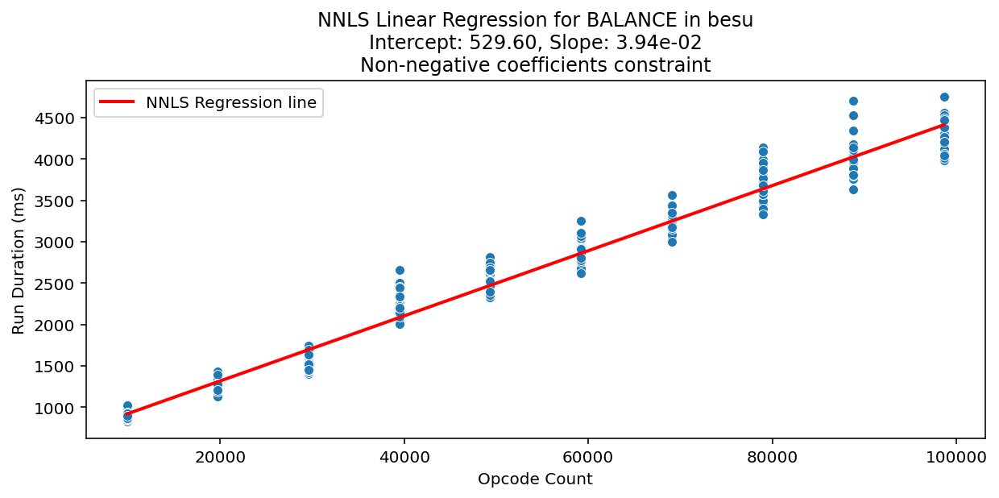

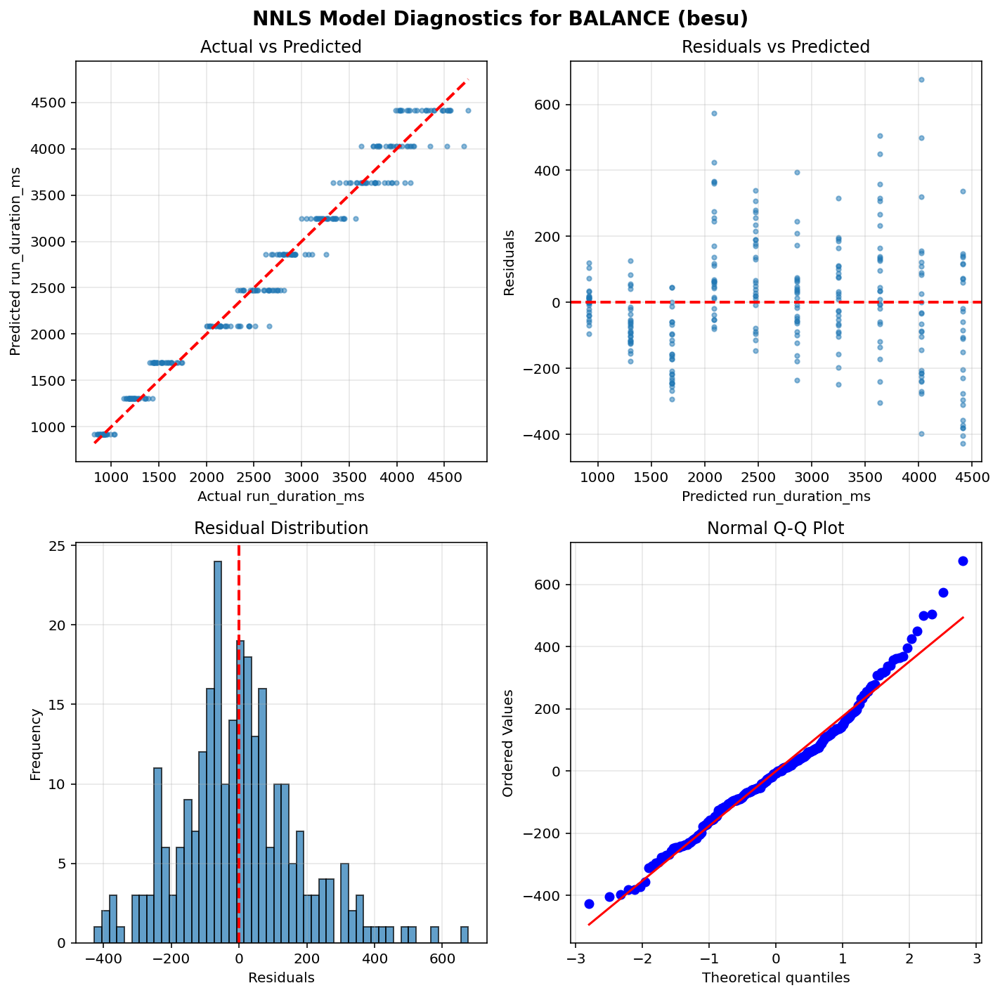

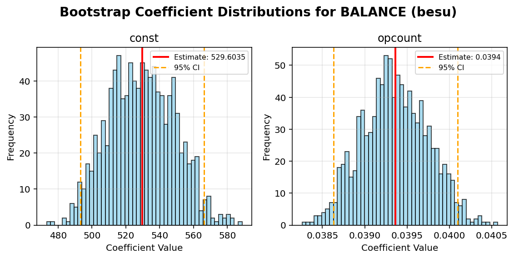


### test_name: test_account_access, account_mode: EXISTING_EOA


```python
==============================================================================
                           NNLS Regression Results                            
==============================================================================
Dep. Variable:          run_duration_ms              R-squared:          0.959
Model:                  NNLS                    Adj. R-squared:          0.958
No. Observations:       270                               RMSE:         145.52
Df Residuals:           268                                MAE:         116.56
Df Model:               1      
==============================================================================
                      coef     std err     P-value      [0.025      0.975]
------------------------------------------------------------------------------
         const    455.5188     18.2308       0.000    423.4526    493.7867
       opcount      0.0215      0.0003       0.000      0.0209      0.0220
==============================================================================
Notes: Non-negative least squares with bootstrap inference (1000 iterations)
==============================================================================
```

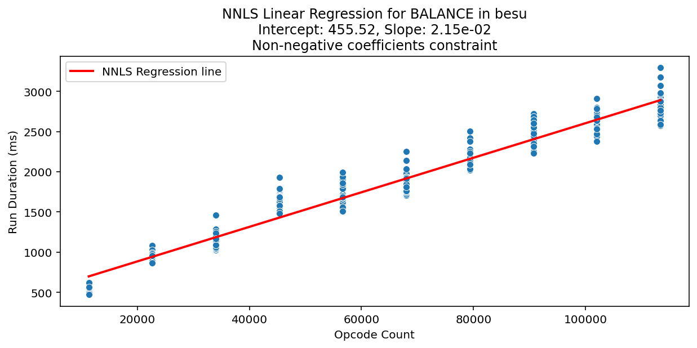

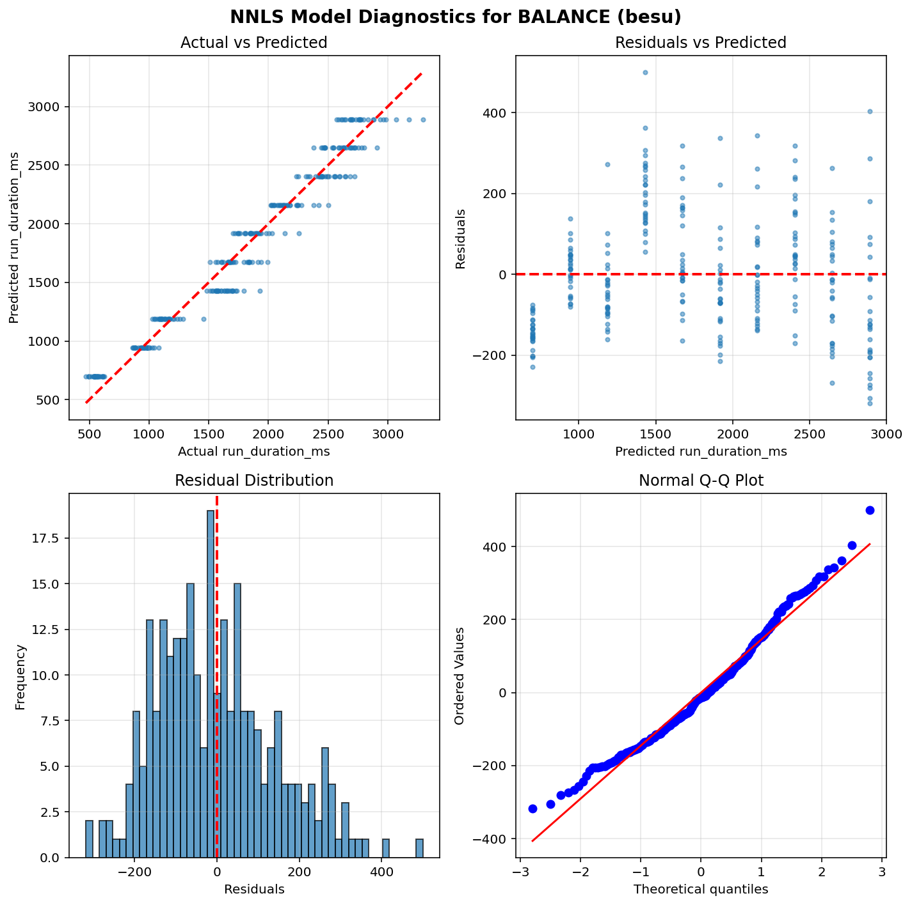

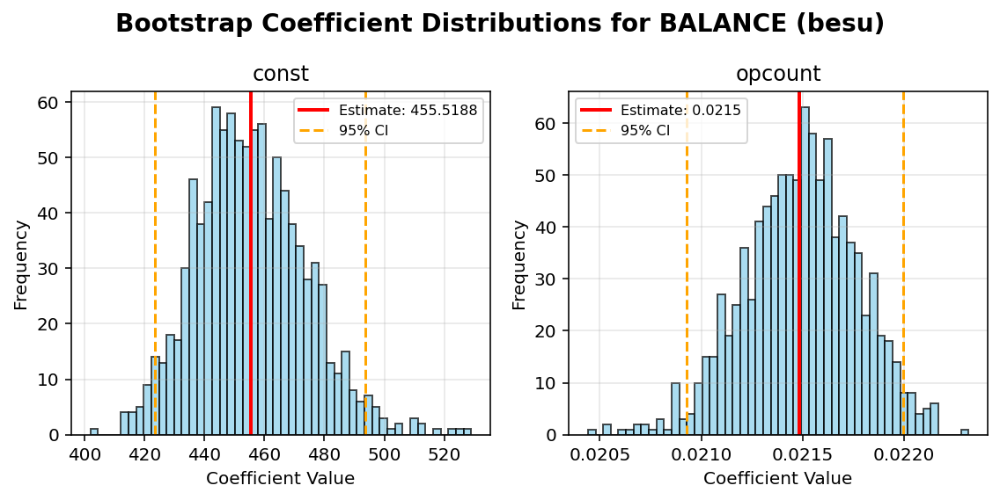


### test_name: test_account_access, account_mode: NON_EXISTING_ACCOUNT


```python
==============================================================================
                           NNLS Regression Results                            
==============================================================================
Dep. Variable:          run_duration_ms              R-squared:          0.971
Model:                  NNLS                    Adj. R-squared:          0.971
No. Observations:       270                               RMSE:          95.61
Df Residuals:           268                                MAE:          76.94
Df Model:               1      
==============================================================================
                      coef     std err     P-value      [0.025      0.975]
------------------------------------------------------------------------------
         const    406.4610     10.9195       0.000    385.2143    428.2950
       opcount      0.0171      0.0002       0.000      0.0167      0.0174
==============================================================================
Notes: Non-negative least squares with bootstrap inference (1000 iterations)
==============================================================================
```

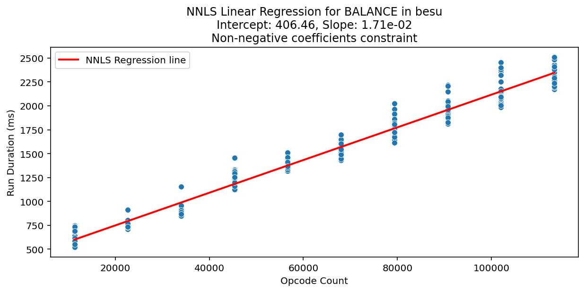

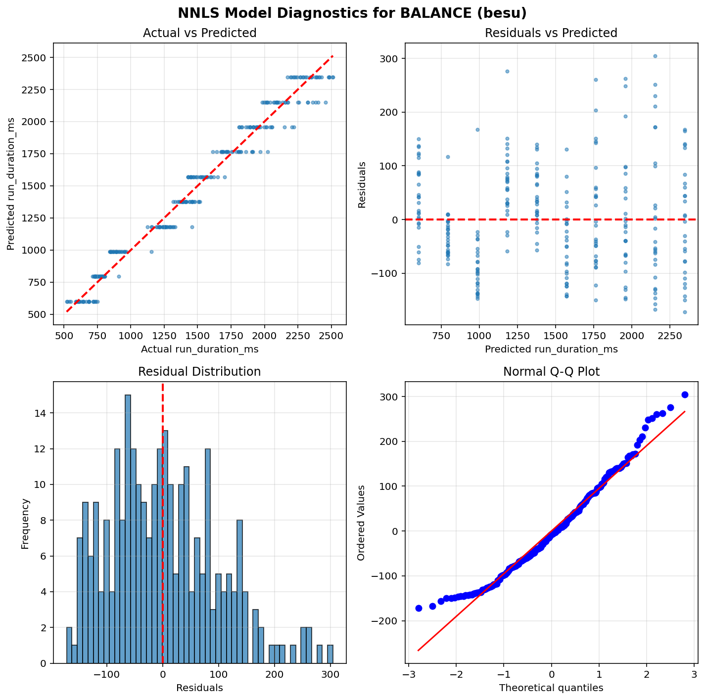

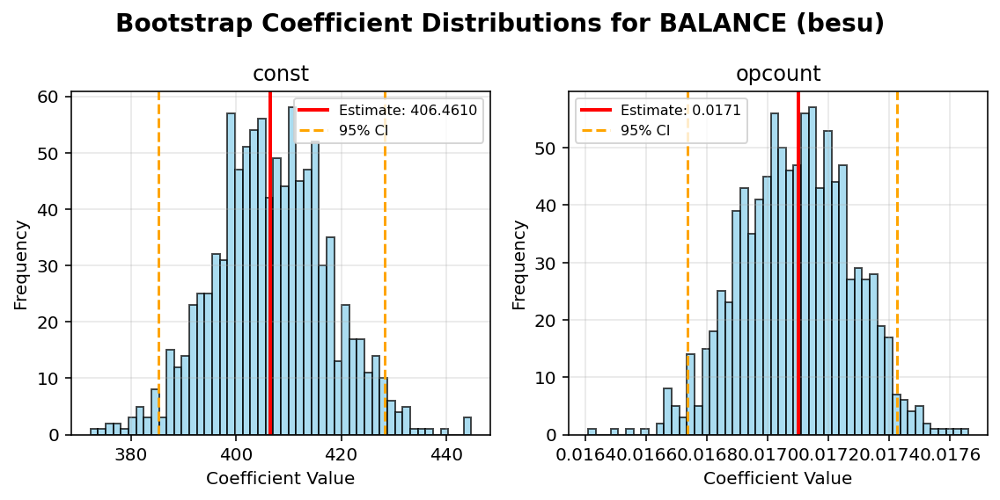


### test_name: test_ext_account_query_warm, account_mode: nan


```python
==============================================================================
                           NNLS Regression Results                            
==============================================================================
Dep. Variable:          run_duration_ms              R-squared:          0.837
Model:                  NNLS                    Adj. R-squared:          0.837
No. Observations:       270                               RMSE:          87.39
Df Residuals:           268                                MAE:          66.86
Df Model:               1      
==============================================================================
                      coef     std err     P-value      [0.025      0.975]
------------------------------------------------------------------------------
         const    238.5429      9.9697       0.000    220.3328    258.4792
       opcount      0.0002      0.0000       0.000      0.0002      0.0003
==============================================================================
Notes: Non-negative least squares with bootstrap inference (1000 iterations)
==============================================================================
```

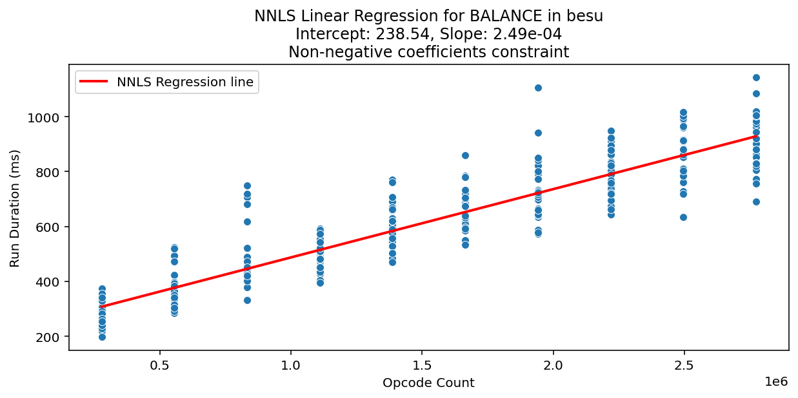

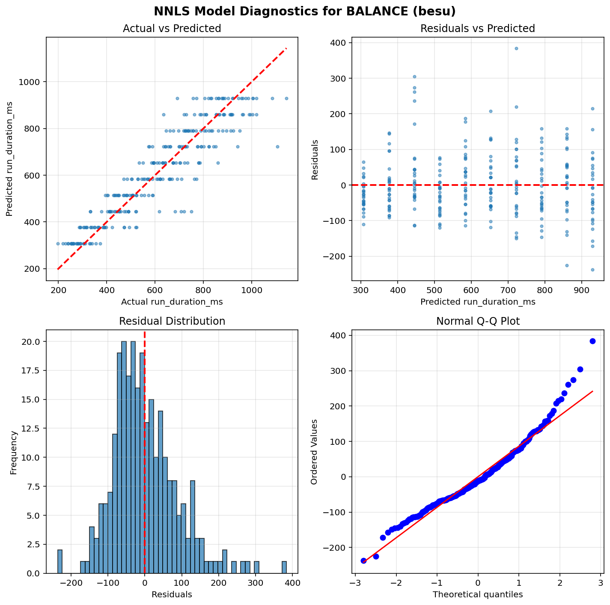

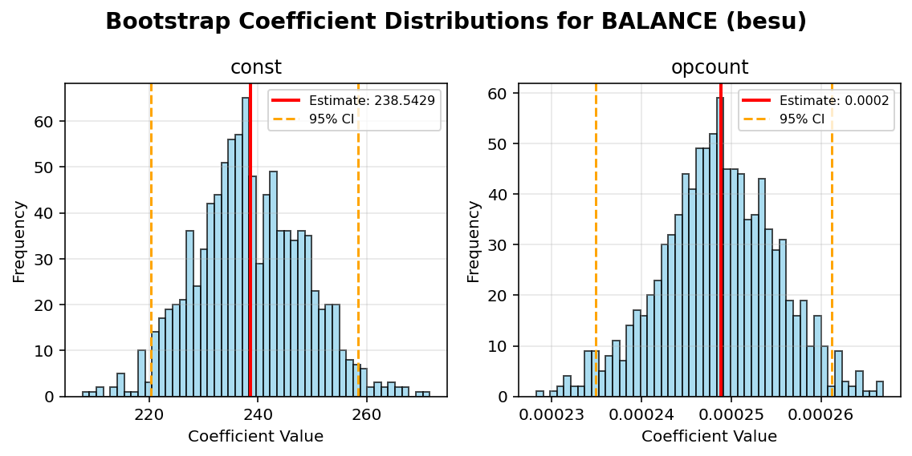


## erigon

### test_name: test_account_access, account_mode: EXISTING_CONTRACT


```python
==============================================================================
                           NNLS Regression Results                            
==============================================================================
Dep. Variable:          run_duration_ms              R-squared:          0.973
Model:                  NNLS                    Adj. R-squared:          0.972
No. Observations:       30                                RMSE:        1554.08
Df Residuals:           28                                 MAE:        1423.05
Df Model:               1      
==============================================================================
                      coef     std err     P-value      [0.025      0.975]
------------------------------------------------------------------------------
         const  45161.4784    626.4950       0.000  44134.2921  46622.1134
       opcount      0.3287      0.0119       0.000      0.3069      0.3544
==============================================================================
Notes: Non-negative least squares with bootstrap inference (1000 iterations)
==============================================================================
```

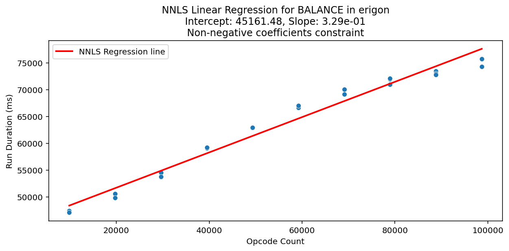

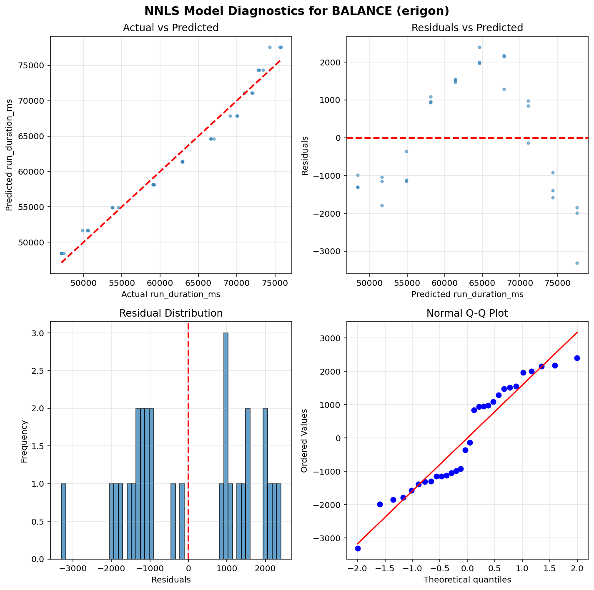

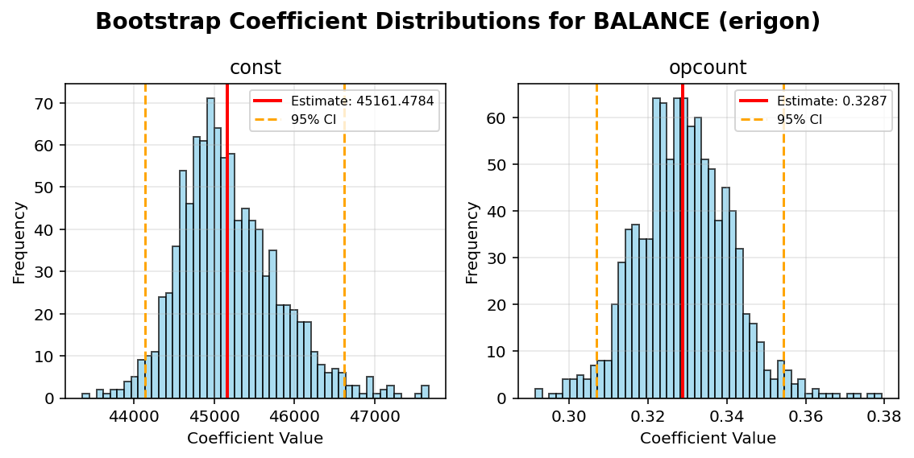


### test_name: test_account_access, account_mode: EXISTING_EOA


```python
==============================================================================
                           NNLS Regression Results                            
==============================================================================
Dep. Variable:          run_duration_ms              R-squared:          0.941
Model:                  NNLS                    Adj. R-squared:          0.939
No. Observations:       30                                RMSE:         370.54
Df Residuals:           28                                 MAE:         296.74
Df Model:               1      
==============================================================================
                      coef     std err     P-value      [0.025      0.975]
------------------------------------------------------------------------------
         const  42668.0657    131.4483       0.000  42454.3523  42978.6162
       opcount      0.0456      0.0019       0.000      0.0419      0.0496
==============================================================================
Notes: Non-negative least squares with bootstrap inference (1000 iterations)
==============================================================================
```

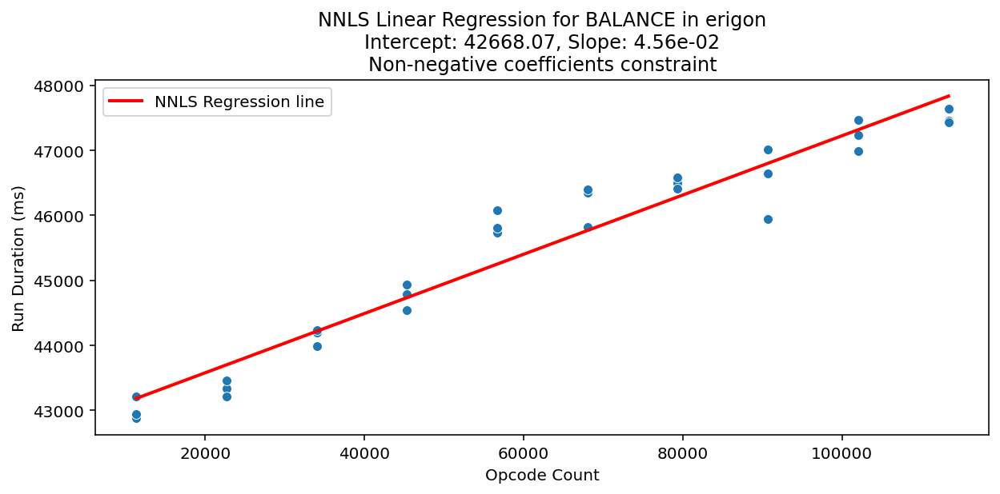

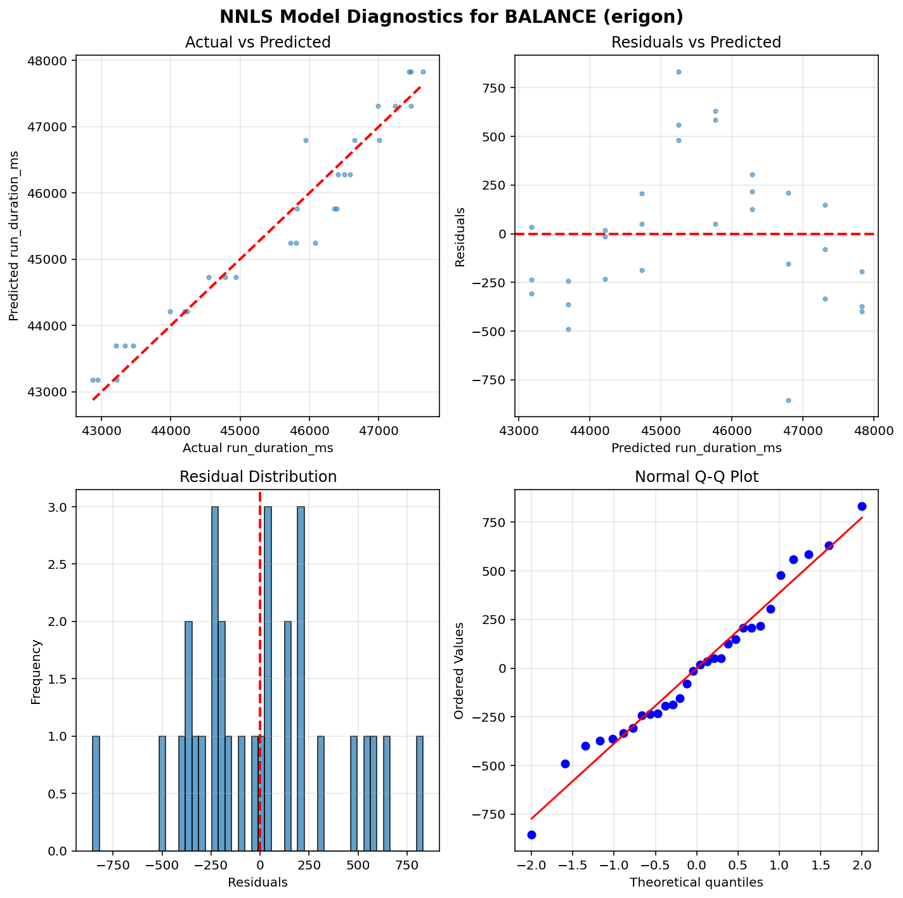

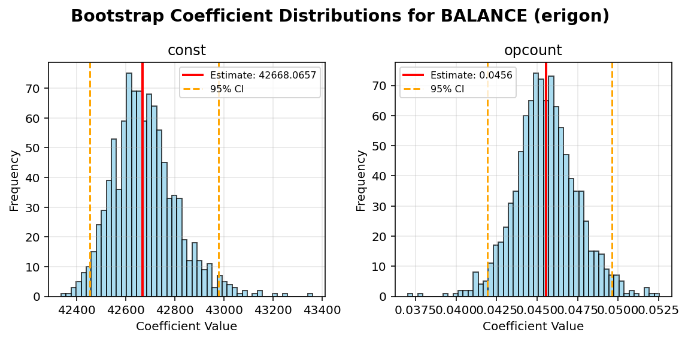


### test_name: test_account_access, account_mode: NON_EXISTING_ACCOUNT


```python
==============================================================================
                           NNLS Regression Results                            
==============================================================================
Dep. Variable:          run_duration_ms              R-squared:          0.860
Model:                  NNLS                    Adj. R-squared:          0.855
No. Observations:       30                                RMSE:         477.23
Df Residuals:           28                                 MAE:         395.37
Df Model:               1      
==============================================================================
                      coef     std err     P-value      [0.025      0.975]
------------------------------------------------------------------------------
         const  42708.7234    147.6025       0.000  42490.5447  43092.1328
       opcount      0.0363      0.0023       0.000      0.0317      0.0406
==============================================================================
Notes: Non-negative least squares with bootstrap inference (1000 iterations)
==============================================================================
```

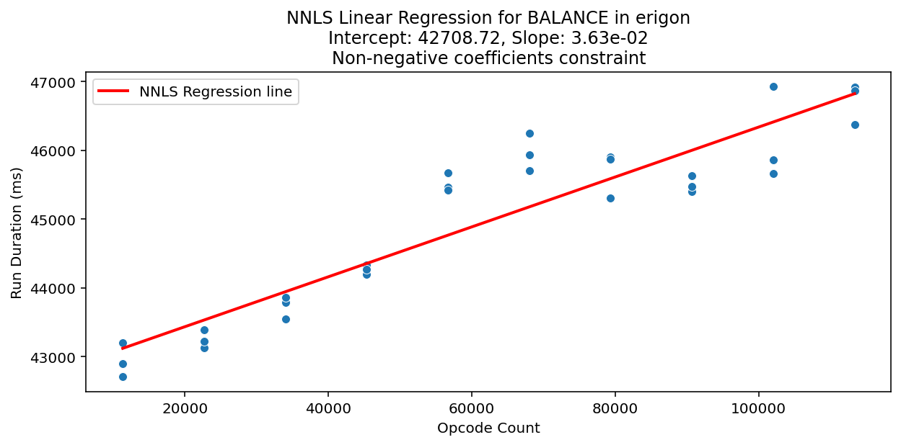

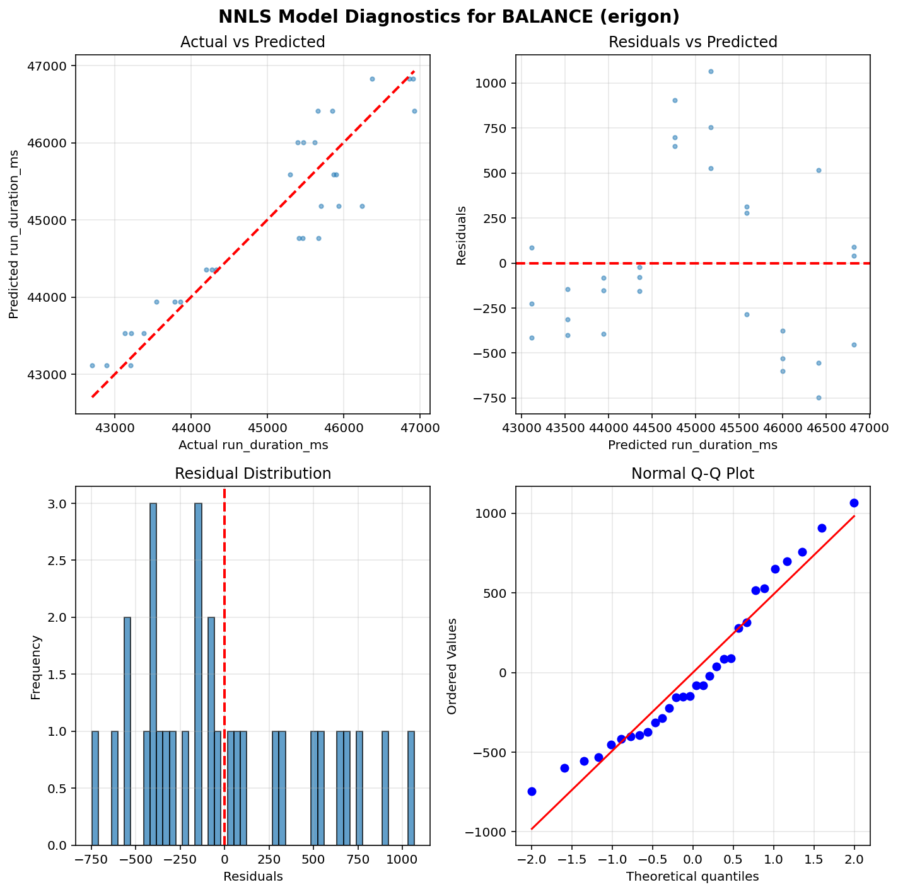

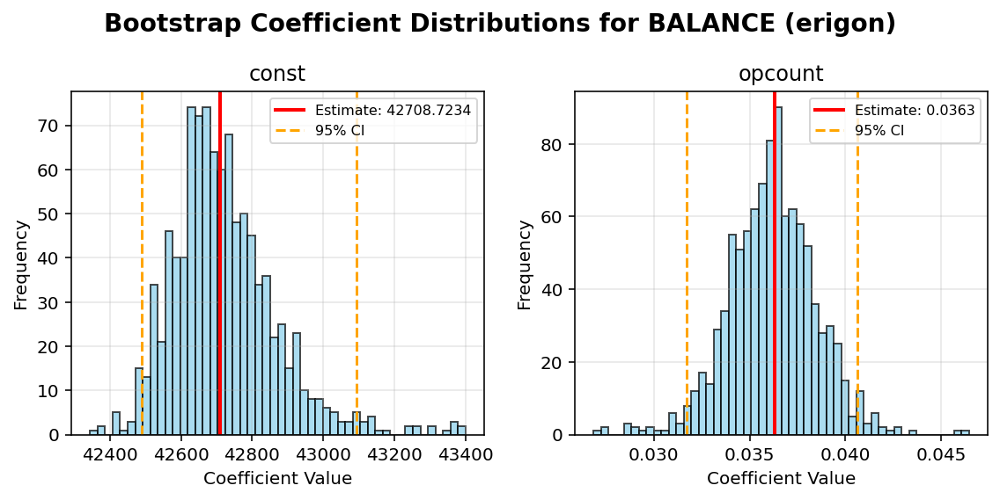


### test_name: test_ext_account_query_warm, account_mode: nan


```python
==============================================================================
                           NNLS Regression Results                            
==============================================================================
Dep. Variable:          run_duration_ms              R-squared:          0.993
Model:                  NNLS                    Adj. R-squared:          0.993
No. Observations:       30                                RMSE:          14.69
Df Residuals:           28                                 MAE:          10.45
Df Model:               1      
==============================================================================
                      coef     std err     P-value      [0.025      0.975]
------------------------------------------------------------------------------
         const     42.1255      4.5244       0.000     31.9887     49.1353
       opcount      0.0002      0.0000       0.000      0.0002      0.0002
==============================================================================
Notes: Non-negative least squares with bootstrap inference (1000 iterations)
==============================================================================
```

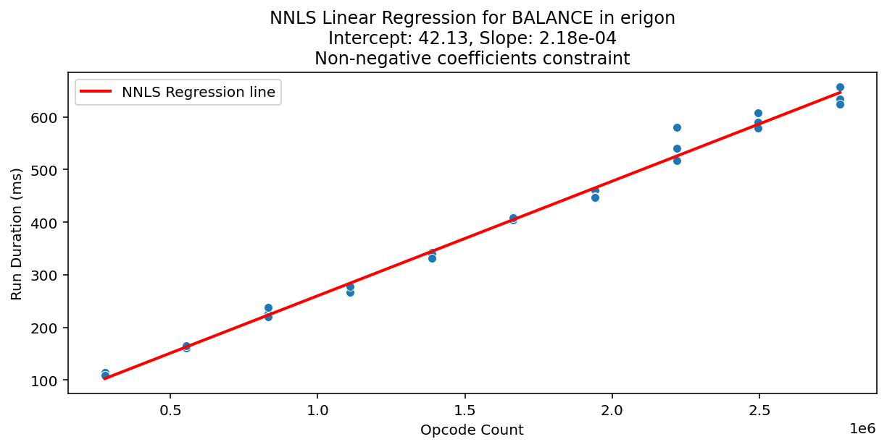

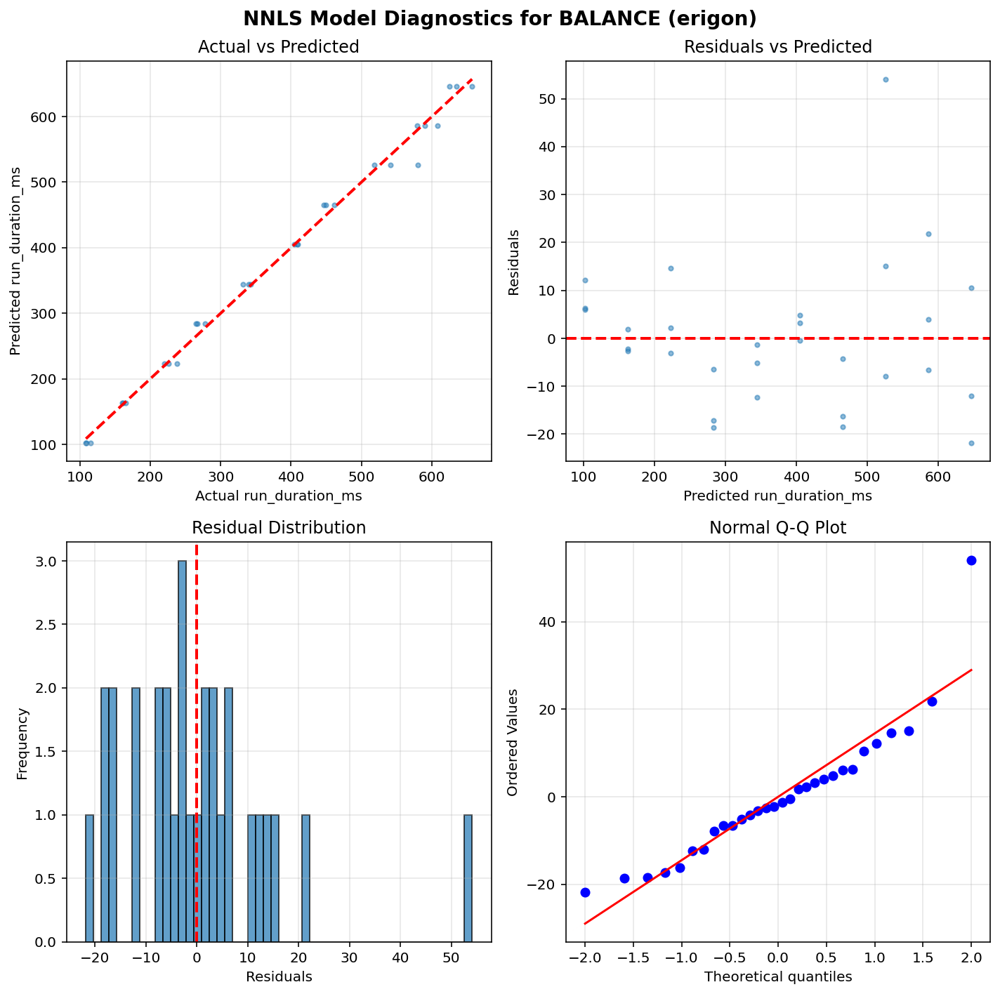

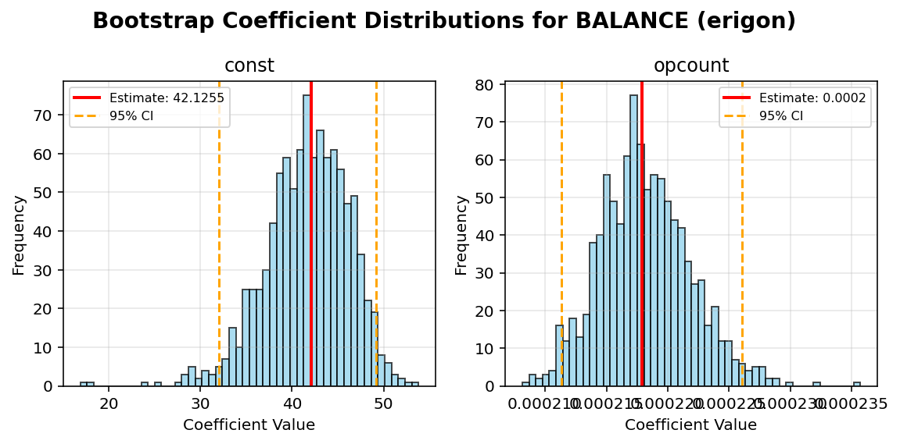


## geth

### test_name: test_account_access, account_mode: EXISTING_CONTRACT


```python
==============================================================================
                           NNLS Regression Results                            
==============================================================================
Dep. Variable:          run_duration_ms              R-squared:          0.770
Model:                  NNLS                    Adj. R-squared:          0.768
No. Observations:       150                               RMSE:         467.68
Df Residuals:           148                                MAE:         379.17
Df Model:               1      
==============================================================================
                      coef     std err     P-value      [0.025      0.975]
------------------------------------------------------------------------------
         const   1248.4204     72.9023       0.000   1116.1264   1399.6524
       opcount      0.0302      0.0012       0.000      0.0279      0.0325
==============================================================================
Notes: Non-negative least squares with bootstrap inference (1000 iterations)
==============================================================================
```

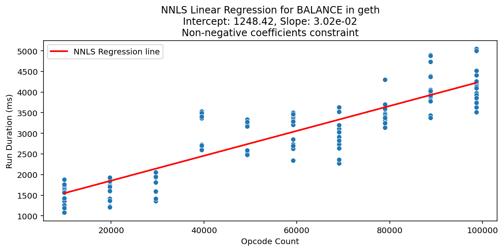

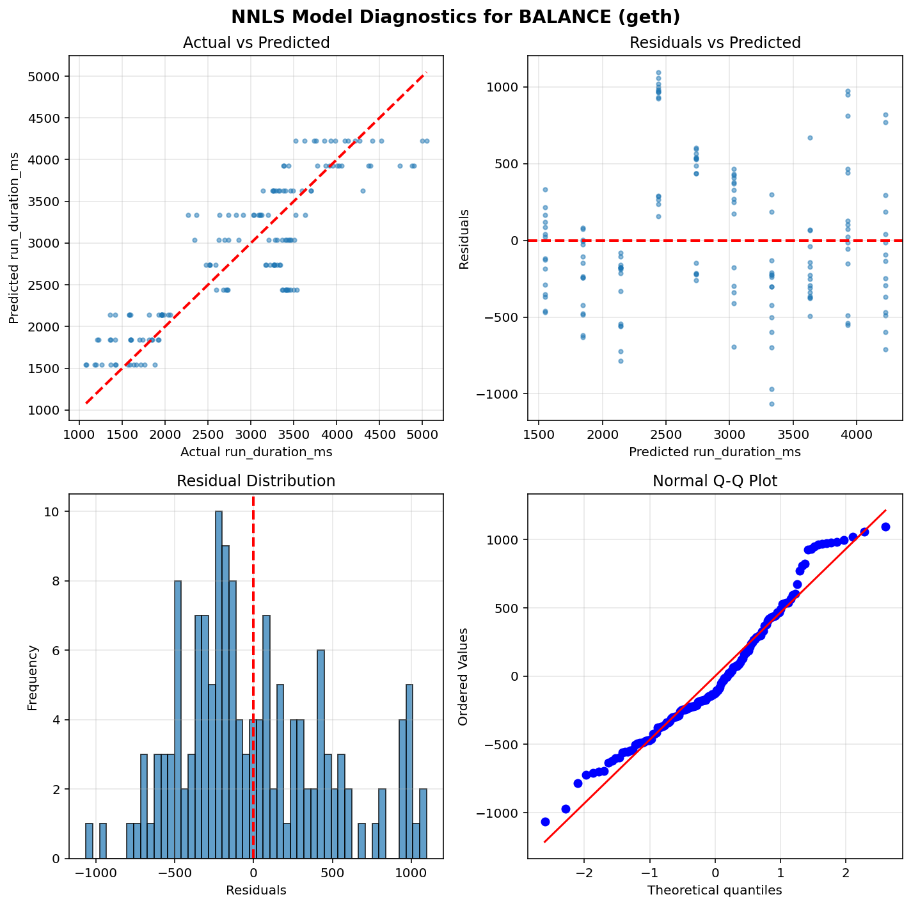

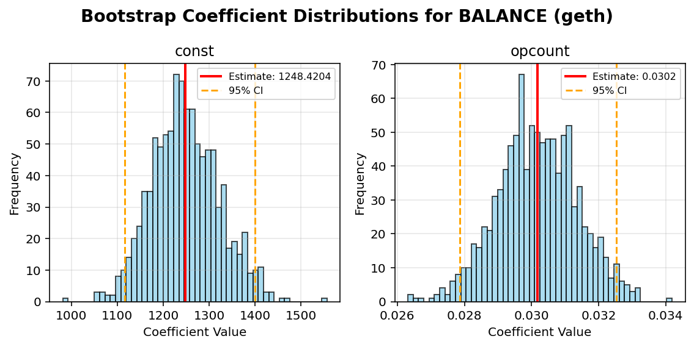


### test_name: test_account_access, account_mode: EXISTING_EOA


```python
==============================================================================
                           NNLS Regression Results                            
==============================================================================
Dep. Variable:          run_duration_ms              R-squared:          0.930
Model:                  NNLS                    Adj. R-squared:          0.930
No. Observations:       150                               RMSE:         153.22
Df Residuals:           148                                MAE:         126.00
Df Model:               1      
==============================================================================
                      coef     std err     P-value      [0.025      0.975]
------------------------------------------------------------------------------
         const    386.6260     35.2303       0.000    315.5585    452.3653
       opcount      0.0172      0.0005       0.000      0.0163      0.0181
==============================================================================
Notes: Non-negative least squares with bootstrap inference (1000 iterations)
==============================================================================
```

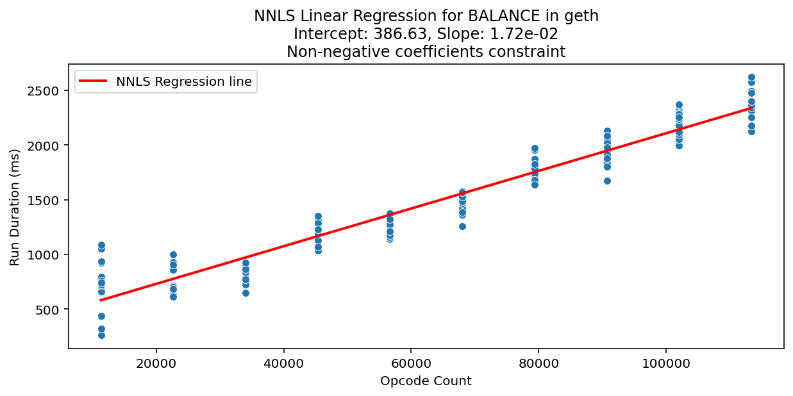

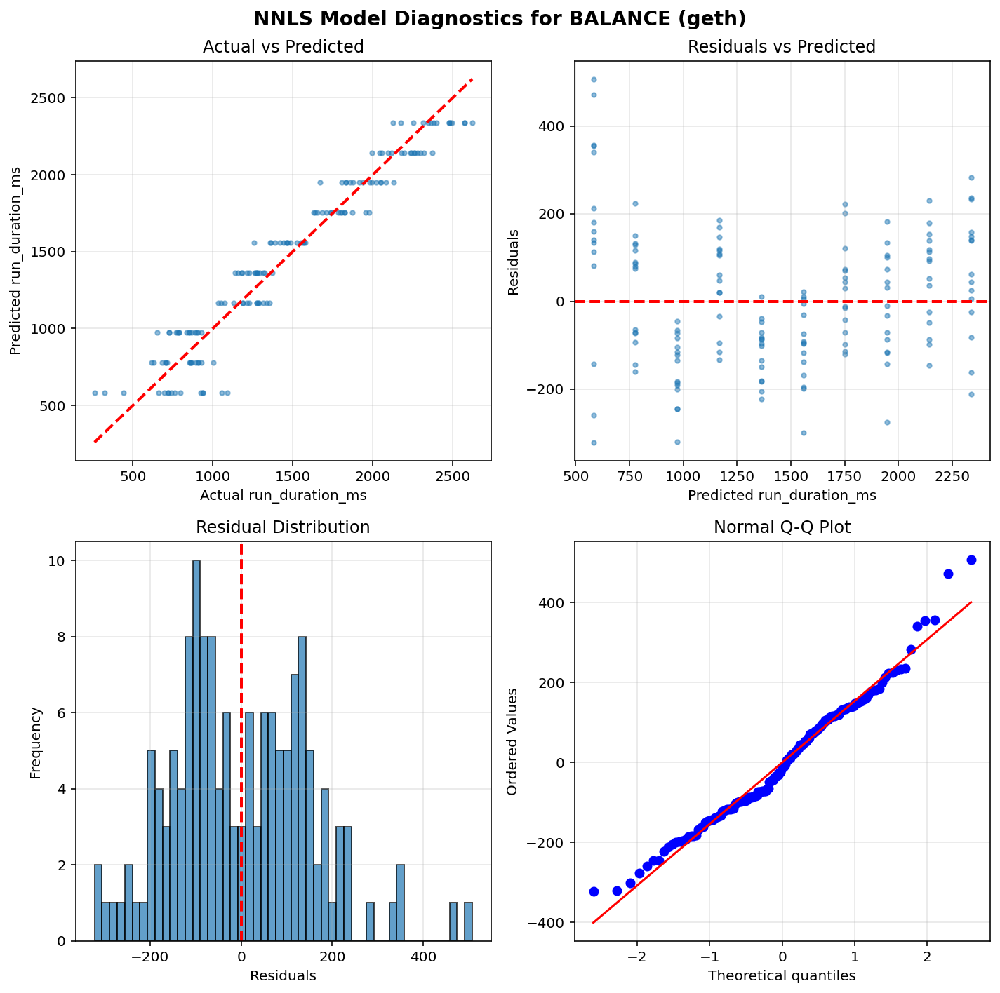

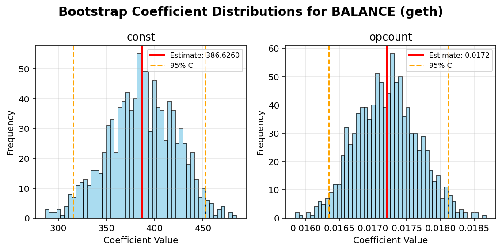


### test_name: test_account_access, account_mode: NON_EXISTING_ACCOUNT


```python
==============================================================================
                           NNLS Regression Results                            
==============================================================================
Dep. Variable:          run_duration_ms              R-squared:          0.787
Model:                  NNLS                    Adj. R-squared:          0.785
No. Observations:       150                               RMSE:         522.49
Df Residuals:           148                                MAE:         422.88
Df Model:               1      
==============================================================================
                      coef     std err     P-value      [0.025      0.975]
------------------------------------------------------------------------------
         const   1233.0105     80.4734       0.000   1084.9070   1387.7165
       opcount      0.0308      0.0011       0.000      0.0287      0.0329
==============================================================================
Notes: Non-negative least squares with bootstrap inference (1000 iterations)
==============================================================================
```

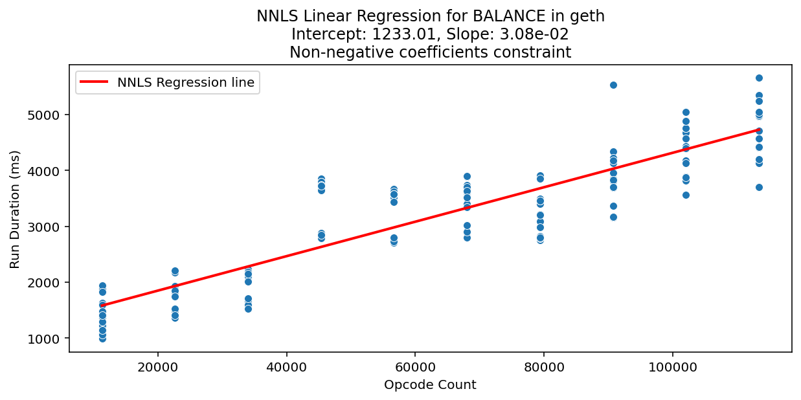

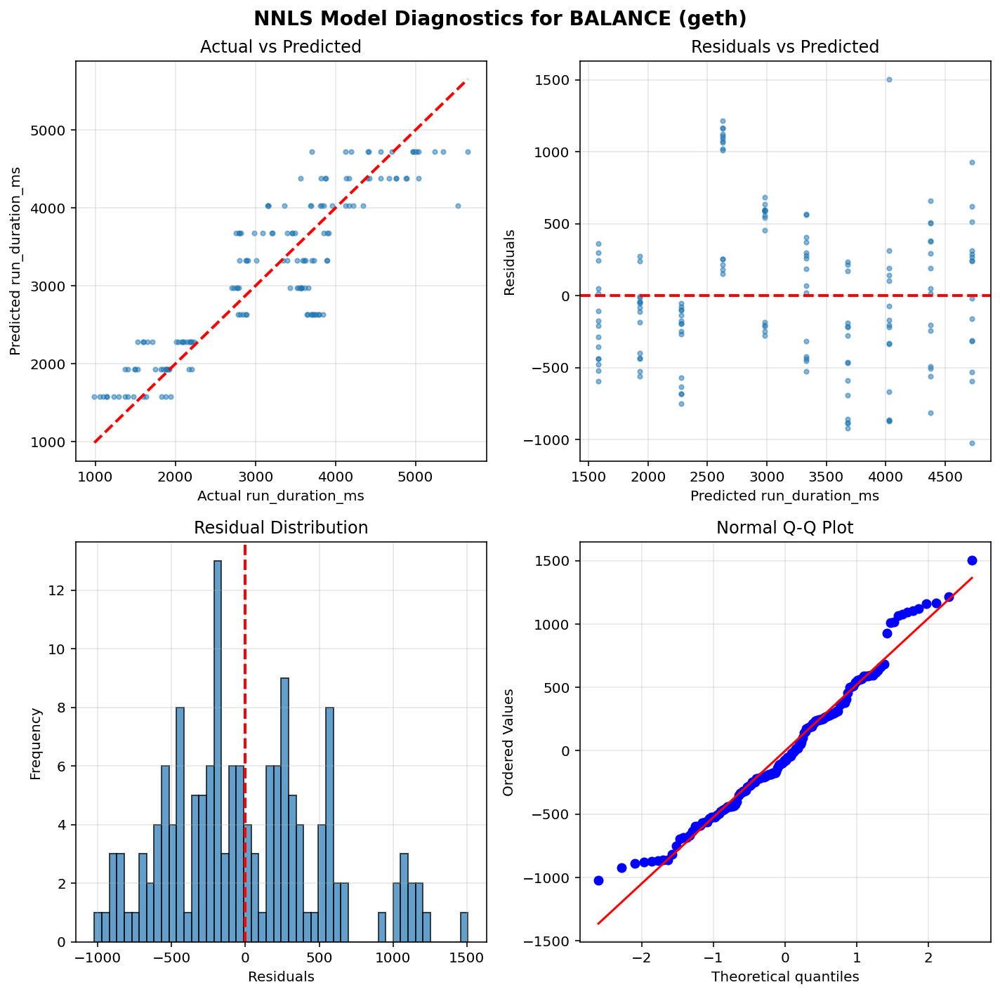

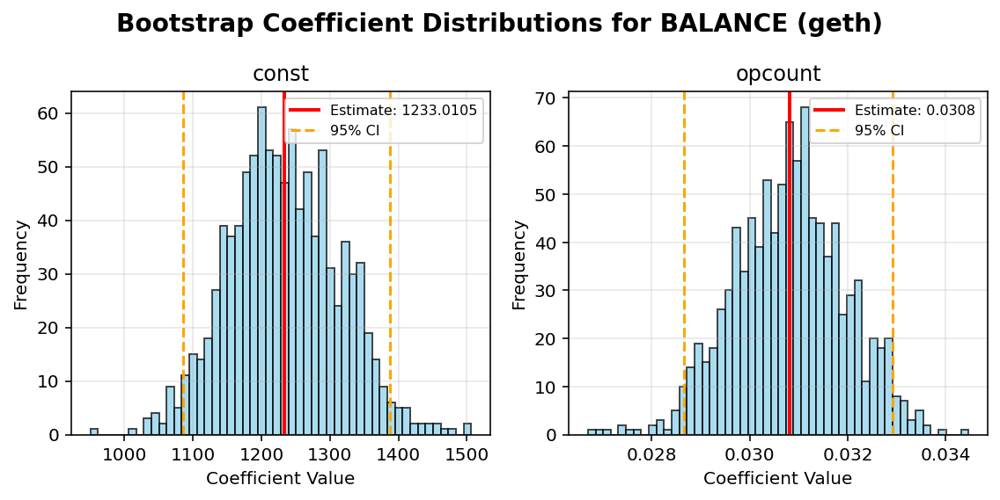


### test_name: test_ext_account_query_warm, account_mode: nan


```python
==============================================================================
                           NNLS Regression Results                            
==============================================================================
Dep. Variable:          run_duration_ms              R-squared:          0.939
Model:                  NNLS                    Adj. R-squared:          0.939
No. Observations:       150                               RMSE:           6.50
Df Residuals:           148                                MAE:           5.40
Df Model:               1      
==============================================================================
                      coef     std err     P-value      [0.025      0.975]
------------------------------------------------------------------------------
         const     13.4048      0.9598       0.000     11.4753     15.2820
       opcount      0.0000      0.0000       0.000      0.0000      0.0000
==============================================================================
Notes: Non-negative least squares with bootstrap inference (1000 iterations)
==============================================================================
```

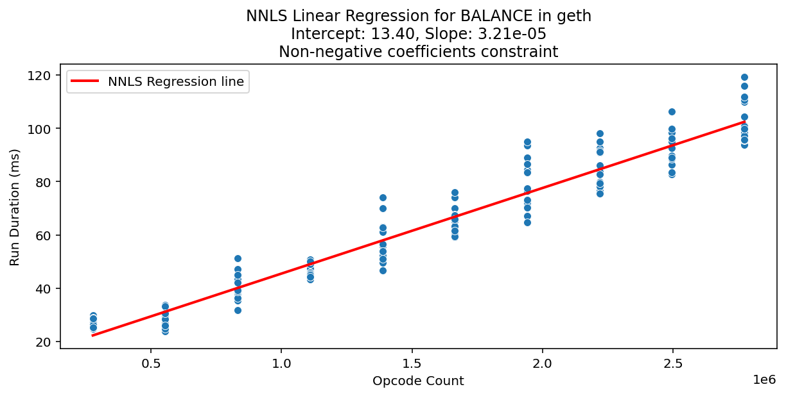

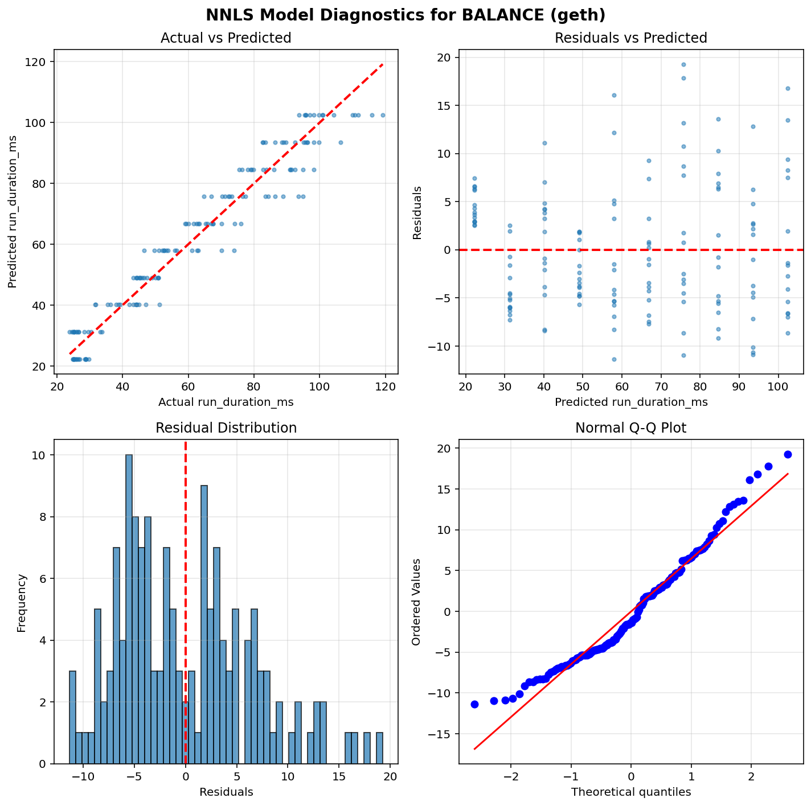

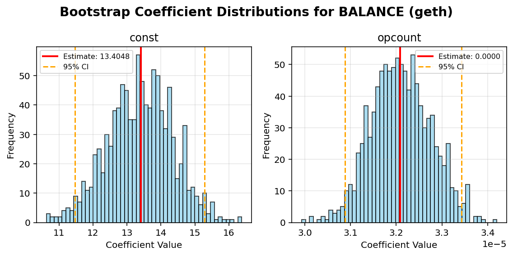


## nethermind

### test_name: test_account_access, account_mode: EXISTING_CONTRACT


```python
==============================================================================
                           NNLS Regression Results                            
==============================================================================
Dep. Variable:          run_duration_ms              R-squared:          0.980
Model:                  NNLS                    Adj. R-squared:          0.980
No. Observations:       190                               RMSE:         200.73
Df Residuals:           188                                MAE:         145.74
Df Model:               1      
==============================================================================
                      coef     std err     P-value      [0.025      0.975]
------------------------------------------------------------------------------
         const    276.4792     24.9513       0.000    227.1240    327.4822
       opcount      0.0494      0.0005       0.000      0.0483      0.0504
==============================================================================
Notes: Non-negative least squares with bootstrap inference (1000 iterations)
==============================================================================
```

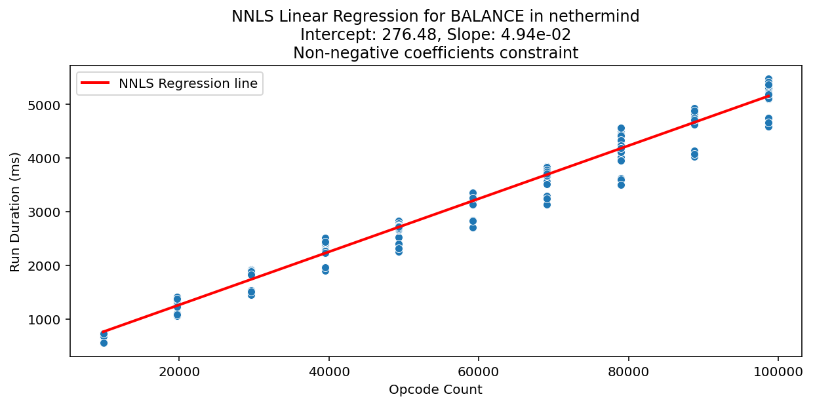


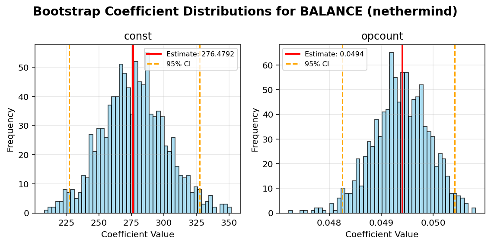


### test_name: test_account_access, account_mode: EXISTING_EOA


```python
==============================================================================
                           NNLS Regression Results                            
==============================================================================
Dep. Variable:          run_duration_ms              R-squared:          0.950
Model:                  NNLS                    Adj. R-squared:          0.949
No. Observations:       190                               RMSE:         179.46
Df Residuals:           188                                MAE:         130.72
Df Model:               1      
==============================================================================
                      coef     std err     P-value      [0.025      0.975]
------------------------------------------------------------------------------
         const     89.5568     17.1548       0.000     58.5251    124.9873
       opcount      0.0239      0.0004       0.000      0.0232      0.0247
==============================================================================
Notes: Non-negative least squares with bootstrap inference (1000 iterations)
==============================================================================
```

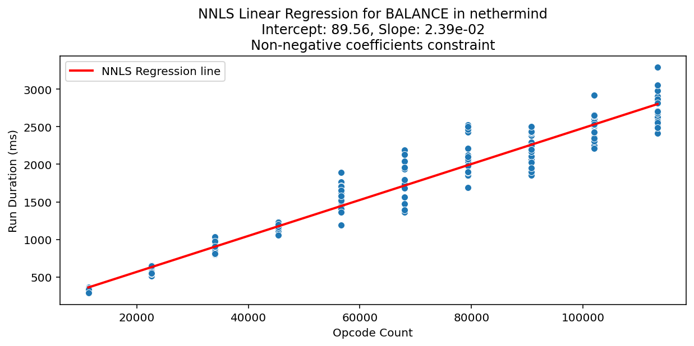


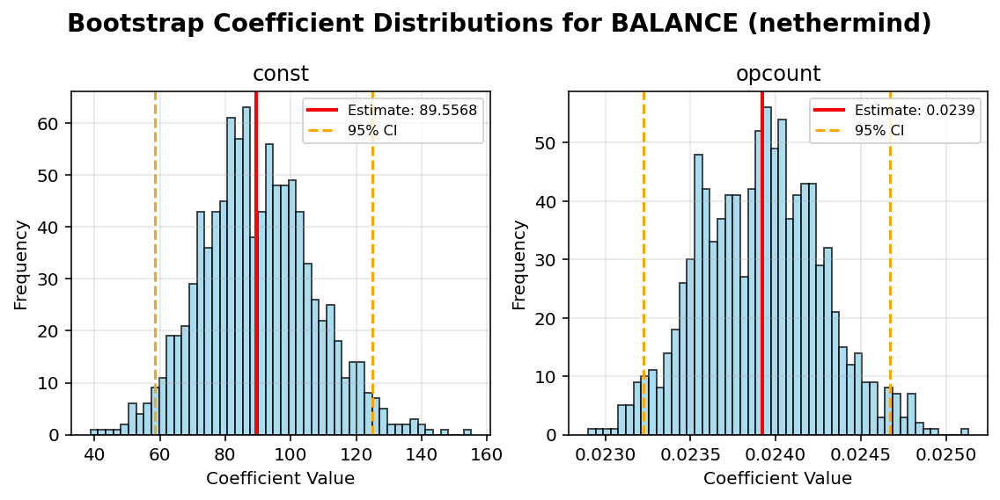


### test_name: test_account_access, account_mode: NON_EXISTING_ACCOUNT


```python
==============================================================================
                           NNLS Regression Results                            
==============================================================================
Dep. Variable:          run_duration_ms              R-squared:          0.928
Model:                  NNLS                    Adj. R-squared:          0.928
No. Observations:       190                               RMSE:         200.89
Df Residuals:           188                                MAE:         160.96
Df Model:               1      
==============================================================================
                      coef     std err     P-value      [0.025      0.975]
------------------------------------------------------------------------------
         const     96.8785     21.6369       0.000     56.2474    138.9500
       opcount      0.0222      0.0005       0.000      0.0214      0.0232
==============================================================================
Notes: Non-negative least squares with bootstrap inference (1000 iterations)
==============================================================================
```

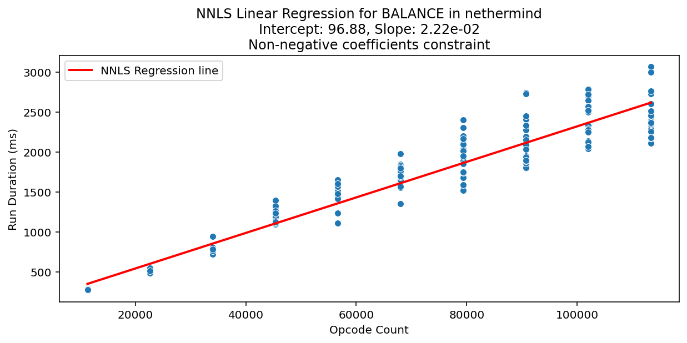

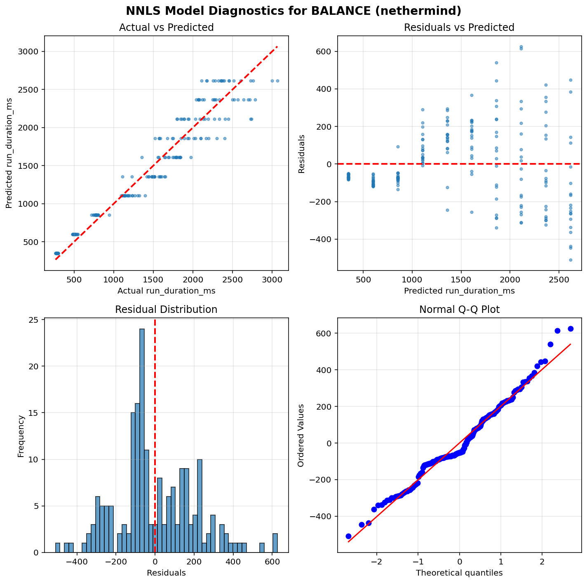

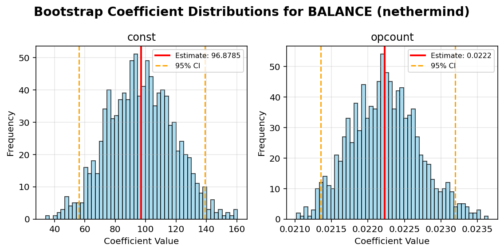


### test_name: test_ext_account_query_warm, account_mode: nan


```python
==============================================================================
                           NNLS Regression Results                            
==============================================================================
Dep. Variable:          run_duration_ms              R-squared:          0.880
Model:                  NNLS                    Adj. R-squared:          0.879
No. Observations:       190                               RMSE:          46.49
Df Residuals:           188                                MAE:          35.66
Df Model:               1      
==============================================================================
                      coef     std err     P-value      [0.025      0.975]
------------------------------------------------------------------------------
         const    107.2973      6.5613       0.000     94.6353    120.0116
       opcount      0.0002      0.0000       0.000      0.0002      0.0002
==============================================================================
Notes: Non-negative least squares with bootstrap inference (1000 iterations)
==============================================================================
```

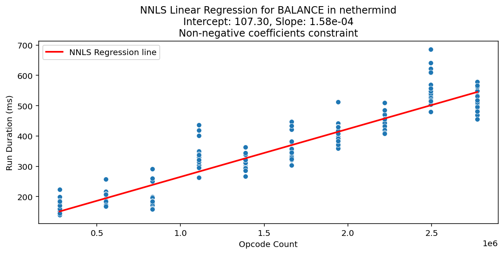

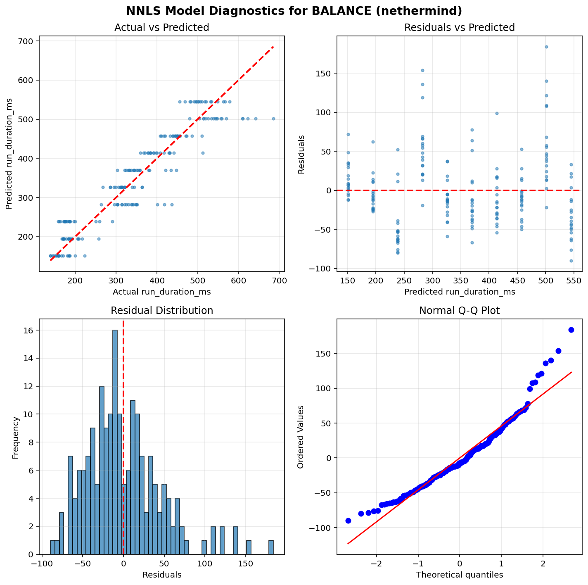

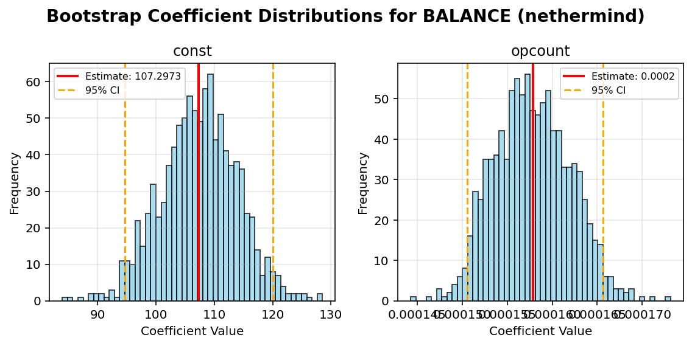


## reth

### test_name: test_account_access, account_mode: EXISTING_CONTRACT


```python
==============================================================================
                           NNLS Regression Results                            
==============================================================================
Dep. Variable:          run_duration_ms              R-squared:          0.891
Model:                  NNLS                    Adj. R-squared:          0.890
No. Observations:       150                               RMSE:         550.60
Df Residuals:           148                                MAE:         438.65
Df Model:               1      
==============================================================================
                      coef     std err     P-value      [0.025      0.975]
------------------------------------------------------------------------------
         const    276.0031     85.3686       0.000    116.6769    444.4856
       opcount      0.0555      0.0015       0.000      0.0527      0.0583
==============================================================================
Notes: Non-negative least squares with bootstrap inference (1000 iterations)
==============================================================================
```

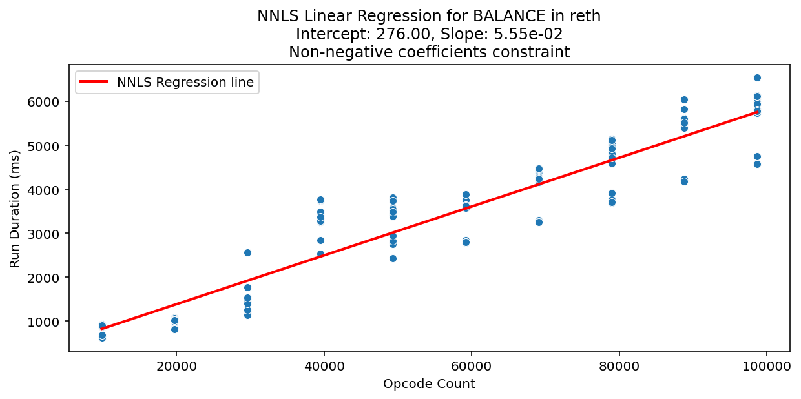

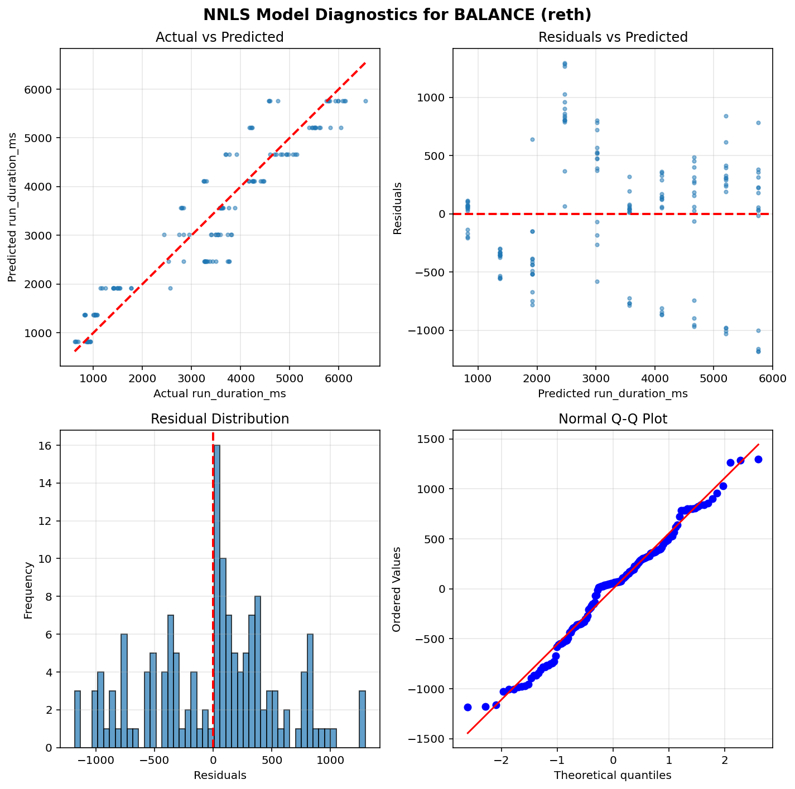

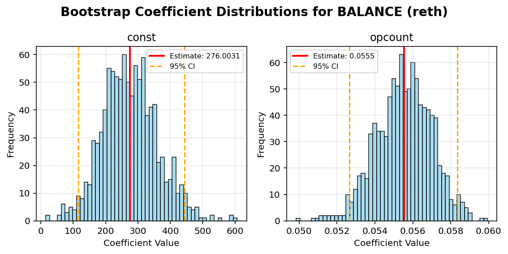


### test_name: test_account_access, account_mode: EXISTING_EOA


```python
==============================================================================
                           NNLS Regression Results                            
==============================================================================
Dep. Variable:          run_duration_ms              R-squared:          0.974
Model:                  NNLS                    Adj. R-squared:          0.974
No. Observations:       150                               RMSE:           7.06
Df Residuals:           148                                MAE:           5.62
Df Model:               1      
==============================================================================
                      coef     std err     P-value      [0.025      0.975]
------------------------------------------------------------------------------
         const     21.8893      1.2134       0.000     19.7015     24.4664
       opcount      0.0013      0.0000       0.000      0.0013      0.0014
==============================================================================
Notes: Non-negative least squares with bootstrap inference (1000 iterations)
==============================================================================
```

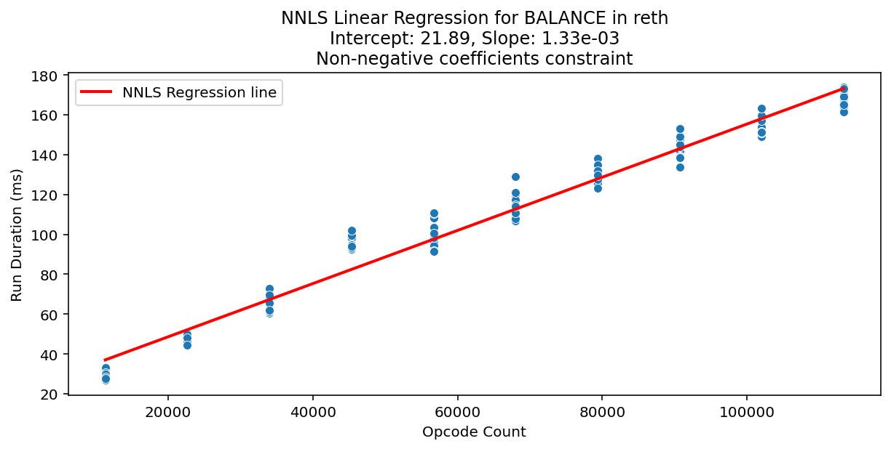


### test_name: test_account_access, account_mode: NON_EXISTING_ACCOUNT


```python
==============================================================================
                           NNLS Regression Results                            
==============================================================================
Dep. Variable:          run_duration_ms              R-squared:          0.981
Model:                  NNLS                    Adj. R-squared:          0.981
No. Observations:       150                               RMSE:           5.49
Df Residuals:           148                                MAE:           4.45
Df Model:               1      
==============================================================================
                      coef     std err     P-value      [0.025      0.975]
------------------------------------------------------------------------------
         const     21.4592      1.0146       0.000     19.4341     23.4722
       opcount      0.0012      0.0000       0.000      0.0012      0.0012
==============================================================================
Notes: Non-negative least squares with bootstrap inference (1000 iterations)
==============================================================================
```


### test_name: test_ext_account_query_warm, account_mode: nan


```python
==============================================================================
                           NNLS Regression Results                            
==============================================================================
Dep. Variable:          run_duration_ms              R-squared:          0.848
Model:                  NNLS                    Adj. R-squared:          0.846
No. Observations:       150                               RMSE:           2.44
Df Residuals:           148                                MAE:           1.67
Df Model:               1      
==============================================================================
                      coef     std err     P-value      [0.025      0.975]
------------------------------------------------------------------------------
         const      4.9485      0.3459       0.000      4.2629      5.6623
       opcount      0.0000      0.0000       0.000      0.0000      0.0000
==============================================================================
Notes: Non-negative least squares with bootstrap inference (1000 iterations)
==============================================================================
```


# EXTCODESIZE

## besu

### test_name: test_account_access, account_mode: EXISTING_CONTRACT


```python
==============================================================================
                           NNLS Regression Results                            
==============================================================================
Dep. Variable:          run_duration_ms              R-squared:          0.978
Model:                  NNLS                    Adj. R-squared:          0.978
No. Observations:       270                               RMSE:         168.34
Df Residuals:           268                                MAE:         133.53
Df Model:               1      
==============================================================================
                      coef     std err     P-value      [0.025      0.975]
------------------------------------------------------------------------------
         const    495.7201     17.6095       0.000    461.2414    527.5695
       opcount      0.0396      0.0004       0.000      0.0390      0.0403
==============================================================================
Notes: Non-negative least squares with bootstrap inference (1000 iterations)
==============================================================================
```


### test_name: test_account_access, account_mode: NON_EXISTING_ACCOUNT


```python
==============================================================================
                           NNLS Regression Results                            
==============================================================================
Dep. Variable:          run_duration_ms              R-squared:          0.973
Model:                  NNLS                    Adj. R-squared:          0.973
No. Observations:       270                               RMSE:          94.19
Df Residuals:           268                                MAE:          76.56
Df Model:               1      
==============================================================================
                      coef     std err     P-value      [0.025      0.975]
------------------------------------------------------------------------------
         const    390.7182     11.9885       0.000    367.9137    413.1003
       opcount      0.0174      0.0002       0.000      0.0170      0.0177
==============================================================================
Notes: Non-negative least squares with bootstrap inference (1000 iterations)
==============================================================================
```


### test_name: test_ext_account_query_warm, account_mode: nan


```python
==============================================================================
                           NNLS Regression Results                            
==============================================================================
Dep. Variable:          run_duration_ms              R-squared:          0.821
Model:                  NNLS                    Adj. R-squared:          0.820
No. Observations:       270                               RMSE:          87.60
Df Residuals:           268                                MAE:          67.87
Df Model:               1      
==============================================================================
                      coef     std err     P-value      [0.025      0.975]
------------------------------------------------------------------------------
         const    264.8711      9.9052       0.000    245.6698    286.3572
       opcount      0.0002      0.0000       0.000      0.0002      0.0002
==============================================================================
Notes: Non-negative least squares with bootstrap inference (1000 iterations)
==============================================================================
```


## erigon

### test_name: test_account_access, account_mode: EXISTING_CONTRACT


```python
==============================================================================
                           NNLS Regression Results                            
==============================================================================
Dep. Variable:          run_duration_ms              R-squared:          0.970
Model:                  NNLS                    Adj. R-squared:          0.969
No. Observations:       30                                RMSE:        3387.54
Df Residuals:           28                                 MAE:        3078.80
Df Model:               1      
==============================================================================
                      coef     std err     P-value      [0.025      0.975]
------------------------------------------------------------------------------
         const  48656.8542   1534.0152       0.000  46346.3489  52505.1782
       opcount      0.6768      0.0248       0.000      0.6244      0.7254
==============================================================================
Notes: Non-negative least squares with bootstrap inference (1000 iterations)
==============================================================================
```


### test_name: test_account_access, account_mode: NON_EXISTING_ACCOUNT


```python
==============================================================================
                           NNLS Regression Results                            
==============================================================================
Dep. Variable:          run_duration_ms              R-squared:          0.919
Model:                  NNLS                    Adj. R-squared:          0.916
No. Observations:       30                                RMSE:         392.95
Df Residuals:           28                                 MAE:         320.49
Df Model:               1      
==============================================================================
                      coef     std err     P-value      [0.025      0.975]
------------------------------------------------------------------------------
         const  42571.2799    146.5193       0.000  42320.6009  42879.1446
       opcount      0.0407      0.0026       0.000      0.0361      0.0462
==============================================================================
Notes: Non-negative least squares with bootstrap inference (1000 iterations)
==============================================================================
```


### test_name: test_ext_account_query_warm, account_mode: nan


```python
==============================================================================
                           NNLS Regression Results                            
==============================================================================
Dep. Variable:          run_duration_ms              R-squared:          0.993
Model:                  NNLS                    Adj. R-squared:          0.993
No. Observations:       30                                RMSE:          11.40
Df Residuals:           28                                 MAE:           8.66
Df Model:               1      
==============================================================================
                      coef     std err     P-value      [0.025      0.975]
------------------------------------------------------------------------------
         const     44.5673      5.1863       0.000     35.2111     55.4620
       opcount      0.0002      0.0000       0.000      0.0002      0.0002
==============================================================================
Notes: Non-negative least squares with bootstrap inference (1000 iterations)
==============================================================================
```


## geth

### test_name: test_account_access, account_mode: EXISTING_CONTRACT


```python
==============================================================================
                           NNLS Regression Results                            
==============================================================================
Dep. Variable:          run_duration_ms              R-squared:          0.809
Model:                  NNLS                    Adj. R-squared:          0.808
No. Observations:       150                               RMSE:         486.62
Df Residuals:           148                                MAE:         400.14
Df Model:               1      
==============================================================================
                      coef     std err     P-value      [0.025      0.975]
------------------------------------------------------------------------------
         const   1069.3706     72.5290       0.000    935.9684   1222.5580
       opcount      0.0353      0.0013       0.000      0.0327      0.0378
==============================================================================
Notes: Non-negative least squares with bootstrap inference (1000 iterations)
==============================================================================
```


### test_name: test_account_access, account_mode: NON_EXISTING_ACCOUNT


```python
==============================================================================
                           NNLS Regression Results                            
==============================================================================
Dep. Variable:          run_duration_ms              R-squared:          0.806
Model:                  NNLS                    Adj. R-squared:          0.805
No. Observations:       150                               RMSE:         530.19
Df Residuals:           148                                MAE:         431.95
Df Model:               1      
==============================================================================
                      coef     std err     P-value      [0.025      0.975]
------------------------------------------------------------------------------
         const   1214.2489     78.6732       0.000   1066.6404   1369.8428
       opcount      0.0332      0.0012       0.000      0.0308      0.0356
==============================================================================
Notes: Non-negative least squares with bootstrap inference (1000 iterations)
==============================================================================
```


### test_name: test_ext_account_query_warm, account_mode: nan


```python
==============================================================================
                           NNLS Regression Results                            
==============================================================================
Dep. Variable:          run_duration_ms              R-squared:          0.961
Model:                  NNLS                    Adj. R-squared:          0.961
No. Observations:       150                               RMSE:           5.38
Df Residuals:           148                                MAE:           4.32
Df Model:               1      
==============================================================================
                      coef     std err     P-value      [0.025      0.975]
------------------------------------------------------------------------------
         const     14.2335      0.8466       0.000     12.5672     15.9042
       opcount      0.0000      0.0000       0.000      0.0000      0.0000
==============================================================================
Notes: Non-negative least squares with bootstrap inference (1000 iterations)
==============================================================================
```


## nethermind

### test_name: test_account_access, account_mode: EXISTING_CONTRACT


```python
==============================================================================
                           NNLS Regression Results                            
==============================================================================
Dep. Variable:          run_duration_ms              R-squared:          0.981
Model:                  NNLS                    Adj. R-squared:          0.981
No. Observations:       190                               RMSE:         194.01
Df Residuals:           188                                MAE:         141.30
Df Model:               1      
==============================================================================
                      coef     std err     P-value      [0.025      0.975]
------------------------------------------------------------------------------
         const    285.8341     23.9666       0.000    239.7322    335.1927
       opcount      0.0495      0.0005       0.000      0.0484      0.0505
==============================================================================
Notes: Non-negative least squares with bootstrap inference (1000 iterations)
==============================================================================
```


### test_name: test_account_access, account_mode: NON_EXISTING_ACCOUNT


```python
==============================================================================
                           NNLS Regression Results                            
==============================================================================
Dep. Variable:          run_duration_ms              R-squared:          0.947
Model:                  NNLS                    Adj. R-squared:          0.947
No. Observations:       190                               RMSE:         174.98
Df Residuals:           188                                MAE:         130.11
Df Model:               1      
==============================================================================
                      coef     std err     P-value      [0.025      0.975]
------------------------------------------------------------------------------
         const    100.5608     18.4571       0.000     68.3595    141.4882
       opcount      0.0228      0.0004       0.000      0.0220      0.0235
==============================================================================
Notes: Non-negative least squares with bootstrap inference (1000 iterations)
==============================================================================
```


### test_name: test_ext_account_query_warm, account_mode: nan


```python
==============================================================================
                           NNLS Regression Results                            
==============================================================================
Dep. Variable:          run_duration_ms              R-squared:          0.868
Model:                  NNLS                    Adj. R-squared:          0.867
No. Observations:       190                               RMSE:          64.30
Df Residuals:           188                                MAE:          48.41
Df Model:               1      
==============================================================================
                      coef     std err     P-value      [0.025      0.975]
------------------------------------------------------------------------------
         const    162.1795      8.2403       0.000    146.3525    179.3875
       opcount      0.0002      0.0000       0.000      0.0002      0.0002
==============================================================================
Notes: Non-negative least squares with bootstrap inference (1000 iterations)
==============================================================================
```


## reth

### test_name: test_account_access, account_mode: EXISTING_CONTRACT


```python
==============================================================================
                           NNLS Regression Results                            
==============================================================================
Dep. Variable:          run_duration_ms              R-squared:          0.888
Model:                  NNLS                    Adj. R-squared:          0.887
No. Observations:       150                               RMSE:         605.79
Df Residuals:           148                                MAE:         390.99
Df Model:               1      
==============================================================================
                      coef     std err     P-value      [0.025      0.975]
------------------------------------------------------------------------------
         const      0.0000      7.2376       1.000      0.0000     13.3092
       opcount      0.0582      0.0011       0.000      0.0561      0.0603
==============================================================================
Notes: Non-negative least squares with bootstrap inference (1000 iterations)
==============================================================================
```


### test_name: test_account_access, account_mode: NON_EXISTING_ACCOUNT


```python
==============================================================================
                           NNLS Regression Results                            
==============================================================================
Dep. Variable:          run_duration_ms              R-squared:          0.982
Model:                  NNLS                    Adj. R-squared:          0.982
No. Observations:       150                               RMSE:           5.33
Df Residuals:           148                                MAE:           4.22
Df Model:               1      
==============================================================================
                      coef     std err     P-value      [0.025      0.975]
------------------------------------------------------------------------------
         const     22.2580      1.0909       0.000     20.1561     24.3388
       opcount      0.0012      0.0000       0.000      0.0012      0.0012
==============================================================================
Notes: Non-negative least squares with bootstrap inference (1000 iterations)
==============================================================================
```


### test_name: test_ext_account_query_warm, account_mode: nan


```python
==============================================================================
                           NNLS Regression Results                            
==============================================================================
Dep. Variable:          run_duration_ms              R-squared:          0.828
Model:                  NNLS                    Adj. R-squared:          0.827
No. Observations:       150                               RMSE:           2.30
Df Residuals:           148                                MAE:           1.60
Df Model:               1      
==============================================================================
                      coef     std err     P-value      [0.025      0.975]
------------------------------------------------------------------------------
         const      4.7163      0.3288       0.000      4.0522      5.3510
       opcount      0.0000      0.0000       0.000      0.0000      0.0000
==============================================================================
Notes: Non-negative least squares with bootstrap inference (1000 iterations)
==============================================================================
```


# EXTCODECOPY

## besu

### account_mode: EXISTING_CONTRACT


```python
==============================================================================
                           NNLS Regression Results                            
==============================================================================
Dep. Variable:          run_duration_ms              R-squared:          0.841
Model:                  NNLS                    Adj. R-squared:          0.841
No. Observations:       270                               RMSE:         164.03
Df Residuals:           268                                MAE:         126.72
Df Model:               1      
==============================================================================
                      coef     std err     P-value      [0.025      0.975]
------------------------------------------------------------------------------
         const    425.2160     18.1742       0.000    393.2055    462.4808
       opcount      0.0028      0.0001       0.000      0.0027      0.0029
==============================================================================
Notes: Non-negative least squares with bootstrap inference (1000 iterations)
==============================================================================
```


### account_mode: NON_EXISTING_ACCOUNT


```python
==============================================================================
                           NNLS Regression Results                            
==============================================================================
Dep. Variable:          run_duration_ms              R-squared:          0.756
Model:                  NNLS                    Adj. R-squared:          0.755
No. Observations:       270                               RMSE:         109.55
Df Residuals:           268                                MAE:          87.21
Df Model:               1      
==============================================================================
                      coef     std err     P-value      [0.025      0.975]
------------------------------------------------------------------------------
         const    325.1591     14.2343       0.000    298.9376    354.1798
       opcount      0.0006      0.0000       0.000      0.0005      0.0006
==============================================================================
Notes: Non-negative least squares with bootstrap inference (1000 iterations)
==============================================================================
```


## erigon

### account_mode: EXISTING_CONTRACT


```python
==============================================================================
                           NNLS Regression Results                            
==============================================================================
Dep. Variable:          run_duration_ms              R-squared:          0.996
Model:                  NNLS                    Adj. R-squared:          0.996
No. Observations:       30                                RMSE:          15.88
Df Residuals:           28                                 MAE:          11.62
Df Model:               1      
==============================================================================
                      coef     std err     P-value      [0.025      0.975]
------------------------------------------------------------------------------
         const     53.5484      4.3654       0.000     46.5426     63.5750
       opcount      0.0019      0.0000       0.000      0.0019      0.0019
==============================================================================
Notes: Non-negative least squares with bootstrap inference (1000 iterations)
==============================================================================
```


### account_mode: NON_EXISTING_ACCOUNT


```python
==============================================================================
                           NNLS Regression Results                            
==============================================================================
Dep. Variable:          run_duration_ms              R-squared:          0.991
Model:                  NNLS                    Adj. R-squared:          0.991
No. Observations:       30                                RMSE:          11.55
Df Residuals:           28                                 MAE:           8.10
Df Model:               1      
==============================================================================
                      coef     std err     P-value      [0.025      0.975]
------------------------------------------------------------------------------
         const     54.2058      2.9266       0.000     48.1237     59.9697
       opcount      0.0003      0.0000       0.000      0.0003      0.0004
==============================================================================
Notes: Non-negative least squares with bootstrap inference (1000 iterations)
==============================================================================
```


## geth

### account_mode: EXISTING_CONTRACT


```python
==============================================================================
                           NNLS Regression Results                            
==============================================================================
Dep. Variable:          run_duration_ms              R-squared:          0.986
Model:                  NNLS                    Adj. R-squared:          0.986
No. Observations:       150                               RMSE:          13.44
Df Residuals:           148                                MAE:          10.33
Df Model:               1      
==============================================================================
                      coef     std err     P-value      [0.025      0.975]
------------------------------------------------------------------------------
         const     33.5987      1.9633       0.000     29.6839     37.5486
       opcount      0.0008      0.0000       0.000      0.0008      0.0008
==============================================================================
Notes: Non-negative least squares with bootstrap inference (1000 iterations)
==============================================================================
```


### account_mode: NON_EXISTING_ACCOUNT


```python
==============================================================================
                           NNLS Regression Results                            
==============================================================================
Dep. Variable:          run_duration_ms              R-squared:          0.991
Model:                  NNLS                    Adj. R-squared:          0.991
No. Observations:       150                               RMSE:          13.68
Df Residuals:           148                                MAE:          10.05
Df Model:               1      
==============================================================================
                      coef     std err     P-value      [0.025      0.975]
------------------------------------------------------------------------------
         const     21.2183      1.9093       0.000     17.4974     25.0220
       opcount      0.0004      0.0000       0.000      0.0004      0.0004
==============================================================================
Notes: Non-negative least squares with bootstrap inference (1000 iterations)
==============================================================================
```


## nethermind

### account_mode: EXISTING_CONTRACT


```python
==============================================================================
                           NNLS Regression Results                            
==============================================================================
Dep. Variable:          run_duration_ms              R-squared:          0.833
Model:                  NNLS                    Adj. R-squared:          0.832
No. Observations:       190                               RMSE:          72.14
Df Residuals:           188                                MAE:          54.37
Df Model:               1      
==============================================================================
                      coef     std err     P-value      [0.025      0.975]
------------------------------------------------------------------------------
         const    210.1771      8.8954       0.000    195.0159    228.8441
       opcount      0.0012      0.0000       0.000      0.0011      0.0013
==============================================================================
Notes: Non-negative least squares with bootstrap inference (1000 iterations)
==============================================================================
```


### account_mode: NON_EXISTING_ACCOUNT


```python
==============================================================================
                           NNLS Regression Results                            
==============================================================================
Dep. Variable:          run_duration_ms              R-squared:          0.882
Model:                  NNLS                    Adj. R-squared:          0.881
No. Observations:       190                               RMSE:          51.08
Df Residuals:           188                                MAE:          38.50
Df Model:               1      
==============================================================================
                      coef     std err     P-value      [0.025      0.975]
------------------------------------------------------------------------------
         const    121.3260      6.6932       0.000    108.3704    134.3569
       opcount      0.0004      0.0000       0.000      0.0004      0.0004
==============================================================================
Notes: Non-negative least squares with bootstrap inference (1000 iterations)
==============================================================================
```


## reth

### account_mode: EXISTING_CONTRACT


```python
==============================================================================
                           NNLS Regression Results                            
==============================================================================
Dep. Variable:          run_duration_ms              R-squared:          0.897
Model:                  NNLS                    Adj. R-squared:          0.896
No. Observations:       150                               RMSE:           4.03
Df Residuals:           148                                MAE:           3.07
Df Model:               1      
==============================================================================
                      coef     std err     P-value      [0.025      0.975]
------------------------------------------------------------------------------
         const     10.1509      0.5231       0.000      9.0983     11.1474
       opcount      0.0001      0.0000       0.000      0.0001      0.0001
==============================================================================
Notes: Non-negative least squares with bootstrap inference (1000 iterations)
==============================================================================
```


### account_mode: NON_EXISTING_ACCOUNT


```python
==============================================================================
                           NNLS Regression Results                            
==============================================================================
Dep. Variable:          run_duration_ms              R-squared:          0.869
Model:                  NNLS                    Adj. R-squared:          0.868
No. Observations:       150                               RMSE:           2.50
Df Residuals:           148                                MAE:           1.84
Df Model:               1      
==============================================================================
                      coef     std err     P-value      [0.025      0.975]
------------------------------------------------------------------------------
         const      5.3440      0.3573       0.000      4.5736      6.0566
       opcount      0.0000      0.0000       0.000      0.0000      0.0000
==============================================================================
Notes: Non-negative least squares with bootstrap inference (1000 iterations)
==============================================================================
```


# EXTCODEHASH

## besu

### test_name: test_account_access, account_mode: EXISTING_CONTRACT


```python
==============================================================================
                           NNLS Regression Results                            
==============================================================================
Dep. Variable:          run_duration_ms              R-squared:          0.975
Model:                  NNLS                    Adj. R-squared:          0.975
No. Observations:       270                               RMSE:         179.94
Df Residuals:           268                                MAE:         141.64
Df Model:               1      
==============================================================================
                      coef     std err     P-value      [0.025      0.975]
------------------------------------------------------------------------------
         const    513.7117     18.5748       0.000    479.3081    551.6415
       opcount      0.0399      0.0004       0.000      0.0391      0.0406
==============================================================================
Notes: Non-negative least squares with bootstrap inference (1000 iterations)
==============================================================================
```


### test_name: test_account_access, account_mode: NON_EXISTING_ACCOUNT


```python
==============================================================================
                           NNLS Regression Results                            
==============================================================================
Dep. Variable:          run_duration_ms              R-squared:          0.966
Model:                  NNLS                    Adj. R-squared:          0.966
No. Observations:       270                               RMSE:         103.14
Df Residuals:           268                                MAE:          81.59
Df Model:               1      
==============================================================================
                      coef     std err     P-value      [0.025      0.975]
------------------------------------------------------------------------------
         const    406.3794     12.3321       0.000    382.5962    432.4217
       opcount      0.0169      0.0002       0.000      0.0166      0.0173
==============================================================================
Notes: Non-negative least squares with bootstrap inference (1000 iterations)
==============================================================================
```


### test_name: test_ext_account_query_warm, account_mode: nan


```python
==============================================================================
                           NNLS Regression Results                            
==============================================================================
Dep. Variable:          run_duration_ms              R-squared:          0.800
Model:                  NNLS                    Adj. R-squared:          0.799
No. Observations:       270                               RMSE:          92.70
Df Residuals:           268                                MAE:          72.91
Df Model:               1      
==============================================================================
                      coef     std err     P-value      [0.025      0.975]
------------------------------------------------------------------------------
         const    262.0177     10.7250       0.000    243.3136    283.8952
       opcount      0.0002      0.0000       0.000      0.0002      0.0002
==============================================================================
Notes: Non-negative least squares with bootstrap inference (1000 iterations)
==============================================================================
```


## erigon

### test_name: test_account_access, account_mode: EXISTING_CONTRACT


```python
==============================================================================
                           NNLS Regression Results                            
==============================================================================
Dep. Variable:          run_duration_ms              R-squared:          0.974
Model:                  NNLS                    Adj. R-squared:          0.973
No. Observations:       30                                RMSE:        1497.98
Df Residuals:           28                                 MAE:        1374.31
Df Model:               1      
==============================================================================
                      coef     std err     P-value      [0.025      0.975]
------------------------------------------------------------------------------
         const  45015.3225    626.1176       0.000  43980.2992  46495.2320
       opcount      0.3260      0.0115       0.000      0.3038      0.3506
==============================================================================
Notes: Non-negative least squares with bootstrap inference (1000 iterations)
==============================================================================
```


### test_name: test_account_access, account_mode: NON_EXISTING_ACCOUNT


```python
==============================================================================
                           NNLS Regression Results                            
==============================================================================
Dep. Variable:          run_duration_ms              R-squared:          0.950
Model:                  NNLS                    Adj. R-squared:          0.948
No. Observations:       30                                RMSE:         294.83
Df Residuals:           28                                 MAE:         228.38
Df Model:               1      
==============================================================================
                      coef     std err     P-value      [0.025      0.975]
------------------------------------------------------------------------------
         const  42628.3355    102.0905       0.000  42450.7920  42842.2846
       opcount      0.0393      0.0016       0.000      0.0366      0.0430
==============================================================================
Notes: Non-negative least squares with bootstrap inference (1000 iterations)
==============================================================================
```


### test_name: test_ext_account_query_warm, account_mode: nan


```python
==============================================================================
                           NNLS Regression Results                            
==============================================================================
Dep. Variable:          run_duration_ms              R-squared:          0.996
Model:                  NNLS                    Adj. R-squared:          0.996
No. Observations:       30                                RMSE:          37.62
Df Residuals:           28                                 MAE:          29.10
Df Model:               1      
==============================================================================
                      coef     std err     P-value      [0.025      0.975]
------------------------------------------------------------------------------
         const     39.7689      9.7382       0.000     22.1677     61.2465
       opcount      0.0007      0.0000       0.000      0.0007      0.0008
==============================================================================
Notes: Non-negative least squares with bootstrap inference (1000 iterations)
==============================================================================
```


## geth

### test_name: test_account_access, account_mode: EXISTING_CONTRACT


```python
==============================================================================
                           NNLS Regression Results                            
==============================================================================
Dep. Variable:          run_duration_ms              R-squared:          0.774
Model:                  NNLS                    Adj. R-squared:          0.773
No. Observations:       150                               RMSE:         478.93
Df Residuals:           148                                MAE:         403.81
Df Model:               1      
==============================================================================
                      coef     std err     P-value      [0.025      0.975]
------------------------------------------------------------------------------
         const   1199.9945     76.3364       0.000   1052.1139   1346.1494
       opcount      0.0313      0.0012       0.000      0.0289      0.0339
==============================================================================
Notes: Non-negative least squares with bootstrap inference (1000 iterations)
==============================================================================
```


### test_name: test_account_access, account_mode: NON_EXISTING_ACCOUNT


```python
==============================================================================
                           NNLS Regression Results                            
==============================================================================
Dep. Variable:          run_duration_ms              R-squared:          0.800
Model:                  NNLS                    Adj. R-squared:          0.799
No. Observations:       150                               RMSE:         553.36
Df Residuals:           148                                MAE:         452.18
Df Model:               1      
==============================================================================
                      coef     std err     P-value      [0.025      0.975]
------------------------------------------------------------------------------
         const   1168.4757     87.1502       0.000   1002.6544   1344.9013
       opcount      0.0340      0.0013       0.000      0.0314      0.0364
==============================================================================
Notes: Non-negative least squares with bootstrap inference (1000 iterations)
==============================================================================
```


### test_name: test_ext_account_query_warm, account_mode: nan


```python
==============================================================================
                           NNLS Regression Results                            
==============================================================================
Dep. Variable:          run_duration_ms              R-squared:          0.957
Model:                  NNLS                    Adj. R-squared:          0.957
No. Observations:       150                               RMSE:           7.69
Df Residuals:           148                                MAE:           5.88
Df Model:               1      
==============================================================================
                      coef     std err     P-value      [0.025      0.975]
------------------------------------------------------------------------------
         const     17.3545      1.0478       0.000     15.2418     19.2030
       opcount      0.0000      0.0000       0.000      0.0000      0.0000
==============================================================================
Notes: Non-negative least squares with bootstrap inference (1000 iterations)
==============================================================================
```


## nethermind

### test_name: test_account_access, account_mode: EXISTING_CONTRACT


```python
==============================================================================
                           NNLS Regression Results                            
==============================================================================
Dep. Variable:          run_duration_ms              R-squared:          0.980
Model:                  NNLS                    Adj. R-squared:          0.980
No. Observations:       190                               RMSE:         201.00
Df Residuals:           188                                MAE:         148.27
Df Model:               1      
==============================================================================
                      coef     std err     P-value      [0.025      0.975]
------------------------------------------------------------------------------
         const    335.8668     23.6389       0.000    291.8043    383.7064
       opcount      0.0494      0.0005       0.000      0.0483      0.0503
==============================================================================
Notes: Non-negative least squares with bootstrap inference (1000 iterations)
==============================================================================
```


### test_name: test_account_access, account_mode: NON_EXISTING_ACCOUNT


```python
==============================================================================
                           NNLS Regression Results                            
==============================================================================
Dep. Variable:          run_duration_ms              R-squared:          0.939
Model:                  NNLS                    Adj. R-squared:          0.938
No. Observations:       190                               RMSE:         184.76
Df Residuals:           188                                MAE:         135.71
Df Model:               1      
==============================================================================
                      coef     std err     P-value      [0.025      0.975]
------------------------------------------------------------------------------
         const     87.7528     19.2401       0.000     52.1828    126.6467
       opcount      0.0222      0.0004       0.000      0.0214      0.0231
==============================================================================
Notes: Non-negative least squares with bootstrap inference (1000 iterations)
==============================================================================
```


### test_name: test_ext_account_query_warm, account_mode: nan


```python
==============================================================================
                           NNLS Regression Results                            
==============================================================================
Dep. Variable:          run_duration_ms              R-squared:          0.749
Model:                  NNLS                    Adj. R-squared:          0.747
No. Observations:       190                               RMSE:          97.74
Df Residuals:           188                                MAE:          77.09
Df Model:               1      
==============================================================================
                      coef     std err     P-value      [0.025      0.975]
------------------------------------------------------------------------------
         const    281.0223     13.3786       0.000    257.2872    310.4565
       opcount      0.0002      0.0000       0.000      0.0002      0.0002
==============================================================================
Notes: Non-negative least squares with bootstrap inference (1000 iterations)
==============================================================================
```


## reth

### test_name: test_account_access, account_mode: EXISTING_CONTRACT


```python
==============================================================================
                           NNLS Regression Results                            
==============================================================================
Dep. Variable:          run_duration_ms              R-squared:          0.880
Model:                  NNLS                    Adj. R-squared:          0.879
No. Observations:       150                               RMSE:         631.15
Df Residuals:           148                                MAE:         396.61
Df Model:               1      
==============================================================================
                      coef     std err     P-value      [0.025      0.975]
------------------------------------------------------------------------------
         const      0.0000     11.2164       1.000      0.0000     41.2877
       opcount      0.0586      0.0012       0.000      0.0563      0.0609
==============================================================================
Notes: Non-negative least squares with bootstrap inference (1000 iterations)
==============================================================================
```


### test_name: test_account_access, account_mode: NON_EXISTING_ACCOUNT


```python
==============================================================================
                           NNLS Regression Results                            
==============================================================================
Dep. Variable:          run_duration_ms              R-squared:          0.980
Model:                  NNLS                    Adj. R-squared:          0.980
No. Observations:       150                               RMSE:           5.74
Df Residuals:           148                                MAE:           4.74
Df Model:               1      
==============================================================================
                      coef     std err     P-value      [0.025      0.975]
------------------------------------------------------------------------------
         const     21.4131      1.0737       0.000     19.3126     23.5234
       opcount      0.0012      0.0000       0.000      0.0012      0.0013
==============================================================================
Notes: Non-negative least squares with bootstrap inference (1000 iterations)
==============================================================================
```


### test_name: test_ext_account_query_warm, account_mode: nan


```python
==============================================================================
                           NNLS Regression Results                            
==============================================================================
Dep. Variable:          run_duration_ms              R-squared:          0.893
Model:                  NNLS                    Adj. R-squared:          0.893
No. Observations:       150                               RMSE:           2.30
Df Residuals:           148                                MAE:           1.65
Df Model:               1      
==============================================================================
                      coef     std err     P-value      [0.025      0.975]
------------------------------------------------------------------------------
         const      4.5418      0.3112       0.000      3.9261      5.1339
       opcount      0.0000      0.0000       0.000      0.0000      0.0000
==============================================================================
Notes: Non-negative least squares with bootstrap inference (1000 iterations)
==============================================================================
```


# SLOAD

## besu

### test_name: test_sload_bloated, existing_slots: False


```python
==============================================================================
                           NNLS Regression Results                            
==============================================================================
Dep. Variable:          run_duration_ms              R-squared:          0.958
Model:                  NNLS                    Adj. R-squared:          0.958
No. Observations:       270                               RMSE:          88.49
Df Residuals:           268                                MAE:          72.06
Df Model:               1      
==============================================================================
                      coef     std err     P-value      [0.025      0.975]
------------------------------------------------------------------------------
         const    354.4988      9.7572       0.000    336.7257    373.6518
       opcount      0.0105      0.0001       0.000      0.0103      0.0108
==============================================================================
Notes: Non-negative least squares with bootstrap inference (1000 iterations)
==============================================================================
```


### test_name: test_sload_bloated, existing_slots: True


```python
==============================================================================
                           NNLS Regression Results                            
==============================================================================
Dep. Variable:          run_duration_ms              R-squared:          0.977
Model:                  NNLS                    Adj. R-squared:          0.977
No. Observations:       270                               RMSE:          64.87
Df Residuals:           268                                MAE:          50.40
Df Model:               1      
==============================================================================
                      coef     std err     P-value      [0.025      0.975]
------------------------------------------------------------------------------
         const    305.6640      6.9701       0.000    292.5843    319.6391
       opcount      0.0106      0.0001       0.000      0.0104      0.0108
==============================================================================
Notes: Non-negative least squares with bootstrap inference (1000 iterations)
==============================================================================
```


### test_name: test_storage_sload_same_key_benchmark, existing_slots: False


```python
==============================================================================
                           NNLS Regression Results                            
==============================================================================
Dep. Variable:          run_duration_ms              R-squared:          0.676
Model:                  NNLS                    Adj. R-squared:          0.675
No. Observations:       270                               RMSE:          87.90
Df Residuals:           268                                MAE:          64.39
Df Model:               1      
==============================================================================
                      coef     std err     P-value      [0.025      0.975]
------------------------------------------------------------------------------
         const    145.0972      8.0851       0.000    129.8369    161.9151
       opcount      0.0001      0.0000       0.000      0.0001      0.0002
==============================================================================
Notes: Non-negative least squares with bootstrap inference (1000 iterations)
==============================================================================
```


### test_name: test_storage_sload_same_key_benchmark, existing_slots: True


```python
==============================================================================
                           NNLS Regression Results                            
==============================================================================
Dep. Variable:          run_duration_ms              R-squared:          0.698
Model:                  NNLS                    Adj. R-squared:          0.696
No. Observations:       270                               RMSE:          76.96
Df Residuals:           268                                MAE:          58.59
Df Model:               1      
==============================================================================
                      coef     std err     P-value      [0.025      0.975]
------------------------------------------------------------------------------
         const    155.6685      7.8350       0.000    140.3919    170.9875
       opcount      0.0001      0.0000       0.000      0.0001      0.0001
==============================================================================
Notes: Non-negative least squares with bootstrap inference (1000 iterations)
==============================================================================
```


## erigon

### test_name: test_sload_bloated, existing_slots: False


```python
==============================================================================
                           NNLS Regression Results                            
==============================================================================
Dep. Variable:          run_duration_ms              R-squared:          0.819
Model:                  NNLS                    Adj. R-squared:          0.813
No. Observations:       30                                RMSE:         173.45
Df Residuals:           28                                 MAE:         129.08
Df Model:               1      
==============================================================================
                      coef     std err     P-value      [0.025      0.975]
------------------------------------------------------------------------------
         const  42719.3004     79.9711       0.000  42574.3526  42892.4051
       opcount      0.0092      0.0009       0.000      0.0072      0.0108
==============================================================================
Notes: Non-negative least squares with bootstrap inference (1000 iterations)
==============================================================================
```


### test_name: test_sload_bloated, existing_slots: True


```python
==============================================================================
                           NNLS Regression Results                            
==============================================================================
Dep. Variable:          run_duration_ms              R-squared:          0.884
Model:                  NNLS                    Adj. R-squared:          0.880
No. Observations:       30                                RMSE:         114.66
Df Residuals:           28                                 MAE:          94.68
Df Model:               1      
==============================================================================
                      coef     std err     P-value      [0.025      0.975]
------------------------------------------------------------------------------
         const  42877.2447     53.1935       0.000  42778.6064  42981.4037
       opcount      0.0079      0.0006       0.000      0.0066      0.0090
==============================================================================
Notes: Non-negative least squares with bootstrap inference (1000 iterations)
==============================================================================
```


### test_name: test_storage_sload_same_key_benchmark, existing_slots: False


```python
==============================================================================
                           NNLS Regression Results                            
==============================================================================
Dep. Variable:          run_duration_ms              R-squared:          0.997
Model:                  NNLS                    Adj. R-squared:          0.997
No. Observations:       30                                RMSE:           8.78
Df Residuals:           28                                 MAE:           7.11
Df Model:               1      
==============================================================================
                      coef     std err     P-value      [0.025      0.975]
------------------------------------------------------------------------------
         const     38.0217      3.6579       0.000     31.4635     46.0999
       opcount      0.0002      0.0000       0.000      0.0002      0.0002
==============================================================================
Notes: Non-negative least squares with bootstrap inference (1000 iterations)
==============================================================================
```


### test_name: test_storage_sload_same_key_benchmark, existing_slots: True


```python
==============================================================================
                           NNLS Regression Results                            
==============================================================================
Dep. Variable:          run_duration_ms              R-squared:          0.995
Model:                  NNLS                    Adj. R-squared:          0.995
No. Observations:       30                                RMSE:          10.59
Df Residuals:           28                                 MAE:           7.26
Df Model:               1      
==============================================================================
                      coef     std err     P-value      [0.025      0.975]
------------------------------------------------------------------------------
         const     47.6164      3.1419       0.000     42.7562     54.8047
       opcount      0.0002      0.0000       0.000      0.0002      0.0002
==============================================================================
Notes: Non-negative least squares with bootstrap inference (1000 iterations)
==============================================================================
```


## geth

### test_name: test_sload_bloated, existing_slots: False


```python
==============================================================================
                           NNLS Regression Results                            
==============================================================================
Dep. Variable:          run_duration_ms              R-squared:          0.851
Model:                  NNLS                    Adj. R-squared:          0.850
No. Observations:       150                               RMSE:         518.32
Df Residuals:           148                                MAE:         417.19
Df Model:               1      
==============================================================================
                      coef     std err     P-value      [0.025      0.975]
------------------------------------------------------------------------------
         const    542.6657     69.9559       0.000    409.9363    688.9827
       opcount      0.0308      0.0010       0.000      0.0288      0.0329
==============================================================================
Notes: Non-negative least squares with bootstrap inference (1000 iterations)
==============================================================================
```


### test_name: test_sload_bloated, existing_slots: True


```python
==============================================================================
                           NNLS Regression Results                            
==============================================================================
Dep. Variable:          run_duration_ms              R-squared:          0.863
Model:                  NNLS                    Adj. R-squared:          0.862
No. Observations:       150                               RMSE:         495.65
Df Residuals:           148                                MAE:         386.37
Df Model:               1      
==============================================================================
                      coef     std err     P-value      [0.025      0.975]
------------------------------------------------------------------------------
         const    491.8781     66.8267       0.000    360.8790    619.4370
       opcount      0.0310      0.0010       0.000      0.0291      0.0329
==============================================================================
Notes: Non-negative least squares with bootstrap inference (1000 iterations)
==============================================================================
```


### test_name: test_storage_sload_same_key_benchmark, existing_slots: False


```python
==============================================================================
                           NNLS Regression Results                            
==============================================================================
Dep. Variable:          run_duration_ms              R-squared:          0.961
Model:                  NNLS                    Adj. R-squared:          0.961
No. Observations:       150                               RMSE:           8.22
Df Residuals:           148                                MAE:           6.65
Df Model:               1      
==============================================================================
                      coef     std err     P-value      [0.025      0.975]
------------------------------------------------------------------------------
         const     17.6708      1.3020       0.000     15.0826     20.3100
       opcount      0.0000      0.0000       0.000      0.0000      0.0000
==============================================================================
Notes: Non-negative least squares with bootstrap inference (1000 iterations)
==============================================================================
```


### test_name: test_storage_sload_same_key_benchmark, existing_slots: True


```python
==============================================================================
                           NNLS Regression Results                            
==============================================================================
Dep. Variable:          run_duration_ms              R-squared:          0.964
Model:                  NNLS                    Adj. R-squared:          0.964
No. Observations:       150                               RMSE:           7.96
Df Residuals:           148                                MAE:           6.20
Df Model:               1      
==============================================================================
                      coef     std err     P-value      [0.025      0.975]
------------------------------------------------------------------------------
         const     17.0173      1.1365       0.000     14.7285     19.1379
       opcount      0.0000      0.0000       0.000      0.0000      0.0000
==============================================================================
Notes: Non-negative least squares with bootstrap inference (1000 iterations)
==============================================================================
```


## nethermind

### test_name: test_sload_bloated, existing_slots: False


```python
==============================================================================
                           NNLS Regression Results                            
==============================================================================
Dep. Variable:          run_duration_ms              R-squared:          0.941
Model:                  NNLS                    Adj. R-squared:          0.941
No. Observations:       190                               RMSE:         149.50
Df Residuals:           188                                MAE:         116.90
Df Model:               1      
==============================================================================
                      coef     std err     P-value      [0.025      0.975]
------------------------------------------------------------------------------
         const    202.2853     16.8569       0.000    172.3624    235.6899
       opcount      0.0150      0.0003       0.000      0.0144      0.0155
==============================================================================
Notes: Non-negative least squares with bootstrap inference (1000 iterations)
==============================================================================
```


### test_name: test_sload_bloated, existing_slots: True


```python
==============================================================================
                           NNLS Regression Results                            
==============================================================================
Dep. Variable:          run_duration_ms              R-squared:          0.956
Model:                  NNLS                    Adj. R-squared:          0.956
No. Observations:       190                               RMSE:         129.54
Df Residuals:           188                                MAE:          96.03
Df Model:               1      
==============================================================================
                      coef     std err     P-value      [0.025      0.975]
------------------------------------------------------------------------------
         const    177.9323     15.6735       0.000    149.6064    210.9528
       opcount      0.0151      0.0002       0.000      0.0146      0.0155
==============================================================================
Notes: Non-negative least squares with bootstrap inference (1000 iterations)
==============================================================================
```


### test_name: test_storage_sload_same_key_benchmark, existing_slots: False


```python
==============================================================================
                           NNLS Regression Results                            
==============================================================================
Dep. Variable:          run_duration_ms              R-squared:          0.911
Model:                  NNLS                    Adj. R-squared:          0.910
No. Observations:       190                               RMSE:          61.38
Df Residuals:           188                                MAE:          47.50
Df Model:               1      
==============================================================================
                      coef     std err     P-value      [0.025      0.975]
------------------------------------------------------------------------------
         const    134.3262      8.2964       0.000    118.6423    150.5211
       opcount      0.0002      0.0000       0.000      0.0002      0.0002
==============================================================================
Notes: Non-negative least squares with bootstrap inference (1000 iterations)
==============================================================================
```


### test_name: test_storage_sload_same_key_benchmark, existing_slots: True


```python
==============================================================================
                           NNLS Regression Results                            
==============================================================================
Dep. Variable:          run_duration_ms              R-squared:          0.905
Model:                  NNLS                    Adj. R-squared:          0.905
No. Observations:       190                               RMSE:          60.36
Df Residuals:           188                                MAE:          44.36
Df Model:               1      
==============================================================================
                      coef     std err     P-value      [0.025      0.975]
------------------------------------------------------------------------------
         const    147.4041      7.6187       0.000    133.3950    163.5049
       opcount      0.0002      0.0000       0.000      0.0002      0.0002
==============================================================================
Notes: Non-negative least squares with bootstrap inference (1000 iterations)
==============================================================================
```


## reth

### test_name: test_sload_bloated, existing_slots: False


```python
==============================================================================
                           NNLS Regression Results                            
==============================================================================
Dep. Variable:          run_duration_ms              R-squared:          0.971
Model:                  NNLS                    Adj. R-squared:          0.971
No. Observations:       150                               RMSE:          10.33
Df Residuals:           148                                MAE:           7.98
Df Model:               1      
==============================================================================
                      coef     std err     P-value      [0.025      0.975]
------------------------------------------------------------------------------
         const     24.2707      1.2268       0.000     21.8223     26.6849
       opcount      0.0015      0.0000       0.000      0.0015      0.0015
==============================================================================
Notes: Non-negative least squares with bootstrap inference (1000 iterations)
==============================================================================
```


### test_name: test_sload_bloated, existing_slots: True


```python
==============================================================================
                           NNLS Regression Results                            
==============================================================================
Dep. Variable:          run_duration_ms              R-squared:          0.963
Model:                  NNLS                    Adj. R-squared:          0.963
No. Observations:       150                               RMSE:          11.57
Df Residuals:           148                                MAE:           9.03
Df Model:               1      
==============================================================================
                      coef     std err     P-value      [0.025      0.975]
------------------------------------------------------------------------------
         const     26.6785      1.3583       0.000     24.0158     29.4286
       opcount      0.0015      0.0000       0.000      0.0014      0.0015
==============================================================================
Notes: Non-negative least squares with bootstrap inference (1000 iterations)
==============================================================================
```


### test_name: test_storage_sload_same_key_benchmark, existing_slots: False


```python
==============================================================================
                           NNLS Regression Results                            
==============================================================================
Dep. Variable:          run_duration_ms              R-squared:          0.882
Model:                  NNLS                    Adj. R-squared:          0.882
No. Observations:       150                               RMSE:           1.48
Df Residuals:           148                                MAE:           1.02
Df Model:               1      
==============================================================================
                      coef     std err     P-value      [0.025      0.975]
------------------------------------------------------------------------------
         const      4.1009      0.1975       0.000      3.7044      4.4635
       opcount      0.0000      0.0000       0.000      0.0000      0.0000
==============================================================================
Notes: Non-negative least squares with bootstrap inference (1000 iterations)
==============================================================================
```


### test_name: test_storage_sload_same_key_benchmark, existing_slots: True


```python
==============================================================================
                           NNLS Regression Results                            
==============================================================================
Dep. Variable:          run_duration_ms              R-squared:          0.853
Model:                  NNLS                    Adj. R-squared:          0.852
No. Observations:       150                               RMSE:           1.60
Df Residuals:           148                                MAE:           1.18
Df Model:               1      
==============================================================================
                      coef     std err     P-value      [0.025      0.975]
------------------------------------------------------------------------------
         const      4.5514      0.2300       0.000      4.1511      5.0516
       opcount      0.0000      0.0000       0.000      0.0000      0.0000
==============================================================================
Notes: Non-negative least squares with bootstrap inference (1000 iterations)
==============================================================================
```


# SSTORE

## besu

### existing_slots: False


```python
==============================================================================
                           NNLS Regression Results                            
==============================================================================
Dep. Variable:          run_duration_ms              R-squared:          0.909
Model:                  NNLS                    Adj. R-squared:          0.908
No. Observations:       540                               RMSE:         142.23
Df Residuals:           537                                MAE:         114.15
Df Model:               2      
==============================================================================
                      coef     std err     P-value      [0.025      0.975]
------------------------------------------------------------------------------
         const    555.1696     13.6792       0.000    526.8592    581.2323
       opcount      0.0126      0.0002       0.000      0.0122      0.0130
        update      0.1787      0.0031       0.000      0.1727      0.1852
==============================================================================
Notes: Non-negative least squares with bootstrap inference (1000 iterations)
==============================================================================
```


### existing_slots: True


```python
==============================================================================
                           NNLS Regression Results                            
==============================================================================
Dep. Variable:          run_duration_ms              R-squared:          0.979
Model:                  NNLS                    Adj. R-squared:          0.979
No. Observations:       540                               RMSE:         315.16
Df Residuals:           537                                MAE:         244.05
Df Model:               2      
==============================================================================
                      coef     std err     P-value      [0.025      0.975]
------------------------------------------------------------------------------
         const    822.6625     24.4557       0.000    774.3952    868.7614
       opcount      0.0248      0.0003       0.000      0.0241      0.0254
        update      0.1074      0.0009       0.000      0.1056      0.1092
==============================================================================
Notes: Non-negative least squares with bootstrap inference (1000 iterations)
==============================================================================
```


## erigon

### existing_slots: False


```python
==============================================================================
                           NNLS Regression Results                            
==============================================================================
Dep. Variable:          run_duration_ms              R-squared:          0.256
Model:                  NNLS                    Adj. R-squared:          0.230
No. Observations:       60                                RMSE:        7905.47
Df Residuals:           57                                 MAE:        4612.70
Df Model:               2      
==============================================================================
                      coef     std err     P-value      [0.025      0.975]
------------------------------------------------------------------------------
         const  33382.8939   3969.3995       0.000  24823.7490  40832.5947
       opcount      0.1304      0.0431       0.000      0.0504      0.2229
        update      1.8455      0.7082       0.000      0.5564      3.4337
==============================================================================
Notes: Non-negative least squares with bootstrap inference (1000 iterations)
==============================================================================
```


### existing_slots: True


```python
==============================================================================
                           NNLS Regression Results                            
==============================================================================
Dep. Variable:          run_duration_ms              R-squared:          0.526
Model:                  NNLS                    Adj. R-squared:          0.510
No. Observations:       60                                RMSE:        5400.88
Df Residuals:           57                                 MAE:        3821.77
Df Model:               2      
==============================================================================
                      coef     std err     P-value      [0.025      0.975]
------------------------------------------------------------------------------
         const  34511.2881   2598.7592       0.000  29412.9543  39582.4353
       opcount      0.0973      0.0266       0.000      0.0449      0.1489
        update      0.2697      0.0376       0.000      0.2012      0.3489
==============================================================================
Notes: Non-negative least squares with bootstrap inference (1000 iterations)
==============================================================================
```


## geth

### existing_slots: False


```python
==============================================================================
                           NNLS Regression Results                            
==============================================================================
Dep. Variable:          run_duration_ms              R-squared:          0.907
Model:                  NNLS                    Adj. R-squared:          0.907
No. Observations:       300                               RMSE:         424.65
Df Residuals:           297                                MAE:         327.25
Df Model:               2      
==============================================================================
                      coef     std err     P-value      [0.025      0.975]
------------------------------------------------------------------------------
         const     84.5277     41.0988       0.021      5.3882    159.9737
       opcount      0.0362      0.0008       0.000      0.0346      0.0378
        update      0.2416      0.0101       0.000      0.2210      0.2598
==============================================================================
Notes: Non-negative least squares with bootstrap inference (1000 iterations)
==============================================================================
```


### existing_slots: True


```python
==============================================================================
                           NNLS Regression Results                            
==============================================================================
Dep. Variable:          run_duration_ms              R-squared:          0.921
Model:                  NNLS                    Adj. R-squared:          0.921
No. Observations:       300                               RMSE:       11273.72
Df Residuals:           297                                MAE:        7436.78
Df Model:               2      
==============================================================================
                      coef     std err     P-value      [0.025      0.975]
------------------------------------------------------------------------------
         const      0.0000      0.0000       1.000      0.0000      0.0000
       opcount      0.0357      0.0006       0.000      0.0346      0.0370
        update      1.7966      0.0405       0.000      1.7135      1.8682
==============================================================================
Notes: Non-negative least squares with bootstrap inference (1000 iterations)
==============================================================================
```


## nethermind

### existing_slots: False


```python
==============================================================================
                           NNLS Regression Results                            
==============================================================================
Dep. Variable:          run_duration_ms              R-squared:          0.970
Model:                  NNLS                    Adj. R-squared:          0.970
No. Observations:       380                               RMSE:         103.01
Df Residuals:           377                                MAE:          73.98
Df Model:               2      
==============================================================================
                      coef     std err     P-value      [0.025      0.975]
------------------------------------------------------------------------------
         const    148.6215      9.1218       0.000    131.2577    166.8598
       opcount      0.0152      0.0002       0.000      0.0148      0.0156
        update      0.0703      0.0021       0.000      0.0662      0.0746
==============================================================================
Notes: Non-negative least squares with bootstrap inference (1000 iterations)
==============================================================================
```


### existing_slots: True


```python
==============================================================================
                           NNLS Regression Results                            
==============================================================================
Dep. Variable:          run_duration_ms              R-squared:          0.942
Model:                  NNLS                    Adj. R-squared:          0.942
No. Observations:       380                               RMSE:        1614.08
Df Residuals:           377                                MAE:        1038.31
Df Model:               2      
==============================================================================
                      coef     std err     P-value      [0.025      0.975]
------------------------------------------------------------------------------
         const    690.3657    118.0996       0.000    452.2415    923.7227
       opcount      0.1858      0.0029       0.000      0.1799      0.1913
        update      0.0649      0.0041       0.000      0.0571      0.0731
==============================================================================
Notes: Non-negative least squares with bootstrap inference (1000 iterations)
==============================================================================
```


## reth

### existing_slots: False


```python
==============================================================================
                           NNLS Regression Results                            
==============================================================================
Dep. Variable:          run_duration_ms              R-squared:          0.904
Model:                  NNLS                    Adj. R-squared:          0.903
No. Observations:       300                               RMSE:         202.83
Df Residuals:           297                                MAE:         127.62
Df Model:               2      
==============================================================================
                      coef     std err     P-value      [0.025      0.975]
------------------------------------------------------------------------------
         const    104.5698     21.3536       0.000     65.4658    145.0474
       opcount      0.0010      0.0002       0.000      0.0005      0.0014
        update      0.2692      0.0053       0.000      0.2591      0.2793
==============================================================================
Notes: Non-negative least squares with bootstrap inference (1000 iterations)
==============================================================================
```


### existing_slots: True


```python
==============================================================================
                           NNLS Regression Results                            
==============================================================================
Dep. Variable:          run_duration_ms              R-squared:          0.980
Model:                  NNLS                    Adj. R-squared:          0.980
No. Observations:       300                               RMSE:         767.22
Df Residuals:           297                                MAE:         548.67
Df Model:               2      
==============================================================================
                      coef     std err     P-value      [0.025      0.975]
------------------------------------------------------------------------------
         const    357.0605     32.2008       0.000    295.8034    423.7003
       opcount      0.0000      0.0000       1.000      0.0000      0.0000
        update      0.2649      0.0031       0.000      0.2589      0.2712
==============================================================================
Notes: Non-negative least squares with bootstrap inference (1000 iterations)
==============================================================================
```


# DELEGATECALL

## besu

### test_name: test_account_access, account_mode: EXISTING_CONTRACT


```python
==============================================================================
                           NNLS Regression Results                            
==============================================================================
Dep. Variable:          run_duration_ms              R-squared:          0.980
Model:                  NNLS                    Adj. R-squared:          0.980
No. Observations:       270                               RMSE:         167.04
Df Residuals:           268                                MAE:         130.12
Df Model:               1      
==============================================================================
                      coef     std err     P-value      [0.025      0.975]
------------------------------------------------------------------------------
         const    577.3963     18.3844       0.000    541.9109    615.1928
       opcount      0.0419      0.0004       0.000      0.0412      0.0426
==============================================================================
Notes: Non-negative least squares with bootstrap inference (1000 iterations)
==============================================================================
```


### test_name: test_account_access, account_mode: EXISTING_EOA


```python
==============================================================================
                           NNLS Regression Results                            
==============================================================================
Dep. Variable:          run_duration_ms              R-squared:          0.960
Model:                  NNLS                    Adj. R-squared:          0.960
No. Observations:       270                               RMSE:         163.16
Df Residuals:           268                                MAE:         127.95
Df Model:               1      
==============================================================================
                      coef     std err     P-value      [0.025      0.975]
------------------------------------------------------------------------------
         const    541.0371     19.5811       0.000    505.7795    583.7068
       opcount      0.0248      0.0003       0.000      0.0242      0.0254
==============================================================================
Notes: Non-negative least squares with bootstrap inference (1000 iterations)
==============================================================================
```


### test_name: test_account_access, account_mode: NON_EXISTING_ACCOUNT


```python
==============================================================================
                           NNLS Regression Results                            
==============================================================================
Dep. Variable:          run_duration_ms              R-squared:          0.972
Model:                  NNLS                    Adj. R-squared:          0.972
No. Observations:       270                               RMSE:         108.85
Df Residuals:           268                                MAE:          83.87
Df Model:               1      
==============================================================================
                      coef     std err     P-value      [0.025      0.975]
------------------------------------------------------------------------------
         const    467.4455     12.3154       0.000    443.4236    491.5357
       opcount      0.0199      0.0002       0.000      0.0195      0.0203
==============================================================================
Notes: Non-negative least squares with bootstrap inference (1000 iterations)
==============================================================================
```


### test_name: test_ext_account_query_warm, account_mode: nan


```python
==============================================================================
                           NNLS Regression Results                            
==============================================================================
Dep. Variable:          run_duration_ms              R-squared:          0.979
Model:                  NNLS                    Adj. R-squared:          0.979
No. Observations:       270                               RMSE:         152.82
Df Residuals:           268                                MAE:         121.92
Df Model:               1      
==============================================================================
                      coef     std err     P-value      [0.025      0.975]
------------------------------------------------------------------------------
         const    708.2010     18.2211       0.000    675.4138    749.1107
       opcount      0.0015      0.0000       0.000      0.0015      0.0015
==============================================================================
Notes: Non-negative least squares with bootstrap inference (1000 iterations)
==============================================================================
```


## erigon

### test_name: test_account_access, account_mode: EXISTING_CONTRACT


```python
==============================================================================
                           NNLS Regression Results                            
==============================================================================
Dep. Variable:          run_duration_ms              R-squared:          0.972
Model:                  NNLS                    Adj. R-squared:          0.971
No. Observations:       30                                RMSE:        3276.38
Df Residuals:           28                                 MAE:        2957.23
Df Model:               1      
==============================================================================
                      coef     std err     P-value      [0.025      0.975]
------------------------------------------------------------------------------
         const  48244.3581   1480.3736       0.000  45877.7752  51928.0628
       opcount      0.6929      0.0254       0.000      0.6401      0.7427
==============================================================================
Notes: Non-negative least squares with bootstrap inference (1000 iterations)
==============================================================================
```


### test_name: test_account_access, account_mode: EXISTING_EOA


```python
==============================================================================
                           NNLS Regression Results                            
==============================================================================
Dep. Variable:          run_duration_ms              R-squared:          0.962
Model:                  NNLS                    Adj. R-squared:          0.960
No. Observations:       30                                RMSE:         314.63
Df Residuals:           28                                 MAE:         257.89
Df Model:               1      
==============================================================================
                      coef     std err     P-value      [0.025      0.975]
------------------------------------------------------------------------------
         const  42573.0865     98.9548       0.000  42390.0229  42769.8314
       opcount      0.0486      0.0015       0.000      0.0460      0.0521
==============================================================================
Notes: Non-negative least squares with bootstrap inference (1000 iterations)
==============================================================================
```


### test_name: test_account_access, account_mode: NON_EXISTING_ACCOUNT


```python
==============================================================================
                           NNLS Regression Results                            
==============================================================================
Dep. Variable:          run_duration_ms              R-squared:          0.926
Model:                  NNLS                    Adj. R-squared:          0.924
No. Observations:       30                                RMSE:         355.64
Df Residuals:           28                                 MAE:         303.38
Df Model:               1      
==============================================================================
                      coef     std err     P-value      [0.025      0.975]
------------------------------------------------------------------------------
         const  42765.1928    137.5664       0.000  42533.2542  43071.8394
       opcount      0.0390      0.0023       0.000      0.0346      0.0437
==============================================================================
Notes: Non-negative least squares with bootstrap inference (1000 iterations)
==============================================================================
```


### test_name: test_ext_account_query_warm, account_mode: nan


```python
==============================================================================
                           NNLS Regression Results                            
==============================================================================
Dep. Variable:          run_duration_ms              R-squared:          0.998
Model:                  NNLS                    Adj. R-squared:          0.998
No. Observations:       30                                RMSE:          28.72
Df Residuals:           28                                 MAE:          24.44
Df Model:               1      
==============================================================================
                      coef     std err     P-value      [0.025      0.975]
------------------------------------------------------------------------------
         const     45.4130     10.5739       0.000     24.2051     66.4895
       opcount      0.0009      0.0000       0.000      0.0009      0.0009
==============================================================================
Notes: Non-negative least squares with bootstrap inference (1000 iterations)
==============================================================================
```


## geth

### test_name: test_account_access, account_mode: EXISTING_CONTRACT


```python
==============================================================================
                           NNLS Regression Results                            
==============================================================================
Dep. Variable:          run_duration_ms              R-squared:          0.813
Model:                  NNLS                    Adj. R-squared:          0.811
No. Observations:       150                               RMSE:         456.86
Df Residuals:           148                                MAE:         368.42
Df Model:               1      
==============================================================================
                      coef     std err     P-value      [0.025      0.975]
------------------------------------------------------------------------------
         const   1090.6441     76.6571       0.000    942.9163   1237.4150
       opcount      0.0343      0.0013       0.000      0.0318      0.0367
==============================================================================
Notes: Non-negative least squares with bootstrap inference (1000 iterations)
==============================================================================
```


### test_name: test_account_access, account_mode: EXISTING_EOA


```python
==============================================================================
                           NNLS Regression Results                            
==============================================================================
Dep. Variable:          run_duration_ms              R-squared:          0.919
Model:                  NNLS                    Adj. R-squared:          0.919
No. Observations:       150                               RMSE:         158.84
Df Residuals:           148                                MAE:         123.94
Df Model:               1      
==============================================================================
                      coef     std err     P-value      [0.025      0.975]
------------------------------------------------------------------------------
         const    452.8445     37.3563       0.000    380.3104    521.8462
       opcount      0.0165      0.0005       0.000      0.0156      0.0175
==============================================================================
Notes: Non-negative least squares with bootstrap inference (1000 iterations)
==============================================================================
```


### test_name: test_account_access, account_mode: NON_EXISTING_ACCOUNT


```python
==============================================================================
                           NNLS Regression Results                            
==============================================================================
Dep. Variable:          run_duration_ms              R-squared:          0.779
Model:                  NNLS                    Adj. R-squared:          0.778
No. Observations:       150                               RMSE:         527.13
Df Residuals:           148                                MAE:         423.70
Df Model:               1      
==============================================================================
                      coef     std err     P-value      [0.025      0.975]
------------------------------------------------------------------------------
         const   1324.4396     86.3641       0.000   1163.8777   1491.1821
       opcount      0.0306      0.0012       0.000      0.0282      0.0330
==============================================================================
Notes: Non-negative least squares with bootstrap inference (1000 iterations)
==============================================================================
```


### test_name: test_ext_account_query_warm, account_mode: nan


```python
==============================================================================
                           NNLS Regression Results                            
==============================================================================
Dep. Variable:          run_duration_ms              R-squared:          0.986
Model:                  NNLS                    Adj. R-squared:          0.985
No. Observations:       150                               RMSE:          15.95
Df Residuals:           148                                MAE:          12.22
Df Model:               1      
==============================================================================
                      coef     std err     P-value      [0.025      0.975]
------------------------------------------------------------------------------
         const     42.2257      2.5475       0.000     37.1055     47.1257
       opcount      0.0002      0.0000       0.000      0.0002      0.0002
==============================================================================
Notes: Non-negative least squares with bootstrap inference (1000 iterations)
==============================================================================
```


## nethermind

### test_name: test_account_access, account_mode: EXISTING_CONTRACT


```python
==============================================================================
                           NNLS Regression Results                            
==============================================================================
Dep. Variable:          run_duration_ms              R-squared:          0.980
Model:                  NNLS                    Adj. R-squared:          0.980
No. Observations:       190                               RMSE:         196.39
Df Residuals:           188                                MAE:         144.54
Df Model:               1      
==============================================================================
                      coef     std err     P-value      [0.025      0.975]
------------------------------------------------------------------------------
         const    366.7670     25.4882       0.000    316.2697    418.8520
       opcount      0.0498      0.0005       0.000      0.0487      0.0508
==============================================================================
Notes: Non-negative least squares with bootstrap inference (1000 iterations)
==============================================================================
```


### test_name: test_account_access, account_mode: EXISTING_EOA


```python
==============================================================================
                           NNLS Regression Results                            
==============================================================================
Dep. Variable:          run_duration_ms              R-squared:          0.959
Model:                  NNLS                    Adj. R-squared:          0.959
No. Observations:       190                               RMSE:         168.61
Df Residuals:           188                                MAE:         126.11
Df Model:               1      
==============================================================================
                      coef     std err     P-value      [0.025      0.975]
------------------------------------------------------------------------------
         const    112.8838     17.1956       0.000     80.0033    147.2213
       opcount      0.0253      0.0004       0.000      0.0246      0.0260
==============================================================================
Notes: Non-negative least squares with bootstrap inference (1000 iterations)
==============================================================================
```


### test_name: test_account_access, account_mode: NON_EXISTING_ACCOUNT


```python
==============================================================================
                           NNLS Regression Results                            
==============================================================================
Dep. Variable:          run_duration_ms              R-squared:          0.939
Model:                  NNLS                    Adj. R-squared:          0.939
No. Observations:       190                               RMSE:         184.56
Df Residuals:           188                                MAE:         140.95
Df Model:               1      
==============================================================================
                      coef     std err     P-value      [0.025      0.975]
------------------------------------------------------------------------------
         const    145.2993     18.5407       0.000    110.5837    182.5346
       opcount      0.0224      0.0004       0.000      0.0216      0.0232
==============================================================================
Notes: Non-negative least squares with bootstrap inference (1000 iterations)
==============================================================================
```


### test_name: test_ext_account_query_warm, account_mode: nan


```python
==============================================================================
                           NNLS Regression Results                            
==============================================================================
Dep. Variable:          run_duration_ms              R-squared:          0.904
Model:                  NNLS                    Adj. R-squared:          0.904
No. Observations:       190                               RMSE:         149.77
Df Residuals:           188                                MAE:         110.22
Df Model:               1      
==============================================================================
                      coef     std err     P-value      [0.025      0.975]
------------------------------------------------------------------------------
         const    388.9841     18.7647       0.000    353.0606    424.6612
       opcount      0.0007      0.0000       0.000      0.0006      0.0007
==============================================================================
Notes: Non-negative least squares with bootstrap inference (1000 iterations)
==============================================================================
```


## reth

### test_name: test_account_access, account_mode: EXISTING_CONTRACT


```python
==============================================================================
                           NNLS Regression Results                            
==============================================================================
Dep. Variable:          run_duration_ms              R-squared:          0.899
Model:                  NNLS                    Adj. R-squared:          0.898
No. Observations:       150                               RMSE:         550.08
Df Residuals:           148                                MAE:         366.62
Df Model:               1      
==============================================================================
                      coef     std err     P-value      [0.025      0.975]
------------------------------------------------------------------------------
         const      0.0000     24.5282       1.000      0.0000     83.3132
       opcount      0.0586      0.0011       0.000      0.0560      0.0604
==============================================================================
Notes: Non-negative least squares with bootstrap inference (1000 iterations)
==============================================================================
```


### test_name: test_account_access, account_mode: EXISTING_EOA


```python
==============================================================================
                           NNLS Regression Results                            
==============================================================================
Dep. Variable:          run_duration_ms              R-squared:          0.970
Model:                  NNLS                    Adj. R-squared:          0.969
No. Observations:       150                               RMSE:           7.74
Df Residuals:           148                                MAE:           5.79
Df Model:               1      
==============================================================================
                      coef     std err     P-value      [0.025      0.975]
------------------------------------------------------------------------------
         const     23.0179      1.4160       0.000     20.3400     25.9702
       opcount      0.0013      0.0000       0.000      0.0013      0.0014
==============================================================================
Notes: Non-negative least squares with bootstrap inference (1000 iterations)
==============================================================================
```


### test_name: test_account_access, account_mode: NON_EXISTING_ACCOUNT


```python
==============================================================================
                           NNLS Regression Results                            
==============================================================================
Dep. Variable:          run_duration_ms              R-squared:          0.980
Model:                  NNLS                    Adj. R-squared:          0.980
No. Observations:       150                               RMSE:           5.75
Df Residuals:           148                                MAE:           4.74
Df Model:               1      
==============================================================================
                      coef     std err     P-value      [0.025      0.975]
------------------------------------------------------------------------------
         const     22.0819      1.1096       0.000     19.9397     24.2798
       opcount      0.0013      0.0000       0.000      0.0012      0.0013
==============================================================================
Notes: Non-negative least squares with bootstrap inference (1000 iterations)
==============================================================================
```


### test_name: test_ext_account_query_warm, account_mode: nan


```python
==============================================================================
                           NNLS Regression Results                            
==============================================================================
Dep. Variable:          run_duration_ms              R-squared:          0.960
Model:                  NNLS                    Adj. R-squared:          0.960
No. Observations:       150                               RMSE:           7.27
Df Residuals:           148                                MAE:           5.65
Df Model:               1      
==============================================================================
                      coef     std err     P-value      [0.025      0.975]
------------------------------------------------------------------------------
         const     16.9458      1.1135       0.000     14.7308     18.9731
       opcount      0.0001      0.0000       0.000      0.0000      0.0001
==============================================================================
Notes: Non-negative least squares with bootstrap inference (1000 iterations)
==============================================================================
```


# STATICCALL

## besu

### test_name: test_account_access, account_mode: EXISTING_CONTRACT


```python
==============================================================================
                           NNLS Regression Results                            
==============================================================================
Dep. Variable:          run_duration_ms              R-squared:          0.981
Model:                  NNLS                    Adj. R-squared:          0.981
No. Observations:       270                               RMSE:         161.02
Df Residuals:           268                                MAE:         125.68
Df Model:               1      
==============================================================================
                      coef     std err     P-value      [0.025      0.975]
------------------------------------------------------------------------------
         const    585.9519     17.3687       0.000    553.0207    620.2737
       opcount      0.0418      0.0004       0.000      0.0411      0.0425
==============================================================================
Notes: Non-negative least squares with bootstrap inference (1000 iterations)
==============================================================================
```


### test_name: test_account_access, account_mode: EXISTING_EOA


```python
==============================================================================
                           NNLS Regression Results                            
==============================================================================
Dep. Variable:          run_duration_ms              R-squared:          0.956
Model:                  NNLS                    Adj. R-squared:          0.956
No. Observations:       270                               RMSE:         183.78
Df Residuals:           268                                MAE:         145.61
Df Model:               1      
==============================================================================
                      coef     std err     P-value      [0.025      0.975]
------------------------------------------------------------------------------
         const    545.2494     21.3778       0.000    507.4254    592.8079
       opcount      0.0266      0.0004       0.000      0.0259      0.0273
==============================================================================
Notes: Non-negative least squares with bootstrap inference (1000 iterations)
==============================================================================
```


### test_name: test_account_access, account_mode: NON_EXISTING_ACCOUNT


```python
==============================================================================
                           NNLS Regression Results                            
==============================================================================
Dep. Variable:          run_duration_ms              R-squared:          0.965
Model:                  NNLS                    Adj. R-squared:          0.965
No. Observations:       270                               RMSE:         128.23
Df Residuals:           268                                MAE:          99.90
Df Model:               1      
==============================================================================
                      coef     std err     P-value      [0.025      0.975]
------------------------------------------------------------------------------
         const    507.4574     14.0173       0.000    480.1230    535.0209
       opcount      0.0209      0.0003       0.000      0.0204      0.0214
==============================================================================
Notes: Non-negative least squares with bootstrap inference (1000 iterations)
==============================================================================
```


### test_name: test_ext_account_query_warm, account_mode: nan


```python
==============================================================================
                           NNLS Regression Results                            
==============================================================================
Dep. Variable:          run_duration_ms              R-squared:          0.985
Model:                  NNLS                    Adj. R-squared:          0.985
No. Observations:       270                               RMSE:         127.04
Df Residuals:           268                                MAE:         101.72
Df Model:               1      
==============================================================================
                      coef     std err     P-value      [0.025      0.975]
------------------------------------------------------------------------------
         const    649.6141     14.6708       0.000    623.1207    678.5552
       opcount      0.0014      0.0000       0.000      0.0014      0.0015
==============================================================================
Notes: Non-negative least squares with bootstrap inference (1000 iterations)
==============================================================================
```


## erigon

### test_name: test_account_access, account_mode: EXISTING_CONTRACT


```python
==============================================================================
                           NNLS Regression Results                            
==============================================================================
Dep. Variable:          run_duration_ms              R-squared:          0.972
Model:                  NNLS                    Adj. R-squared:          0.971
No. Observations:       30                                RMSE:        3242.48
Df Residuals:           28                                 MAE:        2945.70
Df Model:               1      
==============================================================================
                      coef     std err     P-value      [0.025      0.975]
------------------------------------------------------------------------------
         const  48468.5629   1435.3717       0.000  46184.8639  52056.7620
       opcount      0.6885      0.0245       0.000      0.6387      0.7369
==============================================================================
Notes: Non-negative least squares with bootstrap inference (1000 iterations)
==============================================================================
```


### test_name: test_account_access, account_mode: EXISTING_EOA


```python
==============================================================================
                           NNLS Regression Results                            
==============================================================================
Dep. Variable:          run_duration_ms              R-squared:          0.940
Model:                  NNLS                    Adj. R-squared:          0.938
No. Observations:       30                                RMSE:         395.19
Df Residuals:           28                                 MAE:         301.27
Df Model:               1      
==============================================================================
                      coef     std err     P-value      [0.025      0.975]
------------------------------------------------------------------------------
         const  42589.2723    118.0811       0.000  42405.4505  42865.4061
       opcount      0.0483      0.0022       0.000      0.0438      0.0525
==============================================================================
Notes: Non-negative least squares with bootstrap inference (1000 iterations)
==============================================================================
```


### test_name: test_account_access, account_mode: NON_EXISTING_ACCOUNT


```python
==============================================================================
                           NNLS Regression Results                            
==============================================================================
Dep. Variable:          run_duration_ms              R-squared:          0.922
Model:                  NNLS                    Adj. R-squared:          0.920
No. Observations:       30                                RMSE:         381.01
Df Residuals:           28                                 MAE:         297.92
Df Model:               1      
==============================================================================
                      coef     std err     P-value      [0.025      0.975]
------------------------------------------------------------------------------
         const  42748.8456    122.8191       0.000  42546.4231  43025.3480
       opcount      0.0405      0.0021       0.000      0.0365      0.0449
==============================================================================
Notes: Non-negative least squares with bootstrap inference (1000 iterations)
==============================================================================
```


### test_name: test_ext_account_query_warm, account_mode: nan


```python
==============================================================================
                           NNLS Regression Results                            
==============================================================================
Dep. Variable:          run_duration_ms              R-squared:          0.999
Model:                  NNLS                    Adj. R-squared:          0.999
No. Observations:       30                                RMSE:          34.49
Df Residuals:           28                                 MAE:          26.88
Df Model:               1      
==============================================================================
                      coef     std err     P-value      [0.025      0.975]
------------------------------------------------------------------------------
         const     46.8412     11.0073       0.000     23.2508     65.5870
       opcount      0.0013      0.0000       0.000      0.0013      0.0013
==============================================================================
Notes: Non-negative least squares with bootstrap inference (1000 iterations)
==============================================================================
```


## geth

### test_name: test_account_access, account_mode: EXISTING_CONTRACT


```python
==============================================================================
                           NNLS Regression Results                            
==============================================================================
Dep. Variable:          run_duration_ms              R-squared:          0.814
Model:                  NNLS                    Adj. R-squared:          0.813
No. Observations:       150                               RMSE:         475.90
Df Residuals:           148                                MAE:         383.88
Df Model:               1      
==============================================================================
                      coef     std err     P-value      [0.025      0.975]
------------------------------------------------------------------------------
         const   1042.7957     69.2647       0.000    910.2730   1177.7055
       opcount      0.0359      0.0013       0.000      0.0335      0.0384
==============================================================================
Notes: Non-negative least squares with bootstrap inference (1000 iterations)
==============================================================================
```


### test_name: test_account_access, account_mode: EXISTING_EOA


```python
==============================================================================
                           NNLS Regression Results                            
==============================================================================
Dep. Variable:          run_duration_ms              R-squared:          0.923
Model:                  NNLS                    Adj. R-squared:          0.922
No. Observations:       150                               RMSE:         162.34
Df Residuals:           148                                MAE:         130.16
Df Model:               1      
==============================================================================
                      coef     std err     P-value      [0.025      0.975]
------------------------------------------------------------------------------
         const    416.9577     36.7201       0.000    345.9588    491.1930
       opcount      0.0173      0.0005       0.000      0.0164      0.0183
==============================================================================
Notes: Non-negative least squares with bootstrap inference (1000 iterations)
==============================================================================
```


### test_name: test_account_access, account_mode: NON_EXISTING_ACCOUNT


```python
==============================================================================
                           NNLS Regression Results                            
==============================================================================
Dep. Variable:          run_duration_ms              R-squared:          0.778
Model:                  NNLS                    Adj. R-squared:          0.777
No. Observations:       150                               RMSE:         527.26
Df Residuals:           148                                MAE:         431.99
Df Model:               1      
==============================================================================
                      coef     std err     P-value      [0.025      0.975]
------------------------------------------------------------------------------
         const   1358.2625     85.1805       0.000   1196.5078   1521.5620
       opcount      0.0305      0.0012       0.000      0.0280      0.0329
==============================================================================
Notes: Non-negative least squares with bootstrap inference (1000 iterations)
==============================================================================
```


### test_name: test_ext_account_query_warm, account_mode: nan


```python
==============================================================================
                           NNLS Regression Results                            
==============================================================================
Dep. Variable:          run_duration_ms              R-squared:          0.984
Model:                  NNLS                    Adj. R-squared:          0.984
No. Observations:       150                               RMSE:          19.72
Df Residuals:           148                                MAE:          14.95
Df Model:               1      
==============================================================================
                      coef     std err     P-value      [0.025      0.975]
------------------------------------------------------------------------------
         const     45.7158      2.7693       0.000     40.6213     51.4192
       opcount      0.0002      0.0000       0.000      0.0002      0.0002
==============================================================================
Notes: Non-negative least squares with bootstrap inference (1000 iterations)
==============================================================================
```


## nethermind

### test_name: test_account_access, account_mode: EXISTING_CONTRACT


```python
==============================================================================
                           NNLS Regression Results                            
==============================================================================
Dep. Variable:          run_duration_ms              R-squared:          0.979
Model:                  NNLS                    Adj. R-squared:          0.979
No. Observations:       190                               RMSE:         199.98
Df Residuals:           188                                MAE:         150.09
Df Model:               1      
==============================================================================
                      coef     std err     P-value      [0.025      0.975]
------------------------------------------------------------------------------
         const    372.4597     25.6240       0.000    323.9141    423.6267
       opcount      0.0496      0.0005       0.000      0.0485      0.0506
==============================================================================
Notes: Non-negative least squares with bootstrap inference (1000 iterations)
==============================================================================
```


### test_name: test_account_access, account_mode: EXISTING_EOA


```python
==============================================================================
                           NNLS Regression Results                            
==============================================================================
Dep. Variable:          run_duration_ms              R-squared:          0.959
Model:                  NNLS                    Adj. R-squared:          0.959
No. Observations:       190                               RMSE:         171.09
Df Residuals:           188                                MAE:         120.14
Df Model:               1      
==============================================================================
                      coef     std err     P-value      [0.025      0.975]
------------------------------------------------------------------------------
         const    117.0068     16.9040       0.000     86.6816    149.5468
       opcount      0.0256      0.0004       0.000      0.0249      0.0263
==============================================================================
Notes: Non-negative least squares with bootstrap inference (1000 iterations)
==============================================================================
```


### test_name: test_account_access, account_mode: NON_EXISTING_ACCOUNT


```python
==============================================================================
                           NNLS Regression Results                            
==============================================================================
Dep. Variable:          run_duration_ms              R-squared:          0.940
Model:                  NNLS                    Adj. R-squared:          0.940
No. Observations:       190                               RMSE:         186.97
Df Residuals:           188                                MAE:         145.90
Df Model:               1      
==============================================================================
                      coef     std err     P-value      [0.025      0.975]
------------------------------------------------------------------------------
         const    166.4174     20.4186       0.000    127.9055    208.4642
       opcount      0.0228      0.0004       0.000      0.0221      0.0236
==============================================================================
Notes: Non-negative least squares with bootstrap inference (1000 iterations)
==============================================================================
```


### test_name: test_ext_account_query_warm, account_mode: nan


```python
==============================================================================
                           NNLS Regression Results                            
==============================================================================
Dep. Variable:          run_duration_ms              R-squared:          0.822
Model:                  NNLS                    Adj. R-squared:          0.821
No. Observations:       190                               RMSE:         188.98
Df Residuals:           188                                MAE:         138.02
Df Model:               1      
==============================================================================
                      coef     std err     P-value      [0.025      0.975]
------------------------------------------------------------------------------
         const    431.8020     22.4529       0.000    387.1142    476.1518
       opcount      0.0006      0.0000       0.000      0.0005      0.0006
==============================================================================
Notes: Non-negative least squares with bootstrap inference (1000 iterations)
==============================================================================
```


## reth

### test_name: test_account_access, account_mode: EXISTING_CONTRACT


```python
==============================================================================
                           NNLS Regression Results                            
==============================================================================
Dep. Variable:          run_duration_ms              R-squared:          0.922
Model:                  NNLS                    Adj. R-squared:          0.921
No. Observations:       150                               RMSE:         476.40
Df Residuals:           148                                MAE:         351.17
Df Model:               1      
==============================================================================
                      coef     std err     P-value      [0.025      0.975]
------------------------------------------------------------------------------
         const      0.0000     12.1259       1.000      0.0000     47.5464
       opcount      0.0578      0.0008       0.000      0.0560      0.0592
==============================================================================
Notes: Non-negative least squares with bootstrap inference (1000 iterations)
==============================================================================
```


### test_name: test_account_access, account_mode: EXISTING_EOA


```python
==============================================================================
                           NNLS Regression Results                            
==============================================================================
Dep. Variable:          run_duration_ms              R-squared:          0.972
Model:                  NNLS                    Adj. R-squared:          0.972
No. Observations:       150                               RMSE:           7.48
Df Residuals:           148                                MAE:           5.91
Df Model:               1      
==============================================================================
                      coef     std err     P-value      [0.025      0.975]
------------------------------------------------------------------------------
         const     22.7558      1.2426       0.000     20.4124     25.2192
       opcount      0.0014      0.0000       0.000      0.0013      0.0014
==============================================================================
Notes: Non-negative least squares with bootstrap inference (1000 iterations)
==============================================================================
```


### test_name: test_account_access, account_mode: NON_EXISTING_ACCOUNT


```python
==============================================================================
                           NNLS Regression Results                            
==============================================================================
Dep. Variable:          run_duration_ms              R-squared:          0.982
Model:                  NNLS                    Adj. R-squared:          0.982
No. Observations:       150                               RMSE:           5.50
Df Residuals:           148                                MAE:           4.54
Df Model:               1      
==============================================================================
                      coef     std err     P-value      [0.025      0.975]
------------------------------------------------------------------------------
         const     21.7959      1.0051       0.000     19.8834     23.8159
       opcount      0.0013      0.0000       0.000      0.0012      0.0013
==============================================================================
Notes: Non-negative least squares with bootstrap inference (1000 iterations)
==============================================================================
```


### test_name: test_ext_account_query_warm, account_mode: nan


```python
==============================================================================
                           NNLS Regression Results                            
==============================================================================
Dep. Variable:          run_duration_ms              R-squared:          0.960
Model:                  NNLS                    Adj. R-squared:          0.960
No. Observations:       150                               RMSE:           7.35
Df Residuals:           148                                MAE:           5.95
Df Model:               1      
==============================================================================
                      coef     std err     P-value      [0.025      0.975]
------------------------------------------------------------------------------
         const     17.5990      1.1957       0.000     15.2064     19.8520
       opcount      0.0001      0.0000       0.000      0.0000      0.0001
==============================================================================
Notes: Non-negative least squares with bootstrap inference (1000 iterations)
==============================================================================
```


# CALL

## besu

### test_name: test_account_access, account_mode: EXISTING_CONTRACT


```python
==============================================================================
                           NNLS Regression Results                            
==============================================================================
Dep. Variable:          run_duration_ms              R-squared:          0.960
Model:                  NNLS                    Adj. R-squared:          0.960
No. Observations:       540                               RMSE:         238.03
Df Residuals:           537                                MAE:         185.78
Df Model:               2      
==============================================================================
                      coef     std err     P-value      [0.025      0.975]
------------------------------------------------------------------------------
         const    824.0376     20.0637       0.000    785.3561    866.0134
       opcount      0.0380      0.0004       0.000      0.0373      0.0387
        update      0.1042      0.0012       0.000      0.1017      0.1067
==============================================================================
Notes: Non-negative least squares with bootstrap inference (1000 iterations)
==============================================================================
```


### test_name: test_account_access, account_mode: EXISTING_EOA


```python
==============================================================================
                           NNLS Regression Results                            
==============================================================================
Dep. Variable:          run_duration_ms              R-squared:          0.959
Model:                  NNLS                    Adj. R-squared:          0.959
No. Observations:       540                               RMSE:         184.12
Df Residuals:           537                                MAE:         147.89
Df Model:               2      
==============================================================================
                      coef     std err     P-value      [0.025      0.975]
------------------------------------------------------------------------------
         const    465.8625     15.3688       0.000    437.0115    497.4761
       opcount      0.0277      0.0003       0.000      0.0271      0.0283
        update      0.0694      0.0008       0.000      0.0678      0.0710
==============================================================================
Notes: Non-negative least squares with bootstrap inference (1000 iterations)
==============================================================================
```


### test_name: test_account_access, account_mode: NON_EXISTING_ACCOUNT


```python
==============================================================================
                           NNLS Regression Results                            
==============================================================================
Dep. Variable:          run_duration_ms              R-squared:          0.980
Model:                  NNLS                    Adj. R-squared:          0.980
No. Observations:       540                               RMSE:         130.02
Df Residuals:           537                                MAE:         102.04
Df Model:               2      
==============================================================================
                      coef     std err     P-value      [0.025      0.975]
------------------------------------------------------------------------------
         const    289.8261      5.6504       0.000    278.5068    300.7860
       opcount      0.0240      0.0002       0.000      0.0236      0.0244
        update      0.0000      0.0000       1.000      0.0000      0.0000
==============================================================================
Notes: Non-negative least squares with bootstrap inference (1000 iterations)
==============================================================================
```


### test_name: test_ext_account_query_warm, account_mode: nan


```python
==============================================================================
                           NNLS Regression Results                            
==============================================================================
Dep. Variable:          run_duration_ms              R-squared:          0.983
Model:                  NNLS                    Adj. R-squared:          0.982
No. Observations:       270                               RMSE:         136.07
Df Residuals:           268                                MAE:         107.60
Df Model:               1      
==============================================================================
                      coef     std err     P-value      [0.025      0.975]
------------------------------------------------------------------------------
         const    682.9766     15.9480       0.000    652.1446    714.4294
       opcount      0.0015      0.0000       0.000      0.0015      0.0015
==============================================================================
Notes: Non-negative least squares with bootstrap inference (1000 iterations)
==============================================================================
```


## erigon

### test_name: test_account_access, account_mode: EXISTING_CONTRACT


```python
==============================================================================
                           NNLS Regression Results                            
==============================================================================
Dep. Variable:          run_duration_ms              R-squared:          0.982
Model:                  NNLS                    Adj. R-squared:          0.981
No. Observations:       60                                RMSE:        2520.04
Df Residuals:           57                                 MAE:        1837.21
Df Model:               2      
==============================================================================
                      coef     std err     P-value      [0.025      0.975]
------------------------------------------------------------------------------
         const  46793.0660    660.0797       0.000  45656.2184  48242.1664
       opcount      0.7148      0.0174       0.000      0.6866      0.7578
        update      0.3710      0.0220       0.000      0.3239      0.4082
==============================================================================
Notes: Non-negative least squares with bootstrap inference (1000 iterations)
==============================================================================
```


### test_name: test_account_access, account_mode: EXISTING_EOA


```python
==============================================================================
                           NNLS Regression Results                            
==============================================================================
Dep. Variable:          run_duration_ms              R-squared:          0.969
Model:                  NNLS                    Adj. R-squared:          0.968
No. Observations:       60                                RMSE:         250.66
Df Residuals:           57                                 MAE:         187.12
Df Model:               2      
==============================================================================
                      coef     std err     P-value      [0.025      0.975]
------------------------------------------------------------------------------
         const  42678.9228     68.2393       0.000  42552.8966  42816.1558
       opcount      0.0477      0.0012       0.000      0.0457      0.0505
        update      0.0561      0.0028       0.000      0.0502      0.0613
==============================================================================
Notes: Non-negative least squares with bootstrap inference (1000 iterations)
==============================================================================
```


### test_name: test_account_access, account_mode: NON_EXISTING_ACCOUNT


```python
==============================================================================
                           NNLS Regression Results                            
==============================================================================
Dep. Variable:          run_duration_ms              R-squared:          0.610
Model:                  NNLS                    Adj. R-squared:          0.596
No. Observations:       60                                RMSE:       12147.83
Df Residuals:           57                                 MAE:       10588.43
Df Model:               2      
==============================================================================
                      coef     std err     P-value      [0.025      0.975]
------------------------------------------------------------------------------
         const  14382.5875   2727.2732       0.000   8148.7956  18937.2349
       opcount      0.3992      0.0402       0.000      0.3390      0.4937
        update      0.0000      0.8933       1.000      0.0000      3.0223
==============================================================================
Notes: Non-negative least squares with bootstrap inference (1000 iterations)
==============================================================================
```


### test_name: test_ext_account_query_warm, account_mode: nan


```python
==============================================================================
                           NNLS Regression Results                            
==============================================================================
Dep. Variable:          run_duration_ms              R-squared:          0.997
Model:                  NNLS                    Adj. R-squared:          0.996
No. Observations:       30                                RMSE:          58.58
Df Residuals:           28                                 MAE:          44.46
Df Model:               1      
==============================================================================
                      coef     std err     P-value      [0.025      0.975]
------------------------------------------------------------------------------
         const     35.8599     17.9345       0.029      0.0000     71.8566
       opcount      0.0015      0.0000       0.000      0.0014      0.0015
==============================================================================
Notes: Non-negative least squares with bootstrap inference (1000 iterations)
==============================================================================
```


## geth

### test_name: test_account_access, account_mode: EXISTING_CONTRACT


```python
==============================================================================
                           NNLS Regression Results                            
==============================================================================
Dep. Variable:          run_duration_ms              R-squared:          0.874
Model:                  NNLS                    Adj. R-squared:          0.873
No. Observations:       300                               RMSE:         386.73
Df Residuals:           297                                MAE:         283.98
Df Model:               2      
==============================================================================
                      coef     std err     P-value      [0.025      0.975]
------------------------------------------------------------------------------
         const    788.5224     47.6166       0.000    695.0532    883.7923
       opcount      0.0397      0.0010       0.000      0.0377      0.0416
        update      0.0604      0.0019       0.000      0.0568      0.0641
==============================================================================
Notes: Non-negative least squares with bootstrap inference (1000 iterations)
==============================================================================
```


### test_name: test_account_access, account_mode: EXISTING_EOA


```python
==============================================================================
                           NNLS Regression Results                            
==============================================================================
Dep. Variable:          run_duration_ms              R-squared:          0.957
Model:                  NNLS                    Adj. R-squared:          0.957
No. Observations:       300                               RMSE:         130.94
Df Residuals:           297                                MAE:         100.73
Df Model:               2      
==============================================================================
                      coef     std err     P-value      [0.025      0.975]
------------------------------------------------------------------------------
         const    305.2814     20.8224       0.000    266.3156    346.4969
       opcount      0.0184      0.0003       0.000      0.0178      0.0190
        update      0.0513      0.0008       0.000      0.0496      0.0529
==============================================================================
Notes: Non-negative least squares with bootstrap inference (1000 iterations)
==============================================================================
```


### test_name: test_account_access, account_mode: NON_EXISTING_ACCOUNT


```python
==============================================================================
                           NNLS Regression Results                            
==============================================================================
Dep. Variable:          run_duration_ms              R-squared:          0.910
Model:                  NNLS                    Adj. R-squared:          0.909
No. Observations:       300                               RMSE:         512.04
Df Residuals:           297                                MAE:         392.31
Df Model:               2      
==============================================================================
                      coef     std err     P-value      [0.025      0.975]
------------------------------------------------------------------------------
         const    324.4090     28.2589       0.000    268.9973    383.7452
       opcount      0.0428      0.0008       0.000      0.0414      0.0444
        update      0.0000      0.0000       1.000      0.0000      0.0000
==============================================================================
Notes: Non-negative least squares with bootstrap inference (1000 iterations)
==============================================================================
```


### test_name: test_ext_account_query_warm, account_mode: nan


```python
==============================================================================
                           NNLS Regression Results                            
==============================================================================
Dep. Variable:          run_duration_ms              R-squared:          0.974
Model:                  NNLS                    Adj. R-squared:          0.974
No. Observations:       150                               RMSE:          17.02
Df Residuals:           148                                MAE:          13.81
Df Model:               1      
==============================================================================
                      coef     std err     P-value      [0.025      0.975]
------------------------------------------------------------------------------
         const     40.1172      2.7376       0.000     34.9729     45.8414
       opcount      0.0002      0.0000       0.000      0.0001      0.0002
==============================================================================
Notes: Non-negative least squares with bootstrap inference (1000 iterations)
==============================================================================
```


## nethermind

### test_name: test_account_access, account_mode: EXISTING_CONTRACT


```python
==============================================================================
                           NNLS Regression Results                            
==============================================================================
Dep. Variable:          run_duration_ms              R-squared:          0.980
Model:                  NNLS                    Adj. R-squared:          0.980
No. Observations:       380                               RMSE:         186.63
Df Residuals:           377                                MAE:         136.54
Df Model:               2      
==============================================================================
                      coef     std err     P-value      [0.025      0.975]
------------------------------------------------------------------------------
         const    277.7552     18.1911       0.000    240.5771    313.1904
       opcount      0.0512      0.0005       0.000      0.0502      0.0521
        update      0.0322      0.0009       0.000      0.0305      0.0339
==============================================================================
Notes: Non-negative least squares with bootstrap inference (1000 iterations)
==============================================================================
```


### test_name: test_account_access, account_mode: EXISTING_EOA


```python
==============================================================================
                           NNLS Regression Results                            
==============================================================================
Dep. Variable:          run_duration_ms              R-squared:          0.950
Model:                  NNLS                    Adj. R-squared:          0.949
No. Observations:       380                               RMSE:         165.22
Df Residuals:           377                                MAE:         120.91
Df Model:               2      
==============================================================================
                      coef     std err     P-value      [0.025      0.975]
------------------------------------------------------------------------------
         const    185.5917     14.0145       0.000    160.0407    215.0882
       opcount      0.0244      0.0003       0.000      0.0237      0.0249
        update      0.0277      0.0009       0.000      0.0260      0.0294
==============================================================================
Notes: Non-negative least squares with bootstrap inference (1000 iterations)
==============================================================================
```


### test_name: test_account_access, account_mode: NON_EXISTING_ACCOUNT


```python
==============================================================================
                           NNLS Regression Results                            
==============================================================================
Dep. Variable:          run_duration_ms              R-squared:          0.983
Model:                  NNLS                    Adj. R-squared:          0.983
No. Observations:       380                               RMSE:         120.83
Df Residuals:           377                                MAE:          73.55
Df Model:               2      
==============================================================================
                      coef     std err     P-value      [0.025      0.975]
------------------------------------------------------------------------------
         const     57.2081      3.3175       0.000     50.7420     63.5411
       opcount      0.0240      0.0002       0.000      0.0235      0.0244
        update      0.0000      0.0000       1.000      0.0000      0.0000
==============================================================================
Notes: Non-negative least squares with bootstrap inference (1000 iterations)
==============================================================================
```


### test_name: test_ext_account_query_warm, account_mode: nan


```python
==============================================================================
                           NNLS Regression Results                            
==============================================================================
Dep. Variable:          run_duration_ms              R-squared:          0.843
Model:                  NNLS                    Adj. R-squared:          0.842
No. Observations:       190                               RMSE:         174.06
Df Residuals:           188                                MAE:         131.19
Df Model:               1      
==============================================================================
                      coef     std err     P-value      [0.025      0.975]
------------------------------------------------------------------------------
         const    445.3488     23.6288       0.000    402.9574    492.7001
       opcount      0.0006      0.0000       0.000      0.0005      0.0006
==============================================================================
Notes: Non-negative least squares with bootstrap inference (1000 iterations)
==============================================================================
```


## reth

### test_name: test_account_access, account_mode: EXISTING_CONTRACT


```python
==============================================================================
                           NNLS Regression Results                            
==============================================================================
Dep. Variable:          run_duration_ms              R-squared:          0.929
Model:                  NNLS                    Adj. R-squared:          0.929
No. Observations:       300                               RMSE:         654.50
Df Residuals:           297                                MAE:         477.14
Df Model:               2      
==============================================================================
                      coef     std err     P-value      [0.025      0.975]
------------------------------------------------------------------------------
         const    254.5744     67.5796       0.000    114.7641    386.6727
       opcount      0.0552      0.0017       0.000      0.0520      0.0588
        update      0.2428      0.0045       0.000      0.2341      0.2520
==============================================================================
Notes: Non-negative least squares with bootstrap inference (1000 iterations)
==============================================================================
```


### test_name: test_account_access, account_mode: EXISTING_EOA


```python
==============================================================================
                           NNLS Regression Results                            
==============================================================================
Dep. Variable:          run_duration_ms              R-squared:          0.971
Model:                  NNLS                    Adj. R-squared:          0.971
No. Observations:       300                               RMSE:         490.42
Df Residuals:           297                                MAE:         318.26
Df Model:               2      
==============================================================================
                      coef     std err     P-value      [0.025      0.975]
------------------------------------------------------------------------------
         const    189.0571     18.6702       0.000    152.8887    226.8624
       opcount      0.0000      0.0000       1.000      0.0000      0.0000
        update      0.2599      0.0037       0.000      0.2529      0.2669
==============================================================================
Notes: Non-negative least squares with bootstrap inference (1000 iterations)
==============================================================================
```


### test_name: test_account_access, account_mode: NON_EXISTING_ACCOUNT


```python
==============================================================================
                           NNLS Regression Results                            
==============================================================================
Dep. Variable:          run_duration_ms              R-squared:          0.981
Model:                  NNLS                    Adj. R-squared:          0.980
No. Observations:       150                               RMSE:           5.69
Df Residuals:           148                                MAE:           4.74
Df Model:               1      
==============================================================================
                      coef     std err     P-value      [0.025      0.975]
------------------------------------------------------------------------------
         const     22.9187      1.0483       0.000     20.8033     24.9692
       opcount      0.0013      0.0000       0.000      0.0012      0.0013
==============================================================================
Notes: Non-negative least squares with bootstrap inference (1000 iterations)
==============================================================================
```


### test_name: test_ext_account_query_warm, account_mode: nan


```python
==============================================================================
                           NNLS Regression Results                            
==============================================================================
Dep. Variable:          run_duration_ms              R-squared:          0.952
Model:                  NNLS                    Adj. R-squared:          0.952
No. Observations:       150                               RMSE:           7.96
Df Residuals:           148                                MAE:           6.42
Df Model:               1      
==============================================================================
                      coef     std err     P-value      [0.025      0.975]
------------------------------------------------------------------------------
         const     20.0902      1.1730       0.000     17.7257     22.3185
       opcount      0.0001      0.0000       0.000      0.0000      0.0001
==============================================================================
Notes: Non-negative least squares with bootstrap inference (1000 iterations)
==============================================================================
```


# CALLCODE

## besu

### test_name: test_account_access, account_mode: EXISTING_CONTRACT


```python
==============================================================================
                           NNLS Regression Results                            
==============================================================================
Dep. Variable:          run_duration_ms              R-squared:          0.981
Model:                  NNLS                    Adj. R-squared:          0.981
No. Observations:       540                               RMSE:         173.92
Df Residuals:           537                                MAE:         139.23
Df Model:               2      
==============================================================================
                      coef     std err     P-value      [0.025      0.975]
------------------------------------------------------------------------------
         const    295.7037     10.2111       0.000    274.4234    313.3727
       opcount      0.0458      0.0003       0.000      0.0453      0.0464
        update      0.0000      0.0000       1.000      0.0000      0.0000
==============================================================================
Notes: Non-negative least squares with bootstrap inference (1000 iterations)
==============================================================================
```


### test_name: test_account_access, account_mode: EXISTING_EOA


```python
==============================================================================
                           NNLS Regression Results                            
==============================================================================
Dep. Variable:          run_duration_ms              R-squared:          0.974
Model:                  NNLS                    Adj. R-squared:          0.974
No. Observations:       540                               RMSE:         144.22
Df Residuals:           537                                MAE:         112.55
Df Model:               2      
==============================================================================
                      coef     std err     P-value      [0.025      0.975]
------------------------------------------------------------------------------
         const    352.7739      9.8336       0.000    332.5783    371.9224
       opcount      0.0271      0.0002       0.000      0.0266      0.0276
        update      0.0000      0.0001       1.000      0.0000      0.0005
==============================================================================
Notes: Non-negative least squares with bootstrap inference (1000 iterations)
==============================================================================
```


### test_name: test_account_access, account_mode: NON_EXISTING_ACCOUNT


```python
==============================================================================
                           NNLS Regression Results                            
==============================================================================
Dep. Variable:          run_duration_ms              R-squared:          0.949
Model:                  NNLS                    Adj. R-squared:          0.949
No. Observations:       540                               RMSE:         174.73
Df Residuals:           537                                MAE:         140.50
Df Model:               2      
==============================================================================
                      coef     std err     P-value      [0.025      0.975]
------------------------------------------------------------------------------
         const    171.1683     10.1589       0.000    150.8867    190.7592
       opcount      0.0231      0.0002       0.000      0.0228      0.0235
        update      0.0000      0.0000       1.000      0.0000      0.0000
==============================================================================
Notes: Non-negative least squares with bootstrap inference (1000 iterations)
==============================================================================
```


### test_name: test_ext_account_query_warm, account_mode: nan


```python
==============================================================================
                           NNLS Regression Results                            
==============================================================================
Dep. Variable:          run_duration_ms              R-squared:          0.981
Model:                  NNLS                    Adj. R-squared:          0.981
No. Observations:       270                               RMSE:         147.70
Df Residuals:           268                                MAE:         115.23
Df Model:               1      
==============================================================================
                      coef     std err     P-value      [0.025      0.975]
------------------------------------------------------------------------------
         const    721.9238     18.5719       0.000    686.7478    758.8694
       opcount      0.0015      0.0000       0.000      0.0015      0.0016
==============================================================================
Notes: Non-negative least squares with bootstrap inference (1000 iterations)
==============================================================================
```


## erigon

### test_name: test_account_access, account_mode: EXISTING_CONTRACT


```python
==============================================================================
                           NNLS Regression Results                            
==============================================================================
Dep. Variable:          run_duration_ms              R-squared:          0.984
Model:                  NNLS                    Adj. R-squared:          0.984
No. Observations:       60                                RMSE:        2495.60
Df Residuals:           57                                 MAE:        1710.14
Df Model:               2      
==============================================================================
                      coef     std err     P-value      [0.025      0.975]
------------------------------------------------------------------------------
         const  45671.1252    419.5829       0.000  44748.6022  46479.2855
       opcount      0.7249      0.0163       0.000      0.7009      0.7671
        update      0.0000      0.0008       1.000      0.0000      0.0000
==============================================================================
Notes: Non-negative least squares with bootstrap inference (1000 iterations)
==============================================================================
```


### test_name: test_account_access, account_mode: EXISTING_EOA


```python
==============================================================================
                           NNLS Regression Results                            
==============================================================================
Dep. Variable:          run_duration_ms              R-squared:          0.966
Model:                  NNLS                    Adj. R-squared:          0.965
No. Observations:       60                                RMSE:         298.39
Df Residuals:           57                                 MAE:         241.32
Df Model:               2      
==============================================================================
                      coef     std err     P-value      [0.025      0.975]
------------------------------------------------------------------------------
         const  42407.0065     60.3271       0.000  42280.0657  42518.2323
       opcount      0.0488      0.0014       0.000      0.0461      0.0517
        update      0.0000      0.0000       1.000      0.0000      0.0000
==============================================================================
Notes: Non-negative least squares with bootstrap inference (1000 iterations)
==============================================================================
```


### test_name: test_account_access, account_mode: NON_EXISTING_ACCOUNT


```python
==============================================================================
                           NNLS Regression Results                            
==============================================================================
Dep. Variable:          run_duration_ms              R-squared:          0.398
Model:                  NNLS                    Adj. R-squared:          0.377
No. Observations:       60                                RMSE:        6024.29
Df Residuals:           57                                 MAE:        4672.05
Df Model:               2      
==============================================================================
                      coef     std err     P-value      [0.025      0.975]
------------------------------------------------------------------------------
         const  32631.7900   2651.2665       0.000  27563.5545  37464.6325
       opcount      0.1669      0.0346       0.000      0.1057      0.2361
        update      0.2065      0.0774       0.000      0.0686      0.3621
==============================================================================
Notes: Non-negative least squares with bootstrap inference (1000 iterations)
==============================================================================
```


### test_name: test_ext_account_query_warm, account_mode: nan


```python
==============================================================================
                           NNLS Regression Results                            
==============================================================================
Dep. Variable:          run_duration_ms              R-squared:          0.998
Model:                  NNLS                    Adj. R-squared:          0.998
No. Observations:       30                                RMSE:          28.69
Df Residuals:           28                                 MAE:          23.22
Df Model:               1      
==============================================================================
                      coef     std err     P-value      [0.025      0.975]
------------------------------------------------------------------------------
         const     53.1531      7.8577       0.000     40.1709     70.8654
       opcount      0.0009      0.0000       0.000      0.0009      0.0009
==============================================================================
Notes: Non-negative least squares with bootstrap inference (1000 iterations)
==============================================================================
```


## geth

### test_name: test_account_access, account_mode: EXISTING_CONTRACT


```python
==============================================================================
                           NNLS Regression Results                            
==============================================================================
Dep. Variable:          run_duration_ms              R-squared:          0.885
Model:                  NNLS                    Adj. R-squared:          0.884
No. Observations:       300                               RMSE:         421.64
Df Residuals:           297                                MAE:         311.74
Df Model:               2      
==============================================================================
                      coef     std err     P-value      [0.025      0.975]
------------------------------------------------------------------------------
         const    502.9227     30.8573       0.000    440.3548    559.7775
       opcount      0.0426      0.0009       0.000      0.0409      0.0444
        update      0.0000      0.0000       1.000      0.0000      0.0000
==============================================================================
Notes: Non-negative least squares with bootstrap inference (1000 iterations)
==============================================================================
```


### test_name: test_account_access, account_mode: EXISTING_EOA


```python
==============================================================================
                           NNLS Regression Results                            
==============================================================================
Dep. Variable:          run_duration_ms              R-squared:          0.954
Model:                  NNLS                    Adj. R-squared:          0.954
No. Observations:       300                               RMSE:         136.61
Df Residuals:           297                                MAE:          98.24
Df Model:               2      
==============================================================================
                      coef     std err     P-value      [0.025      0.975]
------------------------------------------------------------------------------
         const    233.4777     12.6324       0.000    209.8223    259.9888
       opcount      0.0192      0.0002       0.000      0.0187      0.0197
        update      0.0000      0.0000       1.000      0.0000      0.0000
==============================================================================
Notes: Non-negative least squares with bootstrap inference (1000 iterations)
==============================================================================
```


### test_name: test_account_access, account_mode: NON_EXISTING_ACCOUNT


```python
==============================================================================
                           NNLS Regression Results                            
==============================================================================
Dep. Variable:          run_duration_ms              R-squared:          0.845
Model:                  NNLS                    Adj. R-squared:          0.843
No. Observations:       300                               RMSE:         571.22
Df Residuals:           297                                MAE:         443.59
Df Model:               2      
==============================================================================
                      coef     std err     P-value      [0.025      0.975]
------------------------------------------------------------------------------
         const    399.0599     45.8152       0.000    304.4849    486.0960
       opcount      0.0409      0.0009       0.000      0.0392      0.0428
        update      0.0000      0.0000       1.000      0.0000      0.0000
==============================================================================
Notes: Non-negative least squares with bootstrap inference (1000 iterations)
==============================================================================
```


### test_name: test_ext_account_query_warm, account_mode: nan


```python
==============================================================================
                           NNLS Regression Results                            
==============================================================================
Dep. Variable:          run_duration_ms              R-squared:          0.984
Model:                  NNLS                    Adj. R-squared:          0.984
No. Observations:       150                               RMSE:          18.61
Df Residuals:           148                                MAE:          14.96
Df Model:               1      
==============================================================================
                      coef     std err     P-value      [0.025      0.975]
------------------------------------------------------------------------------
         const     46.3156      2.7270       0.000     41.0608     51.7074
       opcount      0.0002      0.0000       0.000      0.0002      0.0002
==============================================================================
Notes: Non-negative least squares with bootstrap inference (1000 iterations)
==============================================================================
```


## nethermind

### test_name: test_account_access, account_mode: EXISTING_CONTRACT


```python
==============================================================================
                           NNLS Regression Results                            
==============================================================================
Dep. Variable:          run_duration_ms              R-squared:          0.985
Model:                  NNLS                    Adj. R-squared:          0.985
No. Observations:       380                               RMSE:         177.37
Df Residuals:           377                                MAE:         133.97
Df Model:               2      
==============================================================================
                      coef     std err     P-value      [0.025      0.975]
------------------------------------------------------------------------------
         const    234.2838     18.2704       0.000    199.2073    269.1544
       opcount      0.0520      0.0004       0.000      0.0512      0.0528
        update      0.0013      0.0007       0.034      0.0000      0.0029
==============================================================================
Notes: Non-negative least squares with bootstrap inference (1000 iterations)
==============================================================================
```


### test_name: test_account_access, account_mode: EXISTING_EOA


```python
==============================================================================
                           NNLS Regression Results                            
==============================================================================
Dep. Variable:          run_duration_ms              R-squared:          0.975
Model:                  NNLS                    Adj. R-squared:          0.975
No. Observations:       380                               RMSE:         134.55
Df Residuals:           377                                MAE:          90.41
Df Model:               2      
==============================================================================
                      coef     std err     P-value      [0.025      0.975]
------------------------------------------------------------------------------
         const     47.1424     10.3991       0.000     26.8669     67.6449
       opcount      0.0265      0.0003       0.000      0.0259      0.0272
        update      0.0044      0.0004       0.000      0.0035      0.0052
==============================================================================
Notes: Non-negative least squares with bootstrap inference (1000 iterations)
==============================================================================
```


### test_name: test_account_access, account_mode: NON_EXISTING_ACCOUNT


```python
==============================================================================
                           NNLS Regression Results                            
==============================================================================
Dep. Variable:          run_duration_ms              R-squared:          0.929
Model:                  NNLS                    Adj. R-squared:          0.929
No. Observations:       380                               RMSE:         227.16
Df Residuals:           377                                MAE:         180.68
Df Model:               2      
==============================================================================
                      coef     std err     P-value      [0.025      0.975]
------------------------------------------------------------------------------
         const      0.0000      0.0000       1.000      0.0000      0.0000
       opcount      0.0233      0.0002       0.000      0.0228      0.0237
        update      0.0000      0.0000       1.000      0.0000      0.0000
==============================================================================
Notes: Non-negative least squares with bootstrap inference (1000 iterations)
==============================================================================
```


### test_name: test_ext_account_query_warm, account_mode: nan


```python
==============================================================================
                           NNLS Regression Results                            
==============================================================================
Dep. Variable:          run_duration_ms              R-squared:          0.897
Model:                  NNLS                    Adj. R-squared:          0.897
No. Observations:       190                               RMSE:         153.08
Df Residuals:           188                                MAE:         119.04
Df Model:               1      
==============================================================================
                      coef     std err     P-value      [0.025      0.975]
------------------------------------------------------------------------------
         const    385.4253     18.9137       0.000    347.8665    419.9720
       opcount      0.0007      0.0000       0.000      0.0006      0.0007
==============================================================================
Notes: Non-negative least squares with bootstrap inference (1000 iterations)
==============================================================================
```


## reth

### test_name: test_account_access, account_mode: EXISTING_CONTRACT


```python
==============================================================================
                           NNLS Regression Results                            
==============================================================================
Dep. Variable:          run_duration_ms              R-squared:          0.905
Model:                  NNLS                    Adj. R-squared:          0.905
No. Observations:       300                               RMSE:         556.90
Df Residuals:           297                                MAE:         430.37
Df Model:               2      
==============================================================================
                      coef     std err     P-value      [0.025      0.975]
------------------------------------------------------------------------------
         const      0.0000      0.0000       1.000      0.0000      0.0000
       opcount      0.0579      0.0010       0.000      0.0560      0.0598
        update      0.0000      0.0000       1.000      0.0000      0.0000
==============================================================================
Notes: Non-negative least squares with bootstrap inference (1000 iterations)
==============================================================================
```


### test_name: test_account_access, account_mode: EXISTING_EOA


```python
==============================================================================
                           NNLS Regression Results                            
==============================================================================
Dep. Variable:          run_duration_ms              R-squared:          0.978
Model:                  NNLS                    Adj. R-squared:          0.978
No. Observations:       300                               RMSE:           7.25
Df Residuals:           297                                MAE:           5.35
Df Model:               2      
==============================================================================
                      coef     std err     P-value      [0.025      0.975]
------------------------------------------------------------------------------
         const     10.6791      0.5254       0.000      9.6808     11.7087
       opcount      0.0015      0.0000       0.000      0.0015      0.0015
        update      0.0000      0.0000       1.000      0.0000      0.0000
==============================================================================
Notes: Non-negative least squares with bootstrap inference (1000 iterations)
==============================================================================
```


### test_name: test_account_access, account_mode: NON_EXISTING_ACCOUNT


```python
==============================================================================
                           NNLS Regression Results                            
==============================================================================
Dep. Variable:          run_duration_ms              R-squared:          0.918
Model:                  NNLS                    Adj. R-squared:          0.917
No. Observations:       300                               RMSE:          15.07
Df Residuals:           297                                MAE:          12.62
Df Model:               2      
==============================================================================
                      coef     std err     P-value      [0.025      0.975]
------------------------------------------------------------------------------
         const      0.0000      0.0000       1.000      0.0000      0.0000
       opcount      0.0015      0.0000       0.000      0.0014      0.0015
        update      0.0000      0.0000       1.000      0.0000      0.0000
==============================================================================
Notes: Non-negative least squares with bootstrap inference (1000 iterations)
==============================================================================
```


### test_name: test_ext_account_query_warm, account_mode: nan


```python
==============================================================================
                           NNLS Regression Results                            
==============================================================================
Dep. Variable:          run_duration_ms              R-squared:          0.949
Model:                  NNLS                    Adj. R-squared:          0.948
No. Observations:       150                               RMSE:           8.31
Df Residuals:           148                                MAE:           6.40
Df Model:               1      
==============================================================================
                      coef     std err     P-value      [0.025      0.975]
------------------------------------------------------------------------------
         const     19.0621      1.1542       0.000     16.7529     21.2381
       opcount      0.0001      0.0000       0.000      0.0001      0.0001
==============================================================================
Notes: Non-negative least squares with bootstrap inference (1000 iterations)
==============================================================================
```


# SELFDESTRUCT
