Operation run times estimation results - EIP-8038
=================================================

Table of contents
=================

* [BALANCE](#balance)
* [EXTCODESIZE](#extcodesize)
* [EXTCODECOPY](#extcodecopy)
* [EXTCODEHASH](#extcodehash)
* [SLOAD](#sload)
* [SSTORE](#sstore)
* [DELEGATECALL](#delegatecall)
* [STATICCALL](#staticcall)
* [CALL](#call)
* [CALLCODE](#callcode)
* [SELFDESTRUCT](#selfdestruct)

# Introduction


This is an automated report generated from the opcode run times
estimation script `./src/estimate_8038_repricings.py`. The script
uses data generated by running the
[EEST benchmark suite](https://github.com/ethereum/execution-spec-tests/tree/main/tests/benchmark)
with the [Benchmarkoor](https://github.com/ethpandaops/benchmarkoor) tool from EthPandasOps.


The data includes all the tests for operations repriced in EIP-8038 run
between 2026-05-02 and 2026-05-05.

For each operation and client, an NNLS linear regression model is fitted to estimate the
operation run time as a function of the operation count and other operation-specific parameters.
The results are presented below.

# How to Interpret the Results

## Model Used


**Non-Negative Least Squares (NNLS) Linear Regression** is used to estimate operation runtimes.
This model ensures all coefficients are non-negative, which is physically meaningful since
execution time cannot be negative. The model estimates runtime as a linear combination of:

- **Constant term (intercept)**: Base overhead for executing the test, which includes setup and teardown time
- **Operation count (slope)**: Number of times the operation is executed in the test. This paramater 
is the one that allows us to estimate the per-operation runtime.
- **Operation-specific parameters**: Variables like number of rounds, message size, or number of pairs

For simple operations, the model estimates: `runtime = intercept + slope × operation_count`

For variable operations, the model estimates: `runtime = intercept + slope × operation_count +
 param1_coef × operation_count × param1 + param2_coef × operation_count × param2 + ...`

## Model Quality Metrics


Each model reports two key metrics to assess the quality of the fit:

**R² (R-squared / Coefficient of Determination)**
- Ranges from 0 to 1 (or can be negative for very poor fits)
- Measures how well the model explains the variance in the data
- **Interpretation**:
  - R² > 0.9: Excellent fit - the model explains >90% of the variance
  - R² > 0.7: Good fit - the model captures most of the relationship
  - R² > 0.5: Acceptable fit - the model has predictive power but notable variance remains
  - R² < 0.5: Poor fit - the model may not be reliable

**p-value**
- Tests the statistical significance of each coefficient, based on a bootstrap sample estimation
- **Interpretation**:
  - p < 0.05: Statistically significant - the parameter has a real effect on runtime
  - p ≥ 0.05: Not significant - the parameter's effect cannot be distinguished from random noise

We also plot some diagnostic graphs for each operation and client combination to visually assess the model fit.

# BALANCE

## besu

### test_name: test_account_access, account_mode: EXISTING_CONTRACT


```python
==============================================================================
                           NNLS Regression Results                            
==============================================================================
Dep. Variable:          run_duration_ms              R-squared:          0.975
Model:                  NNLS                    Adj. R-squared:          0.975
No. Observations:       150                               RMSE:         181.09
Df Residuals:           148                                MAE:         142.04
Df Model:               1      
==============================================================================
                      coef     std err     P-value      [0.025      0.975]
------------------------------------------------------------------------------
         const    578.2613     25.4020       0.000    527.8704    631.9862
       opcount      0.0396      0.0005       0.000      0.0387      0.0407
==============================================================================
Notes: Non-negative least squares with bootstrap inference (1000 iterations)
==============================================================================
```

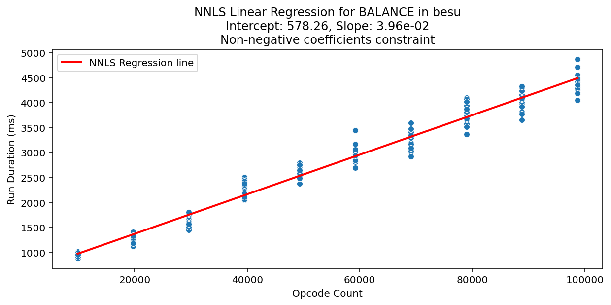

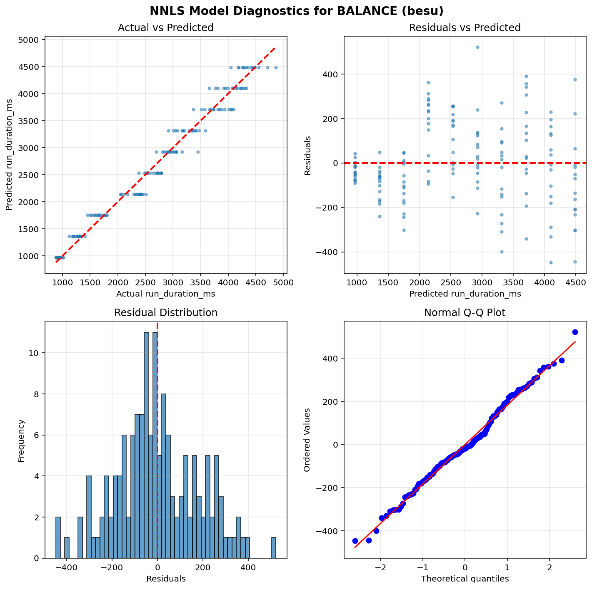

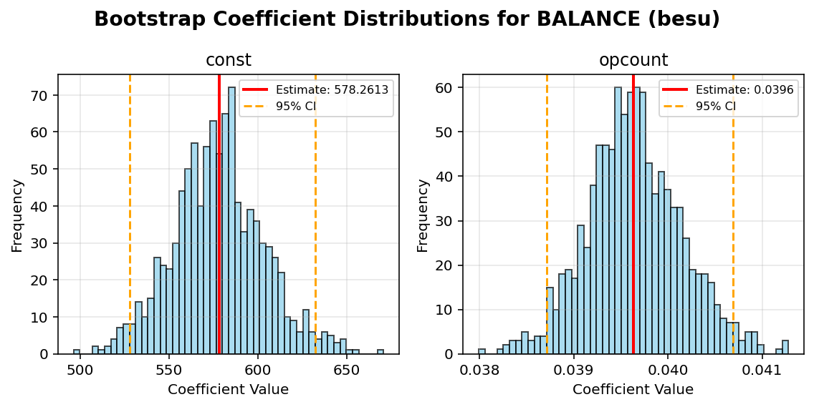


### test_name: test_account_access, account_mode: EXISTING_EOA


```python
==============================================================================
                           NNLS Regression Results                            
==============================================================================
Dep. Variable:          run_duration_ms              R-squared:          0.952
Model:                  NNLS                    Adj. R-squared:          0.951
No. Observations:       150                               RMSE:         156.08
Df Residuals:           148                                MAE:         126.18
Df Model:               1      
==============================================================================
                      coef     std err     P-value      [0.025      0.975]
------------------------------------------------------------------------------
         const    465.9166     27.2213       0.000    414.9258    519.4936
       opcount      0.0213      0.0004       0.000      0.0205      0.0221
==============================================================================
Notes: Non-negative least squares with bootstrap inference (1000 iterations)
==============================================================================
```

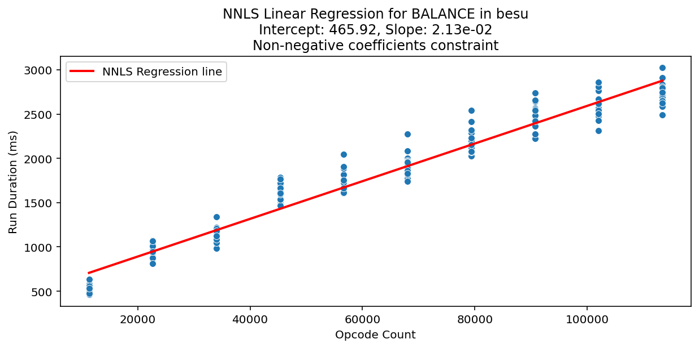

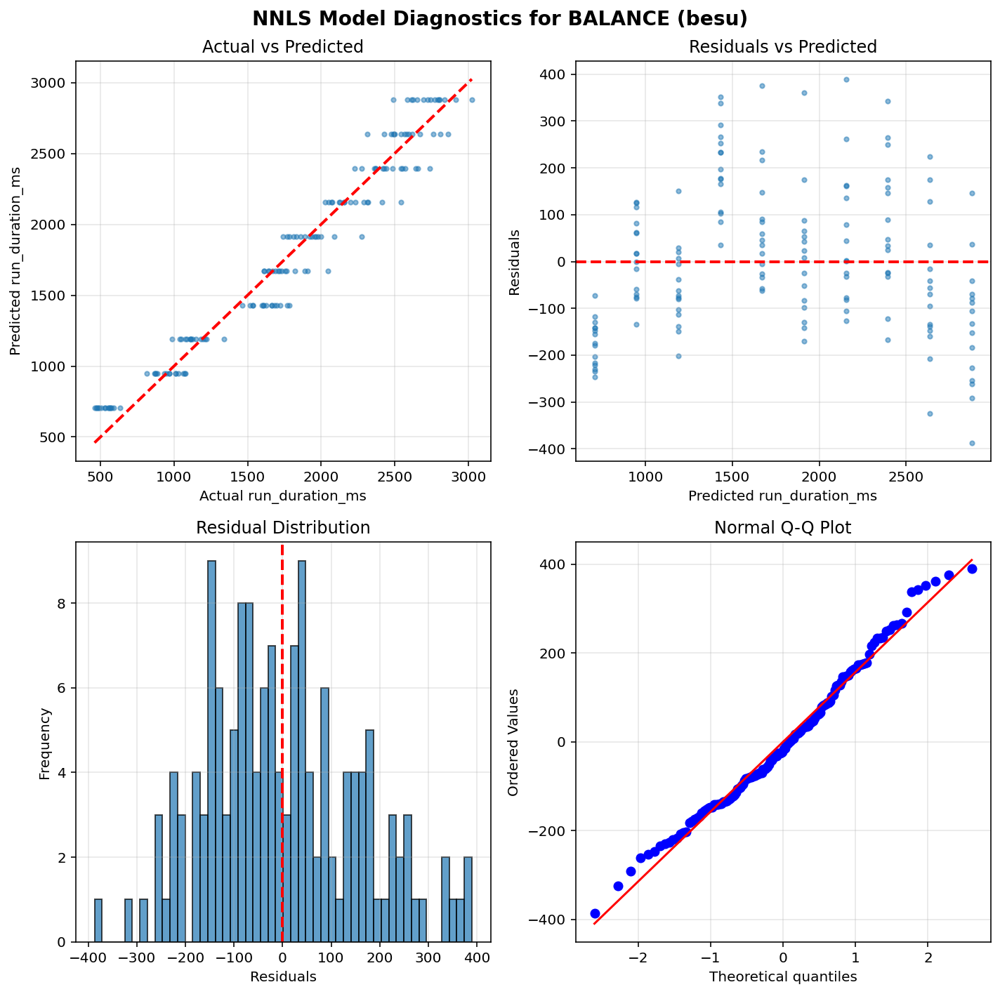

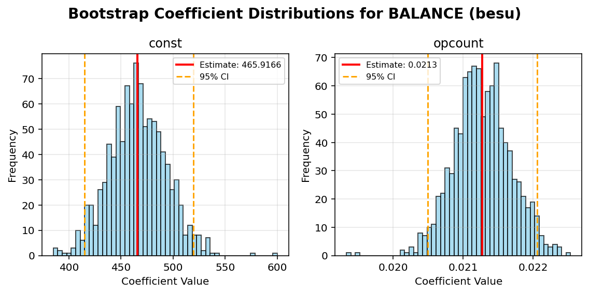


### test_name: test_account_access, account_mode: NON_EXISTING_ACCOUNT


```python
==============================================================================
                           NNLS Regression Results                            
==============================================================================
Dep. Variable:          run_duration_ms              R-squared:          0.976
Model:                  NNLS                    Adj. R-squared:          0.976
No. Observations:       150                               RMSE:          86.96
Df Residuals:           148                                MAE:          68.91
Df Model:               1      
==============================================================================
                      coef     std err     P-value      [0.025      0.975]
------------------------------------------------------------------------------
         const    412.2835     14.7973       0.000    382.1019    440.7664
       opcount      0.0169      0.0002       0.000      0.0165      0.0174
==============================================================================
Notes: Non-negative least squares with bootstrap inference (1000 iterations)
==============================================================================
```

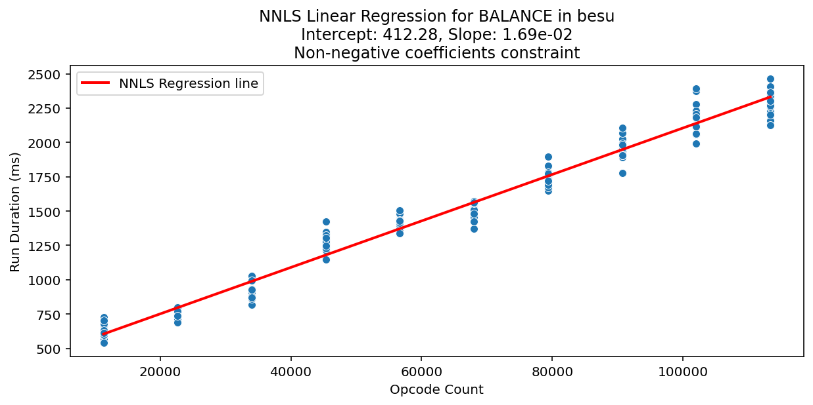

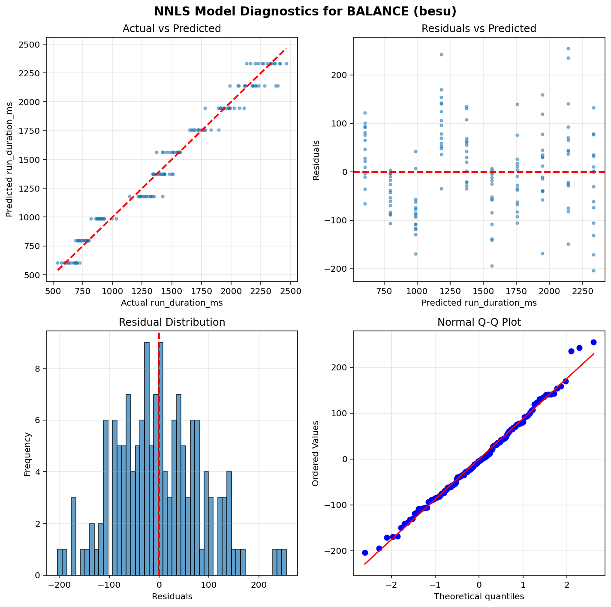

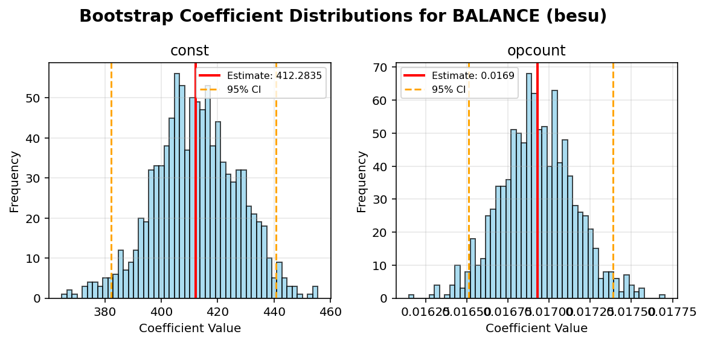


### test_name: test_ext_account_query_warm, account_mode: nan


```python
==============================================================================
                           NNLS Regression Results                            
==============================================================================
Dep. Variable:          run_duration_ms              R-squared:          0.846
Model:                  NNLS                    Adj. R-squared:          0.845
No. Observations:       150                               RMSE:          83.26
Df Residuals:           148                                MAE:          66.38
Df Model:               1      
==============================================================================
                      coef     std err     P-value      [0.025      0.975]
------------------------------------------------------------------------------
         const    243.9768     13.6124       0.000    218.4323    270.6111
       opcount      0.0002      0.0000       0.000      0.0002      0.0003
==============================================================================
Notes: Non-negative least squares with bootstrap inference (1000 iterations)
==============================================================================
```

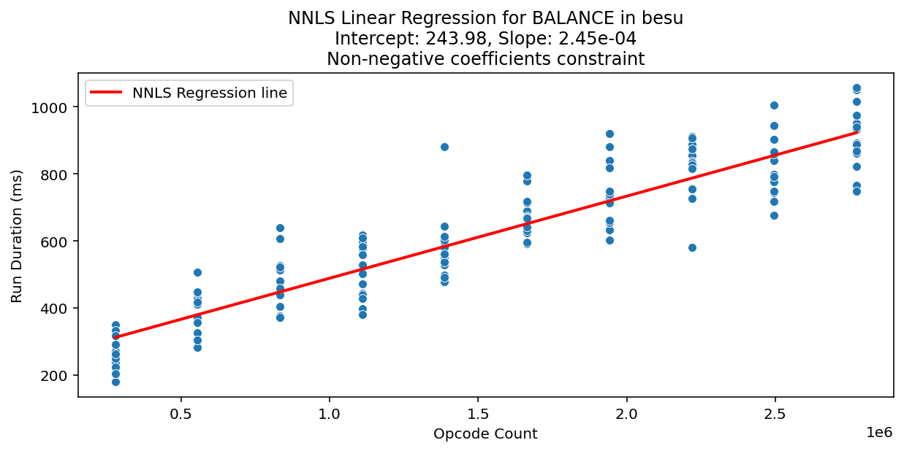

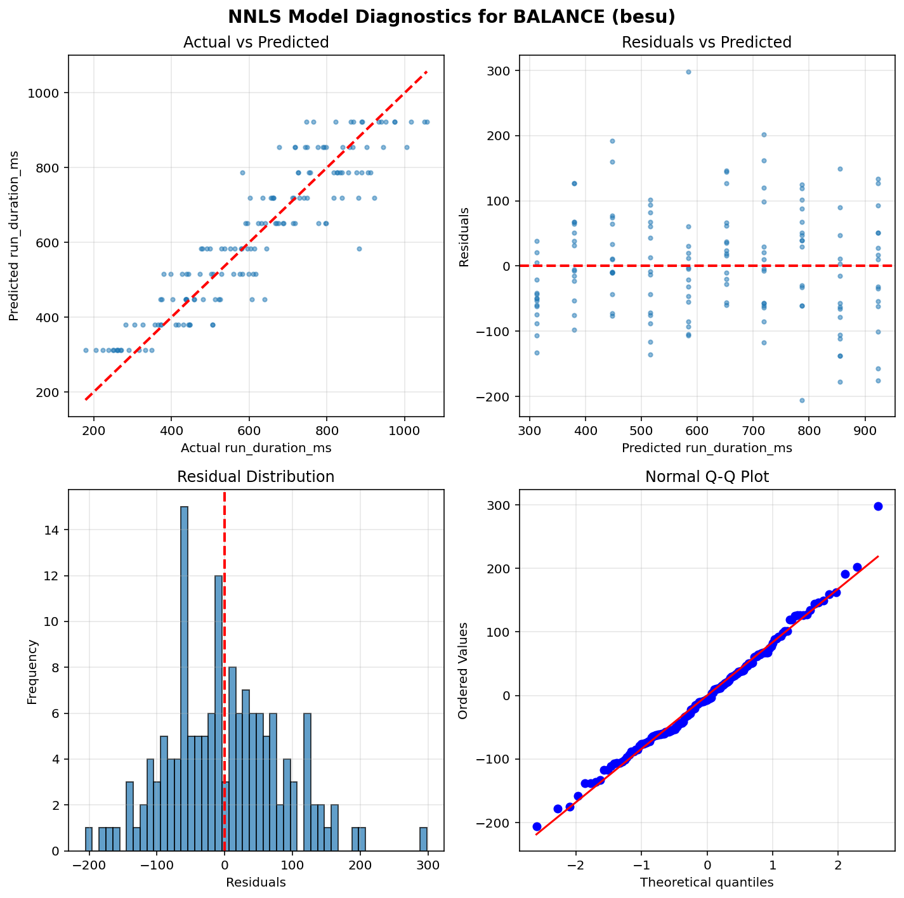

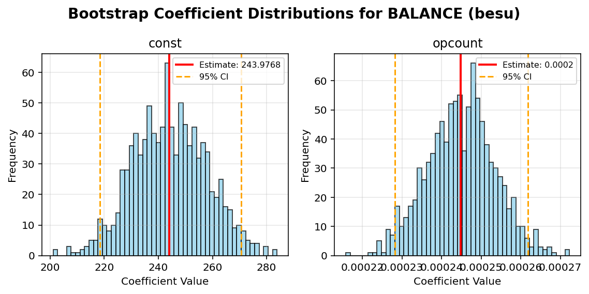


## geth

### test_name: test_account_access, account_mode: EXISTING_CONTRACT


```python
==============================================================================
                           NNLS Regression Results                            
==============================================================================
Dep. Variable:          run_duration_ms              R-squared:          0.785
Model:                  NNLS                    Adj. R-squared:          0.784
No. Observations:       160                               RMSE:         458.30
Df Residuals:           158                                MAE:         362.60
Df Model:               1      
==============================================================================
                      coef     std err     P-value      [0.025      0.975]
------------------------------------------------------------------------------
         const   1138.6749     69.8085       0.000   1008.9511   1280.5144
       opcount      0.0309      0.0011       0.000      0.0287      0.0329
==============================================================================
Notes: Non-negative least squares with bootstrap inference (1000 iterations)
==============================================================================
```

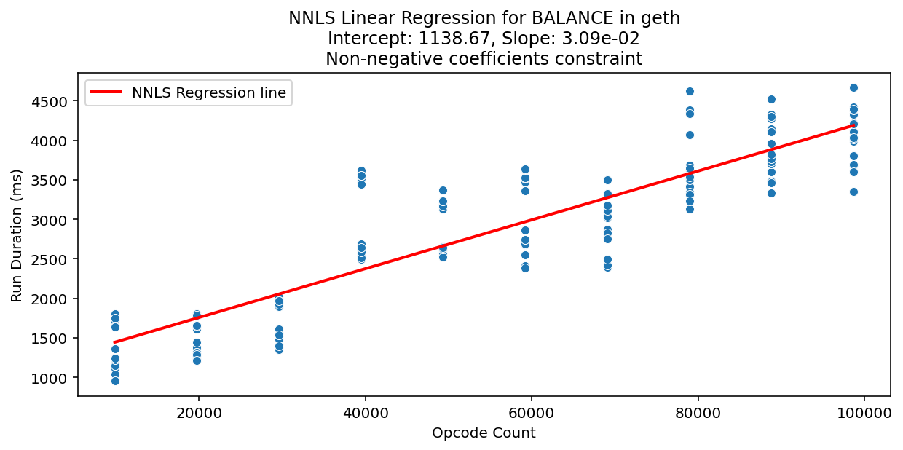

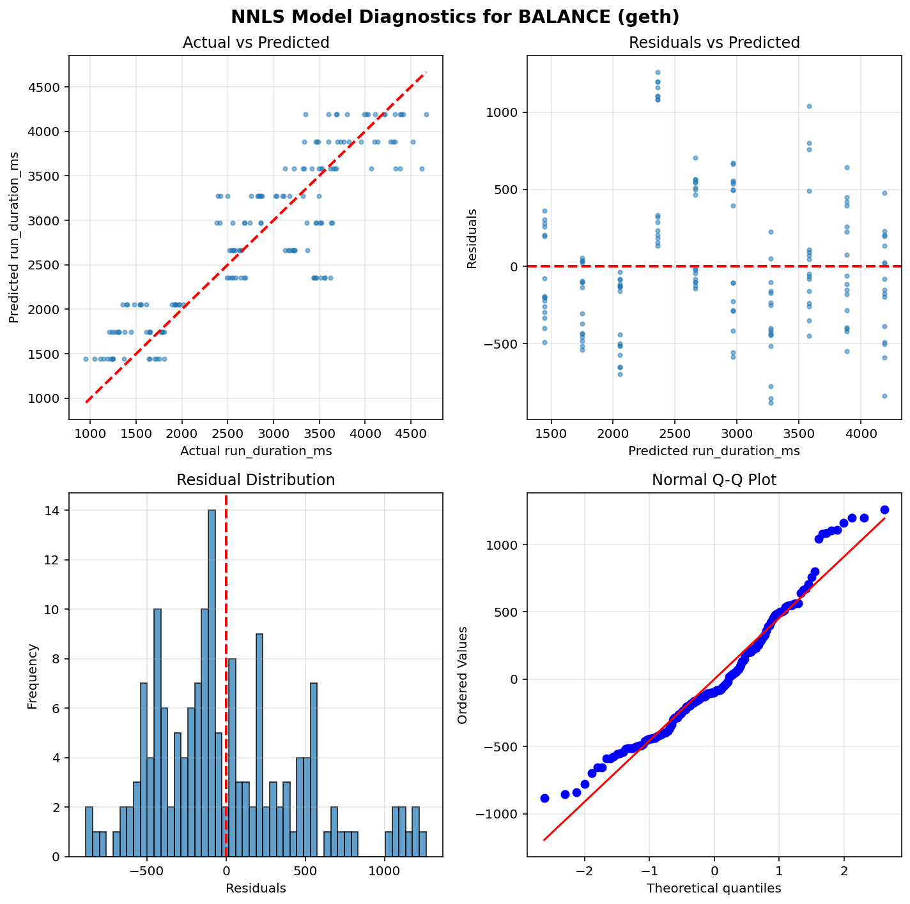

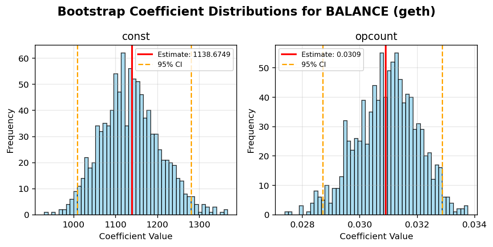


### test_name: test_account_access, account_mode: EXISTING_EOA


```python
==============================================================================
                           NNLS Regression Results                            
==============================================================================
Dep. Variable:          run_duration_ms              R-squared:          0.926
Model:                  NNLS                    Adj. R-squared:          0.926
No. Observations:       160                               RMSE:         156.39
Df Residuals:           158                                MAE:         123.10
Df Model:               1      
==============================================================================
                      coef     std err     P-value      [0.025      0.975]
------------------------------------------------------------------------------
         const    358.5148     37.1630       0.000    283.1437    427.5033
       opcount      0.0170      0.0005       0.000      0.0161      0.0180
==============================================================================
Notes: Non-negative least squares with bootstrap inference (1000 iterations)
==============================================================================
```

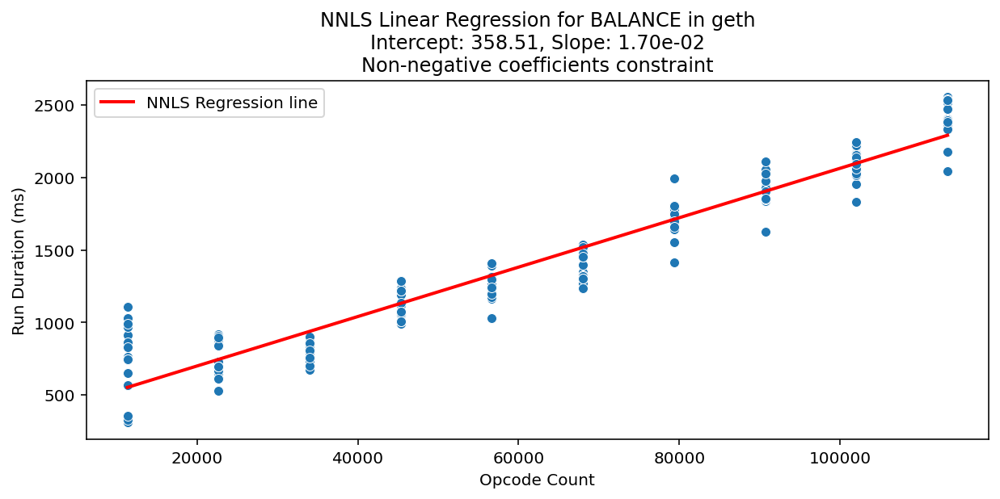

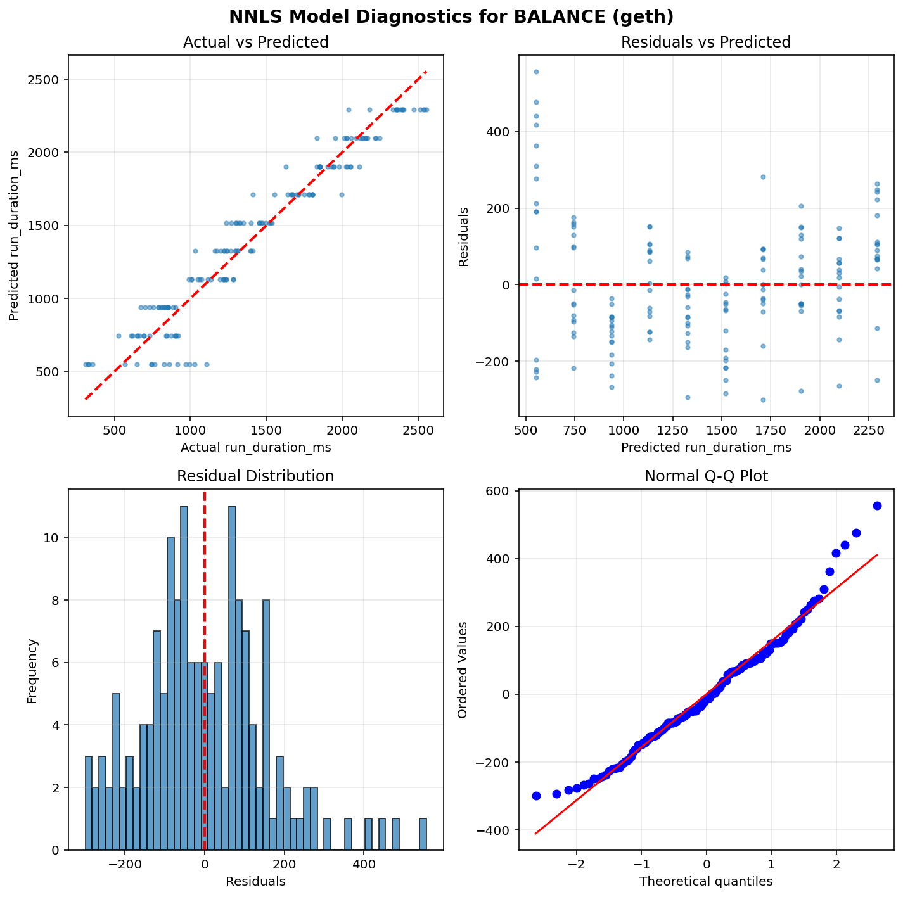

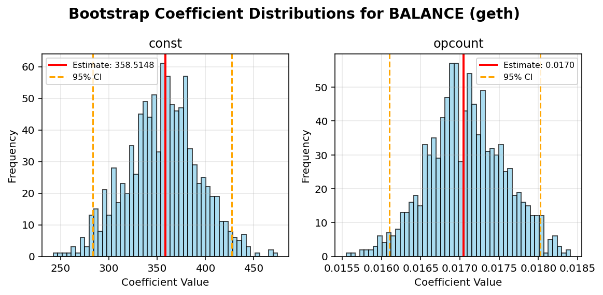


### test_name: test_account_access, account_mode: NON_EXISTING_ACCOUNT


```python
==============================================================================
                           NNLS Regression Results                            
==============================================================================
Dep. Variable:          run_duration_ms              R-squared:          0.763
Model:                  NNLS                    Adj. R-squared:          0.761
No. Observations:       160                               RMSE:         529.29
Df Residuals:           158                                MAE:         435.71
Df Model:               1      
==============================================================================
                      coef     std err     P-value      [0.025      0.975]
------------------------------------------------------------------------------
         const   1265.9680     77.2308       0.000   1119.9272   1420.0931
       opcount      0.0291      0.0012       0.000      0.0268      0.0314
==============================================================================
Notes: Non-negative least squares with bootstrap inference (1000 iterations)
==============================================================================
```

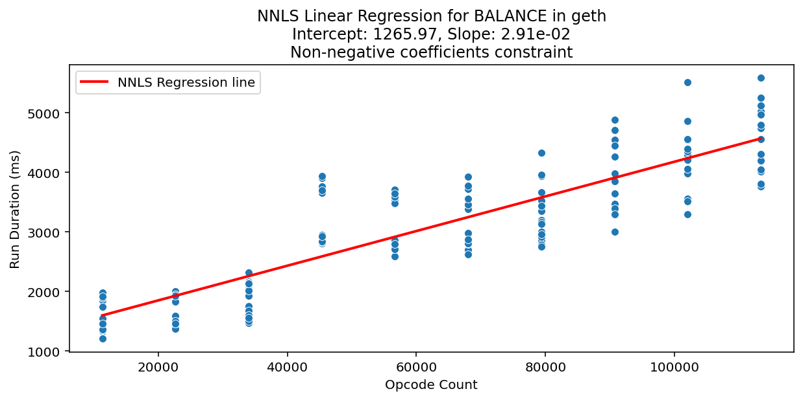

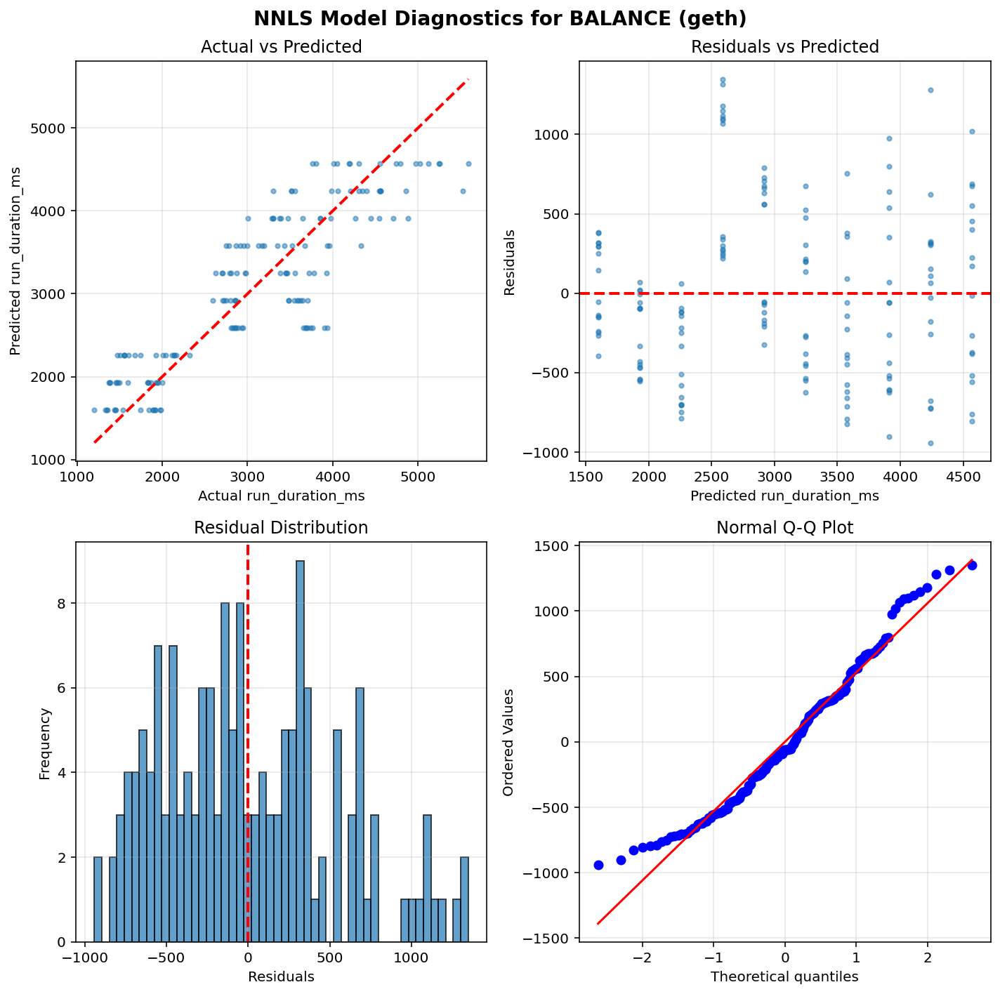

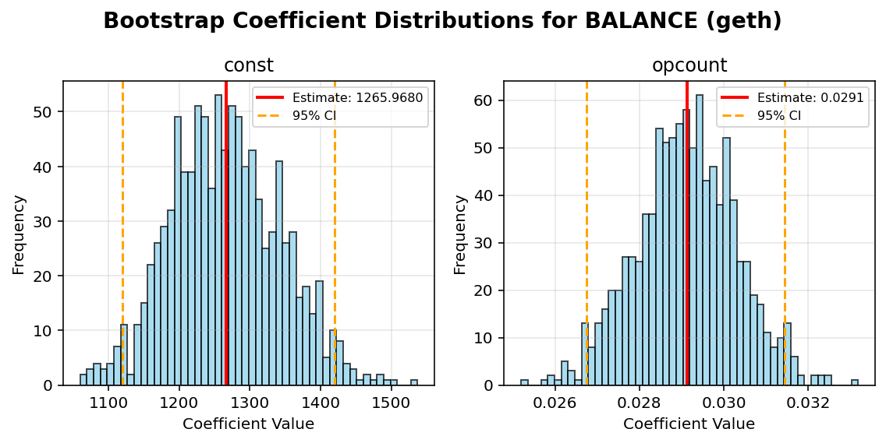


### test_name: test_ext_account_query_warm, account_mode: nan


```python
==============================================================================
                           NNLS Regression Results                            
==============================================================================
Dep. Variable:          run_duration_ms              R-squared:          0.947
Model:                  NNLS                    Adj. R-squared:          0.947
No. Observations:       160                               RMSE:           6.11
Df Residuals:           158                                MAE:           4.48
Df Model:               1      
==============================================================================
                      coef     std err     P-value      [0.025      0.975]
------------------------------------------------------------------------------
         const     12.8288      0.9047       0.000     11.0089     14.5563
       opcount      0.0000      0.0000       0.000      0.0000      0.0000
==============================================================================
Notes: Non-negative least squares with bootstrap inference (1000 iterations)
==============================================================================
```

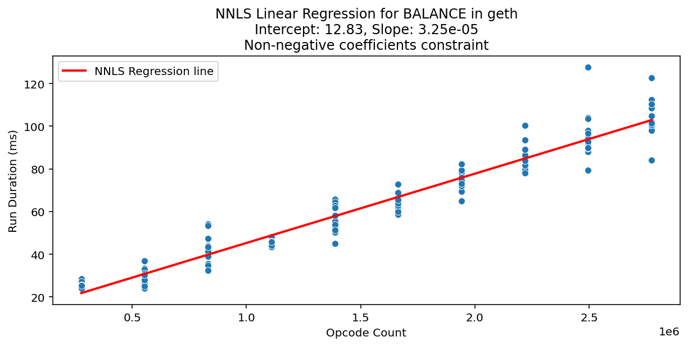

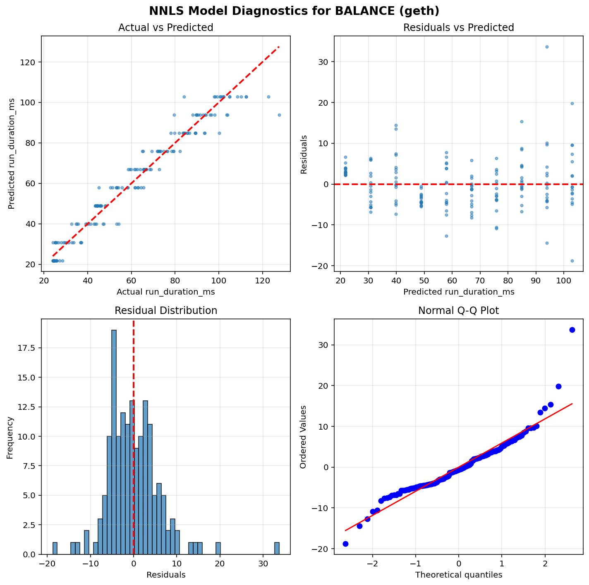

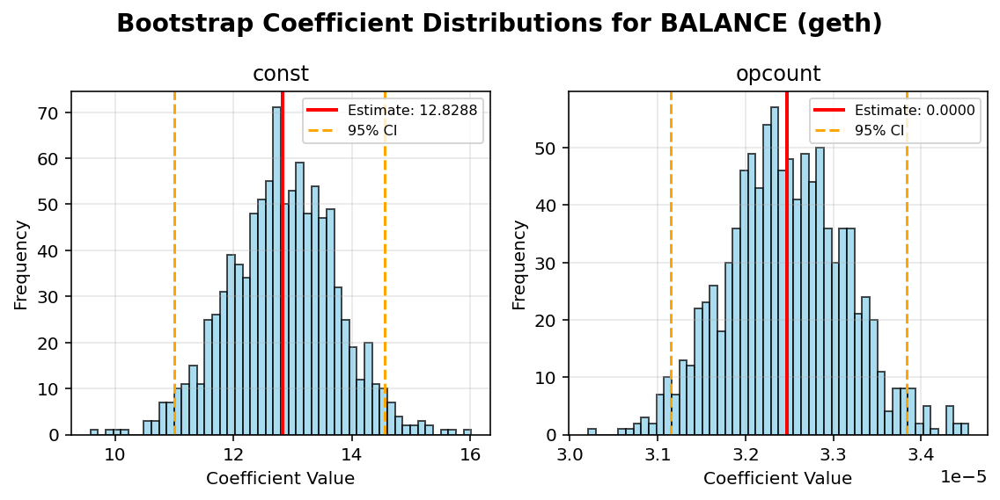


## nethermind

### test_name: test_account_access, account_mode: EXISTING_CONTRACT


```python
==============================================================================
                           NNLS Regression Results                            
==============================================================================
Dep. Variable:          run_duration_ms              R-squared:          0.960
Model:                  NNLS                    Adj. R-squared:          0.960
No. Observations:       90                                RMSE:         269.78
Df Residuals:           88                                 MAE:         236.29
Df Model:               1      
==============================================================================
                      coef     std err     P-value      [0.025      0.975]
------------------------------------------------------------------------------
         const    245.5290     45.8739       0.000    158.6203    337.7049
       opcount      0.0467      0.0011       0.000      0.0447      0.0488
==============================================================================
Notes: Non-negative least squares with bootstrap inference (1000 iterations)
==============================================================================
```

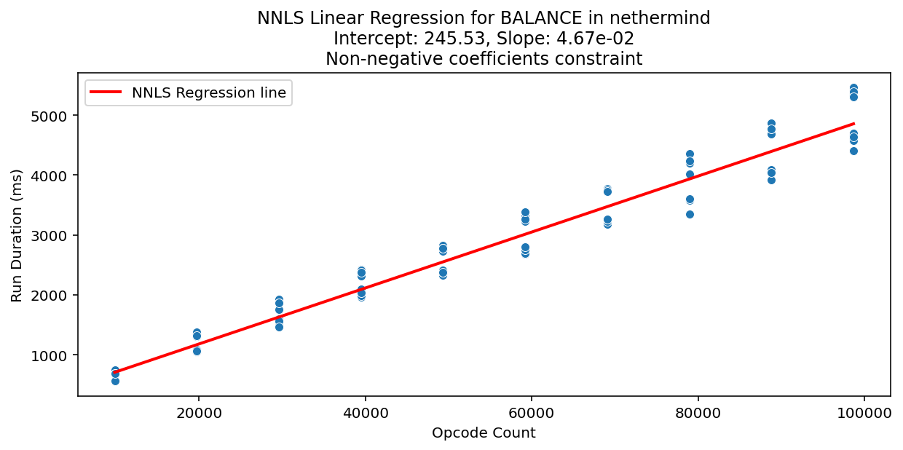

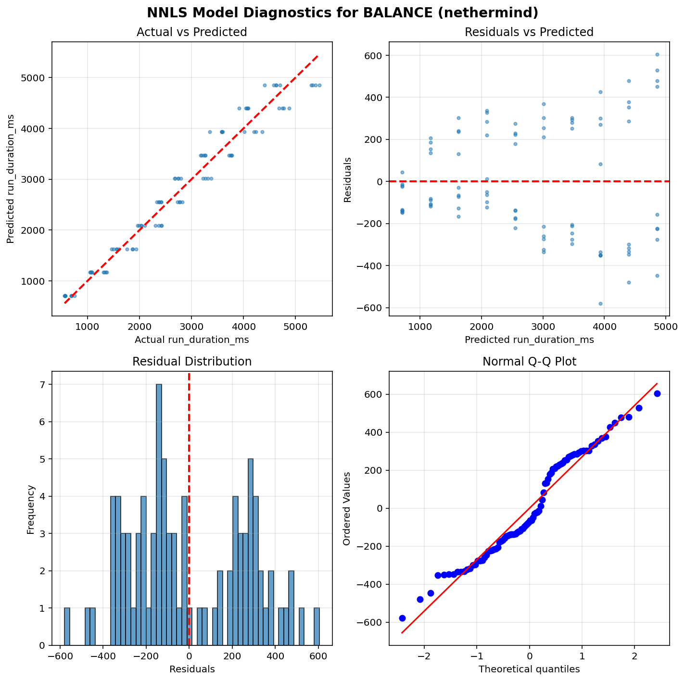

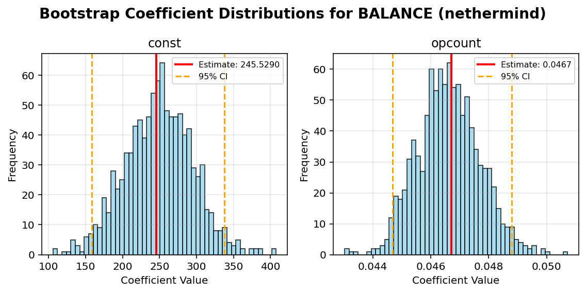


### test_name: test_account_access, account_mode: EXISTING_EOA


```python
==============================================================================
                           NNLS Regression Results                            
==============================================================================
Dep. Variable:          run_duration_ms              R-squared:          0.948
Model:                  NNLS                    Adj. R-squared:          0.948
No. Observations:       90                                RMSE:         183.70
Df Residuals:           88                                 MAE:         130.61
Df Model:               1      
==============================================================================
                      coef     std err     P-value      [0.025      0.975]
------------------------------------------------------------------------------
         const     78.8589     29.2629       0.003     26.2906    138.0330
       opcount      0.0242      0.0007       0.000      0.0229      0.0255
==============================================================================
Notes: Non-negative least squares with bootstrap inference (1000 iterations)
==============================================================================
```

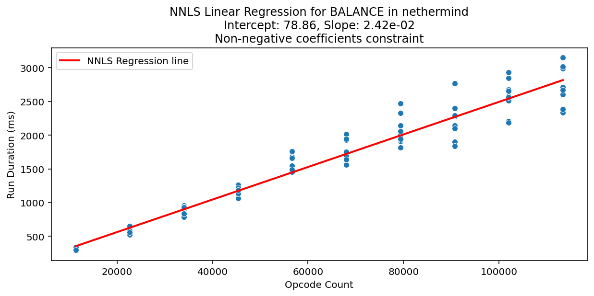

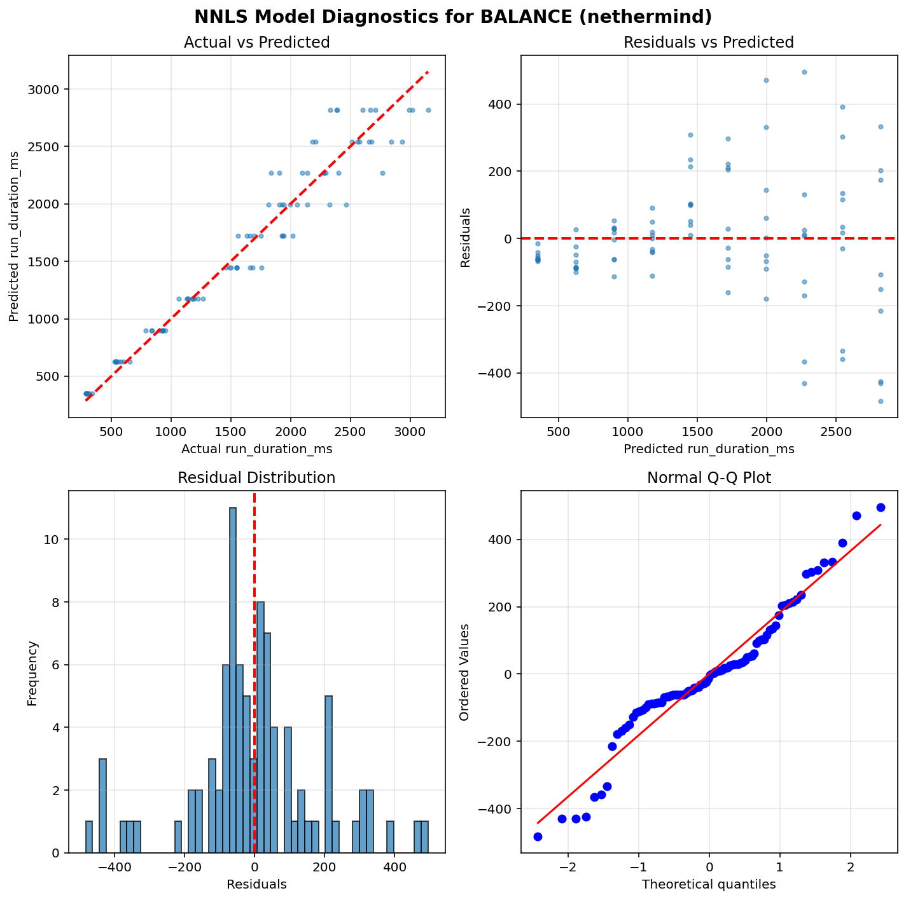

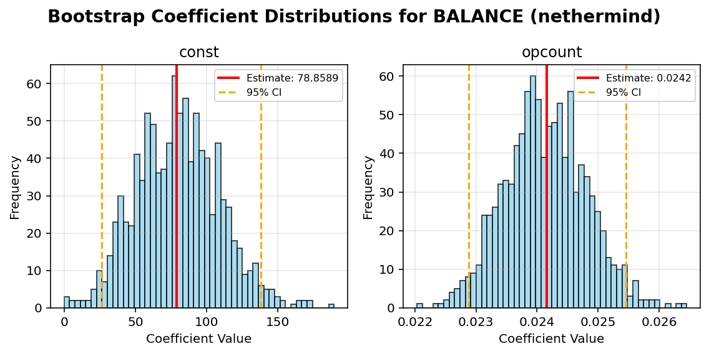


### test_name: test_account_access, account_mode: NON_EXISTING_ACCOUNT


```python
==============================================================================
                           NNLS Regression Results                            
==============================================================================
Dep. Variable:          run_duration_ms              R-squared:          0.937
Model:                  NNLS                    Adj. R-squared:          0.937
No. Observations:       90                                RMSE:         178.74
Df Residuals:           88                                 MAE:         143.64
Df Model:               1      
==============================================================================
                      coef     std err     P-value      [0.025      0.975]
------------------------------------------------------------------------------
         const    123.3822     26.8287       0.000     77.1495    182.8760
       opcount      0.0212      0.0006       0.000      0.0201      0.0223
==============================================================================
Notes: Non-negative least squares with bootstrap inference (1000 iterations)
==============================================================================
```

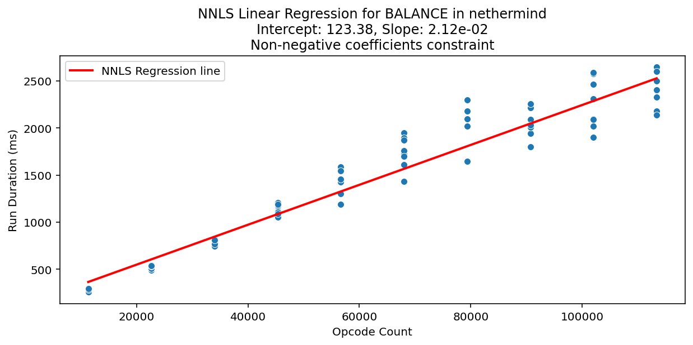

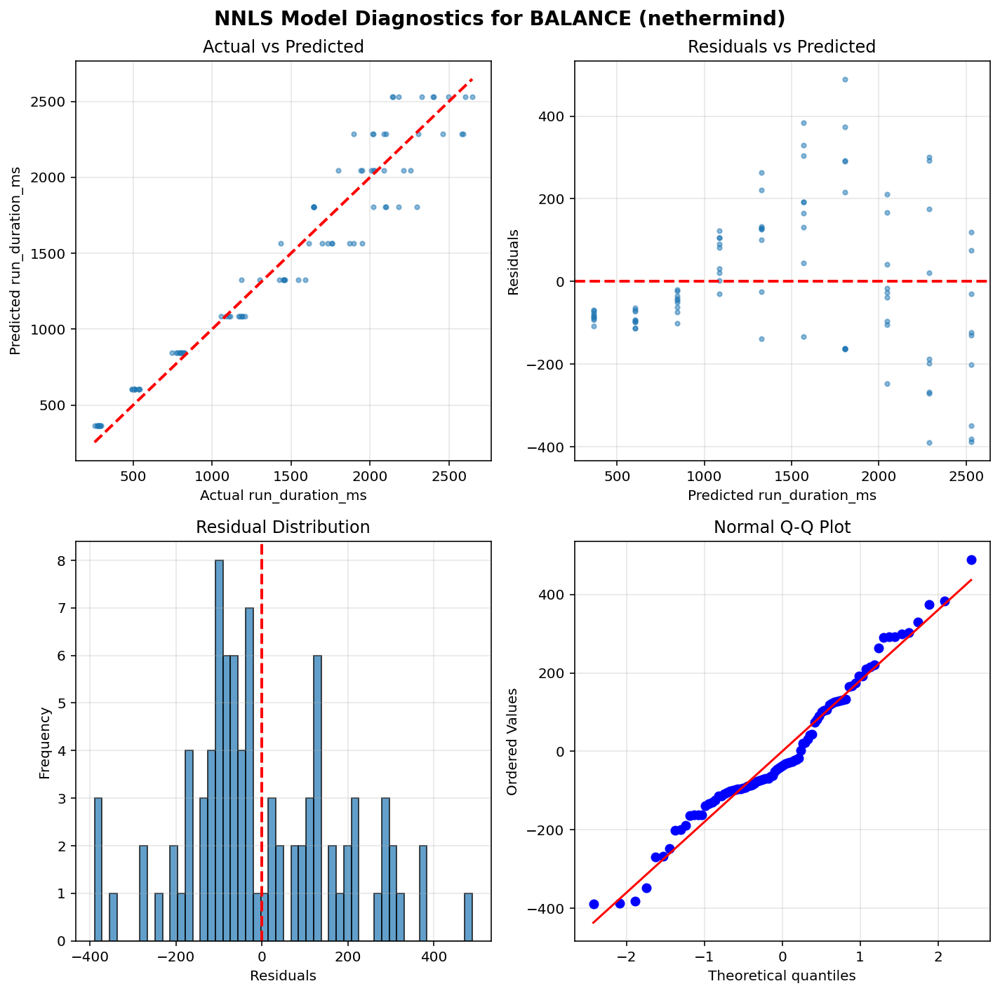

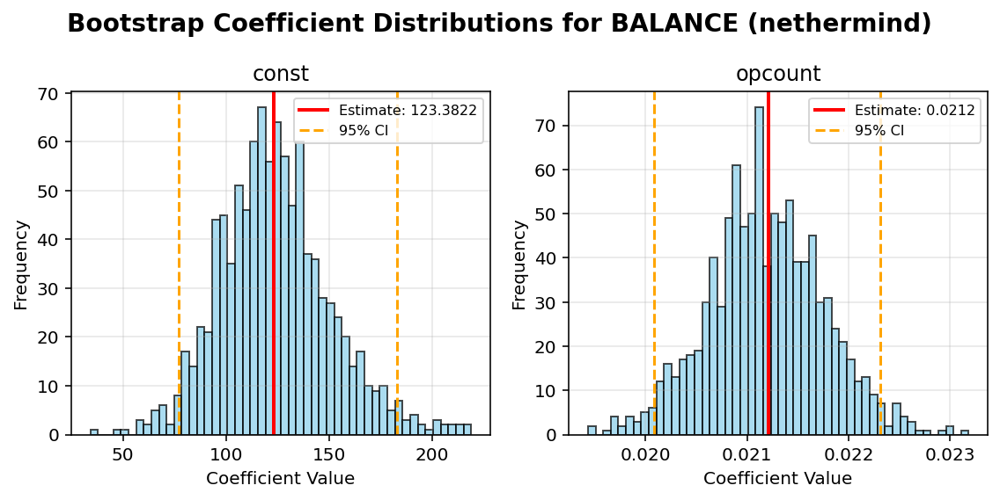


### test_name: test_ext_account_query_warm, account_mode: nan


```python
==============================================================================
                           NNLS Regression Results                            
==============================================================================
Dep. Variable:          run_duration_ms              R-squared:          0.824
Model:                  NNLS                    Adj. R-squared:          0.822
No. Observations:       90                                RMSE:          55.12
Df Residuals:           88                                 MAE:          44.36
Df Model:               1      
==============================================================================
                      coef     std err     P-value      [0.025      0.975]
------------------------------------------------------------------------------
         const    117.2615     11.1092       0.000     95.4079    138.5308
       opcount      0.0001      0.0000       0.000      0.0001      0.0002
==============================================================================
Notes: Non-negative least squares with bootstrap inference (1000 iterations)
==============================================================================
```

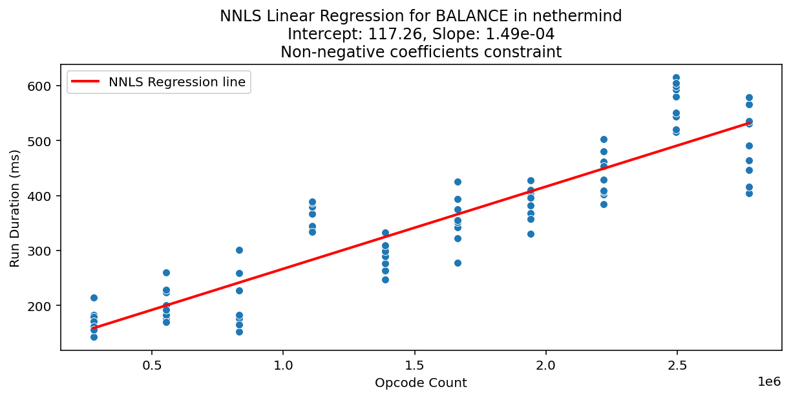

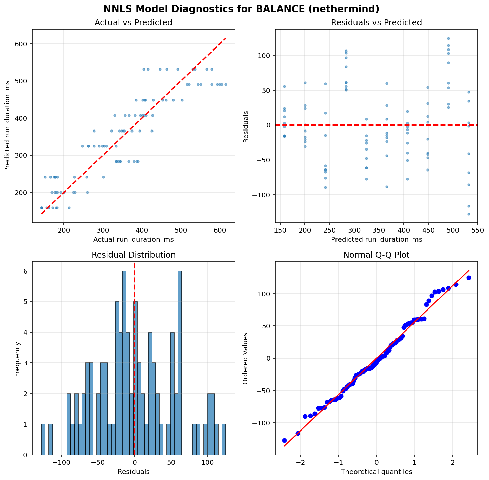

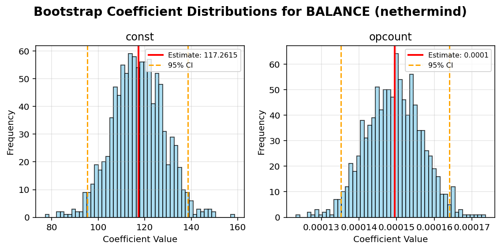


## reth

### test_name: test_account_access, account_mode: EXISTING_CONTRACT


```python
==============================================================================
                           NNLS Regression Results                            
==============================================================================
Dep. Variable:          run_duration_ms              R-squared:          0.906
Model:                  NNLS                    Adj. R-squared:          0.905
No. Observations:       90                                RMSE:         532.38
Df Residuals:           88                                 MAE:         363.00
Df Model:               1      
==============================================================================
                      coef     std err     P-value      [0.025      0.975]
------------------------------------------------------------------------------
         const    422.7215    120.3017       0.000    212.8341    692.0879
       opcount      0.0584      0.0014       0.000      0.0554      0.0610
==============================================================================
Notes: Non-negative least squares with bootstrap inference (1000 iterations)
==============================================================================
```

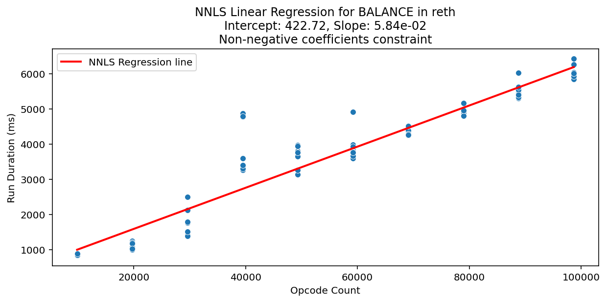

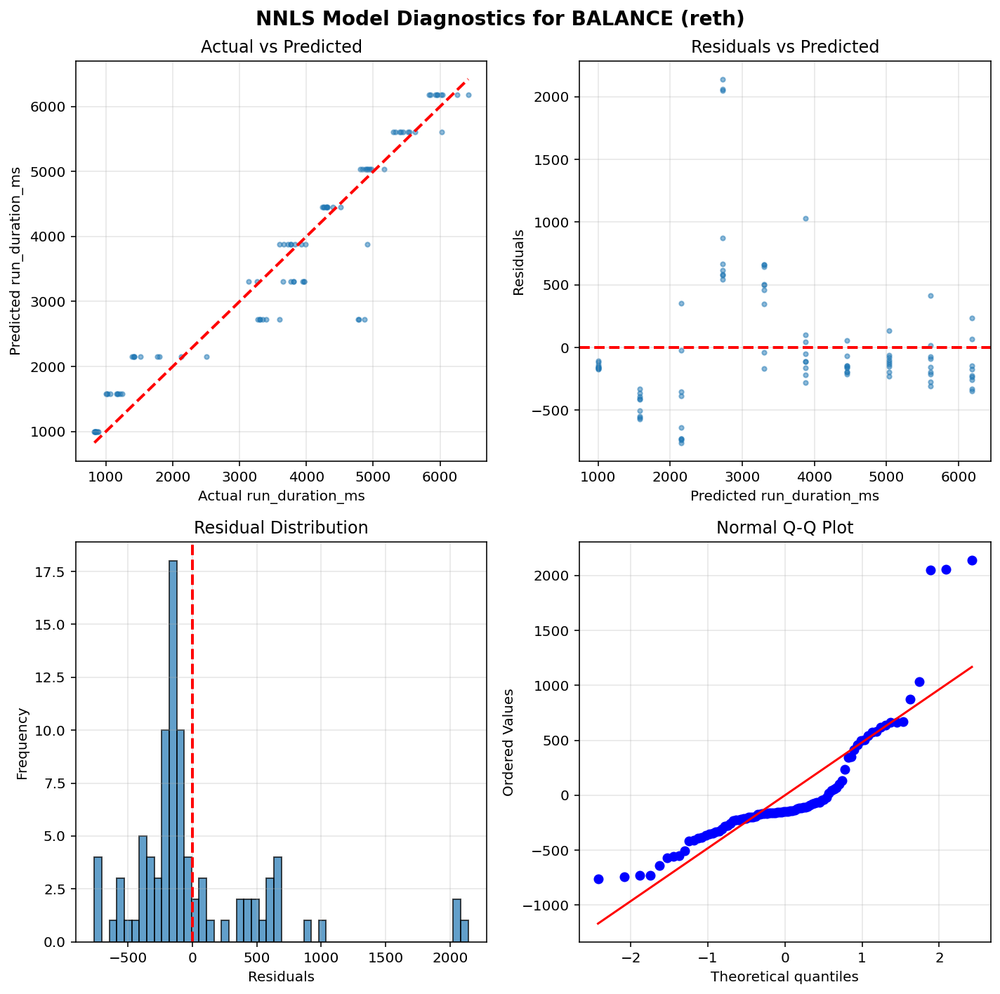

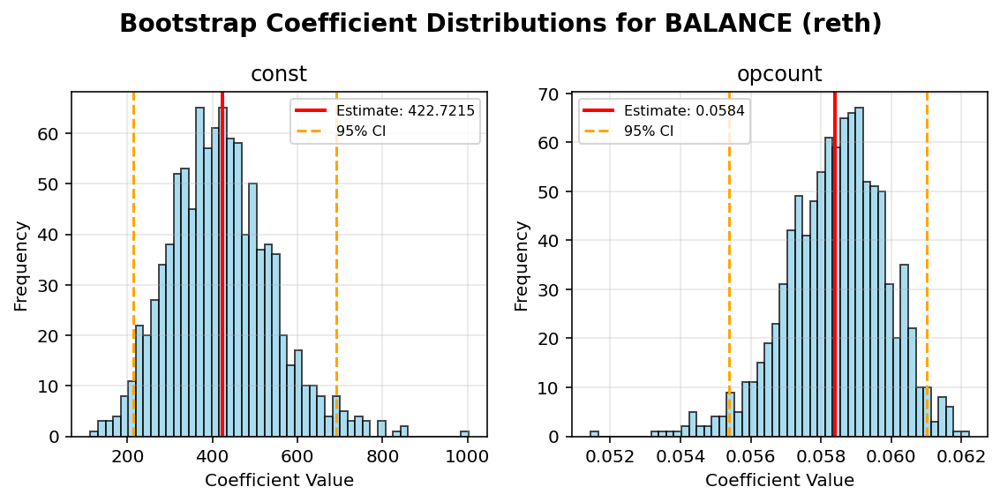


### test_name: test_account_access, account_mode: EXISTING_EOA


```python
==============================================================================
                           NNLS Regression Results                            
==============================================================================
Dep. Variable:          run_duration_ms              R-squared:          0.977
Model:                  NNLS                    Adj. R-squared:          0.977
No. Observations:       90                                RMSE:           6.66
Df Residuals:           88                                 MAE:           5.03
Df Model:               1      
==============================================================================
                      coef     std err     P-value      [0.025      0.975]
------------------------------------------------------------------------------
         const     23.5178      1.7446       0.000     20.4452     27.1024
       opcount      0.0013      0.0000       0.000      0.0013      0.0014
==============================================================================
Notes: Non-negative least squares with bootstrap inference (1000 iterations)
==============================================================================
```

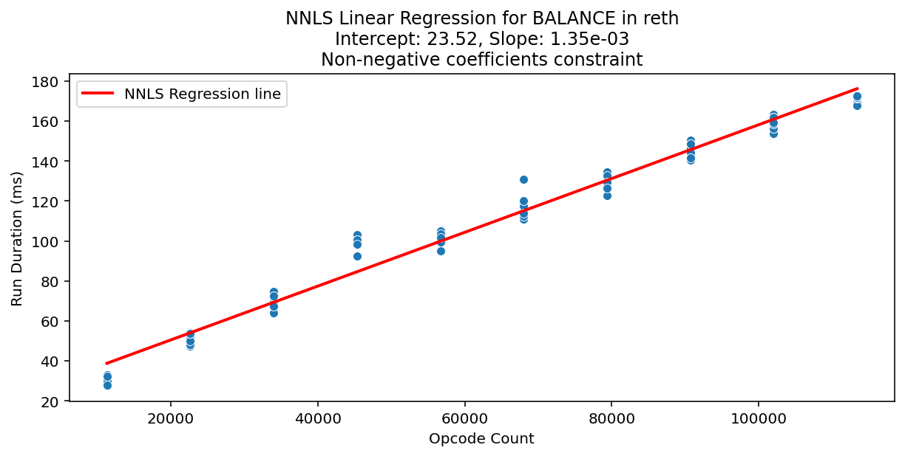

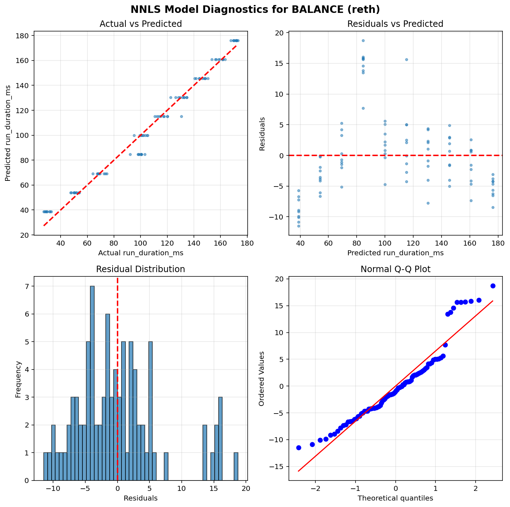

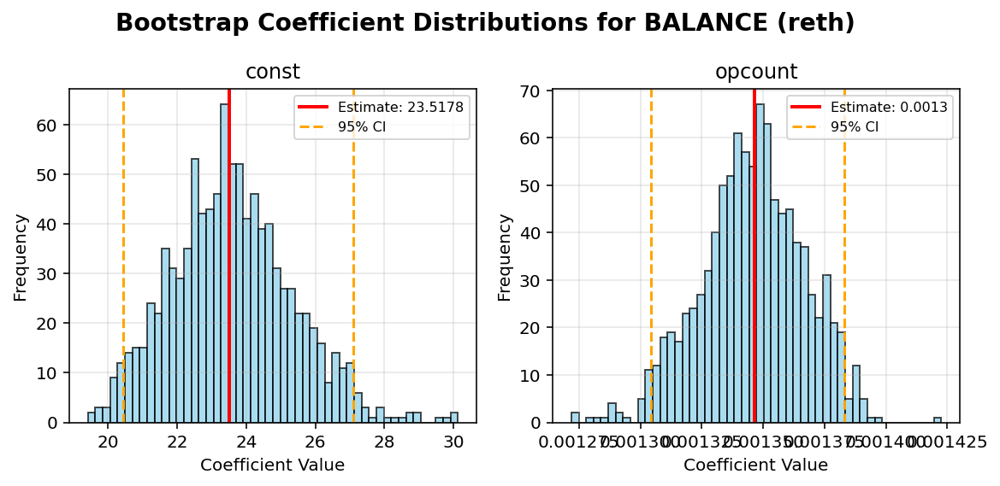


### test_name: test_account_access, account_mode: NON_EXISTING_ACCOUNT


```python
==============================================================================
                           NNLS Regression Results                            
==============================================================================
Dep. Variable:          run_duration_ms              R-squared:          0.982
Model:                  NNLS                    Adj. R-squared:          0.981
No. Observations:       90                                RMSE:           5.45
Df Residuals:           88                                 MAE:           4.53
Df Model:               1      
==============================================================================
                      coef     std err     P-value      [0.025      0.975]
------------------------------------------------------------------------------
         const     24.2622      1.4800       0.000     21.5011     27.3727
       opcount      0.0012      0.0000       0.000      0.0012      0.0013
==============================================================================
Notes: Non-negative least squares with bootstrap inference (1000 iterations)
==============================================================================
```

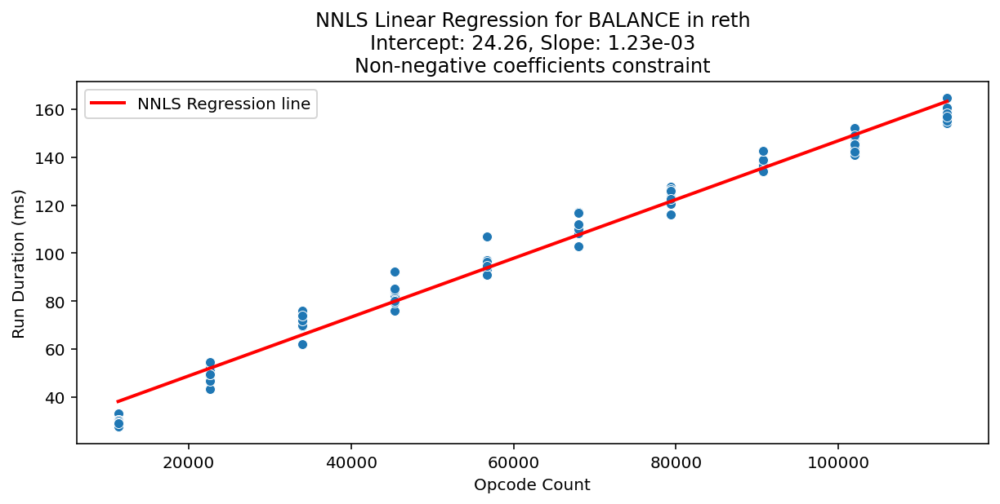

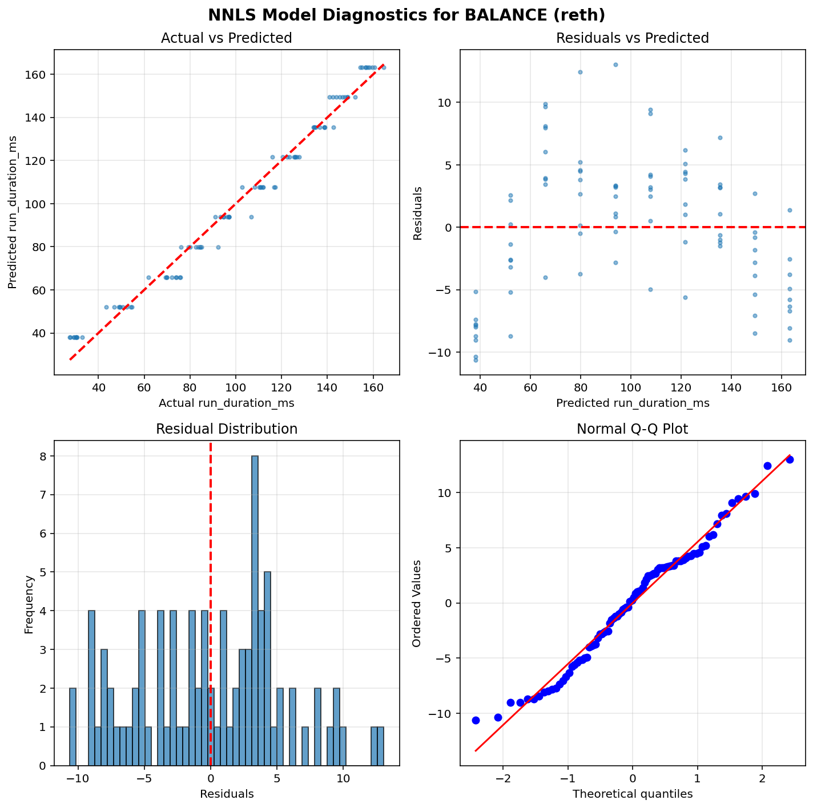

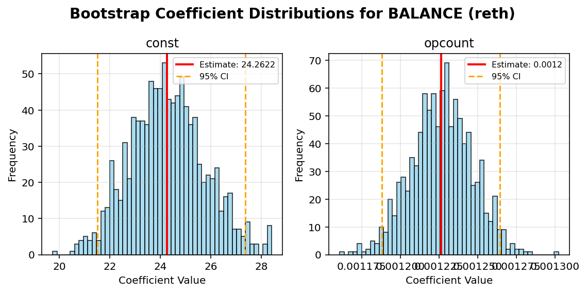


### test_name: test_ext_account_query_warm, account_mode: nan


```python
==============================================================================
                           NNLS Regression Results                            
==============================================================================
Dep. Variable:          run_duration_ms              R-squared:          0.906
Model:                  NNLS                    Adj. R-squared:          0.905
No. Observations:       90                                RMSE:           1.89
Df Residuals:           88                                 MAE:           1.45
Df Model:               1      
==============================================================================
                      coef     std err     P-value      [0.025      0.975]
------------------------------------------------------------------------------
         const      5.1308      0.2959       0.000      4.5818      5.7350
       opcount      0.0000      0.0000       0.000      0.0000      0.0000
==============================================================================
Notes: Non-negative least squares with bootstrap inference (1000 iterations)
==============================================================================
```

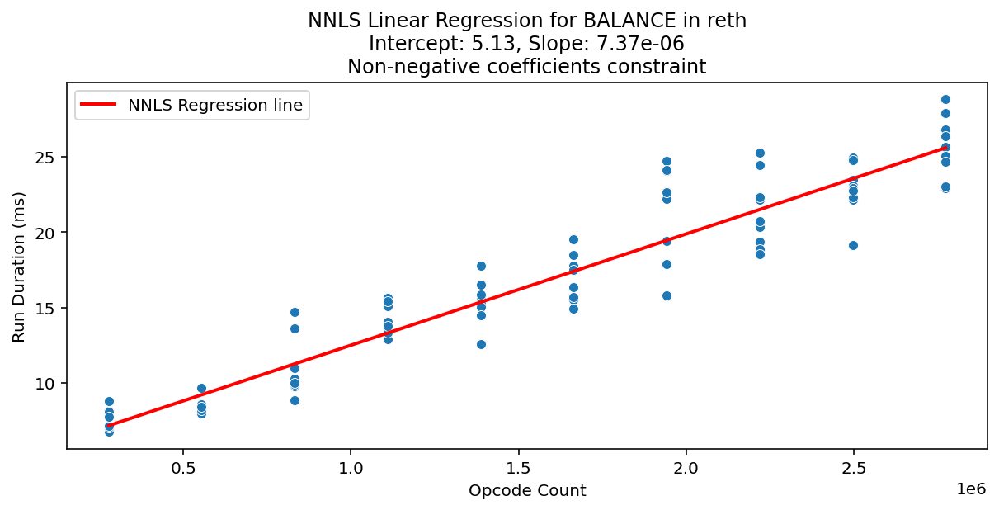

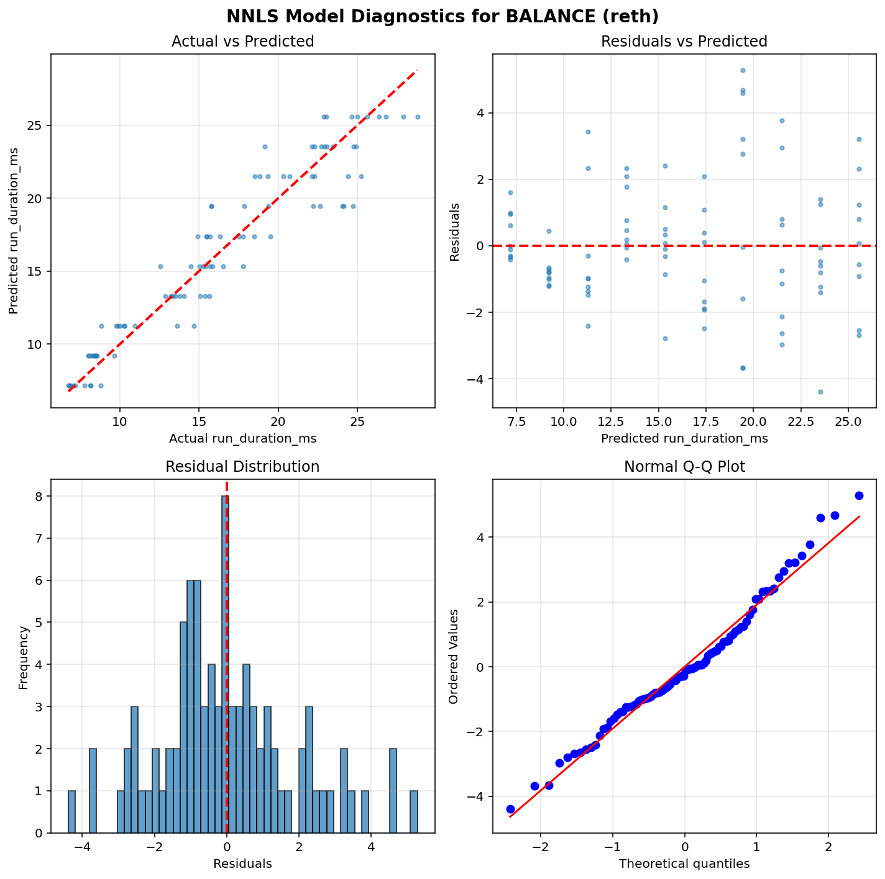

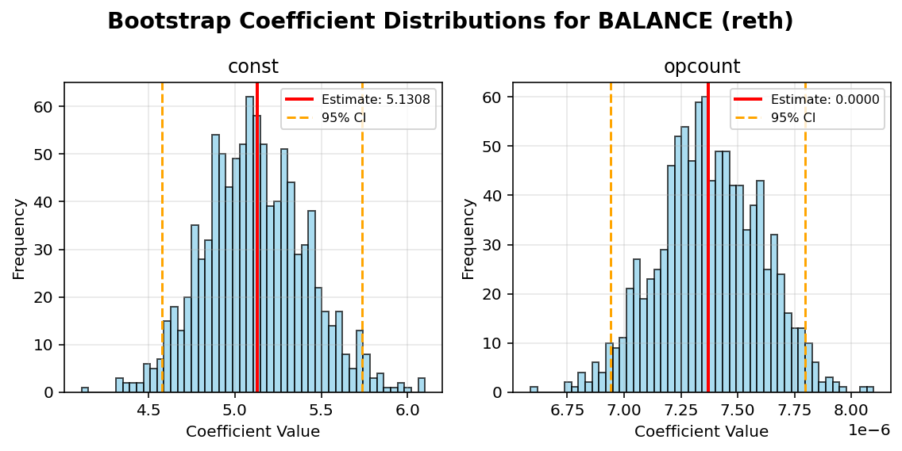


# EXTCODESIZE

## besu

### test_name: test_account_access, account_mode: EXISTING_CONTRACT


```python
==============================================================================
                           NNLS Regression Results                            
==============================================================================
Dep. Variable:          run_duration_ms              R-squared:          0.973
Model:                  NNLS                    Adj. R-squared:          0.973
No. Observations:       150                               RMSE:         187.50
Df Residuals:           148                                MAE:         150.53
Df Model:               1      
==============================================================================
                      coef     std err     P-value      [0.025      0.975]
------------------------------------------------------------------------------
         const    562.5962     27.0092       0.000    509.4006    614.4785
       opcount      0.0396      0.0005       0.000      0.0387      0.0406
==============================================================================
Notes: Non-negative least squares with bootstrap inference (1000 iterations)
==============================================================================
```


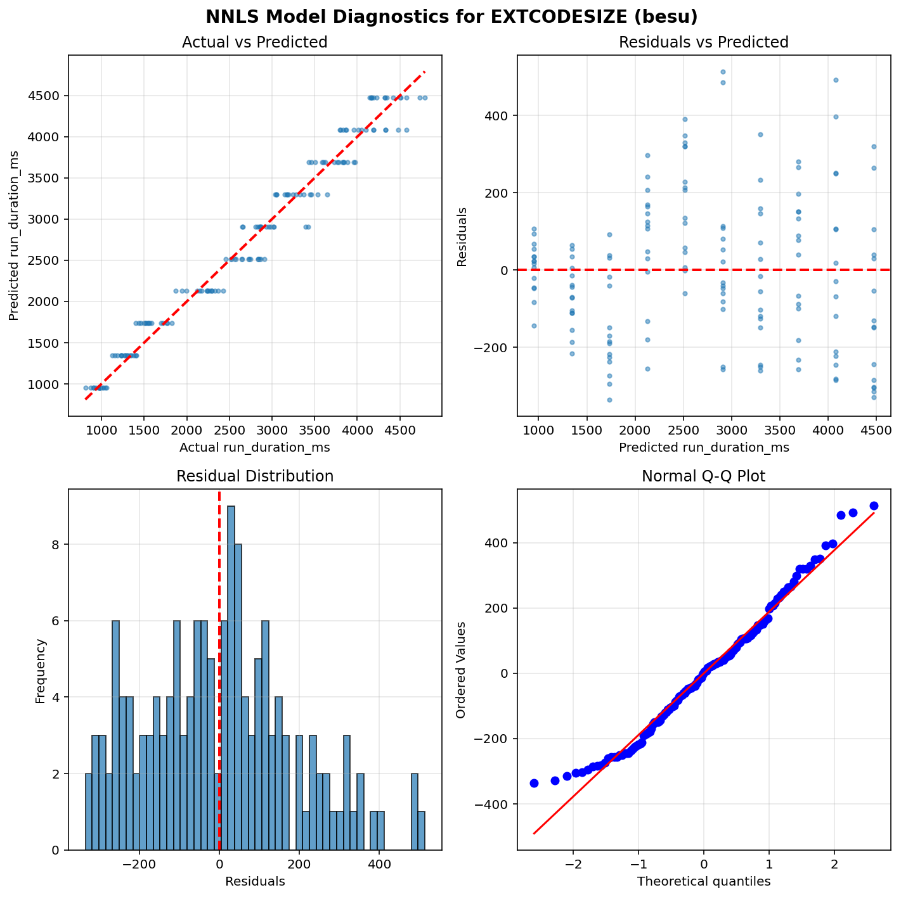

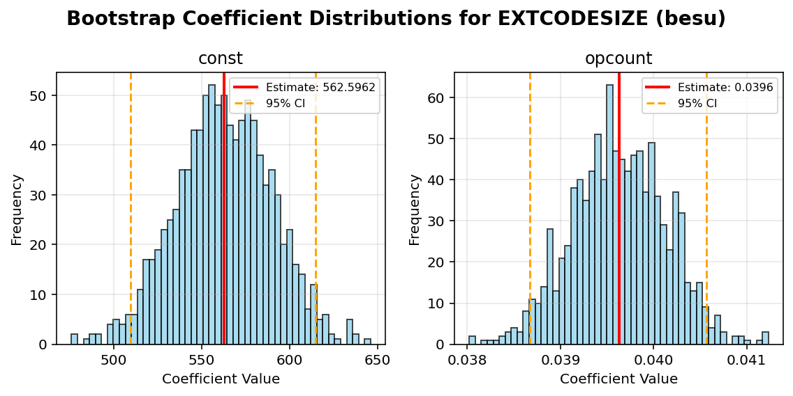


### test_name: test_account_access, account_mode: NON_EXISTING_ACCOUNT


```python
==============================================================================
                           NNLS Regression Results                            
==============================================================================
Dep. Variable:          run_duration_ms              R-squared:          0.971
Model:                  NNLS                    Adj. R-squared:          0.971
No. Observations:       150                               RMSE:          94.92
Df Residuals:           148                                MAE:          76.01
Df Model:               1      
==============================================================================
                      coef     std err     P-value      [0.025      0.975]
------------------------------------------------------------------------------
         const    427.1568     14.8850       0.000    397.3654    455.4697
       opcount      0.0168      0.0002       0.000      0.0164      0.0173
==============================================================================
Notes: Non-negative least squares with bootstrap inference (1000 iterations)
==============================================================================
```


### test_name: test_ext_account_query_warm, account_mode: nan


```python
==============================================================================
                           NNLS Regression Results                            
==============================================================================
Dep. Variable:          run_duration_ms              R-squared:          0.788
Model:                  NNLS                    Adj. R-squared:          0.786
No. Observations:       150                               RMSE:          98.36
Df Residuals:           148                                MAE:          78.94
Df Model:               1      
==============================================================================
                      coef     std err     P-value      [0.025      0.975]
------------------------------------------------------------------------------
         const    271.9356     16.8888       0.000    242.3442    309.4700
       opcount      0.0002      0.0000       0.000      0.0002      0.0003
==============================================================================
Notes: Non-negative least squares with bootstrap inference (1000 iterations)
==============================================================================
```


## geth

### test_name: test_account_access, account_mode: EXISTING_CONTRACT


```python
==============================================================================
                           NNLS Regression Results                            
==============================================================================
Dep. Variable:          run_duration_ms              R-squared:          0.814
Model:                  NNLS                    Adj. R-squared:          0.813
No. Observations:       160                               RMSE:         453.87
Df Residuals:           158                                MAE:         363.98
Df Model:               1      
==============================================================================
                      coef     std err     P-value      [0.025      0.975]
------------------------------------------------------------------------------
         const   1063.4757     68.0301       0.000    932.3393   1193.6686
       opcount      0.0335      0.0012       0.000      0.0311      0.0359
==============================================================================
Notes: Non-negative least squares with bootstrap inference (1000 iterations)
==============================================================================
```


### test_name: test_account_access, account_mode: NON_EXISTING_ACCOUNT


```python
==============================================================================
                           NNLS Regression Results                            
==============================================================================
Dep. Variable:          run_duration_ms              R-squared:          0.789
Model:                  NNLS                    Adj. R-squared:          0.788
No. Observations:       160                               RMSE:         531.61
Df Residuals:           158                                MAE:         425.27
Df Model:               1      
==============================================================================
                      coef     std err     P-value      [0.025      0.975]
------------------------------------------------------------------------------
         const   1147.2360     81.8972       0.000    982.0611   1306.2225
       opcount      0.0316      0.0012       0.000      0.0292      0.0339
==============================================================================
Notes: Non-negative least squares with bootstrap inference (1000 iterations)
==============================================================================
```


### test_name: test_ext_account_query_warm, account_mode: nan


```python
==============================================================================
                           NNLS Regression Results                            
==============================================================================
Dep. Variable:          run_duration_ms              R-squared:          0.950
Model:                  NNLS                    Adj. R-squared:          0.949
No. Observations:       160                               RMSE:           6.19
Df Residuals:           158                                MAE:           4.89
Df Model:               1      
==============================================================================
                      coef     std err     P-value      [0.025      0.975]
------------------------------------------------------------------------------
         const     13.4059      0.9205       0.000     11.5529     15.1112
       opcount      0.0000      0.0000       0.000      0.0000      0.0000
==============================================================================
Notes: Non-negative least squares with bootstrap inference (1000 iterations)
==============================================================================
```


## nethermind

### test_name: test_account_access, account_mode: EXISTING_CONTRACT


```python
==============================================================================
                           NNLS Regression Results                            
==============================================================================
Dep. Variable:          run_duration_ms              R-squared:          0.966
Model:                  NNLS                    Adj. R-squared:          0.966
No. Observations:       90                                RMSE:         251.44
Df Residuals:           88                                 MAE:         220.25
Df Model:               1      
==============================================================================
                      coef     std err     P-value      [0.025      0.975]
------------------------------------------------------------------------------
         const    259.3207     43.4763       0.000    173.5519    347.2234
       opcount      0.0473      0.0010       0.000      0.0454      0.0494
==============================================================================
Notes: Non-negative least squares with bootstrap inference (1000 iterations)
==============================================================================
```


### test_name: test_account_access, account_mode: NON_EXISTING_ACCOUNT


```python
==============================================================================
                           NNLS Regression Results                            
==============================================================================
Dep. Variable:          run_duration_ms              R-squared:          0.931
Model:                  NNLS                    Adj. R-squared:          0.930
No. Observations:       90                                RMSE:         206.82
Df Residuals:           88                                 MAE:         147.87
Df Model:               1      
==============================================================================
                      coef     std err     P-value      [0.025      0.975]
------------------------------------------------------------------------------
         const     72.2781     31.5392       0.013     10.6217    138.7441
       opcount      0.0233      0.0007       0.000      0.0218      0.0248
==============================================================================
Notes: Non-negative least squares with bootstrap inference (1000 iterations)
==============================================================================
```


### test_name: test_ext_account_query_warm, account_mode: nan


```python
==============================================================================
                           NNLS Regression Results                            
==============================================================================
Dep. Variable:          run_duration_ms              R-squared:          0.902
Model:                  NNLS                    Adj. R-squared:          0.901
No. Observations:       90                                RMSE:          55.35
Df Residuals:           88                                 MAE:          38.16
Df Model:               1      
==============================================================================
                      coef     std err     P-value      [0.025      0.975]
------------------------------------------------------------------------------
         const    139.0672      8.3845       0.000    123.2872    155.9654
       opcount      0.0002      0.0000       0.000      0.0002      0.0002
==============================================================================
Notes: Non-negative least squares with bootstrap inference (1000 iterations)
==============================================================================
```


## reth

### test_name: test_account_access, account_mode: EXISTING_CONTRACT


```python
==============================================================================
                           NNLS Regression Results                            
==============================================================================
Dep. Variable:          run_duration_ms              R-squared:          0.980
Model:                  NNLS                    Adj. R-squared:          0.979
No. Observations:       90                                RMSE:         254.20
Df Residuals:           88                                 MAE:         177.91
Df Model:               1      
==============================================================================
                      coef     std err     P-value      [0.025      0.975]
------------------------------------------------------------------------------
         const      0.0000      6.6901       1.000      0.0000     23.2532
       opcount      0.0609      0.0004       0.000      0.0602      0.0616
==============================================================================
Notes: Non-negative least squares with bootstrap inference (1000 iterations)
==============================================================================
```


### test_name: test_account_access, account_mode: NON_EXISTING_ACCOUNT


```python
==============================================================================
                           NNLS Regression Results                            
==============================================================================
Dep. Variable:          run_duration_ms              R-squared:          0.978
Model:                  NNLS                    Adj. R-squared:          0.978
No. Observations:       90                                RMSE:           6.00
Df Residuals:           88                                 MAE:           4.86
Df Model:               1      
==============================================================================
                      coef     std err     P-value      [0.025      0.975]
------------------------------------------------------------------------------
         const     23.4598      1.4881       0.000     20.7374     26.5003
       opcount      0.0012      0.0000       0.000      0.0012      0.0013
==============================================================================
Notes: Non-negative least squares with bootstrap inference (1000 iterations)
==============================================================================
```


### test_name: test_ext_account_query_warm, account_mode: nan


```python
==============================================================================
                           NNLS Regression Results                            
==============================================================================
Dep. Variable:          run_duration_ms              R-squared:          0.877
Model:                  NNLS                    Adj. R-squared:          0.876
No. Observations:       90                                RMSE:           2.10
Df Residuals:           88                                 MAE:           1.54
Df Model:               1      
==============================================================================
                      coef     std err     P-value      [0.025      0.975]
------------------------------------------------------------------------------
         const      4.3202      0.4061       0.000      3.5291      5.1327
       opcount      0.0000      0.0000       0.000      0.0000      0.0000
==============================================================================
Notes: Non-negative least squares with bootstrap inference (1000 iterations)
==============================================================================
```


# EXTCODECOPY

## besu

### account_mode: EXISTING_CONTRACT


```python
==============================================================================
                           NNLS Regression Results                            
==============================================================================
Dep. Variable:          run_duration_ms              R-squared:          0.819
Model:                  NNLS                    Adj. R-squared:          0.818
No. Observations:       150                               RMSE:         171.16
Df Residuals:           148                                MAE:         136.20
Df Model:               1      
==============================================================================
                      coef     std err     P-value      [0.025      0.975]
------------------------------------------------------------------------------
         const    458.1109     27.5876       0.000    407.7541    518.1284
       opcount      0.0027      0.0001       0.000      0.0025      0.0029
==============================================================================
Notes: Non-negative least squares with bootstrap inference (1000 iterations)
==============================================================================
```


### account_mode: NON_EXISTING_ACCOUNT


```python
==============================================================================
                           NNLS Regression Results                            
==============================================================================
Dep. Variable:          run_duration_ms              R-squared:          0.759
Model:                  NNLS                    Adj. R-squared:          0.757
No. Observations:       150                               RMSE:         119.24
Df Residuals:           148                                MAE:          98.82
Df Model:               1      
==============================================================================
                      coef     std err     P-value      [0.025      0.975]
------------------------------------------------------------------------------
         const    301.8759     19.5989       0.000    266.1516    338.5689
       opcount      0.0006      0.0000       0.000      0.0006      0.0007
==============================================================================
Notes: Non-negative least squares with bootstrap inference (1000 iterations)
==============================================================================
```


## geth

### account_mode: EXISTING_CONTRACT


```python
==============================================================================
                           NNLS Regression Results                            
==============================================================================
Dep. Variable:          run_duration_ms              R-squared:          0.985
Model:                  NNLS                    Adj. R-squared:          0.985
No. Observations:       160                               RMSE:          13.71
Df Residuals:           158                                MAE:          10.53
Df Model:               1      
==============================================================================
                      coef     std err     P-value      [0.025      0.975]
------------------------------------------------------------------------------
         const     32.4192      2.1369       0.000     27.8204     36.2248
       opcount      0.0008      0.0000       0.000      0.0008      0.0008
==============================================================================
Notes: Non-negative least squares with bootstrap inference (1000 iterations)
==============================================================================
```


### account_mode: NON_EXISTING_ACCOUNT


```python
==============================================================================
                           NNLS Regression Results                            
==============================================================================
Dep. Variable:          run_duration_ms              R-squared:          0.990
Model:                  NNLS                    Adj. R-squared:          0.990
No. Observations:       160                               RMSE:          14.64
Df Residuals:           158                                MAE:           9.85
Df Model:               1      
==============================================================================
                      coef     std err     P-value      [0.025      0.975]
------------------------------------------------------------------------------
         const     21.5797      1.7687       0.000     18.0307     25.0996
       opcount      0.0004      0.0000       0.000      0.0004      0.0004
==============================================================================
Notes: Non-negative least squares with bootstrap inference (1000 iterations)
==============================================================================
```


## nethermind

### account_mode: EXISTING_CONTRACT


```python
==============================================================================
                           NNLS Regression Results                            
==============================================================================
Dep. Variable:          run_duration_ms              R-squared:          0.833
Model:                  NNLS                    Adj. R-squared:          0.832
No. Observations:       90                                RMSE:          72.18
Df Residuals:           88                                 MAE:          55.28
Df Model:               1      
==============================================================================
                      coef     std err     P-value      [0.025      0.975]
------------------------------------------------------------------------------
         const    190.7346     12.0503       0.000    167.9641    214.8884
       opcount      0.0012      0.0001       0.000      0.0011      0.0013
==============================================================================
Notes: Non-negative least squares with bootstrap inference (1000 iterations)
==============================================================================
```


### account_mode: NON_EXISTING_ACCOUNT


```python
==============================================================================
                           NNLS Regression Results                            
==============================================================================
Dep. Variable:          run_duration_ms              R-squared:          0.901
Model:                  NNLS                    Adj. R-squared:          0.899
No. Observations:       90                                RMSE:          45.11
Df Residuals:           88                                 MAE:          35.86
Df Model:               1      
==============================================================================
                      coef     std err     P-value      [0.025      0.975]
------------------------------------------------------------------------------
         const    116.1498      8.6908       0.000    100.0263    134.0911
       opcount      0.0004      0.0000       0.000      0.0004      0.0004
==============================================================================
Notes: Non-negative least squares with bootstrap inference (1000 iterations)
==============================================================================
```


## reth

### account_mode: EXISTING_CONTRACT


```python
==============================================================================
                           NNLS Regression Results                            
==============================================================================
Dep. Variable:          run_duration_ms              R-squared:          0.900
Model:                  NNLS                    Adj. R-squared:          0.899
No. Observations:       90                                RMSE:           4.65
Df Residuals:           88                                 MAE:           3.49
Df Model:               1      
==============================================================================
                      coef     std err     P-value      [0.025      0.975]
------------------------------------------------------------------------------
         const      9.0987      0.8304       0.000      7.4014     10.7076
       opcount      0.0001      0.0000       0.000      0.0001      0.0001
==============================================================================
Notes: Non-negative least squares with bootstrap inference (1000 iterations)
==============================================================================
```


### account_mode: NON_EXISTING_ACCOUNT


```python
==============================================================================
                           NNLS Regression Results                            
==============================================================================
Dep. Variable:          run_duration_ms              R-squared:          0.858
Model:                  NNLS                    Adj. R-squared:          0.856
No. Observations:       90                                RMSE:           2.87
Df Residuals:           88                                 MAE:           2.23
Df Model:               1      
==============================================================================
                      coef     std err     P-value      [0.025      0.975]
------------------------------------------------------------------------------
         const      5.4816      0.4860       0.000      4.5008      6.5051
       opcount      0.0000      0.0000       0.000      0.0000      0.0000
==============================================================================
Notes: Non-negative least squares with bootstrap inference (1000 iterations)
==============================================================================
```


# EXTCODEHASH

## besu

### test_name: test_account_access, account_mode: EXISTING_CONTRACT


```python
==============================================================================
                           NNLS Regression Results                            
==============================================================================
Dep. Variable:          run_duration_ms              R-squared:          0.977
Model:                  NNLS                    Adj. R-squared:          0.977
No. Observations:       150                               RMSE:         171.19
Df Residuals:           148                                MAE:         136.48
Df Model:               1      
==============================================================================
                      coef     std err     P-value      [0.025      0.975]
------------------------------------------------------------------------------
         const    564.6451     23.7061       0.000    517.9613    611.4310
       opcount      0.0397      0.0004       0.000      0.0389      0.0406
==============================================================================
Notes: Non-negative least squares with bootstrap inference (1000 iterations)
==============================================================================
```


### test_name: test_account_access, account_mode: NON_EXISTING_ACCOUNT


```python
==============================================================================
                           NNLS Regression Results                            
==============================================================================
Dep. Variable:          run_duration_ms              R-squared:          0.972
Model:                  NNLS                    Adj. R-squared:          0.972
No. Observations:       150                               RMSE:          94.13
Df Residuals:           148                                MAE:          74.67
Df Model:               1      
==============================================================================
                      coef     std err     P-value      [0.025      0.975]
------------------------------------------------------------------------------
         const    401.7686     15.5750       0.000    371.8055    431.8613
       opcount      0.0170      0.0002       0.000      0.0166      0.0175
==============================================================================
Notes: Non-negative least squares with bootstrap inference (1000 iterations)
==============================================================================
```


### test_name: test_ext_account_query_warm, account_mode: nan


```python
==============================================================================
                           NNLS Regression Results                            
==============================================================================
Dep. Variable:          run_duration_ms              R-squared:          0.829
Model:                  NNLS                    Adj. R-squared:          0.828
No. Observations:       150                               RMSE:          89.52
Df Residuals:           148                                MAE:          71.30
Df Model:               1      
==============================================================================
                      coef     std err     P-value      [0.025      0.975]
------------------------------------------------------------------------------
         const    248.4277     12.9107       0.000    224.3591    273.3923
       opcount      0.0002      0.0000       0.000      0.0002      0.0003
==============================================================================
Notes: Non-negative least squares with bootstrap inference (1000 iterations)
==============================================================================
```


## geth

### test_name: test_account_access, account_mode: EXISTING_CONTRACT


```python
==============================================================================
                           NNLS Regression Results                            
==============================================================================
Dep. Variable:          run_duration_ms              R-squared:          0.771
Model:                  NNLS                    Adj. R-squared:          0.769
No. Observations:       160                               RMSE:         470.97
Df Residuals:           158                                MAE:         382.89
Df Model:               1      
==============================================================================
                      coef     std err     P-value      [0.025      0.975]
------------------------------------------------------------------------------
         const   1182.8225     72.8963       0.000   1050.7192   1336.5635
       opcount      0.0304      0.0012       0.000      0.0281      0.0327
==============================================================================
Notes: Non-negative least squares with bootstrap inference (1000 iterations)
==============================================================================
```


### test_name: test_account_access, account_mode: NON_EXISTING_ACCOUNT


```python
==============================================================================
                           NNLS Regression Results                            
==============================================================================
Dep. Variable:          run_duration_ms              R-squared:          0.794
Model:                  NNLS                    Adj. R-squared:          0.793
No. Observations:       160                               RMSE:         521.51
Df Residuals:           158                                MAE:         418.92
Df Model:               1      
==============================================================================
                      coef     std err     P-value      [0.025      0.975]
------------------------------------------------------------------------------
         const   1121.1063     71.6437       0.000    991.0160   1272.8425
       opcount      0.0314      0.0011       0.000      0.0291      0.0336
==============================================================================
Notes: Non-negative least squares with bootstrap inference (1000 iterations)
==============================================================================
```


### test_name: test_ext_account_query_warm, account_mode: nan


```python
==============================================================================
                           NNLS Regression Results                            
==============================================================================
Dep. Variable:          run_duration_ms              R-squared:          0.959
Model:                  NNLS                    Adj. R-squared:          0.958
No. Observations:       160                               RMSE:           7.55
Df Residuals:           158                                MAE:           5.94
Df Model:               1      
==============================================================================
                      coef     std err     P-value      [0.025      0.975]
------------------------------------------------------------------------------
         const     17.1135      1.0822       0.000     14.8445     19.0791
       opcount      0.0000      0.0000       0.000      0.0000      0.0000
==============================================================================
Notes: Non-negative least squares with bootstrap inference (1000 iterations)
==============================================================================
```


## nethermind

### test_name: test_account_access, account_mode: EXISTING_CONTRACT


```python
==============================================================================
                           NNLS Regression Results                            
==============================================================================
Dep. Variable:          run_duration_ms              R-squared:          0.959
Model:                  NNLS                    Adj. R-squared:          0.959
No. Observations:       90                                RMSE:         272.18
Df Residuals:           88                                 MAE:         236.33
Df Model:               1      
==============================================================================
                      coef     std err     P-value      [0.025      0.975]
------------------------------------------------------------------------------
         const    307.6146     45.4876       0.000    223.0277    396.4444
       opcount      0.0467      0.0011       0.000      0.0447      0.0488
==============================================================================
Notes: Non-negative least squares with bootstrap inference (1000 iterations)
==============================================================================
```


### test_name: test_account_access, account_mode: NON_EXISTING_ACCOUNT


```python
==============================================================================
                           NNLS Regression Results                            
==============================================================================
Dep. Variable:          run_duration_ms              R-squared:          0.921
Model:                  NNLS                    Adj. R-squared:          0.920
No. Observations:       90                                RMSE:         212.85
Df Residuals:           88                                 MAE:         160.31
Df Model:               1      
==============================================================================
                      coef     std err     P-value      [0.025      0.975]
------------------------------------------------------------------------------
         const     83.8800     31.1950       0.000     25.8260    153.0369
       opcount      0.0223      0.0007       0.000      0.0211      0.0237
==============================================================================
Notes: Non-negative least squares with bootstrap inference (1000 iterations)
==============================================================================
```


### test_name: test_ext_account_query_warm, account_mode: nan


```python
==============================================================================
                           NNLS Regression Results                            
==============================================================================
Dep. Variable:          run_duration_ms              R-squared:          0.751
Model:                  NNLS                    Adj. R-squared:          0.748
No. Observations:       90                                RMSE:          93.38
Df Residuals:           88                                 MAE:          76.87
Df Model:               1      
==============================================================================
                      coef     std err     P-value      [0.025      0.975]
------------------------------------------------------------------------------
         const    279.8485     18.1597       0.000    246.6873    318.1608
       opcount      0.0002      0.0000       0.000      0.0002      0.0002
==============================================================================
Notes: Non-negative least squares with bootstrap inference (1000 iterations)
==============================================================================
```


## reth

### test_name: test_account_access, account_mode: EXISTING_CONTRACT


```python
==============================================================================
                           NNLS Regression Results                            
==============================================================================
Dep. Variable:          run_duration_ms              R-squared:          0.956
Model:                  NNLS                    Adj. R-squared:          0.956
No. Observations:       90                                RMSE:         382.07
Df Residuals:           88                                 MAE:         194.96
Df Model:               1      
==============================================================================
                      coef     std err     P-value      [0.025      0.975]
------------------------------------------------------------------------------
         const      0.0000     11.1993       1.000      0.0000     39.6517
       opcount      0.0616      0.0009       0.000      0.0601      0.0635
==============================================================================
Notes: Non-negative least squares with bootstrap inference (1000 iterations)
==============================================================================
```


### test_name: test_account_access, account_mode: NON_EXISTING_ACCOUNT


```python
==============================================================================
                           NNLS Regression Results                            
==============================================================================
Dep. Variable:          run_duration_ms              R-squared:          0.978
Model:                  NNLS                    Adj. R-squared:          0.978
No. Observations:       90                                RMSE:           6.01
Df Residuals:           88                                 MAE:           4.74
Df Model:               1      
==============================================================================
                      coef     std err     P-value      [0.025      0.975]
------------------------------------------------------------------------------
         const     23.5954      1.4917       0.000     20.8885     26.8311
       opcount      0.0012      0.0000       0.000      0.0012      0.0013
==============================================================================
Notes: Non-negative least squares with bootstrap inference (1000 iterations)
==============================================================================
```


### test_name: test_ext_account_query_warm, account_mode: nan


```python
==============================================================================
                           NNLS Regression Results                            
==============================================================================
Dep. Variable:          run_duration_ms              R-squared:          0.840
Model:                  NNLS                    Adj. R-squared:          0.838
No. Observations:       90                                RMSE:           2.89
Df Residuals:           88                                 MAE:           1.86
Df Model:               1      
==============================================================================
                      coef     std err     P-value      [0.025      0.975]
------------------------------------------------------------------------------
         const      5.3959      0.5956       0.000      4.2104      6.5983
       opcount      0.0000      0.0000       0.000      0.0000      0.0000
==============================================================================
Notes: Non-negative least squares with bootstrap inference (1000 iterations)
==============================================================================
```


# SLOAD

## besu

### test_name: test_sload_bloated, existing_slots: False


```python
==============================================================================
                           NNLS Regression Results                            
==============================================================================
Dep. Variable:          run_duration_ms              R-squared:          0.958
Model:                  NNLS                    Adj. R-squared:          0.958
No. Observations:       150                               RMSE:          86.07
Df Residuals:           148                                MAE:          68.91
Df Model:               1      
==============================================================================
                      coef     std err     P-value      [0.025      0.975]
------------------------------------------------------------------------------
         const    351.5106     12.7117       0.000    326.9133    378.6044
       opcount      0.0103      0.0002       0.000      0.0100      0.0106
==============================================================================
Notes: Non-negative least squares with bootstrap inference (1000 iterations)
==============================================================================
```


### test_name: test_sload_bloated, existing_slots: True


```python
==============================================================================
                           NNLS Regression Results                            
==============================================================================
Dep. Variable:          run_duration_ms              R-squared:          0.979
Model:                  NNLS                    Adj. R-squared:          0.979
No. Observations:       150                               RMSE:          61.47
Df Residuals:           148                                MAE:          47.55
Df Model:               1      
==============================================================================
                      coef     std err     P-value      [0.025      0.975]
------------------------------------------------------------------------------
         const    315.3918      8.8997       0.000    298.2848    332.7921
       opcount      0.0105      0.0001       0.000      0.0102      0.0107
==============================================================================
Notes: Non-negative least squares with bootstrap inference (1000 iterations)
==============================================================================
```


### test_name: test_storage_sload_same_key_benchmark, existing_slots: False


```python
==============================================================================
                           NNLS Regression Results                            
==============================================================================
Dep. Variable:          run_duration_ms              R-squared:          0.690
Model:                  NNLS                    Adj. R-squared:          0.688
No. Observations:       150                               RMSE:          87.51
Df Residuals:           148                                MAE:          63.33
Df Model:               1      
==============================================================================
                      coef     std err     P-value      [0.025      0.975]
------------------------------------------------------------------------------
         const    141.5504     11.9563       0.000    119.1081    164.9475
       opcount      0.0002      0.0000       0.000      0.0001      0.0002
==============================================================================
Notes: Non-negative least squares with bootstrap inference (1000 iterations)
==============================================================================
```


### test_name: test_storage_sload_same_key_benchmark, existing_slots: True


```python
==============================================================================
                           NNLS Regression Results                            
==============================================================================
Dep. Variable:          run_duration_ms              R-squared:          0.666
Model:                  NNLS                    Adj. R-squared:          0.664
No. Observations:       150                               RMSE:          82.36
Df Residuals:           148                                MAE:          63.90
Df Model:               1      
==============================================================================
                      coef     std err     P-value      [0.025      0.975]
------------------------------------------------------------------------------
         const    156.5022     11.5777       0.000    133.8595    180.4309
       opcount      0.0001      0.0000       0.000      0.0001      0.0002
==============================================================================
Notes: Non-negative least squares with bootstrap inference (1000 iterations)
==============================================================================
```


## geth

### test_name: test_sload_bloated, existing_slots: False


```python
==============================================================================
                           NNLS Regression Results                            
==============================================================================
Dep. Variable:          run_duration_ms              R-squared:          0.917
Model:                  NNLS                    Adj. R-squared:          0.916
No. Observations:       160                               RMSE:         384.01
Df Residuals:           158                                MAE:         323.91
Df Model:               1      
==============================================================================
                      coef     std err     P-value      [0.025      0.975]
------------------------------------------------------------------------------
         const    506.7161     53.1579       0.000    408.5492    614.2231
       opcount      0.0318      0.0008       0.000      0.0303      0.0333
==============================================================================
Notes: Non-negative least squares with bootstrap inference (1000 iterations)
==============================================================================
```


### test_name: test_sload_bloated, existing_slots: True


```python
==============================================================================
                           NNLS Regression Results                            
==============================================================================
Dep. Variable:          run_duration_ms              R-squared:          0.927
Model:                  NNLS                    Adj. R-squared:          0.926
No. Observations:       160                               RMSE:         352.31
Df Residuals:           158                                MAE:         289.25
Df Model:               1      
==============================================================================
                      coef     std err     P-value      [0.025      0.975]
------------------------------------------------------------------------------
         const    491.9575     50.4128       0.000    398.7380    590.5553
       opcount      0.0313      0.0007       0.000      0.0299      0.0326
==============================================================================
Notes: Non-negative least squares with bootstrap inference (1000 iterations)
==============================================================================
```


### test_name: test_storage_sload_same_key_benchmark, existing_slots: False


```python
==============================================================================
                           NNLS Regression Results                            
==============================================================================
Dep. Variable:          run_duration_ms              R-squared:          0.961
Model:                  NNLS                    Adj. R-squared:          0.961
No. Observations:       160                               RMSE:           8.26
Df Residuals:           158                                MAE:           6.43
Df Model:               1      
==============================================================================
                      coef     std err     P-value      [0.025      0.975]
------------------------------------------------------------------------------
         const     18.9713      1.1904       0.000     16.5121     21.2064
       opcount      0.0000      0.0000       0.000      0.0000      0.0000
==============================================================================
Notes: Non-negative least squares with bootstrap inference (1000 iterations)
==============================================================================
```


### test_name: test_storage_sload_same_key_benchmark, existing_slots: True


```python
==============================================================================
                           NNLS Regression Results                            
==============================================================================
Dep. Variable:          run_duration_ms              R-squared:          0.957
Model:                  NNLS                    Adj. R-squared:          0.957
No. Observations:       160                               RMSE:           8.55
Df Residuals:           158                                MAE:           6.56
Df Model:               1      
==============================================================================
                      coef     std err     P-value      [0.025      0.975]
------------------------------------------------------------------------------
         const     18.0885      1.3205       0.000     15.4751     20.5462
       opcount      0.0000      0.0000       0.000      0.0000      0.0000
==============================================================================
Notes: Non-negative least squares with bootstrap inference (1000 iterations)
==============================================================================
```


## nethermind

### test_name: test_sload_bloated, existing_slots: False


```python
==============================================================================
                           NNLS Regression Results                            
==============================================================================
Dep. Variable:          run_duration_ms              R-squared:          0.929
Model:                  NNLS                    Adj. R-squared:          0.928
No. Observations:       90                                RMSE:         162.00
Df Residuals:           88                                 MAE:         128.99
Df Model:               1      
==============================================================================
                      coef     std err     P-value      [0.025      0.975]
------------------------------------------------------------------------------
         const    160.3170     29.8374       0.000    107.4992    222.5115
       opcount      0.0146      0.0005       0.000      0.0136      0.0154
==============================================================================
Notes: Non-negative least squares with bootstrap inference (1000 iterations)
==============================================================================
```


### test_name: test_sload_bloated, existing_slots: True


```python
==============================================================================
                           NNLS Regression Results                            
==============================================================================
Dep. Variable:          run_duration_ms              R-squared:          0.935
Model:                  NNLS                    Adj. R-squared:          0.934
No. Observations:       90                                RMSE:         153.93
Df Residuals:           88                                 MAE:         123.67
Df Model:               1      
==============================================================================
                      coef     std err     P-value      [0.025      0.975]
------------------------------------------------------------------------------
         const    133.8631     23.0613       0.000     89.5627    178.7054
       opcount      0.0146      0.0004       0.000      0.0138      0.0153
==============================================================================
Notes: Non-negative least squares with bootstrap inference (1000 iterations)
==============================================================================
```


### test_name: test_storage_sload_same_key_benchmark, existing_slots: False


```python
==============================================================================
                           NNLS Regression Results                            
==============================================================================
Dep. Variable:          run_duration_ms              R-squared:          0.921
Model:                  NNLS                    Adj. R-squared:          0.920
No. Observations:       90                                RMSE:          54.06
Df Residuals:           88                                 MAE:          41.54
Df Model:               1      
==============================================================================
                      coef     std err     P-value      [0.025      0.975]
------------------------------------------------------------------------------
         const    137.0016     10.2858       0.000    116.8059    157.0714
       opcount      0.0002      0.0000       0.000      0.0002      0.0002
==============================================================================
Notes: Non-negative least squares with bootstrap inference (1000 iterations)
==============================================================================
```


### test_name: test_storage_sload_same_key_benchmark, existing_slots: True


```python
==============================================================================
                           NNLS Regression Results                            
==============================================================================
Dep. Variable:          run_duration_ms              R-squared:          0.901
Model:                  NNLS                    Adj. R-squared:          0.900
No. Observations:       90                                RMSE:          61.26
Df Residuals:           88                                 MAE:          46.28
Df Model:               1      
==============================================================================
                      coef     std err     P-value      [0.025      0.975]
------------------------------------------------------------------------------
         const    138.6875     12.2383       0.000    112.8841    161.4827
       opcount      0.0002      0.0000       0.000      0.0002      0.0002
==============================================================================
Notes: Non-negative least squares with bootstrap inference (1000 iterations)
==============================================================================
```


## reth

### test_name: test_sload_bloated, existing_slots: False


```python
==============================================================================
                           NNLS Regression Results                            
==============================================================================
Dep. Variable:          run_duration_ms              R-squared:          0.975
Model:                  NNLS                    Adj. R-squared:          0.974
No. Observations:       90                                RMSE:          11.73
Df Residuals:           88                                 MAE:           8.58
Df Model:               1      
==============================================================================
                      coef     std err     P-value      [0.025      0.975]
------------------------------------------------------------------------------
         const     18.4963      2.0848       0.000     14.2718     22.1947
       opcount      0.0018      0.0000       0.000      0.0017      0.0019
==============================================================================
Notes: Non-negative least squares with bootstrap inference (1000 iterations)
==============================================================================
```


### test_name: test_sload_bloated, existing_slots: True


```python
==============================================================================
                           NNLS Regression Results                            
==============================================================================
Dep. Variable:          run_duration_ms              R-squared:          0.979
Model:                  NNLS                    Adj. R-squared:          0.979
No. Observations:       90                                RMSE:          10.40
Df Residuals:           88                                 MAE:           7.43
Df Model:               1      
==============================================================================
                      coef     std err     P-value      [0.025      0.975]
------------------------------------------------------------------------------
         const     21.4533      1.4279       0.000     18.4977     24.1705
       opcount      0.0018      0.0000       0.000      0.0017      0.0018
==============================================================================
Notes: Non-negative least squares with bootstrap inference (1000 iterations)
==============================================================================
```


### test_name: test_storage_sload_same_key_benchmark, existing_slots: False


```python
==============================================================================
                           NNLS Regression Results                            
==============================================================================
Dep. Variable:          run_duration_ms              R-squared:          0.834
Model:                  NNLS                    Adj. R-squared:          0.832
No. Observations:       90                                RMSE:           2.15
Df Residuals:           88                                 MAE:           1.58
Df Model:               1      
==============================================================================
                      coef     std err     P-value      [0.025      0.975]
------------------------------------------------------------------------------
         const      4.2401      0.4119       0.000      3.4757      5.0658
       opcount      0.0000      0.0000       0.000      0.0000      0.0000
==============================================================================
Notes: Non-negative least squares with bootstrap inference (1000 iterations)
==============================================================================
```


### test_name: test_storage_sload_same_key_benchmark, existing_slots: True


```python
==============================================================================
                           NNLS Regression Results                            
==============================================================================
Dep. Variable:          run_duration_ms              R-squared:          0.768
Model:                  NNLS                    Adj. R-squared:          0.766
No. Observations:       90                                RMSE:           2.53
Df Residuals:           88                                 MAE:           1.75
Df Model:               1      
==============================================================================
                      coef     std err     P-value      [0.025      0.975]
------------------------------------------------------------------------------
         const      4.6649      0.4877       0.000      3.8128      5.6969
       opcount      0.0000      0.0000       0.000      0.0000      0.0000
==============================================================================
Notes: Non-negative least squares with bootstrap inference (1000 iterations)
==============================================================================
```


# SSTORE

## besu


```python
==============================================================================
                           NNLS Regression Results                            
==============================================================================
Dep. Variable:          run_duration_ms              R-squared:          0.979
Model:                  NNLS                    Adj. R-squared:          0.978
No. Observations:       300                               RMSE:         322.07
Df Residuals:           297                                MAE:         277.51
Df Model:               2      
==============================================================================
                      coef     std err     P-value      [0.025      0.975]
------------------------------------------------------------------------------
         const    871.2867     35.8814       0.000    798.1911    937.4411
       opcount      0.0263      0.0005       0.000      0.0253      0.0273
        update      0.1092      0.0011       0.000      0.1072      0.1114
==============================================================================
Notes: Non-negative least squares with bootstrap inference (1000 iterations)
==============================================================================
```


## geth


```python
==============================================================================
                           NNLS Regression Results                            
==============================================================================
Dep. Variable:          run_duration_ms              R-squared:          0.919
Model:                  NNLS                    Adj. R-squared:          0.919
No. Observations:       320                               RMSE:       11407.65
Df Residuals:           317                                MAE:        7476.65
Df Model:               2      
==============================================================================
                      coef     std err     P-value      [0.025      0.975]
------------------------------------------------------------------------------
         const      0.0000      0.0000       1.000      0.0000      0.0000
       opcount      0.0365      0.0005       0.000      0.0356      0.0375
        update      1.7972      0.0379       0.000      1.7202      1.8690
==============================================================================
Notes: Non-negative least squares with bootstrap inference (1000 iterations)
==============================================================================
```


## nethermind


```python
==============================================================================
                           NNLS Regression Results                            
==============================================================================
Dep. Variable:          run_duration_ms              R-squared:          0.859
Model:                  NNLS                    Adj. R-squared:          0.858
No. Observations:       180                               RMSE:        2280.94
Df Residuals:           177                                MAE:        1946.99
Df Model:               2      
==============================================================================
                      coef     std err     P-value      [0.025      0.975]
------------------------------------------------------------------------------
         const    712.7392    257.2166       0.001    212.8509   1197.2877
       opcount      0.1610      0.0064       0.000      0.1491      0.1740
        update      0.0558      0.0083       0.000      0.0397      0.0725
==============================================================================
Notes: Non-negative least squares with bootstrap inference (1000 iterations)
==============================================================================
```


## reth


```python
==============================================================================
                           NNLS Regression Results                            
==============================================================================
Dep. Variable:          run_duration_ms              R-squared:          0.994
Model:                  NNLS                    Adj. R-squared:          0.994
No. Observations:       180                               RMSE:         433.01
Df Residuals:           177                                MAE:         355.37
Df Model:               2      
==============================================================================
                      coef     std err     P-value      [0.025      0.975]
------------------------------------------------------------------------------
         const    385.9094     34.7762       0.000    320.8894    458.2355
       opcount      0.0000      0.0000       1.000      0.0000      0.0000
        update      0.2812      0.0018       0.000      0.2778      0.2849
==============================================================================
Notes: Non-negative least squares with bootstrap inference (1000 iterations)
==============================================================================
```


# DELEGATECALL

## besu

### test_name: test_account_access, account_mode: EXISTING_CONTRACT


```python
==============================================================================
                           NNLS Regression Results                            
==============================================================================
Dep. Variable:          run_duration_ms              R-squared:          0.979
Model:                  NNLS                    Adj. R-squared:          0.979
No. Observations:       150                               RMSE:         169.23
Df Residuals:           148                                MAE:         133.26
Df Model:               1      
==============================================================================
                      coef     std err     P-value      [0.025      0.975]
------------------------------------------------------------------------------
         const    600.6314     24.6679       0.000    553.0378    652.2208
       opcount      0.0421      0.0005       0.000      0.0413      0.0430
==============================================================================
Notes: Non-negative least squares with bootstrap inference (1000 iterations)
==============================================================================
```


### test_name: test_account_access, account_mode: EXISTING_EOA


```python
==============================================================================
                           NNLS Regression Results                            
==============================================================================
Dep. Variable:          run_duration_ms              R-squared:          0.961
Model:                  NNLS                    Adj. R-squared:          0.961
No. Observations:       150                               RMSE:         163.87
Df Residuals:           148                                MAE:         131.43
Df Model:               1      
==============================================================================
                      coef     std err     P-value      [0.025      0.975]
------------------------------------------------------------------------------
         const    533.6878     26.6184       0.000    482.6326    592.0476
       opcount      0.0250      0.0004       0.000      0.0242      0.0258
==============================================================================
Notes: Non-negative least squares with bootstrap inference (1000 iterations)
==============================================================================
```


### test_name: test_account_access, account_mode: NON_EXISTING_ACCOUNT


```python
==============================================================================
                           NNLS Regression Results                            
==============================================================================
Dep. Variable:          run_duration_ms              R-squared:          0.973
Model:                  NNLS                    Adj. R-squared:          0.973
No. Observations:       150                               RMSE:         107.15
Df Residuals:           148                                MAE:          84.71
Df Model:               1      
==============================================================================
                      coef     std err     P-value      [0.025      0.975]
------------------------------------------------------------------------------
         const    467.3484     16.8191       0.000    436.1252    501.9306
       opcount      0.0200      0.0003       0.000      0.0194      0.0205
==============================================================================
Notes: Non-negative least squares with bootstrap inference (1000 iterations)
==============================================================================
```


### test_name: test_ext_account_query_warm, account_mode: nan


```python
==============================================================================
                           NNLS Regression Results                            
==============================================================================
Dep. Variable:          run_duration_ms              R-squared:          0.985
Model:                  NNLS                    Adj. R-squared:          0.985
No. Observations:       150                               RMSE:         132.96
Df Residuals:           148                                MAE:         105.20
Df Model:               1      
==============================================================================
                      coef     std err     P-value      [0.025      0.975]
------------------------------------------------------------------------------
         const    689.1700     19.9492       0.000    652.2595    731.3231
       opcount      0.0015      0.0000       0.000      0.0015      0.0015
==============================================================================
Notes: Non-negative least squares with bootstrap inference (1000 iterations)
==============================================================================
```


## geth

### test_name: test_account_access, account_mode: EXISTING_CONTRACT


```python
==============================================================================
                           NNLS Regression Results                            
==============================================================================
Dep. Variable:          run_duration_ms              R-squared:          0.797
Model:                  NNLS                    Adj. R-squared:          0.796
No. Observations:       160                               RMSE:         459.66
Df Residuals:           158                                MAE:         357.94
Df Model:               1      
==============================================================================
                      coef     std err     P-value      [0.025      0.975]
------------------------------------------------------------------------------
         const   1080.2211     69.5834       0.000    945.2031   1227.3601
       opcount      0.0328      0.0012       0.000      0.0303      0.0352
==============================================================================
Notes: Non-negative least squares with bootstrap inference (1000 iterations)
==============================================================================
```


### test_name: test_account_access, account_mode: EXISTING_EOA


```python
==============================================================================
                           NNLS Regression Results                            
==============================================================================
Dep. Variable:          run_duration_ms              R-squared:          0.926
Model:                  NNLS                    Adj. R-squared:          0.925
No. Observations:       160                               RMSE:         159.54
Df Residuals:           158                                MAE:         129.09
Df Model:               1      
==============================================================================
                      coef     std err     P-value      [0.025      0.975]
------------------------------------------------------------------------------
         const    356.4221     34.9344       0.000    283.7950    418.7097
       opcount      0.0174      0.0005       0.000      0.0165      0.0183
==============================================================================
Notes: Non-negative least squares with bootstrap inference (1000 iterations)
==============================================================================
```


### test_name: test_account_access, account_mode: NON_EXISTING_ACCOUNT


```python
==============================================================================
                           NNLS Regression Results                            
==============================================================================
Dep. Variable:          run_duration_ms              R-squared:          0.789
Model:                  NNLS                    Adj. R-squared:          0.788
No. Observations:       160                               RMSE:         500.90
Df Residuals:           158                                MAE:         399.31
Df Model:               1      
==============================================================================
                      coef     std err     P-value      [0.025      0.975]
------------------------------------------------------------------------------
         const   1257.6061     74.4578       0.000   1121.0179   1415.4855
       opcount      0.0299      0.0011       0.000      0.0277      0.0320
==============================================================================
Notes: Non-negative least squares with bootstrap inference (1000 iterations)
==============================================================================
```


### test_name: test_ext_account_query_warm, account_mode: nan


```python
==============================================================================
                           NNLS Regression Results                            
==============================================================================
Dep. Variable:          run_duration_ms              R-squared:          0.985
Model:                  NNLS                    Adj. R-squared:          0.985
No. Observations:       160                               RMSE:          16.36
Df Residuals:           158                                MAE:          12.04
Df Model:               1      
==============================================================================
                      coef     std err     P-value      [0.025      0.975]
------------------------------------------------------------------------------
         const     38.3963      2.5550       0.000     33.2896     43.4505
       opcount      0.0002      0.0000       0.000      0.0002      0.0002
==============================================================================
Notes: Non-negative least squares with bootstrap inference (1000 iterations)
==============================================================================
```


## nethermind

### test_name: test_account_access, account_mode: EXISTING_CONTRACT


```python
==============================================================================
                           NNLS Regression Results                            
==============================================================================
Dep. Variable:          run_duration_ms              R-squared:          0.959
Model:                  NNLS                    Adj. R-squared:          0.959
No. Observations:       90                                RMSE:         272.19
Df Residuals:           88                                 MAE:         236.38
Df Model:               1      
==============================================================================
                      coef     std err     P-value      [0.025      0.975]
------------------------------------------------------------------------------
         const    319.5774     46.3752       0.000    232.2176    417.9022
       opcount      0.0477      0.0011       0.000      0.0457      0.0499
==============================================================================
Notes: Non-negative least squares with bootstrap inference (1000 iterations)
==============================================================================
```


### test_name: test_account_access, account_mode: EXISTING_EOA


```python
==============================================================================
                           NNLS Regression Results                            
==============================================================================
Dep. Variable:          run_duration_ms              R-squared:          0.949
Model:                  NNLS                    Adj. R-squared:          0.949
No. Observations:       90                                RMSE:         192.80
Df Residuals:           88                                 MAE:         142.47
Df Model:               1      
==============================================================================
                      coef     std err     P-value      [0.025      0.975]
------------------------------------------------------------------------------
         const    113.6829     27.0596       0.000     60.4452    166.2287
       opcount      0.0257      0.0006       0.000      0.0246      0.0270
==============================================================================
Notes: Non-negative least squares with bootstrap inference (1000 iterations)
==============================================================================
```


### test_name: test_account_access, account_mode: NON_EXISTING_ACCOUNT


```python
==============================================================================
                           NNLS Regression Results                            
==============================================================================
Dep. Variable:          run_duration_ms              R-squared:          0.943
Model:                  NNLS                    Adj. R-squared:          0.943
No. Observations:       90                                RMSE:         176.40
Df Residuals:           88                                 MAE:         134.85
Df Model:               1      
==============================================================================
                      coef     std err     P-value      [0.025      0.975]
------------------------------------------------------------------------------
         const    157.5673     26.9244       0.000    111.1649    216.5038
       opcount      0.0222      0.0005       0.000      0.0212      0.0233
==============================================================================
Notes: Non-negative least squares with bootstrap inference (1000 iterations)
==============================================================================
```


### test_name: test_ext_account_query_warm, account_mode: nan


```python
==============================================================================
                           NNLS Regression Results                            
==============================================================================
Dep. Variable:          run_duration_ms              R-squared:          0.882
Model:                  NNLS                    Adj. R-squared:          0.881
No. Observations:       90                                RMSE:         161.33
Df Residuals:           88                                 MAE:         123.02
Df Model:               1      
==============================================================================
                      coef     std err     P-value      [0.025      0.975]
------------------------------------------------------------------------------
         const    380.1611     27.9027       0.000    329.3730    432.7937
       opcount      0.0006      0.0000       0.000      0.0006      0.0007
==============================================================================
Notes: Non-negative least squares with bootstrap inference (1000 iterations)
==============================================================================
```


## reth

### test_name: test_account_access, account_mode: EXISTING_CONTRACT


```python
==============================================================================
                           NNLS Regression Results                            
==============================================================================
Dep. Variable:          run_duration_ms              R-squared:          0.934
Model:                  NNLS                    Adj. R-squared:          0.933
No. Observations:       90                                RMSE:         453.64
Df Residuals:           88                                 MAE:         244.24
Df Model:               1      
==============================================================================
                      coef     std err     P-value      [0.025      0.975]
------------------------------------------------------------------------------
         const     54.6469     59.5899       0.257      0.0000    197.9467
       opcount      0.0613      0.0010       0.000      0.0591      0.0630
==============================================================================
Notes: Non-negative least squares with bootstrap inference (1000 iterations)
==============================================================================
```


### test_name: test_account_access, account_mode: EXISTING_EOA


```python
==============================================================================
                           NNLS Regression Results                            
==============================================================================
Dep. Variable:          run_duration_ms              R-squared:          0.973
Model:                  NNLS                    Adj. R-squared:          0.973
No. Observations:       90                                RMSE:           7.39
Df Residuals:           88                                 MAE:           5.85
Df Model:               1      
==============================================================================
                      coef     std err     P-value      [0.025      0.975]
------------------------------------------------------------------------------
         const     24.5988      1.7019       0.000     21.8522     28.3934
       opcount      0.0014      0.0000       0.000      0.0013      0.0014
==============================================================================
Notes: Non-negative least squares with bootstrap inference (1000 iterations)
==============================================================================
```


### test_name: test_account_access, account_mode: NON_EXISTING_ACCOUNT


```python
==============================================================================
                           NNLS Regression Results                            
==============================================================================
Dep. Variable:          run_duration_ms              R-squared:          0.979
Model:                  NNLS                    Adj. R-squared:          0.978
No. Observations:       90                                RMSE:           6.09
Df Residuals:           88                                 MAE:           4.94
Df Model:               1      
==============================================================================
                      coef     std err     P-value      [0.025      0.975]
------------------------------------------------------------------------------
         const     23.6455      1.5114       0.000     20.9434     26.6704
       opcount      0.0013      0.0000       0.000      0.0012      0.0013
==============================================================================
Notes: Non-negative least squares with bootstrap inference (1000 iterations)
==============================================================================
```


### test_name: test_ext_account_query_warm, account_mode: nan


```python
==============================================================================
                           NNLS Regression Results                            
==============================================================================
Dep. Variable:          run_duration_ms              R-squared:          0.968
Model:                  NNLS                    Adj. R-squared:          0.967
No. Observations:       90                                RMSE:           6.94
Df Residuals:           88                                 MAE:           5.22
Df Model:               1      
==============================================================================
                      coef     std err     P-value      [0.025      0.975]
------------------------------------------------------------------------------
         const     16.3186      1.4405       0.000     13.1074     18.9433
       opcount      0.0001      0.0000       0.000      0.0001      0.0001
==============================================================================
Notes: Non-negative least squares with bootstrap inference (1000 iterations)
==============================================================================
```


# STATICCALL

## besu

### test_name: test_account_access, account_mode: EXISTING_CONTRACT


```python
==============================================================================
                           NNLS Regression Results                            
==============================================================================
Dep. Variable:          run_duration_ms              R-squared:          0.977
Model:                  NNLS                    Adj. R-squared:          0.977
No. Observations:       150                               RMSE:         177.42
Df Residuals:           148                                MAE:         142.13
Df Model:               1      
==============================================================================
                      coef     std err     P-value      [0.025      0.975]
------------------------------------------------------------------------------
         const    619.0178     24.9314       0.000    571.5288    668.0845
       opcount      0.0419      0.0005       0.000      0.0409      0.0428
==============================================================================
Notes: Non-negative least squares with bootstrap inference (1000 iterations)
==============================================================================
```


### test_name: test_account_access, account_mode: EXISTING_EOA


```python
==============================================================================
                           NNLS Regression Results                            
==============================================================================
Dep. Variable:          run_duration_ms              R-squared:          0.948
Model:                  NNLS                    Adj. R-squared:          0.948
No. Observations:       150                               RMSE:         199.00
Df Residuals:           148                                MAE:         153.59
Df Model:               1      
==============================================================================
                      coef     std err     P-value      [0.025      0.975]
------------------------------------------------------------------------------
         const    566.4114     30.2747       0.000    509.4187    630.5880
       opcount      0.0263      0.0005       0.000      0.0253      0.0274
==============================================================================
Notes: Non-negative least squares with bootstrap inference (1000 iterations)
==============================================================================
```


### test_name: test_account_access, account_mode: NON_EXISTING_ACCOUNT


```python
==============================================================================
                           NNLS Regression Results                            
==============================================================================
Dep. Variable:          run_duration_ms              R-squared:          0.964
Model:                  NNLS                    Adj. R-squared:          0.964
No. Observations:       150                               RMSE:         131.08
Df Residuals:           148                                MAE:         102.64
Df Model:               1      
==============================================================================
                      coef     std err     P-value      [0.025      0.975]
------------------------------------------------------------------------------
         const    519.7773     19.7347       0.000    483.2140    557.4281
       opcount      0.0210      0.0003       0.000      0.0204      0.0216
==============================================================================
Notes: Non-negative least squares with bootstrap inference (1000 iterations)
==============================================================================
```


### test_name: test_ext_account_query_warm, account_mode: nan


```python
==============================================================================
                           NNLS Regression Results                            
==============================================================================
Dep. Variable:          run_duration_ms              R-squared:          0.985
Model:                  NNLS                    Adj. R-squared:          0.984
No. Observations:       150                               RMSE:         127.33
Df Residuals:           148                                MAE:          99.11
Df Model:               1      
==============================================================================
                      coef     std err     P-value      [0.025      0.975]
------------------------------------------------------------------------------
         const    643.7403     20.9917       0.000    605.1921    687.4688
       opcount      0.0014      0.0000       0.000      0.0014      0.0015
==============================================================================
Notes: Non-negative least squares with bootstrap inference (1000 iterations)
==============================================================================
```


## geth

### test_name: test_account_access, account_mode: EXISTING_CONTRACT


```python
==============================================================================
                           NNLS Regression Results                            
==============================================================================
Dep. Variable:          run_duration_ms              R-squared:          0.811
Model:                  NNLS                    Adj. R-squared:          0.809
No. Observations:       160                               RMSE:         454.07
Df Residuals:           158                                MAE:         360.28
Df Model:               1      
==============================================================================
                      coef     std err     P-value      [0.025      0.975]
------------------------------------------------------------------------------
         const   1049.1125     65.4976       0.000    919.2964   1172.1091
       opcount      0.0339      0.0012       0.000      0.0315      0.0361
==============================================================================
Notes: Non-negative least squares with bootstrap inference (1000 iterations)
==============================================================================
```


### test_name: test_account_access, account_mode: EXISTING_EOA


```python
==============================================================================
                           NNLS Regression Results                            
==============================================================================
Dep. Variable:          run_duration_ms              R-squared:          0.928
Model:                  NNLS                    Adj. R-squared:          0.928
No. Observations:       160                               RMSE:         156.96
Df Residuals:           158                                MAE:         124.67
Df Model:               1      
==============================================================================
                      coef     std err     P-value      [0.025      0.975]
------------------------------------------------------------------------------
         const    376.6204     34.9343       0.000    306.7159    440.7664
       opcount      0.0174      0.0005       0.000      0.0165      0.0183
==============================================================================
Notes: Non-negative least squares with bootstrap inference (1000 iterations)
==============================================================================
```


### test_name: test_account_access, account_mode: NON_EXISTING_ACCOUNT


```python
==============================================================================
                           NNLS Regression Results                            
==============================================================================
Dep. Variable:          run_duration_ms              R-squared:          0.789
Model:                  NNLS                    Adj. R-squared:          0.787
No. Observations:       160                               RMSE:         503.64
Df Residuals:           158                                MAE:         406.95
Df Model:               1      
==============================================================================
                      coef     std err     P-value      [0.025      0.975]
------------------------------------------------------------------------------
         const   1252.3698     77.4229       0.000   1103.6581   1412.0504
       opcount      0.0300      0.0011       0.000      0.0277      0.0323
==============================================================================
Notes: Non-negative least squares with bootstrap inference (1000 iterations)
==============================================================================
```


### test_name: test_ext_account_query_warm, account_mode: nan


```python
==============================================================================
                           NNLS Regression Results                            
==============================================================================
Dep. Variable:          run_duration_ms              R-squared:          0.988
Model:                  NNLS                    Adj. R-squared:          0.988
No. Observations:       160                               RMSE:          17.54
Df Residuals:           158                                MAE:          13.81
Df Model:               1      
==============================================================================
                      coef     std err     P-value      [0.025      0.975]
------------------------------------------------------------------------------
         const     40.3377      2.8765       0.000     34.3041     45.7706
       opcount      0.0002      0.0000       0.000      0.0002      0.0002
==============================================================================
Notes: Non-negative least squares with bootstrap inference (1000 iterations)
==============================================================================
```


## nethermind

### test_name: test_account_access, account_mode: EXISTING_CONTRACT


```python
==============================================================================
                           NNLS Regression Results                            
==============================================================================
Dep. Variable:          run_duration_ms              R-squared:          0.963
Model:                  NNLS                    Adj. R-squared:          0.962
No. Observations:       90                                RMSE:         258.14
Df Residuals:           88                                 MAE:         228.88
Df Model:               1      
==============================================================================
                      coef     std err     P-value      [0.025      0.975]
------------------------------------------------------------------------------
         const    353.2473     47.9726       0.000    263.4355    449.8287
       opcount      0.0473      0.0010       0.000      0.0453      0.0493
==============================================================================
Notes: Non-negative least squares with bootstrap inference (1000 iterations)
==============================================================================
```


### test_name: test_account_access, account_mode: EXISTING_EOA


```python
==============================================================================
                           NNLS Regression Results                            
==============================================================================
Dep. Variable:          run_duration_ms              R-squared:          0.955
Model:                  NNLS                    Adj. R-squared:          0.954
No. Observations:       90                                RMSE:         187.60
Df Residuals:           88                                 MAE:         133.82
Df Model:               1      
==============================================================================
                      coef     std err     P-value      [0.025      0.975]
------------------------------------------------------------------------------
         const     77.8208     25.6261       0.001     26.5304    123.8334
       opcount      0.0267      0.0006       0.000      0.0255      0.0279
==============================================================================
Notes: Non-negative least squares with bootstrap inference (1000 iterations)
==============================================================================
```


### test_name: test_account_access, account_mode: NON_EXISTING_ACCOUNT


```python
==============================================================================
                           NNLS Regression Results                            
==============================================================================
Dep. Variable:          run_duration_ms              R-squared:          0.922
Model:                  NNLS                    Adj. R-squared:          0.921
No. Observations:       90                                RMSE:         209.77
Df Residuals:           88                                 MAE:         163.93
Df Model:               1      
==============================================================================
                      coef     std err     P-value      [0.025      0.975]
------------------------------------------------------------------------------
         const    192.6323     30.7443       0.000    139.3969    258.8849
       opcount      0.0223      0.0006       0.000      0.0211      0.0235
==============================================================================
Notes: Non-negative least squares with bootstrap inference (1000 iterations)
==============================================================================
```


### test_name: test_ext_account_query_warm, account_mode: nan


```python
==============================================================================
                           NNLS Regression Results                            
==============================================================================
Dep. Variable:          run_duration_ms              R-squared:          0.866
Model:                  NNLS                    Adj. R-squared:          0.864
No. Observations:       90                                RMSE:         165.62
Df Residuals:           88                                 MAE:         121.32
Df Model:               1      
==============================================================================
                      coef     std err     P-value      [0.025      0.975]
------------------------------------------------------------------------------
         const    396.9230     29.4937       0.000    341.8232    456.4087
       opcount      0.0006      0.0000       0.000      0.0005      0.0007
==============================================================================
Notes: Non-negative least squares with bootstrap inference (1000 iterations)
==============================================================================
```


## reth

### test_name: test_account_access, account_mode: EXISTING_CONTRACT


```python
==============================================================================
                           NNLS Regression Results                            
==============================================================================
Dep. Variable:          run_duration_ms              R-squared:          0.918
Model:                  NNLS                    Adj. R-squared:          0.917
No. Observations:       90                                RMSE:         547.62
Df Residuals:           88                                 MAE:         287.50
Df Model:               1      
==============================================================================
                      coef     std err     P-value      [0.025      0.975]
------------------------------------------------------------------------------
         const      0.0000      2.0771       1.000      0.0000      0.0000
       opcount      0.0626      0.0014       0.000      0.0604      0.0656
==============================================================================
Notes: Non-negative least squares with bootstrap inference (1000 iterations)
==============================================================================
```


### test_name: test_account_access, account_mode: EXISTING_EOA


```python
==============================================================================
                           NNLS Regression Results                            
==============================================================================
Dep. Variable:          run_duration_ms              R-squared:          0.977
Model:                  NNLS                    Adj. R-squared:          0.977
No. Observations:       90                                RMSE:           6.91
Df Residuals:           88                                 MAE:           5.29
Df Model:               1      
==============================================================================
                      coef     std err     P-value      [0.025      0.975]
------------------------------------------------------------------------------
         const     24.5432      1.5930       0.000     21.7451     28.0156
       opcount      0.0014      0.0000       0.000      0.0013      0.0014
==============================================================================
Notes: Non-negative least squares with bootstrap inference (1000 iterations)
==============================================================================
```


### test_name: test_account_access, account_mode: NON_EXISTING_ACCOUNT


```python
==============================================================================
                           NNLS Regression Results                            
==============================================================================
Dep. Variable:          run_duration_ms              R-squared:          0.983
Model:                  NNLS                    Adj. R-squared:          0.983
No. Observations:       90                                RMSE:           5.45
Df Residuals:           88                                 MAE:           4.58
Df Model:               1      
==============================================================================
                      coef     std err     P-value      [0.025      0.975]
------------------------------------------------------------------------------
         const     23.9379      1.4625       0.000     21.2562     27.0081
       opcount      0.0013      0.0000       0.000      0.0012      0.0013
==============================================================================
Notes: Non-negative least squares with bootstrap inference (1000 iterations)
==============================================================================
```


### test_name: test_ext_account_query_warm, account_mode: nan


```python
==============================================================================
                           NNLS Regression Results                            
==============================================================================
Dep. Variable:          run_duration_ms              R-squared:          0.968
Model:                  NNLS                    Adj. R-squared:          0.967
No. Observations:       90                                RMSE:           6.98
Df Residuals:           88                                 MAE:           5.66
Df Model:               1      
==============================================================================
                      coef     std err     P-value      [0.025      0.975]
------------------------------------------------------------------------------
         const     17.4231      1.4457       0.000     14.5203     20.1420
       opcount      0.0001      0.0000       0.000      0.0001      0.0001
==============================================================================
Notes: Non-negative least squares with bootstrap inference (1000 iterations)
==============================================================================
```


# CALL

## besu

### test_name: test_account_access, account_mode: EXISTING_CONTRACT


```python
==============================================================================
                           NNLS Regression Results                            
==============================================================================
Dep. Variable:          run_duration_ms              R-squared:          0.956
Model:                  NNLS                    Adj. R-squared:          0.956
No. Observations:       300                               RMSE:         252.12
Df Residuals:           297                                MAE:         203.20
Df Model:               2      
==============================================================================
                      coef     std err     P-value      [0.025      0.975]
------------------------------------------------------------------------------
         const    878.8438     29.7939       0.000    822.9151    941.9883
       opcount      0.0380      0.0005       0.000      0.0370      0.0389
        update      0.1051      0.0018       0.000      0.1017      0.1087
==============================================================================
Notes: Non-negative least squares with bootstrap inference (1000 iterations)
==============================================================================
```


### test_name: test_account_access, account_mode: EXISTING_EOA


```python
==============================================================================
                           NNLS Regression Results                            
==============================================================================
Dep. Variable:          run_duration_ms              R-squared:          0.959
Model:                  NNLS                    Adj. R-squared:          0.959
No. Observations:       300                               RMSE:         184.64
Df Residuals:           297                                MAE:         145.53
Df Model:               2      
==============================================================================
                      coef     std err     P-value      [0.025      0.975]
------------------------------------------------------------------------------
         const    469.8575     20.6321       0.000    432.5682    511.4633
       opcount      0.0280      0.0004       0.000      0.0273      0.0288
        update      0.0685      0.0011       0.000      0.0664      0.0706
==============================================================================
Notes: Non-negative least squares with bootstrap inference (1000 iterations)
==============================================================================
```


### test_name: test_account_access, account_mode: NON_EXISTING_ACCOUNT


```python
==============================================================================
                           NNLS Regression Results                            
==============================================================================
Dep. Variable:          run_duration_ms              R-squared:          0.983
Model:                  NNLS                    Adj. R-squared:          0.982
No. Observations:       300                               RMSE:         122.45
Df Residuals:           297                                MAE:          96.39
Df Model:               2      
==============================================================================
                      coef     std err     P-value      [0.025      0.975]
------------------------------------------------------------------------------
         const    285.5864      7.6769       0.000    270.3964    300.9463
       opcount      0.0242      0.0002       0.000      0.0237      0.0247
        update      0.0000      0.0000       1.000      0.0000      0.0000
==============================================================================
Notes: Non-negative least squares with bootstrap inference (1000 iterations)
==============================================================================
```


### test_name: test_ext_account_query_warm, account_mode: nan


```python
==============================================================================
                           NNLS Regression Results                            
==============================================================================
Dep. Variable:          run_duration_ms              R-squared:          0.986
Model:                  NNLS                    Adj. R-squared:          0.985
No. Observations:       150                               RMSE:         123.43
Df Residuals:           148                                MAE:          99.02
Df Model:               1      
==============================================================================
                      coef     std err     P-value      [0.025      0.975]
------------------------------------------------------------------------------
         const    692.7140     21.0676       0.000    653.1551    734.1885
       opcount      0.0015      0.0000       0.000      0.0015      0.0015
==============================================================================
Notes: Non-negative least squares with bootstrap inference (1000 iterations)
==============================================================================
```


## geth

### test_name: test_account_access, account_mode: EXISTING_CONTRACT


```python
==============================================================================
                           NNLS Regression Results                            
==============================================================================
Dep. Variable:          run_duration_ms              R-squared:          0.878
Model:                  NNLS                    Adj. R-squared:          0.877
No. Observations:       320                               RMSE:         364.83
Df Residuals:           317                                MAE:         273.78
Df Model:               2      
==============================================================================
                      coef     std err     P-value      [0.025      0.975]
------------------------------------------------------------------------------
         const    758.2394     43.9465       0.000    669.7899    839.6786
       opcount      0.0377      0.0009       0.000      0.0361      0.0396
        update      0.0620      0.0017       0.000      0.0585      0.0653
==============================================================================
Notes: Non-negative least squares with bootstrap inference (1000 iterations)
==============================================================================
```


### test_name: test_account_access, account_mode: EXISTING_EOA


```python
==============================================================================
                           NNLS Regression Results                            
==============================================================================
Dep. Variable:          run_duration_ms              R-squared:          0.945
Model:                  NNLS                    Adj. R-squared:          0.944
No. Observations:       320                               RMSE:         146.20
Df Residuals:           317                                MAE:         110.87
Df Model:               2      
==============================================================================
                      coef     std err     P-value      [0.025      0.975]
------------------------------------------------------------------------------
         const    295.6495     21.0547       0.000    253.2042    338.8343
       opcount      0.0181      0.0003       0.000      0.0174      0.0187
        update      0.0496      0.0009       0.000      0.0480      0.0513
==============================================================================
Notes: Non-negative least squares with bootstrap inference (1000 iterations)
==============================================================================
```


### test_name: test_account_access, account_mode: NON_EXISTING_ACCOUNT


```python
==============================================================================
                           NNLS Regression Results                            
==============================================================================
Dep. Variable:          run_duration_ms              R-squared:          0.911
Model:                  NNLS                    Adj. R-squared:          0.910
No. Observations:       320                               RMSE:         494.49
Df Residuals:           317                                MAE:         375.37
Df Model:               2      
==============================================================================
                      coef     std err     P-value      [0.025      0.975]
------------------------------------------------------------------------------
         const    297.3569     26.5775       0.000    248.0442    350.5493
       opcount      0.0415      0.0007       0.000      0.0402      0.0429
        update      0.0000      0.0000       1.000      0.0000      0.0000
==============================================================================
Notes: Non-negative least squares with bootstrap inference (1000 iterations)
==============================================================================
```


### test_name: test_ext_account_query_warm, account_mode: nan


```python
==============================================================================
                           NNLS Regression Results                            
==============================================================================
Dep. Variable:          run_duration_ms              R-squared:          0.969
Model:                  NNLS                    Adj. R-squared:          0.969
No. Observations:       160                               RMSE:          18.76
Df Residuals:           158                                MAE:          13.82
Df Model:               1      
==============================================================================
                      coef     std err     P-value      [0.025      0.975]
------------------------------------------------------------------------------
         const     41.0536      3.0258       0.000     35.3507     47.2296
       opcount      0.0002      0.0000       0.000      0.0001      0.0002
==============================================================================
Notes: Non-negative least squares with bootstrap inference (1000 iterations)
==============================================================================
```


## nethermind

### test_name: test_account_access, account_mode: EXISTING_CONTRACT


```python
==============================================================================
                           NNLS Regression Results                            
==============================================================================
Dep. Variable:          run_duration_ms              R-squared:          0.965
Model:                  NNLS                    Adj. R-squared:          0.964
No. Observations:       180                               RMSE:         237.47
Df Residuals:           177                                MAE:         205.81
Df Model:               2      
==============================================================================
                      coef     std err     P-value      [0.025      0.975]
------------------------------------------------------------------------------
         const    259.0347     29.6720       0.000    199.5812    316.9273
       opcount      0.0484      0.0008       0.000      0.0469      0.0500
        update      0.0293      0.0018       0.000      0.0259      0.0330
==============================================================================
Notes: Non-negative least squares with bootstrap inference (1000 iterations)
==============================================================================
```


### test_name: test_account_access, account_mode: EXISTING_EOA


```python
==============================================================================
                           NNLS Regression Results                            
==============================================================================
Dep. Variable:          run_duration_ms              R-squared:          0.948
Model:                  NNLS                    Adj. R-squared:          0.947
No. Observations:       180                               RMSE:         173.94
Df Residuals:           177                                MAE:         129.08
Df Model:               2      
==============================================================================
                      coef     std err     P-value      [0.025      0.975]
------------------------------------------------------------------------------
         const    175.8578     19.6277       0.000    138.4994    217.5341
       opcount      0.0251      0.0005       0.000      0.0242      0.0261
        update      0.0278      0.0013       0.000      0.0252      0.0304
==============================================================================
Notes: Non-negative least squares with bootstrap inference (1000 iterations)
==============================================================================
```


### test_name: test_account_access, account_mode: NON_EXISTING_ACCOUNT


```python
==============================================================================
                           NNLS Regression Results                            
==============================================================================
Dep. Variable:          run_duration_ms              R-squared:          0.981
Model:                  NNLS                    Adj. R-squared:          0.980
No. Observations:       180                               RMSE:         127.99
Df Residuals:           177                                MAE:          81.07
Df Model:               2      
==============================================================================
                      coef     std err     P-value      [0.025      0.975]
------------------------------------------------------------------------------
         const     61.4503      5.4196       0.000     51.4654     73.3873
       opcount      0.0239      0.0003       0.000      0.0233      0.0246
        update      0.0000      0.0000       1.000      0.0000      0.0000
==============================================================================
Notes: Non-negative least squares with bootstrap inference (1000 iterations)
==============================================================================
```


### test_name: test_ext_account_query_warm, account_mode: nan


```python
==============================================================================
                           NNLS Regression Results                            
==============================================================================
Dep. Variable:          run_duration_ms              R-squared:          0.886
Model:                  NNLS                    Adj. R-squared:          0.885
No. Observations:       90                                RMSE:         142.65
Df Residuals:           88                                 MAE:         116.29
Df Model:               1      
==============================================================================
                      coef     std err     P-value      [0.025      0.975]
------------------------------------------------------------------------------
         const    416.1411     27.6717       0.000    359.1848    467.7360
       opcount      0.0006      0.0000       0.000      0.0005      0.0006
==============================================================================
Notes: Non-negative least squares with bootstrap inference (1000 iterations)
==============================================================================
```


## reth

### test_name: test_account_access, account_mode: EXISTING_CONTRACT


```python
==============================================================================
                           NNLS Regression Results                            
==============================================================================
Dep. Variable:          run_duration_ms              R-squared:          0.984
Model:                  NNLS                    Adj. R-squared:          0.984
No. Observations:       180                               RMSE:         319.75
Df Residuals:           177                                MAE:         235.20
Df Model:               2      
==============================================================================
                      coef     std err     P-value      [0.025      0.975]
------------------------------------------------------------------------------
         const    325.8778     54.3820       0.000    219.7502    429.2772
       opcount      0.0568      0.0008       0.000      0.0552      0.0584
        update      0.2601      0.0021       0.000      0.2563      0.2644
==============================================================================
Notes: Non-negative least squares with bootstrap inference (1000 iterations)
==============================================================================
```


### test_name: test_account_access, account_mode: EXISTING_EOA


```python
==============================================================================
                           NNLS Regression Results                            
==============================================================================
Dep. Variable:          run_duration_ms              R-squared:          0.994
Model:                  NNLS                    Adj. R-squared:          0.994
No. Observations:       180                               RMSE:         235.27
Df Residuals:           177                                MAE:         164.42
Df Model:               2      
==============================================================================
                      coef     std err     P-value      [0.025      0.975]
------------------------------------------------------------------------------
         const    199.2358     18.7402       0.000    164.1065    237.7170
       opcount      0.0000      0.0000       1.000      0.0000      0.0000
        update      0.2814      0.0011       0.000      0.2794      0.2838
==============================================================================
Notes: Non-negative least squares with bootstrap inference (1000 iterations)
==============================================================================
```


### test_name: test_account_access, account_mode: NON_EXISTING_ACCOUNT


```python
==============================================================================
                           NNLS Regression Results                            
==============================================================================
Dep. Variable:          run_duration_ms              R-squared:          0.980
Model:                  NNLS                    Adj. R-squared:          0.980
No. Observations:       90                                RMSE:           5.81
Df Residuals:           88                                 MAE:           4.76
Df Model:               1      
==============================================================================
                      coef     std err     P-value      [0.025      0.975]
------------------------------------------------------------------------------
         const     25.4948      1.6142       0.000     22.7159     28.7730
       opcount      0.0013      0.0000       0.000      0.0012      0.0013
==============================================================================
Notes: Non-negative least squares with bootstrap inference (1000 iterations)
==============================================================================
```


### test_name: test_ext_account_query_warm, account_mode: nan


```python
==============================================================================
                           NNLS Regression Results                            
==============================================================================
Dep. Variable:          run_duration_ms              R-squared:          0.956
Model:                  NNLS                    Adj. R-squared:          0.956
No. Observations:       90                                RMSE:           7.91
Df Residuals:           88                                 MAE:           5.96
Df Model:               1      
==============================================================================
                      coef     std err     P-value      [0.025      0.975]
------------------------------------------------------------------------------
         const     20.3486      1.4350       0.000     17.3537     22.7646
       opcount      0.0001      0.0000       0.000      0.0001      0.0001
==============================================================================
Notes: Non-negative least squares with bootstrap inference (1000 iterations)
==============================================================================
```


# CALLCODE

## besu

### test_name: test_account_access, account_mode: EXISTING_CONTRACT


```python
==============================================================================
                           NNLS Regression Results                            
==============================================================================
Dep. Variable:          run_duration_ms              R-squared:          0.980
Model:                  NNLS                    Adj. R-squared:          0.980
No. Observations:       300                               RMSE:         182.59
Df Residuals:           297                                MAE:         146.17
Df Model:               2      
==============================================================================
                      coef     std err     P-value      [0.025      0.975]
------------------------------------------------------------------------------
         const    307.3340     14.2177       0.000    278.5668    334.7760
       opcount      0.0465      0.0004       0.000      0.0458      0.0473
        update      0.0000      0.0000       1.000      0.0000      0.0000
==============================================================================
Notes: Non-negative least squares with bootstrap inference (1000 iterations)
==============================================================================
```


### test_name: test_account_access, account_mode: EXISTING_EOA


```python
==============================================================================
                           NNLS Regression Results                            
==============================================================================
Dep. Variable:          run_duration_ms              R-squared:          0.970
Model:                  NNLS                    Adj. R-squared:          0.969
No. Observations:       300                               RMSE:         157.89
Df Residuals:           297                                MAE:         120.50
Df Model:               2      
==============================================================================
                      coef     std err     P-value      [0.025      0.975]
------------------------------------------------------------------------------
         const    355.7149     15.3641       0.000    320.3401    381.2827
       opcount      0.0274      0.0004       0.000      0.0267      0.0282
        update      0.0000      0.0003       1.000      0.0000      0.0012
==============================================================================
Notes: Non-negative least squares with bootstrap inference (1000 iterations)
==============================================================================
```


### test_name: test_account_access, account_mode: NON_EXISTING_ACCOUNT


```python
==============================================================================
                           NNLS Regression Results                            
==============================================================================
Dep. Variable:          run_duration_ms              R-squared:          0.950
Model:                  NNLS                    Adj. R-squared:          0.950
No. Observations:       300                               RMSE:         173.41
Df Residuals:           297                                MAE:         138.99
Df Model:               2      
==============================================================================
                      coef     std err     P-value      [0.025      0.975]
------------------------------------------------------------------------------
         const    166.1549     14.0647       0.000    137.9502    194.1253
       opcount      0.0232      0.0002       0.000      0.0228      0.0237
        update      0.0000      0.0000       1.000      0.0000      0.0000
==============================================================================
Notes: Non-negative least squares with bootstrap inference (1000 iterations)
==============================================================================
```


### test_name: test_ext_account_query_warm, account_mode: nan


```python
==============================================================================
                           NNLS Regression Results                            
==============================================================================
Dep. Variable:          run_duration_ms              R-squared:          0.978
Model:                  NNLS                    Adj. R-squared:          0.978
No. Observations:       150                               RMSE:         156.00
Df Residuals:           148                                MAE:         123.13
Df Model:               1      
==============================================================================
                      coef     std err     P-value      [0.025      0.975]
------------------------------------------------------------------------------
         const    766.7332     25.6044       0.000    718.3636    820.1357
       opcount      0.0015      0.0000       0.000      0.0015      0.0015
==============================================================================
Notes: Non-negative least squares with bootstrap inference (1000 iterations)
==============================================================================
```


## geth

### test_name: test_account_access, account_mode: EXISTING_CONTRACT


```python
==============================================================================
                           NNLS Regression Results                            
==============================================================================
Dep. Variable:          run_duration_ms              R-squared:          0.881
Model:                  NNLS                    Adj. R-squared:          0.880
No. Observations:       320                               RMSE:         411.28
Df Residuals:           317                                MAE:         307.67
Df Model:               2      
==============================================================================
                      coef     std err     P-value      [0.025      0.975]
------------------------------------------------------------------------------
         const    476.2351     27.8885       0.000    421.0060    529.2532
       opcount      0.0407      0.0009       0.000      0.0391      0.0426
        update      0.0000      0.0000       1.000      0.0000      0.0000
==============================================================================
Notes: Non-negative least squares with bootstrap inference (1000 iterations)
==============================================================================
```


### test_name: test_account_access, account_mode: EXISTING_EOA


```python
==============================================================================
                           NNLS Regression Results                            
==============================================================================
Dep. Variable:          run_duration_ms              R-squared:          0.957
Model:                  NNLS                    Adj. R-squared:          0.957
No. Observations:       320                               RMSE:         134.10
Df Residuals:           317                                MAE:          98.03
Df Model:               2      
==============================================================================
                      coef     std err     P-value      [0.025      0.975]
------------------------------------------------------------------------------
         const    203.2078     12.1026       0.000    180.3211    227.4449
       opcount      0.0194      0.0002       0.000      0.0190      0.0198
        update      0.0000      0.0000       1.000      0.0000      0.0000
==============================================================================
Notes: Non-negative least squares with bootstrap inference (1000 iterations)
==============================================================================
```


### test_name: test_account_access, account_mode: NON_EXISTING_ACCOUNT


```python
==============================================================================
                           NNLS Regression Results                            
==============================================================================
Dep. Variable:          run_duration_ms              R-squared:          0.833
Model:                  NNLS                    Adj. R-squared:          0.832
No. Observations:       320                               RMSE:         590.05
Df Residuals:           317                                MAE:         475.10
Df Model:               2      
==============================================================================
                      coef     std err     P-value      [0.025      0.975]
------------------------------------------------------------------------------
         const    312.5006     46.3343       0.000    226.5402    405.6890
       opcount      0.0405      0.0009       0.000      0.0388      0.0425
        update      0.0000      0.0000       1.000      0.0000      0.0000
==============================================================================
Notes: Non-negative least squares with bootstrap inference (1000 iterations)
==============================================================================
```


### test_name: test_ext_account_query_warm, account_mode: nan


```python
==============================================================================
                           NNLS Regression Results                            
==============================================================================
Dep. Variable:          run_duration_ms              R-squared:          0.988
Model:                  NNLS                    Adj. R-squared:          0.988
No. Observations:       160                               RMSE:          16.69
Df Residuals:           158                                MAE:          13.29
Df Model:               1      
==============================================================================
                      coef     std err     P-value      [0.025      0.975]
------------------------------------------------------------------------------
         const     40.1370      2.7712       0.000     34.7847     45.1901
       opcount      0.0002      0.0000       0.000      0.0002      0.0002
==============================================================================
Notes: Non-negative least squares with bootstrap inference (1000 iterations)
==============================================================================
```


## nethermind

### test_name: test_account_access, account_mode: EXISTING_CONTRACT


```python
==============================================================================
                           NNLS Regression Results                            
==============================================================================
Dep. Variable:          run_duration_ms              R-squared:          0.971
Model:                  NNLS                    Adj. R-squared:          0.971
No. Observations:       180                               RMSE:         232.50
Df Residuals:           177                                MAE:         192.18
Df Model:               2      
==============================================================================
                      coef     std err     P-value      [0.025      0.975]
------------------------------------------------------------------------------
         const    184.6087     29.7577       0.000    131.3346    243.9186
       opcount      0.0497      0.0008       0.000      0.0481      0.0514
        update      0.0032      0.0014       0.018      0.0003      0.0060
==============================================================================
Notes: Non-negative least squares with bootstrap inference (1000 iterations)
==============================================================================
```


### test_name: test_account_access, account_mode: EXISTING_EOA


```python
==============================================================================
                           NNLS Regression Results                            
==============================================================================
Dep. Variable:          run_duration_ms              R-squared:          0.976
Model:                  NNLS                    Adj. R-squared:          0.976
No. Observations:       180                               RMSE:         133.52
Df Residuals:           177                                MAE:          84.84
Df Model:               2      
==============================================================================
                      coef     std err     P-value      [0.025      0.975]
------------------------------------------------------------------------------
         const     11.4645     10.6700       0.186      0.0000     36.1153
       opcount      0.0269      0.0004       0.000      0.0260      0.0277
        update      0.0055      0.0005       0.000      0.0044      0.0064
==============================================================================
Notes: Non-negative least squares with bootstrap inference (1000 iterations)
==============================================================================
```


### test_name: test_account_access, account_mode: NON_EXISTING_ACCOUNT


```python
==============================================================================
                           NNLS Regression Results                            
==============================================================================
Dep. Variable:          run_duration_ms              R-squared:          0.926
Model:                  NNLS                    Adj. R-squared:          0.925
No. Observations:       180                               RMSE:         237.44
Df Residuals:           177                                MAE:         188.32
Df Model:               2      
==============================================================================
                      coef     std err     P-value      [0.025      0.975]
------------------------------------------------------------------------------
         const      0.0000      0.0000       1.000      0.0000      0.0000
       opcount      0.0235      0.0004       0.000      0.0228      0.0242
        update      0.0000      0.0000       1.000      0.0000      0.0000
==============================================================================
Notes: Non-negative least squares with bootstrap inference (1000 iterations)
==============================================================================
```


### test_name: test_ext_account_query_warm, account_mode: nan


```python
==============================================================================
                           NNLS Regression Results                            
==============================================================================
Dep. Variable:          run_duration_ms              R-squared:          0.892
Model:                  NNLS                    Adj. R-squared:          0.891
No. Observations:       90                                RMSE:         146.74
Df Residuals:           88                                 MAE:         114.68
Df Model:               1      
==============================================================================
                      coef     std err     P-value      [0.025      0.975]
------------------------------------------------------------------------------
         const    394.0457     26.2869       0.000    344.7327    446.7595
       opcount      0.0006      0.0000       0.000      0.0006      0.0007
==============================================================================
Notes: Non-negative least squares with bootstrap inference (1000 iterations)
==============================================================================
```


## reth

### test_name: test_account_access, account_mode: EXISTING_CONTRACT


```python
==============================================================================
                           NNLS Regression Results                            
==============================================================================
Dep. Variable:          run_duration_ms              R-squared:          0.891
Model:                  NNLS                    Adj. R-squared:          0.890
No. Observations:       180                               RMSE:         680.67
Df Residuals:           177                                MAE:         477.29
Df Model:               2      
==============================================================================
                      coef     std err     P-value      [0.025      0.975]
------------------------------------------------------------------------------
         const      0.0000      0.0000       1.000      0.0000      0.0000
       opcount      0.0646      0.0017       0.000      0.0617      0.0683
        update      0.0000      0.0000       1.000      0.0000      0.0000
==============================================================================
Notes: Non-negative least squares with bootstrap inference (1000 iterations)
==============================================================================
```


### test_name: test_account_access, account_mode: EXISTING_EOA


```python
==============================================================================
                           NNLS Regression Results                            
==============================================================================
Dep. Variable:          run_duration_ms              R-squared:          0.979
Model:                  NNLS                    Adj. R-squared:          0.979
No. Observations:       180                               RMSE:           7.28
Df Residuals:           177                                MAE:           5.63
Df Model:               2      
==============================================================================
                      coef     std err     P-value      [0.025      0.975]
------------------------------------------------------------------------------
         const     11.8033      0.7022       0.000     10.5271     13.1966
       opcount      0.0015      0.0000       0.000      0.0015      0.0016
        update      0.0000      0.0000       1.000      0.0000      0.0000
==============================================================================
Notes: Non-negative least squares with bootstrap inference (1000 iterations)
==============================================================================
```


### test_name: test_account_access, account_mode: NON_EXISTING_ACCOUNT


```python
==============================================================================
                           NNLS Regression Results                            
==============================================================================
Dep. Variable:          run_duration_ms              R-squared:          0.919
Model:                  NNLS                    Adj. R-squared:          0.918
No. Observations:       180                               RMSE:          15.32
Df Residuals:           177                                MAE:          12.84
Df Model:               2      
==============================================================================
                      coef     std err     P-value      [0.025      0.975]
------------------------------------------------------------------------------
         const      0.0000      0.0000       1.000      0.0000      0.0000
       opcount      0.0015      0.0000       0.000      0.0015      0.0015
        update      0.0000      0.0000       1.000      0.0000      0.0000
==============================================================================
Notes: Non-negative least squares with bootstrap inference (1000 iterations)
==============================================================================
```


### test_name: test_ext_account_query_warm, account_mode: nan


```python
==============================================================================
                           NNLS Regression Results                            
==============================================================================
Dep. Variable:          run_duration_ms              R-squared:          0.960
Model:                  NNLS                    Adj. R-squared:          0.960
No. Observations:       90                                RMSE:           7.45
Df Residuals:           88                                 MAE:           5.54
Df Model:               1      
==============================================================================
                      coef     std err     P-value      [0.025      0.975]
------------------------------------------------------------------------------
         const     20.5248      1.4025       0.000     17.7434     23.2294
       opcount      0.0001      0.0000       0.000      0.0001      0.0001
==============================================================================
Notes: Non-negative least squares with bootstrap inference (1000 iterations)
==============================================================================
```


# SELFDESTRUCT
