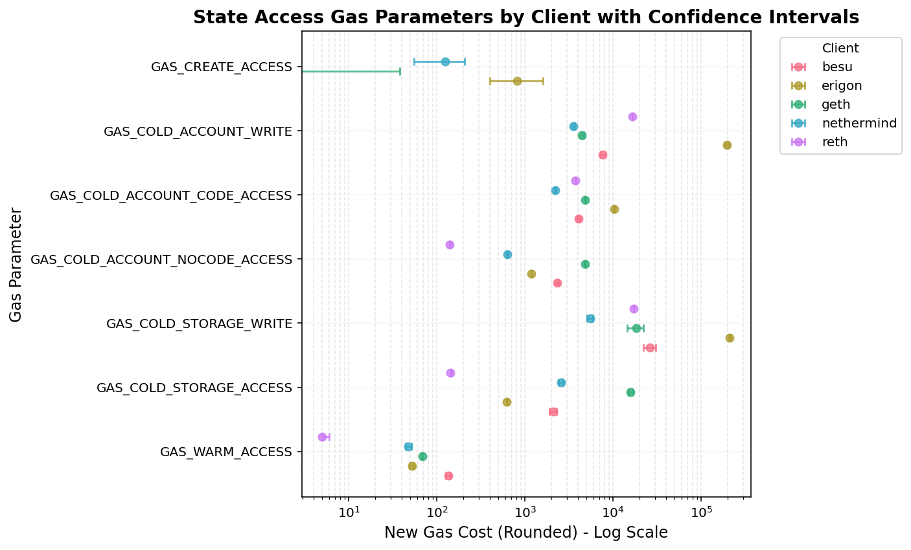

State access gas parameter proposal for EIP-8038
================================================


This is an automated report generated from the script `./src/estimate_8038_repricings.py`.
The runtime estimation results used as input can be found in
`./reports/eip-8038/2026-05-22_2026-05-26/runtime_estimation_autogenerated_report.md`.

## Methodology


New gas costs are calculated using an anchor rate of **100 million gas per second**.
The formula used is:

```
new_gas = (anchor_rate * runtime_ms) / 1000
```

**Glue opcode adjustment:** Each benchmark test includes auxiliary "glue" opcodes that scale
linearly with the main opcode count. The regression slope captures the combined runtime of
both the target opcode and its glue opcodes, so we subtract the estimated glue opcode
runtime to isolate the true per-execution cost:

```
adjusted_slope = slope - sum(ratio_i * glue_runtime_i)
```

Only glue opcodes with a statistically significant fit (p-value < 0.05) are included.
The adjusted slope is clipped to a minimum of zero. The runtime estimation report for
glue opcode can be found [here](./glue_opcodes_autogenerated_report.md)

**Parameter mapping:** Each gas parameter is derived from one or more benchmark models
by selecting a specific regression coefficient (slope or `update`) after applying the
relevant filters (test name, cache strategy, account mode). For each parameter and client,
the worst-case value across all matching model configurations is used. The final proposal
takes the worst case across clients.

**Derived parameters** are computed from the directly estimated ones:

```
GAS_STORAGE_CLEAR_REFUND     = (GAS_COLD_STORAGE_WRITE + GAS_COLD_STORAGE_ACCESS) * (4800/5000)
ACCESS_LIST_STORAGE_KEY_COST = GAS_COLD_STORAGE_ACCESS
ACCESS_LIST_ADDRESS_COST     = GAS_COLD_ACCOUNT_CODE_ACCESS
```

## Understanding the results


The table below shows the **worst-case** new gas cost across all tested clients for each
directly estimated parameter (taking the maximum across clients). This conservative approach
ensures the new gas costs account for the slowest implementation.

The **Change** column shows the relative change as a decimal (e.g., 1.0 = 100% increase,
-0.25 = 25% decrease).

For each parameter and client, the worst-case runtime across all matching test configurations
is selected. If any configuration has a statistically significant fit (p-value < 0.05), the
worst case among significant fits is used. Otherwise, the worst case from all configurations
is used. Parameters with no significant fits are listed in the "Errors and caveats" section.

## Directly estimated parameters


The following table shows new gas costs for directly estimated parameters.


|Parameter|Current Gas|New Gas (Rounded)|Change|
| :---: | :---: | :---: | :---: |
|GAS_COLD_ACCOUNT_CODE_ACCESS|2600|10331|2.97|
|GAS_COLD_ACCOUNT_NOCODE_ACCESS|2600|4812|0.85|
|GAS_COLD_ACCOUNT_WRITE|6700|195132|28.12|
|GAS_COLD_STORAGE_ACCESS|2200|15770|6.17|
|GAS_COLD_STORAGE_WRITE|2800|210440|74.16|
|GAS_CREATE_ACCESS|7000|814|-0.88|
|GAS_WARM_ACCESS|100|134|0.34|

## Derived parameters


The following parameters are computed from the directly estimated ones.


|Parameter|Current Gas|New Gas (Rounded)|Change|
| :---: | :---: | :---: | :---: |
|GAS_STORAGE_CLEAR_REFUND|4800|217162|44.24|
|ACCESS_LIST_STORAGE_KEY_COST|1900|15770|7.3|
|ACCESS_LIST_ADDRESS_COST|2400|10331|3.3|

## Gas costs by client


The following plot shows new gas costs (rounded) for each parameter across different clients, with error bars representing the confidence intervals.




The following heatmaps show the new gas costs for each state access parameter broken down by test variant (test name and cache/account configuration) and client.


The following table shows the worst-case runtime (after glue adjustment) and the glue adjustment applied for each parameter and client.


|Parameter|Client|Runtime (ms)|Glue Adj. (ms)|New Gas (Rounded)|
| :---: | :---: | :---: | :---: | :---: |
|GAS_COLD_ACCOUNT_CODE_ACCESS|besu|0.0404|0.0003|4040|
|GAS_COLD_ACCOUNT_CODE_ACCESS|erigon|0.1033|0.0001|10331|
|GAS_COLD_ACCOUNT_CODE_ACCESS|geth|0.0481|0.0001|4812|
|GAS_COLD_ACCOUNT_CODE_ACCESS|nethermind|0.0220|0.0001|2205|
|GAS_COLD_ACCOUNT_CODE_ACCESS|reth|0.0374|0.0000|3740|
|GAS_COLD_ACCOUNT_NOCODE_ACCESS|besu|0.0230|0.0000|2303|
|GAS_COLD_ACCOUNT_NOCODE_ACCESS|erigon|0.0118|0.0000|1183|
|GAS_COLD_ACCOUNT_NOCODE_ACCESS|geth|0.0481|0.0001|4812|
|GAS_COLD_ACCOUNT_NOCODE_ACCESS|nethermind|0.0063|0.0000|627|
|GAS_COLD_ACCOUNT_NOCODE_ACCESS|reth|0.0014|0.0000|140|
|GAS_COLD_ACCOUNT_WRITE|besu|0.0765|0.0000|7649|
|GAS_COLD_ACCOUNT_WRITE|erigon|1.9513|0.0000|195132|
|GAS_COLD_ACCOUNT_WRITE|geth|0.0444|0.0000|4437|
|GAS_COLD_ACCOUNT_WRITE|nethermind|0.0352|0.0000|3522|
|GAS_COLD_ACCOUNT_WRITE|reth|0.1652|0.0000|16516|
|GAS_COLD_STORAGE_ACCESS|besu|0.0208|0.0000|2081|
|GAS_COLD_STORAGE_ACCESS|erigon|0.0062|0.0000|620|
|GAS_COLD_STORAGE_ACCESS|geth|0.1577|0.0000|15770|
|GAS_COLD_STORAGE_ACCESS|nethermind|0.0255|0.0000|2552|
|GAS_COLD_STORAGE_ACCESS|reth|0.0014|0.0000|143|
|GAS_COLD_STORAGE_WRITE|besu|0.2617|0.0000|26171|
|GAS_COLD_STORAGE_WRITE|erigon|2.1044|0.0000|210440|
|GAS_COLD_STORAGE_WRITE|geth|0.1835|0.0000|18346|
|GAS_COLD_STORAGE_WRITE|nethermind|0.0550|0.0000|5502|
|GAS_COLD_STORAGE_WRITE|reth|0.1715|0.0000|17149|
|GAS_CREATE_ACCESS|besu|0.0000|0.0000|0|
|GAS_CREATE_ACCESS|erigon|0.0081|0.0000|814|
|GAS_CREATE_ACCESS|geth|0.0000|0.0000|0|
|GAS_CREATE_ACCESS|nethermind|0.0012|0.0000|123|
|GAS_CREATE_ACCESS|reth|0.0000|0.0000|0|
|GAS_WARM_ACCESS|besu|0.0013|0.0000|134|
|GAS_WARM_ACCESS|erigon|0.0005|0.0000|52|
|GAS_WARM_ACCESS|geth|0.0007|0.0000|68|
|GAS_WARM_ACCESS|nethermind|0.0005|0.0000|47|
|GAS_WARM_ACCESS|reth|0.0000|0.0000|5|

## Selected configurations


The following table shows which test configuration was selected as the worst case for each parameter and client.


|Parameter|Client|Test|Opcode|Coefficient|Cache Strategy|Account Mode|Existing Slots|
| :---: | :---: | :---: | :---: | :---: | :---: | :---: | :---: |
|GAS_COLD_ACCOUNT_CODE_ACCESS|besu|test_account_access|CALLCODE|slope|NO_CACHE|EXISTING_CONTRACT|nan|
|GAS_COLD_ACCOUNT_CODE_ACCESS|erigon|test_account_access|CALLCODE|slope|NO_CACHE|EXISTING_CONTRACT|nan|
|GAS_COLD_ACCOUNT_CODE_ACCESS|geth|test_account_access|CALLCODE|slope|NO_CACHE|NON_EXISTING_ACCOUNT|nan|
|GAS_COLD_ACCOUNT_CODE_ACCESS|nethermind|test_account_access|CALLCODE|slope|NO_CACHE|EXISTING_CONTRACT|nan|
|GAS_COLD_ACCOUNT_CODE_ACCESS|reth|test_account_access|DELEGATECALL|slope|NO_CACHE|EXISTING_CONTRACT|nan|
|GAS_COLD_ACCOUNT_NOCODE_ACCESS|besu|test_account_access|CALLCODE|slope|NO_CACHE|EXISTING_EOA|nan|
|GAS_COLD_ACCOUNT_NOCODE_ACCESS|erigon|test_account_access|STATICCALL|slope|NO_CACHE|NON_EXISTING_ACCOUNT|nan|
|GAS_COLD_ACCOUNT_NOCODE_ACCESS|geth|test_account_access|CALLCODE|slope|NO_CACHE|NON_EXISTING_ACCOUNT|nan|
|GAS_COLD_ACCOUNT_NOCODE_ACCESS|nethermind|test_account_access|CALLCODE|slope|NO_CACHE|EXISTING_EOA|nan|
|GAS_COLD_ACCOUNT_NOCODE_ACCESS|reth|test_account_access|CALLCODE|slope|NO_CACHE|EXISTING_EOA|nan|
|GAS_COLD_ACCOUNT_WRITE|besu|test_account_access|CALL|update|NO_CACHE|EXISTING_CONTRACT|nan|
|GAS_COLD_ACCOUNT_WRITE|erigon|test_account_access|CALL|update|NO_CACHE|NON_EXISTING_ACCOUNT|nan|
|GAS_COLD_ACCOUNT_WRITE|geth|test_account_access|CALL|update|NO_CACHE|EXISTING_CONTRACT|nan|
|GAS_COLD_ACCOUNT_WRITE|nethermind|test_account_access|CALL|update|NO_CACHE|EXISTING_CONTRACT|nan|
|GAS_COLD_ACCOUNT_WRITE|reth|test_account_access|CALL|update|NO_CACHE|EXISTING_EOA|nan|
|GAS_COLD_STORAGE_ACCESS|besu|test_sload_bloated|SLOAD|slope|NO_CACHE|nan|True|
|GAS_COLD_STORAGE_ACCESS|erigon|test_sload_bloated|SLOAD|slope|NO_CACHE|nan|False|
|GAS_COLD_STORAGE_ACCESS|geth|test_sload_bloated|SLOAD|slope|NO_CACHE|nan|False|
|GAS_COLD_STORAGE_ACCESS|nethermind|test_sstore_bloated|SSTORE|slope|NO_CACHE|nan|True|
|GAS_COLD_STORAGE_ACCESS|reth|test_sload_bloated|SLOAD|slope|NO_CACHE|nan|True|
|GAS_COLD_STORAGE_WRITE|besu|test_sstore_bloated|SSTORE|update|NO_CACHE|nan|False|
|GAS_COLD_STORAGE_WRITE|erigon|test_sstore_bloated|SSTORE|update|NO_CACHE|nan|False|
|GAS_COLD_STORAGE_WRITE|geth|test_sstore_bloated|SSTORE|update|NO_CACHE|nan|False|
|GAS_COLD_STORAGE_WRITE|nethermind|test_sstore_bloated|SSTORE|update|NO_CACHE|nan|False|
|GAS_COLD_STORAGE_WRITE|reth|test_sstore_bloated|SSTORE|update|NO_CACHE|nan|True|
|GAS_CREATE_ACCESS|besu|test_create|CREATE|slope|nan|nan|nan|
|GAS_CREATE_ACCESS|erigon|test_create|CREATE|slope|nan|nan|nan|
|GAS_CREATE_ACCESS|geth|test_create|CREATE|slope|nan|nan|nan|
|GAS_CREATE_ACCESS|nethermind|test_create|CREATE|slope|nan|nan|nan|
|GAS_CREATE_ACCESS|reth|test_create|CREATE|slope|nan|nan|nan|
|GAS_WARM_ACCESS|besu|test_ext_account_query_warm|CALLCODE|slope|nan|nan|nan|
|GAS_WARM_ACCESS|erigon|test_ext_account_query_warm|CALL|slope|nan|nan|nan|
|GAS_WARM_ACCESS|geth|test_ext_account_query_warm|CALLCODE|slope|nan|nan|nan|
|GAS_WARM_ACCESS|nethermind|test_ext_account_query_warm|CALLCODE|slope|nan|nan|nan|
|GAS_WARM_ACCESS|reth|test_ext_account_query_warm|CALL|slope|nan|nan|nan|

## Errors and caveats


The following parameters had no statistically significant model fit:


- GAS_CREATE_ACCESS — besu, geth, reth


All parameters have estimations for all clients.


The following glue opcodes had a poor fit (p-value >= 0.05), meaning their runtime could not be reliably estimated. The slope of the affected parameters is not adjusted for these glue opcodes' contribution:


- **ADD** (clients: erigon, nethermind, reth) — affects: GAS_COLD_ACCOUNT_CODE_ACCESS, GAS_COLD_ACCOUNT_NOCODE_ACCESS, GAS_COLD_ACCOUNT_WRITE, GAS_COLD_STORAGE_ACCESS, GAS_COLD_STORAGE_WRITE, GAS_CREATE_ACCESS

- **AND** (clients: erigon, nethermind, reth) — affects: GAS_COLD_ACCOUNT_CODE_ACCESS, GAS_COLD_ACCOUNT_NOCODE_ACCESS, GAS_COLD_ACCOUNT_WRITE

- **CALLDATASIZE** (clients: nethermind, reth) — affects: GAS_COLD_ACCOUNT_CODE_ACCESS, GAS_COLD_ACCOUNT_NOCODE_ACCESS, GAS_COLD_ACCOUNT_WRITE

- **DUP1** (clients: besu, erigon, geth, nethermind, reth) — affects: GAS_COLD_STORAGE_ACCESS, GAS_COLD_STORAGE_WRITE, GAS_CREATE_ACCESS

- **DUP2** (clients: besu, erigon, geth, nethermind, reth) — affects: GAS_COLD_STORAGE_ACCESS, GAS_COLD_STORAGE_WRITE, GAS_CREATE_ACCESS

- **EXP** (clients: besu, erigon, geth, nethermind, reth) — affects: GAS_COLD_ACCOUNT_CODE_ACCESS, GAS_COLD_ACCOUNT_NOCODE_ACCESS, GAS_COLD_ACCOUNT_WRITE

- **GAS** (clients: nethermind, reth) — affects: GAS_COLD_ACCOUNT_CODE_ACCESS, GAS_COLD_ACCOUNT_NOCODE_ACCESS, GAS_COLD_ACCOUNT_WRITE, GAS_COLD_STORAGE_ACCESS, GAS_WARM_ACCESS

- **GT** (clients: erigon, geth, nethermind, reth) — affects: GAS_COLD_ACCOUNT_CODE_ACCESS, GAS_COLD_ACCOUNT_NOCODE_ACCESS, GAS_COLD_ACCOUNT_WRITE, GAS_COLD_STORAGE_ACCESS

- **ISZERO** (clients: erigon, geth, nethermind, reth) — affects: GAS_COLD_ACCOUNT_CODE_ACCESS, GAS_COLD_ACCOUNT_NOCODE_ACCESS, GAS_COLD_ACCOUNT_WRITE, GAS_CREATE_ACCESS

- **JUMP** (clients: erigon, geth, nethermind, reth) — affects: GAS_COLD_ACCOUNT_CODE_ACCESS, GAS_COLD_ACCOUNT_NOCODE_ACCESS, GAS_COLD_ACCOUNT_WRITE

- **JUMPDEST** (clients: besu, nethermind, reth) — affects: GAS_COLD_ACCOUNT_CODE_ACCESS, GAS_COLD_ACCOUNT_NOCODE_ACCESS, GAS_COLD_ACCOUNT_WRITE, GAS_COLD_STORAGE_ACCESS, GAS_COLD_STORAGE_WRITE, GAS_CREATE_ACCESS

- **JUMPI** (clients: besu, erigon, geth, nethermind, reth) — affects: GAS_COLD_ACCOUNT_CODE_ACCESS, GAS_COLD_ACCOUNT_NOCODE_ACCESS, GAS_COLD_ACCOUNT_WRITE, GAS_COLD_STORAGE_ACCESS, GAS_COLD_STORAGE_WRITE

- **LT** (clients: erigon, nethermind, reth) — affects: GAS_COLD_STORAGE_ACCESS, GAS_COLD_STORAGE_WRITE

- **MLOAD** (clients: erigon, nethermind, reth) — affects: GAS_COLD_ACCOUNT_CODE_ACCESS, GAS_COLD_ACCOUNT_NOCODE_ACCESS, GAS_COLD_ACCOUNT_WRITE, GAS_WARM_ACCESS

- **MSTORE** (clients: nethermind) — affects: GAS_COLD_ACCOUNT_CODE_ACCESS, GAS_COLD_ACCOUNT_NOCODE_ACCESS, GAS_COLD_ACCOUNT_WRITE

- **MSTORE8** (clients: besu, erigon, nethermind, reth) — affects: GAS_COLD_ACCOUNT_CODE_ACCESS, GAS_COLD_ACCOUNT_NOCODE_ACCESS, GAS_COLD_ACCOUNT_WRITE

- **MUL** (clients: erigon, geth, reth) — affects: GAS_COLD_ACCOUNT_CODE_ACCESS, GAS_COLD_ACCOUNT_NOCODE_ACCESS, GAS_COLD_ACCOUNT_WRITE, GAS_CREATE_ACCESS

- **PC** (clients: nethermind, reth) — affects: GAS_COLD_ACCOUNT_CODE_ACCESS, GAS_COLD_ACCOUNT_NOCODE_ACCESS, GAS_COLD_ACCOUNT_WRITE, GAS_COLD_STORAGE_ACCESS

- **POP** (clients: besu, erigon, geth, nethermind, reth) — affects: GAS_COLD_ACCOUNT_CODE_ACCESS, GAS_COLD_ACCOUNT_NOCODE_ACCESS, GAS_COLD_ACCOUNT_WRITE, GAS_COLD_STORAGE_ACCESS, GAS_CREATE_ACCESS, GAS_WARM_ACCESS

- **PUSH1** (clients: besu, erigon, geth, nethermind, reth) — affects: GAS_COLD_ACCOUNT_CODE_ACCESS, GAS_COLD_ACCOUNT_NOCODE_ACCESS, GAS_COLD_ACCOUNT_WRITE, GAS_COLD_STORAGE_ACCESS, GAS_COLD_STORAGE_WRITE, GAS_CREATE_ACCESS, GAS_WARM_ACCESS

- **PUSH2** (clients: reth) — affects: GAS_COLD_ACCOUNT_CODE_ACCESS, GAS_COLD_ACCOUNT_NOCODE_ACCESS, GAS_COLD_ACCOUNT_WRITE, GAS_COLD_STORAGE_ACCESS

- **PUSH20** (clients: nethermind, reth) — affects: GAS_COLD_ACCOUNT_CODE_ACCESS, GAS_COLD_ACCOUNT_NOCODE_ACCESS, GAS_COLD_ACCOUNT_WRITE, GAS_CREATE_ACCESS

- **PUSH4** (clients: besu, nethermind, reth) — affects: GAS_COLD_ACCOUNT_CODE_ACCESS, GAS_COLD_ACCOUNT_NOCODE_ACCESS, GAS_COLD_ACCOUNT_WRITE, GAS_COLD_STORAGE_ACCESS

- **STOP** (clients: besu, erigon, geth, nethermind, reth) — affects: GAS_COLD_ACCOUNT_CODE_ACCESS, GAS_COLD_ACCOUNT_NOCODE_ACCESS, GAS_COLD_ACCOUNT_WRITE

- **SUB** (clients: erigon, nethermind, reth) — affects: GAS_COLD_ACCOUNT_CODE_ACCESS, GAS_COLD_ACCOUNT_NOCODE_ACCESS, GAS_COLD_ACCOUNT_WRITE, GAS_COLD_STORAGE_ACCESS

- **SWAP1** (clients: besu, erigon, geth, nethermind, reth) — affects: GAS_COLD_STORAGE_ACCESS, GAS_COLD_STORAGE_WRITE
