Operation run times estimation results - EIP-8038
=================================================

Table of contents
=================

* [BALANCE](#balance)
* [EXTCODESIZE](#extcodesize)
* [EXTCODECOPY](#extcodecopy)
* [EXTCODEHASH](#extcodehash)
* [SLOAD](#sload)
* [SSTORE](#sstore)
* [DELEGATECALL](#delegatecall)
* [STATICCALL](#staticcall)
* [CALL](#call)
* [CALLCODE](#callcode)
* [SELFDESTRUCT](#selfdestruct)
* [CREATE](#create)
* [CREATE2](#create2)

# Introduction


This is an automated report generated from the opcode run times
estimation script `./src/estimate_8038_repricings.py`. The script
uses data generated by running the
[EEST benchmark suite](https://github.com/ethereum/execution-spec-tests/tree/main/tests/benchmark)
with the [Benchmarkoor](https://github.com/ethpandaops/benchmarkoor) tool from EthPandasOps.


The data includes all the tests for operations repriced in EIP-8038 run
between 2026-05-22 and 2026-05-26.

For each operation and client, an NNLS linear regression model is fitted to estimate the
operation run time as a function of the operation count and other operation-specific parameters.
The results are presented below.

# How to Interpret the Results

## Model Used


**Non-Negative Least Squares (NNLS) Linear Regression** is used to estimate operation runtimes.
This model ensures all coefficients are non-negative, which is physically meaningful since
execution time cannot be negative. The model estimates runtime as a linear combination of:

- **Constant term (intercept)**: Base overhead for executing the test, which includes setup and teardown time
- **Operation count (slope)**: Number of times the operation is executed in the test. This paramater 
is the one that allows us to estimate the per-operation runtime.
- **Operation-specific parameters**: Variables like number of rounds, message size, or number of pairs

For simple operations, the model estimates: `runtime = intercept + slope × operation_count`

For variable operations, the model estimates: `runtime = intercept + slope × operation_count +
 param1_coef × operation_count × param1 + param2_coef × operation_count × param2 + ...`

## Model Quality Metrics


Each model reports two key metrics to assess the quality of the fit:

**R² (R-squared / Coefficient of Determination)**
- Ranges from 0 to 1 (or can be negative for very poor fits)
- Measures how well the model explains the variance in the data
- **Interpretation**:
  - R² > 0.9: Excellent fit - the model explains >90% of the variance
  - R² > 0.7: Good fit - the model captures most of the relationship
  - R² > 0.5: Acceptable fit - the model has predictive power but notable variance remains
  - R² < 0.5: Poor fit - the model may not be reliable

**p-value**
- Tests the statistical significance of each coefficient, based on a bootstrap sample estimation
- **Interpretation**:
  - p < 0.05: Statistically significant - the parameter has a real effect on runtime
  - p ≥ 0.05: Not significant - the parameter's effect cannot be distinguished from random noise

We also plot some diagnostic graphs for each operation and client combination to visually assess the model fit.

# BALANCE

## besu

### test_name: test_account_access, account_mode: EXISTING_CONTRACT


```python
==============================================================================
                           NNLS Regression Results                            
==============================================================================
Dep. Variable:          run_duration_ms              R-squared:          0.960
Model:                  NNLS                    Adj. R-squared:          0.959
No. Observations:       44                                RMSE:         141.44
Df Residuals:           42                                 MAE:         109.21
Df Model:               1      
==============================================================================
                      coef     std err     P-value      [0.025      0.975]
------------------------------------------------------------------------------
         const    565.0775     71.7689       0.000    412.8878    690.9786
       opcount      0.0334      0.0011       0.000      0.0314      0.0358
==============================================================================
Notes: Non-negative least squares with bootstrap inference (1000 iterations)
==============================================================================
```

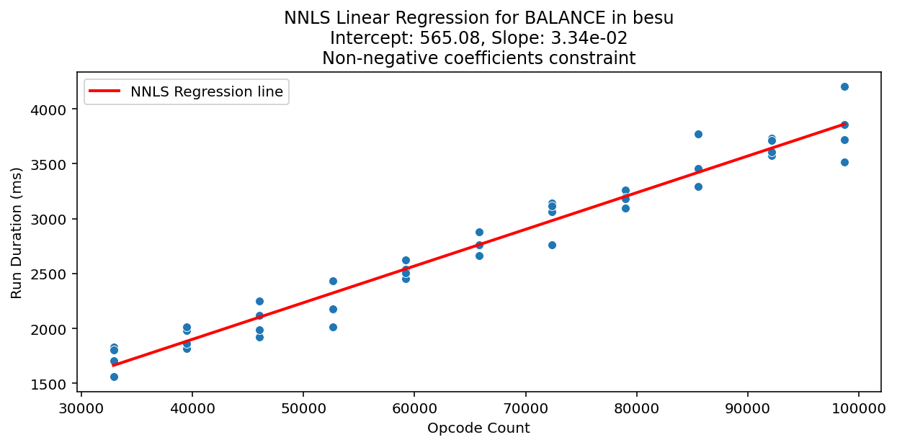

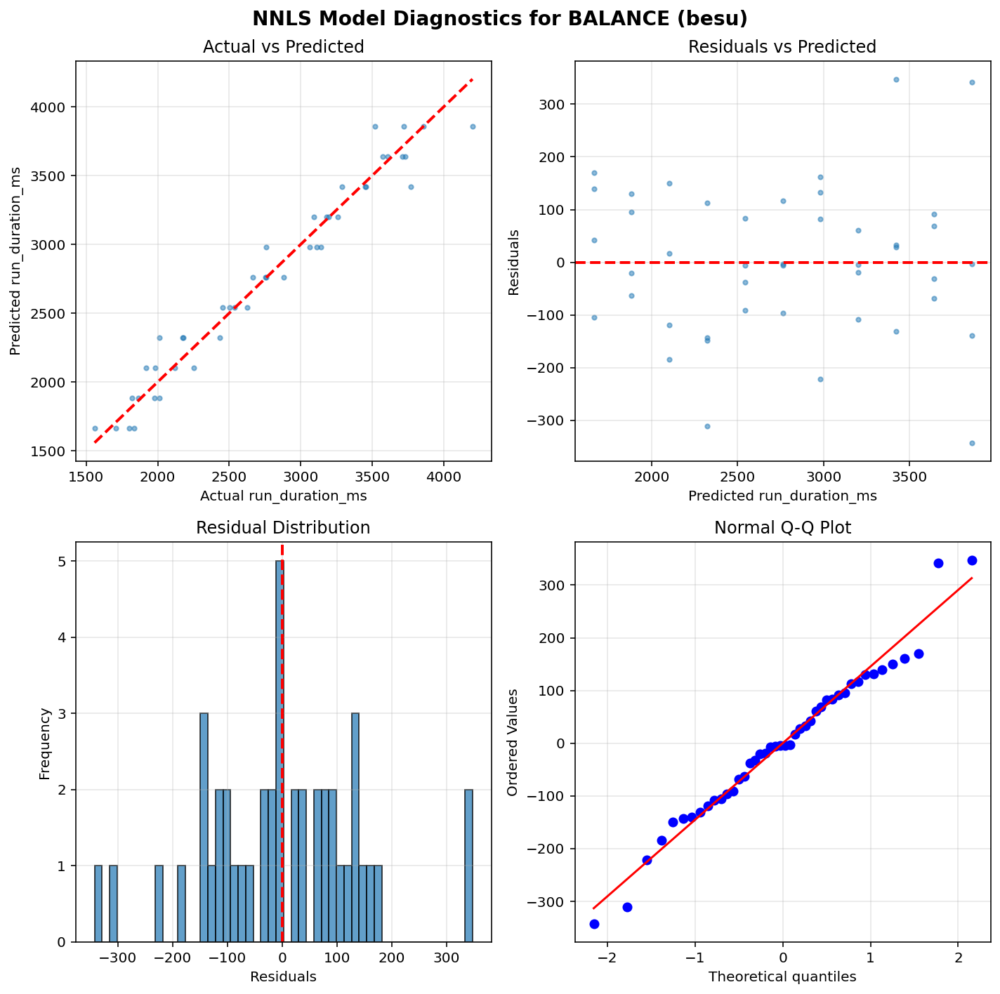

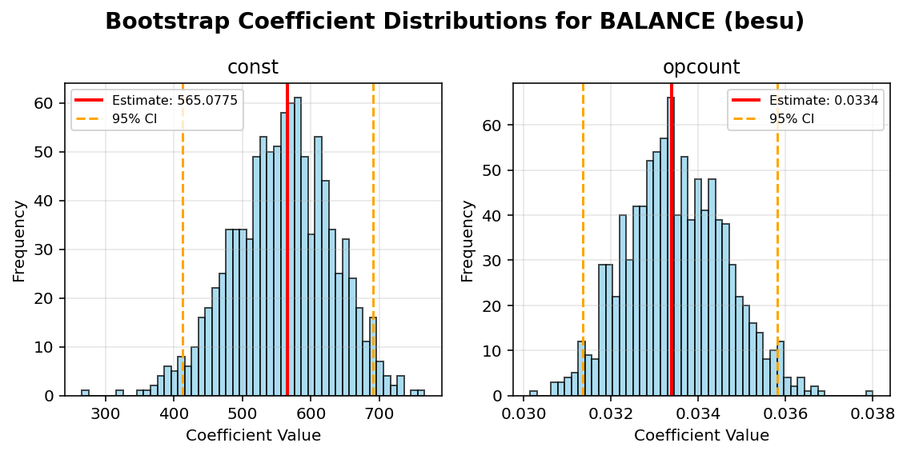


### test_name: test_account_access, account_mode: EXISTING_EOA


```python
==============================================================================
                           NNLS Regression Results                            
==============================================================================
Dep. Variable:          run_duration_ms              R-squared:          0.921
Model:                  NNLS                    Adj. R-squared:          0.919
No. Observations:       44                                RMSE:         121.76
Df Residuals:           42                                 MAE:         100.21
Df Model:               1      
==============================================================================
                      coef     std err     P-value      [0.025      0.975]
------------------------------------------------------------------------------
         const    467.2734     68.7003       0.000    319.1733    583.2699
       opcount      0.0173      0.0009       0.000      0.0159      0.0192
==============================================================================
Notes: Non-negative least squares with bootstrap inference (1000 iterations)
==============================================================================
```

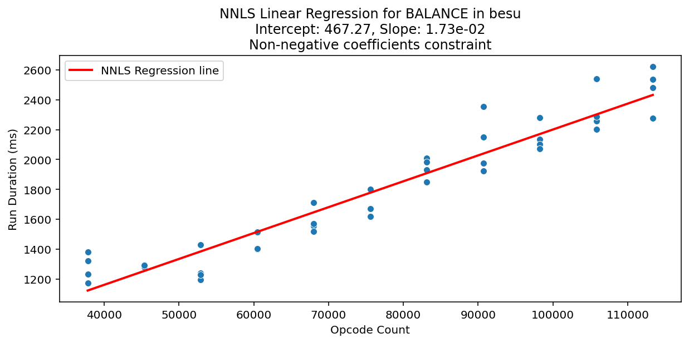

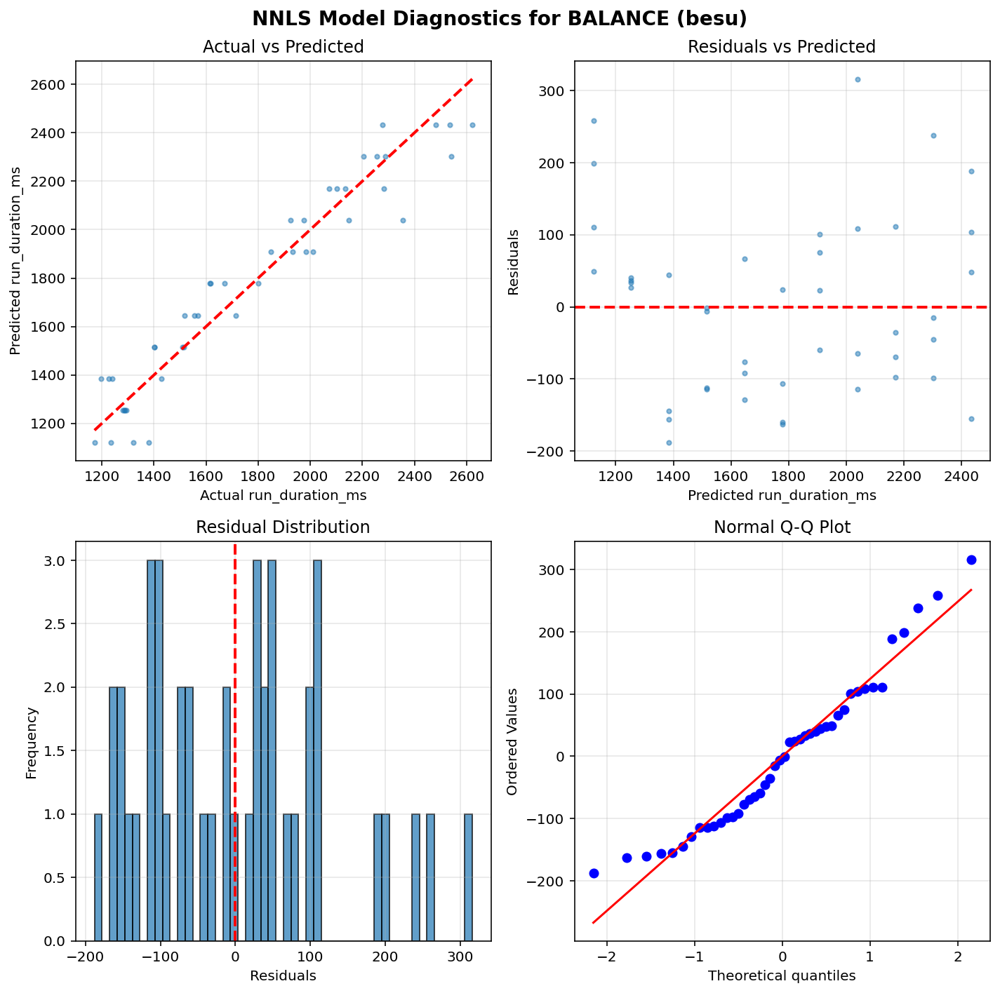

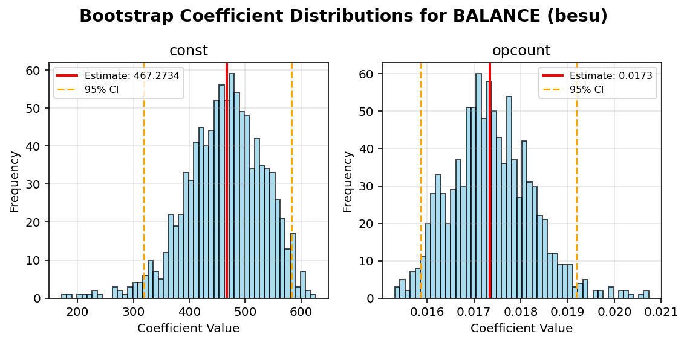


### test_name: test_account_access, account_mode: NON_EXISTING_ACCOUNT


```python
==============================================================================
                           NNLS Regression Results                            
==============================================================================
Dep. Variable:          run_duration_ms              R-squared:          0.923
Model:                  NNLS                    Adj. R-squared:          0.921
No. Observations:       44                                RMSE:          81.92
Df Residuals:           42                                 MAE:          67.81
Df Model:               1      
==============================================================================
                      coef     std err     P-value      [0.025      0.975]
------------------------------------------------------------------------------
         const    443.4342     42.8232       0.000    345.6143    520.6848
       opcount      0.0119      0.0006       0.000      0.0109      0.0130
==============================================================================
Notes: Non-negative least squares with bootstrap inference (1000 iterations)
==============================================================================
```

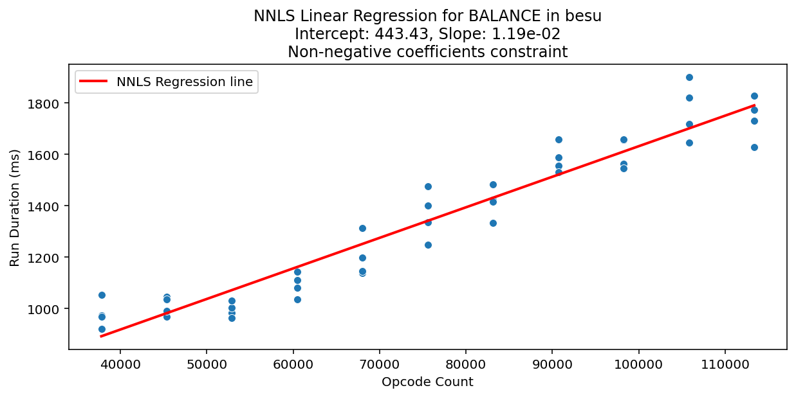

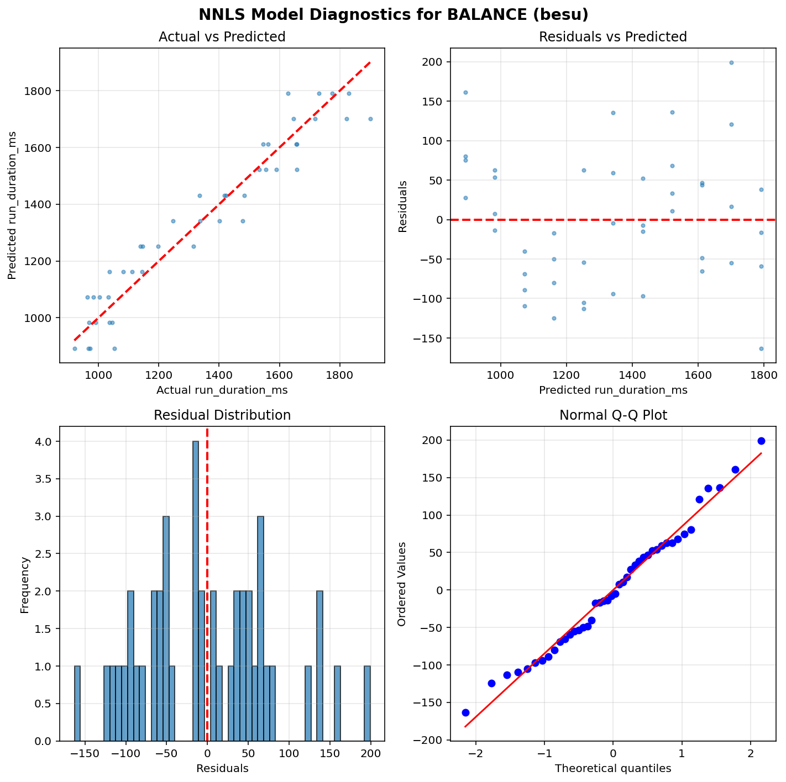

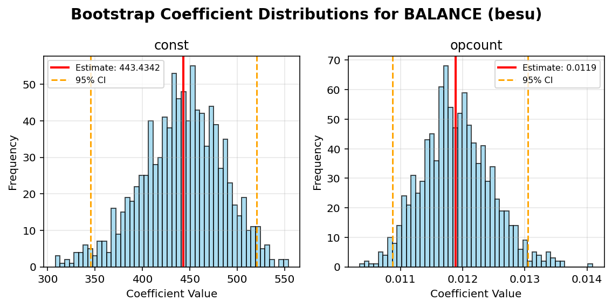


### test_name: test_ext_account_query_warm, account_mode: nan


```python
==============================================================================
                           NNLS Regression Results                            
==============================================================================
Dep. Variable:          run_duration_ms              R-squared:          0.502
Model:                  NNLS                    Adj. R-squared:          0.486
No. Observations:       33                                RMSE:          65.17
Df Residuals:           31                                 MAE:          51.10
Df Model:               1      
==============================================================================
                      coef     std err     P-value      [0.025      0.975]
------------------------------------------------------------------------------
         const    271.0696     38.7401       0.000    204.1647    354.4734
       opcount      0.0001      0.0000       0.000      0.0001      0.0001
==============================================================================
Notes: Non-negative least squares with bootstrap inference (1000 iterations)
==============================================================================
```

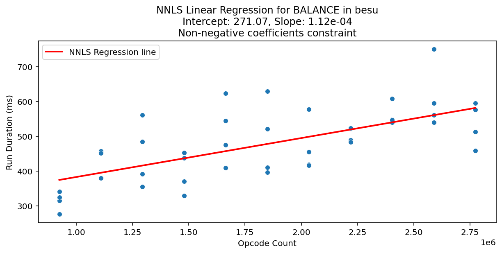

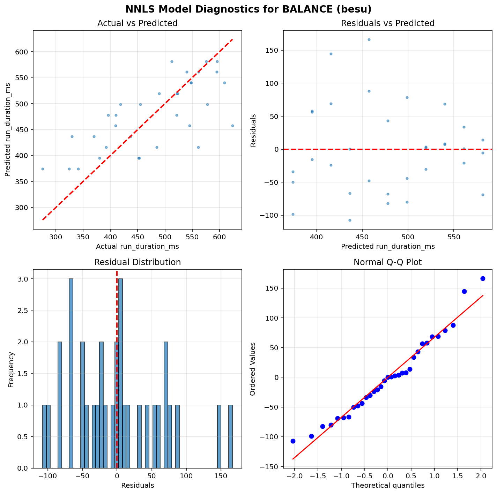

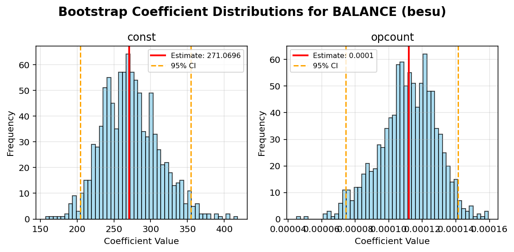


## erigon

### test_name: test_account_access, account_mode: EXISTING_CONTRACT


```python
==============================================================================
                           NNLS Regression Results                            
==============================================================================
Dep. Variable:          run_duration_ms              R-squared:          0.896
Model:                  NNLS                    Adj. R-squared:          0.896
No. Observations:       220                               RMSE:         259.04
Df Residuals:           218                                MAE:         220.27
Df Model:               1      
==============================================================================
                      coef     std err     P-value      [0.025      0.975]
------------------------------------------------------------------------------
         const    457.8008     59.6878       0.000    353.4649    581.1231
       opcount      0.0365      0.0008       0.000      0.0348      0.0380
==============================================================================
Notes: Non-negative least squares with bootstrap inference (1000 iterations)
==============================================================================
```

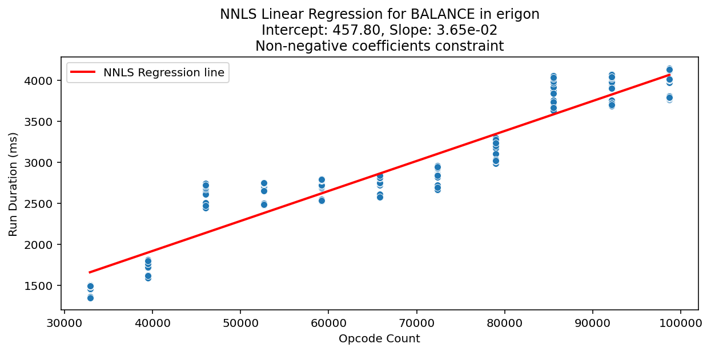


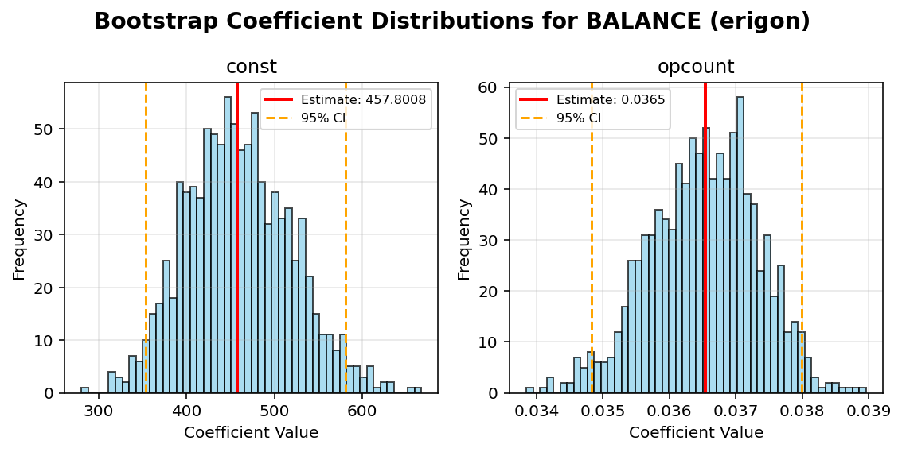


### test_name: test_account_access, account_mode: EXISTING_EOA


```python
==============================================================================
                           NNLS Regression Results                            
==============================================================================
Dep. Variable:          run_duration_ms              R-squared:          0.995
Model:                  NNLS                    Adj. R-squared:          0.995
No. Observations:       220                               RMSE:          17.25
Df Residuals:           218                                MAE:          13.92
Df Model:               1      
==============================================================================
                      coef     std err     P-value      [0.025      0.975]
------------------------------------------------------------------------------
         const     34.3505      3.4610       0.000     27.2904     41.2976
       opcount      0.0099      0.0000       0.000      0.0098      0.0100
==============================================================================
Notes: Non-negative least squares with bootstrap inference (1000 iterations)
==============================================================================
```

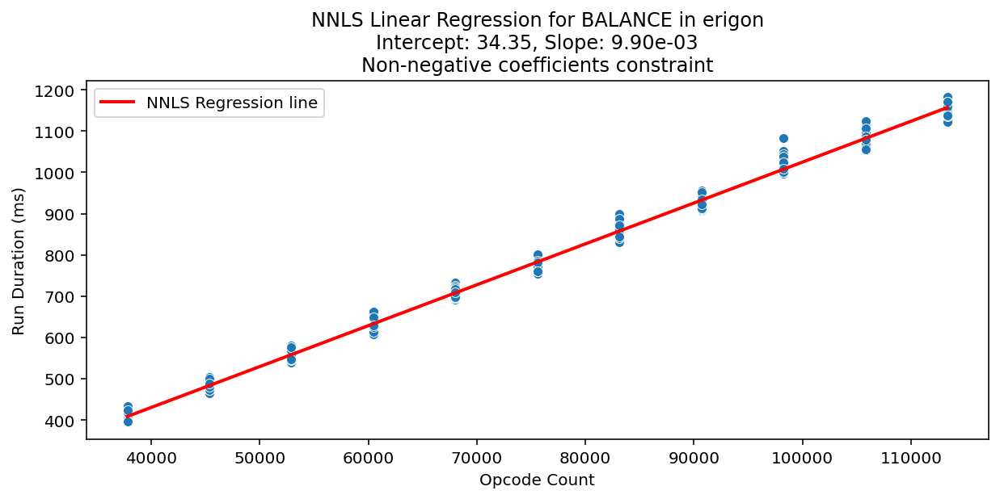

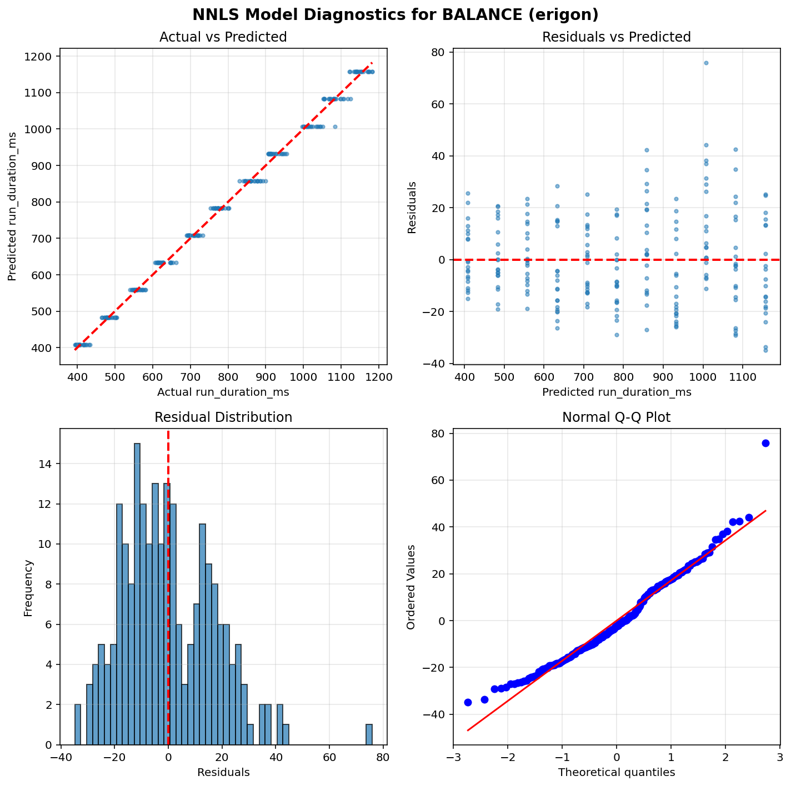

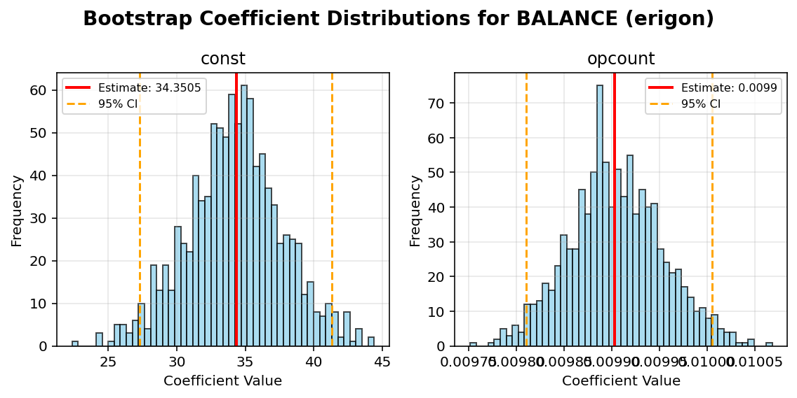


### test_name: test_account_access, account_mode: NON_EXISTING_ACCOUNT


```python
==============================================================================
                           NNLS Regression Results                            
==============================================================================
Dep. Variable:          run_duration_ms              R-squared:          0.995
Model:                  NNLS                    Adj. R-squared:          0.995
No. Observations:       220                               RMSE:          15.11
Df Residuals:           218                                MAE:          12.23
Df Model:               1      
==============================================================================
                      coef     std err     P-value      [0.025      0.975]
------------------------------------------------------------------------------
         const      3.8697      2.8781       0.113      0.0000     10.2236
       opcount      0.0092      0.0000       0.000      0.0091      0.0093
==============================================================================
Notes: Non-negative least squares with bootstrap inference (1000 iterations)
==============================================================================
```

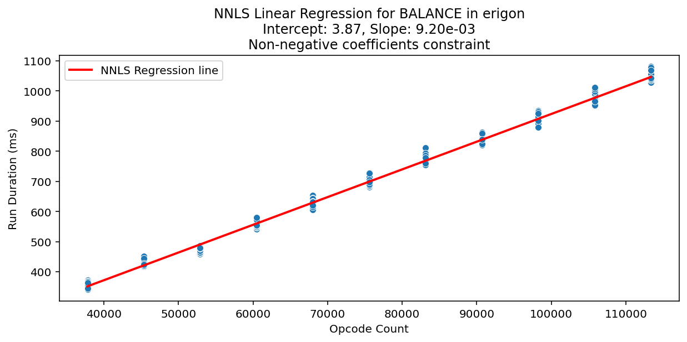

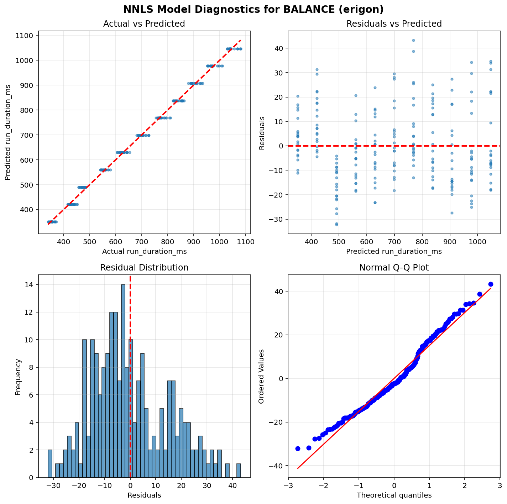

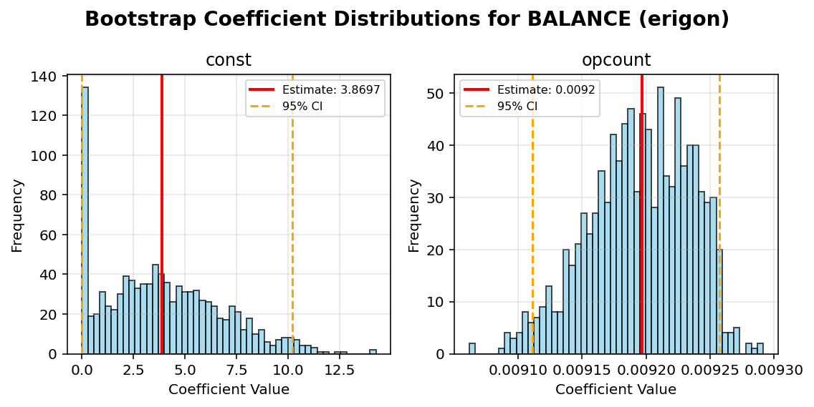


### test_name: test_ext_account_query_warm, account_mode: nan


```python
==============================================================================
                           NNLS Regression Results                            
==============================================================================
Dep. Variable:          run_duration_ms              R-squared:          0.835
Model:                  NNLS                    Adj. R-squared:          0.834
No. Observations:       220                               RMSE:          13.44
Df Residuals:           218                                MAE:          11.23
Df Model:               1      
==============================================================================
                      coef     std err     P-value      [0.025      0.975]
------------------------------------------------------------------------------
         const     37.1893      3.0466       0.000     31.1224     43.2173
       opcount      0.0001      0.0000       0.000      0.0000      0.0001
==============================================================================
Notes: Non-negative least squares with bootstrap inference (1000 iterations)
==============================================================================
```

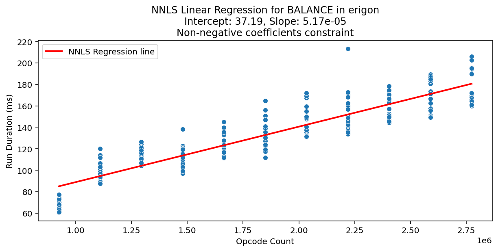

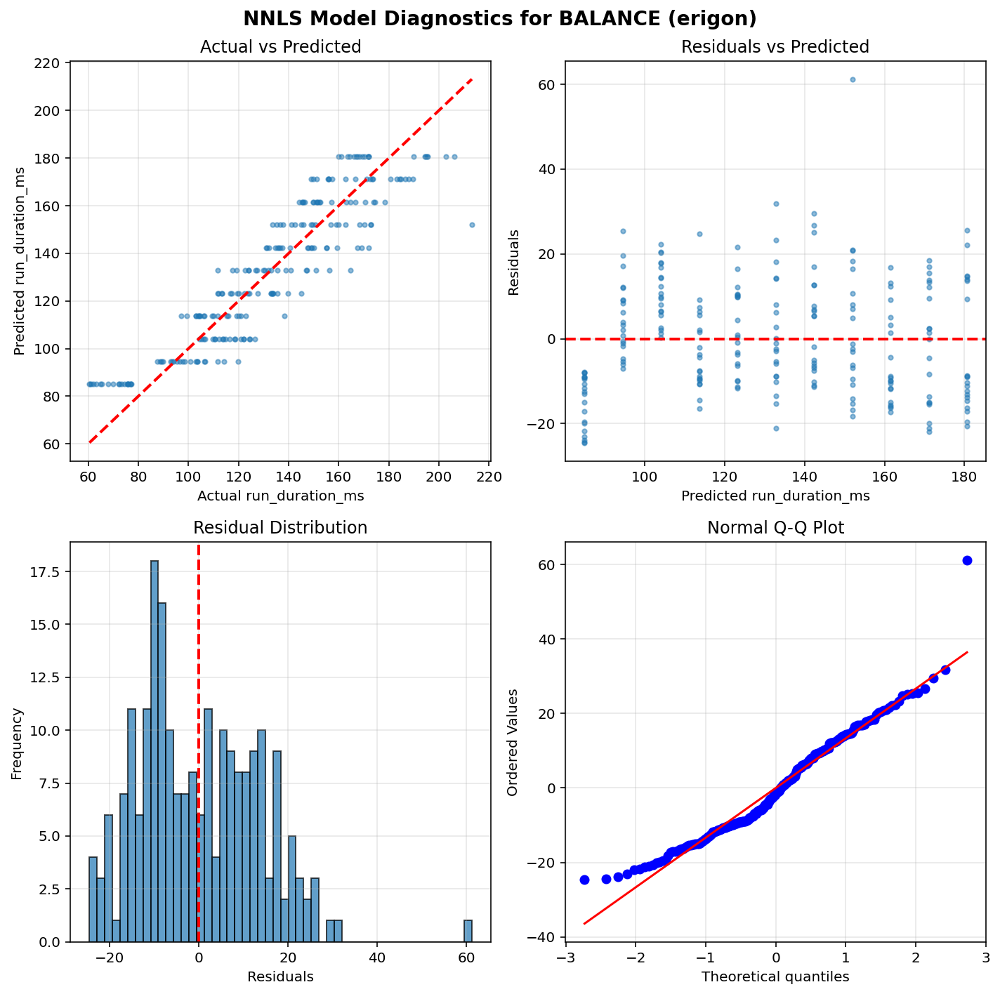

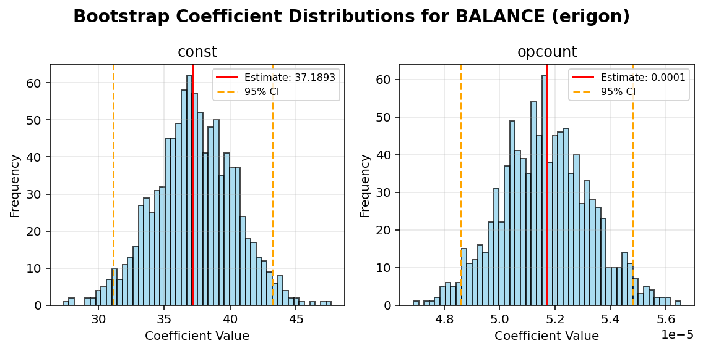


## geth

### test_name: test_account_access, account_mode: EXISTING_CONTRACT


```python
==============================================================================
                           NNLS Regression Results                            
==============================================================================
Dep. Variable:          run_duration_ms              R-squared:          0.646
Model:                  NNLS                    Adj. R-squared:          0.645
No. Observations:       638                               RMSE:         543.84
Df Residuals:           636                                MAE:         453.14
Df Model:               1      
==============================================================================
                      coef     std err     P-value      [0.025      0.975]
------------------------------------------------------------------------------
         const   1282.7419     68.4040       0.000   1140.4038   1405.5574
       opcount      0.0353      0.0011       0.000      0.0333      0.0374
==============================================================================
Notes: Non-negative least squares with bootstrap inference (1000 iterations)
==============================================================================
```

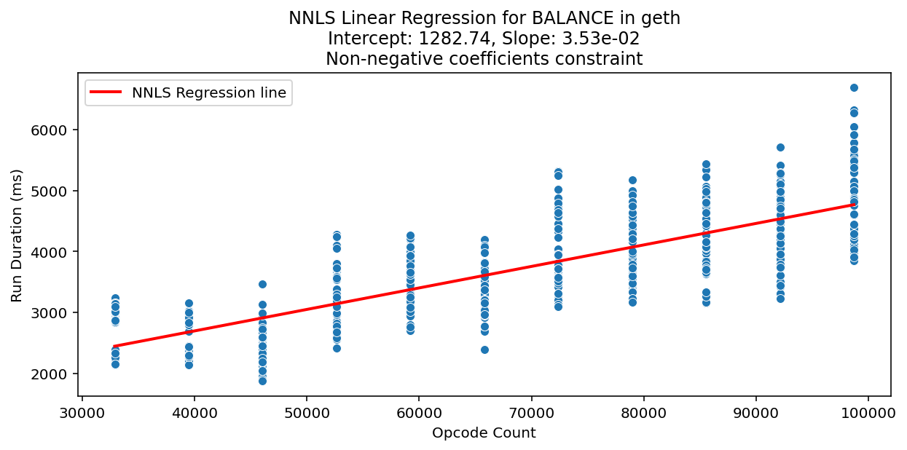

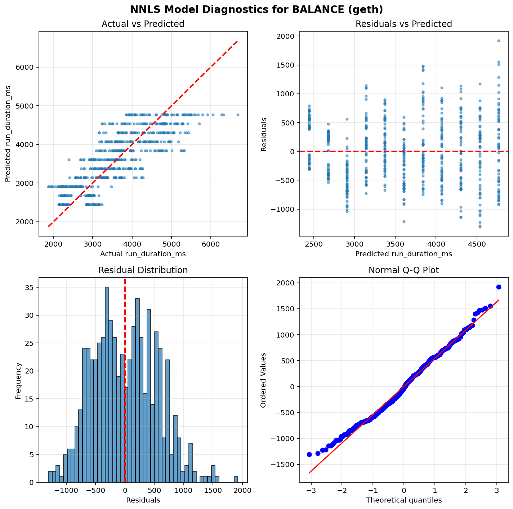

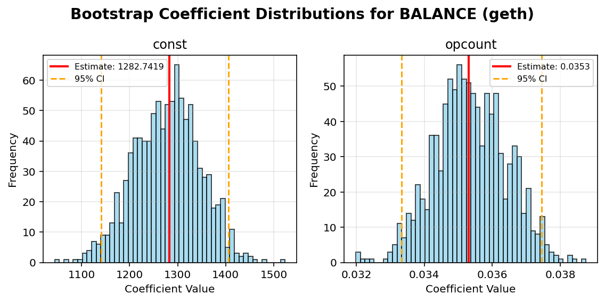


### test_name: test_account_access, account_mode: EXISTING_EOA


```python
==============================================================================
                           NNLS Regression Results                            
==============================================================================
Dep. Variable:          run_duration_ms              R-squared:          0.673
Model:                  NNLS                    Adj. R-squared:          0.672
No. Observations:       638                               RMSE:         190.28
Df Residuals:           636                                MAE:         160.59
Df Model:               1      
==============================================================================
                      coef     std err     P-value      [0.025      0.975]
------------------------------------------------------------------------------
         const    514.6756     24.0626       0.000    466.3354    560.6116
       opcount      0.0114      0.0003       0.000      0.0108      0.0120
==============================================================================
Notes: Non-negative least squares with bootstrap inference (1000 iterations)
==============================================================================
```

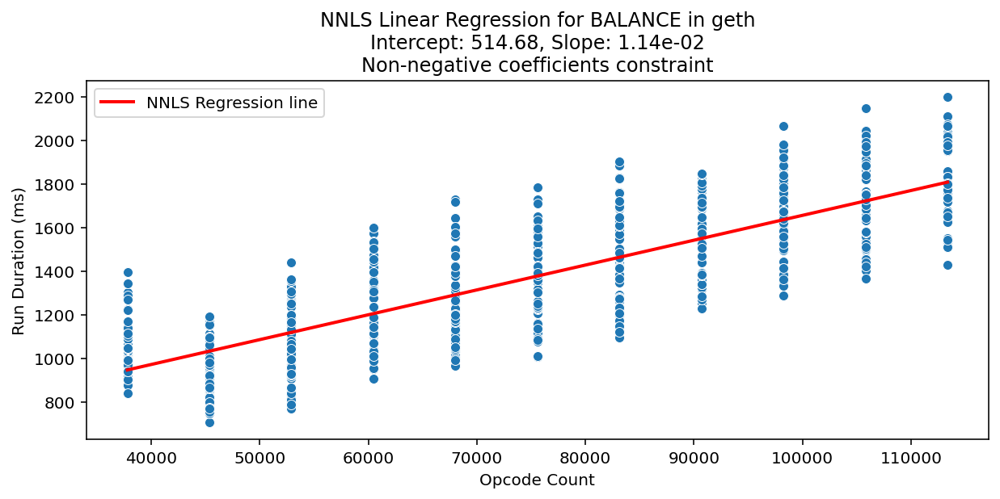

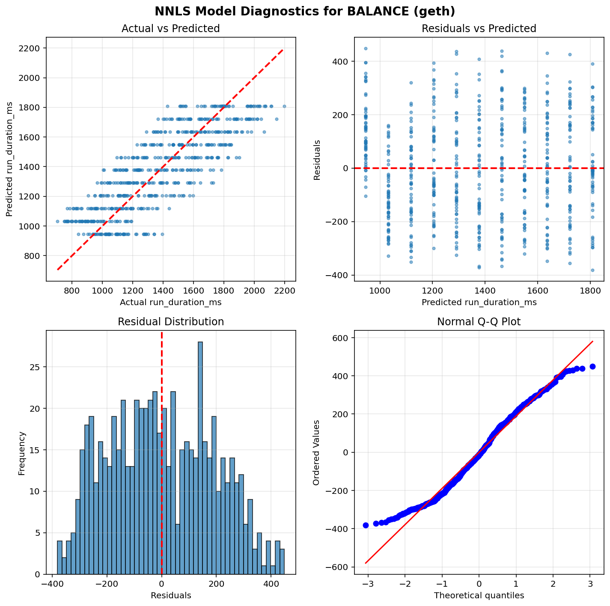

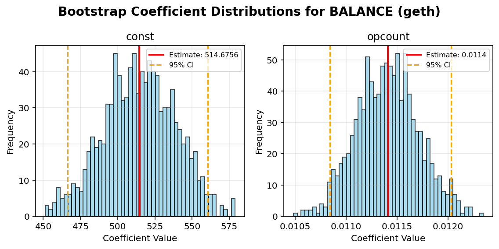


### test_name: test_account_access, account_mode: NON_EXISTING_ACCOUNT


```python
==============================================================================
                           NNLS Regression Results                            
==============================================================================
Dep. Variable:          run_duration_ms              R-squared:          0.569
Model:                  NNLS                    Adj. R-squared:          0.568
No. Observations:       638                               RMSE:         601.48
Df Residuals:           636                                MAE:         484.65
Df Model:               1      
==============================================================================
                      coef     std err     P-value      [0.025      0.975]
------------------------------------------------------------------------------
         const   1567.0022     74.4785       0.000   1426.9801   1711.4355
       opcount      0.0289      0.0010       0.000      0.0268      0.0308
==============================================================================
Notes: Non-negative least squares with bootstrap inference (1000 iterations)
==============================================================================
```

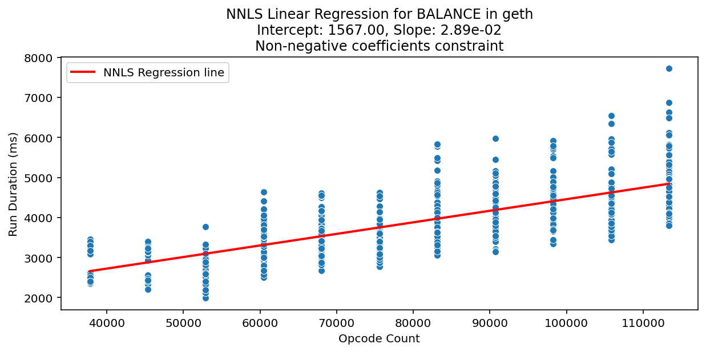

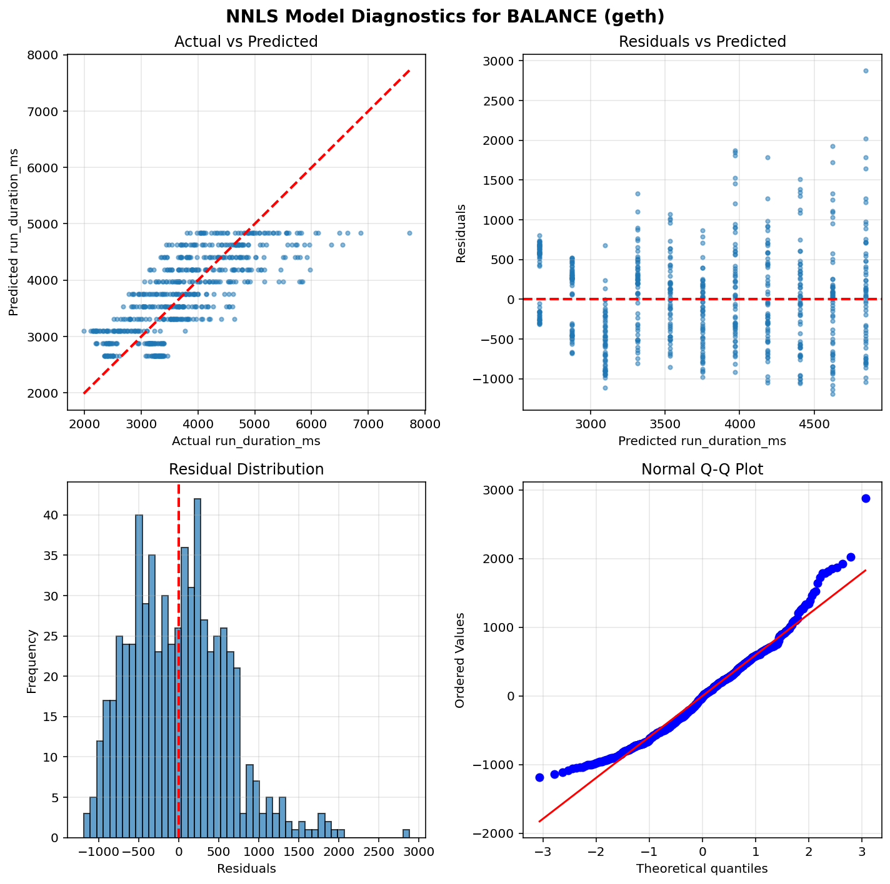

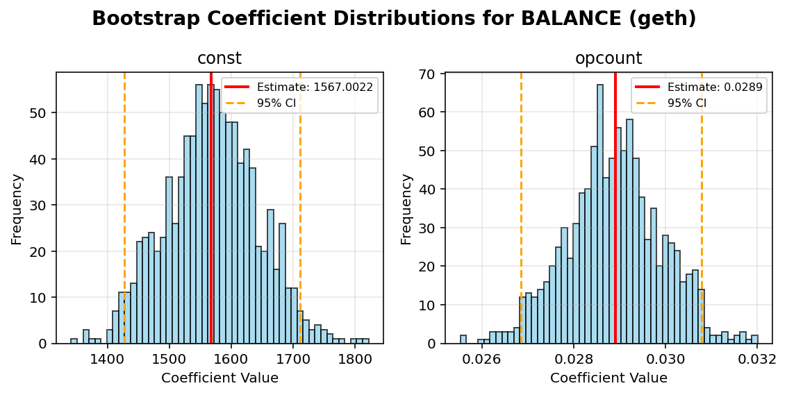


### test_name: test_ext_account_query_warm, account_mode: nan


```python
==============================================================================
                           NNLS Regression Results                            
==============================================================================
Dep. Variable:          run_duration_ms              R-squared:          0.971
Model:                  NNLS                    Adj. R-squared:          0.971
No. Observations:       638                               RMSE:          13.98
Df Residuals:           636                                MAE:          10.69
Df Model:               1      
==============================================================================
                      coef     std err     P-value      [0.025      0.975]
------------------------------------------------------------------------------
         const     15.1473      1.7819       0.000     11.6733     18.7165
       opcount      0.0001      0.0000       0.000      0.0001      0.0001
==============================================================================
Notes: Non-negative least squares with bootstrap inference (1000 iterations)
==============================================================================
```

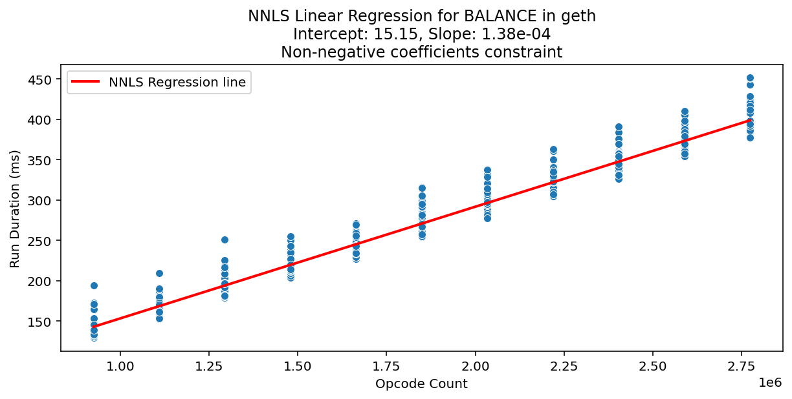

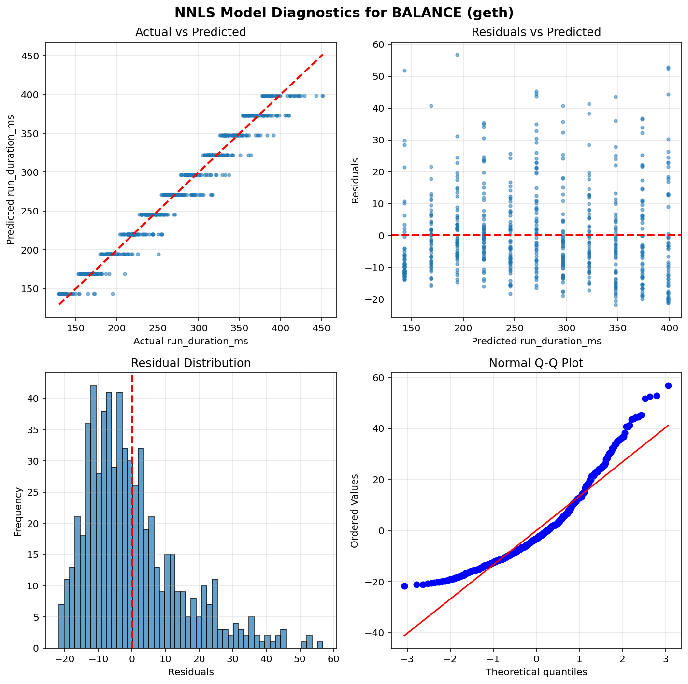

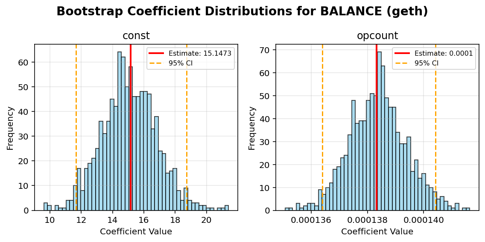


## nethermind

### test_name: test_account_access, account_mode: EXISTING_CONTRACT


```python
==============================================================================
                           NNLS Regression Results                            
==============================================================================
Dep. Variable:          run_duration_ms              R-squared:          0.888
Model:                  NNLS                    Adj. R-squared:          0.888
No. Observations:       429                               RMSE:         141.01
Df Residuals:           427                                MAE:         109.12
Df Model:               1      
==============================================================================
                      coef     std err     P-value      [0.025      0.975]
------------------------------------------------------------------------------
         const    199.2154     19.3917       0.000    161.3627    237.9207
       opcount      0.0191      0.0003       0.000      0.0184      0.0197
==============================================================================
Notes: Non-negative least squares with bootstrap inference (1000 iterations)
==============================================================================
```

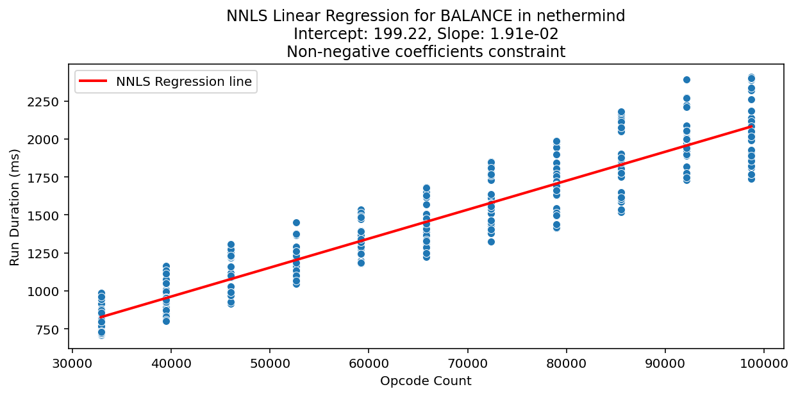

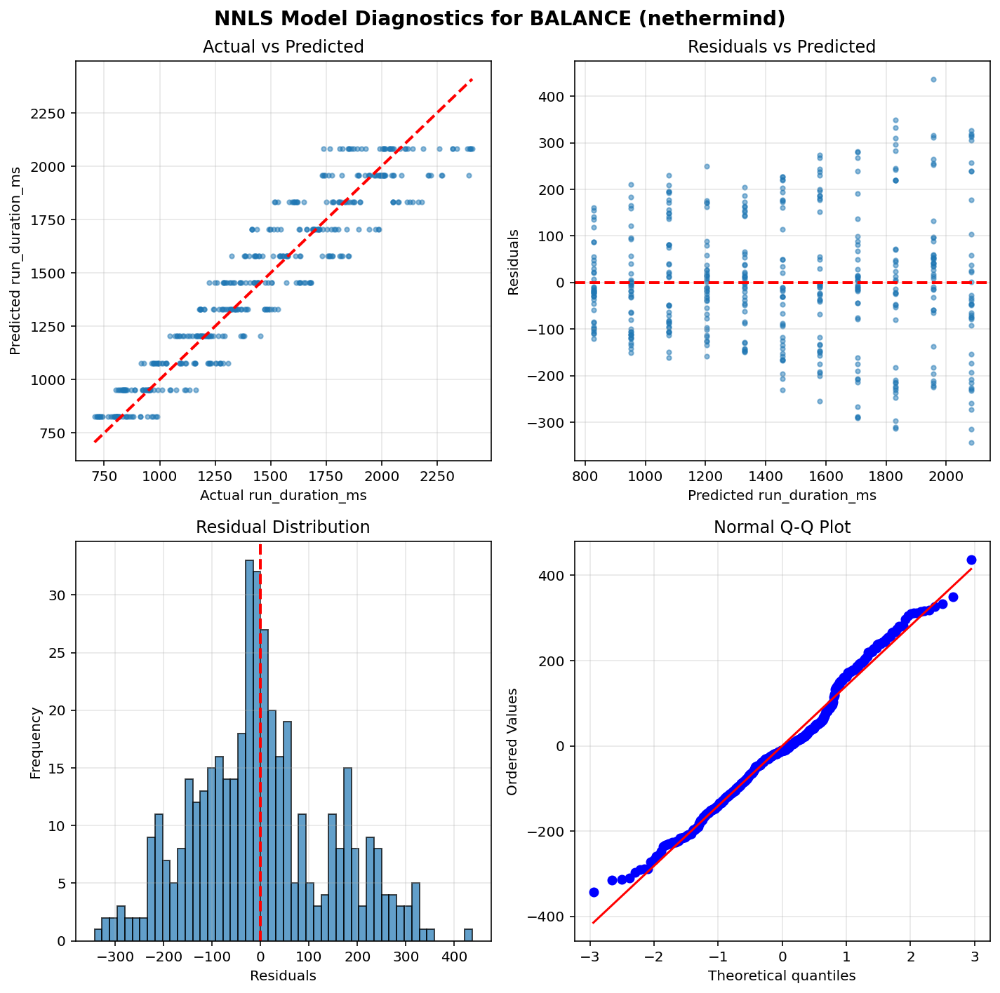

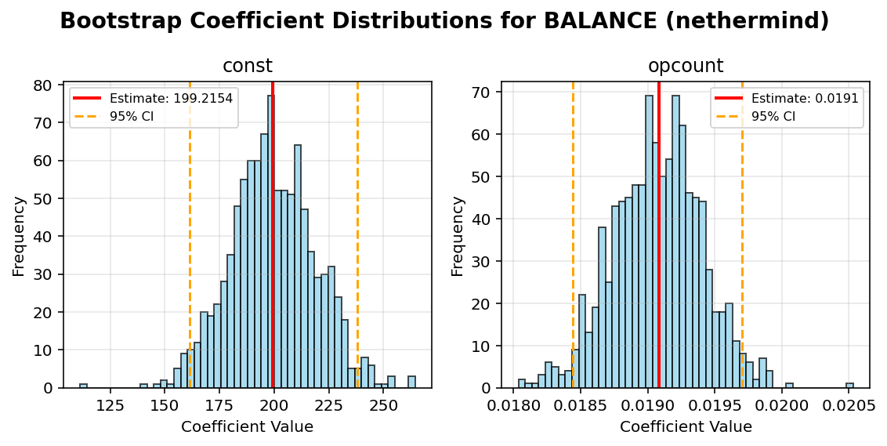


### test_name: test_account_access, account_mode: EXISTING_EOA


```python
==============================================================================
                           NNLS Regression Results                            
==============================================================================
Dep. Variable:          run_duration_ms              R-squared:          0.825
Model:                  NNLS                    Adj. R-squared:          0.825
No. Observations:       429                               RMSE:          56.57
Df Residuals:           427                                MAE:          40.57
Df Model:               1      
==============================================================================
                      coef     std err     P-value      [0.025      0.975]
------------------------------------------------------------------------------
         const     36.5535      7.3925       0.000     22.2800     50.5321
       opcount      0.0051      0.0001       0.000      0.0049      0.0054
==============================================================================
Notes: Non-negative least squares with bootstrap inference (1000 iterations)
==============================================================================
```

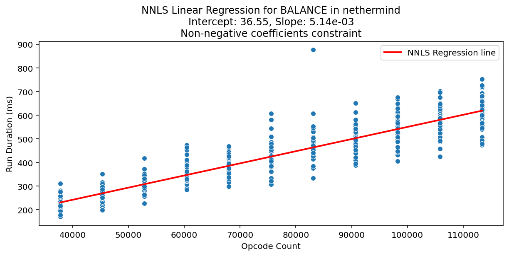

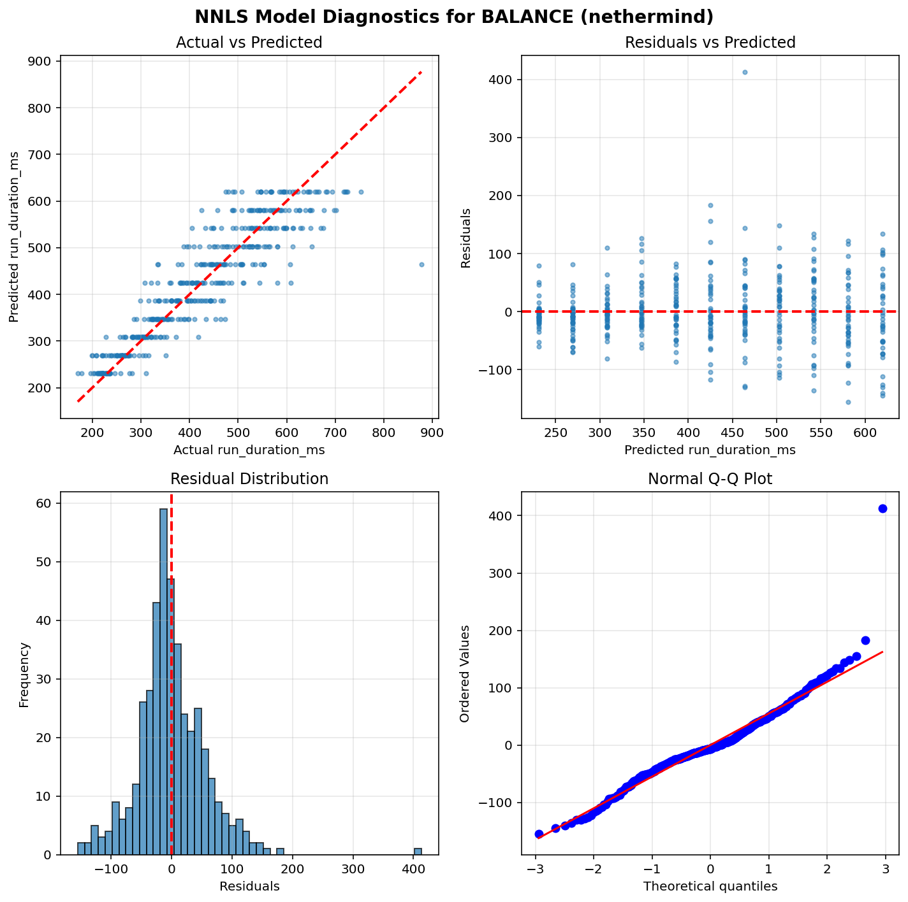

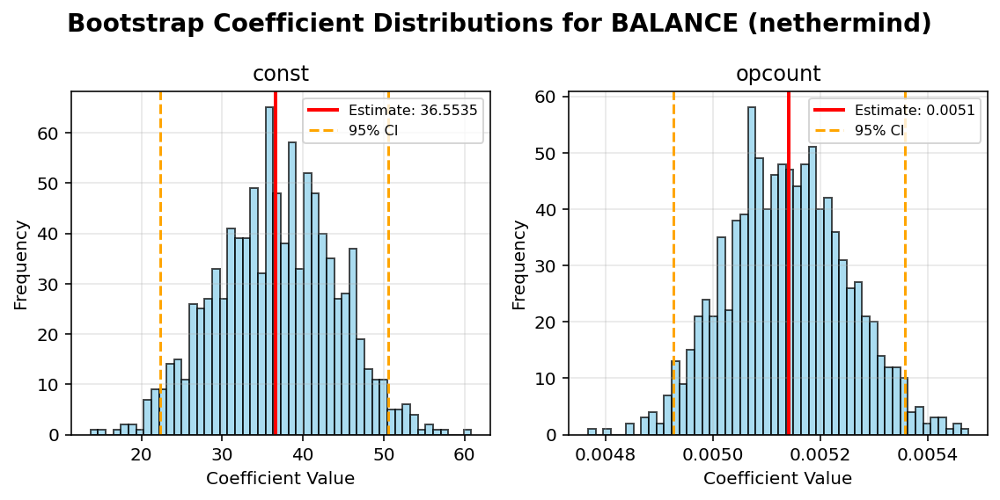


### test_name: test_account_access, account_mode: NON_EXISTING_ACCOUNT


```python
==============================================================================
                           NNLS Regression Results                            
==============================================================================
Dep. Variable:          run_duration_ms              R-squared:          0.850
Model:                  NNLS                    Adj. R-squared:          0.850
No. Observations:       429                               RMSE:          46.01
Df Residuals:           427                                MAE:          32.61
Df Model:               1      
==============================================================================
                      coef     std err     P-value      [0.025      0.975]
------------------------------------------------------------------------------
         const     51.0211      6.3388       0.000     38.5051     63.9434
       opcount      0.0046      0.0001       0.000      0.0044      0.0048
==============================================================================
Notes: Non-negative least squares with bootstrap inference (1000 iterations)
==============================================================================
```

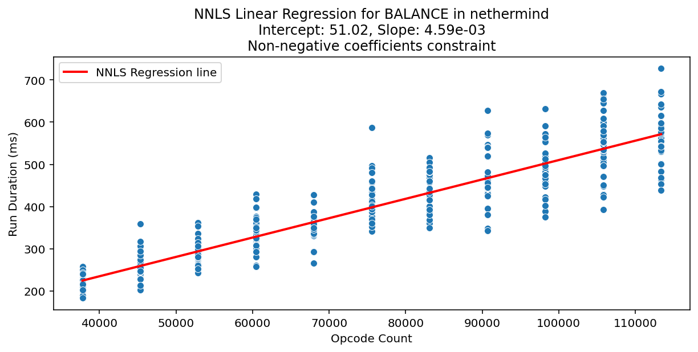

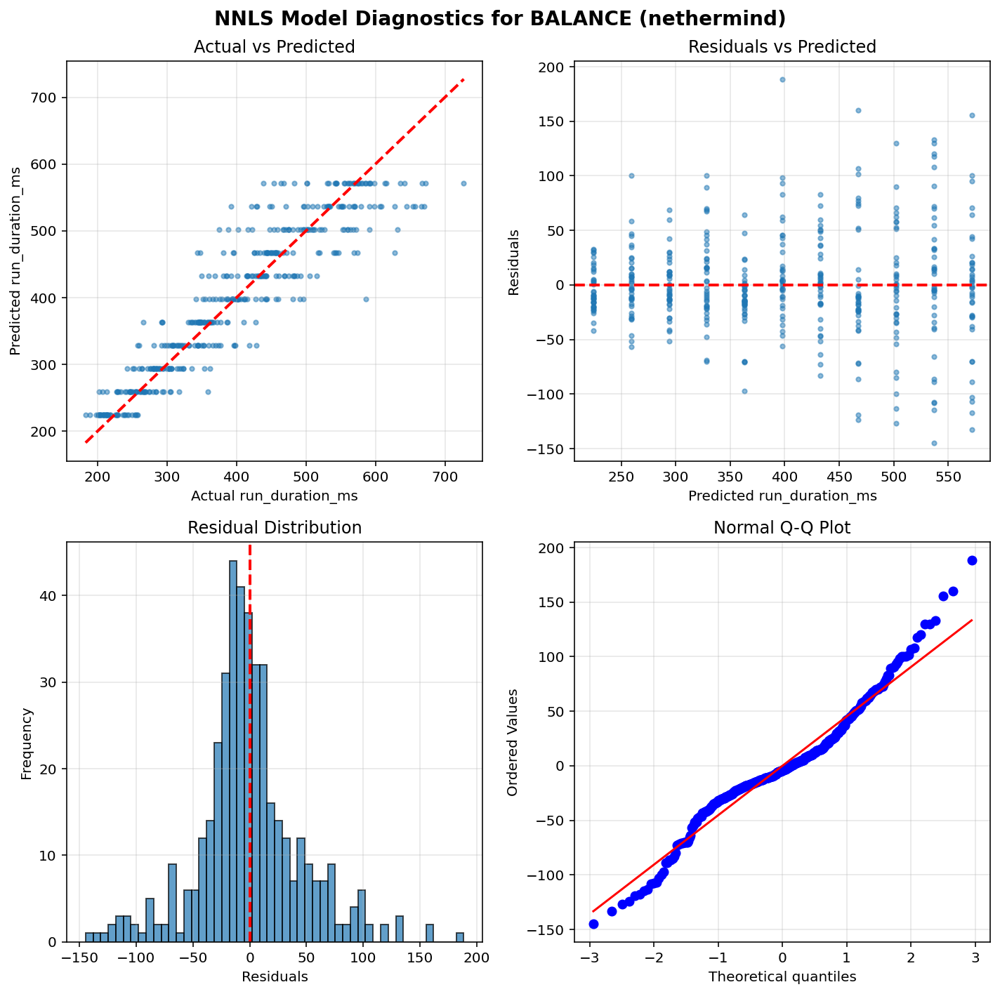

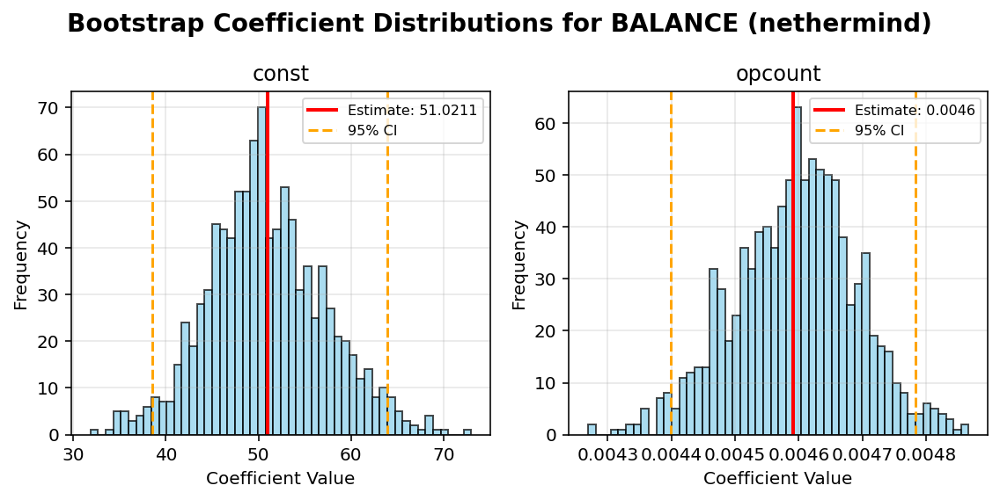


### test_name: test_ext_account_query_warm, account_mode: nan


```python
==============================================================================
                           NNLS Regression Results                            
==============================================================================
Dep. Variable:          run_duration_ms              R-squared:          0.741
Model:                  NNLS                    Adj. R-squared:          0.740
No. Observations:       429                               RMSE:          47.14
Df Residuals:           427                                MAE:          35.72
Df Model:               1      
==============================================================================
                      coef     std err     P-value      [0.025      0.975]
------------------------------------------------------------------------------
         const     61.5009      6.2154       0.000     49.3356     74.1419
       opcount      0.0001      0.0000       0.000      0.0001      0.0001
==============================================================================
Notes: Non-negative least squares with bootstrap inference (1000 iterations)
==============================================================================
```

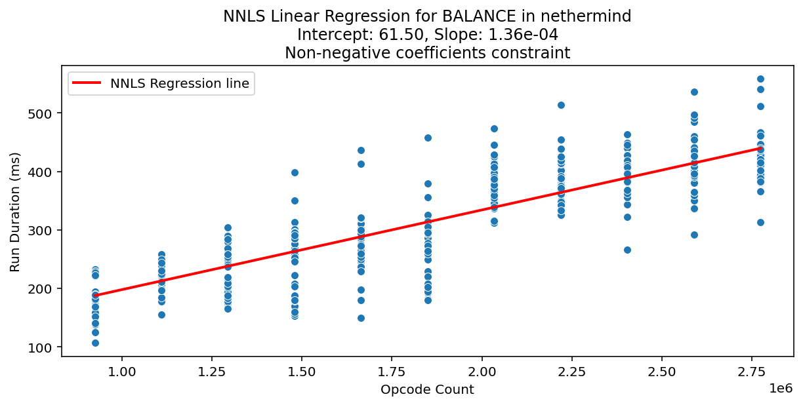

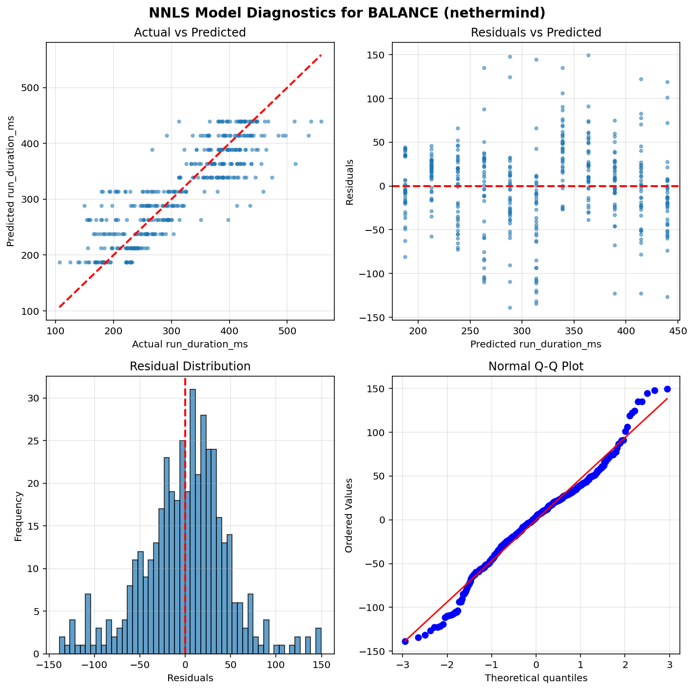

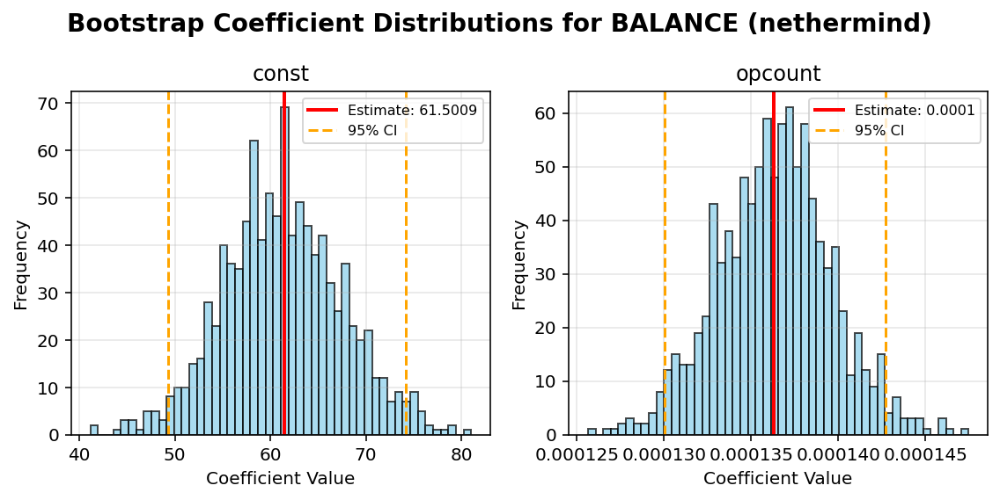


## reth

### test_name: test_account_access, account_mode: EXISTING_CONTRACT


```python
==============================================================================
                           NNLS Regression Results                            
==============================================================================
Dep. Variable:          run_duration_ms              R-squared:          0.798
Model:                  NNLS                    Adj. R-squared:          0.798
No. Observations:       561                               RMSE:         319.67
Df Residuals:           559                                MAE:         230.04
Df Model:               1      
==============================================================================
                      coef     std err     P-value      [0.025      0.975]
------------------------------------------------------------------------------
         const    683.7038     44.6108       0.000    596.6301    772.3754
       opcount      0.0306      0.0006       0.000      0.0294      0.0318
==============================================================================
Notes: Non-negative least squares with bootstrap inference (1000 iterations)
==============================================================================
```

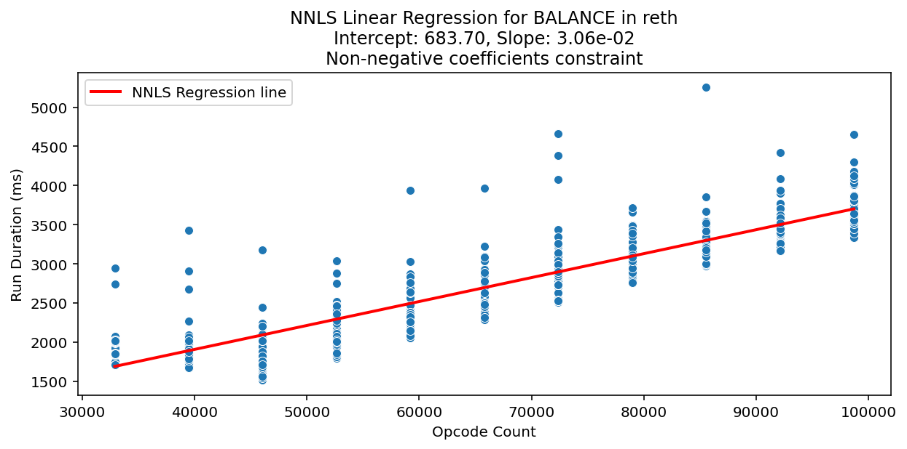

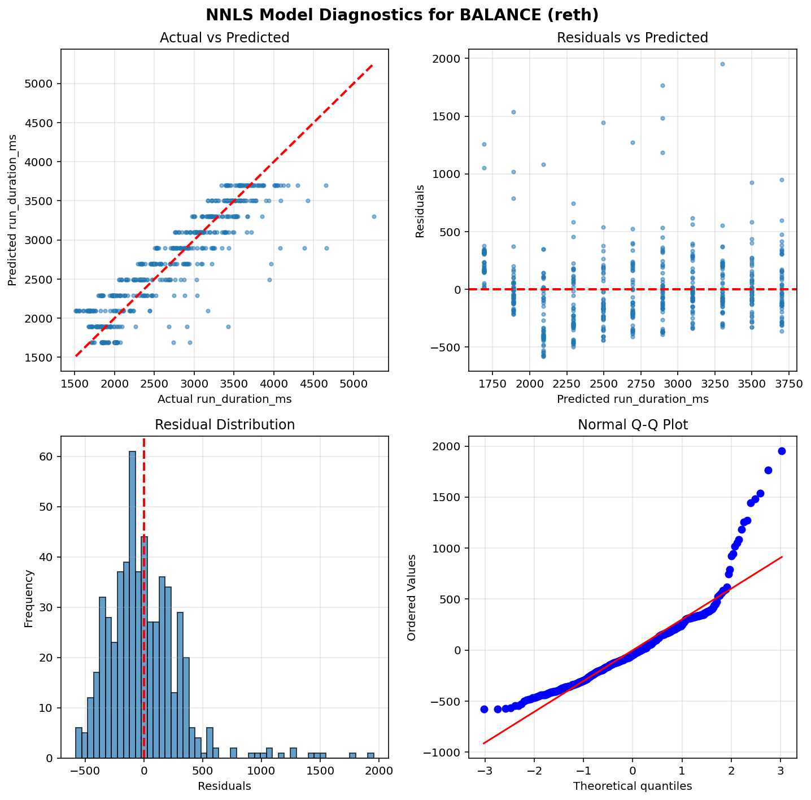

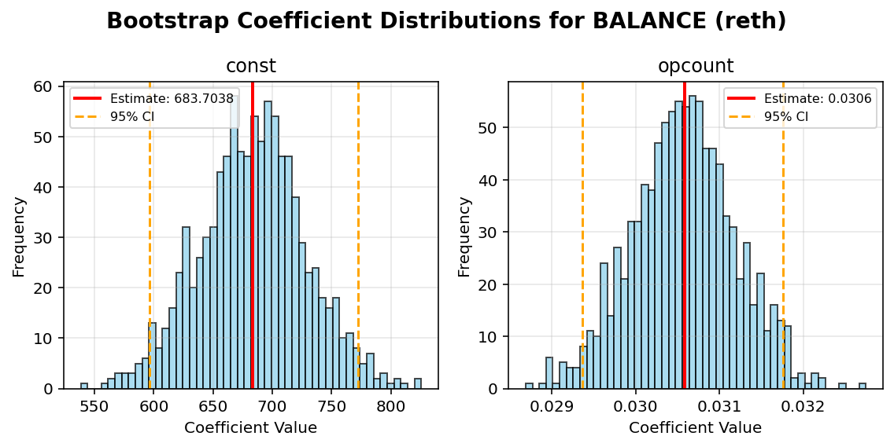


### test_name: test_account_access, account_mode: EXISTING_EOA


```python
==============================================================================
                           NNLS Regression Results                            
==============================================================================
Dep. Variable:          run_duration_ms              R-squared:          0.977
Model:                  NNLS                    Adj. R-squared:          0.977
No. Observations:       561                               RMSE:           4.00
Df Residuals:           559                                MAE:           3.19
Df Model:               1      
==============================================================================
                      coef     std err     P-value      [0.025      0.975]
------------------------------------------------------------------------------
         const     31.2096      0.5597       0.000     30.1025     32.2765
       opcount      0.0011      0.0000       0.000      0.0011      0.0011
==============================================================================
Notes: Non-negative least squares with bootstrap inference (1000 iterations)
==============================================================================
```


### test_name: test_account_access, account_mode: NON_EXISTING_ACCOUNT


```python
==============================================================================
                           NNLS Regression Results                            
==============================================================================
Dep. Variable:          run_duration_ms              R-squared:          0.973
Model:                  NNLS                    Adj. R-squared:          0.973
No. Observations:       561                               RMSE:           3.60
Df Residuals:           559                                MAE:           2.86
Df Model:               1      
==============================================================================
                      coef     std err     P-value      [0.025      0.975]
------------------------------------------------------------------------------
         const     31.6014      0.5068       0.000     30.6249     32.5482
       opcount      0.0009      0.0000       0.000      0.0009      0.0009
==============================================================================
Notes: Non-negative least squares with bootstrap inference (1000 iterations)
==============================================================================
```


### test_name: test_ext_account_query_warm, account_mode: nan


```python
==============================================================================
                           NNLS Regression Results                            
==============================================================================
Dep. Variable:          run_duration_ms              R-squared:          0.655
Model:                  NNLS                    Adj. R-squared:          0.654
No. Observations:       561                               RMSE:           2.92
Df Residuals:           559                                MAE:           2.02
Df Model:               1      
==============================================================================
                      coef     std err     P-value      [0.025      0.975]
------------------------------------------------------------------------------
         const      6.1248      0.3891       0.000      5.3551      6.8886
       opcount      0.0000      0.0000       0.000      0.0000      0.0000
==============================================================================
Notes: Non-negative least squares with bootstrap inference (1000 iterations)
==============================================================================
```


# EXTCODESIZE

## besu

### test_name: test_account_access, account_mode: EXISTING_CONTRACT


```python
==============================================================================
                           NNLS Regression Results                            
==============================================================================
Dep. Variable:          run_duration_ms              R-squared:          0.959
Model:                  NNLS                    Adj. R-squared:          0.958
No. Observations:       44                                RMSE:         155.66
Df Residuals:           42                                 MAE:         130.25
Df Model:               1      
==============================================================================
                      coef     std err     P-value      [0.025      0.975]
------------------------------------------------------------------------------
         const    415.6676     75.4917       0.000    262.6093    561.0514
       opcount      0.0361      0.0011       0.000      0.0340      0.0383
==============================================================================
Notes: Non-negative least squares with bootstrap inference (1000 iterations)
==============================================================================
```


### test_name: test_account_access, account_mode: NON_EXISTING_ACCOUNT


```python
==============================================================================
                           NNLS Regression Results                            
==============================================================================
Dep. Variable:          run_duration_ms              R-squared:          0.954
Model:                  NNLS                    Adj. R-squared:          0.953
No. Observations:       44                                RMSE:          61.24
Df Residuals:           42                                 MAE:          49.51
Df Model:               1      
==============================================================================
                      coef     std err     P-value      [0.025      0.975]
------------------------------------------------------------------------------
         const    492.6623     35.0678       0.000    418.7614    558.3739
       opcount      0.0116      0.0004       0.000      0.0108      0.0126
==============================================================================
Notes: Non-negative least squares with bootstrap inference (1000 iterations)
==============================================================================
```


### test_name: test_ext_account_query_warm, account_mode: nan


```python
==============================================================================
                           NNLS Regression Results                            
==============================================================================
Dep. Variable:          run_duration_ms              R-squared:          0.384
Model:                  NNLS                    Adj. R-squared:          0.369
No. Observations:       44                                RMSE:          58.91
Df Residuals:           42                                 MAE:          46.93
Df Model:               1      
==============================================================================
                      coef     std err     P-value      [0.025      0.975]
------------------------------------------------------------------------------
         const    323.2439     27.1815       0.000    271.1378    376.7183
       opcount      0.0001      0.0000       0.000      0.0000      0.0001
==============================================================================
Notes: Non-negative least squares with bootstrap inference (1000 iterations)
==============================================================================
```


## erigon

### test_name: test_account_access, account_mode: EXISTING_CONTRACT


```python
==============================================================================
                           NNLS Regression Results                            
==============================================================================
Dep. Variable:          run_duration_ms              R-squared:          0.868
Model:                  NNLS                    Adj. R-squared:          0.867
No. Observations:       220                               RMSE:         701.18
Df Residuals:           218                                MAE:         593.50
Df Model:               1      
==============================================================================
                      coef     std err     P-value      [0.025      0.975]
------------------------------------------------------------------------------
         const   1550.3862    167.8038       0.000   1238.3956   1883.4058
       opcount      0.0863      0.0022       0.000      0.0821      0.0905
==============================================================================
Notes: Non-negative least squares with bootstrap inference (1000 iterations)
==============================================================================
```


### test_name: test_account_access, account_mode: NON_EXISTING_ACCOUNT


```python
==============================================================================
                           NNLS Regression Results                            
==============================================================================
Dep. Variable:          run_duration_ms              R-squared:          0.995
Model:                  NNLS                    Adj. R-squared:          0.995
No. Observations:       220                               RMSE:          14.56
Df Residuals:           218                                MAE:          12.05
Df Model:               1      
==============================================================================
                      coef     std err     P-value      [0.025      0.975]
------------------------------------------------------------------------------
         const     14.4737      3.4697       0.000      6.9210     21.1114
       opcount      0.0088      0.0000       0.000      0.0088      0.0089
==============================================================================
Notes: Non-negative least squares with bootstrap inference (1000 iterations)
==============================================================================
```


### test_name: test_ext_account_query_warm, account_mode: nan


```python
==============================================================================
                           NNLS Regression Results                            
==============================================================================
Dep. Variable:          run_duration_ms              R-squared:          0.791
Model:                  NNLS                    Adj. R-squared:          0.790
No. Observations:       220                               RMSE:          11.99
Df Residuals:           218                                MAE:           9.71
Df Model:               1      
==============================================================================
                      coef     std err     P-value      [0.025      0.975]
------------------------------------------------------------------------------
         const     47.2171      2.3520       0.000     42.8728     51.9503
       opcount      0.0000      0.0000       0.000      0.0000      0.0000
==============================================================================
Notes: Non-negative least squares with bootstrap inference (1000 iterations)
==============================================================================
```


## geth

### test_name: test_account_access, account_mode: EXISTING_CONTRACT


```python
==============================================================================
                           NNLS Regression Results                            
==============================================================================
Dep. Variable:          run_duration_ms              R-squared:          0.730
Model:                  NNLS                    Adj. R-squared:          0.729
No. Observations:       638                               RMSE:         516.27
Df Residuals:           636                                MAE:         422.00
Df Model:               1      
==============================================================================
                      coef     std err     P-value      [0.025      0.975]
------------------------------------------------------------------------------
         const   1062.7279     61.6333       0.000    940.3886   1184.9652
       opcount      0.0408      0.0011       0.000      0.0387      0.0429
==============================================================================
Notes: Non-negative least squares with bootstrap inference (1000 iterations)
==============================================================================
```


### test_name: test_account_access, account_mode: NON_EXISTING_ACCOUNT


```python
==============================================================================
                           NNLS Regression Results                            
==============================================================================
Dep. Variable:          run_duration_ms              R-squared:          0.670
Model:                  NNLS                    Adj. R-squared:          0.670
No. Observations:       638                               RMSE:         627.73
Df Residuals:           636                                MAE:         525.19
Df Model:               1      
==============================================================================
                      coef     std err     P-value      [0.025      0.975]
------------------------------------------------------------------------------
         const   1230.9663     72.0649       0.000   1090.6698   1361.3904
       opcount      0.0374      0.0010       0.000      0.0355      0.0396
==============================================================================
Notes: Non-negative least squares with bootstrap inference (1000 iterations)
==============================================================================
```


### test_name: test_ext_account_query_warm, account_mode: nan


```python
==============================================================================
                           NNLS Regression Results                            
==============================================================================
Dep. Variable:          run_duration_ms              R-squared:          0.974
Model:                  NNLS                    Adj. R-squared:          0.974
No. Observations:       638                               RMSE:          14.01
Df Residuals:           636                                MAE:          10.02
Df Model:               1      
==============================================================================
                      coef     std err     P-value      [0.025      0.975]
------------------------------------------------------------------------------
         const     12.7426      1.5237       0.000      9.9080     15.7229
       opcount      0.0001      0.0000       0.000      0.0001      0.0001
==============================================================================
Notes: Non-negative least squares with bootstrap inference (1000 iterations)
==============================================================================
```


## nethermind

### test_name: test_account_access, account_mode: EXISTING_CONTRACT


```python
==============================================================================
                           NNLS Regression Results                            
==============================================================================
Dep. Variable:          run_duration_ms              R-squared:          0.881
Model:                  NNLS                    Adj. R-squared:          0.880
No. Observations:       429                               RMSE:         151.29
Df Residuals:           427                                MAE:         115.81
Df Model:               1      
==============================================================================
                      coef     std err     P-value      [0.025      0.975]
------------------------------------------------------------------------------
         const    166.8877     22.4847       0.000    125.0126    209.2368
       opcount      0.0197      0.0004       0.000      0.0190      0.0205
==============================================================================
Notes: Non-negative least squares with bootstrap inference (1000 iterations)
==============================================================================
```


### test_name: test_account_access, account_mode: NON_EXISTING_ACCOUNT


```python
==============================================================================
                           NNLS Regression Results                            
==============================================================================
Dep. Variable:          run_duration_ms              R-squared:          0.865
Model:                  NNLS                    Adj. R-squared:          0.864
No. Observations:       429                               RMSE:          46.71
Df Residuals:           427                                MAE:          34.25
Df Model:               1      
==============================================================================
                      coef     std err     P-value      [0.025      0.975]
------------------------------------------------------------------------------
         const     30.8708      6.6445       0.000     18.0744     43.9971
       opcount      0.0049      0.0001       0.000      0.0048      0.0051
==============================================================================
Notes: Non-negative least squares with bootstrap inference (1000 iterations)
==============================================================================
```


### test_name: test_ext_account_query_warm, account_mode: nan


```python
==============================================================================
                           NNLS Regression Results                            
==============================================================================
Dep. Variable:          run_duration_ms              R-squared:          0.750
Model:                  NNLS                    Adj. R-squared:          0.749
No. Observations:       429                               RMSE:          59.43
Df Residuals:           427                                MAE:          48.01
Df Model:               1      
==============================================================================
                      coef     std err     P-value      [0.025      0.975]
------------------------------------------------------------------------------
         const     58.6895      8.9776       0.000     40.4149     75.5210
       opcount      0.0002      0.0000       0.000      0.0002      0.0002
==============================================================================
Notes: Non-negative least squares with bootstrap inference (1000 iterations)
==============================================================================
```


## reth

### test_name: test_account_access, account_mode: EXISTING_CONTRACT


```python
==============================================================================
                           NNLS Regression Results                            
==============================================================================
Dep. Variable:          run_duration_ms              R-squared:          0.887
Model:                  NNLS                    Adj. R-squared:          0.887
No. Observations:       561                               RMSE:         261.97
Df Residuals:           559                                MAE:         145.07
Df Model:               1      
==============================================================================
                      coef     std err     P-value      [0.025      0.975]
------------------------------------------------------------------------------
         const    213.6358     40.5194       0.000    132.2939    287.2811
       opcount      0.0353      0.0006       0.000      0.0342      0.0366
==============================================================================
Notes: Non-negative least squares with bootstrap inference (1000 iterations)
==============================================================================
```


### test_name: test_account_access, account_mode: NON_EXISTING_ACCOUNT


```python
==============================================================================
                           NNLS Regression Results                            
==============================================================================
Dep. Variable:          run_duration_ms              R-squared:          0.968
Model:                  NNLS                    Adj. R-squared:          0.968
No. Observations:       561                               RMSE:           3.96
Df Residuals:           559                                MAE:           3.16
Df Model:               1      
==============================================================================
                      coef     std err     P-value      [0.025      0.975]
------------------------------------------------------------------------------
         const     31.5911      0.5404       0.000     30.5295     32.5939
       opcount      0.0009      0.0000       0.000      0.0009      0.0009
==============================================================================
Notes: Non-negative least squares with bootstrap inference (1000 iterations)
==============================================================================
```


### test_name: test_ext_account_query_warm, account_mode: nan


```python
==============================================================================
                           NNLS Regression Results                            
==============================================================================
Dep. Variable:          run_duration_ms              R-squared:          0.660
Model:                  NNLS                    Adj. R-squared:          0.660
No. Observations:       561                               RMSE:           2.42
Df Residuals:           559                                MAE:           1.60
Df Model:               1      
==============================================================================
                      coef     std err     P-value      [0.025      0.975]
------------------------------------------------------------------------------
         const      4.8602      0.3189       0.000      4.2308      5.4507
       opcount      0.0000      0.0000       0.000      0.0000      0.0000
==============================================================================
Notes: Non-negative least squares with bootstrap inference (1000 iterations)
==============================================================================
```


# EXTCODECOPY

## besu

### account_mode: EXISTING_CONTRACT


```python
==============================================================================
                           NNLS Regression Results                            
==============================================================================
Dep. Variable:          run_duration_ms              R-squared:          0.639
Model:                  NNLS                    Adj. R-squared:          0.631
No. Observations:       44                                RMSE:         138.19
Df Residuals:           42                                 MAE:         115.98
Df Model:               1      
==============================================================================
                      coef     std err     P-value      [0.025      0.975]
------------------------------------------------------------------------------
         const    549.4001     73.5124       0.000    417.7937    700.5698
       opcount      0.0019      0.0002       0.000      0.0014      0.0023
==============================================================================
Notes: Non-negative least squares with bootstrap inference (1000 iterations)
==============================================================================
```


### account_mode: NON_EXISTING_ACCOUNT


```python
==============================================================================
                           NNLS Regression Results                            
==============================================================================
Dep. Variable:          run_duration_ms              R-squared:          0.395
Model:                  NNLS                    Adj. R-squared:          0.381
No. Observations:       44                                RMSE:          83.82
Df Residuals:           42                                 MAE:          65.81
Df Model:               1      
==============================================================================
                      coef     std err     P-value      [0.025      0.975]
------------------------------------------------------------------------------
         const    389.5135     44.8546       0.000    297.3294    477.8100
       opcount      0.0003      0.0000       0.000      0.0002      0.0004
==============================================================================
Notes: Non-negative least squares with bootstrap inference (1000 iterations)
==============================================================================
```


## erigon

### account_mode: EXISTING_CONTRACT


```python
==============================================================================
                           NNLS Regression Results                            
==============================================================================
Dep. Variable:          run_duration_ms              R-squared:          0.868
Model:                  NNLS                    Adj. R-squared:          0.867
No. Observations:       220                               RMSE:          12.60
Df Residuals:           218                                MAE:          10.48
Df Model:               1      
==============================================================================
                      coef     std err     P-value      [0.025      0.975]
------------------------------------------------------------------------------
         const     46.5568      2.8455       0.000     41.0003     52.2534
       opcount      0.0003      0.0000       0.000      0.0003      0.0003
==============================================================================
Notes: Non-negative least squares with bootstrap inference (1000 iterations)
==============================================================================
```


### account_mode: NON_EXISTING_ACCOUNT


```python
==============================================================================
                           NNLS Regression Results                            
==============================================================================
Dep. Variable:          run_duration_ms              R-squared:          0.765
Model:                  NNLS                    Adj. R-squared:          0.764
No. Observations:       220                               RMSE:           9.36
Df Residuals:           218                                MAE:           7.84
Df Model:               1      
==============================================================================
                      coef     std err     P-value      [0.025      0.975]
------------------------------------------------------------------------------
         const     45.7770      2.1534       0.000     41.5102     50.2271
       opcount      0.0001      0.0000       0.000      0.0001      0.0001
==============================================================================
Notes: Non-negative least squares with bootstrap inference (1000 iterations)
==============================================================================
```


## geth

### account_mode: EXISTING_CONTRACT


```python
==============================================================================
                           NNLS Regression Results                            
==============================================================================
Dep. Variable:          run_duration_ms              R-squared:          0.977
Model:                  NNLS                    Adj. R-squared:          0.977
No. Observations:       638                               RMSE:          43.16
Df Residuals:           636                                MAE:          32.85
Df Model:               1      
==============================================================================
                      coef     std err     P-value      [0.025      0.975]
------------------------------------------------------------------------------
         const     34.6507      5.2914       0.000     23.9583     44.2499
       opcount      0.0029      0.0000       0.000      0.0028      0.0029
==============================================================================
Notes: Non-negative least squares with bootstrap inference (1000 iterations)
==============================================================================
```


### account_mode: NON_EXISTING_ACCOUNT


```python
==============================================================================
                           NNLS Regression Results                            
==============================================================================
Dep. Variable:          run_duration_ms              R-squared:          0.938
Model:                  NNLS                    Adj. R-squared:          0.938
No. Observations:       638                               RMSE:          53.28
Df Residuals:           636                                MAE:          39.01
Df Model:               1      
==============================================================================
                      coef     std err     P-value      [0.025      0.975]
------------------------------------------------------------------------------
         const     23.4205      6.1689       0.000     11.5084     35.5351
       opcount      0.0008      0.0000       0.000      0.0008      0.0008
==============================================================================
Notes: Non-negative least squares with bootstrap inference (1000 iterations)
==============================================================================
```


## nethermind

### account_mode: EXISTING_CONTRACT


```python
==============================================================================
                           NNLS Regression Results                            
==============================================================================
Dep. Variable:          run_duration_ms              R-squared:          0.757
Model:                  NNLS                    Adj. R-squared:          0.756
No. Observations:       429                               RMSE:          55.20
Df Residuals:           427                                MAE:          42.58
Df Model:               1      
==============================================================================
                      coef     std err     P-value      [0.025      0.975]
------------------------------------------------------------------------------
         const    216.8455      9.0061       0.000    199.6088    233.9609
       opcount      0.0010      0.0000       0.000      0.0009      0.0010
==============================================================================
Notes: Non-negative least squares with bootstrap inference (1000 iterations)
==============================================================================
```


### account_mode: NON_EXISTING_ACCOUNT


```python
==============================================================================
                           NNLS Regression Results                            
==============================================================================
Dep. Variable:          run_duration_ms              R-squared:          0.768
Model:                  NNLS                    Adj. R-squared:          0.767
No. Observations:       429                               RMSE:          40.04
Df Residuals:           427                                MAE:          29.44
Df Model:               1      
==============================================================================
                      coef     std err     P-value      [0.025      0.975]
------------------------------------------------------------------------------
         const    126.9822      6.1278       0.000    115.2623    139.1128
       opcount      0.0003      0.0000       0.000      0.0003      0.0003
==============================================================================
Notes: Non-negative least squares with bootstrap inference (1000 iterations)
==============================================================================
```


## reth

### account_mode: EXISTING_CONTRACT


```python
==============================================================================
                           NNLS Regression Results                            
==============================================================================
Dep. Variable:          run_duration_ms              R-squared:          0.786
Model:                  NNLS                    Adj. R-squared:          0.785
No. Observations:       561                               RMSE:           4.11
Df Residuals:           559                                MAE:           3.19
Df Model:               1      
==============================================================================
                      coef     std err     P-value      [0.025      0.975]
------------------------------------------------------------------------------
         const     10.8004      0.6086       0.000      9.5137     11.9377
       opcount      0.0001      0.0000       0.000      0.0001      0.0001
==============================================================================
Notes: Non-negative least squares with bootstrap inference (1000 iterations)
==============================================================================
```


### account_mode: NON_EXISTING_ACCOUNT


```python
==============================================================================
                           NNLS Regression Results                            
==============================================================================
Dep. Variable:          run_duration_ms              R-squared:          0.719
Model:                  NNLS                    Adj. R-squared:          0.719
No. Observations:       561                               RMSE:           2.64
Df Residuals:           559                                MAE:           1.97
Df Model:               1      
==============================================================================
                      coef     std err     P-value      [0.025      0.975]
------------------------------------------------------------------------------
         const      6.3019      0.3516       0.000      5.5976      6.9763
       opcount      0.0000      0.0000       0.000      0.0000      0.0000
==============================================================================
Notes: Non-negative least squares with bootstrap inference (1000 iterations)
==============================================================================
```


# EXTCODEHASH

## besu

### test_name: test_account_access, account_mode: EXISTING_CONTRACT


```python
==============================================================================
                           NNLS Regression Results                            
==============================================================================
Dep. Variable:          run_duration_ms              R-squared:          0.966
Model:                  NNLS                    Adj. R-squared:          0.965
No. Observations:       44                                RMSE:         137.25
Df Residuals:           42                                 MAE:         109.00
Df Model:               1      
==============================================================================
                      coef     std err     P-value      [0.025      0.975]
------------------------------------------------------------------------------
         const    438.2691     67.2604       0.000    304.6527    562.8945
       opcount      0.0349      0.0010       0.000      0.0331      0.0369
==============================================================================
Notes: Non-negative least squares with bootstrap inference (1000 iterations)
==============================================================================
```


### test_name: test_account_access, account_mode: NON_EXISTING_ACCOUNT


```python
==============================================================================
                           NNLS Regression Results                            
==============================================================================
Dep. Variable:          run_duration_ms              R-squared:          0.950
Model:                  NNLS                    Adj. R-squared:          0.948
No. Observations:       44                                RMSE:          64.35
Df Residuals:           42                                 MAE:          52.82
Df Model:               1      
==============================================================================
                      coef     std err     P-value      [0.025      0.975]
------------------------------------------------------------------------------
         const    500.0310     33.0742       0.000    432.8443    563.5303
       opcount      0.0117      0.0004       0.000      0.0108      0.0125
==============================================================================
Notes: Non-negative least squares with bootstrap inference (1000 iterations)
==============================================================================
```


### test_name: test_ext_account_query_warm, account_mode: nan


```python
==============================================================================
                           NNLS Regression Results                            
==============================================================================
Dep. Variable:          run_duration_ms              R-squared:          0.288
Model:                  NNLS                    Adj. R-squared:          0.271
No. Observations:       44                                RMSE:          71.59
Df Residuals:           42                                 MAE:          58.70
Df Model:               1      
==============================================================================
                      coef     std err     P-value      [0.025      0.975]
------------------------------------------------------------------------------
         const    325.6534     41.0681       0.000    241.8334    404.7044
       opcount      0.0001      0.0000       0.000      0.0000      0.0001
==============================================================================
Notes: Non-negative least squares with bootstrap inference (1000 iterations)
==============================================================================
```


## erigon

### test_name: test_account_access, account_mode: EXISTING_CONTRACT


```python
==============================================================================
                           NNLS Regression Results                            
==============================================================================
Dep. Variable:          run_duration_ms              R-squared:          0.895
Model:                  NNLS                    Adj. R-squared:          0.895
No. Observations:       220                               RMSE:         257.67
Df Residuals:           218                                MAE:         218.18
Df Model:               1      
==============================================================================
                      coef     std err     P-value      [0.025      0.975]
------------------------------------------------------------------------------
         const    446.5683     59.1872       0.000    340.1110    574.3839
       opcount      0.0362      0.0008       0.000      0.0346      0.0376
==============================================================================
Notes: Non-negative least squares with bootstrap inference (1000 iterations)
==============================================================================
```


### test_name: test_account_access, account_mode: NON_EXISTING_ACCOUNT


```python
==============================================================================
                           NNLS Regression Results                            
==============================================================================
Dep. Variable:          run_duration_ms              R-squared:          0.996
Model:                  NNLS                    Adj. R-squared:          0.996
No. Observations:       220                               RMSE:          13.40
Df Residuals:           218                                MAE:          10.51
Df Model:               1      
==============================================================================
                      coef     std err     P-value      [0.025      0.975]
------------------------------------------------------------------------------
         const      9.8368      2.9864       0.001      4.4443     15.7765
       opcount      0.0087      0.0000       0.000      0.0086      0.0088
==============================================================================
Notes: Non-negative least squares with bootstrap inference (1000 iterations)
==============================================================================
```


### test_name: test_ext_account_query_warm, account_mode: nan


```python
==============================================================================
                           NNLS Regression Results                            
==============================================================================
Dep. Variable:          run_duration_ms              R-squared:          0.899
Model:                  NNLS                    Adj. R-squared:          0.898
No. Observations:       220                               RMSE:          52.18
Df Residuals:           218                                MAE:          44.64
Df Model:               1      
==============================================================================
                      coef     std err     P-value      [0.025      0.975]
------------------------------------------------------------------------------
         const     50.7704     10.9879       0.000     29.6420     72.7461
       opcount      0.0003      0.0000       0.000      0.0003      0.0003
==============================================================================
Notes: Non-negative least squares with bootstrap inference (1000 iterations)
==============================================================================
```


## geth

### test_name: test_account_access, account_mode: EXISTING_CONTRACT


```python
==============================================================================
                           NNLS Regression Results                            
==============================================================================
Dep. Variable:          run_duration_ms              R-squared:          0.631
Model:                  NNLS                    Adj. R-squared:          0.631
No. Observations:       638                               RMSE:         535.90
Df Residuals:           636                                MAE:         445.40
Df Model:               1      
==============================================================================
                      coef     std err     P-value      [0.025      0.975]
------------------------------------------------------------------------------
         const   1388.3315     64.8333       0.000   1259.1971   1515.3605
       opcount      0.0337      0.0010       0.000      0.0317      0.0356
==============================================================================
Notes: Non-negative least squares with bootstrap inference (1000 iterations)
==============================================================================
```


### test_name: test_account_access, account_mode: NON_EXISTING_ACCOUNT


```python
==============================================================================
                           NNLS Regression Results                            
==============================================================================
Dep. Variable:          run_duration_ms              R-squared:          0.681
Model:                  NNLS                    Adj. R-squared:          0.681
No. Observations:       638                               RMSE:         631.86
Df Residuals:           636                                MAE:         530.09
Df Model:               1      
==============================================================================
                      coef     std err     P-value      [0.025      0.975]
------------------------------------------------------------------------------
         const   1174.4893     72.6085       0.000   1033.8164   1322.5215
       opcount      0.0386      0.0011       0.000      0.0365      0.0408
==============================================================================
Notes: Non-negative least squares with bootstrap inference (1000 iterations)
==============================================================================
```


### test_name: test_ext_account_query_warm, account_mode: nan


```python
==============================================================================
                           NNLS Regression Results                            
==============================================================================
Dep. Variable:          run_duration_ms              R-squared:          0.964
Model:                  NNLS                    Adj. R-squared:          0.964
No. Observations:       638                               RMSE:          22.16
Df Residuals:           636                                MAE:          16.41
Df Model:               1      
==============================================================================
                      coef     std err     P-value      [0.025      0.975]
------------------------------------------------------------------------------
         const      7.3316      2.3955       0.002      2.4296     11.9532
       opcount      0.0002      0.0000       0.000      0.0002      0.0002
==============================================================================
Notes: Non-negative least squares with bootstrap inference (1000 iterations)
==============================================================================
```


## nethermind

### test_name: test_account_access, account_mode: EXISTING_CONTRACT


```python
==============================================================================
                           NNLS Regression Results                            
==============================================================================
Dep. Variable:          run_duration_ms              R-squared:          0.892
Model:                  NNLS                    Adj. R-squared:          0.892
No. Observations:       429                               RMSE:         140.96
Df Residuals:           427                                MAE:         108.14
Df Model:               1      
==============================================================================
                      coef     std err     P-value      [0.025      0.975]
------------------------------------------------------------------------------
         const    195.5994     19.9517       0.000    155.0031    231.7326
       opcount      0.0195      0.0003       0.000      0.0189      0.0202
==============================================================================
Notes: Non-negative least squares with bootstrap inference (1000 iterations)
==============================================================================
```


### test_name: test_account_access, account_mode: NON_EXISTING_ACCOUNT


```python
==============================================================================
                           NNLS Regression Results                            
==============================================================================
Dep. Variable:          run_duration_ms              R-squared:          0.873
Model:                  NNLS                    Adj. R-squared:          0.873
No. Observations:       429                               RMSE:          46.18
Df Residuals:           427                                MAE:          33.91
Df Model:               1      
==============================================================================
                      coef     std err     P-value      [0.025      0.975]
------------------------------------------------------------------------------
         const     25.1591      5.8954       0.000     13.0550     36.2042
       opcount      0.0051      0.0001       0.000      0.0049      0.0053
==============================================================================
Notes: Non-negative least squares with bootstrap inference (1000 iterations)
==============================================================================
```


### test_name: test_ext_account_query_warm, account_mode: nan


```python
==============================================================================
                           NNLS Regression Results                            
==============================================================================
Dep. Variable:          run_duration_ms              R-squared:          0.704
Model:                  NNLS                    Adj. R-squared:          0.703
No. Observations:       429                               RMSE:          77.56
Df Residuals:           427                                MAE:          61.96
Df Model:               1      
==============================================================================
                      coef     std err     P-value      [0.025      0.975]
------------------------------------------------------------------------------
         const    121.3163     12.0136       0.000     97.6706    145.9700
       opcount      0.0002      0.0000       0.000      0.0002      0.0002
==============================================================================
Notes: Non-negative least squares with bootstrap inference (1000 iterations)
==============================================================================
```


## reth

### test_name: test_account_access, account_mode: EXISTING_CONTRACT


```python
==============================================================================
                           NNLS Regression Results                            
==============================================================================
Dep. Variable:          run_duration_ms              R-squared:          0.875
Model:                  NNLS                    Adj. R-squared:          0.875
No. Observations:       561                               RMSE:         279.25
Df Residuals:           559                                MAE:         158.28
Df Model:               1      
==============================================================================
                      coef     std err     P-value      [0.025      0.975]
------------------------------------------------------------------------------
         const    199.8009     40.4008       0.000    126.0783    281.6090
       opcount      0.0356      0.0006       0.000      0.0343      0.0367
==============================================================================
Notes: Non-negative least squares with bootstrap inference (1000 iterations)
==============================================================================
```


### test_name: test_account_access, account_mode: NON_EXISTING_ACCOUNT


```python
==============================================================================
                           NNLS Regression Results                            
==============================================================================
Dep. Variable:          run_duration_ms              R-squared:          0.969
Model:                  NNLS                    Adj. R-squared:          0.969
No. Observations:       561                               RMSE:           3.90
Df Residuals:           559                                MAE:           3.00
Df Model:               1      
==============================================================================
                      coef     std err     P-value      [0.025      0.975]
------------------------------------------------------------------------------
         const     32.4092      0.5389       0.000     31.4393     33.5408
       opcount      0.0009      0.0000       0.000      0.0009      0.0009
==============================================================================
Notes: Non-negative least squares with bootstrap inference (1000 iterations)
==============================================================================
```


### test_name: test_ext_account_query_warm, account_mode: nan


```python
==============================================================================
                           NNLS Regression Results                            
==============================================================================
Dep. Variable:          run_duration_ms              R-squared:          0.679
Model:                  NNLS                    Adj. R-squared:          0.678
No. Observations:       561                               RMSE:           3.13
Df Residuals:           559                                MAE:           2.22
Df Model:               1      
==============================================================================
                      coef     std err     P-value      [0.025      0.975]
------------------------------------------------------------------------------
         const      6.3342      0.4256       0.000      5.4806      7.1878
       opcount      0.0000      0.0000       0.000      0.0000      0.0000
==============================================================================
Notes: Non-negative least squares with bootstrap inference (1000 iterations)
==============================================================================
```


# SLOAD

## besu

### test_name: test_sload_bloated, existing_slots: False


```python
==============================================================================
                           NNLS Regression Results                            
==============================================================================
Dep. Variable:          run_duration_ms              R-squared:          0.957
Model:                  NNLS                    Adj. R-squared:          0.955
No. Observations:       44                                RMSE:          57.87
Df Residuals:           42                                 MAE:          43.02
Df Model:               1      
==============================================================================
                      coef     std err     P-value      [0.025      0.975]
------------------------------------------------------------------------------
         const    172.2541     27.3618       0.000    109.1783    218.3693
       opcount      0.0092      0.0003       0.000      0.0087      0.0099
==============================================================================
Notes: Non-negative least squares with bootstrap inference (1000 iterations)
==============================================================================
```


### test_name: test_sload_bloated, existing_slots: True


```python
==============================================================================
                           NNLS Regression Results                            
==============================================================================
Dep. Variable:          run_duration_ms              R-squared:          0.919
Model:                  NNLS                    Adj. R-squared:          0.917
No. Observations:       44                                RMSE:         181.45
Df Residuals:           42                                 MAE:         163.32
Df Model:               1      
==============================================================================
                      coef     std err     P-value      [0.025      0.975]
------------------------------------------------------------------------------
         const    387.9449     95.8908       0.000    187.5098    568.3380
       opcount      0.0208      0.0010       0.000      0.0188      0.0228
==============================================================================
Notes: Non-negative least squares with bootstrap inference (1000 iterations)
==============================================================================
```


### test_name: test_storage_sload_same_key_benchmark, existing_slots: False


```python
==============================================================================
                           NNLS Regression Results                            
==============================================================================
Dep. Variable:          run_duration_ms              R-squared:          0.153
Model:                  NNLS                    Adj. R-squared:          0.133
No. Observations:       44                                RMSE:          83.21
Df Residuals:           42                                 MAE:          67.18
Df Model:               1      
==============================================================================
                      coef     std err     P-value      [0.025      0.975]
------------------------------------------------------------------------------
         const    275.5303     41.2855       0.000    193.8832    360.1065
       opcount      0.0001      0.0000       0.003      0.0000      0.0001
==============================================================================
Notes: Non-negative least squares with bootstrap inference (1000 iterations)
==============================================================================
```


### test_name: test_storage_sload_same_key_benchmark, existing_slots: True


```python
==============================================================================
                           NNLS Regression Results                            
==============================================================================
Dep. Variable:          run_duration_ms              R-squared:          0.393
Model:                  NNLS                    Adj. R-squared:          0.378
No. Observations:       44                                RMSE:          80.45
Df Residuals:           42                                 MAE:          65.55
Df Model:               1      
==============================================================================
                      coef     std err     P-value      [0.025      0.975]
------------------------------------------------------------------------------
         const    206.5165     34.7322       0.000    138.5668    273.6022
       opcount      0.0001      0.0000       0.000      0.0001      0.0001
==============================================================================
Notes: Non-negative least squares with bootstrap inference (1000 iterations)
==============================================================================
```


## erigon

### test_name: test_sload_bloated, existing_slots: False


```python
==============================================================================
                           NNLS Regression Results                            
==============================================================================
Dep. Variable:          run_duration_ms              R-squared:          0.995
Model:                  NNLS                    Adj. R-squared:          0.995
No. Observations:       220                               RMSE:          12.67
Df Residuals:           218                                MAE:          10.28
Df Model:               1      
==============================================================================
                      coef     std err     P-value      [0.025      0.975]
------------------------------------------------------------------------------
         const     19.6928      2.5143       0.000     14.7517     24.6844
       opcount      0.0062      0.0000       0.000      0.0061      0.0063
==============================================================================
Notes: Non-negative least squares with bootstrap inference (1000 iterations)
==============================================================================
```


### test_name: test_sload_bloated, existing_slots: True


```python
==============================================================================
                           NNLS Regression Results                            
==============================================================================
Dep. Variable:          run_duration_ms              R-squared:          0.989
Model:                  NNLS                    Adj. R-squared:          0.989
No. Observations:       220                               RMSE:          17.88
Df Residuals:           218                                MAE:          14.72
Df Model:               1      
==============================================================================
                      coef     std err     P-value      [0.025      0.975]
------------------------------------------------------------------------------
         const     30.8099      3.7611       0.000     23.7472     37.8378
       opcount      0.0058      0.0000       0.000      0.0057      0.0058
==============================================================================
Notes: Non-negative least squares with bootstrap inference (1000 iterations)
==============================================================================
```


### test_name: test_storage_sload_same_key_benchmark, existing_slots: False


```python
==============================================================================
                           NNLS Regression Results                            
==============================================================================
Dep. Variable:          run_duration_ms              R-squared:          0.876
Model:                  NNLS                    Adj. R-squared:          0.875
No. Observations:       220                               RMSE:          12.20
Df Residuals:           218                                MAE:          10.16
Df Model:               1      
==============================================================================
                      coef     std err     P-value      [0.025      0.975]
------------------------------------------------------------------------------
         const     38.1115      2.4736       0.000     33.1151     42.9593
       opcount      0.0001      0.0000       0.000      0.0000      0.0001
==============================================================================
Notes: Non-negative least squares with bootstrap inference (1000 iterations)
==============================================================================
```


### test_name: test_storage_sload_same_key_benchmark, existing_slots: True


```python
==============================================================================
                           NNLS Regression Results                            
==============================================================================
Dep. Variable:          run_duration_ms              R-squared:          0.814
Model:                  NNLS                    Adj. R-squared:          0.813
No. Observations:       220                               RMSE:          15.33
Df Residuals:           218                                MAE:          10.86
Df Model:               1      
==============================================================================
                      coef     std err     P-value      [0.025      0.975]
------------------------------------------------------------------------------
         const     37.8018      3.3547       0.000     30.8823     44.1449
       opcount      0.0001      0.0000       0.000      0.0000      0.0001
==============================================================================
Notes: Non-negative least squares with bootstrap inference (1000 iterations)
==============================================================================
```


## geth

### test_name: test_sload_bloated, existing_slots: False


```python
==============================================================================
                           NNLS Regression Results                            
==============================================================================
Dep. Variable:          run_duration_ms              R-squared:          0.741
Model:                  NNLS                    Adj. R-squared:          0.740
No. Observations:       638                               RMSE:        2745.95
Df Residuals:           636                                MAE:        2500.17
Df Model:               1      
==============================================================================
                      coef     std err     P-value      [0.025      0.975]
------------------------------------------------------------------------------
         const   2730.6247    320.6568       0.000   2067.0465   3316.0270
       opcount      0.1577      0.0039       0.000      0.1501      0.1661
==============================================================================
Notes: Non-negative least squares with bootstrap inference (1000 iterations)
==============================================================================
```


### test_name: test_sload_bloated, existing_slots: True


```python
==============================================================================
                           NNLS Regression Results                            
==============================================================================
Dep. Variable:          run_duration_ms              R-squared:          0.718
Model:                  NNLS                    Adj. R-squared:          0.718
No. Observations:       638                               RMSE:        2783.12
Df Residuals:           636                                MAE:        2471.03
Df Model:               1      
==============================================================================
                      coef     std err     P-value      [0.025      0.975]
------------------------------------------------------------------------------
         const   2813.1043    326.1362       0.000   2173.1954   3424.2209
       opcount      0.1511      0.0040       0.000      0.1433      0.1589
==============================================================================
Notes: Non-negative least squares with bootstrap inference (1000 iterations)
==============================================================================
```


### test_name: test_storage_sload_same_key_benchmark, existing_slots: False


```python
==============================================================================
                           NNLS Regression Results                            
==============================================================================
Dep. Variable:          run_duration_ms              R-squared:          0.981
Model:                  NNLS                    Adj. R-squared:          0.981
No. Observations:       638                               RMSE:          18.68
Df Residuals:           636                                MAE:          14.33
Df Model:               1      
==============================================================================
                      coef     std err     P-value      [0.025      0.975]
------------------------------------------------------------------------------
         const     17.1204      2.3020       0.000     12.4455     21.3181
       opcount      0.0002      0.0000       0.000      0.0002      0.0002
==============================================================================
Notes: Non-negative least squares with bootstrap inference (1000 iterations)
==============================================================================
```


### test_name: test_storage_sload_same_key_benchmark, existing_slots: True


```python
==============================================================================
                           NNLS Regression Results                            
==============================================================================
Dep. Variable:          run_duration_ms              R-squared:          0.982
Model:                  NNLS                    Adj. R-squared:          0.982
No. Observations:       638                               RMSE:          18.29
Df Residuals:           636                                MAE:          13.78
Df Model:               1      
==============================================================================
                      coef     std err     P-value      [0.025      0.975]
------------------------------------------------------------------------------
         const      9.5271      2.1245       0.000      5.1448     13.5312
       opcount      0.0002      0.0000       0.000      0.0002      0.0002
==============================================================================
Notes: Non-negative least squares with bootstrap inference (1000 iterations)
==============================================================================
```


## nethermind

### test_name: test_sload_bloated, existing_slots: False


```python
==============================================================================
                           NNLS Regression Results                            
==============================================================================
Dep. Variable:          run_duration_ms              R-squared:          0.886
Model:                  NNLS                    Adj. R-squared:          0.886
No. Observations:       429                               RMSE:          37.08
Df Residuals:           427                                MAE:          28.61
Df Model:               1      
==============================================================================
                      coef     std err     P-value      [0.025      0.975]
------------------------------------------------------------------------------
         const    130.0413      5.3001       0.000    119.8787    139.5931
       opcount      0.0035      0.0001       0.000      0.0034      0.0036
==============================================================================
Notes: Non-negative least squares with bootstrap inference (1000 iterations)
==============================================================================
```


### test_name: test_sload_bloated, existing_slots: True


```python
==============================================================================
                           NNLS Regression Results                            
==============================================================================
Dep. Variable:          run_duration_ms              R-squared:          0.719
Model:                  NNLS                    Adj. R-squared:          0.718
No. Observations:       275                               RMSE:         452.97
Df Residuals:           273                                MAE:         359.22
Df Model:               1      
==============================================================================
                      coef     std err     P-value      [0.025      0.975]
------------------------------------------------------------------------------
         const   1510.5129    103.3522       0.000   1309.2783   1702.8609
       opcount      0.0246      0.0010       0.000      0.0226      0.0267
==============================================================================
Notes: Non-negative least squares with bootstrap inference (1000 iterations)
==============================================================================
```


### test_name: test_storage_sload_same_key_benchmark, existing_slots: False


```python
==============================================================================
                           NNLS Regression Results                            
==============================================================================
Dep. Variable:          run_duration_ms              R-squared:          0.760
Model:                  NNLS                    Adj. R-squared:          0.760
No. Observations:       429                               RMSE:          53.54
Df Residuals:           427                                MAE:          40.22
Df Model:               1      
==============================================================================
                      coef     std err     P-value      [0.025      0.975]
------------------------------------------------------------------------------
         const     94.5354      7.7011       0.000     79.5537    110.1127
       opcount      0.0002      0.0000       0.000      0.0001      0.0002
==============================================================================
Notes: Non-negative least squares with bootstrap inference (1000 iterations)
==============================================================================
```


### test_name: test_storage_sload_same_key_benchmark, existing_slots: True


```python
==============================================================================
                           NNLS Regression Results                            
==============================================================================
Dep. Variable:          run_duration_ms              R-squared:          0.748
Model:                  NNLS                    Adj. R-squared:          0.748
No. Observations:       429                               RMSE:          52.84
Df Residuals:           427                                MAE:          38.62
Df Model:               1      
==============================================================================
                      coef     std err     P-value      [0.025      0.975]
------------------------------------------------------------------------------
         const    103.2258      8.0340       0.000     87.4650    117.7450
       opcount      0.0001      0.0000       0.000      0.0001      0.0002
==============================================================================
Notes: Non-negative least squares with bootstrap inference (1000 iterations)
==============================================================================
```


## reth

### test_name: test_sload_bloated, existing_slots: False


```python
==============================================================================
                           NNLS Regression Results                            
==============================================================================
Dep. Variable:          run_duration_ms              R-squared:          0.949
Model:                  NNLS                    Adj. R-squared:          0.949
No. Observations:       561                               RMSE:           8.85
Df Residuals:           559                                MAE:           6.70
Df Model:               1      
==============================================================================
                      coef     std err     P-value      [0.025      0.975]
------------------------------------------------------------------------------
         const     38.6689      1.4374       0.000     35.8938     41.3060
       opcount      0.0013      0.0000       0.000      0.0013      0.0013
==============================================================================
Notes: Non-negative least squares with bootstrap inference (1000 iterations)
==============================================================================
```


### test_name: test_sload_bloated, existing_slots: True


```python
==============================================================================
                           NNLS Regression Results                            
==============================================================================
Dep. Variable:          run_duration_ms              R-squared:          0.969
Model:                  NNLS                    Adj. R-squared:          0.969
No. Observations:       561                               RMSE:           7.49
Df Residuals:           559                                MAE:           5.65
Df Model:               1      
==============================================================================
                      coef     std err     P-value      [0.025      0.975]
------------------------------------------------------------------------------
         const     30.4849      0.9933       0.000     28.5459     32.5107
       opcount      0.0014      0.0000       0.000      0.0014      0.0015
==============================================================================
Notes: Non-negative least squares with bootstrap inference (1000 iterations)
==============================================================================
```


### test_name: test_storage_sload_same_key_benchmark, existing_slots: False


```python
==============================================================================
                           NNLS Regression Results                            
==============================================================================
Dep. Variable:          run_duration_ms              R-squared:          0.670
Model:                  NNLS                    Adj. R-squared:          0.670
No. Observations:       561                               RMSE:           2.18
Df Residuals:           559                                MAE:           1.55
Df Model:               1      
==============================================================================
                      coef     std err     P-value      [0.025      0.975]
------------------------------------------------------------------------------
         const      6.0816      0.3190       0.000      5.4964      6.7227
       opcount      0.0000      0.0000       0.000      0.0000      0.0000
==============================================================================
Notes: Non-negative least squares with bootstrap inference (1000 iterations)
==============================================================================
```


### test_name: test_storage_sload_same_key_benchmark, existing_slots: True


```python
==============================================================================
                           NNLS Regression Results                            
==============================================================================
Dep. Variable:          run_duration_ms              R-squared:          0.717
Model:                  NNLS                    Adj. R-squared:          0.716
No. Observations:       561                               RMSE:           2.13
Df Residuals:           559                                MAE:           1.49
Df Model:               1      
==============================================================================
                      coef     std err     P-value      [0.025      0.975]
------------------------------------------------------------------------------
         const      5.1567      0.3130       0.000      4.5680      5.7797
       opcount      0.0000      0.0000       0.000      0.0000      0.0000
==============================================================================
Notes: Non-negative least squares with bootstrap inference (1000 iterations)
==============================================================================
```


# SSTORE

## besu

### existing_slots: False


```python
==============================================================================
                           NNLS Regression Results                            
==============================================================================
Dep. Variable:          run_duration_ms              R-squared:          0.856
Model:                  NNLS                    Adj. R-squared:          0.853
No. Observations:       88                                RMSE:         130.47
Df Residuals:           85                                 MAE:         104.11
Df Model:               2      
==============================================================================
                      coef     std err     P-value      [0.025      0.975]
------------------------------------------------------------------------------
         const    381.8340     38.3119       0.000    306.1500    454.1915
       opcount      0.0106      0.0005       0.000      0.0096      0.0116
        update      0.2617      0.0211       0.000      0.2223      0.3057
==============================================================================
Notes: Non-negative least squares with bootstrap inference (1000 iterations)
==============================================================================
```


### existing_slots: True


```python
==============================================================================
                           NNLS Regression Results                            
==============================================================================
Dep. Variable:          run_duration_ms              R-squared:          0.965
Model:                  NNLS                    Adj. R-squared:          0.964
No. Observations:       88                                RMSE:         325.49
Df Residuals:           85                                 MAE:         267.69
Df Model:               2      
==============================================================================
                      coef     std err     P-value      [0.025      0.975]
------------------------------------------------------------------------------
         const   1032.9202    116.2686       0.000    798.1130   1255.7790
       opcount      0.0167      0.0013       0.000      0.0140      0.0195
        update      0.0910      0.0023       0.000      0.0862      0.0956
==============================================================================
Notes: Non-negative least squares with bootstrap inference (1000 iterations)
==============================================================================
```


## erigon

### existing_slots: False


```python
==============================================================================
                           NNLS Regression Results                            
==============================================================================
Dep. Variable:          run_duration_ms              R-squared:          0.934
Model:                  NNLS                    Adj. R-squared:          0.934
No. Observations:       440                               RMSE:         593.84
Df Residuals:           437                                MAE:         443.82
Df Model:               2      
==============================================================================
                      coef     std err     P-value      [0.025      0.975]
------------------------------------------------------------------------------
         const    778.9894     25.9614       0.000    730.5950    833.0639
       opcount      0.0000      0.0000       1.000      0.0000      0.0000
        update      2.1044      0.0232       0.000      2.0604      2.1514
==============================================================================
Notes: Non-negative least squares with bootstrap inference (1000 iterations)
==============================================================================
```


### existing_slots: True


```python
==============================================================================
                           NNLS Regression Results                            
==============================================================================
Dep. Variable:          run_duration_ms              R-squared:          0.994
Model:                  NNLS                    Adj. R-squared:          0.994
No. Observations:       440                               RMSE:        1136.70
Df Residuals:           437                                MAE:         878.62
Df Model:               2      
==============================================================================
                      coef     std err     P-value      [0.025      0.975]
------------------------------------------------------------------------------
         const    978.7635     46.8821       0.000    892.8132   1080.1479
       opcount      0.0000      0.0000       1.000      0.0000      0.0000
        update      0.6762      0.0026       0.000      0.6714      0.6813
==============================================================================
Notes: Non-negative least squares with bootstrap inference (1000 iterations)
==============================================================================
```


## geth

### existing_slots: False


```python
==============================================================================
                           NNLS Regression Results                            
==============================================================================
Dep. Variable:          run_duration_ms              R-squared:          0.929
Model:                  NNLS                    Adj. R-squared:          0.929
No. Observations:       1276                              RMSE:         525.65
Df Residuals:           1273                               MAE:         391.21
Df Model:               2      
==============================================================================
                      coef     std err     P-value      [0.025      0.975]
------------------------------------------------------------------------------
         const    643.5759     43.1612       0.000    556.4292    728.1681
       opcount      0.0428      0.0006       0.000      0.0416      0.0440
        update      0.1835      0.0200       0.000      0.1450      0.2224
==============================================================================
Notes: Non-negative least squares with bootstrap inference (1000 iterations)
==============================================================================
```


### existing_slots: True


```python
==============================================================================
                           NNLS Regression Results                            
==============================================================================
Dep. Variable:          run_duration_ms              R-squared:          0.819
Model:                  NNLS                    Adj. R-squared:          0.818
No. Observations:       1276                              RMSE:         565.98
Df Residuals:           1273                               MAE:         437.41
Df Model:               2      
==============================================================================
                      coef     std err     P-value      [0.025      0.975]
------------------------------------------------------------------------------
         const   1160.6919     50.1469       0.000   1064.1177   1262.4799
       opcount      0.0354      0.0007       0.000      0.0340      0.0366
        update      0.0648      0.0008       0.000      0.0633      0.0662
==============================================================================
Notes: Non-negative least squares with bootstrap inference (1000 iterations)
==============================================================================
```


## nethermind

### existing_slots: False


```python
==============================================================================
                           NNLS Regression Results                            
==============================================================================
Dep. Variable:          run_duration_ms              R-squared:          0.895
Model:                  NNLS                    Adj. R-squared:          0.895
No. Observations:       858                               RMSE:          42.09
Df Residuals:           855                                MAE:          32.82
Df Model:               2      
==============================================================================
                      coef     std err     P-value      [0.025      0.975]
------------------------------------------------------------------------------
         const    129.2756      4.1246       0.000    121.1806    137.1807
       opcount      0.0035      0.0000       0.000      0.0034      0.0036
        update      0.0550      0.0022       0.000      0.0506      0.0593
==============================================================================
Notes: Non-negative least squares with bootstrap inference (1000 iterations)
==============================================================================
```


### existing_slots: True


```python
==============================================================================
                           NNLS Regression Results                            
==============================================================================
Dep. Variable:          run_duration_ms              R-squared:          0.578
Model:                  NNLS                    Adj. R-squared:          0.577
No. Observations:       858                               RMSE:         600.10
Df Residuals:           855                                MAE:         517.32
Df Model:               2      
==============================================================================
                      coef     std err     P-value      [0.025      0.975]
------------------------------------------------------------------------------
         const   1016.7797     62.4309       0.000    896.3954   1138.5436
       opcount      0.0255      0.0008       0.000      0.0240      0.0271
        update      0.0285      0.0012       0.000      0.0262      0.0307
==============================================================================
Notes: Non-negative least squares with bootstrap inference (1000 iterations)
==============================================================================
```


## reth

### existing_slots: False


```python
==============================================================================
                           NNLS Regression Results                            
==============================================================================
Dep. Variable:          run_duration_ms              R-squared:          0.593
Model:                  NNLS                    Adj. R-squared:          0.592
No. Observations:       1122                              RMSE:          62.58
Df Residuals:           1119                               MAE:          39.10
Df Model:               2      
==============================================================================
                      coef     std err     P-value      [0.025      0.975]
------------------------------------------------------------------------------
         const    169.9968      5.5492       0.000    153.5483    174.5733
       opcount      0.0000      0.0000       1.000      0.0000      0.0002
        update      0.0710      0.0020       0.000      0.0694      0.0770
==============================================================================
Notes: Non-negative least squares with bootstrap inference (1000 iterations)
==============================================================================
```


### existing_slots: True


```python
==============================================================================
                           NNLS Regression Results                            
==============================================================================
Dep. Variable:          run_duration_ms              R-squared:          0.995
Model:                  NNLS                    Adj. R-squared:          0.995
No. Observations:       1122                              RMSE:         259.72
Df Residuals:           1119                               MAE:         194.42
Df Model:               2      
==============================================================================
                      coef     std err     P-value      [0.025      0.975]
------------------------------------------------------------------------------
         const    257.4104      6.8705       0.000    244.8009    271.4626
       opcount      0.0000      0.0000       1.000      0.0000      0.0000
        update      0.1715      0.0004       0.000      0.1708      0.1723
==============================================================================
Notes: Non-negative least squares with bootstrap inference (1000 iterations)
==============================================================================
```


# DELEGATECALL

## besu

### test_name: test_account_access, account_mode: EXISTING_CONTRACT


```python
==============================================================================
                           NNLS Regression Results                            
==============================================================================
Dep. Variable:          run_duration_ms              R-squared:          0.967
Model:                  NNLS                    Adj. R-squared:          0.967
No. Observations:       44                                RMSE:         132.53
Df Residuals:           42                                 MAE:         102.10
Df Model:               1      
==============================================================================
                      coef     std err     P-value      [0.025      0.975]
------------------------------------------------------------------------------
         const    571.1933     62.3287       0.000    456.0447    701.3594
       opcount      0.0354      0.0009       0.000      0.0335      0.0372
==============================================================================
Notes: Non-negative least squares with bootstrap inference (1000 iterations)
==============================================================================
```


### test_name: test_account_access, account_mode: EXISTING_EOA


```python
==============================================================================
                           NNLS Regression Results                            
==============================================================================
Dep. Variable:          run_duration_ms              R-squared:          0.928
Model:                  NNLS                    Adj. R-squared:          0.927
No. Observations:       44                                RMSE:         127.98
Df Residuals:           42                                 MAE:         105.29
Df Model:               1      
==============================================================================
                      coef     std err     P-value      [0.025      0.975]
------------------------------------------------------------------------------
         const    643.7103     61.8374       0.000    515.8158    762.5543
       opcount      0.0194      0.0008       0.000      0.0177      0.0210
==============================================================================
Notes: Non-negative least squares with bootstrap inference (1000 iterations)
==============================================================================
```


### test_name: test_account_access, account_mode: NON_EXISTING_ACCOUNT


```python
==============================================================================
                           NNLS Regression Results                            
==============================================================================
Dep. Variable:          run_duration_ms              R-squared:          0.944
Model:                  NNLS                    Adj. R-squared:          0.943
No. Observations:       44                                RMSE:          71.68
Df Residuals:           42                                 MAE:          58.67
Df Model:               1      
==============================================================================
                      coef     std err     P-value      [0.025      0.975]
------------------------------------------------------------------------------
         const    659.6731     36.5336       0.000    586.7039    728.4974
       opcount      0.0124      0.0005       0.000      0.0115      0.0133
==============================================================================
Notes: Non-negative least squares with bootstrap inference (1000 iterations)
==============================================================================
```


### test_name: test_ext_account_query_warm, account_mode: nan


```python
==============================================================================
                           NNLS Regression Results                            
==============================================================================
Dep. Variable:          run_duration_ms              R-squared:          0.973
Model:                  NNLS                    Adj. R-squared:          0.972
No. Observations:       44                                RMSE:         111.41
Df Residuals:           42                                 MAE:          81.59
Df Model:               1      
==============================================================================
                      coef     std err     P-value      [0.025      0.975]
------------------------------------------------------------------------------
         const    663.8357     60.4929       0.000    554.2820    785.9145
       opcount      0.0013      0.0000       0.000      0.0012      0.0014
==============================================================================
Notes: Non-negative least squares with bootstrap inference (1000 iterations)
==============================================================================
```


## erigon

### test_name: test_account_access, account_mode: EXISTING_CONTRACT


```python
==============================================================================
                           NNLS Regression Results                            
==============================================================================
Dep. Variable:          run_duration_ms              R-squared:          0.872
Model:                  NNLS                    Adj. R-squared:          0.872
No. Observations:       220                               RMSE:         684.12
Df Residuals:           218                                MAE:         581.11
Df Model:               1      
==============================================================================
                      coef     std err     P-value      [0.025      0.975]
------------------------------------------------------------------------------
         const   1507.3657    167.8476       0.000   1209.0977   1848.5737
       opcount      0.0877      0.0022       0.000      0.0831      0.0917
==============================================================================
Notes: Non-negative least squares with bootstrap inference (1000 iterations)
==============================================================================
```


### test_name: test_account_access, account_mode: EXISTING_EOA


```python
==============================================================================
                           NNLS Regression Results                            
==============================================================================
Dep. Variable:          run_duration_ms              R-squared:          0.995
Model:                  NNLS                    Adj. R-squared:          0.995
No. Observations:       220                               RMSE:          17.21
Df Residuals:           218                                MAE:          14.07
Df Model:               1      
==============================================================================
                      coef     std err     P-value      [0.025      0.975]
------------------------------------------------------------------------------
         const     42.3751      3.2538       0.000     35.8679     48.6726
       opcount      0.0102      0.0000       0.000      0.0101      0.0102
==============================================================================
Notes: Non-negative least squares with bootstrap inference (1000 iterations)
==============================================================================
```


### test_name: test_account_access, account_mode: NON_EXISTING_ACCOUNT


```python
==============================================================================
                           NNLS Regression Results                            
==============================================================================
Dep. Variable:          run_duration_ms              R-squared:          0.995
Model:                  NNLS                    Adj. R-squared:          0.995
No. Observations:       220                               RMSE:          15.45
Df Residuals:           218                                MAE:          12.25
Df Model:               1      
==============================================================================
                      coef     std err     P-value      [0.025      0.975]
------------------------------------------------------------------------------
         const     21.3687      3.3564       0.000     14.0638     27.4195
       opcount      0.0095      0.0000       0.000      0.0095      0.0096
==============================================================================
Notes: Non-negative least squares with bootstrap inference (1000 iterations)
==============================================================================
```


### test_name: test_ext_account_query_warm, account_mode: nan


```python
==============================================================================
                           NNLS Regression Results                            
==============================================================================
Dep. Variable:          run_duration_ms              R-squared:          0.888
Model:                  NNLS                    Adj. R-squared:          0.887
No. Observations:       220                               RMSE:          51.36
Df Residuals:           218                                MAE:          42.85
Df Model:               1      
==============================================================================
                      coef     std err     P-value      [0.025      0.975]
------------------------------------------------------------------------------
         const     61.7190     10.1995       0.000     42.2285     81.3384
       opcount      0.0003      0.0000       0.000      0.0003      0.0003
==============================================================================
Notes: Non-negative least squares with bootstrap inference (1000 iterations)
==============================================================================
```


## geth

### test_name: test_account_access, account_mode: EXISTING_CONTRACT


```python
==============================================================================
                           NNLS Regression Results                            
==============================================================================
Dep. Variable:          run_duration_ms              R-squared:          0.638
Model:                  NNLS                    Adj. R-squared:          0.638
No. Observations:       638                               RMSE:         539.24
Df Residuals:           636                                MAE:         443.67
Df Model:               1      
==============================================================================
                      coef     std err     P-value      [0.025      0.975]
------------------------------------------------------------------------------
         const   1363.4625     69.0428       0.000   1227.0297   1495.6651
       opcount      0.0352      0.0011       0.000      0.0330      0.0373
==============================================================================
Notes: Non-negative least squares with bootstrap inference (1000 iterations)
==============================================================================
```


### test_name: test_account_access, account_mode: EXISTING_EOA


```python
==============================================================================
                           NNLS Regression Results                            
==============================================================================
Dep. Variable:          run_duration_ms              R-squared:          0.709
Model:                  NNLS                    Adj. R-squared:          0.709
No. Observations:       638                               RMSE:         185.72
Df Residuals:           636                                MAE:         157.68
Df Model:               1      
==============================================================================
                      coef     std err     P-value      [0.025      0.975]
------------------------------------------------------------------------------
         const    505.9723     24.2746       0.000    457.2532    556.8357
       opcount      0.0122      0.0003       0.000      0.0116      0.0128
==============================================================================
Notes: Non-negative least squares with bootstrap inference (1000 iterations)
==============================================================================
```


### test_name: test_account_access, account_mode: NON_EXISTING_ACCOUNT


```python
==============================================================================
                           NNLS Regression Results                            
==============================================================================
Dep. Variable:          run_duration_ms              R-squared:          0.620
Model:                  NNLS                    Adj. R-squared:          0.620
No. Observations:       638                               RMSE:         587.21
Df Residuals:           636                                MAE:         479.32
Df Model:               1      
==============================================================================
                      coef     std err     P-value      [0.025      0.975]
------------------------------------------------------------------------------
         const   1495.9106     73.9565       0.000   1360.3489   1640.4025
       opcount      0.0316      0.0010       0.000      0.0296      0.0335
==============================================================================
Notes: Non-negative least squares with bootstrap inference (1000 iterations)
==============================================================================
```


### test_name: test_ext_account_query_warm, account_mode: nan


```python
==============================================================================
                           NNLS Regression Results                            
==============================================================================
Dep. Variable:          run_duration_ms              R-squared:          0.976
Model:                  NNLS                    Adj. R-squared:          0.976
No. Observations:       638                               RMSE:          45.02
Df Residuals:           636                                MAE:          33.80
Df Model:               1      
==============================================================================
                      coef     std err     P-value      [0.025      0.975]
------------------------------------------------------------------------------
         const     23.3566      5.1346       0.000     12.8562     32.9590
       opcount      0.0006      0.0000       0.000      0.0005      0.0006
==============================================================================
Notes: Non-negative least squares with bootstrap inference (1000 iterations)
==============================================================================
```


## nethermind

### test_name: test_account_access, account_mode: EXISTING_CONTRACT


```python
==============================================================================
                           NNLS Regression Results                            
==============================================================================
Dep. Variable:          run_duration_ms              R-squared:          0.890
Model:                  NNLS                    Adj. R-squared:          0.890
No. Observations:       429                               RMSE:         141.80
Df Residuals:           427                                MAE:         108.67
Df Model:               1      
==============================================================================
                      coef     std err     P-value      [0.025      0.975]
------------------------------------------------------------------------------
         const    219.9876     20.2465       0.000    181.9974    259.5427
       opcount      0.0198      0.0004       0.000      0.0191      0.0205
==============================================================================
Notes: Non-negative least squares with bootstrap inference (1000 iterations)
==============================================================================
```


### test_name: test_account_access, account_mode: EXISTING_EOA


```python
==============================================================================
                           NNLS Regression Results                            
==============================================================================
Dep. Variable:          run_duration_ms              R-squared:          0.874
Model:                  NNLS                    Adj. R-squared:          0.874
No. Observations:       429                               RMSE:          53.87
Df Residuals:           427                                MAE:          40.79
Df Model:               1      
==============================================================================
                      coef     std err     P-value      [0.025      0.975]
------------------------------------------------------------------------------
         const     60.9499      7.3031       0.000     46.5744     75.3607
       opcount      0.0060      0.0001       0.000      0.0058      0.0062
==============================================================================
Notes: Non-negative least squares with bootstrap inference (1000 iterations)
==============================================================================
```


### test_name: test_account_access, account_mode: NON_EXISTING_ACCOUNT


```python
==============================================================================
                           NNLS Regression Results                            
==============================================================================
Dep. Variable:          run_duration_ms              R-squared:          0.852
Model:                  NNLS                    Adj. R-squared:          0.852
No. Observations:       429                               RMSE:          53.52
Df Residuals:           427                                MAE:          36.67
Df Model:               1      
==============================================================================
                      coef     std err     P-value      [0.025      0.975]
------------------------------------------------------------------------------
         const     69.2234      6.8491       0.000     56.3043     82.6677
       opcount      0.0054      0.0001       0.000      0.0052      0.0056
==============================================================================
Notes: Non-negative least squares with bootstrap inference (1000 iterations)
==============================================================================
```


### test_name: test_ext_account_query_warm, account_mode: nan


```python
==============================================================================
                           NNLS Regression Results                            
==============================================================================
Dep. Variable:          run_duration_ms              R-squared:          0.621
Model:                  NNLS                    Adj. R-squared:          0.620
No. Observations:       429                               RMSE:         174.71
Df Residuals:           427                                MAE:         141.35
Df Model:               1      
==============================================================================
                      coef     std err     P-value      [0.025      0.975]
------------------------------------------------------------------------------
         const    412.0235     25.8219       0.000    363.9589    463.0505
       opcount      0.0004      0.0000       0.000      0.0004      0.0005
==============================================================================
Notes: Non-negative least squares with bootstrap inference (1000 iterations)
==============================================================================
```


## reth

### test_name: test_account_access, account_mode: EXISTING_CONTRACT


```python
==============================================================================
                           NNLS Regression Results                            
==============================================================================
Dep. Variable:          run_duration_ms              R-squared:          0.939
Model:                  NNLS                    Adj. R-squared:          0.939
No. Observations:       561                               RMSE:         200.04
Df Residuals:           559                                MAE:         120.65
Df Model:               1      
==============================================================================
                      coef     std err     P-value      [0.025      0.975]
------------------------------------------------------------------------------
         const      0.0000      0.6610       1.000      0.0000      0.0000
       opcount      0.0374      0.0001       0.000      0.0372      0.0377
==============================================================================
Notes: Non-negative least squares with bootstrap inference (1000 iterations)
==============================================================================
```


### test_name: test_account_access, account_mode: EXISTING_EOA


```python
==============================================================================
                           NNLS Regression Results                            
==============================================================================
Dep. Variable:          run_duration_ms              R-squared:          0.976
Model:                  NNLS                    Adj. R-squared:          0.976
No. Observations:       561                               RMSE:           4.18
Df Residuals:           559                                MAE:           3.33
Df Model:               1      
==============================================================================
                      coef     std err     P-value      [0.025      0.975]
------------------------------------------------------------------------------
         const     32.1799      0.6312       0.000     30.8977     33.4247
       opcount      0.0011      0.0000       0.000      0.0011      0.0011
==============================================================================
Notes: Non-negative least squares with bootstrap inference (1000 iterations)
==============================================================================
```


### test_name: test_account_access, account_mode: NON_EXISTING_ACCOUNT


```python
==============================================================================
                           NNLS Regression Results                            
==============================================================================
Dep. Variable:          run_duration_ms              R-squared:          0.975
Model:                  NNLS                    Adj. R-squared:          0.975
No. Observations:       561                               RMSE:           3.62
Df Residuals:           559                                MAE:           2.84
Df Model:               1      
==============================================================================
                      coef     std err     P-value      [0.025      0.975]
------------------------------------------------------------------------------
         const     31.6202      0.5167       0.000     30.6368     32.6155
       opcount      0.0010      0.0000       0.000      0.0009      0.0010
==============================================================================
Notes: Non-negative least squares with bootstrap inference (1000 iterations)
==============================================================================
```


### test_name: test_ext_account_query_warm, account_mode: nan


```python
==============================================================================
                           NNLS Regression Results                            
==============================================================================
Dep. Variable:          run_duration_ms              R-squared:          0.915
Model:                  NNLS                    Adj. R-squared:          0.915
No. Observations:       561                               RMSE:           7.35
Df Residuals:           559                                MAE:           6.07
Df Model:               1      
==============================================================================
                      coef     std err     P-value      [0.025      0.975]
------------------------------------------------------------------------------
         const     17.5828      1.0635       0.000     15.4734     19.7806
       opcount      0.0000      0.0000       0.000      0.0000      0.0000
==============================================================================
Notes: Non-negative least squares with bootstrap inference (1000 iterations)
==============================================================================
```


# STATICCALL

## besu

### test_name: test_account_access, account_mode: EXISTING_CONTRACT


```python
==============================================================================
                           NNLS Regression Results                            
==============================================================================
Dep. Variable:          run_duration_ms              R-squared:          0.955
Model:                  NNLS                    Adj. R-squared:          0.954
No. Observations:       44                                RMSE:         154.55
Df Residuals:           42                                 MAE:         114.93
Df Model:               1      
==============================================================================
                      coef     std err     P-value      [0.025      0.975]
------------------------------------------------------------------------------
         const    653.3921     73.3441       0.000    515.6361    803.6896
       opcount      0.0348      0.0012       0.000      0.0326      0.0374
==============================================================================
Notes: Non-negative least squares with bootstrap inference (1000 iterations)
==============================================================================
```


### test_name: test_account_access, account_mode: EXISTING_EOA


```python
==============================================================================
                           NNLS Regression Results                            
==============================================================================
Dep. Variable:          run_duration_ms              R-squared:          0.934
Model:                  NNLS                    Adj. R-squared:          0.932
No. Observations:       44                                RMSE:         121.48
Df Residuals:           42                                 MAE:          96.04
Df Model:               1      
==============================================================================
                      coef     std err     P-value      [0.025      0.975]
------------------------------------------------------------------------------
         const    732.3654     52.3179       0.000    628.0757    828.4425
       opcount      0.0192      0.0007       0.000      0.0179      0.0206
==============================================================================
Notes: Non-negative least squares with bootstrap inference (1000 iterations)
==============================================================================
```


### test_name: test_account_access, account_mode: NON_EXISTING_ACCOUNT


```python
==============================================================================
                           NNLS Regression Results                            
==============================================================================
Dep. Variable:          run_duration_ms              R-squared:          0.955
Model:                  NNLS                    Adj. R-squared:          0.954
No. Observations:       44                                RMSE:          73.31
Df Residuals:           42                                 MAE:          61.64
Df Model:               1      
==============================================================================
                      coef     std err     P-value      [0.025      0.975]
------------------------------------------------------------------------------
         const    627.5659     34.4307       0.000    556.3357    690.3476
       opcount      0.0142      0.0005       0.000      0.0132      0.0151
==============================================================================
Notes: Non-negative least squares with bootstrap inference (1000 iterations)
==============================================================================
```


### test_name: test_ext_account_query_warm, account_mode: nan


```python
==============================================================================
                           NNLS Regression Results                            
==============================================================================
Dep. Variable:          run_duration_ms              R-squared:          0.971
Model:                  NNLS                    Adj. R-squared:          0.970
No. Observations:       44                                RMSE:         115.70
Df Residuals:           42                                 MAE:          94.65
Df Model:               1      
==============================================================================
                      coef     std err     P-value      [0.025      0.975]
------------------------------------------------------------------------------
         const    605.1063     53.7359       0.000    501.7323    713.5388
       opcount      0.0013      0.0000       0.000      0.0012      0.0014
==============================================================================
Notes: Non-negative least squares with bootstrap inference (1000 iterations)
==============================================================================
```


## erigon

### test_name: test_account_access, account_mode: EXISTING_CONTRACT


```python
==============================================================================
                           NNLS Regression Results                            
==============================================================================
Dep. Variable:          run_duration_ms              R-squared:          0.871
Model:                  NNLS                    Adj. R-squared:          0.870
No. Observations:       220                               RMSE:         690.63
Df Residuals:           218                                MAE:         586.98
Df Model:               1      
==============================================================================
                      coef     std err     P-value      [0.025      0.975]
------------------------------------------------------------------------------
         const   1499.0287    167.5567       0.000   1192.3427   1853.0924
       opcount      0.0879      0.0022       0.000      0.0836      0.0919
==============================================================================
Notes: Non-negative least squares with bootstrap inference (1000 iterations)
==============================================================================
```


### test_name: test_account_access, account_mode: EXISTING_EOA


```python
==============================================================================
                           NNLS Regression Results                            
==============================================================================
Dep. Variable:          run_duration_ms              R-squared:          0.995
Model:                  NNLS                    Adj. R-squared:          0.995
No. Observations:       220                               RMSE:          18.05
Df Residuals:           218                                MAE:          14.82
Df Model:               1      
==============================================================================
                      coef     std err     P-value      [0.025      0.975]
------------------------------------------------------------------------------
         const     44.0989      3.4746       0.000     37.0100     50.5367
       opcount      0.0103      0.0000       0.000      0.0102      0.0104
==============================================================================
Notes: Non-negative least squares with bootstrap inference (1000 iterations)
==============================================================================
```


### test_name: test_account_access, account_mode: NON_EXISTING_ACCOUNT


```python
==============================================================================
                           NNLS Regression Results                            
==============================================================================
Dep. Variable:          run_duration_ms              R-squared:          0.995
Model:                  NNLS                    Adj. R-squared:          0.995
No. Observations:       220                               RMSE:          19.88
Df Residuals:           218                                MAE:          16.03
Df Model:               1      
==============================================================================
                      coef     std err     P-value      [0.025      0.975]
------------------------------------------------------------------------------
         const      0.0000      0.6627       1.000      0.0000      1.7005
       opcount      0.0118      0.0000       0.000      0.0118      0.0119
==============================================================================
Notes: Non-negative least squares with bootstrap inference (1000 iterations)
==============================================================================
```


### test_name: test_ext_account_query_warm, account_mode: nan


```python
==============================================================================
                           NNLS Regression Results                            
==============================================================================
Dep. Variable:          run_duration_ms              R-squared:          0.861
Model:                  NNLS                    Adj. R-squared:          0.860
No. Observations:       220                               RMSE:         105.73
Df Residuals:           218                                MAE:          78.66
Df Model:               1      
==============================================================================
                      coef     std err     P-value      [0.025      0.975]
------------------------------------------------------------------------------
         const     55.4780     22.1838       0.011      5.6423     96.6360
       opcount      0.0005      0.0000       0.000      0.0005      0.0005
==============================================================================
Notes: Non-negative least squares with bootstrap inference (1000 iterations)
==============================================================================
```


## geth

### test_name: test_account_access, account_mode: EXISTING_CONTRACT


```python
==============================================================================
                           NNLS Regression Results                            
==============================================================================
Dep. Variable:          run_duration_ms              R-squared:          0.702
Model:                  NNLS                    Adj. R-squared:          0.702
No. Observations:       638                               RMSE:         553.90
Df Residuals:           636                                MAE:         455.68
Df Model:               1      
==============================================================================
                      coef     std err     P-value      [0.025      0.975]
------------------------------------------------------------------------------
         const   1087.7502     64.0559       0.000    961.4549   1214.3353
       opcount      0.0418      0.0011       0.000      0.0395      0.0439
==============================================================================
Notes: Non-negative least squares with bootstrap inference (1000 iterations)
==============================================================================
```


### test_name: test_account_access, account_mode: EXISTING_EOA


```python
==============================================================================
                           NNLS Regression Results                            
==============================================================================
Dep. Variable:          run_duration_ms              R-squared:          0.716
Model:                  NNLS                    Adj. R-squared:          0.716
No. Observations:       638                               RMSE:         183.97
Df Residuals:           636                                MAE:         156.32
Df Model:               1      
==============================================================================
                      coef     std err     P-value      [0.025      0.975]
------------------------------------------------------------------------------
         const    512.1644     23.5015       0.000    463.7970    556.9560
       opcount      0.0123      0.0003       0.000      0.0117      0.0129
==============================================================================
Notes: Non-negative least squares with bootstrap inference (1000 iterations)
==============================================================================
```


### test_name: test_account_access, account_mode: NON_EXISTING_ACCOUNT


```python
==============================================================================
                           NNLS Regression Results                            
==============================================================================
Dep. Variable:          run_duration_ms              R-squared:          0.638
Model:                  NNLS                    Adj. R-squared:          0.637
No. Observations:       638                               RMSE:         589.81
Df Residuals:           636                                MAE:         480.06
Df Model:               1      
==============================================================================
                      coef     std err     P-value      [0.025      0.975]
------------------------------------------------------------------------------
         const   1453.3257     78.3422       0.000   1289.8147   1605.3094
       opcount      0.0329      0.0011       0.000      0.0307      0.0351
==============================================================================
Notes: Non-negative least squares with bootstrap inference (1000 iterations)
==============================================================================
```


### test_name: test_ext_account_query_warm, account_mode: nan


```python
==============================================================================
                           NNLS Regression Results                            
==============================================================================
Dep. Variable:          run_duration_ms              R-squared:          0.975
Model:                  NNLS                    Adj. R-squared:          0.975
No. Observations:       638                               RMSE:          54.10
Df Residuals:           636                                MAE:          40.00
Df Model:               1      
==============================================================================
                      coef     std err     P-value      [0.025      0.975]
------------------------------------------------------------------------------
         const     13.4658      5.8946       0.013      1.5739     25.4870
       opcount      0.0007      0.0000       0.000      0.0006      0.0007
==============================================================================
Notes: Non-negative least squares with bootstrap inference (1000 iterations)
==============================================================================
```


## nethermind

### test_name: test_account_access, account_mode: EXISTING_CONTRACT


```python
==============================================================================
                           NNLS Regression Results                            
==============================================================================
Dep. Variable:          run_duration_ms              R-squared:          0.882
Model:                  NNLS                    Adj. R-squared:          0.882
No. Observations:       429                               RMSE:         152.12
Df Residuals:           427                                MAE:         117.44
Df Model:               1      
==============================================================================
                      coef     std err     P-value      [0.025      0.975]
------------------------------------------------------------------------------
         const    191.1925     21.3711       0.000    148.1067    231.1805
       opcount      0.0205      0.0004       0.000      0.0197      0.0212
==============================================================================
Notes: Non-negative least squares with bootstrap inference (1000 iterations)
==============================================================================
```


### test_name: test_account_access, account_mode: EXISTING_EOA


```python
==============================================================================
                           NNLS Regression Results                            
==============================================================================
Dep. Variable:          run_duration_ms              R-squared:          0.875
Model:                  NNLS                    Adj. R-squared:          0.875
No. Observations:       429                               RMSE:          54.77
Df Residuals:           427                                MAE:          39.04
Df Model:               1      
==============================================================================
                      coef     std err     P-value      [0.025      0.975]
------------------------------------------------------------------------------
         const     46.9832      7.1745       0.000     32.8003     62.0638
       opcount      0.0061      0.0001       0.000      0.0059      0.0063
==============================================================================
Notes: Non-negative least squares with bootstrap inference (1000 iterations)
==============================================================================
```


### test_name: test_account_access, account_mode: NON_EXISTING_ACCOUNT


```python
==============================================================================
                           NNLS Regression Results                            
==============================================================================
Dep. Variable:          run_duration_ms              R-squared:          0.863
Model:                  NNLS                    Adj. R-squared:          0.863
No. Observations:       429                               RMSE:          49.56
Df Residuals:           427                                MAE:          35.47
Df Model:               1      
==============================================================================
                      coef     std err     P-value      [0.025      0.975]
------------------------------------------------------------------------------
         const     86.8251      7.5100       0.000     72.5184    102.0398
       opcount      0.0052      0.0001       0.000      0.0050      0.0054
==============================================================================
Notes: Non-negative least squares with bootstrap inference (1000 iterations)
==============================================================================
```


### test_name: test_ext_account_query_warm, account_mode: nan


```python
==============================================================================
                           NNLS Regression Results                            
==============================================================================
Dep. Variable:          run_duration_ms              R-squared:          0.652
Model:                  NNLS                    Adj. R-squared:          0.651
No. Observations:       429                               RMSE:         169.06
Df Residuals:           427                                MAE:         135.97
Df Model:               1      
==============================================================================
                      coef     std err     P-value      [0.025      0.975]
------------------------------------------------------------------------------
         const    370.8306     24.8616       0.000    318.7835    418.8449
       opcount      0.0004      0.0000       0.000      0.0004      0.0005
==============================================================================
Notes: Non-negative least squares with bootstrap inference (1000 iterations)
==============================================================================
```


## reth

### test_name: test_account_access, account_mode: EXISTING_CONTRACT


```python
==============================================================================
                           NNLS Regression Results                            
==============================================================================
Dep. Variable:          run_duration_ms              R-squared:          0.917
Model:                  NNLS                    Adj. R-squared:          0.917
No. Observations:       561                               RMSE:         217.96
Df Residuals:           559                                MAE:         134.32
Df Model:               1      
==============================================================================
                      coef     std err     P-value      [0.025      0.975]
------------------------------------------------------------------------------
         const    200.9657     35.3300       0.000    127.9780    264.3739
       opcount      0.0355      0.0005       0.000      0.0346      0.0366
==============================================================================
Notes: Non-negative least squares with bootstrap inference (1000 iterations)
==============================================================================
```


### test_name: test_account_access, account_mode: EXISTING_EOA


```python
==============================================================================
                           NNLS Regression Results                            
==============================================================================
Dep. Variable:          run_duration_ms              R-squared:          0.977
Model:                  NNLS                    Adj. R-squared:          0.977
No. Observations:       561                               RMSE:           4.10
Df Residuals:           559                                MAE:           3.27
Df Model:               1      
==============================================================================
                      coef     std err     P-value      [0.025      0.975]
------------------------------------------------------------------------------
         const     31.3154      0.5962       0.000     30.1872     32.5559
       opcount      0.0011      0.0000       0.000      0.0011      0.0012
==============================================================================
Notes: Non-negative least squares with bootstrap inference (1000 iterations)
==============================================================================
```


### test_name: test_account_access, account_mode: NON_EXISTING_ACCOUNT


```python
==============================================================================
                           NNLS Regression Results                            
==============================================================================
Dep. Variable:          run_duration_ms              R-squared:          0.974
Model:                  NNLS                    Adj. R-squared:          0.974
No. Observations:       561                               RMSE:           3.79
Df Residuals:           559                                MAE:           3.00
Df Model:               1      
==============================================================================
                      coef     std err     P-value      [0.025      0.975]
------------------------------------------------------------------------------
         const     30.9881      0.5340       0.000     30.0236     32.1054
       opcount      0.0010      0.0000       0.000      0.0010      0.0010
==============================================================================
Notes: Non-negative least squares with bootstrap inference (1000 iterations)
==============================================================================
```


### test_name: test_ext_account_query_warm, account_mode: nan


```python
==============================================================================
                           NNLS Regression Results                            
==============================================================================
Dep. Variable:          run_duration_ms              R-squared:          0.912
Model:                  NNLS                    Adj. R-squared:          0.912
No. Observations:       561                               RMSE:           7.49
Df Residuals:           559                                MAE:           6.10
Df Model:               1      
==============================================================================
                      coef     std err     P-value      [0.025      0.975]
------------------------------------------------------------------------------
         const     18.1002      1.1313       0.000     15.8981     20.3076
       opcount      0.0000      0.0000       0.000      0.0000      0.0000
==============================================================================
Notes: Non-negative least squares with bootstrap inference (1000 iterations)
==============================================================================
```


# CALL

## besu

### test_name: test_account_access, account_mode: EXISTING_CONTRACT


```python
==============================================================================
                           NNLS Regression Results                            
==============================================================================
Dep. Variable:          run_duration_ms              R-squared:          0.926
Model:                  NNLS                    Adj. R-squared:          0.924
No. Observations:       88                                RMSE:         188.24
Df Residuals:           85                                 MAE:         155.51
Df Model:               2      
==============================================================================
                      coef     std err     P-value      [0.025      0.975]
------------------------------------------------------------------------------
         const    932.9362     67.6651       0.000    803.5195   1059.1169
       opcount      0.0307      0.0011       0.000      0.0286      0.0330
        update      0.0765      0.0022       0.000      0.0720      0.0809
==============================================================================
Notes: Non-negative least squares with bootstrap inference (1000 iterations)
==============================================================================
```


### test_name: test_account_access, account_mode: EXISTING_EOA


```python
==============================================================================
                           NNLS Regression Results                            
==============================================================================
Dep. Variable:          run_duration_ms              R-squared:          0.936
Model:                  NNLS                    Adj. R-squared:          0.935
No. Observations:       88                                RMSE:         128.98
Df Residuals:           85                                 MAE:         102.83
Df Model:               2      
==============================================================================
                      coef     std err     P-value      [0.025      0.975]
------------------------------------------------------------------------------
         const    581.0559     42.8040       0.000    499.9285    661.8004
       opcount      0.0210      0.0006       0.000      0.0199      0.0223
        update      0.0517      0.0018       0.000      0.0476      0.0553
==============================================================================
Notes: Non-negative least squares with bootstrap inference (1000 iterations)
==============================================================================
```


### test_name: test_account_access, account_mode: NON_EXISTING_ACCOUNT


```python
==============================================================================
                           NNLS Regression Results                            
==============================================================================
Dep. Variable:          run_duration_ms              R-squared:          0.963
Model:                  NNLS                    Adj. R-squared:          0.962
No. Observations:       88                                RMSE:         127.68
Df Residuals:           85                                 MAE:         100.53
Df Model:               2      
==============================================================================
                      coef     std err     P-value      [0.025      0.975]
------------------------------------------------------------------------------
         const    496.3015     39.0213       0.000    395.8385    546.8297
       opcount      0.0164      0.0005       0.000      0.0156      0.0177
        update      0.0307      0.0426       0.309      0.0000      0.1398
==============================================================================
Notes: Non-negative least squares with bootstrap inference (1000 iterations)
==============================================================================
```


### test_name: test_ext_account_query_warm, account_mode: nan


```python
==============================================================================
                           NNLS Regression Results                            
==============================================================================
Dep. Variable:          run_duration_ms              R-squared:          0.967
Model:                  NNLS                    Adj. R-squared:          0.966
No. Observations:       44                                RMSE:         122.98
Df Residuals:           42                                 MAE:         102.34
Df Model:               1      
==============================================================================
                      coef     std err     P-value      [0.025      0.975]
------------------------------------------------------------------------------
         const    668.4062     74.7471       0.000    516.2210    812.8883
       opcount      0.0013      0.0000       0.000      0.0012      0.0014
==============================================================================
Notes: Non-negative least squares with bootstrap inference (1000 iterations)
==============================================================================
```


## erigon

### test_name: test_account_access, account_mode: EXISTING_CONTRACT


```python
==============================================================================
                           NNLS Regression Results                            
==============================================================================
Dep. Variable:          run_duration_ms              R-squared:          0.980
Model:                  NNLS                    Adj. R-squared:          0.980
No. Observations:       440                               RMSE:        2268.47
Df Residuals:           437                                MAE:        1865.35
Df Model:               2      
==============================================================================
                      coef     std err     P-value      [0.025      0.975]
------------------------------------------------------------------------------
         const   7482.8007    379.9244       0.000   6541.1780   7959.8019
       opcount      0.0039      0.0050       0.298      0.0000      0.0161
        update      1.4261      0.0155       0.000      1.4008      1.4616
==============================================================================
Notes: Non-negative least squares with bootstrap inference (1000 iterations)
==============================================================================
```


### test_name: test_account_access, account_mode: EXISTING_EOA


```python
==============================================================================
                           NNLS Regression Results                            
==============================================================================
Dep. Variable:          run_duration_ms              R-squared:          0.985
Model:                  NNLS                    Adj. R-squared:          0.985
No. Observations:       440                               RMSE:         412.51
Df Residuals:           437                                MAE:         328.02
Df Model:               2      
==============================================================================
                      coef     std err     P-value      [0.025      0.975]
------------------------------------------------------------------------------
         const   1004.6901     20.5842       0.000    965.3196   1047.8032
       opcount      0.0000      0.0000       1.000      0.0000      0.0000
        update      0.2843      0.0017       0.000      0.2812      0.2881
==============================================================================
Notes: Non-negative least squares with bootstrap inference (1000 iterations)
==============================================================================
```


### test_name: test_account_access, account_mode: NON_EXISTING_ACCOUNT


```python
==============================================================================
                           NNLS Regression Results                            
==============================================================================
Dep. Variable:          run_duration_ms              R-squared:          0.925
Model:                  NNLS                    Adj. R-squared:          0.925
No. Observations:       440                               RMSE:         265.23
Df Residuals:           437                                MAE:         203.35
Df Model:               2      
==============================================================================
                      coef     std err     P-value      [0.025      0.975]
------------------------------------------------------------------------------
         const    392.1628     41.9855       0.000    308.9427    472.8652
       opcount      0.0056      0.0005       0.000      0.0046      0.0066
        update      1.9513      0.0463       0.000      1.8592      2.0432
==============================================================================
Notes: Non-negative least squares with bootstrap inference (1000 iterations)
==============================================================================
```


### test_name: test_ext_account_query_warm, account_mode: nan


```python
==============================================================================
                           NNLS Regression Results                            
==============================================================================
Dep. Variable:          run_duration_ms              R-squared:          0.899
Model:                  NNLS                    Adj. R-squared:          0.898
No. Observations:       220                               RMSE:          86.99
Df Residuals:           218                                MAE:          72.53
Df Model:               1      
==============================================================================
                      coef     std err     P-value      [0.025      0.975]
------------------------------------------------------------------------------
         const     73.8714     17.1227       0.000     40.6946    108.2135
       opcount      0.0005      0.0000       0.000      0.0005      0.0005
==============================================================================
Notes: Non-negative least squares with bootstrap inference (1000 iterations)
==============================================================================
```


## geth

### test_name: test_account_access, account_mode: EXISTING_CONTRACT


```python
==============================================================================
                           NNLS Regression Results                            
==============================================================================
Dep. Variable:          run_duration_ms              R-squared:          0.853
Model:                  NNLS                    Adj. R-squared:          0.853
No. Observations:       1276                              RMSE:         400.57
Df Residuals:           1273                               MAE:         297.58
Df Model:               2      
==============================================================================
                      coef     std err     P-value      [0.025      0.975]
------------------------------------------------------------------------------
         const    837.8029     32.3090       0.000    774.9414    898.0225
       opcount      0.0462      0.0007       0.000      0.0449      0.0475
        update      0.0444      0.0010       0.000      0.0425      0.0462
==============================================================================
Notes: Non-negative least squares with bootstrap inference (1000 iterations)
==============================================================================
```


### test_name: test_account_access, account_mode: EXISTING_EOA


```python
==============================================================================
                           NNLS Regression Results                            
==============================================================================
Dep. Variable:          run_duration_ms              R-squared:          0.807
Model:                  NNLS                    Adj. R-squared:          0.807
No. Observations:       1276                              RMSE:         162.22
Df Residuals:           1273                               MAE:         132.46
Df Model:               2      
==============================================================================
                      coef     std err     P-value      [0.025      0.975]
------------------------------------------------------------------------------
         const    427.5142     13.5645       0.000    400.7463    452.7462
       opcount      0.0130      0.0002       0.000      0.0126      0.0134
        update      0.0383      0.0005       0.000      0.0373      0.0393
==============================================================================
Notes: Non-negative least squares with bootstrap inference (1000 iterations)
==============================================================================
```


### test_name: test_account_access, account_mode: NON_EXISTING_ACCOUNT


```python
==============================================================================
                           NNLS Regression Results                            
==============================================================================
Dep. Variable:          run_duration_ms              R-squared:          0.933
Model:                  NNLS                    Adj. R-squared:          0.932
No. Observations:       1276                              RMSE:         498.51
Df Residuals:           1273                               MAE:         339.14
Df Model:               2      
==============================================================================
                      coef     std err     P-value      [0.025      0.975]
------------------------------------------------------------------------------
         const    268.4102      9.7222       0.000    250.3250    287.3816
       opcount      0.0456      0.0004       0.000      0.0448      0.0463
        update      0.0000      0.0000       1.000      0.0000      0.0000
==============================================================================
Notes: Non-negative least squares with bootstrap inference (1000 iterations)
==============================================================================
```


### test_name: test_ext_account_query_warm, account_mode: nan


```python
==============================================================================
                           NNLS Regression Results                            
==============================================================================
Dep. Variable:          run_duration_ms              R-squared:          0.986
Model:                  NNLS                    Adj. R-squared:          0.986
No. Observations:       638                               RMSE:          35.77
Df Residuals:           636                                MAE:          27.56
Df Model:               1      
==============================================================================
                      coef     std err     P-value      [0.025      0.975]
------------------------------------------------------------------------------
         const     23.7960      3.8229       0.000     15.9862     31.3755
       opcount      0.0006      0.0000       0.000      0.0006      0.0006
==============================================================================
Notes: Non-negative least squares with bootstrap inference (1000 iterations)
==============================================================================
```


## nethermind

### test_name: test_account_access, account_mode: EXISTING_CONTRACT


```python
==============================================================================
                           NNLS Regression Results                            
==============================================================================
Dep. Variable:          run_duration_ms              R-squared:          0.889
Model:                  NNLS                    Adj. R-squared:          0.889
No. Observations:       858                               RMSE:         139.27
Df Residuals:           855                                MAE:         110.75
Df Model:               2      
==============================================================================
                      coef     std err     P-value      [0.025      0.975]
------------------------------------------------------------------------------
         const    204.9707     13.6613       0.000    178.0772    231.7959
       opcount      0.0202      0.0003       0.000      0.0197      0.0207
        update      0.0352      0.0006       0.000      0.0341      0.0364
==============================================================================
Notes: Non-negative least squares with bootstrap inference (1000 iterations)
==============================================================================
```


### test_name: test_account_access, account_mode: EXISTING_EOA


```python
==============================================================================
                           NNLS Regression Results                            
==============================================================================
Dep. Variable:          run_duration_ms              R-squared:          0.904
Model:                  NNLS                    Adj. R-squared:          0.903
No. Observations:       858                               RMSE:          81.60
Df Residuals:           855                                MAE:          61.57
Df Model:               2      
==============================================================================
                      coef     std err     P-value      [0.025      0.975]
------------------------------------------------------------------------------
         const    121.1667      8.3949       0.000    105.3048    137.7781
       opcount      0.0053      0.0001       0.000      0.0050      0.0055
        update      0.0290      0.0004       0.000      0.0283      0.0298
==============================================================================
Notes: Non-negative least squares with bootstrap inference (1000 iterations)
==============================================================================
```


### test_name: test_account_access, account_mode: NON_EXISTING_ACCOUNT


```python
==============================================================================
                           NNLS Regression Results                            
==============================================================================
Dep. Variable:          run_duration_ms              R-squared:          0.973
Model:                  NNLS                    Adj. R-squared:          0.973
No. Observations:       858                               RMSE:          38.48
Df Residuals:           855                                MAE:          22.02
Df Model:               2      
==============================================================================
                      coef     std err     P-value      [0.025      0.975]
------------------------------------------------------------------------------
         const     34.1863      3.6094       0.000     27.4978     41.6621
       opcount      0.0059      0.0001       0.000      0.0058      0.0061
        update      0.0170      0.0031       0.000      0.0106      0.0227
==============================================================================
Notes: Non-negative least squares with bootstrap inference (1000 iterations)
==============================================================================
```


### test_name: test_ext_account_query_warm, account_mode: nan


```python
==============================================================================
                           NNLS Regression Results                            
==============================================================================
Dep. Variable:          run_duration_ms              R-squared:          0.591
Model:                  NNLS                    Adj. R-squared:          0.590
No. Observations:       429                               RMSE:         177.03
Df Residuals:           427                                MAE:         142.20
Df Model:               1      
==============================================================================
                      coef     std err     P-value      [0.025      0.975]
------------------------------------------------------------------------------
         const    410.9155     27.4145       0.000    356.2086    463.6326
       opcount      0.0004      0.0000       0.000      0.0004      0.0005
==============================================================================
Notes: Non-negative least squares with bootstrap inference (1000 iterations)
==============================================================================
```


## reth

### test_name: test_account_access, account_mode: EXISTING_CONTRACT


```python
==============================================================================
                           NNLS Regression Results                            
==============================================================================
Dep. Variable:          run_duration_ms              R-squared:          0.958
Model:                  NNLS                    Adj. R-squared:          0.958
No. Observations:       1122                              RMSE:         242.73
Df Residuals:           1119                               MAE:         164.93
Df Model:               2      
==============================================================================
                      coef     std err     P-value      [0.025      0.975]
------------------------------------------------------------------------------
         const    623.1743     30.4169       0.000    565.5150    684.2966
       opcount      0.0297      0.0005       0.000      0.0287      0.0306
        update      0.1396      0.0009       0.000      0.1381      0.1413
==============================================================================
Notes: Non-negative least squares with bootstrap inference (1000 iterations)
==============================================================================
```


### test_name: test_account_access, account_mode: EXISTING_EOA


```python
==============================================================================
                           NNLS Regression Results                            
==============================================================================
Dep. Variable:          run_duration_ms              R-squared:          0.991
Model:                  NNLS                    Adj. R-squared:          0.991
No. Observations:       1122                              RMSE:         185.68
Df Residuals:           1119                               MAE:         109.39
Df Model:               2      
==============================================================================
                      coef     std err     P-value      [0.025      0.975]
------------------------------------------------------------------------------
         const    155.3350      5.3936       0.000    145.2708    166.7882
       opcount      0.0000      0.0000       1.000      0.0000      0.0000
        update      0.1652      0.0003       0.000      0.1645      0.1659
==============================================================================
Notes: Non-negative least squares with bootstrap inference (1000 iterations)
==============================================================================
```


### test_name: test_account_access, account_mode: NON_EXISTING_ACCOUNT


```python
==============================================================================
                           NNLS Regression Results                            
==============================================================================
Dep. Variable:          run_duration_ms              R-squared:          0.265
Model:                  NNLS                    Adj. R-squared:          0.264
No. Observations:       1122                              RMSE:          21.95
Df Residuals:           1119                               MAE:          15.14
Df Model:               2      
==============================================================================
                      coef     std err     P-value      [0.025      0.975]
------------------------------------------------------------------------------
         const     63.9283      3.2136       0.000     57.6597     69.9176
       opcount      0.0006      0.0000       0.000      0.0005      0.0007
        update      0.0338      0.0025       0.000      0.0292      0.0386
==============================================================================
Notes: Non-negative least squares with bootstrap inference (1000 iterations)
==============================================================================
```


### test_name: test_ext_account_query_warm, account_mode: nan


```python
==============================================================================
                           NNLS Regression Results                            
==============================================================================
Dep. Variable:          run_duration_ms              R-squared:          0.896
Model:                  NNLS                    Adj. R-squared:          0.895
No. Observations:       561                               RMSE:           8.41
Df Residuals:           559                                MAE:           6.93
Df Model:               1      
==============================================================================
                      coef     std err     P-value      [0.025      0.975]
------------------------------------------------------------------------------
         const     19.8341      1.2088       0.000     17.3467     22.0839
       opcount      0.0000      0.0000       0.000      0.0000      0.0001
==============================================================================
Notes: Non-negative least squares with bootstrap inference (1000 iterations)
==============================================================================
```


# CALLCODE

## besu

### test_name: test_account_access, account_mode: EXISTING_CONTRACT


```python
==============================================================================
                           NNLS Regression Results                            
==============================================================================
Dep. Variable:          run_duration_ms              R-squared:          0.981
Model:                  NNLS                    Adj. R-squared:          0.981
No. Observations:       88                                RMSE:         149.59
Df Residuals:           85                                 MAE:         113.61
Df Model:               2      
==============================================================================
                      coef     std err     P-value      [0.025      0.975]
------------------------------------------------------------------------------
         const    250.7003     26.7837       0.000    202.9725    308.0082
       opcount      0.0407      0.0007       0.000      0.0394      0.0420
        update      0.0000      0.0000       1.000      0.0000      0.0000
==============================================================================
Notes: Non-negative least squares with bootstrap inference (1000 iterations)
==============================================================================
```


### test_name: test_account_access, account_mode: EXISTING_EOA


```python
==============================================================================
                           NNLS Regression Results                            
==============================================================================
Dep. Variable:          run_duration_ms              R-squared:          0.973
Model:                  NNLS                    Adj. R-squared:          0.973
No. Observations:       88                                RMSE:         122.15
Df Residuals:           85                                 MAE:          88.54
Df Model:               2      
==============================================================================
                      coef     std err     P-value      [0.025      0.975]
------------------------------------------------------------------------------
         const    298.1347     17.8500       0.000    265.7583    334.5267
       opcount      0.0231      0.0004       0.000      0.0224      0.0239
        update      0.0000      0.0000       1.000      0.0000      0.0000
==============================================================================
Notes: Non-negative least squares with bootstrap inference (1000 iterations)
==============================================================================
```


### test_name: test_account_access, account_mode: NON_EXISTING_ACCOUNT


```python
==============================================================================
                           NNLS Regression Results                            
==============================================================================
Dep. Variable:          run_duration_ms              R-squared:          0.939
Model:                  NNLS                    Adj. R-squared:          0.938
No. Observations:       88                                RMSE:         160.85
Df Residuals:           85                                 MAE:         131.64
Df Model:               2      
==============================================================================
                      coef     std err     P-value      [0.025      0.975]
------------------------------------------------------------------------------
         const     77.6153     27.3221       0.004     26.7103    133.0126
       opcount      0.0197      0.0004       0.000      0.0189      0.0206
        update      0.0000      0.0000       1.000      0.0000      0.0000
==============================================================================
Notes: Non-negative least squares with bootstrap inference (1000 iterations)
==============================================================================
```


### test_name: test_ext_account_query_warm, account_mode: nan


```python
==============================================================================
                           NNLS Regression Results                            
==============================================================================
Dep. Variable:          run_duration_ms              R-squared:          0.966
Model:                  NNLS                    Adj. R-squared:          0.965
No. Observations:       44                                RMSE:         126.97
Df Residuals:           42                                 MAE:         100.78
Df Model:               1      
==============================================================================
                      coef     std err     P-value      [0.025      0.975]
------------------------------------------------------------------------------
         const    633.9584     67.3705       0.000    513.2070    774.8401
       opcount      0.0013      0.0000       0.000      0.0013      0.0014
==============================================================================
Notes: Non-negative least squares with bootstrap inference (1000 iterations)
==============================================================================
```


## erigon

### test_name: test_account_access, account_mode: EXISTING_CONTRACT


```python
==============================================================================
                           NNLS Regression Results                            
==============================================================================
Dep. Variable:          run_duration_ms              R-squared:          0.957
Model:                  NNLS                    Adj. R-squared:          0.957
No. Observations:       440                               RMSE:         582.38
Df Residuals:           437                                MAE:         407.58
Df Model:               2      
==============================================================================
                      coef     std err     P-value      [0.025      0.975]
------------------------------------------------------------------------------
         const    325.4100     33.1657       0.000    264.6604    389.7645
       opcount      0.1034      0.0009       0.000      0.1018      0.1051
        update      0.0000      0.0000       1.000      0.0000      0.0000
==============================================================================
Notes: Non-negative least squares with bootstrap inference (1000 iterations)
==============================================================================
```


### test_name: test_account_access, account_mode: EXISTING_EOA


```python
==============================================================================
                           NNLS Regression Results                            
==============================================================================
Dep. Variable:          run_duration_ms              R-squared:          0.996
Model:                  NNLS                    Adj. R-squared:          0.996
No. Observations:       440                               RMSE:          21.93
Df Residuals:           437                                MAE:          17.12
Df Model:               2      
==============================================================================
                      coef     std err     P-value      [0.025      0.975]
------------------------------------------------------------------------------
         const      0.0000      0.0000       1.000      0.0000      0.0000
       opcount      0.0106      0.0000       0.000      0.0106      0.0107
        update      0.0000      0.0000       1.000      0.0000      0.0000
==============================================================================
Notes: Non-negative least squares with bootstrap inference (1000 iterations)
==============================================================================
```


### test_name: test_account_access, account_mode: NON_EXISTING_ACCOUNT


```python
==============================================================================
                           NNLS Regression Results                            
==============================================================================
Dep. Variable:          run_duration_ms              R-squared:          0.942
Model:                  NNLS                    Adj. R-squared:          0.942
No. Observations:       440                               RMSE:          86.79
Df Residuals:           437                                MAE:          69.01
Df Model:               2      
==============================================================================
                      coef     std err     P-value      [0.025      0.975]
------------------------------------------------------------------------------
         const      0.0000      0.0000       1.000      0.0000      0.0000
       opcount      0.0094      0.0000       0.000      0.0093      0.0095
        update      0.0000      0.0000       1.000      0.0000      0.0000
==============================================================================
Notes: Non-negative least squares with bootstrap inference (1000 iterations)
==============================================================================
```


### test_name: test_ext_account_query_warm, account_mode: nan


```python
==============================================================================
                           NNLS Regression Results                            
==============================================================================
Dep. Variable:          run_duration_ms              R-squared:          0.889
Model:                  NNLS                    Adj. R-squared:          0.888
No. Observations:       220                               RMSE:          51.18
Df Residuals:           218                                MAE:          43.36
Df Model:               1      
==============================================================================
                      coef     std err     P-value      [0.025      0.975]
------------------------------------------------------------------------------
         const     54.6606     10.3995       0.000     35.7594     74.9604
       opcount      0.0003      0.0000       0.000      0.0003      0.0003
==============================================================================
Notes: Non-negative least squares with bootstrap inference (1000 iterations)
==============================================================================
```


## geth

### test_name: test_account_access, account_mode: EXISTING_CONTRACT


```python
==============================================================================
                           NNLS Regression Results                            
==============================================================================
Dep. Variable:          run_duration_ms              R-squared:          0.871
Model:                  NNLS                    Adj. R-squared:          0.871
No. Observations:       1276                              RMSE:         477.23
Df Residuals:           1273                               MAE:         359.09
Df Model:               2      
==============================================================================
                      coef     std err     P-value      [0.025      0.975]
------------------------------------------------------------------------------
         const    512.3965     19.8846       0.000    474.7027    552.0507
       opcount      0.0465      0.0006       0.000      0.0454      0.0476
        update      0.0000      0.0000       1.000      0.0000      0.0000
==============================================================================
Notes: Non-negative least squares with bootstrap inference (1000 iterations)
==============================================================================
```


### test_name: test_account_access, account_mode: EXISTING_EOA


```python
==============================================================================
                           NNLS Regression Results                            
==============================================================================
Dep. Variable:          run_duration_ms              R-squared:          0.886
Model:                  NNLS                    Adj. R-squared:          0.886
No. Observations:       1276                              RMSE:         180.19
Df Residuals:           1273                               MAE:         149.05
Df Model:               2      
==============================================================================
                      coef     std err     P-value      [0.025      0.975]
------------------------------------------------------------------------------
         const    217.0569      8.3365       0.000    201.5386    233.6730
       opcount      0.0157      0.0002       0.000      0.0154      0.0159
        update      0.0000      0.0000       1.000      0.0000      0.0000
==============================================================================
Notes: Non-negative least squares with bootstrap inference (1000 iterations)
==============================================================================
```


### test_name: test_account_access, account_mode: NON_EXISTING_ACCOUNT


```python
==============================================================================
                           NNLS Regression Results                            
==============================================================================
Dep. Variable:          run_duration_ms              R-squared:          0.859
Model:                  NNLS                    Adj. R-squared:          0.859
No. Observations:       1276                              RMSE:         658.67
Df Residuals:           1273                               MAE:         526.63
Df Model:               2      
==============================================================================
                      coef     std err     P-value      [0.025      0.975]
------------------------------------------------------------------------------
         const      0.0000      0.0000       1.000      0.0000      0.0000
       opcount      0.0482      0.0003       0.000      0.0476      0.0488
        update      0.0000      0.0000       1.000      0.0000      0.0000
==============================================================================
Notes: Non-negative least squares with bootstrap inference (1000 iterations)
==============================================================================
```


### test_name: test_ext_account_query_warm, account_mode: nan


```python
==============================================================================
                           NNLS Regression Results                            
==============================================================================
Dep. Variable:          run_duration_ms              R-squared:          0.978
Model:                  NNLS                    Adj. R-squared:          0.978
No. Observations:       638                               RMSE:          52.58
Df Residuals:           636                                MAE:          40.31
Df Model:               1      
==============================================================================
                      coef     std err     P-value      [0.025      0.975]
------------------------------------------------------------------------------
         const     15.8743      6.0817       0.007      3.1765     27.3848
       opcount      0.0007      0.0000       0.000      0.0007      0.0007
==============================================================================
Notes: Non-negative least squares with bootstrap inference (1000 iterations)
==============================================================================
```


## nethermind

### test_name: test_account_access, account_mode: EXISTING_CONTRACT


```python
==============================================================================
                           NNLS Regression Results                            
==============================================================================
Dep. Variable:          run_duration_ms              R-squared:          0.966
Model:                  NNLS                    Adj. R-squared:          0.966
No. Observations:       858                               RMSE:         109.92
Df Residuals:           855                                MAE:          79.23
Df Model:               2      
==============================================================================
                      coef     std err     P-value      [0.025      0.975]
------------------------------------------------------------------------------
         const     59.5831      5.8380       0.000     48.3765     70.9188
       opcount      0.0221      0.0002       0.000      0.0217      0.0225
        update      0.0000      0.0000       1.000      0.0000      0.0000
==============================================================================
Notes: Non-negative least squares with bootstrap inference (1000 iterations)
==============================================================================
```


### test_name: test_account_access, account_mode: EXISTING_EOA


```python
==============================================================================
                           NNLS Regression Results                            
==============================================================================
Dep. Variable:          run_duration_ms              R-squared:          0.957
Model:                  NNLS                    Adj. R-squared:          0.957
No. Observations:       858                               RMSE:          42.47
Df Residuals:           855                                MAE:          27.06
Df Model:               2      
==============================================================================
                      coef     std err     P-value      [0.025      0.975]
------------------------------------------------------------------------------
         const     34.7742      1.9295       0.000     30.8552     38.7024
       opcount      0.0063      0.0001       0.000      0.0061      0.0064
        update      0.0000      0.0000       1.000      0.0000      0.0000
==============================================================================
Notes: Non-negative least squares with bootstrap inference (1000 iterations)
==============================================================================
```


### test_name: test_account_access, account_mode: NON_EXISTING_ACCOUNT


```python
==============================================================================
                           NNLS Regression Results                            
==============================================================================
Dep. Variable:          run_duration_ms              R-squared:          0.943
Model:                  NNLS                    Adj. R-squared:          0.942
No. Observations:       858                               RMSE:          52.18
Df Residuals:           855                                MAE:          41.51
Df Model:               2      
==============================================================================
                      coef     std err     P-value      [0.025      0.975]
------------------------------------------------------------------------------
         const      0.0000      0.0000       1.000      0.0000      0.0000
       opcount      0.0061      0.0000       0.000      0.0060      0.0062
        update      0.0000      0.0000       1.000      0.0000      0.0000
==============================================================================
Notes: Non-negative least squares with bootstrap inference (1000 iterations)
==============================================================================
```


### test_name: test_ext_account_query_warm, account_mode: nan


```python
==============================================================================
                           NNLS Regression Results                            
==============================================================================
Dep. Variable:          run_duration_ms              R-squared:          0.656
Model:                  NNLS                    Adj. R-squared:          0.655
No. Observations:       429                               RMSE:         171.59
Df Residuals:           427                                MAE:         137.78
Df Model:               1      
==============================================================================
                      coef     std err     P-value      [0.025      0.975]
------------------------------------------------------------------------------
         const    355.3789     24.6500       0.000    309.0353    406.6666
       opcount      0.0005      0.0000       0.000      0.0004      0.0005
==============================================================================
Notes: Non-negative least squares with bootstrap inference (1000 iterations)
==============================================================================
```


## reth

### test_name: test_account_access, account_mode: EXISTING_CONTRACT


```python
==============================================================================
                           NNLS Regression Results                            
==============================================================================
Dep. Variable:          run_duration_ms              R-squared:          0.899
Model:                  NNLS                    Adj. R-squared:          0.899
No. Observations:       1122                              RMSE:         373.23
Df Residuals:           1119                               MAE:         284.94
Df Model:               2      
==============================================================================
                      coef     std err     P-value      [0.025      0.975]
------------------------------------------------------------------------------
         const      0.0000      0.0000       1.000      0.0000      0.0000
       opcount      0.0374      0.0002       0.000      0.0370      0.0378
        update      0.0000      0.0000       1.000      0.0000      0.0000
==============================================================================
Notes: Non-negative least squares with bootstrap inference (1000 iterations)
==============================================================================
```


### test_name: test_account_access, account_mode: EXISTING_EOA


```python
==============================================================================
                           NNLS Regression Results                            
==============================================================================
Dep. Variable:          run_duration_ms              R-squared:          0.981
Model:                  NNLS                    Adj. R-squared:          0.981
No. Observations:       1122                              RMSE:           6.26
Df Residuals:           1119                               MAE:           4.83
Df Model:               2      
==============================================================================
                      coef     std err     P-value      [0.025      0.975]
------------------------------------------------------------------------------
         const      8.6129      0.2734       0.000      8.1012      9.1492
       opcount      0.0014      0.0000       0.000      0.0014      0.0014
        update      0.0000      0.0000       1.000      0.0000      0.0000
==============================================================================
Notes: Non-negative least squares with bootstrap inference (1000 iterations)
==============================================================================
```


### test_name: test_account_access, account_mode: NON_EXISTING_ACCOUNT


```python
==============================================================================
                           NNLS Regression Results                            
==============================================================================
Dep. Variable:          run_duration_ms              R-squared:          0.910
Model:                  NNLS                    Adj. R-squared:          0.910
No. Observations:       1122                              RMSE:          14.62
Df Residuals:           1119                               MAE:          12.67
Df Model:               2      
==============================================================================
                      coef     std err     P-value      [0.025      0.975]
------------------------------------------------------------------------------
         const      0.0000      0.0000       1.000      0.0000      0.0000
       opcount      0.0013      0.0000       0.000      0.0013      0.0013
        update      0.0000      0.0000       1.000      0.0000      0.0000
==============================================================================
Notes: Non-negative least squares with bootstrap inference (1000 iterations)
==============================================================================
```


### test_name: test_ext_account_query_warm, account_mode: nan


```python
==============================================================================
                           NNLS Regression Results                            
==============================================================================
Dep. Variable:          run_duration_ms              R-squared:          0.906
Model:                  NNLS                    Adj. R-squared:          0.906
No. Observations:       561                               RMSE:           7.79
Df Residuals:           559                                MAE:           6.27
Df Model:               1      
==============================================================================
                      coef     std err     P-value      [0.025      0.975]
------------------------------------------------------------------------------
         const     16.7588      1.0956       0.000     14.6692     18.9666
       opcount      0.0000      0.0000       0.000      0.0000      0.0000
==============================================================================
Notes: Non-negative least squares with bootstrap inference (1000 iterations)
==============================================================================
```


# SELFDESTRUCT

# CREATE

## besu


```python
==============================================================================
                           NNLS Regression Results                            
==============================================================================
Dep. Variable:          run_duration_ms              R-squared:          0.094
Model:                  NNLS                    Adj. R-squared:          0.093
No. Observations:       3630                              RMSE:           2.34
Df Residuals:           3627                               MAE:           1.52
Df Model:               2      
==============================================================================
                      coef     std err     P-value      [0.025      0.975]
------------------------------------------------------------------------------
         const      6.7302      0.0463       0.000      6.6446      6.8232
       opcount      0.0000      0.0000       1.000      0.0000      0.0000
        update      0.0013      0.0001       0.000      0.0012      0.0014
==============================================================================
Notes: Non-negative least squares with bootstrap inference (1000 iterations)
==============================================================================
```


## erigon


```python
==============================================================================
                           NNLS Regression Results                            
==============================================================================
Dep. Variable:          run_duration_ms              R-squared:          0.021
Model:                  NNLS                    Adj. R-squared:          0.005
No. Observations:       132                               RMSE:          45.43
Df Residuals:           129                                MAE:           8.49
Df Model:               2      
==============================================================================
                      coef     std err     P-value      [0.025      0.975]
------------------------------------------------------------------------------
         const      9.0336      4.0497       0.057      0.0000     13.7311
       opcount      0.0081      0.0036       0.000      0.0040      0.0161
        update      0.0093      0.0083       0.000      0.0007      0.0292
==============================================================================
Notes: Non-negative least squares with bootstrap inference (1000 iterations)
==============================================================================
```


## geth


```python
==============================================================================
                           NNLS Regression Results                            
==============================================================================
Dep. Variable:          run_duration_ms              R-squared:          0.045
Model:                  NNLS                    Adj. R-squared:          0.044
No. Observations:       1650                              RMSE:           4.00
Df Residuals:           1647                               MAE:           2.33
Df Model:               2      
==============================================================================
                      coef     std err     P-value      [0.025      0.975]
------------------------------------------------------------------------------
         const     10.2032      0.1723       0.000      9.6839     10.4154
       opcount      0.0000      0.0001       1.000      0.0000      0.0004
        update      0.0015      0.0001       0.000      0.0014      0.0017
==============================================================================
Notes: Non-negative least squares with bootstrap inference (1000 iterations)
==============================================================================
```


## nethermind


```python
==============================================================================
                           NNLS Regression Results                            
==============================================================================
Dep. Variable:          run_duration_ms              R-squared:          0.007
Model:                  NNLS                    Adj. R-squared:          0.007
No. Observations:       5698                              RMSE:           8.69
Df Residuals:           5695                               MAE:           1.18
Df Model:               2      
==============================================================================
                      coef     std err     P-value      [0.025      0.975]
------------------------------------------------------------------------------
         const      3.5409      0.3945       0.000      2.6980      4.2199
       opcount      0.0012      0.0004       0.000      0.0005      0.0021
        update      0.0009      0.0003       0.000      0.0004      0.0015
==============================================================================
Notes: Non-negative least squares with bootstrap inference (1000 iterations)
==============================================================================
```


## reth


```python
==============================================================================
                           NNLS Regression Results                            
==============================================================================
Dep. Variable:          run_duration_ms              R-squared:          0.003
Model:                  NNLS                    Adj. R-squared:         -0.001
No. Observations:       572                               RMSE:           1.16
Df Residuals:           569                                MAE:           0.51
Df Model:               2      
==============================================================================
                      coef     std err     P-value      [0.025      0.975]
------------------------------------------------------------------------------
         const      2.1129      0.0507       0.000      2.0160      2.2171
       opcount      0.0000      0.0000       1.000      0.0000      0.0000
        update      0.0001      0.0000       0.000      0.0001      0.0002
==============================================================================
Notes: Non-negative least squares with bootstrap inference (1000 iterations)
==============================================================================
```


# CREATE2

## besu


```python
==============================================================================
                           NNLS Regression Results                            
==============================================================================
Dep. Variable:          run_duration_ms              R-squared:          0.012
Model:                  NNLS                    Adj. R-squared:          0.012
No. Observations:       3630                              RMSE:           3.64
Df Residuals:           3627                               MAE:           1.81
Df Model:               2      
==============================================================================
                      coef     std err     P-value      [0.025      0.975]
------------------------------------------------------------------------------
         const      7.1001      0.0625       0.000      6.9843      7.2262
       opcount      0.0000      0.0000       1.000      0.0000      0.0000
        update      0.0007      0.0000       0.000      0.0006      0.0008
==============================================================================
Notes: Non-negative least squares with bootstrap inference (1000 iterations)
==============================================================================
```


## erigon


```python
==============================================================================
                           NNLS Regression Results                            
==============================================================================
Dep. Variable:          run_duration_ms              R-squared:          0.823
Model:                  NNLS                    Adj. R-squared:          0.821
No. Observations:       132                               RMSE:           0.96
Df Residuals:           129                                MAE:           0.60
Df Model:               2      
==============================================================================
                      coef     std err     P-value      [0.025      0.975]
------------------------------------------------------------------------------
         const     13.0506      0.2969       0.000     12.5137     13.6789
       opcount      0.0055      0.0003       0.000      0.0049      0.0060
        update      0.0011      0.0001       0.000      0.0009      0.0014
==============================================================================
Notes: Non-negative least squares with bootstrap inference (1000 iterations)
==============================================================================
```


## geth


```python
==============================================================================
                           NNLS Regression Results                            
==============================================================================
Dep. Variable:          run_duration_ms              R-squared:          0.030
Model:                  NNLS                    Adj. R-squared:          0.029
No. Observations:       1650                              RMSE:           4.50
Df Residuals:           1647                               MAE:           2.61
Df Model:               2      
==============================================================================
                      coef     std err     P-value      [0.025      0.975]
------------------------------------------------------------------------------
         const     11.3010      0.3165       0.000     10.3230     11.5402
       opcount      0.0000      0.0002       1.000      0.0000      0.0008
        update      0.0014      0.0001       0.000      0.0012      0.0016
==============================================================================
Notes: Non-negative least squares with bootstrap inference (1000 iterations)
==============================================================================
```


## nethermind


```python
==============================================================================
                           NNLS Regression Results                            
==============================================================================
Dep. Variable:          run_duration_ms              R-squared:          0.003
Model:                  NNLS                    Adj. R-squared:          0.002
No. Observations:       5698                              RMSE:           6.36
Df Residuals:           5695                               MAE:           0.95
Df Model:               2      
==============================================================================
                      coef     std err     P-value      [0.025      0.975]
------------------------------------------------------------------------------
         const      5.0049      0.1426       0.000      4.6758      5.2501
       opcount      0.0000      0.0001       0.432      0.0000      0.0003
        update      0.0006      0.0001       0.001      0.0003      0.0009
==============================================================================
Notes: Non-negative least squares with bootstrap inference (1000 iterations)
==============================================================================
```


## reth


```python
==============================================================================
                           NNLS Regression Results                            
==============================================================================
Dep. Variable:          run_duration_ms              R-squared:          0.002
Model:                  NNLS                    Adj. R-squared:         -0.002
No. Observations:       572                               RMSE:           1.29
Df Residuals:           569                                MAE:           0.55
Df Model:               2      
==============================================================================
                      coef     std err     P-value      [0.025      0.975]
------------------------------------------------------------------------------
         const      2.1487      0.0543       0.000      2.0481      2.2568
       opcount      0.0000      0.0000       1.000      0.0000      0.0000
        update      0.0001      0.0000       0.000      0.0001      0.0001
==============================================================================
Notes: Non-negative least squares with bootstrap inference (1000 iterations)
==============================================================================
```


