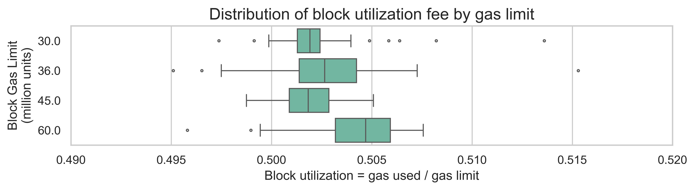
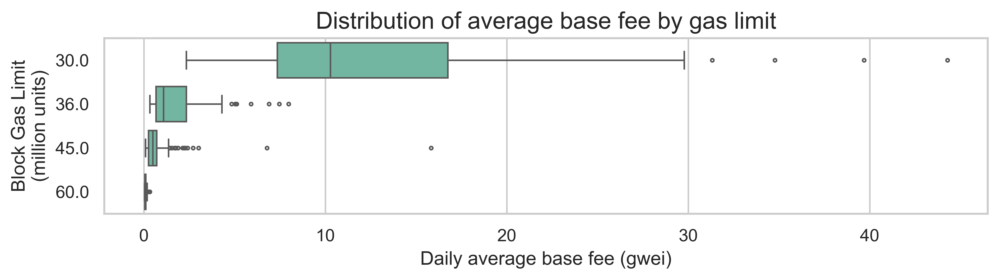
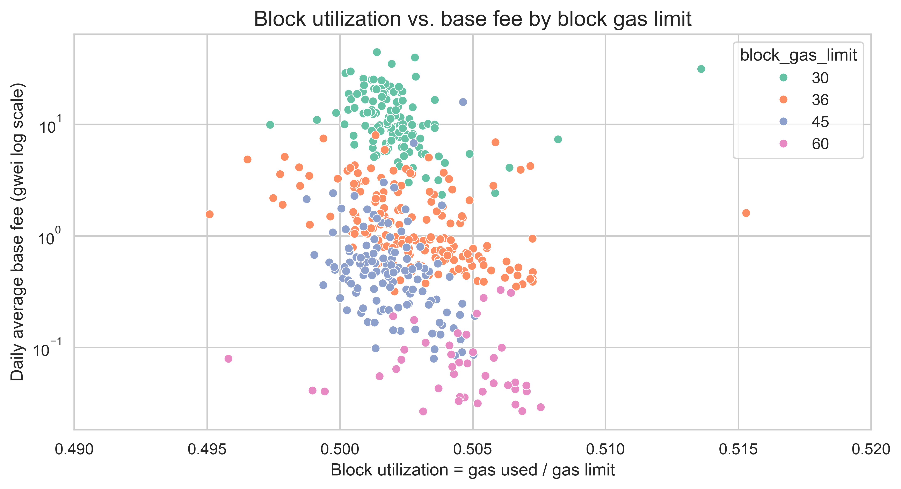
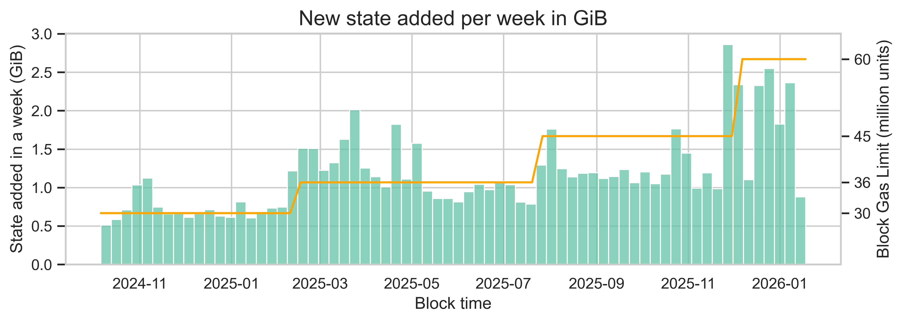

# Impacts of increasing gas limits - an empirical analysis

### Maria Silva, January 2026

This report summarizes an empirical EDA of Ethereum mainnet execution-layer behavior across multiple gas-limit regimes (≈30M, 36M, 45M, 60M). Using per-block data (gas used, gas limit, base fee) and execution state-size telemetry, we quantify how **block utilization**, **base fee**, and **net state growth** changed as the gas limit increased. The aim is descriptive: we document what happened in the observed windows; we do not claim causal effects from gas limit changes alone.

The full analysis is in the notebook: [0.6-state_growth_EDA_v2.ipynb](https://github.com/misilva73/evm-gas-repricings/blob/03ad1631aa5e1205d5cff67b72cc1e0854465146/notebooks/0.6-state_growth_EDA_v2.ipynb)

### Key takeaways

- Block utilization stays pinned near ~50% across gas limits (daily utilization is ~0.502–0.504 on average), which is consistent with EIP-1559 targeting half-full blocks on average. This indicates that there is still demand for more block space on Ethereum.
- Average base fee drops sharply as gas limits rise (the median of the daily average base fee is ~10.27 gwei at 30M → ~1.07 at 36M → ~0.48 at 45M → ~0.058 at 60M). This decline is not linear with gas limit changes.
- State growth increases with higher gas limits, but not proportionally: median daily net state growth increases ~+54% from 30M → 36M, then only ~+8.6% from 36M → 45M.

## Data collection and processing

For this analysis we query the [Xatu dataset](https://ethpandaops.io/data/xatu/) to obtain canonical execution block and state-size data.  The block-level fields used include `block_time`, `block_number`, `base_fee_gwei`, `execution_payload_gas_limit`, and `execution_payload_gas_used`. For state, we gather the total size of the state DB in a Geth node at the end of each block and derive the new bytes added by taking the difference.

The `execution_payload_gas_limit` contains some noise (e.g., some blocks with gas limits that are the 30, 36, 45 and 60 million gas units). To fix the noise, we round them to integers and do a small number of explicit remapping to consolidate minor variations (e.g., `31 → 30`, `49 → 45`).

Most metrics are aggregated **daily**. Daily average base fee is computed as the mean of per-block `base_fee_gwei` within each day. Daily gas used is the sum of per-block gas used. The day’s gas limit is set to the mode (most frequent limit observed that day). This further helps to reduce the noise in this variable.

State growth is computed as the per-block diff of `total_bytes`, then aggregated to daily MiB/day and weekly GiB/week. This is net growth (i.e., diffs can be negative, although in practice they never are).

## Impact on block utilization

Block utilization represents the ratio of gas used from the max available. It is computed as the total gas used divided by the total available gas (which is defined by the block gas limit). Specifically:

$
\text{utilization} \;=\; \frac{\text{total daily gas used}}{7200 \cdot \text{daily gas limit}}
$

where 7200 is a normalization constant representing ~7200 blocks/day (~12s).

Looking at the distribution of this variable by gas limit, we observe that utilization is tightly clustered around 0.5 across all gas limits.

| Gas limit (Million gas units) | Mean | Std | Median |
|---:|---:|---:|---:|
| 30 | 0.502062 | 0.001634 | 0.501909 |
| 36 | 0.502755 | 0.002750 | 0.502650 |
| 45 | 0.501789 | 0.004998 | 0.501825 |
| 60 | 0.503720 | 0.004762 | 0.504694 |

Utilization remain effectively flat (~0.502–0.504, on average) even as gas limits increase substantially. In other words, higher gas limits did not translate into persistently emptier blocks. Instead, the chain stayed anchored near the EIP-1559 target. This means that demand was able to use the additional block space and thus there is still room to continue to scale.

## Impact on average base fee

What about the base fee? With more block space, we expect the base fee to decrease. But the question is how much it is increasing? The next plot and table show the distribution of the daily average base fee across the different gas limits.

| Gas limit (Million gas units) | Mean (gwei) | Std (gwei) | Median (gwei) |
|---:|---:|---:|---:|
| 30 | 12.818620 | 7.760881 | 10.273356 |
| 36 | 1.674053  | 1.444615 | 1.071925 |
| 45 | 0.786489  | 1.553908 | 0.478658 |
| 60 | 0.086767  | 0.073985 | 0.057669 |

Here we can observe that base fees shift downward as gas limits increase, with materially different central tendencies across the different regimes.

The median base fee declines are large and clearly non-linear relative to the gas limit increases. From 30M → 36M (+20% gas limit), the median base fee drops ~89.6%. From 36M → 45M (+25%), it drops ~55.3%. And from 45M→60M (+33.3%), it drops ~88.0%. A clear “average base fee vs gas limit” relationship does not fit these data points.

## Impact on demand

A useful way to read EIP-1559 is as a feedback controller: when demand pushes gas used above target, base fee rises; when blocks are below target, base fee falls, pulling the system back toward ~50% utilization.

In our data, utilization remains close to the target across regimes, while base fee shifts dramatically downward in higher gas limit windows. Taken together, that combination is consistent with a system where additional capacity is not fully absorbed by sustained demand increases in those periods; instead, base fee adjusts downward while average utilization remains anchored near target.

Within the limits of observational data, the results are broadly consistent with EIP-1559 behaving as designed: utilization centered near target with base fee adjusting to demand.

Of course, the demand for block space on Ethereum can change significantly through time depending on external factors and this is not a controlled experiment where we can isolate these factors. Therefore, it is impossible to take a clear conclusion on how what will happen to demand under further gas limit increases. More analysis is needed on this.

## Impact on state growth

Here, “state growth” is the net change in execution state size (`total_bytes`) measured from telemetry and aggregated over time. The analysis uses per-block diffs and summarizes net growth per week (GiB/week). Because it is net growth, negative values can occur in the daily distribution.

The current size of the state DB (as of January 15th) is 389 GiB. The next plot shows the weekly state growth and how it increased at each new gas limit.

| Gas limit (M) | Mean  | Std  | Median |
|---:|---:|---:|---:|
| 30 | 0.741 | 0.187 | 0.689 |
| 36 | 1.188 | 0.342 | 1.084 |
| 45 | 1.319 | 0.431 | 1.191 |
| 60 | 1.914 | 0.671 | 2.328 |

In general, as we increase the gas limit, the state growth also increases. However, the increase has not been consistent through the various gas limit changes. From 30M → 36M (+20% gas limit), the median state growth increases 57%. From 36M → 45M (+25%), it only increases 9%. And from 45M → 60M (+33.3%), it increases 95%. Thus, we went from a growth rate of 38 GiB per year on average to 99 GiB per year on average, which is more than double!
