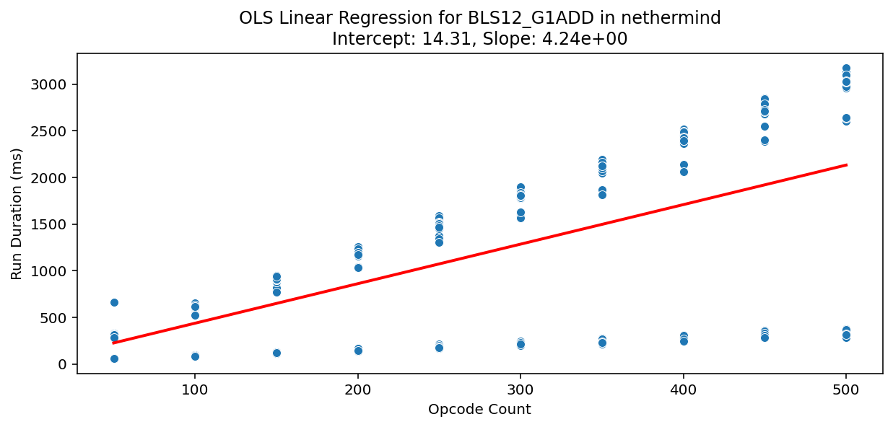
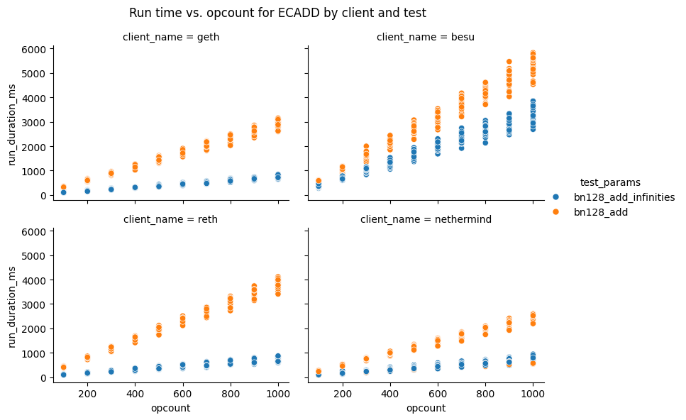

# Analysis overview for the repricing gas benchmarks

### Maria Silva

This page summarizes the key takeaways and To-Do's from the repricings benchmark tests.

## 23-12-2025

This benchmark run was done on a subset of tests with minimal configurations. It was the first run with the fixed opcode methodology (similar to the setup done in the initial analysis of [EIP-7904](https://eips.ethereum.org/EIPS/eip-7904)) and it does not include stateful tests.

The data was collected from the `repricings2` table in the `perfnet.core.nethermind.dev:5432/monitoring` database. We filtered the data to include only tests run between `2025-12-19` and `2025-12-23`.

We used [this script](https://github.com/misilva73/evm-gas-repricings/blob/7ff30240fa5215715a046273cece2da3e9262281/src/estimate_opcode_run_times.py) to query the raw data and estimate the run times. [This notebook](https://github.com/misilva73/evm-gas-repricings/blob/7ff30240fa5215715a046273cece2da3e9262281/notebooks/3.2-gas_bench_opcode_times_eda_v2.ipynb) contains an exploratory analysis of the raw data and the estimated run times.

### Key takeaways

- 25% of benchmarks resulted in a total run time of 0ms, which indicates some error in the run. This was observed in 10 different runs, ranging across different opcodes and clients. These zero-runs are not consistent, i.e., all opcodes with zero run times also have other runs with non-zero run times.
- Precompiles, logs and a couple of compute operations don't have any benchmarks with non-zero run times. The full list of missing operations is in the collapsible section below.
- Test configurations are not consistent with the requirements set in our [Notion page](https://www.notion.so/efdn/Benchmarking-tests-2a2d9895554180e1821ed8847bc6a1e3?source=copy_link). For instance, `EXP` does not have any inputs, and it should have five different values for the exponent (0x00, 0x01, 0xf, 0x0100, and 0xffff…ff). Memory opcodes such as `MCOPY`, `MLOAD`, `MSTORE`, and `MSTORE8` only run with a single offset (offset=0). The existing configurations in our data are in the collapsible section below. 
- The data for `ADDRESS`, `CALLER`, `GASPRICE`, `MOD`, `ORIGIN`, and `SMOD` leads to negative or zero run times. This means that the run time is not scaling with the opcode count for these tests. We need to double-check them to see if there are any errors with the test itself.
- The regression models for the opcodes `AND`, `BLOCKHASH`, `OR`, and `XOR` have small R-squares, which means that the model does not have a good fit. We need to collect for data for these opcodes to ensure a better fit.

  
Missing opcodes

  - ADDMOD
  - BLAKE2F
  - BLOBHASH
  - BLS12_G1ADD
  - BLS12_G1MSM
  - BLS12_G2ADD
  - BLS12_G2MSM
  - BLS12_MAP_FP2_TO_G2
  - BLS12_MAP_FP_TO_G1
  - BLS12_PAIRING_CHECK
  - DIFFICULTY
  - ECADD
  - ECMUL
  - ECPAIRING
  - ECRECOVER
  - IDENTITY
  - INVALID
  - JUMP
  - JUMPDEST
  - KECCAK256
  - LOG0
  - LOG1
  - LOG2
  - LOG3
  - LOG4
  - MODEXP
  - MULMOD
  - P256VERIFY
  - POINT_EVALUATION
  - POP
  - RETURN
  - REVERT
  - RIPEMD-160
  - SHA2-256
  - SLOAD
  - SSTORE
  - STOP

  
Available configuration table

| test_opcode | test_params |
|---|---|
| BALANCE | ['initial_storage_True', 'initial_balance_True', 'empty_code_True'] |
| BLOCKHASH | ['current_block'] |
| BLOCKHASH | ['random'] |
| BLOCKHASH | ['genesis'] |
| BLOCKHASH | ['block_1'] |
| BLOCKHASH | ['block_256'] |
| CALL | ['initial_storage_True', 'initial_balance_True', 'empty_code_True'] |
| CALLCODE | ['initial_storage_True', 'initial_balance_True', 'empty_code_True'] |
| CALLDATACOPY | ['non_zero_data_False', 'fixed_src_dst_True', '0 bytes'] |
| CALLDATALOAD | ['zero', 'loop'] |
| CALLDATASIZE | ['calldata_length_10000'] |
| CALLVALUE | ['non_zero_value_True'] |
| CODECOPY | ['fixed_src_dst_True', '0 bytes'] |
| CREATE | ['0 bytes without value'] |
| CREATE | ['0 bytes with value'] |
| CREATE2 | ['0 bytes with value'] |
| CREATE2 | ['0 bytes without value'] |
| DELEGATECALL | ['initial_storage_True', 'initial_balance_True', 'empty_code_True'] |
| DIV | ['0'] |
| EXTCODECOPY | ['512'] |
| EXTCODEHASH | ['initial_storage_True', 'initial_balance_True', 'empty_code_True'] |
| EXTCODESIZE | ['initial_storage_True', 'initial_balance_True', 'empty_code_True'] |
| MLOAD | ['big_memory_expansion_True', 'offset_initialized_True', 'offset_0'] |
| MOD | ['mod_bits_127'] |
| MSIZE | ['mem_size_1'] |
| MSTORE | ['big_memory_expansion_True', 'offset_initialized_True', 'offset_0'] |
| MSTORE8 | ['big_memory_expansion_True', 'offset_initialized_True', 'offset_0'] |
| RETURNDATACOPY | ['fixed_dst_True', '0 bytes'] |
| RETURNDATASIZE | ['returned_size_0', 'return_data_style_ReturnDataStyle.IDENTITY'] |
| SDIV | ['0'] |
| SELFBALANCE | ['contract_balance_1'] |
| SMOD | ['mod_bits_127'] |
| STATICCALL | ['initial_storage_True', 'initial_balance_True', 'empty_code_True'] |
| TLOAD | ['fixed_value_True', 'fixed_key_True'] |
| TSTORE | ['fixed_value_False', 'fixed_key_False'] |

### To-Do's

- [ ] Investigate the cause of zero run times in some benchmarks.
- [ ] Review tests for `ADDRESS`, `CALLER`, `GASPRICE`, `MOD`, `ORIGIN`, and `SMOD` -> why is the execution time not scaling with the opcode count?
- [ ] Add missing opcodes to the benchmark suite (or check why they are not being run). Focus should be on the precompiles and MOD operations.
- [ ] Do more runs for `AND`, `BLOCKHASH`, `OR`, and `XOR` to improve model fit.
- [ ] Standardize test configurations according to the requirements set in our Notion page.
- [ ] Add stateful tests to the runs.

## 12-01-2026

This benchmark run was done on a subset of tests with more configurations. It was the second run with the fixed opcode methodology (similar to the setup done in the initial analysis of [EIP-7904](https://eips.ethereum.org/EIPS/eip-7904)) and it still does not include stateful tests.

The data was collected from the `repricings_new` table in the `perfnet.core.nethermind.dev:5432/monitoring` database. We filtered the data to include only tests run between `2026-01-10` and `2025-01-12`.

We used [this script](https://github.com/misilva73/evm-gas-repricings/blob/eb73fd639801376123813d491a6f521550ac657c/src/estimate_opcode_run_times.py) to query the raw data and estimate the run times. [This notebook](https://github.com/misilva73/evm-gas-repricings/blob/eb73fd639801376123813d491a6f521550ac657c/notebooks/3.2-gas_bench_opcode_times_eda_v2.ipynb) contains an exploratory analysis of the raw data and the estimated run times.

### Key takeaways

- Zero-runs have mostly disappeared, occurring only in 3 runs of the `test_sha256_fixed_size` test.
- We now have a wider set of opcodes and precompiles, with only 16 compute opcodes and precompiles missing. The full list of missing operations is in the collapsible section below.
- On the simple compute operations (i.e., no inputs), the regression models seem to be performing well - we don't seed zero nor negative slopes. However, we need more runs to verify this. You can check the results in the [full model report](https://github.com/misilva73/evm-gas-repricings/blob/eb73fd639801376123813d491a6f521550ac657c/reports/opcode_run_times_estimation/2026-01-10_2026-01-12/simple_opcode_autogenerated_report.md).
- Configurations ate still not ready. Here are the configs we do have:
  - `BLAKE2F`: we only have one config and we need a range of rounds
  - `BLS12`: only have one config each, but that is ok by now
  - `CALLDATACOPY`: we have `calldata_size`, `fixed_src_dst`, and another config without a name. Can it be the memory size? Need to check with Louis
  - `CODECOPY`: we have `code_size` and `mem_size`, so all good!
  - `ECADD` and `ECMUL` have the desired configs
  - `EXTCODECOPY`: only has one config (512)
  - `IDENTITY`: only has one config (`size_0`)
  - `KECCAK`: we have `msg_size` and `mem_size` -> all good!
  - `LOG*`: we have `log_size` and `mem_size` -> all good!
  - `MCOPY`: we have `copy_size`, `fixed_src_dst`, and another config without a name. Can it be the memory size? Need to check with Louis
  - `MSTORE8`: we have `mem_size`, but the offset one has one config
  - `RETURNDATACOPY`: we have `mem_size`, `fixed_src_dst`, and another config without a name. Can it be the return data size? Need to check with Louis
  - `RIPEMD160` only has one config
  - `SHA256` only has 21 and 256
  - Besides this, we are missing configs for `MLOAD`, `MSTORE` and `EXP`

  
Missing opcodes

- ADDMOD
- BLOBHASH
- BLS12_G1MSM
- BLS12_G2MSM
- BLS12_PAIRING_CHECK
- DIFFICULTY
- ECPAIRING
- INVALID
- JUMP
- MODEXP
- MULMOD
- P256VERIFY
- POP
- RETURN
- REVERT
- SELFDESTRUCT

## 23-01-2026

In this run, we focused on the candidate compute operations for repricing in EIP-7904. For more info on this list and the selection criteria, please refer to [this report](https://github.com/misilva73/evm-gas-repricings/blob/282f1a432106d994726aa254707fddcd879eea34/reports/eip-7904/included_operations.md).

The data was collected from the `repricings_new` table in the `perfnet.core.nethermind.dev:5432/monitoring` database. We filtered the data to include only tests run between `2026-01-10` and `2026-01-23`.

We used [this script](https://github.com/misilva73/evm-gas-repricings/blob/1ab681788c602b5d810f1e232322dbae58cbb6e9/src/estimate_7904_repricings.py) to query the raw data and estimate the run times. [This notebook](https://github.com/misilva73/evm-gas-repricings/blob/1ab681788c602b5d810f1e232322dbae58cbb6e9/notebooks/1.7-7904_runtimes_eda.ipynb) contains an exploratory analysis of the raw data and the estimated run times.

### Key takeaways

- `ECPAIRING` seems to have a bug in the opcode count column, where the value there is not matching the test description. As expected, this is causing weird results in the model.
- Erigon is missing data for `BLAKE2F`, `BLS12_G1ADD`, `BLS12_G2ADD`, `ECADD`, `ECPAIRING`, `ECRECOVER`, and `POINT_EVALUATION`.
- `KECCAK256` runtime does not seem to change with varying `mem_sizes`. This means we can ignore the memory size when estimating its runtime.
- Nethermind has some runs where the runtime of the opcode does not increase with the opcode count. This happens for `BLS12_G1ADD`, `BLS12_G2ADD`, `ECRECOVER` and `POINT_EVALUATION`. Example:

- `ECADD` has a bad fit in almost all clients. This is due to a different behavior between the two test configs - `bn128_add_infinities` and `bn128_add`. I am assuming we can simply use the worst config, but we should double-check. Here is a plot to illustrate:

### ToDo's

- [ ] Fix the opcode count column in the ecPairing tests.
- [ ] Investigate why Erigon is not running some tests.
- [ ] (low priority) Investigate why Nethermind has some runs where runtime does not increase with the opcode count.
