Opcode run times estimation results - Simple opcodes
====================================================

Table of contents
=================

* [ADD](#add)
* [ADDMOD](#addmod)
* [ADDRESS](#address)
* [AND](#and)
* [BASEFEE](#basefee)
* [BLOBBASEFEE](#blobbasefee)
* [BLOBHASH](#blobhash)
* [BLOCKHASH](#blockhash)
* [BYTE](#byte)
* [CALLDATALOAD](#calldataload)
* [CALLDATASIZE](#calldatasize)
* [CALLER](#caller)
* [CALLVALUE](#callvalue)
* [CHAINID](#chainid)
* [CODESIZE](#codesize)
* [COINBASE](#coinbase)
* [DIV](#div)
* [DIFFICULTY](#difficulty)
* [DUP1](#dup1)
* [DUP2](#dup2)
* [DUP3](#dup3)
* [DUP4](#dup4)
* [DUP5](#dup5)
* [DUP6](#dup6)
* [DUP7](#dup7)
* [DUP8](#dup8)
* [DUP9](#dup9)
* [DUP10](#dup10)
* [DUP11](#dup11)
* [DUP12](#dup12)
* [DUP13](#dup13)
* [DUP14](#dup14)
* [DUP15](#dup15)
* [DUP16](#dup16)
* [EQ](#eq)
* [GAS](#gas)
* [GASLIMIT](#gaslimit)
* [GASPRICE](#gasprice)
* [GT](#gt)
* [INVALID](#invalid)
* [ISZERO](#iszero)
* [JUMP](#jump)
* [JUMPDEST](#jumpdest)
* [JUMPI](#jumpi)
* [LT](#lt)
* [MOD](#mod)
* [MSIZE](#msize)
* [MUL](#mul)
* [MULMOD](#mulmod)
* [NOT](#not)
* [NUMBER](#number)
* [OR](#or)
* [ORIGIN](#origin)
* [PC](#pc)
* [POP](#pop)
* [PREVRANDAO](#prevrandao)
* [PUSH0](#push0)
* [PUSH1](#push1)
* [PUSH2](#push2)
* [PUSH3](#push3)
* [PUSH4](#push4)
* [PUSH5](#push5)
* [PUSH6](#push6)
* [PUSH7](#push7)
* [PUSH8](#push8)
* [PUSH9](#push9)
* [PUSH10](#push10)
* [PUSH11](#push11)
* [PUSH12](#push12)
* [PUSH13](#push13)
* [PUSH14](#push14)
* [PUSH15](#push15)
* [PUSH16](#push16)
* [PUSH17](#push17)
* [PUSH18](#push18)
* [PUSH19](#push19)
* [PUSH20](#push20)
* [PUSH21](#push21)
* [PUSH22](#push22)
* [PUSH23](#push23)
* [PUSH24](#push24)
* [PUSH25](#push25)
* [PUSH26](#push26)
* [PUSH27](#push27)
* [PUSH28](#push28)
* [PUSH29](#push29)
* [PUSH30](#push30)
* [PUSH31](#push31)
* [PUSH32](#push32)
* [RETURNDATASIZE](#returndatasize)
* [SAR](#sar)
* [SDIV](#sdiv)
* [SELFBALANCE](#selfbalance)
* [SGT](#sgt)
* [SHL](#shl)
* [SHR](#shr)
* [SIGNEXTEND](#signextend)
* [SLT](#slt)
* [SMOD](#smod)
* [STOP](#stop)
* [SUB](#sub)
* [SWAP1](#swap1)
* [SWAP2](#swap2)
* [SWAP3](#swap3)
* [SWAP4](#swap4)
* [SWAP5](#swap5)
* [SWAP6](#swap6)
* [SWAP7](#swap7)
* [SWAP8](#swap8)
* [SWAP9](#swap9)
* [SWAP10](#swap10)
* [SWAP11](#swap11)
* [SWAP12](#swap12)
* [SWAP13](#swap13)
* [SWAP14](#swap14)
* [SWAP15](#swap15)
* [SWAP16](#swap16)
* [TIMESTAMP](#timestamp)
* [XOR](#xor)

# Introduction


This is an automated report generated from the opcode run times 
estimation script `./src/estimate_opcode_run_times.py`. The script 
uses data generated by running the 
[EEST benchmark suite](https://github.com/ethereum/execution-spec-tests/tree/main/tests/benchmark) 
with the [Nethermind benchmarking tooling](https://github.com/NethermindEth/gas-benchmarks).

The data includes all the simple opcode tests run between 2025-12-19 and 2025-12-23.

For each opcode and client, an OLS linear regression model is fitted to estimate the 
opcode run time as a function of the opcode count. The results are presented below.

# ADD

## nethermind


```python
                            OLS Regression Results                            
==============================================================================
Dep. Variable:        run_duration_ms   R-squared:                       0.998
Model:                            OLS   Adj. R-squared:                  0.998
Method:                 Least Squares   F-statistic:                 4.669e+04
Date:                Tue, 23 Dec 2025   Prob (F-statistic):          5.26e-103
Time:                        08:40:43   Log-Likelihood:                -320.84
No. Observations:                  74   AIC:                             645.7
Df Residuals:                      72   BIC:                             650.3
Df Model:                           1                                         
Covariance Type:            nonrobust                                         
==============================================================================
                 coef    std err          t      P>|t|      [0.025      0.975]
------------------------------------------------------------------------------
const         36.4776      4.723      7.723      0.000      27.062      45.894
opcount     2.648e-05   1.23e-07    216.072      0.000    2.62e-05    2.67e-05
==============================================================================
Omnibus:                       31.664   Durbin-Watson:                   1.668
Prob(Omnibus):                  0.000   Jarque-Bera (JB):              270.730
Skew:                          -0.783   Prob(JB):                     1.63e-59
Kurtosis:                      12.239   Cond. No.                     8.36e+07
==============================================================================

Notes:
[1] Standard Errors assume that the covariance matrix of the errors is correctly specified.
[2] The condition number is large, 8.36e+07. This might indicate that there are
strong multicollinearity or other numerical problems.
```

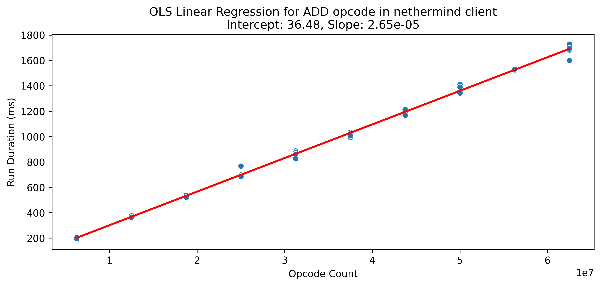


## reth


```python
                            OLS Regression Results                            
==============================================================================
Dep. Variable:        run_duration_ms   R-squared:                       0.954
Model:                            OLS   Adj. R-squared:                  0.954
Method:                 Least Squares   F-statistic:                     1504.
Date:                Tue, 23 Dec 2025   Prob (F-statistic):           5.37e-50
Time:                        08:40:43   Log-Likelihood:                -409.25
No. Observations:                  74   AIC:                             822.5
Df Residuals:                      72   BIC:                             827.1
Df Model:                           1                                         
Covariance Type:            nonrobust                                         
==============================================================================
                 coef    std err          t      P>|t|      [0.025      0.975]
------------------------------------------------------------------------------
const         47.8288     15.600      3.066      0.003      16.730      78.928
opcount      1.57e-05   4.05e-07     38.786      0.000    1.49e-05    1.65e-05
==============================================================================
Omnibus:                        3.381   Durbin-Watson:                   1.135
Prob(Omnibus):                  0.184   Jarque-Bera (JB):                3.172
Skew:                           0.162   Prob(JB):                        0.205
Kurtosis:                       3.962   Cond. No.                     8.36e+07
==============================================================================

Notes:
[1] Standard Errors assume that the covariance matrix of the errors is correctly specified.
[2] The condition number is large, 8.36e+07. This might indicate that there are
strong multicollinearity or other numerical problems.
```

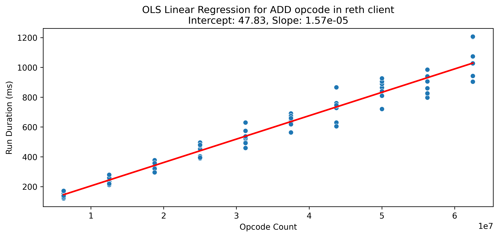


## besu


```python
                            OLS Regression Results                            
==============================================================================
Dep. Variable:        run_duration_ms   R-squared:                       0.970
Model:                            OLS   Adj. R-squared:                  0.970
Method:                 Least Squares   F-statistic:                     2366.
Date:                Tue, 23 Dec 2025   Prob (F-statistic):           8.05e-57
Time:                        08:40:43   Log-Likelihood:                -581.45
No. Observations:                  74   AIC:                             1167.
Df Residuals:                      72   BIC:                             1172.
Df Model:                           1                                         
Covariance Type:            nonrobust                                         
==============================================================================
                 coef    std err          t      P>|t|      [0.025      0.975]
------------------------------------------------------------------------------
const        -82.2880    159.862     -0.515      0.608    -400.968     236.392
opcount        0.0002   4.15e-06     48.646      0.000       0.000       0.000
==============================================================================
Omnibus:                       79.211   Durbin-Watson:                   1.382
Prob(Omnibus):                  0.000   Jarque-Bera (JB):              876.367
Skew:                           3.123   Prob(JB):                    5.00e-191
Kurtosis:                      18.660   Cond. No.                     8.36e+07
==============================================================================

Notes:
[1] Standard Errors assume that the covariance matrix of the errors is correctly specified.
[2] The condition number is large, 8.36e+07. This might indicate that there are
strong multicollinearity or other numerical problems.
```

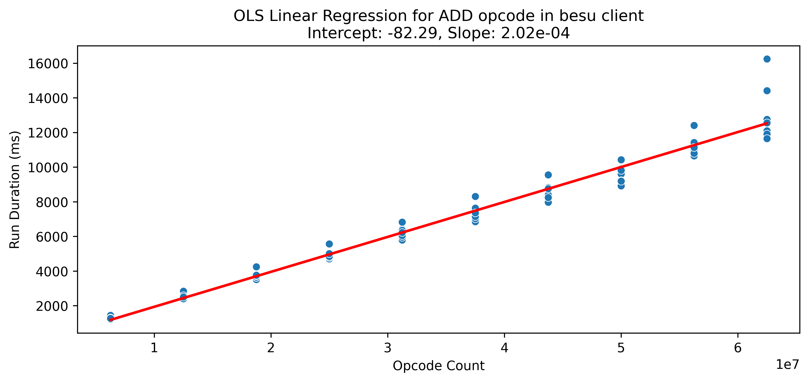


## geth


```python
                            OLS Regression Results                            
==============================================================================
Dep. Variable:        run_duration_ms   R-squared:                       0.935
Model:                            OLS   Adj. R-squared:                  0.934
Method:                 Least Squares   F-statistic:                     1028.
Date:                Tue, 23 Dec 2025   Prob (F-statistic):           2.26e-44
Time:                        08:40:43   Log-Likelihood:                -448.37
No. Observations:                  74   AIC:                             900.7
Df Residuals:                      72   BIC:                             905.3
Df Model:                           1                                         
Covariance Type:            nonrobust                                         
==============================================================================
                 coef    std err          t      P>|t|      [0.025      0.975]
------------------------------------------------------------------------------
const         35.8534     26.468      1.355      0.180     -16.910      88.617
opcount     2.202e-05   6.87e-07     32.068      0.000    2.06e-05    2.34e-05
==============================================================================
Omnibus:                      144.183   Durbin-Watson:                   2.169
Prob(Omnibus):                  0.000   Jarque-Bera (JB):             9556.747
Skew:                           6.962   Prob(JB):                         0.00
Kurtosis:                      56.904   Cond. No.                     8.36e+07
==============================================================================

Notes:
[1] Standard Errors assume that the covariance matrix of the errors is correctly specified.
[2] The condition number is large, 8.36e+07. This might indicate that there are
strong multicollinearity or other numerical problems.
```

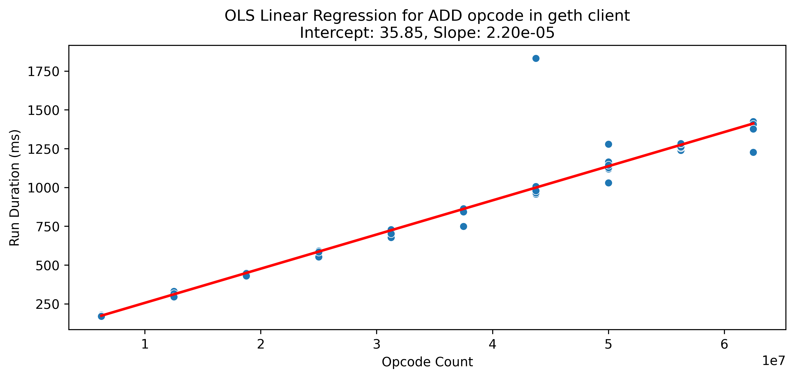


# ADDMOD

## nethermind

OLS model did not run... Error: zero-size array to reduction operation maximum which has no identity

## reth

OLS model did not run... Error: zero-size array to reduction operation maximum which has no identity

## besu

OLS model did not run... Error: zero-size array to reduction operation maximum which has no identity

## geth

OLS model did not run... Error: zero-size array to reduction operation maximum which has no identity

# ADDRESS

## nethermind


```python
                            OLS Regression Results                            
==============================================================================
Dep. Variable:        run_duration_ms   R-squared:                       0.011
Model:                            OLS   Adj. R-squared:                 -0.003
Method:                 Least Squares   F-statistic:                    0.7777
Date:                Tue, 23 Dec 2025   Prob (F-statistic):              0.381
Time:                        08:40:43   Log-Likelihood:                -459.45
No. Observations:                  74   AIC:                             922.9
Df Residuals:                      72   BIC:                             927.5
Df Model:                           1                                         
Covariance Type:            nonrobust                                         
==============================================================================
                 coef    std err          t      P>|t|      [0.025      0.975]
------------------------------------------------------------------------------
const       2433.5342     30.744     79.155      0.000    2372.247    2494.821
opcount     1.758e-09   1.99e-09      0.882      0.381   -2.22e-09    5.73e-09
==============================================================================
Omnibus:                        3.803   Durbin-Watson:                   0.980
Prob(Omnibus):                  0.149   Jarque-Bera (JB):                3.517
Skew:                          -0.533   Prob(JB):                        0.172
Kurtosis:                       2.947   Cond. No.                     3.34e+10
==============================================================================

Notes:
[1] Standard Errors assume that the covariance matrix of the errors is correctly specified.
[2] The condition number is large, 3.34e+10. This might indicate that there are
strong multicollinearity or other numerical problems.
```

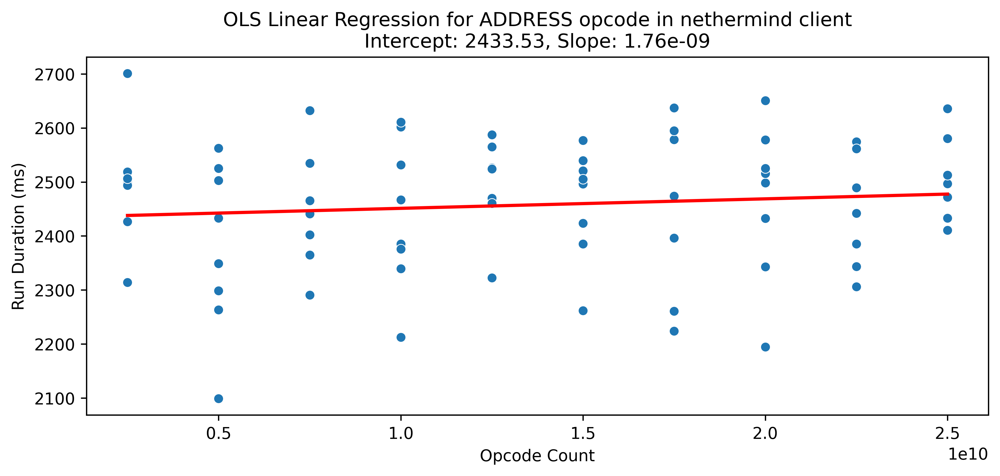


## reth


```python
                            OLS Regression Results                            
==============================================================================
Dep. Variable:        run_duration_ms   R-squared:                       0.011
Model:                            OLS   Adj. R-squared:                 -0.003
Method:                 Least Squares   F-statistic:                    0.7845
Date:                Tue, 23 Dec 2025   Prob (F-statistic):              0.379
Time:                        08:40:43   Log-Likelihood:                -527.24
No. Observations:                  74   AIC:                             1058.
Df Residuals:                      72   BIC:                             1063.
Df Model:                           1                                         
Covariance Type:            nonrobust                                         
==============================================================================
                 coef    std err          t      P>|t|      [0.025      0.975]
------------------------------------------------------------------------------
const       2446.6328     76.843     31.839      0.000    2293.449    2599.817
opcount    -4.414e-09   4.98e-09     -0.886      0.379   -1.43e-08    5.52e-09
==============================================================================
Omnibus:                       92.743   Durbin-Watson:                   1.114
Prob(Omnibus):                  0.000   Jarque-Bera (JB):             1287.630
Skew:                           3.864   Prob(JB):                    2.48e-280
Kurtosis:                      21.918   Cond. No.                     3.34e+10
==============================================================================

Notes:
[1] Standard Errors assume that the covariance matrix of the errors is correctly specified.
[2] The condition number is large, 3.34e+10. This might indicate that there are
strong multicollinearity or other numerical problems.
```

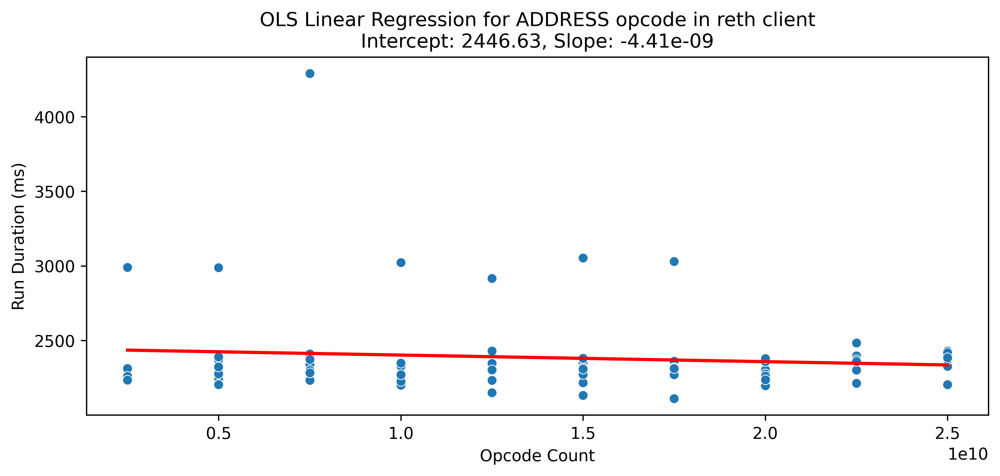


## besu


```python
                            OLS Regression Results                            
==============================================================================
Dep. Variable:        run_duration_ms   R-squared:                       0.000
Model:                            OLS   Adj. R-squared:                 -0.016
Method:                 Least Squares   F-statistic:                  0.001869
Date:                Tue, 23 Dec 2025   Prob (F-statistic):              0.966
Time:                        08:40:43   Log-Likelihood:                -646.20
No. Observations:                  64   AIC:                             1296.
Df Residuals:                      62   BIC:                             1301.
Df Model:                           1                                         
Covariance Type:            nonrobust                                         
==============================================================================
                 coef    std err          t      P>|t|      [0.025      0.975]
------------------------------------------------------------------------------
const       1.526e+04   1586.556      9.621      0.000    1.21e+04    1.84e+04
opcount    -4.466e-09   1.03e-07     -0.043      0.966   -2.11e-07    2.02e-07
==============================================================================
Omnibus:                       29.029   Durbin-Watson:                   0.291
Prob(Omnibus):                  0.000   Jarque-Bera (JB):               44.966
Skew:                           1.856   Prob(JB):                     1.72e-10
Kurtosis:                       4.756   Cond. No.                     3.27e+10
==============================================================================

Notes:
[1] Standard Errors assume that the covariance matrix of the errors is correctly specified.
[2] The condition number is large, 3.27e+10. This might indicate that there are
strong multicollinearity or other numerical problems.
```

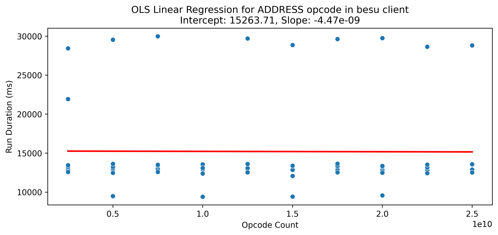


## geth


```python
                            OLS Regression Results                            
==============================================================================
Dep. Variable:        run_duration_ms   R-squared:                       0.031
Model:                            OLS   Adj. R-squared:                  0.017
Method:                 Least Squares   F-statistic:                     2.278
Date:                Tue, 23 Dec 2025   Prob (F-statistic):              0.136
Time:                        08:40:43   Log-Likelihood:                -530.81
No. Observations:                  74   AIC:                             1066.
Df Residuals:                      72   BIC:                             1070.
Df Model:                           1                                         
Covariance Type:            nonrobust                                         
==============================================================================
                 coef    std err          t      P>|t|      [0.025      0.975]
------------------------------------------------------------------------------
const       1.117e+04     80.641    138.522      0.000     1.1e+04    1.13e+04
opcount     7.893e-09   5.23e-09      1.509      0.136   -2.53e-09    1.83e-08
==============================================================================
Omnibus:                      141.674   Durbin-Watson:                   1.862
Prob(Omnibus):                  0.000   Jarque-Bera (JB):             8832.844
Skew:                           6.766   Prob(JB):                         0.00
Kurtosis:                      54.784   Cond. No.                     3.34e+10
==============================================================================

Notes:
[1] Standard Errors assume that the covariance matrix of the errors is correctly specified.
[2] The condition number is large, 3.34e+10. This might indicate that there are
strong multicollinearity or other numerical problems.
```

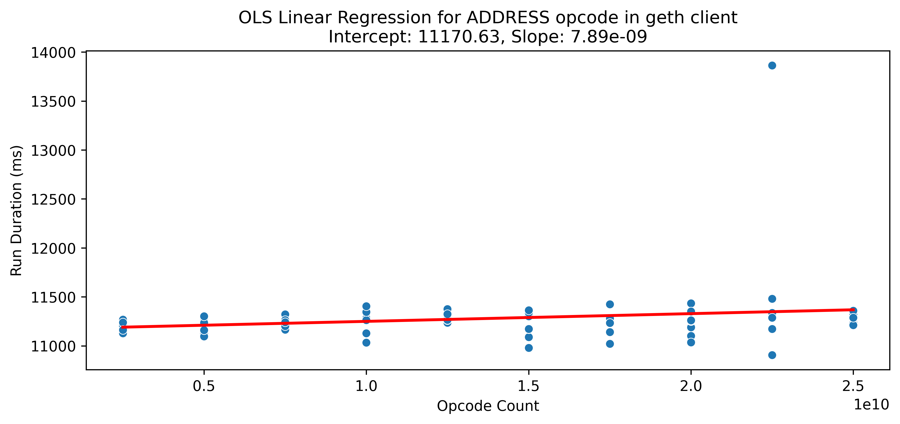


# AND

## nethermind


```python
                            OLS Regression Results                            
==============================================================================
Dep. Variable:        run_duration_ms   R-squared:                       0.410
Model:                            OLS   Adj. R-squared:                  0.402
Method:                 Least Squares   F-statistic:                     50.09
Date:                Tue, 23 Dec 2025   Prob (F-statistic):           7.95e-10
Time:                        08:40:44   Log-Likelihood:                -522.96
No. Observations:                  74   AIC:                             1050.
Df Residuals:                      72   BIC:                             1055.
Df Model:                           1                                         
Covariance Type:            nonrobust                                         
==============================================================================
                 coef    std err          t      P>|t|      [0.025      0.975]
------------------------------------------------------------------------------
const         33.1664     72.525      0.457      0.649    -111.410     177.742
opcount      1.11e-05   1.57e-06      7.078      0.000    7.97e-06    1.42e-05
==============================================================================
Omnibus:                       58.122   Durbin-Watson:                   0.526
Prob(Omnibus):                  0.000   Jarque-Bera (JB):              204.565
Skew:                           2.645   Prob(JB):                     3.80e-45
Kurtosis:                       9.194   Cond. No.                     1.00e+08
==============================================================================

Notes:
[1] Standard Errors assume that the covariance matrix of the errors is correctly specified.
[2] The condition number is large,  1e+08. This might indicate that there are
strong multicollinearity or other numerical problems.
```

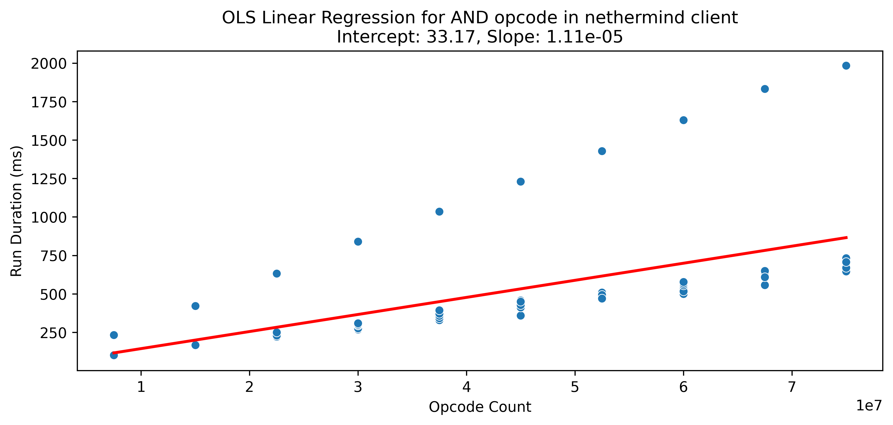


## reth


```python
                            OLS Regression Results                            
==============================================================================
Dep. Variable:        run_duration_ms   R-squared:                       0.993
Model:                            OLS   Adj. R-squared:                  0.993
Method:                 Least Squares   F-statistic:                 1.082e+04
Date:                Tue, 23 Dec 2025   Prob (F-statistic):           3.12e-80
Time:                        08:40:44   Log-Likelihood:                -283.92
No. Observations:                  74   AIC:                             571.8
Df Residuals:                      72   BIC:                             576.4
Df Model:                           1                                         
Covariance Type:            nonrobust                                         
==============================================================================
                 coef    std err          t      P>|t|      [0.025      0.975]
------------------------------------------------------------------------------
const         38.8144      2.868     13.534      0.000      33.097      44.532
opcount     6.451e-06    6.2e-08    104.041      0.000    6.33e-06    6.57e-06
==============================================================================
Omnibus:                        4.537   Durbin-Watson:                   2.279
Prob(Omnibus):                  0.103   Jarque-Bera (JB):                5.777
Skew:                           0.026   Prob(JB):                       0.0557
Kurtosis:                       4.368   Cond. No.                     1.00e+08
==============================================================================

Notes:
[1] Standard Errors assume that the covariance matrix of the errors is correctly specified.
[2] The condition number is large,  1e+08. This might indicate that there are
strong multicollinearity or other numerical problems.
```


## besu


```python
                            OLS Regression Results                            
==============================================================================
Dep. Variable:        run_duration_ms   R-squared:                       0.967
Model:                            OLS   Adj. R-squared:                  0.966
Method:                 Least Squares   F-statistic:                     1873.
Date:                Tue, 23 Dec 2025   Prob (F-statistic):           4.12e-49
Time:                        08:40:44   Log-Likelihood:                -472.64
No. Observations:                  66   AIC:                             949.3
Df Residuals:                      64   BIC:                             953.7
Df Model:                           1                                         
Covariance Type:            nonrobust                                         
==============================================================================
                 coef    std err          t      P>|t|      [0.025      0.975]
------------------------------------------------------------------------------
const         24.2163     99.746      0.243      0.809    -175.050     223.482
opcount      8.83e-05   2.04e-06     43.277      0.000    8.42e-05    9.24e-05
==============================================================================
Omnibus:                       21.297   Durbin-Watson:                   0.874
Prob(Omnibus):                  0.000   Jarque-Bera (JB):               50.773
Skew:                           0.947   Prob(JB):                     9.44e-12
Kurtosis:                       6.857   Cond. No.                     1.25e+08
==============================================================================

Notes:
[1] Standard Errors assume that the covariance matrix of the errors is correctly specified.
[2] The condition number is large, 1.25e+08. This might indicate that there are
strong multicollinearity or other numerical problems.
```

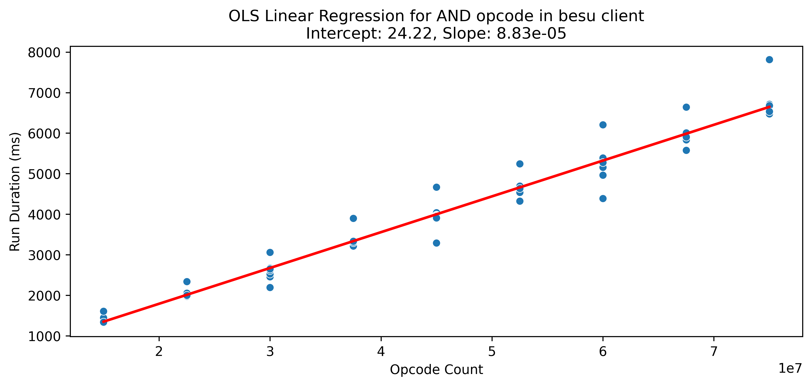


## geth


```python
                            OLS Regression Results                            
==============================================================================
Dep. Variable:        run_duration_ms   R-squared:                       0.995
Model:                            OLS   Adj. R-squared:                  0.995
Method:                 Least Squares   F-statistic:                 1.338e+04
Date:                Tue, 23 Dec 2025   Prob (F-statistic):           1.60e-83
Time:                        08:40:44   Log-Likelihood:                -365.89
No. Observations:                  74   AIC:                             735.8
Df Residuals:                      72   BIC:                             740.4
Df Model:                           1                                         
Covariance Type:            nonrobust                                         
==============================================================================
                 coef    std err          t      P>|t|      [0.025      0.975]
------------------------------------------------------------------------------
const         39.6455      8.683      4.566      0.000      22.335      56.956
opcount     2.171e-05   1.88e-07    115.658      0.000    2.13e-05    2.21e-05
==============================================================================
Omnibus:                      107.827   Durbin-Watson:                   1.809
Prob(Omnibus):                  0.000   Jarque-Bera (JB):             3104.492
Skew:                           4.450   Prob(JB):                         0.00
Kurtosis:                      33.457   Cond. No.                     1.00e+08
==============================================================================

Notes:
[1] Standard Errors assume that the covariance matrix of the errors is correctly specified.
[2] The condition number is large,  1e+08. This might indicate that there are
strong multicollinearity or other numerical problems.
```

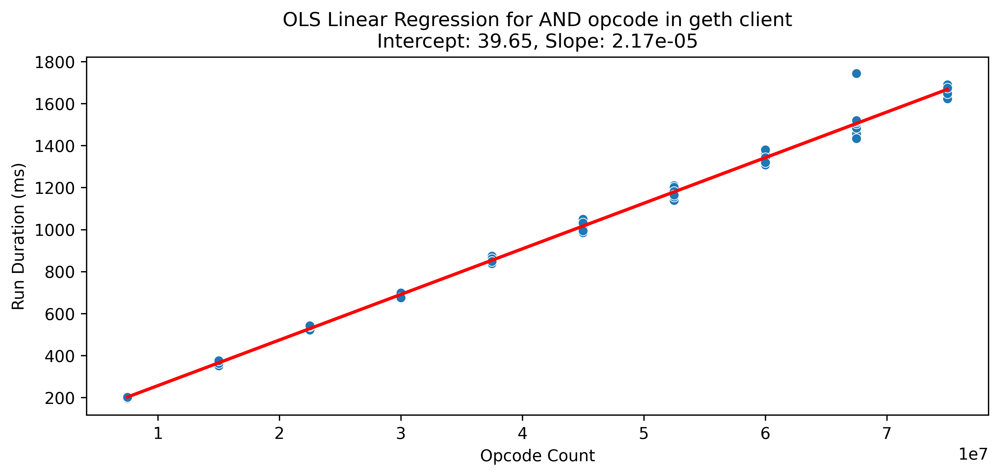


# BASEFEE

## nethermind


```python
                            OLS Regression Results                            
==============================================================================
Dep. Variable:        run_duration_ms   R-squared:                       0.989
Model:                            OLS   Adj. R-squared:                  0.989
Method:                 Least Squares   F-statistic:                     6429.
Date:                Tue, 23 Dec 2025   Prob (F-statistic):           3.72e-72
Time:                        08:40:44   Log-Likelihood:                -372.60
No. Observations:                  74   AIC:                             749.2
Df Residuals:                      72   BIC:                             753.8
Df Model:                           1                                         
Covariance Type:            nonrobust                                         
==============================================================================
                 coef    std err          t      P>|t|      [0.025      0.975]
------------------------------------------------------------------------------
const         28.6258      9.508      3.011      0.004       9.672      47.579
opcount     4.944e-06   6.17e-08     80.181      0.000    4.82e-06    5.07e-06
==============================================================================
Omnibus:                       27.633   Durbin-Watson:                   1.954
Prob(Omnibus):                  0.000   Jarque-Bera (JB):              109.450
Skew:                           0.955   Prob(JB):                     1.71e-24
Kurtosis:                       8.643   Cond. No.                     3.34e+08
==============================================================================

Notes:
[1] Standard Errors assume that the covariance matrix of the errors is correctly specified.
[2] The condition number is large, 3.34e+08. This might indicate that there are
strong multicollinearity or other numerical problems.
```

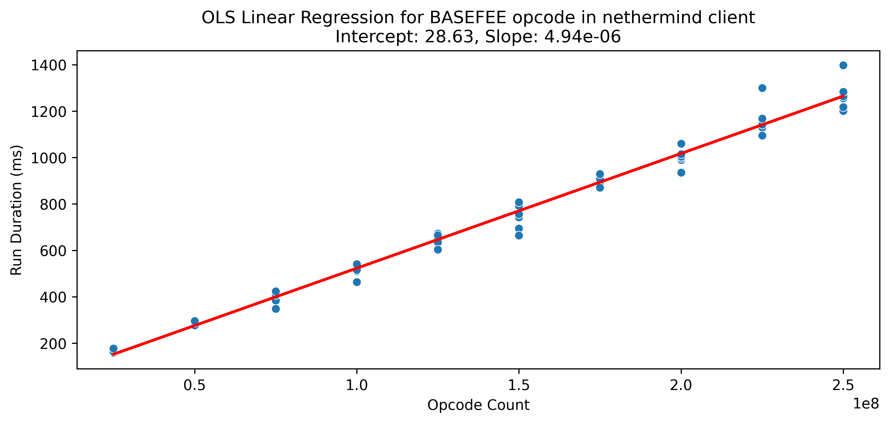


## reth


```python
                            OLS Regression Results                            
==============================================================================
Dep. Variable:        run_duration_ms   R-squared:                       0.982
Model:                            OLS   Adj. R-squared:                  0.981
Method:                 Least Squares   F-statistic:                     3833.
Date:                Tue, 23 Dec 2025   Prob (F-statistic):           3.47e-64
Time:                        08:40:44   Log-Likelihood:                -383.97
No. Observations:                  74   AIC:                             771.9
Df Residuals:                      72   BIC:                             776.6
Df Model:                           1                                         
Covariance Type:            nonrobust                                         
==============================================================================
                 coef    std err          t      P>|t|      [0.025      0.975]
------------------------------------------------------------------------------
const         38.8848     11.087      3.507      0.001      16.784      60.985
opcount     4.452e-06   7.19e-08     61.913      0.000    4.31e-06    4.59e-06
==============================================================================
Omnibus:                       14.391   Durbin-Watson:                   0.743
Prob(Omnibus):                  0.001   Jarque-Bera (JB):               21.546
Skew:                          -0.757   Prob(JB):                     2.10e-05
Kurtosis:                       5.168   Cond. No.                     3.34e+08
==============================================================================

Notes:
[1] Standard Errors assume that the covariance matrix of the errors is correctly specified.
[2] The condition number is large, 3.34e+08. This might indicate that there are
strong multicollinearity or other numerical problems.
```

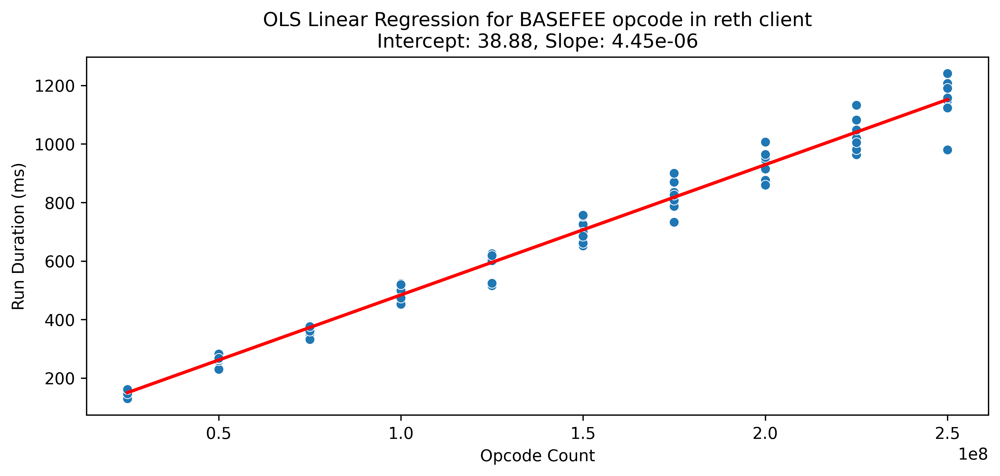


## besu


```python
                            OLS Regression Results                            
==============================================================================
Dep. Variable:        run_duration_ms   R-squared:                       0.897
Model:                            OLS   Adj. R-squared:                  0.895
Method:                 Least Squares   F-statistic:                     624.8
Date:                Tue, 23 Dec 2025   Prob (F-statistic):           3.21e-37
Time:                        08:40:44   Log-Likelihood:                -591.77
No. Observations:                  74   AIC:                             1188.
Df Residuals:                      72   BIC:                             1192.
Df Model:                           1                                         
Covariance Type:            nonrobust                                         
==============================================================================
                 coef    std err          t      P>|t|      [0.025      0.975]
------------------------------------------------------------------------------
const          4.4255    183.786      0.024      0.981    -361.946     370.797
opcount     2.979e-05   1.19e-06     24.996      0.000    2.74e-05    3.22e-05
==============================================================================
Omnibus:                       42.126   Durbin-Watson:                   0.658
Prob(Omnibus):                  0.000   Jarque-Bera (JB):              110.543
Skew:                           1.915   Prob(JB):                     9.91e-25
Kurtosis:                       7.602   Cond. No.                     3.34e+08
==============================================================================

Notes:
[1] Standard Errors assume that the covariance matrix of the errors is correctly specified.
[2] The condition number is large, 3.34e+08. This might indicate that there are
strong multicollinearity or other numerical problems.
```

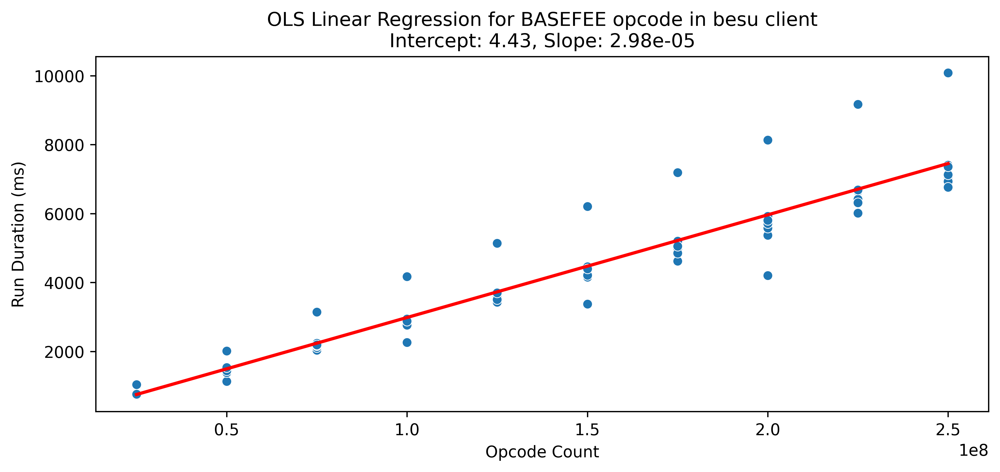


## geth


```python
                            OLS Regression Results                            
==============================================================================
Dep. Variable:        run_duration_ms   R-squared:                       0.999
Model:                            OLS   Adj. R-squared:                  0.998
Method:                 Least Squares   F-statistic:                 4.857e+04
Date:                Tue, 23 Dec 2025   Prob (F-statistic):          1.27e-103
Time:                        08:40:45   Log-Likelihood:                -387.95
No. Observations:                  74   AIC:                             779.9
Df Residuals:                      72   BIC:                             784.5
Df Model:                           1                                         
Covariance Type:            nonrobust                                         
==============================================================================
                 coef    std err          t      P>|t|      [0.025      0.975]
------------------------------------------------------------------------------
const         24.8007     11.699      2.120      0.037       1.479      48.122
opcount     1.672e-05   7.59e-08    220.392      0.000    1.66e-05    1.69e-05
==============================================================================
Omnibus:                       31.292   Durbin-Watson:                   1.288
Prob(Omnibus):                  0.000   Jarque-Bera (JB):              112.183
Skew:                          -1.177   Prob(JB):                     4.36e-25
Kurtosis:                       8.554   Cond. No.                     3.34e+08
==============================================================================

Notes:
[1] Standard Errors assume that the covariance matrix of the errors is correctly specified.
[2] The condition number is large, 3.34e+08. This might indicate that there are
strong multicollinearity or other numerical problems.
```

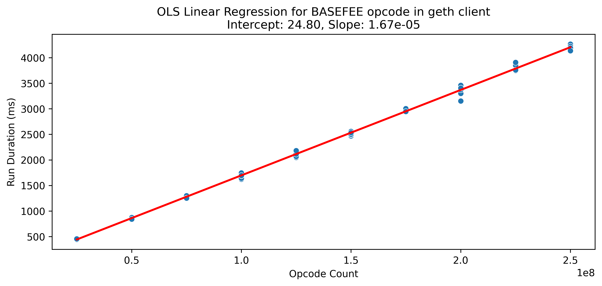


# BLOBBASEFEE

## nethermind


```python
                            OLS Regression Results                            
==============================================================================
Dep. Variable:        run_duration_ms   R-squared:                       0.994
Model:                            OLS   Adj. R-squared:                  0.994
Method:                 Least Squares   F-statistic:                 1.192e+04
Date:                Tue, 23 Dec 2025   Prob (F-statistic):           9.87e-82
Time:                        08:40:45   Log-Likelihood:                -348.68
No. Observations:                  74   AIC:                             701.4
Df Residuals:                      72   BIC:                             706.0
Df Model:                           1                                         
Covariance Type:            nonrobust                                         
==============================================================================
                 coef    std err          t      P>|t|      [0.025      0.975]
------------------------------------------------------------------------------
const         34.1354      6.882      4.960      0.000      20.417      47.854
opcount     4.873e-06   4.46e-08    109.187      0.000    4.78e-06    4.96e-06
==============================================================================
Omnibus:                        0.415   Durbin-Watson:                   1.327
Prob(Omnibus):                  0.813   Jarque-Bera (JB):                0.102
Skew:                          -0.066   Prob(JB):                        0.950
Kurtosis:                       3.125   Cond. No.                     3.34e+08
==============================================================================

Notes:
[1] Standard Errors assume that the covariance matrix of the errors is correctly specified.
[2] The condition number is large, 3.34e+08. This might indicate that there are
strong multicollinearity or other numerical problems.
```

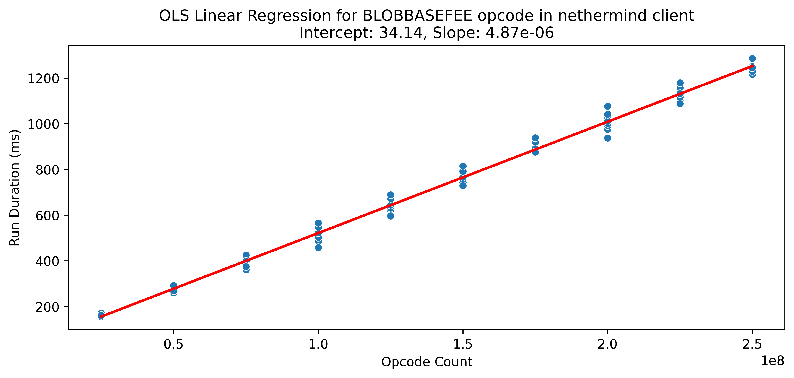


## reth


```python
                            OLS Regression Results                            
==============================================================================
Dep. Variable:        run_duration_ms   R-squared:                       0.992
Model:                            OLS   Adj. R-squared:                  0.992
Method:                 Least Squares   F-statistic:                     9355.
Date:                Tue, 23 Dec 2025   Prob (F-statistic):           5.75e-78
Time:                        08:40:45   Log-Likelihood:                -361.31
No. Observations:                  74   AIC:                             726.6
Df Residuals:                      72   BIC:                             731.2
Df Model:                           1                                         
Covariance Type:            nonrobust                                         
==============================================================================
                 coef    std err          t      P>|t|      [0.025      0.975]
------------------------------------------------------------------------------
const         42.8464      8.162      5.249      0.000      26.575      59.118
opcount      5.12e-06   5.29e-08     96.722      0.000    5.01e-06    5.23e-06
==============================================================================
Omnibus:                        1.056   Durbin-Watson:                   1.276
Prob(Omnibus):                  0.590   Jarque-Bera (JB):                0.485
Skew:                           0.060   Prob(JB):                        0.785
Kurtosis:                       3.378   Cond. No.                     3.34e+08
==============================================================================

Notes:
[1] Standard Errors assume that the covariance matrix of the errors is correctly specified.
[2] The condition number is large, 3.34e+08. This might indicate that there are
strong multicollinearity or other numerical problems.
```


## besu


```python
                            OLS Regression Results                            
==============================================================================
Dep. Variable:        run_duration_ms   R-squared:                       0.896
Model:                            OLS   Adj. R-squared:                  0.895
Method:                 Least Squares   F-statistic:                     620.1
Date:                Tue, 23 Dec 2025   Prob (F-statistic):           4.10e-37
Time:                        08:40:45   Log-Likelihood:                -590.56
No. Observations:                  74   AIC:                             1185.
Df Residuals:                      72   BIC:                             1190.
Df Model:                           1                                         
Covariance Type:            nonrobust                                         
==============================================================================
                 coef    std err          t      P>|t|      [0.025      0.975]
------------------------------------------------------------------------------
const          1.6170    180.814      0.009      0.993    -358.828     362.062
opcount      2.92e-05   1.17e-06     24.902      0.000    2.69e-05    3.15e-05
==============================================================================
Omnibus:                       44.248   Durbin-Watson:                   0.598
Prob(Omnibus):                  0.000   Jarque-Bera (JB):              119.191
Skew:                           2.018   Prob(JB):                     1.31e-26
Kurtosis:                       7.729   Cond. No.                     3.34e+08
==============================================================================

Notes:
[1] Standard Errors assume that the covariance matrix of the errors is correctly specified.
[2] The condition number is large, 3.34e+08. This might indicate that there are
strong multicollinearity or other numerical problems.
```


## geth


```python
                            OLS Regression Results                            
==============================================================================
Dep. Variable:        run_duration_ms   R-squared:                       0.997
Model:                            OLS   Adj. R-squared:                  0.997
Method:                 Least Squares   F-statistic:                 2.222e+04
Date:                Tue, 23 Dec 2025   Prob (F-statistic):           2.00e-91
Time:                        08:40:45   Log-Likelihood:                -415.24
No. Observations:                  74   AIC:                             834.5
Df Residuals:                      72   BIC:                             839.1
Df Model:                           1                                         
Covariance Type:            nonrobust                                         
==============================================================================
                 coef    std err          t      P>|t|      [0.025      0.975]
------------------------------------------------------------------------------
const         53.9208     16.915      3.188      0.002      20.201      87.641
opcount     1.635e-05    1.1e-07    149.078      0.000    1.61e-05    1.66e-05
==============================================================================
Omnibus:                       71.364   Durbin-Watson:                   1.969
Prob(Omnibus):                  0.000   Jarque-Bera (JB):              500.811
Skew:                           2.936   Prob(JB):                    1.78e-109
Kurtosis:                      14.311   Cond. No.                     3.34e+08
==============================================================================

Notes:
[1] Standard Errors assume that the covariance matrix of the errors is correctly specified.
[2] The condition number is large, 3.34e+08. This might indicate that there are
strong multicollinearity or other numerical problems.
```

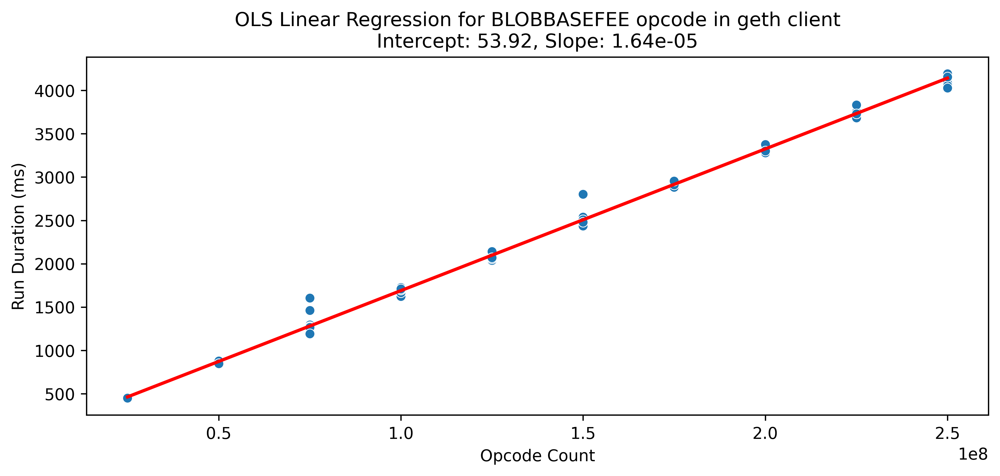


# BLOBHASH

## nethermind

OLS model did not run... Error: zero-size array to reduction operation maximum which has no identity

## reth

OLS model did not run... Error: zero-size array to reduction operation maximum which has no identity

## besu

OLS model did not run... Error: zero-size array to reduction operation maximum which has no identity

## geth

OLS model did not run... Error: zero-size array to reduction operation maximum which has no identity

# BLOCKHASH

## nethermind


```python
                            OLS Regression Results                            
==============================================================================
Dep. Variable:        run_duration_ms   R-squared:                       0.885
Model:                            OLS   Adj. R-squared:                  0.885
Method:                 Least Squares   F-statistic:                     2831.
Date:                Tue, 23 Dec 2025   Prob (F-statistic):          7.02e-175
Time:                        08:40:45   Log-Likelihood:                -2059.8
No. Observations:                 370   AIC:                             4124.
Df Residuals:                     368   BIC:                             4131.
Df Model:                           1                                         
Covariance Type:            nonrobust                                         
==============================================================================
                 coef    std err          t      P>|t|      [0.025      0.975]
------------------------------------------------------------------------------
const         29.9547      7.158      4.185      0.000      15.880      44.030
opcount      2.47e-05   4.64e-07     53.204      0.000    2.38e-05    2.56e-05
==============================================================================
Omnibus:                      215.532   Durbin-Watson:                   2.097
Prob(Omnibus):                  0.000   Jarque-Bera (JB):             1897.428
Skew:                           2.339   Prob(JB):                         0.00
Kurtosis:                      13.060   Cond. No.                     3.34e+07
==============================================================================

Notes:
[1] Standard Errors assume that the covariance matrix of the errors is correctly specified.
[2] The condition number is large, 3.34e+07. This might indicate that there are
strong multicollinearity or other numerical problems.
```

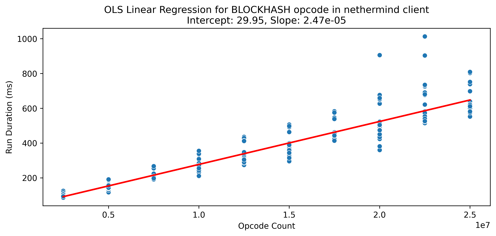


## reth


```python
                            OLS Regression Results                            
==============================================================================
Dep. Variable:        run_duration_ms   R-squared:                       0.706
Model:                            OLS   Adj. R-squared:                  0.705
Method:                 Least Squares   F-statistic:                     882.8
Date:                Tue, 23 Dec 2025   Prob (F-statistic):          8.48e-100
Time:                        08:40:45   Log-Likelihood:                -2022.1
No. Observations:                 370   AIC:                             4048.
Df Residuals:                     368   BIC:                             4056.
Df Model:                           1                                         
Covariance Type:            nonrobust                                         
==============================================================================
                 coef    std err          t      P>|t|      [0.025      0.975]
------------------------------------------------------------------------------
const         40.8337      6.465      6.316      0.000      28.120      53.547
opcount     1.246e-05   4.19e-07     29.712      0.000    1.16e-05    1.33e-05
==============================================================================
Omnibus:                      197.080   Durbin-Watson:                   2.028
Prob(Omnibus):                  0.000   Jarque-Bera (JB):             1094.417
Skew:                           2.285   Prob(JB):                    2.24e-238
Kurtosis:                      10.078   Cond. No.                     3.34e+07
==============================================================================

Notes:
[1] Standard Errors assume that the covariance matrix of the errors is correctly specified.
[2] The condition number is large, 3.34e+07. This might indicate that there are
strong multicollinearity or other numerical problems.
```

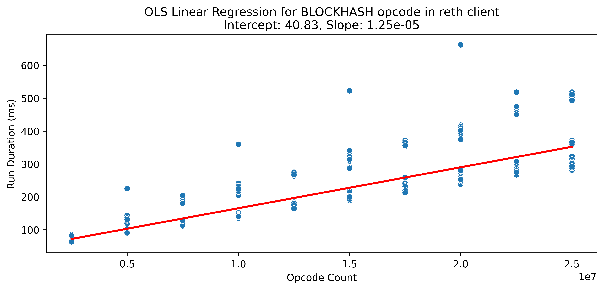


## besu


```python
                            OLS Regression Results                            
==============================================================================
Dep. Variable:        run_duration_ms   R-squared:                       0.446
Model:                            OLS   Adj. R-squared:                  0.445
Method:                 Least Squares   F-statistic:                     296.5
Date:                Tue, 23 Dec 2025   Prob (F-statistic):           3.73e-49
Time:                        08:40:45   Log-Likelihood:                -2950.0
No. Observations:                 370   AIC:                             5904.
Df Residuals:                     368   BIC:                             5912.
Df Model:                           1                                         
Covariance Type:            nonrobust                                         
==============================================================================
                 coef    std err          t      P>|t|      [0.025      0.975]
------------------------------------------------------------------------------
const         27.3180     79.382      0.344      0.731    -128.782     183.418
opcount     8.865e-05   5.15e-06     17.219      0.000    7.85e-05    9.88e-05
==============================================================================
Omnibus:                      143.400   Durbin-Watson:                   2.132
Prob(Omnibus):                  0.000   Jarque-Bera (JB):              375.470
Skew:                           1.929   Prob(JB):                     2.94e-82
Kurtosis:                       6.077   Cond. No.                     3.34e+07
==============================================================================

Notes:
[1] Standard Errors assume that the covariance matrix of the errors is correctly specified.
[2] The condition number is large, 3.34e+07. This might indicate that there are
strong multicollinearity or other numerical problems.
```

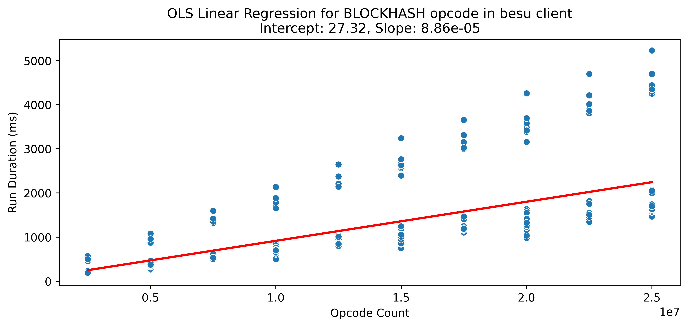


## geth


```python
                            OLS Regression Results                            
==============================================================================
Dep. Variable:        run_duration_ms   R-squared:                       0.600
Model:                            OLS   Adj. R-squared:                  0.599
Method:                 Least Squares   F-statistic:                     552.4
Date:                Tue, 23 Dec 2025   Prob (F-statistic):           2.95e-75
Time:                        08:40:46   Log-Likelihood:                -2403.4
No. Observations:                 370   AIC:                             4811.
Df Residuals:                     368   BIC:                             4819.
Df Model:                           1                                         
Covariance Type:            nonrobust                                         
==============================================================================
                 coef    std err          t      P>|t|      [0.025      0.975]
------------------------------------------------------------------------------
const         42.7362     18.117      2.359      0.019       7.111      78.361
opcount     2.762e-05   1.17e-06     23.504      0.000    2.53e-05    2.99e-05
==============================================================================
Omnibus:                      135.000   Durbin-Watson:                   2.052
Prob(Omnibus):                  0.000   Jarque-Bera (JB):              354.305
Skew:                           1.790   Prob(JB):                     1.16e-77
Kurtosis:                       6.188   Cond. No.                     3.34e+07
==============================================================================

Notes:
[1] Standard Errors assume that the covariance matrix of the errors is correctly specified.
[2] The condition number is large, 3.34e+07. This might indicate that there are
strong multicollinearity or other numerical problems.
```

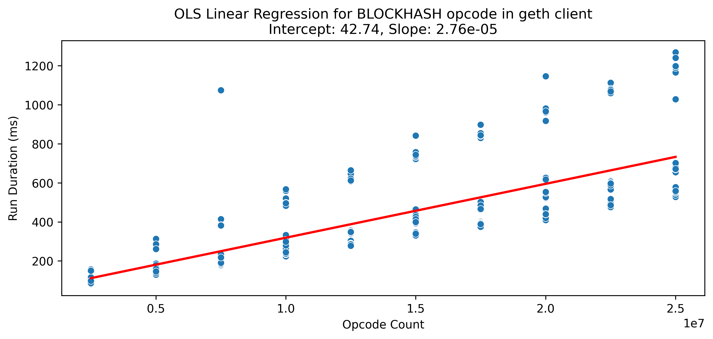


# BYTE

## nethermind


```python
                            OLS Regression Results                            
==============================================================================
Dep. Variable:        run_duration_ms   R-squared:                       0.990
Model:                            OLS   Adj. R-squared:                  0.990
Method:                 Least Squares   F-statistic:                     7262.
Date:                Tue, 23 Dec 2025   Prob (F-statistic):           4.84e-74
Time:                        08:40:46   Log-Likelihood:                -350.04
No. Observations:                  74   AIC:                             704.1
Df Residuals:                      72   BIC:                             708.7
Df Model:                           1                                         
Covariance Type:            nonrobust                                         
==============================================================================
                 coef    std err          t      P>|t|      [0.025      0.975]
------------------------------------------------------------------------------
const         41.6626      7.009      5.944      0.000      27.691      55.634
opcount     1.291e-05   1.52e-07     85.220      0.000    1.26e-05    1.32e-05
==============================================================================
Omnibus:                       10.744   Durbin-Watson:                   1.353
Prob(Omnibus):                  0.005   Jarque-Bera (JB):               14.067
Skew:                          -0.612   Prob(JB):                     0.000882
Kurtosis:                       4.750   Cond. No.                     1.00e+08
==============================================================================

Notes:
[1] Standard Errors assume that the covariance matrix of the errors is correctly specified.
[2] The condition number is large,  1e+08. This might indicate that there are
strong multicollinearity or other numerical problems.
```

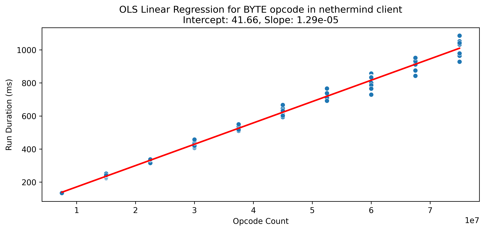


## reth


```python
                            OLS Regression Results                            
==============================================================================
Dep. Variable:        run_duration_ms   R-squared:                       0.994
Model:                            OLS   Adj. R-squared:                  0.994
Method:                 Least Squares   F-statistic:                 1.116e+04
Date:                Tue, 23 Dec 2025   Prob (F-statistic):           1.04e-80
Time:                        08:40:46   Log-Likelihood:                -289.37
No. Observations:                  74   AIC:                             582.7
Df Residuals:                      72   BIC:                             587.4
Df Model:                           1                                         
Covariance Type:            nonrobust                                         
==============================================================================
                 coef    std err          t      P>|t|      [0.025      0.975]
------------------------------------------------------------------------------
const         39.3955      3.088     12.760      0.000      33.241      45.550
opcount     7.052e-06   6.67e-08    105.653      0.000    6.92e-06    7.18e-06
==============================================================================
Omnibus:                        4.943   Durbin-Watson:                   1.514
Prob(Omnibus):                  0.084   Jarque-Bera (JB):                6.669
Skew:                           0.057   Prob(JB):                       0.0356
Kurtosis:                       4.466   Cond. No.                     1.00e+08
==============================================================================

Notes:
[1] Standard Errors assume that the covariance matrix of the errors is correctly specified.
[2] The condition number is large,  1e+08. This might indicate that there are
strong multicollinearity or other numerical problems.
```

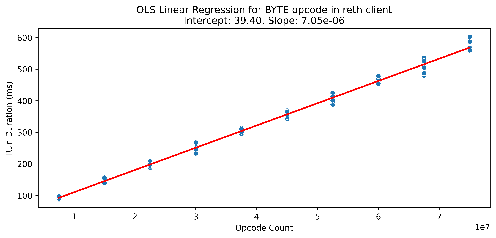


## besu


```python
                            OLS Regression Results                            
==============================================================================
Dep. Variable:        run_duration_ms   R-squared:                       0.964
Model:                            OLS   Adj. R-squared:                  0.963
Method:                 Least Squares   F-statistic:                     1771.
Date:                Tue, 23 Dec 2025   Prob (F-statistic):           6.54e-50
Time:                        08:40:46   Log-Likelihood:                -491.91
No. Observations:                  69   AIC:                             987.8
Df Residuals:                      67   BIC:                             992.3
Df Model:                           1                                         
Covariance Type:            nonrobust                                         
==============================================================================
                 coef    std err          t      P>|t|      [0.025      0.975]
------------------------------------------------------------------------------
const         20.8204     88.230      0.236      0.814    -155.287     196.927
opcount     7.757e-05   1.84e-06     42.079      0.000    7.39e-05    8.12e-05
==============================================================================
Omnibus:                       19.155   Durbin-Watson:                   0.646
Prob(Omnibus):                  0.000   Jarque-Bera (JB):               67.779
Skew:                           0.613   Prob(JB):                     1.91e-15
Kurtosis:                       7.698   Cond. No.                     1.14e+08
==============================================================================

Notes:
[1] Standard Errors assume that the covariance matrix of the errors is correctly specified.
[2] The condition number is large, 1.14e+08. This might indicate that there are
strong multicollinearity or other numerical problems.
```


## geth


```python
                            OLS Regression Results                            
==============================================================================
Dep. Variable:        run_duration_ms   R-squared:                       0.964
Model:                            OLS   Adj. R-squared:                  0.963
Method:                 Least Squares   F-statistic:                     1902.
Date:                Tue, 23 Dec 2025   Prob (F-statistic):           1.63e-53
Time:                        08:40:46   Log-Likelihood:                -443.02
No. Observations:                  74   AIC:                             890.0
Df Residuals:                      72   BIC:                             894.6
Df Model:                           1                                         
Covariance Type:            nonrobust                                         
==============================================================================
                 coef    std err          t      P>|t|      [0.025      0.975]
------------------------------------------------------------------------------
const         22.4763     24.622      0.913      0.364     -26.607      71.560
opcount     2.321e-05   5.32e-07     43.609      0.000    2.22e-05    2.43e-05
==============================================================================
Omnibus:                      144.520   Durbin-Watson:                   2.058
Prob(Omnibus):                  0.000   Jarque-Bera (JB):             9492.181
Skew:                           7.002   Prob(JB):                         0.00
Kurtosis:                      56.688   Cond. No.                     1.00e+08
==============================================================================

Notes:
[1] Standard Errors assume that the covariance matrix of the errors is correctly specified.
[2] The condition number is large,  1e+08. This might indicate that there are
strong multicollinearity or other numerical problems.
```

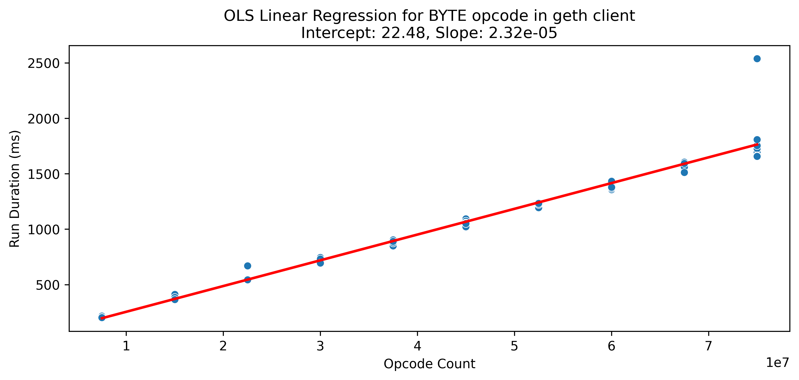


# CALLDATALOAD

## nethermind


```python
                            OLS Regression Results                            
==============================================================================
Dep. Variable:        run_duration_ms   R-squared:                       0.990
Model:                            OLS   Adj. R-squared:                  0.990
Method:                 Least Squares   F-statistic:                     7505.
Date:                Tue, 23 Dec 2025   Prob (F-statistic):           1.50e-74
Time:                        08:40:46   Log-Likelihood:                -444.52
No. Observations:                  74   AIC:                             893.0
Df Residuals:                      72   BIC:                             897.6
Df Model:                           1                                         
Covariance Type:            nonrobust                                         
==============================================================================
                 coef    std err          t      P>|t|      [0.025      0.975]
------------------------------------------------------------------------------
const         42.1166     25.126      1.676      0.098      -7.970      92.203
opcount     2.017e-05   2.33e-07     86.632      0.000    1.97e-05    2.06e-05
==============================================================================
Omnibus:                        5.174   Durbin-Watson:                   1.535
Prob(Omnibus):                  0.075   Jarque-Bera (JB):                5.503
Skew:                           0.309   Prob(JB):                       0.0638
Kurtosis:                       4.184   Cond. No.                     2.34e+08
==============================================================================

Notes:
[1] Standard Errors assume that the covariance matrix of the errors is correctly specified.
[2] The condition number is large, 2.34e+08. This might indicate that there are
strong multicollinearity or other numerical problems.
```


## reth


```python
                            OLS Regression Results                            
==============================================================================
Dep. Variable:        run_duration_ms   R-squared:                       0.996
Model:                            OLS   Adj. R-squared:                  0.996
Method:                 Least Squares   F-statistic:                 1.678e+04
Date:                Tue, 23 Dec 2025   Prob (F-statistic):           4.79e-87
Time:                        08:40:46   Log-Likelihood:                -383.45
No. Observations:                  74   AIC:                             770.9
Df Residuals:                      72   BIC:                             775.5
Df Model:                           1                                         
Covariance Type:            nonrobust                                         
==============================================================================
                 coef    std err          t      P>|t|      [0.025      0.975]
------------------------------------------------------------------------------
const         44.8360     11.008      4.073      0.000      22.891      66.780
opcount     1.321e-05   1.02e-07    129.526      0.000     1.3e-05    1.34e-05
==============================================================================
Omnibus:                       24.592   Durbin-Watson:                   1.899
Prob(Omnibus):                  0.000   Jarque-Bera (JB):               62.090
Skew:                          -1.023   Prob(JB):                     3.29e-14
Kurtosis:                       6.994   Cond. No.                     2.34e+08
==============================================================================

Notes:
[1] Standard Errors assume that the covariance matrix of the errors is correctly specified.
[2] The condition number is large, 2.34e+08. This might indicate that there are
strong multicollinearity or other numerical problems.
```


## besu


```python
                            OLS Regression Results                            
==============================================================================
Dep. Variable:        run_duration_ms   R-squared:                       0.930
Model:                            OLS   Adj. R-squared:                  0.929
Method:                 Least Squares   F-statistic:                     950.9
Date:                Tue, 23 Dec 2025   Prob (F-statistic):           3.14e-43
Time:                        08:40:47   Log-Likelihood:                -633.81
No. Observations:                  74   AIC:                             1272.
Df Residuals:                      72   BIC:                             1276.
Df Model:                           1                                         
Covariance Type:            nonrobust                                         
==============================================================================
                 coef    std err          t      P>|t|      [0.025      0.975]
------------------------------------------------------------------------------
const       -218.9943    324.401     -0.675      0.502    -865.675     427.686
opcount     9.268e-05   3.01e-06     30.837      0.000    8.67e-05    9.87e-05
==============================================================================
Omnibus:                       65.260   Durbin-Watson:                   1.128
Prob(Omnibus):                  0.000   Jarque-Bera (JB):              419.777
Skew:                           2.626   Prob(JB):                     7.02e-92
Kurtosis:                      13.419   Cond. No.                     2.34e+08
==============================================================================

Notes:
[1] Standard Errors assume that the covariance matrix of the errors is correctly specified.
[2] The condition number is large, 2.34e+08. This might indicate that there are
strong multicollinearity or other numerical problems.
```

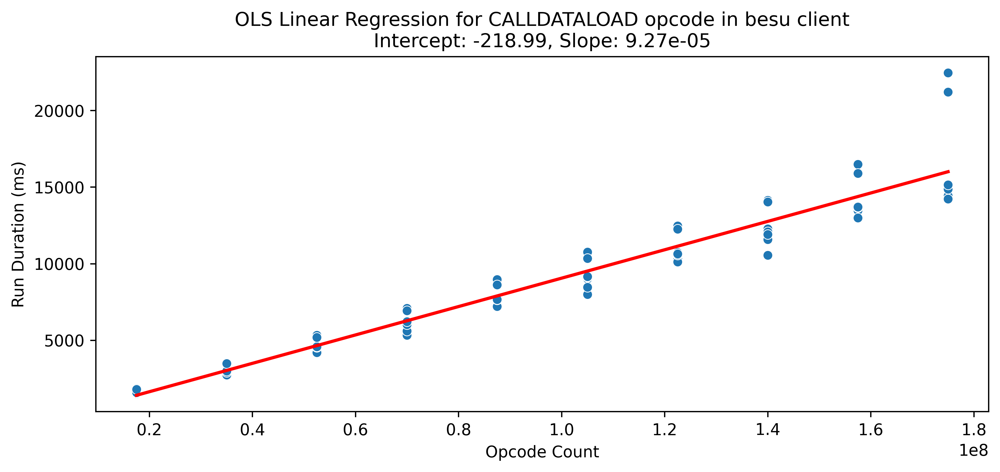


## geth


```python
                            OLS Regression Results                            
==============================================================================
Dep. Variable:        run_duration_ms   R-squared:                       0.994
Model:                            OLS   Adj. R-squared:                  0.994
Method:                 Least Squares   F-statistic:                 1.197e+04
Date:                Tue, 23 Dec 2025   Prob (F-statistic):           8.48e-82
Time:                        08:40:47   Log-Likelihood:                -495.88
No. Observations:                  74   AIC:                             995.8
Df Residuals:                      72   BIC:                             1000.
Df Model:                           1                                         
Covariance Type:            nonrobust                                         
==============================================================================
                 coef    std err          t      P>|t|      [0.025      0.975]
------------------------------------------------------------------------------
const         16.6812     50.301      0.332      0.741     -83.593     116.955
opcount     5.099e-05   4.66e-07    109.420      0.000    5.01e-05    5.19e-05
==============================================================================
Omnibus:                       40.654   Durbin-Watson:                   1.171
Prob(Omnibus):                  0.000   Jarque-Bera (JB):              114.878
Skew:                          -1.780   Prob(JB):                     1.13e-25
Kurtosis:                       7.959   Cond. No.                     2.34e+08
==============================================================================

Notes:
[1] Standard Errors assume that the covariance matrix of the errors is correctly specified.
[2] The condition number is large, 2.34e+08. This might indicate that there are
strong multicollinearity or other numerical problems.
```

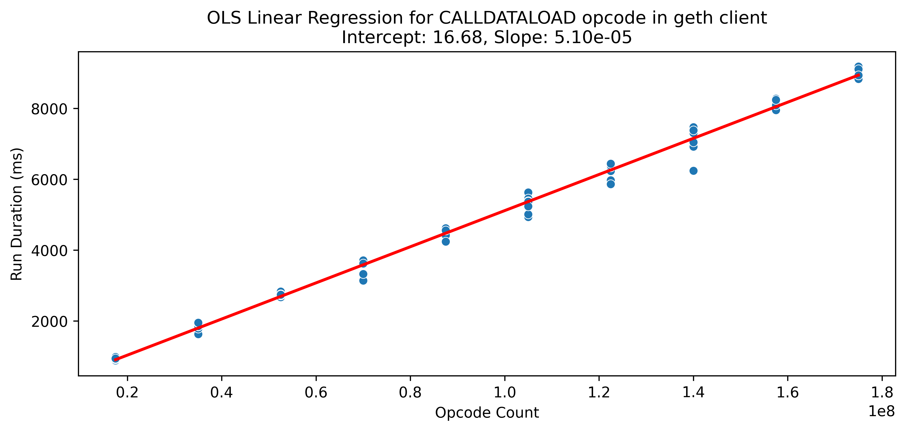


# CALLDATASIZE

## nethermind


```python
                            OLS Regression Results                            
==============================================================================
Dep. Variable:        run_duration_ms   R-squared:                       0.983
Model:                            OLS   Adj. R-squared:                  0.982
Method:                 Least Squares   F-statistic:                     4064.
Date:                Tue, 23 Dec 2025   Prob (F-statistic):           4.38e-65
Time:                        08:40:47   Log-Likelihood:                -390.60
No. Observations:                  74   AIC:                             785.2
Df Residuals:                      72   BIC:                             789.8
Df Model:                           1                                         
Covariance Type:            nonrobust                                         
==============================================================================
                 coef    std err          t      P>|t|      [0.025      0.975]
------------------------------------------------------------------------------
const         33.3375     12.125      2.750      0.008       9.167      57.508
opcount     5.013e-06   7.86e-08     63.752      0.000    4.86e-06    5.17e-06
==============================================================================
Omnibus:                        7.938   Durbin-Watson:                   1.217
Prob(Omnibus):                  0.019   Jarque-Bera (JB):                9.422
Skew:                           0.478   Prob(JB):                      0.00900
Kurtosis:                       4.464   Cond. No.                     3.34e+08
==============================================================================

Notes:
[1] Standard Errors assume that the covariance matrix of the errors is correctly specified.
[2] The condition number is large, 3.34e+08. This might indicate that there are
strong multicollinearity or other numerical problems.
```

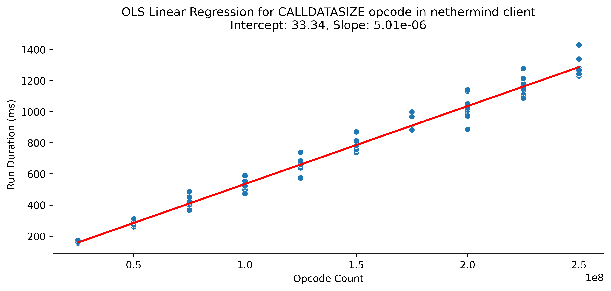


## reth


```python
                            OLS Regression Results                            
==============================================================================
Dep. Variable:        run_duration_ms   R-squared:                       0.996
Model:                            OLS   Adj. R-squared:                  0.996
Method:                 Least Squares   F-statistic:                 1.995e+04
Date:                Tue, 23 Dec 2025   Prob (F-statistic):           9.65e-90
Time:                        08:40:47   Log-Likelihood:                -331.99
No. Observations:                  74   AIC:                             668.0
Df Residuals:                      72   BIC:                             672.6
Df Model:                           1                                         
Covariance Type:            nonrobust                                         
==============================================================================
                 coef    std err          t      P>|t|      [0.025      0.975]
------------------------------------------------------------------------------
const         35.9704      5.492      6.550      0.000      25.023      46.918
opcount      5.03e-06   3.56e-08    141.234      0.000    4.96e-06     5.1e-06
==============================================================================
Omnibus:                        0.290   Durbin-Watson:                   2.079
Prob(Omnibus):                  0.865   Jarque-Bera (JB):                0.469
Skew:                           0.085   Prob(JB):                        0.791
Kurtosis:                       2.649   Cond. No.                     3.34e+08
==============================================================================

Notes:
[1] Standard Errors assume that the covariance matrix of the errors is correctly specified.
[2] The condition number is large, 3.34e+08. This might indicate that there are
strong multicollinearity or other numerical problems.
```


## besu


```python
                            OLS Regression Results                            
==============================================================================
Dep. Variable:        run_duration_ms   R-squared:                       0.844
Model:                            OLS   Adj. R-squared:                  0.842
Method:                 Least Squares   F-statistic:                     390.9
Date:                Tue, 23 Dec 2025   Prob (F-statistic):           8.19e-31
Time:                        08:40:47   Log-Likelihood:                -627.78
No. Observations:                  74   AIC:                             1260.
Df Residuals:                      72   BIC:                             1264.
Df Model:                           1                                         
Covariance Type:            nonrobust                                         
==============================================================================
                 coef    std err          t      P>|t|      [0.025      0.975]
------------------------------------------------------------------------------
const        -23.5778    299.015     -0.079      0.937    -619.652     572.497
opcount     3.834e-05   1.94e-06     19.772      0.000    3.45e-05    4.22e-05
==============================================================================
Omnibus:                       12.727   Durbin-Watson:                   0.868
Prob(Omnibus):                  0.002   Jarque-Bera (JB):               13.778
Skew:                           1.034   Prob(JB):                      0.00102
Kurtosis:                       3.437   Cond. No.                     3.34e+08
==============================================================================

Notes:
[1] Standard Errors assume that the covariance matrix of the errors is correctly specified.
[2] The condition number is large, 3.34e+08. This might indicate that there are
strong multicollinearity or other numerical problems.
```

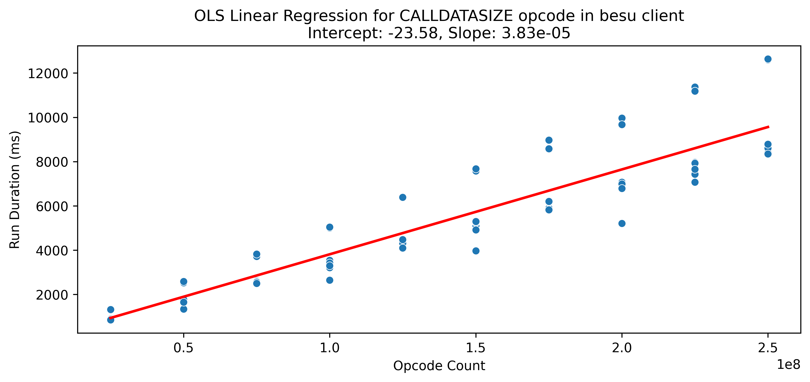


## geth


```python
                            OLS Regression Results                            
==============================================================================
Dep. Variable:        run_duration_ms   R-squared:                       0.993
Model:                            OLS   Adj. R-squared:                  0.993
Method:                 Least Squares   F-statistic:                 1.071e+04
Date:                Tue, 23 Dec 2025   Prob (F-statistic):           4.65e-80
Time:                        08:40:47   Log-Likelihood:                -418.34
No. Observations:                  74   AIC:                             840.7
Df Residuals:                      72   BIC:                             845.3
Df Model:                           1                                         
Covariance Type:            nonrobust                                         
==============================================================================
                 coef    std err          t      P>|t|      [0.025      0.975]
------------------------------------------------------------------------------
const         60.3731     17.640      3.423      0.001      25.208      95.538
opcount     1.184e-05   1.14e-07    103.465      0.000    1.16e-05    1.21e-05
==============================================================================
Omnibus:                       93.732   Durbin-Watson:                   2.340
Prob(Omnibus):                  0.000   Jarque-Bera (JB):             1706.866
Skew:                           3.748   Prob(JB):                         0.00
Kurtosis:                      25.302   Cond. No.                     3.34e+08
==============================================================================

Notes:
[1] Standard Errors assume that the covariance matrix of the errors is correctly specified.
[2] The condition number is large, 3.34e+08. This might indicate that there are
strong multicollinearity or other numerical problems.
```

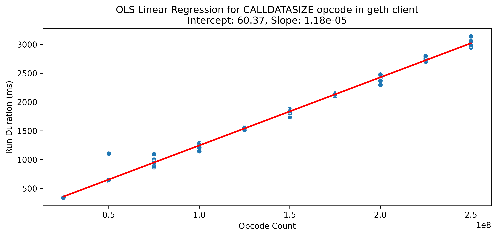


# CALLER

## nethermind


```python
                            OLS Regression Results                            
==============================================================================
Dep. Variable:        run_duration_ms   R-squared:                       0.002
Model:                            OLS   Adj. R-squared:                 -0.012
Method:                 Least Squares   F-statistic:                    0.1212
Date:                Tue, 23 Dec 2025   Prob (F-statistic):              0.729
Time:                        08:40:47   Log-Likelihood:                -450.58
No. Observations:                  74   AIC:                             905.2
Df Residuals:                      72   BIC:                             909.8
Df Model:                           1                                         
Covariance Type:            nonrobust                                         
==============================================================================
                 coef    std err          t      P>|t|      [0.025      0.975]
------------------------------------------------------------------------------
const       2430.6317     27.272     89.125      0.000    2376.266    2484.998
opcount     6.159e-10   1.77e-09      0.348      0.729   -2.91e-09    4.14e-09
==============================================================================
Omnibus:                        0.567   Durbin-Watson:                   1.123
Prob(Omnibus):                  0.753   Jarque-Bera (JB):                0.151
Skew:                          -0.026   Prob(JB):                        0.928
Kurtosis:                       3.215   Cond. No.                     3.34e+10
==============================================================================

Notes:
[1] Standard Errors assume that the covariance matrix of the errors is correctly specified.
[2] The condition number is large, 3.34e+10. This might indicate that there are
strong multicollinearity or other numerical problems.
```

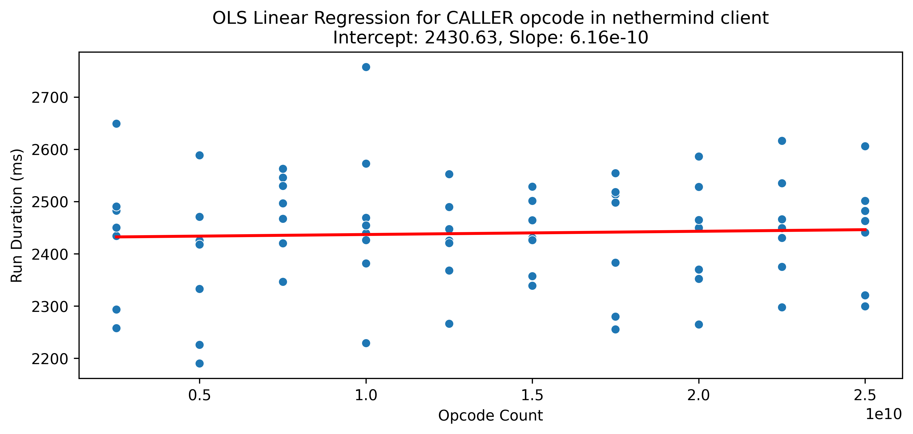


## reth


```python
                            OLS Regression Results                            
==============================================================================
Dep. Variable:        run_duration_ms   R-squared:                       0.025
Model:                            OLS   Adj. R-squared:                  0.011
Method:                 Least Squares   F-statistic:                     1.829
Date:                Tue, 23 Dec 2025   Prob (F-statistic):              0.180
Time:                        08:40:47   Log-Likelihood:                -499.17
No. Observations:                  74   AIC:                             1002.
Df Residuals:                      72   BIC:                             1007.
Df Model:                           1                                         
Covariance Type:            nonrobust                                         
==============================================================================
                 coef    std err          t      P>|t|      [0.025      0.975]
------------------------------------------------------------------------------
const       2404.2417     52.586     45.720      0.000    2299.413    2509.070
opcount    -4.612e-09   3.41e-09     -1.352      0.180   -1.14e-08    2.19e-09
==============================================================================
Omnibus:                       42.554   Durbin-Watson:                   1.060
Prob(Omnibus):                  0.000   Jarque-Bera (JB):               95.726
Skew:                           2.084   Prob(JB):                     1.63e-21
Kurtosis:                       6.697   Cond. No.                     3.34e+10
==============================================================================

Notes:
[1] Standard Errors assume that the covariance matrix of the errors is correctly specified.
[2] The condition number is large, 3.34e+10. This might indicate that there are
strong multicollinearity or other numerical problems.
```

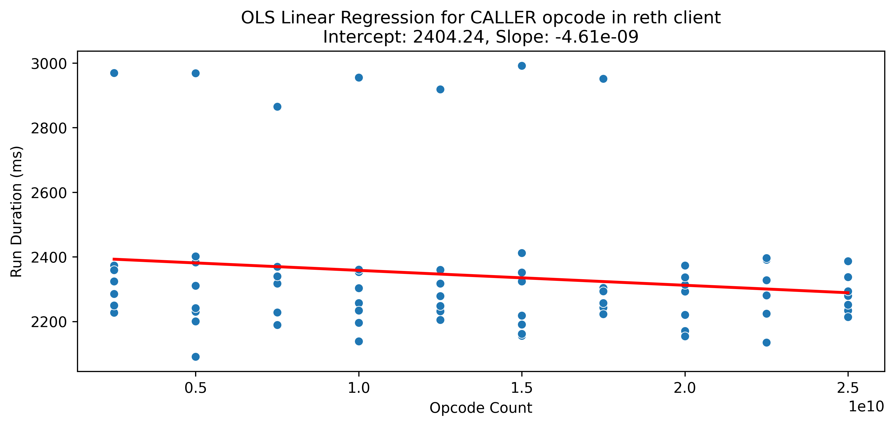


## besu


```python
                            OLS Regression Results                            
==============================================================================
Dep. Variable:        run_duration_ms   R-squared:                       0.002
Model:                            OLS   Adj. R-squared:                 -0.014
Method:                 Least Squares   F-statistic:                   0.09819
Date:                Tue, 23 Dec 2025   Prob (F-statistic):              0.755
Time:                        08:40:48   Log-Likelihood:                -683.43
No. Observations:                  67   AIC:                             1371.
Df Residuals:                      65   BIC:                             1375.
Df Model:                           1                                         
Covariance Type:            nonrobust                                         
==============================================================================
                 coef    std err          t      P>|t|      [0.025      0.975]
------------------------------------------------------------------------------
const       1.551e+04   1760.832      8.810      0.000     1.2e+04     1.9e+04
opcount     3.551e-08   1.13e-07      0.313      0.755   -1.91e-07    2.62e-07
==============================================================================
Omnibus:                       18.859   Durbin-Watson:                   0.295
Prob(Omnibus):                  0.000   Jarque-Bera (JB):               24.660
Skew:                           1.476   Prob(JB):                     4.42e-06
Kurtosis:                       3.343   Cond. No.                     3.39e+10
==============================================================================

Notes:
[1] Standard Errors assume that the covariance matrix of the errors is correctly specified.
[2] The condition number is large, 3.39e+10. This might indicate that there are
strong multicollinearity or other numerical problems.
```

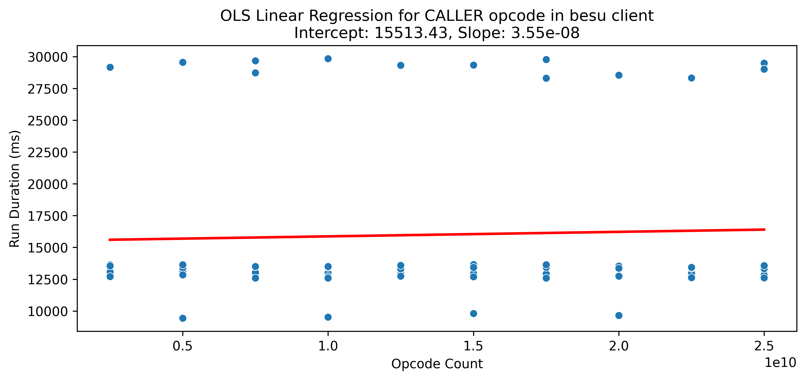


## geth


```python
                            OLS Regression Results                            
==============================================================================
Dep. Variable:        run_duration_ms   R-squared:                       0.002
Model:                            OLS   Adj. R-squared:                 -0.012
Method:                 Least Squares   F-statistic:                    0.1322
Date:                Tue, 23 Dec 2025   Prob (F-statistic):              0.717
Time:                        08:40:48   Log-Likelihood:                -458.74
No. Observations:                  74   AIC:                             921.5
Df Residuals:                      72   BIC:                             926.1
Df Model:                           1                                         
Covariance Type:            nonrobust                                         
==============================================================================
                 coef    std err          t      P>|t|      [0.025      0.975]
------------------------------------------------------------------------------
const       1.115e+04     30.452    366.134      0.000    1.11e+04    1.12e+04
opcount     7.181e-10   1.97e-09      0.364      0.717   -3.22e-09    4.66e-09
==============================================================================
Omnibus:                        7.831   Durbin-Watson:                   1.403
Prob(Omnibus):                  0.020   Jarque-Bera (JB):                9.259
Skew:                           0.472   Prob(JB):                      0.00976
Kurtosis:                       4.453   Cond. No.                     3.34e+10
==============================================================================

Notes:
[1] Standard Errors assume that the covariance matrix of the errors is correctly specified.
[2] The condition number is large, 3.34e+10. This might indicate that there are
strong multicollinearity or other numerical problems.
```

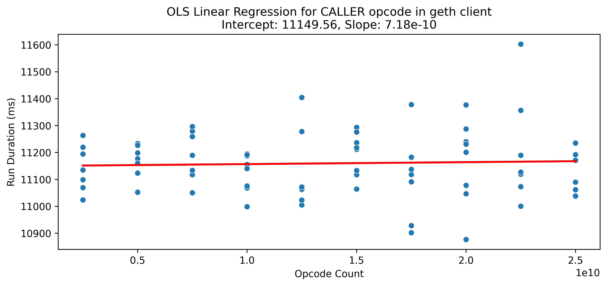


# CALLVALUE

## nethermind


```python
                            OLS Regression Results                            
==============================================================================
Dep. Variable:        run_duration_ms   R-squared:                       0.972
Model:                            OLS   Adj. R-squared:                  0.972
Method:                 Least Squares   F-statistic:                     2540.
Date:                Tue, 23 Dec 2025   Prob (F-statistic):           6.76e-58
Time:                        08:40:48   Log-Likelihood:                -376.62
No. Observations:                  74   AIC:                             757.2
Df Residuals:                      72   BIC:                             761.8
Df Model:                           1                                         
Covariance Type:            nonrobust                                         
==============================================================================
                 coef    std err          t      P>|t|      [0.025      0.975]
------------------------------------------------------------------------------
const         37.4120     10.038      3.727      0.000      17.402      57.422
opcount     6.562e-06    1.3e-07     50.399      0.000     6.3e-06    6.82e-06
==============================================================================
Omnibus:                        3.015   Durbin-Watson:                   0.495
Prob(Omnibus):                  0.221   Jarque-Bera (JB):                2.449
Skew:                           0.220   Prob(JB):                        0.294
Kurtosis:                       3.775   Cond. No.                     1.67e+08
==============================================================================

Notes:
[1] Standard Errors assume that the covariance matrix of the errors is correctly specified.
[2] The condition number is large, 1.67e+08. This might indicate that there are
strong multicollinearity or other numerical problems.
```

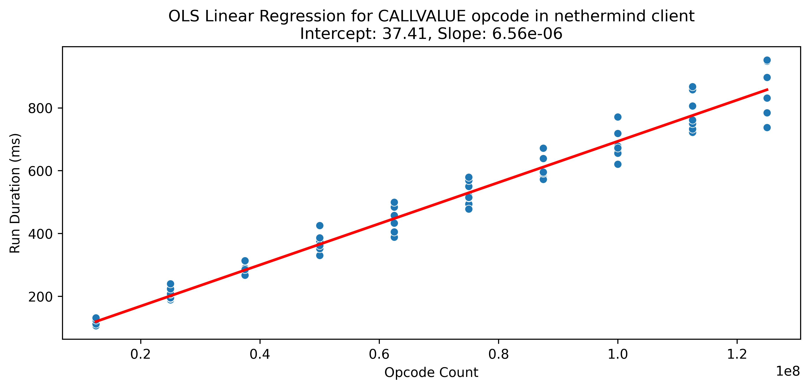


## reth


```python
                            OLS Regression Results                            
==============================================================================
Dep. Variable:        run_duration_ms   R-squared:                       0.996
Model:                            OLS   Adj. R-squared:                  0.996
Method:                 Least Squares   F-statistic:                 2.016e+04
Date:                Tue, 23 Dec 2025   Prob (F-statistic):           6.61e-90
Time:                        08:40:48   Log-Likelihood:                -300.47
No. Observations:                  74   AIC:                             604.9
Df Residuals:                      72   BIC:                             609.6
Df Model:                           1                                         
Covariance Type:            nonrobust                                         
==============================================================================
                 coef    std err          t      P>|t|      [0.025      0.975]
------------------------------------------------------------------------------
const         42.4191      3.587     11.825      0.000      35.268      49.570
opcount     6.606e-06   4.65e-08    141.981      0.000    6.51e-06     6.7e-06
==============================================================================
Omnibus:                        2.061   Durbin-Watson:                   1.611
Prob(Omnibus):                  0.357   Jarque-Bera (JB):                1.393
Skew:                           0.036   Prob(JB):                        0.498
Kurtosis:                       2.332   Cond. No.                     1.67e+08
==============================================================================

Notes:
[1] Standard Errors assume that the covariance matrix of the errors is correctly specified.
[2] The condition number is large, 1.67e+08. This might indicate that there are
strong multicollinearity or other numerical problems.
```

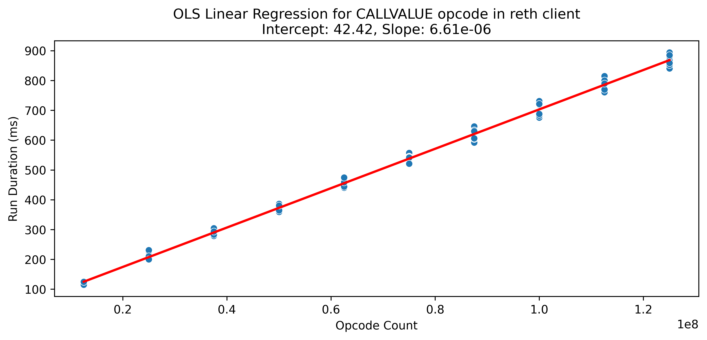


## besu


```python
                            OLS Regression Results                            
==============================================================================
Dep. Variable:        run_duration_ms   R-squared:                       0.709
Model:                            OLS   Adj. R-squared:                  0.705
Method:                 Least Squares   F-statistic:                     175.5
Date:                Tue, 23 Dec 2025   Prob (F-statistic):           5.52e-21
Time:                        08:40:48   Log-Likelihood:                -625.03
No. Observations:                  74   AIC:                             1254.
Df Residuals:                      72   BIC:                             1259.
Df Model:                           1                                         
Covariance Type:            nonrobust                                         
==============================================================================
                 coef    std err          t      P>|t|      [0.025      0.975]
------------------------------------------------------------------------------
const         -1.9824    288.080     -0.007      0.995    -576.260     572.296
opcount      4.95e-05   3.74e-06     13.246      0.000     4.2e-05    5.69e-05
==============================================================================
Omnibus:                       13.856   Durbin-Watson:                   0.284
Prob(Omnibus):                  0.001   Jarque-Bera (JB):               15.401
Skew:                           1.092   Prob(JB):                     0.000453
Kurtosis:                       3.475   Cond. No.                     1.67e+08
==============================================================================

Notes:
[1] Standard Errors assume that the covariance matrix of the errors is correctly specified.
[2] The condition number is large, 1.67e+08. This might indicate that there are
strong multicollinearity or other numerical problems.
```

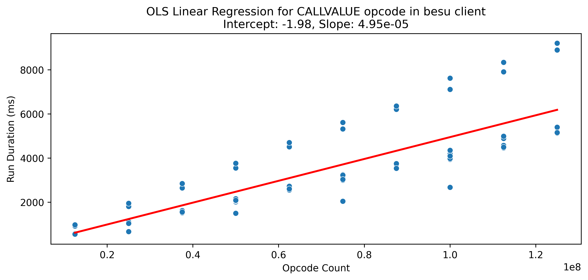


## geth


```python
                            OLS Regression Results                            
==============================================================================
Dep. Variable:        run_duration_ms   R-squared:                       0.997
Model:                            OLS   Adj. R-squared:                  0.997
Method:                 Least Squares   F-statistic:                 2.400e+04
Date:                Tue, 23 Dec 2025   Prob (F-statistic):           1.26e-92
Time:                        08:40:48   Log-Likelihood:                -351.45
No. Observations:                  74   AIC:                             706.9
Df Residuals:                      72   BIC:                             711.5
Df Model:                           1                                         
Covariance Type:            nonrobust                                         
==============================================================================
                 coef    std err          t      P>|t|      [0.025      0.975]
------------------------------------------------------------------------------
const         38.8303      7.144      5.436      0.000      24.590      53.071
opcount     1.436e-05   9.27e-08    154.930      0.000    1.42e-05    1.45e-05
==============================================================================
Omnibus:                        9.168   Durbin-Watson:                   1.440
Prob(Omnibus):                  0.010   Jarque-Bera (JB):               13.694
Skew:                           0.440   Prob(JB):                      0.00106
Kurtosis:                       4.915   Cond. No.                     1.67e+08
==============================================================================

Notes:
[1] Standard Errors assume that the covariance matrix of the errors is correctly specified.
[2] The condition number is large, 1.67e+08. This might indicate that there are
strong multicollinearity or other numerical problems.
```


# CHAINID

## nethermind


```python
                            OLS Regression Results                            
==============================================================================
Dep. Variable:        run_duration_ms   R-squared:                       0.986
Model:                            OLS   Adj. R-squared:                  0.986
Method:                 Least Squares   F-statistic:                     5039.
Date:                Tue, 23 Dec 2025   Prob (F-statistic):           2.15e-68
Time:                        08:40:48   Log-Likelihood:                -378.49
No. Observations:                  74   AIC:                             761.0
Df Residuals:                      72   BIC:                             765.6
Df Model:                           1                                         
Covariance Type:            nonrobust                                         
==============================================================================
                 coef    std err          t      P>|t|      [0.025      0.975]
------------------------------------------------------------------------------
const         44.4757     10.296      4.320      0.000      23.952      64.999
opcount      4.74e-06   6.68e-08     70.984      0.000    4.61e-06    4.87e-06
==============================================================================
Omnibus:                       23.266   Durbin-Watson:                   1.333
Prob(Omnibus):                  0.000   Jarque-Bera (JB):               49.569
Skew:                           1.042   Prob(JB):                     1.72e-11
Kurtosis:                       6.426   Cond. No.                     3.34e+08
==============================================================================

Notes:
[1] Standard Errors assume that the covariance matrix of the errors is correctly specified.
[2] The condition number is large, 3.34e+08. This might indicate that there are
strong multicollinearity or other numerical problems.
```


## reth


```python
                            OLS Regression Results                            
==============================================================================
Dep. Variable:        run_duration_ms   R-squared:                       0.983
Model:                            OLS   Adj. R-squared:                  0.982
Method:                 Least Squares   F-statistic:                     4055.
Date:                Tue, 23 Dec 2025   Prob (F-statistic):           4.75e-65
Time:                        08:40:49   Log-Likelihood:                -380.97
No. Observations:                  74   AIC:                             765.9
Df Residuals:                      72   BIC:                             770.5
Df Model:                           1                                         
Covariance Type:            nonrobust                                         
==============================================================================
                 coef    std err          t      P>|t|      [0.025      0.975]
------------------------------------------------------------------------------
const         37.0075     10.646      3.476      0.001      15.785      58.230
opcount     4.397e-06    6.9e-08     63.678      0.000    4.26e-06    4.53e-06
==============================================================================
Omnibus:                        2.050   Durbin-Watson:                   0.658
Prob(Omnibus):                  0.359   Jarque-Bera (JB):                1.490
Skew:                          -0.037   Prob(JB):                        0.475
Kurtosis:                       3.691   Cond. No.                     3.34e+08
==============================================================================

Notes:
[1] Standard Errors assume that the covariance matrix of the errors is correctly specified.
[2] The condition number is large, 3.34e+08. This might indicate that there are
strong multicollinearity or other numerical problems.
```

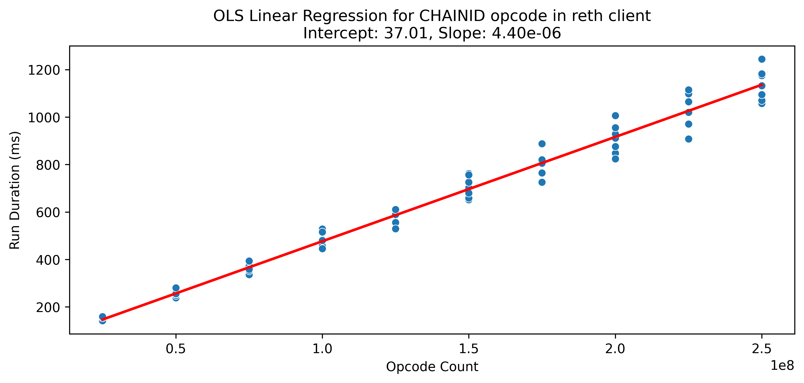


## besu


```python
                            OLS Regression Results                            
==============================================================================
Dep. Variable:        run_duration_ms   R-squared:                       0.896
Model:                            OLS   Adj. R-squared:                  0.894
Method:                 Least Squares   F-statistic:                     617.2
Date:                Tue, 23 Dec 2025   Prob (F-statistic):           4.78e-37
Time:                        08:40:49   Log-Likelihood:                -590.80
No. Observations:                  74   AIC:                             1186.
Df Residuals:                      72   BIC:                             1190.
Df Model:                           1                                         
Covariance Type:            nonrobust                                         
==============================================================================
                 coef    std err          t      P>|t|      [0.025      0.975]
------------------------------------------------------------------------------
const        -11.5472    181.411     -0.064      0.949    -373.183     350.088
opcount     2.923e-05   1.18e-06     24.843      0.000    2.69e-05    3.16e-05
==============================================================================
Omnibus:                       46.575   Durbin-Watson:                   0.451
Prob(Omnibus):                  0.000   Jarque-Bera (JB):              144.439
Skew:                           2.046   Prob(JB):                     4.32e-32
Kurtosis:                       8.487   Cond. No.                     3.34e+08
==============================================================================

Notes:
[1] Standard Errors assume that the covariance matrix of the errors is correctly specified.
[2] The condition number is large, 3.34e+08. This might indicate that there are
strong multicollinearity or other numerical problems.
```

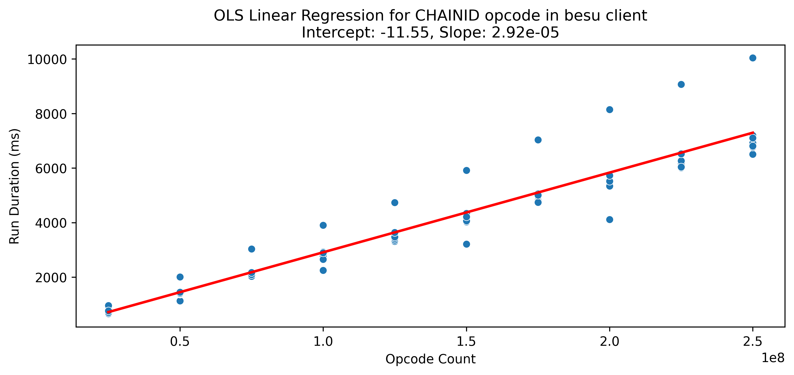


## geth


```python
                            OLS Regression Results                            
==============================================================================
Dep. Variable:        run_duration_ms   R-squared:                       0.983
Model:                            OLS   Adj. R-squared:                  0.983
Method:                 Least Squares   F-statistic:                     4151.
Date:                Tue, 23 Dec 2025   Prob (F-statistic):           2.08e-65
Time:                        08:40:49   Log-Likelihood:                -478.89
No. Observations:                  74   AIC:                             961.8
Df Residuals:                      72   BIC:                             966.4
Df Model:                           1                                         
Covariance Type:            nonrobust                                         
==============================================================================
                 coef    std err          t      P>|t|      [0.025      0.975]
------------------------------------------------------------------------------
const         16.7729     39.982      0.420      0.676     -62.930      96.476
opcount     1.671e-05   2.59e-07     64.428      0.000    1.62e-05    1.72e-05
==============================================================================
Omnibus:                      121.263   Durbin-Watson:                   1.937
Prob(Omnibus):                  0.000   Jarque-Bera (JB):             4093.214
Skew:                           5.400   Prob(JB):                         0.00
Kurtosis:                      37.798   Cond. No.                     3.34e+08
==============================================================================

Notes:
[1] Standard Errors assume that the covariance matrix of the errors is correctly specified.
[2] The condition number is large, 3.34e+08. This might indicate that there are
strong multicollinearity or other numerical problems.
```

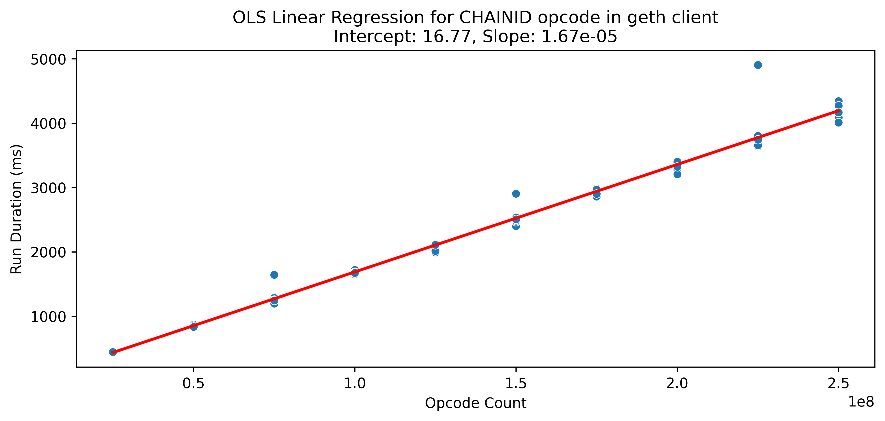


# CODESIZE

## nethermind


```python
                            OLS Regression Results                            
==============================================================================
Dep. Variable:        run_duration_ms   R-squared:                       0.996
Model:                            OLS   Adj. R-squared:                  0.996
Method:                 Least Squares   F-statistic:                 1.948e+04
Date:                Tue, 23 Dec 2025   Prob (F-statistic):           2.27e-89
Time:                        08:40:49   Log-Likelihood:                -356.41
No. Observations:                  74   AIC:                             716.8
Df Residuals:                      72   BIC:                             721.4
Df Model:                           1                                         
Covariance Type:            nonrobust                                         
==============================================================================
                 coef    std err          t      P>|t|      [0.025      0.975]
------------------------------------------------------------------------------
const         34.4982      7.639      4.516      0.000      19.270      49.727
opcount     6.914e-06   4.95e-08    139.563      0.000    6.82e-06    7.01e-06
==============================================================================
Omnibus:                        7.454   Durbin-Watson:                   1.458
Prob(Omnibus):                  0.024   Jarque-Bera (JB):               14.426
Skew:                           0.033   Prob(JB):                     0.000737
Kurtosis:                       5.162   Cond. No.                     3.34e+08
==============================================================================

Notes:
[1] Standard Errors assume that the covariance matrix of the errors is correctly specified.
[2] The condition number is large, 3.34e+08. This might indicate that there are
strong multicollinearity or other numerical problems.
```


## reth


```python
                            OLS Regression Results                            
==============================================================================
Dep. Variable:        run_duration_ms   R-squared:                       0.977
Model:                            OLS   Adj. R-squared:                  0.977
Method:                 Least Squares   F-statistic:                     3120.
Date:                Tue, 23 Dec 2025   Prob (F-statistic):           4.94e-61
Time:                        08:40:49   Log-Likelihood:                -389.15
No. Observations:                  74   AIC:                             782.3
Df Residuals:                      72   BIC:                             786.9
Df Model:                           1                                         
Covariance Type:            nonrobust                                         
==============================================================================
                 coef    std err          t      P>|t|      [0.025      0.975]
------------------------------------------------------------------------------
const         48.9749     11.891      4.119      0.000      25.272      72.678
opcount     4.307e-06   7.71e-08     55.857      0.000    4.15e-06    4.46e-06
==============================================================================
Omnibus:                        3.948   Durbin-Watson:                   1.041
Prob(Omnibus):                  0.139   Jarque-Bera (JB):                2.488
Skew:                           0.247   Prob(JB):                        0.288
Kurtosis:                       2.250   Cond. No.                     3.34e+08
==============================================================================

Notes:
[1] Standard Errors assume that the covariance matrix of the errors is correctly specified.
[2] The condition number is large, 3.34e+08. This might indicate that there are
strong multicollinearity or other numerical problems.
```

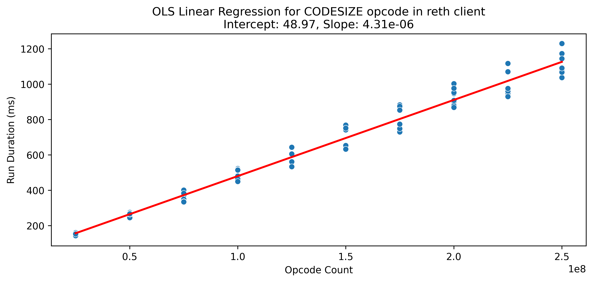


## besu


```python
                            OLS Regression Results                            
==============================================================================
Dep. Variable:        run_duration_ms   R-squared:                       0.993
Model:                            OLS   Adj. R-squared:                  0.993
Method:                 Least Squares   F-statistic:                 1.075e+04
Date:                Tue, 23 Dec 2025   Prob (F-statistic):           3.93e-80
Time:                        08:40:49   Log-Likelihood:                -466.55
No. Observations:                  74   AIC:                             937.1
Df Residuals:                      72   BIC:                             941.7
Df Model:                           1                                         
Covariance Type:            nonrobust                                         
==============================================================================
                 coef    std err          t      P>|t|      [0.025      0.975]
------------------------------------------------------------------------------
const         37.2374     33.842      1.100      0.275     -30.226     104.701
opcount     2.276e-05   2.19e-07    103.706      0.000    2.23e-05    2.32e-05
==============================================================================
Omnibus:                       28.506   Durbin-Watson:                   0.883
Prob(Omnibus):                  0.000   Jarque-Bera (JB):               48.911
Skew:                           1.465   Prob(JB):                     2.39e-11
Kurtosis:                       5.697   Cond. No.                     3.34e+08
==============================================================================

Notes:
[1] Standard Errors assume that the covariance matrix of the errors is correctly specified.
[2] The condition number is large, 3.34e+08. This might indicate that there are
strong multicollinearity or other numerical problems.
```

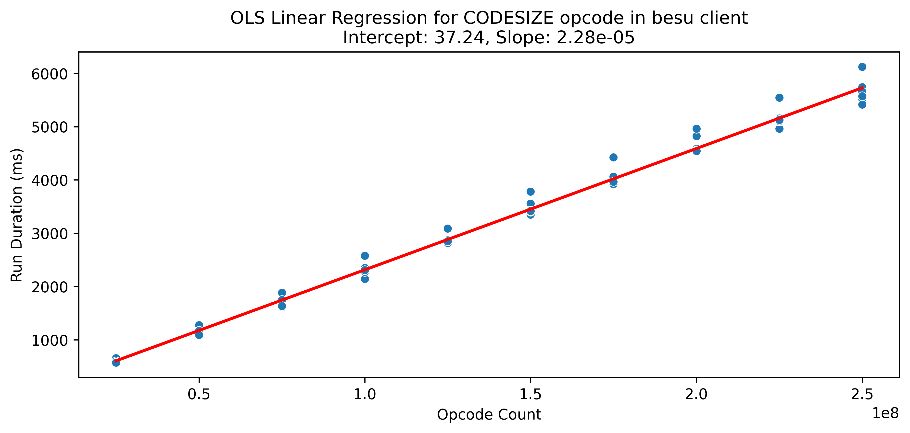


## geth


```python
                            OLS Regression Results                            
==============================================================================
Dep. Variable:        run_duration_ms   R-squared:                       0.992
Model:                            OLS   Adj. R-squared:                  0.992
Method:                 Least Squares   F-statistic:                     9145.
Date:                Tue, 23 Dec 2025   Prob (F-statistic):           1.29e-77
Time:                        08:40:49   Log-Likelihood:                -423.06
No. Observations:                  74   AIC:                             850.1
Df Residuals:                      72   BIC:                             854.7
Df Model:                           1                                         
Covariance Type:            nonrobust                                         
==============================================================================
                 coef    std err          t      P>|t|      [0.025      0.975]
------------------------------------------------------------------------------
const         14.6750     18.802      0.781      0.438     -22.806      52.156
opcount     1.166e-05   1.22e-07     95.631      0.000    1.14e-05    1.19e-05
==============================================================================
Omnibus:                       74.162   Durbin-Watson:                   1.673
Prob(Omnibus):                  0.000   Jarque-Bera (JB):              926.222
Skew:                           2.745   Prob(JB):                    7.47e-202
Kurtosis:                      19.440   Cond. No.                     3.34e+08
==============================================================================

Notes:
[1] Standard Errors assume that the covariance matrix of the errors is correctly specified.
[2] The condition number is large, 3.34e+08. This might indicate that there are
strong multicollinearity or other numerical problems.
```

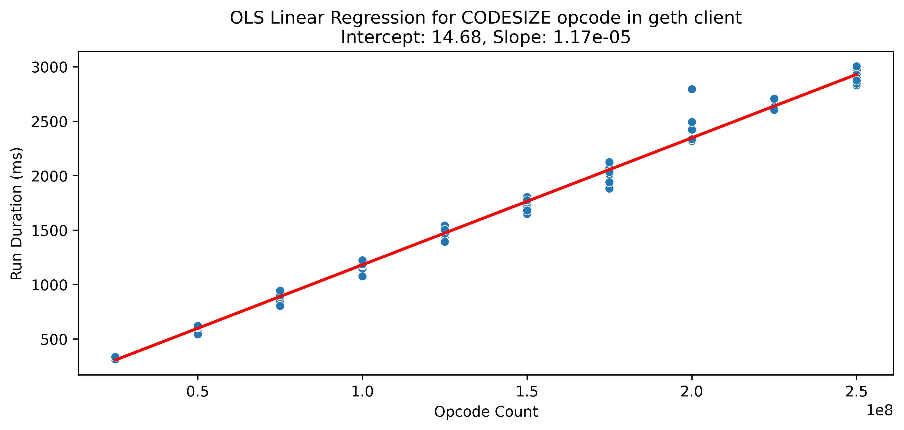


# COINBASE

## nethermind


```python
                            OLS Regression Results                            
==============================================================================
Dep. Variable:        run_duration_ms   R-squared:                       0.986
Model:                            OLS   Adj. R-squared:                  0.986
Method:                 Least Squares   F-statistic:                     5045.
Date:                Tue, 23 Dec 2025   Prob (F-statistic):           2.06e-68
Time:                        08:40:49   Log-Likelihood:                -382.65
No. Observations:                  74   AIC:                             769.3
Df Residuals:                      72   BIC:                             773.9
Df Model:                           1                                         
Covariance Type:            nonrobust                                         
==============================================================================
                 coef    std err          t      P>|t|      [0.025      0.975]
------------------------------------------------------------------------------
const         35.7928     10.891      3.286      0.002      14.082      57.503
opcount     5.017e-06   7.06e-08     71.027      0.000    4.88e-06    5.16e-06
==============================================================================
Omnibus:                        1.200   Durbin-Watson:                   1.607
Prob(Omnibus):                  0.549   Jarque-Bera (JB):                0.602
Skew:                           0.054   Prob(JB):                        0.740
Kurtosis:                       3.429   Cond. No.                     3.34e+08
==============================================================================

Notes:
[1] Standard Errors assume that the covariance matrix of the errors is correctly specified.
[2] The condition number is large, 3.34e+08. This might indicate that there are
strong multicollinearity or other numerical problems.
```

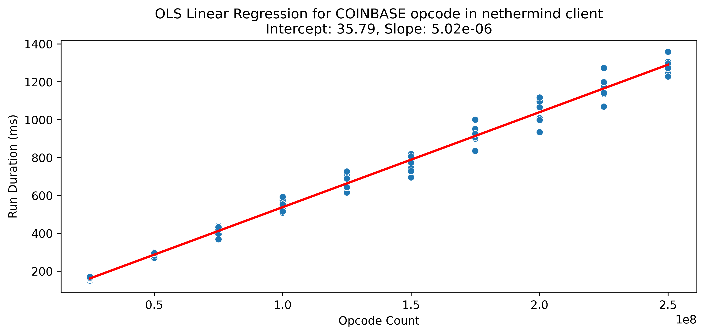


## reth


```python
                            OLS Regression Results                            
==============================================================================
Dep. Variable:        run_duration_ms   R-squared:                       0.994
Model:                            OLS   Adj. R-squared:                  0.994
Method:                 Least Squares   F-statistic:                 1.291e+04
Date:                Tue, 23 Dec 2025   Prob (F-statistic):           5.66e-83
Time:                        08:40:50   Log-Likelihood:                -346.96
No. Observations:                  74   AIC:                             697.9
Df Residuals:                      72   BIC:                             702.5
Df Model:                           1                                         
Covariance Type:            nonrobust                                         
==============================================================================
                 coef    std err          t      P>|t|      [0.025      0.975]
------------------------------------------------------------------------------
const         33.6046      6.723      4.999      0.000      20.203      47.006
opcount     4.955e-06   4.36e-08    113.637      0.000    4.87e-06    5.04e-06
==============================================================================
Omnibus:                        5.919   Durbin-Watson:                   1.354
Prob(Omnibus):                  0.052   Jarque-Bera (JB):                5.156
Skew:                          -0.538   Prob(JB):                       0.0759
Kurtosis:                       3.716   Cond. No.                     3.34e+08
==============================================================================

Notes:
[1] Standard Errors assume that the covariance matrix of the errors is correctly specified.
[2] The condition number is large, 3.34e+08. This might indicate that there are
strong multicollinearity or other numerical problems.
```

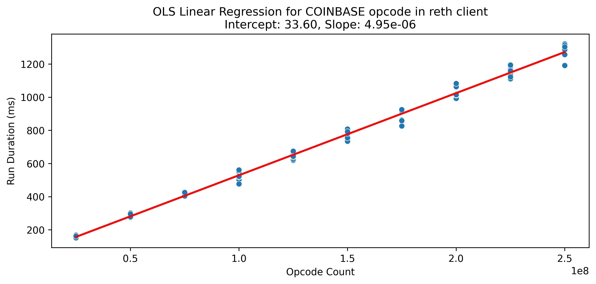


## besu


```python
                            OLS Regression Results                            
==============================================================================
Dep. Variable:        run_duration_ms   R-squared:                       0.890
Model:                            OLS   Adj. R-squared:                  0.889
Method:                 Least Squares   F-statistic:                     583.6
Date:                Tue, 23 Dec 2025   Prob (F-statistic):           2.89e-36
Time:                        08:40:50   Log-Likelihood:                -591.99
No. Observations:                  74   AIC:                             1188.
Df Residuals:                      72   BIC:                             1193.
Df Model:                           1                                         
Covariance Type:            nonrobust                                         
==============================================================================
                 coef    std err          t      P>|t|      [0.025      0.975]
------------------------------------------------------------------------------
const         -3.7949    184.351     -0.021      0.984    -371.292     363.702
opcount     2.888e-05    1.2e-06     24.158      0.000    2.65e-05    3.13e-05
==============================================================================
Omnibus:                       47.171   Durbin-Watson:                   0.841
Prob(Omnibus):                  0.000   Jarque-Bera (JB):              138.214
Skew:                           2.124   Prob(JB):                     9.71e-31
Kurtosis:                       8.176   Cond. No.                     3.34e+08
==============================================================================

Notes:
[1] Standard Errors assume that the covariance matrix of the errors is correctly specified.
[2] The condition number is large, 3.34e+08. This might indicate that there are
strong multicollinearity or other numerical problems.
```

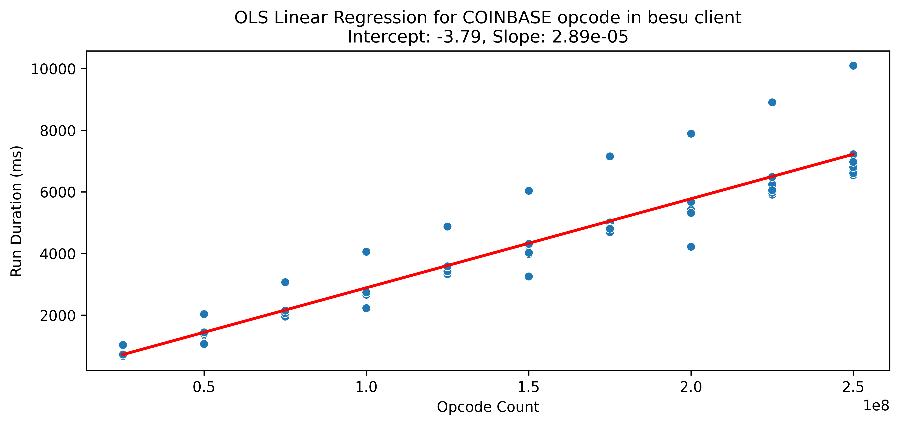


## geth


```python
                            OLS Regression Results                            
==============================================================================
Dep. Variable:        run_duration_ms   R-squared:                       0.999
Model:                            OLS   Adj. R-squared:                  0.999
Method:                 Least Squares   F-statistic:                 1.166e+05
Date:                Tue, 23 Dec 2025   Prob (F-statistic):          2.66e-117
Time:                        08:40:50   Log-Likelihood:                -361.36
No. Observations:                  74   AIC:                             726.7
Df Residuals:                      72   BIC:                             731.3
Df Model:                           1                                         
Covariance Type:            nonrobust                                         
==============================================================================
                 coef    std err          t      P>|t|      [0.025      0.975]
------------------------------------------------------------------------------
const         26.8889      8.167      3.292      0.002      10.608      43.170
opcount     1.809e-05    5.3e-08    341.472      0.000     1.8e-05    1.82e-05
==============================================================================
Omnibus:                        0.611   Durbin-Watson:                   1.619
Prob(Omnibus):                  0.737   Jarque-Bera (JB):                0.529
Skew:                           0.202   Prob(JB):                        0.767
Kurtosis:                       2.907   Cond. No.                     3.34e+08
==============================================================================

Notes:
[1] Standard Errors assume that the covariance matrix of the errors is correctly specified.
[2] The condition number is large, 3.34e+08. This might indicate that there are
strong multicollinearity or other numerical problems.
```

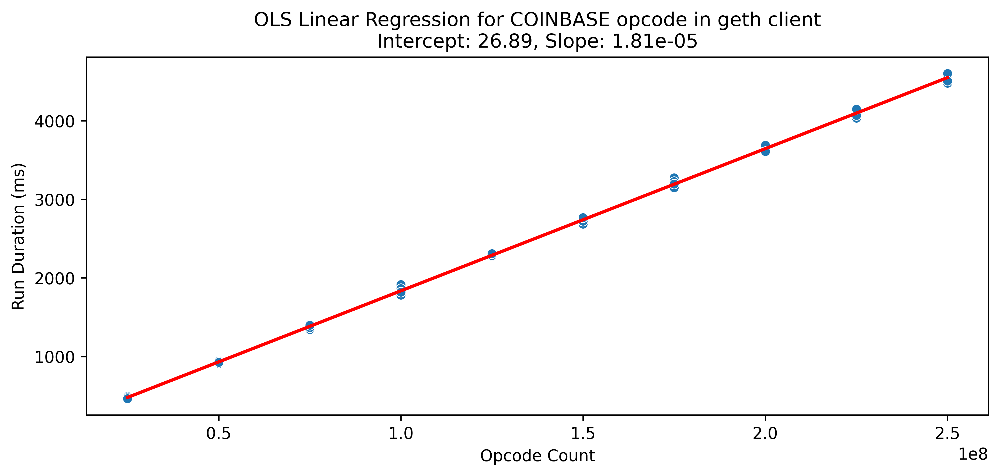


# DIV

## nethermind


```python
                            OLS Regression Results                            
==============================================================================
Dep. Variable:        run_duration_ms   R-squared:                       0.998
Model:                            OLS   Adj. R-squared:                  0.998
Method:                 Least Squares   F-statistic:                 3.629e+04
Date:                Tue, 23 Dec 2025   Prob (F-statistic):           4.48e-99
Time:                        08:40:50   Log-Likelihood:                -441.70
No. Observations:                  74   AIC:                             887.4
Df Residuals:                      72   BIC:                             892.0
Df Model:                           1                                         
Covariance Type:            nonrobust                                         
==============================================================================
                 coef    std err          t      P>|t|      [0.025      0.975]
------------------------------------------------------------------------------
const         22.5403     24.187      0.932      0.354     -25.676      70.757
opcount        0.0001   6.27e-07    190.511      0.000       0.000       0.000
==============================================================================
Omnibus:                       78.284   Durbin-Watson:                   1.308
Prob(Omnibus):                  0.000   Jarque-Bera (JB):              873.144
Skew:                          -3.060   Prob(JB):                    2.51e-190
Kurtosis:                      18.676   Cond. No.                     8.36e+07
==============================================================================

Notes:
[1] Standard Errors assume that the covariance matrix of the errors is correctly specified.
[2] The condition number is large, 8.36e+07. This might indicate that there are
strong multicollinearity or other numerical problems.
```

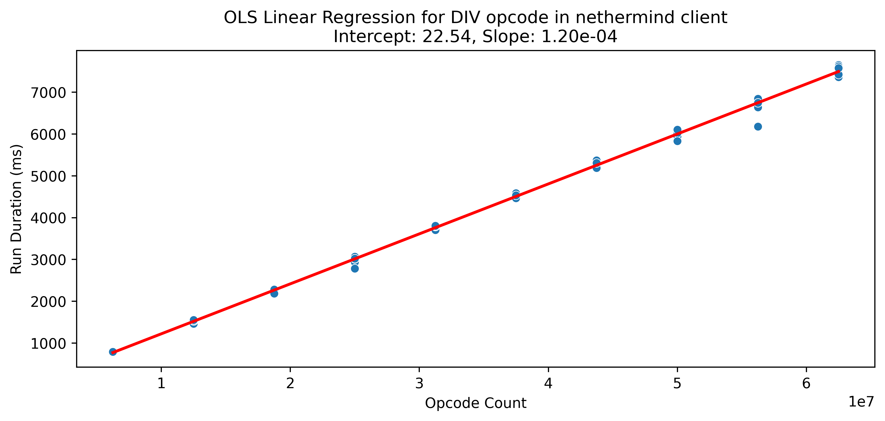


## reth


```python
                            OLS Regression Results                            
==============================================================================
Dep. Variable:        run_duration_ms   R-squared:                       0.994
Model:                            OLS   Adj. R-squared:                  0.994
Method:                 Least Squares   F-statistic:                 1.136e+04
Date:                Tue, 23 Dec 2025   Prob (F-statistic):           5.53e-81
Time:                        08:40:50   Log-Likelihood:                -422.67
No. Observations:                  74   AIC:                             849.3
Df Residuals:                      72   BIC:                             854.0
Df Model:                           1                                         
Covariance Type:            nonrobust                                         
==============================================================================
                 coef    std err          t      P>|t|      [0.025      0.975]
------------------------------------------------------------------------------
const         54.0811     18.704      2.891      0.005      16.796      91.366
opcount     5.172e-05   4.85e-07    106.590      0.000    5.08e-05    5.27e-05
==============================================================================
Omnibus:                       54.210   Durbin-Watson:                   1.868
Prob(Omnibus):                  0.000   Jarque-Bera (JB):              236.378
Skew:                          -2.244   Prob(JB):                     4.69e-52
Kurtosis:                      10.518   Cond. No.                     8.36e+07
==============================================================================

Notes:
[1] Standard Errors assume that the covariance matrix of the errors is correctly specified.
[2] The condition number is large, 8.36e+07. This might indicate that there are
strong multicollinearity or other numerical problems.
```

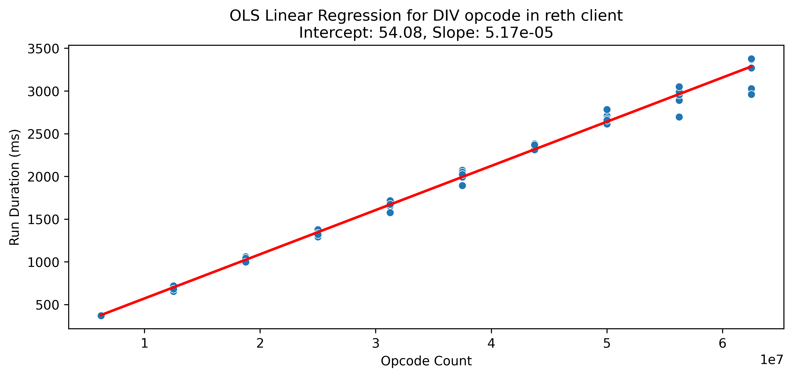


## besu


```python
                            OLS Regression Results                            
==============================================================================
Dep. Variable:        run_duration_ms   R-squared:                       0.955
Model:                            OLS   Adj. R-squared:                  0.954
Method:                 Least Squares   F-statistic:                     1515.
Date:                Tue, 23 Dec 2025   Prob (F-statistic):           4.23e-50
Time:                        08:40:50   Log-Likelihood:                -624.01
No. Observations:                  74   AIC:                             1252.
Df Residuals:                      72   BIC:                             1257.
Df Model:                           1                                         
Covariance Type:            nonrobust                                         
==============================================================================
                 coef    std err          t      P>|t|      [0.025      0.975]
------------------------------------------------------------------------------
const       -339.4640    284.155     -1.195      0.236    -905.916     226.988
opcount        0.0003   7.37e-06     38.921      0.000       0.000       0.000
==============================================================================
Omnibus:                       41.757   Durbin-Watson:                   1.420
Prob(Omnibus):                  0.000   Jarque-Bera (JB):              121.000
Skew:                           1.823   Prob(JB):                     5.31e-27
Kurtosis:                       8.094   Cond. No.                     8.36e+07
==============================================================================

Notes:
[1] Standard Errors assume that the covariance matrix of the errors is correctly specified.
[2] The condition number is large, 8.36e+07. This might indicate that there are
strong multicollinearity or other numerical problems.
```

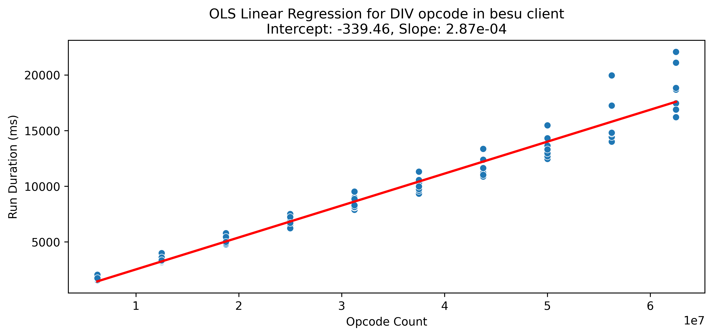


## geth


```python
                            OLS Regression Results                            
==============================================================================
Dep. Variable:        run_duration_ms   R-squared:                       0.994
Model:                            OLS   Adj. R-squared:                  0.994
Method:                 Least Squares   F-statistic:                 1.219e+04
Date:                Tue, 23 Dec 2025   Prob (F-statistic):           4.52e-82
Time:                        08:40:50   Log-Likelihood:                -441.74
No. Observations:                  74   AIC:                             887.5
Df Residuals:                      72   BIC:                             892.1
Df Model:                           1                                         
Covariance Type:            nonrobust                                         
==============================================================================
                 coef    std err          t      P>|t|      [0.025      0.975]
------------------------------------------------------------------------------
const         39.6136     24.201      1.637      0.106      -8.630      87.857
opcount      6.93e-05   6.28e-07    110.387      0.000    6.81e-05    7.06e-05
==============================================================================
Omnibus:                       39.312   Durbin-Watson:                   1.524
Prob(Omnibus):                  0.000   Jarque-Bera (JB):              102.126
Skew:                          -1.763   Prob(JB):                     6.66e-23
Kurtosis:                       7.548   Cond. No.                     8.36e+07
==============================================================================

Notes:
[1] Standard Errors assume that the covariance matrix of the errors is correctly specified.
[2] The condition number is large, 8.36e+07. This might indicate that there are
strong multicollinearity or other numerical problems.
```

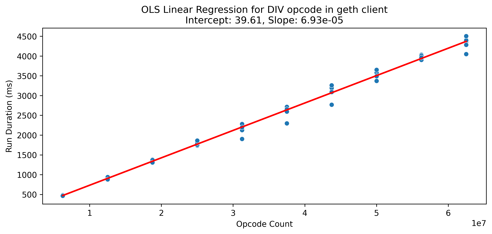


# DIFFICULTY

## nethermind

OLS model did not run... Error: zero-size array to reduction operation maximum which has no identity

## reth

OLS model did not run... Error: zero-size array to reduction operation maximum which has no identity

## besu

OLS model did not run... Error: zero-size array to reduction operation maximum which has no identity

## geth

OLS model did not run... Error: zero-size array to reduction operation maximum which has no identity

# DUP1

## nethermind


```python
                            OLS Regression Results                            
==============================================================================
Dep. Variable:        run_duration_ms   R-squared:                       0.989
Model:                            OLS   Adj. R-squared:                  0.989
Method:                 Least Squares   F-statistic:                     6446.
Date:                Tue, 23 Dec 2025   Prob (F-statistic):           3.40e-72
Time:                        08:40:51   Log-Likelihood:                -319.86
No. Observations:                  74   AIC:                             643.7
Df Residuals:                      72   BIC:                             648.3
Df Model:                           1                                         
Covariance Type:            nonrobust                                         
==============================================================================
                 coef    std err          t      P>|t|      [0.025      0.975]
------------------------------------------------------------------------------
const         38.5781      4.662      8.276      0.000      29.285      47.871
opcount     4.854e-06   6.05e-08     80.284      0.000    4.73e-06    4.97e-06
==============================================================================
Omnibus:                        3.111   Durbin-Watson:                   1.679
Prob(Omnibus):                  0.211   Jarque-Bera (JB):                3.003
Skew:                          -0.038   Prob(JB):                        0.223
Kurtosis:                       3.984   Cond. No.                     1.67e+08
==============================================================================

Notes:
[1] Standard Errors assume that the covariance matrix of the errors is correctly specified.
[2] The condition number is large, 1.67e+08. This might indicate that there are
strong multicollinearity or other numerical problems.
```

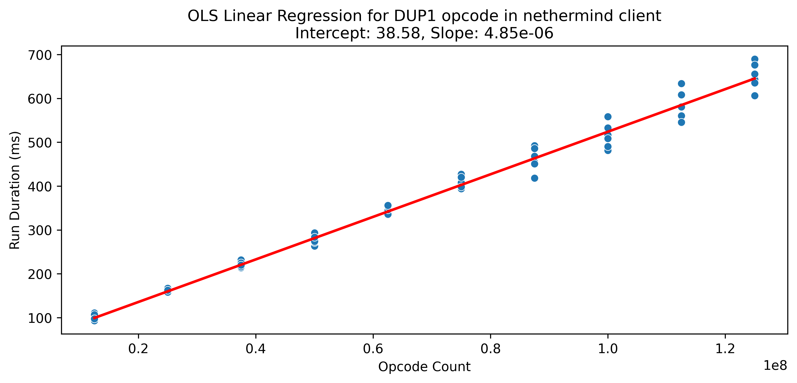


## reth


```python
                            OLS Regression Results                            
==============================================================================
Dep. Variable:        run_duration_ms   R-squared:                       0.995
Model:                            OLS   Adj. R-squared:                  0.995
Method:                 Least Squares   F-statistic:                 1.365e+04
Date:                Tue, 23 Dec 2025   Prob (F-statistic):           7.67e-84
Time:                        08:40:51   Log-Likelihood:                -276.41
No. Observations:                  74   AIC:                             556.8
Df Residuals:                      72   BIC:                             561.4
Df Model:                           1                                         
Covariance Type:            nonrobust                                         
==============================================================================
                 coef    std err          t      P>|t|      [0.025      0.975]
------------------------------------------------------------------------------
const         41.1117      2.592     15.864      0.000      35.946      46.278
opcount     3.928e-06   3.36e-08    116.852      0.000    3.86e-06    3.99e-06
==============================================================================
Omnibus:                        3.082   Durbin-Watson:                   1.698
Prob(Omnibus):                  0.214   Jarque-Bera (JB):                2.674
Skew:                          -0.174   Prob(JB):                        0.263
Kurtosis:                       3.864   Cond. No.                     1.67e+08
==============================================================================

Notes:
[1] Standard Errors assume that the covariance matrix of the errors is correctly specified.
[2] The condition number is large, 1.67e+08. This might indicate that there are
strong multicollinearity or other numerical problems.
```

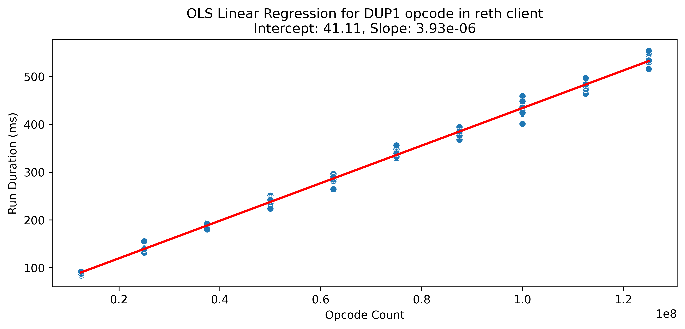


## besu


```python
                            OLS Regression Results                            
==============================================================================
Dep. Variable:        run_duration_ms   R-squared:                       0.794
Model:                            OLS   Adj. R-squared:                  0.791
Method:                 Least Squares   F-statistic:                     278.0
Date:                Tue, 23 Dec 2025   Prob (F-statistic):           1.99e-26
Time:                        08:40:51   Log-Likelihood:                -564.07
No. Observations:                  74   AIC:                             1132.
Df Residuals:                      72   BIC:                             1137.
Df Model:                           1                                         
Covariance Type:            nonrobust                                         
==============================================================================
                 coef    std err          t      P>|t|      [0.025      0.975]
------------------------------------------------------------------------------
const         -4.7949    126.402     -0.038      0.970    -256.772     247.183
opcount     2.733e-05   1.64e-06     16.672      0.000    2.41e-05    3.06e-05
==============================================================================
Omnibus:                       14.451   Durbin-Watson:                   0.742
Prob(Omnibus):                  0.001   Jarque-Bera (JB):               16.230
Skew:                           1.117   Prob(JB):                     0.000299
Kurtosis:                       3.522   Cond. No.                     1.67e+08
==============================================================================

Notes:
[1] Standard Errors assume that the covariance matrix of the errors is correctly specified.
[2] The condition number is large, 1.67e+08. This might indicate that there are
strong multicollinearity or other numerical problems.
```

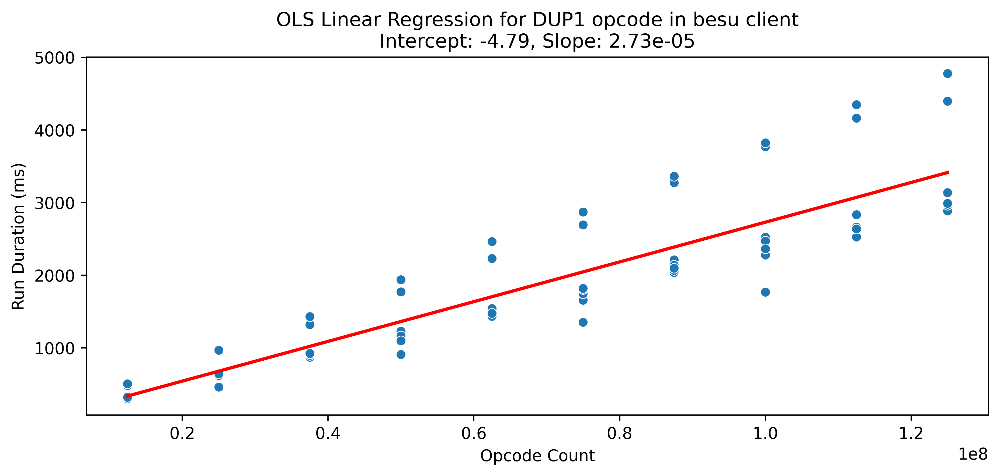


## geth


```python
                            OLS Regression Results                            
==============================================================================
Dep. Variable:        run_duration_ms   R-squared:                       0.995
Model:                            OLS   Adj. R-squared:                  0.995
Method:                 Least Squares   F-statistic:                 1.369e+04
Date:                Tue, 23 Dec 2025   Prob (F-statistic):           6.91e-84
Time:                        08:40:51   Log-Likelihood:                -348.75
No. Observations:                  74   AIC:                             701.5
Df Residuals:                      72   BIC:                             706.1
Df Model:                           1                                         
Covariance Type:            nonrobust                                         
==============================================================================
                 coef    std err          t      P>|t|      [0.025      0.975]
------------------------------------------------------------------------------
const         39.8945      6.888      5.792      0.000      26.164      53.625
opcount     1.045e-05   8.93e-08    117.021      0.000    1.03e-05    1.06e-05
==============================================================================
Omnibus:                       27.209   Durbin-Watson:                   1.689
Prob(Omnibus):                  0.000   Jarque-Bera (JB):               89.669
Skew:                           1.021   Prob(JB):                     3.38e-20
Kurtosis:                       7.991   Cond. No.                     1.67e+08
==============================================================================

Notes:
[1] Standard Errors assume that the covariance matrix of the errors is correctly specified.
[2] The condition number is large, 1.67e+08. This might indicate that there are
strong multicollinearity or other numerical problems.
```


# DUP2

## nethermind


```python
                            OLS Regression Results                            
==============================================================================
Dep. Variable:        run_duration_ms   R-squared:                       0.976
Model:                            OLS   Adj. R-squared:                  0.976
Method:                 Least Squares   F-statistic:                     2991.
Date:                Tue, 23 Dec 2025   Prob (F-statistic):           2.17e-60
Time:                        08:40:51   Log-Likelihood:                -349.33
No. Observations:                  74   AIC:                             702.7
Df Residuals:                      72   BIC:                             707.3
Df Model:                           1                                         
Covariance Type:            nonrobust                                         
==============================================================================
                 coef    std err          t      P>|t|      [0.025      0.975]
------------------------------------------------------------------------------
const         41.0229      6.942      5.910      0.000      27.185      54.861
opcount     4.925e-06      9e-08     54.694      0.000    4.75e-06     5.1e-06
==============================================================================
Omnibus:                        8.523   Durbin-Watson:                   1.348
Prob(Omnibus):                  0.014   Jarque-Bera (JB):               17.646
Skew:                           0.156   Prob(JB):                     0.000147
Kurtosis:                       5.372   Cond. No.                     1.67e+08
==============================================================================

Notes:
[1] Standard Errors assume that the covariance matrix of the errors is correctly specified.
[2] The condition number is large, 1.67e+08. This might indicate that there are
strong multicollinearity or other numerical problems.
```

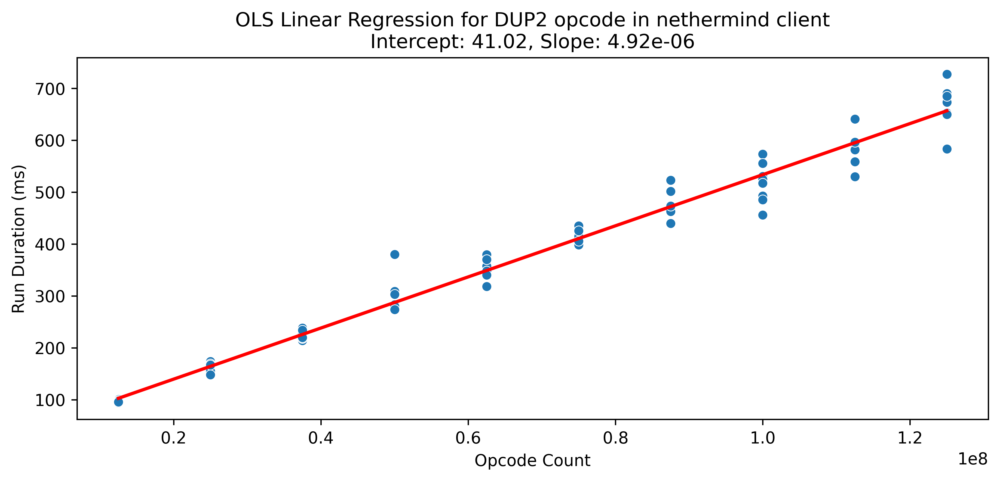


## reth


```python
                            OLS Regression Results                            
==============================================================================
Dep. Variable:        run_duration_ms   R-squared:                       0.992
Model:                            OLS   Adj. R-squared:                  0.992
Method:                 Least Squares   F-statistic:                     8774.
Date:                Tue, 23 Dec 2025   Prob (F-statistic):           5.68e-77
Time:                        08:40:51   Log-Likelihood:                -295.39
No. Observations:                  74   AIC:                             594.8
Df Residuals:                      72   BIC:                             599.4
Df Model:                           1                                         
Covariance Type:            nonrobust                                         
==============================================================================
                 coef    std err          t      P>|t|      [0.025      0.975]
------------------------------------------------------------------------------
const         36.1552      3.349     10.796      0.000      29.479      42.831
opcount     4.069e-06   4.34e-08     93.671      0.000    3.98e-06    4.16e-06
==============================================================================
Omnibus:                       31.349   Durbin-Watson:                   1.842
Prob(Omnibus):                  0.000   Jarque-Bera (JB):               86.464
Skew:                          -1.311   Prob(JB):                     1.68e-19
Kurtosis:                       7.601   Cond. No.                     1.67e+08
==============================================================================

Notes:
[1] Standard Errors assume that the covariance matrix of the errors is correctly specified.
[2] The condition number is large, 1.67e+08. This might indicate that there are
strong multicollinearity or other numerical problems.
```

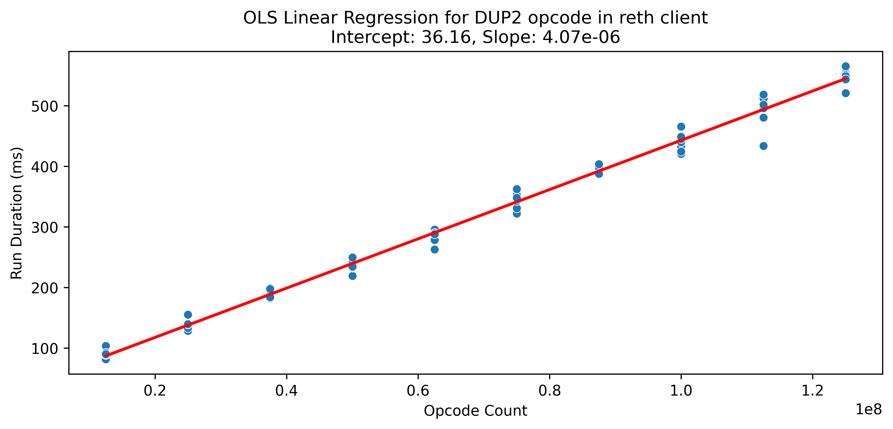


## besu


```python
                            OLS Regression Results                            
==============================================================================
Dep. Variable:        run_duration_ms   R-squared:                       0.781
Model:                            OLS   Adj. R-squared:                  0.778
Method:                 Least Squares   F-statistic:                     256.5
Date:                Tue, 23 Dec 2025   Prob (F-statistic):           1.97e-25
Time:                        08:40:51   Log-Likelihood:                -566.91
No. Observations:                  74   AIC:                             1138.
Df Residuals:                      72   BIC:                             1142.
Df Model:                           1                                         
Covariance Type:            nonrobust                                         
==============================================================================
                 coef    std err          t      P>|t|      [0.025      0.975]
------------------------------------------------------------------------------
const         -0.3005    131.354     -0.002      0.998    -262.151     261.550
opcount     2.729e-05    1.7e-06     16.015      0.000    2.39e-05    3.07e-05
==============================================================================
Omnibus:                       14.959   Durbin-Watson:                   0.641
Prob(Omnibus):                  0.001   Jarque-Bera (JB):               16.983
Skew:                           1.141   Prob(JB):                     0.000205
Kurtosis:                       3.547   Cond. No.                     1.67e+08
==============================================================================

Notes:
[1] Standard Errors assume that the covariance matrix of the errors is correctly specified.
[2] The condition number is large, 1.67e+08. This might indicate that there are
strong multicollinearity or other numerical problems.
```

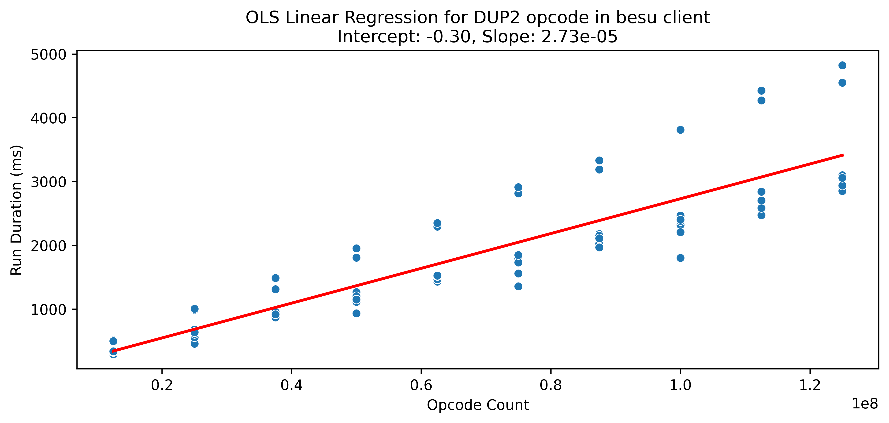


## geth


```python
                            OLS Regression Results                            
==============================================================================
Dep. Variable:        run_duration_ms   R-squared:                       0.988
Model:                            OLS   Adj. R-squared:                  0.988
Method:                 Least Squares   F-statistic:                     5992.
Date:                Tue, 23 Dec 2025   Prob (F-statistic):           4.56e-71
Time:                        08:40:51   Log-Likelihood:                -380.87
No. Observations:                  74   AIC:                             765.7
Df Residuals:                      72   BIC:                             770.3
Df Model:                           1                                         
Covariance Type:            nonrobust                                         
==============================================================================
                 coef    std err          t      P>|t|      [0.025      0.975]
------------------------------------------------------------------------------
const         36.2746     10.631      3.412      0.001      15.083      57.466
opcount     1.067e-05   1.38e-07     77.408      0.000    1.04e-05    1.09e-05
==============================================================================
Omnibus:                       76.552   Durbin-Watson:                   1.925
Prob(Omnibus):                  0.000   Jarque-Bera (JB):              697.857
Skew:                           3.082   Prob(JB):                    2.90e-152
Kurtosis:                      16.723   Cond. No.                     1.67e+08
==============================================================================

Notes:
[1] Standard Errors assume that the covariance matrix of the errors is correctly specified.
[2] The condition number is large, 1.67e+08. This might indicate that there are
strong multicollinearity or other numerical problems.
```


# DUP3

## nethermind


```python
                            OLS Regression Results                            
==============================================================================
Dep. Variable:        run_duration_ms   R-squared:                       0.988
Model:                            OLS   Adj. R-squared:                  0.988
Method:                 Least Squares   F-statistic:                     6101.
Date:                Tue, 23 Dec 2025   Prob (F-statistic):           2.40e-71
Time:                        08:40:52   Log-Likelihood:                -324.15
No. Observations:                  74   AIC:                             652.3
Df Residuals:                      72   BIC:                             656.9
Df Model:                           1                                         
Covariance Type:            nonrobust                                         
==============================================================================
                 coef    std err          t      P>|t|      [0.025      0.975]
------------------------------------------------------------------------------
const         36.6525      4.939      7.420      0.000      26.806      46.499
opcount     5.004e-06   6.41e-08     78.109      0.000    4.88e-06    5.13e-06
==============================================================================
Omnibus:                        6.970   Durbin-Watson:                   1.131
Prob(Omnibus):                  0.031   Jarque-Bera (JB):                8.964
Skew:                           0.358   Prob(JB):                       0.0113
Kurtosis:                       4.548   Cond. No.                     1.67e+08
==============================================================================

Notes:
[1] Standard Errors assume that the covariance matrix of the errors is correctly specified.
[2] The condition number is large, 1.67e+08. This might indicate that there are
strong multicollinearity or other numerical problems.
```


## reth


```python
                            OLS Regression Results                            
==============================================================================
Dep. Variable:        run_duration_ms   R-squared:                       0.986
Model:                            OLS   Adj. R-squared:                  0.986
Method:                 Least Squares   F-statistic:                     5213.
Date:                Tue, 23 Dec 2025   Prob (F-statistic):           6.44e-69
Time:                        08:40:52   Log-Likelihood:                -311.03
No. Observations:                  74   AIC:                             626.1
Df Residuals:                      72   BIC:                             630.7
Df Model:                           1                                         
Covariance Type:            nonrobust                                         
==============================================================================
                 coef    std err          t      P>|t|      [0.025      0.975]
------------------------------------------------------------------------------
const         38.4289      4.137      9.288      0.000      30.181      46.677
opcount     3.875e-06   5.37e-08     72.201      0.000    3.77e-06    3.98e-06
==============================================================================
Omnibus:                        2.435   Durbin-Watson:                   0.878
Prob(Omnibus):                  0.296   Jarque-Bera (JB):                1.874
Skew:                          -0.136   Prob(JB):                        0.392
Kurtosis:                       3.730   Cond. No.                     1.67e+08
==============================================================================

Notes:
[1] Standard Errors assume that the covariance matrix of the errors is correctly specified.
[2] The condition number is large, 1.67e+08. This might indicate that there are
strong multicollinearity or other numerical problems.
```


## besu


```python
                            OLS Regression Results                            
==============================================================================
Dep. Variable:        run_duration_ms   R-squared:                       0.778
Model:                            OLS   Adj. R-squared:                  0.775
Method:                 Least Squares   F-statistic:                     252.7
Date:                Tue, 23 Dec 2025   Prob (F-statistic):           2.99e-25
Time:                        08:40:52   Log-Likelihood:                -566.78
No. Observations:                  74   AIC:                             1138.
Df Residuals:                      72   BIC:                             1142.
Df Model:                           1                                         
Covariance Type:            nonrobust                                         
==============================================================================
                 coef    std err          t      P>|t|      [0.025      0.975]
------------------------------------------------------------------------------
const         11.1156    131.126      0.085      0.933    -250.279     272.510
opcount     2.704e-05    1.7e-06     15.897      0.000    2.36e-05    3.04e-05
==============================================================================
Omnibus:                       14.907   Durbin-Watson:                   0.617
Prob(Omnibus):                  0.001   Jarque-Bera (JB):               16.934
Skew:                           1.141   Prob(JB):                     0.000210
Kurtosis:                       3.530   Cond. No.                     1.67e+08
==============================================================================

Notes:
[1] Standard Errors assume that the covariance matrix of the errors is correctly specified.
[2] The condition number is large, 1.67e+08. This might indicate that there are
strong multicollinearity or other numerical problems.
```

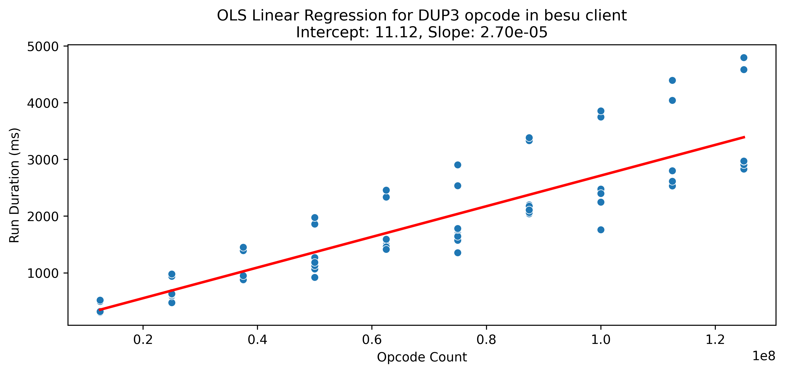


## geth


```python
                            OLS Regression Results                            
==============================================================================
Dep. Variable:        run_duration_ms   R-squared:                       0.994
Model:                            OLS   Adj. R-squared:                  0.994
Method:                 Least Squares   F-statistic:                 1.141e+04
Date:                Tue, 23 Dec 2025   Prob (F-statistic):           4.70e-81
Time:                        08:40:52   Log-Likelihood:                -355.05
No. Observations:                  74   AIC:                             714.1
Df Residuals:                      72   BIC:                             718.7
Df Model:                           1                                         
Covariance Type:            nonrobust                                         
==============================================================================
                 coef    std err          t      P>|t|      [0.025      0.975]
------------------------------------------------------------------------------
const         44.4225      7.500      5.923      0.000      29.471      59.374
opcount     1.039e-05   9.73e-08    106.832      0.000    1.02e-05    1.06e-05
==============================================================================
Omnibus:                       69.712   Durbin-Watson:                   2.217
Prob(Omnibus):                  0.000   Jarque-Bera (JB):              516.394
Skew:                           2.799   Prob(JB):                    7.35e-113
Kurtosis:                      14.668   Cond. No.                     1.67e+08
==============================================================================

Notes:
[1] Standard Errors assume that the covariance matrix of the errors is correctly specified.
[2] The condition number is large, 1.67e+08. This might indicate that there are
strong multicollinearity or other numerical problems.
```


# DUP4

## nethermind


```python
                            OLS Regression Results                            
==============================================================================
Dep. Variable:        run_duration_ms   R-squared:                       0.988
Model:                            OLS   Adj. R-squared:                  0.988
Method:                 Least Squares   F-statistic:                     5903.
Date:                Tue, 23 Dec 2025   Prob (F-statistic):           7.77e-71
Time:                        08:40:52   Log-Likelihood:                -325.94
No. Observations:                  74   AIC:                             655.9
Df Residuals:                      72   BIC:                             660.5
Df Model:                           1                                         
Covariance Type:            nonrobust                                         
==============================================================================
                 coef    std err          t      P>|t|      [0.025      0.975]
------------------------------------------------------------------------------
const         34.5399      5.061      6.825      0.000      24.452      44.628
opcount     5.043e-06   6.56e-08     76.830      0.000    4.91e-06    5.17e-06
==============================================================================
Omnibus:                        7.094   Durbin-Watson:                   1.084
Prob(Omnibus):                  0.029   Jarque-Bera (JB):                6.581
Skew:                           0.581   Prob(JB):                       0.0372
Kurtosis:                       3.884   Cond. No.                     1.67e+08
==============================================================================

Notes:
[1] Standard Errors assume that the covariance matrix of the errors is correctly specified.
[2] The condition number is large, 1.67e+08. This might indicate that there are
strong multicollinearity or other numerical problems.
```


## reth


```python
                            OLS Regression Results                            
==============================================================================
Dep. Variable:        run_duration_ms   R-squared:                       0.988
Model:                            OLS   Adj. R-squared:                  0.988
Method:                 Least Squares   F-statistic:                     5907.
Date:                Tue, 23 Dec 2025   Prob (F-statistic):           7.58e-71
Time:                        08:40:52   Log-Likelihood:                -305.26
No. Observations:                  74   AIC:                             614.5
Df Residuals:                      72   BIC:                             619.1
Df Model:                           1                                         
Covariance Type:            nonrobust                                         
==============================================================================
                 coef    std err          t      P>|t|      [0.025      0.975]
------------------------------------------------------------------------------
const         36.4708      3.827      9.530      0.000      28.842      44.100
opcount     3.815e-06   4.96e-08     76.857      0.000    3.72e-06    3.91e-06
==============================================================================
Omnibus:                        2.818   Durbin-Watson:                   1.304
Prob(Omnibus):                  0.244   Jarque-Bera (JB):                2.052
Skew:                           0.302   Prob(JB):                        0.359
Kurtosis:                       3.548   Cond. No.                     1.67e+08
==============================================================================

Notes:
[1] Standard Errors assume that the covariance matrix of the errors is correctly specified.
[2] The condition number is large, 1.67e+08. This might indicate that there are
strong multicollinearity or other numerical problems.
```


## besu


```python
                            OLS Regression Results                            
==============================================================================
Dep. Variable:        run_duration_ms   R-squared:                       0.785
Model:                            OLS   Adj. R-squared:                  0.782
Method:                 Least Squares   F-statistic:                     262.7
Date:                Tue, 23 Dec 2025   Prob (F-statistic):           9.99e-26
Time:                        08:40:52   Log-Likelihood:                -565.97
No. Observations:                  74   AIC:                             1136.
Df Residuals:                      72   BIC:                             1141.
Df Model:                           1                                         
Covariance Type:            nonrobust                                         
==============================================================================
                 coef    std err          t      P>|t|      [0.025      0.975]
------------------------------------------------------------------------------
const         -1.0069    129.690     -0.008      0.994    -259.538     257.525
opcount     2.726e-05   1.68e-06     16.208      0.000    2.39e-05    3.06e-05
==============================================================================
Omnibus:                       15.738   Durbin-Watson:                   0.552
Prob(Omnibus):                  0.000   Jarque-Bera (JB):               18.072
Skew:                           1.168   Prob(JB):                     0.000119
Kurtosis:                       3.638   Cond. No.                     1.67e+08
==============================================================================

Notes:
[1] Standard Errors assume that the covariance matrix of the errors is correctly specified.
[2] The condition number is large, 1.67e+08. This might indicate that there are
strong multicollinearity or other numerical problems.
```

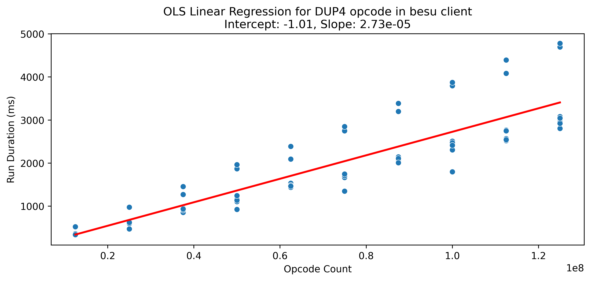


## geth


```python
                            OLS Regression Results                            
==============================================================================
Dep. Variable:        run_duration_ms   R-squared:                       0.975
Model:                            OLS   Adj. R-squared:                  0.974
Method:                 Least Squares   F-statistic:                     2782.
Date:                Tue, 23 Dec 2025   Prob (F-statistic):           2.79e-59
Time:                        08:40:53   Log-Likelihood:                -410.00
No. Observations:                  74   AIC:                             824.0
Df Residuals:                      72   BIC:                             828.6
Df Model:                           1                                         
Covariance Type:            nonrobust                                         
==============================================================================
                 coef    std err          t      P>|t|      [0.025      0.975]
------------------------------------------------------------------------------
const         29.9906     15.760      1.903      0.061      -1.427      61.409
opcount     1.078e-05   2.04e-07     52.743      0.000    1.04e-05    1.12e-05
==============================================================================
Omnibus:                      140.974   Durbin-Watson:                   1.955
Prob(Omnibus):                  0.000   Jarque-Bera (JB):             8623.508
Skew:                           6.714   Prob(JB):                         0.00
Kurtosis:                      54.152   Cond. No.                     1.67e+08
==============================================================================

Notes:
[1] Standard Errors assume that the covariance matrix of the errors is correctly specified.
[2] The condition number is large, 1.67e+08. This might indicate that there are
strong multicollinearity or other numerical problems.
```

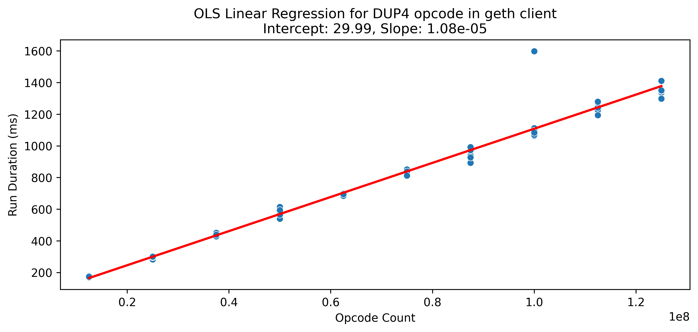


# DUP5

## nethermind


```python
                            OLS Regression Results                            
==============================================================================
Dep. Variable:        run_duration_ms   R-squared:                       0.989
Model:                            OLS   Adj. R-squared:                  0.989
Method:                 Least Squares   F-statistic:                     6302.
Date:                Tue, 23 Dec 2025   Prob (F-statistic):           7.59e-72
Time:                        08:40:53   Log-Likelihood:                -323.20
No. Observations:                  74   AIC:                             650.4
Df Residuals:                      72   BIC:                             655.0
Df Model:                           1                                         
Covariance Type:            nonrobust                                         
==============================================================================
                 coef    std err          t      P>|t|      [0.025      0.975]
------------------------------------------------------------------------------
const         36.2130      4.877      7.426      0.000      26.492      45.934
opcount     5.021e-06   6.33e-08     79.382      0.000     4.9e-06    5.15e-06
==============================================================================
Omnibus:                       11.520   Durbin-Watson:                   0.953
Prob(Omnibus):                  0.003   Jarque-Bera (JB):               15.360
Skew:                           0.650   Prob(JB):                     0.000462
Kurtosis:                       4.814   Cond. No.                     1.67e+08
==============================================================================

Notes:
[1] Standard Errors assume that the covariance matrix of the errors is correctly specified.
[2] The condition number is large, 1.67e+08. This might indicate that there are
strong multicollinearity or other numerical problems.
```


## reth


```python
                            OLS Regression Results                            
==============================================================================
Dep. Variable:        run_duration_ms   R-squared:                       0.988
Model:                            OLS   Adj. R-squared:                  0.988
Method:                 Least Squares   F-statistic:                     5900.
Date:                Tue, 23 Dec 2025   Prob (F-statistic):           7.90e-71
Time:                        08:40:53   Log-Likelihood:                -306.87
No. Observations:                  74   AIC:                             617.7
Df Residuals:                      72   BIC:                             622.3
Df Model:                           1                                         
Covariance Type:            nonrobust                                         
==============================================================================
                 coef    std err          t      P>|t|      [0.025      0.975]
------------------------------------------------------------------------------
const         38.1465      3.911      9.754      0.000      30.350      45.943
opcount     3.897e-06   5.07e-08     76.812      0.000     3.8e-06       4e-06
==============================================================================
Omnibus:                        1.318   Durbin-Watson:                   0.965
Prob(Omnibus):                  0.517   Jarque-Bera (JB):                0.706
Skew:                           0.065   Prob(JB):                        0.703
Kurtosis:                       3.461   Cond. No.                     1.67e+08
==============================================================================

Notes:
[1] Standard Errors assume that the covariance matrix of the errors is correctly specified.
[2] The condition number is large, 1.67e+08. This might indicate that there are
strong multicollinearity or other numerical problems.
```


## besu


```python
                            OLS Regression Results                            
==============================================================================
Dep. Variable:        run_duration_ms   R-squared:                       0.779
Model:                            OLS   Adj. R-squared:                  0.776
Method:                 Least Squares   F-statistic:                     253.5
Date:                Tue, 23 Dec 2025   Prob (F-statistic):           2.72e-25
Time:                        08:40:53   Log-Likelihood:                -566.93
No. Observations:                  74   AIC:                             1138.
Df Residuals:                      72   BIC:                             1142.
Df Model:                           1                                         
Covariance Type:            nonrobust                                         
==============================================================================
                 coef    std err          t      P>|t|      [0.025      0.975]
------------------------------------------------------------------------------
const         13.3908    131.390      0.102      0.919    -248.531     275.313
opcount     2.714e-05    1.7e-06     15.923      0.000    2.37e-05    3.05e-05
==============================================================================
Omnibus:                       13.744   Durbin-Watson:                   0.603
Prob(Omnibus):                  0.001   Jarque-Bera (JB):               15.346
Skew:                           1.096   Prob(JB):                     0.000465
Kurtosis:                       3.417   Cond. No.                     1.67e+08
==============================================================================

Notes:
[1] Standard Errors assume that the covariance matrix of the errors is correctly specified.
[2] The condition number is large, 1.67e+08. This might indicate that there are
strong multicollinearity or other numerical problems.
```

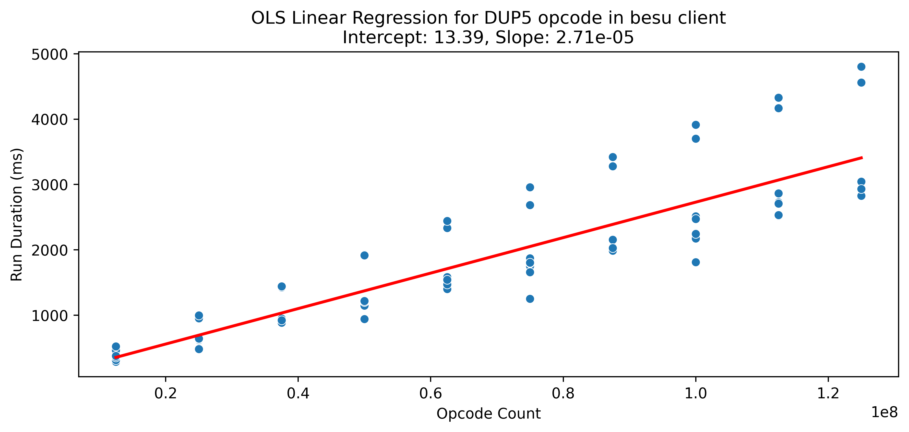


## geth


```python
                            OLS Regression Results                            
==============================================================================
Dep. Variable:        run_duration_ms   R-squared:                       0.996
Model:                            OLS   Adj. R-squared:                  0.996
Method:                 Least Squares   F-statistic:                 1.630e+04
Date:                Tue, 23 Dec 2025   Prob (F-statistic):           1.35e-86
Time:                        08:40:53   Log-Likelihood:                -342.16
No. Observations:                  74   AIC:                             688.3
Df Residuals:                      72   BIC:                             692.9
Df Model:                           1                                         
Covariance Type:            nonrobust                                         
==============================================================================
                 coef    std err          t      P>|t|      [0.025      0.975]
------------------------------------------------------------------------------
const         41.7612      6.301      6.628      0.000      29.201      54.321
opcount     1.043e-05   8.17e-08    127.660      0.000    1.03e-05    1.06e-05
==============================================================================
Omnibus:                       10.613   Durbin-Watson:                   1.486
Prob(Omnibus):                  0.005   Jarque-Bera (JB):               23.763
Skew:                           0.305   Prob(JB):                     6.92e-06
Kurtosis:                       5.708   Cond. No.                     1.67e+08
==============================================================================

Notes:
[1] Standard Errors assume that the covariance matrix of the errors is correctly specified.
[2] The condition number is large, 1.67e+08. This might indicate that there are
strong multicollinearity or other numerical problems.
```


# DUP6

## nethermind


```python
                            OLS Regression Results                            
==============================================================================
Dep. Variable:        run_duration_ms   R-squared:                       0.986
Model:                            OLS   Adj. R-squared:                  0.986
Method:                 Least Squares   F-statistic:                     5064.
Date:                Tue, 23 Dec 2025   Prob (F-statistic):           1.80e-68
Time:                        08:40:53   Log-Likelihood:                -330.90
No. Observations:                  74   AIC:                             665.8
Df Residuals:                      72   BIC:                             670.4
Df Model:                           1                                         
Covariance Type:            nonrobust                                         
==============================================================================
                 coef    std err          t      P>|t|      [0.025      0.975]
------------------------------------------------------------------------------
const         35.9791      5.412      6.648      0.000      25.191      46.767
opcount     4.995e-06   7.02e-08     71.165      0.000    4.86e-06    5.14e-06
==============================================================================
Omnibus:                        5.733   Durbin-Watson:                   1.282
Prob(Omnibus):                  0.057   Jarque-Bera (JB):                8.080
Skew:                          -0.166   Prob(JB):                       0.0176
Kurtosis:                       4.584   Cond. No.                     1.67e+08
==============================================================================

Notes:
[1] Standard Errors assume that the covariance matrix of the errors is correctly specified.
[2] The condition number is large, 1.67e+08. This might indicate that there are
strong multicollinearity or other numerical problems.
```


## reth


```python
                            OLS Regression Results                            
==============================================================================
Dep. Variable:        run_duration_ms   R-squared:                       0.974
Model:                            OLS   Adj. R-squared:                  0.973
Method:                 Least Squares   F-statistic:                     2650.
Date:                Tue, 23 Dec 2025   Prob (F-statistic):           1.53e-58
Time:                        08:40:53   Log-Likelihood:                -338.81
No. Observations:                  74   AIC:                             681.6
Df Residuals:                      72   BIC:                             686.2
Df Model:                           1                                         
Covariance Type:            nonrobust                                         
==============================================================================
                 coef    std err          t      P>|t|      [0.025      0.975]
------------------------------------------------------------------------------
const         34.5858      6.022      5.743      0.000      22.581      46.591
opcount     4.021e-06   7.81e-08     51.481      0.000    3.87e-06    4.18e-06
==============================================================================
Omnibus:                       46.107   Durbin-Watson:                   1.983
Prob(Omnibus):                  0.000   Jarque-Bera (JB):              316.898
Skew:                           1.573   Prob(JB):                     1.54e-69
Kurtosis:                      12.638   Cond. No.                     1.67e+08
==============================================================================

Notes:
[1] Standard Errors assume that the covariance matrix of the errors is correctly specified.
[2] The condition number is large, 1.67e+08. This might indicate that there are
strong multicollinearity or other numerical problems.
```

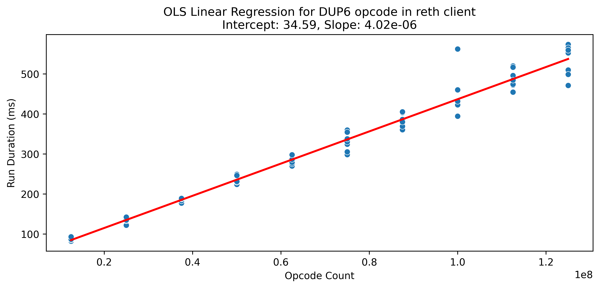


## besu


```python
                            OLS Regression Results                            
==============================================================================
Dep. Variable:        run_duration_ms   R-squared:                       0.782
Model:                            OLS   Adj. R-squared:                  0.779
Method:                 Least Squares   F-statistic:                     258.8
Date:                Tue, 23 Dec 2025   Prob (F-statistic):           1.53e-25
Time:                        08:40:54   Log-Likelihood:                -565.08
No. Observations:                  74   AIC:                             1134.
Df Residuals:                      72   BIC:                             1139.
Df Model:                           1                                         
Covariance Type:            nonrobust                                         
==============================================================================
                 coef    std err          t      P>|t|      [0.025      0.975]
------------------------------------------------------------------------------
const         31.9852    128.138      0.250      0.804    -223.453     287.424
opcount     2.674e-05   1.66e-06     16.087      0.000    2.34e-05    3.01e-05
==============================================================================
Omnibus:                       14.740   Durbin-Watson:                   0.798
Prob(Omnibus):                  0.001   Jarque-Bera (JB):               16.748
Skew:                           1.139   Prob(JB):                     0.000231
Kurtosis:                       3.491   Cond. No.                     1.67e+08
==============================================================================

Notes:
[1] Standard Errors assume that the covariance matrix of the errors is correctly specified.
[2] The condition number is large, 1.67e+08. This might indicate that there are
strong multicollinearity or other numerical problems.
```

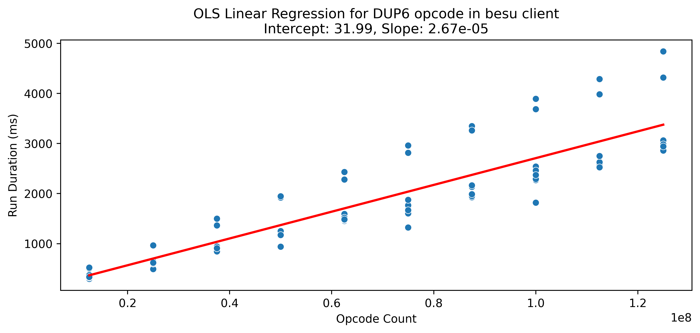


## geth


```python
                            OLS Regression Results                            
==============================================================================
Dep. Variable:        run_duration_ms   R-squared:                       0.997
Model:                            OLS   Adj. R-squared:                  0.997
Method:                 Least Squares   F-statistic:                 2.360e+04
Date:                Tue, 23 Dec 2025   Prob (F-statistic):           2.32e-92
Time:                        08:40:54   Log-Likelihood:                -329.63
No. Observations:                  74   AIC:                             663.3
Df Residuals:                      72   BIC:                             667.9
Df Model:                           1                                         
Covariance Type:            nonrobust                                         
==============================================================================
                 coef    std err          t      P>|t|      [0.025      0.975]
------------------------------------------------------------------------------
const         39.3625      5.320      7.400      0.000      28.758      49.967
opcount      1.06e-05    6.9e-08    153.616      0.000    1.05e-05    1.07e-05
==============================================================================
Omnibus:                        8.308   Durbin-Watson:                   1.771
Prob(Omnibus):                  0.016   Jarque-Bera (JB):               13.082
Skew:                           0.347   Prob(JB):                      0.00144
Kurtosis:                       4.940   Cond. No.                     1.67e+08
==============================================================================

Notes:
[1] Standard Errors assume that the covariance matrix of the errors is correctly specified.
[2] The condition number is large, 1.67e+08. This might indicate that there are
strong multicollinearity or other numerical problems.
```


# DUP7

## nethermind


```python
                            OLS Regression Results                            
==============================================================================
Dep. Variable:        run_duration_ms   R-squared:                       0.986
Model:                            OLS   Adj. R-squared:                  0.986
Method:                 Least Squares   F-statistic:                     5049.
Date:                Tue, 23 Dec 2025   Prob (F-statistic):           2.01e-68
Time:                        08:40:54   Log-Likelihood:                -331.29
No. Observations:                  74   AIC:                             666.6
Df Residuals:                      72   BIC:                             671.2
Df Model:                           1                                         
Covariance Type:            nonrobust                                         
==============================================================================
                 coef    std err          t      P>|t|      [0.025      0.975]
------------------------------------------------------------------------------
const         35.0267      5.440      6.439      0.000      24.182      45.871
opcount     5.014e-06   7.06e-08     71.055      0.000    4.87e-06    5.15e-06
==============================================================================
Omnibus:                       10.588   Durbin-Watson:                   1.569
Prob(Omnibus):                  0.005   Jarque-Bera (JB):               16.721
Skew:                          -0.504   Prob(JB):                     0.000234
Kurtosis:                       5.099   Cond. No.                     1.67e+08
==============================================================================

Notes:
[1] Standard Errors assume that the covariance matrix of the errors is correctly specified.
[2] The condition number is large, 1.67e+08. This might indicate that there are
strong multicollinearity or other numerical problems.
```

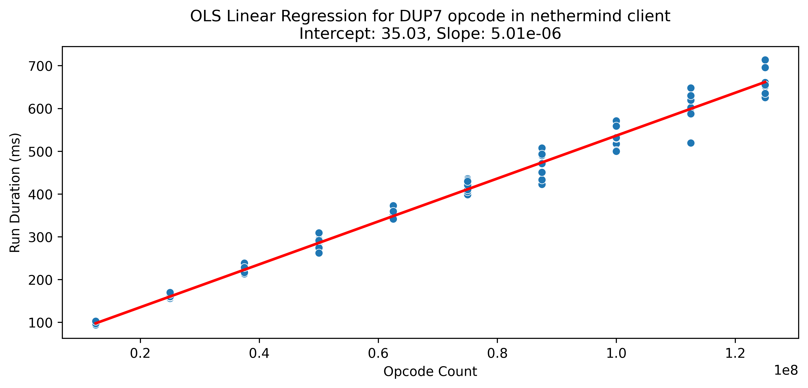


## reth


```python
                            OLS Regression Results                            
==============================================================================
Dep. Variable:        run_duration_ms   R-squared:                       0.987
Model:                            OLS   Adj. R-squared:                  0.987
Method:                 Least Squares   F-statistic:                     5598.
Date:                Tue, 23 Dec 2025   Prob (F-statistic):           5.12e-70
Time:                        08:40:54   Log-Likelihood:                -309.20
No. Observations:                  74   AIC:                             622.4
Df Residuals:                      72   BIC:                             627.0
Df Model:                           1                                         
Covariance Type:            nonrobust                                         
==============================================================================
                 coef    std err          t      P>|t|      [0.025      0.975]
------------------------------------------------------------------------------
const         39.0358      4.036      9.671      0.000      30.989      47.082
opcount     3.917e-06   5.24e-08     74.820      0.000    3.81e-06    4.02e-06
==============================================================================
Omnibus:                        6.156   Durbin-Watson:                   1.264
Prob(Omnibus):                  0.046   Jarque-Bera (JB):                5.863
Skew:                          -0.472   Prob(JB):                       0.0533
Kurtosis:                       4.004   Cond. No.                     1.67e+08
==============================================================================

Notes:
[1] Standard Errors assume that the covariance matrix of the errors is correctly specified.
[2] The condition number is large, 1.67e+08. This might indicate that there are
strong multicollinearity or other numerical problems.
```


## besu


```python
                            OLS Regression Results                            
==============================================================================
Dep. Variable:        run_duration_ms   R-squared:                       0.794
Model:                            OLS   Adj. R-squared:                  0.791
Method:                 Least Squares   F-statistic:                     277.3
Date:                Tue, 23 Dec 2025   Prob (F-statistic):           2.14e-26
Time:                        08:40:54   Log-Likelihood:                -564.45
No. Observations:                  74   AIC:                             1133.
Df Residuals:                      72   BIC:                             1138.
Df Model:                           1                                         
Covariance Type:            nonrobust                                         
==============================================================================
                 coef    std err          t      P>|t|      [0.025      0.975]
------------------------------------------------------------------------------
const        -11.9246    127.054     -0.094      0.925    -265.202     241.353
opcount     2.744e-05   1.65e-06     16.652      0.000    2.42e-05    3.07e-05
==============================================================================
Omnibus:                       13.472   Durbin-Watson:                   0.605
Prob(Omnibus):                  0.001   Jarque-Bera (JB):               15.207
Skew:                           1.101   Prob(JB):                     0.000499
Kurtosis:                       3.295   Cond. No.                     1.67e+08
==============================================================================

Notes:
[1] Standard Errors assume that the covariance matrix of the errors is correctly specified.
[2] The condition number is large, 1.67e+08. This might indicate that there are
strong multicollinearity or other numerical problems.
```

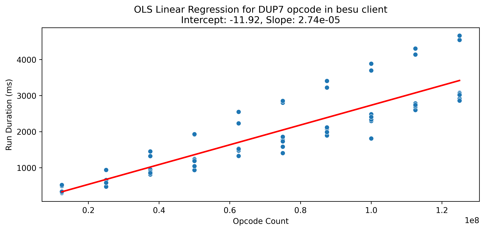


## geth


```python
                            OLS Regression Results                            
==============================================================================
Dep. Variable:        run_duration_ms   R-squared:                       0.991
Model:                            OLS   Adj. R-squared:                  0.991
Method:                 Least Squares   F-statistic:                     8085.
Date:                Tue, 23 Dec 2025   Prob (F-statistic):           1.06e-75
Time:                        08:40:54   Log-Likelihood:                -368.73
No. Observations:                  74   AIC:                             741.5
Df Residuals:                      72   BIC:                             746.1
Df Model:                           1                                         
Covariance Type:            nonrobust                                         
==============================================================================
                 coef    std err          t      P>|t|      [0.025      0.975]
------------------------------------------------------------------------------
const         39.4911      9.022      4.377      0.000      21.506      57.477
opcount     1.052e-05   1.17e-07     89.914      0.000    1.03e-05    1.08e-05
==============================================================================
Omnibus:                      104.198   Durbin-Watson:                   1.875
Prob(Omnibus):                  0.000   Jarque-Bera (JB):             2352.538
Skew:                           4.346   Prob(JB):                         0.00
Kurtosis:                      29.219   Cond. No.                     1.67e+08
==============================================================================

Notes:
[1] Standard Errors assume that the covariance matrix of the errors is correctly specified.
[2] The condition number is large, 1.67e+08. This might indicate that there are
strong multicollinearity or other numerical problems.
```


# DUP8

## nethermind


```python
                            OLS Regression Results                            
==============================================================================
Dep. Variable:        run_duration_ms   R-squared:                       0.753
Model:                            OLS   Adj. R-squared:                  0.750
Method:                 Least Squares   F-statistic:                     219.8
Date:                Tue, 23 Dec 2025   Prob (F-statistic):           1.43e-23
Time:                        08:40:54   Log-Likelihood:                -443.06
No. Observations:                  74   AIC:                             890.1
Df Residuals:                      72   BIC:                             894.7
Df Model:                           1                                         
Covariance Type:            nonrobust                                         
==============================================================================
                 coef    std err          t      P>|t|      [0.025      0.975]
------------------------------------------------------------------------------
const         72.8629     24.636      2.958      0.004      23.752     121.974
opcount     4.737e-06    3.2e-07     14.824      0.000     4.1e-06    5.37e-06
==============================================================================
Omnibus:                      117.932   Durbin-Watson:                   2.199
Prob(Omnibus):                  0.000   Jarque-Bera (JB):             2957.518
Skew:                           5.349   Prob(JB):                         0.00
Kurtosis:                      32.065   Cond. No.                     1.67e+08
==============================================================================

Notes:
[1] Standard Errors assume that the covariance matrix of the errors is correctly specified.
[2] The condition number is large, 1.67e+08. This might indicate that there are
strong multicollinearity or other numerical problems.
```

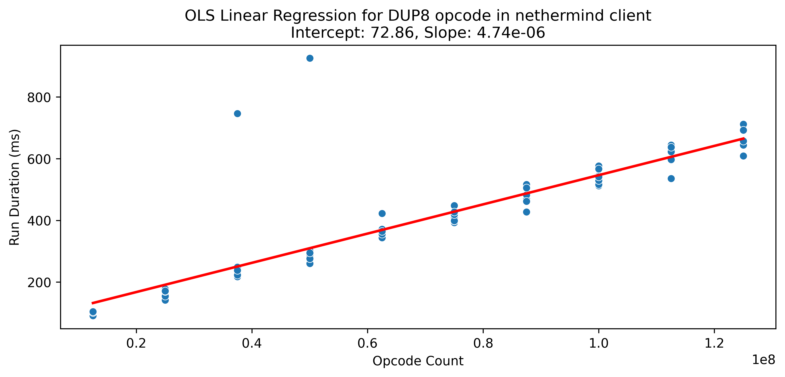


## reth


```python
                            OLS Regression Results                            
==============================================================================
Dep. Variable:        run_duration_ms   R-squared:                       0.989
Model:                            OLS   Adj. R-squared:                  0.988
Method:                 Least Squares   F-statistic:                     6267.
Date:                Tue, 23 Dec 2025   Prob (F-statistic):           9.25e-72
Time:                        08:40:54   Log-Likelihood:                -306.38
No. Observations:                  74   AIC:                             616.8
Df Residuals:                      72   BIC:                             621.4
Df Model:                           1                                         
Covariance Type:            nonrobust                                         
==============================================================================
                 coef    std err          t      P>|t|      [0.025      0.975]
------------------------------------------------------------------------------
const         36.4213      3.885      9.374      0.000      28.676      44.167
opcount      3.99e-06   5.04e-08     79.162      0.000    3.89e-06    4.09e-06
==============================================================================
Omnibus:                        6.236   Durbin-Watson:                   1.275
Prob(Omnibus):                  0.044   Jarque-Bera (JB):                6.954
Skew:                          -0.379   Prob(JB):                       0.0309
Kurtosis:                       4.296   Cond. No.                     1.67e+08
==============================================================================

Notes:
[1] Standard Errors assume that the covariance matrix of the errors is correctly specified.
[2] The condition number is large, 1.67e+08. This might indicate that there are
strong multicollinearity or other numerical problems.
```

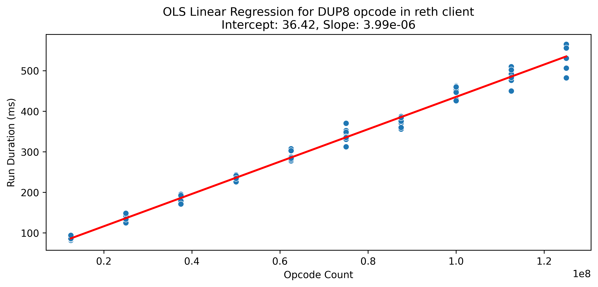


## besu


```python
                            OLS Regression Results                            
==============================================================================
Dep. Variable:        run_duration_ms   R-squared:                       0.780
Model:                            OLS   Adj. R-squared:                  0.777
Method:                 Least Squares   F-statistic:                     255.9
Date:                Tue, 23 Dec 2025   Prob (F-statistic):           2.10e-25
Time:                        08:40:55   Log-Likelihood:                -566.77
No. Observations:                  74   AIC:                             1138.
Df Residuals:                      72   BIC:                             1142.
Df Model:                           1                                         
Covariance Type:            nonrobust                                         
==============================================================================
                 coef    std err          t      P>|t|      [0.025      0.975]
------------------------------------------------------------------------------
const          8.0747    131.097      0.062      0.951    -253.261     269.411
opcount      2.72e-05    1.7e-06     15.996      0.000    2.38e-05    3.06e-05
==============================================================================
Omnibus:                       14.557   Durbin-Watson:                   0.812
Prob(Omnibus):                  0.001   Jarque-Bera (JB):               16.539
Skew:                           1.136   Prob(JB):                     0.000256
Kurtosis:                       3.452   Cond. No.                     1.67e+08
==============================================================================

Notes:
[1] Standard Errors assume that the covariance matrix of the errors is correctly specified.
[2] The condition number is large, 1.67e+08. This might indicate that there are
strong multicollinearity or other numerical problems.
```

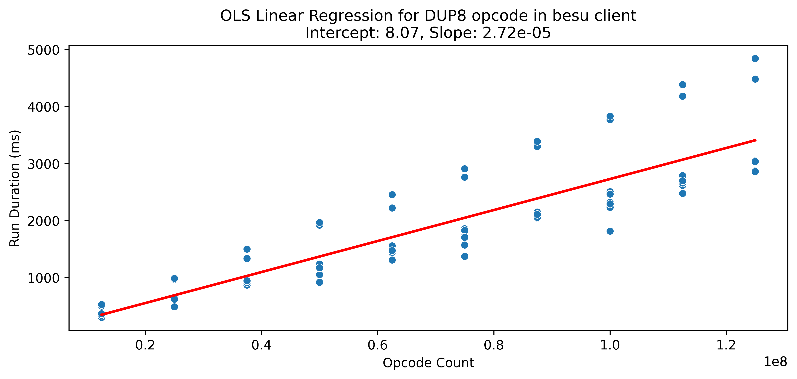


## geth


```python
                            OLS Regression Results                            
==============================================================================
Dep. Variable:        run_duration_ms   R-squared:                       0.997
Model:                            OLS   Adj. R-squared:                  0.997
Method:                 Least Squares   F-statistic:                 2.431e+04
Date:                Tue, 23 Dec 2025   Prob (F-statistic):           7.96e-93
Time:                        08:40:55   Log-Likelihood:                -329.21
No. Observations:                  74   AIC:                             662.4
Df Residuals:                      72   BIC:                             667.0
Df Model:                           1                                         
Covariance Type:            nonrobust                                         
==============================================================================
                 coef    std err          t      P>|t|      [0.025      0.975]
------------------------------------------------------------------------------
const         35.3664      5.289      6.686      0.000      24.822      45.911
opcount      1.07e-05   6.86e-08    155.922      0.000    1.06e-05    1.08e-05
==============================================================================
Omnibus:                        1.168   Durbin-Watson:                   1.912
Prob(Omnibus):                  0.558   Jarque-Bera (JB):                0.829
Skew:                           0.257   Prob(JB):                        0.661
Kurtosis:                       3.064   Cond. No.                     1.67e+08
==============================================================================

Notes:
[1] Standard Errors assume that the covariance matrix of the errors is correctly specified.
[2] The condition number is large, 1.67e+08. This might indicate that there are
strong multicollinearity or other numerical problems.
```


# DUP9

## nethermind


```python
                            OLS Regression Results                            
==============================================================================
Dep. Variable:        run_duration_ms   R-squared:                       0.622
Model:                            OLS   Adj. R-squared:                  0.617
Method:                 Least Squares   F-statistic:                     118.4
Date:                Tue, 23 Dec 2025   Prob (F-statistic):           7.43e-17
Time:                        08:40:55   Log-Likelihood:                -471.92
No. Observations:                  74   AIC:                             947.8
Df Residuals:                      72   BIC:                             952.5
Df Model:                           1                                         
Covariance Type:            nonrobust                                         
==============================================================================
                 coef    std err          t      P>|t|      [0.025      0.975]
------------------------------------------------------------------------------
const         47.8294     36.389      1.314      0.193     -24.710     120.369
opcount     5.135e-06   4.72e-07     10.879      0.000    4.19e-06    6.08e-06
==============================================================================
Omnibus:                      157.947   Durbin-Watson:                   2.036
Prob(Omnibus):                  0.000   Jarque-Bera (JB):            14172.852
Skew:                           8.137   Prob(JB):                         0.00
Kurtosis:                      68.816   Cond. No.                     1.67e+08
==============================================================================

Notes:
[1] Standard Errors assume that the covariance matrix of the errors is correctly specified.
[2] The condition number is large, 1.67e+08. This might indicate that there are
strong multicollinearity or other numerical problems.
```


## reth


```python
                            OLS Regression Results                            
==============================================================================
Dep. Variable:        run_duration_ms   R-squared:                       0.981
Model:                            OLS   Adj. R-squared:                  0.981
Method:                 Least Squares   F-statistic:                     3812.
Date:                Tue, 23 Dec 2025   Prob (F-statistic):           4.21e-64
Time:                        08:40:55   Log-Likelihood:                -324.06
No. Observations:                  74   AIC:                             652.1
Df Residuals:                      72   BIC:                             656.7
Df Model:                           1                                         
Covariance Type:            nonrobust                                         
==============================================================================
                 coef    std err          t      P>|t|      [0.025      0.975]
------------------------------------------------------------------------------
const         39.5953      4.934      8.025      0.000      29.760      49.431
opcount     3.951e-06    6.4e-08     61.744      0.000    3.82e-06    4.08e-06
==============================================================================
Omnibus:                        6.039   Durbin-Watson:                   1.645
Prob(Omnibus):                  0.049   Jarque-Bera (JB):                9.586
Skew:                           0.063   Prob(JB):                      0.00829
Kurtosis:                       4.759   Cond. No.                     1.67e+08
==============================================================================

Notes:
[1] Standard Errors assume that the covariance matrix of the errors is correctly specified.
[2] The condition number is large, 1.67e+08. This might indicate that there are
strong multicollinearity or other numerical problems.
```

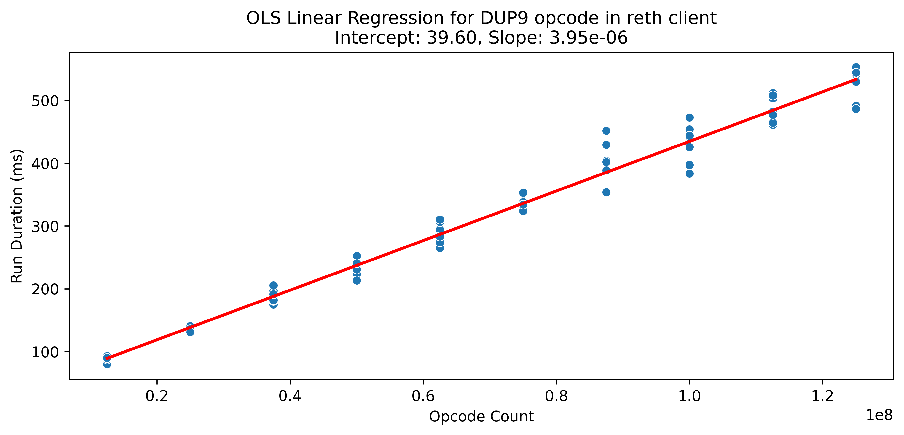


## besu


```python
                            OLS Regression Results                            
==============================================================================
Dep. Variable:        run_duration_ms   R-squared:                       0.783
Model:                            OLS   Adj. R-squared:                  0.780
Method:                 Least Squares   F-statistic:                     259.1
Date:                Tue, 23 Dec 2025   Prob (F-statistic):           1.47e-25
Time:                        08:40:55   Log-Likelihood:                -565.62
No. Observations:                  74   AIC:                             1135.
Df Residuals:                      72   BIC:                             1140.
Df Model:                           1                                         
Covariance Type:            nonrobust                                         
==============================================================================
                 coef    std err          t      P>|t|      [0.025      0.975]
------------------------------------------------------------------------------
const         15.5847    129.075      0.121      0.904    -241.721     272.891
opcount     2.695e-05   1.67e-06     16.097      0.000    2.36e-05    3.03e-05
==============================================================================
Omnibus:                       14.934   Durbin-Watson:                   0.505
Prob(Omnibus):                  0.001   Jarque-Bera (JB):               16.877
Skew:                           1.133   Prob(JB):                     0.000216
Kurtosis:                       3.584   Cond. No.                     1.67e+08
==============================================================================

Notes:
[1] Standard Errors assume that the covariance matrix of the errors is correctly specified.
[2] The condition number is large, 1.67e+08. This might indicate that there are
strong multicollinearity or other numerical problems.
```

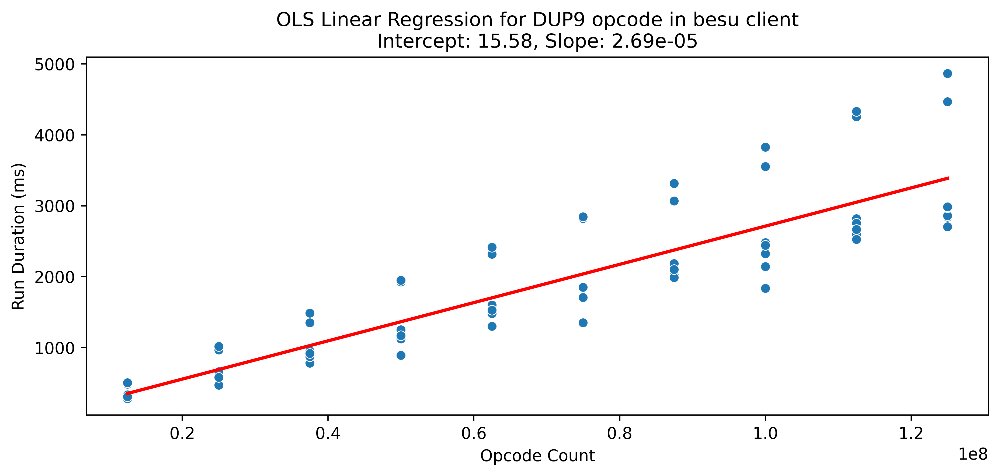


## geth


```python
                            OLS Regression Results                            
==============================================================================
Dep. Variable:        run_duration_ms   R-squared:                       0.989
Model:                            OLS   Adj. R-squared:                  0.989
Method:                 Least Squares   F-statistic:                     6431.
Date:                Tue, 23 Dec 2025   Prob (F-statistic):           3.68e-72
Time:                        08:40:55   Log-Likelihood:                -376.03
No. Observations:                  74   AIC:                             756.1
Df Residuals:                      72   BIC:                             760.7
Df Model:                           1                                         
Covariance Type:            nonrobust                                         
==============================================================================
                 coef    std err          t      P>|t|      [0.025      0.975]
------------------------------------------------------------------------------
const         55.5392      9.958      5.577      0.000      35.688      75.390
opcount     1.036e-05   1.29e-07     80.195      0.000    1.01e-05    1.06e-05
==============================================================================
Omnibus:                       92.397   Durbin-Watson:                   2.200
Prob(Omnibus):                  0.000   Jarque-Bera (JB):             1342.131
Skew:                           3.808   Prob(JB):                    3.63e-292
Kurtosis:                      22.424   Cond. No.                     1.67e+08
==============================================================================

Notes:
[1] Standard Errors assume that the covariance matrix of the errors is correctly specified.
[2] The condition number is large, 1.67e+08. This might indicate that there are
strong multicollinearity or other numerical problems.
```

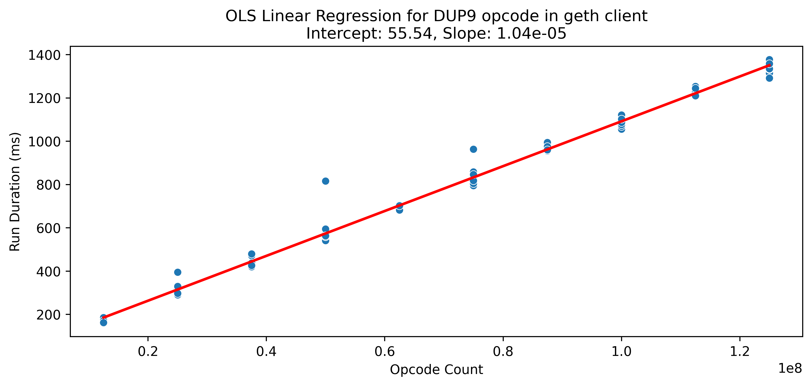


# DUP10

## nethermind


```python
                            OLS Regression Results                            
==============================================================================
Dep. Variable:        run_duration_ms   R-squared:                       0.976
Model:                            OLS   Adj. R-squared:                  0.976
Method:                 Least Squares   F-statistic:                     2962.
Date:                Tue, 23 Dec 2025   Prob (F-statistic):           3.08e-60
Time:                        08:40:55   Log-Likelihood:                -349.97
No. Observations:                  74   AIC:                             703.9
Df Residuals:                      72   BIC:                             708.5
Df Model:                           1                                         
Covariance Type:            nonrobust                                         
==============================================================================
                 coef    std err          t      P>|t|      [0.025      0.975]
------------------------------------------------------------------------------
const         47.1213      7.002      6.730      0.000      33.163      61.080
opcount     4.943e-06   9.08e-08     54.424      0.000    4.76e-06    5.12e-06
==============================================================================
Omnibus:                       69.559   Durbin-Watson:                   1.620
Prob(Omnibus):                  0.000   Jarque-Bera (JB):              574.101
Skew:                           2.721   Prob(JB):                    2.17e-125
Kurtosis:                      15.513   Cond. No.                     1.67e+08
==============================================================================

Notes:
[1] Standard Errors assume that the covariance matrix of the errors is correctly specified.
[2] The condition number is large, 1.67e+08. This might indicate that there are
strong multicollinearity or other numerical problems.
```

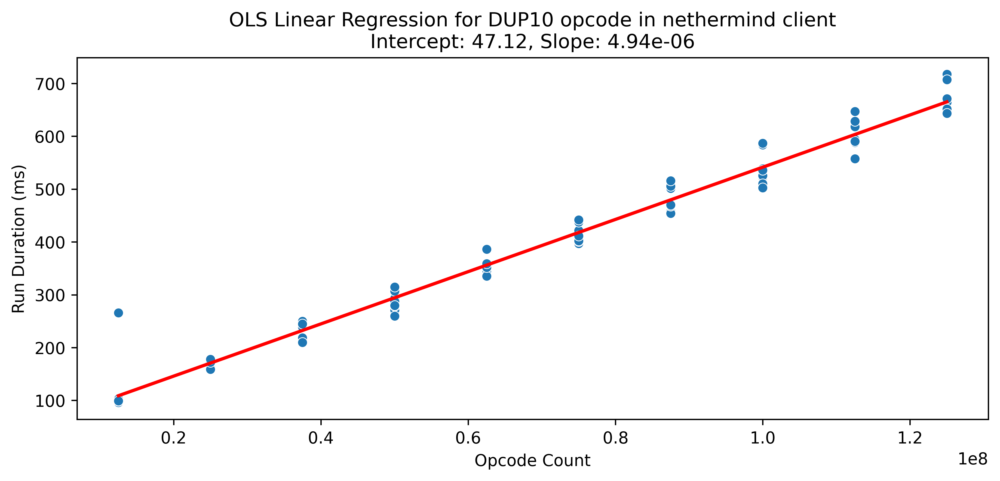


## reth


```python
                            OLS Regression Results                            
==============================================================================
Dep. Variable:        run_duration_ms   R-squared:                       0.989
Model:                            OLS   Adj. R-squared:                  0.988
Method:                 Least Squares   F-statistic:                     6248.
Date:                Tue, 23 Dec 2025   Prob (F-statistic):           1.03e-71
Time:                        08:40:55   Log-Likelihood:                -306.29
No. Observations:                  74   AIC:                             616.6
Df Residuals:                      72   BIC:                             621.2
Df Model:                           1                                         
Covariance Type:            nonrobust                                         
==============================================================================
                 coef    std err          t      P>|t|      [0.025      0.975]
------------------------------------------------------------------------------
const         38.3778      3.880      9.890      0.000      30.643      46.113
opcount     3.978e-06   5.03e-08     79.042      0.000    3.88e-06    4.08e-06
==============================================================================
Omnibus:                        5.059   Durbin-Watson:                   1.703
Prob(Omnibus):                  0.080   Jarque-Bera (JB):                4.562
Skew:                          -0.408   Prob(JB):                        0.102
Kurtosis:                       3.902   Cond. No.                     1.67e+08
==============================================================================

Notes:
[1] Standard Errors assume that the covariance matrix of the errors is correctly specified.
[2] The condition number is large, 1.67e+08. This might indicate that there are
strong multicollinearity or other numerical problems.
```


## besu


```python
                            OLS Regression Results                            
==============================================================================
Dep. Variable:        run_duration_ms   R-squared:                       0.789
Model:                            OLS   Adj. R-squared:                  0.786
Method:                 Least Squares   F-statistic:                     268.5
Date:                Tue, 23 Dec 2025   Prob (F-statistic):           5.34e-26
Time:                        08:40:56   Log-Likelihood:                -564.61
No. Observations:                  74   AIC:                             1133.
Df Residuals:                      72   BIC:                             1138.
Df Model:                           1                                         
Covariance Type:            nonrobust                                         
==============================================================================
                 coef    std err          t      P>|t|      [0.025      0.975]
------------------------------------------------------------------------------
const         19.3132    127.331      0.152      0.880    -234.517     273.143
opcount     2.706e-05   1.65e-06     16.387      0.000    2.38e-05    3.04e-05
==============================================================================
Omnibus:                       14.078   Durbin-Watson:                   0.737
Prob(Omnibus):                  0.001   Jarque-Bera (JB):               15.752
Skew:                           1.105   Prob(JB):                     0.000380
Kurtosis:                       3.470   Cond. No.                     1.67e+08
==============================================================================

Notes:
[1] Standard Errors assume that the covariance matrix of the errors is correctly specified.
[2] The condition number is large, 1.67e+08. This might indicate that there are
strong multicollinearity or other numerical problems.
```

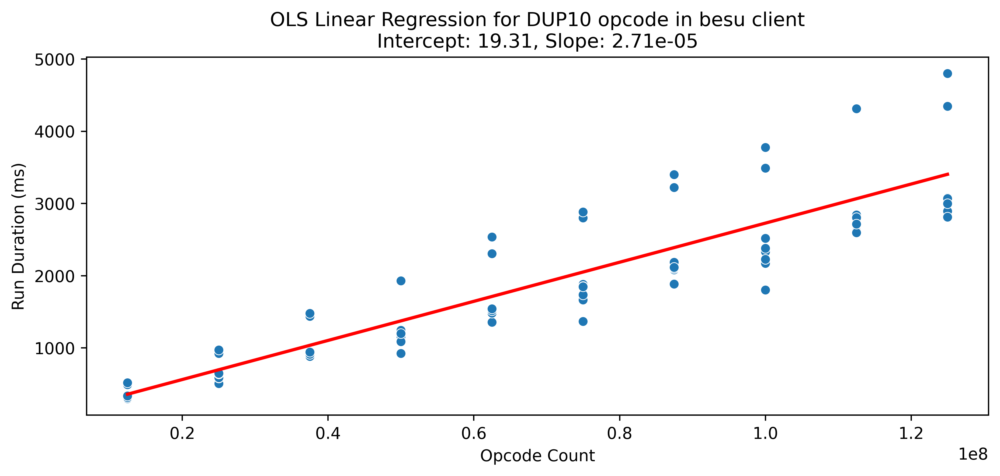


## geth


```python
                            OLS Regression Results                            
==============================================================================
Dep. Variable:        run_duration_ms   R-squared:                       0.996
Model:                            OLS   Adj. R-squared:                  0.996
Method:                 Least Squares   F-statistic:                 1.655e+04
Date:                Tue, 23 Dec 2025   Prob (F-statistic):           7.84e-87
Time:                        08:40:56   Log-Likelihood:                -342.64
No. Observations:                  74   AIC:                             689.3
Df Residuals:                      72   BIC:                             693.9
Df Model:                           1                                         
Covariance Type:            nonrobust                                         
==============================================================================
                 coef    std err          t      P>|t|      [0.025      0.975]
------------------------------------------------------------------------------
const         43.1722      6.342      6.808      0.000      30.530      55.814
opcount     1.058e-05   8.23e-08    128.638      0.000    1.04e-05    1.07e-05
==============================================================================
Omnibus:                       46.235   Durbin-Watson:                   2.047
Prob(Omnibus):                  0.000   Jarque-Bera (JB):              201.140
Skew:                           1.815   Prob(JB):                     2.10e-44
Kurtosis:                      10.215   Cond. No.                     1.67e+08
==============================================================================

Notes:
[1] Standard Errors assume that the covariance matrix of the errors is correctly specified.
[2] The condition number is large, 1.67e+08. This might indicate that there are
strong multicollinearity or other numerical problems.
```

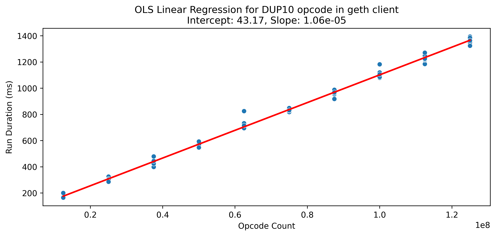


# DUP11

## nethermind


```python
                            OLS Regression Results                            
==============================================================================
Dep. Variable:        run_duration_ms   R-squared:                       0.986
Model:                            OLS   Adj. R-squared:                  0.986
Method:                 Least Squares   F-statistic:                     5237.
Date:                Tue, 23 Dec 2025   Prob (F-statistic):           5.48e-69
Time:                        08:40:56   Log-Likelihood:                -328.85
No. Observations:                  74   AIC:                             661.7
Df Residuals:                      72   BIC:                             666.3
Df Model:                           1                                         
Covariance Type:            nonrobust                                         
==============================================================================
                 coef    std err          t      P>|t|      [0.025      0.975]
------------------------------------------------------------------------------
const         41.5845      5.264      7.900      0.000      31.092      52.077
opcount     4.941e-06   6.83e-08     72.366      0.000     4.8e-06    5.08e-06
==============================================================================
Omnibus:                       11.830   Durbin-Watson:                   1.351
Prob(Omnibus):                  0.003   Jarque-Bera (JB):               21.052
Skew:                          -0.520   Prob(JB):                     2.68e-05
Kurtosis:                       5.397   Cond. No.                     1.67e+08
==============================================================================

Notes:
[1] Standard Errors assume that the covariance matrix of the errors is correctly specified.
[2] The condition number is large, 1.67e+08. This might indicate that there are
strong multicollinearity or other numerical problems.
```

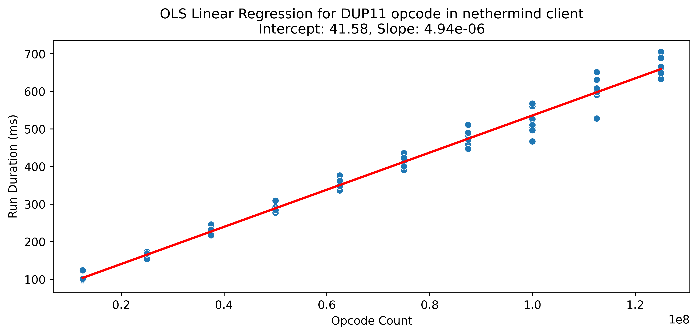


## reth


```python
                            OLS Regression Results                            
==============================================================================
Dep. Variable:        run_duration_ms   R-squared:                       0.991
Model:                            OLS   Adj. R-squared:                  0.991
Method:                 Least Squares   F-statistic:                     7672.
Date:                Tue, 23 Dec 2025   Prob (F-statistic):           6.84e-75
Time:                        08:40:56   Log-Likelihood:                -301.45
No. Observations:                  74   AIC:                             606.9
Df Residuals:                      72   BIC:                             611.5
Df Model:                           1                                         
Covariance Type:            nonrobust                                         
==============================================================================
                 coef    std err          t      P>|t|      [0.025      0.975]
------------------------------------------------------------------------------
const         34.3094      3.635      9.439      0.000      27.064      41.555
opcount     4.129e-06   4.71e-08     87.590      0.000    4.04e-06    4.22e-06
==============================================================================
Omnibus:                       50.562   Durbin-Watson:                   2.023
Prob(Omnibus):                  0.000   Jarque-Bera (JB):              257.944
Skew:                          -1.951   Prob(JB):                     9.73e-57
Kurtosis:                      11.272   Cond. No.                     1.67e+08
==============================================================================

Notes:
[1] Standard Errors assume that the covariance matrix of the errors is correctly specified.
[2] The condition number is large, 1.67e+08. This might indicate that there are
strong multicollinearity or other numerical problems.
```


## besu


```python
                            OLS Regression Results                            
==============================================================================
Dep. Variable:        run_duration_ms   R-squared:                       0.787
Model:                            OLS   Adj. R-squared:                  0.784
Method:                 Least Squares   F-statistic:                     265.8
Date:                Tue, 23 Dec 2025   Prob (F-statistic):           7.16e-26
Time:                        08:40:56   Log-Likelihood:                -565.93
No. Observations:                  74   AIC:                             1136.
Df Residuals:                      72   BIC:                             1140.
Df Model:                           1                                         
Covariance Type:            nonrobust                                         
==============================================================================
                 coef    std err          t      P>|t|      [0.025      0.975]
------------------------------------------------------------------------------
const          7.8397    129.623      0.060      0.952    -250.560     266.239
opcount     2.741e-05   1.68e-06     16.303      0.000    2.41e-05    3.08e-05
==============================================================================
Omnibus:                       14.390   Durbin-Watson:                   0.665
Prob(Omnibus):                  0.001   Jarque-Bera (JB):               16.276
Skew:                           1.126   Prob(JB):                     0.000292
Kurtosis:                       3.452   Cond. No.                     1.67e+08
==============================================================================

Notes:
[1] Standard Errors assume that the covariance matrix of the errors is correctly specified.
[2] The condition number is large, 1.67e+08. This might indicate that there are
strong multicollinearity or other numerical problems.
```


## geth


```python
                            OLS Regression Results                            
==============================================================================
Dep. Variable:        run_duration_ms   R-squared:                       0.996
Model:                            OLS   Adj. R-squared:                  0.996
Method:                 Least Squares   F-statistic:                 1.753e+04
Date:                Tue, 23 Dec 2025   Prob (F-statistic):           9.98e-88
Time:                        08:40:56   Log-Likelihood:                -339.78
No. Observations:                  74   AIC:                             683.6
Df Residuals:                      72   BIC:                             688.2
Df Model:                           1                                         
Covariance Type:            nonrobust                                         
==============================================================================
                 coef    std err          t      P>|t|      [0.025      0.975]
------------------------------------------------------------------------------
const         42.4039      6.101      6.950      0.000      30.241      54.567
opcount     1.048e-05   7.91e-08    132.388      0.000    1.03e-05    1.06e-05
==============================================================================
Omnibus:                       46.276   Durbin-Watson:                   2.032
Prob(Omnibus):                  0.000   Jarque-Bera (JB):              169.996
Skew:                           1.916   Prob(JB):                     1.22e-37
Kurtosis:                       9.360   Cond. No.                     1.67e+08
==============================================================================

Notes:
[1] Standard Errors assume that the covariance matrix of the errors is correctly specified.
[2] The condition number is large, 1.67e+08. This might indicate that there are
strong multicollinearity or other numerical problems.
```


# DUP12

## nethermind


```python
                            OLS Regression Results                            
==============================================================================
Dep. Variable:        run_duration_ms   R-squared:                       0.987
Model:                            OLS   Adj. R-squared:                  0.987
Method:                 Least Squares   F-statistic:                     5534.
Date:                Tue, 23 Dec 2025   Prob (F-statistic):           7.72e-70
Time:                        08:40:56   Log-Likelihood:                -328.15
No. Observations:                  74   AIC:                             660.3
Df Residuals:                      72   BIC:                             664.9
Df Model:                           1                                         
Covariance Type:            nonrobust                                         
==============================================================================
                 coef    std err          t      P>|t|      [0.025      0.975]
------------------------------------------------------------------------------
const         37.0244      5.214      7.101      0.000      26.631      47.418
opcount     5.031e-06   6.76e-08     74.389      0.000     4.9e-06    5.17e-06
==============================================================================
Omnibus:                        6.033   Durbin-Watson:                   1.207
Prob(Omnibus):                  0.049   Jarque-Bera (JB):                8.414
Skew:                          -0.214   Prob(JB):                       0.0149
Kurtosis:                       4.595   Cond. No.                     1.67e+08
==============================================================================

Notes:
[1] Standard Errors assume that the covariance matrix of the errors is correctly specified.
[2] The condition number is large, 1.67e+08. This might indicate that there are
strong multicollinearity or other numerical problems.
```


## reth


```python
                            OLS Regression Results                            
==============================================================================
Dep. Variable:        run_duration_ms   R-squared:                       0.983
Model:                            OLS   Adj. R-squared:                  0.982
Method:                 Least Squares   F-statistic:                     4052.
Date:                Tue, 23 Dec 2025   Prob (F-statistic):           4.86e-65
Time:                        08:40:57   Log-Likelihood:                -321.27
No. Observations:                  74   AIC:                             646.5
Df Residuals:                      72   BIC:                             651.1
Df Model:                           1                                         
Covariance Type:            nonrobust                                         
==============================================================================
                 coef    std err          t      P>|t|      [0.025      0.975]
------------------------------------------------------------------------------
const         36.7144      4.751      7.728      0.000      27.244      46.185
opcount     3.923e-06   6.16e-08     63.658      0.000     3.8e-06    4.05e-06
==============================================================================
Omnibus:                        4.806   Durbin-Watson:                   1.145
Prob(Omnibus):                  0.090   Jarque-Bera (JB):                4.228
Skew:                          -0.400   Prob(JB):                        0.121
Kurtosis:                       3.854   Cond. No.                     1.67e+08
==============================================================================

Notes:
[1] Standard Errors assume that the covariance matrix of the errors is correctly specified.
[2] The condition number is large, 1.67e+08. This might indicate that there are
strong multicollinearity or other numerical problems.
```

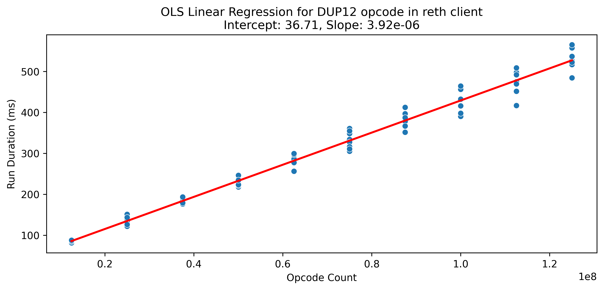


## besu


```python
                            OLS Regression Results                            
==============================================================================
Dep. Variable:        run_duration_ms   R-squared:                       0.775
Model:                            OLS   Adj. R-squared:                  0.772
Method:                 Least Squares   F-statistic:                     248.7
Date:                Tue, 23 Dec 2025   Prob (F-statistic):           4.68e-25
Time:                        08:40:57   Log-Likelihood:                -568.08
No. Observations:                  74   AIC:                             1140.
Df Residuals:                      72   BIC:                             1145.
Df Model:                           1                                         
Covariance Type:            nonrobust                                         
==============================================================================
                 coef    std err          t      P>|t|      [0.025      0.975]
------------------------------------------------------------------------------
const          6.4823    133.440      0.049      0.961    -259.525     272.490
opcount     2.729e-05   1.73e-06     15.770      0.000    2.38e-05    3.07e-05
==============================================================================
Omnibus:                       14.322   Durbin-Watson:                   0.595
Prob(Omnibus):                  0.001   Jarque-Bera (JB):               16.172
Skew:                           1.123   Prob(JB):                     0.000308
Kurtosis:                       3.451   Cond. No.                     1.67e+08
==============================================================================

Notes:
[1] Standard Errors assume that the covariance matrix of the errors is correctly specified.
[2] The condition number is large, 1.67e+08. This might indicate that there are
strong multicollinearity or other numerical problems.
```

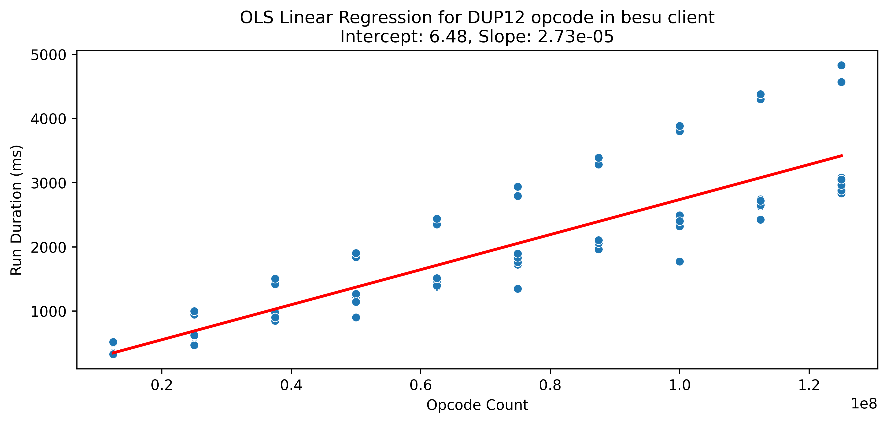


## geth


```python
                            OLS Regression Results                            
==============================================================================
Dep. Variable:        run_duration_ms   R-squared:                       0.983
Model:                            OLS   Adj. R-squared:                  0.983
Method:                 Least Squares   F-statistic:                     4221.
Date:                Tue, 23 Dec 2025   Prob (F-statistic):           1.15e-65
Time:                        08:40:57   Log-Likelihood:                -392.51
No. Observations:                  74   AIC:                             789.0
Df Residuals:                      72   BIC:                             793.6
Df Model:                           1                                         
Covariance Type:            nonrobust                                         
==============================================================================
                 coef    std err          t      P>|t|      [0.025      0.975]
------------------------------------------------------------------------------
const         59.2854     12.442      4.765      0.000      34.483      84.087
opcount     1.048e-05   1.61e-07     64.970      0.000    1.02e-05    1.08e-05
==============================================================================
Omnibus:                       96.093   Durbin-Watson:                   2.209
Prob(Omnibus):                  0.000   Jarque-Bera (JB):             1476.816
Skew:                           4.028   Prob(JB):                         0.00
Kurtosis:                      23.349   Cond. No.                     1.67e+08
==============================================================================

Notes:
[1] Standard Errors assume that the covariance matrix of the errors is correctly specified.
[2] The condition number is large, 1.67e+08. This might indicate that there are
strong multicollinearity or other numerical problems.
```

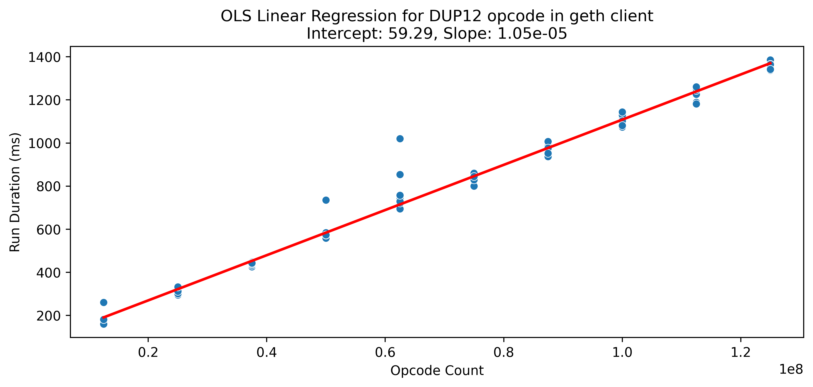


# DUP13

## nethermind


```python
                            OLS Regression Results                            
==============================================================================
Dep. Variable:        run_duration_ms   R-squared:                       0.989
Model:                            OLS   Adj. R-squared:                  0.989
Method:                 Least Squares   F-statistic:                     6508.
Date:                Tue, 23 Dec 2025   Prob (F-statistic):           2.41e-72
Time:                        08:40:57   Log-Likelihood:                -322.54
No. Observations:                  74   AIC:                             649.1
Df Residuals:                      72   BIC:                             653.7
Df Model:                           1                                         
Covariance Type:            nonrobust                                         
==============================================================================
                 coef    std err          t      P>|t|      [0.025      0.975]
------------------------------------------------------------------------------
const         35.9593      4.833      7.440      0.000      26.324      45.594
opcount     5.057e-06   6.27e-08     80.671      0.000    4.93e-06    5.18e-06
==============================================================================
Omnibus:                        2.882   Durbin-Watson:                   0.887
Prob(Omnibus):                  0.237   Jarque-Bera (JB):                2.536
Skew:                           0.111   Prob(JB):                        0.281
Kurtosis:                       3.879   Cond. No.                     1.67e+08
==============================================================================

Notes:
[1] Standard Errors assume that the covariance matrix of the errors is correctly specified.
[2] The condition number is large, 1.67e+08. This might indicate that there are
strong multicollinearity or other numerical problems.
```


## reth


```python
                            OLS Regression Results                            
==============================================================================
Dep. Variable:        run_duration_ms   R-squared:                       0.987
Model:                            OLS   Adj. R-squared:                  0.986
Method:                 Least Squares   F-statistic:                     5330.
Date:                Tue, 23 Dec 2025   Prob (F-statistic):           2.93e-69
Time:                        08:40:57   Log-Likelihood:                -311.97
No. Observations:                  74   AIC:                             627.9
Df Residuals:                      72   BIC:                             632.5
Df Model:                           1                                         
Covariance Type:            nonrobust                                         
==============================================================================
                 coef    std err          t      P>|t|      [0.025      0.975]
------------------------------------------------------------------------------
const         37.9358      4.190      9.054      0.000      29.583      46.289
opcount     3.968e-06   5.43e-08     73.005      0.000    3.86e-06    4.08e-06
==============================================================================
Omnibus:                        1.180   Durbin-Watson:                   1.164
Prob(Omnibus):                  0.554   Jarque-Bera (JB):                1.116
Skew:                          -0.290   Prob(JB):                        0.572
Kurtosis:                       2.839   Cond. No.                     1.67e+08
==============================================================================

Notes:
[1] Standard Errors assume that the covariance matrix of the errors is correctly specified.
[2] The condition number is large, 1.67e+08. This might indicate that there are
strong multicollinearity or other numerical problems.
```


## besu


```python
                            OLS Regression Results                            
==============================================================================
Dep. Variable:        run_duration_ms   R-squared:                       0.787
Model:                            OLS   Adj. R-squared:                  0.784
Method:                 Least Squares   F-statistic:                     266.3
Date:                Tue, 23 Dec 2025   Prob (F-statistic):           6.80e-26
Time:                        08:40:57   Log-Likelihood:                -566.34
No. Observations:                  74   AIC:                             1137.
Df Residuals:                      72   BIC:                             1141.
Df Model:                           1                                         
Covariance Type:            nonrobust                                         
==============================================================================
                 coef    std err          t      P>|t|      [0.025      0.975]
------------------------------------------------------------------------------
const         -7.3994    130.348     -0.057      0.955    -267.244     252.445
opcount     2.759e-05   1.69e-06     16.318      0.000    2.42e-05     3.1e-05
==============================================================================
Omnibus:                       14.392   Durbin-Watson:                   0.504
Prob(Omnibus):                  0.001   Jarque-Bera (JB):               16.226
Skew:                           1.122   Prob(JB):                     0.000300
Kurtosis:                       3.477   Cond. No.                     1.67e+08
==============================================================================

Notes:
[1] Standard Errors assume that the covariance matrix of the errors is correctly specified.
[2] The condition number is large, 1.67e+08. This might indicate that there are
strong multicollinearity or other numerical problems.
```

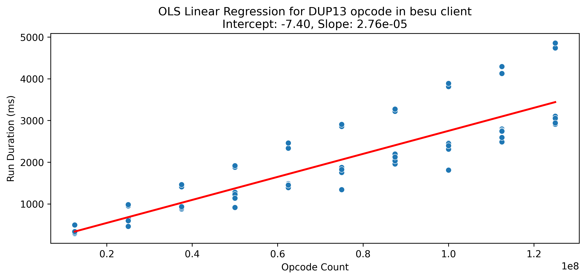


## geth


```python
                            OLS Regression Results                            
==============================================================================
Dep. Variable:        run_duration_ms   R-squared:                       0.991
Model:                            OLS   Adj. R-squared:                  0.991
Method:                 Least Squares   F-statistic:                     8268.
Date:                Tue, 23 Dec 2025   Prob (F-statistic):           4.75e-76
Time:                        08:40:57   Log-Likelihood:                -368.90
No. Observations:                  74   AIC:                             741.8
Df Residuals:                      72   BIC:                             746.4
Df Model:                           1                                         
Covariance Type:            nonrobust                                         
==============================================================================
                 coef    std err          t      P>|t|      [0.025      0.975]
------------------------------------------------------------------------------
const         36.5024      9.043      4.036      0.000      18.475      54.530
opcount     1.067e-05   1.17e-07     90.926      0.000    1.04e-05    1.09e-05
==============================================================================
Omnibus:                       84.890   Durbin-Watson:                   2.268
Prob(Omnibus):                  0.000   Jarque-Bera (JB):             1277.599
Skew:                           3.288   Prob(JB):                    3.74e-278
Kurtosis:                      22.265   Cond. No.                     1.67e+08
==============================================================================

Notes:
[1] Standard Errors assume that the covariance matrix of the errors is correctly specified.
[2] The condition number is large, 1.67e+08. This might indicate that there are
strong multicollinearity or other numerical problems.
```

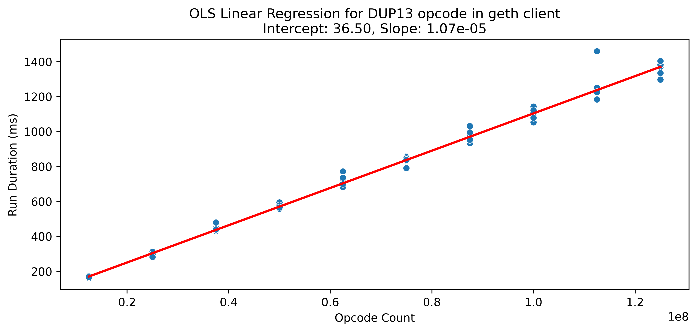


# DUP14

## nethermind


```python
                            OLS Regression Results                            
==============================================================================
Dep. Variable:        run_duration_ms   R-squared:                       0.986
Model:                            OLS   Adj. R-squared:                  0.986
Method:                 Least Squares   F-statistic:                     5205.
Date:                Tue, 23 Dec 2025   Prob (F-statistic):           6.80e-69
Time:                        08:40:58   Log-Likelihood:                -330.89
No. Observations:                  74   AIC:                             665.8
Df Residuals:                      72   BIC:                             670.4
Df Model:                           1                                         
Covariance Type:            nonrobust                                         
==============================================================================
                 coef    std err          t      P>|t|      [0.025      0.975]
------------------------------------------------------------------------------
const         37.6251      5.411      6.954      0.000      26.839      48.411
opcount     5.063e-06   7.02e-08     72.146      0.000    4.92e-06     5.2e-06
==============================================================================
Omnibus:                       11.438   Durbin-Watson:                   1.286
Prob(Omnibus):                  0.003   Jarque-Bera (JB):               11.884
Skew:                           0.832   Prob(JB):                      0.00263
Kurtosis:                       4.043   Cond. No.                     1.67e+08
==============================================================================

Notes:
[1] Standard Errors assume that the covariance matrix of the errors is correctly specified.
[2] The condition number is large, 1.67e+08. This might indicate that there are
strong multicollinearity or other numerical problems.
```


## reth


```python
                            OLS Regression Results                            
==============================================================================
Dep. Variable:        run_duration_ms   R-squared:                       0.994
Model:                            OLS   Adj. R-squared:                  0.994
Method:                 Least Squares   F-statistic:                 1.138e+04
Date:                Tue, 23 Dec 2025   Prob (F-statistic):           5.26e-81
Time:                        08:40:58   Log-Likelihood:                -283.91
No. Observations:                  74   AIC:                             571.8
Df Residuals:                      72   BIC:                             576.4
Df Model:                           1                                         
Covariance Type:            nonrobust                                         
==============================================================================
                 coef    std err          t      P>|t|      [0.025      0.975]
------------------------------------------------------------------------------
const         37.8615      2.868     13.203      0.000      32.145      43.578
opcount     3.968e-06   3.72e-08    106.664      0.000    3.89e-06    4.04e-06
==============================================================================
Omnibus:                        0.409   Durbin-Watson:                   1.670
Prob(Omnibus):                  0.815   Jarque-Bera (JB):                0.118
Skew:                          -0.083   Prob(JB):                        0.943
Kurtosis:                       3.104   Cond. No.                     1.67e+08
==============================================================================

Notes:
[1] Standard Errors assume that the covariance matrix of the errors is correctly specified.
[2] The condition number is large, 1.67e+08. This might indicate that there are
strong multicollinearity or other numerical problems.
```


## besu


```python
                            OLS Regression Results                            
==============================================================================
Dep. Variable:        run_duration_ms   R-squared:                       0.790
Model:                            OLS   Adj. R-squared:                  0.787
Method:                 Least Squares   F-statistic:                     271.4
Date:                Tue, 23 Dec 2025   Prob (F-statistic):           3.94e-26
Time:                        08:40:58   Log-Likelihood:                -565.12
No. Observations:                  74   AIC:                             1134.
Df Residuals:                      72   BIC:                             1139.
Df Model:                           1                                         
Covariance Type:            nonrobust                                         
==============================================================================
                 coef    std err          t      P>|t|      [0.025      0.975]
------------------------------------------------------------------------------
const          7.9355    128.207      0.062      0.951    -247.641     263.512
opcount      2.74e-05   1.66e-06     16.475      0.000    2.41e-05    3.07e-05
==============================================================================
Omnibus:                       16.038   Durbin-Watson:                   0.752
Prob(Omnibus):                  0.000   Jarque-Bera (JB):               18.549
Skew:                           1.183   Prob(JB):                     9.38e-05
Kurtosis:                       3.645   Cond. No.                     1.67e+08
==============================================================================

Notes:
[1] Standard Errors assume that the covariance matrix of the errors is correctly specified.
[2] The condition number is large, 1.67e+08. This might indicate that there are
strong multicollinearity or other numerical problems.
```

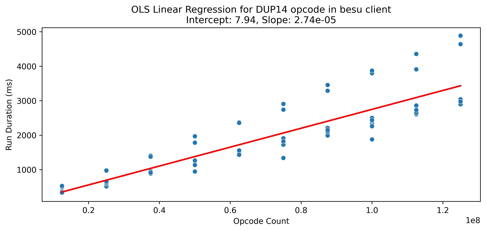


## geth


```python
                            OLS Regression Results                            
==============================================================================
Dep. Variable:        run_duration_ms   R-squared:                       0.990
Model:                            OLS   Adj. R-squared:                  0.990
Method:                 Least Squares   F-statistic:                     7136.
Date:                Tue, 23 Dec 2025   Prob (F-statistic):           9.05e-74
Time:                        08:40:58   Log-Likelihood:                -374.32
No. Observations:                  74   AIC:                             752.6
Df Residuals:                      72   BIC:                             757.2
Df Model:                           1                                         
Covariance Type:            nonrobust                                         
==============================================================================
                 coef    std err          t      P>|t|      [0.025      0.975]
------------------------------------------------------------------------------
const         41.7549      9.731      4.291      0.000      22.357      61.152
opcount     1.066e-05   1.26e-07     84.475      0.000    1.04e-05    1.09e-05
==============================================================================
Omnibus:                      107.615   Durbin-Watson:                   1.988
Prob(Omnibus):                  0.000   Jarque-Bera (JB):             2922.084
Skew:                           4.474   Prob(JB):                         0.00
Kurtosis:                      32.456   Cond. No.                     1.67e+08
==============================================================================

Notes:
[1] Standard Errors assume that the covariance matrix of the errors is correctly specified.
[2] The condition number is large, 1.67e+08. This might indicate that there are
strong multicollinearity or other numerical problems.
```


# DUP15

## nethermind


```python
                            OLS Regression Results                            
==============================================================================
Dep. Variable:        run_duration_ms   R-squared:                       0.985
Model:                            OLS   Adj. R-squared:                  0.985
Method:                 Least Squares   F-statistic:                     4672.
Date:                Tue, 23 Dec 2025   Prob (F-statistic):           3.14e-67
Time:                        08:40:58   Log-Likelihood:                -334.49
No. Observations:                  74   AIC:                             673.0
Df Residuals:                      72   BIC:                             677.6
Df Model:                           1                                         
Covariance Type:            nonrobust                                         
==============================================================================
                 coef    std err          t      P>|t|      [0.025      0.975]
------------------------------------------------------------------------------
const         40.9160      5.681      7.203      0.000      29.592      52.240
opcount     5.037e-06   7.37e-08     68.354      0.000    4.89e-06    5.18e-06
==============================================================================
Omnibus:                        2.159   Durbin-Watson:                   1.460
Prob(Omnibus):                  0.340   Jarque-Bera (JB):                1.498
Skew:                           0.171   Prob(JB):                        0.473
Kurtosis:                       3.608   Cond. No.                     1.67e+08
==============================================================================

Notes:
[1] Standard Errors assume that the covariance matrix of the errors is correctly specified.
[2] The condition number is large, 1.67e+08. This might indicate that there are
strong multicollinearity or other numerical problems.
```


## reth


```python
                            OLS Regression Results                            
==============================================================================
Dep. Variable:        run_duration_ms   R-squared:                       0.993
Model:                            OLS   Adj. R-squared:                  0.993
Method:                 Least Squares   F-statistic:                 1.030e+04
Date:                Tue, 23 Dec 2025   Prob (F-statistic):           1.82e-79
Time:                        08:40:58   Log-Likelihood:                -288.63
No. Observations:                  74   AIC:                             581.3
Df Residuals:                      72   BIC:                             585.9
Df Model:                           1                                         
Covariance Type:            nonrobust                                         
==============================================================================
                 coef    std err          t      P>|t|      [0.025      0.975]
------------------------------------------------------------------------------
const         38.9486      3.057     12.741      0.000      32.855      45.042
opcount     4.025e-06   3.96e-08    101.510      0.000    3.95e-06     4.1e-06
==============================================================================
Omnibus:                        0.153   Durbin-Watson:                   1.683
Prob(Omnibus):                  0.926   Jarque-Bera (JB):                0.233
Skew:                           0.103   Prob(JB):                        0.890
Kurtosis:                       2.818   Cond. No.                     1.67e+08
==============================================================================

Notes:
[1] Standard Errors assume that the covariance matrix of the errors is correctly specified.
[2] The condition number is large, 1.67e+08. This might indicate that there are
strong multicollinearity or other numerical problems.
```


## besu


```python
                            OLS Regression Results                            
==============================================================================
Dep. Variable:        run_duration_ms   R-squared:                       0.787
Model:                            OLS   Adj. R-squared:                  0.784
Method:                 Least Squares   F-statistic:                     265.8
Date:                Tue, 23 Dec 2025   Prob (F-statistic):           7.15e-26
Time:                        08:40:58   Log-Likelihood:                -566.30
No. Observations:                  74   AIC:                             1137.
Df Residuals:                      72   BIC:                             1141.
Df Model:                           1                                         
Covariance Type:            nonrobust                                         
==============================================================================
                 coef    std err          t      P>|t|      [0.025      0.975]
------------------------------------------------------------------------------
const          5.4303    130.280      0.042      0.967    -254.278     265.138
opcount     2.755e-05   1.69e-06     16.304      0.000    2.42e-05    3.09e-05
==============================================================================
Omnibus:                       16.118   Durbin-Watson:                   0.603
Prob(Omnibus):                  0.000   Jarque-Bera (JB):               18.663
Skew:                           1.186   Prob(JB):                     8.86e-05
Kurtosis:                       3.656   Cond. No.                     1.67e+08
==============================================================================

Notes:
[1] Standard Errors assume that the covariance matrix of the errors is correctly specified.
[2] The condition number is large, 1.67e+08. This might indicate that there are
strong multicollinearity or other numerical problems.
```

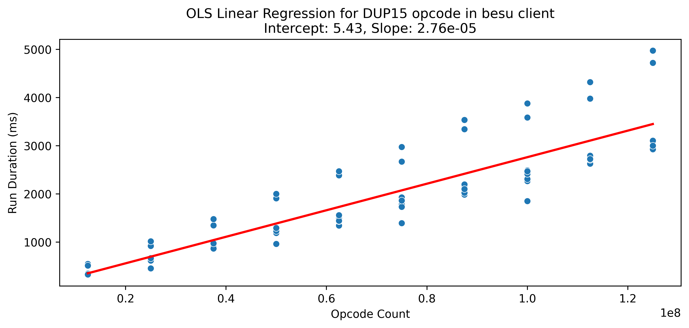


## geth


```python
                            OLS Regression Results                            
==============================================================================
Dep. Variable:        run_duration_ms   R-squared:                       0.910
Model:                            OLS   Adj. R-squared:                  0.908
Method:                 Least Squares   F-statistic:                     724.2
Date:                Tue, 23 Dec 2025   Prob (F-statistic):           2.63e-39
Time:                        08:40:58   Log-Likelihood:                -460.32
No. Observations:                  74   AIC:                             924.6
Df Residuals:                      72   BIC:                             929.3
Df Model:                           1                                         
Covariance Type:            nonrobust                                         
==============================================================================
                 coef    std err          t      P>|t|      [0.025      0.975]
------------------------------------------------------------------------------
const         34.4651     31.110      1.108      0.272     -27.551      96.481
opcount     1.086e-05   4.04e-07     26.910      0.000    1.01e-05    1.17e-05
==============================================================================
Omnibus:                      156.641   Durbin-Watson:                   1.995
Prob(Omnibus):                  0.000   Jarque-Bera (JB):            13639.040
Skew:                           8.021   Prob(JB):                         0.00
Kurtosis:                      67.546   Cond. No.                     1.67e+08
==============================================================================

Notes:
[1] Standard Errors assume that the covariance matrix of the errors is correctly specified.
[2] The condition number is large, 1.67e+08. This might indicate that there are
strong multicollinearity or other numerical problems.
```

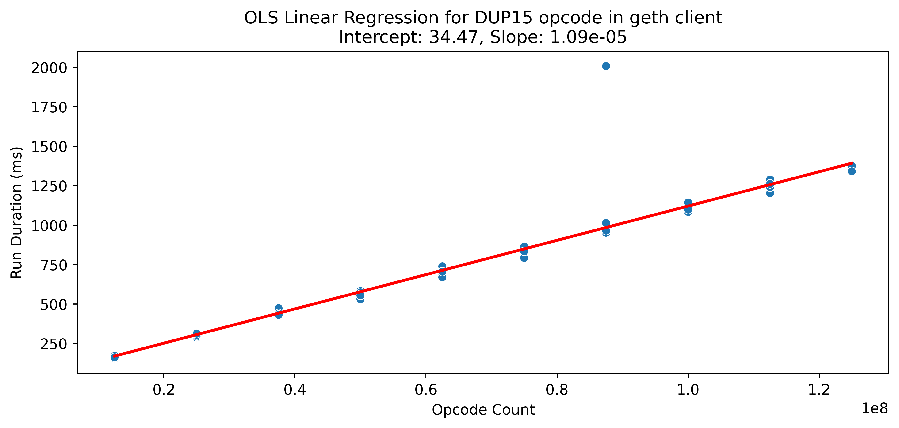


# DUP16

## nethermind


```python
                            OLS Regression Results                            
==============================================================================
Dep. Variable:        run_duration_ms   R-squared:                       0.987
Model:                            OLS   Adj. R-squared:                  0.986
Method:                 Least Squares   F-statistic:                     5288.
Date:                Tue, 23 Dec 2025   Prob (F-statistic):           3.87e-69
Time:                        08:40:59   Log-Likelihood:                -331.35
No. Observations:                  74   AIC:                             666.7
Df Residuals:                      72   BIC:                             671.3
Df Model:                           1                                         
Covariance Type:            nonrobust                                         
==============================================================================
                 coef    std err          t      P>|t|      [0.025      0.975]
------------------------------------------------------------------------------
const         32.2969      5.444      5.932      0.000      21.444      43.150
opcount     5.135e-06   7.06e-08     72.722      0.000    4.99e-06    5.28e-06
==============================================================================
Omnibus:                       14.960   Durbin-Watson:                   1.323
Prob(Omnibus):                  0.001   Jarque-Bera (JB):               41.472
Skew:                           0.475   Prob(JB):                     9.87e-10
Kurtosis:                       6.542   Cond. No.                     1.67e+08
==============================================================================

Notes:
[1] Standard Errors assume that the covariance matrix of the errors is correctly specified.
[2] The condition number is large, 1.67e+08. This might indicate that there are
strong multicollinearity or other numerical problems.
```

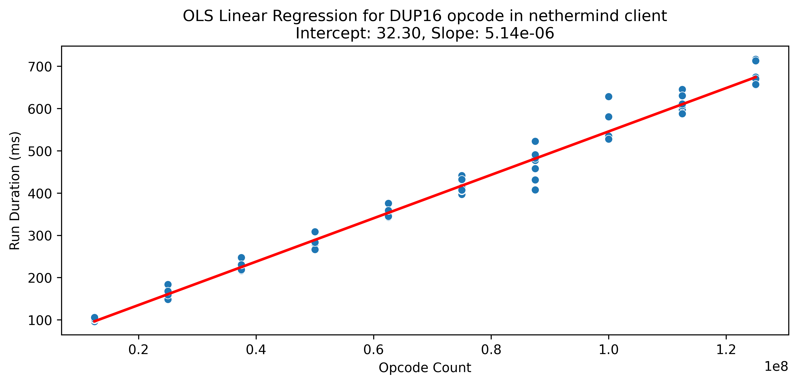


## reth


```python
                            OLS Regression Results                            
==============================================================================
Dep. Variable:        run_duration_ms   R-squared:                       0.985
Model:                            OLS   Adj. R-squared:                  0.984
Method:                 Least Squares   F-statistic:                     4633.
Date:                Tue, 23 Dec 2025   Prob (F-statistic):           4.25e-67
Time:                        08:40:59   Log-Likelihood:                -317.27
No. Observations:                  74   AIC:                             638.5
Df Residuals:                      72   BIC:                             643.1
Df Model:                           1                                         
Covariance Type:            nonrobust                                         
==============================================================================
                 coef    std err          t      P>|t|      [0.025      0.975]
------------------------------------------------------------------------------
const         39.5891      4.501      8.795      0.000      30.616      48.562
opcount     3.974e-06   5.84e-08     68.063      0.000    3.86e-06    4.09e-06
==============================================================================
Omnibus:                       10.079   Durbin-Watson:                   1.259
Prob(Omnibus):                  0.006   Jarque-Bera (JB):               10.480
Skew:                          -0.719   Prob(JB):                      0.00530
Kurtosis:                       4.153   Cond. No.                     1.67e+08
==============================================================================

Notes:
[1] Standard Errors assume that the covariance matrix of the errors is correctly specified.
[2] The condition number is large, 1.67e+08. This might indicate that there are
strong multicollinearity or other numerical problems.
```

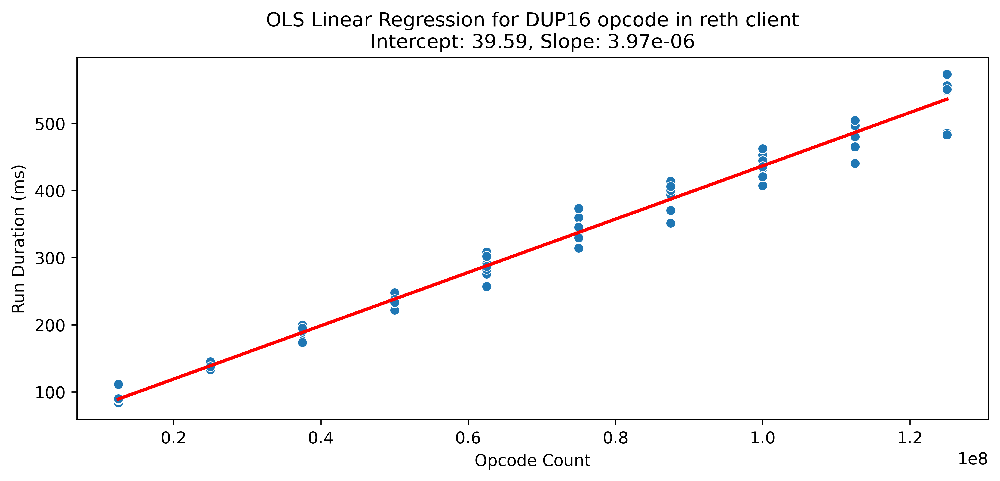


## besu


```python
                            OLS Regression Results                            
==============================================================================
Dep. Variable:        run_duration_ms   R-squared:                       0.784
Model:                            OLS   Adj. R-squared:                  0.781
Method:                 Least Squares   F-statistic:                     261.5
Date:                Tue, 23 Dec 2025   Prob (F-statistic):           1.14e-25
Time:                        08:40:59   Log-Likelihood:                -568.11
No. Observations:                  74   AIC:                             1140.
Df Residuals:                      72   BIC:                             1145.
Df Model:                           1                                         
Covariance Type:            nonrobust                                         
==============================================================================
                 coef    std err          t      P>|t|      [0.025      0.975]
------------------------------------------------------------------------------
const        -27.4210    133.498     -0.205      0.838    -293.545     238.703
opcount       2.8e-05   1.73e-06     16.171      0.000    2.45e-05    3.15e-05
==============================================================================
Omnibus:                       15.051   Durbin-Watson:                   0.868
Prob(Omnibus):                  0.001   Jarque-Bera (JB):               17.184
Skew:                           1.151   Prob(JB):                     0.000186
Kurtosis:                       3.519   Cond. No.                     1.67e+08
==============================================================================

Notes:
[1] Standard Errors assume that the covariance matrix of the errors is correctly specified.
[2] The condition number is large, 1.67e+08. This might indicate that there are
strong multicollinearity or other numerical problems.
```

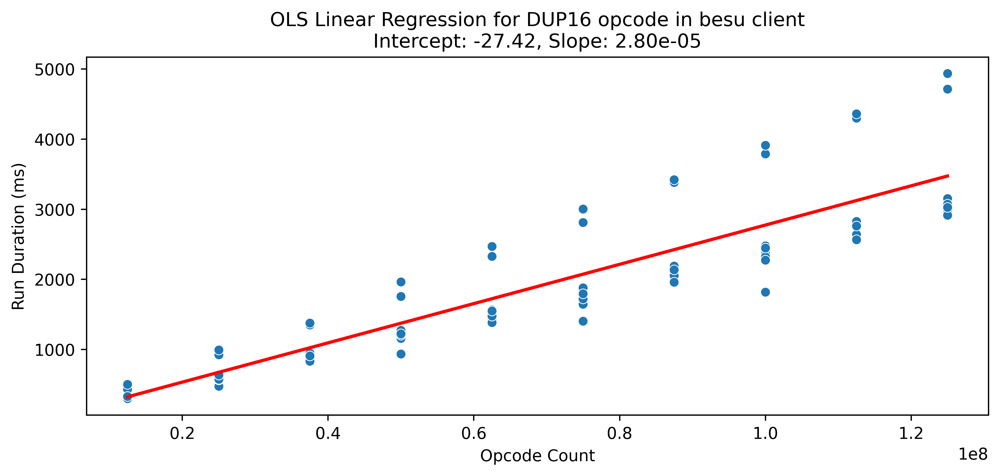


## geth


```python
                            OLS Regression Results                            
==============================================================================
Dep. Variable:        run_duration_ms   R-squared:                       0.970
Model:                            OLS   Adj. R-squared:                  0.970
Method:                 Least Squares   F-statistic:                     2324.
Date:                Tue, 23 Dec 2025   Prob (F-statistic):           1.53e-56
Time:                        08:40:59   Log-Likelihood:                -415.53
No. Observations:                  74   AIC:                             835.1
Df Residuals:                      72   BIC:                             839.7
Df Model:                           1                                         
Covariance Type:            nonrobust                                         
==============================================================================
                 coef    std err          t      P>|t|      [0.025      0.975]
------------------------------------------------------------------------------
const         52.7933     16.982      3.109      0.003      18.941      86.646
opcount     1.062e-05    2.2e-07     48.203      0.000    1.02e-05    1.11e-05
==============================================================================
Omnibus:                      122.468   Durbin-Watson:                   2.071
Prob(Omnibus):                  0.000   Jarque-Bera (JB):             4193.762
Skew:                           5.491   Prob(JB):                         0.00
Kurtosis:                      38.207   Cond. No.                     1.67e+08
==============================================================================

Notes:
[1] Standard Errors assume that the covariance matrix of the errors is correctly specified.
[2] The condition number is large, 1.67e+08. This might indicate that there are
strong multicollinearity or other numerical problems.
```

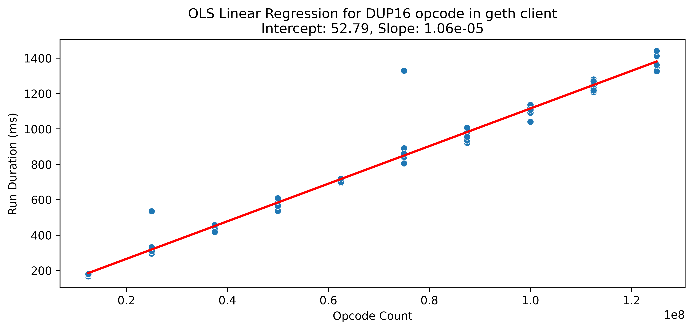


# EQ

## nethermind


```python
                            OLS Regression Results                            
==============================================================================
Dep. Variable:        run_duration_ms   R-squared:                       0.989
Model:                            OLS   Adj. R-squared:                  0.989
Method:                 Least Squares   F-statistic:                     6526.
Date:                Tue, 23 Dec 2025   Prob (F-statistic):           2.18e-72
Time:                        08:40:59   Log-Likelihood:                -338.98
No. Observations:                  74   AIC:                             682.0
Df Residuals:                      72   BIC:                             686.6
Df Model:                           1                                         
Covariance Type:            nonrobust                                         
==============================================================================
                 coef    std err          t      P>|t|      [0.025      0.975]
------------------------------------------------------------------------------
const         37.4118      6.036      6.198      0.000      25.379      49.445
opcount     1.054e-05    1.3e-07     80.785      0.000    1.03e-05    1.08e-05
==============================================================================
Omnibus:                        0.102   Durbin-Watson:                   1.583
Prob(Omnibus):                  0.950   Jarque-Bera (JB):                0.024
Skew:                          -0.039   Prob(JB):                        0.988
Kurtosis:                       2.960   Cond. No.                     1.00e+08
==============================================================================

Notes:
[1] Standard Errors assume that the covariance matrix of the errors is correctly specified.
[2] The condition number is large,  1e+08. This might indicate that there are
strong multicollinearity or other numerical problems.
```


## reth


```python
                            OLS Regression Results                            
==============================================================================
Dep. Variable:        run_duration_ms   R-squared:                       0.978
Model:                            OLS   Adj. R-squared:                  0.978
Method:                 Least Squares   F-statistic:                     3194.
Date:                Tue, 23 Dec 2025   Prob (F-statistic):           2.16e-61
Time:                        08:40:59   Log-Likelihood:                -414.28
No. Observations:                  74   AIC:                             832.6
Df Residuals:                      72   BIC:                             837.2
Df Model:                           1                                         
Covariance Type:            nonrobust                                         
==============================================================================
                 coef    std err          t      P>|t|      [0.025      0.975]
------------------------------------------------------------------------------
const         38.4699     16.699      2.304      0.024       5.181      71.758
opcount      2.04e-05   3.61e-07     56.519      0.000    1.97e-05    2.11e-05
==============================================================================
Omnibus:                        7.728   Durbin-Watson:                   1.370
Prob(Omnibus):                  0.021   Jarque-Bera (JB):               14.317
Skew:                           0.169   Prob(JB):                     0.000778
Kurtosis:                       5.128   Cond. No.                     1.00e+08
==============================================================================

Notes:
[1] Standard Errors assume that the covariance matrix of the errors is correctly specified.
[2] The condition number is large,  1e+08. This might indicate that there are
strong multicollinearity or other numerical problems.
```

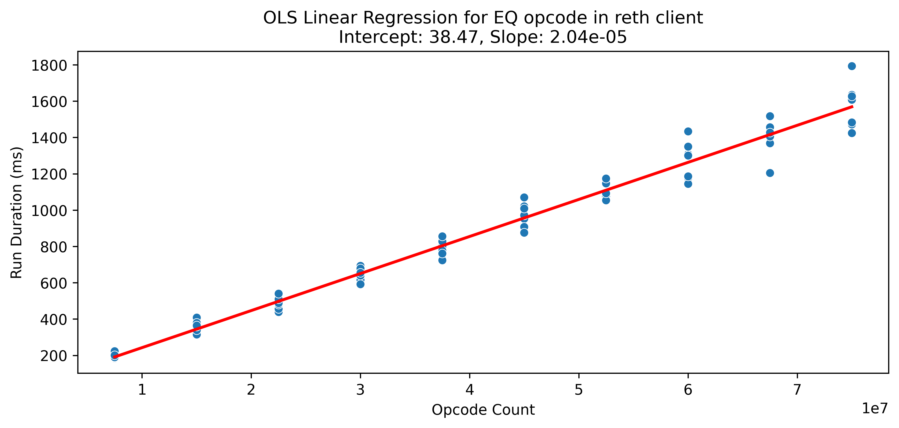


## besu


```python
                            OLS Regression Results                            
==============================================================================
Dep. Variable:        run_duration_ms   R-squared:                       0.925
Model:                            OLS   Adj. R-squared:                  0.924
Method:                 Least Squares   F-statistic:                     865.1
Date:                Tue, 23 Dec 2025   Prob (F-statistic):           3.92e-41
Time:                        08:40:59   Log-Likelihood:                -653.54
No. Observations:                  72   AIC:                             1311.
Df Residuals:                      70   BIC:                             1316.
Df Model:                           1                                         
Covariance Type:            nonrobust                                         
==============================================================================
                 coef    std err          t      P>|t|      [0.025      0.975]
------------------------------------------------------------------------------
const      -2217.1442    548.762     -4.040      0.000   -3311.616   -1122.673
opcount        0.0004   1.21e-05     29.412      0.000       0.000       0.000
==============================================================================
Omnibus:                        8.412   Durbin-Watson:                   1.563
Prob(Omnibus):                  0.015   Jarque-Bera (JB):                7.981
Skew:                           0.687   Prob(JB):                       0.0185
Kurtosis:                       3.879   Cond. No.                     9.80e+07
==============================================================================

Notes:
[1] Standard Errors assume that the covariance matrix of the errors is correctly specified.
[2] The condition number is large, 9.8e+07. This might indicate that there are
strong multicollinearity or other numerical problems.
```

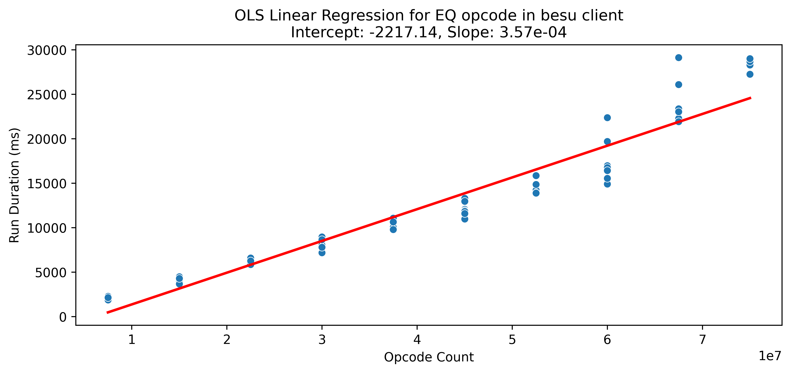


## geth


```python
                            OLS Regression Results                            
==============================================================================
Dep. Variable:        run_duration_ms   R-squared:                       0.772
Model:                            OLS   Adj. R-squared:                  0.769
Method:                 Least Squares   F-statistic:                     243.5
Date:                Tue, 23 Dec 2025   Prob (F-statistic):           8.40e-25
Time:                        08:41:00   Log-Likelihood:                -514.02
No. Observations:                  74   AIC:                             1032.
Df Residuals:                      72   BIC:                             1037.
Df Model:                           1                                         
Covariance Type:            nonrobust                                         
==============================================================================
                 coef    std err          t      P>|t|      [0.025      0.975]
------------------------------------------------------------------------------
const         70.1933     64.269      1.092      0.278     -57.925     198.312
opcount     2.168e-05   1.39e-06     15.606      0.000    1.89e-05    2.45e-05
==============================================================================
Omnibus:                      152.845   Durbin-Watson:                   2.105
Prob(Omnibus):                  0.000   Jarque-Bera (JB):            11929.763
Skew:                           7.708   Prob(JB):                         0.00
Kurtosis:                      63.262   Cond. No.                     1.00e+08
==============================================================================

Notes:
[1] Standard Errors assume that the covariance matrix of the errors is correctly specified.
[2] The condition number is large,  1e+08. This might indicate that there are
strong multicollinearity or other numerical problems.
```

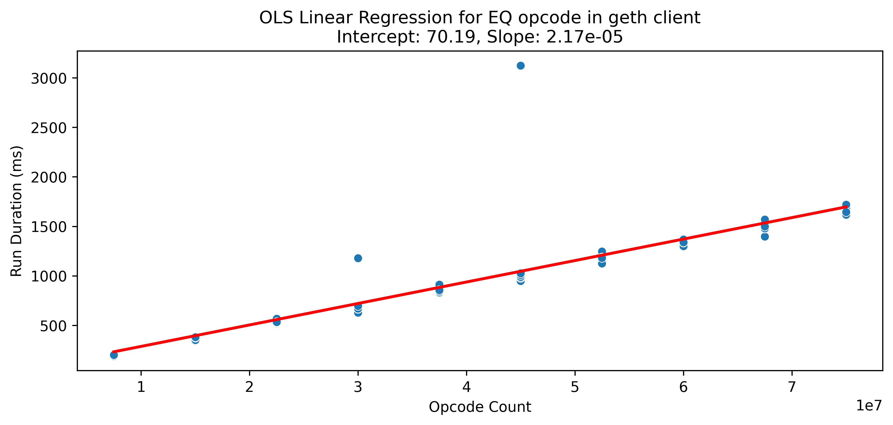


# GAS

## nethermind


```python
                            OLS Regression Results                            
==============================================================================
Dep. Variable:        run_duration_ms   R-squared:                       0.987
Model:                            OLS   Adj. R-squared:                  0.986
Method:                 Least Squares   F-statistic:                     5288.
Date:                Tue, 23 Dec 2025   Prob (F-statistic):           3.88e-69
Time:                        08:41:00   Log-Likelihood:                -376.59
No. Observations:                  74   AIC:                             757.2
Df Residuals:                      72   BIC:                             761.8
Df Model:                           1                                         
Covariance Type:            nonrobust                                         
==============================================================================
                 coef    std err          t      P>|t|      [0.025      0.975]
------------------------------------------------------------------------------
const         47.8535     10.034      4.769      0.000      27.850      67.857
opcount     4.732e-06   6.51e-08     72.717      0.000     4.6e-06    4.86e-06
==============================================================================
Omnibus:                        6.338   Durbin-Watson:                   1.128
Prob(Omnibus):                  0.042   Jarque-Bera (JB):                9.460
Skew:                          -0.195   Prob(JB):                      0.00883
Kurtosis:                       4.707   Cond. No.                     3.34e+08
==============================================================================

Notes:
[1] Standard Errors assume that the covariance matrix of the errors is correctly specified.
[2] The condition number is large, 3.34e+08. This might indicate that there are
strong multicollinearity or other numerical problems.
```

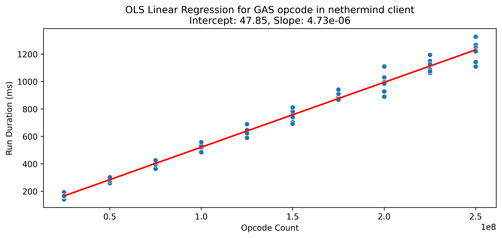


## reth


```python
                            OLS Regression Results                            
==============================================================================
Dep. Variable:        run_duration_ms   R-squared:                       0.988
Model:                            OLS   Adj. R-squared:                  0.988
Method:                 Least Squares   F-statistic:                     5841.
Date:                Tue, 23 Dec 2025   Prob (F-statistic):           1.13e-70
Time:                        08:41:00   Log-Likelihood:                -369.48
No. Observations:                  74   AIC:                             743.0
Df Residuals:                      72   BIC:                             747.6
Df Model:                           1                                         
Covariance Type:            nonrobust                                         
==============================================================================
                 coef    std err          t      P>|t|      [0.025      0.975]
------------------------------------------------------------------------------
const         46.7625      9.114      5.131      0.000      28.593      64.932
opcount     4.518e-06   5.91e-08     76.427      0.000     4.4e-06    4.64e-06
==============================================================================
Omnibus:                        7.765   Durbin-Watson:                   1.141
Prob(Omnibus):                  0.021   Jarque-Bera (JB):                8.153
Skew:                          -0.538   Prob(JB):                       0.0170
Kurtosis:                       4.220   Cond. No.                     3.34e+08
==============================================================================

Notes:
[1] Standard Errors assume that the covariance matrix of the errors is correctly specified.
[2] The condition number is large, 3.34e+08. This might indicate that there are
strong multicollinearity or other numerical problems.
```


## besu


```python
                            OLS Regression Results                            
==============================================================================
Dep. Variable:        run_duration_ms   R-squared:                       0.762
Model:                            OLS   Adj. R-squared:                  0.759
Method:                 Least Squares   F-statistic:                     230.8
Date:                Tue, 23 Dec 2025   Prob (F-statistic):           3.74e-24
Time:                        08:41:00   Log-Likelihood:                -643.22
No. Observations:                  74   AIC:                             1290.
Df Residuals:                      72   BIC:                             1295.
Df Model:                           1                                         
Covariance Type:            nonrobust                                         
==============================================================================
                 coef    std err          t      P>|t|      [0.025      0.975]
------------------------------------------------------------------------------
const        -32.1999    368.345     -0.087      0.931    -766.483     702.083
opcount     3.629e-05   2.39e-06     15.191      0.000    3.15e-05    4.11e-05
==============================================================================
Omnibus:                       19.716   Durbin-Watson:                   0.626
Prob(Omnibus):                  0.000   Jarque-Bera (JB):               24.467
Skew:                           1.291   Prob(JB):                     4.87e-06
Kurtosis:                       4.128   Cond. No.                     3.34e+08
==============================================================================

Notes:
[1] Standard Errors assume that the covariance matrix of the errors is correctly specified.
[2] The condition number is large, 3.34e+08. This might indicate that there are
strong multicollinearity or other numerical problems.
```

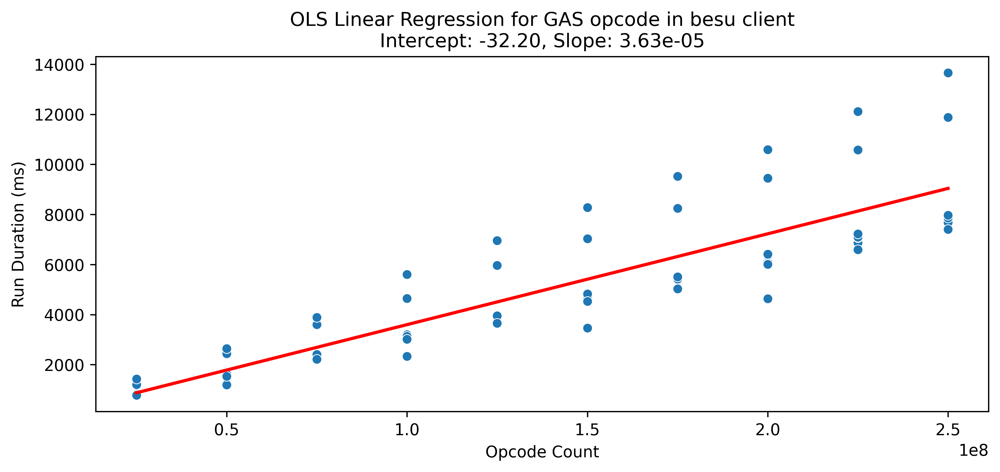


## geth


```python
                            OLS Regression Results                            
==============================================================================
Dep. Variable:        run_duration_ms   R-squared:                       0.984
Model:                            OLS   Adj. R-squared:                  0.984
Method:                 Least Squares   F-statistic:                     4496.
Date:                Tue, 23 Dec 2025   Prob (F-statistic):           1.22e-66
Time:                        08:41:00   Log-Likelihood:                -451.36
No. Observations:                  74   AIC:                             906.7
Df Residuals:                      72   BIC:                             911.3
Df Model:                           1                                         
Covariance Type:            nonrobust                                         
==============================================================================
                 coef    std err          t      P>|t|      [0.025      0.975]
------------------------------------------------------------------------------
const         39.7745     27.559      1.443      0.153     -15.164      94.713
opcount     1.198e-05   1.79e-07     67.054      0.000    1.16e-05    1.23e-05
==============================================================================
Omnibus:                      133.606   Durbin-Watson:                   1.722
Prob(Omnibus):                  0.000   Jarque-Bera (JB):             6770.645
Skew:                           6.171   Prob(JB):                         0.00
Kurtosis:                      48.205   Cond. No.                     3.34e+08
==============================================================================

Notes:
[1] Standard Errors assume that the covariance matrix of the errors is correctly specified.
[2] The condition number is large, 3.34e+08. This might indicate that there are
strong multicollinearity or other numerical problems.
```


# GASLIMIT

## nethermind


```python
                            OLS Regression Results                            
==============================================================================
Dep. Variable:        run_duration_ms   R-squared:                       0.989
Model:                            OLS   Adj. R-squared:                  0.989
Method:                 Least Squares   F-statistic:                     6739.
Date:                Tue, 23 Dec 2025   Prob (F-statistic):           6.95e-73
Time:                        08:41:00   Log-Likelihood:                -370.23
No. Observations:                  74   AIC:                             744.5
Df Residuals:                      72   BIC:                             749.1
Df Model:                           1                                         
Covariance Type:            nonrobust                                         
==============================================================================
                 coef    std err          t      P>|t|      [0.025      0.975]
------------------------------------------------------------------------------
const         32.2919      9.208      3.507      0.001      13.936      50.648
opcount     4.902e-06   5.97e-08     82.092      0.000    4.78e-06    5.02e-06
==============================================================================
Omnibus:                       16.037   Durbin-Watson:                   1.609
Prob(Omnibus):                  0.000   Jarque-Bera (JB):               30.465
Skew:                          -0.726   Prob(JB):                     2.42e-07
Kurtosis:                       5.788   Cond. No.                     3.34e+08
==============================================================================

Notes:
[1] Standard Errors assume that the covariance matrix of the errors is correctly specified.
[2] The condition number is large, 3.34e+08. This might indicate that there are
strong multicollinearity or other numerical problems.
```


## reth


```python
                            OLS Regression Results                            
==============================================================================
Dep. Variable:        run_duration_ms   R-squared:                       0.983
Model:                            OLS   Adj. R-squared:                  0.983
Method:                 Least Squares   F-statistic:                     4246.
Date:                Tue, 23 Dec 2025   Prob (F-statistic):           9.30e-66
Time:                        08:41:00   Log-Likelihood:                -380.21
No. Observations:                  74   AIC:                             764.4
Df Residuals:                      72   BIC:                             769.0
Df Model:                           1                                         
Covariance Type:            nonrobust                                         
==============================================================================
                 coef    std err          t      P>|t|      [0.025      0.975]
------------------------------------------------------------------------------
const         33.4226     10.538      3.172      0.002      12.416      54.429
opcount     4.453e-06   6.83e-08     65.163      0.000    4.32e-06    4.59e-06
==============================================================================
Omnibus:                        3.986   Durbin-Watson:                   1.176
Prob(Omnibus):                  0.136   Jarque-Bera (JB):                3.869
Skew:                           0.232   Prob(JB):                        0.144
Kurtosis:                       4.020   Cond. No.                     3.34e+08
==============================================================================

Notes:
[1] Standard Errors assume that the covariance matrix of the errors is correctly specified.
[2] The condition number is large, 3.34e+08. This might indicate that there are
strong multicollinearity or other numerical problems.
```


## besu


```python
                            OLS Regression Results                            
==============================================================================
Dep. Variable:        run_duration_ms   R-squared:                       0.905
Model:                            OLS   Adj. R-squared:                  0.904
Method:                 Least Squares   F-statistic:                     689.7
Date:                Tue, 23 Dec 2025   Prob (F-statistic):           1.30e-38
Time:                        08:41:01   Log-Likelihood:                -592.18
No. Observations:                  74   AIC:                             1188.
Df Residuals:                      72   BIC:                             1193.
Df Model:                           1                                         
Covariance Type:            nonrobust                                         
==============================================================================
                 coef    std err          t      P>|t|      [0.025      0.975]
------------------------------------------------------------------------------
const         -8.1598    184.804     -0.044      0.965    -376.559     360.240
opcount     3.147e-05    1.2e-06     26.261      0.000    2.91e-05    3.39e-05
==============================================================================
Omnibus:                       47.386   Durbin-Watson:                   0.830
Prob(Omnibus):                  0.000   Jarque-Bera (JB):              137.681
Skew:                           2.143   Prob(JB):                     1.27e-30
Kurtosis:                       8.126   Cond. No.                     3.34e+08
==============================================================================

Notes:
[1] Standard Errors assume that the covariance matrix of the errors is correctly specified.
[2] The condition number is large, 3.34e+08. This might indicate that there are
strong multicollinearity or other numerical problems.
```

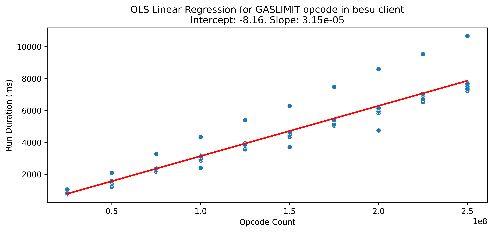


## geth


```python
                            OLS Regression Results                            
==============================================================================
Dep. Variable:        run_duration_ms   R-squared:                       0.999
Model:                            OLS   Adj. R-squared:                  0.998
Method:                 Least Squares   F-statistic:                 4.801e+04
Date:                Tue, 23 Dec 2025   Prob (F-statistic):          1.92e-103
Time:                        08:41:01   Log-Likelihood:                -363.42
No. Observations:                  74   AIC:                             730.8
Df Residuals:                      72   BIC:                             735.4
Df Model:                           1                                         
Covariance Type:            nonrobust                                         
==============================================================================
                 coef    std err          t      P>|t|      [0.025      0.975]
------------------------------------------------------------------------------
const         29.3210      8.398      3.491      0.001      12.580      46.062
opcount     1.193e-05   5.45e-08    219.117      0.000    1.18e-05     1.2e-05
==============================================================================
Omnibus:                        3.832   Durbin-Watson:                   1.287
Prob(Omnibus):                  0.147   Jarque-Bera (JB):                3.011
Skew:                          -0.396   Prob(JB):                        0.222
Kurtosis:                       3.590   Cond. No.                     3.34e+08
==============================================================================

Notes:
[1] Standard Errors assume that the covariance matrix of the errors is correctly specified.
[2] The condition number is large, 3.34e+08. This might indicate that there are
strong multicollinearity or other numerical problems.
```

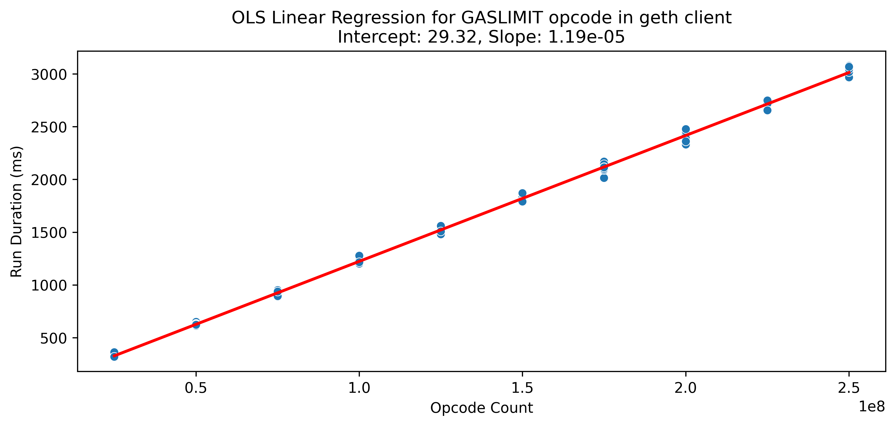


# GASPRICE

## nethermind


```python
                            OLS Regression Results                            
==============================================================================
Dep. Variable:        run_duration_ms   R-squared:                       0.010
Model:                            OLS   Adj. R-squared:                 -0.004
Method:                 Least Squares   F-statistic:                    0.7173
Date:                Tue, 23 Dec 2025   Prob (F-statistic):              0.400
Time:                        08:41:01   Log-Likelihood:                -450.71
No. Observations:                  74   AIC:                             905.4
Df Residuals:                      72   BIC:                             910.0
Df Model:                           1                                         
Covariance Type:            nonrobust                                         
==============================================================================
                 coef    std err          t      P>|t|      [0.025      0.975]
------------------------------------------------------------------------------
const       2220.0306     27.321     81.258      0.000    2165.568    2274.493
opcount     1.501e-09   1.77e-09      0.847      0.400   -2.03e-09    5.03e-09
==============================================================================
Omnibus:                        3.514   Durbin-Watson:                   1.080
Prob(Omnibus):                  0.173   Jarque-Bera (JB):                3.467
Skew:                          -0.497   Prob(JB):                        0.177
Kurtosis:                       2.628   Cond. No.                     3.34e+10
==============================================================================

Notes:
[1] Standard Errors assume that the covariance matrix of the errors is correctly specified.
[2] The condition number is large, 3.34e+10. This might indicate that there are
strong multicollinearity or other numerical problems.
```

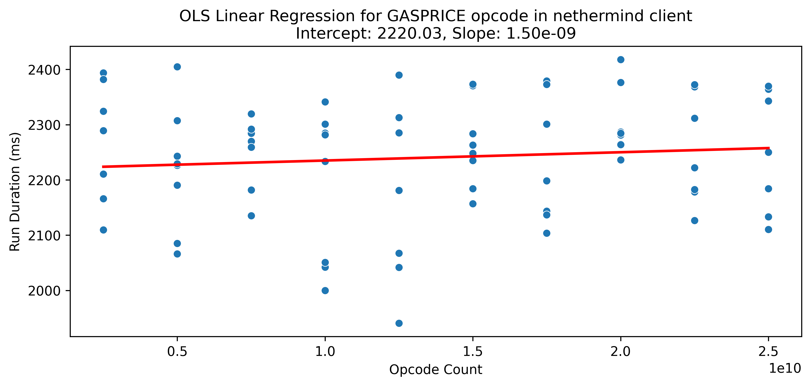


## reth


```python
                            OLS Regression Results                            
==============================================================================
Dep. Variable:        run_duration_ms   R-squared:                       0.036
Model:                            OLS   Adj. R-squared:                  0.023
Method:                 Least Squares   F-statistic:                     2.699
Date:                Tue, 23 Dec 2025   Prob (F-statistic):              0.105
Time:                        08:41:01   Log-Likelihood:                -414.64
No. Observations:                  74   AIC:                             833.3
Df Residuals:                      72   BIC:                             837.9
Df Model:                           1                                         
Covariance Type:            nonrobust                                         
==============================================================================
                 coef    std err          t      P>|t|      [0.025      0.975]
------------------------------------------------------------------------------
const       2368.8186     16.781    141.164      0.000    2335.367    2402.270
opcount     1.788e-09   1.09e-09      1.643      0.105   -3.82e-10    3.96e-09
==============================================================================
Omnibus:                        8.194   Durbin-Watson:                   1.758
Prob(Omnibus):                  0.017   Jarque-Bera (JB):                4.171
Skew:                          -0.361   Prob(JB):                        0.124
Kurtosis:                       2.088   Cond. No.                     3.34e+10
==============================================================================

Notes:
[1] Standard Errors assume that the covariance matrix of the errors is correctly specified.
[2] The condition number is large, 3.34e+10. This might indicate that there are
strong multicollinearity or other numerical problems.
```

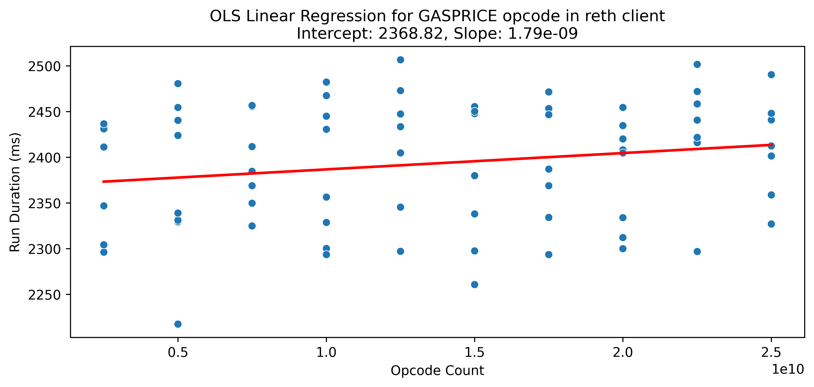


## besu

OLS model did not run... Error: zero-size array to reduction operation maximum which has no identity

## geth


```python
                            OLS Regression Results                            
==============================================================================
Dep. Variable:        run_duration_ms   R-squared:                       0.022
Model:                            OLS   Adj. R-squared:                  0.008
Method:                 Least Squares   F-statistic:                     1.621
Date:                Tue, 23 Dec 2025   Prob (F-statistic):              0.207
Time:                        08:41:01   Log-Likelihood:                -559.24
No. Observations:                  74   AIC:                             1122.
Df Residuals:                      72   BIC:                             1127.
Df Model:                           1                                         
Covariance Type:            nonrobust                                         
==============================================================================
                 coef    std err          t      P>|t|      [0.025      0.975]
------------------------------------------------------------------------------
const       7742.3679    118.413     65.384      0.000    7506.316    7978.420
opcount    -9.777e-09   7.68e-09     -1.273      0.207   -2.51e-08    5.53e-09
==============================================================================
Omnibus:                      124.217   Durbin-Watson:                   2.087
Prob(Omnibus):                  0.000   Jarque-Bera (JB):             4478.048
Skew:                           5.601   Prob(JB):                         0.00
Kurtosis:                      39.426   Cond. No.                     3.34e+10
==============================================================================

Notes:
[1] Standard Errors assume that the covariance matrix of the errors is correctly specified.
[2] The condition number is large, 3.34e+10. This might indicate that there are
strong multicollinearity or other numerical problems.
```

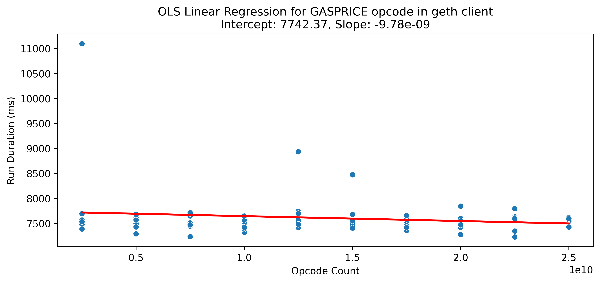


# GT

## nethermind


```python
                            OLS Regression Results                            
==============================================================================
Dep. Variable:        run_duration_ms   R-squared:                       0.990
Model:                            OLS   Adj. R-squared:                  0.990
Method:                 Least Squares   F-statistic:                     7226.
Date:                Tue, 23 Dec 2025   Prob (F-statistic):           5.80e-74
Time:                        08:41:01   Log-Likelihood:                -360.22
No. Observations:                  74   AIC:                             724.4
Df Residuals:                      72   BIC:                             729.1
Df Model:                           1                                         
Covariance Type:            nonrobust                                         
==============================================================================
                 coef    std err          t      P>|t|      [0.025      0.975]
------------------------------------------------------------------------------
const         41.3233      8.043      5.138      0.000      25.290      57.357
opcount     1.478e-05   1.74e-07     85.003      0.000    1.44e-05    1.51e-05
==============================================================================
Omnibus:                        8.734   Durbin-Watson:                   1.571
Prob(Omnibus):                  0.013   Jarque-Bera (JB):               16.164
Skew:                          -0.278   Prob(JB):                     0.000309
Kurtosis:                       5.221   Cond. No.                     1.00e+08
==============================================================================

Notes:
[1] Standard Errors assume that the covariance matrix of the errors is correctly specified.
[2] The condition number is large,  1e+08. This might indicate that there are
strong multicollinearity or other numerical problems.
```

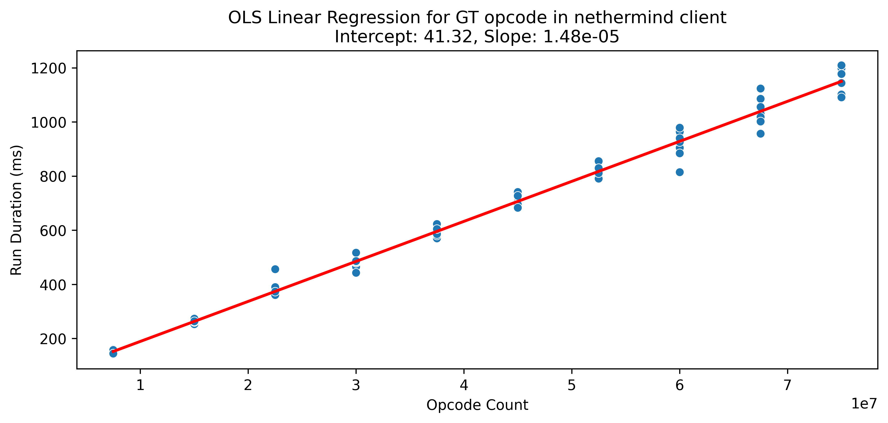


## reth


```python
                            OLS Regression Results                            
==============================================================================
Dep. Variable:        run_duration_ms   R-squared:                       0.995
Model:                            OLS   Adj. R-squared:                  0.994
Method:                 Least Squares   F-statistic:                 1.304e+04
Date:                Tue, 23 Dec 2025   Prob (F-statistic):           4.02e-83
Time:                        08:41:01   Log-Likelihood:                -283.90
No. Observations:                  74   AIC:                             571.8
Df Residuals:                      72   BIC:                             576.4
Df Model:                           1                                         
Covariance Type:            nonrobust                                         
==============================================================================
                 coef    std err          t      P>|t|      [0.025      0.975]
------------------------------------------------------------------------------
const         42.9214      2.867     14.969      0.000      37.206      48.637
opcount     7.078e-06    6.2e-08    114.181      0.000    6.95e-06     7.2e-06
==============================================================================
Omnibus:                        1.821   Durbin-Watson:                   2.043
Prob(Omnibus):                  0.402   Jarque-Bera (JB):                1.739
Skew:                           0.363   Prob(JB):                        0.419
Kurtosis:                       2.809   Cond. No.                     1.00e+08
==============================================================================

Notes:
[1] Standard Errors assume that the covariance matrix of the errors is correctly specified.
[2] The condition number is large,  1e+08. This might indicate that there are
strong multicollinearity or other numerical problems.
```


## besu


```python
                            OLS Regression Results                            
==============================================================================
Dep. Variable:        run_duration_ms   R-squared:                       0.777
Model:                            OLS   Adj. R-squared:                  0.774
Method:                 Least Squares   F-statistic:                     250.8
Date:                Tue, 23 Dec 2025   Prob (F-statistic):           3.70e-25
Time:                        08:41:01   Log-Likelihood:                -612.65
No. Observations:                  74   AIC:                             1229.
Df Residuals:                      72   BIC:                             1234.
Df Model:                           1                                         
Covariance Type:            nonrobust                                         
==============================================================================
                 coef    std err          t      P>|t|      [0.025      0.975]
------------------------------------------------------------------------------
const         -3.8435    243.721     -0.016      0.987    -489.693     482.006
opcount     8.344e-05   5.27e-06     15.836      0.000    7.29e-05    9.39e-05
==============================================================================
Omnibus:                       33.655   Durbin-Watson:                   0.588
Prob(Omnibus):                  0.000   Jarque-Bera (JB):               63.488
Skew:                           1.694   Prob(JB):                     1.64e-14
Kurtosis:                       6.018   Cond. No.                     1.00e+08
==============================================================================

Notes:
[1] Standard Errors assume that the covariance matrix of the errors is correctly specified.
[2] The condition number is large,  1e+08. This might indicate that there are
strong multicollinearity or other numerical problems.
```

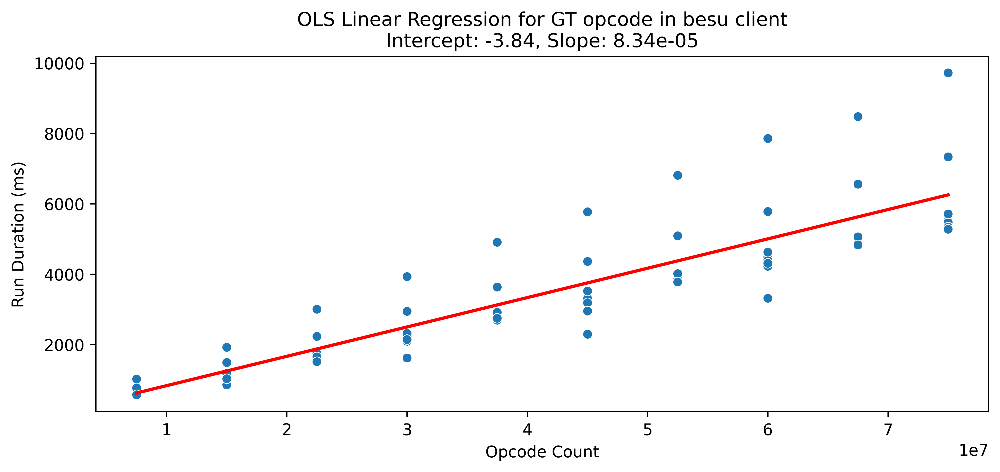


## geth


```python
                            OLS Regression Results                            
==============================================================================
Dep. Variable:        run_duration_ms   R-squared:                       0.980
Model:                            OLS   Adj. R-squared:                  0.979
Method:                 Least Squares   F-statistic:                     3487.
Date:                Tue, 23 Dec 2025   Prob (F-statistic):           9.83e-63
Time:                        08:41:02   Log-Likelihood:                -417.95
No. Observations:                  74   AIC:                             839.9
Df Residuals:                      72   BIC:                             844.5
Df Model:                           1                                         
Covariance Type:            nonrobust                                         
==============================================================================
                 coef    std err          t      P>|t|      [0.025      0.975]
------------------------------------------------------------------------------
const         20.9805     17.548      1.196      0.236     -14.000      55.961
opcount      2.24e-05   3.79e-07     59.050      0.000    2.16e-05    2.32e-05
==============================================================================
Omnibus:                      143.922   Durbin-Watson:                   1.948
Prob(Omnibus):                  0.000   Jarque-Bera (JB):             9426.169
Skew:                           6.946   Prob(JB):                         0.00
Kurtosis:                      56.518   Cond. No.                     1.00e+08
==============================================================================

Notes:
[1] Standard Errors assume that the covariance matrix of the errors is correctly specified.
[2] The condition number is large,  1e+08. This might indicate that there are
strong multicollinearity or other numerical problems.
```

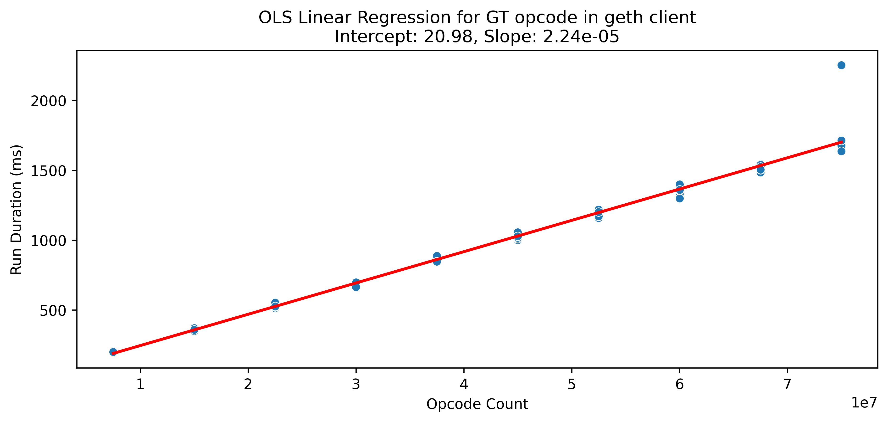


# INVALID

## nethermind

OLS model did not run... Error: zero-size array to reduction operation maximum which has no identity

## reth

OLS model did not run... Error: zero-size array to reduction operation maximum which has no identity

## besu

OLS model did not run... Error: zero-size array to reduction operation maximum which has no identity

## geth

OLS model did not run... Error: zero-size array to reduction operation maximum which has no identity

# ISZERO

## nethermind


```python
                            OLS Regression Results                            
==============================================================================
Dep. Variable:        run_duration_ms   R-squared:                       0.948
Model:                            OLS   Adj. R-squared:                  0.947
Method:                 Least Squares   F-statistic:                     1309.
Date:                Tue, 23 Dec 2025   Prob (F-statistic):           6.25e-48
Time:                        08:41:02   Log-Likelihood:                -368.07
No. Observations:                  74   AIC:                             740.1
Df Residuals:                      72   BIC:                             744.8
Df Model:                           1                                         
Covariance Type:            nonrobust                                         
==============================================================================
                 coef    std err          t      P>|t|      [0.025      0.975]
------------------------------------------------------------------------------
const         37.1546      8.943      4.155      0.000      19.327      54.982
opcount     6.996e-06   1.93e-07     36.185      0.000    6.61e-06    7.38e-06
==============================================================================
Omnibus:                       21.779   Durbin-Watson:                   0.997
Prob(Omnibus):                  0.000   Jarque-Bera (JB):               35.274
Skew:                           1.120   Prob(JB):                     2.19e-08
Kurtosis:                       5.534   Cond. No.                     1.00e+08
==============================================================================

Notes:
[1] Standard Errors assume that the covariance matrix of the errors is correctly specified.
[2] The condition number is large,  1e+08. This might indicate that there are
strong multicollinearity or other numerical problems.
```

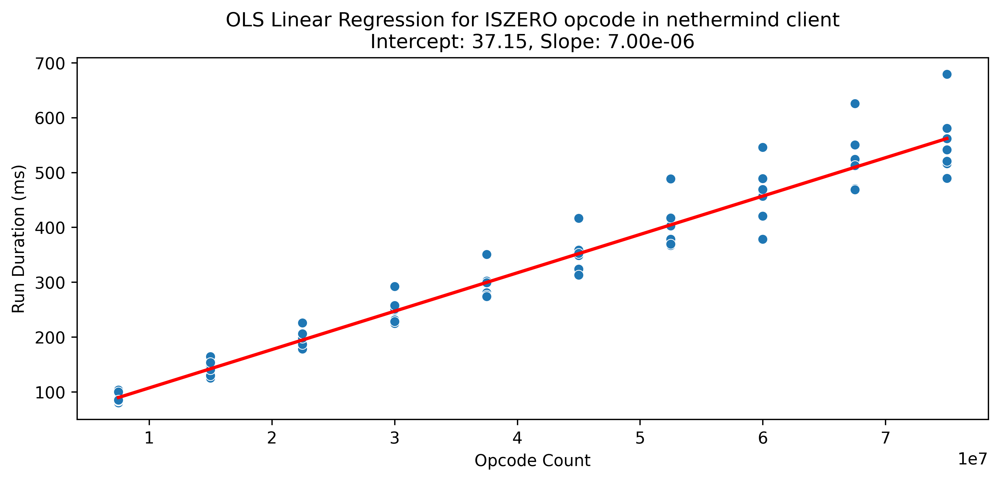


## reth


```python
                            OLS Regression Results                            
==============================================================================
Dep. Variable:        run_duration_ms   R-squared:                       0.991
Model:                            OLS   Adj. R-squared:                  0.991
Method:                 Least Squares   F-statistic:                     8008.
Date:                Tue, 23 Dec 2025   Prob (F-statistic):           1.48e-75
Time:                        08:41:02   Log-Likelihood:                -257.98
No. Observations:                  74   AIC:                             520.0
Df Residuals:                      72   BIC:                             524.6
Df Model:                           1                                         
Covariance Type:            nonrobust                                         
==============================================================================
                 coef    std err          t      P>|t|      [0.025      0.975]
------------------------------------------------------------------------------
const         37.1214      2.020     18.377      0.000      33.095      41.148
opcount     3.908e-06   4.37e-08     89.487      0.000    3.82e-06    3.99e-06
==============================================================================
Omnibus:                        8.817   Durbin-Watson:                   2.080
Prob(Omnibus):                  0.012   Jarque-Bera (JB):                8.797
Skew:                           0.836   Prob(JB):                       0.0123
Kurtosis:                       3.238   Cond. No.                     1.00e+08
==============================================================================

Notes:
[1] Standard Errors assume that the covariance matrix of the errors is correctly specified.
[2] The condition number is large,  1e+08. This might indicate that there are
strong multicollinearity or other numerical problems.
```

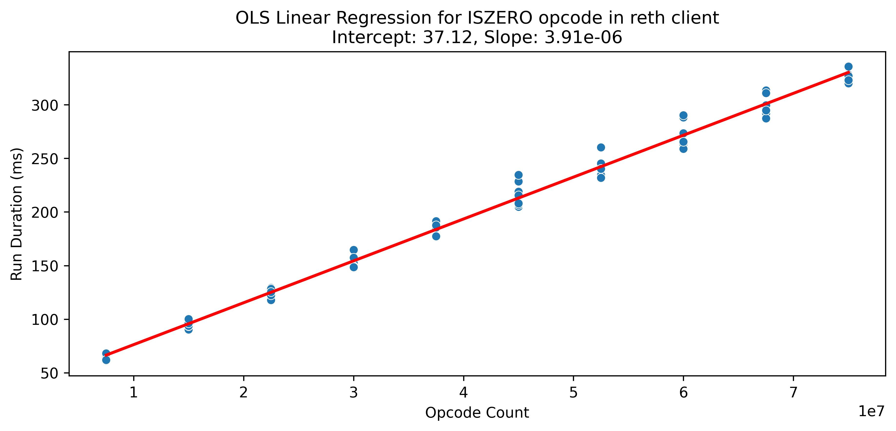


## besu


```python
                            OLS Regression Results                            
==============================================================================
Dep. Variable:        run_duration_ms   R-squared:                       0.832
Model:                            OLS   Adj. R-squared:                  0.830
Method:                 Least Squares   F-statistic:                     356.9
Date:                Tue, 23 Dec 2025   Prob (F-statistic):           1.29e-29
Time:                        08:41:02   Log-Likelihood:                -530.12
No. Observations:                  74   AIC:                             1064.
Df Residuals:                      72   BIC:                             1069.
Df Model:                           1                                         
Covariance Type:            nonrobust                                         
==============================================================================
                 coef    std err          t      P>|t|      [0.025      0.975]
------------------------------------------------------------------------------
const         18.3292     79.896      0.229      0.819    -140.940     177.599
opcount     3.263e-05   1.73e-06     18.891      0.000    2.92e-05    3.61e-05
==============================================================================
Omnibus:                        2.839   Durbin-Watson:                   0.937
Prob(Omnibus):                  0.242   Jarque-Bera (JB):                2.580
Skew:                          -0.370   Prob(JB):                        0.275
Kurtosis:                       2.461   Cond. No.                     1.00e+08
==============================================================================

Notes:
[1] Standard Errors assume that the covariance matrix of the errors is correctly specified.
[2] The condition number is large,  1e+08. This might indicate that there are
strong multicollinearity or other numerical problems.
```

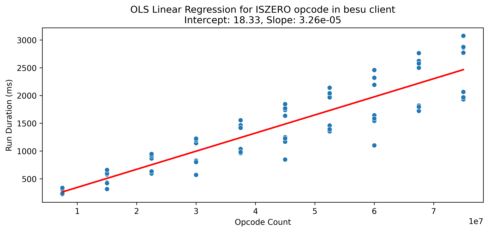


## geth


```python
                            OLS Regression Results                            
==============================================================================
Dep. Variable:        run_duration_ms   R-squared:                       0.990
Model:                            OLS   Adj. R-squared:                  0.990
Method:                 Least Squares   F-statistic:                     7448.
Date:                Tue, 23 Dec 2025   Prob (F-statistic):           1.97e-74
Time:                        08:41:02   Log-Likelihood:                -318.84
No. Observations:                  74   AIC:                             641.7
Df Residuals:                      72   BIC:                             646.3
Df Model:                           1                                         
Covariance Type:            nonrobust                                         
==============================================================================
                 coef    std err          t      P>|t|      [0.025      0.975]
------------------------------------------------------------------------------
const         36.2571      4.598      7.886      0.000      27.092      45.423
opcount     8.578e-06   9.94e-08     86.300      0.000    8.38e-06    8.78e-06
==============================================================================
Omnibus:                       21.817   Durbin-Watson:                   1.912
Prob(Omnibus):                  0.000   Jarque-Bera (JB):               32.657
Skew:                           1.179   Prob(JB):                     8.10e-08
Kurtosis:                       5.243   Cond. No.                     1.00e+08
==============================================================================

Notes:
[1] Standard Errors assume that the covariance matrix of the errors is correctly specified.
[2] The condition number is large,  1e+08. This might indicate that there are
strong multicollinearity or other numerical problems.
```


# JUMP

## nethermind

OLS model did not run... Error: zero-size array to reduction operation maximum which has no identity

## reth

OLS model did not run... Error: zero-size array to reduction operation maximum which has no identity

## besu

OLS model did not run... Error: zero-size array to reduction operation maximum which has no identity

## geth

OLS model did not run... Error: zero-size array to reduction operation maximum which has no identity

# JUMPDEST

## nethermind


```python
                            OLS Regression Results                            
==============================================================================
Dep. Variable:        run_duration_ms   R-squared:                       0.990
Model:                            OLS   Adj. R-squared:                  0.990
Method:                 Least Squares   F-statistic:                     7400.
Date:                Tue, 23 Dec 2025   Prob (F-statistic):           2.47e-74
Time:                        08:41:02   Log-Likelihood:                -407.42
No. Observations:                  74   AIC:                             818.8
Df Residuals:                      72   BIC:                             823.5
Df Model:                           1                                         
Covariance Type:            nonrobust                                         
==============================================================================
                 coef    std err          t      P>|t|      [0.025      0.975]
------------------------------------------------------------------------------
const         54.7627     15.220      3.598      0.001      24.421      85.104
opcount     4.246e-06   4.94e-08     86.025      0.000    4.15e-06    4.34e-06
==============================================================================
Omnibus:                       23.627   Durbin-Watson:                   1.700
Prob(Omnibus):                  0.000   Jarque-Bera (JB):               39.637
Skew:                          -1.200   Prob(JB):                     2.47e-09
Kurtosis:                       5.664   Cond. No.                     6.69e+08
==============================================================================

Notes:
[1] Standard Errors assume that the covariance matrix of the errors is correctly specified.
[2] The condition number is large, 6.69e+08. This might indicate that there are
strong multicollinearity or other numerical problems.
```

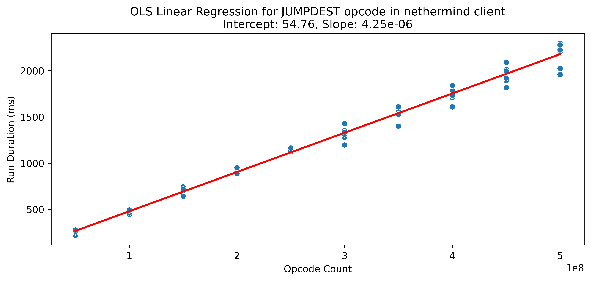


## reth


```python
                            OLS Regression Results                            
==============================================================================
Dep. Variable:        run_duration_ms   R-squared:                       0.993
Model:                            OLS   Adj. R-squared:                  0.993
Method:                 Least Squares   F-statistic:                 1.047e+04
Date:                Tue, 23 Dec 2025   Prob (F-statistic):           1.02e-79
Time:                        08:41:02   Log-Likelihood:                -381.16
No. Observations:                  74   AIC:                             766.3
Df Residuals:                      72   BIC:                             770.9
Df Model:                           1                                         
Covariance Type:            nonrobust                                         
==============================================================================
                 coef    std err          t      P>|t|      [0.025      0.975]
------------------------------------------------------------------------------
const         42.0495     10.673      3.940      0.000      20.772      63.326
opcount     3.542e-06   3.46e-08    102.334      0.000    3.47e-06    3.61e-06
==============================================================================
Omnibus:                        1.328   Durbin-Watson:                   1.876
Prob(Omnibus):                  0.515   Jarque-Bera (JB):                0.879
Skew:                          -0.257   Prob(JB):                        0.644
Kurtosis:                       3.145   Cond. No.                     6.69e+08
==============================================================================

Notes:
[1] Standard Errors assume that the covariance matrix of the errors is correctly specified.
[2] The condition number is large, 6.69e+08. This might indicate that there are
strong multicollinearity or other numerical problems.
```


## besu


```python
                            OLS Regression Results                            
==============================================================================
Dep. Variable:        run_duration_ms   R-squared:                       0.584
Model:                            OLS   Adj. R-squared:                  0.578
Method:                 Least Squares   F-statistic:                     101.1
Date:                Tue, 23 Dec 2025   Prob (F-statistic):           2.32e-15
Time:                        08:41:03   Log-Likelihood:                -679.41
No. Observations:                  74   AIC:                             1363.
Df Residuals:                      72   BIC:                             1367.
Df Model:                           1                                         
Covariance Type:            nonrobust                                         
==============================================================================
                 coef    std err          t      P>|t|      [0.025      0.975]
------------------------------------------------------------------------------
const        -78.7918    600.754     -0.131      0.896   -1276.373    1118.789
opcount     1.959e-05   1.95e-06     10.057      0.000    1.57e-05    2.35e-05
==============================================================================
Omnibus:                       17.179   Durbin-Watson:                   0.690
Prob(Omnibus):                  0.000   Jarque-Bera (JB):               20.178
Skew:                           1.206   Prob(JB):                     4.15e-05
Kurtosis:                       3.850   Cond. No.                     6.69e+08
==============================================================================

Notes:
[1] Standard Errors assume that the covariance matrix of the errors is correctly specified.
[2] The condition number is large, 6.69e+08. This might indicate that there are
strong multicollinearity or other numerical problems.
```

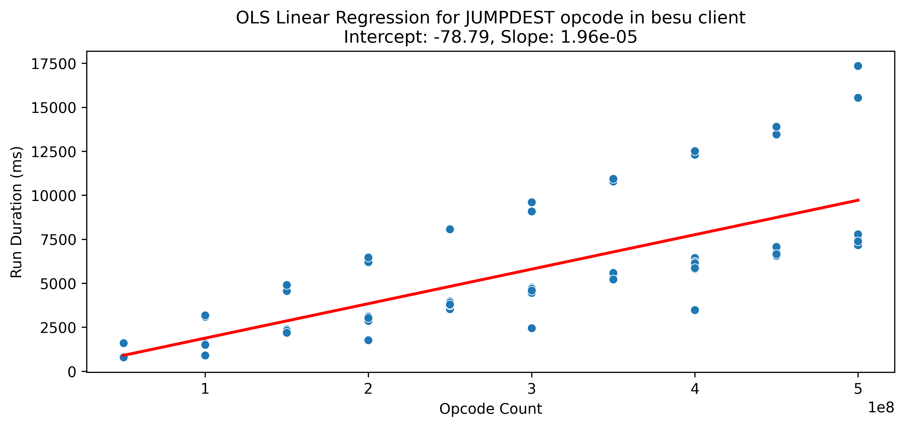


## geth


```python
                            OLS Regression Results                            
==============================================================================
Dep. Variable:        run_duration_ms   R-squared:                       0.999
Model:                            OLS   Adj. R-squared:                  0.999
Method:                 Least Squares   F-statistic:                 5.888e+04
Date:                Tue, 23 Dec 2025   Prob (F-statistic):          1.25e-106
Time:                        08:41:03   Log-Likelihood:                -371.82
No. Observations:                  74   AIC:                             747.6
Df Residuals:                      72   BIC:                             752.3
Df Model:                           1                                         
Covariance Type:            nonrobust                                         
==============================================================================
                 coef    std err          t      P>|t|      [0.025      0.975]
------------------------------------------------------------------------------
const         37.0517      9.408      3.938      0.000      18.297      55.806
opcount     7.403e-06   3.05e-08    242.651      0.000    7.34e-06    7.46e-06
==============================================================================
Omnibus:                        4.266   Durbin-Watson:                   1.854
Prob(Omnibus):                  0.119   Jarque-Bera (JB):                3.946
Skew:                           0.302   Prob(JB):                        0.139
Kurtosis:                       3.957   Cond. No.                     6.69e+08
==============================================================================

Notes:
[1] Standard Errors assume that the covariance matrix of the errors is correctly specified.
[2] The condition number is large, 6.69e+08. This might indicate that there are
strong multicollinearity or other numerical problems.
```

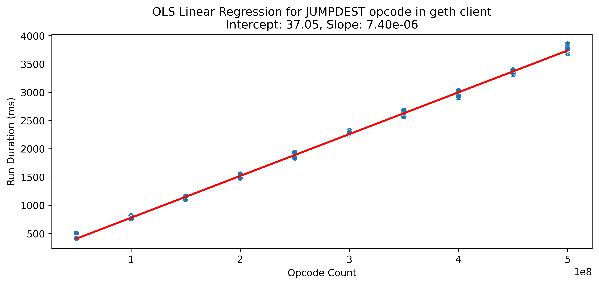


# JUMPI

## nethermind


```python
                            OLS Regression Results                            
==============================================================================
Dep. Variable:        run_duration_ms   R-squared:                       0.979
Model:                            OLS   Adj. R-squared:                  0.979
Method:                 Least Squares   F-statistic:                     3387.
Date:                Tue, 23 Dec 2025   Prob (F-statistic):           2.73e-62
Time:                        08:41:03   Log-Likelihood:                -328.16
No. Observations:                  74   AIC:                             660.3
Df Residuals:                      72   BIC:                             664.9
Df Model:                           1                                         
Covariance Type:            nonrobust                                         
==============================================================================
                 coef    std err          t      P>|t|      [0.025      0.975]
------------------------------------------------------------------------------
const         37.6490      5.215      7.219      0.000      27.253      48.045
opcount     1.312e-05   2.25e-07     58.201      0.000    1.27e-05    1.36e-05
==============================================================================
Omnibus:                        0.776   Durbin-Watson:                   1.002
Prob(Omnibus):                  0.678   Jarque-Bera (JB):                0.306
Skew:                           0.098   Prob(JB):                        0.858
Kurtosis:                       3.246   Cond. No.                     5.02e+07
==============================================================================

Notes:
[1] Standard Errors assume that the covariance matrix of the errors is correctly specified.
[2] The condition number is large, 5.02e+07. This might indicate that there are
strong multicollinearity or other numerical problems.
```

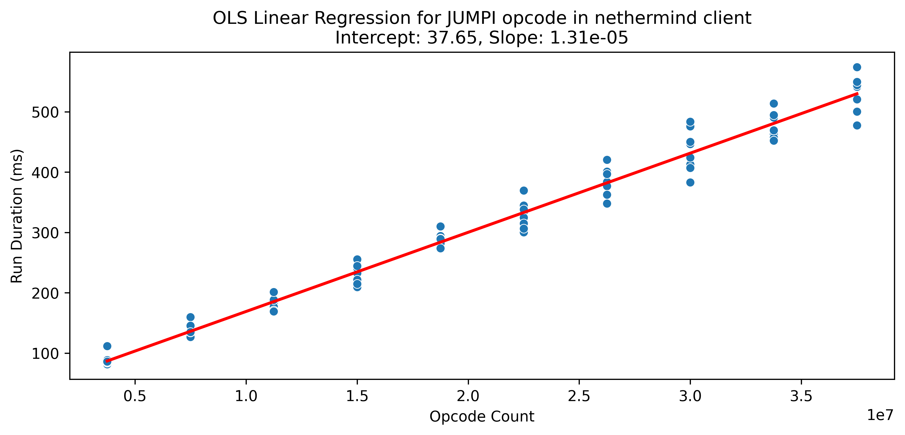


## reth


```python
                            OLS Regression Results                            
==============================================================================
Dep. Variable:        run_duration_ms   R-squared:                       0.989
Model:                            OLS   Adj. R-squared:                  0.989
Method:                 Least Squares   F-statistic:                     6633.
Date:                Tue, 23 Dec 2025   Prob (F-statistic):           1.22e-72
Time:                        08:41:03   Log-Likelihood:                -290.18
No. Observations:                  74   AIC:                             584.4
Df Residuals:                      72   BIC:                             589.0
Df Model:                           1                                         
Covariance Type:            nonrobust                                         
==============================================================================
                 coef    std err          t      P>|t|      [0.025      0.975]
------------------------------------------------------------------------------
const         38.5027      3.121     12.335      0.000      32.280      44.725
opcount     1.099e-05   1.35e-07     81.444      0.000    1.07e-05    1.13e-05
==============================================================================
Omnibus:                       33.074   Durbin-Watson:                   1.496
Prob(Omnibus):                  0.000   Jarque-Bera (JB):               85.273
Skew:                           1.436   Prob(JB):                     3.04e-19
Kurtosis:                       7.406   Cond. No.                     5.02e+07
==============================================================================

Notes:
[1] Standard Errors assume that the covariance matrix of the errors is correctly specified.
[2] The condition number is large, 5.02e+07. This might indicate that there are
strong multicollinearity or other numerical problems.
```


## besu


```python
                            OLS Regression Results                            
==============================================================================
Dep. Variable:        run_duration_ms   R-squared:                       0.883
Model:                            OLS   Adj. R-squared:                  0.881
Method:                 Least Squares   F-statistic:                     542.6
Date:                Tue, 23 Dec 2025   Prob (F-statistic):           2.97e-35
Time:                        08:41:03   Log-Likelihood:                -531.07
No. Observations:                  74   AIC:                             1066.
Df Residuals:                      72   BIC:                             1071.
Df Model:                           1                                         
Covariance Type:            nonrobust                                         
==============================================================================
                 coef    std err          t      P>|t|      [0.025      0.975]
------------------------------------------------------------------------------
const         32.6141     80.931      0.403      0.688    -128.718     193.946
opcount     8.151e-05    3.5e-06     23.294      0.000    7.45e-05    8.85e-05
==============================================================================
Omnibus:                       17.841   Durbin-Watson:                   0.625
Prob(Omnibus):                  0.000   Jarque-Bera (JB):               21.421
Skew:                           1.263   Prob(JB):                     2.23e-05
Kurtosis:                       3.753   Cond. No.                     5.02e+07
==============================================================================

Notes:
[1] Standard Errors assume that the covariance matrix of the errors is correctly specified.
[2] The condition number is large, 5.02e+07. This might indicate that there are
strong multicollinearity or other numerical problems.
```

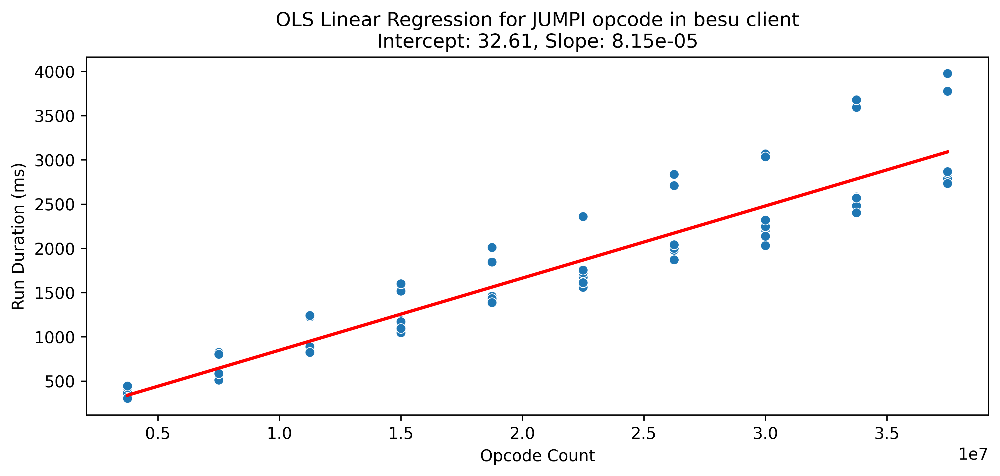


## geth


```python
                            OLS Regression Results                            
==============================================================================
Dep. Variable:        run_duration_ms   R-squared:                       0.984
Model:                            OLS   Adj. R-squared:                  0.984
Method:                 Least Squares   F-statistic:                     4491.
Date:                Tue, 23 Dec 2025   Prob (F-statistic):           1.28e-66
Time:                        08:41:03   Log-Likelihood:                -372.52
No. Observations:                  74   AIC:                             749.0
Df Residuals:                      72   BIC:                             753.6
Df Model:                           1                                         
Covariance Type:            nonrobust                                         
==============================================================================
                 coef    std err          t      P>|t|      [0.025      0.975]
------------------------------------------------------------------------------
const         42.0792      9.496      4.431      0.000      23.149      61.010
opcount     2.751e-05   4.11e-07     67.012      0.000    2.67e-05    2.83e-05
==============================================================================
Omnibus:                       94.638   Durbin-Watson:                   1.749
Prob(Omnibus):                  0.000   Jarque-Bera (JB):             1362.592
Skew:                           3.971   Prob(JB):                    1.31e-296
Kurtosis:                      22.464   Cond. No.                     5.02e+07
==============================================================================

Notes:
[1] Standard Errors assume that the covariance matrix of the errors is correctly specified.
[2] The condition number is large, 5.02e+07. This might indicate that there are
strong multicollinearity or other numerical problems.
```

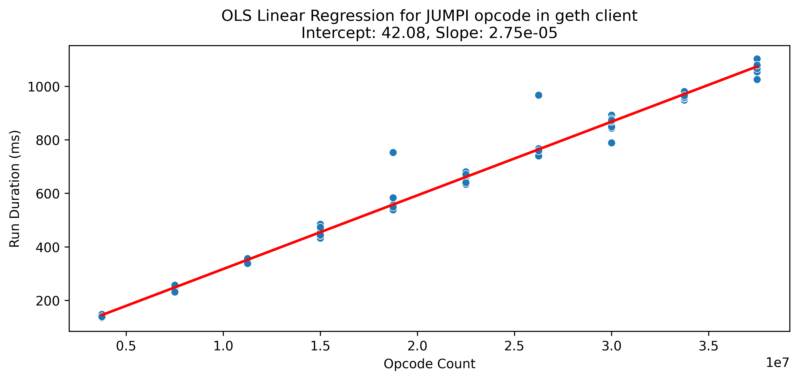


# LT

## nethermind


```python
                            OLS Regression Results                            
==============================================================================
Dep. Variable:        run_duration_ms   R-squared:                       0.986
Model:                            OLS   Adj. R-squared:                  0.986
Method:                 Least Squares   F-statistic:                     5162.
Date:                Tue, 23 Dec 2025   Prob (F-statistic):           9.12e-69
Time:                        08:41:03   Log-Likelihood:                -377.46
No. Observations:                  74   AIC:                             758.9
Df Residuals:                      72   BIC:                             763.5
Df Model:                           1                                         
Covariance Type:            nonrobust                                         
==============================================================================
                 coef    std err          t      P>|t|      [0.025      0.975]
------------------------------------------------------------------------------
const         42.1886     10.152      4.155      0.000      21.950      62.427
opcount     1.577e-05   2.19e-07     71.848      0.000    1.53e-05    1.62e-05
==============================================================================
Omnibus:                        5.867   Durbin-Watson:                   1.272
Prob(Omnibus):                  0.053   Jarque-Bera (JB):                8.023
Skew:                           0.210   Prob(JB):                       0.0181
Kurtosis:                       4.557   Cond. No.                     1.00e+08
==============================================================================

Notes:
[1] Standard Errors assume that the covariance matrix of the errors is correctly specified.
[2] The condition number is large,  1e+08. This might indicate that there are
strong multicollinearity or other numerical problems.
```

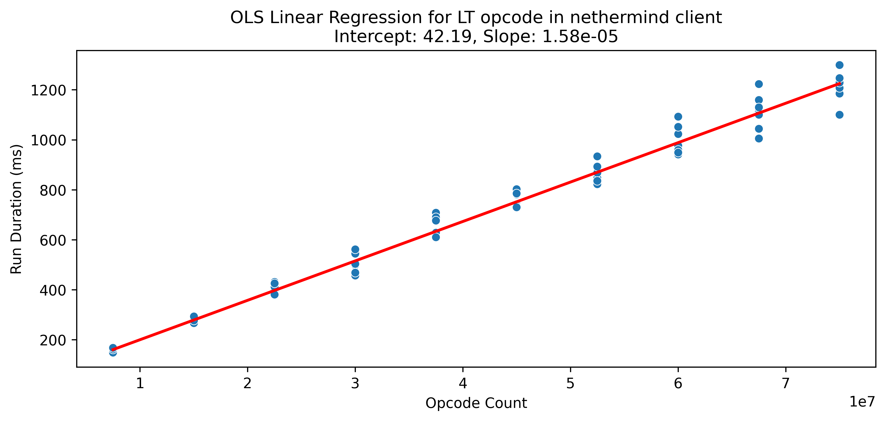


## reth


```python
                            OLS Regression Results                            
==============================================================================
Dep. Variable:        run_duration_ms   R-squared:                       0.996
Model:                            OLS   Adj. R-squared:                  0.996
Method:                 Least Squares   F-statistic:                 1.685e+04
Date:                Tue, 23 Dec 2025   Prob (F-statistic):           4.13e-87
Time:                        08:41:04   Log-Likelihood:                -275.04
No. Observations:                  74   AIC:                             554.1
Df Residuals:                      72   BIC:                             558.7
Df Model:                           1                                         
Covariance Type:            nonrobust                                         
==============================================================================
                 coef    std err          t      P>|t|      [0.025      0.975]
------------------------------------------------------------------------------
const         40.2542      2.544     15.824      0.000      35.183      45.325
opcount     7.138e-06    5.5e-08    129.791      0.000    7.03e-06    7.25e-06
==============================================================================
Omnibus:                       27.582   Durbin-Watson:                   1.945
Prob(Omnibus):                  0.000   Jarque-Bera (JB):               88.533
Skew:                           1.052   Prob(JB):                     5.96e-20
Kurtosis:                       7.928   Cond. No.                     1.00e+08
==============================================================================

Notes:
[1] Standard Errors assume that the covariance matrix of the errors is correctly specified.
[2] The condition number is large,  1e+08. This might indicate that there are
strong multicollinearity or other numerical problems.
```

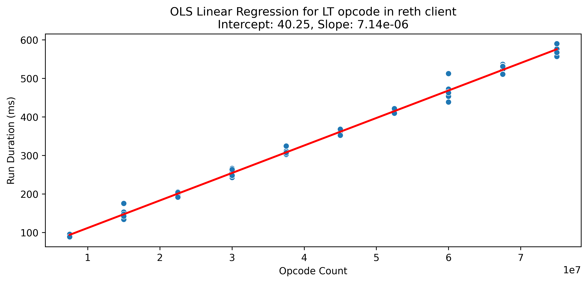


## besu


```python
                            OLS Regression Results                            
==============================================================================
Dep. Variable:        run_duration_ms   R-squared:                       0.918
Model:                            OLS   Adj. R-squared:                  0.916
Method:                 Least Squares   F-statistic:                     802.1
Date:                Tue, 23 Dec 2025   Prob (F-statistic):           9.06e-41
Time:                        08:41:04   Log-Likelihood:                -567.91
No. Observations:                  74   AIC:                             1140.
Df Residuals:                      72   BIC:                             1144.
Df Model:                           1                                         
Covariance Type:            nonrobust                                         
==============================================================================
                 coef    std err          t      P>|t|      [0.025      0.975]
------------------------------------------------------------------------------
const         34.4077    133.132      0.258      0.797    -230.985     299.801
opcount     8.151e-05   2.88e-06     28.322      0.000    7.58e-05    8.72e-05
==============================================================================
Omnibus:                        8.051   Durbin-Watson:                   0.756
Prob(Omnibus):                  0.018   Jarque-Bera (JB):                7.723
Skew:                           0.775   Prob(JB):                       0.0210
Kurtosis:                       3.315   Cond. No.                     1.00e+08
==============================================================================

Notes:
[1] Standard Errors assume that the covariance matrix of the errors is correctly specified.
[2] The condition number is large,  1e+08. This might indicate that there are
strong multicollinearity or other numerical problems.
```

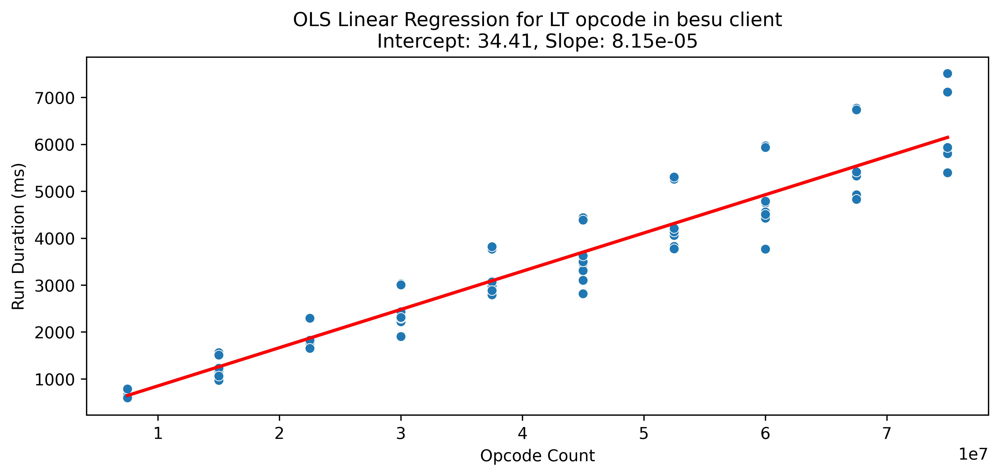


## geth


```python
                            OLS Regression Results                            
==============================================================================
Dep. Variable:        run_duration_ms   R-squared:                       0.997
Model:                            OLS   Adj. R-squared:                  0.997
Method:                 Least Squares   F-statistic:                 2.777e+04
Date:                Tue, 23 Dec 2025   Prob (F-statistic):           6.68e-95
Time:                        08:41:04   Log-Likelihood:                -339.17
No. Observations:                  74   AIC:                             682.3
Df Residuals:                      72   BIC:                             687.0
Df Model:                           1                                         
Covariance Type:            nonrobust                                         
==============================================================================
                 coef    std err          t      P>|t|      [0.025      0.975]
------------------------------------------------------------------------------
const         45.6874      6.052      7.550      0.000      33.624      57.751
opcount      2.18e-05   1.31e-07    166.655      0.000    2.15e-05    2.21e-05
==============================================================================
Omnibus:                        3.392   Durbin-Watson:                   2.123
Prob(Omnibus):                  0.183   Jarque-Bera (JB):                2.574
Skew:                           0.390   Prob(JB):                        0.276
Kurtosis:                       3.476   Cond. No.                     1.00e+08
==============================================================================

Notes:
[1] Standard Errors assume that the covariance matrix of the errors is correctly specified.
[2] The condition number is large,  1e+08. This might indicate that there are
strong multicollinearity or other numerical problems.
```


# MOD

## nethermind


```python
                            OLS Regression Results                            
==============================================================================
Dep. Variable:        run_duration_ms   R-squared:                       0.001
Model:                            OLS   Adj. R-squared:                 -0.006
Method:                 Least Squares   F-statistic:                    0.1325
Date:                Tue, 23 Dec 2025   Prob (F-statistic):              0.716
Time:                        08:41:04   Log-Likelihood:                -1542.1
No. Observations:                 148   AIC:                             3088.
Df Residuals:                     146   BIC:                             3094.
Df Model:                           1                                         
Covariance Type:            nonrobust                                         
==============================================================================
                 coef    std err          t      P>|t|      [0.025      0.975]
------------------------------------------------------------------------------
const       8662.6990   1455.327      5.952      0.000    5786.470    1.15e+04
opcount     1.374e-05   3.78e-05      0.364      0.716   -6.09e-05    8.84e-05
==============================================================================
Omnibus:                      927.385   Durbin-Watson:                   1.644
Prob(Omnibus):                  0.000   Jarque-Bera (JB):               24.473
Skew:                           0.003   Prob(JB):                     4.85e-06
Kurtosis:                       1.008   Cond. No.                     8.36e+07
==============================================================================

Notes:
[1] Standard Errors assume that the covariance matrix of the errors is correctly specified.
[2] The condition number is large, 8.36e+07. This might indicate that there are
strong multicollinearity or other numerical problems.
```

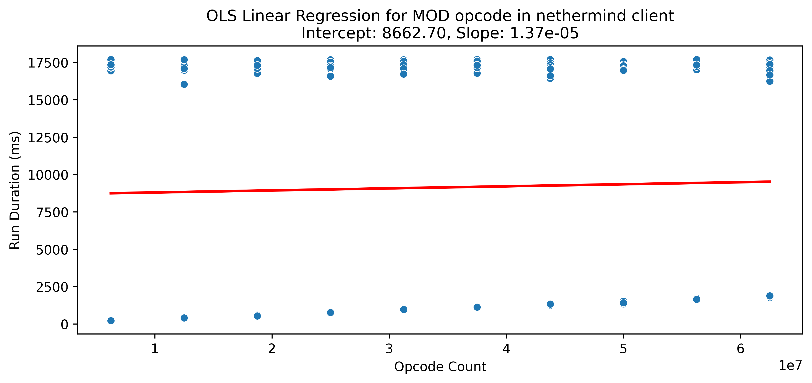


## reth


```python
                            OLS Regression Results                            
==============================================================================
Dep. Variable:        run_duration_ms   R-squared:                       0.002
Model:                            OLS   Adj. R-squared:                 -0.005
Method:                 Least Squares   F-statistic:                    0.2520
Date:                Tue, 23 Dec 2025   Prob (F-statistic):              0.616
Time:                        08:41:04   Log-Likelihood:                -1402.5
No. Observations:                 148   AIC:                             2809.
Df Residuals:                     146   BIC:                             2815.
Df Model:                           1                                         
Covariance Type:            nonrobust                                         
==============================================================================
                 coef    std err          t      P>|t|      [0.025      0.975]
------------------------------------------------------------------------------
const       3417.5693    566.639      6.031      0.000    2297.695    4537.443
opcount     7.379e-06   1.47e-05      0.502      0.616   -2.17e-05    3.64e-05
==============================================================================
Omnibus:                      932.032   Durbin-Watson:                   1.632
Prob(Omnibus):                  0.000   Jarque-Bera (JB):               24.333
Skew:                           0.006   Prob(JB):                     5.20e-06
Kurtosis:                       1.014   Cond. No.                     8.36e+07
==============================================================================

Notes:
[1] Standard Errors assume that the covariance matrix of the errors is correctly specified.
[2] The condition number is large, 8.36e+07. This might indicate that there are
strong multicollinearity or other numerical problems.
```

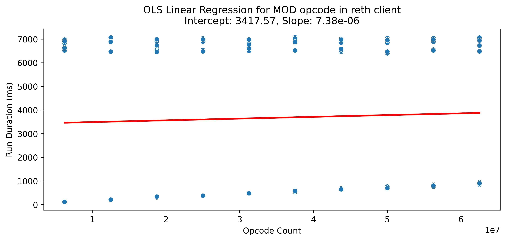


## besu


```python
                            OLS Regression Results                            
==============================================================================
Dep. Variable:        run_duration_ms   R-squared:                       0.993
Model:                            OLS   Adj. R-squared:                  0.993
Method:                 Least Squares   F-statistic:                 1.033e+04
Date:                Tue, 23 Dec 2025   Prob (F-statistic):           1.67e-79
Time:                        08:41:04   Log-Likelihood:                -524.88
No. Observations:                  74   AIC:                             1054.
Df Residuals:                      72   BIC:                             1058.
Df Model:                           1                                         
Covariance Type:            nonrobust                                         
==============================================================================
                 coef    std err          t      P>|t|      [0.025      0.975]
------------------------------------------------------------------------------
const        -25.8886     74.432     -0.348      0.729    -174.266     122.489
opcount        0.0002   1.93e-06    101.633      0.000       0.000       0.000
==============================================================================
Omnibus:                        9.485   Durbin-Watson:                   1.390
Prob(Omnibus):                  0.009   Jarque-Bera (JB):               11.212
Skew:                           0.588   Prob(JB):                      0.00368
Kurtosis:                       4.501   Cond. No.                     8.36e+07
==============================================================================

Notes:
[1] Standard Errors assume that the covariance matrix of the errors is correctly specified.
[2] The condition number is large, 8.36e+07. This might indicate that there are
strong multicollinearity or other numerical problems.
```

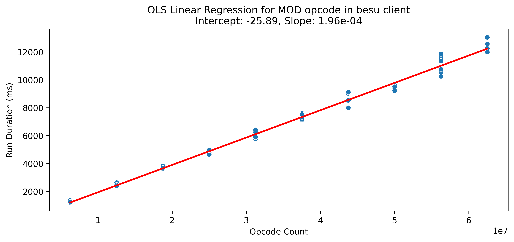


## geth


```python
                            OLS Regression Results                            
==============================================================================
Dep. Variable:        run_duration_ms   R-squared:                       0.002
Model:                            OLS   Adj. R-squared:                 -0.005
Method:                 Least Squares   F-statistic:                    0.3283
Date:                Tue, 23 Dec 2025   Prob (F-statistic):              0.568
Time:                        08:41:04   Log-Likelihood:                -1475.6
No. Observations:                 148   AIC:                             2955.
Df Residuals:                     146   BIC:                             2961.
Df Model:                           1                                         
Covariance Type:            nonrobust                                         
==============================================================================
                 coef    std err          t      P>|t|      [0.025      0.975]
------------------------------------------------------------------------------
const       5700.0094    928.778      6.137      0.000    3864.424    7535.595
opcount      1.38e-05   2.41e-05      0.573      0.568   -3.38e-05    6.14e-05
==============================================================================
Omnibus:                      943.702   Durbin-Watson:                   1.624
Prob(Omnibus):                  0.000   Jarque-Bera (JB):               23.994
Skew:                           0.009   Prob(JB):                     6.16e-06
Kurtosis:                       1.028   Cond. No.                     8.36e+07
==============================================================================

Notes:
[1] Standard Errors assume that the covariance matrix of the errors is correctly specified.
[2] The condition number is large, 8.36e+07. This might indicate that there are
strong multicollinearity or other numerical problems.
```

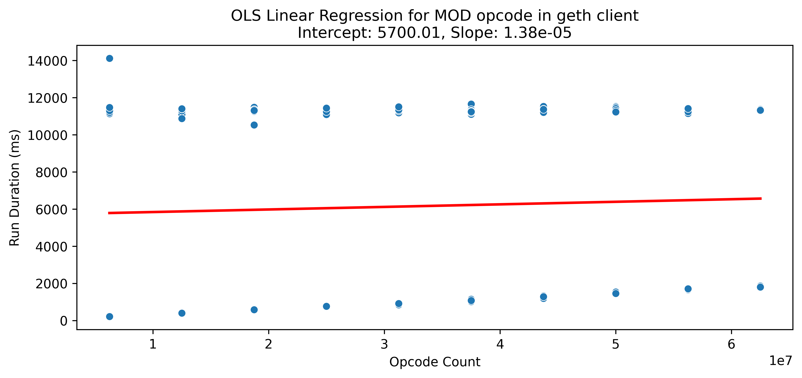


# MSIZE

## nethermind


```python
                            OLS Regression Results                            
==============================================================================
Dep. Variable:        run_duration_ms   R-squared:                       0.980
Model:                            OLS   Adj. R-squared:                  0.980
Method:                 Least Squares   F-statistic:                     3566.
Date:                Tue, 23 Dec 2025   Prob (F-statistic):           4.47e-63
Time:                        08:41:04   Log-Likelihood:                -396.12
No. Observations:                  74   AIC:                             796.2
Df Residuals:                      72   BIC:                             800.8
Df Model:                           1                                         
Covariance Type:            nonrobust                                         
==============================================================================
                 coef    std err          t      P>|t|      [0.025      0.975]
------------------------------------------------------------------------------
const         36.9342     13.064      2.827      0.006      10.892      62.976
opcount     5.059e-06   8.47e-08     59.714      0.000    4.89e-06    5.23e-06
==============================================================================
Omnibus:                        7.966   Durbin-Watson:                   0.858
Prob(Omnibus):                  0.019   Jarque-Bera (JB):                9.520
Skew:                           0.476   Prob(JB):                      0.00856
Kurtosis:                       4.477   Cond. No.                     3.34e+08
==============================================================================

Notes:
[1] Standard Errors assume that the covariance matrix of the errors is correctly specified.
[2] The condition number is large, 3.34e+08. This might indicate that there are
strong multicollinearity or other numerical problems.
```

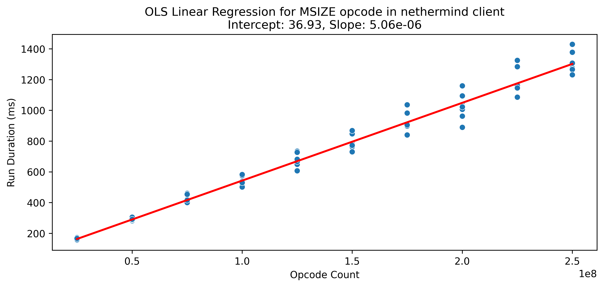


## reth


```python
                            OLS Regression Results                            
==============================================================================
Dep. Variable:        run_duration_ms   R-squared:                       0.986
Model:                            OLS   Adj. R-squared:                  0.986
Method:                 Least Squares   F-statistic:                     5015.
Date:                Tue, 23 Dec 2025   Prob (F-statistic):           2.54e-68
Time:                        08:41:05   Log-Likelihood:                -374.63
No. Observations:                  74   AIC:                             753.3
Df Residuals:                      72   BIC:                             757.9
Df Model:                           1                                         
Covariance Type:            nonrobust                                         
==============================================================================
                 coef    std err          t      P>|t|      [0.025      0.975]
------------------------------------------------------------------------------
const         48.2491      9.771      4.938      0.000      28.771      67.727
opcount     4.488e-06   6.34e-08     70.820      0.000    4.36e-06    4.61e-06
==============================================================================
Omnibus:                        2.361   Durbin-Watson:                   1.211
Prob(Omnibus):                  0.307   Jarque-Bera (JB):                1.825
Skew:                           0.104   Prob(JB):                        0.401
Kurtosis:                       3.741   Cond. No.                     3.34e+08
==============================================================================

Notes:
[1] Standard Errors assume that the covariance matrix of the errors is correctly specified.
[2] The condition number is large, 3.34e+08. This might indicate that there are
strong multicollinearity or other numerical problems.
```

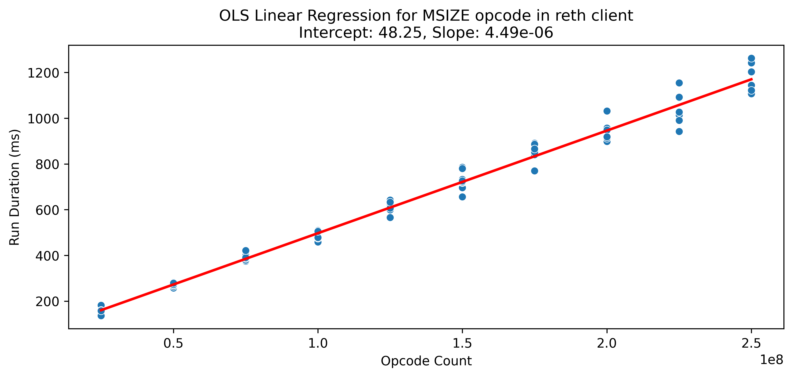


## besu


```python
                            OLS Regression Results                            
==============================================================================
Dep. Variable:        run_duration_ms   R-squared:                       0.835
Model:                            OLS   Adj. R-squared:                  0.832
Method:                 Least Squares   F-statistic:                     363.6
Date:                Tue, 23 Dec 2025   Prob (F-statistic):           7.33e-30
Time:                        08:41:05   Log-Likelihood:                -628.38
No. Observations:                  74   AIC:                             1261.
Df Residuals:                      72   BIC:                             1265.
Df Model:                           1                                         
Covariance Type:            nonrobust                                         
==============================================================================
                 coef    std err          t      P>|t|      [0.025      0.975]
------------------------------------------------------------------------------
const        -16.9291    301.422     -0.056      0.955    -617.802     583.944
opcount     3.728e-05   1.95e-06     19.069      0.000    3.34e-05    4.12e-05
==============================================================================
Omnibus:                       15.292   Durbin-Watson:                   0.405
Prob(Omnibus):                  0.000   Jarque-Bera (JB):               17.425
Skew:                           1.151   Prob(JB):                     0.000165
Kurtosis:                       3.597   Cond. No.                     3.34e+08
==============================================================================

Notes:
[1] Standard Errors assume that the covariance matrix of the errors is correctly specified.
[2] The condition number is large, 3.34e+08. This might indicate that there are
strong multicollinearity or other numerical problems.
```

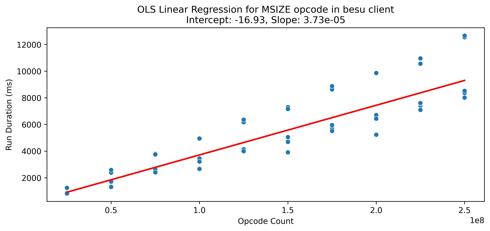


## geth


```python
                            OLS Regression Results                            
==============================================================================
Dep. Variable:        run_duration_ms   R-squared:                       0.996
Model:                            OLS   Adj. R-squared:                  0.996
Method:                 Least Squares   F-statistic:                 2.003e+04
Date:                Tue, 23 Dec 2025   Prob (F-statistic):           8.36e-90
Time:                        08:41:05   Log-Likelihood:                -395.45
No. Observations:                  74   AIC:                             794.9
Df Residuals:                      72   BIC:                             799.5
Df Model:                           1                                         
Covariance Type:            nonrobust                                         
==============================================================================
                 coef    std err          t      P>|t|      [0.025      0.975]
------------------------------------------------------------------------------
const         49.8716     12.947      3.852      0.000      24.062      75.681
opcount     1.188e-05    8.4e-08    141.517      0.000    1.17e-05    1.21e-05
==============================================================================
Omnibus:                       18.451   Durbin-Watson:                   1.390
Prob(Omnibus):                  0.000   Jarque-Bera (JB):               57.313
Skew:                           0.614   Prob(JB):                     3.59e-13
Kurtosis:                       7.133   Cond. No.                     3.34e+08
==============================================================================

Notes:
[1] Standard Errors assume that the covariance matrix of the errors is correctly specified.
[2] The condition number is large, 3.34e+08. This might indicate that there are
strong multicollinearity or other numerical problems.
```

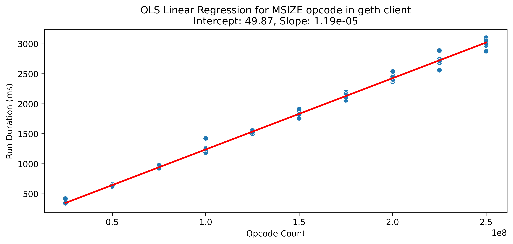


# MUL

## nethermind


```python
                            OLS Regression Results                            
==============================================================================
Dep. Variable:        run_duration_ms   R-squared:                       0.998
Model:                            OLS   Adj. R-squared:                  0.998
Method:                 Least Squares   F-statistic:                 4.637e+04
Date:                Tue, 23 Dec 2025   Prob (F-statistic):          6.69e-103
Time:                        08:41:05   Log-Likelihood:                -351.62
No. Observations:                  74   AIC:                             707.2
Df Residuals:                      72   BIC:                             711.8
Df Model:                           1                                         
Covariance Type:            nonrobust                                         
==============================================================================
                 coef    std err          t      P>|t|      [0.025      0.975]
------------------------------------------------------------------------------
const         38.4562      7.160      5.371      0.000      24.183      52.730
opcount         4e-05   1.86e-07    215.348      0.000    3.96e-05    4.04e-05
==============================================================================
Omnibus:                       11.771   Durbin-Watson:                   1.067
Prob(Omnibus):                  0.003   Jarque-Bera (JB):               14.159
Skew:                          -0.727   Prob(JB):                     0.000842
Kurtosis:                       4.575   Cond. No.                     8.36e+07
==============================================================================

Notes:
[1] Standard Errors assume that the covariance matrix of the errors is correctly specified.
[2] The condition number is large, 8.36e+07. This might indicate that there are
strong multicollinearity or other numerical problems.
```


## reth


```python
                            OLS Regression Results                            
==============================================================================
Dep. Variable:        run_duration_ms   R-squared:                       0.976
Model:                            OLS   Adj. R-squared:                  0.976
Method:                 Least Squares   F-statistic:                     2947.
Date:                Tue, 23 Dec 2025   Prob (F-statistic):           3.69e-60
Time:                        08:41:05   Log-Likelihood:                -399.05
No. Observations:                  74   AIC:                             802.1
Df Residuals:                      72   BIC:                             806.7
Df Model:                           1                                         
Covariance Type:            nonrobust                                         
==============================================================================
                 coef    std err          t      P>|t|      [0.025      0.975]
------------------------------------------------------------------------------
const         44.8806     13.592      3.302      0.001      17.785      71.976
opcount     1.914e-05   3.53e-07     54.285      0.000    1.84e-05    1.98e-05
==============================================================================
Omnibus:                        3.613   Durbin-Watson:                   1.342
Prob(Omnibus):                  0.164   Jarque-Bera (JB):                3.067
Skew:                           0.281   Prob(JB):                        0.216
Kurtosis:                       3.825   Cond. No.                     8.36e+07
==============================================================================

Notes:
[1] Standard Errors assume that the covariance matrix of the errors is correctly specified.
[2] The condition number is large, 8.36e+07. This might indicate that there are
strong multicollinearity or other numerical problems.
```

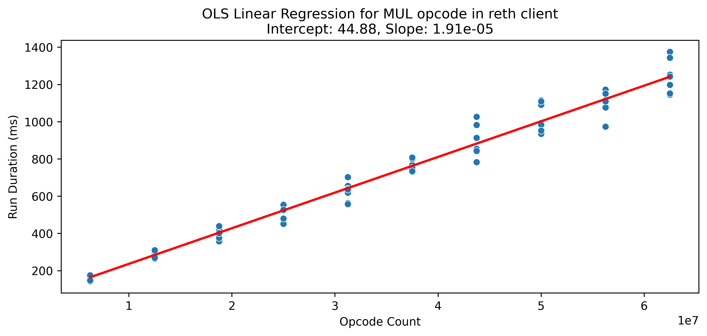


## besu


```python
                            OLS Regression Results                            
==============================================================================
Dep. Variable:        run_duration_ms   R-squared:                       0.903
Model:                            OLS   Adj. R-squared:                  0.902
Method:                 Least Squares   F-statistic:                     672.5
Date:                Tue, 23 Dec 2025   Prob (F-statistic):           2.96e-38
Time:                        08:41:05   Log-Likelihood:                -665.92
No. Observations:                  74   AIC:                             1336.
Df Residuals:                      72   BIC:                             1340.
Df Model:                           1                                         
Covariance Type:            nonrobust                                         
==============================================================================
                 coef    std err          t      P>|t|      [0.025      0.975]
------------------------------------------------------------------------------
const      -1144.7202    500.613     -2.287      0.025   -2142.675    -146.766
opcount        0.0003    1.3e-05     25.932      0.000       0.000       0.000
==============================================================================
Omnibus:                       37.752   Durbin-Watson:                   1.285
Prob(Omnibus):                  0.000   Jarque-Bera (JB):               92.996
Skew:                           1.714   Prob(JB):                     6.40e-21
Kurtosis:                       7.291   Cond. No.                     8.36e+07
==============================================================================

Notes:
[1] Standard Errors assume that the covariance matrix of the errors is correctly specified.
[2] The condition number is large, 8.36e+07. This might indicate that there are
strong multicollinearity or other numerical problems.
```

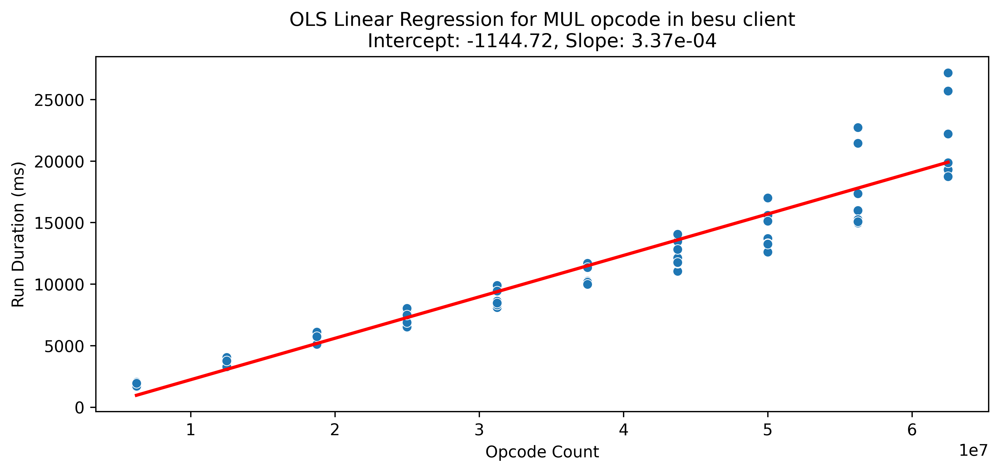


## geth


```python
                            OLS Regression Results                            
==============================================================================
Dep. Variable:        run_duration_ms   R-squared:                       0.931
Model:                            OLS   Adj. R-squared:                  0.930
Method:                 Least Squares   F-statistic:                     967.9
Date:                Tue, 23 Dec 2025   Prob (F-statistic):           1.74e-43
Time:                        08:41:05   Log-Likelihood:                -465.67
No. Observations:                  74   AIC:                             935.3
Df Residuals:                      72   BIC:                             940.0
Df Model:                           1                                         
Covariance Type:            nonrobust                                         
==============================================================================
                 coef    std err          t      P>|t|      [0.025      0.975]
------------------------------------------------------------------------------
const         37.2175     33.441      1.113      0.269     -29.446     103.881
opcount     2.699e-05   8.68e-07     31.110      0.000    2.53e-05    2.87e-05
==============================================================================
Omnibus:                      124.179   Durbin-Watson:                   2.111
Prob(Omnibus):                  0.000   Jarque-Bera (JB):             4075.538
Skew:                           5.670   Prob(JB):                         0.00
Kurtosis:                      37.543   Cond. No.                     8.36e+07
==============================================================================

Notes:
[1] Standard Errors assume that the covariance matrix of the errors is correctly specified.
[2] The condition number is large, 8.36e+07. This might indicate that there are
strong multicollinearity or other numerical problems.
```

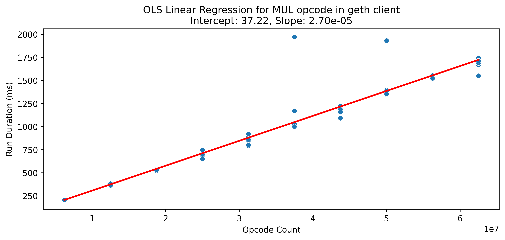


# MULMOD

## nethermind

OLS model did not run... Error: zero-size array to reduction operation maximum which has no identity

## reth

OLS model did not run... Error: zero-size array to reduction operation maximum which has no identity

## besu

OLS model did not run... Error: zero-size array to reduction operation maximum which has no identity

## geth

OLS model did not run... Error: zero-size array to reduction operation maximum which has no identity

# NOT

## nethermind


```python
                            OLS Regression Results                            
==============================================================================
Dep. Variable:        run_duration_ms   R-squared:                       0.985
Model:                            OLS   Adj. R-squared:                  0.985
Method:                 Least Squares   F-statistic:                     4839.
Date:                Tue, 23 Dec 2025   Prob (F-statistic):           9.07e-68
Time:                        08:41:06   Log-Likelihood:                -290.58
No. Observations:                  74   AIC:                             585.2
Df Residuals:                      72   BIC:                             589.8
Df Model:                           1                                         
Covariance Type:            nonrobust                                         
==============================================================================
                 coef    std err          t      P>|t|      [0.025      0.975]
------------------------------------------------------------------------------
const         37.0049      3.138     11.791      0.000      30.749      43.261
opcount     4.719e-06   6.78e-08     69.561      0.000    4.58e-06    4.85e-06
==============================================================================
Omnibus:                        9.723   Durbin-Watson:                   0.975
Prob(Omnibus):                  0.008   Jarque-Bera (JB):               13.517
Skew:                          -0.515   Prob(JB):                      0.00116
Kurtosis:                       4.823   Cond. No.                     1.00e+08
==============================================================================

Notes:
[1] Standard Errors assume that the covariance matrix of the errors is correctly specified.
[2] The condition number is large,  1e+08. This might indicate that there are
strong multicollinearity or other numerical problems.
```


## reth


```python
                            OLS Regression Results                            
==============================================================================
Dep. Variable:        run_duration_ms   R-squared:                       0.993
Model:                            OLS   Adj. R-squared:                  0.993
Method:                 Least Squares   F-statistic:                 1.044e+04
Date:                Tue, 23 Dec 2025   Prob (F-statistic):           1.12e-79
Time:                        08:41:06   Log-Likelihood:                -249.82
No. Observations:                  74   AIC:                             503.6
Df Residuals:                      72   BIC:                             508.2
Df Model:                           1                                         
Covariance Type:            nonrobust                                         
==============================================================================
                 coef    std err          t      P>|t|      [0.025      0.975]
------------------------------------------------------------------------------
const         37.9319      1.809     20.967      0.000      34.325      41.538
opcount     3.997e-06   3.91e-08    102.198      0.000    3.92e-06    4.07e-06
==============================================================================
Omnibus:                        6.092   Durbin-Watson:                   2.449
Prob(Omnibus):                  0.048   Jarque-Bera (JB):                5.983
Skew:                          -0.445   Prob(JB):                       0.0502
Kurtosis:                       4.071   Cond. No.                     1.00e+08
==============================================================================

Notes:
[1] Standard Errors assume that the covariance matrix of the errors is correctly specified.
[2] The condition number is large,  1e+08. This might indicate that there are
strong multicollinearity or other numerical problems.
```


## besu


```python
                            OLS Regression Results                            
==============================================================================
Dep. Variable:        run_duration_ms   R-squared:                       0.980
Model:                            OLS   Adj. R-squared:                  0.980
Method:                 Least Squares   F-statistic:                     3548.
Date:                Tue, 23 Dec 2025   Prob (F-statistic):           5.33e-63
Time:                        08:41:06   Log-Likelihood:                -477.98
No. Observations:                  74   AIC:                             960.0
Df Residuals:                      72   BIC:                             964.6
Df Model:                           1                                         
Covariance Type:            nonrobust                                         
==============================================================================
                 coef    std err          t      P>|t|      [0.025      0.975]
------------------------------------------------------------------------------
const         20.7671     39.491      0.526      0.601     -57.957      99.491
opcount     5.085e-05   8.54e-07     59.564      0.000    4.91e-05    5.26e-05
==============================================================================
Omnibus:                       25.683   Durbin-Watson:                   0.718
Prob(Omnibus):                  0.000   Jarque-Bera (JB):              151.977
Skew:                          -0.665   Prob(JB):                     9.97e-34
Kurtosis:                       9.893   Cond. No.                     1.00e+08
==============================================================================

Notes:
[1] Standard Errors assume that the covariance matrix of the errors is correctly specified.
[2] The condition number is large,  1e+08. This might indicate that there are
strong multicollinearity or other numerical problems.
```

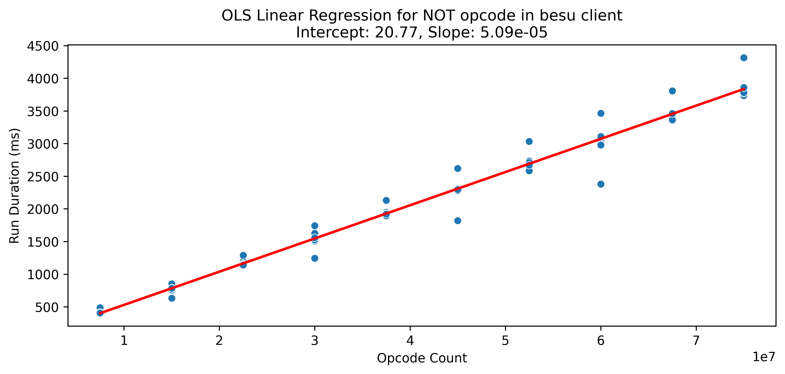


## geth


```python
                            OLS Regression Results                            
==============================================================================
Dep. Variable:        run_duration_ms   R-squared:                       0.995
Model:                            OLS   Adj. R-squared:                  0.995
Method:                 Least Squares   F-statistic:                 1.370e+04
Date:                Tue, 23 Dec 2025   Prob (F-statistic):           6.88e-84
Time:                        08:41:06   Log-Likelihood:                -292.80
No. Observations:                  74   AIC:                             589.6
Df Residuals:                      72   BIC:                             594.2
Df Model:                           1                                         
Covariance Type:            nonrobust                                         
==============================================================================
                 coef    std err          t      P>|t|      [0.025      0.975]
------------------------------------------------------------------------------
const         37.4672      3.234     11.585      0.000      31.020      43.914
opcount     8.182e-06   6.99e-08    117.029      0.000    8.04e-06    8.32e-06
==============================================================================
Omnibus:                       39.531   Durbin-Watson:                   1.682
Prob(Omnibus):                  0.000   Jarque-Bera (JB):               95.500
Skew:                           1.830   Prob(JB):                     1.83e-21
Kurtosis:                       7.193   Cond. No.                     1.00e+08
==============================================================================

Notes:
[1] Standard Errors assume that the covariance matrix of the errors is correctly specified.
[2] The condition number is large,  1e+08. This might indicate that there are
strong multicollinearity or other numerical problems.
```

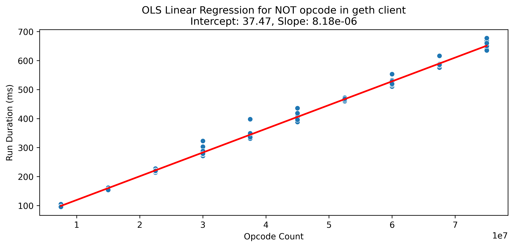


# NUMBER

## nethermind


```python
                            OLS Regression Results                            
==============================================================================
Dep. Variable:        run_duration_ms   R-squared:                       0.989
Model:                            OLS   Adj. R-squared:                  0.989
Method:                 Least Squares   F-statistic:                     6713.
Date:                Tue, 23 Dec 2025   Prob (F-statistic):           8.00e-73
Time:                        08:41:06   Log-Likelihood:                -368.38
No. Observations:                  74   AIC:                             740.8
Df Residuals:                      72   BIC:                             745.4
Df Model:                           1                                         
Covariance Type:            nonrobust                                         
==============================================================================
                 coef    std err          t      P>|t|      [0.025      0.975]
------------------------------------------------------------------------------
const         42.3515      8.981      4.716      0.000      24.449      60.254
opcount     4.772e-06   5.82e-08     81.930      0.000    4.66e-06    4.89e-06
==============================================================================
Omnibus:                       10.567   Durbin-Watson:                   1.268
Prob(Omnibus):                  0.005   Jarque-Bera (JB):               12.856
Skew:                          -0.642   Prob(JB):                      0.00162
Kurtosis:                       4.587   Cond. No.                     3.34e+08
==============================================================================

Notes:
[1] Standard Errors assume that the covariance matrix of the errors is correctly specified.
[2] The condition number is large, 3.34e+08. This might indicate that there are
strong multicollinearity or other numerical problems.
```


## reth


```python
                            OLS Regression Results                            
==============================================================================
Dep. Variable:        run_duration_ms   R-squared:                       0.982
Model:                            OLS   Adj. R-squared:                  0.982
Method:                 Least Squares   F-statistic:                     3952.
Date:                Tue, 23 Dec 2025   Prob (F-statistic):           1.18e-64
Time:                        08:41:06   Log-Likelihood:                -381.70
No. Observations:                  74   AIC:                             767.4
Df Residuals:                      72   BIC:                             772.0
Df Model:                           1                                         
Covariance Type:            nonrobust                                         
==============================================================================
                 coef    std err          t      P>|t|      [0.025      0.975]
------------------------------------------------------------------------------
const         35.4270     10.751      3.295      0.002      13.996      56.858
opcount     4.383e-06   6.97e-08     62.862      0.000    4.24e-06    4.52e-06
==============================================================================
Omnibus:                        1.139   Durbin-Watson:                   0.995
Prob(Omnibus):                  0.566   Jarque-Bera (JB):                0.552
Skew:                          -0.067   Prob(JB):                        0.759
Kurtosis:                       3.401   Cond. No.                     3.34e+08
==============================================================================

Notes:
[1] Standard Errors assume that the covariance matrix of the errors is correctly specified.
[2] The condition number is large, 3.34e+08. This might indicate that there are
strong multicollinearity or other numerical problems.
```

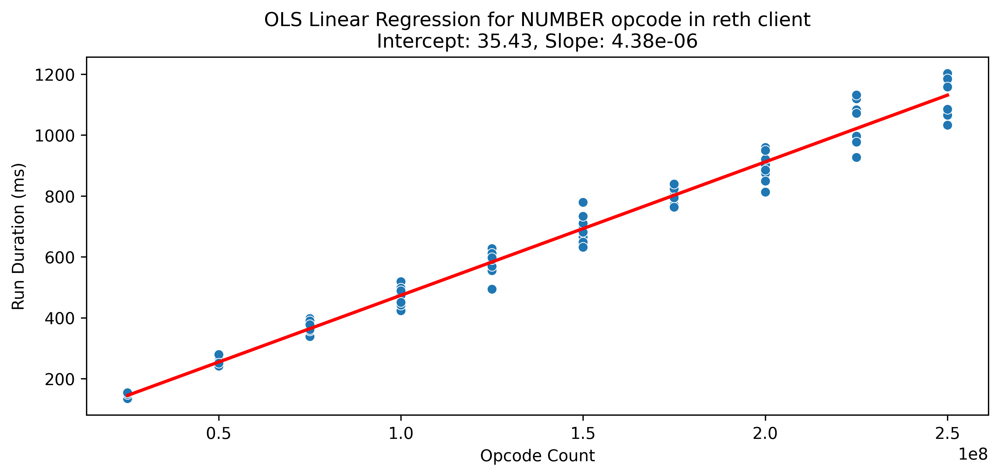


## besu


```python
                            OLS Regression Results                            
==============================================================================
Dep. Variable:        run_duration_ms   R-squared:                       0.905
Model:                            OLS   Adj. R-squared:                  0.904
Method:                 Least Squares   F-statistic:                     685.0
Date:                Tue, 23 Dec 2025   Prob (F-statistic):           1.62e-38
Time:                        08:41:06   Log-Likelihood:                -592.05
No. Observations:                  74   AIC:                             1188.
Df Residuals:                      72   BIC:                             1193.
Df Model:                           1                                         
Covariance Type:            nonrobust                                         
==============================================================================
                 coef    std err          t      P>|t|      [0.025      0.975]
------------------------------------------------------------------------------
const         13.2347    184.480      0.072      0.943    -354.520     380.989
opcount     3.131e-05    1.2e-06     26.173      0.000    2.89e-05    3.37e-05
==============================================================================
Omnibus:                       45.448   Durbin-Watson:                   0.548
Prob(Omnibus):                  0.000   Jarque-Bera (JB):              125.681
Skew:                           2.068   Prob(JB):                     5.11e-28
Kurtosis:                       7.863   Cond. No.                     3.34e+08
==============================================================================

Notes:
[1] Standard Errors assume that the covariance matrix of the errors is correctly specified.
[2] The condition number is large, 3.34e+08. This might indicate that there are
strong multicollinearity or other numerical problems.
```

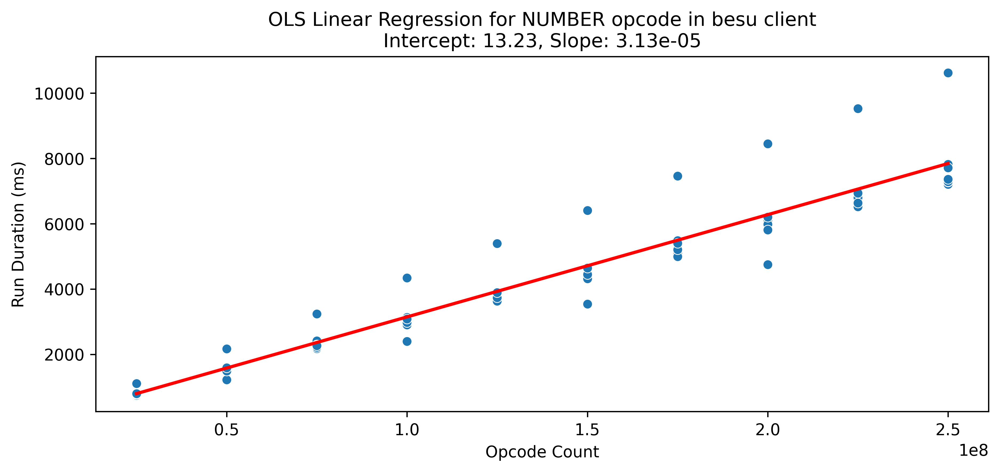


## geth


```python
                            OLS Regression Results                            
==============================================================================
Dep. Variable:        run_duration_ms   R-squared:                       0.994
Model:                            OLS   Adj. R-squared:                  0.994
Method:                 Least Squares   F-statistic:                 1.276e+04
Date:                Tue, 23 Dec 2025   Prob (F-statistic):           8.80e-83
Time:                        08:41:06   Log-Likelihood:                -436.92
No. Observations:                  74   AIC:                             877.8
Df Residuals:                      72   BIC:                             882.5
Df Model:                           1                                         
Covariance Type:            nonrobust                                         
==============================================================================
                 coef    std err          t      P>|t|      [0.025      0.975]
------------------------------------------------------------------------------
const         55.3653     22.676      2.442      0.017      10.162     100.569
opcount     1.661e-05   1.47e-07    112.938      0.000    1.63e-05    1.69e-05
==============================================================================
Omnibus:                       98.026   Durbin-Watson:                   1.503
Prob(Omnibus):                  0.000   Jarque-Bera (JB):             1597.524
Skew:                           4.125   Prob(JB):                         0.00
Kurtosis:                      24.215   Cond. No.                     3.34e+08
==============================================================================

Notes:
[1] Standard Errors assume that the covariance matrix of the errors is correctly specified.
[2] The condition number is large, 3.34e+08. This might indicate that there are
strong multicollinearity or other numerical problems.
```


# OR

## nethermind


```python
                            OLS Regression Results                            
==============================================================================
Dep. Variable:        run_duration_ms   R-squared:                       0.410
Model:                            OLS   Adj. R-squared:                  0.401
Method:                 Least Squares   F-statistic:                     49.93
Date:                Tue, 23 Dec 2025   Prob (F-statistic):           8.34e-10
Time:                        08:41:07   Log-Likelihood:                -521.22
No. Observations:                  74   AIC:                             1046.
Df Residuals:                      72   BIC:                             1051.
Df Model:                           1                                         
Covariance Type:            nonrobust                                         
==============================================================================
                 coef    std err          t      P>|t|      [0.025      0.975]
------------------------------------------------------------------------------
const         44.5931     70.844      0.629      0.531     -96.632     185.819
opcount     1.082e-05   1.53e-06      7.066      0.000    7.77e-06    1.39e-05
==============================================================================
Omnibus:                       55.976   Durbin-Watson:                   0.786
Prob(Omnibus):                  0.000   Jarque-Bera (JB):              183.343
Skew:                           2.574   Prob(JB):                     1.54e-40
Kurtosis:                       8.742   Cond. No.                     1.00e+08
==============================================================================

Notes:
[1] Standard Errors assume that the covariance matrix of the errors is correctly specified.
[2] The condition number is large,  1e+08. This might indicate that there are
strong multicollinearity or other numerical problems.
```

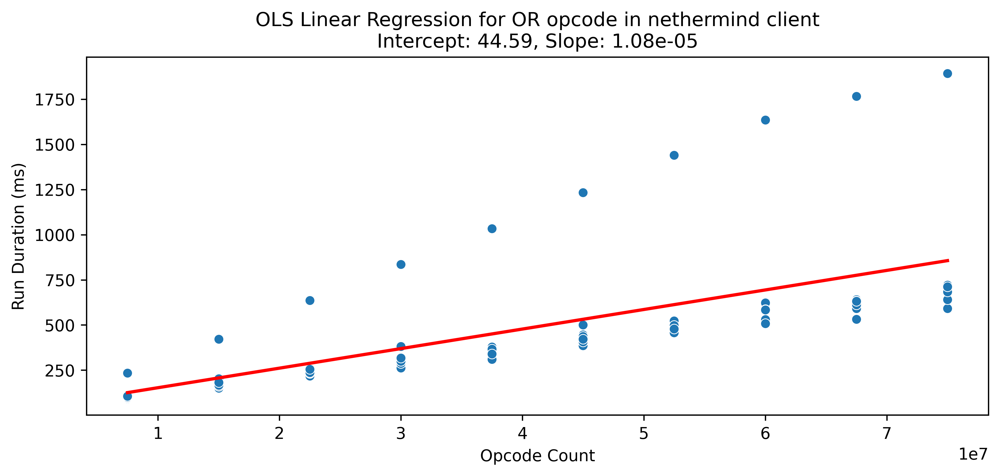


## reth


```python
                            OLS Regression Results                            
==============================================================================
Dep. Variable:        run_duration_ms   R-squared:                       0.994
Model:                            OLS   Adj. R-squared:                  0.994
Method:                 Least Squares   F-statistic:                 1.147e+04
Date:                Tue, 23 Dec 2025   Prob (F-statistic):           3.92e-81
Time:                        08:41:07   Log-Likelihood:                -280.78
No. Observations:                  74   AIC:                             565.6
Df Residuals:                      72   BIC:                             570.2
Df Model:                           1                                         
Covariance Type:            nonrobust                                         
==============================================================================
                 coef    std err          t      P>|t|      [0.025      0.975]
------------------------------------------------------------------------------
const         39.5200      2.749     14.377      0.000      34.040      45.000
opcount     6.365e-06   5.94e-08    107.103      0.000    6.25e-06    6.48e-06
==============================================================================
Omnibus:                       13.212   Durbin-Watson:                   2.343
Prob(Omnibus):                  0.001   Jarque-Bera (JB):               25.864
Skew:                           0.554   Prob(JB):                     2.42e-06
Kurtosis:                       5.676   Cond. No.                     1.00e+08
==============================================================================

Notes:
[1] Standard Errors assume that the covariance matrix of the errors is correctly specified.
[2] The condition number is large,  1e+08. This might indicate that there are
strong multicollinearity or other numerical problems.
```

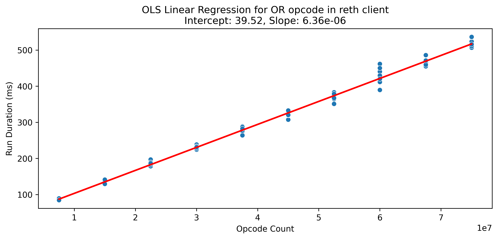


## besu


```python
                            OLS Regression Results                            
==============================================================================
Dep. Variable:        run_duration_ms   R-squared:                       0.963
Model:                            OLS   Adj. R-squared:                  0.963
Method:                 Least Squares   F-statistic:                     1716.
Date:                Tue, 23 Dec 2025   Prob (F-statistic):           1.90e-48
Time:                        08:41:07   Log-Likelihood:                -484.58
No. Observations:                  67   AIC:                             973.2
Df Residuals:                      65   BIC:                             977.6
Df Model:                           1                                         
Covariance Type:            nonrobust                                         
==============================================================================
                 coef    std err          t      P>|t|      [0.025      0.975]
------------------------------------------------------------------------------
const         -2.7181    104.473     -0.026      0.979    -211.366     205.930
opcount     8.912e-05   2.15e-06     41.419      0.000    8.48e-05    9.34e-05
==============================================================================
Omnibus:                       20.083   Durbin-Watson:                   0.821
Prob(Omnibus):                  0.000   Jarque-Bera (JB):               45.975
Skew:                           0.894   Prob(JB):                     1.04e-10
Kurtosis:                       6.643   Cond. No.                     1.22e+08
==============================================================================

Notes:
[1] Standard Errors assume that the covariance matrix of the errors is correctly specified.
[2] The condition number is large, 1.22e+08. This might indicate that there are
strong multicollinearity or other numerical problems.
```

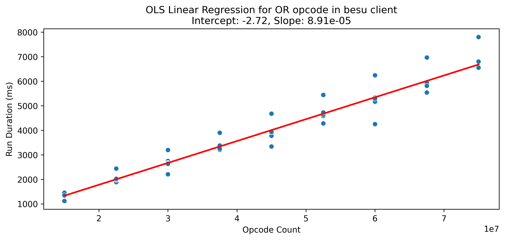


## geth


```python
                            OLS Regression Results                            
==============================================================================
Dep. Variable:        run_duration_ms   R-squared:                       0.998
Model:                            OLS   Adj. R-squared:                  0.998
Method:                 Least Squares   F-statistic:                 3.525e+04
Date:                Tue, 23 Dec 2025   Prob (F-statistic):           1.28e-98
Time:                        08:41:07   Log-Likelihood:                -330.77
No. Observations:                  74   AIC:                             665.5
Df Residuals:                      72   BIC:                             670.1
Df Model:                           1                                         
Covariance Type:            nonrobust                                         
==============================================================================
                 coef    std err          t      P>|t|      [0.025      0.975]
------------------------------------------------------------------------------
const         34.7197      5.402      6.427      0.000      23.951      45.488
opcount     2.193e-05   1.17e-07    187.751      0.000    2.17e-05    2.22e-05
==============================================================================
Omnibus:                        3.103   Durbin-Watson:                   1.999
Prob(Omnibus):                  0.212   Jarque-Bera (JB):                2.764
Skew:                          -0.154   Prob(JB):                        0.251
Kurtosis:                       3.896   Cond. No.                     1.00e+08
==============================================================================

Notes:
[1] Standard Errors assume that the covariance matrix of the errors is correctly specified.
[2] The condition number is large,  1e+08. This might indicate that there are
strong multicollinearity or other numerical problems.
```


# ORIGIN

## nethermind


```python
                            OLS Regression Results                            
==============================================================================
Dep. Variable:        run_duration_ms   R-squared:                       0.015
Model:                            OLS   Adj. R-squared:                  0.001
Method:                 Least Squares   F-statistic:                     1.073
Date:                Tue, 23 Dec 2025   Prob (F-statistic):              0.304
Time:                        08:41:07   Log-Likelihood:                -466.57
No. Observations:                  74   AIC:                             937.1
Df Residuals:                      72   BIC:                             941.8
Df Model:                           1                                         
Covariance Type:            nonrobust                                         
==============================================================================
                 coef    std err          t      P>|t|      [0.025      0.975]
------------------------------------------------------------------------------
const       2157.9058     33.850     63.749      0.000    2090.427    2225.384
opcount     2.274e-09    2.2e-09      1.036      0.304    -2.1e-09    6.65e-09
==============================================================================
Omnibus:                        4.001   Durbin-Watson:                   0.798
Prob(Omnibus):                  0.135   Jarque-Bera (JB):                2.600
Skew:                          -0.270   Prob(JB):                        0.273
Kurtosis:                       2.257   Cond. No.                     3.34e+10
==============================================================================

Notes:
[1] Standard Errors assume that the covariance matrix of the errors is correctly specified.
[2] The condition number is large, 3.34e+10. This might indicate that there are
strong multicollinearity or other numerical problems.
```

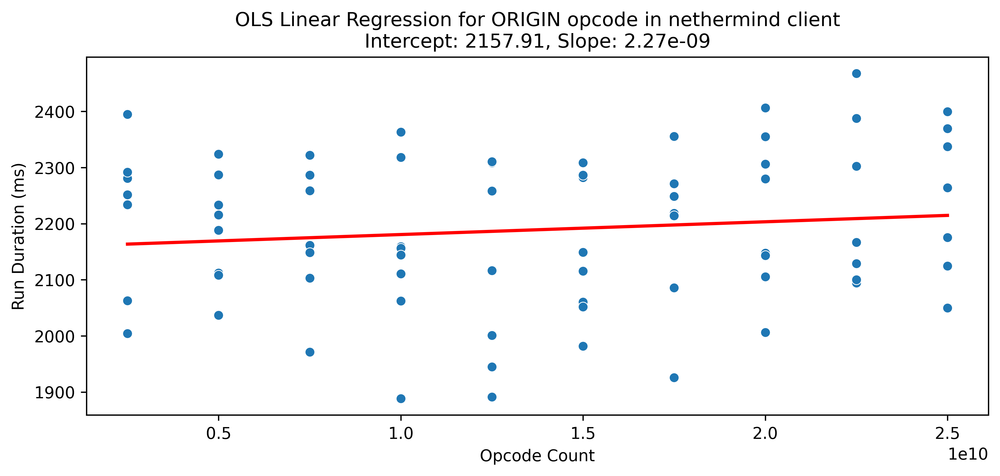


## reth


```python
                            OLS Regression Results                            
==============================================================================
Dep. Variable:        run_duration_ms   R-squared:                       0.025
Model:                            OLS   Adj. R-squared:                  0.011
Method:                 Least Squares   F-statistic:                     1.810
Date:                Tue, 23 Dec 2025   Prob (F-statistic):              0.183
Time:                        08:41:07   Log-Likelihood:                -443.67
No. Observations:                  74   AIC:                             891.3
Df Residuals:                      72   BIC:                             896.0
Df Model:                           1                                         
Covariance Type:            nonrobust                                         
==============================================================================
                 coef    std err          t      P>|t|      [0.025      0.975]
------------------------------------------------------------------------------
const       2376.5624     24.841     95.673      0.000    2327.044    2426.081
opcount    -2.168e-09   1.61e-09     -1.345      0.183   -5.38e-09    1.04e-09
==============================================================================
Omnibus:                       62.482   Durbin-Watson:                   1.861
Prob(Omnibus):                  0.000   Jarque-Bera (JB):              541.553
Skew:                           2.292   Prob(JB):                    2.53e-118
Kurtosis:                      15.435   Cond. No.                     3.34e+10
==============================================================================

Notes:
[1] Standard Errors assume that the covariance matrix of the errors is correctly specified.
[2] The condition number is large, 3.34e+10. This might indicate that there are
strong multicollinearity or other numerical problems.
```

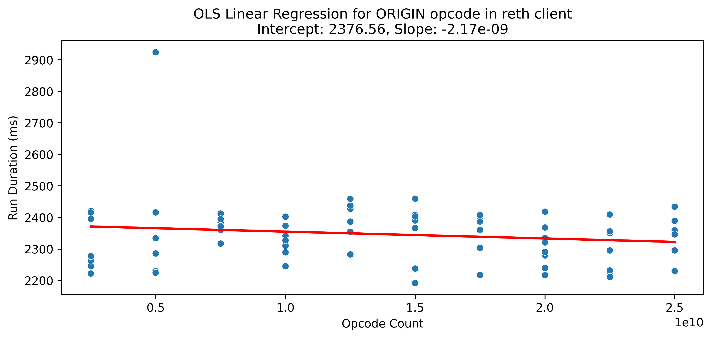


## besu

OLS model did not run... Error: zero-size array to reduction operation maximum which has no identity

## geth


```python
                            OLS Regression Results                            
==============================================================================
Dep. Variable:        run_duration_ms   R-squared:                       0.014
Model:                            OLS   Adj. R-squared:                  0.000
Method:                 Least Squares   F-statistic:                     1.025
Date:                Tue, 23 Dec 2025   Prob (F-statistic):              0.315
Time:                        08:41:07   Log-Likelihood:                -480.40
No. Observations:                  74   AIC:                             964.8
Df Residuals:                      72   BIC:                             969.4
Df Model:                           1                                         
Covariance Type:            nonrobust                                         
==============================================================================
                 coef    std err          t      P>|t|      [0.025      0.975]
------------------------------------------------------------------------------
const       8313.8989     40.807    203.735      0.000    8232.551    8395.247
opcount      2.68e-09   2.65e-09      1.013      0.315    -2.6e-09    7.96e-09
==============================================================================
Omnibus:                        7.905   Durbin-Watson:                   1.861
Prob(Omnibus):                  0.019   Jarque-Bera (JB):                9.090
Skew:                          -0.493   Prob(JB):                       0.0106
Kurtosis:                       4.406   Cond. No.                     3.34e+10
==============================================================================

Notes:
[1] Standard Errors assume that the covariance matrix of the errors is correctly specified.
[2] The condition number is large, 3.34e+10. This might indicate that there are
strong multicollinearity or other numerical problems.
```

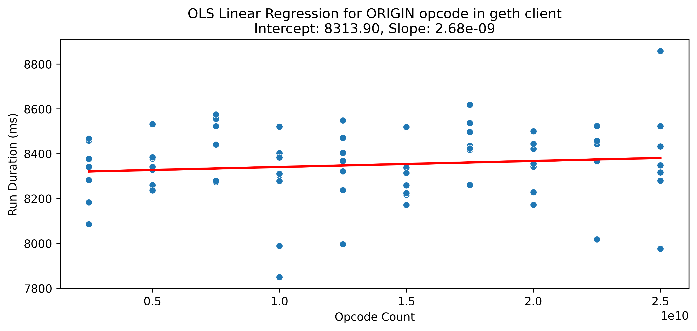


# PC

## nethermind


```python
                            OLS Regression Results                            
==============================================================================
Dep. Variable:        run_duration_ms   R-squared:                       0.986
Model:                            OLS   Adj. R-squared:                  0.986
Method:                 Least Squares   F-statistic:                     4972.
Date:                Tue, 23 Dec 2025   Prob (F-statistic):           3.46e-68
Time:                        08:41:08   Log-Likelihood:                -381.14
No. Observations:                  74   AIC:                             766.3
Df Residuals:                      72   BIC:                             770.9
Df Model:                           1                                         
Covariance Type:            nonrobust                                         
==============================================================================
                 coef    std err          t      P>|t|      [0.025      0.975]
------------------------------------------------------------------------------
const         34.6688     10.670      3.249      0.002      13.398      55.940
opcount      4.88e-06   6.92e-08     70.512      0.000    4.74e-06    5.02e-06
==============================================================================
Omnibus:                        5.868   Durbin-Watson:                   0.847
Prob(Omnibus):                  0.053   Jarque-Bera (JB):                7.865
Skew:                           0.226   Prob(JB):                       0.0196
Kurtosis:                       4.532   Cond. No.                     3.34e+08
==============================================================================

Notes:
[1] Standard Errors assume that the covariance matrix of the errors is correctly specified.
[2] The condition number is large, 3.34e+08. This might indicate that there are
strong multicollinearity or other numerical problems.
```

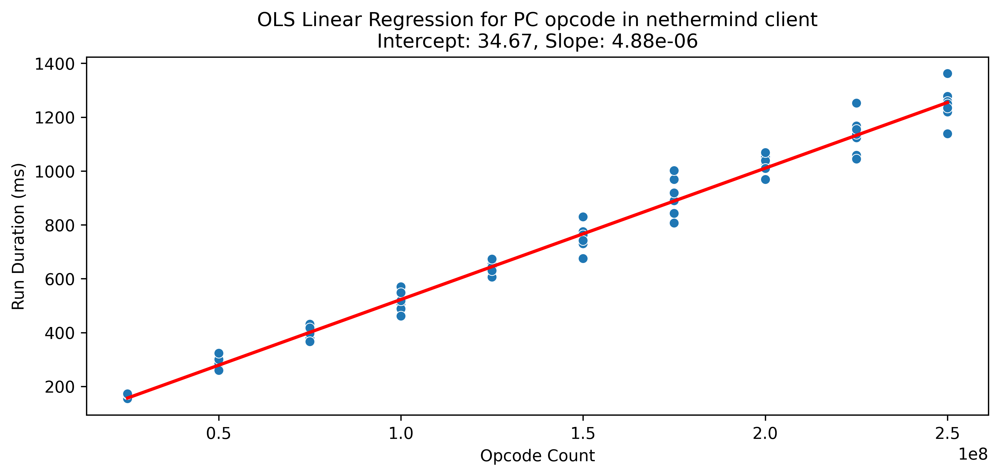


## reth


```python
                            OLS Regression Results                            
==============================================================================
Dep. Variable:        run_duration_ms   R-squared:                       0.989
Model:                            OLS   Adj. R-squared:                  0.988
Method:                 Least Squares   F-statistic:                     6228.
Date:                Tue, 23 Dec 2025   Prob (F-statistic):           1.15e-71
Time:                        08:41:08   Log-Likelihood:                -368.45
No. Observations:                  74   AIC:                             740.9
Df Residuals:                      72   BIC:                             745.5
Df Model:                           1                                         
Covariance Type:            nonrobust                                         
==============================================================================
                 coef    std err          t      P>|t|      [0.025      0.975]
------------------------------------------------------------------------------
const         44.5831      8.989      4.960      0.000      26.664      62.502
opcount       4.6e-06   5.83e-08     78.917      0.000    4.48e-06    4.72e-06
==============================================================================
Omnibus:                        4.006   Durbin-Watson:                   1.346
Prob(Omnibus):                  0.135   Jarque-Bera (JB):                3.305
Skew:                          -0.501   Prob(JB):                        0.192
Kurtosis:                       3.261   Cond. No.                     3.34e+08
==============================================================================

Notes:
[1] Standard Errors assume that the covariance matrix of the errors is correctly specified.
[2] The condition number is large, 3.34e+08. This might indicate that there are
strong multicollinearity or other numerical problems.
```

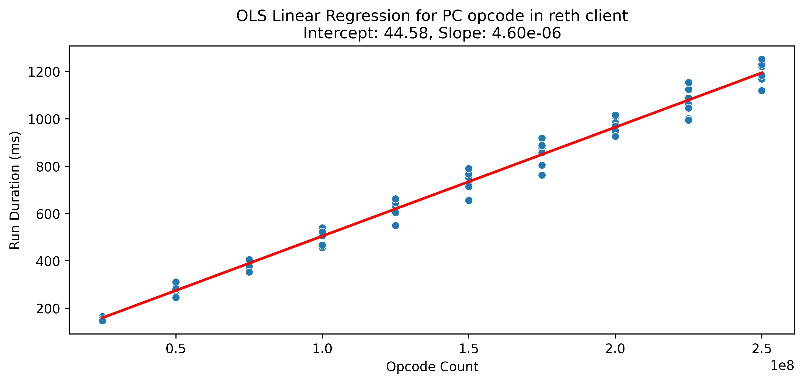


## besu


```python
                            OLS Regression Results                            
==============================================================================
Dep. Variable:        run_duration_ms   R-squared:                       0.805
Model:                            OLS   Adj. R-squared:                  0.802
Method:                 Least Squares   F-statistic:                     297.5
Date:                Tue, 23 Dec 2025   Prob (F-statistic):           2.80e-27
Time:                        08:41:08   Log-Likelihood:                -631.50
No. Observations:                  74   AIC:                             1267.
Df Residuals:                      72   BIC:                             1272.
Df Model:                           1                                         
Covariance Type:            nonrobust                                         
==============================================================================
                 coef    std err          t      P>|t|      [0.025      0.975]
------------------------------------------------------------------------------
const         -0.4510    314.428     -0.001      0.999    -627.251     626.349
opcount     3.517e-05   2.04e-06     17.249      0.000    3.11e-05    3.92e-05
==============================================================================
Omnibus:                       14.105   Durbin-Watson:                   0.675
Prob(Omnibus):                  0.001   Jarque-Bera (JB):               15.805
Skew:                           1.108   Prob(JB):                     0.000370
Kurtosis:                       3.464   Cond. No.                     3.34e+08
==============================================================================

Notes:
[1] Standard Errors assume that the covariance matrix of the errors is correctly specified.
[2] The condition number is large, 3.34e+08. This might indicate that there are
strong multicollinearity or other numerical problems.
```

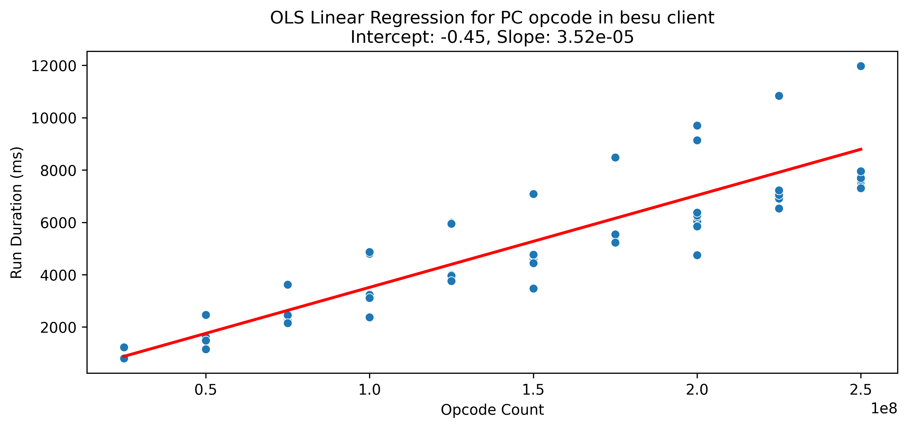


## geth


```python
                            OLS Regression Results                            
==============================================================================
Dep. Variable:        run_duration_ms   R-squared:                       0.998
Model:                            OLS   Adj. R-squared:                  0.998
Method:                 Least Squares   F-statistic:                 3.179e+04
Date:                Tue, 23 Dec 2025   Prob (F-statistic):           5.23e-97
Time:                        08:41:08   Log-Likelihood:                -378.25
No. Observations:                  74   AIC:                             760.5
Df Residuals:                      72   BIC:                             765.1
Df Model:                           1                                         
Covariance Type:            nonrobust                                         
==============================================================================
                 coef    std err          t      P>|t|      [0.025      0.975]
------------------------------------------------------------------------------
const         36.7683     10.262      3.583      0.001      16.312      57.225
opcount     1.187e-05   6.66e-08    178.298      0.000    1.17e-05     1.2e-05
==============================================================================
Omnibus:                        6.579   Durbin-Watson:                   1.292
Prob(Omnibus):                  0.037   Jarque-Bera (JB):               10.277
Skew:                          -0.185   Prob(JB):                      0.00587
Kurtosis:                       4.788   Cond. No.                     3.34e+08
==============================================================================

Notes:
[1] Standard Errors assume that the covariance matrix of the errors is correctly specified.
[2] The condition number is large, 3.34e+08. This might indicate that there are
strong multicollinearity or other numerical problems.
```


# POP

## nethermind

OLS model did not run... Error: zero-size array to reduction operation maximum which has no identity

## reth

OLS model did not run... Error: zero-size array to reduction operation maximum which has no identity

## besu

OLS model did not run... Error: zero-size array to reduction operation maximum which has no identity

## geth

OLS model did not run... Error: zero-size array to reduction operation maximum which has no identity

# PREVRANDAO

## nethermind


```python
                            OLS Regression Results                            
==============================================================================
Dep. Variable:        run_duration_ms   R-squared:                       0.987
Model:                            OLS   Adj. R-squared:                  0.986
Method:                 Least Squares   F-statistic:                     5307.
Date:                Tue, 23 Dec 2025   Prob (F-statistic):           3.41e-69
Time:                        08:41:08   Log-Likelihood:                -376.05
No. Observations:                  74   AIC:                             756.1
Df Residuals:                      72   BIC:                             760.7
Df Model:                           1                                         
Covariance Type:            nonrobust                                         
==============================================================================
                 coef    std err          t      P>|t|      [0.025      0.975]
------------------------------------------------------------------------------
const         46.0540      9.961      4.624      0.000      26.197      65.910
opcount     4.706e-06   6.46e-08     72.849      0.000    4.58e-06    4.83e-06
==============================================================================
Omnibus:                        6.068   Durbin-Watson:                   1.551
Prob(Omnibus):                  0.048   Jarque-Bera (JB):                5.717
Skew:                          -0.473   Prob(JB):                       0.0574
Kurtosis:                       3.980   Cond. No.                     3.34e+08
==============================================================================

Notes:
[1] Standard Errors assume that the covariance matrix of the errors is correctly specified.
[2] The condition number is large, 3.34e+08. This might indicate that there are
strong multicollinearity or other numerical problems.
```


## reth


```python
                            OLS Regression Results                            
==============================================================================
Dep. Variable:        run_duration_ms   R-squared:                       0.994
Model:                            OLS   Adj. R-squared:                  0.994
Method:                 Least Squares   F-statistic:                 1.138e+04
Date:                Tue, 23 Dec 2025   Prob (F-statistic):           5.28e-81
Time:                        08:41:08   Log-Likelihood:                -362.87
No. Observations:                  74   AIC:                             729.7
Df Residuals:                      72   BIC:                             734.4
Df Model:                           1                                         
Covariance Type:            nonrobust                                         
==============================================================================
                 coef    std err          t      P>|t|      [0.025      0.975]
------------------------------------------------------------------------------
const         33.8045      8.336      4.055      0.000      17.187      50.422
opcount     5.766e-06   5.41e-08    106.658      0.000    5.66e-06    5.87e-06
==============================================================================
Omnibus:                       49.388   Durbin-Watson:                   1.678
Prob(Omnibus):                  0.000   Jarque-Bera (JB):              305.316
Skew:                           1.788   Prob(JB):                     5.03e-67
Kurtosis:                      12.286   Cond. No.                     3.34e+08
==============================================================================

Notes:
[1] Standard Errors assume that the covariance matrix of the errors is correctly specified.
[2] The condition number is large, 3.34e+08. This might indicate that there are
strong multicollinearity or other numerical problems.
```

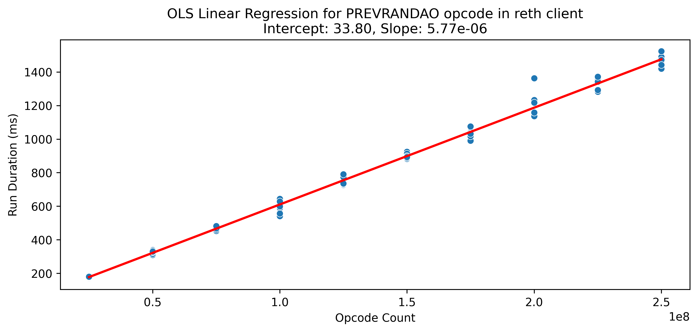


## besu


```python
                            OLS Regression Results                            
==============================================================================
Dep. Variable:        run_duration_ms   R-squared:                       0.902
Model:                            OLS   Adj. R-squared:                  0.900
Method:                 Least Squares   F-statistic:                     660.5
Date:                Tue, 23 Dec 2025   Prob (F-statistic):           5.29e-38
Time:                        08:41:08   Log-Likelihood:                -591.05
No. Observations:                  74   AIC:                             1186.
Df Residuals:                      72   BIC:                             1191.
Df Model:                           1                                         
Covariance Type:            nonrobust                                         
==============================================================================
                 coef    std err          t      P>|t|      [0.025      0.975]
------------------------------------------------------------------------------
const        -14.8378    182.025     -0.082      0.935    -377.699     348.023
opcount     3.034e-05   1.18e-06     25.701      0.000     2.8e-05    3.27e-05
==============================================================================
Omnibus:                       43.310   Durbin-Watson:                   0.532
Prob(Omnibus):                  0.000   Jarque-Bera (JB):              120.125
Skew:                           1.941   Prob(JB):                     8.22e-27
Kurtosis:                       7.887   Cond. No.                     3.34e+08
==============================================================================

Notes:
[1] Standard Errors assume that the covariance matrix of the errors is correctly specified.
[2] The condition number is large, 3.34e+08. This might indicate that there are
strong multicollinearity or other numerical problems.
```

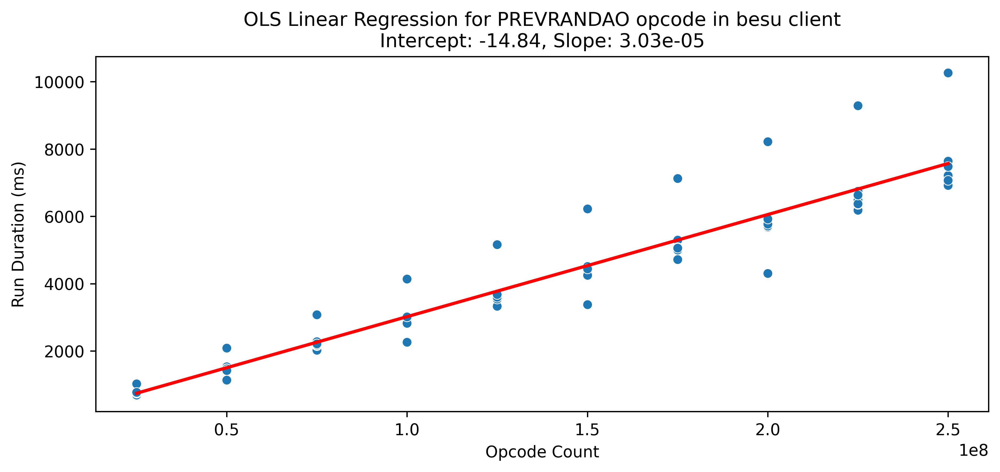


## geth


```python
                            OLS Regression Results                            
==============================================================================
Dep. Variable:        run_duration_ms   R-squared:                       0.997
Model:                            OLS   Adj. R-squared:                  0.997
Method:                 Least Squares   F-statistic:                 2.644e+04
Date:                Tue, 23 Dec 2025   Prob (F-statistic):           3.91e-94
Time:                        08:41:09   Log-Likelihood:                -415.46
No. Observations:                  74   AIC:                             834.9
Df Residuals:                      72   BIC:                             839.5
Df Model:                           1                                         
Covariance Type:            nonrobust                                         
==============================================================================
                 coef    std err          t      P>|t|      [0.025      0.975]
------------------------------------------------------------------------------
const         17.6708     16.966      1.042      0.301     -16.150      51.491
opcount     1.789e-05    1.1e-07    162.606      0.000    1.77e-05    1.81e-05
==============================================================================
Omnibus:                      112.315   Durbin-Watson:                   2.002
Prob(Omnibus):                  0.000   Jarque-Bera (JB):             3559.870
Skew:                           4.726   Prob(JB):                         0.00
Kurtosis:                      35.638   Cond. No.                     3.34e+08
==============================================================================

Notes:
[1] Standard Errors assume that the covariance matrix of the errors is correctly specified.
[2] The condition number is large, 3.34e+08. This might indicate that there are
strong multicollinearity or other numerical problems.
```

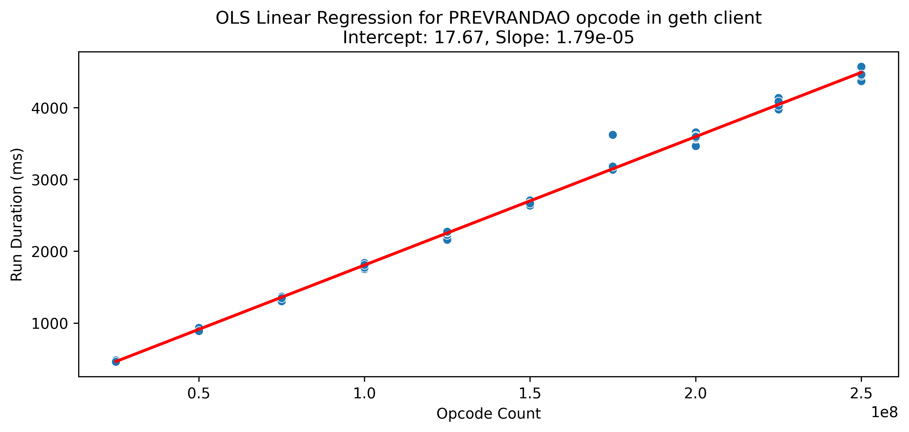


# PUSH0

## nethermind


```python
                            OLS Regression Results                            
==============================================================================
Dep. Variable:        run_duration_ms   R-squared:                       0.986
Model:                            OLS   Adj. R-squared:                  0.986
Method:                 Least Squares   F-statistic:                     4998.
Date:                Tue, 23 Dec 2025   Prob (F-statistic):           2.88e-68
Time:                        08:41:09   Log-Likelihood:                -326.98
No. Observations:                  74   AIC:                             658.0
Df Residuals:                      72   BIC:                             662.6
Df Model:                           1                                         
Covariance Type:            nonrobust                                         
==============================================================================
                 coef    std err          t      P>|t|      [0.025      0.975]
------------------------------------------------------------------------------
const         38.5711      5.133      7.515      0.000      28.340      48.803
opcount     4.706e-06   6.66e-08     70.696      0.000    4.57e-06    4.84e-06
==============================================================================
Omnibus:                        6.395   Durbin-Watson:                   1.076
Prob(Omnibus):                  0.041   Jarque-Bera (JB):                5.630
Skew:                          -0.627   Prob(JB):                       0.0599
Kurtosis:                       3.502   Cond. No.                     1.67e+08
==============================================================================

Notes:
[1] Standard Errors assume that the covariance matrix of the errors is correctly specified.
[2] The condition number is large, 1.67e+08. This might indicate that there are
strong multicollinearity or other numerical problems.
```


## reth


```python
                            OLS Regression Results                            
==============================================================================
Dep. Variable:        run_duration_ms   R-squared:                       0.985
Model:                            OLS   Adj. R-squared:                  0.985
Method:                 Least Squares   F-statistic:                     4800.
Date:                Tue, 23 Dec 2025   Prob (F-statistic):           1.21e-67
Time:                        08:41:09   Log-Likelihood:                -320.82
No. Observations:                  74   AIC:                             645.6
Df Residuals:                      72   BIC:                             650.2
Df Model:                           1                                         
Covariance Type:            nonrobust                                         
==============================================================================
                 coef    std err          t      P>|t|      [0.025      0.975]
------------------------------------------------------------------------------
const         38.9975      4.722      8.258      0.000      29.584      48.411
opcount     4.244e-06   6.13e-08     69.280      0.000    4.12e-06    4.37e-06
==============================================================================
Omnibus:                        1.712   Durbin-Watson:                   1.220
Prob(Omnibus):                  0.425   Jarque-Bera (JB):                1.047
Skew:                           0.206   Prob(JB):                        0.592
Kurtosis:                       3.412   Cond. No.                     1.67e+08
==============================================================================

Notes:
[1] Standard Errors assume that the covariance matrix of the errors is correctly specified.
[2] The condition number is large, 1.67e+08. This might indicate that there are
strong multicollinearity or other numerical problems.
```

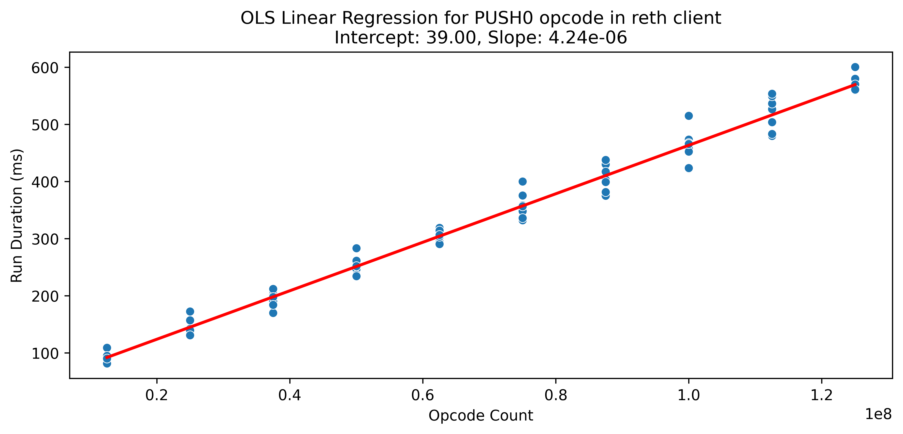


## besu


```python
                            OLS Regression Results                            
==============================================================================
Dep. Variable:        run_duration_ms   R-squared:                       0.744
Model:                            OLS   Adj. R-squared:                  0.740
Method:                 Least Squares   F-statistic:                     208.9
Date:                Tue, 23 Dec 2025   Prob (F-statistic):           5.60e-23
Time:                        08:41:09   Log-Likelihood:                -575.18
No. Observations:                  74   AIC:                             1154.
Df Residuals:                      72   BIC:                             1159.
Df Model:                           1                                         
Covariance Type:            nonrobust                                         
==============================================================================
                 coef    std err          t      P>|t|      [0.025      0.975]
------------------------------------------------------------------------------
const         43.4237    146.885      0.296      0.768    -249.386     336.234
opcount     2.754e-05   1.91e-06     14.454      0.000    2.37e-05    3.13e-05
==============================================================================
Omnibus:                       17.159   Durbin-Watson:                   0.540
Prob(Omnibus):                  0.000   Jarque-Bera (JB):               20.632
Skew:                           1.264   Prob(JB):                     3.31e-05
Kurtosis:                       3.553   Cond. No.                     1.67e+08
==============================================================================

Notes:
[1] Standard Errors assume that the covariance matrix of the errors is correctly specified.
[2] The condition number is large, 1.67e+08. This might indicate that there are
strong multicollinearity or other numerical problems.
```

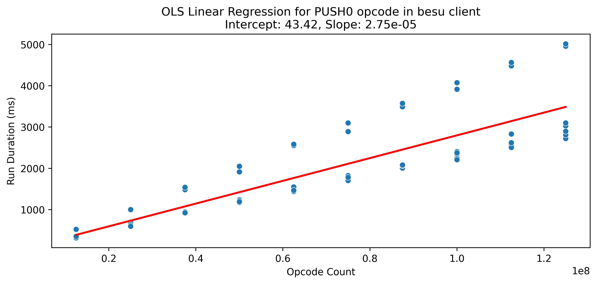


## geth


```python
                            OLS Regression Results                            
==============================================================================
Dep. Variable:        run_duration_ms   R-squared:                       0.996
Model:                            OLS   Adj. R-squared:                  0.996
Method:                 Least Squares   F-statistic:                 1.969e+04
Date:                Tue, 23 Dec 2025   Prob (F-statistic):           1.52e-89
Time:                        08:41:09   Log-Likelihood:                -319.09
No. Observations:                  74   AIC:                             642.2
Df Residuals:                      72   BIC:                             646.8
Df Model:                           1                                         
Covariance Type:            nonrobust                                         
==============================================================================
                 coef    std err          t      P>|t|      [0.025      0.975]
------------------------------------------------------------------------------
const         42.3130      4.614      9.171      0.000      33.116      51.510
opcount     8.398e-06   5.98e-08    140.338      0.000    8.28e-06    8.52e-06
==============================================================================
Omnibus:                        2.642   Durbin-Watson:                   2.202
Prob(Omnibus):                  0.267   Jarque-Bera (JB):                1.889
Skew:                           0.337   Prob(JB):                        0.389
Kurtosis:                       3.397   Cond. No.                     1.67e+08
==============================================================================

Notes:
[1] Standard Errors assume that the covariance matrix of the errors is correctly specified.
[2] The condition number is large, 1.67e+08. This might indicate that there are
strong multicollinearity or other numerical problems.
```

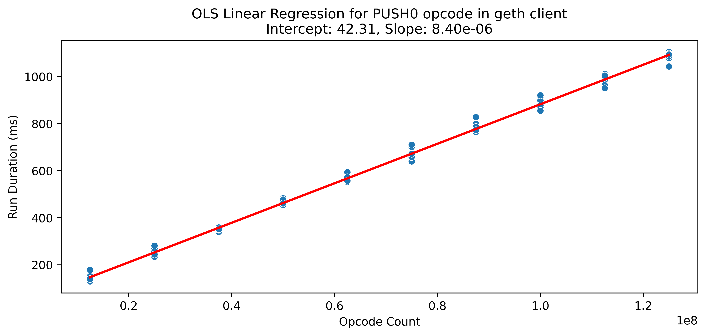


# PUSH1

## nethermind


```python
                            OLS Regression Results                            
==============================================================================
Dep. Variable:        run_duration_ms   R-squared:                       0.992
Model:                            OLS   Adj. R-squared:                  0.992
Method:                 Least Squares   F-statistic:                     8764.
Date:                Tue, 23 Dec 2025   Prob (F-statistic):           5.93e-77
Time:                        08:41:09   Log-Likelihood:                -340.21
No. Observations:                  74   AIC:                             684.4
Df Residuals:                      72   BIC:                             689.0
Df Model:                           1                                         
Covariance Type:            nonrobust                                         
==============================================================================
                 coef    std err          t      P>|t|      [0.025      0.975]
------------------------------------------------------------------------------
const         41.2868      6.137      6.727      0.000      29.052      53.521
opcount     7.452e-06   7.96e-08     93.614      0.000    7.29e-06    7.61e-06
==============================================================================
Omnibus:                       35.160   Durbin-Watson:                   1.818
Prob(Omnibus):                  0.000   Jarque-Bera (JB):               78.925
Skew:                          -1.636   Prob(JB):                     7.27e-18
Kurtosis:                       6.859   Cond. No.                     1.67e+08
==============================================================================

Notes:
[1] Standard Errors assume that the covariance matrix of the errors is correctly specified.
[2] The condition number is large, 1.67e+08. This might indicate that there are
strong multicollinearity or other numerical problems.
```

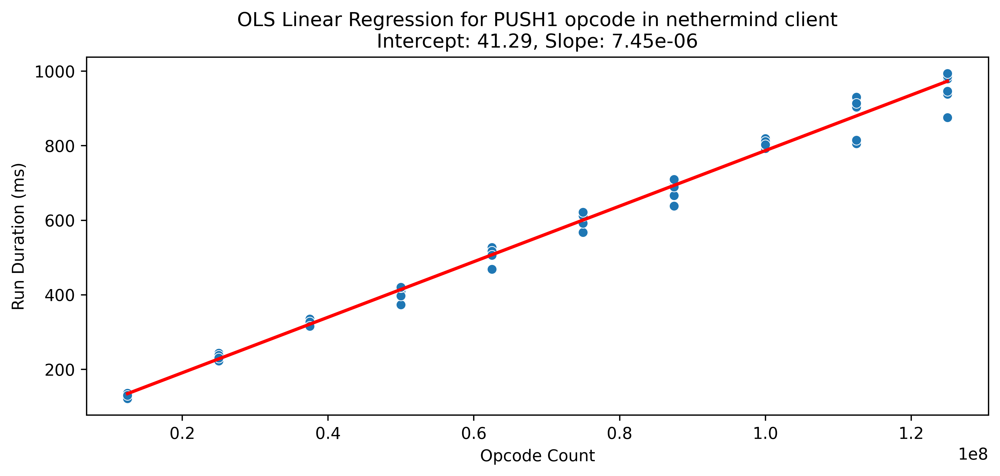


## reth


```python
                            OLS Regression Results                            
==============================================================================
Dep. Variable:        run_duration_ms   R-squared:                       0.994
Model:                            OLS   Adj. R-squared:                  0.994
Method:                 Least Squares   F-statistic:                 1.247e+04
Date:                Tue, 23 Dec 2025   Prob (F-statistic):           1.96e-82
Time:                        08:41:09   Log-Likelihood:                -282.12
No. Observations:                  74   AIC:                             568.2
Df Residuals:                      72   BIC:                             572.9
Df Model:                           1                                         
Covariance Type:            nonrobust                                         
==============================================================================
                 coef    std err          t      P>|t|      [0.025      0.975]
------------------------------------------------------------------------------
const         36.4515      2.799     13.021      0.000      30.871      42.032
opcount     4.055e-06   3.63e-08    111.683      0.000    3.98e-06    4.13e-06
==============================================================================
Omnibus:                        2.509   Durbin-Watson:                   1.821
Prob(Omnibus):                  0.285   Jarque-Bera (JB):                1.549
Skew:                           0.016   Prob(JB):                        0.461
Kurtosis:                       2.292   Cond. No.                     1.67e+08
==============================================================================

Notes:
[1] Standard Errors assume that the covariance matrix of the errors is correctly specified.
[2] The condition number is large, 1.67e+08. This might indicate that there are
strong multicollinearity or other numerical problems.
```

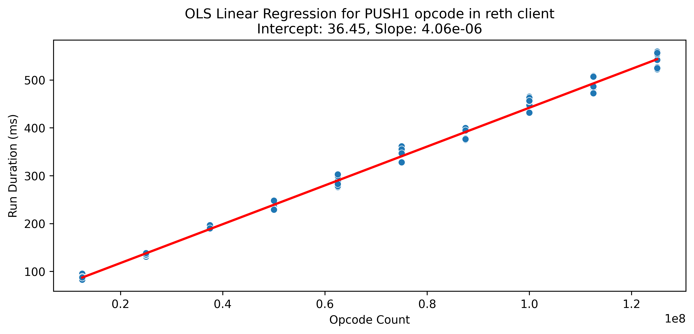


## besu


```python
                            OLS Regression Results                            
==============================================================================
Dep. Variable:        run_duration_ms   R-squared:                       0.851
Model:                            OLS   Adj. R-squared:                  0.849
Method:                 Least Squares   F-statistic:                     412.5
Date:                Tue, 23 Dec 2025   Prob (F-statistic):           1.58e-31
Time:                        08:41:10   Log-Likelihood:                -558.22
No. Observations:                  74   AIC:                             1120.
Df Residuals:                      72   BIC:                             1125.
Df Model:                           1                                         
Covariance Type:            nonrobust                                         
==============================================================================
                 coef    std err          t      P>|t|      [0.025      0.975]
------------------------------------------------------------------------------
const         10.6613    116.803      0.091      0.928    -222.181     243.504
opcount     3.077e-05   1.52e-06     20.310      0.000    2.78e-05    3.38e-05
==============================================================================
Omnibus:                       13.048   Durbin-Watson:                   0.809
Prob(Omnibus):                  0.001   Jarque-Bera (JB):               14.265
Skew:                           1.054   Prob(JB):                     0.000799
Kurtosis:                       3.431   Cond. No.                     1.67e+08
==============================================================================

Notes:
[1] Standard Errors assume that the covariance matrix of the errors is correctly specified.
[2] The condition number is large, 1.67e+08. This might indicate that there are
strong multicollinearity or other numerical problems.
```

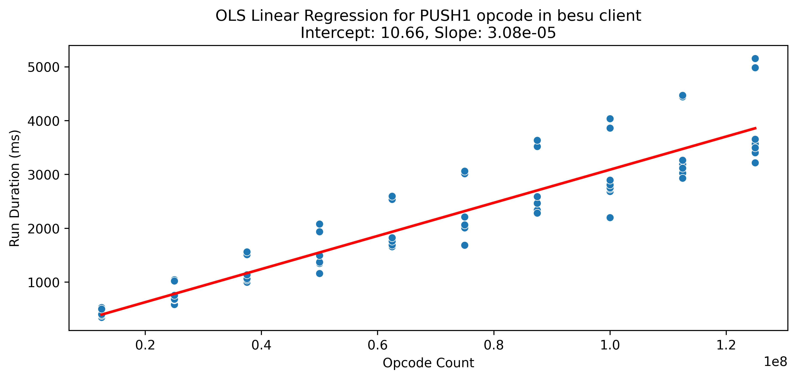


## geth


```python
                            OLS Regression Results                            
==============================================================================
Dep. Variable:        run_duration_ms   R-squared:                       0.998
Model:                            OLS   Adj. R-squared:                  0.998
Method:                 Least Squares   F-statistic:                 4.189e+04
Date:                Tue, 23 Dec 2025   Prob (F-statistic):          2.60e-101
Time:                        08:41:10   Log-Likelihood:                -353.63
No. Observations:                  74   AIC:                             711.3
Df Residuals:                      72   BIC:                             715.9
Df Model:                           1                                         
Covariance Type:            nonrobust                                         
==============================================================================
                 coef    std err          t      P>|t|      [0.025      0.975]
------------------------------------------------------------------------------
const         46.6682      7.357      6.343      0.000      32.001      61.335
opcount     1.953e-05   9.54e-08    204.662      0.000    1.93e-05    1.97e-05
==============================================================================
Omnibus:                       51.899   Durbin-Watson:                   2.041
Prob(Omnibus):                  0.000   Jarque-Bera (JB):              307.606
Skew:                           1.938   Prob(JB):                     1.60e-67
Kurtosis:                      12.205   Cond. No.                     1.67e+08
==============================================================================

Notes:
[1] Standard Errors assume that the covariance matrix of the errors is correctly specified.
[2] The condition number is large, 1.67e+08. This might indicate that there are
strong multicollinearity or other numerical problems.
```

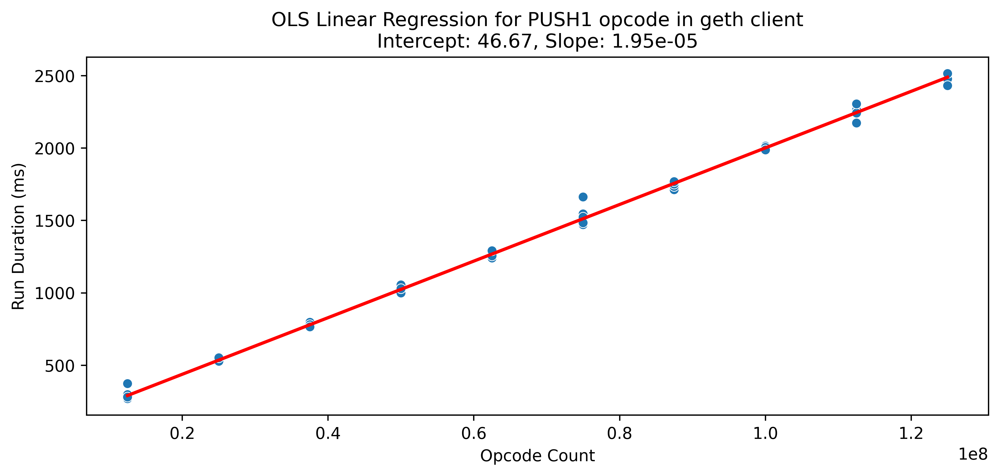


# PUSH2

## nethermind


```python
                            OLS Regression Results                            
==============================================================================
Dep. Variable:        run_duration_ms   R-squared:                       0.992
Model:                            OLS   Adj. R-squared:                  0.992
Method:                 Least Squares   F-statistic:                     8751.
Date:                Tue, 23 Dec 2025   Prob (F-statistic):           6.25e-77
Time:                        08:41:10   Log-Likelihood:                -353.57
No. Observations:                  74   AIC:                             711.1
Df Residuals:                      72   BIC:                             715.7
Df Model:                           1                                         
Covariance Type:            nonrobust                                         
==============================================================================
                 coef    std err          t      P>|t|      [0.025      0.975]
------------------------------------------------------------------------------
const         38.0784      7.351      5.180      0.000      23.424      52.732
opcount     8.919e-06   9.53e-08     93.544      0.000    8.73e-06    9.11e-06
==============================================================================
Omnibus:                       30.952   Durbin-Watson:                   1.572
Prob(Omnibus):                  0.000   Jarque-Bera (JB):               78.819
Skew:                          -1.334   Prob(JB):                     7.67e-18
Kurtosis:                       7.294   Cond. No.                     1.67e+08
==============================================================================

Notes:
[1] Standard Errors assume that the covariance matrix of the errors is correctly specified.
[2] The condition number is large, 1.67e+08. This might indicate that there are
strong multicollinearity or other numerical problems.
```

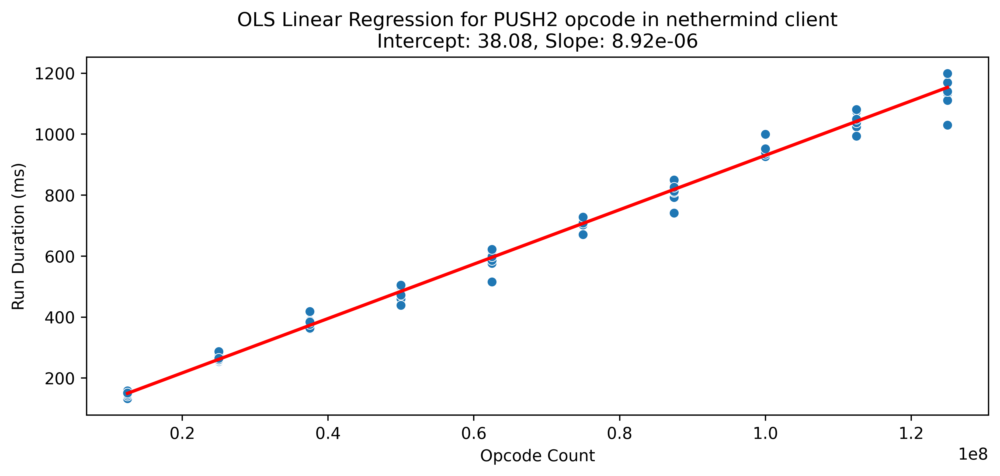


## reth


```python
                            OLS Regression Results                            
==============================================================================
Dep. Variable:        run_duration_ms   R-squared:                       0.995
Model:                            OLS   Adj. R-squared:                  0.995
Method:                 Least Squares   F-statistic:                 1.568e+04
Date:                Tue, 23 Dec 2025   Prob (F-statistic):           5.46e-86
Time:                        08:41:10   Log-Likelihood:                -273.11
No. Observations:                  74   AIC:                             550.2
Df Residuals:                      72   BIC:                             554.8
Df Model:                           1                                         
Covariance Type:            nonrobust                                         
==============================================================================
                 coef    std err          t      P>|t|      [0.025      0.975]
------------------------------------------------------------------------------
const         36.0936      2.478     14.563      0.000      31.153      41.034
opcount     4.025e-06   3.21e-08    125.203      0.000    3.96e-06    4.09e-06
==============================================================================
Omnibus:                        2.084   Durbin-Watson:                   1.640
Prob(Omnibus):                  0.353   Jarque-Bera (JB):                2.076
Skew:                          -0.363   Prob(JB):                        0.354
Kurtosis:                       2.617   Cond. No.                     1.67e+08
==============================================================================

Notes:
[1] Standard Errors assume that the covariance matrix of the errors is correctly specified.
[2] The condition number is large, 1.67e+08. This might indicate that there are
strong multicollinearity or other numerical problems.
```


## besu


```python
                            OLS Regression Results                            
==============================================================================
Dep. Variable:        run_duration_ms   R-squared:                       0.839
Model:                            OLS   Adj. R-squared:                  0.837
Method:                 Least Squares   F-statistic:                     376.2
Date:                Tue, 23 Dec 2025   Prob (F-statistic):           2.63e-30
Time:                        08:41:10   Log-Likelihood:                -560.85
No. Observations:                  74   AIC:                             1126.
Df Residuals:                      72   BIC:                             1130.
Df Model:                           1                                         
Covariance Type:            nonrobust                                         
==============================================================================
                 coef    std err          t      P>|t|      [0.025      0.975]
------------------------------------------------------------------------------
const         29.9679    121.017      0.248      0.805    -211.276     271.211
opcount     3.044e-05   1.57e-06     19.395      0.000    2.73e-05    3.36e-05
==============================================================================
Omnibus:                       13.202   Durbin-Watson:                   0.722
Prob(Omnibus):                  0.001   Jarque-Bera (JB):               14.523
Skew:                           1.065   Prob(JB):                     0.000702
Kurtosis:                       3.417   Cond. No.                     1.67e+08
==============================================================================

Notes:
[1] Standard Errors assume that the covariance matrix of the errors is correctly specified.
[2] The condition number is large, 1.67e+08. This might indicate that there are
strong multicollinearity or other numerical problems.
```

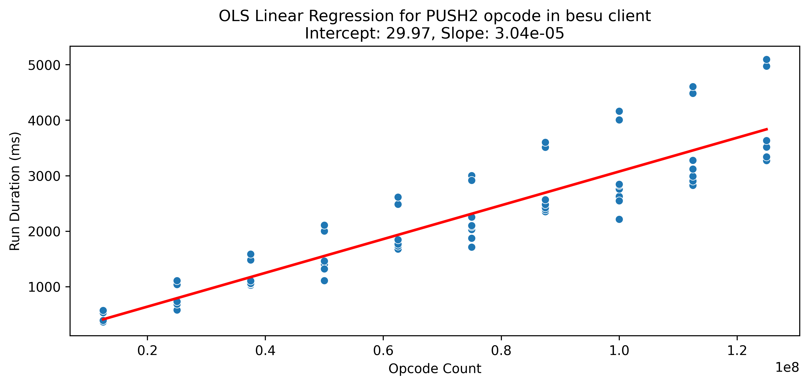


## geth


```python
                            OLS Regression Results                            
==============================================================================
Dep. Variable:        run_duration_ms   R-squared:                       0.997
Model:                            OLS   Adj. R-squared:                  0.997
Method:                 Least Squares   F-statistic:                 2.520e+04
Date:                Tue, 23 Dec 2025   Prob (F-statistic):           2.20e-93
Time:                        08:41:10   Log-Likelihood:                -354.31
No. Observations:                  74   AIC:                             712.6
Df Residuals:                      72   BIC:                             717.2
Df Model:                           1                                         
Covariance Type:            nonrobust                                         
==============================================================================
                 coef    std err          t      P>|t|      [0.025      0.975]
------------------------------------------------------------------------------
const         37.0925      7.425      4.995      0.000      22.291      51.894
opcount     1.529e-05   9.63e-08    158.738      0.000    1.51e-05    1.55e-05
==============================================================================
Omnibus:                       54.189   Durbin-Watson:                   2.099
Prob(Omnibus):                  0.000   Jarque-Bera (JB):              447.983
Skew:                           1.882   Prob(JB):                     5.27e-98
Kurtosis:                      14.451   Cond. No.                     1.67e+08
==============================================================================

Notes:
[1] Standard Errors assume that the covariance matrix of the errors is correctly specified.
[2] The condition number is large, 1.67e+08. This might indicate that there are
strong multicollinearity or other numerical problems.
```


# PUSH3

## nethermind


```python
                            OLS Regression Results                            
==============================================================================
Dep. Variable:        run_duration_ms   R-squared:                       0.991
Model:                            OLS   Adj. R-squared:                  0.990
Method:                 Least Squares   F-statistic:                     7587.
Date:                Tue, 23 Dec 2025   Prob (F-statistic):           1.02e-74
Time:                        08:41:10   Log-Likelihood:                -367.98
No. Observations:                  74   AIC:                             740.0
Df Residuals:                      72   BIC:                             744.6
Df Model:                           1                                         
Covariance Type:            nonrobust                                         
==============================================================================
                 coef    std err          t      P>|t|      [0.025      0.975]
------------------------------------------------------------------------------
const         44.5670      8.931      4.990      0.000      26.763      62.371
opcount     1.009e-05   1.16e-07     87.102      0.000    9.86e-06    1.03e-05
==============================================================================
Omnibus:                       33.432   Durbin-Watson:                   1.975
Prob(Omnibus):                  0.000   Jarque-Bera (JB):               74.656
Skew:                          -1.544   Prob(JB):                     6.15e-17
Kurtosis:                       6.831   Cond. No.                     1.67e+08
==============================================================================

Notes:
[1] Standard Errors assume that the covariance matrix of the errors is correctly specified.
[2] The condition number is large, 1.67e+08. This might indicate that there are
strong multicollinearity or other numerical problems.
```

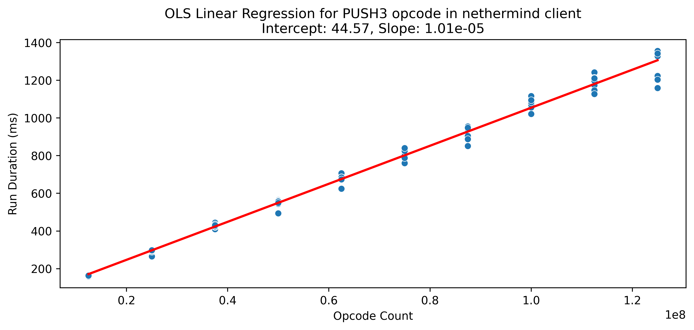


## reth


```python
                            OLS Regression Results                            
==============================================================================
Dep. Variable:        run_duration_ms   R-squared:                       0.993
Model:                            OLS   Adj. R-squared:                  0.993
Method:                 Least Squares   F-statistic:                     9949.
Date:                Tue, 23 Dec 2025   Prob (F-statistic):           6.38e-79
Time:                        08:41:10   Log-Likelihood:                -289.75
No. Observations:                  74   AIC:                             583.5
Df Residuals:                      72   BIC:                             588.1
Df Model:                           1                                         
Covariance Type:            nonrobust                                         
==============================================================================
                 coef    std err          t      P>|t|      [0.025      0.975]
------------------------------------------------------------------------------
const         38.2299      3.103     12.319      0.000      32.044      44.416
opcount     4.015e-06   4.03e-08     99.744      0.000    3.93e-06     4.1e-06
==============================================================================
Omnibus:                        8.092   Durbin-Watson:                   1.646
Prob(Omnibus):                  0.017   Jarque-Bera (JB):               10.169
Skew:                          -0.457   Prob(JB):                      0.00619
Kurtosis:                       4.569   Cond. No.                     1.67e+08
==============================================================================

Notes:
[1] Standard Errors assume that the covariance matrix of the errors is correctly specified.
[2] The condition number is large, 1.67e+08. This might indicate that there are
strong multicollinearity or other numerical problems.
```

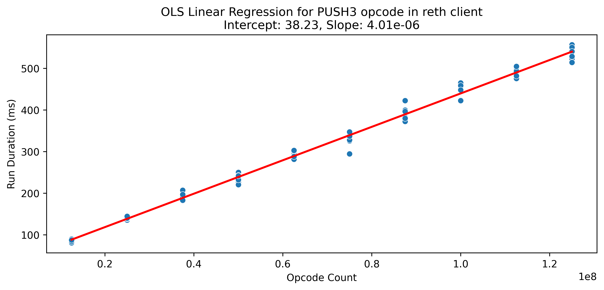


## besu


```python
                            OLS Regression Results                            
==============================================================================
Dep. Variable:        run_duration_ms   R-squared:                       0.847
Model:                            OLS   Adj. R-squared:                  0.845
Method:                 Least Squares   F-statistic:                     397.9
Date:                Tue, 23 Dec 2025   Prob (F-statistic):           4.77e-31
Time:                        08:41:11   Log-Likelihood:                -560.03
No. Observations:                  74   AIC:                             1124.
Df Residuals:                      72   BIC:                             1129.
Df Model:                           1                                         
Covariance Type:            nonrobust                                         
==============================================================================
                 coef    std err          t      P>|t|      [0.025      0.975]
------------------------------------------------------------------------------
const          4.0537    119.681      0.034      0.973    -234.527     242.634
opcount     3.097e-05   1.55e-06     19.948      0.000    2.79e-05    3.41e-05
==============================================================================
Omnibus:                       13.712   Durbin-Watson:                   0.666
Prob(Omnibus):                  0.001   Jarque-Bera (JB):               15.356
Skew:                           1.099   Prob(JB):                     0.000463
Kurtosis:                       3.390   Cond. No.                     1.67e+08
==============================================================================

Notes:
[1] Standard Errors assume that the covariance matrix of the errors is correctly specified.
[2] The condition number is large, 1.67e+08. This might indicate that there are
strong multicollinearity or other numerical problems.
```

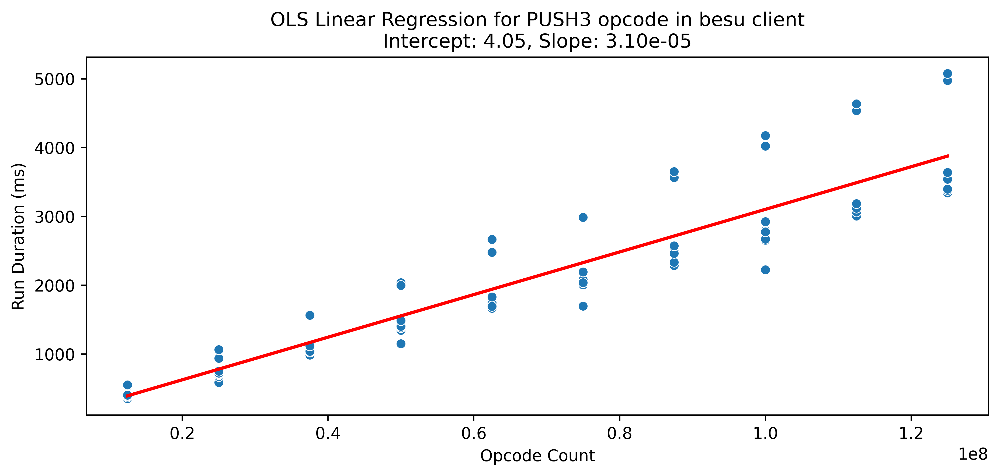


## geth


```python
                            OLS Regression Results                            
==============================================================================
Dep. Variable:        run_duration_ms   R-squared:                       0.949
Model:                            OLS   Adj. R-squared:                  0.948
Method:                 Least Squares   F-statistic:                     1344.
Date:                Tue, 23 Dec 2025   Prob (F-statistic):           2.59e-48
Time:                        08:41:11   Log-Likelihood:                -483.45
No. Observations:                  74   AIC:                             970.9
Df Residuals:                      72   BIC:                             975.5
Df Model:                           1                                         
Covariance Type:            nonrobust                                         
==============================================================================
                 coef    std err          t      P>|t|      [0.025      0.975]
------------------------------------------------------------------------------
const         -0.1655     42.521     -0.004      0.997     -84.930      84.599
opcount     2.022e-05   5.52e-07     36.654      0.000    1.91e-05    2.13e-05
==============================================================================
Omnibus:                      121.094   Durbin-Watson:                   2.074
Prob(Omnibus):                  0.000   Jarque-Bera (JB):             3539.043
Skew:                           5.496   Prob(JB):                         0.00
Kurtosis:                      35.047   Cond. No.                     1.67e+08
==============================================================================

Notes:
[1] Standard Errors assume that the covariance matrix of the errors is correctly specified.
[2] The condition number is large, 1.67e+08. This might indicate that there are
strong multicollinearity or other numerical problems.
```

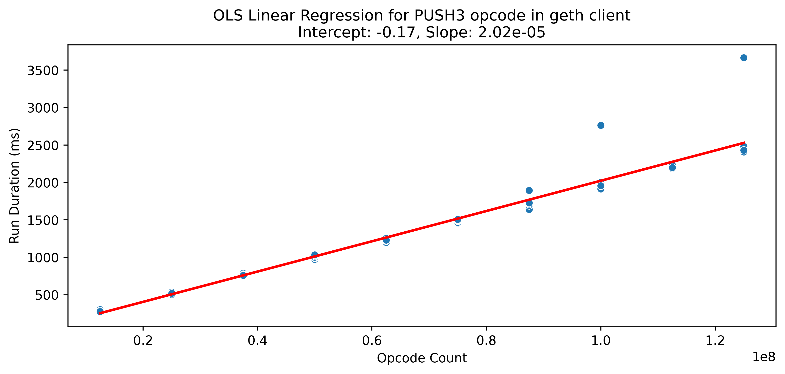


# PUSH4

## nethermind


```python
                            OLS Regression Results                            
==============================================================================
Dep. Variable:        run_duration_ms   R-squared:                       0.993
Model:                            OLS   Adj. R-squared:                  0.993
Method:                 Least Squares   F-statistic:                 1.013e+04
Date:                Tue, 23 Dec 2025   Prob (F-statistic):           3.38e-79
Time:                        08:41:11   Log-Likelihood:                -338.65
No. Observations:                  74   AIC:                             681.3
Df Residuals:                      72   BIC:                             685.9
Df Model:                           1                                         
Covariance Type:            nonrobust                                         
==============================================================================
                 coef    std err          t      P>|t|      [0.025      0.975]
------------------------------------------------------------------------------
const         37.0378      6.009      6.163      0.000      25.059      49.017
opcount     7.844e-06   7.79e-08    100.633      0.000    7.69e-06       8e-06
==============================================================================
Omnibus:                       46.355   Durbin-Watson:                   1.829
Prob(Omnibus):                  0.000   Jarque-Bera (JB):              301.759
Skew:                          -1.611   Prob(JB):                     2.98e-66
Kurtosis:                      12.353   Cond. No.                     1.67e+08
==============================================================================

Notes:
[1] Standard Errors assume that the covariance matrix of the errors is correctly specified.
[2] The condition number is large, 1.67e+08. This might indicate that there are
strong multicollinearity or other numerical problems.
```

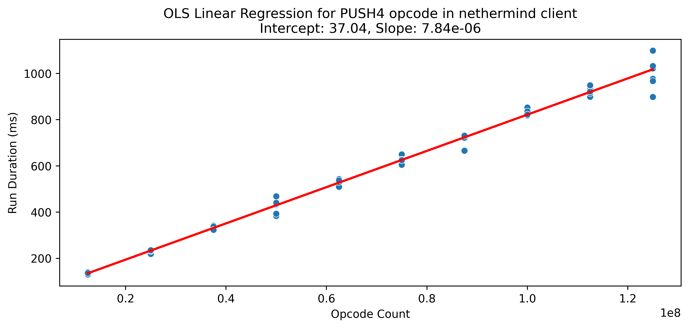


## reth


```python
                            OLS Regression Results                            
==============================================================================
Dep. Variable:        run_duration_ms   R-squared:                       0.987
Model:                            OLS   Adj. R-squared:                  0.987
Method:                 Least Squares   F-statistic:                     5592.
Date:                Tue, 23 Dec 2025   Prob (F-statistic):           5.33e-70
Time:                        08:41:11   Log-Likelihood:                -313.96
No. Observations:                  74   AIC:                             631.9
Df Residuals:                      72   BIC:                             636.5
Df Model:                           1                                         
Covariance Type:            nonrobust                                         
==============================================================================
                 coef    std err          t      P>|t|      [0.025      0.975]
------------------------------------------------------------------------------
const         34.2360      4.304      7.954      0.000      25.655      42.817
opcount     4.175e-06   5.58e-08     74.778      0.000    4.06e-06    4.29e-06
==============================================================================
Omnibus:                       12.430   Durbin-Watson:                   2.187
Prob(Omnibus):                  0.002   Jarque-Bera (JB):               13.321
Skew:                           0.873   Prob(JB):                      0.00128
Kurtosis:                       4.129   Cond. No.                     1.67e+08
==============================================================================

Notes:
[1] Standard Errors assume that the covariance matrix of the errors is correctly specified.
[2] The condition number is large, 1.67e+08. This might indicate that there are
strong multicollinearity or other numerical problems.
```


## besu


```python
                            OLS Regression Results                            
==============================================================================
Dep. Variable:        run_duration_ms   R-squared:                       0.848
Model:                            OLS   Adj. R-squared:                  0.846
Method:                 Least Squares   F-statistic:                     403.2
Date:                Tue, 23 Dec 2025   Prob (F-statistic):           3.17e-31
Time:                        08:41:11   Log-Likelihood:                -558.76
No. Observations:                  74   AIC:                             1122.
Df Residuals:                      72   BIC:                             1126.
Df Model:                           1                                         
Covariance Type:            nonrobust                                         
==============================================================================
                 coef    std err          t      P>|t|      [0.025      0.975]
------------------------------------------------------------------------------
const         12.5552    117.655      0.107      0.915    -221.985     247.095
opcount     3.065e-05   1.53e-06     20.081      0.000    2.76e-05    3.37e-05
==============================================================================
Omnibus:                       14.665   Durbin-Watson:                   0.373
Prob(Omnibus):                  0.001   Jarque-Bera (JB):               16.428
Skew:                           1.115   Prob(JB):                     0.000271
Kurtosis:                       3.600   Cond. No.                     1.67e+08
==============================================================================

Notes:
[1] Standard Errors assume that the covariance matrix of the errors is correctly specified.
[2] The condition number is large, 1.67e+08. This might indicate that there are
strong multicollinearity or other numerical problems.
```

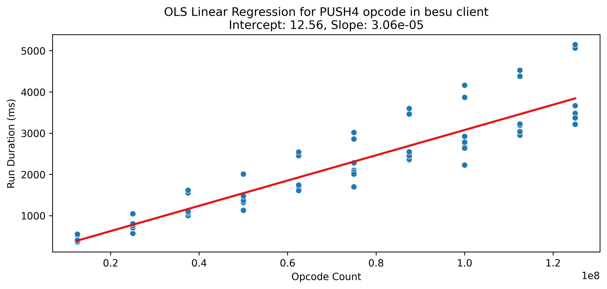


## geth


```python
                            OLS Regression Results                            
==============================================================================
Dep. Variable:        run_duration_ms   R-squared:                       0.991
Model:                            OLS   Adj. R-squared:                  0.991
Method:                 Least Squares   F-statistic:                     7701.
Date:                Tue, 23 Dec 2025   Prob (F-statistic):           5.99e-75
Time:                        08:41:11   Log-Likelihood:                -414.06
No. Observations:                  74   AIC:                             832.1
Df Residuals:                      72   BIC:                             836.7
Df Model:                           1                                         
Covariance Type:            nonrobust                                         
==============================================================================
                 coef    std err          t      P>|t|      [0.025      0.975]
------------------------------------------------------------------------------
const         50.9581     16.649      3.061      0.003      17.768      84.148
opcount     1.895e-05   2.16e-07     87.753      0.000    1.85e-05    1.94e-05
==============================================================================
Omnibus:                      137.291   Durbin-Watson:                   1.970
Prob(Omnibus):                  0.000   Jarque-Bera (JB):             7589.432
Skew:                           6.444   Prob(JB):                         0.00
Kurtosis:                      50.910   Cond. No.                     1.67e+08
==============================================================================

Notes:
[1] Standard Errors assume that the covariance matrix of the errors is correctly specified.
[2] The condition number is large, 1.67e+08. This might indicate that there are
strong multicollinearity or other numerical problems.
```


# PUSH5

## nethermind


```python
                            OLS Regression Results                            
==============================================================================
Dep. Variable:        run_duration_ms   R-squared:                       0.994
Model:                            OLS   Adj. R-squared:                  0.994
Method:                 Least Squares   F-statistic:                 1.195e+04
Date:                Tue, 23 Dec 2025   Prob (F-statistic):           9.01e-82
Time:                        08:41:11   Log-Likelihood:                -349.63
No. Observations:                  74   AIC:                             703.3
Df Residuals:                      72   BIC:                             707.9
Df Model:                           1                                         
Covariance Type:            nonrobust                                         
==============================================================================
                 coef    std err          t      P>|t|      [0.025      0.975]
------------------------------------------------------------------------------
const         46.1704      6.970      6.624      0.000      32.276      60.065
opcount     9.884e-06   9.04e-08    109.327      0.000     9.7e-06    1.01e-05
==============================================================================
Omnibus:                       38.380   Durbin-Watson:                   2.021
Prob(Omnibus):                  0.000   Jarque-Bera (JB):               97.212
Skew:                          -1.729   Prob(JB):                     7.78e-22
Kurtosis:                       7.423   Cond. No.                     1.67e+08
==============================================================================

Notes:
[1] Standard Errors assume that the covariance matrix of the errors is correctly specified.
[2] The condition number is large, 1.67e+08. This might indicate that there are
strong multicollinearity or other numerical problems.
```

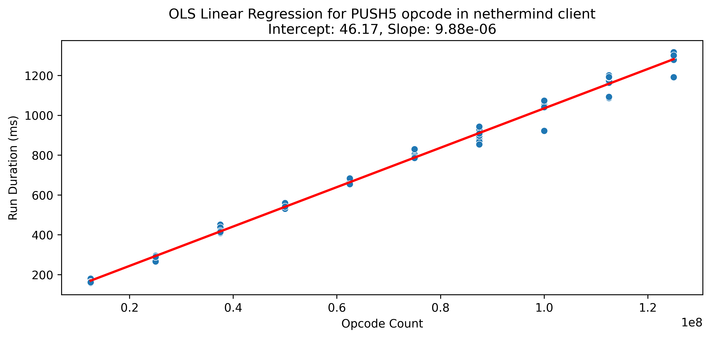


## reth


```python
                            OLS Regression Results                            
==============================================================================
Dep. Variable:        run_duration_ms   R-squared:                       0.991
Model:                            OLS   Adj. R-squared:                  0.991
Method:                 Least Squares   F-statistic:                     7858.
Date:                Tue, 23 Dec 2025   Prob (F-statistic):           2.90e-75
Time:                        08:41:12   Log-Likelihood:                -298.34
No. Observations:                  74   AIC:                             600.7
Df Residuals:                      72   BIC:                             605.3
Df Model:                           1                                         
Covariance Type:            nonrobust                                         
==============================================================================
                 coef    std err          t      P>|t|      [0.025      0.975]
------------------------------------------------------------------------------
const         40.2437      3.485     11.547      0.000      33.296      47.191
opcount     4.007e-06   4.52e-08     88.648      0.000    3.92e-06     4.1e-06
==============================================================================
Omnibus:                        6.305   Durbin-Watson:                   1.520
Prob(Omnibus):                  0.043   Jarque-Bera (JB):                6.214
Skew:                          -0.462   Prob(JB):                       0.0447
Kurtosis:                       4.078   Cond. No.                     1.67e+08
==============================================================================

Notes:
[1] Standard Errors assume that the covariance matrix of the errors is correctly specified.
[2] The condition number is large, 1.67e+08. This might indicate that there are
strong multicollinearity or other numerical problems.
```


## besu


```python
                            OLS Regression Results                            
==============================================================================
Dep. Variable:        run_duration_ms   R-squared:                       0.833
Model:                            OLS   Adj. R-squared:                  0.831
Method:                 Least Squares   F-statistic:                     358.9
Date:                Tue, 23 Dec 2025   Prob (F-statistic):           1.08e-29
Time:                        08:41:12   Log-Likelihood:                -563.18
No. Observations:                  74   AIC:                             1130.
Df Residuals:                      72   BIC:                             1135.
Df Model:                           1                                         
Covariance Type:            nonrobust                                         
==============================================================================
                 coef    std err          t      P>|t|      [0.025      0.975]
------------------------------------------------------------------------------
const         14.3897    124.895      0.115      0.909    -234.584     263.363
opcount     3.069e-05   1.62e-06     18.946      0.000    2.75e-05    3.39e-05
==============================================================================
Omnibus:                       15.315   Durbin-Watson:                   0.723
Prob(Omnibus):                  0.000   Jarque-Bera (JB):               17.435
Skew:                           1.149   Prob(JB):                     0.000164
Kurtosis:                       3.611   Cond. No.                     1.67e+08
==============================================================================

Notes:
[1] Standard Errors assume that the covariance matrix of the errors is correctly specified.
[2] The condition number is large, 1.67e+08. This might indicate that there are
strong multicollinearity or other numerical problems.
```

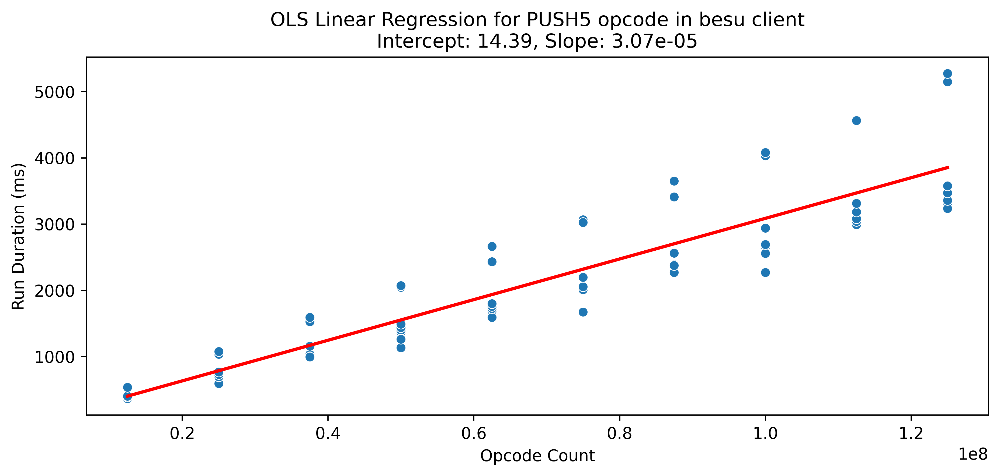


## geth


```python
                            OLS Regression Results                            
==============================================================================
Dep. Variable:        run_duration_ms   R-squared:                       0.978
Model:                            OLS   Adj. R-squared:                  0.978
Method:                 Least Squares   F-statistic:                     3262.
Date:                Tue, 23 Dec 2025   Prob (F-statistic):           1.03e-61
Time:                        08:41:12   Log-Likelihood:                -446.00
No. Observations:                  74   AIC:                             896.0
Df Residuals:                      72   BIC:                             900.6
Df Model:                           1                                         
Covariance Type:            nonrobust                                         
==============================================================================
                 coef    std err          t      P>|t|      [0.025      0.975]
------------------------------------------------------------------------------
const         50.0849     25.634      1.954      0.055      -1.016     101.186
opcount     1.899e-05   3.32e-07     57.118      0.000    1.83e-05    1.97e-05
==============================================================================
Omnibus:                      137.940   Durbin-Watson:                   1.523
Prob(Omnibus):                  0.000   Jarque-Bera (JB):             7419.952
Skew:                           6.526   Prob(JB):                         0.00
Kurtosis:                      50.288   Cond. No.                     1.67e+08
==============================================================================

Notes:
[1] Standard Errors assume that the covariance matrix of the errors is correctly specified.
[2] The condition number is large, 1.67e+08. This might indicate that there are
strong multicollinearity or other numerical problems.
```


# PUSH6

## nethermind


```python
                            OLS Regression Results                            
==============================================================================
Dep. Variable:        run_duration_ms   R-squared:                       0.992
Model:                            OLS   Adj. R-squared:                  0.992
Method:                 Least Squares   F-statistic:                     9037.
Date:                Tue, 23 Dec 2025   Prob (F-statistic):           1.98e-77
Time:                        08:41:12   Log-Likelihood:                -360.08
No. Observations:                  74   AIC:                             724.2
Df Residuals:                      72   BIC:                             728.8
Df Model:                           1                                         
Covariance Type:            nonrobust                                         
==============================================================================
                 coef    std err          t      P>|t|      [0.025      0.975]
------------------------------------------------------------------------------
const         42.9387      8.027      5.349      0.000      26.936      58.941
opcount     9.898e-06   1.04e-07     95.062      0.000    9.69e-06    1.01e-05
==============================================================================
Omnibus:                       42.557   Durbin-Watson:                   1.677
Prob(Omnibus):                  0.000   Jarque-Bera (JB):              416.198
Skew:                           1.238   Prob(JB):                     4.20e-91
Kurtosis:                      14.351   Cond. No.                     1.67e+08
==============================================================================

Notes:
[1] Standard Errors assume that the covariance matrix of the errors is correctly specified.
[2] The condition number is large, 1.67e+08. This might indicate that there are
strong multicollinearity or other numerical problems.
```

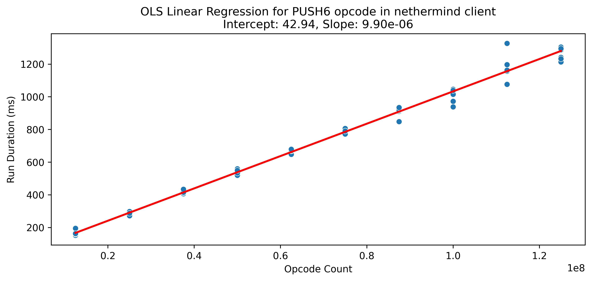


## reth


```python
                            OLS Regression Results                            
==============================================================================
Dep. Variable:        run_duration_ms   R-squared:                       0.992
Model:                            OLS   Adj. R-squared:                  0.992
Method:                 Least Squares   F-statistic:                     9492.
Date:                Tue, 23 Dec 2025   Prob (F-statistic):           3.42e-78
Time:                        08:41:12   Log-Likelihood:                -292.63
No. Observations:                  74   AIC:                             589.3
Df Residuals:                      72   BIC:                             593.9
Df Model:                           1                                         
Covariance Type:            nonrobust                                         
==============================================================================
                 coef    std err          t      P>|t|      [0.025      0.975]
------------------------------------------------------------------------------
const         34.9144      3.227     10.821      0.000      28.482      41.347
opcount     4.077e-06   4.19e-08     97.427      0.000    3.99e-06    4.16e-06
==============================================================================
Omnibus:                        2.110   Durbin-Watson:                   1.676
Prob(Omnibus):                  0.348   Jarque-Bera (JB):                1.469
Skew:                          -0.148   Prob(JB):                        0.480
Kurtosis:                       3.624   Cond. No.                     1.67e+08
==============================================================================

Notes:
[1] Standard Errors assume that the covariance matrix of the errors is correctly specified.
[2] The condition number is large, 1.67e+08. This might indicate that there are
strong multicollinearity or other numerical problems.
```

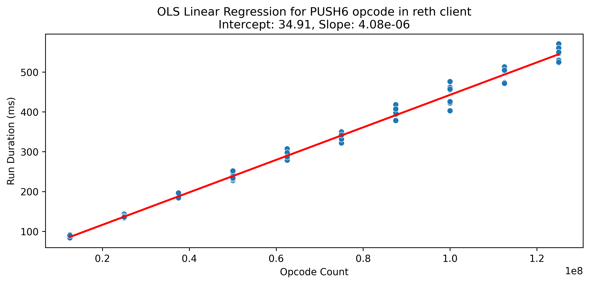


## besu


```python
                            OLS Regression Results                            
==============================================================================
Dep. Variable:        run_duration_ms   R-squared:                       0.837
Model:                            OLS   Adj. R-squared:                  0.834
Method:                 Least Squares   F-statistic:                     368.9
Date:                Tue, 23 Dec 2025   Prob (F-statistic):           4.74e-30
Time:                        08:41:12   Log-Likelihood:                -562.57
No. Observations:                  74   AIC:                             1129.
Df Residuals:                      72   BIC:                             1134.
Df Model:                           1                                         
Covariance Type:            nonrobust                                         
==============================================================================
                 coef    std err          t      P>|t|      [0.025      0.975]
------------------------------------------------------------------------------
const          6.3519    123.869      0.051      0.959    -240.575     253.279
opcount     3.086e-05   1.61e-06     19.208      0.000    2.77e-05    3.41e-05
==============================================================================
Omnibus:                       14.847   Durbin-Watson:                   0.794
Prob(Omnibus):                  0.001   Jarque-Bera (JB):               16.613
Skew:                           1.111   Prob(JB):                     0.000247
Kurtosis:                       3.668   Cond. No.                     1.67e+08
==============================================================================

Notes:
[1] Standard Errors assume that the covariance matrix of the errors is correctly specified.
[2] The condition number is large, 1.67e+08. This might indicate that there are
strong multicollinearity or other numerical problems.
```

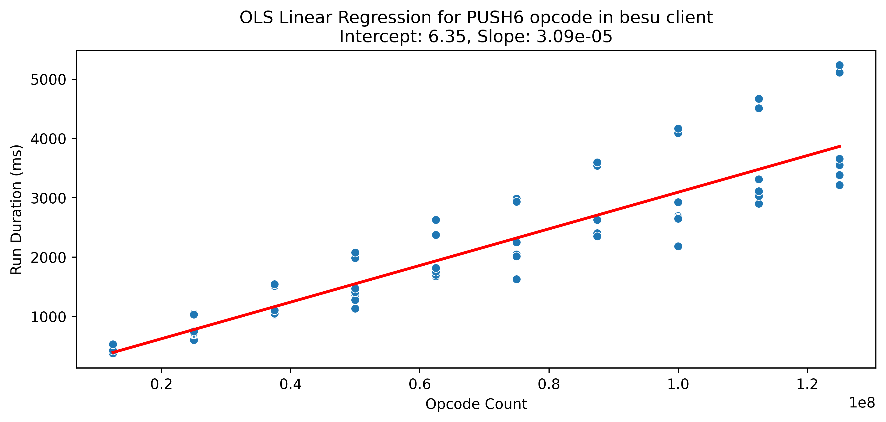


## geth


```python
                            OLS Regression Results                            
==============================================================================
Dep. Variable:        run_duration_ms   R-squared:                       0.998
Model:                            OLS   Adj. R-squared:                  0.998
Method:                 Least Squares   F-statistic:                 3.482e+04
Date:                Tue, 23 Dec 2025   Prob (F-statistic):           1.98e-98
Time:                        08:41:12   Log-Likelihood:                -359.97
No. Observations:                  74   AIC:                             723.9
Df Residuals:                      72   BIC:                             728.5
Df Model:                           1                                         
Covariance Type:            nonrobust                                         
==============================================================================
                 coef    std err          t      P>|t|      [0.025      0.975]
------------------------------------------------------------------------------
const         39.4061      8.015      4.916      0.000      23.428      55.384
opcount      1.94e-05   1.04e-07    186.610      0.000    1.92e-05    1.96e-05
==============================================================================
Omnibus:                       57.828   Durbin-Watson:                   1.929
Prob(Omnibus):                  0.000   Jarque-Bera (JB):              488.636
Skew:                          -2.058   Prob(JB):                    7.84e-107
Kurtosis:                      14.897   Cond. No.                     1.67e+08
==============================================================================

Notes:
[1] Standard Errors assume that the covariance matrix of the errors is correctly specified.
[2] The condition number is large, 1.67e+08. This might indicate that there are
strong multicollinearity or other numerical problems.
```


# PUSH7

## nethermind


```python
                            OLS Regression Results                            
==============================================================================
Dep. Variable:        run_duration_ms   R-squared:                       0.991
Model:                            OLS   Adj. R-squared:                  0.991
Method:                 Least Squares   F-statistic:                     7728.
Date:                Tue, 23 Dec 2025   Prob (F-statistic):           5.27e-75
Time:                        08:41:13   Log-Likelihood:                -365.13
No. Observations:                  74   AIC:                             734.3
Df Residuals:                      72   BIC:                             738.9
Df Model:                           1                                         
Covariance Type:            nonrobust                                         
==============================================================================
                 coef    std err          t      P>|t|      [0.025      0.975]
------------------------------------------------------------------------------
const         48.3795      8.595      5.629      0.000      31.246      65.513
opcount       9.8e-06   1.11e-07     87.911      0.000    9.58e-06       1e-05
==============================================================================
Omnibus:                       29.788   Durbin-Watson:                   2.095
Prob(Omnibus):                  0.000   Jarque-Bera (JB):               67.376
Skew:                          -1.342   Prob(JB):                     2.34e-15
Kurtosis:                       6.827   Cond. No.                     1.67e+08
==============================================================================

Notes:
[1] Standard Errors assume that the covariance matrix of the errors is correctly specified.
[2] The condition number is large, 1.67e+08. This might indicate that there are
strong multicollinearity or other numerical problems.
```


## reth


```python
                            OLS Regression Results                            
==============================================================================
Dep. Variable:        run_duration_ms   R-squared:                       0.990
Model:                            OLS   Adj. R-squared:                  0.989
Method:                 Least Squares   F-statistic:                     6852.
Date:                Tue, 23 Dec 2025   Prob (F-statistic):           3.84e-73
Time:                        08:41:13   Log-Likelihood:                -308.49
No. Observations:                  74   AIC:                             621.0
Df Residuals:                      72   BIC:                             625.6
Df Model:                           1                                         
Covariance Type:            nonrobust                                         
==============================================================================
                 coef    std err          t      P>|t|      [0.025      0.975]
------------------------------------------------------------------------------
const         34.8282      3.998      8.712      0.000      26.859      42.798
opcount     4.293e-06   5.19e-08     82.780      0.000    4.19e-06     4.4e-06
==============================================================================
Omnibus:                        3.183   Durbin-Watson:                   1.516
Prob(Omnibus):                  0.204   Jarque-Bera (JB):                2.969
Skew:                          -0.124   Prob(JB):                        0.227
Kurtosis:                       3.949   Cond. No.                     1.67e+08
==============================================================================

Notes:
[1] Standard Errors assume that the covariance matrix of the errors is correctly specified.
[2] The condition number is large, 1.67e+08. This might indicate that there are
strong multicollinearity or other numerical problems.
```


## besu


```python
                            OLS Regression Results                            
==============================================================================
Dep. Variable:        run_duration_ms   R-squared:                       0.833
Model:                            OLS   Adj. R-squared:                  0.831
Method:                 Least Squares   F-statistic:                     359.4
Date:                Tue, 23 Dec 2025   Prob (F-statistic):           1.05e-29
Time:                        08:41:13   Log-Likelihood:                -562.88
No. Observations:                  74   AIC:                             1130.
Df Residuals:                      72   BIC:                             1134.
Df Model:                           1                                         
Covariance Type:            nonrobust                                         
==============================================================================
                 coef    std err          t      P>|t|      [0.025      0.975]
------------------------------------------------------------------------------
const         22.0941    124.396      0.178      0.860    -225.885     270.074
opcount     3.059e-05   1.61e-06     18.957      0.000    2.74e-05    3.38e-05
==============================================================================
Omnibus:                       14.520   Durbin-Watson:                   0.430
Prob(Omnibus):                  0.001   Jarque-Bera (JB):               16.376
Skew:                           1.125   Prob(JB):                     0.000278
Kurtosis:                       3.502   Cond. No.                     1.67e+08
==============================================================================

Notes:
[1] Standard Errors assume that the covariance matrix of the errors is correctly specified.
[2] The condition number is large, 1.67e+08. This might indicate that there are
strong multicollinearity or other numerical problems.
```


## geth


```python
                            OLS Regression Results                            
==============================================================================
Dep. Variable:        run_duration_ms   R-squared:                       0.991
Model:                            OLS   Adj. R-squared:                  0.991
Method:                 Least Squares   F-statistic:                     8013.
Date:                Tue, 23 Dec 2025   Prob (F-statistic):           1.45e-75
Time:                        08:41:13   Log-Likelihood:                -416.77
No. Observations:                  74   AIC:                             837.5
Df Residuals:                      72   BIC:                             842.1
Df Model:                           1                                         
Covariance Type:            nonrobust                                         
==============================================================================
                 coef    std err          t      P>|t|      [0.025      0.975]
------------------------------------------------------------------------------
const         43.8622     17.268      2.540      0.013       9.438      78.286
opcount     2.005e-05   2.24e-07     89.513      0.000    1.96e-05    2.05e-05
==============================================================================
Omnibus:                       89.678   Durbin-Watson:                   1.288
Prob(Omnibus):                  0.000   Jarque-Bera (JB):             1187.121
Skew:                           3.686   Prob(JB):                    1.66e-258
Kurtosis:                      21.184   Cond. No.                     1.67e+08
==============================================================================

Notes:
[1] Standard Errors assume that the covariance matrix of the errors is correctly specified.
[2] The condition number is large, 1.67e+08. This might indicate that there are
strong multicollinearity or other numerical problems.
```


# PUSH8

## nethermind


```python
                            OLS Regression Results                            
==============================================================================
Dep. Variable:        run_duration_ms   R-squared:                       0.961
Model:                            OLS   Adj. R-squared:                  0.960
Method:                 Least Squares   F-statistic:                     1756.
Date:                Tue, 23 Dec 2025   Prob (F-statistic):           2.58e-52
Time:                        08:41:13   Log-Likelihood:                -402.83
No. Observations:                  74   AIC:                             809.7
Df Residuals:                      72   BIC:                             814.3
Df Model:                           1                                         
Covariance Type:            nonrobust                                         
==============================================================================
                 coef    std err          t      P>|t|      [0.025      0.975]
------------------------------------------------------------------------------
const         34.2373     14.304      2.394      0.019       5.722      62.752
opcount     7.775e-06   1.86e-07     41.906      0.000    7.41e-06    8.14e-06
==============================================================================
Omnibus:                      134.140   Durbin-Watson:                   2.181
Prob(Omnibus):                  0.000   Jarque-Bera (JB):             7008.185
Skew:                           6.197   Prob(JB):                         0.00
Kurtosis:                      49.036   Cond. No.                     1.67e+08
==============================================================================

Notes:
[1] Standard Errors assume that the covariance matrix of the errors is correctly specified.
[2] The condition number is large, 1.67e+08. This might indicate that there are
strong multicollinearity or other numerical problems.
```

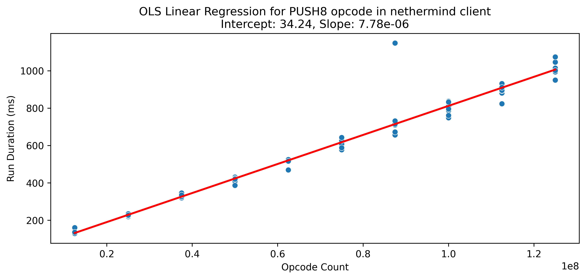


## reth


```python
                            OLS Regression Results                            
==============================================================================
Dep. Variable:        run_duration_ms   R-squared:                       0.988
Model:                            OLS   Adj. R-squared:                  0.988
Method:                 Least Squares   F-statistic:                     5956.
Date:                Tue, 23 Dec 2025   Prob (F-statistic):           5.65e-71
Time:                        08:41:13   Log-Likelihood:                -310.86
No. Observations:                  74   AIC:                             625.7
Df Residuals:                      72   BIC:                             630.3
Df Model:                           1                                         
Covariance Type:            nonrobust                                         
==============================================================================
                 coef    std err          t      P>|t|      [0.025      0.975]
------------------------------------------------------------------------------
const         36.8778      4.128      8.934      0.000      28.650      45.106
opcount     4.132e-06   5.35e-08     77.174      0.000    4.03e-06    4.24e-06
==============================================================================
Omnibus:                       20.309   Durbin-Watson:                   1.631
Prob(Omnibus):                  0.000   Jarque-Bera (JB):               37.084
Skew:                           0.971   Prob(JB):                     8.86e-09
Kurtosis:                       5.873   Cond. No.                     1.67e+08
==============================================================================

Notes:
[1] Standard Errors assume that the covariance matrix of the errors is correctly specified.
[2] The condition number is large, 1.67e+08. This might indicate that there are
strong multicollinearity or other numerical problems.
```

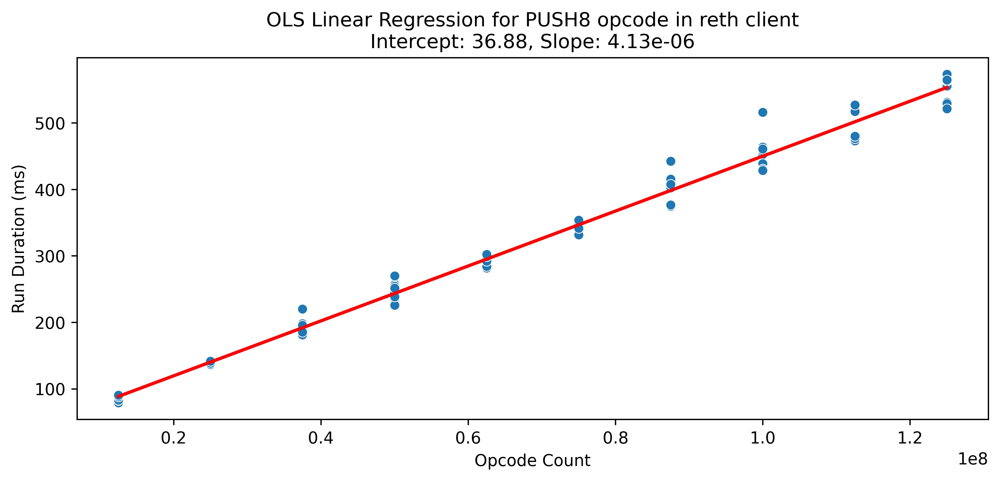


## besu


```python
                            OLS Regression Results                            
==============================================================================
Dep. Variable:        run_duration_ms   R-squared:                       0.838
Model:                            OLS   Adj. R-squared:                  0.835
Method:                 Least Squares   F-statistic:                     371.7
Date:                Tue, 23 Dec 2025   Prob (F-statistic):           3.77e-30
Time:                        08:41:13   Log-Likelihood:                -562.09
No. Observations:                  74   AIC:                             1128.
Df Residuals:                      72   BIC:                             1133.
Df Model:                           1                                         
Covariance Type:            nonrobust                                         
==============================================================================
                 coef    std err          t      P>|t|      [0.025      0.975]
------------------------------------------------------------------------------
const         23.7620    123.069      0.193      0.847    -221.571     269.095
opcount     3.078e-05    1.6e-06     19.280      0.000    2.76e-05     3.4e-05
==============================================================================
Omnibus:                       12.497   Durbin-Watson:                   0.873
Prob(Omnibus):                  0.002   Jarque-Bera (JB):               13.404
Skew:                           1.017   Prob(JB):                      0.00123
Kurtosis:                       3.459   Cond. No.                     1.67e+08
==============================================================================

Notes:
[1] Standard Errors assume that the covariance matrix of the errors is correctly specified.
[2] The condition number is large, 1.67e+08. This might indicate that there are
strong multicollinearity or other numerical problems.
```

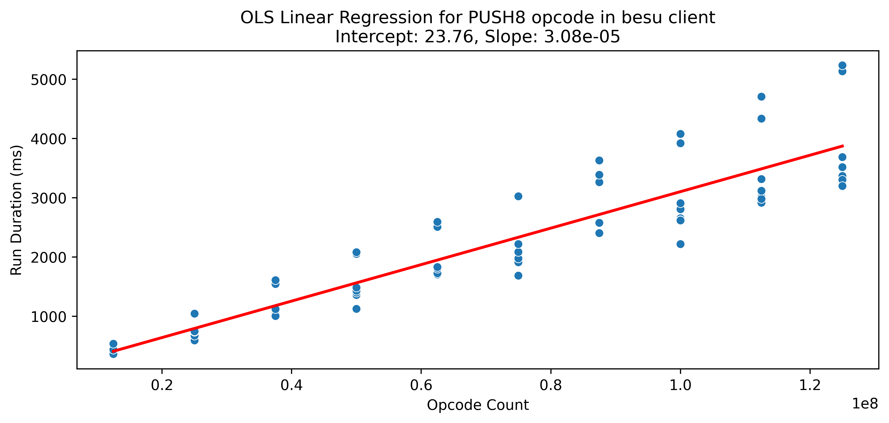


## geth


```python
                            OLS Regression Results                            
==============================================================================
Dep. Variable:        run_duration_ms   R-squared:                       0.994
Model:                            OLS   Adj. R-squared:                  0.994
Method:                 Least Squares   F-statistic:                 1.262e+04
Date:                Tue, 23 Dec 2025   Prob (F-statistic):           1.30e-82
Time:                        08:41:13   Log-Likelihood:                -397.46
No. Observations:                  74   AIC:                             798.9
Df Residuals:                      72   BIC:                             803.5
Df Model:                           1                                         
Covariance Type:            nonrobust                                         
==============================================================================
                 coef    std err          t      P>|t|      [0.025      0.975]
------------------------------------------------------------------------------
const         39.4297     13.302      2.964      0.004      12.912      65.947
opcount     1.938e-05   1.73e-07    112.327      0.000     1.9e-05    1.97e-05
==============================================================================
Omnibus:                      120.294   Durbin-Watson:                   2.008
Prob(Omnibus):                  0.000   Jarque-Bera (JB):             4549.795
Skew:                           5.237   Prob(JB):                         0.00
Kurtosis:                      39.958   Cond. No.                     1.67e+08
==============================================================================

Notes:
[1] Standard Errors assume that the covariance matrix of the errors is correctly specified.
[2] The condition number is large, 1.67e+08. This might indicate that there are
strong multicollinearity or other numerical problems.
```

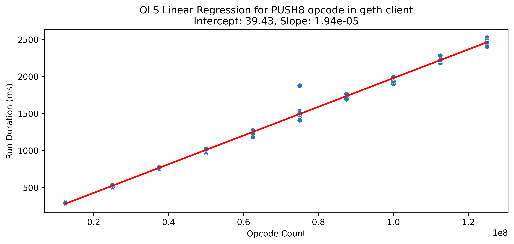


# PUSH9

## nethermind


```python
                            OLS Regression Results                            
==============================================================================
Dep. Variable:        run_duration_ms   R-squared:                       0.994
Model:                            OLS   Adj. R-squared:                  0.994
Method:                 Least Squares   F-statistic:                 1.157e+04
Date:                Tue, 23 Dec 2025   Prob (F-statistic):           2.86e-81
Time:                        08:41:14   Log-Likelihood:                -351.69
No. Observations:                  74   AIC:                             707.4
Df Residuals:                      72   BIC:                             712.0
Df Model:                           1                                         
Covariance Type:            nonrobust                                         
==============================================================================
                 coef    std err          t      P>|t|      [0.025      0.975]
------------------------------------------------------------------------------
const         35.8562      7.167      5.003      0.000      21.570      50.142
opcount         1e-05    9.3e-08    107.577      0.000    9.81e-06    1.02e-05
==============================================================================
Omnibus:                       31.072   Durbin-Watson:                   1.757
Prob(Omnibus):                  0.000   Jarque-Bera (JB):               66.571
Skew:                          -1.444   Prob(JB):                     3.50e-15
Kurtosis:                       6.641   Cond. No.                     1.67e+08
==============================================================================

Notes:
[1] Standard Errors assume that the covariance matrix of the errors is correctly specified.
[2] The condition number is large, 1.67e+08. This might indicate that there are
strong multicollinearity or other numerical problems.
```

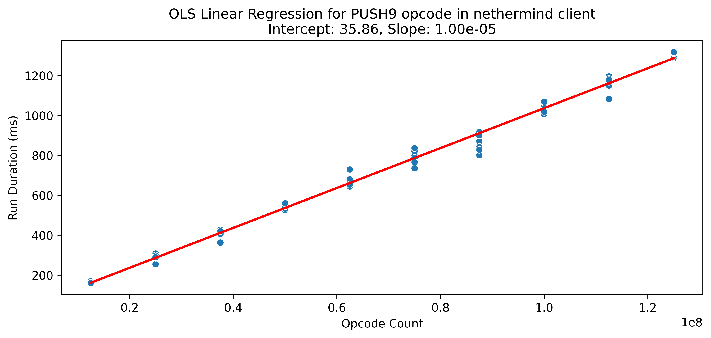


## reth


```python
                            OLS Regression Results                            
==============================================================================
Dep. Variable:        run_duration_ms   R-squared:                       0.994
Model:                            OLS   Adj. R-squared:                  0.994
Method:                 Least Squares   F-statistic:                 1.275e+04
Date:                Tue, 23 Dec 2025   Prob (F-statistic):           9.04e-83
Time:                        08:41:14   Log-Likelihood:                -280.38
No. Observations:                  74   AIC:                             564.8
Df Residuals:                      72   BIC:                             569.4
Df Model:                           1                                         
Covariance Type:            nonrobust                                         
==============================================================================
                 coef    std err          t      P>|t|      [0.025      0.975]
------------------------------------------------------------------------------
const         40.9276      2.734     14.969      0.000      35.477      46.378
opcount     4.004e-06   3.55e-08    112.895      0.000    3.93e-06    4.07e-06
==============================================================================
Omnibus:                        3.922   Durbin-Watson:                   1.780
Prob(Omnibus):                  0.141   Jarque-Bera (JB):                2.697
Skew:                           0.297   Prob(JB):                        0.260
Kurtosis:                       2.278   Cond. No.                     1.67e+08
==============================================================================

Notes:
[1] Standard Errors assume that the covariance matrix of the errors is correctly specified.
[2] The condition number is large, 1.67e+08. This might indicate that there are
strong multicollinearity or other numerical problems.
```


## besu


```python
                            OLS Regression Results                            
==============================================================================
Dep. Variable:        run_duration_ms   R-squared:                       0.842
Model:                            OLS   Adj. R-squared:                  0.840
Method:                 Least Squares   F-statistic:                     384.1
Date:                Tue, 23 Dec 2025   Prob (F-statistic):           1.40e-30
Time:                        08:41:14   Log-Likelihood:                -561.14
No. Observations:                  74   AIC:                             1126.
Df Residuals:                      72   BIC:                             1131.
Df Model:                           1                                         
Covariance Type:            nonrobust                                         
==============================================================================
                 coef    std err          t      P>|t|      [0.025      0.975]
------------------------------------------------------------------------------
const         10.3307    121.500      0.085      0.932    -231.875     252.536
opcount     3.088e-05   1.58e-06     19.597      0.000    2.77e-05     3.4e-05
==============================================================================
Omnibus:                       12.844   Durbin-Watson:                   0.532
Prob(Omnibus):                  0.002   Jarque-Bera (JB):               13.996
Skew:                           1.045   Prob(JB):                     0.000914
Kurtosis:                       3.413   Cond. No.                     1.67e+08
==============================================================================

Notes:
[1] Standard Errors assume that the covariance matrix of the errors is correctly specified.
[2] The condition number is large, 1.67e+08. This might indicate that there are
strong multicollinearity or other numerical problems.
```

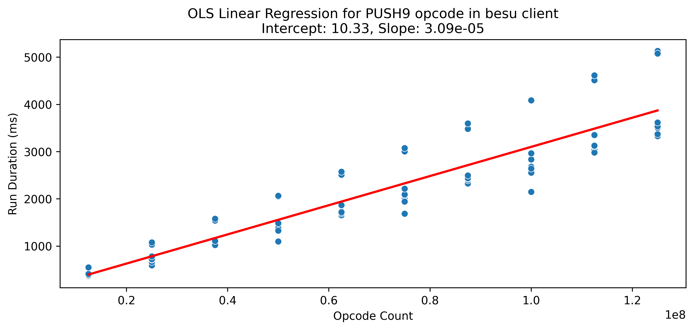


## geth


```python
                            OLS Regression Results                            
==============================================================================
Dep. Variable:        run_duration_ms   R-squared:                       0.924
Model:                            OLS   Adj. R-squared:                  0.923
Method:                 Least Squares   F-statistic:                     874.8
Date:                Tue, 23 Dec 2025   Prob (F-statistic):           5.09e-42
Time:                        08:41:14   Log-Likelihood:                -495.37
No. Observations:                  74   AIC:                             994.7
Df Residuals:                      72   BIC:                             999.3
Df Model:                           1                                         
Covariance Type:            nonrobust                                         
==============================================================================
                 coef    std err          t      P>|t|      [0.025      0.975]
------------------------------------------------------------------------------
const         56.7699     49.953      1.136      0.260     -42.809     156.348
opcount     1.916e-05   6.48e-07     29.578      0.000    1.79e-05    2.05e-05
==============================================================================
Omnibus:                      159.679   Durbin-Watson:                   2.060
Prob(Omnibus):                  0.000   Jarque-Bera (JB):            14908.433
Skew:                           8.293   Prob(JB):                         0.00
Kurtosis:                      70.528   Cond. No.                     1.67e+08
==============================================================================

Notes:
[1] Standard Errors assume that the covariance matrix of the errors is correctly specified.
[2] The condition number is large, 1.67e+08. This might indicate that there are
strong multicollinearity or other numerical problems.
```

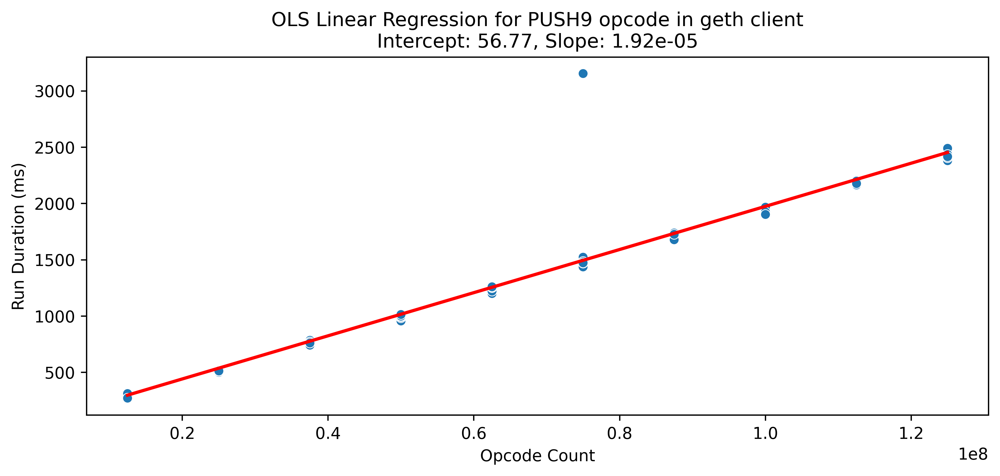


# PUSH10

## nethermind


```python
                            OLS Regression Results                            
==============================================================================
Dep. Variable:        run_duration_ms   R-squared:                       0.992
Model:                            OLS   Adj. R-squared:                  0.992
Method:                 Least Squares   F-statistic:                     9251.
Date:                Tue, 23 Dec 2025   Prob (F-statistic):           8.57e-78
Time:                        08:41:14   Log-Likelihood:                -359.71
No. Observations:                  74   AIC:                             723.4
Df Residuals:                      72   BIC:                             728.0
Df Model:                           1                                         
Covariance Type:            nonrobust                                         
==============================================================================
                 coef    std err          t      P>|t|      [0.025      0.975]
------------------------------------------------------------------------------
const         43.9311      7.987      5.500      0.000      28.009      59.853
opcount     9.964e-06   1.04e-07     96.183      0.000    9.76e-06    1.02e-05
==============================================================================
Omnibus:                       19.654   Durbin-Watson:                   1.816
Prob(Omnibus):                  0.000   Jarque-Bera (JB):               68.151
Skew:                           0.623   Prob(JB):                     1.59e-15
Kurtosis:                       7.534   Cond. No.                     1.67e+08
==============================================================================

Notes:
[1] Standard Errors assume that the covariance matrix of the errors is correctly specified.
[2] The condition number is large, 1.67e+08. This might indicate that there are
strong multicollinearity or other numerical problems.
```


## reth


```python
                            OLS Regression Results                            
==============================================================================
Dep. Variable:        run_duration_ms   R-squared:                       0.983
Model:                            OLS   Adj. R-squared:                  0.983
Method:                 Least Squares   F-statistic:                     4258.
Date:                Tue, 23 Dec 2025   Prob (F-statistic):           8.40e-66
Time:                        08:41:14   Log-Likelihood:                -323.75
No. Observations:                  74   AIC:                             651.5
Df Residuals:                      72   BIC:                             656.1
Df Model:                           1                                         
Covariance Type:            nonrobust                                         
==============================================================================
                 coef    std err          t      P>|t|      [0.025      0.975]
------------------------------------------------------------------------------
const         37.5492      4.913      7.643      0.000      27.755      47.343
opcount     4.158e-06   6.37e-08     65.257      0.000    4.03e-06    4.29e-06
==============================================================================
Omnibus:                       37.814   Durbin-Watson:                   1.455
Prob(Omnibus):                  0.000   Jarque-Bera (JB):              121.364
Skew:                           1.554   Prob(JB):                     4.43e-27
Kurtosis:                       8.450   Cond. No.                     1.67e+08
==============================================================================

Notes:
[1] Standard Errors assume that the covariance matrix of the errors is correctly specified.
[2] The condition number is large, 1.67e+08. This might indicate that there are
strong multicollinearity or other numerical problems.
```


## besu


```python
                            OLS Regression Results                            
==============================================================================
Dep. Variable:        run_duration_ms   R-squared:                       0.842
Model:                            OLS   Adj. R-squared:                  0.839
Method:                 Least Squares   F-statistic:                     382.3
Date:                Tue, 23 Dec 2025   Prob (F-statistic):           1.61e-30
Time:                        08:41:14   Log-Likelihood:                -561.19
No. Observations:                  74   AIC:                             1126.
Df Residuals:                      72   BIC:                             1131.
Df Model:                           1                                         
Covariance Type:            nonrobust                                         
==============================================================================
                 coef    std err          t      P>|t|      [0.025      0.975]
------------------------------------------------------------------------------
const         12.3973    121.578      0.102      0.919    -229.964     254.759
opcount     3.083e-05   1.58e-06     19.553      0.000    2.77e-05     3.4e-05
==============================================================================
Omnibus:                       13.561   Durbin-Watson:                   0.355
Prob(Omnibus):                  0.001   Jarque-Bera (JB):               14.910
Skew:                           1.071   Prob(JB):                     0.000579
Kurtosis:                       3.497   Cond. No.                     1.67e+08
==============================================================================

Notes:
[1] Standard Errors assume that the covariance matrix of the errors is correctly specified.
[2] The condition number is large, 1.67e+08. This might indicate that there are
strong multicollinearity or other numerical problems.
```

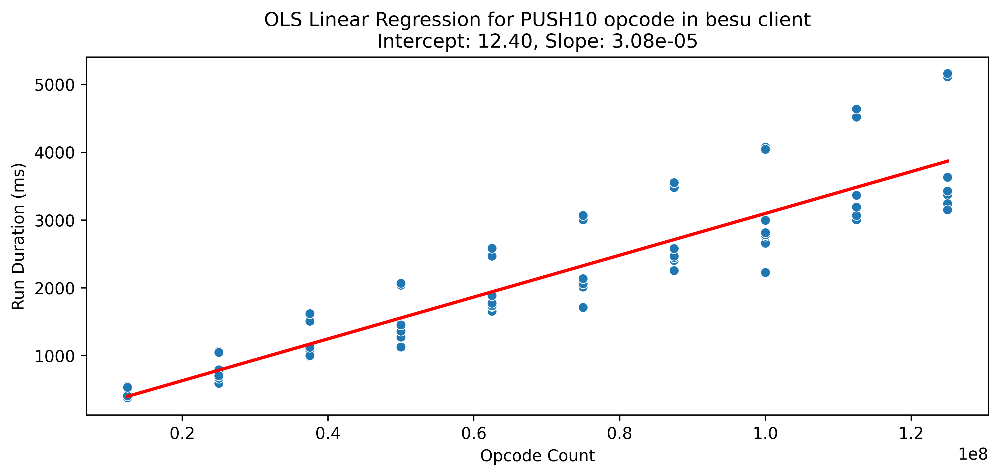


## geth


```python
                            OLS Regression Results                            
==============================================================================
Dep. Variable:        run_duration_ms   R-squared:                       0.991
Model:                            OLS   Adj. R-squared:                  0.991
Method:                 Least Squares   F-statistic:                     8198.
Date:                Tue, 23 Dec 2025   Prob (F-statistic):           6.42e-76
Time:                        08:41:15   Log-Likelihood:                -412.66
No. Observations:                  74   AIC:                             829.3
Df Residuals:                      72   BIC:                             833.9
Df Model:                           1                                         
Covariance Type:            nonrobust                                         
==============================================================================
                 coef    std err          t      P>|t|      [0.025      0.975]
------------------------------------------------------------------------------
const         43.4985     16.336      2.663      0.010      10.934      76.063
opcount     1.918e-05   2.12e-07     90.542      0.000    1.88e-05    1.96e-05
==============================================================================
Omnibus:                      121.329   Durbin-Watson:                   1.986
Prob(Omnibus):                  0.000   Jarque-Bera (JB):             4379.570
Skew:                           5.356   Prob(JB):                         0.00
Kurtosis:                      39.134   Cond. No.                     1.67e+08
==============================================================================

Notes:
[1] Standard Errors assume that the covariance matrix of the errors is correctly specified.
[2] The condition number is large, 1.67e+08. This might indicate that there are
strong multicollinearity or other numerical problems.
```


# PUSH11

## nethermind


```python
                            OLS Regression Results                            
==============================================================================
Dep. Variable:        run_duration_ms   R-squared:                       0.995
Model:                            OLS   Adj. R-squared:                  0.995
Method:                 Least Squares   F-statistic:                 1.410e+04
Date:                Tue, 23 Dec 2025   Prob (F-statistic):           2.41e-84
Time:                        08:41:15   Log-Likelihood:                -345.33
No. Observations:                  74   AIC:                             694.7
Df Residuals:                      72   BIC:                             699.3
Df Model:                           1                                         
Covariance Type:            nonrobust                                         
==============================================================================
                 coef    std err          t      P>|t|      [0.025      0.975]
------------------------------------------------------------------------------
const         31.6275      6.576      4.809      0.000      18.518      44.737
opcount     1.013e-05   8.53e-08    118.755      0.000    9.96e-06    1.03e-05
==============================================================================
Omnibus:                       39.640   Durbin-Watson:                   1.623
Prob(Omnibus):                  0.000   Jarque-Bera (JB):              128.467
Skew:                          -1.642   Prob(JB):                     1.27e-28
Kurtosis:                       8.558   Cond. No.                     1.67e+08
==============================================================================

Notes:
[1] Standard Errors assume that the covariance matrix of the errors is correctly specified.
[2] The condition number is large, 1.67e+08. This might indicate that there are
strong multicollinearity or other numerical problems.
```

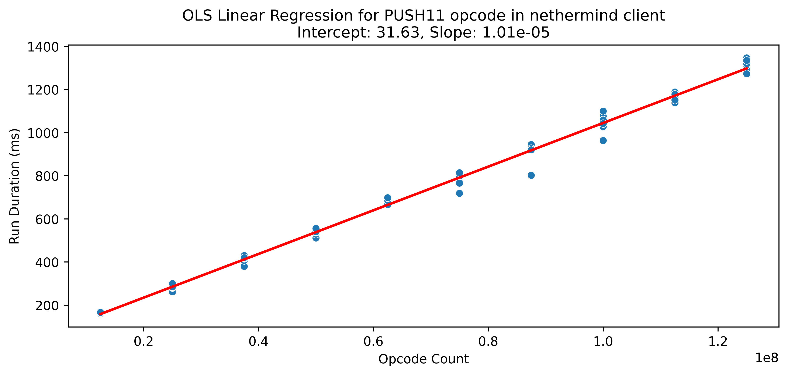


## reth


```python
                            OLS Regression Results                            
==============================================================================
Dep. Variable:        run_duration_ms   R-squared:                       0.985
Model:                            OLS   Adj. R-squared:                  0.985
Method:                 Least Squares   F-statistic:                     4816.
Date:                Tue, 23 Dec 2025   Prob (F-statistic):           1.08e-67
Time:                        08:41:15   Log-Likelihood:                -319.59
No. Observations:                  74   AIC:                             643.2
Df Residuals:                      72   BIC:                             647.8
Df Model:                           1                                         
Covariance Type:            nonrobust                                         
==============================================================================
                 coef    std err          t      P>|t|      [0.025      0.975]
------------------------------------------------------------------------------
const         35.8196      4.645      7.712      0.000      26.561      45.079
opcount     4.181e-06   6.02e-08     69.395      0.000    4.06e-06     4.3e-06
==============================================================================
Omnibus:                        2.156   Durbin-Watson:                   1.494
Prob(Omnibus):                  0.340   Jarque-Bera (JB):                1.581
Skew:                           0.093   Prob(JB):                        0.454
Kurtosis:                       3.691   Cond. No.                     1.67e+08
==============================================================================

Notes:
[1] Standard Errors assume that the covariance matrix of the errors is correctly specified.
[2] The condition number is large, 1.67e+08. This might indicate that there are
strong multicollinearity or other numerical problems.
```


## besu


```python
                            OLS Regression Results                            
==============================================================================
Dep. Variable:        run_duration_ms   R-squared:                       0.850
Model:                            OLS   Adj. R-squared:                  0.848
Method:                 Least Squares   F-statistic:                     409.6
Date:                Tue, 23 Dec 2025   Prob (F-statistic):           1.96e-31
Time:                        08:41:15   Log-Likelihood:                -558.63
No. Observations:                  74   AIC:                             1121.
Df Residuals:                      72   BIC:                             1126.
Df Model:                           1                                         
Covariance Type:            nonrobust                                         
==============================================================================
                 coef    std err          t      P>|t|      [0.025      0.975]
------------------------------------------------------------------------------
const         12.2454    117.439      0.104      0.917    -221.865     246.355
opcount     3.083e-05   1.52e-06     20.239      0.000    2.78e-05    3.39e-05
==============================================================================
Omnibus:                       14.675   Durbin-Watson:                   0.515
Prob(Omnibus):                  0.001   Jarque-Bera (JB):               16.387
Skew:                           1.108   Prob(JB):                     0.000276
Kurtosis:                       3.638   Cond. No.                     1.67e+08
==============================================================================

Notes:
[1] Standard Errors assume that the covariance matrix of the errors is correctly specified.
[2] The condition number is large, 1.67e+08. This might indicate that there are
strong multicollinearity or other numerical problems.
```

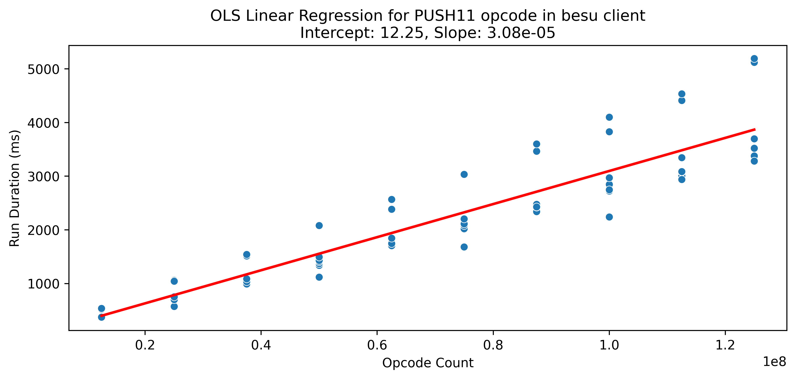


## geth


```python
                            OLS Regression Results                            
==============================================================================
Dep. Variable:        run_duration_ms   R-squared:                       0.998
Model:                            OLS   Adj. R-squared:                  0.998
Method:                 Least Squares   F-statistic:                 3.116e+04
Date:                Tue, 23 Dec 2025   Prob (F-statistic):           1.07e-96
Time:                        08:41:15   Log-Likelihood:                -363.56
No. Observations:                  74   AIC:                             731.1
Df Residuals:                      72   BIC:                             735.7
Df Model:                           1                                         
Covariance Type:            nonrobust                                         
==============================================================================
                 coef    std err          t      P>|t|      [0.025      0.975]
------------------------------------------------------------------------------
const         34.8211      8.414      4.138      0.000      18.048      51.595
opcount     1.927e-05   1.09e-07    176.524      0.000     1.9e-05    1.95e-05
==============================================================================
Omnibus:                       29.160   Durbin-Watson:                   1.982
Prob(Omnibus):                  0.000   Jarque-Bera (JB):               86.915
Skew:                          -1.164   Prob(JB):                     1.34e-19
Kurtosis:                       7.772   Cond. No.                     1.67e+08
==============================================================================

Notes:
[1] Standard Errors assume that the covariance matrix of the errors is correctly specified.
[2] The condition number is large, 1.67e+08. This might indicate that there are
strong multicollinearity or other numerical problems.
```


# PUSH12

## nethermind


```python
                            OLS Regression Results                            
==============================================================================
Dep. Variable:        run_duration_ms   R-squared:                       0.991
Model:                            OLS   Adj. R-squared:                  0.991
Method:                 Least Squares   F-statistic:                     8152.
Date:                Tue, 23 Dec 2025   Prob (F-statistic):           7.83e-76
Time:                        08:41:15   Log-Likelihood:                -363.98
No. Observations:                  74   AIC:                             732.0
Df Residuals:                      72   BIC:                             736.6
Df Model:                           1                                         
Covariance Type:            nonrobust                                         
==============================================================================
                 coef    std err          t      P>|t|      [0.025      0.975]
------------------------------------------------------------------------------
const         35.2703      8.462      4.168      0.000      18.401      52.139
opcount      9.91e-06    1.1e-07     90.291      0.000    9.69e-06    1.01e-05
==============================================================================
Omnibus:                       14.955   Durbin-Watson:                   2.103
Prob(Omnibus):                  0.001   Jarque-Bera (JB):               22.577
Skew:                          -0.784   Prob(JB):                     1.25e-05
Kurtosis:                       5.206   Cond. No.                     1.67e+08
==============================================================================

Notes:
[1] Standard Errors assume that the covariance matrix of the errors is correctly specified.
[2] The condition number is large, 1.67e+08. This might indicate that there are
strong multicollinearity or other numerical problems.
```

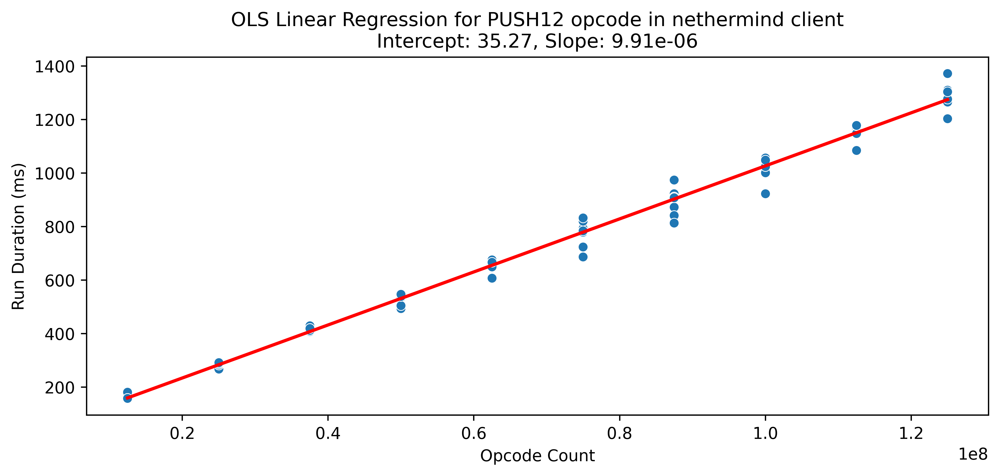


## reth


```python
                            OLS Regression Results                            
==============================================================================
Dep. Variable:        run_duration_ms   R-squared:                       0.994
Model:                            OLS   Adj. R-squared:                  0.994
Method:                 Least Squares   F-statistic:                 1.181e+04
Date:                Tue, 23 Dec 2025   Prob (F-statistic):           1.38e-81
Time:                        08:41:16   Log-Likelihood:                -285.62
No. Observations:                  74   AIC:                             575.2
Df Residuals:                      72   BIC:                             579.8
Df Model:                           1                                         
Covariance Type:            nonrobust                                         
==============================================================================
                 coef    std err          t      P>|t|      [0.025      0.975]
------------------------------------------------------------------------------
const         36.3806      2.935     12.397      0.000      30.530      42.231
opcount     4.137e-06   3.81e-08    108.680      0.000    4.06e-06    4.21e-06
==============================================================================
Omnibus:                        4.944   Durbin-Watson:                   1.896
Prob(Omnibus):                  0.084   Jarque-Bera (JB):                5.250
Skew:                          -0.286   Prob(JB):                       0.0725
Kurtosis:                       4.173   Cond. No.                     1.67e+08
==============================================================================

Notes:
[1] Standard Errors assume that the covariance matrix of the errors is correctly specified.
[2] The condition number is large, 1.67e+08. This might indicate that there are
strong multicollinearity or other numerical problems.
```

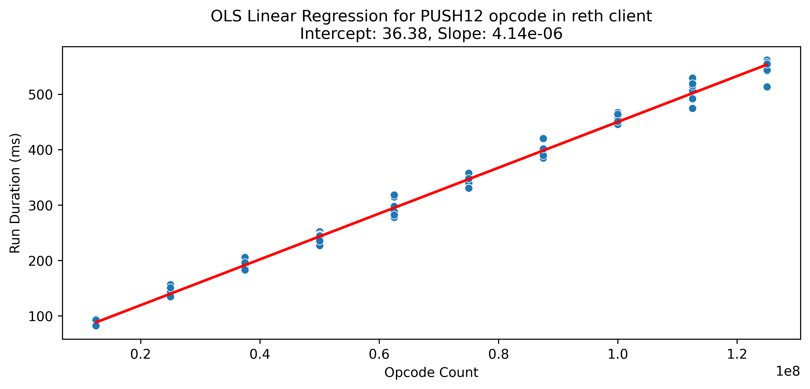


## besu


```python
                            OLS Regression Results                            
==============================================================================
Dep. Variable:        run_duration_ms   R-squared:                       0.839
Model:                            OLS   Adj. R-squared:                  0.837
Method:                 Least Squares   F-statistic:                     374.9
Date:                Tue, 23 Dec 2025   Prob (F-statistic):           2.92e-30
Time:                        08:41:16   Log-Likelihood:                -561.84
No. Observations:                  74   AIC:                             1128.
Df Residuals:                      72   BIC:                             1132.
Df Model:                           1                                         
Covariance Type:            nonrobust                                         
==============================================================================
                 coef    std err          t      P>|t|      [0.025      0.975]
------------------------------------------------------------------------------
const         13.1960    122.659      0.108      0.915    -231.321     257.713
opcount      3.08e-05   1.59e-06     19.362      0.000    2.76e-05     3.4e-05
==============================================================================
Omnibus:                       14.535   Durbin-Watson:                   0.652
Prob(Omnibus):                  0.001   Jarque-Bera (JB):               16.233
Skew:                           1.108   Prob(JB):                     0.000299
Kurtosis:                       3.596   Cond. No.                     1.67e+08
==============================================================================

Notes:
[1] Standard Errors assume that the covariance matrix of the errors is correctly specified.
[2] The condition number is large, 1.67e+08. This might indicate that there are
strong multicollinearity or other numerical problems.
```

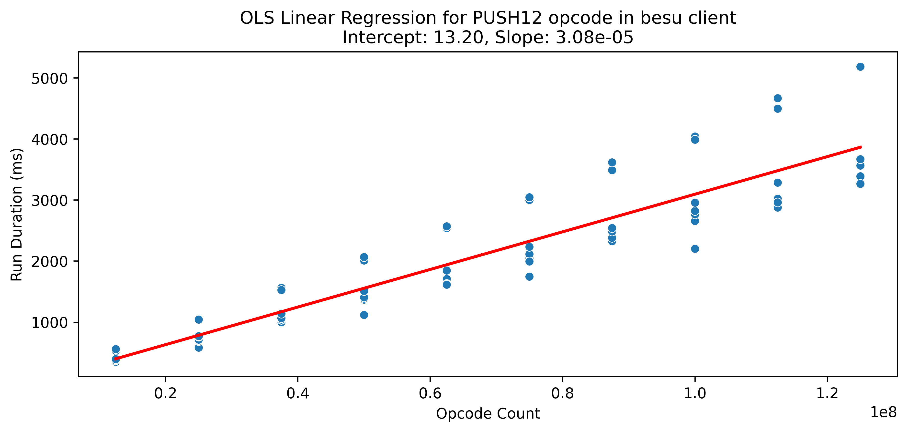


## geth


```python
                            OLS Regression Results                            
==============================================================================
Dep. Variable:        run_duration_ms   R-squared:                       0.989
Model:                            OLS   Adj. R-squared:                  0.988
Method:                 Least Squares   F-statistic:                     6193.
Date:                Tue, 23 Dec 2025   Prob (F-statistic):           1.41e-71
Time:                        08:41:16   Log-Likelihood:                -423.20
No. Observations:                  74   AIC:                             850.4
Df Residuals:                      72   BIC:                             855.0
Df Model:                           1                                         
Covariance Type:            nonrobust                                         
==============================================================================
                 coef    std err          t      P>|t|      [0.025      0.975]
------------------------------------------------------------------------------
const         35.7140     18.838      1.896      0.062      -1.838      73.266
opcount     1.923e-05   2.44e-07     78.694      0.000    1.87e-05    1.97e-05
==============================================================================
Omnibus:                      127.196   Durbin-Watson:                   2.240
Prob(Omnibus):                  0.000   Jarque-Bera (JB):             4555.353
Skew:                           5.865   Prob(JB):                         0.00
Kurtosis:                      39.603   Cond. No.                     1.67e+08
==============================================================================

Notes:
[1] Standard Errors assume that the covariance matrix of the errors is correctly specified.
[2] The condition number is large, 1.67e+08. This might indicate that there are
strong multicollinearity or other numerical problems.
```

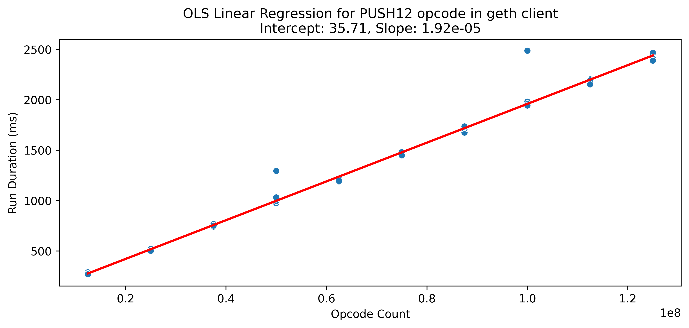


# PUSH13

## nethermind


```python
                            OLS Regression Results                            
==============================================================================
Dep. Variable:        run_duration_ms   R-squared:                       0.990
Model:                            OLS   Adj. R-squared:                  0.990
Method:                 Least Squares   F-statistic:                     7040.
Date:                Tue, 23 Dec 2025   Prob (F-statistic):           1.47e-73
Time:                        08:41:16   Log-Likelihood:                -369.51
No. Observations:                  74   AIC:                             743.0
Df Residuals:                      72   BIC:                             747.6
Df Model:                           1                                         
Covariance Type:            nonrobust                                         
==============================================================================
                 coef    std err          t      P>|t|      [0.025      0.975]
------------------------------------------------------------------------------
const         42.1760      9.118      4.625      0.000      23.999      60.353
opcount     9.924e-06   1.18e-07     83.905      0.000    9.69e-06    1.02e-05
==============================================================================
Omnibus:                        2.951   Durbin-Watson:                   2.088
Prob(Omnibus):                  0.229   Jarque-Bera (JB):                2.416
Skew:                          -0.200   Prob(JB):                        0.299
Kurtosis:                       3.789   Cond. No.                     1.67e+08
==============================================================================

Notes:
[1] Standard Errors assume that the covariance matrix of the errors is correctly specified.
[2] The condition number is large, 1.67e+08. This might indicate that there are
strong multicollinearity or other numerical problems.
```


## reth


```python
                            OLS Regression Results                            
==============================================================================
Dep. Variable:        run_duration_ms   R-squared:                       0.989
Model:                            OLS   Adj. R-squared:                  0.988
Method:                 Least Squares   F-statistic:                     6255.
Date:                Tue, 23 Dec 2025   Prob (F-statistic):           9.90e-72
Time:                        08:41:16   Log-Likelihood:                -310.81
No. Observations:                  74   AIC:                             625.6
Df Residuals:                      72   BIC:                             630.2
Df Model:                           1                                         
Covariance Type:            nonrobust                                         
==============================================================================
                 coef    std err          t      P>|t|      [0.025      0.975]
------------------------------------------------------------------------------
const         33.5114      4.125      8.124      0.000      25.288      41.735
opcount     4.232e-06   5.35e-08     79.087      0.000    4.12e-06    4.34e-06
==============================================================================
Omnibus:                        2.718   Durbin-Watson:                   1.368
Prob(Omnibus):                  0.257   Jarque-Bera (JB):                2.234
Skew:                           0.423   Prob(JB):                        0.327
Kurtosis:                       3.092   Cond. No.                     1.67e+08
==============================================================================

Notes:
[1] Standard Errors assume that the covariance matrix of the errors is correctly specified.
[2] The condition number is large, 1.67e+08. This might indicate that there are
strong multicollinearity or other numerical problems.
```


## besu


```python
                            OLS Regression Results                            
==============================================================================
Dep. Variable:        run_duration_ms   R-squared:                       0.839
Model:                            OLS   Adj. R-squared:                  0.837
Method:                 Least Squares   F-statistic:                     375.1
Date:                Tue, 23 Dec 2025   Prob (F-statistic):           2.88e-30
Time:                        08:41:16   Log-Likelihood:                -562.59
No. Observations:                  74   AIC:                             1129.
Df Residuals:                      72   BIC:                             1134.
Df Model:                           1                                         
Covariance Type:            nonrobust                                         
==============================================================================
                 coef    std err          t      P>|t|      [0.025      0.975]
------------------------------------------------------------------------------
const          2.7810    123.899      0.022      0.982    -244.208     249.770
opcount     3.112e-05   1.61e-06     19.367      0.000    2.79e-05    3.43e-05
==============================================================================
Omnibus:                       15.395   Durbin-Watson:                   0.413
Prob(Omnibus):                  0.000   Jarque-Bera (JB):               17.460
Skew:                           1.140   Prob(JB):                     0.000162
Kurtosis:                       3.680   Cond. No.                     1.67e+08
==============================================================================

Notes:
[1] Standard Errors assume that the covariance matrix of the errors is correctly specified.
[2] The condition number is large, 1.67e+08. This might indicate that there are
strong multicollinearity or other numerical problems.
```

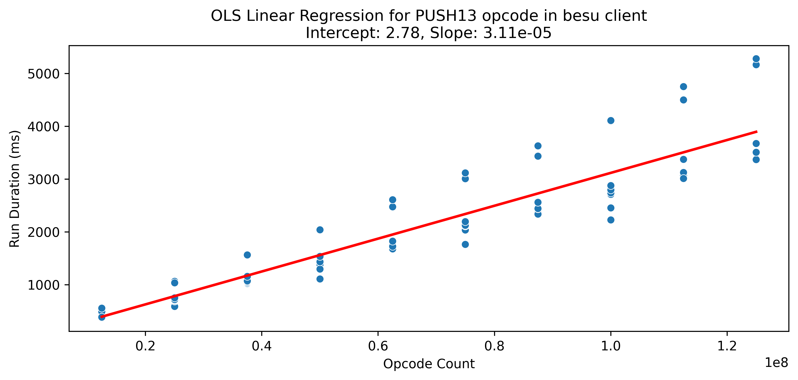


## geth


```python
                            OLS Regression Results                            
==============================================================================
Dep. Variable:        run_duration_ms   R-squared:                       0.999
Model:                            OLS   Adj. R-squared:                  0.999
Method:                 Least Squares   F-statistic:                 6.737e+04
Date:                Tue, 23 Dec 2025   Prob (F-statistic):          9.86e-109
Time:                        08:41:16   Log-Likelihood:                -334.78
No. Observations:                  74   AIC:                             673.6
Df Residuals:                      72   BIC:                             678.2
Df Model:                           1                                         
Covariance Type:            nonrobust                                         
==============================================================================
                 coef    std err          t      P>|t|      [0.025      0.975]
------------------------------------------------------------------------------
const         43.4433      5.703      7.618      0.000      32.075      54.812
opcount      1.92e-05    7.4e-08    259.562      0.000    1.91e-05    1.93e-05
==============================================================================
Omnibus:                        9.397   Durbin-Watson:                   2.237
Prob(Omnibus):                  0.009   Jarque-Bera (JB):               19.669
Skew:                          -0.247   Prob(JB):                     5.36e-05
Kurtosis:                       5.477   Cond. No.                     1.67e+08
==============================================================================

Notes:
[1] Standard Errors assume that the covariance matrix of the errors is correctly specified.
[2] The condition number is large, 1.67e+08. This might indicate that there are
strong multicollinearity or other numerical problems.
```


# PUSH14

## nethermind


```python
                            OLS Regression Results                            
==============================================================================
Dep. Variable:        run_duration_ms   R-squared:                       0.995
Model:                            OLS   Adj. R-squared:                  0.995
Method:                 Least Squares   F-statistic:                 1.531e+04
Date:                Tue, 23 Dec 2025   Prob (F-statistic):           1.27e-85
Time:                        08:41:16   Log-Likelihood:                -341.35
No. Observations:                  74   AIC:                             686.7
Df Residuals:                      72   BIC:                             691.3
Df Model:                           1                                         
Covariance Type:            nonrobust                                         
==============================================================================
                 coef    std err          t      P>|t|      [0.025      0.975]
------------------------------------------------------------------------------
const         37.3879      6.232      5.999      0.000      24.964      49.811
opcount         1e-05   8.08e-08    123.740      0.000    9.84e-06    1.02e-05
==============================================================================
Omnibus:                        9.163   Durbin-Watson:                   1.534
Prob(Omnibus):                  0.010   Jarque-Bera (JB):               10.840
Skew:                          -0.566   Prob(JB):                      0.00443
Kurtosis:                       4.495   Cond. No.                     1.67e+08
==============================================================================

Notes:
[1] Standard Errors assume that the covariance matrix of the errors is correctly specified.
[2] The condition number is large, 1.67e+08. This might indicate that there are
strong multicollinearity or other numerical problems.
```


## reth


```python
                            OLS Regression Results                            
==============================================================================
Dep. Variable:        run_duration_ms   R-squared:                       0.988
Model:                            OLS   Adj. R-squared:                  0.988
Method:                 Least Squares   F-statistic:                     6044.
Date:                Tue, 23 Dec 2025   Prob (F-statistic):           3.34e-71
Time:                        08:41:17   Log-Likelihood:                -312.71
No. Observations:                  74   AIC:                             629.4
Df Residuals:                      72   BIC:                             634.0
Df Model:                           1                                         
Covariance Type:            nonrobust                                         
==============================================================================
                 coef    std err          t      P>|t|      [0.025      0.975]
------------------------------------------------------------------------------
const         35.3657      4.232      8.356      0.000      26.929      43.802
opcount     4.268e-06   5.49e-08     77.746      0.000    4.16e-06    4.38e-06
==============================================================================
Omnibus:                        2.024   Durbin-Watson:                   1.539
Prob(Omnibus):                  0.364   Jarque-Bera (JB):                1.322
Skew:                          -0.223   Prob(JB):                        0.516
Kurtosis:                       3.480   Cond. No.                     1.67e+08
==============================================================================

Notes:
[1] Standard Errors assume that the covariance matrix of the errors is correctly specified.
[2] The condition number is large, 1.67e+08. This might indicate that there are
strong multicollinearity or other numerical problems.
```

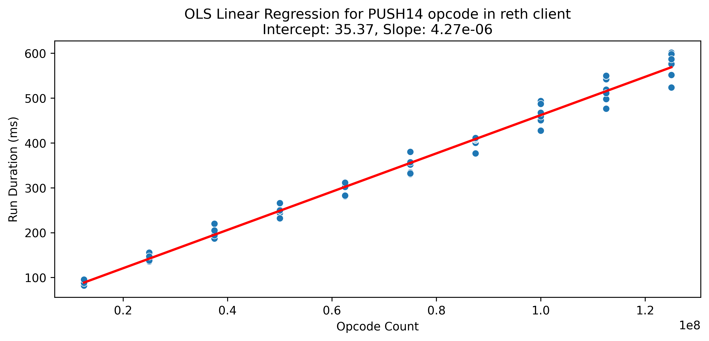


## besu


```python
                            OLS Regression Results                            
==============================================================================
Dep. Variable:        run_duration_ms   R-squared:                       0.845
Model:                            OLS   Adj. R-squared:                  0.843
Method:                 Least Squares   F-statistic:                     391.5
Date:                Tue, 23 Dec 2025   Prob (F-statistic):           7.82e-31
Time:                        08:41:17   Log-Likelihood:                -559.75
No. Observations:                  74   AIC:                             1124.
Df Residuals:                      72   BIC:                             1128.
Df Model:                           1                                         
Covariance Type:            nonrobust                                         
==============================================================================
                 coef    std err          t      P>|t|      [0.025      0.975]
------------------------------------------------------------------------------
const         28.7210    119.239      0.241      0.810    -208.979     266.421
opcount      3.06e-05   1.55e-06     19.787      0.000    2.75e-05    3.37e-05
==============================================================================
Omnibus:                       14.806   Durbin-Watson:                   0.567
Prob(Omnibus):                  0.001   Jarque-Bera (JB):               16.685
Skew:                           1.127   Prob(JB):                     0.000238
Kurtosis:                       3.579   Cond. No.                     1.67e+08
==============================================================================

Notes:
[1] Standard Errors assume that the covariance matrix of the errors is correctly specified.
[2] The condition number is large, 1.67e+08. This might indicate that there are
strong multicollinearity or other numerical problems.
```

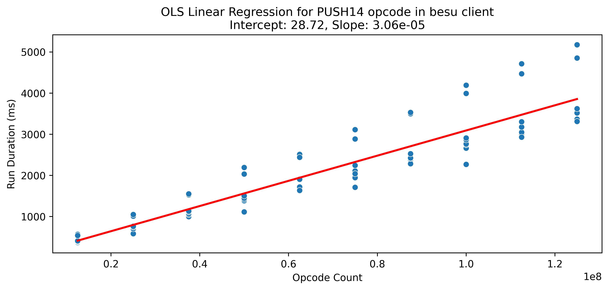


## geth


```python
                            OLS Regression Results                            
==============================================================================
Dep. Variable:        run_duration_ms   R-squared:                       0.970
Model:                            OLS   Adj. R-squared:                  0.970
Method:                 Least Squares   F-statistic:                     2337.
Date:                Tue, 23 Dec 2025   Prob (F-statistic):           1.24e-56
Time:                        08:41:17   Log-Likelihood:                -460.48
No. Observations:                  74   AIC:                             925.0
Df Residuals:                      72   BIC:                             929.6
Df Model:                           1                                         
Covariance Type:            nonrobust                                         
==============================================================================
                 coef    std err          t      P>|t|      [0.025      0.975]
------------------------------------------------------------------------------
const         77.8509     31.174      2.497      0.015      15.707     139.995
opcount     1.955e-05   4.04e-07     48.347      0.000    1.87e-05    2.04e-05
==============================================================================
Omnibus:                      112.931   Durbin-Watson:                   1.912
Prob(Omnibus):                  0.000   Jarque-Bera (JB):             2439.820
Skew:                           5.054   Prob(JB):                         0.00
Kurtosis:                      29.251   Cond. No.                     1.67e+08
==============================================================================

Notes:
[1] Standard Errors assume that the covariance matrix of the errors is correctly specified.
[2] The condition number is large, 1.67e+08. This might indicate that there are
strong multicollinearity or other numerical problems.
```


# PUSH15

## nethermind


```python
                            OLS Regression Results                            
==============================================================================
Dep. Variable:        run_duration_ms   R-squared:                       0.993
Model:                            OLS   Adj. R-squared:                  0.993
Method:                 Least Squares   F-statistic:                     9689.
Date:                Tue, 23 Dec 2025   Prob (F-statistic):           1.64e-78
Time:                        08:41:17   Log-Likelihood:                -358.92
No. Observations:                  74   AIC:                             721.8
Df Residuals:                      72   BIC:                             726.4
Df Model:                           1                                         
Covariance Type:            nonrobust                                         
==============================================================================
                 coef    std err          t      P>|t|      [0.025      0.975]
------------------------------------------------------------------------------
const         31.0405      7.902      3.928      0.000      15.287      46.794
opcount     1.009e-05   1.03e-07     98.434      0.000    9.89e-06    1.03e-05
==============================================================================
Omnibus:                       35.789   Durbin-Watson:                   1.802
Prob(Omnibus):                  0.000   Jarque-Bera (JB):               99.577
Skew:                          -1.531   Prob(JB):                     2.38e-22
Kurtosis:                       7.787   Cond. No.                     1.67e+08
==============================================================================

Notes:
[1] Standard Errors assume that the covariance matrix of the errors is correctly specified.
[2] The condition number is large, 1.67e+08. This might indicate that there are
strong multicollinearity or other numerical problems.
```


## reth


```python
                            OLS Regression Results                            
==============================================================================
Dep. Variable:        run_duration_ms   R-squared:                       0.992
Model:                            OLS   Adj. R-squared:                  0.992
Method:                 Least Squares   F-statistic:                     9294.
Date:                Tue, 23 Dec 2025   Prob (F-statistic):           7.25e-78
Time:                        08:41:17   Log-Likelihood:                -294.43
No. Observations:                  74   AIC:                             592.9
Df Residuals:                      72   BIC:                             597.5
Df Model:                           1                                         
Covariance Type:            nonrobust                                         
==============================================================================
                 coef    std err          t      P>|t|      [0.025      0.975]
------------------------------------------------------------------------------
const         35.4110      3.306     10.712      0.000      28.821      42.001
opcount     4.134e-06   4.29e-08     96.408      0.000    4.05e-06    4.22e-06
==============================================================================
Omnibus:                        4.658   Durbin-Watson:                   1.300
Prob(Omnibus):                  0.097   Jarque-Bera (JB):                4.544
Skew:                           0.311   Prob(JB):                        0.103
Kurtosis:                       4.043   Cond. No.                     1.67e+08
==============================================================================

Notes:
[1] Standard Errors assume that the covariance matrix of the errors is correctly specified.
[2] The condition number is large, 1.67e+08. This might indicate that there are
strong multicollinearity or other numerical problems.
```


## besu


```python
                            OLS Regression Results                            
==============================================================================
Dep. Variable:        run_duration_ms   R-squared:                       0.842
Model:                            OLS   Adj. R-squared:                  0.840
Method:                 Least Squares   F-statistic:                     383.9
Date:                Tue, 23 Dec 2025   Prob (F-statistic):           1.42e-30
Time:                        08:41:17   Log-Likelihood:                -560.77
No. Observations:                  74   AIC:                             1126.
Df Residuals:                      72   BIC:                             1130.
Df Model:                           1                                         
Covariance Type:            nonrobust                                         
==============================================================================
                 coef    std err          t      P>|t|      [0.025      0.975]
------------------------------------------------------------------------------
const         17.3904    120.888      0.144      0.886    -223.595     258.376
opcount     3.072e-05   1.57e-06     19.593      0.000    2.76e-05    3.38e-05
==============================================================================
Omnibus:                       13.678   Durbin-Watson:                   0.669
Prob(Omnibus):                  0.001   Jarque-Bera (JB):               15.105
Skew:                           1.080   Prob(JB):                     0.000525
Kurtosis:                       3.487   Cond. No.                     1.67e+08
==============================================================================

Notes:
[1] Standard Errors assume that the covariance matrix of the errors is correctly specified.
[2] The condition number is large, 1.67e+08. This might indicate that there are
strong multicollinearity or other numerical problems.
```


## geth


```python
                            OLS Regression Results                            
==============================================================================
Dep. Variable:        run_duration_ms   R-squared:                       0.999
Model:                            OLS   Adj. R-squared:                  0.999
Method:                 Least Squares   F-statistic:                 5.028e+04
Date:                Tue, 23 Dec 2025   Prob (F-statistic):          3.67e-104
Time:                        08:41:17   Log-Likelihood:                -348.31
No. Observations:                  74   AIC:                             700.6
Df Residuals:                      72   BIC:                             705.2
Df Model:                           1                                         
Covariance Type:            nonrobust                                         
==============================================================================
                 coef    std err          t      P>|t|      [0.025      0.975]
------------------------------------------------------------------------------
const         39.3246      6.847      5.743      0.000      25.676      52.974
opcount     1.991e-05   8.88e-08    224.224      0.000    1.97e-05    2.01e-05
==============================================================================
Omnibus:                       22.687   Durbin-Watson:                   1.816
Prob(Omnibus):                  0.000   Jarque-Bera (JB):              206.387
Skew:                           0.100   Prob(JB):                     1.53e-45
Kurtosis:                      11.179   Cond. No.                     1.67e+08
==============================================================================

Notes:
[1] Standard Errors assume that the covariance matrix of the errors is correctly specified.
[2] The condition number is large, 1.67e+08. This might indicate that there are
strong multicollinearity or other numerical problems.
```


# PUSH16

## nethermind


```python
                            OLS Regression Results                            
==============================================================================
Dep. Variable:        run_duration_ms   R-squared:                       0.994
Model:                            OLS   Adj. R-squared:                  0.994
Method:                 Least Squares   F-statistic:                 1.179e+04
Date:                Tue, 23 Dec 2025   Prob (F-statistic):           1.46e-81
Time:                        08:41:18   Log-Likelihood:                -330.48
No. Observations:                  74   AIC:                             665.0
Df Residuals:                      72   BIC:                             669.6
Df Model:                           1                                         
Covariance Type:            nonrobust                                         
==============================================================================
                 coef    std err          t      P>|t|      [0.025      0.975]
------------------------------------------------------------------------------
const         39.2557      5.381      7.296      0.000      28.529      49.982
opcount     7.579e-06   6.98e-08    108.593      0.000    7.44e-06    7.72e-06
==============================================================================
Omnibus:                       41.085   Durbin-Watson:                   1.901
Prob(Omnibus):                  0.000   Jarque-Bera (JB):              129.758
Skew:                          -1.732   Prob(JB):                     6.66e-29
Kurtosis:                       8.485   Cond. No.                     1.67e+08
==============================================================================

Notes:
[1] Standard Errors assume that the covariance matrix of the errors is correctly specified.
[2] The condition number is large, 1.67e+08. This might indicate that there are
strong multicollinearity or other numerical problems.
```


## reth


```python
                            OLS Regression Results                            
==============================================================================
Dep. Variable:        run_duration_ms   R-squared:                       0.994
Model:                            OLS   Adj. R-squared:                  0.994
Method:                 Least Squares   F-statistic:                 1.121e+04
Date:                Tue, 23 Dec 2025   Prob (F-statistic):           8.84e-81
Time:                        08:41:18   Log-Likelihood:                -285.28
No. Observations:                  74   AIC:                             574.6
Df Residuals:                      72   BIC:                             579.2
Df Model:                           1                                         
Covariance Type:            nonrobust                                         
==============================================================================
                 coef    std err          t      P>|t|      [0.025      0.975]
------------------------------------------------------------------------------
const         37.7474      2.921     12.921      0.000      31.924      43.571
opcount     4.012e-06   3.79e-08    105.893      0.000    3.94e-06    4.09e-06
==============================================================================
Omnibus:                        0.305   Durbin-Watson:                   2.336
Prob(Omnibus):                  0.858   Jarque-Bera (JB):                0.068
Skew:                           0.066   Prob(JB):                        0.966
Kurtosis:                       3.069   Cond. No.                     1.67e+08
==============================================================================

Notes:
[1] Standard Errors assume that the covariance matrix of the errors is correctly specified.
[2] The condition number is large, 1.67e+08. This might indicate that there are
strong multicollinearity or other numerical problems.
```


## besu


```python
                            OLS Regression Results                            
==============================================================================
Dep. Variable:        run_duration_ms   R-squared:                       0.843
Model:                            OLS   Adj. R-squared:                  0.841
Method:                 Least Squares   F-statistic:                     387.8
Date:                Tue, 23 Dec 2025   Prob (F-statistic):           1.04e-30
Time:                        08:41:18   Log-Likelihood:                -561.40
No. Observations:                  74   AIC:                             1127.
Df Residuals:                      72   BIC:                             1131.
Df Model:                           1                                         
Covariance Type:            nonrobust                                         
==============================================================================
                 coef    std err          t      P>|t|      [0.025      0.975]
------------------------------------------------------------------------------
const         -9.7614    121.917     -0.080      0.936    -252.799     233.276
opcount     3.114e-05   1.58e-06     19.693      0.000     2.8e-05    3.43e-05
==============================================================================
Omnibus:                       14.813   Durbin-Watson:                   0.505
Prob(Omnibus):                  0.001   Jarque-Bera (JB):               16.707
Skew:                           1.128   Prob(JB):                     0.000236
Kurtosis:                       3.572   Cond. No.                     1.67e+08
==============================================================================

Notes:
[1] Standard Errors assume that the covariance matrix of the errors is correctly specified.
[2] The condition number is large, 1.67e+08. This might indicate that there are
strong multicollinearity or other numerical problems.
```

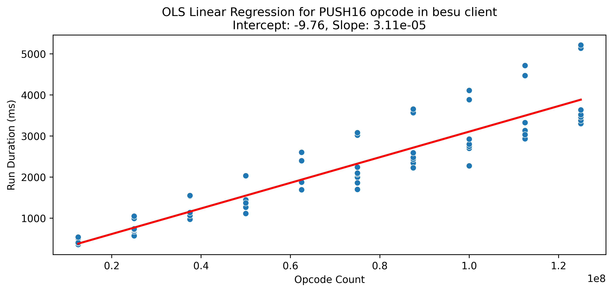


## geth


```python
                            OLS Regression Results                            
==============================================================================
Dep. Variable:        run_duration_ms   R-squared:                       0.987
Model:                            OLS   Adj. R-squared:                  0.986
Method:                 Least Squares   F-statistic:                     5305.
Date:                Tue, 23 Dec 2025   Prob (F-statistic):           3.47e-69
Time:                        08:41:18   Log-Likelihood:                -430.27
No. Observations:                  74   AIC:                             864.5
Df Residuals:                      72   BIC:                             869.1
Df Model:                           1                                         
Covariance Type:            nonrobust                                         
==============================================================================
                 coef    std err          t      P>|t|      [0.025      0.975]
------------------------------------------------------------------------------
const         17.1411     20.725      0.827      0.411     -24.173      58.455
opcount     1.958e-05   2.69e-07     72.834      0.000     1.9e-05    2.01e-05
==============================================================================
Omnibus:                      123.236   Durbin-Watson:                   2.088
Prob(Omnibus):                  0.000   Jarque-Bera (JB):             4991.685
Skew:                           5.432   Prob(JB):                         0.00
Kurtosis:                      41.741   Cond. No.                     1.67e+08
==============================================================================

Notes:
[1] Standard Errors assume that the covariance matrix of the errors is correctly specified.
[2] The condition number is large, 1.67e+08. This might indicate that there are
strong multicollinearity or other numerical problems.
```

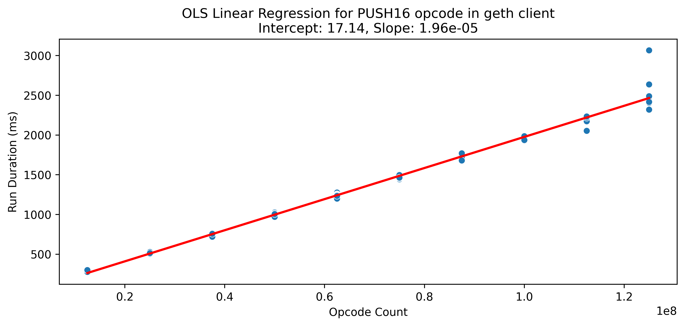


# PUSH17

## nethermind


```python
                            OLS Regression Results                            
==============================================================================
Dep. Variable:        run_duration_ms   R-squared:                       0.868
Model:                            OLS   Adj. R-squared:                  0.866
Method:                 Least Squares   F-statistic:                     474.1
Date:                Tue, 23 Dec 2025   Prob (F-statistic):           2.11e-33
Time:                        08:41:18   Log-Likelihood:                -469.28
No. Observations:                  74   AIC:                             942.6
Df Residuals:                      72   BIC:                             947.2
Df Model:                           1                                         
Covariance Type:            nonrobust                                         
==============================================================================
                 coef    std err          t      P>|t|      [0.025      0.975]
------------------------------------------------------------------------------
const         63.1991     35.114      1.800      0.076      -6.799     133.197
opcount     9.916e-06   4.55e-07     21.773      0.000    9.01e-06    1.08e-05
==============================================================================
Omnibus:                      154.003   Durbin-Watson:                   2.003
Prob(Omnibus):                  0.000   Jarque-Bera (JB):            12649.115
Skew:                           7.788   Prob(JB):                         0.00
Kurtosis:                      65.127   Cond. No.                     1.67e+08
==============================================================================

Notes:
[1] Standard Errors assume that the covariance matrix of the errors is correctly specified.
[2] The condition number is large, 1.67e+08. This might indicate that there are
strong multicollinearity or other numerical problems.
```

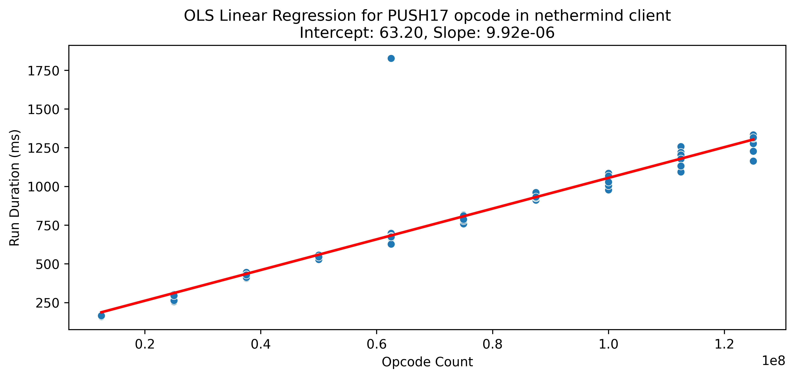


## reth


```python
                            OLS Regression Results                            
==============================================================================
Dep. Variable:        run_duration_ms   R-squared:                       0.991
Model:                            OLS   Adj. R-squared:                  0.990
Method:                 Least Squares   F-statistic:                     7531.
Date:                Tue, 23 Dec 2025   Prob (F-statistic):           1.32e-74
Time:                        08:41:18   Log-Likelihood:                -300.41
No. Observations:                  74   AIC:                             604.8
Df Residuals:                      72   BIC:                             609.4
Df Model:                           1                                         
Covariance Type:            nonrobust                                         
==============================================================================
                 coef    std err          t      P>|t|      [0.025      0.975]
------------------------------------------------------------------------------
const         39.7166      3.584     11.081      0.000      32.572      46.862
opcount     4.035e-06   4.65e-08     86.783      0.000    3.94e-06    4.13e-06
==============================================================================
Omnibus:                        5.038   Durbin-Watson:                   1.589
Prob(Omnibus):                  0.081   Jarque-Bera (JB):                4.827
Skew:                           0.363   Prob(JB):                       0.0895
Kurtosis:                       4.020   Cond. No.                     1.67e+08
==============================================================================

Notes:
[1] Standard Errors assume that the covariance matrix of the errors is correctly specified.
[2] The condition number is large, 1.67e+08. This might indicate that there are
strong multicollinearity or other numerical problems.
```


## besu


```python
                            OLS Regression Results                            
==============================================================================
Dep. Variable:        run_duration_ms   R-squared:                       0.837
Model:                            OLS   Adj. R-squared:                  0.835
Method:                 Least Squares   F-statistic:                     370.1
Date:                Tue, 23 Dec 2025   Prob (F-statistic):           4.30e-30
Time:                        08:41:18   Log-Likelihood:                -562.68
No. Observations:                  74   AIC:                             1129.
Df Residuals:                      72   BIC:                             1134.
Df Model:                           1                                         
Covariance Type:            nonrobust                                         
==============================================================================
                 coef    std err          t      P>|t|      [0.025      0.975]
------------------------------------------------------------------------------
const          6.9951    124.057      0.056      0.955    -240.307     254.297
opcount     3.096e-05   1.61e-06     19.239      0.000    2.77e-05    3.42e-05
==============================================================================
Omnibus:                       14.637   Durbin-Watson:                   0.766
Prob(Omnibus):                  0.001   Jarque-Bera (JB):               16.423
Skew:                           1.117   Prob(JB):                     0.000272
Kurtosis:                       3.576   Cond. No.                     1.67e+08
==============================================================================

Notes:
[1] Standard Errors assume that the covariance matrix of the errors is correctly specified.
[2] The condition number is large, 1.67e+08. This might indicate that there are
strong multicollinearity or other numerical problems.
```

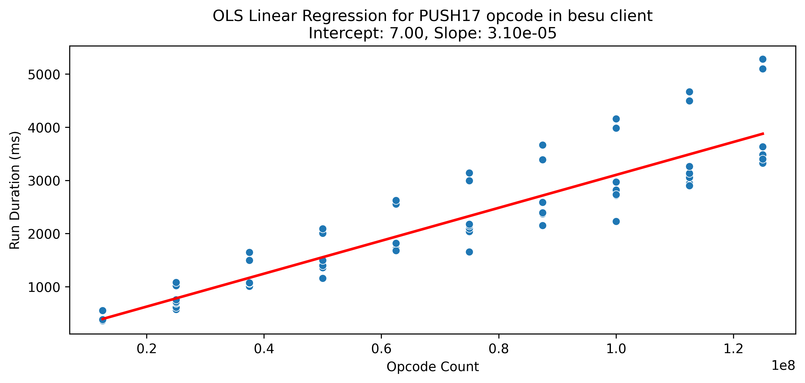


## geth


```python
                            OLS Regression Results                            
==============================================================================
Dep. Variable:        run_duration_ms   R-squared:                       0.998
Model:                            OLS   Adj. R-squared:                  0.998
Method:                 Least Squares   F-statistic:                 4.258e+04
Date:                Tue, 23 Dec 2025   Prob (F-statistic):          1.44e-101
Time:                        08:41:19   Log-Likelihood:                -353.12
No. Observations:                  74   AIC:                             710.2
Df Residuals:                      72   BIC:                             714.8
Df Model:                           1                                         
Covariance Type:            nonrobust                                         
==============================================================================
                 coef    std err          t      P>|t|      [0.025      0.975]
------------------------------------------------------------------------------
const         38.1381      7.307      5.219      0.000      23.572      52.704
opcount     1.956e-05   9.48e-08    206.343      0.000    1.94e-05    1.97e-05
==============================================================================
Omnibus:                       12.122   Durbin-Watson:                   2.084
Prob(Omnibus):                  0.002   Jarque-Bera (JB):               23.896
Skew:                           0.485   Prob(JB):                     6.47e-06
Kurtosis:                       5.609   Cond. No.                     1.67e+08
==============================================================================

Notes:
[1] Standard Errors assume that the covariance matrix of the errors is correctly specified.
[2] The condition number is large, 1.67e+08. This might indicate that there are
strong multicollinearity or other numerical problems.
```

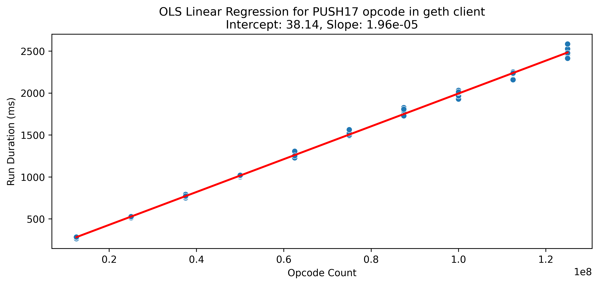


# PUSH18

## nethermind


```python
                            OLS Regression Results                            
==============================================================================
Dep. Variable:        run_duration_ms   R-squared:                       0.996
Model:                            OLS   Adj. R-squared:                  0.996
Method:                 Least Squares   F-statistic:                 1.652e+04
Date:                Tue, 23 Dec 2025   Prob (F-statistic):           8.31e-87
Time:                        08:41:19   Log-Likelihood:                -339.62
No. Observations:                  74   AIC:                             683.2
Df Residuals:                      72   BIC:                             687.8
Df Model:                           1                                         
Covariance Type:            nonrobust                                         
==============================================================================
                 coef    std err          t      P>|t|      [0.025      0.975]
------------------------------------------------------------------------------
const         38.7932      6.088      6.372      0.000      26.656      50.930
opcount     1.015e-05    7.9e-08    128.533      0.000    9.99e-06    1.03e-05
==============================================================================
Omnibus:                       36.188   Durbin-Watson:                   1.764
Prob(Omnibus):                  0.000   Jarque-Bera (JB):              106.047
Skew:                          -1.522   Prob(JB):                     9.38e-24
Kurtosis:                       8.013   Cond. No.                     1.67e+08
==============================================================================

Notes:
[1] Standard Errors assume that the covariance matrix of the errors is correctly specified.
[2] The condition number is large, 1.67e+08. This might indicate that there are
strong multicollinearity or other numerical problems.
```

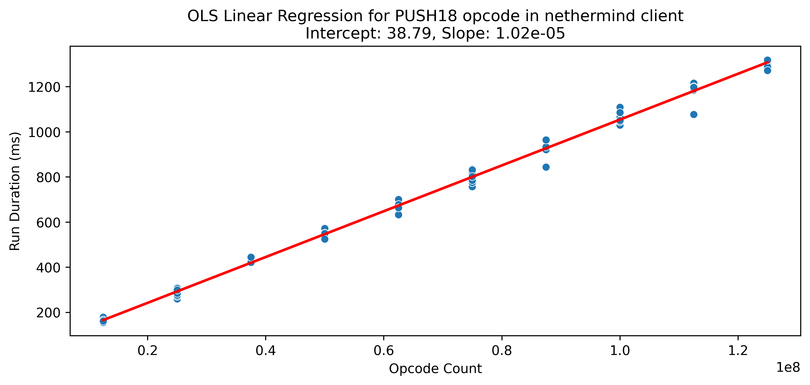


## reth


```python
                            OLS Regression Results                            
==============================================================================
Dep. Variable:        run_duration_ms   R-squared:                       0.987
Model:                            OLS   Adj. R-squared:                  0.986
Method:                 Least Squares   F-statistic:                     5309.
Date:                Tue, 23 Dec 2025   Prob (F-statistic):           3.37e-69
Time:                        08:41:19   Log-Likelihood:                -316.98
No. Observations:                  74   AIC:                             638.0
Df Residuals:                      72   BIC:                             642.6
Df Model:                           1                                         
Covariance Type:            nonrobust                                         
==============================================================================
                 coef    std err          t      P>|t|      [0.025      0.975]
------------------------------------------------------------------------------
const         37.9348      4.484      8.461      0.000      28.997      46.873
opcount     4.237e-06   5.82e-08     72.864      0.000    4.12e-06    4.35e-06
==============================================================================
Omnibus:                        0.876   Durbin-Watson:                   1.467
Prob(Omnibus):                  0.645   Jarque-Bera (JB):                0.532
Skew:                           0.202   Prob(JB):                        0.766
Kurtosis:                       3.096   Cond. No.                     1.67e+08
==============================================================================

Notes:
[1] Standard Errors assume that the covariance matrix of the errors is correctly specified.
[2] The condition number is large, 1.67e+08. This might indicate that there are
strong multicollinearity or other numerical problems.
```


## besu


```python
                            OLS Regression Results                            
==============================================================================
Dep. Variable:        run_duration_ms   R-squared:                       0.843
Model:                            OLS   Adj. R-squared:                  0.841
Method:                 Least Squares   F-statistic:                     386.1
Date:                Tue, 23 Dec 2025   Prob (F-statistic):           1.20e-30
Time:                        08:41:19   Log-Likelihood:                -560.45
No. Observations:                  74   AIC:                             1125.
Df Residuals:                      72   BIC:                             1130.
Df Model:                           1                                         
Covariance Type:            nonrobust                                         
==============================================================================
                 coef    std err          t      P>|t|      [0.025      0.975]
------------------------------------------------------------------------------
const         21.5373    120.366      0.179      0.858    -218.408     261.483
opcount     3.068e-05   1.56e-06     19.649      0.000    2.76e-05    3.38e-05
==============================================================================
Omnibus:                       14.735   Durbin-Watson:                   0.726
Prob(Omnibus):                  0.001   Jarque-Bera (JB):               16.675
Skew:                           1.133   Prob(JB):                     0.000239
Kurtosis:                       3.523   Cond. No.                     1.67e+08
==============================================================================

Notes:
[1] Standard Errors assume that the covariance matrix of the errors is correctly specified.
[2] The condition number is large, 1.67e+08. This might indicate that there are
strong multicollinearity or other numerical problems.
```

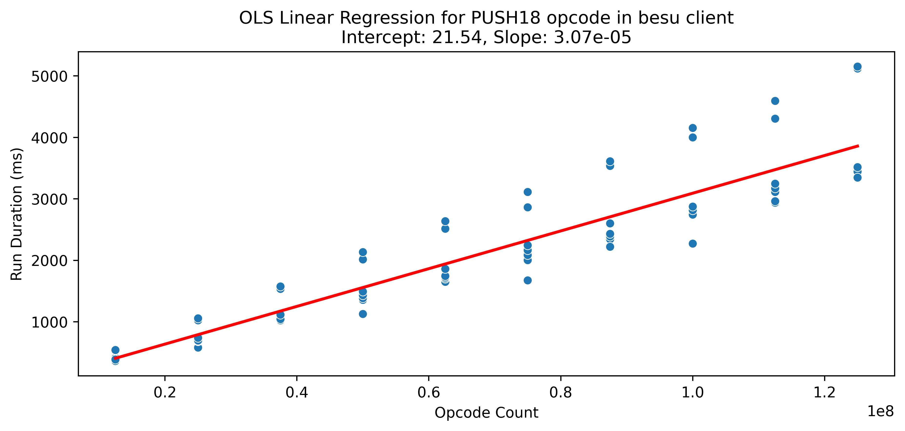


## geth


```python
                            OLS Regression Results                            
==============================================================================
Dep. Variable:        run_duration_ms   R-squared:                       0.998
Model:                            OLS   Adj. R-squared:                  0.998
Method:                 Least Squares   F-statistic:                 4.663e+04
Date:                Tue, 23 Dec 2025   Prob (F-statistic):          5.48e-103
Time:                        08:41:19   Log-Likelihood:                -350.60
No. Observations:                  74   AIC:                             705.2
Df Residuals:                      72   BIC:                             709.8
Df Model:                           1                                         
Covariance Type:            nonrobust                                         
==============================================================================
                 coef    std err          t      P>|t|      [0.025      0.975]
------------------------------------------------------------------------------
const         31.2806      7.062      4.429      0.000      17.203      45.359
opcount     1.978e-05   9.16e-08    215.950      0.000    1.96e-05       2e-05
==============================================================================
Omnibus:                        5.977   Durbin-Watson:                   2.189
Prob(Omnibus):                  0.050   Jarque-Bera (JB):                9.389
Skew:                          -0.066   Prob(JB):                      0.00915
Kurtosis:                       4.740   Cond. No.                     1.67e+08
==============================================================================

Notes:
[1] Standard Errors assume that the covariance matrix of the errors is correctly specified.
[2] The condition number is large, 1.67e+08. This might indicate that there are
strong multicollinearity or other numerical problems.
```


# PUSH19

## nethermind


```python
                            OLS Regression Results                            
==============================================================================
Dep. Variable:        run_duration_ms   R-squared:                       0.991
Model:                            OLS   Adj. R-squared:                  0.991
Method:                 Least Squares   F-statistic:                     7892.
Date:                Tue, 23 Dec 2025   Prob (F-statistic):           2.49e-75
Time:                        08:41:19   Log-Likelihood:                -366.56
No. Observations:                  74   AIC:                             737.1
Df Residuals:                      72   BIC:                             741.7
Df Model:                           1                                         
Covariance Type:            nonrobust                                         
==============================================================================
                 coef    std err          t      P>|t|      [0.025      0.975]
------------------------------------------------------------------------------
const         42.1635      8.762      4.812      0.000      24.697      59.630
opcount      1.01e-05   1.14e-07     88.838      0.000    9.87e-06    1.03e-05
==============================================================================
Omnibus:                       43.043   Durbin-Watson:                   1.586
Prob(Omnibus):                  0.000   Jarque-Bera (JB):              220.032
Skew:                          -1.569   Prob(JB):                     1.66e-48
Kurtosis:                      10.843   Cond. No.                     1.67e+08
==============================================================================

Notes:
[1] Standard Errors assume that the covariance matrix of the errors is correctly specified.
[2] The condition number is large, 1.67e+08. This might indicate that there are
strong multicollinearity or other numerical problems.
```

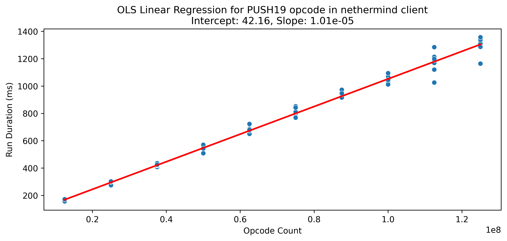


## reth


```python
                            OLS Regression Results                            
==============================================================================
Dep. Variable:        run_duration_ms   R-squared:                       0.985
Model:                            OLS   Adj. R-squared:                  0.984
Method:                 Least Squares   F-statistic:                     4591.
Date:                Tue, 23 Dec 2025   Prob (F-statistic):           5.84e-67
Time:                        08:41:19   Log-Likelihood:                -322.35
No. Observations:                  74   AIC:                             648.7
Df Residuals:                      72   BIC:                             653.3
Df Model:                           1                                         
Covariance Type:            nonrobust                                         
==============================================================================
                 coef    std err          t      P>|t|      [0.025      0.975]
------------------------------------------------------------------------------
const         37.7066      4.821      7.821      0.000      28.096      47.317
opcount     4.237e-06   6.25e-08     67.759      0.000    4.11e-06    4.36e-06
==============================================================================
Omnibus:                        0.495   Durbin-Watson:                   1.128
Prob(Omnibus):                  0.781   Jarque-Bera (JB):                0.253
Skew:                           0.141   Prob(JB):                        0.881
Kurtosis:                       3.050   Cond. No.                     1.67e+08
==============================================================================

Notes:
[1] Standard Errors assume that the covariance matrix of the errors is correctly specified.
[2] The condition number is large, 1.67e+08. This might indicate that there are
strong multicollinearity or other numerical problems.
```


## besu


```python
                            OLS Regression Results                            
==============================================================================
Dep. Variable:        run_duration_ms   R-squared:                       0.840
Model:                            OLS   Adj. R-squared:                  0.838
Method:                 Least Squares   F-statistic:                     378.6
Date:                Tue, 23 Dec 2025   Prob (F-statistic):           2.17e-30
Time:                        08:41:19   Log-Likelihood:                -561.33
No. Observations:                  74   AIC:                             1127.
Df Residuals:                      72   BIC:                             1131.
Df Model:                           1                                         
Covariance Type:            nonrobust                                         
==============================================================================
                 coef    std err          t      P>|t|      [0.025      0.975]
------------------------------------------------------------------------------
const         23.1872    121.808      0.190      0.850    -219.633     266.008
opcount     3.074e-05   1.58e-06     19.457      0.000    2.76e-05    3.39e-05
==============================================================================
Omnibus:                       13.016   Durbin-Watson:                   0.761
Prob(Omnibus):                  0.001   Jarque-Bera (JB):               14.197
Skew:                           1.050   Prob(JB):                     0.000826
Kurtosis:                       3.441   Cond. No.                     1.67e+08
==============================================================================

Notes:
[1] Standard Errors assume that the covariance matrix of the errors is correctly specified.
[2] The condition number is large, 1.67e+08. This might indicate that there are
strong multicollinearity or other numerical problems.
```

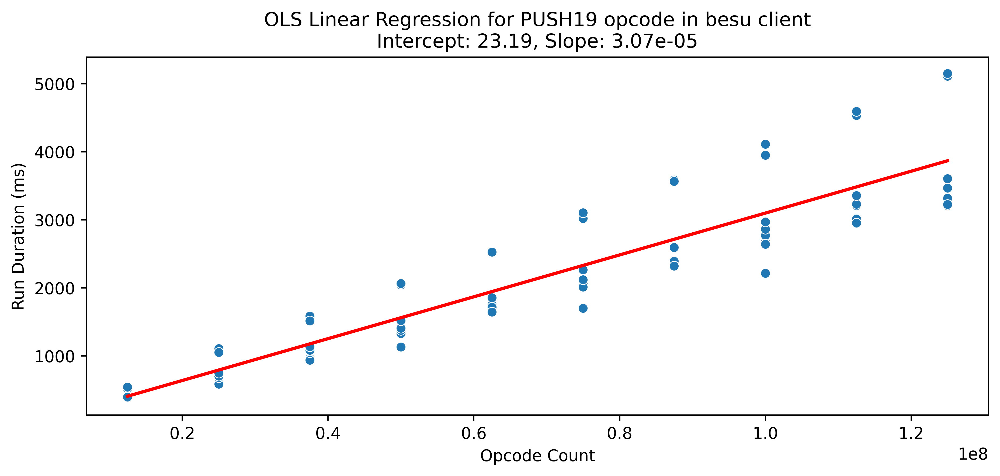


## geth


```python
                            OLS Regression Results                            
==============================================================================
Dep. Variable:        run_duration_ms   R-squared:                       0.998
Model:                            OLS   Adj. R-squared:                  0.998
Method:                 Least Squares   F-statistic:                 4.325e+04
Date:                Tue, 23 Dec 2025   Prob (F-statistic):          8.22e-102
Time:                        08:41:20   Log-Likelihood:                -353.39
No. Observations:                  74   AIC:                             710.8
Df Residuals:                      72   BIC:                             715.4
Df Model:                           1                                         
Covariance Type:            nonrobust                                         
==============================================================================
                 coef    std err          t      P>|t|      [0.025      0.975]
------------------------------------------------------------------------------
const         34.6695      7.334      4.728      0.000      20.050      49.289
opcount     1.978e-05   9.51e-08    207.963      0.000    1.96e-05       2e-05
==============================================================================
Omnibus:                       23.509   Durbin-Watson:                   1.698
Prob(Omnibus):                  0.000   Jarque-Bera (JB):               68.754
Skew:                           0.899   Prob(JB):                     1.18e-15
Kurtosis:                       7.367   Cond. No.                     1.67e+08
==============================================================================

Notes:
[1] Standard Errors assume that the covariance matrix of the errors is correctly specified.
[2] The condition number is large, 1.67e+08. This might indicate that there are
strong multicollinearity or other numerical problems.
```

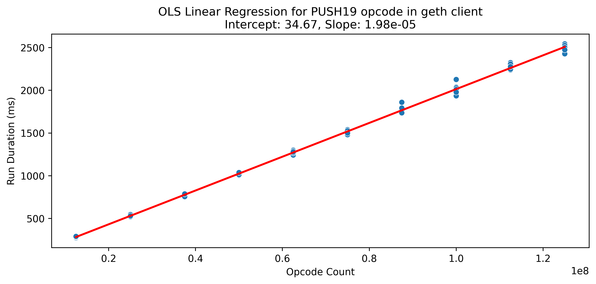


# PUSH20

## nethermind


```python
                            OLS Regression Results                            
==============================================================================
Dep. Variable:        run_duration_ms   R-squared:                       0.988
Model:                            OLS   Adj. R-squared:                  0.987
Method:                 Least Squares   F-statistic:                     5736.
Date:                Tue, 23 Dec 2025   Prob (F-statistic):           2.15e-70
Time:                        08:41:20   Log-Likelihood:                -361.22
No. Observations:                  74   AIC:                             726.4
Df Residuals:                      72   BIC:                             731.0
Df Model:                           1                                         
Covariance Type:            nonrobust                                         
==============================================================================
                 coef    std err          t      P>|t|      [0.025      0.975]
------------------------------------------------------------------------------
const         41.2775      8.152      5.063      0.000      25.027      57.528
opcount     8.008e-06   1.06e-07     75.737      0.000     7.8e-06    8.22e-06
==============================================================================
Omnibus:                       72.456   Durbin-Watson:                   1.923
Prob(Omnibus):                  0.000   Jarque-Bera (JB):             1093.061
Skew:                           2.543   Prob(JB):                    4.41e-238
Kurtosis:                      21.129   Cond. No.                     1.67e+08
==============================================================================

Notes:
[1] Standard Errors assume that the covariance matrix of the errors is correctly specified.
[2] The condition number is large, 1.67e+08. This might indicate that there are
strong multicollinearity or other numerical problems.
```

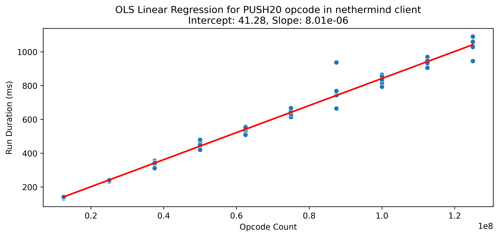


## reth


```python
                            OLS Regression Results                            
==============================================================================
Dep. Variable:        run_duration_ms   R-squared:                       0.986
Model:                            OLS   Adj. R-squared:                  0.986
Method:                 Least Squares   F-statistic:                     5043.
Date:                Tue, 23 Dec 2025   Prob (F-statistic):           2.10e-68
Time:                        08:41:20   Log-Likelihood:                -318.98
No. Observations:                  74   AIC:                             642.0
Df Residuals:                      72   BIC:                             646.6
Df Model:                           1                                         
Covariance Type:            nonrobust                                         
==============================================================================
                 coef    std err          t      P>|t|      [0.025      0.975]
------------------------------------------------------------------------------
const         36.2889      4.607      7.878      0.000      27.106      45.472
opcount     4.243e-06   5.98e-08     71.011      0.000    4.12e-06    4.36e-06
==============================================================================
Omnibus:                        1.655   Durbin-Watson:                   1.282
Prob(Omnibus):                  0.437   Jarque-Bera (JB):                1.045
Skew:                          -0.008   Prob(JB):                        0.593
Kurtosis:                       3.582   Cond. No.                     1.67e+08
==============================================================================

Notes:
[1] Standard Errors assume that the covariance matrix of the errors is correctly specified.
[2] The condition number is large, 1.67e+08. This might indicate that there are
strong multicollinearity or other numerical problems.
```

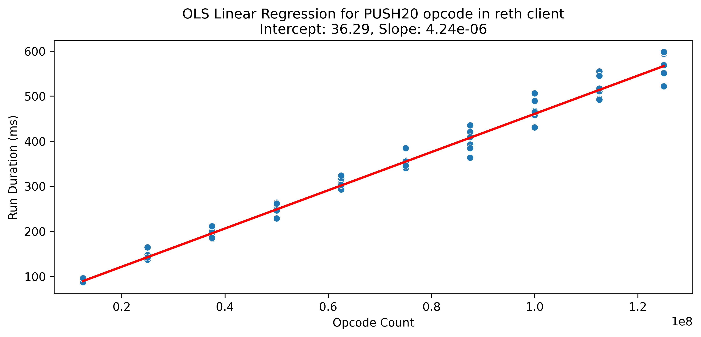


## besu


```python
                            OLS Regression Results                            
==============================================================================
Dep. Variable:        run_duration_ms   R-squared:                       0.828
Model:                            OLS   Adj. R-squared:                  0.826
Method:                 Least Squares   F-statistic:                     347.2
Date:                Tue, 23 Dec 2025   Prob (F-statistic):           2.95e-29
Time:                        08:41:20   Log-Likelihood:                -563.91
No. Observations:                  74   AIC:                             1132.
Df Residuals:                      72   BIC:                             1136.
Df Model:                           1                                         
Covariance Type:            nonrobust                                         
==============================================================================
                 coef    std err          t      P>|t|      [0.025      0.975]
------------------------------------------------------------------------------
const         26.9967    126.139      0.214      0.831    -224.457     278.450
opcount     3.049e-05   1.64e-06     18.633      0.000    2.72e-05    3.37e-05
==============================================================================
Omnibus:                       13.897   Durbin-Watson:                   0.629
Prob(Omnibus):                  0.001   Jarque-Bera (JB):               15.463
Skew:                           1.094   Prob(JB):                     0.000439
Kurtosis:                       3.475   Cond. No.                     1.67e+08
==============================================================================

Notes:
[1] Standard Errors assume that the covariance matrix of the errors is correctly specified.
[2] The condition number is large, 1.67e+08. This might indicate that there are
strong multicollinearity or other numerical problems.
```

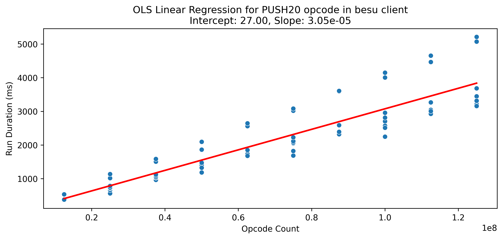


## geth


```python
                            OLS Regression Results                            
==============================================================================
Dep. Variable:        run_duration_ms   R-squared:                       0.972
Model:                            OLS   Adj. R-squared:                  0.971
Method:                 Least Squares   F-statistic:                     2489.
Date:                Tue, 23 Dec 2025   Prob (F-statistic):           1.38e-57
Time:                        08:41:20   Log-Likelihood:                -456.47
No. Observations:                  74   AIC:                             916.9
Df Residuals:                      72   BIC:                             921.5
Df Model:                           1                                         
Covariance Type:            nonrobust                                         
==============================================================================
                 coef    std err          t      P>|t|      [0.025      0.975]
------------------------------------------------------------------------------
const         92.1691     29.530      3.121      0.003      33.303     151.036
opcount     1.911e-05   3.83e-07     49.886      0.000    1.83e-05    1.99e-05
==============================================================================
Omnibus:                      116.222   Durbin-Watson:                   1.498
Prob(Omnibus):                  0.000   Jarque-Bera (JB):             2704.744
Skew:                           5.266   Prob(JB):                         0.00
Kurtosis:                      30.682   Cond. No.                     1.67e+08
==============================================================================

Notes:
[1] Standard Errors assume that the covariance matrix of the errors is correctly specified.
[2] The condition number is large, 1.67e+08. This might indicate that there are
strong multicollinearity or other numerical problems.
```

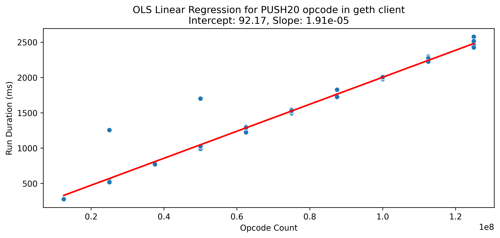


# PUSH21

## nethermind


```python
                            OLS Regression Results                            
==============================================================================
Dep. Variable:        run_duration_ms   R-squared:                       0.993
Model:                            OLS   Adj. R-squared:                  0.993
Method:                 Least Squares   F-statistic:                 1.034e+04
Date:                Tue, 23 Dec 2025   Prob (F-statistic):           1.59e-79
Time:                        08:41:20   Log-Likelihood:                -356.34
No. Observations:                  74   AIC:                             716.7
Df Residuals:                      72   BIC:                             721.3
Df Model:                           1                                         
Covariance Type:            nonrobust                                         
==============================================================================
                 coef    std err          t      P>|t|      [0.025      0.975]
------------------------------------------------------------------------------
const         40.2426      7.632      5.273      0.000      25.029      55.457
opcount     1.007e-05    9.9e-08    101.699      0.000    9.87e-06    1.03e-05
==============================================================================
Omnibus:                       66.183   Durbin-Watson:                   1.821
Prob(Omnibus):                  0.000   Jarque-Bera (JB):              442.938
Skew:                          -2.655   Prob(JB):                     6.57e-97
Kurtosis:                      13.745   Cond. No.                     1.67e+08
==============================================================================

Notes:
[1] Standard Errors assume that the covariance matrix of the errors is correctly specified.
[2] The condition number is large, 1.67e+08. This might indicate that there are
strong multicollinearity or other numerical problems.
```

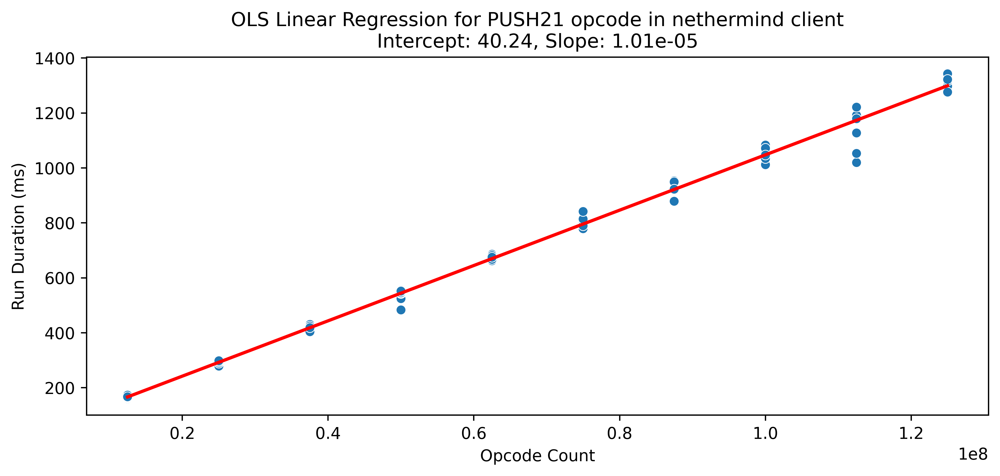


## reth


```python
                            OLS Regression Results                            
==============================================================================
Dep. Variable:        run_duration_ms   R-squared:                       0.988
Model:                            OLS   Adj. R-squared:                  0.987
Method:                 Least Squares   F-statistic:                     5740.
Date:                Tue, 23 Dec 2025   Prob (F-statistic):           2.10e-70
Time:                        08:41:20   Log-Likelihood:                -315.77
No. Observations:                  74   AIC:                             635.5
Df Residuals:                      72   BIC:                             640.1
Df Model:                           1                                         
Covariance Type:            nonrobust                                         
==============================================================================
                 coef    std err          t      P>|t|      [0.025      0.975]
------------------------------------------------------------------------------
const         39.9374      4.411      9.055      0.000      31.145      48.730
opcount     4.334e-06   5.72e-08     75.762      0.000    4.22e-06    4.45e-06
==============================================================================
Omnibus:                       15.832   Durbin-Watson:                   1.515
Prob(Omnibus):                  0.000   Jarque-Bera (JB):               23.698
Skew:                          -0.838   Prob(JB):                     7.15e-06
Kurtosis:                       5.209   Cond. No.                     1.67e+08
==============================================================================

Notes:
[1] Standard Errors assume that the covariance matrix of the errors is correctly specified.
[2] The condition number is large, 1.67e+08. This might indicate that there are
strong multicollinearity or other numerical problems.
```

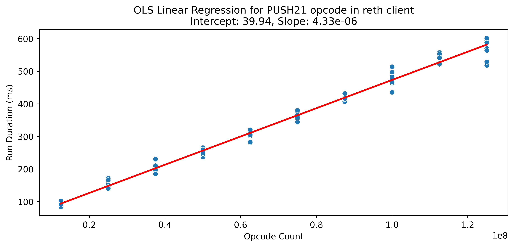


## besu


```python
                            OLS Regression Results                            
==============================================================================
Dep. Variable:        run_duration_ms   R-squared:                       0.843
Model:                            OLS   Adj. R-squared:                  0.841
Method:                 Least Squares   F-statistic:                     387.1
Date:                Tue, 23 Dec 2025   Prob (F-statistic):           1.10e-30
Time:                        08:41:21   Log-Likelihood:                -560.18
No. Observations:                  74   AIC:                             1124.
Df Residuals:                      72   BIC:                             1129.
Df Model:                           1                                         
Covariance Type:            nonrobust                                         
==============================================================================
                 coef    std err          t      P>|t|      [0.025      0.975]
------------------------------------------------------------------------------
const         19.1261    119.925      0.159      0.874    -219.940     258.192
opcount     3.061e-05   1.56e-06     19.675      0.000    2.75e-05    3.37e-05
==============================================================================
Omnibus:                       13.052   Durbin-Watson:                   0.703
Prob(Omnibus):                  0.001   Jarque-Bera (JB):               14.407
Skew:                           1.065   Prob(JB):                     0.000744
Kurtosis:                       3.365   Cond. No.                     1.67e+08
==============================================================================

Notes:
[1] Standard Errors assume that the covariance matrix of the errors is correctly specified.
[2] The condition number is large, 1.67e+08. This might indicate that there are
strong multicollinearity or other numerical problems.
```

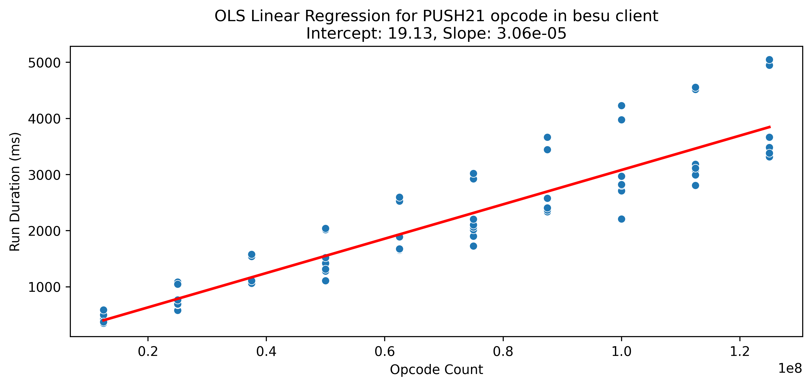


## geth


```python
                            OLS Regression Results                            
==============================================================================
Dep. Variable:        run_duration_ms   R-squared:                       0.982
Model:                            OLS   Adj. R-squared:                  0.982
Method:                 Least Squares   F-statistic:                     3963.
Date:                Tue, 23 Dec 2025   Prob (F-statistic):           1.07e-64
Time:                        08:41:21   Log-Likelihood:                -444.78
No. Observations:                  74   AIC:                             893.6
Df Residuals:                      72   BIC:                             898.2
Df Model:                           1                                         
Covariance Type:            nonrobust                                         
==============================================================================
                 coef    std err          t      P>|t|      [0.025      0.975]
------------------------------------------------------------------------------
const         36.1249     25.214      1.433      0.156     -14.139      86.388
opcount     2.059e-05   3.27e-07     62.948      0.000    1.99e-05    2.12e-05
==============================================================================
Omnibus:                      112.788   Durbin-Watson:                   1.902
Prob(Omnibus):                  0.000   Jarque-Bera (JB):             2719.685
Skew:                           4.959   Prob(JB):                         0.00
Kurtosis:                      30.995   Cond. No.                     1.67e+08
==============================================================================

Notes:
[1] Standard Errors assume that the covariance matrix of the errors is correctly specified.
[2] The condition number is large, 1.67e+08. This might indicate that there are
strong multicollinearity or other numerical problems.
```

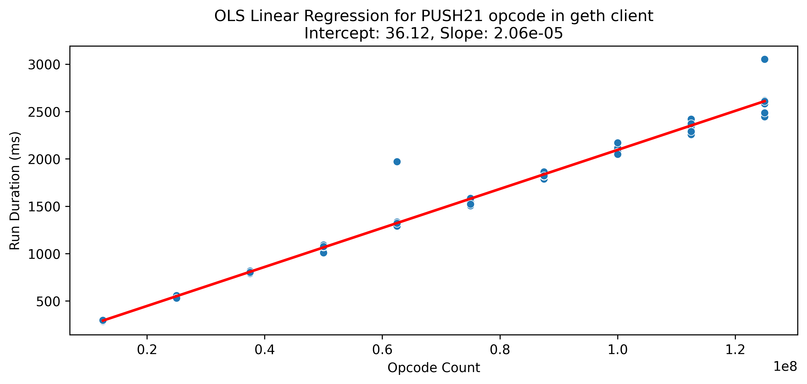


# PUSH22

## nethermind


```python
                            OLS Regression Results                            
==============================================================================
Dep. Variable:        run_duration_ms   R-squared:                       0.994
Model:                            OLS   Adj. R-squared:                  0.994
Method:                 Least Squares   F-statistic:                 1.200e+04
Date:                Tue, 23 Dec 2025   Prob (F-statistic):           7.89e-82
Time:                        08:41:21   Log-Likelihood:                -350.90
No. Observations:                  74   AIC:                             705.8
Df Residuals:                      72   BIC:                             710.4
Df Model:                           1                                         
Covariance Type:            nonrobust                                         
==============================================================================
                 coef    std err          t      P>|t|      [0.025      0.975]
------------------------------------------------------------------------------
const         39.9275      7.091      5.631      0.000      25.792      54.063
opcount     1.007e-05    9.2e-08    109.531      0.000    9.89e-06    1.03e-05
==============================================================================
Omnibus:                       34.070   Durbin-Watson:                   1.830
Prob(Omnibus):                  0.000   Jarque-Bera (JB):              162.905
Skew:                          -1.172   Prob(JB):                     4.22e-36
Kurtosis:                       9.880   Cond. No.                     1.67e+08
==============================================================================

Notes:
[1] Standard Errors assume that the covariance matrix of the errors is correctly specified.
[2] The condition number is large, 1.67e+08. This might indicate that there are
strong multicollinearity or other numerical problems.
```

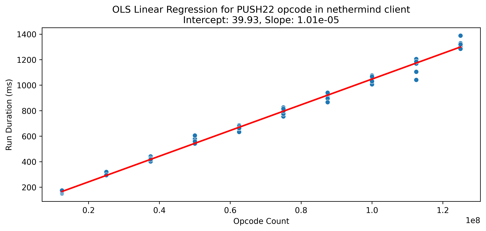


## reth


```python
                            OLS Regression Results                            
==============================================================================
Dep. Variable:        run_duration_ms   R-squared:                       0.984
Model:                            OLS   Adj. R-squared:                  0.984
Method:                 Least Squares   F-statistic:                     4496.
Date:                Tue, 23 Dec 2025   Prob (F-statistic):           1.23e-66
Time:                        08:41:21   Log-Likelihood:                -322.21
No. Observations:                  74   AIC:                             648.4
Df Residuals:                      72   BIC:                             653.0
Df Model:                           1                                         
Covariance Type:            nonrobust                                         
==============================================================================
                 coef    std err          t      P>|t|      [0.025      0.975]
------------------------------------------------------------------------------
const         39.9562      4.812      8.304      0.000      30.364      49.548
opcount     4.185e-06   6.24e-08     67.052      0.000    4.06e-06    4.31e-06
==============================================================================
Omnibus:                        4.292   Durbin-Watson:                   1.003
Prob(Omnibus):                  0.117   Jarque-Bera (JB):                3.561
Skew:                           0.431   Prob(JB):                        0.169
Kurtosis:                       2.358   Cond. No.                     1.67e+08
==============================================================================

Notes:
[1] Standard Errors assume that the covariance matrix of the errors is correctly specified.
[2] The condition number is large, 1.67e+08. This might indicate that there are
strong multicollinearity or other numerical problems.
```

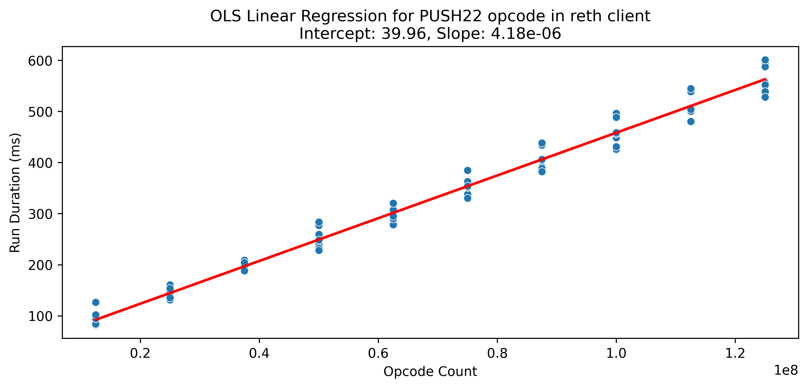


## besu


```python
                            OLS Regression Results                            
==============================================================================
Dep. Variable:        run_duration_ms   R-squared:                       0.844
Model:                            OLS   Adj. R-squared:                  0.842
Method:                 Least Squares   F-statistic:                     388.9
Date:                Tue, 23 Dec 2025   Prob (F-statistic):           9.58e-31
Time:                        08:41:21   Log-Likelihood:                -559.88
No. Observations:                  74   AIC:                             1124.
Df Residuals:                      72   BIC:                             1128.
Df Model:                           1                                         
Covariance Type:            nonrobust                                         
==============================================================================
                 coef    std err          t      P>|t|      [0.025      0.975]
------------------------------------------------------------------------------
const         25.8522    119.450      0.216      0.829    -212.267     263.972
opcount     3.055e-05   1.55e-06     19.721      0.000    2.75e-05    3.36e-05
==============================================================================
Omnibus:                       12.274   Durbin-Watson:                   0.540
Prob(Omnibus):                  0.002   Jarque-Bera (JB):               13.477
Skew:                           1.037   Prob(JB):                      0.00118
Kurtosis:                       3.263   Cond. No.                     1.67e+08
==============================================================================

Notes:
[1] Standard Errors assume that the covariance matrix of the errors is correctly specified.
[2] The condition number is large, 1.67e+08. This might indicate that there are
strong multicollinearity or other numerical problems.
```

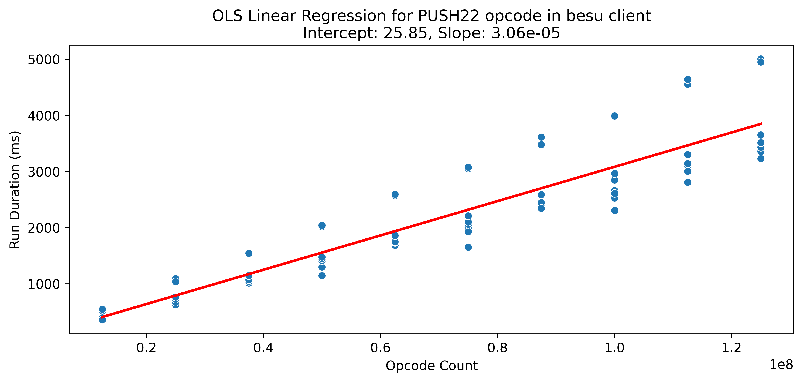


## geth


```python
                            OLS Regression Results                            
==============================================================================
Dep. Variable:        run_duration_ms   R-squared:                       0.996
Model:                            OLS   Adj. R-squared:                  0.996
Method:                 Least Squares   F-statistic:                 1.782e+04
Date:                Tue, 23 Dec 2025   Prob (F-statistic):           5.45e-88
Time:                        08:41:21   Log-Likelihood:                -387.38
No. Observations:                  74   AIC:                             778.8
Df Residuals:                      72   BIC:                             783.4
Df Model:                           1                                         
Covariance Type:            nonrobust                                         
==============================================================================
                 coef    std err          t      P>|t|      [0.025      0.975]
------------------------------------------------------------------------------
const         50.0994     11.609      4.316      0.000      26.958      73.241
opcount      2.01e-05   1.51e-07    133.509      0.000    1.98e-05    2.04e-05
==============================================================================
Omnibus:                       77.854   Durbin-Watson:                   2.072
Prob(Omnibus):                  0.000   Jarque-Bera (JB):             1128.634
Skew:                           2.877   Prob(JB):                    8.32e-246
Kurtosis:                      21.247   Cond. No.                     1.67e+08
==============================================================================

Notes:
[1] Standard Errors assume that the covariance matrix of the errors is correctly specified.
[2] The condition number is large, 1.67e+08. This might indicate that there are
strong multicollinearity or other numerical problems.
```

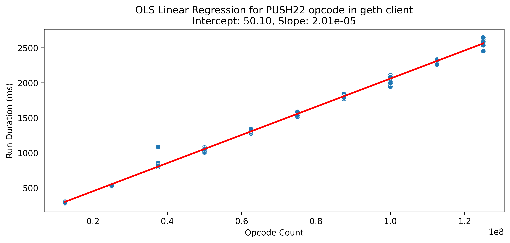


# PUSH23

## nethermind


```python
                            OLS Regression Results                            
==============================================================================
Dep. Variable:        run_duration_ms   R-squared:                       0.990
Model:                            OLS   Adj. R-squared:                  0.990
Method:                 Least Squares   F-statistic:                     7309.
Date:                Tue, 23 Dec 2025   Prob (F-statistic):           3.85e-74
Time:                        08:41:22   Log-Likelihood:                -370.87
No. Observations:                  74   AIC:                             745.7
Df Residuals:                      72   BIC:                             750.4
Df Model:                           1                                         
Covariance Type:            nonrobust                                         
==============================================================================
                 coef    std err          t      P>|t|      [0.025      0.975]
------------------------------------------------------------------------------
const         33.5845      9.288      3.616      0.001      15.070      52.099
opcount      1.03e-05    1.2e-07     85.492      0.000    1.01e-05    1.05e-05
==============================================================================
Omnibus:                       71.701   Durbin-Watson:                   1.980
Prob(Omnibus):                  0.000   Jarque-Bera (JB):              624.922
Skew:                           2.815   Prob(JB):                    1.99e-136
Kurtosis:                      16.076   Cond. No.                     1.67e+08
==============================================================================

Notes:
[1] Standard Errors assume that the covariance matrix of the errors is correctly specified.
[2] The condition number is large, 1.67e+08. This might indicate that there are
strong multicollinearity or other numerical problems.
```

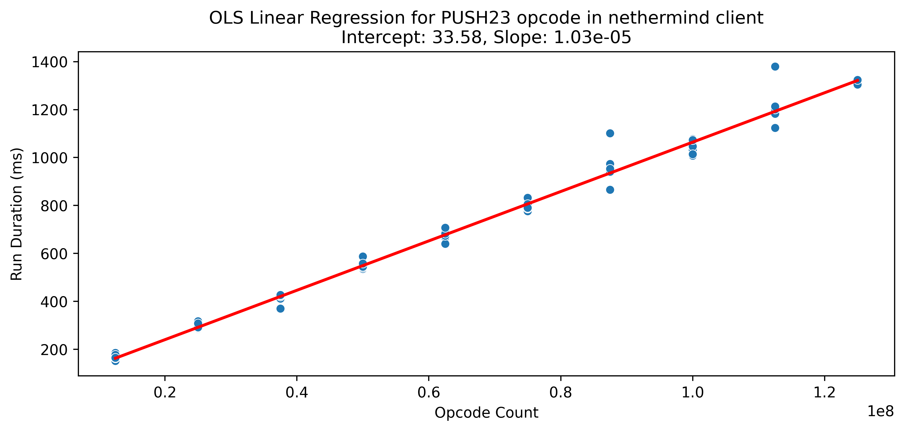


## reth


```python
                            OLS Regression Results                            
==============================================================================
Dep. Variable:        run_duration_ms   R-squared:                       0.988
Model:                            OLS   Adj. R-squared:                  0.988
Method:                 Least Squares   F-statistic:                     5772.
Date:                Tue, 23 Dec 2025   Prob (F-statistic):           1.72e-70
Time:                        08:41:22   Log-Likelihood:                -316.18
No. Observations:                  74   AIC:                             636.4
Df Residuals:                      72   BIC:                             641.0
Df Model:                           1                                         
Covariance Type:            nonrobust                                         
==============================================================================
                 coef    std err          t      P>|t|      [0.025      0.975]
------------------------------------------------------------------------------
const         35.7227      4.435      8.054      0.000      26.881      44.565
opcount     4.371e-06   5.75e-08     75.974      0.000    4.26e-06    4.49e-06
==============================================================================
Omnibus:                        8.026   Durbin-Watson:                   1.061
Prob(Omnibus):                  0.018   Jarque-Bera (JB):                7.438
Skew:                          -0.718   Prob(JB):                       0.0243
Kurtosis:                       3.592   Cond. No.                     1.67e+08
==============================================================================

Notes:
[1] Standard Errors assume that the covariance matrix of the errors is correctly specified.
[2] The condition number is large, 1.67e+08. This might indicate that there are
strong multicollinearity or other numerical problems.
```


## besu


```python
                            OLS Regression Results                            
==============================================================================
Dep. Variable:        run_duration_ms   R-squared:                       0.842
Model:                            OLS   Adj. R-squared:                  0.840
Method:                 Least Squares   F-statistic:                     383.5
Date:                Tue, 23 Dec 2025   Prob (F-statistic):           1.46e-30
Time:                        08:41:22   Log-Likelihood:                -560.91
No. Observations:                  74   AIC:                             1126.
Df Residuals:                      72   BIC:                             1130.
Df Model:                           1                                         
Covariance Type:            nonrobust                                         
==============================================================================
                 coef    std err          t      P>|t|      [0.025      0.975]
------------------------------------------------------------------------------
const         11.3710    121.116      0.094      0.925    -230.070     252.812
opcount     3.077e-05   1.57e-06     19.584      0.000    2.76e-05    3.39e-05
==============================================================================
Omnibus:                       13.448   Durbin-Watson:                   0.417
Prob(Omnibus):                  0.001   Jarque-Bera (JB):               14.908
Skew:                           1.080   Prob(JB):                     0.000579
Kurtosis:                       3.411   Cond. No.                     1.67e+08
==============================================================================

Notes:
[1] Standard Errors assume that the covariance matrix of the errors is correctly specified.
[2] The condition number is large, 1.67e+08. This might indicate that there are
strong multicollinearity or other numerical problems.
```

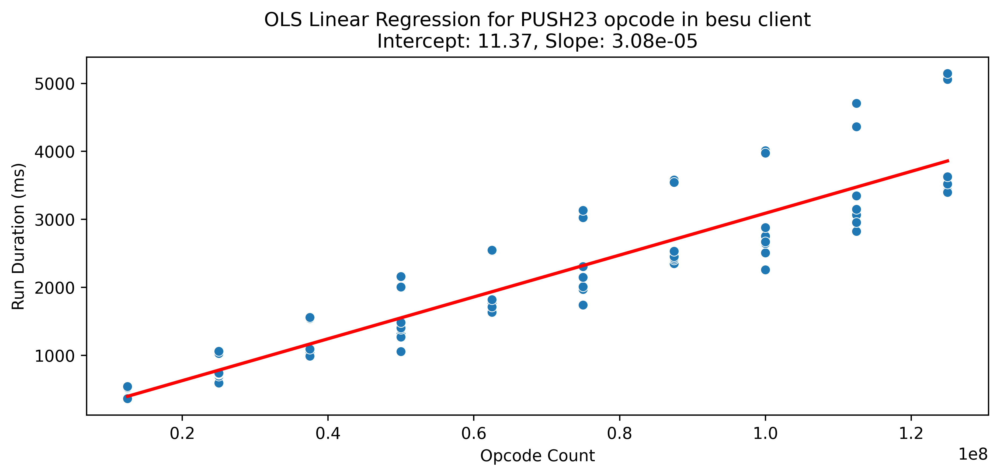


## geth


```python
                            OLS Regression Results                            
==============================================================================
Dep. Variable:        run_duration_ms   R-squared:                       0.998
Model:                            OLS   Adj. R-squared:                  0.998
Method:                 Least Squares   F-statistic:                 4.352e+04
Date:                Tue, 23 Dec 2025   Prob (F-statistic):          6.55e-102
Time:                        08:41:22   Log-Likelihood:                -354.78
No. Observations:                  74   AIC:                             713.6
Df Residuals:                      72   BIC:                             718.2
Df Model:                           1                                         
Covariance Type:            nonrobust                                         
==============================================================================
                 coef    std err          t      P>|t|      [0.025      0.975]
------------------------------------------------------------------------------
const         41.7100      7.473      5.581      0.000      26.813      56.607
opcount     2.022e-05   9.69e-08    208.624      0.000       2e-05    2.04e-05
==============================================================================
Omnibus:                       19.410   Durbin-Watson:                   2.101
Prob(Omnibus):                  0.000   Jarque-Bera (JB):               52.043
Skew:                          -0.736   Prob(JB):                     5.00e-12
Kurtosis:                       6.836   Cond. No.                     1.67e+08
==============================================================================

Notes:
[1] Standard Errors assume that the covariance matrix of the errors is correctly specified.
[2] The condition number is large, 1.67e+08. This might indicate that there are
strong multicollinearity or other numerical problems.
```


# PUSH24

## nethermind


```python
                            OLS Regression Results                            
==============================================================================
Dep. Variable:        run_duration_ms   R-squared:                       0.991
Model:                            OLS   Adj. R-squared:                  0.991
Method:                 Least Squares   F-statistic:                     7902.
Date:                Tue, 23 Dec 2025   Prob (F-statistic):           2.38e-75
Time:                        08:41:22   Log-Likelihood:                -371.48
No. Observations:                  74   AIC:                             747.0
Df Residuals:                      72   BIC:                             751.6
Df Model:                           1                                         
Covariance Type:            nonrobust                                         
==============================================================================
                 coef    std err          t      P>|t|      [0.025      0.975]
------------------------------------------------------------------------------
const         36.5133      9.364      3.899      0.000      17.846      55.181
opcount      1.08e-05   1.21e-07     88.896      0.000    1.06e-05     1.1e-05
==============================================================================
Omnibus:                       21.641   Durbin-Watson:                   2.035
Prob(Omnibus):                  0.000   Jarque-Bera (JB):               37.412
Skew:                          -1.072   Prob(JB):                     7.52e-09
Kurtosis:                       5.745   Cond. No.                     1.67e+08
==============================================================================

Notes:
[1] Standard Errors assume that the covariance matrix of the errors is correctly specified.
[2] The condition number is large, 1.67e+08. This might indicate that there are
strong multicollinearity or other numerical problems.
```


## reth


```python
                            OLS Regression Results                            
==============================================================================
Dep. Variable:        run_duration_ms   R-squared:                       0.989
Model:                            OLS   Adj. R-squared:                  0.989
Method:                 Least Squares   F-statistic:                     6342.
Date:                Tue, 23 Dec 2025   Prob (F-statistic):           6.05e-72
Time:                        08:41:22   Log-Likelihood:                -321.84
No. Observations:                  74   AIC:                             647.7
Df Residuals:                      72   BIC:                             652.3
Df Model:                           1                                         
Covariance Type:            nonrobust                                         
==============================================================================
                 coef    std err          t      P>|t|      [0.025      0.975]
------------------------------------------------------------------------------
const         29.7104      4.788      6.205      0.000      20.166      39.255
opcount     4.946e-06   6.21e-08     79.636      0.000    4.82e-06    5.07e-06
==============================================================================
Omnibus:                        1.535   Durbin-Watson:                   1.634
Prob(Omnibus):                  0.464   Jarque-Bera (JB):                0.910
Skew:                          -0.072   Prob(JB):                        0.635
Kurtosis:                       3.524   Cond. No.                     1.67e+08
==============================================================================

Notes:
[1] Standard Errors assume that the covariance matrix of the errors is correctly specified.
[2] The condition number is large, 1.67e+08. This might indicate that there are
strong multicollinearity or other numerical problems.
```


## besu


```python
                            OLS Regression Results                            
==============================================================================
Dep. Variable:        run_duration_ms   R-squared:                       0.847
Model:                            OLS   Adj. R-squared:                  0.844
Method:                 Least Squares   F-statistic:                     397.2
Date:                Tue, 23 Dec 2025   Prob (F-statistic):           5.04e-31
Time:                        08:41:22   Log-Likelihood:                -566.22
No. Observations:                  74   AIC:                             1136.
Df Residuals:                      72   BIC:                             1141.
Df Model:                           1                                         
Covariance Type:            nonrobust                                         
==============================================================================
                 coef    std err          t      P>|t|      [0.025      0.975]
------------------------------------------------------------------------------
const         12.2992    130.127      0.095      0.925    -247.103     271.702
opcount     3.364e-05   1.69e-06     19.930      0.000    3.03e-05     3.7e-05
==============================================================================
Omnibus:                       14.094   Durbin-Watson:                   0.684
Prob(Omnibus):                  0.001   Jarque-Bera (JB):               15.855
Skew:                           1.113   Prob(JB):                     0.000361
Kurtosis:                       3.432   Cond. No.                     1.67e+08
==============================================================================

Notes:
[1] Standard Errors assume that the covariance matrix of the errors is correctly specified.
[2] The condition number is large, 1.67e+08. This might indicate that there are
strong multicollinearity or other numerical problems.
```

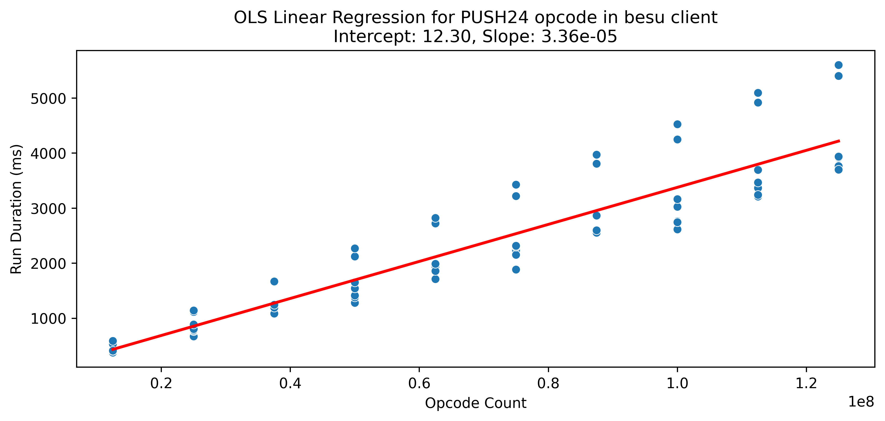


## geth


```python
                            OLS Regression Results                            
==============================================================================
Dep. Variable:        run_duration_ms   R-squared:                       0.998
Model:                            OLS   Adj. R-squared:                  0.998
Method:                 Least Squares   F-statistic:                 3.914e+04
Date:                Tue, 23 Dec 2025   Prob (F-statistic):          2.96e-100
Time:                        08:41:22   Log-Likelihood:                -361.00
No. Observations:                  74   AIC:                             726.0
Df Residuals:                      72   BIC:                             730.6
Df Model:                           1                                         
Covariance Type:            nonrobust                                         
==============================================================================
                 coef    std err          t      P>|t|      [0.025      0.975]
------------------------------------------------------------------------------
const         42.9843      8.128      5.288      0.000      26.781      59.187
opcount     2.086e-05   1.05e-07    197.849      0.000    2.06e-05    2.11e-05
==============================================================================
Omnibus:                        8.786   Durbin-Watson:                   1.933
Prob(Omnibus):                  0.012   Jarque-Bera (JB):               11.287
Skew:                          -0.494   Prob(JB):                      0.00354
Kurtosis:                       4.638   Cond. No.                     1.67e+08
==============================================================================

Notes:
[1] Standard Errors assume that the covariance matrix of the errors is correctly specified.
[2] The condition number is large, 1.67e+08. This might indicate that there are
strong multicollinearity or other numerical problems.
```


# PUSH25

## nethermind


```python
                            OLS Regression Results                            
==============================================================================
Dep. Variable:        run_duration_ms   R-squared:                       0.991
Model:                            OLS   Adj. R-squared:                  0.991
Method:                 Least Squares   F-statistic:                     7911.
Date:                Tue, 23 Dec 2025   Prob (F-statistic):           2.29e-75
Time:                        08:41:23   Log-Likelihood:                -372.00
No. Observations:                  74   AIC:                             748.0
Df Residuals:                      72   BIC:                             752.6
Df Model:                           1                                         
Covariance Type:            nonrobust                                         
==============================================================================
                 coef    std err          t      P>|t|      [0.025      0.975]
------------------------------------------------------------------------------
const         38.5391      9.431      4.086      0.000      19.739      57.340
opcount     1.088e-05   1.22e-07     88.945      0.000    1.06e-05    1.11e-05
==============================================================================
Omnibus:                        0.926   Durbin-Watson:                   1.933
Prob(Omnibus):                  0.629   Jarque-Bera (JB):                0.404
Skew:                          -0.104   Prob(JB):                        0.817
Kurtosis:                       3.297   Cond. No.                     1.67e+08
==============================================================================

Notes:
[1] Standard Errors assume that the covariance matrix of the errors is correctly specified.
[2] The condition number is large, 1.67e+08. This might indicate that there are
strong multicollinearity or other numerical problems.
```


## reth


```python
                            OLS Regression Results                            
==============================================================================
Dep. Variable:        run_duration_ms   R-squared:                       0.985
Model:                            OLS   Adj. R-squared:                  0.985
Method:                 Least Squares   F-statistic:                     4693.
Date:                Tue, 23 Dec 2025   Prob (F-statistic):           2.69e-67
Time:                        08:41:23   Log-Likelihood:                -330.75
No. Observations:                  74   AIC:                             665.5
Df Residuals:                      72   BIC:                             670.1
Df Model:                           1                                         
Covariance Type:            nonrobust                                         
==============================================================================
                 coef    std err          t      P>|t|      [0.025      0.975]
------------------------------------------------------------------------------
const         40.3218      5.400      7.466      0.000      29.556      51.087
opcount     4.798e-06      7e-08     68.502      0.000    4.66e-06    4.94e-06
==============================================================================
Omnibus:                        4.600   Durbin-Watson:                   1.648
Prob(Omnibus):                  0.100   Jarque-Bera (JB):                3.905
Skew:                           0.409   Prob(JB):                        0.142
Kurtosis:                       3.774   Cond. No.                     1.67e+08
==============================================================================

Notes:
[1] Standard Errors assume that the covariance matrix of the errors is correctly specified.
[2] The condition number is large, 1.67e+08. This might indicate that there are
strong multicollinearity or other numerical problems.
```

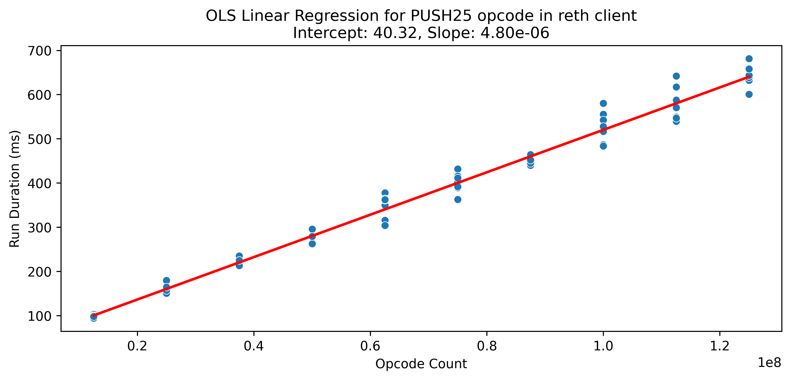


## besu


```python
                            OLS Regression Results                            
==============================================================================
Dep. Variable:        run_duration_ms   R-squared:                       0.852
Model:                            OLS   Adj. R-squared:                  0.850
Method:                 Least Squares   F-statistic:                     413.5
Date:                Tue, 23 Dec 2025   Prob (F-statistic):           1.47e-31
Time:                        08:41:23   Log-Likelihood:                -564.93
No. Observations:                  74   AIC:                             1134.
Df Residuals:                      72   BIC:                             1138.
Df Model:                           1                                         
Covariance Type:            nonrobust                                         
==============================================================================
                 coef    std err          t      P>|t|      [0.025      0.975]
------------------------------------------------------------------------------
const         13.3520    127.889      0.104      0.917    -241.591     268.295
opcount     3.373e-05   1.66e-06     20.334      0.000    3.04e-05     3.7e-05
==============================================================================
Omnibus:                       14.624   Durbin-Watson:                   0.383
Prob(Omnibus):                  0.001   Jarque-Bera (JB):               16.504
Skew:                           1.127   Prob(JB):                     0.000261
Kurtosis:                       3.520   Cond. No.                     1.67e+08
==============================================================================

Notes:
[1] Standard Errors assume that the covariance matrix of the errors is correctly specified.
[2] The condition number is large, 1.67e+08. This might indicate that there are
strong multicollinearity or other numerical problems.
```

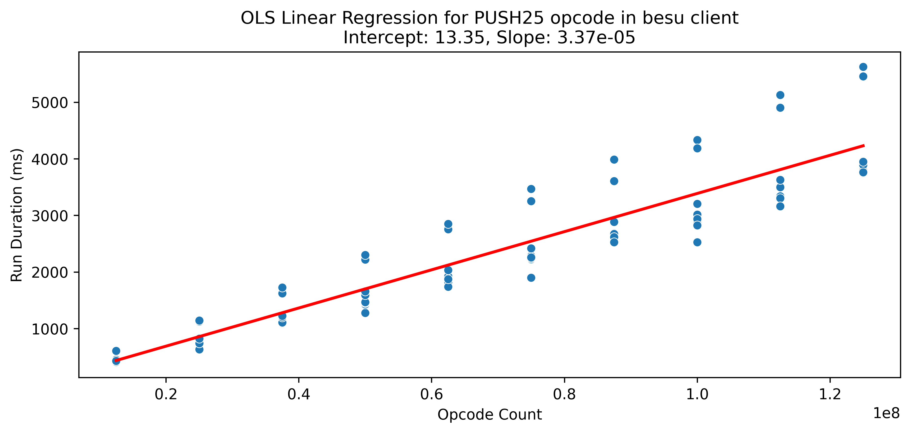


## geth


```python
                            OLS Regression Results                            
==============================================================================
Dep. Variable:        run_duration_ms   R-squared:                       0.988
Model:                            OLS   Adj. R-squared:                  0.988
Method:                 Least Squares   F-statistic:                     5812.
Date:                Tue, 23 Dec 2025   Prob (F-statistic):           1.35e-70
Time:                        08:41:23   Log-Likelihood:                -431.06
No. Observations:                  74   AIC:                             866.1
Df Residuals:                      72   BIC:                             870.7
Df Model:                           1                                         
Covariance Type:            nonrobust                                         
==============================================================================
                 coef    std err          t      P>|t|      [0.025      0.975]
------------------------------------------------------------------------------
const         63.9423     20.949      3.052      0.003      22.180     105.704
opcount     2.072e-05   2.72e-07     76.235      0.000    2.02e-05    2.13e-05
==============================================================================
Omnibus:                      135.947   Durbin-Watson:                   2.036
Prob(Omnibus):                  0.000   Jarque-Bera (JB):             7372.496
Skew:                           6.334   Prob(JB):                         0.00
Kurtosis:                      50.229   Cond. No.                     1.67e+08
==============================================================================

Notes:
[1] Standard Errors assume that the covariance matrix of the errors is correctly specified.
[2] The condition number is large, 1.67e+08. This might indicate that there are
strong multicollinearity or other numerical problems.
```

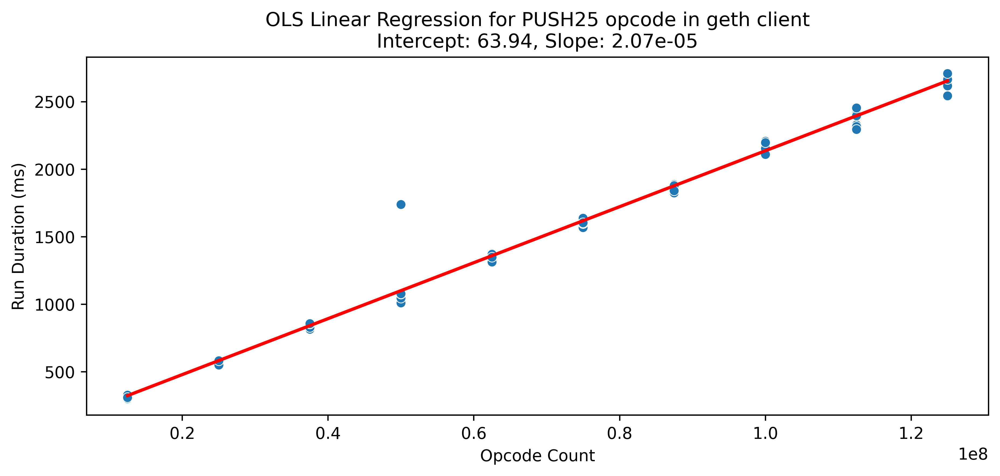


# PUSH26

## nethermind


```python
                            OLS Regression Results                            
==============================================================================
Dep. Variable:        run_duration_ms   R-squared:                       0.994
Model:                            OLS   Adj. R-squared:                  0.994
Method:                 Least Squares   F-statistic:                 1.119e+04
Date:                Tue, 23 Dec 2025   Prob (F-statistic):           9.65e-81
Time:                        08:41:23   Log-Likelihood:                -360.09
No. Observations:                  74   AIC:                             724.2
Df Residuals:                      72   BIC:                             728.8
Df Model:                           1                                         
Covariance Type:            nonrobust                                         
==============================================================================
                 coef    std err          t      P>|t|      [0.025      0.975]
------------------------------------------------------------------------------
const         30.7070      8.029      3.825      0.000      14.702      46.713
opcount     1.101e-05   1.04e-07    105.763      0.000    1.08e-05    1.12e-05
==============================================================================
Omnibus:                       22.144   Durbin-Watson:                   1.659
Prob(Omnibus):                  0.000   Jarque-Bera (JB):               52.931
Skew:                          -0.928   Prob(JB):                     3.21e-12
Kurtosis:                       6.704   Cond. No.                     1.67e+08
==============================================================================

Notes:
[1] Standard Errors assume that the covariance matrix of the errors is correctly specified.
[2] The condition number is large, 1.67e+08. This might indicate that there are
strong multicollinearity or other numerical problems.
```


## reth


```python
                            OLS Regression Results                            
==============================================================================
Dep. Variable:        run_duration_ms   R-squared:                       0.985
Model:                            OLS   Adj. R-squared:                  0.985
Method:                 Least Squares   F-statistic:                     4723.
Date:                Tue, 23 Dec 2025   Prob (F-statistic):           2.14e-67
Time:                        08:41:23   Log-Likelihood:                -332.29
No. Observations:                  74   AIC:                             668.6
Df Residuals:                      72   BIC:                             673.2
Df Model:                           1                                         
Covariance Type:            nonrobust                                         
==============================================================================
                 coef    std err          t      P>|t|      [0.025      0.975]
------------------------------------------------------------------------------
const         40.2461      5.514      7.298      0.000      29.253      51.239
opcount     4.916e-06   7.15e-08     68.726      0.000    4.77e-06    5.06e-06
==============================================================================
Omnibus:                        2.650   Durbin-Watson:                   1.560
Prob(Omnibus):                  0.266   Jarque-Bera (JB):                2.290
Skew:                          -0.038   Prob(JB):                        0.318
Kurtosis:                       3.858   Cond. No.                     1.67e+08
==============================================================================

Notes:
[1] Standard Errors assume that the covariance matrix of the errors is correctly specified.
[2] The condition number is large, 1.67e+08. This might indicate that there are
strong multicollinearity or other numerical problems.
```

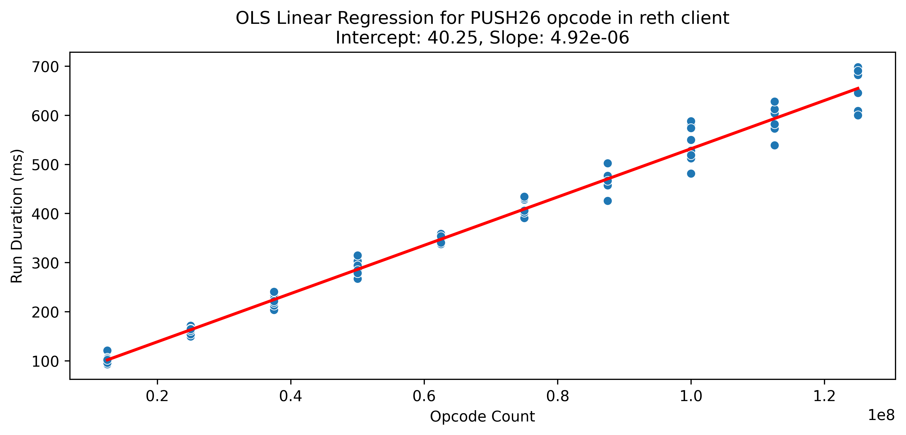


## besu


```python
                            OLS Regression Results                            
==============================================================================
Dep. Variable:        run_duration_ms   R-squared:                       0.858
Model:                            OLS   Adj. R-squared:                  0.856
Method:                 Least Squares   F-statistic:                     436.6
Date:                Tue, 23 Dec 2025   Prob (F-statistic):           2.74e-32
Time:                        08:41:23   Log-Likelihood:                -563.13
No. Observations:                  74   AIC:                             1130.
Df Residuals:                      72   BIC:                             1135.
Df Model:                           1                                         
Covariance Type:            nonrobust                                         
==============================================================================
                 coef    std err          t      P>|t|      [0.025      0.975]
------------------------------------------------------------------------------
const          0.9875    124.814      0.008      0.994    -247.825     249.800
opcount     3.383e-05   1.62e-06     20.895      0.000    3.06e-05    3.71e-05
==============================================================================
Omnibus:                       13.340   Durbin-Watson:                   0.516
Prob(Omnibus):                  0.001   Jarque-Bera (JB):               14.869
Skew:                           1.084   Prob(JB):                     0.000590
Kurtosis:                       3.353   Cond. No.                     1.67e+08
==============================================================================

Notes:
[1] Standard Errors assume that the covariance matrix of the errors is correctly specified.
[2] The condition number is large, 1.67e+08. This might indicate that there are
strong multicollinearity or other numerical problems.
```

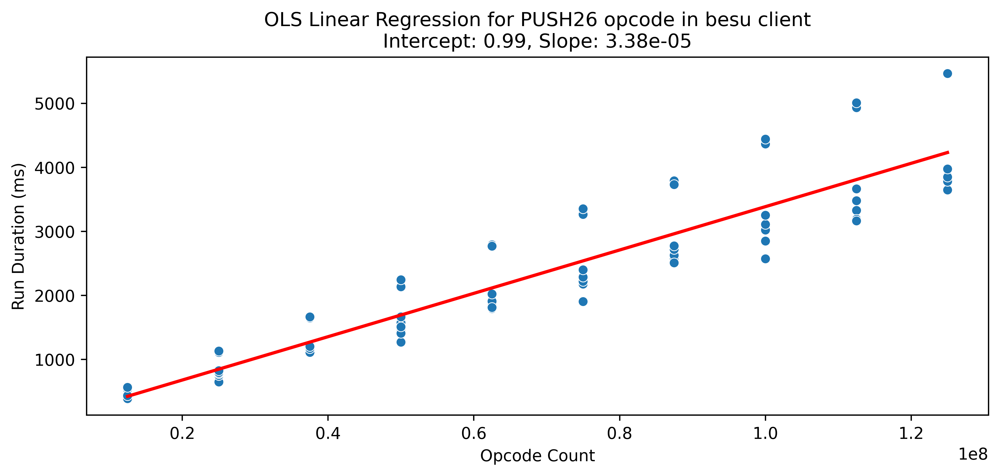


## geth


```python
                            OLS Regression Results                            
==============================================================================
Dep. Variable:        run_duration_ms   R-squared:                       0.986
Model:                            OLS   Adj. R-squared:                  0.986
Method:                 Least Squares   F-statistic:                     5023.
Date:                Tue, 23 Dec 2025   Prob (F-statistic):           2.40e-68
Time:                        08:41:24   Log-Likelihood:                -436.13
No. Observations:                  74   AIC:                             876.3
Df Residuals:                      72   BIC:                             880.9
Df Model:                           1                                         
Covariance Type:            nonrobust                                         
==============================================================================
                 coef    std err          t      P>|t|      [0.025      0.975]
------------------------------------------------------------------------------
const         71.1595     22.435      3.172      0.002      26.436     115.883
opcount     2.063e-05   2.91e-07     70.876      0.000       2e-05    2.12e-05
==============================================================================
Omnibus:                      135.950   Durbin-Watson:                   2.040
Prob(Omnibus):                  0.000   Jarque-Bera (JB):             7232.038
Skew:                           6.349   Prob(JB):                         0.00
Kurtosis:                      49.736   Cond. No.                     1.67e+08
==============================================================================

Notes:
[1] Standard Errors assume that the covariance matrix of the errors is correctly specified.
[2] The condition number is large, 1.67e+08. This might indicate that there are
strong multicollinearity or other numerical problems.
```


# PUSH27

## nethermind


```python
                            OLS Regression Results                            
==============================================================================
Dep. Variable:        run_duration_ms   R-squared:                       0.997
Model:                            OLS   Adj. R-squared:                  0.997
Method:                 Least Squares   F-statistic:                 2.152e+04
Date:                Tue, 23 Dec 2025   Prob (F-statistic):           6.30e-91
Time:                        08:41:24   Log-Likelihood:                -334.82
No. Observations:                  74   AIC:                             673.6
Df Residuals:                      72   BIC:                             678.2
Df Model:                           1                                         
Covariance Type:            nonrobust                                         
==============================================================================
                 coef    std err          t      P>|t|      [0.025      0.975]
------------------------------------------------------------------------------
const         43.3814      5.706      7.603      0.000      32.007      54.756
opcount     1.086e-05    7.4e-08    146.709      0.000    1.07e-05     1.1e-05
==============================================================================
Omnibus:                        5.054   Durbin-Watson:                   2.098
Prob(Omnibus):                  0.080   Jarque-Bera (JB):                5.175
Skew:                           0.321   Prob(JB):                       0.0752
Kurtosis:                       4.125   Cond. No.                     1.67e+08
==============================================================================

Notes:
[1] Standard Errors assume that the covariance matrix of the errors is correctly specified.
[2] The condition number is large, 1.67e+08. This might indicate that there are
strong multicollinearity or other numerical problems.
```

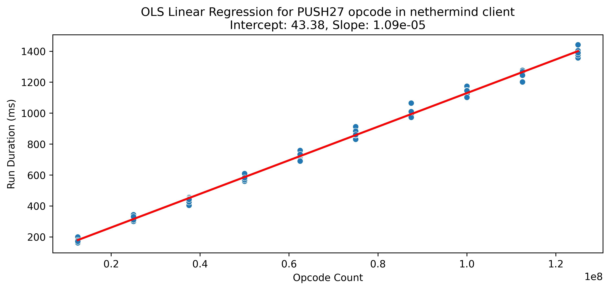


## reth


```python
                            OLS Regression Results                            
==============================================================================
Dep. Variable:        run_duration_ms   R-squared:                       0.988
Model:                            OLS   Adj. R-squared:                  0.988
Method:                 Least Squares   F-statistic:                     6098.
Date:                Tue, 23 Dec 2025   Prob (F-statistic):           2.44e-71
Time:                        08:41:24   Log-Likelihood:                -323.78
No. Observations:                  74   AIC:                             651.6
Df Residuals:                      72   BIC:                             656.2
Df Model:                           1                                         
Covariance Type:            nonrobust                                         
==============================================================================
                 coef    std err          t      P>|t|      [0.025      0.975]
------------------------------------------------------------------------------
const         40.4544      4.915      8.231      0.000      30.656      50.252
opcount     4.979e-06   6.38e-08     78.092      0.000    4.85e-06    5.11e-06
==============================================================================
Omnibus:                        4.244   Durbin-Watson:                   2.043
Prob(Omnibus):                  0.120   Jarque-Bera (JB):                3.635
Skew:                          -0.357   Prob(JB):                        0.162
Kurtosis:                       3.818   Cond. No.                     1.67e+08
==============================================================================

Notes:
[1] Standard Errors assume that the covariance matrix of the errors is correctly specified.
[2] The condition number is large, 1.67e+08. This might indicate that there are
strong multicollinearity or other numerical problems.
```

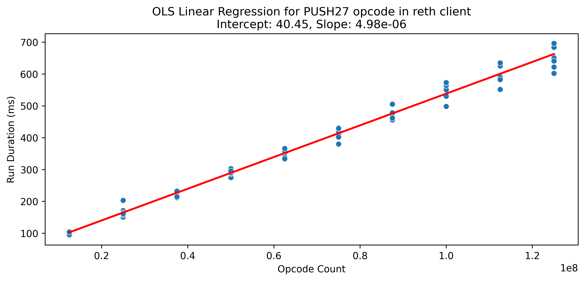


## besu


```python
                            OLS Regression Results                            
==============================================================================
Dep. Variable:        run_duration_ms   R-squared:                       0.847
Model:                            OLS   Adj. R-squared:                  0.844
Method:                 Least Squares   F-statistic:                     397.4
Date:                Tue, 23 Dec 2025   Prob (F-statistic):           4.95e-31
Time:                        08:41:24   Log-Likelihood:                -566.08
No. Observations:                  74   AIC:                             1136.
Df Residuals:                      72   BIC:                             1141.
Df Model:                           1                                         
Covariance Type:            nonrobust                                         
==============================================================================
                 coef    std err          t      P>|t|      [0.025      0.975]
------------------------------------------------------------------------------
const         19.7745    129.885      0.152      0.879    -239.147     278.696
opcount     3.359e-05   1.68e-06     19.935      0.000    3.02e-05    3.69e-05
==============================================================================
Omnibus:                       13.751   Durbin-Watson:                   0.519
Prob(Omnibus):                  0.001   Jarque-Bera (JB):               15.302
Skew:                           1.092   Prob(JB):                     0.000475
Kurtosis:                       3.444   Cond. No.                     1.67e+08
==============================================================================

Notes:
[1] Standard Errors assume that the covariance matrix of the errors is correctly specified.
[2] The condition number is large, 1.67e+08. This might indicate that there are
strong multicollinearity or other numerical problems.
```

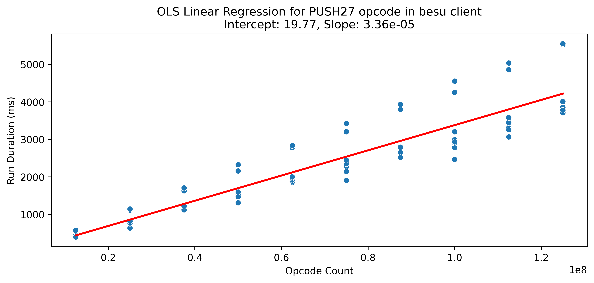


## geth


```python
                            OLS Regression Results                            
==============================================================================
Dep. Variable:        run_duration_ms   R-squared:                       0.998
Model:                            OLS   Adj. R-squared:                  0.998
Method:                 Least Squares   F-statistic:                 3.393e+04
Date:                Tue, 23 Dec 2025   Prob (F-statistic):           5.06e-98
Time:                        08:41:24   Log-Likelihood:                -368.34
No. Observations:                  74   AIC:                             740.7
Df Residuals:                      72   BIC:                             745.3
Df Model:                           1                                         
Covariance Type:            nonrobust                                         
==============================================================================
                 coef    std err          t      P>|t|      [0.025      0.975]
------------------------------------------------------------------------------
const         29.6807      8.975      3.307      0.001      11.789      47.572
opcount     2.144e-05   1.16e-07    184.191      0.000    2.12e-05    2.17e-05
==============================================================================
Omnibus:                       20.090   Durbin-Watson:                   1.606
Prob(Omnibus):                  0.000   Jarque-Bera (JB):               34.444
Skew:                          -0.994   Prob(JB):                     3.32e-08
Kurtosis:                       5.687   Cond. No.                     1.67e+08
==============================================================================

Notes:
[1] Standard Errors assume that the covariance matrix of the errors is correctly specified.
[2] The condition number is large, 1.67e+08. This might indicate that there are
strong multicollinearity or other numerical problems.
```


# PUSH28

## nethermind


```python
                            OLS Regression Results                            
==============================================================================
Dep. Variable:        run_duration_ms   R-squared:                       0.994
Model:                            OLS   Adj. R-squared:                  0.993
Method:                 Least Squares   F-statistic:                 1.110e+04
Date:                Tue, 23 Dec 2025   Prob (F-statistic):           1.25e-80
Time:                        08:41:24   Log-Likelihood:                -358.29
No. Observations:                  74   AIC:                             720.6
Df Residuals:                      72   BIC:                             725.2
Df Model:                           1                                         
Covariance Type:            nonrobust                                         
==============================================================================
                 coef    std err          t      P>|t|      [0.025      0.975]
------------------------------------------------------------------------------
const         40.7973      7.835      5.207      0.000      25.178      56.416
opcount     1.071e-05   1.02e-07    105.377      0.000    1.05e-05    1.09e-05
==============================================================================
Omnibus:                       29.740   Durbin-Watson:                   2.119
Prob(Omnibus):                  0.000   Jarque-Bera (JB):               62.922
Skew:                          -1.380   Prob(JB):                     2.17e-14
Kurtosis:                       6.576   Cond. No.                     1.67e+08
==============================================================================

Notes:
[1] Standard Errors assume that the covariance matrix of the errors is correctly specified.
[2] The condition number is large, 1.67e+08. This might indicate that there are
strong multicollinearity or other numerical problems.
```


## reth


```python
                            OLS Regression Results                            
==============================================================================
Dep. Variable:        run_duration_ms   R-squared:                       0.991
Model:                            OLS   Adj. R-squared:                  0.991
Method:                 Least Squares   F-statistic:                     7753.
Date:                Tue, 23 Dec 2025   Prob (F-statistic):           4.70e-75
Time:                        08:41:24   Log-Likelihood:                -314.66
No. Observations:                  74   AIC:                             633.3
Df Residuals:                      72   BIC:                             637.9
Df Model:                           1                                         
Covariance Type:            nonrobust                                         
==============================================================================
                 coef    std err          t      P>|t|      [0.025      0.975]
------------------------------------------------------------------------------
const         35.7317      4.345      8.223      0.000      27.070      44.394
opcount     4.963e-06   5.64e-08     88.050      0.000    4.85e-06    5.08e-06
==============================================================================
Omnibus:                        3.438   Durbin-Watson:                   1.546
Prob(Omnibus):                  0.179   Jarque-Bera (JB):                3.221
Skew:                          -0.174   Prob(JB):                        0.200
Kurtosis:                       3.961   Cond. No.                     1.67e+08
==============================================================================

Notes:
[1] Standard Errors assume that the covariance matrix of the errors is correctly specified.
[2] The condition number is large, 1.67e+08. This might indicate that there are
strong multicollinearity or other numerical problems.
```


## besu


```python
                            OLS Regression Results                            
==============================================================================
Dep. Variable:        run_duration_ms   R-squared:                       0.855
Model:                            OLS   Adj. R-squared:                  0.853
Method:                 Least Squares   F-statistic:                     425.0
Date:                Tue, 23 Dec 2025   Prob (F-statistic):           6.29e-32
Time:                        08:41:25   Log-Likelihood:                -563.52
No. Observations:                  74   AIC:                             1131.
Df Residuals:                      72   BIC:                             1136.
Df Model:                           1                                         
Covariance Type:            nonrobust                                         
==============================================================================
                 coef    std err          t      P>|t|      [0.025      0.975]
------------------------------------------------------------------------------
const         25.7032    125.468      0.205      0.838    -224.413     275.819
opcount     3.355e-05   1.63e-06     20.616      0.000    3.03e-05    3.68e-05
==============================================================================
Omnibus:                       13.833   Durbin-Watson:                   0.351
Prob(Omnibus):                  0.001   Jarque-Bera (JB):               15.261
Skew:                           1.080   Prob(JB):                     0.000485
Kurtosis:                       3.532   Cond. No.                     1.67e+08
==============================================================================

Notes:
[1] Standard Errors assume that the covariance matrix of the errors is correctly specified.
[2] The condition number is large, 1.67e+08. This might indicate that there are
strong multicollinearity or other numerical problems.
```

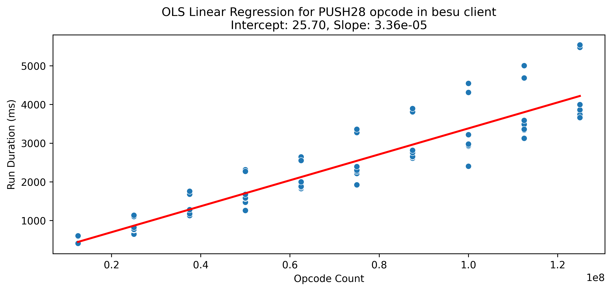


## geth


```python
                            OLS Regression Results                            
==============================================================================
Dep. Variable:        run_duration_ms   R-squared:                       0.997
Model:                            OLS   Adj. R-squared:                  0.997
Method:                 Least Squares   F-statistic:                 2.287e+04
Date:                Tue, 23 Dec 2025   Prob (F-statistic):           7.10e-92
Time:                        08:41:25   Log-Likelihood:                -381.24
No. Observations:                  74   AIC:                             766.5
Df Residuals:                      72   BIC:                             771.1
Df Model:                           1                                         
Covariance Type:            nonrobust                                         
==============================================================================
                 coef    std err          t      P>|t|      [0.025      0.975]
------------------------------------------------------------------------------
const         35.7222     10.685      3.343      0.001      14.423      57.022
opcount     2.096e-05   1.39e-07    151.240      0.000    2.07e-05    2.12e-05
==============================================================================
Omnibus:                       31.486   Durbin-Watson:                   1.372
Prob(Omnibus):                  0.000   Jarque-Bera (JB):               74.937
Skew:                          -1.400   Prob(JB):                     5.34e-17
Kurtosis:                       7.057   Cond. No.                     1.67e+08
==============================================================================

Notes:
[1] Standard Errors assume that the covariance matrix of the errors is correctly specified.
[2] The condition number is large, 1.67e+08. This might indicate that there are
strong multicollinearity or other numerical problems.
```


# PUSH29

## nethermind


```python
                            OLS Regression Results                            
==============================================================================
Dep. Variable:        run_duration_ms   R-squared:                       0.994
Model:                            OLS   Adj. R-squared:                  0.994
Method:                 Least Squares   F-statistic:                 1.223e+04
Date:                Tue, 23 Dec 2025   Prob (F-statistic):           3.92e-82
Time:                        08:41:25   Log-Likelihood:                -355.55
No. Observations:                  74   AIC:                             715.1
Df Residuals:                      72   BIC:                             719.7
Df Model:                           1                                         
Covariance Type:            nonrobust                                         
==============================================================================
                 coef    std err          t      P>|t|      [0.025      0.975]
------------------------------------------------------------------------------
const         44.2971      7.551      5.867      0.000      29.245      59.349
opcount     1.083e-05   9.79e-08    110.605      0.000    1.06e-05     1.1e-05
==============================================================================
Omnibus:                       14.504   Durbin-Watson:                   1.625
Prob(Omnibus):                  0.001   Jarque-Bera (JB):               30.355
Skew:                          -0.595   Prob(JB):                     2.56e-07
Kurtosis:                       5.903   Cond. No.                     1.67e+08
==============================================================================

Notes:
[1] Standard Errors assume that the covariance matrix of the errors is correctly specified.
[2] The condition number is large, 1.67e+08. This might indicate that there are
strong multicollinearity or other numerical problems.
```


## reth


```python
                            OLS Regression Results                            
==============================================================================
Dep. Variable:        run_duration_ms   R-squared:                       0.983
Model:                            OLS   Adj. R-squared:                  0.982
Method:                 Least Squares   F-statistic:                     4058.
Date:                Tue, 23 Dec 2025   Prob (F-statistic):           4.61e-65
Time:                        08:41:25   Log-Likelihood:                -337.13
No. Observations:                  74   AIC:                             678.3
Df Residuals:                      72   BIC:                             682.9
Df Model:                           1                                         
Covariance Type:            nonrobust                                         
==============================================================================
                 coef    std err          t      P>|t|      [0.025      0.975]
------------------------------------------------------------------------------
const         41.9073      5.887      7.118      0.000      30.171      53.643
opcount     4.865e-06   7.64e-08     63.705      0.000    4.71e-06    5.02e-06
==============================================================================
Omnibus:                        1.853   Durbin-Watson:                   1.628
Prob(Omnibus):                  0.396   Jarque-Bera (JB):                1.217
Skew:                          -0.113   Prob(JB):                        0.544
Kurtosis:                       3.586   Cond. No.                     1.67e+08
==============================================================================

Notes:
[1] Standard Errors assume that the covariance matrix of the errors is correctly specified.
[2] The condition number is large, 1.67e+08. This might indicate that there are
strong multicollinearity or other numerical problems.
```


## besu


```python
                            OLS Regression Results                            
==============================================================================
Dep. Variable:        run_duration_ms   R-squared:                       0.860
Model:                            OLS   Adj. R-squared:                  0.858
Method:                 Least Squares   F-statistic:                     441.0
Date:                Tue, 23 Dec 2025   Prob (F-statistic):           2.01e-32
Time:                        08:41:25   Log-Likelihood:                -562.93
No. Observations:                  74   AIC:                             1130.
Df Residuals:                      72   BIC:                             1134.
Df Model:                           1                                         
Covariance Type:            nonrobust                                         
==============================================================================
                 coef    std err          t      P>|t|      [0.025      0.975]
------------------------------------------------------------------------------
const          5.5613    124.471      0.045      0.964    -242.568     253.691
opcount      3.39e-05   1.61e-06     21.000      0.000    3.07e-05    3.71e-05
==============================================================================
Omnibus:                       14.897   Durbin-Watson:                   0.779
Prob(Omnibus):                  0.001   Jarque-Bera (JB):               16.781
Skew:                           1.126   Prob(JB):                     0.000227
Kurtosis:                       3.606   Cond. No.                     1.67e+08
==============================================================================

Notes:
[1] Standard Errors assume that the covariance matrix of the errors is correctly specified.
[2] The condition number is large, 1.67e+08. This might indicate that there are
strong multicollinearity or other numerical problems.
```

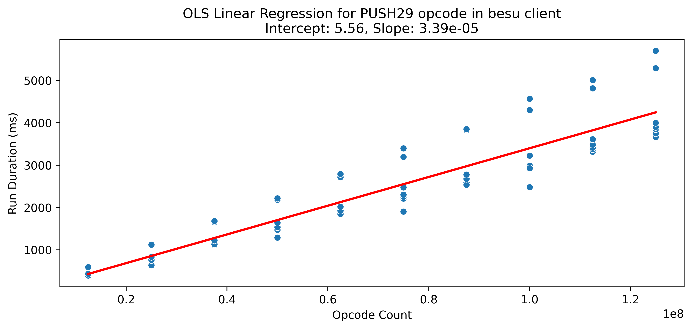


## geth


```python
                            OLS Regression Results                            
==============================================================================
Dep. Variable:        run_duration_ms   R-squared:                       0.991
Model:                            OLS   Adj. R-squared:                  0.991
Method:                 Least Squares   F-statistic:                     8038.
Date:                Tue, 23 Dec 2025   Prob (F-statistic):           1.30e-75
Time:                        08:41:25   Log-Likelihood:                -423.11
No. Observations:                  74   AIC:                             850.2
Df Residuals:                      72   BIC:                             854.8
Df Model:                           1                                         
Covariance Type:            nonrobust                                         
==============================================================================
                 coef    std err          t      P>|t|      [0.025      0.975]
------------------------------------------------------------------------------
const         24.7080     18.813      1.313      0.193     -12.796      62.212
opcount     2.188e-05   2.44e-07     89.653      0.000    2.14e-05    2.24e-05
==============================================================================
Omnibus:                       90.258   Durbin-Watson:                   2.012
Prob(Omnibus):                  0.000   Jarque-Bera (JB):             1887.034
Skew:                           3.432   Prob(JB):                         0.00
Kurtosis:                      26.768   Cond. No.                     1.67e+08
==============================================================================

Notes:
[1] Standard Errors assume that the covariance matrix of the errors is correctly specified.
[2] The condition number is large, 1.67e+08. This might indicate that there are
strong multicollinearity or other numerical problems.
```

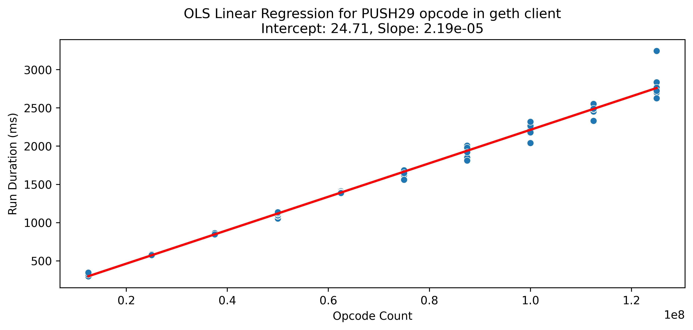


# PUSH30

## nethermind


```python
                            OLS Regression Results                            
==============================================================================
Dep. Variable:        run_duration_ms   R-squared:                       0.995
Model:                            OLS   Adj. R-squared:                  0.994
Method:                 Least Squares   F-statistic:                 1.305e+04
Date:                Tue, 23 Dec 2025   Prob (F-statistic):           3.92e-83
Time:                        08:41:25   Log-Likelihood:                -353.87
No. Observations:                  74   AIC:                             711.7
Df Residuals:                      72   BIC:                             716.3
Df Model:                           1                                         
Covariance Type:            nonrobust                                         
==============================================================================
                 coef    std err          t      P>|t|      [0.025      0.975]
------------------------------------------------------------------------------
const         39.3155      7.381      5.326      0.000      24.601      54.030
opcount     1.094e-05   9.57e-08    114.219      0.000    1.07e-05    1.11e-05
==============================================================================
Omnibus:                       15.879   Durbin-Watson:                   2.012
Prob(Omnibus):                  0.000   Jarque-Bera (JB):               45.887
Skew:                          -0.507   Prob(JB):                     1.09e-10
Kurtosis:                       6.722   Cond. No.                     1.67e+08
==============================================================================

Notes:
[1] Standard Errors assume that the covariance matrix of the errors is correctly specified.
[2] The condition number is large, 1.67e+08. This might indicate that there are
strong multicollinearity or other numerical problems.
```


## reth


```python
                            OLS Regression Results                            
==============================================================================
Dep. Variable:        run_duration_ms   R-squared:                       0.983
Model:                            OLS   Adj. R-squared:                  0.982
Method:                 Least Squares   F-statistic:                     4065.
Date:                Tue, 23 Dec 2025   Prob (F-statistic):           4.36e-65
Time:                        08:41:26   Log-Likelihood:                -339.89
No. Observations:                  74   AIC:                             683.8
Df Residuals:                      72   BIC:                             688.4
Df Model:                           1                                         
Covariance Type:            nonrobust                                         
==============================================================================
                 coef    std err          t      P>|t|      [0.025      0.975]
------------------------------------------------------------------------------
const         31.4732      6.111      5.150      0.000      19.291      43.655
opcount     5.054e-06   7.93e-08     63.756      0.000     4.9e-06    5.21e-06
==============================================================================
Omnibus:                        3.356   Durbin-Watson:                   1.526
Prob(Omnibus):                  0.187   Jarque-Bera (JB):                3.407
Skew:                          -0.046   Prob(JB):                        0.182
Kurtosis:                       4.047   Cond. No.                     1.67e+08
==============================================================================

Notes:
[1] Standard Errors assume that the covariance matrix of the errors is correctly specified.
[2] The condition number is large, 1.67e+08. This might indicate that there are
strong multicollinearity or other numerical problems.
```

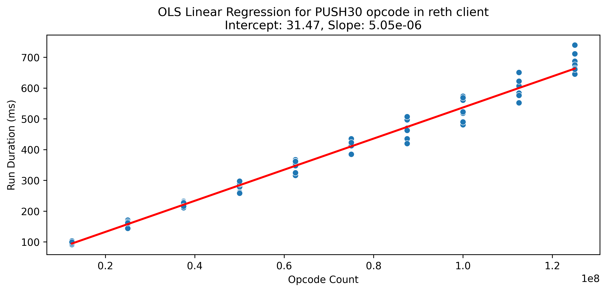


## besu


```python
                            OLS Regression Results                            
==============================================================================
Dep. Variable:        run_duration_ms   R-squared:                       0.856
Model:                            OLS   Adj. R-squared:                  0.854
Method:                 Least Squares   F-statistic:                     426.9
Date:                Tue, 23 Dec 2025   Prob (F-statistic):           5.52e-32
Time:                        08:41:26   Log-Likelihood:                -563.83
No. Observations:                  74   AIC:                             1132.
Df Residuals:                      72   BIC:                             1136.
Df Model:                           1                                         
Covariance Type:            nonrobust                                         
==============================================================================
                 coef    std err          t      P>|t|      [0.025      0.975]
------------------------------------------------------------------------------
const         15.0006    125.998      0.119      0.906    -236.173     266.174
opcount     3.377e-05   1.63e-06     20.660      0.000    3.05e-05     3.7e-05
==============================================================================
Omnibus:                       14.527   Durbin-Watson:                   0.735
Prob(Omnibus):                  0.001   Jarque-Bera (JB):               16.306
Skew:                           1.117   Prob(JB):                     0.000288
Kurtosis:                       3.546   Cond. No.                     1.67e+08
==============================================================================

Notes:
[1] Standard Errors assume that the covariance matrix of the errors is correctly specified.
[2] The condition number is large, 1.67e+08. This might indicate that there are
strong multicollinearity or other numerical problems.
```

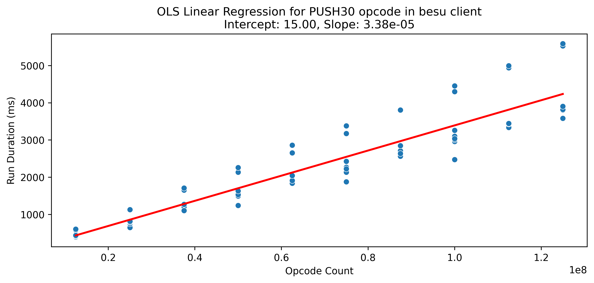


## geth


```python
                            OLS Regression Results                            
==============================================================================
Dep. Variable:        run_duration_ms   R-squared:                       0.996
Model:                            OLS   Adj. R-squared:                  0.996
Method:                 Least Squares   F-statistic:                 1.706e+04
Date:                Tue, 23 Dec 2025   Prob (F-statistic):           2.64e-87
Time:                        08:41:26   Log-Likelihood:                -394.84
No. Observations:                  74   AIC:                             793.7
Df Residuals:                      72   BIC:                             798.3
Df Model:                           1                                         
Covariance Type:            nonrobust                                         
==============================================================================
                 coef    std err          t      P>|t|      [0.025      0.975]
------------------------------------------------------------------------------
const         32.5948     12.841      2.538      0.013       6.997      58.193
opcount     2.175e-05   1.67e-07    130.604      0.000    2.14e-05    2.21e-05
==============================================================================
Omnibus:                       88.773   Durbin-Watson:                   2.144
Prob(Omnibus):                  0.000   Jarque-Bera (JB):             1575.956
Skew:                           3.435   Prob(JB):                         0.00
Kurtosis:                      24.539   Cond. No.                     1.67e+08
==============================================================================

Notes:
[1] Standard Errors assume that the covariance matrix of the errors is correctly specified.
[2] The condition number is large, 1.67e+08. This might indicate that there are
strong multicollinearity or other numerical problems.
```


# PUSH31

## nethermind


```python
                            OLS Regression Results                            
==============================================================================
Dep. Variable:        run_duration_ms   R-squared:                       0.995
Model:                            OLS   Adj. R-squared:                  0.995
Method:                 Least Squares   F-statistic:                 1.409e+04
Date:                Tue, 23 Dec 2025   Prob (F-statistic):           2.49e-84
Time:                        08:41:26   Log-Likelihood:                -351.04
No. Observations:                  74   AIC:                             706.1
Df Residuals:                      72   BIC:                             710.7
Df Model:                           1                                         
Covariance Type:            nonrobust                                         
==============================================================================
                 coef    std err          t      P>|t|      [0.025      0.975]
------------------------------------------------------------------------------
const         40.3372      7.104      5.678      0.000      26.175      54.499
opcount     1.094e-05   9.21e-08    118.701      0.000    1.08e-05    1.11e-05
==============================================================================
Omnibus:                       33.218   Durbin-Watson:                   1.826
Prob(Omnibus):                  0.000   Jarque-Bera (JB):              104.253
Skew:                          -1.336   Prob(JB):                     2.30e-23
Kurtosis:                       8.164   Cond. No.                     1.67e+08
==============================================================================

Notes:
[1] Standard Errors assume that the covariance matrix of the errors is correctly specified.
[2] The condition number is large, 1.67e+08. This might indicate that there are
strong multicollinearity or other numerical problems.
```

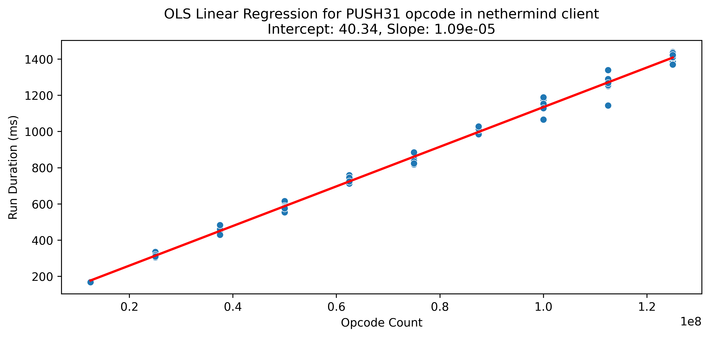


## reth


```python
                            OLS Regression Results                            
==============================================================================
Dep. Variable:        run_duration_ms   R-squared:                       0.985
Model:                            OLS   Adj. R-squared:                  0.985
Method:                 Least Squares   F-statistic:                     4648.
Date:                Tue, 23 Dec 2025   Prob (F-statistic):           3.77e-67
Time:                        08:41:26   Log-Likelihood:                -335.29
No. Observations:                  74   AIC:                             674.6
Df Residuals:                      72   BIC:                             679.2
Df Model:                           1                                         
Covariance Type:            nonrobust                                         
==============================================================================
                 coef    std err          t      P>|t|      [0.025      0.975]
------------------------------------------------------------------------------
const         34.5440      5.743      6.015      0.000      23.096      45.992
opcount     5.078e-06   7.45e-08     68.178      0.000    4.93e-06    5.23e-06
==============================================================================
Omnibus:                        4.469   Durbin-Watson:                   1.748
Prob(Omnibus):                  0.107   Jarque-Bera (JB):                4.388
Skew:                           0.285   Prob(JB):                        0.111
Kurtosis:                       4.048   Cond. No.                     1.67e+08
==============================================================================

Notes:
[1] Standard Errors assume that the covariance matrix of the errors is correctly specified.
[2] The condition number is large, 1.67e+08. This might indicate that there are
strong multicollinearity or other numerical problems.
```


## besu


```python
                            OLS Regression Results                            
==============================================================================
Dep. Variable:        run_duration_ms   R-squared:                       0.863
Model:                            OLS   Adj. R-squared:                  0.861
Method:                 Least Squares   F-statistic:                     452.8
Date:                Tue, 23 Dec 2025   Prob (F-statistic):           8.88e-33
Time:                        08:41:26   Log-Likelihood:                -561.13
No. Observations:                  74   AIC:                             1126.
Df Residuals:                      72   BIC:                             1131.
Df Model:                           1                                         
Covariance Type:            nonrobust                                         
==============================================================================
                 coef    std err          t      P>|t|      [0.025      0.975]
------------------------------------------------------------------------------
const         23.0878    121.477      0.190      0.850    -219.071     265.247
opcount     3.353e-05   1.58e-06     21.278      0.000    3.04e-05    3.67e-05
==============================================================================
Omnibus:                       12.643   Durbin-Watson:                   0.547
Prob(Omnibus):                  0.002   Jarque-Bera (JB):               14.034
Skew:                           1.059   Prob(JB):                     0.000897
Kurtosis:                       3.259   Cond. No.                     1.67e+08
==============================================================================

Notes:
[1] Standard Errors assume that the covariance matrix of the errors is correctly specified.
[2] The condition number is large, 1.67e+08. This might indicate that there are
strong multicollinearity or other numerical problems.
```

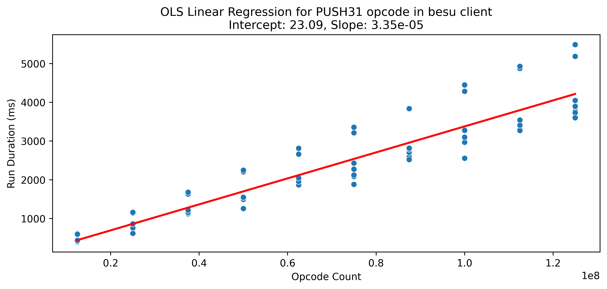


## geth


```python
                            OLS Regression Results                            
==============================================================================
Dep. Variable:        run_duration_ms   R-squared:                       0.987
Model:                            OLS   Adj. R-squared:                  0.987
Method:                 Least Squares   F-statistic:                     5388.
Date:                Tue, 23 Dec 2025   Prob (F-statistic):           1.99e-69
Time:                        08:41:26   Log-Likelihood:                -437.11
No. Observations:                  74   AIC:                             878.2
Df Residuals:                      72   BIC:                             882.8
Df Model:                           1                                         
Covariance Type:            nonrobust                                         
==============================================================================
                 coef    std err          t      P>|t|      [0.025      0.975]
------------------------------------------------------------------------------
const         48.1697     22.732      2.119      0.038       2.854      93.485
opcount     2.164e-05   2.95e-07     73.406      0.000    2.11e-05    2.22e-05
==============================================================================
Omnibus:                       98.975   Durbin-Watson:                   1.673
Prob(Omnibus):                  0.000   Jarque-Bera (JB):             1669.635
Skew:                           4.169   Prob(JB):                         0.00
Kurtosis:                      24.725   Cond. No.                     1.67e+08
==============================================================================

Notes:
[1] Standard Errors assume that the covariance matrix of the errors is correctly specified.
[2] The condition number is large, 1.67e+08. This might indicate that there are
strong multicollinearity or other numerical problems.
```

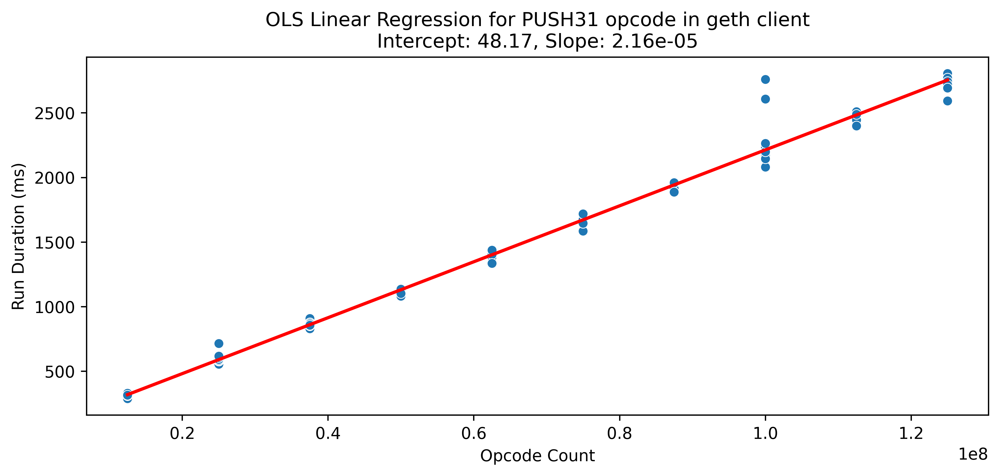


# PUSH32

## nethermind


```python
                            OLS Regression Results                            
==============================================================================
Dep. Variable:        run_duration_ms   R-squared:                       0.994
Model:                            OLS   Adj. R-squared:                  0.994
Method:                 Least Squares   F-statistic:                 1.127e+04
Date:                Tue, 23 Dec 2025   Prob (F-statistic):           7.41e-81
Time:                        08:41:26   Log-Likelihood:                -339.32
No. Observations:                  74   AIC:                             682.6
Df Residuals:                      72   BIC:                             687.3
Df Model:                           1                                         
Covariance Type:            nonrobust                                         
==============================================================================
                 coef    std err          t      P>|t|      [0.025      0.975]
------------------------------------------------------------------------------
const         42.5837      6.064      7.022      0.000      30.495      54.672
opcount      8.35e-06   7.87e-08    106.154      0.000    8.19e-06    8.51e-06
==============================================================================
Omnibus:                       35.840   Durbin-Watson:                   1.893
Prob(Omnibus):                  0.000   Jarque-Bera (JB):              107.816
Skew:                          -1.489   Prob(JB):                     3.87e-24
Kurtosis:                       8.108   Cond. No.                     1.67e+08
==============================================================================

Notes:
[1] Standard Errors assume that the covariance matrix of the errors is correctly specified.
[2] The condition number is large, 1.67e+08. This might indicate that there are
strong multicollinearity or other numerical problems.
```


## reth


```python
                            OLS Regression Results                            
==============================================================================
Dep. Variable:        run_duration_ms   R-squared:                       0.984
Model:                            OLS   Adj. R-squared:                  0.984
Method:                 Least Squares   F-statistic:                     4484.
Date:                Tue, 23 Dec 2025   Prob (F-statistic):           1.35e-66
Time:                        08:41:27   Log-Likelihood:                -334.64
No. Observations:                  74   AIC:                             673.3
Df Residuals:                      72   BIC:                             677.9
Df Model:                           1                                         
Covariance Type:            nonrobust                                         
==============================================================================
                 coef    std err          t      P>|t|      [0.025      0.975]
------------------------------------------------------------------------------
const         37.0855      5.692      6.515      0.000      25.738      48.433
opcount     4.944e-06   7.38e-08     66.963      0.000     4.8e-06    5.09e-06
==============================================================================
Omnibus:                        2.913   Durbin-Watson:                   1.502
Prob(Omnibus):                  0.233   Jarque-Bera (JB):                2.185
Skew:                          -0.390   Prob(JB):                        0.335
Kurtosis:                       3.319   Cond. No.                     1.67e+08
==============================================================================

Notes:
[1] Standard Errors assume that the covariance matrix of the errors is correctly specified.
[2] The condition number is large, 1.67e+08. This might indicate that there are
strong multicollinearity or other numerical problems.
```


## besu


```python
                            OLS Regression Results                            
==============================================================================
Dep. Variable:        run_duration_ms   R-squared:                       0.853
Model:                            OLS   Adj. R-squared:                  0.851
Method:                 Least Squares   F-statistic:                     416.7
Date:                Tue, 23 Dec 2025   Prob (F-statistic):           1.16e-31
Time:                        08:41:27   Log-Likelihood:                -564.29
No. Observations:                  74   AIC:                             1133.
Df Residuals:                      72   BIC:                             1137.
Df Model:                           1                                         
Covariance Type:            nonrobust                                         
==============================================================================
                 coef    std err          t      P>|t|      [0.025      0.975]
------------------------------------------------------------------------------
const         14.0006    126.782      0.110      0.912    -238.734     266.735
opcount     3.357e-05   1.64e-06     20.414      0.000    3.03e-05    3.68e-05
==============================================================================
Omnibus:                       14.765   Durbin-Watson:                   0.527
Prob(Omnibus):                  0.001   Jarque-Bera (JB):               16.759
Skew:                           1.138   Prob(JB):                     0.000230
Kurtosis:                       3.505   Cond. No.                     1.67e+08
==============================================================================

Notes:
[1] Standard Errors assume that the covariance matrix of the errors is correctly specified.
[2] The condition number is large, 1.67e+08. This might indicate that there are
strong multicollinearity or other numerical problems.
```

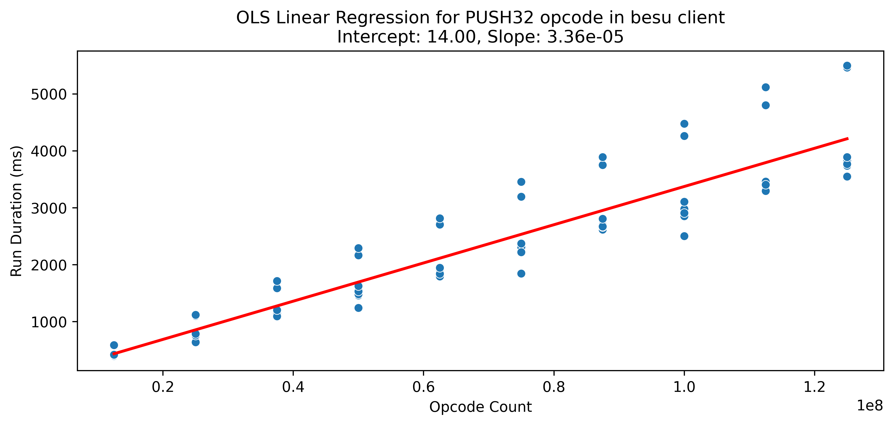


## geth


```python
                            OLS Regression Results                            
==============================================================================
Dep. Variable:        run_duration_ms   R-squared:                       0.968
Model:                            OLS   Adj. R-squared:                  0.968
Method:                 Least Squares   F-statistic:                     2176.
Date:                Tue, 23 Dec 2025   Prob (F-statistic):           1.51e-55
Time:                        08:41:27   Log-Likelihood:                -470.89
No. Observations:                  74   AIC:                             945.8
Df Residuals:                      72   BIC:                             950.4
Df Model:                           1                                         
Covariance Type:            nonrobust                                         
==============================================================================
                 coef    std err          t      P>|t|      [0.025      0.975]
------------------------------------------------------------------------------
const         11.1925     35.886      0.312      0.756     -60.345      82.730
opcount     2.171e-05   4.65e-07     46.648      0.000    2.08e-05    2.26e-05
==============================================================================
Omnibus:                      110.913   Durbin-Watson:                   1.870
Prob(Omnibus):                  0.000   Jarque-Bera (JB):             2369.194
Skew:                           4.901   Prob(JB):                         0.00
Kurtosis:                      28.929   Cond. No.                     1.67e+08
==============================================================================

Notes:
[1] Standard Errors assume that the covariance matrix of the errors is correctly specified.
[2] The condition number is large, 1.67e+08. This might indicate that there are
strong multicollinearity or other numerical problems.
```

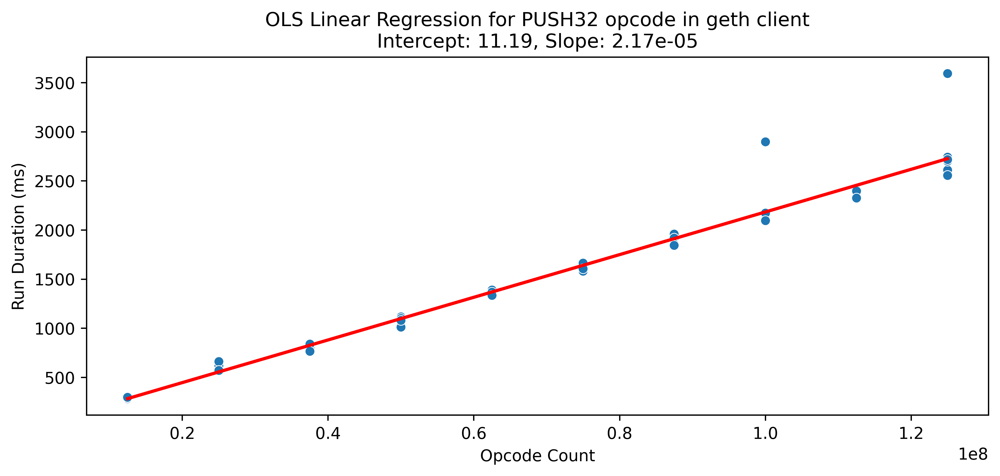


# RETURNDATASIZE

## nethermind


```python
                            OLS Regression Results                            
==============================================================================
Dep. Variable:        run_duration_ms   R-squared:                       0.909
Model:                            OLS   Adj. R-squared:                  0.908
Method:                 Least Squares   F-statistic:                     1457.
Date:                Tue, 23 Dec 2025   Prob (F-statistic):           7.70e-78
Time:                        08:41:27   Log-Likelihood:                -890.88
No. Observations:                 148   AIC:                             1786.
Df Residuals:                     146   BIC:                             1792.
Df Model:                           1                                         
Covariance Type:            nonrobust                                         
==============================================================================
                 coef    std err          t      P>|t|      [0.025      0.975]
------------------------------------------------------------------------------
const        134.4628     15.262      8.810      0.000     104.300     164.626
opcount     4.778e-06   1.25e-07     38.165      0.000    4.53e-06    5.03e-06
==============================================================================
Omnibus:                       24.239   Durbin-Watson:                   1.521
Prob(Omnibus):                  0.000   Jarque-Bera (JB):               30.296
Skew:                           1.061   Prob(JB):                     2.64e-07
Kurtosis:                       3.638   Cond. No.                     2.26e+08
==============================================================================

Notes:
[1] Standard Errors assume that the covariance matrix of the errors is correctly specified.
[2] The condition number is large, 2.26e+08. This might indicate that there are
strong multicollinearity or other numerical problems.
```

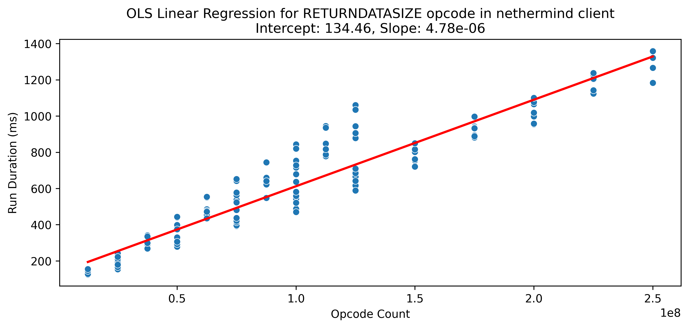


## reth


```python
                            OLS Regression Results                            
==============================================================================
Dep. Variable:        run_duration_ms   R-squared:                       0.853
Model:                            OLS   Adj. R-squared:                  0.852
Method:                 Least Squares   F-statistic:                     845.8
Date:                Tue, 23 Dec 2025   Prob (F-statistic):           1.30e-62
Time:                        08:41:27   Log-Likelihood:                -910.29
No. Observations:                 148   AIC:                             1825.
Df Residuals:                     146   BIC:                             1831.
Df Model:                           1                                         
Covariance Type:            nonrobust                                         
==============================================================================
                 coef    std err          t      P>|t|      [0.025      0.975]
------------------------------------------------------------------------------
const        159.9968     17.400      9.195      0.000     125.608     194.386
opcount     4.151e-06   1.43e-07     29.082      0.000    3.87e-06    4.43e-06
==============================================================================
Omnibus:                       13.533   Durbin-Watson:                   1.608
Prob(Omnibus):                  0.001   Jarque-Bera (JB):               15.108
Skew:                           0.761   Prob(JB):                     0.000524
Kurtosis:                       2.636   Cond. No.                     2.26e+08
==============================================================================

Notes:
[1] Standard Errors assume that the covariance matrix of the errors is correctly specified.
[2] The condition number is large, 2.26e+08. This might indicate that there are
strong multicollinearity or other numerical problems.
```

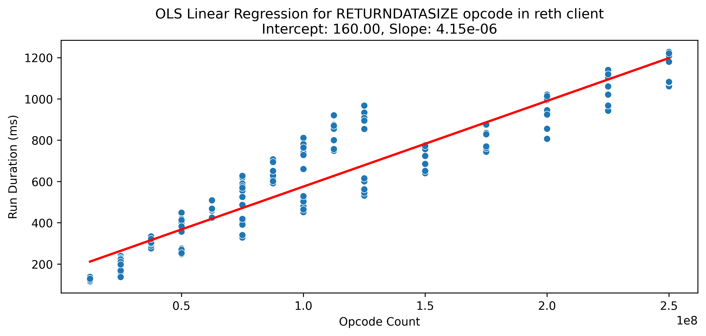


## besu


```python
                            OLS Regression Results                            
==============================================================================
Dep. Variable:        run_duration_ms   R-squared:                       0.701
Model:                            OLS   Adj. R-squared:                  0.699
Method:                 Least Squares   F-statistic:                     342.5
Date:                Tue, 23 Dec 2025   Prob (F-statistic):           4.05e-40
Time:                        08:41:27   Log-Likelihood:                -1286.3
No. Observations:                 148   AIC:                             2577.
Df Residuals:                     146   BIC:                             2583.
Df Model:                           1                                         
Covariance Type:            nonrobust                                         
==============================================================================
                 coef    std err          t      P>|t|      [0.025      0.975]
------------------------------------------------------------------------------
const       1023.3533    220.736      4.636      0.000     587.102    1459.604
opcount     3.351e-05   1.81e-06     18.506      0.000    2.99e-05    3.71e-05
==============================================================================
Omnibus:                       37.318   Durbin-Watson:                   0.915
Prob(Omnibus):                  0.000   Jarque-Bera (JB):               58.523
Skew:                           1.289   Prob(JB):                     1.96e-13
Kurtosis:                       4.688   Cond. No.                     2.26e+08
==============================================================================

Notes:
[1] Standard Errors assume that the covariance matrix of the errors is correctly specified.
[2] The condition number is large, 2.26e+08. This might indicate that there are
strong multicollinearity or other numerical problems.
```

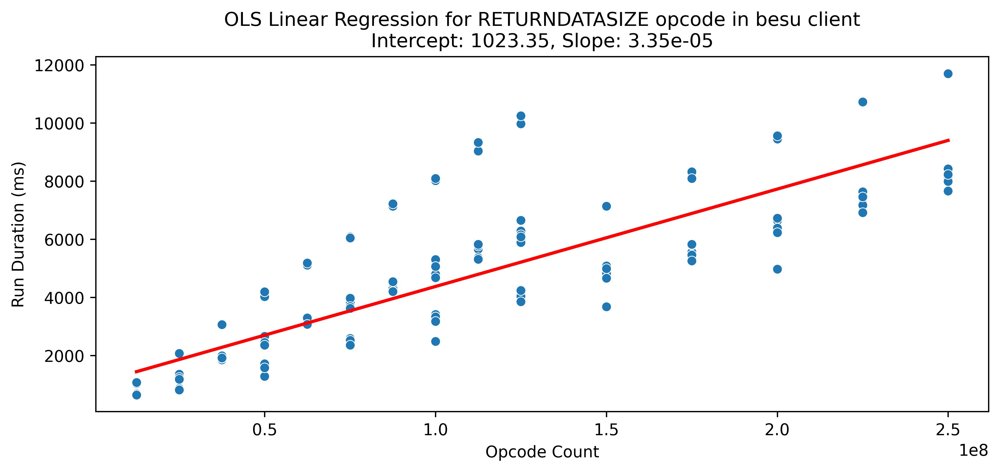


## geth


```python
                            OLS Regression Results                            
==============================================================================
Dep. Variable:        run_duration_ms   R-squared:                       0.927
Model:                            OLS   Adj. R-squared:                  0.926
Method:                 Least Squares   F-statistic:                     1840.
Date:                Tue, 23 Dec 2025   Prob (F-statistic):           1.18e-84
Time:                        08:41:27   Log-Likelihood:                -1000.1
No. Observations:                 148   AIC:                             2004.
Df Residuals:                     146   BIC:                             2010.
Df Model:                           1                                         
Covariance Type:            nonrobust                                         
==============================================================================
                 coef    std err          t      P>|t|      [0.025      0.975]
------------------------------------------------------------------------------
const        270.8909     31.920      8.486      0.000     207.805     333.976
opcount     1.123e-05   2.62e-07     42.900      0.000    1.07e-05    1.18e-05
==============================================================================
Omnibus:                       18.785   Durbin-Watson:                   1.764
Prob(Omnibus):                  0.000   Jarque-Bera (JB):               21.955
Skew:                           0.915   Prob(JB):                     1.71e-05
Kurtosis:                       2.544   Cond. No.                     2.26e+08
==============================================================================

Notes:
[1] Standard Errors assume that the covariance matrix of the errors is correctly specified.
[2] The condition number is large, 2.26e+08. This might indicate that there are
strong multicollinearity or other numerical problems.
```

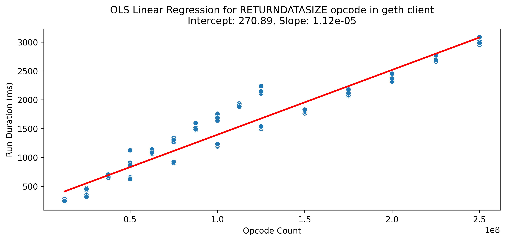


# SAR

## nethermind


```python
                            OLS Regression Results                            
==============================================================================
Dep. Variable:        run_duration_ms   R-squared:                       0.997
Model:                            OLS   Adj. R-squared:                  0.996
Method:                 Least Squares   F-statistic:                 2.061e+04
Date:                Tue, 23 Dec 2025   Prob (F-statistic):           3.01e-90
Time:                        08:41:28   Log-Likelihood:                -379.17
No. Observations:                  74   AIC:                             762.3
Df Residuals:                      72   BIC:                             767.0
Df Model:                           1                                         
Covariance Type:            nonrobust                                         
==============================================================================
                 coef    std err          t      P>|t|      [0.025      0.975]
------------------------------------------------------------------------------
const         36.1197     10.390      3.476      0.001      15.407      56.833
opcount     3.224e-05   2.25e-07    143.549      0.000    3.18e-05    3.27e-05
==============================================================================
Omnibus:                       28.106   Durbin-Watson:                   1.989
Prob(Omnibus):                  0.000   Jarque-Bera (JB):               64.917
Skew:                          -1.244   Prob(JB):                     8.01e-15
Kurtosis:                       6.856   Cond. No.                     1.00e+08
==============================================================================

Notes:
[1] Standard Errors assume that the covariance matrix of the errors is correctly specified.
[2] The condition number is large,  1e+08. This might indicate that there are
strong multicollinearity or other numerical problems.
```


## reth


```python
                            OLS Regression Results                            
==============================================================================
Dep. Variable:        run_duration_ms   R-squared:                       0.996
Model:                            OLS   Adj. R-squared:                  0.996
Method:                 Least Squares   F-statistic:                 1.660e+04
Date:                Tue, 23 Dec 2025   Prob (F-statistic):           7.02e-87
Time:                        08:41:28   Log-Likelihood:                -354.78
No. Observations:                  74   AIC:                             713.6
Df Residuals:                      72   BIC:                             718.2
Df Model:                           1                                         
Covariance Type:            nonrobust                                         
==============================================================================
                 coef    std err          t      P>|t|      [0.025      0.975]
------------------------------------------------------------------------------
const         35.8436      7.473      4.796      0.000      20.946      50.741
opcount     2.081e-05   1.62e-07    128.837      0.000    2.05e-05    2.11e-05
==============================================================================
Omnibus:                       69.728   Durbin-Watson:                   1.738
Prob(Omnibus):                  0.000   Jarque-Bera (JB):              673.983
Skew:                          -2.636   Prob(JB):                    4.43e-147
Kurtosis:                      16.813   Cond. No.                     1.00e+08
==============================================================================

Notes:
[1] Standard Errors assume that the covariance matrix of the errors is correctly specified.
[2] The condition number is large,  1e+08. This might indicate that there are
strong multicollinearity or other numerical problems.
```


## besu


```python
                            OLS Regression Results                            
==============================================================================
Dep. Variable:        run_duration_ms   R-squared:                       0.935
Model:                            OLS   Adj. R-squared:                  0.934
Method:                 Least Squares   F-statistic:                     1026.
Date:                Tue, 23 Dec 2025   Prob (F-statistic):           5.98e-44
Time:                        08:41:28   Log-Likelihood:                -640.52
No. Observations:                  73   AIC:                             1285.
Df Residuals:                      71   BIC:                             1290.
Df Model:                           1                                         
Covariance Type:            nonrobust                                         
==============================================================================
                 coef    std err          t      P>|t|      [0.025      0.975]
------------------------------------------------------------------------------
const      -1052.0553    402.493     -2.614      0.011   -1854.603    -249.507
opcount        0.0003    8.8e-06     32.037      0.000       0.000       0.000
==============================================================================
Omnibus:                       24.702   Durbin-Watson:                   1.896
Prob(Omnibus):                  0.000   Jarque-Bera (JB):               45.557
Skew:                           1.207   Prob(JB):                     1.28e-10
Kurtosis:                       6.025   Cond. No.                     9.92e+07
==============================================================================

Notes:
[1] Standard Errors assume that the covariance matrix of the errors is correctly specified.
[2] The condition number is large, 9.92e+07. This might indicate that there are
strong multicollinearity or other numerical problems.
```

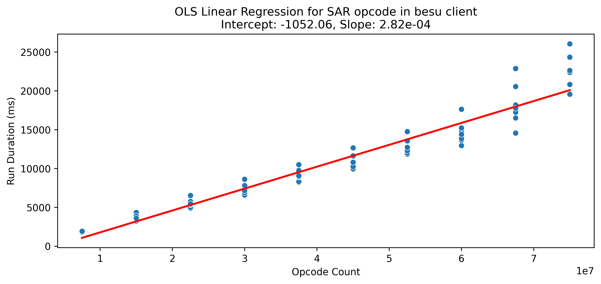


## geth


```python
                            OLS Regression Results                            
==============================================================================
Dep. Variable:        run_duration_ms   R-squared:                       0.971
Model:                            OLS   Adj. R-squared:                  0.970
Method:                 Least Squares   F-statistic:                     2390.
Date:                Tue, 23 Dec 2025   Prob (F-statistic):           5.72e-57
Time:                        08:41:28   Log-Likelihood:                -446.79
No. Observations:                  74   AIC:                             897.6
Df Residuals:                      72   BIC:                             902.2
Df Model:                           1                                         
Covariance Type:            nonrobust                                         
==============================================================================
                 coef    std err          t      P>|t|      [0.025      0.975]
------------------------------------------------------------------------------
const          8.5071     25.911      0.328      0.744     -43.145      60.159
opcount     2.738e-05    5.6e-07     48.885      0.000    2.63e-05    2.85e-05
==============================================================================
Omnibus:                      111.336   Durbin-Watson:                   2.120
Prob(Omnibus):                  0.000   Jarque-Bera (JB):             2616.226
Skew:                           4.863   Prob(JB):                         0.00
Kurtosis:                      30.458   Cond. No.                     1.00e+08
==============================================================================

Notes:
[1] Standard Errors assume that the covariance matrix of the errors is correctly specified.
[2] The condition number is large,  1e+08. This might indicate that there are
strong multicollinearity or other numerical problems.
```

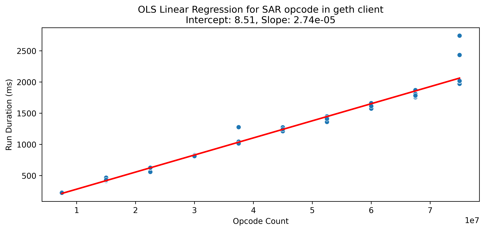


# SDIV

## nethermind


```python
                            OLS Regression Results                            
==============================================================================
Dep. Variable:        run_duration_ms   R-squared:                       0.997
Model:                            OLS   Adj. R-squared:                  0.997
Method:                 Least Squares   F-statistic:                 2.604e+04
Date:                Tue, 23 Dec 2025   Prob (F-statistic):           6.76e-94
Time:                        08:41:28   Log-Likelihood:                -464.44
No. Observations:                  74   AIC:                             932.9
Df Residuals:                      72   BIC:                             937.5
Df Model:                           1                                         
Covariance Type:            nonrobust                                         
==============================================================================
                 coef    std err          t      P>|t|      [0.025      0.975]
------------------------------------------------------------------------------
const         48.1444     32.889      1.464      0.148     -17.418     113.707
opcount        0.0001   8.53e-07    161.369      0.000       0.000       0.000
==============================================================================
Omnibus:                       24.235   Durbin-Watson:                   1.464
Prob(Omnibus):                  0.000   Jarque-Bera (JB):               48.282
Skew:                          -1.127   Prob(JB):                     3.28e-11
Kurtosis:                       6.252   Cond. No.                     8.36e+07
==============================================================================

Notes:
[1] Standard Errors assume that the covariance matrix of the errors is correctly specified.
[2] The condition number is large, 8.36e+07. This might indicate that there are
strong multicollinearity or other numerical problems.
```

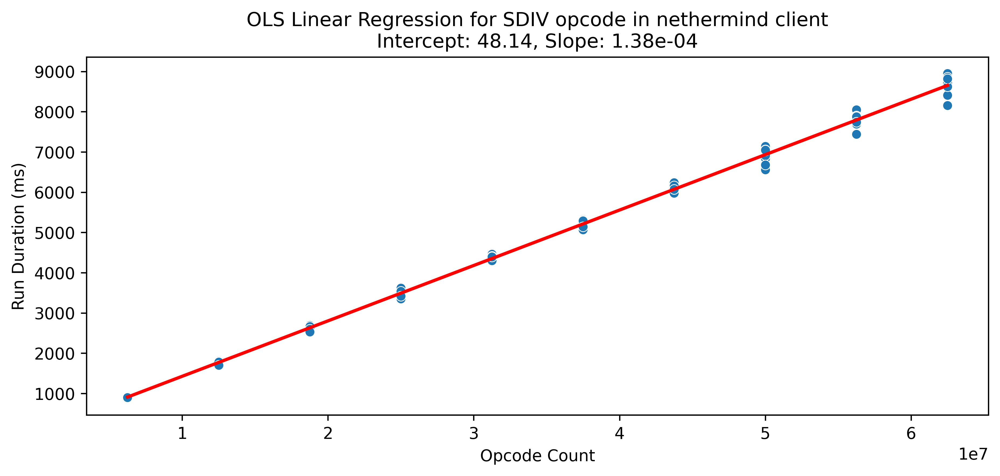


## reth


```python
                            OLS Regression Results                            
==============================================================================
Dep. Variable:        run_duration_ms   R-squared:                       0.995
Model:                            OLS   Adj. R-squared:                  0.995
Method:                 Least Squares   F-statistic:                 1.409e+04
Date:                Tue, 23 Dec 2025   Prob (F-statistic):           2.49e-84
Time:                        08:41:28   Log-Likelihood:                -432.36
No. Observations:                  74   AIC:                             868.7
Df Residuals:                      72   BIC:                             873.3
Df Model:                           1                                         
Covariance Type:            nonrobust                                         
==============================================================================
                 coef    std err          t      P>|t|      [0.025      0.975]
------------------------------------------------------------------------------
const         57.8330     21.319      2.713      0.008      15.334     100.332
opcount     6.565e-05   5.53e-07    118.701      0.000    6.45e-05    6.68e-05
==============================================================================
Omnibus:                       43.196   Durbin-Watson:                   1.817
Prob(Omnibus):                  0.000   Jarque-Bera (JB):              130.264
Skew:                          -1.876   Prob(JB):                     5.17e-29
Kurtosis:                       8.308   Cond. No.                     8.36e+07
==============================================================================

Notes:
[1] Standard Errors assume that the covariance matrix of the errors is correctly specified.
[2] The condition number is large, 8.36e+07. This might indicate that there are
strong multicollinearity or other numerical problems.
```


## besu


```python
                            OLS Regression Results                            
==============================================================================
Dep. Variable:        run_duration_ms   R-squared:                       0.936
Model:                            OLS   Adj. R-squared:                  0.936
Method:                 Least Squares   F-statistic:                     943.8
Date:                Tue, 23 Dec 2025   Prob (F-statistic):           5.02e-40
Time:                        08:41:28   Log-Likelihood:                -589.92
No. Observations:                  66   AIC:                             1184.
Df Residuals:                      64   BIC:                             1188.
Df Model:                           1                                         
Covariance Type:            nonrobust                                         
==============================================================================
                 coef    std err          t      P>|t|      [0.025      0.975]
------------------------------------------------------------------------------
const      -1966.2335    504.803     -3.895      0.000   -2974.694    -957.773
opcount        0.0004   1.45e-05     30.722      0.000       0.000       0.000
==============================================================================
Omnibus:                       12.438   Durbin-Watson:                   1.240
Prob(Omnibus):                  0.002   Jarque-Bera (JB):               13.185
Skew:                           0.930   Prob(JB):                      0.00137
Kurtosis:                       4.156   Cond. No.                     7.60e+07
==============================================================================

Notes:
[1] Standard Errors assume that the covariance matrix of the errors is correctly specified.
[2] The condition number is large, 7.6e+07. This might indicate that there are
strong multicollinearity or other numerical problems.
```

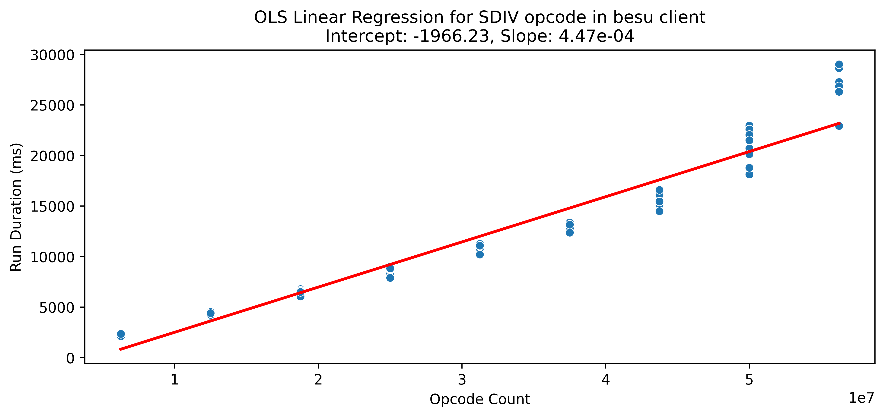


## geth


```python
                            OLS Regression Results                            
==============================================================================
Dep. Variable:        run_duration_ms   R-squared:                       0.997
Model:                            OLS   Adj. R-squared:                  0.997
Method:                 Least Squares   F-statistic:                 2.776e+04
Date:                Tue, 23 Dec 2025   Prob (F-statistic):           6.83e-95
Time:                        08:41:29   Log-Likelihood:                -414.66
No. Observations:                  74   AIC:                             833.3
Df Residuals:                      72   BIC:                             837.9
Df Model:                           1                                         
Covariance Type:            nonrobust                                         
==============================================================================
                 coef    std err          t      P>|t|      [0.025      0.975]
------------------------------------------------------------------------------
const         19.9250     16.785      1.187      0.239     -13.536      53.386
opcount     7.255e-05   4.35e-07    166.604      0.000    7.17e-05    7.34e-05
==============================================================================
Omnibus:                       51.525   Durbin-Watson:                   2.064
Prob(Omnibus):                  0.000   Jarque-Bera (JB):              211.659
Skew:                          -2.132   Prob(JB):                     1.09e-46
Kurtosis:                      10.103   Cond. No.                     8.36e+07
==============================================================================

Notes:
[1] Standard Errors assume that the covariance matrix of the errors is correctly specified.
[2] The condition number is large, 8.36e+07. This might indicate that there are
strong multicollinearity or other numerical problems.
```

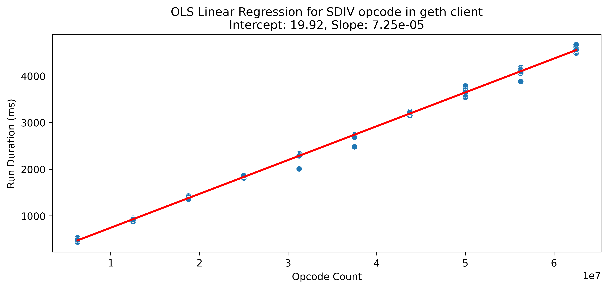


# SELFBALANCE

## nethermind


```python
                            OLS Regression Results                            
==============================================================================
Dep. Variable:        run_duration_ms   R-squared:                       0.973
Model:                            OLS   Adj. R-squared:                  0.973
Method:                 Least Squares   F-statistic:                     2782.
Date:                Tue, 23 Dec 2025   Prob (F-statistic):           1.27e-61
Time:                        08:41:29   Log-Likelihood:                -459.47
No. Observations:                  78   AIC:                             922.9
Df Residuals:                      76   BIC:                             927.7
Df Model:                           1                                         
Covariance Type:            nonrobust                                         
==============================================================================
                 coef    std err          t      P>|t|      [0.025      0.975]
------------------------------------------------------------------------------
const         78.1647     21.851      3.577      0.001      34.644     121.685
opcount     1.879e-05   3.56e-07     52.749      0.000    1.81e-05    1.95e-05
==============================================================================
Omnibus:                       74.013   Durbin-Watson:                   2.457
Prob(Omnibus):                  0.000   Jarque-Bera (JB):              637.450
Skew:                           2.823   Prob(JB):                    3.80e-139
Kurtosis:                      15.817   Cond. No.                     1.34e+08
==============================================================================

Notes:
[1] Standard Errors assume that the covariance matrix of the errors is correctly specified.
[2] The condition number is large, 1.34e+08. This might indicate that there are
strong multicollinearity or other numerical problems.
```

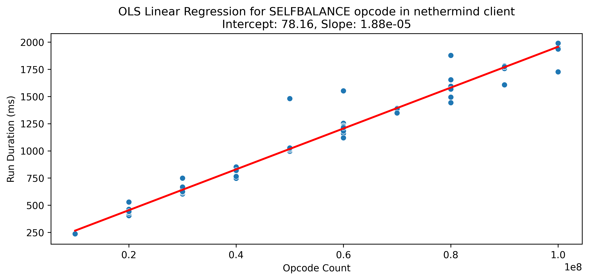


## reth


```python
                            OLS Regression Results                            
==============================================================================
Dep. Variable:        run_duration_ms   R-squared:                       0.998
Model:                            OLS   Adj. R-squared:                  0.998
Method:                 Least Squares   F-statistic:                 4.303e+04
Date:                Tue, 23 Dec 2025   Prob (F-statistic):          9.84e-102
Time:                        08:41:29   Log-Likelihood:                -429.15
No. Observations:                  74   AIC:                             862.3
Df Residuals:                      72   BIC:                             866.9
Df Model:                           1                                         
Covariance Type:            nonrobust                                         
==============================================================================
                 coef    std err          t      P>|t|      [0.025      0.975]
------------------------------------------------------------------------------
const         46.2480     20.414      2.266      0.026       5.554      86.942
opcount     6.866e-05   3.31e-07    207.444      0.000     6.8e-05    6.93e-05
==============================================================================
Omnibus:                        9.514   Durbin-Watson:                   2.003
Prob(Omnibus):                  0.009   Jarque-Bera (JB):               20.080
Skew:                          -0.252   Prob(JB):                     4.36e-05
Kurtosis:                       5.502   Cond. No.                     1.34e+08
==============================================================================

Notes:
[1] Standard Errors assume that the covariance matrix of the errors is correctly specified.
[2] The condition number is large, 1.34e+08. This might indicate that there are
strong multicollinearity or other numerical problems.
```


## besu


```python
                            OLS Regression Results                            
==============================================================================
Dep. Variable:        run_duration_ms   R-squared:                       0.993
Model:                            OLS   Adj. R-squared:                  0.993
Method:                 Least Squares   F-statistic:                 1.011e+04
Date:                Tue, 23 Dec 2025   Prob (F-statistic):           3.61e-79
Time:                        08:41:29   Log-Likelihood:                -446.62
No. Observations:                  74   AIC:                             897.2
Df Residuals:                      72   BIC:                             901.8
Df Model:                           1                                         
Covariance Type:            nonrobust                                         
==============================================================================
                 coef    std err          t      P>|t|      [0.025      0.975]
------------------------------------------------------------------------------
const        157.7816     25.850      6.104      0.000     106.251     209.312
opcount     4.214e-05   4.19e-07    100.542      0.000    4.13e-05     4.3e-05
==============================================================================
Omnibus:                       59.143   Durbin-Watson:                   2.215
Prob(Omnibus):                  0.000   Jarque-Bera (JB):              293.709
Skew:                           2.440   Prob(JB):                     1.67e-64
Kurtosis:                      11.453   Cond. No.                     1.34e+08
==============================================================================

Notes:
[1] Standard Errors assume that the covariance matrix of the errors is correctly specified.
[2] The condition number is large, 1.34e+08. This might indicate that there are
strong multicollinearity or other numerical problems.
```

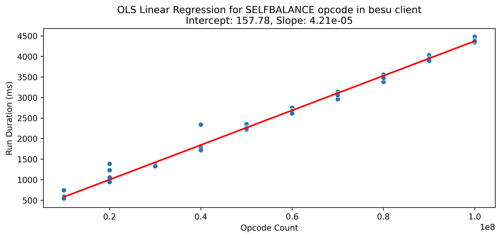


## geth


```python
                            OLS Regression Results                            
==============================================================================
Dep. Variable:        run_duration_ms   R-squared:                       0.997
Model:                            OLS   Adj. R-squared:                  0.997
Method:                 Least Squares   F-statistic:                 2.085e+04
Date:                Tue, 23 Dec 2025   Prob (F-statistic):           1.98e-90
Time:                        08:41:29   Log-Likelihood:                -408.68
No. Observations:                  74   AIC:                             821.4
Df Residuals:                      72   BIC:                             826.0
Df Model:                           1                                         
Covariance Type:            nonrobust                                         
==============================================================================
                 coef    std err          t      P>|t|      [0.025      0.975]
------------------------------------------------------------------------------
const         23.9767     15.482      1.549      0.126      -6.886      54.839
opcount     3.624e-05   2.51e-07    144.389      0.000    3.57e-05    3.67e-05
==============================================================================
Omnibus:                       19.458   Durbin-Watson:                   1.231
Prob(Omnibus):                  0.000   Jarque-Bera (JB):               25.135
Skew:                          -1.169   Prob(JB):                     3.48e-06
Kurtosis:                       4.638   Cond. No.                     1.34e+08
==============================================================================

Notes:
[1] Standard Errors assume that the covariance matrix of the errors is correctly specified.
[2] The condition number is large, 1.34e+08. This might indicate that there are
strong multicollinearity or other numerical problems.
```

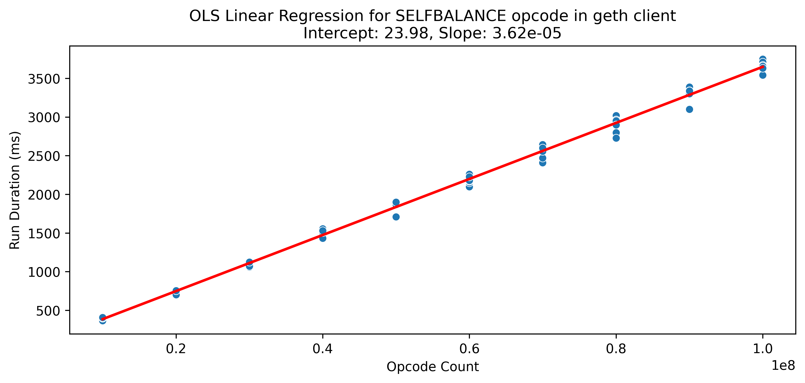


# SGT

## nethermind


```python
                            OLS Regression Results                            
==============================================================================
Dep. Variable:        run_duration_ms   R-squared:                       0.991
Model:                            OLS   Adj. R-squared:                  0.991
Method:                 Least Squares   F-statistic:                     8394.
Date:                Tue, 23 Dec 2025   Prob (F-statistic):           2.76e-76
Time:                        08:41:29   Log-Likelihood:                -364.00
No. Observations:                  74   AIC:                             732.0
Df Residuals:                      72   BIC:                             736.6
Df Model:                           1                                         
Covariance Type:            nonrobust                                         
==============================================================================
                 coef    std err          t      P>|t|      [0.025      0.975]
------------------------------------------------------------------------------
const         36.0103      8.464      4.255      0.000      19.138      52.883
opcount     1.676e-05   1.83e-07     91.619      0.000    1.64e-05    1.71e-05
==============================================================================
Omnibus:                        7.973   Durbin-Watson:                   1.388
Prob(Omnibus):                  0.019   Jarque-Bera (JB):                9.773
Skew:                          -0.462   Prob(JB):                      0.00755
Kurtosis:                       4.522   Cond. No.                     1.00e+08
==============================================================================

Notes:
[1] Standard Errors assume that the covariance matrix of the errors is correctly specified.
[2] The condition number is large,  1e+08. This might indicate that there are
strong multicollinearity or other numerical problems.
```

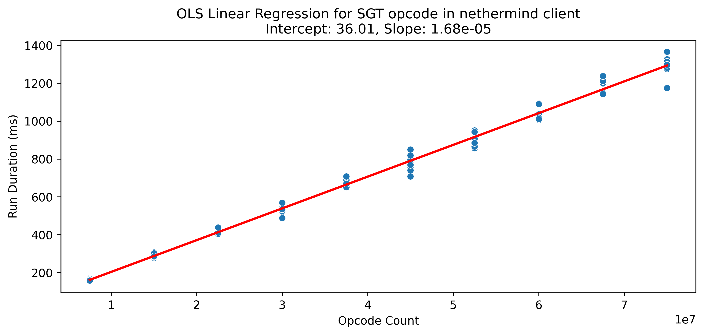


## reth


```python
                            OLS Regression Results                            
==============================================================================
Dep. Variable:        run_duration_ms   R-squared:                       0.991
Model:                            OLS   Adj. R-squared:                  0.991
Method:                 Least Squares   F-statistic:                     8083.
Date:                Tue, 23 Dec 2025   Prob (F-statistic):           1.06e-75
Time:                        08:41:29   Log-Likelihood:                -307.19
No. Observations:                  74   AIC:                             618.4
Df Residuals:                      72   BIC:                             623.0
Df Model:                           1                                         
Covariance Type:            nonrobust                                         
==============================================================================
                 coef    std err          t      P>|t|      [0.025      0.975]
------------------------------------------------------------------------------
const         41.4180      3.928     10.544      0.000      33.588      49.248
opcount     7.634e-06   8.49e-08     89.903      0.000    7.46e-06     7.8e-06
==============================================================================
Omnibus:                       12.312   Durbin-Watson:                   1.682
Prob(Omnibus):                  0.002   Jarque-Bera (JB):               20.232
Skew:                           0.589   Prob(JB):                     4.04e-05
Kurtosis:                       5.274   Cond. No.                     1.00e+08
==============================================================================

Notes:
[1] Standard Errors assume that the covariance matrix of the errors is correctly specified.
[2] The condition number is large,  1e+08. This might indicate that there are
strong multicollinearity or other numerical problems.
```

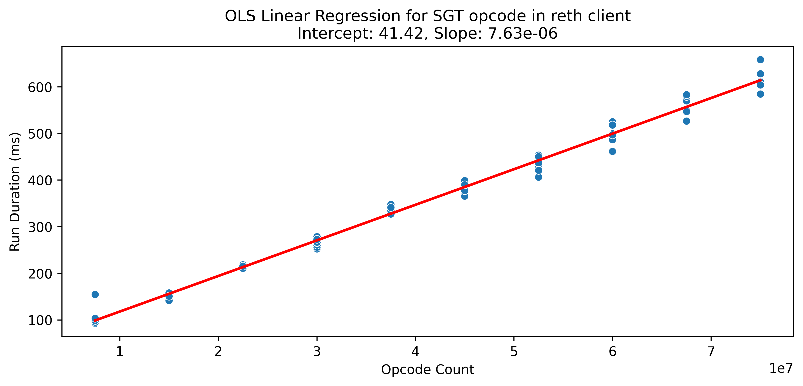


## besu


```python
                            OLS Regression Results                            
==============================================================================
Dep. Variable:        run_duration_ms   R-squared:                       0.929
Model:                            OLS   Adj. R-squared:                  0.928
Method:                 Least Squares   F-statistic:                     945.5
Date:                Tue, 23 Dec 2025   Prob (F-statistic):           3.80e-43
Time:                        08:41:30   Log-Likelihood:                -569.90
No. Observations:                  74   AIC:                             1144.
Df Residuals:                      72   BIC:                             1148.
Df Model:                           1                                         
Covariance Type:            nonrobust                                         
==============================================================================
                 coef    std err          t      P>|t|      [0.025      0.975]
------------------------------------------------------------------------------
const         25.5043    136.763      0.186      0.853    -247.128     298.136
opcount     9.091e-05   2.96e-06     30.750      0.000     8.5e-05    9.68e-05
==============================================================================
Omnibus:                       13.591   Durbin-Watson:                   0.422
Prob(Omnibus):                  0.001   Jarque-Bera (JB):               15.443
Skew:                           1.111   Prob(JB):                     0.000443
Kurtosis:                       3.274   Cond. No.                     1.00e+08
==============================================================================

Notes:
[1] Standard Errors assume that the covariance matrix of the errors is correctly specified.
[2] The condition number is large,  1e+08. This might indicate that there are
strong multicollinearity or other numerical problems.
```

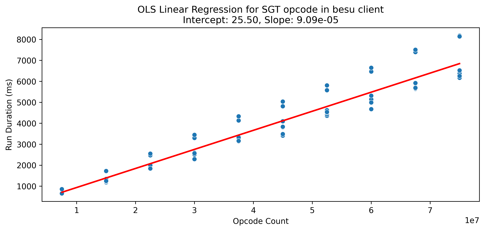


## geth


```python
                            OLS Regression Results                            
==============================================================================
Dep. Variable:        run_duration_ms   R-squared:                       0.981
Model:                            OLS   Adj. R-squared:                  0.981
Method:                 Least Squares   F-statistic:                     3690.
Date:                Tue, 23 Dec 2025   Prob (F-statistic):           1.33e-63
Time:                        08:41:30   Log-Likelihood:                -418.06
No. Observations:                  74   AIC:                             840.1
Df Residuals:                      72   BIC:                             844.7
Df Model:                           1                                         
Covariance Type:            nonrobust                                         
==============================================================================
                 coef    std err          t      P>|t|      [0.025      0.975]
------------------------------------------------------------------------------
const         29.8372     17.573      1.698      0.094      -5.194      64.869
opcount     2.308e-05    3.8e-07     60.746      0.000    2.23e-05    2.38e-05
==============================================================================
Omnibus:                      140.587   Durbin-Watson:                   1.880
Prob(Omnibus):                  0.000   Jarque-Bera (JB):             8245.460
Skew:                           6.710   Prob(JB):                         0.00
Kurtosis:                      52.941   Cond. No.                     1.00e+08
==============================================================================

Notes:
[1] Standard Errors assume that the covariance matrix of the errors is correctly specified.
[2] The condition number is large,  1e+08. This might indicate that there are
strong multicollinearity or other numerical problems.
```


# SHL

## nethermind


```python
                            OLS Regression Results                            
==============================================================================
Dep. Variable:        run_duration_ms   R-squared:                       0.993
Model:                            OLS   Adj. R-squared:                  0.993
Method:                 Least Squares   F-statistic:                 1.021e+04
Date:                Tue, 23 Dec 2025   Prob (F-statistic):           2.55e-79
Time:                        08:41:30   Log-Likelihood:                -401.28
No. Observations:                  74   AIC:                             806.6
Df Residuals:                      72   BIC:                             811.2
Df Model:                           1                                         
Covariance Type:            nonrobust                                         
==============================================================================
                 coef    std err          t      P>|t|      [0.025      0.975]
------------------------------------------------------------------------------
const         39.6848     14.007      2.833      0.006      11.762      67.607
opcount     3.059e-05   3.03e-07    101.028      0.000       3e-05    3.12e-05
==============================================================================
Omnibus:                        7.543   Durbin-Watson:                   1.305
Prob(Omnibus):                  0.023   Jarque-Bera (JB):                6.892
Skew:                          -0.694   Prob(JB):                       0.0319
Kurtosis:                       3.556   Cond. No.                     1.00e+08
==============================================================================

Notes:
[1] Standard Errors assume that the covariance matrix of the errors is correctly specified.
[2] The condition number is large,  1e+08. This might indicate that there are
strong multicollinearity or other numerical problems.
```


## reth


```python
                            OLS Regression Results                            
==============================================================================
Dep. Variable:        run_duration_ms   R-squared:                       0.997
Model:                            OLS   Adj. R-squared:                  0.997
Method:                 Least Squares   F-statistic:                 2.104e+04
Date:                Tue, 23 Dec 2025   Prob (F-statistic):           1.43e-90
Time:                        08:41:30   Log-Likelihood:                -308.75
No. Observations:                  74   AIC:                             621.5
Df Residuals:                      72   BIC:                             626.1
Df Model:                           1                                         
Covariance Type:            nonrobust                                         
==============================================================================
                 coef    std err          t      P>|t|      [0.025      0.975]
------------------------------------------------------------------------------
const         45.8341      4.012     11.425      0.000      37.837      53.831
opcount     1.258e-05   8.67e-08    145.041      0.000    1.24e-05    1.28e-05
==============================================================================
Omnibus:                       26.793   Durbin-Watson:                   2.092
Prob(Omnibus):                  0.000   Jarque-Bera (JB):               61.593
Skew:                          -1.180   Prob(JB):                     4.22e-14
Kurtosis:                       6.796   Cond. No.                     1.00e+08
==============================================================================

Notes:
[1] Standard Errors assume that the covariance matrix of the errors is correctly specified.
[2] The condition number is large,  1e+08. This might indicate that there are
strong multicollinearity or other numerical problems.
```

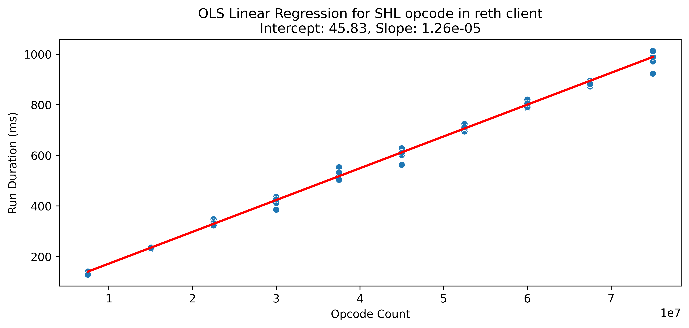


## besu


```python
                            OLS Regression Results                            
==============================================================================
Dep. Variable:        run_duration_ms   R-squared:                       0.703
Model:                            OLS   Adj. R-squared:                  0.699
Method:                 Least Squares   F-statistic:                     166.0
Date:                Tue, 23 Dec 2025   Prob (F-statistic):           3.81e-20
Time:                        08:41:30   Log-Likelihood:                -638.12
No. Observations:                  72   AIC:                             1280.
Df Residuals:                      70   BIC:                             1285.
Df Model:                           1                                         
Covariance Type:            nonrobust                                         
==============================================================================
                 coef    std err          t      P>|t|      [0.025      0.975]
------------------------------------------------------------------------------
const        864.2978    458.995      1.883      0.064     -51.138    1779.734
opcount        0.0001   9.79e-06     12.883      0.000       0.000       0.000
==============================================================================
Omnibus:                      138.280   Durbin-Watson:                   2.011
Prob(Omnibus):                  0.000   Jarque-Bera (JB):             7945.255
Skew:                           6.724   Prob(JB):                         0.00
Kurtosis:                      52.674   Cond. No.                     1.05e+08
==============================================================================

Notes:
[1] Standard Errors assume that the covariance matrix of the errors is correctly specified.
[2] The condition number is large, 1.05e+08. This might indicate that there are
strong multicollinearity or other numerical problems.
```

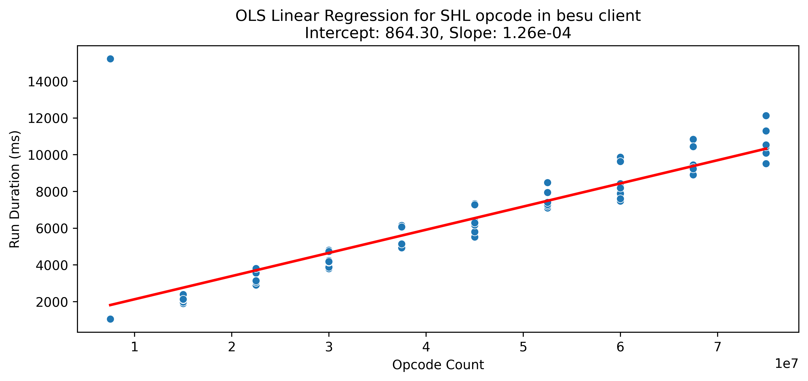


## geth


```python
                            OLS Regression Results                            
==============================================================================
Dep. Variable:        run_duration_ms   R-squared:                       0.998
Model:                            OLS   Adj. R-squared:                  0.998
Method:                 Least Squares   F-statistic:                 4.718e+04
Date:                Tue, 23 Dec 2025   Prob (F-statistic):          3.61e-103
Time:                        08:41:30   Log-Likelihood:                -327.26
No. Observations:                  74   AIC:                             658.5
Df Residuals:                      72   BIC:                             663.1
Df Model:                           1                                         
Covariance Type:            nonrobust                                         
==============================================================================
                 coef    std err          t      P>|t|      [0.025      0.975]
------------------------------------------------------------------------------
const         37.6054      5.152      7.300      0.000      27.336      47.875
opcount     2.419e-05   1.11e-07    217.210      0.000     2.4e-05    2.44e-05
==============================================================================
Omnibus:                        0.673   Durbin-Watson:                   2.546
Prob(Omnibus):                  0.714   Jarque-Bera (JB):                0.301
Skew:                           0.138   Prob(JB):                        0.860
Kurtosis:                       3.148   Cond. No.                     1.00e+08
==============================================================================

Notes:
[1] Standard Errors assume that the covariance matrix of the errors is correctly specified.
[2] The condition number is large,  1e+08. This might indicate that there are
strong multicollinearity or other numerical problems.
```


# SHR

## nethermind


```python
                            OLS Regression Results                            
==============================================================================
Dep. Variable:        run_duration_ms   R-squared:                       0.995
Model:                            OLS   Adj. R-squared:                  0.995
Method:                 Least Squares   F-statistic:                 1.424e+04
Date:                Tue, 23 Dec 2025   Prob (F-statistic):           1.71e-84
Time:                        08:41:30   Log-Likelihood:                -388.57
No. Observations:                  74   AIC:                             781.1
Df Residuals:                      72   BIC:                             785.7
Df Model:                           1                                         
Covariance Type:            nonrobust                                         
==============================================================================
                 coef    std err          t      P>|t|      [0.025      0.975]
------------------------------------------------------------------------------
const         38.9211     11.797      3.299      0.002      15.405      62.438
opcount     3.043e-05   2.55e-07    119.322      0.000    2.99e-05    3.09e-05
==============================================================================
Omnibus:                        2.176   Durbin-Watson:                   1.361
Prob(Omnibus):                  0.337   Jarque-Bera (JB):                1.612
Skew:                          -0.350   Prob(JB):                        0.447
Kurtosis:                       3.184   Cond. No.                     1.00e+08
==============================================================================

Notes:
[1] Standard Errors assume that the covariance matrix of the errors is correctly specified.
[2] The condition number is large,  1e+08. This might indicate that there are
strong multicollinearity or other numerical problems.
```


## reth


```python
                            OLS Regression Results                            
==============================================================================
Dep. Variable:        run_duration_ms   R-squared:                       0.997
Model:                            OLS   Adj. R-squared:                  0.997
Method:                 Least Squares   F-statistic:                 2.443e+04
Date:                Tue, 23 Dec 2025   Prob (F-statistic):           6.70e-93
Time:                        08:41:31   Log-Likelihood:                -302.96
No. Observations:                  74   AIC:                             609.9
Df Residuals:                      72   BIC:                             614.5
Df Model:                           1                                         
Covariance Type:            nonrobust                                         
==============================================================================
                 coef    std err          t      P>|t|      [0.025      0.975]
------------------------------------------------------------------------------
const         37.2738      3.710     10.047      0.000      29.878      44.669
opcount     1.253e-05   8.02e-08    156.297      0.000    1.24e-05    1.27e-05
==============================================================================
Omnibus:                        8.125   Durbin-Watson:                   1.680
Prob(Omnibus):                  0.017   Jarque-Bera (JB):                9.262
Skew:                          -0.514   Prob(JB):                      0.00975
Kurtosis:                       4.395   Cond. No.                     1.00e+08
==============================================================================

Notes:
[1] Standard Errors assume that the covariance matrix of the errors is correctly specified.
[2] The condition number is large,  1e+08. This might indicate that there are
strong multicollinearity or other numerical problems.
```

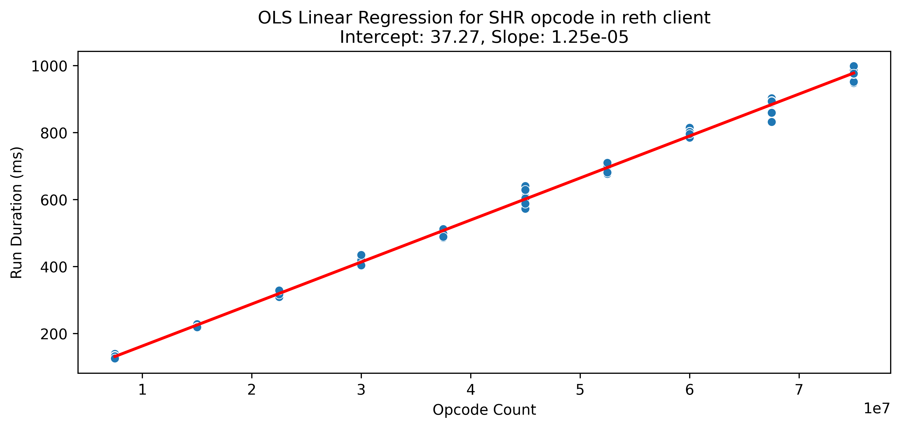


## besu


```python
                            OLS Regression Results                            
==============================================================================
Dep. Variable:        run_duration_ms   R-squared:                       0.989
Model:                            OLS   Adj. R-squared:                  0.989
Method:                 Least Squares   F-statistic:                     6241.
Date:                Tue, 23 Dec 2025   Prob (F-statistic):           6.17e-71
Time:                        08:41:31   Log-Likelihood:                -526.56
No. Observations:                  73   AIC:                             1057.
Df Residuals:                      71   BIC:                             1062.
Df Model:                           1                                         
Covariance Type:            nonrobust                                         
==============================================================================
                 coef    std err          t      P>|t|      [0.025      0.975]
------------------------------------------------------------------------------
const         16.5644     85.978      0.193      0.848    -154.870     187.999
opcount        0.0001   1.85e-06     79.002      0.000       0.000       0.000
==============================================================================
Omnibus:                       23.084   Durbin-Watson:                   0.792
Prob(Omnibus):                  0.000   Jarque-Bera (JB):               43.084
Skew:                           1.113   Prob(JB):                     4.41e-10
Kurtosis:                       6.035   Cond. No.                     1.03e+08
==============================================================================

Notes:
[1] Standard Errors assume that the covariance matrix of the errors is correctly specified.
[2] The condition number is large, 1.03e+08. This might indicate that there are
strong multicollinearity or other numerical problems.
```

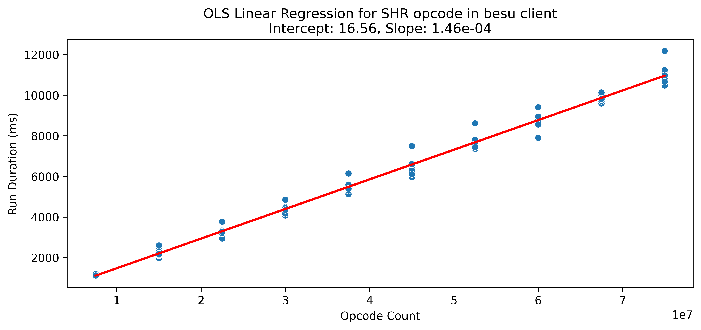


## geth


```python
                            OLS Regression Results                            
==============================================================================
Dep. Variable:        run_duration_ms   R-squared:                       0.998
Model:                            OLS   Adj. R-squared:                  0.998
Method:                 Least Squares   F-statistic:                 4.469e+04
Date:                Tue, 23 Dec 2025   Prob (F-statistic):          2.53e-102
Time:                        08:41:31   Log-Likelihood:                -327.64
No. Observations:                  74   AIC:                             659.3
Df Residuals:                      72   BIC:                             663.9
Df Model:                           1                                         
Covariance Type:            nonrobust                                         
==============================================================================
                 coef    std err          t      P>|t|      [0.025      0.975]
------------------------------------------------------------------------------
const         38.3186      5.178      7.400      0.000      27.996      48.642
opcount     2.367e-05   1.12e-07    211.405      0.000    2.34e-05    2.39e-05
==============================================================================
Omnibus:                       31.125   Durbin-Watson:                   1.934
Prob(Omnibus):                  0.000   Jarque-Bera (JB):               65.946
Skew:                           1.454   Prob(JB):                     4.79e-15
Kurtosis:                       6.596   Cond. No.                     1.00e+08
==============================================================================

Notes:
[1] Standard Errors assume that the covariance matrix of the errors is correctly specified.
[2] The condition number is large,  1e+08. This might indicate that there are
strong multicollinearity or other numerical problems.
```


# SIGNEXTEND

## nethermind


```python
                            OLS Regression Results                            
==============================================================================
Dep. Variable:        run_duration_ms   R-squared:                       0.990
Model:                            OLS   Adj. R-squared:                  0.990
Method:                 Least Squares   F-statistic:                     7360.
Date:                Tue, 23 Dec 2025   Prob (F-statistic):           3.01e-74
Time:                        08:41:31   Log-Likelihood:                -367.17
No. Observations:                  74   AIC:                             738.3
Df Residuals:                      72   BIC:                             743.0
Df Model:                           1                                         
Covariance Type:            nonrobust                                         
==============================================================================
                 coef    std err          t      P>|t|      [0.025      0.975]
------------------------------------------------------------------------------
const         33.1794      8.835      3.755      0.000      15.567      50.791
opcount     1.966e-05   2.29e-07     85.788      0.000    1.92e-05    2.01e-05
==============================================================================
Omnibus:                       33.253   Durbin-Watson:                   1.060
Prob(Omnibus):                  0.000   Jarque-Bera (JB):              110.605
Skew:                          -1.308   Prob(JB):                     9.60e-25
Kurtosis:                       8.388   Cond. No.                     8.36e+07
==============================================================================

Notes:
[1] Standard Errors assume that the covariance matrix of the errors is correctly specified.
[2] The condition number is large, 8.36e+07. This might indicate that there are
strong multicollinearity or other numerical problems.
```


## reth


```python
                            OLS Regression Results                            
==============================================================================
Dep. Variable:        run_duration_ms   R-squared:                       0.994
Model:                            OLS   Adj. R-squared:                  0.994
Method:                 Least Squares   F-statistic:                 1.255e+04
Date:                Tue, 23 Dec 2025   Prob (F-statistic):           1.57e-82
Time:                        08:41:31   Log-Likelihood:                -324.01
No. Observations:                  74   AIC:                             652.0
Df Residuals:                      72   BIC:                             656.6
Df Model:                           1                                         
Covariance Type:            nonrobust                                         
==============================================================================
                 coef    std err          t      P>|t|      [0.025      0.975]
------------------------------------------------------------------------------
const         34.1833      4.931      6.933      0.000      24.354      44.013
opcount     1.433e-05   1.28e-07    112.025      0.000    1.41e-05    1.46e-05
==============================================================================
Omnibus:                       15.357   Durbin-Watson:                   1.268
Prob(Omnibus):                  0.000   Jarque-Bera (JB):               20.226
Skew:                          -0.888   Prob(JB):                     4.05e-05
Kurtosis:                       4.845   Cond. No.                     8.36e+07
==============================================================================

Notes:
[1] Standard Errors assume that the covariance matrix of the errors is correctly specified.
[2] The condition number is large, 8.36e+07. This might indicate that there are
strong multicollinearity or other numerical problems.
```


## besu


```python
                            OLS Regression Results                            
==============================================================================
Dep. Variable:        run_duration_ms   R-squared:                       0.984
Model:                            OLS   Adj. R-squared:                  0.984
Method:                 Least Squares   F-statistic:                     4479.
Date:                Tue, 23 Dec 2025   Prob (F-statistic):           1.41e-66
Time:                        08:41:31   Log-Likelihood:                -503.41
No. Observations:                  74   AIC:                             1011.
Df Residuals:                      72   BIC:                             1015.
Df Model:                           1                                         
Covariance Type:            nonrobust                                         
==============================================================================
                 coef    std err          t      P>|t|      [0.025      0.975]
------------------------------------------------------------------------------
const        -32.9394     55.687     -0.592      0.556    -143.950      78.071
opcount     9.668e-05   1.44e-06     66.923      0.000    9.38e-05    9.96e-05
==============================================================================
Omnibus:                        9.652   Durbin-Watson:                   1.678
Prob(Omnibus):                  0.008   Jarque-Bera (JB):                9.780
Skew:                           0.711   Prob(JB):                      0.00752
Kurtosis:                       4.072   Cond. No.                     8.36e+07
==============================================================================

Notes:
[1] Standard Errors assume that the covariance matrix of the errors is correctly specified.
[2] The condition number is large, 8.36e+07. This might indicate that there are
strong multicollinearity or other numerical problems.
```

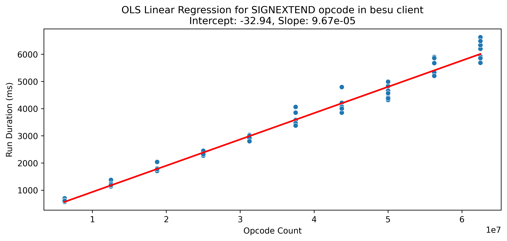


## geth


```python
                            OLS Regression Results                            
==============================================================================
Dep. Variable:        run_duration_ms   R-squared:                       0.976
Model:                            OLS   Adj. R-squared:                  0.975
Method:                 Least Squares   F-statistic:                     2898.
Date:                Tue, 23 Dec 2025   Prob (F-statistic):           6.63e-60
Time:                        08:41:31   Log-Likelihood:                -417.60
No. Observations:                  74   AIC:                             839.2
Df Residuals:                      72   BIC:                             843.8
Df Model:                           1                                         
Covariance Type:            nonrobust                                         
==============================================================================
                 coef    std err          t      P>|t|      [0.025      0.975]
------------------------------------------------------------------------------
const         39.0407     17.464      2.236      0.028       4.228      73.854
opcount     2.439e-05   4.53e-07     53.834      0.000    2.35e-05    2.53e-05
==============================================================================
Omnibus:                      132.695   Durbin-Watson:                   2.455
Prob(Omnibus):                  0.000   Jarque-Bera (JB):             6772.792
Skew:                           6.084   Prob(JB):                         0.00
Kurtosis:                      48.261   Cond. No.                     8.36e+07
==============================================================================

Notes:
[1] Standard Errors assume that the covariance matrix of the errors is correctly specified.
[2] The condition number is large, 8.36e+07. This might indicate that there are
strong multicollinearity or other numerical problems.
```

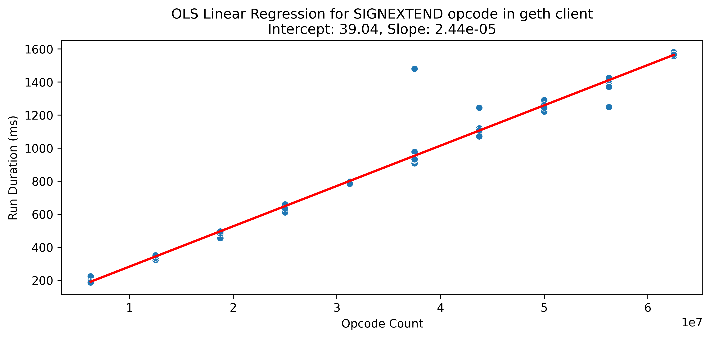


# SLT

## nethermind


```python
                            OLS Regression Results                            
==============================================================================
Dep. Variable:        run_duration_ms   R-squared:                       0.929
Model:                            OLS   Adj. R-squared:                  0.928
Method:                 Least Squares   F-statistic:                     948.6
Date:                Tue, 23 Dec 2025   Prob (F-statistic):           3.41e-43
Time:                        08:41:31   Log-Likelihood:                -449.82
No. Observations:                  74   AIC:                             903.6
Df Residuals:                      72   BIC:                             908.2
Df Model:                           1                                         
Covariance Type:            nonrobust                                         
==============================================================================
                 coef    std err          t      P>|t|      [0.025      0.975]
------------------------------------------------------------------------------
const         55.7602     26.992      2.066      0.042       1.954     109.567
opcount     1.797e-05   5.84e-07     30.799      0.000    1.68e-05    1.91e-05
==============================================================================
Omnibus:                      124.999   Durbin-Watson:                   2.078
Prob(Omnibus):                  0.000   Jarque-Bera (JB):             4539.096
Skew:                           5.663   Prob(JB):                         0.00
Kurtosis:                      39.659   Cond. No.                     1.00e+08
==============================================================================

Notes:
[1] Standard Errors assume that the covariance matrix of the errors is correctly specified.
[2] The condition number is large,  1e+08. This might indicate that there are
strong multicollinearity or other numerical problems.
```

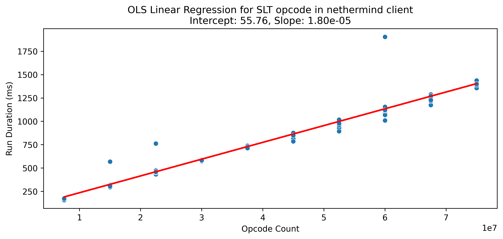


## reth


```python
                            OLS Regression Results                            
==============================================================================
Dep. Variable:        run_duration_ms   R-squared:                       0.992
Model:                            OLS   Adj. R-squared:                  0.992
Method:                 Least Squares   F-statistic:                     9064.
Date:                Tue, 23 Dec 2025   Prob (F-statistic):           1.78e-77
Time:                        08:41:32   Log-Likelihood:                -302.60
No. Observations:                  74   AIC:                             609.2
Df Residuals:                      72   BIC:                             613.8
Df Model:                           1                                         
Covariance Type:            nonrobust                                         
==============================================================================
                 coef    std err          t      P>|t|      [0.025      0.975]
------------------------------------------------------------------------------
const         41.3548      3.692     11.202      0.000      33.995      48.714
opcount     7.599e-06   7.98e-08     95.207      0.000    7.44e-06    7.76e-06
==============================================================================
Omnibus:                        6.299   Durbin-Watson:                   1.490
Prob(Omnibus):                  0.043   Jarque-Bera (JB):                9.831
Skew:                           0.146   Prob(JB):                      0.00733
Kurtosis:                       4.762   Cond. No.                     1.00e+08
==============================================================================

Notes:
[1] Standard Errors assume that the covariance matrix of the errors is correctly specified.
[2] The condition number is large,  1e+08. This might indicate that there are
strong multicollinearity or other numerical problems.
```

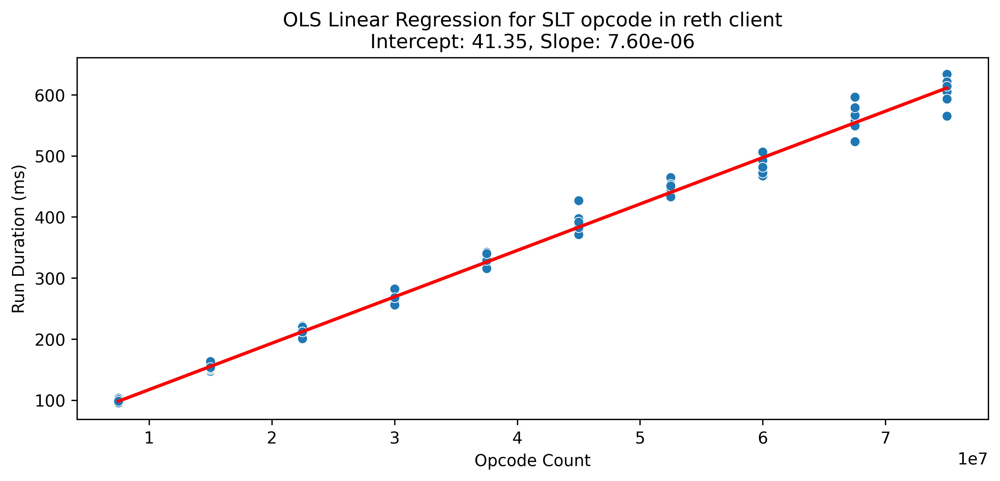


## besu


```python
                            OLS Regression Results                            
==============================================================================
Dep. Variable:        run_duration_ms   R-squared:                       0.924
Model:                            OLS   Adj. R-squared:                  0.923
Method:                 Least Squares   F-statistic:                     871.5
Date:                Tue, 23 Dec 2025   Prob (F-statistic):           5.78e-42
Time:                        08:41:32   Log-Likelihood:                -575.44
No. Observations:                  74   AIC:                             1155.
Df Residuals:                      72   BIC:                             1159.
Df Model:                           1                                         
Covariance Type:            nonrobust                                         
==============================================================================
                 coef    std err          t      P>|t|      [0.025      0.975]
------------------------------------------------------------------------------
const          0.0526    147.402      0.000      1.000    -293.788     293.894
opcount     9.407e-05   3.19e-06     29.521      0.000    8.77e-05       0.000
==============================================================================
Omnibus:                       10.558   Durbin-Watson:                   0.632
Prob(Omnibus):                  0.005   Jarque-Bera (JB):               10.606
Skew:                           0.887   Prob(JB):                      0.00498
Kurtosis:                       3.544   Cond. No.                     1.00e+08
==============================================================================

Notes:
[1] Standard Errors assume that the covariance matrix of the errors is correctly specified.
[2] The condition number is large,  1e+08. This might indicate that there are
strong multicollinearity or other numerical problems.
```

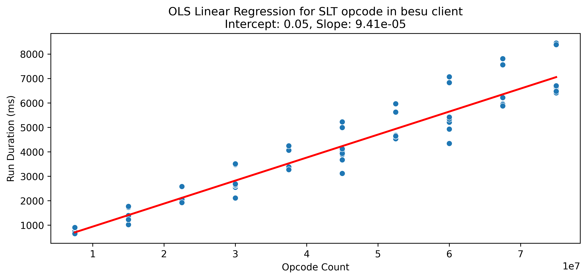


## geth


```python
                            OLS Regression Results                            
==============================================================================
Dep. Variable:        run_duration_ms   R-squared:                       0.994
Model:                            OLS   Adj. R-squared:                  0.994
Method:                 Least Squares   F-statistic:                 1.185e+04
Date:                Tue, 23 Dec 2025   Prob (F-statistic):           1.24e-81
Time:                        08:41:32   Log-Likelihood:                -373.54
No. Observations:                  74   AIC:                             751.1
Df Residuals:                      72   BIC:                             755.7
Df Model:                           1                                         
Covariance Type:            nonrobust                                         
==============================================================================
                 coef    std err          t      P>|t|      [0.025      0.975]
------------------------------------------------------------------------------
const         45.2535      9.629      4.700      0.000      26.058      64.449
opcount     2.266e-05   2.08e-07    108.835      0.000    2.22e-05    2.31e-05
==============================================================================
Omnibus:                       30.607   Durbin-Watson:                   1.966
Prob(Omnibus):                  0.000   Jarque-Bera (JB):               81.593
Skew:                           1.292   Prob(JB):                     1.92e-18
Kurtosis:                       7.448   Cond. No.                     1.00e+08
==============================================================================

Notes:
[1] Standard Errors assume that the covariance matrix of the errors is correctly specified.
[2] The condition number is large,  1e+08. This might indicate that there are
strong multicollinearity or other numerical problems.
```

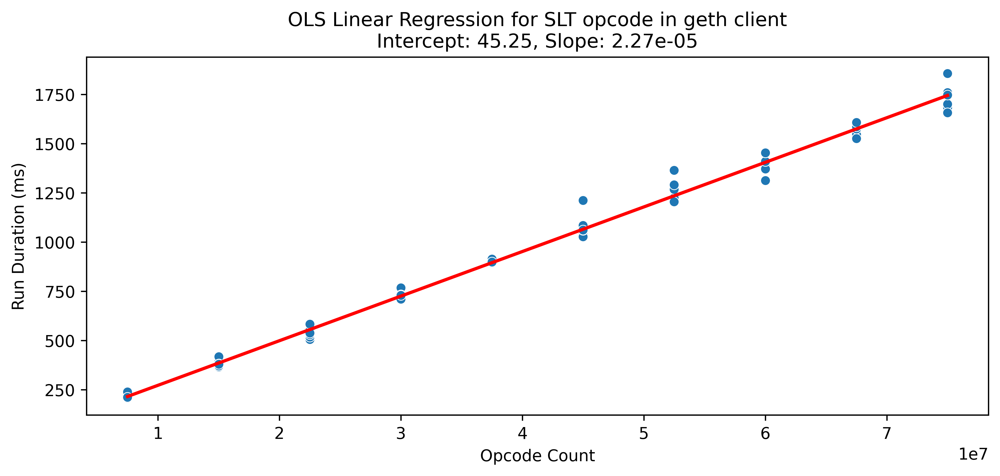


# SMOD

## nethermind


```python
                            OLS Regression Results                            
==============================================================================
Dep. Variable:        run_duration_ms   R-squared:                       0.000
Model:                            OLS   Adj. R-squared:                 -0.007
Method:                 Least Squares   F-statistic:                   0.01734
Date:                Tue, 23 Dec 2025   Prob (F-statistic):              0.895
Time:                        08:41:32   Log-Likelihood:                -1556.8
No. Observations:                 148   AIC:                             3118.
Df Residuals:                     146   BIC:                             3124.
Df Model:                           1                                         
Covariance Type:            nonrobust                                         
==============================================================================
                 coef    std err          t      P>|t|      [0.025      0.975]
------------------------------------------------------------------------------
const       9246.9276   1607.120      5.754      0.000    6070.704    1.24e+04
opcount      5.49e-06   4.17e-05      0.132      0.895   -7.69e-05    8.79e-05
==============================================================================
Omnibus:                      923.840   Durbin-Watson:                   2.374
Prob(Omnibus):                  0.000   Jarque-Bera (JB):               24.583
Skew:                           0.002   Prob(JB):                     4.59e-06
Kurtosis:                       1.003   Cond. No.                     8.36e+07
==============================================================================

Notes:
[1] Standard Errors assume that the covariance matrix of the errors is correctly specified.
[2] The condition number is large, 8.36e+07. This might indicate that there are
strong multicollinearity or other numerical problems.
```

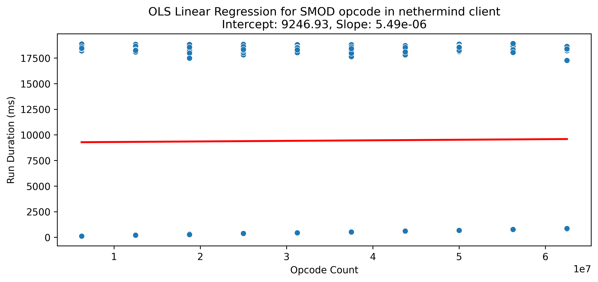


## reth


```python
                            OLS Regression Results                            
==============================================================================
Dep. Variable:        run_duration_ms   R-squared:                       0.001
Model:                            OLS   Adj. R-squared:                 -0.006
Method:                 Least Squares   F-statistic:                    0.1790
Date:                Tue, 23 Dec 2025   Prob (F-statistic):              0.673
Time:                        08:41:32   Log-Likelihood:                -1402.2
No. Observations:                 148   AIC:                             2808.
Df Residuals:                     146   BIC:                             2814.
Df Model:                           1                                         
Covariance Type:            nonrobust                                         
==============================================================================
                 coef    std err          t      P>|t|      [0.025      0.975]
------------------------------------------------------------------------------
const       3365.1656    565.548      5.950      0.000    2247.448    4482.883
opcount     6.207e-06   1.47e-05      0.423      0.673   -2.28e-05    3.52e-05
==============================================================================
Omnibus:                      925.919   Durbin-Watson:                   2.367
Prob(Omnibus):                  0.000   Jarque-Bera (JB):               24.518
Skew:                           0.002   Prob(JB):                     4.74e-06
Kurtosis:                       1.006   Cond. No.                     8.36e+07
==============================================================================

Notes:
[1] Standard Errors assume that the covariance matrix of the errors is correctly specified.
[2] The condition number is large, 8.36e+07. This might indicate that there are
strong multicollinearity or other numerical problems.
```

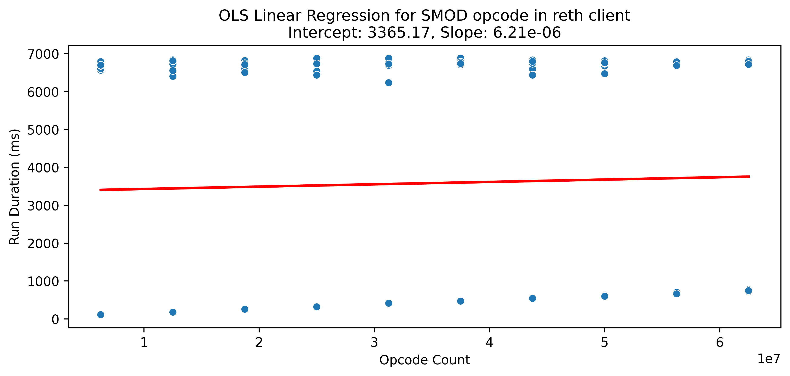


## besu


```python
                            OLS Regression Results                            
==============================================================================
Dep. Variable:        run_duration_ms   R-squared:                       0.945
Model:                            OLS   Adj. R-squared:                  0.944
Method:                 Least Squares   F-statistic:                     1243.
Date:                Tue, 23 Dec 2025   Prob (F-statistic):           3.68e-47
Time:                        08:41:32   Log-Likelihood:                -490.55
No. Observations:                  74   AIC:                             985.1
Df Residuals:                      72   BIC:                             989.7
Df Model:                           1                                         
Covariance Type:            nonrobust                                         
==============================================================================
                 coef    std err          t      P>|t|      [0.025      0.975]
------------------------------------------------------------------------------
const         -2.4362     46.804     -0.052      0.959     -95.739      90.867
opcount     4.281e-05   1.21e-06     35.257      0.000    4.04e-05    4.52e-05
==============================================================================
Omnibus:                        9.428   Durbin-Watson:                   1.055
Prob(Omnibus):                  0.009   Jarque-Bera (JB):                9.096
Skew:                           0.789   Prob(JB):                       0.0106
Kurtosis:                       3.679   Cond. No.                     8.36e+07
==============================================================================

Notes:
[1] Standard Errors assume that the covariance matrix of the errors is correctly specified.
[2] The condition number is large, 8.36e+07. This might indicate that there are
strong multicollinearity or other numerical problems.
```

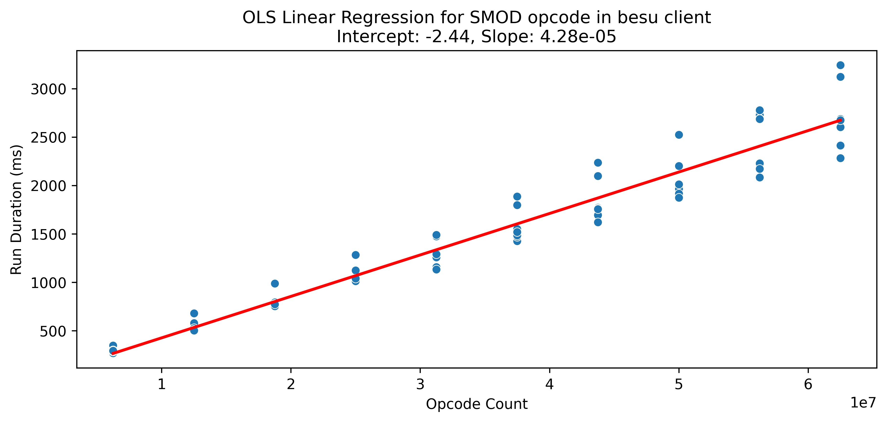


## geth


```python
                            OLS Regression Results                            
==============================================================================
Dep. Variable:        run_duration_ms   R-squared:                       0.002
Model:                            OLS   Adj. R-squared:                 -0.005
Method:                 Least Squares   F-statistic:                    0.3047
Date:                Tue, 23 Dec 2025   Prob (F-statistic):              0.582
Time:                        08:41:32   Log-Likelihood:                -1483.5
No. Observations:                 148   AIC:                             2971.
Df Residuals:                     146   BIC:                             2977.
Df Model:                           1                                         
Covariance Type:            nonrobust                                         
==============================================================================
                 coef    std err          t      P>|t|      [0.025      0.975]
------------------------------------------------------------------------------
const       5948.3068    979.843      6.071      0.000    4011.799    7884.815
opcount     1.403e-05   2.54e-05      0.552      0.582   -3.62e-05    6.43e-05
==============================================================================
Omnibus:                      932.696   Durbin-Watson:                   2.364
Prob(Omnibus):                  0.000   Jarque-Bera (JB):               24.313
Skew:                           0.005   Prob(JB):                     5.25e-06
Kurtosis:                       1.014   Cond. No.                     8.36e+07
==============================================================================

Notes:
[1] Standard Errors assume that the covariance matrix of the errors is correctly specified.
[2] The condition number is large, 8.36e+07. This might indicate that there are
strong multicollinearity or other numerical problems.
```

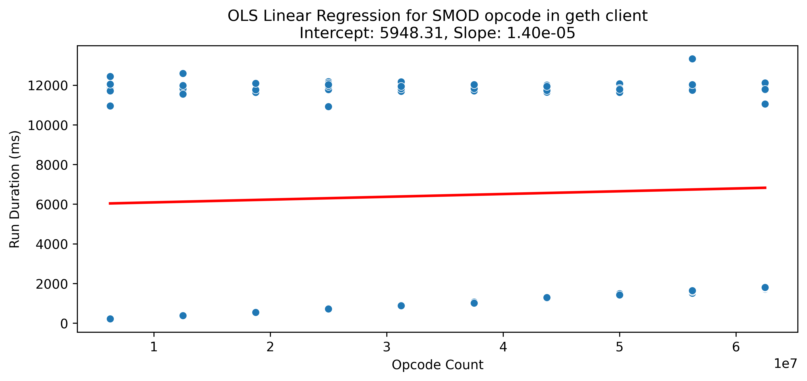


# STOP

## nethermind

OLS model did not run... Error: zero-size array to reduction operation maximum which has no identity

## reth

OLS model did not run... Error: zero-size array to reduction operation maximum which has no identity

## besu

OLS model did not run... Error: zero-size array to reduction operation maximum which has no identity

## geth

OLS model did not run... Error: zero-size array to reduction operation maximum which has no identity

# SUB

## nethermind


```python
                            OLS Regression Results                            
==============================================================================
Dep. Variable:        run_duration_ms   R-squared:                       0.998
Model:                            OLS   Adj. R-squared:                  0.998
Method:                 Least Squares   F-statistic:                 3.038e+04
Date:                Tue, 23 Dec 2025   Prob (F-statistic):           2.66e-96
Time:                        08:41:33   Log-Likelihood:                -311.31
No. Observations:                  74   AIC:                             626.6
Df Residuals:                      72   BIC:                             631.2
Df Model:                           1                                         
Covariance Type:            nonrobust                                         
==============================================================================
                 coef    std err          t      P>|t|      [0.025      0.975]
------------------------------------------------------------------------------
const         38.1898      4.153      9.196      0.000      29.911      46.468
opcount     1.565e-05   8.98e-08    174.308      0.000    1.55e-05    1.58e-05
==============================================================================
Omnibus:                       64.903   Durbin-Watson:                   1.780
Prob(Omnibus):                  0.000   Jarque-Bera (JB):              362.283
Skew:                          -2.700   Prob(JB):                     2.14e-79
Kurtosis:                      12.398   Cond. No.                     1.00e+08
==============================================================================

Notes:
[1] Standard Errors assume that the covariance matrix of the errors is correctly specified.
[2] The condition number is large,  1e+08. This might indicate that there are
strong multicollinearity or other numerical problems.
```

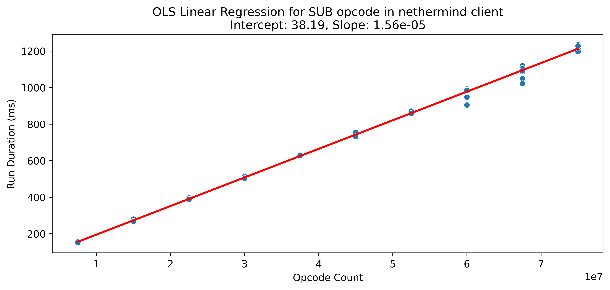


## reth


```python
                            OLS Regression Results                            
==============================================================================
Dep. Variable:        run_duration_ms   R-squared:                       0.991
Model:                            OLS   Adj. R-squared:                  0.991
Method:                 Least Squares   F-statistic:                     7764.
Date:                Tue, 23 Dec 2025   Prob (F-statistic):           4.46e-75
Time:                        08:41:33   Log-Likelihood:                -298.06
No. Observations:                  74   AIC:                             600.1
Df Residuals:                      72   BIC:                             604.7
Df Model:                           1                                         
Covariance Type:            nonrobust                                         
==============================================================================
                 coef    std err          t      P>|t|      [0.025      0.975]
------------------------------------------------------------------------------
const         42.5732      3.472     12.262      0.000      35.652      49.494
opcount     6.614e-06   7.51e-08     88.115      0.000    6.46e-06    6.76e-06
==============================================================================
Omnibus:                       10.575   Durbin-Watson:                   2.430
Prob(Omnibus):                  0.005   Jarque-Bera (JB):               26.644
Skew:                          -0.205   Prob(JB):                     1.64e-06
Kurtosis:                       5.911   Cond. No.                     1.00e+08
==============================================================================

Notes:
[1] Standard Errors assume that the covariance matrix of the errors is correctly specified.
[2] The condition number is large,  1e+08. This might indicate that there are
strong multicollinearity or other numerical problems.
```


## besu


```python
                            OLS Regression Results                            
==============================================================================
Dep. Variable:        run_duration_ms   R-squared:                       0.923
Model:                            OLS   Adj. R-squared:                  0.922
Method:                 Least Squares   F-statistic:                     860.5
Date:                Tue, 23 Dec 2025   Prob (F-statistic):           8.82e-42
Time:                        08:41:33   Log-Likelihood:                -642.67
No. Observations:                  74   AIC:                             1289.
Df Residuals:                      72   BIC:                             1294.
Df Model:                           1                                         
Covariance Type:            nonrobust                                         
==============================================================================
                 coef    std err          t      P>|t|      [0.025      0.975]
------------------------------------------------------------------------------
const       -617.9269    365.627     -1.690      0.095   -1346.790     110.936
opcount        0.0002    7.9e-06     29.334      0.000       0.000       0.000
==============================================================================
Omnibus:                       52.884   Durbin-Watson:                   1.196
Prob(Omnibus):                  0.000   Jarque-Bera (JB):              216.289
Skew:                           2.211   Prob(JB):                     1.08e-47
Kurtosis:                      10.112   Cond. No.                     1.00e+08
==============================================================================

Notes:
[1] Standard Errors assume that the covariance matrix of the errors is correctly specified.
[2] The condition number is large,  1e+08. This might indicate that there are
strong multicollinearity or other numerical problems.
```

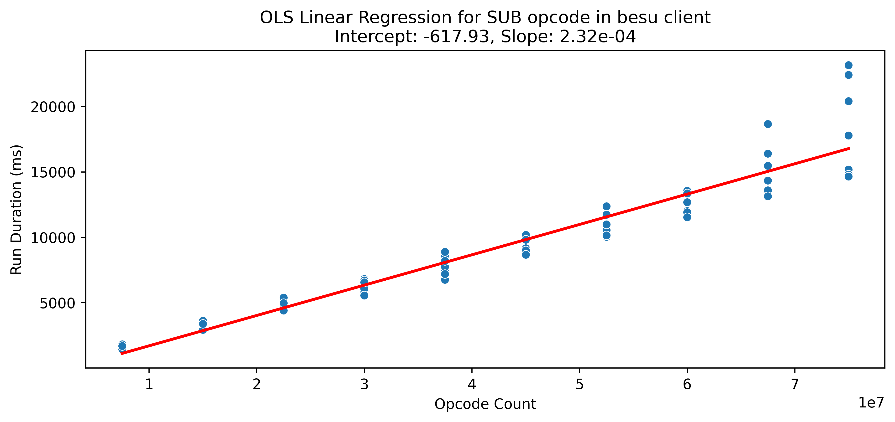


## geth


```python
                            OLS Regression Results                            
==============================================================================
Dep. Variable:        run_duration_ms   R-squared:                       0.996
Model:                            OLS   Adj. R-squared:                  0.996
Method:                 Least Squares   F-statistic:                 1.838e+04
Date:                Tue, 23 Dec 2025   Prob (F-statistic):           1.83e-88
Time:                        08:41:33   Log-Likelihood:                -354.50
No. Observations:                  74   AIC:                             713.0
Df Residuals:                      72   BIC:                             717.6
Df Model:                           1                                         
Covariance Type:            nonrobust                                         
==============================================================================
                 coef    std err          t      P>|t|      [0.025      0.975]
------------------------------------------------------------------------------
const         34.7531      7.445      4.668      0.000      19.912      49.594
opcount     2.182e-05   1.61e-07    135.556      0.000    2.15e-05    2.21e-05
==============================================================================
Omnibus:                       29.046   Durbin-Watson:                   1.855
Prob(Omnibus):                  0.000   Jarque-Bera (JB):               86.480
Skew:                          -1.159   Prob(JB):                     1.66e-19
Kurtosis:                       7.762   Cond. No.                     1.00e+08
==============================================================================

Notes:
[1] Standard Errors assume that the covariance matrix of the errors is correctly specified.
[2] The condition number is large,  1e+08. This might indicate that there are
strong multicollinearity or other numerical problems.
```


# SWAP1

## nethermind


```python
                            OLS Regression Results                            
==============================================================================
Dep. Variable:        run_duration_ms   R-squared:                       0.991
Model:                            OLS   Adj. R-squared:                  0.991
Method:                 Least Squares   F-statistic:                     8342.
Date:                Tue, 23 Dec 2025   Prob (F-statistic):           3.44e-76
Time:                        08:41:33   Log-Likelihood:                -309.38
No. Observations:                  74   AIC:                             622.8
Df Residuals:                      72   BIC:                             627.4
Df Model:                           1                                         
Covariance Type:            nonrobust                                         
==============================================================================
                 coef    std err          t      P>|t|      [0.025      0.975]
------------------------------------------------------------------------------
const         32.7478      4.046      8.094      0.000      24.682      40.813
opcount     4.793e-06   5.25e-08     91.337      0.000    4.69e-06     4.9e-06
==============================================================================
Omnibus:                        2.540   Durbin-Watson:                   0.986
Prob(Omnibus):                  0.281   Jarque-Bera (JB):                2.056
Skew:                           0.108   Prob(JB):                        0.358
Kurtosis:                       3.787   Cond. No.                     1.67e+08
==============================================================================

Notes:
[1] Standard Errors assume that the covariance matrix of the errors is correctly specified.
[2] The condition number is large, 1.67e+08. This might indicate that there are
strong multicollinearity or other numerical problems.
```


## reth


```python
                            OLS Regression Results                            
==============================================================================
Dep. Variable:        run_duration_ms   R-squared:                       0.786
Model:                            OLS   Adj. R-squared:                  0.783
Method:                 Least Squares   F-statistic:                     263.9
Date:                Tue, 23 Dec 2025   Prob (F-statistic):           8.74e-26
Time:                        08:41:33   Log-Likelihood:                -420.61
No. Observations:                  74   AIC:                             845.2
Df Residuals:                      72   BIC:                             849.8
Df Model:                           1                                         
Covariance Type:            nonrobust                                         
==============================================================================
                 coef    std err          t      P>|t|      [0.025      0.975]
------------------------------------------------------------------------------
const         53.0236     18.188      2.915      0.005      16.766      89.281
opcount     3.833e-06   2.36e-07     16.246      0.000    3.36e-06     4.3e-06
==============================================================================
Omnibus:                      156.364   Durbin-Watson:                   1.976
Prob(Omnibus):                  0.000   Jarque-Bera (JB):            13519.925
Skew:                           7.997   Prob(JB):                         0.00
Kurtosis:                      67.258   Cond. No.                     1.67e+08
==============================================================================

Notes:
[1] Standard Errors assume that the covariance matrix of the errors is correctly specified.
[2] The condition number is large, 1.67e+08. This might indicate that there are
strong multicollinearity or other numerical problems.
```

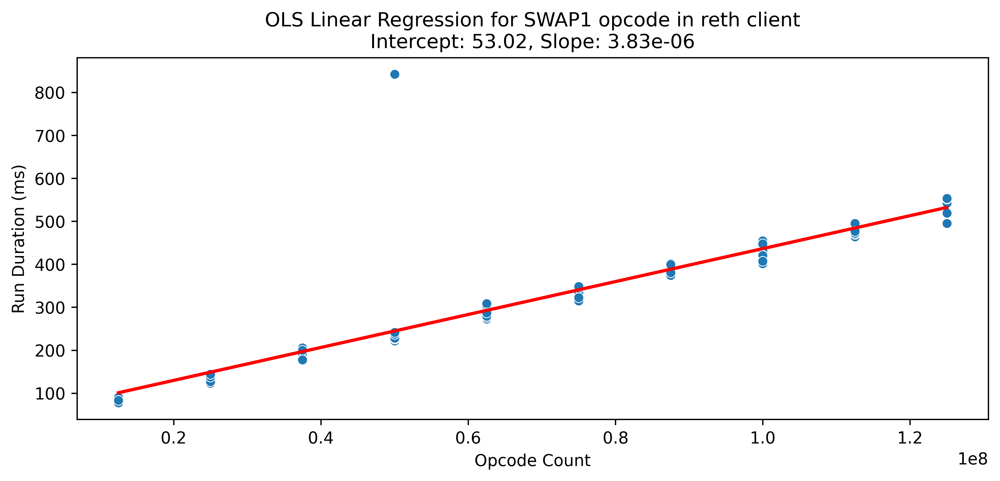


## besu


```python
                            OLS Regression Results                            
==============================================================================
Dep. Variable:        run_duration_ms   R-squared:                       0.911
Model:                            OLS   Adj. R-squared:                  0.910
Method:                 Least Squares   F-statistic:                     739.0
Date:                Tue, 23 Dec 2025   Prob (F-statistic):           1.35e-39
Time:                        08:41:33   Log-Likelihood:                -542.14
No. Observations:                  74   AIC:                             1088.
Df Residuals:                      72   BIC:                             1093.
Df Model:                           1                                         
Covariance Type:            nonrobust                                         
==============================================================================
                 coef    std err          t      P>|t|      [0.025      0.975]
------------------------------------------------------------------------------
const         32.7675     93.987      0.349      0.728    -154.592     220.127
opcount     3.314e-05   1.22e-06     27.185      0.000    3.07e-05    3.56e-05
==============================================================================
Omnibus:                       17.052   Durbin-Watson:                   0.953
Prob(Omnibus):                  0.000   Jarque-Bera (JB):               20.034
Skew:                           1.133   Prob(JB):                     4.46e-05
Kurtosis:                       4.167   Cond. No.                     1.67e+08
==============================================================================

Notes:
[1] Standard Errors assume that the covariance matrix of the errors is correctly specified.
[2] The condition number is large, 1.67e+08. This might indicate that there are
strong multicollinearity or other numerical problems.
```

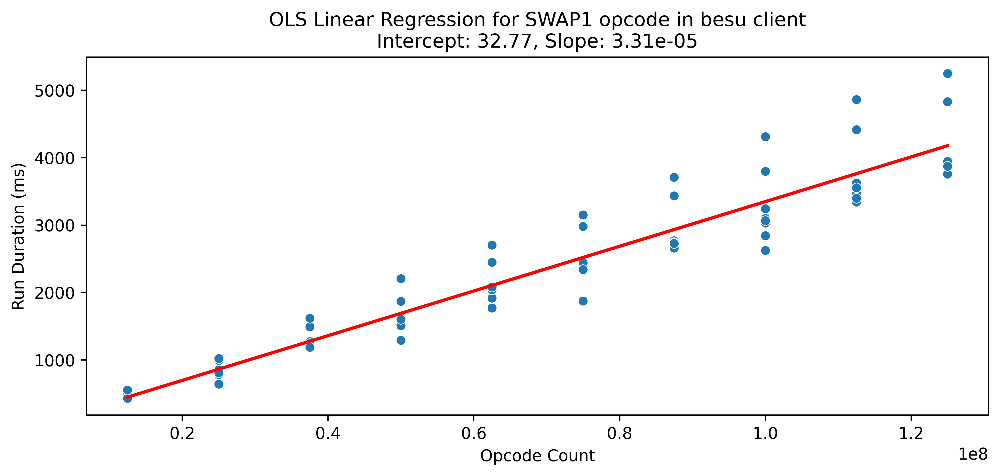


## geth


```python
                            OLS Regression Results                            
==============================================================================
Dep. Variable:        run_duration_ms   R-squared:                       0.995
Model:                            OLS   Adj. R-squared:                  0.995
Method:                 Least Squares   F-statistic:                 1.519e+04
Date:                Tue, 23 Dec 2025   Prob (F-statistic):           1.67e-85
Time:                        08:41:34   Log-Likelihood:                -338.98
No. Observations:                  74   AIC:                             682.0
Df Residuals:                      72   BIC:                             686.6
Df Model:                           1                                         
Covariance Type:            nonrobust                                         
==============================================================================
                 coef    std err          t      P>|t|      [0.025      0.975]
------------------------------------------------------------------------------
const         33.0915      6.036      5.483      0.000      21.060      45.123
opcount      9.65e-06   7.83e-08    123.260      0.000    9.49e-06    9.81e-06
==============================================================================
Omnibus:                        5.891   Durbin-Watson:                   1.650
Prob(Omnibus):                  0.053   Jarque-Bera (JB):                9.116
Skew:                          -0.072   Prob(JB):                       0.0105
Kurtosis:                       4.713   Cond. No.                     1.67e+08
==============================================================================

Notes:
[1] Standard Errors assume that the covariance matrix of the errors is correctly specified.
[2] The condition number is large, 1.67e+08. This might indicate that there are
strong multicollinearity or other numerical problems.
```

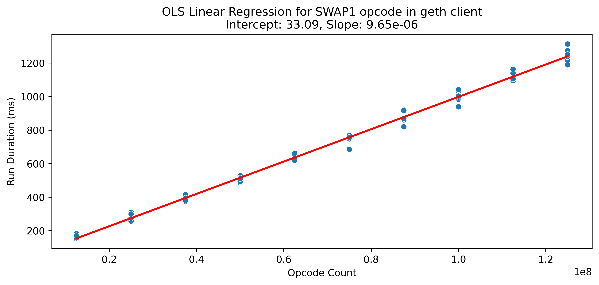


# SWAP2

## nethermind


```python
                            OLS Regression Results                            
==============================================================================
Dep. Variable:        run_duration_ms   R-squared:                       0.992
Model:                            OLS   Adj. R-squared:                  0.992
Method:                 Least Squares   F-statistic:                     8675.
Date:                Tue, 23 Dec 2025   Prob (F-statistic):           8.53e-77
Time:                        08:41:34   Log-Likelihood:                -307.28
No. Observations:                  74   AIC:                             618.6
Df Residuals:                      72   BIC:                             623.2
Df Model:                           1                                         
Covariance Type:            nonrobust                                         
==============================================================================
                 coef    std err          t      P>|t|      [0.025      0.975]
------------------------------------------------------------------------------
const         36.0532      3.933      9.167      0.000      28.213      43.893
opcount     4.751e-06    5.1e-08     93.138      0.000    4.65e-06    4.85e-06
==============================================================================
Omnibus:                        1.850   Durbin-Watson:                   1.031
Prob(Omnibus):                  0.396   Jarque-Bera (JB):                1.179
Skew:                           0.169   Prob(JB):                        0.555
Kurtosis:                       3.518   Cond. No.                     1.67e+08
==============================================================================

Notes:
[1] Standard Errors assume that the covariance matrix of the errors is correctly specified.
[2] The condition number is large, 1.67e+08. This might indicate that there are
strong multicollinearity or other numerical problems.
```

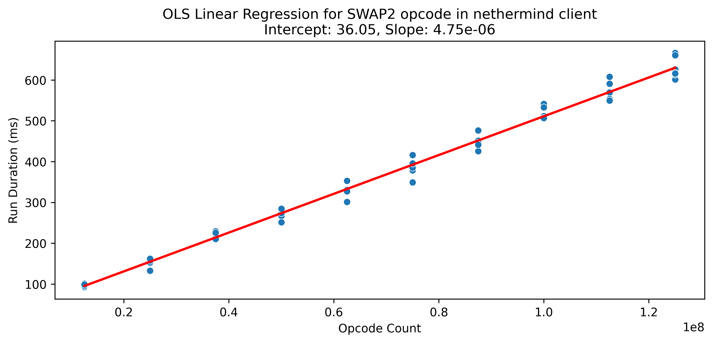


## reth


```python
                            OLS Regression Results                            
==============================================================================
Dep. Variable:        run_duration_ms   R-squared:                       0.995
Model:                            OLS   Adj. R-squared:                  0.995
Method:                 Least Squares   F-statistic:                 1.540e+04
Date:                Tue, 23 Dec 2025   Prob (F-statistic):           1.04e-85
Time:                        08:41:34   Log-Likelihood:                -274.02
No. Observations:                  74   AIC:                             552.0
Df Residuals:                      72   BIC:                             556.6
Df Model:                           1                                         
Covariance Type:            nonrobust                                         
==============================================================================
                 coef    std err          t      P>|t|      [0.025      0.975]
------------------------------------------------------------------------------
const         34.6769      2.509     13.822      0.000      29.676      39.678
opcount     4.038e-06   3.25e-08    124.079      0.000    3.97e-06     4.1e-06
==============================================================================
Omnibus:                        0.459   Durbin-Watson:                   1.544
Prob(Omnibus):                  0.795   Jarque-Bera (JB):                0.599
Skew:                          -0.013   Prob(JB):                        0.741
Kurtosis:                       2.560   Cond. No.                     1.67e+08
==============================================================================

Notes:
[1] Standard Errors assume that the covariance matrix of the errors is correctly specified.
[2] The condition number is large, 1.67e+08. This might indicate that there are
strong multicollinearity or other numerical problems.
```

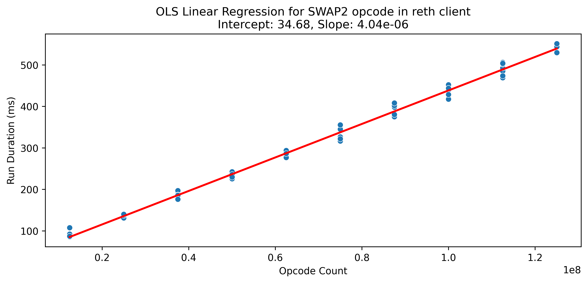


## besu


```python
                            OLS Regression Results                            
==============================================================================
Dep. Variable:        run_duration_ms   R-squared:                       0.914
Model:                            OLS   Adj. R-squared:                  0.912
Method:                 Least Squares   F-statistic:                     760.5
Date:                Tue, 23 Dec 2025   Prob (F-statistic):           5.25e-40
Time:                        08:41:34   Log-Likelihood:                -541.30
No. Observations:                  74   AIC:                             1087.
Df Residuals:                      72   BIC:                             1091.
Df Model:                           1                                         
Covariance Type:            nonrobust                                         
==============================================================================
                 coef    std err          t      P>|t|      [0.025      0.975]
------------------------------------------------------------------------------
const         29.0152     92.926      0.312      0.756    -156.229     214.259
opcount     3.324e-05   1.21e-06     27.578      0.000    3.08e-05    3.56e-05
==============================================================================
Omnibus:                       18.844   Durbin-Watson:                   0.735
Prob(Omnibus):                  0.000   Jarque-Bera (JB):               23.433
Skew:                           1.178   Prob(JB):                     8.16e-06
Kurtosis:                       4.430   Cond. No.                     1.67e+08
==============================================================================

Notes:
[1] Standard Errors assume that the covariance matrix of the errors is correctly specified.
[2] The condition number is large, 1.67e+08. This might indicate that there are
strong multicollinearity or other numerical problems.
```

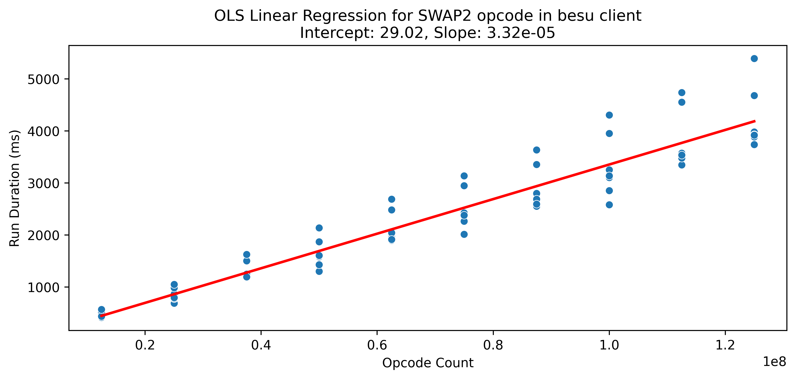


## geth


```python
                            OLS Regression Results                            
==============================================================================
Dep. Variable:        run_duration_ms   R-squared:                       0.969
Model:                            OLS   Adj. R-squared:                  0.969
Method:                 Least Squares   F-statistic:                     2268.
Date:                Tue, 23 Dec 2025   Prob (F-statistic):           3.54e-56
Time:                        08:41:34   Log-Likelihood:                -411.73
No. Observations:                  74   AIC:                             827.5
Df Residuals:                      72   BIC:                             832.1
Df Model:                           1                                         
Covariance Type:            nonrobust                                         
==============================================================================
                 coef    std err          t      P>|t|      [0.025      0.975]
------------------------------------------------------------------------------
const         23.3502     16.133      1.447      0.152      -8.811      55.511
opcount     9.966e-06   2.09e-07     47.627      0.000    9.55e-06    1.04e-05
==============================================================================
Omnibus:                      136.595   Durbin-Watson:                   2.059
Prob(Omnibus):                  0.000   Jarque-Bera (JB):             7396.766
Skew:                           6.395   Prob(JB):                         0.00
Kurtosis:                      50.280   Cond. No.                     1.67e+08
==============================================================================

Notes:
[1] Standard Errors assume that the covariance matrix of the errors is correctly specified.
[2] The condition number is large, 1.67e+08. This might indicate that there are
strong multicollinearity or other numerical problems.
```

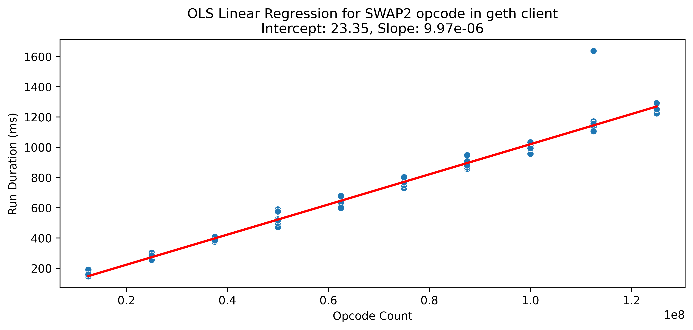


# SWAP3

## nethermind


```python
                            OLS Regression Results                            
==============================================================================
Dep. Variable:        run_duration_ms   R-squared:                       0.991
Model:                            OLS   Adj. R-squared:                  0.991
Method:                 Least Squares   F-statistic:                     7740.
Date:                Tue, 23 Dec 2025   Prob (F-statistic):           5.00e-75
Time:                        08:41:34   Log-Likelihood:                -311.41
No. Observations:                  74   AIC:                             626.8
Df Residuals:                      72   BIC:                             631.4
Df Model:                           1                                         
Covariance Type:            nonrobust                                         
==============================================================================
                 coef    std err          t      P>|t|      [0.025      0.975]
------------------------------------------------------------------------------
const         38.3053      4.159      9.211      0.000      30.015      46.595
opcount     4.745e-06   5.39e-08     87.975      0.000    4.64e-06    4.85e-06
==============================================================================
Omnibus:                        1.448   Durbin-Watson:                   1.043
Prob(Omnibus):                  0.485   Jarque-Bera (JB):                0.827
Skew:                           0.063   Prob(JB):                        0.661
Kurtosis:                       3.502   Cond. No.                     1.67e+08
==============================================================================

Notes:
[1] Standard Errors assume that the covariance matrix of the errors is correctly specified.
[2] The condition number is large, 1.67e+08. This might indicate that there are
strong multicollinearity or other numerical problems.
```


## reth


```python
                            OLS Regression Results                            
==============================================================================
Dep. Variable:        run_duration_ms   R-squared:                       0.991
Model:                            OLS   Adj. R-squared:                  0.991
Method:                 Least Squares   F-statistic:                     7950.
Date:                Tue, 23 Dec 2025   Prob (F-statistic):           1.92e-75
Time:                        08:41:34   Log-Likelihood:                -295.99
No. Observations:                  74   AIC:                             596.0
Df Residuals:                      72   BIC:                             600.6
Df Model:                           1                                         
Covariance Type:            nonrobust                                         
==============================================================================
                 coef    std err          t      P>|t|      [0.025      0.975]
------------------------------------------------------------------------------
const         40.6448      3.377     12.037      0.000      33.914      47.376
opcount     3.905e-06   4.38e-08     89.163      0.000    3.82e-06    3.99e-06
==============================================================================
Omnibus:                       19.617   Durbin-Watson:                   1.686
Prob(Omnibus):                  0.000   Jarque-Bera (JB):               51.879
Skew:                          -0.753   Prob(JB):                     5.43e-12
Kurtosis:                       6.815   Cond. No.                     1.67e+08
==============================================================================

Notes:
[1] Standard Errors assume that the covariance matrix of the errors is correctly specified.
[2] The condition number is large, 1.67e+08. This might indicate that there are
strong multicollinearity or other numerical problems.
```


## besu


```python
                            OLS Regression Results                            
==============================================================================
Dep. Variable:        run_duration_ms   R-squared:                       0.918
Model:                            OLS   Adj. R-squared:                  0.916
Method:                 Least Squares   F-statistic:                     802.1
Date:                Tue, 23 Dec 2025   Prob (F-statistic):           9.07e-41
Time:                        08:41:34   Log-Likelihood:                -539.39
No. Observations:                  74   AIC:                             1083.
Df Residuals:                      72   BIC:                             1087.
Df Model:                           1                                         
Covariance Type:            nonrobust                                         
==============================================================================
                 coef    std err          t      P>|t|      [0.025      0.975]
------------------------------------------------------------------------------
const         40.1382     90.558      0.443      0.659    -140.386     220.662
opcount     3.327e-05   1.17e-06     28.321      0.000    3.09e-05    3.56e-05
==============================================================================
Omnibus:                       19.139   Durbin-Watson:                   0.547
Prob(Omnibus):                  0.000   Jarque-Bera (JB):               23.748
Skew:                           1.210   Prob(JB):                     6.97e-06
Kurtosis:                       4.358   Cond. No.                     1.67e+08
==============================================================================

Notes:
[1] Standard Errors assume that the covariance matrix of the errors is correctly specified.
[2] The condition number is large, 1.67e+08. This might indicate that there are
strong multicollinearity or other numerical problems.
```

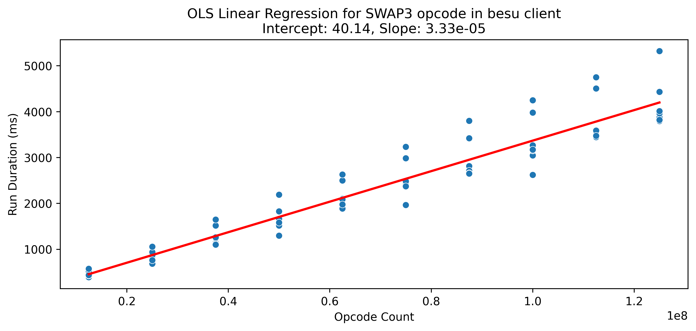


## geth


```python
                            OLS Regression Results                            
==============================================================================
Dep. Variable:        run_duration_ms   R-squared:                       0.992
Model:                            OLS   Adj. R-squared:                  0.991
Method:                 Least Squares   F-statistic:                     8489.
Date:                Tue, 23 Dec 2025   Prob (F-statistic):           1.84e-76
Time:                        08:41:35   Log-Likelihood:                -360.86
No. Observations:                  74   AIC:                             725.7
Df Residuals:                      72   BIC:                             730.3
Df Model:                           1                                         
Covariance Type:            nonrobust                                         
==============================================================================
                 coef    std err          t      P>|t|      [0.025      0.975]
------------------------------------------------------------------------------
const         36.6015      8.113      4.512      0.000      20.429      52.774
opcount     9.695e-06   1.05e-07     92.138      0.000    9.49e-06    9.91e-06
==============================================================================
Omnibus:                       31.655   Durbin-Watson:                   1.839
Prob(Omnibus):                  0.000   Jarque-Bera (JB):               83.105
Skew:                           1.353   Prob(JB):                     8.99e-19
Kurtosis:                       7.431   Cond. No.                     1.67e+08
==============================================================================

Notes:
[1] Standard Errors assume that the covariance matrix of the errors is correctly specified.
[2] The condition number is large, 1.67e+08. This might indicate that there are
strong multicollinearity or other numerical problems.
```


# SWAP4

## nethermind


```python
                            OLS Regression Results                            
==============================================================================
Dep. Variable:        run_duration_ms   R-squared:                       0.991
Model:                            OLS   Adj. R-squared:                  0.990
Method:                 Least Squares   F-statistic:                     7601.
Date:                Tue, 23 Dec 2025   Prob (F-statistic):           9.52e-75
Time:                        08:41:35   Log-Likelihood:                -312.59
No. Observations:                  74   AIC:                             629.2
Df Residuals:                      72   BIC:                             633.8
Df Model:                           1                                         
Covariance Type:            nonrobust                                         
==============================================================================
                 coef    std err          t      P>|t|      [0.025      0.975]
------------------------------------------------------------------------------
const         34.5247      4.226      8.170      0.000      26.101      42.948
opcount     4.778e-06   5.48e-08     87.184      0.000    4.67e-06    4.89e-06
==============================================================================
Omnibus:                        7.312   Durbin-Watson:                   1.129
Prob(Omnibus):                  0.026   Jarque-Bera (JB):                8.438
Skew:                          -0.447   Prob(JB):                       0.0147
Kurtosis:                       4.392   Cond. No.                     1.67e+08
==============================================================================

Notes:
[1] Standard Errors assume that the covariance matrix of the errors is correctly specified.
[2] The condition number is large, 1.67e+08. This might indicate that there are
strong multicollinearity or other numerical problems.
```

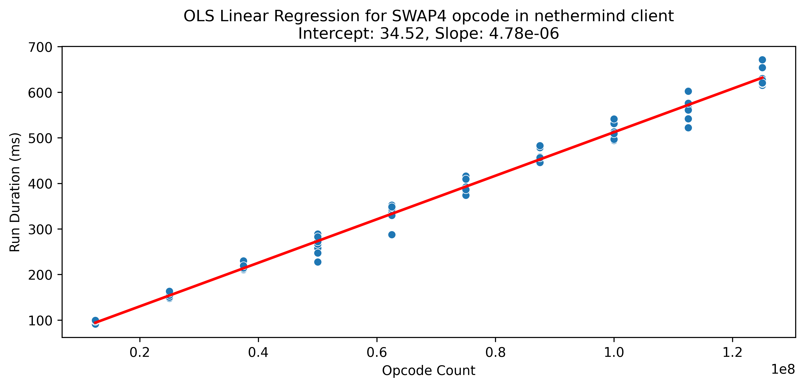


## reth


```python
                            OLS Regression Results                            
==============================================================================
Dep. Variable:        run_duration_ms   R-squared:                       0.994
Model:                            OLS   Adj. R-squared:                  0.994
Method:                 Least Squares   F-statistic:                 1.149e+04
Date:                Tue, 23 Dec 2025   Prob (F-statistic):           3.74e-81
Time:                        08:41:35   Log-Likelihood:                -283.98
No. Observations:                  74   AIC:                             572.0
Df Residuals:                      72   BIC:                             576.6
Df Model:                           1                                         
Covariance Type:            nonrobust                                         
==============================================================================
                 coef    std err          t      P>|t|      [0.025      0.975]
------------------------------------------------------------------------------
const         38.8174      2.871     13.522      0.000      33.095      44.540
opcount     3.991e-06   3.72e-08    107.174      0.000    3.92e-06    4.06e-06
==============================================================================
Omnibus:                        1.673   Durbin-Watson:                   1.762
Prob(Omnibus):                  0.433   Jarque-Bera (JB):                1.620
Skew:                          -0.347   Prob(JB):                        0.445
Kurtosis:                       2.789   Cond. No.                     1.67e+08
==============================================================================

Notes:
[1] Standard Errors assume that the covariance matrix of the errors is correctly specified.
[2] The condition number is large, 1.67e+08. This might indicate that there are
strong multicollinearity or other numerical problems.
```


## besu


```python
                            OLS Regression Results                            
==============================================================================
Dep. Variable:        run_duration_ms   R-squared:                       0.919
Model:                            OLS   Adj. R-squared:                  0.918
Method:                 Least Squares   F-statistic:                     820.5
Date:                Tue, 23 Dec 2025   Prob (F-statistic):           4.28e-41
Time:                        08:41:35   Log-Likelihood:                -539.09
No. Observations:                  74   AIC:                             1082.
Df Residuals:                      72   BIC:                             1087.
Df Model:                           1                                         
Covariance Type:            nonrobust                                         
==============================================================================
                 coef    std err          t      P>|t|      [0.025      0.975]
------------------------------------------------------------------------------
const         24.4157     90.188      0.271      0.787    -155.370     204.201
opcount     3.351e-05   1.17e-06     28.645      0.000    3.12e-05    3.58e-05
==============================================================================
Omnibus:                       16.761   Durbin-Watson:                   0.521
Prob(Omnibus):                  0.000   Jarque-Bera (JB):               19.683
Skew:                           1.102   Prob(JB):                     5.32e-05
Kurtosis:                       4.235   Cond. No.                     1.67e+08
==============================================================================

Notes:
[1] Standard Errors assume that the covariance matrix of the errors is correctly specified.
[2] The condition number is large, 1.67e+08. This might indicate that there are
strong multicollinearity or other numerical problems.
```

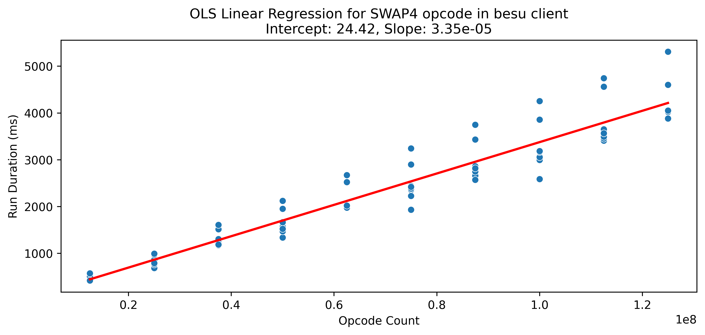


## geth


```python
                            OLS Regression Results                            
==============================================================================
Dep. Variable:        run_duration_ms   R-squared:                       0.993
Model:                            OLS   Adj. R-squared:                  0.993
Method:                 Least Squares   F-statistic:                 1.095e+04
Date:                Tue, 23 Dec 2025   Prob (F-statistic):           2.09e-80
Time:                        08:41:35   Log-Likelihood:                -351.31
No. Observations:                  74   AIC:                             706.6
Df Residuals:                      72   BIC:                             711.2
Df Model:                           1                                         
Covariance Type:            nonrobust                                         
==============================================================================
                 coef    std err          t      P>|t|      [0.025      0.975]
------------------------------------------------------------------------------
const         36.7815      7.130      5.159      0.000      22.568      50.995
opcount     9.677e-06   9.25e-08    104.631      0.000    9.49e-06    9.86e-06
==============================================================================
Omnibus:                       17.218   Durbin-Watson:                   1.874
Prob(Omnibus):                  0.000   Jarque-Bera (JB):               22.235
Skew:                           1.018   Prob(JB):                     1.49e-05
Kurtosis:                       4.751   Cond. No.                     1.67e+08
==============================================================================

Notes:
[1] Standard Errors assume that the covariance matrix of the errors is correctly specified.
[2] The condition number is large, 1.67e+08. This might indicate that there are
strong multicollinearity or other numerical problems.
```


# SWAP5

## nethermind


```python
                            OLS Regression Results                            
==============================================================================
Dep. Variable:        run_duration_ms   R-squared:                       0.838
Model:                            OLS   Adj. R-squared:                  0.836
Method:                 Least Squares   F-statistic:                     371.8
Date:                Tue, 23 Dec 2025   Prob (F-statistic):           3.75e-30
Time:                        08:41:35   Log-Likelihood:                -432.75
No. Observations:                  74   AIC:                             869.5
Df Residuals:                      72   BIC:                             874.1
Df Model:                           1                                         
Covariance Type:            nonrobust                                         
==============================================================================
                 coef    std err          t      P>|t|      [0.025      0.975]
------------------------------------------------------------------------------
const         17.8970     21.433      0.835      0.406     -24.830      60.624
opcount     5.361e-06   2.78e-07     19.282      0.000    4.81e-06    5.91e-06
==============================================================================
Omnibus:                       74.077   Durbin-Watson:                   1.073
Prob(Omnibus):                  0.000   Jarque-Bera (JB):              460.609
Skew:                           3.199   Prob(JB):                    9.55e-101
Kurtosis:                      13.415   Cond. No.                     1.67e+08
==============================================================================

Notes:
[1] Standard Errors assume that the covariance matrix of the errors is correctly specified.
[2] The condition number is large, 1.67e+08. This might indicate that there are
strong multicollinearity or other numerical problems.
```

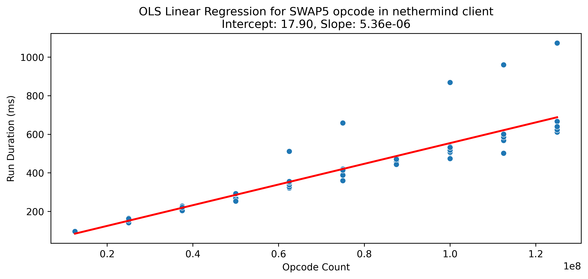


## reth


```python
                            OLS Regression Results                            
==============================================================================
Dep. Variable:        run_duration_ms   R-squared:                       0.993
Model:                            OLS   Adj. R-squared:                  0.993
Method:                 Least Squares   F-statistic:                 1.013e+04
Date:                Tue, 23 Dec 2025   Prob (F-statistic):           3.32e-79
Time:                        08:41:35   Log-Likelihood:                -289.31
No. Observations:                  74   AIC:                             582.6
Df Residuals:                      72   BIC:                             587.2
Df Model:                           1                                         
Covariance Type:            nonrobust                                         
==============================================================================
                 coef    std err          t      P>|t|      [0.025      0.975]
------------------------------------------------------------------------------
const         37.7105      3.085     12.224      0.000      31.561      43.860
opcount     4.028e-06      4e-08    100.660      0.000    3.95e-06    4.11e-06
==============================================================================
Omnibus:                        1.588   Durbin-Watson:                   2.301
Prob(Omnibus):                  0.452   Jarque-Bera (JB):                1.255
Skew:                           0.319   Prob(JB):                        0.534
Kurtosis:                       3.026   Cond. No.                     1.67e+08
==============================================================================

Notes:
[1] Standard Errors assume that the covariance matrix of the errors is correctly specified.
[2] The condition number is large, 1.67e+08. This might indicate that there are
strong multicollinearity or other numerical problems.
```


## besu


```python
                            OLS Regression Results                            
==============================================================================
Dep. Variable:        run_duration_ms   R-squared:                       0.915
Model:                            OLS   Adj. R-squared:                  0.914
Method:                 Least Squares   F-statistic:                     775.1
Date:                Tue, 23 Dec 2025   Prob (F-statistic):           2.81e-40
Time:                        08:41:36   Log-Likelihood:                -540.78
No. Observations:                  74   AIC:                             1086.
Df Residuals:                      72   BIC:                             1090.
Df Model:                           1                                         
Covariance Type:            nonrobust                                         
==============================================================================
                 coef    std err          t      P>|t|      [0.025      0.975]
------------------------------------------------------------------------------
const         31.8428     92.271      0.345      0.731    -152.097     215.782
opcount     3.332e-05    1.2e-06     27.840      0.000    3.09e-05    3.57e-05
==============================================================================
Omnibus:                       15.562   Durbin-Watson:                   0.742
Prob(Omnibus):                  0.000   Jarque-Bera (JB):               17.602
Skew:                           1.075   Prob(JB):                     0.000151
Kurtosis:                       4.044   Cond. No.                     1.67e+08
==============================================================================

Notes:
[1] Standard Errors assume that the covariance matrix of the errors is correctly specified.
[2] The condition number is large, 1.67e+08. This might indicate that there are
strong multicollinearity or other numerical problems.
```


## geth


```python
                            OLS Regression Results                            
==============================================================================
Dep. Variable:        run_duration_ms   R-squared:                       0.996
Model:                            OLS   Adj. R-squared:                  0.996
Method:                 Least Squares   F-statistic:                 1.654e+04
Date:                Tue, 23 Dec 2025   Prob (F-statistic):           7.98e-87
Time:                        08:41:36   Log-Likelihood:                -335.38
No. Observations:                  74   AIC:                             674.8
Df Residuals:                      72   BIC:                             679.4
Df Model:                           1                                         
Covariance Type:            nonrobust                                         
==============================================================================
                 coef    std err          t      P>|t|      [0.025      0.975]
------------------------------------------------------------------------------
const         39.6053      5.749      6.889      0.000      28.144      51.067
opcount     9.591e-06   7.46e-08    128.605      0.000    9.44e-06    9.74e-06
==============================================================================
Omnibus:                        9.982   Durbin-Watson:                   2.230
Prob(Omnibus):                  0.007   Jarque-Bera (JB):               11.040
Skew:                           0.664   Prob(JB):                      0.00401
Kurtosis:                       4.349   Cond. No.                     1.67e+08
==============================================================================

Notes:
[1] Standard Errors assume that the covariance matrix of the errors is correctly specified.
[2] The condition number is large, 1.67e+08. This might indicate that there are
strong multicollinearity or other numerical problems.
```


# SWAP6

## nethermind


```python
                            OLS Regression Results                            
==============================================================================
Dep. Variable:        run_duration_ms   R-squared:                       0.867
Model:                            OLS   Adj. R-squared:                  0.865
Method:                 Least Squares   F-statistic:                     470.3
Date:                Tue, 23 Dec 2025   Prob (F-statistic):           2.71e-33
Time:                        08:41:36   Log-Likelihood:                -422.51
No. Observations:                  74   AIC:                             849.0
Df Residuals:                      72   BIC:                             853.6
Df Model:                           1                                         
Covariance Type:            nonrobust                                         
==============================================================================
                 coef    std err          t      P>|t|      [0.025      0.975]
------------------------------------------------------------------------------
const         19.5225     18.662      1.046      0.299     -17.680      56.725
opcount     5.249e-06   2.42e-07     21.686      0.000    4.77e-06    5.73e-06
==============================================================================
Omnibus:                       95.053   Durbin-Watson:                   2.073
Prob(Omnibus):                  0.000   Jarque-Bera (JB):             1175.540
Skew:                           4.113   Prob(JB):                    5.43e-256
Kurtosis:                      20.708   Cond. No.                     1.67e+08
==============================================================================

Notes:
[1] Standard Errors assume that the covariance matrix of the errors is correctly specified.
[2] The condition number is large, 1.67e+08. This might indicate that there are
strong multicollinearity or other numerical problems.
```

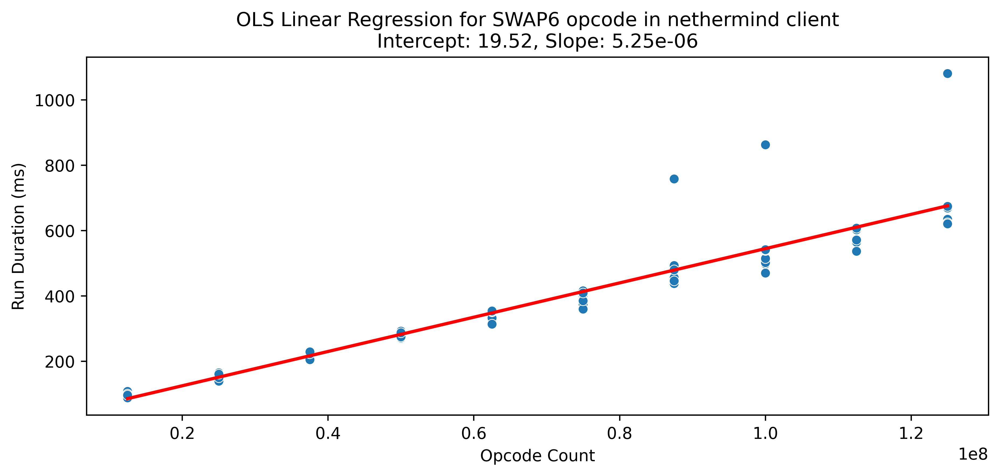


## reth


```python
                            OLS Regression Results                            
==============================================================================
Dep. Variable:        run_duration_ms   R-squared:                       0.991
Model:                            OLS   Adj. R-squared:                  0.991
Method:                 Least Squares   F-statistic:                     8140.
Date:                Tue, 23 Dec 2025   Prob (F-statistic):           8.27e-76
Time:                        08:41:36   Log-Likelihood:                -297.01
No. Observations:                  74   AIC:                             598.0
Df Residuals:                      72   BIC:                             602.6
Df Model:                           1                                         
Covariance Type:            nonrobust                                         
==============================================================================
                 coef    std err          t      P>|t|      [0.025      0.975]
------------------------------------------------------------------------------
const         39.4790      3.423     11.532      0.000      32.655      46.303
opcount     4.006e-06   4.44e-08     90.222      0.000    3.92e-06    4.09e-06
==============================================================================
Omnibus:                        6.250   Durbin-Watson:                   1.826
Prob(Omnibus):                  0.044   Jarque-Bera (JB):               10.253
Skew:                           0.053   Prob(JB):                      0.00594
Kurtosis:                       4.820   Cond. No.                     1.67e+08
==============================================================================

Notes:
[1] Standard Errors assume that the covariance matrix of the errors is correctly specified.
[2] The condition number is large, 1.67e+08. This might indicate that there are
strong multicollinearity or other numerical problems.
```


## besu


```python
                            OLS Regression Results                            
==============================================================================
Dep. Variable:        run_duration_ms   R-squared:                       0.919
Model:                            OLS   Adj. R-squared:                  0.918
Method:                 Least Squares   F-statistic:                     821.2
Date:                Tue, 23 Dec 2025   Prob (F-statistic):           4.17e-41
Time:                        08:41:36   Log-Likelihood:                -539.24
No. Observations:                  74   AIC:                             1082.
Df Residuals:                      72   BIC:                             1087.
Df Model:                           1                                         
Covariance Type:            nonrobust                                         
==============================================================================
                 coef    std err          t      P>|t|      [0.025      0.975]
------------------------------------------------------------------------------
const         23.8729     90.369      0.264      0.792    -156.274     204.020
opcount     3.359e-05   1.17e-06     28.656      0.000    3.13e-05    3.59e-05
==============================================================================
Omnibus:                       18.617   Durbin-Watson:                   0.539
Prob(Omnibus):                  0.000   Jarque-Bera (JB):               23.294
Skew:                           1.150   Prob(JB):                     8.75e-06
Kurtosis:                       4.506   Cond. No.                     1.67e+08
==============================================================================

Notes:
[1] Standard Errors assume that the covariance matrix of the errors is correctly specified.
[2] The condition number is large, 1.67e+08. This might indicate that there are
strong multicollinearity or other numerical problems.
```

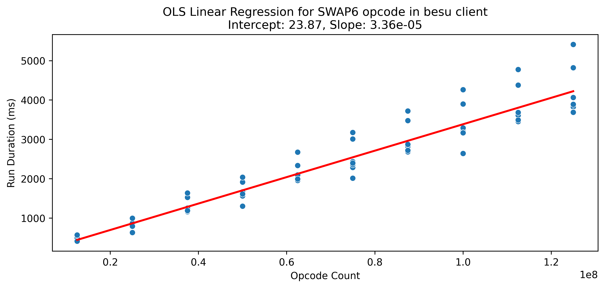


## geth


```python
                            OLS Regression Results                            
==============================================================================
Dep. Variable:        run_duration_ms   R-squared:                       0.996
Model:                            OLS   Adj. R-squared:                  0.996
Method:                 Least Squares   F-statistic:                 1.826e+04
Date:                Tue, 23 Dec 2025   Prob (F-statistic):           2.29e-88
Time:                        08:41:36   Log-Likelihood:                -331.92
No. Observations:                  74   AIC:                             667.8
Df Residuals:                      72   BIC:                             672.4
Df Model:                           1                                         
Covariance Type:            nonrobust                                         
==============================================================================
                 coef    std err          t      P>|t|      [0.025      0.975]
------------------------------------------------------------------------------
const         39.0854      5.487      7.124      0.000      28.148      50.023
opcount     9.617e-06   7.12e-08    135.136      0.000    9.48e-06    9.76e-06
==============================================================================
Omnibus:                       14.236   Durbin-Watson:                   1.992
Prob(Omnibus):                  0.001   Jarque-Bera (JB):               21.617
Skew:                           0.740   Prob(JB):                     2.02e-05
Kurtosis:                       5.195   Cond. No.                     1.67e+08
==============================================================================

Notes:
[1] Standard Errors assume that the covariance matrix of the errors is correctly specified.
[2] The condition number is large, 1.67e+08. This might indicate that there are
strong multicollinearity or other numerical problems.
```


# SWAP7

## nethermind


```python
                            OLS Regression Results                            
==============================================================================
Dep. Variable:        run_duration_ms   R-squared:                       0.990
Model:                            OLS   Adj. R-squared:                  0.990
Method:                 Least Squares   F-statistic:                     7497.
Date:                Tue, 23 Dec 2025   Prob (F-statistic):           1.56e-74
Time:                        08:41:36   Log-Likelihood:                -313.72
No. Observations:                  74   AIC:                             631.4
Df Residuals:                      72   BIC:                             636.0
Df Model:                           1                                         
Covariance Type:            nonrobust                                         
==============================================================================
                 coef    std err          t      P>|t|      [0.025      0.975]
------------------------------------------------------------------------------
const         34.0221      4.290      7.930      0.000      25.470      42.575
opcount     4.818e-06   5.56e-08     86.587      0.000    4.71e-06    4.93e-06
==============================================================================
Omnibus:                        2.516   Durbin-Watson:                   0.953
Prob(Omnibus):                  0.284   Jarque-Bera (JB):                2.002
Skew:                          -0.122   Prob(JB):                        0.368
Kurtosis:                       3.768   Cond. No.                     1.67e+08
==============================================================================

Notes:
[1] Standard Errors assume that the covariance matrix of the errors is correctly specified.
[2] The condition number is large, 1.67e+08. This might indicate that there are
strong multicollinearity or other numerical problems.
```

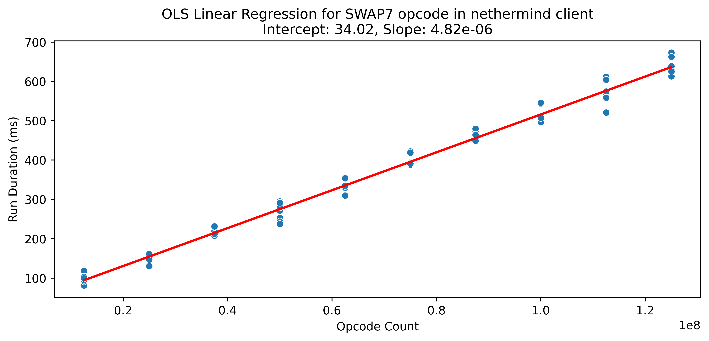


## reth


```python
                            OLS Regression Results                            
==============================================================================
Dep. Variable:        run_duration_ms   R-squared:                       0.990
Model:                            OLS   Adj. R-squared:                  0.990
Method:                 Least Squares   F-statistic:                     7201.
Date:                Tue, 23 Dec 2025   Prob (F-statistic):           6.55e-74
Time:                        08:41:37   Log-Likelihood:                -300.23
No. Observations:                  74   AIC:                             604.5
Df Residuals:                      72   BIC:                             609.1
Df Model:                           1                                         
Covariance Type:            nonrobust                                         
==============================================================================
                 coef    std err          t      P>|t|      [0.025      0.975]
------------------------------------------------------------------------------
const         41.1086      3.575     11.498      0.000      33.982      48.236
opcount     3.935e-06   4.64e-08     84.859      0.000    3.84e-06    4.03e-06
==============================================================================
Omnibus:                        6.375   Durbin-Watson:                   2.145
Prob(Omnibus):                  0.041   Jarque-Bera (JB):               10.161
Skew:                           0.134   Prob(JB):                      0.00622
Kurtosis:                       4.796   Cond. No.                     1.67e+08
==============================================================================

Notes:
[1] Standard Errors assume that the covariance matrix of the errors is correctly specified.
[2] The condition number is large, 1.67e+08. This might indicate that there are
strong multicollinearity or other numerical problems.
```


## besu


```python
                            OLS Regression Results                            
==============================================================================
Dep. Variable:        run_duration_ms   R-squared:                       0.922
Model:                            OLS   Adj. R-squared:                  0.921
Method:                 Least Squares   F-statistic:                     848.8
Date:                Tue, 23 Dec 2025   Prob (F-statistic):           1.39e-41
Time:                        08:41:37   Log-Likelihood:                -537.72
No. Observations:                  74   AIC:                             1079.
Df Residuals:                      72   BIC:                             1084.
Df Model:                           1                                         
Covariance Type:            nonrobust                                         
==============================================================================
                 coef    std err          t      P>|t|      [0.025      0.975]
------------------------------------------------------------------------------
const         34.7490     88.535      0.392      0.696    -141.743     211.241
opcount     3.346e-05   1.15e-06     29.134      0.000    3.12e-05    3.57e-05
==============================================================================
Omnibus:                       19.768   Durbin-Watson:                   0.746
Prob(Omnibus):                  0.000   Jarque-Bera (JB):               27.159
Skew:                           1.126   Prob(JB):                     1.27e-06
Kurtosis:                       4.934   Cond. No.                     1.67e+08
==============================================================================

Notes:
[1] Standard Errors assume that the covariance matrix of the errors is correctly specified.
[2] The condition number is large, 1.67e+08. This might indicate that there are
strong multicollinearity or other numerical problems.
```


## geth


```python
                            OLS Regression Results                            
==============================================================================
Dep. Variable:        run_duration_ms   R-squared:                       0.997
Model:                            OLS   Adj. R-squared:                  0.997
Method:                 Least Squares   F-statistic:                 2.414e+04
Date:                Tue, 23 Dec 2025   Prob (F-statistic):           1.03e-92
Time:                        08:41:37   Log-Likelihood:                -321.36
No. Observations:                  74   AIC:                             646.7
Df Residuals:                      72   BIC:                             651.3
Df Model:                           1                                         
Covariance Type:            nonrobust                                         
==============================================================================
                 coef    std err          t      P>|t|      [0.025      0.975]
------------------------------------------------------------------------------
const         40.3113      4.757      8.474      0.000      30.828      49.795
opcount     9.587e-06   6.17e-08    155.369      0.000    9.46e-06    9.71e-06
==============================================================================
Omnibus:                        4.673   Durbin-Watson:                   1.714
Prob(Omnibus):                  0.097   Jarque-Bera (JB):                3.898
Skew:                           0.438   Prob(JB):                        0.142
Kurtosis:                       3.706   Cond. No.                     1.67e+08
==============================================================================

Notes:
[1] Standard Errors assume that the covariance matrix of the errors is correctly specified.
[2] The condition number is large, 1.67e+08. This might indicate that there are
strong multicollinearity or other numerical problems.
```


# SWAP8

## nethermind


```python
                            OLS Regression Results                            
==============================================================================
Dep. Variable:        run_duration_ms   R-squared:                       0.857
Model:                            OLS   Adj. R-squared:                  0.855
Method:                 Least Squares   F-statistic:                     430.7
Date:                Tue, 23 Dec 2025   Prob (F-statistic):           4.19e-32
Time:                        08:41:37   Log-Likelihood:                -423.90
No. Observations:                  74   AIC:                             851.8
Df Residuals:                      72   BIC:                             856.4
Df Model:                           1                                         
Covariance Type:            nonrobust                                         
==============================================================================
                 coef    std err          t      P>|t|      [0.025      0.975]
------------------------------------------------------------------------------
const         33.7294     19.017      1.774      0.080      -4.181      71.640
opcount     5.119e-06   2.47e-07     20.753      0.000    4.63e-06    5.61e-06
==============================================================================
Omnibus:                       78.133   Durbin-Watson:                   1.257
Prob(Omnibus):                  0.000   Jarque-Bera (JB):              534.021
Skew:                           3.394   Prob(JB):                    1.09e-116
Kurtosis:                      14.275   Cond. No.                     1.67e+08
==============================================================================

Notes:
[1] Standard Errors assume that the covariance matrix of the errors is correctly specified.
[2] The condition number is large, 1.67e+08. This might indicate that there are
strong multicollinearity or other numerical problems.
```

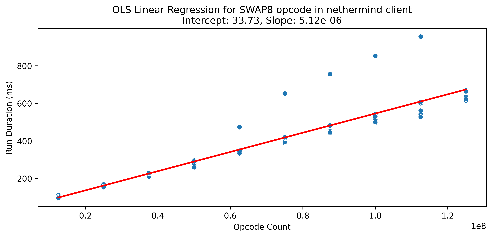


## reth


```python
                            OLS Regression Results                            
==============================================================================
Dep. Variable:        run_duration_ms   R-squared:                       0.995
Model:                            OLS   Adj. R-squared:                  0.995
Method:                 Least Squares   F-statistic:                 1.545e+04
Date:                Tue, 23 Dec 2025   Prob (F-statistic):           9.17e-86
Time:                        08:41:37   Log-Likelihood:                -273.79
No. Observations:                  74   AIC:                             551.6
Df Residuals:                      72   BIC:                             556.2
Df Model:                           1                                         
Covariance Type:            nonrobust                                         
==============================================================================
                 coef    std err          t      P>|t|      [0.025      0.975]
------------------------------------------------------------------------------
const         37.8836      2.501     15.146      0.000      32.898      42.870
opcount     4.033e-06   3.24e-08    124.299      0.000    3.97e-06     4.1e-06
==============================================================================
Omnibus:                        0.166   Durbin-Watson:                   1.364
Prob(Omnibus):                  0.920   Jarque-Bera (JB):                0.357
Skew:                          -0.039   Prob(JB):                        0.836
Kurtosis:                       2.669   Cond. No.                     1.67e+08
==============================================================================

Notes:
[1] Standard Errors assume that the covariance matrix of the errors is correctly specified.
[2] The condition number is large, 1.67e+08. This might indicate that there are
strong multicollinearity or other numerical problems.
```


## besu


```python
                            OLS Regression Results                            
==============================================================================
Dep. Variable:        run_duration_ms   R-squared:                       0.919
Model:                            OLS   Adj. R-squared:                  0.918
Method:                 Least Squares   F-statistic:                     817.6
Date:                Tue, 23 Dec 2025   Prob (F-statistic):           4.81e-41
Time:                        08:41:37   Log-Likelihood:                -539.49
No. Observations:                  74   AIC:                             1083.
Df Residuals:                      72   BIC:                             1088.
Df Model:                           1                                         
Covariance Type:            nonrobust                                         
==============================================================================
                 coef    std err          t      P>|t|      [0.025      0.975]
------------------------------------------------------------------------------
const         29.4484     90.683      0.325      0.746    -151.325     210.222
opcount     3.363e-05   1.18e-06     28.594      0.000    3.13e-05     3.6e-05
==============================================================================
Omnibus:                       17.553   Durbin-Watson:                   0.579
Prob(Omnibus):                  0.000   Jarque-Bera (JB):               21.232
Skew:                           1.117   Prob(JB):                     2.45e-05
Kurtosis:                       4.378   Cond. No.                     1.67e+08
==============================================================================

Notes:
[1] Standard Errors assume that the covariance matrix of the errors is correctly specified.
[2] The condition number is large, 1.67e+08. This might indicate that there are
strong multicollinearity or other numerical problems.
```

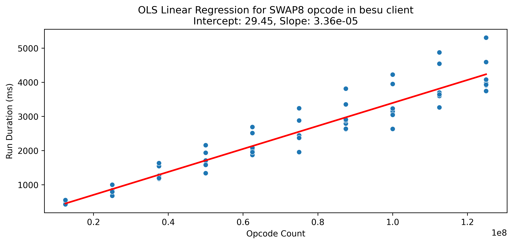


## geth


```python
                            OLS Regression Results                            
==============================================================================
Dep. Variable:        run_duration_ms   R-squared:                       0.983
Model:                            OLS   Adj. R-squared:                  0.983
Method:                 Least Squares   F-statistic:                     4218.
Date:                Tue, 23 Dec 2025   Prob (F-statistic):           1.17e-65
Time:                        08:41:37   Log-Likelihood:                -387.99
No. Observations:                  74   AIC:                             780.0
Df Residuals:                      72   BIC:                             784.6
Df Model:                           1                                         
Covariance Type:            nonrobust                                         
==============================================================================
                 coef    std err          t      P>|t|      [0.025      0.975]
------------------------------------------------------------------------------
const         36.3489     11.705      3.105      0.003      13.015      59.683
opcount     9.861e-06   1.52e-07     64.950      0.000    9.56e-06    1.02e-05
==============================================================================
Omnibus:                      114.172   Durbin-Watson:                   1.970
Prob(Omnibus):                  0.000   Jarque-Bera (JB):             3655.975
Skew:                           4.863   Prob(JB):                         0.00
Kurtosis:                      36.032   Cond. No.                     1.67e+08
==============================================================================

Notes:
[1] Standard Errors assume that the covariance matrix of the errors is correctly specified.
[2] The condition number is large, 1.67e+08. This might indicate that there are
strong multicollinearity or other numerical problems.
```


# SWAP9

## nethermind


```python
                            OLS Regression Results                            
==============================================================================
Dep. Variable:        run_duration_ms   R-squared:                       0.988
Model:                            OLS   Adj. R-squared:                  0.988
Method:                 Least Squares   F-statistic:                     6048.
Date:                Tue, 23 Dec 2025   Prob (F-statistic):           3.27e-71
Time:                        08:41:37   Log-Likelihood:                -320.06
No. Observations:                  74   AIC:                             644.1
Df Residuals:                      72   BIC:                             648.7
Df Model:                           1                                         
Covariance Type:            nonrobust                                         
==============================================================================
                 coef    std err          t      P>|t|      [0.025      0.975]
------------------------------------------------------------------------------
const         39.2614      4.674      8.400      0.000      29.944      48.579
opcount     4.715e-06   6.06e-08     77.770      0.000    4.59e-06    4.84e-06
==============================================================================
Omnibus:                        8.321   Durbin-Watson:                   1.475
Prob(Omnibus):                  0.016   Jarque-Bera (JB):               14.030
Skew:                          -0.305   Prob(JB):                     0.000898
Kurtosis:                       5.044   Cond. No.                     1.67e+08
==============================================================================

Notes:
[1] Standard Errors assume that the covariance matrix of the errors is correctly specified.
[2] The condition number is large, 1.67e+08. This might indicate that there are
strong multicollinearity or other numerical problems.
```


## reth


```python
                            OLS Regression Results                            
==============================================================================
Dep. Variable:        run_duration_ms   R-squared:                       0.989
Model:                            OLS   Adj. R-squared:                  0.989
Method:                 Least Squares   F-statistic:                     6585.
Date:                Tue, 23 Dec 2025   Prob (F-statistic):           1.59e-72
Time:                        08:41:38   Log-Likelihood:                -305.08
No. Observations:                  74   AIC:                             614.2
Df Residuals:                      72   BIC:                             618.8
Df Model:                           1                                         
Covariance Type:            nonrobust                                         
==============================================================================
                 coef    std err          t      P>|t|      [0.025      0.975]
------------------------------------------------------------------------------
const         38.1987      3.818     10.005      0.000      30.588      45.809
opcount     4.018e-06   4.95e-08     81.147      0.000    3.92e-06    4.12e-06
==============================================================================
Omnibus:                       47.677   Durbin-Watson:                   1.931
Prob(Omnibus):                  0.000   Jarque-Bera (JB):              235.133
Skew:                           1.820   Prob(JB):                     8.74e-52
Kurtosis:                      10.938   Cond. No.                     1.67e+08
==============================================================================

Notes:
[1] Standard Errors assume that the covariance matrix of the errors is correctly specified.
[2] The condition number is large, 1.67e+08. This might indicate that there are
strong multicollinearity or other numerical problems.
```


## besu


```python
                            OLS Regression Results                            
==============================================================================
Dep. Variable:        run_duration_ms   R-squared:                       0.917
Model:                            OLS   Adj. R-squared:                  0.916
Method:                 Least Squares   F-statistic:                     800.5
Date:                Tue, 23 Dec 2025   Prob (F-statistic):           9.69e-41
Time:                        08:41:38   Log-Likelihood:                -540.64
No. Observations:                  74   AIC:                             1085.
Df Residuals:                      72   BIC:                             1090.
Df Model:                           1                                         
Covariance Type:            nonrobust                                         
==============================================================================
                 coef    std err          t      P>|t|      [0.025      0.975]
------------------------------------------------------------------------------
const         22.6964     92.097      0.246      0.806    -160.896     206.289
opcount      3.38e-05   1.19e-06     28.293      0.000    3.14e-05    3.62e-05
==============================================================================
Omnibus:                       15.802   Durbin-Watson:                   0.823
Prob(Omnibus):                  0.000   Jarque-Bera (JB):               18.397
Skew:                           1.032   Prob(JB):                     0.000101
Kurtosis:                       4.307   Cond. No.                     1.67e+08
==============================================================================

Notes:
[1] Standard Errors assume that the covariance matrix of the errors is correctly specified.
[2] The condition number is large, 1.67e+08. This might indicate that there are
strong multicollinearity or other numerical problems.
```

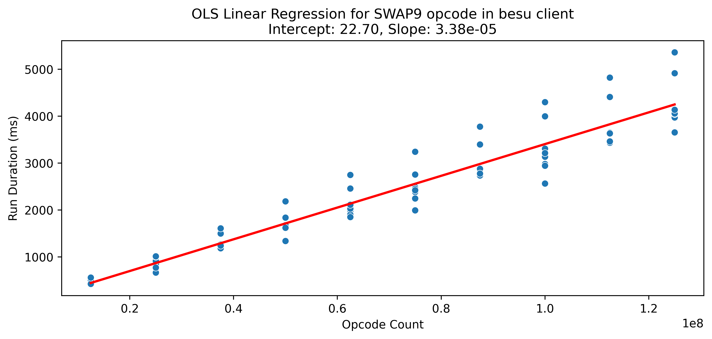


## geth


```python
                            OLS Regression Results                            
==============================================================================
Dep. Variable:        run_duration_ms   R-squared:                       0.994
Model:                            OLS   Adj. R-squared:                  0.994
Method:                 Least Squares   F-statistic:                 1.235e+04
Date:                Tue, 23 Dec 2025   Prob (F-statistic):           2.83e-82
Time:                        08:41:38   Log-Likelihood:                -347.60
No. Observations:                  74   AIC:                             699.2
Df Residuals:                      72   BIC:                             703.8
Df Model:                           1                                         
Covariance Type:            nonrobust                                         
==============================================================================
                 coef    std err          t      P>|t|      [0.025      0.975]
------------------------------------------------------------------------------
const         37.9070      6.782      5.590      0.000      24.388      51.426
opcount     9.774e-06    8.8e-08    111.111      0.000     9.6e-06    9.95e-06
==============================================================================
Omnibus:                        8.815   Durbin-Watson:                   1.607
Prob(Omnibus):                  0.012   Jarque-Bera (JB):                8.376
Skew:                           0.732   Prob(JB):                       0.0152
Kurtosis:                       3.759   Cond. No.                     1.67e+08
==============================================================================

Notes:
[1] Standard Errors assume that the covariance matrix of the errors is correctly specified.
[2] The condition number is large, 1.67e+08. This might indicate that there are
strong multicollinearity or other numerical problems.
```


# SWAP10

## nethermind


```python
                            OLS Regression Results                            
==============================================================================
Dep. Variable:        run_duration_ms   R-squared:                       0.991
Model:                            OLS   Adj. R-squared:                  0.991
Method:                 Least Squares   F-statistic:                     8115.
Date:                Tue, 23 Dec 2025   Prob (F-statistic):           9.24e-76
Time:                        08:41:38   Log-Likelihood:                -310.66
No. Observations:                  74   AIC:                             625.3
Df Residuals:                      72   BIC:                             629.9
Df Model:                           1                                         
Covariance Type:            nonrobust                                         
==============================================================================
                 coef    std err          t      P>|t|      [0.025      0.975]
------------------------------------------------------------------------------
const         37.8650      4.117      9.198      0.000      29.658      46.072
opcount      4.81e-06   5.34e-08     90.081      0.000     4.7e-06    4.92e-06
==============================================================================
Omnibus:                        9.320   Durbin-Watson:                   1.084
Prob(Omnibus):                  0.009   Jarque-Bera (JB):               10.169
Skew:                           0.626   Prob(JB):                      0.00619
Kurtosis:                       4.315   Cond. No.                     1.67e+08
==============================================================================

Notes:
[1] Standard Errors assume that the covariance matrix of the errors is correctly specified.
[2] The condition number is large, 1.67e+08. This might indicate that there are
strong multicollinearity or other numerical problems.
```

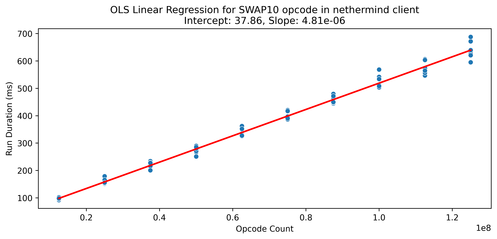


## reth


```python
                            OLS Regression Results                            
==============================================================================
Dep. Variable:        run_duration_ms   R-squared:                       0.982
Model:                            OLS   Adj. R-squared:                  0.982
Method:                 Least Squares   F-statistic:                     3928.
Date:                Tue, 23 Dec 2025   Prob (F-statistic):           1.47e-64
Time:                        08:41:38   Log-Likelihood:                -324.76
No. Observations:                  74   AIC:                             653.5
Df Residuals:                      72   BIC:                             658.1
Df Model:                           1                                         
Covariance Type:            nonrobust                                         
==============================================================================
                 coef    std err          t      P>|t|      [0.025      0.975]
------------------------------------------------------------------------------
const         39.0435      4.980      7.839      0.000      29.115      48.972
opcount     4.049e-06   6.46e-08     62.671      0.000    3.92e-06    4.18e-06
==============================================================================
Omnibus:                       87.468   Durbin-Watson:                   1.758
Prob(Omnibus):                  0.000   Jarque-Bera (JB):             1497.951
Skew:                           3.373   Prob(JB):                         0.00
Kurtosis:                      23.984   Cond. No.                     1.67e+08
==============================================================================

Notes:
[1] Standard Errors assume that the covariance matrix of the errors is correctly specified.
[2] The condition number is large, 1.67e+08. This might indicate that there are
strong multicollinearity or other numerical problems.
```


## besu


```python
                            OLS Regression Results                            
==============================================================================
Dep. Variable:        run_duration_ms   R-squared:                       0.925
Model:                            OLS   Adj. R-squared:                  0.924
Method:                 Least Squares   F-statistic:                     890.3
Date:                Tue, 23 Dec 2025   Prob (F-statistic):           2.84e-42
Time:                        08:41:38   Log-Likelihood:                -536.85
No. Observations:                  74   AIC:                             1078.
Df Residuals:                      72   BIC:                             1082.
Df Model:                           1                                         
Covariance Type:            nonrobust                                         
==============================================================================
                 coef    std err          t      P>|t|      [0.025      0.975]
------------------------------------------------------------------------------
const         12.7427     87.507      0.146      0.885    -161.699     187.184
opcount     3.387e-05   1.14e-06     29.838      0.000    3.16e-05    3.61e-05
==============================================================================
Omnibus:                       15.672   Durbin-Watson:                   0.356
Prob(Omnibus):                  0.000   Jarque-Bera (JB):               18.125
Skew:                           1.032   Prob(JB):                     0.000116
Kurtosis:                       4.274   Cond. No.                     1.67e+08
==============================================================================

Notes:
[1] Standard Errors assume that the covariance matrix of the errors is correctly specified.
[2] The condition number is large, 1.67e+08. This might indicate that there are
strong multicollinearity or other numerical problems.
```

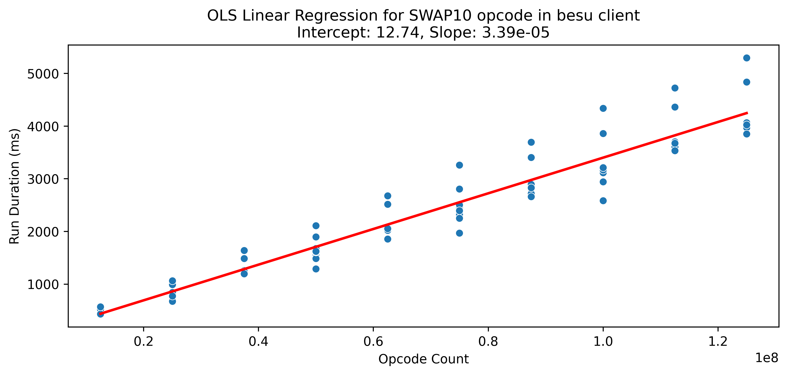


## geth


```python
                            OLS Regression Results                            
==============================================================================
Dep. Variable:        run_duration_ms   R-squared:                       0.970
Model:                            OLS   Adj. R-squared:                  0.970
Method:                 Least Squares   F-statistic:                     2348.
Date:                Tue, 23 Dec 2025   Prob (F-statistic):           1.06e-56
Time:                        08:41:38   Log-Likelihood:                -411.36
No. Observations:                  74   AIC:                             826.7
Df Residuals:                      72   BIC:                             831.3
Df Model:                           1                                         
Covariance Type:            nonrobust                                         
==============================================================================
                 coef    std err          t      P>|t|      [0.025      0.975]
------------------------------------------------------------------------------
const         28.2080     16.052      1.757      0.083      -3.790      60.206
opcount     1.009e-05   2.08e-07     48.458      0.000    9.67e-06    1.05e-05
==============================================================================
Omnibus:                       96.637   Durbin-Watson:                   1.525
Prob(Omnibus):                  0.000   Jarque-Bera (JB):             1487.407
Skew:                           4.066   Prob(JB):                         0.00
Kurtosis:                      23.403   Cond. No.                     1.67e+08
==============================================================================

Notes:
[1] Standard Errors assume that the covariance matrix of the errors is correctly specified.
[2] The condition number is large, 1.67e+08. This might indicate that there are
strong multicollinearity or other numerical problems.
```

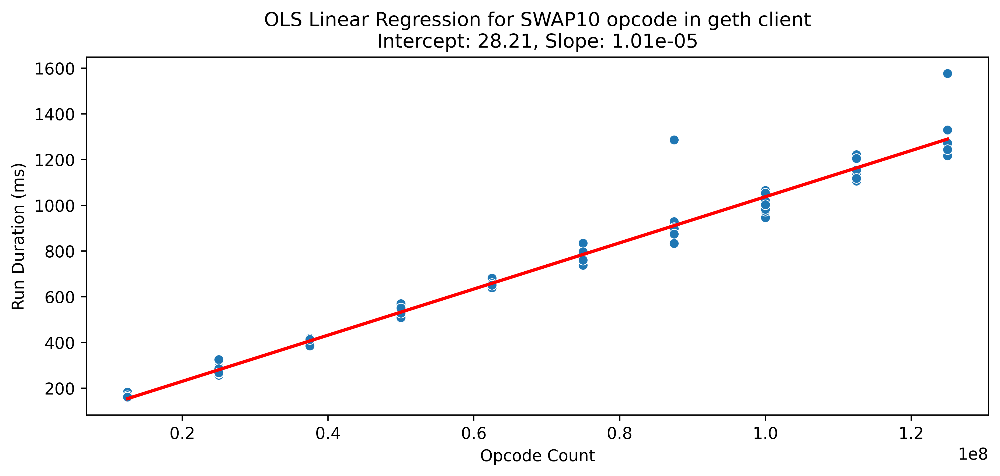


# SWAP11

## nethermind


```python
                            OLS Regression Results                            
==============================================================================
Dep. Variable:        run_duration_ms   R-squared:                       0.991
Model:                            OLS   Adj. R-squared:                  0.991
Method:                 Least Squares   F-statistic:                     8195.
Date:                Tue, 23 Dec 2025   Prob (F-statistic):           6.52e-76
Time:                        08:41:39   Log-Likelihood:                -309.41
No. Observations:                  74   AIC:                             622.8
Df Residuals:                      72   BIC:                             627.4
Df Model:                           1                                         
Covariance Type:            nonrobust                                         
==============================================================================
                 coef    std err          t      P>|t|      [0.025      0.975]
------------------------------------------------------------------------------
const         39.0189      4.048      9.640      0.000      30.950      47.088
opcount     4.753e-06   5.25e-08     90.524      0.000    4.65e-06    4.86e-06
==============================================================================
Omnibus:                        1.554   Durbin-Watson:                   1.103
Prob(Omnibus):                  0.460   Jarque-Bera (JB):                0.930
Skew:                           0.064   Prob(JB):                        0.628
Kurtosis:                       3.534   Cond. No.                     1.67e+08
==============================================================================

Notes:
[1] Standard Errors assume that the covariance matrix of the errors is correctly specified.
[2] The condition number is large, 1.67e+08. This might indicate that there are
strong multicollinearity or other numerical problems.
```

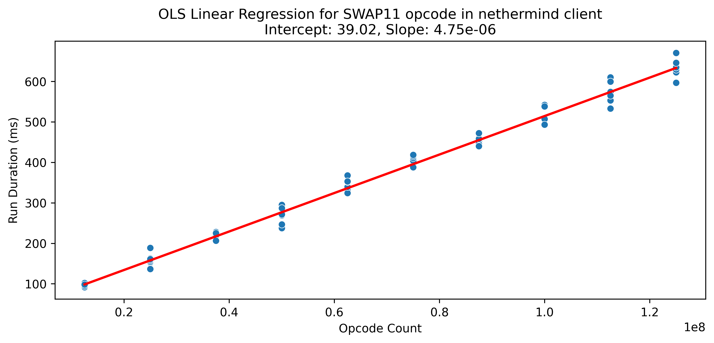


## reth


```python
                            OLS Regression Results                            
==============================================================================
Dep. Variable:        run_duration_ms   R-squared:                       0.992
Model:                            OLS   Adj. R-squared:                  0.992
Method:                 Least Squares   F-statistic:                     8549.
Date:                Tue, 23 Dec 2025   Prob (F-statistic):           1.44e-76
Time:                        08:41:39   Log-Likelihood:                -295.74
No. Observations:                  74   AIC:                             595.5
Df Residuals:                      72   BIC:                             600.1
Df Model:                           1                                         
Covariance Type:            nonrobust                                         
==============================================================================
                 coef    std err          t      P>|t|      [0.025      0.975]
------------------------------------------------------------------------------
const         38.7545      3.365     11.517      0.000      32.046      45.463
opcount     4.036e-06   4.36e-08     92.461      0.000    3.95e-06    4.12e-06
==============================================================================
Omnibus:                        2.138   Durbin-Watson:                   1.885
Prob(Omnibus):                  0.343   Jarque-Bera (JB):                1.430
Skew:                          -0.222   Prob(JB):                        0.489
Kurtosis:                       3.516   Cond. No.                     1.67e+08
==============================================================================

Notes:
[1] Standard Errors assume that the covariance matrix of the errors is correctly specified.
[2] The condition number is large, 1.67e+08. This might indicate that there are
strong multicollinearity or other numerical problems.
```

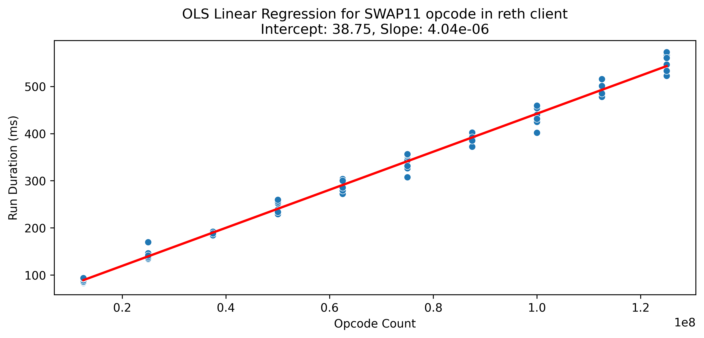


## besu


```python
                            OLS Regression Results                            
==============================================================================
Dep. Variable:        run_duration_ms   R-squared:                       0.921
Model:                            OLS   Adj. R-squared:                  0.920
Method:                 Least Squares   F-statistic:                     843.1
Date:                Tue, 23 Dec 2025   Prob (F-statistic):           1.74e-41
Time:                        08:41:39   Log-Likelihood:                -538.98
No. Observations:                  74   AIC:                             1082.
Df Residuals:                      72   BIC:                             1087.
Df Model:                           1                                         
Covariance Type:            nonrobust                                         
==============================================================================
                 coef    std err          t      P>|t|      [0.025      0.975]
------------------------------------------------------------------------------
const          5.7656     90.053      0.064      0.949    -173.752     185.283
opcount     3.392e-05   1.17e-06     29.036      0.000    3.16e-05    3.62e-05
==============================================================================
Omnibus:                       15.223   Durbin-Watson:                   0.483
Prob(Omnibus):                  0.000   Jarque-Bera (JB):               17.154
Skew:                           1.043   Prob(JB):                     0.000188
Kurtosis:                       4.101   Cond. No.                     1.67e+08
==============================================================================

Notes:
[1] Standard Errors assume that the covariance matrix of the errors is correctly specified.
[2] The condition number is large, 1.67e+08. This might indicate that there are
strong multicollinearity or other numerical problems.
```

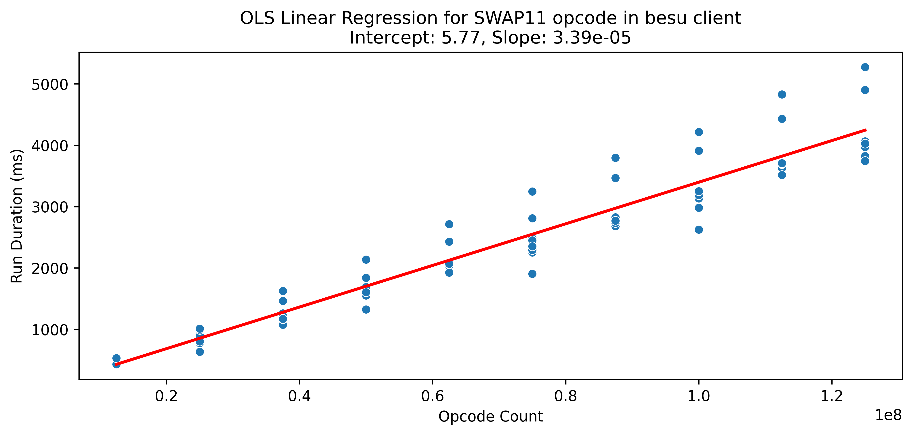


## geth


```python
                            OLS Regression Results                            
==============================================================================
Dep. Variable:        run_duration_ms   R-squared:                       0.993
Model:                            OLS   Adj. R-squared:                  0.993
Method:                 Least Squares   F-statistic:                 1.051e+04
Date:                Tue, 23 Dec 2025   Prob (F-statistic):           9.00e-80
Time:                        08:41:39   Log-Likelihood:                -353.80
No. Observations:                  74   AIC:                             711.6
Df Residuals:                      72   BIC:                             716.2
Df Model:                           1                                         
Covariance Type:            nonrobust                                         
==============================================================================
                 coef    std err          t      P>|t|      [0.025      0.975]
------------------------------------------------------------------------------
const         31.9444      7.375      4.332      0.000      17.243      46.645
opcount     9.806e-06   9.57e-08    102.514      0.000    9.62e-06       1e-05
==============================================================================
Omnibus:                       41.642   Durbin-Watson:                   1.815
Prob(Omnibus):                  0.000   Jarque-Bera (JB):              161.482
Skew:                           1.644   Prob(JB):                     8.60e-36
Kurtosis:                       9.447   Cond. No.                     1.67e+08
==============================================================================

Notes:
[1] Standard Errors assume that the covariance matrix of the errors is correctly specified.
[2] The condition number is large, 1.67e+08. This might indicate that there are
strong multicollinearity or other numerical problems.
```


# SWAP12

## nethermind


```python
                            OLS Regression Results                            
==============================================================================
Dep. Variable:        run_duration_ms   R-squared:                       0.993
Model:                            OLS   Adj. R-squared:                  0.993
Method:                 Least Squares   F-statistic:                     9931.
Date:                Tue, 23 Dec 2025   Prob (F-statistic):           6.81e-79
Time:                        08:41:39   Log-Likelihood:                -303.61
No. Observations:                  74   AIC:                             611.2
Df Residuals:                      72   BIC:                             615.8
Df Model:                           1                                         
Covariance Type:            nonrobust                                         
==============================================================================
                 coef    std err          t      P>|t|      [0.025      0.975]
------------------------------------------------------------------------------
const         35.1851      3.742      9.402      0.000      27.725      42.645
opcount     4.837e-06   4.85e-08     99.653      0.000    4.74e-06    4.93e-06
==============================================================================
Omnibus:                       16.370   Durbin-Watson:                   1.078
Prob(Omnibus):                  0.000   Jarque-Bera (JB):               25.956
Skew:                           0.836   Prob(JB):                     2.31e-06
Kurtosis:                       5.371   Cond. No.                     1.67e+08
==============================================================================

Notes:
[1] Standard Errors assume that the covariance matrix of the errors is correctly specified.
[2] The condition number is large, 1.67e+08. This might indicate that there are
strong multicollinearity or other numerical problems.
```

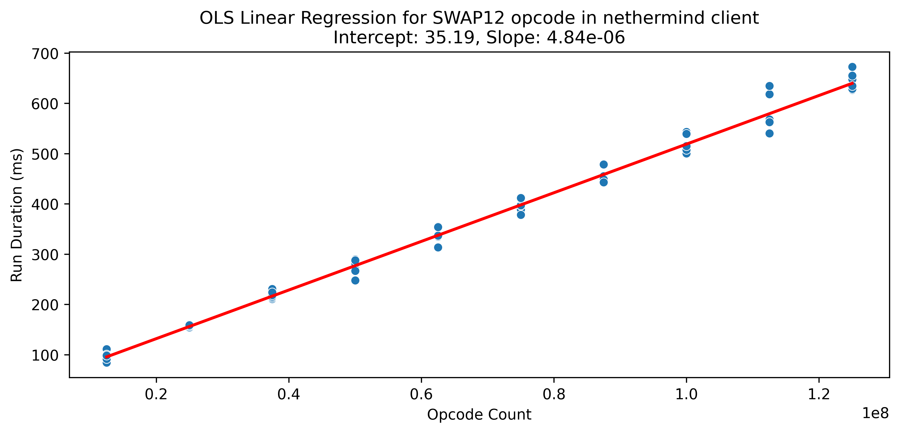


## reth


```python
                            OLS Regression Results                            
==============================================================================
Dep. Variable:        run_duration_ms   R-squared:                       0.949
Model:                            OLS   Adj. R-squared:                  0.948
Method:                 Least Squares   F-statistic:                     1345.
Date:                Tue, 23 Dec 2025   Prob (F-statistic):           2.51e-48
Time:                        08:41:39   Log-Likelihood:                -366.13
No. Observations:                  74   AIC:                             736.3
Df Residuals:                      72   BIC:                             740.9
Df Model:                           1                                         
Covariance Type:            nonrobust                                         
==============================================================================
                 coef    std err          t      P>|t|      [0.025      0.975]
------------------------------------------------------------------------------
const         33.9212      8.711      3.894      0.000      16.556      51.287
opcount     4.144e-06   1.13e-07     36.672      0.000    3.92e-06    4.37e-06
==============================================================================
Omnibus:                      140.758   Durbin-Watson:                   2.180
Prob(Omnibus):                  0.000   Jarque-Bera (JB):             8480.881
Skew:                           6.705   Prob(JB):                         0.00
Kurtosis:                      53.702   Cond. No.                     1.67e+08
==============================================================================

Notes:
[1] Standard Errors assume that the covariance matrix of the errors is correctly specified.
[2] The condition number is large, 1.67e+08. This might indicate that there are
strong multicollinearity or other numerical problems.
```

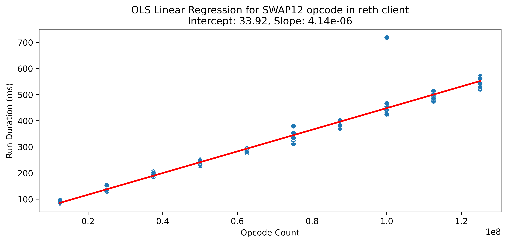


## besu


```python
                            OLS Regression Results                            
==============================================================================
Dep. Variable:        run_duration_ms   R-squared:                       0.922
Model:                            OLS   Adj. R-squared:                  0.921
Method:                 Least Squares   F-statistic:                     850.6
Date:                Tue, 23 Dec 2025   Prob (F-statistic):           1.30e-41
Time:                        08:41:39   Log-Likelihood:                -538.36
No. Observations:                  74   AIC:                             1081.
Df Residuals:                      72   BIC:                             1085.
Df Model:                           1                                         
Covariance Type:            nonrobust                                         
==============================================================================
                 coef    std err          t      P>|t|      [0.025      0.975]
------------------------------------------------------------------------------
const         23.9941     89.306      0.269      0.789    -154.034     202.023
opcount     3.378e-05   1.16e-06     29.165      0.000    3.15e-05    3.61e-05
==============================================================================
Omnibus:                       14.114   Durbin-Watson:                   0.689
Prob(Omnibus):                  0.001   Jarque-Bera (JB):               15.760
Skew:                           0.955   Prob(JB):                     0.000378
Kurtosis:                       4.211   Cond. No.                     1.67e+08
==============================================================================

Notes:
[1] Standard Errors assume that the covariance matrix of the errors is correctly specified.
[2] The condition number is large, 1.67e+08. This might indicate that there are
strong multicollinearity or other numerical problems.
```

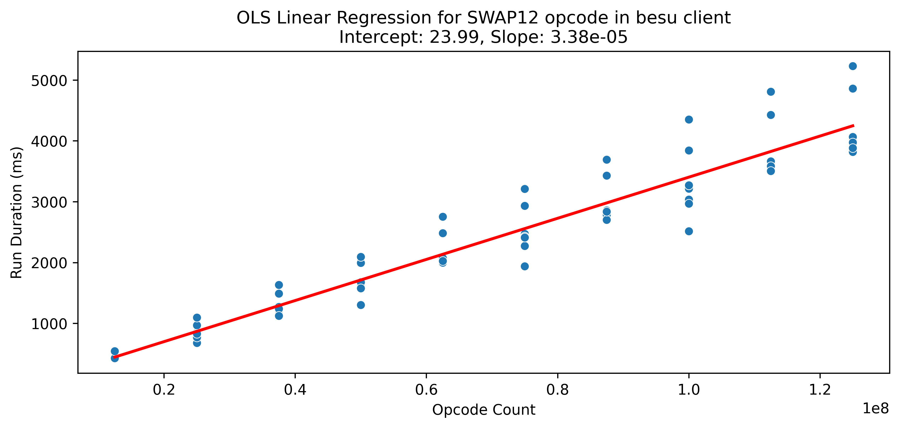


## geth


```python
                            OLS Regression Results                            
==============================================================================
Dep. Variable:        run_duration_ms   R-squared:                       0.978
Model:                            OLS   Adj. R-squared:                  0.978
Method:                 Least Squares   F-statistic:                     3207.
Date:                Tue, 23 Dec 2025   Prob (F-statistic):           1.89e-61
Time:                        08:41:40   Log-Likelihood:                -395.88
No. Observations:                  74   AIC:                             795.8
Df Residuals:                      72   BIC:                             800.4
Df Model:                           1                                         
Covariance Type:            nonrobust                                         
==============================================================================
                 coef    std err          t      P>|t|      [0.025      0.975]
------------------------------------------------------------------------------
const         50.4228     13.022      3.872      0.000      24.463      76.382
opcount     9.565e-06   1.69e-07     56.627      0.000    9.23e-06     9.9e-06
==============================================================================
Omnibus:                      115.244   Durbin-Watson:                   1.974
Prob(Omnibus):                  0.000   Jarque-Bera (JB):             3689.116
Skew:                           4.948   Prob(JB):                         0.00
Kurtosis:                      36.144   Cond. No.                     1.67e+08
==============================================================================

Notes:
[1] Standard Errors assume that the covariance matrix of the errors is correctly specified.
[2] The condition number is large, 1.67e+08. This might indicate that there are
strong multicollinearity or other numerical problems.
```


# SWAP13

## nethermind


```python
                            OLS Regression Results                            
==============================================================================
Dep. Variable:        run_duration_ms   R-squared:                       0.994
Model:                            OLS   Adj. R-squared:                  0.993
Method:                 Least Squares   F-statistic:                 1.108e+04
Date:                Tue, 23 Dec 2025   Prob (F-statistic):           1.36e-80
Time:                        08:41:40   Log-Likelihood:                -299.37
No. Observations:                  74   AIC:                             602.7
Df Residuals:                      72   BIC:                             607.3
Df Model:                           1                                         
Covariance Type:            nonrobust                                         
==============================================================================
                 coef    std err          t      P>|t|      [0.025      0.975]
------------------------------------------------------------------------------
const         37.3397      3.534     10.566      0.000      30.295      44.385
opcount     4.825e-06   4.58e-08    105.255      0.000    4.73e-06    4.92e-06
==============================================================================
Omnibus:                        8.196   Durbin-Watson:                   1.288
Prob(Omnibus):                  0.017   Jarque-Bera (JB):                8.004
Skew:                           0.796   Prob(JB):                       0.0183
Kurtosis:                       3.248   Cond. No.                     1.67e+08
==============================================================================

Notes:
[1] Standard Errors assume that the covariance matrix of the errors is correctly specified.
[2] The condition number is large, 1.67e+08. This might indicate that there are
strong multicollinearity or other numerical problems.
```

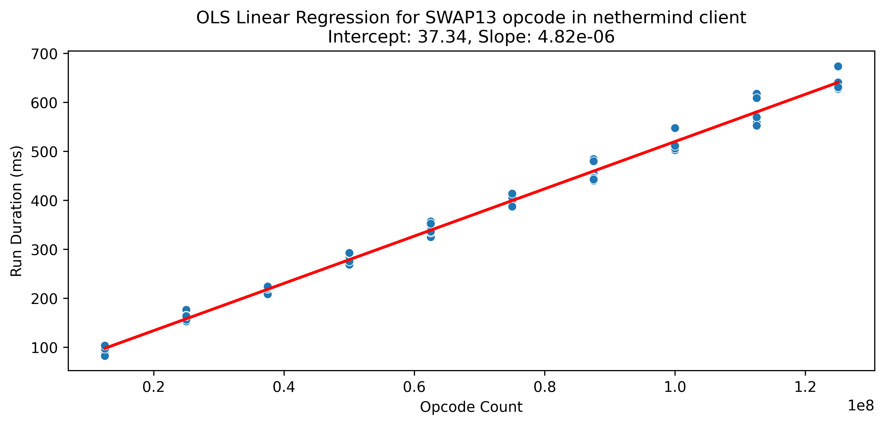


## reth


```python
                            OLS Regression Results                            
==============================================================================
Dep. Variable:        run_duration_ms   R-squared:                       0.990
Model:                            OLS   Adj. R-squared:                  0.990
Method:                 Least Squares   F-statistic:                     7350.
Date:                Tue, 23 Dec 2025   Prob (F-statistic):           3.15e-74
Time:                        08:41:40   Log-Likelihood:                -301.36
No. Observations:                  74   AIC:                             606.7
Df Residuals:                      72   BIC:                             611.3
Df Model:                           1                                         
Covariance Type:            nonrobust                                         
==============================================================================
                 coef    std err          t      P>|t|      [0.025      0.975]
------------------------------------------------------------------------------
const         38.9911      3.630     10.741      0.000      31.754      46.228
opcount     4.037e-06   4.71e-08     85.733      0.000    3.94e-06    4.13e-06
==============================================================================
Omnibus:                       68.105   Durbin-Watson:                   1.858
Prob(Omnibus):                  0.000   Jarque-Bera (JB):              593.300
Skew:                           2.604   Prob(JB):                    1.47e-129
Kurtosis:                      15.857   Cond. No.                     1.67e+08
==============================================================================

Notes:
[1] Standard Errors assume that the covariance matrix of the errors is correctly specified.
[2] The condition number is large, 1.67e+08. This might indicate that there are
strong multicollinearity or other numerical problems.
```


## besu


```python
                            OLS Regression Results                            
==============================================================================
Dep. Variable:        run_duration_ms   R-squared:                       0.924
Model:                            OLS   Adj. R-squared:                  0.923
Method:                 Least Squares   F-statistic:                     873.1
Date:                Tue, 23 Dec 2025   Prob (F-statistic):           5.43e-42
Time:                        08:41:40   Log-Likelihood:                -538.23
No. Observations:                  74   AIC:                             1080.
Df Residuals:                      72   BIC:                             1085.
Df Model:                           1                                         
Covariance Type:            nonrobust                                         
==============================================================================
                 coef    std err          t      P>|t|      [0.025      0.975]
------------------------------------------------------------------------------
const          2.4933     89.146      0.028      0.978    -175.217     180.203
opcount     3.417e-05   1.16e-06     29.548      0.000    3.19e-05    3.65e-05
==============================================================================
Omnibus:                       18.730   Durbin-Watson:                   0.880
Prob(Omnibus):                  0.000   Jarque-Bera (JB):               23.848
Skew:                           1.135   Prob(JB):                     6.63e-06
Kurtosis:                       4.608   Cond. No.                     1.67e+08
==============================================================================

Notes:
[1] Standard Errors assume that the covariance matrix of the errors is correctly specified.
[2] The condition number is large, 1.67e+08. This might indicate that there are
strong multicollinearity or other numerical problems.
```

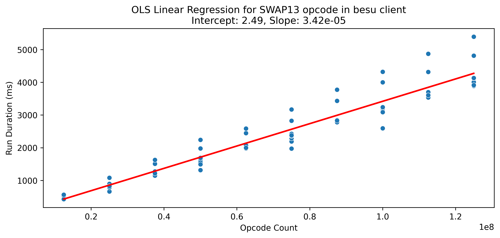


## geth


```python
                            OLS Regression Results                            
==============================================================================
Dep. Variable:        run_duration_ms   R-squared:                       0.994
Model:                            OLS   Adj. R-squared:                  0.994
Method:                 Least Squares   F-statistic:                 1.133e+04
Date:                Tue, 23 Dec 2025   Prob (F-statistic):           6.15e-81
Time:                        08:41:40   Log-Likelihood:                -349.92
No. Observations:                  74   AIC:                             703.8
Df Residuals:                      72   BIC:                             708.4
Df Model:                           1                                         
Covariance Type:            nonrobust                                         
==============================================================================
                 coef    std err          t      P>|t|      [0.025      0.975]
------------------------------------------------------------------------------
const         41.7242      6.998      5.963      0.000      27.775      55.674
opcount      9.66e-06   9.08e-08    106.432      0.000    9.48e-06    9.84e-06
==============================================================================
Omnibus:                        6.566   Durbin-Watson:                   1.943
Prob(Omnibus):                  0.038   Jarque-Bera (JB):                8.251
Skew:                           0.337   Prob(JB):                       0.0162
Kurtosis:                       4.490   Cond. No.                     1.67e+08
==============================================================================

Notes:
[1] Standard Errors assume that the covariance matrix of the errors is correctly specified.
[2] The condition number is large, 1.67e+08. This might indicate that there are
strong multicollinearity or other numerical problems.
```

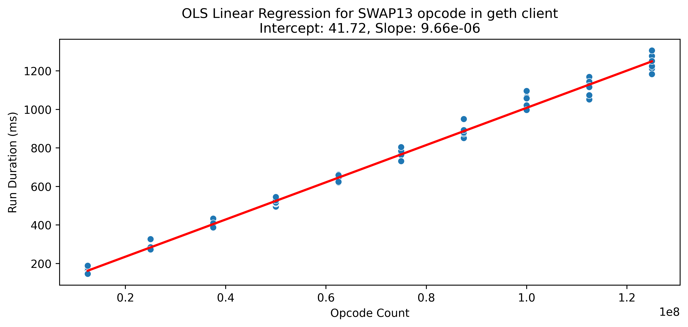


# SWAP14

## nethermind


```python
                            OLS Regression Results                            
==============================================================================
Dep. Variable:        run_duration_ms   R-squared:                       0.988
Model:                            OLS   Adj. R-squared:                  0.987
Method:                 Least Squares   F-statistic:                     5736.
Date:                Tue, 23 Dec 2025   Prob (F-statistic):           2.15e-70
Time:                        08:41:40   Log-Likelihood:                -323.06
No. Observations:                  74   AIC:                             650.1
Df Residuals:                      72   BIC:                             654.7
Df Model:                           1                                         
Covariance Type:            nonrobust                                         
==============================================================================
                 coef    std err          t      P>|t|      [0.025      0.975]
------------------------------------------------------------------------------
const         36.9809      4.868      7.597      0.000      27.277      46.685
opcount     4.782e-06   6.31e-08     75.740      0.000    4.66e-06    4.91e-06
==============================================================================
Omnibus:                       23.140   Durbin-Watson:                   1.295
Prob(Omnibus):                  0.000   Jarque-Bera (JB):               50.021
Skew:                          -1.028   Prob(JB):                     1.37e-11
Kurtosis:                       6.464   Cond. No.                     1.67e+08
==============================================================================

Notes:
[1] Standard Errors assume that the covariance matrix of the errors is correctly specified.
[2] The condition number is large, 1.67e+08. This might indicate that there are
strong multicollinearity or other numerical problems.
```


## reth


```python
                            OLS Regression Results                            
==============================================================================
Dep. Variable:        run_duration_ms   R-squared:                       0.990
Model:                            OLS   Adj. R-squared:                  0.990
Method:                 Least Squares   F-statistic:                     6925.
Date:                Tue, 23 Dec 2025   Prob (F-statistic):           2.64e-73
Time:                        08:41:40   Log-Likelihood:                -304.96
No. Observations:                  74   AIC:                             613.9
Df Residuals:                      72   BIC:                             618.5
Df Model:                           1                                         
Covariance Type:            nonrobust                                         
==============================================================================
                 coef    std err          t      P>|t|      [0.025      0.975]
------------------------------------------------------------------------------
const         34.3856      3.811      9.022      0.000      26.788      41.983
opcount     4.114e-06   4.94e-08     83.217      0.000    4.02e-06    4.21e-06
==============================================================================
Omnibus:                       28.683   Durbin-Watson:                   1.987
Prob(Omnibus):                  0.000   Jarque-Bera (JB):              101.440
Skew:                           1.059   Prob(JB):                     9.39e-23
Kurtosis:                       8.331   Cond. No.                     1.67e+08
==============================================================================

Notes:
[1] Standard Errors assume that the covariance matrix of the errors is correctly specified.
[2] The condition number is large, 1.67e+08. This might indicate that there are
strong multicollinearity or other numerical problems.
```

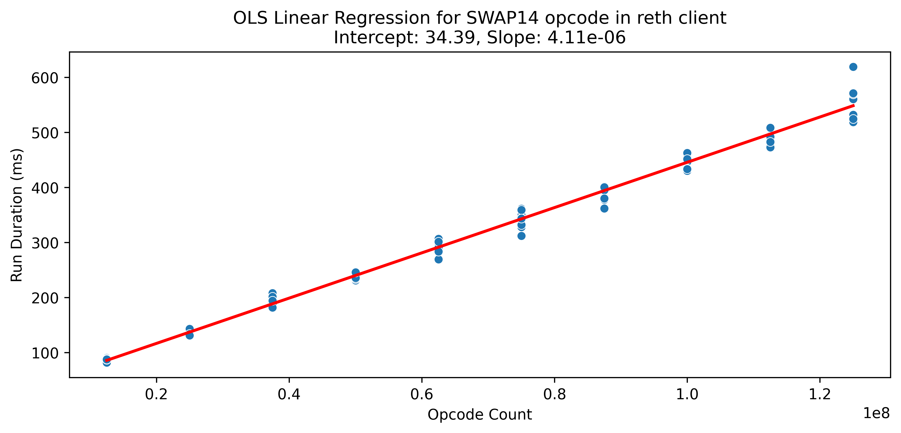


## besu


```python
                            OLS Regression Results                            
==============================================================================
Dep. Variable:        run_duration_ms   R-squared:                       0.918
Model:                            OLS   Adj. R-squared:                  0.916
Method:                 Least Squares   F-statistic:                     801.0
Date:                Tue, 23 Dec 2025   Prob (F-statistic):           9.51e-41
Time:                        08:41:41   Log-Likelihood:                -540.22
No. Observations:                  74   AIC:                             1084.
Df Residuals:                      72   BIC:                             1089.
Df Model:                           1                                         
Covariance Type:            nonrobust                                         
==============================================================================
                 coef    std err          t      P>|t|      [0.025      0.975]
------------------------------------------------------------------------------
const         25.8654     91.575      0.282      0.778    -156.687     208.418
opcount     3.362e-05   1.19e-06     28.301      0.000    3.12e-05     3.6e-05
==============================================================================
Omnibus:                       17.508   Durbin-Watson:                   0.357
Prob(Omnibus):                  0.000   Jarque-Bera (JB):               20.969
Skew:                           1.131   Prob(JB):                     2.80e-05
Kurtosis:                       4.297   Cond. No.                     1.67e+08
==============================================================================

Notes:
[1] Standard Errors assume that the covariance matrix of the errors is correctly specified.
[2] The condition number is large, 1.67e+08. This might indicate that there are
strong multicollinearity or other numerical problems.
```

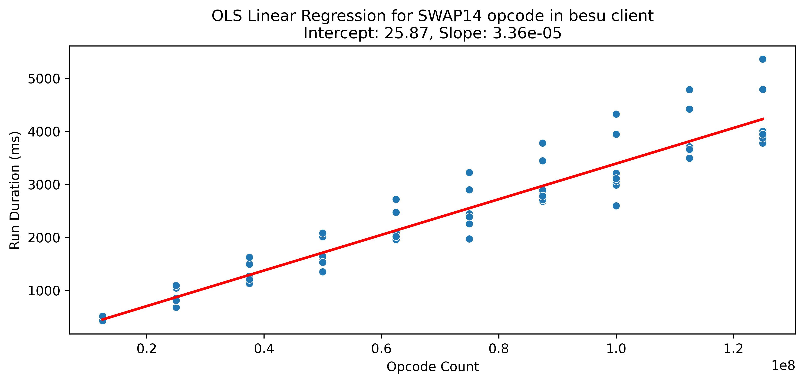


## geth


```python
                            OLS Regression Results                            
==============================================================================
Dep. Variable:        run_duration_ms   R-squared:                       0.997
Model:                            OLS   Adj. R-squared:                  0.997
Method:                 Least Squares   F-statistic:                 2.384e+04
Date:                Tue, 23 Dec 2025   Prob (F-statistic):           1.61e-92
Time:                        08:41:41   Log-Likelihood:                -324.00
No. Observations:                  74   AIC:                             652.0
Df Residuals:                      72   BIC:                             656.6
Df Model:                           1                                         
Covariance Type:            nonrobust                                         
==============================================================================
                 coef    std err          t      P>|t|      [0.025      0.975]
------------------------------------------------------------------------------
const         29.5907      4.929      6.003      0.000      19.764      39.417
opcount     9.872e-06   6.39e-08    154.393      0.000    9.74e-06       1e-05
==============================================================================
Omnibus:                       11.290   Durbin-Watson:                   1.858
Prob(Omnibus):                  0.004   Jarque-Bera (JB):               13.908
Skew:                          -0.681   Prob(JB):                     0.000955
Kurtosis:                       4.629   Cond. No.                     1.67e+08
==============================================================================

Notes:
[1] Standard Errors assume that the covariance matrix of the errors is correctly specified.
[2] The condition number is large, 1.67e+08. This might indicate that there are
strong multicollinearity or other numerical problems.
```


# SWAP15

## nethermind


```python
                            OLS Regression Results                            
==============================================================================
Dep. Variable:        run_duration_ms   R-squared:                       0.986
Model:                            OLS   Adj. R-squared:                  0.985
Method:                 Least Squares   F-statistic:                     4955.
Date:                Tue, 23 Dec 2025   Prob (F-statistic):           3.90e-68
Time:                        08:41:41   Log-Likelihood:                -328.20
No. Observations:                  74   AIC:                             660.4
Df Residuals:                      72   BIC:                             665.0
Df Model:                           1                                         
Covariance Type:            nonrobust                                         
==============================================================================
                 coef    std err          t      P>|t|      [0.025      0.975]
------------------------------------------------------------------------------
const         41.6855      5.218      7.989      0.000      31.284      52.087
opcount     4.764e-06   6.77e-08     70.393      0.000    4.63e-06     4.9e-06
==============================================================================
Omnibus:                       13.394   Durbin-Watson:                   1.527
Prob(Omnibus):                  0.001   Jarque-Bera (JB):               37.633
Skew:                           0.364   Prob(JB):                     6.73e-09
Kurtosis:                       6.417   Cond. No.                     1.67e+08
==============================================================================

Notes:
[1] Standard Errors assume that the covariance matrix of the errors is correctly specified.
[2] The condition number is large, 1.67e+08. This might indicate that there are
strong multicollinearity or other numerical problems.
```


## reth


```python
                            OLS Regression Results                            
==============================================================================
Dep. Variable:        run_duration_ms   R-squared:                       0.995
Model:                            OLS   Adj. R-squared:                  0.995
Method:                 Least Squares   F-statistic:                 1.432e+04
Date:                Tue, 23 Dec 2025   Prob (F-statistic):           1.40e-84
Time:                        08:41:41   Log-Likelihood:                -277.10
No. Observations:                  74   AIC:                             558.2
Df Residuals:                      72   BIC:                             562.8
Df Model:                           1                                         
Covariance Type:            nonrobust                                         
==============================================================================
                 coef    std err          t      P>|t|      [0.025      0.975]
------------------------------------------------------------------------------
const         38.0666      2.616     14.552      0.000      32.852      43.281
opcount      4.06e-06   3.39e-08    119.660      0.000    3.99e-06    4.13e-06
==============================================================================
Omnibus:                        0.066   Durbin-Watson:                   1.822
Prob(Omnibus):                  0.968   Jarque-Bera (JB):                0.236
Skew:                           0.035   Prob(JB):                        0.889
Kurtosis:                       2.732   Cond. No.                     1.67e+08
==============================================================================

Notes:
[1] Standard Errors assume that the covariance matrix of the errors is correctly specified.
[2] The condition number is large, 1.67e+08. This might indicate that there are
strong multicollinearity or other numerical problems.
```

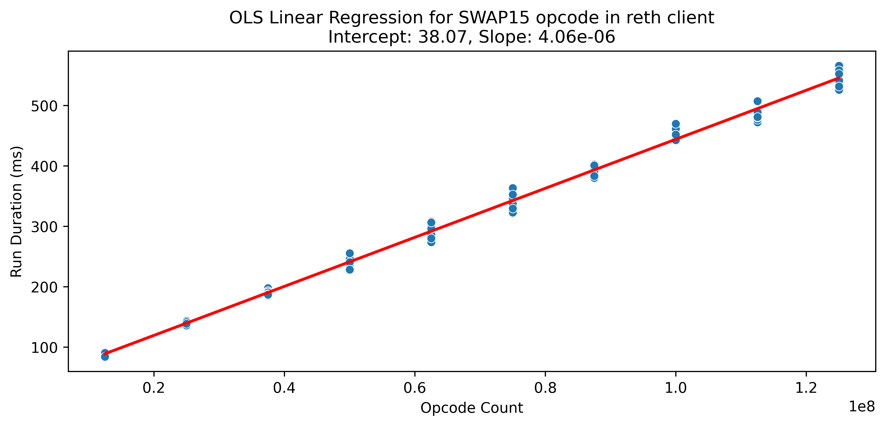


## besu


```python
                            OLS Regression Results                            
==============================================================================
Dep. Variable:        run_duration_ms   R-squared:                       0.912
Model:                            OLS   Adj. R-squared:                  0.911
Method:                 Least Squares   F-statistic:                     745.5
Date:                Tue, 23 Dec 2025   Prob (F-statistic):           1.01e-39
Time:                        08:41:41   Log-Likelihood:                -542.18
No. Observations:                  74   AIC:                             1088.
Df Residuals:                      72   BIC:                             1093.
Df Model:                           1                                         
Covariance Type:            nonrobust                                         
==============================================================================
                 coef    std err          t      P>|t|      [0.025      0.975]
------------------------------------------------------------------------------
const         36.0045     94.030      0.383      0.703    -151.442     223.451
opcount      3.33e-05   1.22e-06     27.304      0.000    3.09e-05    3.57e-05
==============================================================================
Omnibus:                       17.650   Durbin-Watson:                   0.530
Prob(Omnibus):                  0.000   Jarque-Bera (JB):               21.140
Skew:                           1.145   Prob(JB):                     2.57e-05
Kurtosis:                       4.268   Cond. No.                     1.67e+08
==============================================================================

Notes:
[1] Standard Errors assume that the covariance matrix of the errors is correctly specified.
[2] The condition number is large, 1.67e+08. This might indicate that there are
strong multicollinearity or other numerical problems.
```

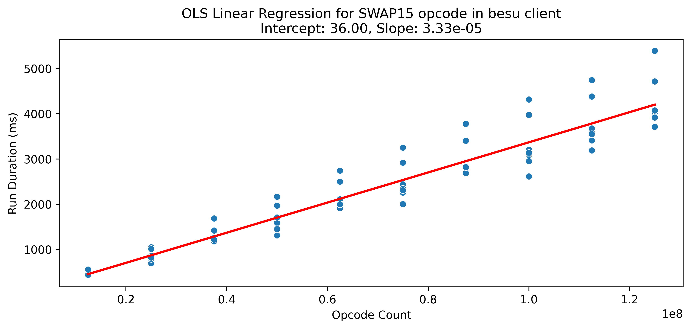


## geth


```python
                            OLS Regression Results                            
==============================================================================
Dep. Variable:        run_duration_ms   R-squared:                       0.992
Model:                            OLS   Adj. R-squared:                  0.991
Method:                 Least Squares   F-statistic:                     8484.
Date:                Tue, 23 Dec 2025   Prob (F-statistic):           1.89e-76
Time:                        08:41:41   Log-Likelihood:                -361.61
No. Observations:                  74   AIC:                             727.2
Df Residuals:                      72   BIC:                             731.8
Df Model:                           1                                         
Covariance Type:            nonrobust                                         
==============================================================================
                 coef    std err          t      P>|t|      [0.025      0.975]
------------------------------------------------------------------------------
const         34.3941      8.195      4.197      0.000      18.057      50.731
opcount     9.791e-06   1.06e-07     92.109      0.000    9.58e-06       1e-05
==============================================================================
Omnibus:                       75.637   Durbin-Watson:                   1.769
Prob(Omnibus):                  0.000   Jarque-Bera (JB):              863.595
Skew:                           2.885   Prob(JB):                    2.97e-188
Kurtosis:                      18.710   Cond. No.                     1.67e+08
==============================================================================

Notes:
[1] Standard Errors assume that the covariance matrix of the errors is correctly specified.
[2] The condition number is large, 1.67e+08. This might indicate that there are
strong multicollinearity or other numerical problems.
```

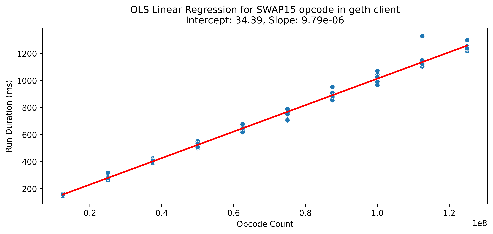


# SWAP16

## nethermind


```python
                            OLS Regression Results                            
==============================================================================
Dep. Variable:        run_duration_ms   R-squared:                       0.991
Model:                            OLS   Adj. R-squared:                  0.991
Method:                 Least Squares   F-statistic:                     8383.
Date:                Tue, 23 Dec 2025   Prob (F-statistic):           2.90e-76
Time:                        08:41:41   Log-Likelihood:                -309.37
No. Observations:                  74   AIC:                             622.7
Df Residuals:                      72   BIC:                             627.4
Df Model:                           1                                         
Covariance Type:            nonrobust                                         
==============================================================================
                 coef    std err          t      P>|t|      [0.025      0.975]
------------------------------------------------------------------------------
const         37.4530      4.046      9.257      0.000      29.388      45.518
opcount     4.805e-06   5.25e-08     91.557      0.000     4.7e-06    4.91e-06
==============================================================================
Omnibus:                        5.165   Durbin-Watson:                   1.300
Prob(Omnibus):                  0.076   Jarque-Bera (JB):                7.244
Skew:                           0.046   Prob(JB):                       0.0267
Kurtosis:                       4.530   Cond. No.                     1.67e+08
==============================================================================

Notes:
[1] Standard Errors assume that the covariance matrix of the errors is correctly specified.
[2] The condition number is large, 1.67e+08. This might indicate that there are
strong multicollinearity or other numerical problems.
```


## reth


```python
                            OLS Regression Results                            
==============================================================================
Dep. Variable:        run_duration_ms   R-squared:                       0.994
Model:                            OLS   Adj. R-squared:                  0.994
Method:                 Least Squares   F-statistic:                 1.127e+04
Date:                Tue, 23 Dec 2025   Prob (F-statistic):           7.38e-81
Time:                        08:41:42   Log-Likelihood:                -285.58
No. Observations:                  74   AIC:                             575.2
Df Residuals:                      72   BIC:                             579.8
Df Model:                           1                                         
Covariance Type:            nonrobust                                         
==============================================================================
                 coef    std err          t      P>|t|      [0.025      0.975]
------------------------------------------------------------------------------
const         38.7777      2.933     13.219      0.000      32.930      44.625
opcount     4.039e-06    3.8e-08    106.160      0.000    3.96e-06    4.12e-06
==============================================================================
Omnibus:                        1.715   Durbin-Watson:                   1.592
Prob(Omnibus):                  0.424   Jarque-Bera (JB):                1.679
Skew:                           0.286   Prob(JB):                        0.432
Kurtosis:                       2.534   Cond. No.                     1.67e+08
==============================================================================

Notes:
[1] Standard Errors assume that the covariance matrix of the errors is correctly specified.
[2] The condition number is large, 1.67e+08. This might indicate that there are
strong multicollinearity or other numerical problems.
```

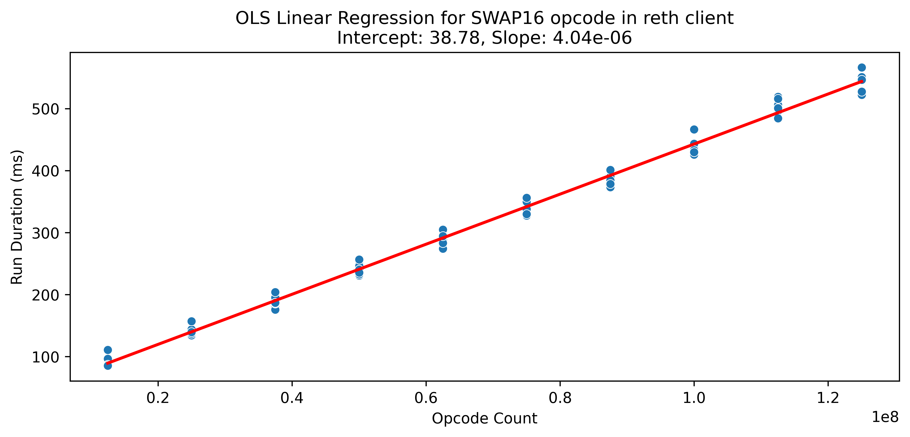


## besu


```python
                            OLS Regression Results                            
==============================================================================
Dep. Variable:        run_duration_ms   R-squared:                       0.911
Model:                            OLS   Adj. R-squared:                  0.910
Method:                 Least Squares   F-statistic:                     740.7
Date:                Tue, 23 Dec 2025   Prob (F-statistic):           1.25e-39
Time:                        08:41:42   Log-Likelihood:                -542.49
No. Observations:                  74   AIC:                             1089.
Df Residuals:                      72   BIC:                             1094.
Df Model:                           1                                         
Covariance Type:            nonrobust                                         
==============================================================================
                 coef    std err          t      P>|t|      [0.025      0.975]
------------------------------------------------------------------------------
const         38.0175     94.437      0.403      0.688    -150.239     226.274
opcount     3.334e-05   1.22e-06     27.215      0.000    3.09e-05    3.58e-05
==============================================================================
Omnibus:                       18.978   Durbin-Watson:                   0.896
Prob(Omnibus):                  0.000   Jarque-Bera (JB):               23.835
Skew:                           1.173   Prob(JB):                     6.67e-06
Kurtosis:                       4.493   Cond. No.                     1.67e+08
==============================================================================

Notes:
[1] Standard Errors assume that the covariance matrix of the errors is correctly specified.
[2] The condition number is large, 1.67e+08. This might indicate that there are
strong multicollinearity or other numerical problems.
```

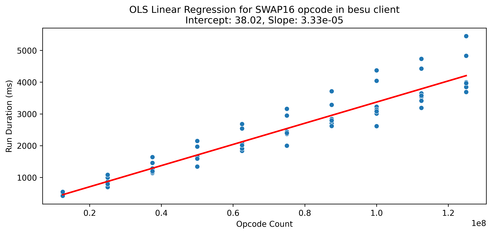


## geth


```python
                            OLS Regression Results                            
==============================================================================
Dep. Variable:        run_duration_ms   R-squared:                       0.996
Model:                            OLS   Adj. R-squared:                  0.996
Method:                 Least Squares   F-statistic:                 1.707e+04
Date:                Tue, 23 Dec 2025   Prob (F-statistic):           2.59e-87
Time:                        08:41:42   Log-Likelihood:                -335.27
No. Observations:                  74   AIC:                             674.5
Df Residuals:                      72   BIC:                             679.2
Df Model:                           1                                         
Covariance Type:            nonrobust                                         
==============================================================================
                 coef    std err          t      P>|t|      [0.025      0.975]
------------------------------------------------------------------------------
const         41.2735      5.741      7.189      0.000      29.829      52.718
opcount     9.728e-06   7.45e-08    130.641      0.000    9.58e-06    9.88e-06
==============================================================================
Omnibus:                        4.533   Durbin-Watson:                   0.988
Prob(Omnibus):                  0.104   Jarque-Bera (JB):                3.798
Skew:                           0.534   Prob(JB):                        0.150
Kurtosis:                       3.303   Cond. No.                     1.67e+08
==============================================================================

Notes:
[1] Standard Errors assume that the covariance matrix of the errors is correctly specified.
[2] The condition number is large, 1.67e+08. This might indicate that there are
strong multicollinearity or other numerical problems.
```

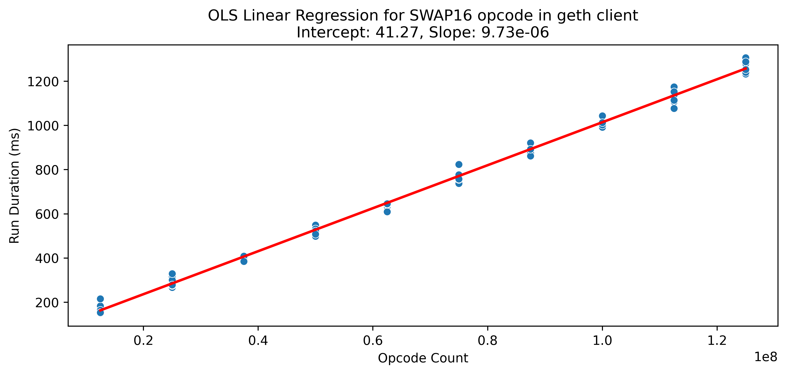


# TIMESTAMP

## nethermind


```python
                            OLS Regression Results                            
==============================================================================
Dep. Variable:        run_duration_ms   R-squared:                       0.982
Model:                            OLS   Adj. R-squared:                  0.982
Method:                 Least Squares   F-statistic:                     3977.
Date:                Tue, 23 Dec 2025   Prob (F-statistic):           9.40e-65
Time:                        08:41:42   Log-Likelihood:                -391.65
No. Observations:                  74   AIC:                             787.3
Df Residuals:                      72   BIC:                             791.9
Df Model:                           1                                         
Covariance Type:            nonrobust                                         
==============================================================================
                 coef    std err          t      P>|t|      [0.025      0.975]
------------------------------------------------------------------------------
const         27.5743     12.299      2.242      0.028       3.057      52.091
opcount      5.03e-06   7.98e-08     63.067      0.000    4.87e-06    5.19e-06
==============================================================================
Omnibus:                        1.304   Durbin-Watson:                   0.885
Prob(Omnibus):                  0.521   Jarque-Bera (JB):                0.701
Skew:                           0.151   Prob(JB):                        0.704
Kurtosis:                       3.369   Cond. No.                     3.34e+08
==============================================================================

Notes:
[1] Standard Errors assume that the covariance matrix of the errors is correctly specified.
[2] The condition number is large, 3.34e+08. This might indicate that there are
strong multicollinearity or other numerical problems.
```

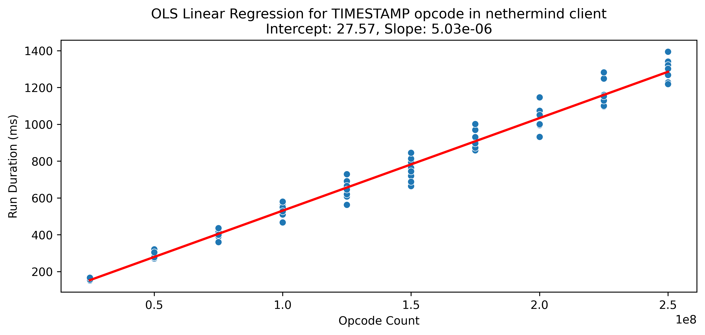


## reth


```python
                            OLS Regression Results                            
==============================================================================
Dep. Variable:        run_duration_ms   R-squared:                       0.982
Model:                            OLS   Adj. R-squared:                  0.981
Method:                 Least Squares   F-statistic:                     3829.
Date:                Tue, 23 Dec 2025   Prob (F-statistic):           3.59e-64
Time:                        08:41:42   Log-Likelihood:                -383.03
No. Observations:                  74   AIC:                             770.1
Df Residuals:                      72   BIC:                             774.7
Df Model:                           1                                         
Covariance Type:            nonrobust                                         
==============================================================================
                 coef    std err          t      P>|t|      [0.025      0.975]
------------------------------------------------------------------------------
const         37.5323     10.947      3.429      0.001      15.710      59.355
opcount     4.393e-06    7.1e-08     61.883      0.000    4.25e-06    4.53e-06
==============================================================================
Omnibus:                        9.947   Durbin-Watson:                   0.910
Prob(Omnibus):                  0.007   Jarque-Bera (JB):               21.526
Skew:                          -0.272   Prob(JB):                     2.12e-05
Kurtosis:                       5.586   Cond. No.                     3.34e+08
==============================================================================

Notes:
[1] Standard Errors assume that the covariance matrix of the errors is correctly specified.
[2] The condition number is large, 3.34e+08. This might indicate that there are
strong multicollinearity or other numerical problems.
```

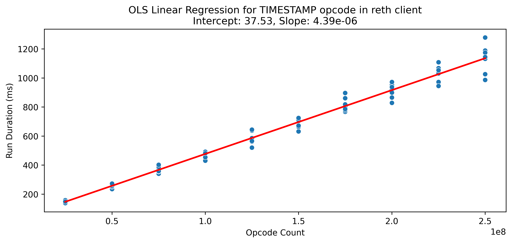


## besu


```python
                            OLS Regression Results                            
==============================================================================
Dep. Variable:        run_duration_ms   R-squared:                       0.904
Model:                            OLS   Adj. R-squared:                  0.903
Method:                 Least Squares   F-statistic:                     681.9
Date:                Tue, 23 Dec 2025   Prob (F-statistic):           1.88e-38
Time:                        08:41:42   Log-Likelihood:                -592.66
No. Observations:                  74   AIC:                             1189.
Df Residuals:                      72   BIC:                             1194.
Df Model:                           1                                         
Covariance Type:            nonrobust                                         
==============================================================================
                 coef    std err          t      P>|t|      [0.025      0.975]
------------------------------------------------------------------------------
const         -6.1672    186.017     -0.033      0.974    -376.986     364.651
opcount      3.15e-05   1.21e-06     26.113      0.000    2.91e-05    3.39e-05
==============================================================================
Omnibus:                       46.026   Durbin-Watson:                   0.426
Prob(Omnibus):                  0.000   Jarque-Bera (JB):              128.986
Skew:                           2.092   Prob(JB):                     9.80e-29
Kurtosis:                       7.933   Cond. No.                     3.34e+08
==============================================================================

Notes:
[1] Standard Errors assume that the covariance matrix of the errors is correctly specified.
[2] The condition number is large, 3.34e+08. This might indicate that there are
strong multicollinearity or other numerical problems.
```

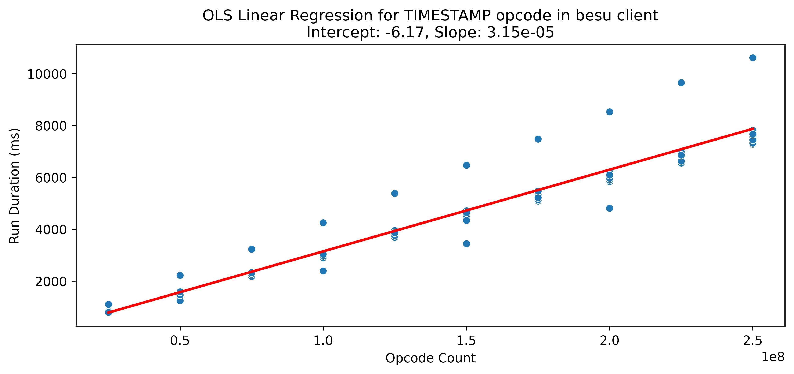


## geth


```python
                            OLS Regression Results                            
==============================================================================
Dep. Variable:        run_duration_ms   R-squared:                       0.999
Model:                            OLS   Adj. R-squared:                  0.999
Method:                 Least Squares   F-statistic:                 5.223e+04
Date:                Tue, 23 Dec 2025   Prob (F-statistic):          9.29e-105
Time:                        08:41:42   Log-Likelihood:                -360.33
No. Observations:                  74   AIC:                             724.7
Df Residuals:                      72   BIC:                             729.3
Df Model:                           1                                         
Covariance Type:            nonrobust                                         
==============================================================================
                 coef    std err          t      P>|t|      [0.025      0.975]
------------------------------------------------------------------------------
const         23.7629      8.054      2.950      0.004       7.707      39.819
opcount     1.194e-05   5.22e-08    228.550      0.000    1.18e-05     1.2e-05
==============================================================================
Omnibus:                       23.010   Durbin-Watson:                   2.068
Prob(Omnibus):                  0.000   Jarque-Bera (JB):               61.843
Skew:                          -0.915   Prob(JB):                     3.72e-14
Kurtosis:                       7.088   Cond. No.                     3.34e+08
==============================================================================

Notes:
[1] Standard Errors assume that the covariance matrix of the errors is correctly specified.
[2] The condition number is large, 3.34e+08. This might indicate that there are
strong multicollinearity or other numerical problems.
```

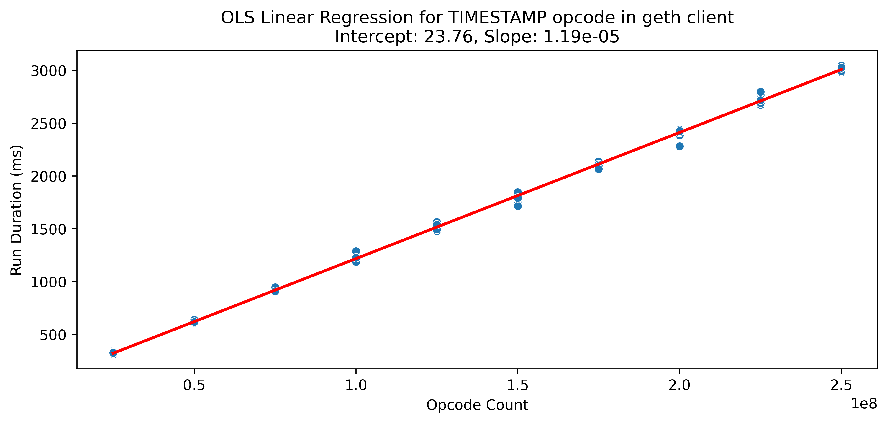


# XOR

## nethermind


```python
                            OLS Regression Results                            
==============================================================================
Dep. Variable:        run_duration_ms   R-squared:                       0.376
Model:                            OLS   Adj. R-squared:                  0.367
Method:                 Least Squares   F-statistic:                     43.34
Date:                Tue, 23 Dec 2025   Prob (F-statistic):           6.43e-09
Time:                        08:41:42   Log-Likelihood:                -529.51
No. Observations:                  74   AIC:                             1063.
Df Residuals:                      72   BIC:                             1068.
Df Model:                           1                                         
Covariance Type:            nonrobust                                         
==============================================================================
                 coef    std err          t      P>|t|      [0.025      0.975]
------------------------------------------------------------------------------
const         33.1764     79.234      0.419      0.677    -124.774     191.127
opcount     1.128e-05   1.71e-06      6.583      0.000    7.86e-06    1.47e-05
==============================================================================
Omnibus:                       60.383   Durbin-Watson:                   0.711
Prob(Omnibus):                  0.000   Jarque-Bera (JB):              233.473
Skew:                           2.706   Prob(JB):                     2.00e-51
Kurtosis:                       9.815   Cond. No.                     1.00e+08
==============================================================================

Notes:
[1] Standard Errors assume that the covariance matrix of the errors is correctly specified.
[2] The condition number is large,  1e+08. This might indicate that there are
strong multicollinearity or other numerical problems.
```

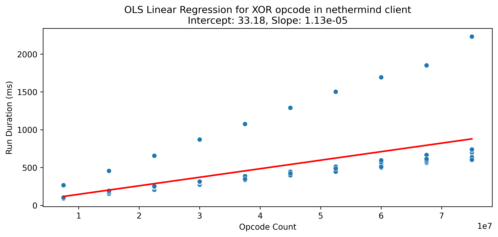


## reth


```python
                            OLS Regression Results                            
==============================================================================
Dep. Variable:        run_duration_ms   R-squared:                       0.991
Model:                            OLS   Adj. R-squared:                  0.991
Method:                 Least Squares   F-statistic:                     7924.
Date:                Tue, 23 Dec 2025   Prob (F-statistic):           2.16e-75
Time:                        08:41:43   Log-Likelihood:                -295.84
No. Observations:                  74   AIC:                             595.7
Df Residuals:                      72   BIC:                             600.3
Df Model:                           1                                         
Covariance Type:            nonrobust                                         
==============================================================================
                 coef    std err          t      P>|t|      [0.025      0.975]
------------------------------------------------------------------------------
const         41.8155      3.370     12.410      0.000      35.098      48.533
opcount     6.484e-06   7.28e-08     89.017      0.000    6.34e-06    6.63e-06
==============================================================================
Omnibus:                        6.918   Durbin-Watson:                   1.621
Prob(Omnibus):                  0.031   Jarque-Bera (JB):               12.099
Skew:                           0.108   Prob(JB):                      0.00236
Kurtosis:                       4.969   Cond. No.                     1.00e+08
==============================================================================

Notes:
[1] Standard Errors assume that the covariance matrix of the errors is correctly specified.
[2] The condition number is large,  1e+08. This might indicate that there are
strong multicollinearity or other numerical problems.
```


## besu


```python
                            OLS Regression Results                            
==============================================================================
Dep. Variable:        run_duration_ms   R-squared:                       0.963
Model:                            OLS   Adj. R-squared:                  0.962
Method:                 Least Squares   F-statistic:                     1693.
Date:                Tue, 23 Dec 2025   Prob (F-statistic):           2.85e-48
Time:                        08:41:43   Log-Likelihood:                -485.64
No. Observations:                  67   AIC:                             975.3
Df Residuals:                      65   BIC:                             979.7
Df Model:                           1                                         
Covariance Type:            nonrobust                                         
==============================================================================
                 coef    std err          t      P>|t|      [0.025      0.975]
------------------------------------------------------------------------------
const        -26.9600    106.126     -0.254      0.800    -238.908     184.988
opcount     8.994e-05   2.19e-06     41.150      0.000    8.56e-05    9.43e-05
==============================================================================
Omnibus:                       20.982   Durbin-Watson:                   0.696
Prob(Omnibus):                  0.000   Jarque-Bera (JB):               44.745
Skew:                           0.978   Prob(JB):                     1.92e-10
Kurtosis:                       6.493   Cond. No.                     1.22e+08
==============================================================================

Notes:
[1] Standard Errors assume that the covariance matrix of the errors is correctly specified.
[2] The condition number is large, 1.22e+08. This might indicate that there are
strong multicollinearity or other numerical problems.
```


## geth


```python
                            OLS Regression Results                            
==============================================================================
Dep. Variable:        run_duration_ms   R-squared:                       0.915
Model:                            OLS   Adj. R-squared:                  0.914
Method:                 Least Squares   F-statistic:                     780.0
Date:                Tue, 23 Dec 2025   Prob (F-statistic):           2.28e-40
Time:                        08:41:43   Log-Likelihood:                -471.58
No. Observations:                  74   AIC:                             947.2
Df Residuals:                      72   BIC:                             951.8
Df Model:                           1                                         
Covariance Type:            nonrobust                                         
==============================================================================
                 coef    std err          t      P>|t|      [0.025      0.975]
------------------------------------------------------------------------------
const         52.8735     36.219      1.460      0.149     -19.327     125.074
opcount     2.187e-05   7.83e-07     27.929      0.000    2.03e-05    2.34e-05
==============================================================================
Omnibus:                      154.424   Durbin-Watson:                   2.059
Prob(Omnibus):                  0.000   Jarque-Bera (JB):            12648.953
Skew:                           7.835   Prob(JB):                         0.00
Kurtosis:                      65.103   Cond. No.                     1.00e+08
==============================================================================

Notes:
[1] Standard Errors assume that the covariance matrix of the errors is correctly specified.
[2] The condition number is large,  1e+08. This might indicate that there are
strong multicollinearity or other numerical problems.
```

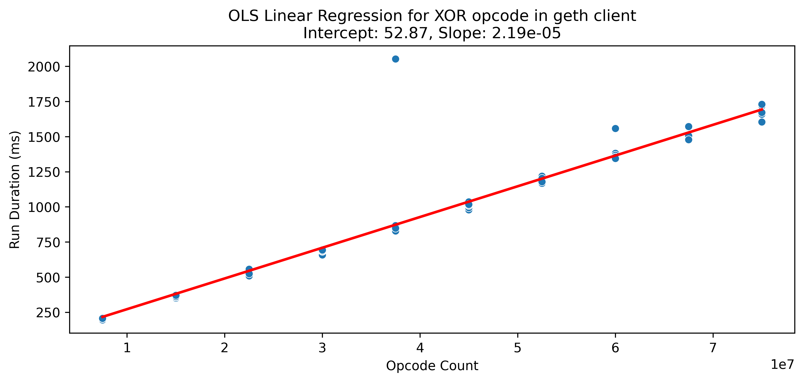

