Opcode run times estimation results - Simple opcodes
====================================================

Table of contents
=================

* [STOP](#stop)
* [ADD](#add)
* [MUL](#mul)
* [SUB](#sub)
* [DIV](#div)
* [SDIV](#sdiv)
* [MOD](#mod)
* [SMOD](#smod)
* [ADDMOD](#addmod)
* [MULMOD](#mulmod)
* [SIGNEXTEND](#signextend)
* [LT](#lt)
* [GT](#gt)
* [SLT](#slt)
* [SGT](#sgt)
* [EQ](#eq)
* [ISZERO](#iszero)
* [AND](#and)
* [OR](#or)
* [XOR](#xor)
* [NOT](#not)
* [BYTE](#byte)
* [SHL](#shl)
* [SHR](#shr)
* [SAR](#sar)
* [ADDRESS](#address)
* [ORIGIN](#origin)
* [CALLER](#caller)
* [GASPRICE](#gasprice)
* [RETURNDATASIZE](#returndatasize)
* [COINBASE](#coinbase)
* [TIMESTAMP](#timestamp)
* [NUMBER](#number)
* [PREVRANDAO](#prevrandao)
* [GASLIMIT](#gaslimit)
* [CHAINID](#chainid)
* [SELFBALANCE](#selfbalance)
* [BASEFEE](#basefee)
* [BLOBHASH](#blobhash)
* [BLOBBASEFEE](#blobbasefee)
* [POP](#pop)
* [JUMP](#jump)
* [JUMPI](#jumpi)
* [PC](#pc)
* [MSIZE](#msize)
* [GAS](#gas)
* [JUMPDEST](#jumpdest)
* [PUSH0](#push0)
* [PUSH1](#push1)
* [PUSH2](#push2)
* [PUSH3](#push3)
* [PUSH4](#push4)
* [PUSH5](#push5)
* [PUSH6](#push6)
* [PUSH7](#push7)
* [PUSH8](#push8)
* [PUSH9](#push9)
* [PUSH10](#push10)
* [PUSH11](#push11)
* [PUSH12](#push12)
* [PUSH13](#push13)
* [PUSH14](#push14)
* [PUSH15](#push15)
* [PUSH16](#push16)
* [PUSH17](#push17)
* [PUSH18](#push18)
* [PUSH19](#push19)
* [PUSH20](#push20)
* [PUSH21](#push21)
* [PUSH22](#push22)
* [PUSH23](#push23)
* [PUSH24](#push24)
* [PUSH25](#push25)
* [PUSH26](#push26)
* [PUSH27](#push27)
* [PUSH28](#push28)
* [PUSH29](#push29)
* [PUSH30](#push30)
* [PUSH31](#push31)
* [PUSH32](#push32)
* [DUP1](#dup1)
* [DUP2](#dup2)
* [DUP3](#dup3)
* [DUP4](#dup4)
* [DUP5](#dup5)
* [DUP6](#dup6)
* [DUP7](#dup7)
* [DUP8](#dup8)
* [DUP9](#dup9)
* [DUP10](#dup10)
* [DUP11](#dup11)
* [DUP12](#dup12)
* [DUP13](#dup13)
* [DUP14](#dup14)
* [DUP15](#dup15)
* [DUP16](#dup16)
* [SWAP1](#swap1)
* [SWAP2](#swap2)
* [SWAP3](#swap3)
* [SWAP4](#swap4)
* [SWAP5](#swap5)
* [SWAP6](#swap6)
* [SWAP7](#swap7)
* [SWAP8](#swap8)
* [SWAP9](#swap9)
* [SWAP10](#swap10)
* [SWAP11](#swap11)
* [SWAP12](#swap12)
* [SWAP13](#swap13)
* [SWAP14](#swap14)
* [SWAP15](#swap15)
* [SWAP16](#swap16)
* [INVALID](#invalid)

# Introduction


This is an automated report generated from the opcode run times 
estimation script `./src/estimate_opcode_run_times.py`. The script 
uses data generated by running the 
[EEST benchmark suite](https://github.com/ethereum/execution-spec-tests/tree/main/tests/benchmark) 
with the [Nethermind benchmarking tooling](https://github.com/NethermindEth/gas-benchmarks).

The data includes all the simple opcode tests run between 2025-12-19 and 2025-12-22.

For each opcode and client, an OLS linear regression model is fitted to estimate the 
opcode run time as a function of the opcode count. The results are presented below.

# STOP

## nethermind

OLS model did not run... Error: zero-size array to reduction operation maximum which has no identity

## reth

OLS model did not run... Error: zero-size array to reduction operation maximum which has no identity

## besu

OLS model did not run... Error: zero-size array to reduction operation maximum which has no identity

## geth

OLS model did not run... Error: zero-size array to reduction operation maximum which has no identity

# ADD

## nethermind


```python
                            OLS Regression Results                            
==============================================================================
Dep. Variable:        run_duration_ms   R-squared:                       0.998
Model:                            OLS   Adj. R-squared:                  0.998
Method:                 Least Squares   F-statistic:                 3.023e+04
Date:                Mon, 22 Dec 2025   Prob (F-statistic):           1.41e-73
Time:                        12:03:23   Log-Likelihood:                -236.68
No. Observations:                  54   AIC:                             477.4
Df Residuals:                      52   BIC:                             481.3
Df Model:                           1                                         
Covariance Type:            nonrobust                                         
==============================================================================
                 coef    std err          t      P>|t|      [0.025      0.975]
------------------------------------------------------------------------------
const         39.6114      5.836      6.788      0.000      27.901      51.322
opcount     2.638e-05   1.52e-07    173.856      0.000    2.61e-05    2.67e-05
==============================================================================
Omnibus:                       27.487   Durbin-Watson:                   1.770
Prob(Omnibus):                  0.000   Jarque-Bera (JB):              200.469
Skew:                          -0.837   Prob(JB):                     2.94e-44
Kurtosis:                      12.290   Cond. No.                     8.35e+07
==============================================================================

Notes:
[1] Standard Errors assume that the covariance matrix of the errors is correctly specified.
[2] The condition number is large, 8.35e+07. This might indicate that there are
strong multicollinearity or other numerical problems.
```


## reth


```python
                            OLS Regression Results                            
==============================================================================
Dep. Variable:        run_duration_ms   R-squared:                       0.967
Model:                            OLS   Adj. R-squared:                  0.966
Method:                 Least Squares   F-statistic:                     1521.
Date:                Mon, 22 Dec 2025   Prob (F-statistic):           3.52e-40
Time:                        12:03:24   Log-Likelihood:                -286.90
No. Observations:                  54   AIC:                             577.8
Df Residuals:                      52   BIC:                             581.8
Df Model:                           1                                         
Covariance Type:            nonrobust                                         
==============================================================================
                 coef    std err          t      P>|t|      [0.025      0.975]
------------------------------------------------------------------------------
const         51.6814     14.791      3.494      0.001      22.000      81.363
opcount       1.5e-05   3.85e-07     39.005      0.000    1.42e-05    1.58e-05
==============================================================================
Omnibus:                        0.758   Durbin-Watson:                   1.444
Prob(Omnibus):                  0.684   Jarque-Bera (JB):                0.814
Skew:                          -0.129   Prob(JB):                        0.666
Kurtosis:                       2.456   Cond. No.                     8.35e+07
==============================================================================

Notes:
[1] Standard Errors assume that the covariance matrix of the errors is correctly specified.
[2] The condition number is large, 8.35e+07. This might indicate that there are
strong multicollinearity or other numerical problems.
```


## besu


```python
                            OLS Regression Results                            
==============================================================================
Dep. Variable:        run_duration_ms   R-squared:                       0.979
Model:                            OLS   Adj. R-squared:                  0.979
Method:                 Least Squares   F-statistic:                     2427.
Date:                Mon, 22 Dec 2025   Prob (F-statistic):           2.59e-45
Time:                        12:03:24   Log-Likelihood:                -413.42
No. Observations:                  54   AIC:                             830.8
Df Residuals:                      52   BIC:                             834.8
Df Model:                           1                                         
Covariance Type:            nonrobust                                         
==============================================================================
                 coef    std err          t      P>|t|      [0.025      0.975]
------------------------------------------------------------------------------
const          2.8161    154.017      0.018      0.985    -306.242     311.875
opcount        0.0002      4e-06     49.261      0.000       0.000       0.000
==============================================================================
Omnibus:                       27.179   Durbin-Watson:                   0.699
Prob(Omnibus):                  0.000   Jarque-Bera (JB):               54.545
Skew:                           1.534   Prob(JB):                     1.43e-12
Kurtosis:                       6.850   Cond. No.                     8.35e+07
==============================================================================

Notes:
[1] Standard Errors assume that the covariance matrix of the errors is correctly specified.
[2] The condition number is large, 8.35e+07. This might indicate that there are
strong multicollinearity or other numerical problems.
```

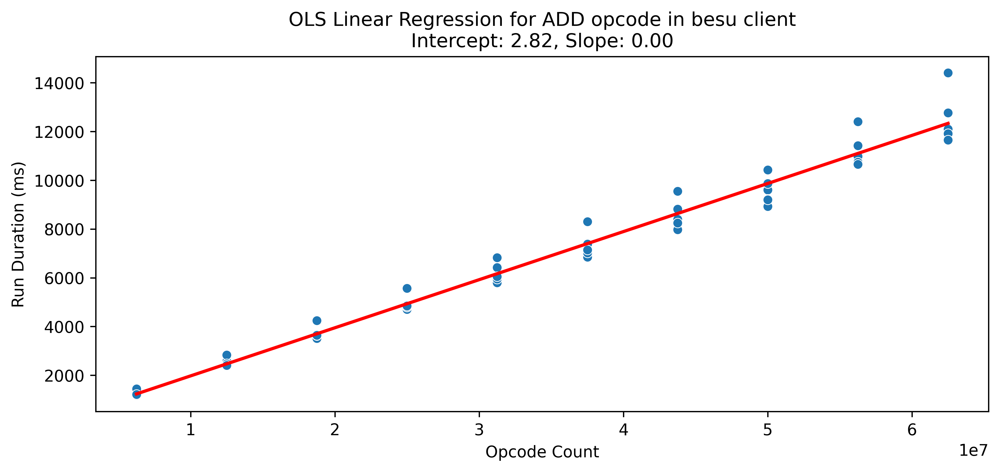


## geth


```python
                            OLS Regression Results                            
==============================================================================
Dep. Variable:        run_duration_ms   R-squared:                       0.914
Model:                            OLS   Adj. R-squared:                  0.912
Method:                 Least Squares   F-statistic:                     550.2
Date:                Mon, 22 Dec 2025   Prob (F-statistic):           2.53e-29
Time:                        12:03:24   Log-Likelihood:                -334.83
No. Observations:                  54   AIC:                             673.7
Df Residuals:                      52   BIC:                             677.6
Df Model:                           1                                         
Covariance Type:            nonrobust                                         
==============================================================================
                 coef    std err          t      P>|t|      [0.025      0.975]
------------------------------------------------------------------------------
const         39.4941     35.933      1.099      0.277     -32.610     111.598
opcount     2.191e-05   9.34e-07     23.457      0.000       2e-05    2.38e-05
==============================================================================
Omnibus:                      110.610   Durbin-Watson:                   2.177
Prob(Omnibus):                  0.000   Jarque-Bera (JB):             4212.432
Skew:                           6.236   Prob(JB):                         0.00
Kurtosis:                      44.433   Cond. No.                     8.35e+07
==============================================================================

Notes:
[1] Standard Errors assume that the covariance matrix of the errors is correctly specified.
[2] The condition number is large, 8.35e+07. This might indicate that there are
strong multicollinearity or other numerical problems.
```

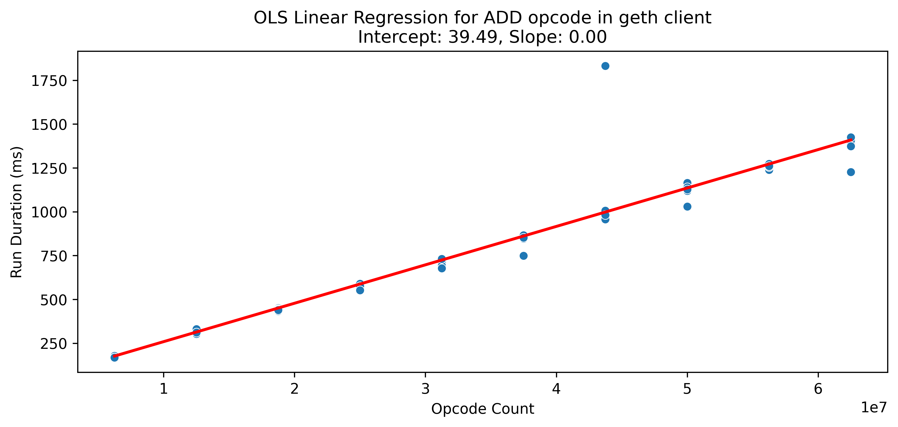


# MUL

## nethermind


```python
                            OLS Regression Results                            
==============================================================================
Dep. Variable:        run_duration_ms   R-squared:                       0.998
Model:                            OLS   Adj. R-squared:                  0.998
Method:                 Least Squares   F-statistic:                 3.068e+04
Date:                Mon, 22 Dec 2025   Prob (F-statistic):           9.58e-74
Time:                        12:03:24   Log-Likelihood:                -258.58
No. Observations:                  54   AIC:                             521.2
Df Residuals:                      52   BIC:                             525.1
Df Model:                           1                                         
Covariance Type:            nonrobust                                         
==============================================================================
                 coef    std err          t      P>|t|      [0.025      0.975]
------------------------------------------------------------------------------
const         39.4896      8.756      4.510      0.000      21.920      57.060
opcount     3.987e-05   2.28e-07    175.155      0.000    3.94e-05    4.03e-05
==============================================================================
Omnibus:                        6.430   Durbin-Watson:                   1.086
Prob(Omnibus):                  0.040   Jarque-Bera (JB):                5.848
Skew:                          -0.559   Prob(JB):                       0.0537
Kurtosis:                       4.162   Cond. No.                     8.35e+07
==============================================================================

Notes:
[1] Standard Errors assume that the covariance matrix of the errors is correctly specified.
[2] The condition number is large, 8.35e+07. This might indicate that there are
strong multicollinearity or other numerical problems.
```

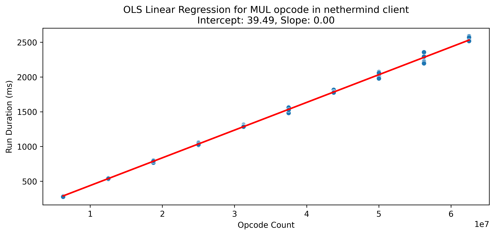


## reth


```python
                            OLS Regression Results                            
==============================================================================
Dep. Variable:        run_duration_ms   R-squared:                       0.971
Model:                            OLS   Adj. R-squared:                  0.971
Method:                 Least Squares   F-statistic:                     1770.
Date:                Mon, 22 Dec 2025   Prob (F-statistic):           7.74e-42
Time:                        12:03:24   Log-Likelihood:                -295.76
No. Observations:                  54   AIC:                             595.5
Df Residuals:                      52   BIC:                             599.5
Df Model:                           1                                         
Covariance Type:            nonrobust                                         
==============================================================================
                 coef    std err          t      P>|t|      [0.025      0.975]
------------------------------------------------------------------------------
const         42.0814     17.431      2.414      0.019       7.104      77.059
opcount     1.907e-05   4.53e-07     42.073      0.000    1.82e-05       2e-05
==============================================================================
Omnibus:                        4.004   Durbin-Watson:                   1.290
Prob(Omnibus):                  0.135   Jarque-Bera (JB):                2.955
Skew:                           0.481   Prob(JB):                        0.228
Kurtosis:                       3.622   Cond. No.                     8.35e+07
==============================================================================

Notes:
[1] Standard Errors assume that the covariance matrix of the errors is correctly specified.
[2] The condition number is large, 8.35e+07. This might indicate that there are
strong multicollinearity or other numerical problems.
```

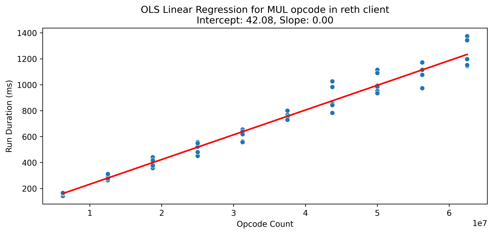


## besu


```python
                            OLS Regression Results                            
==============================================================================
Dep. Variable:        run_duration_ms   R-squared:                       0.896
Model:                            OLS   Adj. R-squared:                  0.894
Method:                 Least Squares   F-statistic:                     449.8
Date:                Mon, 22 Dec 2025   Prob (F-statistic):           2.93e-27
Time:                        12:03:24   Log-Likelihood:                -488.34
No. Observations:                  54   AIC:                             980.7
Df Residuals:                      52   BIC:                             984.7
Df Model:                           1                                         
Covariance Type:            nonrobust                                         
==============================================================================
                 coef    std err          t      P>|t|      [0.025      0.975]
------------------------------------------------------------------------------
const      -1212.0849    616.784     -1.965      0.055   -2449.752      25.582
opcount        0.0003    1.6e-05     21.209      0.000       0.000       0.000
==============================================================================
Omnibus:                       26.896   Durbin-Watson:                   1.288
Prob(Omnibus):                  0.000   Jarque-Bera (JB):               50.947
Skew:                           1.560   Prob(JB):                     8.65e-12
Kurtosis:                       6.594   Cond. No.                     8.35e+07
==============================================================================

Notes:
[1] Standard Errors assume that the covariance matrix of the errors is correctly specified.
[2] The condition number is large, 8.35e+07. This might indicate that there are
strong multicollinearity or other numerical problems.
```

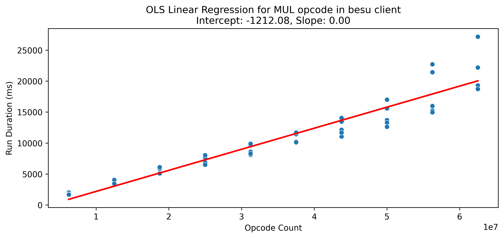


## geth


```python
                            OLS Regression Results                            
==============================================================================
Dep. Variable:        run_duration_ms   R-squared:                       0.910
Model:                            OLS   Adj. R-squared:                  0.908
Method:                 Least Squares   F-statistic:                     524.1
Date:                Mon, 22 Dec 2025   Prob (F-statistic):           8.02e-29
Time:                        12:03:24   Log-Likelihood:                -347.87
No. Observations:                  54   AIC:                             699.7
Df Residuals:                      52   BIC:                             703.7
Df Model:                           1                                         
Covariance Type:            nonrobust                                         
==============================================================================
                 coef    std err          t      P>|t|      [0.025      0.975]
------------------------------------------------------------------------------
const         34.6785     45.754      0.758      0.452     -57.134     126.491
opcount     2.723e-05   1.19e-06     22.894      0.000    2.48e-05    2.96e-05
==============================================================================
Omnibus:                       90.354   Durbin-Watson:                   2.142
Prob(Omnibus):                  0.000   Jarque-Bera (JB):             1547.949
Skew:                           4.818   Prob(JB):                         0.00
Kurtosis:                      27.395   Cond. No.                     8.35e+07
==============================================================================

Notes:
[1] Standard Errors assume that the covariance matrix of the errors is correctly specified.
[2] The condition number is large, 8.35e+07. This might indicate that there are
strong multicollinearity or other numerical problems.
```


# SUB

## nethermind


```python
                            OLS Regression Results                            
==============================================================================
Dep. Variable:        run_duration_ms   R-squared:                       0.997
Model:                            OLS   Adj. R-squared:                  0.997
Method:                 Least Squares   F-statistic:                 1.820e+04
Date:                Mon, 22 Dec 2025   Prob (F-statistic):           7.31e-68
Time:                        12:03:25   Log-Likelihood:                -231.85
No. Observations:                  54   AIC:                             467.7
Df Residuals:                      52   BIC:                             471.7
Df Model:                           1                                         
Covariance Type:            nonrobust                                         
==============================================================================
                 coef    std err          t      P>|t|      [0.025      0.975]
------------------------------------------------------------------------------
const         39.2525      5.337      7.355      0.000      28.543      49.962
opcount      1.56e-05   1.16e-07    134.911      0.000    1.54e-05    1.58e-05
==============================================================================
Omnibus:                       47.968   Durbin-Watson:                   1.885
Prob(Omnibus):                  0.000   Jarque-Bera (JB):              184.532
Skew:                          -2.494   Prob(JB):                     8.50e-41
Kurtosis:                      10.559   Cond. No.                     1.00e+08
==============================================================================

Notes:
[1] Standard Errors assume that the covariance matrix of the errors is correctly specified.
[2] The condition number is large,  1e+08. This might indicate that there are
strong multicollinearity or other numerical problems.
```


## reth


```python
                            OLS Regression Results                            
==============================================================================
Dep. Variable:        run_duration_ms   R-squared:                       0.991
Model:                            OLS   Adj. R-squared:                  0.991
Method:                 Least Squares   F-statistic:                     5622.
Date:                Mon, 22 Dec 2025   Prob (F-statistic):           1.15e-54
Time:                        12:03:25   Log-Likelihood:                -217.60
No. Observations:                  54   AIC:                             439.2
Df Residuals:                      52   BIC:                             443.2
Df Model:                           1                                         
Covariance Type:            nonrobust                                         
==============================================================================
                 coef    std err          t      P>|t|      [0.025      0.975]
------------------------------------------------------------------------------
const         40.2705      4.100      9.823      0.000      32.044      48.497
opcount      6.66e-06   8.88e-08     74.979      0.000    6.48e-06    6.84e-06
==============================================================================
Omnibus:                       16.177   Durbin-Watson:                   2.455
Prob(Omnibus):                  0.000   Jarque-Bera (JB):               36.332
Skew:                          -0.762   Prob(JB):                     1.29e-08
Kurtosis:                       6.718   Cond. No.                     1.00e+08
==============================================================================

Notes:
[1] Standard Errors assume that the covariance matrix of the errors is correctly specified.
[2] The condition number is large,  1e+08. This might indicate that there are
strong multicollinearity or other numerical problems.
```


## besu


```python
                            OLS Regression Results                            
==============================================================================
Dep. Variable:        run_duration_ms   R-squared:                       0.941
Model:                            OLS   Adj. R-squared:                  0.940
Method:                 Least Squares   F-statistic:                     832.2
Date:                Mon, 22 Dec 2025   Prob (F-statistic):           1.15e-33
Time:                        12:03:25   Log-Likelihood:                -460.14
No. Observations:                  54   AIC:                             924.3
Df Residuals:                      52   BIC:                             928.3
Df Model:                           1                                         
Covariance Type:            nonrobust                                         
==============================================================================
                 coef    std err          t      P>|t|      [0.025      0.975]
------------------------------------------------------------------------------
const       -503.6228    365.861     -1.377      0.175   -1237.777     230.532
opcount        0.0002   7.93e-06     28.847      0.000       0.000       0.000
==============================================================================
Omnibus:                       46.693   Durbin-Watson:                   1.300
Prob(Omnibus):                  0.000   Jarque-Bera (JB):              209.922
Skew:                           2.288   Prob(JB):                     2.61e-46
Kurtosis:                      11.506   Cond. No.                     1.00e+08
==============================================================================

Notes:
[1] Standard Errors assume that the covariance matrix of the errors is correctly specified.
[2] The condition number is large,  1e+08. This might indicate that there are
strong multicollinearity or other numerical problems.
```

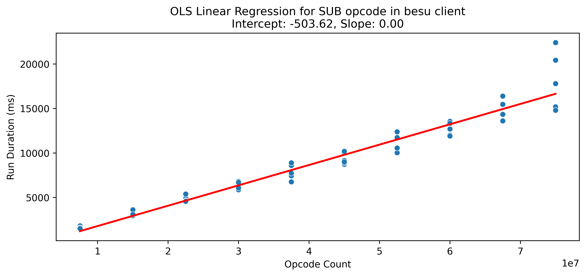


## geth


```python
                            OLS Regression Results                            
==============================================================================
Dep. Variable:        run_duration_ms   R-squared:                       0.996
Model:                            OLS   Adj. R-squared:                  0.995
Method:                 Least Squares   F-statistic:                 1.172e+04
Date:                Mon, 22 Dec 2025   Prob (F-statistic):           6.52e-63
Time:                        12:03:25   Log-Likelihood:                -261.52
No. Observations:                  54   AIC:                             527.0
Df Residuals:                      52   BIC:                             531.0
Df Model:                           1                                         
Covariance Type:            nonrobust                                         
==============================================================================
                 coef    std err          t      P>|t|      [0.025      0.975]
------------------------------------------------------------------------------
const         36.7205      9.246      3.972      0.000      18.168      55.273
opcount     2.169e-05      2e-07    108.270      0.000    2.13e-05    2.21e-05
==============================================================================
Omnibus:                       21.579   Durbin-Watson:                   1.940
Prob(Omnibus):                  0.000   Jarque-Bera (JB):               51.531
Skew:                          -1.069   Prob(JB):                     6.46e-12
Kurtosis:                       7.282   Cond. No.                     1.00e+08
==============================================================================

Notes:
[1] Standard Errors assume that the covariance matrix of the errors is correctly specified.
[2] The condition number is large,  1e+08. This might indicate that there are
strong multicollinearity or other numerical problems.
```


# DIV

## nethermind


```python
                            OLS Regression Results                            
==============================================================================
Dep. Variable:        run_duration_ms   R-squared:                       0.998
Model:                            OLS   Adj. R-squared:                  0.998
Method:                 Least Squares   F-statistic:                 2.299e+04
Date:                Mon, 22 Dec 2025   Prob (F-statistic):           1.70e-70
Time:                        12:03:25   Log-Likelihood:                -325.46
No. Observations:                  54   AIC:                             654.9
Df Residuals:                      52   BIC:                             658.9
Df Model:                           1                                         
Covariance Type:            nonrobust                                         
==============================================================================
                 coef    std err          t      P>|t|      [0.025      0.975]
------------------------------------------------------------------------------
const         24.7787     30.210      0.820      0.416     -35.843      85.400
opcount        0.0001   7.85e-07    151.641      0.000       0.000       0.000
==============================================================================
Omnibus:                       62.453   Durbin-Watson:                   1.265
Prob(Omnibus):                  0.000   Jarque-Bera (JB):              537.686
Skew:                          -2.973   Prob(JB):                    1.75e-117
Kurtosis:                      17.269   Cond. No.                     8.35e+07
==============================================================================

Notes:
[1] Standard Errors assume that the covariance matrix of the errors is correctly specified.
[2] The condition number is large, 8.35e+07. This might indicate that there are
strong multicollinearity or other numerical problems.
```

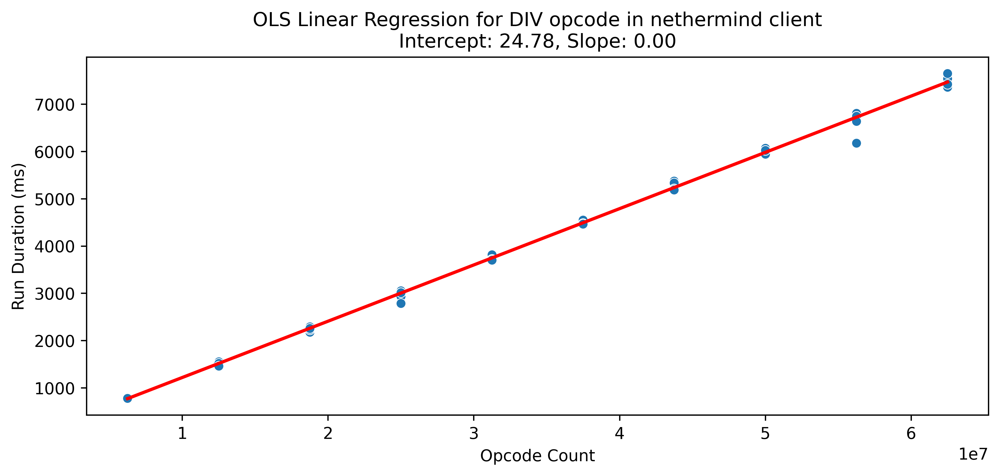


## reth


```python
                            OLS Regression Results                            
==============================================================================
Dep. Variable:        run_duration_ms   R-squared:                       0.994
Model:                            OLS   Adj. R-squared:                  0.994
Method:                 Least Squares   F-statistic:                     8831.
Date:                Mon, 22 Dec 2025   Prob (F-statistic):           9.91e-60
Time:                        12:03:25   Log-Likelihood:                -306.06
No. Observations:                  54   AIC:                             616.1
Df Residuals:                      52   BIC:                             620.1
Df Model:                           1                                         
Covariance Type:            nonrobust                                         
==============================================================================
                 coef    std err          t      P>|t|      [0.025      0.975]
------------------------------------------------------------------------------
const         58.3004     21.092      2.764      0.008      15.976     100.625
opcount     5.154e-05   5.48e-07     93.975      0.000    5.04e-05    5.26e-05
==============================================================================
Omnibus:                       48.974   Durbin-Watson:                   1.385
Prob(Omnibus):                  0.000   Jarque-Bera (JB):              223.627
Skew:                          -2.437   Prob(JB):                     2.75e-49
Kurtosis:                      11.697   Cond. No.                     8.35e+07
==============================================================================

Notes:
[1] Standard Errors assume that the covariance matrix of the errors is correctly specified.
[2] The condition number is large, 8.35e+07. This might indicate that there are
strong multicollinearity or other numerical problems.
```


## besu


```python
                            OLS Regression Results                            
==============================================================================
Dep. Variable:        run_duration_ms   R-squared:                       0.953
Model:                            OLS   Adj. R-squared:                  0.952
Method:                 Least Squares   F-statistic:                     1056.
Date:                Mon, 22 Dec 2025   Prob (F-statistic):           3.24e-36
Time:                        12:03:25   Log-Likelihood:                -456.54
No. Observations:                  54   AIC:                             917.1
Df Residuals:                      52   BIC:                             921.1
Df Model:                           1                                         
Covariance Type:            nonrobust                                         
==============================================================================
                 coef    std err          t      P>|t|      [0.025      0.975]
------------------------------------------------------------------------------
const       -314.0781    342.276     -0.918      0.363   -1000.906     372.750
opcount        0.0003    8.9e-06     32.496      0.000       0.000       0.000
==============================================================================
Omnibus:                       28.262   Durbin-Watson:                   1.492
Prob(Omnibus):                  0.000   Jarque-Bera (JB):               64.202
Skew:                           1.520   Prob(JB):                     1.14e-14
Kurtosis:                       7.393   Cond. No.                     8.35e+07
==============================================================================

Notes:
[1] Standard Errors assume that the covariance matrix of the errors is correctly specified.
[2] The condition number is large, 8.35e+07. This might indicate that there are
strong multicollinearity or other numerical problems.
```

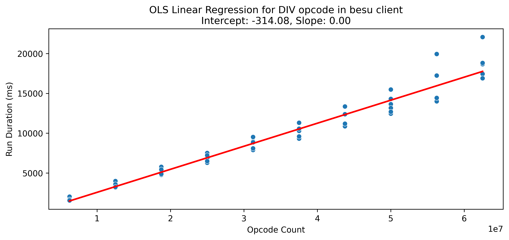


## geth


```python
                            OLS Regression Results                            
==============================================================================
Dep. Variable:        run_duration_ms   R-squared:                       0.993
Model:                            OLS   Adj. R-squared:                  0.993
Method:                 Least Squares   F-statistic:                     7703.
Date:                Mon, 22 Dec 2025   Prob (F-statistic):           3.39e-58
Time:                        12:03:25   Log-Likelihood:                -325.47
No. Observations:                  54   AIC:                             654.9
Df Residuals:                      52   BIC:                             658.9
Df Model:                           1                                         
Covariance Type:            nonrobust                                         
==============================================================================
                 coef    std err          t      P>|t|      [0.025      0.975]
------------------------------------------------------------------------------
const         39.3662     30.218      1.303      0.198     -21.271     100.003
opcount     6.896e-05   7.86e-07     87.768      0.000    6.74e-05    7.05e-05
==============================================================================
Omnibus:                       30.259   Durbin-Watson:                   1.641
Prob(Omnibus):                  0.000   Jarque-Bera (JB):               57.643
Skew:                          -1.801   Prob(JB):                     3.04e-13
Kurtosis:                       6.555   Cond. No.                     8.35e+07
==============================================================================

Notes:
[1] Standard Errors assume that the covariance matrix of the errors is correctly specified.
[2] The condition number is large, 8.35e+07. This might indicate that there are
strong multicollinearity or other numerical problems.
```

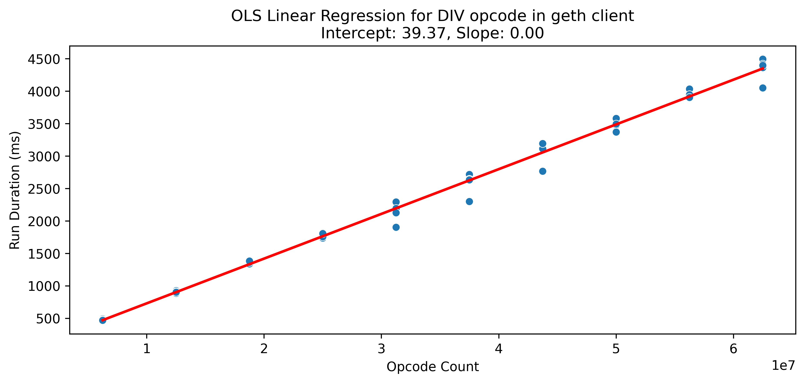


# SDIV

## nethermind


```python
                            OLS Regression Results                            
==============================================================================
Dep. Variable:        run_duration_ms   R-squared:                       0.997
Model:                            OLS   Adj. R-squared:                  0.997
Method:                 Least Squares   F-statistic:                 1.562e+04
Date:                Mon, 22 Dec 2025   Prob (F-statistic):           3.88e-66
Time:                        12:03:26   Log-Likelihood:                -343.57
No. Observations:                  54   AIC:                             691.1
Df Residuals:                      52   BIC:                             695.1
Df Model:                           1                                         
Covariance Type:            nonrobust                                         
==============================================================================
                 coef    std err          t      P>|t|      [0.025      0.975]
------------------------------------------------------------------------------
const         63.2945     42.245      1.498      0.140     -21.476     148.065
opcount        0.0001    1.1e-06    124.962      0.000       0.000       0.000
==============================================================================
Omnibus:                       15.465   Durbin-Watson:                   1.300
Prob(Omnibus):                  0.000   Jarque-Bera (JB):               22.559
Skew:                          -0.959   Prob(JB):                     1.26e-05
Kurtosis:                       5.520   Cond. No.                     8.35e+07
==============================================================================

Notes:
[1] Standard Errors assume that the covariance matrix of the errors is correctly specified.
[2] The condition number is large, 8.35e+07. This might indicate that there are
strong multicollinearity or other numerical problems.
```

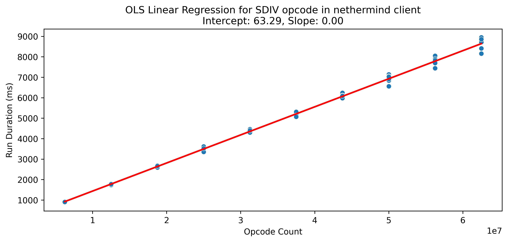


## reth


```python
                            OLS Regression Results                            
==============================================================================
Dep. Variable:        run_duration_ms   R-squared:                       0.994
Model:                            OLS   Adj. R-squared:                  0.994
Method:                 Least Squares   F-statistic:                     8533.
Date:                Mon, 22 Dec 2025   Prob (F-statistic):           2.41e-59
Time:                        12:03:26   Log-Likelihood:                -319.37
No. Observations:                  54   AIC:                             642.7
Df Residuals:                      52   BIC:                             646.7
Df Model:                           1                                         
Covariance Type:            nonrobust                                         
==============================================================================
                 coef    std err          t      P>|t|      [0.025      0.975]
------------------------------------------------------------------------------
const         75.4131     26.988      2.794      0.007      21.257     129.569
opcount     6.482e-05   7.02e-07     92.377      0.000    6.34e-05    6.62e-05
==============================================================================
Omnibus:                       21.285   Durbin-Watson:                   1.852
Prob(Omnibus):                  0.000   Jarque-Bera (JB):               32.563
Skew:                          -1.335   Prob(JB):                     8.49e-08
Kurtosis:                       5.709   Cond. No.                     8.35e+07
==============================================================================

Notes:
[1] Standard Errors assume that the covariance matrix of the errors is correctly specified.
[2] The condition number is large, 8.35e+07. This might indicate that there are
strong multicollinearity or other numerical problems.
```


## besu


```python
                            OLS Regression Results                            
==============================================================================
Dep. Variable:        run_duration_ms   R-squared:                       0.941
Model:                            OLS   Adj. R-squared:                  0.939
Method:                 Least Squares   F-statistic:                     729.8
Date:                Mon, 22 Dec 2025   Prob (F-statistic):           7.25e-30
Time:                        12:03:26   Log-Likelihood:                -427.33
No. Observations:                  48   AIC:                             858.7
Df Residuals:                      46   BIC:                             862.4
Df Model:                           1                                         
Covariance Type:            nonrobust                                         
==============================================================================
                 coef    std err          t      P>|t|      [0.025      0.975]
------------------------------------------------------------------------------
const      -1984.6119    575.875     -3.446      0.001   -3143.788    -825.436
opcount        0.0005   1.67e-05     27.015      0.000       0.000       0.000
==============================================================================
Omnibus:                        4.877   Durbin-Watson:                   1.161
Prob(Omnibus):                  0.087   Jarque-Bera (JB):                3.833
Skew:                           0.662   Prob(JB):                        0.147
Kurtosis:                       3.407   Cond. No.                     7.58e+07
==============================================================================

Notes:
[1] Standard Errors assume that the covariance matrix of the errors is correctly specified.
[2] The condition number is large, 7.58e+07. This might indicate that there are
strong multicollinearity or other numerical problems.
```

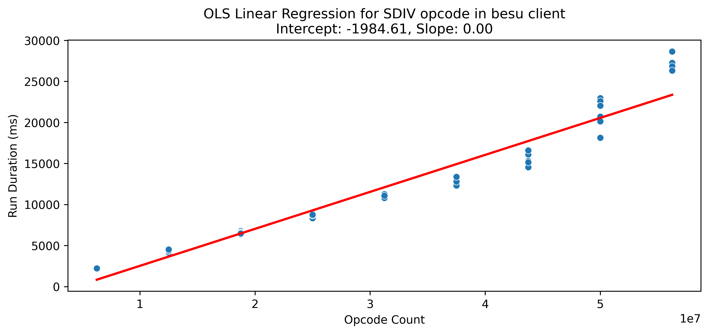


## geth


```python
                            OLS Regression Results                            
==============================================================================
Dep. Variable:        run_duration_ms   R-squared:                       0.997
Model:                            OLS   Adj. R-squared:                  0.997
Method:                 Least Squares   F-statistic:                 1.581e+04
Date:                Mon, 22 Dec 2025   Prob (F-statistic):           2.82e-66
Time:                        12:03:26   Log-Likelihood:                -308.68
No. Observations:                  54   AIC:                             621.4
Df Residuals:                      52   BIC:                             625.3
Df Model:                           1                                         
Covariance Type:            nonrobust                                         
==============================================================================
                 coef    std err          t      P>|t|      [0.025      0.975]
------------------------------------------------------------------------------
const         22.4225     22.143      1.013      0.316     -22.011      66.856
opcount     7.239e-05   5.76e-07    125.736      0.000    7.12e-05    7.35e-05
==============================================================================
Omnibus:                       36.927   Durbin-Watson:                   2.007
Prob(Omnibus):                  0.000   Jarque-Bera (JB):               98.638
Skew:                          -1.990   Prob(JB):                     3.81e-22
Kurtosis:                       8.292   Cond. No.                     8.35e+07
==============================================================================

Notes:
[1] Standard Errors assume that the covariance matrix of the errors is correctly specified.
[2] The condition number is large, 8.35e+07. This might indicate that there are
strong multicollinearity or other numerical problems.
```


# MOD

## nethermind


```python
                            OLS Regression Results                            
==============================================================================
Dep. Variable:        run_duration_ms   R-squared:                       0.001
Model:                            OLS   Adj. R-squared:                 -0.009
Method:                 Least Squares   F-statistic:                   0.09218
Date:                Mon, 22 Dec 2025   Prob (F-statistic):              0.762
Time:                        12:03:26   Log-Likelihood:                -1125.8
No. Observations:                 108   AIC:                             2256.
Df Residuals:                     106   BIC:                             2261.
Df Model:                           1                                         
Covariance Type:            nonrobust                                         
==============================================================================
                 coef    std err          t      P>|t|      [0.025      0.975]
------------------------------------------------------------------------------
const       8704.8940   1718.824      5.064      0.000    5297.159    1.21e+04
opcount     1.357e-05   4.47e-05      0.304      0.762    -7.5e-05       0.000
==============================================================================
Omnibus:                      824.022   Durbin-Watson:                   1.661
Prob(Omnibus):                  0.000   Jarque-Bera (JB):               17.867
Skew:                           0.002   Prob(JB):                     0.000132
Kurtosis:                       1.007   Cond. No.                     8.35e+07
==============================================================================

Notes:
[1] Standard Errors assume that the covariance matrix of the errors is correctly specified.
[2] The condition number is large, 8.35e+07. This might indicate that there are
strong multicollinearity or other numerical problems.
```

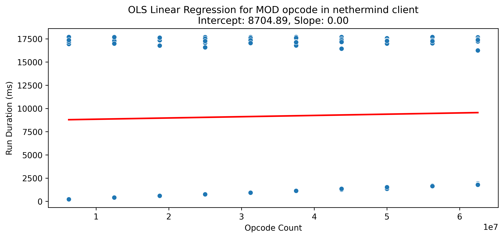


## reth


```python
                            OLS Regression Results                            
==============================================================================
Dep. Variable:        run_duration_ms   R-squared:                       0.002
Model:                            OLS   Adj. R-squared:                 -0.008
Method:                 Least Squares   F-statistic:                    0.1740
Date:                Mon, 22 Dec 2025   Prob (F-statistic):              0.677
Time:                        12:03:26   Log-Likelihood:                -1022.6
No. Observations:                 108   AIC:                             2049.
Df Residuals:                     106   BIC:                             2055.
Df Model:                           1                                         
Covariance Type:            nonrobust                                         
==============================================================================
                 coef    std err          t      P>|t|      [0.025      0.975]
------------------------------------------------------------------------------
const       3399.3578    661.093      5.142      0.000    2088.677    4710.039
opcount      7.17e-06   1.72e-05      0.417      0.677   -2.69e-05    4.12e-05
==============================================================================
Omnibus:                      830.201   Durbin-Watson:                   1.651
Prob(Omnibus):                  0.000   Jarque-Bera (JB):               17.739
Skew:                           0.007   Prob(JB):                     0.000141
Kurtosis:                       1.015   Cond. No.                     8.35e+07
==============================================================================

Notes:
[1] Standard Errors assume that the covariance matrix of the errors is correctly specified.
[2] The condition number is large, 8.35e+07. This might indicate that there are
strong multicollinearity or other numerical problems.
```

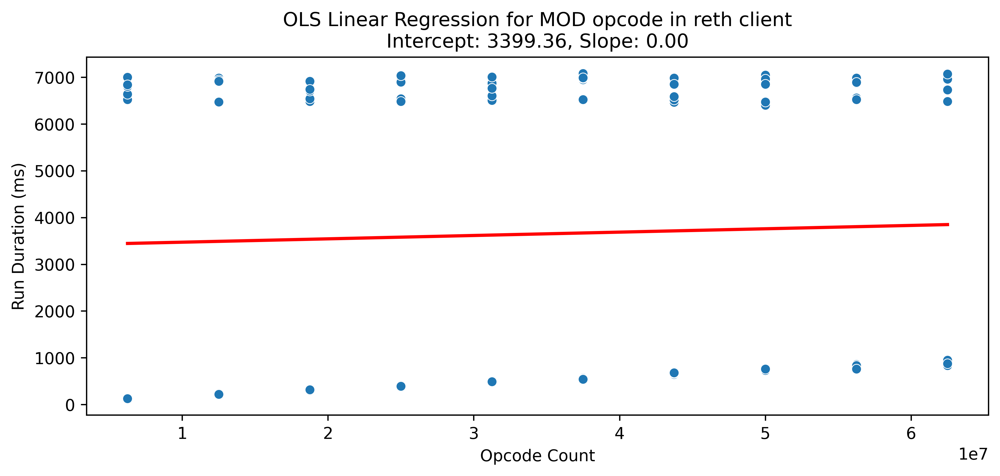


## besu


```python
                            OLS Regression Results                            
==============================================================================
Dep. Variable:        run_duration_ms   R-squared:                       0.994
Model:                            OLS   Adj. R-squared:                  0.994
Method:                 Least Squares   F-statistic:                     8479.
Date:                Mon, 22 Dec 2025   Prob (F-statistic):           2.84e-59
Time:                        12:03:26   Log-Likelihood:                -379.14
No. Observations:                  54   AIC:                             762.3
Df Residuals:                      52   BIC:                             766.3
Df Model:                           1                                         
Covariance Type:            nonrobust                                         
==============================================================================
                 coef    std err          t      P>|t|      [0.025      0.975]
------------------------------------------------------------------------------
const         -1.0030     81.639     -0.012      0.990    -164.823     162.817
opcount        0.0002   2.12e-06     92.079      0.000       0.000       0.000
==============================================================================
Omnibus:                        5.207   Durbin-Watson:                   1.421
Prob(Omnibus):                  0.074   Jarque-Bera (JB):                4.230
Skew:                           0.525   Prob(JB):                        0.121
Kurtosis:                       3.882   Cond. No.                     8.35e+07
==============================================================================

Notes:
[1] Standard Errors assume that the covariance matrix of the errors is correctly specified.
[2] The condition number is large, 8.35e+07. This might indicate that there are
strong multicollinearity or other numerical problems.
```


## geth


```python
                            OLS Regression Results                            
==============================================================================
Dep. Variable:        run_duration_ms   R-squared:                       0.003
Model:                            OLS   Adj. R-squared:                 -0.006
Method:                 Least Squares   F-statistic:                    0.3236
Date:                Mon, 22 Dec 2025   Prob (F-statistic):              0.571
Time:                        12:03:27   Log-Likelihood:                -1076.1
No. Observations:                 108   AIC:                             2156.
Df Residuals:                     106   BIC:                             2162.
Df Model:                           1                                         
Covariance Type:            nonrobust                                         
==============================================================================
                 coef    std err          t      P>|t|      [0.025      0.975]
------------------------------------------------------------------------------
const       5593.4987   1084.956      5.156      0.000    3442.467    7744.530
opcount     1.605e-05   2.82e-05      0.569      0.571   -3.99e-05     7.2e-05
==============================================================================
Omnibus:                      826.262   Durbin-Watson:                   1.654
Prob(Omnibus):                  0.000   Jarque-Bera (JB):               17.820
Skew:                           0.002   Prob(JB):                     0.000135
Kurtosis:                       1.010   Cond. No.                     8.35e+07
==============================================================================

Notes:
[1] Standard Errors assume that the covariance matrix of the errors is correctly specified.
[2] The condition number is large, 8.35e+07. This might indicate that there are
strong multicollinearity or other numerical problems.
```

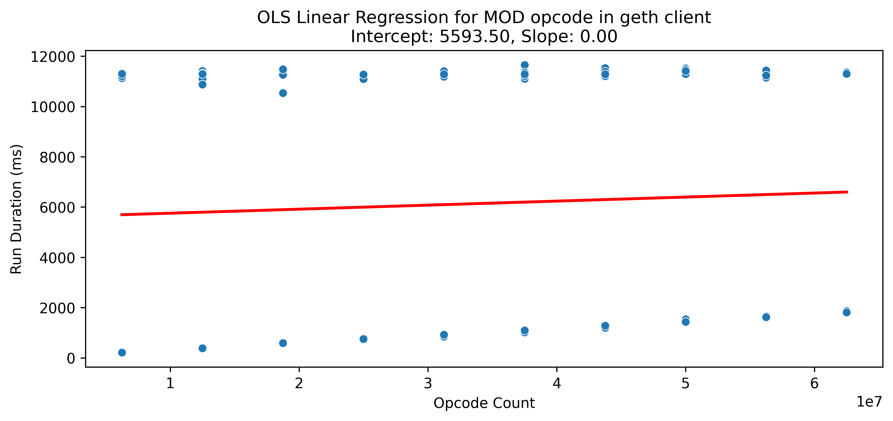


# SMOD

## nethermind


```python
                            OLS Regression Results                            
==============================================================================
Dep. Variable:        run_duration_ms   R-squared:                       0.000
Model:                            OLS   Adj. R-squared:                 -0.009
Method:                 Least Squares   F-statistic:                   0.01218
Date:                Mon, 22 Dec 2025   Prob (F-statistic):              0.912
Time:                        12:03:27   Log-Likelihood:                -1136.1
No. Observations:                 108   AIC:                             2276.
Df Residuals:                     106   BIC:                             2282.
Df Model:                           1                                         
Covariance Type:            nonrobust                                         
==============================================================================
                 coef    std err          t      P>|t|      [0.025      0.975]
------------------------------------------------------------------------------
const       9249.9369   1889.903      4.894      0.000    5503.020     1.3e+04
opcount     5.422e-06   4.91e-05      0.110      0.912    -9.2e-05       0.000
==============================================================================
Omnibus:                      821.202   Durbin-Watson:                   2.368
Prob(Omnibus):                  0.000   Jarque-Bera (JB):               17.928
Skew:                           0.002   Prob(JB):                     0.000128
Kurtosis:                       1.004   Cond. No.                     8.35e+07
==============================================================================

Notes:
[1] Standard Errors assume that the covariance matrix of the errors is correctly specified.
[2] The condition number is large, 8.35e+07. This might indicate that there are
strong multicollinearity or other numerical problems.
```

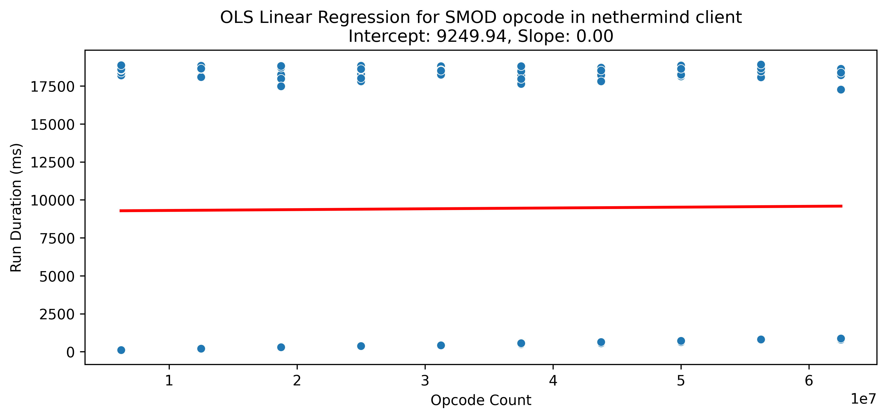


## reth


```python
                            OLS Regression Results                            
==============================================================================
Dep. Variable:        run_duration_ms   R-squared:                       0.001
Model:                            OLS   Adj. R-squared:                 -0.008
Method:                 Least Squares   F-statistic:                    0.1271
Date:                Mon, 22 Dec 2025   Prob (F-statistic):              0.722
Time:                        12:03:27   Log-Likelihood:                -1023.1
No. Observations:                 108   AIC:                             2050.
Df Residuals:                     106   BIC:                             2056.
Df Model:                           1                                         
Covariance Type:            nonrobust                                         
==============================================================================
                 coef    std err          t      P>|t|      [0.025      0.975]
------------------------------------------------------------------------------
const       3362.3688    663.902      5.065      0.000    2046.119    4678.618
opcount     6.153e-06   1.73e-05      0.356      0.722   -2.81e-05    4.04e-05
==============================================================================
Omnibus:                      823.219   Durbin-Watson:                   2.358
Prob(Omnibus):                  0.000   Jarque-Bera (JB):               17.884
Skew:                           0.002   Prob(JB):                     0.000131
Kurtosis:                       1.006   Cond. No.                     8.35e+07
==============================================================================

Notes:
[1] Standard Errors assume that the covariance matrix of the errors is correctly specified.
[2] The condition number is large, 8.35e+07. This might indicate that there are
strong multicollinearity or other numerical problems.
```

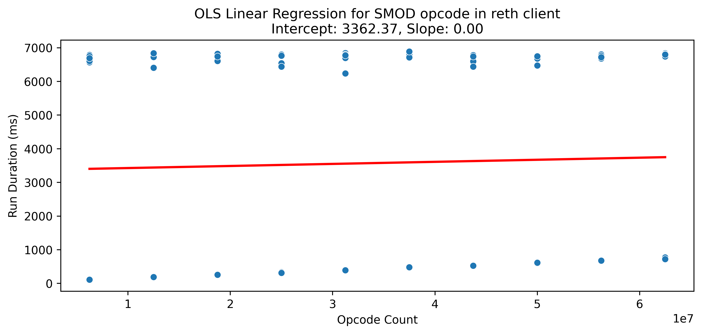


## besu


```python
                            OLS Regression Results                            
==============================================================================
Dep. Variable:        run_duration_ms   R-squared:                       0.946
Model:                            OLS   Adj. R-squared:                  0.945
Method:                 Least Squares   F-statistic:                     915.0
Date:                Mon, 22 Dec 2025   Prob (F-statistic):           1.12e-34
Time:                        12:03:27   Log-Likelihood:                -357.28
No. Observations:                  54   AIC:                             718.6
Df Residuals:                      52   BIC:                             722.5
Df Model:                           1                                         
Covariance Type:            nonrobust                                         
==============================================================================
                 coef    std err          t      P>|t|      [0.025      0.975]
------------------------------------------------------------------------------
const         14.8363     54.462      0.272      0.786     -94.450     124.123
opcount     4.283e-05   1.42e-06     30.248      0.000       4e-05    4.57e-05
==============================================================================
Omnibus:                        5.343   Durbin-Watson:                   0.815
Prob(Omnibus):                  0.069   Jarque-Bera (JB):                4.293
Skew:                           0.636   Prob(JB):                        0.117
Kurtosis:                       3.539   Cond. No.                     8.35e+07
==============================================================================

Notes:
[1] Standard Errors assume that the covariance matrix of the errors is correctly specified.
[2] The condition number is large, 8.35e+07. This might indicate that there are
strong multicollinearity or other numerical problems.
```


## geth


```python
                            OLS Regression Results                            
==============================================================================
Dep. Variable:        run_duration_ms   R-squared:                       0.002
Model:                            OLS   Adj. R-squared:                 -0.007
Method:                 Least Squares   F-statistic:                    0.2357
Date:                Mon, 22 Dec 2025   Prob (F-statistic):              0.628
Time:                        12:03:27   Log-Likelihood:                -1082.0
No. Observations:                 108   AIC:                             2168.
Df Residuals:                     106   BIC:                             2173.
Df Model:                           1                                         
Covariance Type:            nonrobust                                         
==============================================================================
                 coef    std err          t      P>|t|      [0.025      0.975]
------------------------------------------------------------------------------
const       5901.5340   1145.382      5.152      0.000    3630.703    8172.365
opcount     1.446e-05   2.98e-05      0.485      0.628   -4.46e-05    7.35e-05
==============================================================================
Omnibus:                      827.377   Durbin-Watson:                   2.356
Prob(Omnibus):                  0.000   Jarque-Bera (JB):               17.797
Skew:                           0.003   Prob(JB):                     0.000137
Kurtosis:                       1.011   Cond. No.                     8.35e+07
==============================================================================

Notes:
[1] Standard Errors assume that the covariance matrix of the errors is correctly specified.
[2] The condition number is large, 8.35e+07. This might indicate that there are
strong multicollinearity or other numerical problems.
```

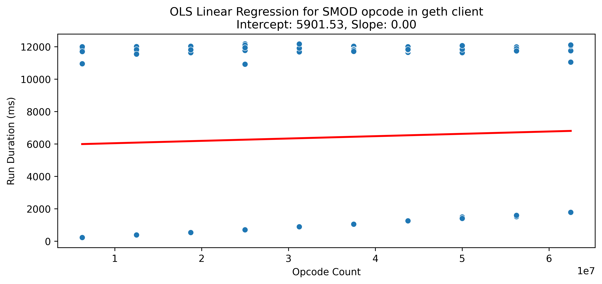


# ADDMOD

## nethermind

OLS model did not run... Error: zero-size array to reduction operation maximum which has no identity

## reth

OLS model did not run... Error: zero-size array to reduction operation maximum which has no identity

## besu

OLS model did not run... Error: zero-size array to reduction operation maximum which has no identity

## geth

OLS model did not run... Error: zero-size array to reduction operation maximum which has no identity

# MULMOD

## nethermind

OLS model did not run... Error: zero-size array to reduction operation maximum which has no identity

## reth

OLS model did not run... Error: zero-size array to reduction operation maximum which has no identity

## besu

OLS model did not run... Error: zero-size array to reduction operation maximum which has no identity

## geth

OLS model did not run... Error: zero-size array to reduction operation maximum which has no identity

# SIGNEXTEND

## nethermind


```python
                            OLS Regression Results                            
==============================================================================
Dep. Variable:        run_duration_ms   R-squared:                       0.991
Model:                            OLS   Adj. R-squared:                  0.990
Method:                 Least Squares   F-statistic:                     5519.
Date:                Mon, 22 Dec 2025   Prob (F-statistic):           1.84e-54
Time:                        12:03:27   Log-Likelihood:                -266.10
No. Observations:                  54   AIC:                             536.2
Df Residuals:                      52   BIC:                             540.2
Df Model:                           1                                         
Covariance Type:            nonrobust                                         
==============================================================================
                 coef    std err          t      P>|t|      [0.025      0.975]
------------------------------------------------------------------------------
const         32.5855     10.064      3.238      0.002      12.390      52.781
opcount     1.944e-05   2.62e-07     74.291      0.000    1.89e-05       2e-05
==============================================================================
Omnibus:                       35.092   Durbin-Watson:                   0.895
Prob(Omnibus):                  0.000   Jarque-Bera (JB):               81.178
Skew:                          -1.979   Prob(JB):                     2.36e-18
Kurtosis:                       7.518   Cond. No.                     8.35e+07
==============================================================================

Notes:
[1] Standard Errors assume that the covariance matrix of the errors is correctly specified.
[2] The condition number is large, 8.35e+07. This might indicate that there are
strong multicollinearity or other numerical problems.
```

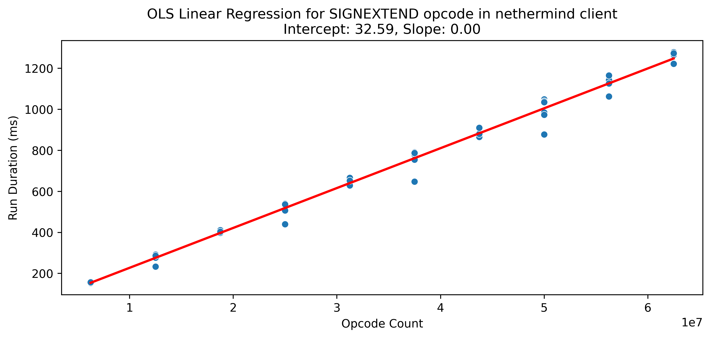


## reth


```python
                            OLS Regression Results                            
==============================================================================
Dep. Variable:        run_duration_ms   R-squared:                       0.993
Model:                            OLS   Adj. R-squared:                  0.993
Method:                 Least Squares   F-statistic:                     7759.
Date:                Mon, 22 Dec 2025   Prob (F-statistic):           2.81e-58
Time:                        12:03:27   Log-Likelihood:                -240.47
No. Observations:                  54   AIC:                             484.9
Df Residuals:                      52   BIC:                             488.9
Df Model:                           1                                         
Covariance Type:            nonrobust                                         
==============================================================================
                 coef    std err          t      P>|t|      [0.025      0.975]
------------------------------------------------------------------------------
const         33.5147      6.261      5.353      0.000      20.951      46.078
opcount     1.434e-05   1.63e-07     88.086      0.000     1.4e-05    1.47e-05
==============================================================================
Omnibus:                       13.839   Durbin-Watson:                   1.140
Prob(Omnibus):                  0.001   Jarque-Bera (JB):               15.346
Skew:                          -1.067   Prob(JB):                     0.000465
Kurtosis:                       4.506   Cond. No.                     8.35e+07
==============================================================================

Notes:
[1] Standard Errors assume that the covariance matrix of the errors is correctly specified.
[2] The condition number is large, 8.35e+07. This might indicate that there are
strong multicollinearity or other numerical problems.
```

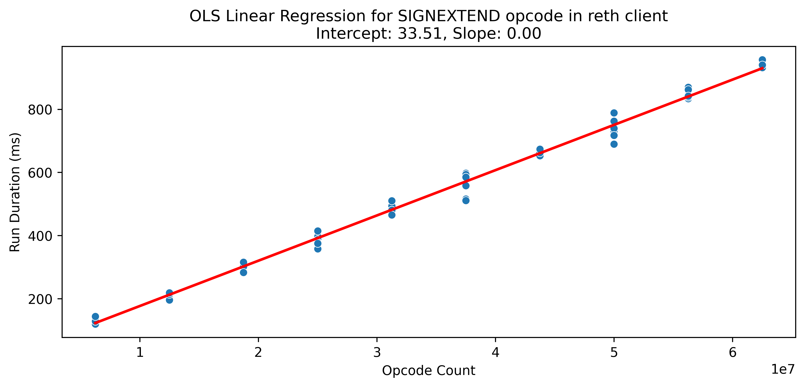


## besu


```python
                            OLS Regression Results                            
==============================================================================
Dep. Variable:        run_duration_ms   R-squared:                       0.984
Model:                            OLS   Adj. R-squared:                  0.984
Method:                 Least Squares   F-statistic:                     3190.
Date:                Mon, 22 Dec 2025   Prob (F-statistic):           2.40e-48
Time:                        12:03:27   Log-Likelihood:                -367.55
No. Observations:                  54   AIC:                             739.1
Df Residuals:                      52   BIC:                             743.1
Df Model:                           1                                         
Covariance Type:            nonrobust                                         
==============================================================================
                 coef    std err          t      P>|t|      [0.025      0.975]
------------------------------------------------------------------------------
const        -15.5307     65.864     -0.236      0.815    -147.696     116.634
opcount     9.672e-05   1.71e-06     56.478      0.000    9.33e-05       0.000
==============================================================================
Omnibus:                        6.377   Durbin-Watson:                   1.498
Prob(Omnibus):                  0.041   Jarque-Bera (JB):                5.733
Skew:                           0.563   Prob(JB):                       0.0569
Kurtosis:                       4.131   Cond. No.                     8.35e+07
==============================================================================

Notes:
[1] Standard Errors assume that the covariance matrix of the errors is correctly specified.
[2] The condition number is large, 8.35e+07. This might indicate that there are
strong multicollinearity or other numerical problems.
```


## geth


```python
                            OLS Regression Results                            
==============================================================================
Dep. Variable:        run_duration_ms   R-squared:                       0.967
Model:                            OLS   Adj. R-squared:                  0.967
Method:                 Least Squares   F-statistic:                     1543.
Date:                Mon, 22 Dec 2025   Prob (F-statistic):           2.48e-40
Time:                        12:03:28   Log-Likelihood:                -312.82
No. Observations:                  54   AIC:                             629.6
Df Residuals:                      52   BIC:                             633.6
Df Model:                           1                                         
Covariance Type:            nonrobust                                         
==============================================================================
                 coef    std err          t      P>|t|      [0.025      0.975]
------------------------------------------------------------------------------
const         40.9165     23.907      1.711      0.093      -7.057      88.889
opcount     2.442e-05   6.22e-07     39.280      0.000    2.32e-05    2.57e-05
==============================================================================
Omnibus:                       98.131   Durbin-Watson:                   2.472
Prob(Omnibus):                  0.000   Jarque-Bera (JB):             2629.760
Skew:                           5.213   Prob(JB):                         0.00
Kurtosis:                      35.559   Cond. No.                     8.35e+07
==============================================================================

Notes:
[1] Standard Errors assume that the covariance matrix of the errors is correctly specified.
[2] The condition number is large, 8.35e+07. This might indicate that there are
strong multicollinearity or other numerical problems.
```

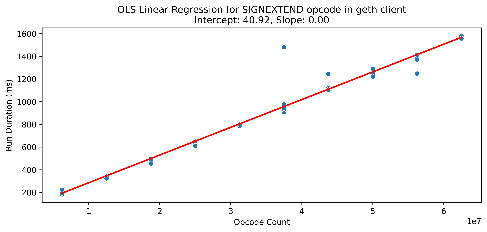


# LT

## nethermind


```python
                            OLS Regression Results                            
==============================================================================
Dep. Variable:        run_duration_ms   R-squared:                       0.992
Model:                            OLS   Adj. R-squared:                  0.992
Method:                 Least Squares   F-statistic:                     6340.
Date:                Mon, 22 Dec 2025   Prob (F-statistic):           5.17e-56
Time:                        12:03:28   Log-Likelihood:                -259.83
No. Observations:                  54   AIC:                             523.7
Df Residuals:                      52   BIC:                             527.6
Df Model:                           1                                         
Covariance Type:            nonrobust                                         
==============================================================================
                 coef    std err          t      P>|t|      [0.025      0.975]
------------------------------------------------------------------------------
const         40.1530      8.961      4.481      0.000      22.171      58.135
opcount     1.546e-05   1.94e-07     79.621      0.000    1.51e-05    1.58e-05
==============================================================================
Omnibus:                        9.405   Durbin-Watson:                   1.929
Prob(Omnibus):                  0.009   Jarque-Bera (JB):               22.476
Skew:                          -0.109   Prob(JB):                     1.32e-05
Kurtosis:                       6.153   Cond. No.                     1.00e+08
==============================================================================

Notes:
[1] Standard Errors assume that the covariance matrix of the errors is correctly specified.
[2] The condition number is large,  1e+08. This might indicate that there are
strong multicollinearity or other numerical problems.
```


## reth


```python
                            OLS Regression Results                            
==============================================================================
Dep. Variable:        run_duration_ms   R-squared:                       0.996
Model:                            OLS   Adj. R-squared:                  0.996
Method:                 Least Squares   F-statistic:                 1.244e+04
Date:                Mon, 22 Dec 2025   Prob (F-statistic):           1.40e-63
Time:                        12:03:28   Log-Likelihood:                -200.07
No. Observations:                  54   AIC:                             404.1
Df Residuals:                      52   BIC:                             408.1
Df Model:                           1                                         
Covariance Type:            nonrobust                                         
==============================================================================
                 coef    std err          t      P>|t|      [0.025      0.975]
------------------------------------------------------------------------------
const         39.1338      2.963     13.207      0.000      33.188      45.080
opcount      7.16e-06   6.42e-08    111.529      0.000    7.03e-06    7.29e-06
==============================================================================
Omnibus:                       24.851   Durbin-Watson:                   1.869
Prob(Omnibus):                  0.000   Jarque-Bera (JB):              109.819
Skew:                           0.943   Prob(JB):                     1.42e-24
Kurtosis:                       9.727   Cond. No.                     1.00e+08
==============================================================================

Notes:
[1] Standard Errors assume that the covariance matrix of the errors is correctly specified.
[2] The condition number is large,  1e+08. This might indicate that there are
strong multicollinearity or other numerical problems.
```

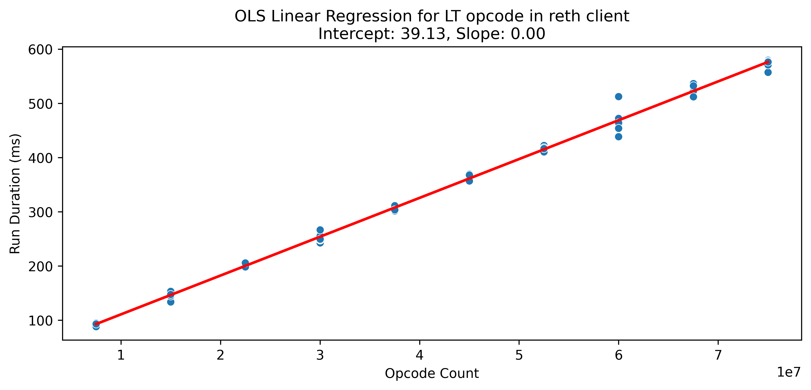


## besu


```python
                            OLS Regression Results                            
==============================================================================
Dep. Variable:        run_duration_ms   R-squared:                       0.930
Model:                            OLS   Adj. R-squared:                  0.929
Method:                 Least Squares   F-statistic:                     691.8
Date:                Mon, 22 Dec 2025   Prob (F-statistic):           1.04e-31
Time:                        12:03:28   Log-Likelihood:                -408.80
No. Observations:                  54   AIC:                             821.6
Df Residuals:                      52   BIC:                             825.6
Df Model:                           1                                         
Covariance Type:            nonrobust                                         
==============================================================================
                 coef    std err          t      P>|t|      [0.025      0.975]
------------------------------------------------------------------------------
const         15.9688    141.379      0.113      0.911    -267.729     299.667
opcount     8.057e-05   3.06e-06     26.302      0.000    7.44e-05    8.67e-05
==============================================================================
Omnibus:                       16.647   Durbin-Watson:                   0.673
Prob(Omnibus):                  0.000   Jarque-Bera (JB):               21.397
Skew:                           1.141   Prob(JB):                     2.26e-05
Kurtosis:                       5.075   Cond. No.                     1.00e+08
==============================================================================

Notes:
[1] Standard Errors assume that the covariance matrix of the errors is correctly specified.
[2] The condition number is large,  1e+08. This might indicate that there are
strong multicollinearity or other numerical problems.
```

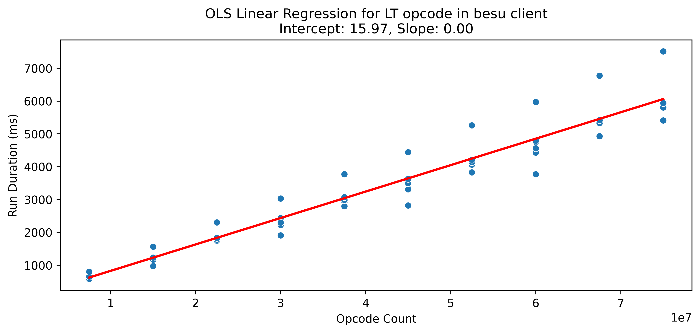


## geth


```python
                            OLS Regression Results                            
==============================================================================
Dep. Variable:        run_duration_ms   R-squared:                       0.998
Model:                            OLS   Adj. R-squared:                  0.998
Method:                 Least Squares   F-statistic:                 2.751e+04
Date:                Mon, 22 Dec 2025   Prob (F-statistic):           1.63e-72
Time:                        12:03:28   Log-Likelihood:                -238.67
No. Observations:                  54   AIC:                             481.3
Df Residuals:                      52   BIC:                             485.3
Df Model:                           1                                         
Covariance Type:            nonrobust                                         
==============================================================================
                 coef    std err          t      P>|t|      [0.025      0.975]
------------------------------------------------------------------------------
const         43.7286      6.055      7.222      0.000      31.578      55.880
opcount     2.176e-05   1.31e-07    165.850      0.000    2.15e-05     2.2e-05
==============================================================================
Omnibus:                        2.172   Durbin-Watson:                   2.116
Prob(Omnibus):                  0.338   Jarque-Bera (JB):                1.646
Skew:                           0.426   Prob(JB):                        0.439
Kurtosis:                       3.072   Cond. No.                     1.00e+08
==============================================================================

Notes:
[1] Standard Errors assume that the covariance matrix of the errors is correctly specified.
[2] The condition number is large,  1e+08. This might indicate that there are
strong multicollinearity or other numerical problems.
```

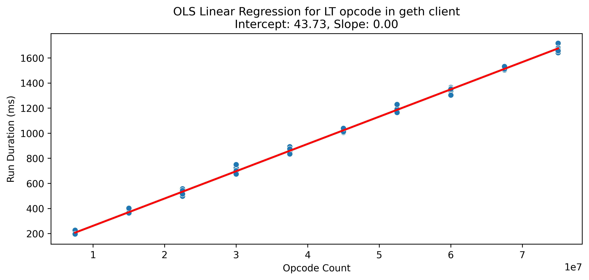


# GT

## nethermind


```python
                            OLS Regression Results                            
==============================================================================
Dep. Variable:        run_duration_ms   R-squared:                       0.990
Model:                            OLS   Adj. R-squared:                  0.990
Method:                 Least Squares   F-statistic:                     5214.
Date:                Mon, 22 Dec 2025   Prob (F-statistic):           7.97e-54
Time:                        12:03:28   Log-Likelihood:                -261.80
No. Observations:                  54   AIC:                             527.6
Df Residuals:                      52   BIC:                             531.6
Df Model:                           1                                         
Covariance Type:            nonrobust                                         
==============================================================================
                 coef    std err          t      P>|t|      [0.025      0.975]
------------------------------------------------------------------------------
const         44.5751      9.294      4.796      0.000      25.926      63.224
opcount     1.454e-05   2.01e-07     72.208      0.000    1.41e-05    1.49e-05
==============================================================================
Omnibus:                        5.946   Durbin-Watson:                   1.816
Prob(Omnibus):                  0.051   Jarque-Bera (JB):                8.822
Skew:                          -0.089   Prob(JB):                       0.0121
Kurtosis:                       4.972   Cond. No.                     1.00e+08
==============================================================================

Notes:
[1] Standard Errors assume that the covariance matrix of the errors is correctly specified.
[2] The condition number is large,  1e+08. This might indicate that there are
strong multicollinearity or other numerical problems.
```


## reth


```python
                            OLS Regression Results                            
==============================================================================
Dep. Variable:        run_duration_ms   R-squared:                       0.995
Model:                            OLS   Adj. R-squared:                  0.995
Method:                 Least Squares   F-statistic:                 1.002e+04
Date:                Mon, 22 Dec 2025   Prob (F-statistic):           3.80e-61
Time:                        12:03:28   Log-Likelihood:                -204.60
No. Observations:                  54   AIC:                             413.2
Df Residuals:                      52   BIC:                             417.2
Df Model:                           1                                         
Covariance Type:            nonrobust                                         
==============================================================================
                 coef    std err          t      P>|t|      [0.025      0.975]
------------------------------------------------------------------------------
const         45.1816      3.222     14.023      0.000      38.716      51.647
opcount     6.987e-06   6.98e-08    100.094      0.000    6.85e-06    7.13e-06
==============================================================================
Omnibus:                        1.658   Durbin-Watson:                   2.207
Prob(Omnibus):                  0.436   Jarque-Bera (JB):                1.397
Skew:                           0.391   Prob(JB):                        0.497
Kurtosis:                       2.899   Cond. No.                     1.00e+08
==============================================================================

Notes:
[1] Standard Errors assume that the covariance matrix of the errors is correctly specified.
[2] The condition number is large,  1e+08. This might indicate that there are
strong multicollinearity or other numerical problems.
```

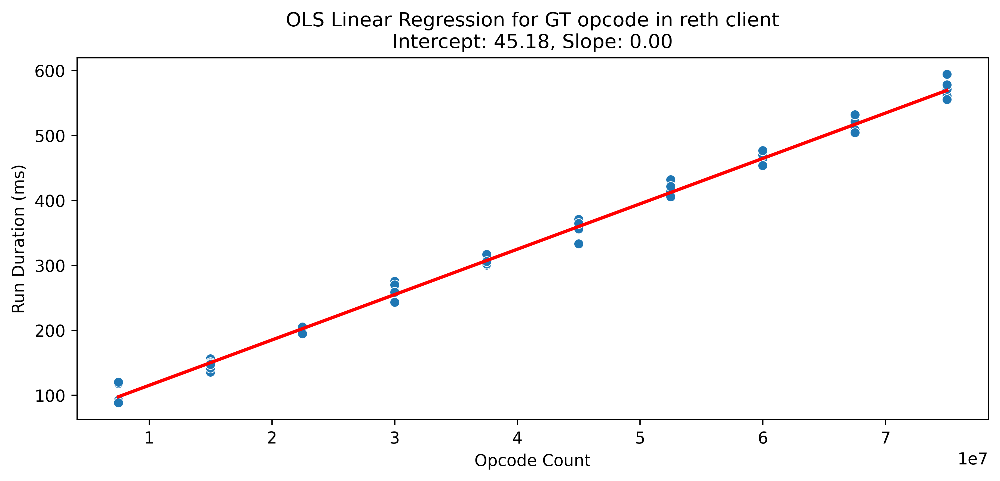


## besu


```python
                            OLS Regression Results                            
==============================================================================
Dep. Variable:        run_duration_ms   R-squared:                       0.913
Model:                            OLS   Adj. R-squared:                  0.912
Method:                 Least Squares   F-statistic:                     548.5
Date:                Mon, 22 Dec 2025   Prob (F-statistic):           2.72e-29
Time:                        12:03:29   Log-Likelihood:                -412.74
No. Observations:                  54   AIC:                             829.5
Df Residuals:                      52   BIC:                             833.5
Df Model:                           1                                         
Covariance Type:            nonrobust                                         
==============================================================================
                 coef    std err          t      P>|t|      [0.025      0.975]
------------------------------------------------------------------------------
const         -4.5971    152.105     -0.030      0.976    -309.818     300.624
opcount     7.719e-05    3.3e-06     23.421      0.000    7.06e-05    8.38e-05
==============================================================================
Omnibus:                       13.244   Durbin-Watson:                   0.578
Prob(Omnibus):                  0.001   Jarque-Bera (JB):               18.096
Skew:                           0.844   Prob(JB):                     0.000118
Kurtosis:                       5.280   Cond. No.                     1.00e+08
==============================================================================

Notes:
[1] Standard Errors assume that the covariance matrix of the errors is correctly specified.
[2] The condition number is large,  1e+08. This might indicate that there are
strong multicollinearity or other numerical problems.
```

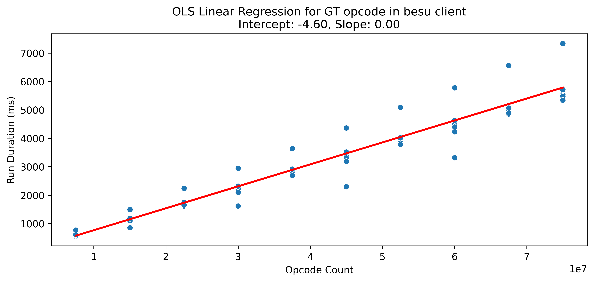


## geth


```python
                            OLS Regression Results                            
==============================================================================
Dep. Variable:        run_duration_ms   R-squared:                       0.998
Model:                            OLS   Adj. R-squared:                  0.998
Method:                 Least Squares   F-statistic:                 3.191e+04
Date:                Mon, 22 Dec 2025   Prob (F-statistic):           3.44e-74
Time:                        12:03:29   Log-Likelihood:                -234.45
No. Observations:                  54   AIC:                             472.9
Df Residuals:                      52   BIC:                             476.9
Df Model:                           1                                         
Covariance Type:            nonrobust                                         
==============================================================================
                 coef    std err          t      P>|t|      [0.025      0.975]
------------------------------------------------------------------------------
const         39.2590      5.600      7.010      0.000      28.022      50.496
opcount     2.168e-05   1.21e-07    178.647      0.000    2.14e-05    2.19e-05
==============================================================================
Omnibus:                        1.002   Durbin-Watson:                   2.550
Prob(Omnibus):                  0.606   Jarque-Bera (JB):                0.441
Skew:                           0.183   Prob(JB):                        0.802
Kurtosis:                       3.248   Cond. No.                     1.00e+08
==============================================================================

Notes:
[1] Standard Errors assume that the covariance matrix of the errors is correctly specified.
[2] The condition number is large,  1e+08. This might indicate that there are
strong multicollinearity or other numerical problems.
```


# SLT

## nethermind


```python
                            OLS Regression Results                            
==============================================================================
Dep. Variable:        run_duration_ms   R-squared:                       0.907
Model:                            OLS   Adj. R-squared:                  0.905
Method:                 Least Squares   F-statistic:                     506.2
Date:                Mon, 22 Dec 2025   Prob (F-statistic):           1.83e-28
Time:                        12:03:29   Log-Likelihood:                -336.23
No. Observations:                  54   AIC:                             676.5
Df Residuals:                      52   BIC:                             680.4
Df Model:                           1                                         
Covariance Type:            nonrobust                                         
==============================================================================
                 coef    std err          t      P>|t|      [0.025      0.975]
------------------------------------------------------------------------------
const         62.0768     36.876      1.683      0.098     -11.921     136.074
opcount     1.798e-05   7.99e-07     22.499      0.000    1.64e-05    1.96e-05
==============================================================================
Omnibus:                       91.334   Durbin-Watson:                   2.029
Prob(Omnibus):                  0.000   Jarque-Bera (JB):             1734.415
Skew:                           4.827   Prob(JB):                         0.00
Kurtosis:                      29.032   Cond. No.                     1.00e+08
==============================================================================

Notes:
[1] Standard Errors assume that the covariance matrix of the errors is correctly specified.
[2] The condition number is large,  1e+08. This might indicate that there are
strong multicollinearity or other numerical problems.
```

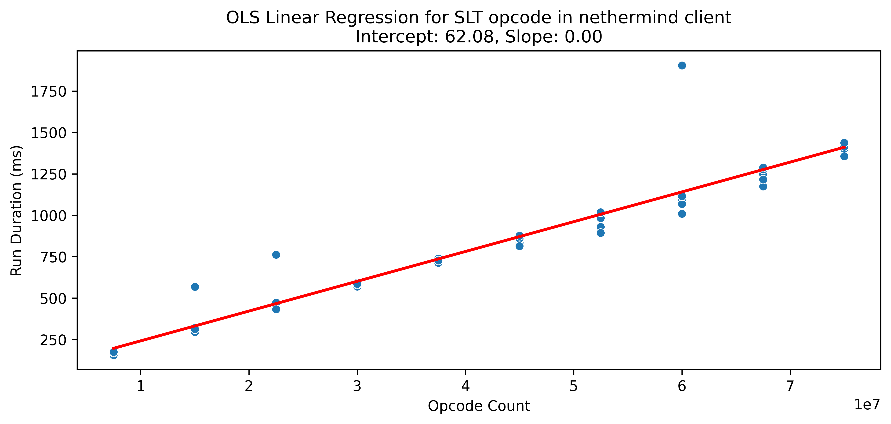


## reth


```python
                            OLS Regression Results                            
==============================================================================
Dep. Variable:        run_duration_ms   R-squared:                       0.992
Model:                            OLS   Adj. R-squared:                  0.992
Method:                 Least Squares   F-statistic:                     6478.
Date:                Mon, 22 Dec 2025   Prob (F-statistic):           2.97e-56
Time:                        12:03:29   Log-Likelihood:                -220.44
No. Observations:                  54   AIC:                             444.9
Df Residuals:                      52   BIC:                             448.9
Df Model:                           1                                         
Covariance Type:            nonrobust                                         
==============================================================================
                 coef    std err          t      P>|t|      [0.025      0.975]
------------------------------------------------------------------------------
const         42.2495      4.321      9.778      0.000      33.579      50.920
opcount     7.535e-06   9.36e-08     80.484      0.000    7.35e-06    7.72e-06
==============================================================================
Omnibus:                        5.368   Durbin-Watson:                   1.450
Prob(Omnibus):                  0.068   Jarque-Bera (JB):                6.621
Skew:                           0.208   Prob(JB):                       0.0365
Kurtosis:                       4.664   Cond. No.                     1.00e+08
==============================================================================

Notes:
[1] Standard Errors assume that the covariance matrix of the errors is correctly specified.
[2] The condition number is large,  1e+08. This might indicate that there are
strong multicollinearity or other numerical problems.
```

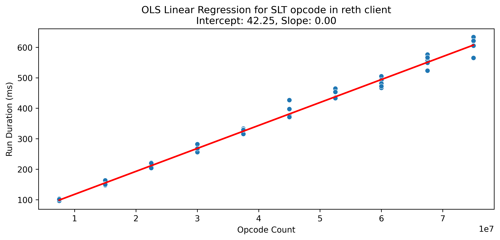


## besu


```python
                            OLS Regression Results                            
==============================================================================
Dep. Variable:        run_duration_ms   R-squared:                       0.940
Model:                            OLS   Adj. R-squared:                  0.939
Method:                 Least Squares   F-statistic:                     821.9
Date:                Mon, 22 Dec 2025   Prob (F-statistic):           1.56e-33
Time:                        12:03:29   Log-Likelihood:                -411.24
No. Observations:                  54   AIC:                             826.5
Df Residuals:                      52   BIC:                             830.5
Df Model:                           1                                         
Covariance Type:            nonrobust                                         
==============================================================================
                 coef    std err          t      P>|t|      [0.025      0.975]
------------------------------------------------------------------------------
const         -7.2016    147.933     -0.049      0.961    -304.051     289.648
opcount     9.189e-05   3.21e-06     28.669      0.000    8.55e-05    9.83e-05
==============================================================================
Omnibus:                       18.214   Durbin-Watson:                   0.585
Prob(Omnibus):                  0.000   Jarque-Bera (JB):               26.188
Skew:                           1.163   Prob(JB):                     2.06e-06
Kurtosis:                       5.496   Cond. No.                     1.00e+08
==============================================================================

Notes:
[1] Standard Errors assume that the covariance matrix of the errors is correctly specified.
[2] The condition number is large,  1e+08. This might indicate that there are
strong multicollinearity or other numerical problems.
```

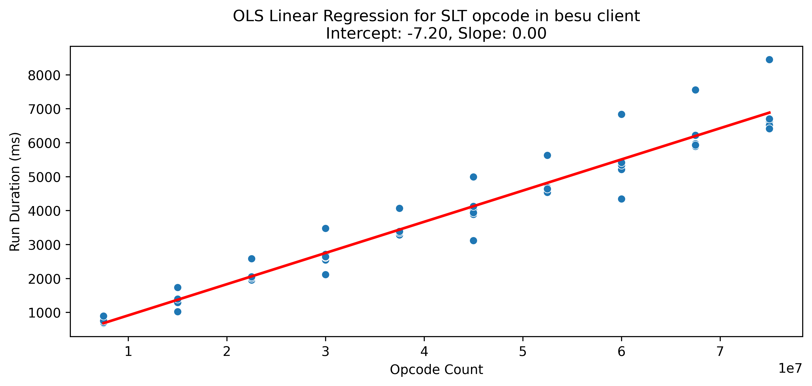


## geth


```python
                            OLS Regression Results                            
==============================================================================
Dep. Variable:        run_duration_ms   R-squared:                       0.997
Model:                            OLS   Adj. R-squared:                  0.997
Method:                 Least Squares   F-statistic:                 1.920e+04
Date:                Mon, 22 Dec 2025   Prob (F-statistic):           1.83e-68
Time:                        12:03:29   Log-Likelihood:                -249.46
No. Observations:                  54   AIC:                             502.9
Df Residuals:                      52   BIC:                             506.9
Df Model:                           1                                         
Covariance Type:            nonrobust                                         
==============================================================================
                 coef    std err          t      P>|t|      [0.025      0.975]
------------------------------------------------------------------------------
const         53.8414      7.394      7.281      0.000      39.004      68.679
opcount      2.22e-05    1.6e-07    138.560      0.000    2.19e-05    2.25e-05
==============================================================================
Omnibus:                        4.935   Durbin-Watson:                   2.675
Prob(Omnibus):                  0.085   Jarque-Bera (JB):                3.912
Skew:                          -0.518   Prob(JB):                        0.141
Kurtosis:                       3.815   Cond. No.                     1.00e+08
==============================================================================

Notes:
[1] Standard Errors assume that the covariance matrix of the errors is correctly specified.
[2] The condition number is large,  1e+08. This might indicate that there are
strong multicollinearity or other numerical problems.
```


# SGT

## nethermind


```python
                            OLS Regression Results                            
==============================================================================
Dep. Variable:        run_duration_ms   R-squared:                       0.991
Model:                            OLS   Adj. R-squared:                  0.991
Method:                 Least Squares   F-statistic:                     5838.
Date:                Mon, 22 Dec 2025   Prob (F-statistic):           4.34e-55
Time:                        12:03:29   Log-Likelihood:                -266.34
No. Observations:                  54   AIC:                             536.7
Df Residuals:                      52   BIC:                             540.7
Df Model:                           1                                         
Covariance Type:            nonrobust                                         
==============================================================================
                 coef    std err          t      P>|t|      [0.025      0.975]
------------------------------------------------------------------------------
const         37.0063     10.108      3.661      0.001      16.722      57.290
opcount     1.673e-05   2.19e-07     76.404      0.000    1.63e-05    1.72e-05
==============================================================================
Omnibus:                        7.211   Durbin-Watson:                   1.332
Prob(Omnibus):                  0.027   Jarque-Bera (JB):                7.994
Skew:                          -0.495   Prob(JB):                       0.0184
Kurtosis:                       4.604   Cond. No.                     1.00e+08
==============================================================================

Notes:
[1] Standard Errors assume that the covariance matrix of the errors is correctly specified.
[2] The condition number is large,  1e+08. This might indicate that there are
strong multicollinearity or other numerical problems.
```


## reth


```python
                            OLS Regression Results                            
==============================================================================
Dep. Variable:        run_duration_ms   R-squared:                       0.991
Model:                            OLS   Adj. R-squared:                  0.991
Method:                 Least Squares   F-statistic:                     5714.
Date:                Mon, 22 Dec 2025   Prob (F-statistic):           7.53e-55
Time:                        12:03:29   Log-Likelihood:                -223.94
No. Observations:                  54   AIC:                             451.9
Df Residuals:                      52   BIC:                             455.9
Df Model:                           1                                         
Covariance Type:            nonrobust                                         
==============================================================================
                 coef    std err          t      P>|t|      [0.025      0.975]
------------------------------------------------------------------------------
const         42.2673      4.610      9.169      0.000      33.017      51.518
opcount      7.55e-06   9.99e-08     75.591      0.000    7.35e-06    7.75e-06
==============================================================================
Omnibus:                       12.029   Durbin-Watson:                   1.953
Prob(Omnibus):                  0.002   Jarque-Bera (JB):               16.685
Skew:                           0.747   Prob(JB):                     0.000238
Kurtosis:                       5.277   Cond. No.                     1.00e+08
==============================================================================

Notes:
[1] Standard Errors assume that the covariance matrix of the errors is correctly specified.
[2] The condition number is large,  1e+08. This might indicate that there are
strong multicollinearity or other numerical problems.
```

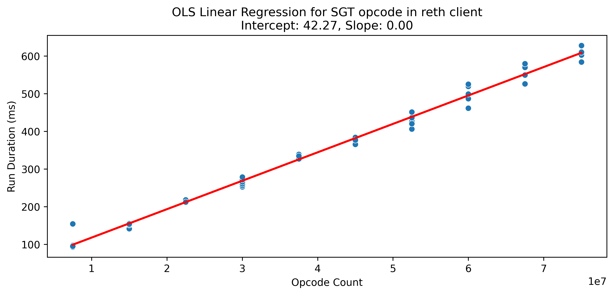


## besu


```python
                            OLS Regression Results                            
==============================================================================
Dep. Variable:        run_duration_ms   R-squared:                       0.944
Model:                            OLS   Adj. R-squared:                  0.943
Method:                 Least Squares   F-statistic:                     870.4
Date:                Mon, 22 Dec 2025   Prob (F-statistic):           3.82e-34
Time:                        12:03:30   Log-Likelihood:                -407.94
No. Observations:                  54   AIC:                             819.9
Df Residuals:                      52   BIC:                             823.9
Df Model:                           1                                         
Covariance Type:            nonrobust                                         
==============================================================================
                 coef    std err          t      P>|t|      [0.025      0.975]
------------------------------------------------------------------------------
const         11.3938    139.166      0.082      0.935    -267.864     290.651
opcount     8.896e-05   3.02e-06     29.503      0.000    8.29e-05     9.5e-05
==============================================================================
Omnibus:                       25.443   Durbin-Watson:                   0.423
Prob(Omnibus):                  0.000   Jarque-Bera (JB):               38.822
Skew:                           1.676   Prob(JB):                     3.71e-09
Kurtosis:                       5.453   Cond. No.                     1.00e+08
==============================================================================

Notes:
[1] Standard Errors assume that the covariance matrix of the errors is correctly specified.
[2] The condition number is large,  1e+08. This might indicate that there are
strong multicollinearity or other numerical problems.
```


## geth


```python
                            OLS Regression Results                            
==============================================================================
Dep. Variable:        run_duration_ms   R-squared:                       0.974
Model:                            OLS   Adj. R-squared:                  0.974
Method:                 Least Squares   F-statistic:                     1960.
Date:                Mon, 22 Dec 2025   Prob (F-statistic):           5.88e-43
Time:                        12:03:30   Log-Likelihood:                -313.26
No. Observations:                  54   AIC:                             630.5
Df Residuals:                      52   BIC:                             634.5
Df Model:                           1                                         
Covariance Type:            nonrobust                                         
==============================================================================
                 coef    std err          t      P>|t|      [0.025      0.975]
------------------------------------------------------------------------------
const         26.4981     24.103      1.099      0.277     -21.868      74.864
opcount     2.312e-05   5.22e-07     44.271      0.000    2.21e-05    2.42e-05
==============================================================================
Omnibus:                      105.751   Durbin-Watson:                   1.891
Prob(Omnibus):                  0.000   Jarque-Bera (JB):             3352.403
Skew:                           5.862   Prob(JB):                         0.00
Kurtosis:                      39.777   Cond. No.                     1.00e+08
==============================================================================

Notes:
[1] Standard Errors assume that the covariance matrix of the errors is correctly specified.
[2] The condition number is large,  1e+08. This might indicate that there are
strong multicollinearity or other numerical problems.
```


# EQ

## nethermind


```python
                            OLS Regression Results                            
==============================================================================
Dep. Variable:        run_duration_ms   R-squared:                       0.988
Model:                            OLS   Adj. R-squared:                  0.988
Method:                 Least Squares   F-statistic:                     4271.
Date:                Mon, 22 Dec 2025   Prob (F-statistic):           1.35e-51
Time:                        12:03:30   Log-Likelihood:                -249.72
No. Observations:                  54   AIC:                             503.4
Df Residuals:                      52   BIC:                             507.4
Df Model:                           1                                         
Covariance Type:            nonrobust                                         
==============================================================================
                 coef    std err          t      P>|t|      [0.025      0.975]
------------------------------------------------------------------------------
const         38.6189      7.431      5.197      0.000      23.707      53.531
opcount     1.052e-05   1.61e-07     65.355      0.000    1.02e-05    1.08e-05
==============================================================================
Omnibus:                        0.194   Durbin-Watson:                   1.687
Prob(Omnibus):                  0.907   Jarque-Bera (JB):                0.138
Skew:                           0.113   Prob(JB):                        0.933
Kurtosis:                       2.900   Cond. No.                     1.00e+08
==============================================================================

Notes:
[1] Standard Errors assume that the covariance matrix of the errors is correctly specified.
[2] The condition number is large,  1e+08. This might indicate that there are
strong multicollinearity or other numerical problems.
```

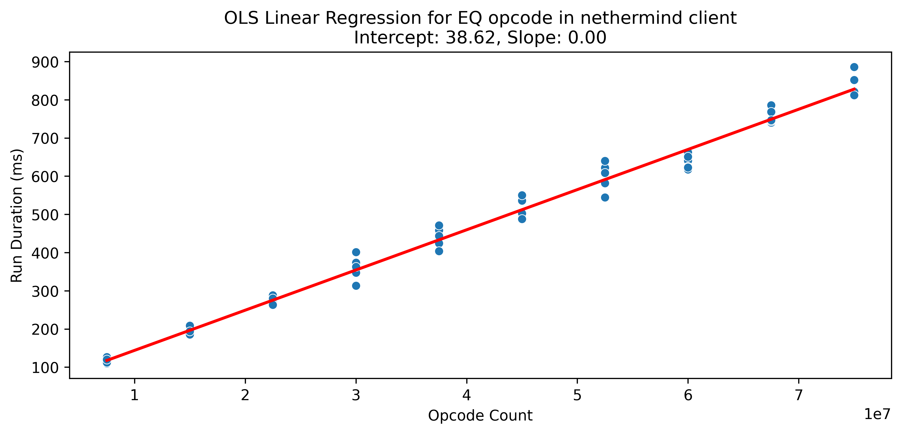


## reth


```python
                            OLS Regression Results                            
==============================================================================
Dep. Variable:        run_duration_ms   R-squared:                       0.975
Model:                            OLS   Adj. R-squared:                  0.975
Method:                 Least Squares   F-statistic:                     2070.
Date:                Mon, 22 Dec 2025   Prob (F-statistic):           1.46e-43
Time:                        12:03:30   Log-Likelihood:                -304.44
No. Observations:                  54   AIC:                             612.9
Df Residuals:                      52   BIC:                             616.9
Df Model:                           1                                         
Covariance Type:            nonrobust                                         
==============================================================================
                 coef    std err          t      P>|t|      [0.025      0.975]
------------------------------------------------------------------------------
const         31.7757     20.470      1.552      0.127      -9.301      72.853
opcount     2.018e-05   4.44e-07     45.502      0.000    1.93e-05    2.11e-05
==============================================================================
Omnibus:                       16.926   Durbin-Watson:                   1.582
Prob(Omnibus):                  0.000   Jarque-Bera (JB):               32.095
Skew:                           0.902   Prob(JB):                     1.07e-07
Kurtosis:                       6.318   Cond. No.                     1.00e+08
==============================================================================

Notes:
[1] Standard Errors assume that the covariance matrix of the errors is correctly specified.
[2] The condition number is large,  1e+08. This might indicate that there are
strong multicollinearity or other numerical problems.
```

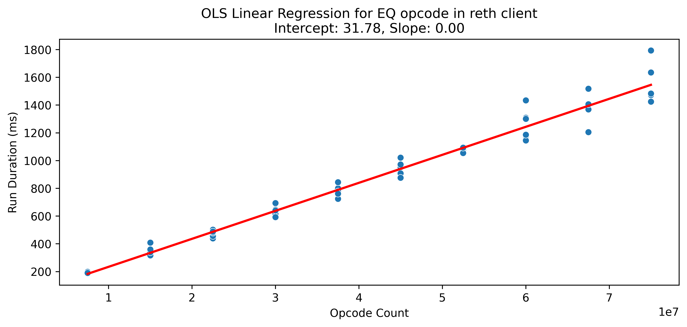


## besu


```python
                            OLS Regression Results                            
==============================================================================
Dep. Variable:        run_duration_ms   R-squared:                       0.921
Model:                            OLS   Adj. R-squared:                  0.919
Method:                 Least Squares   F-statistic:                     590.9
Date:                Mon, 22 Dec 2025   Prob (F-statistic):           1.04e-29
Time:                        12:03:30   Log-Likelihood:                -483.37
No. Observations:                  53   AIC:                             970.7
Df Residuals:                      51   BIC:                             974.7
Df Model:                           1                                         
Covariance Type:            nonrobust                                         
==============================================================================
                 coef    std err          t      P>|t|      [0.025      0.975]
------------------------------------------------------------------------------
const      -2304.3294    672.334     -3.427      0.001   -3654.097    -954.562
opcount        0.0004   1.48e-05     24.308      0.000       0.000       0.000
==============================================================================
Omnibus:                        6.716   Durbin-Watson:                   1.481
Prob(Omnibus):                  0.035   Jarque-Bera (JB):                5.680
Skew:                           0.703   Prob(JB):                       0.0584
Kurtosis:                       3.770   Cond. No.                     9.87e+07
==============================================================================

Notes:
[1] Standard Errors assume that the covariance matrix of the errors is correctly specified.
[2] The condition number is large, 9.87e+07. This might indicate that there are
strong multicollinearity or other numerical problems.
```

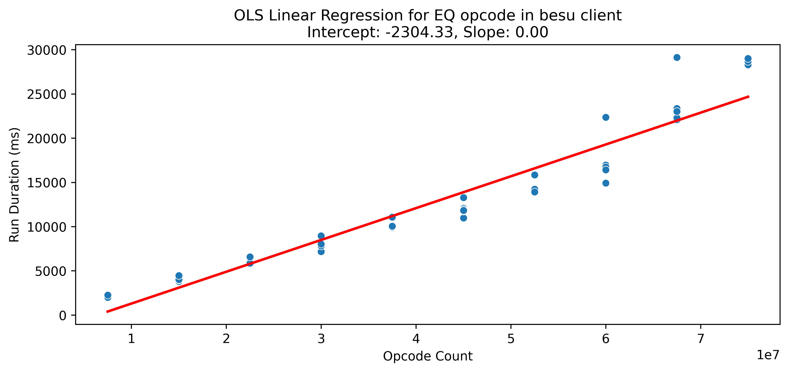


## geth


```python
                            OLS Regression Results                            
==============================================================================
Dep. Variable:        run_duration_ms   R-squared:                       0.710
Model:                            OLS   Adj. R-squared:                  0.704
Method:                 Least Squares   F-statistic:                     127.1
Date:                Mon, 22 Dec 2025   Prob (F-statistic):           1.40e-15
Time:                        12:03:30   Log-Likelihood:                -383.51
No. Observations:                  54   AIC:                             771.0
Df Residuals:                      52   BIC:                             775.0
Df Model:                           1                                         
Covariance Type:            nonrobust                                         
==============================================================================
                 coef    std err          t      P>|t|      [0.025      0.975]
------------------------------------------------------------------------------
const         78.0745     88.513      0.882      0.382     -99.539     255.688
opcount     2.162e-05   1.92e-06     11.276      0.000    1.78e-05    2.55e-05
==============================================================================
Omnibus:                      113.889   Durbin-Watson:                   2.109
Prob(Omnibus):                  0.000   Jarque-Bera (JB):             4549.460
Skew:                           6.565   Prob(JB):                         0.00
Kurtosis:                      46.007   Cond. No.                     1.00e+08
==============================================================================

Notes:
[1] Standard Errors assume that the covariance matrix of the errors is correctly specified.
[2] The condition number is large,  1e+08. This might indicate that there are
strong multicollinearity or other numerical problems.
```

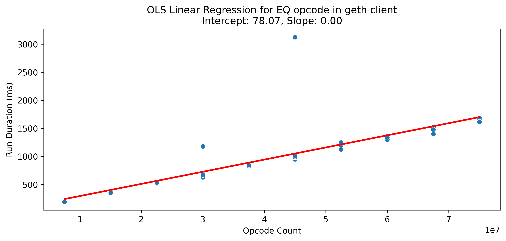


# ISZERO

## nethermind


```python
                            OLS Regression Results                            
==============================================================================
Dep. Variable:        run_duration_ms   R-squared:                       0.930
Model:                            OLS   Adj. R-squared:                  0.928
Method:                 Least Squares   F-statistic:                     688.2
Date:                Mon, 22 Dec 2025   Prob (F-statistic):           1.18e-31
Time:                        12:03:30   Log-Likelihood:                -276.64
No. Observations:                  54   AIC:                             557.3
Df Residuals:                      52   BIC:                             561.2
Df Model:                           1                                         
Covariance Type:            nonrobust                                         
==============================================================================
                 coef    std err          t      P>|t|      [0.025      0.975]
------------------------------------------------------------------------------
const         37.2936     12.232      3.049      0.004      12.749      61.838
opcount     6.952e-06   2.65e-07     26.233      0.000    6.42e-06    7.48e-06
==============================================================================
Omnibus:                       14.982   Durbin-Watson:                   0.992
Prob(Omnibus):                  0.001   Jarque-Bera (JB):               16.883
Skew:                           1.159   Prob(JB):                     0.000216
Kurtosis:                       4.458   Cond. No.                     1.00e+08
==============================================================================

Notes:
[1] Standard Errors assume that the covariance matrix of the errors is correctly specified.
[2] The condition number is large,  1e+08. This might indicate that there are
strong multicollinearity or other numerical problems.
```

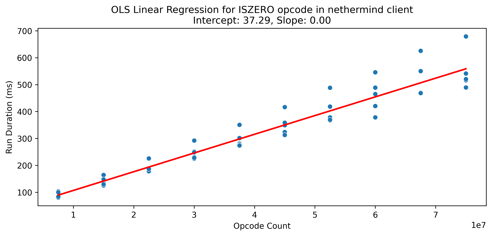


## reth


```python
                            OLS Regression Results                            
==============================================================================
Dep. Variable:        run_duration_ms   R-squared:                       0.990
Model:                            OLS   Adj. R-squared:                  0.990
Method:                 Least Squares   F-statistic:                     5224.
Date:                Mon, 22 Dec 2025   Prob (F-statistic):           7.60e-54
Time:                        12:03:31   Log-Likelihood:                -190.53
No. Observations:                  54   AIC:                             385.1
Df Residuals:                      52   BIC:                             389.0
Df Model:                           1                                         
Covariance Type:            nonrobust                                         
==============================================================================
                 coef    std err          t      P>|t|      [0.025      0.975]
------------------------------------------------------------------------------
const         37.3351      2.483     15.037      0.000      32.353      42.317
opcount     3.888e-06   5.38e-08     72.274      0.000    3.78e-06       4e-06
==============================================================================
Omnibus:                        9.554   Durbin-Watson:                   2.209
Prob(Omnibus):                  0.008   Jarque-Bera (JB):                9.416
Skew:                           1.005   Prob(JB):                      0.00902
Kurtosis:                       3.383   Cond. No.                     1.00e+08
==============================================================================

Notes:
[1] Standard Errors assume that the covariance matrix of the errors is correctly specified.
[2] The condition number is large,  1e+08. This might indicate that there are
strong multicollinearity or other numerical problems.
```

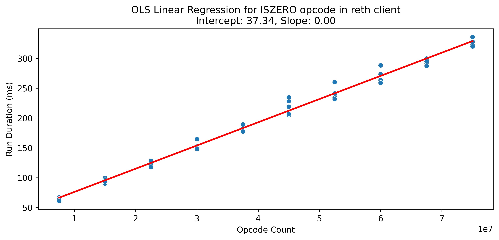


## besu


```python
                            OLS Regression Results                            
==============================================================================
Dep. Variable:        run_duration_ms   R-squared:                       0.839
Model:                            OLS   Adj. R-squared:                  0.836
Method:                 Least Squares   F-statistic:                     271.3
Date:                Mon, 22 Dec 2025   Prob (F-statistic):           2.78e-22
Time:                        12:03:31   Log-Likelihood:                -384.93
No. Observations:                  54   AIC:                             773.9
Df Residuals:                      52   BIC:                             777.8
Df Model:                           1                                         
Covariance Type:            nonrobust                                         
==============================================================================
                 coef    std err          t      P>|t|      [0.025      0.975]
------------------------------------------------------------------------------
const         12.0439     90.873      0.133      0.895    -170.306     194.394
opcount     3.243e-05   1.97e-06     16.472      0.000    2.85e-05    3.64e-05
==============================================================================
Omnibus:                        3.767   Durbin-Watson:                   0.848
Prob(Omnibus):                  0.152   Jarque-Bera (JB):                3.642
Skew:                          -0.612   Prob(JB):                        0.162
Kurtosis:                       2.654   Cond. No.                     1.00e+08
==============================================================================

Notes:
[1] Standard Errors assume that the covariance matrix of the errors is correctly specified.
[2] The condition number is large,  1e+08. This might indicate that there are
strong multicollinearity or other numerical problems.
```

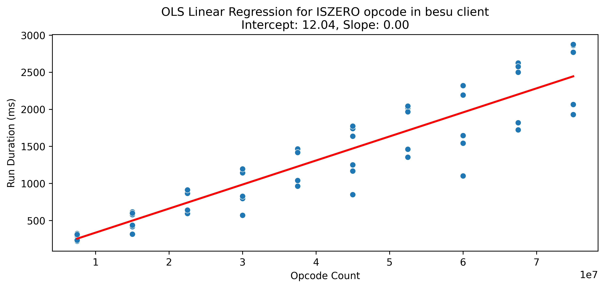


## geth


```python
                            OLS Regression Results                            
==============================================================================
Dep. Variable:        run_duration_ms   R-squared:                       0.992
Model:                            OLS   Adj. R-squared:                  0.992
Method:                 Least Squares   F-statistic:                     6493.
Date:                Mon, 22 Dec 2025   Prob (F-statistic):           2.79e-56
Time:                        12:03:31   Log-Likelihood:                -226.98
No. Observations:                  54   AIC:                             458.0
Df Residuals:                      52   BIC:                             461.9
Df Model:                           1                                         
Covariance Type:            nonrobust                                         
==============================================================================
                 coef    std err          t      P>|t|      [0.025      0.975]
------------------------------------------------------------------------------
const         36.9799      4.877      7.582      0.000      27.193      46.767
opcount     8.515e-06   1.06e-07     80.579      0.000     8.3e-06    8.73e-06
==============================================================================
Omnibus:                        3.773   Durbin-Watson:                   1.989
Prob(Omnibus):                  0.152   Jarque-Bera (JB):                3.550
Skew:                           0.619   Prob(JB):                        0.169
Kurtosis:                       2.791   Cond. No.                     1.00e+08
==============================================================================

Notes:
[1] Standard Errors assume that the covariance matrix of the errors is correctly specified.
[2] The condition number is large,  1e+08. This might indicate that there are
strong multicollinearity or other numerical problems.
```


# AND

## nethermind


```python
                            OLS Regression Results                            
==============================================================================
Dep. Variable:        run_duration_ms   R-squared:                       0.379
Model:                            OLS   Adj. R-squared:                  0.367
Method:                 Least Squares   F-statistic:                     31.76
Date:                Mon, 22 Dec 2025   Prob (F-statistic):           7.19e-07
Time:                        12:03:31   Log-Likelihood:                -388.89
No. Observations:                  54   AIC:                             781.8
Df Residuals:                      52   BIC:                             785.8
Df Model:                           1                                         
Covariance Type:            nonrobust                                         
==============================================================================
                 coef    std err          t      P>|t|      [0.025      0.975]
------------------------------------------------------------------------------
const         30.2688     97.791      0.310      0.758    -165.963     226.500
opcount     1.194e-05   2.12e-06      5.636      0.000    7.69e-06    1.62e-05
==============================================================================
Omnibus:                       31.571   Durbin-Watson:                   0.522
Prob(Omnibus):                  0.000   Jarque-Bera (JB):               56.129
Skew:                           2.002   Prob(JB):                     6.48e-13
Kurtosis:                       5.987   Cond. No.                     1.00e+08
==============================================================================

Notes:
[1] Standard Errors assume that the covariance matrix of the errors is correctly specified.
[2] The condition number is large,  1e+08. This might indicate that there are
strong multicollinearity or other numerical problems.
```

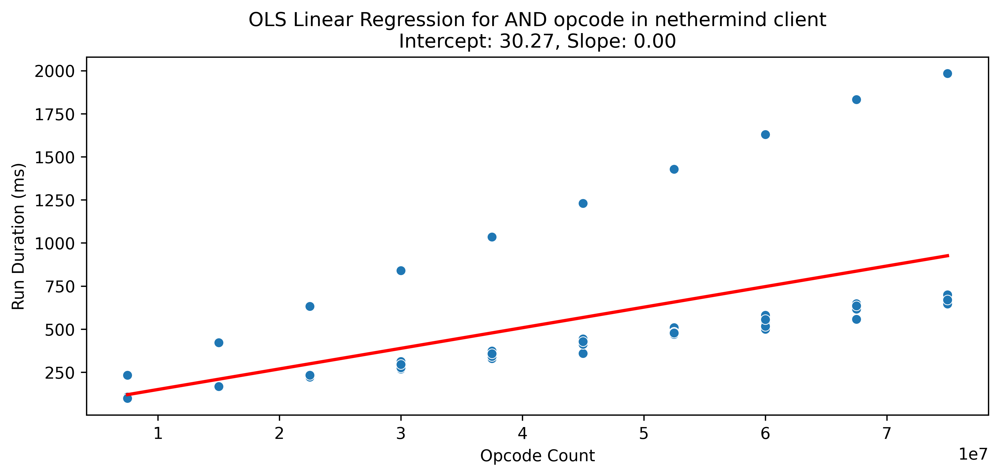


## reth


```python
                            OLS Regression Results                            
==============================================================================
Dep. Variable:        run_duration_ms   R-squared:                       0.993
Model:                            OLS   Adj. R-squared:                  0.993
Method:                 Least Squares   F-statistic:                     7714.
Date:                Mon, 22 Dec 2025   Prob (F-statistic):           3.27e-58
Time:                        12:03:31   Log-Likelihood:                -206.93
No. Observations:                  54   AIC:                             417.9
Df Residuals:                      52   BIC:                             421.8
Df Model:                           1                                         
Covariance Type:            nonrobust                                         
==============================================================================
                 coef    std err          t      P>|t|      [0.025      0.975]
------------------------------------------------------------------------------
const         40.0490      3.364     11.905      0.000      33.299      46.799
opcount     6.401e-06   7.29e-08     87.828      0.000    6.26e-06    6.55e-06
==============================================================================
Omnibus:                        1.157   Durbin-Watson:                   2.462
Prob(Omnibus):                  0.561   Jarque-Bera (JB):                0.971
Skew:                          -0.323   Prob(JB):                        0.615
Kurtosis:                       2.884   Cond. No.                     1.00e+08
==============================================================================

Notes:
[1] Standard Errors assume that the covariance matrix of the errors is correctly specified.
[2] The condition number is large,  1e+08. This might indicate that there are
strong multicollinearity or other numerical problems.
```


## besu


```python
                            OLS Regression Results                            
==============================================================================
Dep. Variable:        run_duration_ms   R-squared:                       0.958
Model:                            OLS   Adj. R-squared:                  0.957
Method:                 Least Squares   F-statistic:                     1038.
Date:                Mon, 22 Dec 2025   Prob (F-statistic):           3.27e-33
Time:                        12:03:31   Log-Likelihood:                -350.44
No. Observations:                  48   AIC:                             704.9
Df Residuals:                      46   BIC:                             708.6
Df Model:                           1                                         
Covariance Type:            nonrobust                                         
==============================================================================
                 coef    std err          t      P>|t|      [0.025      0.975]
------------------------------------------------------------------------------
const        -16.3284    135.886     -0.120      0.905    -289.853     257.196
opcount     8.963e-05   2.78e-06     32.219      0.000     8.4e-05    9.52e-05
==============================================================================
Omnibus:                        8.396   Durbin-Watson:                   0.787
Prob(Omnibus):                  0.015   Jarque-Bera (JB):               10.072
Skew:                           0.564   Prob(JB):                      0.00650
Kurtosis:                       4.940   Cond. No.                     1.26e+08
==============================================================================

Notes:
[1] Standard Errors assume that the covariance matrix of the errors is correctly specified.
[2] The condition number is large, 1.26e+08. This might indicate that there are
strong multicollinearity or other numerical problems.
```

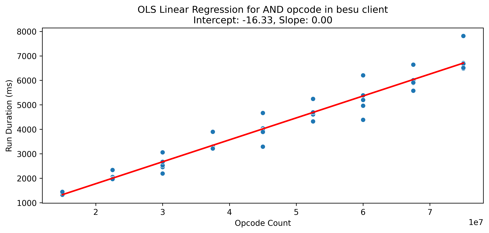


## geth


```python
                            OLS Regression Results                            
==============================================================================
Dep. Variable:        run_duration_ms   R-squared:                       0.993
Model:                            OLS   Adj. R-squared:                  0.993
Method:                 Least Squares   F-statistic:                     7944.
Date:                Mon, 22 Dec 2025   Prob (F-statistic):           1.53e-58
Time:                        12:03:31   Log-Likelihood:                -272.42
No. Observations:                  54   AIC:                             548.8
Df Residuals:                      52   BIC:                             552.8
Df Model:                           1                                         
Covariance Type:            nonrobust                                         
==============================================================================
                 coef    std err          t      P>|t|      [0.025      0.975]
------------------------------------------------------------------------------
const         36.2251     11.314      3.202      0.002      13.521      58.929
opcount     2.185e-05   2.45e-07     89.130      0.000    2.14e-05    2.23e-05
==============================================================================
Omnibus:                       84.266   Durbin-Watson:                   1.794
Prob(Omnibus):                  0.000   Jarque-Bera (JB):             1526.710
Skew:                           4.214   Prob(JB):                         0.00
Kurtosis:                      27.648   Cond. No.                     1.00e+08
==============================================================================

Notes:
[1] Standard Errors assume that the covariance matrix of the errors is correctly specified.
[2] The condition number is large,  1e+08. This might indicate that there are
strong multicollinearity or other numerical problems.
```


# OR

## nethermind


```python
                            OLS Regression Results                            
==============================================================================
Dep. Variable:        run_duration_ms   R-squared:                       0.377
Model:                            OLS   Adj. R-squared:                  0.365
Method:                 Least Squares   F-statistic:                     31.51
Date:                Mon, 22 Dec 2025   Prob (F-statistic):           7.79e-07
Time:                        12:03:31   Log-Likelihood:                -387.61
No. Observations:                  54   AIC:                             779.2
Df Residuals:                      52   BIC:                             783.2
Df Model:                           1                                         
Covariance Type:            nonrobust                                         
==============================================================================
                 coef    std err          t      P>|t|      [0.025      0.975]
------------------------------------------------------------------------------
const         43.5508     95.508      0.456      0.650    -148.100     235.201
opcount     1.162e-05   2.07e-06      5.614      0.000    7.46e-06    1.58e-05
==============================================================================
Omnibus:                       29.930   Durbin-Watson:                   0.595
Prob(Omnibus):                  0.000   Jarque-Bera (JB):               50.337
Skew:                           1.942   Prob(JB):                     1.17e-11
Kurtosis:                       5.700   Cond. No.                     1.00e+08
==============================================================================

Notes:
[1] Standard Errors assume that the covariance matrix of the errors is correctly specified.
[2] The condition number is large,  1e+08. This might indicate that there are
strong multicollinearity or other numerical problems.
```

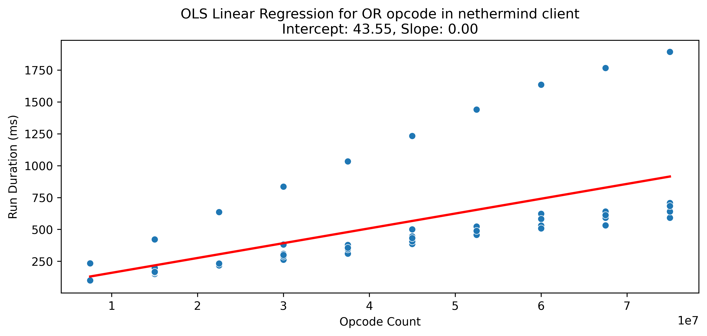


## reth


```python
                            OLS Regression Results                            
==============================================================================
Dep. Variable:        run_duration_ms   R-squared:                       0.992
Model:                            OLS   Adj. R-squared:                  0.992
Method:                 Least Squares   F-statistic:                     6762.
Date:                Mon, 22 Dec 2025   Prob (F-statistic):           9.78e-57
Time:                        12:03:32   Log-Likelihood:                -210.21
No. Observations:                  54   AIC:                             424.4
Df Residuals:                      52   BIC:                             428.4
Df Model:                           1                                         
Covariance Type:            nonrobust                                         
==============================================================================
                 coef    std err          t      P>|t|      [0.025      0.975]
------------------------------------------------------------------------------
const         39.3501      3.575     11.007      0.000      32.176      46.524
opcount      6.37e-06   7.75e-08     82.234      0.000    6.21e-06    6.53e-06
==============================================================================
Omnibus:                        8.363   Durbin-Watson:                   2.385
Prob(Omnibus):                  0.015   Jarque-Bera (JB):               11.377
Skew:                           0.472   Prob(JB):                      0.00338
Kurtosis:                       5.041   Cond. No.                     1.00e+08
==============================================================================

Notes:
[1] Standard Errors assume that the covariance matrix of the errors is correctly specified.
[2] The condition number is large,  1e+08. This might indicate that there are
strong multicollinearity or other numerical problems.
```


## besu


```python
                            OLS Regression Results                            
==============================================================================
Dep. Variable:        run_duration_ms   R-squared:                       0.953
Model:                            OLS   Adj. R-squared:                  0.952
Method:                 Least Squares   F-statistic:                     945.7
Date:                Mon, 22 Dec 2025   Prob (F-statistic):           8.77e-33
Time:                        12:03:32   Log-Likelihood:                -361.49
No. Observations:                  49   AIC:                             727.0
Df Residuals:                      47   BIC:                             730.8
Df Model:                           1                                         
Covariance Type:            nonrobust                                         
==============================================================================
                 coef    std err          t      P>|t|      [0.025      0.975]
------------------------------------------------------------------------------
const        -24.2501    141.710     -0.171      0.865    -309.334     260.834
opcount     9.005e-05   2.93e-06     30.752      0.000    8.42e-05    9.59e-05
==============================================================================
Omnibus:                        7.994   Durbin-Watson:                   0.680
Prob(Omnibus):                  0.018   Jarque-Bera (JB):                9.125
Skew:                           0.557   Prob(JB):                       0.0104
Kurtosis:                       4.797   Cond. No.                     1.21e+08
==============================================================================

Notes:
[1] Standard Errors assume that the covariance matrix of the errors is correctly specified.
[2] The condition number is large, 1.21e+08. This might indicate that there are
strong multicollinearity or other numerical problems.
```

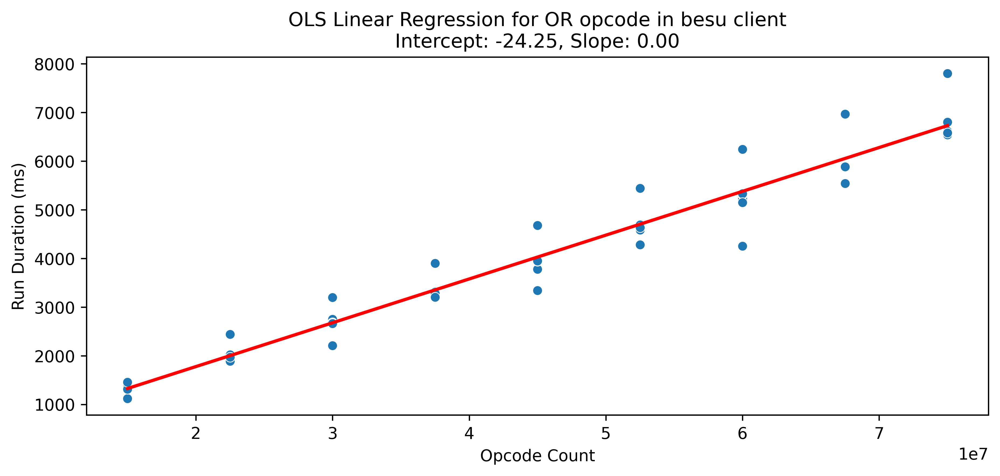


## geth


```python
                            OLS Regression Results                            
==============================================================================
Dep. Variable:        run_duration_ms   R-squared:                       0.998
Model:                            OLS   Adj. R-squared:                  0.998
Method:                 Least Squares   F-statistic:                 2.561e+04
Date:                Mon, 22 Dec 2025   Prob (F-statistic):           1.03e-71
Time:                        12:03:32   Log-Likelihood:                -241.02
No. Observations:                  54   AIC:                             486.0
Df Residuals:                      52   BIC:                             490.0
Df Model:                           1                                         
Covariance Type:            nonrobust                                         
==============================================================================
                 coef    std err          t      P>|t|      [0.025      0.975]
------------------------------------------------------------------------------
const         33.8925      6.325      5.358      0.000      21.200      46.585
opcount     2.193e-05   1.37e-07    160.047      0.000    2.17e-05    2.22e-05
==============================================================================
Omnibus:                        4.362   Durbin-Watson:                   1.947
Prob(Omnibus):                  0.113   Jarque-Bera (JB):                3.860
Skew:                          -0.330   Prob(JB):                        0.145
Kurtosis:                       4.131   Cond. No.                     1.00e+08
==============================================================================

Notes:
[1] Standard Errors assume that the covariance matrix of the errors is correctly specified.
[2] The condition number is large,  1e+08. This might indicate that there are
strong multicollinearity or other numerical problems.
```


# XOR

## nethermind


```python
                            OLS Regression Results                            
==============================================================================
Dep. Variable:        run_duration_ms   R-squared:                       0.344
Model:                            OLS   Adj. R-squared:                  0.331
Method:                 Least Squares   F-statistic:                     27.28
Date:                Mon, 22 Dec 2025   Prob (F-statistic):           3.14e-06
Time:                        12:03:32   Log-Likelihood:                -393.85
No. Observations:                  54   AIC:                             791.7
Df Residuals:                      52   BIC:                             795.7
Df Model:                           1                                         
Covariance Type:            nonrobust                                         
==============================================================================
                 coef    std err          t      P>|t|      [0.025      0.975]
------------------------------------------------------------------------------
const         30.0013    107.206      0.280      0.781    -185.124     245.126
opcount     1.213e-05   2.32e-06      5.223      0.000    7.47e-06    1.68e-05
==============================================================================
Omnibus:                       33.548   Durbin-Watson:                   0.541
Prob(Omnibus):                  0.000   Jarque-Bera (JB):               64.624
Skew:                           2.058   Prob(JB):                     9.27e-15
Kurtosis:                       6.433   Cond. No.                     1.00e+08
==============================================================================

Notes:
[1] Standard Errors assume that the covariance matrix of the errors is correctly specified.
[2] The condition number is large,  1e+08. This might indicate that there are
strong multicollinearity or other numerical problems.
```

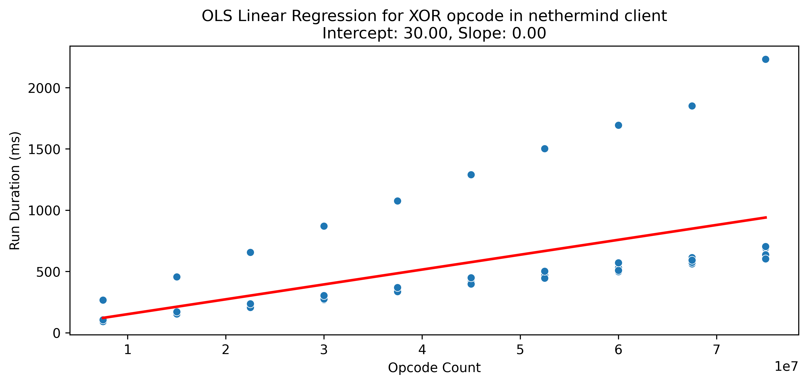


## reth


```python
                            OLS Regression Results                            
==============================================================================
Dep. Variable:        run_duration_ms   R-squared:                       0.991
Model:                            OLS   Adj. R-squared:                  0.991
Method:                 Least Squares   F-statistic:                     5844.
Date:                Mon, 22 Dec 2025   Prob (F-statistic):           4.22e-55
Time:                        12:03:32   Log-Likelihood:                -214.49
No. Observations:                  54   AIC:                             433.0
Df Residuals:                      52   BIC:                             437.0
Df Model:                           1                                         
Covariance Type:            nonrobust                                         
==============================================================================
                 coef    std err          t      P>|t|      [0.025      0.975]
------------------------------------------------------------------------------
const         43.1780      3.870     11.157      0.000      35.412      50.944
opcount      6.41e-06   8.38e-08     76.444      0.000    6.24e-06    6.58e-06
==============================================================================
Omnibus:                        3.324   Durbin-Watson:                   1.685
Prob(Omnibus):                  0.190   Jarque-Bera (JB):                3.034
Skew:                          -0.070   Prob(JB):                        0.219
Kurtosis:                       4.153   Cond. No.                     1.00e+08
==============================================================================

Notes:
[1] Standard Errors assume that the covariance matrix of the errors is correctly specified.
[2] The condition number is large,  1e+08. This might indicate that there are
strong multicollinearity or other numerical problems.
```

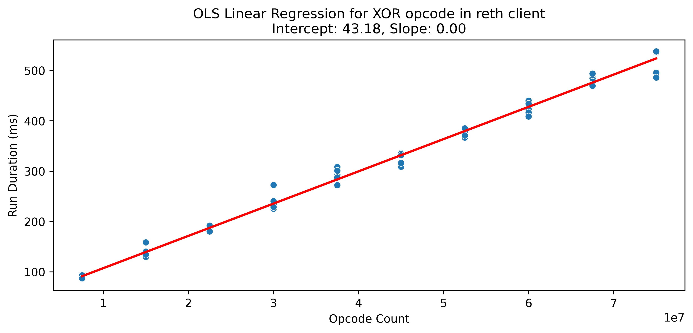


## besu


```python
                            OLS Regression Results                            
==============================================================================
Dep. Variable:        run_duration_ms   R-squared:                       0.952
Model:                            OLS   Adj. R-squared:                  0.951
Method:                 Least Squares   F-statistic:                     930.3
Date:                Mon, 22 Dec 2025   Prob (F-statistic):           1.27e-32
Time:                        12:03:32   Log-Likelihood:                -362.28
No. Observations:                  49   AIC:                             728.6
Df Residuals:                      47   BIC:                             732.3
Df Model:                           1                                         
Covariance Type:            nonrobust                                         
==============================================================================
                 coef    std err          t      P>|t|      [0.025      0.975]
------------------------------------------------------------------------------
const        -41.1420    144.018     -0.286      0.776    -330.868     248.584
opcount     9.077e-05   2.98e-06     30.501      0.000    8.48e-05    9.68e-05
==============================================================================
Omnibus:                        8.340   Durbin-Watson:                   0.531
Prob(Omnibus):                  0.015   Jarque-Bera (JB):                8.966
Skew:                           0.628   Prob(JB):                       0.0113
Kurtosis:                       4.677   Cond. No.                     1.21e+08
==============================================================================

Notes:
[1] Standard Errors assume that the covariance matrix of the errors is correctly specified.
[2] The condition number is large, 1.21e+08. This might indicate that there are
strong multicollinearity or other numerical problems.
```

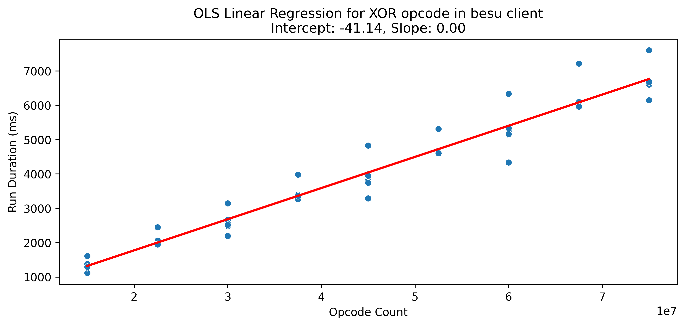


## geth


```python
                            OLS Regression Results                            
==============================================================================
Dep. Variable:        run_duration_ms   R-squared:                       0.994
Model:                            OLS   Adj. R-squared:                  0.994
Method:                 Least Squares   F-statistic:                     9384.
Date:                Mon, 22 Dec 2025   Prob (F-statistic):           2.06e-60
Time:                        12:03:32   Log-Likelihood:                -268.49
No. Observations:                  54   AIC:                             541.0
Df Residuals:                      52   BIC:                             545.0
Df Model:                           1                                         
Covariance Type:            nonrobust                                         
==============================================================================
                 coef    std err          t      P>|t|      [0.025      0.975]
------------------------------------------------------------------------------
const         27.3044     10.520      2.595      0.012       6.195      48.414
opcount     2.208e-05   2.28e-07     96.871      0.000    2.16e-05    2.25e-05
==============================================================================
Omnibus:                       74.860   Durbin-Watson:                   1.673
Prob(Omnibus):                  0.000   Jarque-Bera (JB):             1043.292
Skew:                           3.606   Prob(JB):                    2.83e-227
Kurtosis:                      23.290   Cond. No.                     1.00e+08
==============================================================================

Notes:
[1] Standard Errors assume that the covariance matrix of the errors is correctly specified.
[2] The condition number is large,  1e+08. This might indicate that there are
strong multicollinearity or other numerical problems.
```

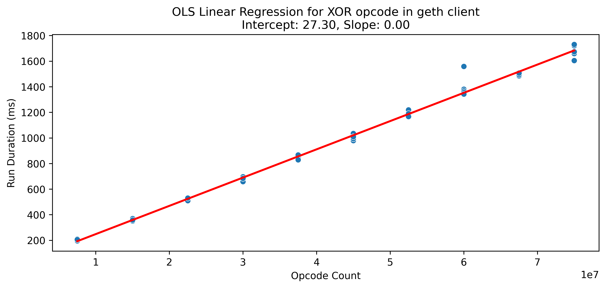


# NOT

## nethermind


```python
                            OLS Regression Results                            
==============================================================================
Dep. Variable:        run_duration_ms   R-squared:                       0.991
Model:                            OLS   Adj. R-squared:                  0.991
Method:                 Least Squares   F-statistic:                     5899.
Date:                Mon, 22 Dec 2025   Prob (F-statistic):           3.32e-55
Time:                        12:03:33   Log-Likelihood:                -196.25
No. Observations:                  54   AIC:                             396.5
Df Residuals:                      52   BIC:                             400.5
Df Model:                           1                                         
Covariance Type:            nonrobust                                         
==============================================================================
                 coef    std err          t      P>|t|      [0.025      0.975]
------------------------------------------------------------------------------
const         37.1573      2.760     13.460      0.000      31.618      42.697
opcount     4.594e-06   5.98e-08     76.804      0.000    4.47e-06    4.71e-06
==============================================================================
Omnibus:                       23.285   Durbin-Watson:                   1.397
Prob(Omnibus):                  0.000   Jarque-Bera (JB):               41.931
Skew:                          -1.349   Prob(JB):                     7.85e-10
Kurtosis:                       6.370   Cond. No.                     1.00e+08
==============================================================================

Notes:
[1] Standard Errors assume that the covariance matrix of the errors is correctly specified.
[2] The condition number is large,  1e+08. This might indicate that there are
strong multicollinearity or other numerical problems.
```

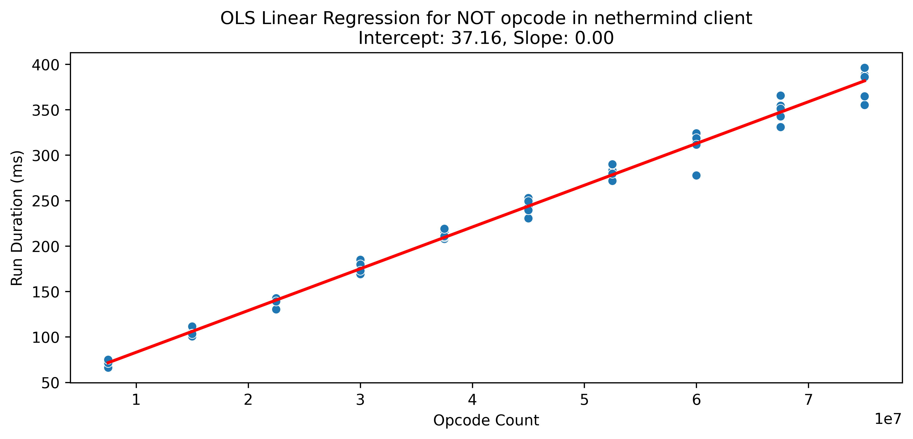


## reth


```python
                            OLS Regression Results                            
==============================================================================
Dep. Variable:        run_duration_ms   R-squared:                       0.993
Model:                            OLS   Adj. R-squared:                  0.993
Method:                 Least Squares   F-statistic:                     7566.
Date:                Mon, 22 Dec 2025   Prob (F-statistic):           5.39e-58
Time:                        12:03:33   Log-Likelihood:                -182.00
No. Observations:                  54   AIC:                             368.0
Df Residuals:                      52   BIC:                             372.0
Df Model:                           1                                         
Covariance Type:            nonrobust                                         
==============================================================================
                 coef    std err          t      P>|t|      [0.025      0.975]
------------------------------------------------------------------------------
const         37.8014      2.120     17.828      0.000      33.547      42.056
opcount     3.996e-06   4.59e-08     86.982      0.000     3.9e-06    4.09e-06
==============================================================================
Omnibus:                       10.397   Durbin-Watson:                   2.389
Prob(Omnibus):                  0.006   Jarque-Bera (JB):               10.276
Skew:                          -0.883   Prob(JB):                      0.00587
Kurtosis:                       4.202   Cond. No.                     1.00e+08
==============================================================================

Notes:
[1] Standard Errors assume that the covariance matrix of the errors is correctly specified.
[2] The condition number is large,  1e+08. This might indicate that there are
strong multicollinearity or other numerical problems.
```


## besu


```python
                            OLS Regression Results                            
==============================================================================
Dep. Variable:        run_duration_ms   R-squared:                       0.974
Model:                            OLS   Adj. R-squared:                  0.973
Method:                 Least Squares   F-statistic:                     1917.
Date:                Mon, 22 Dec 2025   Prob (F-statistic):           1.03e-42
Time:                        12:03:33   Log-Likelihood:                -356.67
No. Observations:                  54   AIC:                             717.3
Df Residuals:                      52   BIC:                             721.3
Df Model:                           1                                         
Covariance Type:            nonrobust                                         
==============================================================================
                 coef    std err          t      P>|t|      [0.025      0.975]
------------------------------------------------------------------------------
const         18.8003     53.846      0.349      0.728     -89.249     126.850
opcount     5.108e-05   1.17e-06     43.786      0.000    4.87e-05    5.34e-05
==============================================================================
Omnibus:                       18.432   Durbin-Watson:                   0.607
Prob(Omnibus):                  0.000   Jarque-Bera (JB):               54.519
Skew:                          -0.760   Prob(JB):                     1.45e-12
Kurtosis:                       7.682   Cond. No.                     1.00e+08
==============================================================================

Notes:
[1] Standard Errors assume that the covariance matrix of the errors is correctly specified.
[2] The condition number is large,  1e+08. This might indicate that there are
strong multicollinearity or other numerical problems.
```

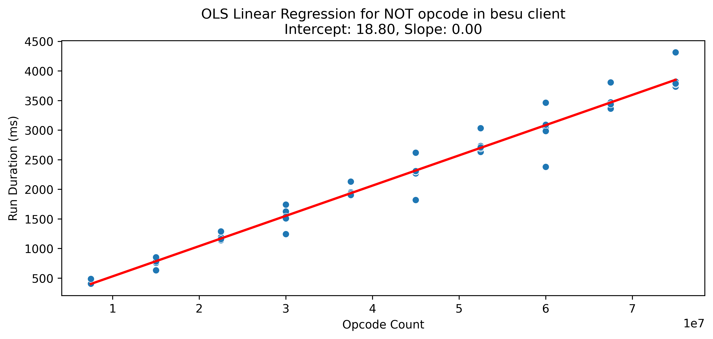


## geth


```python
                            OLS Regression Results                            
==============================================================================
Dep. Variable:        run_duration_ms   R-squared:                       0.995
Model:                            OLS   Adj. R-squared:                  0.995
Method:                 Least Squares   F-statistic:                 1.040e+04
Date:                Mon, 22 Dec 2025   Prob (F-statistic):           1.43e-61
Time:                        12:03:33   Log-Likelihood:                -211.62
No. Observations:                  54   AIC:                             427.2
Df Residuals:                      52   BIC:                             431.2
Df Model:                           1                                         
Covariance Type:            nonrobust                                         
==============================================================================
                 coef    std err          t      P>|t|      [0.025      0.975]
------------------------------------------------------------------------------
const         39.2852      3.669     10.706      0.000      31.922      46.648
opcount     8.109e-06   7.95e-08    101.995      0.000    7.95e-06    8.27e-06
==============================================================================
Omnibus:                       40.928   Durbin-Watson:                   1.329
Prob(Omnibus):                  0.000   Jarque-Bera (JB):              127.103
Skew:                           2.154   Prob(JB):                     2.51e-28
Kurtosis:                       9.158   Cond. No.                     1.00e+08
==============================================================================

Notes:
[1] Standard Errors assume that the covariance matrix of the errors is correctly specified.
[2] The condition number is large,  1e+08. This might indicate that there are
strong multicollinearity or other numerical problems.
```


# BYTE

## nethermind


```python
                            OLS Regression Results                            
==============================================================================
Dep. Variable:        run_duration_ms   R-squared:                       0.992
Model:                            OLS   Adj. R-squared:                  0.992
Method:                 Least Squares   F-statistic:                     6307.
Date:                Mon, 22 Dec 2025   Prob (F-statistic):           5.92e-56
Time:                        12:03:33   Log-Likelihood:                -249.71
No. Observations:                  54   AIC:                             503.4
Df Residuals:                      52   BIC:                             507.4
Df Model:                           1                                         
Covariance Type:            nonrobust                                         
==============================================================================
                 coef    std err          t      P>|t|      [0.025      0.975]
------------------------------------------------------------------------------
const         42.0406      7.429      5.659      0.000      27.134      56.947
opcount     1.278e-05   1.61e-07     79.415      0.000    1.25e-05    1.31e-05
==============================================================================
Omnibus:                       10.164   Durbin-Watson:                   1.380
Prob(Omnibus):                  0.006   Jarque-Bera (JB):               11.614
Skew:                          -0.727   Prob(JB):                      0.00301
Kurtosis:                       4.745   Cond. No.                     1.00e+08
==============================================================================

Notes:
[1] Standard Errors assume that the covariance matrix of the errors is correctly specified.
[2] The condition number is large,  1e+08. This might indicate that there are
strong multicollinearity or other numerical problems.
```


## reth


```python
                            OLS Regression Results                            
==============================================================================
Dep. Variable:        run_duration_ms   R-squared:                       0.995
Model:                            OLS   Adj. R-squared:                  0.995
Method:                 Least Squares   F-statistic:                 1.059e+04
Date:                Mon, 22 Dec 2025   Prob (F-statistic):           8.97e-62
Time:                        12:03:33   Log-Likelihood:                -202.59
No. Observations:                  54   AIC:                             409.2
Df Residuals:                      52   BIC:                             413.1
Df Model:                           1                                         
Covariance Type:            nonrobust                                         
==============================================================================
                 coef    std err          t      P>|t|      [0.025      0.975]
------------------------------------------------------------------------------
const         41.5883      3.104     13.398      0.000      35.359      47.817
opcount     6.922e-06   6.73e-08    102.923      0.000    6.79e-06    7.06e-06
==============================================================================
Omnibus:                        3.634   Durbin-Watson:                   1.610
Prob(Omnibus):                  0.163   Jarque-Bera (JB):                3.547
Skew:                          -0.078   Prob(JB):                        0.170
Kurtosis:                       4.246   Cond. No.                     1.00e+08
==============================================================================

Notes:
[1] Standard Errors assume that the covariance matrix of the errors is correctly specified.
[2] The condition number is large,  1e+08. This might indicate that there are
strong multicollinearity or other numerical problems.
```


## besu


```python
                            OLS Regression Results                            
==============================================================================
Dep. Variable:        run_duration_ms   R-squared:                       0.954
Model:                            OLS   Adj. R-squared:                  0.953
Method:                 Least Squares   F-statistic:                     1005.
Date:                Mon, 22 Dec 2025   Prob (F-statistic):           2.58e-34
Time:                        12:03:33   Log-Likelihood:                -370.78
No. Observations:                  51   AIC:                             745.6
Df Residuals:                      49   BIC:                             749.4
Df Model:                           1                                         
Covariance Type:            nonrobust                                         
==============================================================================
                 coef    std err          t      P>|t|      [0.025      0.975]
------------------------------------------------------------------------------
const         13.5871    116.663      0.116      0.908    -220.856     248.030
opcount     7.794e-05   2.46e-06     31.706      0.000     7.3e-05    8.29e-05
==============================================================================
Omnibus:                       10.069   Durbin-Watson:                   0.523
Prob(Omnibus):                  0.007   Jarque-Bera (JB):               18.393
Skew:                           0.444   Prob(JB):                     0.000101
Kurtosis:                       5.805   Cond. No.                     1.11e+08
==============================================================================

Notes:
[1] Standard Errors assume that the covariance matrix of the errors is correctly specified.
[2] The condition number is large, 1.11e+08. This might indicate that there are
strong multicollinearity or other numerical problems.
```


## geth


```python
                            OLS Regression Results                            
==============================================================================
Dep. Variable:        run_duration_ms   R-squared:                       0.955
Model:                            OLS   Adj. R-squared:                  0.954
Method:                 Least Squares   F-statistic:                     1091.
Date:                Mon, 22 Dec 2025   Prob (F-statistic):           1.43e-36
Time:                        12:03:34   Log-Likelihood:                -330.04
No. Observations:                  54   AIC:                             664.1
Df Residuals:                      52   BIC:                             668.0
Df Model:                           1                                         
Covariance Type:            nonrobust                                         
==============================================================================
                 coef    std err          t      P>|t|      [0.025      0.975]
------------------------------------------------------------------------------
const         11.6100     32.882      0.353      0.725     -54.373      77.593
opcount     2.353e-05   7.12e-07     33.034      0.000    2.21e-05     2.5e-05
==============================================================================
Omnibus:                      110.457   Durbin-Watson:                   2.080
Prob(Omnibus):                  0.000   Jarque-Bera (JB):             4118.844
Skew:                           6.237   Prob(JB):                         0.00
Kurtosis:                      43.927   Cond. No.                     1.00e+08
==============================================================================

Notes:
[1] Standard Errors assume that the covariance matrix of the errors is correctly specified.
[2] The condition number is large,  1e+08. This might indicate that there are
strong multicollinearity or other numerical problems.
```

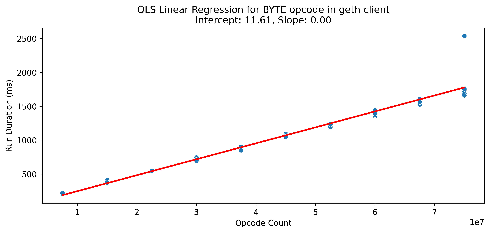


# SHL

## nethermind


```python
                            OLS Regression Results                            
==============================================================================
Dep. Variable:        run_duration_ms   R-squared:                       0.993
Model:                            OLS   Adj. R-squared:                  0.993
Method:                 Least Squares   F-statistic:                     7313.
Date:                Mon, 22 Dec 2025   Prob (F-statistic):           1.30e-57
Time:                        12:03:34   Log-Likelihood:                -293.00
No. Observations:                  54   AIC:                             590.0
Df Residuals:                      52   BIC:                             594.0
Df Model:                           1                                         
Covariance Type:            nonrobust                                         
==============================================================================
                 coef    std err          t      P>|t|      [0.025      0.975]
------------------------------------------------------------------------------
const         37.1592     16.561      2.244      0.029       3.927      70.391
opcount     3.068e-05   3.59e-07     85.514      0.000       3e-05    3.14e-05
==============================================================================
Omnibus:                        4.305   Durbin-Watson:                   1.161
Prob(Omnibus):                  0.116   Jarque-Bera (JB):                3.292
Skew:                          -0.560   Prob(JB):                        0.193
Kurtosis:                       3.457   Cond. No.                     1.00e+08
==============================================================================

Notes:
[1] Standard Errors assume that the covariance matrix of the errors is correctly specified.
[2] The condition number is large,  1e+08. This might indicate that there are
strong multicollinearity or other numerical problems.
```


## reth


```python
                            OLS Regression Results                            
==============================================================================
Dep. Variable:        run_duration_ms   R-squared:                       0.996
Model:                            OLS   Adj. R-squared:                  0.996
Method:                 Least Squares   F-statistic:                 1.467e+04
Date:                Mon, 22 Dec 2025   Prob (F-statistic):           1.95e-65
Time:                        12:03:34   Log-Likelihood:                -225.67
No. Observations:                  54   AIC:                             455.3
Df Residuals:                      52   BIC:                             459.3
Df Model:                           1                                         
Covariance Type:            nonrobust                                         
==============================================================================
                 coef    std err          t      P>|t|      [0.025      0.975]
------------------------------------------------------------------------------
const         47.3889      4.760      9.957      0.000      37.838      56.940
opcount     1.249e-05   1.03e-07    121.134      0.000    1.23e-05    1.27e-05
==============================================================================
Omnibus:                       24.205   Durbin-Watson:                   2.082
Prob(Omnibus):                  0.000   Jarque-Bera (JB):               45.888
Skew:                          -1.374   Prob(JB):                     1.09e-10
Kurtosis:                       6.583   Cond. No.                     1.00e+08
==============================================================================

Notes:
[1] Standard Errors assume that the covariance matrix of the errors is correctly specified.
[2] The condition number is large,  1e+08. This might indicate that there are
strong multicollinearity or other numerical problems.
```


## besu


```python
                            OLS Regression Results                            
==============================================================================
Dep. Variable:        run_duration_ms   R-squared:                       0.628
Model:                            OLS   Adj. R-squared:                  0.621
Method:                 Least Squares   F-statistic:                     86.12
Date:                Mon, 22 Dec 2025   Prob (F-statistic):           1.55e-12
Time:                        12:03:34   Log-Likelihood:                -477.29
No. Observations:                  53   AIC:                             958.6
Df Residuals:                      51   BIC:                             962.5
Df Model:                           1                                         
Covariance Type:            nonrobust                                         
==============================================================================
                 coef    std err          t      P>|t|      [0.025      0.975]
------------------------------------------------------------------------------
const       1140.2379    614.028      1.857      0.069     -92.474    2372.950
opcount        0.0001   1.32e-05      9.280      0.000    9.59e-05       0.000
==============================================================================
Omnibus:                      101.647   Durbin-Watson:                   2.026
Prob(Omnibus):                  0.000   Jarque-Bera (JB):             2914.435
Skew:                           5.614   Prob(JB):                         0.00
Kurtosis:                      37.550   Cond. No.                     1.04e+08
==============================================================================

Notes:
[1] Standard Errors assume that the covariance matrix of the errors is correctly specified.
[2] The condition number is large, 1.04e+08. This might indicate that there are
strong multicollinearity or other numerical problems.
```

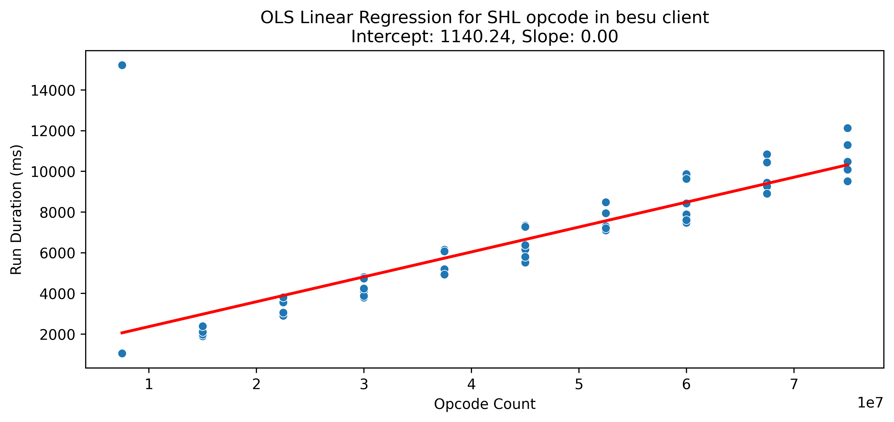


## geth


```python
                            OLS Regression Results                            
==============================================================================
Dep. Variable:        run_duration_ms   R-squared:                       0.999
Model:                            OLS   Adj. R-squared:                  0.998
Method:                 Least Squares   F-statistic:                 3.464e+04
Date:                Mon, 22 Dec 2025   Prob (F-statistic):           4.08e-75
Time:                        12:03:34   Log-Likelihood:                -238.10
No. Observations:                  54   AIC:                             480.2
Df Residuals:                      52   BIC:                             484.2
Df Model:                           1                                         
Covariance Type:            nonrobust                                         
==============================================================================
                 coef    std err          t      P>|t|      [0.025      0.975]
------------------------------------------------------------------------------
const         38.4618      5.992      6.419      0.000      26.437      50.486
opcount     2.417e-05    1.3e-07    186.131      0.000    2.39e-05    2.44e-05
==============================================================================
Omnibus:                        1.002   Durbin-Watson:                   2.648
Prob(Omnibus):                  0.606   Jarque-Bera (JB):                0.680
Skew:                           0.275   Prob(JB):                        0.712
Kurtosis:                       3.015   Cond. No.                     1.00e+08
==============================================================================

Notes:
[1] Standard Errors assume that the covariance matrix of the errors is correctly specified.
[2] The condition number is large,  1e+08. This might indicate that there are
strong multicollinearity or other numerical problems.
```


# SHR

## nethermind


```python
                            OLS Regression Results                            
==============================================================================
Dep. Variable:        run_duration_ms   R-squared:                       0.997
Model:                            OLS   Adj. R-squared:                  0.997
Method:                 Least Squares   F-statistic:                 1.530e+04
Date:                Mon, 22 Dec 2025   Prob (F-statistic):           6.53e-66
Time:                        12:03:34   Log-Likelihood:                -273.31
No. Observations:                  54   AIC:                             550.6
Df Residuals:                      52   BIC:                             554.6
Df Model:                           1                                         
Covariance Type:            nonrobust                                         
==============================================================================
                 coef    std err          t      P>|t|      [0.025      0.975]
------------------------------------------------------------------------------
const         38.6555     11.501      3.361      0.001      15.577      61.734
opcount     3.083e-05   2.49e-07    123.713      0.000    3.03e-05    3.13e-05
==============================================================================
Omnibus:                        6.715   Durbin-Watson:                   2.075
Prob(Omnibus):                  0.035   Jarque-Bera (JB):                5.827
Skew:                          -0.770   Prob(JB):                       0.0543
Kurtosis:                       3.466   Cond. No.                     1.00e+08
==============================================================================

Notes:
[1] Standard Errors assume that the covariance matrix of the errors is correctly specified.
[2] The condition number is large,  1e+08. This might indicate that there are
strong multicollinearity or other numerical problems.
```

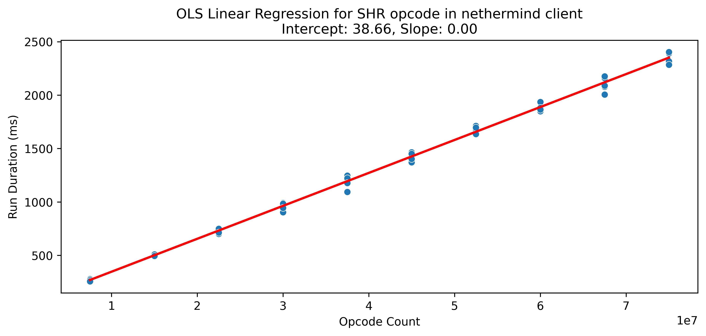


## reth


```python
                            OLS Regression Results                            
==============================================================================
Dep. Variable:        run_duration_ms   R-squared:                       0.997
Model:                            OLS   Adj. R-squared:                  0.997
Method:                 Least Squares   F-statistic:                 1.627e+04
Date:                Mon, 22 Dec 2025   Prob (F-statistic):           1.35e-66
Time:                        12:03:34   Log-Likelihood:                -222.75
No. Observations:                  54   AIC:                             449.5
Df Residuals:                      52   BIC:                             453.5
Df Model:                           1                                         
Covariance Type:            nonrobust                                         
==============================================================================
                 coef    std err          t      P>|t|      [0.025      0.975]
------------------------------------------------------------------------------
const         39.5709      4.509      8.776      0.000      30.523      48.619
opcount     1.246e-05   9.77e-08    127.539      0.000    1.23e-05    1.27e-05
==============================================================================
Omnibus:                        5.762   Durbin-Watson:                   1.650
Prob(Omnibus):                  0.056   Jarque-Bera (JB):                5.572
Skew:                          -0.440   Prob(JB):                       0.0617
Kurtosis:                       4.305   Cond. No.                     1.00e+08
==============================================================================

Notes:
[1] Standard Errors assume that the covariance matrix of the errors is correctly specified.
[2] The condition number is large,  1e+08. This might indicate that there are
strong multicollinearity or other numerical problems.
```


## besu


```python
                            OLS Regression Results                            
==============================================================================
Dep. Variable:        run_duration_ms   R-squared:                       0.986
Model:                            OLS   Adj. R-squared:                  0.986
Method:                 Least Squares   F-statistic:                     3746.
Date:                Mon, 22 Dec 2025   Prob (F-statistic):           3.91e-50
Time:                        12:03:34   Log-Likelihood:                -395.80
No. Observations:                  54   AIC:                             795.6
Df Residuals:                      52   BIC:                             799.6
Df Model:                           1                                         
Covariance Type:            nonrobust                                         
==============================================================================
                 coef    std err          t      P>|t|      [0.025      0.975]
------------------------------------------------------------------------------
const        -30.1093    111.131     -0.271      0.788    -253.110     192.891
opcount        0.0001   2.41e-06     61.206      0.000       0.000       0.000
==============================================================================
Omnibus:                       10.558   Durbin-Watson:                   0.640
Prob(Omnibus):                  0.005   Jarque-Bera (JB):               11.573
Skew:                           0.790   Prob(JB):                      0.00307
Kurtosis:                       4.627   Cond. No.                     1.00e+08
==============================================================================

Notes:
[1] Standard Errors assume that the covariance matrix of the errors is correctly specified.
[2] The condition number is large,  1e+08. This might indicate that there are
strong multicollinearity or other numerical problems.
```


## geth


```python
                            OLS Regression Results                            
==============================================================================
Dep. Variable:        run_duration_ms   R-squared:                       0.999
Model:                            OLS   Adj. R-squared:                  0.999
Method:                 Least Squares   F-statistic:                 3.607e+04
Date:                Mon, 22 Dec 2025   Prob (F-statistic):           1.44e-75
Time:                        12:03:35   Log-Likelihood:                -236.04
No. Observations:                  54   AIC:                             476.1
Df Residuals:                      52   BIC:                             480.1
Df Model:                           1                                         
Covariance Type:            nonrobust                                         
==============================================================================
                 coef    std err          t      P>|t|      [0.025      0.975]
------------------------------------------------------------------------------
const         34.6294      5.768      6.004      0.000      23.055      46.204
opcount     2.373e-05   1.25e-07    189.914      0.000    2.35e-05     2.4e-05
==============================================================================
Omnibus:                       31.408   Durbin-Watson:                   2.158
Prob(Omnibus):                  0.000   Jarque-Bera (JB):               86.934
Skew:                           1.595   Prob(JB):                     1.33e-19
Kurtosis:                       8.335   Cond. No.                     1.00e+08
==============================================================================

Notes:
[1] Standard Errors assume that the covariance matrix of the errors is correctly specified.
[2] The condition number is large,  1e+08. This might indicate that there are
strong multicollinearity or other numerical problems.
```


# SAR

## nethermind


```python
                            OLS Regression Results                            
==============================================================================
Dep. Variable:        run_duration_ms   R-squared:                       0.996
Model:                            OLS   Adj. R-squared:                  0.996
Method:                 Least Squares   F-statistic:                 1.447e+04
Date:                Mon, 22 Dec 2025   Prob (F-statistic):           2.77e-65
Time:                        12:03:35   Log-Likelihood:                -277.03
No. Observations:                  54   AIC:                             558.1
Df Residuals:                      52   BIC:                             562.0
Df Model:                           1                                         
Covariance Type:            nonrobust                                         
==============================================================================
                 coef    std err          t      P>|t|      [0.025      0.975]
------------------------------------------------------------------------------
const         34.0401     12.321      2.763      0.008       9.315      58.765
opcount     3.212e-05   2.67e-07    120.308      0.000    3.16e-05    3.27e-05
==============================================================================
Omnibus:                       23.214   Durbin-Watson:                   2.058
Prob(Omnibus):                  0.000   Jarque-Bera (JB):               48.275
Skew:                          -1.250   Prob(JB):                     3.29e-11
Kurtosis:                       6.900   Cond. No.                     1.00e+08
==============================================================================

Notes:
[1] Standard Errors assume that the covariance matrix of the errors is correctly specified.
[2] The condition number is large,  1e+08. This might indicate that there are
strong multicollinearity or other numerical problems.
```


## reth


```python
                            OLS Regression Results                            
==============================================================================
Dep. Variable:        run_duration_ms   R-squared:                       0.995
Model:                            OLS   Adj. R-squared:                  0.995
Method:                 Least Squares   F-statistic:                 1.088e+04
Date:                Mon, 22 Dec 2025   Prob (F-statistic):           4.48e-62
Time:                        12:03:35   Log-Likelihood:                -261.11
No. Observations:                  54   AIC:                             526.2
Df Residuals:                      52   BIC:                             530.2
Df Model:                           1                                         
Covariance Type:            nonrobust                                         
==============================================================================
                 coef    std err          t      P>|t|      [0.025      0.975]
------------------------------------------------------------------------------
const         34.1768      9.175      3.725      0.000      15.766      52.588
opcount     2.074e-05   1.99e-07    104.314      0.000    2.03e-05    2.11e-05
==============================================================================
Omnibus:                       59.700   Durbin-Watson:                   1.838
Prob(Omnibus):                  0.000   Jarque-Bera (JB):              477.549
Skew:                          -2.820   Prob(JB):                    2.00e-104
Kurtosis:                      16.433   Cond. No.                     1.00e+08
==============================================================================

Notes:
[1] Standard Errors assume that the covariance matrix of the errors is correctly specified.
[2] The condition number is large,  1e+08. This might indicate that there are
strong multicollinearity or other numerical problems.
```


## besu


```python
                            OLS Regression Results                            
==============================================================================
Dep. Variable:        run_duration_ms   R-squared:                       0.936
Model:                            OLS   Adj. R-squared:                  0.935
Method:                 Least Squares   F-statistic:                     743.2
Date:                Mon, 22 Dec 2025   Prob (F-statistic):           4.52e-32
Time:                        12:03:35   Log-Likelihood:                -462.71
No. Observations:                  53   AIC:                             929.4
Df Residuals:                      51   BIC:                             933.4
Df Model:                           1                                         
Covariance Type:            nonrobust                                         
==============================================================================
                 coef    std err          t      P>|t|      [0.025      0.975]
------------------------------------------------------------------------------
const       -890.7160    455.282     -1.956      0.056   -1804.733      23.301
opcount        0.0003      1e-05     27.261      0.000       0.000       0.000
==============================================================================
Omnibus:                       20.700   Durbin-Watson:                   1.722
Prob(Omnibus):                  0.000   Jarque-Bera (JB):               33.178
Skew:                           1.267   Prob(JB):                     6.25e-08
Kurtosis:                       5.932   Cond. No.                     9.87e+07
==============================================================================

Notes:
[1] Standard Errors assume that the covariance matrix of the errors is correctly specified.
[2] The condition number is large, 9.87e+07. This might indicate that there are
strong multicollinearity or other numerical problems.
```

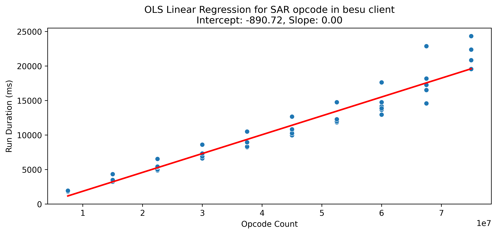


## geth


```python
                            OLS Regression Results                            
==============================================================================
Dep. Variable:        run_duration_ms   R-squared:                       0.986
Model:                            OLS   Adj. R-squared:                  0.985
Method:                 Least Squares   F-statistic:                     3570.
Date:                Mon, 22 Dec 2025   Prob (F-statistic):           1.34e-49
Time:                        12:03:35   Log-Likelihood:                -305.20
No. Observations:                  54   AIC:                             614.4
Df Residuals:                      52   BIC:                             618.4
Df Model:                           1                                         
Covariance Type:            nonrobust                                         
==============================================================================
                 coef    std err          t      P>|t|      [0.025      0.975]
------------------------------------------------------------------------------
const         24.6855     20.760      1.189      0.240     -16.972      66.343
opcount     2.688e-05    4.5e-07     59.752      0.000     2.6e-05    2.78e-05
==============================================================================
Omnibus:                       80.481   Durbin-Watson:                   2.026
Prob(Omnibus):                  0.000   Jarque-Bera (JB):             1024.217
Skew:                           4.151   Prob(JB):                    3.93e-223
Kurtosis:                      22.654   Cond. No.                     1.00e+08
==============================================================================

Notes:
[1] Standard Errors assume that the covariance matrix of the errors is correctly specified.
[2] The condition number is large,  1e+08. This might indicate that there are
strong multicollinearity or other numerical problems.
```

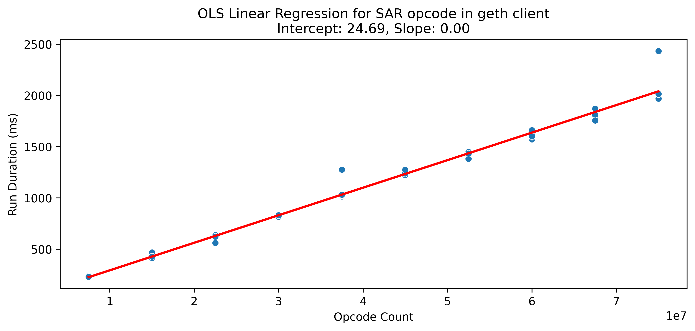


# ADDRESS

## nethermind


```python
                            OLS Regression Results                            
==============================================================================
Dep. Variable:        run_duration_ms   R-squared:                       0.019
Model:                            OLS   Adj. R-squared:                 -0.000
Method:                 Least Squares   F-statistic:                    0.9942
Date:                Mon, 22 Dec 2025   Prob (F-statistic):              0.323
Time:                        12:03:35   Log-Likelihood:                -326.86
No. Observations:                  54   AIC:                             657.7
Df Residuals:                      52   BIC:                             661.7
Df Model:                           1                                         
Covariance Type:            nonrobust                                         
==============================================================================
                 coef    std err          t      P>|t|      [0.025      0.975]
------------------------------------------------------------------------------
const       2382.5576     31.002     76.853      0.000    2320.348    2444.767
opcount     2.009e-09   2.02e-09      0.997      0.323   -2.03e-09    6.05e-09
==============================================================================
Omnibus:                        5.122   Durbin-Watson:                   1.517
Prob(Omnibus):                  0.077   Jarque-Bera (JB):                4.794
Skew:                          -0.729   Prob(JB):                       0.0910
Kurtosis:                       2.936   Cond. No.                     3.34e+10
==============================================================================

Notes:
[1] Standard Errors assume that the covariance matrix of the errors is correctly specified.
[2] The condition number is large, 3.34e+10. This might indicate that there are
strong multicollinearity or other numerical problems.
```

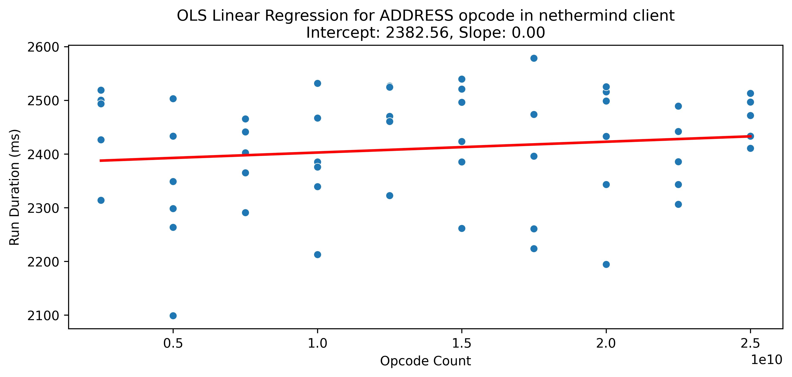


## reth


```python
                            OLS Regression Results                            
==============================================================================
Dep. Variable:        run_duration_ms   R-squared:                       0.029
Model:                            OLS   Adj. R-squared:                  0.010
Method:                 Least Squares   F-statistic:                     1.544
Date:                Mon, 22 Dec 2025   Prob (F-statistic):              0.220
Time:                        12:03:35   Log-Likelihood:                -308.73
No. Observations:                  54   AIC:                             621.5
Df Residuals:                      52   BIC:                             625.4
Df Model:                           1                                         
Covariance Type:            nonrobust                                         
==============================================================================
                 coef    std err          t      P>|t|      [0.025      0.975]
------------------------------------------------------------------------------
const       2268.6208     22.162    102.363      0.000    2224.149    2313.093
opcount      1.79e-09   1.44e-09      1.243      0.220    -1.1e-09    4.68e-09
==============================================================================
Omnibus:                        1.889   Durbin-Watson:                   1.517
Prob(Omnibus):                  0.389   Jarque-Bera (JB):                1.816
Skew:                          -0.421   Prob(JB):                        0.403
Kurtosis:                       2.690   Cond. No.                     3.34e+10
==============================================================================

Notes:
[1] Standard Errors assume that the covariance matrix of the errors is correctly specified.
[2] The condition number is large, 3.34e+10. This might indicate that there are
strong multicollinearity or other numerical problems.
```

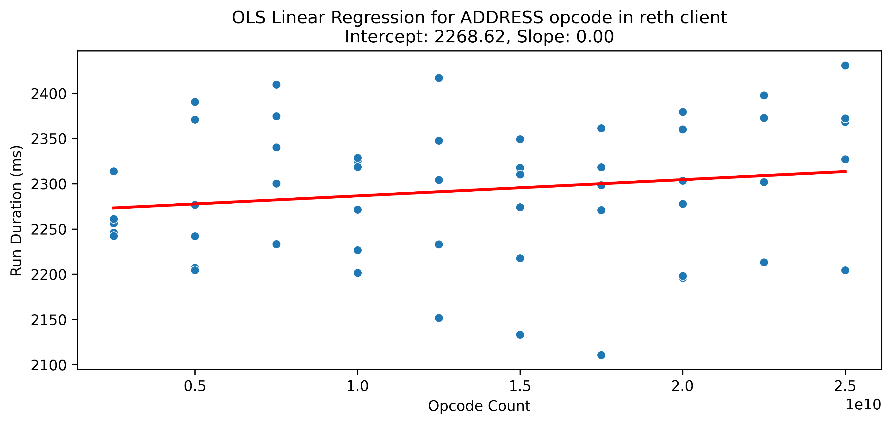


## besu


```python
                            OLS Regression Results                            
==============================================================================
Dep. Variable:        run_duration_ms   R-squared:                       0.001
Model:                            OLS   Adj. R-squared:                 -0.019
Method:                 Least Squares   F-statistic:                   0.03589
Date:                Mon, 22 Dec 2025   Prob (F-statistic):              0.850
Time:                        12:03:36   Log-Likelihood:                -538.52
No. Observations:                  53   AIC:                             1081.
Df Residuals:                      51   BIC:                             1085.
Df Model:                           1                                         
Covariance Type:            nonrobust                                         
==============================================================================
                 coef    std err          t      P>|t|      [0.025      0.975]
------------------------------------------------------------------------------
const       1.528e+04   1901.177      8.035      0.000    1.15e+04    1.91e+04
opcount     2.328e-08   1.23e-07      0.189      0.850   -2.23e-07     2.7e-07
==============================================================================
Omnibus:                       20.236   Durbin-Watson:                   0.116
Prob(Omnibus):                  0.000   Jarque-Bera (JB):               26.197
Skew:                           1.652   Prob(JB):                     2.05e-06
Kurtosis:                       3.972   Cond. No.                     3.36e+10
==============================================================================

Notes:
[1] Standard Errors assume that the covariance matrix of the errors is correctly specified.
[2] The condition number is large, 3.36e+10. This might indicate that there are
strong multicollinearity or other numerical problems.
```

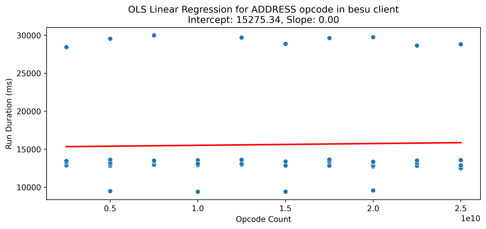


## geth


```python
                            OLS Regression Results                            
==============================================================================
Dep. Variable:        run_duration_ms   R-squared:                       0.029
Model:                            OLS   Adj. R-squared:                  0.010
Method:                 Least Squares   F-statistic:                     1.542
Date:                Mon, 22 Dec 2025   Prob (F-statistic):              0.220
Time:                        12:03:36   Log-Likelihood:                -395.26
No. Observations:                  54   AIC:                             794.5
Df Residuals:                      52   BIC:                             798.5
Df Model:                           1                                         
Covariance Type:            nonrobust                                         
==============================================================================
                 coef    std err          t      P>|t|      [0.025      0.975]
------------------------------------------------------------------------------
const       1.114e+04    110.041    101.266      0.000    1.09e+04    1.14e+04
opcount     8.882e-09   7.15e-09      1.242      0.220   -5.47e-09    2.32e-08
==============================================================================
Omnibus:                      107.920   Durbin-Watson:                   1.856
Prob(Omnibus):                  0.000   Jarque-Bera (JB):             3761.980
Skew:                           6.015   Prob(JB):                         0.00
Kurtosis:                      42.080   Cond. No.                     3.34e+10
==============================================================================

Notes:
[1] Standard Errors assume that the covariance matrix of the errors is correctly specified.
[2] The condition number is large, 3.34e+10. This might indicate that there are
strong multicollinearity or other numerical problems.
```

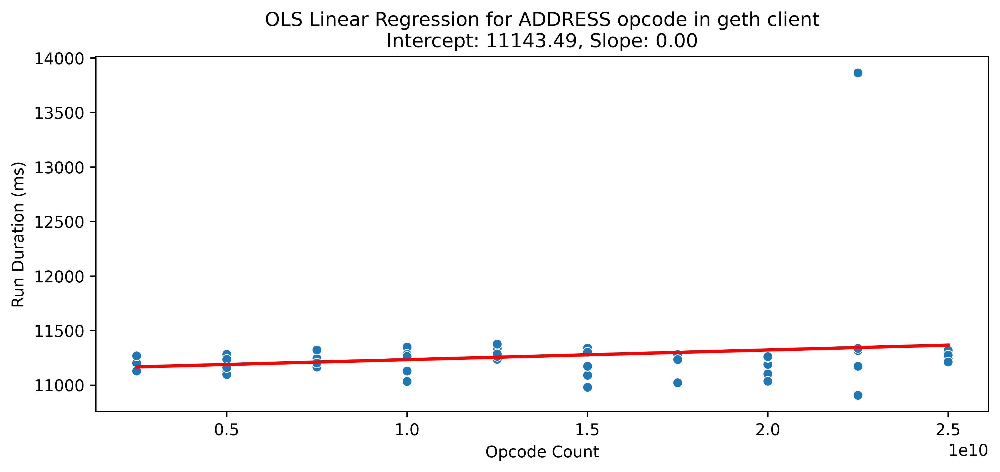


# ORIGIN

## nethermind


```python
                            OLS Regression Results                            
==============================================================================
Dep. Variable:        run_duration_ms   R-squared:                       0.006
Model:                            OLS   Adj. R-squared:                 -0.013
Method:                 Least Squares   F-statistic:                    0.3276
Date:                Mon, 22 Dec 2025   Prob (F-statistic):              0.570
Time:                        12:03:36   Log-Likelihood:                -334.95
No. Observations:                  54   AIC:                             673.9
Df Residuals:                      52   BIC:                             677.9
Df Model:                           1                                         
Covariance Type:            nonrobust                                         
==============================================================================
                 coef    std err          t      P>|t|      [0.025      0.975]
------------------------------------------------------------------------------
const       2124.3029     36.016     58.982      0.000    2052.031    2196.575
opcount      1.34e-09   2.34e-09      0.572      0.570   -3.36e-09    6.04e-09
==============================================================================
Omnibus:                        0.762   Durbin-Watson:                   1.055
Prob(Omnibus):                  0.683   Jarque-Bera (JB):                0.779
Skew:                          -0.060   Prob(JB):                        0.677
Kurtosis:                       2.424   Cond. No.                     3.34e+10
==============================================================================

Notes:
[1] Standard Errors assume that the covariance matrix of the errors is correctly specified.
[2] The condition number is large, 3.34e+10. This might indicate that there are
strong multicollinearity or other numerical problems.
```

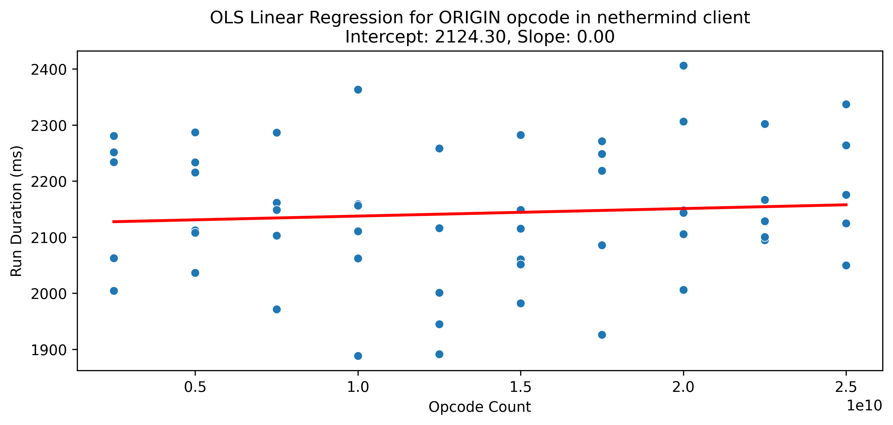


## reth


```python
                            OLS Regression Results                            
==============================================================================
Dep. Variable:        run_duration_ms   R-squared:                       0.028
Model:                            OLS   Adj. R-squared:                  0.009
Method:                 Least Squares   F-statistic:                     1.491
Date:                Mon, 22 Dec 2025   Prob (F-statistic):              0.228
Time:                        12:03:36   Log-Likelihood:                -326.54
No. Observations:                  54   AIC:                             657.1
Df Residuals:                      52   BIC:                             661.1
Df Model:                           1                                         
Covariance Type:            nonrobust                                         
==============================================================================
                 coef    std err          t      P>|t|      [0.025      0.975]
------------------------------------------------------------------------------
const       2388.5839     30.821     77.498      0.000    2326.737    2450.431
opcount    -2.446e-09      2e-09     -1.221      0.228   -6.47e-09    1.57e-09
==============================================================================
Omnibus:                       55.604   Durbin-Watson:                   2.080
Prob(Omnibus):                  0.000   Jarque-Bera (JB):              427.432
Skew:                           2.553   Prob(JB):                     1.53e-93
Kurtosis:                      15.802   Cond. No.                     3.34e+10
==============================================================================

Notes:
[1] Standard Errors assume that the covariance matrix of the errors is correctly specified.
[2] The condition number is large, 3.34e+10. This might indicate that there are
strong multicollinearity or other numerical problems.
```

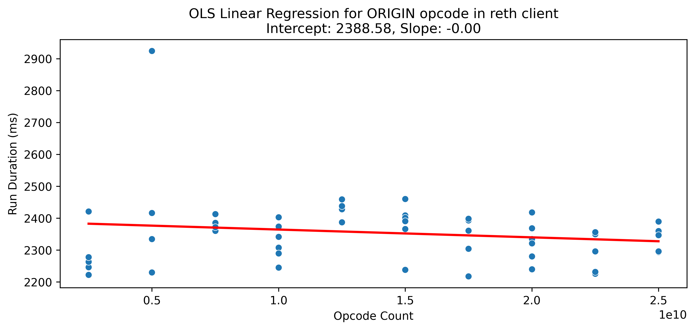


## besu

OLS model did not run... Error: zero-size array to reduction operation maximum which has no identity

## geth


```python
                            OLS Regression Results                            
==============================================================================
Dep. Variable:        run_duration_ms   R-squared:                       0.001
Model:                            OLS   Adj. R-squared:                 -0.018
Method:                 Least Squares   F-statistic:                   0.07022
Date:                Mon, 22 Dec 2025   Prob (F-statistic):              0.792
Time:                        12:03:36   Log-Likelihood:                -349.49
No. Observations:                  54   AIC:                             703.0
Df Residuals:                      52   BIC:                             707.0
Df Model:                           1                                         
Covariance Type:            nonrobust                                         
==============================================================================
                 coef    std err          t      P>|t|      [0.025      0.975]
------------------------------------------------------------------------------
const       8339.4464     47.145    176.888      0.000    8244.842    8434.051
opcount     -8.12e-10   3.06e-09     -0.265      0.792   -6.96e-09    5.34e-09
==============================================================================
Omnibus:                        9.187   Durbin-Watson:                   1.893
Prob(Omnibus):                  0.010   Jarque-Bera (JB):                8.530
Skew:                          -0.881   Prob(JB):                       0.0140
Kurtosis:                       3.830   Cond. No.                     3.34e+10
==============================================================================

Notes:
[1] Standard Errors assume that the covariance matrix of the errors is correctly specified.
[2] The condition number is large, 3.34e+10. This might indicate that there are
strong multicollinearity or other numerical problems.
```

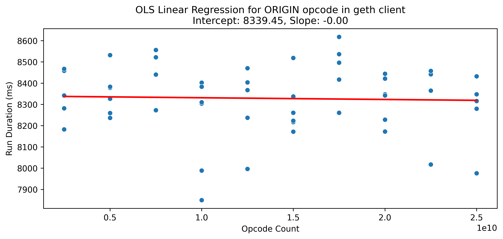


# CALLER

## nethermind


```python
                            OLS Regression Results                            
==============================================================================
Dep. Variable:        run_duration_ms   R-squared:                       0.001
Model:                            OLS   Adj. R-squared:                 -0.018
Method:                 Least Squares   F-statistic:                   0.04948
Date:                Mon, 22 Dec 2025   Prob (F-statistic):              0.825
Time:                        12:03:36   Log-Likelihood:                -326.01
No. Observations:                  54   AIC:                             656.0
Df Residuals:                      52   BIC:                             660.0
Df Model:                           1                                         
Covariance Type:            nonrobust                                         
==============================================================================
                 coef    std err          t      P>|t|      [0.025      0.975]
------------------------------------------------------------------------------
const       2410.3272     30.520     78.975      0.000    2349.084    2471.570
opcount     4.413e-10   1.98e-09      0.222      0.825   -3.54e-09    4.42e-09
==============================================================================
Omnibus:                        3.093   Durbin-Watson:                   1.412
Prob(Omnibus):                  0.213   Jarque-Bera (JB):                2.625
Skew:                           0.104   Prob(JB):                        0.269
Kurtosis:                       4.060   Cond. No.                     3.34e+10
==============================================================================

Notes:
[1] Standard Errors assume that the covariance matrix of the errors is correctly specified.
[2] The condition number is large, 3.34e+10. This might indicate that there are
strong multicollinearity or other numerical problems.
```

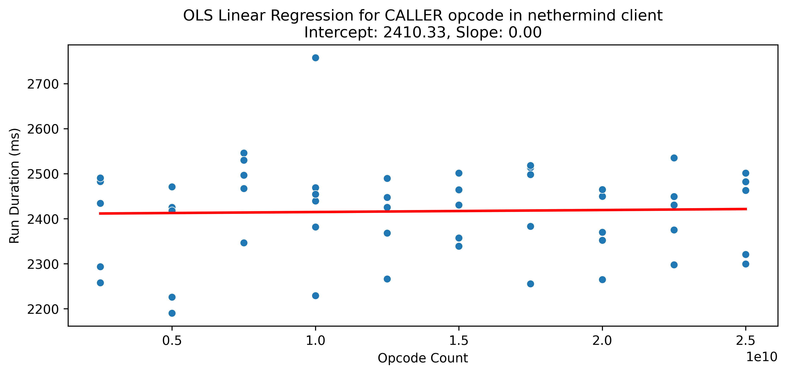


## reth


```python
                            OLS Regression Results                            
==============================================================================
Dep. Variable:        run_duration_ms   R-squared:                       0.000
Model:                            OLS   Adj. R-squared:                 -0.019
Method:                 Least Squares   F-statistic:                 0.0002991
Date:                Mon, 22 Dec 2025   Prob (F-statistic):              0.986
Time:                        12:03:36   Log-Likelihood:                -311.32
No. Observations:                  54   AIC:                             626.6
Df Residuals:                      52   BIC:                             630.6
Df Model:                           1                                         
Covariance Type:            nonrobust                                         
==============================================================================
                 coef    std err          t      P>|t|      [0.025      0.975]
------------------------------------------------------------------------------
const       2272.5022     23.251     97.737      0.000    2225.845    2319.159
opcount    -2.614e-11   1.51e-09     -0.017      0.986   -3.06e-09    3.01e-09
==============================================================================
Omnibus:                        2.514   Durbin-Watson:                   1.894
Prob(Omnibus):                  0.285   Jarque-Bera (JB):                1.617
Skew:                          -0.174   Prob(JB):                        0.446
Kurtosis:                       2.227   Cond. No.                     3.34e+10
==============================================================================

Notes:
[1] Standard Errors assume that the covariance matrix of the errors is correctly specified.
[2] The condition number is large, 3.34e+10. This might indicate that there are
strong multicollinearity or other numerical problems.
```

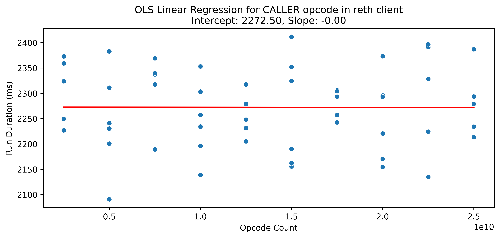


## besu


```python
                            OLS Regression Results                            
==============================================================================
Dep. Variable:        run_duration_ms   R-squared:                       0.000
Model:                            OLS   Adj. R-squared:                 -0.019
Method:                 Least Squares   F-statistic:                 0.0008563
Date:                Mon, 22 Dec 2025   Prob (F-statistic):              0.977
Time:                        12:03:36   Log-Likelihood:                -549.60
No. Observations:                  54   AIC:                             1103.
Df Residuals:                      52   BIC:                             1107.
Df Model:                           1                                         
Covariance Type:            nonrobust                                         
==============================================================================
                 coef    std err          t      P>|t|      [0.025      0.975]
------------------------------------------------------------------------------
const       1.582e+04   1917.677      8.250      0.000     1.2e+04    1.97e+04
opcount     3.648e-09   1.25e-07      0.029      0.977   -2.46e-07    2.54e-07
==============================================================================
Omnibus:                       17.383   Durbin-Watson:                   0.129
Prob(Omnibus):                  0.000   Jarque-Bera (JB):               21.635
Skew:                           1.527   Prob(JB):                     2.00e-05
Kurtosis:                       3.538   Cond. No.                     3.34e+10
==============================================================================

Notes:
[1] Standard Errors assume that the covariance matrix of the errors is correctly specified.
[2] The condition number is large, 3.34e+10. This might indicate that there are
strong multicollinearity or other numerical problems.
```

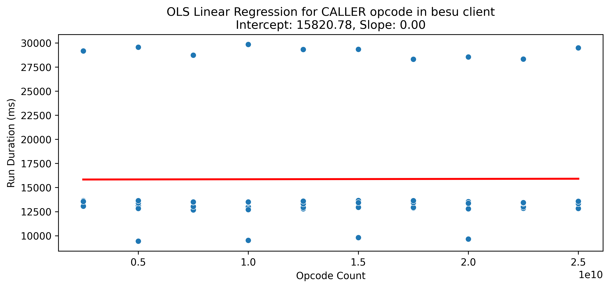


## geth


```python
                            OLS Regression Results                            
==============================================================================
Dep. Variable:        run_duration_ms   R-squared:                       0.015
Model:                            OLS   Adj. R-squared:                 -0.004
Method:                 Least Squares   F-statistic:                    0.7859
Date:                Mon, 22 Dec 2025   Prob (F-statistic):              0.379
Time:                        12:03:37   Log-Likelihood:                -322.17
No. Observations:                  54   AIC:                             648.3
Df Residuals:                      52   BIC:                             652.3
Df Model:                           1                                         
Covariance Type:            nonrobust                                         
==============================================================================
                 coef    std err          t      P>|t|      [0.025      0.975]
------------------------------------------------------------------------------
const       1.115e+04     28.422    392.142      0.000    1.11e+04    1.12e+04
opcount    -1.638e-09   1.85e-09     -0.886      0.379   -5.34e-09    2.07e-09
==============================================================================
Omnibus:                        1.523   Durbin-Watson:                   1.990
Prob(Omnibus):                  0.467   Jarque-Bera (JB):                1.525
Skew:                          -0.353   Prob(JB):                        0.467
Kurtosis:                       2.578   Cond. No.                     3.34e+10
==============================================================================

Notes:
[1] Standard Errors assume that the covariance matrix of the errors is correctly specified.
[2] The condition number is large, 3.34e+10. This might indicate that there are
strong multicollinearity or other numerical problems.
```

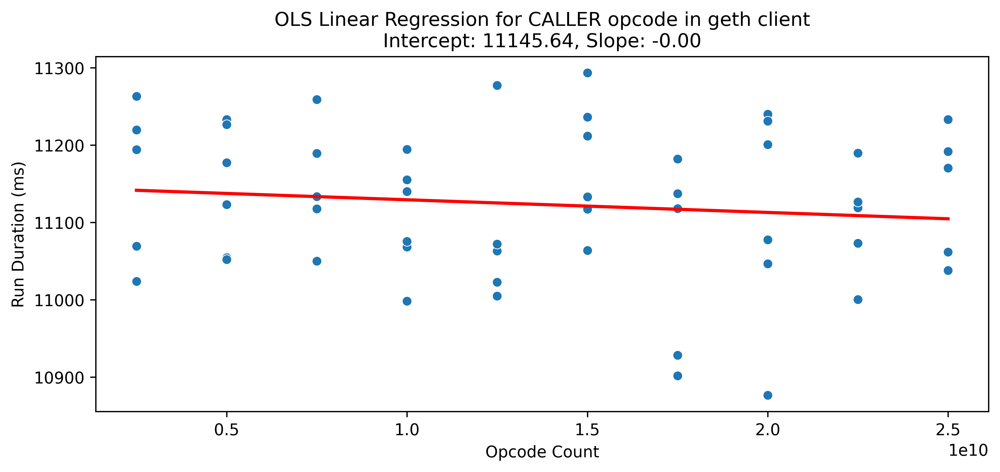


# GASPRICE

## nethermind


```python
                            OLS Regression Results                            
==============================================================================
Dep. Variable:        run_duration_ms   R-squared:                       0.013
Model:                            OLS   Adj. R-squared:                 -0.006
Method:                 Least Squares   F-statistic:                    0.6853
Date:                Mon, 22 Dec 2025   Prob (F-statistic):              0.412
Time:                        12:03:37   Log-Likelihood:                -319.37
No. Observations:                  54   AIC:                             642.7
Df Residuals:                      52   BIC:                             646.7
Df Model:                           1                                         
Covariance Type:            nonrobust                                         
==============================================================================
                 coef    std err          t      P>|t|      [0.025      0.975]
------------------------------------------------------------------------------
const       2176.6870     26.990     80.647      0.000    2122.527    2230.847
opcount     1.452e-09   1.75e-09      0.828      0.412   -2.07e-09    4.97e-09
==============================================================================
Omnibus:                        4.147   Durbin-Watson:                   1.903
Prob(Omnibus):                  0.126   Jarque-Bera (JB):                3.961
Skew:                          -0.653   Prob(JB):                        0.138
Kurtosis:                       2.765   Cond. No.                     3.34e+10
==============================================================================

Notes:
[1] Standard Errors assume that the covariance matrix of the errors is correctly specified.
[2] The condition number is large, 3.34e+10. This might indicate that there are
strong multicollinearity or other numerical problems.
```

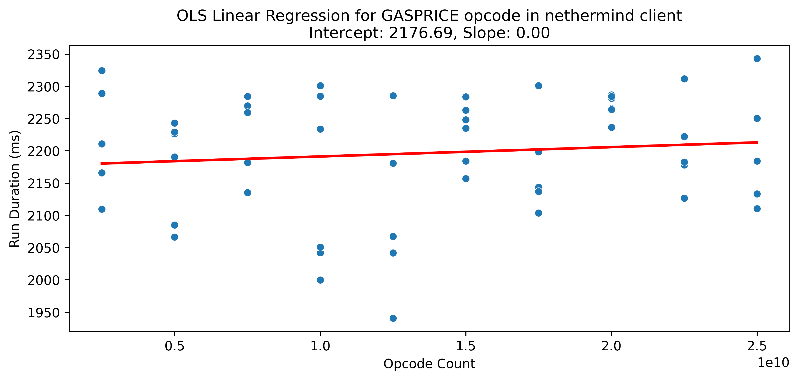


## reth


```python
                            OLS Regression Results                            
==============================================================================
Dep. Variable:        run_duration_ms   R-squared:                       0.064
Model:                            OLS   Adj. R-squared:                  0.046
Method:                 Least Squares   F-statistic:                     3.552
Date:                Mon, 22 Dec 2025   Prob (F-statistic):             0.0651
Time:                        12:03:37   Log-Likelihood:                -300.88
No. Observations:                  54   AIC:                             605.8
Df Residuals:                      52   BIC:                             609.7
Df Model:                           1                                         
Covariance Type:            nonrobust                                         
==============================================================================
                 coef    std err          t      P>|t|      [0.025      0.975]
------------------------------------------------------------------------------
const       2363.3242     19.164    123.318      0.000    2324.868    2401.780
opcount     2.348e-09   1.25e-09      1.885      0.065   -1.52e-10    4.85e-09
==============================================================================
Omnibus:                        2.841   Durbin-Watson:                   1.788
Prob(Omnibus):                  0.242   Jarque-Bera (JB):                2.481
Skew:                          -0.422   Prob(JB):                        0.289
Kurtosis:                       2.376   Cond. No.                     3.34e+10
==============================================================================

Notes:
[1] Standard Errors assume that the covariance matrix of the errors is correctly specified.
[2] The condition number is large, 3.34e+10. This might indicate that there are
strong multicollinearity or other numerical problems.
```

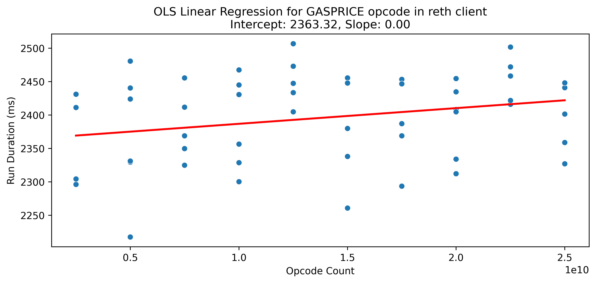


## besu

OLS model did not run... Error: zero-size array to reduction operation maximum which has no identity

## geth


```python
                            OLS Regression Results                            
==============================================================================
Dep. Variable:        run_duration_ms   R-squared:                       0.033
Model:                            OLS   Adj. R-squared:                  0.015
Method:                 Least Squares   F-statistic:                     1.783
Date:                Mon, 22 Dec 2025   Prob (F-statistic):              0.188
Time:                        12:03:37   Log-Likelihood:                -415.45
No. Observations:                  54   AIC:                             834.9
Df Residuals:                      52   BIC:                             838.9
Df Model:                           1                                         
Covariance Type:            nonrobust                                         
==============================================================================
                 coef    std err          t      P>|t|      [0.025      0.975]
------------------------------------------------------------------------------
const       7811.5488    159.921     48.846      0.000    7490.645    8132.453
opcount    -1.388e-08   1.04e-08     -1.335      0.188   -3.47e-08    6.98e-09
==============================================================================
Omnibus:                       91.477   Durbin-Watson:                   2.128
Prob(Omnibus):                  0.000   Jarque-Bera (JB):             1756.887
Skew:                           4.832   Prob(JB):                         0.00
Kurtosis:                      29.219   Cond. No.                     3.34e+10
==============================================================================

Notes:
[1] Standard Errors assume that the covariance matrix of the errors is correctly specified.
[2] The condition number is large, 3.34e+10. This might indicate that there are
strong multicollinearity or other numerical problems.
```

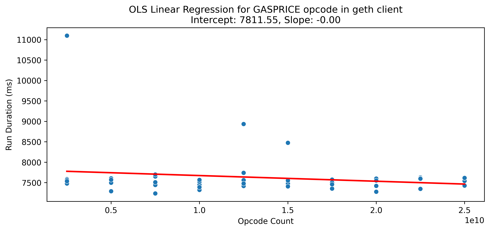


# RETURNDATASIZE

## nethermind


```python
                            OLS Regression Results                            
==============================================================================
Dep. Variable:        run_duration_ms   R-squared:                       0.930
Model:                            OLS   Adj. R-squared:                  0.930
Method:                 Least Squares   F-statistic:                     1415.
Date:                Mon, 22 Dec 2025   Prob (F-statistic):           3.87e-63
Time:                        12:03:37   Log-Likelihood:                -632.95
No. Observations:                 108   AIC:                             1270.
Df Residuals:                     106   BIC:                             1275.
Df Model:                           1                                         
Covariance Type:            nonrobust                                         
==============================================================================
                 coef    std err          t      P>|t|      [0.025      0.975]
------------------------------------------------------------------------------
const        120.7993     15.297      7.897      0.000      90.472     151.126
opcount     4.731e-06   1.26e-07     37.620      0.000    4.48e-06    4.98e-06
==============================================================================
Omnibus:                       10.975   Durbin-Watson:                   1.665
Prob(Omnibus):                  0.004   Jarque-Bera (JB):               12.287
Skew:                           0.818   Prob(JB):                      0.00215
Kurtosis:                       2.768   Cond. No.                     2.26e+08
==============================================================================

Notes:
[1] Standard Errors assume that the covariance matrix of the errors is correctly specified.
[2] The condition number is large, 2.26e+08. This might indicate that there are
strong multicollinearity or other numerical problems.
```

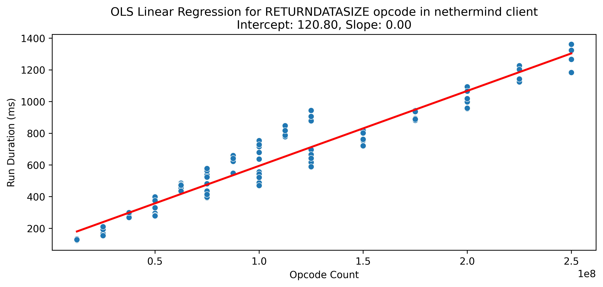


## reth


```python
                            OLS Regression Results                            
==============================================================================
Dep. Variable:        run_duration_ms   R-squared:                       0.853
Model:                            OLS   Adj. R-squared:                  0.852
Method:                 Least Squares   F-statistic:                     615.4
Date:                Mon, 22 Dec 2025   Prob (F-statistic):           6.01e-46
Time:                        12:03:37   Log-Likelihood:                -663.37
No. Observations:                 108   AIC:                             1331.
Df Residuals:                     106   BIC:                             1336.
Df Model:                           1                                         
Covariance Type:            nonrobust                                         
==============================================================================
                 coef    std err          t      P>|t|      [0.025      0.975]
------------------------------------------------------------------------------
const        159.5785     20.274      7.871      0.000     119.384     199.773
opcount     4.135e-06   1.67e-07     24.808      0.000     3.8e-06    4.47e-06
==============================================================================
Omnibus:                        9.757   Durbin-Watson:                   1.585
Prob(Omnibus):                  0.008   Jarque-Bera (JB):               10.033
Skew:                           0.704   Prob(JB):                      0.00663
Kurtosis:                       2.503   Cond. No.                     2.26e+08
==============================================================================

Notes:
[1] Standard Errors assume that the covariance matrix of the errors is correctly specified.
[2] The condition number is large, 2.26e+08. This might indicate that there are
strong multicollinearity or other numerical problems.
```

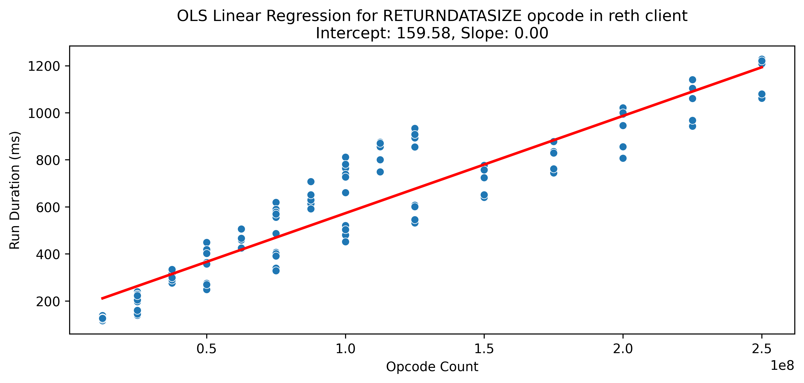


## besu


```python
                            OLS Regression Results                            
==============================================================================
Dep. Variable:        run_duration_ms   R-squared:                       0.735
Model:                            OLS   Adj. R-squared:                  0.732
Method:                 Least Squares   F-statistic:                     293.9
Date:                Mon, 22 Dec 2025   Prob (F-statistic):           2.45e-32
Time:                        12:03:37   Log-Likelihood:                -926.59
No. Observations:                 108   AIC:                             1857.
Df Residuals:                     106   BIC:                             1863.
Df Model:                           1                                         
Covariance Type:            nonrobust                                         
==============================================================================
                 coef    std err          t      P>|t|      [0.025      0.975]
------------------------------------------------------------------------------
const        932.6081    231.945      4.021      0.000     472.756    1392.461
opcount      3.27e-05   1.91e-06     17.145      0.000    2.89e-05    3.65e-05
==============================================================================
Omnibus:                       36.474   Durbin-Watson:                   0.889
Prob(Omnibus):                  0.000   Jarque-Bera (JB):               66.359
Skew:                           1.448   Prob(JB):                     3.89e-15
Kurtosis:                       5.523   Cond. No.                     2.26e+08
==============================================================================

Notes:
[1] Standard Errors assume that the covariance matrix of the errors is correctly specified.
[2] The condition number is large, 2.26e+08. This might indicate that there are
strong multicollinearity or other numerical problems.
```

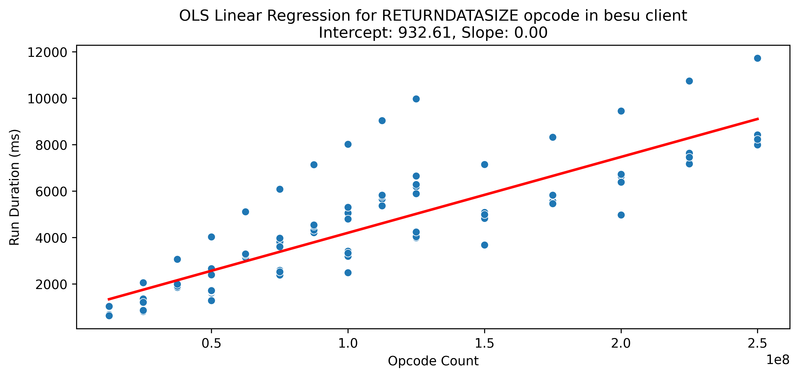


## geth


```python
                            OLS Regression Results                            
==============================================================================
Dep. Variable:        run_duration_ms   R-squared:                       0.927
Model:                            OLS   Adj. R-squared:                  0.926
Method:                 Least Squares   F-statistic:                     1348.
Date:                Mon, 22 Dec 2025   Prob (F-statistic):           4.26e-62
Time:                        12:03:38   Log-Likelihood:                -728.60
No. Observations:                 108   AIC:                             1461.
Df Residuals:                     106   BIC:                             1467.
Df Model:                           1                                         
Covariance Type:            nonrobust                                         
==============================================================================
                 coef    std err          t      P>|t|      [0.025      0.975]
------------------------------------------------------------------------------
const        269.4631     37.086      7.266      0.000     195.936     342.990
opcount      1.12e-05   3.05e-07     36.715      0.000    1.06e-05    1.18e-05
==============================================================================
Omnibus:                       14.394   Durbin-Watson:                   1.771
Prob(Omnibus):                  0.001   Jarque-Bera (JB):               16.085
Skew:                           0.910   Prob(JB):                     0.000322
Kurtosis:                       2.486   Cond. No.                     2.26e+08
==============================================================================

Notes:
[1] Standard Errors assume that the covariance matrix of the errors is correctly specified.
[2] The condition number is large, 2.26e+08. This might indicate that there are
strong multicollinearity or other numerical problems.
```

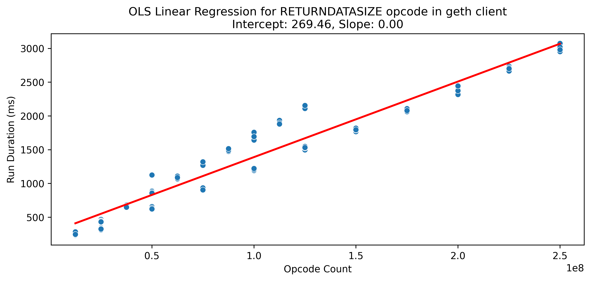


# COINBASE

## nethermind


```python
                            OLS Regression Results                            
==============================================================================
Dep. Variable:        run_duration_ms   R-squared:                       0.989
Model:                            OLS   Adj. R-squared:                  0.989
Method:                 Least Squares   F-statistic:                     4620.
Date:                Mon, 22 Dec 2025   Prob (F-statistic):           1.80e-52
Time:                        12:03:38   Log-Likelihood:                -271.78
No. Observations:                  54   AIC:                             547.6
Df Residuals:                      52   BIC:                             551.5
Df Model:                           1                                         
Covariance Type:            nonrobust                                         
==============================================================================
                 coef    std err          t      P>|t|      [0.025      0.975]
------------------------------------------------------------------------------
const         33.9770     11.181      3.039      0.004      11.542      56.412
opcount     4.939e-06   7.27e-08     67.967      0.000    4.79e-06    5.09e-06
==============================================================================
Omnibus:                        0.315   Durbin-Watson:                   1.697
Prob(Omnibus):                  0.854   Jarque-Bera (JB):                0.088
Skew:                          -0.098   Prob(JB):                        0.957
Kurtosis:                       3.029   Cond. No.                     3.34e+08
==============================================================================

Notes:
[1] Standard Errors assume that the covariance matrix of the errors is correctly specified.
[2] The condition number is large, 3.34e+08. This might indicate that there are
strong multicollinearity or other numerical problems.
```


## reth


```python
                            OLS Regression Results                            
==============================================================================
Dep. Variable:        run_duration_ms   R-squared:                       0.994
Model:                            OLS   Adj. R-squared:                  0.994
Method:                 Least Squares   F-statistic:                     8930.
Date:                Mon, 22 Dec 2025   Prob (F-statistic):           7.44e-60
Time:                        12:03:38   Log-Likelihood:                -253.92
No. Observations:                  54   AIC:                             511.8
Df Residuals:                      52   BIC:                             515.8
Df Model:                           1                                         
Covariance Type:            nonrobust                                         
==============================================================================
                 coef    std err          t      P>|t|      [0.025      0.975]
------------------------------------------------------------------------------
const         31.3035      8.031      3.898      0.000      15.187      47.420
opcount     4.933e-06   5.22e-08     94.497      0.000    4.83e-06    5.04e-06
==============================================================================
Omnibus:                        2.640   Durbin-Watson:                   1.530
Prob(Omnibus):                  0.267   Jarque-Bera (JB):                1.750
Skew:                          -0.389   Prob(JB):                        0.417
Kurtosis:                       3.415   Cond. No.                     3.34e+08
==============================================================================

Notes:
[1] Standard Errors assume that the covariance matrix of the errors is correctly specified.
[2] The condition number is large, 3.34e+08. This might indicate that there are
strong multicollinearity or other numerical problems.
```


## besu


```python
                            OLS Regression Results                            
==============================================================================
Dep. Variable:        run_duration_ms   R-squared:                       0.863
Model:                            OLS   Adj. R-squared:                  0.861
Method:                 Least Squares   F-statistic:                     328.6
Date:                Mon, 22 Dec 2025   Prob (F-statistic):           3.95e-24
Time:                        12:03:38   Log-Likelihood:                -439.57
No. Observations:                  54   AIC:                             883.1
Df Residuals:                      52   BIC:                             887.1
Df Model:                           1                                         
Covariance Type:            nonrobust                                         
==============================================================================
                 coef    std err          t      P>|t|      [0.025      0.975]
------------------------------------------------------------------------------
const        -22.0165    249.993     -0.088      0.930    -523.663     479.630
opcount     2.946e-05   1.62e-06     18.127      0.000    2.62e-05    3.27e-05
==============================================================================
Omnibus:                       24.339   Durbin-Watson:                   0.561
Prob(Omnibus):                  0.000   Jarque-Bera (JB):               36.882
Skew:                           1.587   Prob(JB):                     9.80e-09
Kurtosis:                       5.514   Cond. No.                     3.34e+08
==============================================================================

Notes:
[1] Standard Errors assume that the covariance matrix of the errors is correctly specified.
[2] The condition number is large, 3.34e+08. This might indicate that there are
strong multicollinearity or other numerical problems.
```

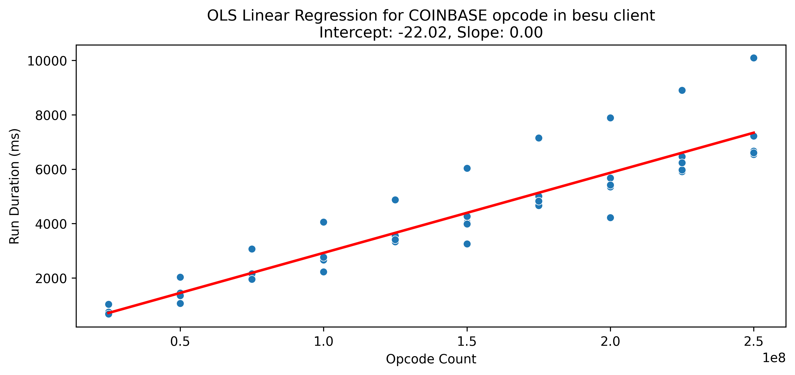


## geth


```python
                            OLS Regression Results                            
==============================================================================
Dep. Variable:        run_duration_ms   R-squared:                       0.999
Model:                            OLS   Adj. R-squared:                  0.999
Method:                 Least Squares   F-statistic:                 8.040e+04
Date:                Mon, 22 Dec 2025   Prob (F-statistic):           1.30e-84
Time:                        12:03:38   Log-Likelihood:                -264.71
No. Observations:                  54   AIC:                             533.4
Df Residuals:                      52   BIC:                             537.4
Df Model:                           1                                         
Covariance Type:            nonrobust                                         
==============================================================================
                 coef    std err          t      P>|t|      [0.025      0.975]
------------------------------------------------------------------------------
const         26.4822      9.807      2.700      0.009       6.803      46.162
opcount     1.807e-05   6.37e-08    283.549      0.000    1.79e-05    1.82e-05
==============================================================================
Omnibus:                        1.949   Durbin-Watson:                   1.854
Prob(Omnibus):                  0.377   Jarque-Bera (JB):                1.281
Skew:                           0.361   Prob(JB):                        0.527
Kurtosis:                       3.219   Cond. No.                     3.34e+08
==============================================================================

Notes:
[1] Standard Errors assume that the covariance matrix of the errors is correctly specified.
[2] The condition number is large, 3.34e+08. This might indicate that there are
strong multicollinearity or other numerical problems.
```


# TIMESTAMP

## nethermind


```python
                            OLS Regression Results                            
==============================================================================
Dep. Variable:        run_duration_ms   R-squared:                       0.986
Model:                            OLS   Adj. R-squared:                  0.985
Method:                 Least Squares   F-statistic:                     3561.
Date:                Mon, 22 Dec 2025   Prob (F-statistic):           1.43e-49
Time:                        12:03:38   Log-Likelihood:                -278.90
No. Observations:                  54   AIC:                             561.8
Df Residuals:                      52   BIC:                             565.8
Df Model:                           1                                         
Covariance Type:            nonrobust                                         
==============================================================================
                 coef    std err          t      P>|t|      [0.025      0.975]
------------------------------------------------------------------------------
const         26.9018     12.756      2.109      0.040       1.304      52.499
opcount     4.948e-06   8.29e-08     59.675      0.000    4.78e-06    5.11e-06
==============================================================================
Omnibus:                        0.587   Durbin-Watson:                   1.217
Prob(Omnibus):                  0.746   Jarque-Bera (JB):                0.197
Skew:                          -0.131   Prob(JB):                        0.906
Kurtosis:                       3.137   Cond. No.                     3.34e+08
==============================================================================

Notes:
[1] Standard Errors assume that the covariance matrix of the errors is correctly specified.
[2] The condition number is large, 3.34e+08. This might indicate that there are
strong multicollinearity or other numerical problems.
```

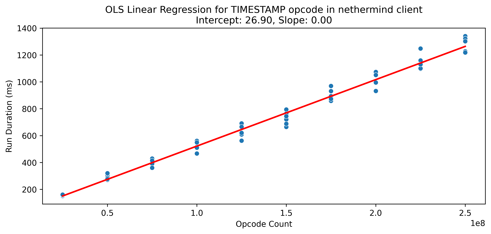


## reth


```python
                            OLS Regression Results                            
==============================================================================
Dep. Variable:        run_duration_ms   R-squared:                       0.983
Model:                            OLS   Adj. R-squared:                  0.983
Method:                 Least Squares   F-statistic:                     3021.
Date:                Mon, 22 Dec 2025   Prob (F-statistic):           9.65e-48
Time:                        12:03:38   Log-Likelihood:                -276.01
No. Observations:                  54   AIC:                             556.0
Df Residuals:                      52   BIC:                             560.0
Df Model:                           1                                         
Covariance Type:            nonrobust                                         
==============================================================================
                 coef    std err          t      P>|t|      [0.025      0.975]
------------------------------------------------------------------------------
const         38.5209     12.090      3.186      0.002      14.260      62.782
opcount      4.32e-06   7.86e-08     54.965      0.000    4.16e-06    4.48e-06
==============================================================================
Omnibus:                        7.304   Durbin-Watson:                   0.988
Prob(Omnibus):                  0.026   Jarque-Bera (JB):                7.423
Skew:                          -0.561   Prob(JB):                       0.0244
Kurtosis:                       4.428   Cond. No.                     3.34e+08
==============================================================================

Notes:
[1] Standard Errors assume that the covariance matrix of the errors is correctly specified.
[2] The condition number is large, 3.34e+08. This might indicate that there are
strong multicollinearity or other numerical problems.
```


## besu


```python
                            OLS Regression Results                            
==============================================================================
Dep. Variable:        run_duration_ms   R-squared:                       0.880
Model:                            OLS   Adj. R-squared:                  0.878
Method:                 Least Squares   F-statistic:                     382.2
Date:                Mon, 22 Dec 2025   Prob (F-statistic):           1.27e-25
Time:                        12:03:38   Log-Likelihood:                -440.10
No. Observations:                  54   AIC:                             884.2
Df Residuals:                      52   BIC:                             888.2
Df Model:                           1                                         
Covariance Type:            nonrobust                                         
==============================================================================
                 coef    std err          t      P>|t|      [0.025      0.975]
------------------------------------------------------------------------------
const        -22.9563    252.454     -0.091      0.928    -529.543     483.631
opcount     3.208e-05   1.64e-06     19.550      0.000    2.88e-05    3.54e-05
==============================================================================
Omnibus:                       23.243   Durbin-Watson:                   0.398
Prob(Omnibus):                  0.000   Jarque-Bera (JB):               33.711
Skew:                           1.552   Prob(JB):                     4.78e-08
Kurtosis:                       5.314   Cond. No.                     3.34e+08
==============================================================================

Notes:
[1] Standard Errors assume that the covariance matrix of the errors is correctly specified.
[2] The condition number is large, 3.34e+08. This might indicate that there are
strong multicollinearity or other numerical problems.
```

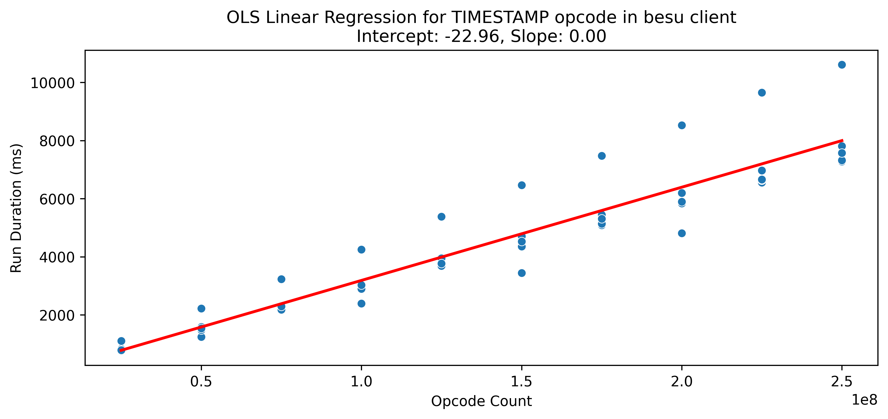


## geth


```python
                            OLS Regression Results                            
==============================================================================
Dep. Variable:        run_duration_ms   R-squared:                       0.999
Model:                            OLS   Adj. R-squared:                  0.999
Method:                 Least Squares   F-statistic:                 4.929e+04
Date:                Mon, 22 Dec 2025   Prob (F-statistic):           4.31e-79
Time:                        12:03:39   Log-Likelihood:                -255.43
No. Observations:                  54   AIC:                             514.9
Df Residuals:                      52   BIC:                             518.8
Df Model:                           1                                         
Covariance Type:            nonrobust                                         
==============================================================================
                 coef    std err          t      P>|t|      [0.025      0.975]
------------------------------------------------------------------------------
const         22.7003      8.259      2.748      0.008       6.127      39.274
opcount     1.192e-05   5.37e-08    222.011      0.000    1.18e-05     1.2e-05
==============================================================================
Omnibus:                       31.645   Durbin-Watson:                   1.827
Prob(Omnibus):                  0.000   Jarque-Bera (JB):              112.395
Skew:                          -1.463   Prob(JB):                     3.92e-25
Kurtosis:                       9.434   Cond. No.                     3.34e+08
==============================================================================

Notes:
[1] Standard Errors assume that the covariance matrix of the errors is correctly specified.
[2] The condition number is large, 3.34e+08. This might indicate that there are
strong multicollinearity or other numerical problems.
```

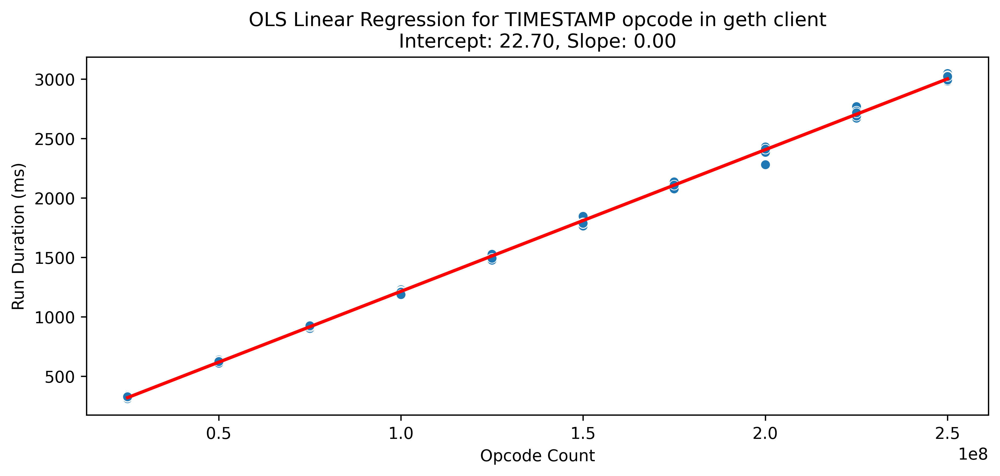


# NUMBER

## nethermind


```python
                            OLS Regression Results                            
==============================================================================
Dep. Variable:        run_duration_ms   R-squared:                       0.992
Model:                            OLS   Adj. R-squared:                  0.992
Method:                 Least Squares   F-statistic:                     6217.
Date:                Mon, 22 Dec 2025   Prob (F-statistic):           8.56e-56
Time:                        12:03:39   Log-Likelihood:                -260.90
No. Observations:                  54   AIC:                             525.8
Df Residuals:                      52   BIC:                             529.8
Df Model:                           1                                         
Covariance Type:            nonrobust                                         
==============================================================================
                 coef    std err          t      P>|t|      [0.025      0.975]
------------------------------------------------------------------------------
const         44.1078      9.139      4.826      0.000      25.768      62.447
opcount     4.684e-06   5.94e-08     78.848      0.000    4.56e-06     4.8e-06
==============================================================================
Omnibus:                       13.733   Durbin-Watson:                   1.767
Prob(Omnibus):                  0.001   Jarque-Bera (JB):               15.398
Skew:                          -1.041   Prob(JB):                     0.000453
Kurtosis:                       4.583   Cond. No.                     3.34e+08
==============================================================================

Notes:
[1] Standard Errors assume that the covariance matrix of the errors is correctly specified.
[2] The condition number is large, 3.34e+08. This might indicate that there are
strong multicollinearity or other numerical problems.
```


## reth


```python
                            OLS Regression Results                            
==============================================================================
Dep. Variable:        run_duration_ms   R-squared:                       0.981
Model:                            OLS   Adj. R-squared:                  0.981
Method:                 Least Squares   F-statistic:                     2666.
Date:                Mon, 22 Dec 2025   Prob (F-statistic):           2.35e-46
Time:                        12:03:39   Log-Likelihood:                -279.37
No. Observations:                  54   AIC:                             562.7
Df Residuals:                      52   BIC:                             566.7
Df Model:                           1                                         
Covariance Type:            nonrobust                                         
==============================================================================
                 coef    std err          t      P>|t|      [0.025      0.975]
------------------------------------------------------------------------------
const         35.4572     12.868      2.756      0.008       9.636      61.278
opcount     4.319e-06   8.36e-08     51.634      0.000    4.15e-06    4.49e-06
==============================================================================
Omnibus:                        2.165   Durbin-Watson:                   1.015
Prob(Omnibus):                  0.339   Jarque-Bera (JB):                1.364
Skew:                           0.348   Prob(JB):                        0.505
Kurtosis:                       3.350   Cond. No.                     3.34e+08
==============================================================================

Notes:
[1] Standard Errors assume that the covariance matrix of the errors is correctly specified.
[2] The condition number is large, 3.34e+08. This might indicate that there are
strong multicollinearity or other numerical problems.
```

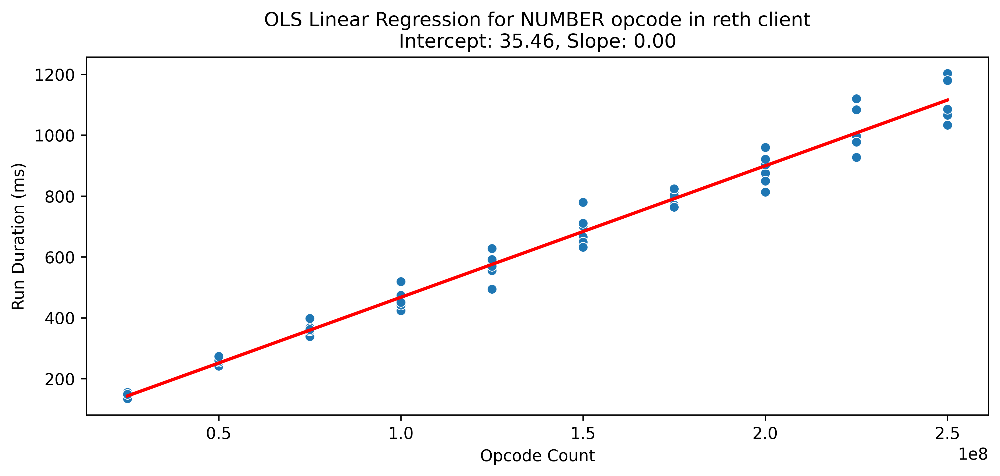


## besu


```python
                            OLS Regression Results                            
==============================================================================
Dep. Variable:        run_duration_ms   R-squared:                       0.880
Model:                            OLS   Adj. R-squared:                  0.878
Method:                 Least Squares   F-statistic:                     381.7
Date:                Mon, 22 Dec 2025   Prob (F-statistic):           1.31e-25
Time:                        12:03:39   Log-Likelihood:                -439.69
No. Observations:                  54   AIC:                             883.4
Df Residuals:                      52   BIC:                             887.4
Df Model:                           1                                         
Covariance Type:            nonrobust                                         
==============================================================================
                 coef    std err          t      P>|t|      [0.025      0.975]
------------------------------------------------------------------------------
const          4.2269    250.522      0.017      0.987    -498.483     506.937
opcount     3.181e-05   1.63e-06     19.537      0.000    2.85e-05    3.51e-05
==============================================================================
Omnibus:                       23.230   Durbin-Watson:                   0.541
Prob(Omnibus):                  0.000   Jarque-Bera (JB):               33.693
Skew:                           1.550   Prob(JB):                     4.83e-08
Kurtosis:                       5.315   Cond. No.                     3.34e+08
==============================================================================

Notes:
[1] Standard Errors assume that the covariance matrix of the errors is correctly specified.
[2] The condition number is large, 3.34e+08. This might indicate that there are
strong multicollinearity or other numerical problems.
```

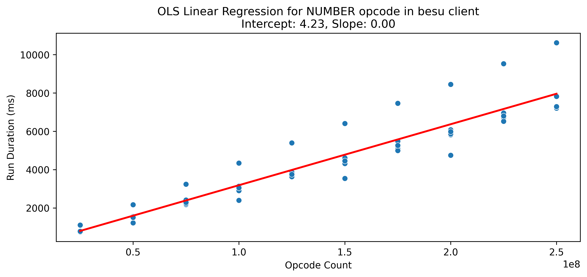


## geth


```python
                            OLS Regression Results                            
==============================================================================
Dep. Variable:        run_duration_ms   R-squared:                       0.993
Model:                            OLS   Adj. R-squared:                  0.993
Method:                 Least Squares   F-statistic:                     7180.
Date:                Mon, 22 Dec 2025   Prob (F-statistic):           2.08e-57
Time:                        12:03:39   Log-Likelihood:                -325.37
No. Observations:                  54   AIC:                             654.7
Df Residuals:                      52   BIC:                             658.7
Df Model:                           1                                         
Covariance Type:            nonrobust                                         
==============================================================================
                 coef    std err          t      P>|t|      [0.025      0.975]
------------------------------------------------------------------------------
const         60.5194     30.158      2.007      0.050       0.003     121.036
opcount     1.661e-05   1.96e-07     84.736      0.000    1.62e-05     1.7e-05
==============================================================================
Omnibus:                       74.248   Durbin-Watson:                   1.494
Prob(Omnibus):                  0.000   Jarque-Bera (JB):              747.044
Skew:                           3.798   Prob(JB):                    6.05e-163
Kurtosis:                      19.562   Cond. No.                     3.34e+08
==============================================================================

Notes:
[1] Standard Errors assume that the covariance matrix of the errors is correctly specified.
[2] The condition number is large, 3.34e+08. This might indicate that there are
strong multicollinearity or other numerical problems.
```

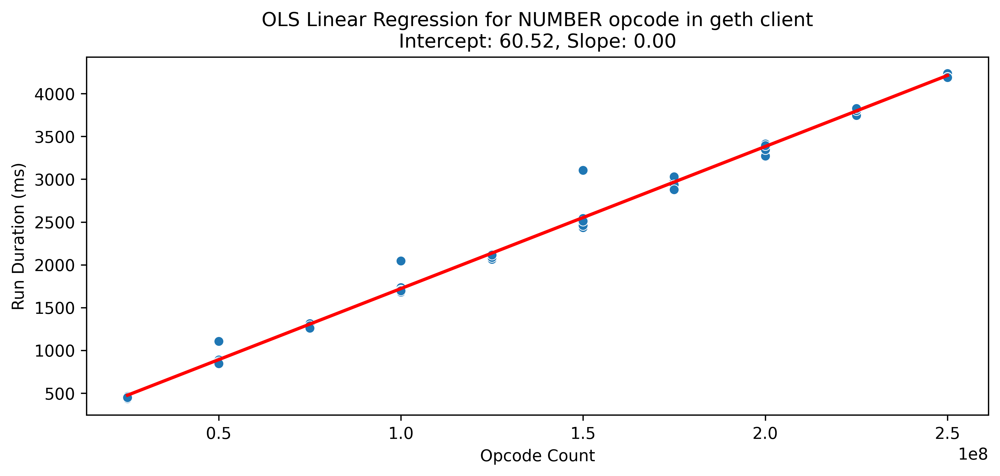


# PREVRANDAO

## nethermind


```python
                            OLS Regression Results                            
==============================================================================
Dep. Variable:        run_duration_ms   R-squared:                       0.989
Model:                            OLS   Adj. R-squared:                  0.989
Method:                 Least Squares   F-statistic:                     4786.
Date:                Mon, 22 Dec 2025   Prob (F-statistic):           7.22e-53
Time:                        12:03:39   Log-Likelihood:                -267.43
No. Observations:                  54   AIC:                             538.9
Df Residuals:                      52   BIC:                             542.8
Df Model:                           1                                         
Covariance Type:            nonrobust                                         
==============================================================================
                 coef    std err          t      P>|t|      [0.025      0.975]
------------------------------------------------------------------------------
const         46.1610     10.315      4.475      0.000      25.462      66.860
opcount     4.639e-06    6.7e-08     69.183      0.000     4.5e-06    4.77e-06
==============================================================================
Omnibus:                        9.245   Durbin-Watson:                   1.884
Prob(Omnibus):                  0.010   Jarque-Bera (JB):                8.601
Skew:                          -0.887   Prob(JB):                       0.0136
Kurtosis:                       3.823   Cond. No.                     3.34e+08
==============================================================================

Notes:
[1] Standard Errors assume that the covariance matrix of the errors is correctly specified.
[2] The condition number is large, 3.34e+08. This might indicate that there are
strong multicollinearity or other numerical problems.
```


## reth


```python
                            OLS Regression Results                            
==============================================================================
Dep. Variable:        run_duration_ms   R-squared:                       0.993
Model:                            OLS   Adj. R-squared:                  0.993
Method:                 Least Squares   F-statistic:                     7192.
Date:                Mon, 22 Dec 2025   Prob (F-statistic):           2.00e-57
Time:                        12:03:39   Log-Likelihood:                -268.26
No. Observations:                  54   AIC:                             540.5
Df Residuals:                      52   BIC:                             544.5
Df Model:                           1                                         
Covariance Type:            nonrobust                                         
==============================================================================
                 coef    std err          t      P>|t|      [0.025      0.975]
------------------------------------------------------------------------------
const         30.3245     10.474      2.895      0.006       9.307      51.342
opcount     5.773e-06   6.81e-08     84.805      0.000    5.64e-06    5.91e-06
==============================================================================
Omnibus:                       46.787   Durbin-Watson:                   1.730
Prob(Omnibus):                  0.000   Jarque-Bera (JB):              277.716
Skew:                           2.117   Prob(JB):                     4.95e-61
Kurtosis:                      13.271   Cond. No.                     3.34e+08
==============================================================================

Notes:
[1] Standard Errors assume that the covariance matrix of the errors is correctly specified.
[2] The condition number is large, 3.34e+08. This might indicate that there are
strong multicollinearity or other numerical problems.
```


## besu


```python
                            OLS Regression Results                            
==============================================================================
Dep. Variable:        run_duration_ms   R-squared:                       0.878
Model:                            OLS   Adj. R-squared:                  0.875
Method:                 Least Squares   F-statistic:                     373.5
Date:                Mon, 22 Dec 2025   Prob (F-statistic):           2.15e-25
Time:                        12:03:39   Log-Likelihood:                -438.74
No. Observations:                  54   AIC:                             881.5
Df Residuals:                      52   BIC:                             885.5
Df Model:                           1                                         
Covariance Type:            nonrobust                                         
==============================================================================
                 coef    std err          t      P>|t|      [0.025      0.975]
------------------------------------------------------------------------------
const        -30.6778    246.176     -0.125      0.901    -524.666     463.310
opcount     3.093e-05    1.6e-06     19.327      0.000    2.77e-05    3.41e-05
==============================================================================
Omnibus:                       21.519   Durbin-Watson:                   0.508
Prob(Omnibus):                  0.000   Jarque-Bera (JB):               30.799
Skew:                           1.420   Prob(JB):                     2.05e-07
Kurtosis:                       5.372   Cond. No.                     3.34e+08
==============================================================================

Notes:
[1] Standard Errors assume that the covariance matrix of the errors is correctly specified.
[2] The condition number is large, 3.34e+08. This might indicate that there are
strong multicollinearity or other numerical problems.
```

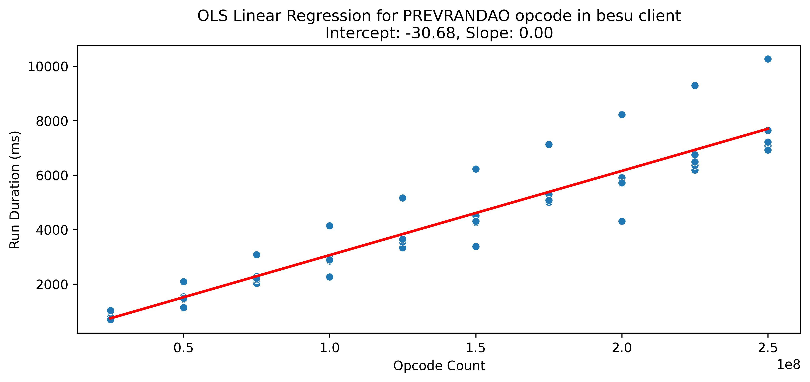


## geth


```python
                            OLS Regression Results                            
==============================================================================
Dep. Variable:        run_duration_ms   R-squared:                       0.999
Model:                            OLS   Adj. R-squared:                  0.999
Method:                 Least Squares   F-statistic:                 7.527e+04
Date:                Mon, 22 Dec 2025   Prob (F-statistic):           7.22e-84
Time:                        12:03:40   Log-Likelihood:                -265.53
No. Observations:                  54   AIC:                             535.1
Df Residuals:                      52   BIC:                             539.0
Df Model:                           1                                         
Covariance Type:            nonrobust                                         
==============================================================================
                 coef    std err          t      P>|t|      [0.025      0.975]
------------------------------------------------------------------------------
const         24.4686      9.959      2.457      0.017       4.485      44.452
opcount     1.776e-05   6.47e-08    274.346      0.000    1.76e-05    1.79e-05
==============================================================================
Omnibus:                       15.294   Durbin-Watson:                   1.512
Prob(Omnibus):                  0.000   Jarque-Bera (JB):               20.359
Skew:                          -1.009   Prob(JB):                     3.79e-05
Kurtosis:                       5.231   Cond. No.                     3.34e+08
==============================================================================

Notes:
[1] Standard Errors assume that the covariance matrix of the errors is correctly specified.
[2] The condition number is large, 3.34e+08. This might indicate that there are
strong multicollinearity or other numerical problems.
```


# GASLIMIT

## nethermind


```python
                            OLS Regression Results                            
==============================================================================
Dep. Variable:        run_duration_ms   R-squared:                       0.991
Model:                            OLS   Adj. R-squared:                  0.991
Method:                 Least Squares   F-statistic:                     5750.
Date:                Mon, 22 Dec 2025   Prob (F-statistic):           6.42e-55
Time:                        12:03:40   Log-Likelihood:                -264.97
No. Observations:                  54   AIC:                             533.9
Df Residuals:                      52   BIC:                             537.9
Df Model:                           1                                         
Covariance Type:            nonrobust                                         
==============================================================================
                 coef    std err          t      P>|t|      [0.025      0.975]
------------------------------------------------------------------------------
const         30.0411      9.854      3.048      0.004      10.267      49.816
opcount     4.857e-06   6.41e-08     75.826      0.000    4.73e-06    4.99e-06
==============================================================================
Omnibus:                       20.545   Durbin-Watson:                   1.824
Prob(Omnibus):                  0.000   Jarque-Bera (JB):               50.344
Skew:                          -0.991   Prob(JB):                     1.17e-11
Kurtosis:                       7.295   Cond. No.                     3.34e+08
==============================================================================

Notes:
[1] Standard Errors assume that the covariance matrix of the errors is correctly specified.
[2] The condition number is large, 3.34e+08. This might indicate that there are
strong multicollinearity or other numerical problems.
```

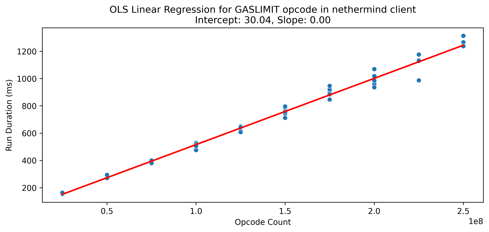


## reth


```python
                            OLS Regression Results                            
==============================================================================
Dep. Variable:        run_duration_ms   R-squared:                       0.983
Model:                            OLS   Adj. R-squared:                  0.983
Method:                 Least Squares   F-statistic:                     3043.
Date:                Mon, 22 Dec 2025   Prob (F-statistic):           8.03e-48
Time:                        12:03:40   Log-Likelihood:                -278.02
No. Observations:                  54   AIC:                             560.0
Df Residuals:                      52   BIC:                             564.0
Df Model:                           1                                         
Covariance Type:            nonrobust                                         
==============================================================================
                 coef    std err          t      P>|t|      [0.025      0.975]
------------------------------------------------------------------------------
const         32.7187     12.551      2.607      0.012       7.534      57.903
opcount       4.5e-06   8.16e-08     55.163      0.000    4.34e-06    4.66e-06
==============================================================================
Omnibus:                        3.010   Durbin-Watson:                   1.209
Prob(Omnibus):                  0.222   Jarque-Bera (JB):                2.512
Skew:                           0.096   Prob(JB):                        0.285
Kurtosis:                       4.039   Cond. No.                     3.34e+08
==============================================================================

Notes:
[1] Standard Errors assume that the covariance matrix of the errors is correctly specified.
[2] The condition number is large, 3.34e+08. This might indicate that there are
strong multicollinearity or other numerical problems.
```

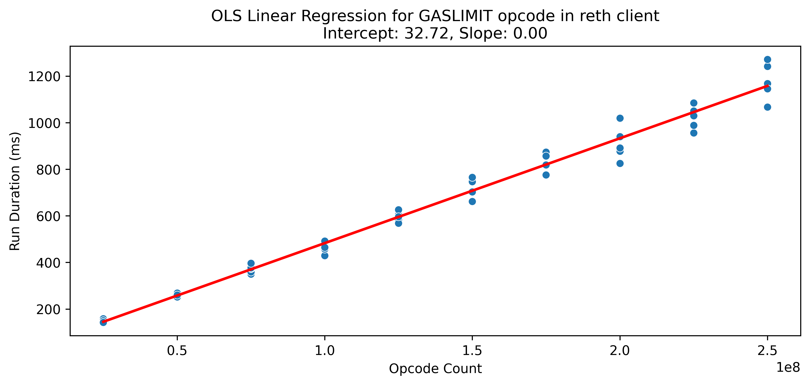


## besu


```python
                            OLS Regression Results                            
==============================================================================
Dep. Variable:        run_duration_ms   R-squared:                       0.881
Model:                            OLS   Adj. R-squared:                  0.879
Method:                 Least Squares   F-statistic:                     385.2
Date:                Mon, 22 Dec 2025   Prob (F-statistic):           1.07e-25
Time:                        12:03:40   Log-Likelihood:                -439.84
No. Observations:                  54   AIC:                             883.7
Df Residuals:                      52   BIC:                             887.6
Df Model:                           1                                         
Covariance Type:            nonrobust                                         
==============================================================================
                 coef    std err          t      P>|t|      [0.025      0.975]
------------------------------------------------------------------------------
const        -31.5012    251.203     -0.125      0.901    -535.577     472.575
opcount     3.204e-05   1.63e-06     19.626      0.000    2.88e-05    3.53e-05
==============================================================================
Omnibus:                       24.566   Durbin-Watson:                   0.568
Prob(Omnibus):                  0.000   Jarque-Bera (JB):               37.065
Skew:                           1.613   Prob(JB):                     8.94e-09
Kurtosis:                       5.464   Cond. No.                     3.34e+08
==============================================================================

Notes:
[1] Standard Errors assume that the covariance matrix of the errors is correctly specified.
[2] The condition number is large, 3.34e+08. This might indicate that there are
strong multicollinearity or other numerical problems.
```

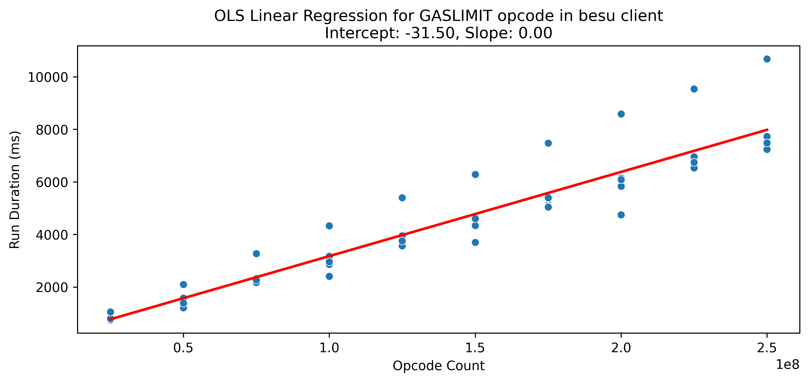


## geth


```python
                            OLS Regression Results                            
==============================================================================
Dep. Variable:        run_duration_ms   R-squared:                       0.999
Model:                            OLS   Adj. R-squared:                  0.999
Method:                 Least Squares   F-statistic:                 4.087e+04
Date:                Mon, 22 Dec 2025   Prob (F-statistic):           5.57e-77
Time:                        12:03:40   Log-Likelihood:                -260.42
No. Observations:                  54   AIC:                             524.8
Df Residuals:                      52   BIC:                             528.8
Df Model:                           1                                         
Covariance Type:            nonrobust                                         
==============================================================================
                 coef    std err          t      P>|t|      [0.025      0.975]
------------------------------------------------------------------------------
const         29.8323      9.059      3.293      0.002      11.655      48.010
opcount      1.19e-05   5.89e-08    202.175      0.000    1.18e-05     1.2e-05
==============================================================================
Omnibus:                        8.989   Durbin-Watson:                   1.454
Prob(Omnibus):                  0.011   Jarque-Bera (JB):                8.982
Skew:                          -0.730   Prob(JB):                       0.0112
Kurtosis:                       4.363   Cond. No.                     3.34e+08
==============================================================================

Notes:
[1] Standard Errors assume that the covariance matrix of the errors is correctly specified.
[2] The condition number is large, 3.34e+08. This might indicate that there are
strong multicollinearity or other numerical problems.
```

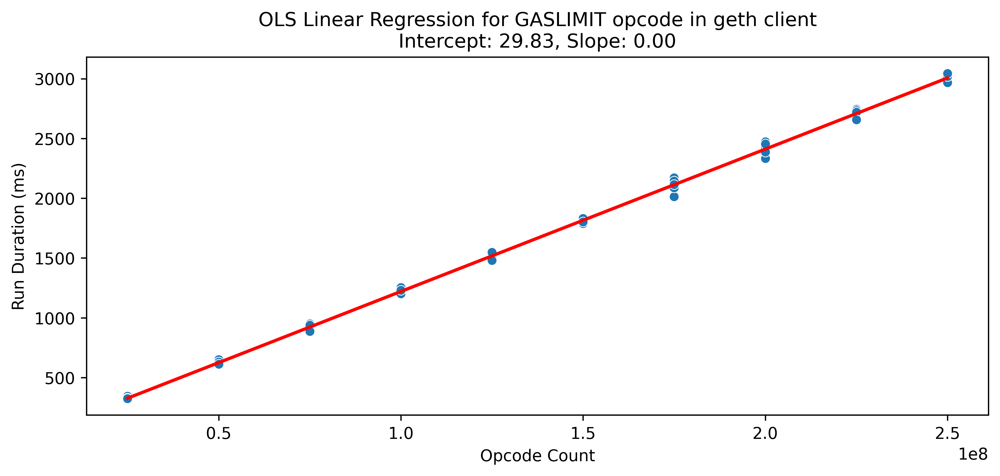


# CHAINID

## nethermind


```python
                            OLS Regression Results                            
==============================================================================
Dep. Variable:        run_duration_ms   R-squared:                       0.993
Model:                            OLS   Adj. R-squared:                  0.993
Method:                 Least Squares   F-statistic:                     7754.
Date:                Mon, 22 Dec 2025   Prob (F-statistic):           2.86e-58
Time:                        12:03:40   Log-Likelihood:                -254.75
No. Observations:                  54   AIC:                             513.5
Df Residuals:                      52   BIC:                             517.5
Df Model:                           1                                         
Covariance Type:            nonrobust                                         
==============================================================================
                 coef    std err          t      P>|t|      [0.025      0.975]
------------------------------------------------------------------------------
const         41.9098      8.156      5.138      0.000      25.543      58.277
opcount     4.668e-06    5.3e-08     88.059      0.000    4.56e-06    4.77e-06
==============================================================================
Omnibus:                        3.729   Durbin-Watson:                   1.234
Prob(Omnibus):                  0.155   Jarque-Bera (JB):                2.932
Skew:                          -0.330   Prob(JB):                        0.231
Kurtosis:                       3.932   Cond. No.                     3.34e+08
==============================================================================

Notes:
[1] Standard Errors assume that the covariance matrix of the errors is correctly specified.
[2] The condition number is large, 3.34e+08. This might indicate that there are
strong multicollinearity or other numerical problems.
```


## reth


```python
                            OLS Regression Results                            
==============================================================================
Dep. Variable:        run_duration_ms   R-squared:                       0.986
Model:                            OLS   Adj. R-squared:                  0.985
Method:                 Least Squares   F-statistic:                     3591.
Date:                Mon, 22 Dec 2025   Prob (F-statistic):           1.15e-49
Time:                        12:03:40   Log-Likelihood:                -270.75
No. Observations:                  54   AIC:                             545.5
Df Residuals:                      52   BIC:                             549.5
Df Model:                           1                                         
Covariance Type:            nonrobust                                         
==============================================================================
                 coef    std err          t      P>|t|      [0.025      0.975]
------------------------------------------------------------------------------
const         41.6245     10.968      3.795      0.000      19.615      63.634
opcount     4.272e-06   7.13e-08     59.928      0.000    4.13e-06    4.42e-06
==============================================================================
Omnibus:                        3.823   Durbin-Watson:                   0.807
Prob(Omnibus):                  0.148   Jarque-Bera (JB):                3.290
Skew:                           0.267   Prob(JB):                        0.193
Kurtosis:                       4.085   Cond. No.                     3.34e+08
==============================================================================

Notes:
[1] Standard Errors assume that the covariance matrix of the errors is correctly specified.
[2] The condition number is large, 3.34e+08. This might indicate that there are
strong multicollinearity or other numerical problems.
```


## besu


```python
                            OLS Regression Results                            
==============================================================================
Dep. Variable:        run_duration_ms   R-squared:                       0.870
Model:                            OLS   Adj. R-squared:                  0.868
Method:                 Least Squares   F-statistic:                     348.0
Date:                Mon, 22 Dec 2025   Prob (F-statistic):           1.08e-24
Time:                        12:03:41   Log-Likelihood:                -438.68
No. Observations:                  54   AIC:                             881.4
Df Residuals:                      52   BIC:                             885.3
Df Model:                           1                                         
Covariance Type:            nonrobust                                         
==============================================================================
                 coef    std err          t      P>|t|      [0.025      0.975]
------------------------------------------------------------------------------
const        -33.6960    245.883     -0.137      0.892    -527.096     459.704
opcount     2.981e-05    1.6e-06     18.655      0.000    2.66e-05     3.3e-05
==============================================================================
Omnibus:                       24.034   Durbin-Watson:                   0.449
Prob(Omnibus):                  0.000   Jarque-Bera (JB):               37.955
Skew:                           1.513   Prob(JB):                     5.73e-09
Kurtosis:                       5.777   Cond. No.                     3.34e+08
==============================================================================

Notes:
[1] Standard Errors assume that the covariance matrix of the errors is correctly specified.
[2] The condition number is large, 3.34e+08. This might indicate that there are
strong multicollinearity or other numerical problems.
```

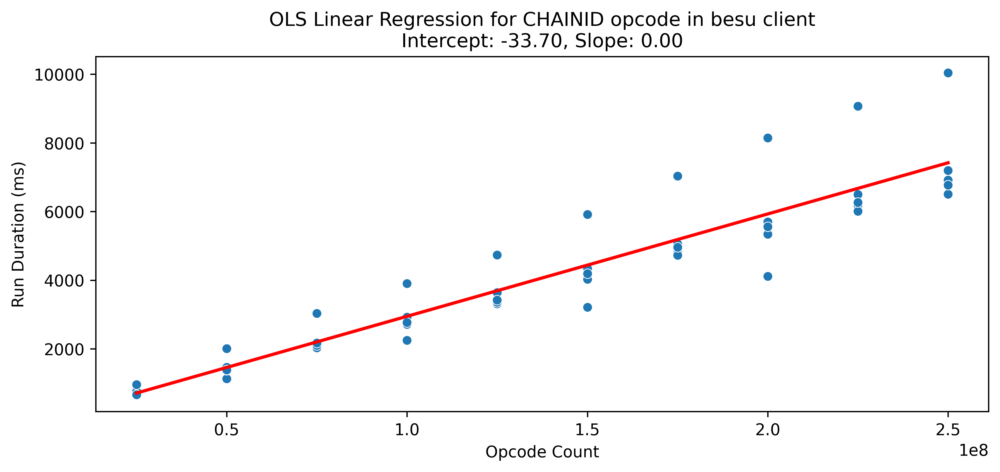


## geth


```python
                            OLS Regression Results                            
==============================================================================
Dep. Variable:        run_duration_ms   R-squared:                       0.977
Model:                            OLS   Adj. R-squared:                  0.976
Method:                 Least Squares   F-statistic:                     2186.
Date:                Mon, 22 Dec 2025   Prob (F-statistic):           3.67e-44
Time:                        12:03:41   Log-Likelihood:                -357.64
No. Observations:                  54   AIC:                             719.3
Df Residuals:                      52   BIC:                             723.2
Df Model:                           1                                         
Covariance Type:            nonrobust                                         
==============================================================================
                 coef    std err          t      P>|t|      [0.025      0.975]
------------------------------------------------------------------------------
const         24.4188     54.819      0.445      0.658     -85.583     134.421
opcount     1.666e-05   3.56e-07     46.758      0.000    1.59e-05    1.74e-05
==============================================================================
Omnibus:                       90.038   Durbin-Watson:                   1.933
Prob(Omnibus):                  0.000   Jarque-Bera (JB):             1664.010
Skew:                           4.726   Prob(JB):                         0.00
Kurtosis:                      28.499   Cond. No.                     3.34e+08
==============================================================================

Notes:
[1] Standard Errors assume that the covariance matrix of the errors is correctly specified.
[2] The condition number is large, 3.34e+08. This might indicate that there are
strong multicollinearity or other numerical problems.
```

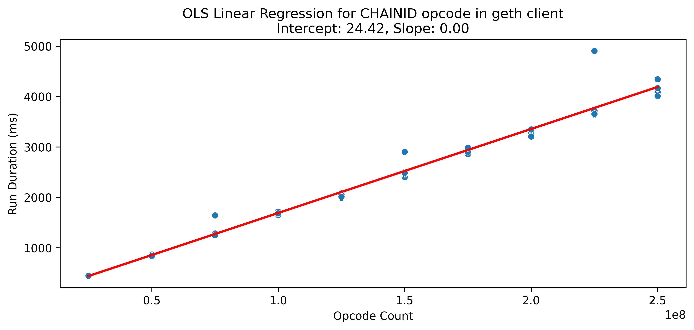


# SELFBALANCE

## nethermind


```python
                            OLS Regression Results                            
==============================================================================
Dep. Variable:        run_duration_ms   R-squared:                       0.986
Model:                            OLS   Adj. R-squared:                  0.985
Method:                 Least Squares   F-statistic:                     3827.
Date:                Mon, 22 Dec 2025   Prob (F-statistic):           3.03e-53
Time:                        12:03:41   Log-Likelihood:                -324.62
No. Observations:                  58   AIC:                             653.2
Df Residuals:                      56   BIC:                             657.4
Df Model:                           1                                         
Covariance Type:            nonrobust                                         
==============================================================================
                 coef    std err          t      P>|t|      [0.025      0.975]
------------------------------------------------------------------------------
const         59.5155     19.032      3.127      0.003      21.390      97.640
opcount     1.927e-05   3.12e-07     61.863      0.000    1.86e-05    1.99e-05
==============================================================================
Omnibus:                       75.361   Durbin-Watson:                   1.951
Prob(Omnibus):                  0.000   Jarque-Bera (JB):              686.226
Skew:                           3.741   Prob(JB):                    9.73e-150
Kurtosis:                      18.099   Cond. No.                     1.33e+08
==============================================================================

Notes:
[1] Standard Errors assume that the covariance matrix of the errors is correctly specified.
[2] The condition number is large, 1.33e+08. This might indicate that there are
strong multicollinearity or other numerical problems.
```

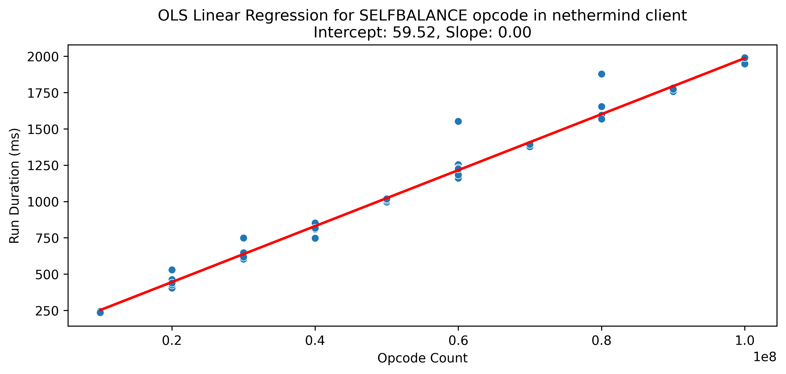


## reth


```python
                            OLS Regression Results                            
==============================================================================
Dep. Variable:        run_duration_ms   R-squared:                       0.998
Model:                            OLS   Adj. R-squared:                  0.998
Method:                 Least Squares   F-statistic:                 3.026e+04
Date:                Mon, 22 Dec 2025   Prob (F-statistic):           1.37e-73
Time:                        12:03:41   Log-Likelihood:                -313.81
No. Observations:                  54   AIC:                             631.6
Df Residuals:                      52   BIC:                             635.6
Df Model:                           1                                         
Covariance Type:            nonrobust                                         
==============================================================================
                 coef    std err          t      P>|t|      [0.025      0.975]
------------------------------------------------------------------------------
const         38.9270     24.350      1.599      0.116      -9.934      87.788
opcount     6.883e-05   3.96e-07    173.962      0.000     6.8e-05    6.96e-05
==============================================================================
Omnibus:                       16.176   Durbin-Watson:                   2.048
Prob(Omnibus):                  0.000   Jarque-Bera (JB):               24.301
Skew:                          -0.989   Prob(JB):                     5.29e-06
Kurtosis:                       5.625   Cond. No.                     1.34e+08
==============================================================================

Notes:
[1] Standard Errors assume that the covariance matrix of the errors is correctly specified.
[2] The condition number is large, 1.34e+08. This might indicate that there are
strong multicollinearity or other numerical problems.
```


## besu


```python
                            OLS Regression Results                            
==============================================================================
Dep. Variable:        run_duration_ms   R-squared:                       0.992
Model:                            OLS   Adj. R-squared:                  0.992
Method:                 Least Squares   F-statistic:                     6697.
Date:                Mon, 22 Dec 2025   Prob (F-statistic):           1.26e-56
Time:                        12:03:41   Log-Likelihood:                -328.18
No. Observations:                  54   AIC:                             660.4
Df Residuals:                      52   BIC:                             664.3
Df Model:                           1                                         
Covariance Type:            nonrobust                                         
==============================================================================
                 coef    std err          t      P>|t|      [0.025      0.975]
------------------------------------------------------------------------------
const        165.6975     31.769      5.216      0.000     101.949     229.446
opcount     4.225e-05   5.16e-07     81.833      0.000    4.12e-05    4.33e-05
==============================================================================
Omnibus:                       50.516   Durbin-Watson:                   2.331
Prob(Omnibus):                  0.000   Jarque-Bera (JB):              221.830
Skew:                           2.577   Prob(JB):                     6.76e-49
Kurtosis:                      11.486   Cond. No.                     1.34e+08
==============================================================================

Notes:
[1] Standard Errors assume that the covariance matrix of the errors is correctly specified.
[2] The condition number is large, 1.34e+08. This might indicate that there are
strong multicollinearity or other numerical problems.
```

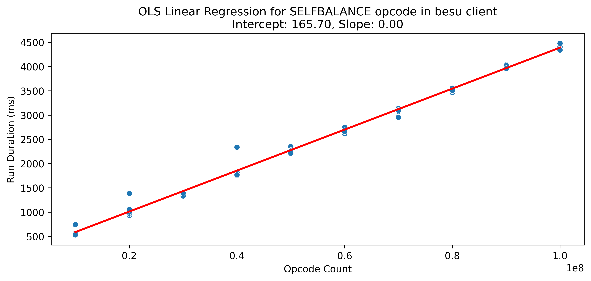


## geth


```python
                            OLS Regression Results                            
==============================================================================
Dep. Variable:        run_duration_ms   R-squared:                       0.996
Model:                            OLS   Adj. R-squared:                  0.996
Method:                 Least Squares   F-statistic:                 1.241e+04
Date:                Mon, 22 Dec 2025   Prob (F-statistic):           1.49e-63
Time:                        12:03:41   Log-Likelihood:                -303.25
No. Observations:                  54   AIC:                             610.5
Df Residuals:                      52   BIC:                             614.5
Df Model:                           1                                         
Covariance Type:            nonrobust                                         
==============================================================================
                 coef    std err          t      P>|t|      [0.025      0.975]
------------------------------------------------------------------------------
const         14.2878     20.022      0.714      0.479     -25.888      54.464
opcount     3.624e-05   3.25e-07    111.400      0.000    3.56e-05    3.69e-05
==============================================================================
Omnibus:                        8.486   Durbin-Watson:                   1.270
Prob(Omnibus):                  0.014   Jarque-Bera (JB):                7.741
Skew:                          -0.869   Prob(JB):                       0.0208
Kurtosis:                       3.650   Cond. No.                     1.34e+08
==============================================================================

Notes:
[1] Standard Errors assume that the covariance matrix of the errors is correctly specified.
[2] The condition number is large, 1.34e+08. This might indicate that there are
strong multicollinearity or other numerical problems.
```


# BASEFEE

## nethermind


```python
                            OLS Regression Results                            
==============================================================================
Dep. Variable:        run_duration_ms   R-squared:                       0.987
Model:                            OLS   Adj. R-squared:                  0.987
Method:                 Least Squares   F-statistic:                     3889.
Date:                Mon, 22 Dec 2025   Prob (F-statistic):           1.50e-50
Time:                        12:03:41   Log-Likelihood:                -276.43
No. Observations:                  54   AIC:                             556.9
Df Residuals:                      52   BIC:                             560.8
Df Model:                           1                                         
Covariance Type:            nonrobust                                         
==============================================================================
                 coef    std err          t      P>|t|      [0.025      0.975]
------------------------------------------------------------------------------
const         22.2976     12.184      1.830      0.073      -2.152      46.747
opcount     4.939e-06   7.92e-08     62.358      0.000    4.78e-06     5.1e-06
==============================================================================
Omnibus:                       31.644   Durbin-Watson:                   2.039
Prob(Omnibus):                  0.000   Jarque-Bera (JB):              109.478
Skew:                           1.478   Prob(JB):                     1.69e-24
Kurtosis:                       9.318   Cond. No.                     3.34e+08
==============================================================================

Notes:
[1] Standard Errors assume that the covariance matrix of the errors is correctly specified.
[2] The condition number is large, 3.34e+08. This might indicate that there are
strong multicollinearity or other numerical problems.
```

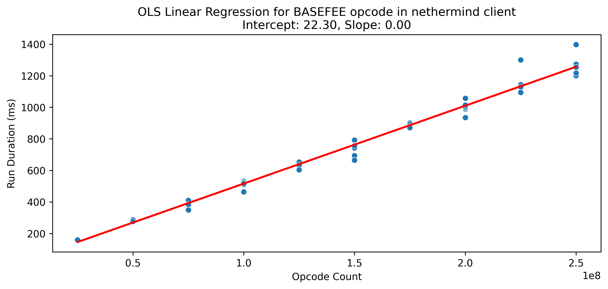


## reth


```python
                            OLS Regression Results                            
==============================================================================
Dep. Variable:        run_duration_ms   R-squared:                       0.981
Model:                            OLS   Adj. R-squared:                  0.981
Method:                 Least Squares   F-statistic:                     2721.
Date:                Mon, 22 Dec 2025   Prob (F-statistic):           1.39e-46
Time:                        12:03:42   Log-Likelihood:                -279.78
No. Observations:                  54   AIC:                             563.6
Df Residuals:                      52   BIC:                             567.5
Df Model:                           1                                         
Covariance Type:            nonrobust                                         
==============================================================================
                 coef    std err          t      P>|t|      [0.025      0.975]
------------------------------------------------------------------------------
const         38.4422     12.964      2.965      0.005      12.427      64.457
opcount     4.396e-06   8.43e-08     52.167      0.000    4.23e-06    4.57e-06
==============================================================================
Omnibus:                       11.346   Durbin-Watson:                   0.689
Prob(Omnibus):                  0.003   Jarque-Bera (JB):               13.011
Skew:                          -0.820   Prob(JB):                      0.00150
Kurtosis:                       4.759   Cond. No.                     3.34e+08
==============================================================================

Notes:
[1] Standard Errors assume that the covariance matrix of the errors is correctly specified.
[2] The condition number is large, 3.34e+08. This might indicate that there are
strong multicollinearity or other numerical problems.
```


## besu


```python
                            OLS Regression Results                            
==============================================================================
Dep. Variable:        run_duration_ms   R-squared:                       0.871
Model:                            OLS   Adj. R-squared:                  0.869
Method:                 Least Squares   F-statistic:                     351.6
Date:                Mon, 22 Dec 2025   Prob (F-statistic):           8.55e-25
Time:                        12:03:42   Log-Likelihood:                -439.37
No. Observations:                  54   AIC:                             882.7
Df Residuals:                      52   BIC:                             886.7
Df Model:                           1                                         
Covariance Type:            nonrobust                                         
==============================================================================
                 coef    std err          t      P>|t|      [0.025      0.975]
------------------------------------------------------------------------------
const        -13.8308    249.056     -0.056      0.956    -513.598     485.936
opcount     3.036e-05   1.62e-06     18.751      0.000    2.71e-05    3.36e-05
==============================================================================
Omnibus:                       20.970   Durbin-Watson:                   0.446
Prob(Omnibus):                  0.000   Jarque-Bera (JB):               28.925
Skew:                           1.419   Prob(JB):                     5.24e-07
Kurtosis:                       5.191   Cond. No.                     3.34e+08
==============================================================================

Notes:
[1] Standard Errors assume that the covariance matrix of the errors is correctly specified.
[2] The condition number is large, 3.34e+08. This might indicate that there are
strong multicollinearity or other numerical problems.
```

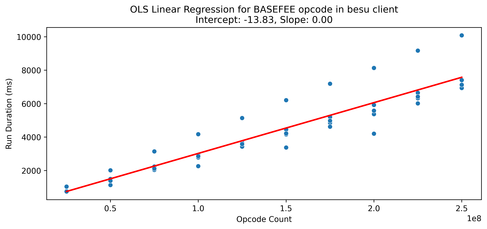


## geth


```python
                            OLS Regression Results                            
==============================================================================
Dep. Variable:        run_duration_ms   R-squared:                       0.999
Model:                            OLS   Adj. R-squared:                  0.999
Method:                 Least Squares   F-statistic:                 3.548e+04
Date:                Mon, 22 Dec 2025   Prob (F-statistic):           2.20e-75
Time:                        12:03:42   Log-Likelihood:                -282.51
No. Observations:                  54   AIC:                             569.0
Df Residuals:                      52   BIC:                             573.0
Df Model:                           1                                         
Covariance Type:            nonrobust                                         
==============================================================================
                 coef    std err          t      P>|t|      [0.025      0.975]
------------------------------------------------------------------------------
const         22.0173     13.639      1.614      0.113      -5.351      49.385
opcount      1.67e-05   8.87e-08    188.354      0.000    1.65e-05    1.69e-05
==============================================================================
Omnibus:                       35.761   Durbin-Watson:                   1.247
Prob(Omnibus):                  0.000   Jarque-Bera (JB):              120.608
Skew:                          -1.750   Prob(JB):                     6.46e-27
Kurtosis:                       9.431   Cond. No.                     3.34e+08
==============================================================================

Notes:
[1] Standard Errors assume that the covariance matrix of the errors is correctly specified.
[2] The condition number is large, 3.34e+08. This might indicate that there are
strong multicollinearity or other numerical problems.
```

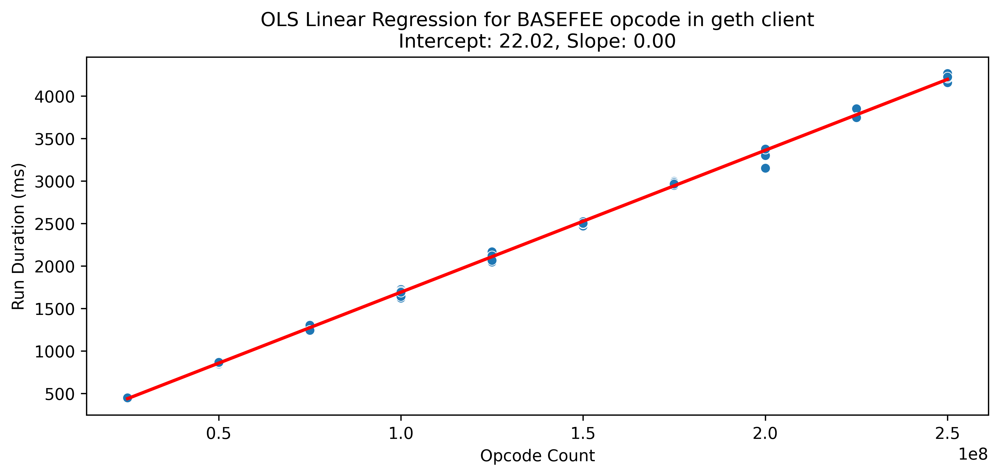


# BLOBHASH

## nethermind

OLS model did not run... Error: zero-size array to reduction operation maximum which has no identity

## reth

OLS model did not run... Error: zero-size array to reduction operation maximum which has no identity

## besu

OLS model did not run... Error: zero-size array to reduction operation maximum which has no identity

## geth

OLS model did not run... Error: zero-size array to reduction operation maximum which has no identity

# BLOBBASEFEE

## nethermind


```python
                            OLS Regression Results                            
==============================================================================
Dep. Variable:        run_duration_ms   R-squared:                       0.996
Model:                            OLS   Adj. R-squared:                  0.996
Method:                 Least Squares   F-statistic:                 1.262e+04
Date:                Mon, 22 Dec 2025   Prob (F-statistic):           9.56e-64
Time:                        12:03:42   Log-Likelihood:                -243.26
No. Observations:                  54   AIC:                             490.5
Df Residuals:                      52   BIC:                             494.5
Df Model:                           1                                         
Covariance Type:            nonrobust                                         
==============================================================================
                 coef    std err          t      P>|t|      [0.025      0.975]
------------------------------------------------------------------------------
const         33.7076      6.593      5.113      0.000      20.478      46.937
opcount     4.815e-06   4.29e-08    112.360      0.000    4.73e-06     4.9e-06
==============================================================================
Omnibus:                        4.457   Durbin-Watson:                   1.337
Prob(Omnibus):                  0.108   Jarque-Bera (JB):                3.478
Skew:                          -0.587   Prob(JB):                        0.176
Kurtosis:                       3.408   Cond. No.                     3.34e+08
==============================================================================

Notes:
[1] Standard Errors assume that the covariance matrix of the errors is correctly specified.
[2] The condition number is large, 3.34e+08. This might indicate that there are
strong multicollinearity or other numerical problems.
```

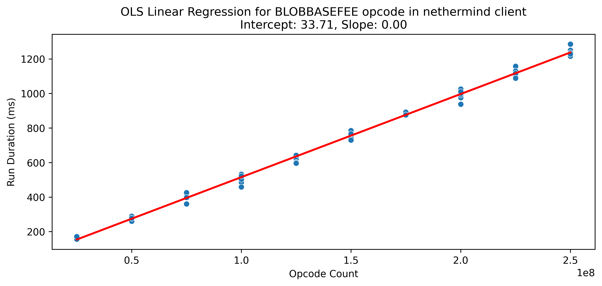


## reth


```python
                            OLS Regression Results                            
==============================================================================
Dep. Variable:        run_duration_ms   R-squared:                       0.991
Model:                            OLS   Adj. R-squared:                  0.991
Method:                 Least Squares   F-statistic:                     5856.
Date:                Mon, 22 Dec 2025   Prob (F-statistic):           4.00e-55
Time:                        12:03:42   Log-Likelihood:                -267.36
No. Observations:                  54   AIC:                             538.7
Df Residuals:                      52   BIC:                             542.7
Df Model:                           1                                         
Covariance Type:            nonrobust                                         
==============================================================================
                 coef    std err          t      P>|t|      [0.025      0.975]
------------------------------------------------------------------------------
const         42.5699     10.301      4.133      0.000      21.900      63.239
opcount     5.124e-06    6.7e-08     76.527      0.000    4.99e-06    5.26e-06
==============================================================================
Omnibus:                        0.741   Durbin-Watson:                   1.178
Prob(Omnibus):                  0.690   Jarque-Bera (JB):                0.203
Skew:                           0.056   Prob(JB):                        0.903
Kurtosis:                       3.279   Cond. No.                     3.34e+08
==============================================================================

Notes:
[1] Standard Errors assume that the covariance matrix of the errors is correctly specified.
[2] The condition number is large, 3.34e+08. This might indicate that there are
strong multicollinearity or other numerical problems.
```

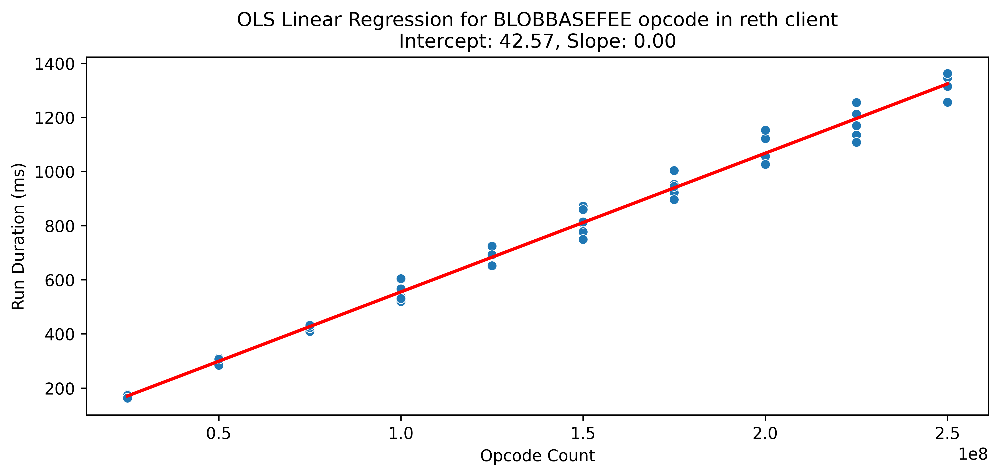


## besu


```python
                            OLS Regression Results                            
==============================================================================
Dep. Variable:        run_duration_ms   R-squared:                       0.869
Model:                            OLS   Adj. R-squared:                  0.867
Method:                 Least Squares   F-statistic:                     345.1
Date:                Mon, 22 Dec 2025   Prob (F-statistic):           1.30e-24
Time:                        12:03:42   Log-Likelihood:                -438.62
No. Observations:                  54   AIC:                             881.2
Df Residuals:                      52   BIC:                             885.2
Df Model:                           1                                         
Covariance Type:            nonrobust                                         
==============================================================================
                 coef    std err          t      P>|t|      [0.025      0.975]
------------------------------------------------------------------------------
const         -8.0018    245.611     -0.033      0.974    -500.856     484.852
opcount     2.966e-05    1.6e-06     18.578      0.000    2.65e-05    3.29e-05
==============================================================================
Omnibus:                       22.873   Durbin-Watson:                   0.529
Prob(Omnibus):                  0.000   Jarque-Bera (JB):               32.879
Skew:                           1.531   Prob(JB):                     7.25e-08
Kurtosis:                       5.288   Cond. No.                     3.34e+08
==============================================================================

Notes:
[1] Standard Errors assume that the covariance matrix of the errors is correctly specified.
[2] The condition number is large, 3.34e+08. This might indicate that there are
strong multicollinearity or other numerical problems.
```

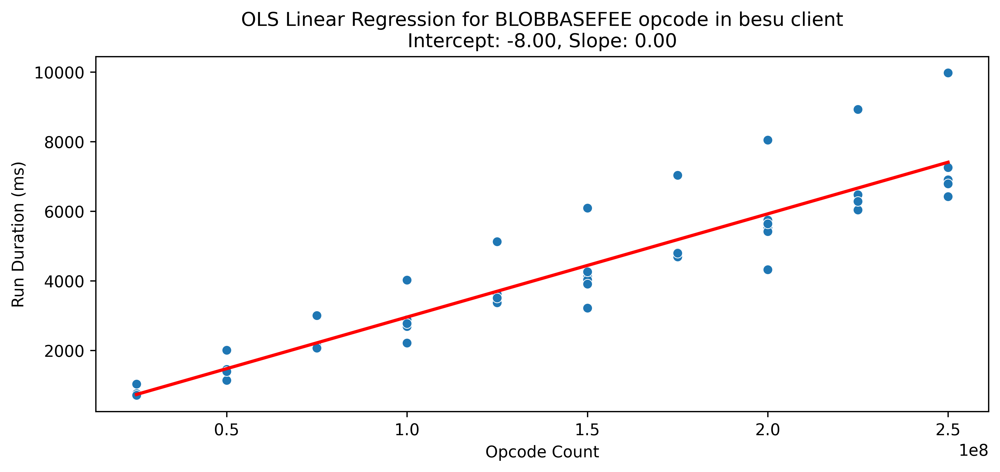


## geth


```python
                            OLS Regression Results                            
==============================================================================
Dep. Variable:        run_duration_ms   R-squared:                       0.996
Model:                            OLS   Adj. R-squared:                  0.996
Method:                 Least Squares   F-statistic:                 1.283e+04
Date:                Mon, 22 Dec 2025   Prob (F-statistic):           6.25e-64
Time:                        12:03:42   Log-Likelihood:                -308.46
No. Observations:                  54   AIC:                             620.9
Df Residuals:                      52   BIC:                             624.9
Df Model:                           1                                         
Covariance Type:            nonrobust                                         
==============================================================================
                 coef    std err          t      P>|t|      [0.025      0.975]
------------------------------------------------------------------------------
const         68.4648     22.053      3.105      0.003      24.212     112.718
opcount     1.624e-05   1.43e-07    113.285      0.000     1.6e-05    1.65e-05
==============================================================================
Omnibus:                       56.333   Durbin-Watson:                   2.050
Prob(Omnibus):                  0.000   Jarque-Bera (JB):              280.722
Skew:                           2.915   Prob(JB):                     1.10e-61
Kurtosis:                      12.527   Cond. No.                     3.34e+08
==============================================================================

Notes:
[1] Standard Errors assume that the covariance matrix of the errors is correctly specified.
[2] The condition number is large, 3.34e+08. This might indicate that there are
strong multicollinearity or other numerical problems.
```


# POP

## nethermind

OLS model did not run... Error: zero-size array to reduction operation maximum which has no identity

## reth

OLS model did not run... Error: zero-size array to reduction operation maximum which has no identity

## besu

OLS model did not run... Error: zero-size array to reduction operation maximum which has no identity

## geth

OLS model did not run... Error: zero-size array to reduction operation maximum which has no identity

# JUMP

## nethermind

OLS model did not run... Error: zero-size array to reduction operation maximum which has no identity

## reth

OLS model did not run... Error: zero-size array to reduction operation maximum which has no identity

## besu

OLS model did not run... Error: zero-size array to reduction operation maximum which has no identity

## geth

OLS model did not run... Error: zero-size array to reduction operation maximum which has no identity

# JUMPI

## nethermind


```python
                            OLS Regression Results                            
==============================================================================
Dep. Variable:        run_duration_ms   R-squared:                       0.984
Model:                            OLS   Adj. R-squared:                  0.983
Method:                 Least Squares   F-statistic:                     3146.
Date:                Mon, 22 Dec 2025   Prob (F-statistic):           3.42e-48
Time:                        12:03:42   Log-Likelihood:                -231.33
No. Observations:                  54   AIC:                             466.7
Df Residuals:                      52   BIC:                             470.6
Df Model:                           1                                         
Covariance Type:            nonrobust                                         
==============================================================================
                 coef    std err          t      P>|t|      [0.025      0.975]
------------------------------------------------------------------------------
const         37.7843      5.286      7.148      0.000      27.177      48.391
opcount     1.285e-05   2.29e-07     56.091      0.000    1.24e-05    1.33e-05
==============================================================================
Omnibus:                        2.660   Durbin-Watson:                   1.182
Prob(Omnibus):                  0.264   Jarque-Bera (JB):                1.847
Skew:                           0.218   Prob(JB):                        0.397
Kurtosis:                       3.794   Cond. No.                     5.01e+07
==============================================================================

Notes:
[1] Standard Errors assume that the covariance matrix of the errors is correctly specified.
[2] The condition number is large, 5.01e+07. This might indicate that there are
strong multicollinearity or other numerical problems.
```

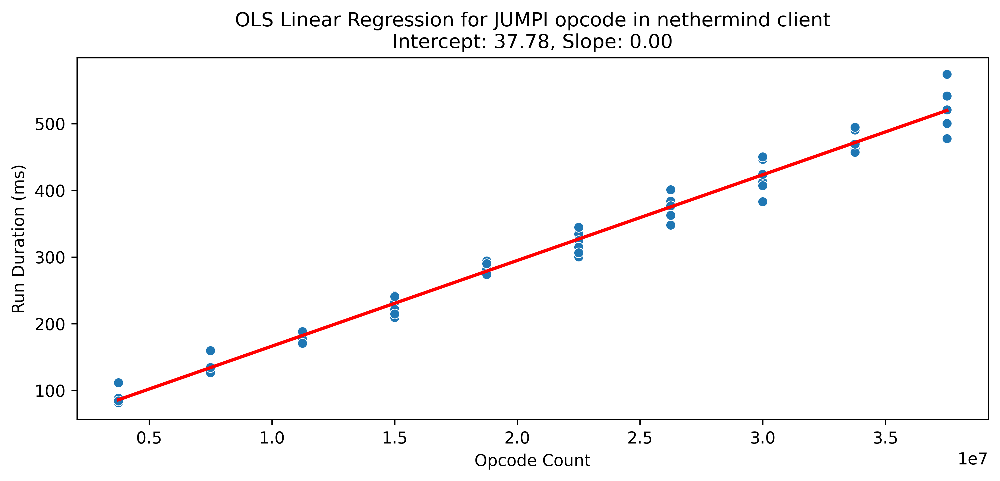


## reth


```python
                            OLS Regression Results                            
==============================================================================
Dep. Variable:        run_duration_ms   R-squared:                       0.988
Model:                            OLS   Adj. R-squared:                  0.988
Method:                 Least Squares   F-statistic:                     4229.
Date:                Mon, 22 Dec 2025   Prob (F-statistic):           1.74e-51
Time:                        12:03:43   Log-Likelihood:                -214.43
No. Observations:                  54   AIC:                             432.9
Df Residuals:                      52   BIC:                             436.8
Df Model:                           1                                         
Covariance Type:            nonrobust                                         
==============================================================================
                 coef    std err          t      P>|t|      [0.025      0.975]
------------------------------------------------------------------------------
const         38.9705      3.865     10.082      0.000      31.214      46.727
opcount     1.089e-05   1.67e-07     65.028      0.000    1.06e-05    1.12e-05
==============================================================================
Omnibus:                       36.954   Durbin-Watson:                   1.422
Prob(Omnibus):                  0.000   Jarque-Bera (JB):              112.999
Skew:                           1.892   Prob(JB):                     2.90e-25
Kurtosis:                       8.992   Cond. No.                     5.01e+07
==============================================================================

Notes:
[1] Standard Errors assume that the covariance matrix of the errors is correctly specified.
[2] The condition number is large, 5.01e+07. This might indicate that there are
strong multicollinearity or other numerical problems.
```


## besu


```python
                            OLS Regression Results                            
==============================================================================
Dep. Variable:        run_duration_ms   R-squared:                       0.914
Model:                            OLS   Adj. R-squared:                  0.912
Method:                 Least Squares   F-statistic:                     549.3
Date:                Mon, 22 Dec 2025   Prob (F-statistic):           2.63e-29
Time:                        12:03:43   Log-Likelihood:                -376.57
No. Observations:                  54   AIC:                             757.1
Df Residuals:                      52   BIC:                             761.1
Df Model:                           1                                         
Covariance Type:            nonrobust                                         
==============================================================================
                 coef    std err          t      P>|t|      [0.025      0.975]
------------------------------------------------------------------------------
const         33.8197     77.840      0.434      0.666    -122.378     190.017
opcount     7.906e-05   3.37e-06     23.437      0.000    7.23e-05    8.58e-05
==============================================================================
Omnibus:                       30.648   Durbin-Watson:                   0.437
Prob(Omnibus):                  0.000   Jarque-Bera (JB):               54.814
Skew:                           1.908   Prob(JB):                     1.25e-12
Kurtosis:                       6.131   Cond. No.                     5.01e+07
==============================================================================

Notes:
[1] Standard Errors assume that the covariance matrix of the errors is correctly specified.
[2] The condition number is large, 5.01e+07. This might indicate that there are
strong multicollinearity or other numerical problems.
```

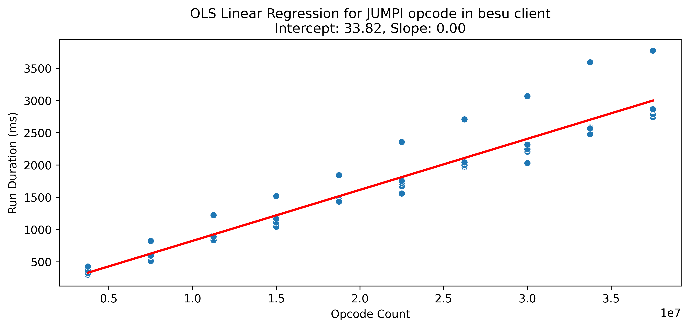


## geth


```python
                            OLS Regression Results                            
==============================================================================
Dep. Variable:        run_duration_ms   R-squared:                       0.988
Model:                            OLS   Adj. R-squared:                  0.988
Method:                 Least Squares   F-statistic:                     4204.
Date:                Mon, 22 Dec 2025   Prob (F-statistic):           2.03e-51
Time:                        12:03:43   Log-Likelihood:                -264.92
No. Observations:                  54   AIC:                             533.8
Df Residuals:                      52   BIC:                             537.8
Df Model:                           1                                         
Covariance Type:            nonrobust                                         
==============================================================================
                 coef    std err          t      P>|t|      [0.025      0.975]
------------------------------------------------------------------------------
const         34.5680      9.846      3.511      0.001      14.810      54.326
opcount     2.766e-05   4.27e-07     64.838      0.000    2.68e-05    2.85e-05
==============================================================================
Omnibus:                       87.783   Durbin-Watson:                   1.616
Prob(Omnibus):                  0.000   Jarque-Bera (JB):             1795.232
Skew:                           4.438   Prob(JB):                         0.00
Kurtosis:                      29.816   Cond. No.                     5.01e+07
==============================================================================

Notes:
[1] Standard Errors assume that the covariance matrix of the errors is correctly specified.
[2] The condition number is large, 5.01e+07. This might indicate that there are
strong multicollinearity or other numerical problems.
```


# PC

## nethermind


```python
                            OLS Regression Results                            
==============================================================================
Dep. Variable:        run_duration_ms   R-squared:                       0.991
Model:                            OLS   Adj. R-squared:                  0.991
Method:                 Least Squares   F-statistic:                     5957.
Date:                Mon, 22 Dec 2025   Prob (F-statistic):           2.58e-55
Time:                        12:03:43   Log-Likelihood:                -263.46
No. Observations:                  54   AIC:                             530.9
Df Residuals:                      52   BIC:                             534.9
Df Model:                           1                                         
Covariance Type:            nonrobust                                         
==============================================================================
                 coef    std err          t      P>|t|      [0.025      0.975]
------------------------------------------------------------------------------
const         30.5161      9.584      3.184      0.002      11.285      49.747
opcount     4.808e-06   6.23e-08     77.181      0.000    4.68e-06    4.93e-06
==============================================================================
Omnibus:                        7.910   Durbin-Watson:                   1.229
Prob(Omnibus):                  0.019   Jarque-Bera (JB):                7.024
Skew:                          -0.797   Prob(JB):                       0.0298
Kurtosis:                       3.762   Cond. No.                     3.34e+08
==============================================================================

Notes:
[1] Standard Errors assume that the covariance matrix of the errors is correctly specified.
[2] The condition number is large, 3.34e+08. This might indicate that there are
strong multicollinearity or other numerical problems.
```

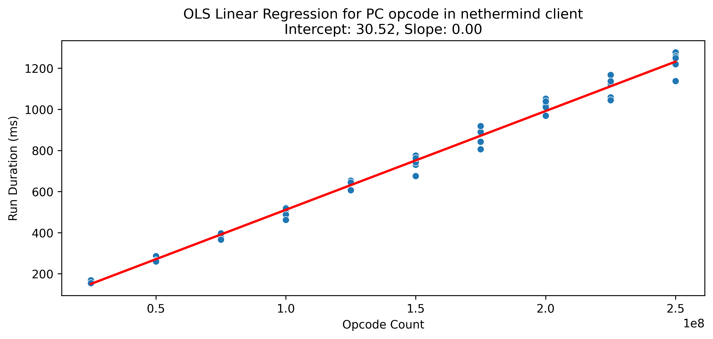


## reth


```python
                            OLS Regression Results                            
==============================================================================
Dep. Variable:        run_duration_ms   R-squared:                       0.992
Model:                            OLS   Adj. R-squared:                  0.992
Method:                 Least Squares   F-statistic:                     6668.
Date:                Mon, 22 Dec 2025   Prob (F-statistic):           1.41e-56
Time:                        12:03:43   Log-Likelihood:                -257.84
No. Observations:                  54   AIC:                             519.7
Df Residuals:                      52   BIC:                             523.7
Df Model:                           1                                         
Covariance Type:            nonrobust                                         
==============================================================================
                 coef    std err          t      P>|t|      [0.025      0.975]
------------------------------------------------------------------------------
const         52.3424      8.637      6.060      0.000      35.011      69.674
opcount     4.584e-06   5.61e-08     81.657      0.000    4.47e-06     4.7e-06
==============================================================================
Omnibus:                        9.157   Durbin-Watson:                   1.936
Prob(Omnibus):                  0.010   Jarque-Bera (JB):                9.419
Skew:                          -0.721   Prob(JB):                      0.00901
Kurtosis:                       4.452   Cond. No.                     3.34e+08
==============================================================================

Notes:
[1] Standard Errors assume that the covariance matrix of the errors is correctly specified.
[2] The condition number is large, 3.34e+08. This might indicate that there are
strong multicollinearity or other numerical problems.
```

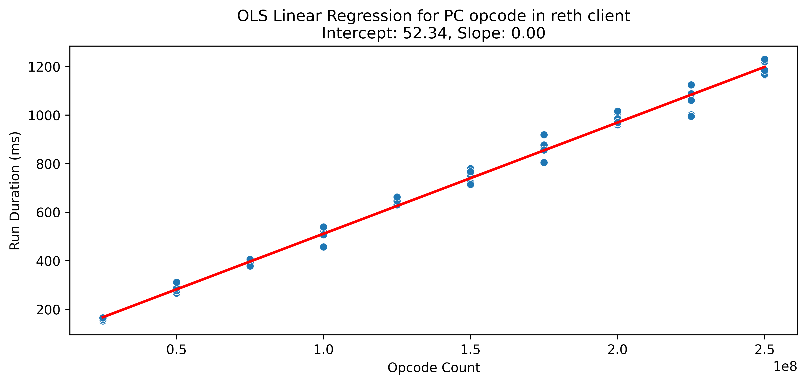


## besu


```python
                            OLS Regression Results                            
==============================================================================
Dep. Variable:        run_duration_ms   R-squared:                       0.830
Model:                            OLS   Adj. R-squared:                  0.827
Method:                 Least Squares   F-statistic:                     253.6
Date:                Mon, 22 Dec 2025   Prob (F-statistic):           1.21e-21
Time:                        12:03:43   Log-Likelihood:                -454.36
No. Observations:                  54   AIC:                             912.7
Df Residuals:                      52   BIC:                             916.7
Df Model:                           1                                         
Covariance Type:            nonrobust                                         
==============================================================================
                 coef    std err          t      P>|t|      [0.025      0.975]
------------------------------------------------------------------------------
const        -22.1150    328.731     -0.067      0.947    -681.762     637.532
opcount     3.403e-05   2.14e-06     15.925      0.000    2.97e-05    3.83e-05
==============================================================================
Omnibus:                       25.648   Durbin-Watson:                   0.547
Prob(Omnibus):                  0.000   Jarque-Bera (JB):               40.010
Skew:                           1.661   Prob(JB):                     2.05e-09
Kurtosis:                       5.597   Cond. No.                     3.34e+08
==============================================================================

Notes:
[1] Standard Errors assume that the covariance matrix of the errors is correctly specified.
[2] The condition number is large, 3.34e+08. This might indicate that there are
strong multicollinearity or other numerical problems.
```

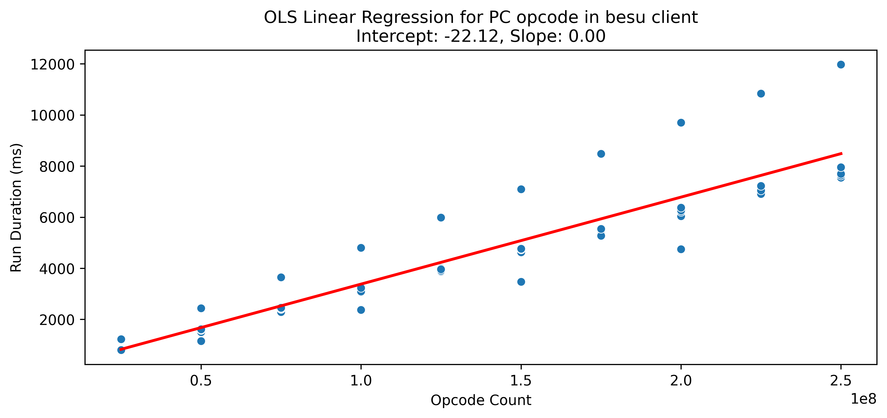


## geth


```python
                            OLS Regression Results                            
==============================================================================
Dep. Variable:        run_duration_ms   R-squared:                       0.998
Model:                            OLS   Adj. R-squared:                  0.998
Method:                 Least Squares   F-statistic:                 2.762e+04
Date:                Mon, 22 Dec 2025   Prob (F-statistic):           1.46e-72
Time:                        12:03:43   Log-Likelihood:                -270.49
No. Observations:                  54   AIC:                             545.0
Df Residuals:                      52   BIC:                             549.0
Df Model:                           1                                         
Covariance Type:            nonrobust                                         
==============================================================================
                 coef    std err          t      P>|t|      [0.025      0.975]
------------------------------------------------------------------------------
const         35.5356     10.917      3.255      0.002      13.629      57.442
opcount     1.179e-05    7.1e-08    166.193      0.000    1.17e-05    1.19e-05
==============================================================================
Omnibus:                        7.161   Durbin-Watson:                   1.692
Prob(Omnibus):                  0.028   Jarque-Bera (JB):               12.142
Skew:                          -0.170   Prob(JB):                      0.00231
Kurtosis:                       5.298   Cond. No.                     3.34e+08
==============================================================================

Notes:
[1] Standard Errors assume that the covariance matrix of the errors is correctly specified.
[2] The condition number is large, 3.34e+08. This might indicate that there are
strong multicollinearity or other numerical problems.
```

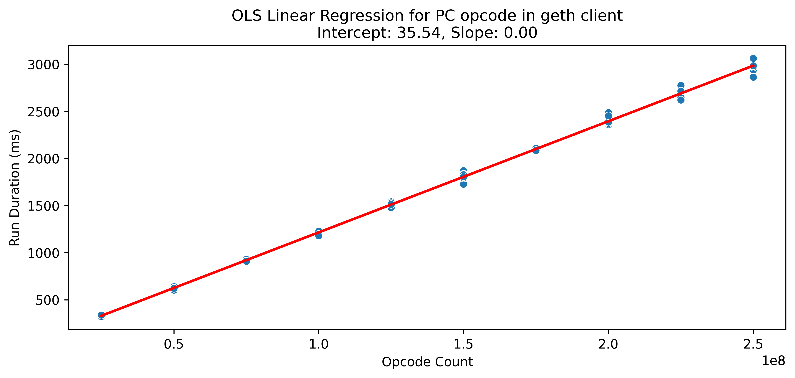


# MSIZE

## nethermind


```python
                            OLS Regression Results                            
==============================================================================
Dep. Variable:        run_duration_ms   R-squared:                       0.992
Model:                            OLS   Adj. R-squared:                  0.992
Method:                 Least Squares   F-statistic:                     6389.
Date:                Mon, 22 Dec 2025   Prob (F-statistic):           4.23e-56
Time:                        12:03:44   Log-Likelihood:                -262.20
No. Observations:                  54   AIC:                             528.4
Df Residuals:                      52   BIC:                             532.4
Df Model:                           1                                         
Covariance Type:            nonrobust                                         
==============================================================================
                 coef    std err          t      P>|t|      [0.025      0.975]
------------------------------------------------------------------------------
const         41.8338      9.362      4.468      0.000      23.047      60.620
opcount     4.864e-06   6.09e-08     79.933      0.000    4.74e-06    4.99e-06
==============================================================================
Omnibus:                       17.101   Durbin-Watson:                   1.209
Prob(Omnibus):                  0.000   Jarque-Bera (JB):               67.976
Skew:                          -0.497   Prob(JB):                     1.73e-15
Kurtosis:                       8.406   Cond. No.                     3.34e+08
==============================================================================

Notes:
[1] Standard Errors assume that the covariance matrix of the errors is correctly specified.
[2] The condition number is large, 3.34e+08. This might indicate that there are
strong multicollinearity or other numerical problems.
```


## reth


```python
                            OLS Regression Results                            
==============================================================================
Dep. Variable:        run_duration_ms   R-squared:                       0.986
Model:                            OLS   Adj. R-squared:                  0.986
Method:                 Least Squares   F-statistic:                     3796.
Date:                Mon, 22 Dec 2025   Prob (F-statistic):           2.78e-50
Time:                        12:03:44   Log-Likelihood:                -271.50
No. Observations:                  54   AIC:                             547.0
Df Residuals:                      52   BIC:                             551.0
Df Model:                           1                                         
Covariance Type:            nonrobust                                         
==============================================================================
                 coef    std err          t      P>|t|      [0.025      0.975]
------------------------------------------------------------------------------
const         45.8734     11.122      4.125      0.000      23.555      68.191
opcount     4.454e-06   7.23e-08     61.611      0.000    4.31e-06     4.6e-06
==============================================================================
Omnibus:                        4.036   Durbin-Watson:                   1.148
Prob(Omnibus):                  0.133   Jarque-Bera (JB):                3.699
Skew:                           0.250   Prob(JB):                        0.157
Kurtosis:                       4.180   Cond. No.                     3.34e+08
==============================================================================

Notes:
[1] Standard Errors assume that the covariance matrix of the errors is correctly specified.
[2] The condition number is large, 3.34e+08. This might indicate that there are
strong multicollinearity or other numerical problems.
```

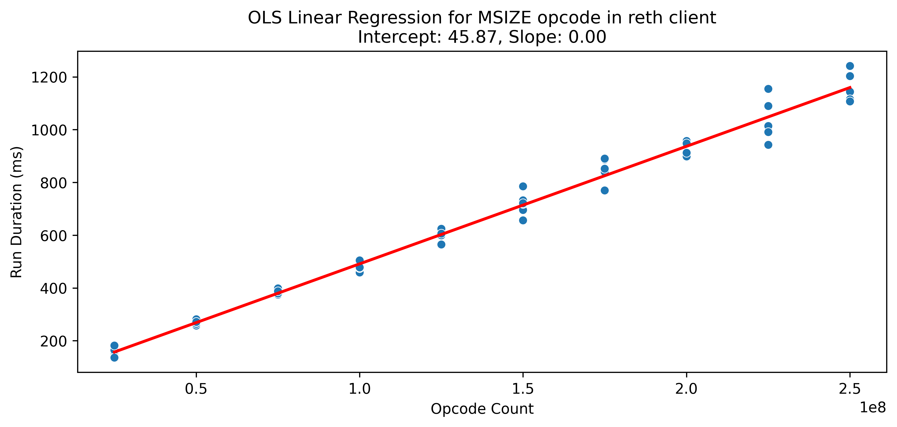


## besu


```python
                            OLS Regression Results                            
==============================================================================
Dep. Variable:        run_duration_ms   R-squared:                       0.863
Model:                            OLS   Adj. R-squared:                  0.861
Method:                 Least Squares   F-statistic:                     328.1
Date:                Mon, 22 Dec 2025   Prob (F-statistic):           4.08e-24
Time:                        12:03:44   Log-Likelihood:                -450.44
No. Observations:                  54   AIC:                             904.9
Df Residuals:                      52   BIC:                             908.9
Df Model:                           1                                         
Covariance Type:            nonrobust                                         
==============================================================================
                 coef    std err          t      P>|t|      [0.025      0.975]
------------------------------------------------------------------------------
const        -29.4468    305.718     -0.096      0.924    -642.915     584.021
opcount       3.6e-05   1.99e-06     18.114      0.000     3.2e-05       4e-05
==============================================================================
Omnibus:                       26.856   Durbin-Watson:                   0.414
Prob(Omnibus):                  0.000   Jarque-Bera (JB):               44.159
Skew:                           1.695   Prob(JB):                     2.58e-10
Kurtosis:                       5.852   Cond. No.                     3.34e+08
==============================================================================

Notes:
[1] Standard Errors assume that the covariance matrix of the errors is correctly specified.
[2] The condition number is large, 3.34e+08. This might indicate that there are
strong multicollinearity or other numerical problems.
```

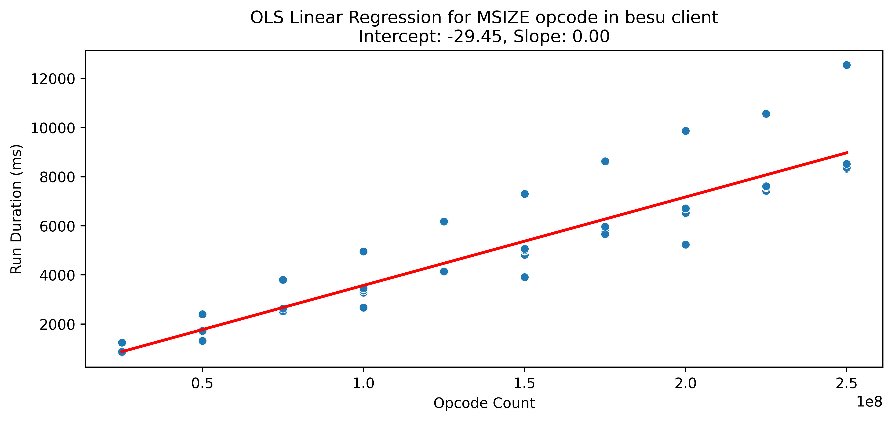


## geth


```python
                            OLS Regression Results                            
==============================================================================
Dep. Variable:        run_duration_ms   R-squared:                       0.997
Model:                            OLS   Adj. R-squared:                  0.997
Method:                 Least Squares   F-statistic:                 1.667e+04
Date:                Mon, 22 Dec 2025   Prob (F-statistic):           7.12e-67
Time:                        12:03:44   Log-Likelihood:                -284.09
No. Observations:                  54   AIC:                             572.2
Df Residuals:                      52   BIC:                             576.2
Df Model:                           1                                         
Covariance Type:            nonrobust                                         
==============================================================================
                 coef    std err          t      P>|t|      [0.025      0.975]
------------------------------------------------------------------------------
const         52.5316     14.042      3.741      0.000      24.355      80.708
opcount     1.178e-05   9.13e-08    129.118      0.000    1.16e-05     1.2e-05
==============================================================================
Omnibus:                       18.966   Durbin-Watson:                   1.702
Prob(Omnibus):                  0.000   Jarque-Bera (JB):               73.448
Skew:                           0.646   Prob(JB):                     1.12e-16
Kurtosis:                       8.566   Cond. No.                     3.34e+08
==============================================================================

Notes:
[1] Standard Errors assume that the covariance matrix of the errors is correctly specified.
[2] The condition number is large, 3.34e+08. This might indicate that there are
strong multicollinearity or other numerical problems.
```


# GAS

## nethermind


```python
                            OLS Regression Results                            
==============================================================================
Dep. Variable:        run_duration_ms   R-squared:                       0.992
Model:                            OLS   Adj. R-squared:                  0.991
Method:                 Least Squares   F-statistic:                     6158.
Date:                Mon, 22 Dec 2025   Prob (F-statistic):           1.10e-55
Time:                        12:03:44   Log-Likelihood:                -261.17
No. Observations:                  54   AIC:                             526.3
Df Residuals:                      52   BIC:                             530.3
Df Model:                           1                                         
Covariance Type:            nonrobust                                         
==============================================================================
                 coef    std err          t      P>|t|      [0.025      0.975]
------------------------------------------------------------------------------
const         44.6505      9.186      4.861      0.000      26.218      63.083
opcount     4.685e-06   5.97e-08     78.473      0.000    4.57e-06    4.81e-06
==============================================================================
Omnibus:                       13.309   Durbin-Watson:                   1.419
Prob(Omnibus):                  0.001   Jarque-Bera (JB):               14.938
Skew:                          -1.002   Prob(JB):                     0.000570
Kurtosis:                       4.620   Cond. No.                     3.34e+08
==============================================================================

Notes:
[1] Standard Errors assume that the covariance matrix of the errors is correctly specified.
[2] The condition number is large, 3.34e+08. This might indicate that there are
strong multicollinearity or other numerical problems.
```

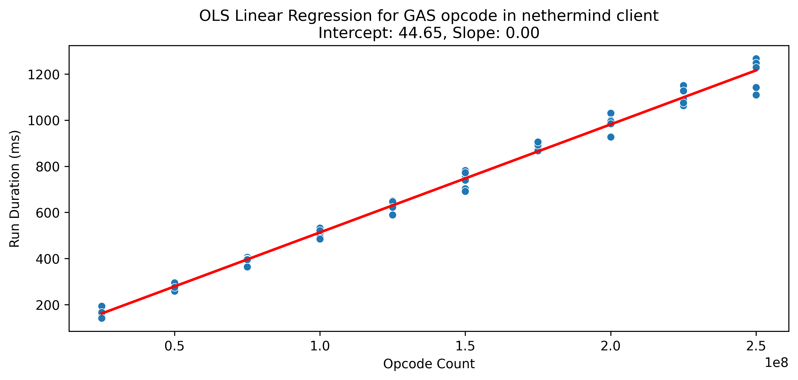


## reth


```python
                            OLS Regression Results                            
==============================================================================
Dep. Variable:        run_duration_ms   R-squared:                       0.986
Model:                            OLS   Adj. R-squared:                  0.986
Method:                 Least Squares   F-statistic:                     3704.
Date:                Mon, 22 Dec 2025   Prob (F-statistic):           5.23e-50
Time:                        12:03:44   Log-Likelihood:                -272.63
No. Observations:                  54   AIC:                             549.3
Df Residuals:                      52   BIC:                             553.2
Df Model:                           1                                         
Covariance Type:            nonrobust                                         
==============================================================================
                 coef    std err          t      P>|t|      [0.025      0.975]
------------------------------------------------------------------------------
const         46.5146     11.357      4.096      0.000      23.726      69.303
opcount     4.492e-06   7.38e-08     60.858      0.000    4.34e-06    4.64e-06
==============================================================================
Omnibus:                        3.704   Durbin-Watson:                   1.058
Prob(Omnibus):                  0.157   Jarque-Bera (JB):                2.892
Skew:                          -0.332   Prob(JB):                        0.236
Kurtosis:                       3.919   Cond. No.                     3.34e+08
==============================================================================

Notes:
[1] Standard Errors assume that the covariance matrix of the errors is correctly specified.
[2] The condition number is large, 3.34e+08. This might indicate that there are
strong multicollinearity or other numerical problems.
```


## besu


```python
                            OLS Regression Results                            
==============================================================================
Dep. Variable:        run_duration_ms   R-squared:                       0.846
Model:                            OLS   Adj. R-squared:                  0.843
Method:                 Least Squares   F-statistic:                     285.1
Date:                Mon, 22 Dec 2025   Prob (F-statistic):           9.36e-23
Time:                        12:03:44   Log-Likelihood:                -451.43
No. Observations:                  54   AIC:                             906.9
Df Residuals:                      52   BIC:                             910.8
Df Model:                           1                                         
Covariance Type:            nonrobust                                         
==============================================================================
                 coef    std err          t      P>|t|      [0.025      0.975]
------------------------------------------------------------------------------
const        -45.0046    311.385     -0.145      0.886    -669.845     579.836
opcount     3.417e-05   2.02e-06     16.885      0.000    3.01e-05    3.82e-05
==============================================================================
Omnibus:                       23.942   Durbin-Watson:                   0.598
Prob(Omnibus):                  0.000   Jarque-Bera (JB):               36.331
Skew:                           1.551   Prob(JB):                     1.29e-08
Kurtosis:                       5.555   Cond. No.                     3.34e+08
==============================================================================

Notes:
[1] Standard Errors assume that the covariance matrix of the errors is correctly specified.
[2] The condition number is large, 3.34e+08. This might indicate that there are
strong multicollinearity or other numerical problems.
```

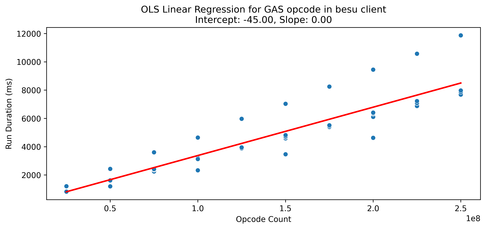


## geth


```python
                            OLS Regression Results                            
==============================================================================
Dep. Variable:        run_duration_ms   R-squared:                       0.998
Model:                            OLS   Adj. R-squared:                  0.998
Method:                 Least Squares   F-statistic:                 2.177e+04
Date:                Mon, 22 Dec 2025   Prob (F-statistic):           7.00e-70
Time:                        12:03:44   Log-Likelihood:                -277.12
No. Observations:                  54   AIC:                             558.2
Df Residuals:                      52   BIC:                             562.2
Df Model:                           1                                         
Covariance Type:            nonrobust                                         
==============================================================================
                 coef    std err          t      P>|t|      [0.025      0.975]
------------------------------------------------------------------------------
const         35.5129     12.343      2.877      0.006      10.745      60.281
opcount     1.184e-05   8.02e-08    147.560      0.000    1.17e-05     1.2e-05
==============================================================================
Omnibus:                        1.557   Durbin-Watson:                   1.536
Prob(Omnibus):                  0.459   Jarque-Bera (JB):                0.792
Skew:                          -0.128   Prob(JB):                        0.673
Kurtosis:                       3.535   Cond. No.                     3.34e+08
==============================================================================

Notes:
[1] Standard Errors assume that the covariance matrix of the errors is correctly specified.
[2] The condition number is large, 3.34e+08. This might indicate that there are
strong multicollinearity or other numerical problems.
```


# JUMPDEST

## nethermind

OLS model did not run... Error: zero-size array to reduction operation maximum which has no identity

## reth

OLS model did not run... Error: zero-size array to reduction operation maximum which has no identity

## besu

OLS model did not run... Error: zero-size array to reduction operation maximum which has no identity

## geth

OLS model did not run... Error: zero-size array to reduction operation maximum which has no identity

# PUSH0

## nethermind


```python
                            OLS Regression Results                            
==============================================================================
Dep. Variable:        run_duration_ms   R-squared:                       0.986
Model:                            OLS   Adj. R-squared:                  0.986
Method:                 Least Squares   F-statistic:                     3605.
Date:                Mon, 22 Dec 2025   Prob (F-statistic):           1.04e-49
Time:                        12:03:45   Log-Likelihood:                -237.53
No. Observations:                  54   AIC:                             479.1
Df Residuals:                      52   BIC:                             483.0
Df Model:                           1                                         
Covariance Type:            nonrobust                                         
==============================================================================
                 coef    std err          t      P>|t|      [0.025      0.975]
------------------------------------------------------------------------------
const         39.0912      5.929      6.593      0.000      27.194      50.989
opcount     4.628e-06   7.71e-08     60.045      0.000    4.47e-06    4.78e-06
==============================================================================
Omnibus:                        1.755   Durbin-Watson:                   1.126
Prob(Omnibus):                  0.416   Jarque-Bera (JB):                1.512
Skew:                          -0.405   Prob(JB):                        0.469
Kurtosis:                       2.875   Cond. No.                     1.67e+08
==============================================================================

Notes:
[1] Standard Errors assume that the covariance matrix of the errors is correctly specified.
[2] The condition number is large, 1.67e+08. This might indicate that there are
strong multicollinearity or other numerical problems.
```


## reth


```python
                            OLS Regression Results                            
==============================================================================
Dep. Variable:        run_duration_ms   R-squared:                       0.985
Model:                            OLS   Adj. R-squared:                  0.985
Method:                 Least Squares   F-statistic:                     3397.
Date:                Mon, 22 Dec 2025   Prob (F-statistic):           4.78e-49
Time:                        12:03:45   Log-Likelihood:                -234.67
No. Observations:                  54   AIC:                             473.3
Df Residuals:                      52   BIC:                             477.3
Df Model:                           1                                         
Covariance Type:            nonrobust                                         
==============================================================================
                 coef    std err          t      P>|t|      [0.025      0.975]
------------------------------------------------------------------------------
const         38.5955      5.624      6.863      0.000      27.311      49.880
opcount     4.261e-06   7.31e-08     58.287      0.000    4.11e-06    4.41e-06
==============================================================================
Omnibus:                        1.558   Durbin-Watson:                   1.089
Prob(Omnibus):                  0.459   Jarque-Bera (JB):                0.841
Skew:                           0.252   Prob(JB):                        0.657
Kurtosis:                       3.348   Cond. No.                     1.67e+08
==============================================================================

Notes:
[1] Standard Errors assume that the covariance matrix of the errors is correctly specified.
[2] The condition number is large, 1.67e+08. This might indicate that there are
strong multicollinearity or other numerical problems.
```


## besu


```python
                            OLS Regression Results                            
==============================================================================
Dep. Variable:        run_duration_ms   R-squared:                       0.780
Model:                            OLS   Adj. R-squared:                  0.776
Method:                 Least Squares   F-statistic:                     184.2
Date:                Mon, 22 Dec 2025   Prob (F-statistic):           1.01e-18
Time:                        12:03:45   Log-Likelihood:                -410.92
No. Observations:                  54   AIC:                             825.8
Df Residuals:                      52   BIC:                             829.8
Df Model:                           1                                         
Covariance Type:            nonrobust                                         
==============================================================================
                 coef    std err          t      P>|t|      [0.025      0.975]
------------------------------------------------------------------------------
const         48.9887    147.064      0.333      0.740    -246.117     344.094
opcount     2.595e-05   1.91e-06     13.572      0.000    2.21e-05    2.98e-05
==============================================================================
Omnibus:                       32.088   Durbin-Watson:                   0.569
Prob(Omnibus):                  0.000   Jarque-Bera (JB):               59.332
Skew:                           1.987   Prob(JB):                     1.31e-13
Kurtosis:                       6.252   Cond. No.                     1.67e+08
==============================================================================

Notes:
[1] Standard Errors assume that the covariance matrix of the errors is correctly specified.
[2] The condition number is large, 1.67e+08. This might indicate that there are
strong multicollinearity or other numerical problems.
```

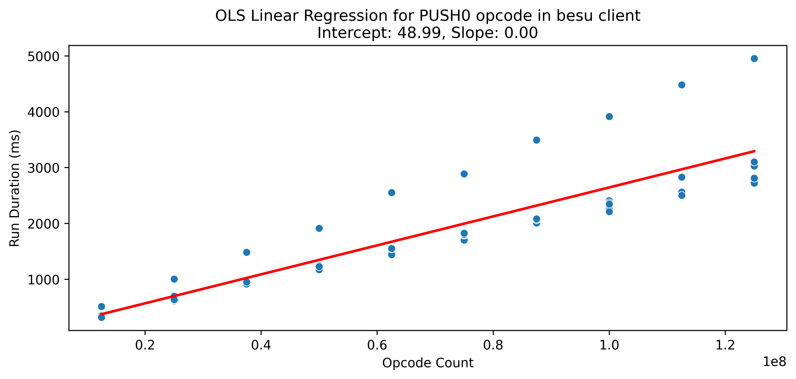


## geth


```python
                            OLS Regression Results                            
==============================================================================
Dep. Variable:        run_duration_ms   R-squared:                       0.998
Model:                            OLS   Adj. R-squared:                  0.997
Method:                 Least Squares   F-statistic:                 2.080e+04
Date:                Mon, 22 Dec 2025   Prob (F-statistic):           2.28e-69
Time:                        12:03:45   Log-Likelihood:                -222.76
No. Observations:                  54   AIC:                             449.5
Df Residuals:                      52   BIC:                             453.5
Df Model:                           1                                         
Covariance Type:            nonrobust                                         
==============================================================================
                 coef    std err          t      P>|t|      [0.025      0.975]
------------------------------------------------------------------------------
const         38.7049      4.510      8.582      0.000      29.655      47.755
opcount     8.457e-06   5.86e-08    144.237      0.000    8.34e-06    8.57e-06
==============================================================================
Omnibus:                        2.149   Durbin-Watson:                   1.991
Prob(Omnibus):                  0.342   Jarque-Bera (JB):                2.044
Skew:                           0.402   Prob(JB):                        0.360
Kurtosis:                       2.488   Cond. No.                     1.67e+08
==============================================================================

Notes:
[1] Standard Errors assume that the covariance matrix of the errors is correctly specified.
[2] The condition number is large, 1.67e+08. This might indicate that there are
strong multicollinearity or other numerical problems.
```

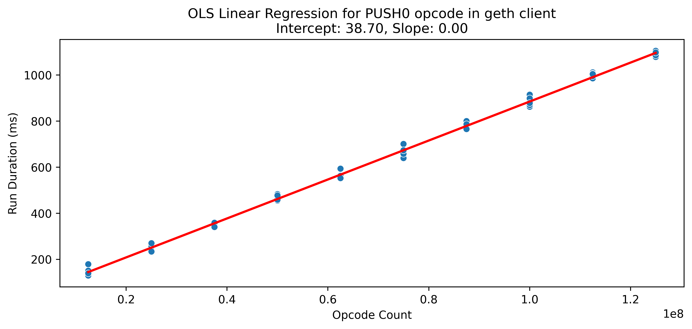


# PUSH1

## nethermind


```python
                            OLS Regression Results                            
==============================================================================
Dep. Variable:        run_duration_ms   R-squared:                       0.991
Model:                            OLS   Adj. R-squared:                  0.990
Method:                 Least Squares   F-statistic:                     5465.
Date:                Mon, 22 Dec 2025   Prob (F-statistic):           2.37e-54
Time:                        12:03:45   Log-Likelihood:                -251.47
No. Observations:                  54   AIC:                             506.9
Df Residuals:                      52   BIC:                             510.9
Df Model:                           1                                         
Covariance Type:            nonrobust                                         
==============================================================================
                 coef    std err          t      P>|t|      [0.025      0.975]
------------------------------------------------------------------------------
const         43.0298      7.675      5.606      0.000      27.628      58.431
opcount     7.376e-06   9.98e-08     73.927      0.000    7.18e-06    7.58e-06
==============================================================================
Omnibus:                       20.132   Durbin-Watson:                   1.801
Prob(Omnibus):                  0.000   Jarque-Bera (JB):               27.356
Skew:                          -1.366   Prob(JB):                     1.15e-06
Kurtosis:                       5.167   Cond. No.                     1.67e+08
==============================================================================

Notes:
[1] Standard Errors assume that the covariance matrix of the errors is correctly specified.
[2] The condition number is large, 1.67e+08. This might indicate that there are
strong multicollinearity or other numerical problems.
```


## reth


```python
                            OLS Regression Results                            
==============================================================================
Dep. Variable:        run_duration_ms   R-squared:                       0.994
Model:                            OLS   Adj. R-squared:                  0.994
Method:                 Least Squares   F-statistic:                     8847.
Date:                Mon, 22 Dec 2025   Prob (F-statistic):           9.47e-60
Time:                        12:03:45   Log-Likelihood:                -205.57
No. Observations:                  54   AIC:                             415.1
Df Residuals:                      52   BIC:                             419.1
Df Model:                           1                                         
Covariance Type:            nonrobust                                         
==============================================================================
                 coef    std err          t      P>|t|      [0.025      0.975]
------------------------------------------------------------------------------
const         37.7945      3.281     11.520      0.000      31.211      44.378
opcount     4.012e-06   4.27e-08     94.059      0.000    3.93e-06     4.1e-06
==============================================================================
Omnibus:                        2.574   Durbin-Watson:                   1.817
Prob(Omnibus):                  0.276   Jarque-Bera (JB):                2.454
Skew:                           0.462   Prob(JB):                        0.293
Kurtosis:                       2.512   Cond. No.                     1.67e+08
==============================================================================

Notes:
[1] Standard Errors assume that the covariance matrix of the errors is correctly specified.
[2] The condition number is large, 1.67e+08. This might indicate that there are
strong multicollinearity or other numerical problems.
```

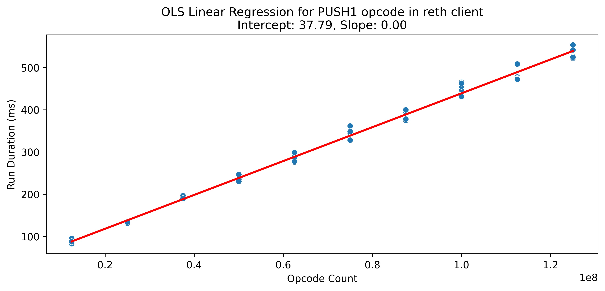


## besu


```python
                            OLS Regression Results                            
==============================================================================
Dep. Variable:        run_duration_ms   R-squared:                       0.871
Model:                            OLS   Adj. R-squared:                  0.869
Method:                 Least Squares   F-statistic:                     351.8
Date:                Mon, 22 Dec 2025   Prob (F-statistic):           8.45e-25
Time:                        12:03:45   Log-Likelihood:                -399.94
No. Observations:                  54   AIC:                             803.9
Df Residuals:                      52   BIC:                             807.9
Df Model:                           1                                         
Covariance Type:            nonrobust                                         
==============================================================================
                 coef    std err          t      P>|t|      [0.025      0.975]
------------------------------------------------------------------------------
const          6.4693    119.989      0.054      0.957    -234.306     247.245
opcount     2.926e-05   1.56e-06     18.756      0.000    2.61e-05    3.24e-05
==============================================================================
Omnibus:                       25.486   Durbin-Watson:                   0.811
Prob(Omnibus):                  0.000   Jarque-Bera (JB):               39.378
Skew:                           1.661   Prob(JB):                     2.81e-09
Kurtosis:                       5.544   Cond. No.                     1.67e+08
==============================================================================

Notes:
[1] Standard Errors assume that the covariance matrix of the errors is correctly specified.
[2] The condition number is large, 1.67e+08. This might indicate that there are
strong multicollinearity or other numerical problems.
```

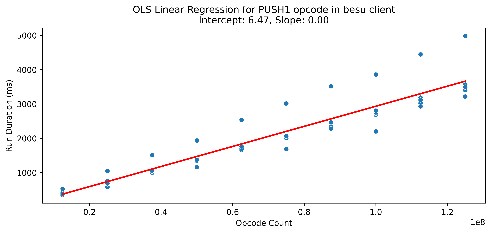


## geth


```python
                            OLS Regression Results                            
==============================================================================
Dep. Variable:        run_duration_ms   R-squared:                       0.999
Model:                            OLS   Adj. R-squared:                  0.999
Method:                 Least Squares   F-statistic:                 6.063e+04
Date:                Mon, 22 Dec 2025   Prob (F-statistic):           1.99e-81
Time:                        12:03:46   Log-Likelihood:                -239.16
No. Observations:                  54   AIC:                             482.3
Df Residuals:                      52   BIC:                             486.3
Df Model:                           1                                         
Covariance Type:            nonrobust                                         
==============================================================================
                 coef    std err          t      P>|t|      [0.025      0.975]
------------------------------------------------------------------------------
const         42.3816      6.111      6.936      0.000      30.120      54.644
opcount     1.956e-05   7.94e-08    246.230      0.000    1.94e-05    1.97e-05
==============================================================================
Omnibus:                       23.317   Durbin-Watson:                   2.015
Prob(Omnibus):                  0.000   Jarque-Bera (JB):               59.405
Skew:                           1.140   Prob(JB):                     1.26e-13
Kurtosis:                       7.605   Cond. No.                     1.67e+08
==============================================================================

Notes:
[1] Standard Errors assume that the covariance matrix of the errors is correctly specified.
[2] The condition number is large, 1.67e+08. This might indicate that there are
strong multicollinearity or other numerical problems.
```


# PUSH2

## nethermind


```python
                            OLS Regression Results                            
==============================================================================
Dep. Variable:        run_duration_ms   R-squared:                       0.990
Model:                            OLS   Adj. R-squared:                  0.990
Method:                 Least Squares   F-statistic:                     5125.
Date:                Mon, 22 Dec 2025   Prob (F-statistic):           1.24e-53
Time:                        12:03:46   Log-Likelihood:                -263.08
No. Observations:                  54   AIC:                             530.2
Df Residuals:                      52   BIC:                             534.1
Df Model:                           1                                         
Covariance Type:            nonrobust                                         
==============================================================================
                 coef    std err          t      P>|t|      [0.025      0.975]
------------------------------------------------------------------------------
const         38.9082      9.516      4.089      0.000      19.812      58.004
opcount     8.856e-06   1.24e-07     71.586      0.000    8.61e-06     9.1e-06
==============================================================================
Omnibus:                       16.799   Durbin-Watson:                   1.562
Prob(Omnibus):                  0.000   Jarque-Bera (JB):               26.167
Skew:                          -1.008   Prob(JB):                     2.08e-06
Kurtosis:                       5.750   Cond. No.                     1.67e+08
==============================================================================

Notes:
[1] Standard Errors assume that the covariance matrix of the errors is correctly specified.
[2] The condition number is large, 1.67e+08. This might indicate that there are
strong multicollinearity or other numerical problems.
```

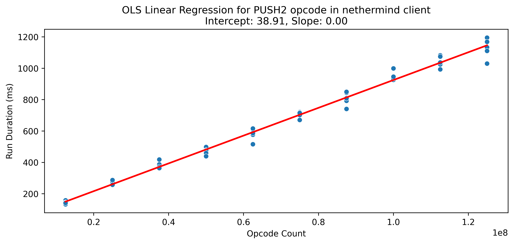


## reth


```python
                            OLS Regression Results                            
==============================================================================
Dep. Variable:        run_duration_ms   R-squared:                       0.995
Model:                            OLS   Adj. R-squared:                  0.995
Method:                 Least Squares   F-statistic:                 1.024e+04
Date:                Mon, 22 Dec 2025   Prob (F-statistic):           2.13e-61
Time:                        12:03:46   Log-Likelihood:                -201.49
No. Observations:                  54   AIC:                             407.0
Df Residuals:                      52   BIC:                             411.0
Df Model:                           1                                         
Covariance Type:            nonrobust                                         
==============================================================================
                 coef    std err          t      P>|t|      [0.025      0.975]
------------------------------------------------------------------------------
const         36.7306      3.042     12.076      0.000      30.627      42.834
opcount     4.002e-06   3.95e-08    101.214      0.000    3.92e-06    4.08e-06
==============================================================================
Omnibus:                        0.690   Durbin-Watson:                   1.682
Prob(Omnibus):                  0.708   Jarque-Bera (JB):                0.791
Skew:                          -0.160   Prob(JB):                        0.673
Kurtosis:                       2.502   Cond. No.                     1.67e+08
==============================================================================

Notes:
[1] Standard Errors assume that the covariance matrix of the errors is correctly specified.
[2] The condition number is large, 1.67e+08. This might indicate that there are
strong multicollinearity or other numerical problems.
```


## besu


```python
                            OLS Regression Results                            
==============================================================================
Dep. Variable:        run_duration_ms   R-squared:                       0.860
Model:                            OLS   Adj. R-squared:                  0.857
Method:                 Least Squares   F-statistic:                     318.3
Date:                Mon, 22 Dec 2025   Prob (F-statistic):           8.10e-24
Time:                        12:03:46   Log-Likelihood:                -401.91
No. Observations:                  54   AIC:                             807.8
Df Residuals:                      52   BIC:                             811.8
Df Model:                           1                                         
Covariance Type:            nonrobust                                         
==============================================================================
                 coef    std err          t      P>|t|      [0.025      0.975]
------------------------------------------------------------------------------
const         26.5059    124.449      0.213      0.832    -223.220     276.232
opcount     2.886e-05   1.62e-06     17.840      0.000    2.56e-05    3.21e-05
==============================================================================
Omnibus:                       26.314   Durbin-Watson:                   0.715
Prob(Omnibus):                  0.000   Jarque-Bera (JB):               41.443
Skew:                           1.707   Prob(JB):                     1.00e-09
Kurtosis:                       5.601   Cond. No.                     1.67e+08
==============================================================================

Notes:
[1] Standard Errors assume that the covariance matrix of the errors is correctly specified.
[2] The condition number is large, 1.67e+08. This might indicate that there are
strong multicollinearity or other numerical problems.
```

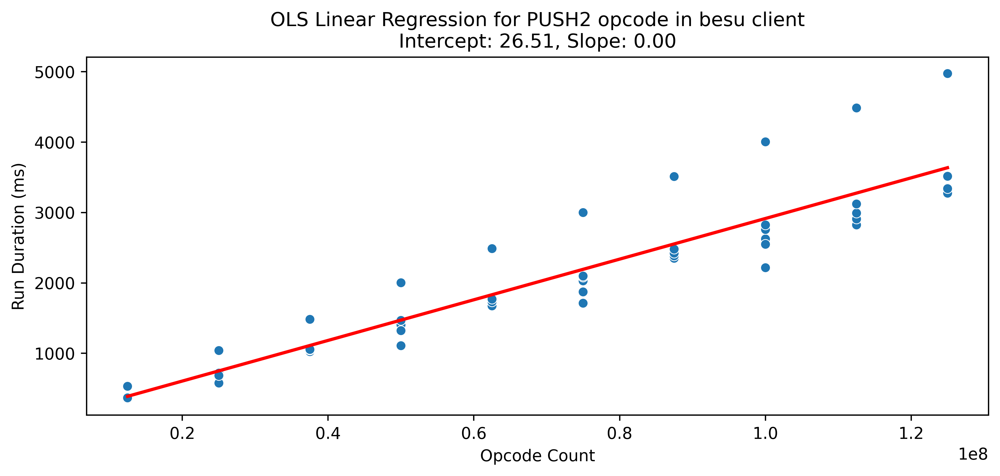


## geth


```python
                            OLS Regression Results                            
==============================================================================
Dep. Variable:        run_duration_ms   R-squared:                       0.997
Model:                            OLS   Adj. R-squared:                  0.997
Method:                 Least Squares   F-statistic:                 1.742e+04
Date:                Mon, 22 Dec 2025   Prob (F-statistic):           2.27e-67
Time:                        12:03:46   Log-Likelihood:                -259.72
No. Observations:                  54   AIC:                             523.4
Df Residuals:                      52   BIC:                             527.4
Df Model:                           1                                         
Covariance Type:            nonrobust                                         
==============================================================================
                 coef    std err          t      P>|t|      [0.025      0.975]
------------------------------------------------------------------------------
const         33.2970      8.943      3.723      0.000      15.352      51.242
opcount     1.535e-05   1.16e-07    131.999      0.000    1.51e-05    1.56e-05
==============================================================================
Omnibus:                       56.625   Durbin-Watson:                   2.190
Prob(Omnibus):                  0.000   Jarque-Bera (JB):              440.844
Skew:                           2.617   Prob(JB):                     1.87e-96
Kurtosis:                      15.982   Cond. No.                     1.67e+08
==============================================================================

Notes:
[1] Standard Errors assume that the covariance matrix of the errors is correctly specified.
[2] The condition number is large, 1.67e+08. This might indicate that there are
strong multicollinearity or other numerical problems.
```


# PUSH3

## nethermind


```python
                            OLS Regression Results                            
==============================================================================
Dep. Variable:        run_duration_ms   R-squared:                       0.989
Model:                            OLS   Adj. R-squared:                  0.989
Method:                 Least Squares   F-statistic:                     4848.
Date:                Mon, 22 Dec 2025   Prob (F-statistic):           5.18e-53
Time:                        12:03:46   Log-Likelihood:                -270.66
No. Observations:                  54   AIC:                             545.3
Df Residuals:                      52   BIC:                             549.3
Df Model:                           1                                         
Covariance Type:            nonrobust                                         
==============================================================================
                 coef    std err          t      P>|t|      [0.025      0.975]
------------------------------------------------------------------------------
const         49.9724     10.951      4.563      0.000      27.998      71.947
opcount     9.912e-06   1.42e-07     69.630      0.000    9.63e-06    1.02e-05
==============================================================================
Omnibus:                       14.535   Durbin-Watson:                   2.219
Prob(Omnibus):                  0.001   Jarque-Bera (JB):               17.844
Skew:                          -1.016   Prob(JB):                     0.000133
Kurtosis:                       4.949   Cond. No.                     1.67e+08
==============================================================================

Notes:
[1] Standard Errors assume that the covariance matrix of the errors is correctly specified.
[2] The condition number is large, 1.67e+08. This might indicate that there are
strong multicollinearity or other numerical problems.
```


## reth


```python
                            OLS Regression Results                            
==============================================================================
Dep. Variable:        run_duration_ms   R-squared:                       0.993
Model:                            OLS   Adj. R-squared:                  0.993
Method:                 Least Squares   F-statistic:                     7459.
Date:                Mon, 22 Dec 2025   Prob (F-statistic):           7.79e-58
Time:                        12:03:46   Log-Likelihood:                -210.33
No. Observations:                  54   AIC:                             424.7
Df Residuals:                      52   BIC:                             428.6
Df Model:                           1                                         
Covariance Type:            nonrobust                                         
==============================================================================
                 coef    std err          t      P>|t|      [0.025      0.975]
------------------------------------------------------------------------------
const         36.7896      3.583     10.269      0.000      29.600      43.979
opcount     4.022e-06   4.66e-08     86.365      0.000    3.93e-06    4.12e-06
==============================================================================
Omnibus:                       11.030   Durbin-Watson:                   1.711
Prob(Omnibus):                  0.004   Jarque-Bera (JB):               12.823
Skew:                          -0.784   Prob(JB):                      0.00164
Kurtosis:                       4.799   Cond. No.                     1.67e+08
==============================================================================

Notes:
[1] Standard Errors assume that the covariance matrix of the errors is correctly specified.
[2] The condition number is large, 1.67e+08. This might indicate that there are
strong multicollinearity or other numerical problems.
```

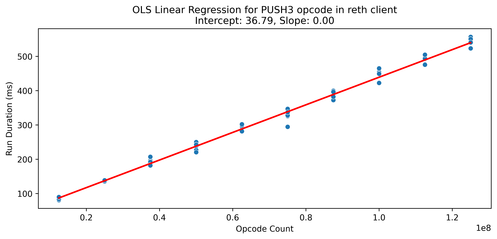


## besu


```python
                            OLS Regression Results                            
==============================================================================
Dep. Variable:        run_duration_ms   R-squared:                       0.868
Model:                            OLS   Adj. R-squared:                  0.865
Method:                 Least Squares   F-statistic:                     340.8
Date:                Mon, 22 Dec 2025   Prob (F-statistic):           1.73e-24
Time:                        12:03:46   Log-Likelihood:                -401.29
No. Observations:                  54   AIC:                             806.6
Df Residuals:                      52   BIC:                             810.6
Df Model:                           1                                         
Covariance Type:            nonrobust                                         
==============================================================================
                 coef    std err          t      P>|t|      [0.025      0.975]
------------------------------------------------------------------------------
const         -4.7356    123.024     -0.038      0.969    -251.601     242.130
opcount     2.952e-05    1.6e-06     18.461      0.000    2.63e-05    3.27e-05
==============================================================================
Omnibus:                       26.474   Durbin-Watson:                   0.627
Prob(Omnibus):                  0.000   Jarque-Bera (JB):               41.644
Skew:                           1.723   Prob(JB):                     9.06e-10
Kurtosis:                       5.574   Cond. No.                     1.67e+08
==============================================================================

Notes:
[1] Standard Errors assume that the covariance matrix of the errors is correctly specified.
[2] The condition number is large, 1.67e+08. This might indicate that there are
strong multicollinearity or other numerical problems.
```

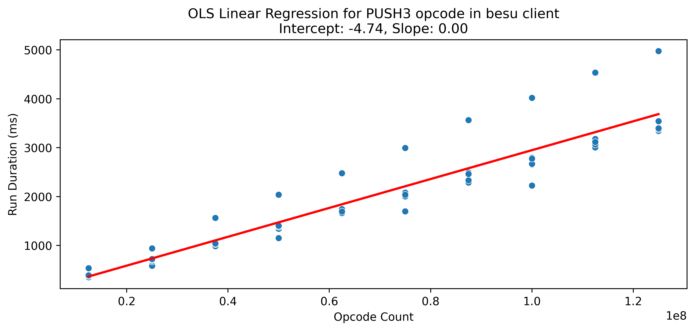


## geth


```python
                            OLS Regression Results                            
==============================================================================
Dep. Variable:        run_duration_ms   R-squared:                       0.935
Model:                            OLS   Adj. R-squared:                  0.934
Method:                 Least Squares   F-statistic:                     751.9
Date:                Mon, 22 Dec 2025   Prob (F-statistic):           1.37e-32
Time:                        12:03:47   Log-Likelihood:                -360.52
No. Observations:                  54   AIC:                             725.0
Df Residuals:                      52   BIC:                             729.0
Df Model:                           1                                         
Covariance Type:            nonrobust                                         
==============================================================================
                 coef    std err          t      P>|t|      [0.025      0.975]
------------------------------------------------------------------------------
const        -18.7443     57.829     -0.324      0.747    -134.787      97.298
opcount     2.061e-05   7.52e-07     27.421      0.000    1.91e-05    2.21e-05
==============================================================================
Omnibus:                       85.000   Durbin-Watson:                   2.096
Prob(Omnibus):                  0.000   Jarque-Bera (JB):             1195.073
Skew:                           4.479   Prob(JB):                    3.11e-260
Kurtosis:                      24.235   Cond. No.                     1.67e+08
==============================================================================

Notes:
[1] Standard Errors assume that the covariance matrix of the errors is correctly specified.
[2] The condition number is large, 1.67e+08. This might indicate that there are
strong multicollinearity or other numerical problems.
```

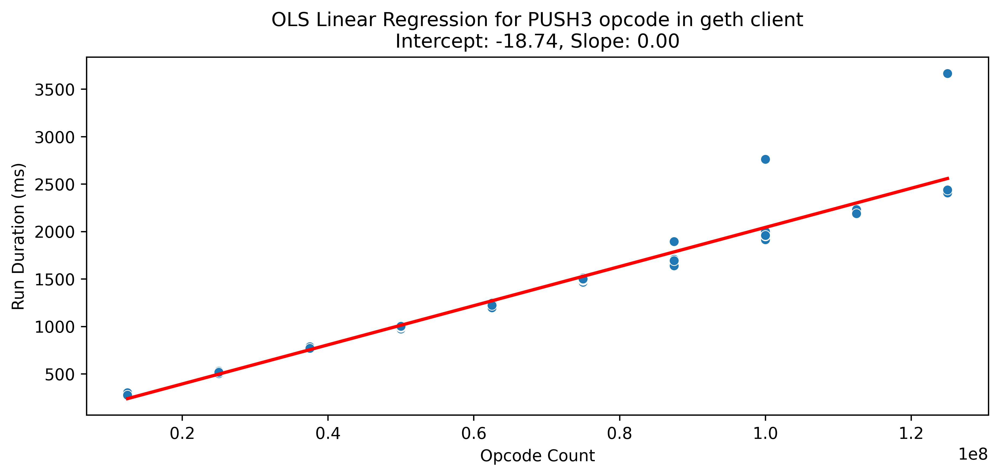


# PUSH4

## nethermind


```python
                            OLS Regression Results                            
==============================================================================
Dep. Variable:        run_duration_ms   R-squared:                       0.993
Model:                            OLS   Adj. R-squared:                  0.993
Method:                 Least Squares   F-statistic:                     7820.
Date:                Mon, 22 Dec 2025   Prob (F-statistic):           2.30e-58
Time:                        12:03:47   Log-Likelihood:                -244.21
No. Observations:                  54   AIC:                             492.4
Df Residuals:                      52   BIC:                             496.4
Df Model:                           1                                         
Covariance Type:            nonrobust                                         
==============================================================================
                 coef    std err          t      P>|t|      [0.025      0.975]
------------------------------------------------------------------------------
const         42.0805      6.710      6.272      0.000      28.617      55.544
opcount     7.713e-06   8.72e-08     88.432      0.000    7.54e-06    7.89e-06
==============================================================================
Omnibus:                       48.708   Durbin-Watson:                   2.208
Prob(Omnibus):                  0.000   Jarque-Bera (JB):              222.136
Skew:                          -2.419   Prob(JB):                     5.80e-49
Kurtosis:                      11.679   Cond. No.                     1.67e+08
==============================================================================

Notes:
[1] Standard Errors assume that the covariance matrix of the errors is correctly specified.
[2] The condition number is large, 1.67e+08. This might indicate that there are
strong multicollinearity or other numerical problems.
```


## reth


```python
                            OLS Regression Results                            
==============================================================================
Dep. Variable:        run_duration_ms   R-squared:                       0.987
Model:                            OLS   Adj. R-squared:                  0.987
Method:                 Least Squares   F-statistic:                     4072.
Date:                Mon, 22 Dec 2025   Prob (F-statistic):           4.59e-51
Time:                        12:03:47   Log-Likelihood:                -228.36
No. Observations:                  54   AIC:                             460.7
Df Residuals:                      52   BIC:                             464.7
Df Model:                           1                                         
Covariance Type:            nonrobust                                         
==============================================================================
                 coef    std err          t      P>|t|      [0.025      0.975]
------------------------------------------------------------------------------
const         34.8571      5.003      6.967      0.000      24.817      44.897
opcount     4.151e-06    6.5e-08     63.814      0.000    4.02e-06    4.28e-06
==============================================================================
Omnibus:                       11.068   Durbin-Watson:                   2.171
Prob(Omnibus):                  0.004   Jarque-Bera (JB):               10.970
Skew:                           0.966   Prob(JB):                      0.00415
Kurtosis:                       4.070   Cond. No.                     1.67e+08
==============================================================================

Notes:
[1] Standard Errors assume that the covariance matrix of the errors is correctly specified.
[2] The condition number is large, 1.67e+08. This might indicate that there are
strong multicollinearity or other numerical problems.
```


## besu


```python
                            OLS Regression Results                            
==============================================================================
Dep. Variable:        run_duration_ms   R-squared:                       0.868
Model:                            OLS   Adj. R-squared:                  0.865
Method:                 Least Squares   F-statistic:                     341.7
Date:                Mon, 22 Dec 2025   Prob (F-statistic):           1.63e-24
Time:                        12:03:47   Log-Likelihood:                -400.57
No. Observations:                  54   AIC:                             805.1
Df Residuals:                      52   BIC:                             809.1
Df Model:                           1                                         
Covariance Type:            nonrobust                                         
==============================================================================
                 coef    std err          t      P>|t|      [0.025      0.975]
------------------------------------------------------------------------------
const          4.4676    121.400      0.037      0.971    -239.139     248.075
opcount     2.917e-05   1.58e-06     18.485      0.000     2.6e-05    3.23e-05
==============================================================================
Omnibus:                       29.073   Durbin-Watson:                   0.329
Prob(Omnibus):                  0.000   Jarque-Bera (JB):               51.050
Skew:                           1.798   Prob(JB):                     8.22e-12
Kurtosis:                       6.124   Cond. No.                     1.67e+08
==============================================================================

Notes:
[1] Standard Errors assume that the covariance matrix of the errors is correctly specified.
[2] The condition number is large, 1.67e+08. This might indicate that there are
strong multicollinearity or other numerical problems.
```


## geth


```python
                            OLS Regression Results                            
==============================================================================
Dep. Variable:        run_duration_ms   R-squared:                       0.988
Model:                            OLS   Adj. R-squared:                  0.987
Method:                 Least Squares   F-statistic:                     4171.
Date:                Mon, 22 Dec 2025   Prob (F-statistic):           2.48e-51
Time:                        12:03:47   Log-Likelihood:                -309.56
No. Observations:                  54   AIC:                             623.1
Df Residuals:                      52   BIC:                             627.1
Df Model:                           1                                         
Covariance Type:            nonrobust                                         
==============================================================================
                 coef    std err          t      P>|t|      [0.025      0.975]
------------------------------------------------------------------------------
const         55.2095     22.505      2.453      0.018      10.051     100.368
opcount     1.889e-05   2.93e-07     64.583      0.000    1.83e-05    1.95e-05
==============================================================================
Omnibus:                      104.890   Durbin-Watson:                   1.992
Prob(Omnibus):                  0.000   Jarque-Bera (JB):             3318.530
Skew:                           5.772   Prob(JB):                         0.00
Kurtosis:                      39.629   Cond. No.                     1.67e+08
==============================================================================

Notes:
[1] Standard Errors assume that the covariance matrix of the errors is correctly specified.
[2] The condition number is large, 1.67e+08. This might indicate that there are
strong multicollinearity or other numerical problems.
```


# PUSH5

## nethermind


```python
                            OLS Regression Results                            
==============================================================================
Dep. Variable:        run_duration_ms   R-squared:                       0.993
Model:                            OLS   Adj. R-squared:                  0.993
Method:                 Least Squares   F-statistic:                     7678.
Date:                Mon, 22 Dec 2025   Prob (F-statistic):           3.68e-58
Time:                        12:03:47   Log-Likelihood:                -257.38
No. Observations:                  54   AIC:                             518.8
Df Residuals:                      52   BIC:                             522.7
Df Model:                           1                                         
Covariance Type:            nonrobust                                         
==============================================================================
                 coef    std err          t      P>|t|      [0.025      0.975]
------------------------------------------------------------------------------
const         50.4759      8.563      5.895      0.000      33.294      67.658
opcount     9.754e-06   1.11e-07     87.626      0.000    9.53e-06    9.98e-06
==============================================================================
Omnibus:                       22.515   Durbin-Watson:                   2.101
Prob(Omnibus):                  0.000   Jarque-Bera (JB):               34.857
Skew:                          -1.416   Prob(JB):                     2.70e-08
Kurtosis:                       5.733   Cond. No.                     1.67e+08
==============================================================================

Notes:
[1] Standard Errors assume that the covariance matrix of the errors is correctly specified.
[2] The condition number is large, 1.67e+08. This might indicate that there are
strong multicollinearity or other numerical problems.
```


## reth


```python
                            OLS Regression Results                            
==============================================================================
Dep. Variable:        run_duration_ms   R-squared:                       0.990
Model:                            OLS   Adj. R-squared:                  0.990
Method:                 Least Squares   F-statistic:                     5392.
Date:                Mon, 22 Dec 2025   Prob (F-statistic):           3.36e-54
Time:                        12:03:47   Log-Likelihood:                -218.86
No. Observations:                  54   AIC:                             441.7
Df Residuals:                      52   BIC:                             445.7
Df Model:                           1                                         
Covariance Type:            nonrobust                                         
==============================================================================
                 coef    std err          t      P>|t|      [0.025      0.975]
------------------------------------------------------------------------------
const         38.5999      4.196      9.199      0.000      30.180      47.020
opcount     4.006e-06   5.45e-08     73.431      0.000     3.9e-06    4.12e-06
==============================================================================
Omnibus:                        5.556   Durbin-Watson:                   1.572
Prob(Omnibus):                  0.062   Jarque-Bera (JB):                5.438
Skew:                          -0.408   Prob(JB):                       0.0660
Kurtosis:                       4.323   Cond. No.                     1.67e+08
==============================================================================

Notes:
[1] Standard Errors assume that the covariance matrix of the errors is correctly specified.
[2] The condition number is large, 1.67e+08. This might indicate that there are
strong multicollinearity or other numerical problems.
```


## besu


```python
                            OLS Regression Results                            
==============================================================================
Dep. Variable:        run_duration_ms   R-squared:                       0.853
Model:                            OLS   Adj. R-squared:                  0.850
Method:                 Least Squares   F-statistic:                     300.8
Date:                Mon, 22 Dec 2025   Prob (F-statistic):           2.86e-23
Time:                        12:03:48   Log-Likelihood:                -403.84
No. Observations:                  54   AIC:                             811.7
Df Residuals:                      52   BIC:                             815.7
Df Model:                           1                                         
Covariance Type:            nonrobust                                         
==============================================================================
                 coef    std err          t      P>|t|      [0.025      0.975]
------------------------------------------------------------------------------
const          9.6776    128.976      0.075      0.940    -249.132     268.487
opcount     2.908e-05   1.68e-06     17.343      0.000    2.57e-05    3.24e-05
==============================================================================
Omnibus:                       30.202   Durbin-Watson:                   0.748
Prob(Omnibus):                  0.000   Jarque-Bera (JB):               54.142
Skew:                           1.866   Prob(JB):                     1.75e-12
Kurtosis:                       6.183   Cond. No.                     1.67e+08
==============================================================================

Notes:
[1] Standard Errors assume that the covariance matrix of the errors is correctly specified.
[2] The condition number is large, 1.67e+08. This might indicate that there are
strong multicollinearity or other numerical problems.
```

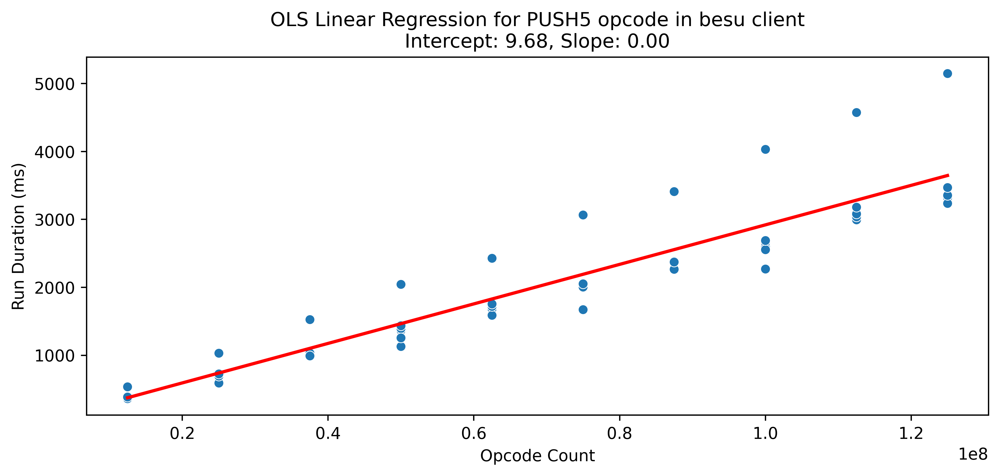


## geth


```python
                            OLS Regression Results                            
==============================================================================
Dep. Variable:        run_duration_ms   R-squared:                       0.998
Model:                            OLS   Adj. R-squared:                  0.998
Method:                 Least Squares   F-statistic:                 2.449e+04
Date:                Mon, 22 Dec 2025   Prob (F-statistic):           3.32e-71
Time:                        12:03:48   Log-Likelihood:                -262.36
No. Observations:                  54   AIC:                             528.7
Df Residuals:                      52   BIC:                             532.7
Df Model:                           1                                         
Covariance Type:            nonrobust                                         
==============================================================================
                 coef    std err          t      P>|t|      [0.025      0.975]
------------------------------------------------------------------------------
const         28.7756      9.391      3.064      0.003       9.931      47.620
opcount      1.91e-05   1.22e-07    156.486      0.000    1.89e-05    1.93e-05
==============================================================================
Omnibus:                       32.222   Durbin-Watson:                   2.054
Prob(Omnibus):                  0.000   Jarque-Bera (JB):              180.268
Skew:                           1.256   Prob(JB):                     7.17e-40
Kurtosis:                      11.591   Cond. No.                     1.67e+08
==============================================================================

Notes:
[1] Standard Errors assume that the covariance matrix of the errors is correctly specified.
[2] The condition number is large, 1.67e+08. This might indicate that there are
strong multicollinearity or other numerical problems.
```


# PUSH6

## nethermind


```python
                            OLS Regression Results                            
==============================================================================
Dep. Variable:        run_duration_ms   R-squared:                       0.995
Model:                            OLS   Adj. R-squared:                  0.995
Method:                 Least Squares   F-statistic:                     9990.
Date:                Mon, 22 Dec 2025   Prob (F-statistic):           4.09e-61
Time:                        12:03:48   Log-Likelihood:                -250.21
No. Observations:                  54   AIC:                             504.4
Df Residuals:                      52   BIC:                             508.4
Df Model:                           1                                         
Covariance Type:            nonrobust                                         
==============================================================================
                 coef    std err          t      P>|t|      [0.025      0.975]
------------------------------------------------------------------------------
const         45.9341      7.498      6.126      0.000      30.888      60.980
opcount     9.742e-06   9.75e-08     99.949      0.000    9.55e-06    9.94e-06
==============================================================================
Omnibus:                       15.353   Durbin-Watson:                   1.965
Prob(Omnibus):                  0.000   Jarque-Bera (JB):               17.391
Skew:                          -1.192   Prob(JB):                     0.000167
Kurtosis:                       4.430   Cond. No.                     1.67e+08
==============================================================================

Notes:
[1] Standard Errors assume that the covariance matrix of the errors is correctly specified.
[2] The condition number is large, 1.67e+08. This might indicate that there are
strong multicollinearity or other numerical problems.
```


## reth


```python
                            OLS Regression Results                            
==============================================================================
Dep. Variable:        run_duration_ms   R-squared:                       0.993
Model:                            OLS   Adj. R-squared:                  0.992
Method:                 Least Squares   F-statistic:                     6967.
Date:                Mon, 22 Dec 2025   Prob (F-statistic):           4.53e-57
Time:                        12:03:48   Log-Likelihood:                -212.10
No. Observations:                  54   AIC:                             428.2
Df Residuals:                      52   BIC:                             432.2
Df Model:                           1                                         
Covariance Type:            nonrobust                                         
==============================================================================
                 coef    std err          t      P>|t|      [0.025      0.975]
------------------------------------------------------------------------------
const         37.0795      3.702     10.015      0.000      29.650      44.509
opcount     4.017e-06   4.81e-08     83.469      0.000    3.92e-06    4.11e-06
==============================================================================
Omnibus:                        0.854   Durbin-Watson:                   1.702
Prob(Omnibus):                  0.652   Jarque-Bera (JB):                0.260
Skew:                           0.010   Prob(JB):                        0.878
Kurtosis:                       3.339   Cond. No.                     1.67e+08
==============================================================================

Notes:
[1] Standard Errors assume that the covariance matrix of the errors is correctly specified.
[2] The condition number is large, 1.67e+08. This might indicate that there are
strong multicollinearity or other numerical problems.
```


## besu


```python
                            OLS Regression Results                            
==============================================================================
Dep. Variable:        run_duration_ms   R-squared:                       0.855
Model:                            OLS   Adj. R-squared:                  0.853
Method:                 Least Squares   F-statistic:                     307.4
Date:                Mon, 22 Dec 2025   Prob (F-statistic):           1.76e-23
Time:                        12:03:48   Log-Likelihood:                -403.31
No. Observations:                  54   AIC:                             810.6
Df Residuals:                      52   BIC:                             814.6
Df Model:                           1                                         
Covariance Type:            nonrobust                                         
==============================================================================
                 coef    std err          t      P>|t|      [0.025      0.975]
------------------------------------------------------------------------------
const         11.1043    127.724      0.087      0.931    -245.192     267.401
opcount     2.911e-05   1.66e-06     17.533      0.000    2.58e-05    3.24e-05
==============================================================================
Omnibus:                       28.989   Durbin-Watson:                   0.795
Prob(Omnibus):                  0.000   Jarque-Bera (JB):               50.703
Skew:                           1.796   Prob(JB):                     9.77e-12
Kurtosis:                       6.104   Cond. No.                     1.67e+08
==============================================================================

Notes:
[1] Standard Errors assume that the covariance matrix of the errors is correctly specified.
[2] The condition number is large, 1.67e+08. This might indicate that there are
strong multicollinearity or other numerical problems.
```

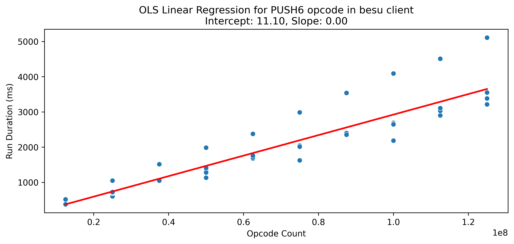


## geth


```python
                            OLS Regression Results                            
==============================================================================
Dep. Variable:        run_duration_ms   R-squared:                       0.999
Model:                            OLS   Adj. R-squared:                  0.999
Method:                 Least Squares   F-statistic:                 4.796e+04
Date:                Mon, 22 Dec 2025   Prob (F-statistic):           8.78e-79
Time:                        12:03:48   Log-Likelihood:                -245.25
No. Observations:                  54   AIC:                             494.5
Df Residuals:                      52   BIC:                             498.5
Df Model:                           1                                         
Covariance Type:            nonrobust                                         
==============================================================================
                 coef    std err          t      P>|t|      [0.025      0.975]
------------------------------------------------------------------------------
const         34.0412      6.840      4.976      0.000      20.315      47.768
opcount     1.947e-05   8.89e-08    218.991      0.000    1.93e-05    1.97e-05
==============================================================================
Omnibus:                        1.307   Durbin-Watson:                   1.849
Prob(Omnibus):                  0.520   Jarque-Bera (JB):                0.656
Skew:                          -0.223   Prob(JB):                        0.721
Kurtosis:                       3.305   Cond. No.                     1.67e+08
==============================================================================

Notes:
[1] Standard Errors assume that the covariance matrix of the errors is correctly specified.
[2] The condition number is large, 1.67e+08. This might indicate that there are
strong multicollinearity or other numerical problems.
```


# PUSH7

## nethermind


```python
                            OLS Regression Results                            
==============================================================================
Dep. Variable:        run_duration_ms   R-squared:                       0.990
Model:                            OLS   Adj. R-squared:                  0.990
Method:                 Least Squares   F-statistic:                     5055.
Date:                Mon, 22 Dec 2025   Prob (F-statistic):           1.77e-53
Time:                        12:03:48   Log-Likelihood:                -268.05
No. Observations:                  54   AIC:                             540.1
Df Residuals:                      52   BIC:                             544.1
Df Model:                           1                                         
Covariance Type:            nonrobust                                         
==============================================================================
                 coef    std err          t      P>|t|      [0.025      0.975]
------------------------------------------------------------------------------
const         52.9600     10.433      5.076      0.000      32.024      73.896
opcount     9.643e-06   1.36e-07     71.100      0.000    9.37e-06    9.92e-06
==============================================================================
Omnibus:                       16.019   Durbin-Watson:                   2.264
Prob(Omnibus):                  0.000   Jarque-Bera (JB):               20.763
Skew:                          -1.085   Prob(JB):                     3.10e-05
Kurtosis:                       5.127   Cond. No.                     1.67e+08
==============================================================================

Notes:
[1] Standard Errors assume that the covariance matrix of the errors is correctly specified.
[2] The condition number is large, 1.67e+08. This might indicate that there are
strong multicollinearity or other numerical problems.
```

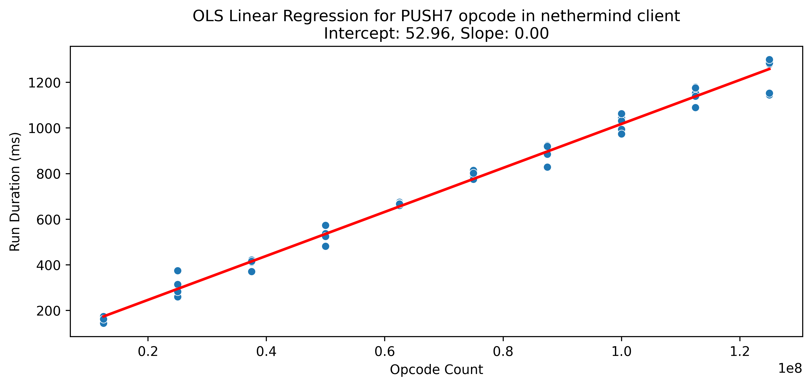


## reth


```python
                            OLS Regression Results                            
==============================================================================
Dep. Variable:        run_duration_ms   R-squared:                       0.991
Model:                            OLS   Adj. R-squared:                  0.991
Method:                 Least Squares   F-statistic:                     5810.
Date:                Mon, 22 Dec 2025   Prob (F-statistic):           4.91e-55
Time:                        12:03:48   Log-Likelihood:                -220.56
No. Observations:                  54   AIC:                             445.1
Df Residuals:                      52   BIC:                             449.1
Df Model:                           1                                         
Covariance Type:            nonrobust                                         
==============================================================================
                 coef    std err          t      P>|t|      [0.025      0.975]
------------------------------------------------------------------------------
const         35.1826      4.330      8.124      0.000      26.493      43.872
opcount     4.291e-06   5.63e-08     76.222      0.000    4.18e-06     4.4e-06
==============================================================================
Omnibus:                        4.409   Durbin-Watson:                   1.422
Prob(Omnibus):                  0.110   Jarque-Bera (JB):                4.291
Skew:                           0.262   Prob(JB):                        0.117
Kurtosis:                       4.278   Cond. No.                     1.67e+08
==============================================================================

Notes:
[1] Standard Errors assume that the covariance matrix of the errors is correctly specified.
[2] The condition number is large, 1.67e+08. This might indicate that there are
strong multicollinearity or other numerical problems.
```


## besu


```python
                            OLS Regression Results                            
==============================================================================
Dep. Variable:        run_duration_ms   R-squared:                       0.851
Model:                            OLS   Adj. R-squared:                  0.848
Method:                 Least Squares   F-statistic:                     296.1
Date:                Mon, 22 Dec 2025   Prob (F-statistic):           4.06e-23
Time:                        12:03:49   Log-Likelihood:                -403.94
No. Observations:                  54   AIC:                             811.9
Df Residuals:                      52   BIC:                             815.9
Df Model:                           1                                         
Covariance Type:            nonrobust                                         
==============================================================================
                 coef    std err          t      P>|t|      [0.025      0.975]
------------------------------------------------------------------------------
const         27.3819    129.230      0.212      0.833    -231.936     286.700
opcount     2.891e-05   1.68e-06     17.207      0.000    2.55e-05    3.23e-05
==============================================================================
Omnibus:                       29.016   Durbin-Watson:                   0.444
Prob(Omnibus):                  0.000   Jarque-Bera (JB):               49.638
Skew:                           1.827   Prob(JB):                     1.66e-11
Kurtosis:                       5.951   Cond. No.                     1.67e+08
==============================================================================

Notes:
[1] Standard Errors assume that the covariance matrix of the errors is correctly specified.
[2] The condition number is large, 1.67e+08. This might indicate that there are
strong multicollinearity or other numerical problems.
```

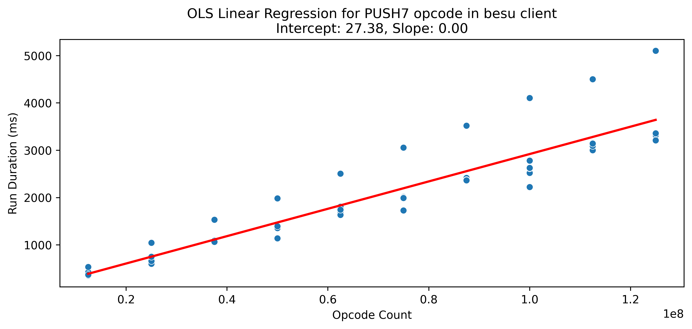


## geth


```python
                            OLS Regression Results                            
==============================================================================
Dep. Variable:        run_duration_ms   R-squared:                       0.988
Model:                            OLS   Adj. R-squared:                  0.988
Method:                 Least Squares   F-statistic:                     4411.
Date:                Mon, 22 Dec 2025   Prob (F-statistic):           5.89e-52
Time:                        12:03:49   Log-Likelihood:                -311.41
No. Observations:                  54   AIC:                             626.8
Df Residuals:                      52   BIC:                             630.8
Df Model:                           1                                         
Covariance Type:            nonrobust                                         
==============================================================================
                 coef    std err          t      P>|t|      [0.025      0.975]
------------------------------------------------------------------------------
const         40.1648     23.289      1.725      0.091      -6.568      86.898
opcount     2.011e-05   3.03e-07     66.416      0.000    1.95e-05    2.07e-05
==============================================================================
Omnibus:                       65.901   Durbin-Watson:                   1.246
Prob(Omnibus):                  0.000   Jarque-Bera (JB):              517.204
Skew:                           3.306   Prob(JB):                    4.90e-113
Kurtosis:                      16.643   Cond. No.                     1.67e+08
==============================================================================

Notes:
[1] Standard Errors assume that the covariance matrix of the errors is correctly specified.
[2] The condition number is large, 1.67e+08. This might indicate that there are
strong multicollinearity or other numerical problems.
```

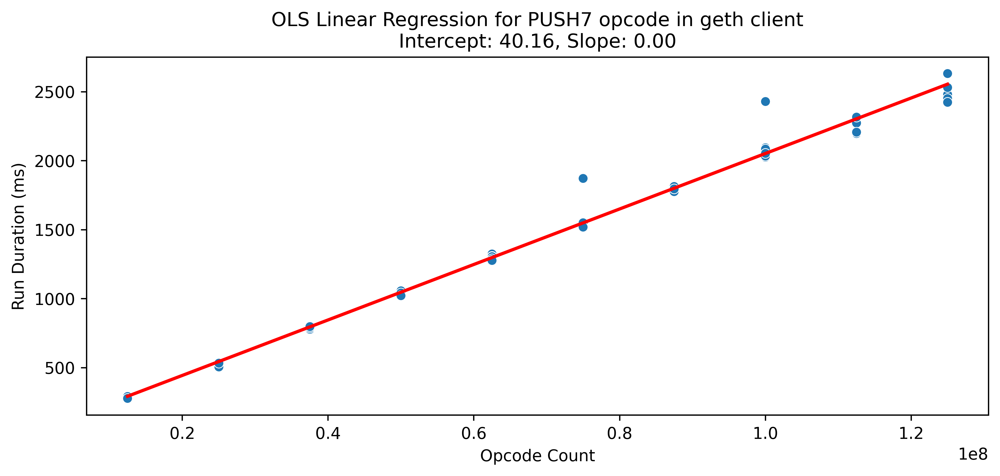


# PUSH8

## nethermind


```python
                            OLS Regression Results                            
==============================================================================
Dep. Variable:        run_duration_ms   R-squared:                       0.947
Model:                            OLS   Adj. R-squared:                  0.946
Method:                 Least Squares   F-statistic:                     932.9
Date:                Mon, 22 Dec 2025   Prob (F-statistic):           6.93e-35
Time:                        12:03:49   Log-Likelihood:                -301.16
No. Observations:                  54   AIC:                             606.3
Df Residuals:                      52   BIC:                             610.3
Df Model:                           1                                         
Covariance Type:            nonrobust                                         
==============================================================================
                 coef    std err          t      P>|t|      [0.025      0.975]
------------------------------------------------------------------------------
const         38.4442     19.264      1.996      0.051      -0.211      77.100
opcount     7.649e-06    2.5e-07     30.543      0.000    7.15e-06    8.15e-06
==============================================================================
Omnibus:                      107.583   Durbin-Watson:                   2.157
Prob(Omnibus):                  0.000   Jarque-Bera (JB):             3720.243
Skew:                           5.985   Prob(JB):                         0.00
Kurtosis:                      41.860   Cond. No.                     1.67e+08
==============================================================================

Notes:
[1] Standard Errors assume that the covariance matrix of the errors is correctly specified.
[2] The condition number is large, 1.67e+08. This might indicate that there are
strong multicollinearity or other numerical problems.
```

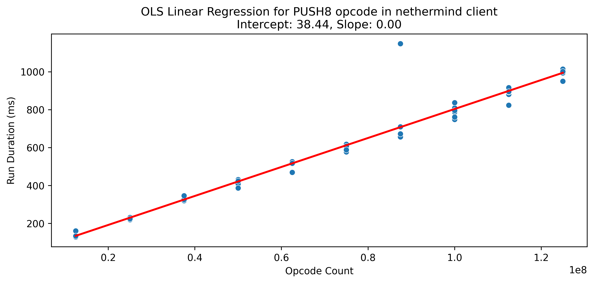


## reth


```python
                            OLS Regression Results                            
==============================================================================
Dep. Variable:        run_duration_ms   R-squared:                       0.989
Model:                            OLS   Adj. R-squared:                  0.989
Method:                 Least Squares   F-statistic:                     4786.
Date:                Mon, 22 Dec 2025   Prob (F-statistic):           7.22e-53
Time:                        12:03:49   Log-Likelihood:                -223.87
No. Observations:                  54   AIC:                             451.7
Df Residuals:                      52   BIC:                             455.7
Df Model:                           1                                         
Covariance Type:            nonrobust                                         
==============================================================================
                 coef    std err          t      P>|t|      [0.025      0.975]
------------------------------------------------------------------------------
const         33.8297      4.604      7.348      0.000      24.591      43.069
opcount     4.141e-06   5.99e-08     69.181      0.000    4.02e-06    4.26e-06
==============================================================================
Omnibus:                       29.459   Durbin-Watson:                   1.658
Prob(Omnibus):                  0.000   Jarque-Bera (JB):               85.838
Skew:                           1.441   Prob(JB):                     2.29e-19
Kurtosis:                       8.462   Cond. No.                     1.67e+08
==============================================================================

Notes:
[1] Standard Errors assume that the covariance matrix of the errors is correctly specified.
[2] The condition number is large, 1.67e+08. This might indicate that there are
strong multicollinearity or other numerical problems.
```

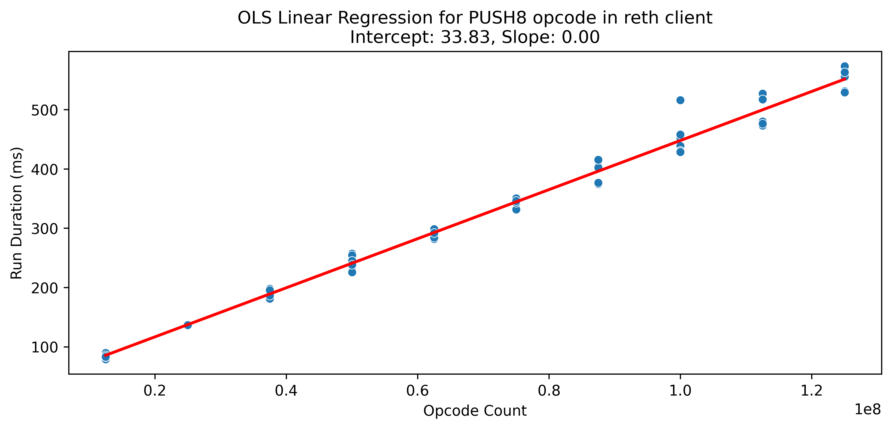


## besu


```python
                            OLS Regression Results                            
==============================================================================
Dep. Variable:        run_duration_ms   R-squared:                       0.853
Model:                            OLS   Adj. R-squared:                  0.851
Method:                 Least Squares   F-statistic:                     302.6
Date:                Mon, 22 Dec 2025   Prob (F-statistic):           2.50e-23
Time:                        12:03:49   Log-Likelihood:                -403.76
No. Observations:                  54   AIC:                             811.5
Df Residuals:                      52   BIC:                             815.5
Df Model:                           1                                         
Covariance Type:            nonrobust                                         
==============================================================================
                 coef    std err          t      P>|t|      [0.025      0.975]
------------------------------------------------------------------------------
const         27.0413    128.792      0.210      0.835    -231.399     285.482
opcount     2.912e-05   1.67e-06     17.395      0.000    2.58e-05    3.25e-05
==============================================================================
Omnibus:                       23.466   Durbin-Watson:                   0.842
Prob(Omnibus):                  0.000   Jarque-Bera (JB):               33.753
Skew:                           1.586   Prob(JB):                     4.68e-08
Kurtosis:                       5.223   Cond. No.                     1.67e+08
==============================================================================

Notes:
[1] Standard Errors assume that the covariance matrix of the errors is correctly specified.
[2] The condition number is large, 1.67e+08. This might indicate that there are
strong multicollinearity or other numerical problems.
```

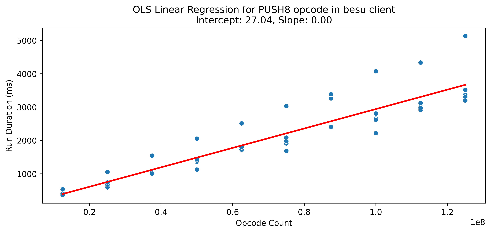


## geth


```python
                            OLS Regression Results                            
==============================================================================
Dep. Variable:        run_duration_ms   R-squared:                       0.993
Model:                            OLS   Adj. R-squared:                  0.993
Method:                 Least Squares   F-statistic:                     7219.
Date:                Mon, 22 Dec 2025   Prob (F-statistic):           1.81e-57
Time:                        12:03:49   Log-Likelihood:                -296.13
No. Observations:                  54   AIC:                             596.3
Df Residuals:                      52   BIC:                             600.2
Df Model:                           1                                         
Covariance Type:            nonrobust                                         
==============================================================================
                 coef    std err          t      P>|t|      [0.025      0.975]
------------------------------------------------------------------------------
const         39.3647     17.548      2.243      0.029       4.151      74.578
opcount     1.938e-05   2.28e-07     84.965      0.000    1.89e-05    1.98e-05
==============================================================================
Omnibus:                       97.311   Durbin-Watson:                   1.973
Prob(Omnibus):                  0.000   Jarque-Bera (JB):             2505.659
Skew:                           5.163   Prob(JB):                         0.00
Kurtosis:                      34.733   Cond. No.                     1.67e+08
==============================================================================

Notes:
[1] Standard Errors assume that the covariance matrix of the errors is correctly specified.
[2] The condition number is large, 1.67e+08. This might indicate that there are
strong multicollinearity or other numerical problems.
```

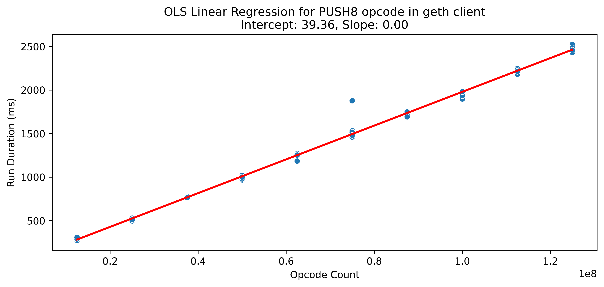


# PUSH9

## nethermind


```python
                            OLS Regression Results                            
==============================================================================
Dep. Variable:        run_duration_ms   R-squared:                       0.993
Model:                            OLS   Adj. R-squared:                  0.993
Method:                 Least Squares   F-statistic:                     7933.
Date:                Mon, 22 Dec 2025   Prob (F-statistic):           1.59e-58
Time:                        12:03:49   Log-Likelihood:                -257.51
No. Observations:                  54   AIC:                             519.0
Df Residuals:                      52   BIC:                             523.0
Df Model:                           1                                         
Covariance Type:            nonrobust                                         
==============================================================================
                 coef    std err          t      P>|t|      [0.025      0.975]
------------------------------------------------------------------------------
const         34.9249      8.583      4.069      0.000      17.701      52.149
opcount     9.939e-06   1.12e-07     89.068      0.000    9.71e-06    1.02e-05
==============================================================================
Omnibus:                       26.637   Durbin-Watson:                   1.691
Prob(Omnibus):                  0.000   Jarque-Bera (JB):               43.619
Skew:                          -1.682   Prob(JB):                     3.37e-10
Kurtosis:                       5.842   Cond. No.                     1.67e+08
==============================================================================

Notes:
[1] Standard Errors assume that the covariance matrix of the errors is correctly specified.
[2] The condition number is large, 1.67e+08. This might indicate that there are
strong multicollinearity or other numerical problems.
```

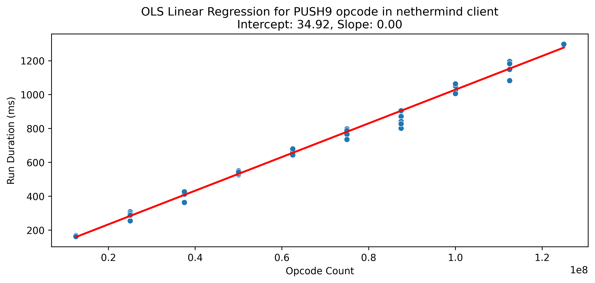


## reth


```python
                            OLS Regression Results                            
==============================================================================
Dep. Variable:        run_duration_ms   R-squared:                       0.995
Model:                            OLS   Adj. R-squared:                  0.994
Method:                 Least Squares   F-statistic:                     9517.
Date:                Mon, 22 Dec 2025   Prob (F-statistic):           1.44e-60
Time:                        12:03:50   Log-Likelihood:                -203.23
No. Observations:                  54   AIC:                             410.5
Df Residuals:                      52   BIC:                             414.4
Df Model:                           1                                         
Covariance Type:            nonrobust                                         
==============================================================================
                 coef    std err          t      P>|t|      [0.025      0.975]
------------------------------------------------------------------------------
const         41.6781      3.141     13.267      0.000      35.374      47.982
opcount     3.984e-06   4.08e-08     97.554      0.000     3.9e-06    4.07e-06
==============================================================================
Omnibus:                        4.182   Durbin-Watson:                   2.107
Prob(Omnibus):                  0.124   Jarque-Bera (JB):                2.325
Skew:                           0.261   Prob(JB):                        0.313
Kurtosis:                       2.128   Cond. No.                     1.67e+08
==============================================================================

Notes:
[1] Standard Errors assume that the covariance matrix of the errors is correctly specified.
[2] The condition number is large, 1.67e+08. This might indicate that there are
strong multicollinearity or other numerical problems.
```


## besu


```python
                            OLS Regression Results                            
==============================================================================
Dep. Variable:        run_duration_ms   R-squared:                       0.857
Model:                            OLS   Adj. R-squared:                  0.854
Method:                 Least Squares   F-statistic:                     312.0
Date:                Mon, 22 Dec 2025   Prob (F-statistic):           1.27e-23
Time:                        12:03:50   Log-Likelihood:                -403.51
No. Observations:                  54   AIC:                             811.0
Df Residuals:                      52   BIC:                             815.0
Df Model:                           1                                         
Covariance Type:            nonrobust                                         
==============================================================================
                 coef    std err          t      P>|t|      [0.025      0.975]
------------------------------------------------------------------------------
const         -0.0315    128.206     -0.000      1.000    -257.296     257.233
opcount     2.944e-05   1.67e-06     17.662      0.000    2.61e-05    3.28e-05
==============================================================================
Omnibus:                       27.047   Durbin-Watson:                   0.508
Prob(Omnibus):                  0.000   Jarque-Bera (JB):               44.382
Skew:                           1.714   Prob(JB):                     2.30e-10
Kurtosis:                       5.825   Cond. No.                     1.67e+08
==============================================================================

Notes:
[1] Standard Errors assume that the covariance matrix of the errors is correctly specified.
[2] The condition number is large, 1.67e+08. This might indicate that there are
strong multicollinearity or other numerical problems.
```

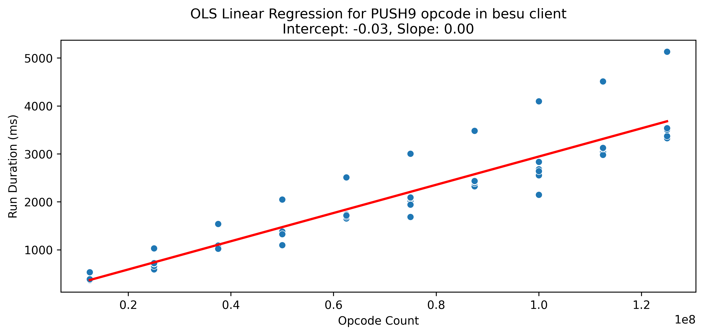


## geth


```python
                            OLS Regression Results                            
==============================================================================
Dep. Variable:        run_duration_ms   R-squared:                       0.900
Model:                            OLS   Adj. R-squared:                  0.898
Method:                 Least Squares   F-statistic:                     466.0
Date:                Mon, 22 Dec 2025   Prob (F-statistic):           1.28e-27
Time:                        12:03:50   Log-Likelihood:                -369.79
No. Observations:                  54   AIC:                             743.6
Df Residuals:                      52   BIC:                             747.6
Df Model:                           1                                         
Covariance Type:            nonrobust                                         
==============================================================================
                 coef    std err          t      P>|t|      [0.025      0.975]
------------------------------------------------------------------------------
const         57.5705     68.657      0.839      0.406     -80.199     195.340
opcount     1.927e-05   8.93e-07     21.587      0.000    1.75e-05    2.11e-05
==============================================================================
Omnibus:                      119.354   Durbin-Watson:                   2.069
Prob(Omnibus):                  0.000   Jarque-Bera (JB):             5670.150
Skew:                           7.052   Prob(JB):                         0.00
Kurtosis:                      51.178   Cond. No.                     1.67e+08
==============================================================================

Notes:
[1] Standard Errors assume that the covariance matrix of the errors is correctly specified.
[2] The condition number is large, 1.67e+08. This might indicate that there are
strong multicollinearity or other numerical problems.
```

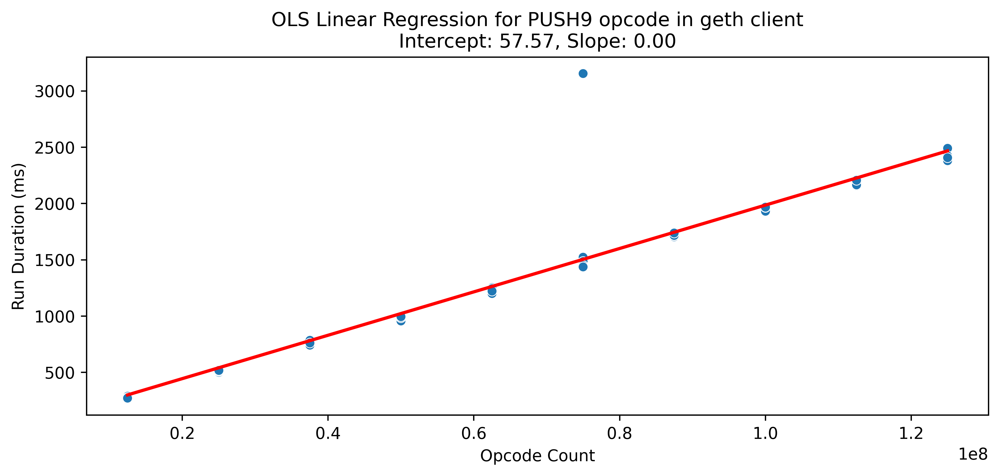


# PUSH10

## nethermind


```python
                            OLS Regression Results                            
==============================================================================
Dep. Variable:        run_duration_ms   R-squared:                       0.991
Model:                            OLS   Adj. R-squared:                  0.991
Method:                 Least Squares   F-statistic:                     5942.
Date:                Mon, 22 Dec 2025   Prob (F-statistic):           2.75e-55
Time:                        12:03:50   Log-Likelihood:                -264.66
No. Observations:                  54   AIC:                             533.3
Df Residuals:                      52   BIC:                             537.3
Df Model:                           1                                         
Covariance Type:            nonrobust                                         
==============================================================================
                 coef    std err          t      P>|t|      [0.025      0.975]
------------------------------------------------------------------------------
const         50.1004      9.800      5.112      0.000      30.436      69.765
opcount      9.82e-06   1.27e-07     77.085      0.000    9.56e-06    1.01e-05
==============================================================================
Omnibus:                       15.350   Durbin-Watson:                   1.773
Prob(Omnibus):                  0.000   Jarque-Bera (JB):               35.746
Skew:                           0.688   Prob(JB):                     1.73e-08
Kurtosis:                       6.741   Cond. No.                     1.67e+08
==============================================================================

Notes:
[1] Standard Errors assume that the covariance matrix of the errors is correctly specified.
[2] The condition number is large, 1.67e+08. This might indicate that there are
strong multicollinearity or other numerical problems.
```

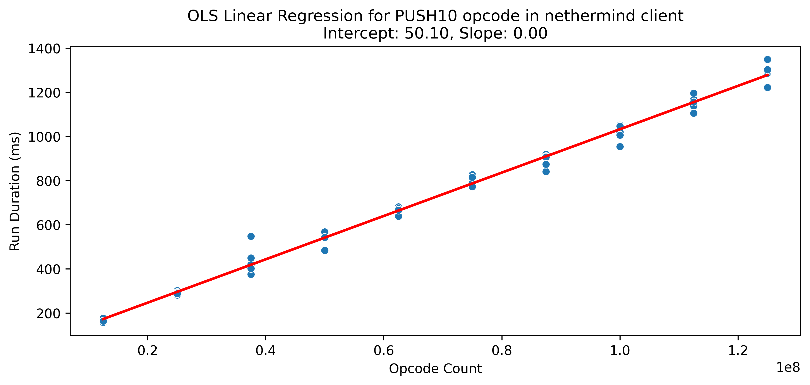


## reth


```python
                            OLS Regression Results                            
==============================================================================
Dep. Variable:        run_duration_ms   R-squared:                       0.982
Model:                            OLS   Adj. R-squared:                  0.982
Method:                 Least Squares   F-statistic:                     2907.
Date:                Mon, 22 Dec 2025   Prob (F-statistic):           2.57e-47
Time:                        12:03:50   Log-Likelihood:                -237.99
No. Observations:                  54   AIC:                             480.0
Df Residuals:                      52   BIC:                             484.0
Df Model:                           1                                         
Covariance Type:            nonrobust                                         
==============================================================================
                 coef    std err          t      P>|t|      [0.025      0.975]
------------------------------------------------------------------------------
const         37.4427      5.980      6.262      0.000      25.444      49.442
opcount     4.192e-06   7.77e-08     53.920      0.000    4.04e-06    4.35e-06
==============================================================================
Omnibus:                       34.077   Durbin-Watson:                   1.470
Prob(Omnibus):                  0.000   Jarque-Bera (JB):              107.316
Skew:                           1.685   Prob(JB):                     4.97e-24
Kurtosis:                       9.028   Cond. No.                     1.67e+08
==============================================================================

Notes:
[1] Standard Errors assume that the covariance matrix of the errors is correctly specified.
[2] The condition number is large, 1.67e+08. This might indicate that there are
strong multicollinearity or other numerical problems.
```


## besu


```python
                            OLS Regression Results                            
==============================================================================
Dep. Variable:        run_duration_ms   R-squared:                       0.857
Model:                            OLS   Adj. R-squared:                  0.854
Method:                 Least Squares   F-statistic:                     311.9
Date:                Mon, 22 Dec 2025   Prob (F-statistic):           1.27e-23
Time:                        12:03:50   Log-Likelihood:                -403.07
No. Observations:                  54   AIC:                             810.1
Df Residuals:                      52   BIC:                             814.1
Df Model:                           1                                         
Covariance Type:            nonrobust                                         
==============================================================================
                 coef    std err          t      P>|t|      [0.025      0.975]
------------------------------------------------------------------------------
const         14.4763    127.161      0.114      0.910    -240.690     269.643
opcount      2.92e-05   1.65e-06     17.661      0.000    2.59e-05    3.25e-05
==============================================================================
Omnibus:                       28.155   Durbin-Watson:                   0.324
Prob(Omnibus):                  0.000   Jarque-Bera (JB):               47.540
Skew:                           1.771   Prob(JB):                     4.75e-11
Kurtosis:                       5.931   Cond. No.                     1.67e+08
==============================================================================

Notes:
[1] Standard Errors assume that the covariance matrix of the errors is correctly specified.
[2] The condition number is large, 1.67e+08. This might indicate that there are
strong multicollinearity or other numerical problems.
```


## geth


```python
                            OLS Regression Results                            
==============================================================================
Dep. Variable:        run_duration_ms   R-squared:                       0.997
Model:                            OLS   Adj. R-squared:                  0.997
Method:                 Least Squares   F-statistic:                 1.826e+04
Date:                Mon, 22 Dec 2025   Prob (F-statistic):           6.71e-68
Time:                        12:03:50   Log-Likelihood:                -270.78
No. Observations:                  54   AIC:                             545.6
Df Residuals:                      52   BIC:                             549.5
Df Model:                           1                                         
Covariance Type:            nonrobust                                         
==============================================================================
                 coef    std err          t      P>|t|      [0.025      0.975]
------------------------------------------------------------------------------
const         28.8919     10.974      2.633      0.011       6.871      50.913
opcount     1.928e-05   1.43e-07    135.135      0.000     1.9e-05    1.96e-05
==============================================================================
Omnibus:                       50.864   Durbin-Watson:                   1.397
Prob(Omnibus):                  0.000   Jarque-Bera (JB):              656.948
Skew:                           1.942   Prob(JB):                    2.22e-143
Kurtosis:                      19.640   Cond. No.                     1.67e+08
==============================================================================

Notes:
[1] Standard Errors assume that the covariance matrix of the errors is correctly specified.
[2] The condition number is large, 1.67e+08. This might indicate that there are
strong multicollinearity or other numerical problems.
```


# PUSH11

## nethermind


```python
                            OLS Regression Results                            
==============================================================================
Dep. Variable:        run_duration_ms   R-squared:                       0.995
Model:                            OLS   Adj. R-squared:                  0.994
Method:                 Least Squares   F-statistic:                     9547.
Date:                Mon, 22 Dec 2025   Prob (F-statistic):           1.32e-60
Time:                        12:03:50   Log-Likelihood:                -253.50
No. Observations:                  54   AIC:                             511.0
Df Residuals:                      52   BIC:                             515.0
Df Model:                           1                                         
Covariance Type:            nonrobust                                         
==============================================================================
                 coef    std err          t      P>|t|      [0.025      0.975]
------------------------------------------------------------------------------
const         29.4585      7.970      3.696      0.001      13.466      45.451
opcount     1.012e-05   1.04e-07     97.707      0.000    9.92e-06    1.03e-05
==============================================================================
Omnibus:                       30.597   Durbin-Watson:                   1.689
Prob(Omnibus):                  0.000   Jarque-Bera (JB):               90.587
Skew:                          -1.503   Prob(JB):                     2.13e-20
Kurtosis:                       8.588   Cond. No.                     1.67e+08
==============================================================================

Notes:
[1] Standard Errors assume that the covariance matrix of the errors is correctly specified.
[2] The condition number is large, 1.67e+08. This might indicate that there are
strong multicollinearity or other numerical problems.
```

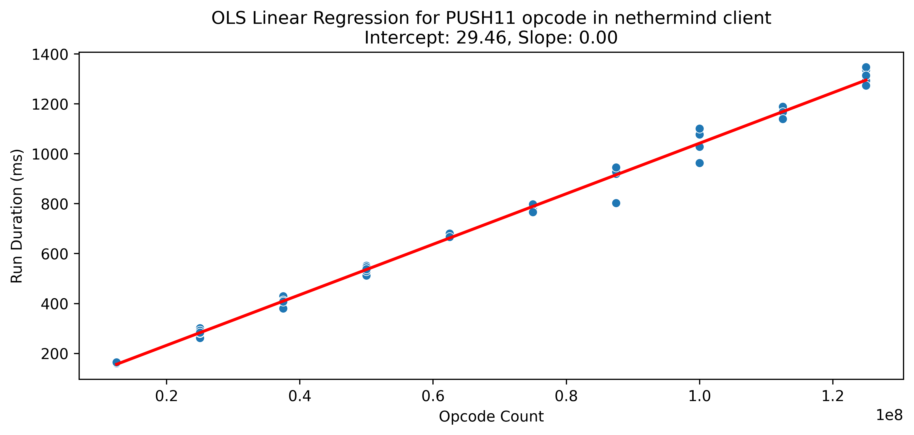


## reth


```python
                            OLS Regression Results                            
==============================================================================
Dep. Variable:        run_duration_ms   R-squared:                       0.988
Model:                            OLS   Adj. R-squared:                  0.987
Method:                 Least Squares   F-statistic:                     4155.
Date:                Mon, 22 Dec 2025   Prob (F-statistic):           2.74e-51
Time:                        12:03:51   Log-Likelihood:                -227.71
No. Observations:                  54   AIC:                             459.4
Df Residuals:                      52   BIC:                             463.4
Df Model:                           1                                         
Covariance Type:            nonrobust                                         
==============================================================================
                 coef    std err          t      P>|t|      [0.025      0.975]
------------------------------------------------------------------------------
const         34.7546      4.943      7.030      0.000      24.835      44.674
opcount     4.142e-06   6.43e-08     64.458      0.000    4.01e-06    4.27e-06
==============================================================================
Omnibus:                        4.446   Durbin-Watson:                   1.701
Prob(Omnibus):                  0.108   Jarque-Bera (JB):                5.195
Skew:                           0.032   Prob(JB):                       0.0745
Kurtosis:                       4.518   Cond. No.                     1.67e+08
==============================================================================

Notes:
[1] Standard Errors assume that the covariance matrix of the errors is correctly specified.
[2] The condition number is large, 1.67e+08. This might indicate that there are
strong multicollinearity or other numerical problems.
```

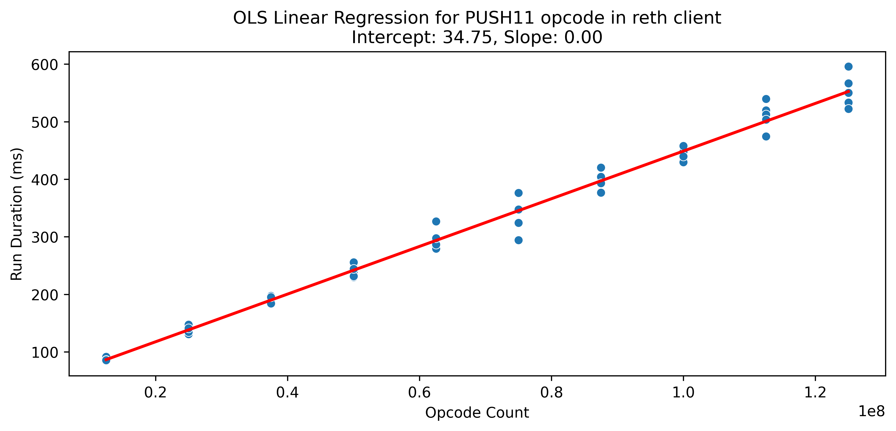


## besu


```python
                            OLS Regression Results                            
==============================================================================
Dep. Variable:        run_duration_ms   R-squared:                       0.870
Model:                            OLS   Adj. R-squared:                  0.868
Method:                 Least Squares   F-statistic:                     349.4
Date:                Mon, 22 Dec 2025   Prob (F-statistic):           9.84e-25
Time:                        12:03:51   Log-Likelihood:                -399.94
No. Observations:                  54   AIC:                             803.9
Df Residuals:                      52   BIC:                             807.9
Df Model:                           1                                         
Covariance Type:            nonrobust                                         
==============================================================================
                 coef    std err          t      P>|t|      [0.025      0.975]
------------------------------------------------------------------------------
const         19.0994    120.004      0.159      0.874    -221.706     259.905
opcount     2.916e-05   1.56e-06     18.693      0.000     2.6e-05    3.23e-05
==============================================================================
Omnibus:                       28.937   Durbin-Watson:                   0.484
Prob(Omnibus):                  0.000   Jarque-Bera (JB):               51.029
Skew:                           1.782   Prob(JB):                     8.30e-12
Kurtosis:                       6.160   Cond. No.                     1.67e+08
==============================================================================

Notes:
[1] Standard Errors assume that the covariance matrix of the errors is correctly specified.
[2] The condition number is large, 1.67e+08. This might indicate that there are
strong multicollinearity or other numerical problems.
```


## geth


```python
                            OLS Regression Results                            
==============================================================================
Dep. Variable:        run_duration_ms   R-squared:                       0.998
Model:                            OLS   Adj. R-squared:                  0.998
Method:                 Least Squares   F-statistic:                 2.169e+04
Date:                Mon, 22 Dec 2025   Prob (F-statistic):           7.74e-70
Time:                        12:03:51   Log-Likelihood:                -266.11
No. Observations:                  54   AIC:                             536.2
Df Residuals:                      52   BIC:                             540.2
Df Model:                           1                                         
Covariance Type:            nonrobust                                         
==============================================================================
                 coef    std err          t      P>|t|      [0.025      0.975]
------------------------------------------------------------------------------
const         30.6949     10.066      3.049      0.004      10.495      50.895
opcount     1.927e-05   1.31e-07    147.275      0.000     1.9e-05    1.95e-05
==============================================================================
Omnibus:                       28.633   Durbin-Watson:                   2.169
Prob(Omnibus):                  0.000   Jarque-Bera (JB):               90.788
Skew:                          -1.343   Prob(JB):                     1.93e-20
Kurtosis:                       8.756   Cond. No.                     1.67e+08
==============================================================================

Notes:
[1] Standard Errors assume that the covariance matrix of the errors is correctly specified.
[2] The condition number is large, 1.67e+08. This might indicate that there are
strong multicollinearity or other numerical problems.
```


# PUSH12

## nethermind


```python
                            OLS Regression Results                            
==============================================================================
Dep. Variable:        run_duration_ms   R-squared:                       0.990
Model:                            OLS   Adj. R-squared:                  0.990
Method:                 Least Squares   F-statistic:                     5227.
Date:                Mon, 22 Dec 2025   Prob (F-statistic):           7.49e-54
Time:                        12:03:51   Log-Likelihood:                -268.04
No. Observations:                  54   AIC:                             540.1
Df Residuals:                      52   BIC:                             544.1
Df Model:                           1                                         
Covariance Type:            nonrobust                                         
==============================================================================
                 coef    std err          t      P>|t|      [0.025      0.975]
------------------------------------------------------------------------------
const         35.8717     10.433      3.438      0.001      14.937      56.806
opcount     9.805e-06   1.36e-07     72.296      0.000    9.53e-06    1.01e-05
==============================================================================
Omnibus:                        7.135   Durbin-Watson:                   2.405
Prob(Omnibus):                  0.028   Jarque-Bera (JB):                8.902
Skew:                          -0.413   Prob(JB):                       0.0117
Kurtosis:                       4.810   Cond. No.                     1.67e+08
==============================================================================

Notes:
[1] Standard Errors assume that the covariance matrix of the errors is correctly specified.
[2] The condition number is large, 1.67e+08. This might indicate that there are
strong multicollinearity or other numerical problems.
```

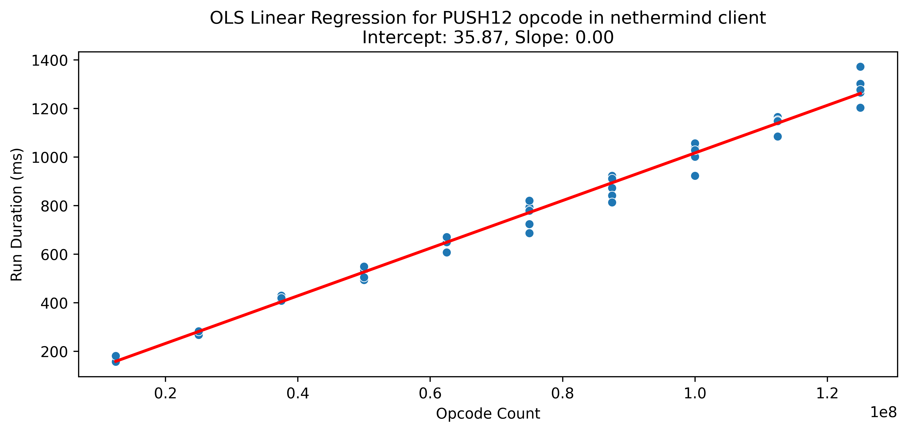


## reth


```python
                            OLS Regression Results                            
==============================================================================
Dep. Variable:        run_duration_ms   R-squared:                       0.994
Model:                            OLS   Adj. R-squared:                  0.994
Method:                 Least Squares   F-statistic:                     9098.
Date:                Mon, 22 Dec 2025   Prob (F-statistic):           4.59e-60
Time:                        12:03:51   Log-Likelihood:                -205.98
No. Observations:                  54   AIC:                             416.0
Df Residuals:                      52   BIC:                             419.9
Df Model:                           1                                         
Covariance Type:            nonrobust                                         
==============================================================================
                 coef    std err          t      P>|t|      [0.025      0.975]
------------------------------------------------------------------------------
const         37.2844      3.306     11.278      0.000      30.651      43.918
opcount     4.099e-06    4.3e-08     95.386      0.000    4.01e-06    4.19e-06
==============================================================================
Omnibus:                        5.156   Durbin-Watson:                   1.956
Prob(Omnibus):                  0.076   Jarque-Bera (JB):                4.498
Skew:                          -0.447   Prob(JB):                        0.106
Kurtosis:                       4.096   Cond. No.                     1.67e+08
==============================================================================

Notes:
[1] Standard Errors assume that the covariance matrix of the errors is correctly specified.
[2] The condition number is large, 1.67e+08. This might indicate that there are
strong multicollinearity or other numerical problems.
```

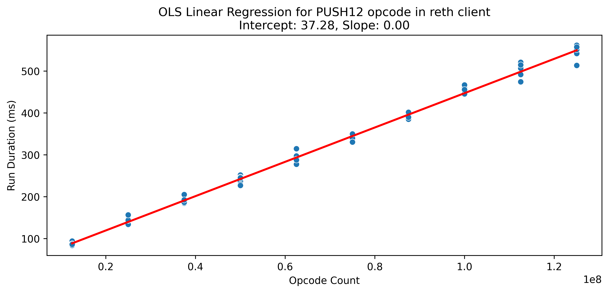


## besu


```python
                            OLS Regression Results                            
==============================================================================
Dep. Variable:        run_duration_ms   R-squared:                       0.854
Model:                            OLS   Adj. R-squared:                  0.851
Method:                 Least Squares   F-statistic:                     303.9
Date:                Mon, 22 Dec 2025   Prob (F-statistic):           2.27e-23
Time:                        12:03:51   Log-Likelihood:                -403.77
No. Observations:                  54   AIC:                             811.5
Df Residuals:                      52   BIC:                             815.5
Df Model:                           1                                         
Covariance Type:            nonrobust                                         
==============================================================================
                 coef    std err          t      P>|t|      [0.025      0.975]
------------------------------------------------------------------------------
const         12.5153    128.805      0.097      0.923    -245.950     270.981
opcount     2.919e-05   1.67e-06     17.433      0.000    2.58e-05    3.26e-05
==============================================================================
Omnibus:                       29.068   Durbin-Watson:                   0.628
Prob(Omnibus):                  0.000   Jarque-Bera (JB):               50.605
Skew:                           1.808   Prob(JB):                     1.03e-11
Kurtosis:                       6.068   Cond. No.                     1.67e+08
==============================================================================

Notes:
[1] Standard Errors assume that the covariance matrix of the errors is correctly specified.
[2] The condition number is large, 1.67e+08. This might indicate that there are
strong multicollinearity or other numerical problems.
```

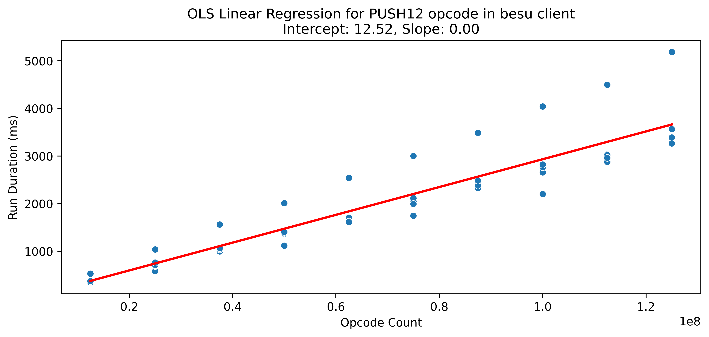


## geth


```python
                            OLS Regression Results                            
==============================================================================
Dep. Variable:        run_duration_ms   R-squared:                       0.985
Model:                            OLS   Adj. R-squared:                  0.985
Method:                 Least Squares   F-statistic:                     3388.
Date:                Mon, 22 Dec 2025   Prob (F-statistic):           5.12e-49
Time:                        12:03:51   Log-Likelihood:                -316.42
No. Observations:                  54   AIC:                             636.8
Df Residuals:                      52   BIC:                             640.8
Df Model:                           1                                         
Covariance Type:            nonrobust                                         
==============================================================================
                 coef    std err          t      P>|t|      [0.025      0.975]
------------------------------------------------------------------------------
const         31.9279     25.552      1.250      0.217     -19.346      83.202
opcount     1.934e-05   3.32e-07     58.209      0.000    1.87e-05       2e-05
==============================================================================
Omnibus:                       94.038   Durbin-Watson:                   2.263
Prob(Omnibus):                  0.000   Jarque-Bera (JB):             1802.818
Skew:                           5.082   Prob(JB):                         0.00
Kurtosis:                      29.418   Cond. No.                     1.67e+08
==============================================================================

Notes:
[1] Standard Errors assume that the covariance matrix of the errors is correctly specified.
[2] The condition number is large, 1.67e+08. This might indicate that there are
strong multicollinearity or other numerical problems.
```


# PUSH13

## nethermind


```python
                            OLS Regression Results                            
==============================================================================
Dep. Variable:        run_duration_ms   R-squared:                       0.989
Model:                            OLS   Adj. R-squared:                  0.988
Method:                 Least Squares   F-statistic:                     4546.
Date:                Mon, 22 Dec 2025   Prob (F-statistic):           2.71e-52
Time:                        12:03:52   Log-Likelihood:                -271.69
No. Observations:                  54   AIC:                             547.4
Df Residuals:                      52   BIC:                             551.4
Df Model:                           1                                         
Covariance Type:            nonrobust                                         
==============================================================================
                 coef    std err          t      P>|t|      [0.025      0.975]
------------------------------------------------------------------------------
const         45.0497     11.161      4.036      0.000      22.653      67.447
opcount     9.783e-06   1.45e-07     67.426      0.000    9.49e-06    1.01e-05
==============================================================================
Omnibus:                        2.941   Durbin-Watson:                   2.327
Prob(Omnibus):                  0.230   Jarque-Bera (JB):                2.040
Skew:                           0.300   Prob(JB):                        0.361
Kurtosis:                       3.740   Cond. No.                     1.67e+08
==============================================================================

Notes:
[1] Standard Errors assume that the covariance matrix of the errors is correctly specified.
[2] The condition number is large, 1.67e+08. This might indicate that there are
strong multicollinearity or other numerical problems.
```


## reth


```python
                            OLS Regression Results                            
==============================================================================
Dep. Variable:        run_duration_ms   R-squared:                       0.987
Model:                            OLS   Adj. R-squared:                  0.986
Method:                 Least Squares   F-statistic:                     3872.
Date:                Mon, 22 Dec 2025   Prob (F-statistic):           1.67e-50
Time:                        12:03:52   Log-Likelihood:                -231.22
No. Observations:                  54   AIC:                             466.4
Df Residuals:                      52   BIC:                             470.4
Df Model:                           1                                         
Covariance Type:            nonrobust                                         
==============================================================================
                 coef    std err          t      P>|t|      [0.025      0.975]
------------------------------------------------------------------------------
const         32.6916      5.275      6.197      0.000      22.107      43.277
opcount     4.267e-06   6.86e-08     62.229      0.000    4.13e-06     4.4e-06
==============================================================================
Omnibus:                        0.356   Durbin-Watson:                   1.344
Prob(Omnibus):                  0.837   Jarque-Bera (JB):                0.524
Skew:                           0.137   Prob(JB):                        0.769
Kurtosis:                       2.603   Cond. No.                     1.67e+08
==============================================================================

Notes:
[1] Standard Errors assume that the covariance matrix of the errors is correctly specified.
[2] The condition number is large, 1.67e+08. This might indicate that there are
strong multicollinearity or other numerical problems.
```


## besu


```python
                            OLS Regression Results                            
==============================================================================
Dep. Variable:        run_duration_ms   R-squared:                       0.860
Model:                            OLS   Adj. R-squared:                  0.858
Method:                 Least Squares   F-statistic:                     320.5
Date:                Mon, 22 Dec 2025   Prob (F-statistic):           6.90e-24
Time:                        12:03:52   Log-Likelihood:                -402.73
No. Observations:                  54   AIC:                             809.5
Df Residuals:                      52   BIC:                             813.4
Df Model:                           1                                         
Covariance Type:            nonrobust                                         
==============================================================================
                 coef    std err          t      P>|t|      [0.025      0.975]
------------------------------------------------------------------------------
const          5.7414    126.355      0.045      0.964    -247.808     259.291
opcount     2.941e-05   1.64e-06     17.904      0.000    2.61e-05    3.27e-05
==============================================================================
Omnibus:                       29.240   Durbin-Watson:                   0.433
Prob(Omnibus):                  0.000   Jarque-Bera (JB):               51.353
Skew:                           1.812   Prob(JB):                     7.06e-12
Kurtosis:                       6.114   Cond. No.                     1.67e+08
==============================================================================

Notes:
[1] Standard Errors assume that the covariance matrix of the errors is correctly specified.
[2] The condition number is large, 1.67e+08. This might indicate that there are
strong multicollinearity or other numerical problems.
```


## geth


```python
                            OLS Regression Results                            
==============================================================================
Dep. Variable:        run_duration_ms   R-squared:                       0.999
Model:                            OLS   Adj. R-squared:                  0.999
Method:                 Least Squares   F-statistic:                 4.654e+04
Date:                Mon, 22 Dec 2025   Prob (F-statistic):           1.92e-78
Time:                        12:03:52   Log-Likelihood:                -245.36
No. Observations:                  54   AIC:                             494.7
Df Residuals:                      52   BIC:                             498.7
Df Model:                           1                                         
Covariance Type:            nonrobust                                         
==============================================================================
                 coef    std err          t      P>|t|      [0.025      0.975]
------------------------------------------------------------------------------
const         41.3663      6.854      6.035      0.000      27.613      55.120
opcount     1.922e-05   8.91e-08    215.730      0.000     1.9e-05    1.94e-05
==============================================================================
Omnibus:                       10.198   Durbin-Watson:                   2.448
Prob(Omnibus):                  0.006   Jarque-Bera (JB):               23.179
Skew:                          -0.292   Prob(JB):                     9.26e-06
Kurtosis:                       6.156   Cond. No.                     1.67e+08
==============================================================================

Notes:
[1] Standard Errors assume that the covariance matrix of the errors is correctly specified.
[2] The condition number is large, 1.67e+08. This might indicate that there are
strong multicollinearity or other numerical problems.
```


# PUSH14

## nethermind


```python
                            OLS Regression Results                            
==============================================================================
Dep. Variable:        run_duration_ms   R-squared:                       0.995
Model:                            OLS   Adj. R-squared:                  0.995
Method:                 Least Squares   F-statistic:                 1.059e+04
Date:                Mon, 22 Dec 2025   Prob (F-statistic):           9.06e-62
Time:                        12:03:52   Log-Likelihood:                -249.47
No. Observations:                  54   AIC:                             502.9
Df Residuals:                      52   BIC:                             506.9
Df Model:                           1                                         
Covariance Type:            nonrobust                                         
==============================================================================
                 coef    std err          t      P>|t|      [0.025      0.975]
------------------------------------------------------------------------------
const         39.1930      7.397      5.299      0.000      24.350      54.036
opcount     9.895e-06   9.62e-08    102.905      0.000     9.7e-06    1.01e-05
==============================================================================
Omnibus:                        4.753   Durbin-Watson:                   1.664
Prob(Omnibus):                  0.093   Jarque-Bera (JB):                4.199
Skew:                          -0.385   Prob(JB):                        0.123
Kurtosis:                       4.128   Cond. No.                     1.67e+08
==============================================================================

Notes:
[1] Standard Errors assume that the covariance matrix of the errors is correctly specified.
[2] The condition number is large, 1.67e+08. This might indicate that there are
strong multicollinearity or other numerical problems.
```

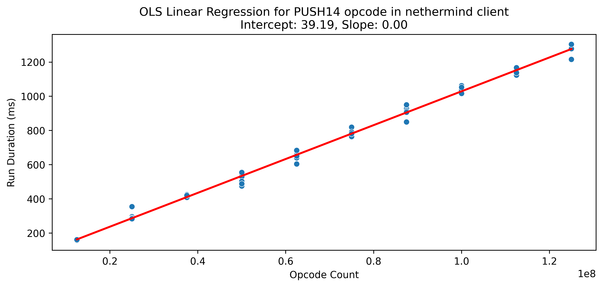


## reth


```python
                            OLS Regression Results                            
==============================================================================
Dep. Variable:        run_duration_ms   R-squared:                       0.989
Model:                            OLS   Adj. R-squared:                  0.989
Method:                 Least Squares   F-statistic:                     4639.
Date:                Mon, 22 Dec 2025   Prob (F-statistic):           1.61e-52
Time:                        12:03:52   Log-Likelihood:                -226.13
No. Observations:                  54   AIC:                             456.3
Df Residuals:                      52   BIC:                             460.2
Df Model:                           1                                         
Covariance Type:            nonrobust                                         
==============================================================================
                 coef    std err          t      P>|t|      [0.025      0.975]
------------------------------------------------------------------------------
const         34.9709      4.801      7.284      0.000      25.337      44.605
opcount     4.251e-06   6.24e-08     68.109      0.000    4.13e-06    4.38e-06
==============================================================================
Omnibus:                        3.034   Durbin-Watson:                   1.494
Prob(Omnibus):                  0.219   Jarque-Bera (JB):                2.552
Skew:                          -0.093   Prob(JB):                        0.279
Kurtosis:                       4.049   Cond. No.                     1.67e+08
==============================================================================

Notes:
[1] Standard Errors assume that the covariance matrix of the errors is correctly specified.
[2] The condition number is large, 1.67e+08. This might indicate that there are
strong multicollinearity or other numerical problems.
```

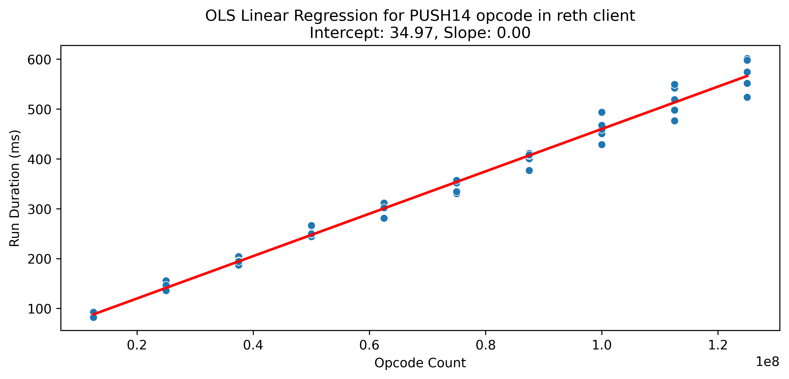


## besu


```python
                            OLS Regression Results                            
==============================================================================
Dep. Variable:        run_duration_ms   R-squared:                       0.871
Model:                            OLS   Adj. R-squared:                  0.868
Method:                 Least Squares   F-statistic:                     350.9
Date:                Mon, 22 Dec 2025   Prob (F-statistic):           8.93e-25
Time:                        12:03:52   Log-Likelihood:                -399.34
No. Observations:                  54   AIC:                             802.7
Df Residuals:                      52   BIC:                             806.7
Df Model:                           1                                         
Covariance Type:            nonrobust                                         
==============================================================================
                 coef    std err          t      P>|t|      [0.025      0.975]
------------------------------------------------------------------------------
const         31.3657    118.663      0.264      0.793    -206.750     269.481
opcount      2.89e-05   1.54e-06     18.733      0.000    2.58e-05     3.2e-05
==============================================================================
Omnibus:                       25.819   Durbin-Watson:                   0.446
Prob(Omnibus):                  0.000   Jarque-Bera (JB):               39.610
Skew:                           1.703   Prob(JB):                     2.50e-09
Kurtosis:                       5.451   Cond. No.                     1.67e+08
==============================================================================

Notes:
[1] Standard Errors assume that the covariance matrix of the errors is correctly specified.
[2] The condition number is large, 1.67e+08. This might indicate that there are
strong multicollinearity or other numerical problems.
```

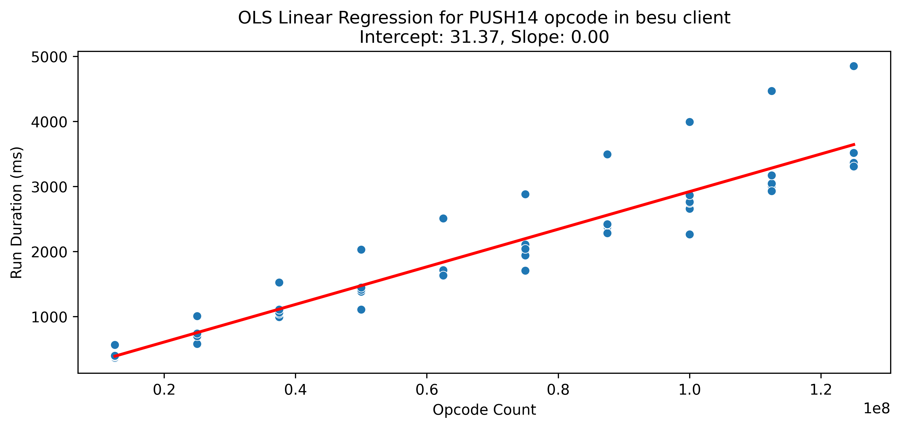


## geth


```python
                            OLS Regression Results                            
==============================================================================
Dep. Variable:        run_duration_ms   R-squared:                       0.960
Model:                            OLS   Adj. R-squared:                  0.960
Method:                 Least Squares   F-statistic:                     1261.
Date:                Mon, 22 Dec 2025   Prob (F-statistic):           3.88e-38
Time:                        12:03:52   Log-Likelihood:                -343.40
No. Observations:                  54   AIC:                             690.8
Df Residuals:                      52   BIC:                             694.8
Df Model:                           1                                         
Covariance Type:            nonrobust                                         
==============================================================================
                 coef    std err          t      P>|t|      [0.025      0.975]
------------------------------------------------------------------------------
const         91.9290     42.113      2.183      0.034       7.424     176.434
opcount     1.944e-05   5.47e-07     35.515      0.000    1.83e-05    2.05e-05
==============================================================================
Omnibus:                       83.031   Durbin-Watson:                   1.948
Prob(Omnibus):                  0.000   Jarque-Bera (JB):              994.973
Skew:                           4.432   Prob(JB):                    8.80e-217
Kurtosis:                      22.069   Cond. No.                     1.67e+08
==============================================================================

Notes:
[1] Standard Errors assume that the covariance matrix of the errors is correctly specified.
[2] The condition number is large, 1.67e+08. This might indicate that there are
strong multicollinearity or other numerical problems.
```


# PUSH15

## nethermind


```python
                            OLS Regression Results                            
==============================================================================
Dep. Variable:        run_duration_ms   R-squared:                       0.992
Model:                            OLS   Adj. R-squared:                  0.992
Method:                 Least Squares   F-statistic:                     6373.
Date:                Mon, 22 Dec 2025   Prob (F-statistic):           4.52e-56
Time:                        12:03:53   Log-Likelihood:                -263.57
No. Observations:                  54   AIC:                             531.1
Df Residuals:                      52   BIC:                             535.1
Df Model:                           1                                         
Covariance Type:            nonrobust                                         
==============================================================================
                 coef    std err          t      P>|t|      [0.025      0.975]
------------------------------------------------------------------------------
const         33.1067      9.603      3.448      0.001      13.838      52.376
opcount     9.965e-06   1.25e-07     79.829      0.000    9.71e-06    1.02e-05
==============================================================================
Omnibus:                       21.429   Durbin-Watson:                   1.942
Prob(Omnibus):                  0.000   Jarque-Bera (JB):               37.325
Skew:                          -1.247   Prob(JB):                     7.85e-09
Kurtosis:                       6.220   Cond. No.                     1.67e+08
==============================================================================

Notes:
[1] Standard Errors assume that the covariance matrix of the errors is correctly specified.
[2] The condition number is large, 1.67e+08. This might indicate that there are
strong multicollinearity or other numerical problems.
```


## reth


```python
                            OLS Regression Results                            
==============================================================================
Dep. Variable:        run_duration_ms   R-squared:                       0.995
Model:                            OLS   Adj. R-squared:                  0.995
Method:                 Least Squares   F-statistic:                 1.111e+04
Date:                Mon, 22 Dec 2025   Prob (F-statistic):           2.61e-62
Time:                        12:03:53   Log-Likelihood:                -200.28
No. Observations:                  54   AIC:                             404.6
Df Residuals:                      52   BIC:                             408.5
Df Model:                           1                                         
Covariance Type:            nonrobust                                         
==============================================================================
                 coef    std err          t      P>|t|      [0.025      0.975]
------------------------------------------------------------------------------
const         34.5981      2.974     11.633      0.000      28.630      40.566
opcount     4.075e-06   3.87e-08    105.405      0.000       4e-06    4.15e-06
==============================================================================
Omnibus:                        0.655   Durbin-Watson:                   2.030
Prob(Omnibus):                  0.721   Jarque-Bera (JB):                0.715
Skew:                          -0.044   Prob(JB):                        0.699
Kurtosis:                       2.443   Cond. No.                     1.67e+08
==============================================================================

Notes:
[1] Standard Errors assume that the covariance matrix of the errors is correctly specified.
[2] The condition number is large, 1.67e+08. This might indicate that there are
strong multicollinearity or other numerical problems.
```


## besu


```python
                            OLS Regression Results                            
==============================================================================
Dep. Variable:        run_duration_ms   R-squared:                       0.855
Model:                            OLS   Adj. R-squared:                  0.852
Method:                 Least Squares   F-statistic:                     305.9
Date:                Mon, 22 Dec 2025   Prob (F-statistic):           1.96e-23
Time:                        12:03:53   Log-Likelihood:                -403.62
No. Observations:                  54   AIC:                             811.2
Df Residuals:                      52   BIC:                             815.2
Df Model:                           1                                         
Covariance Type:            nonrobust                                         
==============================================================================
                 coef    std err          t      P>|t|      [0.025      0.975]
------------------------------------------------------------------------------
const         13.4478    128.467      0.105      0.917    -244.341     271.236
opcount     2.921e-05   1.67e-06     17.491      0.000    2.59e-05    3.26e-05
==============================================================================
Omnibus:                       28.766   Durbin-Watson:                   0.700
Prob(Omnibus):                  0.000   Jarque-Bera (JB):               49.549
Skew:                           1.796   Prob(JB):                     1.74e-11
Kurtosis:                       6.019   Cond. No.                     1.67e+08
==============================================================================

Notes:
[1] Standard Errors assume that the covariance matrix of the errors is correctly specified.
[2] The condition number is large, 1.67e+08. This might indicate that there are
strong multicollinearity or other numerical problems.
```

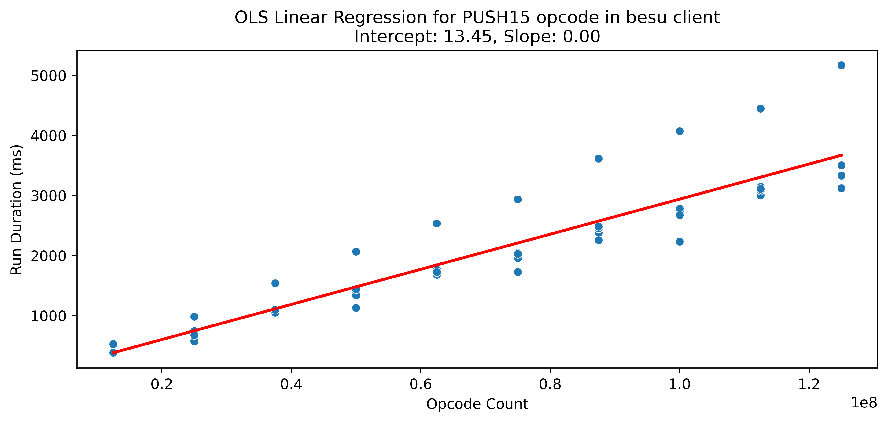


## geth


```python
                            OLS Regression Results                            
==============================================================================
Dep. Variable:        run_duration_ms   R-squared:                       0.999
Model:                            OLS   Adj. R-squared:                  0.999
Method:                 Least Squares   F-statistic:                 7.142e+04
Date:                Mon, 22 Dec 2025   Prob (F-statistic):           2.82e-83
Time:                        12:03:53   Log-Likelihood:                -235.62
No. Observations:                  54   AIC:                             475.2
Df Residuals:                      52   BIC:                             479.2
Df Model:                           1                                         
Covariance Type:            nonrobust                                         
==============================================================================
                 coef    std err          t      P>|t|      [0.025      0.975]
------------------------------------------------------------------------------
const         39.8673      5.724      6.966      0.000      28.382      51.352
opcount     1.988e-05   7.44e-08    267.243      0.000    1.97e-05       2e-05
==============================================================================
Omnibus:                       21.419   Durbin-Watson:                   1.565
Prob(Omnibus):                  0.000   Jarque-Bera (JB):               40.009
Skew:                          -1.200   Prob(JB):                     2.05e-09
Kurtosis:                       6.467   Cond. No.                     1.67e+08
==============================================================================

Notes:
[1] Standard Errors assume that the covariance matrix of the errors is correctly specified.
[2] The condition number is large, 1.67e+08. This might indicate that there are
strong multicollinearity or other numerical problems.
```

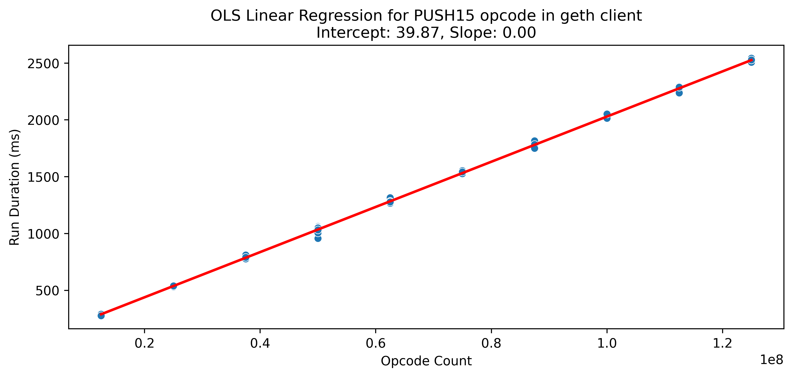


# PUSH16

## nethermind


```python
                            OLS Regression Results                            
==============================================================================
Dep. Variable:        run_duration_ms   R-squared:                       0.994
Model:                            OLS   Adj. R-squared:                  0.994
Method:                 Least Squares   F-statistic:                     8213.
Date:                Mon, 22 Dec 2025   Prob (F-statistic):           6.46e-59
Time:                        12:03:53   Log-Likelihood:                -241.34
No. Observations:                  54   AIC:                             486.7
Df Residuals:                      52   BIC:                             490.6
Df Model:                           1                                         
Covariance Type:            nonrobust                                         
==============================================================================
                 coef    std err          t      P>|t|      [0.025      0.975]
------------------------------------------------------------------------------
const         40.1708      6.362      6.314      0.000      27.405      52.937
opcount     7.495e-06   8.27e-08     90.627      0.000    7.33e-06    7.66e-06
==============================================================================
Omnibus:                       30.607   Durbin-Watson:                   2.136
Prob(Omnibus):                  0.000   Jarque-Bera (JB):               69.191
Skew:                          -1.680   Prob(JB):                     9.45e-16
Kurtosis:                       7.412   Cond. No.                     1.67e+08
==============================================================================

Notes:
[1] Standard Errors assume that the covariance matrix of the errors is correctly specified.
[2] The condition number is large, 1.67e+08. This might indicate that there are
strong multicollinearity or other numerical problems.
```

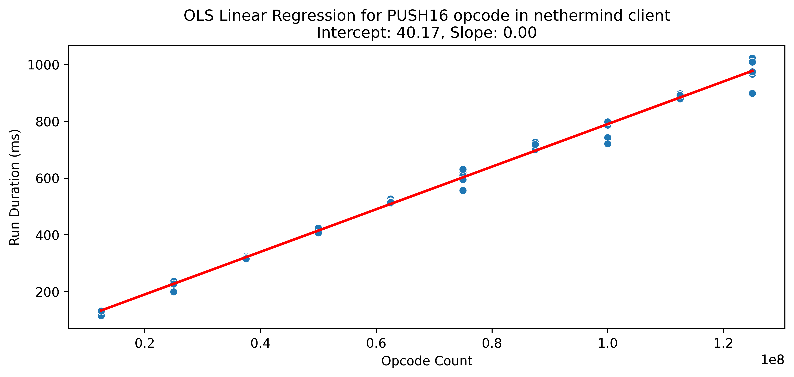


## reth


```python
                            OLS Regression Results                            
==============================================================================
Dep. Variable:        run_duration_ms   R-squared:                       0.994
Model:                            OLS   Adj. R-squared:                  0.994
Method:                 Least Squares   F-statistic:                     8892.
Date:                Mon, 22 Dec 2025   Prob (F-statistic):           8.31e-60
Time:                        12:03:53   Log-Likelihood:                -204.69
No. Observations:                  54   AIC:                             413.4
Df Residuals:                      52   BIC:                             417.4
Df Model:                           1                                         
Covariance Type:            nonrobust                                         
==============================================================================
                 coef    std err          t      P>|t|      [0.025      0.975]
------------------------------------------------------------------------------
const         39.8742      3.228     12.354      0.000      33.397      46.351
opcount     3.957e-06    4.2e-08     94.296      0.000    3.87e-06    4.04e-06
==============================================================================
Omnibus:                        0.485   Durbin-Watson:                   2.331
Prob(Omnibus):                  0.785   Jarque-Bera (JB):                0.610
Skew:                          -0.023   Prob(JB):                        0.737
Kurtosis:                       2.481   Cond. No.                     1.67e+08
==============================================================================

Notes:
[1] Standard Errors assume that the covariance matrix of the errors is correctly specified.
[2] The condition number is large, 1.67e+08. This might indicate that there are
strong multicollinearity or other numerical problems.
```


## besu


```python
                            OLS Regression Results                            
==============================================================================
Dep. Variable:        run_duration_ms   R-squared:                       0.866
Model:                            OLS   Adj. R-squared:                  0.863
Method:                 Least Squares   F-statistic:                     335.6
Date:                Mon, 22 Dec 2025   Prob (F-statistic):           2.46e-24
Time:                        12:03:53   Log-Likelihood:                -401.62
No. Observations:                  54   AIC:                             807.2
Df Residuals:                      52   BIC:                             811.2
Df Model:                           1                                         
Covariance Type:            nonrobust                                         
==============================================================================
                 coef    std err          t      P>|t|      [0.025      0.975]
------------------------------------------------------------------------------
const        -10.2607    123.791     -0.083      0.934    -258.665     238.143
opcount     2.948e-05   1.61e-06     18.319      0.000    2.63e-05    3.27e-05
==============================================================================
Omnibus:                       28.673   Durbin-Watson:                   0.503
Prob(Omnibus):                  0.000   Jarque-Bera (JB):               49.139
Skew:                           1.795   Prob(JB):                     2.14e-11
Kurtosis:                       5.992   Cond. No.                     1.67e+08
==============================================================================

Notes:
[1] Standard Errors assume that the covariance matrix of the errors is correctly specified.
[2] The condition number is large, 1.67e+08. This might indicate that there are
strong multicollinearity or other numerical problems.
```

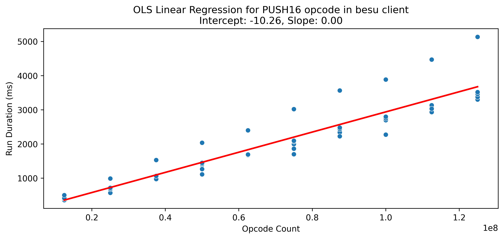


## geth


```python
                            OLS Regression Results                            
==============================================================================
Dep. Variable:        run_duration_ms   R-squared:                       0.997
Model:                            OLS   Adj. R-squared:                  0.997
Method:                 Least Squares   F-statistic:                 1.610e+04
Date:                Mon, 22 Dec 2025   Prob (F-statistic):           1.75e-66
Time:                        12:03:54   Log-Likelihood:                -274.15
No. Observations:                  54   AIC:                             552.3
Df Residuals:                      52   BIC:                             556.3
Df Model:                           1                                         
Covariance Type:            nonrobust                                         
==============================================================================
                 coef    std err          t      P>|t|      [0.025      0.975]
------------------------------------------------------------------------------
const         29.1038     11.682      2.491      0.016       5.662      52.546
opcount     1.927e-05   1.52e-07    126.892      0.000     1.9e-05    1.96e-05
==============================================================================
Omnibus:                       42.013   Durbin-Watson:                   1.969
Prob(Omnibus):                  0.000   Jarque-Bera (JB):              424.982
Skew:                           1.529   Prob(JB):                     5.20e-93
Kurtosis:                      16.399   Cond. No.                     1.67e+08
==============================================================================

Notes:
[1] Standard Errors assume that the covariance matrix of the errors is correctly specified.
[2] The condition number is large, 1.67e+08. This might indicate that there are
strong multicollinearity or other numerical problems.
```

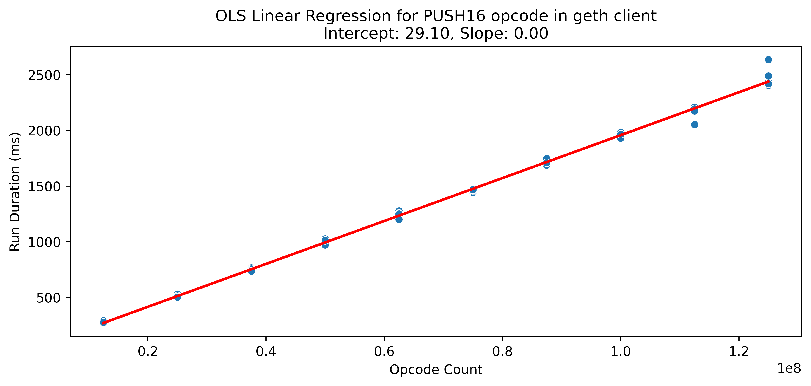


# PUSH17

## nethermind


```python
                            OLS Regression Results                            
==============================================================================
Dep. Variable:        run_duration_ms   R-squared:                       0.826
Model:                            OLS   Adj. R-squared:                  0.822
Method:                 Least Squares   F-statistic:                     246.3
Date:                Mon, 22 Dec 2025   Prob (F-statistic):           2.27e-21
Time:                        12:03:54   Log-Likelihood:                -350.81
No. Observations:                  54   AIC:                             705.6
Df Residuals:                      52   BIC:                             709.6
Df Model:                           1                                         
Covariance Type:            nonrobust                                         
==============================================================================
                 coef    std err          t      P>|t|      [0.025      0.975]
------------------------------------------------------------------------------
const         70.0461     48.314      1.450      0.153     -26.902     166.994
opcount     9.857e-06   6.28e-07     15.694      0.000     8.6e-06    1.11e-05
==============================================================================
Omnibus:                      115.046   Durbin-Watson:                   1.997
Prob(Omnibus):                  0.000   Jarque-Bera (JB):             4854.949
Skew:                           6.650   Prob(JB):                         0.00
Kurtosis:                      47.507   Cond. No.                     1.67e+08
==============================================================================

Notes:
[1] Standard Errors assume that the covariance matrix of the errors is correctly specified.
[2] The condition number is large, 1.67e+08. This might indicate that there are
strong multicollinearity or other numerical problems.
```

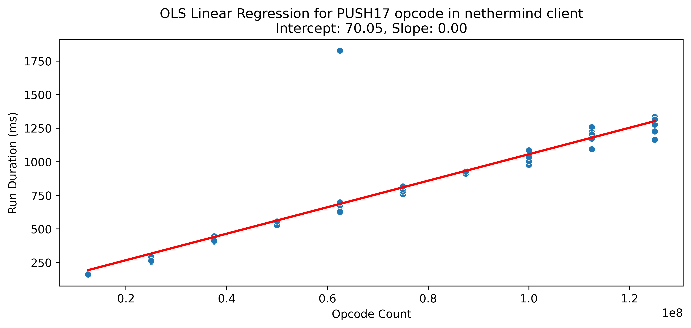


## reth


```python
                            OLS Regression Results                            
==============================================================================
Dep. Variable:        run_duration_ms   R-squared:                       0.990
Model:                            OLS   Adj. R-squared:                  0.990
Method:                 Least Squares   F-statistic:                     5195.
Date:                Mon, 22 Dec 2025   Prob (F-statistic):           8.77e-54
Time:                        12:03:54   Log-Likelihood:                -220.02
No. Observations:                  54   AIC:                             444.0
Df Residuals:                      52   BIC:                             448.0
Df Model:                           1                                         
Covariance Type:            nonrobust                                         
==============================================================================
                 coef    std err          t      P>|t|      [0.025      0.975]
------------------------------------------------------------------------------
const         39.5294      4.287      9.220      0.000      30.926      48.133
opcount     4.017e-06   5.57e-08     72.074      0.000    3.91e-06    4.13e-06
==============================================================================
Omnibus:                        5.936   Durbin-Watson:                   1.412
Prob(Omnibus):                  0.051   Jarque-Bera (JB):                5.464
Skew:                           0.495   Prob(JB):                       0.0651
Kurtosis:                       4.204   Cond. No.                     1.67e+08
==============================================================================

Notes:
[1] Standard Errors assume that the covariance matrix of the errors is correctly specified.
[2] The condition number is large, 1.67e+08. This might indicate that there are
strong multicollinearity or other numerical problems.
```

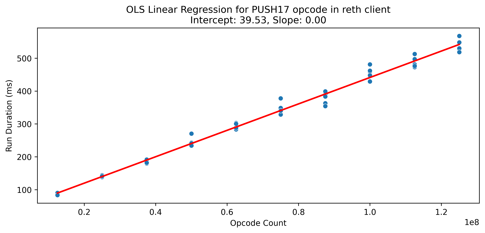


## besu


```python
                            OLS Regression Results                            
==============================================================================
Dep. Variable:        run_duration_ms   R-squared:                       0.864
Model:                            OLS   Adj. R-squared:                  0.861
Method:                 Least Squares   F-statistic:                     329.5
Date:                Mon, 22 Dec 2025   Prob (F-statistic):           3.71e-24
Time:                        12:03:54   Log-Likelihood:                -401.74
No. Observations:                  54   AIC:                             807.5
Df Residuals:                      52   BIC:                             811.5
Df Model:                           1                                         
Covariance Type:            nonrobust                                         
==============================================================================
                 coef    std err          t      P>|t|      [0.025      0.975]
------------------------------------------------------------------------------
const          3.9304    124.067      0.032      0.975    -245.029     252.889
opcount     2.928e-05   1.61e-06     18.153      0.000     2.6e-05    3.25e-05
==============================================================================
Omnibus:                       28.005   Durbin-Watson:                   0.673
Prob(Omnibus):                  0.000   Jarque-Bera (JB):               47.273
Skew:                           1.758   Prob(JB):                     5.43e-11
Kurtosis:                       5.940   Cond. No.                     1.67e+08
==============================================================================

Notes:
[1] Standard Errors assume that the covariance matrix of the errors is correctly specified.
[2] The condition number is large, 1.67e+08. This might indicate that there are
strong multicollinearity or other numerical problems.
```


## geth


```python
                            OLS Regression Results                            
==============================================================================
Dep. Variable:        run_duration_ms   R-squared:                       0.999
Model:                            OLS   Adj. R-squared:                  0.999
Method:                 Least Squares   F-statistic:                 4.221e+04
Date:                Mon, 22 Dec 2025   Prob (F-statistic):           2.42e-77
Time:                        12:03:54   Log-Likelihood:                -248.70
No. Observations:                  54   AIC:                             501.4
Df Residuals:                      52   BIC:                             505.4
Df Model:                           1                                         
Covariance Type:            nonrobust                                         
==============================================================================
                 coef    std err          t      P>|t|      [0.025      0.975]
------------------------------------------------------------------------------
const         38.5640      7.291      5.289      0.000      23.934      53.194
opcount     1.947e-05   9.48e-08    205.451      0.000    1.93e-05    1.97e-05
==============================================================================
Omnibus:                        9.629   Durbin-Watson:                   2.573
Prob(Omnibus):                  0.008   Jarque-Bera (JB):               19.015
Skew:                           0.344   Prob(JB):                     7.43e-05
Kurtosis:                       5.824   Cond. No.                     1.67e+08
==============================================================================

Notes:
[1] Standard Errors assume that the covariance matrix of the errors is correctly specified.
[2] The condition number is large, 1.67e+08. This might indicate that there are
strong multicollinearity or other numerical problems.
```


# PUSH18

## nethermind


```python
                            OLS Regression Results                            
==============================================================================
Dep. Variable:        run_duration_ms   R-squared:                       0.995
Model:                            OLS   Adj. R-squared:                  0.995
Method:                 Least Squares   F-statistic:                 1.003e+04
Date:                Mon, 22 Dec 2025   Prob (F-statistic):           3.72e-61
Time:                        12:03:54   Log-Likelihood:                -252.07
No. Observations:                  54   AIC:                             508.1
Df Residuals:                      52   BIC:                             512.1
Df Model:                           1                                         
Covariance Type:            nonrobust                                         
==============================================================================
                 coef    std err          t      P>|t|      [0.025      0.975]
------------------------------------------------------------------------------
const         38.8565      7.761      5.007      0.000      23.283      54.431
opcount      1.01e-05   1.01e-07    100.136      0.000     9.9e-06    1.03e-05
==============================================================================
Omnibus:                       23.342   Durbin-Watson:                   1.896
Prob(Omnibus):                  0.000   Jarque-Bera (JB):               45.879
Skew:                          -1.293   Prob(JB):                     1.09e-10
Kurtosis:                       6.701   Cond. No.                     1.67e+08
==============================================================================

Notes:
[1] Standard Errors assume that the covariance matrix of the errors is correctly specified.
[2] The condition number is large, 1.67e+08. This might indicate that there are
strong multicollinearity or other numerical problems.
```


## reth


```python
                            OLS Regression Results                            
==============================================================================
Dep. Variable:        run_duration_ms   R-squared:                       0.987
Model:                            OLS   Adj. R-squared:                  0.987
Method:                 Least Squares   F-statistic:                     4041.
Date:                Mon, 22 Dec 2025   Prob (F-statistic):           5.60e-51
Time:                        12:03:54   Log-Likelihood:                -228.82
No. Observations:                  54   AIC:                             461.6
Df Residuals:                      52   BIC:                             465.6
Df Model:                           1                                         
Covariance Type:            nonrobust                                         
==============================================================================
                 coef    std err          t      P>|t|      [0.025      0.975]
------------------------------------------------------------------------------
const         39.6666      5.046      7.861      0.000      29.542      49.792
opcount      4.17e-06   6.56e-08     63.566      0.000    4.04e-06     4.3e-06
==============================================================================
Omnibus:                        0.509   Durbin-Watson:                   1.517
Prob(Omnibus):                  0.775   Jarque-Bera (JB):                0.462
Skew:                           0.213   Prob(JB):                        0.794
Kurtosis:                       2.845   Cond. No.                     1.67e+08
==============================================================================

Notes:
[1] Standard Errors assume that the covariance matrix of the errors is correctly specified.
[2] The condition number is large, 1.67e+08. This might indicate that there are
strong multicollinearity or other numerical problems.
```

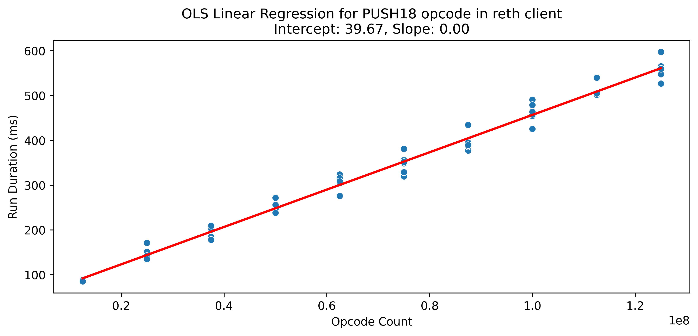


## besu


```python
                            OLS Regression Results                            
==============================================================================
Dep. Variable:        run_duration_ms   R-squared:                       0.868
Model:                            OLS   Adj. R-squared:                  0.866
Method:                 Least Squares   F-statistic:                     342.7
Date:                Mon, 22 Dec 2025   Prob (F-statistic):           1.53e-24
Time:                        12:03:54   Log-Likelihood:                -400.51
No. Observations:                  54   AIC:                             805.0
Df Residuals:                      52   BIC:                             809.0
Df Model:                           1                                         
Covariance Type:            nonrobust                                         
==============================================================================
                 coef    std err          t      P>|t|      [0.025      0.975]
------------------------------------------------------------------------------
const         11.7556    121.277      0.097      0.923    -231.605     255.117
opcount     2.918e-05   1.58e-06     18.511      0.000     2.6e-05    3.23e-05
==============================================================================
Omnibus:                       29.131   Durbin-Watson:                   0.696
Prob(Omnibus):                  0.000   Jarque-Bera (JB):               51.022
Skew:                           1.806   Prob(JB):                     8.33e-12
Kurtosis:                       6.104   Cond. No.                     1.67e+08
==============================================================================

Notes:
[1] Standard Errors assume that the covariance matrix of the errors is correctly specified.
[2] The condition number is large, 1.67e+08. This might indicate that there are
strong multicollinearity or other numerical problems.
```

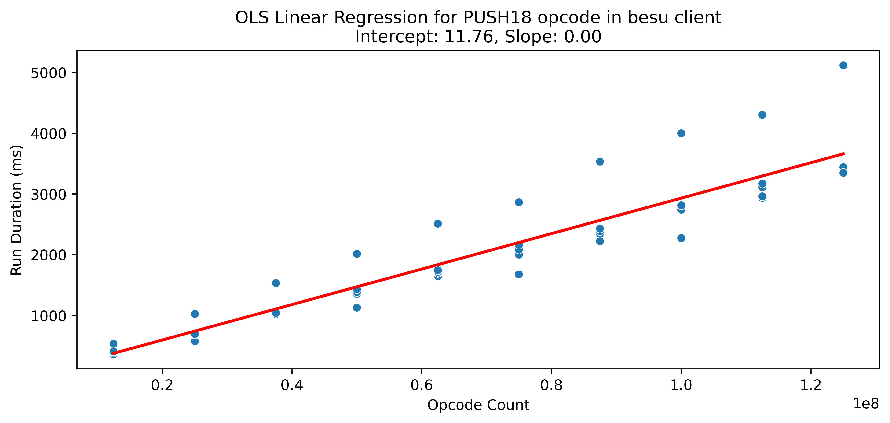


## geth


```python
                            OLS Regression Results                            
==============================================================================
Dep. Variable:        run_duration_ms   R-squared:                       0.999
Model:                            OLS   Adj. R-squared:                  0.999
Method:                 Least Squares   F-statistic:                 4.669e+04
Date:                Mon, 22 Dec 2025   Prob (F-statistic):           1.76e-78
Time:                        12:03:55   Log-Likelihood:                -246.65
No. Observations:                  54   AIC:                             497.3
Df Residuals:                      52   BIC:                             501.3
Df Model:                           1                                         
Covariance Type:            nonrobust                                         
==============================================================================
                 coef    std err          t      P>|t|      [0.025      0.975]
------------------------------------------------------------------------------
const         30.7768      7.020      4.384      0.000      16.689      44.864
opcount     1.972e-05   9.13e-08    216.078      0.000    1.95e-05    1.99e-05
==============================================================================
Omnibus:                       11.118   Durbin-Watson:                   1.956
Prob(Omnibus):                  0.004   Jarque-Bera (JB):               18.427
Skew:                          -0.579   Prob(JB):                     9.97e-05
Kurtosis:                       5.617   Cond. No.                     1.67e+08
==============================================================================

Notes:
[1] Standard Errors assume that the covariance matrix of the errors is correctly specified.
[2] The condition number is large, 1.67e+08. This might indicate that there are
strong multicollinearity or other numerical problems.
```


# PUSH19

## nethermind


```python
                            OLS Regression Results                            
==============================================================================
Dep. Variable:        run_duration_ms   R-squared:                       0.991
Model:                            OLS   Adj. R-squared:                  0.991
Method:                 Least Squares   F-statistic:                     5699.
Date:                Mon, 22 Dec 2025   Prob (F-statistic):           8.07e-55
Time:                        12:03:55   Log-Likelihood:                -266.32
No. Observations:                  54   AIC:                             536.6
Df Residuals:                      52   BIC:                             540.6
Df Model:                           1                                         
Covariance Type:            nonrobust                                         
==============================================================================
                 coef    std err          t      P>|t|      [0.025      0.975]
------------------------------------------------------------------------------
const         47.3497     10.105      4.686      0.000      27.073      67.627
opcount     9.917e-06   1.31e-07     75.490      0.000    9.65e-06    1.02e-05
==============================================================================
Omnibus:                       36.637   Durbin-Watson:                   1.369
Prob(Omnibus):                  0.000   Jarque-Bera (JB):              118.394
Skew:                          -1.834   Prob(JB):                     1.95e-26
Kurtosis:                       9.258   Cond. No.                     1.67e+08
==============================================================================

Notes:
[1] Standard Errors assume that the covariance matrix of the errors is correctly specified.
[2] The condition number is large, 1.67e+08. This might indicate that there are
strong multicollinearity or other numerical problems.
```


## reth


```python
                            OLS Regression Results                            
==============================================================================
Dep. Variable:        run_duration_ms   R-squared:                       0.984
Model:                            OLS   Adj. R-squared:                  0.984
Method:                 Least Squares   F-statistic:                     3240.
Date:                Mon, 22 Dec 2025   Prob (F-statistic):           1.61e-48
Time:                        12:03:55   Log-Likelihood:                -235.67
No. Observations:                  54   AIC:                             475.3
Df Residuals:                      52   BIC:                             479.3
Df Model:                           1                                         
Covariance Type:            nonrobust                                         
==============================================================================
                 coef    std err          t      P>|t|      [0.025      0.975]
------------------------------------------------------------------------------
const         36.7379      5.729      6.413      0.000      25.243      48.233
opcount     4.239e-06   7.45e-08     56.921      0.000    4.09e-06    4.39e-06
==============================================================================
Omnibus:                        0.906   Durbin-Watson:                   1.129
Prob(Omnibus):                  0.636   Jarque-Bera (JB):                0.386
Skew:                           0.176   Prob(JB):                        0.825
Kurtosis:                       3.218   Cond. No.                     1.67e+08
==============================================================================

Notes:
[1] Standard Errors assume that the covariance matrix of the errors is correctly specified.
[2] The condition number is large, 1.67e+08. This might indicate that there are
strong multicollinearity or other numerical problems.
```


## besu


```python
                            OLS Regression Results                            
==============================================================================
Dep. Variable:        run_duration_ms   R-squared:                       0.854
Model:                            OLS   Adj. R-squared:                  0.851
Method:                 Least Squares   F-statistic:                     304.1
Date:                Mon, 22 Dec 2025   Prob (F-statistic):           2.24e-23
Time:                        12:03:55   Log-Likelihood:                -403.57
No. Observations:                  54   AIC:                             811.1
Df Residuals:                      52   BIC:                             815.1
Df Model:                           1                                         
Covariance Type:            nonrobust                                         
==============================================================================
                 coef    std err          t      P>|t|      [0.025      0.975]
------------------------------------------------------------------------------
const         25.7493    128.337      0.201      0.842    -231.778     283.276
opcount     2.909e-05   1.67e-06     17.438      0.000    2.57e-05    3.24e-05
==============================================================================
Omnibus:                       26.732   Durbin-Watson:                   0.626
Prob(Omnibus):                  0.000   Jarque-Bera (JB):               42.762
Skew:                           1.721   Prob(JB):                     5.18e-10
Kurtosis:                       5.675   Cond. No.                     1.67e+08
==============================================================================

Notes:
[1] Standard Errors assume that the covariance matrix of the errors is correctly specified.
[2] The condition number is large, 1.67e+08. This might indicate that there are
strong multicollinearity or other numerical problems.
```

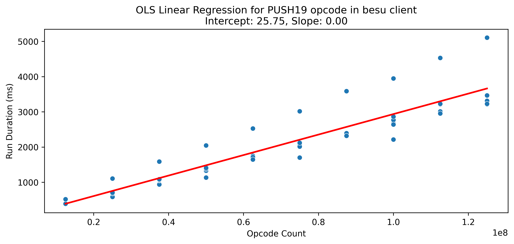


## geth


```python
                            OLS Regression Results                            
==============================================================================
Dep. Variable:        run_duration_ms   R-squared:                       0.998
Model:                            OLS   Adj. R-squared:                  0.998
Method:                 Least Squares   F-statistic:                 3.342e+04
Date:                Mon, 22 Dec 2025   Prob (F-statistic):           1.04e-74
Time:                        12:03:55   Log-Likelihood:                -255.94
No. Observations:                  54   AIC:                             515.9
Df Residuals:                      52   BIC:                             519.9
Df Model:                           1                                         
Covariance Type:            nonrobust                                         
==============================================================================
                 coef    std err          t      P>|t|      [0.025      0.975]
------------------------------------------------------------------------------
const         30.3807      8.337      3.644      0.001      13.651      47.111
opcount     1.981e-05   1.08e-07    182.809      0.000    1.96e-05       2e-05
==============================================================================
Omnibus:                       10.143   Durbin-Watson:                   1.742
Prob(Omnibus):                  0.006   Jarque-Bera (JB):               23.829
Skew:                           0.256   Prob(JB):                     6.69e-06
Kurtosis:                       6.214   Cond. No.                     1.67e+08
==============================================================================

Notes:
[1] Standard Errors assume that the covariance matrix of the errors is correctly specified.
[2] The condition number is large, 1.67e+08. This might indicate that there are
strong multicollinearity or other numerical problems.
```


# PUSH20

## nethermind


```python
                            OLS Regression Results                            
==============================================================================
Dep. Variable:        run_duration_ms   R-squared:                       0.993
Model:                            OLS   Adj. R-squared:                  0.993
Method:                 Least Squares   F-statistic:                     7850.
Date:                Mon, 22 Dec 2025   Prob (F-statistic):           2.08e-58
Time:                        12:03:55   Log-Likelihood:                -245.64
No. Observations:                  54   AIC:                             495.3
Df Residuals:                      52   BIC:                             499.3
Df Model:                           1                                         
Covariance Type:            nonrobust                                         
==============================================================================
                 coef    std err          t      P>|t|      [0.025      0.975]
------------------------------------------------------------------------------
const         40.5162      6.890      5.881      0.000      26.691      54.341
opcount     7.935e-06   8.96e-08     88.599      0.000    7.76e-06    8.12e-06
==============================================================================
Omnibus:                       21.171   Durbin-Watson:                   2.568
Prob(Omnibus):                  0.000   Jarque-Bera (JB):               45.372
Skew:                          -1.103   Prob(JB):                     1.40e-10
Kurtosis:                       6.911   Cond. No.                     1.67e+08
==============================================================================

Notes:
[1] Standard Errors assume that the covariance matrix of the errors is correctly specified.
[2] The condition number is large, 1.67e+08. This might indicate that there are
strong multicollinearity or other numerical problems.
```


## reth


```python
                            OLS Regression Results                            
==============================================================================
Dep. Variable:        run_duration_ms   R-squared:                       0.986
Model:                            OLS   Adj. R-squared:                  0.986
Method:                 Least Squares   F-statistic:                     3772.
Date:                Mon, 22 Dec 2025   Prob (F-statistic):           3.27e-50
Time:                        12:03:55   Log-Likelihood:                -230.67
No. Observations:                  54   AIC:                             465.3
Df Residuals:                      52   BIC:                             469.3
Df Model:                           1                                         
Covariance Type:            nonrobust                                         
==============================================================================
                 coef    std err          t      P>|t|      [0.025      0.975]
------------------------------------------------------------------------------
const         38.5537      5.222      7.383      0.000      28.075      49.032
opcount     4.169e-06   6.79e-08     61.420      0.000    4.03e-06    4.31e-06
==============================================================================
Omnibus:                        2.263   Durbin-Watson:                   1.472
Prob(Omnibus):                  0.322   Jarque-Bera (JB):                1.468
Skew:                           0.160   Prob(JB):                        0.480
Kurtosis:                       3.742   Cond. No.                     1.67e+08
==============================================================================

Notes:
[1] Standard Errors assume that the covariance matrix of the errors is correctly specified.
[2] The condition number is large, 1.67e+08. This might indicate that there are
strong multicollinearity or other numerical problems.
```

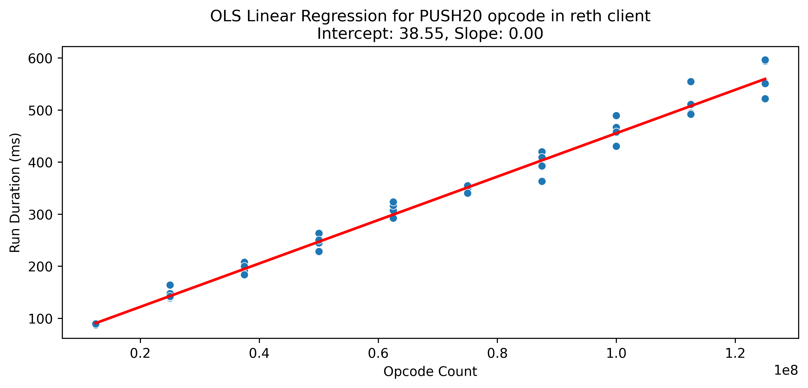


## besu


```python
                            OLS Regression Results                            
==============================================================================
Dep. Variable:        run_duration_ms   R-squared:                       0.850
Model:                            OLS   Adj. R-squared:                  0.847
Method:                 Least Squares   F-statistic:                     294.1
Date:                Mon, 22 Dec 2025   Prob (F-statistic):           4.72e-23
Time:                        12:03:56   Log-Likelihood:                -403.75
No. Observations:                  54   AIC:                             811.5
Df Residuals:                      52   BIC:                             815.5
Df Model:                           1                                         
Covariance Type:            nonrobust                                         
==============================================================================
                 coef    std err          t      P>|t|      [0.025      0.975]
------------------------------------------------------------------------------
const         26.5430    128.757      0.206      0.837    -231.827     284.913
opcount      2.87e-05   1.67e-06     17.148      0.000    2.53e-05    3.21e-05
==============================================================================
Omnibus:                       28.900   Durbin-Watson:                   0.672
Prob(Omnibus):                  0.000   Jarque-Bera (JB):               49.190
Skew:                           1.824   Prob(JB):                     2.08e-11
Kurtosis:                       5.924   Cond. No.                     1.67e+08
==============================================================================

Notes:
[1] Standard Errors assume that the covariance matrix of the errors is correctly specified.
[2] The condition number is large, 1.67e+08. This might indicate that there are
strong multicollinearity or other numerical problems.
```

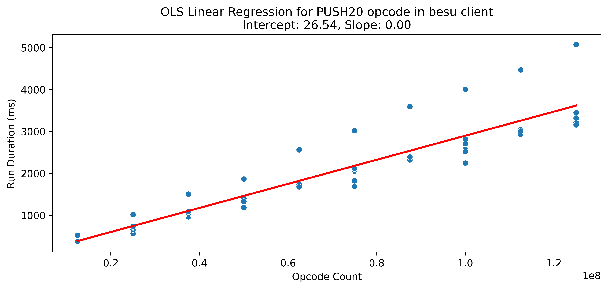


## geth


```python
                            OLS Regression Results                            
==============================================================================
Dep. Variable:        run_duration_ms   R-squared:                       0.979
Model:                            OLS   Adj. R-squared:                  0.978
Method:                 Least Squares   F-statistic:                     2408.
Date:                Mon, 22 Dec 2025   Prob (F-statistic):           3.16e-45
Time:                        12:03:56   Log-Likelihood:                -325.02
No. Observations:                  54   AIC:                             654.0
Df Residuals:                      52   BIC:                             658.0
Df Model:                           1                                         
Covariance Type:            nonrobust                                         
==============================================================================
                 coef    std err          t      P>|t|      [0.025      0.975]
------------------------------------------------------------------------------
const         84.1184     29.963      2.807      0.007      23.994     144.243
opcount     1.911e-05    3.9e-07     49.067      0.000    1.83e-05    1.99e-05
==============================================================================
Omnibus:                      111.067   Durbin-Watson:                   1.796
Prob(Omnibus):                  0.000   Jarque-Bera (JB):             4140.775
Skew:                           6.305   Prob(JB):                         0.00
Kurtosis:                      44.004   Cond. No.                     1.67e+08
==============================================================================

Notes:
[1] Standard Errors assume that the covariance matrix of the errors is correctly specified.
[2] The condition number is large, 1.67e+08. This might indicate that there are
strong multicollinearity or other numerical problems.
```


# PUSH21

## nethermind


```python
                            OLS Regression Results                            
==============================================================================
Dep. Variable:        run_duration_ms   R-squared:                       0.992
Model:                            OLS   Adj. R-squared:                  0.991
Method:                 Least Squares   F-statistic:                     6182.
Date:                Mon, 22 Dec 2025   Prob (F-statistic):           9.88e-56
Time:                        12:03:56   Log-Likelihood:                -264.50
No. Observations:                  54   AIC:                             533.0
Df Residuals:                      52   BIC:                             537.0
Df Model:                           1                                         
Covariance Type:            nonrobust                                         
==============================================================================
                 coef    std err          t      P>|t|      [0.025      0.975]
------------------------------------------------------------------------------
const         40.8819      9.770      4.184      0.000      21.276      60.488
opcount     9.987e-06   1.27e-07     78.629      0.000    9.73e-06    1.02e-05
==============================================================================
Omnibus:                       45.034   Durbin-Watson:                   1.975
Prob(Omnibus):                  0.000   Jarque-Bera (JB):              179.034
Skew:                          -2.259   Prob(JB):                     1.33e-39
Kurtosis:                      10.691   Cond. No.                     1.67e+08
==============================================================================

Notes:
[1] Standard Errors assume that the covariance matrix of the errors is correctly specified.
[2] The condition number is large, 1.67e+08. This might indicate that there are
strong multicollinearity or other numerical problems.
```

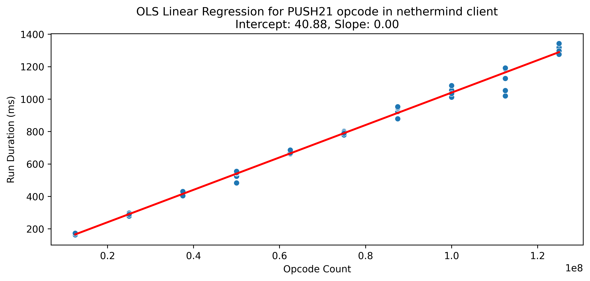


## reth


```python
                            OLS Regression Results                            
==============================================================================
Dep. Variable:        run_duration_ms   R-squared:                       0.989
Model:                            OLS   Adj. R-squared:                  0.988
Method:                 Least Squares   F-statistic:                     4543.
Date:                Mon, 22 Dec 2025   Prob (F-statistic):           2.75e-52
Time:                        12:03:56   Log-Likelihood:                -227.59
No. Observations:                  54   AIC:                             459.2
Df Residuals:                      52   BIC:                             463.2
Df Model:                           1                                         
Covariance Type:            nonrobust                                         
==============================================================================
                 coef    std err          t      P>|t|      [0.025      0.975]
------------------------------------------------------------------------------
const         41.7109      4.933      8.456      0.000      31.813      51.609
opcount     4.322e-06   6.41e-08     67.404      0.000    4.19e-06    4.45e-06
==============================================================================
Omnibus:                       18.632   Durbin-Watson:                   1.692
Prob(Omnibus):                  0.000   Jarque-Bera (JB):               28.953
Skew:                          -1.135   Prob(JB):                     5.16e-07
Kurtosis:                       5.778   Cond. No.                     1.67e+08
==============================================================================

Notes:
[1] Standard Errors assume that the covariance matrix of the errors is correctly specified.
[2] The condition number is large, 1.67e+08. This might indicate that there are
strong multicollinearity or other numerical problems.
```


## besu


```python
                            OLS Regression Results                            
==============================================================================
Dep. Variable:        run_duration_ms   R-squared:                       0.866
Model:                            OLS   Adj. R-squared:                  0.863
Method:                 Least Squares   F-statistic:                     334.7
Date:                Mon, 22 Dec 2025   Prob (F-statistic):           2.61e-24
Time:                        12:03:56   Log-Likelihood:                -400.99
No. Observations:                  54   AIC:                             806.0
Df Residuals:                      52   BIC:                             810.0
Df Model:                           1                                         
Covariance Type:            nonrobust                                         
==============================================================================
                 coef    std err          t      P>|t|      [0.025      0.975]
------------------------------------------------------------------------------
const          9.5465    122.355      0.078      0.938    -235.977     255.071
opcount      2.91e-05   1.59e-06     18.294      0.000    2.59e-05    3.23e-05
==============================================================================
Omnibus:                       25.923   Durbin-Watson:                   0.671
Prob(Omnibus):                  0.000   Jarque-Bera (JB):               40.265
Skew:                           1.692   Prob(JB):                     1.81e-09
Kurtosis:                       5.538   Cond. No.                     1.67e+08
==============================================================================

Notes:
[1] Standard Errors assume that the covariance matrix of the errors is correctly specified.
[2] The condition number is large, 1.67e+08. This might indicate that there are
strong multicollinearity or other numerical problems.
```

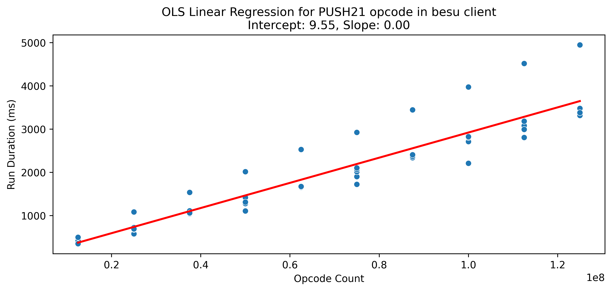


## geth


```python
                            OLS Regression Results                            
==============================================================================
Dep. Variable:        run_duration_ms   R-squared:                       0.991
Model:                            OLS   Adj. R-squared:                  0.991
Method:                 Least Squares   F-statistic:                     5860.
Date:                Mon, 22 Dec 2025   Prob (F-statistic):           3.94e-55
Time:                        12:03:56   Log-Likelihood:                -305.49
No. Observations:                  54   AIC:                             615.0
Df Residuals:                      52   BIC:                             619.0
Df Model:                           1                                         
Covariance Type:            nonrobust                                         
==============================================================================
                 coef    std err          t      P>|t|      [0.025      0.975]
------------------------------------------------------------------------------
const         14.3931     20.872      0.690      0.494     -27.489      56.276
opcount     2.077e-05   2.71e-07     76.549      0.000    2.02e-05    2.13e-05
==============================================================================
Omnibus:                       88.993   Durbin-Watson:                   2.187
Prob(Omnibus):                  0.000   Jarque-Bera (JB):             1984.171
Skew:                           4.483   Prob(JB):                         0.00
Kurtosis:                      31.310   Cond. No.                     1.67e+08
==============================================================================

Notes:
[1] Standard Errors assume that the covariance matrix of the errors is correctly specified.
[2] The condition number is large, 1.67e+08. This might indicate that there are
strong multicollinearity or other numerical problems.
```

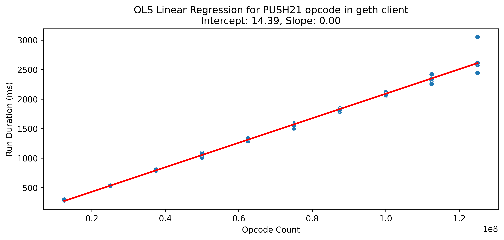


# PUSH22

## nethermind


```python
                            OLS Regression Results                            
==============================================================================
Dep. Variable:        run_duration_ms   R-squared:                       0.993
Model:                            OLS   Adj. R-squared:                  0.993
Method:                 Least Squares   F-statistic:                     7678.
Date:                Mon, 22 Dec 2025   Prob (F-statistic):           3.69e-58
Time:                        12:03:56   Log-Likelihood:                -258.85
No. Observations:                  54   AIC:                             521.7
Df Residuals:                      52   BIC:                             525.7
Df Model:                           1                                         
Covariance Type:            nonrobust                                         
==============================================================================
                 coef    std err          t      P>|t|      [0.025      0.975]
------------------------------------------------------------------------------
const         38.3351      8.799      4.357      0.000      20.678      55.992
opcount     1.002e-05   1.14e-07     87.623      0.000    9.79e-06    1.03e-05
==============================================================================
Omnibus:                       24.014   Durbin-Watson:                   1.909
Prob(Omnibus):                  0.000   Jarque-Bera (JB):               97.995
Skew:                          -0.934   Prob(JB):                     5.26e-22
Kurtosis:                       9.330   Cond. No.                     1.67e+08
==============================================================================

Notes:
[1] Standard Errors assume that the covariance matrix of the errors is correctly specified.
[2] The condition number is large, 1.67e+08. This might indicate that there are
strong multicollinearity or other numerical problems.
```

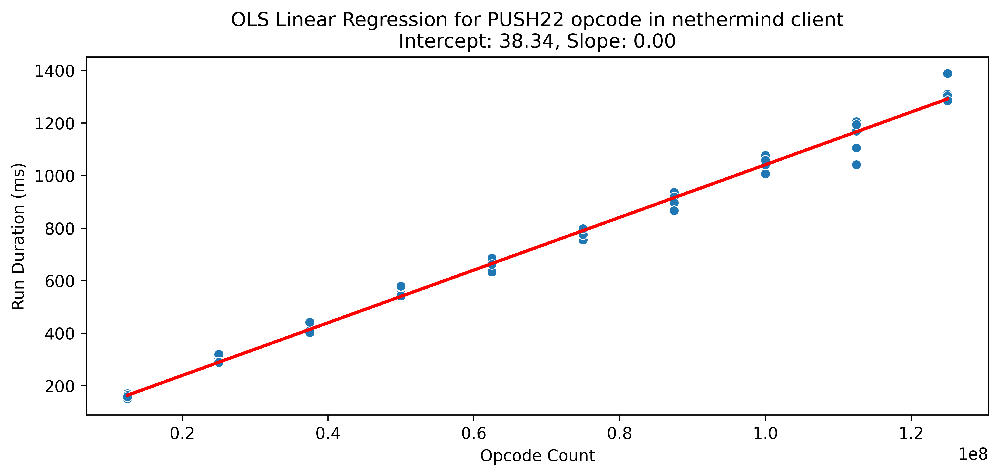


## reth


```python
                            OLS Regression Results                            
==============================================================================
Dep. Variable:        run_duration_ms   R-squared:                       0.986
Model:                            OLS   Adj. R-squared:                  0.985
Method:                 Least Squares   F-statistic:                     3581.
Date:                Mon, 22 Dec 2025   Prob (F-statistic):           1.25e-49
Time:                        12:03:56   Log-Likelihood:                -232.07
No. Observations:                  54   AIC:                             468.1
Df Residuals:                      52   BIC:                             472.1
Df Model:                           1                                         
Covariance Type:            nonrobust                                         
==============================================================================
                 coef    std err          t      P>|t|      [0.025      0.975]
------------------------------------------------------------------------------
const         39.1611      5.359      7.307      0.000      28.407      49.915
opcount     4.169e-06   6.97e-08     59.838      0.000    4.03e-06    4.31e-06
==============================================================================
Omnibus:                        3.932   Durbin-Watson:                   1.235
Prob(Omnibus):                  0.140   Jarque-Bera (JB):                3.813
Skew:                           0.616   Prob(JB):                        0.149
Kurtosis:                       2.579   Cond. No.                     1.67e+08
==============================================================================

Notes:
[1] Standard Errors assume that the covariance matrix of the errors is correctly specified.
[2] The condition number is large, 1.67e+08. This might indicate that there are
strong multicollinearity or other numerical problems.
```


## besu


```python
                            OLS Regression Results                            
==============================================================================
Dep. Variable:        run_duration_ms   R-squared:                       0.856
Model:                            OLS   Adj. R-squared:                  0.854
Method:                 Least Squares   F-statistic:                     310.2
Date:                Mon, 22 Dec 2025   Prob (F-statistic):           1.43e-23
Time:                        12:03:57   Log-Likelihood:                -402.87
No. Observations:                  54   AIC:                             809.7
Df Residuals:                      52   BIC:                             813.7
Df Model:                           1                                         
Covariance Type:            nonrobust                                         
==============================================================================
                 coef    std err          t      P>|t|      [0.025      0.975]
------------------------------------------------------------------------------
const         24.1347    126.684      0.191      0.850    -230.076     278.346
opcount     2.901e-05   1.65e-06     17.614      0.000    2.57e-05    3.23e-05
==============================================================================
Omnibus:                       26.316   Durbin-Watson:                   0.524
Prob(Omnibus):                  0.000   Jarque-Bera (JB):               40.996
Skew:                           1.724   Prob(JB):                     1.25e-09
Kurtosis:                       5.515   Cond. No.                     1.67e+08
==============================================================================

Notes:
[1] Standard Errors assume that the covariance matrix of the errors is correctly specified.
[2] The condition number is large, 1.67e+08. This might indicate that there are
strong multicollinearity or other numerical problems.
```


## geth


```python
                            OLS Regression Results                            
==============================================================================
Dep. Variable:        run_duration_ms   R-squared:                       0.995
Model:                            OLS   Adj. R-squared:                  0.995
Method:                 Least Squares   F-statistic:                 1.093e+04
Date:                Mon, 22 Dec 2025   Prob (F-statistic):           4.00e-62
Time:                        12:03:57   Log-Likelihood:                -286.91
No. Observations:                  54   AIC:                             577.8
Df Residuals:                      52   BIC:                             581.8
Df Model:                           1                                         
Covariance Type:            nonrobust                                         
==============================================================================
                 coef    std err          t      P>|t|      [0.025      0.975]
------------------------------------------------------------------------------
const         49.0235     14.796      3.313      0.002      19.332      78.715
opcount     2.011e-05   1.92e-07    104.543      0.000    1.97e-05    2.05e-05
==============================================================================
Omnibus:                       67.313   Durbin-Watson:                   2.199
Prob(Omnibus):                  0.000   Jarque-Bera (JB):              833.864
Skew:                           3.095   Prob(JB):                    8.49e-182
Kurtosis:                      21.229   Cond. No.                     1.67e+08
==============================================================================

Notes:
[1] Standard Errors assume that the covariance matrix of the errors is correctly specified.
[2] The condition number is large, 1.67e+08. This might indicate that there are
strong multicollinearity or other numerical problems.
```


# PUSH23

## nethermind


```python
                            OLS Regression Results                            
==============================================================================
Dep. Variable:        run_duration_ms   R-squared:                       0.988
Model:                            OLS   Adj. R-squared:                  0.987
Method:                 Least Squares   F-statistic:                     4125.
Date:                Mon, 22 Dec 2025   Prob (F-statistic):           3.30e-51
Time:                        12:03:57   Log-Likelihood:                -277.20
No. Observations:                  54   AIC:                             558.4
Df Residuals:                      52   BIC:                             562.4
Df Model:                           1                                         
Covariance Type:            nonrobust                                         
==============================================================================
                 coef    std err          t      P>|t|      [0.025      0.975]
------------------------------------------------------------------------------
const         30.6576     12.360      2.480      0.016       5.855      55.460
opcount     1.032e-05   1.61e-07     64.223      0.000       1e-05    1.06e-05
==============================================================================
Omnibus:                       55.923   Durbin-Watson:                   1.971
Prob(Omnibus):                  0.000   Jarque-Bera (JB):              326.796
Skew:                           2.762   Prob(JB):                     1.09e-71
Kurtosis:                      13.711   Cond. No.                     1.67e+08
==============================================================================

Notes:
[1] Standard Errors assume that the covariance matrix of the errors is correctly specified.
[2] The condition number is large, 1.67e+08. This might indicate that there are
strong multicollinearity or other numerical problems.
```

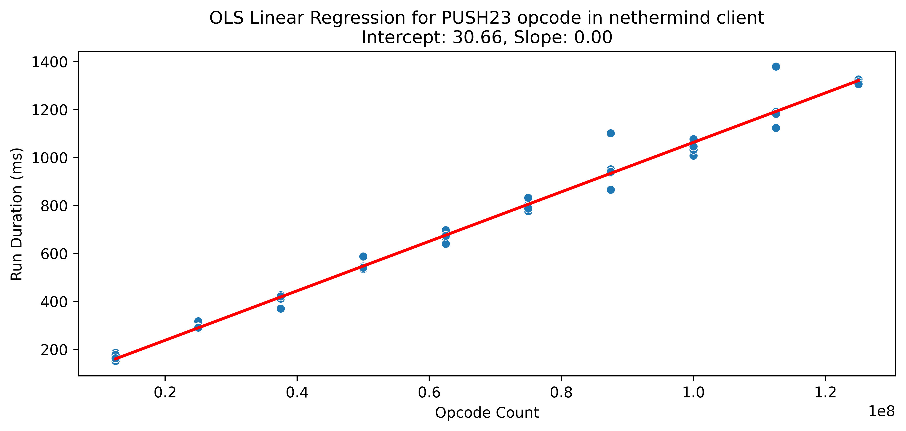


## reth


```python
                            OLS Regression Results                            
==============================================================================
Dep. Variable:        run_duration_ms   R-squared:                       0.987
Model:                            OLS   Adj. R-squared:                  0.987
Method:                 Least Squares   F-statistic:                     3964.
Date:                Mon, 22 Dec 2025   Prob (F-statistic):           9.18e-51
Time:                        12:03:57   Log-Likelihood:                -231.43
No. Observations:                  54   AIC:                             466.9
Df Residuals:                      52   BIC:                             470.8
Df Model:                           1                                         
Covariance Type:            nonrobust                                         
==============================================================================
                 coef    std err          t      P>|t|      [0.025      0.975]
------------------------------------------------------------------------------
const         34.4994      5.296      6.515      0.000      23.873      45.126
opcount     4.334e-06   6.88e-08     62.959      0.000     4.2e-06    4.47e-06
==============================================================================
Omnibus:                        2.915   Durbin-Watson:                   1.033
Prob(Omnibus):                  0.233   Jarque-Bera (JB):                2.330
Skew:                          -0.507   Prob(JB):                        0.312
Kurtosis:                       3.080   Cond. No.                     1.67e+08
==============================================================================

Notes:
[1] Standard Errors assume that the covariance matrix of the errors is correctly specified.
[2] The condition number is large, 1.67e+08. This might indicate that there are
strong multicollinearity or other numerical problems.
```


## besu


```python
                            OLS Regression Results                            
==============================================================================
Dep. Variable:        run_duration_ms   R-squared:                       0.861
Model:                            OLS   Adj. R-squared:                  0.859
Method:                 Least Squares   F-statistic:                     322.6
Date:                Mon, 22 Dec 2025   Prob (F-statistic):           5.98e-24
Time:                        12:03:57   Log-Likelihood:                -402.08
No. Observations:                  54   AIC:                             808.2
Df Residuals:                      52   BIC:                             812.1
Df Model:                           1                                         
Covariance Type:            nonrobust                                         
==============================================================================
                 coef    std err          t      P>|t|      [0.025      0.975]
------------------------------------------------------------------------------
const         10.3589    124.846      0.083      0.934    -240.163     260.881
opcount     2.915e-05   1.62e-06     17.961      0.000    2.59e-05    3.24e-05
==============================================================================
Omnibus:                       26.451   Durbin-Watson:                   0.415
Prob(Omnibus):                  0.000   Jarque-Bera (JB):               41.530
Skew:                           1.724   Prob(JB):                     9.59e-10
Kurtosis:                       5.562   Cond. No.                     1.67e+08
==============================================================================

Notes:
[1] Standard Errors assume that the covariance matrix of the errors is correctly specified.
[2] The condition number is large, 1.67e+08. This might indicate that there are
strong multicollinearity or other numerical problems.
```

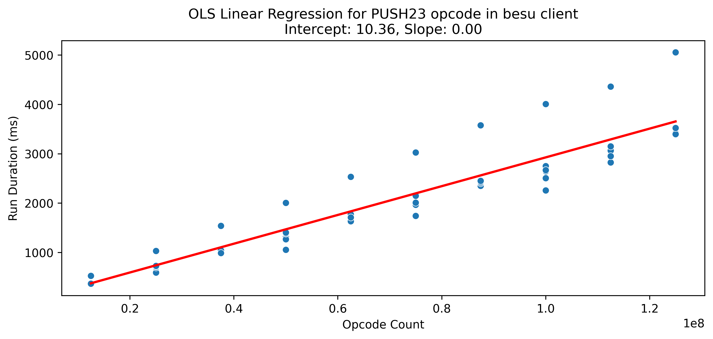


## geth


```python
                            OLS Regression Results                            
==============================================================================
Dep. Variable:        run_duration_ms   R-squared:                       0.999
Model:                            OLS   Adj. R-squared:                  0.998
Method:                 Least Squares   F-statistic:                 3.472e+04
Date:                Mon, 22 Dec 2025   Prob (F-statistic):           3.85e-75
Time:                        12:03:57   Log-Likelihood:                -255.90
No. Observations:                  54   AIC:                             515.8
Df Residuals:                      52   BIC:                             519.8
Df Model:                           1                                         
Covariance Type:            nonrobust                                         
==============================================================================
                 coef    std err          t      P>|t|      [0.025      0.975]
------------------------------------------------------------------------------
const         41.0568      8.331      4.928      0.000      24.339      57.775
opcount     2.018e-05   1.08e-07    186.339      0.000       2e-05    2.04e-05
==============================================================================
Omnibus:                       27.651   Durbin-Watson:                   1.964
Prob(Omnibus):                  0.000   Jarque-Bera (JB):               72.081
Skew:                          -1.394   Prob(JB):                     2.23e-16
Kurtosis:                       7.926   Cond. No.                     1.67e+08
==============================================================================

Notes:
[1] Standard Errors assume that the covariance matrix of the errors is correctly specified.
[2] The condition number is large, 1.67e+08. This might indicate that there are
strong multicollinearity or other numerical problems.
```


# PUSH24

## nethermind


```python
                            OLS Regression Results                            
==============================================================================
Dep. Variable:        run_duration_ms   R-squared:                       0.990
Model:                            OLS   Adj. R-squared:                  0.990
Method:                 Least Squares   F-statistic:                     5415.
Date:                Mon, 22 Dec 2025   Prob (F-statistic):           3.01e-54
Time:                        12:03:57   Log-Likelihood:                -271.51
No. Observations:                  54   AIC:                             547.0
Df Residuals:                      52   BIC:                             551.0
Df Model:                           1                                         
Covariance Type:            nonrobust                                         
==============================================================================
                 coef    std err          t      P>|t|      [0.025      0.975]
------------------------------------------------------------------------------
const         41.9539     11.125      3.771      0.000      19.630      64.278
opcount     1.064e-05   1.45e-07     73.584      0.000    1.04e-05    1.09e-05
==============================================================================
Omnibus:                       15.923   Durbin-Watson:                   2.105
Prob(Omnibus):                  0.000   Jarque-Bera (JB):               19.227
Skew:                          -1.147   Prob(JB):                     6.68e-05
Kurtosis:                       4.812   Cond. No.                     1.67e+08
==============================================================================

Notes:
[1] Standard Errors assume that the covariance matrix of the errors is correctly specified.
[2] The condition number is large, 1.67e+08. This might indicate that there are
strong multicollinearity or other numerical problems.
```


## reth


```python
                            OLS Regression Results                            
==============================================================================
Dep. Variable:        run_duration_ms   R-squared:                       0.991
Model:                            OLS   Adj. R-squared:                  0.991
Method:                 Least Squares   F-statistic:                     5939.
Date:                Mon, 22 Dec 2025   Prob (F-statistic):           2.78e-55
Time:                        12:03:58   Log-Likelihood:                -226.86
No. Observations:                  54   AIC:                             457.7
Df Residuals:                      52   BIC:                             461.7
Df Model:                           1                                         
Covariance Type:            nonrobust                                         
==============================================================================
                 coef    std err          t      P>|t|      [0.025      0.975]
------------------------------------------------------------------------------
const         31.4638      4.866      6.466      0.000      21.700      41.228
opcount     4.875e-06   6.33e-08     77.068      0.000    4.75e-06       5e-06
==============================================================================
Omnibus:                        2.614   Durbin-Watson:                   1.953
Prob(Omnibus):                  0.271   Jarque-Bera (JB):                1.743
Skew:                          -0.395   Prob(JB):                        0.418
Kurtosis:                       3.386   Cond. No.                     1.67e+08
==============================================================================

Notes:
[1] Standard Errors assume that the covariance matrix of the errors is correctly specified.
[2] The condition number is large, 1.67e+08. This might indicate that there are
strong multicollinearity or other numerical problems.
```

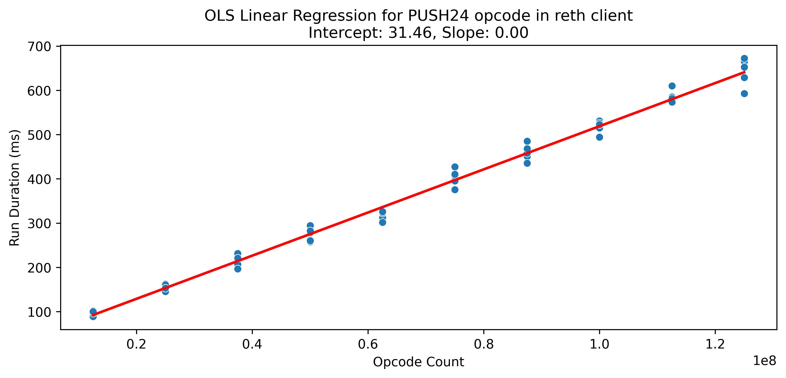


## besu


```python
                            OLS Regression Results                            
==============================================================================
Dep. Variable:        run_duration_ms   R-squared:                       0.872
Model:                            OLS   Adj. R-squared:                  0.870
Method:                 Least Squares   F-statistic:                     354.7
Date:                Mon, 22 Dec 2025   Prob (F-statistic):           7.00e-25
Time:                        12:03:58   Log-Likelihood:                -404.28
No. Observations:                  54   AIC:                             812.6
Df Residuals:                      52   BIC:                             816.5
Df Model:                           1                                         
Covariance Type:            nonrobust                                         
==============================================================================
                 coef    std err          t      P>|t|      [0.025      0.975]
------------------------------------------------------------------------------
const          9.8712    130.038      0.076      0.940    -251.070     270.812
opcount     3.184e-05   1.69e-06     18.834      0.000    2.84e-05    3.52e-05
==============================================================================
Omnibus:                       27.387   Durbin-Watson:                   0.680
Prob(Omnibus):                  0.000   Jarque-Bera (JB):               44.196
Skew:                           1.767   Prob(JB):                     2.53e-10
Kurtosis:                       5.673   Cond. No.                     1.67e+08
==============================================================================

Notes:
[1] Standard Errors assume that the covariance matrix of the errors is correctly specified.
[2] The condition number is large, 1.67e+08. This might indicate that there are
strong multicollinearity or other numerical problems.
```

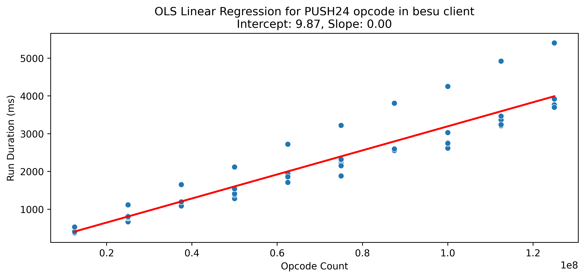


## geth


```python
                            OLS Regression Results                            
==============================================================================
Dep. Variable:        run_duration_ms   R-squared:                       0.998
Model:                            OLS   Adj. R-squared:                  0.998
Method:                 Least Squares   F-statistic:                 2.948e+04
Date:                Mon, 22 Dec 2025   Prob (F-statistic):           2.70e-73
Time:                        12:03:58   Log-Likelihood:                -262.09
No. Observations:                  54   AIC:                             528.2
Df Residuals:                      52   BIC:                             532.2
Df Model:                           1                                         
Covariance Type:            nonrobust                                         
==============================================================================
                 coef    std err          t      P>|t|      [0.025      0.975]
------------------------------------------------------------------------------
const         42.3668      9.344      4.534      0.000      23.616      61.117
opcount     2.086e-05   1.21e-07    171.698      0.000    2.06e-05    2.11e-05
==============================================================================
Omnibus:                       12.631   Durbin-Watson:                   2.210
Prob(Omnibus):                  0.002   Jarque-Bera (JB):               17.057
Skew:                          -0.807   Prob(JB):                     0.000198
Kurtosis:                       5.231   Cond. No.                     1.67e+08
==============================================================================

Notes:
[1] Standard Errors assume that the covariance matrix of the errors is correctly specified.
[2] The condition number is large, 1.67e+08. This might indicate that there are
strong multicollinearity or other numerical problems.
```


# PUSH25

## nethermind


```python
                            OLS Regression Results                            
==============================================================================
Dep. Variable:        run_duration_ms   R-squared:                       0.990
Model:                            OLS   Adj. R-squared:                  0.990
Method:                 Least Squares   F-statistic:                     5374.
Date:                Mon, 22 Dec 2025   Prob (F-statistic):           3.66e-54
Time:                        12:03:58   Log-Likelihood:                -272.63
No. Observations:                  54   AIC:                             549.3
Df Residuals:                      52   BIC:                             553.2
Df Model:                           1                                         
Covariance Type:            nonrobust                                         
==============================================================================
                 coef    std err          t      P>|t|      [0.025      0.975]
------------------------------------------------------------------------------
const         37.7545     11.357      3.324      0.002      14.964      60.545
opcount     1.082e-05   1.48e-07     73.307      0.000    1.05e-05    1.11e-05
==============================================================================
Omnibus:                        0.476   Durbin-Watson:                   1.851
Prob(Omnibus):                  0.788   Jarque-Bera (JB):                0.069
Skew:                           0.000   Prob(JB):                        0.966
Kurtosis:                       3.175   Cond. No.                     1.67e+08
==============================================================================

Notes:
[1] Standard Errors assume that the covariance matrix of the errors is correctly specified.
[2] The condition number is large, 1.67e+08. This might indicate that there are
strong multicollinearity or other numerical problems.
```


## reth


```python
                            OLS Regression Results                            
==============================================================================
Dep. Variable:        run_duration_ms   R-squared:                       0.983
Model:                            OLS   Adj. R-squared:                  0.983
Method:                 Least Squares   F-statistic:                     2978.
Date:                Mon, 22 Dec 2025   Prob (F-statistic):           1.39e-47
Time:                        12:03:58   Log-Likelihood:                -244.94
No. Observations:                  54   AIC:                             493.9
Df Residuals:                      52   BIC:                             497.9
Df Model:                           1                                         
Covariance Type:            nonrobust                                         
==============================================================================
                 coef    std err          t      P>|t|      [0.025      0.975]
------------------------------------------------------------------------------
const         38.3696      6.801      5.642      0.000      24.722      52.017
opcount     4.825e-06   8.84e-08     54.574      0.000    4.65e-06       5e-06
==============================================================================
Omnibus:                        3.840   Durbin-Watson:                   1.485
Prob(Omnibus):                  0.147   Jarque-Bera (JB):                2.806
Skew:                           0.486   Prob(JB):                        0.246
Kurtosis:                       3.549   Cond. No.                     1.67e+08
==============================================================================

Notes:
[1] Standard Errors assume that the covariance matrix of the errors is correctly specified.
[2] The condition number is large, 1.67e+08. This might indicate that there are
strong multicollinearity or other numerical problems.
```

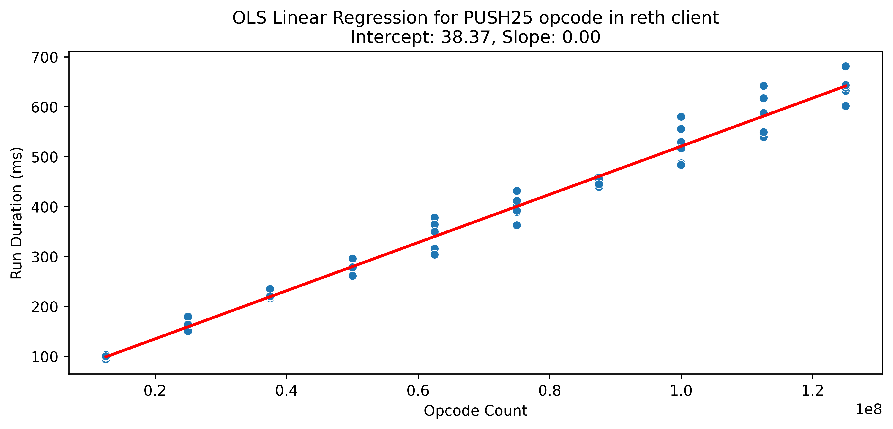


## besu


```python
                            OLS Regression Results                            
==============================================================================
Dep. Variable:        run_duration_ms   R-squared:                       0.876
Model:                            OLS   Adj. R-squared:                  0.873
Method:                 Least Squares   F-statistic:                     366.2
Date:                Mon, 22 Dec 2025   Prob (F-statistic):           3.38e-25
Time:                        12:03:58   Log-Likelihood:                -403.85
No. Observations:                  54   AIC:                             811.7
Df Residuals:                      52   BIC:                             815.7
Df Model:                           1                                         
Covariance Type:            nonrobust                                         
==============================================================================
                 coef    std err          t      P>|t|      [0.025      0.975]
------------------------------------------------------------------------------
const          2.1742    129.018      0.017      0.987    -256.719     261.068
opcount      3.21e-05   1.68e-06     19.137      0.000    2.87e-05    3.55e-05
==============================================================================
Omnibus:                       27.832   Durbin-Watson:                   0.418
Prob(Omnibus):                  0.000   Jarque-Bera (JB):               45.930
Skew:                           1.774   Prob(JB):                     1.06e-10
Kurtosis:                       5.797   Cond. No.                     1.67e+08
==============================================================================

Notes:
[1] Standard Errors assume that the covariance matrix of the errors is correctly specified.
[2] The condition number is large, 1.67e+08. This might indicate that there are
strong multicollinearity or other numerical problems.
```


## geth


```python
                            OLS Regression Results                            
==============================================================================
Dep. Variable:        run_duration_ms   R-squared:                       0.985
Model:                            OLS   Adj. R-squared:                  0.984
Method:                 Least Squares   F-statistic:                     3308.
Date:                Mon, 22 Dec 2025   Prob (F-statistic):           9.45e-49
Time:                        12:03:58   Log-Likelihood:                -320.88
No. Observations:                  54   AIC:                             645.8
Df Residuals:                      52   BIC:                             649.7
Df Model:                           1                                         
Covariance Type:            nonrobust                                         
==============================================================================
                 coef    std err          t      P>|t|      [0.025      0.975]
------------------------------------------------------------------------------
const         64.0323     27.755      2.307      0.025       8.337     119.727
opcount     2.075e-05   3.61e-07     57.518      0.000       2e-05    2.15e-05
==============================================================================
Omnibus:                      108.656   Durbin-Watson:                   2.124
Prob(Omnibus):                  0.000   Jarque-Bera (JB):             3842.049
Skew:                           6.083   Prob(JB):                         0.00
Kurtosis:                      42.491   Cond. No.                     1.67e+08
==============================================================================

Notes:
[1] Standard Errors assume that the covariance matrix of the errors is correctly specified.
[2] The condition number is large, 1.67e+08. This might indicate that there are
strong multicollinearity or other numerical problems.
```

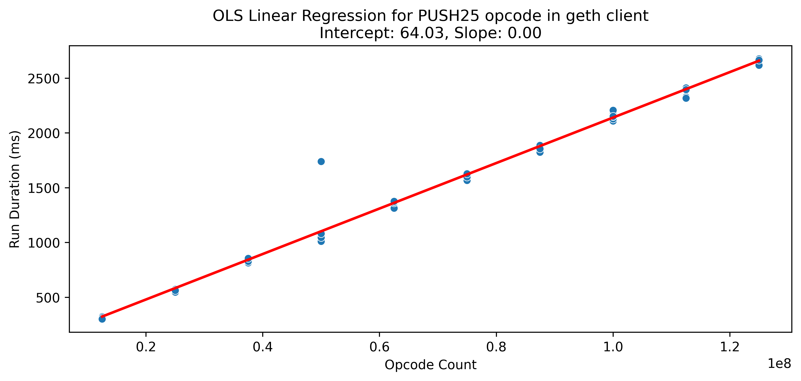


# PUSH26

## nethermind


```python
                            OLS Regression Results                            
==============================================================================
Dep. Variable:        run_duration_ms   R-squared:                       0.993
Model:                            OLS   Adj. R-squared:                  0.993
Method:                 Least Squares   F-statistic:                     7107.
Date:                Mon, 22 Dec 2025   Prob (F-statistic):           2.71e-57
Time:                        12:03:58   Log-Likelihood:                -265.45
No. Observations:                  54   AIC:                             534.9
Df Residuals:                      52   BIC:                             538.9
Df Model:                           1                                         
Covariance Type:            nonrobust                                         
==============================================================================
                 coef    std err          t      P>|t|      [0.025      0.975]
------------------------------------------------------------------------------
const         35.0056      9.943      3.521      0.001      15.054      54.957
opcount      1.09e-05   1.29e-07     84.305      0.000    1.06e-05    1.12e-05
==============================================================================
Omnibus:                       14.126   Durbin-Watson:                   1.664
Prob(Omnibus):                  0.001   Jarque-Bera (JB):               26.126
Skew:                          -0.731   Prob(JB):                     2.12e-06
Kurtosis:                       6.078   Cond. No.                     1.67e+08
==============================================================================

Notes:
[1] Standard Errors assume that the covariance matrix of the errors is correctly specified.
[2] The condition number is large, 1.67e+08. This might indicate that there are
strong multicollinearity or other numerical problems.
```

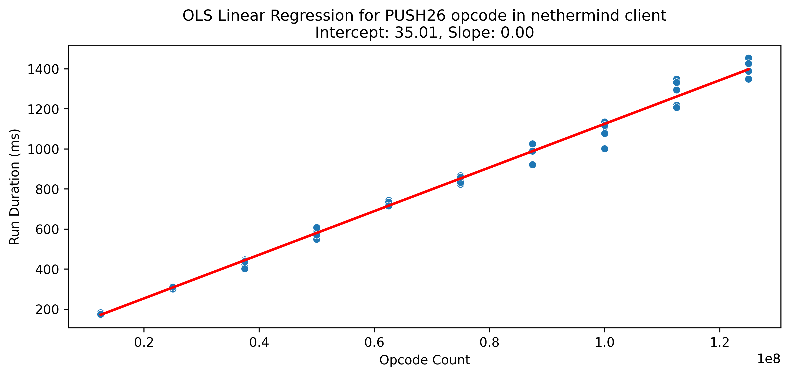


## reth


```python
                            OLS Regression Results                            
==============================================================================
Dep. Variable:        run_duration_ms   R-squared:                       0.985
Model:                            OLS   Adj. R-squared:                  0.985
Method:                 Least Squares   F-statistic:                     3373.
Date:                Mon, 22 Dec 2025   Prob (F-statistic):           5.73e-49
Time:                        12:03:59   Log-Likelihood:                -242.03
No. Observations:                  54   AIC:                             488.1
Df Residuals:                      52   BIC:                             492.0
Df Model:                           1                                         
Covariance Type:            nonrobust                                         
==============================================================================
                 coef    std err          t      P>|t|      [0.025      0.975]
------------------------------------------------------------------------------
const         40.9003      6.445      6.346      0.000      27.968      53.833
opcount     4.866e-06   8.38e-08     58.082      0.000     4.7e-06    5.03e-06
==============================================================================
Omnibus:                        1.831   Durbin-Watson:                   1.514
Prob(Omnibus):                  0.400   Jarque-Bera (JB):                1.055
Skew:                          -0.093   Prob(JB):                        0.590
Kurtosis:                       3.659   Cond. No.                     1.67e+08
==============================================================================

Notes:
[1] Standard Errors assume that the covariance matrix of the errors is correctly specified.
[2] The condition number is large, 1.67e+08. This might indicate that there are
strong multicollinearity or other numerical problems.
```


## besu


```python
                            OLS Regression Results                            
==============================================================================
Dep. Variable:        run_duration_ms   R-squared:                       0.873
Model:                            OLS   Adj. R-squared:                  0.870
Method:                 Least Squares   F-statistic:                     356.3
Date:                Mon, 22 Dec 2025   Prob (F-statistic):           6.31e-25
Time:                        12:03:59   Log-Likelihood:                -404.91
No. Observations:                  54   AIC:                             813.8
Df Residuals:                      52   BIC:                             817.8
Df Model:                           1                                         
Covariance Type:            nonrobust                                         
==============================================================================
                 coef    std err          t      P>|t|      [0.025      0.975]
------------------------------------------------------------------------------
const         -5.5787    131.562     -0.042      0.966    -269.578     258.420
opcount     3.228e-05   1.71e-06     18.877      0.000    2.89e-05    3.57e-05
==============================================================================
Omnibus:                       27.515   Durbin-Watson:                   0.499
Prob(Omnibus):                  0.000   Jarque-Bera (JB):               44.503
Skew:                           1.776   Prob(JB):                     2.17e-10
Kurtosis:                       5.677   Cond. No.                     1.67e+08
==============================================================================

Notes:
[1] Standard Errors assume that the covariance matrix of the errors is correctly specified.
[2] The condition number is large, 1.67e+08. This might indicate that there are
strong multicollinearity or other numerical problems.
```


## geth


```python
                            OLS Regression Results                            
==============================================================================
Dep. Variable:        run_duration_ms   R-squared:                       0.982
Model:                            OLS   Adj. R-squared:                  0.982
Method:                 Least Squares   F-statistic:                     2844.
Date:                Mon, 22 Dec 2025   Prob (F-statistic):           4.52e-47
Time:                        12:03:59   Log-Likelihood:                -324.53
No. Observations:                  54   AIC:                             653.1
Df Residuals:                      52   BIC:                             657.0
Df Model:                           1                                         
Covariance Type:            nonrobust                                         
==============================================================================
                 coef    std err          t      P>|t|      [0.025      0.975]
------------------------------------------------------------------------------
const         74.3929     29.696      2.505      0.015      14.803     133.983
opcount     2.059e-05   3.86e-07     53.328      0.000    1.98e-05    2.14e-05
==============================================================================
Omnibus:                      108.627   Durbin-Watson:                   2.084
Prob(Omnibus):                  0.000   Jarque-Bera (JB):             3786.109
Skew:                           6.093   Prob(JB):                         0.00
Kurtosis:                      42.169   Cond. No.                     1.67e+08
==============================================================================

Notes:
[1] Standard Errors assume that the covariance matrix of the errors is correctly specified.
[2] The condition number is large, 1.67e+08. This might indicate that there are
strong multicollinearity or other numerical problems.
```

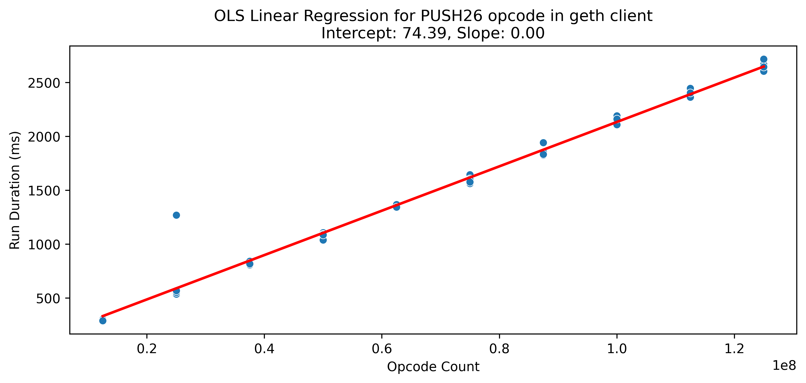


# PUSH27

## nethermind


```python
                            OLS Regression Results                            
==============================================================================
Dep. Variable:        run_duration_ms   R-squared:                       0.996
Model:                            OLS   Adj. R-squared:                  0.996
Method:                 Least Squares   F-statistic:                 1.284e+04
Date:                Mon, 22 Dec 2025   Prob (F-statistic):           6.14e-64
Time:                        12:03:59   Log-Likelihood:                -249.09
No. Observations:                  54   AIC:                             502.2
Df Residuals:                      52   BIC:                             506.1
Df Model:                           1                                         
Covariance Type:            nonrobust                                         
==============================================================================
                 coef    std err          t      P>|t|      [0.025      0.975]
------------------------------------------------------------------------------
const         44.0669      7.344      6.001      0.000      29.331      58.803
opcount     1.082e-05   9.55e-08    113.325      0.000    1.06e-05     1.1e-05
==============================================================================
Omnibus:                        5.032   Durbin-Watson:                   2.110
Prob(Omnibus):                  0.081   Jarque-Bera (JB):                4.053
Skew:                           0.509   Prob(JB):                        0.132
Kurtosis:                       3.874   Cond. No.                     1.67e+08
==============================================================================

Notes:
[1] Standard Errors assume that the covariance matrix of the errors is correctly specified.
[2] The condition number is large, 1.67e+08. This might indicate that there are
strong multicollinearity or other numerical problems.
```

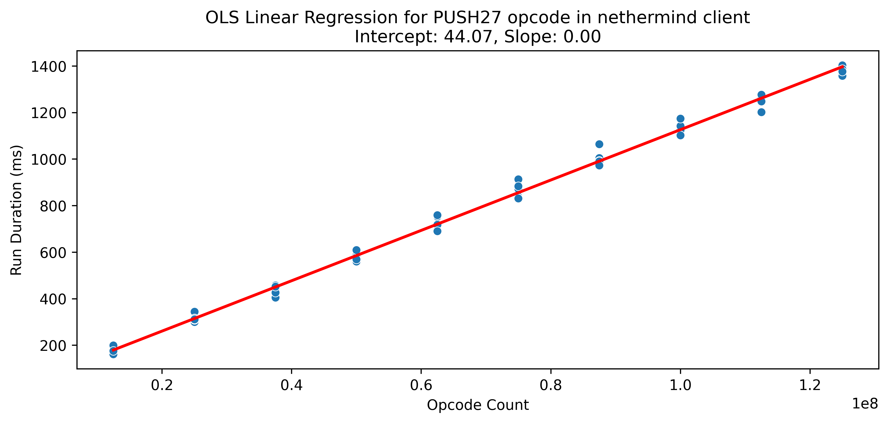


## reth


```python
                            OLS Regression Results                            
==============================================================================
Dep. Variable:        run_duration_ms   R-squared:                       0.989
Model:                            OLS   Adj. R-squared:                  0.988
Method:                 Least Squares   F-statistic:                     4542.
Date:                Mon, 22 Dec 2025   Prob (F-statistic):           2.78e-52
Time:                        12:03:59   Log-Likelihood:                -234.60
No. Observations:                  54   AIC:                             473.2
Df Residuals:                      52   BIC:                             477.2
Df Model:                           1                                         
Covariance Type:            nonrobust                                         
==============================================================================
                 coef    std err          t      P>|t|      [0.025      0.975]
------------------------------------------------------------------------------
const         41.2051      5.616      7.337      0.000      29.936      52.474
opcount      4.92e-06    7.3e-08     67.393      0.000    4.77e-06    5.07e-06
==============================================================================
Omnibus:                        2.956   Durbin-Watson:                   2.250
Prob(Omnibus):                  0.228   Jarque-Bera (JB):                2.123
Skew:                          -0.261   Prob(JB):                        0.346
Kurtosis:                       3.819   Cond. No.                     1.67e+08
==============================================================================

Notes:
[1] Standard Errors assume that the covariance matrix of the errors is correctly specified.
[2] The condition number is large, 1.67e+08. This might indicate that there are
strong multicollinearity or other numerical problems.
```


## besu


```python
                            OLS Regression Results                            
==============================================================================
Dep. Variable:        run_duration_ms   R-squared:                       0.869
Model:                            OLS   Adj. R-squared:                  0.867
Method:                 Least Squares   F-statistic:                     346.0
Date:                Mon, 22 Dec 2025   Prob (F-statistic):           1.23e-24
Time:                        12:03:59   Log-Likelihood:                -404.88
No. Observations:                  54   AIC:                             813.8
Df Residuals:                      52   BIC:                             817.7
Df Model:                           1                                         
Covariance Type:            nonrobust                                         
==============================================================================
                 coef    std err          t      P>|t|      [0.025      0.975]
------------------------------------------------------------------------------
const         20.2275    131.490      0.154      0.878    -243.627     284.082
opcount      3.18e-05   1.71e-06     18.602      0.000    2.84e-05    3.52e-05
==============================================================================
Omnibus:                       28.240   Durbin-Watson:                   0.521
Prob(Omnibus):                  0.000   Jarque-Bera (JB):               47.898
Skew:                           1.772   Prob(JB):                     3.97e-11
Kurtosis:                       5.955   Cond. No.                     1.67e+08
==============================================================================

Notes:
[1] Standard Errors assume that the covariance matrix of the errors is correctly specified.
[2] The condition number is large, 1.67e+08. This might indicate that there are
strong multicollinearity or other numerical problems.
```

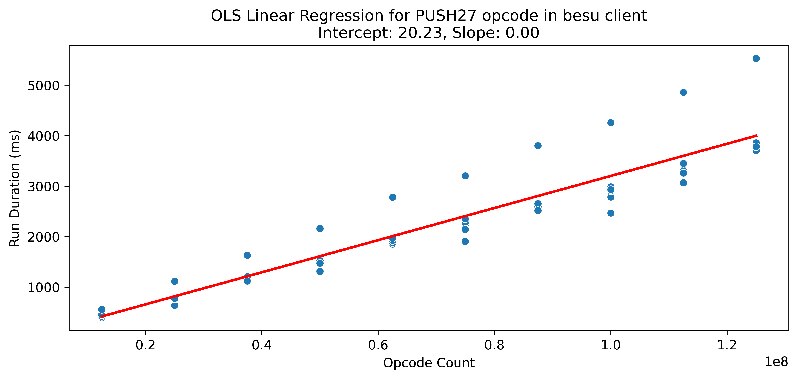


## geth


```python
                            OLS Regression Results                            
==============================================================================
Dep. Variable:        run_duration_ms   R-squared:                       0.999
Model:                            OLS   Adj. R-squared:                  0.999
Method:                 Least Squares   F-statistic:                 3.834e+04
Date:                Mon, 22 Dec 2025   Prob (F-statistic):           2.95e-76
Time:                        12:03:59   Log-Likelihood:                -256.73
No. Observations:                  54   AIC:                             517.5
Df Residuals:                      52   BIC:                             521.4
Df Model:                           1                                         
Covariance Type:            nonrobust                                         
==============================================================================
                 coef    std err          t      P>|t|      [0.025      0.975]
------------------------------------------------------------------------------
const         20.8747      8.460      2.467      0.017       3.898      37.852
opcount     2.153e-05    1.1e-07    195.794      0.000    2.13e-05    2.18e-05
==============================================================================
Omnibus:                        6.077   Durbin-Watson:                   1.920
Prob(Omnibus):                  0.048   Jarque-Bera (JB):                5.349
Skew:                          -0.549   Prob(JB):                       0.0690
Kurtosis:                       4.083   Cond. No.                     1.67e+08
==============================================================================

Notes:
[1] Standard Errors assume that the covariance matrix of the errors is correctly specified.
[2] The condition number is large, 1.67e+08. This might indicate that there are
strong multicollinearity or other numerical problems.
```


# PUSH28

## nethermind


```python
                            OLS Regression Results                            
==============================================================================
Dep. Variable:        run_duration_ms   R-squared:                       0.992
Model:                            OLS   Adj. R-squared:                  0.992
Method:                 Least Squares   F-statistic:                     6336.
Date:                Mon, 22 Dec 2025   Prob (F-statistic):           5.25e-56
Time:                        12:04:00   Log-Likelihood:                -267.46
No. Observations:                  54   AIC:                             538.9
Df Residuals:                      52   BIC:                             542.9
Df Model:                           1                                         
Covariance Type:            nonrobust                                         
==============================================================================
                 coef    std err          t      P>|t|      [0.025      0.975]
------------------------------------------------------------------------------
const         39.9511     10.321      3.871      0.000      19.242      60.661
opcount     1.068e-05   1.34e-07     79.598      0.000    1.04e-05    1.09e-05
==============================================================================
Omnibus:                       15.948   Durbin-Watson:                   2.134
Prob(Omnibus):                  0.000   Jarque-Bera (JB):               20.404
Skew:                          -1.090   Prob(JB):                     3.71e-05
Kurtosis:                       5.077   Cond. No.                     1.67e+08
==============================================================================

Notes:
[1] Standard Errors assume that the covariance matrix of the errors is correctly specified.
[2] The condition number is large, 1.67e+08. This might indicate that there are
strong multicollinearity or other numerical problems.
```

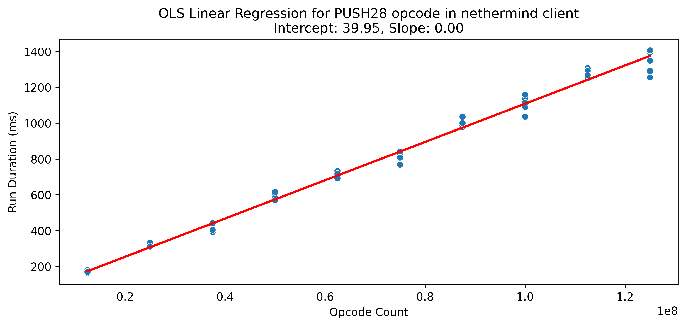


## reth


```python
                            OLS Regression Results                            
==============================================================================
Dep. Variable:        run_duration_ms   R-squared:                       0.992
Model:                            OLS   Adj. R-squared:                  0.992
Method:                 Least Squares   F-statistic:                     6509.
Date:                Mon, 22 Dec 2025   Prob (F-statistic):           2.62e-56
Time:                        12:04:00   Log-Likelihood:                -225.07
No. Observations:                  54   AIC:                             454.1
Df Residuals:                      52   BIC:                             458.1
Df Model:                           1                                         
Covariance Type:            nonrobust                                         
==============================================================================
                 coef    std err          t      P>|t|      [0.025      0.975]
------------------------------------------------------------------------------
const         33.0671      4.708      7.024      0.000      23.620      42.514
opcount     4.938e-06   6.12e-08     80.680      0.000    4.81e-06    5.06e-06
==============================================================================
Omnibus:                        4.986   Durbin-Watson:                   1.831
Prob(Omnibus):                  0.083   Jarque-Bera (JB):                5.010
Skew:                          -0.320   Prob(JB):                       0.0817
Kurtosis:                       4.348   Cond. No.                     1.67e+08
==============================================================================

Notes:
[1] Standard Errors assume that the covariance matrix of the errors is correctly specified.
[2] The condition number is large, 1.67e+08. This might indicate that there are
strong multicollinearity or other numerical problems.
```

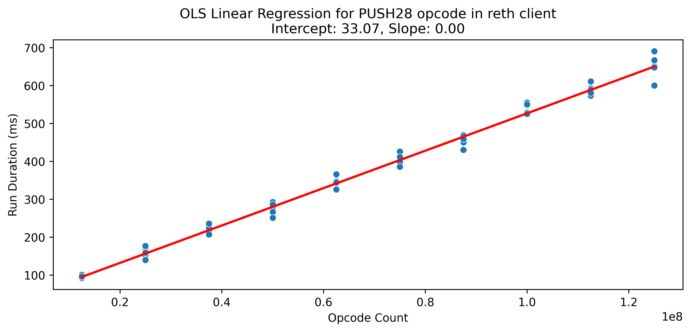


## besu


```python
                            OLS Regression Results                            
==============================================================================
Dep. Variable:        run_duration_ms   R-squared:                       0.875
Model:                            OLS   Adj. R-squared:                  0.873
Method:                 Least Squares   F-statistic:                     363.9
Date:                Mon, 22 Dec 2025   Prob (F-statistic):           3.90e-25
Time:                        12:04:00   Log-Likelihood:                -403.61
No. Observations:                  54   AIC:                             811.2
Df Residuals:                      52   BIC:                             815.2
Df Model:                           1                                         
Covariance Type:            nonrobust                                         
==============================================================================
                 coef    std err          t      P>|t|      [0.025      0.975]
------------------------------------------------------------------------------
const         26.5847    128.435      0.207      0.837    -231.139     284.308
opcount     3.185e-05   1.67e-06     19.077      0.000    2.85e-05    3.52e-05
==============================================================================
Omnibus:                       26.083   Durbin-Watson:                   0.344
Prob(Omnibus):                  0.000   Jarque-Bera (JB):               41.236
Skew:                           1.681   Prob(JB):                     1.11e-09
Kurtosis:                       5.651   Cond. No.                     1.67e+08
==============================================================================

Notes:
[1] Standard Errors assume that the covariance matrix of the errors is correctly specified.
[2] The condition number is large, 1.67e+08. This might indicate that there are
strong multicollinearity or other numerical problems.
```


## geth


```python
                            OLS Regression Results                            
==============================================================================
Dep. Variable:        run_duration_ms   R-squared:                       0.998
Model:                            OLS   Adj. R-squared:                  0.998
Method:                 Least Squares   F-statistic:                 2.144e+04
Date:                Mon, 22 Dec 2025   Prob (F-statistic):           1.04e-69
Time:                        12:04:00   Log-Likelihood:                -271.45
No. Observations:                  54   AIC:                             546.9
Df Residuals:                      52   BIC:                             550.9
Df Model:                           1                                         
Covariance Type:            nonrobust                                         
==============================================================================
                 coef    std err          t      P>|t|      [0.025      0.975]
------------------------------------------------------------------------------
const         24.5549     11.112      2.210      0.032       2.257      46.853
opcount     2.115e-05   1.44e-07    146.436      0.000    2.09e-05    2.14e-05
==============================================================================
Omnibus:                       31.028   Durbin-Watson:                   1.481
Prob(Omnibus):                  0.000   Jarque-Bera (JB):               73.665
Skew:                          -1.673   Prob(JB):                     1.01e-16
Kurtosis:                       7.642   Cond. No.                     1.67e+08
==============================================================================

Notes:
[1] Standard Errors assume that the covariance matrix of the errors is correctly specified.
[2] The condition number is large, 1.67e+08. This might indicate that there are
strong multicollinearity or other numerical problems.
```


# PUSH29

## nethermind


```python
                            OLS Regression Results                            
==============================================================================
Dep. Variable:        run_duration_ms   R-squared:                       0.993
Model:                            OLS   Adj. R-squared:                  0.993
Method:                 Least Squares   F-statistic:                     7797.
Date:                Mon, 22 Dec 2025   Prob (F-statistic):           2.48e-58
Time:                        12:04:00   Log-Likelihood:                -262.04
No. Observations:                  54   AIC:                             528.1
Df Residuals:                      52   BIC:                             532.1
Df Model:                           1                                         
Covariance Type:            nonrobust                                         
==============================================================================
                 coef    std err          t      P>|t|      [0.025      0.975]
------------------------------------------------------------------------------
const         47.5877      9.335      5.098      0.000      28.856      66.320
opcount     1.072e-05   1.21e-07     88.300      0.000    1.05e-05     1.1e-05
==============================================================================
Omnibus:                        5.802   Durbin-Watson:                   1.881
Prob(Omnibus):                  0.055   Jarque-Bera (JB):                7.191
Skew:                          -0.268   Prob(JB):                       0.0274
Kurtosis:                       4.706   Cond. No.                     1.67e+08
==============================================================================

Notes:
[1] Standard Errors assume that the covariance matrix of the errors is correctly specified.
[2] The condition number is large, 1.67e+08. This might indicate that there are
strong multicollinearity or other numerical problems.
```


## reth


```python
                            OLS Regression Results                            
==============================================================================
Dep. Variable:        run_duration_ms   R-squared:                       0.984
Model:                            OLS   Adj. R-squared:                  0.984
Method:                 Least Squares   F-statistic:                     3275.
Date:                Mon, 22 Dec 2025   Prob (F-statistic):           1.22e-48
Time:                        12:04:00   Log-Likelihood:                -242.42
No. Observations:                  54   AIC:                             488.8
Df Residuals:                      52   BIC:                             492.8
Df Model:                           1                                         
Covariance Type:            nonrobust                                         
==============================================================================
                 coef    std err          t      P>|t|      [0.025      0.975]
------------------------------------------------------------------------------
const         42.6122      6.491      6.565      0.000      29.587      55.637
opcount     4.829e-06   8.44e-08     57.227      0.000    4.66e-06       5e-06
==============================================================================
Omnibus:                        2.066   Durbin-Watson:                   1.583
Prob(Omnibus):                  0.356   Jarque-Bera (JB):                1.559
Skew:                          -0.415   Prob(JB):                        0.459
Kurtosis:                       3.065   Cond. No.                     1.67e+08
==============================================================================

Notes:
[1] Standard Errors assume that the covariance matrix of the errors is correctly specified.
[2] The condition number is large, 1.67e+08. This might indicate that there are
strong multicollinearity or other numerical problems.
```

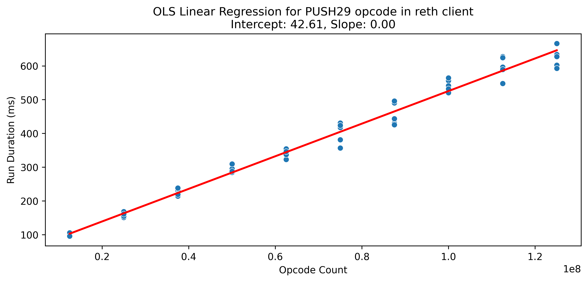


## besu


```python
                            OLS Regression Results                            
==============================================================================
Dep. Variable:        run_duration_ms   R-squared:                       0.886
Model:                            OLS   Adj. R-squared:                  0.883
Method:                 Least Squares   F-statistic:                     402.2
Date:                Mon, 22 Dec 2025   Prob (F-statistic):           3.94e-26
Time:                        12:04:00   Log-Likelihood:                -401.40
No. Observations:                  54   AIC:                             806.8
Df Residuals:                      52   BIC:                             810.8
Df Model:                           1                                         
Covariance Type:            nonrobust                                         
==============================================================================
                 coef    std err          t      P>|t|      [0.025      0.975]
------------------------------------------------------------------------------
const          7.4392    123.290      0.060      0.952    -239.960     254.839
opcount     3.214e-05    1.6e-06     20.054      0.000    2.89e-05    3.54e-05
==============================================================================
Omnibus:                       25.036   Durbin-Watson:                   0.696
Prob(Omnibus):                  0.000   Jarque-Bera (JB):               37.485
Skew:                           1.669   Prob(JB):                     7.25e-09
Kurtosis:                       5.349   Cond. No.                     1.67e+08
==============================================================================

Notes:
[1] Standard Errors assume that the covariance matrix of the errors is correctly specified.
[2] The condition number is large, 1.67e+08. This might indicate that there are
strong multicollinearity or other numerical problems.
```

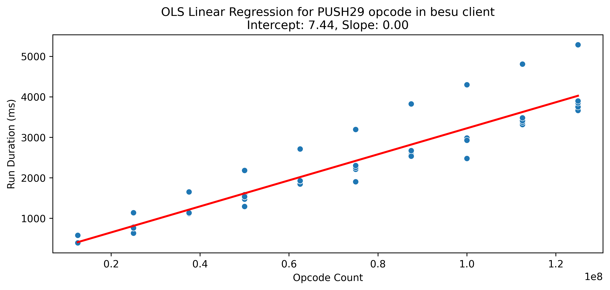


## geth


```python
                            OLS Regression Results                            
==============================================================================
Dep. Variable:        run_duration_ms   R-squared:                       0.990
Model:                            OLS   Adj. R-squared:                  0.990
Method:                 Least Squares   F-statistic:                     5307.
Date:                Mon, 22 Dec 2025   Prob (F-statistic):           5.05e-54
Time:                        12:04:01   Log-Likelihood:                -311.55
No. Observations:                  54   AIC:                             627.1
Df Residuals:                      52   BIC:                             631.1
Df Model:                           1                                         
Covariance Type:            nonrobust                                         
==============================================================================
                 coef    std err          t      P>|t|      [0.025      0.975]
------------------------------------------------------------------------------
const         10.5721     23.350      0.453      0.653     -36.283      57.427
opcount     2.211e-05   3.04e-07     72.852      0.000    2.15e-05    2.27e-05
==============================================================================
Omnibus:                       78.641   Durbin-Watson:                   2.068
Prob(Omnibus):                  0.000   Jarque-Bera (JB):             1288.363
Skew:                           3.804   Prob(JB):                    1.72e-280
Kurtosis:                      25.688   Cond. No.                     1.67e+08
==============================================================================

Notes:
[1] Standard Errors assume that the covariance matrix of the errors is correctly specified.
[2] The condition number is large, 1.67e+08. This might indicate that there are
strong multicollinearity or other numerical problems.
```

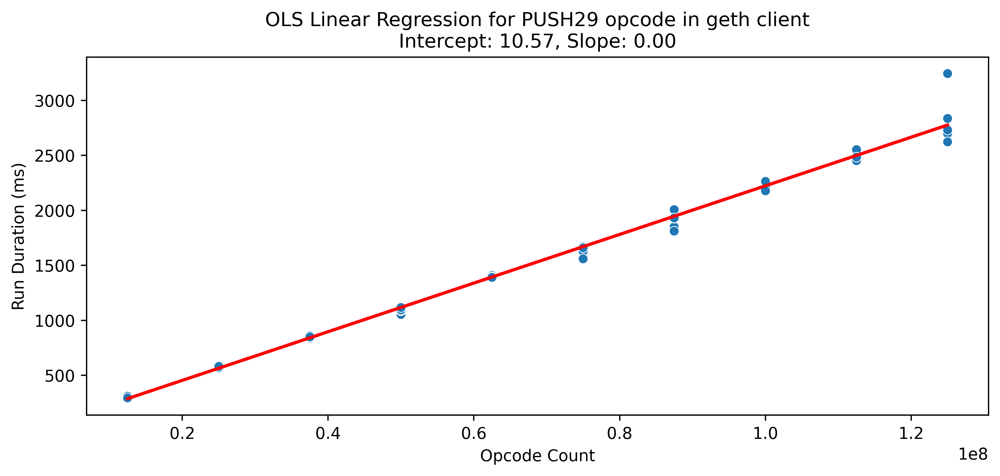


# PUSH30

## nethermind


```python
                            OLS Regression Results                            
==============================================================================
Dep. Variable:        run_duration_ms   R-squared:                       0.994
Model:                            OLS   Adj. R-squared:                  0.994
Method:                 Least Squares   F-statistic:                     8249.
Date:                Mon, 22 Dec 2025   Prob (F-statistic):           5.78e-59
Time:                        12:04:01   Log-Likelihood:                -261.15
No. Observations:                  54   AIC:                             526.3
Df Residuals:                      52   BIC:                             530.3
Df Model:                           1                                         
Covariance Type:            nonrobust                                         
==============================================================================
                 coef    std err          t      P>|t|      [0.025      0.975]
------------------------------------------------------------------------------
const         41.1922      9.182      4.486      0.000      22.767      59.617
opcount     1.084e-05   1.19e-07     90.825      0.000    1.06e-05    1.11e-05
==============================================================================
Omnibus:                       10.268   Durbin-Watson:                   2.129
Prob(Omnibus):                  0.006   Jarque-Bera (JB):               27.798
Skew:                          -0.066   Prob(JB):                     9.20e-07
Kurtosis:                       6.513   Cond. No.                     1.67e+08
==============================================================================

Notes:
[1] Standard Errors assume that the covariance matrix of the errors is correctly specified.
[2] The condition number is large, 1.67e+08. This might indicate that there are
strong multicollinearity or other numerical problems.
```

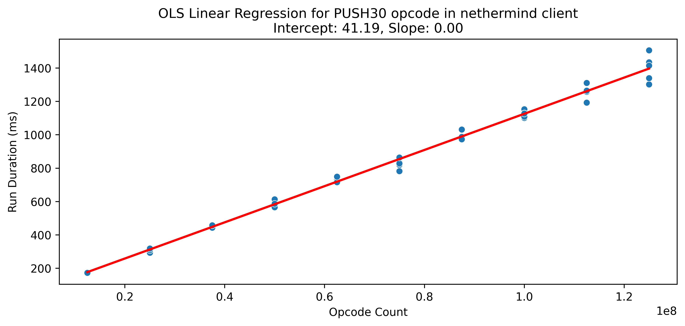


## reth


```python
                            OLS Regression Results                            
==============================================================================
Dep. Variable:        run_duration_ms   R-squared:                       0.983
Model:                            OLS   Adj. R-squared:                  0.983
Method:                 Least Squares   F-statistic:                     3076.
Date:                Mon, 22 Dec 2025   Prob (F-statistic):           6.07e-48
Time:                        12:04:01   Log-Likelihood:                -246.34
No. Observations:                  54   AIC:                             496.7
Df Residuals:                      52   BIC:                             500.7
Df Model:                           1                                         
Covariance Type:            nonrobust                                         
==============================================================================
                 coef    std err          t      P>|t|      [0.025      0.975]
------------------------------------------------------------------------------
const         31.3998      6.980      4.499      0.000      17.394      45.406
opcount     5.033e-06   9.07e-08     55.464      0.000    4.85e-06    5.21e-06
==============================================================================
Omnibus:                        1.158   Durbin-Watson:                   1.397
Prob(Omnibus):                  0.560   Jarque-Bera (JB):                0.599
Skew:                          -0.234   Prob(JB):                        0.741
Kurtosis:                       3.216   Cond. No.                     1.67e+08
==============================================================================

Notes:
[1] Standard Errors assume that the covariance matrix of the errors is correctly specified.
[2] The condition number is large, 1.67e+08. This might indicate that there are
strong multicollinearity or other numerical problems.
```


## besu


```python
                            OLS Regression Results                            
==============================================================================
Dep. Variable:        run_duration_ms   R-squared:                       0.877
Model:                            OLS   Adj. R-squared:                  0.874
Method:                 Least Squares   F-statistic:                     369.9
Date:                Mon, 22 Dec 2025   Prob (F-statistic):           2.69e-25
Time:                        12:04:01   Log-Likelihood:                -403.99
No. Observations:                  54   AIC:                             812.0
Df Residuals:                      52   BIC:                             816.0
Df Model:                           1                                         
Covariance Type:            nonrobust                                         
==============================================================================
                 coef    std err          t      P>|t|      [0.025      0.975]
------------------------------------------------------------------------------
const         -1.3010    129.334     -0.010      0.992    -260.828     258.226
opcount     3.234e-05   1.68e-06     19.233      0.000     2.9e-05    3.57e-05
==============================================================================
Omnibus:                       28.802   Durbin-Watson:                   0.724
Prob(Omnibus):                  0.000   Jarque-Bera (JB):               50.196
Skew:                           1.785   Prob(JB):                     1.26e-11
Kurtosis:                       6.093   Cond. No.                     1.67e+08
==============================================================================

Notes:
[1] Standard Errors assume that the covariance matrix of the errors is correctly specified.
[2] The condition number is large, 1.67e+08. This might indicate that there are
strong multicollinearity or other numerical problems.
```

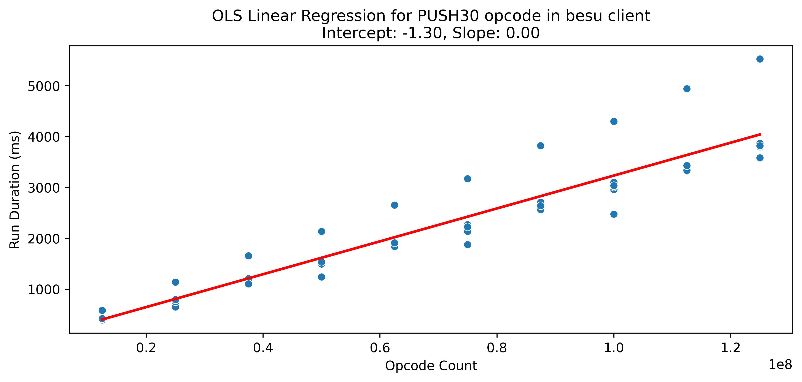


## geth


```python
                            OLS Regression Results                            
==============================================================================
Dep. Variable:        run_duration_ms   R-squared:                       0.995
Model:                            OLS   Adj. R-squared:                  0.995
Method:                 Least Squares   F-statistic:                 1.068e+04
Date:                Mon, 22 Dec 2025   Prob (F-statistic):           7.34e-62
Time:                        12:04:01   Log-Likelihood:                -292.06
No. Observations:                  54   AIC:                             588.1
Df Residuals:                      52   BIC:                             592.1
Df Model:                           1                                         
Covariance Type:            nonrobust                                         
==============================================================================
                 coef    std err          t      P>|t|      [0.025      0.975]
------------------------------------------------------------------------------
const         27.8910     16.276      1.714      0.093      -4.769      60.551
opcount     2.186e-05   2.12e-07    103.324      0.000    2.14e-05    2.23e-05
==============================================================================
Omnibus:                       74.139   Durbin-Watson:                   2.095
Prob(Omnibus):                  0.000   Jarque-Bera (JB):             1024.108
Skew:                           3.554   Prob(JB):                    4.15e-223
Kurtosis:                      23.116   Cond. No.                     1.67e+08
==============================================================================

Notes:
[1] Standard Errors assume that the covariance matrix of the errors is correctly specified.
[2] The condition number is large, 1.67e+08. This might indicate that there are
strong multicollinearity or other numerical problems.
```


# PUSH31

## nethermind


```python
                            OLS Regression Results                            
==============================================================================
Dep. Variable:        run_duration_ms   R-squared:                       0.994
Model:                            OLS   Adj. R-squared:                  0.994
Method:                 Least Squares   F-statistic:                     9177.
Date:                Mon, 22 Dec 2025   Prob (F-statistic):           3.67e-60
Time:                        12:04:01   Log-Likelihood:                -258.20
No. Observations:                  54   AIC:                             520.4
Df Residuals:                      52   BIC:                             524.4
Df Model:                           1                                         
Covariance Type:            nonrobust                                         
==============================================================================
                 coef    std err          t      P>|t|      [0.025      0.975]
------------------------------------------------------------------------------
const         44.0629      8.694      5.068      0.000      26.618      61.508
opcount     1.083e-05   1.13e-07     95.796      0.000    1.06e-05    1.11e-05
==============================================================================
Omnibus:                       23.129   Durbin-Watson:                   1.929
Prob(Omnibus):                  0.000   Jarque-Bera (JB):               50.081
Skew:                          -1.220   Prob(JB):                     1.33e-11
Kurtosis:                       7.038   Cond. No.                     1.67e+08
==============================================================================

Notes:
[1] Standard Errors assume that the covariance matrix of the errors is correctly specified.
[2] The condition number is large, 1.67e+08. This might indicate that there are
strong multicollinearity or other numerical problems.
```

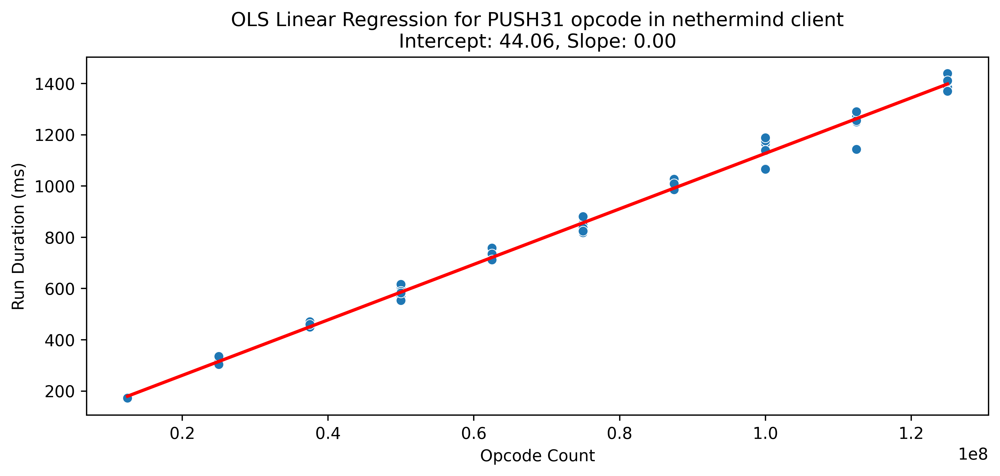


## reth


```python
                            OLS Regression Results                            
==============================================================================
Dep. Variable:        run_duration_ms   R-squared:                       0.987
Model:                            OLS   Adj. R-squared:                  0.987
Method:                 Least Squares   F-statistic:                     4006.
Date:                Mon, 22 Dec 2025   Prob (F-statistic):           7.01e-51
Time:                        12:04:01   Log-Likelihood:                -238.51
No. Observations:                  54   AIC:                             481.0
Df Residuals:                      52   BIC:                             485.0
Df Model:                           1                                         
Covariance Type:            nonrobust                                         
==============================================================================
                 coef    std err          t      P>|t|      [0.025      0.975]
------------------------------------------------------------------------------
const         37.4215      6.038      6.198      0.000      25.306      49.537
opcount     4.967e-06   7.85e-08     63.290      0.000    4.81e-06    5.12e-06
==============================================================================
Omnibus:                        5.989   Durbin-Watson:                   1.597
Prob(Omnibus):                  0.050   Jarque-Bera (JB):                7.212
Skew:                           0.314   Prob(JB):                       0.0272
Kurtosis:                       4.677   Cond. No.                     1.67e+08
==============================================================================

Notes:
[1] Standard Errors assume that the covariance matrix of the errors is correctly specified.
[2] The condition number is large, 1.67e+08. This might indicate that there are
strong multicollinearity or other numerical problems.
```


## besu


```python
                            OLS Regression Results                            
==============================================================================
Dep. Variable:        run_duration_ms   R-squared:                       0.876
Model:                            OLS   Adj. R-squared:                  0.874
Method:                 Least Squares   F-statistic:                     368.2
Date:                Mon, 22 Dec 2025   Prob (F-statistic):           2.99e-25
Time:                        12:04:01   Log-Likelihood:                -403.83
No. Observations:                  54   AIC:                             811.7
Df Residuals:                      52   BIC:                             815.6
Df Model:                           1                                         
Covariance Type:            nonrobust                                         
==============================================================================
                 coef    std err          t      P>|t|      [0.025      0.975]
------------------------------------------------------------------------------
const          6.6741    128.953      0.052      0.959    -252.089     265.437
opcount     3.217e-05   1.68e-06     19.188      0.000    2.88e-05    3.55e-05
==============================================================================
Omnibus:                       27.813   Durbin-Watson:                   0.522
Prob(Omnibus):                  0.000   Jarque-Bera (JB):               45.851
Skew:                           1.774   Prob(JB):                     1.11e-10
Kurtosis:                       5.791   Cond. No.                     1.67e+08
==============================================================================

Notes:
[1] Standard Errors assume that the covariance matrix of the errors is correctly specified.
[2] The condition number is large, 1.67e+08. This might indicate that there are
strong multicollinearity or other numerical problems.
```

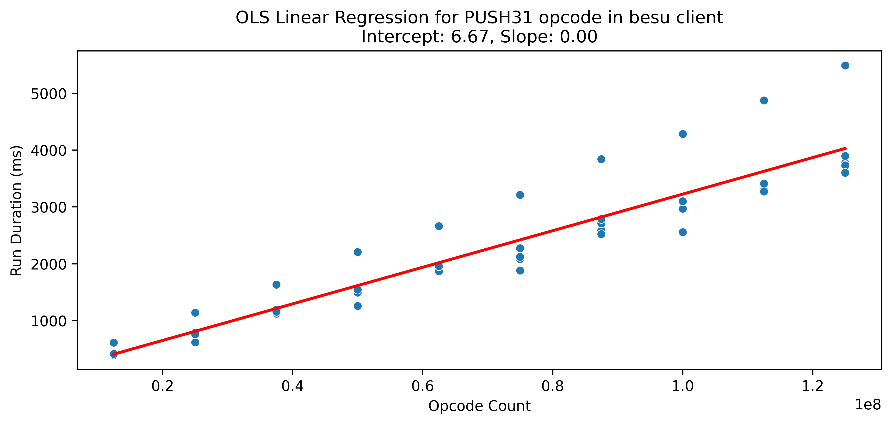


## geth


```python
                            OLS Regression Results                            
==============================================================================
Dep. Variable:        run_duration_ms   R-squared:                       0.988
Model:                            OLS   Adj. R-squared:                  0.988
Method:                 Least Squares   F-statistic:                     4318.
Date:                Mon, 22 Dec 2025   Prob (F-statistic):           1.02e-51
Time:                        12:04:02   Log-Likelihood:                -316.00
No. Observations:                  54   AIC:                             636.0
Df Residuals:                      52   BIC:                             640.0
Df Model:                           1                                         
Covariance Type:            nonrobust                                         
==============================================================================
                 coef    std err          t      P>|t|      [0.025      0.975]
------------------------------------------------------------------------------
const         40.6880     25.354      1.605      0.115     -10.188      91.564
opcount     2.166e-05    3.3e-07     65.712      0.000     2.1e-05    2.23e-05
==============================================================================
Omnibus:                       95.787   Durbin-Watson:                   1.891
Prob(Omnibus):                  0.000   Jarque-Bera (JB):             2465.279
Skew:                           5.014   Prob(JB):                         0.00
Kurtosis:                      34.546   Cond. No.                     1.67e+08
==============================================================================

Notes:
[1] Standard Errors assume that the covariance matrix of the errors is correctly specified.
[2] The condition number is large, 1.67e+08. This might indicate that there are
strong multicollinearity or other numerical problems.
```

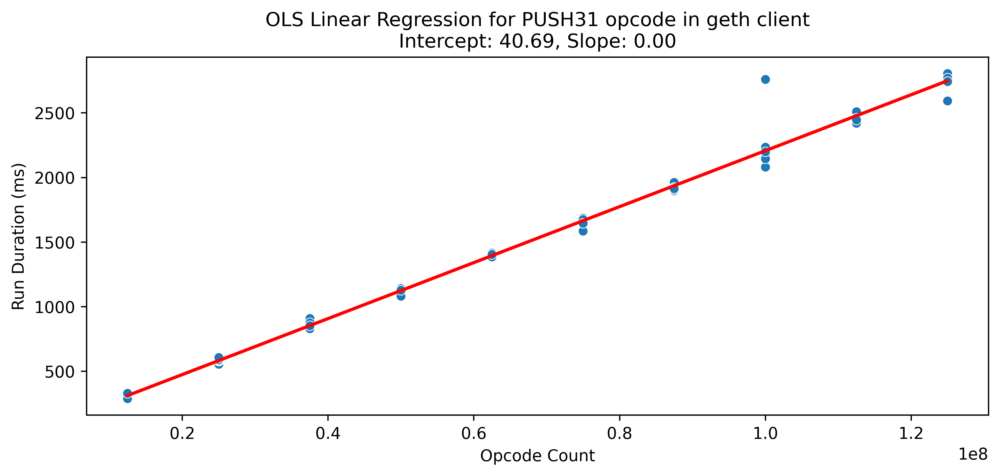


# PUSH32

## nethermind


```python
                            OLS Regression Results                            
==============================================================================
Dep. Variable:        run_duration_ms   R-squared:                       0.993
Model:                            OLS   Adj. R-squared:                  0.993
Method:                 Least Squares   F-statistic:                     7594.
Date:                Mon, 22 Dec 2025   Prob (F-statistic):           4.90e-58
Time:                        12:04:02   Log-Likelihood:                -248.54
No. Observations:                  54   AIC:                             501.1
Df Residuals:                      52   BIC:                             505.1
Df Model:                           1                                         
Covariance Type:            nonrobust                                         
==============================================================================
                 coef    std err          t      P>|t|      [0.025      0.975]
------------------------------------------------------------------------------
const         46.0886      7.270      6.339      0.000      31.500      60.677
opcount     8.236e-06   9.45e-08     87.144      0.000    8.05e-06    8.43e-06
==============================================================================
Omnibus:                       24.381   Durbin-Watson:                   2.100
Prob(Omnibus):                  0.000   Jarque-Bera (JB):               50.308
Skew:                          -1.330   Prob(JB):                     1.19e-11
Kurtosis:                       6.910   Cond. No.                     1.67e+08
==============================================================================

Notes:
[1] Standard Errors assume that the covariance matrix of the errors is correctly specified.
[2] The condition number is large, 1.67e+08. This might indicate that there are
strong multicollinearity or other numerical problems.
```

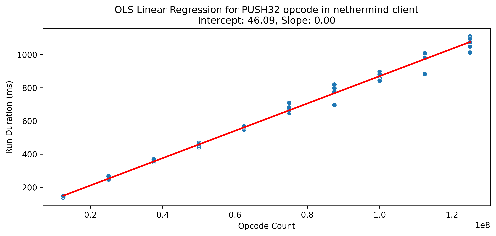


## reth


```python
                            OLS Regression Results                            
==============================================================================
Dep. Variable:        run_duration_ms   R-squared:                       0.983
Model:                            OLS   Adj. R-squared:                  0.983
Method:                 Least Squares   F-statistic:                     2986.
Date:                Mon, 22 Dec 2025   Prob (F-statistic):           1.30e-47
Time:                        12:04:02   Log-Likelihood:                -245.77
No. Observations:                  54   AIC:                             495.5
Df Residuals:                      52   BIC:                             499.5
Df Model:                           1                                         
Covariance Type:            nonrobust                                         
==============================================================================
                 coef    std err          t      P>|t|      [0.025      0.975]
------------------------------------------------------------------------------
const         38.3148      6.906      5.548      0.000      24.456      52.173
opcount     4.906e-06   8.98e-08     54.649      0.000    4.73e-06    5.09e-06
==============================================================================
Omnibus:                        1.464   Durbin-Watson:                   1.437
Prob(Omnibus):                  0.481   Jarque-Bera (JB):                0.923
Skew:                          -0.311   Prob(JB):                        0.630
Kurtosis:                       3.152   Cond. No.                     1.67e+08
==============================================================================

Notes:
[1] Standard Errors assume that the covariance matrix of the errors is correctly specified.
[2] The condition number is large, 1.67e+08. This might indicate that there are
strong multicollinearity or other numerical problems.
```

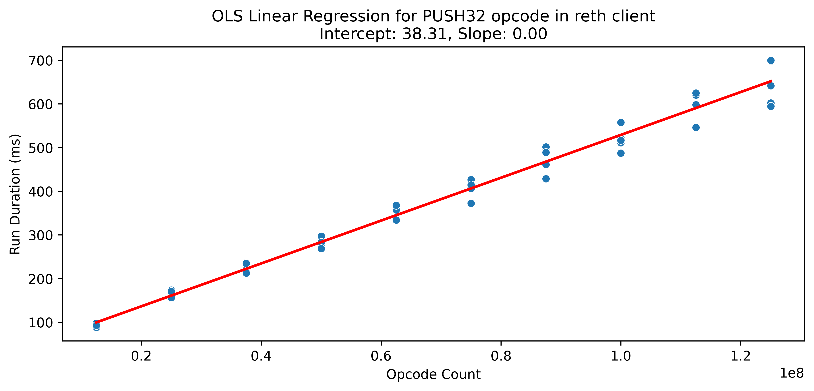


## besu


```python
                            OLS Regression Results                            
==============================================================================
Dep. Variable:        run_duration_ms   R-squared:                       0.880
Model:                            OLS   Adj. R-squared:                  0.878
Method:                 Least Squares   F-statistic:                     382.5
Date:                Mon, 22 Dec 2025   Prob (F-statistic):           1.25e-25
Time:                        12:04:02   Log-Likelihood:                -402.60
No. Observations:                  54   AIC:                             809.2
Df Residuals:                      52   BIC:                             813.2
Df Model:                           1                                         
Covariance Type:            nonrobust                                         
==============================================================================
                 coef    std err          t      P>|t|      [0.025      0.975]
------------------------------------------------------------------------------
const          5.5785    126.047      0.044      0.965    -247.353     258.510
opcount     3.205e-05   1.64e-06     19.558      0.000    2.88e-05    3.53e-05
==============================================================================
Omnibus:                       27.456   Durbin-Watson:                   0.409
Prob(Omnibus):                  0.000   Jarque-Bera (JB):               45.422
Skew:                           1.738   Prob(JB):                     1.37e-10
Kurtosis:                       5.847   Cond. No.                     1.67e+08
==============================================================================

Notes:
[1] Standard Errors assume that the covariance matrix of the errors is correctly specified.
[2] The condition number is large, 1.67e+08. This might indicate that there are
strong multicollinearity or other numerical problems.
```


## geth


```python
                            OLS Regression Results                            
==============================================================================
Dep. Variable:        run_duration_ms   R-squared:                       0.961
Model:                            OLS   Adj. R-squared:                  0.960
Method:                 Least Squares   F-statistic:                     1271.
Date:                Mon, 22 Dec 2025   Prob (F-statistic):           3.21e-38
Time:                        12:04:02   Log-Likelihood:                -350.20
No. Observations:                  54   AIC:                             704.4
Df Residuals:                      52   BIC:                             708.4
Df Model:                           1                                         
Covariance Type:            nonrobust                                         
==============================================================================
                 coef    std err          t      P>|t|      [0.025      0.975]
------------------------------------------------------------------------------
const         -8.0339     47.772     -0.168      0.867    -103.895      87.827
opcount     2.214e-05   6.21e-07     35.649      0.000    2.09e-05    2.34e-05
==============================================================================
Omnibus:                       79.166   Durbin-Watson:                   1.923
Prob(Omnibus):                  0.000   Jarque-Bera (JB):              879.048
Skew:                           4.146   Prob(JB):                    1.31e-191
Kurtosis:                      20.943   Cond. No.                     1.67e+08
==============================================================================

Notes:
[1] Standard Errors assume that the covariance matrix of the errors is correctly specified.
[2] The condition number is large, 1.67e+08. This might indicate that there are
strong multicollinearity or other numerical problems.
```


# DUP1

## nethermind


```python
                            OLS Regression Results                            
==============================================================================
Dep. Variable:        run_duration_ms   R-squared:                       0.994
Model:                            OLS   Adj. R-squared:                  0.993
Method:                 Least Squares   F-statistic:                     8100.
Date:                Mon, 22 Dec 2025   Prob (F-statistic):           9.26e-59
Time:                        12:04:02   Log-Likelihood:                -216.48
No. Observations:                  54   AIC:                             437.0
Df Residuals:                      52   BIC:                             440.9
Df Model:                           1                                         
Covariance Type:            nonrobust                                         
==============================================================================
                 coef    std err          t      P>|t|      [0.025      0.975]
------------------------------------------------------------------------------
const         42.7778      4.015     10.654      0.000      34.721      50.835
opcount     4.698e-06   5.22e-08     89.998      0.000    4.59e-06     4.8e-06
==============================================================================
Omnibus:                        3.917   Durbin-Watson:                   1.941
Prob(Omnibus):                  0.141   Jarque-Bera (JB):                2.884
Skew:                          -0.451   Prob(JB):                        0.236
Kurtosis:                       3.684   Cond. No.                     1.67e+08
==============================================================================

Notes:
[1] Standard Errors assume that the covariance matrix of the errors is correctly specified.
[2] The condition number is large, 1.67e+08. This might indicate that there are
strong multicollinearity or other numerical problems.
```


## reth


```python
                            OLS Regression Results                            
==============================================================================
Dep. Variable:        run_duration_ms   R-squared:                       0.995
Model:                            OLS   Adj. R-squared:                  0.995
Method:                 Least Squares   F-statistic:                 1.112e+04
Date:                Mon, 22 Dec 2025   Prob (F-statistic):           2.58e-62
Time:                        12:04:02   Log-Likelihood:                -197.87
No. Observations:                  54   AIC:                             399.7
Df Residuals:                      52   BIC:                             403.7
Df Model:                           1                                         
Covariance Type:            nonrobust                                         
==============================================================================
                 coef    std err          t      P>|t|      [0.025      0.975]
------------------------------------------------------------------------------
const         40.8226      2.845     14.351      0.000      35.115      46.531
opcount     3.899e-06    3.7e-08    105.435      0.000    3.82e-06    3.97e-06
==============================================================================
Omnibus:                        3.266   Durbin-Watson:                   1.487
Prob(Omnibus):                  0.195   Jarque-Bera (JB):                2.603
Skew:                          -0.227   Prob(JB):                        0.272
Kurtosis:                       3.975   Cond. No.                     1.67e+08
==============================================================================

Notes:
[1] Standard Errors assume that the covariance matrix of the errors is correctly specified.
[2] The condition number is large, 1.67e+08. This might indicate that there are
strong multicollinearity or other numerical problems.
```

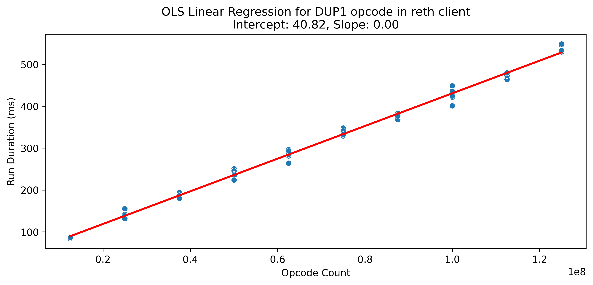


## besu


```python
                            OLS Regression Results                            
==============================================================================
Dep. Variable:        run_duration_ms   R-squared:                       0.833
Model:                            OLS   Adj. R-squared:                  0.830
Method:                 Least Squares   F-statistic:                     259.3
Date:                Mon, 22 Dec 2025   Prob (F-statistic):           7.48e-22
Time:                        12:04:03   Log-Likelihood:                -401.72
No. Observations:                  54   AIC:                             807.4
Df Residuals:                      52   BIC:                             811.4
Df Model:                           1                                         
Covariance Type:            nonrobust                                         
==============================================================================
                 coef    std err          t      P>|t|      [0.025      0.975]
------------------------------------------------------------------------------
const        -10.4780    124.025     -0.084      0.933    -259.352     238.396
opcount     2.596e-05   1.61e-06     16.102      0.000    2.27e-05    2.92e-05
==============================================================================
Omnibus:                       24.247   Durbin-Watson:                   0.674
Prob(Omnibus):                  0.000   Jarque-Bera (JB):               36.571
Skew:                           1.585   Prob(JB):                     1.14e-08
Kurtosis:                       5.491   Cond. No.                     1.67e+08
==============================================================================

Notes:
[1] Standard Errors assume that the covariance matrix of the errors is correctly specified.
[2] The condition number is large, 1.67e+08. This might indicate that there are
strong multicollinearity or other numerical problems.
```

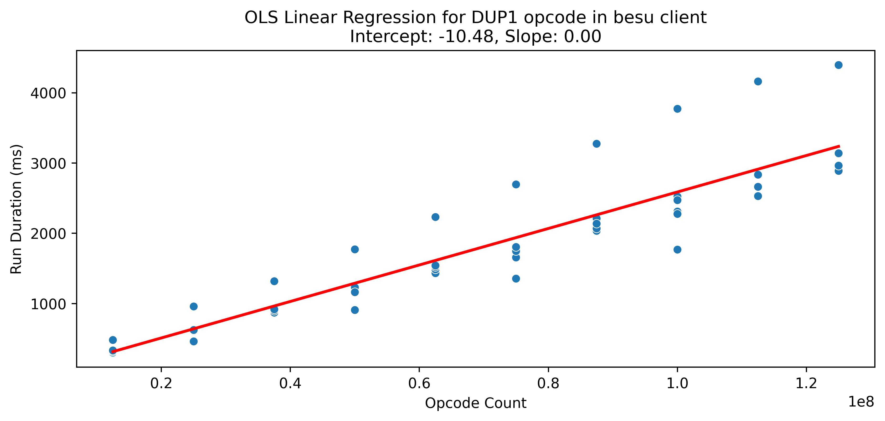


## geth


```python
                            OLS Regression Results                            
==============================================================================
Dep. Variable:        run_duration_ms   R-squared:                       0.993
Model:                            OLS   Adj. R-squared:                  0.993
Method:                 Least Squares   F-statistic:                     7897.
Date:                Mon, 22 Dec 2025   Prob (F-statistic):           1.78e-58
Time:                        12:04:03   Log-Likelihood:                -260.22
No. Observations:                  54   AIC:                             524.4
Df Residuals:                      52   BIC:                             528.4
Df Model:                           1                                         
Covariance Type:            nonrobust                                         
==============================================================================
                 coef    std err          t      P>|t|      [0.025      0.975]
------------------------------------------------------------------------------
const         40.5774      9.026      4.496      0.000      22.465      58.690
opcount     1.043e-05   1.17e-07     88.864      0.000    1.02e-05    1.07e-05
==============================================================================
Omnibus:                       22.395   Durbin-Watson:                   1.651
Prob(Omnibus):                  0.000   Jarque-Bera (JB):               50.699
Skew:                           1.149   Prob(JB):                     9.79e-12
Kurtosis:                       7.154   Cond. No.                     1.67e+08
==============================================================================

Notes:
[1] Standard Errors assume that the covariance matrix of the errors is correctly specified.
[2] The condition number is large, 1.67e+08. This might indicate that there are
strong multicollinearity or other numerical problems.
```


# DUP2

## nethermind


```python
                            OLS Regression Results                            
==============================================================================
Dep. Variable:        run_duration_ms   R-squared:                       0.981
Model:                            OLS   Adj. R-squared:                  0.981
Method:                 Least Squares   F-statistic:                     2675.
Date:                Mon, 22 Dec 2025   Prob (F-statistic):           2.17e-46
Time:                        12:04:03   Log-Likelihood:                -246.96
No. Observations:                  54   AIC:                             497.9
Df Residuals:                      52   BIC:                             501.9
Df Model:                           1                                         
Covariance Type:            nonrobust                                         
==============================================================================
                 coef    std err          t      P>|t|      [0.025      0.975]
------------------------------------------------------------------------------
const         44.3665      7.060      6.284      0.000      30.199      58.534
opcount     4.747e-06   9.18e-08     51.717      0.000    4.56e-06    4.93e-06
==============================================================================
Omnibus:                       20.055   Durbin-Watson:                   1.726
Prob(Omnibus):                  0.000   Jarque-Bera (JB):               68.330
Skew:                           0.787   Prob(JB):                     1.45e-15
Kurtosis:                       8.281   Cond. No.                     1.67e+08
==============================================================================

Notes:
[1] Standard Errors assume that the covariance matrix of the errors is correctly specified.
[2] The condition number is large, 1.67e+08. This might indicate that there are
strong multicollinearity or other numerical problems.
```

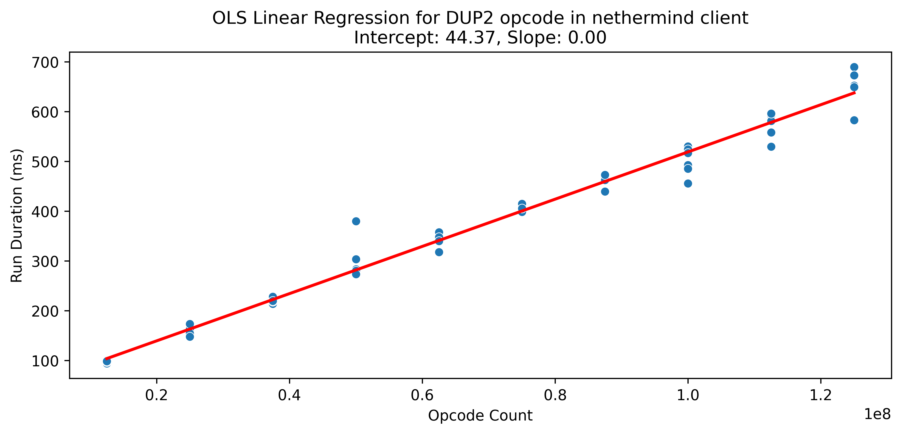


## reth


```python
                            OLS Regression Results                            
==============================================================================
Dep. Variable:        run_duration_ms   R-squared:                       0.991
Model:                            OLS   Adj. R-squared:                  0.991
Method:                 Least Squares   F-statistic:                     6028.
Date:                Mon, 22 Dec 2025   Prob (F-statistic):           1.90e-55
Time:                        12:04:03   Log-Likelihood:                -216.18
No. Observations:                  54   AIC:                             436.4
Df Residuals:                      52   BIC:                             440.3
Df Model:                           1                                         
Covariance Type:            nonrobust                                         
==============================================================================
                 coef    std err          t      P>|t|      [0.025      0.975]
------------------------------------------------------------------------------
const         36.7721      3.993      9.209      0.000      28.760      44.784
opcount      4.03e-06   5.19e-08     77.639      0.000    3.93e-06    4.13e-06
==============================================================================
Omnibus:                       25.870   Durbin-Watson:                   1.776
Prob(Omnibus):                  0.000   Jarque-Bera (JB):               60.771
Skew:                          -1.345   Prob(JB):                     6.37e-14
Kurtosis:                       7.447   Cond. No.                     1.67e+08
==============================================================================

Notes:
[1] Standard Errors assume that the covariance matrix of the errors is correctly specified.
[2] The condition number is large, 1.67e+08. This might indicate that there are
strong multicollinearity or other numerical problems.
```


## besu


```python
                            OLS Regression Results                            
==============================================================================
Dep. Variable:        run_duration_ms   R-squared:                       0.808
Model:                            OLS   Adj. R-squared:                  0.804
Method:                 Least Squares   F-statistic:                     218.3
Date:                Mon, 22 Dec 2025   Prob (F-statistic):           2.99e-20
Time:                        12:04:03   Log-Likelihood:                -406.01
No. Observations:                  54   AIC:                             816.0
Df Residuals:                      52   BIC:                             820.0
Df Model:                           1                                         
Covariance Type:            nonrobust                                         
==============================================================================
                 coef    std err          t      P>|t|      [0.025      0.975]
------------------------------------------------------------------------------
const         -2.1236    134.279     -0.016      0.987    -271.575     267.328
opcount     2.579e-05   1.75e-06     14.774      0.000    2.23e-05    2.93e-05
==============================================================================
Omnibus:                       25.968   Durbin-Watson:                   0.559
Prob(Omnibus):                  0.000   Jarque-Bera (JB):               40.461
Skew:                           1.692   Prob(JB):                     1.64e-09
Kurtosis:                       5.556   Cond. No.                     1.67e+08
==============================================================================

Notes:
[1] Standard Errors assume that the covariance matrix of the errors is correctly specified.
[2] The condition number is large, 1.67e+08. This might indicate that there are
strong multicollinearity or other numerical problems.
```

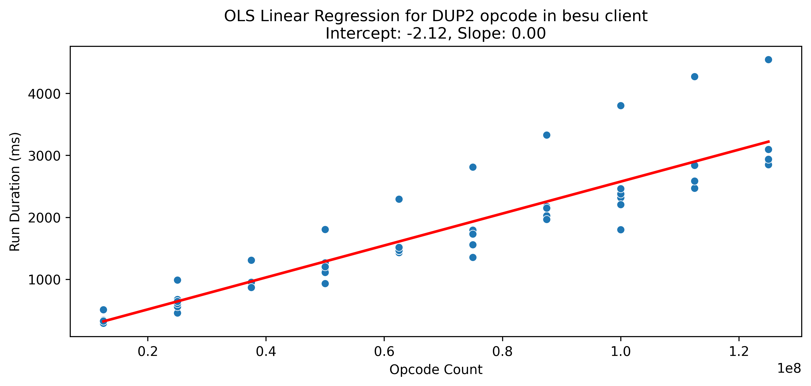


## geth


```python
                            OLS Regression Results                            
==============================================================================
Dep. Variable:        run_duration_ms   R-squared:                       0.984
Model:                            OLS   Adj. R-squared:                  0.984
Method:                 Least Squares   F-statistic:                     3264.
Date:                Mon, 22 Dec 2025   Prob (F-statistic):           1.34e-48
Time:                        12:04:03   Log-Likelihood:                -285.30
No. Observations:                  54   AIC:                             574.6
Df Residuals:                      52   BIC:                             578.6
Df Model:                           1                                         
Covariance Type:            nonrobust                                         
==============================================================================
                 coef    std err          t      P>|t|      [0.025      0.975]
------------------------------------------------------------------------------
const         36.3128     14.361      2.529      0.015       7.495      65.130
opcount     1.067e-05   1.87e-07     57.130      0.000    1.03e-05     1.1e-05
==============================================================================
Omnibus:                       56.366   Durbin-Watson:                   1.926
Prob(Omnibus):                  0.000   Jarque-Bera (JB):              314.572
Skew:                           2.829   Prob(JB):                     4.92e-69
Kurtosis:                      13.383   Cond. No.                     1.67e+08
==============================================================================

Notes:
[1] Standard Errors assume that the covariance matrix of the errors is correctly specified.
[2] The condition number is large, 1.67e+08. This might indicate that there are
strong multicollinearity or other numerical problems.
```


# DUP3

## nethermind


```python
                            OLS Regression Results                            
==============================================================================
Dep. Variable:        run_duration_ms   R-squared:                       0.995
Model:                            OLS   Adj. R-squared:                  0.995
Method:                 Least Squares   F-statistic:                 1.076e+04
Date:                Mon, 22 Dec 2025   Prob (F-statistic):           6.02e-62
Time:                        12:04:03   Log-Likelihood:                -210.64
No. Observations:                  54   AIC:                             425.3
Df Residuals:                      52   BIC:                             429.3
Df Model:                           1                                         
Covariance Type:            nonrobust                                         
==============================================================================
                 coef    std err          t      P>|t|      [0.025      0.975]
------------------------------------------------------------------------------
const         38.3047      3.604     10.629      0.000      31.073      45.536
opcount     4.859e-06   4.68e-08    103.719      0.000    4.76e-06    4.95e-06
==============================================================================
Omnibus:                       19.536   Durbin-Watson:                   2.056
Prob(Omnibus):                  0.000   Jarque-Bera (JB):               31.255
Skew:                          -1.177   Prob(JB):                     1.63e-07
Kurtosis:                       5.890   Cond. No.                     1.67e+08
==============================================================================

Notes:
[1] Standard Errors assume that the covariance matrix of the errors is correctly specified.
[2] The condition number is large, 1.67e+08. This might indicate that there are
strong multicollinearity or other numerical problems.
```


## reth


```python
                            OLS Regression Results                            
==============================================================================
Dep. Variable:        run_duration_ms   R-squared:                       0.985
Model:                            OLS   Adj. R-squared:                  0.985
Method:                 Least Squares   F-statistic:                     3447.
Date:                Mon, 22 Dec 2025   Prob (F-statistic):           3.29e-49
Time:                        12:04:03   Log-Likelihood:                -229.09
No. Observations:                  54   AIC:                             462.2
Df Residuals:                      52   BIC:                             466.2
Df Model:                           1                                         
Covariance Type:            nonrobust                                         
==============================================================================
                 coef    std err          t      P>|t|      [0.025      0.975]
------------------------------------------------------------------------------
const         35.5533      5.071      7.011      0.000      25.377      45.730
opcount     3.871e-06   6.59e-08     58.713      0.000    3.74e-06       4e-06
==============================================================================
Omnibus:                        1.068   Durbin-Watson:                   0.923
Prob(Omnibus):                  0.586   Jarque-Bera (JB):                0.404
Skew:                           0.040   Prob(JB):                        0.817
Kurtosis:                       3.416   Cond. No.                     1.67e+08
==============================================================================

Notes:
[1] Standard Errors assume that the covariance matrix of the errors is correctly specified.
[2] The condition number is large, 1.67e+08. This might indicate that there are
strong multicollinearity or other numerical problems.
```

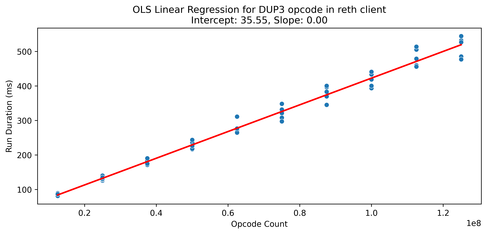


## besu


```python
                            OLS Regression Results                            
==============================================================================
Dep. Variable:        run_duration_ms   R-squared:                       0.817
Model:                            OLS   Adj. R-squared:                  0.814
Method:                 Least Squares   F-statistic:                     232.4
Date:                Mon, 22 Dec 2025   Prob (F-statistic):           7.93e-21
Time:                        12:04:04   Log-Likelihood:                -403.81
No. Observations:                  54   AIC:                             811.6
Df Residuals:                      52   BIC:                             815.6
Df Model:                           1                                         
Covariance Type:            nonrobust                                         
==============================================================================
                 coef    std err          t      P>|t|      [0.025      0.975]
------------------------------------------------------------------------------
const          7.3373    128.906      0.057      0.955    -251.331     266.005
opcount     2.554e-05   1.68e-06     15.243      0.000    2.22e-05    2.89e-05
==============================================================================
Omnibus:                       25.508   Durbin-Watson:                   0.620
Prob(Omnibus):                  0.000   Jarque-Bera (JB):               39.709
Skew:                           1.652   Prob(JB):                     2.38e-09
Kurtosis:                       5.595   Cond. No.                     1.67e+08
==============================================================================

Notes:
[1] Standard Errors assume that the covariance matrix of the errors is correctly specified.
[2] The condition number is large, 1.67e+08. This might indicate that there are
strong multicollinearity or other numerical problems.
```


## geth


```python
                            OLS Regression Results                            
==============================================================================
Dep. Variable:        run_duration_ms   R-squared:                       0.992
Model:                            OLS   Adj. R-squared:                  0.992
Method:                 Least Squares   F-statistic:                     6674.
Date:                Mon, 22 Dec 2025   Prob (F-statistic):           1.38e-56
Time:                        12:04:04   Log-Likelihood:                -264.28
No. Observations:                  54   AIC:                             532.6
Df Residuals:                      52   BIC:                             536.5
Df Model:                           1                                         
Covariance Type:            nonrobust                                         
==============================================================================
                 coef    std err          t      P>|t|      [0.025      0.975]
------------------------------------------------------------------------------
const         46.0620      9.731      4.734      0.000      26.536      65.588
opcount     1.033e-05   1.27e-07     81.692      0.000    1.01e-05    1.06e-05
==============================================================================
Omnibus:                       58.715   Durbin-Watson:                   2.275
Prob(Omnibus):                  0.000   Jarque-Bera (JB):              349.973
Skew:                           2.957   Prob(JB):                     1.01e-76
Kurtosis:                      13.981   Cond. No.                     1.67e+08
==============================================================================

Notes:
[1] Standard Errors assume that the covariance matrix of the errors is correctly specified.
[2] The condition number is large, 1.67e+08. This might indicate that there are
strong multicollinearity or other numerical problems.
```


# DUP4

## nethermind


```python
                            OLS Regression Results                            
==============================================================================
Dep. Variable:        run_duration_ms   R-squared:                       0.995
Model:                            OLS   Adj. R-squared:                  0.995
Method:                 Least Squares   F-statistic:                     9766.
Date:                Mon, 22 Dec 2025   Prob (F-statistic):           7.36e-61
Time:                        12:04:04   Log-Likelihood:                -213.66
No. Observations:                  54   AIC:                             431.3
Df Residuals:                      52   BIC:                             435.3
Df Model:                           1                                         
Covariance Type:            nonrobust                                         
==============================================================================
                 coef    std err          t      P>|t|      [0.025      0.975]
------------------------------------------------------------------------------
const         36.4228      3.811      9.557      0.000      28.776      44.070
opcount     4.896e-06   4.95e-08     98.822      0.000     4.8e-06       5e-06
==============================================================================
Omnibus:                       14.461   Durbin-Watson:                   1.991
Prob(Omnibus):                  0.001   Jarque-Bera (JB):               33.919
Skew:                           0.624   Prob(JB):                     4.31e-08
Kurtosis:                       6.677   Cond. No.                     1.67e+08
==============================================================================

Notes:
[1] Standard Errors assume that the covariance matrix of the errors is correctly specified.
[2] The condition number is large, 1.67e+08. This might indicate that there are
strong multicollinearity or other numerical problems.
```

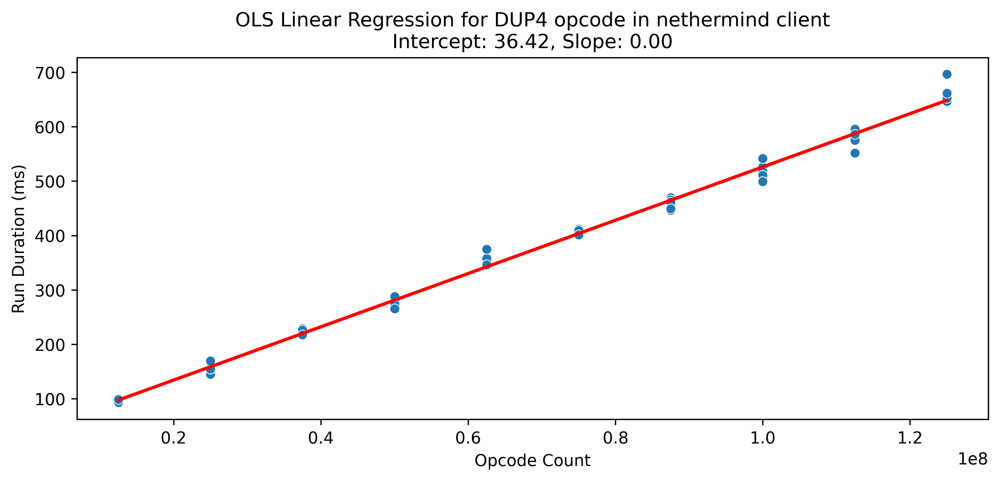


## reth


```python
                            OLS Regression Results                            
==============================================================================
Dep. Variable:        run_duration_ms   R-squared:                       0.987
Model:                            OLS   Adj. R-squared:                  0.987
Method:                 Least Squares   F-statistic:                     4053.
Date:                Mon, 22 Dec 2025   Prob (F-statistic):           5.20e-51
Time:                        12:04:04   Log-Likelihood:                -224.75
No. Observations:                  54   AIC:                             453.5
Df Residuals:                      52   BIC:                             457.5
Df Model:                           1                                         
Covariance Type:            nonrobust                                         
==============================================================================
                 coef    std err          t      P>|t|      [0.025      0.975]
------------------------------------------------------------------------------
const         34.7038      4.680      7.416      0.000      25.313      44.094
opcount     3.873e-06   6.08e-08     63.660      0.000    3.75e-06    3.99e-06
==============================================================================
Omnibus:                        0.434   Durbin-Watson:                   1.256
Prob(Omnibus):                  0.805   Jarque-Bera (JB):                0.055
Skew:                          -0.011   Prob(JB):                        0.973
Kurtosis:                       3.155   Cond. No.                     1.67e+08
==============================================================================

Notes:
[1] Standard Errors assume that the covariance matrix of the errors is correctly specified.
[2] The condition number is large, 1.67e+08. This might indicate that there are
strong multicollinearity or other numerical problems.
```

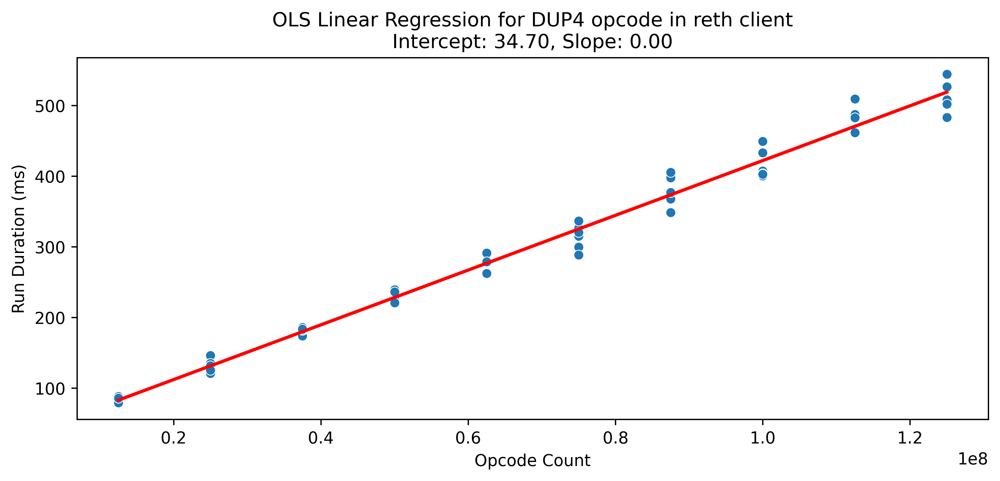


## besu


```python
                            OLS Regression Results                            
==============================================================================
Dep. Variable:        run_duration_ms   R-squared:                       0.819
Model:                            OLS   Adj. R-squared:                  0.816
Method:                 Least Squares   F-statistic:                     236.0
Date:                Mon, 22 Dec 2025   Prob (F-statistic):           5.68e-21
Time:                        12:04:04   Log-Likelihood:                -403.86
No. Observations:                  54   AIC:                             811.7
Df Residuals:                      52   BIC:                             815.7
Df Model:                           1                                         
Covariance Type:            nonrobust                                         
==============================================================================
                 coef    std err          t      P>|t|      [0.025      0.975]
------------------------------------------------------------------------------
const         -4.1020    129.032     -0.032      0.975    -263.024     254.820
opcount     2.577e-05   1.68e-06     15.363      0.000    2.24e-05    2.91e-05
==============================================================================
Omnibus:                       28.334   Durbin-Watson:                   0.551
Prob(Omnibus):                  0.000   Jarque-Bera (JB):               49.065
Skew:                           1.754   Prob(JB):                     2.22e-11
Kurtosis:                       6.082   Cond. No.                     1.67e+08
==============================================================================

Notes:
[1] Standard Errors assume that the covariance matrix of the errors is correctly specified.
[2] The condition number is large, 1.67e+08. This might indicate that there are
strong multicollinearity or other numerical problems.
```

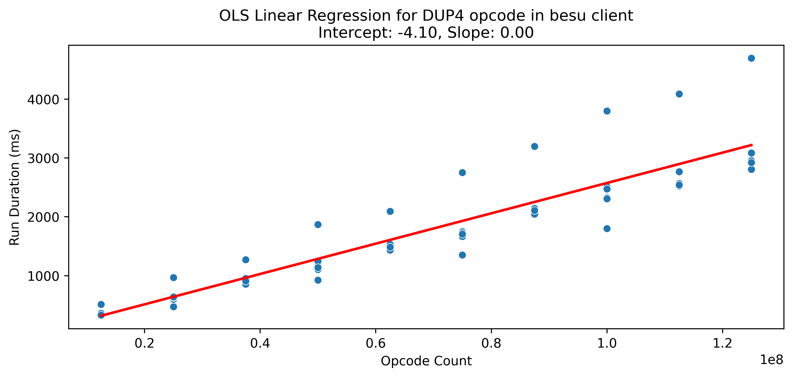


## geth


```python
                            OLS Regression Results                            
==============================================================================
Dep. Variable:        run_duration_ms   R-squared:                       0.966
Model:                            OLS   Adj. R-squared:                  0.966
Method:                 Least Squares   F-statistic:                     1491.
Date:                Mon, 22 Dec 2025   Prob (F-statistic):           5.82e-40
Time:                        12:04:04   Log-Likelihood:                -306.74
No. Observations:                  54   AIC:                             617.5
Df Residuals:                      52   BIC:                             621.4
Df Model:                           1                                         
Covariance Type:            nonrobust                                         
==============================================================================
                 coef    std err          t      P>|t|      [0.025      0.975]
------------------------------------------------------------------------------
const         31.2037     21.358      1.461      0.150     -11.655      74.062
opcount     1.072e-05   2.78e-07     38.618      0.000    1.02e-05    1.13e-05
==============================================================================
Omnibus:                      110.530   Durbin-Watson:                   1.995
Prob(Omnibus):                  0.000   Jarque-Bera (JB):             4147.250
Skew:                           6.240   Prob(JB):                         0.00
Kurtosis:                      44.079   Cond. No.                     1.67e+08
==============================================================================

Notes:
[1] Standard Errors assume that the covariance matrix of the errors is correctly specified.
[2] The condition number is large, 1.67e+08. This might indicate that there are
strong multicollinearity or other numerical problems.
```

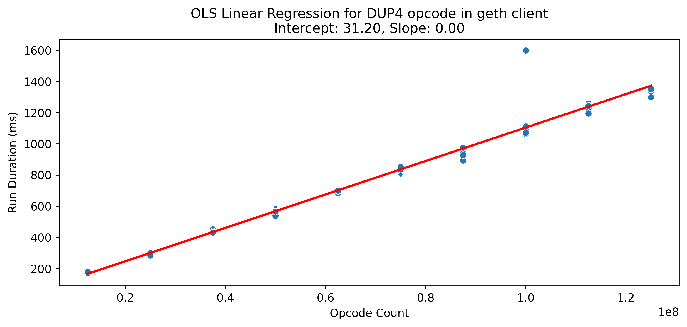


# DUP5

## nethermind


```python
                            OLS Regression Results                            
==============================================================================
Dep. Variable:        run_duration_ms   R-squared:                       0.996
Model:                            OLS   Adj. R-squared:                  0.996
Method:                 Least Squares   F-statistic:                 1.479e+04
Date:                Mon, 22 Dec 2025   Prob (F-statistic):           1.59e-65
Time:                        12:04:04   Log-Likelihood:                -202.16
No. Observations:                  54   AIC:                             408.3
Df Residuals:                      52   BIC:                             412.3
Df Model:                           1                                         
Covariance Type:            nonrobust                                         
==============================================================================
                 coef    std err          t      P>|t|      [0.025      0.975]
------------------------------------------------------------------------------
const         38.2023      3.080     12.404      0.000      32.022      44.382
opcount     4.869e-06      4e-08    121.608      0.000    4.79e-06    4.95e-06
==============================================================================
Omnibus:                       19.532   Durbin-Watson:                   2.122
Prob(Omnibus):                  0.000   Jarque-Bera (JB):               31.279
Skew:                          -1.176   Prob(JB):                     1.61e-07
Kurtosis:                       5.893   Cond. No.                     1.67e+08
==============================================================================

Notes:
[1] Standard Errors assume that the covariance matrix of the errors is correctly specified.
[2] The condition number is large, 1.67e+08. This might indicate that there are
strong multicollinearity or other numerical problems.
```

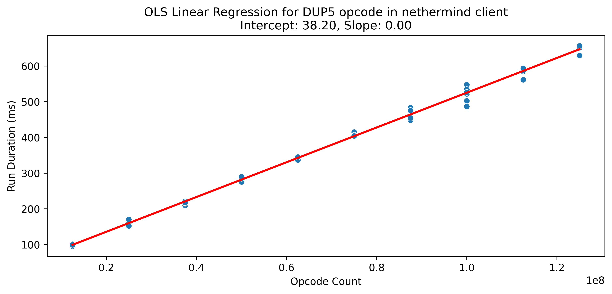


## reth


```python
                            OLS Regression Results                            
==============================================================================
Dep. Variable:        run_duration_ms   R-squared:                       0.988
Model:                            OLS   Adj. R-squared:                  0.988
Method:                 Least Squares   F-statistic:                     4382.
Date:                Mon, 22 Dec 2025   Prob (F-statistic):           6.99e-52
Time:                        12:04:05   Log-Likelihood:                -222.21
No. Observations:                  54   AIC:                             448.4
Df Residuals:                      52   BIC:                             452.4
Df Model:                           1                                         
Covariance Type:            nonrobust                                         
==============================================================================
                 coef    std err          t      P>|t|      [0.025      0.975]
------------------------------------------------------------------------------
const         41.2805      4.464      9.247      0.000      32.323      50.238
opcount     3.841e-06    5.8e-08     66.194      0.000    3.72e-06    3.96e-06
==============================================================================
Omnibus:                        0.546   Durbin-Watson:                   1.012
Prob(Omnibus):                  0.761   Jarque-Bera (JB):                0.178
Skew:                          -0.127   Prob(JB):                        0.915
Kurtosis:                       3.121   Cond. No.                     1.67e+08
==============================================================================

Notes:
[1] Standard Errors assume that the covariance matrix of the errors is correctly specified.
[2] The condition number is large, 1.67e+08. This might indicate that there are
strong multicollinearity or other numerical problems.
```


## besu


```python
                            OLS Regression Results                            
==============================================================================
Dep. Variable:        run_duration_ms   R-squared:                       0.818
Model:                            OLS   Adj. R-squared:                  0.814
Method:                 Least Squares   F-statistic:                     233.1
Date:                Mon, 22 Dec 2025   Prob (F-statistic):           7.43e-21
Time:                        12:04:05   Log-Likelihood:                -404.27
No. Observations:                  54   AIC:                             812.5
Df Residuals:                      52   BIC:                             816.5
Df Model:                           1                                         
Covariance Type:            nonrobust                                         
==============================================================================
                 coef    std err          t      P>|t|      [0.025      0.975]
------------------------------------------------------------------------------
const          1.5579    130.007      0.012      0.990    -259.320     262.436
opcount      2.58e-05   1.69e-06     15.267      0.000    2.24e-05    2.92e-05
==============================================================================
Omnibus:                       23.103   Durbin-Watson:                   0.543
Prob(Omnibus):                  0.000   Jarque-Bera (JB):               33.165
Skew:                           1.554   Prob(JB):                     6.28e-08
Kurtosis:                       5.253   Cond. No.                     1.67e+08
==============================================================================

Notes:
[1] Standard Errors assume that the covariance matrix of the errors is correctly specified.
[2] The condition number is large, 1.67e+08. This might indicate that there are
strong multicollinearity or other numerical problems.
```

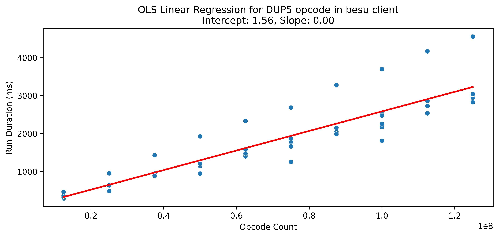


## geth


```python
                            OLS Regression Results                            
==============================================================================
Dep. Variable:        run_duration_ms   R-squared:                       0.997
Model:                            OLS   Adj. R-squared:                  0.997
Method:                 Least Squares   F-statistic:                 1.650e+04
Date:                Mon, 22 Dec 2025   Prob (F-statistic):           9.34e-67
Time:                        12:04:05   Log-Likelihood:                -239.79
No. Observations:                  54   AIC:                             483.6
Df Residuals:                      52   BIC:                             487.6
Df Model:                           1                                         
Covariance Type:            nonrobust                                         
==============================================================================
                 coef    std err          t      P>|t|      [0.025      0.975]
------------------------------------------------------------------------------
const         42.8361      6.182      6.929      0.000      30.431      55.241
opcount     1.032e-05   8.04e-08    128.442      0.000    1.02e-05    1.05e-05
==============================================================================
Omnibus:                        3.789   Durbin-Watson:                   1.410
Prob(Omnibus):                  0.150   Jarque-Bera (JB):                2.756
Skew:                          -0.449   Prob(JB):                        0.252
Kurtosis:                       3.646   Cond. No.                     1.67e+08
==============================================================================

Notes:
[1] Standard Errors assume that the covariance matrix of the errors is correctly specified.
[2] The condition number is large, 1.67e+08. This might indicate that there are
strong multicollinearity or other numerical problems.
```


# DUP6

## nethermind


```python
                            OLS Regression Results                            
==============================================================================
Dep. Variable:        run_duration_ms   R-squared:                       0.993
Model:                            OLS   Adj. R-squared:                  0.993
Method:                 Least Squares   F-statistic:                     7292.
Date:                Mon, 22 Dec 2025   Prob (F-statistic):           1.40e-57
Time:                        12:04:05   Log-Likelihood:                -220.90
No. Observations:                  54   AIC:                             445.8
Df Residuals:                      52   BIC:                             449.8
Df Model:                           1                                         
Covariance Type:            nonrobust                                         
==============================================================================
                 coef    std err          t      P>|t|      [0.025      0.975]
------------------------------------------------------------------------------
const         38.0677      4.358      8.736      0.000      29.323      46.812
opcount     4.838e-06   5.66e-08     85.395      0.000    4.72e-06    4.95e-06
==============================================================================
Omnibus:                       19.905   Durbin-Watson:                   2.250
Prob(Omnibus):                  0.000   Jarque-Bera (JB):               27.187
Skew:                          -1.340   Prob(JB):                     1.25e-06
Kurtosis:                       5.213   Cond. No.                     1.67e+08
==============================================================================

Notes:
[1] Standard Errors assume that the covariance matrix of the errors is correctly specified.
[2] The condition number is large, 1.67e+08. This might indicate that there are
strong multicollinearity or other numerical problems.
```

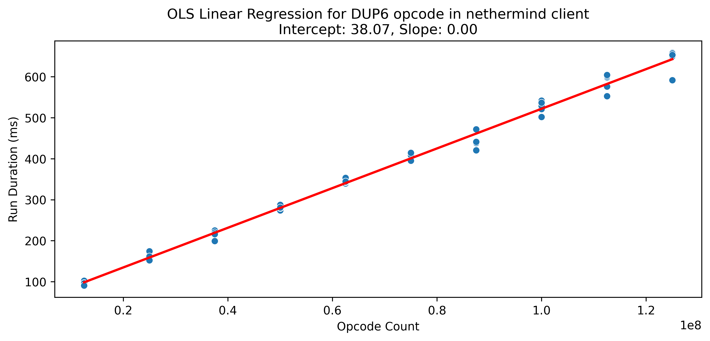


## reth


```python
                            OLS Regression Results                            
==============================================================================
Dep. Variable:        run_duration_ms   R-squared:                       0.968
Model:                            OLS   Adj. R-squared:                  0.967
Method:                 Least Squares   F-statistic:                     1569.
Date:                Mon, 22 Dec 2025   Prob (F-statistic):           1.63e-40
Time:                        12:04:05   Log-Likelihood:                -251.35
No. Observations:                  54   AIC:                             506.7
Df Residuals:                      52   BIC:                             510.7
Df Model:                           1                                         
Covariance Type:            nonrobust                                         
==============================================================================
                 coef    std err          t      P>|t|      [0.025      0.975]
------------------------------------------------------------------------------
const         36.1007      7.659      4.714      0.000      20.733      51.469
opcount     3.943e-06   9.96e-08     39.606      0.000    3.74e-06    4.14e-06
==============================================================================
Omnibus:                       51.296   Durbin-Watson:                   2.068
Prob(Omnibus):                  0.000   Jarque-Bera (JB):              346.874
Skew:                           2.338   Prob(JB):                     4.76e-76
Kurtosis:                      14.503   Cond. No.                     1.67e+08
==============================================================================

Notes:
[1] Standard Errors assume that the covariance matrix of the errors is correctly specified.
[2] The condition number is large, 1.67e+08. This might indicate that there are
strong multicollinearity or other numerical problems.
```


## besu


```python
                            OLS Regression Results                            
==============================================================================
Dep. Variable:        run_duration_ms   R-squared:                       0.825
Model:                            OLS   Adj. R-squared:                  0.822
Method:                 Least Squares   F-statistic:                     245.6
Date:                Mon, 22 Dec 2025   Prob (F-statistic):           2.41e-21
Time:                        12:04:05   Log-Likelihood:                -401.72
No. Observations:                  54   AIC:                             807.4
Df Residuals:                      52   BIC:                             811.4
Df Model:                           1                                         
Covariance Type:            nonrobust                                         
==============================================================================
                 coef    std err          t      P>|t|      [0.025      0.975]
------------------------------------------------------------------------------
const         32.8143    124.018      0.265      0.792    -216.046     281.674
opcount     2.527e-05   1.61e-06     15.672      0.000     2.2e-05    2.85e-05
==============================================================================
Omnibus:                       22.235   Durbin-Watson:                   0.642
Prob(Omnibus):                  0.000   Jarque-Bera (JB):               30.454
Skew:                           1.554   Prob(JB):                     2.44e-07
Kurtosis:                       4.967   Cond. No.                     1.67e+08
==============================================================================

Notes:
[1] Standard Errors assume that the covariance matrix of the errors is correctly specified.
[2] The condition number is large, 1.67e+08. This might indicate that there are
strong multicollinearity or other numerical problems.
```


## geth


```python
                            OLS Regression Results                            
==============================================================================
Dep. Variable:        run_duration_ms   R-squared:                       0.997
Model:                            OLS   Adj. R-squared:                  0.997
Method:                 Least Squares   F-statistic:                 1.723e+04
Date:                Mon, 22 Dec 2025   Prob (F-statistic):           3.02e-67
Time:                        12:04:05   Log-Likelihood:                -239.79
No. Observations:                  54   AIC:                             483.6
Df Residuals:                      52   BIC:                             487.6
Df Model:                           1                                         
Covariance Type:            nonrobust                                         
==============================================================================
                 coef    std err          t      P>|t|      [0.025      0.975]
------------------------------------------------------------------------------
const         40.4923      6.183      6.549      0.000      28.086      52.899
opcount     1.055e-05   8.04e-08    131.273      0.000    1.04e-05    1.07e-05
==============================================================================
Omnibus:                        8.219   Durbin-Watson:                   1.804
Prob(Omnibus):                  0.016   Jarque-Bera (JB):               13.061
Skew:                           0.360   Prob(JB):                      0.00146
Kurtosis:                       5.300   Cond. No.                     1.67e+08
==============================================================================

Notes:
[1] Standard Errors assume that the covariance matrix of the errors is correctly specified.
[2] The condition number is large, 1.67e+08. This might indicate that there are
strong multicollinearity or other numerical problems.
```


# DUP7

## nethermind


```python
                            OLS Regression Results                            
==============================================================================
Dep. Variable:        run_duration_ms   R-squared:                       0.990
Model:                            OLS   Adj. R-squared:                  0.990
Method:                 Least Squares   F-statistic:                     5223.
Date:                Mon, 22 Dec 2025   Prob (F-statistic):           7.63e-54
Time:                        12:04:05   Log-Likelihood:                -230.35
No. Observations:                  54   AIC:                             464.7
Df Residuals:                      52   BIC:                             468.7
Df Model:                           1                                         
Covariance Type:            nonrobust                                         
==============================================================================
                 coef    std err          t      P>|t|      [0.025      0.975]
------------------------------------------------------------------------------
const         36.5625      5.191      7.043      0.000      26.145      46.980
opcount     4.877e-06   6.75e-08     72.270      0.000    4.74e-06    5.01e-06
==============================================================================
Omnibus:                       15.684   Durbin-Watson:                   2.281
Prob(Omnibus):                  0.000   Jarque-Bera (JB):               34.037
Skew:                          -0.748   Prob(JB):                     4.06e-08
Kurtosis:                       6.590   Cond. No.                     1.67e+08
==============================================================================

Notes:
[1] Standard Errors assume that the covariance matrix of the errors is correctly specified.
[2] The condition number is large, 1.67e+08. This might indicate that there are
strong multicollinearity or other numerical problems.
```

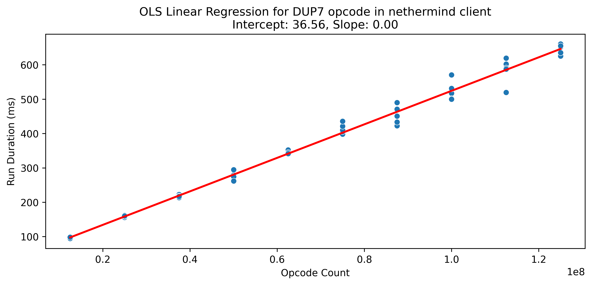


## reth


```python
                            OLS Regression Results                            
==============================================================================
Dep. Variable:        run_duration_ms   R-squared:                       0.991
Model:                            OLS   Adj. R-squared:                  0.991
Method:                 Least Squares   F-statistic:                     5748.
Date:                Mon, 22 Dec 2025   Prob (F-statistic):           6.48e-55
Time:                        12:04:06   Log-Likelihood:                -216.21
No. Observations:                  54   AIC:                             436.4
Df Residuals:                      52   BIC:                             440.4
Df Model:                           1                                         
Covariance Type:            nonrobust                                         
==============================================================================
                 coef    std err          t      P>|t|      [0.025      0.975]
------------------------------------------------------------------------------
const         38.9085      3.995      9.739      0.000      30.892      46.925
opcount     3.937e-06   5.19e-08     75.813      0.000    3.83e-06    4.04e-06
==============================================================================
Omnibus:                        6.655   Durbin-Watson:                   1.680
Prob(Omnibus):                  0.036   Jarque-Bera (JB):                6.994
Skew:                          -0.476   Prob(JB):                       0.0303
Kurtosis:                       4.484   Cond. No.                     1.67e+08
==============================================================================

Notes:
[1] Standard Errors assume that the covariance matrix of the errors is correctly specified.
[2] The condition number is large, 1.67e+08. This might indicate that there are
strong multicollinearity or other numerical problems.
```


## besu


```python
                            OLS Regression Results                            
==============================================================================
Dep. Variable:        run_duration_ms   R-squared:                       0.828
Model:                            OLS   Adj. R-squared:                  0.825
Method:                 Least Squares   F-statistic:                     250.6
Date:                Mon, 22 Dec 2025   Prob (F-statistic):           1.57e-21
Time:                        12:04:06   Log-Likelihood:                -402.85
No. Observations:                  54   AIC:                             809.7
Df Residuals:                      52   BIC:                             813.7
Df Model:                           1                                         
Covariance Type:            nonrobust                                         
==============================================================================
                 coef    std err          t      P>|t|      [0.025      0.975]
------------------------------------------------------------------------------
const        -19.5303    126.649     -0.154      0.878    -273.670     234.609
opcount     2.606e-05   1.65e-06     15.830      0.000    2.28e-05    2.94e-05
==============================================================================
Omnibus:                       24.280   Durbin-Watson:                   0.517
Prob(Omnibus):                  0.000   Jarque-Bera (JB):               35.859
Skew:                           1.620   Prob(JB):                     1.63e-08
Kurtosis:                       5.334   Cond. No.                     1.67e+08
==============================================================================

Notes:
[1] Standard Errors assume that the covariance matrix of the errors is correctly specified.
[2] The condition number is large, 1.67e+08. This might indicate that there are
strong multicollinearity or other numerical problems.
```

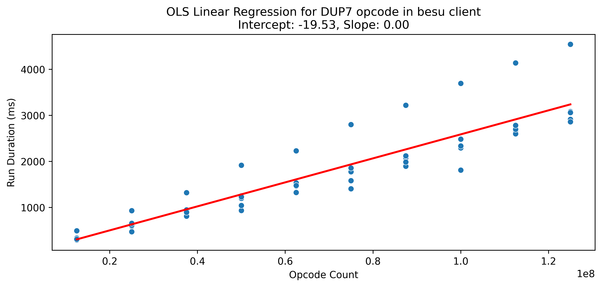


## geth


```python
                            OLS Regression Results                            
==============================================================================
Dep. Variable:        run_duration_ms   R-squared:                       0.996
Model:                            OLS   Adj. R-squared:                  0.996
Method:                 Least Squares   F-statistic:                 1.285e+04
Date:                Mon, 22 Dec 2025   Prob (F-statistic):           6.04e-64
Time:                        12:04:06   Log-Likelihood:                -247.20
No. Observations:                  54   AIC:                             498.4
Df Residuals:                      52   BIC:                             502.4
Df Model:                           1                                         
Covariance Type:            nonrobust                                         
==============================================================================
                 coef    std err          t      P>|t|      [0.025      0.975]
------------------------------------------------------------------------------
const         38.9564      7.092      5.493      0.000      24.725      53.187
opcount     1.045e-05   9.22e-08    113.362      0.000    1.03e-05    1.06e-05
==============================================================================
Omnibus:                       33.651   Durbin-Watson:                   1.868
Prob(Omnibus):                  0.000   Jarque-Bera (JB):              100.105
Skew:                           1.693   Prob(JB):                     1.83e-22
Kurtosis:                       8.746   Cond. No.                     1.67e+08
==============================================================================

Notes:
[1] Standard Errors assume that the covariance matrix of the errors is correctly specified.
[2] The condition number is large, 1.67e+08. This might indicate that there are
strong multicollinearity or other numerical problems.
```

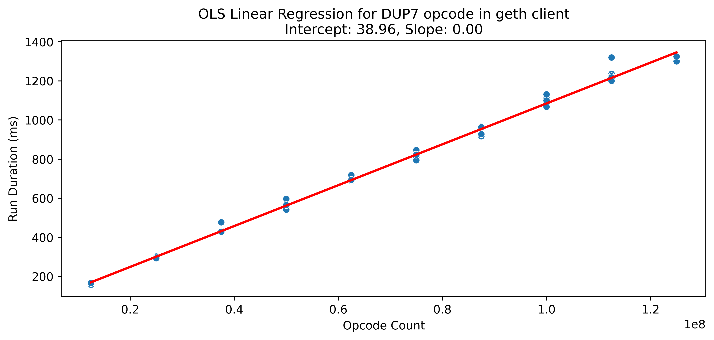


# DUP8

## nethermind


```python
                            OLS Regression Results                            
==============================================================================
Dep. Variable:        run_duration_ms   R-squared:                       0.671
Model:                            OLS   Adj. R-squared:                  0.665
Method:                 Least Squares   F-statistic:                     106.2
Date:                Mon, 22 Dec 2025   Prob (F-statistic):           3.63e-14
Time:                        12:04:06   Log-Likelihood:                -331.21
No. Observations:                  54   AIC:                             666.4
Df Residuals:                      52   BIC:                             670.4
Df Model:                           1                                         
Covariance Type:            nonrobust                                         
==============================================================================
                 coef    std err          t      P>|t|      [0.025      0.975]
------------------------------------------------------------------------------
const         86.6464     33.607      2.578      0.013      19.209     154.084
opcount     4.503e-06   4.37e-07     10.306      0.000    3.63e-06    5.38e-06
==============================================================================
Omnibus:                       86.502   Durbin-Watson:                   2.196
Prob(Omnibus):                  0.000   Jarque-Bera (JB):             1182.326
Skew:                           4.643   Prob(JB):                    1.82e-257
Kurtosis:                      23.958   Cond. No.                     1.67e+08
==============================================================================

Notes:
[1] Standard Errors assume that the covariance matrix of the errors is correctly specified.
[2] The condition number is large, 1.67e+08. This might indicate that there are
strong multicollinearity or other numerical problems.
```

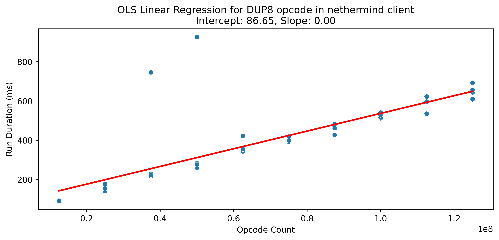


## reth


```python
                            OLS Regression Results                            
==============================================================================
Dep. Variable:        run_duration_ms   R-squared:                       0.989
Model:                            OLS   Adj. R-squared:                  0.989
Method:                 Least Squares   F-statistic:                     4884.
Date:                Mon, 22 Dec 2025   Prob (F-statistic):           4.28e-53
Time:                        12:04:06   Log-Likelihood:                -222.14
No. Observations:                  54   AIC:                             448.3
Df Residuals:                      52   BIC:                             452.3
Df Model:                           1                                         
Covariance Type:            nonrobust                                         
==============================================================================
                 coef    std err          t      P>|t|      [0.025      0.975]
------------------------------------------------------------------------------
const         33.9026      4.458      7.604      0.000      24.956      42.849
opcount     4.051e-06    5.8e-08     69.889      0.000    3.93e-06    4.17e-06
==============================================================================
Omnibus:                        1.943   Durbin-Watson:                   1.312
Prob(Omnibus):                  0.378   Jarque-Bera (JB):                1.232
Skew:                          -0.345   Prob(JB):                        0.540
Kurtosis:                       3.267   Cond. No.                     1.67e+08
==============================================================================

Notes:
[1] Standard Errors assume that the covariance matrix of the errors is correctly specified.
[2] The condition number is large, 1.67e+08. This might indicate that there are
strong multicollinearity or other numerical problems.
```


## besu


```python
                            OLS Regression Results                            
==============================================================================
Dep. Variable:        run_duration_ms   R-squared:                       0.817
Model:                            OLS   Adj. R-squared:                  0.813
Method:                 Least Squares   F-statistic:                     231.9
Date:                Mon, 22 Dec 2025   Prob (F-statistic):           8.24e-21
Time:                        12:04:06   Log-Likelihood:                -404.14
No. Observations:                  54   AIC:                             812.3
Df Residuals:                      52   BIC:                             816.3
Df Model:                           1                                         
Covariance Type:            nonrobust                                         
==============================================================================
                 coef    std err          t      P>|t|      [0.025      0.975]
------------------------------------------------------------------------------
const          3.9103    129.703      0.030      0.976    -256.358     264.179
opcount     2.568e-05   1.69e-06     15.230      0.000    2.23e-05    2.91e-05
==============================================================================
Omnibus:                       24.894   Durbin-Watson:                   0.693
Prob(Omnibus):                  0.000   Jarque-Bera (JB):               37.324
Skew:                           1.653   Prob(JB):                     7.86e-09
Kurtosis:                       5.379   Cond. No.                     1.67e+08
==============================================================================

Notes:
[1] Standard Errors assume that the covariance matrix of the errors is correctly specified.
[2] The condition number is large, 1.67e+08. This might indicate that there are
strong multicollinearity or other numerical problems.
```

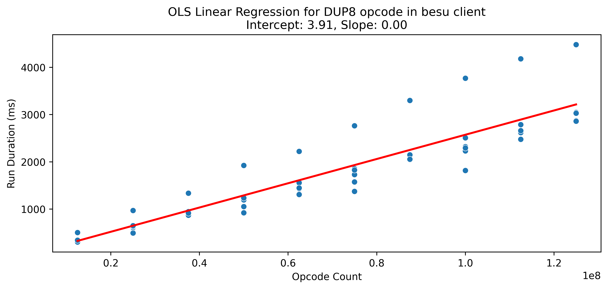


## geth


```python
                            OLS Regression Results                            
==============================================================================
Dep. Variable:        run_duration_ms   R-squared:                       0.997
Model:                            OLS   Adj. R-squared:                  0.997
Method:                 Least Squares   F-statistic:                 1.862e+04
Date:                Mon, 22 Dec 2025   Prob (F-statistic):           4.05e-68
Time:                        12:04:06   Log-Likelihood:                -238.61
No. Observations:                  54   AIC:                             481.2
Df Residuals:                      52   BIC:                             485.2
Df Model:                           1                                         
Covariance Type:            nonrobust                                         
==============================================================================
                 coef    std err          t      P>|t|      [0.025      0.975]
------------------------------------------------------------------------------
const         29.0292      6.049      4.799      0.000      16.890      41.168
opcount     1.073e-05   7.86e-08    136.453      0.000    1.06e-05    1.09e-05
==============================================================================
Omnibus:                        1.362   Durbin-Watson:                   1.940
Prob(Omnibus):                  0.506   Jarque-Bera (JB):                0.820
Skew:                           0.290   Prob(JB):                        0.664
Kurtosis:                       3.167   Cond. No.                     1.67e+08
==============================================================================

Notes:
[1] Standard Errors assume that the covariance matrix of the errors is correctly specified.
[2] The condition number is large, 1.67e+08. This might indicate that there are
strong multicollinearity or other numerical problems.
```

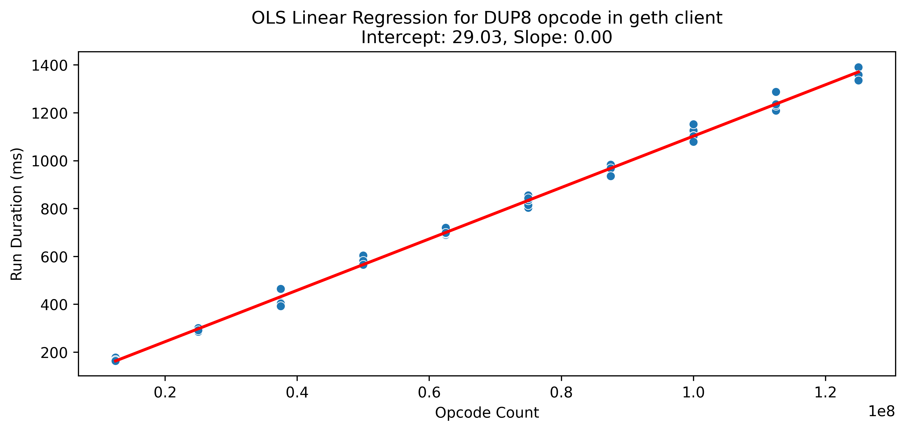


# DUP9

## nethermind


```python
                            OLS Regression Results                            
==============================================================================
Dep. Variable:        run_duration_ms   R-squared:                       0.532
Model:                            OLS   Adj. R-squared:                  0.523
Method:                 Least Squares   F-statistic:                     59.08
Date:                Mon, 22 Dec 2025   Prob (F-statistic):           3.99e-10
Time:                        12:04:07   Log-Likelihood:                -352.76
No. Observations:                  54   AIC:                             709.5
Df Residuals:                      52   BIC:                             713.5
Df Model:                           1                                         
Covariance Type:            nonrobust                                         
==============================================================================
                 coef    std err          t      P>|t|      [0.025      0.975]
------------------------------------------------------------------------------
const         54.3494     50.088      1.085      0.283     -46.159     154.858
opcount     5.005e-06   6.51e-07      7.687      0.000     3.7e-06    6.31e-06
==============================================================================
Omnibus:                      119.394   Durbin-Watson:                   2.043
Prob(Omnibus):                  0.000   Jarque-Bera (JB):             5679.046
Skew:                           7.056   Prob(JB):                         0.00
Kurtosis:                      51.217   Cond. No.                     1.67e+08
==============================================================================

Notes:
[1] Standard Errors assume that the covariance matrix of the errors is correctly specified.
[2] The condition number is large, 1.67e+08. This might indicate that there are
strong multicollinearity or other numerical problems.
```

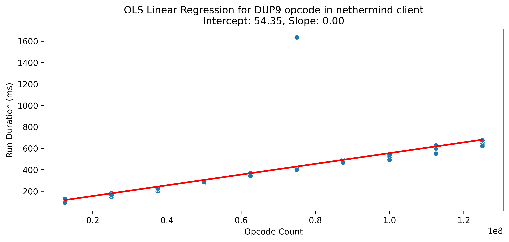


## reth


```python
                            OLS Regression Results                            
==============================================================================
Dep. Variable:        run_duration_ms   R-squared:                       0.980
Model:                            OLS   Adj. R-squared:                  0.980
Method:                 Least Squares   F-statistic:                     2582.
Date:                Mon, 22 Dec 2025   Prob (F-statistic):           5.32e-46
Time:                        12:04:07   Log-Likelihood:                -237.39
No. Observations:                  54   AIC:                             478.8
Df Residuals:                      52   BIC:                             482.8
Df Model:                           1                                         
Covariance Type:            nonrobust                                         
==============================================================================
                 coef    std err          t      P>|t|      [0.025      0.975]
------------------------------------------------------------------------------
const         39.1249      5.914      6.616      0.000      27.258      50.992
opcount     3.907e-06   7.69e-08     50.814      0.000    3.75e-06    4.06e-06
==============================================================================
Omnibus:                        7.556   Durbin-Watson:                   1.801
Prob(Omnibus):                  0.023   Jarque-Bera (JB):               10.955
Skew:                           0.356   Prob(JB):                      0.00418
Kurtosis:                       5.089   Cond. No.                     1.67e+08
==============================================================================

Notes:
[1] Standard Errors assume that the covariance matrix of the errors is correctly specified.
[2] The condition number is large, 1.67e+08. This might indicate that there are
strong multicollinearity or other numerical problems.
```

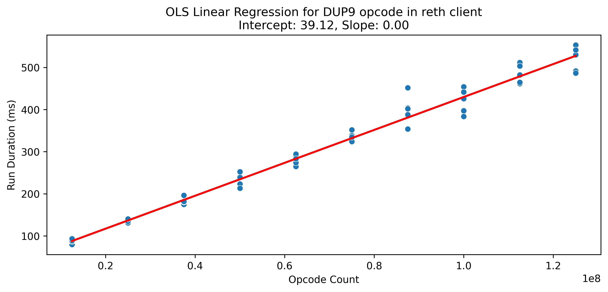


## besu


```python
                            OLS Regression Results                            
==============================================================================
Dep. Variable:        run_duration_ms   R-squared:                       0.819
Model:                            OLS   Adj. R-squared:                  0.815
Method:                 Least Squares   F-statistic:                     234.7
Date:                Mon, 22 Dec 2025   Prob (F-statistic):           6.40e-21
Time:                        12:04:07   Log-Likelihood:                -403.16
No. Observations:                  54   AIC:                             810.3
Df Residuals:                      52   BIC:                             814.3
Df Model:                           1                                         
Covariance Type:            nonrobust                                         
==============================================================================
                 coef    std err          t      P>|t|      [0.025      0.975]
------------------------------------------------------------------------------
const         20.2282    127.372      0.159      0.874    -235.362     275.818
opcount     2.537e-05   1.66e-06     15.320      0.000     2.2e-05    2.87e-05
==============================================================================
Omnibus:                       24.430   Durbin-Watson:                   0.484
Prob(Omnibus):                  0.000   Jarque-Bera (JB):               36.594
Skew:                           1.611   Prob(JB):                     1.13e-08
Kurtosis:                       5.425   Cond. No.                     1.67e+08
==============================================================================

Notes:
[1] Standard Errors assume that the covariance matrix of the errors is correctly specified.
[2] The condition number is large, 1.67e+08. This might indicate that there are
strong multicollinearity or other numerical problems.
```

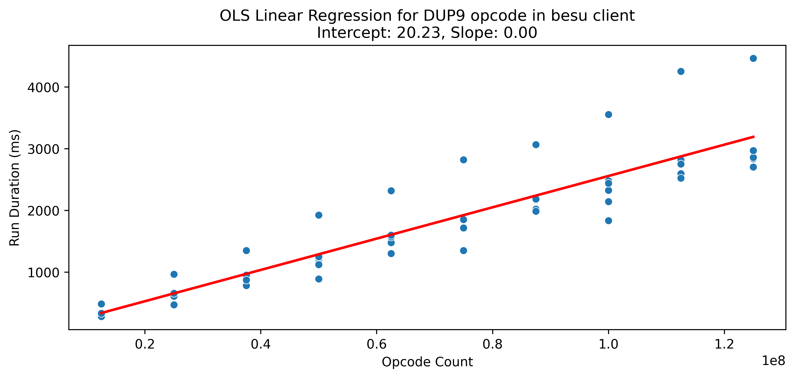


## geth


```python
                            OLS Regression Results                            
==============================================================================
Dep. Variable:        run_duration_ms   R-squared:                       0.987
Model:                            OLS   Adj. R-squared:                  0.987
Method:                 Least Squares   F-statistic:                     4090.
Date:                Mon, 22 Dec 2025   Prob (F-statistic):           4.09e-51
Time:                        12:04:07   Log-Likelihood:                -277.14
No. Observations:                  54   AIC:                             558.3
Df Residuals:                      52   BIC:                             562.3
Df Model:                           1                                         
Covariance Type:            nonrobust                                         
==============================================================================
                 coef    std err          t      P>|t|      [0.025      0.975]
------------------------------------------------------------------------------
const         61.5887     12.346      4.989      0.000      36.815      86.362
opcount     1.026e-05    1.6e-07     63.956      0.000    9.94e-06    1.06e-05
==============================================================================
Omnibus:                       76.949   Durbin-Watson:                   2.175
Prob(Omnibus):                  0.000   Jarque-Bera (JB):              996.736
Skew:                           3.832   Prob(JB):                    3.64e-217
Kurtosis:                      22.602   Cond. No.                     1.67e+08
==============================================================================

Notes:
[1] Standard Errors assume that the covariance matrix of the errors is correctly specified.
[2] The condition number is large, 1.67e+08. This might indicate that there are
strong multicollinearity or other numerical problems.
```

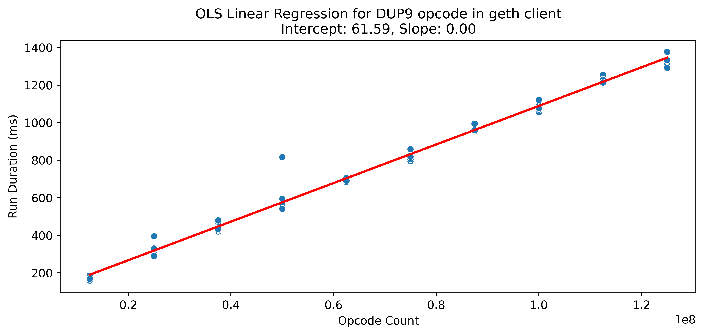


# DUP10

## nethermind


```python
                            OLS Regression Results                            
==============================================================================
Dep. Variable:        run_duration_ms   R-squared:                       0.978
Model:                            OLS   Adj. R-squared:                  0.978
Method:                 Least Squares   F-statistic:                     2343.
Date:                Mon, 22 Dec 2025   Prob (F-statistic):           6.34e-45
Time:                        12:04:07   Log-Likelihood:                -250.74
No. Observations:                  54   AIC:                             505.5
Df Residuals:                      52   BIC:                             509.5
Df Model:                           1                                         
Covariance Type:            nonrobust                                         
==============================================================================
                 coef    std err          t      P>|t|      [0.025      0.975]
------------------------------------------------------------------------------
const         51.2925      7.573      6.773      0.000      36.097      66.488
opcount     4.765e-06   9.84e-08     48.402      0.000    4.57e-06    4.96e-06
==============================================================================
Omnibus:                       85.201   Durbin-Watson:                   1.765
Prob(Omnibus):                  0.000   Jarque-Bera (JB):             1475.120
Skew:                           4.331   Prob(JB):                         0.00
Kurtosis:                      27.095   Cond. No.                     1.67e+08
==============================================================================

Notes:
[1] Standard Errors assume that the covariance matrix of the errors is correctly specified.
[2] The condition number is large, 1.67e+08. This might indicate that there are
strong multicollinearity or other numerical problems.
```


## reth


```python
                            OLS Regression Results                            
==============================================================================
Dep. Variable:        run_duration_ms   R-squared:                       0.990
Model:                            OLS   Adj. R-squared:                  0.989
Method:                 Least Squares   F-statistic:                     4963.
Date:                Mon, 22 Dec 2025   Prob (F-statistic):           2.84e-53
Time:                        12:04:07   Log-Likelihood:                -220.86
No. Observations:                  54   AIC:                             445.7
Df Residuals:                      52   BIC:                             449.7
Df Model:                           1                                         
Covariance Type:            nonrobust                                         
==============================================================================
                 coef    std err          t      P>|t|      [0.025      0.975]
------------------------------------------------------------------------------
const         38.0208      4.354      8.731      0.000      29.283      46.759
opcount     3.988e-06   5.66e-08     70.448      0.000    3.87e-06     4.1e-06
==============================================================================
Omnibus:                        7.028   Durbin-Watson:                   1.855
Prob(Omnibus):                  0.030   Jarque-Bera (JB):                7.616
Skew:                          -0.492   Prob(JB):                       0.0222
Kurtosis:                       4.554   Cond. No.                     1.67e+08
==============================================================================

Notes:
[1] Standard Errors assume that the covariance matrix of the errors is correctly specified.
[2] The condition number is large, 1.67e+08. This might indicate that there are
strong multicollinearity or other numerical problems.
```

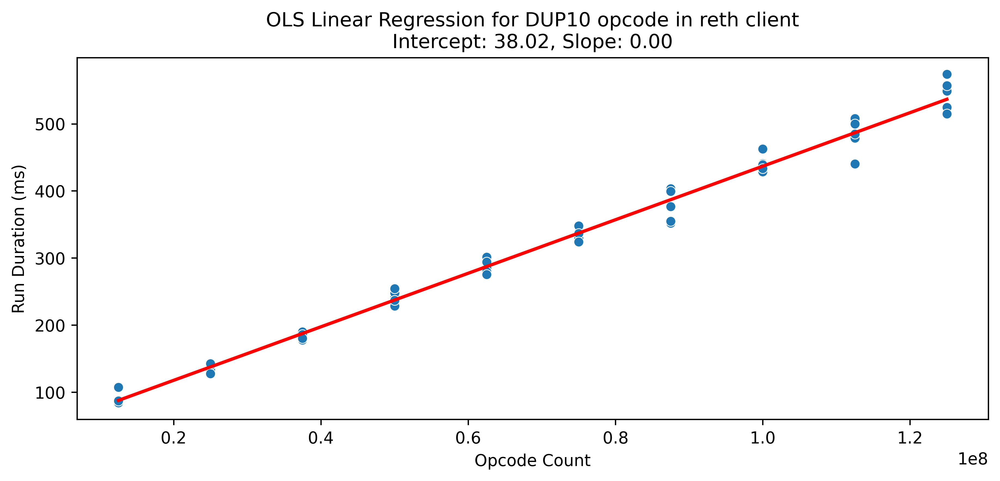


## besu


```python
                            OLS Regression Results                            
==============================================================================
Dep. Variable:        run_duration_ms   R-squared:                       0.825
Model:                            OLS   Adj. R-squared:                  0.822
Method:                 Least Squares   F-statistic:                     245.8
Date:                Mon, 22 Dec 2025   Prob (F-statistic):           2.38e-21
Time:                        12:04:07   Log-Likelihood:                -402.47
No. Observations:                  54   AIC:                             808.9
Df Residuals:                      52   BIC:                             812.9
Df Model:                           1                                         
Covariance Type:            nonrobust                                         
==============================================================================
                 coef    std err          t      P>|t|      [0.025      0.975]
------------------------------------------------------------------------------
const         11.8070    125.743      0.094      0.926    -240.514     264.128
opcount     2.563e-05   1.63e-06     15.677      0.000    2.23e-05    2.89e-05
==============================================================================
Omnibus:                       23.542   Durbin-Watson:                   0.708
Prob(Omnibus):                  0.000   Jarque-Bera (JB):               34.398
Skew:                           1.568   Prob(JB):                     3.39e-08
Kurtosis:                       5.336   Cond. No.                     1.67e+08
==============================================================================

Notes:
[1] Standard Errors assume that the covariance matrix of the errors is correctly specified.
[2] The condition number is large, 1.67e+08. This might indicate that there are
strong multicollinearity or other numerical problems.
```

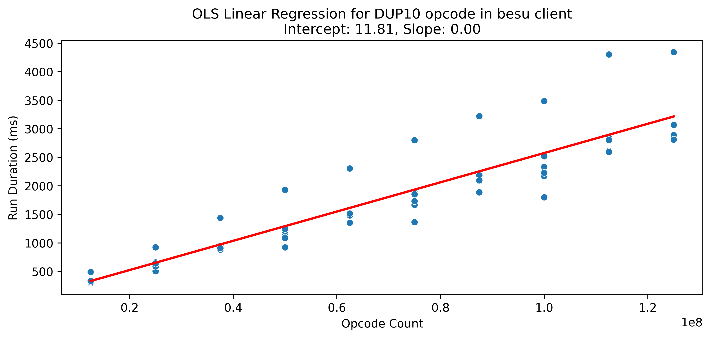


## geth


```python
                            OLS Regression Results                            
==============================================================================
Dep. Variable:        run_duration_ms   R-squared:                       0.995
Model:                            OLS   Adj. R-squared:                  0.995
Method:                 Least Squares   F-statistic:                 1.038e+04
Date:                Mon, 22 Dec 2025   Prob (F-statistic):           1.53e-61
Time:                        12:04:07   Log-Likelihood:                -253.55
No. Observations:                  54   AIC:                             511.1
Df Residuals:                      52   BIC:                             515.1
Df Model:                           1                                         
Covariance Type:            nonrobust                                         
==============================================================================
                 coef    std err          t      P>|t|      [0.025      0.975]
------------------------------------------------------------------------------
const         42.2400      7.976      5.296      0.000      26.235      58.245
opcount     1.056e-05   1.04e-07    101.865      0.000    1.04e-05    1.08e-05
==============================================================================
Omnibus:                       44.863   Durbin-Watson:                   2.083
Prob(Omnibus):                  0.000   Jarque-Bera (JB):              195.561
Skew:                           2.184   Prob(JB):                     3.42e-43
Kurtosis:                      11.236   Cond. No.                     1.67e+08
==============================================================================

Notes:
[1] Standard Errors assume that the covariance matrix of the errors is correctly specified.
[2] The condition number is large, 1.67e+08. This might indicate that there are
strong multicollinearity or other numerical problems.
```


# DUP11

## nethermind


```python
                            OLS Regression Results                            
==============================================================================
Dep. Variable:        run_duration_ms   R-squared:                       0.991
Model:                            OLS   Adj. R-squared:                  0.991
Method:                 Least Squares   F-statistic:                     5735.
Date:                Mon, 22 Dec 2025   Prob (F-statistic):           6.85e-55
Time:                        12:04:08   Log-Likelihood:                -226.94
No. Observations:                  54   AIC:                             457.9
Df Residuals:                      52   BIC:                             461.9
Df Model:                           1                                         
Covariance Type:            nonrobust                                         
==============================================================================
                 coef    std err          t      P>|t|      [0.025      0.975]
------------------------------------------------------------------------------
const         43.8531      4.874      8.998      0.000      34.074      53.633
opcount     4.798e-06   6.34e-08     75.731      0.000    4.67e-06    4.93e-06
==============================================================================
Omnibus:                       22.266   Durbin-Watson:                   1.857
Prob(Omnibus):                  0.000   Jarque-Bera (JB):               43.779
Skew:                          -1.223   Prob(JB):                     3.11e-10
Kurtosis:                       6.670   Cond. No.                     1.67e+08
==============================================================================

Notes:
[1] Standard Errors assume that the covariance matrix of the errors is correctly specified.
[2] The condition number is large, 1.67e+08. This might indicate that there are
strong multicollinearity or other numerical problems.
```


## reth


```python
                            OLS Regression Results                            
==============================================================================
Dep. Variable:        run_duration_ms   R-squared:                       0.990
Model:                            OLS   Adj. R-squared:                  0.990
Method:                 Least Squares   F-statistic:                     5377.
Date:                Mon, 22 Dec 2025   Prob (F-statistic):           3.60e-54
Time:                        12:04:08   Log-Likelihood:                -219.98
No. Observations:                  54   AIC:                             444.0
Df Residuals:                      52   BIC:                             447.9
Df Model:                           1                                         
Covariance Type:            nonrobust                                         
==============================================================================
                 coef    std err          t      P>|t|      [0.025      0.975]
------------------------------------------------------------------------------
const         35.1437      4.283      8.204      0.000      26.548      43.739
opcount     4.083e-06   5.57e-08     73.330      0.000    3.97e-06     4.2e-06
==============================================================================
Omnibus:                       44.857   Durbin-Watson:                   2.209
Prob(Omnibus):                  0.000   Jarque-Bera (JB):              208.170
Skew:                          -2.143   Prob(JB):                     6.26e-46
Kurtosis:                      11.611   Cond. No.                     1.67e+08
==============================================================================

Notes:
[1] Standard Errors assume that the covariance matrix of the errors is correctly specified.
[2] The condition number is large, 1.67e+08. This might indicate that there are
strong multicollinearity or other numerical problems.
```


## besu


```python
                            OLS Regression Results                            
==============================================================================
Dep. Variable:        run_duration_ms   R-squared:                       0.822
Model:                            OLS   Adj. R-squared:                  0.819
Method:                 Least Squares   F-statistic:                     240.4
Date:                Mon, 22 Dec 2025   Prob (F-statistic):           3.84e-21
Time:                        12:04:08   Log-Likelihood:                -403.72
No. Observations:                  54   AIC:                             811.4
Df Residuals:                      52   BIC:                             815.4
Df Model:                           1                                         
Covariance Type:            nonrobust                                         
==============================================================================
                 coef    std err          t      P>|t|      [0.025      0.975]
------------------------------------------------------------------------------
const          4.0708    128.691      0.032      0.975    -254.167     262.308
opcount     2.594e-05   1.67e-06     15.504      0.000    2.26e-05    2.93e-05
==============================================================================
Omnibus:                       25.579   Durbin-Watson:                   0.655
Prob(Omnibus):                  0.000   Jarque-Bera (JB):               39.805
Skew:                           1.659   Prob(JB):                     2.27e-09
Kurtosis:                       5.586   Cond. No.                     1.67e+08
==============================================================================

Notes:
[1] Standard Errors assume that the covariance matrix of the errors is correctly specified.
[2] The condition number is large, 1.67e+08. This might indicate that there are
strong multicollinearity or other numerical problems.
```


## geth


```python
                            OLS Regression Results                            
==============================================================================
Dep. Variable:        run_duration_ms   R-squared:                       0.996
Model:                            OLS   Adj. R-squared:                  0.996
Method:                 Least Squares   F-statistic:                 1.219e+04
Date:                Mon, 22 Dec 2025   Prob (F-statistic):           2.39e-63
Time:                        12:04:08   Log-Likelihood:                -248.56
No. Observations:                  54   AIC:                             501.1
Df Residuals:                      52   BIC:                             505.1
Df Model:                           1                                         
Covariance Type:            nonrobust                                         
==============================================================================
                 coef    std err          t      P>|t|      [0.025      0.975]
------------------------------------------------------------------------------
const         43.9856      7.273      6.048      0.000      29.392      58.580
opcount     1.044e-05   9.45e-08    110.389      0.000    1.02e-05    1.06e-05
==============================================================================
Omnibus:                       43.098   Durbin-Watson:                   2.101
Prob(Omnibus):                  0.000   Jarque-Bera (JB):              161.905
Skew:                           2.165   Prob(JB):                     6.96e-36
Kurtosis:                      10.294   Cond. No.                     1.67e+08
==============================================================================

Notes:
[1] Standard Errors assume that the covariance matrix of the errors is correctly specified.
[2] The condition number is large, 1.67e+08. This might indicate that there are
strong multicollinearity or other numerical problems.
```


# DUP12

## nethermind


```python
                            OLS Regression Results                            
==============================================================================
Dep. Variable:        run_duration_ms   R-squared:                       0.992
Model:                            OLS   Adj. R-squared:                  0.992
Method:                 Least Squares   F-statistic:                     6795.
Date:                Mon, 22 Dec 2025   Prob (F-statistic):           8.64e-57
Time:                        12:04:08   Log-Likelihood:                -223.45
No. Observations:                  54   AIC:                             450.9
Df Residuals:                      52   BIC:                             454.9
Df Model:                           1                                         
Covariance Type:            nonrobust                                         
==============================================================================
                 coef    std err          t      P>|t|      [0.025      0.975]
------------------------------------------------------------------------------
const         38.2612      4.568      8.375      0.000      29.094      47.428
opcount     4.896e-06   5.94e-08     82.433      0.000    4.78e-06    5.01e-06
==============================================================================
Omnibus:                       18.607   Durbin-Watson:                   1.778
Prob(Omnibus):                  0.000   Jarque-Bera (JB):               34.476
Skew:                          -1.023   Prob(JB):                     3.26e-08
Kurtosis:                       6.337   Cond. No.                     1.67e+08
==============================================================================

Notes:
[1] Standard Errors assume that the covariance matrix of the errors is correctly specified.
[2] The condition number is large, 1.67e+08. This might indicate that there are
strong multicollinearity or other numerical problems.
```

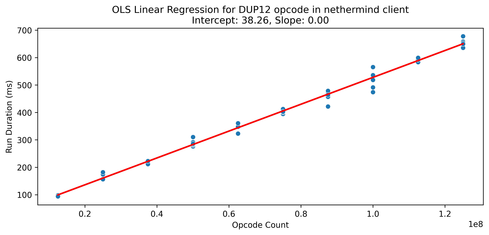


## reth


```python
                            OLS Regression Results                            
==============================================================================
Dep. Variable:        run_duration_ms   R-squared:                       0.981
Model:                            OLS   Adj. R-squared:                  0.981
Method:                 Least Squares   F-statistic:                     2685.
Date:                Mon, 22 Dec 2025   Prob (F-statistic):           1.96e-46
Time:                        12:04:08   Log-Likelihood:                -236.13
No. Observations:                  54   AIC:                             476.3
Df Residuals:                      52   BIC:                             480.2
Df Model:                           1                                         
Covariance Type:            nonrobust                                         
==============================================================================
                 coef    std err          t      P>|t|      [0.025      0.975]
------------------------------------------------------------------------------
const         36.5031      5.778      6.318      0.000      24.909      48.097
opcount     3.892e-06   7.51e-08     51.816      0.000    3.74e-06    4.04e-06
==============================================================================
Omnibus:                        2.715   Durbin-Watson:                   1.219
Prob(Omnibus):                  0.257   Jarque-Bera (JB):                1.809
Skew:                          -0.292   Prob(JB):                        0.405
Kurtosis:                       3.681   Cond. No.                     1.67e+08
==============================================================================

Notes:
[1] Standard Errors assume that the covariance matrix of the errors is correctly specified.
[2] The condition number is large, 1.67e+08. This might indicate that there are
strong multicollinearity or other numerical problems.
```


## besu


```python
                            OLS Regression Results                            
==============================================================================
Dep. Variable:        run_duration_ms   R-squared:                       0.805
Model:                            OLS   Adj. R-squared:                  0.801
Method:                 Least Squares   F-statistic:                     214.7
Date:                Mon, 22 Dec 2025   Prob (F-statistic):           4.23e-20
Time:                        12:04:08   Log-Likelihood:                -406.31
No. Observations:                  54   AIC:                             816.6
Df Residuals:                      52   BIC:                             820.6
Df Model:                           1                                         
Covariance Type:            nonrobust                                         
==============================================================================
                 coef    std err          t      P>|t|      [0.025      0.975]
------------------------------------------------------------------------------
const          7.0655    135.017      0.052      0.958    -263.865     277.996
opcount     2.572e-05   1.76e-06     14.652      0.000    2.22e-05    2.92e-05
==============================================================================
Omnibus:                       25.877   Durbin-Watson:                   0.564
Prob(Omnibus):                  0.000   Jarque-Bera (JB):               40.342
Skew:                           1.683   Prob(JB):                     1.74e-09
Kurtosis:                       5.570   Cond. No.                     1.67e+08
==============================================================================

Notes:
[1] Standard Errors assume that the covariance matrix of the errors is correctly specified.
[2] The condition number is large, 1.67e+08. This might indicate that there are
strong multicollinearity or other numerical problems.
```


## geth


```python
                            OLS Regression Results                            
==============================================================================
Dep. Variable:        run_duration_ms   R-squared:                       0.980
Model:                            OLS   Adj. R-squared:                  0.980
Method:                 Least Squares   F-statistic:                     2607.
Date:                Mon, 22 Dec 2025   Prob (F-statistic):           4.17e-46
Time:                        12:04:09   Log-Likelihood:                -290.34
No. Observations:                  54   AIC:                             584.7
Df Residuals:                      52   BIC:                             588.7
Df Model:                           1                                         
Covariance Type:            nonrobust                                         
==============================================================================
                 coef    std err          t      P>|t|      [0.025      0.975]
------------------------------------------------------------------------------
const         59.3147     15.766      3.762      0.000      27.678      90.952
opcount     1.046e-05   2.05e-07     51.056      0.000    1.01e-05    1.09e-05
==============================================================================
Omnibus:                       81.044   Durbin-Watson:                   2.266
Prob(Omnibus):                  0.000   Jarque-Bera (JB):             1089.313
Skew:                           4.158   Prob(JB):                    2.87e-237
Kurtosis:                      23.371   Cond. No.                     1.67e+08
==============================================================================

Notes:
[1] Standard Errors assume that the covariance matrix of the errors is correctly specified.
[2] The condition number is large, 1.67e+08. This might indicate that there are
strong multicollinearity or other numerical problems.
```

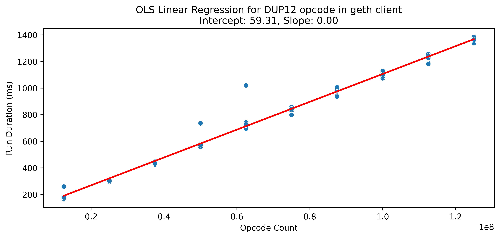


# DUP13

## nethermind


```python
                            OLS Regression Results                            
==============================================================================
Dep. Variable:        run_duration_ms   R-squared:                       0.995
Model:                            OLS   Adj. R-squared:                  0.995
Method:                 Least Squares   F-statistic:                 1.144e+04
Date:                Mon, 22 Dec 2025   Prob (F-statistic):           1.24e-62
Time:                        12:04:09   Log-Likelihood:                -209.76
No. Observations:                  54   AIC:                             423.5
Df Residuals:                      52   BIC:                             427.5
Df Model:                           1                                         
Covariance Type:            nonrobust                                         
==============================================================================
                 coef    std err          t      P>|t|      [0.025      0.975]
------------------------------------------------------------------------------
const         36.2753      3.545     10.232      0.000      29.161      43.389
opcount     4.929e-06   4.61e-08    106.941      0.000    4.84e-06    5.02e-06
==============================================================================
Omnibus:                       23.913   Durbin-Watson:                   1.983
Prob(Omnibus):                  0.000   Jarque-Bera (JB):               48.420
Skew:                          -1.311   Prob(JB):                     3.06e-11
Kurtosis:                       6.826   Cond. No.                     1.67e+08
==============================================================================

Notes:
[1] Standard Errors assume that the covariance matrix of the errors is correctly specified.
[2] The condition number is large, 1.67e+08. This might indicate that there are
strong multicollinearity or other numerical problems.
```


## reth


```python
                            OLS Regression Results                            
==============================================================================
Dep. Variable:        run_duration_ms   R-squared:                       0.985
Model:                            OLS   Adj. R-squared:                  0.984
Method:                 Least Squares   F-statistic:                     3366.
Date:                Mon, 22 Dec 2025   Prob (F-statistic):           6.09e-49
Time:                        12:04:09   Log-Likelihood:                -230.62
No. Observations:                  54   AIC:                             465.2
Df Residuals:                      52   BIC:                             469.2
Df Model:                           1                                         
Covariance Type:            nonrobust                                         
==============================================================================
                 coef    std err          t      P>|t|      [0.025      0.975]
------------------------------------------------------------------------------
const         37.2087      5.217      7.132      0.000      26.740      47.678
opcount     3.935e-06   6.78e-08     58.014      0.000     3.8e-06    4.07e-06
==============================================================================
Omnibus:                        0.207   Durbin-Watson:                   1.233
Prob(Omnibus):                  0.902   Jarque-Bera (JB):                0.367
Skew:                           0.120   Prob(JB):                        0.832
Kurtosis:                       2.675   Cond. No.                     1.67e+08
==============================================================================

Notes:
[1] Standard Errors assume that the covariance matrix of the errors is correctly specified.
[2] The condition number is large, 1.67e+08. This might indicate that there are
strong multicollinearity or other numerical problems.
```


## besu


```python
                            OLS Regression Results                            
==============================================================================
Dep. Variable:        run_duration_ms   R-squared:                       0.816
Model:                            OLS   Adj. R-squared:                  0.813
Method:                 Least Squares   F-statistic:                     231.2
Date:                Mon, 22 Dec 2025   Prob (F-statistic):           8.87e-21
Time:                        12:04:09   Log-Likelihood:                -405.37
No. Observations:                  54   AIC:                             814.7
Df Residuals:                      52   BIC:                             818.7
Df Model:                           1                                         
Covariance Type:            nonrobust                                         
==============================================================================
                 coef    std err          t      P>|t|      [0.025      0.975]
------------------------------------------------------------------------------
const        -11.4525    132.694     -0.086      0.932    -277.723     254.817
opcount     2.623e-05   1.73e-06     15.204      0.000    2.28e-05    2.97e-05
==============================================================================
Omnibus:                       25.538   Durbin-Watson:                   0.417
Prob(Omnibus):                  0.000   Jarque-Bera (JB):               39.688
Skew:                           1.657   Prob(JB):                     2.41e-09
Kurtosis:                       5.581   Cond. No.                     1.67e+08
==============================================================================

Notes:
[1] Standard Errors assume that the covariance matrix of the errors is correctly specified.
[2] The condition number is large, 1.67e+08. This might indicate that there are
strong multicollinearity or other numerical problems.
```

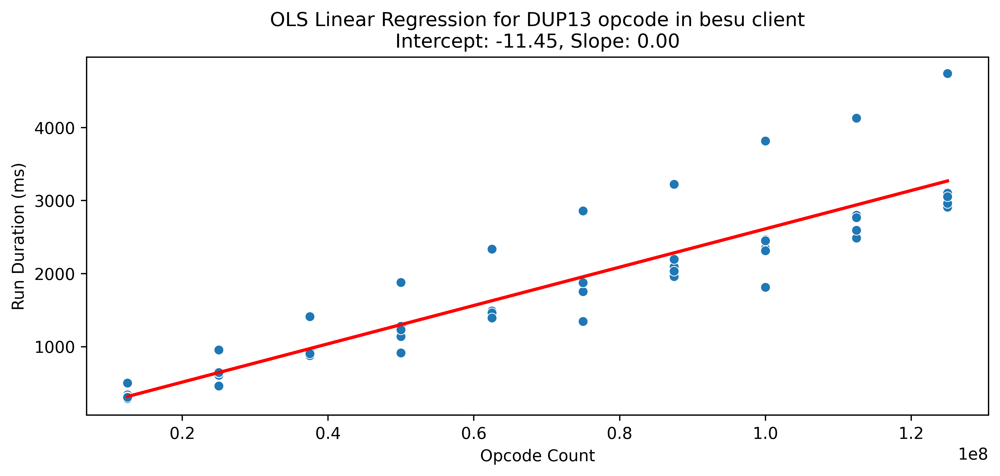


## geth


```python
                            OLS Regression Results                            
==============================================================================
Dep. Variable:        run_duration_ms   R-squared:                       0.990
Model:                            OLS   Adj. R-squared:                  0.990
Method:                 Least Squares   F-statistic:                     5066.
Date:                Mon, 22 Dec 2025   Prob (F-statistic):           1.67e-53
Time:                        12:04:09   Log-Likelihood:                -273.68
No. Observations:                  54   AIC:                             551.4
Df Residuals:                      52   BIC:                             555.3
Df Model:                           1                                         
Covariance Type:            nonrobust                                         
==============================================================================
                 coef    std err          t      P>|t|      [0.025      0.975]
------------------------------------------------------------------------------
const         32.8401     11.581      2.836      0.007       9.601      56.079
opcount     1.072e-05   1.51e-07     71.178      0.000    1.04e-05     1.1e-05
==============================================================================
Omnibus:                       71.518   Durbin-Watson:                   2.228
Prob(Omnibus):                  0.000   Jarque-Bera (JB):              826.176
Skew:                           3.469   Prob(JB):                    3.96e-180
Kurtosis:                      20.862   Cond. No.                     1.67e+08
==============================================================================

Notes:
[1] Standard Errors assume that the covariance matrix of the errors is correctly specified.
[2] The condition number is large, 1.67e+08. This might indicate that there are
strong multicollinearity or other numerical problems.
```


# DUP14

## nethermind


```python
                            OLS Regression Results                            
==============================================================================
Dep. Variable:        run_duration_ms   R-squared:                       0.991
Model:                            OLS   Adj. R-squared:                  0.991
Method:                 Least Squares   F-statistic:                     5994.
Date:                Mon, 22 Dec 2025   Prob (F-statistic):           2.19e-55
Time:                        12:04:09   Log-Likelihood:                -227.12
No. Observations:                  54   AIC:                             458.2
Df Residuals:                      52   BIC:                             462.2
Df Model:                           1                                         
Covariance Type:            nonrobust                                         
==============================================================================
                 coef    std err          t      P>|t|      [0.025      0.975]
------------------------------------------------------------------------------
const         39.4821      4.890      8.075      0.000      29.670      49.294
opcount     4.921e-06   6.36e-08     77.423      0.000    4.79e-06    5.05e-06
==============================================================================
Omnibus:                       29.759   Durbin-Watson:                   1.727
Prob(Omnibus):                  0.000   Jarque-Bera (JB):               71.007
Skew:                           1.585   Prob(JB):                     3.81e-16
Kurtosis:                       7.638   Cond. No.                     1.67e+08
==============================================================================

Notes:
[1] Standard Errors assume that the covariance matrix of the errors is correctly specified.
[2] The condition number is large, 1.67e+08. This might indicate that there are
strong multicollinearity or other numerical problems.
```


## reth


```python
                            OLS Regression Results                            
==============================================================================
Dep. Variable:        run_duration_ms   R-squared:                       0.994
Model:                            OLS   Adj. R-squared:                  0.993
Method:                 Least Squares   F-statistic:                     7961.
Date:                Mon, 22 Dec 2025   Prob (F-statistic):           1.45e-58
Time:                        12:04:09   Log-Likelihood:                -207.91
No. Observations:                  54   AIC:                             419.8
Df Residuals:                      52   BIC:                             423.8
Df Model:                           1                                         
Covariance Type:            nonrobust                                         
==============================================================================
                 coef    std err          t      P>|t|      [0.025      0.975]
------------------------------------------------------------------------------
const         38.4949      3.426     11.237      0.000      31.621      45.369
opcount     3.974e-06   4.45e-08     89.225      0.000    3.88e-06    4.06e-06
==============================================================================
Omnibus:                        2.602   Durbin-Watson:                   1.785
Prob(Omnibus):                  0.272   Jarque-Bera (JB):                1.733
Skew:                          -0.394   Prob(JB):                        0.420
Kurtosis:                       3.385   Cond. No.                     1.67e+08
==============================================================================

Notes:
[1] Standard Errors assume that the covariance matrix of the errors is correctly specified.
[2] The condition number is large, 1.67e+08. This might indicate that there are
strong multicollinearity or other numerical problems.
```


## besu


```python
                            OLS Regression Results                            
==============================================================================
Dep. Variable:        run_duration_ms   R-squared:                       0.827
Model:                            OLS   Adj. R-squared:                  0.824
Method:                 Least Squares   F-statistic:                     249.0
Date:                Mon, 22 Dec 2025   Prob (F-statistic):           1.79e-21
Time:                        12:04:10   Log-Likelihood:                -402.53
No. Observations:                  54   AIC:                             809.1
Df Residuals:                      52   BIC:                             813.0
Df Model:                           1                                         
Covariance Type:            nonrobust                                         
==============================================================================
                 coef    std err          t      P>|t|      [0.025      0.975]
------------------------------------------------------------------------------
const         11.9222    125.892      0.095      0.925    -240.699     264.544
opcount     2.583e-05   1.64e-06     15.781      0.000    2.25e-05    2.91e-05
==============================================================================
Omnibus:                       26.272   Durbin-Watson:                   0.716
Prob(Omnibus):                  0.000   Jarque-Bera (JB):               41.568
Skew:                           1.696   Prob(JB):                     9.41e-10
Kurtosis:                       5.639   Cond. No.                     1.67e+08
==============================================================================

Notes:
[1] Standard Errors assume that the covariance matrix of the errors is correctly specified.
[2] The condition number is large, 1.67e+08. This might indicate that there are
strong multicollinearity or other numerical problems.
```

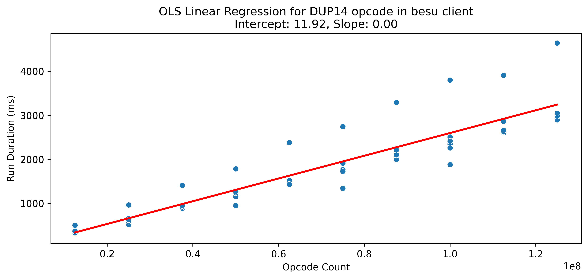


## geth


```python
                            OLS Regression Results                            
==============================================================================
Dep. Variable:        run_duration_ms   R-squared:                       0.987
Model:                            OLS   Adj. R-squared:                  0.987
Method:                 Least Squares   F-statistic:                     3932.
Date:                Mon, 22 Dec 2025   Prob (F-statistic):           1.13e-50
Time:                        12:04:10   Log-Likelihood:                -280.39
No. Observations:                  54   AIC:                             564.8
Df Residuals:                      52   BIC:                             568.8
Df Model:                           1                                         
Covariance Type:            nonrobust                                         
==============================================================================
                 coef    std err          t      P>|t|      [0.025      0.975]
------------------------------------------------------------------------------
const         39.9833     13.113      3.049      0.004      13.670      66.296
opcount     1.069e-05    1.7e-07     62.704      0.000    1.03e-05     1.1e-05
==============================================================================
Omnibus:                       81.512   Durbin-Watson:                   2.010
Prob(Omnibus):                  0.000   Jarque-Bera (JB):             1315.969
Skew:                           4.059   Prob(JB):                    1.74e-286
Kurtosis:                      25.781   Cond. No.                     1.67e+08
==============================================================================

Notes:
[1] Standard Errors assume that the covariance matrix of the errors is correctly specified.
[2] The condition number is large, 1.67e+08. This might indicate that there are
strong multicollinearity or other numerical problems.
```


# DUP15

## nethermind


```python
                            OLS Regression Results                            
==============================================================================
Dep. Variable:        run_duration_ms   R-squared:                       0.988
Model:                            OLS   Adj. R-squared:                  0.988
Method:                 Least Squares   F-statistic:                     4384.
Date:                Mon, 22 Dec 2025   Prob (F-statistic):           6.89e-52
Time:                        12:04:10   Log-Likelihood:                -235.42
No. Observations:                  54   AIC:                             474.8
Df Residuals:                      52   BIC:                             478.8
Df Model:                           1                                         
Covariance Type:            nonrobust                                         
==============================================================================
                 coef    std err          t      P>|t|      [0.025      0.975]
------------------------------------------------------------------------------
const         41.9436      5.701      7.357      0.000      30.503      53.384
opcount     4.908e-06   7.41e-08     66.213      0.000    4.76e-06    5.06e-06
==============================================================================
Omnibus:                       14.015   Durbin-Watson:                   2.161
Prob(Omnibus):                  0.001   Jarque-Bera (JB):               28.587
Skew:                           0.670   Prob(JB):                     6.20e-07
Kurtosis:                       6.303   Cond. No.                     1.67e+08
==============================================================================

Notes:
[1] Standard Errors assume that the covariance matrix of the errors is correctly specified.
[2] The condition number is large, 1.67e+08. This might indicate that there are
strong multicollinearity or other numerical problems.
```

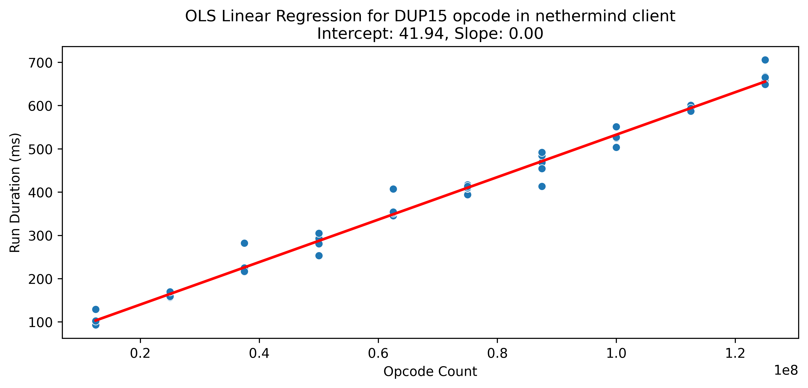


## reth


```python
                            OLS Regression Results                            
==============================================================================
Dep. Variable:        run_duration_ms   R-squared:                       0.994
Model:                            OLS   Adj. R-squared:                  0.994
Method:                 Least Squares   F-statistic:                     8491.
Date:                Mon, 22 Dec 2025   Prob (F-statistic):           2.73e-59
Time:                        12:04:10   Log-Likelihood:                -206.63
No. Observations:                  54   AIC:                             417.3
Df Residuals:                      52   BIC:                             421.2
Df Model:                           1                                         
Covariance Type:            nonrobust                                         
==============================================================================
                 coef    std err          t      P>|t|      [0.025      0.975]
------------------------------------------------------------------------------
const         36.9299      3.345     11.039      0.000      30.217      43.643
opcount     4.008e-06   4.35e-08     92.149      0.000    3.92e-06    4.09e-06
==============================================================================
Omnibus:                        3.745   Durbin-Watson:                   1.993
Prob(Omnibus):                  0.154   Jarque-Bera (JB):                2.724
Skew:                           0.434   Prob(JB):                        0.256
Kurtosis:                       3.677   Cond. No.                     1.67e+08
==============================================================================

Notes:
[1] Standard Errors assume that the covariance matrix of the errors is correctly specified.
[2] The condition number is large, 1.67e+08. This might indicate that there are
strong multicollinearity or other numerical problems.
```

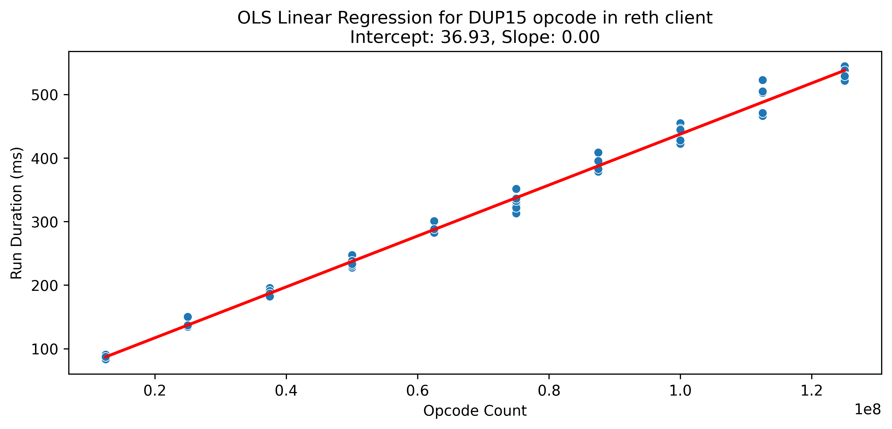


## besu


```python
                            OLS Regression Results                            
==============================================================================
Dep. Variable:        run_duration_ms   R-squared:                       0.831
Model:                            OLS   Adj. R-squared:                  0.827
Method:                 Least Squares   F-statistic:                     255.0
Date:                Mon, 22 Dec 2025   Prob (F-statistic):           1.07e-21
Time:                        12:04:10   Log-Likelihood:                -402.43
No. Observations:                  54   AIC:                             808.9
Df Residuals:                      52   BIC:                             812.8
Df Model:                           1                                         
Covariance Type:            nonrobust                                         
==============================================================================
                 coef    std err          t      P>|t|      [0.025      0.975]
------------------------------------------------------------------------------
const         -7.9832    125.655     -0.064      0.950    -260.128     244.161
opcount     2.608e-05   1.63e-06     15.968      0.000    2.28e-05    2.94e-05
==============================================================================
Omnibus:                       26.542   Durbin-Watson:                   0.558
Prob(Omnibus):                  0.000   Jarque-Bera (JB):               42.703
Skew:                           1.697   Prob(JB):                     5.34e-10
Kurtosis:                       5.732   Cond. No.                     1.67e+08
==============================================================================

Notes:
[1] Standard Errors assume that the covariance matrix of the errors is correctly specified.
[2] The condition number is large, 1.67e+08. This might indicate that there are
strong multicollinearity or other numerical problems.
```

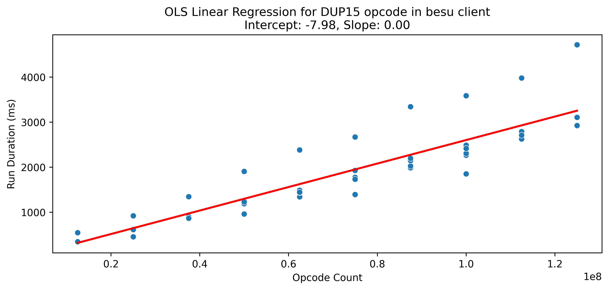


## geth


```python
                            OLS Regression Results                            
==============================================================================
Dep. Variable:        run_duration_ms   R-squared:                       0.882
Model:                            OLS   Adj. R-squared:                  0.879
Method:                 Least Squares   F-statistic:                     387.4
Date:                Mon, 22 Dec 2025   Prob (F-statistic):           9.30e-26
Time:                        12:04:10   Log-Likelihood:                -344.19
No. Observations:                  54   AIC:                             692.4
Df Residuals:                      52   BIC:                             696.4
Df Model:                           1                                         
Covariance Type:            nonrobust                                         
==============================================================================
                 coef    std err          t      P>|t|      [0.025      0.975]
------------------------------------------------------------------------------
const         32.8140     42.735      0.768      0.446     -52.940     118.568
opcount     1.094e-05   5.56e-07     19.684      0.000    9.82e-06    1.21e-05
==============================================================================
Omnibus:                      117.043   Durbin-Watson:                   1.993
Prob(Omnibus):                  0.000   Jarque-Bera (JB):             5215.251
Skew:                           6.835   Prob(JB):                         0.00
Kurtosis:                      49.163   Cond. No.                     1.67e+08
==============================================================================

Notes:
[1] Standard Errors assume that the covariance matrix of the errors is correctly specified.
[2] The condition number is large, 1.67e+08. This might indicate that there are
strong multicollinearity or other numerical problems.
```


# DUP16

## nethermind


```python
                            OLS Regression Results                            
==============================================================================
Dep. Variable:        run_duration_ms   R-squared:                       0.990
Model:                            OLS   Adj. R-squared:                  0.990
Method:                 Least Squares   F-statistic:                     5302.
Date:                Mon, 22 Dec 2025   Prob (F-statistic):           5.18e-54
Time:                        12:04:10   Log-Likelihood:                -231.70
No. Observations:                  54   AIC:                             467.4
Df Residuals:                      52   BIC:                             471.4
Df Model:                           1                                         
Covariance Type:            nonrobust                                         
==============================================================================
                 coef    std err          t      P>|t|      [0.025      0.975]
------------------------------------------------------------------------------
const         30.8937      5.322      5.805      0.000      20.215      41.573
opcount     5.038e-06   6.92e-08     72.814      0.000     4.9e-06    5.18e-06
==============================================================================
Omnibus:                       45.890   Durbin-Watson:                   2.061
Prob(Omnibus):                  0.000   Jarque-Bera (JB):              563.506
Skew:                           1.662   Prob(JB):                    4.33e-123
Kurtosis:                      18.472   Cond. No.                     1.67e+08
==============================================================================

Notes:
[1] Standard Errors assume that the covariance matrix of the errors is correctly specified.
[2] The condition number is large, 1.67e+08. This might indicate that there are
strong multicollinearity or other numerical problems.
```

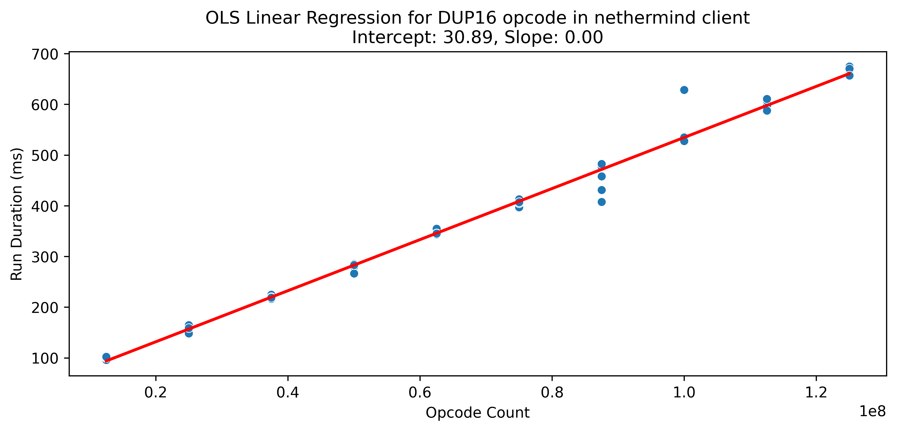


## reth


```python
                            OLS Regression Results                            
==============================================================================
Dep. Variable:        run_duration_ms   R-squared:                       0.983
Model:                            OLS   Adj. R-squared:                  0.983
Method:                 Least Squares   F-statistic:                     3074.
Date:                Mon, 22 Dec 2025   Prob (F-statistic):           6.18e-48
Time:                        12:04:11   Log-Likelihood:                -232.83
No. Observations:                  54   AIC:                             469.7
Df Residuals:                      52   BIC:                             473.6
Df Model:                           1                                         
Covariance Type:            nonrobust                                         
==============================================================================
                 coef    std err          t      P>|t|      [0.025      0.975]
------------------------------------------------------------------------------
const         40.0287      5.434      7.366      0.000      29.124      50.934
opcount     3.917e-06   7.06e-08     55.446      0.000    3.78e-06    4.06e-06
==============================================================================
Omnibus:                        2.824   Durbin-Watson:                   1.206
Prob(Omnibus):                  0.244   Jarque-Bera (JB):                1.883
Skew:                          -0.383   Prob(JB):                        0.390
Kurtosis:                       3.502   Cond. No.                     1.67e+08
==============================================================================

Notes:
[1] Standard Errors assume that the covariance matrix of the errors is correctly specified.
[2] The condition number is large, 1.67e+08. This might indicate that there are
strong multicollinearity or other numerical problems.
```


## besu


```python
                            OLS Regression Results                            
==============================================================================
Dep. Variable:        run_duration_ms   R-squared:                       0.819
Model:                            OLS   Adj. R-squared:                  0.816
Method:                 Least Squares   F-statistic:                     235.3
Date:                Mon, 22 Dec 2025   Prob (F-statistic):           6.07e-21
Time:                        12:04:11   Log-Likelihood:                -405.80
No. Observations:                  54   AIC:                             815.6
Df Residuals:                      52   BIC:                             819.6
Df Model:                           1                                         
Covariance Type:            nonrobust                                         
==============================================================================
                 coef    std err          t      P>|t|      [0.025      0.975]
------------------------------------------------------------------------------
const        -40.3540    133.747     -0.302      0.764    -308.737     228.029
opcount     2.667e-05   1.74e-06     15.339      0.000    2.32e-05    3.02e-05
==============================================================================
Omnibus:                       26.859   Durbin-Watson:                   0.895
Prob(Omnibus):                  0.000   Jarque-Bera (JB):               43.432
Skew:                           1.717   Prob(JB):                     3.71e-10
Kurtosis:                       5.740   Cond. No.                     1.67e+08
==============================================================================

Notes:
[1] Standard Errors assume that the covariance matrix of the errors is correctly specified.
[2] The condition number is large, 1.67e+08. This might indicate that there are
strong multicollinearity or other numerical problems.
```

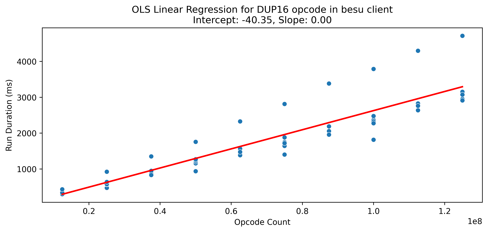


## geth


```python
                            OLS Regression Results                            
==============================================================================
Dep. Variable:        run_duration_ms   R-squared:                       0.990
Model:                            OLS   Adj. R-squared:                  0.990
Method:                 Least Squares   F-statistic:                     5184.
Date:                Mon, 22 Dec 2025   Prob (F-statistic):           9.26e-54
Time:                        12:04:11   Log-Likelihood:                -271.89
No. Observations:                  54   AIC:                             547.8
Df Residuals:                      52   BIC:                             551.8
Df Model:                           1                                         
Covariance Type:            nonrobust                                         
==============================================================================
                 coef    std err          t      P>|t|      [0.025      0.975]
------------------------------------------------------------------------------
const         51.9573     11.203      4.638      0.000      29.478      74.437
opcount     1.049e-05   1.46e-07     71.998      0.000    1.02e-05    1.08e-05
==============================================================================
Omnibus:                       78.373   Durbin-Watson:                   1.792
Prob(Omnibus):                  0.000   Jarque-Bera (JB):             1069.586
Skew:                           3.914   Prob(JB):                    5.52e-233
Kurtosis:                      23.349   Cond. No.                     1.67e+08
==============================================================================

Notes:
[1] Standard Errors assume that the covariance matrix of the errors is correctly specified.
[2] The condition number is large, 1.67e+08. This might indicate that there are
strong multicollinearity or other numerical problems.
```

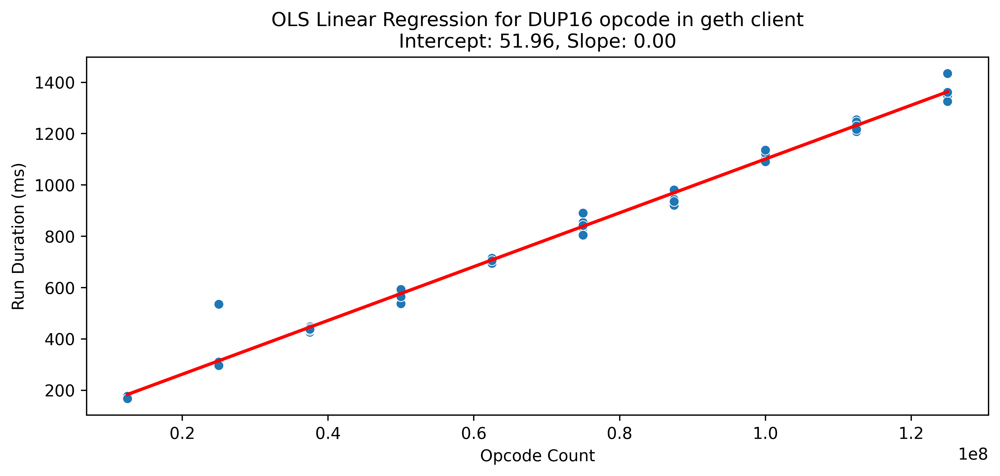


# SWAP1

## nethermind


```python
                            OLS Regression Results                            
==============================================================================
Dep. Variable:        run_duration_ms   R-squared:                       0.996
Model:                            OLS   Adj. R-squared:                  0.996
Method:                 Least Squares   F-statistic:                 1.334e+04
Date:                Mon, 22 Dec 2025   Prob (F-statistic):           2.28e-64
Time:                        12:04:11   Log-Likelihood:                -203.01
No. Observations:                  54   AIC:                             410.0
Df Residuals:                      52   BIC:                             414.0
Df Model:                           1                                         
Covariance Type:            nonrobust                                         
==============================================================================
                 coef    std err          t      P>|t|      [0.025      0.975]
------------------------------------------------------------------------------
const         32.1579      3.128     10.279      0.000      25.880      38.436
opcount     4.698e-06   4.07e-08    115.515      0.000    4.62e-06    4.78e-06
==============================================================================
Omnibus:                       16.921   Durbin-Watson:                   2.026
Prob(Omnibus):                  0.000   Jarque-Bera (JB):               75.936
Skew:                          -0.395   Prob(JB):                     3.24e-17
Kurtosis:                       8.755   Cond. No.                     1.67e+08
==============================================================================

Notes:
[1] Standard Errors assume that the covariance matrix of the errors is correctly specified.
[2] The condition number is large, 1.67e+08. This might indicate that there are
strong multicollinearity or other numerical problems.
```

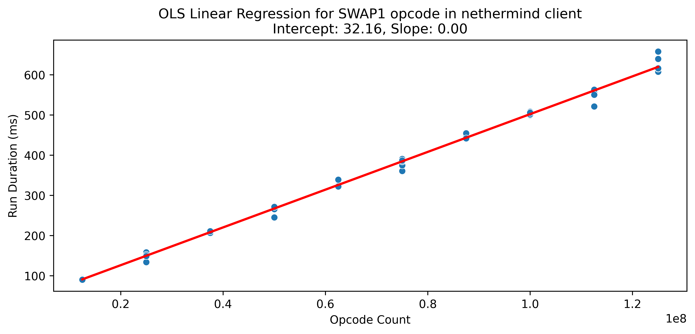


## reth


```python
                            OLS Regression Results                            
==============================================================================
Dep. Variable:        run_duration_ms   R-squared:                       0.720
Model:                            OLS   Adj. R-squared:                  0.714
Method:                 Least Squares   F-statistic:                     133.6
Date:                Mon, 22 Dec 2025   Prob (F-statistic):           5.55e-16
Time:                        12:04:11   Log-Likelihood:                -315.18
No. Observations:                  54   AIC:                             634.4
Df Residuals:                      52   BIC:                             638.3
Df Model:                           1                                         
Covariance Type:            nonrobust                                         
==============================================================================
                 coef    std err          t      P>|t|      [0.025      0.975]
------------------------------------------------------------------------------
const         58.4151     24.975      2.339      0.023       8.299     108.531
opcount     3.753e-06   3.25e-07     11.558      0.000     3.1e-06     4.4e-06
==============================================================================
Omnibus:                      117.509   Durbin-Watson:                   1.963
Prob(Omnibus):                  0.000   Jarque-Bera (JB):             5300.272
Skew:                           6.879   Prob(JB):                         0.00
Kurtosis:                      49.545   Cond. No.                     1.67e+08
==============================================================================

Notes:
[1] Standard Errors assume that the covariance matrix of the errors is correctly specified.
[2] The condition number is large, 1.67e+08. This might indicate that there are
strong multicollinearity or other numerical problems.
```

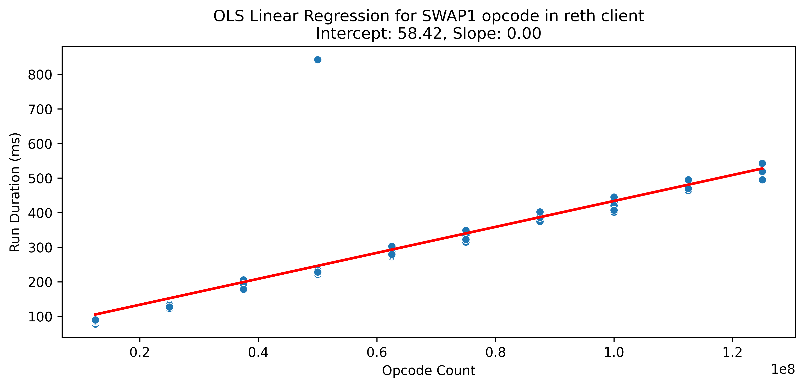


## besu


```python
                            OLS Regression Results                            
==============================================================================
Dep. Variable:        run_duration_ms   R-squared:                       0.946
Model:                            OLS   Adj. R-squared:                  0.945
Method:                 Least Squares   F-statistic:                     903.3
Date:                Mon, 22 Dec 2025   Prob (F-statistic):           1.54e-34
Time:                        12:04:11   Log-Likelihood:                -379.11
No. Observations:                  54   AIC:                             762.2
Df Residuals:                      52   BIC:                             766.2
Df Model:                           1                                         
Covariance Type:            nonrobust                                         
==============================================================================
                 coef    std err          t      P>|t|      [0.025      0.975]
------------------------------------------------------------------------------
const         38.3289     81.593      0.470      0.640    -125.399     202.057
opcount     3.188e-05   1.06e-06     30.054      0.000    2.98e-05     3.4e-05
==============================================================================
Omnibus:                       15.384   Durbin-Watson:                   0.884
Prob(Omnibus):                  0.000   Jarque-Bera (JB):               19.381
Skew:                           1.060   Prob(JB):                     6.19e-05
Kurtosis:                       5.029   Cond. No.                     1.67e+08
==============================================================================

Notes:
[1] Standard Errors assume that the covariance matrix of the errors is correctly specified.
[2] The condition number is large, 1.67e+08. This might indicate that there are
strong multicollinearity or other numerical problems.
```

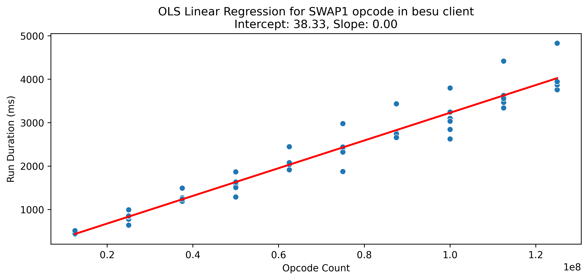


## geth


```python
                            OLS Regression Results                            
==============================================================================
Dep. Variable:        run_duration_ms   R-squared:                       0.996
Model:                            OLS   Adj. R-squared:                  0.995
Method:                 Least Squares   F-statistic:                 1.154e+04
Date:                Mon, 22 Dec 2025   Prob (F-statistic):           9.81e-63
Time:                        12:04:11   Log-Likelihood:                -245.30
No. Observations:                  54   AIC:                             494.6
Df Residuals:                      52   BIC:                             498.6
Df Model:                           1                                         
Covariance Type:            nonrobust                                         
==============================================================================
                 coef    std err          t      P>|t|      [0.025      0.975]
------------------------------------------------------------------------------
const         35.7601      6.847      5.223      0.000      22.022      49.499
opcount     9.561e-06    8.9e-08    107.419      0.000    9.38e-06    9.74e-06
==============================================================================
Omnibus:                        4.953   Durbin-Watson:                   1.590
Prob(Omnibus):                  0.084   Jarque-Bera (JB):                4.570
Skew:                          -0.378   Prob(JB):                        0.102
Kurtosis:                       4.208   Cond. No.                     1.67e+08
==============================================================================

Notes:
[1] Standard Errors assume that the covariance matrix of the errors is correctly specified.
[2] The condition number is large, 1.67e+08. This might indicate that there are
strong multicollinearity or other numerical problems.
```


# SWAP2

## nethermind


```python
                            OLS Regression Results                            
==============================================================================
Dep. Variable:        run_duration_ms   R-squared:                       0.997
Model:                            OLS   Adj. R-squared:                  0.997
Method:                 Least Squares   F-statistic:                 1.645e+04
Date:                Mon, 22 Dec 2025   Prob (F-statistic):           1.01e-66
Time:                        12:04:12   Log-Likelihood:                -196.84
No. Observations:                  54   AIC:                             397.7
Df Residuals:                      52   BIC:                             401.6
Df Model:                           1                                         
Covariance Type:            nonrobust                                         
==============================================================================
                 coef    std err          t      P>|t|      [0.025      0.975]
------------------------------------------------------------------------------
const         35.6375      2.791     12.771      0.000      30.038      41.237
opcount     4.652e-06   3.63e-08    128.243      0.000    4.58e-06    4.73e-06
==============================================================================
Omnibus:                       27.588   Durbin-Watson:                   1.907
Prob(Omnibus):                  0.000   Jarque-Bera (JB):               48.678
Skew:                          -1.674   Prob(JB):                     2.69e-11
Kurtosis:                       6.228   Cond. No.                     1.67e+08
==============================================================================

Notes:
[1] Standard Errors assume that the covariance matrix of the errors is correctly specified.
[2] The condition number is large, 1.67e+08. This might indicate that there are
strong multicollinearity or other numerical problems.
```


## reth


```python
                            OLS Regression Results                            
==============================================================================
Dep. Variable:        run_duration_ms   R-squared:                       0.996
Model:                            OLS   Adj. R-squared:                  0.996
Method:                 Least Squares   F-statistic:                 1.207e+04
Date:                Mon, 22 Dec 2025   Prob (F-statistic):           3.07e-63
Time:                        12:04:12   Log-Likelihood:                -197.11
No. Observations:                  54   AIC:                             398.2
Df Residuals:                      52   BIC:                             402.2
Df Model:                           1                                         
Covariance Type:            nonrobust                                         
==============================================================================
                 coef    std err          t      P>|t|      [0.025      0.975]
------------------------------------------------------------------------------
const         35.8466      2.805     12.781      0.000      30.218      41.475
opcount     4.006e-06   3.65e-08    109.860      0.000    3.93e-06    4.08e-06
==============================================================================
Omnibus:                        0.256   Durbin-Watson:                   1.560
Prob(Omnibus):                  0.880   Jarque-Bera (JB):                0.448
Skew:                          -0.010   Prob(JB):                        0.799
Kurtosis:                       2.554   Cond. No.                     1.67e+08
==============================================================================

Notes:
[1] Standard Errors assume that the covariance matrix of the errors is correctly specified.
[2] The condition number is large, 1.67e+08. This might indicate that there are
strong multicollinearity or other numerical problems.
```

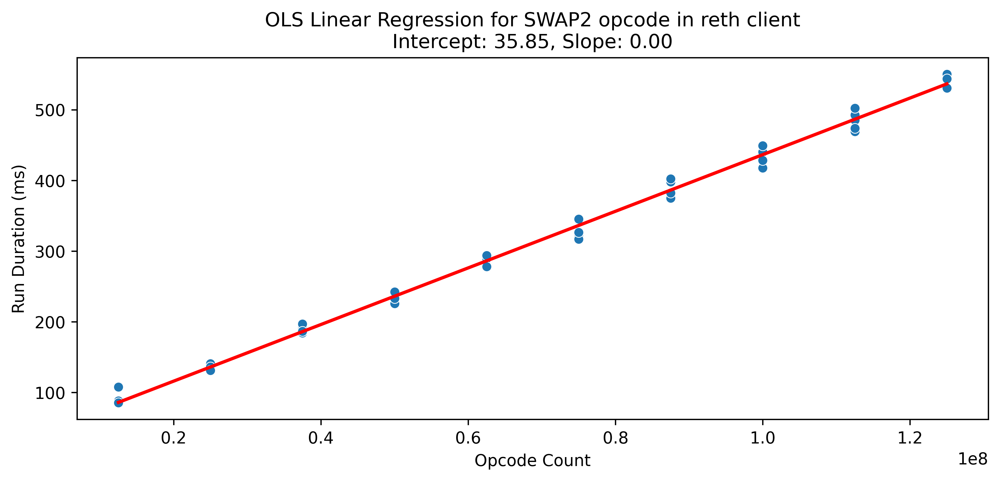


## besu


```python
                            OLS Regression Results                            
==============================================================================
Dep. Variable:        run_duration_ms   R-squared:                       0.945
Model:                            OLS   Adj. R-squared:                  0.944
Method:                 Least Squares   F-statistic:                     887.5
Date:                Mon, 22 Dec 2025   Prob (F-statistic):           2.37e-34
Time:                        12:04:12   Log-Likelihood:                -379.63
No. Observations:                  54   AIC:                             763.3
Df Residuals:                      52   BIC:                             767.2
Df Model:                           1                                         
Covariance Type:            nonrobust                                         
==============================================================================
                 coef    std err          t      P>|t|      [0.025      0.975]
------------------------------------------------------------------------------
const         37.1994     82.375      0.452      0.653    -128.098     202.497
opcount      3.19e-05   1.07e-06     29.791      0.000    2.98e-05    3.41e-05
==============================================================================
Omnibus:                       18.810   Durbin-Watson:                   0.719
Prob(Omnibus):                  0.000   Jarque-Bera (JB):               26.939
Skew:                           1.209   Prob(JB):                     1.41e-06
Kurtosis:                       5.474   Cond. No.                     1.67e+08
==============================================================================

Notes:
[1] Standard Errors assume that the covariance matrix of the errors is correctly specified.
[2] The condition number is large, 1.67e+08. This might indicate that there are
strong multicollinearity or other numerical problems.
```

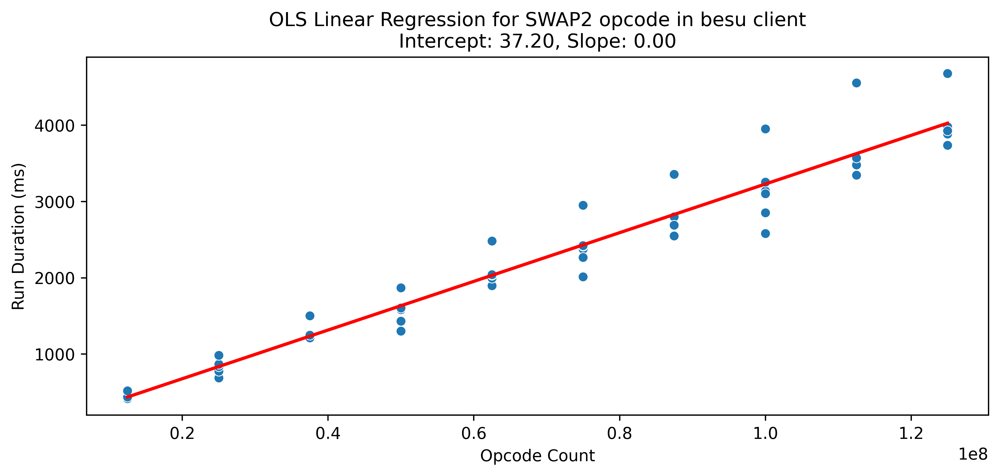


## geth


```python
                            OLS Regression Results                            
==============================================================================
Dep. Variable:        run_duration_ms   R-squared:                       0.994
Model:                            OLS   Adj. R-squared:                  0.994
Method:                 Least Squares   F-statistic:                     9301.
Date:                Mon, 22 Dec 2025   Prob (F-statistic):           2.60e-60
Time:                        12:04:12   Log-Likelihood:                -251.83
No. Observations:                  54   AIC:                             507.7
Df Residuals:                      52   BIC:                             511.6
Df Model:                           1                                         
Covariance Type:            nonrobust                                         
==============================================================================
                 coef    std err          t      P>|t|      [0.025      0.975]
------------------------------------------------------------------------------
const         34.3126      7.727      4.441      0.000      18.807      49.818
opcount     9.688e-06      1e-07     96.441      0.000    9.49e-06    9.89e-06
==============================================================================
Omnibus:                        6.243   Durbin-Watson:                   1.777
Prob(Omnibus):                  0.044   Jarque-Bera (JB):                5.191
Skew:                           0.678   Prob(JB):                       0.0746
Kurtosis:                       3.683   Cond. No.                     1.67e+08
==============================================================================

Notes:
[1] Standard Errors assume that the covariance matrix of the errors is correctly specified.
[2] The condition number is large, 1.67e+08. This might indicate that there are
strong multicollinearity or other numerical problems.
```

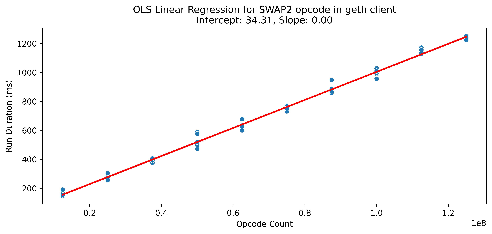


# SWAP3

## nethermind


```python
                            OLS Regression Results                            
==============================================================================
Dep. Variable:        run_duration_ms   R-squared:                       0.995
Model:                            OLS   Adj. R-squared:                  0.995
Method:                 Least Squares   F-statistic:                 1.119e+04
Date:                Mon, 22 Dec 2025   Prob (F-statistic):           2.19e-62
Time:                        12:04:12   Log-Likelihood:                -207.17
No. Observations:                  54   AIC:                             418.3
Df Residuals:                      52   BIC:                             422.3
Df Model:                           1                                         
Covariance Type:            nonrobust                                         
==============================================================================
                 coef    std err          t      P>|t|      [0.025      0.975]
------------------------------------------------------------------------------
const         38.0385      3.379     11.256      0.000      31.258      44.820
opcount     4.646e-06   4.39e-08    105.767      0.000    4.56e-06    4.73e-06
==============================================================================
Omnibus:                       11.012   Durbin-Watson:                   1.906
Prob(Omnibus):                  0.004   Jarque-Bera (JB):               16.606
Skew:                          -0.624   Prob(JB):                     0.000248
Kurtosis:                       5.413   Cond. No.                     1.67e+08
==============================================================================

Notes:
[1] Standard Errors assume that the covariance matrix of the errors is correctly specified.
[2] The condition number is large, 1.67e+08. This might indicate that there are
strong multicollinearity or other numerical problems.
```

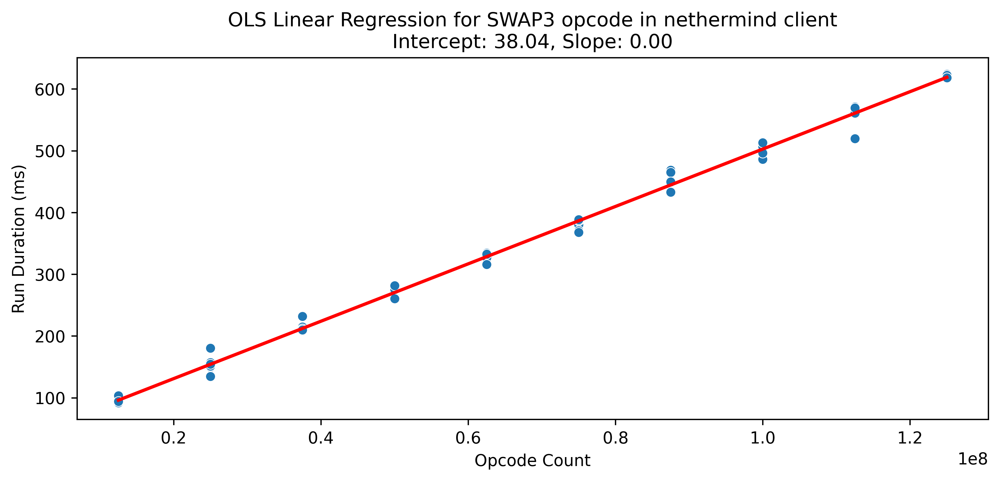


## reth


```python
                            OLS Regression Results                            
==============================================================================
Dep. Variable:        run_duration_ms   R-squared:                       0.992
Model:                            OLS   Adj. R-squared:                  0.992
Method:                 Least Squares   F-statistic:                     6554.
Date:                Mon, 22 Dec 2025   Prob (F-statistic):           2.20e-56
Time:                        12:04:12   Log-Likelihood:                -211.72
No. Observations:                  54   AIC:                             427.4
Df Residuals:                      52   BIC:                             431.4
Df Model:                           1                                         
Covariance Type:            nonrobust                                         
==============================================================================
                 coef    std err          t      P>|t|      [0.025      0.975]
------------------------------------------------------------------------------
const         41.0265      3.676     11.159      0.000      33.649      48.404
opcount     3.869e-06   4.78e-08     80.956      0.000    3.77e-06    3.97e-06
==============================================================================
Omnibus:                       26.797   Durbin-Watson:                   2.050
Prob(Omnibus):                  0.000   Jarque-Bera (JB):               70.880
Skew:                          -1.333   Prob(JB):                     4.06e-16
Kurtosis:                       7.939   Cond. No.                     1.67e+08
==============================================================================

Notes:
[1] Standard Errors assume that the covariance matrix of the errors is correctly specified.
[2] The condition number is large, 1.67e+08. This might indicate that there are
strong multicollinearity or other numerical problems.
```


## besu


```python
                            OLS Regression Results                            
==============================================================================
Dep. Variable:        run_duration_ms   R-squared:                       0.952
Model:                            OLS   Adj. R-squared:                  0.951
Method:                 Least Squares   F-statistic:                     1025.
Date:                Mon, 22 Dec 2025   Prob (F-statistic):           6.78e-36
Time:                        12:04:12   Log-Likelihood:                -375.94
No. Observations:                  54   AIC:                             755.9
Df Residuals:                      52   BIC:                             759.9
Df Model:                           1                                         
Covariance Type:            nonrobust                                         
==============================================================================
                 coef    std err          t      P>|t|      [0.025      0.975]
------------------------------------------------------------------------------
const         46.6826     76.935      0.607      0.547    -107.699     201.064
opcount     3.202e-05      1e-06     32.015      0.000       3e-05     3.4e-05
==============================================================================
Omnibus:                       19.138   Durbin-Watson:                   0.640
Prob(Omnibus):                  0.000   Jarque-Bera (JB):               29.439
Skew:                           1.177   Prob(JB):                     4.05e-07
Kurtosis:                       5.746   Cond. No.                     1.67e+08
==============================================================================

Notes:
[1] Standard Errors assume that the covariance matrix of the errors is correctly specified.
[2] The condition number is large, 1.67e+08. This might indicate that there are
strong multicollinearity or other numerical problems.
```

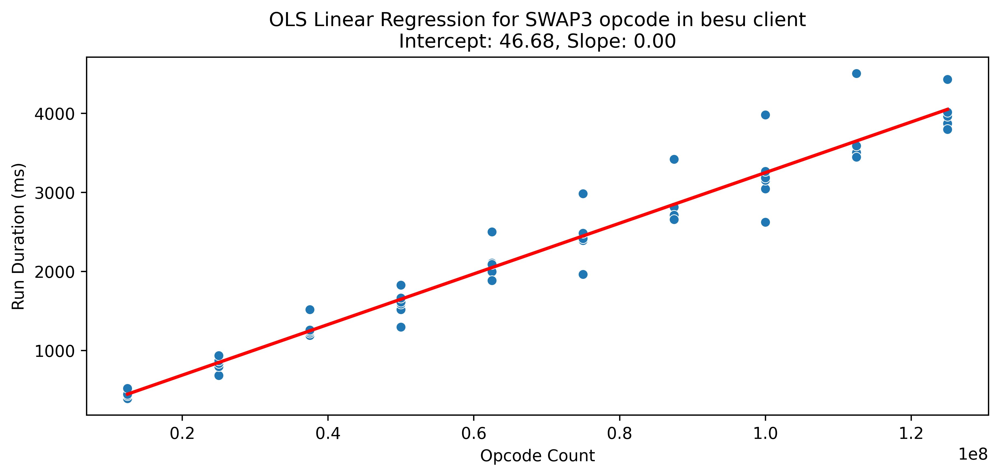


## geth


```python
                            OLS Regression Results                            
==============================================================================
Dep. Variable:        run_duration_ms   R-squared:                       0.992
Model:                            OLS   Adj. R-squared:                  0.991
Method:                 Least Squares   F-statistic:                     6142.
Date:                Mon, 22 Dec 2025   Prob (F-statistic):           1.17e-55
Time:                        12:04:13   Log-Likelihood:                -262.74
No. Observations:                  54   AIC:                             529.5
Df Residuals:                      52   BIC:                             533.5
Df Model:                           1                                         
Covariance Type:            nonrobust                                         
==============================================================================
                 coef    std err          t      P>|t|      [0.025      0.975]
------------------------------------------------------------------------------
const         38.7618      9.457      4.099      0.000      19.784      57.739
opcount     9.635e-06   1.23e-07     78.370      0.000    9.39e-06    9.88e-06
==============================================================================
Omnibus:                       34.817   Durbin-Watson:                   1.994
Prob(Omnibus):                  0.000   Jarque-Bera (JB):              116.387
Skew:                           1.695   Prob(JB):                     5.33e-26
Kurtosis:                       9.343   Cond. No.                     1.67e+08
==============================================================================

Notes:
[1] Standard Errors assume that the covariance matrix of the errors is correctly specified.
[2] The condition number is large, 1.67e+08. This might indicate that there are
strong multicollinearity or other numerical problems.
```


# SWAP4

## nethermind


```python
                            OLS Regression Results                            
==============================================================================
Dep. Variable:        run_duration_ms   R-squared:                       0.995
Model:                            OLS   Adj. R-squared:                  0.994
Method:                 Least Squares   F-statistic:                     9567.
Date:                Mon, 22 Dec 2025   Prob (F-statistic):           1.25e-60
Time:                        12:04:13   Log-Likelihood:                -211.78
No. Observations:                  54   AIC:                             427.6
Df Residuals:                      52   BIC:                             431.5
Df Model:                           1                                         
Covariance Type:            nonrobust                                         
==============================================================================
                 coef    std err          t      P>|t|      [0.025      0.975]
------------------------------------------------------------------------------
const         34.3929      3.680      9.345      0.000      27.008      41.778
opcount      4.68e-06   4.78e-08     97.813      0.000    4.58e-06    4.78e-06
==============================================================================
Omnibus:                       31.394   Durbin-Watson:                   2.338
Prob(Omnibus):                  0.000   Jarque-Bera (JB):               62.274
Skew:                          -1.848   Prob(JB):                     3.00e-14
Kurtosis:                       6.745   Cond. No.                     1.67e+08
==============================================================================

Notes:
[1] Standard Errors assume that the covariance matrix of the errors is correctly specified.
[2] The condition number is large, 1.67e+08. This might indicate that there are
strong multicollinearity or other numerical problems.
```

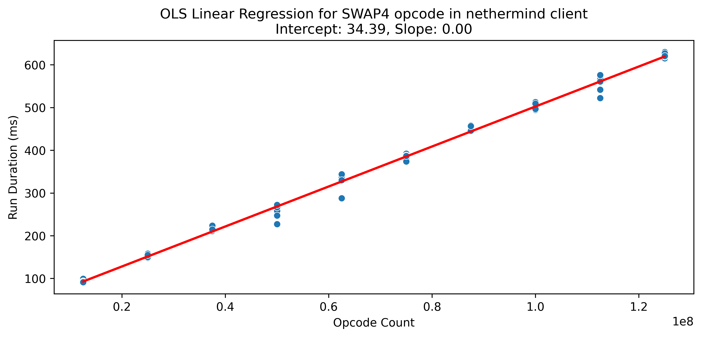


## reth


```python
                            OLS Regression Results                            
==============================================================================
Dep. Variable:        run_duration_ms   R-squared:                       0.994
Model:                            OLS   Adj. R-squared:                  0.994
Method:                 Least Squares   F-statistic:                     8309.
Date:                Mon, 22 Dec 2025   Prob (F-statistic):           4.79e-59
Time:                        12:04:13   Log-Likelihood:                -206.52
No. Observations:                  54   AIC:                             417.0
Df Residuals:                      52   BIC:                             421.0
Df Model:                           1                                         
Covariance Type:            nonrobust                                         
==============================================================================
                 coef    std err          t      P>|t|      [0.025      0.975]
------------------------------------------------------------------------------
const         38.8029      3.339     11.622      0.000      32.103      45.503
opcount     3.956e-06   4.34e-08     91.154      0.000    3.87e-06    4.04e-06
==============================================================================
Omnibus:                        0.506   Durbin-Watson:                   1.799
Prob(Omnibus):                  0.777   Jarque-Bera (JB):                0.643
Skew:                          -0.107   Prob(JB):                        0.725
Kurtosis:                       2.510   Cond. No.                     1.67e+08
==============================================================================

Notes:
[1] Standard Errors assume that the covariance matrix of the errors is correctly specified.
[2] The condition number is large, 1.67e+08. This might indicate that there are
strong multicollinearity or other numerical problems.
```


## besu


```python
                            OLS Regression Results                            
==============================================================================
Dep. Variable:        run_duration_ms   R-squared:                       0.950
Model:                            OLS   Adj. R-squared:                  0.949
Method:                 Least Squares   F-statistic:                     983.1
Date:                Mon, 22 Dec 2025   Prob (F-statistic):           1.90e-35
Time:                        12:04:13   Log-Likelihood:                -377.42
No. Observations:                  54   AIC:                             758.8
Df Residuals:                      52   BIC:                             762.8
Df Model:                           1                                         
Covariance Type:            nonrobust                                         
==============================================================================
                 coef    std err          t      P>|t|      [0.025      0.975]
------------------------------------------------------------------------------
const         32.4528     79.083      0.410      0.683    -126.240     191.145
opcount     3.223e-05   1.03e-06     31.354      0.000    3.02e-05    3.43e-05
==============================================================================
Omnibus:                       16.007   Durbin-Watson:                   0.530
Prob(Omnibus):                  0.000   Jarque-Bera (JB):               22.685
Skew:                           1.016   Prob(JB):                     1.19e-05
Kurtosis:                       5.440   Cond. No.                     1.67e+08
==============================================================================

Notes:
[1] Standard Errors assume that the covariance matrix of the errors is correctly specified.
[2] The condition number is large, 1.67e+08. This might indicate that there are
strong multicollinearity or other numerical problems.
```

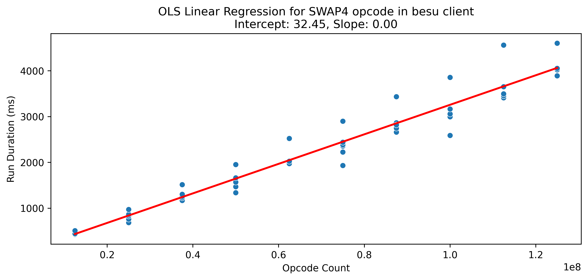


## geth


```python
                            OLS Regression Results                            
==============================================================================
Dep. Variable:        run_duration_ms   R-squared:                       0.993
Model:                            OLS   Adj. R-squared:                  0.993
Method:                 Least Squares   F-statistic:                     7871.
Date:                Mon, 22 Dec 2025   Prob (F-statistic):           1.94e-58
Time:                        12:04:13   Log-Likelihood:                -255.76
No. Observations:                  54   AIC:                             515.5
Df Residuals:                      52   BIC:                             519.5
Df Model:                           1                                         
Covariance Type:            nonrobust                                         
==============================================================================
                 coef    std err          t      P>|t|      [0.025      0.975]
------------------------------------------------------------------------------
const         41.6051      8.310      5.007      0.000      24.930      58.280
opcount     9.584e-06   1.08e-07     88.717      0.000    9.37e-06     9.8e-06
==============================================================================
Omnibus:                       26.218   Durbin-Watson:                   1.758
Prob(Omnibus):                  0.000   Jarque-Bera (JB):               46.601
Skew:                           1.565   Prob(JB):                     7.60e-11
Kurtosis:                       6.304   Cond. No.                     1.67e+08
==============================================================================

Notes:
[1] Standard Errors assume that the covariance matrix of the errors is correctly specified.
[2] The condition number is large, 1.67e+08. This might indicate that there are
strong multicollinearity or other numerical problems.
```


# SWAP5

## nethermind


```python
                            OLS Regression Results                            
==============================================================================
Dep. Variable:        run_duration_ms   R-squared:                       0.800
Model:                            OLS   Adj. R-squared:                  0.797
Method:                 Least Squares   F-statistic:                     208.5
Date:                Mon, 22 Dec 2025   Prob (F-statistic):           7.81e-20
Time:                        12:04:13   Log-Likelihood:                -323.92
No. Observations:                  54   AIC:                             651.8
Df Residuals:                      52   BIC:                             655.8
Df Model:                           1                                         
Covariance Type:            nonrobust                                         
==============================================================================
                 coef    std err          t      P>|t|      [0.025      0.975]
------------------------------------------------------------------------------
const          9.6571     29.363      0.329      0.744     -49.264      68.579
opcount     5.512e-06   3.82e-07     14.440      0.000    4.75e-06    6.28e-06
==============================================================================
Omnibus:                       46.298   Durbin-Watson:                   1.060
Prob(Omnibus):                  0.000   Jarque-Bera (JB):              143.752
Skew:                           2.555   Prob(JB):                     6.09e-32
Kurtosis:                       9.146   Cond. No.                     1.67e+08
==============================================================================

Notes:
[1] Standard Errors assume that the covariance matrix of the errors is correctly specified.
[2] The condition number is large, 1.67e+08. This might indicate that there are
strong multicollinearity or other numerical problems.
```

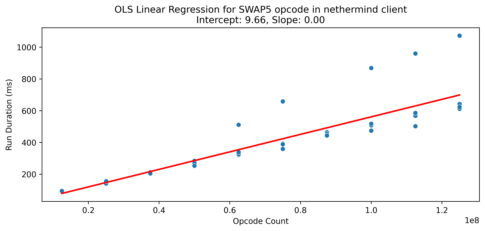


## reth


```python
                            OLS Regression Results                            
==============================================================================
Dep. Variable:        run_duration_ms   R-squared:                       0.994
Model:                            OLS   Adj. R-squared:                  0.994
Method:                 Least Squares   F-statistic:                     8187.
Date:                Mon, 22 Dec 2025   Prob (F-statistic):           7.02e-59
Time:                        12:04:13   Log-Likelihood:                -207.40
No. Observations:                  54   AIC:                             418.8
Df Residuals:                      52   BIC:                             422.8
Df Model:                           1                                         
Covariance Type:            nonrobust                                         
==============================================================================
                 coef    std err          t      P>|t|      [0.025      0.975]
------------------------------------------------------------------------------
const         38.9898      3.394     11.488      0.000      32.180      45.800
opcount     3.992e-06   4.41e-08     90.484      0.000     3.9e-06    4.08e-06
==============================================================================
Omnibus:                        1.001   Durbin-Watson:                   2.164
Prob(Omnibus):                  0.606   Jarque-Bera (JB):                0.639
Skew:                           0.265   Prob(JB):                        0.727
Kurtosis:                       3.050   Cond. No.                     1.67e+08
==============================================================================

Notes:
[1] Standard Errors assume that the covariance matrix of the errors is correctly specified.
[2] The condition number is large, 1.67e+08. This might indicate that there are
strong multicollinearity or other numerical problems.
```

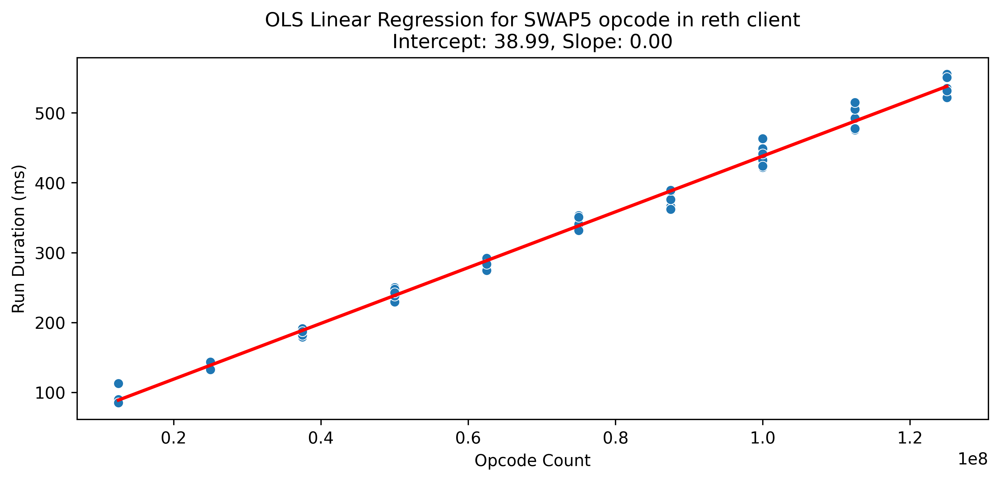


## besu


```python
                            OLS Regression Results                            
==============================================================================
Dep. Variable:        run_duration_ms   R-squared:                       0.945
Model:                            OLS   Adj. R-squared:                  0.944
Method:                 Least Squares   F-statistic:                     895.2
Date:                Mon, 22 Dec 2025   Prob (F-statistic):           1.92e-34
Time:                        12:04:13   Log-Likelihood:                -379.74
No. Observations:                  54   AIC:                             763.5
Df Residuals:                      52   BIC:                             767.5
Df Model:                           1                                         
Covariance Type:            nonrobust                                         
==============================================================================
                 coef    std err          t      P>|t|      [0.025      0.975]
------------------------------------------------------------------------------
const         31.1248     82.546      0.377      0.708    -134.517     196.766
opcount     3.211e-05   1.07e-06     29.919      0.000       3e-05    3.43e-05
==============================================================================
Omnibus:                       14.365   Durbin-Watson:                   0.773
Prob(Omnibus):                  0.001   Jarque-Bera (JB):               17.086
Skew:                           1.032   Prob(JB):                     0.000195
Kurtosis:                       4.827   Cond. No.                     1.67e+08
==============================================================================

Notes:
[1] Standard Errors assume that the covariance matrix of the errors is correctly specified.
[2] The condition number is large, 1.67e+08. This might indicate that there are
strong multicollinearity or other numerical problems.
```


## geth


```python
                            OLS Regression Results                            
==============================================================================
Dep. Variable:        run_duration_ms   R-squared:                       0.996
Model:                            OLS   Adj. R-squared:                  0.996
Method:                 Least Squares   F-statistic:                 1.265e+04
Date:                Mon, 22 Dec 2025   Prob (F-statistic):           9.10e-64
Time:                        12:04:14   Log-Likelihood:                -243.05
No. Observations:                  54   AIC:                             490.1
Df Residuals:                      52   BIC:                             494.1
Df Model:                           1                                         
Covariance Type:            nonrobust                                         
==============================================================================
                 coef    std err          t      P>|t|      [0.025      0.975]
------------------------------------------------------------------------------
const         35.2398      6.567      5.366      0.000      22.062      48.418
opcount     9.602e-06   8.54e-08    112.467      0.000    9.43e-06    9.77e-06
==============================================================================
Omnibus:                       13.503   Durbin-Watson:                   2.352
Prob(Omnibus):                  0.001   Jarque-Bera (JB):               20.453
Skew:                           0.800   Prob(JB):                     3.62e-05
Kurtosis:                       5.555   Cond. No.                     1.67e+08
==============================================================================

Notes:
[1] Standard Errors assume that the covariance matrix of the errors is correctly specified.
[2] The condition number is large, 1.67e+08. This might indicate that there are
strong multicollinearity or other numerical problems.
```


# SWAP6

## nethermind


```python
                            OLS Regression Results                            
==============================================================================
Dep. Variable:        run_duration_ms   R-squared:                       0.829
Model:                            OLS   Adj. R-squared:                  0.826
Method:                 Least Squares   F-statistic:                     253.0
Date:                Mon, 22 Dec 2025   Prob (F-statistic):           1.28e-21
Time:                        12:04:14   Log-Likelihood:                -316.71
No. Observations:                  54   AIC:                             637.4
Df Residuals:                      52   BIC:                             641.4
Df Model:                           1                                         
Covariance Type:            nonrobust                                         
==============================================================================
                 coef    std err          t      P>|t|      [0.025      0.975]
------------------------------------------------------------------------------
const         13.7753     25.689      0.536      0.594     -37.774      65.325
opcount     5.312e-06   3.34e-07     15.905      0.000    4.64e-06    5.98e-06
==============================================================================
Omnibus:                       66.540   Durbin-Watson:                   2.071
Prob(Omnibus):                  0.000   Jarque-Bera (JB):              437.068
Skew:                           3.503   Prob(JB):                     1.24e-95
Kurtosis:                      15.048   Cond. No.                     1.67e+08
==============================================================================

Notes:
[1] Standard Errors assume that the covariance matrix of the errors is correctly specified.
[2] The condition number is large, 1.67e+08. This might indicate that there are
strong multicollinearity or other numerical problems.
```

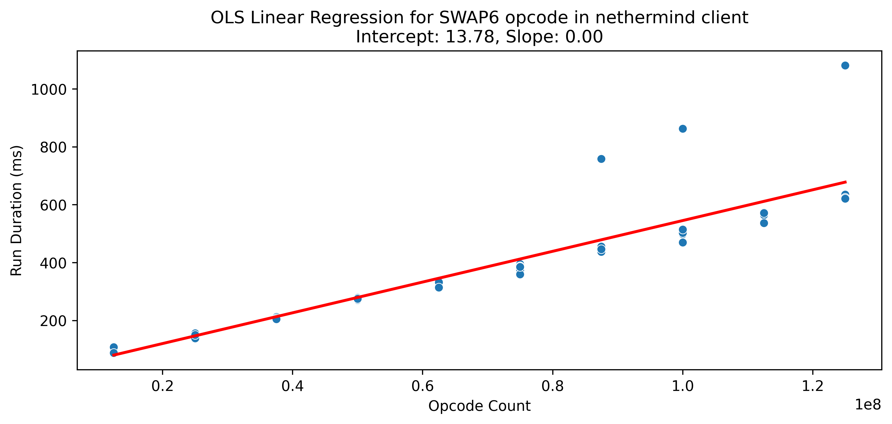


## reth


```python
                            OLS Regression Results                            
==============================================================================
Dep. Variable:        run_duration_ms   R-squared:                       0.992
Model:                            OLS   Adj. R-squared:                  0.992
Method:                 Least Squares   F-statistic:                     6469.
Date:                Mon, 22 Dec 2025   Prob (F-statistic):           3.08e-56
Time:                        12:04:14   Log-Likelihood:                -213.70
No. Observations:                  54   AIC:                             431.4
Df Residuals:                      52   BIC:                             435.4
Df Model:                           1                                         
Covariance Type:            nonrobust                                         
==============================================================================
                 coef    std err          t      P>|t|      [0.025      0.975]
------------------------------------------------------------------------------
const         40.1093      3.813     10.518      0.000      32.457      47.761
opcount     3.987e-06   4.96e-08     80.428      0.000    3.89e-06    4.09e-06
==============================================================================
Omnibus:                        3.416   Durbin-Watson:                   1.741
Prob(Omnibus):                  0.181   Jarque-Bera (JB):                2.813
Skew:                          -0.229   Prob(JB):                        0.245
Kurtosis:                       4.020   Cond. No.                     1.67e+08
==============================================================================

Notes:
[1] Standard Errors assume that the covariance matrix of the errors is correctly specified.
[2] The condition number is large, 1.67e+08. This might indicate that there are
strong multicollinearity or other numerical problems.
```


## besu


```python
                            OLS Regression Results                            
==============================================================================
Dep. Variable:        run_duration_ms   R-squared:                       0.952
Model:                            OLS   Adj. R-squared:                  0.951
Method:                 Least Squares   F-statistic:                     1022.
Date:                Mon, 22 Dec 2025   Prob (F-statistic):           7.32e-36
Time:                        12:04:14   Log-Likelihood:                -376.72
No. Observations:                  54   AIC:                             757.4
Df Residuals:                      52   BIC:                             761.4
Df Model:                           1                                         
Covariance Type:            nonrobust                                         
==============================================================================
                 coef    std err          t      P>|t|      [0.025      0.975]
------------------------------------------------------------------------------
const         27.7751     78.052      0.356      0.723    -128.848     184.398
opcount     3.243e-05   1.01e-06     31.966      0.000    3.04e-05    3.45e-05
==============================================================================
Omnibus:                       14.229   Durbin-Watson:                   0.582
Prob(Omnibus):                  0.001   Jarque-Bera (JB):               17.212
Skew:                           1.005   Prob(JB):                     0.000183
Kurtosis:                       4.900   Cond. No.                     1.67e+08
==============================================================================

Notes:
[1] Standard Errors assume that the covariance matrix of the errors is correctly specified.
[2] The condition number is large, 1.67e+08. This might indicate that there are
strong multicollinearity or other numerical problems.
```


## geth


```python
                            OLS Regression Results                            
==============================================================================
Dep. Variable:        run_duration_ms   R-squared:                       0.997
Model:                            OLS   Adj. R-squared:                  0.997
Method:                 Least Squares   F-statistic:                 1.866e+04
Date:                Mon, 22 Dec 2025   Prob (F-statistic):           3.82e-68
Time:                        12:04:14   Log-Likelihood:                -232.34
No. Observations:                  54   AIC:                             468.7
Df Residuals:                      52   BIC:                             472.7
Df Model:                           1                                         
Covariance Type:            nonrobust                                         
==============================================================================
                 coef    std err          t      P>|t|      [0.025      0.975]
------------------------------------------------------------------------------
const         38.7177      5.386      7.189      0.000      27.911      49.525
opcount     9.564e-06      7e-08    136.610      0.000    9.42e-06     9.7e-06
==============================================================================
Omnibus:                        0.978   Durbin-Watson:                   2.032
Prob(Omnibus):                  0.613   Jarque-Bera (JB):                0.395
Skew:                          -0.154   Prob(JB):                        0.821
Kurtosis:                       3.284   Cond. No.                     1.67e+08
==============================================================================

Notes:
[1] Standard Errors assume that the covariance matrix of the errors is correctly specified.
[2] The condition number is large, 1.67e+08. This might indicate that there are
strong multicollinearity or other numerical problems.
```

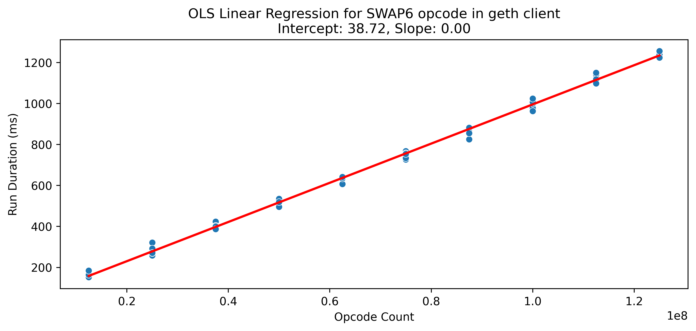


# SWAP7

## nethermind


```python
                            OLS Regression Results                            
==============================================================================
Dep. Variable:        run_duration_ms   R-squared:                       0.995
Model:                            OLS   Adj. R-squared:                  0.995
Method:                 Least Squares   F-statistic:                 1.059e+04
Date:                Mon, 22 Dec 2025   Prob (F-statistic):           9.10e-62
Time:                        12:04:14   Log-Likelihood:                -209.64
No. Observations:                  54   AIC:                             423.3
Df Residuals:                      52   BIC:                             427.3
Df Model:                           1                                         
Covariance Type:            nonrobust                                         
==============================================================================
                 coef    std err          t      P>|t|      [0.025      0.975]
------------------------------------------------------------------------------
const         32.4664      3.537      9.178      0.000      25.368      39.565
opcount     4.732e-06    4.6e-08    102.896      0.000    4.64e-06    4.82e-06
==============================================================================
Omnibus:                       21.650   Durbin-Watson:                   1.914
Prob(Omnibus):                  0.000   Jarque-Bera (JB):               41.029
Skew:                          -1.206   Prob(JB):                     1.23e-09
Kurtosis:                       6.523   Cond. No.                     1.67e+08
==============================================================================

Notes:
[1] Standard Errors assume that the covariance matrix of the errors is correctly specified.
[2] The condition number is large, 1.67e+08. This might indicate that there are
strong multicollinearity or other numerical problems.
```

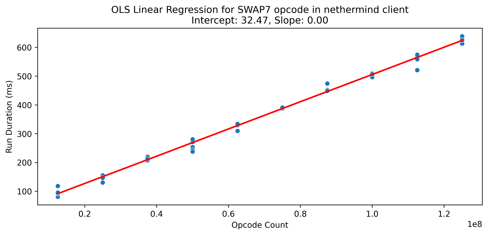


## reth


```python
                            OLS Regression Results                            
==============================================================================
Dep. Variable:        run_duration_ms   R-squared:                       0.991
Model:                            OLS   Adj. R-squared:                  0.991
Method:                 Least Squares   F-statistic:                     5878.
Date:                Mon, 22 Dec 2025   Prob (F-statistic):           3.63e-55
Time:                        12:04:14   Log-Likelihood:                -215.09
No. Observations:                  54   AIC:                             434.2
Df Residuals:                      52   BIC:                             438.2
Df Model:                           1                                         
Covariance Type:            nonrobust                                         
==============================================================================
                 coef    std err          t      P>|t|      [0.025      0.975]
------------------------------------------------------------------------------
const         42.1101      3.913     10.762      0.000      34.258      49.962
opcount       3.9e-06   5.09e-08     76.668      0.000     3.8e-06       4e-06
==============================================================================
Omnibus:                        6.527   Durbin-Watson:                   2.233
Prob(Omnibus):                  0.038   Jarque-Bera (JB):                7.396
Skew:                          -0.414   Prob(JB):                       0.0248
Kurtosis:                       4.613   Cond. No.                     1.67e+08
==============================================================================

Notes:
[1] Standard Errors assume that the covariance matrix of the errors is correctly specified.
[2] The condition number is large, 1.67e+08. This might indicate that there are
strong multicollinearity or other numerical problems.
```


## besu


```python
                            OLS Regression Results                            
==============================================================================
Dep. Variable:        run_duration_ms   R-squared:                       0.958
Model:                            OLS   Adj. R-squared:                  0.957
Method:                 Least Squares   F-statistic:                     1189.
Date:                Mon, 22 Dec 2025   Prob (F-statistic):           1.70e-37
Time:                        12:04:15   Log-Likelihood:                -372.50
No. Observations:                  54   AIC:                             749.0
Df Residuals:                      52   BIC:                             753.0
Df Model:                           1                                         
Covariance Type:            nonrobust                                         
==============================================================================
                 coef    std err          t      P>|t|      [0.025      0.975]
------------------------------------------------------------------------------
const         34.6625     72.188      0.480      0.633    -110.194     179.519
opcount     3.236e-05   9.38e-07     34.478      0.000    3.05e-05    3.42e-05
==============================================================================
Omnibus:                       10.354   Durbin-Watson:                   0.707
Prob(Omnibus):                  0.006   Jarque-Bera (JB):               18.100
Skew:                           0.488   Prob(JB):                     0.000117
Kurtosis:                       5.663   Cond. No.                     1.67e+08
==============================================================================

Notes:
[1] Standard Errors assume that the covariance matrix of the errors is correctly specified.
[2] The condition number is large, 1.67e+08. This might indicate that there are
strong multicollinearity or other numerical problems.
```

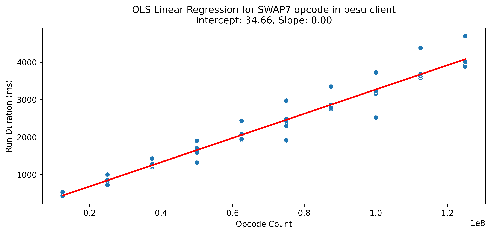


## geth


```python
                            OLS Regression Results                            
==============================================================================
Dep. Variable:        run_duration_ms   R-squared:                       0.997
Model:                            OLS   Adj. R-squared:                  0.997
Method:                 Least Squares   F-statistic:                 1.807e+04
Date:                Mon, 22 Dec 2025   Prob (F-statistic):           8.83e-68
Time:                        12:04:15   Log-Likelihood:                -233.33
No. Observations:                  54   AIC:                             470.7
Df Residuals:                      52   BIC:                             474.6
Df Model:                           1                                         
Covariance Type:            nonrobust                                         
==============================================================================
                 coef    std err          t      P>|t|      [0.025      0.975]
------------------------------------------------------------------------------
const         37.4453      5.485      6.827      0.000      26.439      48.452
opcount     9.585e-06   7.13e-08    134.420      0.000    9.44e-06    9.73e-06
==============================================================================
Omnibus:                        4.620   Durbin-Watson:                   1.843
Prob(Omnibus):                  0.099   Jarque-Bera (JB):                3.748
Skew:                           0.440   Prob(JB):                        0.153
Kurtosis:                       3.944   Cond. No.                     1.67e+08
==============================================================================

Notes:
[1] Standard Errors assume that the covariance matrix of the errors is correctly specified.
[2] The condition number is large, 1.67e+08. This might indicate that there are
strong multicollinearity or other numerical problems.
```


# SWAP8

## nethermind


```python
                            OLS Regression Results                            
==============================================================================
Dep. Variable:        run_duration_ms   R-squared:                       0.814
Model:                            OLS   Adj. R-squared:                  0.811
Method:                 Least Squares   F-statistic:                     228.2
Date:                Mon, 22 Dec 2025   Prob (F-statistic):           1.16e-20
Time:                        12:04:15   Log-Likelihood:                -317.79
No. Observations:                  54   AIC:                             639.6
Df Residuals:                      52   BIC:                             643.6
Df Model:                           1                                         
Covariance Type:            nonrobust                                         
==============================================================================
                 coef    std err          t      P>|t|      [0.025      0.975]
------------------------------------------------------------------------------
const         32.7388     26.211      1.249      0.217     -19.858      85.336
opcount     5.148e-06   3.41e-07     15.107      0.000    4.46e-06    5.83e-06
==============================================================================
Omnibus:                       51.962   Durbin-Watson:                   1.072
Prob(Omnibus):                  0.000   Jarque-Bera (JB):              190.095
Skew:                           2.846   Prob(JB):                     5.27e-42
Kurtosis:                      10.217   Cond. No.                     1.67e+08
==============================================================================

Notes:
[1] Standard Errors assume that the covariance matrix of the errors is correctly specified.
[2] The condition number is large, 1.67e+08. This might indicate that there are
strong multicollinearity or other numerical problems.
```

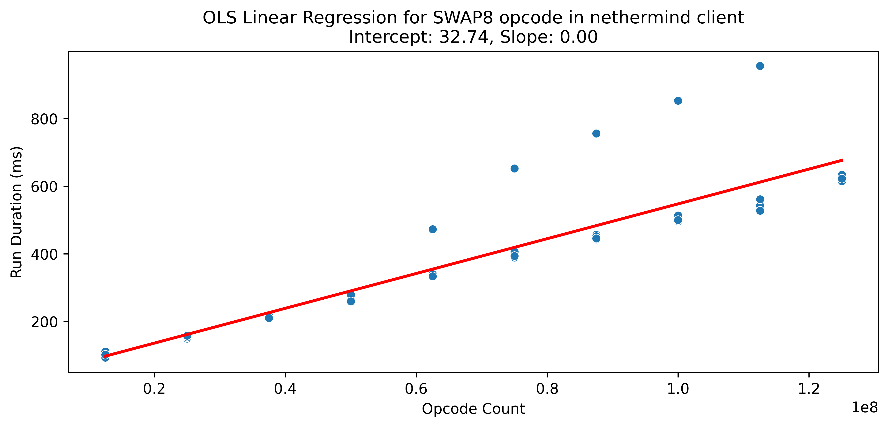


## reth


```python
                            OLS Regression Results                            
==============================================================================
Dep. Variable:        run_duration_ms   R-squared:                       0.997
Model:                            OLS   Adj. R-squared:                  0.997
Method:                 Least Squares   F-statistic:                 1.572e+04
Date:                Mon, 22 Dec 2025   Prob (F-statistic):           3.27e-66
Time:                        12:04:15   Log-Likelihood:                -189.53
No. Observations:                  54   AIC:                             383.1
Df Residuals:                      52   BIC:                             387.0
Df Model:                           1                                         
Covariance Type:            nonrobust                                         
==============================================================================
                 coef    std err          t      P>|t|      [0.025      0.975]
------------------------------------------------------------------------------
const         39.1714      2.437     16.071      0.000      34.280      44.062
opcount     3.973e-06   3.17e-08    125.376      0.000    3.91e-06    4.04e-06
==============================================================================
Omnibus:                        1.900   Durbin-Watson:                   2.024
Prob(Omnibus):                  0.387   Jarque-Bera (JB):                1.248
Skew:                           0.001   Prob(JB):                        0.536
Kurtosis:                       2.255   Cond. No.                     1.67e+08
==============================================================================

Notes:
[1] Standard Errors assume that the covariance matrix of the errors is correctly specified.
[2] The condition number is large, 1.67e+08. This might indicate that there are
strong multicollinearity or other numerical problems.
```


## besu


```python
                            OLS Regression Results                            
==============================================================================
Dep. Variable:        run_duration_ms   R-squared:                       0.956
Model:                            OLS   Adj. R-squared:                  0.955
Method:                 Least Squares   F-statistic:                     1131.
Date:                Mon, 22 Dec 2025   Prob (F-statistic):           5.88e-37
Time:                        12:04:15   Log-Likelihood:                -374.44
No. Observations:                  54   AIC:                             752.9
Df Residuals:                      52   BIC:                             756.9
Df Model:                           1                                         
Covariance Type:            nonrobust                                         
==============================================================================
                 coef    std err          t      P>|t|      [0.025      0.975]
------------------------------------------------------------------------------
const         24.3552     74.827      0.325      0.746    -125.796     174.507
opcount     3.271e-05   9.73e-07     33.631      0.000    3.08e-05    3.47e-05
==============================================================================
Omnibus:                       14.943   Durbin-Watson:                   0.485
Prob(Omnibus):                  0.001   Jarque-Bera (JB):               22.347
Skew:                           0.907   Prob(JB):                     1.40e-05
Kurtosis:                       5.577   Cond. No.                     1.67e+08
==============================================================================

Notes:
[1] Standard Errors assume that the covariance matrix of the errors is correctly specified.
[2] The condition number is large, 1.67e+08. This might indicate that there are
strong multicollinearity or other numerical problems.
```

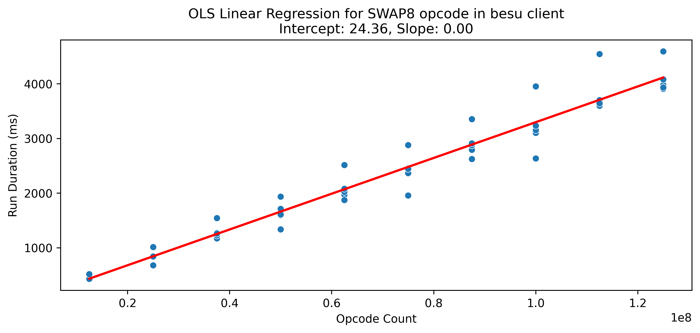


## geth


```python
                            OLS Regression Results                            
==============================================================================
Dep. Variable:        run_duration_ms   R-squared:                       0.979
Model:                            OLS   Adj. R-squared:                  0.978
Method:                 Least Squares   F-statistic:                     2410.
Date:                Mon, 22 Dec 2025   Prob (F-statistic):           3.07e-45
Time:                        12:04:15   Log-Likelihood:                -288.92
No. Observations:                  54   AIC:                             581.8
Df Residuals:                      52   BIC:                             585.8
Df Model:                           1                                         
Covariance Type:            nonrobust                                         
==============================================================================
                 coef    std err          t      P>|t|      [0.025      0.975]
------------------------------------------------------------------------------
const         38.7324     15.358      2.522      0.015       7.915      69.550
opcount     9.802e-06      2e-07     49.097      0.000     9.4e-06    1.02e-05
==============================================================================
Omnibus:                       93.899   Durbin-Watson:                   2.013
Prob(Omnibus):                  0.000   Jarque-Bera (JB):             2228.532
Skew:                           4.895   Prob(JB):                         0.00
Kurtosis:                      32.910   Cond. No.                     1.67e+08
==============================================================================

Notes:
[1] Standard Errors assume that the covariance matrix of the errors is correctly specified.
[2] The condition number is large, 1.67e+08. This might indicate that there are
strong multicollinearity or other numerical problems.
```


# SWAP9

## nethermind


```python
                            OLS Regression Results                            
==============================================================================
Dep. Variable:        run_duration_ms   R-squared:                       0.994
Model:                            OLS   Adj. R-squared:                  0.994
Method:                 Least Squares   F-statistic:                     8343.
Date:                Mon, 22 Dec 2025   Prob (F-statistic):           4.32e-59
Time:                        12:04:15   Log-Likelihood:                -214.42
No. Observations:                  54   AIC:                             432.8
Df Residuals:                      52   BIC:                             436.8
Df Model:                           1                                         
Covariance Type:            nonrobust                                         
==============================================================================
                 coef    std err          t      P>|t|      [0.025      0.975]
------------------------------------------------------------------------------
const         40.2503      3.865     10.415      0.000      32.495      48.005
opcount     4.589e-06   5.02e-08     91.337      0.000    4.49e-06    4.69e-06
==============================================================================
Omnibus:                       27.618   Durbin-Watson:                   2.329
Prob(Omnibus):                  0.000   Jarque-Bera (JB):               55.516
Skew:                          -1.563   Prob(JB):                     8.81e-13
Kurtosis:                       6.860   Cond. No.                     1.67e+08
==============================================================================

Notes:
[1] Standard Errors assume that the covariance matrix of the errors is correctly specified.
[2] The condition number is large, 1.67e+08. This might indicate that there are
strong multicollinearity or other numerical problems.
```

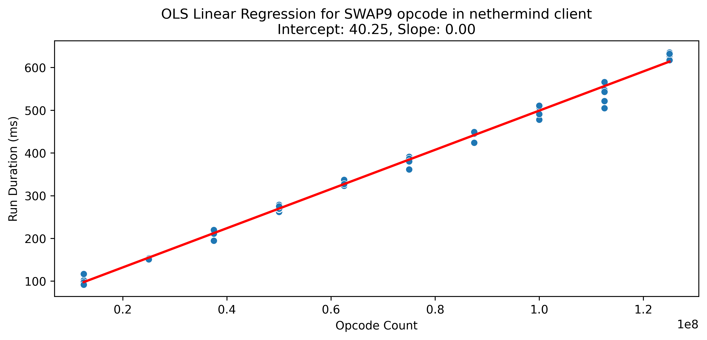


## reth


```python
                            OLS Regression Results                            
==============================================================================
Dep. Variable:        run_duration_ms   R-squared:                       0.988
Model:                            OLS   Adj. R-squared:                  0.988
Method:                 Least Squares   F-statistic:                     4331.
Date:                Mon, 22 Dec 2025   Prob (F-statistic):           9.45e-52
Time:                        12:04:15   Log-Likelihood:                -225.61
No. Observations:                  54   AIC:                             455.2
Df Residuals:                      52   BIC:                             459.2
Df Model:                           1                                         
Covariance Type:            nonrobust                                         
==============================================================================
                 coef    std err          t      P>|t|      [0.025      0.975]
------------------------------------------------------------------------------
const         35.4210      4.754      7.450      0.000      25.881      44.961
opcount     4.067e-06   6.18e-08     65.807      0.000    3.94e-06    4.19e-06
==============================================================================
Omnibus:                       36.969   Durbin-Watson:                   1.832
Prob(Omnibus):                  0.000   Jarque-Bera (JB):              150.071
Skew:                           1.715   Prob(JB):                     2.59e-33
Kurtosis:                      10.412   Cond. No.                     1.67e+08
==============================================================================

Notes:
[1] Standard Errors assume that the covariance matrix of the errors is correctly specified.
[2] The condition number is large, 1.67e+08. This might indicate that there are
strong multicollinearity or other numerical problems.
```


## besu


```python
                            OLS Regression Results                            
==============================================================================
Dep. Variable:        run_duration_ms   R-squared:                       0.954
Model:                            OLS   Adj. R-squared:                  0.953
Method:                 Least Squares   F-statistic:                     1072.
Date:                Mon, 22 Dec 2025   Prob (F-statistic):           2.22e-36
Time:                        12:04:16   Log-Likelihood:                -376.17
No. Observations:                  54   AIC:                             756.3
Df Residuals:                      52   BIC:                             760.3
Df Model:                           1                                         
Covariance Type:            nonrobust                                         
==============================================================================
                 coef    std err          t      P>|t|      [0.025      0.975]
------------------------------------------------------------------------------
const         13.3881     77.272      0.173      0.863    -141.670     168.446
opcount     3.289e-05      1e-06     32.743      0.000    3.09e-05    3.49e-05
==============================================================================
Omnibus:                       14.126   Durbin-Watson:                   0.815
Prob(Omnibus):                  0.001   Jarque-Bera (JB):               22.559
Skew:                           0.812   Prob(JB):                     1.26e-05
Kurtosis:                       5.718   Cond. No.                     1.67e+08
==============================================================================

Notes:
[1] Standard Errors assume that the covariance matrix of the errors is correctly specified.
[2] The condition number is large, 1.67e+08. This might indicate that there are
strong multicollinearity or other numerical problems.
```


## geth


```python
                            OLS Regression Results                            
==============================================================================
Dep. Variable:        run_duration_ms   R-squared:                       0.996
Model:                            OLS   Adj. R-squared:                  0.996
Method:                 Least Squares   F-statistic:                 1.248e+04
Date:                Mon, 22 Dec 2025   Prob (F-statistic):           1.28e-63
Time:                        12:04:16   Log-Likelihood:                -243.59
No. Observations:                  54   AIC:                             491.2
Df Residuals:                      52   BIC:                             495.2
Df Model:                           1                                         
Covariance Type:            nonrobust                                         
==============================================================================
                 coef    std err          t      P>|t|      [0.025      0.975]
------------------------------------------------------------------------------
const         41.5248      6.633      6.260      0.000      28.214      54.836
opcount     9.635e-06   8.62e-08    111.732      0.000    9.46e-06    9.81e-06
==============================================================================
Omnibus:                        9.153   Durbin-Watson:                   1.777
Prob(Omnibus):                  0.010   Jarque-Bera (JB):                8.815
Skew:                           0.785   Prob(JB):                       0.0122
Kurtosis:                       4.204   Cond. No.                     1.67e+08
==============================================================================

Notes:
[1] Standard Errors assume that the covariance matrix of the errors is correctly specified.
[2] The condition number is large, 1.67e+08. This might indicate that there are
strong multicollinearity or other numerical problems.
```


# SWAP10

## nethermind


```python
                            OLS Regression Results                            
==============================================================================
Dep. Variable:        run_duration_ms   R-squared:                       0.994
Model:                            OLS   Adj. R-squared:                  0.994
Method:                 Least Squares   F-statistic:                     8848.
Date:                Mon, 22 Dec 2025   Prob (F-statistic):           9.44e-60
Time:                        12:04:16   Log-Likelihood:                -214.06
No. Observations:                  54   AIC:                             432.1
Df Residuals:                      52   BIC:                             436.1
Df Model:                           1                                         
Covariance Type:            nonrobust                                         
==============================================================================
                 coef    std err          t      P>|t|      [0.025      0.975]
------------------------------------------------------------------------------
const         40.0102      3.839     10.422      0.000      32.307      47.713
opcount     4.694e-06   4.99e-08     94.064      0.000    4.59e-06    4.79e-06
==============================================================================
Omnibus:                       36.807   Durbin-Watson:                   1.513
Prob(Omnibus):                  0.000   Jarque-Bera (JB):              150.583
Skew:                           1.700   Prob(JB):                     2.00e-33
Kurtosis:                      10.440   Cond. No.                     1.67e+08
==============================================================================

Notes:
[1] Standard Errors assume that the covariance matrix of the errors is correctly specified.
[2] The condition number is large, 1.67e+08. This might indicate that there are
strong multicollinearity or other numerical problems.
```

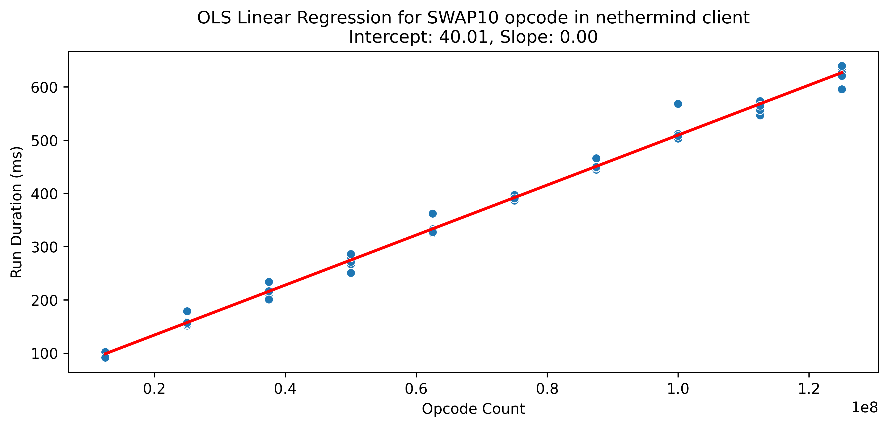


## reth


```python
                            OLS Regression Results                            
==============================================================================
Dep. Variable:        run_duration_ms   R-squared:                       0.978
Model:                            OLS   Adj. R-squared:                  0.978
Method:                 Least Squares   F-statistic:                     2316.
Date:                Mon, 22 Dec 2025   Prob (F-statistic):           8.48e-45
Time:                        12:04:16   Log-Likelihood:                -242.34
No. Observations:                  54   AIC:                             488.7
Df Residuals:                      52   BIC:                             492.7
Df Model:                           1                                         
Covariance Type:            nonrobust                                         
==============================================================================
                 coef    std err          t      P>|t|      [0.025      0.975]
------------------------------------------------------------------------------
const         37.7640      6.481      5.827      0.000      24.758      50.770
opcount     4.055e-06   8.43e-08     48.125      0.000    3.89e-06    4.22e-06
==============================================================================
Omnibus:                       72.992   Durbin-Watson:                   1.791
Prob(Omnibus):                  0.000   Jarque-Bera (JB):              960.373
Skew:                           3.495   Prob(JB):                    2.87e-209
Kurtosis:                      22.441   Cond. No.                     1.67e+08
==============================================================================

Notes:
[1] Standard Errors assume that the covariance matrix of the errors is correctly specified.
[2] The condition number is large, 1.67e+08. This might indicate that there are
strong multicollinearity or other numerical problems.
```


## besu


```python
                            OLS Regression Results                            
==============================================================================
Dep. Variable:        run_duration_ms   R-squared:                       0.957
Model:                            OLS   Adj. R-squared:                  0.957
Method:                 Least Squares   F-statistic:                     1170.
Date:                Mon, 22 Dec 2025   Prob (F-statistic):           2.55e-37
Time:                        12:04:16   Log-Likelihood:                -373.92
No. Observations:                  54   AIC:                             751.8
Df Residuals:                      52   BIC:                             755.8
Df Model:                           1                                         
Covariance Type:            nonrobust                                         
==============================================================================
                 coef    std err          t      P>|t|      [0.025      0.975]
------------------------------------------------------------------------------
const          1.2294     74.118      0.017      0.987    -147.500     149.959
opcount     3.295e-05   9.64e-07     34.199      0.000     3.1e-05    3.49e-05
==============================================================================
Omnibus:                       10.946   Durbin-Watson:                   0.423
Prob(Omnibus):                  0.004   Jarque-Bera (JB):               15.181
Skew:                           0.667   Prob(JB):                     0.000505
Kurtosis:                       5.228   Cond. No.                     1.67e+08
==============================================================================

Notes:
[1] Standard Errors assume that the covariance matrix of the errors is correctly specified.
[2] The condition number is large, 1.67e+08. This might indicate that there are
strong multicollinearity or other numerical problems.
```

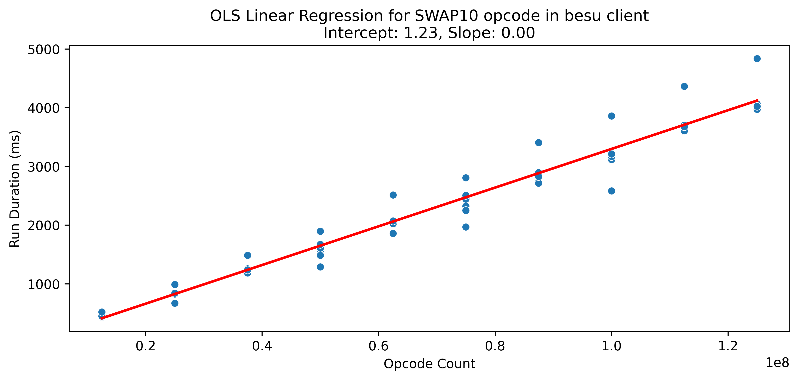


## geth


```python
                            OLS Regression Results                            
==============================================================================
Dep. Variable:        run_duration_ms   R-squared:                       0.962
Model:                            OLS   Adj. R-squared:                  0.961
Method:                 Least Squares   F-statistic:                     1315.
Date:                Mon, 22 Dec 2025   Prob (F-statistic):           1.37e-38
Time:                        12:04:16   Log-Likelihood:                -307.57
No. Observations:                  54   AIC:                             619.1
Df Residuals:                      52   BIC:                             623.1
Df Model:                           1                                         
Covariance Type:            nonrobust                                         
==============================================================================
                 coef    std err          t      P>|t|      [0.025      0.975]
------------------------------------------------------------------------------
const         23.1401     21.691      1.067      0.291     -20.385      66.666
opcount     1.023e-05   2.82e-07     36.262      0.000    9.66e-06    1.08e-05
==============================================================================
Omnibus:                       66.823   Durbin-Watson:                   1.554
Prob(Omnibus):                  0.000   Jarque-Bera (JB):              536.753
Skew:                           3.362   Prob(JB):                    2.79e-117
Kurtosis:                      16.905   Cond. No.                     1.67e+08
==============================================================================

Notes:
[1] Standard Errors assume that the covariance matrix of the errors is correctly specified.
[2] The condition number is large, 1.67e+08. This might indicate that there are
strong multicollinearity or other numerical problems.
```

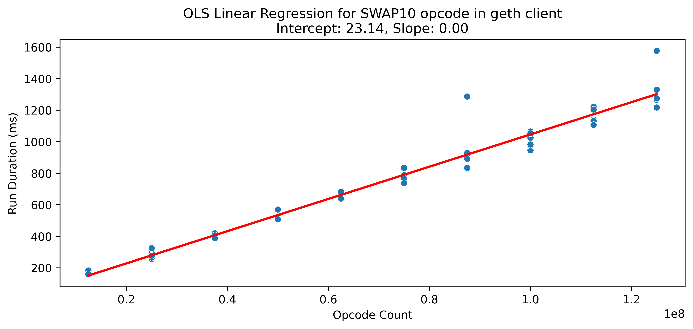


# SWAP11

## nethermind


```python
                            OLS Regression Results                            
==============================================================================
Dep. Variable:        run_duration_ms   R-squared:                       0.995
Model:                            OLS   Adj. R-squared:                  0.995
Method:                 Least Squares   F-statistic:                 1.033e+04
Date:                Mon, 22 Dec 2025   Prob (F-statistic):           1.73e-61
Time:                        12:04:16   Log-Likelihood:                -209.43
No. Observations:                  54   AIC:                             422.9
Df Residuals:                      52   BIC:                             426.8
Df Model:                           1                                         
Covariance Type:            nonrobust                                         
==============================================================================
                 coef    std err          t      P>|t|      [0.025      0.975]
------------------------------------------------------------------------------
const         39.3674      3.523     11.173      0.000      32.297      46.437
opcount     4.655e-06   4.58e-08    101.627      0.000    4.56e-06    4.75e-06
==============================================================================
Omnibus:                        8.354   Durbin-Watson:                   1.665
Prob(Omnibus):                  0.015   Jarque-Bera (JB):               10.939
Skew:                          -0.494   Prob(JB):                      0.00421
Kurtosis:                       4.971   Cond. No.                     1.67e+08
==============================================================================

Notes:
[1] Standard Errors assume that the covariance matrix of the errors is correctly specified.
[2] The condition number is large, 1.67e+08. This might indicate that there are
strong multicollinearity or other numerical problems.
```

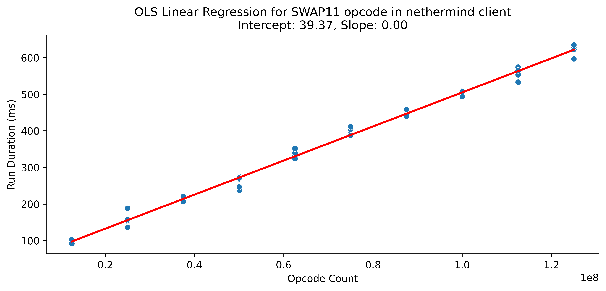


## reth


```python
                            OLS Regression Results                            
==============================================================================
Dep. Variable:        run_duration_ms   R-squared:                       0.992
Model:                            OLS   Adj. R-squared:                  0.991
Method:                 Least Squares   F-statistic:                     6095.
Date:                Mon, 22 Dec 2025   Prob (F-statistic):           1.43e-55
Time:                        12:04:17   Log-Likelihood:                -215.72
No. Observations:                  54   AIC:                             435.4
Df Residuals:                      52   BIC:                             439.4
Df Model:                           1                                         
Covariance Type:            nonrobust                                         
==============================================================================
                 coef    std err          t      P>|t|      [0.025      0.975]
------------------------------------------------------------------------------
const         37.7927      3.959      9.546      0.000      29.848      45.737
opcount     4.018e-06   5.15e-08     78.068      0.000    3.91e-06    4.12e-06
==============================================================================
Omnibus:                        1.883   Durbin-Watson:                   1.911
Prob(Omnibus):                  0.390   Jarque-Bera (JB):                1.083
Skew:                          -0.149   Prob(JB):                        0.582
Kurtosis:                       3.627   Cond. No.                     1.67e+08
==============================================================================

Notes:
[1] Standard Errors assume that the covariance matrix of the errors is correctly specified.
[2] The condition number is large, 1.67e+08. This might indicate that there are
strong multicollinearity or other numerical problems.
```


## besu


```python
                            OLS Regression Results                            
==============================================================================
Dep. Variable:        run_duration_ms   R-squared:                       0.954
Model:                            OLS   Adj. R-squared:                  0.953
Method:                 Least Squares   F-statistic:                     1070.
Date:                Mon, 22 Dec 2025   Prob (F-statistic):           2.32e-36
Time:                        12:04:17   Log-Likelihood:                -376.38
No. Observations:                  54   AIC:                             756.8
Df Residuals:                      52   BIC:                             760.7
Df Model:                           1                                         
Covariance Type:            nonrobust                                         
==============================================================================
                 coef    std err          t      P>|t|      [0.025      0.975]
------------------------------------------------------------------------------
const         -3.8885     77.574     -0.050      0.960    -159.552     151.775
opcount     3.299e-05   1.01e-06     32.714      0.000     3.1e-05     3.5e-05
==============================================================================
Omnibus:                       14.050   Durbin-Watson:                   0.474
Prob(Omnibus):                  0.001   Jarque-Bera (JB):               19.797
Skew:                           0.882   Prob(JB):                     5.02e-05
Kurtosis:                       5.385   Cond. No.                     1.67e+08
==============================================================================

Notes:
[1] Standard Errors assume that the covariance matrix of the errors is correctly specified.
[2] The condition number is large, 1.67e+08. This might indicate that there are
strong multicollinearity or other numerical problems.
```


## geth


```python
                            OLS Regression Results                            
==============================================================================
Dep. Variable:        run_duration_ms   R-squared:                       0.993
Model:                            OLS   Adj. R-squared:                  0.993
Method:                 Least Squares   F-statistic:                     7306.
Date:                Mon, 22 Dec 2025   Prob (F-statistic):           1.33e-57
Time:                        12:04:17   Log-Likelihood:                -259.06
No. Observations:                  54   AIC:                             522.1
Df Residuals:                      52   BIC:                             526.1
Df Model:                           1                                         
Covariance Type:            nonrobust                                         
==============================================================================
                 coef    std err          t      P>|t|      [0.025      0.975]
------------------------------------------------------------------------------
const         29.0260      8.833      3.286      0.002      11.301      46.751
opcount     9.815e-06   1.15e-07     85.473      0.000    9.58e-06       1e-05
==============================================================================
Omnibus:                       44.903   Durbin-Watson:                   1.656
Prob(Omnibus):                  0.000   Jarque-Bera (JB):              216.804
Skew:                           2.120   Prob(JB):                     8.35e-48
Kurtosis:                      11.853   Cond. No.                     1.67e+08
==============================================================================

Notes:
[1] Standard Errors assume that the covariance matrix of the errors is correctly specified.
[2] The condition number is large, 1.67e+08. This might indicate that there are
strong multicollinearity or other numerical problems.
```

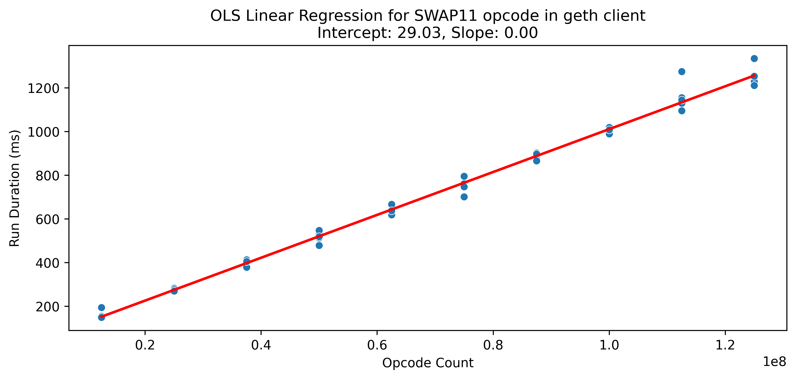


# SWAP12

## nethermind


```python
                            OLS Regression Results                            
==============================================================================
Dep. Variable:        run_duration_ms   R-squared:                       0.998
Model:                            OLS   Adj. R-squared:                  0.998
Method:                 Least Squares   F-statistic:                 2.219e+04
Date:                Mon, 22 Dec 2025   Prob (F-statistic):           4.26e-70
Time:                        12:04:17   Log-Likelihood:                -189.63
No. Observations:                  54   AIC:                             383.3
Df Residuals:                      52   BIC:                             387.2
Df Model:                           1                                         
Covariance Type:            nonrobust                                         
==============================================================================
                 coef    std err          t      P>|t|      [0.025      0.975]
------------------------------------------------------------------------------
const         36.1020      2.442     14.784      0.000      31.202      41.002
opcount      4.73e-06   3.17e-08    148.980      0.000    4.67e-06    4.79e-06
==============================================================================
Omnibus:                       18.490   Durbin-Watson:                   1.925
Prob(Omnibus):                  0.000   Jarque-Bera (JB):               30.881
Skew:                          -1.078   Prob(JB):                     1.97e-07
Kurtosis:                       6.013   Cond. No.                     1.67e+08
==============================================================================

Notes:
[1] Standard Errors assume that the covariance matrix of the errors is correctly specified.
[2] The condition number is large, 1.67e+08. This might indicate that there are
strong multicollinearity or other numerical problems.
```

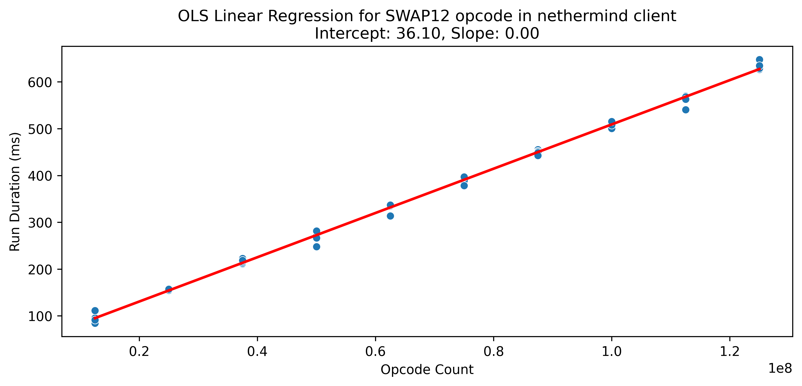


## reth


```python
                            OLS Regression Results                            
==============================================================================
Dep. Variable:        run_duration_ms   R-squared:                       0.934
Model:                            OLS   Adj. R-squared:                  0.932
Method:                 Least Squares   F-statistic:                     730.2
Date:                Mon, 22 Dec 2025   Prob (F-statistic):           2.80e-32
Time:                        12:04:17   Log-Likelihood:                -274.85
No. Observations:                  54   AIC:                             553.7
Df Residuals:                      52   BIC:                             557.7
Df Model:                           1                                         
Covariance Type:            nonrobust                                         
==============================================================================
                 coef    std err          t      P>|t|      [0.025      0.975]
------------------------------------------------------------------------------
const         33.2834     11.833      2.813      0.007       9.538      57.028
opcount     4.157e-06   1.54e-07     27.021      0.000    3.85e-06    4.47e-06
==============================================================================
Omnibus:                      107.115   Durbin-Watson:                   2.172
Prob(Omnibus):                  0.000   Jarque-Bera (JB):             3616.305
Skew:                           5.955   Prob(JB):                         0.00
Kurtosis:                      41.280   Cond. No.                     1.67e+08
==============================================================================

Notes:
[1] Standard Errors assume that the covariance matrix of the errors is correctly specified.
[2] The condition number is large, 1.67e+08. This might indicate that there are
strong multicollinearity or other numerical problems.
```

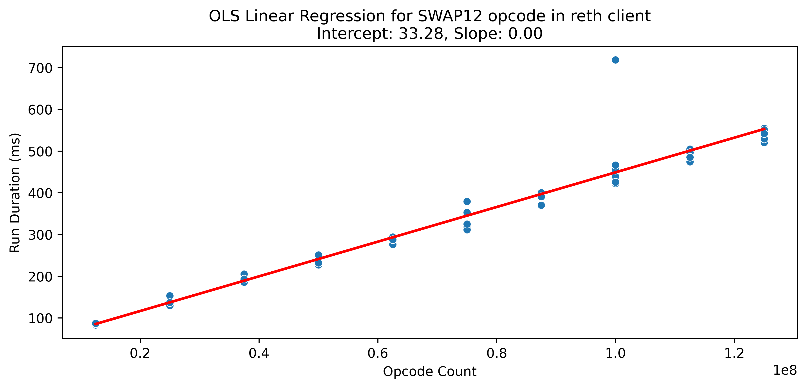


## besu


```python
                            OLS Regression Results                            
==============================================================================
Dep. Variable:        run_duration_ms   R-squared:                       0.952
Model:                            OLS   Adj. R-squared:                  0.951
Method:                 Least Squares   F-statistic:                     1033.
Date:                Mon, 22 Dec 2025   Prob (F-statistic):           5.64e-36
Time:                        12:04:17   Log-Likelihood:                -376.96
No. Observations:                  54   AIC:                             757.9
Df Residuals:                      52   BIC:                             761.9
Df Model:                           1                                         
Covariance Type:            nonrobust                                         
==============================================================================
                 coef    std err          t      P>|t|      [0.025      0.975]
------------------------------------------------------------------------------
const         18.7943     78.407      0.240      0.812    -138.540     176.129
opcount     3.275e-05   1.02e-06     32.134      0.000    3.07e-05    3.48e-05
==============================================================================
Omnibus:                       10.972   Durbin-Watson:                   0.574
Prob(Omnibus):                  0.004   Jarque-Bera (JB):               16.215
Skew:                           0.633   Prob(JB):                     0.000301
Kurtosis:                       5.368   Cond. No.                     1.67e+08
==============================================================================

Notes:
[1] Standard Errors assume that the covariance matrix of the errors is correctly specified.
[2] The condition number is large, 1.67e+08. This might indicate that there are
strong multicollinearity or other numerical problems.
```

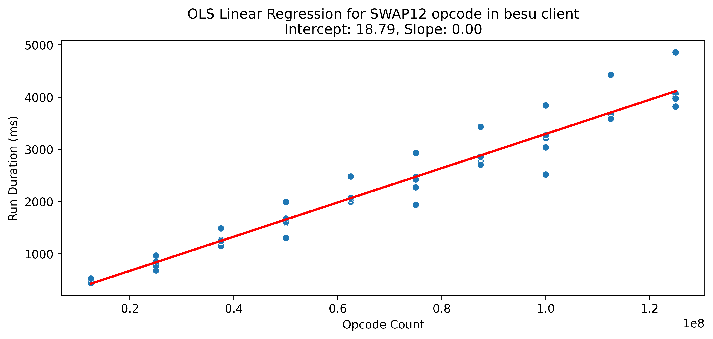


## geth


```python
                            OLS Regression Results                            
==============================================================================
Dep. Variable:        run_duration_ms   R-squared:                       0.972
Model:                            OLS   Adj. R-squared:                  0.971
Method:                 Least Squares   F-statistic:                     1784.
Date:                Mon, 22 Dec 2025   Prob (F-statistic):           6.38e-42
Time:                        12:04:17   Log-Likelihood:                -295.02
No. Observations:                  54   AIC:                             594.0
Df Residuals:                      52   BIC:                             598.0
Df Model:                           1                                         
Covariance Type:            nonrobust                                         
==============================================================================
                 coef    std err          t      P>|t|      [0.025      0.975]
------------------------------------------------------------------------------
const         56.2284     17.192      3.271      0.002      21.730      90.727
opcount     9.439e-06   2.23e-07     42.234      0.000    8.99e-06    9.89e-06
==============================================================================
Omnibus:                       92.150   Durbin-Watson:                   2.016
Prob(Omnibus):                  0.000   Jarque-Bera (JB):             1975.695
Skew:                           4.808   Prob(JB):                         0.00
Kurtosis:                      31.029   Cond. No.                     1.67e+08
==============================================================================

Notes:
[1] Standard Errors assume that the covariance matrix of the errors is correctly specified.
[2] The condition number is large, 1.67e+08. This might indicate that there are
strong multicollinearity or other numerical problems.
```


# SWAP13

## nethermind


```python
                            OLS Regression Results                            
==============================================================================
Dep. Variable:        run_duration_ms   R-squared:                       0.998
Model:                            OLS   Adj. R-squared:                  0.998
Method:                 Least Squares   F-statistic:                 2.735e+04
Date:                Mon, 22 Dec 2025   Prob (F-statistic):           1.89e-72
Time:                        12:04:18   Log-Likelihood:                -183.80
No. Observations:                  54   AIC:                             371.6
Df Residuals:                      52   BIC:                             375.6
Df Model:                           1                                         
Covariance Type:            nonrobust                                         
==============================================================================
                 coef    std err          t      P>|t|      [0.025      0.975]
------------------------------------------------------------------------------
const         38.6539      2.192     17.634      0.000      34.255      43.053
opcount     4.713e-06   2.85e-08    165.382      0.000    4.66e-06    4.77e-06
==============================================================================
Omnibus:                        0.805   Durbin-Watson:                   2.081
Prob(Omnibus):                  0.669   Jarque-Bera (JB):                0.443
Skew:                           0.218   Prob(JB):                        0.802
Kurtosis:                       3.076   Cond. No.                     1.67e+08
==============================================================================

Notes:
[1] Standard Errors assume that the covariance matrix of the errors is correctly specified.
[2] The condition number is large, 1.67e+08. This might indicate that there are
strong multicollinearity or other numerical problems.
```

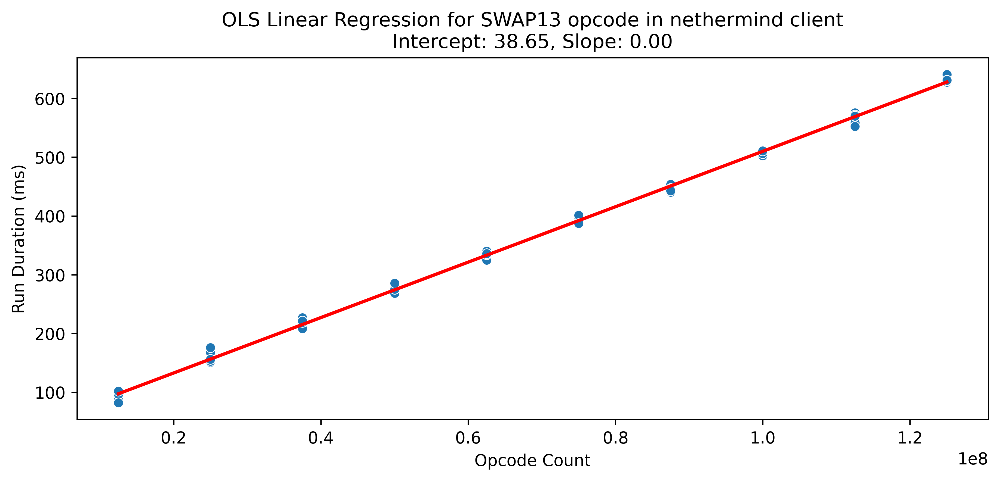


## reth


```python
                            OLS Regression Results                            
==============================================================================
Dep. Variable:        run_duration_ms   R-squared:                       0.989
Model:                            OLS   Adj. R-squared:                  0.989
Method:                 Least Squares   F-statistic:                     4620.
Date:                Mon, 22 Dec 2025   Prob (F-statistic):           1.79e-52
Time:                        12:04:18   Log-Likelihood:                -223.45
No. Observations:                  54   AIC:                             450.9
Df Residuals:                      52   BIC:                             454.9
Df Model:                           1                                         
Covariance Type:            nonrobust                                         
==============================================================================
                 coef    std err          t      P>|t|      [0.025      0.975]
------------------------------------------------------------------------------
const         38.2615      4.568      8.376      0.000      29.096      47.427
opcount     4.036e-06   5.94e-08     67.970      0.000    3.92e-06    4.16e-06
==============================================================================
Omnibus:                       62.594   Durbin-Watson:                   1.957
Prob(Omnibus):                  0.000   Jarque-Bera (JB):              529.747
Skew:                           2.996   Prob(JB):                    9.27e-116
Kurtosis:                      17.126   Cond. No.                     1.67e+08
==============================================================================

Notes:
[1] Standard Errors assume that the covariance matrix of the errors is correctly specified.
[2] The condition number is large, 1.67e+08. This might indicate that there are
strong multicollinearity or other numerical problems.
```

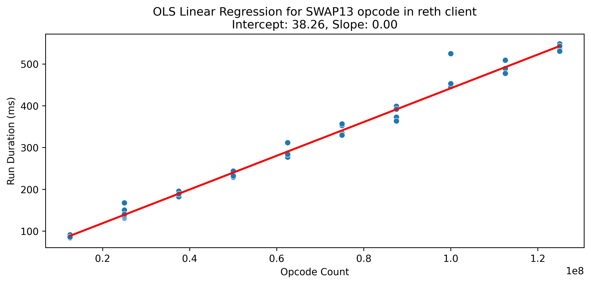


## besu


```python
                            OLS Regression Results                            
==============================================================================
Dep. Variable:        run_duration_ms   R-squared:                       0.956
Model:                            OLS   Adj. R-squared:                  0.956
Method:                 Least Squares   F-statistic:                     1142.
Date:                Mon, 22 Dec 2025   Prob (F-statistic):           4.58e-37
Time:                        12:04:18   Log-Likelihood:                -374.63
No. Observations:                  54   AIC:                             753.3
Df Residuals:                      52   BIC:                             757.2
Df Model:                           1                                         
Covariance Type:            nonrobust                                         
==============================================================================
                 coef    std err          t      P>|t|      [0.025      0.975]
------------------------------------------------------------------------------
const          1.4209     75.094      0.019      0.985    -149.265     152.107
opcount       3.3e-05   9.76e-07     33.800      0.000     3.1e-05     3.5e-05
==============================================================================
Omnibus:                       11.500   Durbin-Watson:                   0.848
Prob(Omnibus):                  0.003   Jarque-Bera (JB):               15.311
Skew:                           0.733   Prob(JB):                     0.000473
Kurtosis:                       5.158   Cond. No.                     1.67e+08
==============================================================================

Notes:
[1] Standard Errors assume that the covariance matrix of the errors is correctly specified.
[2] The condition number is large, 1.67e+08. This might indicate that there are
strong multicollinearity or other numerical problems.
```

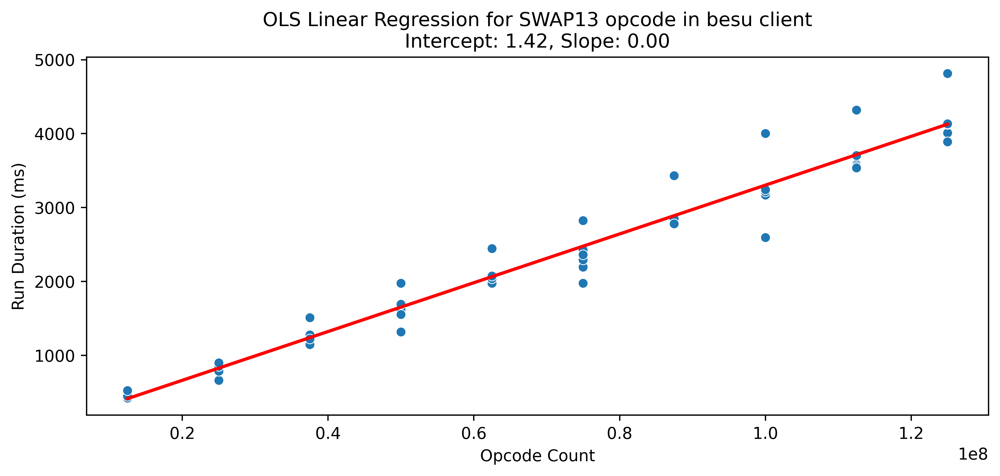


## geth


```python
                            OLS Regression Results                            
==============================================================================
Dep. Variable:        run_duration_ms   R-squared:                       0.994
Model:                            OLS   Adj. R-squared:                  0.994
Method:                 Least Squares   F-statistic:                     8777.
Date:                Mon, 22 Dec 2025   Prob (F-statistic):           1.16e-59
Time:                        12:04:18   Log-Likelihood:                -253.42
No. Observations:                  54   AIC:                             510.8
Df Residuals:                      52   BIC:                             514.8
Df Model:                           1                                         
Covariance Type:            nonrobust                                         
==============================================================================
                 coef    std err          t      P>|t|      [0.025      0.975]
------------------------------------------------------------------------------
const         39.5421      7.958      4.969      0.000      23.574      55.510
opcount     9.692e-06   1.03e-07     93.687      0.000    9.48e-06     9.9e-06
==============================================================================
Omnibus:                        2.452   Durbin-Watson:                   2.042
Prob(Omnibus):                  0.293   Jarque-Bera (JB):                1.798
Skew:                           0.004   Prob(JB):                        0.407
Kurtosis:                       3.894   Cond. No.                     1.67e+08
==============================================================================

Notes:
[1] Standard Errors assume that the covariance matrix of the errors is correctly specified.
[2] The condition number is large, 1.67e+08. This might indicate that there are
strong multicollinearity or other numerical problems.
```


# SWAP14

## nethermind


```python
                            OLS Regression Results                            
==============================================================================
Dep. Variable:        run_duration_ms   R-squared:                       0.991
Model:                            OLS   Adj. R-squared:                  0.990
Method:                 Least Squares   F-statistic:                     5493.
Date:                Mon, 22 Dec 2025   Prob (F-statistic):           2.08e-54
Time:                        12:04:18   Log-Likelihood:                -226.76
No. Observations:                  54   AIC:                             457.5
Df Residuals:                      52   BIC:                             461.5
Df Model:                           1                                         
Covariance Type:            nonrobust                                         
==============================================================================
                 coef    std err          t      P>|t|      [0.025      0.975]
------------------------------------------------------------------------------
const         37.2456      4.857      7.669      0.000      27.500      46.992
opcount     4.679e-06   6.31e-08     74.113      0.000    4.55e-06    4.81e-06
==============================================================================
Omnibus:                       30.500   Durbin-Watson:                   2.157
Prob(Omnibus):                  0.000   Jarque-Bera (JB):               77.609
Skew:                          -1.591   Prob(JB):                     1.40e-17
Kurtosis:                       7.937   Cond. No.                     1.67e+08
==============================================================================

Notes:
[1] Standard Errors assume that the covariance matrix of the errors is correctly specified.
[2] The condition number is large, 1.67e+08. This might indicate that there are
strong multicollinearity or other numerical problems.
```


## reth


```python
                            OLS Regression Results                            
==============================================================================
Dep. Variable:        run_duration_ms   R-squared:                       0.988
Model:                            OLS   Adj. R-squared:                  0.988
Method:                 Least Squares   F-statistic:                     4318.
Date:                Mon, 22 Dec 2025   Prob (F-statistic):           1.02e-51
Time:                        12:04:18   Log-Likelihood:                -225.82
No. Observations:                  54   AIC:                             455.6
Df Residuals:                      52   BIC:                             459.6
Df Model:                           1                                         
Covariance Type:            nonrobust                                         
==============================================================================
                 coef    std err          t      P>|t|      [0.025      0.975]
------------------------------------------------------------------------------
const         35.0071      4.773      7.334      0.000      25.429      44.585
opcount     4.078e-06   6.21e-08     65.714      0.000    3.95e-06     4.2e-06
==============================================================================
Omnibus:                       35.754   Durbin-Watson:                   2.018
Prob(Omnibus):                  0.000   Jarque-Bera (JB):              140.041
Skew:                           1.660   Prob(JB):                     3.90e-31
Kurtosis:                      10.157   Cond. No.                     1.67e+08
==============================================================================

Notes:
[1] Standard Errors assume that the covariance matrix of the errors is correctly specified.
[2] The condition number is large, 1.67e+08. This might indicate that there are
strong multicollinearity or other numerical problems.
```

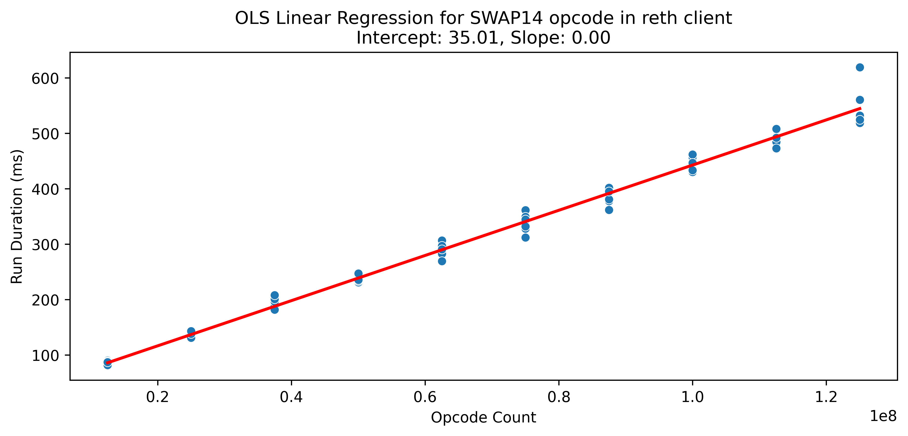


## besu


```python
                            OLS Regression Results                            
==============================================================================
Dep. Variable:        run_duration_ms   R-squared:                       0.949
Model:                            OLS   Adj. R-squared:                  0.948
Method:                 Least Squares   F-statistic:                     973.2
Date:                Mon, 22 Dec 2025   Prob (F-statistic):           2.44e-35
Time:                        12:04:18   Log-Likelihood:                -377.79
No. Observations:                  54   AIC:                             759.6
Df Residuals:                      52   BIC:                             763.5
Df Model:                           1                                         
Covariance Type:            nonrobust                                         
==============================================================================
                 coef    std err          t      P>|t|      [0.025      0.975]
------------------------------------------------------------------------------
const         35.0713     79.614      0.441      0.661    -124.686     194.828
opcount     3.229e-05   1.03e-06     31.197      0.000    3.02e-05    3.44e-05
==============================================================================
Omnibus:                       13.931   Durbin-Watson:                   0.427
Prob(Omnibus):                  0.001   Jarque-Bera (JB):               16.864
Skew:                           0.981   Prob(JB):                     0.000218
Kurtosis:                       4.910   Cond. No.                     1.67e+08
==============================================================================

Notes:
[1] Standard Errors assume that the covariance matrix of the errors is correctly specified.
[2] The condition number is large, 1.67e+08. This might indicate that there are
strong multicollinearity or other numerical problems.
```

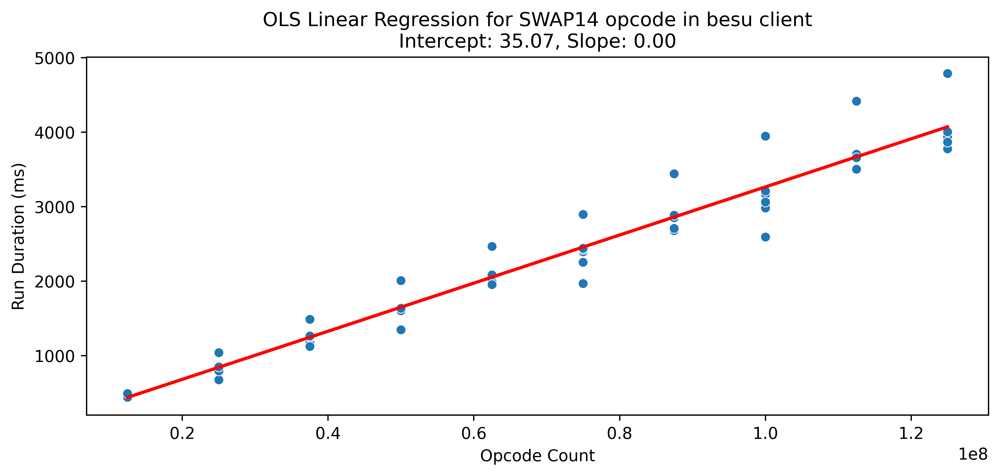


## geth


```python
                            OLS Regression Results                            
==============================================================================
Dep. Variable:        run_duration_ms   R-squared:                       0.997
Model:                            OLS   Adj. R-squared:                  0.997
Method:                 Least Squares   F-statistic:                 1.748e+04
Date:                Mon, 22 Dec 2025   Prob (F-statistic):           2.07e-67
Time:                        12:04:18   Log-Likelihood:                -235.52
No. Observations:                  54   AIC:                             475.0
Df Residuals:                      52   BIC:                             479.0
Df Model:                           1                                         
Covariance Type:            nonrobust                                         
==============================================================================
                 coef    std err          t      P>|t|      [0.025      0.975]
------------------------------------------------------------------------------
const         30.3472      5.713      5.312      0.000      18.884      41.810
opcount      9.82e-06   7.43e-08    132.231      0.000    9.67e-06    9.97e-06
==============================================================================
Omnibus:                        8.323   Durbin-Watson:                   2.063
Prob(Omnibus):                  0.016   Jarque-Bera (JB):               10.080
Skew:                          -0.539   Prob(JB):                      0.00647
Kurtosis:                       4.822   Cond. No.                     1.67e+08
==============================================================================

Notes:
[1] Standard Errors assume that the covariance matrix of the errors is correctly specified.
[2] The condition number is large, 1.67e+08. This might indicate that there are
strong multicollinearity or other numerical problems.
```


# SWAP15

## nethermind


```python
                            OLS Regression Results                            
==============================================================================
Dep. Variable:        run_duration_ms   R-squared:                       0.989
Model:                            OLS   Adj. R-squared:                  0.988
Method:                 Least Squares   F-statistic:                     4501.
Date:                Mon, 22 Dec 2025   Prob (F-statistic):           3.51e-52
Time:                        12:04:19   Log-Likelihood:                -231.64
No. Observations:                  54   AIC:                             467.3
Df Residuals:                      52   BIC:                             471.3
Df Model:                           1                                         
Covariance Type:            nonrobust                                         
==============================================================================
                 coef    std err          t      P>|t|      [0.025      0.975]
------------------------------------------------------------------------------
const         43.4155      5.316      8.167      0.000      32.748      54.083
opcount     4.636e-06   6.91e-08     67.089      0.000     4.5e-06    4.78e-06
==============================================================================
Omnibus:                       30.580   Durbin-Watson:                   2.274
Prob(Omnibus):                  0.000   Jarque-Bera (JB):              185.162
Skew:                           1.119   Prob(JB):                     6.20e-41
Kurtosis:                      11.791   Cond. No.                     1.67e+08
==============================================================================

Notes:
[1] Standard Errors assume that the covariance matrix of the errors is correctly specified.
[2] The condition number is large, 1.67e+08. This might indicate that there are
strong multicollinearity or other numerical problems.
```

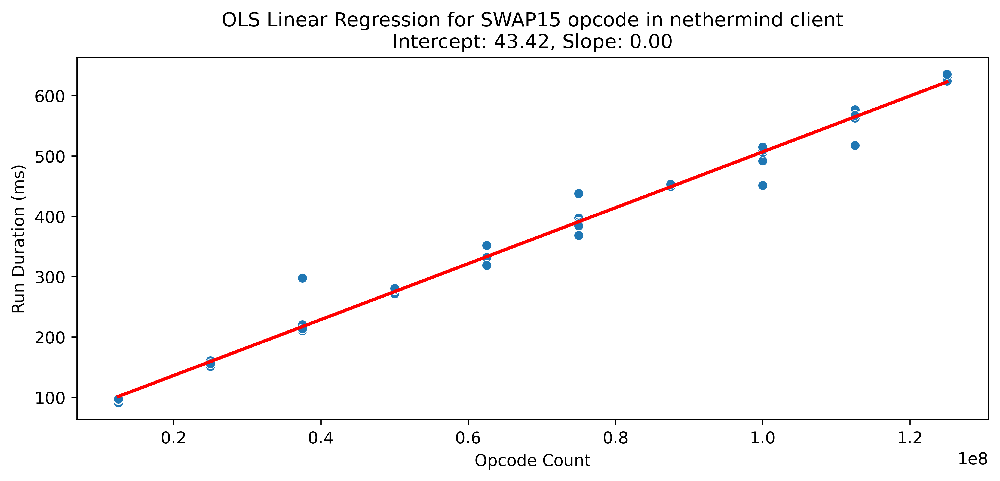


## reth


```python
                            OLS Regression Results                            
==============================================================================
Dep. Variable:        run_duration_ms   R-squared:                       0.995
Model:                            OLS   Adj. R-squared:                  0.995
Method:                 Least Squares   F-statistic:                     9764.
Date:                Mon, 22 Dec 2025   Prob (F-statistic):           7.39e-61
Time:                        12:04:19   Log-Likelihood:                -203.45
No. Observations:                  54   AIC:                             410.9
Df Residuals:                      52   BIC:                             414.9
Df Model:                           1                                         
Covariance Type:            nonrobust                                         
==============================================================================
                 coef    std err          t      P>|t|      [0.025      0.975]
------------------------------------------------------------------------------
const         38.5386      3.154     12.218      0.000      32.209      44.868
opcount     4.052e-06    4.1e-08     98.814      0.000    3.97e-06    4.13e-06
==============================================================================
Omnibus:                        0.238   Durbin-Watson:                   1.805
Prob(Omnibus):                  0.888   Jarque-Bera (JB):                0.108
Skew:                           0.107   Prob(JB):                        0.947
Kurtosis:                       2.956   Cond. No.                     1.67e+08
==============================================================================

Notes:
[1] Standard Errors assume that the covariance matrix of the errors is correctly specified.
[2] The condition number is large, 1.67e+08. This might indicate that there are
strong multicollinearity or other numerical problems.
```

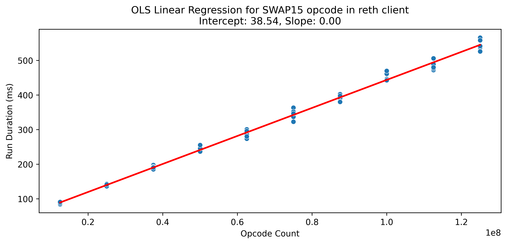


## besu


```python
                            OLS Regression Results                            
==============================================================================
Dep. Variable:        run_duration_ms   R-squared:                       0.947
Model:                            OLS   Adj. R-squared:                  0.946
Method:                 Least Squares   F-statistic:                     923.1
Date:                Mon, 22 Dec 2025   Prob (F-statistic):           9.00e-35
Time:                        12:04:19   Log-Likelihood:                -378.50
No. Observations:                  54   AIC:                             761.0
Df Residuals:                      52   BIC:                             765.0
Df Model:                           1                                         
Covariance Type:            nonrobust                                         
==============================================================================
                 coef    std err          t      P>|t|      [0.025      0.975]
------------------------------------------------------------------------------
const         45.7512     80.678      0.567      0.573    -116.141     207.644
opcount     3.186e-05   1.05e-06     30.382      0.000    2.98e-05     3.4e-05
==============================================================================
Omnibus:                       13.722   Durbin-Watson:                   0.622
Prob(Omnibus):                  0.001   Jarque-Bera (JB):               15.705
Skew:                           1.017   Prob(JB):                     0.000389
Kurtosis:                       4.687   Cond. No.                     1.67e+08
==============================================================================

Notes:
[1] Standard Errors assume that the covariance matrix of the errors is correctly specified.
[2] The condition number is large, 1.67e+08. This might indicate that there are
strong multicollinearity or other numerical problems.
```

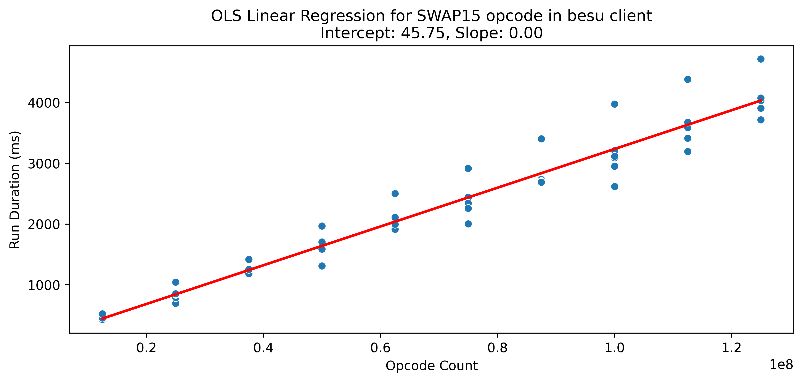


## geth


```python
                            OLS Regression Results                            
==============================================================================
Dep. Variable:        run_duration_ms   R-squared:                       0.990
Model:                            OLS   Adj. R-squared:                  0.990
Method:                 Least Squares   F-statistic:                     5062.
Date:                Mon, 22 Dec 2025   Prob (F-statistic):           1.71e-53
Time:                        12:04:19   Log-Likelihood:                -269.01
No. Observations:                  54   AIC:                             542.0
Df Residuals:                      52   BIC:                             546.0
Df Model:                           1                                         
Covariance Type:            nonrobust                                         
==============================================================================
                 coef    std err          t      P>|t|      [0.025      0.975]
------------------------------------------------------------------------------
const         31.2567     10.620      2.943      0.005       9.946      52.568
opcount     9.823e-06   1.38e-07     71.148      0.000    9.55e-06    1.01e-05
==============================================================================
Omnibus:                       61.093   Durbin-Watson:                   1.820
Prob(Omnibus):                  0.000   Jarque-Bera (JB):              527.040
Skew:                           2.871   Prob(JB):                    3.59e-115
Kurtosis:                      17.187   Cond. No.                     1.67e+08
==============================================================================

Notes:
[1] Standard Errors assume that the covariance matrix of the errors is correctly specified.
[2] The condition number is large, 1.67e+08. This might indicate that there are
strong multicollinearity or other numerical problems.
```


# SWAP16

## nethermind


```python
                            OLS Regression Results                            
==============================================================================
Dep. Variable:        run_duration_ms   R-squared:                       0.996
Model:                            OLS   Adj. R-squared:                  0.996
Method:                 Least Squares   F-statistic:                 1.378e+04
Date:                Mon, 22 Dec 2025   Prob (F-statistic):           9.83e-65
Time:                        12:04:19   Log-Likelihood:                -202.20
No. Observations:                  54   AIC:                             408.4
Df Residuals:                      52   BIC:                             412.4
Df Model:                           1                                         
Covariance Type:            nonrobust                                         
==============================================================================
                 coef    std err          t      P>|t|      [0.025      0.975]
------------------------------------------------------------------------------
const         37.3826      3.082     12.129      0.000      31.198      43.567
opcount     4.704e-06   4.01e-08    117.404      0.000    4.62e-06    4.78e-06
==============================================================================
Omnibus:                       29.152   Durbin-Watson:                   2.224
Prob(Omnibus):                  0.000   Jarque-Bera (JB):               65.171
Skew:                          -1.590   Prob(JB):                     7.05e-15
Kurtosis:                       7.343   Cond. No.                     1.67e+08
==============================================================================

Notes:
[1] Standard Errors assume that the covariance matrix of the errors is correctly specified.
[2] The condition number is large, 1.67e+08. This might indicate that there are
strong multicollinearity or other numerical problems.
```

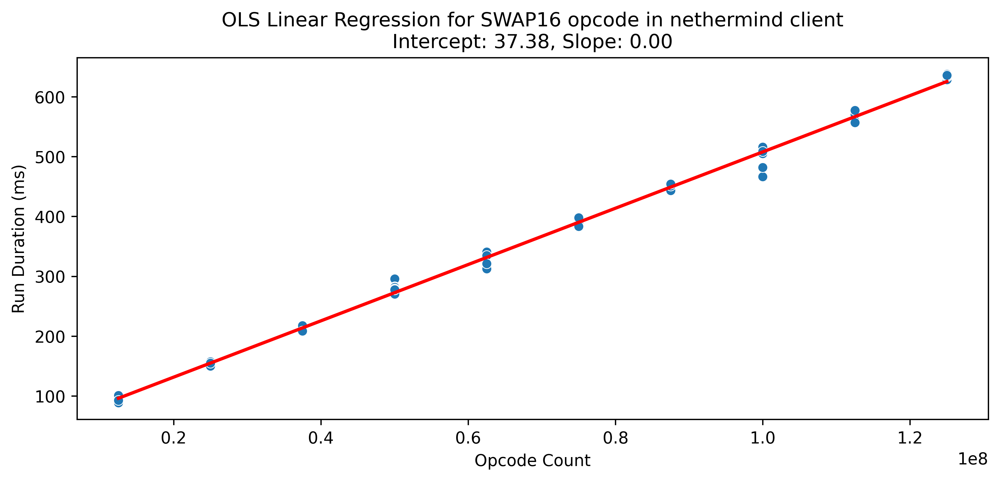


## reth


```python
                            OLS Regression Results                            
==============================================================================
Dep. Variable:        run_duration_ms   R-squared:                       0.994
Model:                            OLS   Adj. R-squared:                  0.994
Method:                 Least Squares   F-statistic:                     8967.
Date:                Mon, 22 Dec 2025   Prob (F-statistic):           6.68e-60
Time:                        12:04:19   Log-Likelihood:                -205.21
No. Observations:                  54   AIC:                             414.4
Df Residuals:                      52   BIC:                             418.4
Df Model:                           1                                         
Covariance Type:            nonrobust                                         
==============================================================================
                 coef    std err          t      P>|t|      [0.025      0.975]
------------------------------------------------------------------------------
const         39.2666      3.258     12.051      0.000      32.728      45.805
opcount     4.011e-06   4.24e-08     94.694      0.000    3.93e-06     4.1e-06
==============================================================================
Omnibus:                        1.552   Durbin-Watson:                   1.797
Prob(Omnibus):                  0.460   Jarque-Bera (JB):                1.321
Skew:                           0.379   Prob(JB):                        0.517
Kurtosis:                       2.884   Cond. No.                     1.67e+08
==============================================================================

Notes:
[1] Standard Errors assume that the covariance matrix of the errors is correctly specified.
[2] The condition number is large, 1.67e+08. This might indicate that there are
strong multicollinearity or other numerical problems.
```


## besu


```python
                            OLS Regression Results                            
==============================================================================
Dep. Variable:        run_duration_ms   R-squared:                       0.943
Model:                            OLS   Adj. R-squared:                  0.942
Method:                 Least Squares   F-statistic:                     857.1
Date:                Mon, 22 Dec 2025   Prob (F-statistic):           5.57e-34
Time:                        12:04:19   Log-Likelihood:                -380.45
No. Observations:                  54   AIC:                             764.9
Df Residuals:                      52   BIC:                             768.9
Df Model:                           1                                         
Covariance Type:            nonrobust                                         
==============================================================================
                 coef    std err          t      P>|t|      [0.025      0.975]
------------------------------------------------------------------------------
const         52.3616     83.648      0.626      0.534    -115.490     220.213
opcount     3.184e-05   1.09e-06     29.277      0.000    2.97e-05     3.4e-05
==============================================================================
Omnibus:                       17.656   Durbin-Watson:                   0.820
Prob(Omnibus):                  0.000   Jarque-Bera (JB):               23.453
Skew:                           1.189   Prob(JB):                     8.08e-06
Kurtosis:                       5.184   Cond. No.                     1.67e+08
==============================================================================

Notes:
[1] Standard Errors assume that the covariance matrix of the errors is correctly specified.
[2] The condition number is large, 1.67e+08. This might indicate that there are
strong multicollinearity or other numerical problems.
```


## geth


```python
                            OLS Regression Results                            
==============================================================================
Dep. Variable:        run_duration_ms   R-squared:                       0.996
Model:                            OLS   Adj. R-squared:                  0.996
Method:                 Least Squares   F-statistic:                 1.363e+04
Date:                Mon, 22 Dec 2025   Prob (F-statistic):           1.32e-64
Time:                        12:04:20   Log-Likelihood:                -241.63
No. Observations:                  54   AIC:                             487.3
Df Residuals:                      52   BIC:                             491.2
Df Model:                           1                                         
Covariance Type:            nonrobust                                         
==============================================================================
                 coef    std err          t      P>|t|      [0.025      0.975]
------------------------------------------------------------------------------
const         39.7122      6.397      6.208      0.000      26.876      52.548
opcount     9.707e-06   8.32e-08    116.733      0.000    9.54e-06    9.87e-06
==============================================================================
Omnibus:                        3.751   Durbin-Watson:                   1.107
Prob(Omnibus):                  0.153   Jarque-Bera (JB):                2.722
Skew:                           0.444   Prob(JB):                        0.256
Kurtosis:                       3.650   Cond. No.                     1.67e+08
==============================================================================

Notes:
[1] Standard Errors assume that the covariance matrix of the errors is correctly specified.
[2] The condition number is large, 1.67e+08. This might indicate that there are
strong multicollinearity or other numerical problems.
```


# INVALID

## nethermind

OLS model did not run... Error: zero-size array to reduction operation maximum which has no identity

## reth

OLS model did not run... Error: zero-size array to reduction operation maximum which has no identity

## besu

OLS model did not run... Error: zero-size array to reduction operation maximum which has no identity

## geth

OLS model did not run... Error: zero-size array to reduction operation maximum which has no identity
