Opcode run times estimation results - Simple opcodes
====================================================

Table of contents
=================

* [ADD](#add)
* [ADDMOD](#addmod)
* [ADDRESS](#address)
* [AND](#and)
* [BASEFEE](#basefee)
* [BLOBBASEFEE](#blobbasefee)
* [BLOBHASH](#blobhash)
* [BLOCKHASH](#blockhash)
* [BYTE](#byte)
* [CALLDATALOAD](#calldataload)
* [CALLDATASIZE](#calldatasize)
* [CALLER](#caller)
* [CALLVALUE](#callvalue)
* [CHAINID](#chainid)
* [CODESIZE](#codesize)
* [COINBASE](#coinbase)
* [DIV](#div)
* [DIFFICULTY](#difficulty)
* [DUP1](#dup1)
* [DUP2](#dup2)
* [DUP3](#dup3)
* [DUP4](#dup4)
* [DUP5](#dup5)
* [DUP6](#dup6)
* [DUP7](#dup7)
* [DUP8](#dup8)
* [DUP9](#dup9)
* [DUP10](#dup10)
* [DUP11](#dup11)
* [DUP12](#dup12)
* [DUP13](#dup13)
* [DUP14](#dup14)
* [DUP15](#dup15)
* [DUP16](#dup16)
* [EQ](#eq)
* [GAS](#gas)
* [GASLIMIT](#gaslimit)
* [GASPRICE](#gasprice)
* [GT](#gt)
* [INVALID](#invalid)
* [ISZERO](#iszero)
* [JUMP](#jump)
* [JUMPDEST](#jumpdest)
* [JUMPI](#jumpi)
* [LT](#lt)
* [MOD](#mod)
* [MSIZE](#msize)
* [MUL](#mul)
* [MULMOD](#mulmod)
* [NOT](#not)
* [NUMBER](#number)
* [OR](#or)
* [ORIGIN](#origin)
* [PC](#pc)
* [POP](#pop)
* [PREVRANDAO](#prevrandao)
* [PUSH0](#push0)
* [PUSH1](#push1)
* [PUSH2](#push2)
* [PUSH3](#push3)
* [PUSH4](#push4)
* [PUSH5](#push5)
* [PUSH6](#push6)
* [PUSH7](#push7)
* [PUSH8](#push8)
* [PUSH9](#push9)
* [PUSH10](#push10)
* [PUSH11](#push11)
* [PUSH12](#push12)
* [PUSH13](#push13)
* [PUSH14](#push14)
* [PUSH15](#push15)
* [PUSH16](#push16)
* [PUSH17](#push17)
* [PUSH18](#push18)
* [PUSH19](#push19)
* [PUSH20](#push20)
* [PUSH21](#push21)
* [PUSH22](#push22)
* [PUSH23](#push23)
* [PUSH24](#push24)
* [PUSH25](#push25)
* [PUSH26](#push26)
* [PUSH27](#push27)
* [PUSH28](#push28)
* [PUSH29](#push29)
* [PUSH30](#push30)
* [PUSH31](#push31)
* [PUSH32](#push32)
* [RETURNDATASIZE](#returndatasize)
* [SAR](#sar)
* [SDIV](#sdiv)
* [SELFBALANCE](#selfbalance)
* [SGT](#sgt)
* [SHL](#shl)
* [SHR](#shr)
* [SIGNEXTEND](#signextend)
* [SLT](#slt)
* [SMOD](#smod)
* [STOP](#stop)
* [SUB](#sub)
* [SWAP1](#swap1)
* [SWAP2](#swap2)
* [SWAP3](#swap3)
* [SWAP4](#swap4)
* [SWAP5](#swap5)
* [SWAP6](#swap6)
* [SWAP7](#swap7)
* [SWAP8](#swap8)
* [SWAP9](#swap9)
* [SWAP10](#swap10)
* [SWAP11](#swap11)
* [SWAP12](#swap12)
* [SWAP13](#swap13)
* [SWAP14](#swap14)
* [SWAP15](#swap15)
* [SWAP16](#swap16)
* [TIMESTAMP](#timestamp)
* [XOR](#xor)

# Introduction


This is an automated report generated from the opcode run times 
estimation script `./src/estimate_opcode_run_times.py`. The script 
uses data generated by running the 
[EEST benchmark suite](https://github.com/ethereum/execution-spec-tests/tree/main/tests/benchmark) 
with the [Nethermind benchmarking tooling](https://github.com/NethermindEth/gas-benchmarks).

The data includes all the simple opcode tests run between 2026-01-10 and 2026-01-12.

For each opcode and client, an OLS linear regression model is fitted to estimate the 
opcode run time as a function of the opcode count. The results are presented below.

# ADD

## geth


```python
                            OLS Regression Results                            
==============================================================================
Dep. Variable:        run_duration_ms   R-squared:                       0.974
Model:                            OLS   Adj. R-squared:                  0.973
Method:                 Least Squares   F-statistic:                     938.2
Date:                Mon, 12 Jan 2026   Prob (F-statistic):           2.41e-21
Time:                        10:29:18   Log-Likelihood:                -137.81
No. Observations:                  27   AIC:                             279.6
Df Residuals:                      25   BIC:                             282.2
Df Model:                           1                                         
Covariance Type:            nonrobust                                         
==============================================================================
                 coef    std err          t      P>|t|      [0.025      0.975]
------------------------------------------------------------------------------
const         28.8035     16.430      1.753      0.092      -5.035      62.642
opcount        0.0241      0.001     30.631      0.000       0.022       0.026
==============================================================================
Omnibus:                        6.554   Durbin-Watson:                   0.555
Prob(Omnibus):                  0.038   Jarque-Bera (JB):                4.604
Skew:                          -0.854   Prob(JB):                        0.100
Kurtosis:                       4.084   Cond. No.                     4.31e+04
==============================================================================

Notes:
[1] Standard Errors assume that the covariance matrix of the errors is correctly specified.
[2] The condition number is large, 4.31e+04. This might indicate that there are
strong multicollinearity or other numerical problems.
```


## reth


```python
                            OLS Regression Results                            
==============================================================================
Dep. Variable:        run_duration_ms   R-squared:                       0.984
Model:                            OLS   Adj. R-squared:                  0.983
Method:                 Least Squares   F-statistic:                     1518.
Date:                Mon, 12 Jan 2026   Prob (F-statistic):           6.66e-24
Time:                        10:29:18   Log-Likelihood:                -133.60
No. Observations:                  27   AIC:                             271.2
Df Residuals:                      25   BIC:                             273.8
Df Model:                           1                                         
Covariance Type:            nonrobust                                         
==============================================================================
                 coef    std err          t      P>|t|      [0.025      0.975]
------------------------------------------------------------------------------
const         28.7444     14.056      2.045      0.052      -0.205      57.694
opcount        0.0262      0.001     38.956      0.000       0.025       0.028
==============================================================================
Omnibus:                        5.722   Durbin-Watson:                   0.470
Prob(Omnibus):                  0.057   Jarque-Bera (JB):                4.286
Skew:                          -0.961   Prob(JB):                        0.117
Kurtosis:                       3.340   Cond. No.                     4.31e+04
==============================================================================

Notes:
[1] Standard Errors assume that the covariance matrix of the errors is correctly specified.
[2] The condition number is large, 4.31e+04. This might indicate that there are
strong multicollinearity or other numerical problems.
```

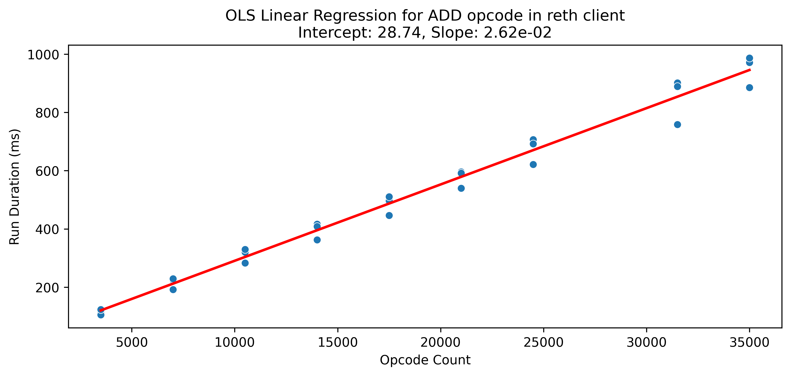


## nethermind


```python
                            OLS Regression Results                            
==============================================================================
Dep. Variable:        run_duration_ms   R-squared:                       0.998
Model:                            OLS   Adj. R-squared:                  0.998
Method:                 Least Squares   F-statistic:                 1.539e+04
Date:                Mon, 12 Jan 2026   Prob (F-statistic):           2.12e-36
Time:                        10:29:18   Log-Likelihood:                -92.791
No. Observations:                  27   AIC:                             189.6
Df Residuals:                      25   BIC:                             192.2
Df Model:                           1                                         
Covariance Type:            nonrobust                                         
==============================================================================
                 coef    std err          t      P>|t|      [0.025      0.975]
------------------------------------------------------------------------------
const         28.0423      3.101      9.044      0.000      21.656      34.428
opcount        0.0184      0.000    124.038      0.000       0.018       0.019
==============================================================================
Omnibus:                       16.577   Durbin-Watson:                   1.556
Prob(Omnibus):                  0.000   Jarque-Bera (JB):               19.651
Skew:                           1.470   Prob(JB):                     5.41e-05
Kurtosis:                       5.970   Cond. No.                     4.31e+04
==============================================================================

Notes:
[1] Standard Errors assume that the covariance matrix of the errors is correctly specified.
[2] The condition number is large, 4.31e+04. This might indicate that there are
strong multicollinearity or other numerical problems.
```

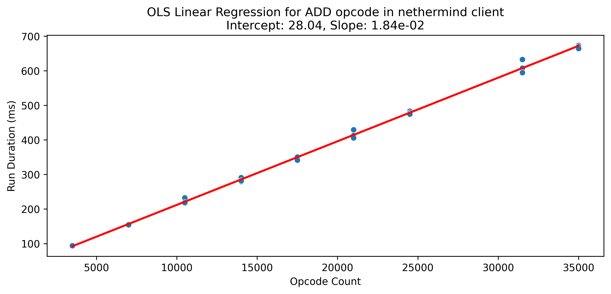


## besu


```python
                            OLS Regression Results                            
==============================================================================
Dep. Variable:        run_duration_ms   R-squared:                       0.998
Model:                            OLS   Adj. R-squared:                  0.997
Method:                 Least Squares   F-statistic:                 1.028e+04
Date:                Mon, 12 Jan 2026   Prob (F-statistic):           3.24e-34
Time:                        10:29:18   Log-Likelihood:                -162.16
No. Observations:                  27   AIC:                             328.3
Df Residuals:                      25   BIC:                             330.9
Df Model:                           1                                         
Covariance Type:            nonrobust                                         
==============================================================================
                 coef    std err          t      P>|t|      [0.025      0.975]
------------------------------------------------------------------------------
const         23.2021     40.484      0.573      0.572     -60.176     106.581
opcount        0.1964      0.002    101.387      0.000       0.192       0.200
==============================================================================
Omnibus:                        0.926   Durbin-Watson:                   0.602
Prob(Omnibus):                  0.630   Jarque-Bera (JB):                0.179
Skew:                           0.124   Prob(JB):                        0.915
Kurtosis:                       3.312   Cond. No.                     4.31e+04
==============================================================================

Notes:
[1] Standard Errors assume that the covariance matrix of the errors is correctly specified.
[2] The condition number is large, 4.31e+04. This might indicate that there are
strong multicollinearity or other numerical problems.
```


# ADDMOD

## geth

OLS model did not run... Error: zero-size array to reduction operation maximum which has no identity

## reth

OLS model did not run... Error: zero-size array to reduction operation maximum which has no identity

## nethermind

OLS model did not run... Error: zero-size array to reduction operation maximum which has no identity

## besu

OLS model did not run... Error: zero-size array to reduction operation maximum which has no identity

# ADDRESS

## geth


```python
                            OLS Regression Results                            
==============================================================================
Dep. Variable:        run_duration_ms   R-squared:                       0.983
Model:                            OLS   Adj. R-squared:                  0.982
Method:                 Least Squares   F-statistic:                     1621.
Date:                Mon, 12 Jan 2026   Prob (F-statistic):           2.50e-26
Time:                        10:29:19   Log-Likelihood:                -183.97
No. Observations:                  30   AIC:                             371.9
Df Residuals:                      28   BIC:                             374.8
Df Model:                           1                                         
Covariance Type:            nonrobust                                         
==============================================================================
                 coef    std err          t      P>|t|      [0.025      0.975]
------------------------------------------------------------------------------
const         47.4266     45.497      1.042      0.306     -45.770     140.623
opcount        0.0295      0.001     40.259      0.000       0.028       0.031
==============================================================================
Omnibus:                        7.751   Durbin-Watson:                   1.096
Prob(Omnibus):                  0.021   Jarque-Bera (JB):                6.267
Skew:                          -1.076   Prob(JB):                       0.0436
Kurtosis:                       3.620   Cond. No.                     1.34e+05
==============================================================================

Notes:
[1] Standard Errors assume that the covariance matrix of the errors is correctly specified.
[2] The condition number is large, 1.34e+05. This might indicate that there are
strong multicollinearity or other numerical problems.
```


## reth


```python
                            OLS Regression Results                            
==============================================================================
Dep. Variable:        run_duration_ms   R-squared:                       0.987
Model:                            OLS   Adj. R-squared:                  0.986
Method:                 Least Squares   F-statistic:                     2072.
Date:                Mon, 12 Jan 2026   Prob (F-statistic):           8.45e-28
Time:                        10:29:19   Log-Likelihood:                -136.42
No. Observations:                  30   AIC:                             276.8
Df Residuals:                      28   BIC:                             279.7
Df Model:                           1                                         
Covariance Type:            nonrobust                                         
==============================================================================
                 coef    std err          t      P>|t|      [0.025      0.975]
------------------------------------------------------------------------------
const         26.2397      9.325      2.814      0.009       7.139      45.340
opcount        0.0068      0.000     45.518      0.000       0.007       0.007
==============================================================================
Omnibus:                        4.434   Durbin-Watson:                   2.113
Prob(Omnibus):                  0.109   Jarque-Bera (JB):                2.833
Skew:                          -0.660   Prob(JB):                        0.243
Kurtosis:                       3.724   Cond. No.                     1.34e+05
==============================================================================

Notes:
[1] Standard Errors assume that the covariance matrix of the errors is correctly specified.
[2] The condition number is large, 1.34e+05. This might indicate that there are
strong multicollinearity or other numerical problems.
```

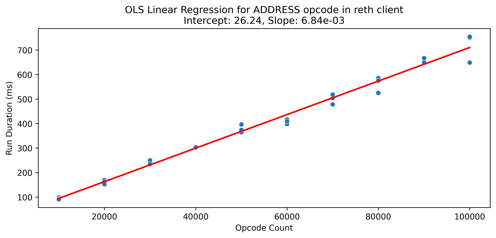


## nethermind


```python
                            OLS Regression Results                            
==============================================================================
Dep. Variable:        run_duration_ms   R-squared:                       0.997
Model:                            OLS   Adj. R-squared:                  0.997
Method:                 Least Squares   F-statistic:                     8615.
Date:                Mon, 12 Jan 2026   Prob (F-statistic):           2.10e-36
Time:                        10:29:19   Log-Likelihood:                -118.09
No. Observations:                  30   AIC:                             240.2
Df Residuals:                      28   BIC:                             243.0
Df Model:                           1                                         
Covariance Type:            nonrobust                                         
==============================================================================
                 coef    std err          t      P>|t|      [0.025      0.975]
------------------------------------------------------------------------------
const         26.2169      5.060      5.181      0.000      15.852      36.582
opcount        0.0076   8.15e-05     92.818      0.000       0.007       0.008
==============================================================================
Omnibus:                        7.078   Durbin-Watson:                   1.854
Prob(Omnibus):                  0.029   Jarque-Bera (JB):               10.509
Skew:                          -0.040   Prob(JB):                      0.00522
Kurtosis:                       5.898   Cond. No.                     1.34e+05
==============================================================================

Notes:
[1] Standard Errors assume that the covariance matrix of the errors is correctly specified.
[2] The condition number is large, 1.34e+05. This might indicate that there are
strong multicollinearity or other numerical problems.
```

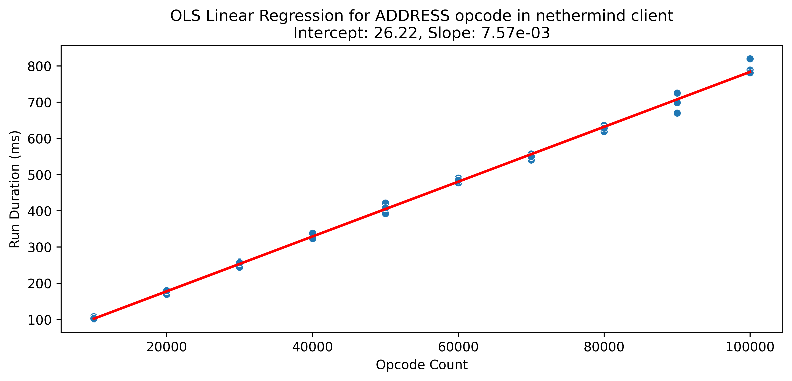


## besu


```python
                            OLS Regression Results                            
==============================================================================
Dep. Variable:        run_duration_ms   R-squared:                       0.999
Model:                            OLS   Adj. R-squared:                  0.999
Method:                 Least Squares   F-statistic:                 3.301e+04
Date:                Mon, 12 Jan 2026   Prob (F-statistic):           1.47e-44
Time:                        10:29:19   Log-Likelihood:                -134.89
No. Observations:                  30   AIC:                             273.8
Df Residuals:                      28   BIC:                             276.6
Df Model:                           1                                         
Covariance Type:            nonrobust                                         
==============================================================================
                 coef    std err          t      P>|t|      [0.025      0.975]
------------------------------------------------------------------------------
const         45.6961      8.859      5.158      0.000      27.549      63.843
opcount        0.0259      0.000    181.693      0.000       0.026       0.026
==============================================================================
Omnibus:                        3.929   Durbin-Watson:                   2.072
Prob(Omnibus):                  0.140   Jarque-Bera (JB):                2.391
Skew:                          -0.589   Prob(JB):                        0.303
Kurtosis:                       3.724   Cond. No.                     1.34e+05
==============================================================================

Notes:
[1] Standard Errors assume that the covariance matrix of the errors is correctly specified.
[2] The condition number is large, 1.34e+05. This might indicate that there are
strong multicollinearity or other numerical problems.
```


# AND

## geth


```python
                            OLS Regression Results                            
==============================================================================
Dep. Variable:        run_duration_ms   R-squared:                       0.975
Model:                            OLS   Adj. R-squared:                  0.974
Method:                 Least Squares   F-statistic:                     1100.
Date:                Mon, 12 Jan 2026   Prob (F-statistic):           5.08e-24
Time:                        10:29:19   Log-Likelihood:                -150.98
No. Observations:                  30   AIC:                             306.0
Df Residuals:                      28   BIC:                             308.8
Df Model:                           1                                         
Covariance Type:            nonrobust                                         
==============================================================================
                 coef    std err          t      P>|t|      [0.025      0.975]
------------------------------------------------------------------------------
const         38.9940     15.150      2.574      0.016       7.961      70.027
opcount        0.0231      0.001     33.171      0.000       0.022       0.025
==============================================================================
Omnibus:                        2.036   Durbin-Watson:                   1.046
Prob(Omnibus):                  0.361   Jarque-Bera (JB):                1.248
Skew:                          -0.496   Prob(JB):                        0.536
Kurtosis:                       3.119   Cond. No.                     4.69e+04
==============================================================================

Notes:
[1] Standard Errors assume that the covariance matrix of the errors is correctly specified.
[2] The condition number is large, 4.69e+04. This might indicate that there are
strong multicollinearity or other numerical problems.
```


## reth


```python
                            OLS Regression Results                            
==============================================================================
Dep. Variable:        run_duration_ms   R-squared:                       0.993
Model:                            OLS   Adj. R-squared:                  0.993
Method:                 Least Squares   F-statistic:                     4064.
Date:                Mon, 12 Jan 2026   Prob (F-statistic):           7.40e-32
Time:                        10:29:19   Log-Likelihood:                -103.12
No. Observations:                  30   AIC:                             210.2
Df Residuals:                      28   BIC:                             213.0
Df Model:                           1                                         
Covariance Type:            nonrobust                                         
==============================================================================
                 coef    std err          t      P>|t|      [0.025      0.975]
------------------------------------------------------------------------------
const         28.6731      3.072      9.332      0.000      22.380      34.967
opcount        0.0090      0.000     63.747      0.000       0.009       0.009
==============================================================================
Omnibus:                        0.987   Durbin-Watson:                   1.088
Prob(Omnibus):                  0.610   Jarque-Bera (JB):                0.877
Skew:                          -0.387   Prob(JB):                        0.645
Kurtosis:                       2.678   Cond. No.                     4.69e+04
==============================================================================

Notes:
[1] Standard Errors assume that the covariance matrix of the errors is correctly specified.
[2] The condition number is large, 4.69e+04. This might indicate that there are
strong multicollinearity or other numerical problems.
```

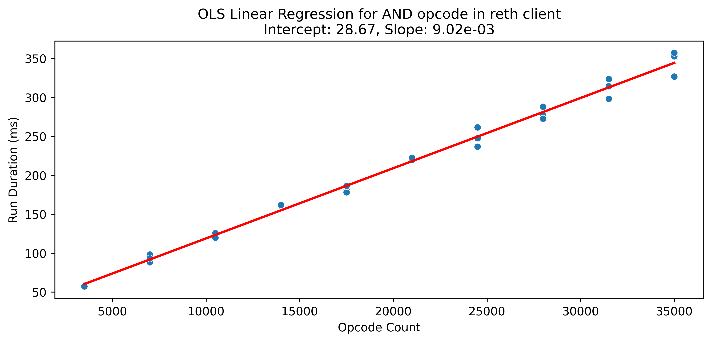


## nethermind


```python
                            OLS Regression Results                            
==============================================================================
Dep. Variable:        run_duration_ms   R-squared:                       0.612
Model:                            OLS   Adj. R-squared:                  0.598
Method:                 Least Squares   F-statistic:                     44.19
Date:                Mon, 12 Jan 2026   Prob (F-statistic):           3.26e-07
Time:                        10:29:19   Log-Likelihood:                -199.06
No. Observations:                  30   AIC:                             402.1
Df Residuals:                      28   BIC:                             404.9
Df Model:                           1                                         
Covariance Type:            nonrobust                                         
==============================================================================
                 coef    std err          t      P>|t|      [0.025      0.975]
------------------------------------------------------------------------------
const         28.0327     75.230      0.373      0.712    -126.069     182.135
opcount        0.0230      0.003      6.648      0.000       0.016       0.030
==============================================================================
Omnibus:                        4.616   Durbin-Watson:                   0.606
Prob(Omnibus):                  0.099   Jarque-Bera (JB):                4.232
Skew:                          -0.888   Prob(JB):                        0.121
Kurtosis:                       2.518   Cond. No.                     4.69e+04
==============================================================================

Notes:
[1] Standard Errors assume that the covariance matrix of the errors is correctly specified.
[2] The condition number is large, 4.69e+04. This might indicate that there are
strong multicollinearity or other numerical problems.
```

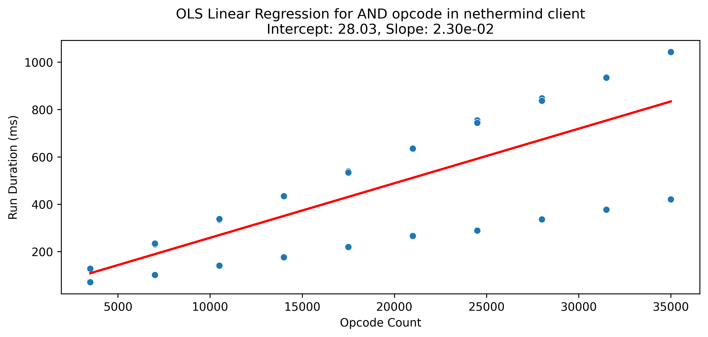


## besu


```python
                            OLS Regression Results                            
==============================================================================
Dep. Variable:        run_duration_ms   R-squared:                       0.999
Model:                            OLS   Adj. R-squared:                  0.999
Method:                 Least Squares   F-statistic:                 4.085e+04
Date:                Mon, 12 Jan 2026   Prob (F-statistic):           7.47e-46
Time:                        10:29:20   Log-Likelihood:                -132.00
No. Observations:                  30   AIC:                             268.0
Df Residuals:                      28   BIC:                             270.8
Df Model:                           1                                         
Covariance Type:            nonrobust                                         
==============================================================================
                 coef    std err          t      P>|t|      [0.025      0.975]
------------------------------------------------------------------------------
const         25.7333      8.046      3.198      0.003       9.251      42.215
opcount        0.0749      0.000    202.122      0.000       0.074       0.076
==============================================================================
Omnibus:                        1.712   Durbin-Watson:                   0.999
Prob(Omnibus):                  0.425   Jarque-Bera (JB):                1.209
Skew:                           0.233   Prob(JB):                        0.546
Kurtosis:                       2.134   Cond. No.                     4.69e+04
==============================================================================

Notes:
[1] Standard Errors assume that the covariance matrix of the errors is correctly specified.
[2] The condition number is large, 4.69e+04. This might indicate that there are
strong multicollinearity or other numerical problems.
```


# BASEFEE

## geth


```python
                            OLS Regression Results                            
==============================================================================
Dep. Variable:        run_duration_ms   R-squared:                       0.938
Model:                            OLS   Adj. R-squared:                  0.936
Method:                 Least Squares   F-statistic:                     423.4
Date:                Mon, 12 Jan 2026   Prob (F-statistic):           1.93e-18
Time:                        10:29:20   Log-Likelihood:                -192.21
No. Observations:                  30   AIC:                             388.4
Df Residuals:                      28   BIC:                             391.2
Df Model:                           1                                         
Covariance Type:            nonrobust                                         
==============================================================================
                 coef    std err          t      P>|t|      [0.025      0.975]
------------------------------------------------------------------------------
const          8.6041     59.880      0.144      0.887    -114.055     131.263
opcount        0.0199      0.001     20.576      0.000       0.018       0.022
==============================================================================
Omnibus:                       47.805   Durbin-Watson:                   1.740
Prob(Omnibus):                  0.000   Jarque-Bera (JB):              261.856
Skew:                           3.140   Prob(JB):                     1.38e-57
Kurtosis:                      16.041   Cond. No.                     1.34e+05
==============================================================================

Notes:
[1] Standard Errors assume that the covariance matrix of the errors is correctly specified.
[2] The condition number is large, 1.34e+05. This might indicate that there are
strong multicollinearity or other numerical problems.
```

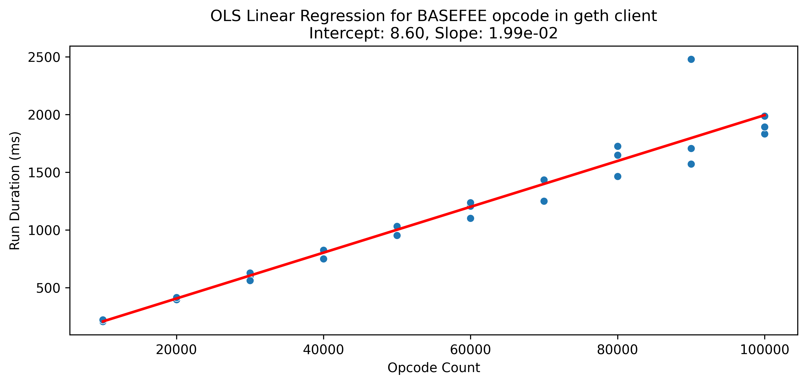


## reth


```python
                            OLS Regression Results                            
==============================================================================
Dep. Variable:        run_duration_ms   R-squared:                       0.978
Model:                            OLS   Adj. R-squared:                  0.977
Method:                 Least Squares   F-statistic:                     1238.
Date:                Mon, 12 Jan 2026   Prob (F-statistic):           1.01e-24
Time:                        10:29:20   Log-Likelihood:                -143.25
No. Observations:                  30   AIC:                             290.5
Df Residuals:                      28   BIC:                             293.3
Df Model:                           1                                         
Covariance Type:            nonrobust                                         
==============================================================================
                 coef    std err          t      P>|t|      [0.025      0.975]
------------------------------------------------------------------------------
const         29.7019     11.706      2.537      0.017       5.723      53.680
opcount        0.0066      0.000     35.188      0.000       0.006       0.007
==============================================================================
Omnibus:                        3.277   Durbin-Watson:                   1.551
Prob(Omnibus):                  0.194   Jarque-Bera (JB):                1.926
Skew:                          -0.564   Prob(JB):                        0.382
Kurtosis:                       3.519   Cond. No.                     1.34e+05
==============================================================================

Notes:
[1] Standard Errors assume that the covariance matrix of the errors is correctly specified.
[2] The condition number is large, 1.34e+05. This might indicate that there are
strong multicollinearity or other numerical problems.
```


## nethermind


```python
                            OLS Regression Results                            
==============================================================================
Dep. Variable:        run_duration_ms   R-squared:                       0.990
Model:                            OLS   Adj. R-squared:                  0.989
Method:                 Least Squares   F-statistic:                     2683.
Date:                Mon, 12 Jan 2026   Prob (F-statistic):           2.36e-29
Time:                        10:29:20   Log-Likelihood:                -133.64
No. Observations:                  30   AIC:                             271.3
Df Residuals:                      28   BIC:                             274.1
Df Model:                           1                                         
Covariance Type:            nonrobust                                         
==============================================================================
                 coef    std err          t      P>|t|      [0.025      0.975]
------------------------------------------------------------------------------
const         29.9456      8.499      3.523      0.001      12.535      47.356
opcount        0.0071      0.000     51.796      0.000       0.007       0.007
==============================================================================
Omnibus:                        0.469   Durbin-Watson:                   0.790
Prob(Omnibus):                  0.791   Jarque-Bera (JB):                0.268
Skew:                           0.225   Prob(JB):                        0.875
Kurtosis:                       2.889   Cond. No.                     1.34e+05
==============================================================================

Notes:
[1] Standard Errors assume that the covariance matrix of the errors is correctly specified.
[2] The condition number is large, 1.34e+05. This might indicate that there are
strong multicollinearity or other numerical problems.
```


## besu


```python
                            OLS Regression Results                            
==============================================================================
Dep. Variable:        run_duration_ms   R-squared:                       0.998
Model:                            OLS   Adj. R-squared:                  0.998
Method:                 Least Squares   F-statistic:                 1.686e+04
Date:                Mon, 12 Jan 2026   Prob (F-statistic):           1.77e-40
Time:                        10:29:20   Log-Likelihood:                -146.45
No. Observations:                  30   AIC:                             296.9
Df Residuals:                      28   BIC:                             299.7
Df Model:                           1                                         
Covariance Type:            nonrobust                                         
==============================================================================
                 coef    std err          t      P>|t|      [0.025      0.975]
------------------------------------------------------------------------------
const         21.0232     13.024      1.614      0.118      -5.656      47.702
opcount        0.0273      0.000    129.854      0.000       0.027       0.028
==============================================================================
Omnibus:                        2.438   Durbin-Watson:                   2.291
Prob(Omnibus):                  0.296   Jarque-Bera (JB):                1.208
Skew:                          -0.197   Prob(JB):                        0.547
Kurtosis:                       3.901   Cond. No.                     1.34e+05
==============================================================================

Notes:
[1] Standard Errors assume that the covariance matrix of the errors is correctly specified.
[2] The condition number is large, 1.34e+05. This might indicate that there are
strong multicollinearity or other numerical problems.
```


# BLOBBASEFEE

## geth


```python
                            OLS Regression Results                            
==============================================================================
Dep. Variable:        run_duration_ms   R-squared:                       0.986
Model:                            OLS   Adj. R-squared:                  0.986
Method:                 Least Squares   F-statistic:                     1997.
Date:                Mon, 12 Jan 2026   Prob (F-statistic):           1.40e-27
Time:                        10:29:20   Log-Likelihood:                -172.51
No. Observations:                  30   AIC:                             349.0
Df Residuals:                      28   BIC:                             351.8
Df Model:                           1                                         
Covariance Type:            nonrobust                                         
==============================================================================
                 coef    std err          t      P>|t|      [0.025      0.975]
------------------------------------------------------------------------------
const         15.8193     31.052      0.509      0.614     -47.787      79.426
opcount        0.0224      0.001     44.688      0.000       0.021       0.023
==============================================================================
Omnibus:                        3.081   Durbin-Watson:                   1.232
Prob(Omnibus):                  0.214   Jarque-Bera (JB):                1.689
Skew:                          -0.389   Prob(JB):                        0.430
Kurtosis:                       3.864   Cond. No.                     1.34e+05
==============================================================================

Notes:
[1] Standard Errors assume that the covariance matrix of the errors is correctly specified.
[2] The condition number is large, 1.34e+05. This might indicate that there are
strong multicollinearity or other numerical problems.
```

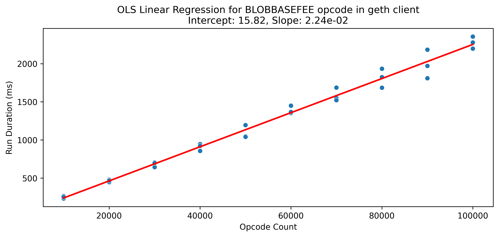


## reth


```python
                            OLS Regression Results                            
==============================================================================
Dep. Variable:        run_duration_ms   R-squared:                       0.987
Model:                            OLS   Adj. R-squared:                  0.987
Method:                 Least Squares   F-statistic:                     2124.
Date:                Mon, 12 Jan 2026   Prob (F-statistic):           6.01e-28
Time:                        10:29:20   Log-Likelihood:                -137.24
No. Observations:                  30   AIC:                             278.5
Df Residuals:                      28   BIC:                             281.3
Df Model:                           1                                         
Covariance Type:            nonrobust                                         
==============================================================================
                 coef    std err          t      P>|t|      [0.025      0.975]
------------------------------------------------------------------------------
const         33.6538      9.581      3.513      0.002      14.029      53.279
opcount        0.0071      0.000     46.083      0.000       0.007       0.007
==============================================================================
Omnibus:                        0.402   Durbin-Watson:                   1.786
Prob(Omnibus):                  0.818   Jarque-Bera (JB):                0.235
Skew:                          -0.207   Prob(JB):                        0.889
Kurtosis:                       2.873   Cond. No.                     1.34e+05
==============================================================================

Notes:
[1] Standard Errors assume that the covariance matrix of the errors is correctly specified.
[2] The condition number is large, 1.34e+05. This might indicate that there are
strong multicollinearity or other numerical problems.
```

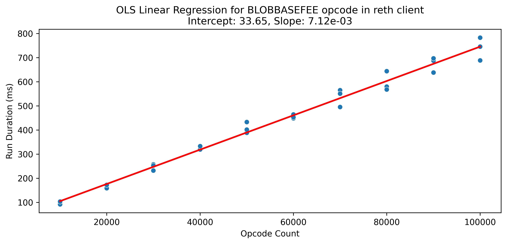


## nethermind


```python
                            OLS Regression Results                            
==============================================================================
Dep. Variable:        run_duration_ms   R-squared:                       0.990
Model:                            OLS   Adj. R-squared:                  0.989
Method:                 Least Squares   F-statistic:                     2700.
Date:                Mon, 12 Jan 2026   Prob (F-statistic):           2.16e-29
Time:                        10:29:21   Log-Likelihood:                -134.40
No. Observations:                  30   AIC:                             272.8
Df Residuals:                      28   BIC:                             275.6
Df Model:                           1                                         
Covariance Type:            nonrobust                                         
==============================================================================
                 coef    std err          t      P>|t|      [0.025      0.975]
------------------------------------------------------------------------------
const         23.0939      8.716      2.649      0.013       5.239      40.949
opcount        0.0073      0.000     51.960      0.000       0.007       0.008
==============================================================================
Omnibus:                        2.400   Durbin-Watson:                   0.872
Prob(Omnibus):                  0.301   Jarque-Bera (JB):                2.074
Skew:                           0.619   Prob(JB):                        0.354
Kurtosis:                       2.647   Cond. No.                     1.34e+05
==============================================================================

Notes:
[1] Standard Errors assume that the covariance matrix of the errors is correctly specified.
[2] The condition number is large, 1.34e+05. This might indicate that there are
strong multicollinearity or other numerical problems.
```

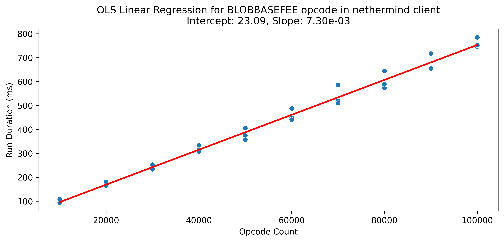


## besu


```python
                            OLS Regression Results                            
==============================================================================
Dep. Variable:        run_duration_ms   R-squared:                       0.999
Model:                            OLS   Adj. R-squared:                  0.999
Method:                 Least Squares   F-statistic:                 3.984e+04
Date:                Mon, 12 Jan 2026   Prob (F-statistic):           1.06e-45
Time:                        10:29:21   Log-Likelihood:                -132.57
No. Observations:                  30   AIC:                             269.1
Df Residuals:                      28   BIC:                             271.9
Df Model:                           1                                         
Covariance Type:            nonrobust                                         
==============================================================================
                 coef    std err          t      P>|t|      [0.025      0.975]
------------------------------------------------------------------------------
const         29.7679      8.201      3.630      0.001      12.969      46.567
opcount        0.0264      0.000    199.592      0.000       0.026       0.027
==============================================================================
Omnibus:                        3.927   Durbin-Watson:                   1.801
Prob(Omnibus):                  0.140   Jarque-Bera (JB):                3.000
Skew:                          -0.179   Prob(JB):                        0.223
Kurtosis:                       4.507   Cond. No.                     1.34e+05
==============================================================================

Notes:
[1] Standard Errors assume that the covariance matrix of the errors is correctly specified.
[2] The condition number is large, 1.34e+05. This might indicate that there are
strong multicollinearity or other numerical problems.
```

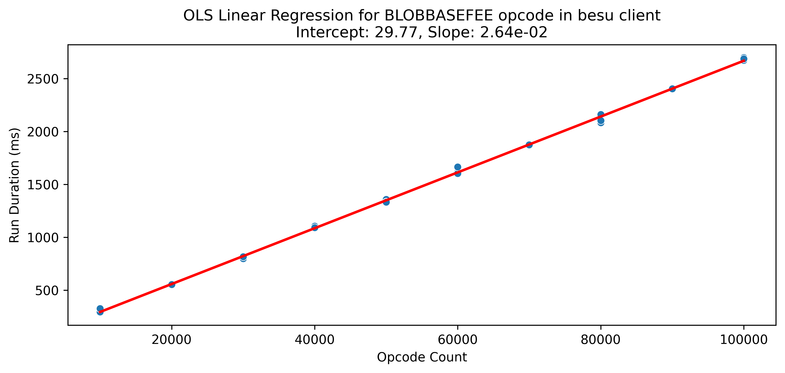


# BLOBHASH

## geth

OLS model did not run... Error: zero-size array to reduction operation maximum which has no identity

## reth

OLS model did not run... Error: zero-size array to reduction operation maximum which has no identity

## nethermind

OLS model did not run... Error: zero-size array to reduction operation maximum which has no identity

## besu

OLS model did not run... Error: zero-size array to reduction operation maximum which has no identity

# BLOCKHASH

## geth


```python
                            OLS Regression Results                            
==============================================================================
Dep. Variable:        run_duration_ms   R-squared:                       0.703
Model:                            OLS   Adj. R-squared:                  0.701
Method:                 Least Squares   F-statistic:                     350.0
Date:                Mon, 12 Jan 2026   Prob (F-statistic):           7.89e-41
Time:                        10:29:21   Log-Likelihood:                -808.83
No. Observations:                 150   AIC:                             1622.
Df Residuals:                     148   BIC:                             1628.
Df Model:                           1                                         
Covariance Type:            nonrobust                                         
==============================================================================
                 coef    std err          t      P>|t|      [0.025      0.975]
------------------------------------------------------------------------------
const         29.5199      9.439      3.127      0.002      10.867      48.173
opcount        0.0285      0.002     18.708      0.000       0.025       0.031
==============================================================================
Omnibus:                       56.322   Durbin-Watson:                   2.007
Prob(Omnibus):                  0.000   Jarque-Bera (JB):              115.366
Skew:                           1.727   Prob(JB):                     8.89e-26
Kurtosis:                       5.555   Cond. No.                     1.34e+04
==============================================================================

Notes:
[1] Standard Errors assume that the covariance matrix of the errors is correctly specified.
[2] The condition number is large, 1.34e+04. This might indicate that there are
strong multicollinearity or other numerical problems.
```

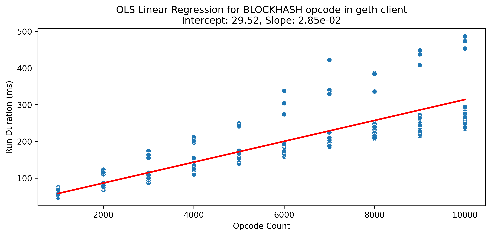


## reth


```python
                            OLS Regression Results                            
==============================================================================
Dep. Variable:        run_duration_ms   R-squared:                       0.789
Model:                            OLS   Adj. R-squared:                  0.787
Method:                 Least Squares   F-statistic:                     553.2
Date:                Mon, 12 Jan 2026   Prob (F-statistic):           7.50e-52
Time:                        10:29:21   Log-Likelihood:                -668.52
No. Observations:                 150   AIC:                             1341.
Df Residuals:                     148   BIC:                             1347.
Df Model:                           1                                         
Covariance Type:            nonrobust                                         
==============================================================================
                 coef    std err          t      P>|t|      [0.025      0.975]
------------------------------------------------------------------------------
const         31.2444      3.704      8.435      0.000      23.925      38.564
opcount        0.0140      0.001     23.520      0.000       0.013       0.015
==============================================================================
Omnibus:                       48.347   Durbin-Watson:                   1.957
Prob(Omnibus):                  0.000   Jarque-Bera (JB):               83.860
Skew:                           1.622   Prob(JB):                     6.17e-19
Kurtosis:                       4.701   Cond. No.                     1.34e+04
==============================================================================

Notes:
[1] Standard Errors assume that the covariance matrix of the errors is correctly specified.
[2] The condition number is large, 1.34e+04. This might indicate that there are
strong multicollinearity or other numerical problems.
```

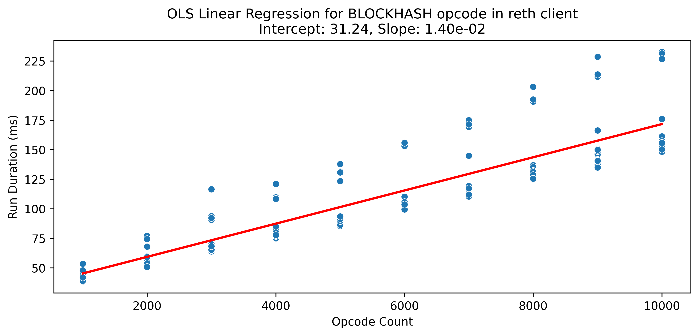


## nethermind


```python
                            OLS Regression Results                            
==============================================================================
Dep. Variable:        run_duration_ms   R-squared:                       0.933
Model:                            OLS   Adj. R-squared:                  0.933
Method:                 Least Squares   F-statistic:                     2069.
Date:                Mon, 12 Jan 2026   Prob (F-statistic):           7.04e-89
Time:                        10:29:21   Log-Likelihood:                -668.94
No. Observations:                 150   AIC:                             1342.
Df Residuals:                     148   BIC:                             1348.
Df Model:                           1                                         
Covariance Type:            nonrobust                                         
==============================================================================
                 coef    std err          t      P>|t|      [0.025      0.975]
------------------------------------------------------------------------------
const         26.4079      3.715      7.109      0.000      19.067      33.749
opcount        0.0272      0.001     45.483      0.000       0.026       0.028
==============================================================================
Omnibus:                       45.363   Durbin-Watson:                   1.787
Prob(Omnibus):                  0.000   Jarque-Bera (JB):               78.408
Skew:                           1.486   Prob(JB):                     9.42e-18
Kurtosis:                       4.925   Cond. No.                     1.34e+04
==============================================================================

Notes:
[1] Standard Errors assume that the covariance matrix of the errors is correctly specified.
[2] The condition number is large, 1.34e+04. This might indicate that there are
strong multicollinearity or other numerical problems.
```

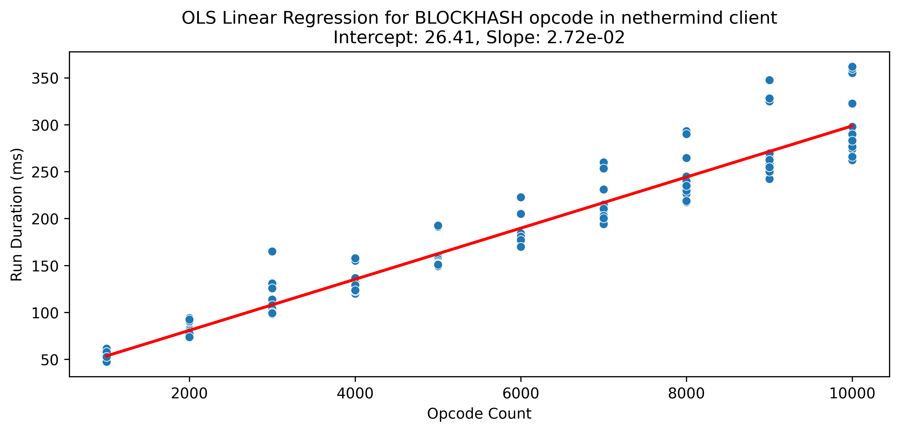


## besu


```python
                            OLS Regression Results                            
==============================================================================
Dep. Variable:        run_duration_ms   R-squared:                       0.457
Model:                            OLS   Adj. R-squared:                  0.453
Method:                 Least Squares   F-statistic:                     124.5
Date:                Mon, 12 Jan 2026   Prob (F-statistic):           2.35e-21
Time:                        10:29:21   Log-Likelihood:                -1027.2
No. Observations:                 150   AIC:                             2058.
Df Residuals:                     148   BIC:                             2064.
Df Model:                           1                                         
Covariance Type:            nonrobust                                         
==============================================================================
                 coef    std err          t      P>|t|      [0.025      0.975]
------------------------------------------------------------------------------
const         27.7772     40.484      0.686      0.494     -52.224     107.778
opcount        0.0728      0.007     11.156      0.000       0.060       0.086
==============================================================================
Omnibus:                       60.349   Durbin-Watson:                   1.852
Prob(Omnibus):                  0.000   Jarque-Bera (JB):              126.257
Skew:                           1.867   Prob(JB):                     3.83e-28
Kurtosis:                       5.502   Cond. No.                     1.34e+04
==============================================================================

Notes:
[1] Standard Errors assume that the covariance matrix of the errors is correctly specified.
[2] The condition number is large, 1.34e+04. This might indicate that there are
strong multicollinearity or other numerical problems.
```

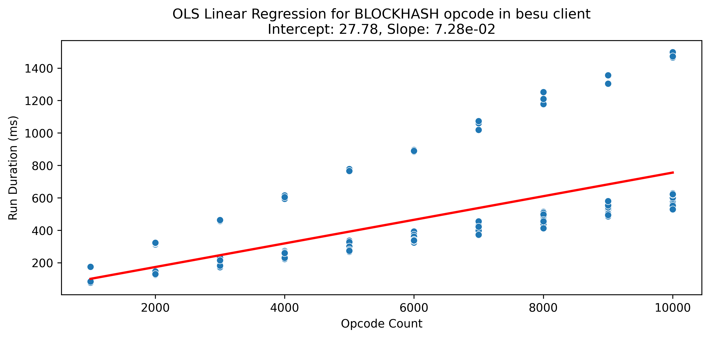


# BYTE

## geth


```python
                            OLS Regression Results                            
==============================================================================
Dep. Variable:        run_duration_ms   R-squared:                       0.987
Model:                            OLS   Adj. R-squared:                  0.986
Method:                 Least Squares   F-statistic:                     2105.
Date:                Mon, 12 Jan 2026   Prob (F-statistic):           6.78e-28
Time:                        10:29:21   Log-Likelihood:                -142.43
No. Observations:                  30   AIC:                             288.9
Df Residuals:                      28   BIC:                             291.7
Df Model:                           1                                         
Covariance Type:            nonrobust                                         
==============================================================================
                 coef    std err          t      P>|t|      [0.025      0.975]
------------------------------------------------------------------------------
const         34.0332     11.390      2.988      0.006      10.701      57.365
opcount        0.0241      0.001     45.881      0.000       0.023       0.025
==============================================================================
Omnibus:                        4.552   Durbin-Watson:                   0.848
Prob(Omnibus):                  0.103   Jarque-Bera (JB):                3.028
Skew:                          -0.726   Prob(JB):                        0.220
Kurtosis:                       3.560   Cond. No.                     4.69e+04
==============================================================================

Notes:
[1] Standard Errors assume that the covariance matrix of the errors is correctly specified.
[2] The condition number is large, 4.69e+04. This might indicate that there are
strong multicollinearity or other numerical problems.
```

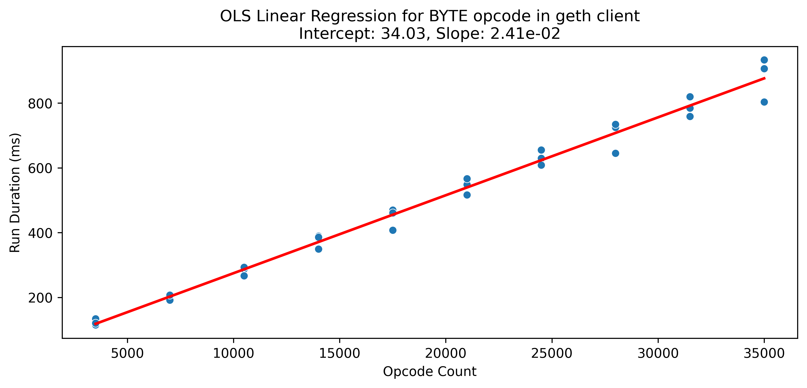


## reth


```python
                            OLS Regression Results                            
==============================================================================
Dep. Variable:        run_duration_ms   R-squared:                       0.990
Model:                            OLS   Adj. R-squared:                  0.990
Method:                 Least Squares   F-statistic:                     2765.
Date:                Mon, 12 Jan 2026   Prob (F-statistic):           1.56e-29
Time:                        10:29:22   Log-Likelihood:                -109.70
No. Observations:                  30   AIC:                             223.4
Df Residuals:                      28   BIC:                             226.2
Df Model:                           1                                         
Covariance Type:            nonrobust                                         
==============================================================================
                 coef    std err          t      P>|t|      [0.025      0.975]
------------------------------------------------------------------------------
const         33.8423      3.826      8.846      0.000      26.006      41.679
opcount        0.0093      0.000     52.580      0.000       0.009       0.010
==============================================================================
Omnibus:                        1.757   Durbin-Watson:                   1.866
Prob(Omnibus):                  0.415   Jarque-Bera (JB):                1.237
Skew:                          -0.496   Prob(JB):                        0.539
Kurtosis:                       2.927   Cond. No.                     4.69e+04
==============================================================================

Notes:
[1] Standard Errors assume that the covariance matrix of the errors is correctly specified.
[2] The condition number is large, 4.69e+04. This might indicate that there are
strong multicollinearity or other numerical problems.
```

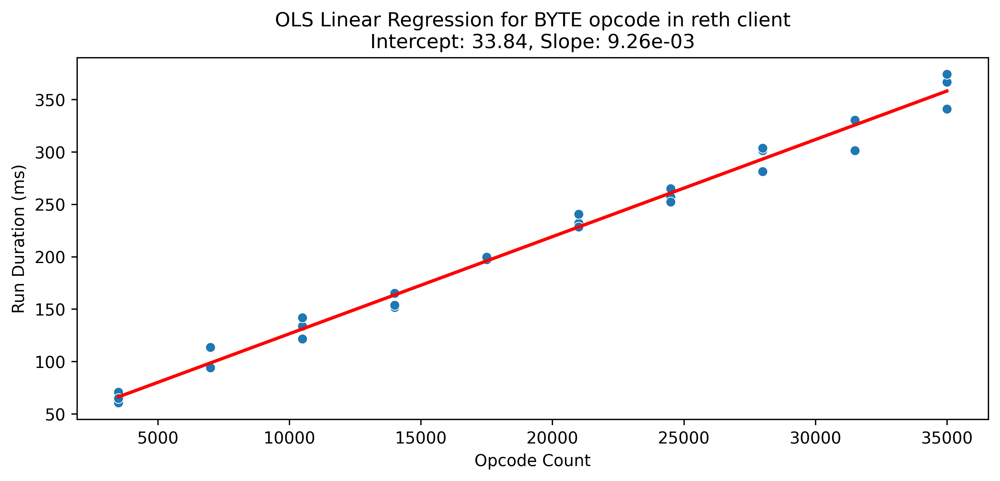


## nethermind


```python
                            OLS Regression Results                            
==============================================================================
Dep. Variable:        run_duration_ms   R-squared:                       0.999
Model:                            OLS   Adj. R-squared:                  0.999
Method:                 Least Squares   F-statistic:                 2.487e+04
Date:                Mon, 12 Jan 2026   Prob (F-statistic):           7.75e-43
Time:                        10:29:22   Log-Likelihood:                -92.787
No. Observations:                  30   AIC:                             189.6
Df Residuals:                      28   BIC:                             192.4
Df Model:                           1                                         
Covariance Type:            nonrobust                                         
==============================================================================
                 coef    std err          t      P>|t|      [0.025      0.975]
------------------------------------------------------------------------------
const         26.1471      2.177     12.009      0.000      21.687      30.607
opcount        0.0158      0.000    157.695      0.000       0.016       0.016
==============================================================================
Omnibus:                        6.165   Durbin-Watson:                   2.683
Prob(Omnibus):                  0.046   Jarque-Bera (JB):                4.766
Skew:                          -0.637   Prob(JB):                       0.0923
Kurtosis:                       4.479   Cond. No.                     4.69e+04
==============================================================================

Notes:
[1] Standard Errors assume that the covariance matrix of the errors is correctly specified.
[2] The condition number is large, 4.69e+04. This might indicate that there are
strong multicollinearity or other numerical problems.
```

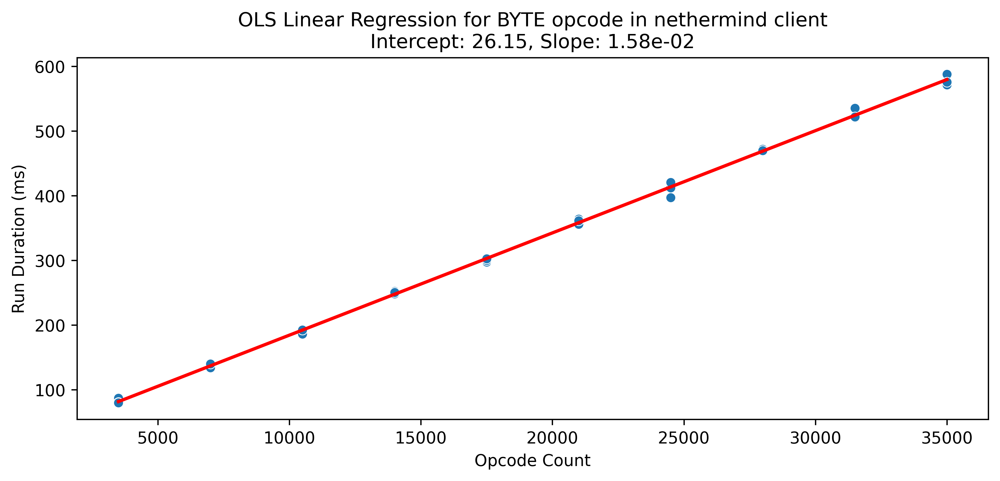


## besu


```python
                            OLS Regression Results                            
==============================================================================
Dep. Variable:        run_duration_ms   R-squared:                       0.996
Model:                            OLS   Adj. R-squared:                  0.996
Method:                 Least Squares   F-statistic:                     7855.
Date:                Mon, 12 Jan 2026   Prob (F-statistic):           7.62e-36
Time:                        10:29:22   Log-Likelihood:                -152.12
No. Observations:                  30   AIC:                             308.2
Df Residuals:                      28   BIC:                             311.0
Df Model:                           1                                         
Covariance Type:            nonrobust                                         
==============================================================================
                 coef    std err          t      P>|t|      [0.025      0.975]
------------------------------------------------------------------------------
const         31.9270     15.736      2.029      0.052      -0.307      64.161
opcount        0.0642      0.001     88.628      0.000       0.063       0.066
==============================================================================
Omnibus:                        4.662   Durbin-Watson:                   1.184
Prob(Omnibus):                  0.097   Jarque-Bera (JB):                3.105
Skew:                           0.729   Prob(JB):                        0.212
Kurtosis:                       3.596   Cond. No.                     4.69e+04
==============================================================================

Notes:
[1] Standard Errors assume that the covariance matrix of the errors is correctly specified.
[2] The condition number is large, 4.69e+04. This might indicate that there are
strong multicollinearity or other numerical problems.
```

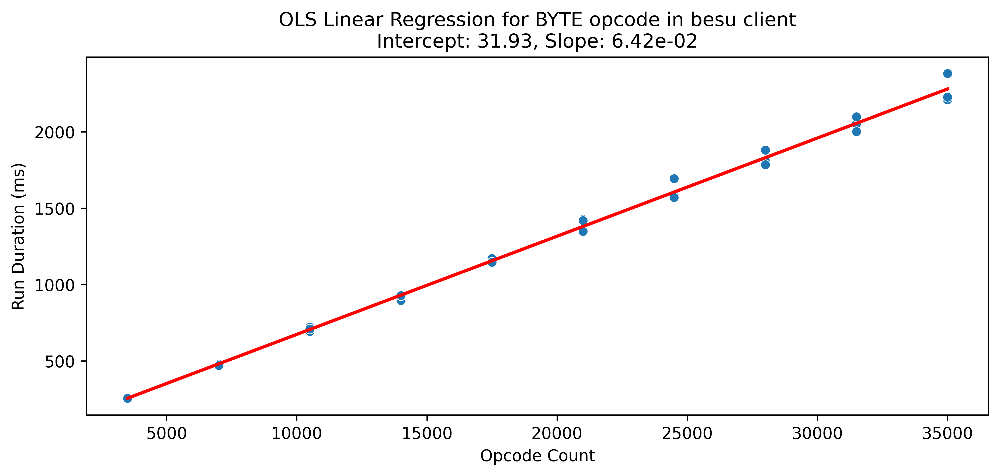


# CALLDATALOAD

## geth


```python
                            OLS Regression Results                            
==============================================================================
Dep. Variable:        run_duration_ms   R-squared:                       0.489
Model:                            OLS   Adj. R-squared:                  0.485
Method:                 Least Squares   F-statistic:                     113.0
Date:                Mon, 12 Jan 2026   Prob (F-statistic):           6.30e-19
Time:                        10:29:22   Log-Likelihood:                -896.95
No. Observations:                 120   AIC:                             1798.
Df Residuals:                     118   BIC:                             1803.
Df Model:                           1                                         
Covariance Type:            nonrobust                                         
==============================================================================
                 coef    std err          t      P>|t|      [0.025      0.975]
------------------------------------------------------------------------------
const         35.3696     84.818      0.417      0.677    -132.592     203.331
opcount        0.0291      0.003     10.632      0.000       0.024       0.034
==============================================================================
Omnibus:                       30.832   Durbin-Watson:                   1.932
Prob(Omnibus):                  0.000   Jarque-Bera (JB):               44.139
Skew:                           1.419   Prob(JB):                     2.60e-10
Kurtosis:                       3.877   Cond. No.                     6.70e+04
==============================================================================

Notes:
[1] Standard Errors assume that the covariance matrix of the errors is correctly specified.
[2] The condition number is large, 6.7e+04. This might indicate that there are
strong multicollinearity or other numerical problems.
```

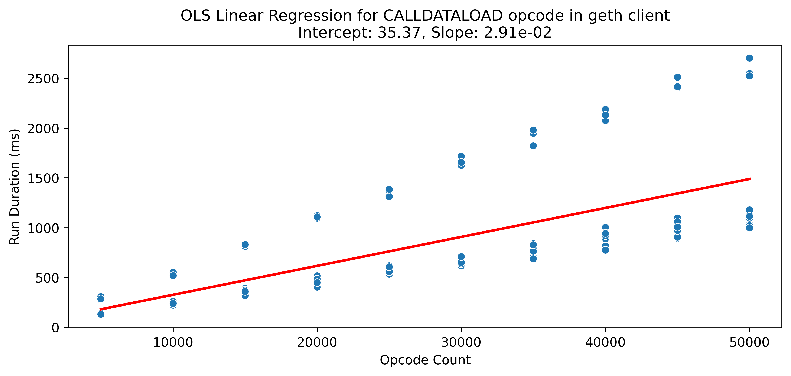


## reth


```python
                            OLS Regression Results                            
==============================================================================
Dep. Variable:        run_duration_ms   R-squared:                       0.949
Model:                            OLS   Adj. R-squared:                  0.948
Method:                 Least Squares   F-statistic:                     2178.
Date:                Mon, 12 Jan 2026   Prob (F-statistic):           6.63e-78
Time:                        10:29:22   Log-Likelihood:                -621.81
No. Observations:                 120   AIC:                             1248.
Df Residuals:                     118   BIC:                             1253.
Df Model:                           1                                         
Covariance Type:            nonrobust                                         
==============================================================================
                 coef    std err          t      P>|t|      [0.025      0.975]
------------------------------------------------------------------------------
const         29.9032      8.565      3.491      0.001      12.943      46.864
opcount        0.0129      0.000     46.668      0.000       0.012       0.013
==============================================================================
Omnibus:                       22.436   Durbin-Watson:                   1.823
Prob(Omnibus):                  0.000   Jarque-Bera (JB):               28.173
Skew:                          -1.072   Prob(JB):                     7.62e-07
Kurtosis:                       4.019   Cond. No.                     6.70e+04
==============================================================================

Notes:
[1] Standard Errors assume that the covariance matrix of the errors is correctly specified.
[2] The condition number is large, 6.7e+04. This might indicate that there are
strong multicollinearity or other numerical problems.
```

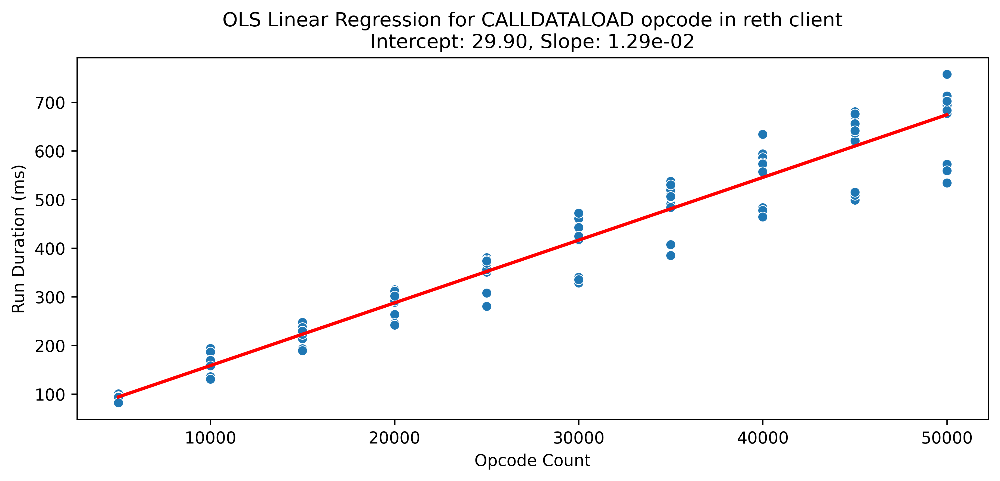


## nethermind


```python
                            OLS Regression Results                            
==============================================================================
Dep. Variable:        run_duration_ms   R-squared:                       0.962
Model:                            OLS   Adj. R-squared:                  0.961
Method:                 Least Squares   F-statistic:                     2970.
Date:                Mon, 12 Jan 2026   Prob (F-statistic):           1.68e-85
Time:                        10:29:22   Log-Likelihood:                -643.53
No. Observations:                 120   AIC:                             1291.
Df Residuals:                     118   BIC:                             1297.
Df Model:                           1                                         
Covariance Type:            nonrobust                                         
==============================================================================
                 coef    std err          t      P>|t|      [0.025      0.975]
------------------------------------------------------------------------------
const         27.7783     10.265      2.706      0.008       7.451      48.106
opcount        0.0180      0.000     54.496      0.000       0.017       0.019
==============================================================================
Omnibus:                       35.903   Durbin-Watson:                   2.003
Prob(Omnibus):                  0.000   Jarque-Bera (JB):               55.608
Skew:                           1.510   Prob(JB):                     8.41e-13
Kurtosis:                       4.416   Cond. No.                     6.70e+04
==============================================================================

Notes:
[1] Standard Errors assume that the covariance matrix of the errors is correctly specified.
[2] The condition number is large, 6.7e+04. This might indicate that there are
strong multicollinearity or other numerical problems.
```

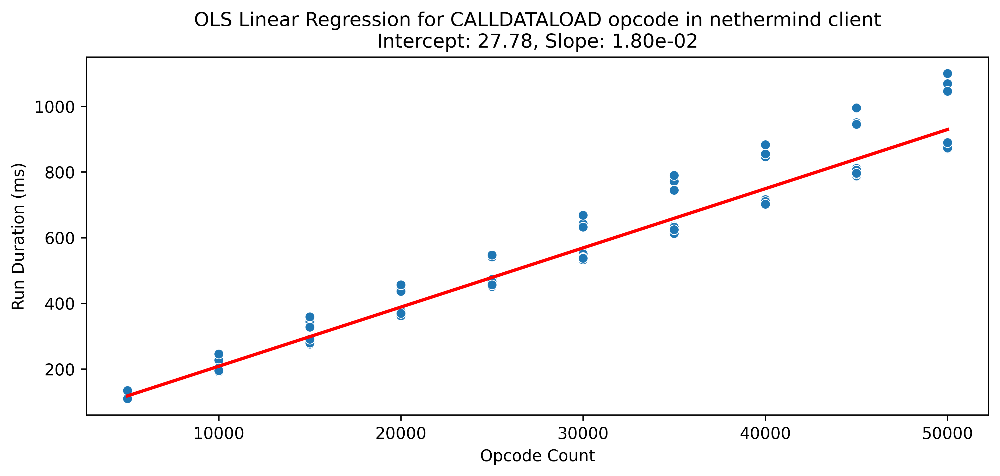


## besu


```python
                            OLS Regression Results                            
==============================================================================
Dep. Variable:        run_duration_ms   R-squared:                       0.858
Model:                            OLS   Adj. R-squared:                  0.857
Method:                 Least Squares   F-statistic:                     711.3
Date:                Mon, 12 Jan 2026   Prob (F-statistic):           8.60e-52
Time:                        10:29:22   Log-Likelihood:                -890.55
No. Observations:                 120   AIC:                             1785.
Df Residuals:                     118   BIC:                             1791.
Df Model:                           1                                         
Covariance Type:            nonrobust                                         
==============================================================================
                 coef    std err          t      P>|t|      [0.025      0.975]
------------------------------------------------------------------------------
const         32.8453     80.412      0.408      0.684    -126.393     192.083
opcount        0.0691      0.003     26.671      0.000       0.064       0.074
==============================================================================
Omnibus:                       31.698   Durbin-Watson:                   1.926
Prob(Omnibus):                  0.000   Jarque-Bera (JB):               45.848
Skew:                          -1.428   Prob(JB):                     1.11e-10
Kurtosis:                       4.005   Cond. No.                     6.70e+04
==============================================================================

Notes:
[1] Standard Errors assume that the covariance matrix of the errors is correctly specified.
[2] The condition number is large, 6.7e+04. This might indicate that there are
strong multicollinearity or other numerical problems.
```

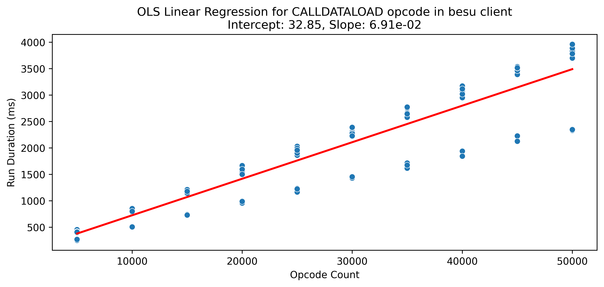


# CALLDATASIZE

## geth


```python
                            OLS Regression Results                            
==============================================================================
Dep. Variable:        run_duration_ms   R-squared:                       0.985
Model:                            OLS   Adj. R-squared:                  0.985
Method:                 Least Squares   F-statistic:                     7568.
Date:                Mon, 12 Jan 2026   Prob (F-statistic):          7.12e-109
Time:                        10:29:23   Log-Likelihood:                -662.70
No. Observations:                 120   AIC:                             1329.
Df Residuals:                     118   BIC:                             1335.
Df Model:                           1                                         
Covariance Type:            nonrobust                                         
==============================================================================
                 coef    std err          t      P>|t|      [0.025      0.975]
------------------------------------------------------------------------------
const         30.1422     12.043      2.503      0.014       6.295      53.990
opcount        0.0169      0.000     86.995      0.000       0.016       0.017
==============================================================================
Omnibus:                       36.446   Durbin-Watson:                   1.346
Prob(Omnibus):                  0.000   Jarque-Bera (JB):              112.332
Skew:                           1.063   Prob(JB):                     4.05e-25
Kurtosis:                       7.237   Cond. No.                     1.34e+05
==============================================================================

Notes:
[1] Standard Errors assume that the covariance matrix of the errors is correctly specified.
[2] The condition number is large, 1.34e+05. This might indicate that there are
strong multicollinearity or other numerical problems.
```

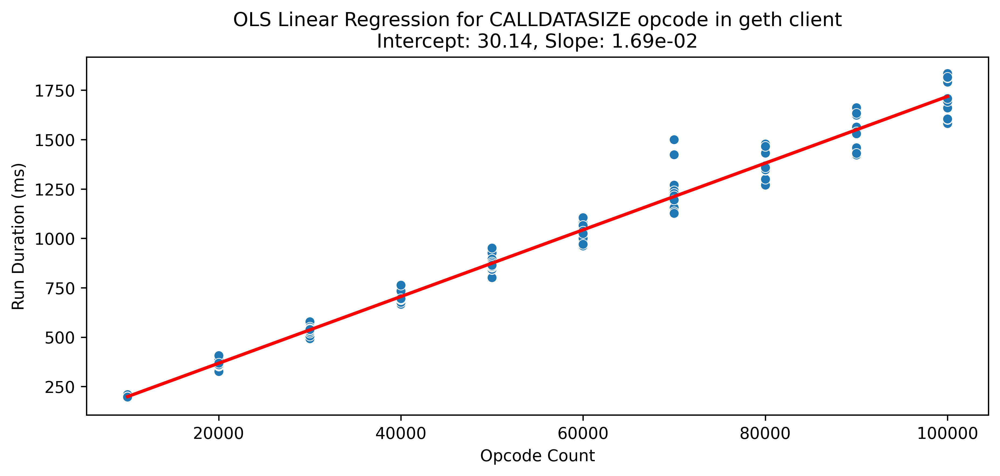


## reth


```python
                            OLS Regression Results                            
==============================================================================
Dep. Variable:        run_duration_ms   R-squared:                       0.987
Model:                            OLS   Adj. R-squared:                  0.987
Method:                 Least Squares   F-statistic:                     9081.
Date:                Mon, 12 Jan 2026   Prob (F-statistic):          1.77e-113
Time:                        10:29:23   Log-Likelihood:                -544.08
No. Observations:                 120   AIC:                             1092.
Df Residuals:                     118   BIC:                             1098.
Df Model:                           1                                         
Covariance Type:            nonrobust                                         
==============================================================================
                 coef    std err          t      P>|t|      [0.025      0.975]
------------------------------------------------------------------------------
const         27.0123      4.482      6.027      0.000      18.138      35.887
opcount        0.0069   7.22e-05     95.293      0.000       0.007       0.007
==============================================================================
Omnibus:                        2.281   Durbin-Watson:                   2.400
Prob(Omnibus):                  0.320   Jarque-Bera (JB):                1.889
Skew:                          -0.301   Prob(JB):                        0.389
Kurtosis:                       3.124   Cond. No.                     1.34e+05
==============================================================================

Notes:
[1] Standard Errors assume that the covariance matrix of the errors is correctly specified.
[2] The condition number is large, 1.34e+05. This might indicate that there are
strong multicollinearity or other numerical problems.
```

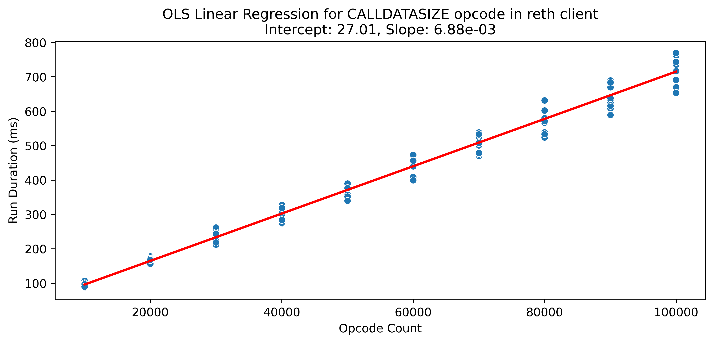


## nethermind


```python
                            OLS Regression Results                            
==============================================================================
Dep. Variable:        run_duration_ms   R-squared:                       0.985
Model:                            OLS   Adj. R-squared:                  0.985
Method:                 Least Squares   F-statistic:                     7927.
Date:                Mon, 12 Jan 2026   Prob (F-statistic):          4.83e-110
Time:                        10:29:23   Log-Likelihood:                -561.87
No. Observations:                 120   AIC:                             1128.
Df Residuals:                     118   BIC:                             1133.
Df Model:                           1                                         
Covariance Type:            nonrobust                                         
==============================================================================
                 coef    std err          t      P>|t|      [0.025      0.975]
------------------------------------------------------------------------------
const         27.2753      5.198      5.248      0.000      16.982      37.568
opcount        0.0075   8.38e-05     89.033      0.000       0.007       0.008
==============================================================================
Omnibus:                       15.758   Durbin-Watson:                   1.618
Prob(Omnibus):                  0.000   Jarque-Bera (JB):               18.224
Skew:                           0.801   Prob(JB):                     0.000110
Kurtosis:                       4.039   Cond. No.                     1.34e+05
==============================================================================

Notes:
[1] Standard Errors assume that the covariance matrix of the errors is correctly specified.
[2] The condition number is large, 1.34e+05. This might indicate that there are
strong multicollinearity or other numerical problems.
```

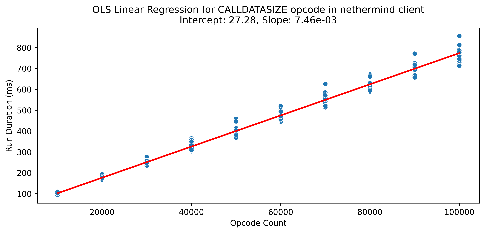


## besu


```python
                            OLS Regression Results                            
==============================================================================
Dep. Variable:        run_duration_ms   R-squared:                       0.992
Model:                            OLS   Adj. R-squared:                  0.992
Method:                 Least Squares   F-statistic:                 1.527e+04
Date:                Mon, 12 Jan 2026   Prob (F-statistic):          1.16e-126
Time:                        10:29:23   Log-Likelihood:                -691.83
No. Observations:                 120   AIC:                             1388.
Df Residuals:                     118   BIC:                             1393.
Df Model:                           1                                         
Covariance Type:            nonrobust                                         
==============================================================================
                 coef    std err          t      P>|t|      [0.025      0.975]
------------------------------------------------------------------------------
const         33.2548     15.351      2.166      0.032       2.856      63.654
opcount        0.0306      0.000    123.573      0.000       0.030       0.031
==============================================================================
Omnibus:                       14.868   Durbin-Watson:                   2.153
Prob(Omnibus):                  0.001   Jarque-Bera (JB):               16.701
Skew:                          -0.785   Prob(JB):                     0.000236
Kurtosis:                       3.935   Cond. No.                     1.34e+05
==============================================================================

Notes:
[1] Standard Errors assume that the covariance matrix of the errors is correctly specified.
[2] The condition number is large, 1.34e+05. This might indicate that there are
strong multicollinearity or other numerical problems.
```

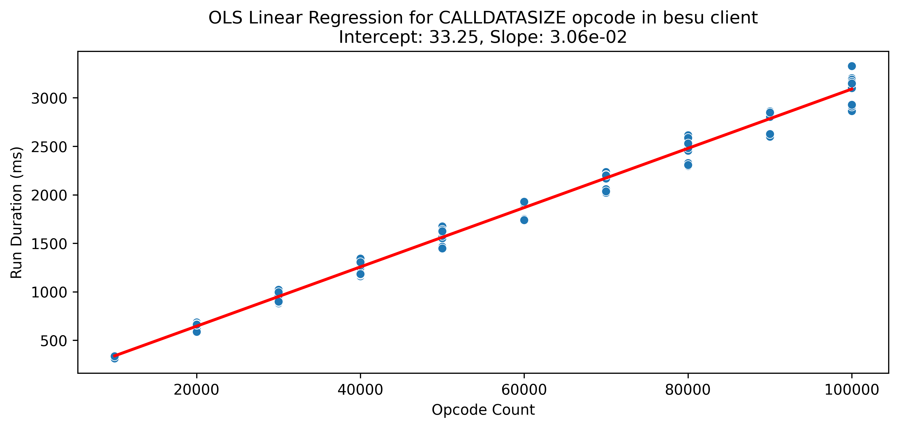


# CALLER

## geth


```python
                            OLS Regression Results                            
==============================================================================
Dep. Variable:        run_duration_ms   R-squared:                       0.985
Model:                            OLS   Adj. R-squared:                  0.985
Method:                 Least Squares   F-statistic:                     1859.
Date:                Mon, 12 Jan 2026   Prob (F-statistic):           3.77e-27
Time:                        10:29:23   Log-Likelihood:                -179.38
No. Observations:                  30   AIC:                             362.8
Df Residuals:                      28   BIC:                             365.6
Df Model:                           1                                         
Covariance Type:            nonrobust                                         
==============================================================================
                 coef    std err          t      P>|t|      [0.025      0.975]
------------------------------------------------------------------------------
const         52.6248     39.042      1.348      0.188     -27.349     132.598
opcount        0.0271      0.001     43.120      0.000       0.026       0.028
==============================================================================
Omnibus:                        1.930   Durbin-Watson:                   1.355
Prob(Omnibus):                  0.381   Jarque-Bera (JB):                1.758
Skew:                          -0.527   Prob(JB):                        0.415
Kurtosis:                       2.457   Cond. No.                     1.34e+05
==============================================================================

Notes:
[1] Standard Errors assume that the covariance matrix of the errors is correctly specified.
[2] The condition number is large, 1.34e+05. This might indicate that there are
strong multicollinearity or other numerical problems.
```

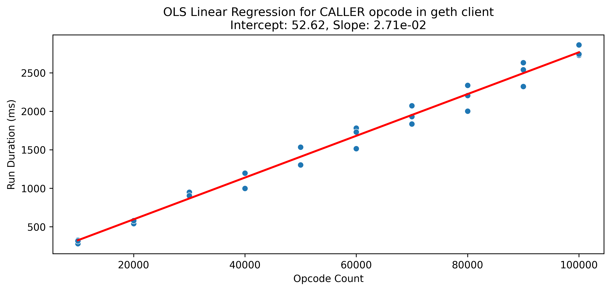


## reth


```python
                            OLS Regression Results                            
==============================================================================
Dep. Variable:        run_duration_ms   R-squared:                       0.985
Model:                            OLS   Adj. R-squared:                  0.984
Method:                 Least Squares   F-statistic:                     1822.
Date:                Mon, 12 Jan 2026   Prob (F-statistic):           5.00e-27
Time:                        10:29:23   Log-Likelihood:                -138.33
No. Observations:                  30   AIC:                             280.7
Df Residuals:                      28   BIC:                             283.5
Df Model:                           1                                         
Covariance Type:            nonrobust                                         
==============================================================================
                 coef    std err          t      P>|t|      [0.025      0.975]
------------------------------------------------------------------------------
const         26.7658      9.937      2.694      0.012       6.411      47.121
opcount        0.0068      0.000     42.681      0.000       0.007       0.007
==============================================================================
Omnibus:                        1.191   Durbin-Watson:                   1.475
Prob(Omnibus):                  0.551   Jarque-Bera (JB):                0.947
Skew:                          -0.420   Prob(JB):                        0.623
Kurtosis:                       2.774   Cond. No.                     1.34e+05
==============================================================================

Notes:
[1] Standard Errors assume that the covariance matrix of the errors is correctly specified.
[2] The condition number is large, 1.34e+05. This might indicate that there are
strong multicollinearity or other numerical problems.
```


## nethermind


```python
                            OLS Regression Results                            
==============================================================================
Dep. Variable:        run_duration_ms   R-squared:                       0.987
Model:                            OLS   Adj. R-squared:                  0.986
Method:                 Least Squares   F-statistic:                     2063.
Date:                Mon, 12 Jan 2026   Prob (F-statistic):           8.96e-28
Time:                        10:29:23   Log-Likelihood:                -140.79
No. Observations:                  30   AIC:                             285.6
Df Residuals:                      28   BIC:                             288.4
Df Model:                           1                                         
Covariance Type:            nonrobust                                         
==============================================================================
                 coef    std err          t      P>|t|      [0.025      0.975]
------------------------------------------------------------------------------
const         16.9537     10.786      1.572      0.127      -5.140      39.048
opcount        0.0079      0.000     45.421      0.000       0.008       0.008
==============================================================================
Omnibus:                       18.077   Durbin-Watson:                   1.358
Prob(Omnibus):                  0.000   Jarque-Bera (JB):               28.087
Skew:                           1.342   Prob(JB):                     7.96e-07
Kurtosis:                       6.907   Cond. No.                     1.34e+05
==============================================================================

Notes:
[1] Standard Errors assume that the covariance matrix of the errors is correctly specified.
[2] The condition number is large, 1.34e+05. This might indicate that there are
strong multicollinearity or other numerical problems.
```

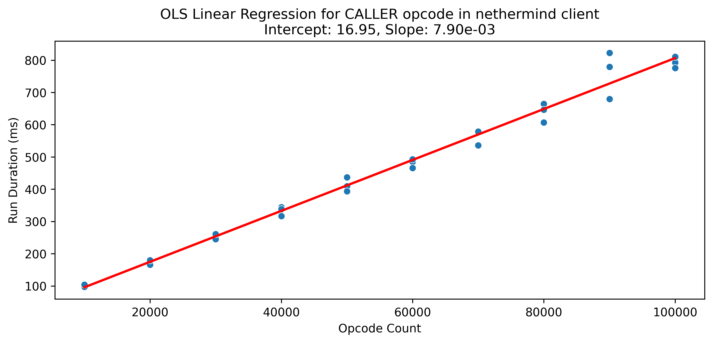


## besu


```python
                            OLS Regression Results                            
==============================================================================
Dep. Variable:        run_duration_ms   R-squared:                       0.998
Model:                            OLS   Adj. R-squared:                  0.998
Method:                 Least Squares   F-statistic:                 1.518e+04
Date:                Mon, 12 Jan 2026   Prob (F-statistic):           7.73e-40
Time:                        10:29:24   Log-Likelihood:                -146.98
No. Observations:                  30   AIC:                             298.0
Df Residuals:                      28   BIC:                             300.8
Df Model:                           1                                         
Covariance Type:            nonrobust                                         
==============================================================================
                 coef    std err          t      P>|t|      [0.025      0.975]
------------------------------------------------------------------------------
const         30.8920     13.257      2.330      0.027       3.736      58.048
opcount        0.0263      0.000    123.188      0.000       0.026       0.027
==============================================================================
Omnibus:                        1.616   Durbin-Watson:                   1.536
Prob(Omnibus):                  0.446   Jarque-Bera (JB):                0.565
Skew:                           0.068   Prob(JB):                        0.754
Kurtosis:                       3.658   Cond. No.                     1.34e+05
==============================================================================

Notes:
[1] Standard Errors assume that the covariance matrix of the errors is correctly specified.
[2] The condition number is large, 1.34e+05. This might indicate that there are
strong multicollinearity or other numerical problems.
```

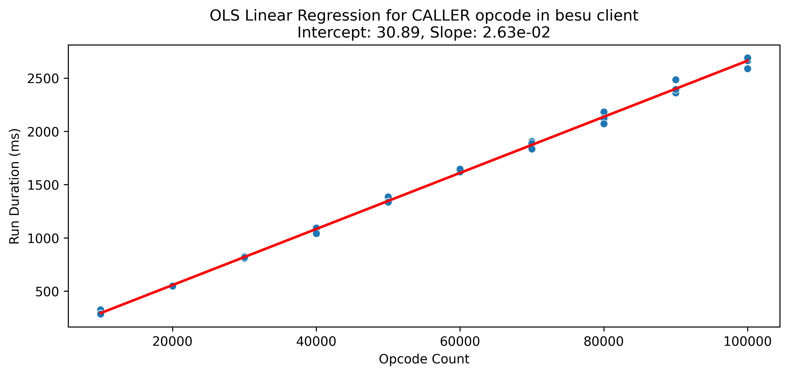


# CALLVALUE

## geth


```python
                            OLS Regression Results                            
==============================================================================
Dep. Variable:        run_duration_ms   R-squared:                       0.977
Model:                            OLS   Adj. R-squared:                  0.976
Method:                 Least Squares   F-statistic:                     1188.
Date:                Mon, 12 Jan 2026   Prob (F-statistic):           1.78e-24
Time:                        10:29:24   Log-Likelihood:                -156.67
No. Observations:                  30   AIC:                             317.3
Df Residuals:                      28   BIC:                             320.1
Df Model:                           1                                         
Covariance Type:            nonrobust                                         
==============================================================================
                 coef    std err          t      P>|t|      [0.025      0.975]
------------------------------------------------------------------------------
const         37.3920     18.312      2.042      0.051      -0.119      74.903
opcount        0.0170      0.000     34.464      0.000       0.016       0.018
==============================================================================
Omnibus:                        2.026   Durbin-Watson:                   0.613
Prob(Omnibus):                  0.363   Jarque-Bera (JB):                1.794
Skew:                          -0.562   Prob(JB):                        0.408
Kurtosis:                       2.588   Cond. No.                     8.04e+04
==============================================================================

Notes:
[1] Standard Errors assume that the covariance matrix of the errors is correctly specified.
[2] The condition number is large, 8.04e+04. This might indicate that there are
strong multicollinearity or other numerical problems.
```

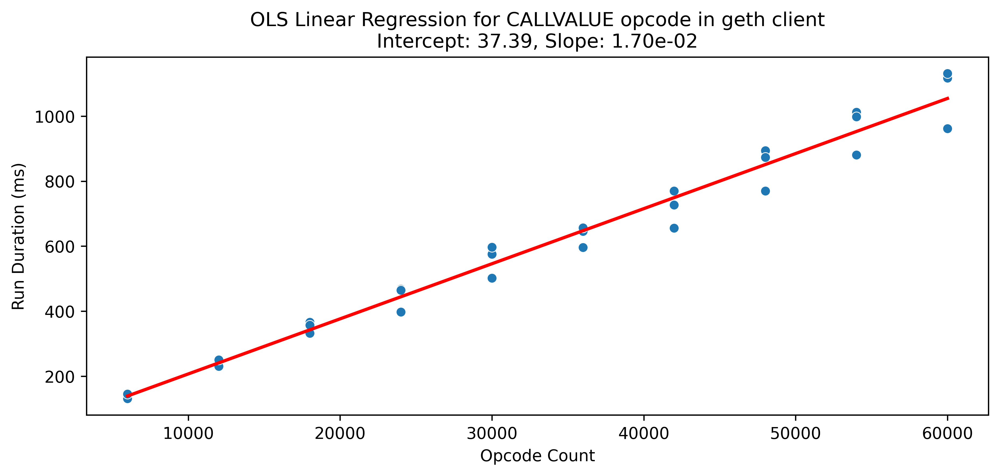


## reth


```python
                            OLS Regression Results                            
==============================================================================
Dep. Variable:        run_duration_ms   R-squared:                       0.990
Model:                            OLS   Adj. R-squared:                  0.990
Method:                 Least Squares   F-statistic:                     2868.
Date:                Mon, 12 Jan 2026   Prob (F-statistic):           9.36e-30
Time:                        10:29:24   Log-Likelihood:                -123.46
No. Observations:                  30   AIC:                             250.9
Df Residuals:                      28   BIC:                             253.7
Df Model:                           1                                         
Covariance Type:            nonrobust                                         
==============================================================================
                 coef    std err          t      P>|t|      [0.025      0.975]
------------------------------------------------------------------------------
const         31.8683      6.053      5.265      0.000      19.470      44.267
opcount        0.0087      0.000     53.554      0.000       0.008       0.009
==============================================================================
Omnibus:                       10.170   Durbin-Watson:                   1.771
Prob(Omnibus):                  0.006   Jarque-Bera (JB):                8.919
Skew:                          -1.080   Prob(JB):                       0.0116
Kurtosis:                       4.571   Cond. No.                     8.04e+04
==============================================================================

Notes:
[1] Standard Errors assume that the covariance matrix of the errors is correctly specified.
[2] The condition number is large, 8.04e+04. This might indicate that there are
strong multicollinearity or other numerical problems.
```


## nethermind


```python
                            OLS Regression Results                            
==============================================================================
Dep. Variable:        run_duration_ms   R-squared:                       0.981
Model:                            OLS   Adj. R-squared:                  0.980
Method:                 Least Squares   F-statistic:                     1454.
Date:                Mon, 12 Jan 2026   Prob (F-statistic):           1.11e-25
Time:                        10:29:24   Log-Likelihood:                -134.76
No. Observations:                  30   AIC:                             273.5
Df Residuals:                      28   BIC:                             276.3
Df Model:                           1                                         
Covariance Type:            nonrobust                                         
==============================================================================
                 coef    std err          t      P>|t|      [0.025      0.975]
------------------------------------------------------------------------------
const         28.8575      8.821      3.271      0.003      10.787      46.928
opcount        0.0090      0.000     38.133      0.000       0.009       0.010
==============================================================================
Omnibus:                        8.851   Durbin-Watson:                   0.695
Prob(Omnibus):                  0.012   Jarque-Bera (JB):                7.213
Skew:                           1.078   Prob(JB):                       0.0272
Kurtosis:                       4.060   Cond. No.                     8.04e+04
==============================================================================

Notes:
[1] Standard Errors assume that the covariance matrix of the errors is correctly specified.
[2] The condition number is large, 8.04e+04. This might indicate that there are
strong multicollinearity or other numerical problems.
```

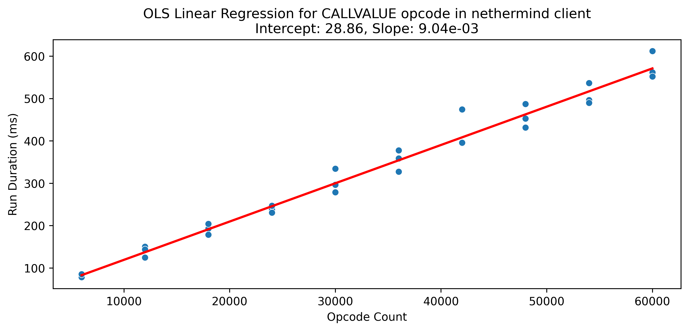


## besu


```python
                            OLS Regression Results                            
==============================================================================
Dep. Variable:        run_duration_ms   R-squared:                       0.996
Model:                            OLS   Adj. R-squared:                  0.996
Method:                 Least Squares   F-statistic:                     7572.
Date:                Mon, 12 Jan 2026   Prob (F-statistic):           1.27e-35
Time:                        10:29:24   Log-Likelihood:                -149.41
No. Observations:                  30   AIC:                             302.8
Df Residuals:                      28   BIC:                             305.6
Df Model:                           1                                         
Covariance Type:            nonrobust                                         
==============================================================================
                 coef    std err          t      P>|t|      [0.025      0.975]
------------------------------------------------------------------------------
const         18.9700     14.375      1.320      0.198     -10.475      48.415
opcount        0.0336      0.000     87.016      0.000       0.033       0.034
==============================================================================
Omnibus:                       17.477   Durbin-Watson:                   1.754
Prob(Omnibus):                  0.000   Jarque-Bera (JB):               24.413
Skew:                           1.374   Prob(JB):                     5.00e-06
Kurtosis:                       6.461   Cond. No.                     8.04e+04
==============================================================================

Notes:
[1] Standard Errors assume that the covariance matrix of the errors is correctly specified.
[2] The condition number is large, 8.04e+04. This might indicate that there are
strong multicollinearity or other numerical problems.
```


# CHAINID

## geth


```python
                            OLS Regression Results                            
==============================================================================
Dep. Variable:        run_duration_ms   R-squared:                       0.986
Model:                            OLS   Adj. R-squared:                  0.985
Method:                 Least Squares   F-statistic:                     1913.
Date:                Mon, 12 Jan 2026   Prob (F-statistic):           2.55e-27
Time:                        10:29:24   Log-Likelihood:                -169.23
No. Observations:                  30   AIC:                             342.5
Df Residuals:                      28   BIC:                             345.3
Df Model:                           1                                         
Covariance Type:            nonrobust                                         
==============================================================================
                 coef    std err          t      P>|t|      [0.025      0.975]
------------------------------------------------------------------------------
const         24.3298     27.827      0.874      0.389     -32.672      81.332
opcount        0.0196      0.000     43.735      0.000       0.019       0.021
==============================================================================
Omnibus:                        7.547   Durbin-Watson:                   1.161
Prob(Omnibus):                  0.023   Jarque-Bera (JB):                5.912
Skew:                          -1.021   Prob(JB):                       0.0520
Kurtosis:                       3.750   Cond. No.                     1.34e+05
==============================================================================

Notes:
[1] Standard Errors assume that the covariance matrix of the errors is correctly specified.
[2] The condition number is large, 1.34e+05. This might indicate that there are
strong multicollinearity or other numerical problems.
```


## reth


```python
                            OLS Regression Results                            
==============================================================================
Dep. Variable:        run_duration_ms   R-squared:                       0.986
Model:                            OLS   Adj. R-squared:                  0.985
Method:                 Least Squares   F-statistic:                     1968.
Date:                Mon, 12 Jan 2026   Prob (F-statistic):           1.72e-27
Time:                        10:29:24   Log-Likelihood:                -134.12
No. Observations:                  30   AIC:                             272.2
Df Residuals:                      28   BIC:                             275.1
Df Model:                           1                                         
Covariance Type:            nonrobust                                         
==============================================================================
                 coef    std err          t      P>|t|      [0.025      0.975]
------------------------------------------------------------------------------
const         35.0520      8.637      4.059      0.000      17.361      52.743
opcount        0.0062      0.000     44.361      0.000       0.006       0.006
==============================================================================
Omnibus:                        1.917   Durbin-Watson:                   1.639
Prob(Omnibus):                  0.383   Jarque-Bera (JB):                1.139
Skew:                           0.095   Prob(JB):                        0.566
Kurtosis:                       2.065   Cond. No.                     1.34e+05
==============================================================================

Notes:
[1] Standard Errors assume that the covariance matrix of the errors is correctly specified.
[2] The condition number is large, 1.34e+05. This might indicate that there are
strong multicollinearity or other numerical problems.
```

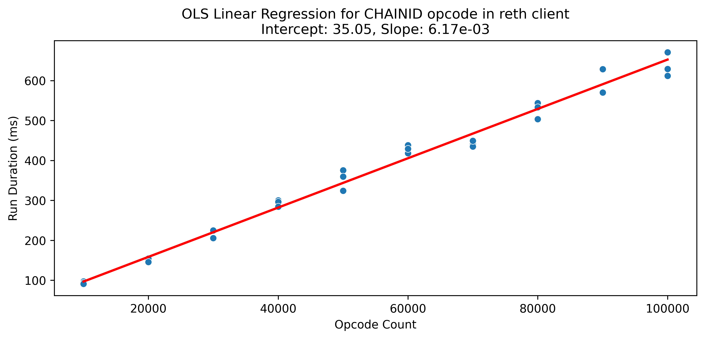


## nethermind


```python
                            OLS Regression Results                            
==============================================================================
Dep. Variable:        run_duration_ms   R-squared:                       0.988
Model:                            OLS   Adj. R-squared:                  0.988
Method:                 Least Squares   F-statistic:                     2329.
Date:                Mon, 12 Jan 2026   Prob (F-statistic):           1.67e-28
Time:                        10:29:25   Log-Likelihood:                -135.00
No. Observations:                  30   AIC:                             274.0
Df Residuals:                      28   BIC:                             276.8
Df Model:                           1                                         
Covariance Type:            nonrobust                                         
==============================================================================
                 coef    std err          t      P>|t|      [0.025      0.975]
------------------------------------------------------------------------------
const         29.7836      8.892      3.349      0.002      11.569      47.998
opcount        0.0069      0.000     48.261      0.000       0.007       0.007
==============================================================================
Omnibus:                        0.301   Durbin-Watson:                   0.872
Prob(Omnibus):                  0.860   Jarque-Bera (JB):                0.316
Skew:                           0.208   Prob(JB):                        0.854
Kurtosis:                       2.717   Cond. No.                     1.34e+05
==============================================================================

Notes:
[1] Standard Errors assume that the covariance matrix of the errors is correctly specified.
[2] The condition number is large, 1.34e+05. This might indicate that there are
strong multicollinearity or other numerical problems.
```

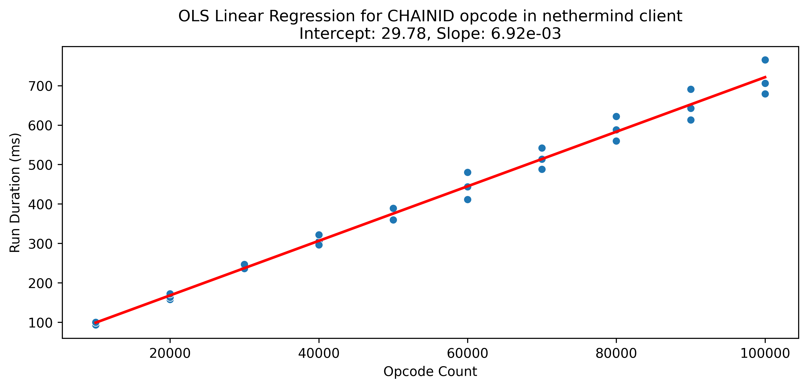


## besu


```python
                            OLS Regression Results                            
==============================================================================
Dep. Variable:        run_duration_ms   R-squared:                       0.999
Model:                            OLS   Adj. R-squared:                  0.999
Method:                 Least Squares   F-statistic:                 2.284e+04
Date:                Mon, 12 Jan 2026   Prob (F-statistic):           2.54e-42
Time:                        10:29:25   Log-Likelihood:                -140.84
No. Observations:                  30   AIC:                             285.7
Df Residuals:                      28   BIC:                             288.5
Df Model:                           1                                         
Covariance Type:            nonrobust                                         
==============================================================================
                 coef    std err          t      P>|t|      [0.025      0.975]
------------------------------------------------------------------------------
const         35.5665     10.802      3.293      0.003      13.440      57.693
opcount        0.0263      0.000    151.137      0.000       0.026       0.027
==============================================================================
Omnibus:                        3.778   Durbin-Watson:                   2.122
Prob(Omnibus):                  0.151   Jarque-Bera (JB):                2.794
Skew:                           0.746   Prob(JB):                        0.247
Kurtosis:                       3.104   Cond. No.                     1.34e+05
==============================================================================

Notes:
[1] Standard Errors assume that the covariance matrix of the errors is correctly specified.
[2] The condition number is large, 1.34e+05. This might indicate that there are
strong multicollinearity or other numerical problems.
```

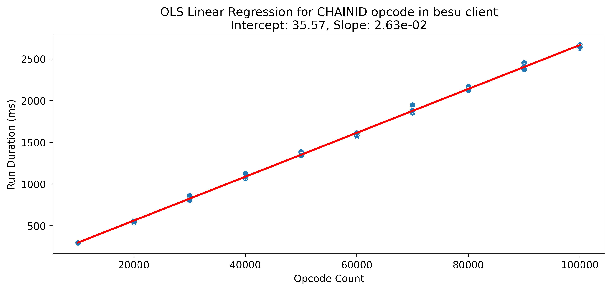


# CODESIZE

## geth


```python
                            OLS Regression Results                            
==============================================================================
Dep. Variable:        run_duration_ms   R-squared:                       0.982
Model:                            OLS   Adj. R-squared:                  0.981
Method:                 Least Squares   F-statistic:                     1530.
Date:                Mon, 12 Jan 2026   Prob (F-statistic):           5.53e-26
Time:                        10:29:25   Log-Likelihood:                -175.31
No. Observations:                  30   AIC:                             354.6
Df Residuals:                      28   BIC:                             357.4
Df Model:                           1                                         
Covariance Type:            nonrobust                                         
==============================================================================
                 coef    std err          t      P>|t|      [0.025      0.975]
------------------------------------------------------------------------------
const         23.3514     34.082      0.685      0.499     -46.463      93.166
opcount        0.0172      0.000     39.114      0.000       0.016       0.018
==============================================================================
Omnibus:                        5.114   Durbin-Watson:                   1.141
Prob(Omnibus):                  0.078   Jarque-Bera (JB):                5.236
Skew:                          -0.114   Prob(JB):                       0.0730
Kurtosis:                       5.034   Cond. No.                     1.68e+05
==============================================================================

Notes:
[1] Standard Errors assume that the covariance matrix of the errors is correctly specified.
[2] The condition number is large, 1.68e+05. This might indicate that there are
strong multicollinearity or other numerical problems.
```

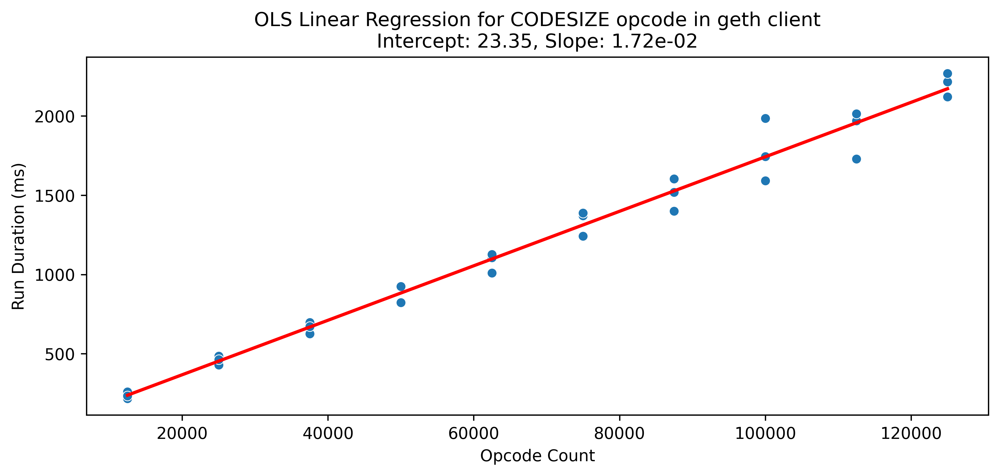


## reth


```python
                            OLS Regression Results                            
==============================================================================
Dep. Variable:        run_duration_ms   R-squared:                       0.981
Model:                            OLS   Adj. R-squared:                  0.981
Method:                 Least Squares   F-statistic:                     1472.
Date:                Mon, 12 Jan 2026   Prob (F-statistic):           9.36e-26
Time:                        10:29:25   Log-Likelihood:                -145.89
No. Observations:                  30   AIC:                             295.8
Df Residuals:                      28   BIC:                             298.6
Df Model:                           1                                         
Covariance Type:            nonrobust                                         
==============================================================================
                 coef    std err          t      P>|t|      [0.025      0.975]
------------------------------------------------------------------------------
const         27.8951     12.786      2.182      0.038       1.705      54.085
opcount        0.0063      0.000     38.372      0.000       0.006       0.007
==============================================================================
Omnibus:                        0.770   Durbin-Watson:                   1.419
Prob(Omnibus):                  0.680   Jarque-Bera (JB):                0.758
Skew:                           0.141   Prob(JB):                        0.684
Kurtosis:                       2.273   Cond. No.                     1.68e+05
==============================================================================

Notes:
[1] Standard Errors assume that the covariance matrix of the errors is correctly specified.
[2] The condition number is large, 1.68e+05. This might indicate that there are
strong multicollinearity or other numerical problems.
```


## nethermind


```python
                            OLS Regression Results                            
==============================================================================
Dep. Variable:        run_duration_ms   R-squared:                       0.998
Model:                            OLS   Adj. R-squared:                  0.998
Method:                 Least Squares   F-statistic:                 1.430e+04
Date:                Mon, 12 Jan 2026   Prob (F-statistic):           1.77e-39
Time:                        10:29:25   Log-Likelihood:                -122.64
No. Observations:                  30   AIC:                             249.3
Df Residuals:                      28   BIC:                             252.1
Df Model:                           1                                         
Covariance Type:            nonrobust                                         
==============================================================================
                 coef    std err          t      P>|t|      [0.025      0.975]
------------------------------------------------------------------------------
const         21.3889      5.890      3.631      0.001       9.323      33.455
opcount        0.0091   7.59e-05    119.578      0.000       0.009       0.009
==============================================================================
Omnibus:                        1.780   Durbin-Watson:                   1.064
Prob(Omnibus):                  0.411   Jarque-Bera (JB):                0.876
Skew:                           0.393   Prob(JB):                        0.645
Kurtosis:                       3.286   Cond. No.                     1.68e+05
==============================================================================

Notes:
[1] Standard Errors assume that the covariance matrix of the errors is correctly specified.
[2] The condition number is large, 1.68e+05. This might indicate that there are
strong multicollinearity or other numerical problems.
```

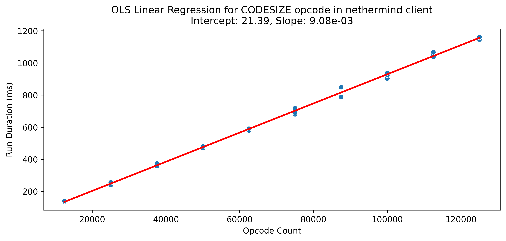


## besu


```python
                            OLS Regression Results                            
==============================================================================
Dep. Variable:        run_duration_ms   R-squared:                       0.999
Model:                            OLS   Adj. R-squared:                  0.999
Method:                 Least Squares   F-statistic:                 3.928e+04
Date:                Mon, 12 Jan 2026   Prob (F-statistic):           1.30e-45
Time:                        10:29:25   Log-Likelihood:                -141.24
No. Observations:                  30   AIC:                             286.5
Df Residuals:                      28   BIC:                             289.3
Df Model:                           1                                         
Covariance Type:            nonrobust                                         
==============================================================================
                 coef    std err          t      P>|t|      [0.025      0.975]
------------------------------------------------------------------------------
const         38.8450     10.950      3.548      0.001      16.416      61.274
opcount        0.0280      0.000    198.181      0.000       0.028       0.028
==============================================================================
Omnibus:                        3.194   Durbin-Watson:                   2.384
Prob(Omnibus):                  0.203   Jarque-Bera (JB):                1.778
Skew:                           0.480   Prob(JB):                        0.411
Kurtosis:                       3.708   Cond. No.                     1.68e+05
==============================================================================

Notes:
[1] Standard Errors assume that the covariance matrix of the errors is correctly specified.
[2] The condition number is large, 1.68e+05. This might indicate that there are
strong multicollinearity or other numerical problems.
```


# COINBASE

## geth


```python
                            OLS Regression Results                            
==============================================================================
Dep. Variable:        run_duration_ms   R-squared:                       0.977
Model:                            OLS   Adj. R-squared:                  0.976
Method:                 Least Squares   F-statistic:                     1188.
Date:                Mon, 12 Jan 2026   Prob (F-statistic):           1.78e-24
Time:                        10:29:25   Log-Likelihood:                -180.60
No. Observations:                  30   AIC:                             365.2
Df Residuals:                      28   BIC:                             368.0
Df Model:                           1                                         
Covariance Type:            nonrobust                                         
==============================================================================
                 coef    std err          t      P>|t|      [0.025      0.975]
------------------------------------------------------------------------------
const         14.4879     40.657      0.356      0.724     -68.794      97.770
opcount        0.0226      0.001     34.464      0.000       0.021       0.024
==============================================================================
Omnibus:                        4.348   Durbin-Watson:                   1.396
Prob(Omnibus):                  0.114   Jarque-Bera (JB):                3.565
Skew:                          -0.221   Prob(JB):                        0.168
Kurtosis:                       4.630   Cond. No.                     1.34e+05
==============================================================================

Notes:
[1] Standard Errors assume that the covariance matrix of the errors is correctly specified.
[2] The condition number is large, 1.34e+05. This might indicate that there are
strong multicollinearity or other numerical problems.
```

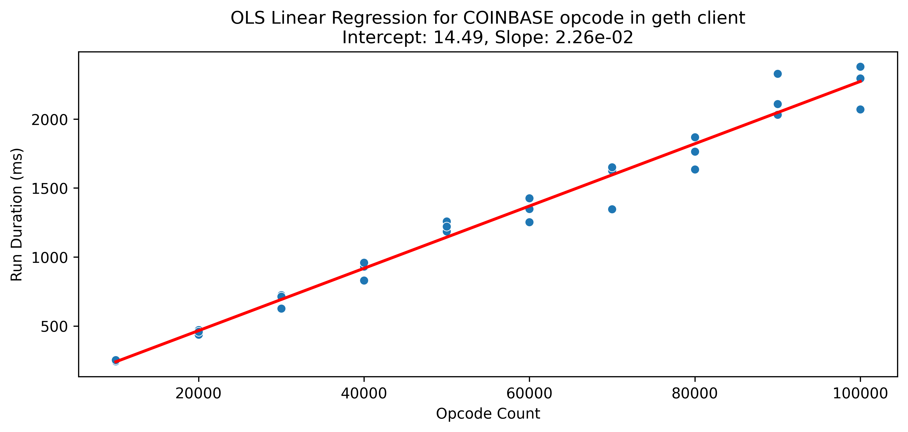


## reth


```python
                            OLS Regression Results                            
==============================================================================
Dep. Variable:        run_duration_ms   R-squared:                       0.986
Model:                            OLS   Adj. R-squared:                  0.986
Method:                 Least Squares   F-statistic:                     2007.
Date:                Mon, 12 Jan 2026   Prob (F-statistic):           1.31e-27
Time:                        10:29:25   Log-Likelihood:                -135.83
No. Observations:                  30   AIC:                             275.7
Df Residuals:                      28   BIC:                             278.5
Df Model:                           1                                         
Covariance Type:            nonrobust                                         
==============================================================================
                 coef    std err          t      P>|t|      [0.025      0.975]
------------------------------------------------------------------------------
const         39.2000      9.140      4.289      0.000      20.477      57.923
opcount        0.0066      0.000     44.804      0.000       0.006       0.007
==============================================================================
Omnibus:                        2.691   Durbin-Watson:                   1.763
Prob(Omnibus):                  0.260   Jarque-Bera (JB):                1.757
Skew:                          -0.370   Prob(JB):                        0.415
Kurtosis:                       2.073   Cond. No.                     1.34e+05
==============================================================================

Notes:
[1] Standard Errors assume that the covariance matrix of the errors is correctly specified.
[2] The condition number is large, 1.34e+05. This might indicate that there are
strong multicollinearity or other numerical problems.
```


## nethermind


```python
                            OLS Regression Results                            
==============================================================================
Dep. Variable:        run_duration_ms   R-squared:                       0.991
Model:                            OLS   Adj. R-squared:                  0.990
Method:                 Least Squares   F-statistic:                     3016.
Date:                Mon, 12 Jan 2026   Prob (F-statistic):           4.66e-30
Time:                        10:29:26   Log-Likelihood:                -131.78
No. Observations:                  30   AIC:                             267.6
Df Residuals:                      28   BIC:                             270.4
Df Model:                           1                                         
Covariance Type:            nonrobust                                         
==============================================================================
                 coef    std err          t      P>|t|      [0.025      0.975]
------------------------------------------------------------------------------
const         32.0746      7.986      4.016      0.000      15.716      48.433
opcount        0.0071      0.000     54.919      0.000       0.007       0.007
==============================================================================
Omnibus:                        2.135   Durbin-Watson:                   0.740
Prob(Omnibus):                  0.344   Jarque-Bera (JB):                1.804
Skew:                           0.581   Prob(JB):                        0.406
Kurtosis:                       2.695   Cond. No.                     1.34e+05
==============================================================================

Notes:
[1] Standard Errors assume that the covariance matrix of the errors is correctly specified.
[2] The condition number is large, 1.34e+05. This might indicate that there are
strong multicollinearity or other numerical problems.
```

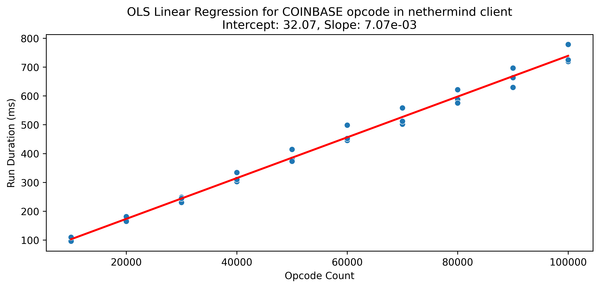


## besu


```python
                            OLS Regression Results                            
==============================================================================
Dep. Variable:        run_duration_ms   R-squared:                       0.998
Model:                            OLS   Adj. R-squared:                  0.998
Method:                 Least Squares   F-statistic:                 1.601e+04
Date:                Mon, 12 Jan 2026   Prob (F-statistic):           3.64e-40
Time:                        10:29:26   Log-Likelihood:                -146.03
No. Observations:                  30   AIC:                             296.1
Df Residuals:                      28   BIC:                             298.9
Df Model:                           1                                         
Covariance Type:            nonrobust                                         
==============================================================================
                 coef    std err          t      P>|t|      [0.025      0.975]
------------------------------------------------------------------------------
const         28.7989     12.846      2.242      0.033       2.486      55.112
opcount        0.0262      0.000    126.547      0.000       0.026       0.027
==============================================================================
Omnibus:                        1.446   Durbin-Watson:                   1.696
Prob(Omnibus):                  0.485   Jarque-Bera (JB):                1.256
Skew:                           0.472   Prob(JB):                        0.534
Kurtosis:                       2.663   Cond. No.                     1.34e+05
==============================================================================

Notes:
[1] Standard Errors assume that the covariance matrix of the errors is correctly specified.
[2] The condition number is large, 1.34e+05. This might indicate that there are
strong multicollinearity or other numerical problems.
```

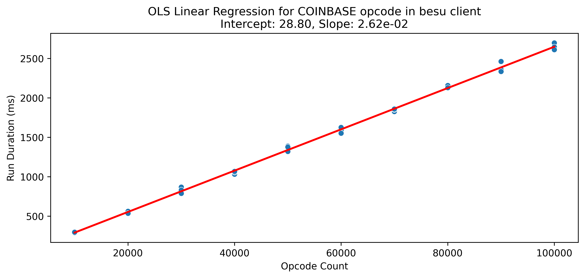


# DIV

## geth


```python
                            OLS Regression Results                            
==============================================================================
Dep. Variable:        run_duration_ms   R-squared:                       0.975
Model:                            OLS   Adj. R-squared:                  0.974
Method:                 Least Squares   F-statistic:                     1081.
Date:                Mon, 12 Jan 2026   Prob (F-statistic):           6.43e-24
Time:                        10:29:26   Log-Likelihood:                -179.07
No. Observations:                  30   AIC:                             362.1
Df Residuals:                      28   BIC:                             365.0
Df Model:                           1                                         
Covariance Type:            nonrobust                                         
==============================================================================
                 coef    std err          t      P>|t|      [0.025      0.975]
------------------------------------------------------------------------------
const         38.3114     38.642      0.991      0.330     -40.843     117.465
opcount        0.0683      0.002     32.885      0.000       0.064       0.073
==============================================================================
Omnibus:                        4.643   Durbin-Watson:                   0.820
Prob(Omnibus):                  0.098   Jarque-Bera (JB):                3.942
Skew:                          -0.886   Prob(JB):                        0.139
Kurtosis:                       2.879   Cond. No.                     4.02e+04
==============================================================================

Notes:
[1] Standard Errors assume that the covariance matrix of the errors is correctly specified.
[2] The condition number is large, 4.02e+04. This might indicate that there are
strong multicollinearity or other numerical problems.
```


## reth


```python
                            OLS Regression Results                            
==============================================================================
Dep. Variable:        run_duration_ms   R-squared:                       0.999
Model:                            OLS   Adj. R-squared:                  0.999
Method:                 Least Squares   F-statistic:                 2.441e+04
Date:                Mon, 12 Jan 2026   Prob (F-statistic):           1.01e-42
Time:                        10:29:26   Log-Likelihood:                -125.90
No. Observations:                  30   AIC:                             255.8
Df Residuals:                      28   BIC:                             258.6
Df Model:                           1                                         
Covariance Type:            nonrobust                                         
==============================================================================
                 coef    std err          t      P>|t|      [0.025      0.975]
------------------------------------------------------------------------------
const         26.8707      6.565      4.093      0.000      13.423      40.319
opcount        0.0551      0.000    156.227      0.000       0.054       0.056
==============================================================================
Omnibus:                        3.299   Durbin-Watson:                   1.255
Prob(Omnibus):                  0.192   Jarque-Bera (JB):                2.235
Skew:                          -0.087   Prob(JB):                        0.327
Kurtosis:                       4.326   Cond. No.                     4.02e+04
==============================================================================

Notes:
[1] Standard Errors assume that the covariance matrix of the errors is correctly specified.
[2] The condition number is large, 4.02e+04. This might indicate that there are
strong multicollinearity or other numerical problems.
```


## nethermind


```python
                            OLS Regression Results                            
==============================================================================
Dep. Variable:        run_duration_ms   R-squared:                       0.997
Model:                            OLS   Adj. R-squared:                  0.997
Method:                 Least Squares   F-statistic:                 1.050e+04
Date:                Mon, 12 Jan 2026   Prob (F-statistic):           1.32e-37
Time:                        10:29:26   Log-Likelihood:                -142.97
No. Observations:                  30   AIC:                             289.9
Df Residuals:                      28   BIC:                             292.7
Df Model:                           1                                         
Covariance Type:            nonrobust                                         
==============================================================================
                 coef    std err          t      P>|t|      [0.025      0.975]
------------------------------------------------------------------------------
const         26.2188     11.599      2.260      0.032       2.458      49.979
opcount        0.0639      0.001    102.478      0.000       0.063       0.065
==============================================================================
Omnibus:                        2.384   Durbin-Watson:                   0.707
Prob(Omnibus):                  0.304   Jarque-Bera (JB):                2.043
Skew:                          -0.617   Prob(JB):                        0.360
Kurtosis:                       2.668   Cond. No.                     4.02e+04
==============================================================================

Notes:
[1] Standard Errors assume that the covariance matrix of the errors is correctly specified.
[2] The condition number is large, 4.02e+04. This might indicate that there are
strong multicollinearity or other numerical problems.
```


## besu


```python
                            OLS Regression Results                            
==============================================================================
Dep. Variable:        run_duration_ms   R-squared:                       0.987
Model:                            OLS   Adj. R-squared:                  0.987
Method:                 Least Squares   F-statistic:                     2167.
Date:                Mon, 12 Jan 2026   Prob (F-statistic):           4.53e-28
Time:                        10:29:26   Log-Likelihood:                -207.95
No. Observations:                  30   AIC:                             419.9
Df Residuals:                      28   BIC:                             422.7
Df Model:                           1                                         
Covariance Type:            nonrobust                                         
==============================================================================
                 coef    std err          t      P>|t|      [0.025      0.975]
------------------------------------------------------------------------------
const         37.8960    101.177      0.375      0.711    -169.356     245.148
opcount        0.2530      0.005     46.556      0.000       0.242       0.264
==============================================================================
Omnibus:                        4.131   Durbin-Watson:                   0.691
Prob(Omnibus):                  0.127   Jarque-Bera (JB):                3.649
Skew:                          -0.840   Prob(JB):                        0.161
Kurtosis:                       2.686   Cond. No.                     4.02e+04
==============================================================================

Notes:
[1] Standard Errors assume that the covariance matrix of the errors is correctly specified.
[2] The condition number is large, 4.02e+04. This might indicate that there are
strong multicollinearity or other numerical problems.
```


# DIFFICULTY

## geth

OLS model did not run... Error: zero-size array to reduction operation maximum which has no identity

## reth

OLS model did not run... Error: zero-size array to reduction operation maximum which has no identity

## nethermind

OLS model did not run... Error: zero-size array to reduction operation maximum which has no identity

## besu

OLS model did not run... Error: zero-size array to reduction operation maximum which has no identity

# DUP1

## geth


```python
                            OLS Regression Results                            
==============================================================================
Dep. Variable:        run_duration_ms   R-squared:                       0.979
Model:                            OLS   Adj. R-squared:                  0.979
Method:                 Least Squares   F-statistic:                     1325.
Date:                Mon, 12 Jan 2026   Prob (F-statistic):           3.98e-25
Time:                        10:29:26   Log-Likelihood:                -150.11
No. Observations:                  30   AIC:                             304.2
Df Residuals:                      28   BIC:                             307.0
Df Model:                           1                                         
Covariance Type:            nonrobust                                         
==============================================================================
                 coef    std err          t      P>|t|      [0.025      0.975]
------------------------------------------------------------------------------
const         43.0121     14.717      2.923      0.007      12.866      73.159
opcount        0.0123      0.000     36.404      0.000       0.012       0.013
==============================================================================
Omnibus:                        2.802   Durbin-Watson:                   1.569
Prob(Omnibus):                  0.246   Jarque-Bera (JB):                1.553
Skew:                          -0.503   Prob(JB):                        0.460
Kurtosis:                       3.482   Cond. No.                     9.38e+04
==============================================================================

Notes:
[1] Standard Errors assume that the covariance matrix of the errors is correctly specified.
[2] The condition number is large, 9.38e+04. This might indicate that there are
strong multicollinearity or other numerical problems.
```

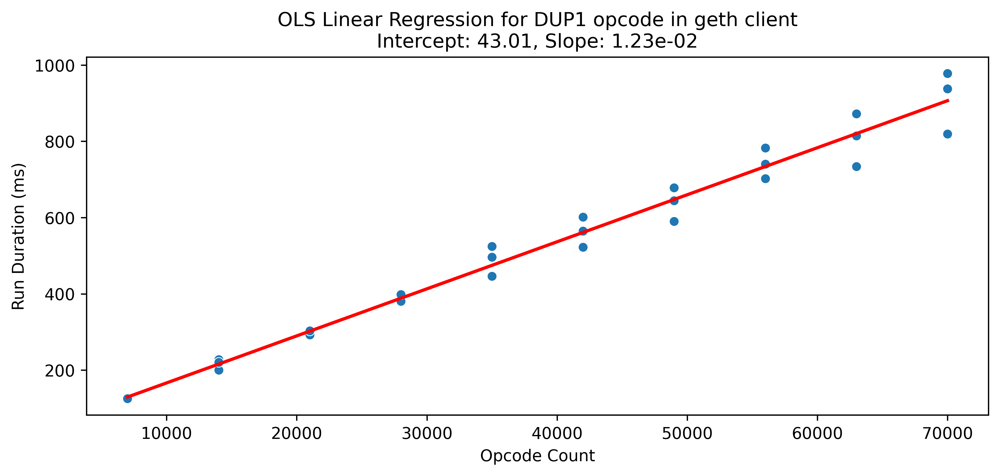


## reth


```python
                            OLS Regression Results                            
==============================================================================
Dep. Variable:        run_duration_ms   R-squared:                       0.984
Model:                            OLS   Adj. R-squared:                  0.983
Method:                 Least Squares   F-statistic:                     1684.
Date:                Mon, 12 Jan 2026   Prob (F-statistic):           1.47e-26
Time:                        10:29:27   Log-Likelihood:                -124.14
No. Observations:                  30   AIC:                             252.3
Df Residuals:                      28   BIC:                             255.1
Df Model:                           1                                         
Covariance Type:            nonrobust                                         
==============================================================================
                 coef    std err          t      P>|t|      [0.025      0.975]
------------------------------------------------------------------------------
const         28.1939      6.191      4.554      0.000      15.511      40.877
opcount        0.0059      0.000     41.040      0.000       0.006       0.006
==============================================================================
Omnibus:                        2.086   Durbin-Watson:                   1.760
Prob(Omnibus):                  0.352   Jarque-Bera (JB):                1.820
Skew:                          -0.495   Prob(JB):                        0.403
Kurtosis:                       2.309   Cond. No.                     9.38e+04
==============================================================================

Notes:
[1] Standard Errors assume that the covariance matrix of the errors is correctly specified.
[2] The condition number is large, 9.38e+04. This might indicate that there are
strong multicollinearity or other numerical problems.
```


## nethermind


```python
                            OLS Regression Results                            
==============================================================================
Dep. Variable:        run_duration_ms   R-squared:                       0.991
Model:                            OLS   Adj. R-squared:                  0.991
Method:                 Least Squares   F-statistic:                     3232.
Date:                Mon, 12 Jan 2026   Prob (F-statistic):           1.79e-30
Time:                        10:29:27   Log-Likelihood:                -120.22
No. Observations:                  30   AIC:                             244.4
Df Residuals:                      28   BIC:                             247.2
Df Model:                           1                                         
Covariance Type:            nonrobust                                         
==============================================================================
                 coef    std err          t      P>|t|      [0.025      0.975]
------------------------------------------------------------------------------
const         30.2959      5.432      5.577      0.000      19.168      41.424
opcount        0.0071      0.000     56.847      0.000       0.007       0.007
==============================================================================
Omnibus:                        2.306   Durbin-Watson:                   0.890
Prob(Omnibus):                  0.316   Jarque-Bera (JB):                2.062
Skew:                           0.565   Prob(JB):                        0.357
Kurtosis:                       2.390   Cond. No.                     9.38e+04
==============================================================================

Notes:
[1] Standard Errors assume that the covariance matrix of the errors is correctly specified.
[2] The condition number is large, 9.38e+04. This might indicate that there are
strong multicollinearity or other numerical problems.
```

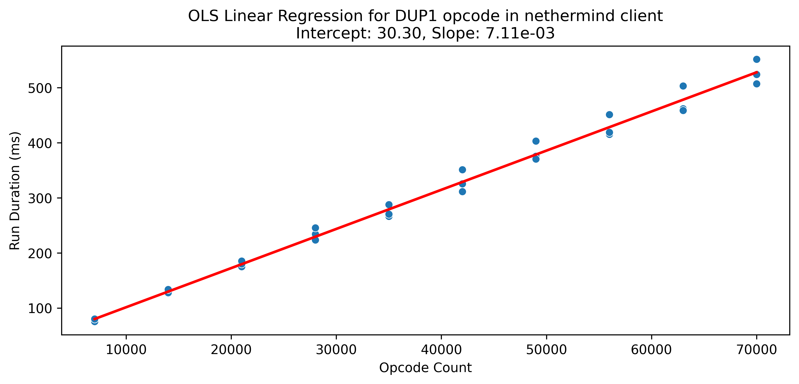


## besu


```python
                            OLS Regression Results                            
==============================================================================
Dep. Variable:        run_duration_ms   R-squared:                       0.995
Model:                            OLS   Adj. R-squared:                  0.995
Method:                 Least Squares   F-statistic:                     5368.
Date:                Mon, 12 Jan 2026   Prob (F-statistic):           1.54e-33
Time:                        10:29:27   Log-Likelihood:                -147.99
No. Observations:                  30   AIC:                             300.0
Df Residuals:                      28   BIC:                             302.8
Df Model:                           1                                         
Covariance Type:            nonrobust                                         
==============================================================================
                 coef    std err          t      P>|t|      [0.025      0.975]
------------------------------------------------------------------------------
const         24.5595     13.711      1.791      0.084      -3.526      52.645
opcount        0.0231      0.000     73.264      0.000       0.022       0.024
==============================================================================
Omnibus:                        4.854   Durbin-Watson:                   1.546
Prob(Omnibus):                  0.088   Jarque-Bera (JB):                3.319
Skew:                           0.767   Prob(JB):                        0.190
Kurtosis:                       3.550   Cond. No.                     9.38e+04
==============================================================================

Notes:
[1] Standard Errors assume that the covariance matrix of the errors is correctly specified.
[2] The condition number is large, 9.38e+04. This might indicate that there are
strong multicollinearity or other numerical problems.
```


# DUP2

## geth


```python
                            OLS Regression Results                            
==============================================================================
Dep. Variable:        run_duration_ms   R-squared:                       0.976
Model:                            OLS   Adj. R-squared:                  0.975
Method:                 Least Squares   F-statistic:                     1154.
Date:                Mon, 12 Jan 2026   Prob (F-statistic):           2.64e-24
Time:                        10:29:27   Log-Likelihood:                -152.67
No. Observations:                  30   AIC:                             309.3
Df Residuals:                      28   BIC:                             312.1
Df Model:                           1                                         
Covariance Type:            nonrobust                                         
==============================================================================
                 coef    std err          t      P>|t|      [0.025      0.975]
------------------------------------------------------------------------------
const         27.4095     16.027      1.710      0.098      -5.420      60.239
opcount        0.0125      0.000     33.973      0.000       0.012       0.013
==============================================================================
Omnibus:                        0.666   Durbin-Watson:                   0.817
Prob(Omnibus):                  0.717   Jarque-Bera (JB):                0.085
Skew:                          -0.070   Prob(JB):                        0.958
Kurtosis:                       3.221   Cond. No.                     9.38e+04
==============================================================================

Notes:
[1] Standard Errors assume that the covariance matrix of the errors is correctly specified.
[2] The condition number is large, 9.38e+04. This might indicate that there are
strong multicollinearity or other numerical problems.
```


## reth


```python
                            OLS Regression Results                            
==============================================================================
Dep. Variable:        run_duration_ms   R-squared:                       0.981
Model:                            OLS   Adj. R-squared:                  0.980
Method:                 Least Squares   F-statistic:                     1437.
Date:                Mon, 12 Jan 2026   Prob (F-statistic):           1.31e-25
Time:                        10:29:27   Log-Likelihood:                -126.40
No. Observations:                  30   AIC:                             256.8
Df Residuals:                      28   BIC:                             259.6
Df Model:                           1                                         
Covariance Type:            nonrobust                                         
==============================================================================
                 coef    std err          t      P>|t|      [0.025      0.975]
------------------------------------------------------------------------------
const         28.8593      6.676      4.323      0.000      15.185      42.534
opcount        0.0058      0.000     37.908      0.000       0.006       0.006
==============================================================================
Omnibus:                        3.409   Durbin-Watson:                   1.878
Prob(Omnibus):                  0.182   Jarque-Bera (JB):                1.534
Skew:                          -0.142   Prob(JB):                        0.464
Kurtosis:                       1.929   Cond. No.                     9.38e+04
==============================================================================

Notes:
[1] Standard Errors assume that the covariance matrix of the errors is correctly specified.
[2] The condition number is large, 9.38e+04. This might indicate that there are
strong multicollinearity or other numerical problems.
```


## nethermind


```python
                            OLS Regression Results                            
==============================================================================
Dep. Variable:        run_duration_ms   R-squared:                       0.990
Model:                            OLS   Adj. R-squared:                  0.990
Method:                 Least Squares   F-statistic:                     2878.
Date:                Mon, 12 Jan 2026   Prob (F-statistic):           8.94e-30
Time:                        10:29:27   Log-Likelihood:                -122.63
No. Observations:                  30   AIC:                             249.3
Df Residuals:                      28   BIC:                             252.1
Df Model:                           1                                         
Covariance Type:            nonrobust                                         
==============================================================================
                 coef    std err          t      P>|t|      [0.025      0.975]
------------------------------------------------------------------------------
const         25.6641      5.887      4.359      0.000      13.604      37.724
opcount        0.0073      0.000     53.643      0.000       0.007       0.008
==============================================================================
Omnibus:                        2.361   Durbin-Watson:                   0.749
Prob(Omnibus):                  0.307   Jarque-Bera (JB):                1.646
Skew:                           0.574   Prob(JB):                        0.439
Kurtosis:                       3.010   Cond. No.                     9.38e+04
==============================================================================

Notes:
[1] Standard Errors assume that the covariance matrix of the errors is correctly specified.
[2] The condition number is large, 9.38e+04. This might indicate that there are
strong multicollinearity or other numerical problems.
```

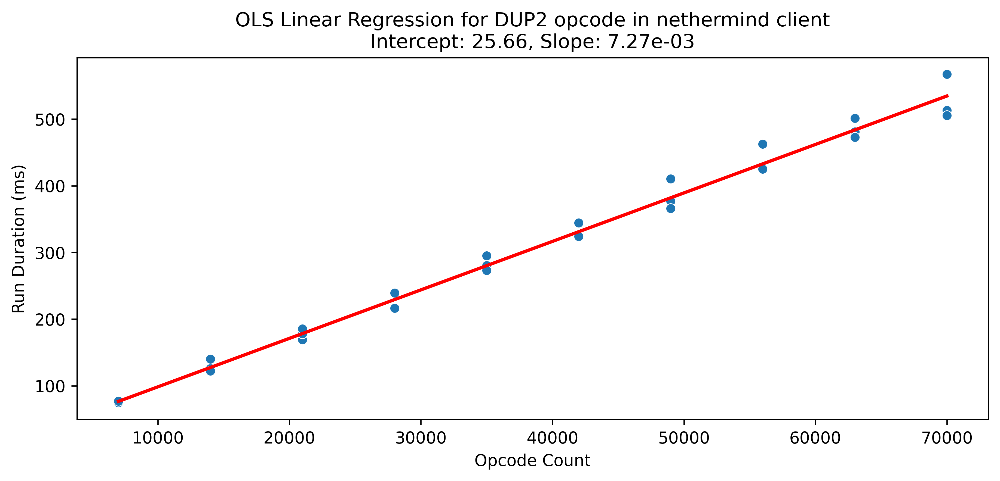


## besu


```python
                            OLS Regression Results                            
==============================================================================
Dep. Variable:        run_duration_ms   R-squared:                       0.997
Model:                            OLS   Adj. R-squared:                  0.997
Method:                 Least Squares   F-statistic:                 1.004e+04
Date:                Mon, 12 Jan 2026   Prob (F-statistic):           2.48e-37
Time:                        10:29:27   Log-Likelihood:                -137.76
No. Observations:                  30   AIC:                             279.5
Df Residuals:                      28   BIC:                             282.3
Df Model:                           1                                         
Covariance Type:            nonrobust                                         
==============================================================================
                 coef    std err          t      P>|t|      [0.025      0.975]
------------------------------------------------------------------------------
const         30.2994      9.751      3.107      0.004      10.326      50.272
opcount        0.0225      0.000    100.198      0.000       0.022       0.023
==============================================================================
Omnibus:                        3.565   Durbin-Watson:                   1.198
Prob(Omnibus):                  0.168   Jarque-Bera (JB):                2.489
Skew:                           0.180   Prob(JB):                        0.288
Kurtosis:                       4.365   Cond. No.                     9.38e+04
==============================================================================

Notes:
[1] Standard Errors assume that the covariance matrix of the errors is correctly specified.
[2] The condition number is large, 9.38e+04. This might indicate that there are
strong multicollinearity or other numerical problems.
```


# DUP3

## geth


```python
                            OLS Regression Results                            
==============================================================================
Dep. Variable:        run_duration_ms   R-squared:                       0.982
Model:                            OLS   Adj. R-squared:                  0.982
Method:                 Least Squares   F-statistic:                     1558.
Date:                Mon, 12 Jan 2026   Prob (F-statistic):           4.30e-26
Time:                        10:29:28   Log-Likelihood:                -148.73
No. Observations:                  30   AIC:                             301.5
Df Residuals:                      28   BIC:                             304.3
Df Model:                           1                                         
Covariance Type:            nonrobust                                         
==============================================================================
                 coef    std err          t      P>|t|      [0.025      0.975]
------------------------------------------------------------------------------
const         26.7496     14.053      1.903      0.067      -2.038      55.537
opcount        0.0128      0.000     39.473      0.000       0.012       0.013
==============================================================================
Omnibus:                        0.998   Durbin-Watson:                   0.969
Prob(Omnibus):                  0.607   Jarque-Bera (JB):                0.522
Skew:                           0.323   Prob(JB):                        0.770
Kurtosis:                       3.026   Cond. No.                     9.38e+04
==============================================================================

Notes:
[1] Standard Errors assume that the covariance matrix of the errors is correctly specified.
[2] The condition number is large, 9.38e+04. This might indicate that there are
strong multicollinearity or other numerical problems.
```

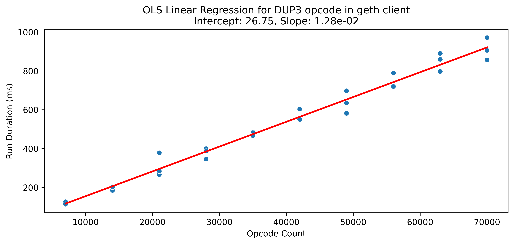


## reth


```python
                            OLS Regression Results                            
==============================================================================
Dep. Variable:        run_duration_ms   R-squared:                       0.976
Model:                            OLS   Adj. R-squared:                  0.976
Method:                 Least Squares   F-statistic:                     1162.
Date:                Mon, 12 Jan 2026   Prob (F-statistic):           2.42e-24
Time:                        10:29:28   Log-Likelihood:                -129.80
No. Observations:                  30   AIC:                             263.6
Df Residuals:                      28   BIC:                             266.4
Df Model:                           1                                         
Covariance Type:            nonrobust                                         
==============================================================================
                 coef    std err          t      P>|t|      [0.025      0.975]
------------------------------------------------------------------------------
const         32.9616      7.478      4.408      0.000      17.644      48.279
opcount        0.0059      0.000     34.081      0.000       0.006       0.006
==============================================================================
Omnibus:                        0.897   Durbin-Watson:                   1.820
Prob(Omnibus):                  0.639   Jarque-Bera (JB):                0.889
Skew:                          -0.245   Prob(JB):                        0.641
Kurtosis:                       2.314   Cond. No.                     9.38e+04
==============================================================================

Notes:
[1] Standard Errors assume that the covariance matrix of the errors is correctly specified.
[2] The condition number is large, 9.38e+04. This might indicate that there are
strong multicollinearity or other numerical problems.
```

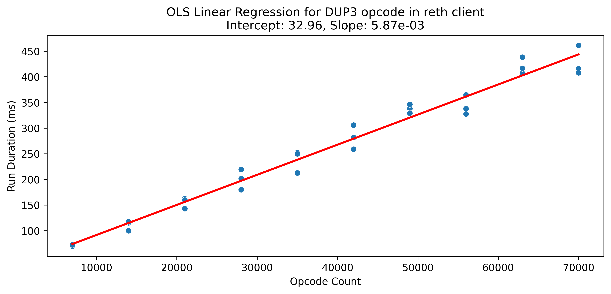


## nethermind


```python
                            OLS Regression Results                            
==============================================================================
Dep. Variable:        run_duration_ms   R-squared:                       0.979
Model:                            OLS   Adj. R-squared:                  0.979
Method:                 Least Squares   F-statistic:                     1329.
Date:                Mon, 12 Jan 2026   Prob (F-statistic):           3.84e-25
Time:                        10:29:28   Log-Likelihood:                -134.48
No. Observations:                  30   AIC:                             273.0
Df Residuals:                      28   BIC:                             275.8
Df Model:                           1                                         
Covariance Type:            nonrobust                                         
==============================================================================
                 coef    std err          t      P>|t|      [0.025      0.975]
------------------------------------------------------------------------------
const         26.0534      8.738      2.982      0.006       8.154      43.953
opcount        0.0073      0.000     36.450      0.000       0.007       0.008
==============================================================================
Omnibus:                        9.974   Durbin-Watson:                   0.900
Prob(Omnibus):                  0.007   Jarque-Bera (JB):                8.545
Skew:                           1.111   Prob(JB):                       0.0139
Kurtosis:                       4.378   Cond. No.                     9.38e+04
==============================================================================

Notes:
[1] Standard Errors assume that the covariance matrix of the errors is correctly specified.
[2] The condition number is large, 9.38e+04. This might indicate that there are
strong multicollinearity or other numerical problems.
```


## besu


```python
                            OLS Regression Results                            
==============================================================================
Dep. Variable:        run_duration_ms   R-squared:                       0.998
Model:                            OLS   Adj. R-squared:                  0.998
Method:                 Least Squares   F-statistic:                 1.412e+04
Date:                Mon, 12 Jan 2026   Prob (F-statistic):           2.12e-39
Time:                        10:29:28   Log-Likelihood:                -133.03
No. Observations:                  30   AIC:                             270.1
Df Residuals:                      28   BIC:                             272.9
Df Model:                           1                                         
Covariance Type:            nonrobust                                         
==============================================================================
                 coef    std err          t      P>|t|      [0.025      0.975]
------------------------------------------------------------------------------
const         21.5179      8.326      2.585      0.015       4.463      38.572
opcount        0.0228      0.000    118.813      0.000       0.022       0.023
==============================================================================
Omnibus:                        3.886   Durbin-Watson:                   1.653
Prob(Omnibus):                  0.143   Jarque-Bera (JB):                2.374
Skew:                           0.480   Prob(JB):                        0.305
Kurtosis:                       3.988   Cond. No.                     9.38e+04
==============================================================================

Notes:
[1] Standard Errors assume that the covariance matrix of the errors is correctly specified.
[2] The condition number is large, 9.38e+04. This might indicate that there are
strong multicollinearity or other numerical problems.
```


# DUP4

## geth


```python
                            OLS Regression Results                            
==============================================================================
Dep. Variable:        run_duration_ms   R-squared:                       0.974
Model:                            OLS   Adj. R-squared:                  0.973
Method:                 Least Squares   F-statistic:                     1038.
Date:                Mon, 12 Jan 2026   Prob (F-statistic):           1.13e-23
Time:                        10:29:28   Log-Likelihood:                -154.00
No. Observations:                  30   AIC:                             312.0
Df Residuals:                      28   BIC:                             314.8
Df Model:                           1                                         
Covariance Type:            nonrobust                                         
==============================================================================
                 coef    std err          t      P>|t|      [0.025      0.975]
------------------------------------------------------------------------------
const         44.6506     16.753      2.665      0.013      10.333      78.968
opcount        0.0124      0.000     32.218      0.000       0.012       0.013
==============================================================================
Omnibus:                       27.250   Durbin-Watson:                   1.540
Prob(Omnibus):                  0.000   Jarque-Bera (JB):               57.344
Skew:                           1.951   Prob(JB):                     3.53e-13
Kurtosis:                       8.536   Cond. No.                     9.38e+04
==============================================================================

Notes:
[1] Standard Errors assume that the covariance matrix of the errors is correctly specified.
[2] The condition number is large, 9.38e+04. This might indicate that there are
strong multicollinearity or other numerical problems.
```

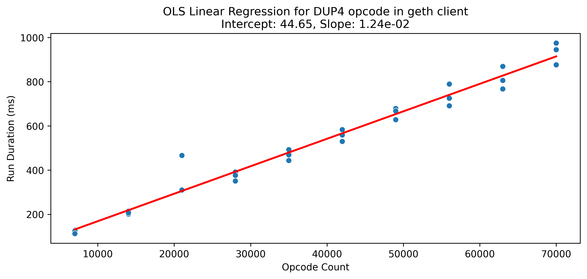


## reth


```python
                            OLS Regression Results                            
==============================================================================
Dep. Variable:        run_duration_ms   R-squared:                       0.983
Model:                            OLS   Adj. R-squared:                  0.982
Method:                 Least Squares   F-statistic:                     1600.
Date:                Mon, 12 Jan 2026   Prob (F-statistic):           2.98e-26
Time:                        10:29:28   Log-Likelihood:                -125.28
No. Observations:                  30   AIC:                             254.6
Df Residuals:                      28   BIC:                             257.4
Df Model:                           1                                         
Covariance Type:            nonrobust                                         
==============================================================================
                 coef    std err          t      P>|t|      [0.025      0.975]
------------------------------------------------------------------------------
const         30.1260      6.432      4.684      0.000      16.951      43.301
opcount        0.0059      0.000     40.005      0.000       0.006       0.006
==============================================================================
Omnibus:                        1.516   Durbin-Watson:                   1.427
Prob(Omnibus):                  0.469   Jarque-Bera (JB):                1.376
Skew:                          -0.402   Prob(JB):                        0.503
Kurtosis:                       2.326   Cond. No.                     9.38e+04
==============================================================================

Notes:
[1] Standard Errors assume that the covariance matrix of the errors is correctly specified.
[2] The condition number is large, 9.38e+04. This might indicate that there are
strong multicollinearity or other numerical problems.
```

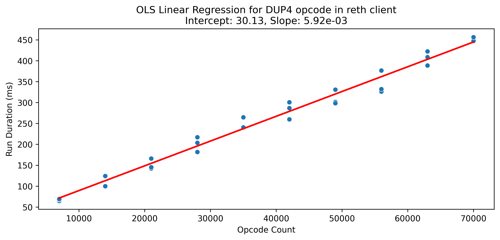


## nethermind


```python
                            OLS Regression Results                            
==============================================================================
Dep. Variable:        run_duration_ms   R-squared:                       0.989
Model:                            OLS   Adj. R-squared:                  0.988
Method:                 Least Squares   F-statistic:                     2438.
Date:                Mon, 12 Jan 2026   Prob (F-statistic):           8.91e-29
Time:                        10:29:28   Log-Likelihood:                -124.89
No. Observations:                  30   AIC:                             253.8
Df Residuals:                      28   BIC:                             256.6
Df Model:                           1                                         
Covariance Type:            nonrobust                                         
==============================================================================
                 coef    std err          t      P>|t|      [0.025      0.975]
------------------------------------------------------------------------------
const         30.0659      6.349      4.736      0.000      17.061      43.070
opcount        0.0072      0.000     49.374      0.000       0.007       0.008
==============================================================================
Omnibus:                        3.255   Durbin-Watson:                   0.634
Prob(Omnibus):                  0.196   Jarque-Bera (JB):                2.411
Skew:                           0.694   Prob(JB):                        0.300
Kurtosis:                       3.028   Cond. No.                     9.38e+04
==============================================================================

Notes:
[1] Standard Errors assume that the covariance matrix of the errors is correctly specified.
[2] The condition number is large, 9.38e+04. This might indicate that there are
strong multicollinearity or other numerical problems.
```


## besu


```python
                            OLS Regression Results                            
==============================================================================
Dep. Variable:        run_duration_ms   R-squared:                       0.998
Model:                            OLS   Adj. R-squared:                  0.997
Method:                 Least Squares   F-statistic:                 1.141e+04
Date:                Mon, 12 Jan 2026   Prob (F-statistic):           4.13e-38
Time:                        10:29:29   Log-Likelihood:                -136.82
No. Observations:                  30   AIC:                             277.6
Df Residuals:                      28   BIC:                             280.4
Df Model:                           1                                         
Covariance Type:            nonrobust                                         
==============================================================================
                 coef    std err          t      P>|t|      [0.025      0.975]
------------------------------------------------------------------------------
const         22.5496      9.449      2.387      0.024       3.195      41.904
opcount        0.0232      0.000    106.839      0.000       0.023       0.024
==============================================================================
Omnibus:                        3.228   Durbin-Watson:                   1.500
Prob(Omnibus):                  0.199   Jarque-Bera (JB):                1.837
Skew:                           0.368   Prob(JB):                        0.399
Kurtosis:                       3.963   Cond. No.                     9.38e+04
==============================================================================

Notes:
[1] Standard Errors assume that the covariance matrix of the errors is correctly specified.
[2] The condition number is large, 9.38e+04. This might indicate that there are
strong multicollinearity or other numerical problems.
```


# DUP5

## geth


```python
                            OLS Regression Results                            
==============================================================================
Dep. Variable:        run_duration_ms   R-squared:                       0.982
Model:                            OLS   Adj. R-squared:                  0.981
Method:                 Least Squares   F-statistic:                     1490.
Date:                Mon, 12 Jan 2026   Prob (F-statistic):           7.93e-26
Time:                        10:29:29   Log-Likelihood:                -149.28
No. Observations:                  30   AIC:                             302.6
Df Residuals:                      28   BIC:                             305.4
Df Model:                           1                                         
Covariance Type:            nonrobust                                         
==============================================================================
                 coef    std err          t      P>|t|      [0.025      0.975]
------------------------------------------------------------------------------
const         24.0917     14.313      1.683      0.103      -5.228      53.411
opcount        0.0127      0.000     38.604      0.000       0.012       0.013
==============================================================================
Omnibus:                        1.057   Durbin-Watson:                   1.020
Prob(Omnibus):                  0.589   Jarque-Bera (JB):                0.522
Skew:                          -0.321   Prob(JB):                        0.770
Kurtosis:                       3.070   Cond. No.                     9.38e+04
==============================================================================

Notes:
[1] Standard Errors assume that the covariance matrix of the errors is correctly specified.
[2] The condition number is large, 9.38e+04. This might indicate that there are
strong multicollinearity or other numerical problems.
```

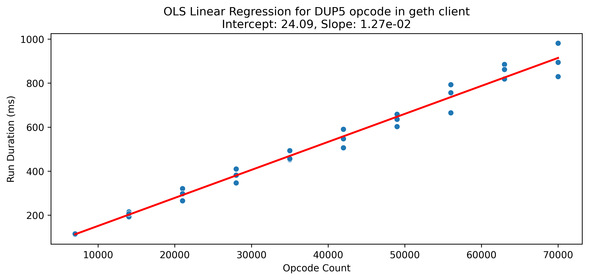


## reth


```python
                            OLS Regression Results                            
==============================================================================
Dep. Variable:        run_duration_ms   R-squared:                       0.983
Model:                            OLS   Adj. R-squared:                  0.982
Method:                 Least Squares   F-statistic:                     1591.
Date:                Mon, 12 Jan 2026   Prob (F-statistic):           3.22e-26
Time:                        10:29:29   Log-Likelihood:                -124.99
No. Observations:                  30   AIC:                             254.0
Df Residuals:                      28   BIC:                             256.8
Df Model:                           1                                         
Covariance Type:            nonrobust                                         
==============================================================================
                 coef    std err          t      P>|t|      [0.025      0.975]
------------------------------------------------------------------------------
const         33.9066      6.370      5.323      0.000      20.859      46.954
opcount        0.0058      0.000     39.890      0.000       0.006       0.006
==============================================================================
Omnibus:                        4.077   Durbin-Watson:                   1.625
Prob(Omnibus):                  0.130   Jarque-Bera (JB):                2.872
Skew:                          -0.333   Prob(JB):                        0.238
Kurtosis:                       4.362   Cond. No.                     9.38e+04
==============================================================================

Notes:
[1] Standard Errors assume that the covariance matrix of the errors is correctly specified.
[2] The condition number is large, 9.38e+04. This might indicate that there are
strong multicollinearity or other numerical problems.
```


## nethermind


```python
                            OLS Regression Results                            
==============================================================================
Dep. Variable:        run_duration_ms   R-squared:                       0.989
Model:                            OLS   Adj. R-squared:                  0.989
Method:                 Least Squares   F-statistic:                     2612.
Date:                Mon, 12 Jan 2026   Prob (F-statistic):           3.43e-29
Time:                        10:29:29   Log-Likelihood:                -124.40
No. Observations:                  30   AIC:                             252.8
Df Residuals:                      28   BIC:                             255.6
Df Model:                           1                                         
Covariance Type:            nonrobust                                         
==============================================================================
                 coef    std err          t      P>|t|      [0.025      0.975]
------------------------------------------------------------------------------
const         25.4995      6.245      4.083      0.000      12.707      38.292
opcount        0.0073      0.000     51.105      0.000       0.007       0.008
==============================================================================
Omnibus:                        3.420   Durbin-Watson:                   0.725
Prob(Omnibus):                  0.181   Jarque-Bera (JB):                3.059
Skew:                           0.726   Prob(JB):                        0.217
Kurtosis:                       2.415   Cond. No.                     9.38e+04
==============================================================================

Notes:
[1] Standard Errors assume that the covariance matrix of the errors is correctly specified.
[2] The condition number is large, 9.38e+04. This might indicate that there are
strong multicollinearity or other numerical problems.
```


## besu


```python
                            OLS Regression Results                            
==============================================================================
Dep. Variable:        run_duration_ms   R-squared:                       0.996
Model:                            OLS   Adj. R-squared:                  0.996
Method:                 Least Squares   F-statistic:                     6913.
Date:                Mon, 12 Jan 2026   Prob (F-statistic):           4.52e-35
Time:                        10:29:29   Log-Likelihood:                -144.51
No. Observations:                  30   AIC:                             293.0
Df Residuals:                      28   BIC:                             295.8
Df Model:                           1                                         
Covariance Type:            nonrobust                                         
==============================================================================
                 coef    std err          t      P>|t|      [0.025      0.975]
------------------------------------------------------------------------------
const         13.5167     12.209      1.107      0.278     -11.493      38.526
opcount        0.0234      0.000     83.145      0.000       0.023       0.024
==============================================================================
Omnibus:                        1.214   Durbin-Watson:                   1.185
Prob(Omnibus):                  0.545   Jarque-Bera (JB):                0.679
Skew:                           0.368   Prob(JB):                        0.712
Kurtosis:                       3.036   Cond. No.                     9.38e+04
==============================================================================

Notes:
[1] Standard Errors assume that the covariance matrix of the errors is correctly specified.
[2] The condition number is large, 9.38e+04. This might indicate that there are
strong multicollinearity or other numerical problems.
```


# DUP6

## geth


```python
                            OLS Regression Results                            
==============================================================================
Dep. Variable:        run_duration_ms   R-squared:                       0.974
Model:                            OLS   Adj. R-squared:                  0.974
Method:                 Least Squares   F-statistic:                     1069.
Date:                Mon, 12 Jan 2026   Prob (F-statistic):           7.53e-24
Time:                        10:29:29   Log-Likelihood:                -153.90
No. Observations:                  30   AIC:                             311.8
Df Residuals:                      28   BIC:                             314.6
Df Model:                           1                                         
Covariance Type:            nonrobust                                         
==============================================================================
                 coef    std err          t      P>|t|      [0.025      0.975]
------------------------------------------------------------------------------
const         33.2262     16.695      1.990      0.056      -0.971      67.423
opcount        0.0126      0.000     32.696      0.000       0.012       0.013
==============================================================================
Omnibus:                       15.912   Durbin-Watson:                   1.027
Prob(Omnibus):                  0.000   Jarque-Bera (JB):               22.124
Skew:                           1.225   Prob(JB):                     1.57e-05
Kurtosis:                       6.419   Cond. No.                     9.38e+04
==============================================================================

Notes:
[1] Standard Errors assume that the covariance matrix of the errors is correctly specified.
[2] The condition number is large, 9.38e+04. This might indicate that there are
strong multicollinearity or other numerical problems.
```


## reth


```python
                            OLS Regression Results                            
==============================================================================
Dep. Variable:        run_duration_ms   R-squared:                       0.978
Model:                            OLS   Adj. R-squared:                  0.977
Method:                 Least Squares   F-statistic:                     1234.
Date:                Mon, 12 Jan 2026   Prob (F-statistic):           1.06e-24
Time:                        10:29:29   Log-Likelihood:                -128.58
No. Observations:                  30   AIC:                             261.2
Df Residuals:                      28   BIC:                             264.0
Df Model:                           1                                         
Covariance Type:            nonrobust                                         
==============================================================================
                 coef    std err          t      P>|t|      [0.025      0.975]
------------------------------------------------------------------------------
const         28.0599      7.180      3.908      0.001      13.352      42.768
opcount        0.0058      0.000     35.128      0.000       0.005       0.006
==============================================================================
Omnibus:                        2.215   Durbin-Watson:                   2.698
Prob(Omnibus):                  0.330   Jarque-Bera (JB):                1.997
Skew:                          -0.567   Prob(JB):                        0.368
Kurtosis:                       2.441   Cond. No.                     9.38e+04
==============================================================================

Notes:
[1] Standard Errors assume that the covariance matrix of the errors is correctly specified.
[2] The condition number is large, 9.38e+04. This might indicate that there are
strong multicollinearity or other numerical problems.
```


## nethermind


```python
                            OLS Regression Results                            
==============================================================================
Dep. Variable:        run_duration_ms   R-squared:                       0.992
Model:                            OLS   Adj. R-squared:                  0.991
Method:                 Least Squares   F-statistic:                     3356.
Date:                Mon, 12 Jan 2026   Prob (F-statistic):           1.06e-30
Time:                        10:29:29   Log-Likelihood:                -120.66
No. Observations:                  30   AIC:                             245.3
Df Residuals:                      28   BIC:                             248.1
Df Model:                           1                                         
Covariance Type:            nonrobust                                         
==============================================================================
                 coef    std err          t      P>|t|      [0.025      0.975]
------------------------------------------------------------------------------
const         25.4345      5.514      4.613      0.000      14.139      36.729
opcount        0.0074      0.000     57.929      0.000       0.007       0.008
==============================================================================
Omnibus:                        0.095   Durbin-Watson:                   0.788
Prob(Omnibus):                  0.953   Jarque-Bera (JB):                0.281
Skew:                           0.098   Prob(JB):                        0.869
Kurtosis:                       2.568   Cond. No.                     9.38e+04
==============================================================================

Notes:
[1] Standard Errors assume that the covariance matrix of the errors is correctly specified.
[2] The condition number is large, 9.38e+04. This might indicate that there are
strong multicollinearity or other numerical problems.
```

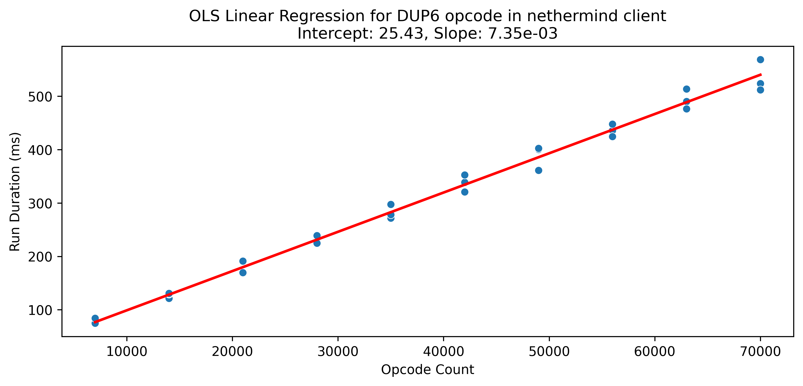


## besu


```python
                            OLS Regression Results                            
==============================================================================
Dep. Variable:        run_duration_ms   R-squared:                       0.997
Model:                            OLS   Adj. R-squared:                  0.997
Method:                 Least Squares   F-statistic:                     9539.
Date:                Mon, 12 Jan 2026   Prob (F-statistic):           5.06e-37
Time:                        10:29:30   Log-Likelihood:                -139.50
No. Observations:                  30   AIC:                             283.0
Df Residuals:                      28   BIC:                             285.8
Df Model:                           1                                         
Covariance Type:            nonrobust                                         
==============================================================================
                 coef    std err          t      P>|t|      [0.025      0.975]
------------------------------------------------------------------------------
const         34.8724     10.332      3.375      0.002      13.708      56.036
opcount        0.0232      0.000     97.669      0.000       0.023       0.024
==============================================================================
Omnibus:                        0.721   Durbin-Watson:                   1.909
Prob(Omnibus):                  0.697   Jarque-Bera (JB):                0.429
Skew:                           0.290   Prob(JB):                        0.807
Kurtosis:                       2.916   Cond. No.                     9.38e+04
==============================================================================

Notes:
[1] Standard Errors assume that the covariance matrix of the errors is correctly specified.
[2] The condition number is large, 9.38e+04. This might indicate that there are
strong multicollinearity or other numerical problems.
```


# DUP7

## geth


```python
                            OLS Regression Results                            
==============================================================================
Dep. Variable:        run_duration_ms   R-squared:                       0.967
Model:                            OLS   Adj. R-squared:                  0.965
Method:                 Least Squares   F-statistic:                     812.4
Date:                Mon, 12 Jan 2026   Prob (F-statistic):           3.15e-22
Time:                        10:29:30   Log-Likelihood:                -158.14
No. Observations:                  30   AIC:                             320.3
Df Residuals:                      28   BIC:                             323.1
Df Model:                           1                                         
Covariance Type:            nonrobust                                         
==============================================================================
                 coef    std err          t      P>|t|      [0.025      0.975]
------------------------------------------------------------------------------
const         37.7427     19.231      1.963      0.060      -1.651      77.136
opcount        0.0126      0.000     28.503      0.000       0.012       0.014
==============================================================================
Omnibus:                        0.997   Durbin-Watson:                   1.206
Prob(Omnibus):                  0.608   Jarque-Bera (JB):                0.270
Skew:                           0.180   Prob(JB):                        0.874
Kurtosis:                       3.295   Cond. No.                     9.38e+04
==============================================================================

Notes:
[1] Standard Errors assume that the covariance matrix of the errors is correctly specified.
[2] The condition number is large, 9.38e+04. This might indicate that there are
strong multicollinearity or other numerical problems.
```


## reth


```python
                            OLS Regression Results                            
==============================================================================
Dep. Variable:        run_duration_ms   R-squared:                       0.983
Model:                            OLS   Adj. R-squared:                  0.983
Method:                 Least Squares   F-statistic:                     1643.
Date:                Mon, 12 Jan 2026   Prob (F-statistic):           2.07e-26
Time:                        10:29:30   Log-Likelihood:                -125.21
No. Observations:                  30   AIC:                             254.4
Df Residuals:                      28   BIC:                             257.2
Df Model:                           1                                         
Covariance Type:            nonrobust                                         
==============================================================================
                 coef    std err          t      P>|t|      [0.025      0.975]
------------------------------------------------------------------------------
const         26.8829      6.417      4.189      0.000      13.739      40.027
opcount        0.0060      0.000     40.536      0.000       0.006       0.006
==============================================================================
Omnibus:                        2.545   Durbin-Watson:                   1.276
Prob(Omnibus):                  0.280   Jarque-Bera (JB):                2.064
Skew:                          -0.634   Prob(JB):                        0.356
Kurtosis:                       2.790   Cond. No.                     9.38e+04
==============================================================================

Notes:
[1] Standard Errors assume that the covariance matrix of the errors is correctly specified.
[2] The condition number is large, 9.38e+04. This might indicate that there are
strong multicollinearity or other numerical problems.
```

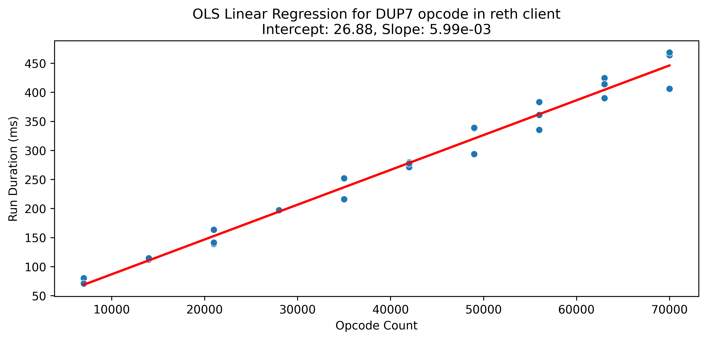


## nethermind


```python
                            OLS Regression Results                            
==============================================================================
Dep. Variable:        run_duration_ms   R-squared:                       0.987
Model:                            OLS   Adj. R-squared:                  0.987
Method:                 Least Squares   F-statistic:                     2170.
Date:                Mon, 12 Jan 2026   Prob (F-statistic):           4.44e-28
Time:                        10:29:30   Log-Likelihood:                -127.23
No. Observations:                  30   AIC:                             258.5
Df Residuals:                      28   BIC:                             261.3
Df Model:                           1                                         
Covariance Type:            nonrobust                                         
==============================================================================
                 coef    std err          t      P>|t|      [0.025      0.975]
------------------------------------------------------------------------------
const         27.1457      6.863      3.955      0.000      13.087      41.204
opcount        0.0074      0.000     46.588      0.000       0.007       0.008
==============================================================================
Omnibus:                        5.433   Durbin-Watson:                   1.209
Prob(Omnibus):                  0.066   Jarque-Bera (JB):                3.779
Skew:                           0.800   Prob(JB):                        0.151
Kurtosis:                       3.682   Cond. No.                     9.38e+04
==============================================================================

Notes:
[1] Standard Errors assume that the covariance matrix of the errors is correctly specified.
[2] The condition number is large, 9.38e+04. This might indicate that there are
strong multicollinearity or other numerical problems.
```


## besu


```python
                            OLS Regression Results                            
==============================================================================
Dep. Variable:        run_duration_ms   R-squared:                       0.998
Model:                            OLS   Adj. R-squared:                  0.998
Method:                 Least Squares   F-statistic:                 1.540e+04
Date:                Mon, 12 Jan 2026   Prob (F-statistic):           6.32e-40
Time:                        10:29:30   Log-Likelihood:                -132.27
No. Observations:                  30   AIC:                             268.5
Df Residuals:                      28   BIC:                             271.3
Df Model:                           1                                         
Covariance Type:            nonrobust                                         
==============================================================================
                 coef    std err          t      P>|t|      [0.025      0.975]
------------------------------------------------------------------------------
const         31.4838      8.119      3.878      0.001      14.852      48.115
opcount        0.0232      0.000    124.078      0.000       0.023       0.024
==============================================================================
Omnibus:                        0.931   Durbin-Watson:                   1.449
Prob(Omnibus):                  0.628   Jarque-Bera (JB):                0.348
Skew:                           0.253   Prob(JB):                        0.840
Kurtosis:                       3.147   Cond. No.                     9.38e+04
==============================================================================

Notes:
[1] Standard Errors assume that the covariance matrix of the errors is correctly specified.
[2] The condition number is large, 9.38e+04. This might indicate that there are
strong multicollinearity or other numerical problems.
```


# DUP8

## geth


```python
                            OLS Regression Results                            
==============================================================================
Dep. Variable:        run_duration_ms   R-squared:                       0.982
Model:                            OLS   Adj. R-squared:                  0.981
Method:                 Least Squares   F-statistic:                     1504.
Date:                Mon, 12 Jan 2026   Prob (F-statistic):           6.98e-26
Time:                        10:29:30   Log-Likelihood:                -149.08
No. Observations:                  30   AIC:                             302.2
Df Residuals:                      28   BIC:                             305.0
Df Model:                           1                                         
Covariance Type:            nonrobust                                         
==============================================================================
                 coef    std err          t      P>|t|      [0.025      0.975]
------------------------------------------------------------------------------
const         31.9686     14.218      2.248      0.033       2.845      61.093
opcount        0.0127      0.000     38.784      0.000       0.012       0.013
==============================================================================
Omnibus:                        2.218   Durbin-Watson:                   0.900
Prob(Omnibus):                  0.330   Jarque-Bera (JB):                1.102
Skew:                          -0.413   Prob(JB):                        0.576
Kurtosis:                       3.447   Cond. No.                     9.38e+04
==============================================================================

Notes:
[1] Standard Errors assume that the covariance matrix of the errors is correctly specified.
[2] The condition number is large, 9.38e+04. This might indicate that there are
strong multicollinearity or other numerical problems.
```


## reth


```python
                            OLS Regression Results                            
==============================================================================
Dep. Variable:        run_duration_ms   R-squared:                       0.988
Model:                            OLS   Adj. R-squared:                  0.987
Method:                 Least Squares   F-statistic:                     2259.
Date:                Mon, 12 Jan 2026   Prob (F-statistic):           2.55e-28
Time:                        10:29:31   Log-Likelihood:                -121.09
No. Observations:                  30   AIC:                             246.2
Df Residuals:                      28   BIC:                             249.0
Df Model:                           1                                         
Covariance Type:            nonrobust                                         
==============================================================================
                 coef    std err          t      P>|t|      [0.025      0.975]
------------------------------------------------------------------------------
const         26.0479      5.593      4.657      0.000      14.591      37.505
opcount        0.0061      0.000     47.530      0.000       0.006       0.006
==============================================================================
Omnibus:                        2.186   Durbin-Watson:                   2.280
Prob(Omnibus):                  0.335   Jarque-Bera (JB):                1.604
Skew:                          -0.565   Prob(JB):                        0.448
Kurtosis:                       2.919   Cond. No.                     9.38e+04
==============================================================================

Notes:
[1] Standard Errors assume that the covariance matrix of the errors is correctly specified.
[2] The condition number is large, 9.38e+04. This might indicate that there are
strong multicollinearity or other numerical problems.
```


## nethermind


```python
                            OLS Regression Results                            
==============================================================================
Dep. Variable:        run_duration_ms   R-squared:                       0.994
Model:                            OLS   Adj. R-squared:                  0.994
Method:                 Least Squares   F-statistic:                     4443.
Date:                Mon, 12 Jan 2026   Prob (F-statistic):           2.14e-32
Time:                        10:29:31   Log-Likelihood:                -116.65
No. Observations:                  30   AIC:                             237.3
Df Residuals:                      28   BIC:                             240.1
Df Model:                           1                                         
Covariance Type:            nonrobust                                         
==============================================================================
                 coef    std err          t      P>|t|      [0.025      0.975]
------------------------------------------------------------------------------
const         26.0165      4.823      5.394      0.000      16.137      35.896
opcount        0.0074      0.000     66.659      0.000       0.007       0.008
==============================================================================
Omnibus:                        2.751   Durbin-Watson:                   0.586
Prob(Omnibus):                  0.253   Jarque-Bera (JB):                2.457
Skew:                           0.657   Prob(JB):                        0.293
Kurtosis:                       2.512   Cond. No.                     9.38e+04
==============================================================================

Notes:
[1] Standard Errors assume that the covariance matrix of the errors is correctly specified.
[2] The condition number is large, 9.38e+04. This might indicate that there are
strong multicollinearity or other numerical problems.
```


## besu


```python
                            OLS Regression Results                            
==============================================================================
Dep. Variable:        run_duration_ms   R-squared:                       0.998
Model:                            OLS   Adj. R-squared:                  0.998
Method:                 Least Squares   F-statistic:                 1.236e+04
Date:                Mon, 12 Jan 2026   Prob (F-statistic):           1.35e-38
Time:                        10:29:31   Log-Likelihood:                -135.48
No. Observations:                  30   AIC:                             275.0
Df Residuals:                      28   BIC:                             277.8
Df Model:                           1                                         
Covariance Type:            nonrobust                                         
==============================================================================
                 coef    std err          t      P>|t|      [0.025      0.975]
------------------------------------------------------------------------------
const         31.3724      9.036      3.472      0.002      12.863      49.882
opcount        0.0231      0.000    111.188      0.000       0.023       0.024
==============================================================================
Omnibus:                        1.089   Durbin-Watson:                   1.943
Prob(Omnibus):                  0.580   Jarque-Bera (JB):                1.077
Skew:                           0.356   Prob(JB):                        0.584
Kurtosis:                       2.406   Cond. No.                     9.38e+04
==============================================================================

Notes:
[1] Standard Errors assume that the covariance matrix of the errors is correctly specified.
[2] The condition number is large, 9.38e+04. This might indicate that there are
strong multicollinearity or other numerical problems.
```

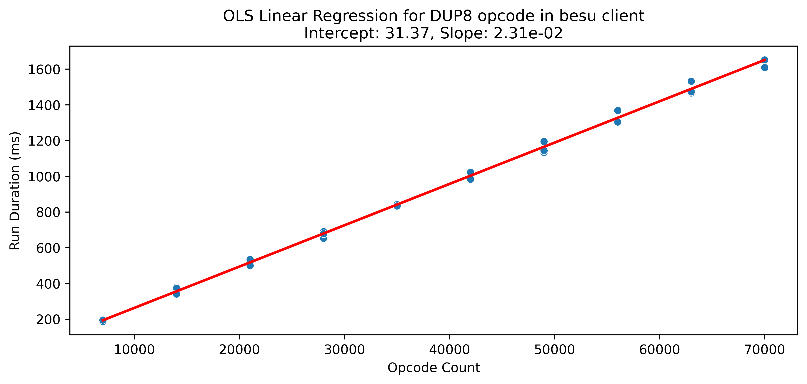


# DUP9

## geth


```python
                            OLS Regression Results                            
==============================================================================
Dep. Variable:        run_duration_ms   R-squared:                       0.980
Model:                            OLS   Adj. R-squared:                  0.979
Method:                 Least Squares   F-statistic:                     1345.
Date:                Mon, 12 Jan 2026   Prob (F-statistic):           3.24e-25
Time:                        10:29:31   Log-Likelihood:                -150.73
No. Observations:                  30   AIC:                             305.5
Df Residuals:                      28   BIC:                             308.3
Df Model:                           1                                         
Covariance Type:            nonrobust                                         
==============================================================================
                 coef    std err          t      P>|t|      [0.025      0.975]
------------------------------------------------------------------------------
const         39.2989     15.024      2.616      0.014       8.523      70.074
opcount        0.0127      0.000     36.677      0.000       0.012       0.013
==============================================================================
Omnibus:                        2.458   Durbin-Watson:                   1.339
Prob(Omnibus):                  0.293   Jarque-Bera (JB):                1.504
Skew:                          -0.538   Prob(JB):                        0.472
Kurtosis:                       3.207   Cond. No.                     9.38e+04
==============================================================================

Notes:
[1] Standard Errors assume that the covariance matrix of the errors is correctly specified.
[2] The condition number is large, 9.38e+04. This might indicate that there are
strong multicollinearity or other numerical problems.
```


## reth


```python
                            OLS Regression Results                            
==============================================================================
Dep. Variable:        run_duration_ms   R-squared:                       0.992
Model:                            OLS   Adj. R-squared:                  0.991
Method:                 Least Squares   F-statistic:                     3367.
Date:                Mon, 12 Jan 2026   Prob (F-statistic):           1.01e-30
Time:                        10:29:31   Log-Likelihood:                -115.51
No. Observations:                  30   AIC:                             235.0
Df Residuals:                      28   BIC:                             237.8
Df Model:                           1                                         
Covariance Type:            nonrobust                                         
==============================================================================
                 coef    std err          t      P>|t|      [0.025      0.975]
------------------------------------------------------------------------------
const         25.3836      4.643      5.467      0.000      15.873      34.894
opcount        0.0062      0.000     58.029      0.000       0.006       0.006
==============================================================================
Omnibus:                        6.826   Durbin-Watson:                   1.815
Prob(Omnibus):                  0.033   Jarque-Bera (JB):                5.945
Skew:                          -0.618   Prob(JB):                       0.0512
Kurtosis:                       4.797   Cond. No.                     9.38e+04
==============================================================================

Notes:
[1] Standard Errors assume that the covariance matrix of the errors is correctly specified.
[2] The condition number is large, 9.38e+04. This might indicate that there are
strong multicollinearity or other numerical problems.
```


## nethermind


```python
                            OLS Regression Results                            
==============================================================================
Dep. Variable:        run_duration_ms   R-squared:                       0.992
Model:                            OLS   Adj. R-squared:                  0.992
Method:                 Least Squares   F-statistic:                     3610.
Date:                Mon, 12 Jan 2026   Prob (F-statistic):           3.84e-31
Time:                        10:29:31   Log-Likelihood:                -119.42
No. Observations:                  30   AIC:                             242.8
Df Residuals:                      28   BIC:                             245.7
Df Model:                           1                                         
Covariance Type:            nonrobust                                         
==============================================================================
                 coef    std err          t      P>|t|      [0.025      0.975]
------------------------------------------------------------------------------
const         27.2966      5.291      5.159      0.000      16.459      38.135
opcount        0.0073      0.000     60.082      0.000       0.007       0.008
==============================================================================
Omnibus:                        5.376   Durbin-Watson:                   1.063
Prob(Omnibus):                  0.068   Jarque-Bera (JB):                2.342
Skew:                           0.370   Prob(JB):                        0.310
Kurtosis:                       1.849   Cond. No.                     9.38e+04
==============================================================================

Notes:
[1] Standard Errors assume that the covariance matrix of the errors is correctly specified.
[2] The condition number is large, 9.38e+04. This might indicate that there are
strong multicollinearity or other numerical problems.
```


## besu


```python
                            OLS Regression Results                            
==============================================================================
Dep. Variable:        run_duration_ms   R-squared:                       0.995
Model:                            OLS   Adj. R-squared:                  0.995
Method:                 Least Squares   F-statistic:                     6026.
Date:                Mon, 12 Jan 2026   Prob (F-statistic):           3.07e-34
Time:                        10:29:31   Log-Likelihood:                -146.43
No. Observations:                  30   AIC:                             296.9
Df Residuals:                      28   BIC:                             299.7
Df Model:                           1                                         
Covariance Type:            nonrobust                                         
==============================================================================
                 coef    std err          t      P>|t|      [0.025      0.975]
------------------------------------------------------------------------------
const         26.7512     13.014      2.056      0.049       0.093      53.410
opcount        0.0233      0.000     77.626      0.000       0.023       0.024
==============================================================================
Omnibus:                       16.758   Durbin-Watson:                   1.795
Prob(Omnibus):                  0.000   Jarque-Bera (JB):               22.078
Skew:                           1.357   Prob(JB):                     1.61e-05
Kurtosis:                       6.209   Cond. No.                     9.38e+04
==============================================================================

Notes:
[1] Standard Errors assume that the covariance matrix of the errors is correctly specified.
[2] The condition number is large, 9.38e+04. This might indicate that there are
strong multicollinearity or other numerical problems.
```


# DUP10

## geth


```python
                            OLS Regression Results                            
==============================================================================
Dep. Variable:        run_duration_ms   R-squared:                       0.986
Model:                            OLS   Adj. R-squared:                  0.985
Method:                 Least Squares   F-statistic:                     1913.
Date:                Mon, 12 Jan 2026   Prob (F-statistic):           2.54e-27
Time:                        10:29:31   Log-Likelihood:                -146.28
No. Observations:                  30   AIC:                             296.6
Df Residuals:                      28   BIC:                             299.4
Df Model:                           1                                         
Covariance Type:            nonrobust                                         
==============================================================================
                 coef    std err          t      P>|t|      [0.025      0.975]
------------------------------------------------------------------------------
const         20.9464     12.953      1.617      0.117      -5.586      47.479
opcount        0.0130      0.000     43.738      0.000       0.012       0.014
==============================================================================
Omnibus:                        0.091   Durbin-Watson:                   1.111
Prob(Omnibus):                  0.956   Jarque-Bera (JB):                0.090
Skew:                           0.084   Prob(JB):                        0.956
Kurtosis:                       2.791   Cond. No.                     9.38e+04
==============================================================================

Notes:
[1] Standard Errors assume that the covariance matrix of the errors is correctly specified.
[2] The condition number is large, 9.38e+04. This might indicate that there are
strong multicollinearity or other numerical problems.
```


## reth


```python
                            OLS Regression Results                            
==============================================================================
Dep. Variable:        run_duration_ms   R-squared:                       0.984
Model:                            OLS   Adj. R-squared:                  0.983
Method:                 Least Squares   F-statistic:                     1701.
Date:                Mon, 12 Jan 2026   Prob (F-statistic):           1.28e-26
Time:                        10:29:32   Log-Likelihood:                -123.20
No. Observations:                  30   AIC:                             250.4
Df Residuals:                      28   BIC:                             253.2
Df Model:                           1                                         
Covariance Type:            nonrobust                                         
==============================================================================
                 coef    std err          t      P>|t|      [0.025      0.975]
------------------------------------------------------------------------------
const         38.6900      6.001      6.447      0.000      26.397      50.983
opcount        0.0057      0.000     41.246      0.000       0.005       0.006
==============================================================================
Omnibus:                        4.062   Durbin-Watson:                   2.201
Prob(Omnibus):                  0.131   Jarque-Bera (JB):                2.514
Skew:                          -0.515   Prob(JB):                        0.285
Kurtosis:                       3.975   Cond. No.                     9.38e+04
==============================================================================

Notes:
[1] Standard Errors assume that the covariance matrix of the errors is correctly specified.
[2] The condition number is large, 9.38e+04. This might indicate that there are
strong multicollinearity or other numerical problems.
```


## nethermind


```python
                            OLS Regression Results                            
==============================================================================
Dep. Variable:        run_duration_ms   R-squared:                       0.993
Model:                            OLS   Adj. R-squared:                  0.993
Method:                 Least Squares   F-statistic:                     3928.
Date:                Mon, 12 Jan 2026   Prob (F-statistic):           1.19e-31
Time:                        10:29:32   Log-Likelihood:                -118.33
No. Observations:                  30   AIC:                             240.7
Df Residuals:                      28   BIC:                             243.5
Df Model:                           1                                         
Covariance Type:            nonrobust                                         
==============================================================================
                 coef    std err          t      P>|t|      [0.025      0.975]
------------------------------------------------------------------------------
const         27.4342      5.101      5.379      0.000      16.986      37.882
opcount        0.0074      0.000     62.672      0.000       0.007       0.008
==============================================================================
Omnibus:                        6.092   Durbin-Watson:                   1.072
Prob(Omnibus):                  0.048   Jarque-Bera (JB):                4.561
Skew:                           0.918   Prob(JB):                        0.102
Kurtosis:                       3.531   Cond. No.                     9.38e+04
==============================================================================

Notes:
[1] Standard Errors assume that the covariance matrix of the errors is correctly specified.
[2] The condition number is large, 9.38e+04. This might indicate that there are
strong multicollinearity or other numerical problems.
```


## besu


```python
                            OLS Regression Results                            
==============================================================================
Dep. Variable:        run_duration_ms   R-squared:                       0.995
Model:                            OLS   Adj. R-squared:                  0.994
Method:                 Least Squares   F-statistic:                     5133.
Date:                Mon, 12 Jan 2026   Prob (F-statistic):           2.87e-33
Time:                        10:29:32   Log-Likelihood:                -149.21
No. Observations:                  30   AIC:                             302.4
Df Residuals:                      28   BIC:                             305.2
Df Model:                           1                                         
Covariance Type:            nonrobust                                         
==============================================================================
                 coef    std err          t      P>|t|      [0.025      0.975]
------------------------------------------------------------------------------
const         22.6090     14.281      1.583      0.125      -6.645      51.863
opcount        0.0236      0.000     71.646      0.000       0.023       0.024
==============================================================================
Omnibus:                       24.902   Durbin-Watson:                   1.392
Prob(Omnibus):                  0.000   Jarque-Bera (JB):               43.731
Skew:                           1.894   Prob(JB):                     3.19e-10
Kurtosis:                       7.543   Cond. No.                     9.38e+04
==============================================================================

Notes:
[1] Standard Errors assume that the covariance matrix of the errors is correctly specified.
[2] The condition number is large, 9.38e+04. This might indicate that there are
strong multicollinearity or other numerical problems.
```


# DUP11

## geth


```python
                            OLS Regression Results                            
==============================================================================
Dep. Variable:        run_duration_ms   R-squared:                       0.991
Model:                            OLS   Adj. R-squared:                  0.990
Method:                 Least Squares   F-statistic:                     3000.
Date:                Mon, 12 Jan 2026   Prob (F-statistic):           5.02e-30
Time:                        10:29:32   Log-Likelihood:                -139.34
No. Observations:                  30   AIC:                             282.7
Df Residuals:                      28   BIC:                             285.5
Df Model:                           1                                         
Covariance Type:            nonrobust                                         
==============================================================================
                 coef    std err          t      P>|t|      [0.025      0.975]
------------------------------------------------------------------------------
const         34.2060     10.275      3.329      0.002      13.159      55.253
opcount        0.0130      0.000     54.771      0.000       0.012       0.013
==============================================================================
Omnibus:                        0.090   Durbin-Watson:                   0.818
Prob(Omnibus):                  0.956   Jarque-Bera (JB):                0.243
Skew:                           0.111   Prob(JB):                        0.886
Kurtosis:                       2.619   Cond. No.                     9.38e+04
==============================================================================

Notes:
[1] Standard Errors assume that the covariance matrix of the errors is correctly specified.
[2] The condition number is large, 9.38e+04. This might indicate that there are
strong multicollinearity or other numerical problems.
```


## reth


```python
                            OLS Regression Results                            
==============================================================================
Dep. Variable:        run_duration_ms   R-squared:                       0.979
Model:                            OLS   Adj. R-squared:                  0.978
Method:                 Least Squares   F-statistic:                     1308.
Date:                Mon, 12 Jan 2026   Prob (F-statistic):           4.77e-25
Time:                        10:29:32   Log-Likelihood:                -127.32
No. Observations:                  30   AIC:                             258.6
Df Residuals:                      28   BIC:                             261.4
Df Model:                           1                                         
Covariance Type:            nonrobust                                         
==============================================================================
                 coef    std err          t      P>|t|      [0.025      0.975]
------------------------------------------------------------------------------
const         27.9378      6.884      4.058      0.000      13.836      42.040
opcount        0.0057      0.000     36.163      0.000       0.005       0.006
==============================================================================
Omnibus:                        1.771   Durbin-Watson:                   1.941
Prob(Omnibus):                  0.413   Jarque-Bera (JB):                1.116
Skew:                          -0.125   Prob(JB):                        0.572
Kurtosis:                       2.089   Cond. No.                     9.38e+04
==============================================================================

Notes:
[1] Standard Errors assume that the covariance matrix of the errors is correctly specified.
[2] The condition number is large, 9.38e+04. This might indicate that there are
strong multicollinearity or other numerical problems.
```


## nethermind


```python
                            OLS Regression Results                            
==============================================================================
Dep. Variable:        run_duration_ms   R-squared:                       0.989
Model:                            OLS   Adj. R-squared:                  0.988
Method:                 Least Squares   F-statistic:                     2436.
Date:                Mon, 12 Jan 2026   Prob (F-statistic):           9.01e-29
Time:                        10:29:32   Log-Likelihood:                -125.60
No. Observations:                  30   AIC:                             255.2
Df Residuals:                      28   BIC:                             258.0
Df Model:                           1                                         
Covariance Type:            nonrobust                                         
==============================================================================
                 coef    std err          t      P>|t|      [0.025      0.975]
------------------------------------------------------------------------------
const         25.3884      6.501      3.905      0.001      12.072      38.705
opcount        0.0074      0.000     49.353      0.000       0.007       0.008
==============================================================================
Omnibus:                        1.818   Durbin-Watson:                   0.537
Prob(Omnibus):                  0.403   Jarque-Bera (JB):                1.323
Skew:                           0.512   Prob(JB):                        0.516
Kurtosis:                       2.896   Cond. No.                     9.38e+04
==============================================================================

Notes:
[1] Standard Errors assume that the covariance matrix of the errors is correctly specified.
[2] The condition number is large, 9.38e+04. This might indicate that there are
strong multicollinearity or other numerical problems.
```

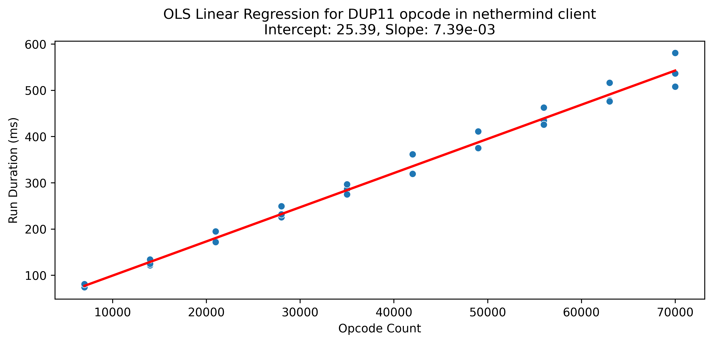


## besu


```python
                            OLS Regression Results                            
==============================================================================
Dep. Variable:        run_duration_ms   R-squared:                       0.997
Model:                            OLS   Adj. R-squared:                  0.996
Method:                 Least Squares   F-statistic:                     8035.
Date:                Mon, 12 Jan 2026   Prob (F-statistic):           5.56e-36
Time:                        10:29:32   Log-Likelihood:                -141.90
No. Observations:                  30   AIC:                             287.8
Df Residuals:                      28   BIC:                             290.6
Df Model:                           1                                         
Covariance Type:            nonrobust                                         
==============================================================================
                 coef    std err          t      P>|t|      [0.025      0.975]
------------------------------------------------------------------------------
const         17.1559     11.191      1.533      0.136      -5.768      40.080
opcount        0.0231      0.000     89.636      0.000       0.023       0.024
==============================================================================
Omnibus:                        5.068   Durbin-Watson:                   1.390
Prob(Omnibus):                  0.079   Jarque-Bera (JB):                3.696
Skew:                           0.510   Prob(JB):                        0.158
Kurtosis:                       4.385   Cond. No.                     9.38e+04
==============================================================================

Notes:
[1] Standard Errors assume that the covariance matrix of the errors is correctly specified.
[2] The condition number is large, 9.38e+04. This might indicate that there are
strong multicollinearity or other numerical problems.
```


# DUP12

## geth


```python
                            OLS Regression Results                            
==============================================================================
Dep. Variable:        run_duration_ms   R-squared:                       0.982
Model:                            OLS   Adj. R-squared:                  0.982
Method:                 Least Squares   F-statistic:                     1547.
Date:                Mon, 12 Jan 2026   Prob (F-statistic):           4.73e-26
Time:                        10:29:33   Log-Likelihood:                -148.88
No. Observations:                  30   AIC:                             301.8
Df Residuals:                      28   BIC:                             304.6
Df Model:                           1                                         
Covariance Type:            nonrobust                                         
==============================================================================
                 coef    std err          t      P>|t|      [0.025      0.975]
------------------------------------------------------------------------------
const         31.2223     14.126      2.210      0.035       2.287      60.158
opcount        0.0128      0.000     39.336      0.000       0.012       0.013
==============================================================================
Omnibus:                        0.454   Durbin-Watson:                   0.991
Prob(Omnibus):                  0.797   Jarque-Bera (JB):                0.399
Skew:                          -0.254   Prob(JB):                        0.819
Kurtosis:                       2.750   Cond. No.                     9.38e+04
==============================================================================

Notes:
[1] Standard Errors assume that the covariance matrix of the errors is correctly specified.
[2] The condition number is large, 9.38e+04. This might indicate that there are
strong multicollinearity or other numerical problems.
```


## reth


```python
                            OLS Regression Results                            
==============================================================================
Dep. Variable:        run_duration_ms   R-squared:                       0.980
Model:                            OLS   Adj. R-squared:                  0.979
Method:                 Least Squares   F-statistic:                     1376.
Date:                Mon, 12 Jan 2026   Prob (F-statistic):           2.38e-25
Time:                        10:29:33   Log-Likelihood:                -127.76
No. Observations:                  30   AIC:                             259.5
Df Residuals:                      28   BIC:                             262.3
Df Model:                           1                                         
Covariance Type:            nonrobust                                         
==============================================================================
                 coef    std err          t      P>|t|      [0.025      0.975]
------------------------------------------------------------------------------
const         24.6161      6.986      3.524      0.001      10.306      38.926
opcount        0.0060      0.000     37.091      0.000       0.006       0.006
==============================================================================
Omnibus:                        3.620   Durbin-Watson:                   2.337
Prob(Omnibus):                  0.164   Jarque-Bera (JB):                3.011
Skew:                          -0.771   Prob(JB):                        0.222
Kurtosis:                       2.820   Cond. No.                     9.38e+04
==============================================================================

Notes:
[1] Standard Errors assume that the covariance matrix of the errors is correctly specified.
[2] The condition number is large, 9.38e+04. This might indicate that there are
strong multicollinearity or other numerical problems.
```


## nethermind


```python
                            OLS Regression Results                            
==============================================================================
Dep. Variable:        run_duration_ms   R-squared:                       0.992
Model:                            OLS   Adj. R-squared:                  0.992
Method:                 Least Squares   F-statistic:                     3399.
Date:                Mon, 12 Jan 2026   Prob (F-statistic):           8.86e-31
Time:                        10:29:33   Log-Likelihood:                -120.66
No. Observations:                  30   AIC:                             245.3
Df Residuals:                      28   BIC:                             248.1
Df Model:                           1                                         
Covariance Type:            nonrobust                                         
==============================================================================
                 coef    std err          t      P>|t|      [0.025      0.975]
------------------------------------------------------------------------------
const         27.0552      5.513      4.907      0.000      15.762      38.348
opcount        0.0074      0.000     58.302      0.000       0.007       0.008
==============================================================================
Omnibus:                        8.010   Durbin-Watson:                   1.196
Prob(Omnibus):                  0.018   Jarque-Bera (JB):                6.399
Skew:                           1.061   Prob(JB):                       0.0408
Kurtosis:                       3.787   Cond. No.                     9.38e+04
==============================================================================

Notes:
[1] Standard Errors assume that the covariance matrix of the errors is correctly specified.
[2] The condition number is large, 9.38e+04. This might indicate that there are
strong multicollinearity or other numerical problems.
```


## besu


```python
                            OLS Regression Results                            
==============================================================================
Dep. Variable:        run_duration_ms   R-squared:                       0.997
Model:                            OLS   Adj. R-squared:                  0.997
Method:                 Least Squares   F-statistic:                     9504.
Date:                Mon, 12 Jan 2026   Prob (F-statistic):           5.33e-37
Time:                        10:29:33   Log-Likelihood:                -139.58
No. Observations:                  30   AIC:                             283.2
Df Residuals:                      28   BIC:                             286.0
Df Model:                           1                                         
Covariance Type:            nonrobust                                         
==============================================================================
                 coef    std err          t      P>|t|      [0.025      0.975]
------------------------------------------------------------------------------
const         19.4669     10.360      1.879      0.071      -1.755      40.688
opcount        0.0233      0.000     97.487      0.000       0.023       0.024
==============================================================================
Omnibus:                        8.372   Durbin-Watson:                   1.422
Prob(Omnibus):                  0.015   Jarque-Bera (JB):                7.222
Skew:                           0.839   Prob(JB):                       0.0270
Kurtosis:                       4.721   Cond. No.                     9.38e+04
==============================================================================

Notes:
[1] Standard Errors assume that the covariance matrix of the errors is correctly specified.
[2] The condition number is large, 9.38e+04. This might indicate that there are
strong multicollinearity or other numerical problems.
```


# DUP13

## geth


```python
                            OLS Regression Results                            
==============================================================================
Dep. Variable:        run_duration_ms   R-squared:                       0.985
Model:                            OLS   Adj. R-squared:                  0.984
Method:                 Least Squares   F-statistic:                     1804.
Date:                Mon, 12 Jan 2026   Prob (F-statistic):           5.73e-27
Time:                        10:29:33   Log-Likelihood:                -147.30
No. Observations:                  30   AIC:                             298.6
Df Residuals:                      28   BIC:                             301.4
Df Model:                           1                                         
Covariance Type:            nonrobust                                         
==============================================================================
                 coef    std err          t      P>|t|      [0.025      0.975]
------------------------------------------------------------------------------
const         23.7824     13.398      1.775      0.087      -3.662      51.226
opcount        0.0131      0.000     42.469      0.000       0.012       0.014
==============================================================================
Omnibus:                        2.605   Durbin-Watson:                   1.183
Prob(Omnibus):                  0.272   Jarque-Bera (JB):                1.457
Skew:                          -0.503   Prob(JB):                        0.483
Kurtosis:                       3.389   Cond. No.                     9.38e+04
==============================================================================

Notes:
[1] Standard Errors assume that the covariance matrix of the errors is correctly specified.
[2] The condition number is large, 9.38e+04. This might indicate that there are
strong multicollinearity or other numerical problems.
```


## reth


```python
                            OLS Regression Results                            
==============================================================================
Dep. Variable:        run_duration_ms   R-squared:                       0.972
Model:                            OLS   Adj. R-squared:                  0.971
Method:                 Least Squares   F-statistic:                     971.2
Date:                Mon, 12 Jan 2026   Prob (F-statistic):           2.79e-23
Time:                        10:29:33   Log-Likelihood:                -129.83
No. Observations:                  30   AIC:                             263.7
Df Residuals:                      28   BIC:                             266.5
Df Model:                           1                                         
Covariance Type:            nonrobust                                         
==============================================================================
                 coef    std err          t      P>|t|      [0.025      0.975]
------------------------------------------------------------------------------
const         39.2009      7.485      5.237      0.000      23.868      54.533
opcount        0.0054      0.000     31.163      0.000       0.005       0.006
==============================================================================
Omnibus:                        0.188   Durbin-Watson:                   1.334
Prob(Omnibus):                  0.910   Jarque-Bera (JB):                0.368
Skew:                          -0.139   Prob(JB):                        0.832
Kurtosis:                       2.534   Cond. No.                     9.38e+04
==============================================================================

Notes:
[1] Standard Errors assume that the covariance matrix of the errors is correctly specified.
[2] The condition number is large, 9.38e+04. This might indicate that there are
strong multicollinearity or other numerical problems.
```


## nethermind


```python
                            OLS Regression Results                            
==============================================================================
Dep. Variable:        run_duration_ms   R-squared:                       0.990
Model:                            OLS   Adj. R-squared:                  0.990
Method:                 Least Squares   F-statistic:                     2863.
Date:                Mon, 12 Jan 2026   Prob (F-statistic):           9.59e-30
Time:                        10:29:33   Log-Likelihood:                -123.67
No. Observations:                  30   AIC:                             251.3
Df Residuals:                      28   BIC:                             254.1
Df Model:                           1                                         
Covariance Type:            nonrobust                                         
==============================================================================
                 coef    std err          t      P>|t|      [0.025      0.975]
------------------------------------------------------------------------------
const         23.4585      6.096      3.848      0.001      10.972      35.945
opcount        0.0075      0.000     53.508      0.000       0.007       0.008
==============================================================================
Omnibus:                        1.881   Durbin-Watson:                   0.955
Prob(Omnibus):                  0.390   Jarque-Bera (JB):                1.215
Skew:                           0.493   Prob(JB):                        0.545
Kurtosis:                       3.035   Cond. No.                     9.38e+04
==============================================================================

Notes:
[1] Standard Errors assume that the covariance matrix of the errors is correctly specified.
[2] The condition number is large, 9.38e+04. This might indicate that there are
strong multicollinearity or other numerical problems.
```


## besu


```python
                            OLS Regression Results                            
==============================================================================
Dep. Variable:        run_duration_ms   R-squared:                       0.995
Model:                            OLS   Adj. R-squared:                  0.995
Method:                 Least Squares   F-statistic:                     5925.
Date:                Mon, 12 Jan 2026   Prob (F-statistic):           3.88e-34
Time:                        10:29:34   Log-Likelihood:                -146.77
No. Observations:                  30   AIC:                             297.5
Df Residuals:                      28   BIC:                             300.3
Df Model:                           1                                         
Covariance Type:            nonrobust                                         
==============================================================================
                 coef    std err          t      P>|t|      [0.025      0.975]
------------------------------------------------------------------------------
const         32.9004     13.165      2.499      0.019       5.932      59.868
opcount        0.0233      0.000     76.975      0.000       0.023       0.024
==============================================================================
Omnibus:                       33.055   Durbin-Watson:                   1.306
Prob(Omnibus):                  0.000   Jarque-Bera (JB):               93.479
Skew:                           2.247   Prob(JB):                     5.03e-21
Kurtosis:                      10.388   Cond. No.                     9.38e+04
==============================================================================

Notes:
[1] Standard Errors assume that the covariance matrix of the errors is correctly specified.
[2] The condition number is large, 9.38e+04. This might indicate that there are
strong multicollinearity or other numerical problems.
```

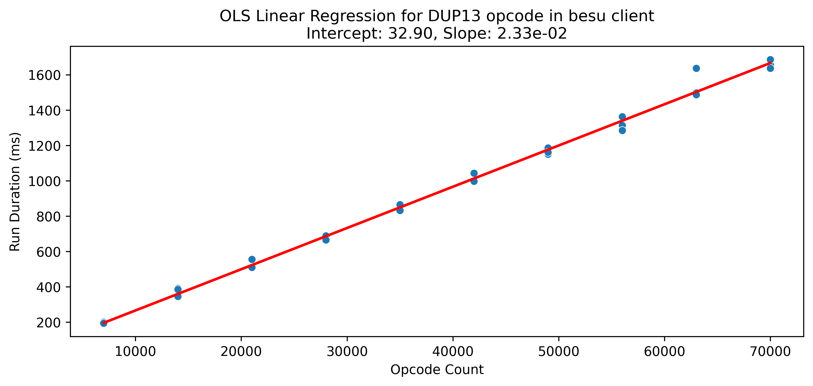


# DUP14

## geth


```python
                            OLS Regression Results                            
==============================================================================
Dep. Variable:        run_duration_ms   R-squared:                       0.984
Model:                            OLS   Adj. R-squared:                  0.983
Method:                 Least Squares   F-statistic:                     1681.
Date:                Mon, 12 Jan 2026   Prob (F-statistic):           1.51e-26
Time:                        10:29:34   Log-Likelihood:                -148.16
No. Observations:                  30   AIC:                             300.3
Df Residuals:                      28   BIC:                             303.1
Df Model:                           1                                         
Covariance Type:            nonrobust                                         
==============================================================================
                 coef    std err          t      P>|t|      [0.025      0.975]
------------------------------------------------------------------------------
const         35.4542     13.790      2.571      0.016       7.207      63.701
opcount        0.0130      0.000     41.001      0.000       0.012       0.014
==============================================================================
Omnibus:                        0.546   Durbin-Watson:                   1.348
Prob(Omnibus):                  0.761   Jarque-Bera (JB):                0.649
Skew:                          -0.159   Prob(JB):                        0.723
Kurtosis:                       2.353   Cond. No.                     9.38e+04
==============================================================================

Notes:
[1] Standard Errors assume that the covariance matrix of the errors is correctly specified.
[2] The condition number is large, 9.38e+04. This might indicate that there are
strong multicollinearity or other numerical problems.
```

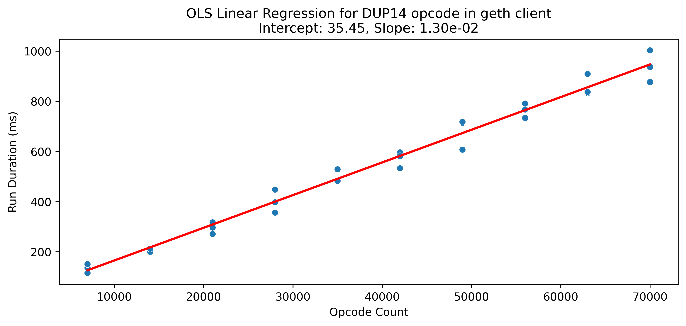


## reth


```python
                            OLS Regression Results                            
==============================================================================
Dep. Variable:        run_duration_ms   R-squared:                       0.979
Model:                            OLS   Adj. R-squared:                  0.978
Method:                 Least Squares   F-statistic:                     1305.
Date:                Mon, 12 Jan 2026   Prob (F-statistic):           4.91e-25
Time:                        10:29:34   Log-Likelihood:                -127.09
No. Observations:                  30   AIC:                             258.2
Df Residuals:                      28   BIC:                             261.0
Df Model:                           1                                         
Covariance Type:            nonrobust                                         
==============================================================================
                 coef    std err          t      P>|t|      [0.025      0.975]
------------------------------------------------------------------------------
const         36.0446      6.832      5.276      0.000      22.049      50.040
opcount        0.0057      0.000     36.127      0.000       0.005       0.006
==============================================================================
Omnibus:                        0.589   Durbin-Watson:                   2.091
Prob(Omnibus):                  0.745   Jarque-Bera (JB):                0.656
Skew:                           0.109   Prob(JB):                        0.720
Kurtosis:                       2.309   Cond. No.                     9.38e+04
==============================================================================

Notes:
[1] Standard Errors assume that the covariance matrix of the errors is correctly specified.
[2] The condition number is large, 9.38e+04. This might indicate that there are
strong multicollinearity or other numerical problems.
```

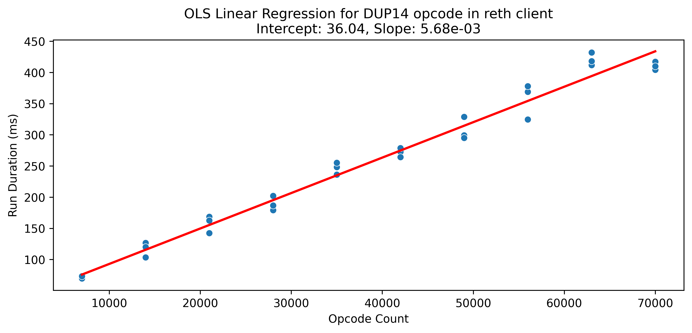


## nethermind


```python
                            OLS Regression Results                            
==============================================================================
Dep. Variable:        run_duration_ms   R-squared:                       0.992
Model:                            OLS   Adj. R-squared:                  0.991
Method:                 Least Squares   F-statistic:                     3318.
Date:                Mon, 12 Jan 2026   Prob (F-statistic):           1.24e-30
Time:                        10:29:34   Log-Likelihood:                -121.54
No. Observations:                  30   AIC:                             247.1
Df Residuals:                      28   BIC:                             249.9
Df Model:                           1                                         
Covariance Type:            nonrobust                                         
==============================================================================
                 coef    std err          t      P>|t|      [0.025      0.975]
------------------------------------------------------------------------------
const         23.4063      5.678      4.122      0.000      11.776      35.037
opcount        0.0075      0.000     57.601      0.000       0.007       0.008
==============================================================================
Omnibus:                        2.464   Durbin-Watson:                   1.232
Prob(Omnibus):                  0.292   Jarque-Bera (JB):                1.964
Skew:                           0.620   Prob(JB):                        0.375
Kurtosis:                       2.816   Cond. No.                     9.38e+04
==============================================================================

Notes:
[1] Standard Errors assume that the covariance matrix of the errors is correctly specified.
[2] The condition number is large, 9.38e+04. This might indicate that there are
strong multicollinearity or other numerical problems.
```


## besu


```python
                            OLS Regression Results                            
==============================================================================
Dep. Variable:        run_duration_ms   R-squared:                       0.997
Model:                            OLS   Adj. R-squared:                  0.997
Method:                 Least Squares   F-statistic:                     8431.
Date:                Mon, 12 Jan 2026   Prob (F-statistic):           2.84e-36
Time:                        10:29:34   Log-Likelihood:                -141.98
No. Observations:                  30   AIC:                             288.0
Df Residuals:                      28   BIC:                             290.8
Df Model:                           1                                         
Covariance Type:            nonrobust                                         
==============================================================================
                 coef    std err          t      P>|t|      [0.025      0.975]
------------------------------------------------------------------------------
const         28.8144     11.222      2.568      0.016       5.827      51.802
opcount        0.0237      0.000     91.818      0.000       0.023       0.024
==============================================================================
Omnibus:                        0.654   Durbin-Watson:                   2.054
Prob(Omnibus):                  0.721   Jarque-Bera (JB):                0.160
Skew:                           0.167   Prob(JB):                        0.923
Kurtosis:                       3.127   Cond. No.                     9.38e+04
==============================================================================

Notes:
[1] Standard Errors assume that the covariance matrix of the errors is correctly specified.
[2] The condition number is large, 9.38e+04. This might indicate that there are
strong multicollinearity or other numerical problems.
```


# DUP15

## geth


```python
                            OLS Regression Results                            
==============================================================================
Dep. Variable:        run_duration_ms   R-squared:                       0.990
Model:                            OLS   Adj. R-squared:                  0.989
Method:                 Least Squares   F-statistic:                     2690.
Date:                Mon, 12 Jan 2026   Prob (F-statistic):           2.28e-29
Time:                        10:29:34   Log-Likelihood:                -141.06
No. Observations:                  30   AIC:                             286.1
Df Residuals:                      28   BIC:                             288.9
Df Model:                           1                                         
Covariance Type:            nonrobust                                         
==============================================================================
                 coef    std err          t      P>|t|      [0.025      0.975]
------------------------------------------------------------------------------
const         33.1975     10.884      3.050      0.005      10.902      55.493
opcount        0.0130      0.000     51.863      0.000       0.012       0.014
==============================================================================
Omnibus:                        1.442   Durbin-Watson:                   1.256
Prob(Omnibus):                  0.486   Jarque-Bera (JB):                1.036
Skew:                          -0.157   Prob(JB):                        0.596
Kurtosis:                       2.145   Cond. No.                     9.38e+04
==============================================================================

Notes:
[1] Standard Errors assume that the covariance matrix of the errors is correctly specified.
[2] The condition number is large, 9.38e+04. This might indicate that there are
strong multicollinearity or other numerical problems.
```

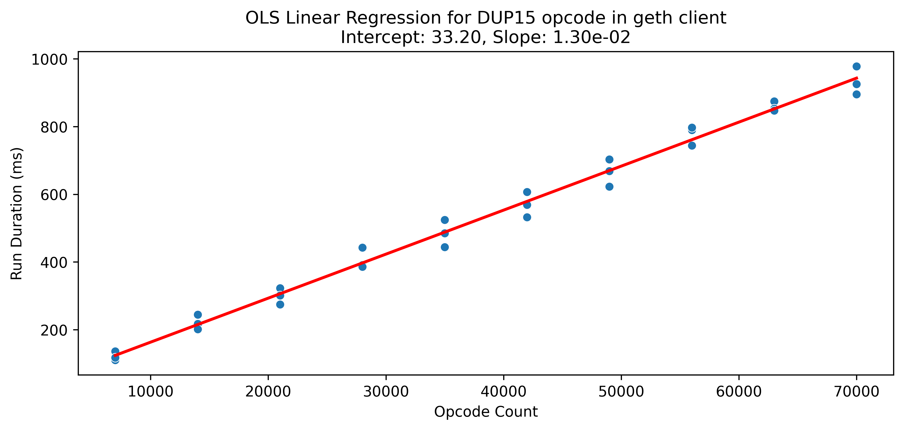


## reth


```python
                            OLS Regression Results                            
==============================================================================
Dep. Variable:        run_duration_ms   R-squared:                       0.976
Model:                            OLS   Adj. R-squared:                  0.975
Method:                 Least Squares   F-statistic:                     1151.
Date:                Mon, 12 Jan 2026   Prob (F-statistic):           2.75e-24
Time:                        10:29:34   Log-Likelihood:                -131.02
No. Observations:                  30   AIC:                             266.0
Df Residuals:                      28   BIC:                             268.8
Df Model:                           1                                         
Covariance Type:            nonrobust                                         
==============================================================================
                 coef    std err          t      P>|t|      [0.025      0.975]
------------------------------------------------------------------------------
const         27.0832      7.787      3.478      0.002      11.132      43.034
opcount        0.0061      0.000     33.924      0.000       0.006       0.006
==============================================================================
Omnibus:                        1.940   Durbin-Watson:                   2.053
Prob(Omnibus):                  0.379   Jarque-Bera (JB):                1.520
Skew:                          -0.543   Prob(JB):                        0.468
Kurtosis:                       2.812   Cond. No.                     9.38e+04
==============================================================================

Notes:
[1] Standard Errors assume that the covariance matrix of the errors is correctly specified.
[2] The condition number is large, 9.38e+04. This might indicate that there are
strong multicollinearity or other numerical problems.
```


## nethermind


```python
                            OLS Regression Results                            
==============================================================================
Dep. Variable:        run_duration_ms   R-squared:                       0.991
Model:                            OLS   Adj. R-squared:                  0.991
Method:                 Least Squares   F-statistic:                     3125.
Date:                Mon, 12 Jan 2026   Prob (F-statistic):           2.85e-30
Time:                        10:29:35   Log-Likelihood:                -122.52
No. Observations:                  30   AIC:                             249.0
Df Residuals:                      28   BIC:                             251.9
Df Model:                           1                                         
Covariance Type:            nonrobust                                         
==============================================================================
                 coef    std err          t      P>|t|      [0.025      0.975]
------------------------------------------------------------------------------
const         26.7128      5.867      4.553      0.000      14.695      38.731
opcount        0.0076      0.000     55.900      0.000       0.007       0.008
==============================================================================
Omnibus:                        1.428   Durbin-Watson:                   0.482
Prob(Omnibus):                  0.490   Jarque-Bera (JB):                1.339
Skew:                           0.453   Prob(JB):                        0.512
Kurtosis:                       2.500   Cond. No.                     9.38e+04
==============================================================================

Notes:
[1] Standard Errors assume that the covariance matrix of the errors is correctly specified.
[2] The condition number is large, 9.38e+04. This might indicate that there are
strong multicollinearity or other numerical problems.
```

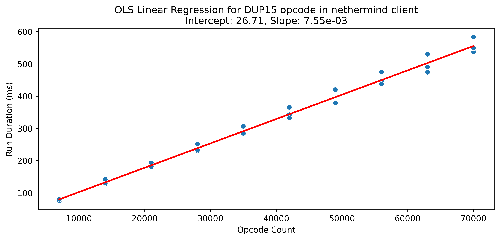


## besu


```python
                            OLS Regression Results                            
==============================================================================
Dep. Variable:        run_duration_ms   R-squared:                       0.997
Model:                            OLS   Adj. R-squared:                  0.997
Method:                 Least Squares   F-statistic:                 1.043e+04
Date:                Mon, 12 Jan 2026   Prob (F-statistic):           1.46e-37
Time:                        10:29:35   Log-Likelihood:                -138.08
No. Observations:                  30   AIC:                             280.2
Df Residuals:                      28   BIC:                             283.0
Df Model:                           1                                         
Covariance Type:            nonrobust                                         
==============================================================================
                 coef    std err          t      P>|t|      [0.025      0.975]
------------------------------------------------------------------------------
const         27.0407      9.853      2.744      0.010       6.857      47.224
opcount        0.0232      0.000    102.105      0.000       0.023       0.024
==============================================================================
Omnibus:                        5.760   Durbin-Watson:                   1.515
Prob(Omnibus):                  0.056   Jarque-Bera (JB):                4.389
Skew:                           0.586   Prob(JB):                        0.111
Kurtosis:                       4.462   Cond. No.                     9.38e+04
==============================================================================

Notes:
[1] Standard Errors assume that the covariance matrix of the errors is correctly specified.
[2] The condition number is large, 9.38e+04. This might indicate that there are
strong multicollinearity or other numerical problems.
```


# DUP16

## geth


```python
                            OLS Regression Results                            
==============================================================================
Dep. Variable:        run_duration_ms   R-squared:                       0.989
Model:                            OLS   Adj. R-squared:                  0.988
Method:                 Least Squares   F-statistic:                     2429.
Date:                Mon, 12 Jan 2026   Prob (F-statistic):           9.36e-29
Time:                        10:29:35   Log-Likelihood:                -142.70
No. Observations:                  30   AIC:                             289.4
Df Residuals:                      28   BIC:                             292.2
Df Model:                           1                                         
Covariance Type:            nonrobust                                         
==============================================================================
                 coef    std err          t      P>|t|      [0.025      0.975]
------------------------------------------------------------------------------
const         30.6484     11.493      2.667      0.013       7.107      54.190
opcount        0.0130      0.000     49.286      0.000       0.012       0.014
==============================================================================
Omnibus:                        6.048   Durbin-Watson:                   1.493
Prob(Omnibus):                  0.049   Jarque-Bera (JB):                4.997
Skew:                          -0.551   Prob(JB):                       0.0822
Kurtosis:                       4.668   Cond. No.                     9.38e+04
==============================================================================

Notes:
[1] Standard Errors assume that the covariance matrix of the errors is correctly specified.
[2] The condition number is large, 9.38e+04. This might indicate that there are
strong multicollinearity or other numerical problems.
```


## reth


```python
                            OLS Regression Results                            
==============================================================================
Dep. Variable:        run_duration_ms   R-squared:                       0.980
Model:                            OLS   Adj. R-squared:                  0.979
Method:                 Least Squares   F-statistic:                     1369.
Date:                Mon, 12 Jan 2026   Prob (F-statistic):           2.56e-25
Time:                        10:29:35   Log-Likelihood:                -129.06
No. Observations:                  30   AIC:                             262.1
Df Residuals:                      28   BIC:                             264.9
Df Model:                           1                                         
Covariance Type:            nonrobust                                         
==============================================================================
                 coef    std err          t      P>|t|      [0.025      0.975]
------------------------------------------------------------------------------
const         24.6918      7.294      3.385      0.002       9.751      39.633
opcount        0.0062      0.000     36.994      0.000       0.006       0.007
==============================================================================
Omnibus:                        2.973   Durbin-Watson:                   1.907
Prob(Omnibus):                  0.226   Jarque-Bera (JB):                2.294
Skew:                          -0.676   Prob(JB):                        0.318
Kurtosis:                       2.919   Cond. No.                     9.38e+04
==============================================================================

Notes:
[1] Standard Errors assume that the covariance matrix of the errors is correctly specified.
[2] The condition number is large, 9.38e+04. This might indicate that there are
strong multicollinearity or other numerical problems.
```


## nethermind


```python
                            OLS Regression Results                            
==============================================================================
Dep. Variable:        run_duration_ms   R-squared:                       0.984
Model:                            OLS   Adj. R-squared:                  0.984
Method:                 Least Squares   F-statistic:                     1762.
Date:                Mon, 12 Jan 2026   Prob (F-statistic):           7.88e-27
Time:                        10:29:35   Log-Likelihood:                -130.92
No. Observations:                  30   AIC:                             265.8
Df Residuals:                      28   BIC:                             268.6
Df Model:                           1                                         
Covariance Type:            nonrobust                                         
==============================================================================
                 coef    std err          t      P>|t|      [0.025      0.975]
------------------------------------------------------------------------------
const         27.6029      7.762      3.556      0.001      11.704      43.502
opcount        0.0075      0.000     41.981      0.000       0.007       0.008
==============================================================================
Omnibus:                        4.366   Durbin-Watson:                   0.945
Prob(Omnibus):                  0.113   Jarque-Bera (JB):                2.879
Skew:                           0.711   Prob(JB):                        0.237
Kurtosis:                       3.532   Cond. No.                     9.38e+04
==============================================================================

Notes:
[1] Standard Errors assume that the covariance matrix of the errors is correctly specified.
[2] The condition number is large, 9.38e+04. This might indicate that there are
strong multicollinearity or other numerical problems.
```


## besu


```python
                            OLS Regression Results                            
==============================================================================
Dep. Variable:        run_duration_ms   R-squared:                       0.997
Model:                            OLS   Adj. R-squared:                  0.997
Method:                 Least Squares   F-statistic:                     8685.
Date:                Mon, 12 Jan 2026   Prob (F-statistic):           1.87e-36
Time:                        10:29:35   Log-Likelihood:                -141.93
No. Observations:                  30   AIC:                             287.9
Df Residuals:                      28   BIC:                             290.7
Df Model:                           1                                         
Covariance Type:            nonrobust                                         
==============================================================================
                 coef    std err          t      P>|t|      [0.025      0.975]
------------------------------------------------------------------------------
const         17.8291     11.204      1.591      0.123      -5.120      40.778
opcount        0.0240      0.000     93.195      0.000       0.024       0.025
==============================================================================
Omnibus:                       12.863   Durbin-Watson:                   1.491
Prob(Omnibus):                  0.002   Jarque-Bera (JB):               12.375
Skew:                           1.321   Prob(JB):                      0.00205
Kurtosis:                       4.708   Cond. No.                     9.38e+04
==============================================================================

Notes:
[1] Standard Errors assume that the covariance matrix of the errors is correctly specified.
[2] The condition number is large, 9.38e+04. This might indicate that there are
strong multicollinearity or other numerical problems.
```


# EQ

## geth


```python
                            OLS Regression Results                            
==============================================================================
Dep. Variable:        run_duration_ms   R-squared:                       0.980
Model:                            OLS   Adj. R-squared:                  0.980
Method:                 Least Squares   F-statistic:                     1407.
Date:                Mon, 12 Jan 2026   Prob (F-statistic):           1.75e-25
Time:                        10:29:35   Log-Likelihood:                -151.58
No. Observations:                  30   AIC:                             307.2
Df Residuals:                      28   BIC:                             310.0
Df Model:                           1                                         
Covariance Type:            nonrobust                                         
==============================================================================
                 coef    std err          t      P>|t|      [0.025      0.975]
------------------------------------------------------------------------------
const         35.3859     15.456      2.290      0.030       3.726      67.045
opcount        0.0234      0.001     37.508      0.000       0.022       0.025
==============================================================================
Omnibus:                        2.039   Durbin-Watson:                   0.767
Prob(Omnibus):                  0.361   Jarque-Bera (JB):                0.881
Skew:                           0.138   Prob(JB):                        0.644
Kurtosis:                       3.793   Cond. No.                     5.36e+04
==============================================================================

Notes:
[1] Standard Errors assume that the covariance matrix of the errors is correctly specified.
[2] The condition number is large, 5.36e+04. This might indicate that there are
strong multicollinearity or other numerical problems.
```

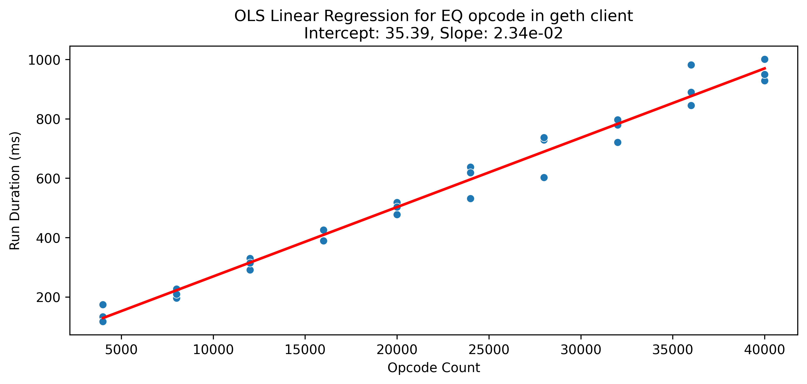


## reth


```python
                            OLS Regression Results                            
==============================================================================
Dep. Variable:        run_duration_ms   R-squared:                       0.991
Model:                            OLS   Adj. R-squared:                  0.990
Method:                 Least Squares   F-statistic:                     2938.
Date:                Mon, 12 Jan 2026   Prob (F-statistic):           6.71e-30
Time:                        10:29:36   Log-Likelihood:                -146.43
No. Observations:                  30   AIC:                             296.9
Df Residuals:                      28   BIC:                             299.7
Df Model:                           1                                         
Covariance Type:            nonrobust                                         
==============================================================================
                 coef    std err          t      P>|t|      [0.025      0.975]
------------------------------------------------------------------------------
const         28.9450     13.015      2.224      0.034       2.284      55.606
opcount        0.0284      0.001     54.201      0.000       0.027       0.029
==============================================================================
Omnibus:                        6.109   Durbin-Watson:                   0.517
Prob(Omnibus):                  0.047   Jarque-Bera (JB):                5.227
Skew:                           1.022   Prob(JB):                       0.0733
Kurtosis:                       3.061   Cond. No.                     5.36e+04
==============================================================================

Notes:
[1] Standard Errors assume that the covariance matrix of the errors is correctly specified.
[2] The condition number is large, 5.36e+04. This might indicate that there are
strong multicollinearity or other numerical problems.
```


## nethermind


```python
                            OLS Regression Results                            
==============================================================================
Dep. Variable:        run_duration_ms   R-squared:                       0.995
Model:                            OLS   Adj. R-squared:                  0.995
Method:                 Least Squares   F-statistic:                     5464.
Date:                Mon, 12 Jan 2026   Prob (F-statistic):           1.20e-33
Time:                        10:29:36   Log-Likelihood:                -115.12
No. Observations:                  30   AIC:                             234.2
Df Residuals:                      28   BIC:                             237.0
Df Model:                           1                                         
Covariance Type:            nonrobust                                         
==============================================================================
                 coef    std err          t      P>|t|      [0.025      0.975]
------------------------------------------------------------------------------
const         28.6176      4.584      6.243      0.000      19.228      38.008
opcount        0.0137      0.000     73.920      0.000       0.013       0.014
==============================================================================
Omnibus:                        3.186   Durbin-Watson:                   0.937
Prob(Omnibus):                  0.203   Jarque-Bera (JB):                2.642
Skew:                           0.719   Prob(JB):                        0.267
Kurtosis:                       2.790   Cond. No.                     5.36e+04
==============================================================================

Notes:
[1] Standard Errors assume that the covariance matrix of the errors is correctly specified.
[2] The condition number is large, 5.36e+04. This might indicate that there are
strong multicollinearity or other numerical problems.
```


## besu


```python
                            OLS Regression Results                            
==============================================================================
Dep. Variable:        run_duration_ms   R-squared:                       0.999
Model:                            OLS   Adj. R-squared:                  0.999
Method:                 Least Squares   F-statistic:                 2.819e+04
Date:                Mon, 12 Jan 2026   Prob (F-statistic):           1.34e-43
Time:                        10:29:36   Log-Likelihood:                -178.89
No. Observations:                  30   AIC:                             361.8
Df Residuals:                      28   BIC:                             364.6
Df Model:                           1                                         
Covariance Type:            nonrobust                                         
==============================================================================
                 coef    std err          t      P>|t|      [0.025      0.975]
------------------------------------------------------------------------------
const         21.7652     38.404      0.567      0.575     -56.902     100.433
opcount        0.2598      0.002    167.893      0.000       0.257       0.263
==============================================================================
Omnibus:                        2.109   Durbin-Watson:                   0.812
Prob(Omnibus):                  0.348   Jarque-Bera (JB):                1.144
Skew:                           0.457   Prob(JB):                        0.564
Kurtosis:                       3.280   Cond. No.                     5.36e+04
==============================================================================

Notes:
[1] Standard Errors assume that the covariance matrix of the errors is correctly specified.
[2] The condition number is large, 5.36e+04. This might indicate that there are
strong multicollinearity or other numerical problems.
```

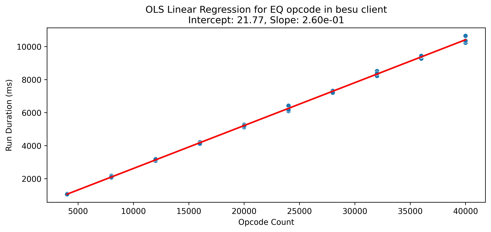


# GAS

## geth


```python
                            OLS Regression Results                            
==============================================================================
Dep. Variable:        run_duration_ms   R-squared:                       0.985
Model:                            OLS   Adj. R-squared:                  0.985
Method:                 Least Squares   F-statistic:                     1853.
Date:                Mon, 12 Jan 2026   Prob (F-statistic):           3.96e-27
Time:                        10:29:36   Log-Likelihood:                -170.98
No. Observations:                  30   AIC:                             346.0
Df Residuals:                      28   BIC:                             348.8
Df Model:                           1                                         
Covariance Type:            nonrobust                                         
==============================================================================
                 coef    std err          t      P>|t|      [0.025      0.975]
------------------------------------------------------------------------------
const         28.5588     29.506      0.968      0.341     -31.882      89.000
opcount        0.0171      0.000     43.043      0.000       0.016       0.018
==============================================================================
Omnibus:                        0.334   Durbin-Watson:                   0.789
Prob(Omnibus):                  0.846   Jarque-Bera (JB):                0.288
Skew:                          -0.211   Prob(JB):                        0.866
Kurtosis:                       2.772   Cond. No.                     1.61e+05
==============================================================================

Notes:
[1] Standard Errors assume that the covariance matrix of the errors is correctly specified.
[2] The condition number is large, 1.61e+05. This might indicate that there are
strong multicollinearity or other numerical problems.
```


## reth


```python
                            OLS Regression Results                            
==============================================================================
Dep. Variable:        run_duration_ms   R-squared:                       0.986
Model:                            OLS   Adj. R-squared:                  0.985
Method:                 Least Squares   F-statistic:                     1929.
Date:                Mon, 12 Jan 2026   Prob (F-statistic):           2.27e-27
Time:                        10:29:36   Log-Likelihood:                -138.56
No. Observations:                  30   AIC:                             281.1
Df Residuals:                      28   BIC:                             283.9
Df Model:                           1                                         
Covariance Type:            nonrobust                                         
==============================================================================
                 coef    std err          t      P>|t|      [0.025      0.975]
------------------------------------------------------------------------------
const         44.1020     10.014      4.404      0.000      23.589      64.615
opcount        0.0059      0.000     43.917      0.000       0.006       0.006
==============================================================================
Omnibus:                        0.626   Durbin-Watson:                   1.827
Prob(Omnibus):                  0.731   Jarque-Bera (JB):                0.656
Skew:                          -0.015   Prob(JB):                        0.720
Kurtosis:                       2.276   Cond. No.                     1.61e+05
==============================================================================

Notes:
[1] Standard Errors assume that the covariance matrix of the errors is correctly specified.
[2] The condition number is large, 1.61e+05. This might indicate that there are
strong multicollinearity or other numerical problems.
```


## nethermind


```python
                            OLS Regression Results                            
==============================================================================
Dep. Variable:        run_duration_ms   R-squared:                       0.979
Model:                            OLS   Adj. R-squared:                  0.978
Method:                 Least Squares   F-statistic:                     1292.
Date:                Mon, 12 Jan 2026   Prob (F-statistic):           5.62e-25
Time:                        10:29:36   Log-Likelihood:                -149.74
No. Observations:                  30   AIC:                             303.5
Df Residuals:                      28   BIC:                             306.3
Df Model:                           1                                         
Covariance Type:            nonrobust                                         
==============================================================================
                 coef    std err          t      P>|t|      [0.025      0.975]
------------------------------------------------------------------------------
const         35.4347     14.533      2.438      0.021       5.665      65.205
opcount        0.0070      0.000     35.947      0.000       0.007       0.007
==============================================================================
Omnibus:                        1.570   Durbin-Watson:                   0.711
Prob(Omnibus):                  0.456   Jarque-Bera (JB):                0.940
Skew:                           0.433   Prob(JB):                        0.625
Kurtosis:                       3.055   Cond. No.                     1.61e+05
==============================================================================

Notes:
[1] Standard Errors assume that the covariance matrix of the errors is correctly specified.
[2] The condition number is large, 1.61e+05. This might indicate that there are
strong multicollinearity or other numerical problems.
```

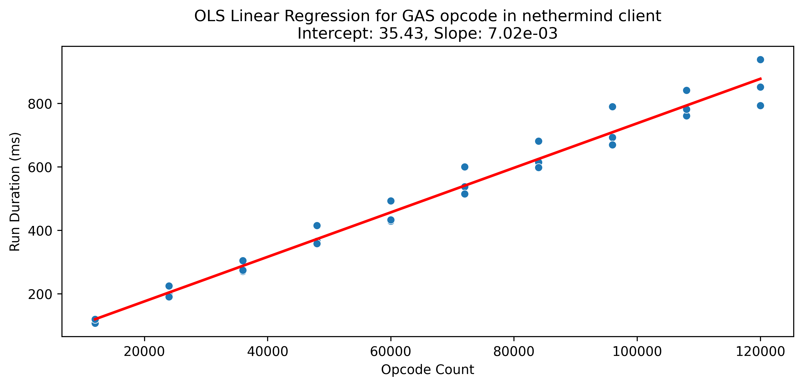


## besu


```python
                            OLS Regression Results                            
==============================================================================
Dep. Variable:        run_duration_ms   R-squared:                       0.999
Model:                            OLS   Adj. R-squared:                  0.999
Method:                 Least Squares   F-statistic:                 2.750e+04
Date:                Mon, 12 Jan 2026   Prob (F-statistic):           1.90e-43
Time:                        10:29:36   Log-Likelihood:                -146.73
No. Observations:                  30   AIC:                             297.5
Df Residuals:                      28   BIC:                             300.3
Df Model:                           1                                         
Covariance Type:            nonrobust                                         
==============================================================================
                 coef    std err          t      P>|t|      [0.025      0.975]
------------------------------------------------------------------------------
const         29.0754     13.148      2.211      0.035       2.143      56.008
opcount        0.0293      0.000    165.818      0.000       0.029       0.030
==============================================================================
Omnibus:                        1.388   Durbin-Watson:                   2.355
Prob(Omnibus):                  0.500   Jarque-Bera (JB):                0.594
Skew:                           0.319   Prob(JB):                        0.743
Kurtosis:                       3.260   Cond. No.                     1.61e+05
==============================================================================

Notes:
[1] Standard Errors assume that the covariance matrix of the errors is correctly specified.
[2] The condition number is large, 1.61e+05. This might indicate that there are
strong multicollinearity or other numerical problems.
```

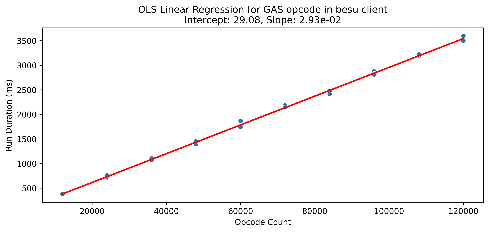


# GASLIMIT

## geth


```python
                            OLS Regression Results                            
==============================================================================
Dep. Variable:        run_duration_ms   R-squared:                       0.979
Model:                            OLS   Adj. R-squared:                  0.978
Method:                 Least Squares   F-statistic:                     1298.
Date:                Mon, 12 Jan 2026   Prob (F-statistic):           5.30e-25
Time:                        10:29:37   Log-Likelihood:                -170.79
No. Observations:                  30   AIC:                             345.6
Df Residuals:                      28   BIC:                             348.4
Df Model:                           1                                         
Covariance Type:            nonrobust                                         
==============================================================================
                 coef    std err          t      P>|t|      [0.025      0.975]
------------------------------------------------------------------------------
const         36.0981     29.322      1.231      0.229     -23.965      96.161
opcount        0.0170      0.000     36.025      0.000       0.016       0.018
==============================================================================
Omnibus:                        3.899   Durbin-Watson:                   0.986
Prob(Omnibus):                  0.142   Jarque-Bera (JB):                2.355
Skew:                          -0.566   Prob(JB):                        0.308
Kurtosis:                       3.776   Cond. No.                     1.34e+05
==============================================================================

Notes:
[1] Standard Errors assume that the covariance matrix of the errors is correctly specified.
[2] The condition number is large, 1.34e+05. This might indicate that there are
strong multicollinearity or other numerical problems.
```


## reth


```python
                            OLS Regression Results                            
==============================================================================
Dep. Variable:        run_duration_ms   R-squared:                       0.973
Model:                            OLS   Adj. R-squared:                  0.972
Method:                 Least Squares   F-statistic:                     1006.
Date:                Mon, 12 Jan 2026   Prob (F-statistic):           1.72e-23
Time:                        10:29:37   Log-Likelihood:                -143.78
No. Observations:                  30   AIC:                             291.6
Df Residuals:                      28   BIC:                             294.4
Df Model:                           1                                         
Covariance Type:            nonrobust                                         
==============================================================================
                 coef    std err          t      P>|t|      [0.025      0.975]
------------------------------------------------------------------------------
const         42.8216     11.914      3.594      0.001      18.416      67.227
opcount        0.0061      0.000     31.723      0.000       0.006       0.006
==============================================================================
Omnibus:                        1.157   Durbin-Watson:                   1.995
Prob(Omnibus):                  0.561   Jarque-Bera (JB):                0.713
Skew:                          -0.377   Prob(JB):                        0.700
Kurtosis:                       2.965   Cond. No.                     1.34e+05
==============================================================================

Notes:
[1] Standard Errors assume that the covariance matrix of the errors is correctly specified.
[2] The condition number is large, 1.34e+05. This might indicate that there are
strong multicollinearity or other numerical problems.
```


## nethermind


```python
                            OLS Regression Results                            
==============================================================================
Dep. Variable:        run_duration_ms   R-squared:                       0.986
Model:                            OLS   Adj. R-squared:                  0.985
Method:                 Least Squares   F-statistic:                     1932.
Date:                Mon, 12 Jan 2026   Prob (F-statistic):           2.22e-27
Time:                        10:29:37   Log-Likelihood:                -138.69
No. Observations:                  30   AIC:                             281.4
Df Residuals:                      28   BIC:                             284.2
Df Model:                           1                                         
Covariance Type:            nonrobust                                         
==============================================================================
                 coef    std err          t      P>|t|      [0.025      0.975]
------------------------------------------------------------------------------
const         29.1645     10.054      2.901      0.007       8.569      49.760
opcount        0.0071      0.000     43.950      0.000       0.007       0.007
==============================================================================
Omnibus:                        2.639   Durbin-Watson:                   1.152
Prob(Omnibus):                  0.267   Jarque-Bera (JB):                1.464
Skew:                           0.066   Prob(JB):                        0.481
Kurtosis:                       4.074   Cond. No.                     1.34e+05
==============================================================================

Notes:
[1] Standard Errors assume that the covariance matrix of the errors is correctly specified.
[2] The condition number is large, 1.34e+05. This might indicate that there are
strong multicollinearity or other numerical problems.
```

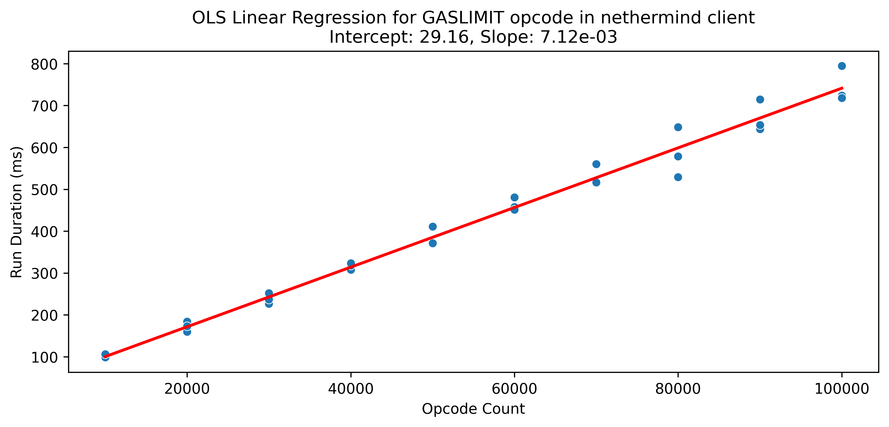


## besu


```python
                            OLS Regression Results                            
==============================================================================
Dep. Variable:        run_duration_ms   R-squared:                       0.999
Model:                            OLS   Adj. R-squared:                  0.999
Method:                 Least Squares   F-statistic:                 2.691e+04
Date:                Mon, 12 Jan 2026   Prob (F-statistic):           2.57e-43
Time:                        10:29:37   Log-Likelihood:                -141.49
No. Observations:                  30   AIC:                             287.0
Df Residuals:                      28   BIC:                             289.8
Df Model:                           1                                         
Covariance Type:            nonrobust                                         
==============================================================================
                 coef    std err          t      P>|t|      [0.025      0.975]
------------------------------------------------------------------------------
const         17.5279     11.038      1.588      0.124      -5.083      40.139
opcount        0.0292      0.000    164.031      0.000       0.029       0.030
==============================================================================
Omnibus:                        0.886   Durbin-Watson:                   1.932
Prob(Omnibus):                  0.642   Jarque-Bera (JB):                0.186
Skew:                           0.122   Prob(JB):                        0.911
Kurtosis:                       3.299   Cond. No.                     1.34e+05
==============================================================================

Notes:
[1] Standard Errors assume that the covariance matrix of the errors is correctly specified.
[2] The condition number is large, 1.34e+05. This might indicate that there are
strong multicollinearity or other numerical problems.
```


# GASPRICE

## geth


```python
                            OLS Regression Results                            
==============================================================================
Dep. Variable:        run_duration_ms   R-squared:                       0.977
Model:                            OLS   Adj. R-squared:                  0.976
Method:                 Least Squares   F-statistic:                     1170.
Date:                Mon, 12 Jan 2026   Prob (F-statistic):           2.20e-24
Time:                        10:29:37   Log-Likelihood:                -174.33
No. Observations:                  30   AIC:                             352.7
Df Residuals:                      28   BIC:                             355.5
Df Model:                           1                                         
Covariance Type:            nonrobust                                         
==============================================================================
                 coef    std err          t      P>|t|      [0.025      0.975]
------------------------------------------------------------------------------
const         42.9758     32.985      1.303      0.203     -24.590     110.542
opcount        0.0182      0.001     34.203      0.000       0.017       0.019
==============================================================================
Omnibus:                        0.784   Durbin-Watson:                   1.285
Prob(Omnibus):                  0.676   Jarque-Bera (JB):                0.437
Skew:                          -0.295   Prob(JB):                        0.804
Kurtosis:                       2.953   Cond. No.                     1.34e+05
==============================================================================

Notes:
[1] Standard Errors assume that the covariance matrix of the errors is correctly specified.
[2] The condition number is large, 1.34e+05. This might indicate that there are
strong multicollinearity or other numerical problems.
```

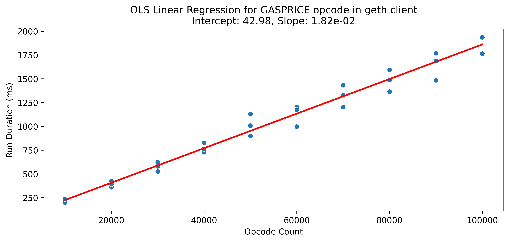


## reth


```python
                            OLS Regression Results                            
==============================================================================
Dep. Variable:        run_duration_ms   R-squared:                       0.986
Model:                            OLS   Adj. R-squared:                  0.986
Method:                 Least Squares   F-statistic:                     1997.
Date:                Mon, 12 Jan 2026   Prob (F-statistic):           1.40e-27
Time:                        10:29:37   Log-Likelihood:                -135.19
No. Observations:                  30   AIC:                             274.4
Df Residuals:                      28   BIC:                             277.2
Df Model:                           1                                         
Covariance Type:            nonrobust                                         
==============================================================================
                 coef    std err          t      P>|t|      [0.025      0.975]
------------------------------------------------------------------------------
const         44.3167      8.950      4.951      0.000      25.983      62.650
opcount        0.0064      0.000     44.693      0.000       0.006       0.007
==============================================================================
Omnibus:                        2.499   Durbin-Watson:                   1.402
Prob(Omnibus):                  0.287   Jarque-Bera (JB):                1.732
Skew:                           0.588   Prob(JB):                        0.421
Kurtosis:                       3.037   Cond. No.                     1.34e+05
==============================================================================

Notes:
[1] Standard Errors assume that the covariance matrix of the errors is correctly specified.
[2] The condition number is large, 1.34e+05. This might indicate that there are
strong multicollinearity or other numerical problems.
```

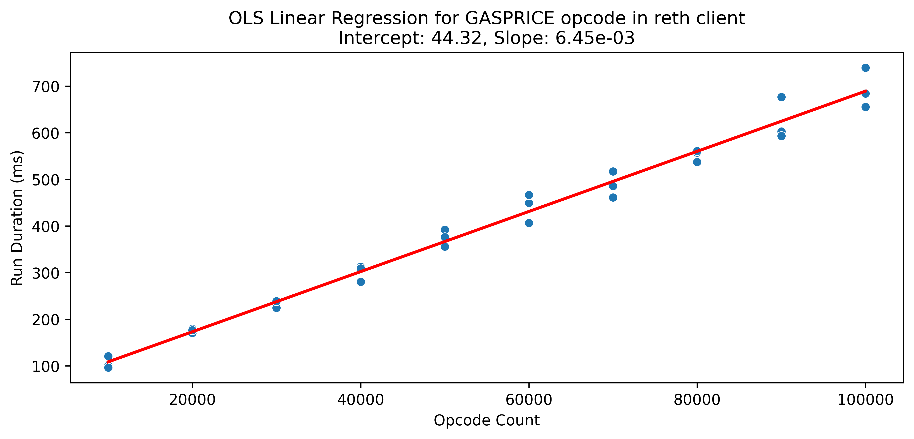


## nethermind


```python
                            OLS Regression Results                            
==============================================================================
Dep. Variable:        run_duration_ms   R-squared:                       0.986
Model:                            OLS   Adj. R-squared:                  0.985
Method:                 Least Squares   F-statistic:                     1921.
Date:                Mon, 12 Jan 2026   Prob (F-statistic):           2.39e-27
Time:                        10:29:37   Log-Likelihood:                -139.00
No. Observations:                  30   AIC:                             282.0
Df Residuals:                      28   BIC:                             284.8
Df Model:                           1                                         
Covariance Type:            nonrobust                                         
==============================================================================
                 coef    std err          t      P>|t|      [0.025      0.975]
------------------------------------------------------------------------------
const         25.3521     10.161      2.495      0.019       4.539      46.165
opcount        0.0072      0.000     43.833      0.000       0.007       0.008
==============================================================================
Omnibus:                       12.978   Durbin-Watson:                   0.808
Prob(Omnibus):                  0.002   Jarque-Bera (JB):               13.266
Skew:                           1.220   Prob(JB):                      0.00132
Kurtosis:                       5.159   Cond. No.                     1.34e+05
==============================================================================

Notes:
[1] Standard Errors assume that the covariance matrix of the errors is correctly specified.
[2] The condition number is large, 1.34e+05. This might indicate that there are
strong multicollinearity or other numerical problems.
```

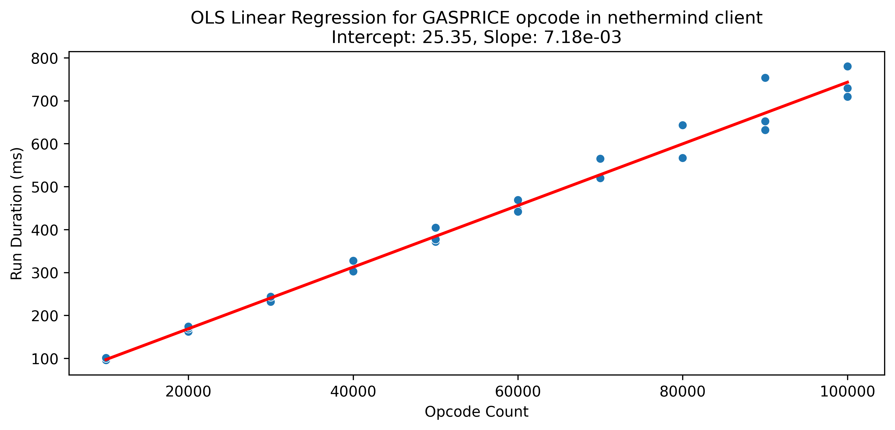


## besu


```python
                            OLS Regression Results                            
==============================================================================
Dep. Variable:        run_duration_ms   R-squared:                       0.973
Model:                            OLS   Adj. R-squared:                  0.972
Method:                 Least Squares   F-statistic:                     1011.
Date:                Mon, 12 Jan 2026   Prob (F-statistic):           1.62e-23
Time:                        10:29:37   Log-Likelihood:                -189.51
No. Observations:                  30   AIC:                             383.0
Df Residuals:                      28   BIC:                             385.8
Df Model:                           1                                         
Covariance Type:            nonrobust                                         
==============================================================================
                 coef    std err          t      P>|t|      [0.025      0.975]
------------------------------------------------------------------------------
const         31.8713     54.720      0.582      0.565     -80.217     143.959
opcount        0.0280      0.001     31.789      0.000       0.026       0.030
==============================================================================
Omnibus:                        3.571   Durbin-Watson:                   1.357
Prob(Omnibus):                  0.168   Jarque-Bera (JB):                2.498
Skew:                           0.700   Prob(JB):                        0.287
Kurtosis:                       3.189   Cond. No.                     1.34e+05
==============================================================================

Notes:
[1] Standard Errors assume that the covariance matrix of the errors is correctly specified.
[2] The condition number is large, 1.34e+05. This might indicate that there are
strong multicollinearity or other numerical problems.
```


# GT

## geth


```python
                            OLS Regression Results                            
==============================================================================
Dep. Variable:        run_duration_ms   R-squared:                       0.975
Model:                            OLS   Adj. R-squared:                  0.974
Method:                 Least Squares   F-statistic:                     1072.
Date:                Mon, 12 Jan 2026   Prob (F-statistic):           7.25e-24
Time:                        10:29:38   Log-Likelihood:                -155.93
No. Observations:                  30   AIC:                             315.9
Df Residuals:                      28   BIC:                             318.7
Df Model:                           1                                         
Covariance Type:            nonrobust                                         
==============================================================================
                 coef    std err          t      P>|t|      [0.025      0.975]
------------------------------------------------------------------------------
const         32.5728     17.868      1.823      0.079      -4.028      69.174
opcount        0.0236      0.001     32.741      0.000       0.022       0.025
==============================================================================
Omnibus:                        2.748   Durbin-Watson:                   0.708
Prob(Omnibus):                  0.253   Jarque-Bera (JB):                1.585
Skew:                          -0.058   Prob(JB):                        0.453
Kurtosis:                       4.120   Cond. No.                     5.36e+04
==============================================================================

Notes:
[1] Standard Errors assume that the covariance matrix of the errors is correctly specified.
[2] The condition number is large, 5.36e+04. This might indicate that there are
strong multicollinearity or other numerical problems.
```

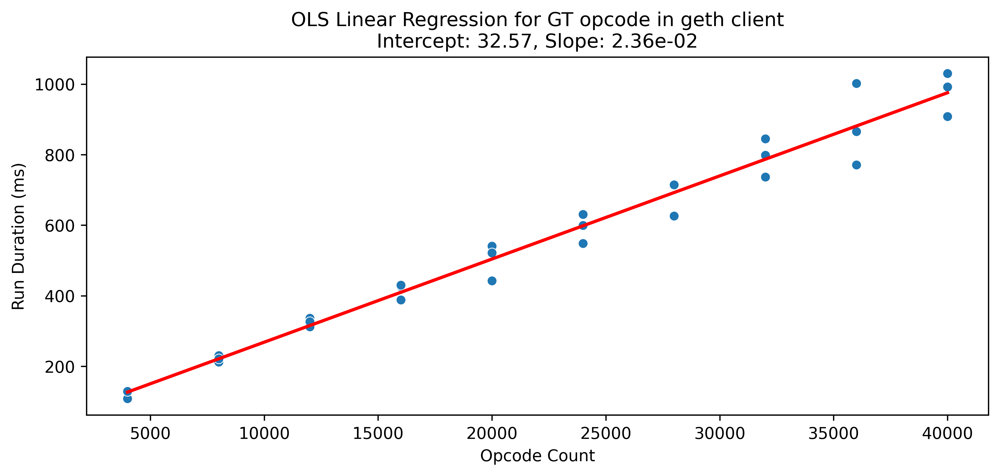


## reth


```python
                            OLS Regression Results                            
==============================================================================
Dep. Variable:        run_duration_ms   R-squared:                       0.993
Model:                            OLS   Adj. R-squared:                  0.993
Method:                 Least Squares   F-statistic:                     4097.
Date:                Mon, 12 Jan 2026   Prob (F-statistic):           6.60e-32
Time:                        10:29:38   Log-Likelihood:                -108.98
No. Observations:                  30   AIC:                             222.0
Df Residuals:                      28   BIC:                             224.8
Df Model:                           1                                         
Covariance Type:            nonrobust                                         
==============================================================================
                 coef    std err          t      P>|t|      [0.025      0.975]
------------------------------------------------------------------------------
const         29.2219      3.735      7.823      0.000      21.570      36.873
opcount        0.0096      0.000     64.011      0.000       0.009       0.010
==============================================================================
Omnibus:                        3.086   Durbin-Watson:                   1.596
Prob(Omnibus):                  0.214   Jarque-Bera (JB):                1.926
Skew:                           0.140   Prob(JB):                        0.382
Kurtosis:                       4.209   Cond. No.                     5.36e+04
==============================================================================

Notes:
[1] Standard Errors assume that the covariance matrix of the errors is correctly specified.
[2] The condition number is large, 5.36e+04. This might indicate that there are
strong multicollinearity or other numerical problems.
```

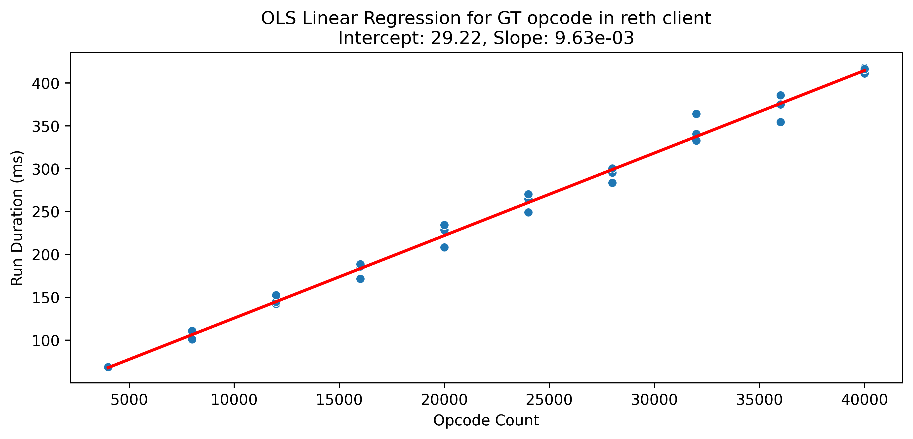


## nethermind


```python
                            OLS Regression Results                            
==============================================================================
Dep. Variable:        run_duration_ms   R-squared:                       0.998
Model:                            OLS   Adj. R-squared:                  0.998
Method:                 Least Squares   F-statistic:                 1.403e+04
Date:                Mon, 12 Jan 2026   Prob (F-statistic):           2.30e-39
Time:                        10:29:38   Log-Likelihood:                -107.89
No. Observations:                  30   AIC:                             219.8
Df Residuals:                      28   BIC:                             222.6
Df Model:                           1                                         
Covariance Type:            nonrobust                                         
==============================================================================
                 coef    std err          t      P>|t|      [0.025      0.975]
------------------------------------------------------------------------------
const         28.0216      3.602      7.779      0.000      20.643      35.401
opcount        0.0172      0.000    118.466      0.000       0.017       0.017
==============================================================================
Omnibus:                        1.104   Durbin-Watson:                   0.865
Prob(Omnibus):                  0.576   Jarque-Bera (JB):                0.922
Skew:                           0.169   Prob(JB):                        0.631
Kurtosis:                       2.211   Cond. No.                     5.36e+04
==============================================================================

Notes:
[1] Standard Errors assume that the covariance matrix of the errors is correctly specified.
[2] The condition number is large, 5.36e+04. This might indicate that there are
strong multicollinearity or other numerical problems.
```


## besu


```python
                            OLS Regression Results                            
==============================================================================
Dep. Variable:        run_duration_ms   R-squared:                       0.999
Model:                            OLS   Adj. R-squared:                  0.999
Method:                 Least Squares   F-statistic:                 3.677e+04
Date:                Mon, 12 Jan 2026   Prob (F-statistic):           3.26e-45
Time:                        10:29:38   Log-Likelihood:                -133.31
No. Observations:                  30   AIC:                             270.6
Df Residuals:                      28   BIC:                             273.4
Df Model:                           1                                         
Covariance Type:            nonrobust                                         
==============================================================================
                 coef    std err          t      P>|t|      [0.025      0.975]
------------------------------------------------------------------------------
const         18.8786      8.406      2.246      0.033       1.660      36.098
opcount        0.0649      0.000    191.753      0.000       0.064       0.066
==============================================================================
Omnibus:                        3.162   Durbin-Watson:                   1.463
Prob(Omnibus):                  0.206   Jarque-Bera (JB):                1.746
Skew:                           0.448   Prob(JB):                        0.418
Kurtosis:                       3.770   Cond. No.                     5.36e+04
==============================================================================

Notes:
[1] Standard Errors assume that the covariance matrix of the errors is correctly specified.
[2] The condition number is large, 5.36e+04. This might indicate that there are
strong multicollinearity or other numerical problems.
```

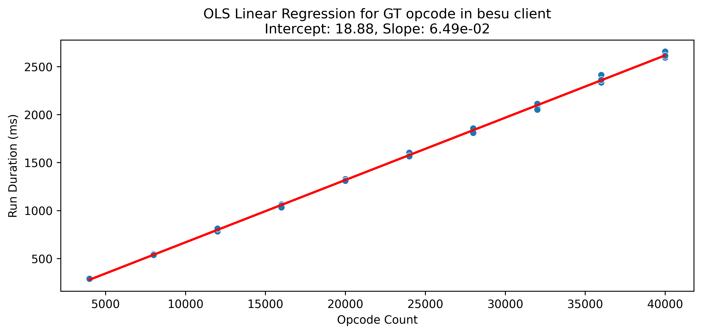


# INVALID

## geth

OLS model did not run... Error: zero-size array to reduction operation maximum which has no identity

## reth

OLS model did not run... Error: zero-size array to reduction operation maximum which has no identity

## nethermind

OLS model did not run... Error: zero-size array to reduction operation maximum which has no identity

## besu

OLS model did not run... Error: zero-size array to reduction operation maximum which has no identity

# ISZERO

## geth


```python
                            OLS Regression Results                            
==============================================================================
Dep. Variable:        run_duration_ms   R-squared:                       0.986
Model:                            OLS   Adj. R-squared:                  0.986
Method:                 Least Squares   F-statistic:                     2023.
Date:                Mon, 12 Jan 2026   Prob (F-statistic):           1.17e-27
Time:                        10:29:38   Log-Likelihood:                -144.42
No. Observations:                  30   AIC:                             292.8
Df Residuals:                      28   BIC:                             295.6
Df Model:                           1                                         
Covariance Type:            nonrobust                                         
==============================================================================
                 coef    std err          t      P>|t|      [0.025      0.975]
------------------------------------------------------------------------------
const         25.0336     12.172      2.057      0.049       0.101      49.966
opcount        0.0110      0.000     44.982      0.000       0.011       0.012
==============================================================================
Omnibus:                        1.954   Durbin-Watson:                   1.051
Prob(Omnibus):                  0.376   Jarque-Bera (JB):                0.854
Skew:                          -0.319   Prob(JB):                        0.653
Kurtosis:                       3.526   Cond. No.                     1.07e+05
==============================================================================

Notes:
[1] Standard Errors assume that the covariance matrix of the errors is correctly specified.
[2] The condition number is large, 1.07e+05. This might indicate that there are
strong multicollinearity or other numerical problems.
```


## reth


```python
                            OLS Regression Results                            
==============================================================================
Dep. Variable:        run_duration_ms   R-squared:                       0.977
Model:                            OLS   Adj. R-squared:                  0.976
Method:                 Least Squares   F-statistic:                     1181.
Date:                Mon, 12 Jan 2026   Prob (F-statistic):           1.93e-24
Time:                        10:29:38   Log-Likelihood:                -132.83
No. Observations:                  30   AIC:                             269.7
Df Residuals:                      28   BIC:                             272.5
Df Model:                           1                                         
Covariance Type:            nonrobust                                         
==============================================================================
                 coef    std err          t      P>|t|      [0.025      0.975]
------------------------------------------------------------------------------
const         35.0380      8.272      4.235      0.000      18.093      51.983
opcount        0.0057      0.000     34.366      0.000       0.005       0.006
==============================================================================
Omnibus:                        1.415   Durbin-Watson:                   2.118
Prob(Omnibus):                  0.493   Jarque-Bera (JB):                0.947
Skew:                          -0.434   Prob(JB):                        0.623
Kurtosis:                       2.938   Cond. No.                     1.07e+05
==============================================================================

Notes:
[1] Standard Errors assume that the covariance matrix of the errors is correctly specified.
[2] The condition number is large, 1.07e+05. This might indicate that there are
strong multicollinearity or other numerical problems.
```

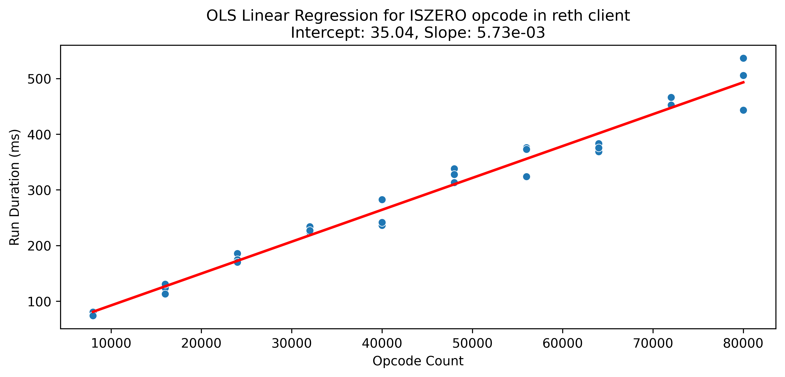


## nethermind


```python
                            OLS Regression Results                            
==============================================================================
Dep. Variable:        run_duration_ms   R-squared:                       0.974
Model:                            OLS   Adj. R-squared:                  0.973
Method:                 Least Squares   F-statistic:                     1060.
Date:                Mon, 12 Jan 2026   Prob (F-statistic):           8.41e-24
Time:                        10:29:39   Log-Likelihood:                -150.93
No. Observations:                  30   AIC:                             305.9
Df Residuals:                      28   BIC:                             308.7
Df Model:                           1                                         
Covariance Type:            nonrobust                                         
==============================================================================
                 coef    std err          t      P>|t|      [0.025      0.975]
------------------------------------------------------------------------------
const         27.0543     15.121      1.789      0.084      -3.920      58.029
opcount        0.0099      0.000     32.565      0.000       0.009       0.011
==============================================================================
Omnibus:                        0.079   Durbin-Watson:                   0.969
Prob(Omnibus):                  0.961   Jarque-Bera (JB):                0.288
Skew:                          -0.058   Prob(JB):                        0.866
Kurtosis:                       2.535   Cond. No.                     1.07e+05
==============================================================================

Notes:
[1] Standard Errors assume that the covariance matrix of the errors is correctly specified.
[2] The condition number is large, 1.07e+05. This might indicate that there are
strong multicollinearity or other numerical problems.
```

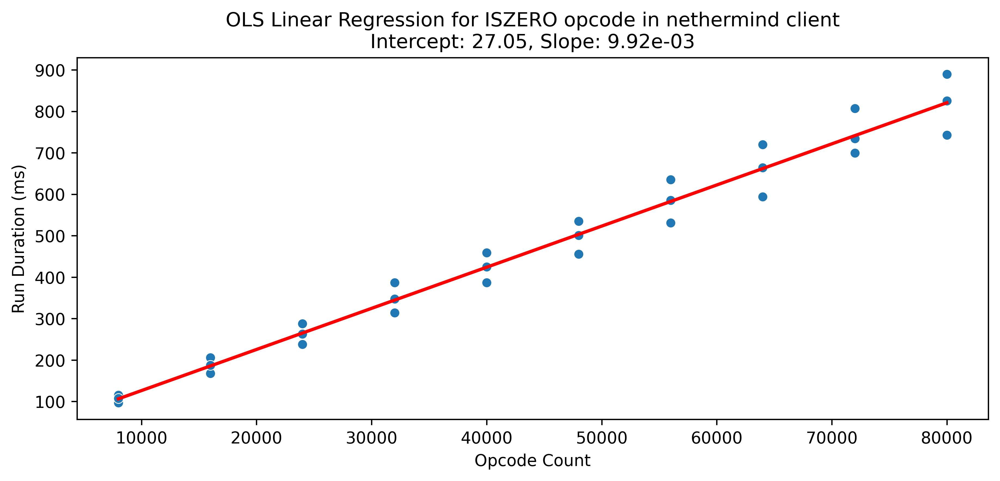


## besu


```python
                            OLS Regression Results                            
==============================================================================
Dep. Variable:        run_duration_ms   R-squared:                       0.998
Model:                            OLS   Adj. R-squared:                  0.998
Method:                 Least Squares   F-statistic:                 1.278e+04
Date:                Mon, 12 Jan 2026   Prob (F-statistic):           8.48e-39
Time:                        10:29:39   Log-Likelihood:                -140.07
No. Observations:                  30   AIC:                             284.1
Df Residuals:                      28   BIC:                             286.9
Df Model:                           1                                         
Covariance Type:            nonrobust                                         
==============================================================================
                 coef    std err          t      P>|t|      [0.025      0.975]
------------------------------------------------------------------------------
const         28.0388     10.530      2.663      0.013       6.469      49.609
opcount        0.0240      0.000    113.068      0.000       0.024       0.024
==============================================================================
Omnibus:                        9.728   Durbin-Watson:                   1.530
Prob(Omnibus):                  0.008   Jarque-Bera (JB):                9.590
Skew:                           0.873   Prob(JB):                      0.00827
Kurtosis:                       5.149   Cond. No.                     1.07e+05
==============================================================================

Notes:
[1] Standard Errors assume that the covariance matrix of the errors is correctly specified.
[2] The condition number is large, 1.07e+05. This might indicate that there are
strong multicollinearity or other numerical problems.
```


# JUMP

## geth

OLS model did not run... Error: zero-size array to reduction operation maximum which has no identity

## reth

OLS model did not run... Error: zero-size array to reduction operation maximum which has no identity

## nethermind

OLS model did not run... Error: zero-size array to reduction operation maximum which has no identity

## besu

OLS model did not run... Error: zero-size array to reduction operation maximum which has no identity

# JUMPDEST

## geth


```python
                            OLS Regression Results                            
==============================================================================
Dep. Variable:        run_duration_ms   R-squared:                       0.991
Model:                            OLS   Adj. R-squared:                  0.991
Method:                 Least Squares   F-statistic:                     3036.
Date:                Mon, 12 Jan 2026   Prob (F-statistic):           4.25e-30
Time:                        10:29:39   Log-Likelihood:                -163.12
No. Observations:                  30   AIC:                             330.2
Df Residuals:                      28   BIC:                             333.0
Df Model:                           1                                         
Covariance Type:            nonrobust                                         
==============================================================================
                 coef    std err          t      P>|t|      [0.025      0.975]
------------------------------------------------------------------------------
const         22.9432     22.705      1.010      0.321     -23.566      69.452
opcount        0.0101      0.000     55.099      0.000       0.010       0.010
==============================================================================
Omnibus:                        3.305   Durbin-Watson:                   0.708
Prob(Omnibus):                  0.192   Jarque-Bera (JB):                2.944
Skew:                          -0.736   Prob(JB):                        0.229
Kurtosis:                       2.563   Cond. No.                     2.68e+05
==============================================================================

Notes:
[1] Standard Errors assume that the covariance matrix of the errors is correctly specified.
[2] The condition number is large, 2.68e+05. This might indicate that there are
strong multicollinearity or other numerical problems.
```


## reth


```python
                            OLS Regression Results                            
==============================================================================
Dep. Variable:        run_duration_ms   R-squared:                       0.965
Model:                            OLS   Adj. R-squared:                  0.964
Method:                 Least Squares   F-statistic:                     781.7
Date:                Mon, 12 Jan 2026   Prob (F-statistic):           5.31e-22
Time:                        10:29:39   Log-Likelihood:                -164.41
No. Observations:                  30   AIC:                             332.8
Df Residuals:                      28   BIC:                             335.6
Df Model:                           1                                         
Covariance Type:            nonrobust                                         
==============================================================================
                 coef    std err          t      P>|t|      [0.025      0.975]
------------------------------------------------------------------------------
const         30.4285     23.700      1.284      0.210     -18.118      78.975
opcount        0.0053      0.000     27.959      0.000       0.005       0.006
==============================================================================
Omnibus:                        0.875   Durbin-Watson:                   2.097
Prob(Omnibus):                  0.646   Jarque-Bera (JB):                0.799
Skew:                          -0.127   Prob(JB):                        0.671
Kurtosis:                       2.242   Cond. No.                     2.68e+05
==============================================================================

Notes:
[1] Standard Errors assume that the covariance matrix of the errors is correctly specified.
[2] The condition number is large, 2.68e+05. This might indicate that there are
strong multicollinearity or other numerical problems.
```

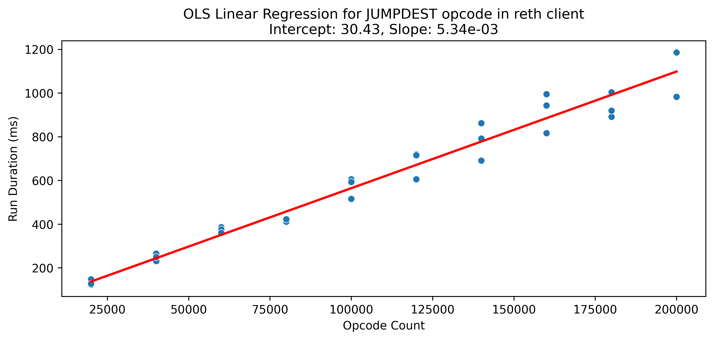


## nethermind


```python
                            OLS Regression Results                            
==============================================================================
Dep. Variable:        run_duration_ms   R-squared:                       0.992
Model:                            OLS   Adj. R-squared:                  0.992
Method:                 Least Squares   F-statistic:                     3407.
Date:                Mon, 12 Jan 2026   Prob (F-statistic):           8.58e-31
Time:                        10:29:39   Log-Likelihood:                -148.59
No. Observations:                  30   AIC:                             301.2
Df Residuals:                      28   BIC:                             304.0
Df Model:                           1                                         
Covariance Type:            nonrobust                                         
==============================================================================
                 coef    std err          t      P>|t|      [0.025      0.975]
------------------------------------------------------------------------------
const         34.3277     13.989      2.454      0.021       5.672      62.983
opcount        0.0066      0.000     58.368      0.000       0.006       0.007
==============================================================================
Omnibus:                        0.956   Durbin-Watson:                   1.085
Prob(Omnibus):                  0.620   Jarque-Bera (JB):                0.835
Skew:                           0.380   Prob(JB):                        0.659
Kurtosis:                       2.698   Cond. No.                     2.68e+05
==============================================================================

Notes:
[1] Standard Errors assume that the covariance matrix of the errors is correctly specified.
[2] The condition number is large, 2.68e+05. This might indicate that there are
strong multicollinearity or other numerical problems.
```


## besu


```python
                            OLS Regression Results                            
==============================================================================
Dep. Variable:        run_duration_ms   R-squared:                       0.997
Model:                            OLS   Adj. R-squared:                  0.997
Method:                 Least Squares   F-statistic:                     9881.
Date:                Mon, 12 Jan 2026   Prob (F-statistic):           3.09e-37
Time:                        10:29:39   Log-Likelihood:                -158.19
No. Observations:                  30   AIC:                             320.4
Df Residuals:                      28   BIC:                             323.2
Df Model:                           1                                         
Covariance Type:            nonrobust                                         
==============================================================================
                 coef    std err          t      P>|t|      [0.025      0.975]
------------------------------------------------------------------------------
const          7.6869     19.263      0.399      0.693     -31.772      47.146
opcount        0.0154      0.000     99.405      0.000       0.015       0.016
==============================================================================
Omnibus:                        3.295   Durbin-Watson:                   1.412
Prob(Omnibus):                  0.193   Jarque-Bera (JB):                1.951
Skew:                           0.324   Prob(JB):                        0.377
Kurtosis:                       4.068   Cond. No.                     2.68e+05
==============================================================================

Notes:
[1] Standard Errors assume that the covariance matrix of the errors is correctly specified.
[2] The condition number is large, 2.68e+05. This might indicate that there are
strong multicollinearity or other numerical problems.
```

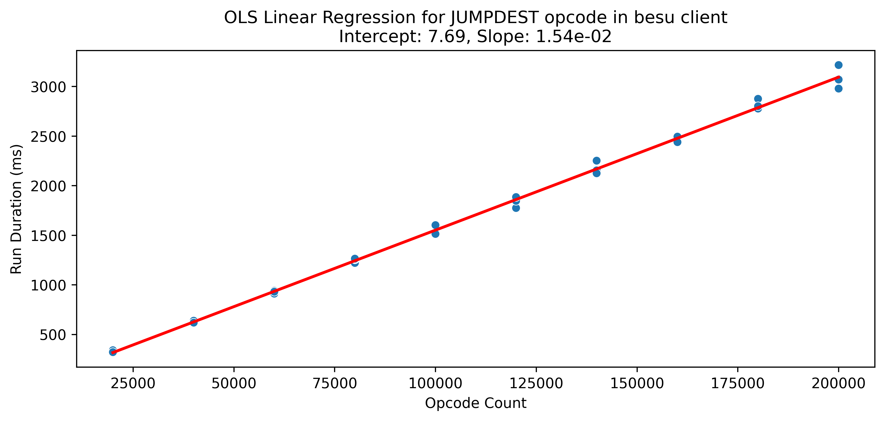


# JUMPI

## geth


```python
                            OLS Regression Results                            
==============================================================================
Dep. Variable:        run_duration_ms   R-squared:                       0.991
Model:                            OLS   Adj. R-squared:                  0.991
Method:                 Least Squares   F-statistic:                     3128.
Date:                Mon, 12 Jan 2026   Prob (F-statistic):           2.81e-30
Time:                        10:29:39   Log-Likelihood:                -125.67
No. Observations:                  30   AIC:                             255.3
Df Residuals:                      28   BIC:                             258.1
Df Model:                           1                                         
Covariance Type:            nonrobust                                         
==============================================================================
                 coef    std err          t      P>|t|      [0.025      0.975]
------------------------------------------------------------------------------
const         27.4003      6.516      4.205      0.000      14.053      40.748
opcount        0.0294      0.001     55.931      0.000       0.028       0.030
==============================================================================
Omnibus:                        9.574   Durbin-Watson:                   1.188
Prob(Omnibus):                  0.008   Jarque-Bera (JB):                8.281
Skew:                          -1.010   Prob(JB):                       0.0159
Kurtosis:                       4.596   Cond. No.                     2.68e+04
==============================================================================

Notes:
[1] Standard Errors assume that the covariance matrix of the errors is correctly specified.
[2] The condition number is large, 2.68e+04. This might indicate that there are
strong multicollinearity or other numerical problems.
```


## reth


```python
                            OLS Regression Results                            
==============================================================================
Dep. Variable:        run_duration_ms   R-squared:                       0.987
Model:                            OLS   Adj. R-squared:                  0.987
Method:                 Least Squares   F-statistic:                     2190.
Date:                Mon, 12 Jan 2026   Prob (F-statistic):           3.93e-28
Time:                        10:29:39   Log-Likelihood:                -105.45
No. Observations:                  30   AIC:                             214.9
Df Residuals:                      28   BIC:                             217.7
Df Model:                           1                                         
Covariance Type:            nonrobust                                         
==============================================================================
                 coef    std err          t      P>|t|      [0.025      0.975]
------------------------------------------------------------------------------
const         35.3728      3.321     10.651      0.000      28.570      42.176
opcount        0.0125      0.000     46.795      0.000       0.012       0.013
==============================================================================
Omnibus:                        9.866   Durbin-Watson:                   1.227
Prob(Omnibus):                  0.007   Jarque-Bera (JB):                8.467
Skew:                           1.210   Prob(JB):                       0.0145
Kurtosis:                       3.957   Cond. No.                     2.68e+04
==============================================================================

Notes:
[1] Standard Errors assume that the covariance matrix of the errors is correctly specified.
[2] The condition number is large, 2.68e+04. This might indicate that there are
strong multicollinearity or other numerical problems.
```

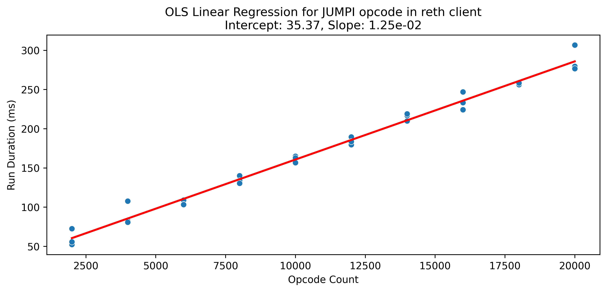


## nethermind


```python
                            OLS Regression Results                            
==============================================================================
Dep. Variable:        run_duration_ms   R-squared:                       0.986
Model:                            OLS   Adj. R-squared:                  0.986
Method:                 Least Squares   F-statistic:                     2013.
Date:                Mon, 12 Jan 2026   Prob (F-statistic):           1.26e-27
Time:                        10:29:40   Log-Likelihood:                -115.27
No. Observations:                  30   AIC:                             234.5
Df Residuals:                      28   BIC:                             237.3
Df Model:                           1                                         
Covariance Type:            nonrobust                                         
==============================================================================
                 coef    std err          t      P>|t|      [0.025      0.975]
------------------------------------------------------------------------------
const         24.4273      4.607      5.302      0.000      14.990      33.864
opcount        0.0167      0.000     44.863      0.000       0.016       0.017
==============================================================================
Omnibus:                        3.852   Durbin-Watson:                   0.737
Prob(Omnibus):                  0.146   Jarque-Bera (JB):                3.440
Skew:                           0.805   Prob(JB):                        0.179
Kurtosis:                       2.604   Cond. No.                     2.68e+04
==============================================================================

Notes:
[1] Standard Errors assume that the covariance matrix of the errors is correctly specified.
[2] The condition number is large, 2.68e+04. This might indicate that there are
strong multicollinearity or other numerical problems.
```

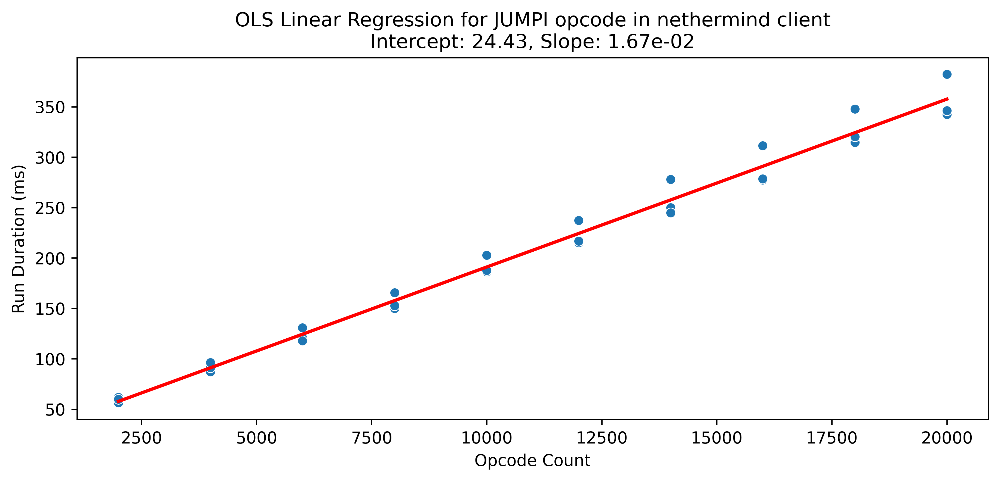


## besu


```python
                            OLS Regression Results                            
==============================================================================
Dep. Variable:        run_duration_ms   R-squared:                       0.996
Model:                            OLS   Adj. R-squared:                  0.996
Method:                 Least Squares   F-statistic:                     7034.
Date:                Mon, 12 Jan 2026   Prob (F-statistic):           3.55e-35
Time:                        10:29:40   Log-Likelihood:                -126.38
No. Observations:                  30   AIC:                             256.8
Df Residuals:                      28   BIC:                             259.6
Df Model:                           1                                         
Covariance Type:            nonrobust                                         
==============================================================================
                 coef    std err          t      P>|t|      [0.025      0.975]
------------------------------------------------------------------------------
const         30.3858      6.671      4.555      0.000      16.721      44.051
opcount        0.0451      0.001     83.871      0.000       0.044       0.046
==============================================================================
Omnibus:                        3.879   Durbin-Watson:                   1.495
Prob(Omnibus):                  0.144   Jarque-Bera (JB):                2.866
Skew:                           0.755   Prob(JB):                        0.239
Kurtosis:                       3.122   Cond. No.                     2.68e+04
==============================================================================

Notes:
[1] Standard Errors assume that the covariance matrix of the errors is correctly specified.
[2] The condition number is large, 2.68e+04. This might indicate that there are
strong multicollinearity or other numerical problems.
```


# LT

## geth


```python
                            OLS Regression Results                            
==============================================================================
Dep. Variable:        run_duration_ms   R-squared:                       0.988
Model:                            OLS   Adj. R-squared:                  0.988
Method:                 Least Squares   F-statistic:                     2375.
Date:                Mon, 12 Jan 2026   Prob (F-statistic):           1.28e-28
Time:                        10:29:40   Log-Likelihood:                -144.45
No. Observations:                  30   AIC:                             292.9
Df Residuals:                      28   BIC:                             295.7
Df Model:                           1                                         
Covariance Type:            nonrobust                                         
==============================================================================
                 coef    std err          t      P>|t|      [0.025      0.975]
------------------------------------------------------------------------------
const         27.9999     12.183      2.298      0.029       3.045      52.955
opcount        0.0239      0.000     48.735      0.000       0.023       0.025
==============================================================================
Omnibus:                        4.503   Durbin-Watson:                   0.930
Prob(Omnibus):                  0.105   Jarque-Bera (JB):                3.120
Skew:                          -0.763   Prob(JB):                        0.210
Kurtosis:                       3.405   Cond. No.                     5.36e+04
==============================================================================

Notes:
[1] Standard Errors assume that the covariance matrix of the errors is correctly specified.
[2] The condition number is large, 5.36e+04. This might indicate that there are
strong multicollinearity or other numerical problems.
```

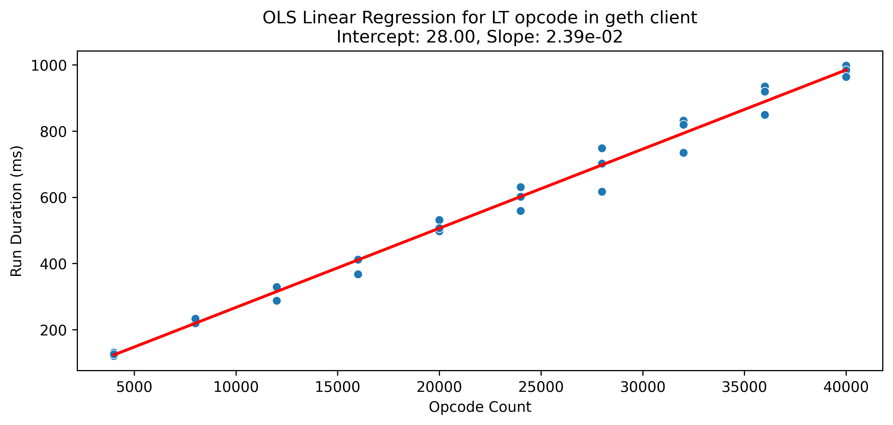


## reth


```python
                            OLS Regression Results                            
==============================================================================
Dep. Variable:        run_duration_ms   R-squared:                       0.989
Model:                            OLS   Adj. R-squared:                  0.988
Method:                 Least Squares   F-statistic:                     2419.
Date:                Mon, 12 Jan 2026   Prob (F-statistic):           9.91e-29
Time:                        10:29:40   Log-Likelihood:                -116.82
No. Observations:                  30   AIC:                             237.6
Df Residuals:                      28   BIC:                             240.4
Df Model:                           1                                         
Covariance Type:            nonrobust                                         
==============================================================================
                 coef    std err          t      P>|t|      [0.025      0.975]
------------------------------------------------------------------------------
const         30.8784      4.852      6.365      0.000      20.940      40.816
opcount        0.0096      0.000     49.183      0.000       0.009       0.010
==============================================================================
Omnibus:                        2.468   Durbin-Watson:                   1.334
Prob(Omnibus):                  0.291   Jarque-Bera (JB):                1.620
Skew:                           0.567   Prob(JB):                        0.445
Kurtosis:                       3.109   Cond. No.                     5.36e+04
==============================================================================

Notes:
[1] Standard Errors assume that the covariance matrix of the errors is correctly specified.
[2] The condition number is large, 5.36e+04. This might indicate that there are
strong multicollinearity or other numerical problems.
```


## nethermind


```python
                            OLS Regression Results                            
==============================================================================
Dep. Variable:        run_duration_ms   R-squared:                       0.996
Model:                            OLS   Adj. R-squared:                  0.996
Method:                 Least Squares   F-statistic:                     7855.
Date:                Mon, 12 Jan 2026   Prob (F-statistic):           7.62e-36
Time:                        10:29:40   Log-Likelihood:                -118.12
No. Observations:                  30   AIC:                             240.2
Df Residuals:                      28   BIC:                             243.0
Df Model:                           1                                         
Covariance Type:            nonrobust                                         
==============================================================================
                 coef    std err          t      P>|t|      [0.025      0.975]
------------------------------------------------------------------------------
const         29.6927      5.065      5.862      0.000      19.317      40.068
opcount        0.0181      0.000     88.627      0.000       0.018       0.019
==============================================================================
Omnibus:                        3.959   Durbin-Watson:                   0.552
Prob(Omnibus):                  0.138   Jarque-Bera (JB):                3.489
Skew:                           0.820   Prob(JB):                        0.175
Kurtosis:                       2.677   Cond. No.                     5.36e+04
==============================================================================

Notes:
[1] Standard Errors assume that the covariance matrix of the errors is correctly specified.
[2] The condition number is large, 5.36e+04. This might indicate that there are
strong multicollinearity or other numerical problems.
```


## besu


```python
                            OLS Regression Results                            
==============================================================================
Dep. Variable:        run_duration_ms   R-squared:                       0.995
Model:                            OLS   Adj. R-squared:                  0.994
Method:                 Least Squares   F-statistic:                     5094.
Date:                Mon, 12 Jan 2026   Prob (F-statistic):           3.19e-33
Time:                        10:29:40   Log-Likelihood:                -164.71
No. Observations:                  30   AIC:                             333.4
Df Residuals:                      28   BIC:                             336.2
Df Model:                           1                                         
Covariance Type:            nonrobust                                         
==============================================================================
                 coef    std err          t      P>|t|      [0.025      0.975]
------------------------------------------------------------------------------
const         33.2541     23.938      1.389      0.176     -15.781      82.289
opcount        0.0688      0.001     71.371      0.000       0.067       0.071
==============================================================================
Omnibus:                        0.291   Durbin-Watson:                   0.757
Prob(Omnibus):                  0.865   Jarque-Bera (JB):                0.202
Skew:                           0.181   Prob(JB):                        0.904
Kurtosis:                       2.825   Cond. No.                     5.36e+04
==============================================================================

Notes:
[1] Standard Errors assume that the covariance matrix of the errors is correctly specified.
[2] The condition number is large, 5.36e+04. This might indicate that there are
strong multicollinearity or other numerical problems.
```


# MOD

## geth


```python
                            OLS Regression Results                            
==============================================================================
Dep. Variable:        run_duration_ms   R-squared:                       0.985
Model:                            OLS   Adj. R-squared:                  0.984
Method:                 Least Squares   F-statistic:                     1782.
Date:                Mon, 12 Jan 2026   Prob (F-statistic):           6.75e-27
Time:                        10:29:40   Log-Likelihood:                -164.81
No. Observations:                  30   AIC:                             333.6
Df Residuals:                      28   BIC:                             336.4
Df Model:                           1                                         
Covariance Type:            nonrobust                                         
==============================================================================
                 coef    std err          t      P>|t|      [0.025      0.975]
------------------------------------------------------------------------------
const         12.0488     24.021      0.502      0.620     -37.156      61.253
opcount        0.0545      0.001     42.218      0.000       0.052       0.057
==============================================================================
Omnibus:                        6.828   Durbin-Watson:                   0.718
Prob(Omnibus):                  0.033   Jarque-Bera (JB):                5.322
Skew:                          -0.995   Prob(JB):                       0.0699
Kurtosis:                       3.548   Cond. No.                     4.02e+04
==============================================================================

Notes:
[1] Standard Errors assume that the covariance matrix of the errors is correctly specified.
[2] The condition number is large, 4.02e+04. This might indicate that there are
strong multicollinearity or other numerical problems.
```


## reth


```python
                            OLS Regression Results                            
==============================================================================
Dep. Variable:        run_duration_ms   R-squared:                       0.998
Model:                            OLS   Adj. R-squared:                  0.998
Method:                 Least Squares   F-statistic:                 1.810e+04
Date:                Mon, 12 Jan 2026   Prob (F-statistic):           6.59e-41
Time:                        10:29:41   Log-Likelihood:                -119.91
No. Observations:                  30   AIC:                             243.8
Df Residuals:                      28   BIC:                             246.6
Df Model:                           1                                         
Covariance Type:            nonrobust                                         
==============================================================================
                 coef    std err          t      P>|t|      [0.025      0.975]
------------------------------------------------------------------------------
const         27.7659      5.376      5.164      0.000      16.753      38.779
opcount        0.0389      0.000    134.526      0.000       0.038       0.039
==============================================================================
Omnibus:                        1.048   Durbin-Watson:                   1.742
Prob(Omnibus):                  0.592   Jarque-Bera (JB):                0.968
Skew:                           0.398   Prob(JB):                        0.616
Kurtosis:                       2.625   Cond. No.                     4.02e+04
==============================================================================

Notes:
[1] Standard Errors assume that the covariance matrix of the errors is correctly specified.
[2] The condition number is large, 4.02e+04. This might indicate that there are
strong multicollinearity or other numerical problems.
```


## nethermind


```python
                            OLS Regression Results                            
==============================================================================
Dep. Variable:        run_duration_ms   R-squared:                       0.999
Model:                            OLS   Adj. R-squared:                  0.999
Method:                 Least Squares   F-statistic:                 2.068e+04
Date:                Mon, 12 Jan 2026   Prob (F-statistic):           1.02e-41
Time:                        10:29:41   Log-Likelihood:                -123.61
No. Observations:                  30   AIC:                             251.2
Df Residuals:                      28   BIC:                             254.0
Df Model:                           1                                         
Covariance Type:            nonrobust                                         
==============================================================================
                 coef    std err          t      P>|t|      [0.025      0.975]
------------------------------------------------------------------------------
const         31.5940      6.082      5.195      0.000      19.135      44.053
opcount        0.0470      0.000    143.800      0.000       0.046       0.048
==============================================================================
Omnibus:                        7.723   Durbin-Watson:                   1.872
Prob(Omnibus):                  0.021   Jarque-Bera (JB):                5.976
Skew:                           0.968   Prob(JB):                       0.0504
Kurtosis:                       4.016   Cond. No.                     4.02e+04
==============================================================================

Notes:
[1] Standard Errors assume that the covariance matrix of the errors is correctly specified.
[2] The condition number is large, 4.02e+04. This might indicate that there are
strong multicollinearity or other numerical problems.
```

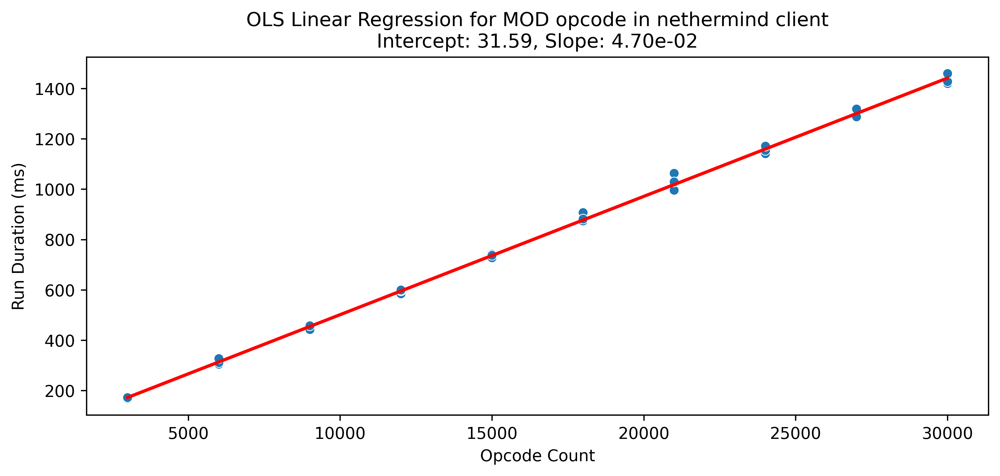


## besu


```python
                            OLS Regression Results                            
==============================================================================
Dep. Variable:        run_duration_ms   R-squared:                       0.997
Model:                            OLS   Adj. R-squared:                  0.997
Method:                 Least Squares   F-statistic:                 1.068e+04
Date:                Mon, 12 Jan 2026   Prob (F-statistic):           1.04e-37
Time:                        10:29:41   Log-Likelihood:                -177.11
No. Observations:                  30   AIC:                             358.2
Df Residuals:                      28   BIC:                             361.0
Df Model:                           1                                         
Covariance Type:            nonrobust                                         
==============================================================================
                 coef    std err          t      P>|t|      [0.025      0.975]
------------------------------------------------------------------------------
const         29.2312     36.195      0.808      0.426     -44.911     103.373
opcount        0.2010      0.002    103.363      0.000       0.197       0.205
==============================================================================
Omnibus:                        2.317   Durbin-Watson:                   0.581
Prob(Omnibus):                  0.314   Jarque-Bera (JB):                2.017
Skew:                          -0.607   Prob(JB):                        0.365
Kurtosis:                       2.628   Cond. No.                     4.02e+04
==============================================================================

Notes:
[1] Standard Errors assume that the covariance matrix of the errors is correctly specified.
[2] The condition number is large, 4.02e+04. This might indicate that there are
strong multicollinearity or other numerical problems.
```


# MSIZE

## geth


```python
                            OLS Regression Results                            
==============================================================================
Dep. Variable:        run_duration_ms   R-squared:                       0.987
Model:                            OLS   Adj. R-squared:                  0.986
Method:                 Least Squares   F-statistic:                     2099.
Date:                Mon, 12 Jan 2026   Prob (F-statistic):           7.07e-28
Time:                        10:29:41   Log-Likelihood:                -169.01
No. Observations:                  30   AIC:                             342.0
Df Residuals:                      28   BIC:                             344.8
Df Model:                           1                                         
Covariance Type:            nonrobust                                         
==============================================================================
                 coef    std err          t      P>|t|      [0.025      0.975]
------------------------------------------------------------------------------
const         44.1692     27.631      1.599      0.121     -12.431     100.769
opcount        0.0170      0.000     45.811      0.000       0.016       0.018
==============================================================================
Omnibus:                        3.105   Durbin-Watson:                   0.592
Prob(Omnibus):                  0.212   Jarque-Bera (JB):                1.791
Skew:                          -0.543   Prob(JB):                        0.408
Kurtosis:                       3.505   Cond. No.                     1.61e+05
==============================================================================

Notes:
[1] Standard Errors assume that the covariance matrix of the errors is correctly specified.
[2] The condition number is large, 1.61e+05. This might indicate that there are
strong multicollinearity or other numerical problems.
```

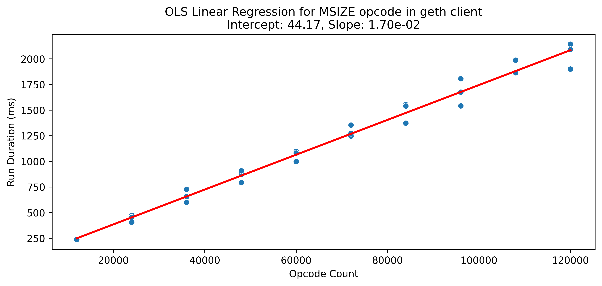


## reth


```python
                            OLS Regression Results                            
==============================================================================
Dep. Variable:        run_duration_ms   R-squared:                       0.987
Model:                            OLS   Adj. R-squared:                  0.986
Method:                 Least Squares   F-statistic:                     2094.
Date:                Mon, 12 Jan 2026   Prob (F-statistic):           7.28e-28
Time:                        10:29:41   Log-Likelihood:                -141.60
No. Observations:                  30   AIC:                             287.2
Df Residuals:                      28   BIC:                             290.0
Df Model:                           1                                         
Covariance Type:            nonrobust                                         
==============================================================================
                 coef    std err          t      P>|t|      [0.025      0.975]
------------------------------------------------------------------------------
const         45.4102     11.082      4.098      0.000      22.711      68.110
opcount        0.0068      0.000     45.764      0.000       0.007       0.007
==============================================================================
Omnibus:                        0.800   Durbin-Watson:                   1.324
Prob(Omnibus):                  0.670   Jarque-Bera (JB):                0.840
Skew:                           0.329   Prob(JB):                        0.657
Kurtosis:                       2.510   Cond. No.                     1.61e+05
==============================================================================

Notes:
[1] Standard Errors assume that the covariance matrix of the errors is correctly specified.
[2] The condition number is large, 1.61e+05. This might indicate that there are
strong multicollinearity or other numerical problems.
```


## nethermind


```python
                            OLS Regression Results                            
==============================================================================
Dep. Variable:        run_duration_ms   R-squared:                       0.992
Model:                            OLS   Adj. R-squared:                  0.992
Method:                 Least Squares   F-statistic:                     3411.
Date:                Mon, 12 Jan 2026   Prob (F-statistic):           8.43e-31
Time:                        10:29:41   Log-Likelihood:                -137.19
No. Observations:                  30   AIC:                             278.4
Df Residuals:                      28   BIC:                             281.2
Df Model:                           1                                         
Covariance Type:            nonrobust                                         
==============================================================================
                 coef    std err          t      P>|t|      [0.025      0.975]
------------------------------------------------------------------------------
const         28.5449      9.566      2.984      0.006       8.951      48.139
opcount        0.0075      0.000     58.405      0.000       0.007       0.008
==============================================================================
Omnibus:                        4.948   Durbin-Watson:                   0.644
Prob(Omnibus):                  0.084   Jarque-Bera (JB):                3.700
Skew:                           0.849   Prob(JB):                        0.157
Kurtosis:                       3.276   Cond. No.                     1.61e+05
==============================================================================

Notes:
[1] Standard Errors assume that the covariance matrix of the errors is correctly specified.
[2] The condition number is large, 1.61e+05. This might indicate that there are
strong multicollinearity or other numerical problems.
```

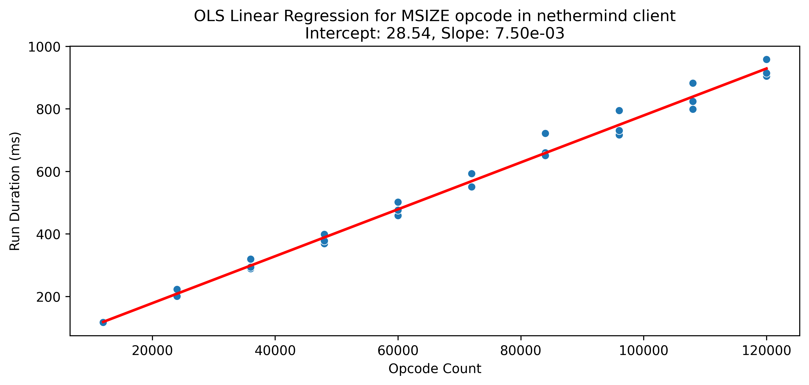


## besu


```python
                            OLS Regression Results                            
==============================================================================
Dep. Variable:        run_duration_ms   R-squared:                       0.985
Model:                            OLS   Adj. R-squared:                  0.984
Method:                 Least Squares   F-statistic:                     1836.
Date:                Mon, 12 Jan 2026   Prob (F-statistic):           4.47e-27
Time:                        10:29:41   Log-Likelihood:                -187.52
No. Observations:                  30   AIC:                             379.0
Df Residuals:                      28   BIC:                             381.8
Df Model:                           1                                         
Covariance Type:            nonrobust                                         
==============================================================================
                 coef    std err          t      P>|t|      [0.025      0.975]
------------------------------------------------------------------------------
const        350.8211     51.207      6.851      0.000     245.928     455.714
opcount        0.0295      0.001     42.854      0.000       0.028       0.031
==============================================================================
Omnibus:                        3.027   Durbin-Watson:                   1.759
Prob(Omnibus):                  0.220   Jarque-Bera (JB):                2.454
Skew:                           0.695   Prob(JB):                        0.293
Kurtosis:                       2.826   Cond. No.                     1.61e+05
==============================================================================

Notes:
[1] Standard Errors assume that the covariance matrix of the errors is correctly specified.
[2] The condition number is large, 1.61e+05. This might indicate that there are
strong multicollinearity or other numerical problems.
```

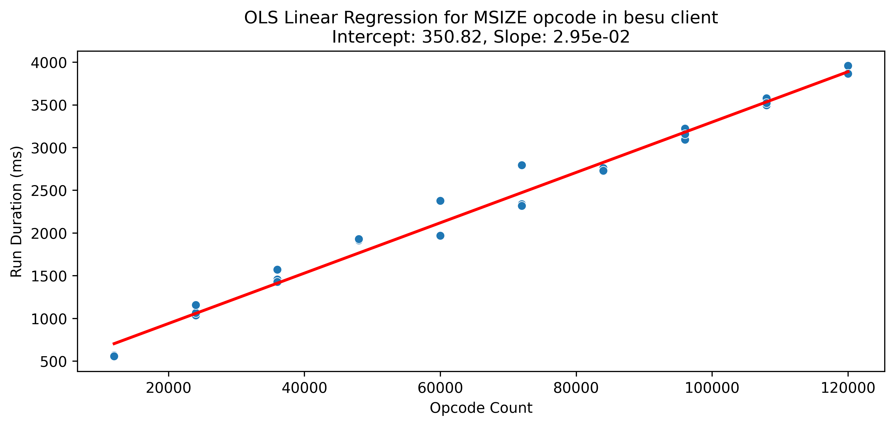


# MUL

## geth


```python
                            OLS Regression Results                            
==============================================================================
Dep. Variable:        run_duration_ms   R-squared:                       0.981
Model:                            OLS   Adj. R-squared:                  0.980
Method:                 Least Squares   F-statistic:                     1425.
Date:                Mon, 12 Jan 2026   Prob (F-statistic):           1.47e-25
Time:                        10:29:42   Log-Likelihood:                -148.78
No. Observations:                  30   AIC:                             301.6
Df Residuals:                      28   BIC:                             304.4
Df Model:                           1                                         
Covariance Type:            nonrobust                                         
==============================================================================
                 coef    std err          t      P>|t|      [0.025      0.975]
------------------------------------------------------------------------------
const         33.2596     14.075      2.363      0.025       4.429      62.090
opcount        0.0285      0.001     37.746      0.000       0.027       0.030
==============================================================================
Omnibus:                        2.760   Durbin-Watson:                   0.877
Prob(Omnibus):                  0.252   Jarque-Bera (JB):                2.470
Skew:                          -0.645   Prob(JB):                        0.291
Kurtosis:                       2.443   Cond. No.                     4.02e+04
==============================================================================

Notes:
[1] Standard Errors assume that the covariance matrix of the errors is correctly specified.
[2] The condition number is large, 4.02e+04. This might indicate that there are
strong multicollinearity or other numerical problems.
```


## reth


```python
                            OLS Regression Results                            
==============================================================================
Dep. Variable:        run_duration_ms   R-squared:                       0.994
Model:                            OLS   Adj. R-squared:                  0.994
Method:                 Least Squares   F-statistic:                     4953.
Date:                Mon, 12 Jan 2026   Prob (F-statistic):           4.71e-33
Time:                        10:29:42   Log-Likelihood:                -133.08
No. Observations:                  30   AIC:                             270.2
Df Residuals:                      28   BIC:                             273.0
Df Model:                           1                                         
Covariance Type:            nonrobust                                         
==============================================================================
                 coef    std err          t      P>|t|      [0.025      0.975]
------------------------------------------------------------------------------
const         16.5651      8.341      1.986      0.057      -0.521      33.651
opcount        0.0315      0.000     70.378      0.000       0.031       0.032
==============================================================================
Omnibus:                        3.226   Durbin-Watson:                   1.190
Prob(Omnibus):                  0.199   Jarque-Bera (JB):                2.035
Skew:                          -0.616   Prob(JB):                        0.362
Kurtosis:                       3.332   Cond. No.                     4.02e+04
==============================================================================

Notes:
[1] Standard Errors assume that the covariance matrix of the errors is correctly specified.
[2] The condition number is large, 4.02e+04. This might indicate that there are
strong multicollinearity or other numerical problems.
```


## nethermind


```python
                            OLS Regression Results                            
==============================================================================
Dep. Variable:        run_duration_ms   R-squared:                       1.000
Model:                            OLS   Adj. R-squared:                  1.000
Method:                 Least Squares   F-statistic:                 5.894e+04
Date:                Mon, 12 Jan 2026   Prob (F-statistic):           4.43e-48
Time:                        10:29:42   Log-Likelihood:                -103.47
No. Observations:                  30   AIC:                             210.9
Df Residuals:                      28   BIC:                             213.7
Df Model:                           1                                         
Covariance Type:            nonrobust                                         
==============================================================================
                 coef    std err          t      P>|t|      [0.025      0.975]
------------------------------------------------------------------------------
const         27.3100      3.109      8.785      0.000      20.942      33.678
opcount        0.0405      0.000    242.775      0.000       0.040       0.041
==============================================================================
Omnibus:                        0.031   Durbin-Watson:                   0.904
Prob(Omnibus):                  0.985   Jarque-Bera (JB):                0.228
Skew:                          -0.029   Prob(JB):                        0.892
Kurtosis:                       2.577   Cond. No.                     4.02e+04
==============================================================================

Notes:
[1] Standard Errors assume that the covariance matrix of the errors is correctly specified.
[2] The condition number is large, 4.02e+04. This might indicate that there are
strong multicollinearity or other numerical problems.
```


## besu


```python
                            OLS Regression Results                            
==============================================================================
Dep. Variable:        run_duration_ms   R-squared:                       0.989
Model:                            OLS   Adj. R-squared:                  0.989
Method:                 Least Squares   F-statistic:                     2523.
Date:                Mon, 12 Jan 2026   Prob (F-statistic):           5.55e-29
Time:                        10:29:42   Log-Likelihood:                -207.67
No. Observations:                  30   AIC:                             419.3
Df Residuals:                      28   BIC:                             422.1
Df Model:                           1                                         
Covariance Type:            nonrobust                                         
==============================================================================
                 coef    std err          t      P>|t|      [0.025      0.975]
------------------------------------------------------------------------------
const         32.9119    100.228      0.328      0.745    -172.395     238.219
opcount        0.2704      0.005     50.225      0.000       0.259       0.281
==============================================================================
Omnibus:                        0.018   Durbin-Watson:                   0.859
Prob(Omnibus):                  0.991   Jarque-Bera (JB):                0.195
Skew:                           0.036   Prob(JB):                        0.907
Kurtosis:                       2.611   Cond. No.                     4.02e+04
==============================================================================

Notes:
[1] Standard Errors assume that the covariance matrix of the errors is correctly specified.
[2] The condition number is large, 4.02e+04. This might indicate that there are
strong multicollinearity or other numerical problems.
```


# MULMOD

## geth

OLS model did not run... Error: zero-size array to reduction operation maximum which has no identity

## reth

OLS model did not run... Error: zero-size array to reduction operation maximum which has no identity

## nethermind

OLS model did not run... Error: zero-size array to reduction operation maximum which has no identity

## besu

OLS model did not run... Error: zero-size array to reduction operation maximum which has no identity

# NOT

## geth


```python
                            OLS Regression Results                            
==============================================================================
Dep. Variable:        run_duration_ms   R-squared:                       0.990
Model:                            OLS   Adj. R-squared:                  0.989
Method:                 Least Squares   F-statistic:                     2705.
Date:                Mon, 12 Jan 2026   Prob (F-statistic):           2.11e-29
Time:                        10:29:42   Log-Likelihood:                -138.08
No. Observations:                  30   AIC:                             280.2
Df Residuals:                      28   BIC:                             283.0
Df Model:                           1                                         
Covariance Type:            nonrobust                                         
==============================================================================
                 coef    std err          t      P>|t|      [0.025      0.975]
------------------------------------------------------------------------------
const         30.5860      9.854      3.104      0.004      10.401      50.772
opcount        0.0110      0.000     52.009      0.000       0.011       0.011
==============================================================================
Omnibus:                        3.144   Durbin-Watson:                   1.395
Prob(Omnibus):                  0.208   Jarque-Bera (JB):                1.902
Skew:                           0.229   Prob(JB):                        0.386
Kurtosis:                       4.146   Cond. No.                     1.01e+05
==============================================================================

Notes:
[1] Standard Errors assume that the covariance matrix of the errors is correctly specified.
[2] The condition number is large, 1.01e+05. This might indicate that there are
strong multicollinearity or other numerical problems.
```

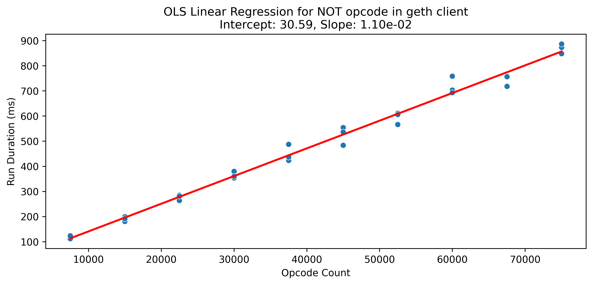


## reth


```python
                            OLS Regression Results                            
==============================================================================
Dep. Variable:        run_duration_ms   R-squared:                       0.981
Model:                            OLS   Adj. R-squared:                  0.981
Method:                 Least Squares   F-statistic:                     1461.
Date:                Mon, 12 Jan 2026   Prob (F-statistic):           1.04e-25
Time:                        10:29:42   Log-Likelihood:                -129.34
No. Observations:                  30   AIC:                             262.7
Df Residuals:                      28   BIC:                             265.5
Df Model:                           1                                         
Covariance Type:            nonrobust                                         
==============================================================================
                 coef    std err          t      P>|t|      [0.025      0.975]
------------------------------------------------------------------------------
const         37.9619      7.363      5.156      0.000      22.879      53.045
opcount        0.0060      0.000     38.228      0.000       0.006       0.006
==============================================================================
Omnibus:                        1.930   Durbin-Watson:                   2.449
Prob(Omnibus):                  0.381   Jarque-Bera (JB):                1.748
Skew:                          -0.508   Prob(JB):                        0.417
Kurtosis:                       2.394   Cond. No.                     1.01e+05
==============================================================================

Notes:
[1] Standard Errors assume that the covariance matrix of the errors is correctly specified.
[2] The condition number is large, 1.01e+05. This might indicate that there are
strong multicollinearity or other numerical problems.
```


## nethermind


```python
                            OLS Regression Results                            
==============================================================================
Dep. Variable:        run_duration_ms   R-squared:                       0.989
Model:                            OLS   Adj. R-squared:                  0.989
Method:                 Least Squares   F-statistic:                     2515.
Date:                Mon, 12 Jan 2026   Prob (F-statistic):           5.79e-29
Time:                        10:29:42   Log-Likelihood:                -126.13
No. Observations:                  30   AIC:                             256.3
Df Residuals:                      28   BIC:                             259.1
Df Model:                           1                                         
Covariance Type:            nonrobust                                         
==============================================================================
                 coef    std err          t      P>|t|      [0.025      0.975]
------------------------------------------------------------------------------
const         24.5335      6.615      3.709      0.001      10.982      38.085
opcount        0.0071      0.000     50.147      0.000       0.007       0.007
==============================================================================
Omnibus:                        9.951   Durbin-Watson:                   1.017
Prob(Omnibus):                  0.007   Jarque-Bera (JB):                8.511
Skew:                           1.192   Prob(JB):                       0.0142
Kurtosis:                       4.063   Cond. No.                     1.01e+05
==============================================================================

Notes:
[1] Standard Errors assume that the covariance matrix of the errors is correctly specified.
[2] The condition number is large, 1.01e+05. This might indicate that there are
strong multicollinearity or other numerical problems.
```


## besu


```python
                            OLS Regression Results                            
==============================================================================
Dep. Variable:        run_duration_ms   R-squared:                       0.999
Model:                            OLS   Adj. R-squared:                  0.999
Method:                 Least Squares   F-statistic:                 2.211e+04
Date:                Mon, 12 Jan 2026   Prob (F-statistic):           4.00e-42
Time:                        10:29:43   Log-Likelihood:                -148.83
No. Observations:                  30   AIC:                             301.7
Df Residuals:                      28   BIC:                             304.5
Df Model:                           1                                         
Covariance Type:            nonrobust                                         
==============================================================================
                 coef    std err          t      P>|t|      [0.025      0.975]
------------------------------------------------------------------------------
const         21.0859     14.100      1.495      0.146      -7.797      49.969
opcount        0.0451      0.000    148.701      0.000       0.044       0.046
==============================================================================
Omnibus:                       13.683   Durbin-Watson:                   1.951
Prob(Omnibus):                  0.001   Jarque-Bera (JB):               13.784
Skew:                           1.341   Prob(JB):                      0.00102
Kurtosis:                       4.958   Cond. No.                     1.01e+05
==============================================================================

Notes:
[1] Standard Errors assume that the covariance matrix of the errors is correctly specified.
[2] The condition number is large, 1.01e+05. This might indicate that there are
strong multicollinearity or other numerical problems.
```


# NUMBER

## geth


```python
                            OLS Regression Results                            
==============================================================================
Dep. Variable:        run_duration_ms   R-squared:                       0.958
Model:                            OLS   Adj. R-squared:                  0.956
Method:                 Least Squares   F-statistic:                     636.0
Date:                Mon, 12 Jan 2026   Prob (F-statistic):           8.56e-21
Time:                        10:29:43   Log-Likelihood:                -185.64
No. Observations:                  30   AIC:                             375.3
Df Residuals:                      28   BIC:                             378.1
Df Model:                           1                                         
Covariance Type:            nonrobust                                         
==============================================================================
                 coef    std err          t      P>|t|      [0.025      0.975]
------------------------------------------------------------------------------
const         25.6876     48.089      0.534      0.597     -72.818     124.193
opcount        0.0195      0.001     25.220      0.000       0.018       0.021
==============================================================================
Omnibus:                       42.260   Durbin-Watson:                   0.859
Prob(Omnibus):                  0.000   Jarque-Bera (JB):              197.217
Skew:                           2.716   Prob(JB):                     1.50e-43
Kurtosis:                      14.325   Cond. No.                     1.34e+05
==============================================================================

Notes:
[1] Standard Errors assume that the covariance matrix of the errors is correctly specified.
[2] The condition number is large, 1.34e+05. This might indicate that there are
strong multicollinearity or other numerical problems.
```


## reth


```python
                            OLS Regression Results                            
==============================================================================
Dep. Variable:        run_duration_ms   R-squared:                       0.983
Model:                            OLS   Adj. R-squared:                  0.982
Method:                 Least Squares   F-statistic:                     1618.
Date:                Mon, 12 Jan 2026   Prob (F-statistic):           2.55e-26
Time:                        10:29:43   Log-Likelihood:                -136.13
No. Observations:                  30   AIC:                             276.3
Df Residuals:                      28   BIC:                             279.1
Df Model:                           1                                         
Covariance Type:            nonrobust                                         
==============================================================================
                 coef    std err          t      P>|t|      [0.025      0.975]
------------------------------------------------------------------------------
const         37.1243      9.235      4.020      0.000      18.207      56.041
opcount        0.0060      0.000     40.228      0.000       0.006       0.006
==============================================================================
Omnibus:                        0.281   Durbin-Watson:                   1.855
Prob(Omnibus):                  0.869   Jarque-Bera (JB):                0.467
Skew:                          -0.116   Prob(JB):                        0.792
Kurtosis:                       2.435   Cond. No.                     1.34e+05
==============================================================================

Notes:
[1] Standard Errors assume that the covariance matrix of the errors is correctly specified.
[2] The condition number is large, 1.34e+05. This might indicate that there are
strong multicollinearity or other numerical problems.
```


## nethermind


```python
                            OLS Regression Results                            
==============================================================================
Dep. Variable:        run_duration_ms   R-squared:                       0.984
Model:                            OLS   Adj. R-squared:                  0.983
Method:                 Least Squares   F-statistic:                     1689.
Date:                Mon, 12 Jan 2026   Prob (F-statistic):           1.42e-26
Time:                        10:29:43   Log-Likelihood:                -140.62
No. Observations:                  30   AIC:                             285.2
Df Residuals:                      28   BIC:                             288.0
Df Model:                           1                                         
Covariance Type:            nonrobust                                         
==============================================================================
                 coef    std err          t      P>|t|      [0.025      0.975]
------------------------------------------------------------------------------
const         28.6044     10.725      2.667      0.013       6.635      50.574
opcount        0.0071      0.000     41.094      0.000       0.007       0.007
==============================================================================
Omnibus:                        2.487   Durbin-Watson:                   0.431
Prob(Omnibus):                  0.288   Jarque-Bera (JB):                2.206
Skew:                           0.585   Prob(JB):                        0.332
Kurtosis:                       2.370   Cond. No.                     1.34e+05
==============================================================================

Notes:
[1] Standard Errors assume that the covariance matrix of the errors is correctly specified.
[2] The condition number is large, 1.34e+05. This might indicate that there are
strong multicollinearity or other numerical problems.
```

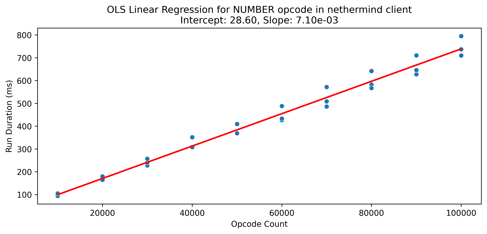


## besu


```python
                            OLS Regression Results                            
==============================================================================
Dep. Variable:        run_duration_ms   R-squared:                       0.999
Model:                            OLS   Adj. R-squared:                  0.999
Method:                 Least Squares   F-statistic:                 2.135e+04
Date:                Mon, 12 Jan 2026   Prob (F-statistic):           6.56e-42
Time:                        10:29:43   Log-Likelihood:                -144.97
No. Observations:                  30   AIC:                             293.9
Df Residuals:                      28   BIC:                             296.7
Df Model:                           1                                         
Covariance Type:            nonrobust                                         
==============================================================================
                 coef    std err          t      P>|t|      [0.025      0.975]
------------------------------------------------------------------------------
const         17.0051     12.398      1.372      0.181      -8.391      42.402
opcount        0.0292      0.000    146.100      0.000       0.029       0.030
==============================================================================
Omnibus:                        3.479   Durbin-Watson:                   2.058
Prob(Omnibus):                  0.176   Jarque-Bera (JB):                2.615
Skew:                           0.723   Prob(JB):                        0.270
Kurtosis:                       3.028   Cond. No.                     1.34e+05
==============================================================================

Notes:
[1] Standard Errors assume that the covariance matrix of the errors is correctly specified.
[2] The condition number is large, 1.34e+05. This might indicate that there are
strong multicollinearity or other numerical problems.
```


# OR

## geth


```python
                            OLS Regression Results                            
==============================================================================
Dep. Variable:        run_duration_ms   R-squared:                       0.977
Model:                            OLS   Adj. R-squared:                  0.976
Method:                 Least Squares   F-statistic:                     1182.
Date:                Mon, 12 Jan 2026   Prob (F-statistic):           1.90e-24
Time:                        10:29:43   Log-Likelihood:                -150.82
No. Observations:                  30   AIC:                             305.6
Df Residuals:                      28   BIC:                             308.4
Df Model:                           1                                         
Covariance Type:            nonrobust                                         
==============================================================================
                 coef    std err          t      P>|t|      [0.025      0.975]
------------------------------------------------------------------------------
const         28.0809     15.067      1.864      0.073      -2.782      58.944
opcount        0.0239      0.001     34.386      0.000       0.022       0.025
==============================================================================
Omnibus:                        3.430   Durbin-Watson:                   0.498
Prob(Omnibus):                  0.180   Jarque-Bera (JB):                2.416
Skew:                          -0.691   Prob(JB):                        0.299
Kurtosis:                       3.150   Cond. No.                     4.69e+04
==============================================================================

Notes:
[1] Standard Errors assume that the covariance matrix of the errors is correctly specified.
[2] The condition number is large, 4.69e+04. This might indicate that there are
strong multicollinearity or other numerical problems.
```

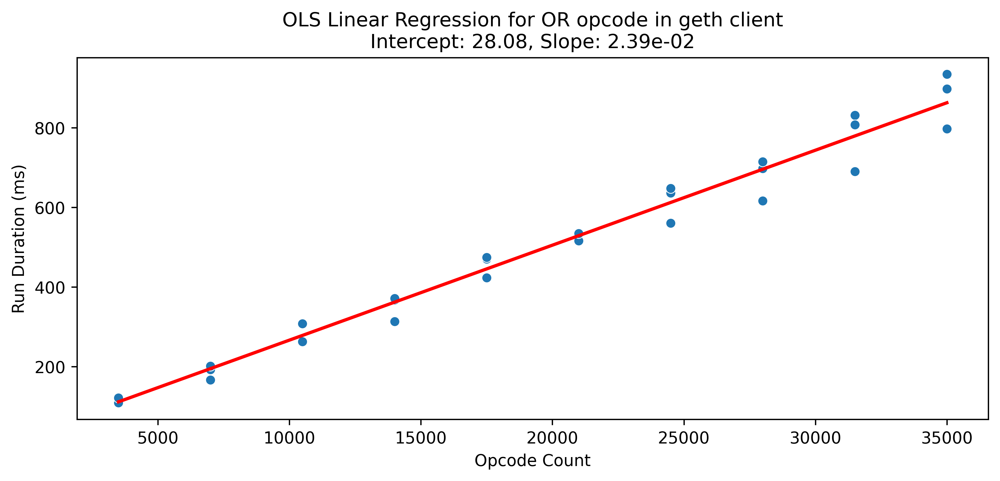


## reth


```python
                            OLS Regression Results                            
==============================================================================
Dep. Variable:        run_duration_ms   R-squared:                       0.991
Model:                            OLS   Adj. R-squared:                  0.991
Method:                 Least Squares   F-statistic:                     3238.
Date:                Mon, 12 Jan 2026   Prob (F-statistic):           1.74e-30
Time:                        10:29:43   Log-Likelihood:                -105.27
No. Observations:                  30   AIC:                             214.5
Df Residuals:                      28   BIC:                             217.3
Df Model:                           1                                         
Covariance Type:            nonrobust                                         
==============================================================================
                 coef    std err          t      P>|t|      [0.025      0.975]
------------------------------------------------------------------------------
const         34.3062      3.300     10.395      0.000      27.546      41.067
opcount        0.0086      0.000     56.907      0.000       0.008       0.009
==============================================================================
Omnibus:                        0.602   Durbin-Watson:                   2.059
Prob(Omnibus):                  0.740   Jarque-Bera (JB):                0.664
Skew:                          -0.114   Prob(JB):                        0.717
Kurtosis:                       2.307   Cond. No.                     4.69e+04
==============================================================================

Notes:
[1] Standard Errors assume that the covariance matrix of the errors is correctly specified.
[2] The condition number is large, 4.69e+04. This might indicate that there are
strong multicollinearity or other numerical problems.
```


## nethermind


```python
                            OLS Regression Results                            
==============================================================================
Dep. Variable:        run_duration_ms   R-squared:                       0.999
Model:                            OLS   Adj. R-squared:                  0.998
Method:                 Least Squares   F-statistic:                 1.871e+04
Date:                Mon, 12 Jan 2026   Prob (F-statistic):           4.15e-41
Time:                        10:29:44   Log-Likelihood:                -115.86
No. Observations:                  30   AIC:                             235.7
Df Residuals:                      28   BIC:                             238.5
Df Model:                           1                                         
Covariance Type:            nonrobust                                         
==============================================================================
                 coef    std err          t      P>|t|      [0.025      0.975]
------------------------------------------------------------------------------
const         29.0051      4.698      6.174      0.000      19.381      38.629
opcount        0.0296      0.000    136.771      0.000       0.029       0.030
==============================================================================
Omnibus:                        1.289   Durbin-Watson:                   0.896
Prob(Omnibus):                  0.525   Jarque-Bera (JB):                1.098
Skew:                           0.444   Prob(JB):                        0.578
Kurtosis:                       2.700   Cond. No.                     4.69e+04
==============================================================================

Notes:
[1] Standard Errors assume that the covariance matrix of the errors is correctly specified.
[2] The condition number is large, 4.69e+04. This might indicate that there are
strong multicollinearity or other numerical problems.
```

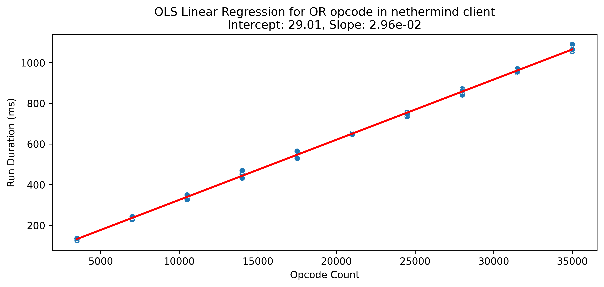


## besu


```python
                            OLS Regression Results                            
==============================================================================
Dep. Variable:        run_duration_ms   R-squared:                       0.999
Model:                            OLS   Adj. R-squared:                  0.999
Method:                 Least Squares   F-statistic:                 2.547e+04
Date:                Mon, 12 Jan 2026   Prob (F-statistic):           5.54e-43
Time:                        10:29:44   Log-Likelihood:                -138.83
No. Observations:                  30   AIC:                             281.7
Df Residuals:                      28   BIC:                             284.5
Df Model:                           1                                         
Covariance Type:            nonrobust                                         
==============================================================================
                 coef    std err          t      P>|t|      [0.025      0.975]
------------------------------------------------------------------------------
const         37.8651     10.104      3.748      0.001      17.168      58.562
opcount        0.0743      0.000    159.594      0.000       0.073       0.075
==============================================================================
Omnibus:                        6.144   Durbin-Watson:                   1.514
Prob(Omnibus):                  0.046   Jarque-Bera (JB):                4.483
Skew:                           0.884   Prob(JB):                        0.106
Kurtosis:                       3.681   Cond. No.                     4.69e+04
==============================================================================

Notes:
[1] Standard Errors assume that the covariance matrix of the errors is correctly specified.
[2] The condition number is large, 4.69e+04. This might indicate that there are
strong multicollinearity or other numerical problems.
```

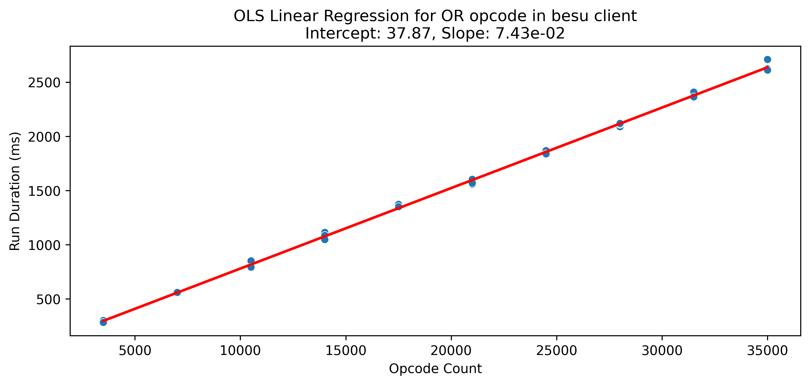


# ORIGIN

## geth


```python
                            OLS Regression Results                            
==============================================================================
Dep. Variable:        run_duration_ms   R-squared:                       0.972
Model:                            OLS   Adj. R-squared:                  0.971
Method:                 Least Squares   F-statistic:                     977.0
Date:                Mon, 12 Jan 2026   Prob (F-statistic):           2.57e-23
Time:                        10:29:44   Log-Likelihood:                -179.91
No. Observations:                  30   AIC:                             363.8
Df Residuals:                      28   BIC:                             366.6
Df Model:                           1                                         
Covariance Type:            nonrobust                                         
==============================================================================
                 coef    std err          t      P>|t|      [0.025      0.975]
------------------------------------------------------------------------------
const         39.3304     39.728      0.990      0.331     -42.049     120.710
opcount        0.0200      0.001     31.256      0.000       0.019       0.021
==============================================================================
Omnibus:                        8.205   Durbin-Watson:                   0.995
Prob(Omnibus):                  0.017   Jarque-Bera (JB):                7.270
Skew:                           0.788   Prob(JB):                       0.0264
Kurtosis:                       4.826   Cond. No.                     1.34e+05
==============================================================================

Notes:
[1] Standard Errors assume that the covariance matrix of the errors is correctly specified.
[2] The condition number is large, 1.34e+05. This might indicate that there are
strong multicollinearity or other numerical problems.
```


## reth


```python
                            OLS Regression Results                            
==============================================================================
Dep. Variable:        run_duration_ms   R-squared:                       0.984
Model:                            OLS   Adj. R-squared:                  0.984
Method:                 Least Squares   F-statistic:                     1745.
Date:                Mon, 12 Jan 2026   Prob (F-statistic):           9.05e-27
Time:                        10:29:44   Log-Likelihood:                -138.98
No. Observations:                  30   AIC:                             282.0
Df Residuals:                      28   BIC:                             284.8
Df Model:                           1                                         
Covariance Type:            nonrobust                                         
==============================================================================
                 coef    std err          t      P>|t|      [0.025      0.975]
------------------------------------------------------------------------------
const         26.0741     10.155      2.568      0.016       5.272      46.876
opcount        0.0068      0.000     41.771      0.000       0.007       0.007
==============================================================================
Omnibus:                        0.462   Durbin-Watson:                   2.111
Prob(Omnibus):                  0.794   Jarque-Bera (JB):                0.025
Skew:                           0.037   Prob(JB):                        0.987
Kurtosis:                       3.121   Cond. No.                     1.34e+05
==============================================================================

Notes:
[1] Standard Errors assume that the covariance matrix of the errors is correctly specified.
[2] The condition number is large, 1.34e+05. This might indicate that there are
strong multicollinearity or other numerical problems.
```


## nethermind


```python
                            OLS Regression Results                            
==============================================================================
Dep. Variable:        run_duration_ms   R-squared:                       0.974
Model:                            OLS   Adj. R-squared:                  0.973
Method:                 Least Squares   F-statistic:                     1048.
Date:                Mon, 12 Jan 2026   Prob (F-statistic):           9.93e-24
Time:                        10:29:44   Log-Likelihood:                -146.49
No. Observations:                  30   AIC:                             297.0
Df Residuals:                      28   BIC:                             299.8
Df Model:                           1                                         
Covariance Type:            nonrobust                                         
==============================================================================
                 coef    std err          t      P>|t|      [0.025      0.975]
------------------------------------------------------------------------------
const         32.1832     13.043      2.467      0.020       5.465      58.901
opcount        0.0068      0.000     32.367      0.000       0.006       0.007
==============================================================================
Omnibus:                        0.711   Durbin-Watson:                   0.594
Prob(Omnibus):                  0.701   Jarque-Bera (JB):                0.121
Skew:                           0.111   Prob(JB):                        0.941
Kurtosis:                       3.218   Cond. No.                     1.34e+05
==============================================================================

Notes:
[1] Standard Errors assume that the covariance matrix of the errors is correctly specified.
[2] The condition number is large, 1.34e+05. This might indicate that there are
strong multicollinearity or other numerical problems.
```

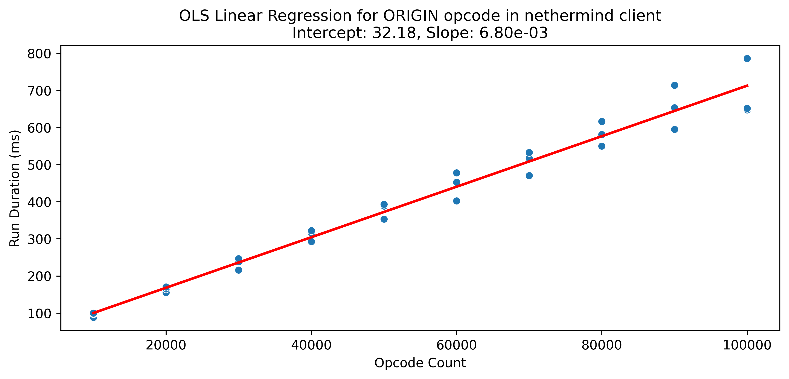


## besu


```python
                            OLS Regression Results                            
==============================================================================
Dep. Variable:        run_duration_ms   R-squared:                       0.978
Model:                            OLS   Adj. R-squared:                  0.977
Method:                 Least Squares   F-statistic:                     1251.
Date:                Mon, 12 Jan 2026   Prob (F-statistic):           8.75e-25
Time:                        10:29:44   Log-Likelihood:                -185.70
No. Observations:                  30   AIC:                             375.4
Df Residuals:                      28   BIC:                             378.2
Df Model:                           1                                         
Covariance Type:            nonrobust                                         
==============================================================================
                 coef    std err          t      P>|t|      [0.025      0.975]
------------------------------------------------------------------------------
const         31.9729     48.193      0.663      0.512     -66.745     130.691
opcount        0.0275      0.001     35.372      0.000       0.026       0.029
==============================================================================
Omnibus:                        3.236   Durbin-Watson:                   0.680
Prob(Omnibus):                  0.198   Jarque-Bera (JB):                2.314
Skew:                           0.679   Prob(JB):                        0.314
Kurtosis:                       3.091   Cond. No.                     1.34e+05
==============================================================================

Notes:
[1] Standard Errors assume that the covariance matrix of the errors is correctly specified.
[2] The condition number is large, 1.34e+05. This might indicate that there are
strong multicollinearity or other numerical problems.
```


# PC

## geth


```python
                            OLS Regression Results                            
==============================================================================
Dep. Variable:        run_duration_ms   R-squared:                       0.985
Model:                            OLS   Adj. R-squared:                  0.984
Method:                 Least Squares   F-statistic:                     1788.
Date:                Mon, 12 Jan 2026   Prob (F-statistic):           6.44e-27
Time:                        10:29:44   Log-Likelihood:                -171.09
No. Observations:                  30   AIC:                             346.2
Df Residuals:                      28   BIC:                             349.0
Df Model:                           1                                         
Covariance Type:            nonrobust                                         
==============================================================================
                 coef    std err          t      P>|t|      [0.025      0.975]
------------------------------------------------------------------------------
const         46.3457     29.611      1.565      0.129     -14.310     107.002
opcount        0.0168      0.000     42.289      0.000       0.016       0.018
==============================================================================
Omnibus:                        4.398   Durbin-Watson:                   1.233
Prob(Omnibus):                  0.111   Jarque-Bera (JB):                3.549
Skew:                          -0.843   Prob(JB):                        0.170
Kurtosis:                       2.987   Cond. No.                     1.61e+05
==============================================================================

Notes:
[1] Standard Errors assume that the covariance matrix of the errors is correctly specified.
[2] The condition number is large, 1.61e+05. This might indicate that there are
strong multicollinearity or other numerical problems.
```


## reth


```python
                            OLS Regression Results                            
==============================================================================
Dep. Variable:        run_duration_ms   R-squared:                       0.980
Model:                            OLS   Adj. R-squared:                  0.980
Method:                 Least Squares   F-statistic:                     1397.
Date:                Mon, 12 Jan 2026   Prob (F-statistic):           1.93e-25
Time:                        10:29:45   Log-Likelihood:                -146.02
No. Observations:                  30   AIC:                             296.0
Df Residuals:                      28   BIC:                             298.8
Df Model:                           1                                         
Covariance Type:            nonrobust                                         
==============================================================================
                 coef    std err          t      P>|t|      [0.025      0.975]
------------------------------------------------------------------------------
const         28.2741     12.840      2.202      0.036       1.972      54.576
opcount        0.0064      0.000     37.374      0.000       0.006       0.007
==============================================================================
Omnibus:                        2.738   Durbin-Watson:                   1.461
Prob(Omnibus):                  0.254   Jarque-Bera (JB):                1.542
Skew:                           0.130   Prob(JB):                        0.463
Kurtosis:                       4.080   Cond. No.                     1.61e+05
==============================================================================

Notes:
[1] Standard Errors assume that the covariance matrix of the errors is correctly specified.
[2] The condition number is large, 1.61e+05. This might indicate that there are
strong multicollinearity or other numerical problems.
```

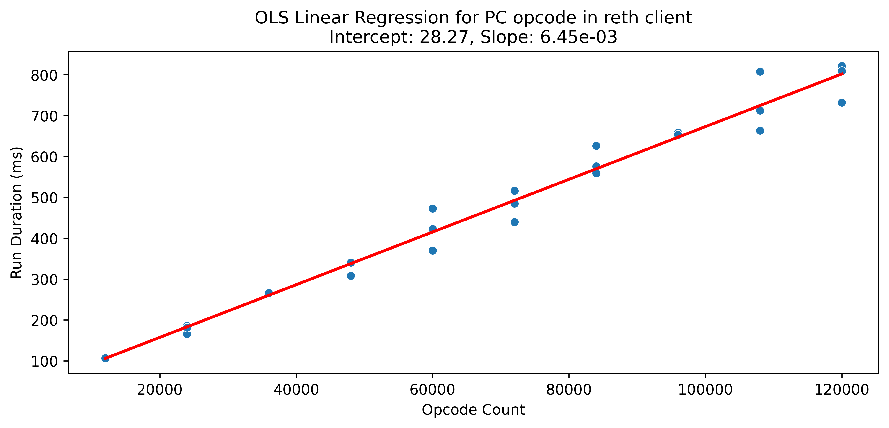


## nethermind


```python
                            OLS Regression Results                            
==============================================================================
Dep. Variable:        run_duration_ms   R-squared:                       0.989
Model:                            OLS   Adj. R-squared:                  0.988
Method:                 Least Squares   F-statistic:                     2440.
Date:                Mon, 12 Jan 2026   Prob (F-statistic):           8.79e-29
Time:                        10:29:45   Log-Likelihood:                -141.61
No. Observations:                  30   AIC:                             287.2
Df Residuals:                      28   BIC:                             290.0
Df Model:                           1                                         
Covariance Type:            nonrobust                                         
==============================================================================
                 coef    std err          t      P>|t|      [0.025      0.975]
------------------------------------------------------------------------------
const         29.6047     11.083      2.671      0.012       6.901      52.308
opcount        0.0074      0.000     49.397      0.000       0.007       0.008
==============================================================================
Omnibus:                        7.478   Durbin-Watson:                   1.167
Prob(Omnibus):                  0.024   Jarque-Bera (JB):                6.696
Skew:                           0.682   Prob(JB):                       0.0352
Kurtosis:                       4.870   Cond. No.                     1.61e+05
==============================================================================

Notes:
[1] Standard Errors assume that the covariance matrix of the errors is correctly specified.
[2] The condition number is large, 1.61e+05. This might indicate that there are
strong multicollinearity or other numerical problems.
```


## besu


```python
                            OLS Regression Results                            
==============================================================================
Dep. Variable:        run_duration_ms   R-squared:                       1.000
Model:                            OLS   Adj. R-squared:                  1.000
Method:                 Least Squares   F-statistic:                 7.304e+04
Date:                Mon, 12 Jan 2026   Prob (F-statistic):           2.20e-49
Time:                        10:29:45   Log-Likelihood:                -131.70
No. Observations:                  30   AIC:                             267.4
Df Residuals:                      28   BIC:                             270.2
Df Model:                           1                                         
Covariance Type:            nonrobust                                         
==============================================================================
                 coef    std err          t      P>|t|      [0.025      0.975]
------------------------------------------------------------------------------
const         32.9878      7.965      4.142      0.000      16.672      49.304
opcount        0.0289      0.000    270.267      0.000       0.029       0.029
==============================================================================
Omnibus:                        0.152   Durbin-Watson:                   2.229
Prob(Omnibus):                  0.927   Jarque-Bera (JB):                0.368
Skew:                          -0.023   Prob(JB):                        0.832
Kurtosis:                       2.459   Cond. No.                     1.61e+05
==============================================================================

Notes:
[1] Standard Errors assume that the covariance matrix of the errors is correctly specified.
[2] The condition number is large, 1.61e+05. This might indicate that there are
strong multicollinearity or other numerical problems.
```


# POP

## geth

OLS model did not run... Error: zero-size array to reduction operation maximum which has no identity

## reth

OLS model did not run... Error: zero-size array to reduction operation maximum which has no identity

## nethermind

OLS model did not run... Error: zero-size array to reduction operation maximum which has no identity

## besu

OLS model did not run... Error: zero-size array to reduction operation maximum which has no identity

# PREVRANDAO

## geth


```python
                            OLS Regression Results                            
==============================================================================
Dep. Variable:        run_duration_ms   R-squared:                       0.979
Model:                            OLS   Adj. R-squared:                  0.978
Method:                 Least Squares   F-statistic:                     1312.
Date:                Mon, 12 Jan 2026   Prob (F-statistic):           4.57e-25
Time:                        10:29:45   Log-Likelihood:                -180.96
No. Observations:                  30   AIC:                             365.9
Df Residuals:                      28   BIC:                             368.7
Df Model:                           1                                         
Covariance Type:            nonrobust                                         
==============================================================================
                 coef    std err          t      P>|t|      [0.025      0.975]
------------------------------------------------------------------------------
const         33.7893     41.149      0.821      0.418     -50.500     118.078
opcount        0.0240      0.001     36.221      0.000       0.023       0.025
==============================================================================
Omnibus:                        1.878   Durbin-Watson:                   0.790
Prob(Omnibus):                  0.391   Jarque-Bera (JB):                1.401
Skew:                          -0.525   Prob(JB):                        0.496
Kurtosis:                       2.872   Cond. No.                     1.34e+05
==============================================================================

Notes:
[1] Standard Errors assume that the covariance matrix of the errors is correctly specified.
[2] The condition number is large, 1.34e+05. This might indicate that there are
strong multicollinearity or other numerical problems.
```

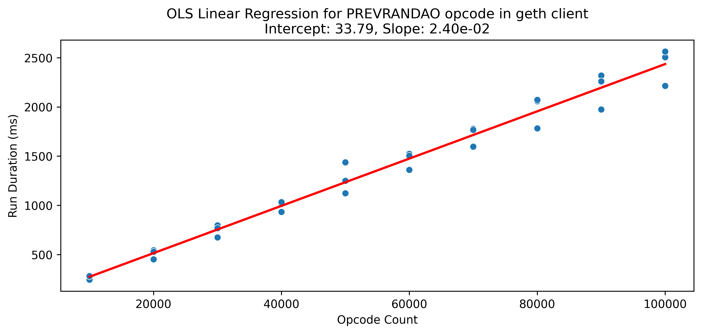


## reth


```python
                            OLS Regression Results                            
==============================================================================
Dep. Variable:        run_duration_ms   R-squared:                       0.989
Model:                            OLS   Adj. R-squared:                  0.988
Method:                 Least Squares   F-statistic:                     2452.
Date:                Mon, 12 Jan 2026   Prob (F-statistic):           8.20e-29
Time:                        10:29:45   Log-Likelihood:                -136.23
No. Observations:                  30   AIC:                             276.5
Df Residuals:                      28   BIC:                             279.3
Df Model:                           1                                         
Covariance Type:            nonrobust                                         
==============================================================================
                 coef    std err          t      P>|t|      [0.025      0.975]
------------------------------------------------------------------------------
const         44.5336      9.266      4.806      0.000      25.553      63.514
opcount        0.0074      0.000     49.520      0.000       0.007       0.008
==============================================================================
Omnibus:                        4.854   Durbin-Watson:                   1.757
Prob(Omnibus):                  0.088   Jarque-Bera (JB):                1.922
Skew:                           0.228   Prob(JB):                        0.382
Kurtosis:                       1.847   Cond. No.                     1.34e+05
==============================================================================

Notes:
[1] Standard Errors assume that the covariance matrix of the errors is correctly specified.
[2] The condition number is large, 1.34e+05. This might indicate that there are
strong multicollinearity or other numerical problems.
```

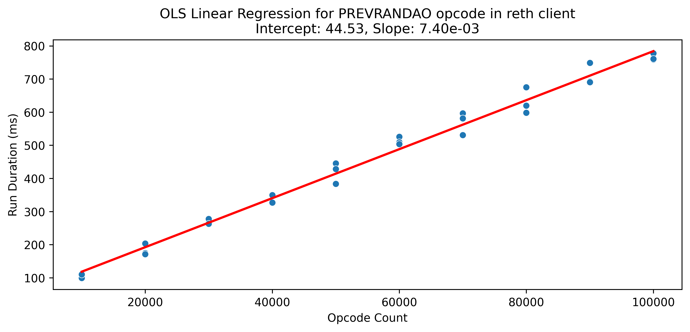


## nethermind


```python
                            OLS Regression Results                            
==============================================================================
Dep. Variable:        run_duration_ms   R-squared:                       0.981
Model:                            OLS   Adj. R-squared:                  0.980
Method:                 Least Squares   F-statistic:                     1428.
Date:                Mon, 12 Jan 2026   Prob (F-statistic):           1.43e-25
Time:                        10:29:45   Log-Likelihood:                -141.70
No. Observations:                  30   AIC:                             287.4
Df Residuals:                      28   BIC:                             290.2
Df Model:                           1                                         
Covariance Type:            nonrobust                                         
==============================================================================
                 coef    std err          t      P>|t|      [0.025      0.975]
------------------------------------------------------------------------------
const         33.7188     11.119      3.033      0.005      10.943      56.495
opcount        0.0068      0.000     37.787      0.000       0.006       0.007
==============================================================================
Omnibus:                        2.766   Durbin-Watson:                   0.682
Prob(Omnibus):                  0.251   Jarque-Bera (JB):                1.557
Skew:                           0.515   Prob(JB):                        0.459
Kurtosis:                       3.432   Cond. No.                     1.34e+05
==============================================================================

Notes:
[1] Standard Errors assume that the covariance matrix of the errors is correctly specified.
[2] The condition number is large, 1.34e+05. This might indicate that there are
strong multicollinearity or other numerical problems.
```

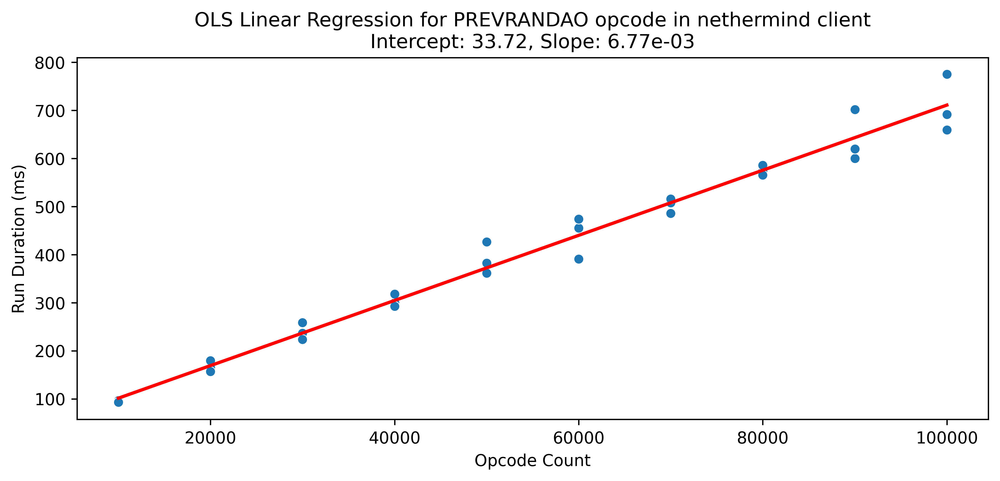


## besu


```python
                            OLS Regression Results                            
==============================================================================
Dep. Variable:        run_duration_ms   R-squared:                       0.997
Model:                            OLS   Adj. R-squared:                  0.997
Method:                 Least Squares   F-statistic:                     9999.
Date:                Mon, 12 Jan 2026   Prob (F-statistic):           2.62e-37
Time:                        10:29:45   Log-Likelihood:                -154.37
No. Observations:                  30   AIC:                             312.7
Df Residuals:                      28   BIC:                             315.5
Df Model:                           1                                         
Covariance Type:            nonrobust                                         
==============================================================================
                 coef    std err          t      P>|t|      [0.025      0.975]
------------------------------------------------------------------------------
const         32.0073     16.957      1.888      0.069      -2.729      66.743
opcount        0.0273      0.000     99.994      0.000       0.027       0.028
==============================================================================
Omnibus:                        1.151   Durbin-Watson:                   1.488
Prob(Omnibus):                  0.562   Jarque-Bera (JB):                0.452
Skew:                           0.281   Prob(JB):                        0.798
Kurtosis:                       3.215   Cond. No.                     1.34e+05
==============================================================================

Notes:
[1] Standard Errors assume that the covariance matrix of the errors is correctly specified.
[2] The condition number is large, 1.34e+05. This might indicate that there are
strong multicollinearity or other numerical problems.
```

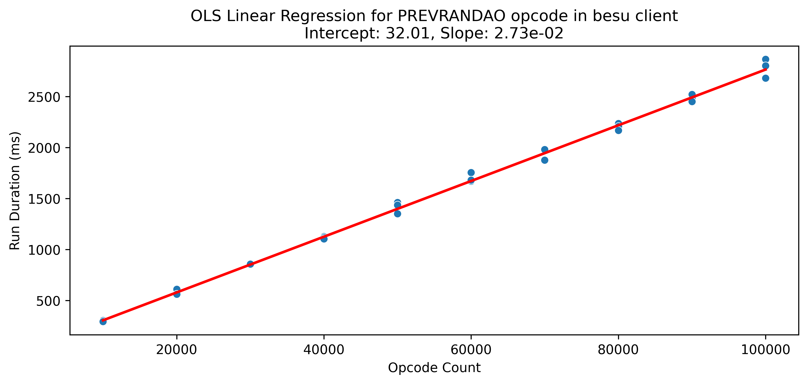


# PUSH0

## geth


```python
                            OLS Regression Results                            
==============================================================================
Dep. Variable:        run_duration_ms   R-squared:                       0.984
Model:                            OLS   Adj. R-squared:                  0.983
Method:                 Least Squares   F-statistic:                     1711.
Date:                Mon, 12 Jan 2026   Prob (F-statistic):           1.18e-26
Time:                        10:29:46   Log-Likelihood:                -152.15
No. Observations:                  30   AIC:                             308.3
Df Residuals:                      28   BIC:                             311.1
Df Model:                           1                                         
Covariance Type:            nonrobust                                         
==============================================================================
                 coef    std err          t      P>|t|      [0.025      0.975]
------------------------------------------------------------------------------
const         39.1846     15.750      2.488      0.019       6.923      71.446
opcount        0.0105      0.000     41.370      0.000       0.010       0.011
==============================================================================
Omnibus:                        0.534   Durbin-Watson:                   1.209
Prob(Omnibus):                  0.766   Jarque-Bera (JB):                0.652
Skew:                          -0.236   Prob(JB):                        0.722
Kurtosis:                       2.453   Cond. No.                     1.34e+05
==============================================================================

Notes:
[1] Standard Errors assume that the covariance matrix of the errors is correctly specified.
[2] The condition number is large, 1.34e+05. This might indicate that there are
strong multicollinearity or other numerical problems.
```


## reth


```python
                            OLS Regression Results                            
==============================================================================
Dep. Variable:        run_duration_ms   R-squared:                       0.974
Model:                            OLS   Adj. R-squared:                  0.973
Method:                 Least Squares   F-statistic:                     1044.
Date:                Mon, 12 Jan 2026   Prob (F-statistic):           1.04e-23
Time:                        10:29:46   Log-Likelihood:                -140.54
No. Observations:                  30   AIC:                             285.1
Df Residuals:                      28   BIC:                             287.9
Df Model:                           1                                         
Covariance Type:            nonrobust                                         
==============================================================================
                 coef    std err          t      P>|t|      [0.025      0.975]
------------------------------------------------------------------------------
const         39.8239     10.695      3.724      0.001      17.917      61.731
opcount        0.0056      0.000     32.313      0.000       0.005       0.006
==============================================================================
Omnibus:                        2.983   Durbin-Watson:                   1.939
Prob(Omnibus):                  0.225   Jarque-Bera (JB):                1.685
Skew:                           0.521   Prob(JB):                        0.431
Kurtosis:                       3.511   Cond. No.                     1.34e+05
==============================================================================

Notes:
[1] Standard Errors assume that the covariance matrix of the errors is correctly specified.
[2] The condition number is large, 1.34e+05. This might indicate that there are
strong multicollinearity or other numerical problems.
```


## nethermind


```python
                            OLS Regression Results                            
==============================================================================
Dep. Variable:        run_duration_ms   R-squared:                       0.969
Model:                            OLS   Adj. R-squared:                  0.968
Method:                 Least Squares   F-statistic:                     888.4
Date:                Mon, 12 Jan 2026   Prob (F-statistic):           9.38e-23
Time:                        10:29:46   Log-Likelihood:                -148.79
No. Observations:                  30   AIC:                             301.6
Df Residuals:                      28   BIC:                             304.4
Df Model:                           1                                         
Covariance Type:            nonrobust                                         
==============================================================================
                 coef    std err          t      P>|t|      [0.025      0.975]
------------------------------------------------------------------------------
const         35.6472     14.083      2.531      0.017       6.799      64.495
opcount        0.0068      0.000     29.805      0.000       0.006       0.007
==============================================================================
Omnibus:                        3.953   Durbin-Watson:                   1.345
Prob(Omnibus):                  0.139   Jarque-Bera (JB):                3.062
Skew:                          -0.166   Prob(JB):                        0.216
Kurtosis:                       4.530   Cond. No.                     1.34e+05
==============================================================================

Notes:
[1] Standard Errors assume that the covariance matrix of the errors is correctly specified.
[2] The condition number is large, 1.34e+05. This might indicate that there are
strong multicollinearity or other numerical problems.
```

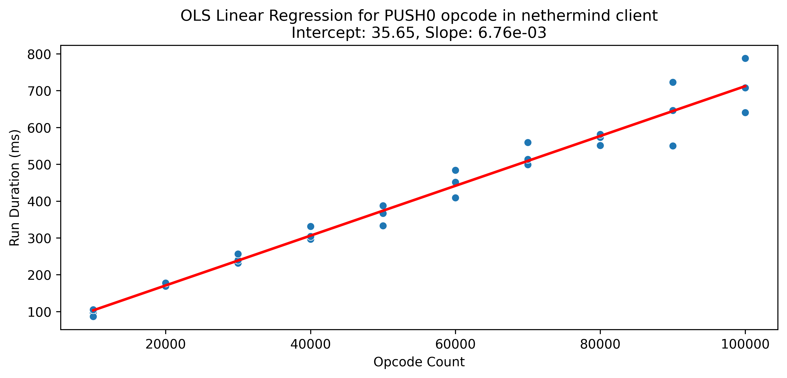


## besu


```python
                            OLS Regression Results                            
==============================================================================
Dep. Variable:        run_duration_ms   R-squared:                       0.996
Model:                            OLS   Adj. R-squared:                  0.996
Method:                 Least Squares   F-statistic:                     6921.
Date:                Mon, 12 Jan 2026   Prob (F-statistic):           4.46e-35
Time:                        10:29:46   Log-Likelihood:                -154.50
No. Observations:                  30   AIC:                             313.0
Df Residuals:                      28   BIC:                             315.8
Df Model:                           1                                         
Covariance Type:            nonrobust                                         
==============================================================================
                 coef    std err          t      P>|t|      [0.025      0.975]
------------------------------------------------------------------------------
const         19.2079     17.032      1.128      0.269     -15.681      54.096
opcount        0.0228      0.000     83.191      0.000       0.022       0.023
==============================================================================
Omnibus:                        1.440   Durbin-Watson:                   1.050
Prob(Omnibus):                  0.487   Jarque-Bera (JB):                0.524
Skew:                           0.251   Prob(JB):                        0.770
Kurtosis:                       3.409   Cond. No.                     1.34e+05
==============================================================================

Notes:
[1] Standard Errors assume that the covariance matrix of the errors is correctly specified.
[2] The condition number is large, 1.34e+05. This might indicate that there are
strong multicollinearity or other numerical problems.
```

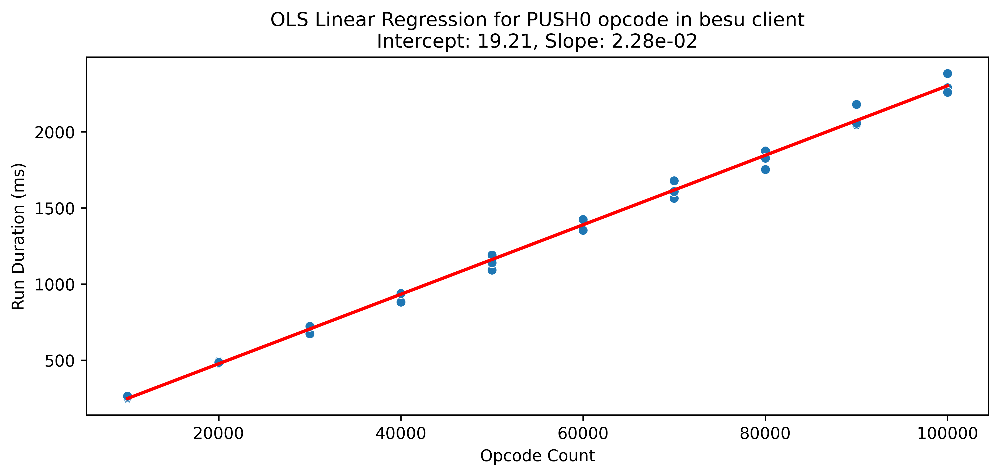


# PUSH1

## geth


```python
                            OLS Regression Results                            
==============================================================================
Dep. Variable:        run_duration_ms   R-squared:                       0.983
Model:                            OLS   Adj. R-squared:                  0.983
Method:                 Least Squares   F-statistic:                     1640.
Date:                Mon, 12 Jan 2026   Prob (F-statistic):           2.12e-26
Time:                        10:29:46   Log-Likelihood:                -160.32
No. Observations:                  30   AIC:                             324.6
Df Residuals:                      28   BIC:                             327.4
Df Model:                           1                                         
Covariance Type:            nonrobust                                         
==============================================================================
                 coef    std err          t      P>|t|      [0.025      0.975]
------------------------------------------------------------------------------
const         36.1785     20.682      1.749      0.091      -6.188      78.545
opcount        0.0193      0.000     40.503      0.000       0.018       0.020
==============================================================================
Omnibus:                        1.953   Durbin-Watson:                   1.108
Prob(Omnibus):                  0.377   Jarque-Bera (JB):                0.822
Skew:                           0.028   Prob(JB):                        0.663
Kurtosis:                       3.809   Cond. No.                     9.38e+04
==============================================================================

Notes:
[1] Standard Errors assume that the covariance matrix of the errors is correctly specified.
[2] The condition number is large, 9.38e+04. This might indicate that there are
strong multicollinearity or other numerical problems.
```


## reth


```python
                            OLS Regression Results                            
==============================================================================
Dep. Variable:        run_duration_ms   R-squared:                       0.977
Model:                            OLS   Adj. R-squared:                  0.977
Method:                 Least Squares   F-statistic:                     1213.
Date:                Mon, 12 Jan 2026   Prob (F-statistic):           1.34e-24
Time:                        10:29:46   Log-Likelihood:                -129.08
No. Observations:                  30   AIC:                             262.2
Df Residuals:                      28   BIC:                             265.0
Df Model:                           1                                         
Covariance Type:            nonrobust                                         
==============================================================================
                 coef    std err          t      P>|t|      [0.025      0.975]
------------------------------------------------------------------------------
const         30.1280      7.300      4.127      0.000      15.174      45.082
opcount        0.0059      0.000     34.828      0.000       0.006       0.006
==============================================================================
Omnibus:                        5.943   Durbin-Watson:                   1.674
Prob(Omnibus):                  0.051   Jarque-Bera (JB):                4.292
Skew:                          -0.865   Prob(JB):                        0.117
Kurtosis:                       3.665   Cond. No.                     9.38e+04
==============================================================================

Notes:
[1] Standard Errors assume that the covariance matrix of the errors is correctly specified.
[2] The condition number is large, 9.38e+04. This might indicate that there are
strong multicollinearity or other numerical problems.
```


## nethermind


```python
                            OLS Regression Results                            
==============================================================================
Dep. Variable:        run_duration_ms   R-squared:                       0.998
Model:                            OLS   Adj. R-squared:                  0.998
Method:                 Least Squares   F-statistic:                 1.594e+04
Date:                Mon, 12 Jan 2026   Prob (F-statistic):           3.89e-40
Time:                        10:29:46   Log-Likelihood:                -106.13
No. Observations:                  30   AIC:                             216.3
Df Residuals:                      28   BIC:                             219.1
Df Model:                           1                                         
Covariance Type:            nonrobust                                         
==============================================================================
                 coef    std err          t      P>|t|      [0.025      0.975]
------------------------------------------------------------------------------
const         26.1234      3.397      7.690      0.000      19.165      33.082
opcount        0.0099   7.82e-05    126.246      0.000       0.010       0.010
==============================================================================
Omnibus:                        2.054   Durbin-Watson:                   1.823
Prob(Omnibus):                  0.358   Jarque-Bera (JB):                0.999
Skew:                          -0.398   Prob(JB):                        0.607
Kurtosis:                       3.407   Cond. No.                     9.38e+04
==============================================================================

Notes:
[1] Standard Errors assume that the covariance matrix of the errors is correctly specified.
[2] The condition number is large, 9.38e+04. This might indicate that there are
strong multicollinearity or other numerical problems.
```

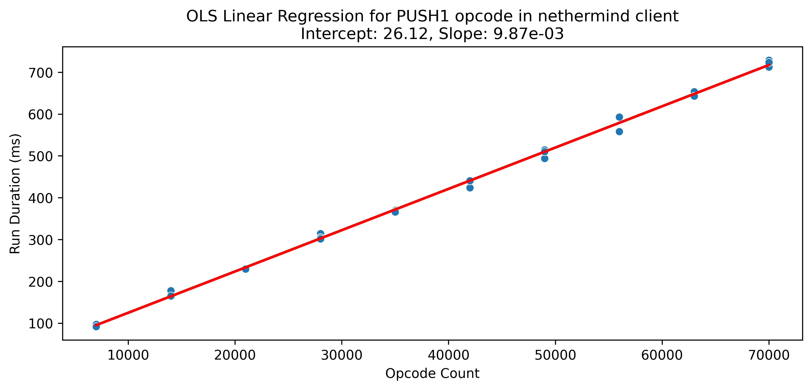


## besu


```python
                            OLS Regression Results                            
==============================================================================
Dep. Variable:        run_duration_ms   R-squared:                       0.997
Model:                            OLS   Adj. R-squared:                  0.996
Method:                 Least Squares   F-statistic:                     8153.
Date:                Mon, 12 Jan 2026   Prob (F-statistic):           4.53e-36
Time:                        10:29:47   Log-Likelihood:                -147.06
No. Observations:                  30   AIC:                             298.1
Df Residuals:                      28   BIC:                             300.9
Df Model:                           1                                         
Covariance Type:            nonrobust                                         
==============================================================================
                 coef    std err          t      P>|t|      [0.025      0.975]
------------------------------------------------------------------------------
const         24.3164     13.292      1.829      0.078      -2.911      51.544
opcount        0.0276      0.000     90.294      0.000       0.027       0.028
==============================================================================
Omnibus:                       21.039   Durbin-Watson:                   1.701
Prob(Omnibus):                  0.000   Jarque-Bera (JB):               30.839
Skew:                           1.689   Prob(JB):                     2.01e-07
Kurtosis:                       6.642   Cond. No.                     9.38e+04
==============================================================================

Notes:
[1] Standard Errors assume that the covariance matrix of the errors is correctly specified.
[2] The condition number is large, 9.38e+04. This might indicate that there are
strong multicollinearity or other numerical problems.
```


# PUSH2

## geth


```python
                            OLS Regression Results                            
==============================================================================
Dep. Variable:        run_duration_ms   R-squared:                       0.982
Model:                            OLS   Adj. R-squared:                  0.981
Method:                 Least Squares   F-statistic:                     1504.
Date:                Mon, 12 Jan 2026   Prob (F-statistic):           6.99e-26
Time:                        10:29:47   Log-Likelihood:                -157.13
No. Observations:                  30   AIC:                             318.3
Df Residuals:                      28   BIC:                             321.1
Df Model:                           1                                         
Covariance Type:            nonrobust                                         
==============================================================================
                 coef    std err          t      P>|t|      [0.025      0.975]
------------------------------------------------------------------------------
const         37.2536     18.595      2.003      0.055      -0.836      75.343
opcount        0.0166      0.000     38.783      0.000       0.016       0.017
==============================================================================
Omnibus:                        1.846   Durbin-Watson:                   0.904
Prob(Omnibus):                  0.397   Jarque-Bera (JB):                0.735
Skew:                          -0.042   Prob(JB):                        0.692
Kurtosis:                       3.762   Cond. No.                     9.38e+04
==============================================================================

Notes:
[1] Standard Errors assume that the covariance matrix of the errors is correctly specified.
[2] The condition number is large, 9.38e+04. This might indicate that there are
strong multicollinearity or other numerical problems.
```

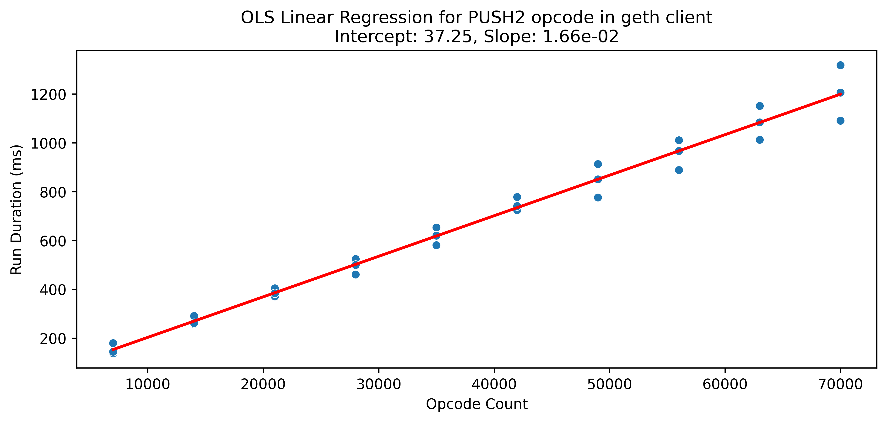


## reth


```python
                            OLS Regression Results                            
==============================================================================
Dep. Variable:        run_duration_ms   R-squared:                       0.985
Model:                            OLS   Adj. R-squared:                  0.985
Method:                 Least Squares   F-statistic:                     1901.
Date:                Mon, 12 Jan 2026   Prob (F-statistic):           2.78e-27
Time:                        10:29:47   Log-Likelihood:                -122.14
No. Observations:                  30   AIC:                             248.3
Df Residuals:                      28   BIC:                             251.1
Df Model:                           1                                         
Covariance Type:            nonrobust                                         
==============================================================================
                 coef    std err          t      P>|t|      [0.025      0.975]
------------------------------------------------------------------------------
const         31.9952      5.793      5.523      0.000      20.129      43.861
opcount        0.0058      0.000     43.598      0.000       0.006       0.006
==============================================================================
Omnibus:                        3.203   Durbin-Watson:                   2.197
Prob(Omnibus):                  0.202   Jarque-Bera (JB):                2.870
Skew:                          -0.706   Prob(JB):                        0.238
Kurtosis:                       2.452   Cond. No.                     9.38e+04
==============================================================================

Notes:
[1] Standard Errors assume that the covariance matrix of the errors is correctly specified.
[2] The condition number is large, 9.38e+04. This might indicate that there are
strong multicollinearity or other numerical problems.
```


## nethermind


```python
                            OLS Regression Results                            
==============================================================================
Dep. Variable:        run_duration_ms   R-squared:                       0.999
Model:                            OLS   Adj. R-squared:                  0.999
Method:                 Least Squares   F-statistic:                 2.864e+04
Date:                Mon, 12 Jan 2026   Prob (F-statistic):           1.08e-43
Time:                        10:29:47   Log-Likelihood:                -101.69
No. Observations:                  30   AIC:                             207.4
Df Residuals:                      28   BIC:                             210.2
Df Model:                           1                                         
Covariance Type:            nonrobust                                         
==============================================================================
                 coef    std err          t      P>|t|      [0.025      0.975]
------------------------------------------------------------------------------
const         23.5159      2.930      8.027      0.000      17.515      29.517
opcount        0.0114   6.75e-05    169.231      0.000       0.011       0.012
==============================================================================
Omnibus:                        1.206   Durbin-Watson:                   1.701
Prob(Omnibus):                  0.547   Jarque-Bera (JB):                0.927
Skew:                           0.419   Prob(JB):                        0.629
Kurtosis:                       2.805   Cond. No.                     9.38e+04
==============================================================================

Notes:
[1] Standard Errors assume that the covariance matrix of the errors is correctly specified.
[2] The condition number is large, 9.38e+04. This might indicate that there are
strong multicollinearity or other numerical problems.
```


## besu


```python
                            OLS Regression Results                            
==============================================================================
Dep. Variable:        run_duration_ms   R-squared:                       0.996
Model:                            OLS   Adj. R-squared:                  0.996
Method:                 Least Squares   F-statistic:                     7362.
Date:                Mon, 12 Jan 2026   Prob (F-statistic):           1.88e-35
Time:                        10:29:47   Log-Likelihood:                -148.24
No. Observations:                  30   AIC:                             300.5
Df Residuals:                      28   BIC:                             303.3
Df Model:                           1                                         
Covariance Type:            nonrobust                                         
==============================================================================
                 coef    std err          t      P>|t|      [0.025      0.975]
------------------------------------------------------------------------------
const         31.2763     13.825      2.262      0.032       2.956      59.596
opcount        0.0273      0.000     85.799      0.000       0.027       0.028
==============================================================================
Omnibus:                        9.646   Durbin-Watson:                   0.965
Prob(Omnibus):                  0.008   Jarque-Bera (JB):                8.123
Skew:                           1.142   Prob(JB):                       0.0172
Kurtosis:                       4.133   Cond. No.                     9.38e+04
==============================================================================

Notes:
[1] Standard Errors assume that the covariance matrix of the errors is correctly specified.
[2] The condition number is large, 9.38e+04. This might indicate that there are
strong multicollinearity or other numerical problems.
```


# PUSH3

## geth


```python
                            OLS Regression Results                            
==============================================================================
Dep. Variable:        run_duration_ms   R-squared:                       0.979
Model:                            OLS   Adj. R-squared:                  0.978
Method:                 Least Squares   F-statistic:                     1297.
Date:                Mon, 12 Jan 2026   Prob (F-statistic):           5.34e-25
Time:                        10:29:47   Log-Likelihood:                -165.53
No. Observations:                  30   AIC:                             335.1
Df Residuals:                      28   BIC:                             337.9
Df Model:                           1                                         
Covariance Type:            nonrobust                                         
==============================================================================
                 coef    std err          t      P>|t|      [0.025      0.975]
------------------------------------------------------------------------------
const         31.2379     24.603      1.270      0.215     -19.158      81.634
opcount        0.0204      0.001     36.016      0.000       0.019       0.022
==============================================================================
Omnibus:                        1.547   Durbin-Watson:                   1.495
Prob(Omnibus):                  0.461   Jarque-Bera (JB):                0.517
Skew:                           0.015   Prob(JB):                        0.772
Kurtosis:                       3.642   Cond. No.                     9.38e+04
==============================================================================

Notes:
[1] Standard Errors assume that the covariance matrix of the errors is correctly specified.
[2] The condition number is large, 9.38e+04. This might indicate that there are
strong multicollinearity or other numerical problems.
```


## reth


```python
                            OLS Regression Results                            
==============================================================================
Dep. Variable:        run_duration_ms   R-squared:                       0.982
Model:                            OLS   Adj. R-squared:                  0.981
Method:                 Least Squares   F-statistic:                     1497.
Date:                Mon, 12 Jan 2026   Prob (F-statistic):           7.45e-26
Time:                        10:29:47   Log-Likelihood:                -124.40
No. Observations:                  30   AIC:                             252.8
Df Residuals:                      28   BIC:                             255.6
Df Model:                           1                                         
Covariance Type:            nonrobust                                         
==============================================================================
                 coef    std err          t      P>|t|      [0.025      0.975]
------------------------------------------------------------------------------
const         31.2375      6.246      5.001      0.000      18.442      44.033
opcount        0.0056      0.000     38.693      0.000       0.005       0.006
==============================================================================
Omnibus:                       15.394   Durbin-Watson:                   2.193
Prob(Omnibus):                  0.000   Jarque-Bera (JB):               17.314
Skew:                           1.384   Prob(JB):                     0.000174
Kurtosis:                       5.488   Cond. No.                     9.38e+04
==============================================================================

Notes:
[1] Standard Errors assume that the covariance matrix of the errors is correctly specified.
[2] The condition number is large, 9.38e+04. This might indicate that there are
strong multicollinearity or other numerical problems.
```

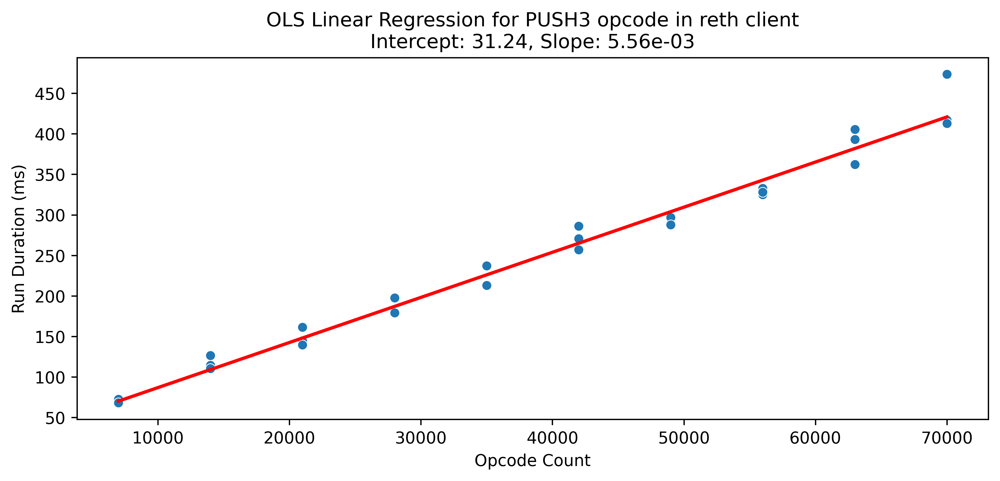


## nethermind


```python
                            OLS Regression Results                            
==============================================================================
Dep. Variable:        run_duration_ms   R-squared:                       0.999
Model:                            OLS   Adj. R-squared:                  0.999
Method:                 Least Squares   F-statistic:                 3.233e+04
Date:                Mon, 12 Jan 2026   Prob (F-statistic):           1.97e-44
Time:                        10:29:47   Log-Likelihood:                -102.39
No. Observations:                  30   AIC:                             208.8
Df Residuals:                      28   BIC:                             211.6
Df Model:                           1                                         
Covariance Type:            nonrobust                                         
==============================================================================
                 coef    std err          t      P>|t|      [0.025      0.975]
------------------------------------------------------------------------------
const         28.2545      2.999      9.421      0.000      22.111      34.398
opcount        0.0124   6.91e-05    179.802      0.000       0.012       0.013
==============================================================================
Omnibus:                        6.332   Durbin-Watson:                   1.819
Prob(Omnibus):                  0.042   Jarque-Bera (JB):                4.924
Skew:                          -0.658   Prob(JB):                       0.0852
Kurtosis:                       4.486   Cond. No.                     9.38e+04
==============================================================================

Notes:
[1] Standard Errors assume that the covariance matrix of the errors is correctly specified.
[2] The condition number is large, 9.38e+04. This might indicate that there are
strong multicollinearity or other numerical problems.
```


## besu


```python
                            OLS Regression Results                            
==============================================================================
Dep. Variable:        run_duration_ms   R-squared:                       0.994
Model:                            OLS   Adj. R-squared:                  0.994
Method:                 Least Squares   F-statistic:                     4696.
Date:                Mon, 12 Jan 2026   Prob (F-statistic):           9.90e-33
Time:                        10:29:48   Log-Likelihood:                -154.97
No. Observations:                  30   AIC:                             313.9
Df Residuals:                      28   BIC:                             316.7
Df Model:                           1                                         
Covariance Type:            nonrobust                                         
==============================================================================
                 coef    std err          t      P>|t|      [0.025      0.975]
------------------------------------------------------------------------------
const         33.1575     17.301      1.917      0.066      -2.282      68.597
opcount        0.0273      0.000     68.528      0.000       0.026       0.028
==============================================================================
Omnibus:                        2.829   Durbin-Watson:                   1.738
Prob(Omnibus):                  0.243   Jarque-Bera (JB):                2.044
Skew:                           0.639   Prob(JB):                        0.360
Kurtosis:                       3.016   Cond. No.                     9.38e+04
==============================================================================

Notes:
[1] Standard Errors assume that the covariance matrix of the errors is correctly specified.
[2] The condition number is large, 9.38e+04. This might indicate that there are
strong multicollinearity or other numerical problems.
```


# PUSH4

## geth


```python
                            OLS Regression Results                            
==============================================================================
Dep. Variable:        run_duration_ms   R-squared:                       0.978
Model:                            OLS   Adj. R-squared:                  0.977
Method:                 Least Squares   F-statistic:                     1254.
Date:                Mon, 12 Jan 2026   Prob (F-statistic):           8.52e-25
Time:                        10:29:48   Log-Likelihood:                -165.15
No. Observations:                  30   AIC:                             334.3
Df Residuals:                      28   BIC:                             337.1
Df Model:                           1                                         
Covariance Type:            nonrobust                                         
==============================================================================
                 coef    std err          t      P>|t|      [0.025      0.975]
------------------------------------------------------------------------------
const         45.7906     24.294      1.885      0.070      -3.974      95.555
opcount        0.0198      0.001     35.407      0.000       0.019       0.021
==============================================================================
Omnibus:                        1.389   Durbin-Watson:                   0.865
Prob(Omnibus):                  0.499   Jarque-Bera (JB):                1.239
Skew:                          -0.462   Prob(JB):                        0.538
Kurtosis:                       2.627   Cond. No.                     9.38e+04
==============================================================================

Notes:
[1] Standard Errors assume that the covariance matrix of the errors is correctly specified.
[2] The condition number is large, 9.38e+04. This might indicate that there are
strong multicollinearity or other numerical problems.
```


## reth


```python
                            OLS Regression Results                            
==============================================================================
Dep. Variable:        run_duration_ms   R-squared:                       0.981
Model:                            OLS   Adj. R-squared:                  0.981
Method:                 Least Squares   F-statistic:                     1468.
Date:                Mon, 12 Jan 2026   Prob (F-statistic):           9.75e-26
Time:                        10:29:48   Log-Likelihood:                -124.38
No. Observations:                  30   AIC:                             252.8
Df Residuals:                      28   BIC:                             255.6
Df Model:                           1                                         
Covariance Type:            nonrobust                                         
==============================================================================
                 coef    std err          t      P>|t|      [0.025      0.975]
------------------------------------------------------------------------------
const         37.3655      6.241      5.987      0.000      24.581      50.150
opcount        0.0055      0.000     38.316      0.000       0.005       0.006
==============================================================================
Omnibus:                        3.434   Durbin-Watson:                   1.794
Prob(Omnibus):                  0.180   Jarque-Bera (JB):                2.962
Skew:                           0.683   Prob(JB):                        0.227
Kurtosis:                       2.292   Cond. No.                     9.38e+04
==============================================================================

Notes:
[1] Standard Errors assume that the covariance matrix of the errors is correctly specified.
[2] The condition number is large, 9.38e+04. This might indicate that there are
strong multicollinearity or other numerical problems.
```

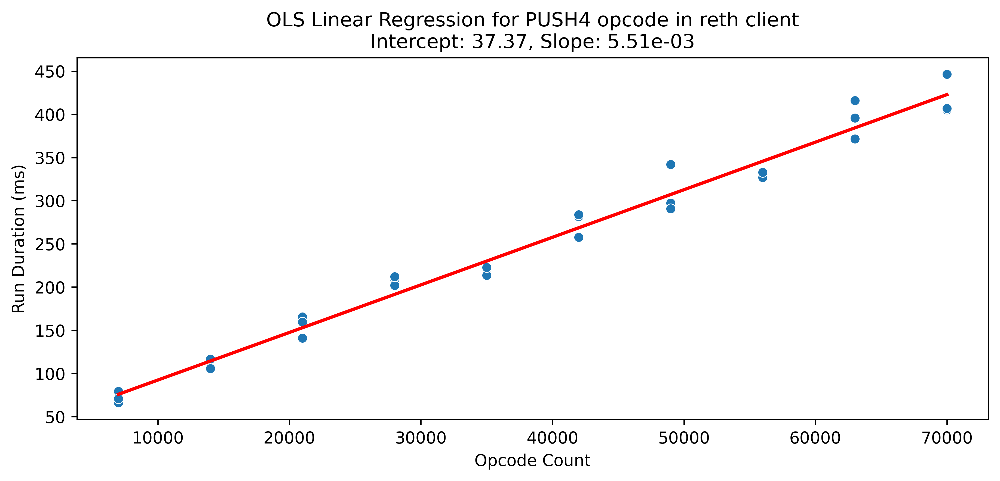


## nethermind


```python
                            OLS Regression Results                            
==============================================================================
Dep. Variable:        run_duration_ms   R-squared:                       0.998
Model:                            OLS   Adj. R-squared:                  0.997
Method:                 Least Squares   F-statistic:                 1.126e+04
Date:                Mon, 12 Jan 2026   Prob (F-statistic):           4.99e-38
Time:                        10:29:48   Log-Likelihood:                -112.24
No. Observations:                  30   AIC:                             228.5
Df Residuals:                      28   BIC:                             231.3
Df Model:                           1                                         
Covariance Type:            nonrobust                                         
==============================================================================
                 coef    std err          t      P>|t|      [0.025      0.975]
------------------------------------------------------------------------------
const         23.2429      4.165      5.581      0.000      14.712      31.774
opcount        0.0102   9.59e-05    106.114      0.000       0.010       0.010
==============================================================================
Omnibus:                        2.834   Durbin-Watson:                   1.200
Prob(Omnibus):                  0.242   Jarque-Bera (JB):                1.484
Skew:                           0.388   Prob(JB):                        0.476
Kurtosis:                       3.764   Cond. No.                     9.38e+04
==============================================================================

Notes:
[1] Standard Errors assume that the covariance matrix of the errors is correctly specified.
[2] The condition number is large, 9.38e+04. This might indicate that there are
strong multicollinearity or other numerical problems.
```

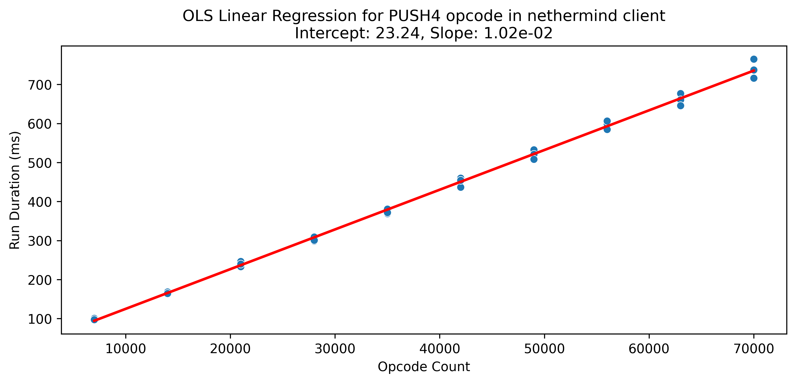


## besu


```python
                            OLS Regression Results                            
==============================================================================
Dep. Variable:        run_duration_ms   R-squared:                       0.995
Model:                            OLS   Adj. R-squared:                  0.995
Method:                 Least Squares   F-statistic:                     5955.
Date:                Mon, 12 Jan 2026   Prob (F-statistic):           3.62e-34
Time:                        10:29:48   Log-Likelihood:                -151.64
No. Observations:                  30   AIC:                             307.3
Df Residuals:                      28   BIC:                             310.1
Df Model:                           1                                         
Covariance Type:            nonrobust                                         
==============================================================================
                 coef    std err          t      P>|t|      [0.025      0.975]
------------------------------------------------------------------------------
const         34.8113     15.484      2.248      0.033       3.093      66.530
opcount        0.0275      0.000     77.166      0.000       0.027       0.028
==============================================================================
Omnibus:                        1.300   Durbin-Watson:                   1.592
Prob(Omnibus):                  0.522   Jarque-Bera (JB):                1.097
Skew:                           0.266   Prob(JB):                        0.578
Kurtosis:                       2.229   Cond. No.                     9.38e+04
==============================================================================

Notes:
[1] Standard Errors assume that the covariance matrix of the errors is correctly specified.
[2] The condition number is large, 9.38e+04. This might indicate that there are
strong multicollinearity or other numerical problems.
```

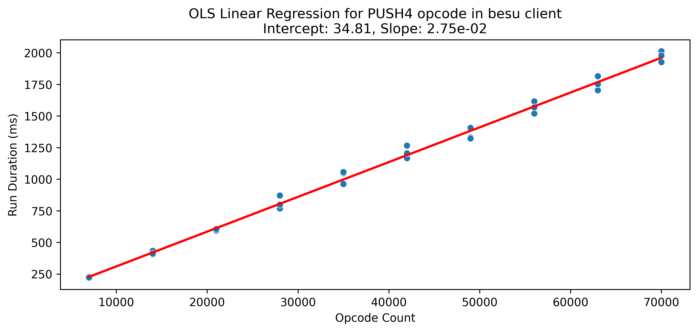


# PUSH5

## geth


```python
                            OLS Regression Results                            
==============================================================================
Dep. Variable:        run_duration_ms   R-squared:                       0.986
Model:                            OLS   Adj. R-squared:                  0.986
Method:                 Least Squares   F-statistic:                     2036.
Date:                Mon, 12 Jan 2026   Prob (F-statistic):           1.08e-27
Time:                        10:29:48   Log-Likelihood:                -158.14
No. Observations:                  30   AIC:                             320.3
Df Residuals:                      28   BIC:                             323.1
Df Model:                           1                                         
Covariance Type:            nonrobust                                         
==============================================================================
                 coef    std err          t      P>|t|      [0.025      0.975]
------------------------------------------------------------------------------
const         49.1739     19.229      2.557      0.016       9.784      88.564
opcount        0.0200      0.000     45.118      0.000       0.019       0.021
==============================================================================
Omnibus:                        1.614   Durbin-Watson:                   0.676
Prob(Omnibus):                  0.446   Jarque-Bera (JB):                0.592
Skew:                          -0.215   Prob(JB):                        0.744
Kurtosis:                       3.537   Cond. No.                     9.38e+04
==============================================================================

Notes:
[1] Standard Errors assume that the covariance matrix of the errors is correctly specified.
[2] The condition number is large, 9.38e+04. This might indicate that there are
strong multicollinearity or other numerical problems.
```

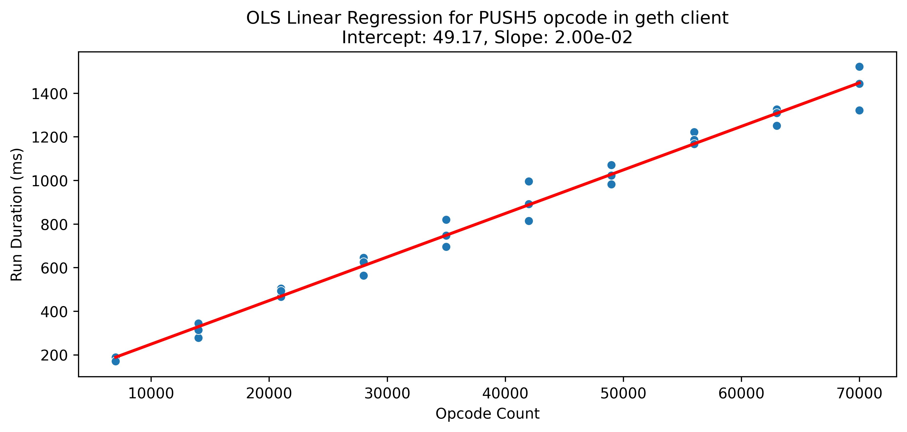


## reth


```python
                            OLS Regression Results                            
==============================================================================
Dep. Variable:        run_duration_ms   R-squared:                       0.985
Model:                            OLS   Adj. R-squared:                  0.984
Method:                 Least Squares   F-statistic:                     1824.
Date:                Mon, 12 Jan 2026   Prob (F-statistic):           4.90e-27
Time:                        10:29:48   Log-Likelihood:                -124.33
No. Observations:                  30   AIC:                             252.7
Df Residuals:                      28   BIC:                             255.5
Df Model:                           1                                         
Covariance Type:            nonrobust                                         
==============================================================================
                 coef    std err          t      P>|t|      [0.025      0.975]
------------------------------------------------------------------------------
const         25.9281      6.230      4.162      0.000      13.167      38.690
opcount        0.0061      0.000     42.709      0.000       0.006       0.006
==============================================================================
Omnibus:                        4.442   Durbin-Watson:                   2.183
Prob(Omnibus):                  0.109   Jarque-Bera (JB):                3.435
Skew:                          -0.827   Prob(JB):                        0.180
Kurtosis:                       3.100   Cond. No.                     9.38e+04
==============================================================================

Notes:
[1] Standard Errors assume that the covariance matrix of the errors is correctly specified.
[2] The condition number is large, 9.38e+04. This might indicate that there are
strong multicollinearity or other numerical problems.
```


## nethermind


```python
                            OLS Regression Results                            
==============================================================================
Dep. Variable:        run_duration_ms   R-squared:                       0.994
Model:                            OLS   Adj. R-squared:                  0.993
Method:                 Least Squares   F-statistic:                     4418.
Date:                Mon, 12 Jan 2026   Prob (F-statistic):           2.31e-32
Time:                        10:29:49   Log-Likelihood:                -133.62
No. Observations:                  30   AIC:                             271.2
Df Residuals:                      28   BIC:                             274.0
Df Model:                           1                                         
Covariance Type:            nonrobust                                         
==============================================================================
                 coef    std err          t      P>|t|      [0.025      0.975]
------------------------------------------------------------------------------
const         13.6350      8.492      1.606      0.120      -3.760      31.030
opcount        0.0130      0.000     66.472      0.000       0.013       0.013
==============================================================================
Omnibus:                        8.871   Durbin-Watson:                   2.245
Prob(Omnibus):                  0.012   Jarque-Bera (JB):                7.527
Skew:                           0.933   Prob(JB):                       0.0232
Kurtosis:                       4.594   Cond. No.                     9.38e+04
==============================================================================

Notes:
[1] Standard Errors assume that the covariance matrix of the errors is correctly specified.
[2] The condition number is large, 9.38e+04. This might indicate that there are
strong multicollinearity or other numerical problems.
```


## besu


```python
                            OLS Regression Results                            
==============================================================================
Dep. Variable:        run_duration_ms   R-squared:                       0.998
Model:                            OLS   Adj. R-squared:                  0.998
Method:                 Least Squares   F-statistic:                 1.249e+04
Date:                Mon, 12 Jan 2026   Prob (F-statistic):           1.17e-38
Time:                        10:29:49   Log-Likelihood:                -140.32
No. Observations:                  30   AIC:                             284.6
Df Residuals:                      28   BIC:                             287.4
Df Model:                           1                                         
Covariance Type:            nonrobust                                         
==============================================================================
                 coef    std err          t      P>|t|      [0.025      0.975]
------------------------------------------------------------------------------
const         23.8877     10.619      2.250      0.033       2.136      45.639
opcount        0.0273      0.000    111.781      0.000       0.027       0.028
==============================================================================
Omnibus:                        0.163   Durbin-Watson:                   1.218
Prob(Omnibus):                  0.922   Jarque-Bera (JB):                0.072
Skew:                           0.098   Prob(JB):                        0.964
Kurtosis:                       2.859   Cond. No.                     9.38e+04
==============================================================================

Notes:
[1] Standard Errors assume that the covariance matrix of the errors is correctly specified.
[2] The condition number is large, 9.38e+04. This might indicate that there are
strong multicollinearity or other numerical problems.
```


# PUSH6

## geth


```python
                            OLS Regression Results                            
==============================================================================
Dep. Variable:        run_duration_ms   R-squared:                       0.978
Model:                            OLS   Adj. R-squared:                  0.977
Method:                 Least Squares   F-statistic:                     1234.
Date:                Mon, 12 Jan 2026   Prob (F-statistic):           1.06e-24
Time:                        10:29:49   Log-Likelihood:                -166.24
No. Observations:                  30   AIC:                             336.5
Df Residuals:                      28   BIC:                             339.3
Df Model:                           1                                         
Covariance Type:            nonrobust                                         
==============================================================================
                 coef    std err          t      P>|t|      [0.025      0.975]
------------------------------------------------------------------------------
const         29.9272     25.193      1.188      0.245     -21.678      81.532
opcount        0.0204      0.001     35.122      0.000       0.019       0.022
==============================================================================
Omnibus:                        1.267   Durbin-Watson:                   0.618
Prob(Omnibus):                  0.531   Jarque-Bera (JB):                0.342
Skew:                           0.026   Prob(JB):                        0.843
Kurtosis:                       3.520   Cond. No.                     9.38e+04
==============================================================================

Notes:
[1] Standard Errors assume that the covariance matrix of the errors is correctly specified.
[2] The condition number is large, 9.38e+04. This might indicate that there are
strong multicollinearity or other numerical problems.
```


## reth


```python
                            OLS Regression Results                            
==============================================================================
Dep. Variable:        run_duration_ms   R-squared:                       0.987
Model:                            OLS   Adj. R-squared:                  0.986
Method:                 Least Squares   F-statistic:                     2094.
Date:                Mon, 12 Jan 2026   Prob (F-statistic):           7.28e-28
Time:                        10:29:49   Log-Likelihood:                -121.35
No. Observations:                  30   AIC:                             246.7
Df Residuals:                      28   BIC:                             249.5
Df Model:                           1                                         
Covariance Type:            nonrobust                                         
==============================================================================
                 coef    std err          t      P>|t|      [0.025      0.975]
------------------------------------------------------------------------------
const         25.8020      5.642      4.573      0.000      14.245      37.359
opcount        0.0059      0.000     45.764      0.000       0.006       0.006
==============================================================================
Omnibus:                        3.984   Durbin-Watson:                   2.024
Prob(Omnibus):                  0.136   Jarque-Bera (JB):                3.402
Skew:                          -0.818   Prob(JB):                        0.183
Kurtosis:                       2.785   Cond. No.                     9.38e+04
==============================================================================

Notes:
[1] Standard Errors assume that the covariance matrix of the errors is correctly specified.
[2] The condition number is large, 9.38e+04. This might indicate that there are
strong multicollinearity or other numerical problems.
```

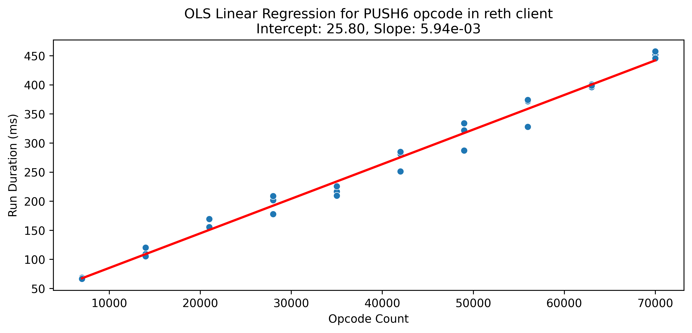


## nethermind


```python
                            OLS Regression Results                            
==============================================================================
Dep. Variable:        run_duration_ms   R-squared:                       0.936
Model:                            OLS   Adj. R-squared:                  0.934
Method:                 Least Squares   F-statistic:                     409.3
Date:                Mon, 12 Jan 2026   Prob (F-statistic):           3.00e-18
Time:                        10:29:49   Log-Likelihood:                -168.08
No. Observations:                  30   AIC:                             340.2
Df Residuals:                      28   BIC:                             343.0
Df Model:                           1                                         
Covariance Type:            nonrobust                                         
==============================================================================
                 coef    std err          t      P>|t|      [0.025      0.975]
------------------------------------------------------------------------------
const         48.4264     26.783      1.808      0.081      -6.436     103.289
opcount        0.0125      0.001     20.231      0.000       0.011       0.014
==============================================================================
Omnibus:                       44.887   Durbin-Watson:                   1.184
Prob(Omnibus):                  0.000   Jarque-Bera (JB):              160.211
Skew:                           3.244   Prob(JB):                     1.62e-35
Kurtosis:                      12.277   Cond. No.                     9.38e+04
==============================================================================

Notes:
[1] Standard Errors assume that the covariance matrix of the errors is correctly specified.
[2] The condition number is large, 9.38e+04. This might indicate that there are
strong multicollinearity or other numerical problems.
```

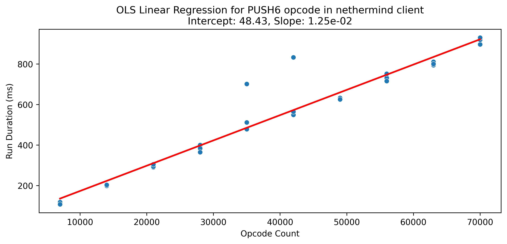


## besu


```python
                            OLS Regression Results                            
==============================================================================
Dep. Variable:        run_duration_ms   R-squared:                       0.997
Model:                            OLS   Adj. R-squared:                  0.997
Method:                 Least Squares   F-statistic:                     9517.
Date:                Mon, 12 Jan 2026   Prob (F-statistic):           5.23e-37
Time:                        10:29:49   Log-Likelihood:                -144.67
No. Observations:                  30   AIC:                             293.3
Df Residuals:                      28   BIC:                             296.2
Df Model:                           1                                         
Covariance Type:            nonrobust                                         
==============================================================================
                 coef    std err          t      P>|t|      [0.025      0.975]
------------------------------------------------------------------------------
const         22.3801     12.276      1.823      0.079      -2.766      47.527
opcount        0.0276      0.000     97.555      0.000       0.027       0.028
==============================================================================
Omnibus:                        0.510   Durbin-Watson:                   1.252
Prob(Omnibus):                  0.775   Jarque-Bera (JB):                0.611
Skew:                          -0.097   Prob(JB):                        0.737
Kurtosis:                       2.328   Cond. No.                     9.38e+04
==============================================================================

Notes:
[1] Standard Errors assume that the covariance matrix of the errors is correctly specified.
[2] The condition number is large, 9.38e+04. This might indicate that there are
strong multicollinearity or other numerical problems.
```


# PUSH7

## geth


```python
                            OLS Regression Results                            
==============================================================================
Dep. Variable:        run_duration_ms   R-squared:                       0.979
Model:                            OLS   Adj. R-squared:                  0.979
Method:                 Least Squares   F-statistic:                     1328.
Date:                Mon, 12 Jan 2026   Prob (F-statistic):           3.85e-25
Time:                        10:29:49   Log-Likelihood:                -165.70
No. Observations:                  30   AIC:                             335.4
Df Residuals:                      28   BIC:                             338.2
Df Model:                           1                                         
Covariance Type:            nonrobust                                         
==============================================================================
                 coef    std err          t      P>|t|      [0.025      0.975]
------------------------------------------------------------------------------
const         28.6850     24.742      1.159      0.256     -21.998      79.368
opcount        0.0208      0.001     36.447      0.000       0.020       0.022
==============================================================================
Omnibus:                        2.245   Durbin-Watson:                   0.717
Prob(Omnibus):                  0.325   Jarque-Bera (JB):                1.044
Skew:                          -0.185   Prob(JB):                        0.593
Kurtosis:                       3.836   Cond. No.                     9.38e+04
==============================================================================

Notes:
[1] Standard Errors assume that the covariance matrix of the errors is correctly specified.
[2] The condition number is large, 9.38e+04. This might indicate that there are
strong multicollinearity or other numerical problems.
```

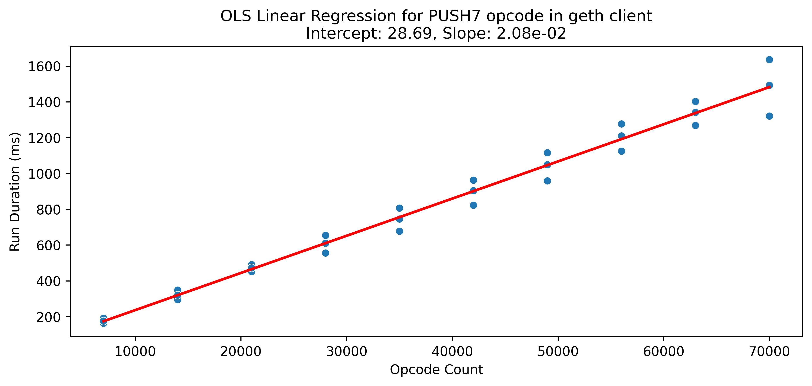


## reth


```python
                            OLS Regression Results                            
==============================================================================
Dep. Variable:        run_duration_ms   R-squared:                       0.981
Model:                            OLS   Adj. R-squared:                  0.980
Method:                 Least Squares   F-statistic:                     1420.
Date:                Mon, 12 Jan 2026   Prob (F-statistic):           1.54e-25
Time:                        10:29:50   Log-Likelihood:                -128.63
No. Observations:                  30   AIC:                             261.3
Df Residuals:                      28   BIC:                             264.1
Df Model:                           1                                         
Covariance Type:            nonrobust                                         
==============================================================================
                 coef    std err          t      P>|t|      [0.025      0.975]
------------------------------------------------------------------------------
const         28.5655      7.191      3.972      0.000      13.835      43.296
opcount        0.0062      0.000     37.682      0.000       0.006       0.007
==============================================================================
Omnibus:                        9.837   Durbin-Watson:                   1.540
Prob(Omnibus):                  0.007   Jarque-Bera (JB):                8.481
Skew:                          -1.061   Prob(JB):                       0.0144
Kurtosis:                       4.510   Cond. No.                     9.38e+04
==============================================================================

Notes:
[1] Standard Errors assume that the covariance matrix of the errors is correctly specified.
[2] The condition number is large, 9.38e+04. This might indicate that there are
strong multicollinearity or other numerical problems.
```


## nethermind


```python
                            OLS Regression Results                            
==============================================================================
Dep. Variable:        run_duration_ms   R-squared:                       0.991
Model:                            OLS   Adj. R-squared:                  0.990
Method:                 Least Squares   F-statistic:                     2975.
Date:                Mon, 12 Jan 2026   Prob (F-statistic):           5.62e-30
Time:                        10:29:50   Log-Likelihood:                -138.74
No. Observations:                  30   AIC:                             281.5
Df Residuals:                      28   BIC:                             284.3
Df Model:                           1                                         
Covariance Type:            nonrobust                                         
==============================================================================
                 coef    std err          t      P>|t|      [0.025      0.975]
------------------------------------------------------------------------------
const         20.1530     10.075      2.000      0.055      -0.484      40.790
opcount        0.0127      0.000     54.547      0.000       0.012       0.013
==============================================================================
Omnibus:                       16.010   Durbin-Watson:                   1.732
Prob(Omnibus):                  0.000   Jarque-Bera (JB):               17.703
Skew:                           1.490   Prob(JB):                     0.000143
Kurtosis:                       5.298   Cond. No.                     9.38e+04
==============================================================================

Notes:
[1] Standard Errors assume that the covariance matrix of the errors is correctly specified.
[2] The condition number is large, 9.38e+04. This might indicate that there are
strong multicollinearity or other numerical problems.
```

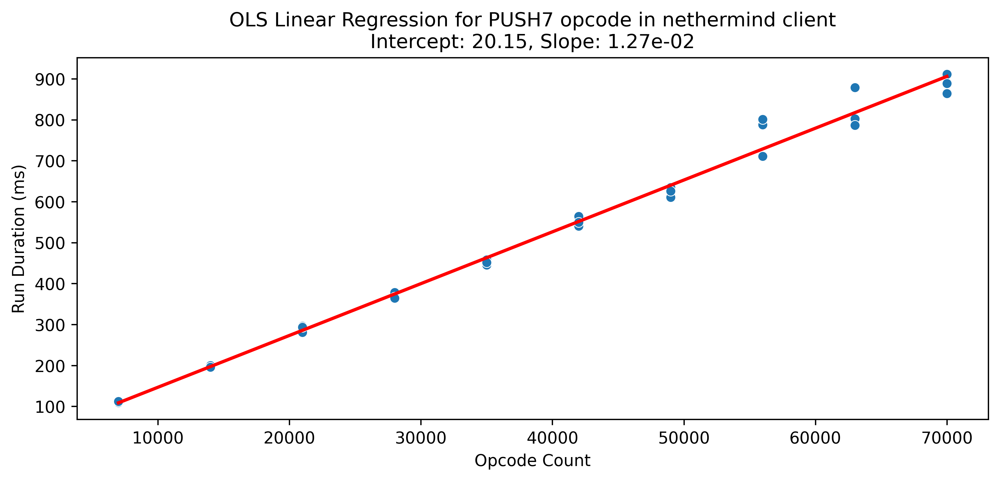


## besu


```python
                            OLS Regression Results                            
==============================================================================
Dep. Variable:        run_duration_ms   R-squared:                       0.996
Model:                            OLS   Adj. R-squared:                  0.995
Method:                 Least Squares   F-statistic:                     6315.
Date:                Mon, 12 Jan 2026   Prob (F-statistic):           1.60e-34
Time:                        10:29:50   Log-Likelihood:                -150.97
No. Observations:                  30   AIC:                             305.9
Df Residuals:                      28   BIC:                             308.7
Df Model:                           1                                         
Covariance Type:            nonrobust                                         
==============================================================================
                 coef    std err          t      P>|t|      [0.025      0.975]
------------------------------------------------------------------------------
const         29.6905     15.144      1.961      0.060      -1.330      60.711
opcount        0.0277      0.000     79.470      0.000       0.027       0.028
==============================================================================
Omnibus:                        2.919   Durbin-Watson:                   1.074
Prob(Omnibus):                  0.232   Jarque-Bera (JB):                2.606
Skew:                           0.681   Prob(JB):                        0.272
Kurtosis:                       2.521   Cond. No.                     9.38e+04
==============================================================================

Notes:
[1] Standard Errors assume that the covariance matrix of the errors is correctly specified.
[2] The condition number is large, 9.38e+04. This might indicate that there are
strong multicollinearity or other numerical problems.
```

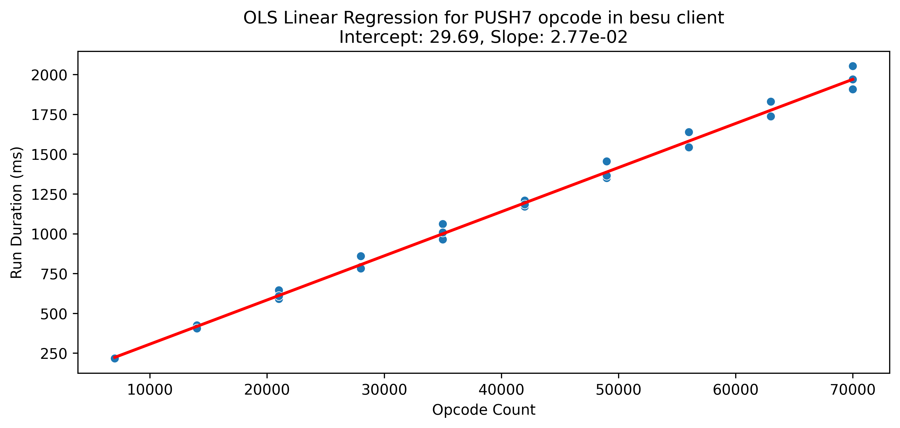


# PUSH8

## geth


```python
                            OLS Regression Results                            
==============================================================================
Dep. Variable:        run_duration_ms   R-squared:                       0.979
Model:                            OLS   Adj. R-squared:                  0.978
Method:                 Least Squares   F-statistic:                     1314.
Date:                Mon, 12 Jan 2026   Prob (F-statistic):           4.47e-25
Time:                        10:29:50   Log-Likelihood:                -165.36
No. Observations:                  30   AIC:                             334.7
Df Residuals:                      28   BIC:                             337.5
Df Model:                           1                                         
Covariance Type:            nonrobust                                         
==============================================================================
                 coef    std err          t      P>|t|      [0.025      0.975]
------------------------------------------------------------------------------
const         28.1878     24.460      1.152      0.259     -21.916      78.292
opcount        0.0204      0.001     36.249      0.000       0.019       0.022
==============================================================================
Omnibus:                        1.918   Durbin-Watson:                   0.848
Prob(Omnibus):                  0.383   Jarque-Bera (JB):                0.793
Skew:                          -0.018   Prob(JB):                        0.673
Kurtosis:                       3.796   Cond. No.                     9.38e+04
==============================================================================

Notes:
[1] Standard Errors assume that the covariance matrix of the errors is correctly specified.
[2] The condition number is large, 9.38e+04. This might indicate that there are
strong multicollinearity or other numerical problems.
```


## reth


```python
                            OLS Regression Results                            
==============================================================================
Dep. Variable:        run_duration_ms   R-squared:                       0.980
Model:                            OLS   Adj. R-squared:                  0.979
Method:                 Least Squares   F-statistic:                     1343.
Date:                Mon, 12 Jan 2026   Prob (F-statistic):           3.33e-25
Time:                        10:29:50   Log-Likelihood:                -127.69
No. Observations:                  30   AIC:                             259.4
Df Residuals:                      28   BIC:                             262.2
Df Model:                           1                                         
Covariance Type:            nonrobust                                         
==============================================================================
                 coef    std err          t      P>|t|      [0.025      0.975]
------------------------------------------------------------------------------
const         33.9299      6.970      4.868      0.000      19.653      48.207
opcount        0.0059      0.000     36.642      0.000       0.006       0.006
==============================================================================
Omnibus:                        3.861   Durbin-Watson:                   2.076
Prob(Omnibus):                  0.145   Jarque-Bera (JB):                2.327
Skew:                          -0.571   Prob(JB):                        0.312
Kurtosis:                       3.747   Cond. No.                     9.38e+04
==============================================================================

Notes:
[1] Standard Errors assume that the covariance matrix of the errors is correctly specified.
[2] The condition number is large, 9.38e+04. This might indicate that there are
strong multicollinearity or other numerical problems.
```


## nethermind


```python
                            OLS Regression Results                            
==============================================================================
Dep. Variable:        run_duration_ms   R-squared:                       0.994
Model:                            OLS   Adj. R-squared:                  0.994
Method:                 Least Squares   F-statistic:                     4836.
Date:                Mon, 12 Jan 2026   Prob (F-statistic):           6.57e-33
Time:                        10:29:50   Log-Likelihood:                -124.47
No. Observations:                  30   AIC:                             252.9
Df Residuals:                      28   BIC:                             255.7
Df Model:                           1                                         
Covariance Type:            nonrobust                                         
==============================================================================
                 coef    std err          t      P>|t|      [0.025      0.975]
------------------------------------------------------------------------------
const         27.8395      6.259      4.448      0.000      15.018      40.660
opcount        0.0100      0.000     69.542      0.000       0.010       0.010
==============================================================================
Omnibus:                        0.185   Durbin-Watson:                   1.544
Prob(Omnibus):                  0.912   Jarque-Bera (JB):                0.218
Skew:                           0.159   Prob(JB):                        0.897
Kurtosis:                       2.730   Cond. No.                     9.38e+04
==============================================================================

Notes:
[1] Standard Errors assume that the covariance matrix of the errors is correctly specified.
[2] The condition number is large, 9.38e+04. This might indicate that there are
strong multicollinearity or other numerical problems.
```

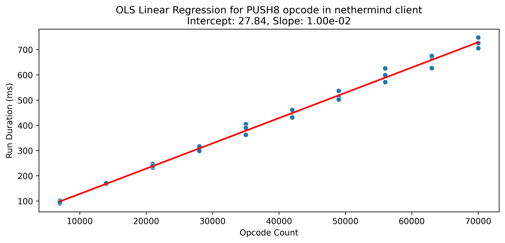


## besu


```python
                            OLS Regression Results                            
==============================================================================
Dep. Variable:        run_duration_ms   R-squared:                       0.997
Model:                            OLS   Adj. R-squared:                  0.997
Method:                 Least Squares   F-statistic:                     8916.
Date:                Mon, 12 Jan 2026   Prob (F-statistic):           1.30e-36
Time:                        10:29:50   Log-Likelihood:                -145.27
No. Observations:                  30   AIC:                             294.5
Df Residuals:                      28   BIC:                             297.4
Df Model:                           1                                         
Covariance Type:            nonrobust                                         
==============================================================================
                 coef    std err          t      P>|t|      [0.025      0.975]
------------------------------------------------------------------------------
const         30.7465     12.524      2.455      0.021       5.092      56.401
opcount        0.0272      0.000     94.427      0.000       0.027       0.028
==============================================================================
Omnibus:                        0.664   Durbin-Watson:                   0.912
Prob(Omnibus):                  0.718   Jarque-Bera (JB):                0.673
Skew:                          -0.013   Prob(JB):                        0.714
Kurtosis:                       2.267   Cond. No.                     9.38e+04
==============================================================================

Notes:
[1] Standard Errors assume that the covariance matrix of the errors is correctly specified.
[2] The condition number is large, 9.38e+04. This might indicate that there are
strong multicollinearity or other numerical problems.
```


# PUSH9

## geth


```python
                            OLS Regression Results                            
==============================================================================
Dep. Variable:        run_duration_ms   R-squared:                       0.985
Model:                            OLS   Adj. R-squared:                  0.984
Method:                 Least Squares   F-statistic:                     1842.
Date:                Mon, 12 Jan 2026   Prob (F-statistic):           4.27e-27
Time:                        10:29:51   Log-Likelihood:                -160.10
No. Observations:                  30   AIC:                             324.2
Df Residuals:                      28   BIC:                             327.0
Df Model:                           1                                         
Covariance Type:            nonrobust                                         
==============================================================================
                 coef    std err          t      P>|t|      [0.025      0.975]
------------------------------------------------------------------------------
const         35.6715     20.531      1.737      0.093      -6.385      77.728
opcount        0.0203      0.000     42.924      0.000       0.019       0.021
==============================================================================
Omnibus:                        2.255   Durbin-Watson:                   1.049
Prob(Omnibus):                  0.324   Jarque-Bera (JB):                1.200
Skew:                          -0.457   Prob(JB):                        0.549
Kurtosis:                       3.353   Cond. No.                     9.38e+04
==============================================================================

Notes:
[1] Standard Errors assume that the covariance matrix of the errors is correctly specified.
[2] The condition number is large, 9.38e+04. This might indicate that there are
strong multicollinearity or other numerical problems.
```


## reth


```python
                            OLS Regression Results                            
==============================================================================
Dep. Variable:        run_duration_ms   R-squared:                       0.984
Model:                            OLS   Adj. R-squared:                  0.984
Method:                 Least Squares   F-statistic:                     1773.
Date:                Mon, 12 Jan 2026   Prob (F-statistic):           7.24e-27
Time:                        10:29:51   Log-Likelihood:                -124.27
No. Observations:                  30   AIC:                             252.5
Df Residuals:                      28   BIC:                             255.4
Df Model:                           1                                         
Covariance Type:            nonrobust                                         
==============================================================================
                 coef    std err          t      P>|t|      [0.025      0.975]
------------------------------------------------------------------------------
const         29.6996      6.219      4.775      0.000      16.960      42.439
opcount        0.0060      0.000     42.110      0.000       0.006       0.006
==============================================================================
Omnibus:                        6.217   Durbin-Watson:                   0.950
Prob(Omnibus):                  0.045   Jarque-Bera (JB):                4.497
Skew:                          -0.865   Prob(JB):                        0.106
Kurtosis:                       3.778   Cond. No.                     9.38e+04
==============================================================================

Notes:
[1] Standard Errors assume that the covariance matrix of the errors is correctly specified.
[2] The condition number is large, 9.38e+04. This might indicate that there are
strong multicollinearity or other numerical problems.
```

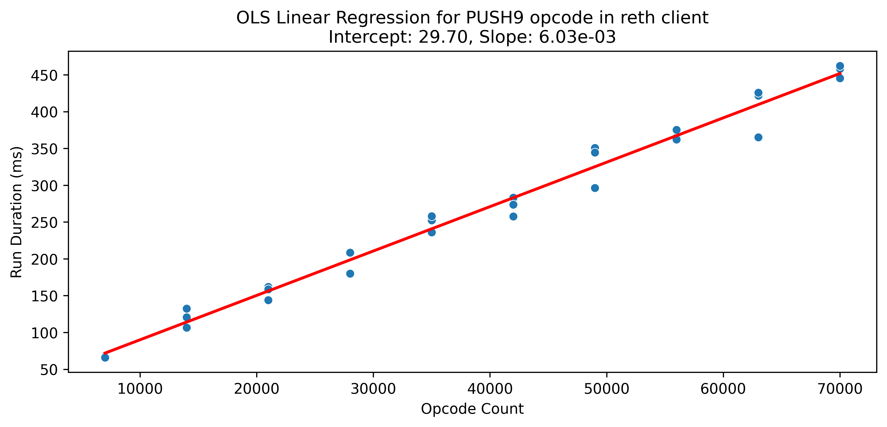


## nethermind


```python
                            OLS Regression Results                            
==============================================================================
Dep. Variable:        run_duration_ms   R-squared:                       0.996
Model:                            OLS   Adj. R-squared:                  0.995
Method:                 Least Squares   F-statistic:                     6273.
Date:                Mon, 12 Jan 2026   Prob (F-statistic):           1.75e-34
Time:                        10:29:51   Log-Likelihood:                -127.08
No. Observations:                  30   AIC:                             258.2
Df Residuals:                      28   BIC:                             261.0
Df Model:                           1                                         
Covariance Type:            nonrobust                                         
==============================================================================
                 coef    std err          t      P>|t|      [0.025      0.975]
------------------------------------------------------------------------------
const         28.9959      6.828      4.247      0.000      15.010      42.982
opcount        0.0125      0.000     79.204      0.000       0.012       0.013
==============================================================================
Omnibus:                        3.611   Durbin-Watson:                   1.607
Prob(Omnibus):                  0.164   Jarque-Bera (JB):                2.248
Skew:                           0.628   Prob(JB):                        0.325
Kurtosis:                       3.471   Cond. No.                     9.38e+04
==============================================================================

Notes:
[1] Standard Errors assume that the covariance matrix of the errors is correctly specified.
[2] The condition number is large, 9.38e+04. This might indicate that there are
strong multicollinearity or other numerical problems.
```


## besu


```python
                            OLS Regression Results                            
==============================================================================
Dep. Variable:        run_duration_ms   R-squared:                       0.997
Model:                            OLS   Adj. R-squared:                  0.996
Method:                 Least Squares   F-statistic:                     8016.
Date:                Mon, 12 Jan 2026   Prob (F-statistic):           5.74e-36
Time:                        10:29:51   Log-Likelihood:                -146.94
No. Observations:                  30   AIC:                             297.9
Df Residuals:                      28   BIC:                             300.7
Df Model:                           1                                         
Covariance Type:            nonrobust                                         
==============================================================================
                 coef    std err          t      P>|t|      [0.025      0.975]
------------------------------------------------------------------------------
const         34.1054     13.238      2.576      0.016       6.988      61.223
opcount        0.0273      0.000     89.529      0.000       0.027       0.028
==============================================================================
Omnibus:                        3.718   Durbin-Watson:                   1.357
Prob(Omnibus):                  0.156   Jarque-Bera (JB):                2.526
Skew:                           0.697   Prob(JB):                        0.283
Kurtosis:                       3.280   Cond. No.                     9.38e+04
==============================================================================

Notes:
[1] Standard Errors assume that the covariance matrix of the errors is correctly specified.
[2] The condition number is large, 9.38e+04. This might indicate that there are
strong multicollinearity or other numerical problems.
```

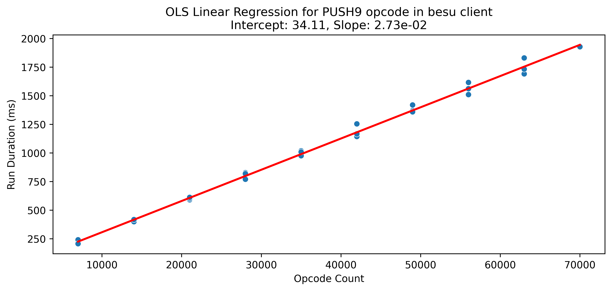


# PUSH10

## geth


```python
                            OLS Regression Results                            
==============================================================================
Dep. Variable:        run_duration_ms   R-squared:                       0.982
Model:                            OLS   Adj. R-squared:                  0.982
Method:                 Least Squares   F-statistic:                     1549.
Date:                Mon, 12 Jan 2026   Prob (F-statistic):           4.66e-26
Time:                        10:29:51   Log-Likelihood:                -163.18
No. Observations:                  30   AIC:                             330.4
Df Residuals:                      28   BIC:                             333.2
Df Model:                           1                                         
Covariance Type:            nonrobust                                         
==============================================================================
                 coef    std err          t      P>|t|      [0.025      0.975]
------------------------------------------------------------------------------
const         31.6338     22.750      1.390      0.175     -14.968      78.235
opcount        0.0206      0.001     39.358      0.000       0.020       0.022
==============================================================================
Omnibus:                        1.461   Durbin-Watson:                   0.987
Prob(Omnibus):                  0.482   Jarque-Bera (JB):                0.459
Skew:                          -0.001   Prob(JB):                        0.795
Kurtosis:                       3.606   Cond. No.                     9.38e+04
==============================================================================

Notes:
[1] Standard Errors assume that the covariance matrix of the errors is correctly specified.
[2] The condition number is large, 9.38e+04. This might indicate that there are
strong multicollinearity or other numerical problems.
```


## reth


```python
                            OLS Regression Results                            
==============================================================================
Dep. Variable:        run_duration_ms   R-squared:                       0.981
Model:                            OLS   Adj. R-squared:                  0.980
Method:                 Least Squares   F-statistic:                     1426.
Date:                Mon, 12 Jan 2026   Prob (F-statistic):           1.46e-25
Time:                        10:29:51   Log-Likelihood:                -126.35
No. Observations:                  30   AIC:                             256.7
Df Residuals:                      28   BIC:                             259.5
Df Model:                           1                                         
Covariance Type:            nonrobust                                         
==============================================================================
                 coef    std err          t      P>|t|      [0.025      0.975]
------------------------------------------------------------------------------
const         38.6421      6.664      5.798      0.000      24.991      52.293
opcount        0.0058      0.000     37.761      0.000       0.005       0.006
==============================================================================
Omnibus:                        0.112   Durbin-Watson:                   1.357
Prob(Omnibus):                  0.945   Jarque-Bera (JB):                0.029
Skew:                          -0.036   Prob(JB):                        0.986
Kurtosis:                       2.865   Cond. No.                     9.38e+04
==============================================================================

Notes:
[1] Standard Errors assume that the covariance matrix of the errors is correctly specified.
[2] The condition number is large, 9.38e+04. This might indicate that there are
strong multicollinearity or other numerical problems.
```


## nethermind


```python
                            OLS Regression Results                            
==============================================================================
Dep. Variable:        run_duration_ms   R-squared:                       0.989
Model:                            OLS   Adj. R-squared:                  0.989
Method:                 Least Squares   F-statistic:                     2569.
Date:                Mon, 12 Jan 2026   Prob (F-statistic):           4.30e-29
Time:                        10:29:51   Log-Likelihood:                -140.73
No. Observations:                  30   AIC:                             285.5
Df Residuals:                      28   BIC:                             288.3
Df Model:                           1                                         
Covariance Type:            nonrobust                                         
==============================================================================
                 coef    std err          t      P>|t|      [0.025      0.975]
------------------------------------------------------------------------------
const         27.9984     10.764      2.601      0.015       5.949      50.048
opcount        0.0126      0.000     50.690      0.000       0.012       0.013
==============================================================================
Omnibus:                       20.882   Durbin-Watson:                   1.949
Prob(Omnibus):                  0.000   Jarque-Bera (JB):               28.289
Skew:                           1.771   Prob(JB):                     7.20e-07
Kurtosis:                       6.175   Cond. No.                     9.38e+04
==============================================================================

Notes:
[1] Standard Errors assume that the covariance matrix of the errors is correctly specified.
[2] The condition number is large, 9.38e+04. This might indicate that there are
strong multicollinearity or other numerical problems.
```

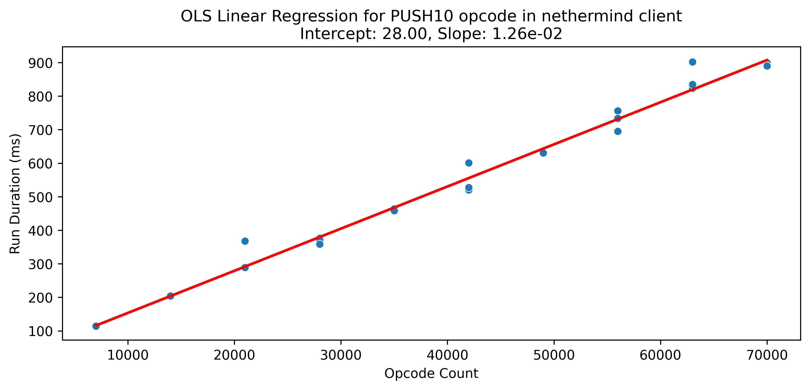


## besu


```python
                            OLS Regression Results                            
==============================================================================
Dep. Variable:        run_duration_ms   R-squared:                       0.996
Model:                            OLS   Adj. R-squared:                  0.995
Method:                 Least Squares   F-statistic:                     6400.
Date:                Mon, 12 Jan 2026   Prob (F-statistic):           1.33e-34
Time:                        10:29:52   Log-Likelihood:                -150.89
No. Observations:                  30   AIC:                             305.8
Df Residuals:                      28   BIC:                             308.6
Df Model:                           1                                         
Covariance Type:            nonrobust                                         
==============================================================================
                 coef    std err          t      P>|t|      [0.025      0.975]
------------------------------------------------------------------------------
const         38.0052     15.100      2.517      0.018       7.075      68.936
opcount        0.0278      0.000     80.001      0.000       0.027       0.029
==============================================================================
Omnibus:                       13.356   Durbin-Watson:                   1.205
Prob(Omnibus):                  0.001   Jarque-Bera (JB):               16.389
Skew:                           1.076   Prob(JB):                     0.000276
Kurtosis:                       5.913   Cond. No.                     9.38e+04
==============================================================================

Notes:
[1] Standard Errors assume that the covariance matrix of the errors is correctly specified.
[2] The condition number is large, 9.38e+04. This might indicate that there are
strong multicollinearity or other numerical problems.
```


# PUSH11

## geth


```python
                            OLS Regression Results                            
==============================================================================
Dep. Variable:        run_duration_ms   R-squared:                       0.978
Model:                            OLS   Adj. R-squared:                  0.977
Method:                 Least Squares   F-statistic:                     1245.
Date:                Mon, 12 Jan 2026   Prob (F-statistic):           9.32e-25
Time:                        10:29:52   Log-Likelihood:                -166.24
No. Observations:                  30   AIC:                             336.5
Df Residuals:                      28   BIC:                             339.3
Df Model:                           1                                         
Covariance Type:            nonrobust                                         
==============================================================================
                 coef    std err          t      P>|t|      [0.025      0.975]
------------------------------------------------------------------------------
const         35.3224     25.190      1.402      0.172     -16.276      86.921
opcount        0.0205      0.001     35.291      0.000       0.019       0.022
==============================================================================
Omnibus:                        3.661   Durbin-Watson:                   0.912
Prob(Omnibus):                  0.160   Jarque-Bera (JB):                2.572
Skew:                           0.208   Prob(JB):                        0.276
Kurtosis:                       4.373   Cond. No.                     9.38e+04
==============================================================================

Notes:
[1] Standard Errors assume that the covariance matrix of the errors is correctly specified.
[2] The condition number is large, 9.38e+04. This might indicate that there are
strong multicollinearity or other numerical problems.
```

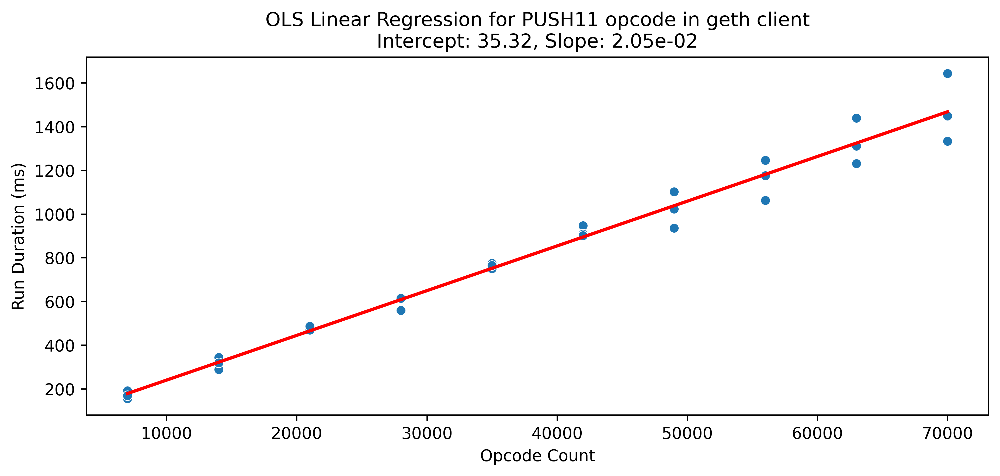


## reth


```python
                            OLS Regression Results                            
==============================================================================
Dep. Variable:        run_duration_ms   R-squared:                       0.980
Model:                            OLS   Adj. R-squared:                  0.979
Method:                 Least Squares   F-statistic:                     1340.
Date:                Mon, 12 Jan 2026   Prob (F-statistic):           3.42e-25
Time:                        10:29:52   Log-Likelihood:                -128.04
No. Observations:                  30   AIC:                             260.1
Df Residuals:                      28   BIC:                             262.9
Df Model:                           1                                         
Covariance Type:            nonrobust                                         
==============================================================================
                 coef    std err          t      P>|t|      [0.025      0.975]
------------------------------------------------------------------------------
const         29.2206      7.050      4.145      0.000      14.779      43.662
opcount        0.0059      0.000     36.606      0.000       0.006       0.006
==============================================================================
Omnibus:                        0.053   Durbin-Watson:                   1.645
Prob(Omnibus):                  0.974   Jarque-Bera (JB):                0.094
Skew:                          -0.064   Prob(JB):                        0.954
Kurtosis:                       2.759   Cond. No.                     9.38e+04
==============================================================================

Notes:
[1] Standard Errors assume that the covariance matrix of the errors is correctly specified.
[2] The condition number is large, 9.38e+04. This might indicate that there are
strong multicollinearity or other numerical problems.
```


## nethermind


```python
                            OLS Regression Results                            
==============================================================================
Dep. Variable:        run_duration_ms   R-squared:                       0.980
Model:                            OLS   Adj. R-squared:                  0.979
Method:                 Least Squares   F-statistic:                     1381.
Date:                Mon, 12 Jan 2026   Prob (F-statistic):           2.27e-25
Time:                        10:29:52   Log-Likelihood:                -149.73
No. Observations:                  30   AIC:                             303.5
Df Residuals:                      28   BIC:                             306.3
Df Model:                           1                                         
Covariance Type:            nonrobust                                         
==============================================================================
                 coef    std err          t      P>|t|      [0.025      0.975]
------------------------------------------------------------------------------
const         41.8899     14.531      2.883      0.007      12.125      71.655
opcount        0.0124      0.000     37.157      0.000       0.012       0.013
==============================================================================
Omnibus:                       26.030   Durbin-Watson:                   1.497
Prob(Omnibus):                  0.000   Jarque-Bera (JB):               47.320
Skew:                           1.972   Prob(JB):                     5.30e-11
Kurtosis:                       7.722   Cond. No.                     9.38e+04
==============================================================================

Notes:
[1] Standard Errors assume that the covariance matrix of the errors is correctly specified.
[2] The condition number is large, 9.38e+04. This might indicate that there are
strong multicollinearity or other numerical problems.
```

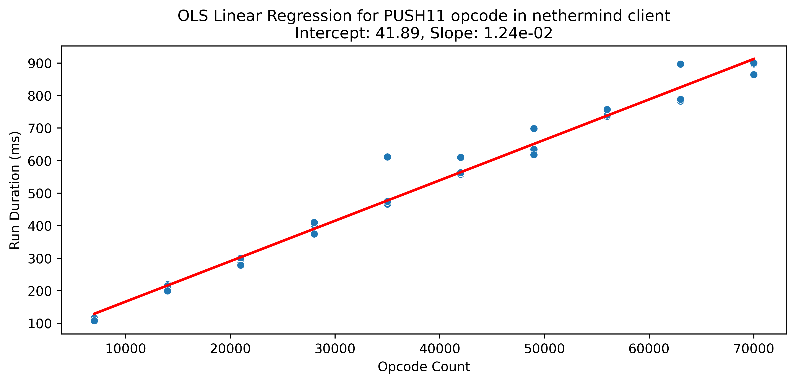


## besu


```python
                            OLS Regression Results                            
==============================================================================
Dep. Variable:        run_duration_ms   R-squared:                       0.997
Model:                            OLS   Adj. R-squared:                  0.997
Method:                 Least Squares   F-statistic:                     9246.
Date:                Mon, 12 Jan 2026   Prob (F-statistic):           7.83e-37
Time:                        10:29:52   Log-Likelihood:                -145.33
No. Observations:                  30   AIC:                             294.7
Df Residuals:                      28   BIC:                             297.5
Df Model:                           1                                         
Covariance Type:            nonrobust                                         
==============================================================================
                 coef    std err          t      P>|t|      [0.025      0.975]
------------------------------------------------------------------------------
const         17.0522     12.548      1.359      0.185      -8.650      42.755
opcount        0.0278      0.000     96.156      0.000       0.027       0.028
==============================================================================
Omnibus:                       15.493   Durbin-Watson:                   1.441
Prob(Omnibus):                  0.000   Jarque-Bera (JB):               22.429
Skew:                           1.153   Prob(JB):                     1.35e-05
Kurtosis:                       6.553   Cond. No.                     9.38e+04
==============================================================================

Notes:
[1] Standard Errors assume that the covariance matrix of the errors is correctly specified.
[2] The condition number is large, 9.38e+04. This might indicate that there are
strong multicollinearity or other numerical problems.
```


# PUSH12

## geth


```python
                            OLS Regression Results                            
==============================================================================
Dep. Variable:        run_duration_ms   R-squared:                       0.977
Model:                            OLS   Adj. R-squared:                  0.977
Method:                 Least Squares   F-statistic:                     1208.
Date:                Mon, 12 Jan 2026   Prob (F-statistic):           1.42e-24
Time:                        10:29:52   Log-Likelihood:                -165.99
No. Observations:                  30   AIC:                             336.0
Df Residuals:                      28   BIC:                             338.8
Df Model:                           1                                         
Covariance Type:            nonrobust                                         
==============================================================================
                 coef    std err          t      P>|t|      [0.025      0.975]
------------------------------------------------------------------------------
const         47.2666     24.986      1.892      0.069      -3.915      98.448
opcount        0.0200      0.001     34.756      0.000       0.019       0.021
==============================================================================
Omnibus:                        0.587   Durbin-Watson:                   0.647
Prob(Omnibus):                  0.746   Jarque-Bera (JB):                0.261
Skew:                          -0.228   Prob(JB):                        0.878
Kurtosis:                       2.979   Cond. No.                     9.38e+04
==============================================================================

Notes:
[1] Standard Errors assume that the covariance matrix of the errors is correctly specified.
[2] The condition number is large, 9.38e+04. This might indicate that there are
strong multicollinearity or other numerical problems.
```


## reth


```python
                            OLS Regression Results                            
==============================================================================
Dep. Variable:        run_duration_ms   R-squared:                       0.987
Model:                            OLS   Adj. R-squared:                  0.987
Method:                 Least Squares   F-statistic:                     2172.
Date:                Mon, 12 Jan 2026   Prob (F-statistic):           4.39e-28
Time:                        10:29:52   Log-Likelihood:                -121.88
No. Observations:                  30   AIC:                             247.8
Df Residuals:                      28   BIC:                             250.6
Df Model:                           1                                         
Covariance Type:            nonrobust                                         
==============================================================================
                 coef    std err          t      P>|t|      [0.025      0.975]
------------------------------------------------------------------------------
const         24.8111      5.743      4.320      0.000      13.047      36.575
opcount        0.0062      0.000     46.608      0.000       0.006       0.006
==============================================================================
Omnibus:                        2.766   Durbin-Watson:                   2.041
Prob(Omnibus):                  0.251   Jarque-Bera (JB):                1.488
Skew:                          -0.473   Prob(JB):                        0.475
Kurtosis:                       3.543   Cond. No.                     9.38e+04
==============================================================================

Notes:
[1] Standard Errors assume that the covariance matrix of the errors is correctly specified.
[2] The condition number is large, 9.38e+04. This might indicate that there are
strong multicollinearity or other numerical problems.
```

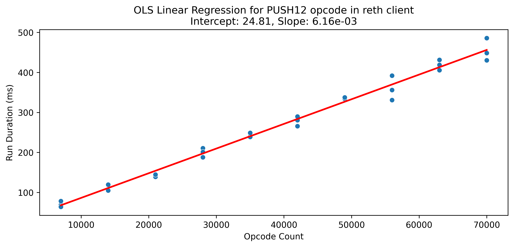


## nethermind


```python
                            OLS Regression Results                            
==============================================================================
Dep. Variable:        run_duration_ms   R-squared:                       0.975
Model:                            OLS   Adj. R-squared:                  0.974
Method:                 Least Squares   F-statistic:                     1078.
Date:                Mon, 12 Jan 2026   Prob (F-statistic):           6.72e-24
Time:                        10:29:53   Log-Likelihood:                -153.57
No. Observations:                  30   AIC:                             311.1
Df Residuals:                      28   BIC:                             313.9
Df Model:                           1                                         
Covariance Type:            nonrobust                                         
==============================================================================
                 coef    std err          t      P>|t|      [0.025      0.975]
------------------------------------------------------------------------------
const         35.7835     16.512      2.167      0.039       1.959      69.608
opcount        0.0125      0.000     32.832      0.000       0.012       0.013
==============================================================================
Omnibus:                       44.599   Durbin-Watson:                   1.407
Prob(Omnibus):                  0.000   Jarque-Bera (JB):              188.384
Skew:                           3.041   Prob(JB):                     1.24e-41
Kurtosis:                      13.664   Cond. No.                     9.38e+04
==============================================================================

Notes:
[1] Standard Errors assume that the covariance matrix of the errors is correctly specified.
[2] The condition number is large, 9.38e+04. This might indicate that there are
strong multicollinearity or other numerical problems.
```


## besu


```python
                            OLS Regression Results                            
==============================================================================
Dep. Variable:        run_duration_ms   R-squared:                       0.996
Model:                            OLS   Adj. R-squared:                  0.996
Method:                 Least Squares   F-statistic:                     7498.
Date:                Mon, 12 Jan 2026   Prob (F-statistic):           1.46e-35
Time:                        10:29:53   Log-Likelihood:                -148.28
No. Observations:                  30   AIC:                             300.6
Df Residuals:                      28   BIC:                             303.4
Df Model:                           1                                         
Covariance Type:            nonrobust                                         
==============================================================================
                 coef    std err          t      P>|t|      [0.025      0.975]
------------------------------------------------------------------------------
const         39.0226     13.842      2.819      0.009      10.668      67.377
opcount        0.0276      0.000     86.589      0.000       0.027       0.028
==============================================================================
Omnibus:                        2.591   Durbin-Watson:                   0.745
Prob(Omnibus):                  0.274   Jarque-Bera (JB):                2.318
Skew:                           0.617   Prob(JB):                        0.314
Kurtosis:                       2.424   Cond. No.                     9.38e+04
==============================================================================

Notes:
[1] Standard Errors assume that the covariance matrix of the errors is correctly specified.
[2] The condition number is large, 9.38e+04. This might indicate that there are
strong multicollinearity or other numerical problems.
```


# PUSH13

## geth


```python
                            OLS Regression Results                            
==============================================================================
Dep. Variable:        run_duration_ms   R-squared:                       0.978
Model:                            OLS   Adj. R-squared:                  0.978
Method:                 Least Squares   F-statistic:                     1266.
Date:                Mon, 12 Jan 2026   Prob (F-statistic):           7.47e-25
Time:                        10:29:53   Log-Likelihood:                -166.35
No. Observations:                  30   AIC:                             336.7
Df Residuals:                      28   BIC:                             339.5
Df Model:                           1                                         
Covariance Type:            nonrobust                                         
==============================================================================
                 coef    std err          t      P>|t|      [0.025      0.975]
------------------------------------------------------------------------------
const         31.6289     25.284      1.251      0.221     -20.163      83.421
opcount        0.0207      0.001     35.578      0.000       0.020       0.022
==============================================================================
Omnibus:                        0.099   Durbin-Watson:                   0.954
Prob(Omnibus):                  0.952   Jarque-Bera (JB):                0.034
Skew:                           0.036   Prob(JB):                        0.983
Kurtosis:                       2.851   Cond. No.                     9.38e+04
==============================================================================

Notes:
[1] Standard Errors assume that the covariance matrix of the errors is correctly specified.
[2] The condition number is large, 9.38e+04. This might indicate that there are
strong multicollinearity or other numerical problems.
```


## reth


```python
                            OLS Regression Results                            
==============================================================================
Dep. Variable:        run_duration_ms   R-squared:                       0.982
Model:                            OLS   Adj. R-squared:                  0.981
Method:                 Least Squares   F-statistic:                     1534.
Date:                Mon, 12 Jan 2026   Prob (F-statistic):           5.33e-26
Time:                        10:29:53   Log-Likelihood:                -125.53
No. Observations:                  30   AIC:                             255.1
Df Residuals:                      28   BIC:                             257.9
Df Model:                           1                                         
Covariance Type:            nonrobust                                         
==============================================================================
                 coef    std err          t      P>|t|      [0.025      0.975]
------------------------------------------------------------------------------
const         35.0181      6.486      5.399      0.000      21.733      48.303
opcount        0.0058      0.000     39.166      0.000       0.006       0.006
==============================================================================
Omnibus:                        1.529   Durbin-Watson:                   2.111
Prob(Omnibus):                  0.466   Jarque-Bera (JB):                1.291
Skew:                          -0.486   Prob(JB):                        0.525
Kurtosis:                       2.702   Cond. No.                     9.38e+04
==============================================================================

Notes:
[1] Standard Errors assume that the covariance matrix of the errors is correctly specified.
[2] The condition number is large, 9.38e+04. This might indicate that there are
strong multicollinearity or other numerical problems.
```


## nethermind


```python
                            OLS Regression Results                            
==============================================================================
Dep. Variable:        run_duration_ms   R-squared:                       0.987
Model:                            OLS   Adj. R-squared:                  0.986
Method:                 Least Squares   F-statistic:                     2058.
Date:                Mon, 12 Jan 2026   Prob (F-statistic):           9.29e-28
Time:                        10:29:53   Log-Likelihood:                -143.57
No. Observations:                  30   AIC:                             291.1
Df Residuals:                      28   BIC:                             293.9
Df Model:                           1                                         
Covariance Type:            nonrobust                                         
==============================================================================
                 coef    std err          t      P>|t|      [0.025      0.975]
------------------------------------------------------------------------------
const         36.3495     11.833      3.072      0.005      12.111      60.588
opcount        0.0124      0.000     45.362      0.000       0.012       0.013
==============================================================================
Omnibus:                       49.682   Durbin-Watson:                   1.840
Prob(Omnibus):                  0.000   Jarque-Bera (JB):              270.261
Skew:                           3.344   Prob(JB):                     2.06e-59
Kurtosis:                      16.095   Cond. No.                     9.38e+04
==============================================================================

Notes:
[1] Standard Errors assume that the covariance matrix of the errors is correctly specified.
[2] The condition number is large, 9.38e+04. This might indicate that there are
strong multicollinearity or other numerical problems.
```

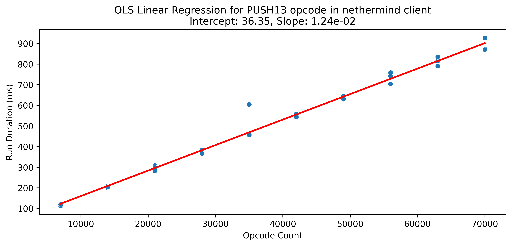


## besu


```python
                            OLS Regression Results                            
==============================================================================
Dep. Variable:        run_duration_ms   R-squared:                       0.995
Model:                            OLS   Adj. R-squared:                  0.995
Method:                 Least Squares   F-statistic:                     5419.
Date:                Mon, 12 Jan 2026   Prob (F-statistic):           1.35e-33
Time:                        10:29:53   Log-Likelihood:                -152.78
No. Observations:                  30   AIC:                             309.6
Df Residuals:                      28   BIC:                             312.4
Df Model:                           1                                         
Covariance Type:            nonrobust                                         
==============================================================================
                 coef    std err          t      P>|t|      [0.025      0.975]
------------------------------------------------------------------------------
const         39.6148     16.086      2.463      0.020       6.663      72.566
opcount        0.0273      0.000     73.616      0.000       0.027       0.028
==============================================================================
Omnibus:                        6.440   Durbin-Watson:                   1.473
Prob(Omnibus):                  0.040   Jarque-Bera (JB):                4.725
Skew:                           0.768   Prob(JB):                       0.0942
Kurtosis:                       4.192   Cond. No.                     9.38e+04
==============================================================================

Notes:
[1] Standard Errors assume that the covariance matrix of the errors is correctly specified.
[2] The condition number is large, 9.38e+04. This might indicate that there are
strong multicollinearity or other numerical problems.
```


# PUSH14

## geth


```python
                            OLS Regression Results                            
==============================================================================
Dep. Variable:        run_duration_ms   R-squared:                       0.984
Model:                            OLS   Adj. R-squared:                  0.983
Method:                 Least Squares   F-statistic:                     1691.
Date:                Mon, 12 Jan 2026   Prob (F-statistic):           1.40e-26
Time:                        10:29:53   Log-Likelihood:                -161.98
No. Observations:                  30   AIC:                             328.0
Df Residuals:                      28   BIC:                             330.8
Df Model:                           1                                         
Covariance Type:            nonrobust                                         
==============================================================================
                 coef    std err          t      P>|t|      [0.025      0.975]
------------------------------------------------------------------------------
const         34.5107     21.857      1.579      0.126     -10.261      79.282
opcount        0.0207      0.001     41.119      0.000       0.020       0.022
==============================================================================
Omnibus:                        3.197   Durbin-Watson:                   0.765
Prob(Omnibus):                  0.202   Jarque-Bera (JB):                1.951
Skew:                          -0.593   Prob(JB):                        0.377
Kurtosis:                       3.395   Cond. No.                     9.38e+04
==============================================================================

Notes:
[1] Standard Errors assume that the covariance matrix of the errors is correctly specified.
[2] The condition number is large, 9.38e+04. This might indicate that there are
strong multicollinearity or other numerical problems.
```


## reth


```python
                            OLS Regression Results                            
==============================================================================
Dep. Variable:        run_duration_ms   R-squared:                       0.977
Model:                            OLS   Adj. R-squared:                  0.977
Method:                 Least Squares   F-statistic:                     1212.
Date:                Mon, 12 Jan 2026   Prob (F-statistic):           1.35e-24
Time:                        10:29:54   Log-Likelihood:                -129.34
No. Observations:                  30   AIC:                             262.7
Df Residuals:                      28   BIC:                             265.5
Df Model:                           1                                         
Covariance Type:            nonrobust                                         
==============================================================================
                 coef    std err          t      P>|t|      [0.025      0.975]
------------------------------------------------------------------------------
const         29.2926      7.363      3.979      0.000      14.211      44.374
opcount        0.0059      0.000     34.817      0.000       0.006       0.006
==============================================================================
Omnibus:                        2.286   Durbin-Watson:                   2.495
Prob(Omnibus):                  0.319   Jarque-Bera (JB):                2.054
Skew:                          -0.590   Prob(JB):                        0.358
Kurtosis:                       2.500   Cond. No.                     9.38e+04
==============================================================================

Notes:
[1] Standard Errors assume that the covariance matrix of the errors is correctly specified.
[2] The condition number is large, 9.38e+04. This might indicate that there are
strong multicollinearity or other numerical problems.
```


## nethermind


```python
                            OLS Regression Results                            
==============================================================================
Dep. Variable:        run_duration_ms   R-squared:                       0.991
Model:                            OLS   Adj. R-squared:                  0.991
Method:                 Least Squares   F-statistic:                     3173.
Date:                Mon, 12 Jan 2026   Prob (F-statistic):           2.30e-30
Time:                        10:29:54   Log-Likelihood:                -137.58
No. Observations:                  30   AIC:                             279.2
Df Residuals:                      28   BIC:                             282.0
Df Model:                           1                                         
Covariance Type:            nonrobust                                         
==============================================================================
                 coef    std err          t      P>|t|      [0.025      0.975]
------------------------------------------------------------------------------
const         27.2344      9.692      2.810      0.009       7.382      47.087
opcount        0.0126      0.000     56.328      0.000       0.012       0.013
==============================================================================
Omnibus:                       19.005   Durbin-Watson:                   1.199
Prob(Omnibus):                  0.000   Jarque-Bera (JB):               29.851
Skew:                           1.421   Prob(JB):                     3.30e-07
Kurtosis:                       6.976   Cond. No.                     9.38e+04
==============================================================================

Notes:
[1] Standard Errors assume that the covariance matrix of the errors is correctly specified.
[2] The condition number is large, 9.38e+04. This might indicate that there are
strong multicollinearity or other numerical problems.
```


## besu


```python
                            OLS Regression Results                            
==============================================================================
Dep. Variable:        run_duration_ms   R-squared:                       0.996
Model:                            OLS   Adj. R-squared:                  0.996
Method:                 Least Squares   F-statistic:                     7205.
Date:                Mon, 12 Jan 2026   Prob (F-statistic):           2.54e-35
Time:                        10:29:54   Log-Likelihood:                -148.96
No. Observations:                  30   AIC:                             301.9
Df Residuals:                      28   BIC:                             304.7
Df Model:                           1                                         
Covariance Type:            nonrobust                                         
==============================================================================
                 coef    std err          t      P>|t|      [0.025      0.975]
------------------------------------------------------------------------------
const         31.9431     14.163      2.255      0.032       2.931      60.955
opcount        0.0277      0.000     84.883      0.000       0.027       0.028
==============================================================================
Omnibus:                       11.203   Durbin-Watson:                   1.337
Prob(Omnibus):                  0.004   Jarque-Bera (JB):               10.276
Skew:                           1.154   Prob(JB):                      0.00587
Kurtosis:                       4.702   Cond. No.                     9.38e+04
==============================================================================

Notes:
[1] Standard Errors assume that the covariance matrix of the errors is correctly specified.
[2] The condition number is large, 9.38e+04. This might indicate that there are
strong multicollinearity or other numerical problems.
```


# PUSH15

## geth


```python
                            OLS Regression Results                            
==============================================================================
Dep. Variable:        run_duration_ms   R-squared:                       0.978
Model:                            OLS   Adj. R-squared:                  0.977
Method:                 Least Squares   F-statistic:                     1256.
Date:                Mon, 12 Jan 2026   Prob (F-statistic):           8.28e-25
Time:                        10:29:54   Log-Likelihood:                -166.50
No. Observations:                  30   AIC:                             337.0
Df Residuals:                      28   BIC:                             339.8
Df Model:                           1                                         
Covariance Type:            nonrobust                                         
==============================================================================
                 coef    std err          t      P>|t|      [0.025      0.975]
------------------------------------------------------------------------------
const         34.9268     25.410      1.375      0.180     -17.123      86.976
opcount        0.0207      0.001     35.444      0.000       0.020       0.022
==============================================================================
Omnibus:                        1.397   Durbin-Watson:                   1.051
Prob(Omnibus):                  0.497   Jarque-Bera (JB):                0.703
Skew:                          -0.367   Prob(JB):                        0.704
Kurtosis:                       3.151   Cond. No.                     9.38e+04
==============================================================================

Notes:
[1] Standard Errors assume that the covariance matrix of the errors is correctly specified.
[2] The condition number is large, 9.38e+04. This might indicate that there are
strong multicollinearity or other numerical problems.
```


## reth


```python
                            OLS Regression Results                            
==============================================================================
Dep. Variable:        run_duration_ms   R-squared:                       0.979
Model:                            OLS   Adj. R-squared:                  0.978
Method:                 Least Squares   F-statistic:                     1275.
Date:                Mon, 12 Jan 2026   Prob (F-statistic):           6.74e-25
Time:                        10:29:54   Log-Likelihood:                -130.01
No. Observations:                  30   AIC:                             264.0
Df Residuals:                      28   BIC:                             266.8
Df Model:                           1                                         
Covariance Type:            nonrobust                                         
==============================================================================
                 coef    std err          t      P>|t|      [0.025      0.975]
------------------------------------------------------------------------------
const         24.1655      7.529      3.210      0.003       8.742      39.589
opcount        0.0062      0.000     35.711      0.000       0.006       0.007
==============================================================================
Omnibus:                        2.011   Durbin-Watson:                   1.634
Prob(Omnibus):                  0.366   Jarque-Bera (JB):                0.872
Skew:                          -0.292   Prob(JB):                        0.647
Kurtosis:                       3.598   Cond. No.                     9.38e+04
==============================================================================

Notes:
[1] Standard Errors assume that the covariance matrix of the errors is correctly specified.
[2] The condition number is large, 9.38e+04. This might indicate that there are
strong multicollinearity or other numerical problems.
```

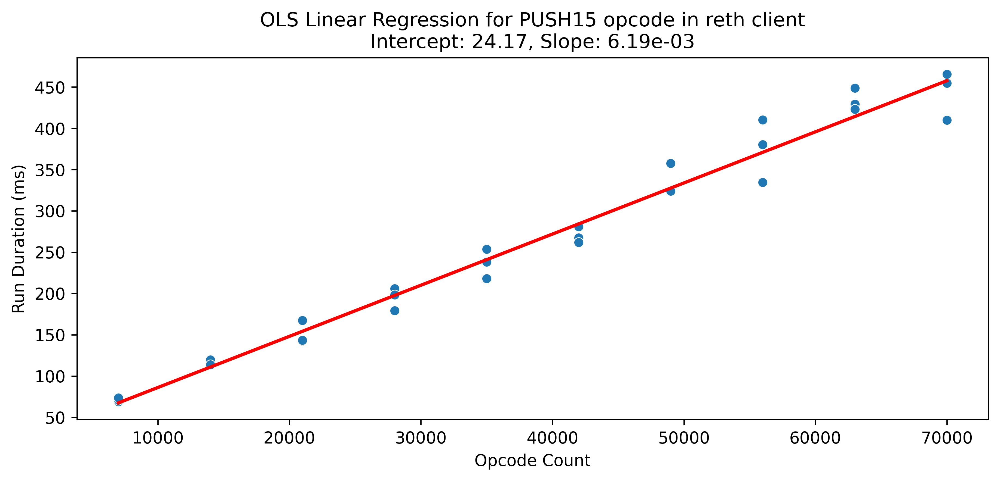


## nethermind


```python
                            OLS Regression Results                            
==============================================================================
Dep. Variable:        run_duration_ms   R-squared:                       0.991
Model:                            OLS   Adj. R-squared:                  0.991
Method:                 Least Squares   F-statistic:                     3124.
Date:                Mon, 12 Jan 2026   Prob (F-statistic):           2.85e-30
Time:                        10:29:54   Log-Likelihood:                -139.02
No. Observations:                  30   AIC:                             282.0
Df Residuals:                      28   BIC:                             284.8
Df Model:                           1                                         
Covariance Type:            nonrobust                                         
==============================================================================
                 coef    std err          t      P>|t|      [0.025      0.975]
------------------------------------------------------------------------------
const         14.5804     10.166      1.434      0.163      -6.243      35.404
opcount        0.0131      0.000     55.896      0.000       0.013       0.014
==============================================================================
Omnibus:                        2.438   Durbin-Watson:                   1.612
Prob(Omnibus):                  0.296   Jarque-Bera (JB):                1.632
Skew:                           0.570   Prob(JB):                        0.442
Kurtosis:                       3.077   Cond. No.                     9.38e+04
==============================================================================

Notes:
[1] Standard Errors assume that the covariance matrix of the errors is correctly specified.
[2] The condition number is large, 9.38e+04. This might indicate that there are
strong multicollinearity or other numerical problems.
```


## besu


```python
                            OLS Regression Results                            
==============================================================================
Dep. Variable:        run_duration_ms   R-squared:                       0.997
Model:                            OLS   Adj. R-squared:                  0.996
Method:                 Least Squares   F-statistic:                     8119.
Date:                Mon, 12 Jan 2026   Prob (F-statistic):           4.80e-36
Time:                        10:29:54   Log-Likelihood:                -146.79
No. Observations:                  30   AIC:                             297.6
Df Residuals:                      28   BIC:                             300.4
Df Model:                           1                                         
Covariance Type:            nonrobust                                         
==============================================================================
                 coef    std err          t      P>|t|      [0.025      0.975]
------------------------------------------------------------------------------
const         29.4932     13.175      2.239      0.033       2.505      56.481
opcount        0.0273      0.000     90.108      0.000       0.027       0.028
==============================================================================
Omnibus:                        8.840   Durbin-Watson:                   1.056
Prob(Omnibus):                  0.012   Jarque-Bera (JB):                7.359
Skew:                           1.147   Prob(JB):                       0.0252
Kurtosis:                       3.790   Cond. No.                     9.38e+04
==============================================================================

Notes:
[1] Standard Errors assume that the covariance matrix of the errors is correctly specified.
[2] The condition number is large, 9.38e+04. This might indicate that there are
strong multicollinearity or other numerical problems.
```


# PUSH16

## geth


```python
                            OLS Regression Results                            
==============================================================================
Dep. Variable:        run_duration_ms   R-squared:                       0.983
Model:                            OLS   Adj. R-squared:                  0.982
Method:                 Least Squares   F-statistic:                     1618.
Date:                Mon, 12 Jan 2026   Prob (F-statistic):           2.57e-26
Time:                        10:29:55   Log-Likelihood:                -161.96
No. Observations:                  30   AIC:                             327.9
Df Residuals:                      28   BIC:                             330.7
Df Model:                           1                                         
Covariance Type:            nonrobust                                         
==============================================================================
                 coef    std err          t      P>|t|      [0.025      0.975]
------------------------------------------------------------------------------
const         34.0349     21.839      1.558      0.130     -10.700      78.770
opcount        0.0202      0.001     40.220      0.000       0.019       0.021
==============================================================================
Omnibus:                        1.614   Durbin-Watson:                   1.001
Prob(Omnibus):                  0.446   Jarque-Bera (JB):                0.635
Skew:                          -0.279   Prob(JB):                        0.728
Kurtosis:                       3.444   Cond. No.                     9.38e+04
==============================================================================

Notes:
[1] Standard Errors assume that the covariance matrix of the errors is correctly specified.
[2] The condition number is large, 9.38e+04. This might indicate that there are
strong multicollinearity or other numerical problems.
```


## reth


```python
                            OLS Regression Results                            
==============================================================================
Dep. Variable:        run_duration_ms   R-squared:                       0.980
Model:                            OLS   Adj. R-squared:                  0.980
Method:                 Least Squares   F-statistic:                     1396.
Date:                Mon, 12 Jan 2026   Prob (F-statistic):           1.94e-25
Time:                        10:29:55   Log-Likelihood:                -127.84
No. Observations:                  30   AIC:                             259.7
Df Residuals:                      28   BIC:                             262.5
Df Model:                           1                                         
Covariance Type:            nonrobust                                         
==============================================================================
                 coef    std err          t      P>|t|      [0.025      0.975]
------------------------------------------------------------------------------
const         28.0034      7.003      3.999      0.000      13.658      42.349
opcount        0.0060      0.000     37.368      0.000       0.006       0.006
==============================================================================
Omnibus:                        1.059   Durbin-Watson:                   1.854
Prob(Omnibus):                  0.589   Jarque-Bera (JB):                1.031
Skew:                          -0.390   Prob(JB):                        0.597
Kurtosis:                       2.536   Cond. No.                     9.38e+04
==============================================================================

Notes:
[1] Standard Errors assume that the covariance matrix of the errors is correctly specified.
[2] The condition number is large, 9.38e+04. This might indicate that there are
strong multicollinearity or other numerical problems.
```


## nethermind


```python
                            OLS Regression Results                            
==============================================================================
Dep. Variable:        run_duration_ms   R-squared:                       0.994
Model:                            OLS   Adj. R-squared:                  0.994
Method:                 Least Squares   F-statistic:                     4983.
Date:                Mon, 12 Jan 2026   Prob (F-statistic):           4.33e-33
Time:                        10:29:55   Log-Likelihood:                -124.02
No. Observations:                  30   AIC:                             252.0
Df Residuals:                      28   BIC:                             254.9
Df Model:                           1                                         
Covariance Type:            nonrobust                                         
==============================================================================
                 coef    std err          t      P>|t|      [0.025      0.975]
------------------------------------------------------------------------------
const         31.1630      6.168      5.053      0.000      18.529      43.797
opcount        0.0100      0.000     70.591      0.000       0.010       0.010
==============================================================================
Omnibus:                       17.188   Durbin-Watson:                   1.874
Prob(Omnibus):                  0.000   Jarque-Bera (JB):               21.715
Skew:                           1.444   Prob(JB):                     1.93e-05
Kurtosis:                       6.004   Cond. No.                     9.38e+04
==============================================================================

Notes:
[1] Standard Errors assume that the covariance matrix of the errors is correctly specified.
[2] The condition number is large, 9.38e+04. This might indicate that there are
strong multicollinearity or other numerical problems.
```


## besu


```python
                            OLS Regression Results                            
==============================================================================
Dep. Variable:        run_duration_ms   R-squared:                       0.995
Model:                            OLS   Adj. R-squared:                  0.995
Method:                 Least Squares   F-statistic:                     5599.
Date:                Mon, 12 Jan 2026   Prob (F-statistic):           8.55e-34
Time:                        10:29:55   Log-Likelihood:                -152.79
No. Observations:                  30   AIC:                             309.6
Df Residuals:                      28   BIC:                             312.4
Df Model:                           1                                         
Covariance Type:            nonrobust                                         
==============================================================================
                 coef    std err          t      P>|t|      [0.025      0.975]
------------------------------------------------------------------------------
const         26.3206     16.088      1.636      0.113      -6.633      59.274
opcount        0.0277      0.000     74.827      0.000       0.027       0.028
==============================================================================
Omnibus:                        3.962   Durbin-Watson:                   0.575
Prob(Omnibus):                  0.138   Jarque-Bera (JB):                3.313
Skew:                           0.810   Prob(JB):                        0.191
Kurtosis:                       2.842   Cond. No.                     9.38e+04
==============================================================================

Notes:
[1] Standard Errors assume that the covariance matrix of the errors is correctly specified.
[2] The condition number is large, 9.38e+04. This might indicate that there are
strong multicollinearity or other numerical problems.
```


# PUSH17

## geth


```python
                            OLS Regression Results                            
==============================================================================
Dep. Variable:        run_duration_ms   R-squared:                       0.981
Model:                            OLS   Adj. R-squared:                  0.981
Method:                 Least Squares   F-statistic:                     1472.
Date:                Mon, 12 Jan 2026   Prob (F-statistic):           9.38e-26
Time:                        10:29:55   Log-Likelihood:                -164.54
No. Observations:                  30   AIC:                             333.1
Df Residuals:                      28   BIC:                             335.9
Df Model:                           1                                         
Covariance Type:            nonrobust                                         
==============================================================================
                 coef    std err          t      P>|t|      [0.025      0.975]
------------------------------------------------------------------------------
const         30.7667     23.806      1.292      0.207     -17.998      79.531
opcount        0.0210      0.001     38.370      0.000       0.020       0.022
==============================================================================
Omnibus:                        1.359   Durbin-Watson:                   1.115
Prob(Omnibus):                  0.507   Jarque-Bera (JB):                0.407
Skew:                          -0.110   Prob(JB):                        0.816
Kurtosis:                       3.526   Cond. No.                     9.38e+04
==============================================================================

Notes:
[1] Standard Errors assume that the covariance matrix of the errors is correctly specified.
[2] The condition number is large, 9.38e+04. This might indicate that there are
strong multicollinearity or other numerical problems.
```


## reth


```python
                            OLS Regression Results                            
==============================================================================
Dep. Variable:        run_duration_ms   R-squared:                       0.977
Model:                            OLS   Adj. R-squared:                  0.976
Method:                 Least Squares   F-statistic:                     1168.
Date:                Mon, 12 Jan 2026   Prob (F-statistic):           2.23e-24
Time:                        10:29:55   Log-Likelihood:                -130.42
No. Observations:                  30   AIC:                             264.8
Df Residuals:                      28   BIC:                             267.6
Df Model:                           1                                         
Covariance Type:            nonrobust                                         
==============================================================================
                 coef    std err          t      P>|t|      [0.025      0.975]
------------------------------------------------------------------------------
const         30.4428      7.633      3.988      0.000      14.807      46.078
opcount        0.0060      0.000     34.183      0.000       0.006       0.006
==============================================================================
Omnibus:                        0.605   Durbin-Watson:                   2.309
Prob(Omnibus):                  0.739   Jarque-Bera (JB):                0.219
Skew:                           0.209   Prob(JB):                        0.896
Kurtosis:                       3.032   Cond. No.                     9.38e+04
==============================================================================

Notes:
[1] Standard Errors assume that the covariance matrix of the errors is correctly specified.
[2] The condition number is large, 9.38e+04. This might indicate that there are
strong multicollinearity or other numerical problems.
```


## nethermind


```python
                            OLS Regression Results                            
==============================================================================
Dep. Variable:        run_duration_ms   R-squared:                       0.995
Model:                            OLS   Adj. R-squared:                  0.995
Method:                 Least Squares   F-statistic:                     5374.
Date:                Mon, 12 Jan 2026   Prob (F-statistic):           1.52e-33
Time:                        10:29:55   Log-Likelihood:                -130.14
No. Observations:                  30   AIC:                             264.3
Df Residuals:                      28   BIC:                             267.1
Df Model:                           1                                         
Covariance Type:            nonrobust                                         
==============================================================================
                 coef    std err          t      P>|t|      [0.025      0.975]
------------------------------------------------------------------------------
const         23.9315      7.562      3.165      0.004       8.441      39.422
opcount        0.0128      0.000     73.305      0.000       0.012       0.013
==============================================================================
Omnibus:                       34.030   Durbin-Watson:                   1.480
Prob(Omnibus):                  0.000   Jarque-Bera (JB):              109.896
Skew:                           2.229   Prob(JB):                     1.37e-24
Kurtosis:                      11.249   Cond. No.                     9.38e+04
==============================================================================

Notes:
[1] Standard Errors assume that the covariance matrix of the errors is correctly specified.
[2] The condition number is large, 9.38e+04. This might indicate that there are
strong multicollinearity or other numerical problems.
```


## besu


```python
                            OLS Regression Results                            
==============================================================================
Dep. Variable:        run_duration_ms   R-squared:                       0.994
Model:                            OLS   Adj. R-squared:                  0.994
Method:                 Least Squares   F-statistic:                     4972.
Date:                Mon, 12 Jan 2026   Prob (F-statistic):           4.47e-33
Time:                        10:29:56   Log-Likelihood:                -154.42
No. Observations:                  30   AIC:                             312.8
Df Residuals:                      28   BIC:                             315.6
Df Model:                           1                                         
Covariance Type:            nonrobust                                         
==============================================================================
                 coef    std err          t      P>|t|      [0.025      0.975]
------------------------------------------------------------------------------
const         15.5185     16.989      0.913      0.369     -19.281      50.318
opcount        0.0276      0.000     70.511      0.000       0.027       0.028
==============================================================================
Omnibus:                        6.827   Durbin-Watson:                   1.192
Prob(Omnibus):                  0.033   Jarque-Bera (JB):                5.492
Skew:                           1.028   Prob(JB):                       0.0642
Kurtosis:                       3.410   Cond. No.                     9.38e+04
==============================================================================

Notes:
[1] Standard Errors assume that the covariance matrix of the errors is correctly specified.
[2] The condition number is large, 9.38e+04. This might indicate that there are
strong multicollinearity or other numerical problems.
```


# PUSH18

## geth


```python
                            OLS Regression Results                            
==============================================================================
Dep. Variable:        run_duration_ms   R-squared:                       0.985
Model:                            OLS   Adj. R-squared:                  0.985
Method:                 Least Squares   F-statistic:                     1865.
Date:                Mon, 12 Jan 2026   Prob (F-statistic):           3.62e-27
Time:                        10:29:56   Log-Likelihood:                -160.59
No. Observations:                  30   AIC:                             325.2
Df Residuals:                      28   BIC:                             328.0
Df Model:                           1                                         
Covariance Type:            nonrobust                                         
==============================================================================
                 coef    std err          t      P>|t|      [0.025      0.975]
------------------------------------------------------------------------------
const         29.6509     20.867      1.421      0.166     -13.093      72.395
opcount        0.0207      0.000     43.181      0.000       0.020       0.022
==============================================================================
Omnibus:                        0.621   Durbin-Watson:                   1.426
Prob(Omnibus):                  0.733   Jarque-Bera (JB):                0.164
Skew:                           0.174   Prob(JB):                        0.921
Kurtosis:                       3.099   Cond. No.                     9.38e+04
==============================================================================

Notes:
[1] Standard Errors assume that the covariance matrix of the errors is correctly specified.
[2] The condition number is large, 9.38e+04. This might indicate that there are
strong multicollinearity or other numerical problems.
```


## reth


```python
                            OLS Regression Results                            
==============================================================================
Dep. Variable:        run_duration_ms   R-squared:                       0.982
Model:                            OLS   Adj. R-squared:                  0.981
Method:                 Least Squares   F-statistic:                     1491.
Date:                Mon, 12 Jan 2026   Prob (F-statistic):           7.91e-26
Time:                        10:29:56   Log-Likelihood:                -127.06
No. Observations:                  30   AIC:                             258.1
Df Residuals:                      28   BIC:                             260.9
Df Model:                           1                                         
Covariance Type:            nonrobust                                         
==============================================================================
                 coef    std err          t      P>|t|      [0.025      0.975]
------------------------------------------------------------------------------
const         36.8704      6.825      5.402      0.000      22.890      50.851
opcount        0.0061      0.000     38.609      0.000       0.006       0.006
==============================================================================
Omnibus:                        4.965   Durbin-Watson:                   1.600
Prob(Omnibus):                  0.084   Jarque-Bera (JB):                3.951
Skew:                          -0.887   Prob(JB):                        0.139
Kurtosis:                       3.104   Cond. No.                     9.38e+04
==============================================================================

Notes:
[1] Standard Errors assume that the covariance matrix of the errors is correctly specified.
[2] The condition number is large, 9.38e+04. This might indicate that there are
strong multicollinearity or other numerical problems.
```

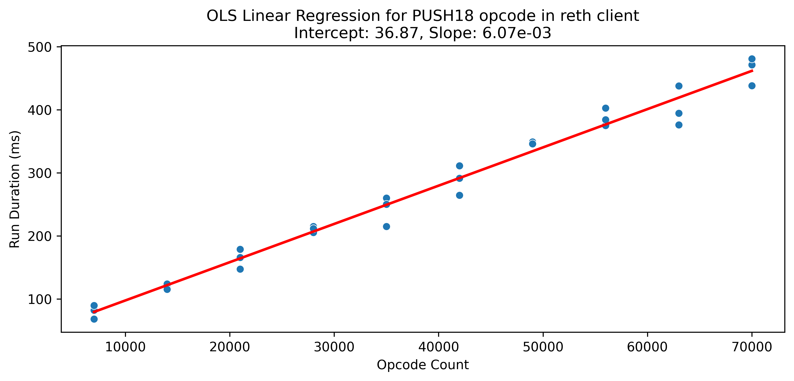


## nethermind


```python
                            OLS Regression Results                            
==============================================================================
Dep. Variable:        run_duration_ms   R-squared:                       0.993
Model:                            OLS   Adj. R-squared:                  0.993
Method:                 Least Squares   F-statistic:                     4136.
Date:                Mon, 12 Jan 2026   Prob (F-statistic):           5.79e-32
Time:                        10:29:56   Log-Likelihood:                -133.13
No. Observations:                  30   AIC:                             270.3
Df Residuals:                      28   BIC:                             273.1
Df Model:                           1                                         
Covariance Type:            nonrobust                                         
==============================================================================
                 coef    std err          t      P>|t|      [0.025      0.975]
------------------------------------------------------------------------------
const         37.4447      8.355      4.482      0.000      20.330      54.559
opcount        0.0124      0.000     64.314      0.000       0.012       0.013
==============================================================================
Omnibus:                        2.954   Durbin-Watson:                   1.594
Prob(Omnibus):                  0.228   Jarque-Bera (JB):                2.398
Skew:                           0.687   Prob(JB):                        0.301
Kurtosis:                       2.817   Cond. No.                     9.38e+04
==============================================================================

Notes:
[1] Standard Errors assume that the covariance matrix of the errors is correctly specified.
[2] The condition number is large, 9.38e+04. This might indicate that there are
strong multicollinearity or other numerical problems.
```

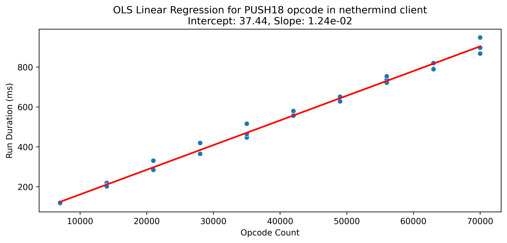


## besu


```python
                            OLS Regression Results                            
==============================================================================
Dep. Variable:        run_duration_ms   R-squared:                       0.997
Model:                            OLS   Adj. R-squared:                  0.996
Method:                 Least Squares   F-statistic:                     8049.
Date:                Mon, 12 Jan 2026   Prob (F-statistic):           5.42e-36
Time:                        10:29:56   Log-Likelihood:                -146.79
No. Observations:                  30   AIC:                             297.6
Df Residuals:                      28   BIC:                             300.4
Df Model:                           1                                         
Covariance Type:            nonrobust                                         
==============================================================================
                 coef    std err          t      P>|t|      [0.025      0.975]
------------------------------------------------------------------------------
const         31.7062     13.174      2.407      0.023       4.721      58.692
opcount        0.0272      0.000     89.714      0.000       0.027       0.028
==============================================================================
Omnibus:                        3.673   Durbin-Watson:                   1.371
Prob(Omnibus):                  0.159   Jarque-Bera (JB):                3.102
Skew:                           0.780   Prob(JB):                        0.212
Kurtosis:                       2.786   Cond. No.                     9.38e+04
==============================================================================

Notes:
[1] Standard Errors assume that the covariance matrix of the errors is correctly specified.
[2] The condition number is large, 9.38e+04. This might indicate that there are
strong multicollinearity or other numerical problems.
```


# PUSH19

## geth


```python
                            OLS Regression Results                            
==============================================================================
Dep. Variable:        run_duration_ms   R-squared:                       0.981
Model:                            OLS   Adj. R-squared:                  0.980
Method:                 Least Squares   F-statistic:                     1452.
Date:                Mon, 12 Jan 2026   Prob (F-statistic):           1.14e-25
Time:                        10:29:56   Log-Likelihood:                -164.53
No. Observations:                  30   AIC:                             333.1
Df Residuals:                      28   BIC:                             335.9
Df Model:                           1                                         
Covariance Type:            nonrobust                                         
==============================================================================
                 coef    std err          t      P>|t|      [0.025      0.975]
------------------------------------------------------------------------------
const         31.9976     23.799      1.345      0.190     -16.752      80.747
opcount        0.0209      0.001     38.101      0.000       0.020       0.022
==============================================================================
Omnibus:                        2.643   Durbin-Watson:                   1.103
Prob(Omnibus):                  0.267   Jarque-Bera (JB):                1.409
Skew:                           0.185   Prob(JB):                        0.494
Kurtosis:                       3.995   Cond. No.                     9.38e+04
==============================================================================

Notes:
[1] Standard Errors assume that the covariance matrix of the errors is correctly specified.
[2] The condition number is large, 9.38e+04. This might indicate that there are
strong multicollinearity or other numerical problems.
```


## reth


```python
                            OLS Regression Results                            
==============================================================================
Dep. Variable:        run_duration_ms   R-squared:                       0.985
Model:                            OLS   Adj. R-squared:                  0.984
Method:                 Least Squares   F-statistic:                     1784.
Date:                Mon, 12 Jan 2026   Prob (F-statistic):           6.67e-27
Time:                        10:29:56   Log-Likelihood:                -125.72
No. Observations:                  30   AIC:                             255.4
Df Residuals:                      28   BIC:                             258.2
Df Model:                           1                                         
Covariance Type:            nonrobust                                         
==============================================================================
                 coef    std err          t      P>|t|      [0.025      0.975]
------------------------------------------------------------------------------
const         31.1515      6.527      4.773      0.000      17.782      44.521
opcount        0.0063      0.000     42.235      0.000       0.006       0.007
==============================================================================
Omnibus:                        5.257   Durbin-Watson:                   1.723
Prob(Omnibus):                  0.072   Jarque-Bera (JB):                3.593
Skew:                          -0.769   Prob(JB):                        0.166
Kurtosis:                       3.714   Cond. No.                     9.38e+04
==============================================================================

Notes:
[1] Standard Errors assume that the covariance matrix of the errors is correctly specified.
[2] The condition number is large, 9.38e+04. This might indicate that there are
strong multicollinearity or other numerical problems.
```


## nethermind


```python
                            OLS Regression Results                            
==============================================================================
Dep. Variable:        run_duration_ms   R-squared:                       0.974
Model:                            OLS   Adj. R-squared:                  0.973
Method:                 Least Squares   F-statistic:                     1032.
Date:                Mon, 12 Jan 2026   Prob (F-statistic):           1.23e-23
Time:                        10:29:57   Log-Likelihood:                -154.95
No. Observations:                  30   AIC:                             313.9
Df Residuals:                      28   BIC:                             316.7
Df Model:                           1                                         
Covariance Type:            nonrobust                                         
==============================================================================
                 coef    std err          t      P>|t|      [0.025      0.975]
------------------------------------------------------------------------------
const         31.6558     17.294      1.831      0.078      -3.768      67.080
opcount        0.0128      0.000     32.118      0.000       0.012       0.014
==============================================================================
Omnibus:                       58.264   Durbin-Watson:                   1.994
Prob(Omnibus):                  0.000   Jarque-Bera (JB):              450.861
Skew:                           3.969   Prob(JB):                     1.25e-98
Kurtosis:                      20.254   Cond. No.                     9.38e+04
==============================================================================

Notes:
[1] Standard Errors assume that the covariance matrix of the errors is correctly specified.
[2] The condition number is large, 9.38e+04. This might indicate that there are
strong multicollinearity or other numerical problems.
```


## besu


```python
                            OLS Regression Results                            
==============================================================================
Dep. Variable:        run_duration_ms   R-squared:                       0.994
Model:                            OLS   Adj. R-squared:                  0.994
Method:                 Least Squares   F-statistic:                     4790.
Date:                Mon, 12 Jan 2026   Prob (F-statistic):           7.51e-33
Time:                        10:29:57   Log-Likelihood:                -155.02
No. Observations:                  30   AIC:                             314.0
Df Residuals:                      28   BIC:                             316.8
Df Model:                           1                                         
Covariance Type:            nonrobust                                         
==============================================================================
                 coef    std err          t      P>|t|      [0.025      0.975]
------------------------------------------------------------------------------
const         31.6979     17.330      1.829      0.078      -3.801      67.196
opcount        0.0276      0.000     69.211      0.000       0.027       0.028
==============================================================================
Omnibus:                        8.306   Durbin-Watson:                   1.000
Prob(Omnibus):                  0.016   Jarque-Bera (JB):                6.635
Skew:                           1.051   Prob(JB):                       0.0363
Kurtosis:                       3.944   Cond. No.                     9.38e+04
==============================================================================

Notes:
[1] Standard Errors assume that the covariance matrix of the errors is correctly specified.
[2] The condition number is large, 9.38e+04. This might indicate that there are
strong multicollinearity or other numerical problems.
```


# PUSH20

## geth


```python
                            OLS Regression Results                            
==============================================================================
Dep. Variable:        run_duration_ms   R-squared:                       0.985
Model:                            OLS   Adj. R-squared:                  0.984
Method:                 Least Squares   F-statistic:                     1796.
Date:                Mon, 12 Jan 2026   Prob (F-statistic):           6.08e-27
Time:                        10:29:57   Log-Likelihood:                -160.75
No. Observations:                  30   AIC:                             325.5
Df Residuals:                      28   BIC:                             328.3
Df Model:                           1                                         
Covariance Type:            nonrobust                                         
==============================================================================
                 coef    std err          t      P>|t|      [0.025      0.975]
------------------------------------------------------------------------------
const         38.1235     20.977      1.817      0.080      -4.846      81.093
opcount        0.0205      0.000     42.377      0.000       0.019       0.021
==============================================================================
Omnibus:                        1.215   Durbin-Watson:                   1.248
Prob(Omnibus):                  0.545   Jarque-Bera (JB):                1.139
Skew:                          -0.425   Prob(JB):                        0.566
Kurtosis:                       2.567   Cond. No.                     9.38e+04
==============================================================================

Notes:
[1] Standard Errors assume that the covariance matrix of the errors is correctly specified.
[2] The condition number is large, 9.38e+04. This might indicate that there are
strong multicollinearity or other numerical problems.
```


## reth


```python
                            OLS Regression Results                            
==============================================================================
Dep. Variable:        run_duration_ms   R-squared:                       0.975
Model:                            OLS   Adj. R-squared:                  0.974
Method:                 Least Squares   F-statistic:                     1101.
Date:                Mon, 12 Jan 2026   Prob (F-statistic):           5.04e-24
Time:                        10:29:57   Log-Likelihood:                -132.46
No. Observations:                  30   AIC:                             268.9
Df Residuals:                      28   BIC:                             271.7
Df Model:                           1                                         
Covariance Type:            nonrobust                                         
==============================================================================
                 coef    std err          t      P>|t|      [0.025      0.975]
------------------------------------------------------------------------------
const         27.6378      8.169      3.383      0.002      10.904      44.372
opcount        0.0062      0.000     33.180      0.000       0.006       0.007
==============================================================================
Omnibus:                        6.180   Durbin-Watson:                   1.336
Prob(Omnibus):                  0.045   Jarque-Bera (JB):                4.671
Skew:                          -0.932   Prob(JB):                       0.0968
Kurtosis:                       3.513   Cond. No.                     9.38e+04
==============================================================================

Notes:
[1] Standard Errors assume that the covariance matrix of the errors is correctly specified.
[2] The condition number is large, 9.38e+04. This might indicate that there are
strong multicollinearity or other numerical problems.
```


## nethermind


```python
                            OLS Regression Results                            
==============================================================================
Dep. Variable:        run_duration_ms   R-squared:                       0.995
Model:                            OLS   Adj. R-squared:                  0.995
Method:                 Least Squares   F-statistic:                     5425.
Date:                Mon, 12 Jan 2026   Prob (F-statistic):           1.33e-33
Time:                        10:29:57   Log-Likelihood:                -124.45
No. Observations:                  30   AIC:                             252.9
Df Residuals:                      28   BIC:                             255.7
Df Model:                           1                                         
Covariance Type:            nonrobust                                         
==============================================================================
                 coef    std err          t      P>|t|      [0.025      0.975]
------------------------------------------------------------------------------
const         24.8467      6.256      3.972      0.000      12.032      37.661
opcount        0.0106      0.000     73.654      0.000       0.010       0.011
==============================================================================
Omnibus:                        2.941   Durbin-Watson:                   1.489
Prob(Omnibus):                  0.230   Jarque-Bera (JB):                2.039
Skew:                           0.637   Prob(JB):                        0.361
Kurtosis:                       3.101   Cond. No.                     9.38e+04
==============================================================================

Notes:
[1] Standard Errors assume that the covariance matrix of the errors is correctly specified.
[2] The condition number is large, 9.38e+04. This might indicate that there are
strong multicollinearity or other numerical problems.
```


## besu


```python
                            OLS Regression Results                            
==============================================================================
Dep. Variable:        run_duration_ms   R-squared:                       0.996
Model:                            OLS   Adj. R-squared:                  0.996
Method:                 Least Squares   F-statistic:                     6574.
Date:                Mon, 12 Jan 2026   Prob (F-statistic):           9.11e-35
Time:                        10:29:57   Log-Likelihood:                -150.58
No. Observations:                  30   AIC:                             305.2
Df Residuals:                      28   BIC:                             308.0
Df Model:                           1                                         
Covariance Type:            nonrobust                                         
==============================================================================
                 coef    std err          t      P>|t|      [0.025      0.975]
------------------------------------------------------------------------------
const         24.7379     14.949      1.655      0.109      -5.883      55.359
opcount        0.0279      0.000     81.083      0.000       0.027       0.029
==============================================================================
Omnibus:                       13.219   Durbin-Watson:                   1.915
Prob(Omnibus):                  0.001   Jarque-Bera (JB):               13.560
Skew:                           1.245   Prob(JB):                      0.00114
Kurtosis:                       5.155   Cond. No.                     9.38e+04
==============================================================================

Notes:
[1] Standard Errors assume that the covariance matrix of the errors is correctly specified.
[2] The condition number is large, 9.38e+04. This might indicate that there are
strong multicollinearity or other numerical problems.
```


# PUSH21

## geth


```python
                            OLS Regression Results                            
==============================================================================
Dep. Variable:        run_duration_ms   R-squared:                       0.980
Model:                            OLS   Adj. R-squared:                  0.979
Method:                 Least Squares   F-statistic:                     1347.
Date:                Mon, 12 Jan 2026   Prob (F-statistic):           3.19e-25
Time:                        10:29:57   Log-Likelihood:                -166.17
No. Observations:                  30   AIC:                             336.3
Df Residuals:                      28   BIC:                             339.1
Df Model:                           1                                         
Covariance Type:            nonrobust                                         
==============================================================================
                 coef    std err          t      P>|t|      [0.025      0.975]
------------------------------------------------------------------------------
const         38.4049     25.134      1.528      0.138     -13.079      89.889
opcount        0.0212      0.001     36.698      0.000       0.020       0.022
==============================================================================
Omnibus:                        1.050   Durbin-Watson:                   0.786
Prob(Omnibus):                  0.592   Jarque-Bera (JB):                0.238
Skew:                          -0.083   Prob(JB):                        0.888
Kurtosis:                       3.403   Cond. No.                     9.38e+04
==============================================================================

Notes:
[1] Standard Errors assume that the covariance matrix of the errors is correctly specified.
[2] The condition number is large, 9.38e+04. This might indicate that there are
strong multicollinearity or other numerical problems.
```


## reth


```python
                            OLS Regression Results                            
==============================================================================
Dep. Variable:        run_duration_ms   R-squared:                       0.979
Model:                            OLS   Adj. R-squared:                  0.978
Method:                 Least Squares   F-statistic:                     1280.
Date:                Mon, 12 Jan 2026   Prob (F-statistic):           6.40e-25
Time:                        10:29:58   Log-Likelihood:                -130.08
No. Observations:                  30   AIC:                             264.2
Df Residuals:                      28   BIC:                             267.0
Df Model:                           1                                         
Covariance Type:            nonrobust                                         
==============================================================================
                 coef    std err          t      P>|t|      [0.025      0.975]
------------------------------------------------------------------------------
const         32.0550      7.547      4.247      0.000      16.595      47.515
opcount        0.0062      0.000     35.779      0.000       0.006       0.007
==============================================================================
Omnibus:                        1.963   Durbin-Watson:                   2.441
Prob(Omnibus):                  0.375   Jarque-Bera (JB):                1.316
Skew:                          -0.252   Prob(JB):                        0.518
Kurtosis:                       2.106   Cond. No.                     9.38e+04
==============================================================================

Notes:
[1] Standard Errors assume that the covariance matrix of the errors is correctly specified.
[2] The condition number is large, 9.38e+04. This might indicate that there are
strong multicollinearity or other numerical problems.
```


## nethermind


```python
                            OLS Regression Results                            
==============================================================================
Dep. Variable:        run_duration_ms   R-squared:                       0.992
Model:                            OLS   Adj. R-squared:                  0.991
Method:                 Least Squares   F-statistic:                     3354.
Date:                Mon, 12 Jan 2026   Prob (F-statistic):           1.07e-30
Time:                        10:29:58   Log-Likelihood:                -137.03
No. Observations:                  30   AIC:                             278.1
Df Residuals:                      28   BIC:                             280.9
Df Model:                           1                                         
Covariance Type:            nonrobust                                         
==============================================================================
                 coef    std err          t      P>|t|      [0.025      0.975]
------------------------------------------------------------------------------
const         26.4824      9.515      2.783      0.010       6.992      45.973
opcount        0.0127      0.000     57.916      0.000       0.012       0.013
==============================================================================
Omnibus:                       10.421   Durbin-Watson:                   0.851
Prob(Omnibus):                  0.005   Jarque-Bera (JB):                9.202
Skew:                           1.108   Prob(JB):                       0.0100
Kurtosis:                       4.565   Cond. No.                     9.38e+04
==============================================================================

Notes:
[1] Standard Errors assume that the covariance matrix of the errors is correctly specified.
[2] The condition number is large, 9.38e+04. This might indicate that there are
strong multicollinearity or other numerical problems.
```


## besu


```python
                            OLS Regression Results                            
==============================================================================
Dep. Variable:        run_duration_ms   R-squared:                       0.995
Model:                            OLS   Adj. R-squared:                  0.994
Method:                 Least Squares   F-statistic:                     5182.
Date:                Mon, 12 Jan 2026   Prob (F-statistic):           2.51e-33
Time:                        10:29:58   Log-Likelihood:                -154.24
No. Observations:                  30   AIC:                             312.5
Df Residuals:                      28   BIC:                             315.3
Df Model:                           1                                         
Covariance Type:            nonrobust                                         
==============================================================================
                 coef    std err          t      P>|t|      [0.025      0.975]
------------------------------------------------------------------------------
const         27.8814     16.884      1.651      0.110      -6.705      62.468
opcount        0.0280      0.000     71.985      0.000       0.027       0.029
==============================================================================
Omnibus:                        2.930   Durbin-Watson:                   0.916
Prob(Omnibus):                  0.231   Jarque-Bera (JB):                2.187
Skew:                           0.661   Prob(JB):                        0.335
Kurtosis:                       2.973   Cond. No.                     9.38e+04
==============================================================================

Notes:
[1] Standard Errors assume that the covariance matrix of the errors is correctly specified.
[2] The condition number is large, 9.38e+04. This might indicate that there are
strong multicollinearity or other numerical problems.
```


# PUSH22

## geth


```python
                            OLS Regression Results                            
==============================================================================
Dep. Variable:        run_duration_ms   R-squared:                       0.967
Model:                            OLS   Adj. R-squared:                  0.965
Method:                 Least Squares   F-statistic:                     808.9
Date:                Mon, 12 Jan 2026   Prob (F-statistic):           3.34e-22
Time:                        10:29:58   Log-Likelihood:                -173.75
No. Observations:                  30   AIC:                             351.5
Df Residuals:                      28   BIC:                             354.3
Df Model:                           1                                         
Covariance Type:            nonrobust                                         
==============================================================================
                 coef    std err          t      P>|t|      [0.025      0.975]
------------------------------------------------------------------------------
const         55.9407     32.359      1.729      0.095     -10.345     122.226
opcount        0.0212      0.001     28.442      0.000       0.020       0.023
==============================================================================
Omnibus:                        1.587   Durbin-Watson:                   1.770
Prob(Omnibus):                  0.452   Jarque-Bera (JB):                0.582
Skew:                           0.226   Prob(JB):                        0.748
Kurtosis:                       3.511   Cond. No.                     9.38e+04
==============================================================================

Notes:
[1] Standard Errors assume that the covariance matrix of the errors is correctly specified.
[2] The condition number is large, 9.38e+04. This might indicate that there are
strong multicollinearity or other numerical problems.
```


## reth


```python
                            OLS Regression Results                            
==============================================================================
Dep. Variable:        run_duration_ms   R-squared:                       0.975
Model:                            OLS   Adj. R-squared:                  0.975
Method:                 Least Squares   F-statistic:                     1113.
Date:                Mon, 12 Jan 2026   Prob (F-statistic):           4.36e-24
Time:                        10:29:58   Log-Likelihood:                -131.47
No. Observations:                  30   AIC:                             266.9
Df Residuals:                      28   BIC:                             269.7
Df Model:                           1                                         
Covariance Type:            nonrobust                                         
==============================================================================
                 coef    std err          t      P>|t|      [0.025      0.975]
------------------------------------------------------------------------------
const         34.5253      7.905      4.368      0.000      18.333      50.718
opcount        0.0061      0.000     33.355      0.000       0.006       0.006
==============================================================================
Omnibus:                        1.063   Durbin-Watson:                   1.897
Prob(Omnibus):                  0.588   Jarque-Bera (JB):                1.055
Skew:                          -0.347   Prob(JB):                        0.590
Kurtosis:                       2.399   Cond. No.                     9.38e+04
==============================================================================

Notes:
[1] Standard Errors assume that the covariance matrix of the errors is correctly specified.
[2] The condition number is large, 9.38e+04. This might indicate that there are
strong multicollinearity or other numerical problems.
```


## nethermind


```python
                            OLS Regression Results                            
==============================================================================
Dep. Variable:        run_duration_ms   R-squared:                       0.996
Model:                            OLS   Adj. R-squared:                  0.996
Method:                 Least Squares   F-statistic:                     7788.
Date:                Mon, 12 Jan 2026   Prob (F-statistic):           8.58e-36
Time:                        10:29:58   Log-Likelihood:                -123.95
No. Observations:                  30   AIC:                             251.9
Df Residuals:                      28   BIC:                             254.7
Df Model:                           1                                         
Covariance Type:            nonrobust                                         
==============================================================================
                 coef    std err          t      P>|t|      [0.025      0.975]
------------------------------------------------------------------------------
const         33.3247      6.153      5.416      0.000      20.721      45.929
opcount        0.0125      0.000     88.250      0.000       0.012       0.013
==============================================================================
Omnibus:                        0.308   Durbin-Watson:                   1.059
Prob(Omnibus):                  0.857   Jarque-Bera (JB):                0.319
Skew:                           0.210   Prob(JB):                        0.853
Kurtosis:                       2.720   Cond. No.                     9.38e+04
==============================================================================

Notes:
[1] Standard Errors assume that the covariance matrix of the errors is correctly specified.
[2] The condition number is large, 9.38e+04. This might indicate that there are
strong multicollinearity or other numerical problems.
```

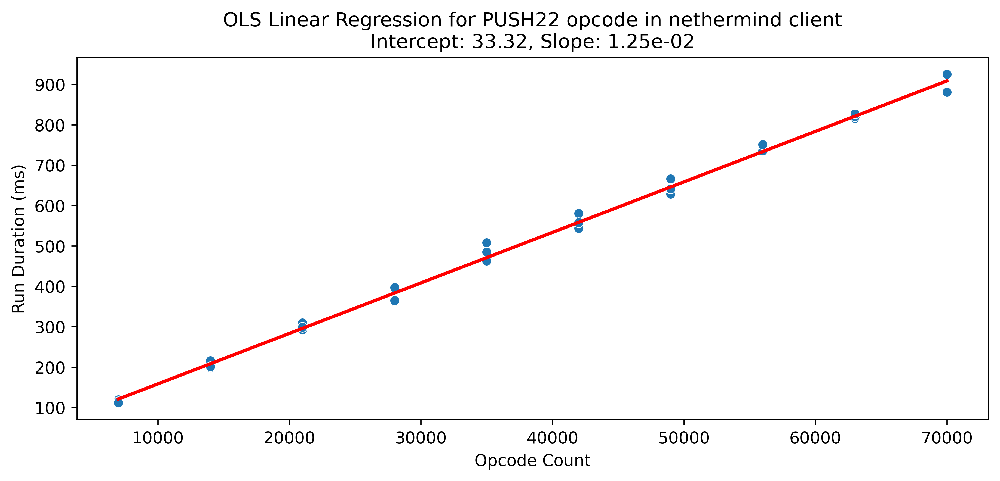


## besu


```python
                            OLS Regression Results                            
==============================================================================
Dep. Variable:        run_duration_ms   R-squared:                       0.996
Model:                            OLS   Adj. R-squared:                  0.996
Method:                 Least Squares   F-statistic:                     7357.
Date:                Mon, 12 Jan 2026   Prob (F-statistic):           1.90e-35
Time:                        10:29:58   Log-Likelihood:                -149.03
No. Observations:                  30   AIC:                             302.1
Df Residuals:                      28   BIC:                             304.9
Df Model:                           1                                         
Covariance Type:            nonrobust                                         
==============================================================================
                 coef    std err          t      P>|t|      [0.025      0.975]
------------------------------------------------------------------------------
const         23.0569     14.192      1.625      0.115      -6.015      52.128
opcount        0.0280      0.000     85.770      0.000       0.027       0.029
==============================================================================
Omnibus:                        0.526   Durbin-Watson:                   1.151
Prob(Omnibus):                  0.769   Jarque-Bera (JB):                0.476
Skew:                           0.277   Prob(JB):                        0.788
Kurtosis:                       2.728   Cond. No.                     9.38e+04
==============================================================================

Notes:
[1] Standard Errors assume that the covariance matrix of the errors is correctly specified.
[2] The condition number is large, 9.38e+04. This might indicate that there are
strong multicollinearity or other numerical problems.
```


# PUSH23

## geth


```python
                            OLS Regression Results                            
==============================================================================
Dep. Variable:        run_duration_ms   R-squared:                       0.980
Model:                            OLS   Adj. R-squared:                  0.979
Method:                 Least Squares   F-statistic:                     1364.
Date:                Mon, 12 Jan 2026   Prob (F-statistic):           2.67e-25
Time:                        10:29:59   Log-Likelihood:                -165.79
No. Observations:                  30   AIC:                             335.6
Df Residuals:                      28   BIC:                             338.4
Df Model:                           1                                         
Covariance Type:            nonrobust                                         
==============================================================================
                 coef    std err          t      P>|t|      [0.025      0.975]
------------------------------------------------------------------------------
const         34.5611     24.817      1.393      0.175     -16.275      85.397
opcount        0.0211      0.001     36.935      0.000       0.020       0.022
==============================================================================
Omnibus:                        0.406   Durbin-Watson:                   0.880
Prob(Omnibus):                  0.816   Jarque-Bera (JB):                0.195
Skew:                          -0.193   Prob(JB):                        0.907
Kurtosis:                       2.913   Cond. No.                     9.38e+04
==============================================================================

Notes:
[1] Standard Errors assume that the covariance matrix of the errors is correctly specified.
[2] The condition number is large, 9.38e+04. This might indicate that there are
strong multicollinearity or other numerical problems.
```


## reth


```python
                            OLS Regression Results                            
==============================================================================
Dep. Variable:        run_duration_ms   R-squared:                       0.958
Model:                            OLS   Adj. R-squared:                  0.956
Method:                 Least Squares   F-statistic:                     638.2
Date:                Mon, 12 Jan 2026   Prob (F-statistic):           8.19e-21
Time:                        10:29:59   Log-Likelihood:                -140.22
No. Observations:                  30   AIC:                             284.4
Df Residuals:                      28   BIC:                             287.2
Df Model:                           1                                         
Covariance Type:            nonrobust                                         
==============================================================================
                 coef    std err          t      P>|t|      [0.025      0.975]
------------------------------------------------------------------------------
const         33.1125     10.582      3.129      0.004      11.435      54.790
opcount        0.0062      0.000     25.262      0.000       0.006       0.007
==============================================================================
Omnibus:                        3.345   Durbin-Watson:                   1.035
Prob(Omnibus):                  0.188   Jarque-Bera (JB):                2.651
Skew:                           0.727   Prob(JB):                        0.266
Kurtosis:                       2.904   Cond. No.                     9.38e+04
==============================================================================

Notes:
[1] Standard Errors assume that the covariance matrix of the errors is correctly specified.
[2] The condition number is large, 9.38e+04. This might indicate that there are
strong multicollinearity or other numerical problems.
```


## nethermind


```python
                            OLS Regression Results                            
==============================================================================
Dep. Variable:        run_duration_ms   R-squared:                       0.996
Model:                            OLS   Adj. R-squared:                  0.996
Method:                 Least Squares   F-statistic:                     7259.
Date:                Mon, 12 Jan 2026   Prob (F-statistic):           2.29e-35
Time:                        10:29:59   Log-Likelihood:                -125.17
No. Observations:                  30   AIC:                             254.3
Df Residuals:                      28   BIC:                             257.1
Df Model:                           1                                         
Covariance Type:            nonrobust                                         
==============================================================================
                 coef    std err          t      P>|t|      [0.025      0.975]
------------------------------------------------------------------------------
const         30.6182      6.408      4.778      0.000      17.491      43.745
opcount        0.0126      0.000     85.199      0.000       0.012       0.013
==============================================================================
Omnibus:                        0.786   Durbin-Watson:                   1.403
Prob(Omnibus):                  0.675   Jarque-Bera (JB):                0.765
Skew:                           0.139   Prob(JB):                        0.682
Kurtosis:                       2.269   Cond. No.                     9.38e+04
==============================================================================

Notes:
[1] Standard Errors assume that the covariance matrix of the errors is correctly specified.
[2] The condition number is large, 9.38e+04. This might indicate that there are
strong multicollinearity or other numerical problems.
```


## besu


```python
                            OLS Regression Results                            
==============================================================================
Dep. Variable:        run_duration_ms   R-squared:                       0.994
Model:                            OLS   Adj. R-squared:                  0.994
Method:                 Least Squares   F-statistic:                     4526.
Date:                Mon, 12 Jan 2026   Prob (F-statistic):           1.66e-32
Time:                        10:29:59   Log-Likelihood:                -156.17
No. Observations:                  30   AIC:                             316.3
Df Residuals:                      28   BIC:                             319.1
Df Model:                           1                                         
Covariance Type:            nonrobust                                         
==============================================================================
                 coef    std err          t      P>|t|      [0.025      0.975]
------------------------------------------------------------------------------
const         26.5519     18.008      1.474      0.152     -10.335      63.439
opcount        0.0279      0.000     67.274      0.000       0.027       0.029
==============================================================================
Omnibus:                       20.911   Durbin-Watson:                   1.409
Prob(Omnibus):                  0.000   Jarque-Bera (JB):               30.294
Skew:                           1.688   Prob(JB):                     2.64e-07
Kurtosis:                       6.582   Cond. No.                     9.38e+04
==============================================================================

Notes:
[1] Standard Errors assume that the covariance matrix of the errors is correctly specified.
[2] The condition number is large, 9.38e+04. This might indicate that there are
strong multicollinearity or other numerical problems.
```


# PUSH24

## geth


```python
                            OLS Regression Results                            
==============================================================================
Dep. Variable:        run_duration_ms   R-squared:                       0.954
Model:                            OLS   Adj. R-squared:                  0.952
Method:                 Least Squares   F-statistic:                     582.1
Date:                Mon, 12 Jan 2026   Prob (F-statistic):           2.81e-20
Time:                        10:29:59   Log-Likelihood:                -179.35
No. Observations:                  30   AIC:                             362.7
Df Residuals:                      28   BIC:                             365.5
Df Model:                           1                                         
Covariance Type:            nonrobust                                         
==============================================================================
                 coef    std err          t      P>|t|      [0.025      0.975]
------------------------------------------------------------------------------
const          6.7131     39.000      0.172      0.865     -73.175      86.601
opcount        0.0217      0.001     24.128      0.000       0.020       0.024
==============================================================================
Omnibus:                       33.471   Durbin-Watson:                   1.179
Prob(Omnibus):                  0.000   Jarque-Bera (JB):              102.229
Skew:                           2.222   Prob(JB):                     6.33e-23
Kurtosis:                      10.876   Cond. No.                     9.38e+04
==============================================================================

Notes:
[1] Standard Errors assume that the covariance matrix of the errors is correctly specified.
[2] The condition number is large, 9.38e+04. This might indicate that there are
strong multicollinearity or other numerical problems.
```

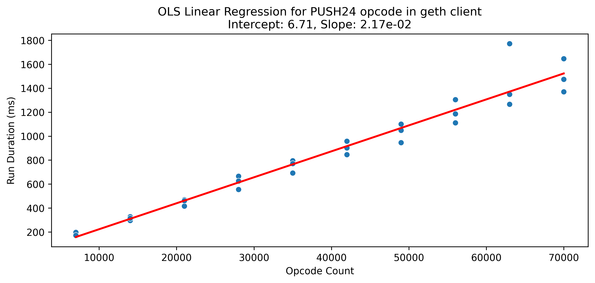


## reth


```python
                            OLS Regression Results                            
==============================================================================
Dep. Variable:        run_duration_ms   R-squared:                       0.982
Model:                            OLS   Adj. R-squared:                  0.981
Method:                 Least Squares   F-statistic:                     1510.
Date:                Mon, 12 Jan 2026   Prob (F-statistic):           6.63e-26
Time:                        10:29:59   Log-Likelihood:                -126.40
No. Observations:                  30   AIC:                             256.8
Df Residuals:                      28   BIC:                             259.6
Df Model:                           1                                         
Covariance Type:            nonrobust                                         
==============================================================================
                 coef    std err          t      P>|t|      [0.025      0.975]
------------------------------------------------------------------------------
const         32.9149      6.675      4.931      0.000      19.241      46.589
opcount        0.0060      0.000     38.858      0.000       0.006       0.006
==============================================================================
Omnibus:                       20.309   Durbin-Watson:                   1.863
Prob(Omnibus):                  0.000   Jarque-Bera (JB):               27.476
Skew:                          -1.706   Prob(JB):                     1.08e-06
Kurtosis:                       6.214   Cond. No.                     9.38e+04
==============================================================================

Notes:
[1] Standard Errors assume that the covariance matrix of the errors is correctly specified.
[2] The condition number is large, 9.38e+04. This might indicate that there are
strong multicollinearity or other numerical problems.
```


## nethermind


```python
                            OLS Regression Results                            
==============================================================================
Dep. Variable:        run_duration_ms   R-squared:                       0.997
Model:                            OLS   Adj. R-squared:                  0.996
Method:                 Least Squares   F-statistic:                     8034.
Date:                Mon, 12 Jan 2026   Prob (F-statistic):           5.56e-36
Time:                        10:29:59   Log-Likelihood:                -123.30
No. Observations:                  30   AIC:                             250.6
Df Residuals:                      28   BIC:                             253.4
Df Model:                           1                                         
Covariance Type:            nonrobust                                         
==============================================================================
                 coef    std err          t      P>|t|      [0.025      0.975]
------------------------------------------------------------------------------
const         28.2752      6.020      4.697      0.000      15.943      40.607
opcount        0.0124      0.000     89.632      0.000       0.012       0.013
==============================================================================
Omnibus:                        1.165   Durbin-Watson:                   1.624
Prob(Omnibus):                  0.558   Jarque-Bera (JB):                0.315
Skew:                           0.141   Prob(JB):                        0.854
Kurtosis:                       3.415   Cond. No.                     9.38e+04
==============================================================================

Notes:
[1] Standard Errors assume that the covariance matrix of the errors is correctly specified.
[2] The condition number is large, 9.38e+04. This might indicate that there are
strong multicollinearity or other numerical problems.
```


## besu


```python
                            OLS Regression Results                            
==============================================================================
Dep. Variable:        run_duration_ms   R-squared:                       0.992
Model:                            OLS   Adj. R-squared:                  0.992
Method:                 Least Squares   F-statistic:                     3406.
Date:                Mon, 12 Jan 2026   Prob (F-statistic):           8.62e-31
Time:                        10:30:00   Log-Likelihood:                -160.66
No. Observations:                  30   AIC:                             325.3
Df Residuals:                      28   BIC:                             328.1
Df Model:                           1                                         
Covariance Type:            nonrobust                                         
==============================================================================
                 coef    std err          t      P>|t|      [0.025      0.975]
------------------------------------------------------------------------------
const         26.8693     20.913      1.285      0.209     -15.969      69.707
opcount        0.0281      0.000     58.359      0.000       0.027       0.029
==============================================================================
Omnibus:                        6.606   Durbin-Watson:                   0.931
Prob(Omnibus):                  0.037   Jarque-Bera (JB):                4.989
Skew:                           0.946   Prob(JB):                       0.0825
Kurtosis:                       3.644   Cond. No.                     9.38e+04
==============================================================================

Notes:
[1] Standard Errors assume that the covariance matrix of the errors is correctly specified.
[2] The condition number is large, 9.38e+04. This might indicate that there are
strong multicollinearity or other numerical problems.
```


# PUSH25

## geth


```python
                            OLS Regression Results                            
==============================================================================
Dep. Variable:        run_duration_ms   R-squared:                       0.984
Model:                            OLS   Adj. R-squared:                  0.983
Method:                 Least Squares   F-statistic:                     1680.
Date:                Mon, 12 Jan 2026   Prob (F-statistic):           1.52e-26
Time:                        10:30:00   Log-Likelihood:                -162.76
No. Observations:                  30   AIC:                             329.5
Df Residuals:                      28   BIC:                             332.3
Df Model:                           1                                         
Covariance Type:            nonrobust                                         
==============================================================================
                 coef    std err          t      P>|t|      [0.025      0.975]
------------------------------------------------------------------------------
const         26.9903     22.432      1.203      0.239     -18.960      72.940
opcount        0.0212      0.001     40.992      0.000       0.020       0.022
==============================================================================
Omnibus:                        0.960   Durbin-Watson:                   1.184
Prob(Omnibus):                  0.619   Jarque-Bera (JB):                0.436
Skew:                           0.292   Prob(JB):                        0.804
Kurtosis:                       3.081   Cond. No.                     9.38e+04
==============================================================================

Notes:
[1] Standard Errors assume that the covariance matrix of the errors is correctly specified.
[2] The condition number is large, 9.38e+04. This might indicate that there are
strong multicollinearity or other numerical problems.
```


## reth


```python
                            OLS Regression Results                            
==============================================================================
Dep. Variable:        run_duration_ms   R-squared:                       0.977
Model:                            OLS   Adj. R-squared:                  0.976
Method:                 Least Squares   F-statistic:                     1177.
Date:                Mon, 12 Jan 2026   Prob (F-statistic):           2.02e-24
Time:                        10:30:00   Log-Likelihood:                -129.75
No. Observations:                  30   AIC:                             263.5
Df Residuals:                      28   BIC:                             266.3
Df Model:                           1                                         
Covariance Type:            nonrobust                                         
==============================================================================
                 coef    std err          t      P>|t|      [0.025      0.975]
------------------------------------------------------------------------------
const         39.0819      7.464      5.236      0.000      23.793      54.371
opcount        0.0059      0.000     34.309      0.000       0.006       0.006
==============================================================================
Omnibus:                        0.297   Durbin-Watson:                   1.981
Prob(Omnibus):                  0.862   Jarque-Bera (JB):                0.433
Skew:                          -0.197   Prob(JB):                        0.805
Kurtosis:                       2.563   Cond. No.                     9.38e+04
==============================================================================

Notes:
[1] Standard Errors assume that the covariance matrix of the errors is correctly specified.
[2] The condition number is large, 9.38e+04. This might indicate that there are
strong multicollinearity or other numerical problems.
```

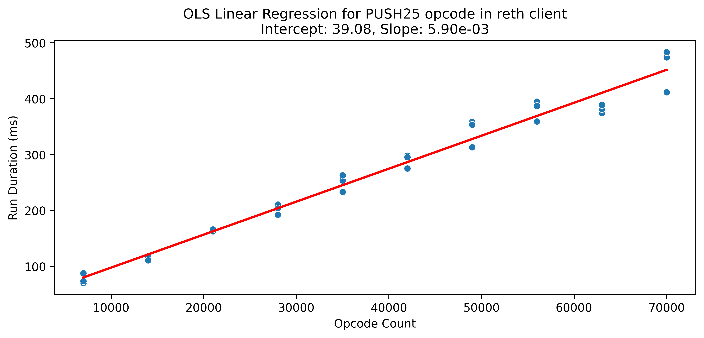


## nethermind


```python
                            OLS Regression Results                            
==============================================================================
Dep. Variable:        run_duration_ms   R-squared:                       0.992
Model:                            OLS   Adj. R-squared:                  0.992
Method:                 Least Squares   F-statistic:                     3701.
Date:                Mon, 12 Jan 2026   Prob (F-statistic):           2.72e-31
Time:                        10:30:00   Log-Likelihood:                -135.95
No. Observations:                  30   AIC:                             275.9
Df Residuals:                      28   BIC:                             278.7
Df Model:                           1                                         
Covariance Type:            nonrobust                                         
==============================================================================
                 coef    std err          t      P>|t|      [0.025      0.975]
------------------------------------------------------------------------------
const         25.0926      9.177      2.734      0.011       6.294      43.891
opcount        0.0129      0.000     60.836      0.000       0.012       0.013
==============================================================================
Omnibus:                        1.828   Durbin-Watson:                   1.898
Prob(Omnibus):                  0.401   Jarque-Bera (JB):                1.142
Skew:                           0.477   Prob(JB):                        0.565
Kurtosis:                       3.061   Cond. No.                     9.38e+04
==============================================================================

Notes:
[1] Standard Errors assume that the covariance matrix of the errors is correctly specified.
[2] The condition number is large, 9.38e+04. This might indicate that there are
strong multicollinearity or other numerical problems.
```


## besu


```python
                            OLS Regression Results                            
==============================================================================
Dep. Variable:        run_duration_ms   R-squared:                       0.995
Model:                            OLS   Adj. R-squared:                  0.995
Method:                 Least Squares   F-statistic:                     5249.
Date:                Mon, 12 Jan 2026   Prob (F-statistic):           2.10e-33
Time:                        10:30:00   Log-Likelihood:                -153.89
No. Observations:                  30   AIC:                             311.8
Df Residuals:                      28   BIC:                             314.6
Df Model:                           1                                         
Covariance Type:            nonrobust                                         
==============================================================================
                 coef    std err          t      P>|t|      [0.025      0.975]
------------------------------------------------------------------------------
const         17.1843     16.689      1.030      0.312     -17.002      51.370
opcount        0.0278      0.000     72.450      0.000       0.027       0.029
==============================================================================
Omnibus:                        8.525   Durbin-Watson:                   1.554
Prob(Omnibus):                  0.014   Jarque-Bera (JB):                6.883
Skew:                           1.075   Prob(JB):                       0.0320
Kurtosis:                       3.942   Cond. No.                     9.38e+04
==============================================================================

Notes:
[1] Standard Errors assume that the covariance matrix of the errors is correctly specified.
[2] The condition number is large, 9.38e+04. This might indicate that there are
strong multicollinearity or other numerical problems.
```

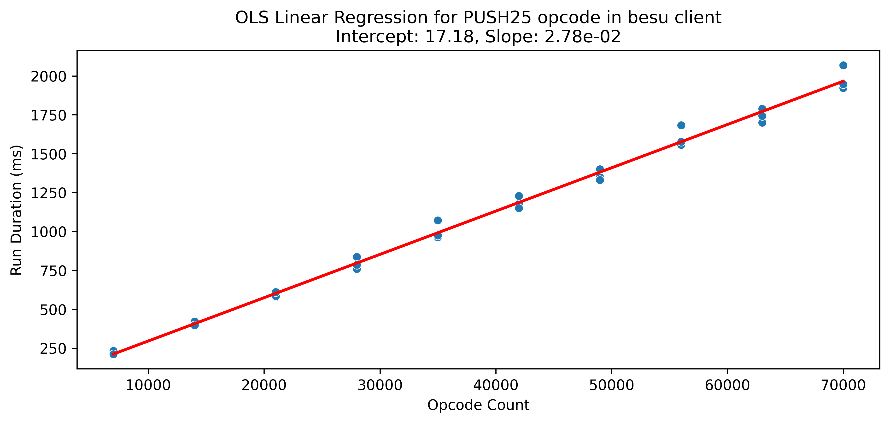


# PUSH26

## geth


```python
                            OLS Regression Results                            
==============================================================================
Dep. Variable:        run_duration_ms   R-squared:                       0.977
Model:                            OLS   Adj. R-squared:                  0.976
Method:                 Least Squares   F-statistic:                     1191.
Date:                Mon, 12 Jan 2026   Prob (F-statistic):           1.71e-24
Time:                        10:30:00   Log-Likelihood:                -167.55
No. Observations:                  30   AIC:                             339.1
Df Residuals:                      28   BIC:                             341.9
Df Model:                           1                                         
Covariance Type:            nonrobust                                         
==============================================================================
                 coef    std err          t      P>|t|      [0.025      0.975]
------------------------------------------------------------------------------
const         33.3153     26.312      1.266      0.216     -20.583      87.213
opcount        0.0209      0.001     34.517      0.000       0.020       0.022
==============================================================================
Omnibus:                        2.972   Durbin-Watson:                   0.823
Prob(Omnibus):                  0.226   Jarque-Bera (JB):                1.602
Skew:                           0.369   Prob(JB):                        0.449
Kurtosis:                       3.859   Cond. No.                     9.38e+04
==============================================================================

Notes:
[1] Standard Errors assume that the covariance matrix of the errors is correctly specified.
[2] The condition number is large, 9.38e+04. This might indicate that there are
strong multicollinearity or other numerical problems.
```


## reth


```python
                            OLS Regression Results                            
==============================================================================
Dep. Variable:        run_duration_ms   R-squared:                       0.970
Model:                            OLS   Adj. R-squared:                  0.969
Method:                 Least Squares   F-statistic:                     904.9
Date:                Mon, 12 Jan 2026   Prob (F-statistic):           7.29e-23
Time:                        10:30:00   Log-Likelihood:                -134.23
No. Observations:                  30   AIC:                             272.5
Df Residuals:                      28   BIC:                             275.3
Df Model:                           1                                         
Covariance Type:            nonrobust                                         
==============================================================================
                 coef    std err          t      P>|t|      [0.025      0.975]
------------------------------------------------------------------------------
const         32.4125      8.668      3.739      0.001      14.657      50.168
opcount        0.0060      0.000     30.082      0.000       0.006       0.006
==============================================================================
Omnibus:                        5.032   Durbin-Watson:                   1.881
Prob(Omnibus):                  0.081   Jarque-Bera (JB):                4.643
Skew:                           0.255   Prob(JB):                       0.0981
Kurtosis:                       4.858   Cond. No.                     9.38e+04
==============================================================================

Notes:
[1] Standard Errors assume that the covariance matrix of the errors is correctly specified.
[2] The condition number is large, 9.38e+04. This might indicate that there are
strong multicollinearity or other numerical problems.
```

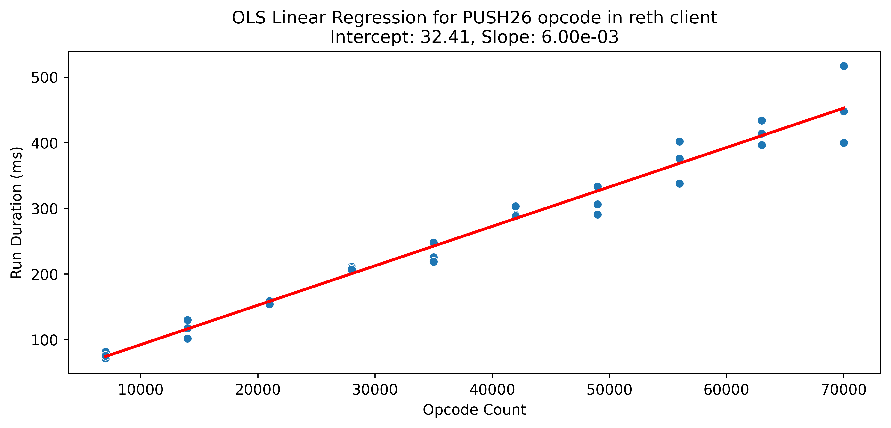


## nethermind


```python
                            OLS Regression Results                            
==============================================================================
Dep. Variable:        run_duration_ms   R-squared:                       0.994
Model:                            OLS   Adj. R-squared:                  0.993
Method:                 Least Squares   F-statistic:                     4421.
Date:                Mon, 12 Jan 2026   Prob (F-statistic):           2.29e-32
Time:                        10:30:01   Log-Likelihood:                -132.91
No. Observations:                  30   AIC:                             269.8
Df Residuals:                      28   BIC:                             272.6
Df Model:                           1                                         
Covariance Type:            nonrobust                                         
==============================================================================
                 coef    std err          t      P>|t|      [0.025      0.975]
------------------------------------------------------------------------------
const         27.2281      8.294      3.283      0.003      10.238      44.218
opcount        0.0127      0.000     66.493      0.000       0.012       0.013
==============================================================================
Omnibus:                        7.068   Durbin-Watson:                   1.938
Prob(Omnibus):                  0.029   Jarque-Bera (JB):                5.300
Skew:                           0.913   Prob(JB):                       0.0707
Kurtosis:                       3.953   Cond. No.                     9.38e+04
==============================================================================

Notes:
[1] Standard Errors assume that the covariance matrix of the errors is correctly specified.
[2] The condition number is large, 9.38e+04. This might indicate that there are
strong multicollinearity or other numerical problems.
```


## besu


```python
                            OLS Regression Results                            
==============================================================================
Dep. Variable:        run_duration_ms   R-squared:                       0.993
Model:                            OLS   Adj. R-squared:                  0.993
Method:                 Least Squares   F-statistic:                     4182.
Date:                Mon, 12 Jan 2026   Prob (F-statistic):           4.96e-32
Time:                        10:30:01   Log-Likelihood:                -157.12
No. Observations:                  30   AIC:                             318.2
Df Residuals:                      28   BIC:                             321.0
Df Model:                           1                                         
Covariance Type:            nonrobust                                         
==============================================================================
                 coef    std err          t      P>|t|      [0.025      0.975]
------------------------------------------------------------------------------
const         23.7508     18.590      1.278      0.212     -14.329      61.831
opcount        0.0277      0.000     64.670      0.000       0.027       0.029
==============================================================================
Omnibus:                        1.480   Durbin-Watson:                   1.040
Prob(Omnibus):                  0.477   Jarque-Bera (JB):                1.025
Skew:                           0.451   Prob(JB):                        0.599
Kurtosis:                       2.915   Cond. No.                     9.38e+04
==============================================================================

Notes:
[1] Standard Errors assume that the covariance matrix of the errors is correctly specified.
[2] The condition number is large, 9.38e+04. This might indicate that there are
strong multicollinearity or other numerical problems.
```


# PUSH27

## geth


```python
                            OLS Regression Results                            
==============================================================================
Dep. Variable:        run_duration_ms   R-squared:                       0.984
Model:                            OLS   Adj. R-squared:                  0.983
Method:                 Least Squares   F-statistic:                     1685.
Date:                Mon, 12 Jan 2026   Prob (F-statistic):           1.46e-26
Time:                        10:30:01   Log-Likelihood:                -162.19
No. Observations:                  30   AIC:                             328.4
Df Residuals:                      28   BIC:                             331.2
Df Model:                           1                                         
Covariance Type:            nonrobust                                         
==============================================================================
                 coef    std err          t      P>|t|      [0.025      0.975]
------------------------------------------------------------------------------
const         32.9993     22.007      1.500      0.145     -12.080      78.078
opcount        0.0208      0.001     41.049      0.000       0.020       0.022
==============================================================================
Omnibus:                        1.142   Durbin-Watson:                   0.864
Prob(Omnibus):                  0.565   Jarque-Bera (JB):                0.371
Skew:                          -0.225   Prob(JB):                        0.831
Kurtosis:                       3.305   Cond. No.                     9.38e+04
==============================================================================

Notes:
[1] Standard Errors assume that the covariance matrix of the errors is correctly specified.
[2] The condition number is large, 9.38e+04. This might indicate that there are
strong multicollinearity or other numerical problems.
```


## reth


```python
                            OLS Regression Results                            
==============================================================================
Dep. Variable:        run_duration_ms   R-squared:                       0.988
Model:                            OLS   Adj. R-squared:                  0.988
Method:                 Least Squares   F-statistic:                     2337.
Date:                Mon, 12 Jan 2026   Prob (F-statistic):           1.60e-28
Time:                        10:30:01   Log-Likelihood:                -121.77
No. Observations:                  30   AIC:                             247.5
Df Residuals:                      28   BIC:                             250.4
Df Model:                           1                                         
Covariance Type:            nonrobust                                         
==============================================================================
                 coef    std err          t      P>|t|      [0.025      0.975]
------------------------------------------------------------------------------
const         26.2502      5.722      4.588      0.000      14.529      37.971
opcount        0.0064      0.000     48.344      0.000       0.006       0.007
==============================================================================
Omnibus:                        3.555   Durbin-Watson:                   1.103
Prob(Omnibus):                  0.169   Jarque-Bera (JB):                2.675
Skew:                          -0.731   Prob(JB):                        0.262
Kurtosis:                       3.036   Cond. No.                     9.38e+04
==============================================================================

Notes:
[1] Standard Errors assume that the covariance matrix of the errors is correctly specified.
[2] The condition number is large, 9.38e+04. This might indicate that there are
strong multicollinearity or other numerical problems.
```


## nethermind


```python
                            OLS Regression Results                            
==============================================================================
Dep. Variable:        run_duration_ms   R-squared:                       0.992
Model:                            OLS   Adj. R-squared:                  0.992
Method:                 Least Squares   F-statistic:                     3624.
Date:                Mon, 12 Jan 2026   Prob (F-statistic):           3.64e-31
Time:                        10:30:01   Log-Likelihood:                -135.82
No. Observations:                  30   AIC:                             275.6
Df Residuals:                      28   BIC:                             278.5
Df Model:                           1                                         
Covariance Type:            nonrobust                                         
==============================================================================
                 coef    std err          t      P>|t|      [0.025      0.975]
------------------------------------------------------------------------------
const         30.1098      9.140      3.294      0.003      11.387      48.832
opcount        0.0127      0.000     60.199      0.000       0.012       0.013
==============================================================================
Omnibus:                       15.265   Durbin-Watson:                   1.828
Prob(Omnibus):                  0.000   Jarque-Bera (JB):               19.283
Skew:                           1.244   Prob(JB):                     6.50e-05
Kurtosis:                       6.039   Cond. No.                     9.38e+04
==============================================================================

Notes:
[1] Standard Errors assume that the covariance matrix of the errors is correctly specified.
[2] The condition number is large, 9.38e+04. This might indicate that there are
strong multicollinearity or other numerical problems.
```

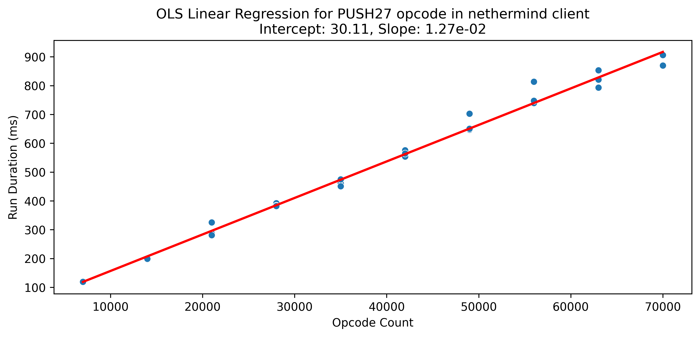


## besu


```python
                            OLS Regression Results                            
==============================================================================
Dep. Variable:        run_duration_ms   R-squared:                       0.995
Model:                            OLS   Adj. R-squared:                  0.995
Method:                 Least Squares   F-statistic:                     5490.
Date:                Mon, 12 Jan 2026   Prob (F-statistic):           1.12e-33
Time:                        10:30:01   Log-Likelihood:                -153.41
No. Observations:                  30   AIC:                             310.8
Df Residuals:                      28   BIC:                             313.6
Df Model:                           1                                         
Covariance Type:            nonrobust                                         
==============================================================================
                 coef    std err          t      P>|t|      [0.025      0.975]
------------------------------------------------------------------------------
const         27.0993     16.424      1.650      0.110      -6.543      60.742
opcount        0.0280      0.000     74.097      0.000       0.027       0.029
==============================================================================
Omnibus:                        0.874   Durbin-Watson:                   0.535
Prob(Omnibus):                  0.646   Jarque-Bera (JB):                0.890
Skew:                           0.265   Prob(JB):                        0.641
Kurtosis:                       2.343   Cond. No.                     9.38e+04
==============================================================================

Notes:
[1] Standard Errors assume that the covariance matrix of the errors is correctly specified.
[2] The condition number is large, 9.38e+04. This might indicate that there are
strong multicollinearity or other numerical problems.
```


# PUSH28

## geth


```python
                            OLS Regression Results                            
==============================================================================
Dep. Variable:        run_duration_ms   R-squared:                       0.979
Model:                            OLS   Adj. R-squared:                  0.979
Method:                 Least Squares   F-statistic:                     1325.
Date:                Mon, 12 Jan 2026   Prob (F-statistic):           4.00e-25
Time:                        10:30:01   Log-Likelihood:                -165.53
No. Observations:                  30   AIC:                             335.1
Df Residuals:                      28   BIC:                             337.9
Df Model:                           1                                         
Covariance Type:            nonrobust                                         
==============================================================================
                 coef    std err          t      P>|t|      [0.025      0.975]
------------------------------------------------------------------------------
const         41.9683     24.606      1.706      0.099      -8.434      92.370
opcount        0.0206      0.001     36.398      0.000       0.019       0.022
==============================================================================
Omnibus:                        0.239   Durbin-Watson:                   0.826
Prob(Omnibus):                  0.887   Jarque-Bera (JB):                0.416
Skew:                          -0.154   Prob(JB):                        0.812
Kurtosis:                       2.513   Cond. No.                     9.38e+04
==============================================================================

Notes:
[1] Standard Errors assume that the covariance matrix of the errors is correctly specified.
[2] The condition number is large, 9.38e+04. This might indicate that there are
strong multicollinearity or other numerical problems.
```


## reth


```python
                            OLS Regression Results                            
==============================================================================
Dep. Variable:        run_duration_ms   R-squared:                       0.983
Model:                            OLS   Adj. R-squared:                  0.982
Method:                 Least Squares   F-statistic:                     1595.
Date:                Mon, 12 Jan 2026   Prob (F-statistic):           3.13e-26
Time:                        10:30:02   Log-Likelihood:                -126.12
No. Observations:                  30   AIC:                             256.2
Df Residuals:                      28   BIC:                             259.1
Df Model:                           1                                         
Covariance Type:            nonrobust                                         
==============================================================================
                 coef    std err          t      P>|t|      [0.025      0.975]
------------------------------------------------------------------------------
const         21.4055      6.615      3.236      0.003       7.855      34.956
opcount        0.0061      0.000     39.932      0.000       0.006       0.006
==============================================================================
Omnibus:                        1.613   Durbin-Watson:                   1.489
Prob(Omnibus):                  0.447   Jarque-Bera (JB):                1.417
Skew:                          -0.500   Prob(JB):                        0.492
Kurtosis:                       2.633   Cond. No.                     9.38e+04
==============================================================================

Notes:
[1] Standard Errors assume that the covariance matrix of the errors is correctly specified.
[2] The condition number is large, 9.38e+04. This might indicate that there are
strong multicollinearity or other numerical problems.
```

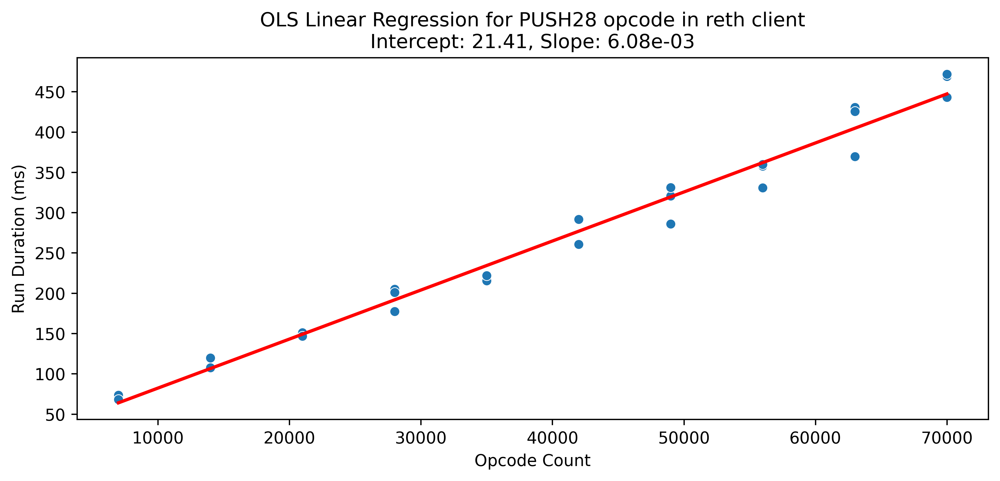


## nethermind


```python
                            OLS Regression Results                            
==============================================================================
Dep. Variable:        run_duration_ms   R-squared:                       0.995
Model:                            OLS   Adj. R-squared:                  0.994
Method:                 Least Squares   F-statistic:                     5097.
Date:                Mon, 12 Jan 2026   Prob (F-statistic):           3.16e-33
Time:                        10:30:02   Log-Likelihood:                -130.54
No. Observations:                  30   AIC:                             265.1
Df Residuals:                      28   BIC:                             267.9
Df Model:                           1                                         
Covariance Type:            nonrobust                                         
==============================================================================
                 coef    std err          t      P>|t|      [0.025      0.975]
------------------------------------------------------------------------------
const         25.7852      7.665      3.364      0.002      10.085      41.485
opcount        0.0126      0.000     71.392      0.000       0.012       0.013
==============================================================================
Omnibus:                        7.198   Durbin-Watson:                   1.367
Prob(Omnibus):                  0.027   Jarque-Bera (JB):                6.634
Skew:                           0.619   Prob(JB):                       0.0363
Kurtosis:                       4.942   Cond. No.                     9.38e+04
==============================================================================

Notes:
[1] Standard Errors assume that the covariance matrix of the errors is correctly specified.
[2] The condition number is large, 9.38e+04. This might indicate that there are
strong multicollinearity or other numerical problems.
```

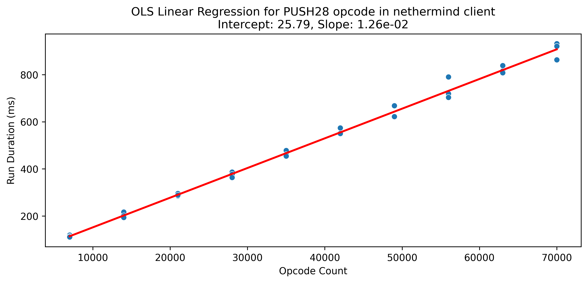


## besu


```python
                            OLS Regression Results                            
==============================================================================
Dep. Variable:        run_duration_ms   R-squared:                       0.996
Model:                            OLS   Adj. R-squared:                  0.996
Method:                 Least Squares   F-statistic:                     6502.
Date:                Mon, 12 Jan 2026   Prob (F-statistic):           1.06e-34
Time:                        10:30:02   Log-Likelihood:                -150.63
No. Observations:                  30   AIC:                             305.3
Df Residuals:                      28   BIC:                             308.1
Df Model:                           1                                         
Covariance Type:            nonrobust                                         
==============================================================================
                 coef    std err          t      P>|t|      [0.025      0.975]
------------------------------------------------------------------------------
const         31.6889     14.971      2.117      0.043       1.021      62.356
opcount        0.0278      0.000     80.633      0.000       0.027       0.028
==============================================================================
Omnibus:                        1.629   Durbin-Watson:                   1.742
Prob(Omnibus):                  0.443   Jarque-Bera (JB):                1.295
Skew:                           0.497   Prob(JB):                        0.523
Kurtosis:                       2.780   Cond. No.                     9.38e+04
==============================================================================

Notes:
[1] Standard Errors assume that the covariance matrix of the errors is correctly specified.
[2] The condition number is large, 9.38e+04. This might indicate that there are
strong multicollinearity or other numerical problems.
```


# PUSH29

## geth


```python
                            OLS Regression Results                            
==============================================================================
Dep. Variable:        run_duration_ms   R-squared:                       0.987
Model:                            OLS   Adj. R-squared:                  0.986
Method:                 Least Squares   F-statistic:                     2119.
Date:                Mon, 12 Jan 2026   Prob (F-statistic):           6.19e-28
Time:                        10:30:02   Log-Likelihood:                -159.24
No. Observations:                  30   AIC:                             322.5
Df Residuals:                      28   BIC:                             325.3
Df Model:                           1                                         
Covariance Type:            nonrobust                                         
==============================================================================
                 coef    std err          t      P>|t|      [0.025      0.975]
------------------------------------------------------------------------------
const         36.1238     19.949      1.811      0.081      -4.740      76.988
opcount        0.0211      0.000     46.033      0.000       0.020       0.022
==============================================================================
Omnibus:                        2.494   Durbin-Watson:                   1.190
Prob(Omnibus):                  0.287   Jarque-Bera (JB):                1.273
Skew:                           0.169   Prob(JB):                        0.529
Kurtosis:                       3.950   Cond. No.                     9.38e+04
==============================================================================

Notes:
[1] Standard Errors assume that the covariance matrix of the errors is correctly specified.
[2] The condition number is large, 9.38e+04. This might indicate that there are
strong multicollinearity or other numerical problems.
```


## reth


```python
                            OLS Regression Results                            
==============================================================================
Dep. Variable:        run_duration_ms   R-squared:                       0.976
Model:                            OLS   Adj. R-squared:                  0.975
Method:                 Least Squares   F-statistic:                     1129.
Date:                Mon, 12 Jan 2026   Prob (F-statistic):           3.59e-24
Time:                        10:30:02   Log-Likelihood:                -132.25
No. Observations:                  30   AIC:                             268.5
Df Residuals:                      28   BIC:                             271.3
Df Model:                           1                                         
Covariance Type:            nonrobust                                         
==============================================================================
                 coef    std err          t      P>|t|      [0.025      0.975]
------------------------------------------------------------------------------
const         27.4221      8.115      3.379      0.002      10.800      44.044
opcount        0.0063      0.000     33.595      0.000       0.006       0.007
==============================================================================
Omnibus:                        0.819   Durbin-Watson:                   2.066
Prob(Omnibus):                  0.664   Jarque-Bera (JB):                0.866
Skew:                          -0.284   Prob(JB):                        0.649
Kurtosis:                       2.391   Cond. No.                     9.38e+04
==============================================================================

Notes:
[1] Standard Errors assume that the covariance matrix of the errors is correctly specified.
[2] The condition number is large, 9.38e+04. This might indicate that there are
strong multicollinearity or other numerical problems.
```


## nethermind


```python
                            OLS Regression Results                            
==============================================================================
Dep. Variable:        run_duration_ms   R-squared:                       0.997
Model:                            OLS   Adj. R-squared:                  0.996
Method:                 Least Squares   F-statistic:                     8133.
Date:                Mon, 12 Jan 2026   Prob (F-statistic):           4.69e-36
Time:                        10:30:02   Log-Likelihood:                -124.17
No. Observations:                  30   AIC:                             252.3
Df Residuals:                      28   BIC:                             255.1
Df Model:                           1                                         
Covariance Type:            nonrobust                                         
==============================================================================
                 coef    std err          t      P>|t|      [0.025      0.975]
------------------------------------------------------------------------------
const         23.3838      6.197      3.773      0.001      10.690      36.078
opcount        0.0129      0.000     90.181      0.000       0.013       0.013
==============================================================================
Omnibus:                        0.704   Durbin-Watson:                   1.153
Prob(Omnibus):                  0.703   Jarque-Bera (JB):                0.782
Skew:                           0.277   Prob(JB):                        0.676
Kurtosis:                       2.435   Cond. No.                     9.38e+04
==============================================================================

Notes:
[1] Standard Errors assume that the covariance matrix of the errors is correctly specified.
[2] The condition number is large, 9.38e+04. This might indicate that there are
strong multicollinearity or other numerical problems.
```

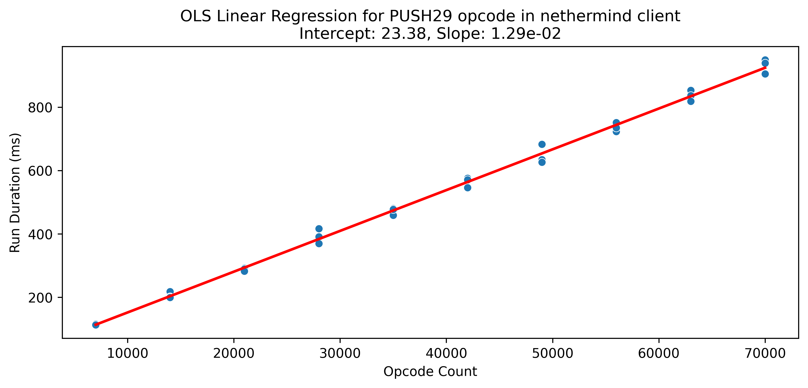


## besu


```python
                            OLS Regression Results                            
==============================================================================
Dep. Variable:        run_duration_ms   R-squared:                       0.996
Model:                            OLS   Adj. R-squared:                  0.996
Method:                 Least Squares   F-statistic:                     7565.
Date:                Mon, 12 Jan 2026   Prob (F-statistic):           1.29e-35
Time:                        10:30:03   Log-Likelihood:                -147.98
No. Observations:                  30   AIC:                             300.0
Df Residuals:                      28   BIC:                             302.8
Df Model:                           1                                         
Covariance Type:            nonrobust                                         
==============================================================================
                 coef    std err          t      P>|t|      [0.025      0.975]
------------------------------------------------------------------------------
const         24.0822     13.708      1.757      0.090      -3.997      52.162
opcount        0.0275      0.000     86.978      0.000       0.027       0.028
==============================================================================
Omnibus:                        1.572   Durbin-Watson:                   1.678
Prob(Omnibus):                  0.456   Jarque-Bera (JB):                0.819
Skew:                           0.396   Prob(JB):                        0.664
Kurtosis:                       3.172   Cond. No.                     9.38e+04
==============================================================================

Notes:
[1] Standard Errors assume that the covariance matrix of the errors is correctly specified.
[2] The condition number is large, 9.38e+04. This might indicate that there are
strong multicollinearity or other numerical problems.
```


# PUSH30

## geth


```python
                            OLS Regression Results                            
==============================================================================
Dep. Variable:        run_duration_ms   R-squared:                       0.965
Model:                            OLS   Adj. R-squared:                  0.964
Method:                 Least Squares   F-statistic:                     782.1
Date:                Mon, 12 Jan 2026   Prob (F-statistic):           5.28e-22
Time:                        10:30:03   Log-Likelihood:                -175.95
No. Observations:                  30   AIC:                             355.9
Df Residuals:                      28   BIC:                             358.7
Df Model:                           1                                         
Covariance Type:            nonrobust                                         
==============================================================================
                 coef    std err          t      P>|t|      [0.025      0.975]
------------------------------------------------------------------------------
const         19.5531     34.815      0.562      0.579     -51.762      90.868
opcount        0.0224      0.001     27.966      0.000       0.021       0.024
==============================================================================
Omnibus:                        8.560   Durbin-Watson:                   1.368
Prob(Omnibus):                  0.014   Jarque-Bera (JB):                7.828
Skew:                           0.802   Prob(JB):                       0.0200
Kurtosis:                       4.920   Cond. No.                     9.38e+04
==============================================================================

Notes:
[1] Standard Errors assume that the covariance matrix of the errors is correctly specified.
[2] The condition number is large, 9.38e+04. This might indicate that there are
strong multicollinearity or other numerical problems.
```


## reth


```python
                            OLS Regression Results                            
==============================================================================
Dep. Variable:        run_duration_ms   R-squared:                       0.984
Model:                            OLS   Adj. R-squared:                  0.983
Method:                 Least Squares   F-statistic:                     1675.
Date:                Mon, 12 Jan 2026   Prob (F-statistic):           1.59e-26
Time:                        10:30:03   Log-Likelihood:                -126.09
No. Observations:                  30   AIC:                             256.2
Df Residuals:                      28   BIC:                             259.0
Df Model:                           1                                         
Covariance Type:            nonrobust                                         
==============================================================================
                 coef    std err          t      P>|t|      [0.025      0.975]
------------------------------------------------------------------------------
const         30.4897      6.607      4.615      0.000      16.957      44.023
opcount        0.0062      0.000     40.923      0.000       0.006       0.007
==============================================================================
Omnibus:                        3.375   Durbin-Watson:                   1.972
Prob(Omnibus):                  0.185   Jarque-Bera (JB):                2.387
Skew:                          -0.688   Prob(JB):                        0.303
Kurtosis:                       3.134   Cond. No.                     9.38e+04
==============================================================================

Notes:
[1] Standard Errors assume that the covariance matrix of the errors is correctly specified.
[2] The condition number is large, 9.38e+04. This might indicate that there are
strong multicollinearity or other numerical problems.
```


## nethermind


```python
                            OLS Regression Results                            
==============================================================================
Dep. Variable:        run_duration_ms   R-squared:                       0.997
Model:                            OLS   Adj. R-squared:                  0.996
Method:                 Least Squares   F-statistic:                     8126.
Date:                Mon, 12 Jan 2026   Prob (F-statistic):           4.75e-36
Time:                        10:30:03   Log-Likelihood:                -123.53
No. Observations:                  30   AIC:                             251.1
Df Residuals:                      28   BIC:                             253.9
Df Model:                           1                                         
Covariance Type:            nonrobust                                         
==============================================================================
                 coef    std err          t      P>|t|      [0.025      0.975]
------------------------------------------------------------------------------
const         28.4149      6.066      4.684      0.000      15.988      40.841
opcount        0.0126      0.000     90.143      0.000       0.012       0.013
==============================================================================
Omnibus:                        4.384   Durbin-Watson:                   1.682
Prob(Omnibus):                  0.112   Jarque-Bera (JB):                3.203
Skew:                           0.792   Prob(JB):                        0.202
Kurtosis:                       3.234   Cond. No.                     9.38e+04
==============================================================================

Notes:
[1] Standard Errors assume that the covariance matrix of the errors is correctly specified.
[2] The condition number is large, 9.38e+04. This might indicate that there are
strong multicollinearity or other numerical problems.
```

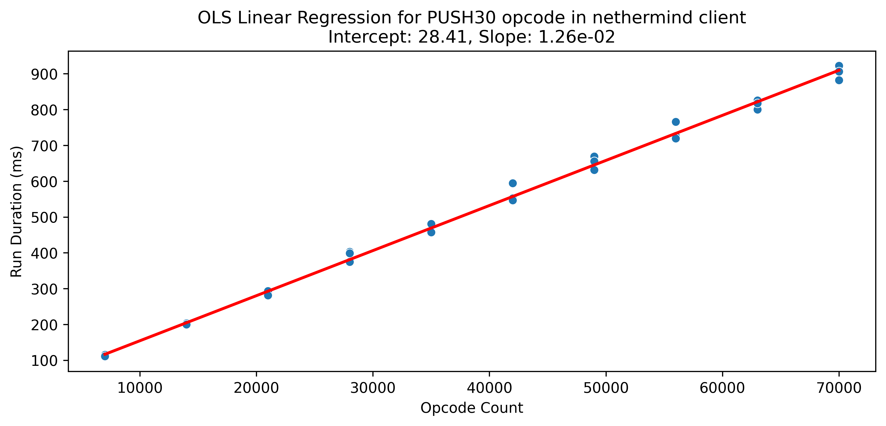


## besu


```python
                            OLS Regression Results                            
==============================================================================
Dep. Variable:        run_duration_ms   R-squared:                       0.997
Model:                            OLS   Adj. R-squared:                  0.997
Method:                 Least Squares   F-statistic:                     9981.
Date:                Mon, 12 Jan 2026   Prob (F-statistic):           2.69e-37
Time:                        10:30:03   Log-Likelihood:                -144.63
No. Observations:                  30   AIC:                             293.3
Df Residuals:                      28   BIC:                             296.1
Df Model:                           1                                         
Covariance Type:            nonrobust                                         
==============================================================================
                 coef    std err          t      P>|t|      [0.025      0.975]
------------------------------------------------------------------------------
const         20.4773     12.258      1.671      0.106      -4.632      45.586
opcount        0.0282      0.000     99.905      0.000       0.028       0.029
==============================================================================
Omnibus:                        6.528   Durbin-Watson:                   1.676
Prob(Omnibus):                  0.038   Jarque-Bera (JB):                4.765
Skew:                           0.812   Prob(JB):                       0.0923
Kurtosis:                       4.085   Cond. No.                     9.38e+04
==============================================================================

Notes:
[1] Standard Errors assume that the covariance matrix of the errors is correctly specified.
[2] The condition number is large, 9.38e+04. This might indicate that there are
strong multicollinearity or other numerical problems.
```


# PUSH31

## geth


```python
                            OLS Regression Results                            
==============================================================================
Dep. Variable:        run_duration_ms   R-squared:                       0.968
Model:                            OLS   Adj. R-squared:                  0.967
Method:                 Least Squares   F-statistic:                     857.9
Date:                Mon, 12 Jan 2026   Prob (F-statistic):           1.51e-22
Time:                        10:30:03   Log-Likelihood:                -173.98
No. Observations:                  30   AIC:                             352.0
Df Residuals:                      28   BIC:                             354.8
Df Model:                           1                                         
Covariance Type:            nonrobust                                         
==============================================================================
                 coef    std err          t      P>|t|      [0.025      0.975]
------------------------------------------------------------------------------
const         20.3524     32.607      0.624      0.538     -46.439      87.144
opcount        0.0220      0.001     29.289      0.000       0.020       0.024
==============================================================================
Omnibus:                       28.732   Durbin-Watson:                   1.316
Prob(Omnibus):                  0.000   Jarque-Bera (JB):               74.204
Skew:                           1.918   Prob(JB):                     7.71e-17
Kurtosis:                       9.682   Cond. No.                     9.38e+04
==============================================================================

Notes:
[1] Standard Errors assume that the covariance matrix of the errors is correctly specified.
[2] The condition number is large, 9.38e+04. This might indicate that there are
strong multicollinearity or other numerical problems.
```

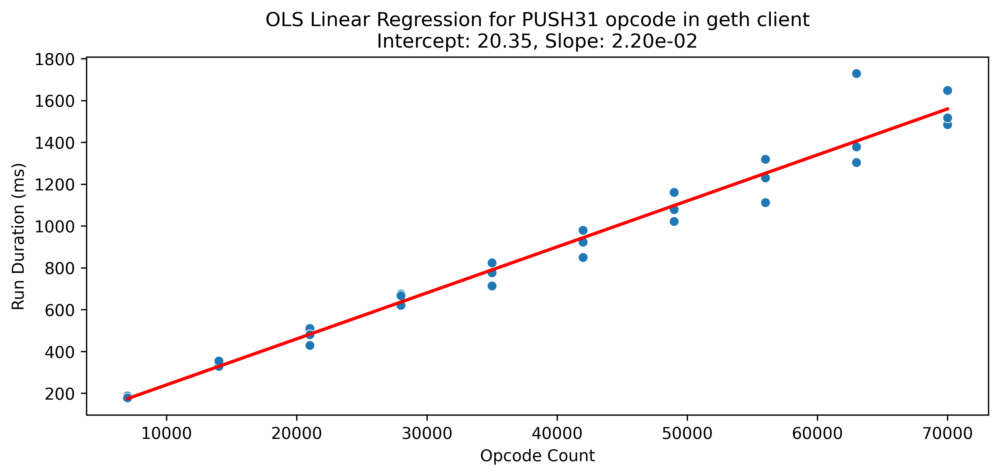


## reth


```python
                            OLS Regression Results                            
==============================================================================
Dep. Variable:        run_duration_ms   R-squared:                       0.984
Model:                            OLS   Adj. R-squared:                  0.984
Method:                 Least Squares   F-statistic:                     1771.
Date:                Mon, 12 Jan 2026   Prob (F-statistic):           7.34e-27
Time:                        10:30:03   Log-Likelihood:                -126.48
No. Observations:                  30   AIC:                             257.0
Df Residuals:                      28   BIC:                             259.8
Df Model:                           1                                         
Covariance Type:            nonrobust                                         
==============================================================================
                 coef    std err          t      P>|t|      [0.025      0.975]
------------------------------------------------------------------------------
const         23.5343      6.694      3.516      0.002       9.823      37.246
opcount        0.0065      0.000     42.089      0.000       0.006       0.007
==============================================================================
Omnibus:                       10.411   Durbin-Watson:                   1.485
Prob(Omnibus):                  0.005   Jarque-Bera (JB):                9.233
Skew:                          -1.096   Prob(JB):                      0.00988
Kurtosis:                       4.606   Cond. No.                     9.38e+04
==============================================================================

Notes:
[1] Standard Errors assume that the covariance matrix of the errors is correctly specified.
[2] The condition number is large, 9.38e+04. This might indicate that there are
strong multicollinearity or other numerical problems.
```


## nethermind


```python
                            OLS Regression Results                            
==============================================================================
Dep. Variable:        run_duration_ms   R-squared:                       0.990
Model:                            OLS   Adj. R-squared:                  0.989
Method:                 Least Squares   F-statistic:                     2705.
Date:                Mon, 12 Jan 2026   Prob (F-statistic):           2.11e-29
Time:                        10:30:03   Log-Likelihood:                -139.92
No. Observations:                  30   AIC:                             283.8
Df Residuals:                      28   BIC:                             286.6
Df Model:                           1                                         
Covariance Type:            nonrobust                                         
==============================================================================
                 coef    std err          t      P>|t|      [0.025      0.975]
------------------------------------------------------------------------------
const         30.8623     10.477      2.946      0.006       9.401      52.323
opcount        0.0125      0.000     52.006      0.000       0.012       0.013
==============================================================================
Omnibus:                       14.252   Durbin-Watson:                   1.155
Prob(Omnibus):                  0.001   Jarque-Bera (JB):               14.694
Skew:                           1.377   Prob(JB):                     0.000645
Kurtosis:                       5.041   Cond. No.                     9.38e+04
==============================================================================

Notes:
[1] Standard Errors assume that the covariance matrix of the errors is correctly specified.
[2] The condition number is large, 9.38e+04. This might indicate that there are
strong multicollinearity or other numerical problems.
```

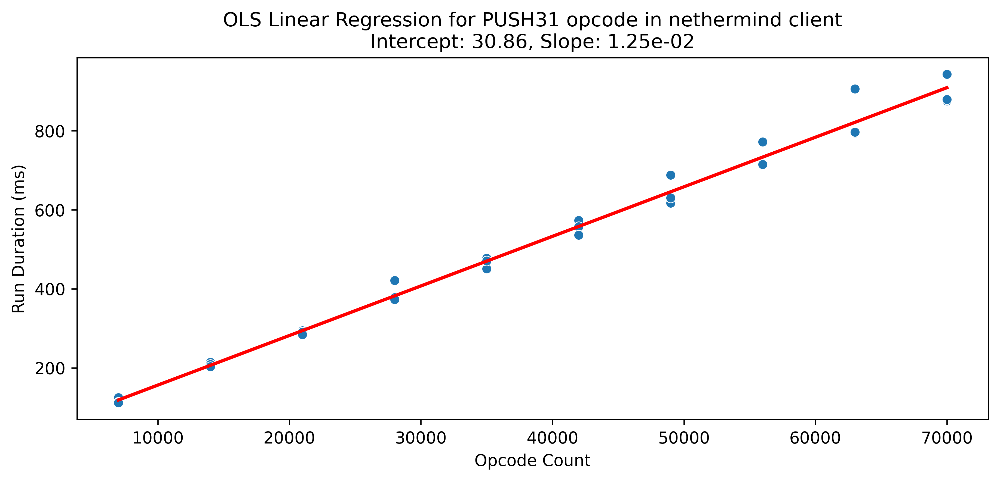


## besu


```python
                            OLS Regression Results                            
==============================================================================
Dep. Variable:        run_duration_ms   R-squared:                       0.994
Model:                            OLS   Adj. R-squared:                  0.994
Method:                 Least Squares   F-statistic:                     5040.
Date:                Mon, 12 Jan 2026   Prob (F-statistic):           3.70e-33
Time:                        10:30:04   Log-Likelihood:                -154.62
No. Observations:                  30   AIC:                             313.2
Df Residuals:                      28   BIC:                             316.0
Df Model:                           1                                         
Covariance Type:            nonrobust                                         
==============================================================================
                 coef    std err          t      P>|t|      [0.025      0.975]
------------------------------------------------------------------------------
const         30.3963     17.101      1.777      0.086      -4.633      65.426
opcount        0.0280      0.000     70.995      0.000       0.027       0.029
==============================================================================
Omnibus:                        7.103   Durbin-Watson:                   0.755
Prob(Omnibus):                  0.029   Jarque-Bera (JB):                5.403
Skew:                           0.962   Prob(JB):                       0.0671
Kurtosis:                       3.790   Cond. No.                     9.38e+04
==============================================================================

Notes:
[1] Standard Errors assume that the covariance matrix of the errors is correctly specified.
[2] The condition number is large, 9.38e+04. This might indicate that there are
strong multicollinearity or other numerical problems.
```


# PUSH32

## geth


```python
                            OLS Regression Results                            
==============================================================================
Dep. Variable:        run_duration_ms   R-squared:                       0.978
Model:                            OLS   Adj. R-squared:                  0.977
Method:                 Least Squares   F-statistic:                     1240.
Date:                Mon, 12 Jan 2026   Prob (F-statistic):           9.88e-25
Time:                        10:30:04   Log-Likelihood:                -166.59
No. Observations:                  30   AIC:                             337.2
Df Residuals:                      28   BIC:                             340.0
Df Model:                           1                                         
Covariance Type:            nonrobust                                         
==============================================================================
                 coef    std err          t      P>|t|      [0.025      0.975]
------------------------------------------------------------------------------
const         33.0372     25.486      1.296      0.205     -19.168      85.242
opcount        0.0207      0.001     35.216      0.000       0.019       0.022
==============================================================================
Omnibus:                        0.115   Durbin-Watson:                   0.568
Prob(Omnibus):                  0.944   Jarque-Bera (JB):                0.073
Skew:                           0.083   Prob(JB):                        0.964
Kurtosis:                       2.825   Cond. No.                     9.38e+04
==============================================================================

Notes:
[1] Standard Errors assume that the covariance matrix of the errors is correctly specified.
[2] The condition number is large, 9.38e+04. This might indicate that there are
strong multicollinearity or other numerical problems.
```


## reth


```python
                            OLS Regression Results                            
==============================================================================
Dep. Variable:        run_duration_ms   R-squared:                       0.982
Model:                            OLS   Adj. R-squared:                  0.982
Method:                 Least Squares   F-statistic:                     1540.
Date:                Mon, 12 Jan 2026   Prob (F-statistic):           5.05e-26
Time:                        10:30:04   Log-Likelihood:                -127.21
No. Observations:                  30   AIC:                             258.4
Df Residuals:                      28   BIC:                             261.2
Df Model:                           1                                         
Covariance Type:            nonrobust                                         
==============================================================================
                 coef    std err          t      P>|t|      [0.025      0.975]
------------------------------------------------------------------------------
const         26.3385      6.859      3.840      0.001      12.288      40.389
opcount        0.0062      0.000     39.245      0.000       0.006       0.007
==============================================================================
Omnibus:                       11.235   Durbin-Watson:                   2.188
Prob(Omnibus):                  0.004   Jarque-Bera (JB):               10.070
Skew:                          -1.249   Prob(JB):                      0.00651
Kurtosis:                       4.346   Cond. No.                     9.38e+04
==============================================================================

Notes:
[1] Standard Errors assume that the covariance matrix of the errors is correctly specified.
[2] The condition number is large, 9.38e+04. This might indicate that there are
strong multicollinearity or other numerical problems.
```


## nethermind


```python
                            OLS Regression Results                            
==============================================================================
Dep. Variable:        run_duration_ms   R-squared:                       0.993
Model:                            OLS   Adj. R-squared:                  0.993
Method:                 Least Squares   F-statistic:                     4171.
Date:                Mon, 12 Jan 2026   Prob (F-statistic):           5.16e-32
Time:                        10:30:04   Log-Likelihood:                -127.13
No. Observations:                  30   AIC:                             258.3
Df Residuals:                      28   BIC:                             261.1
Df Model:                           1                                         
Covariance Type:            nonrobust                                         
==============================================================================
                 coef    std err          t      P>|t|      [0.025      0.975]
------------------------------------------------------------------------------
const         23.5320      6.840      3.440      0.002       9.520      37.544
opcount        0.0102      0.000     64.581      0.000       0.010       0.010
==============================================================================
Omnibus:                       36.158   Durbin-Watson:                   1.317
Prob(Omnibus):                  0.000   Jarque-Bera (JB):              120.975
Skew:                           2.402   Prob(JB):                     5.38e-27
Kurtosis:                      11.585   Cond. No.                     9.38e+04
==============================================================================

Notes:
[1] Standard Errors assume that the covariance matrix of the errors is correctly specified.
[2] The condition number is large, 9.38e+04. This might indicate that there are
strong multicollinearity or other numerical problems.
```

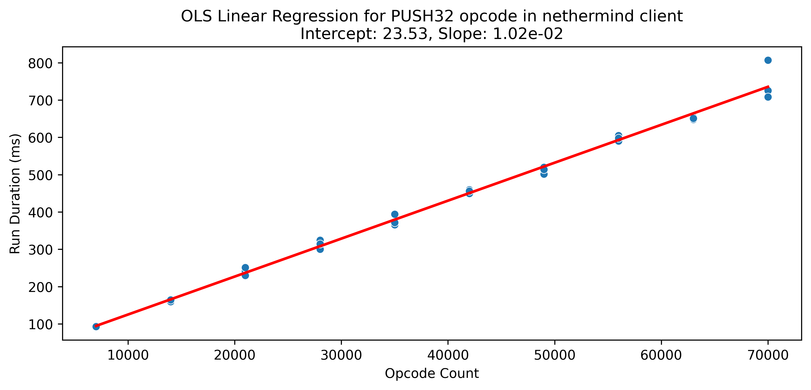


## besu


```python
                            OLS Regression Results                            
==============================================================================
Dep. Variable:        run_duration_ms   R-squared:                       0.998
Model:                            OLS   Adj. R-squared:                  0.998
Method:                 Least Squares   F-statistic:                 1.840e+04
Date:                Mon, 12 Jan 2026   Prob (F-statistic):           5.23e-41
Time:                        10:30:04   Log-Likelihood:                -135.12
No. Observations:                  30   AIC:                             274.2
Df Residuals:                      28   BIC:                             277.1
Df Model:                           1                                         
Covariance Type:            nonrobust                                         
==============================================================================
                 coef    std err          t      P>|t|      [0.025      0.975]
------------------------------------------------------------------------------
const         27.9132      8.929      3.126      0.004       9.623      46.204
opcount        0.0279      0.000    135.644      0.000       0.027       0.028
==============================================================================
Omnibus:                        2.295   Durbin-Watson:                   2.060
Prob(Omnibus):                  0.317   Jarque-Bera (JB):                1.619
Skew:                           0.569   Prob(JB):                        0.445
Kurtosis:                       2.985   Cond. No.                     9.38e+04
==============================================================================

Notes:
[1] Standard Errors assume that the covariance matrix of the errors is correctly specified.
[2] The condition number is large, 9.38e+04. This might indicate that there are
strong multicollinearity or other numerical problems.
```

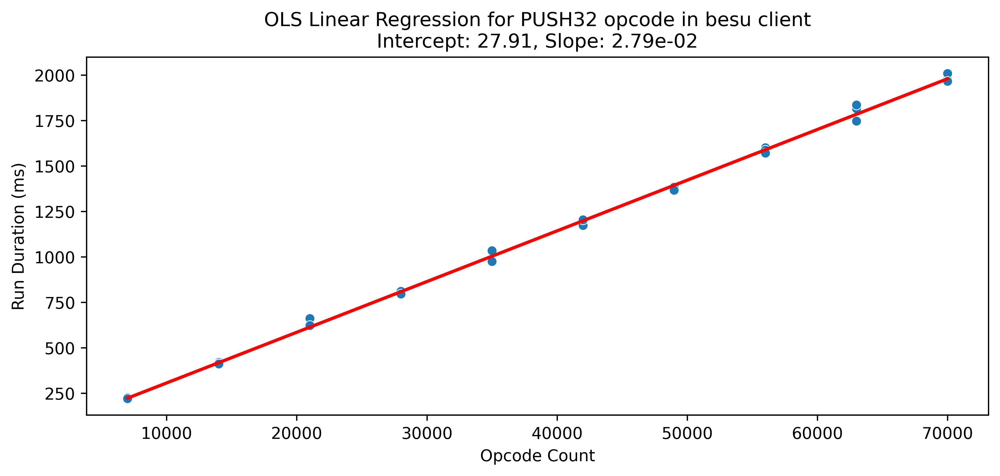


# RETURNDATASIZE

## geth


```python
                            OLS Regression Results                            
==============================================================================
Dep. Variable:        run_duration_ms   R-squared:                       0.982
Model:                            OLS   Adj. R-squared:                  0.982
Method:                 Least Squares   F-statistic:                     6546.
Date:                Mon, 12 Jan 2026   Prob (F-statistic):          3.22e-105
Time:                        10:30:04   Log-Likelihood:                -650.25
No. Observations:                 120   AIC:                             1305.
Df Residuals:                     118   BIC:                             1310.
Df Model:                           1                                         
Covariance Type:            nonrobust                                         
==============================================================================
                 coef    std err          t      P>|t|      [0.025      0.975]
------------------------------------------------------------------------------
const         28.3831     10.856      2.615      0.010       6.885      49.881
opcount        0.0236      0.000     80.910      0.000       0.023       0.024
==============================================================================
Omnibus:                        8.992   Durbin-Watson:                   1.346
Prob(Omnibus):                  0.011   Jarque-Bera (JB):               16.386
Skew:                          -0.237   Prob(JB):                     0.000277
Kurtosis:                       4.747   Cond. No.                     8.04e+04
==============================================================================

Notes:
[1] Standard Errors assume that the covariance matrix of the errors is correctly specified.
[2] The condition number is large, 8.04e+04. This might indicate that there are
strong multicollinearity or other numerical problems.
```

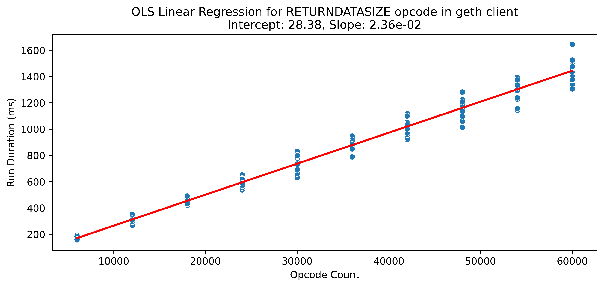


## reth


```python
                            OLS Regression Results                            
==============================================================================
Dep. Variable:        run_duration_ms   R-squared:                       0.981
Model:                            OLS   Adj. R-squared:                  0.981
Method:                 Least Squares   F-statistic:                     6210.
Date:                Mon, 12 Jan 2026   Prob (F-statistic):          6.85e-104
Time:                        10:30:04   Log-Likelihood:                -563.64
No. Observations:                 120   AIC:                             1131.
Df Residuals:                     118   BIC:                             1137.
Df Model:                           1                                         
Covariance Type:            nonrobust                                         
==============================================================================
                 coef    std err          t      P>|t|      [0.025      0.975]
------------------------------------------------------------------------------
const         26.3416      5.275      4.994      0.000      15.896      36.787
opcount        0.0112      0.000     78.804      0.000       0.011       0.011
==============================================================================
Omnibus:                        1.947   Durbin-Watson:                   1.645
Prob(Omnibus):                  0.378   Jarque-Bera (JB):                1.453
Skew:                           0.238   Prob(JB):                        0.483
Kurtosis:                       3.253   Cond. No.                     8.04e+04
==============================================================================

Notes:
[1] Standard Errors assume that the covariance matrix of the errors is correctly specified.
[2] The condition number is large, 8.04e+04. This might indicate that there are
strong multicollinearity or other numerical problems.
```

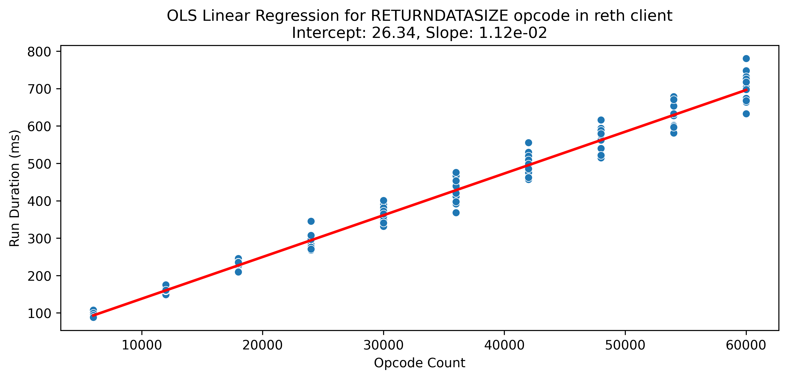


## nethermind


```python
                            OLS Regression Results                            
==============================================================================
Dep. Variable:        run_duration_ms   R-squared:                       0.948
Model:                            OLS   Adj. R-squared:                  0.947
Method:                 Least Squares   F-statistic:                     2139.
Date:                Mon, 12 Jan 2026   Prob (F-statistic):           1.83e-77
Time:                        10:30:05   Log-Likelihood:                -644.16
No. Observations:                 120   AIC:                             1292.
Df Residuals:                     118   BIC:                             1298.
Df Model:                           1                                         
Covariance Type:            nonrobust                                         
==============================================================================
                 coef    std err          t      P>|t|      [0.025      0.975]
------------------------------------------------------------------------------
const         27.7358     10.318      2.688      0.008       7.303      48.169
opcount        0.0128      0.000     46.246      0.000       0.012       0.013
==============================================================================
Omnibus:                        0.352   Durbin-Watson:                   0.545
Prob(Omnibus):                  0.839   Jarque-Bera (JB):                0.321
Skew:                           0.123   Prob(JB):                        0.852
Kurtosis:                       2.936   Cond. No.                     8.04e+04
==============================================================================

Notes:
[1] Standard Errors assume that the covariance matrix of the errors is correctly specified.
[2] The condition number is large, 8.04e+04. This might indicate that there are
strong multicollinearity or other numerical problems.
```

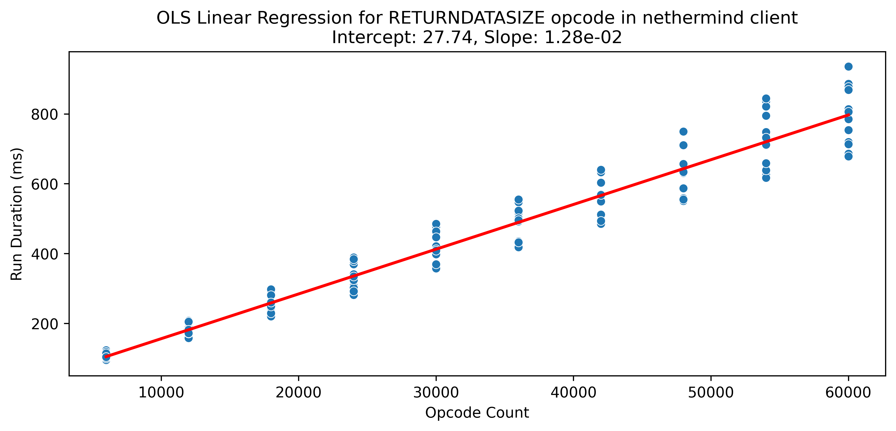


## besu


```python
                            OLS Regression Results                            
==============================================================================
Dep. Variable:        run_duration_ms   R-squared:                       0.998
Model:                            OLS   Adj. R-squared:                  0.998
Method:                 Least Squares   F-statistic:                 5.581e+04
Date:                Mon, 12 Jan 2026   Prob (F-statistic):          9.91e-160
Time:                        10:30:05   Log-Likelihood:                -604.49
No. Observations:                 120   AIC:                             1213.
Df Residuals:                     118   BIC:                             1219.
Df Model:                           1                                         
Covariance Type:            nonrobust                                         
==============================================================================
                 coef    std err          t      P>|t|      [0.025      0.975]
------------------------------------------------------------------------------
const         34.0865      7.414      4.598      0.000      19.405      48.768
opcount        0.0470      0.000    236.242      0.000       0.047       0.047
==============================================================================
Omnibus:                       13.198   Durbin-Watson:                   1.491
Prob(Omnibus):                  0.001   Jarque-Bera (JB):               19.782
Skew:                           0.539   Prob(JB):                     5.06e-05
Kurtosis:                       4.672   Cond. No.                     8.04e+04
==============================================================================

Notes:
[1] Standard Errors assume that the covariance matrix of the errors is correctly specified.
[2] The condition number is large, 8.04e+04. This might indicate that there are
strong multicollinearity or other numerical problems.
```

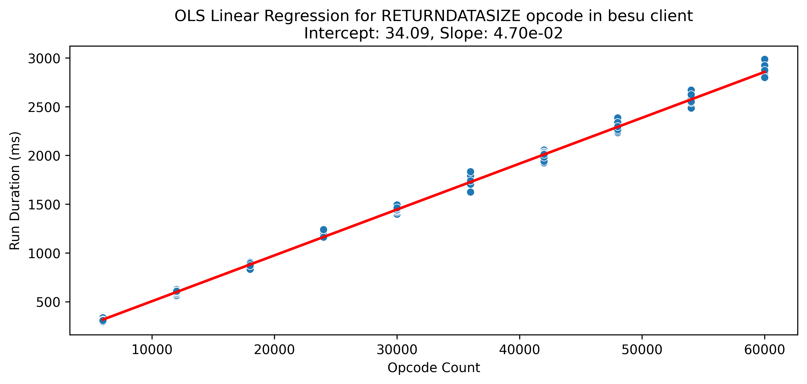


# SAR

## geth


```python
                            OLS Regression Results                            
==============================================================================
Dep. Variable:        run_duration_ms   R-squared:                       0.942
Model:                            OLS   Adj. R-squared:                  0.940
Method:                 Least Squares   F-statistic:                     453.9
Date:                Mon, 12 Jan 2026   Prob (F-statistic):           7.69e-19
Time:                        10:30:05   Log-Likelihood:                -172.06
No. Observations:                  30   AIC:                             348.1
Df Residuals:                      28   BIC:                             350.9
Df Model:                           1                                         
Covariance Type:            nonrobust                                         
==============================================================================
                 coef    std err          t      P>|t|      [0.025      0.975]
------------------------------------------------------------------------------
const         18.9748     30.581      0.620      0.540     -43.667      81.617
opcount        0.0300      0.001     21.304      0.000       0.027       0.033
==============================================================================
Omnibus:                       29.338   Durbin-Watson:                   1.408
Prob(Omnibus):                  0.000   Jarque-Bera (JB):               83.585
Skew:                           1.897   Prob(JB):                     7.07e-19
Kurtosis:                      10.244   Cond. No.                     4.69e+04
==============================================================================

Notes:
[1] Standard Errors assume that the covariance matrix of the errors is correctly specified.
[2] The condition number is large, 4.69e+04. This might indicate that there are
strong multicollinearity or other numerical problems.
```

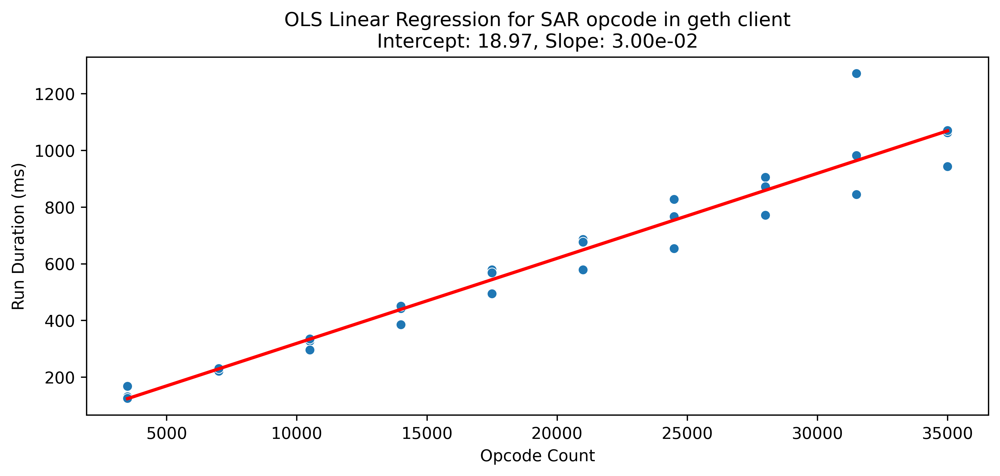


## reth


```python
                            OLS Regression Results                            
==============================================================================
Dep. Variable:        run_duration_ms   R-squared:                       0.996
Model:                            OLS   Adj. R-squared:                  0.996
Method:                 Least Squares   F-statistic:                     7849.
Date:                Mon, 12 Jan 2026   Prob (F-statistic):           7.70e-36
Time:                        10:30:05   Log-Likelihood:                -121.67
No. Observations:                  30   AIC:                             247.3
Df Residuals:                      28   BIC:                             250.1
Df Model:                           1                                         
Covariance Type:            nonrobust                                         
==============================================================================
                 coef    std err          t      P>|t|      [0.025      0.975]
------------------------------------------------------------------------------
const         26.0732      5.702      4.573      0.000      14.393      37.753
opcount        0.0233      0.000     88.594      0.000       0.023       0.024
==============================================================================
Omnibus:                        0.847   Durbin-Watson:                   1.753
Prob(Omnibus):                  0.655   Jarque-Bera (JB):                0.139
Skew:                          -0.041   Prob(JB):                        0.933
Kurtosis:                       3.324   Cond. No.                     4.69e+04
==============================================================================

Notes:
[1] Standard Errors assume that the covariance matrix of the errors is correctly specified.
[2] The condition number is large, 4.69e+04. This might indicate that there are
strong multicollinearity or other numerical problems.
```


## nethermind


```python
                            OLS Regression Results                            
==============================================================================
Dep. Variable:        run_duration_ms   R-squared:                       0.999
Model:                            OLS   Adj. R-squared:                  0.999
Method:                 Least Squares   F-statistic:                 5.182e+04
Date:                Mon, 12 Jan 2026   Prob (F-statistic):           2.68e-47
Time:                        10:30:05   Log-Likelihood:                -105.60
No. Observations:                  30   AIC:                             215.2
Df Residuals:                      28   BIC:                             218.0
Df Model:                           1                                         
Covariance Type:            nonrobust                                         
==============================================================================
                 coef    std err          t      P>|t|      [0.025      0.975]
------------------------------------------------------------------------------
const         25.4105      3.337      7.614      0.000      18.575      32.246
opcount        0.0350      0.000    227.637      0.000       0.035       0.035
==============================================================================
Omnibus:                        4.333   Durbin-Watson:                   1.003
Prob(Omnibus):                  0.115   Jarque-Bera (JB):                2.724
Skew:                           0.616   Prob(JB):                        0.256
Kurtosis:                       3.813   Cond. No.                     4.69e+04
==============================================================================

Notes:
[1] Standard Errors assume that the covariance matrix of the errors is correctly specified.
[2] The condition number is large, 4.69e+04. This might indicate that there are
strong multicollinearity or other numerical problems.
```


## besu


```python
                            OLS Regression Results                            
==============================================================================
Dep. Variable:        run_duration_ms   R-squared:                       0.994
Model:                            OLS   Adj. R-squared:                  0.994
Method:                 Least Squares   F-statistic:                     5014.
Date:                Mon, 12 Jan 2026   Prob (F-statistic):           3.98e-33
Time:                        10:30:05   Log-Likelihood:                -194.86
No. Observations:                  30   AIC:                             393.7
Df Residuals:                      28   BIC:                             396.5
Df Model:                           1                                         
Covariance Type:            nonrobust                                         
==============================================================================
                 coef    std err          t      P>|t|      [0.025      0.975]
------------------------------------------------------------------------------
const         16.4410     65.401      0.251      0.803    -117.528     150.410
opcount        0.2132      0.003     70.809      0.000       0.207       0.219
==============================================================================
Omnibus:                        1.077   Durbin-Watson:                   0.651
Prob(Omnibus):                  0.584   Jarque-Bera (JB):                0.937
Skew:                          -0.201   Prob(JB):                        0.626
Kurtosis:                       2.234   Cond. No.                     4.69e+04
==============================================================================

Notes:
[1] Standard Errors assume that the covariance matrix of the errors is correctly specified.
[2] The condition number is large, 4.69e+04. This might indicate that there are
strong multicollinearity or other numerical problems.
```


# SDIV

## geth


```python
                            OLS Regression Results                            
==============================================================================
Dep. Variable:        run_duration_ms   R-squared:                       0.975
Model:                            OLS   Adj. R-squared:                  0.974
Method:                 Least Squares   F-statistic:                     1108.
Date:                Mon, 12 Jan 2026   Prob (F-statistic):           4.60e-24
Time:                        10:30:05   Log-Likelihood:                -180.68
No. Observations:                  30   AIC:                             365.4
Df Residuals:                      28   BIC:                             368.2
Df Model:                           1                                         
Covariance Type:            nonrobust                                         
==============================================================================
                 coef    std err          t      P>|t|      [0.025      0.975]
------------------------------------------------------------------------------
const         32.2479     40.764      0.791      0.436     -51.254     115.749
opcount        0.0729      0.002     33.292      0.000       0.068       0.077
==============================================================================
Omnibus:                       10.950   Durbin-Watson:                   0.988
Prob(Omnibus):                  0.004   Jarque-Bera (JB):                9.707
Skew:                          -1.248   Prob(JB):                      0.00780
Kurtosis:                       4.238   Cond. No.                     4.02e+04
==============================================================================

Notes:
[1] Standard Errors assume that the covariance matrix of the errors is correctly specified.
[2] The condition number is large, 4.02e+04. This might indicate that there are
strong multicollinearity or other numerical problems.
```

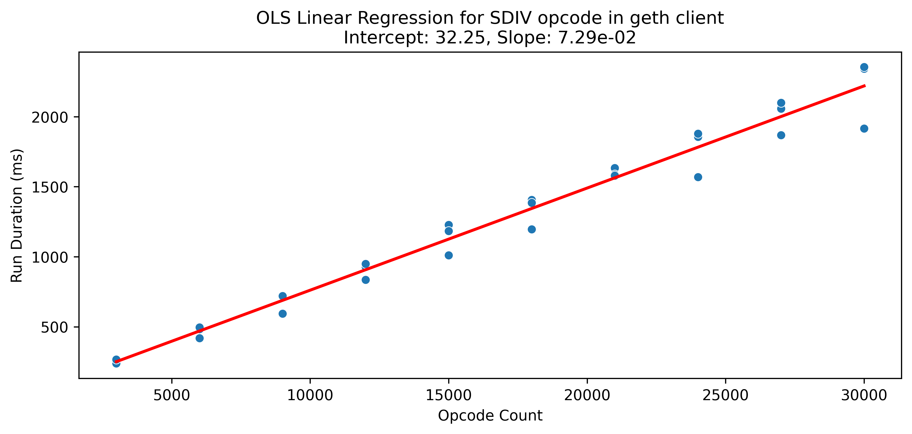


## reth


```python
                            OLS Regression Results                            
==============================================================================
Dep. Variable:        run_duration_ms   R-squared:                       0.999
Model:                            OLS   Adj. R-squared:                  0.999
Method:                 Least Squares   F-statistic:                 4.067e+04
Date:                Mon, 12 Jan 2026   Prob (F-statistic):           7.95e-46
Time:                        10:30:06   Log-Likelihood:                -125.19
No. Observations:                  30   AIC:                             254.4
Df Residuals:                      28   BIC:                             257.2
Df Model:                           1                                         
Covariance Type:            nonrobust                                         
==============================================================================
                 coef    std err          t      P>|t|      [0.025      0.975]
------------------------------------------------------------------------------
const         28.1212      6.411      4.386      0.000      14.988      41.254
opcount        0.0695      0.000    201.671      0.000       0.069       0.070
==============================================================================
Omnibus:                        0.930   Durbin-Watson:                   1.585
Prob(Omnibus):                  0.628   Jarque-Bera (JB):                0.714
Skew:                           0.364   Prob(JB):                        0.700
Kurtosis:                       2.800   Cond. No.                     4.02e+04
==============================================================================

Notes:
[1] Standard Errors assume that the covariance matrix of the errors is correctly specified.
[2] The condition number is large, 4.02e+04. This might indicate that there are
strong multicollinearity or other numerical problems.
```

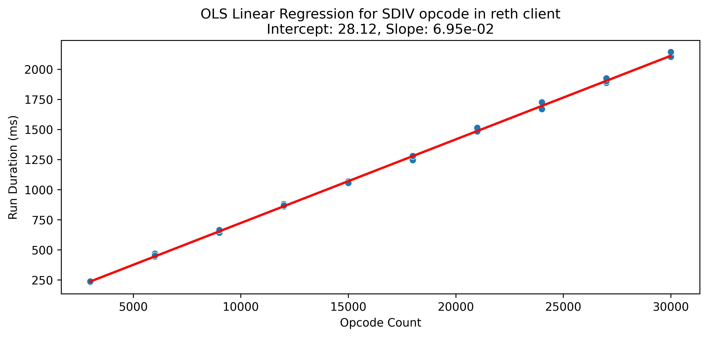


## nethermind


```python
                            OLS Regression Results                            
==============================================================================
Dep. Variable:        run_duration_ms   R-squared:                       0.998
Model:                            OLS   Adj. R-squared:                  0.998
Method:                 Least Squares   F-statistic:                 1.559e+04
Date:                Mon, 12 Jan 2026   Prob (F-statistic):           5.32e-40
Time:                        10:30:06   Log-Likelihood:                -144.21
No. Observations:                  30   AIC:                             292.4
Df Residuals:                      28   BIC:                             295.2
Df Model:                           1                                         
Covariance Type:            nonrobust                                         
==============================================================================
                 coef    std err          t      P>|t|      [0.025      0.975]
------------------------------------------------------------------------------
const         32.0746     12.089      2.653      0.013       7.312      56.837
opcount        0.0811      0.001    124.842      0.000       0.080       0.082
==============================================================================
Omnibus:                       12.815   Durbin-Watson:                   0.883
Prob(Omnibus):                  0.002   Jarque-Bera (JB):               12.220
Skew:                           1.348   Prob(JB):                      0.00222
Kurtosis:                       4.585   Cond. No.                     4.02e+04
==============================================================================

Notes:
[1] Standard Errors assume that the covariance matrix of the errors is correctly specified.
[2] The condition number is large, 4.02e+04. This might indicate that there are
strong multicollinearity or other numerical problems.
```


## besu


```python
                            OLS Regression Results                            
==============================================================================
Dep. Variable:        run_duration_ms   R-squared:                       0.999
Model:                            OLS   Adj. R-squared:                  0.999
Method:                 Least Squares   F-statistic:                 3.062e+04
Date:                Mon, 12 Jan 2026   Prob (F-statistic):           4.23e-44
Time:                        10:30:06   Log-Likelihood:                -176.11
No. Observations:                  30   AIC:                             356.2
Df Residuals:                      28   BIC:                             359.0
Df Model:                           1                                         
Covariance Type:            nonrobust                                         
==============================================================================
                 coef    std err          t      P>|t|      [0.025      0.975]
------------------------------------------------------------------------------
const        100.3988     35.010      2.868      0.008      28.684     172.114
opcount        0.3291      0.002    174.975      0.000       0.325       0.333
==============================================================================
Omnibus:                        6.639   Durbin-Watson:                   1.106
Prob(Omnibus):                  0.036   Jarque-Bera (JB):                4.863
Skew:                           0.842   Prob(JB):                       0.0879
Kurtosis:                       4.028   Cond. No.                     4.02e+04
==============================================================================

Notes:
[1] Standard Errors assume that the covariance matrix of the errors is correctly specified.
[2] The condition number is large, 4.02e+04. This might indicate that there are
strong multicollinearity or other numerical problems.
```

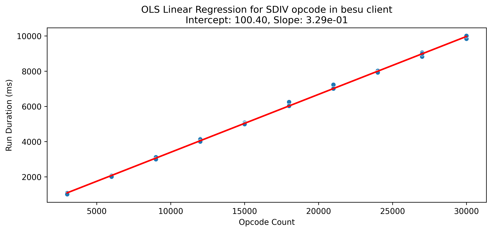


# SELFBALANCE

## geth


```python
                            OLS Regression Results                            
==============================================================================
Dep. Variable:        run_duration_ms   R-squared:                       0.980
Model:                            OLS   Adj. R-squared:                  0.980
Method:                 Least Squares   F-statistic:                     1397.
Date:                Mon, 12 Jan 2026   Prob (F-statistic):           1.93e-25
Time:                        10:30:06   Log-Likelihood:                -174.25
No. Observations:                  30   AIC:                             352.5
Df Residuals:                      28   BIC:                             355.3
Df Model:                           1                                         
Covariance Type:            nonrobust                                         
==============================================================================
                 coef    std err          t      P>|t|      [0.025      0.975]
------------------------------------------------------------------------------
const         28.7032     32.904      0.872      0.390     -38.697      96.103
opcount        0.0396      0.001     37.376      0.000       0.037       0.042
==============================================================================
Omnibus:                        2.580   Durbin-Watson:                   0.411
Prob(Omnibus):                  0.275   Jarque-Bera (JB):                2.288
Skew:                          -0.640   Prob(JB):                        0.319
Kurtosis:                       2.561   Cond. No.                     6.70e+04
==============================================================================

Notes:
[1] Standard Errors assume that the covariance matrix of the errors is correctly specified.
[2] The condition number is large, 6.7e+04. This might indicate that there are
strong multicollinearity or other numerical problems.
```

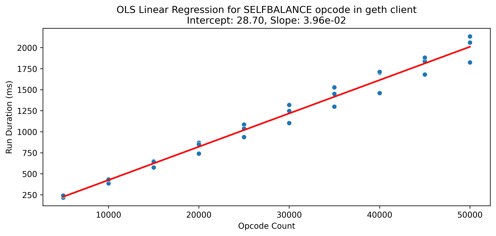


## reth


```python
                            OLS Regression Results                            
==============================================================================
Dep. Variable:        run_duration_ms   R-squared:                       0.998
Model:                            OLS   Adj. R-squared:                  0.998
Method:                 Least Squares   F-statistic:                 1.746e+04
Date:                Mon, 12 Jan 2026   Prob (F-statistic):           1.09e-40
Time:                        10:30:06   Log-Likelihood:                -154.44
No. Observations:                  30   AIC:                             312.9
Df Residuals:                      28   BIC:                             315.7
Df Model:                           1                                         
Covariance Type:            nonrobust                                         
==============================================================================
                 coef    std err          t      P>|t|      [0.025      0.975]
------------------------------------------------------------------------------
const         20.2916     16.999      1.194      0.243     -14.529      55.112
opcount        0.0724      0.001    132.144      0.000       0.071       0.074
==============================================================================
Omnibus:                        3.273   Durbin-Watson:                   2.099
Prob(Omnibus):                  0.195   Jarque-Bera (JB):                2.230
Skew:                          -0.009   Prob(JB):                        0.328
Kurtosis:                       4.336   Cond. No.                     6.70e+04
==============================================================================

Notes:
[1] Standard Errors assume that the covariance matrix of the errors is correctly specified.
[2] The condition number is large, 6.7e+04. This might indicate that there are
strong multicollinearity or other numerical problems.
```


## nethermind


```python
                            OLS Regression Results                            
==============================================================================
Dep. Variable:        run_duration_ms   R-squared:                       0.961
Model:                            OLS   Adj. R-squared:                  0.960
Method:                 Least Squares   F-statistic:                     696.3
Date:                Mon, 12 Jan 2026   Prob (F-statistic):           2.53e-21
Time:                        10:30:06   Log-Likelihood:                -164.08
No. Observations:                  30   AIC:                             332.2
Df Residuals:                      28   BIC:                             335.0
Df Model:                           1                                         
Covariance Type:            nonrobust                                         
==============================================================================
                 coef    std err          t      P>|t|      [0.025      0.975]
------------------------------------------------------------------------------
const        120.6361     23.440      5.147      0.000      72.622     168.650
opcount        0.0199      0.001     26.387      0.000       0.018       0.021
==============================================================================
Omnibus:                       16.207   Durbin-Watson:                   2.047
Prob(Omnibus):                  0.000   Jarque-Bera (JB):               17.751
Skew:                           1.539   Prob(JB):                     0.000140
Kurtosis:                       5.174   Cond. No.                     6.70e+04
==============================================================================

Notes:
[1] Standard Errors assume that the covariance matrix of the errors is correctly specified.
[2] The condition number is large, 6.7e+04. This might indicate that there are
strong multicollinearity or other numerical problems.
```

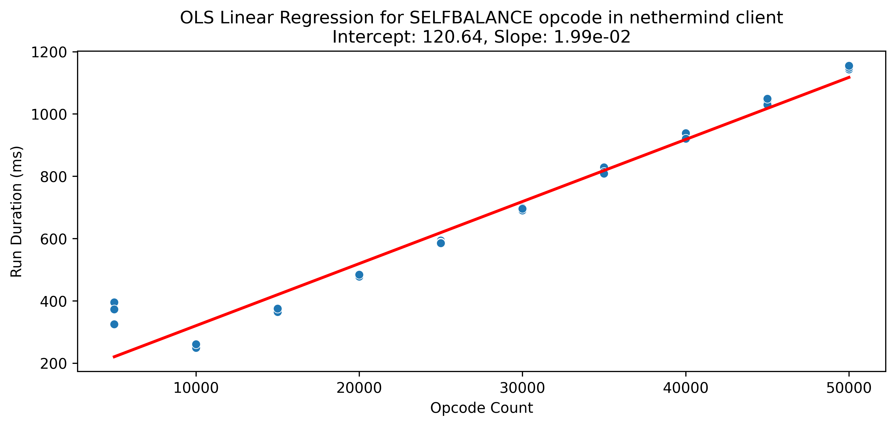


## besu


```python
                            OLS Regression Results                            
==============================================================================
Dep. Variable:        run_duration_ms   R-squared:                       0.997
Model:                            OLS   Adj. R-squared:                  0.997
Method:                 Least Squares   F-statistic:                     9056.
Date:                Mon, 12 Jan 2026   Prob (F-statistic):           1.05e-36
Time:                        10:30:06   Log-Likelihood:                -151.73
No. Observations:                  30   AIC:                             307.5
Df Residuals:                      28   BIC:                             310.3
Df Model:                           1                                         
Covariance Type:            nonrobust                                         
==============================================================================
                 coef    std err          t      P>|t|      [0.025      0.975]
------------------------------------------------------------------------------
const        126.2195     15.533      8.126      0.000      94.402     158.037
opcount        0.0476      0.001     95.164      0.000       0.047       0.049
==============================================================================
Omnibus:                        0.725   Durbin-Watson:                   1.729
Prob(Omnibus):                  0.696   Jarque-Bera (JB):                0.619
Skew:                           0.326   Prob(JB):                        0.734
Kurtosis:                       2.736   Cond. No.                     6.70e+04
==============================================================================

Notes:
[1] Standard Errors assume that the covariance matrix of the errors is correctly specified.
[2] The condition number is large, 6.7e+04. This might indicate that there are
strong multicollinearity or other numerical problems.
```

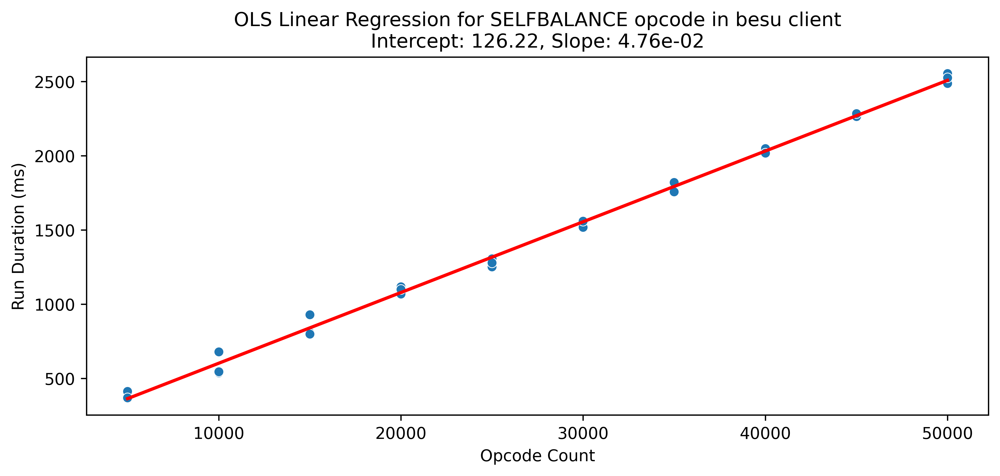


# SGT

## geth


```python
                            OLS Regression Results                            
==============================================================================
Dep. Variable:        run_duration_ms   R-squared:                       0.977
Model:                            OLS   Adj. R-squared:                  0.976
Method:                 Least Squares   F-statistic:                     1198.
Date:                Mon, 12 Jan 2026   Prob (F-statistic):           1.58e-24
Time:                        10:30:07   Log-Likelihood:                -156.02
No. Observations:                  30   AIC:                             316.0
Df Residuals:                      28   BIC:                             318.8
Df Model:                           1                                         
Covariance Type:            nonrobust                                         
==============================================================================
                 coef    std err          t      P>|t|      [0.025      0.975]
------------------------------------------------------------------------------
const         22.0252     17.920      1.229      0.229     -14.682      58.733
opcount        0.0250      0.001     34.614      0.000       0.024       0.026
==============================================================================
Omnibus:                        1.382   Durbin-Watson:                   1.155
Prob(Omnibus):                  0.501   Jarque-Bera (JB):                0.530
Skew:                          -0.279   Prob(JB):                        0.767
Kurtosis:                       3.335   Cond. No.                     5.36e+04
==============================================================================

Notes:
[1] Standard Errors assume that the covariance matrix of the errors is correctly specified.
[2] The condition number is large, 5.36e+04. This might indicate that there are
strong multicollinearity or other numerical problems.
```


## reth


```python
                            OLS Regression Results                            
==============================================================================
Dep. Variable:        run_duration_ms   R-squared:                       0.994
Model:                            OLS   Adj. R-squared:                  0.993
Method:                 Least Squares   F-statistic:                     4346.
Date:                Mon, 12 Jan 2026   Prob (F-statistic):           2.91e-32
Time:                        10:30:07   Log-Likelihood:                -110.28
No. Observations:                  30   AIC:                             224.6
Df Residuals:                      28   BIC:                             227.4
Df Model:                           1                                         
Covariance Type:            nonrobust                                         
==============================================================================
                 coef    std err          t      P>|t|      [0.025      0.975]
------------------------------------------------------------------------------
const         28.9644      3.901      7.425      0.000      20.974      36.955
opcount        0.0104      0.000     65.922      0.000       0.010       0.011
==============================================================================
Omnibus:                        0.377   Durbin-Watson:                   1.558
Prob(Omnibus):                  0.828   Jarque-Bera (JB):                0.109
Skew:                           0.147   Prob(JB):                        0.947
Kurtosis:                       2.975   Cond. No.                     5.36e+04
==============================================================================

Notes:
[1] Standard Errors assume that the covariance matrix of the errors is correctly specified.
[2] The condition number is large, 5.36e+04. This might indicate that there are
strong multicollinearity or other numerical problems.
```


## nethermind


```python
                            OLS Regression Results                            
==============================================================================
Dep. Variable:        run_duration_ms   R-squared:                       0.999
Model:                            OLS   Adj. R-squared:                  0.999
Method:                 Least Squares   F-statistic:                 3.584e+04
Date:                Mon, 12 Jan 2026   Prob (F-statistic):           4.67e-45
Time:                        10:30:07   Log-Likelihood:                -95.705
No. Observations:                  30   AIC:                             195.4
Df Residuals:                      28   BIC:                             198.2
Df Model:                           1                                         
Covariance Type:            nonrobust                                         
==============================================================================
                 coef    std err          t      P>|t|      [0.025      0.975]
------------------------------------------------------------------------------
const         27.5129      2.400     11.465      0.000      22.597      32.429
opcount        0.0183   9.67e-05    189.311      0.000       0.018       0.019
==============================================================================
Omnibus:                        1.111   Durbin-Watson:                   2.370
Prob(Omnibus):                  0.574   Jarque-Bera (JB):                0.958
Skew:                           0.411   Prob(JB):                        0.619
Kurtosis:                       2.698   Cond. No.                     5.36e+04
==============================================================================

Notes:
[1] Standard Errors assume that the covariance matrix of the errors is correctly specified.
[2] The condition number is large, 5.36e+04. This might indicate that there are
strong multicollinearity or other numerical problems.
```

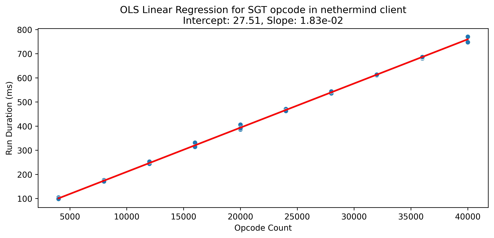


## besu


```python
                            OLS Regression Results                            
==============================================================================
Dep. Variable:        run_duration_ms   R-squared:                       0.998
Model:                            OLS   Adj. R-squared:                  0.998
Method:                 Least Squares   F-statistic:                 1.698e+04
Date:                Mon, 12 Jan 2026   Prob (F-statistic):           1.61e-40
Time:                        10:30:07   Log-Likelihood:                -148.92
No. Observations:                  30   AIC:                             301.8
Df Residuals:                      28   BIC:                             304.6
Df Model:                           1                                         
Covariance Type:            nonrobust                                         
==============================================================================
                 coef    std err          t      P>|t|      [0.025      0.975]
------------------------------------------------------------------------------
const         24.4810     14.144      1.731      0.094      -4.492      53.454
opcount        0.0743      0.001    130.291      0.000       0.073       0.075
==============================================================================
Omnibus:                        1.314   Durbin-Watson:                   1.166
Prob(Omnibus):                  0.518   Jarque-Bera (JB):                0.842
Skew:                           0.410   Prob(JB):                        0.656
Kurtosis:                       2.960   Cond. No.                     5.36e+04
==============================================================================

Notes:
[1] Standard Errors assume that the covariance matrix of the errors is correctly specified.
[2] The condition number is large, 5.36e+04. This might indicate that there are
strong multicollinearity or other numerical problems.
```


# SHL

## geth


```python
                            OLS Regression Results                            
==============================================================================
Dep. Variable:        run_duration_ms   R-squared:                       0.964
Model:                            OLS   Adj. R-squared:                  0.963
Method:                 Least Squares   F-statistic:                     754.3
Date:                Mon, 12 Jan 2026   Prob (F-statistic):           8.61e-22
Time:                        10:30:07   Log-Likelihood:                -160.41
No. Observations:                  30   AIC:                             324.8
Df Residuals:                      28   BIC:                             327.6
Df Model:                           1                                         
Covariance Type:            nonrobust                                         
==============================================================================
                 coef    std err          t      P>|t|      [0.025      0.975]
------------------------------------------------------------------------------
const         44.8534     20.740      2.163      0.039       2.370      87.337
opcount        0.0262      0.001     27.464      0.000       0.024       0.028
==============================================================================
Omnibus:                       10.109   Durbin-Watson:                   1.278
Prob(Omnibus):                  0.006   Jarque-Bera (JB):               10.243
Skew:                           0.893   Prob(JB):                      0.00597
Kurtosis:                       5.238   Cond. No.                     4.69e+04
==============================================================================

Notes:
[1] Standard Errors assume that the covariance matrix of the errors is correctly specified.
[2] The condition number is large, 4.69e+04. This might indicate that there are
strong multicollinearity or other numerical problems.
```


## reth


```python
                            OLS Regression Results                            
==============================================================================
Dep. Variable:        run_duration_ms   R-squared:                       0.995
Model:                            OLS   Adj. R-squared:                  0.995
Method:                 Least Squares   F-statistic:                     5881.
Date:                Mon, 12 Jan 2026   Prob (F-statistic):           4.31e-34
Time:                        10:30:07   Log-Likelihood:                -111.83
No. Observations:                  30   AIC:                             227.7
Df Residuals:                      28   BIC:                             230.5
Df Model:                           1                                         
Covariance Type:            nonrobust                                         
==============================================================================
                 coef    std err          t      P>|t|      [0.025      0.975]
------------------------------------------------------------------------------
const         39.4513      4.107      9.606      0.000      31.038      47.864
opcount        0.0145      0.000     76.686      0.000       0.014       0.015
==============================================================================
Omnibus:                        0.690   Durbin-Watson:                   2.275
Prob(Omnibus):                  0.708   Jarque-Bera (JB):                0.717
Skew:                          -0.133   Prob(JB):                        0.699
Kurtosis:                       2.291   Cond. No.                     4.69e+04
==============================================================================

Notes:
[1] Standard Errors assume that the covariance matrix of the errors is correctly specified.
[2] The condition number is large, 4.69e+04. This might indicate that there are
strong multicollinearity or other numerical problems.
```

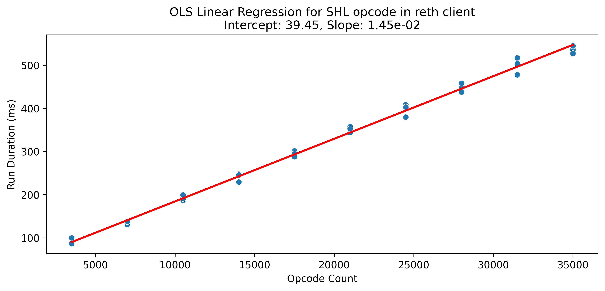


## nethermind


```python
                            OLS Regression Results                            
==============================================================================
Dep. Variable:        run_duration_ms   R-squared:                       1.000
Model:                            OLS   Adj. R-squared:                  1.000
Method:                 Least Squares   F-statistic:                 1.077e+05
Date:                Mon, 12 Jan 2026   Prob (F-statistic):           9.65e-52
Time:                        10:30:07   Log-Likelihood:                -94.061
No. Observations:                  30   AIC:                             192.1
Df Residuals:                      28   BIC:                             194.9
Df Model:                           1                                         
Covariance Type:            nonrobust                                         
==============================================================================
                 coef    std err          t      P>|t|      [0.025      0.975]
------------------------------------------------------------------------------
const         23.6674      2.272     10.418      0.000      19.014      28.321
opcount        0.0343      0.000    328.107      0.000       0.034       0.035
==============================================================================
Omnibus:                        2.145   Durbin-Watson:                   1.423
Prob(Omnibus):                  0.342   Jarque-Bera (JB):                0.962
Skew:                          -0.177   Prob(JB):                        0.618
Kurtosis:                       3.803   Cond. No.                     4.69e+04
==============================================================================

Notes:
[1] Standard Errors assume that the covariance matrix of the errors is correctly specified.
[2] The condition number is large, 4.69e+04. This might indicate that there are
strong multicollinearity or other numerical problems.
```


## besu


```python
                            OLS Regression Results                            
==============================================================================
Dep. Variable:        run_duration_ms   R-squared:                       0.997
Model:                            OLS   Adj. R-squared:                  0.997
Method:                 Least Squares   F-statistic:                     9563.
Date:                Mon, 12 Jan 2026   Prob (F-statistic):           4.89e-37
Time:                        10:30:07   Log-Likelihood:                -168.61
No. Observations:                  30   AIC:                             341.2
Df Residuals:                      28   BIC:                             344.0
Df Model:                           1                                         
Covariance Type:            nonrobust                                         
==============================================================================
                 coef    std err          t      P>|t|      [0.025      0.975]
------------------------------------------------------------------------------
const         18.9434     27.266      0.695      0.493     -36.909      74.795
opcount        0.1228      0.001     97.793      0.000       0.120       0.125
==============================================================================
Omnibus:                        3.696   Durbin-Watson:                   0.967
Prob(Omnibus):                  0.158   Jarque-Bera (JB):                2.206
Skew:                           0.462   Prob(JB):                        0.332
Kurtosis:                       3.954   Cond. No.                     4.69e+04
==============================================================================

Notes:
[1] Standard Errors assume that the covariance matrix of the errors is correctly specified.
[2] The condition number is large, 4.69e+04. This might indicate that there are
strong multicollinearity or other numerical problems.
```


# SHR

## geth


```python
                            OLS Regression Results                            
==============================================================================
Dep. Variable:        run_duration_ms   R-squared:                       0.970
Model:                            OLS   Adj. R-squared:                  0.969
Method:                 Least Squares   F-statistic:                     903.0
Date:                Mon, 12 Jan 2026   Prob (F-statistic):           7.51e-23
Time:                        10:30:08   Log-Likelihood:                -157.07
No. Observations:                  30   AIC:                             318.1
Df Residuals:                      28   BIC:                             320.9
Df Model:                           1                                         
Covariance Type:            nonrobust                                         
==============================================================================
                 coef    std err          t      P>|t|      [0.025      0.975]
------------------------------------------------------------------------------
const         35.5975     18.559      1.918      0.065      -2.419      73.614
opcount        0.0257      0.001     30.051      0.000       0.024       0.027
==============================================================================
Omnibus:                        3.567   Durbin-Watson:                   1.378
Prob(Omnibus):                  0.168   Jarque-Bera (JB):                3.079
Skew:                          -0.771   Prob(JB):                        0.214
Kurtosis:                       2.712   Cond. No.                     4.69e+04
==============================================================================

Notes:
[1] Standard Errors assume that the covariance matrix of the errors is correctly specified.
[2] The condition number is large, 4.69e+04. This might indicate that there are
strong multicollinearity or other numerical problems.
```


## reth


```python
                            OLS Regression Results                            
==============================================================================
Dep. Variable:        run_duration_ms   R-squared:                       0.996
Model:                            OLS   Adj. R-squared:                  0.996
Method:                 Least Squares   F-statistic:                     7464.
Date:                Mon, 12 Jan 2026   Prob (F-statistic):           1.55e-35
Time:                        10:30:08   Log-Likelihood:                -108.81
No. Observations:                  30   AIC:                             221.6
Df Residuals:                      28   BIC:                             224.4
Df Model:                           1                                         
Covariance Type:            nonrobust                                         
==============================================================================
                 coef    std err          t      P>|t|      [0.025      0.975]
------------------------------------------------------------------------------
const         31.2582      3.715      8.415      0.000      23.649      38.867
opcount        0.0148      0.000     86.392      0.000       0.014       0.015
==============================================================================
Omnibus:                        0.426   Durbin-Watson:                   1.517
Prob(Omnibus):                  0.808   Jarque-Bera (JB):                0.055
Skew:                           0.100   Prob(JB):                        0.973
Kurtosis:                       3.063   Cond. No.                     4.69e+04
==============================================================================

Notes:
[1] Standard Errors assume that the covariance matrix of the errors is correctly specified.
[2] The condition number is large, 4.69e+04. This might indicate that there are
strong multicollinearity or other numerical problems.
```

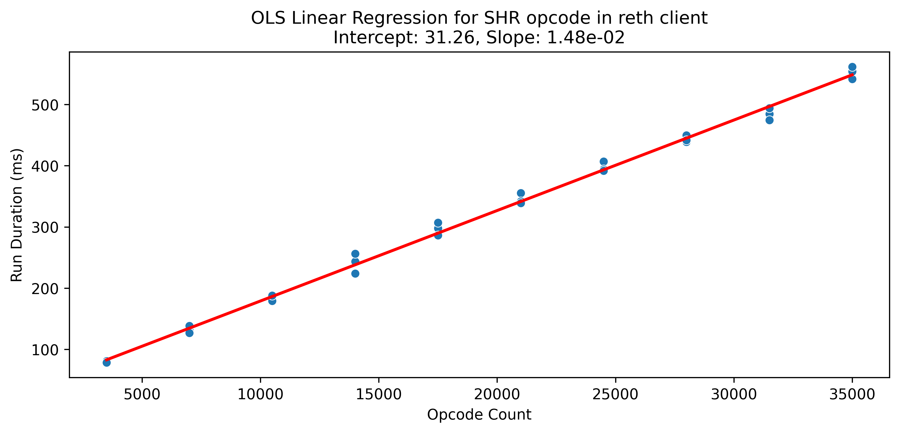


## nethermind


```python
                            OLS Regression Results                            
==============================================================================
Dep. Variable:        run_duration_ms   R-squared:                       0.995
Model:                            OLS   Adj. R-squared:                  0.995
Method:                 Least Squares   F-statistic:                     5372.
Date:                Mon, 12 Jan 2026   Prob (F-statistic):           1.52e-33
Time:                        10:30:08   Log-Likelihood:                -138.67
No. Observations:                  30   AIC:                             281.3
Df Residuals:                      28   BIC:                             284.2
Df Model:                           1                                         
Covariance Type:            nonrobust                                         
==============================================================================
                 coef    std err          t      P>|t|      [0.025      0.975]
------------------------------------------------------------------------------
const         23.6822     10.051      2.356      0.026       3.094      44.270
opcount        0.0339      0.000     73.293      0.000       0.033       0.035
==============================================================================
Omnibus:                        2.880   Durbin-Watson:                   1.175
Prob(Omnibus):                  0.237   Jarque-Bera (JB):                2.407
Skew:                           0.682   Prob(JB):                        0.300
Kurtosis:                       2.749   Cond. No.                     4.69e+04
==============================================================================

Notes:
[1] Standard Errors assume that the covariance matrix of the errors is correctly specified.
[2] The condition number is large, 4.69e+04. This might indicate that there are
strong multicollinearity or other numerical problems.
```


## besu


```python
                            OLS Regression Results                            
==============================================================================
Dep. Variable:        run_duration_ms   R-squared:                       0.995
Model:                            OLS   Adj. R-squared:                  0.994
Method:                 Least Squares   F-statistic:                     5216.
Date:                Mon, 12 Jan 2026   Prob (F-statistic):           2.30e-33
Time:                        10:30:08   Log-Likelihood:                -179.68
No. Observations:                  30   AIC:                             363.4
Df Residuals:                      28   BIC:                             366.2
Df Model:                           1                                         
Covariance Type:            nonrobust                                         
==============================================================================
                 coef    std err          t      P>|t|      [0.025      0.975]
------------------------------------------------------------------------------
const         37.6480     39.427      0.955      0.348     -43.115     118.411
opcount        0.1311      0.002     72.220      0.000       0.127       0.135
==============================================================================
Omnibus:                        1.573   Durbin-Watson:                   0.814
Prob(Omnibus):                  0.456   Jarque-Bera (JB):                1.460
Skew:                          -0.453   Prob(JB):                        0.482
Kurtosis:                       2.410   Cond. No.                     4.69e+04
==============================================================================

Notes:
[1] Standard Errors assume that the covariance matrix of the errors is correctly specified.
[2] The condition number is large, 4.69e+04. This might indicate that there are
strong multicollinearity or other numerical problems.
```


# SIGNEXTEND

## geth


```python
                            OLS Regression Results                            
==============================================================================
Dep. Variable:        run_duration_ms   R-squared:                       0.989
Model:                            OLS   Adj. R-squared:                  0.989
Method:                 Least Squares   F-statistic:                     2597.
Date:                Mon, 12 Jan 2026   Prob (F-statistic):           3.70e-29
Time:                        10:30:08   Log-Likelihood:                -137.80
No. Observations:                  30   AIC:                             279.6
Df Residuals:                      28   BIC:                             282.4
Df Model:                           1                                         
Covariance Type:            nonrobust                                         
==============================================================================
                 coef    std err          t      P>|t|      [0.025      0.975]
------------------------------------------------------------------------------
const         30.6916      9.761      3.144      0.004      10.697      50.686
opcount        0.0267      0.001     50.963      0.000       0.026       0.028
==============================================================================
Omnibus:                        8.000   Durbin-Watson:                   1.439
Prob(Omnibus):                  0.018   Jarque-Bera (JB):                6.267
Skew:                          -0.978   Prob(JB):                       0.0436
Kurtosis:                       4.091   Cond. No.                     4.02e+04
==============================================================================

Notes:
[1] Standard Errors assume that the covariance matrix of the errors is correctly specified.
[2] The condition number is large, 4.02e+04. This might indicate that there are
strong multicollinearity or other numerical problems.
```


## reth


```python
                            OLS Regression Results                            
==============================================================================
Dep. Variable:        run_duration_ms   R-squared:                       0.996
Model:                            OLS   Adj. R-squared:                  0.995
Method:                 Least Squares   F-statistic:                     6325.
Date:                Mon, 12 Jan 2026   Prob (F-statistic):           1.56e-34
Time:                        10:30:08   Log-Likelihood:                -107.32
No. Observations:                  30   AIC:                             218.6
Df Residuals:                      28   BIC:                             221.4
Df Model:                           1                                         
Covariance Type:            nonrobust                                         
==============================================================================
                 coef    std err          t      P>|t|      [0.025      0.975]
------------------------------------------------------------------------------
const         31.9733      3.535      9.046      0.000      24.733      39.213
opcount        0.0151      0.000     79.530      0.000       0.015       0.015
==============================================================================
Omnibus:                        1.748   Durbin-Watson:                   2.236
Prob(Omnibus):                  0.417   Jarque-Bera (JB):                1.390
Skew:                           0.516   Prob(JB):                        0.499
Kurtosis:                       2.784   Cond. No.                     4.02e+04
==============================================================================

Notes:
[1] Standard Errors assume that the covariance matrix of the errors is correctly specified.
[2] The condition number is large, 4.02e+04. This might indicate that there are
strong multicollinearity or other numerical problems.
```


## nethermind


```python
                            OLS Regression Results                            
==============================================================================
Dep. Variable:        run_duration_ms   R-squared:                       0.999
Model:                            OLS   Adj. R-squared:                  0.999
Method:                 Least Squares   F-statistic:                 2.414e+04
Date:                Mon, 12 Jan 2026   Prob (F-statistic):           1.17e-42
Time:                        10:30:09   Log-Likelihood:                -99.075
No. Observations:                  30   AIC:                             202.1
Df Residuals:                      28   BIC:                             205.0
Df Model:                           1                                         
Covariance Type:            nonrobust                                         
==============================================================================
                 coef    std err          t      P>|t|      [0.025      0.975]
------------------------------------------------------------------------------
const         25.1627      2.685      9.372      0.000      19.663      30.663
opcount        0.0224      0.000    155.373      0.000       0.022       0.023
==============================================================================
Omnibus:                        1.439   Durbin-Watson:                   0.669
Prob(Omnibus):                  0.487   Jarque-Bera (JB):                1.164
Skew:                          -0.467   Prob(JB):                        0.559
Kurtosis:                       2.757   Cond. No.                     4.02e+04
==============================================================================

Notes:
[1] Standard Errors assume that the covariance matrix of the errors is correctly specified.
[2] The condition number is large, 4.02e+04. This might indicate that there are
strong multicollinearity or other numerical problems.
```

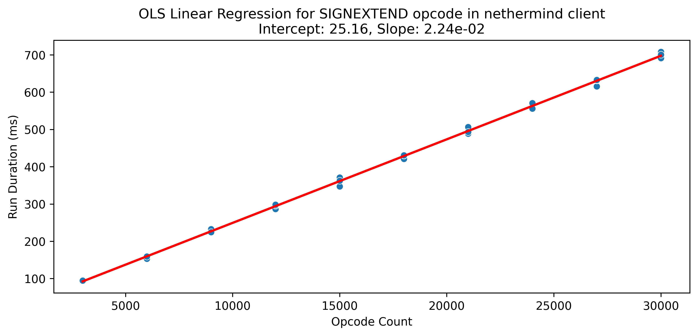


## besu


```python
                            OLS Regression Results                            
==============================================================================
Dep. Variable:        run_duration_ms   R-squared:                       0.995
Model:                            OLS   Adj. R-squared:                  0.994
Method:                 Least Squares   F-statistic:                     5242.
Date:                Mon, 12 Jan 2026   Prob (F-statistic):           2.14e-33
Time:                        10:30:09   Log-Likelihood:                -163.28
No. Observations:                  30   AIC:                             330.6
Df Residuals:                      28   BIC:                             333.4
Df Model:                           1                                         
Covariance Type:            nonrobust                                         
==============================================================================
                 coef    std err          t      P>|t|      [0.025      0.975]
------------------------------------------------------------------------------
const         29.6872     22.822      1.301      0.204     -17.062      76.437
opcount        0.0888      0.001     72.405      0.000       0.086       0.091
==============================================================================
Omnibus:                        3.092   Durbin-Watson:                   0.849
Prob(Omnibus):                  0.213   Jarque-Bera (JB):                2.613
Skew:                          -0.711   Prob(JB):                        0.271
Kurtosis:                       2.736   Cond. No.                     4.02e+04
==============================================================================

Notes:
[1] Standard Errors assume that the covariance matrix of the errors is correctly specified.
[2] The condition number is large, 4.02e+04. This might indicate that there are
strong multicollinearity or other numerical problems.
```

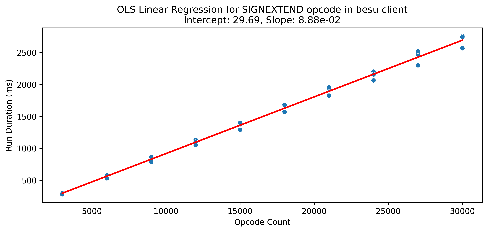


# SLT

## geth


```python
                            OLS Regression Results                            
==============================================================================
Dep. Variable:        run_duration_ms   R-squared:                       0.923
Model:                            OLS   Adj. R-squared:                  0.920
Method:                 Least Squares   F-statistic:                     333.7
Date:                Mon, 12 Jan 2026   Prob (F-statistic):           4.30e-17
Time:                        10:30:09   Log-Likelihood:                -175.56
No. Observations:                  30   AIC:                             355.1
Df Residuals:                      28   BIC:                             357.9
Df Model:                           1                                         
Covariance Type:            nonrobust                                         
==============================================================================
                 coef    std err          t      P>|t|      [0.025      0.975]
------------------------------------------------------------------------------
const         38.7049     34.371      1.126      0.270     -31.700     109.110
opcount        0.0253      0.001     18.268      0.000       0.022       0.028
==============================================================================
Omnibus:                       27.779   Durbin-Watson:                   1.696
Prob(Omnibus):                  0.000   Jarque-Bera (JB):               55.991
Skew:                           2.044   Prob(JB):                     6.95e-13
Kurtosis:                       8.299   Cond. No.                     5.36e+04
==============================================================================

Notes:
[1] Standard Errors assume that the covariance matrix of the errors is correctly specified.
[2] The condition number is large, 5.36e+04. This might indicate that there are
strong multicollinearity or other numerical problems.
```

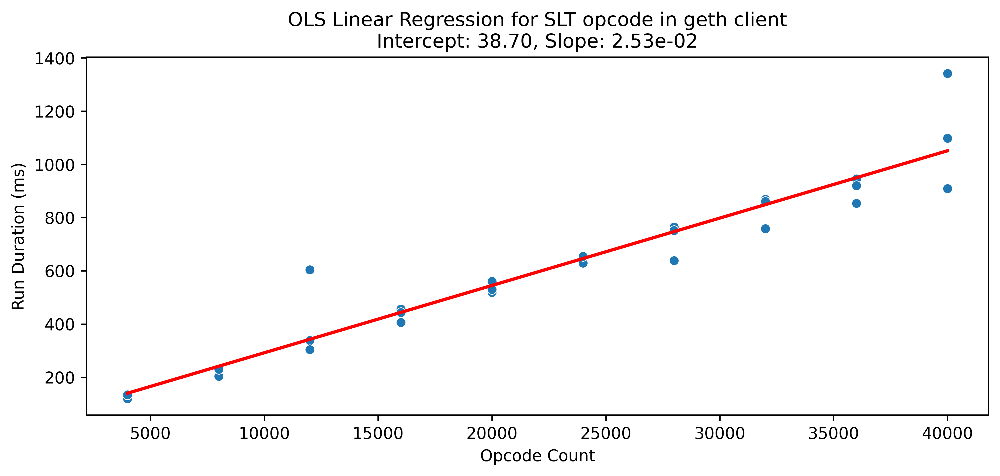


## reth


```python
                            OLS Regression Results                            
==============================================================================
Dep. Variable:        run_duration_ms   R-squared:                       0.993
Model:                            OLS   Adj. R-squared:                  0.993
Method:                 Least Squares   F-statistic:                     3985.
Date:                Mon, 12 Jan 2026   Prob (F-statistic):           9.72e-32
Time:                        10:30:09   Log-Likelihood:                -110.89
No. Observations:                  30   AIC:                             225.8
Df Residuals:                      28   BIC:                             228.6
Df Model:                           1                                         
Covariance Type:            nonrobust                                         
==============================================================================
                 coef    std err          t      P>|t|      [0.025      0.975]
------------------------------------------------------------------------------
const         33.0437      3.981      8.300      0.000      24.889      41.199
opcount        0.0101      0.000     63.126      0.000       0.010       0.010
==============================================================================
Omnibus:                        1.346   Durbin-Watson:                   2.047
Prob(Omnibus):                  0.510   Jarque-Bera (JB):                1.261
Skew:                          -0.444   Prob(JB):                        0.532
Kurtosis:                       2.531   Cond. No.                     5.36e+04
==============================================================================

Notes:
[1] Standard Errors assume that the covariance matrix of the errors is correctly specified.
[2] The condition number is large, 5.36e+04. This might indicate that there are
strong multicollinearity or other numerical problems.
```


## nethermind


```python
                            OLS Regression Results                            
==============================================================================
Dep. Variable:        run_duration_ms   R-squared:                       0.886
Model:                            OLS   Adj. R-squared:                  0.882
Method:                 Least Squares   F-statistic:                     218.0
Date:                Mon, 12 Jan 2026   Prob (F-statistic):           9.69e-15
Time:                        10:30:09   Log-Likelihood:                -175.54
No. Observations:                  30   AIC:                             355.1
Df Residuals:                      28   BIC:                             357.9
Df Model:                           1                                         
Covariance Type:            nonrobust                                         
==============================================================================
                 coef    std err          t      P>|t|      [0.025      0.975]
------------------------------------------------------------------------------
const         17.5440     34.342      0.511      0.613     -52.802      87.890
opcount        0.0204      0.001     14.765      0.000       0.018       0.023
==============================================================================
Omnibus:                       43.697   Durbin-Watson:                   1.776
Prob(Omnibus):                  0.000   Jarque-Bera (JB):              156.902
Skew:                           3.106   Prob(JB):                     8.50e-35
Kurtosis:                      12.324   Cond. No.                     5.36e+04
==============================================================================

Notes:
[1] Standard Errors assume that the covariance matrix of the errors is correctly specified.
[2] The condition number is large, 5.36e+04. This might indicate that there are
strong multicollinearity or other numerical problems.
```

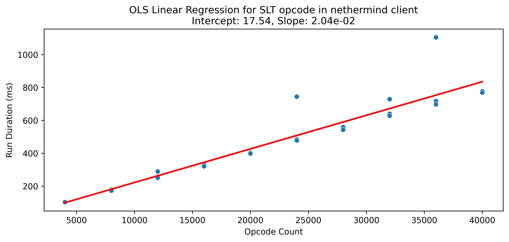


## besu


```python
                            OLS Regression Results                            
==============================================================================
Dep. Variable:        run_duration_ms   R-squared:                       0.998
Model:                            OLS   Adj. R-squared:                  0.998
Method:                 Least Squares   F-statistic:                 1.682e+04
Date:                Mon, 12 Jan 2026   Prob (F-statistic):           1.83e-40
Time:                        10:30:09   Log-Likelihood:                -150.22
No. Observations:                  30   AIC:                             304.4
Df Residuals:                      28   BIC:                             307.2
Df Model:                           1                                         
Covariance Type:            nonrobust                                         
==============================================================================
                 coef    std err          t      P>|t|      [0.025      0.975]
------------------------------------------------------------------------------
const         34.1685     14.767      2.314      0.028       3.920      64.417
opcount        0.0772      0.001    129.707      0.000       0.076       0.078
==============================================================================
Omnibus:                        1.186   Durbin-Watson:                   1.244
Prob(Omnibus):                  0.553   Jarque-Bera (JB):                1.020
Skew:                           0.425   Prob(JB):                        0.601
Kurtosis:                       2.695   Cond. No.                     5.36e+04
==============================================================================

Notes:
[1] Standard Errors assume that the covariance matrix of the errors is correctly specified.
[2] The condition number is large, 5.36e+04. This might indicate that there are
strong multicollinearity or other numerical problems.
```


# SMOD

## geth


```python
                            OLS Regression Results                            
==============================================================================
Dep. Variable:        run_duration_ms   R-squared:                       0.979
Model:                            OLS   Adj. R-squared:                  0.978
Method:                 Least Squares   F-statistic:                     1282.
Date:                Mon, 12 Jan 2026   Prob (F-statistic):           6.27e-25
Time:                        10:30:09   Log-Likelihood:                -151.43
No. Observations:                  30   AIC:                             306.9
Df Residuals:                      28   BIC:                             309.7
Df Model:                           1                                         
Covariance Type:            nonrobust                                         
==============================================================================
                 coef    std err          t      P>|t|      [0.025      0.975]
------------------------------------------------------------------------------
const         29.2761     15.378      1.904      0.067      -2.224      60.777
opcount        0.0296      0.001     35.805      0.000       0.028       0.031
==============================================================================
Omnibus:                        5.016   Durbin-Watson:                   1.191
Prob(Omnibus):                  0.081   Jarque-Bera (JB):                3.809
Skew:                          -0.864   Prob(JB):                        0.149
Kurtosis:                       3.245   Cond. No.                     4.02e+04
==============================================================================

Notes:
[1] Standard Errors assume that the covariance matrix of the errors is correctly specified.
[2] The condition number is large, 4.02e+04. This might indicate that there are
strong multicollinearity or other numerical problems.
```


## reth


```python
                            OLS Regression Results                            
==============================================================================
Dep. Variable:        run_duration_ms   R-squared:                       0.994
Model:                            OLS   Adj. R-squared:                  0.993
Method:                 Least Squares   F-statistic:                     4354.
Date:                Mon, 12 Jan 2026   Prob (F-statistic):           2.83e-32
Time:                        10:30:09   Log-Likelihood:                -109.47
No. Observations:                  30   AIC:                             222.9
Df Residuals:                      28   BIC:                             225.7
Df Model:                           1                                         
Covariance Type:            nonrobust                                         
==============================================================================
                 coef    std err          t      P>|t|      [0.025      0.975]
------------------------------------------------------------------------------
const         31.9025      3.796      8.403      0.000      24.126      39.679
opcount        0.0135      0.000     65.987      0.000       0.013       0.014
==============================================================================
Omnibus:                        5.780   Durbin-Watson:                   1.660
Prob(Omnibus):                  0.056   Jarque-Bera (JB):                4.069
Skew:                           0.816   Prob(JB):                        0.131
Kurtosis:                       3.771   Cond. No.                     4.02e+04
==============================================================================

Notes:
[1] Standard Errors assume that the covariance matrix of the errors is correctly specified.
[2] The condition number is large, 4.02e+04. This might indicate that there are
strong multicollinearity or other numerical problems.
```


## nethermind


```python
                            OLS Regression Results                            
==============================================================================
Dep. Variable:        run_duration_ms   R-squared:                       0.997
Model:                            OLS   Adj. R-squared:                  0.997
Method:                 Least Squares   F-statistic:                 1.015e+04
Date:                Mon, 12 Jan 2026   Prob (F-statistic):           2.13e-37
Time:                        10:30:10   Log-Likelihood:                -101.73
No. Observations:                  30   AIC:                             207.5
Df Residuals:                      28   BIC:                             210.3
Df Model:                           1                                         
Covariance Type:            nonrobust                                         
==============================================================================
                 coef    std err          t      P>|t|      [0.025      0.975]
------------------------------------------------------------------------------
const         26.9803      2.933      9.199      0.000      20.972      32.988
opcount        0.0159      0.000    100.737      0.000       0.016       0.016
==============================================================================
Omnibus:                       16.137   Durbin-Watson:                   1.115
Prob(Omnibus):                  0.000   Jarque-Bera (JB):               21.270
Skew:                          -1.293   Prob(JB):                     2.41e-05
Kurtosis:                       6.213   Cond. No.                     4.02e+04
==============================================================================

Notes:
[1] Standard Errors assume that the covariance matrix of the errors is correctly specified.
[2] The condition number is large, 4.02e+04. This might indicate that there are
strong multicollinearity or other numerical problems.
```


## besu


```python
                            OLS Regression Results                            
==============================================================================
Dep. Variable:        run_duration_ms   R-squared:                       0.995
Model:                            OLS   Adj. R-squared:                  0.995
Method:                 Least Squares   F-statistic:                     5371.
Date:                Mon, 12 Jan 2026   Prob (F-statistic):           1.52e-33
Time:                        10:30:10   Log-Likelihood:                -141.12
No. Observations:                  30   AIC:                             286.2
Df Residuals:                      28   BIC:                             289.0
Df Model:                           1                                         
Covariance Type:            nonrobust                                         
==============================================================================
                 coef    std err          t      P>|t|      [0.025      0.975]
------------------------------------------------------------------------------
const         25.4201     10.904      2.331      0.027       3.084      47.756
opcount        0.0429      0.001     73.290      0.000       0.042       0.044
==============================================================================
Omnibus:                        1.740   Durbin-Watson:                   0.975
Prob(Omnibus):                  0.419   Jarque-Bera (JB):                1.501
Skew:                           0.521   Prob(JB):                        0.472
Kurtosis:                       2.661   Cond. No.                     4.02e+04
==============================================================================

Notes:
[1] Standard Errors assume that the covariance matrix of the errors is correctly specified.
[2] The condition number is large, 4.02e+04. This might indicate that there are
strong multicollinearity or other numerical problems.
```


# STOP

## geth

OLS model did not run... Error: zero-size array to reduction operation maximum which has no identity

## reth

OLS model did not run... Error: zero-size array to reduction operation maximum which has no identity

## nethermind

OLS model did not run... Error: zero-size array to reduction operation maximum which has no identity

## besu

OLS model did not run... Error: zero-size array to reduction operation maximum which has no identity

# SUB

## geth


```python
                            OLS Regression Results                            
==============================================================================
Dep. Variable:        run_duration_ms   R-squared:                       0.981
Model:                            OLS   Adj. R-squared:                  0.980
Method:                 Least Squares   F-statistic:                     1436.
Date:                Mon, 12 Jan 2026   Prob (F-statistic):           1.32e-25
Time:                        10:30:10   Log-Likelihood:                -148.39
No. Observations:                  30   AIC:                             300.8
Df Residuals:                      28   BIC:                             303.6
Df Model:                           1                                         
Covariance Type:            nonrobust                                         
==============================================================================
                 coef    std err          t      P>|t|      [0.025      0.975]
------------------------------------------------------------------------------
const         24.6540     13.896      1.774      0.087      -3.810      53.118
opcount        0.0243      0.001     37.900      0.000       0.023       0.026
==============================================================================
Omnibus:                        3.712   Durbin-Watson:                   0.884
Prob(Omnibus):                  0.156   Jarque-Bera (JB):                3.319
Skew:                          -0.756   Prob(JB):                        0.190
Kurtosis:                       2.391   Cond. No.                     4.69e+04
==============================================================================

Notes:
[1] Standard Errors assume that the covariance matrix of the errors is correctly specified.
[2] The condition number is large, 4.69e+04. This might indicate that there are
strong multicollinearity or other numerical problems.
```


## reth


```python
                            OLS Regression Results                            
==============================================================================
Dep. Variable:        run_duration_ms   R-squared:                       0.990
Model:                            OLS   Adj. R-squared:                  0.990
Method:                 Least Squares   F-statistic:                     2739.
Date:                Mon, 12 Jan 2026   Prob (F-statistic):           1.77e-29
Time:                        10:30:10   Log-Likelihood:                -109.07
No. Observations:                  30   AIC:                             222.1
Df Residuals:                      28   BIC:                             224.9
Df Model:                           1                                         
Covariance Type:            nonrobust                                         
==============================================================================
                 coef    std err          t      P>|t|      [0.025      0.975]
------------------------------------------------------------------------------
const         31.2027      3.747      8.328      0.000      23.528      38.877
opcount        0.0090      0.000     52.333      0.000       0.009       0.009
==============================================================================
Omnibus:                        0.830   Durbin-Watson:                   1.735
Prob(Omnibus):                  0.660   Jarque-Bera (JB):                0.577
Skew:                           0.332   Prob(JB):                        0.750
Kurtosis:                       2.857   Cond. No.                     4.69e+04
==============================================================================

Notes:
[1] Standard Errors assume that the covariance matrix of the errors is correctly specified.
[2] The condition number is large, 4.69e+04. This might indicate that there are
strong multicollinearity or other numerical problems.
```


## nethermind


```python
                            OLS Regression Results                            
==============================================================================
Dep. Variable:        run_duration_ms   R-squared:                       0.999
Model:                            OLS   Adj. R-squared:                  0.999
Method:                 Least Squares   F-statistic:                 5.597e+04
Date:                Mon, 12 Jan 2026   Prob (F-statistic):           9.13e-48
Time:                        10:30:10   Log-Likelihood:                -85.589
No. Observations:                  30   AIC:                             175.2
Df Residuals:                      28   BIC:                             178.0
Df Model:                           1                                         
Covariance Type:            nonrobust                                         
==============================================================================
                 coef    std err          t      P>|t|      [0.025      0.975]
------------------------------------------------------------------------------
const         28.0942      1.713     16.402      0.000      24.586      31.603
opcount        0.0187   7.89e-05    236.575      0.000       0.018       0.019
==============================================================================
Omnibus:                        2.894   Durbin-Watson:                   0.950
Prob(Omnibus):                  0.235   Jarque-Bera (JB):                1.933
Skew:                           0.417   Prob(JB):                        0.381
Kurtosis:                       2.077   Cond. No.                     4.69e+04
==============================================================================

Notes:
[1] Standard Errors assume that the covariance matrix of the errors is correctly specified.
[2] The condition number is large, 4.69e+04. This might indicate that there are
strong multicollinearity or other numerical problems.
```

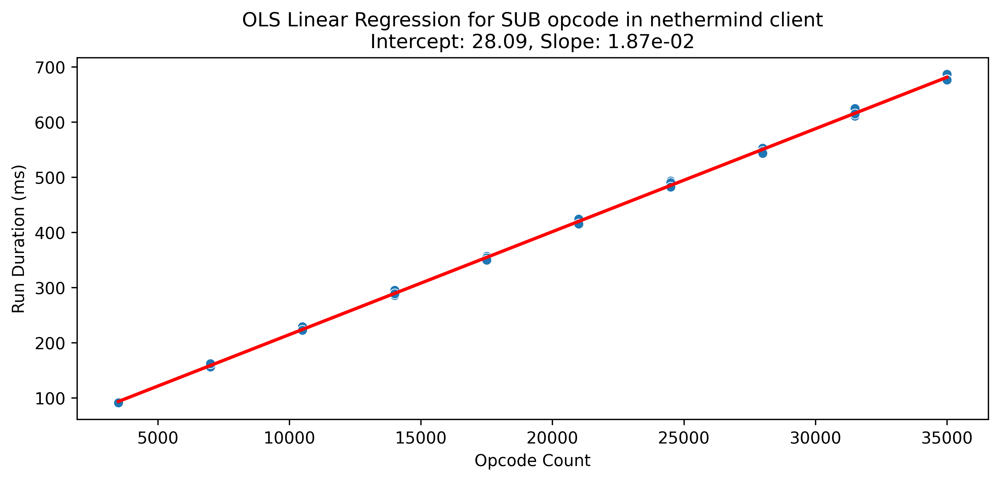


## besu


```python
                            OLS Regression Results                            
==============================================================================
Dep. Variable:        run_duration_ms   R-squared:                       0.997
Model:                            OLS   Adj. R-squared:                  0.997
Method:                 Least Squares   F-statistic:                 1.034e+04
Date:                Mon, 12 Jan 2026   Prob (F-statistic):           1.64e-37
Time:                        10:30:10   Log-Likelihood:                -181.95
No. Observations:                  30   AIC:                             367.9
Df Residuals:                      28   BIC:                             370.7
Df Model:                           1                                         
Covariance Type:            nonrobust                                         
==============================================================================
                 coef    std err          t      P>|t|      [0.025      0.975]
------------------------------------------------------------------------------
const         30.2584     42.522      0.712      0.483     -56.844     117.361
opcount        0.1991      0.002    101.691      0.000       0.195       0.203
==============================================================================
Omnibus:                        2.871   Durbin-Watson:                   1.039
Prob(Omnibus):                  0.238   Jarque-Bera (JB):                2.137
Skew:                          -0.654   Prob(JB):                        0.343
Kurtosis:                       2.971   Cond. No.                     4.69e+04
==============================================================================

Notes:
[1] Standard Errors assume that the covariance matrix of the errors is correctly specified.
[2] The condition number is large, 4.69e+04. This might indicate that there are
strong multicollinearity or other numerical problems.
```


# SWAP1

## geth


```python
                            OLS Regression Results                            
==============================================================================
Dep. Variable:        run_duration_ms   R-squared:                       0.990
Model:                            OLS   Adj. R-squared:                  0.990
Method:                 Least Squares   F-statistic:                     2779.
Date:                Mon, 12 Jan 2026   Prob (F-statistic):           1.45e-29
Time:                        10:30:10   Log-Likelihood:                -136.98
No. Observations:                  30   AIC:                             278.0
Df Residuals:                      28   BIC:                             280.8
Df Model:                           1                                         
Covariance Type:            nonrobust                                         
==============================================================================
                 coef    std err          t      P>|t|      [0.025      0.975]
------------------------------------------------------------------------------
const         33.9822      9.499      3.577      0.001      14.524      53.440
opcount        0.0115      0.000     52.720      0.000       0.011       0.012
==============================================================================
Omnibus:                        2.442   Durbin-Watson:                   1.058
Prob(Omnibus):                  0.295   Jarque-Bera (JB):                1.674
Skew:                          -0.578   Prob(JB):                        0.433
Kurtosis:                       3.045   Cond. No.                     9.38e+04
==============================================================================

Notes:
[1] Standard Errors assume that the covariance matrix of the errors is correctly specified.
[2] The condition number is large, 9.38e+04. This might indicate that there are
strong multicollinearity or other numerical problems.
```


## reth


```python
                            OLS Regression Results                            
==============================================================================
Dep. Variable:        run_duration_ms   R-squared:                       0.979
Model:                            OLS   Adj. R-squared:                  0.978
Method:                 Least Squares   F-statistic:                     1300.
Date:                Mon, 12 Jan 2026   Prob (F-statistic):           5.20e-25
Time:                        10:30:11   Log-Likelihood:                -128.45
No. Observations:                  30   AIC:                             260.9
Df Residuals:                      28   BIC:                             263.7
Df Model:                           1                                         
Covariance Type:            nonrobust                                         
==============================================================================
                 coef    std err          t      P>|t|      [0.025      0.975]
------------------------------------------------------------------------------
const         31.6338      7.149      4.425      0.000      16.990      46.278
opcount        0.0059      0.000     36.051      0.000       0.006       0.006
==============================================================================
Omnibus:                        0.071   Durbin-Watson:                   1.785
Prob(Omnibus):                  0.965   Jarque-Bera (JB):                0.273
Skew:                          -0.065   Prob(JB):                        0.872
Kurtosis:                       2.551   Cond. No.                     9.38e+04
==============================================================================

Notes:
[1] Standard Errors assume that the covariance matrix of the errors is correctly specified.
[2] The condition number is large, 9.38e+04. This might indicate that there are
strong multicollinearity or other numerical problems.
```

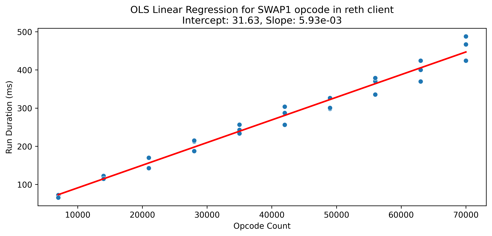


## nethermind


```python
                            OLS Regression Results                            
==============================================================================
Dep. Variable:        run_duration_ms   R-squared:                       0.993
Model:                            OLS   Adj. R-squared:                  0.993
Method:                 Least Squares   F-statistic:                     4022.
Date:                Mon, 12 Jan 2026   Prob (F-statistic):           8.56e-32
Time:                        10:30:11   Log-Likelihood:                -116.70
No. Observations:                  30   AIC:                             237.4
Df Residuals:                      28   BIC:                             240.2
Df Model:                           1                                         
Covariance Type:            nonrobust                                         
==============================================================================
                 coef    std err          t      P>|t|      [0.025      0.975]
------------------------------------------------------------------------------
const         27.9077      4.831      5.777      0.000      18.012      37.803
opcount        0.0071      0.000     63.415      0.000       0.007       0.007
==============================================================================
Omnibus:                        1.801   Durbin-Watson:                   0.619
Prob(Omnibus):                  0.406   Jarque-Bera (JB):                1.650
Skew:                           0.505   Prob(JB):                        0.438
Kurtosis:                       2.453   Cond. No.                     9.38e+04
==============================================================================

Notes:
[1] Standard Errors assume that the covariance matrix of the errors is correctly specified.
[2] The condition number is large, 9.38e+04. This might indicate that there are
strong multicollinearity or other numerical problems.
```

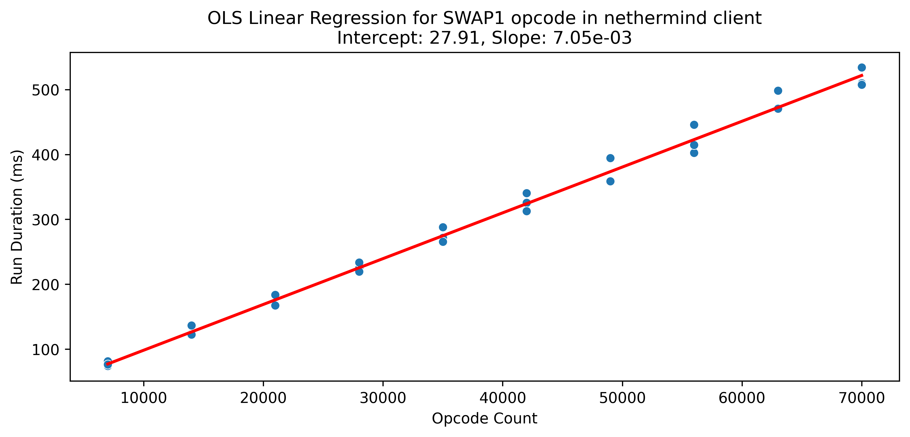


## besu


```python
                            OLS Regression Results                            
==============================================================================
Dep. Variable:        run_duration_ms   R-squared:                       0.989
Model:                            OLS   Adj. R-squared:                  0.989
Method:                 Least Squares   F-statistic:                     2554.
Date:                Mon, 12 Jan 2026   Prob (F-statistic):           4.68e-29
Time:                        10:30:11   Log-Likelihood:                -161.47
No. Observations:                  30   AIC:                             326.9
Df Residuals:                      28   BIC:                             329.7
Df Model:                           1                                         
Covariance Type:            nonrobust                                         
==============================================================================
                 coef    std err          t      P>|t|      [0.025      0.975]
------------------------------------------------------------------------------
const         33.7602     21.488      1.571      0.127     -10.256      77.777
opcount        0.0250      0.000     50.534      0.000       0.024       0.026
==============================================================================
Omnibus:                        4.236   Durbin-Watson:                   0.658
Prob(Omnibus):                  0.120   Jarque-Bera (JB):                3.116
Skew:                           0.784   Prob(JB):                        0.211
Kurtosis:                       3.190   Cond. No.                     9.38e+04
==============================================================================

Notes:
[1] Standard Errors assume that the covariance matrix of the errors is correctly specified.
[2] The condition number is large, 9.38e+04. This might indicate that there are
strong multicollinearity or other numerical problems.
```


# SWAP2

## geth


```python
                            OLS Regression Results                            
==============================================================================
Dep. Variable:        run_duration_ms   R-squared:                       0.976
Model:                            OLS   Adj. R-squared:                  0.975
Method:                 Least Squares   F-statistic:                     1140.
Date:                Mon, 12 Jan 2026   Prob (F-statistic):           3.12e-24
Time:                        10:30:11   Log-Likelihood:                -148.88
No. Observations:                  30   AIC:                             301.8
Df Residuals:                      28   BIC:                             304.6
Df Model:                           1                                         
Covariance Type:            nonrobust                                         
==============================================================================
                 coef    std err          t      P>|t|      [0.025      0.975]
------------------------------------------------------------------------------
const         46.4561     14.124      3.289      0.003      17.525      75.387
opcount        0.0110      0.000     33.767      0.000       0.010       0.012
==============================================================================
Omnibus:                        0.149   Durbin-Watson:                   0.782
Prob(Omnibus):                  0.928   Jarque-Bera (JB):                0.187
Skew:                           0.141   Prob(JB):                        0.911
Kurtosis:                       2.734   Cond. No.                     9.38e+04
==============================================================================

Notes:
[1] Standard Errors assume that the covariance matrix of the errors is correctly specified.
[2] The condition number is large, 9.38e+04. This might indicate that there are
strong multicollinearity or other numerical problems.
```


## reth


```python
                            OLS Regression Results                            
==============================================================================
Dep. Variable:        run_duration_ms   R-squared:                       0.981
Model:                            OLS   Adj. R-squared:                  0.980
Method:                 Least Squares   F-statistic:                     1459.
Date:                Mon, 12 Jan 2026   Prob (F-statistic):           1.07e-25
Time:                        10:30:11   Log-Likelihood:                -127.03
No. Observations:                  30   AIC:                             258.1
Df Residuals:                      28   BIC:                             260.9
Df Model:                           1                                         
Covariance Type:            nonrobust                                         
==============================================================================
                 coef    std err          t      P>|t|      [0.025      0.975]
------------------------------------------------------------------------------
const         32.9706      6.817      4.837      0.000      19.007      46.935
opcount        0.0060      0.000     38.191      0.000       0.006       0.006
==============================================================================
Omnibus:                        1.334   Durbin-Watson:                   2.213
Prob(Omnibus):                  0.513   Jarque-Bera (JB):                0.458
Skew:                          -0.232   Prob(JB):                        0.795
Kurtosis:                       3.388   Cond. No.                     9.38e+04
==============================================================================

Notes:
[1] Standard Errors assume that the covariance matrix of the errors is correctly specified.
[2] The condition number is large, 9.38e+04. This might indicate that there are
strong multicollinearity or other numerical problems.
```


## nethermind


```python
                            OLS Regression Results                            
==============================================================================
Dep. Variable:        run_duration_ms   R-squared:                       0.989
Model:                            OLS   Adj. R-squared:                  0.989
Method:                 Least Squares   F-statistic:                     2540.
Date:                Mon, 12 Jan 2026   Prob (F-statistic):           5.03e-29
Time:                        10:30:11   Log-Likelihood:                -123.85
No. Observations:                  30   AIC:                             251.7
Df Residuals:                      28   BIC:                             254.5
Df Model:                           1                                         
Covariance Type:            nonrobust                                         
==============================================================================
                 coef    std err          t      P>|t|      [0.025      0.975]
------------------------------------------------------------------------------
const         25.7825      6.132      4.205      0.000      13.222      38.343
opcount        0.0071      0.000     50.401      0.000       0.007       0.007
==============================================================================
Omnibus:                        3.272   Durbin-Watson:                   0.832
Prob(Omnibus):                  0.195   Jarque-Bera (JB):                2.121
Skew:                           0.635   Prob(JB):                        0.346
Kurtosis:                       3.286   Cond. No.                     9.38e+04
==============================================================================

Notes:
[1] Standard Errors assume that the covariance matrix of the errors is correctly specified.
[2] The condition number is large, 9.38e+04. This might indicate that there are
strong multicollinearity or other numerical problems.
```

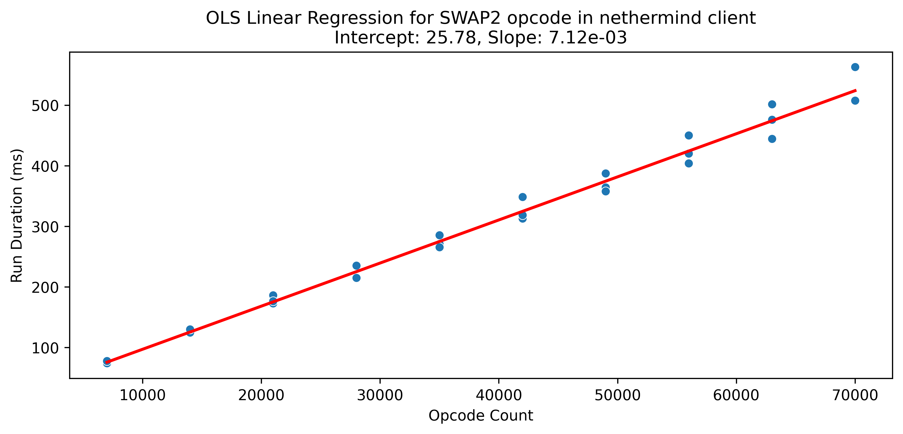


## besu


```python
                            OLS Regression Results                            
==============================================================================
Dep. Variable:        run_duration_ms   R-squared:                       0.990
Model:                            OLS   Adj. R-squared:                  0.990
Method:                 Least Squares   F-statistic:                     2909.
Date:                Mon, 12 Jan 2026   Prob (F-statistic):           7.68e-30
Time:                        10:30:11   Log-Likelihood:                -158.95
No. Observations:                  30   AIC:                             321.9
Df Residuals:                      28   BIC:                             324.7
Df Model:                           1                                         
Covariance Type:            nonrobust                                         
==============================================================================
                 coef    std err          t      P>|t|      [0.025      0.975]
------------------------------------------------------------------------------
const         34.9051     19.754      1.767      0.088      -5.559      75.370
opcount        0.0245      0.000     53.937      0.000       0.024       0.025
==============================================================================
Omnibus:                        1.326   Durbin-Watson:                   0.738
Prob(Omnibus):                  0.515   Jarque-Bera (JB):                1.250
Skew:                           0.387   Prob(JB):                        0.535
Kurtosis:                       2.366   Cond. No.                     9.38e+04
==============================================================================

Notes:
[1] Standard Errors assume that the covariance matrix of the errors is correctly specified.
[2] The condition number is large, 9.38e+04. This might indicate that there are
strong multicollinearity or other numerical problems.
```


# SWAP3

## geth


```python
                            OLS Regression Results                            
==============================================================================
Dep. Variable:        run_duration_ms   R-squared:                       0.987
Model:                            OLS   Adj. R-squared:                  0.987
Method:                 Least Squares   F-statistic:                     2132.
Date:                Mon, 12 Jan 2026   Prob (F-statistic):           5.69e-28
Time:                        10:30:12   Log-Likelihood:                -140.16
No. Observations:                  30   AIC:                             284.3
Df Residuals:                      28   BIC:                             287.1
Df Model:                           1                                         
Covariance Type:            nonrobust                                         
==============================================================================
                 coef    std err          t      P>|t|      [0.025      0.975]
------------------------------------------------------------------------------
const         34.4954     10.562      3.266      0.003      12.861      56.130
opcount        0.0112      0.000     46.174      0.000       0.011       0.012
==============================================================================
Omnibus:                        1.235   Durbin-Watson:                   0.905
Prob(Omnibus):                  0.539   Jarque-Bera (JB):                0.330
Skew:                          -0.077   Prob(JB):                        0.848
Kurtosis:                       3.490   Cond. No.                     9.38e+04
==============================================================================

Notes:
[1] Standard Errors assume that the covariance matrix of the errors is correctly specified.
[2] The condition number is large, 9.38e+04. This might indicate that there are
strong multicollinearity or other numerical problems.
```


## reth


```python
                            OLS Regression Results                            
==============================================================================
Dep. Variable:        run_duration_ms   R-squared:                       0.980
Model:                            OLS   Adj. R-squared:                  0.979
Method:                 Least Squares   F-statistic:                     1355.
Date:                Mon, 12 Jan 2026   Prob (F-statistic):           2.93e-25
Time:                        10:30:12   Log-Likelihood:                -128.20
No. Observations:                  30   AIC:                             260.4
Df Residuals:                      28   BIC:                             263.2
Df Model:                           1                                         
Covariance Type:            nonrobust                                         
==============================================================================
                 coef    std err          t      P>|t|      [0.025      0.975]
------------------------------------------------------------------------------
const         32.6887      7.089      4.611      0.000      18.167      47.211
opcount        0.0060      0.000     36.812      0.000       0.006       0.006
==============================================================================
Omnibus:                        0.617   Durbin-Watson:                   2.239
Prob(Omnibus):                  0.735   Jarque-Bera (JB):                0.150
Skew:                          -0.165   Prob(JB):                        0.928
Kurtosis:                       3.109   Cond. No.                     9.38e+04
==============================================================================

Notes:
[1] Standard Errors assume that the covariance matrix of the errors is correctly specified.
[2] The condition number is large, 9.38e+04. This might indicate that there are
strong multicollinearity or other numerical problems.
```


## nethermind


```python
                            OLS Regression Results                            
==============================================================================
Dep. Variable:        run_duration_ms   R-squared:                       0.936
Model:                            OLS   Adj. R-squared:                  0.934
Method:                 Least Squares   F-statistic:                     409.4
Date:                Mon, 12 Jan 2026   Prob (F-statistic):           2.99e-18
Time:                        10:30:12   Log-Likelihood:                -152.91
No. Observations:                  30   AIC:                             309.8
Df Residuals:                      28   BIC:                             312.6
Df Model:                           1                                         
Covariance Type:            nonrobust                                         
==============================================================================
                 coef    std err          t      P>|t|      [0.025      0.975]
------------------------------------------------------------------------------
const         26.2865     16.152      1.627      0.115      -6.799      59.372
opcount        0.0075      0.000     20.233      0.000       0.007       0.008
==============================================================================
Omnibus:                        5.217   Durbin-Watson:                   0.410
Prob(Omnibus):                  0.074   Jarque-Bera (JB):                4.333
Skew:                           0.931   Prob(JB):                        0.115
Kurtosis:                       3.020   Cond. No.                     9.38e+04
==============================================================================

Notes:
[1] Standard Errors assume that the covariance matrix of the errors is correctly specified.
[2] The condition number is large, 9.38e+04. This might indicate that there are
strong multicollinearity or other numerical problems.
```

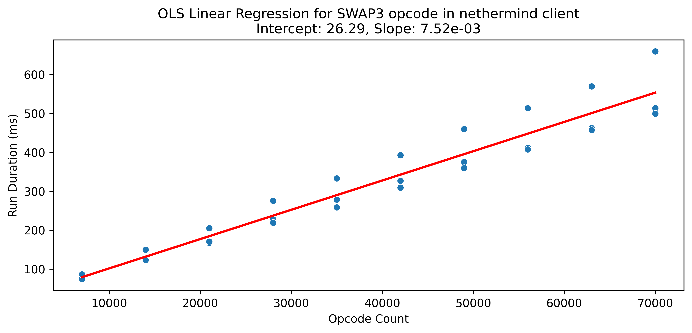


## besu


```python
                            OLS Regression Results                            
==============================================================================
Dep. Variable:        run_duration_ms   R-squared:                       0.994
Model:                            OLS   Adj. R-squared:                  0.994
Method:                 Least Squares   F-statistic:                     5012.
Date:                Mon, 12 Jan 2026   Prob (F-statistic):           4.00e-33
Time:                        10:30:12   Log-Likelihood:                -151.02
No. Observations:                  30   AIC:                             306.0
Df Residuals:                      28   BIC:                             308.8
Df Model:                           1                                         
Covariance Type:            nonrobust                                         
==============================================================================
                 coef    std err          t      P>|t|      [0.025      0.975]
------------------------------------------------------------------------------
const         31.3358     15.167      2.066      0.048       0.267      62.405
opcount        0.0247      0.000     70.796      0.000       0.024       0.025
==============================================================================
Omnibus:                        0.471   Durbin-Watson:                   0.647
Prob(Omnibus):                  0.790   Jarque-Bera (JB):                0.082
Skew:                          -0.123   Prob(JB):                        0.960
Kurtosis:                       3.069   Cond. No.                     9.38e+04
==============================================================================

Notes:
[1] Standard Errors assume that the covariance matrix of the errors is correctly specified.
[2] The condition number is large, 9.38e+04. This might indicate that there are
strong multicollinearity or other numerical problems.
```


# SWAP4

## geth


```python
                            OLS Regression Results                            
==============================================================================
Dep. Variable:        run_duration_ms   R-squared:                       0.982
Model:                            OLS   Adj. R-squared:                  0.981
Method:                 Least Squares   F-statistic:                     1521.
Date:                Mon, 12 Jan 2026   Prob (F-statistic):           5.97e-26
Time:                        10:30:12   Log-Likelihood:                -145.81
No. Observations:                  30   AIC:                             295.6
Df Residuals:                      28   BIC:                             298.4
Df Model:                           1                                         
Covariance Type:            nonrobust                                         
==============================================================================
                 coef    std err          t      P>|t|      [0.025      0.975]
------------------------------------------------------------------------------
const         30.7681     12.750      2.413      0.023       4.652      56.884
opcount        0.0114      0.000     39.005      0.000       0.011       0.012
==============================================================================
Omnibus:                        2.801   Durbin-Watson:                   1.611
Prob(Omnibus):                  0.246   Jarque-Bera (JB):                1.459
Skew:                           0.384   Prob(JB):                        0.482
Kurtosis:                       3.760   Cond. No.                     9.38e+04
==============================================================================

Notes:
[1] Standard Errors assume that the covariance matrix of the errors is correctly specified.
[2] The condition number is large, 9.38e+04. This might indicate that there are
strong multicollinearity or other numerical problems.
```


## reth


```python
                            OLS Regression Results                            
==============================================================================
Dep. Variable:        run_duration_ms   R-squared:                       0.980
Model:                            OLS   Adj. R-squared:                  0.979
Method:                 Least Squares   F-statistic:                     1366.
Date:                Mon, 12 Jan 2026   Prob (F-statistic):           2.62e-25
Time:                        10:30:12   Log-Likelihood:                -127.54
No. Observations:                  30   AIC:                             259.1
Df Residuals:                      28   BIC:                             261.9
Df Model:                           1                                         
Covariance Type:            nonrobust                                         
==============================================================================
                 coef    std err          t      P>|t|      [0.025      0.975]
------------------------------------------------------------------------------
const         31.5306      6.934      4.547      0.000      17.326      45.735
opcount        0.0059      0.000     36.964      0.000       0.006       0.006
==============================================================================
Omnibus:                        0.745   Durbin-Watson:                   1.573
Prob(Omnibus):                  0.689   Jarque-Bera (JB):                0.713
Skew:                          -0.044   Prob(JB):                        0.700
Kurtosis:                       2.250   Cond. No.                     9.38e+04
==============================================================================

Notes:
[1] Standard Errors assume that the covariance matrix of the errors is correctly specified.
[2] The condition number is large, 9.38e+04. This might indicate that there are
strong multicollinearity or other numerical problems.
```

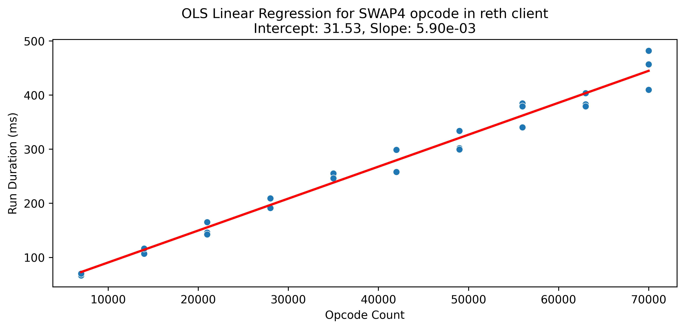


## nethermind


```python
                            OLS Regression Results                            
==============================================================================
Dep. Variable:        run_duration_ms   R-squared:                       0.991
Model:                            OLS   Adj. R-squared:                  0.991
Method:                 Least Squares   F-statistic:                     3036.
Date:                Mon, 12 Jan 2026   Prob (F-statistic):           4.24e-30
Time:                        10:30:12   Log-Likelihood:                -121.19
No. Observations:                  30   AIC:                             246.4
Df Residuals:                      28   BIC:                             249.2
Df Model:                           1                                         
Covariance Type:            nonrobust                                         
==============================================================================
                 coef    std err          t      P>|t|      [0.025      0.975]
------------------------------------------------------------------------------
const         25.7619      5.611      4.591      0.000      14.267      37.256
opcount        0.0071      0.000     55.103      0.000       0.007       0.007
==============================================================================
Omnibus:                        1.343   Durbin-Watson:                   0.932
Prob(Omnibus):                  0.511   Jarque-Bera (JB):                1.267
Skew:                           0.395   Prob(JB):                        0.531
Kurtosis:                       2.377   Cond. No.                     9.38e+04
==============================================================================

Notes:
[1] Standard Errors assume that the covariance matrix of the errors is correctly specified.
[2] The condition number is large, 9.38e+04. This might indicate that there are
strong multicollinearity or other numerical problems.
```


## besu


```python
                            OLS Regression Results                            
==============================================================================
Dep. Variable:        run_duration_ms   R-squared:                       0.994
Model:                            OLS   Adj. R-squared:                  0.994
Method:                 Least Squares   F-statistic:                     4729.
Date:                Mon, 12 Jan 2026   Prob (F-statistic):           8.99e-33
Time:                        10:30:13   Log-Likelihood:                -152.33
No. Observations:                  30   AIC:                             308.7
Df Residuals:                      28   BIC:                             311.5
Df Model:                           1                                         
Covariance Type:            nonrobust                                         
==============================================================================
                 coef    std err          t      P>|t|      [0.025      0.975]
------------------------------------------------------------------------------
const         21.9810     15.845      1.387      0.176     -10.476      54.438
opcount        0.0251      0.000     68.764      0.000       0.024       0.026
==============================================================================
Omnibus:                        1.367   Durbin-Watson:                   1.642
Prob(Omnibus):                  0.505   Jarque-Bera (JB):                0.400
Skew:                          -0.003   Prob(JB):                        0.819
Kurtosis:                       3.566   Cond. No.                     9.38e+04
==============================================================================

Notes:
[1] Standard Errors assume that the covariance matrix of the errors is correctly specified.
[2] The condition number is large, 9.38e+04. This might indicate that there are
strong multicollinearity or other numerical problems.
```


# SWAP5

## geth


```python
                            OLS Regression Results                            
==============================================================================
Dep. Variable:        run_duration_ms   R-squared:                       0.979
Model:                            OLS   Adj. R-squared:                  0.978
Method:                 Least Squares   F-statistic:                     1296.
Date:                Mon, 12 Jan 2026   Prob (F-statistic):           5.41e-25
Time:                        10:30:13   Log-Likelihood:                -147.87
No. Observations:                  30   AIC:                             299.7
Df Residuals:                      28   BIC:                             302.5
Df Model:                           1                                         
Covariance Type:            nonrobust                                         
==============================================================================
                 coef    std err          t      P>|t|      [0.025      0.975]
------------------------------------------------------------------------------
const         43.0366     13.656      3.152      0.004      15.065      71.009
opcount        0.0113      0.000     35.999      0.000       0.011       0.012
==============================================================================
Omnibus:                        2.100   Durbin-Watson:                   1.022
Prob(Omnibus):                  0.350   Jarque-Bera (JB):                1.323
Skew:                           0.512   Prob(JB):                        0.516
Kurtosis:                       3.100   Cond. No.                     9.38e+04
==============================================================================

Notes:
[1] Standard Errors assume that the covariance matrix of the errors is correctly specified.
[2] The condition number is large, 9.38e+04. This might indicate that there are
strong multicollinearity or other numerical problems.
```


## reth


```python
                            OLS Regression Results                            
==============================================================================
Dep. Variable:        run_duration_ms   R-squared:                       0.981
Model:                            OLS   Adj. R-squared:                  0.981
Method:                 Least Squares   F-statistic:                     1464.
Date:                Mon, 12 Jan 2026   Prob (F-statistic):           1.02e-25
Time:                        10:30:13   Log-Likelihood:                -127.03
No. Observations:                  30   AIC:                             258.1
Df Residuals:                      28   BIC:                             260.9
Df Model:                           1                                         
Covariance Type:            nonrobust                                         
==============================================================================
                 coef    std err          t      P>|t|      [0.025      0.975]
------------------------------------------------------------------------------
const         34.0263      6.817      4.991      0.000      20.063      47.990
opcount        0.0060      0.000     38.256      0.000       0.006       0.006
==============================================================================
Omnibus:                        1.313   Durbin-Watson:                   1.848
Prob(Omnibus):                  0.519   Jarque-Bera (JB):                1.190
Skew:                          -0.447   Prob(JB):                        0.552
Kurtosis:                       2.609   Cond. No.                     9.38e+04
==============================================================================

Notes:
[1] Standard Errors assume that the covariance matrix of the errors is correctly specified.
[2] The condition number is large, 9.38e+04. This might indicate that there are
strong multicollinearity or other numerical problems.
```


## nethermind


```python
                            OLS Regression Results                            
==============================================================================
Dep. Variable:        run_duration_ms   R-squared:                       0.989
Model:                            OLS   Adj. R-squared:                  0.989
Method:                 Least Squares   F-statistic:                     2629.
Date:                Mon, 12 Jan 2026   Prob (F-statistic):           3.13e-29
Time:                        10:30:13   Log-Likelihood:                -123.03
No. Observations:                  30   AIC:                             250.1
Df Residuals:                      28   BIC:                             252.9
Df Model:                           1                                         
Covariance Type:            nonrobust                                         
==============================================================================
                 coef    std err          t      P>|t|      [0.025      0.975]
------------------------------------------------------------------------------
const         27.7407      5.966      4.649      0.000      15.519      39.962
opcount        0.0070      0.000     51.276      0.000       0.007       0.007
==============================================================================
Omnibus:                        3.225   Durbin-Watson:                   0.887
Prob(Omnibus):                  0.199   Jarque-Bera (JB):                2.337
Skew:                           0.520   Prob(JB):                        0.311
Kurtosis:                       2.113   Cond. No.                     9.38e+04
==============================================================================

Notes:
[1] Standard Errors assume that the covariance matrix of the errors is correctly specified.
[2] The condition number is large, 9.38e+04. This might indicate that there are
strong multicollinearity or other numerical problems.
```

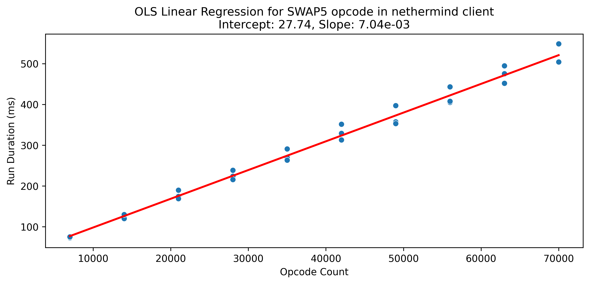


## besu


```python
                            OLS Regression Results                            
==============================================================================
Dep. Variable:        run_duration_ms   R-squared:                       0.994
Model:                            OLS   Adj. R-squared:                  0.994
Method:                 Least Squares   F-statistic:                     4830.
Date:                Mon, 12 Jan 2026   Prob (F-statistic):           6.69e-33
Time:                        10:30:13   Log-Likelihood:                -151.43
No. Observations:                  30   AIC:                             306.9
Df Residuals:                      28   BIC:                             309.7
Df Model:                           1                                         
Covariance Type:            nonrobust                                         
==============================================================================
                 coef    std err          t      P>|t|      [0.025      0.975]
------------------------------------------------------------------------------
const         36.3292     15.379      2.362      0.025       4.827      67.832
opcount        0.0246      0.000     69.497      0.000       0.024       0.025
==============================================================================
Omnibus:                        8.644   Durbin-Watson:                   1.051
Prob(Omnibus):                  0.013   Jarque-Bera (JB):                7.136
Skew:                           0.945   Prob(JB):                       0.0282
Kurtosis:                       4.462   Cond. No.                     9.38e+04
==============================================================================

Notes:
[1] Standard Errors assume that the covariance matrix of the errors is correctly specified.
[2] The condition number is large, 9.38e+04. This might indicate that there are
strong multicollinearity or other numerical problems.
```


# SWAP6

## geth


```python
                            OLS Regression Results                            
==============================================================================
Dep. Variable:        run_duration_ms   R-squared:                       0.989
Model:                            OLS   Adj. R-squared:                  0.988
Method:                 Least Squares   F-statistic:                     2480.
Date:                Mon, 12 Jan 2026   Prob (F-statistic):           7.02e-29
Time:                        10:30:13   Log-Likelihood:                -138.49
No. Observations:                  30   AIC:                             281.0
Df Residuals:                      28   BIC:                             283.8
Df Model:                           1                                         
Covariance Type:            nonrobust                                         
==============================================================================
                 coef    std err          t      P>|t|      [0.025      0.975]
------------------------------------------------------------------------------
const         34.5800      9.989      3.462      0.002      14.119      55.041
opcount        0.0115      0.000     49.801      0.000       0.011       0.012
==============================================================================
Omnibus:                        0.792   Durbin-Watson:                   0.746
Prob(Omnibus):                  0.673   Jarque-Bera (JB):                0.151
Skew:                           0.118   Prob(JB):                        0.927
Kurtosis:                       3.254   Cond. No.                     9.38e+04
==============================================================================

Notes:
[1] Standard Errors assume that the covariance matrix of the errors is correctly specified.
[2] The condition number is large, 9.38e+04. This might indicate that there are
strong multicollinearity or other numerical problems.
```


## reth


```python
                            OLS Regression Results                            
==============================================================================
Dep. Variable:        run_duration_ms   R-squared:                       0.981
Model:                            OLS   Adj. R-squared:                  0.981
Method:                 Least Squares   F-statistic:                     1469.
Date:                Mon, 12 Jan 2026   Prob (F-statistic):           9.65e-26
Time:                        10:30:13   Log-Likelihood:                -127.48
No. Observations:                  30   AIC:                             259.0
Df Residuals:                      28   BIC:                             261.8
Df Model:                           1                                         
Covariance Type:            nonrobust                                         
==============================================================================
                 coef    std err          t      P>|t|      [0.025      0.975]
------------------------------------------------------------------------------
const         31.5834      6.921      4.564      0.000      17.407      45.760
opcount        0.0061      0.000     38.330      0.000       0.006       0.006
==============================================================================
Omnibus:                        2.829   Durbin-Watson:                   2.322
Prob(Omnibus):                  0.243   Jarque-Bera (JB):                2.006
Skew:                          -0.633   Prob(JB):                        0.367
Kurtosis:                       3.047   Cond. No.                     9.38e+04
==============================================================================

Notes:
[1] Standard Errors assume that the covariance matrix of the errors is correctly specified.
[2] The condition number is large, 9.38e+04. This might indicate that there are
strong multicollinearity or other numerical problems.
```


## nethermind


```python
                            OLS Regression Results                            
==============================================================================
Dep. Variable:        run_duration_ms   R-squared:                       0.993
Model:                            OLS   Adj. R-squared:                  0.992
Method:                 Least Squares   F-statistic:                     3716.
Date:                Mon, 12 Jan 2026   Prob (F-statistic):           2.57e-31
Time:                        10:30:14   Log-Likelihood:                -118.11
No. Observations:                  30   AIC:                             240.2
Df Residuals:                      28   BIC:                             243.0
Df Model:                           1                                         
Covariance Type:            nonrobust                                         
==============================================================================
                 coef    std err          t      P>|t|      [0.025      0.975]
------------------------------------------------------------------------------
const         25.6042      5.065      5.055      0.000      15.229      35.979
opcount        0.0071      0.000     60.959      0.000       0.007       0.007
==============================================================================
Omnibus:                        0.909   Durbin-Watson:                   1.017
Prob(Omnibus):                  0.635   Jarque-Bera (JB):                0.845
Skew:                           0.370   Prob(JB):                        0.656
Kurtosis:                       2.643   Cond. No.                     9.38e+04
==============================================================================

Notes:
[1] Standard Errors assume that the covariance matrix of the errors is correctly specified.
[2] The condition number is large, 9.38e+04. This might indicate that there are
strong multicollinearity or other numerical problems.
```


## besu


```python
                            OLS Regression Results                            
==============================================================================
Dep. Variable:        run_duration_ms   R-squared:                       0.995
Model:                            OLS   Adj. R-squared:                  0.994
Method:                 Least Squares   F-statistic:                     5112.
Date:                Mon, 12 Jan 2026   Prob (F-statistic):           3.03e-33
Time:                        10:30:14   Log-Likelihood:                -150.86
No. Observations:                  30   AIC:                             305.7
Df Residuals:                      28   BIC:                             308.5
Df Model:                           1                                         
Covariance Type:            nonrobust                                         
==============================================================================
                 coef    std err          t      P>|t|      [0.025      0.975]
------------------------------------------------------------------------------
const         27.6117     15.085      1.830      0.078      -3.289      58.512
opcount        0.0248      0.000     71.500      0.000       0.024       0.026
==============================================================================
Omnibus:                        1.158   Durbin-Watson:                   1.324
Prob(Omnibus):                  0.560   Jarque-Bera (JB):                0.328
Skew:                          -0.169   Prob(JB):                        0.849
Kurtosis:                       3.385   Cond. No.                     9.38e+04
==============================================================================

Notes:
[1] Standard Errors assume that the covariance matrix of the errors is correctly specified.
[2] The condition number is large, 9.38e+04. This might indicate that there are
strong multicollinearity or other numerical problems.
```

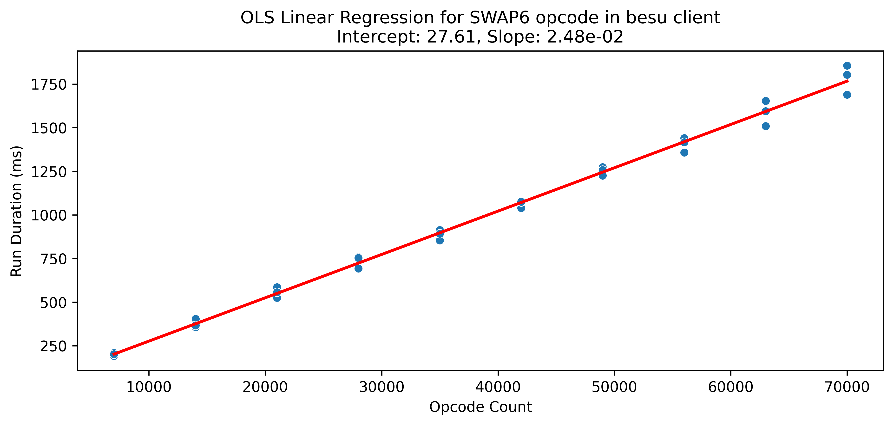


# SWAP7

## geth


```python
                            OLS Regression Results                            
==============================================================================
Dep. Variable:        run_duration_ms   R-squared:                       0.994
Model:                            OLS   Adj. R-squared:                  0.994
Method:                 Least Squares   F-statistic:                     4547.
Date:                Mon, 12 Jan 2026   Prob (F-statistic):           1.55e-32
Time:                        10:30:14   Log-Likelihood:                -128.82
No. Observations:                  30   AIC:                             261.6
Df Residuals:                      28   BIC:                             264.4
Df Model:                           1                                         
Covariance Type:            nonrobust                                         
==============================================================================
                 coef    std err          t      P>|t|      [0.025      0.975]
------------------------------------------------------------------------------
const         41.5123      7.237      5.736      0.000      26.687      56.338
opcount        0.0112      0.000     67.435      0.000       0.011       0.012
==============================================================================
Omnibus:                        0.588   Durbin-Watson:                   1.809
Prob(Omnibus):                  0.745   Jarque-Bera (JB):                0.615
Skew:                          -0.295   Prob(JB):                        0.735
Kurtosis:                       2.620   Cond. No.                     9.38e+04
==============================================================================

Notes:
[1] Standard Errors assume that the covariance matrix of the errors is correctly specified.
[2] The condition number is large, 9.38e+04. This might indicate that there are
strong multicollinearity or other numerical problems.
```


## reth


```python
                            OLS Regression Results                            
==============================================================================
Dep. Variable:        run_duration_ms   R-squared:                       0.980
Model:                            OLS   Adj. R-squared:                  0.980
Method:                 Least Squares   F-statistic:                     1401.
Date:                Mon, 12 Jan 2026   Prob (F-statistic):           1.85e-25
Time:                        10:30:14   Log-Likelihood:                -128.49
No. Observations:                  30   AIC:                             261.0
Df Residuals:                      28   BIC:                             263.8
Df Model:                           1                                         
Covariance Type:            nonrobust                                         
==============================================================================
                 coef    std err          t      P>|t|      [0.025      0.975]
------------------------------------------------------------------------------
const         26.2018      7.157      3.661      0.001      11.542      40.862
opcount        0.0062      0.000     37.434      0.000       0.006       0.007
==============================================================================
Omnibus:                        0.886   Durbin-Watson:                   1.714
Prob(Omnibus):                  0.642   Jarque-Bera (JB):                0.795
Skew:                          -0.365   Prob(JB):                        0.672
Kurtosis:                       2.682   Cond. No.                     9.38e+04
==============================================================================

Notes:
[1] Standard Errors assume that the covariance matrix of the errors is correctly specified.
[2] The condition number is large, 9.38e+04. This might indicate that there are
strong multicollinearity or other numerical problems.
```

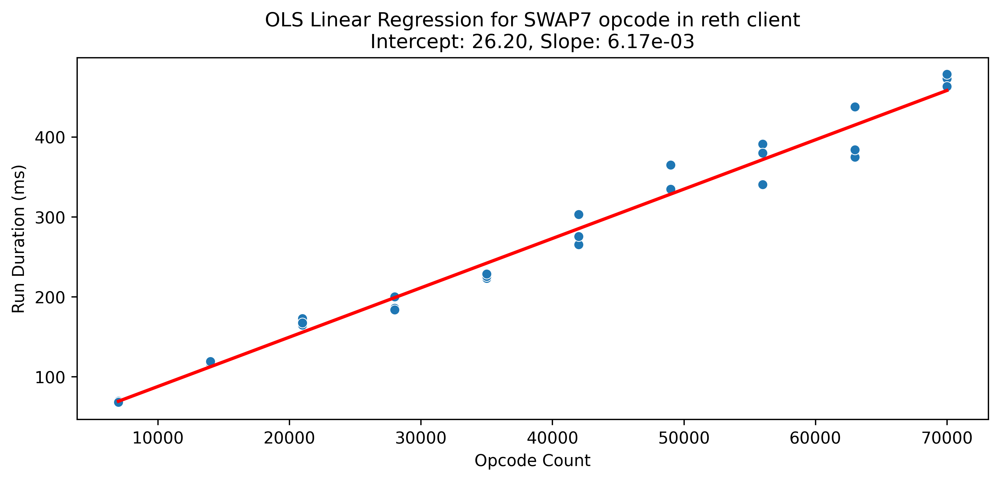


## nethermind


```python
                            OLS Regression Results                            
==============================================================================
Dep. Variable:        run_duration_ms   R-squared:                       0.990
Model:                            OLS   Adj. R-squared:                  0.989
Method:                 Least Squares   F-statistic:                     2732.
Date:                Mon, 12 Jan 2026   Prob (F-statistic):           1.84e-29
Time:                        10:30:14   Log-Likelihood:                -123.45
No. Observations:                  30   AIC:                             250.9
Df Residuals:                      28   BIC:                             253.7
Df Model:                           1                                         
Covariance Type:            nonrobust                                         
==============================================================================
                 coef    std err          t      P>|t|      [0.025      0.975]
------------------------------------------------------------------------------
const         22.3460      6.052      3.693      0.001       9.950      34.742
opcount        0.0073      0.000     52.266      0.000       0.007       0.008
==============================================================================
Omnibus:                        8.706   Durbin-Watson:                   1.162
Prob(Omnibus):                  0.013   Jarque-Bera (JB):                7.086
Skew:                           0.995   Prob(JB):                       0.0289
Kurtosis:                       4.307   Cond. No.                     9.38e+04
==============================================================================

Notes:
[1] Standard Errors assume that the covariance matrix of the errors is correctly specified.
[2] The condition number is large, 9.38e+04. This might indicate that there are
strong multicollinearity or other numerical problems.
```


## besu


```python
                            OLS Regression Results                            
==============================================================================
Dep. Variable:        run_duration_ms   R-squared:                       0.993
Model:                            OLS   Adj. R-squared:                  0.993
Method:                 Least Squares   F-statistic:                     3899.
Date:                Mon, 12 Jan 2026   Prob (F-statistic):           1.32e-31
Time:                        10:30:14   Log-Likelihood:                -155.57
No. Observations:                  30   AIC:                             315.1
Df Residuals:                      28   BIC:                             317.9
Df Model:                           1                                         
Covariance Type:            nonrobust                                         
==============================================================================
                 coef    std err          t      P>|t|      [0.025      0.975]
------------------------------------------------------------------------------
const         13.3754     17.654      0.758      0.455     -22.787      49.538
opcount        0.0254      0.000     62.443      0.000       0.025       0.026
==============================================================================
Omnibus:                        2.029   Durbin-Watson:                   1.338
Prob(Omnibus):                  0.363   Jarque-Bera (JB):                0.974
Skew:                           0.390   Prob(JB):                        0.615
Kurtosis:                       3.415   Cond. No.                     9.38e+04
==============================================================================

Notes:
[1] Standard Errors assume that the covariance matrix of the errors is correctly specified.
[2] The condition number is large, 9.38e+04. This might indicate that there are
strong multicollinearity or other numerical problems.
```


# SWAP8

## geth


```python
                            OLS Regression Results                            
==============================================================================
Dep. Variable:        run_duration_ms   R-squared:                       0.987
Model:                            OLS   Adj. R-squared:                  0.987
Method:                 Least Squares   F-statistic:                     2151.
Date:                Mon, 12 Jan 2026   Prob (F-statistic):           5.03e-28
Time:                        10:30:14   Log-Likelihood:                -140.54
No. Observations:                  30   AIC:                             285.1
Df Residuals:                      28   BIC:                             287.9
Df Model:                           1                                         
Covariance Type:            nonrobust                                         
==============================================================================
                 coef    std err          t      P>|t|      [0.025      0.975]
------------------------------------------------------------------------------
const         39.9299     10.697      3.733      0.001      18.018      61.842
opcount        0.0114      0.000     46.379      0.000       0.011       0.012
==============================================================================
Omnibus:                        0.201   Durbin-Watson:                   0.920
Prob(Omnibus):                  0.904   Jarque-Bera (JB):                0.104
Skew:                           0.125   Prob(JB):                        0.949
Kurtosis:                       2.856   Cond. No.                     9.38e+04
==============================================================================

Notes:
[1] Standard Errors assume that the covariance matrix of the errors is correctly specified.
[2] The condition number is large, 9.38e+04. This might indicate that there are
strong multicollinearity or other numerical problems.
```

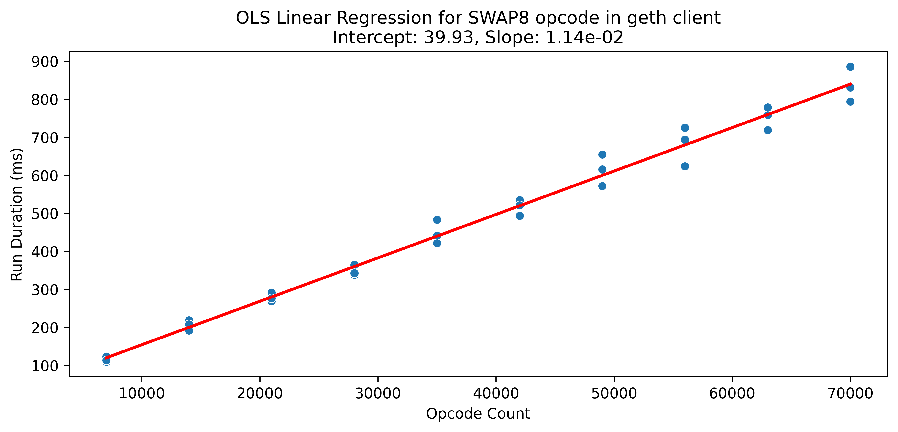


## reth


```python
                            OLS Regression Results                            
==============================================================================
Dep. Variable:        run_duration_ms   R-squared:                       0.981
Model:                            OLS   Adj. R-squared:                  0.980
Method:                 Least Squares   F-statistic:                     1420.
Date:                Mon, 12 Jan 2026   Prob (F-statistic):           1.55e-25
Time:                        10:30:15   Log-Likelihood:                -126.10
No. Observations:                  30   AIC:                             256.2
Df Residuals:                      28   BIC:                             259.0
Df Model:                           1                                         
Covariance Type:            nonrobust                                         
==============================================================================
                 coef    std err          t      P>|t|      [0.025      0.975]
------------------------------------------------------------------------------
const         38.3794      6.610      5.806      0.000      24.840      51.919
opcount        0.0057      0.000     37.677      0.000       0.005       0.006
==============================================================================
Omnibus:                        4.058   Durbin-Watson:                   2.120
Prob(Omnibus):                  0.131   Jarque-Bera (JB):                2.913
Skew:                           0.609   Prob(JB):                        0.233
Kurtosis:                       2.080   Cond. No.                     9.38e+04
==============================================================================

Notes:
[1] Standard Errors assume that the covariance matrix of the errors is correctly specified.
[2] The condition number is large, 9.38e+04. This might indicate that there are
strong multicollinearity or other numerical problems.
```


## nethermind


```python
                            OLS Regression Results                            
==============================================================================
Dep. Variable:        run_duration_ms   R-squared:                       0.991
Model:                            OLS   Adj. R-squared:                  0.991
Method:                 Least Squares   F-statistic:                     3088.
Date:                Mon, 12 Jan 2026   Prob (F-statistic):           3.35e-30
Time:                        10:30:15   Log-Likelihood:                -121.37
No. Observations:                  30   AIC:                             246.7
Df Residuals:                      28   BIC:                             249.5
Df Model:                           1                                         
Covariance Type:            nonrobust                                         
==============================================================================
                 coef    std err          t      P>|t|      [0.025      0.975]
------------------------------------------------------------------------------
const         24.3675      5.646      4.316      0.000      12.803      35.932
opcount        0.0072      0.000     55.572      0.000       0.007       0.007
==============================================================================
Omnibus:                        3.307   Durbin-Watson:                   0.719
Prob(Omnibus):                  0.191   Jarque-Bera (JB):                2.801
Skew:                           0.738   Prob(JB):                        0.247
Kurtosis:                       2.746   Cond. No.                     9.38e+04
==============================================================================

Notes:
[1] Standard Errors assume that the covariance matrix of the errors is correctly specified.
[2] The condition number is large, 9.38e+04. This might indicate that there are
strong multicollinearity or other numerical problems.
```


## besu


```python
                            OLS Regression Results                            
==============================================================================
Dep. Variable:        run_duration_ms   R-squared:                       0.992
Model:                            OLS   Adj. R-squared:                  0.991
Method:                 Least Squares   F-statistic:                     3371.
Date:                Mon, 12 Jan 2026   Prob (F-statistic):           9.95e-31
Time:                        10:30:15   Log-Likelihood:                -157.63
No. Observations:                  30   AIC:                             319.3
Df Residuals:                      28   BIC:                             322.1
Df Model:                           1                                         
Covariance Type:            nonrobust                                         
==============================================================================
                 coef    std err          t      P>|t|      [0.025      0.975]
------------------------------------------------------------------------------
const         25.1797     18.906      1.332      0.194     -13.548      63.908
opcount        0.0253      0.000     58.058      0.000       0.024       0.026
==============================================================================
Omnibus:                        2.930   Durbin-Watson:                   0.920
Prob(Omnibus):                  0.231   Jarque-Bera (JB):                2.400
Skew:                           0.685   Prob(JB):                        0.301
Kurtosis:                       2.796   Cond. No.                     9.38e+04
==============================================================================

Notes:
[1] Standard Errors assume that the covariance matrix of the errors is correctly specified.
[2] The condition number is large, 9.38e+04. This might indicate that there are
strong multicollinearity or other numerical problems.
```


# SWAP9

## geth


```python
                            OLS Regression Results                            
==============================================================================
Dep. Variable:        run_duration_ms   R-squared:                       0.982
Model:                            OLS   Adj. R-squared:                  0.981
Method:                 Least Squares   F-statistic:                     1490.
Date:                Mon, 12 Jan 2026   Prob (F-statistic):           7.98e-26
Time:                        10:30:15   Log-Likelihood:                -147.64
No. Observations:                  30   AIC:                             299.3
Df Residuals:                      28   BIC:                             302.1
Df Model:                           1                                         
Covariance Type:            nonrobust                                         
==============================================================================
                 coef    std err          t      P>|t|      [0.025      0.975]
------------------------------------------------------------------------------
const         28.8897     13.551      2.132      0.042       1.132      56.647
opcount        0.0120      0.000     38.597      0.000       0.011       0.013
==============================================================================
Omnibus:                        4.180   Durbin-Watson:                   1.032
Prob(Omnibus):                  0.124   Jarque-Bera (JB):                2.868
Skew:                          -0.736   Prob(JB):                        0.238
Kurtosis:                       3.356   Cond. No.                     9.38e+04
==============================================================================

Notes:
[1] Standard Errors assume that the covariance matrix of the errors is correctly specified.
[2] The condition number is large, 9.38e+04. This might indicate that there are
strong multicollinearity or other numerical problems.
```


## reth


```python
                            OLS Regression Results                            
==============================================================================
Dep. Variable:        run_duration_ms   R-squared:                       0.978
Model:                            OLS   Adj. R-squared:                  0.977
Method:                 Least Squares   F-statistic:                     1219.
Date:                Mon, 12 Jan 2026   Prob (F-statistic):           1.26e-24
Time:                        10:30:15   Log-Likelihood:                -129.53
No. Observations:                  30   AIC:                             263.1
Df Residuals:                      28   BIC:                             265.9
Df Model:                           1                                         
Covariance Type:            nonrobust                                         
==============================================================================
                 coef    std err          t      P>|t|      [0.025      0.975]
------------------------------------------------------------------------------
const         35.5934      7.410      4.804      0.000      20.416      50.771
opcount        0.0060      0.000     34.909      0.000       0.006       0.006
==============================================================================
Omnibus:                        2.833   Durbin-Watson:                   1.932
Prob(Omnibus):                  0.243   Jarque-Bera (JB):                1.363
Skew:                           0.084   Prob(JB):                        0.506
Kurtosis:                       1.969   Cond. No.                     9.38e+04
==============================================================================

Notes:
[1] Standard Errors assume that the covariance matrix of the errors is correctly specified.
[2] The condition number is large, 9.38e+04. This might indicate that there are
strong multicollinearity or other numerical problems.
```


## nethermind


```python
                            OLS Regression Results                            
==============================================================================
Dep. Variable:        run_duration_ms   R-squared:                       0.993
Model:                            OLS   Adj. R-squared:                  0.993
Method:                 Least Squares   F-statistic:                     4008.
Date:                Mon, 12 Jan 2026   Prob (F-statistic):           8.98e-32
Time:                        10:30:15   Log-Likelihood:                -117.15
No. Observations:                  30   AIC:                             238.3
Df Residuals:                      28   BIC:                             241.1
Df Model:                           1                                         
Covariance Type:            nonrobust                                         
==============================================================================
                 coef    std err          t      P>|t|      [0.025      0.975]
------------------------------------------------------------------------------
const         28.1565      4.905      5.740      0.000      18.109      38.204
opcount        0.0071      0.000     63.307      0.000       0.007       0.007
==============================================================================
Omnibus:                        2.552   Durbin-Watson:                   0.515
Prob(Omnibus):                  0.279   Jarque-Bera (JB):                2.286
Skew:                           0.615   Prob(JB):                        0.319
Kurtosis:                       2.436   Cond. No.                     9.38e+04
==============================================================================

Notes:
[1] Standard Errors assume that the covariance matrix of the errors is correctly specified.
[2] The condition number is large, 9.38e+04. This might indicate that there are
strong multicollinearity or other numerical problems.
```


## besu


```python
                            OLS Regression Results                            
==============================================================================
Dep. Variable:        run_duration_ms   R-squared:                       0.996
Model:                            OLS   Adj. R-squared:                  0.996
Method:                 Least Squares   F-statistic:                     7060.
Date:                Mon, 12 Jan 2026   Prob (F-statistic):           3.38e-35
Time:                        10:30:15   Log-Likelihood:                -146.41
No. Observations:                  30   AIC:                             296.8
Df Residuals:                      28   BIC:                             299.6
Df Model:                           1                                         
Covariance Type:            nonrobust                                         
==============================================================================
                 coef    std err          t      P>|t|      [0.025      0.975]
------------------------------------------------------------------------------
const         25.6287     13.008      1.970      0.059      -1.017      52.275
opcount        0.0252      0.000     84.021      0.000       0.025       0.026
==============================================================================
Omnibus:                        5.670   Durbin-Watson:                   0.699
Prob(Omnibus):                  0.059   Jarque-Bera (JB):                3.962
Skew:                           0.701   Prob(JB):                        0.138
Kurtosis:                       4.098   Cond. No.                     9.38e+04
==============================================================================

Notes:
[1] Standard Errors assume that the covariance matrix of the errors is correctly specified.
[2] The condition number is large, 9.38e+04. This might indicate that there are
strong multicollinearity or other numerical problems.
```

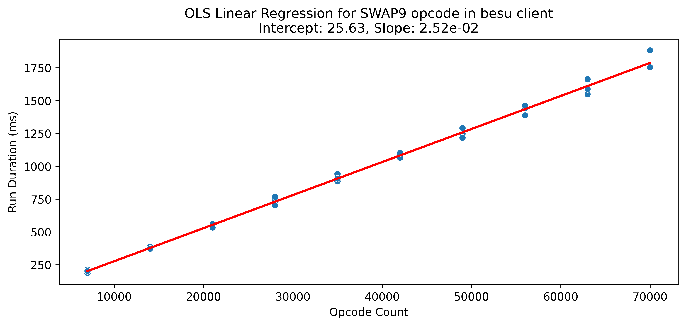


# SWAP10

## geth


```python
                            OLS Regression Results                            
==============================================================================
Dep. Variable:        run_duration_ms   R-squared:                       0.994
Model:                            OLS   Adj. R-squared:                  0.993
Method:                 Least Squares   F-statistic:                     4338.
Date:                Mon, 12 Jan 2026   Prob (F-statistic):           2.98e-32
Time:                        10:30:15   Log-Likelihood:                -129.08
No. Observations:                  30   AIC:                             262.2
Df Residuals:                      28   BIC:                             265.0
Df Model:                           1                                         
Covariance Type:            nonrobust                                         
==============================================================================
                 coef    std err          t      P>|t|      [0.025      0.975]
------------------------------------------------------------------------------
const         48.0281      7.300      6.579      0.000      33.075      62.982
opcount        0.0111      0.000     65.865      0.000       0.011       0.011
==============================================================================
Omnibus:                        0.481   Durbin-Watson:                   1.074
Prob(Omnibus):                  0.786   Jarque-Bera (JB):                0.583
Skew:                           0.003   Prob(JB):                        0.747
Kurtosis:                       2.317   Cond. No.                     9.38e+04
==============================================================================

Notes:
[1] Standard Errors assume that the covariance matrix of the errors is correctly specified.
[2] The condition number is large, 9.38e+04. This might indicate that there are
strong multicollinearity or other numerical problems.
```


## reth


```python
                            OLS Regression Results                            
==============================================================================
Dep. Variable:        run_duration_ms   R-squared:                       0.982
Model:                            OLS   Adj. R-squared:                  0.982
Method:                 Least Squares   F-statistic:                     1571.
Date:                Mon, 12 Jan 2026   Prob (F-statistic):           3.83e-26
Time:                        10:30:16   Log-Likelihood:                -126.97
No. Observations:                  30   AIC:                             257.9
Df Residuals:                      28   BIC:                             260.7
Df Model:                           1                                         
Covariance Type:            nonrobust                                         
==============================================================================
                 coef    std err          t      P>|t|      [0.025      0.975]
------------------------------------------------------------------------------
const         30.6919      6.804      4.511      0.000      16.755      44.629
opcount        0.0062      0.000     39.641      0.000       0.006       0.007
==============================================================================
Omnibus:                        2.543   Durbin-Watson:                   1.642
Prob(Omnibus):                  0.280   Jarque-Bera (JB):                1.855
Skew:                          -0.609   Prob(JB):                        0.395
Kurtosis:                       2.966   Cond. No.                     9.38e+04
==============================================================================

Notes:
[1] Standard Errors assume that the covariance matrix of the errors is correctly specified.
[2] The condition number is large, 9.38e+04. This might indicate that there are
strong multicollinearity or other numerical problems.
```

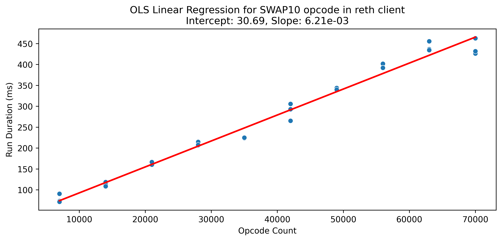


## nethermind


```python
                            OLS Regression Results                            
==============================================================================
Dep. Variable:        run_duration_ms   R-squared:                       0.994
Model:                            OLS   Adj. R-squared:                  0.994
Method:                 Least Squares   F-statistic:                     4545.
Date:                Mon, 12 Jan 2026   Prob (F-statistic):           1.56e-32
Time:                        10:30:16   Log-Likelihood:                -115.29
No. Observations:                  30   AIC:                             234.6
Df Residuals:                      28   BIC:                             237.4
Df Model:                           1                                         
Covariance Type:            nonrobust                                         
==============================================================================
                 coef    std err          t      P>|t|      [0.025      0.975]
------------------------------------------------------------------------------
const         27.7850      4.610      6.027      0.000      18.341      37.229
opcount        0.0072      0.000     67.416      0.000       0.007       0.007
==============================================================================
Omnibus:                        1.834   Durbin-Watson:                   0.835
Prob(Omnibus):                  0.400   Jarque-Bera (JB):                1.463
Skew:                           0.530   Prob(JB):                        0.481
Kurtosis:                       2.782   Cond. No.                     9.38e+04
==============================================================================

Notes:
[1] Standard Errors assume that the covariance matrix of the errors is correctly specified.
[2] The condition number is large, 9.38e+04. This might indicate that there are
strong multicollinearity or other numerical problems.
```

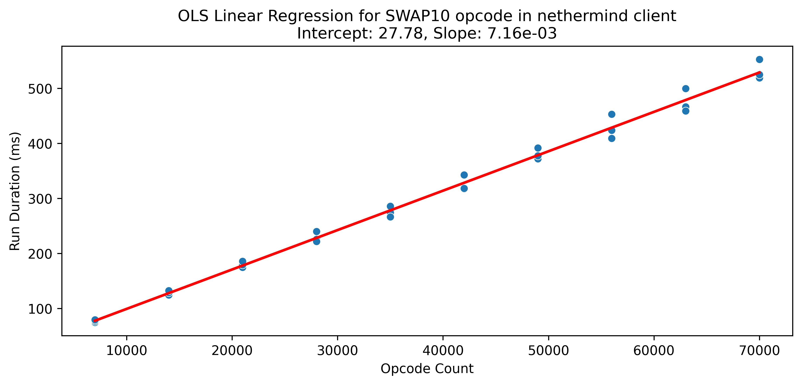


## besu


```python
                            OLS Regression Results                            
==============================================================================
Dep. Variable:        run_duration_ms   R-squared:                       0.993
Model:                            OLS   Adj. R-squared:                  0.993
Method:                 Least Squares   F-statistic:                     3841.
Date:                Mon, 12 Jan 2026   Prob (F-statistic):           1.62e-31
Time:                        10:30:16   Log-Likelihood:                -155.40
No. Observations:                  30   AIC:                             314.8
Df Residuals:                      28   BIC:                             317.6
Df Model:                           1                                         
Covariance Type:            nonrobust                                         
==============================================================================
                 coef    std err          t      P>|t|      [0.025      0.975]
------------------------------------------------------------------------------
const         24.7512     17.549      1.410      0.169     -11.197      60.699
opcount        0.0250      0.000     61.975      0.000       0.024       0.026
==============================================================================
Omnibus:                        5.826   Durbin-Watson:                   0.650
Prob(Omnibus):                  0.054   Jarque-Bera (JB):                4.440
Skew:                           0.922   Prob(JB):                        0.109
Kurtosis:                       3.395   Cond. No.                     9.38e+04
==============================================================================

Notes:
[1] Standard Errors assume that the covariance matrix of the errors is correctly specified.
[2] The condition number is large, 9.38e+04. This might indicate that there are
strong multicollinearity or other numerical problems.
```


# SWAP11

## geth


```python
                            OLS Regression Results                            
==============================================================================
Dep. Variable:        run_duration_ms   R-squared:                       0.985
Model:                            OLS   Adj. R-squared:                  0.984
Method:                 Least Squares   F-statistic:                     1825.
Date:                Mon, 12 Jan 2026   Prob (F-statistic):           4.87e-27
Time:                        10:30:16   Log-Likelihood:                -142.25
No. Observations:                  30   AIC:                             288.5
Df Residuals:                      28   BIC:                             291.3
Df Model:                           1                                         
Covariance Type:            nonrobust                                         
==============================================================================
                 coef    std err          t      P>|t|      [0.025      0.975]
------------------------------------------------------------------------------
const         48.4259     11.325      4.276      0.000      25.229      71.623
opcount        0.0111      0.000     42.720      0.000       0.011       0.012
==============================================================================
Omnibus:                        8.326   Durbin-Watson:                   1.462
Prob(Omnibus):                  0.016   Jarque-Bera (JB):                6.854
Skew:                           0.897   Prob(JB):                       0.0325
Kurtosis:                       4.506   Cond. No.                     9.38e+04
==============================================================================

Notes:
[1] Standard Errors assume that the covariance matrix of the errors is correctly specified.
[2] The condition number is large, 9.38e+04. This might indicate that there are
strong multicollinearity or other numerical problems.
```

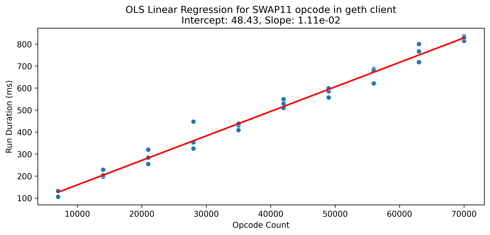


## reth


```python
                            OLS Regression Results                            
==============================================================================
Dep. Variable:        run_duration_ms   R-squared:                       0.986
Model:                            OLS   Adj. R-squared:                  0.986
Method:                 Least Squares   F-statistic:                     2004.
Date:                Mon, 12 Jan 2026   Prob (F-statistic):           1.33e-27
Time:                        10:30:16   Log-Likelihood:                -124.58
No. Observations:                  30   AIC:                             253.2
Df Residuals:                      28   BIC:                             256.0
Df Model:                           1                                         
Covariance Type:            nonrobust                                         
==============================================================================
                 coef    std err          t      P>|t|      [0.025      0.975]
------------------------------------------------------------------------------
const         20.7187      6.284      3.297      0.003       7.847      33.591
opcount        0.0065      0.000     44.771      0.000       0.006       0.007
==============================================================================
Omnibus:                        3.151   Durbin-Watson:                   1.699
Prob(Omnibus):                  0.207   Jarque-Bera (JB):                2.520
Skew:                          -0.707   Prob(JB):                        0.284
Kurtosis:                       2.866   Cond. No.                     9.38e+04
==============================================================================

Notes:
[1] Standard Errors assume that the covariance matrix of the errors is correctly specified.
[2] The condition number is large, 9.38e+04. This might indicate that there are
strong multicollinearity or other numerical problems.
```


## nethermind


```python
                            OLS Regression Results                            
==============================================================================
Dep. Variable:        run_duration_ms   R-squared:                       0.993
Model:                            OLS   Adj. R-squared:                  0.993
Method:                 Least Squares   F-statistic:                     4077.
Date:                Mon, 12 Jan 2026   Prob (F-statistic):           7.08e-32
Time:                        10:30:16   Log-Likelihood:                -117.42
No. Observations:                  30   AIC:                             238.8
Df Residuals:                      28   BIC:                             241.6
Df Model:                           1                                         
Covariance Type:            nonrobust                                         
==============================================================================
                 coef    std err          t      P>|t|      [0.025      0.975]
------------------------------------------------------------------------------
const         23.6079      4.948      4.771      0.000      13.471      33.744
opcount        0.0073      0.000     63.849      0.000       0.007       0.008
==============================================================================
Omnibus:                        6.443   Durbin-Watson:                   0.783
Prob(Omnibus):                  0.040   Jarque-Bera (JB):                4.768
Skew:                           0.910   Prob(JB):                       0.0922
Kurtosis:                       3.709   Cond. No.                     9.38e+04
==============================================================================

Notes:
[1] Standard Errors assume that the covariance matrix of the errors is correctly specified.
[2] The condition number is large, 9.38e+04. This might indicate that there are
strong multicollinearity or other numerical problems.
```


## besu


```python
                            OLS Regression Results                            
==============================================================================
Dep. Variable:        run_duration_ms   R-squared:                       0.995
Model:                            OLS   Adj. R-squared:                  0.994
Method:                 Least Squares   F-statistic:                     5074.
Date:                Mon, 12 Jan 2026   Prob (F-statistic):           3.37e-33
Time:                        10:30:17   Log-Likelihood:                -151.63
No. Observations:                  30   AIC:                             307.3
Df Residuals:                      28   BIC:                             310.1
Df Model:                           1                                         
Covariance Type:            nonrobust                                         
==============================================================================
                 coef    std err          t      P>|t|      [0.025      0.975]
------------------------------------------------------------------------------
const         27.9610     15.482      1.806      0.082      -3.752      59.674
opcount        0.0254      0.000     71.234      0.000       0.025       0.026
==============================================================================
Omnibus:                        0.780   Durbin-Watson:                   1.088
Prob(Omnibus):                  0.677   Jarque-Bera (JB):                0.298
Skew:                          -0.241   Prob(JB):                        0.862
Kurtosis:                       3.082   Cond. No.                     9.38e+04
==============================================================================

Notes:
[1] Standard Errors assume that the covariance matrix of the errors is correctly specified.
[2] The condition number is large, 9.38e+04. This might indicate that there are
strong multicollinearity or other numerical problems.
```


# SWAP12

## geth


```python
                            OLS Regression Results                            
==============================================================================
Dep. Variable:        run_duration_ms   R-squared:                       0.993
Model:                            OLS   Adj. R-squared:                  0.992
Method:                 Least Squares   F-statistic:                     3787.
Date:                Mon, 12 Jan 2026   Prob (F-statistic):           1.97e-31
Time:                        10:30:17   Log-Likelihood:                -131.65
No. Observations:                  30   AIC:                             267.3
Df Residuals:                      28   BIC:                             270.1
Df Model:                           1                                         
Covariance Type:            nonrobust                                         
==============================================================================
                 coef    std err          t      P>|t|      [0.025      0.975]
------------------------------------------------------------------------------
const         40.1651      7.952      5.051      0.000      23.877      56.453
opcount        0.0113      0.000     61.541      0.000       0.011       0.012
==============================================================================
Omnibus:                        7.874   Durbin-Watson:                   2.085
Prob(Omnibus):                  0.020   Jarque-Bera (JB):               13.305
Skew:                          -0.002   Prob(JB):                      0.00129
Kurtosis:                       6.263   Cond. No.                     9.38e+04
==============================================================================

Notes:
[1] Standard Errors assume that the covariance matrix of the errors is correctly specified.
[2] The condition number is large, 9.38e+04. This might indicate that there are
strong multicollinearity or other numerical problems.
```


## reth


```python
                            OLS Regression Results                            
==============================================================================
Dep. Variable:        run_duration_ms   R-squared:                       0.990
Model:                            OLS   Adj. R-squared:                  0.989
Method:                 Least Squares   F-statistic:                     2671.
Date:                Mon, 12 Jan 2026   Prob (F-statistic):           2.51e-29
Time:                        10:30:17   Log-Likelihood:                -119.62
No. Observations:                  30   AIC:                             243.2
Df Residuals:                      28   BIC:                             246.0
Df Model:                           1                                         
Covariance Type:            nonrobust                                         
==============================================================================
                 coef    std err          t      P>|t|      [0.025      0.975]
------------------------------------------------------------------------------
const         24.8129      5.326      4.659      0.000      13.904      35.722
opcount        0.0063      0.000     51.681      0.000       0.006       0.007
==============================================================================
Omnibus:                        2.087   Durbin-Watson:                   1.652
Prob(Omnibus):                  0.352   Jarque-Bera (JB):                1.325
Skew:                          -0.232   Prob(JB):                        0.516
Kurtosis:                       2.081   Cond. No.                     9.38e+04
==============================================================================

Notes:
[1] Standard Errors assume that the covariance matrix of the errors is correctly specified.
[2] The condition number is large, 9.38e+04. This might indicate that there are
strong multicollinearity or other numerical problems.
```


## nethermind


```python
                            OLS Regression Results                            
==============================================================================
Dep. Variable:        run_duration_ms   R-squared:                       0.977
Model:                            OLS   Adj. R-squared:                  0.976
Method:                 Least Squares   F-statistic:                     1191.
Date:                Mon, 12 Jan 2026   Prob (F-statistic):           1.73e-24
Time:                        10:30:17   Log-Likelihood:                -136.54
No. Observations:                  30   AIC:                             277.1
Df Residuals:                      28   BIC:                             279.9
Df Model:                           1                                         
Covariance Type:            nonrobust                                         
==============================================================================
                 coef    std err          t      P>|t|      [0.025      0.975]
------------------------------------------------------------------------------
const         25.3733      9.362      2.710      0.011       6.197      44.550
opcount        0.0074      0.000     34.504      0.000       0.007       0.008
==============================================================================
Omnibus:                        4.046   Durbin-Watson:                   0.686
Prob(Omnibus):                  0.132   Jarque-Bera (JB):                3.556
Skew:                           0.830   Prob(JB):                        0.169
Kurtosis:                       2.696   Cond. No.                     9.38e+04
==============================================================================

Notes:
[1] Standard Errors assume that the covariance matrix of the errors is correctly specified.
[2] The condition number is large, 9.38e+04. This might indicate that there are
strong multicollinearity or other numerical problems.
```

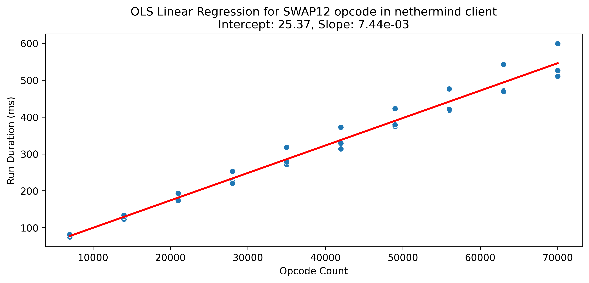


## besu


```python
                            OLS Regression Results                            
==============================================================================
Dep. Variable:        run_duration_ms   R-squared:                       0.991
Model:                            OLS   Adj. R-squared:                  0.991
Method:                 Least Squares   F-statistic:                     3196.
Date:                Mon, 12 Jan 2026   Prob (F-statistic):           2.09e-30
Time:                        10:30:17   Log-Likelihood:                -158.54
No. Observations:                  30   AIC:                             321.1
Df Residuals:                      28   BIC:                             323.9
Df Model:                           1                                         
Covariance Type:            nonrobust                                         
==============================================================================
                 coef    std err          t      P>|t|      [0.025      0.975]
------------------------------------------------------------------------------
const         26.5007     19.489      1.360      0.185     -13.421      66.423
opcount        0.0254      0.000     56.530      0.000       0.024       0.026
==============================================================================
Omnibus:                        1.714   Durbin-Watson:                   0.677
Prob(Omnibus):                  0.424   Jarque-Bera (JB):                1.470
Skew:                           0.517   Prob(JB):                        0.479
Kurtosis:                       2.671   Cond. No.                     9.38e+04
==============================================================================

Notes:
[1] Standard Errors assume that the covariance matrix of the errors is correctly specified.
[2] The condition number is large, 9.38e+04. This might indicate that there are
strong multicollinearity or other numerical problems.
```


# SWAP13

## geth


```python
                            OLS Regression Results                            
==============================================================================
Dep. Variable:        run_duration_ms   R-squared:                       0.993
Model:                            OLS   Adj. R-squared:                  0.992
Method:                 Least Squares   F-statistic:                     3817.
Date:                Mon, 12 Jan 2026   Prob (F-statistic):           1.77e-31
Time:                        10:30:17   Log-Likelihood:                -132.19
No. Observations:                  30   AIC:                             268.4
Df Residuals:                      28   BIC:                             271.2
Df Model:                           1                                         
Covariance Type:            nonrobust                                         
==============================================================================
                 coef    std err          t      P>|t|      [0.025      0.975]
------------------------------------------------------------------------------
const         37.9395      8.098      4.685      0.000      21.351      54.528
opcount        0.0115      0.000     61.786      0.000       0.011       0.012
==============================================================================
Omnibus:                       15.756   Durbin-Watson:                   0.679
Prob(Omnibus):                  0.000   Jarque-Bera (JB):               17.903
Skew:                           1.413   Prob(JB):                     0.000130
Kurtosis:                       5.516   Cond. No.                     9.38e+04
==============================================================================

Notes:
[1] Standard Errors assume that the covariance matrix of the errors is correctly specified.
[2] The condition number is large, 9.38e+04. This might indicate that there are
strong multicollinearity or other numerical problems.
```

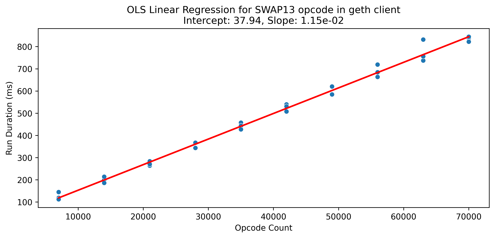


## reth


```python
                            OLS Regression Results                            
==============================================================================
Dep. Variable:        run_duration_ms   R-squared:                       0.975
Model:                            OLS   Adj. R-squared:                  0.974
Method:                 Least Squares   F-statistic:                     1093.
Date:                Mon, 12 Jan 2026   Prob (F-statistic):           5.54e-24
Time:                        10:30:17   Log-Likelihood:                -130.80
No. Observations:                  30   AIC:                             265.6
Df Residuals:                      28   BIC:                             268.4
Df Model:                           1                                         
Covariance Type:            nonrobust                                         
==============================================================================
                 coef    std err          t      P>|t|      [0.025      0.975]
------------------------------------------------------------------------------
const         35.4120      7.731      4.580      0.000      19.575      51.249
opcount        0.0059      0.000     33.065      0.000       0.006       0.006
==============================================================================
Omnibus:                        4.954   Durbin-Watson:                   2.032
Prob(Omnibus):                  0.084   Jarque-Bera (JB):                3.541
Skew:                           0.816   Prob(JB):                        0.170
Kurtosis:                       3.415   Cond. No.                     9.38e+04
==============================================================================

Notes:
[1] Standard Errors assume that the covariance matrix of the errors is correctly specified.
[2] The condition number is large, 9.38e+04. This might indicate that there are
strong multicollinearity or other numerical problems.
```


## nethermind


```python
                            OLS Regression Results                            
==============================================================================
Dep. Variable:        run_duration_ms   R-squared:                       0.994
Model:                            OLS   Adj. R-squared:                  0.994
Method:                 Least Squares   F-statistic:                     4449.
Date:                Mon, 12 Jan 2026   Prob (F-statistic):           2.10e-32
Time:                        10:30:17   Log-Likelihood:                -115.83
No. Observations:                  30   AIC:                             235.7
Df Residuals:                      28   BIC:                             238.5
Df Model:                           1                                         
Covariance Type:            nonrobust                                         
==============================================================================
                 coef    std err          t      P>|t|      [0.025      0.975]
------------------------------------------------------------------------------
const         28.5043      4.694      6.073      0.000      18.889      38.119
opcount        0.0072      0.000     66.702      0.000       0.007       0.007
==============================================================================
Omnibus:                        3.623   Durbin-Watson:                   0.547
Prob(Omnibus):                  0.163   Jarque-Bera (JB):                3.260
Skew:                           0.761   Prob(JB):                        0.196
Kurtosis:                       2.461   Cond. No.                     9.38e+04
==============================================================================

Notes:
[1] Standard Errors assume that the covariance matrix of the errors is correctly specified.
[2] The condition number is large, 9.38e+04. This might indicate that there are
strong multicollinearity or other numerical problems.
```

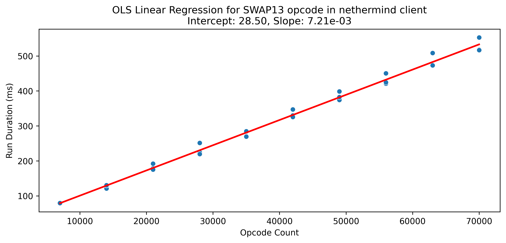


## besu


```python
                            OLS Regression Results                            
==============================================================================
Dep. Variable:        run_duration_ms   R-squared:                       0.990
Model:                            OLS   Adj. R-squared:                  0.990
Method:                 Least Squares   F-statistic:                     2844.
Date:                Mon, 12 Jan 2026   Prob (F-statistic):           1.05e-29
Time:                        10:30:18   Log-Likelihood:                -160.60
No. Observations:                  30   AIC:                             325.2
Df Residuals:                      28   BIC:                             328.0
Df Model:                           1                                         
Covariance Type:            nonrobust                                         
==============================================================================
                 coef    std err          t      P>|t|      [0.025      0.975]
------------------------------------------------------------------------------
const         24.7625     20.872      1.186      0.245     -17.992      67.517
opcount        0.0256      0.000     53.326      0.000       0.025       0.027
==============================================================================
Omnibus:                        1.309   Durbin-Watson:                   0.784
Prob(Omnibus):                  0.520   Jarque-Bera (JB):                0.785
Skew:                           0.396   Prob(JB):                        0.675
Kurtosis:                       3.008   Cond. No.                     9.38e+04
==============================================================================

Notes:
[1] Standard Errors assume that the covariance matrix of the errors is correctly specified.
[2] The condition number is large, 9.38e+04. This might indicate that there are
strong multicollinearity or other numerical problems.
```


# SWAP14

## geth


```python
                            OLS Regression Results                            
==============================================================================
Dep. Variable:        run_duration_ms   R-squared:                       0.986
Model:                            OLS   Adj. R-squared:                  0.986
Method:                 Least Squares   F-statistic:                     1978.
Date:                Mon, 12 Jan 2026   Prob (F-statistic):           1.61e-27
Time:                        10:30:18   Log-Likelihood:                -142.75
No. Observations:                  30   AIC:                             289.5
Df Residuals:                      28   BIC:                             292.3
Df Model:                           1                                         
Covariance Type:            nonrobust                                         
==============================================================================
                 coef    std err          t      P>|t|      [0.025      0.975]
------------------------------------------------------------------------------
const         31.6630     11.513      2.750      0.010       8.079      55.247
opcount        0.0118      0.000     44.472      0.000       0.011       0.012
==============================================================================
Omnibus:                        1.893   Durbin-Watson:                   1.203
Prob(Omnibus):                  0.388   Jarque-Bera (JB):                0.769
Skew:                           0.208   Prob(JB):                        0.681
Kurtosis:                       3.666   Cond. No.                     9.38e+04
==============================================================================

Notes:
[1] Standard Errors assume that the covariance matrix of the errors is correctly specified.
[2] The condition number is large, 9.38e+04. This might indicate that there are
strong multicollinearity or other numerical problems.
```

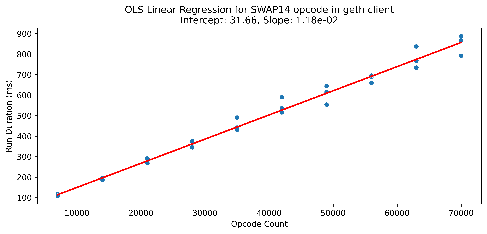


## reth


```python
                            OLS Regression Results                            
==============================================================================
Dep. Variable:        run_duration_ms   R-squared:                       0.984
Model:                            OLS   Adj. R-squared:                  0.983
Method:                 Least Squares   F-statistic:                     1674.
Date:                Mon, 12 Jan 2026   Prob (F-statistic):           1.60e-26
Time:                        10:30:18   Log-Likelihood:                -127.26
No. Observations:                  30   AIC:                             258.5
Df Residuals:                      28   BIC:                             261.3
Df Model:                           1                                         
Covariance Type:            nonrobust                                         
==============================================================================
                 coef    std err          t      P>|t|      [0.025      0.975]
------------------------------------------------------------------------------
const         23.9273      6.870      3.483      0.002       9.855      37.999
opcount        0.0065      0.000     40.920      0.000       0.006       0.007
==============================================================================
Omnibus:                        0.863   Durbin-Watson:                   2.243
Prob(Omnibus):                  0.650   Jarque-Bera (JB):                0.892
Skew:                          -0.279   Prob(JB):                        0.640
Kurtosis:                       2.366   Cond. No.                     9.38e+04
==============================================================================

Notes:
[1] Standard Errors assume that the covariance matrix of the errors is correctly specified.
[2] The condition number is large, 9.38e+04. This might indicate that there are
strong multicollinearity or other numerical problems.
```


## nethermind


```python
                            OLS Regression Results                            
==============================================================================
Dep. Variable:        run_duration_ms   R-squared:                       0.991
Model:                            OLS   Adj. R-squared:                  0.991
Method:                 Least Squares   F-statistic:                     3246.
Date:                Mon, 12 Jan 2026   Prob (F-statistic):           1.68e-30
Time:                        10:30:18   Log-Likelihood:                -120.54
No. Observations:                  30   AIC:                             245.1
Df Residuals:                      28   BIC:                             247.9
Df Model:                           1                                         
Covariance Type:            nonrobust                                         
==============================================================================
                 coef    std err          t      P>|t|      [0.025      0.975]
------------------------------------------------------------------------------
const         29.3684      5.492      5.348      0.000      18.119      40.618
opcount        0.0072      0.000     56.976      0.000       0.007       0.007
==============================================================================
Omnibus:                        1.557   Durbin-Watson:                   0.771
Prob(Omnibus):                  0.459   Jarque-Bera (JB):                1.319
Skew:                           0.491   Prob(JB):                        0.517
Kurtosis:                       2.695   Cond. No.                     9.38e+04
==============================================================================

Notes:
[1] Standard Errors assume that the covariance matrix of the errors is correctly specified.
[2] The condition number is large, 9.38e+04. This might indicate that there are
strong multicollinearity or other numerical problems.
```

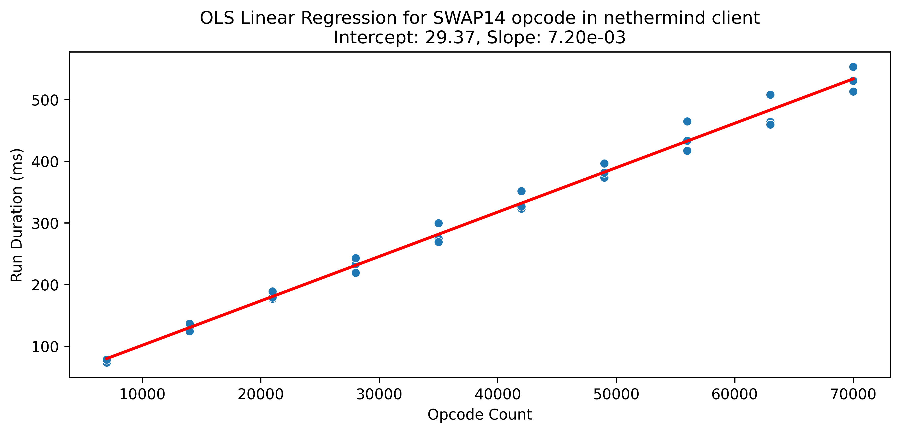


## besu


```python
                            OLS Regression Results                            
==============================================================================
Dep. Variable:        run_duration_ms   R-squared:                       0.987
Model:                            OLS   Adj. R-squared:                  0.987
Method:                 Least Squares   F-statistic:                     2166.
Date:                Mon, 12 Jan 2026   Prob (F-statistic):           4.58e-28
Time:                        10:30:18   Log-Likelihood:                -164.73
No. Observations:                  30   AIC:                             333.5
Df Residuals:                      28   BIC:                             336.3
Df Model:                           1                                         
Covariance Type:            nonrobust                                         
==============================================================================
                 coef    std err          t      P>|t|      [0.025      0.975]
------------------------------------------------------------------------------
const         13.1404     23.952      0.549      0.588     -35.923      62.204
opcount        0.0257      0.001     46.537      0.000       0.025       0.027
==============================================================================
Omnibus:                        3.600   Durbin-Watson:                   1.103
Prob(Omnibus):                  0.165   Jarque-Bera (JB):                2.166
Skew:                           0.591   Prob(JB):                        0.339
Kurtosis:                       3.581   Cond. No.                     9.38e+04
==============================================================================

Notes:
[1] Standard Errors assume that the covariance matrix of the errors is correctly specified.
[2] The condition number is large, 9.38e+04. This might indicate that there are
strong multicollinearity or other numerical problems.
```


# SWAP15

## geth


```python
                            OLS Regression Results                            
==============================================================================
Dep. Variable:        run_duration_ms   R-squared:                       0.988
Model:                            OLS   Adj. R-squared:                  0.987
Method:                 Least Squares   F-statistic:                     2292.
Date:                Mon, 12 Jan 2026   Prob (F-statistic):           2.09e-28
Time:                        10:30:18   Log-Likelihood:                -140.45
No. Observations:                  30   AIC:                             284.9
Df Residuals:                      28   BIC:                             287.7
Df Model:                           1                                         
Covariance Type:            nonrobust                                         
==============================================================================
                 coef    std err          t      P>|t|      [0.025      0.975]
------------------------------------------------------------------------------
const         33.0327     10.664      3.098      0.004      11.188      54.877
opcount        0.0118      0.000     47.873      0.000       0.011       0.012
==============================================================================
Omnibus:                        1.260   Durbin-Watson:                   1.165
Prob(Omnibus):                  0.533   Jarque-Bera (JB):                0.338
Skew:                          -0.027   Prob(JB):                        0.845
Kurtosis:                       3.517   Cond. No.                     9.38e+04
==============================================================================

Notes:
[1] Standard Errors assume that the covariance matrix of the errors is correctly specified.
[2] The condition number is large, 9.38e+04. This might indicate that there are
strong multicollinearity or other numerical problems.
```


## reth


```python
                            OLS Regression Results                            
==============================================================================
Dep. Variable:        run_duration_ms   R-squared:                       0.986
Model:                            OLS   Adj. R-squared:                  0.986
Method:                 Least Squares   F-statistic:                     1974.
Date:                Mon, 12 Jan 2026   Prob (F-statistic):           1.65e-27
Time:                        10:30:18   Log-Likelihood:                -123.32
No. Observations:                  30   AIC:                             250.6
Df Residuals:                      28   BIC:                             253.5
Df Model:                           1                                         
Covariance Type:            nonrobust                                         
==============================================================================
                 coef    std err          t      P>|t|      [0.025      0.975]
------------------------------------------------------------------------------
const         31.9346      6.025      5.300      0.000      19.592      44.277
opcount        0.0062      0.000     44.432      0.000       0.006       0.006
==============================================================================
Omnibus:                        1.858   Durbin-Watson:                   1.733
Prob(Omnibus):                  0.395   Jarque-Bera (JB):                1.691
Skew:                          -0.499   Prob(JB):                        0.429
Kurtosis:                       2.401   Cond. No.                     9.38e+04
==============================================================================

Notes:
[1] Standard Errors assume that the covariance matrix of the errors is correctly specified.
[2] The condition number is large, 9.38e+04. This might indicate that there are
strong multicollinearity or other numerical problems.
```


## nethermind


```python
                            OLS Regression Results                            
==============================================================================
Dep. Variable:        run_duration_ms   R-squared:                       0.988
Model:                            OLS   Adj. R-squared:                  0.987
Method:                 Least Squares   F-statistic:                     2266.
Date:                Mon, 12 Jan 2026   Prob (F-statistic):           2.45e-28
Time:                        10:30:19   Log-Likelihood:                -126.45
No. Observations:                  30   AIC:                             256.9
Df Residuals:                      28   BIC:                             259.7
Df Model:                           1                                         
Covariance Type:            nonrobust                                         
==============================================================================
                 coef    std err          t      P>|t|      [0.025      0.975]
------------------------------------------------------------------------------
const         27.0670      6.686      4.048      0.000      13.371      40.763
opcount        0.0073      0.000     47.599      0.000       0.007       0.008
==============================================================================
Omnibus:                        4.741   Durbin-Watson:                   0.785
Prob(Omnibus):                  0.093   Jarque-Bera (JB):                3.428
Skew:                           0.811   Prob(JB):                        0.180
Kurtosis:                       3.332   Cond. No.                     9.38e+04
==============================================================================

Notes:
[1] Standard Errors assume that the covariance matrix of the errors is correctly specified.
[2] The condition number is large, 9.38e+04. This might indicate that there are
strong multicollinearity or other numerical problems.
```

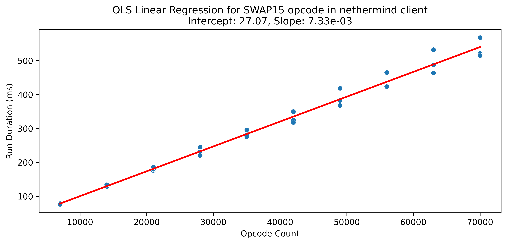


## besu


```python
                            OLS Regression Results                            
==============================================================================
Dep. Variable:        run_duration_ms   R-squared:                       0.990
Model:                            OLS   Adj. R-squared:                  0.990
Method:                 Least Squares   F-statistic:                     2829.
Date:                Mon, 12 Jan 2026   Prob (F-statistic):           1.13e-29
Time:                        10:30:19   Log-Likelihood:                -160.29
No. Observations:                  30   AIC:                             324.6
Df Residuals:                      28   BIC:                             327.4
Df Model:                           1                                         
Covariance Type:            nonrobust                                         
==============================================================================
                 coef    std err          t      P>|t|      [0.025      0.975]
------------------------------------------------------------------------------
const         32.0436     20.663      1.551      0.132     -10.282      74.370
opcount        0.0253      0.000     53.185      0.000       0.024       0.026
==============================================================================
Omnibus:                        0.082   Durbin-Watson:                   0.929
Prob(Omnibus):                  0.960   Jarque-Bera (JB):                0.043
Skew:                           0.037   Prob(JB):                        0.979
Kurtosis:                       2.830   Cond. No.                     9.38e+04
==============================================================================

Notes:
[1] Standard Errors assume that the covariance matrix of the errors is correctly specified.
[2] The condition number is large, 9.38e+04. This might indicate that there are
strong multicollinearity or other numerical problems.
```


# SWAP16

## geth


```python
                            OLS Regression Results                            
==============================================================================
Dep. Variable:        run_duration_ms   R-squared:                       0.989
Model:                            OLS   Adj. R-squared:                  0.988
Method:                 Least Squares   F-statistic:                     2448.
Date:                Mon, 12 Jan 2026   Prob (F-statistic):           8.39e-29
Time:                        10:30:19   Log-Likelihood:                -139.99
No. Observations:                  30   AIC:                             284.0
Df Residuals:                      28   BIC:                             286.8
Df Model:                           1                                         
Covariance Type:            nonrobust                                         
==============================================================================
                 coef    std err          t      P>|t|      [0.025      0.975]
------------------------------------------------------------------------------
const         31.6994     10.501      3.019      0.005      10.189      53.210
opcount        0.0120      0.000     49.480      0.000       0.011       0.012
==============================================================================
Omnibus:                        7.642   Durbin-Watson:                   0.923
Prob(Omnibus):                  0.022   Jarque-Bera (JB):                5.911
Skew:                          -0.910   Prob(JB):                       0.0521
Kurtosis:                       4.191   Cond. No.                     9.38e+04
==============================================================================

Notes:
[1] Standard Errors assume that the covariance matrix of the errors is correctly specified.
[2] The condition number is large, 9.38e+04. This might indicate that there are
strong multicollinearity or other numerical problems.
```


## reth


```python
                            OLS Regression Results                            
==============================================================================
Dep. Variable:        run_duration_ms   R-squared:                       0.977
Model:                            OLS   Adj. R-squared:                  0.976
Method:                 Least Squares   F-statistic:                     1180.
Date:                Mon, 12 Jan 2026   Prob (F-statistic):           1.94e-24
Time:                        10:30:19   Log-Likelihood:                -130.14
No. Observations:                  30   AIC:                             264.3
Df Residuals:                      28   BIC:                             267.1
Df Model:                           1                                         
Covariance Type:            nonrobust                                         
==============================================================================
                 coef    std err          t      P>|t|      [0.025      0.975]
------------------------------------------------------------------------------
const         33.8023      7.562      4.470      0.000      18.313      49.292
opcount        0.0060      0.000     34.356      0.000       0.006       0.006
==============================================================================
Omnibus:                        0.192   Durbin-Watson:                   1.487
Prob(Omnibus):                  0.908   Jarque-Bera (JB):                0.402
Skew:                           0.023   Prob(JB):                        0.818
Kurtosis:                       2.435   Cond. No.                     9.38e+04
==============================================================================

Notes:
[1] Standard Errors assume that the covariance matrix of the errors is correctly specified.
[2] The condition number is large, 9.38e+04. This might indicate that there are
strong multicollinearity or other numerical problems.
```

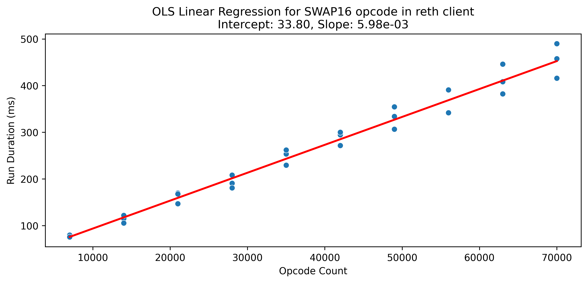


## nethermind


```python
                            OLS Regression Results                            
==============================================================================
Dep. Variable:        run_duration_ms   R-squared:                       0.991
Model:                            OLS   Adj. R-squared:                  0.991
Method:                 Least Squares   F-statistic:                     3065.
Date:                Mon, 12 Jan 2026   Prob (F-statistic):           3.73e-30
Time:                        10:30:19   Log-Likelihood:                -122.73
No. Observations:                  30   AIC:                             249.5
Df Residuals:                      28   BIC:                             252.3
Df Model:                           1                                         
Covariance Type:            nonrobust                                         
==============================================================================
                 coef    std err          t      P>|t|      [0.025      0.975]
------------------------------------------------------------------------------
const         24.0427      5.907      4.070      0.000      11.943      36.142
opcount        0.0075      0.000     55.358      0.000       0.007       0.008
==============================================================================
Omnibus:                        3.284   Durbin-Watson:                   0.961
Prob(Omnibus):                  0.194   Jarque-Bera (JB):                2.675
Skew:                           0.727   Prob(JB):                        0.262
Kurtosis:                       2.838   Cond. No.                     9.38e+04
==============================================================================

Notes:
[1] Standard Errors assume that the covariance matrix of the errors is correctly specified.
[2] The condition number is large, 9.38e+04. This might indicate that there are
strong multicollinearity or other numerical problems.
```


## besu


```python
                            OLS Regression Results                            
==============================================================================
Dep. Variable:        run_duration_ms   R-squared:                       0.991
Model:                            OLS   Adj. R-squared:                  0.991
Method:                 Least Squares   F-statistic:                     3104.
Date:                Mon, 12 Jan 2026   Prob (F-statistic):           3.12e-30
Time:                        10:30:19   Log-Likelihood:                -160.13
No. Observations:                  30   AIC:                             324.3
Df Residuals:                      28   BIC:                             327.1
Df Model:                           1                                         
Covariance Type:            nonrobust                                         
==============================================================================
                 coef    std err          t      P>|t|      [0.025      0.975]
------------------------------------------------------------------------------
const         16.5249     20.551      0.804      0.428     -25.572      58.622
opcount        0.0264      0.000     55.714      0.000       0.025       0.027
==============================================================================
Omnibus:                        2.472   Durbin-Watson:                   0.832
Prob(Omnibus):                  0.291   Jarque-Bera (JB):                1.778
Skew:                          -0.596   Prob(JB):                        0.411
Kurtosis:                       2.980   Cond. No.                     9.38e+04
==============================================================================

Notes:
[1] Standard Errors assume that the covariance matrix of the errors is correctly specified.
[2] The condition number is large, 9.38e+04. This might indicate that there are
strong multicollinearity or other numerical problems.
```


# TIMESTAMP

## geth


```python
                            OLS Regression Results                            
==============================================================================
Dep. Variable:        run_duration_ms   R-squared:                       0.978
Model:                            OLS   Adj. R-squared:                  0.977
Method:                 Least Squares   F-statistic:                     1219.
Date:                Mon, 12 Jan 2026   Prob (F-statistic):           1.25e-24
Time:                        10:30:19   Log-Likelihood:                -171.91
No. Observations:                  30   AIC:                             347.8
Df Residuals:                      28   BIC:                             350.6
Df Model:                           1                                         
Covariance Type:            nonrobust                                         
==============================================================================
                 coef    std err          t      P>|t|      [0.025      0.975]
------------------------------------------------------------------------------
const         27.7406     30.433      0.912      0.370     -34.598      90.080
opcount        0.0171      0.000     34.914      0.000       0.016       0.018
==============================================================================
Omnibus:                       13.454   Durbin-Watson:                   1.250
Prob(Omnibus):                  0.001   Jarque-Bera (JB):               13.722
Skew:                          -1.285   Prob(JB):                      0.00105
Kurtosis:                       5.091   Cond. No.                     1.34e+05
==============================================================================

Notes:
[1] Standard Errors assume that the covariance matrix of the errors is correctly specified.
[2] The condition number is large, 1.34e+05. This might indicate that there are
strong multicollinearity or other numerical problems.
```

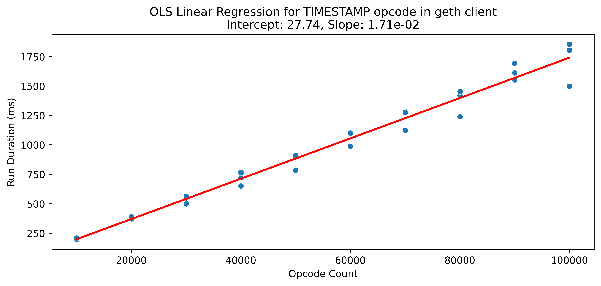


## reth


```python
                            OLS Regression Results                            
==============================================================================
Dep. Variable:        run_duration_ms   R-squared:                       0.982
Model:                            OLS   Adj. R-squared:                  0.981
Method:                 Least Squares   F-statistic:                     1490.
Date:                Mon, 12 Jan 2026   Prob (F-statistic):           7.97e-26
Time:                        10:30:20   Log-Likelihood:                -138.72
No. Observations:                  30   AIC:                             281.4
Df Residuals:                      28   BIC:                             284.2
Df Model:                           1                                         
Covariance Type:            nonrobust                                         
==============================================================================
                 coef    std err          t      P>|t|      [0.025      0.975]
------------------------------------------------------------------------------
const         31.1428     10.066      3.094      0.004      10.524      51.762
opcount        0.0063      0.000     38.599      0.000       0.006       0.007
==============================================================================
Omnibus:                        1.436   Durbin-Watson:                   2.027
Prob(Omnibus):                  0.488   Jarque-Bera (JB):                1.300
Skew:                          -0.376   Prob(JB):                        0.522
Kurtosis:                       2.311   Cond. No.                     1.34e+05
==============================================================================

Notes:
[1] Standard Errors assume that the covariance matrix of the errors is correctly specified.
[2] The condition number is large, 1.34e+05. This might indicate that there are
strong multicollinearity or other numerical problems.
```

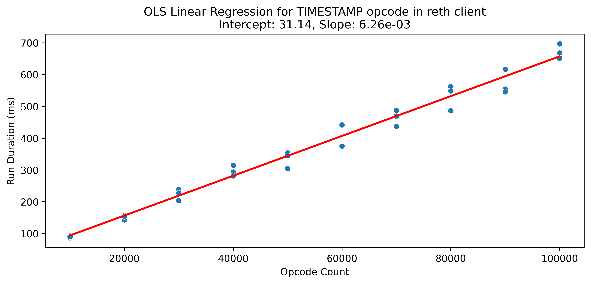


## nethermind


```python
                            OLS Regression Results                            
==============================================================================
Dep. Variable:        run_duration_ms   R-squared:                       0.977
Model:                            OLS   Adj. R-squared:                  0.976
Method:                 Least Squares   F-statistic:                     1193.
Date:                Mon, 12 Jan 2026   Prob (F-statistic):           1.68e-24
Time:                        10:30:20   Log-Likelihood:                -146.28
No. Observations:                  30   AIC:                             296.6
Df Residuals:                      28   BIC:                             299.4
Df Model:                           1                                         
Covariance Type:            nonrobust                                         
==============================================================================
                 coef    std err          t      P>|t|      [0.025      0.975]
------------------------------------------------------------------------------
const         25.2245     12.951      1.948      0.062      -1.305      51.754
opcount        0.0072      0.000     34.543      0.000       0.007       0.008
==============================================================================
Omnibus:                       14.032   Durbin-Watson:                   0.572
Prob(Omnibus):                  0.001   Jarque-Bera (JB):               14.747
Skew:                           1.313   Prob(JB):                     0.000628
Kurtosis:                       5.213   Cond. No.                     1.34e+05
==============================================================================

Notes:
[1] Standard Errors assume that the covariance matrix of the errors is correctly specified.
[2] The condition number is large, 1.34e+05. This might indicate that there are
strong multicollinearity or other numerical problems.
```

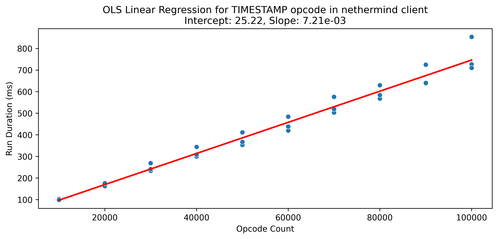


## besu


```python
                            OLS Regression Results                            
==============================================================================
Dep. Variable:        run_duration_ms   R-squared:                       0.998
Model:                            OLS   Adj. R-squared:                  0.998
Method:                 Least Squares   F-statistic:                 1.658e+04
Date:                Mon, 12 Jan 2026   Prob (F-statistic):           2.24e-40
Time:                        10:30:20   Log-Likelihood:                -148.33
No. Observations:                  30   AIC:                             300.7
Df Residuals:                      28   BIC:                             303.5
Df Model:                           1                                         
Covariance Type:            nonrobust                                         
==============================================================================
                 coef    std err          t      P>|t|      [0.025      0.975]
------------------------------------------------------------------------------
const         21.3042     13.869      1.536      0.136      -7.105      49.714
opcount        0.0288      0.000    128.765      0.000       0.028       0.029
==============================================================================
Omnibus:                        3.073   Durbin-Watson:                   1.757
Prob(Omnibus):                  0.215   Jarque-Bera (JB):                1.723
Skew:                           0.511   Prob(JB):                        0.423
Kurtosis:                       3.579   Cond. No.                     1.34e+05
==============================================================================

Notes:
[1] Standard Errors assume that the covariance matrix of the errors is correctly specified.
[2] The condition number is large, 1.34e+05. This might indicate that there are
strong multicollinearity or other numerical problems.
```


# XOR

## geth


```python
                            OLS Regression Results                            
==============================================================================
Dep. Variable:        run_duration_ms   R-squared:                       0.981
Model:                            OLS   Adj. R-squared:                  0.981
Method:                 Least Squares   F-statistic:                     1481.
Date:                Mon, 12 Jan 2026   Prob (F-statistic):           8.64e-26
Time:                        10:30:20   Log-Likelihood:                -147.38
No. Observations:                  30   AIC:                             298.8
Df Residuals:                      28   BIC:                             301.6
Df Model:                           1                                         
Covariance Type:            nonrobust                                         
==============================================================================
                 coef    std err          t      P>|t|      [0.025      0.975]
------------------------------------------------------------------------------
const         28.5978     13.435      2.129      0.042       1.077      56.119
opcount        0.0238      0.001     38.485      0.000       0.023       0.025
==============================================================================
Omnibus:                        1.448   Durbin-Watson:                   1.315
Prob(Omnibus):                  0.485   Jarque-Bera (JB):                0.521
Skew:                          -0.244   Prob(JB):                        0.771
Kurtosis:                       3.423   Cond. No.                     4.69e+04
==============================================================================

Notes:
[1] Standard Errors assume that the covariance matrix of the errors is correctly specified.
[2] The condition number is large, 4.69e+04. This might indicate that there are
strong multicollinearity or other numerical problems.
```


## reth


```python
                            OLS Regression Results                            
==============================================================================
Dep. Variable:        run_duration_ms   R-squared:                       0.990
Model:                            OLS   Adj. R-squared:                  0.990
Method:                 Least Squares   F-statistic:                     2855.
Date:                Mon, 12 Jan 2026   Prob (F-statistic):           9.97e-30
Time:                        10:30:20   Log-Likelihood:                -107.07
No. Observations:                  30   AIC:                             218.1
Df Residuals:                      28   BIC:                             220.9
Df Model:                           1                                         
Covariance Type:            nonrobust                                         
==============================================================================
                 coef    std err          t      P>|t|      [0.025      0.975]
------------------------------------------------------------------------------
const         34.3817      3.504      9.811      0.000      27.203      41.560
opcount        0.0086      0.000     53.433      0.000       0.008       0.009
==============================================================================
Omnibus:                        1.683   Durbin-Watson:                   1.869
Prob(Omnibus):                  0.431   Jarque-Bera (JB):                1.554
Skew:                           0.483   Prob(JB):                        0.460
Kurtosis:                       2.442   Cond. No.                     4.69e+04
==============================================================================

Notes:
[1] Standard Errors assume that the covariance matrix of the errors is correctly specified.
[2] The condition number is large, 4.69e+04. This might indicate that there are
strong multicollinearity or other numerical problems.
```


## nethermind


```python
                            OLS Regression Results                            
==============================================================================
Dep. Variable:        run_duration_ms   R-squared:                       0.997
Model:                            OLS   Adj. R-squared:                  0.997
Method:                 Least Squares   F-statistic:                 1.081e+04
Date:                Mon, 12 Jan 2026   Prob (F-statistic):           8.86e-38
Time:                        10:30:20   Log-Likelihood:                -123.60
No. Observations:                  30   AIC:                             251.2
Df Residuals:                      28   BIC:                             254.0
Df Model:                           1                                         
Covariance Type:            nonrobust                                         
==============================================================================
                 coef    std err          t      P>|t|      [0.025      0.975]
------------------------------------------------------------------------------
const         32.2914      6.080      5.311      0.000      19.836      44.747
opcount        0.0291      0.000    103.960      0.000       0.029       0.030
==============================================================================
Omnibus:                        1.299   Durbin-Watson:                   0.782
Prob(Omnibus):                  0.522   Jarque-Bera (JB):                1.223
Skew:                           0.436   Prob(JB):                        0.542
Kurtosis:                       2.531   Cond. No.                     4.69e+04
==============================================================================

Notes:
[1] Standard Errors assume that the covariance matrix of the errors is correctly specified.
[2] The condition number is large, 4.69e+04. This might indicate that there are
strong multicollinearity or other numerical problems.
```


## besu


```python
                            OLS Regression Results                            
==============================================================================
Dep. Variable:        run_duration_ms   R-squared:                       0.999
Model:                            OLS   Adj. R-squared:                  0.999
Method:                 Least Squares   F-statistic:                 4.042e+04
Date:                Mon, 12 Jan 2026   Prob (F-statistic):           8.68e-46
Time:                        10:30:20   Log-Likelihood:                -131.84
No. Observations:                  30   AIC:                             267.7
Df Residuals:                      28   BIC:                             270.5
Df Model:                           1                                         
Covariance Type:            nonrobust                                         
==============================================================================
                 coef    std err          t      P>|t|      [0.025      0.975]
------------------------------------------------------------------------------
const         28.2458      8.003      3.529      0.001      11.853      44.639
opcount        0.0741      0.000    201.042      0.000       0.073       0.075
==============================================================================
Omnibus:                        0.975   Durbin-Watson:                   2.200
Prob(Omnibus):                  0.614   Jarque-Bera (JB):                0.850
Skew:                          -0.384   Prob(JB):                        0.654
Kurtosis:                       2.698   Cond. No.                     4.69e+04
==============================================================================

Notes:
[1] Standard Errors assume that the covariance matrix of the errors is correctly specified.
[2] The condition number is large, 4.69e+04. This might indicate that there are
strong multicollinearity or other numerical problems.
```


