Opcode run times estimation results - log opcodes
=================================================

Table of contents
=================

* [LOG0](#log0)
* [LOG1](#log1)
* [LOG2](#log2)
* [LOG3](#log3)
* [LOG4](#log4)

# Introduction


This is an automated report generated from the opcode run times 
estimation script `./src/estimate_opcode_run_times.py`. The script 
uses data generated by running the 
[EEST benchmark suite](https://github.com/ethereum/execution-spec-tests/tree/main/tests/benchmark) 
with the [Nethermind benchmarking tooling](https://github.com/NethermindEth/gas-benchmarks).

The data includes all the log opcode tests run between 2026-01-10 and 2026-01-22.

For each opcode and client, an OLS linear regression model is fitted to estimate the 
opcode run time as a function of the opcode count and other opcode configurations. The results are presented below.

# LOG0

## geth


```python
                            OLS Regression Results                            
==============================================================================
Dep. Variable:        run_duration_ms   R-squared:                       0.865
Model:                            OLS   Adj. R-squared:                  0.865
Method:                 Least Squares   F-statistic:                     9908.
Date:                Thu, 22 Jan 2026   Prob (F-statistic):               0.00
Time:                        10:35:56   Log-Likelihood:                -27998.
No. Observations:                4640   AIC:                         5.600e+04
Df Residuals:                    4636   BIC:                         5.603e+04
Df Model:                           3                                         
Covariance Type:            nonrobust                                         
==============================================================================
                 coef    std err          t      P>|t|      [0.025      0.975]
------------------------------------------------------------------------------
const         87.2828      3.536     24.683      0.000      80.350      94.215
opcount        1.4746      0.010    149.247      0.000       1.455       1.494
log_size       0.1178      0.005     25.686      0.000       0.109       0.127
mem_size       0.0021      0.004      0.574      0.566      -0.005       0.009
==============================================================================
Omnibus:                      352.499   Durbin-Watson:                   2.124
Prob(Omnibus):                  0.000   Jarque-Bera (JB):              440.156
Skew:                           0.707   Prob(JB):                     2.64e-96
Kurtosis:                       3.529   Cond. No.                     1.50e+03
==============================================================================

Notes:
[1] Standard Errors assume that the covariance matrix of the errors is correctly specified.
[2] The condition number is large, 1.5e+03. This might indicate that there are
strong multicollinearity or other numerical problems.
```

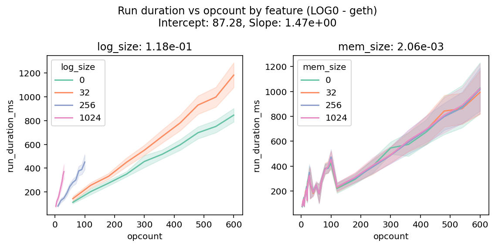

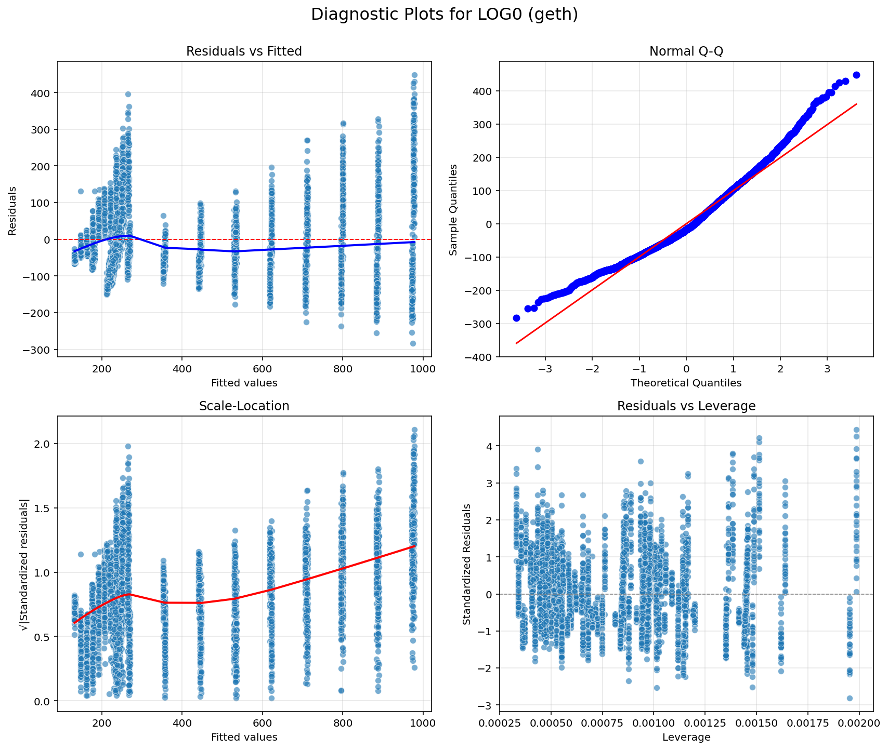


## besu


```python
                            OLS Regression Results                            
==============================================================================
Dep. Variable:        run_duration_ms   R-squared:                       0.898
Model:                            OLS   Adj. R-squared:                  0.898
Method:                 Least Squares   F-statistic:                 1.362e+04
Date:                Thu, 22 Jan 2026   Prob (F-statistic):               0.00
Time:                        10:35:57   Log-Likelihood:                -27885.
No. Observations:                4640   AIC:                         5.578e+04
Df Residuals:                    4636   BIC:                         5.580e+04
Df Model:                           3                                         
Covariance Type:            nonrobust                                         
==============================================================================
                 coef    std err          t      P>|t|      [0.025      0.975]
------------------------------------------------------------------------------
const         74.4120      3.452     21.558      0.000      67.645      81.179
opcount        1.6805      0.010    174.249      0.000       1.662       1.699
log_size       0.1282      0.004     28.634      0.000       0.119       0.137
mem_size       0.0088      0.003      2.505      0.012       0.002       0.016
==============================================================================
Omnibus:                      145.183   Durbin-Watson:                   2.063
Prob(Omnibus):                  0.000   Jarque-Bera (JB):              158.637
Skew:                           0.453   Prob(JB):                     3.57e-35
Kurtosis:                       3.025   Cond. No.                     1.50e+03
==============================================================================

Notes:
[1] Standard Errors assume that the covariance matrix of the errors is correctly specified.
[2] The condition number is large, 1.5e+03. This might indicate that there are
strong multicollinearity or other numerical problems.
```

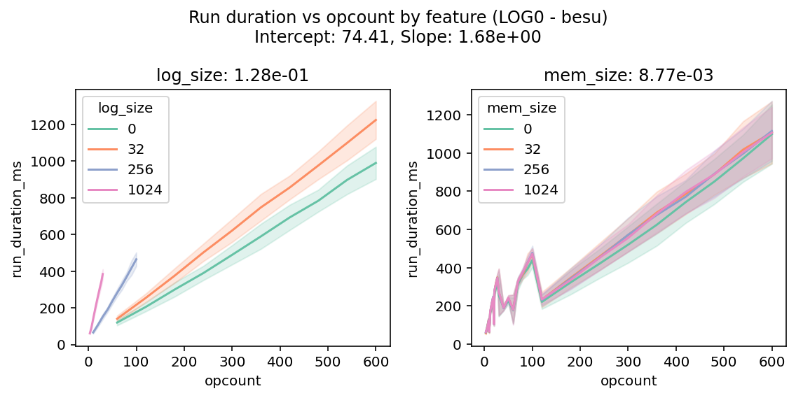

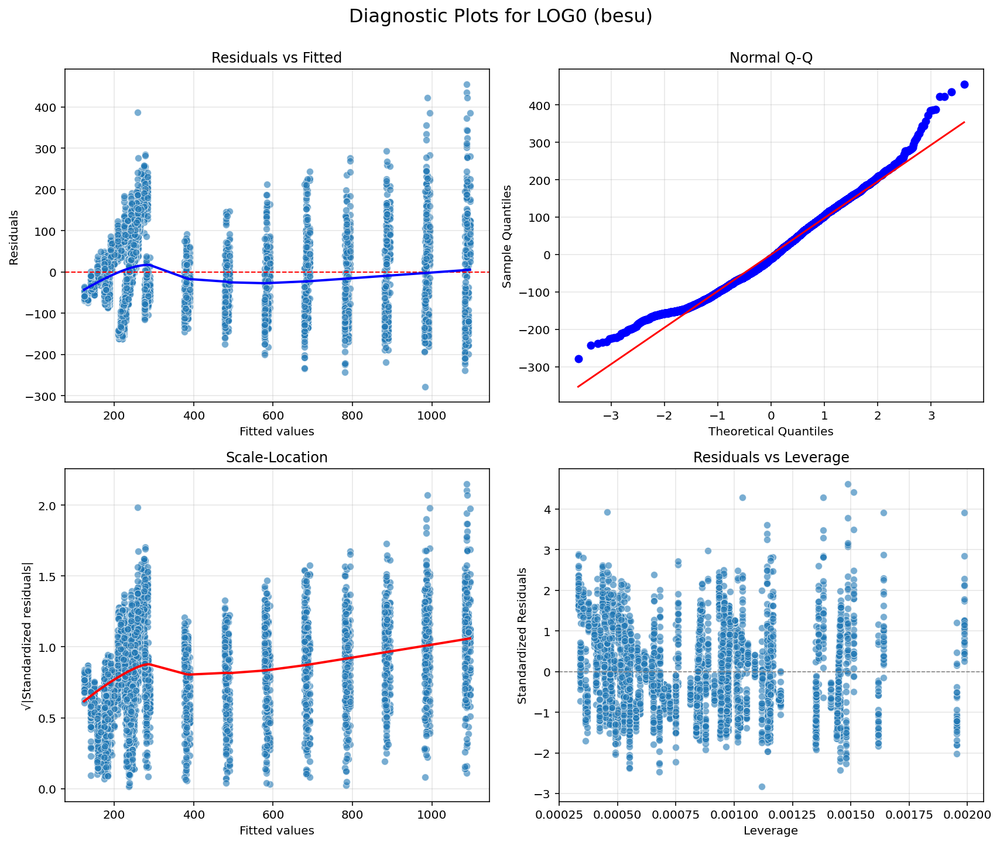


## reth


```python
                            OLS Regression Results                            
==============================================================================
Dep. Variable:        run_duration_ms   R-squared:                       0.583
Model:                            OLS   Adj. R-squared:                  0.583
Method:                 Least Squares   F-statistic:                     1343.
Date:                Thu, 22 Jan 2026   Prob (F-statistic):               0.00
Time:                        10:35:57   Log-Likelihood:                -15275.
No. Observations:                2880   AIC:                         3.056e+04
Df Residuals:                    2876   BIC:                         3.058e+04
Df Model:                           3                                         
Covariance Type:            nonrobust                                         
==============================================================================
                 coef    std err          t      P>|t|      [0.025      0.975]
------------------------------------------------------------------------------
const         49.6810      2.163     22.964      0.000      45.439      53.923
opcount        0.3741      0.006     61.888      0.000       0.362       0.386
log_size       0.0775      0.003     27.605      0.000       0.072       0.083
mem_size       0.0001      0.002      0.056      0.955      -0.004       0.004
==============================================================================
Omnibus:                      290.503   Durbin-Watson:                   2.096
Prob(Omnibus):                  0.000   Jarque-Bera (JB):              125.915
Skew:                           0.318   Prob(JB):                     4.55e-28
Kurtosis:                       2.197   Cond. No.                     1.50e+03
==============================================================================

Notes:
[1] Standard Errors assume that the covariance matrix of the errors is correctly specified.
[2] The condition number is large, 1.5e+03. This might indicate that there are
strong multicollinearity or other numerical problems.
```

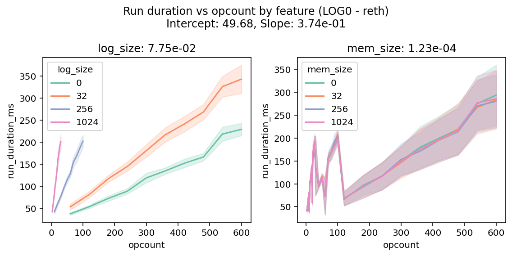

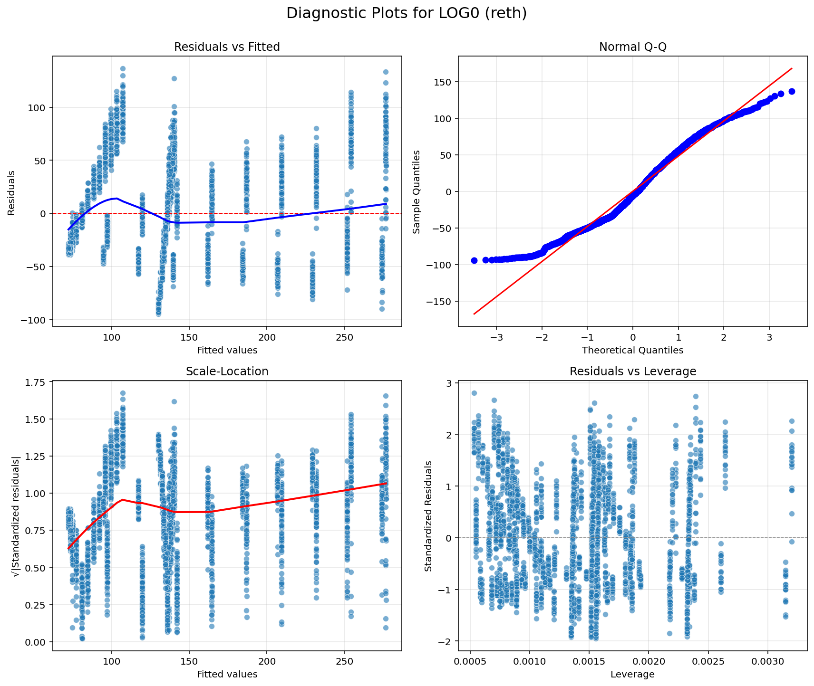


## nethermind


```python
                            OLS Regression Results                            
==============================================================================
Dep. Variable:        run_duration_ms   R-squared:                       0.824
Model:                            OLS   Adj. R-squared:                  0.824
Method:                 Least Squares   F-statistic:                     7236.
Date:                Thu, 22 Jan 2026   Prob (F-statistic):               0.00
Time:                        10:35:58   Log-Likelihood:                -25758.
No. Observations:                4640   AIC:                         5.152e+04
Df Residuals:                    4636   BIC:                         5.155e+04
Df Model:                           3                                         
Covariance Type:            nonrobust                                         
==============================================================================
                 coef    std err          t      P>|t|      [0.025      0.975]
------------------------------------------------------------------------------
const         56.3507      2.182     25.824      0.000      52.073      60.629
opcount        0.7912      0.006    129.761      0.000       0.779       0.803
log_size       0.0753      0.003     26.591      0.000       0.070       0.081
mem_size       0.0114      0.002      5.154      0.000       0.007       0.016
==============================================================================
Omnibus:                      236.553   Durbin-Watson:                   2.063
Prob(Omnibus):                  0.000   Jarque-Bera (JB):              273.703
Skew:                           0.595   Prob(JB):                     3.68e-60
Kurtosis:                       3.029   Cond. No.                     1.50e+03
==============================================================================

Notes:
[1] Standard Errors assume that the covariance matrix of the errors is correctly specified.
[2] The condition number is large, 1.5e+03. This might indicate that there are
strong multicollinearity or other numerical problems.
```

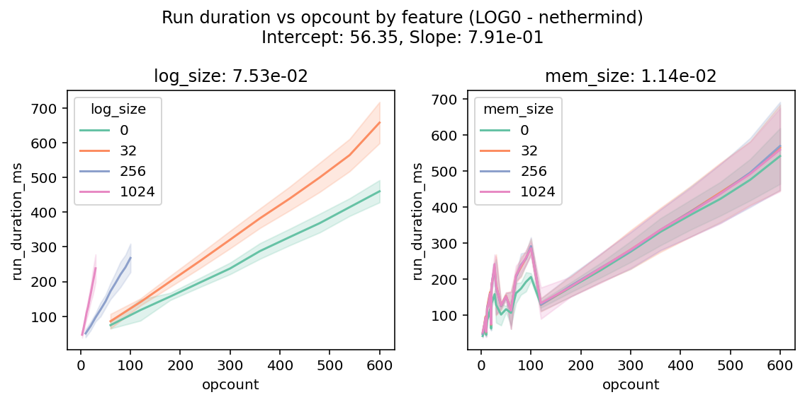

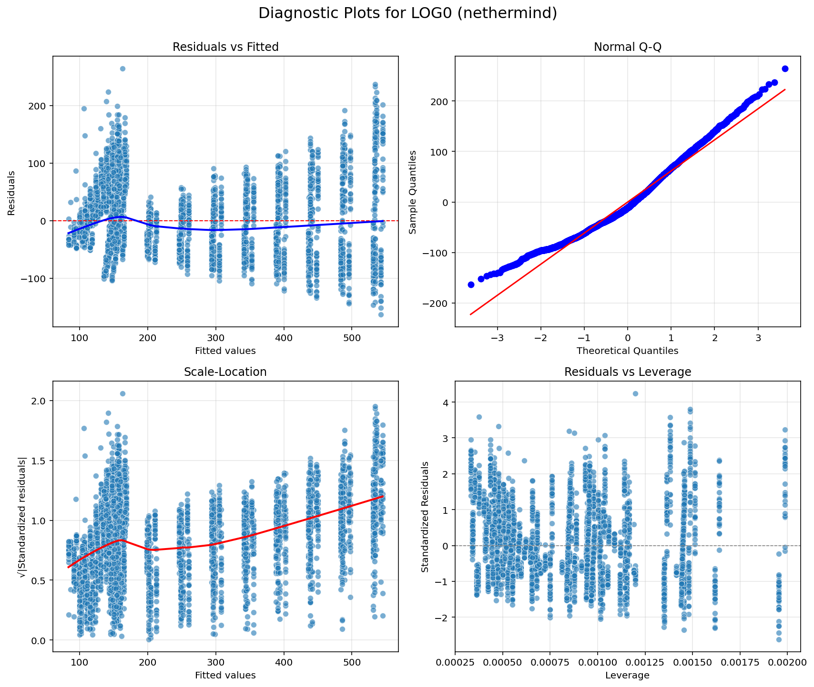


## erigon


```python
                            OLS Regression Results                            
==============================================================================
Dep. Variable:        run_duration_ms   R-squared:                       0.978
Model:                            OLS   Adj. R-squared:                  0.978
Method:                 Least Squares   F-statistic:                     1261.
Date:                Thu, 22 Jan 2026   Prob (F-statistic):           7.86e-25
Time:                        10:35:58   Log-Likelihood:                -161.76
No. Observations:                  30   AIC:                             327.5
Df Residuals:                      28   BIC:                             330.3
Df Model:                           1                                         
Covariance Type:            nonrobust                                         
==============================================================================
                 coef    std err          t      P>|t|      [0.025      0.975]
------------------------------------------------------------------------------
const         37.8317     21.694      1.744      0.092      -6.606      82.269
opcount        2.0693      0.058     35.511      0.000       1.950       2.189
log_size            0          0        nan        nan           0           0
mem_size            0          0        nan        nan           0           0
==============================================================================
Omnibus:                        1.736   Durbin-Watson:                   1.823
Prob(Omnibus):                  0.420   Jarque-Bera (JB):                1.519
Skew:                           0.520   Prob(JB):                        0.468
Kurtosis:                       2.633   Cond. No.                          inf
==============================================================================

Notes:
[1] Standard Errors assume that the covariance matrix of the errors is correctly specified.
[2] The smallest eigenvalue is      0. This might indicate that there are
strong multicollinearity problems or that the design matrix is singular.
```

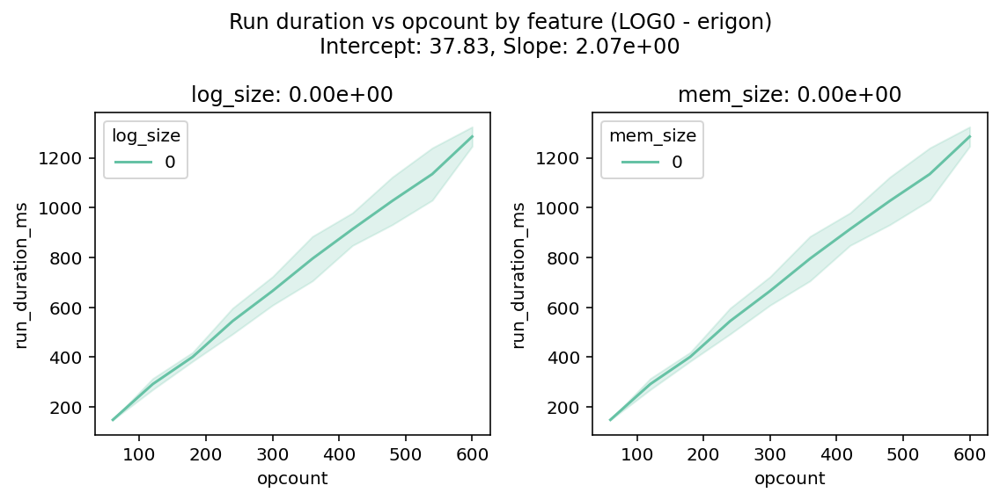

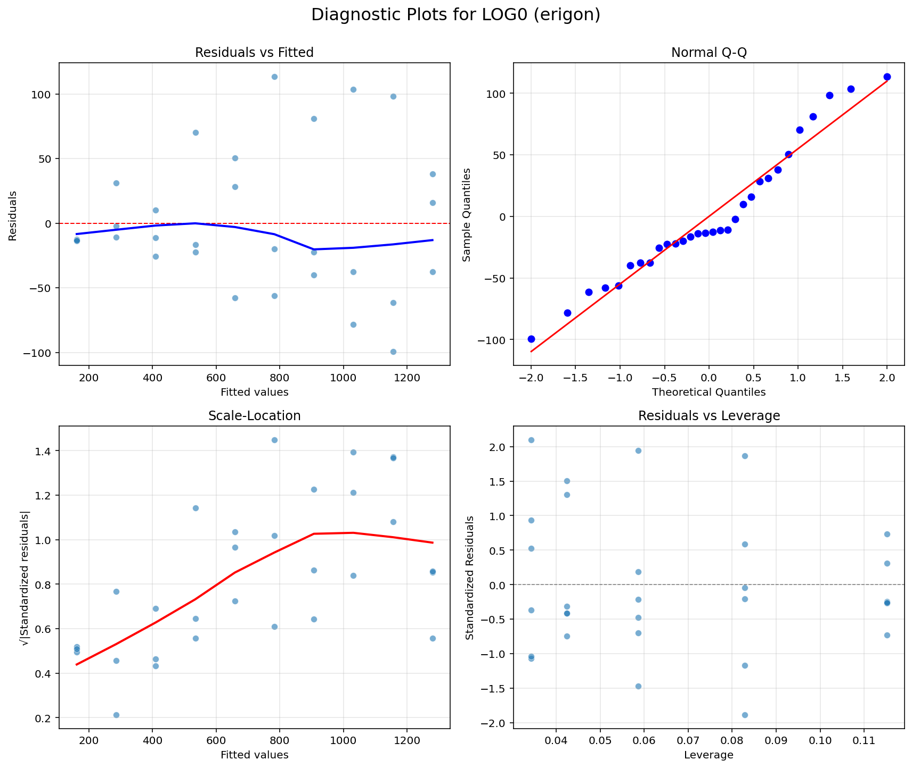


# LOG1

## geth


```python
                            OLS Regression Results                            
==============================================================================
Dep. Variable:        run_duration_ms   R-squared:                       0.836
Model:                            OLS   Adj. R-squared:                  0.836
Method:                 Least Squares   F-statistic:                     7868.
Date:                Thu, 22 Jan 2026   Prob (F-statistic):               0.00
Time:                        10:35:58   Log-Likelihood:                -27231.
No. Observations:                4640   AIC:                         5.447e+04
Df Residuals:                    4636   BIC:                         5.450e+04
Df Model:                           3                                         
Covariance Type:            nonrobust                                         
==============================================================================
                 coef    std err          t      P>|t|      [0.025      0.975]
------------------------------------------------------------------------------
const         63.8189      3.218     19.835      0.000      57.511      70.127
opcount        2.4838      0.018    139.308      0.000       2.449       2.519
log_size       0.1493      0.004     38.029      0.000       0.142       0.157
mem_size       0.0017      0.003      0.553      0.580      -0.004       0.008
==============================================================================
Omnibus:                      343.713   Durbin-Watson:                   1.895
Prob(Omnibus):                  0.000   Jarque-Bera (JB):              425.726
Skew:                           0.700   Prob(JB):                     3.59e-93
Kurtosis:                       3.492   Cond. No.                     1.60e+03
==============================================================================

Notes:
[1] Standard Errors assume that the covariance matrix of the errors is correctly specified.
[2] The condition number is large, 1.6e+03. This might indicate that there are
strong multicollinearity or other numerical problems.
```

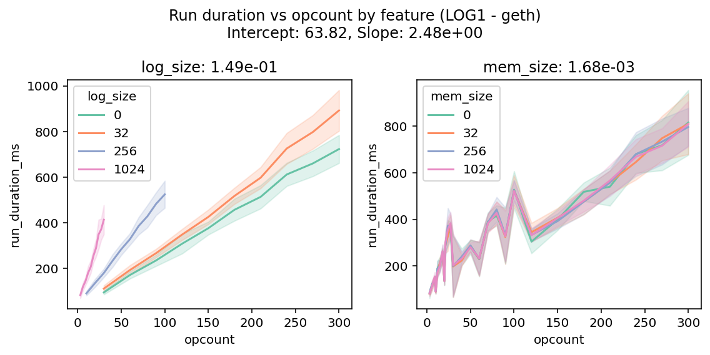

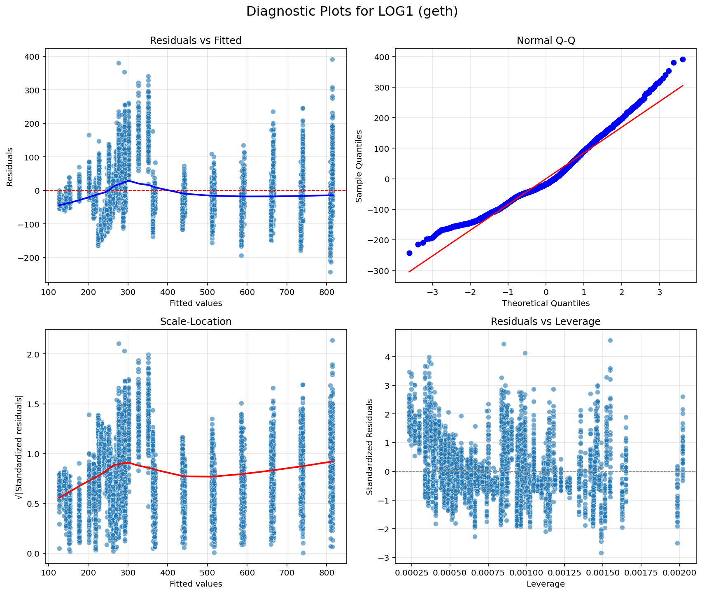


## besu


```python
                            OLS Regression Results                            
==============================================================================
Dep. Variable:        run_duration_ms   R-squared:                       0.888
Model:                            OLS   Adj. R-squared:                  0.888
Method:                 Least Squares   F-statistic:                 1.224e+04
Date:                Thu, 22 Jan 2026   Prob (F-statistic):               0.00
Time:                        10:35:59   Log-Likelihood:                -27350.
No. Observations:                4640   AIC:                         5.471e+04
Df Residuals:                    4636   BIC:                         5.473e+04
Df Model:                           3                                         
Covariance Type:            nonrobust                                         
==============================================================================
                 coef    std err          t      P>|t|      [0.025      0.975]
------------------------------------------------------------------------------
const         60.2099      3.301     18.241      0.000      53.739      66.681
opcount        3.0836      0.018    168.585      0.000       3.048       3.119
log_size       0.1460      0.004     36.263      0.000       0.138       0.154
mem_size       0.0059      0.003      1.902      0.057      -0.000       0.012
==============================================================================
Omnibus:                      271.765   Durbin-Watson:                   1.862
Prob(Omnibus):                  0.000   Jarque-Bera (JB):              320.035
Skew:                           0.636   Prob(JB):                     3.20e-70
Kurtosis:                       3.194   Cond. No.                     1.60e+03
==============================================================================

Notes:
[1] Standard Errors assume that the covariance matrix of the errors is correctly specified.
[2] The condition number is large, 1.6e+03. This might indicate that there are
strong multicollinearity or other numerical problems.
```

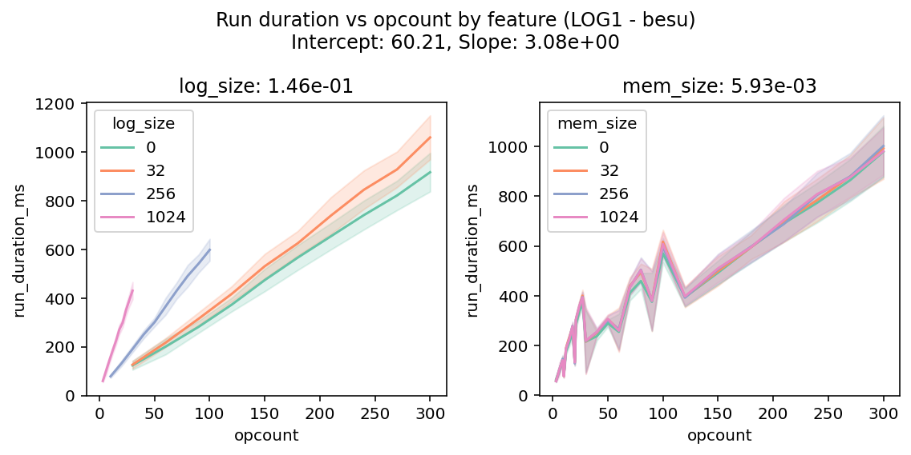

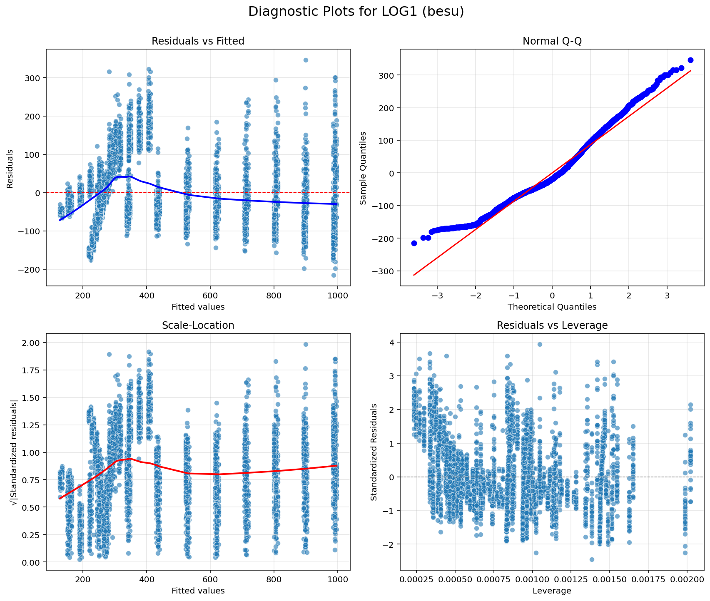


## reth


```python
                            OLS Regression Results                            
==============================================================================
Dep. Variable:        run_duration_ms   R-squared:                       0.514
Model:                            OLS   Adj. R-squared:                  0.514
Method:                 Least Squares   F-statistic:                     1015.
Date:                Thu, 22 Jan 2026   Prob (F-statistic):               0.00
Time:                        10:35:59   Log-Likelihood:                -14899.
No. Observations:                2880   AIC:                         2.981e+04
Df Residuals:                    2876   BIC:                         2.983e+04
Df Model:                           3                                         
Covariance Type:            nonrobust                                         
==============================================================================
                 coef    std err          t      P>|t|      [0.025      0.975]
------------------------------------------------------------------------------
const         39.6826      2.038     19.472      0.000      35.687      43.679
opcount        0.6232      0.011     55.185      0.000       0.601       0.645
log_size       0.0874      0.002     35.170      0.000       0.083       0.092
mem_size       0.0006      0.002      0.294      0.768      -0.003       0.004
==============================================================================
Omnibus:                      110.320   Durbin-Watson:                   1.979
Prob(Omnibus):                  0.000   Jarque-Bera (JB):              122.682
Skew:                           0.504   Prob(JB):                     2.29e-27
Kurtosis:                       2.924   Cond. No.                     1.60e+03
==============================================================================

Notes:
[1] Standard Errors assume that the covariance matrix of the errors is correctly specified.
[2] The condition number is large, 1.6e+03. This might indicate that there are
strong multicollinearity or other numerical problems.
```

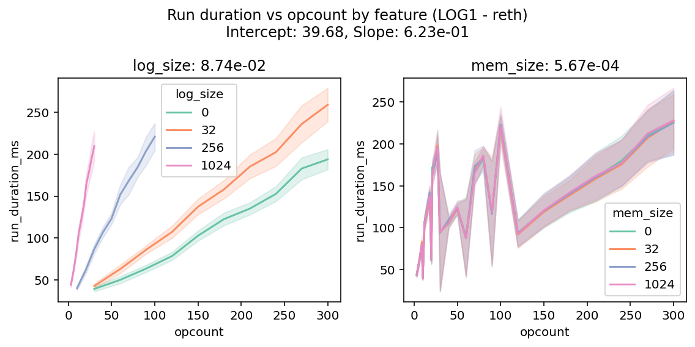

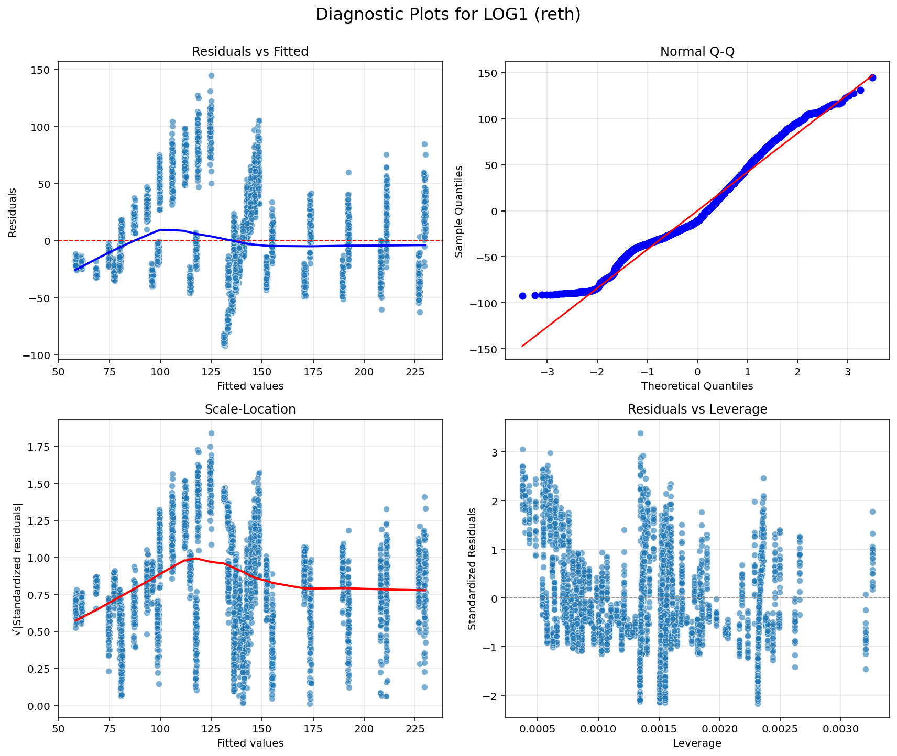


## nethermind


```python
                            OLS Regression Results                            
==============================================================================
Dep. Variable:        run_duration_ms   R-squared:                       0.824
Model:                            OLS   Adj. R-squared:                  0.824
Method:                 Least Squares   F-statistic:                     7251.
Date:                Thu, 22 Jan 2026   Prob (F-statistic):               0.00
Time:                        10:36:00   Log-Likelihood:                -25044.
No. Observations:                4640   AIC:                         5.010e+04
Df Residuals:                    4636   BIC:                         5.012e+04
Df Model:                           3                                         
Covariance Type:            nonrobust                                         
==============================================================================
                 coef    std err          t      P>|t|      [0.025      0.975]
------------------------------------------------------------------------------
const         50.9168      2.008     25.353      0.000      46.980      54.854
opcount        1.4735      0.011    132.407      0.000       1.452       1.495
log_size       0.0826      0.002     33.722      0.000       0.078       0.087
mem_size       0.0112      0.002      5.910      0.000       0.007       0.015
==============================================================================
Omnibus:                      382.387   Durbin-Watson:                   1.853
Prob(Omnibus):                  0.000   Jarque-Bera (JB):              480.984
Skew:                           0.761   Prob(JB):                    3.59e-105
Kurtosis:                       3.416   Cond. No.                     1.60e+03
==============================================================================

Notes:
[1] Standard Errors assume that the covariance matrix of the errors is correctly specified.
[2] The condition number is large, 1.6e+03. This might indicate that there are
strong multicollinearity or other numerical problems.
```

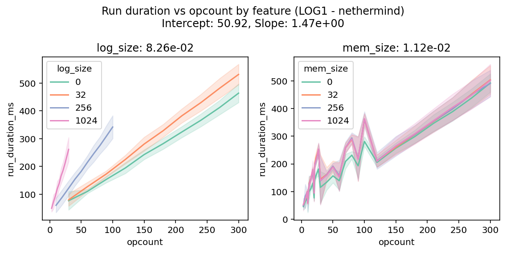

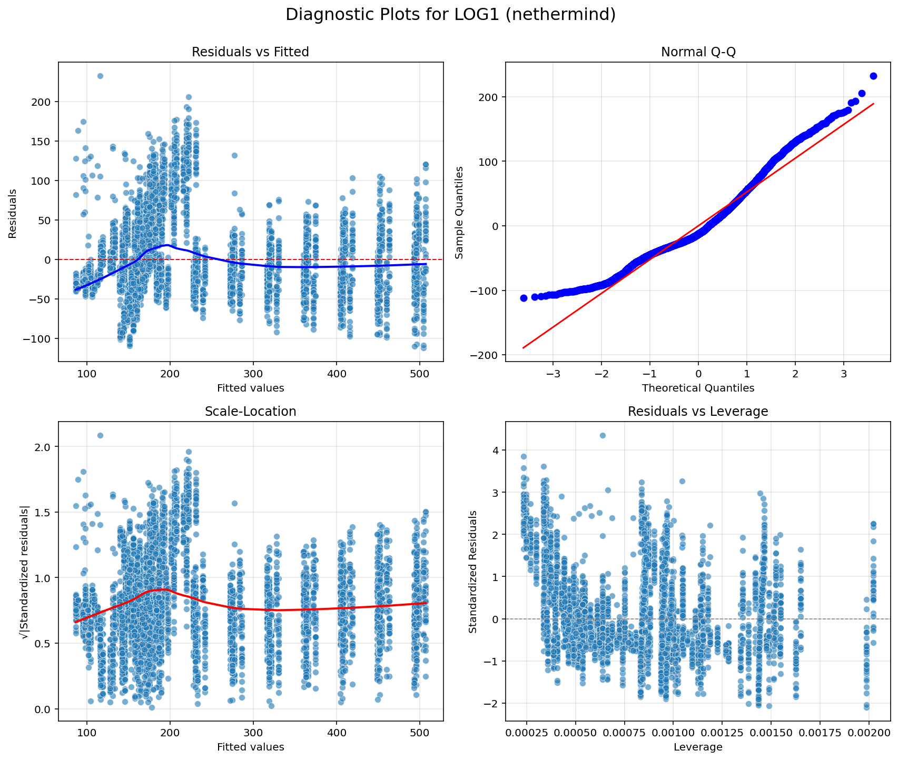


## erigon


```python
                            OLS Regression Results                            
==============================================================================
Dep. Variable:        run_duration_ms   R-squared:                       0.943
Model:                            OLS   Adj. R-squared:                  0.941
Method:                 Least Squares   F-statistic:                     413.6
Date:                Thu, 22 Jan 2026   Prob (F-statistic):           4.56e-17
Time:                        10:36:00   Log-Likelihood:                -154.52
No. Observations:                  27   AIC:                             313.0
Df Residuals:                      25   BIC:                             315.6
Df Model:                           1                                         
Covariance Type:            nonrobust                                         
==============================================================================
                 coef    std err          t      P>|t|      [0.025      0.975]
------------------------------------------------------------------------------
const        -11.2343     32.256     -0.348      0.731     -77.667      55.199
opcount        3.8857      0.191     20.336      0.000       3.492       4.279
log_size            0          0        nan        nan           0           0
mem_size            0          0        nan        nan           0           0
==============================================================================
Omnibus:                        2.804   Durbin-Watson:                   1.734
Prob(Omnibus):                  0.246   Jarque-Bera (JB):                1.429
Skew:                           0.481   Prob(JB):                        0.489
Kurtosis:                       3.587   Cond. No.                          inf
==============================================================================

Notes:
[1] Standard Errors assume that the covariance matrix of the errors is correctly specified.
[2] The smallest eigenvalue is      0. This might indicate that there are
strong multicollinearity problems or that the design matrix is singular.
```

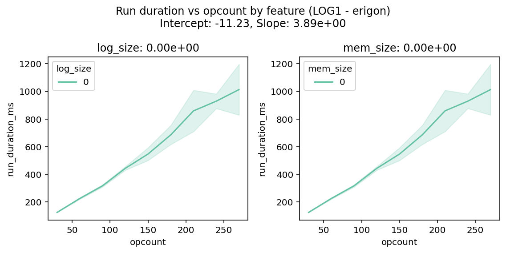

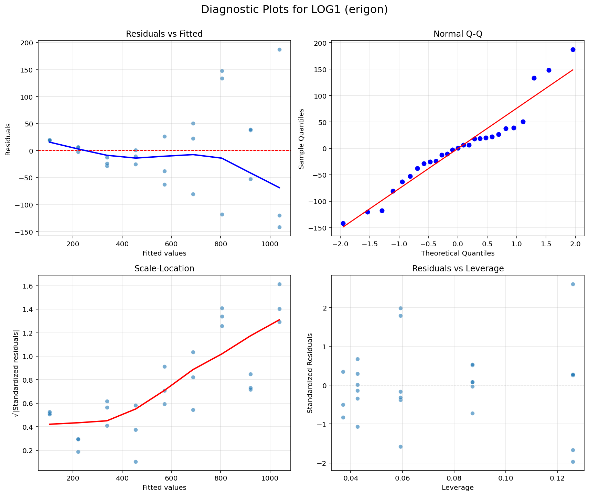


# LOG2

## geth


```python
                            OLS Regression Results                            
==============================================================================
Dep. Variable:        run_duration_ms   R-squared:                       0.849
Model:                            OLS   Adj. R-squared:                  0.849
Method:                 Least Squares   F-statistic:                     8702.
Date:                Thu, 22 Jan 2026   Prob (F-statistic):               0.00
Time:                        10:36:00   Log-Likelihood:                -26507.
No. Observations:                4640   AIC:                         5.302e+04
Df Residuals:                    4636   BIC:                         5.305e+04
Df Model:                           3                                         
Covariance Type:            nonrobust                                         
==============================================================================
                 coef    std err          t      P>|t|      [0.025      0.975]
------------------------------------------------------------------------------
const         48.6548      2.806     17.340      0.000      43.154      54.156
opcount        3.5097      0.023    151.505      0.000       3.464       3.555
log_size       0.1632      0.003     49.380      0.000       0.157       0.170
mem_size       0.0026      0.003      1.017      0.309      -0.002       0.008
==============================================================================
Omnibus:                      446.746   Durbin-Watson:                   1.989
Prob(Omnibus):                  0.000   Jarque-Bera (JB):              710.276
Skew:                           0.707   Prob(JB):                    5.83e-155
Kurtosis:                       4.293   Cond. No.                     1.62e+03
==============================================================================

Notes:
[1] Standard Errors assume that the covariance matrix of the errors is correctly specified.
[2] The condition number is large, 1.62e+03. This might indicate that there are
strong multicollinearity or other numerical problems.
```

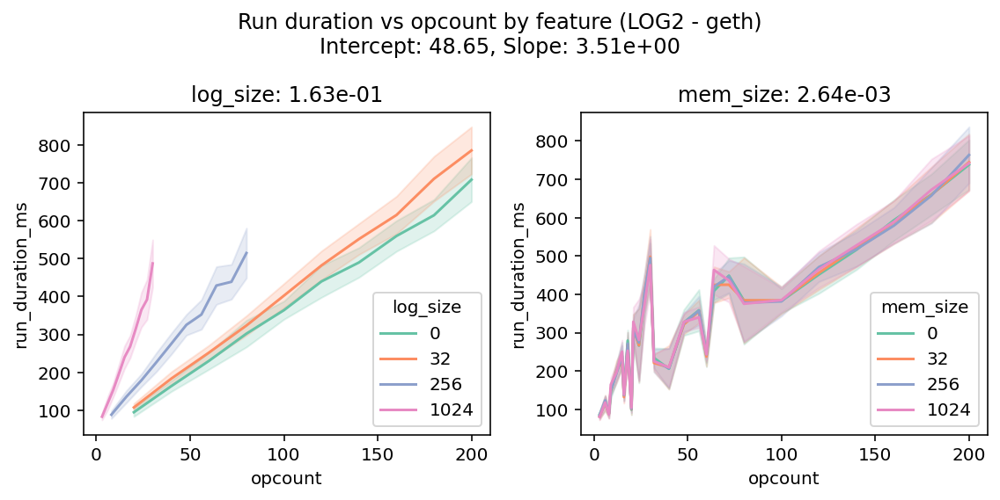

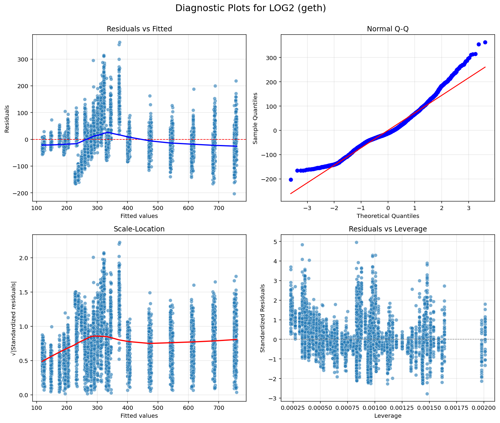


## besu


```python
                            OLS Regression Results                            
==============================================================================
Dep. Variable:        run_duration_ms   R-squared:                       0.907
Model:                            OLS   Adj. R-squared:                  0.907
Method:                 Least Squares   F-statistic:                 1.510e+04
Date:                Thu, 22 Jan 2026   Prob (F-statistic):               0.00
Time:                        10:36:01   Log-Likelihood:                -26654.
No. Observations:                4640   AIC:                         5.332e+04
Df Residuals:                    4636   BIC:                         5.334e+04
Df Model:                           3                                         
Covariance Type:            nonrobust                                         
==============================================================================
                 coef    std err          t      P>|t|      [0.025      0.975]
------------------------------------------------------------------------------
const         32.8454      2.896     11.341      0.000      27.168      38.523
opcount        4.6245      0.024    193.414      0.000       4.578       4.671
log_size       0.1692      0.003     49.598      0.000       0.163       0.176
mem_size       0.0050      0.003      1.848      0.065      -0.000       0.010
==============================================================================
Omnibus:                      164.169   Durbin-Watson:                   1.952
Prob(Omnibus):                  0.000   Jarque-Bera (JB):              182.702
Skew:                           0.460   Prob(JB):                     2.12e-40
Kurtosis:                       3.312   Cond. No.                     1.62e+03
==============================================================================

Notes:
[1] Standard Errors assume that the covariance matrix of the errors is correctly specified.
[2] The condition number is large, 1.62e+03. This might indicate that there are
strong multicollinearity or other numerical problems.
```

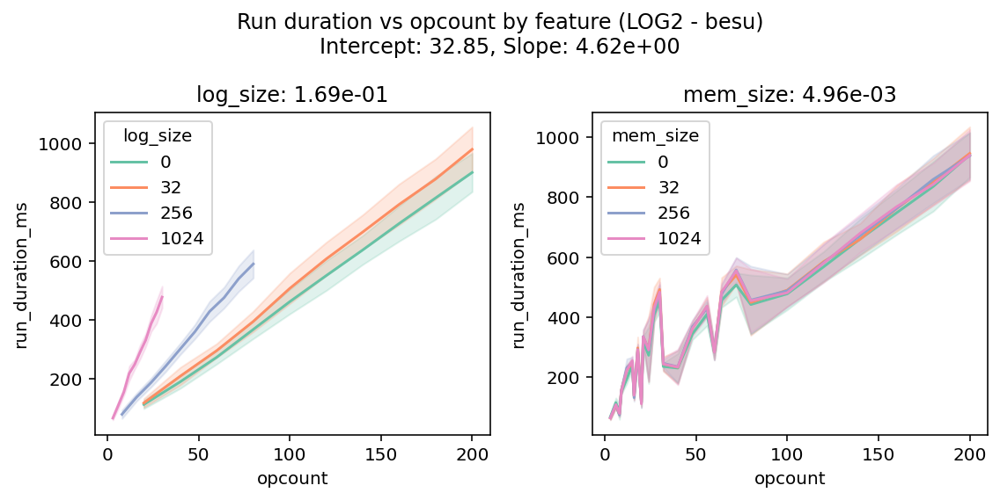

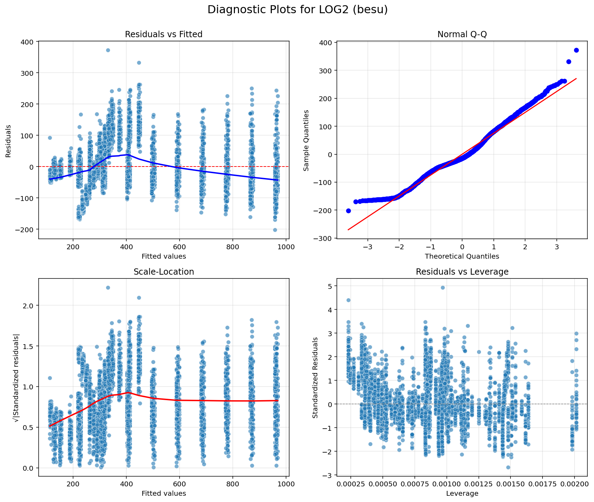


## reth


```python
                            OLS Regression Results                            
==============================================================================
Dep. Variable:        run_duration_ms   R-squared:                       0.576
Model:                            OLS   Adj. R-squared:                  0.576
Method:                 Least Squares   F-statistic:                     1305.
Date:                Thu, 22 Jan 2026   Prob (F-statistic):               0.00
Time:                        10:36:01   Log-Likelihood:                -14435.
No. Observations:                2880   AIC:                         2.888e+04
Df Residuals:                    2876   BIC:                         2.890e+04
Df Model:                           3                                         
Covariance Type:            nonrobust                                         
==============================================================================
                 coef    std err          t      P>|t|      [0.025      0.975]
------------------------------------------------------------------------------
const         29.2495      1.768     16.544      0.000      25.783      32.716
opcount        0.9037      0.015     61.915      0.000       0.875       0.932
log_size       0.0944      0.002     45.322      0.000       0.090       0.098
mem_size      -0.0006      0.002     -0.380      0.704      -0.004       0.003
==============================================================================
Omnibus:                       62.674   Durbin-Watson:                   1.939
Prob(Omnibus):                  0.000   Jarque-Bera (JB):               67.050
Skew:                           0.349   Prob(JB):                     2.76e-15
Kurtosis:                       3.266   Cond. No.                     1.62e+03
==============================================================================

Notes:
[1] Standard Errors assume that the covariance matrix of the errors is correctly specified.
[2] The condition number is large, 1.62e+03. This might indicate that there are
strong multicollinearity or other numerical problems.
```

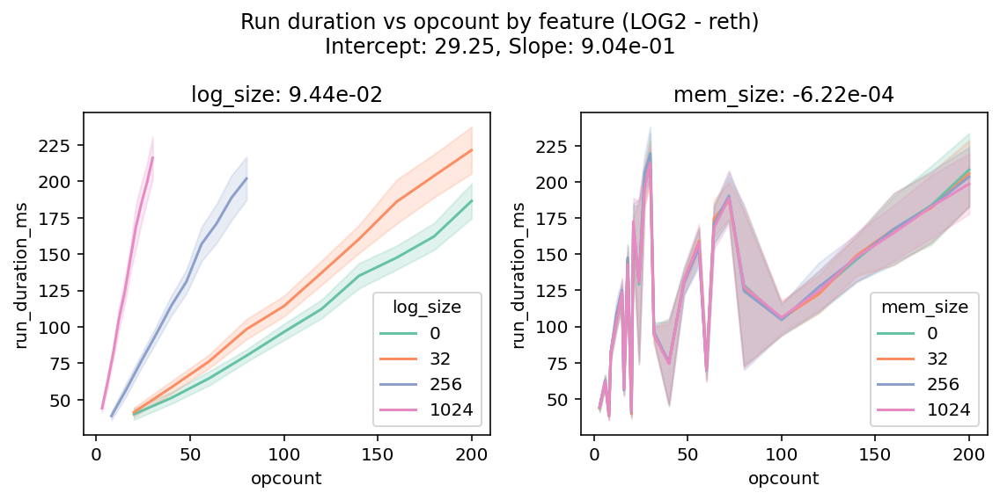

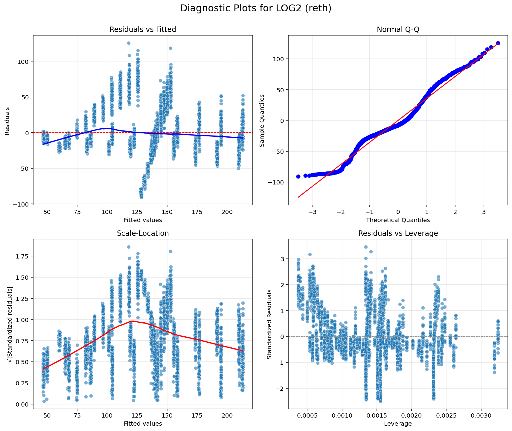


## nethermind


```python
                            OLS Regression Results                            
==============================================================================
Dep. Variable:        run_duration_ms   R-squared:                       0.855
Model:                            OLS   Adj. R-squared:                  0.854
Method:                 Least Squares   F-statistic:                     9080.
Date:                Thu, 22 Jan 2026   Prob (F-statistic):               0.00
Time:                        10:36:02   Log-Likelihood:                -24403.
No. Observations:                4640   AIC:                         4.881e+04
Df Residuals:                    4636   BIC:                         4.884e+04
Df Model:                           3                                         
Covariance Type:            nonrobust                                         
==============================================================================
                 coef    std err          t      P>|t|      [0.025      0.975]
------------------------------------------------------------------------------
const         32.1206      1.783     18.015      0.000      28.625      35.616
opcount        2.2615      0.015    153.634      0.000       2.233       2.290
log_size       0.1000      0.002     47.627      0.000       0.096       0.104
mem_size       0.0095      0.002      5.761      0.000       0.006       0.013
==============================================================================
Omnibus:                      485.030   Durbin-Watson:                   1.909
Prob(Omnibus):                  0.000   Jarque-Bera (JB):              783.094
Skew:                           0.749   Prob(JB):                    8.98e-171
Kurtosis:                       4.343   Cond. No.                     1.62e+03
==============================================================================

Notes:
[1] Standard Errors assume that the covariance matrix of the errors is correctly specified.
[2] The condition number is large, 1.62e+03. This might indicate that there are
strong multicollinearity or other numerical problems.
```

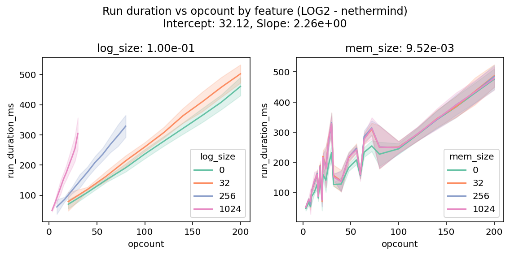

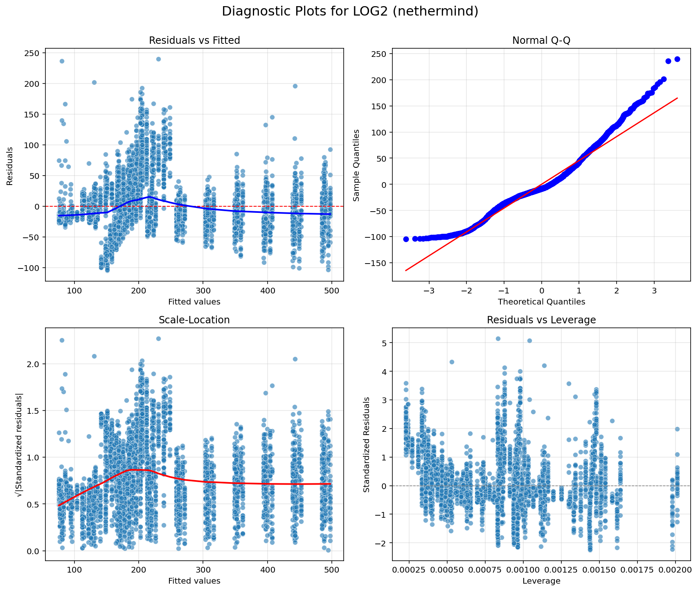


## erigon

OLS model did not run... Error: zero-size array to reduction operation maximum which has no identity

# LOG3

## geth


```python
                            OLS Regression Results                            
==============================================================================
Dep. Variable:        run_duration_ms   R-squared:                       0.849
Model:                            OLS   Adj. R-squared:                  0.849
Method:                 Least Squares   F-statistic:                     8675.
Date:                Thu, 22 Jan 2026   Prob (F-statistic):               0.00
Time:                        10:36:02   Log-Likelihood:                -26278.
No. Observations:                4640   AIC:                         5.256e+04
Df Residuals:                    4636   BIC:                         5.259e+04
Df Model:                           3                                         
Covariance Type:            nonrobust                                         
==============================================================================
                 coef    std err          t      P>|t|      [0.025      0.975]
------------------------------------------------------------------------------
const         35.9063      2.713     13.236      0.000      30.588      41.225
opcount        4.5668      0.030    154.280      0.000       4.509       4.625
log_size       0.1685      0.003     54.561      0.000       0.162       0.175
mem_size       0.0004      0.002      0.174      0.862      -0.004       0.005
==============================================================================
Omnibus:                      690.400   Durbin-Watson:                   2.107
Prob(Omnibus):                  0.000   Jarque-Bera (JB):             1454.141
Skew:                           0.892   Prob(JB):                         0.00
Kurtosis:                       5.083   Cond. No.                     1.65e+03
==============================================================================

Notes:
[1] Standard Errors assume that the covariance matrix of the errors is correctly specified.
[2] The condition number is large, 1.65e+03. This might indicate that there are
strong multicollinearity or other numerical problems.
```

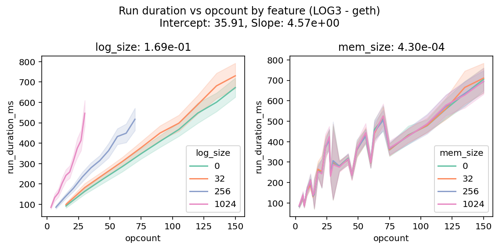

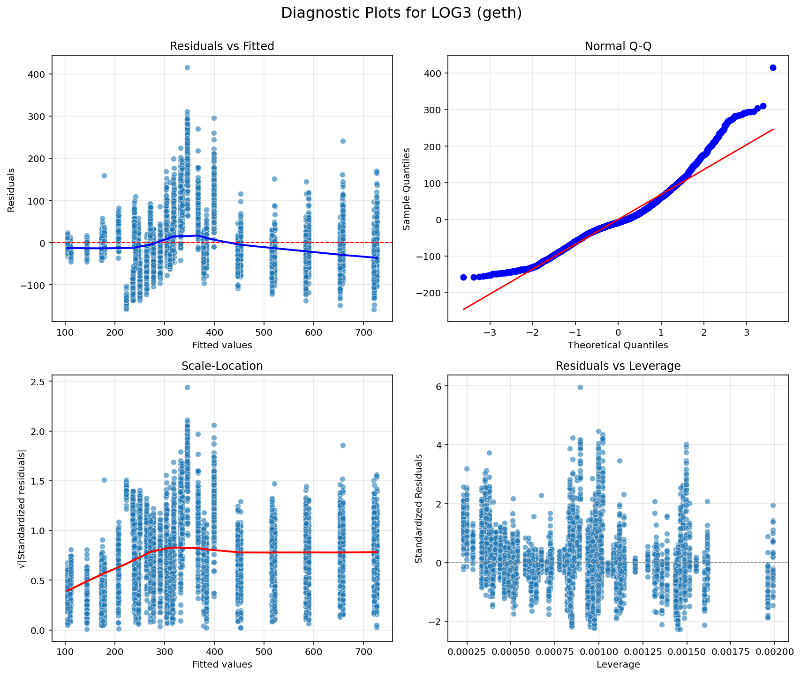


## besu


```python
                            OLS Regression Results                            
==============================================================================
Dep. Variable:        run_duration_ms   R-squared:                       0.915
Model:                            OLS   Adj. R-squared:                  0.915
Method:                 Least Squares   F-statistic:                 1.664e+04
Date:                Thu, 22 Jan 2026   Prob (F-statistic):               0.00
Time:                        10:36:02   Log-Likelihood:                -26269.
No. Observations:                4640   AIC:                         5.255e+04
Df Residuals:                    4636   BIC:                         5.257e+04
Df Model:                           3                                         
Covariance Type:            nonrobust                                         
==============================================================================
                 coef    std err          t      P>|t|      [0.025      0.975]
------------------------------------------------------------------------------
const         20.4879      2.707      7.568      0.000      15.181      25.795
opcount        6.1198      0.030    207.174      0.000       6.062       6.178
log_size       0.1754      0.003     56.899      0.000       0.169       0.181
mem_size       0.0033      0.002      1.347      0.178      -0.002       0.008
==============================================================================
Omnibus:                      142.305   Durbin-Watson:                   1.986
Prob(Omnibus):                  0.000   Jarque-Bera (JB):              163.307
Skew:                           0.398   Prob(JB):                     3.45e-36
Kurtosis:                       3.460   Cond. No.                     1.65e+03
==============================================================================

Notes:
[1] Standard Errors assume that the covariance matrix of the errors is correctly specified.
[2] The condition number is large, 1.65e+03. This might indicate that there are
strong multicollinearity or other numerical problems.
```

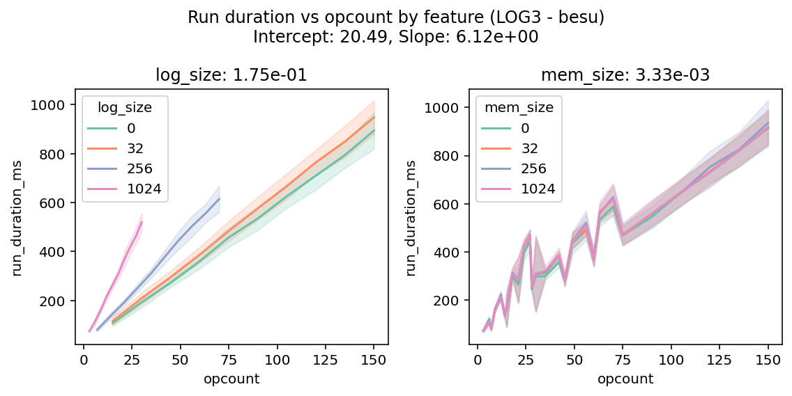

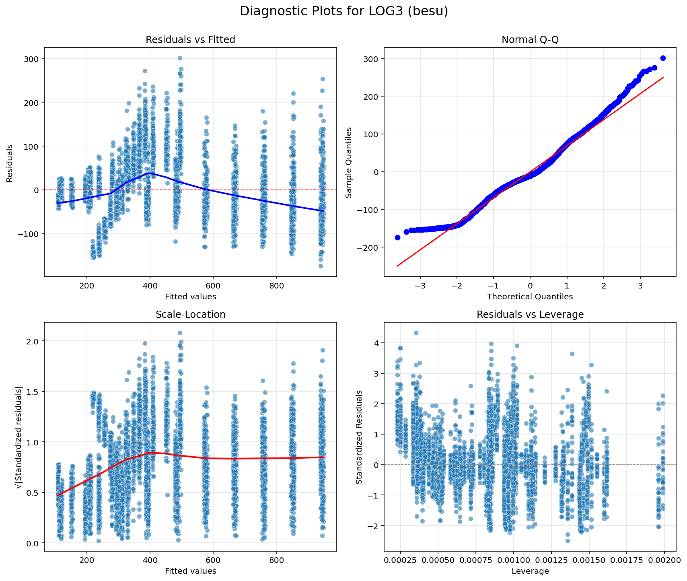


## reth


```python
                            OLS Regression Results                            
==============================================================================
Dep. Variable:        run_duration_ms   R-squared:                       0.607
Model:                            OLS   Adj. R-squared:                  0.607
Method:                 Least Squares   F-statistic:                     1482.
Date:                Thu, 22 Jan 2026   Prob (F-statistic):               0.00
Time:                        10:36:03   Log-Likelihood:                -14180.
No. Observations:                2880   AIC:                         2.837e+04
Df Residuals:                    2876   BIC:                         2.839e+04
Df Model:                           3                                         
Covariance Type:            nonrobust                                         
==============================================================================
                 coef    std err          t      P>|t|      [0.025      0.975]
------------------------------------------------------------------------------
const         24.8205      1.643     15.103      0.000      21.598      28.043
opcount        1.1612      0.018     64.756      0.000       1.126       1.196
log_size       0.0963      0.002     51.472      0.000       0.093       0.100
mem_size      -0.0006      0.001     -0.405      0.686      -0.004       0.002
==============================================================================
Omnibus:                       26.458   Durbin-Watson:                   2.093
Prob(Omnibus):                  0.000   Jarque-Bera (JB):               31.466
Skew:                           0.163   Prob(JB):                     1.47e-07
Kurtosis:                       3.395   Cond. No.                     1.65e+03
==============================================================================

Notes:
[1] Standard Errors assume that the covariance matrix of the errors is correctly specified.
[2] The condition number is large, 1.65e+03. This might indicate that there are
strong multicollinearity or other numerical problems.
```

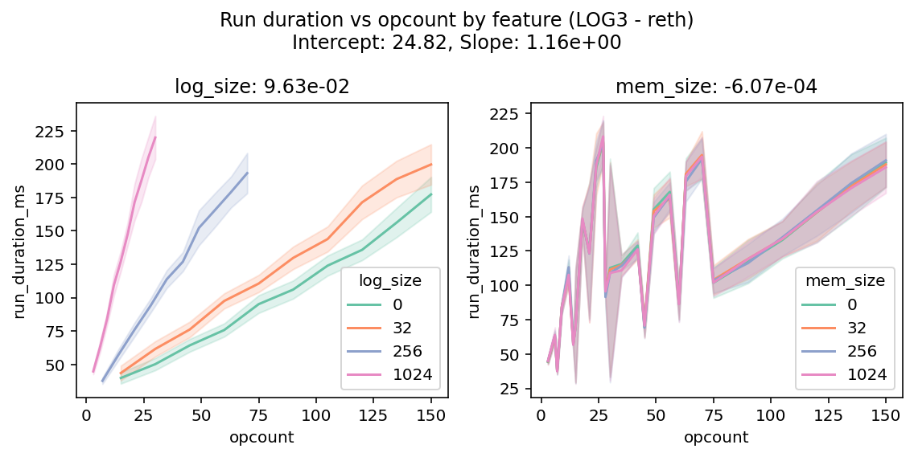

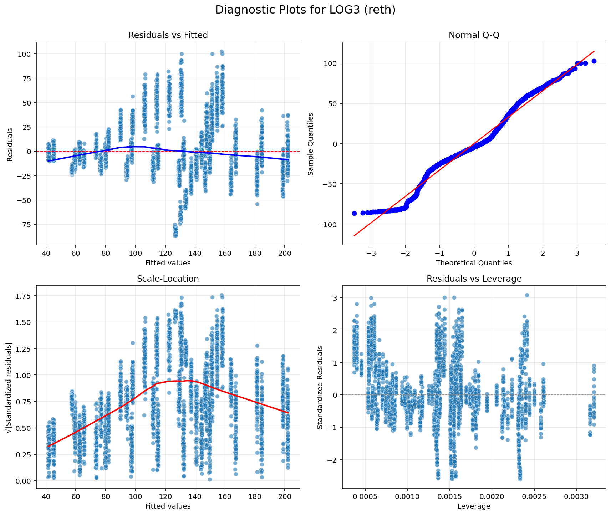


## nethermind


```python
                            OLS Regression Results                            
==============================================================================
Dep. Variable:        run_duration_ms   R-squared:                       0.864
Model:                            OLS   Adj. R-squared:                  0.864
Method:                 Least Squares   F-statistic:                     9824.
Date:                Thu, 22 Jan 2026   Prob (F-statistic):               0.00
Time:                        10:36:03   Log-Likelihood:                -24123.
No. Observations:                4640   AIC:                         4.825e+04
Df Residuals:                    4636   BIC:                         4.828e+04
Df Model:                           3                                         
Covariance Type:            nonrobust                                         
==============================================================================
                 coef    std err          t      P>|t|      [0.025      0.975]
------------------------------------------------------------------------------
const         21.9983      1.705     12.904      0.000      18.656      25.341
opcount        3.0383      0.019    163.330      0.000       3.002       3.075
log_size       0.1080      0.002     55.612      0.000       0.104       0.112
mem_size       0.0084      0.002      5.422      0.000       0.005       0.011
==============================================================================
Omnibus:                      591.808   Durbin-Watson:                   1.946
Prob(Omnibus):                  0.000   Jarque-Bera (JB):             1319.741
Skew:                           0.761   Prob(JB):                    2.64e-287
Kurtosis:                       5.123   Cond. No.                     1.65e+03
==============================================================================

Notes:
[1] Standard Errors assume that the covariance matrix of the errors is correctly specified.
[2] The condition number is large, 1.65e+03. This might indicate that there are
strong multicollinearity or other numerical problems.
```

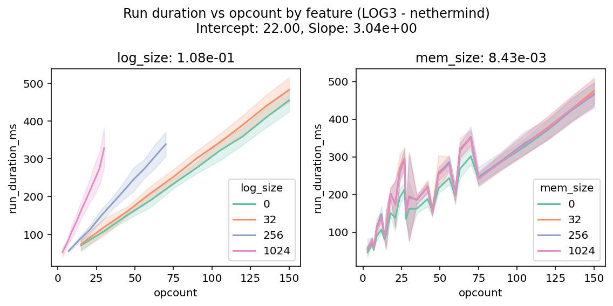

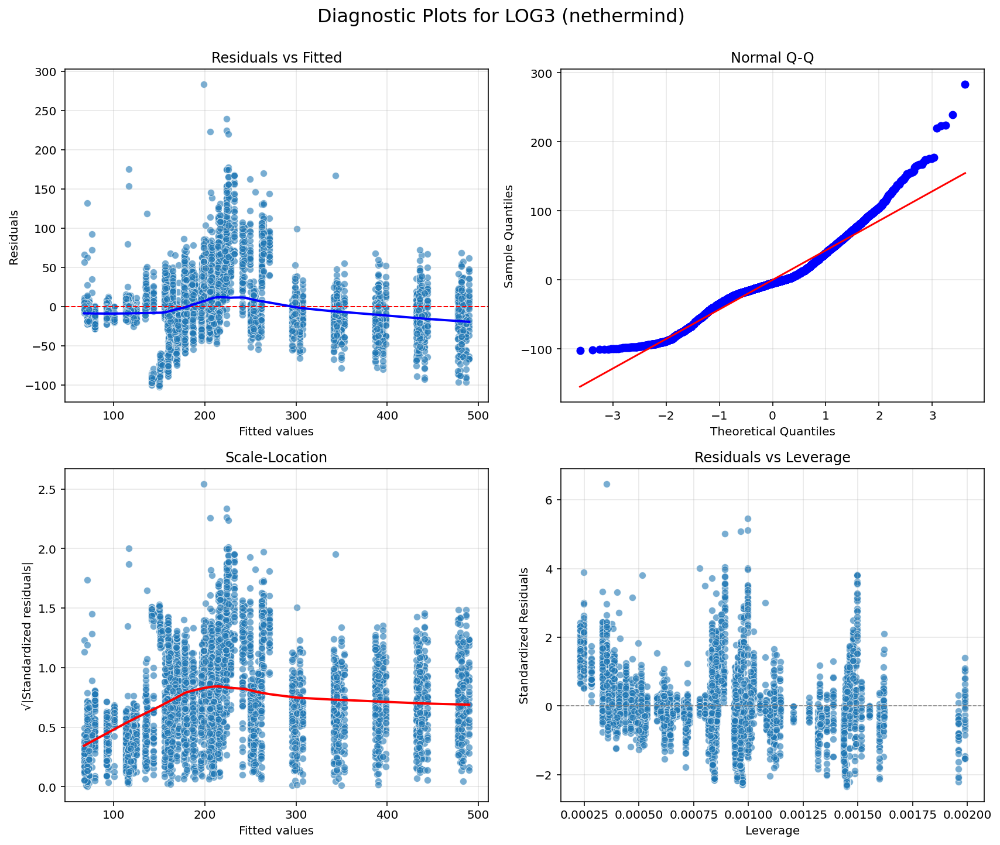


## erigon

OLS model did not run... Error: zero-size array to reduction operation maximum which has no identity

# LOG4

## geth


```python
                            OLS Regression Results                            
==============================================================================
Dep. Variable:        run_duration_ms   R-squared:                       0.906
Model:                            OLS   Adj. R-squared:                  0.906
Method:                 Least Squares   F-statistic:                 1.483e+04
Date:                Thu, 22 Jan 2026   Prob (F-statistic):               0.00
Time:                        10:36:04   Log-Likelihood:                -26066.
No. Observations:                4640   AIC:                         5.214e+04
Df Residuals:                    4636   BIC:                         5.217e+04
Df Model:                           3                                         
Covariance Type:            nonrobust                                         
==============================================================================
                 coef    std err          t      P>|t|      [0.025      0.975]
------------------------------------------------------------------------------
const         31.7009      2.530     12.532      0.000      26.742      36.660
opcount        5.5101      0.028    197.824      0.000       5.455       5.565
log_size       0.1681      0.003     57.458      0.000       0.162       0.174
mem_size       0.0005      0.002      0.226      0.821      -0.004       0.005
==============================================================================
Omnibus:                      578.083   Durbin-Watson:                   2.063
Prob(Omnibus):                  0.000   Jarque-Bera (JB):             1270.159
Skew:                           0.751   Prob(JB):                    1.54e-276
Kurtosis:                       5.077   Cond. No.                     1.61e+03
==============================================================================

Notes:
[1] Standard Errors assume that the covariance matrix of the errors is correctly specified.
[2] The condition number is large, 1.61e+03. This might indicate that there are
strong multicollinearity or other numerical problems.
```

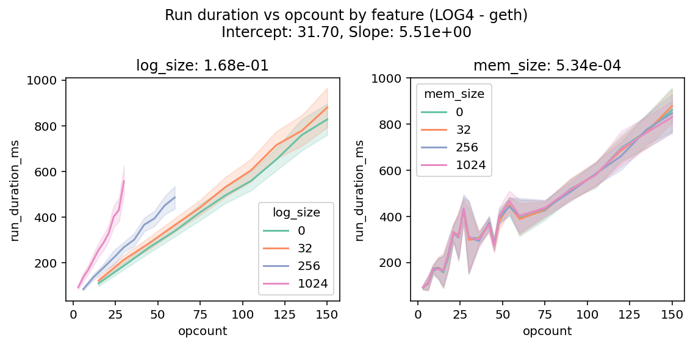

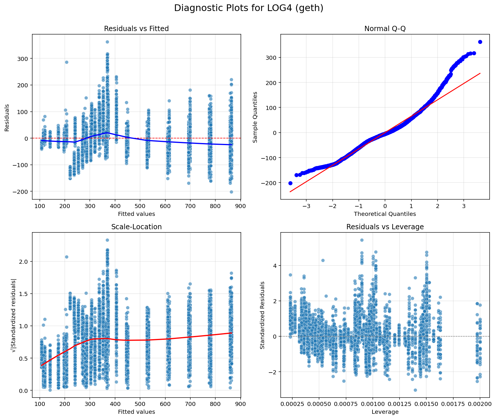


## besu


```python
                            OLS Regression Results                            
==============================================================================
Dep. Variable:        run_duration_ms   R-squared:                       0.944
Model:                            OLS   Adj. R-squared:                  0.944
Method:                 Least Squares   F-statistic:                 2.599e+04
Date:                Thu, 22 Jan 2026   Prob (F-statistic):               0.00
Time:                        10:36:04   Log-Likelihood:                -26342.
No. Observations:                4640   AIC:                         5.269e+04
Df Residuals:                    4636   BIC:                         5.272e+04
Df Model:                           3                                         
Covariance Type:            nonrobust                                         
==============================================================================
                 coef    std err          t      P>|t|      [0.025      0.975]
------------------------------------------------------------------------------
const         17.3939      2.684      6.480      0.000      12.131      22.656
opcount        7.5157      0.030    254.267      0.000       7.458       7.574
log_size       0.1756      0.003     56.559      0.000       0.170       0.182
mem_size       0.0044      0.003      1.760      0.078      -0.001       0.009
==============================================================================
Omnibus:                       77.089   Durbin-Watson:                   1.961
Prob(Omnibus):                  0.000   Jarque-Bera (JB):               88.213
Skew:                           0.267   Prob(JB):                     6.99e-20
Kurtosis:                       3.413   Cond. No.                     1.61e+03
==============================================================================

Notes:
[1] Standard Errors assume that the covariance matrix of the errors is correctly specified.
[2] The condition number is large, 1.61e+03. This might indicate that there are
strong multicollinearity or other numerical problems.
```

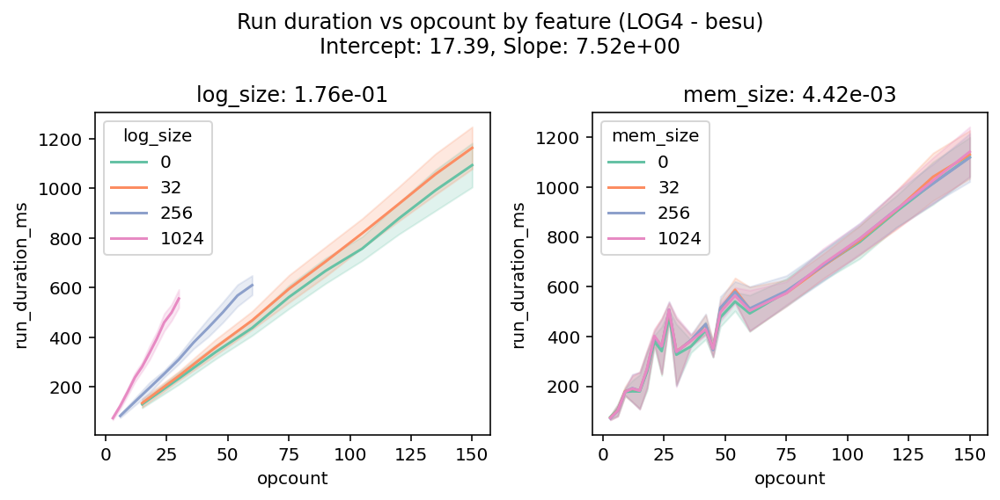

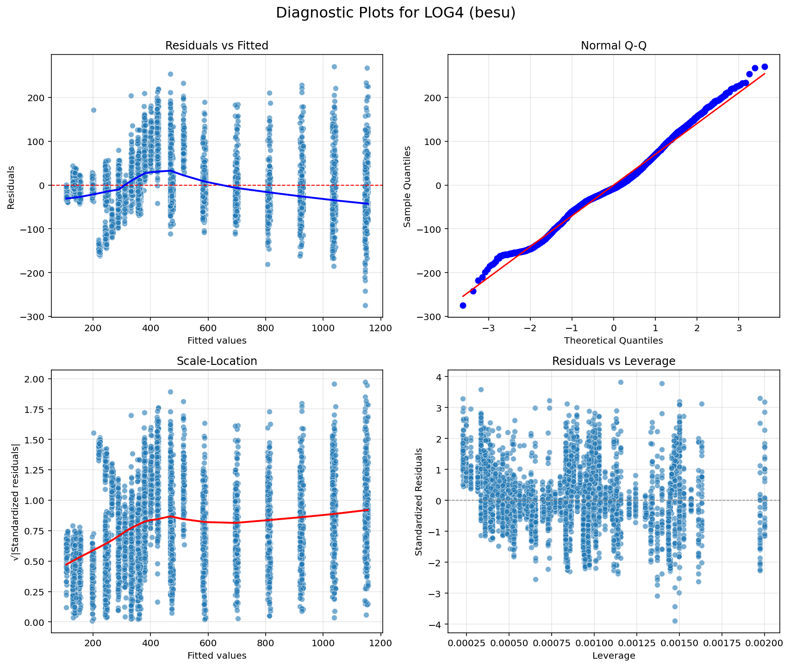


## reth


```python
                            OLS Regression Results                            
==============================================================================
Dep. Variable:        run_duration_ms   R-squared:                       0.700
Model:                            OLS   Adj. R-squared:                  0.700
Method:                 Least Squares   F-statistic:                     2237.
Date:                Thu, 22 Jan 2026   Prob (F-statistic):               0.00
Time:                        10:36:04   Log-Likelihood:                -14040.
No. Observations:                2880   AIC:                         2.809e+04
Df Residuals:                    2876   BIC:                         2.811e+04
Df Model:                           3                                         
Covariance Type:            nonrobust                                         
==============================================================================
                 coef    std err          t      P>|t|      [0.025      0.975]
------------------------------------------------------------------------------
const         22.2901      1.528     14.588      0.000      19.294      25.286
opcount        1.3686      0.017     81.343      0.000       1.336       1.402
log_size       0.0986      0.002     55.771      0.000       0.095       0.102
mem_size       0.0001      0.001      0.099      0.921      -0.003       0.003
==============================================================================
Omnibus:                       40.250   Durbin-Watson:                   2.094
Prob(Omnibus):                  0.000   Jarque-Bera (JB):               72.345
Skew:                           0.033   Prob(JB):                     1.95e-16
Kurtosis:                       3.774   Cond. No.                     1.61e+03
==============================================================================

Notes:
[1] Standard Errors assume that the covariance matrix of the errors is correctly specified.
[2] The condition number is large, 1.61e+03. This might indicate that there are
strong multicollinearity or other numerical problems.
```

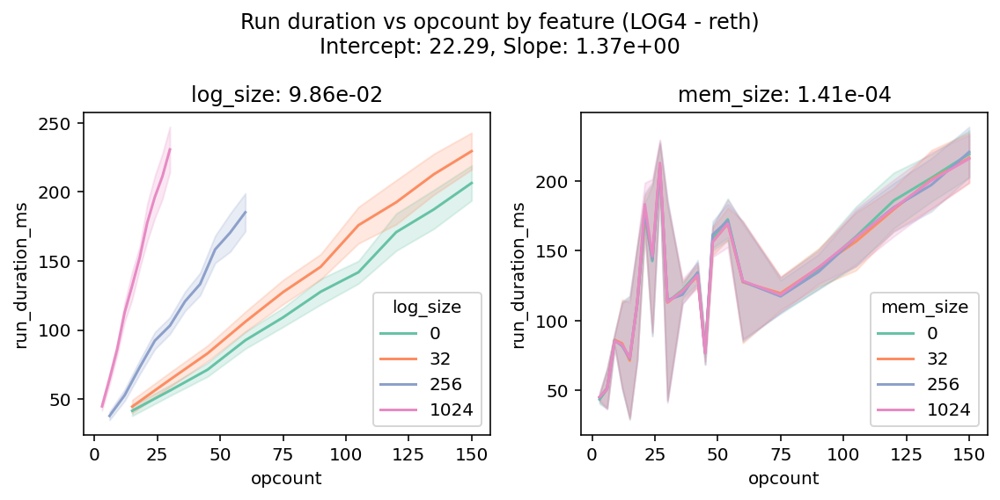

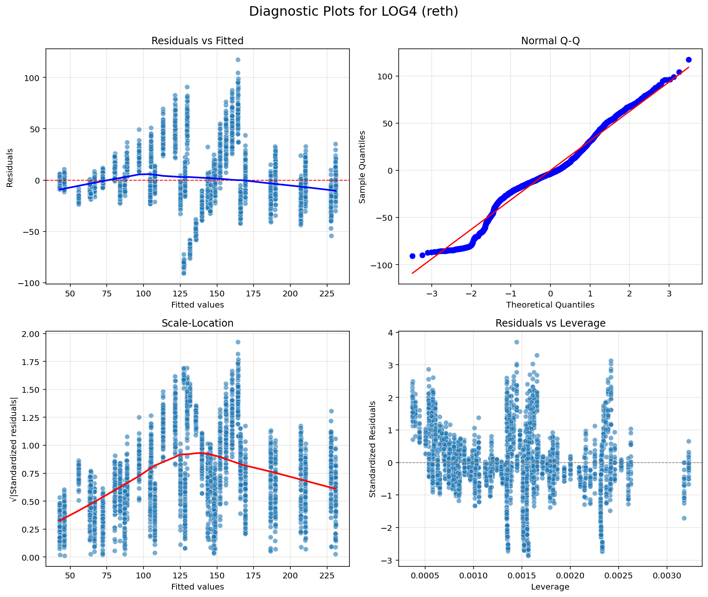


## nethermind


```python
                            OLS Regression Results                            
==============================================================================
Dep. Variable:        run_duration_ms   R-squared:                       0.913
Model:                            OLS   Adj. R-squared:                  0.913
Method:                 Least Squares   F-statistic:                 1.623e+04
Date:                Thu, 22 Jan 2026   Prob (F-statistic):               0.00
Time:                        10:36:05   Log-Likelihood:                -24043.
No. Observations:                4640   AIC:                         4.809e+04
Df Residuals:                    4636   BIC:                         4.812e+04
Df Model:                           3                                         
Covariance Type:            nonrobust                                         
==============================================================================
                 coef    std err          t      P>|t|      [0.025      0.975]
------------------------------------------------------------------------------
const         20.4368      1.636     12.494      0.000      17.230      23.644
opcount        3.7112      0.018    206.045      0.000       3.676       3.746
log_size       0.1092      0.002     57.734      0.000       0.106       0.113
mem_size       0.0084      0.002      5.499      0.000       0.005       0.011
==============================================================================
Omnibus:                      661.796   Durbin-Watson:                   1.969
Prob(Omnibus):                  0.000   Jarque-Bera (JB):             1954.021
Skew:                           0.751   Prob(JB):                         0.00
Kurtosis:                       5.802   Cond. No.                     1.61e+03
==============================================================================

Notes:
[1] Standard Errors assume that the covariance matrix of the errors is correctly specified.
[2] The condition number is large, 1.61e+03. This might indicate that there are
strong multicollinearity or other numerical problems.
```

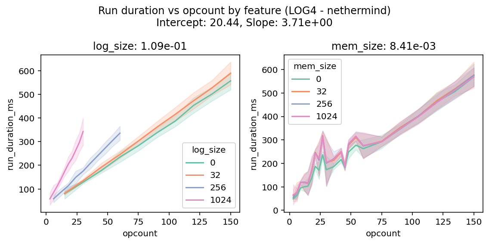

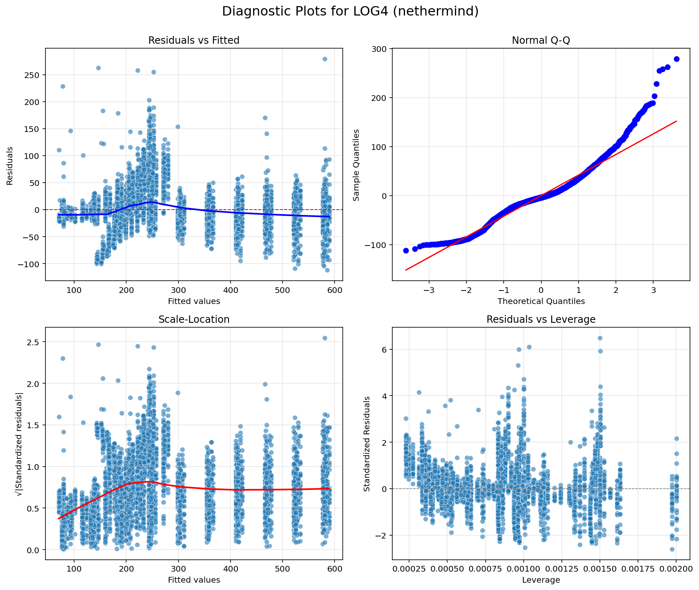


## erigon

OLS model did not run... Error: zero-size array to reduction operation maximum which has no identity
