Opcode run times estimation results - memory opcodes
====================================================

Table of contents
=================

* [KECCAK256](#keccak256)
* [MCOPY](#mcopy)
* [MLOAD](#mload)
* [MSTORE](#mstore)
* [MSTORE8](#mstore8)
* [CALLDATACOPY](#calldatacopy)
* [CODECOPY](#codecopy)
* [RETURN](#return)
* [RETURNDATACOPY](#returndatacopy)
* [REVERT](#revert)

# Introduction


This is an automated report generated from the opcode run times 
estimation script `./src/estimate_opcode_run_times.py`. The script 
uses data generated by running the 
[EEST benchmark suite](https://github.com/ethereum/execution-spec-tests/tree/main/tests/benchmark) 
with the [Nethermind benchmarking tooling](https://github.com/NethermindEth/gas-benchmarks).

The data includes all the memory opcode tests run between 2026-01-10 and 2026-01-22.

For each opcode and client, an OLS linear regression model is fitted to estimate the 
opcode run time as a function of the opcode count and other opcode configurations. The results are presented below.

# KECCAK256

## geth


```python
                            OLS Regression Results                            
==============================================================================
Dep. Variable:        run_duration_ms   R-squared:                       0.706
Model:                            OLS   Adj. R-squared:                  0.705
Method:                 Least Squares   F-statistic:                     3704.
Date:                Thu, 22 Jan 2026   Prob (F-statistic):               0.00
Time:                        10:35:43   Log-Likelihood:                -35209.
No. Observations:                4640   AIC:                         7.043e+04
Df Residuals:                    4636   BIC:                         7.045e+04
Df Model:                           3                                         
Covariance Type:            nonrobust                                         
==============================================================================
                 coef    std err          t      P>|t|      [0.025      0.975]
------------------------------------------------------------------------------
const        -68.4027     18.445     -3.709      0.000    -104.563     -32.243
opcount        0.5643      0.005    103.128      0.000       0.554       0.575
mem_size       0.0038      0.017      0.227      0.821      -0.029       0.037
msg_size       1.6990      0.021     79.771      0.000       1.657       1.741
==============================================================================
Omnibus:                      573.275   Durbin-Watson:                   1.785
Prob(Omnibus):                  0.000   Jarque-Bera (JB):             4379.192
Skew:                           0.331   Prob(JB):                         0.00
Kurtosis:                       7.713   Cond. No.                     6.78e+03
==============================================================================

Notes:
[1] Standard Errors assume that the covariance matrix of the errors is correctly specified.
[2] The condition number is large, 6.78e+03. This might indicate that there are
strong multicollinearity or other numerical problems.
```

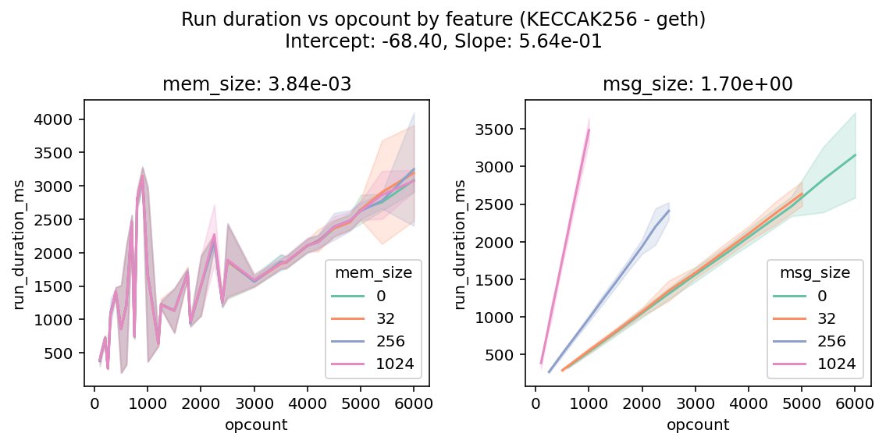

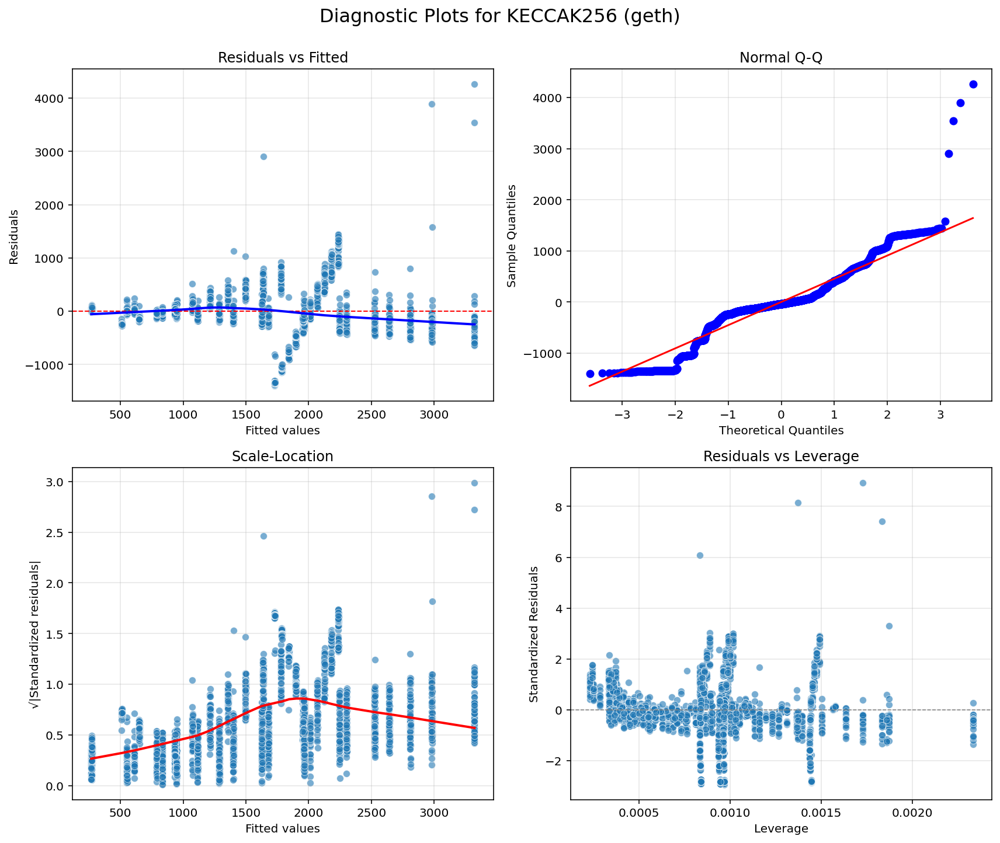


## besu


```python
                            OLS Regression Results                            
==============================================================================
Dep. Variable:        run_duration_ms   R-squared:                       0.753
Model:                            OLS   Adj. R-squared:                  0.753
Method:                 Least Squares   F-statistic:                     4708.
Date:                Thu, 22 Jan 2026   Prob (F-statistic):               0.00
Time:                        10:35:43   Log-Likelihood:                -36493.
No. Observations:                4640   AIC:                         7.299e+04
Df Residuals:                    4636   BIC:                         7.302e+04
Df Model:                           3                                         
Covariance Type:            nonrobust                                         
==============================================================================
                 coef    std err          t      P>|t|      [0.025      0.975]
------------------------------------------------------------------------------
const        -50.0074     24.326     -2.056      0.040     -97.697      -2.318
opcount        0.8556      0.007    118.565      0.000       0.841       0.870
mem_size      -0.0044      0.022     -0.198      0.843      -0.048       0.039
msg_size       2.1971      0.028     78.217      0.000       2.142       2.252
==============================================================================
Omnibus:                      185.033   Durbin-Watson:                   1.735
Prob(Omnibus):                  0.000   Jarque-Bera (JB):              570.722
Skew:                          -0.057   Prob(JB):                    1.17e-124
Kurtosis:                       4.714   Cond. No.                     6.78e+03
==============================================================================

Notes:
[1] Standard Errors assume that the covariance matrix of the errors is correctly specified.
[2] The condition number is large, 6.78e+03. This might indicate that there are
strong multicollinearity or other numerical problems.
```

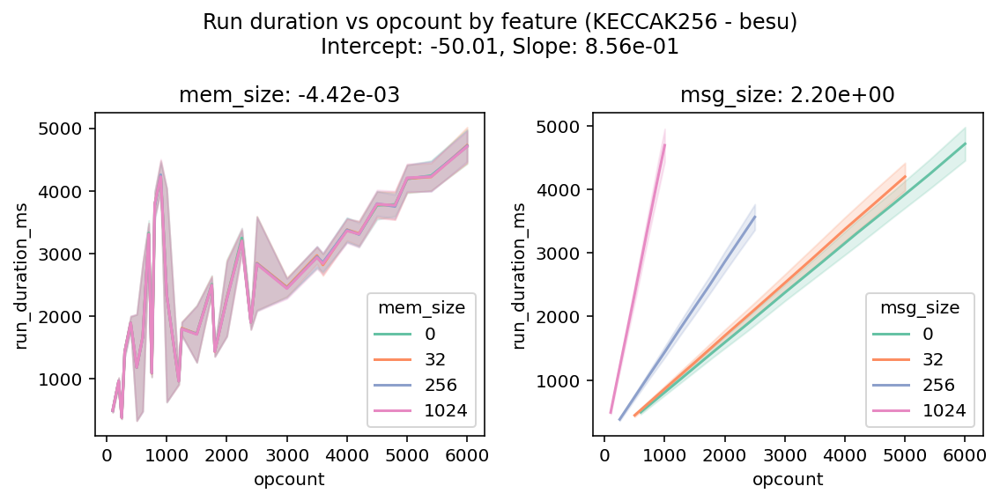

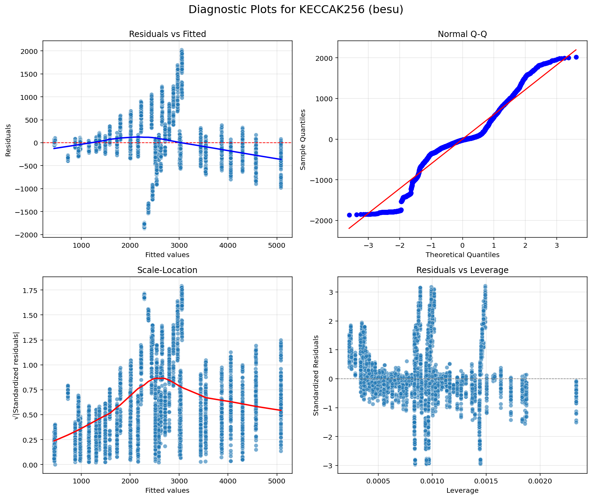


## reth


```python
                            OLS Regression Results                            
==============================================================================
Dep. Variable:        run_duration_ms   R-squared:                       0.515
Model:                            OLS   Adj. R-squared:                  0.514
Method:                 Least Squares   F-statistic:                     1016.
Date:                Thu, 22 Jan 2026   Prob (F-statistic):               0.00
Time:                        10:35:44   Log-Likelihood:                -22033.
No. Observations:                2880   AIC:                         4.407e+04
Df Residuals:                    2876   BIC:                         4.410e+04
Df Model:                           3                                         
Covariance Type:            nonrobust                                         
==============================================================================
                 coef    std err          t      P>|t|      [0.025      0.975]
------------------------------------------------------------------------------
const        139.7250     24.919      5.607      0.000      90.865     188.585
opcount        0.0551      0.007      7.453      0.000       0.041       0.070
mem_size    6.511e-06      0.023      0.000      1.000      -0.045       0.045
msg_size       1.3832      0.029     48.069      0.000       1.327       1.440
==============================================================================
Omnibus:                       70.778   Durbin-Watson:                   1.909
Prob(Omnibus):                  0.000   Jarque-Bera (JB):               84.348
Skew:                           0.325   Prob(JB):                     4.83e-19
Kurtosis:                       3.528   Cond. No.                     6.78e+03
==============================================================================

Notes:
[1] Standard Errors assume that the covariance matrix of the errors is correctly specified.
[2] The condition number is large, 6.78e+03. This might indicate that there are
strong multicollinearity or other numerical problems.
```

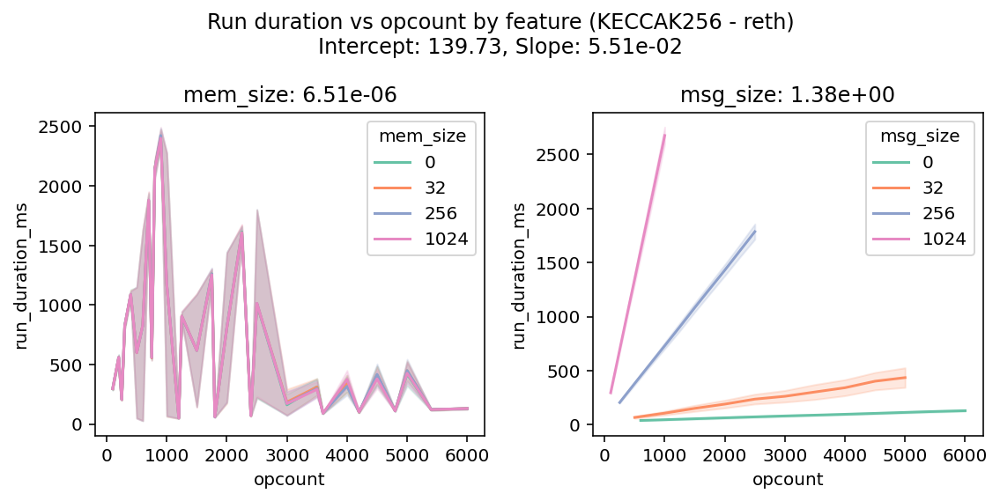

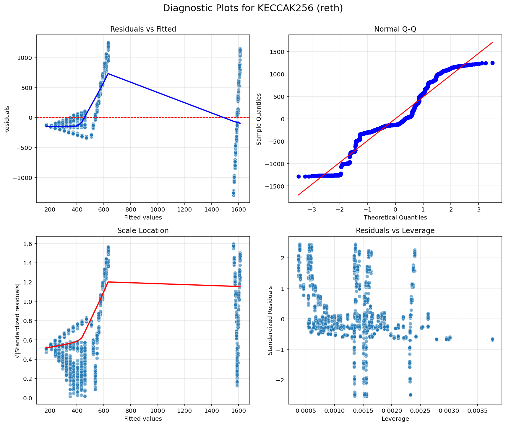


## nethermind


```python
                            OLS Regression Results                            
==============================================================================
Dep. Variable:        run_duration_ms   R-squared:                       0.517
Model:                            OLS   Adj. R-squared:                  0.516
Method:                 Least Squares   F-statistic:                     1651.
Date:                Thu, 22 Jan 2026   Prob (F-statistic):               0.00
Time:                        10:35:44   Log-Likelihood:                -35885.
No. Observations:                4640   AIC:                         7.178e+04
Df Residuals:                    4636   BIC:                         7.180e+04
Df Model:                           3                                         
Covariance Type:            nonrobust                                         
==============================================================================
                 coef    std err          t      P>|t|      [0.025      0.975]
------------------------------------------------------------------------------
const        134.1257     21.337      6.286      0.000      92.296     175.955
opcount        0.0645      0.006     10.197      0.000       0.052       0.077
mem_size       0.0009      0.020      0.047      0.963      -0.038       0.039
msg_size       1.5181      0.025     61.615      0.000       1.470       1.566
==============================================================================
Omnibus:                      147.363   Durbin-Watson:                   1.828
Prob(Omnibus):                  0.000   Jarque-Bera (JB):              185.447
Skew:                           0.370   Prob(JB):                     5.38e-41
Kurtosis:                       3.641   Cond. No.                     6.78e+03
==============================================================================

Notes:
[1] Standard Errors assume that the covariance matrix of the errors is correctly specified.
[2] The condition number is large, 6.78e+03. This might indicate that there are
strong multicollinearity or other numerical problems.
```

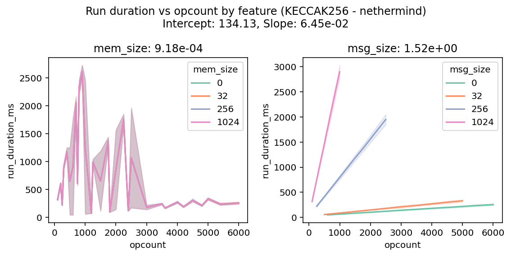

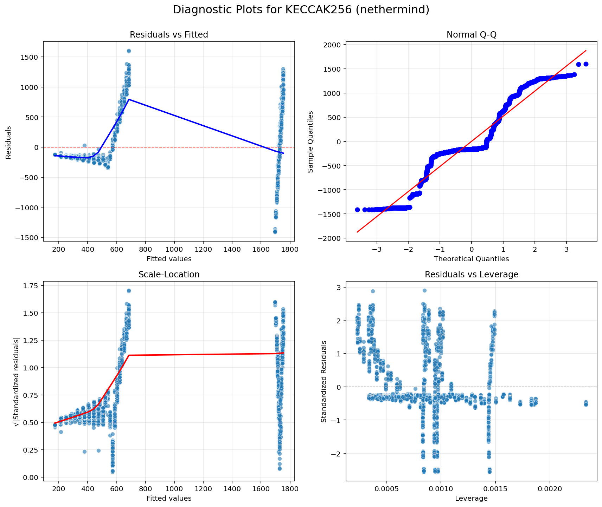


## erigon


```python
                            OLS Regression Results                            
==============================================================================
Dep. Variable:        run_duration_ms   R-squared:                       0.715
Model:                            OLS   Adj. R-squared:                  0.713
Method:                 Least Squares   F-statistic:                     397.2
Date:                Thu, 22 Jan 2026   Prob (F-statistic):          3.86e-129
Time:                        10:35:45   Log-Likelihood:                -3605.0
No. Observations:                 480   AIC:                             7218.
Df Residuals:                     476   BIC:                             7235.
Df Model:                           3                                         
Covariance Type:            nonrobust                                         
==============================================================================
                 coef    std err          t      P>|t|      [0.025      0.975]
------------------------------------------------------------------------------
const        -55.4703     53.255     -1.042      0.298    -160.114      49.174
opcount        0.5311      0.016     33.619      0.000       0.500       0.562
mem_size       0.0021      0.049      0.042      0.967      -0.094       0.098
msg_size       1.6340      0.061     26.571      0.000       1.513       1.755
==============================================================================
Omnibus:                       29.196   Durbin-Watson:                   1.709
Prob(Omnibus):                  0.000   Jarque-Bera (JB):               94.395
Skew:                          -0.125   Prob(JB):                     3.18e-21
Kurtosis:                       5.158   Cond. No.                     6.78e+03
==============================================================================

Notes:
[1] Standard Errors assume that the covariance matrix of the errors is correctly specified.
[2] The condition number is large, 6.78e+03. This might indicate that there are
strong multicollinearity or other numerical problems.
```

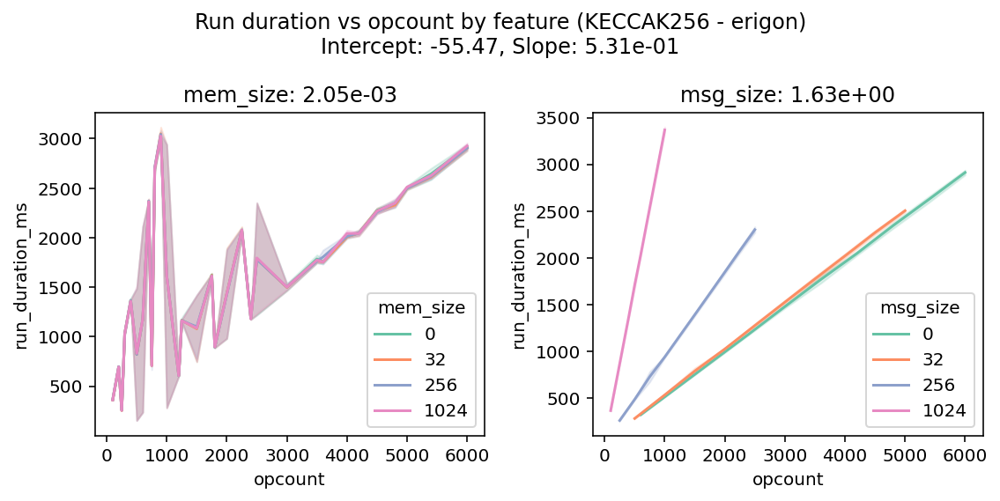


# MCOPY

## geth


```python
                            OLS Regression Results                            
==============================================================================
Dep. Variable:        run_duration_ms   R-squared:                       0.986
Model:                            OLS   Adj. R-squared:                  0.986
Method:                 Least Squares   F-statistic:                 2.462e+05
Date:                Thu, 22 Jan 2026   Prob (F-statistic):               0.00
Time:                        10:35:45   Log-Likelihood:                -36763.
No. Observations:                6960   AIC:                         7.353e+04
Df Residuals:                    6957   BIC:                         7.355e+04
Df Model:                           2                                         
Covariance Type:            nonrobust                                         
==============================================================================
                 coef    std err          t      P>|t|      [0.025      0.975]
------------------------------------------------------------------------------
const         40.2577      1.407     28.604      0.000      37.499      43.017
opcount        0.0755      0.000    550.120      0.000       0.075       0.076
copy_size     -0.0065      0.002     -3.714      0.000      -0.010      -0.003
==============================================================================
Omnibus:                     9189.068   Durbin-Watson:                   1.644
Prob(Omnibus):                  0.000   Jarque-Bera (JB):          5640577.577
Skew:                           6.981   Prob(JB):                         0.00
Kurtosis:                     141.764   Cond. No.                     2.01e+04
==============================================================================

Notes:
[1] Standard Errors assume that the covariance matrix of the errors is correctly specified.
[2] The condition number is large, 2.01e+04. This might indicate that there are
strong multicollinearity or other numerical problems.
```

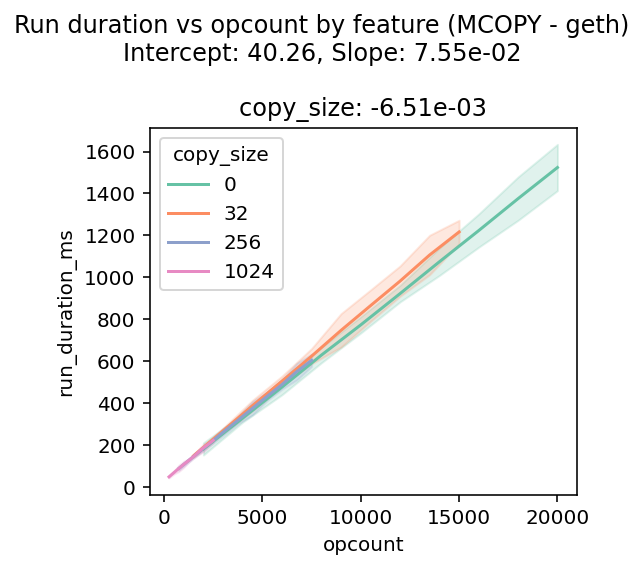

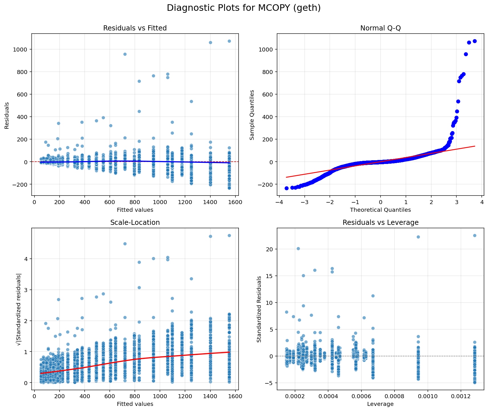


## besu


```python
                            OLS Regression Results                            
==============================================================================
Dep. Variable:        run_duration_ms   R-squared:                       0.948
Model:                            OLS   Adj. R-squared:                  0.948
Method:                 Least Squares   F-statistic:                 6.327e+04
Date:                Thu, 22 Jan 2026   Prob (F-statistic):               0.00
Time:                        10:35:45   Log-Likelihood:                -43929.
No. Observations:                6960   AIC:                         8.786e+04
Df Residuals:                    6957   BIC:                         8.788e+04
Df Model:                           2                                         
Covariance Type:            nonrobust                                         
==============================================================================
                 coef    std err          t      P>|t|      [0.025      0.975]
------------------------------------------------------------------------------
const        115.3999      3.940     29.286      0.000     107.676     123.124
opcount        0.1096      0.000    284.983      0.000       0.109       0.110
copy_size      0.0401      0.005      8.175      0.000       0.030       0.050
==============================================================================
Omnibus:                      266.541   Durbin-Watson:                   1.832
Prob(Omnibus):                  0.000   Jarque-Bera (JB):              531.332
Skew:                           0.276   Prob(JB):                    4.20e-116
Kurtosis:                       4.236   Cond. No.                     2.01e+04
==============================================================================

Notes:
[1] Standard Errors assume that the covariance matrix of the errors is correctly specified.
[2] The condition number is large, 2.01e+04. This might indicate that there are
strong multicollinearity or other numerical problems.
```

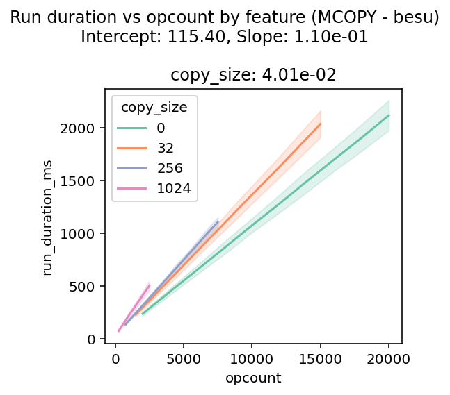

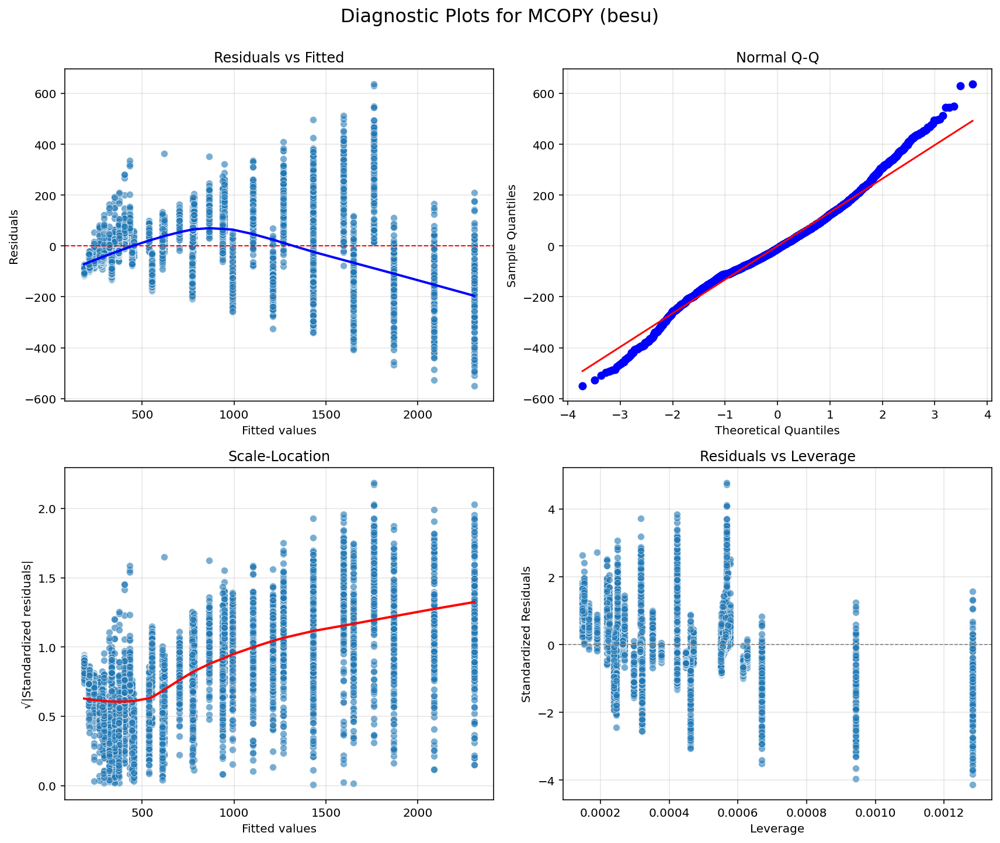


## reth


```python
                            OLS Regression Results                            
==============================================================================
Dep. Variable:        run_duration_ms   R-squared:                       0.931
Model:                            OLS   Adj. R-squared:                  0.931
Method:                 Least Squares   F-statistic:                 2.920e+04
Date:                Thu, 22 Jan 2026   Prob (F-statistic):               0.00
Time:                        10:35:46   Log-Likelihood:                -20283.
No. Observations:                4320   AIC:                         4.057e+04
Df Residuals:                    4317   BIC:                         4.059e+04
Df Model:                           2                                         
Covariance Type:            nonrobust                                         
==============================================================================
                 coef    std err          t      P>|t|      [0.025      0.975]
------------------------------------------------------------------------------
const         47.2445      0.993     47.562      0.000      45.297      49.192
opcount        0.0181   9.69e-05    186.537      0.000       0.018       0.018
copy_size     -0.0073      0.001     -5.900      0.000      -0.010      -0.005
==============================================================================
Omnibus:                     5658.452   Durbin-Watson:                   1.924
Prob(Omnibus):                  0.000   Jarque-Bera (JB):          2204976.566
Skew:                           7.008   Prob(JB):                         0.00
Kurtosis:                     112.788   Cond. No.                     2.01e+04
==============================================================================

Notes:
[1] Standard Errors assume that the covariance matrix of the errors is correctly specified.
[2] The condition number is large, 2.01e+04. This might indicate that there are
strong multicollinearity or other numerical problems.
```

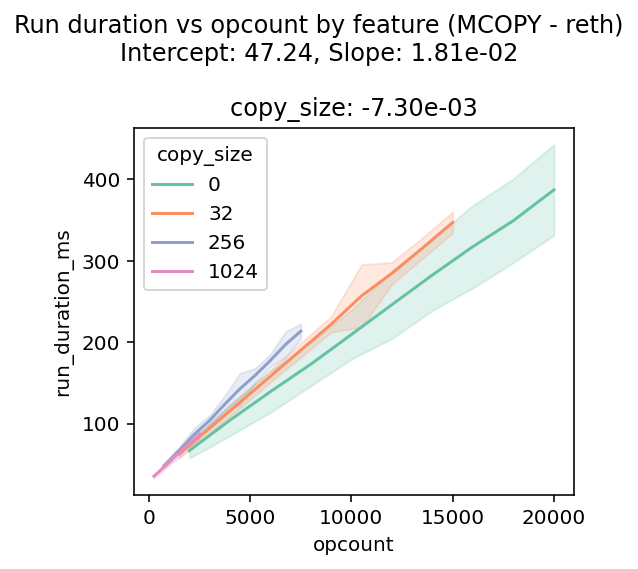

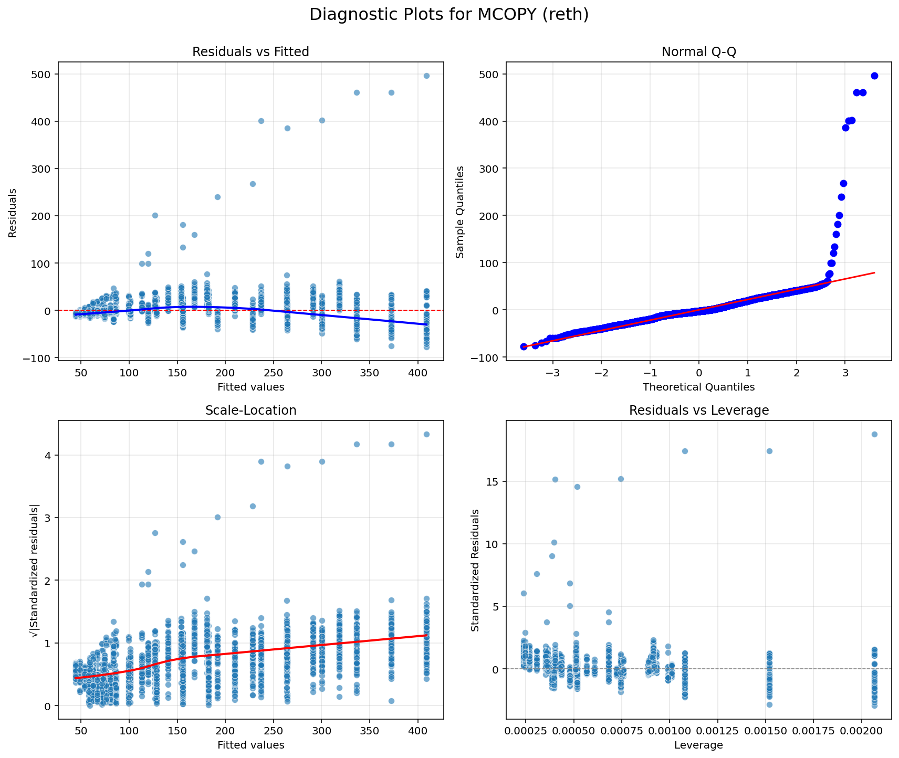


## nethermind


```python
                            OLS Regression Results                            
==============================================================================
Dep. Variable:        run_duration_ms   R-squared:                       0.879
Model:                            OLS   Adj. R-squared:                  0.879
Method:                 Least Squares   F-statistic:                 2.530e+04
Date:                Thu, 22 Jan 2026   Prob (F-statistic):               0.00
Time:                        10:35:46   Log-Likelihood:                -41793.
No. Observations:                6960   AIC:                         8.359e+04
Df Residuals:                    6957   BIC:                         8.361e+04
Df Model:                           2                                         
Covariance Type:            nonrobust                                         
==============================================================================
                 coef    std err          t      P>|t|      [0.025      0.975]
------------------------------------------------------------------------------
const         92.5208      2.899     31.914      0.000      86.838      98.204
opcount        0.0488      0.000    172.420      0.000       0.048       0.049
copy_size     -0.0266      0.004     -7.367      0.000      -0.034      -0.020
==============================================================================
Omnibus:                       74.895   Durbin-Watson:                   1.910
Prob(Omnibus):                  0.000   Jarque-Bera (JB):              122.465
Skew:                           0.063   Prob(JB):                     2.55e-27
Kurtosis:                       3.637   Cond. No.                     2.01e+04
==============================================================================

Notes:
[1] Standard Errors assume that the covariance matrix of the errors is correctly specified.
[2] The condition number is large, 2.01e+04. This might indicate that there are
strong multicollinearity or other numerical problems.
```

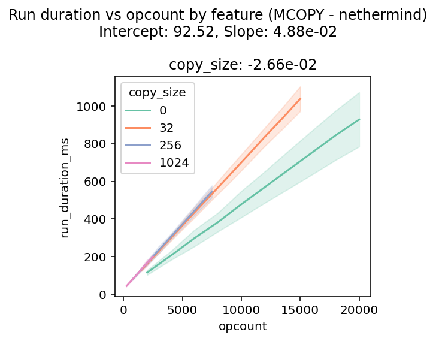

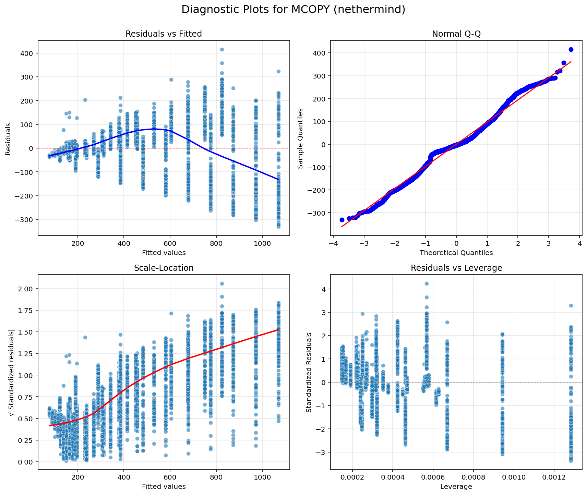


## erigon

OLS model did not run... Error: zero-size array to reduction operation maximum which has no identity

# MLOAD

## geth


```python
                            OLS Regression Results                            
==============================================================================
Dep. Variable:        run_duration_ms   R-squared:                       0.983
Model:                            OLS   Adj. R-squared:                  0.983
Method:                 Least Squares   F-statistic:                 4.089e+04
Date:                Thu, 22 Jan 2026   Prob (F-statistic):               0.00
Time:                        10:35:46   Log-Likelihood:                -7245.2
No. Observations:                1450   AIC:                         1.450e+04
Df Residuals:                    1447   BIC:                         1.451e+04
Df Model:                           2                                         
Covariance Type:            nonrobust                                         
==============================================================================
                 coef    std err          t      P>|t|      [0.025      0.975]
------------------------------------------------------------------------------
const         31.2419      2.105     14.843      0.000      27.113      35.371
opcount        0.0375      0.000    285.941      0.000       0.037       0.038
mem_size       0.0010      0.000      4.341      0.000       0.001       0.001
==============================================================================
Omnibus:                      926.086   Durbin-Watson:                   1.364
Prob(Omnibus):                  0.000   Jarque-Bera (JB):            65588.256
Skew:                           2.197   Prob(JB):                         0.00
Kurtosis:                      35.654   Cond. No.                     3.50e+04
==============================================================================

Notes:
[1] Standard Errors assume that the covariance matrix of the errors is correctly specified.
[2] The condition number is large, 3.5e+04. This might indicate that there are
strong multicollinearity or other numerical problems.
```

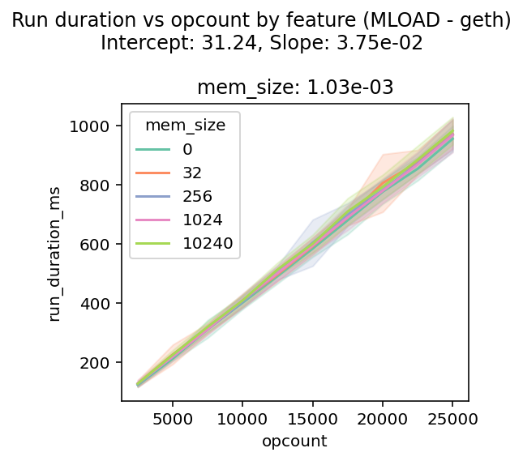

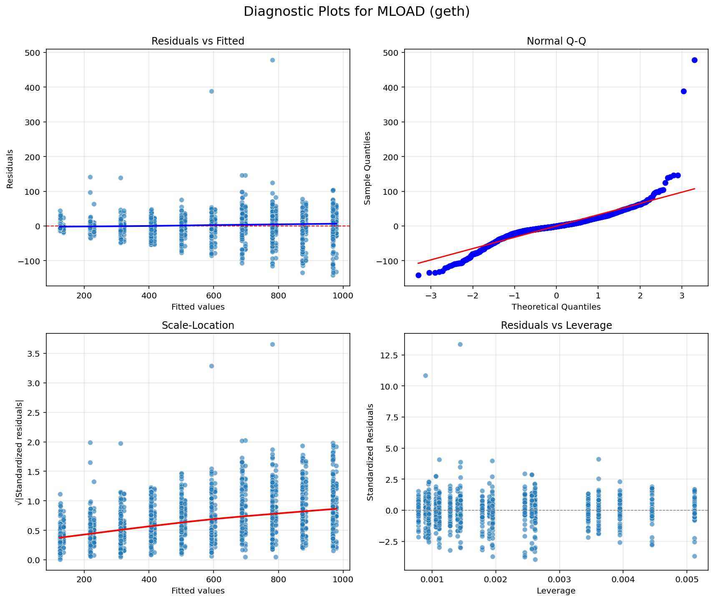


## besu


```python
                            OLS Regression Results                            
==============================================================================
Dep. Variable:        run_duration_ms   R-squared:                       0.987
Model:                            OLS   Adj. R-squared:                  0.987
Method:                 Least Squares   F-statistic:                 5.490e+04
Date:                Thu, 22 Jan 2026   Prob (F-statistic):               0.00
Time:                        10:35:47   Log-Likelihood:                -8104.4
No. Observations:                1450   AIC:                         1.621e+04
Df Residuals:                    1447   BIC:                         1.623e+04
Df Model:                           2                                         
Covariance Type:            nonrobust                                         
==============================================================================
                 coef    std err          t      P>|t|      [0.025      0.975]
------------------------------------------------------------------------------
const         17.5666      3.806      4.615      0.000      10.100      25.033
opcount        0.0785      0.000    331.147      0.000       0.078       0.079
mem_size       0.0052      0.000     12.081      0.000       0.004       0.006
==============================================================================
Omnibus:                      285.592   Durbin-Watson:                   1.129
Prob(Omnibus):                  0.000   Jarque-Bera (JB):             1740.996
Skew:                           0.770   Prob(JB):                         0.00
Kurtosis:                       8.143   Cond. No.                     3.50e+04
==============================================================================

Notes:
[1] Standard Errors assume that the covariance matrix of the errors is correctly specified.
[2] The condition number is large, 3.5e+04. This might indicate that there are
strong multicollinearity or other numerical problems.
```

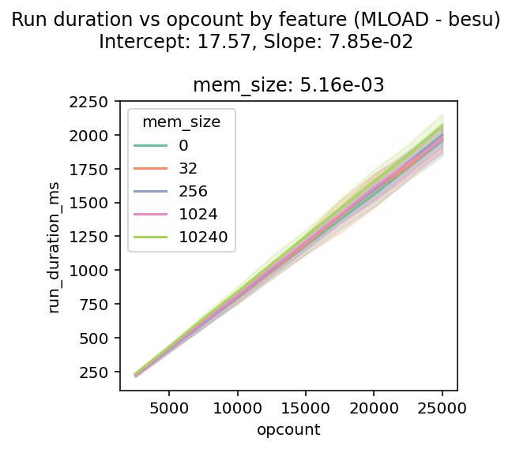

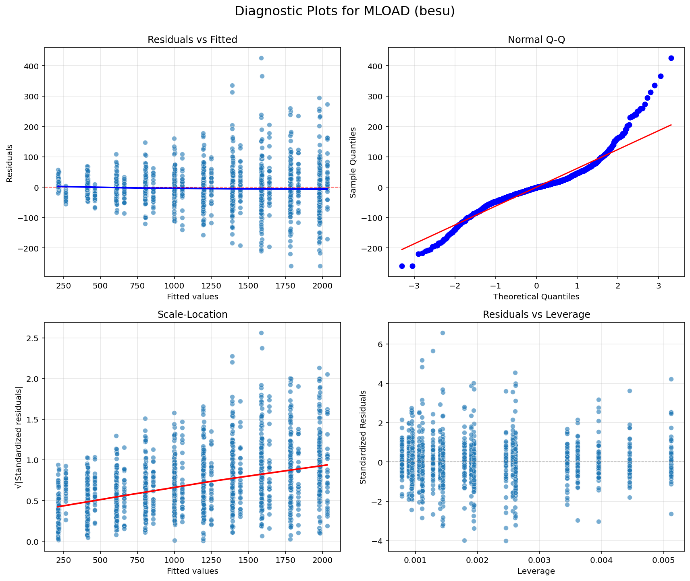


## reth


```python
                            OLS Regression Results                            
==============================================================================
Dep. Variable:        run_duration_ms   R-squared:                       0.981
Model:                            OLS   Adj. R-squared:                  0.981
Method:                 Least Squares   F-statistic:                 2.268e+04
Date:                Thu, 22 Jan 2026   Prob (F-statistic):               0.00
Time:                        10:35:47   Log-Likelihood:                -3586.0
No. Observations:                 900   AIC:                             7178.
Df Residuals:                     897   BIC:                             7192.
Df Model:                           2                                         
Covariance Type:            nonrobust                                         
==============================================================================
                 coef    std err          t      P>|t|      [0.025      0.975]
------------------------------------------------------------------------------
const         30.9966      0.971     31.908      0.000      29.090      32.903
opcount        0.0129   6.05e-05    212.867      0.000       0.013       0.013
mem_size       0.0007      0.000      6.349      0.000       0.000       0.001
==============================================================================
Omnibus:                      760.165   Durbin-Watson:                   1.650
Prob(Omnibus):                  0.000   Jarque-Bera (JB):            60829.613
Skew:                           3.315   Prob(JB):                         0.00
Kurtosis:                      42.726   Cond. No.                     3.50e+04
==============================================================================

Notes:
[1] Standard Errors assume that the covariance matrix of the errors is correctly specified.
[2] The condition number is large, 3.5e+04. This might indicate that there are
strong multicollinearity or other numerical problems.
```

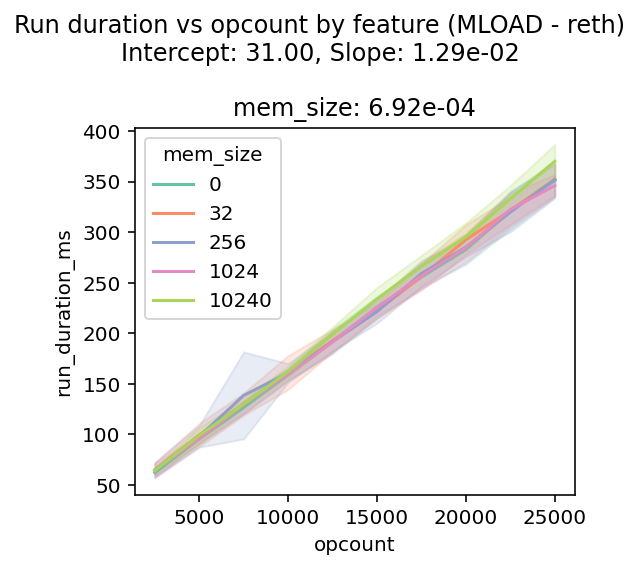

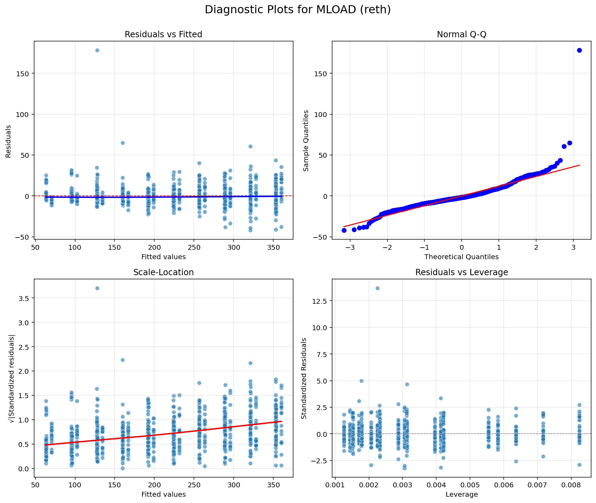


## nethermind


```python
                            OLS Regression Results                            
==============================================================================
Dep. Variable:        run_duration_ms   R-squared:                       0.985
Model:                            OLS   Adj. R-squared:                  0.985
Method:                 Least Squares   F-statistic:                 4.825e+04
Date:                Thu, 22 Jan 2026   Prob (F-statistic):               0.00
Time:                        10:35:47   Log-Likelihood:                -6601.6
No. Observations:                1450   AIC:                         1.321e+04
Df Residuals:                    1447   BIC:                         1.323e+04
Df Model:                           2                                         
Covariance Type:            nonrobust                                         
==============================================================================
                 coef    std err          t      P>|t|      [0.025      0.975]
------------------------------------------------------------------------------
const         25.3322      1.350     18.760      0.000      22.683      27.981
opcount        0.0261   8.41e-05    310.566      0.000       0.026       0.026
mem_size       0.0010      0.000      6.909      0.000       0.001       0.001
==============================================================================
Omnibus:                      295.396   Durbin-Watson:                   0.972
Prob(Omnibus):                  0.000   Jarque-Bera (JB):             9116.568
Skew:                          -0.000   Prob(JB):                         0.00
Kurtosis:                      15.284   Cond. No.                     3.50e+04
==============================================================================

Notes:
[1] Standard Errors assume that the covariance matrix of the errors is correctly specified.
[2] The condition number is large, 3.5e+04. This might indicate that there are
strong multicollinearity or other numerical problems.
```

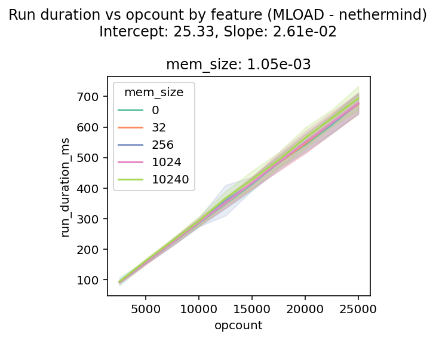

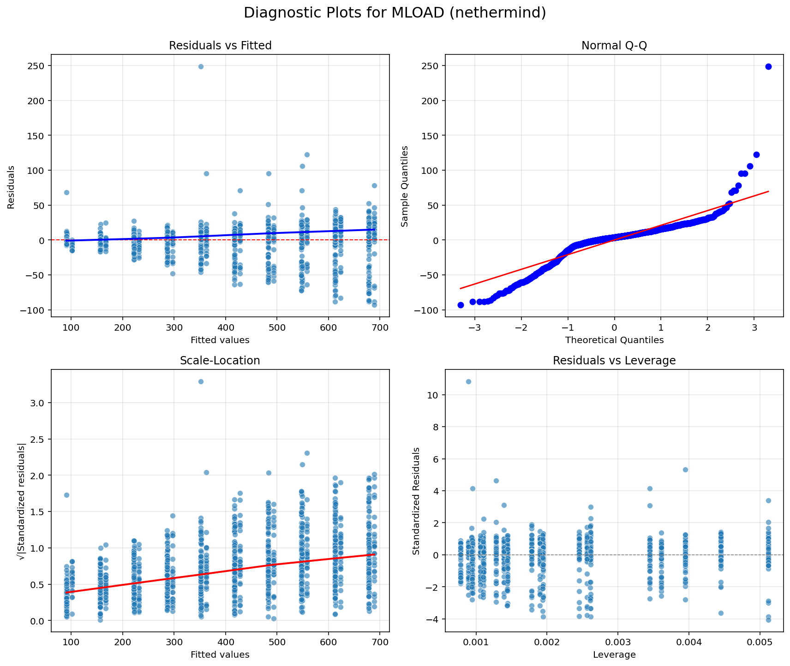


## erigon

OLS model did not run... Error: zero-size array to reduction operation maximum which has no identity

# MSTORE

## geth


```python
                            OLS Regression Results                            
==============================================================================
Dep. Variable:        run_duration_ms   R-squared:                       0.974
Model:                            OLS   Adj. R-squared:                  0.974
Method:                 Least Squares   F-statistic:                 2.709e+04
Date:                Thu, 22 Jan 2026   Prob (F-statistic):               0.00
Time:                        10:35:48   Log-Likelihood:                -7807.7
No. Observations:                1450   AIC:                         1.562e+04
Df Residuals:                    1447   BIC:                         1.564e+04
Df Model:                           2                                         
Covariance Type:            nonrobust                                         
==============================================================================
                 coef    std err          t      P>|t|      [0.025      0.975]
------------------------------------------------------------------------------
const         31.6858      3.102     10.214      0.000      25.601      37.771
opcount        0.0450      0.000    232.756      0.000       0.045       0.045
mem_size       0.0011      0.000      3.044      0.002       0.000       0.002
==============================================================================
Omnibus:                     1635.676   Durbin-Watson:                   1.558
Prob(Omnibus):                  0.000   Jarque-Bera (JB):           259452.218
Skew:                           5.375   Prob(JB):                         0.00
Kurtosis:                      67.644   Cond. No.                     3.50e+04
==============================================================================

Notes:
[1] Standard Errors assume that the covariance matrix of the errors is correctly specified.
[2] The condition number is large, 3.5e+04. This might indicate that there are
strong multicollinearity or other numerical problems.
```

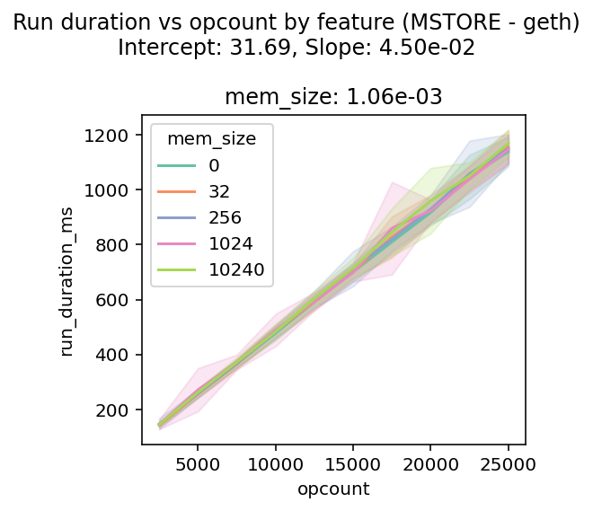

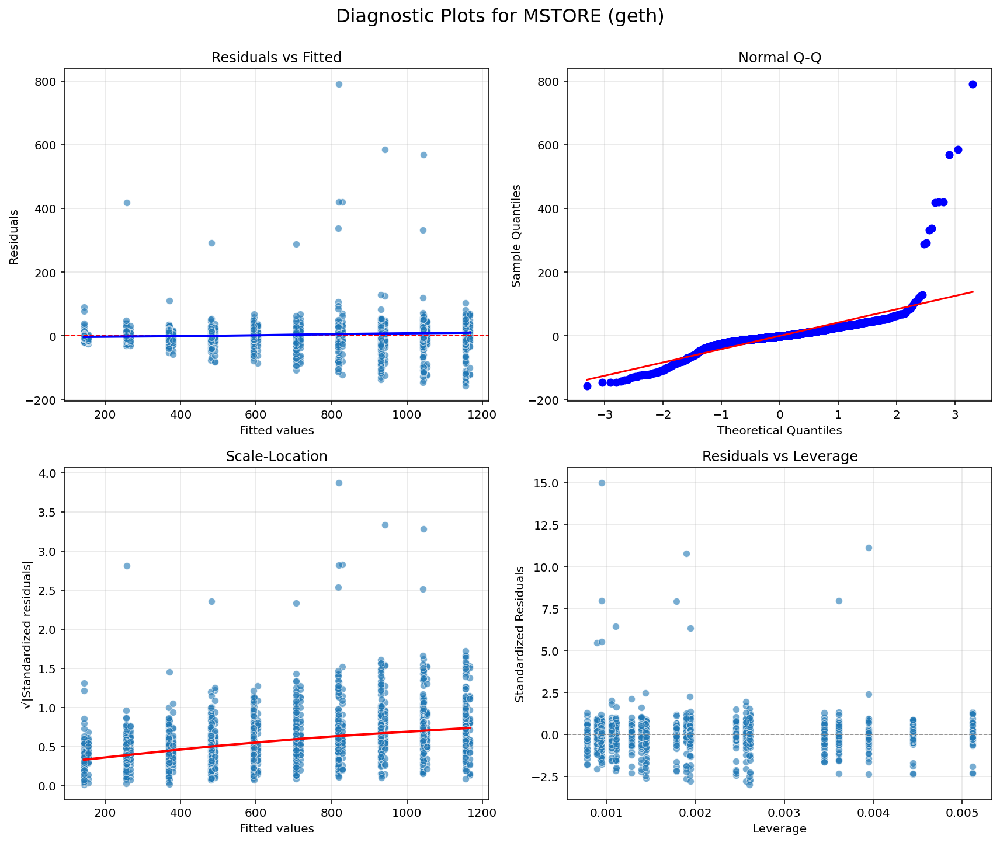


## besu


```python
                            OLS Regression Results                            
==============================================================================
Dep. Variable:        run_duration_ms   R-squared:                       0.985
Model:                            OLS   Adj. R-squared:                  0.985
Method:                 Least Squares   F-statistic:                 4.807e+04
Date:                Thu, 22 Jan 2026   Prob (F-statistic):               0.00
Time:                        10:35:48   Log-Likelihood:                -8632.6
No. Observations:                1450   AIC:                         1.727e+04
Df Residuals:                    1447   BIC:                         1.729e+04
Df Model:                           2                                         
Covariance Type:            nonrobust                                         
==============================================================================
                 coef    std err          t      P>|t|      [0.025      0.975]
------------------------------------------------------------------------------
const         19.8885      5.480      3.630      0.000       9.140      30.637
opcount        0.1058      0.000    310.008      0.000       0.105       0.106
mem_size       0.0033      0.001      5.318      0.000       0.002       0.004
==============================================================================
Omnibus:                      654.151   Durbin-Watson:                   0.936
Prob(Omnibus):                  0.000   Jarque-Bera (JB):            15646.702
Skew:                           1.553   Prob(JB):                         0.00
Kurtosis:                      18.790   Cond. No.                     3.50e+04
==============================================================================

Notes:
[1] Standard Errors assume that the covariance matrix of the errors is correctly specified.
[2] The condition number is large, 3.5e+04. This might indicate that there are
strong multicollinearity or other numerical problems.
```

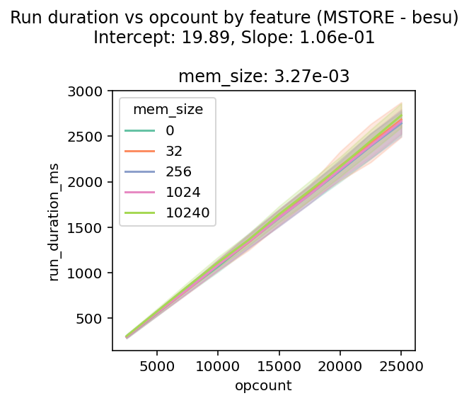

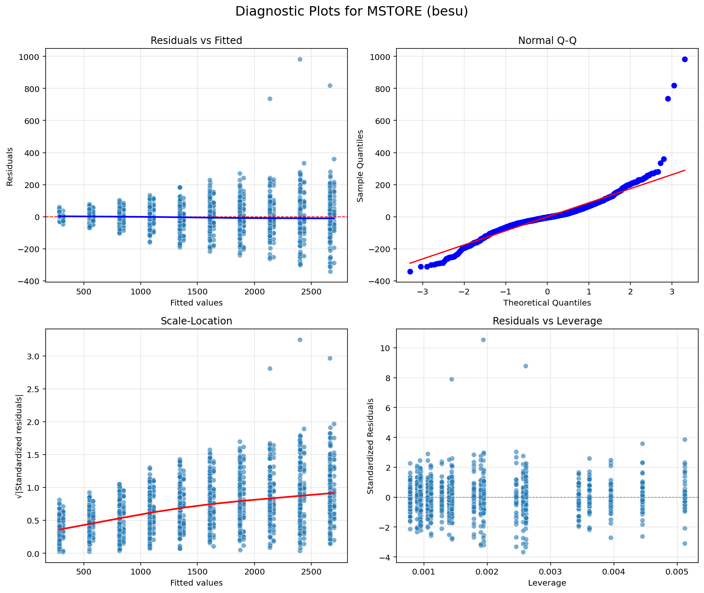


## reth


```python
                            OLS Regression Results                            
==============================================================================
Dep. Variable:        run_duration_ms   R-squared:                       0.924
Model:                            OLS   Adj. R-squared:                  0.923
Method:                 Least Squares   F-statistic:                     5415.
Date:                Thu, 22 Jan 2026   Prob (F-statistic):               0.00
Time:                        10:35:48   Log-Likelihood:                -4297.2
No. Observations:                 900   AIC:                             8600.
Df Residuals:                     897   BIC:                             8615.
Df Model:                           2                                         
Covariance Type:            nonrobust                                         
==============================================================================
                 coef    std err          t      P>|t|      [0.025      0.975]
------------------------------------------------------------------------------
const         26.6965      2.141     12.469      0.000      22.495      30.898
opcount        0.0138      0.000    103.781      0.000       0.014       0.014
mem_size       0.0019      0.000      7.735      0.000       0.001       0.002
==============================================================================
Omnibus:                     1726.986   Durbin-Watson:                   1.820
Prob(Omnibus):                  0.000   Jarque-Bera (JB):          3002248.859
Skew:                          13.651   Prob(JB):                         0.00
Kurtosis:                     284.628   Cond. No.                     3.50e+04
==============================================================================

Notes:
[1] Standard Errors assume that the covariance matrix of the errors is correctly specified.
[2] The condition number is large, 3.5e+04. This might indicate that there are
strong multicollinearity or other numerical problems.
```
OLS model did not run... Error: 'numpy.ndarray' object has no attribute 'iloc'

## nethermind


```python
                            OLS Regression Results                            
==============================================================================
Dep. Variable:        run_duration_ms   R-squared:                       0.986
Model:                            OLS   Adj. R-squared:                  0.986
Method:                 Least Squares   F-statistic:                 5.126e+04
Date:                Thu, 22 Jan 2026   Prob (F-statistic):               0.00
Time:                        10:35:48   Log-Likelihood:                -6703.5
No. Observations:                1450   AIC:                         1.341e+04
Df Residuals:                    1447   BIC:                         1.343e+04
Df Model:                           2                                         
Covariance Type:            nonrobust                                         
==============================================================================
                 coef    std err          t      P>|t|      [0.025      0.975]
------------------------------------------------------------------------------
const         27.0277      1.449     18.659      0.000      24.186      29.869
opcount        0.0289   9.02e-05    320.123      0.000       0.029       0.029
mem_size       0.0009      0.000      5.641      0.000       0.001       0.001
==============================================================================
Omnibus:                      344.742   Durbin-Watson:                   0.852
Prob(Omnibus):                  0.000   Jarque-Bera (JB):             1108.029
Skew:                          -1.167   Prob(JB):                    2.48e-241
Kurtosis:                       6.590   Cond. No.                     3.50e+04
==============================================================================

Notes:
[1] Standard Errors assume that the covariance matrix of the errors is correctly specified.
[2] The condition number is large, 3.5e+04. This might indicate that there are
strong multicollinearity or other numerical problems.
```

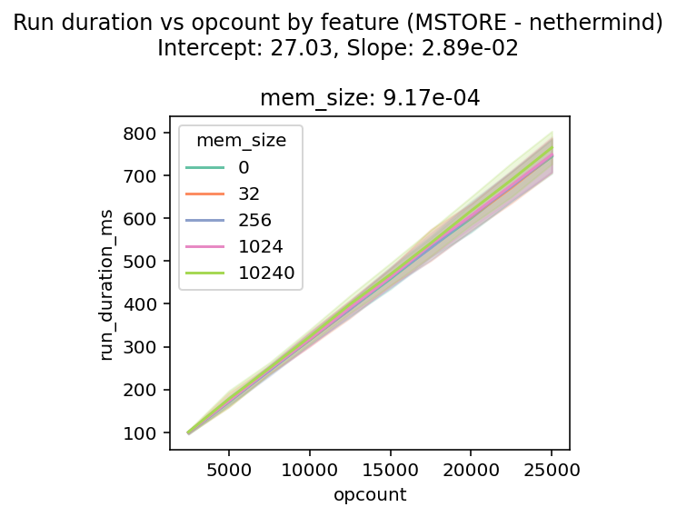

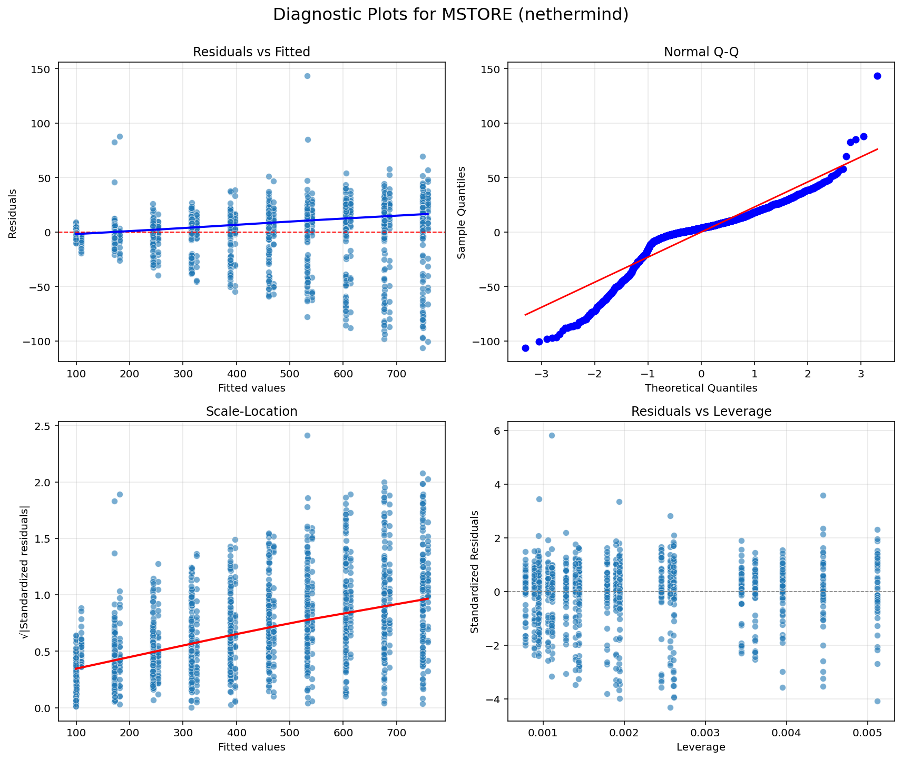


## erigon

OLS model did not run... Error: zero-size array to reduction operation maximum which has no identity

# MSTORE8

## geth


```python
                            OLS Regression Results                            
==============================================================================
Dep. Variable:        run_duration_ms   R-squared:                       0.976
Model:                            OLS   Adj. R-squared:                  0.976
Method:                 Least Squares   F-statistic:                 2.937e+04
Date:                Thu, 22 Jan 2026   Prob (F-statistic):               0.00
Time:                        10:35:49   Log-Likelihood:                -7655.8
No. Observations:                1450   AIC:                         1.532e+04
Df Residuals:                    1447   BIC:                         1.533e+04
Df Model:                           2                                         
Covariance Type:            nonrobust                                         
==============================================================================
                 coef    std err          t      P>|t|      [0.025      0.975]
------------------------------------------------------------------------------
const         30.8363      2.794     11.038      0.000      25.356      36.316
opcount        0.0422      0.000    242.339      0.000       0.042       0.042
mem_size       0.0008      0.000      2.681      0.007       0.000       0.001
==============================================================================
Omnibus:                     1288.061   Durbin-Watson:                   1.466
Prob(Omnibus):                  0.000   Jarque-Bera (JB):           108930.212
Skew:                           3.713   Prob(JB):                         0.00
Kurtosis:                      44.807   Cond. No.                     3.50e+04
==============================================================================

Notes:
[1] Standard Errors assume that the covariance matrix of the errors is correctly specified.
[2] The condition number is large, 3.5e+04. This might indicate that there are
strong multicollinearity or other numerical problems.
```

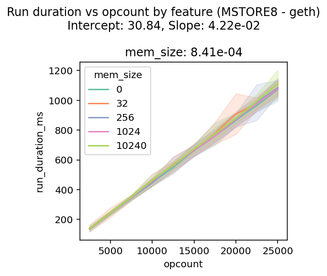

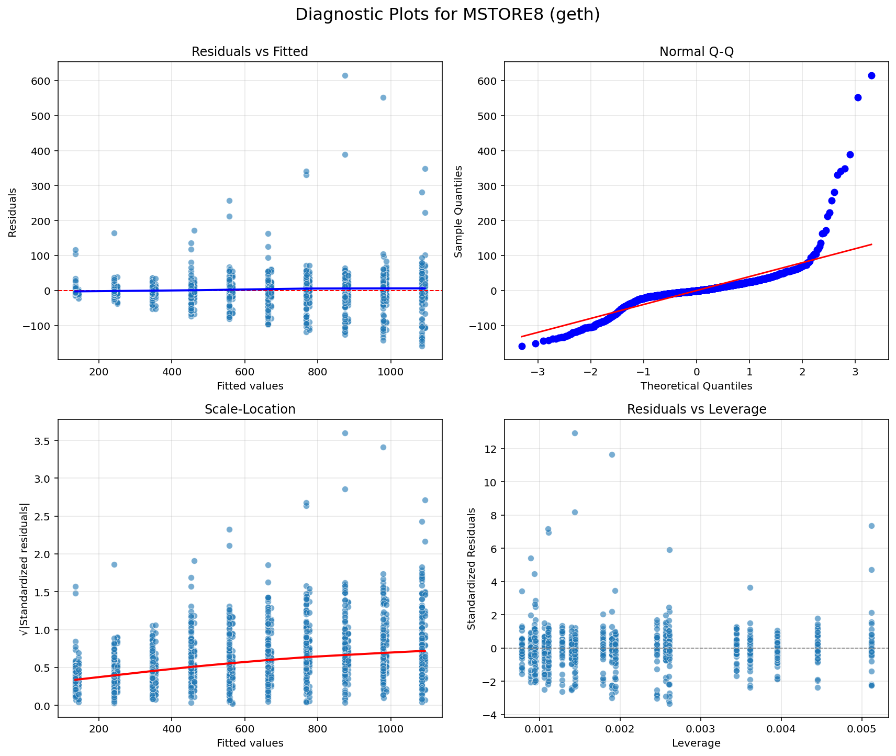


## besu


```python
                            OLS Regression Results                            
==============================================================================
Dep. Variable:        run_duration_ms   R-squared:                       0.984
Model:                            OLS   Adj. R-squared:                  0.984
Method:                 Least Squares   F-statistic:                 4.435e+04
Date:                Thu, 22 Jan 2026   Prob (F-statistic):               0.00
Time:                        10:35:49   Log-Likelihood:                -8186.8
No. Observations:                1450   AIC:                         1.638e+04
Df Residuals:                    1447   BIC:                         1.640e+04
Df Model:                           2                                         
Covariance Type:            nonrobust                                         
==============================================================================
                 coef    std err          t      P>|t|      [0.025      0.975]
------------------------------------------------------------------------------
const         19.8152      4.029      4.918      0.000      11.912      27.719
opcount        0.0747      0.000    297.676      0.000       0.074       0.075
mem_size       0.0042      0.000      9.365      0.000       0.003       0.005
==============================================================================
Omnibus:                      148.598   Durbin-Watson:                   0.861
Prob(Omnibus):                  0.000   Jarque-Bera (JB):             1131.933
Skew:                          -0.007   Prob(JB):                    1.60e-246
Kurtosis:                       7.328   Cond. No.                     3.50e+04
==============================================================================

Notes:
[1] Standard Errors assume that the covariance matrix of the errors is correctly specified.
[2] The condition number is large, 3.5e+04. This might indicate that there are
strong multicollinearity or other numerical problems.
```

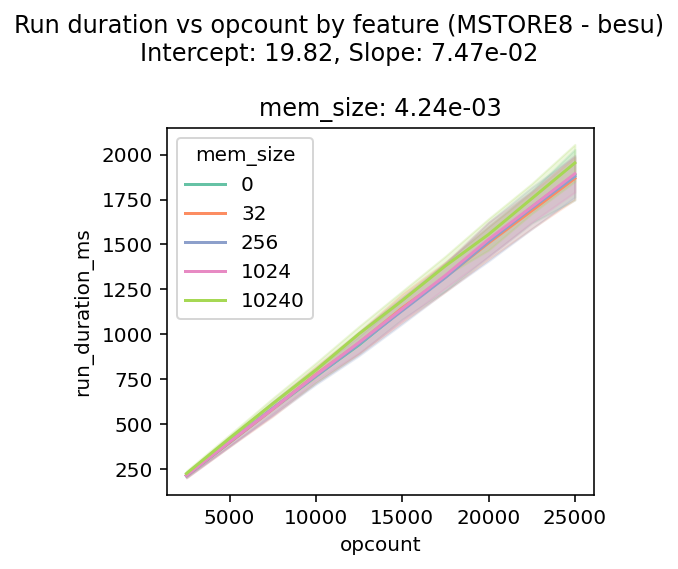

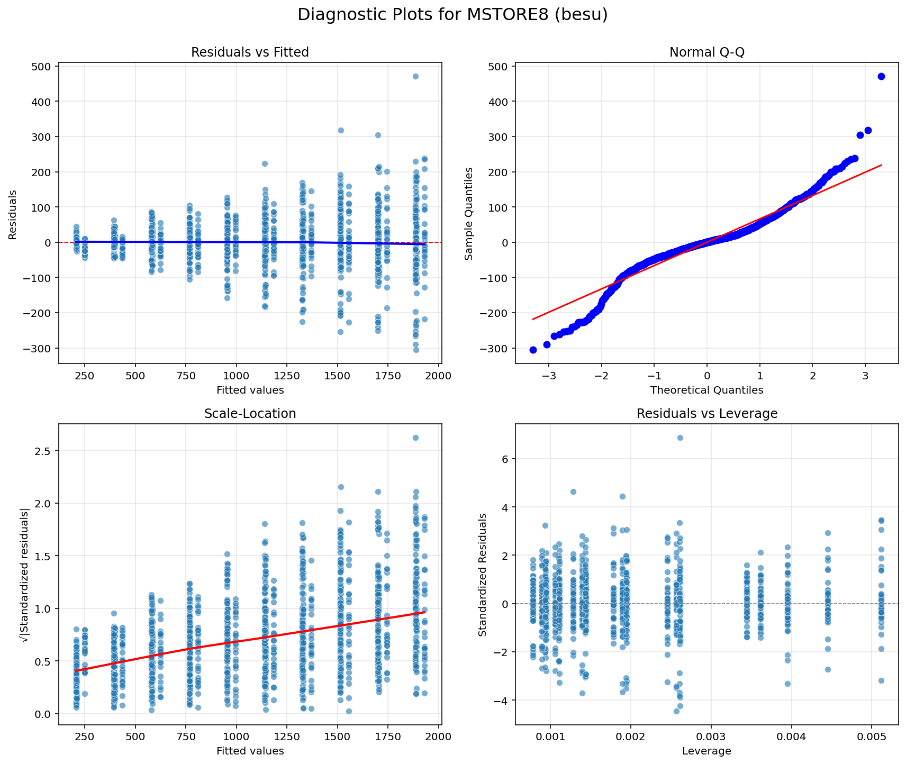


## reth


```python
                            OLS Regression Results                            
==============================================================================
Dep. Variable:        run_duration_ms   R-squared:                       0.892
Model:                            OLS   Adj. R-squared:                  0.892
Method:                 Least Squares   F-statistic:                     3713.
Date:                Thu, 22 Jan 2026   Prob (F-statistic):               0.00
Time:                        10:35:49   Log-Likelihood:                -4441.3
No. Observations:                 900   AIC:                             8889.
Df Residuals:                     897   BIC:                             8903.
Df Model:                           2                                         
Covariance Type:            nonrobust                                         
==============================================================================
                 coef    std err          t      P>|t|      [0.025      0.975]
------------------------------------------------------------------------------
const         26.2253      2.513     10.437      0.000      21.294      31.157
opcount        0.0134      0.000     85.768      0.000       0.013       0.014
mem_size       0.0024      0.000      8.400      0.000       0.002       0.003
==============================================================================
Omnibus:                     1382.871   Durbin-Watson:                   1.842
Prob(Omnibus):                  0.000   Jarque-Bera (JB):           421522.946
Skew:                           9.126   Prob(JB):                         0.00
Kurtosis:                     107.439   Cond. No.                     3.50e+04
==============================================================================

Notes:
[1] Standard Errors assume that the covariance matrix of the errors is correctly specified.
[2] The condition number is large, 3.5e+04. This might indicate that there are
strong multicollinearity or other numerical problems.
```
OLS model did not run... Error: 'numpy.ndarray' object has no attribute 'iloc'

## nethermind


```python
                            OLS Regression Results                            
==============================================================================
Dep. Variable:        run_duration_ms   R-squared:                       0.985
Model:                            OLS   Adj. R-squared:                  0.985
Method:                 Least Squares   F-statistic:                 4.787e+04
Date:                Thu, 22 Jan 2026   Prob (F-statistic):               0.00
Time:                        10:35:50   Log-Likelihood:                -6727.0
No. Observations:                1450   AIC:                         1.346e+04
Df Residuals:                    1447   BIC:                         1.348e+04
Df Model:                           2                                         
Covariance Type:            nonrobust                                         
==============================================================================
                 coef    std err          t      P>|t|      [0.025      0.975]
------------------------------------------------------------------------------
const         26.6802      1.472     18.122      0.000      23.792      29.568
opcount        0.0284   9.17e-05    309.351      0.000       0.028       0.029
mem_size       0.0012      0.000      7.193      0.000       0.001       0.002
==============================================================================
Omnibus:                      196.601   Durbin-Watson:                   0.887
Prob(Omnibus):                  0.000   Jarque-Bera (JB):             1877.868
Skew:                          -0.262   Prob(JB):                         0.00
Kurtosis:                       8.550   Cond. No.                     3.50e+04
==============================================================================

Notes:
[1] Standard Errors assume that the covariance matrix of the errors is correctly specified.
[2] The condition number is large, 3.5e+04. This might indicate that there are
strong multicollinearity or other numerical problems.
```

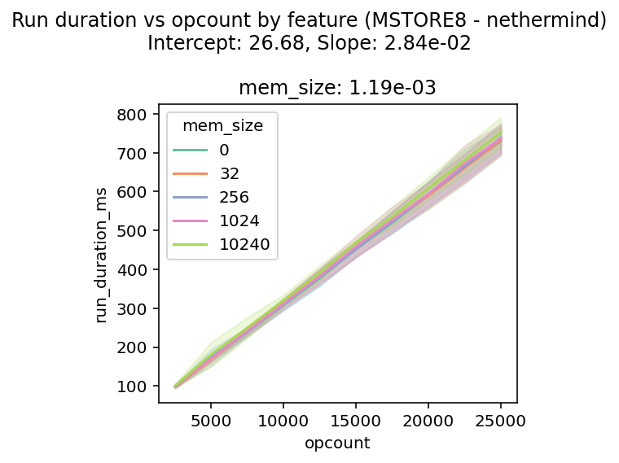

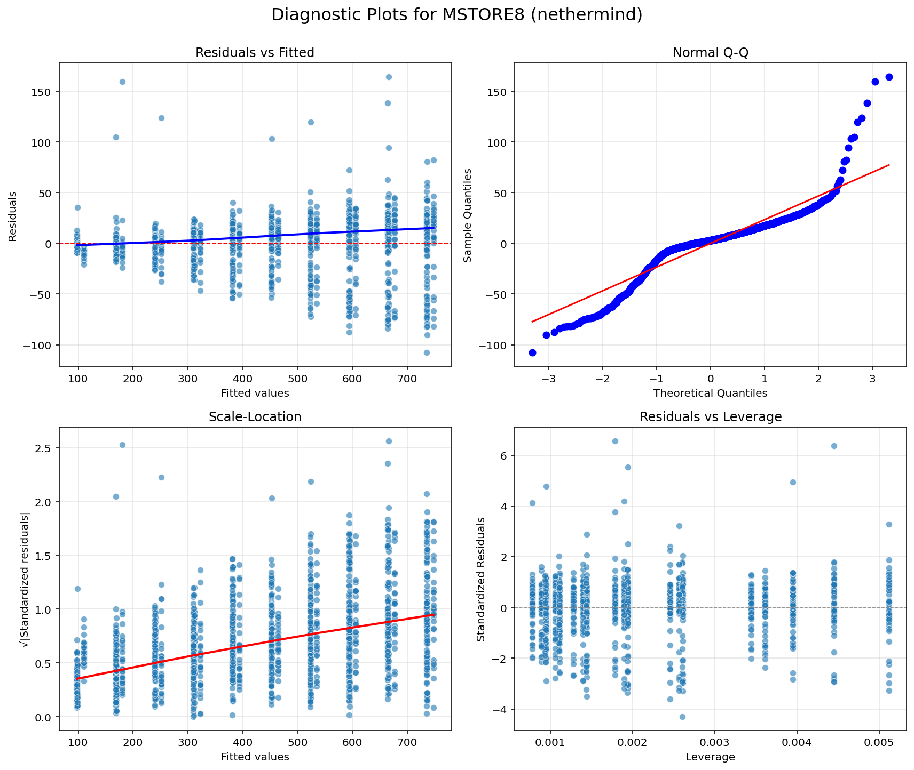


## erigon

OLS model did not run... Error: zero-size array to reduction operation maximum which has no identity

# CALLDATACOPY

## geth


```python
                            OLS Regression Results                            
==============================================================================
Dep. Variable:        run_duration_ms   R-squared:                       0.976
Model:                            OLS   Adj. R-squared:                  0.976
Method:                 Least Squares   F-statistic:                 1.425e+05
Date:                Thu, 22 Jan 2026   Prob (F-statistic):               0.00
Time:                        10:35:50   Log-Likelihood:                -40402.
No. Observations:                6960   AIC:                         8.081e+04
Df Residuals:                    6957   BIC:                         8.083e+04
Df Model:                           2                                         
Covariance Type:            nonrobust                                         
=================================================================================
                    coef    std err          t      P>|t|      [0.025      0.975]
---------------------------------------------------------------------------------
const            60.8173      2.273     26.759      0.000      56.362      65.273
opcount           0.0733      0.000    415.364      0.000       0.073       0.074
calldata_size    -0.0035      0.003     -1.157      0.247      -0.009       0.002
==============================================================================
Omnibus:                    14571.814   Durbin-Watson:                   1.764
Prob(Omnibus):                  0.000   Jarque-Bera (JB):        128277405.298
Skew:                          17.540   Prob(JB):                         0.00
Kurtosis:                     667.158   Cond. No.                     2.40e+04
==============================================================================

Notes:
[1] Standard Errors assume that the covariance matrix of the errors is correctly specified.
[2] The condition number is large, 2.4e+04. This might indicate that there are
strong multicollinearity or other numerical problems.
```

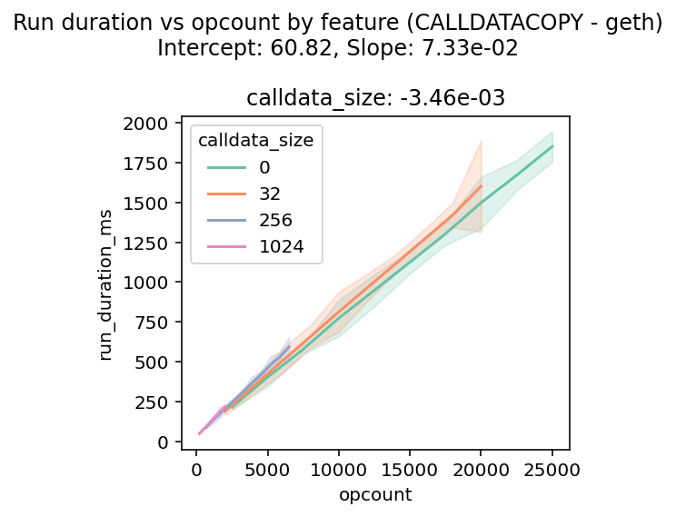

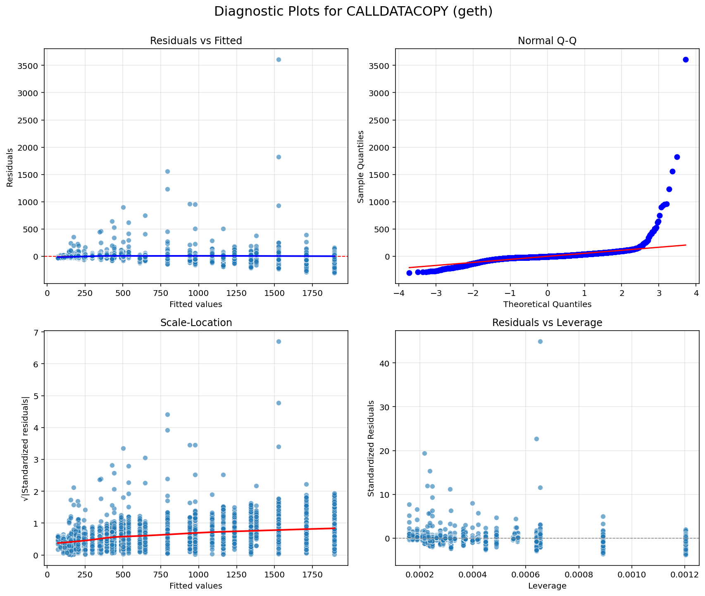


## besu


```python
                            OLS Regression Results                            
==============================================================================
Dep. Variable:        run_duration_ms   R-squared:                       0.811
Model:                            OLS   Adj. R-squared:                  0.811
Method:                 Least Squares   F-statistic:                 1.492e+04
Date:                Thu, 22 Jan 2026   Prob (F-statistic):               0.00
Time:                        10:35:50   Log-Likelihood:                -51697.
No. Observations:                6960   AIC:                         1.034e+05
Df Residuals:                    6957   BIC:                         1.034e+05
Df Model:                           2                                         
Covariance Type:            nonrobust                                         
=================================================================================
                    coef    std err          t      P>|t|      [0.025      0.975]
---------------------------------------------------------------------------------
const           260.8852     11.517     22.652      0.000     238.309     283.462
opcount           0.1173      0.001    131.148      0.000       0.116       0.119
calldata_size    -0.0827      0.015     -5.467      0.000      -0.112      -0.053
==============================================================================
Omnibus:                      821.464   Durbin-Watson:                   1.809
Prob(Omnibus):                  0.000   Jarque-Bera (JB):             1438.608
Skew:                           0.797   Prob(JB):                         0.00
Kurtosis:                       4.556   Cond. No.                     2.40e+04
==============================================================================

Notes:
[1] Standard Errors assume that the covariance matrix of the errors is correctly specified.
[2] The condition number is large, 2.4e+04. This might indicate that there are
strong multicollinearity or other numerical problems.
```

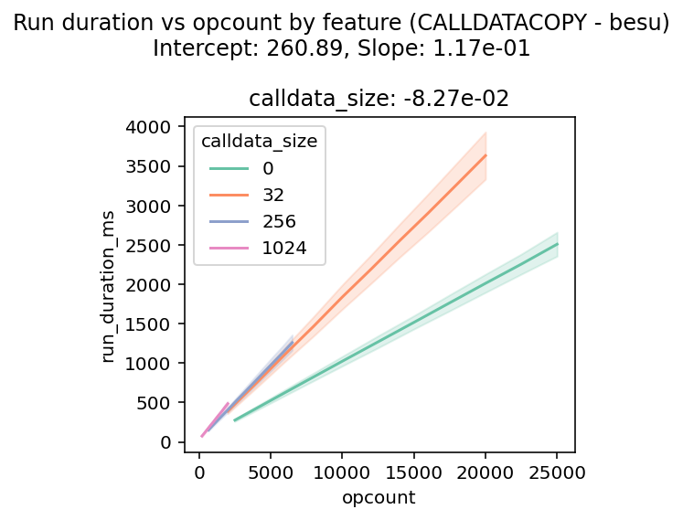

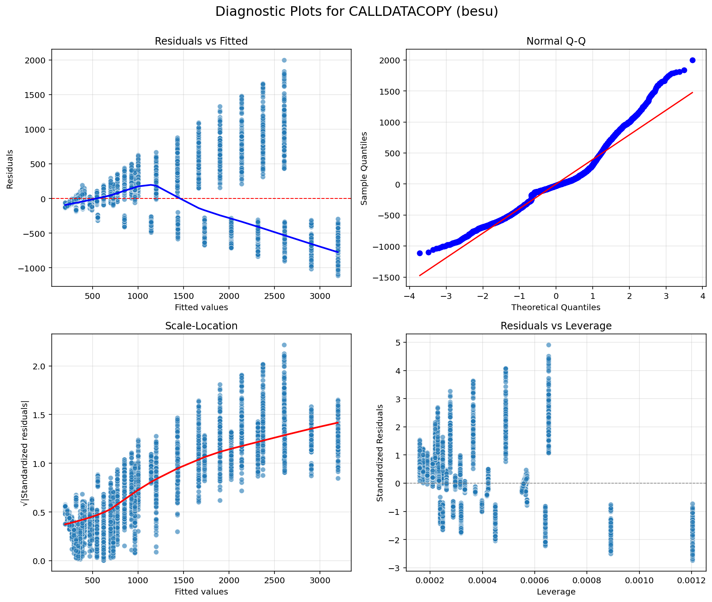


## reth


```python
                            OLS Regression Results                            
==============================================================================
Dep. Variable:        run_duration_ms   R-squared:                       0.890
Model:                            OLS   Adj. R-squared:                  0.890
Method:                 Least Squares   F-statistic:                 1.746e+04
Date:                Thu, 22 Jan 2026   Prob (F-statistic):               0.00
Time:                        10:35:51   Log-Likelihood:                -23174.
No. Observations:                4320   AIC:                         4.635e+04
Df Residuals:                    4317   BIC:                         4.637e+04
Df Model:                           2                                         
Covariance Type:            nonrobust                                         
=================================================================================
                    coef    std err          t      P>|t|      [0.025      0.975]
---------------------------------------------------------------------------------
const            54.4416      1.857     29.314      0.000      50.801      58.083
opcount           0.0210      0.000    145.523      0.000       0.021       0.021
calldata_size    -0.0005      0.002     -0.220      0.826      -0.005       0.004
==============================================================================
Omnibus:                     5494.746   Durbin-Watson:                   1.916
Prob(Omnibus):                  0.000   Jarque-Bera (JB):          2106216.500
Skew:                           6.615   Prob(JB):                         0.00
Kurtosis:                     110.360   Cond. No.                     2.40e+04
==============================================================================

Notes:
[1] Standard Errors assume that the covariance matrix of the errors is correctly specified.
[2] The condition number is large, 2.4e+04. This might indicate that there are
strong multicollinearity or other numerical problems.
```

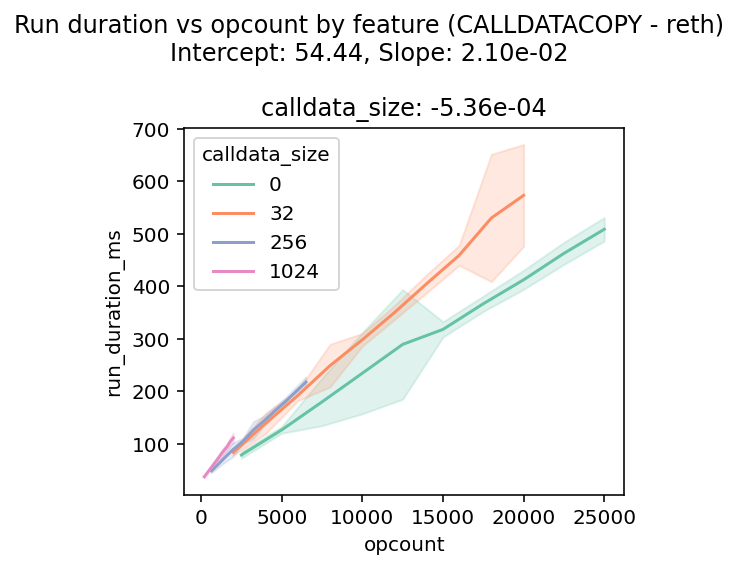

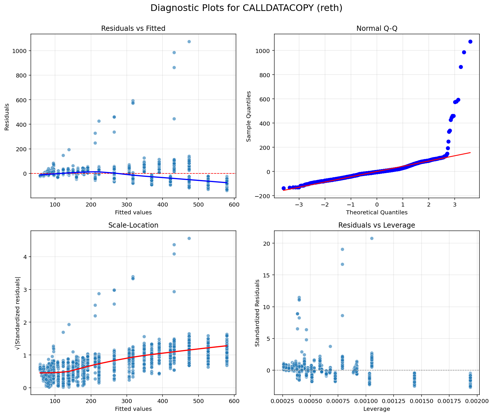


## nethermind


```python
                            OLS Regression Results                            
==============================================================================
Dep. Variable:        run_duration_ms   R-squared:                       0.860
Model:                            OLS   Adj. R-squared:                  0.860
Method:                 Least Squares   F-statistic:                 2.138e+04
Date:                Thu, 22 Jan 2026   Prob (F-statistic):               0.00
Time:                        10:35:51   Log-Likelihood:                -43838.
No. Observations:                6960   AIC:                         8.768e+04
Df Residuals:                    6957   BIC:                         8.770e+04
Df Model:                           2                                         
Covariance Type:            nonrobust                                         
=================================================================================
                    coef    std err          t      P>|t|      [0.025      0.975]
---------------------------------------------------------------------------------
const            96.0002      3.723     25.782      0.000      88.701     103.299
opcount           0.0455      0.000    157.407      0.000       0.045       0.046
calldata_size    -0.0289      0.005     -5.913      0.000      -0.039      -0.019
==============================================================================
Omnibus:                      226.968   Durbin-Watson:                   1.725
Prob(Omnibus):                  0.000   Jarque-Bera (JB):              494.800
Skew:                          -0.196   Prob(JB):                    3.59e-108
Kurtosis:                       4.246   Cond. No.                     2.40e+04
==============================================================================

Notes:
[1] Standard Errors assume that the covariance matrix of the errors is correctly specified.
[2] The condition number is large, 2.4e+04. This might indicate that there are
strong multicollinearity or other numerical problems.
```

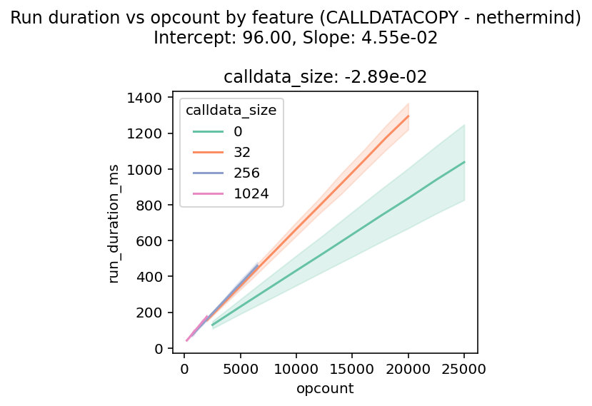

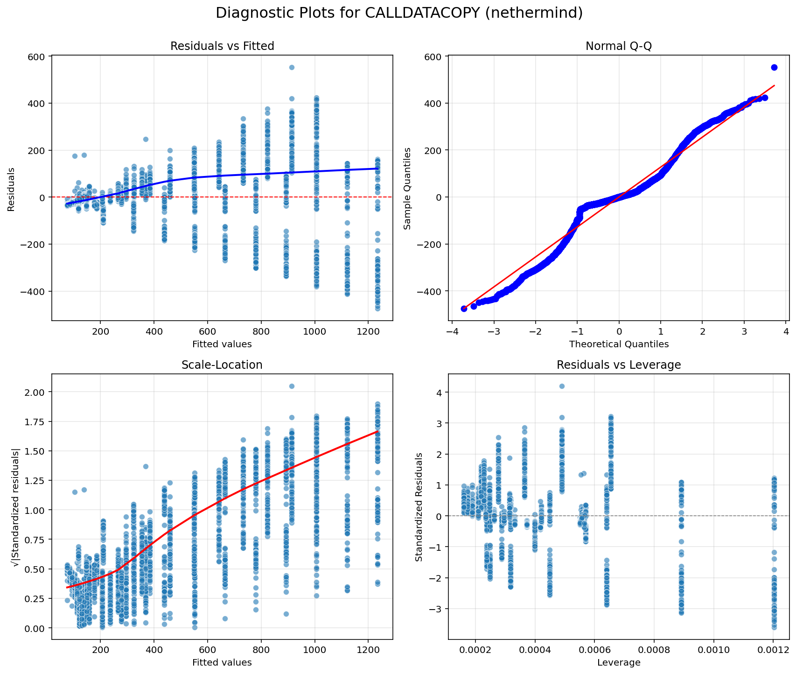


## erigon


```python
                            OLS Regression Results                            
==============================================================================
Dep. Variable:        run_duration_ms   R-squared:                       0.994
Model:                            OLS   Adj. R-squared:                  0.994
Method:                 Least Squares   F-statistic:                 4.154e+04
Date:                Thu, 22 Jan 2026   Prob (F-statistic):               0.00
Time:                        10:35:51   Log-Likelihood:                -3695.4
No. Observations:                 720   AIC:                             7399.
Df Residuals:                     716   BIC:                             7417.
Df Model:                           3                                         
Covariance Type:            nonrobust                                         
=================================================================================
                    coef    std err          t      P>|t|      [0.025      0.975]
---------------------------------------------------------------------------------
const            59.7482      3.682     16.225      0.000      52.519      66.978
opcount           0.0771      0.000    274.602      0.000       0.077       0.078
calldata_size    -0.0042      0.005     -0.875      0.382      -0.013       0.005
mem_size      -1.636e-06   3.93e-06     -0.416      0.677   -9.35e-06    6.08e-06
==============================================================================
Omnibus:                      244.621   Durbin-Watson:                   1.884
Prob(Omnibus):                  0.000   Jarque-Bera (JB):             1619.434
Skew:                           1.361   Prob(JB):                         0.00
Kurtosis:                       9.824   Cond. No.                     1.03e+06
==============================================================================

Notes:
[1] Standard Errors assume that the covariance matrix of the errors is correctly specified.
[2] The condition number is large, 1.03e+06. This might indicate that there are
strong multicollinearity or other numerical problems.
```

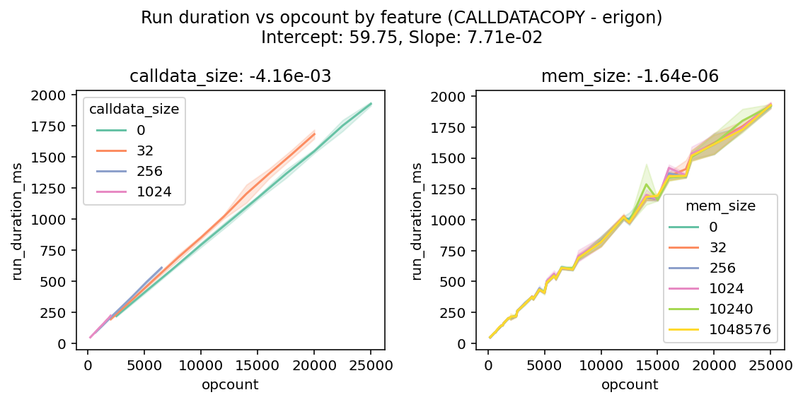

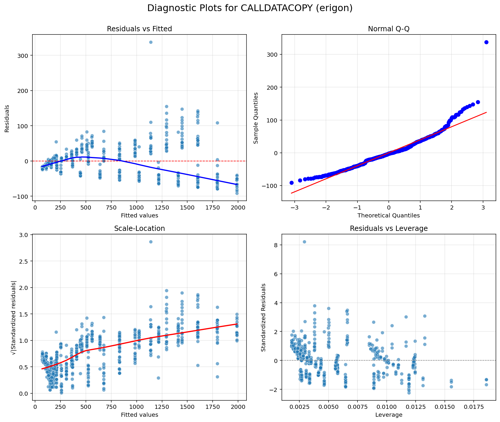


# CODECOPY

## geth


```python
                            OLS Regression Results                            
==============================================================================
Dep. Variable:        run_duration_ms   R-squared:                       0.985
Model:                            OLS   Adj. R-squared:                  0.985
Method:                 Least Squares   F-statistic:                 1.262e+05
Date:                Thu, 22 Jan 2026   Prob (F-statistic):               0.00
Time:                        10:35:52   Log-Likelihood:                -30828.
No. Observations:                5791   AIC:                         6.166e+04
Df Residuals:                    5787   BIC:                         6.169e+04
Df Model:                           3                                         
Covariance Type:            nonrobust                                         
==============================================================================
                 coef    std err          t      P>|t|      [0.025      0.975]
------------------------------------------------------------------------------
const         51.7857      1.226     42.235      0.000      49.382      54.189
opcount        0.0588      0.000    548.113      0.000       0.059       0.059
mem_size       0.0020      0.002      1.242      0.214      -0.001       0.005
code_size      0.0002   7.56e-05      3.054      0.002    8.27e-05       0.000
==============================================================================
Omnibus:                     5775.726   Durbin-Watson:                   1.700
Prob(Omnibus):                  0.000   Jarque-Bera (JB):          1369686.634
Skew:                           4.328   Prob(JB):                         0.00
Kurtosis:                      77.843   Cond. No.                     2.07e+04
==============================================================================

Notes:
[1] Standard Errors assume that the covariance matrix of the errors is correctly specified.
[2] The condition number is large, 2.07e+04. This might indicate that there are
strong multicollinearity or other numerical problems.
```

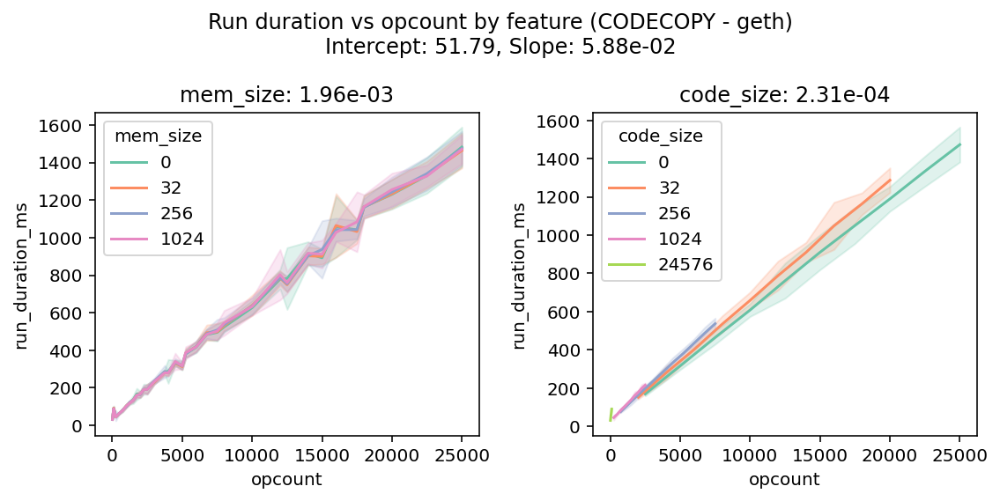

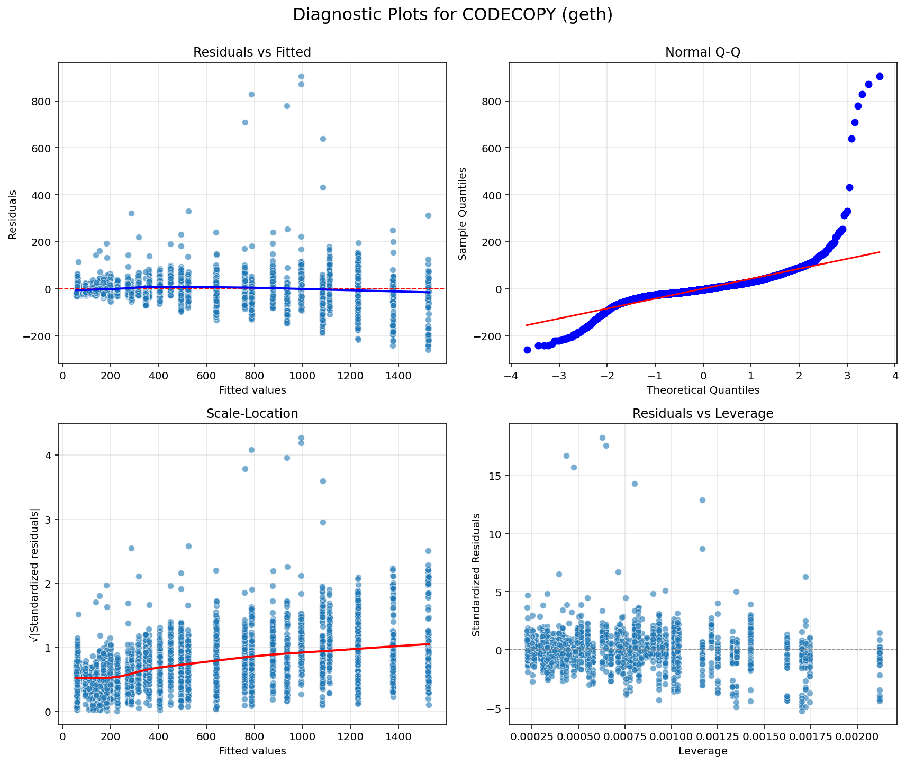


## besu


```python
                            OLS Regression Results                            
==============================================================================
Dep. Variable:        run_duration_ms   R-squared:                       0.826
Model:                            OLS   Adj. R-squared:                  0.826
Method:                 Least Squares   F-statistic:                     9180.
Date:                Thu, 22 Jan 2026   Prob (F-statistic):               0.00
Time:                        10:35:52   Log-Likelihood:                -42209.
No. Observations:                5791   AIC:                         8.443e+04
Df Residuals:                    5787   BIC:                         8.445e+04
Df Model:                           3                                         
Covariance Type:            nonrobust                                         
==============================================================================
                 coef    std err          t      P>|t|      [0.025      0.975]
------------------------------------------------------------------------------
const        270.5929      8.751     30.920      0.000     253.437     287.749
opcount        0.1069      0.001    139.562      0.000       0.105       0.108
mem_size       0.0034      0.011      0.300      0.764      -0.019       0.025
code_size     -0.0085      0.001    -15.724      0.000      -0.010      -0.007
==============================================================================
Omnibus:                     1696.503   Durbin-Watson:                   1.612
Prob(Omnibus):                  0.000   Jarque-Bera (JB):            11383.069
Skew:                           1.229   Prob(JB):                         0.00
Kurtosis:                       9.413   Cond. No.                     2.07e+04
==============================================================================

Notes:
[1] Standard Errors assume that the covariance matrix of the errors is correctly specified.
[2] The condition number is large, 2.07e+04. This might indicate that there are
strong multicollinearity or other numerical problems.
```

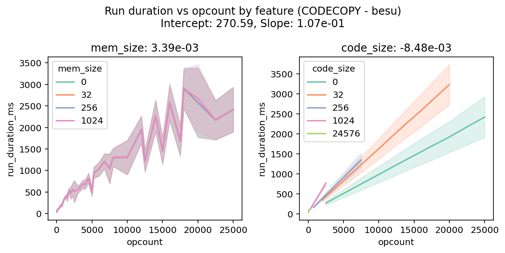


## reth


```python
                            OLS Regression Results                            
==============================================================================
Dep. Variable:        run_duration_ms   R-squared:                       0.926
Model:                            OLS   Adj. R-squared:                  0.926
Method:                 Least Squares   F-statistic:                 1.506e+04
Date:                Thu, 22 Jan 2026   Prob (F-statistic):               0.00
Time:                        10:35:53   Log-Likelihood:                -18347.
No. Observations:                3591   AIC:                         3.670e+04
Df Residuals:                    3587   BIC:                         3.673e+04
Df Model:                           3                                         
Covariance Type:            nonrobust                                         
==============================================================================
                 coef    std err          t      P>|t|      [0.025      0.975]
------------------------------------------------------------------------------
const         50.2274      1.258     39.937      0.000      47.762      52.693
opcount        0.0209      0.000    189.630      0.000       0.021       0.021
mem_size       0.0008      0.002      0.492      0.623      -0.002       0.004
code_size      0.0001   7.75e-05      1.687      0.092   -2.12e-05       0.000
==============================================================================
Omnibus:                      993.187   Durbin-Watson:                   1.788
Prob(Omnibus):                  0.000   Jarque-Bera (JB):            11124.550
Skew:                           0.989   Prob(JB):                         0.00
Kurtosis:                      11.393   Cond. No.                     2.07e+04
==============================================================================

Notes:
[1] Standard Errors assume that the covariance matrix of the errors is correctly specified.
[2] The condition number is large, 2.07e+04. This might indicate that there are
strong multicollinearity or other numerical problems.
```

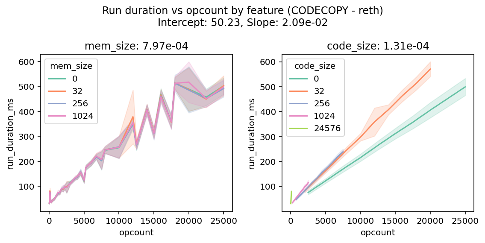

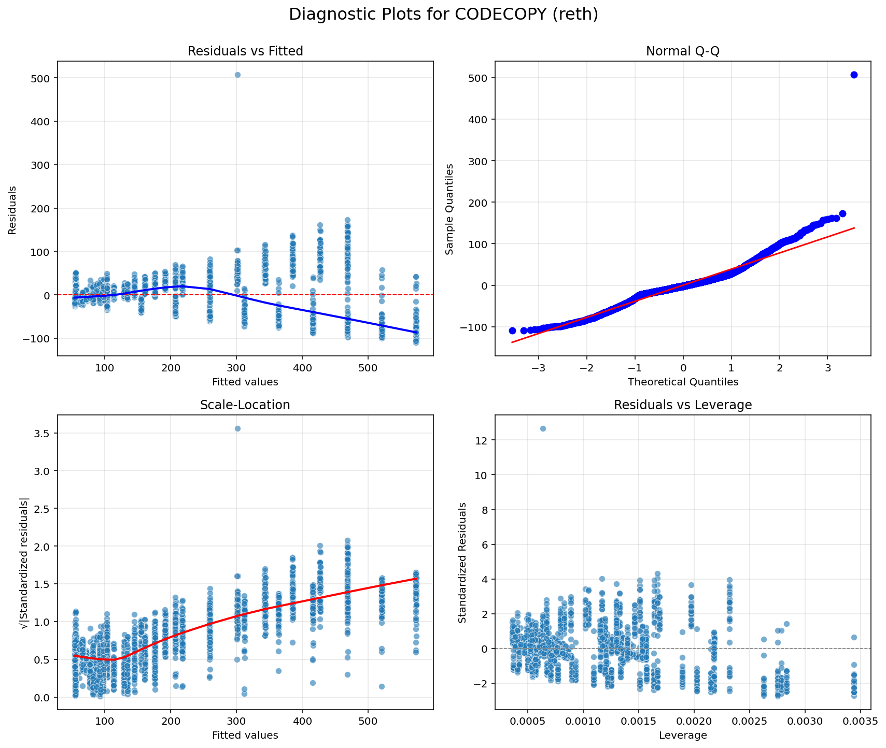


## nethermind


```python
                            OLS Regression Results                            
==============================================================================
Dep. Variable:        run_duration_ms   R-squared:                       0.855
Model:                            OLS   Adj. R-squared:                  0.855
Method:                 Least Squares   F-statistic:                 1.137e+04
Date:                Thu, 22 Jan 2026   Prob (F-statistic):               0.00
Time:                        10:35:53   Log-Likelihood:                -35322.
No. Observations:                5791   AIC:                         7.065e+04
Df Residuals:                    5787   BIC:                         7.068e+04
Df Model:                           3                                         
Covariance Type:            nonrobust                                         
==============================================================================
                 coef    std err          t      P>|t|      [0.025      0.975]
------------------------------------------------------------------------------
const         87.3065      2.664     32.773      0.000      82.084      92.529
opcount        0.0375      0.000    160.649      0.000       0.037       0.038
mem_size      -0.0010      0.003     -0.303      0.762      -0.008       0.006
code_size     -0.0012      0.000     -7.227      0.000      -0.002      -0.001
==============================================================================
Omnibus:                      768.996   Durbin-Watson:                   1.800
Prob(Omnibus):                  0.000   Jarque-Bera (JB):             2603.195
Skew:                           0.663   Prob(JB):                         0.00
Kurtosis:                       6.005   Cond. No.                     2.07e+04
==============================================================================

Notes:
[1] Standard Errors assume that the covariance matrix of the errors is correctly specified.
[2] The condition number is large, 2.07e+04. This might indicate that there are
strong multicollinearity or other numerical problems.
```

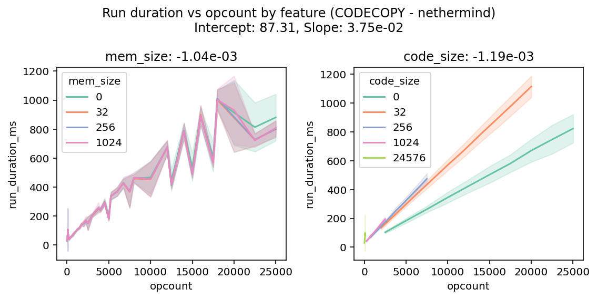

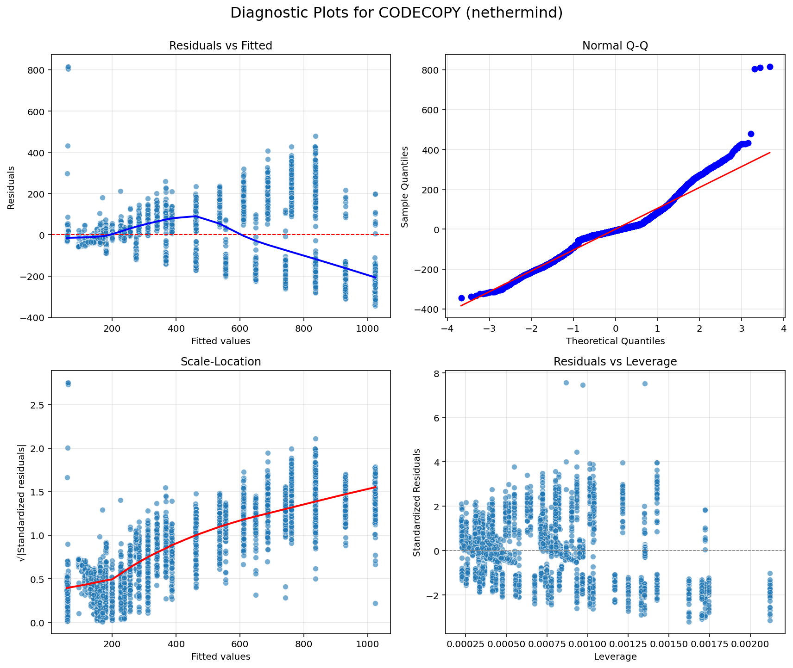


## erigon


```python
                            OLS Regression Results                            
==============================================================================
Dep. Variable:        run_duration_ms   R-squared:                       0.993
Model:                            OLS   Adj. R-squared:                  0.993
Method:                 Least Squares   F-statistic:                 2.697e+04
Date:                Thu, 22 Jan 2026   Prob (F-statistic):               0.00
Time:                        10:35:54   Log-Likelihood:                -3038.6
No. Observations:                 600   AIC:                             6085.
Df Residuals:                     596   BIC:                             6103.
Df Model:                           3                                         
Covariance Type:            nonrobust                                         
==============================================================================
                 coef    std err          t      P>|t|      [0.025      0.975]
------------------------------------------------------------------------------
const         65.4992      2.946     22.231      0.000      59.713      71.285
opcount        0.0648      0.000    251.701      0.000       0.064       0.065
mem_size      -0.0008      0.004     -0.224      0.823      -0.008       0.007
code_size     -0.0004      0.000     -2.163      0.031      -0.001   -3.62e-05
==============================================================================
Omnibus:                       43.520   Durbin-Watson:                   1.924
Prob(Omnibus):                  0.000   Jarque-Bera (JB):               63.323
Skew:                           0.554   Prob(JB):                     1.78e-14
Kurtosis:                       4.143   Cond. No.                     2.07e+04
==============================================================================

Notes:
[1] Standard Errors assume that the covariance matrix of the errors is correctly specified.
[2] The condition number is large, 2.07e+04. This might indicate that there are
strong multicollinearity or other numerical problems.
```

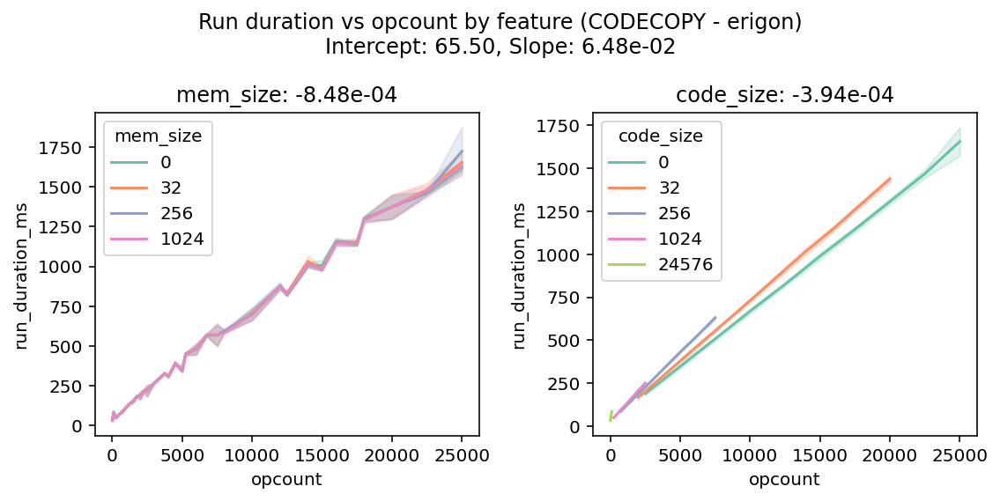

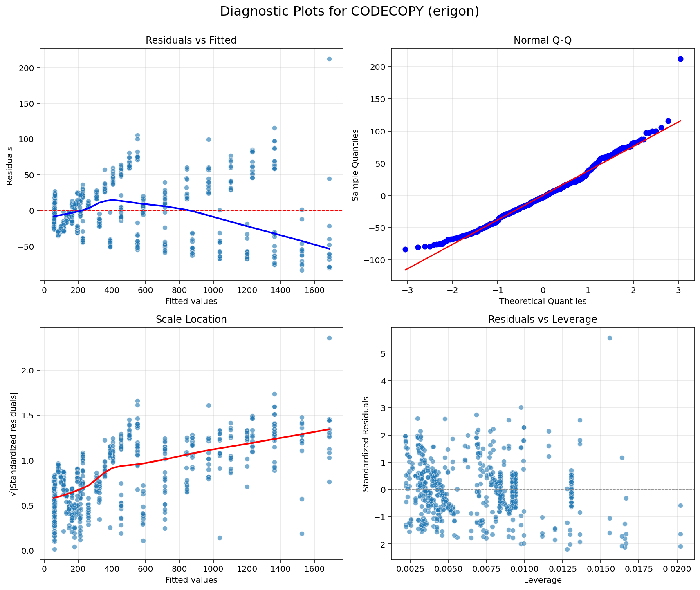


# RETURN

## geth

OLS model did not run... Error: zero-size array to reduction operation maximum which has no identity

## besu

OLS model did not run... Error: zero-size array to reduction operation maximum which has no identity

## reth

OLS model did not run... Error: zero-size array to reduction operation maximum which has no identity

## nethermind

OLS model did not run... Error: zero-size array to reduction operation maximum which has no identity

## erigon

OLS model did not run... Error: zero-size array to reduction operation maximum which has no identity

# RETURNDATACOPY

## geth


```python
                            OLS Regression Results                            
==============================================================================
Dep. Variable:        run_duration_ms   R-squared:                       0.937
Model:                            OLS   Adj. R-squared:                  0.937
Method:                 Least Squares   F-statistic:                 4.891e+04
Date:                Thu, 22 Jan 2026   Prob (F-statistic):               0.00
Time:                        10:35:54   Log-Likelihood:                -39508.
No. Observations:                6528   AIC:                         7.902e+04
Df Residuals:                    6525   BIC:                         7.904e+04
Df Model:                           2                                         
Covariance Type:            nonrobust                                         
==============================================================================
                 coef    std err          t      P>|t|      [0.025      0.975]
------------------------------------------------------------------------------
const        114.2179      1.881     60.734      0.000     110.531     117.904
opcount        0.0600      0.000    312.769      0.000       0.060       0.060
mem_size       0.0031      0.003      1.014      0.310      -0.003       0.009
==============================================================================
Omnibus:                     2199.913   Durbin-Watson:                   2.084
Prob(Omnibus):                  0.000   Jarque-Bera (JB):             6878.922
Skew:                           1.747   Prob(JB):                         0.00
Kurtosis:                       6.617   Cond. No.                     1.22e+04
==============================================================================

Notes:
[1] Standard Errors assume that the covariance matrix of the errors is correctly specified.
[2] The condition number is large, 1.22e+04. This might indicate that there are
strong multicollinearity or other numerical problems.
```

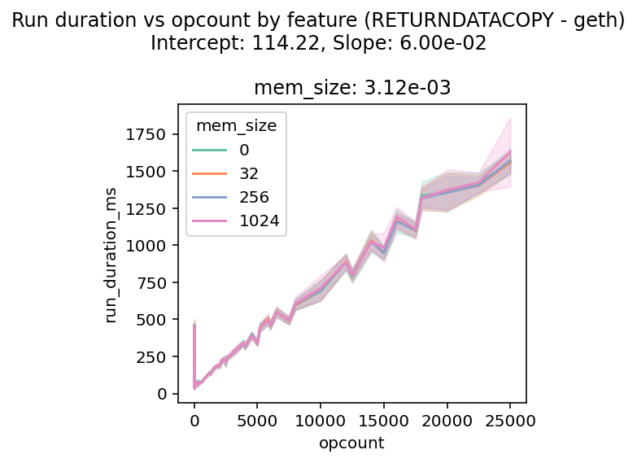

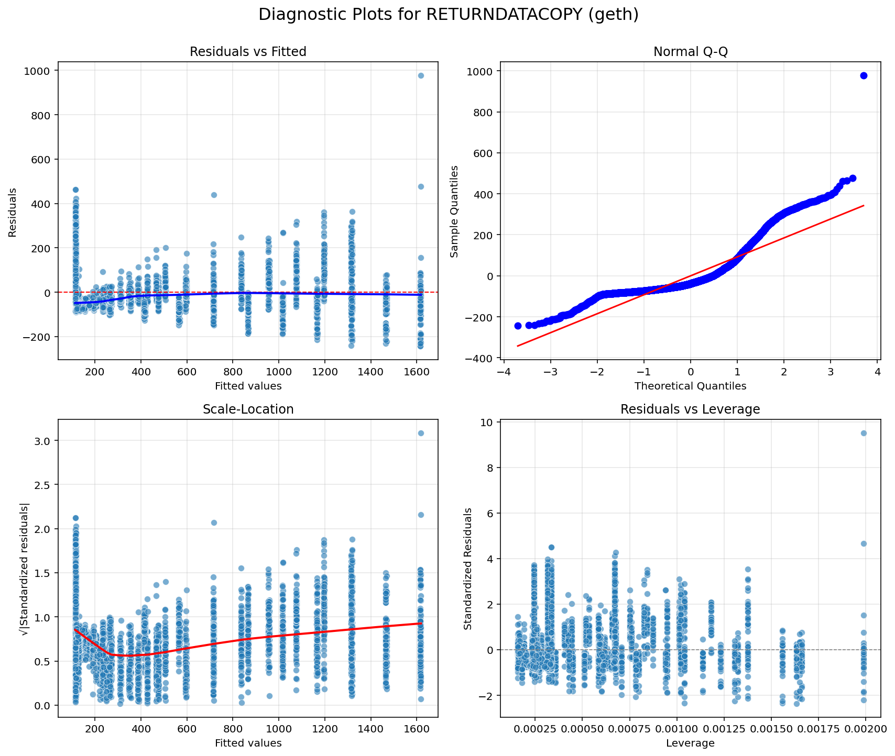


## besu


```python
                            OLS Regression Results                            
==============================================================================
Dep. Variable:        run_duration_ms   R-squared:                       0.919
Model:                            OLS   Adj. R-squared:                  0.919
Method:                 Least Squares   F-statistic:                 3.714e+04
Date:                Thu, 22 Jan 2026   Prob (F-statistic):               0.00
Time:                        10:35:54   Log-Likelihood:                -44981.
No. Observations:                6528   AIC:                         8.997e+04
Df Residuals:                    6525   BIC:                         8.999e+04
Df Model:                           2                                         
Covariance Type:            nonrobust                                         
==============================================================================
                 coef    std err          t      P>|t|      [0.025      0.975]
------------------------------------------------------------------------------
const        145.7661      4.350     33.512      0.000     137.239     154.293
opcount        0.1210      0.000    272.533      0.000       0.120       0.122
mem_size       0.0005      0.007      0.071      0.944      -0.013       0.014
==============================================================================
Omnibus:                     1130.523   Durbin-Watson:                   2.075
Prob(Omnibus):                  0.000   Jarque-Bera (JB):             3599.110
Skew:                           0.883   Prob(JB):                         0.00
Kurtosis:                       6.181   Cond. No.                     1.22e+04
==============================================================================

Notes:
[1] Standard Errors assume that the covariance matrix of the errors is correctly specified.
[2] The condition number is large, 1.22e+04. This might indicate that there are
strong multicollinearity or other numerical problems.
```

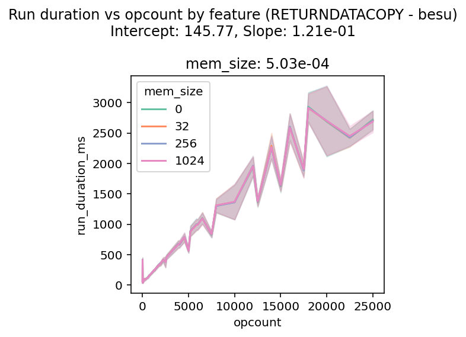

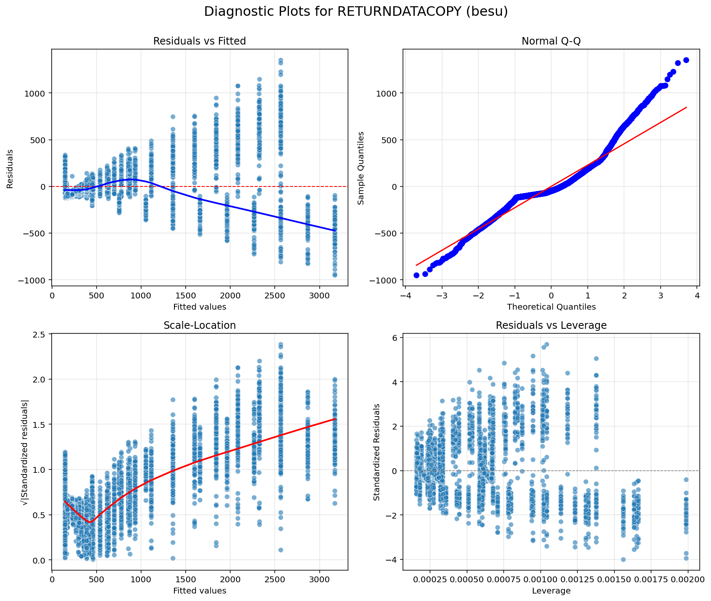


## reth


```python
                            OLS Regression Results                            
==============================================================================
Dep. Variable:        run_duration_ms   R-squared:                       0.714
Model:                            OLS   Adj. R-squared:                  0.714
Method:                 Least Squares   F-statistic:                     4846.
Date:                Thu, 22 Jan 2026   Prob (F-statistic):               0.00
Time:                        10:35:55   Log-Likelihood:                -22400.
No. Observations:                3888   AIC:                         4.481e+04
Df Residuals:                    3885   BIC:                         4.482e+04
Df Model:                           2                                         
Covariance Type:            nonrobust                                         
==============================================================================
                 coef    std err          t      P>|t|      [0.025      0.975]
------------------------------------------------------------------------------
const         95.0061      1.821     52.187      0.000      91.437      98.575
opcount        0.0183      0.000     98.444      0.000       0.018       0.019
mem_size       0.0004      0.003      0.146      0.884      -0.005       0.006
==============================================================================
Omnibus:                     1377.376   Durbin-Watson:                   2.123
Prob(Omnibus):                  0.000   Jarque-Bera (JB):             3995.006
Skew:                           1.888   Prob(JB):                         0.00
Kurtosis:                       6.224   Cond. No.                     1.22e+04
==============================================================================

Notes:
[1] Standard Errors assume that the covariance matrix of the errors is correctly specified.
[2] The condition number is large, 1.22e+04. This might indicate that there are
strong multicollinearity or other numerical problems.
```

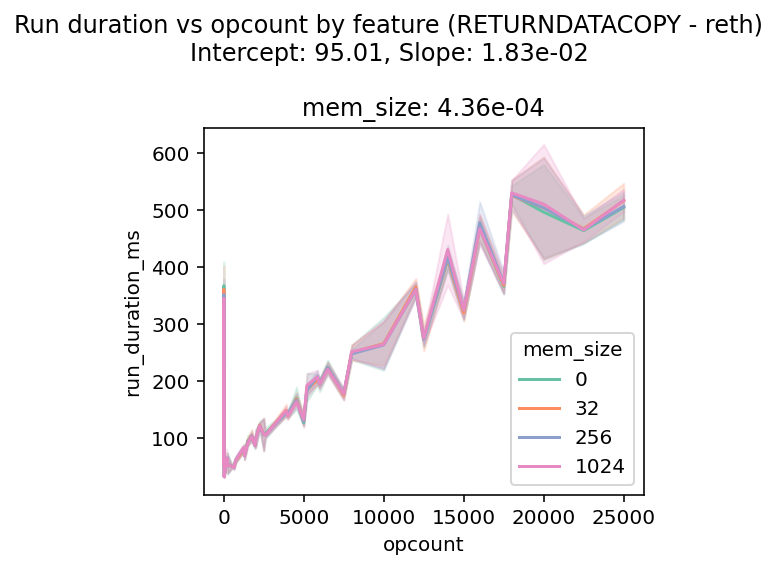

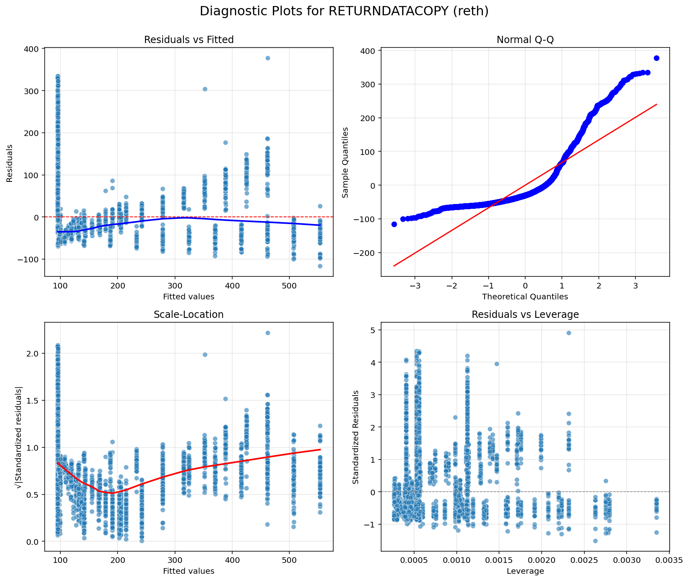


## nethermind


```python
                            OLS Regression Results                            
==============================================================================
Dep. Variable:        run_duration_ms   R-squared:                       0.901
Model:                            OLS   Adj. R-squared:                  0.901
Method:                 Least Squares   F-statistic:                 2.983e+04
Date:                Thu, 22 Jan 2026   Prob (F-statistic):               0.00
Time:                        10:35:55   Log-Likelihood:                -40251.
No. Observations:                6528   AIC:                         8.051e+04
Df Residuals:                    6525   BIC:                         8.053e+04
Df Model:                           2                                         
Covariance Type:            nonrobust                                         
==============================================================================
                 coef    std err          t      P>|t|      [0.025      0.975]
------------------------------------------------------------------------------
const        114.8254      2.107     54.490      0.000     110.694     118.956
opcount        0.0525      0.000    244.273      0.000       0.052       0.053
mem_size       0.0016      0.003      0.460      0.646      -0.005       0.008
==============================================================================
Omnibus:                      937.619   Durbin-Watson:                   2.126
Prob(Omnibus):                  0.000   Jarque-Bera (JB):             1420.280
Skew:                           1.036   Prob(JB):                    3.89e-309
Kurtosis:                       3.966   Cond. No.                     1.22e+04
==============================================================================

Notes:
[1] Standard Errors assume that the covariance matrix of the errors is correctly specified.
[2] The condition number is large, 1.22e+04. This might indicate that there are
strong multicollinearity or other numerical problems.
```

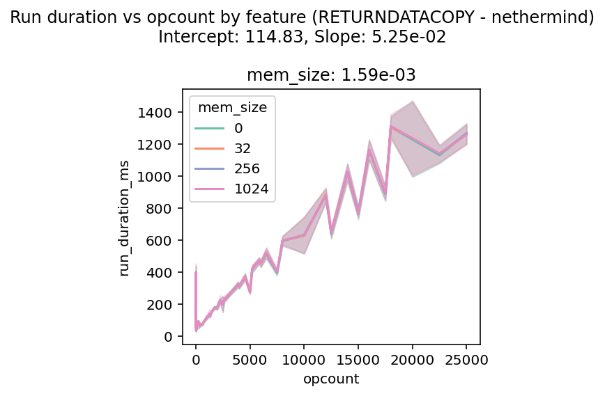

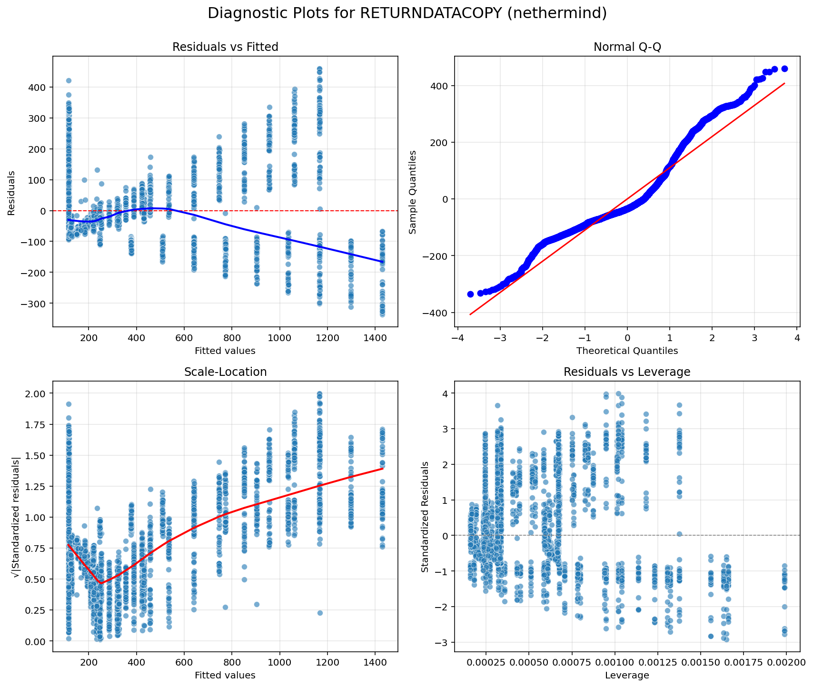


## erigon


```python
                            OLS Regression Results                            
==============================================================================
Dep. Variable:        run_duration_ms   R-squared:                       0.977
Model:                            OLS   Adj. R-squared:                  0.977
Method:                 Least Squares   F-statistic:                 1.035e+04
Date:                Thu, 22 Jan 2026   Prob (F-statistic):               0.00
Time:                        10:35:56   Log-Likelihood:                -4062.1
No. Observations:                 720   AIC:                             8132.
Df Residuals:                     716   BIC:                             8151.
Df Model:                           3                                         
Covariance Type:            nonrobust                                         
===============================================================================
                  coef    std err          t      P>|t|      [0.025      0.975]
-------------------------------------------------------------------------------
const          66.0777      4.231     15.619      0.000      57.772      74.384
opcount         0.0702      0.000    172.122      0.000       0.069       0.071
mem_size       -0.0009      0.006     -0.144      0.886      -0.013       0.011
return_size     0.0002   6.95e-06     22.671      0.000       0.000       0.000
==============================================================================
Omnibus:                       42.614   Durbin-Watson:                   2.066
Prob(Omnibus):                  0.000   Jarque-Bera (JB):               62.385
Skew:                           0.478   Prob(JB):                     2.84e-14
Kurtosis:                       4.080   Cond. No.                     7.10e+05
==============================================================================

Notes:
[1] Standard Errors assume that the covariance matrix of the errors is correctly specified.
[2] The condition number is large, 7.1e+05. This might indicate that there are
strong multicollinearity or other numerical problems.
```

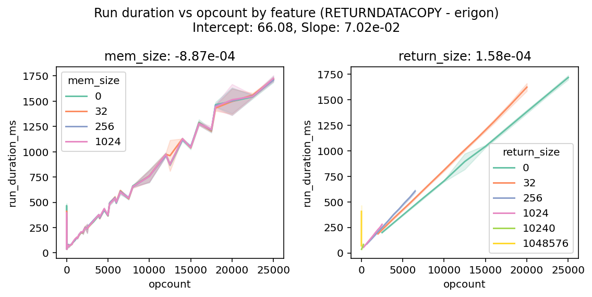

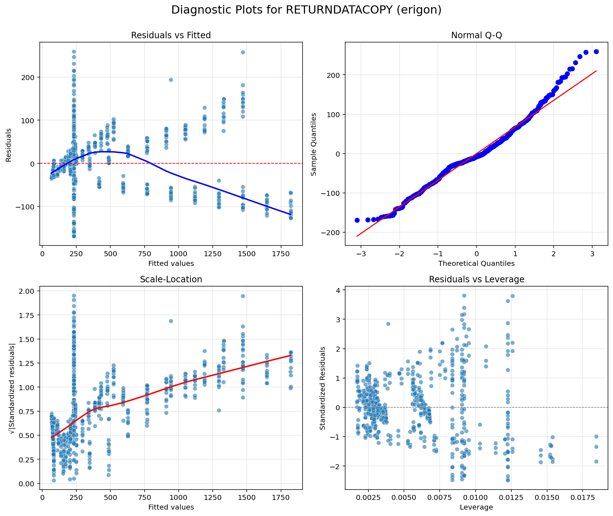


# REVERT

## geth

OLS model did not run... Error: zero-size array to reduction operation maximum which has no identity

## besu

OLS model did not run... Error: zero-size array to reduction operation maximum which has no identity

## reth

OLS model did not run... Error: zero-size array to reduction operation maximum which has no identity

## nethermind

OLS model did not run... Error: zero-size array to reduction operation maximum which has no identity

## erigon

OLS model did not run... Error: zero-size array to reduction operation maximum which has no identity
