Opcode run times estimation results - Precompiles
=================================================

Table of contents
=================

* [ECRECOVER](#ecrecover)
* [ECADD](#ecadd)
* [ECMUL](#ecmul)
* [POINT_EVALUATION](#point_evaluation)
* [BLS12_G1ADD](#bls12_g1add)
* [BLS12_G2ADD](#bls12_g2add)
* [BLS12_MAP_FP_TO_G1](#bls12_map_fp_to_g1)
* [BLS12_MAP_FP2_TO_G2](#bls12_map_fp2_to_g2)
* [P256VERIFY](#p256verify)
* [SHA2-256](#sha2-256)
* [RIPEMD-160](#ripemd-160)
* [IDENTITY](#identity)
* [MODEXP](#modexp)
* [ECPAIRING](#ecpairing)
* [BLAKE2F](#blake2f)
* [BLS12_G1MSM](#bls12_g1msm)
* [BLS12_G2MSM](#bls12_g2msm)
* [BLS12_PAIRING_CHECK](#bls12_pairing_check)

# Introduction


This is an automated report generated from the opcode run times 
estimation script `./src/estimate_opcode_run_times.py`. The script 
uses data generated by running the 
[EEST benchmark suite](https://github.com/ethereum/execution-spec-tests/tree/main/tests/benchmark) 
with the [Nethermind benchmarking tooling](https://github.com/NethermindEth/gas-benchmarks).

The data includes all the precompile tests run between 2026-01-10 and 2026-01-22.

For each opcode and client, an OLS linear regression model is fitted to estimate the 
precompile run time as a function of the precompile count and other configurations. The results are presented below.

Everytime the report references "opcode", assume we it means "precompile". 

# ECRECOVER

## geth


```python
                            OLS Regression Results                            
==============================================================================
Dep. Variable:        run_duration_ms   R-squared:                       0.992
Model:                            OLS   Adj. R-squared:                  0.992
Method:                 Least Squares   F-statistic:                 3.561e+04
Date:                Thu, 22 Jan 2026   Prob (F-statistic):          7.80e-304
Time:                        10:36:05   Log-Likelihood:                -1745.7
No. Observations:                 290   AIC:                             3495.
Df Residuals:                     288   BIC:                             3503.
Df Model:                           1                                         
Covariance Type:            nonrobust                                         
==============================================================================
                 coef    std err          t      P>|t|      [0.025      0.975]
------------------------------------------------------------------------------
const         38.7167     12.674      3.055      0.002      13.771      63.662
opcount       48.1835      0.255    188.712      0.000      47.681      48.686
==============================================================================
Omnibus:                       71.088   Durbin-Watson:                   0.723
Prob(Omnibus):                  0.000   Jarque-Bera (JB):              165.822
Skew:                          -1.177   Prob(JB):                     9.82e-37
Kurtosis:                       5.860   Cond. No.                         107.
==============================================================================

Notes:
[1] Standard Errors assume that the covariance matrix of the errors is correctly specified.
```

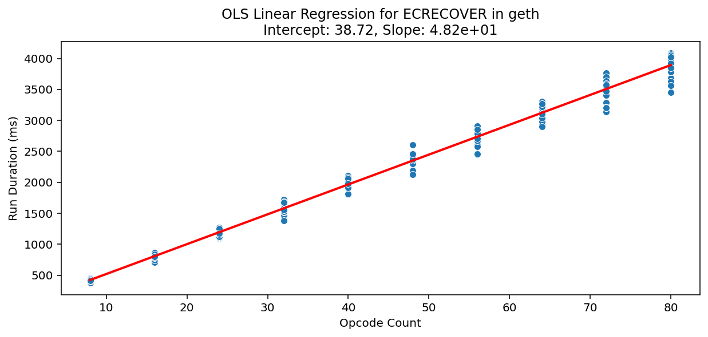

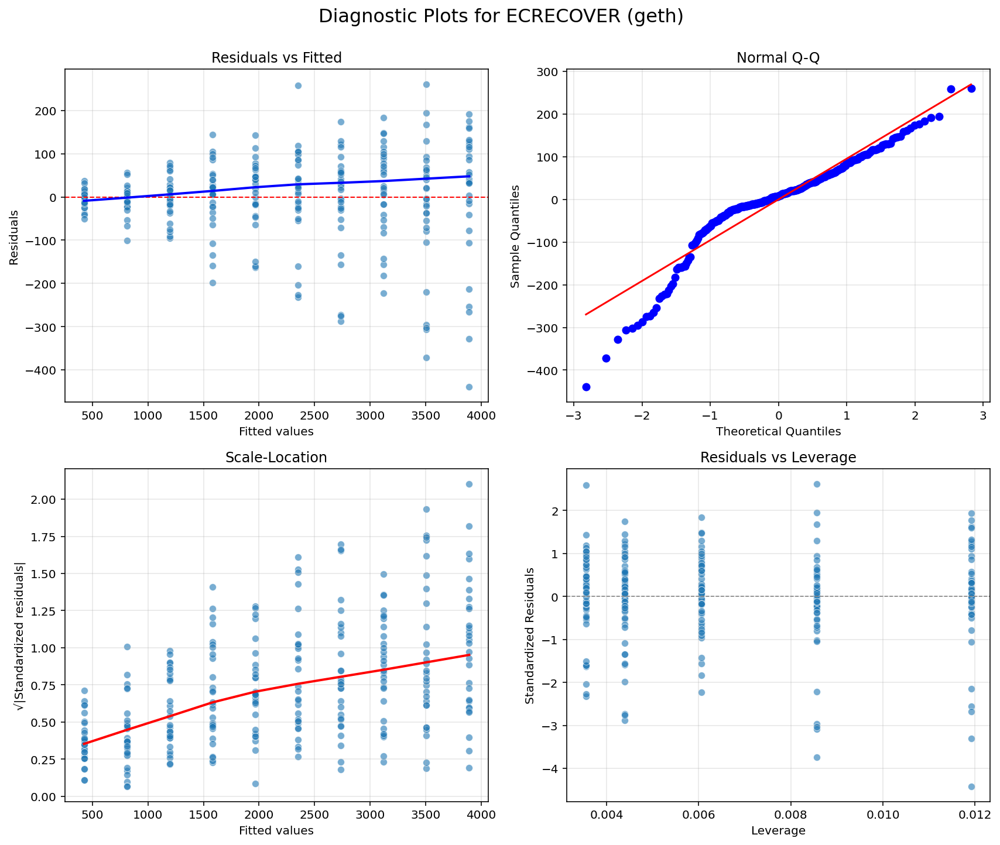


## besu


```python
                            OLS Regression Results                            
==============================================================================
Dep. Variable:        run_duration_ms   R-squared:                       0.984
Model:                            OLS   Adj. R-squared:                  0.984
Method:                 Least Squares   F-statistic:                 1.732e+04
Date:                Thu, 22 Jan 2026   Prob (F-statistic):          2.83e-259
Time:                        10:36:06   Log-Likelihood:                -1856.2
No. Observations:                 290   AIC:                             3716.
Df Residuals:                     288   BIC:                             3724.
Df Model:                           1                                         
Covariance Type:            nonrobust                                         
==============================================================================
                 coef    std err          t      P>|t|      [0.025      0.975]
------------------------------------------------------------------------------
const         30.0888     18.549      1.622      0.106      -6.421      66.598
opcount       49.1772      0.374    131.599      0.000      48.442      49.913
==============================================================================
Omnibus:                       88.843   Durbin-Watson:                   0.645
Prob(Omnibus):                  0.000   Jarque-Bera (JB):              210.070
Skew:                          -1.477   Prob(JB):                     2.42e-46
Kurtosis:                       5.942   Cond. No.                         107.
==============================================================================

Notes:
[1] Standard Errors assume that the covariance matrix of the errors is correctly specified.
```

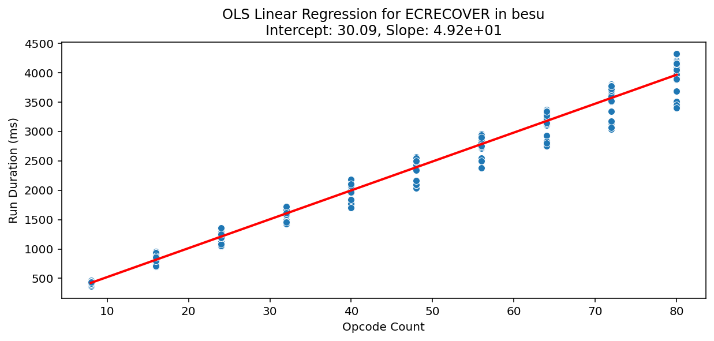

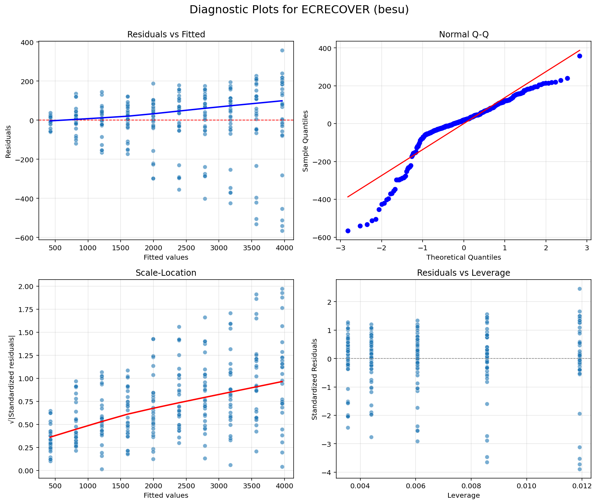


## reth


```python
                            OLS Regression Results                            
==============================================================================
Dep. Variable:        run_duration_ms   R-squared:                       0.992
Model:                            OLS   Adj. R-squared:                  0.992
Method:                 Least Squares   F-statistic:                 2.318e+04
Date:                Thu, 22 Jan 2026   Prob (F-statistic):          1.86e-190
Time:                        10:36:06   Log-Likelihood:                -1076.8
No. Observations:                 180   AIC:                             2158.
Df Residuals:                     178   BIC:                             2164.
Df Model:                           1                                         
Covariance Type:            nonrobust                                         
==============================================================================
                 coef    std err          t      P>|t|      [0.025      0.975]
------------------------------------------------------------------------------
const         32.9679     15.526      2.123      0.035       2.329      63.607
opcount       47.6241      0.313    152.261      0.000      47.007      48.241
==============================================================================
Omnibus:                      108.894   Durbin-Watson:                   0.912
Prob(Omnibus):                  0.000   Jarque-Bera (JB):              561.070
Skew:                          -2.375   Prob(JB):                    1.46e-122
Kurtosis:                      10.228   Cond. No.                         107.
==============================================================================

Notes:
[1] Standard Errors assume that the covariance matrix of the errors is correctly specified.
```

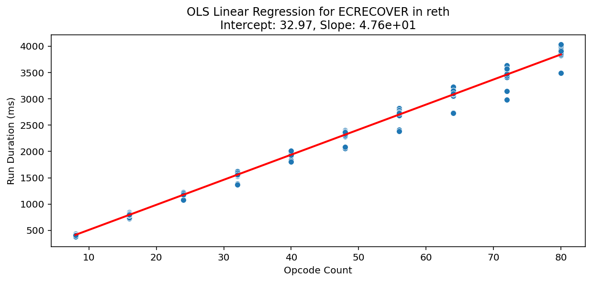

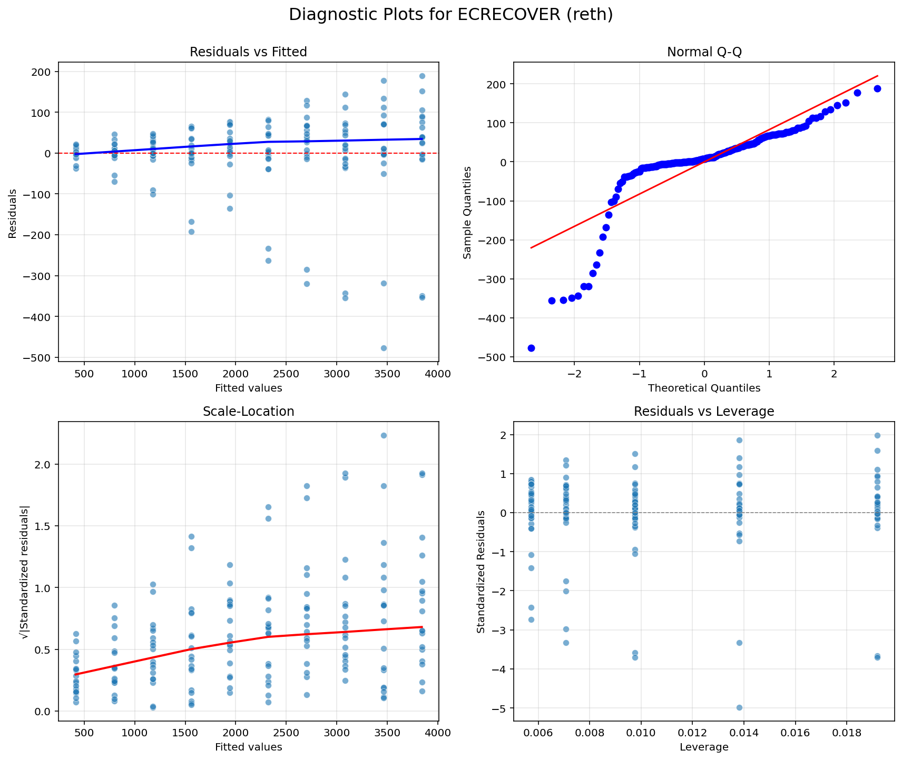


## nethermind


```python
                            OLS Regression Results                            
==============================================================================
Dep. Variable:        run_duration_ms   R-squared:                       0.267
Model:                            OLS   Adj. R-squared:                  0.264
Method:                 Least Squares   F-statistic:                     104.9
Date:                Thu, 22 Jan 2026   Prob (F-statistic):           3.40e-21
Time:                        10:36:06   Log-Likelihood:                -2431.8
No. Observations:                 290   AIC:                             4868.
Df Residuals:                     288   BIC:                             4875.
Df Model:                           1                                         
Covariance Type:            nonrobust                                         
==============================================================================
                 coef    std err          t      P>|t|      [0.025      0.975]
------------------------------------------------------------------------------
const         29.6762    135.022      0.220      0.826    -236.080     295.432
opcount       27.8585      2.720     10.242      0.000      22.505      33.212
==============================================================================
Omnibus:                       44.315   Durbin-Watson:                   0.447
Prob(Omnibus):                  0.000   Jarque-Bera (JB):               26.825
Skew:                          -0.608   Prob(JB):                     1.50e-06
Kurtosis:                       2.138   Cond. No.                         107.
==============================================================================

Notes:
[1] Standard Errors assume that the covariance matrix of the errors is correctly specified.
```

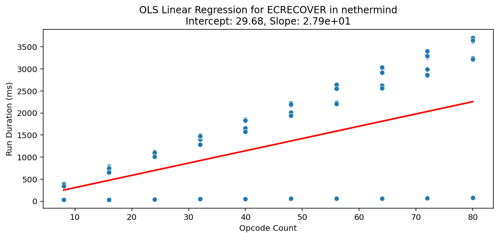

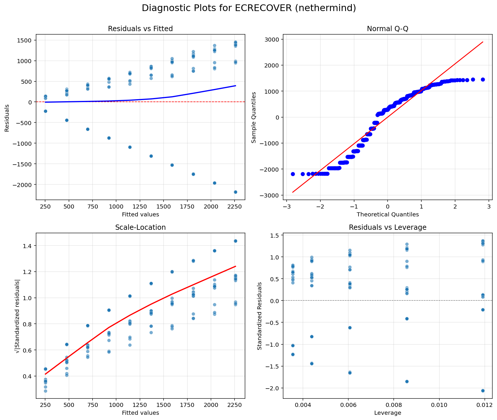


## erigon

OLS model did not run... Error: zero-size array to reduction operation maximum which has no identity

# ECADD

## geth


```python
                            OLS Regression Results                            
==============================================================================
Dep. Variable:        run_duration_ms   R-squared:                       0.365
Model:                            OLS   Adj. R-squared:                  0.364
Method:                 Least Squares   F-statistic:                     332.8
Date:                Thu, 22 Jan 2026   Prob (F-statistic):           4.56e-59
Time:                        10:36:06   Log-Likelihood:                -4614.4
No. Observations:                 580   AIC:                             9233.
Df Residuals:                     578   BIC:                             9242.
Df Model:                           1                                         
Covariance Type:            nonrobust                                         
==============================================================================
                 coef    std err          t      P>|t|      [0.025      0.975]
------------------------------------------------------------------------------
const         21.4223     62.013      0.345      0.730    -100.375     143.220
opcount        1.8233      0.100     18.243      0.000       1.627       2.020
==============================================================================
Omnibus:                      484.608   Durbin-Watson:                   1.794
Prob(Omnibus):                  0.000   Jarque-Bera (JB):               36.740
Skew:                           0.036   Prob(JB):                     1.05e-08
Kurtosis:                       1.769   Cond. No.                     1.34e+03
==============================================================================

Notes:
[1] Standard Errors assume that the covariance matrix of the errors is correctly specified.
[2] The condition number is large, 1.34e+03. This might indicate that there are
strong multicollinearity or other numerical problems.
```

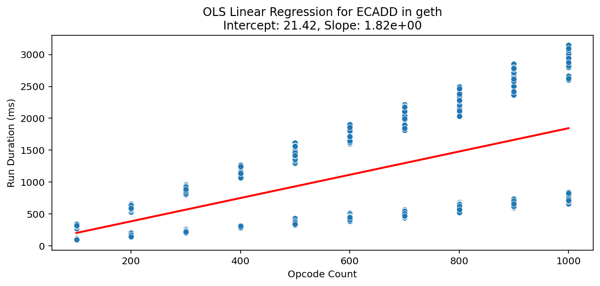

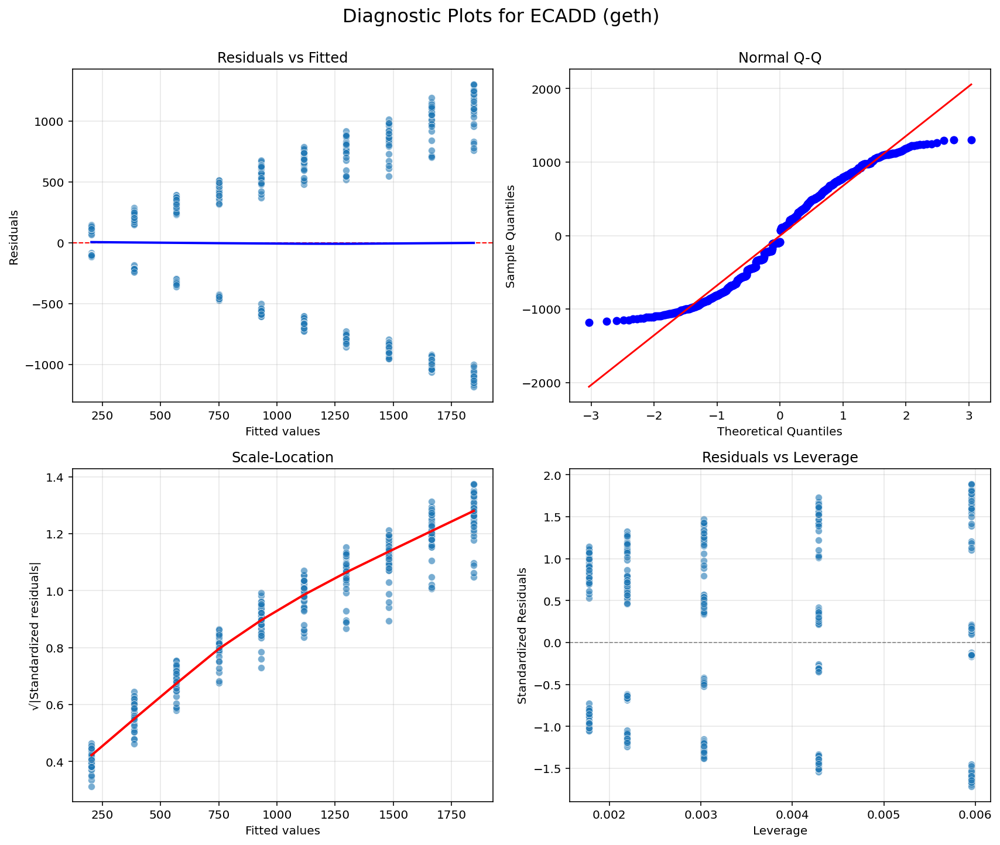


## besu


```python
                            OLS Regression Results                            
==============================================================================
Dep. Variable:        run_duration_ms   R-squared:                       0.779
Model:                            OLS   Adj. R-squared:                  0.778
Method:                 Least Squares   F-statistic:                     2034.
Date:                Thu, 22 Jan 2026   Prob (F-statistic):          1.83e-191
Time:                        10:36:07   Log-Likelihood:                -4584.0
No. Observations:                 580   AIC:                             9172.
Df Residuals:                     578   BIC:                             9181.
Df Model:                           1                                         
Covariance Type:            nonrobust                                         
==============================================================================
                 coef    std err          t      P>|t|      [0.025      0.975]
------------------------------------------------------------------------------
const         30.6659     58.847      0.521      0.602     -84.914     146.246
opcount        4.2774      0.095     45.101      0.000       4.091       4.464
==============================================================================
Omnibus:                       40.597   Durbin-Watson:                   1.783
Prob(Omnibus):                  0.000   Jarque-Bera (JB):               14.879
Skew:                           0.068   Prob(JB):                     0.000588
Kurtosis:                       2.227   Cond. No.                     1.34e+03
==============================================================================

Notes:
[1] Standard Errors assume that the covariance matrix of the errors is correctly specified.
[2] The condition number is large, 1.34e+03. This might indicate that there are
strong multicollinearity or other numerical problems.
```

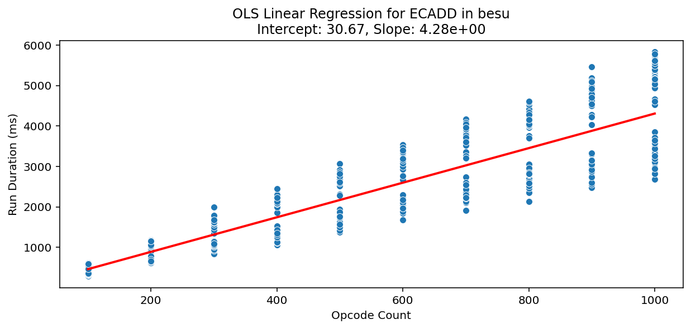

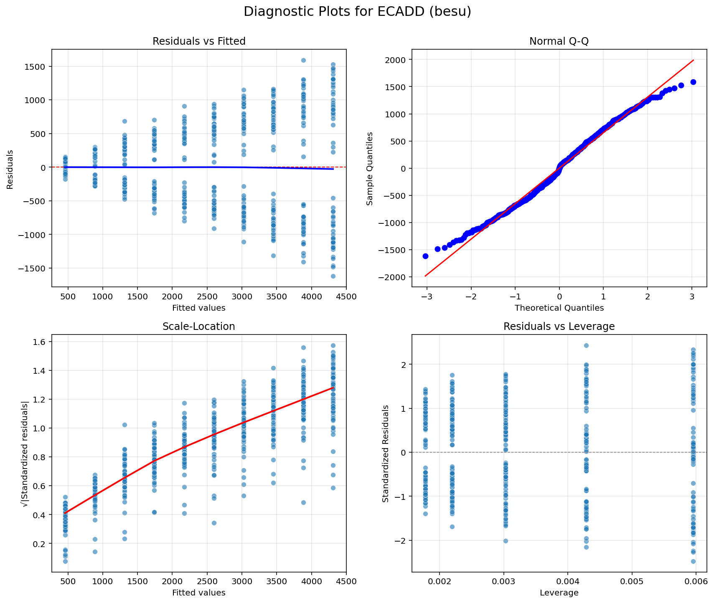


## reth


```python
                            OLS Regression Results                            
==============================================================================
Dep. Variable:        run_duration_ms   R-squared:                       0.307
Model:                            OLS   Adj. R-squared:                  0.305
Method:                 Least Squares   F-statistic:                     158.6
Date:                Thu, 22 Jan 2026   Prob (F-statistic):           2.32e-30
Time:                        10:36:07   Log-Likelihood:                -2990.1
No. Observations:                 360   AIC:                             5984.
Df Residuals:                     358   BIC:                             5992.
Df Model:                           1                                         
Covariance Type:            nonrobust                                         
==============================================================================
                 coef    std err          t      P>|t|      [0.025      0.975]
------------------------------------------------------------------------------
const         36.3036    111.813      0.325      0.746    -183.589     256.196
opcount        2.2696      0.180     12.595      0.000       1.915       2.624
==============================================================================
Omnibus:                      260.315   Durbin-Watson:                   1.746
Prob(Omnibus):                  0.000   Jarque-Bera (JB):               22.824
Skew:                           0.013   Prob(JB):                     1.11e-05
Kurtosis:                       1.767   Cond. No.                     1.34e+03
==============================================================================

Notes:
[1] Standard Errors assume that the covariance matrix of the errors is correctly specified.
[2] The condition number is large, 1.34e+03. This might indicate that there are
strong multicollinearity or other numerical problems.
```

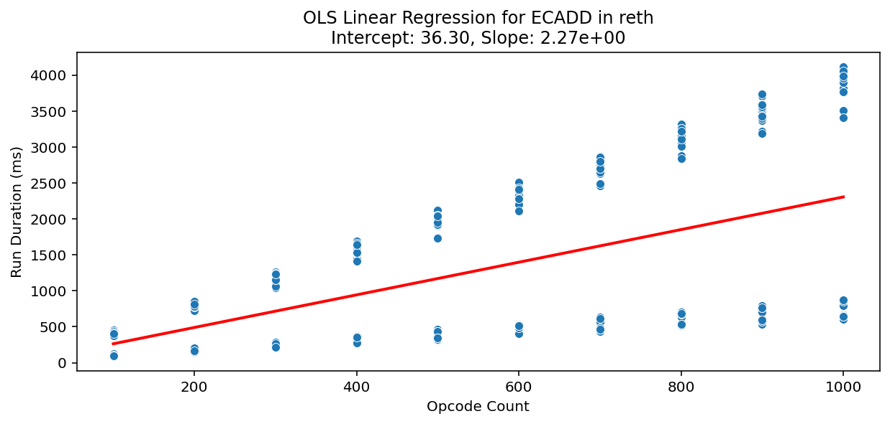

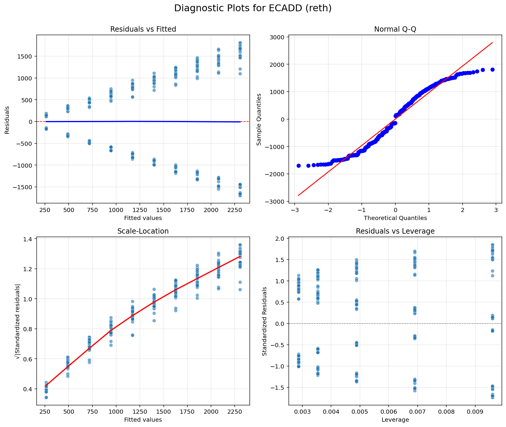


## nethermind


```python
                            OLS Regression Results                            
==============================================================================
Dep. Variable:        run_duration_ms   R-squared:                       0.329
Model:                            OLS   Adj. R-squared:                  0.327
Method:                 Least Squares   F-statistic:                     282.8
Date:                Thu, 22 Jan 2026   Prob (F-statistic):           5.83e-52
Time:                        10:36:07   Log-Likelihood:                -4432.3
No. Observations:                 580   AIC:                             8869.
Df Residuals:                     578   BIC:                             8877.
Df Model:                           1                                         
Covariance Type:            nonrobust                                         
==============================================================================
                 coef    std err          t      P>|t|      [0.025      0.975]
------------------------------------------------------------------------------
const         25.5992     45.301      0.565      0.572     -63.376     114.574
opcount        1.2279      0.073     16.818      0.000       1.084       1.371
==============================================================================
Omnibus:                       74.239   Durbin-Watson:                   1.428
Prob(Omnibus):                  0.000   Jarque-Bera (JB):              102.542
Skew:                           1.030   Prob(JB):                     5.41e-23
Kurtosis:                       3.000   Cond. No.                     1.34e+03
==============================================================================

Notes:
[1] Standard Errors assume that the covariance matrix of the errors is correctly specified.
[2] The condition number is large, 1.34e+03. This might indicate that there are
strong multicollinearity or other numerical problems.
```

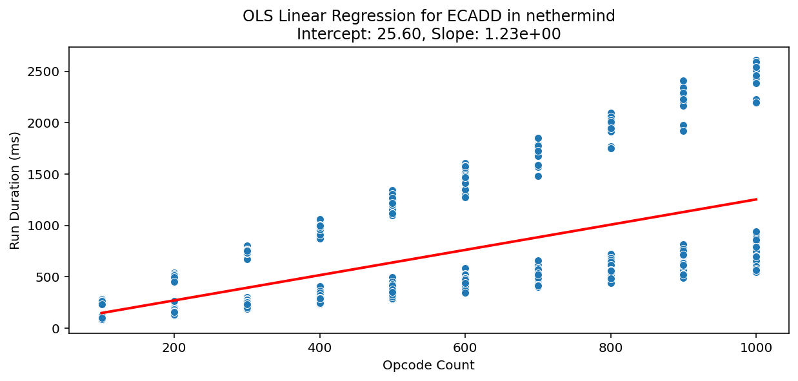

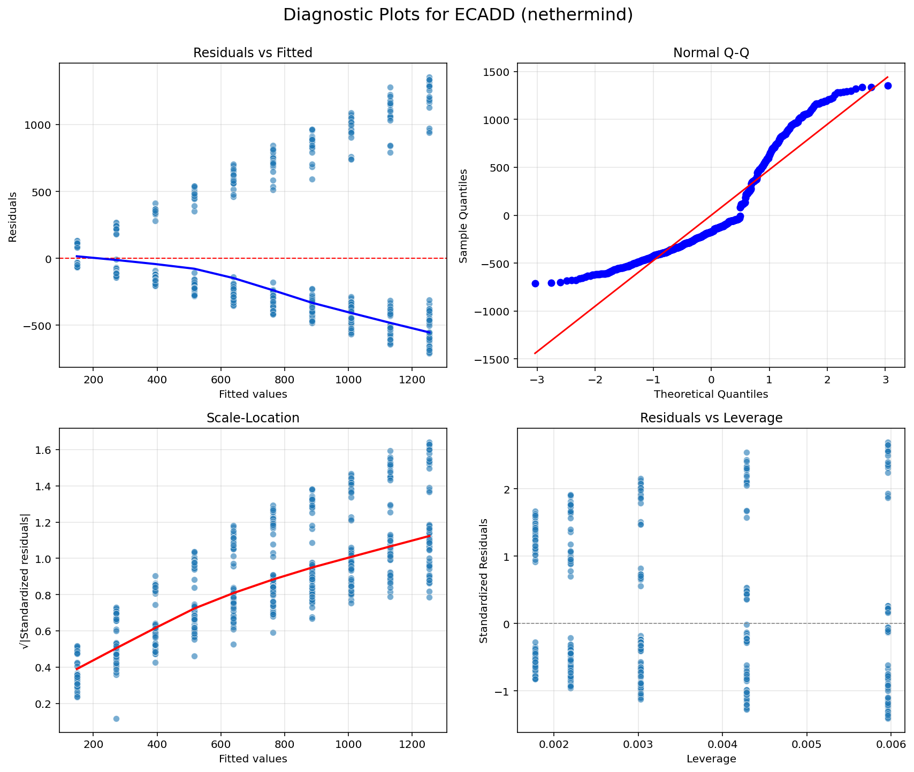


## erigon

OLS model did not run... Error: zero-size array to reduction operation maximum which has no identity

# ECMUL

## geth


```python
                            OLS Regression Results                            
==============================================================================
Dep. Variable:        run_duration_ms   R-squared:                       0.546
Model:                            OLS   Adj. R-squared:                  0.545
Method:                 Least Squares   F-statistic:                     1043.
Date:                Thu, 22 Jan 2026   Prob (F-statistic):          6.44e-151
Time:                        10:36:08   Log-Likelihood:                -6439.1
No. Observations:                 870   AIC:                         1.288e+04
Df Residuals:                     868   BIC:                         1.289e+04
Df Model:                           1                                         
Covariance Type:            nonrobust                                         
==============================================================================
                 coef    std err          t      P>|t|      [0.025      0.975]
------------------------------------------------------------------------------
const         34.8052     29.063      1.198      0.231     -22.237      91.847
opcount       37.8184      1.171     32.296      0.000      35.520      40.117
==============================================================================
Omnibus:                       61.928   Durbin-Watson:                   2.087
Prob(Omnibus):                  0.000   Jarque-Bera (JB):               71.540
Skew:                           0.685   Prob(JB):                     2.92e-16
Kurtosis:                       2.689   Cond. No.                         53.7
==============================================================================

Notes:
[1] Standard Errors assume that the covariance matrix of the errors is correctly specified.
```

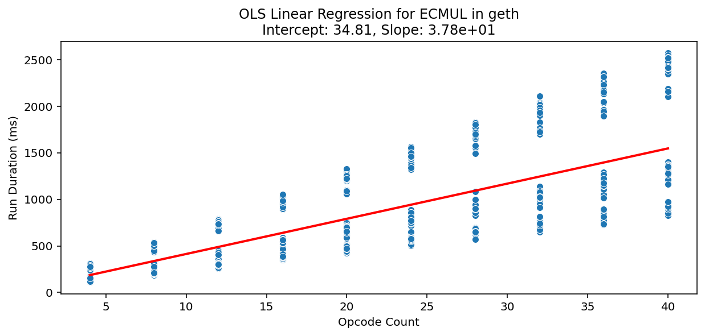

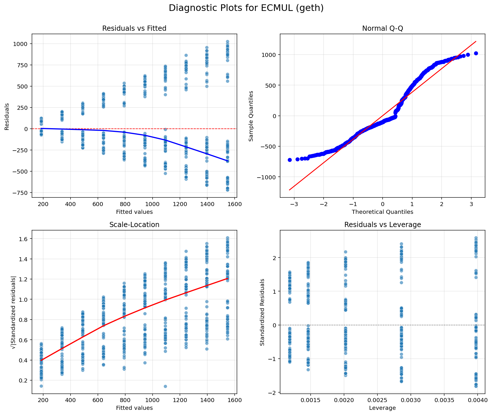


## besu


```python
                            OLS Regression Results                            
==============================================================================
Dep. Variable:        run_duration_ms   R-squared:                       0.135
Model:                            OLS   Adj. R-squared:                  0.134
Method:                 Least Squares   F-statistic:                     135.1
Date:                Thu, 22 Jan 2026   Prob (F-statistic):           3.96e-29
Time:                        10:36:08   Log-Likelihood:                -6868.3
No. Observations:                 870   AIC:                         1.374e+04
Df Residuals:                     868   BIC:                         1.375e+04
Df Model:                           1                                         
Covariance Type:            nonrobust                                         
==============================================================================
                 coef    std err          t      P>|t|      [0.025      0.975]
------------------------------------------------------------------------------
const         28.4229     47.600      0.597      0.551     -65.002     121.847
opcount       22.2924      1.918     11.624      0.000      18.528      26.057
==============================================================================
Omnibus:                       97.500   Durbin-Watson:                   2.031
Prob(Omnibus):                  0.000   Jarque-Bera (JB):              123.657
Skew:                           0.904   Prob(JB):                     1.41e-27
Kurtosis:                       2.625   Cond. No.                         53.7
==============================================================================

Notes:
[1] Standard Errors assume that the covariance matrix of the errors is correctly specified.
```

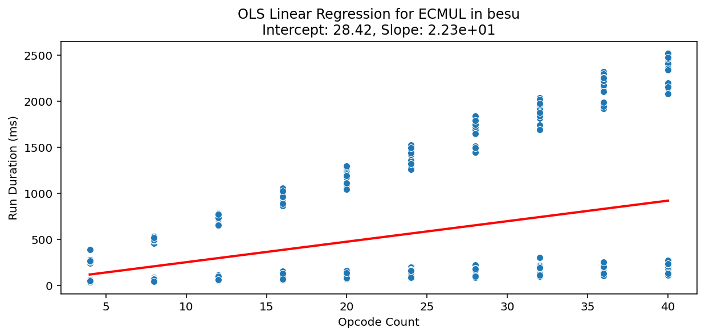

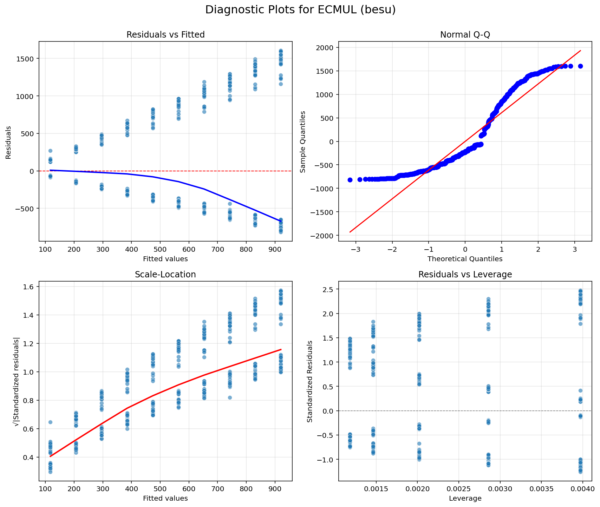


## reth


```python
                            OLS Regression Results                            
==============================================================================
Dep. Variable:        run_duration_ms   R-squared:                       0.114
Model:                            OLS   Adj. R-squared:                  0.112
Method:                 Least Squares   F-statistic:                     69.30
Date:                Thu, 22 Jan 2026   Prob (F-statistic):           7.03e-16
Time:                        10:36:08   Log-Likelihood:                -4541.7
No. Observations:                 540   AIC:                             9087.
Df Residuals:                     538   BIC:                             9096.
Df Model:                           1                                         
Covariance Type:            nonrobust                                         
==============================================================================
                 coef    std err          t      P>|t|      [0.025      0.975]
------------------------------------------------------------------------------
const         30.4074    101.280      0.300      0.764    -168.545     229.359
opcount       33.9696      4.081      8.325      0.000      25.954      41.986
==============================================================================
Omnibus:                       61.817   Durbin-Watson:                   2.101
Prob(Omnibus):                  0.000   Jarque-Bera (JB):               77.118
Skew:                           0.904   Prob(JB):                     1.80e-17
Kurtosis:                       2.600   Cond. No.                         53.7
==============================================================================

Notes:
[1] Standard Errors assume that the covariance matrix of the errors is correctly specified.
```

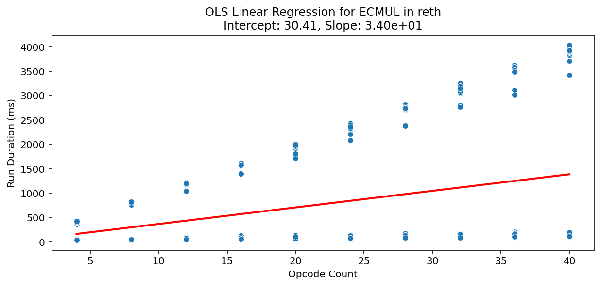

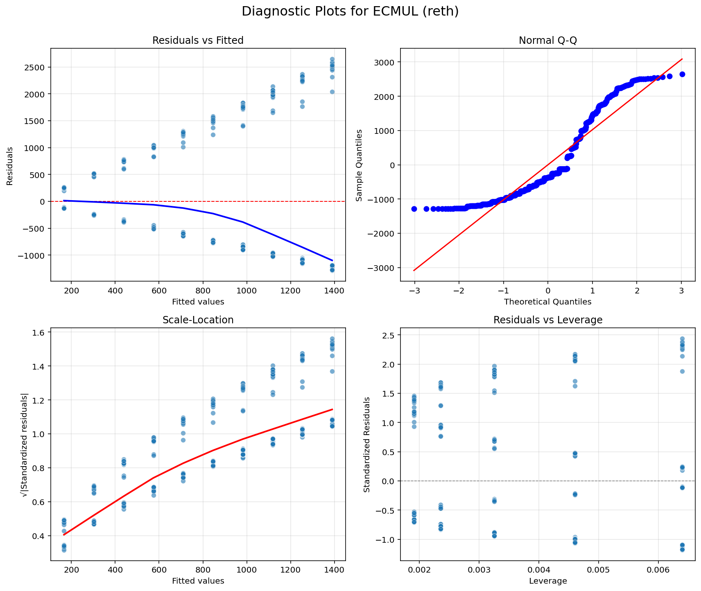


## nethermind


```python
                            OLS Regression Results                            
==============================================================================
Dep. Variable:        run_duration_ms   R-squared:                       0.075
Model:                            OLS   Adj. R-squared:                  0.074
Method:                 Least Squares   F-statistic:                     70.71
Date:                Thu, 22 Jan 2026   Prob (F-statistic):           1.69e-16
Time:                        10:36:08   Log-Likelihood:                -6577.0
No. Observations:                 870   AIC:                         1.316e+04
Df Residuals:                     868   BIC:                         1.317e+04
Df Model:                           1                                         
Covariance Type:            nonrobust                                         
==============================================================================
                 coef    std err          t      P>|t|      [0.025      0.975]
------------------------------------------------------------------------------
const         28.3118     34.054      0.831      0.406     -38.527      95.150
opcount       11.5377      1.372      8.409      0.000       8.845      14.231
==============================================================================
Omnibus:                      287.303   Durbin-Watson:                   1.662
Prob(Omnibus):                  0.000   Jarque-Bera (JB):              674.937
Skew:                           1.819   Prob(JB):                    2.75e-147
Kurtosis:                       5.319   Cond. No.                         53.7
==============================================================================

Notes:
[1] Standard Errors assume that the covariance matrix of the errors is correctly specified.
```

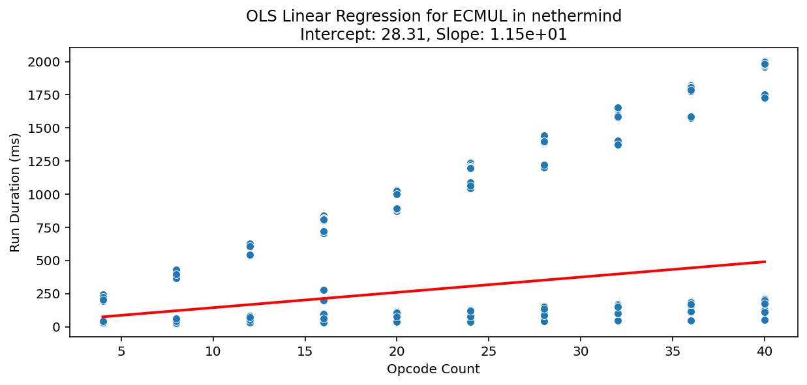

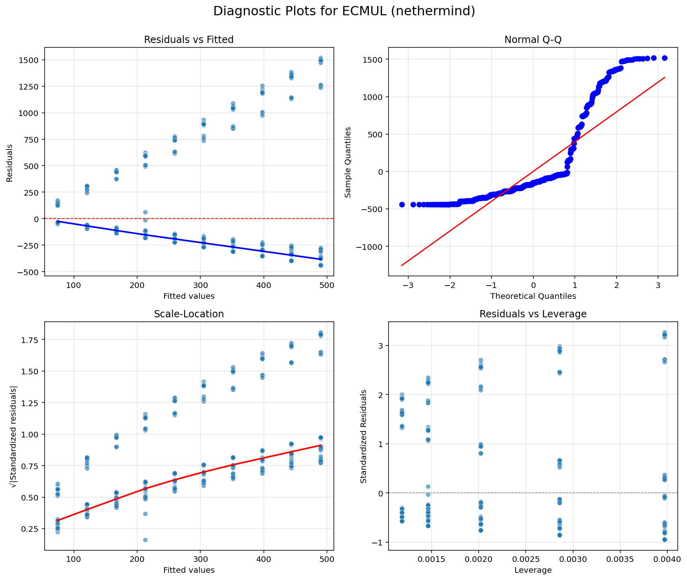


## erigon

OLS model did not run... Error: zero-size array to reduction operation maximum which has no identity

# POINT_EVALUATION

## geth


```python
                            OLS Regression Results                            
==============================================================================
Dep. Variable:        run_duration_ms   R-squared:                       0.991
Model:                            OLS   Adj. R-squared:                  0.991
Method:                 Least Squares   F-statistic:                 3.157e+04
Date:                Thu, 22 Jan 2026   Prob (F-statistic):          2.34e-296
Time:                        10:36:09   Log-Likelihood:                -2154.1
No. Observations:                 290   AIC:                             4312.
Df Residuals:                     288   BIC:                             4320.
Df Model:                           1                                         
Covariance Type:            nonrobust                                         
==============================================================================
                 coef    std err          t      P>|t|      [0.025      0.975]
------------------------------------------------------------------------------
const         48.8030     51.816      0.942      0.347     -53.183     150.789
opcount     1483.7162      8.351    177.671      0.000    1467.280    1500.153
==============================================================================
Omnibus:                      121.065   Durbin-Watson:                   0.724
Prob(Omnibus):                  0.000   Jarque-Bera (JB):              352.738
Skew:                          -1.948   Prob(JB):                     2.53e-77
Kurtosis:                       6.744   Cond. No.                         13.7
==============================================================================

Notes:
[1] Standard Errors assume that the covariance matrix of the errors is correctly specified.
```

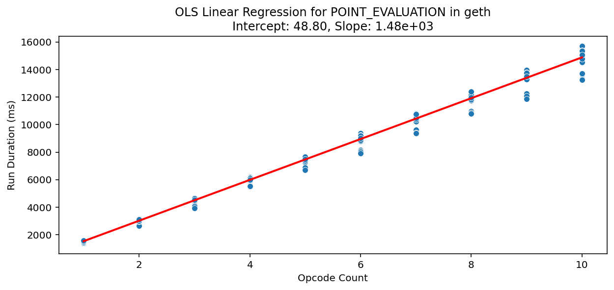

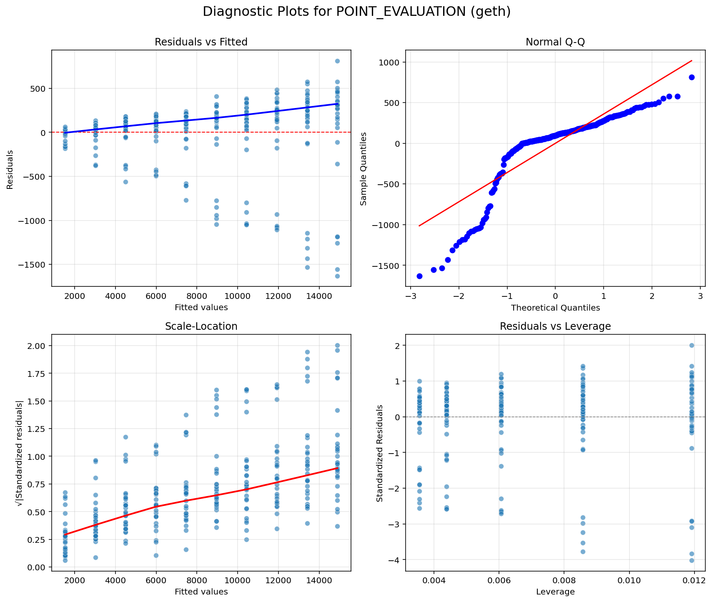


## besu


```python
                            OLS Regression Results                            
==============================================================================
Dep. Variable:        run_duration_ms   R-squared:                       0.993
Model:                            OLS   Adj. R-squared:                  0.993
Method:                 Least Squares   F-statistic:                 4.062e+04
Date:                Thu, 22 Jan 2026   Prob (F-statistic):          5.26e-312
Time:                        10:36:09   Log-Likelihood:                -2121.3
No. Observations:                 290   AIC:                             4247.
Df Residuals:                     288   BIC:                             4254.
Df Model:                           1                                         
Covariance Type:            nonrobust                                         
==============================================================================
                 coef    std err          t      P>|t|      [0.025      0.975]
------------------------------------------------------------------------------
const         30.7916     46.274      0.665      0.506     -60.287     121.870
opcount     1503.1314      7.458    201.552      0.000    1488.453    1517.810
==============================================================================
Omnibus:                      118.046   Durbin-Watson:                   0.641
Prob(Omnibus):                  0.000   Jarque-Bera (JB):              374.912
Skew:                          -1.834   Prob(JB):                     3.88e-82
Kurtosis:                       7.193   Cond. No.                         13.7
==============================================================================

Notes:
[1] Standard Errors assume that the covariance matrix of the errors is correctly specified.
```

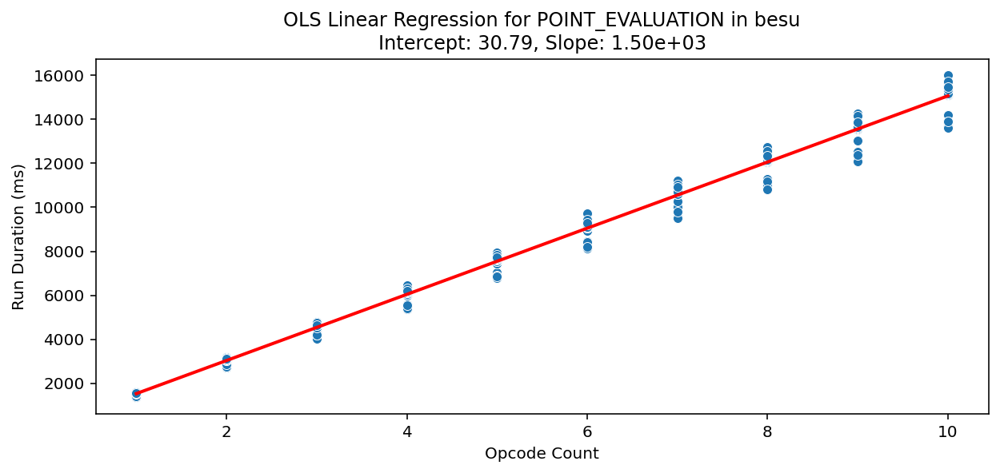

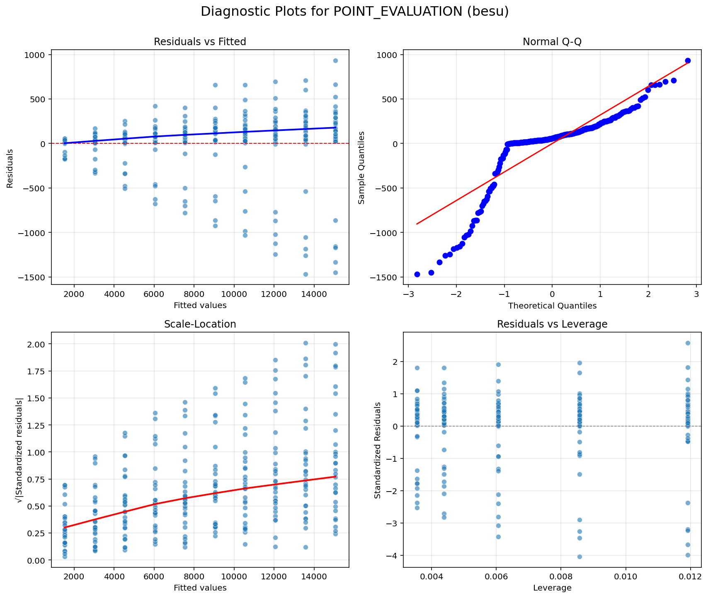


## reth


```python
                            OLS Regression Results                            
==============================================================================
Dep. Variable:        run_duration_ms   R-squared:                       0.995
Model:                            OLS   Adj. R-squared:                  0.995
Method:                 Least Squares   F-statistic:                 3.526e+04
Date:                Thu, 22 Jan 2026   Prob (F-statistic):          1.46e-206
Time:                        10:36:09   Log-Likelihood:                -1285.7
No. Observations:                 180   AIC:                             2575.
Df Residuals:                     178   BIC:                             2582.
Df Model:                           1                                         
Covariance Type:            nonrobust                                         
==============================================================================
                 coef    std err          t      P>|t|      [0.025      0.975]
------------------------------------------------------------------------------
const         27.7289     49.550      0.560      0.576     -70.051     125.509
opcount     1499.4854      7.986    187.773      0.000    1483.727    1515.244
==============================================================================
Omnibus:                      123.826   Durbin-Watson:                   0.588
Prob(Omnibus):                  0.000   Jarque-Bera (JB):              670.551
Skew:                          -2.798   Prob(JB):                    2.46e-146
Kurtosis:                      10.622   Cond. No.                         13.7
==============================================================================

Notes:
[1] Standard Errors assume that the covariance matrix of the errors is correctly specified.
```

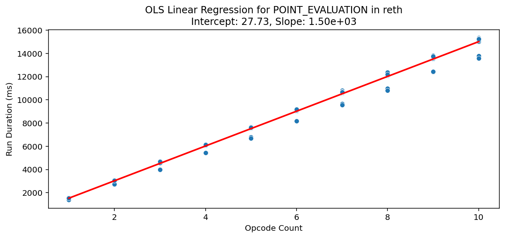

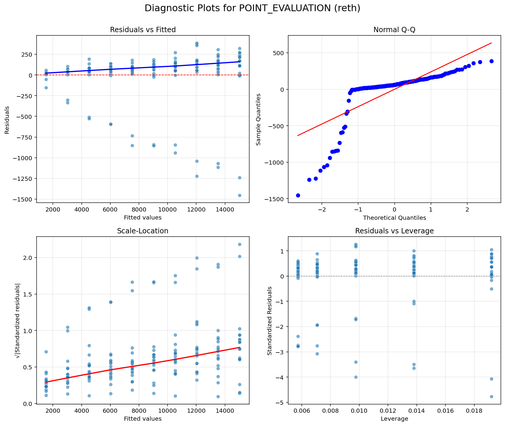


## nethermind


```python
                            OLS Regression Results                            
==============================================================================
Dep. Variable:        run_duration_ms   R-squared:                       0.260
Model:                            OLS   Adj. R-squared:                  0.257
Method:                 Least Squares   F-statistic:                     101.0
Date:                Thu, 22 Jan 2026   Prob (F-statistic):           1.42e-20
Time:                        10:36:10   Log-Likelihood:                -2850.3
No. Observations:                 290   AIC:                             5705.
Df Residuals:                     288   BIC:                             5712.
Df Model:                           1                                         
Covariance Type:            nonrobust                                         
==============================================================================
                 coef    std err          t      P>|t|      [0.025      0.975]
------------------------------------------------------------------------------
const         17.2687    571.675      0.030      0.976   -1107.922    1142.459
opcount      926.1611     92.134     10.052      0.000     744.820    1107.502
==============================================================================
Omnibus:                       44.389   Durbin-Watson:                   0.544
Prob(Omnibus):                  0.000   Jarque-Bera (JB):               27.208
Skew:                          -0.615   Prob(JB):                     1.24e-06
Kurtosis:                       2.140   Cond. No.                         13.7
==============================================================================

Notes:
[1] Standard Errors assume that the covariance matrix of the errors is correctly specified.
```

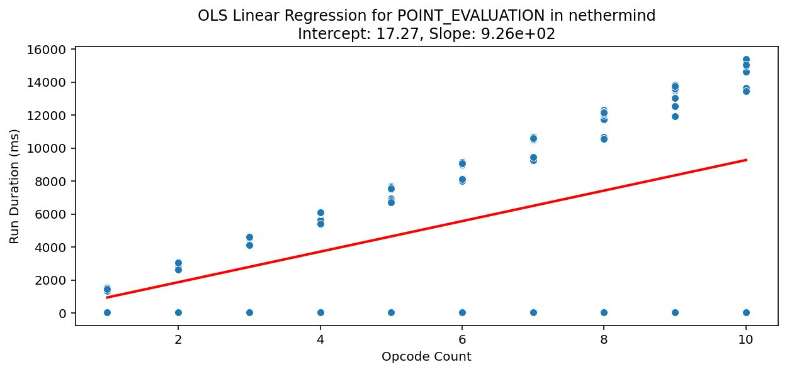

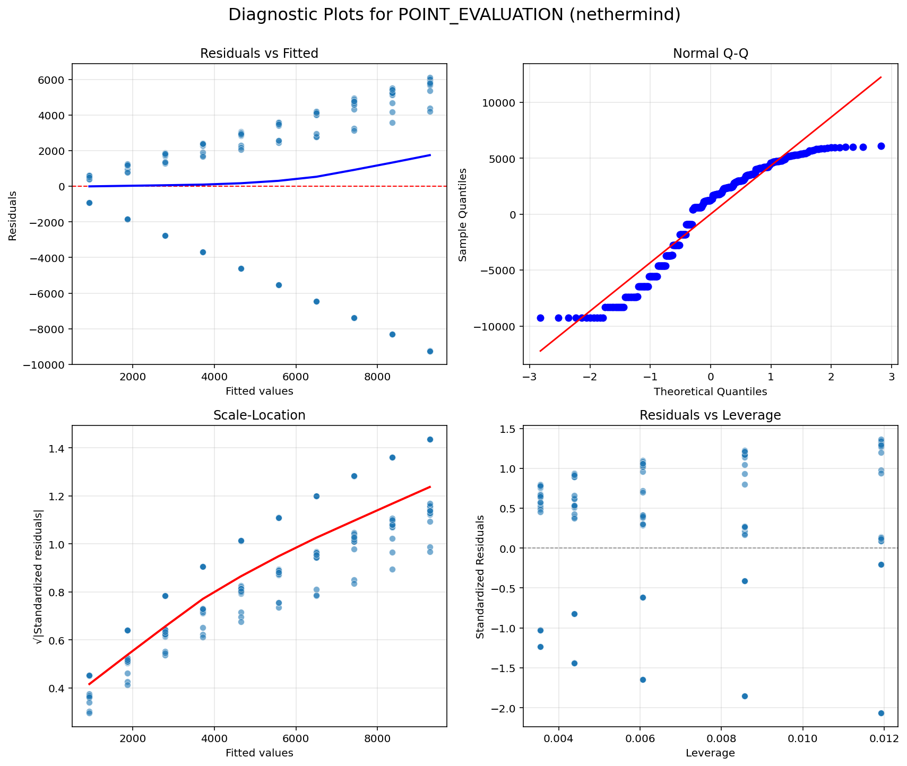


## erigon

OLS model did not run... Error: zero-size array to reduction operation maximum which has no identity

# BLS12_G1ADD

## geth


```python
                            OLS Regression Results                            
==============================================================================
Dep. Variable:        run_duration_ms   R-squared:                       0.990
Model:                            OLS   Adj. R-squared:                  0.990
Method:                 Least Squares   F-statistic:                 2.797e+04
Date:                Thu, 22 Jan 2026   Prob (F-statistic):          7.35e-289
Time:                        10:36:10   Log-Likelihood:                -1665.5
No. Observations:                 290   AIC:                             3335.
Df Residuals:                     288   BIC:                             3342.
Df Model:                           1                                         
Covariance Type:            nonrobust                                         
==============================================================================
                 coef    std err          t      P>|t|      [0.025      0.975]
------------------------------------------------------------------------------
const         24.8594      9.612      2.586      0.010       5.941      43.777
opcount        5.1812      0.031    167.237      0.000       5.120       5.242
==============================================================================
Omnibus:                       67.574   Durbin-Watson:                   1.138
Prob(Omnibus):                  0.000   Jarque-Bera (JB):              175.122
Skew:                          -1.075   Prob(JB):                     9.39e-39
Kurtosis:                       6.142   Cond. No.                         670.
==============================================================================

Notes:
[1] Standard Errors assume that the covariance matrix of the errors is correctly specified.
```


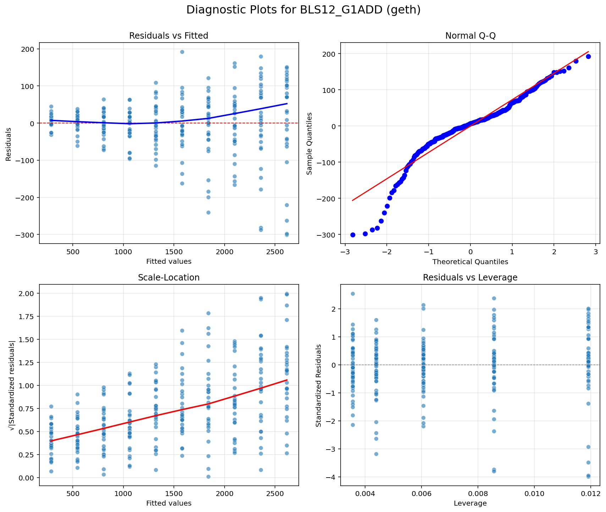


## besu


```python
                            OLS Regression Results                            
==============================================================================
Dep. Variable:        run_duration_ms   R-squared:                       0.958
Model:                            OLS   Adj. R-squared:                  0.958
Method:                 Least Squares   F-statistic:                     6571.
Date:                Thu, 22 Jan 2026   Prob (F-statistic):          2.56e-200
Time:                        10:36:10   Log-Likelihood:                -2098.8
No. Observations:                 290   AIC:                             4202.
Df Residuals:                     288   BIC:                             4209.
Df Model:                           1                                         
Covariance Type:            nonrobust                                         
==============================================================================
                 coef    std err          t      P>|t|      [0.025      0.975]
------------------------------------------------------------------------------
const         37.7123     42.828      0.881      0.379     -46.584     122.009
opcount       11.1908      0.138     81.064      0.000      10.919      11.462
==============================================================================
Omnibus:                       35.394   Durbin-Watson:                   1.227
Prob(Omnibus):                  0.000   Jarque-Bera (JB):               62.087
Skew:                          -0.697   Prob(JB):                     3.30e-14
Kurtosis:                       4.788   Cond. No.                         670.
==============================================================================

Notes:
[1] Standard Errors assume that the covariance matrix of the errors is correctly specified.
```

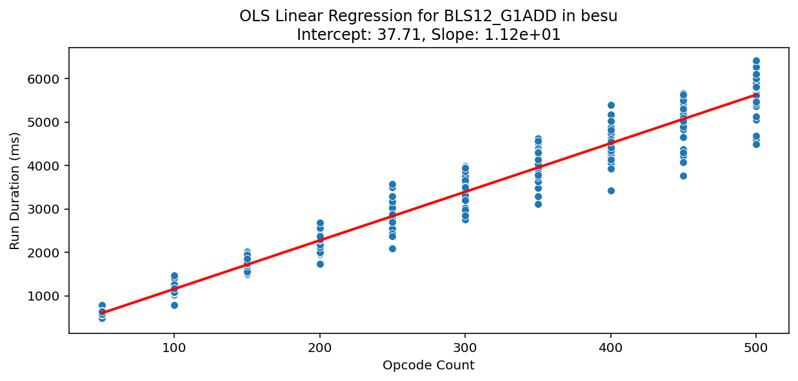

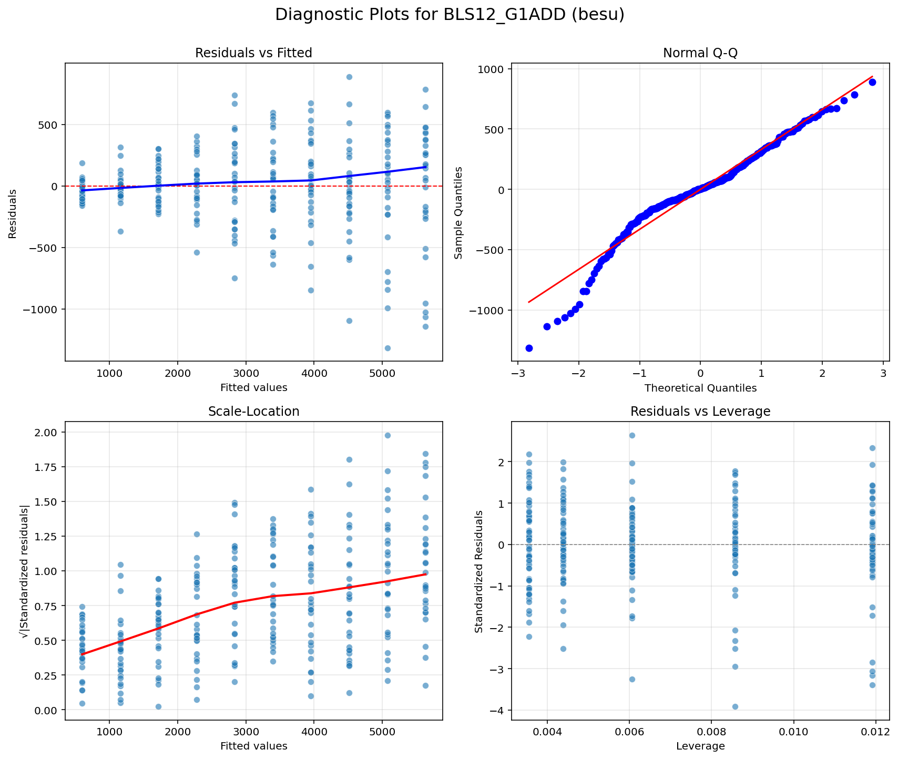


## reth


```python
                            OLS Regression Results                            
==============================================================================
Dep. Variable:        run_duration_ms   R-squared:                       0.991
Model:                            OLS   Adj. R-squared:                  0.990
Method:                 Least Squares   F-statistic:                 1.865e+04
Date:                Thu, 22 Jan 2026   Prob (F-statistic):          3.97e-182
Time:                        10:36:10   Log-Likelihood:                -1028.0
No. Observations:                 180   AIC:                             2060.
Df Residuals:                     178   BIC:                             2066.
Df Model:                           1                                         
Covariance Type:            nonrobust                                         
==============================================================================
                 coef    std err          t      P>|t|      [0.025      0.975]
------------------------------------------------------------------------------
const         28.8162     11.837      2.434      0.016       5.457      52.175
opcount        5.2112      0.038    136.581      0.000       5.136       5.286
==============================================================================
Omnibus:                       69.909   Durbin-Watson:                   1.082
Prob(Omnibus):                  0.000   Jarque-Bera (JB):              246.303
Skew:                          -1.523   Prob(JB):                     3.28e-54
Kurtosis:                       7.854   Cond. No.                         670.
==============================================================================

Notes:
[1] Standard Errors assume that the covariance matrix of the errors is correctly specified.
```

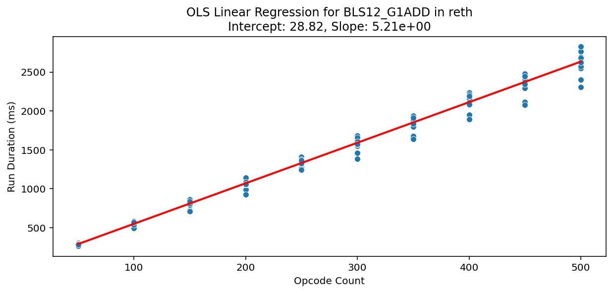

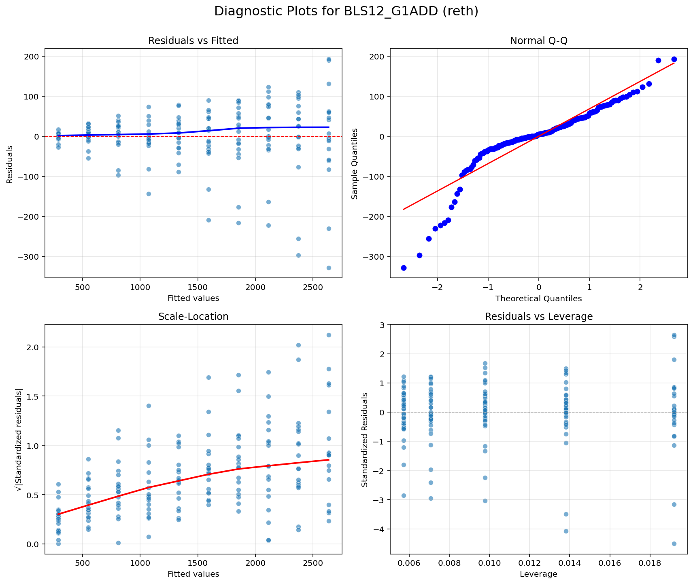


## nethermind


```python
                            OLS Regression Results                            
==============================================================================
Dep. Variable:        run_duration_ms   R-squared:                       0.335
Model:                            OLS   Adj. R-squared:                  0.333
Method:                 Least Squares   F-statistic:                     145.0
Date:                Thu, 22 Jan 2026   Prob (F-statistic):           2.53e-27
Time:                        10:36:11   Log-Likelihood:                -2348.0
No. Observations:                 290   AIC:                             4700.
Df Residuals:                     288   BIC:                             4707.
Df Model:                           1                                         
Covariance Type:            nonrobust                                         
==============================================================================
                 coef    std err          t      P>|t|      [0.025      0.975]
------------------------------------------------------------------------------
const         16.4249    101.140      0.162      0.871    -182.642     215.492
opcount        3.9258      0.326     12.042      0.000       3.284       4.567
==============================================================================
Omnibus:                       39.881   Durbin-Watson:                   0.683
Prob(Omnibus):                  0.000   Jarque-Bera (JB):               25.376
Skew:                          -0.594   Prob(JB):                     3.09e-06
Kurtosis:                       2.170   Cond. No.                         670.
==============================================================================

Notes:
[1] Standard Errors assume that the covariance matrix of the errors is correctly specified.
```

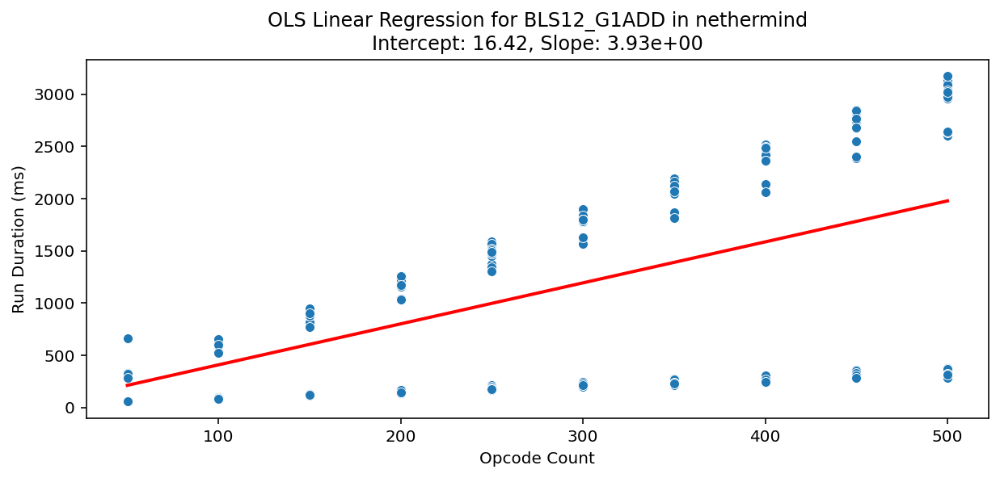

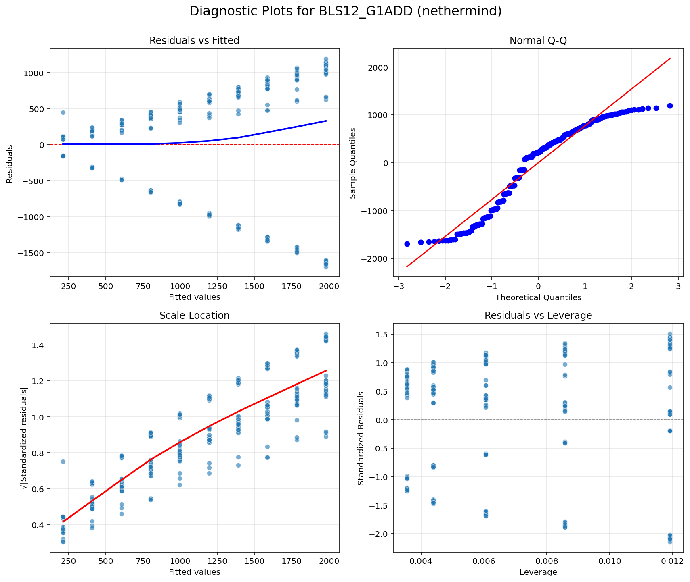


## erigon

OLS model did not run... Error: zero-size array to reduction operation maximum which has no identity

# BLS12_G2ADD

## geth


```python
                            OLS Regression Results                            
==============================================================================
Dep. Variable:        run_duration_ms   R-squared:                       0.991
Model:                            OLS   Adj. R-squared:                  0.991
Method:                 Least Squares   F-statistic:                 3.256e+04
Date:                Thu, 22 Jan 2026   Prob (F-statistic):          2.84e-298
Time:                        10:36:11   Log-Likelihood:                -1584.8
No. Observations:                 290   AIC:                             3174.
Df Residuals:                     288   BIC:                             3181.
Df Model:                           1                                         
Covariance Type:            nonrobust                                         
==============================================================================
                 coef    std err          t      P>|t|      [0.025      0.975]
------------------------------------------------------------------------------
const         29.1122      7.277      4.000      0.000      14.789      43.436
opcount        7.0542      0.039    180.437      0.000       6.977       7.131
==============================================================================
Omnibus:                       39.891   Durbin-Watson:                   0.905
Prob(Omnibus):                  0.000   Jarque-Bera (JB):               77.058
Skew:                          -0.737   Prob(JB):                     1.85e-17
Kurtosis:                       5.050   Cond. No.                         402.
==============================================================================

Notes:
[1] Standard Errors assume that the covariance matrix of the errors is correctly specified.
```

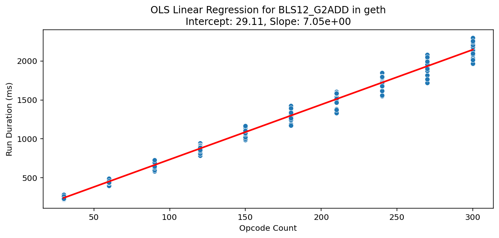

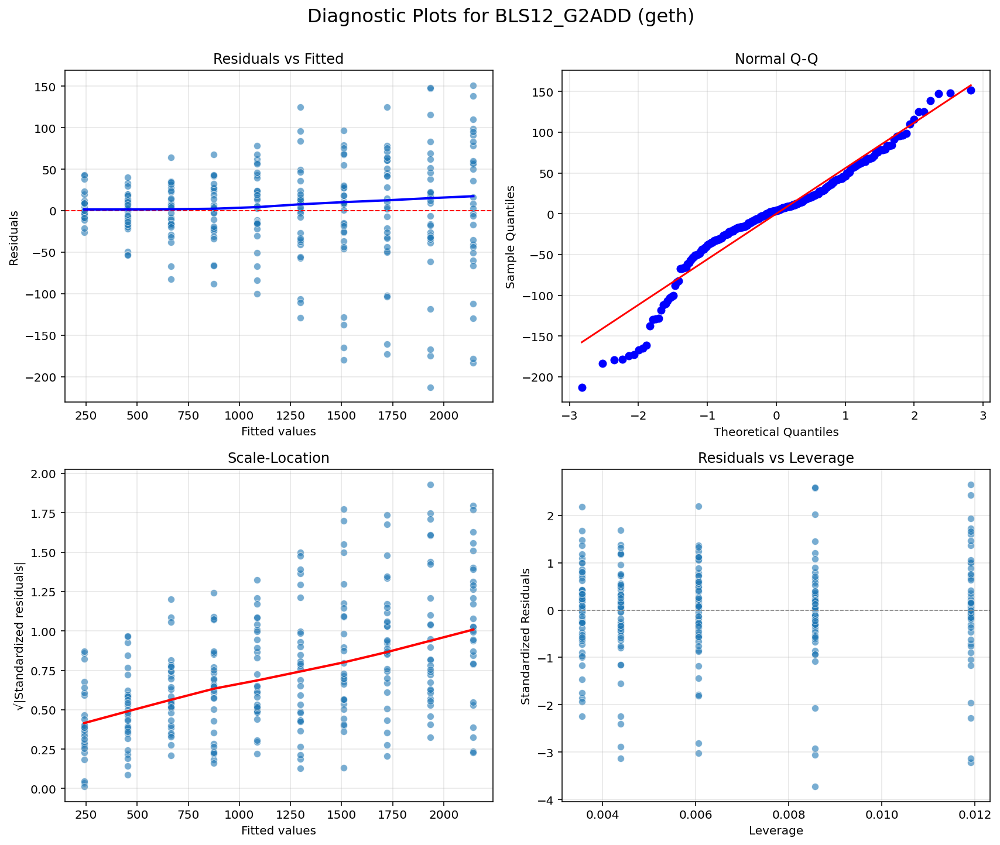


## besu


```python
                            OLS Regression Results                            
==============================================================================
Dep. Variable:        run_duration_ms   R-squared:                       0.964
Model:                            OLS   Adj. R-squared:                  0.964
Method:                 Least Squares   F-statistic:                     7813.
Date:                Thu, 22 Jan 2026   Prob (F-statistic):          1.00e-210
Time:                        10:36:11   Log-Likelihood:                -1979.3
No. Observations:                 290   AIC:                             3963.
Df Residuals:                     288   BIC:                             3970.
Df Model:                           1                                         
Covariance Type:            nonrobust                                         
==============================================================================
                 coef    std err          t      P>|t|      [0.025      0.975]
------------------------------------------------------------------------------
const         11.8219     28.356      0.417      0.677     -43.989      67.633
opcount       13.4649      0.152     88.392      0.000      13.165      13.765
==============================================================================
Omnibus:                       23.253   Durbin-Watson:                   1.187
Prob(Omnibus):                  0.000   Jarque-Bera (JB):               38.552
Skew:                          -0.495   Prob(JB):                     4.25e-09
Kurtosis:                       4.487   Cond. No.                         402.
==============================================================================

Notes:
[1] Standard Errors assume that the covariance matrix of the errors is correctly specified.
```

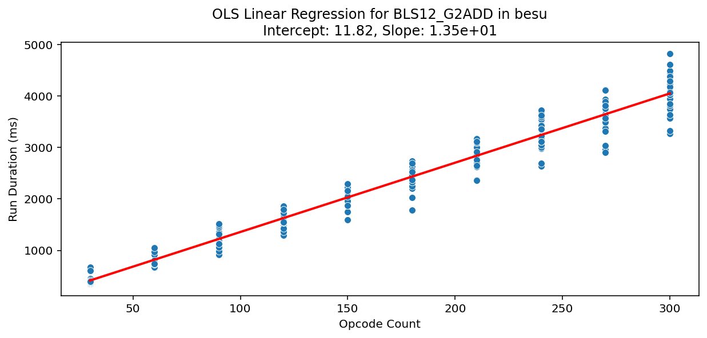

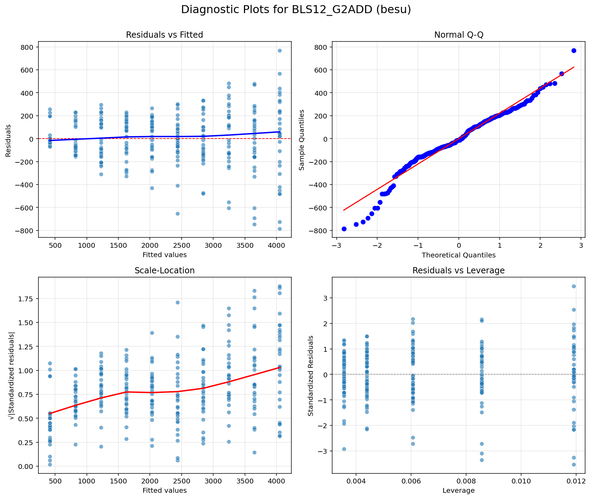


## reth


```python
                            OLS Regression Results                            
==============================================================================
Dep. Variable:        run_duration_ms   R-squared:                       0.993
Model:                            OLS   Adj. R-squared:                  0.993
Method:                 Least Squares   F-statistic:                 2.402e+04
Date:                Thu, 22 Jan 2026   Prob (F-statistic):          7.98e-192
Time:                        10:36:11   Log-Likelihood:                -977.60
No. Observations:                 180   AIC:                             1959.
Df Residuals:                     178   BIC:                             1966.
Df Model:                           1                                         
Covariance Type:            nonrobust                                         
==============================================================================
                 coef    std err          t      P>|t|      [0.025      0.975]
------------------------------------------------------------------------------
const         39.1889      8.949      4.379      0.000      21.530      56.848
opcount        7.4512      0.048    154.998      0.000       7.356       7.546
==============================================================================
Omnibus:                       57.980   Durbin-Watson:                   0.897
Prob(Omnibus):                  0.000   Jarque-Bera (JB):              156.331
Skew:                          -1.351   Prob(JB):                     1.13e-34
Kurtosis:                       6.681   Cond. No.                         402.
==============================================================================

Notes:
[1] Standard Errors assume that the covariance matrix of the errors is correctly specified.
```

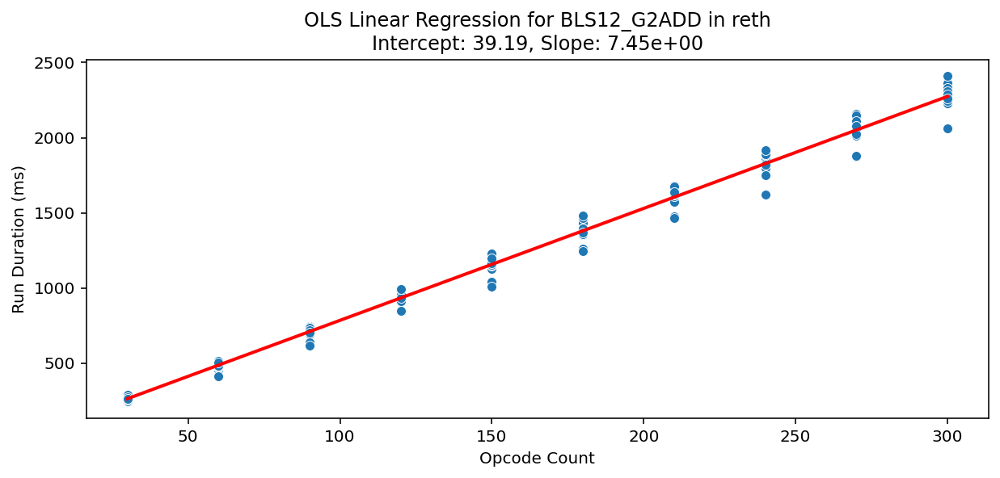

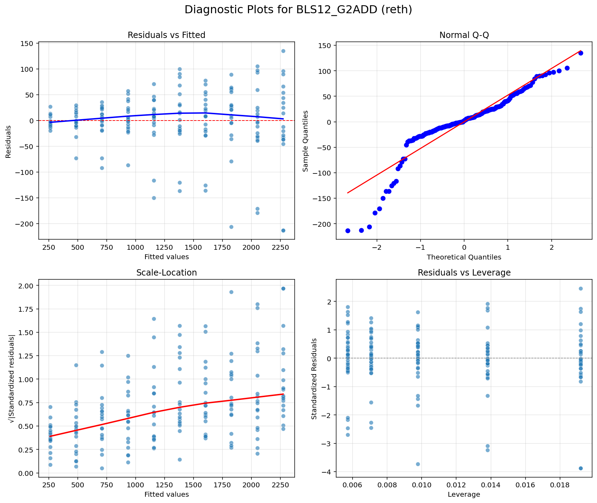


## nethermind


```python
                            OLS Regression Results                            
==============================================================================
Dep. Variable:        run_duration_ms   R-squared:                       0.313
Model:                            OLS   Adj. R-squared:                  0.311
Method:                 Least Squares   F-statistic:                     131.3
Date:                Thu, 22 Jan 2026   Prob (F-statistic):           2.72e-25
Time:                        10:36:12   Log-Likelihood:                -2336.9
No. Observations:                 290   AIC:                             4678.
Df Residuals:                     288   BIC:                             4685.
Df Model:                           1                                         
Covariance Type:            nonrobust                                         
==============================================================================
                 coef    std err          t      P>|t|      [0.025      0.975]
------------------------------------------------------------------------------
const          8.2230     97.335      0.084      0.933    -183.354     199.800
opcount        5.9909      0.523     11.457      0.000       4.962       7.020
==============================================================================
Omnibus:                       39.255   Durbin-Watson:                   0.461
Prob(Omnibus):                  0.000   Jarque-Bera (JB):               25.768
Skew:                          -0.604   Prob(JB):                     2.54e-06
Kurtosis:                       2.180   Cond. No.                         402.
==============================================================================

Notes:
[1] Standard Errors assume that the covariance matrix of the errors is correctly specified.
```

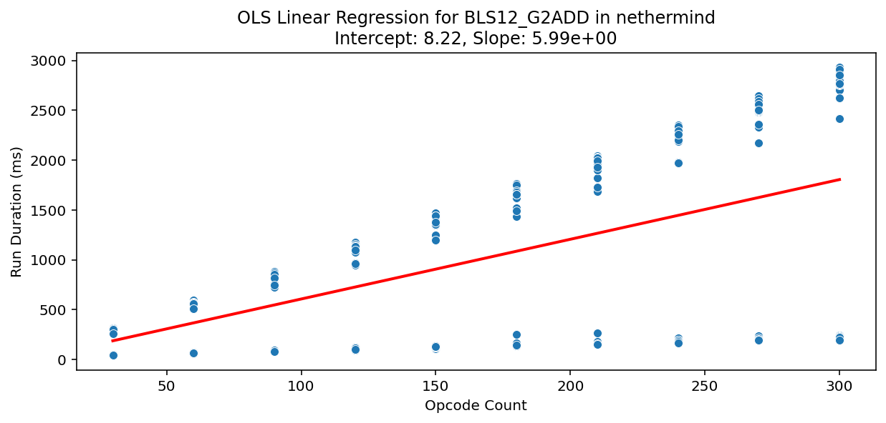

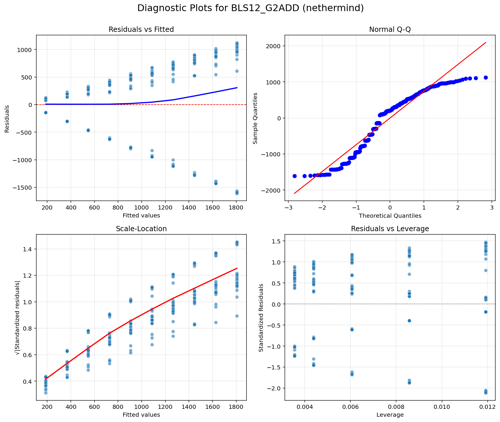


## erigon

OLS model did not run... Error: zero-size array to reduction operation maximum which has no identity

# BLS12_MAP_FP_TO_G1

## geth


```python
                            OLS Regression Results                            
==============================================================================
Dep. Variable:        run_duration_ms   R-squared:                       0.990
Model:                            OLS   Adj. R-squared:                  0.990
Method:                 Least Squares   F-statistic:                 2.923e+04
Date:                Thu, 22 Jan 2026   Prob (F-statistic):          1.35e-291
Time:                        10:36:12   Log-Likelihood:                -1677.0
No. Observations:                 290   AIC:                             3358.
Df Residuals:                     288   BIC:                             3365.
Df Model:                           1                                         
Covariance Type:            nonrobust                                         
==============================================================================
                 coef    std err          t      P>|t|      [0.025      0.975]
------------------------------------------------------------------------------
const         35.9726      9.998      3.598      0.000      16.293      55.652
opcount       68.8758      0.403    170.973      0.000      68.083      69.669
==============================================================================
Omnibus:                      115.988   Durbin-Watson:                   0.990
Prob(Omnibus):                  0.000   Jarque-Bera (JB):              376.764
Skew:                          -1.783   Prob(JB):                     1.54e-82
Kurtosis:                       7.297   Cond. No.                         53.7
==============================================================================

Notes:
[1] Standard Errors assume that the covariance matrix of the errors is correctly specified.
```

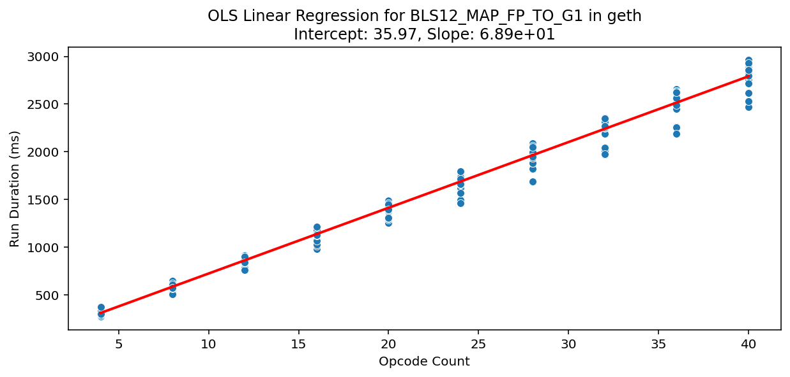

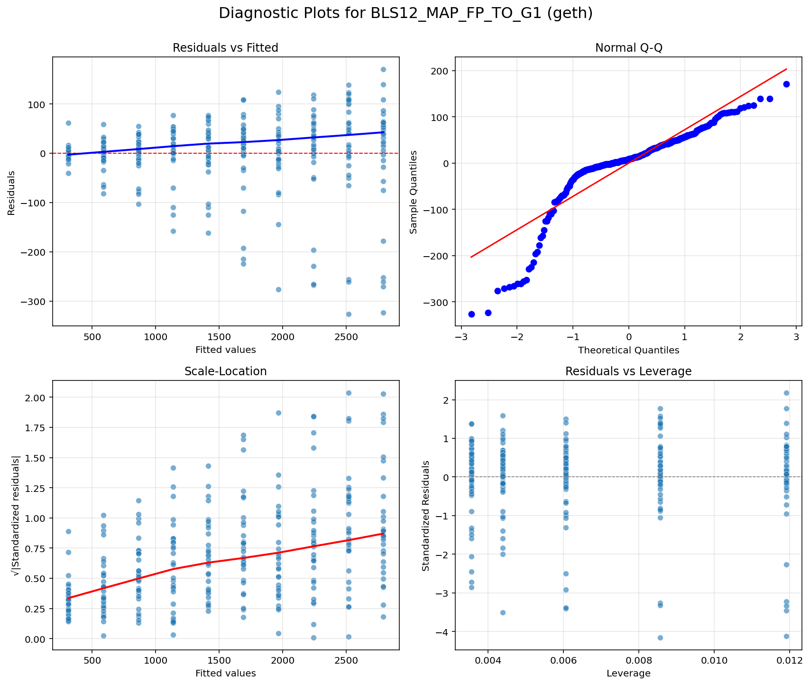


## besu


```python
                            OLS Regression Results                            
==============================================================================
Dep. Variable:        run_duration_ms   R-squared:                       0.982
Model:                            OLS   Adj. R-squared:                  0.982
Method:                 Least Squares   F-statistic:                 1.558e+04
Date:                Thu, 22 Jan 2026   Prob (F-statistic):          9.08e-253
Time:                        10:36:12   Log-Likelihood:                -1777.6
No. Observations:                 290   AIC:                             3559.
Df Residuals:                     288   BIC:                             3567.
Df Model:                           1                                         
Covariance Type:            nonrobust                                         
==============================================================================
                 coef    std err          t      P>|t|      [0.025      0.975]
------------------------------------------------------------------------------
const         34.6560     14.148      2.450      0.015       6.810      62.502
opcount       71.1475      0.570    124.815      0.000      70.026      72.269
==============================================================================
Omnibus:                       17.592   Durbin-Watson:                   1.348
Prob(Omnibus):                  0.000   Jarque-Bera (JB):               47.046
Skew:                          -0.152   Prob(JB):                     6.08e-11
Kurtosis:                       4.950   Cond. No.                         53.7
==============================================================================

Notes:
[1] Standard Errors assume that the covariance matrix of the errors is correctly specified.
```

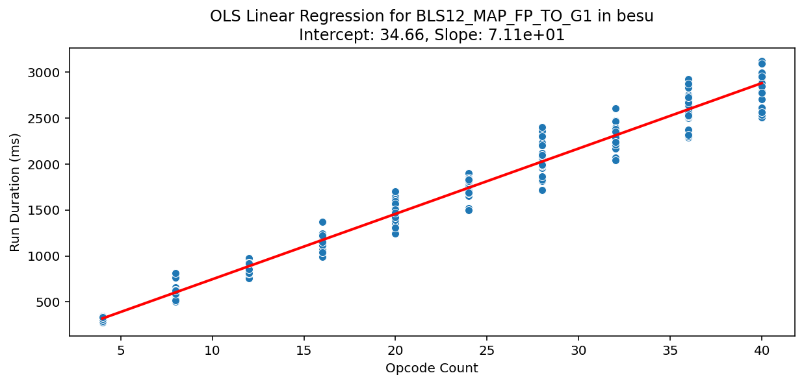

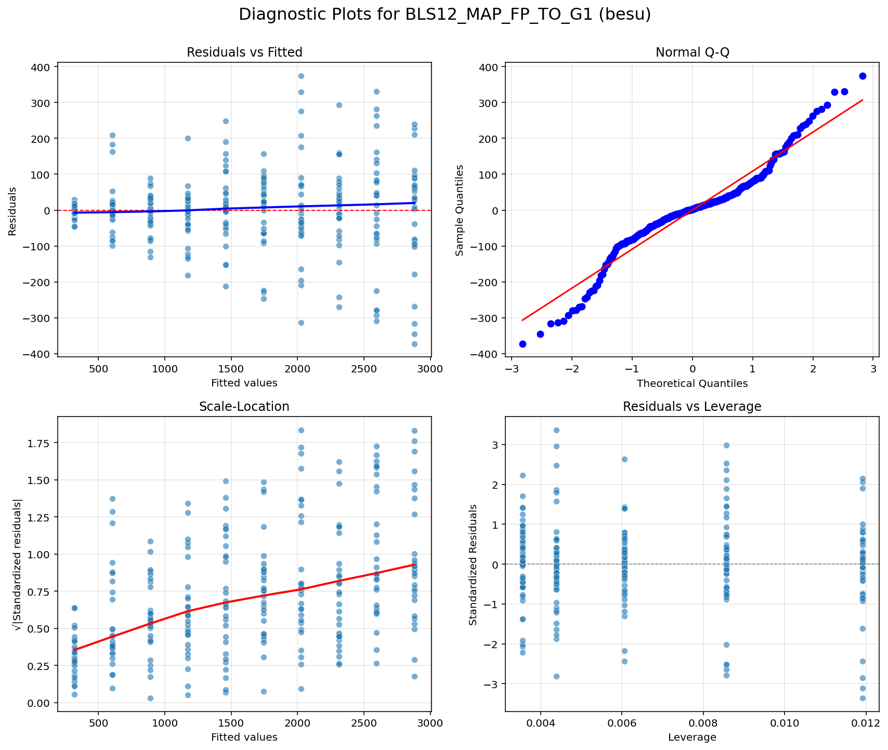


## reth


```python
                            OLS Regression Results                            
==============================================================================
Dep. Variable:        run_duration_ms   R-squared:                       0.994
Model:                            OLS   Adj. R-squared:                  0.994
Method:                 Least Squares   F-statistic:                 2.975e+04
Date:                Thu, 22 Jan 2026   Prob (F-statistic):          4.94e-200
Time:                        10:36:13   Log-Likelihood:                -965.33
No. Observations:                 180   AIC:                             1935.
Df Residuals:                     178   BIC:                             1941.
Df Model:                           1                                         
Covariance Type:            nonrobust                                         
==============================================================================
                 coef    std err          t      P>|t|      [0.025      0.975]
------------------------------------------------------------------------------
const         31.8024      8.359      3.804      0.000      15.307      48.298
opcount       58.0923      0.337    172.482      0.000      57.428      58.757
==============================================================================
Omnibus:                      129.200   Durbin-Watson:                   0.762
Prob(Omnibus):                  0.000   Jarque-Bera (JB):             1170.258
Skew:                          -2.657   Prob(JB):                    7.61e-255
Kurtosis:                      14.305   Cond. No.                         53.7
==============================================================================

Notes:
[1] Standard Errors assume that the covariance matrix of the errors is correctly specified.
```

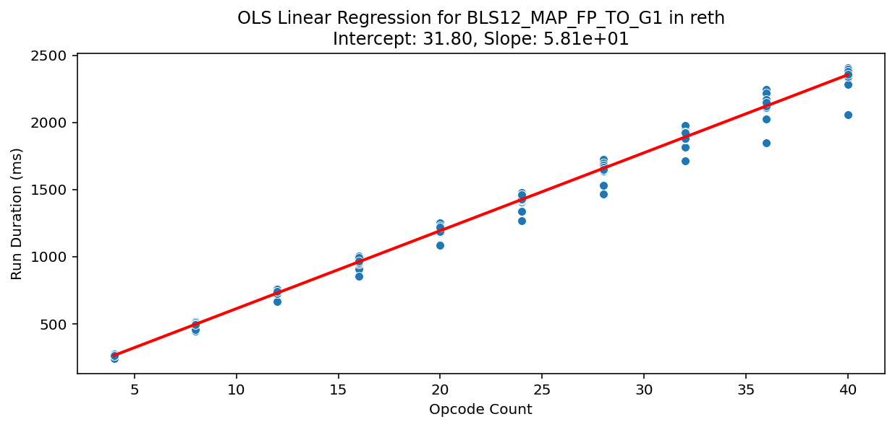

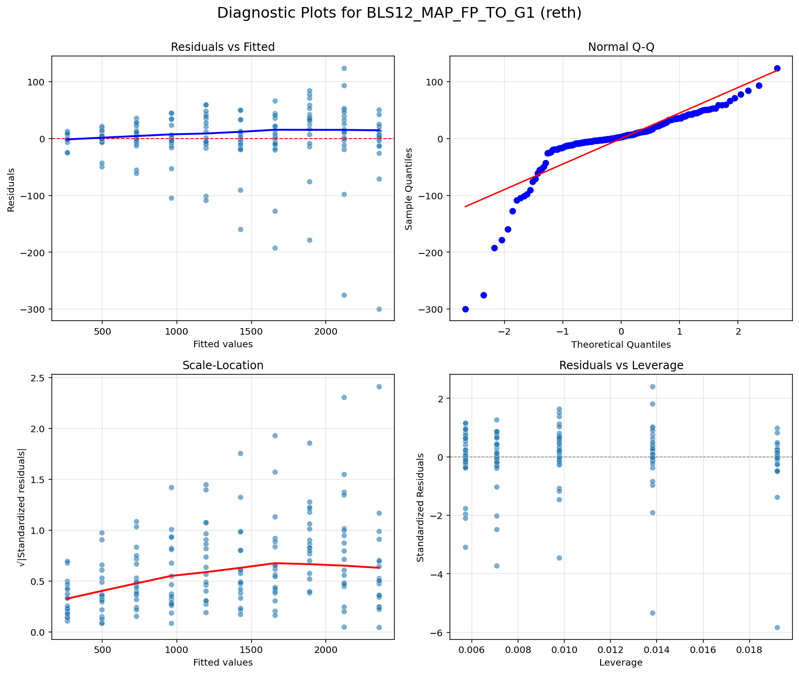


## nethermind


```python
                            OLS Regression Results                            
==============================================================================
Dep. Variable:        run_duration_ms   R-squared:                       0.265
Model:                            OLS   Adj. R-squared:                  0.262
Method:                 Least Squares   F-statistic:                     103.8
Date:                Thu, 22 Jan 2026   Prob (F-statistic):           5.02e-21
Time:                        10:36:13   Log-Likelihood:                -2305.4
No. Observations:                 290   AIC:                             4615.
Df Residuals:                     288   BIC:                             4622.
Df Model:                           1                                         
Covariance Type:            nonrobust                                         
==============================================================================
                 coef    std err          t      P>|t|      [0.025      0.975]
------------------------------------------------------------------------------
const         28.4297     87.307      0.326      0.745    -143.411     200.271
opcount       35.8460      3.518     10.190      0.000      28.922      42.770
==============================================================================
Omnibus:                       45.153   Durbin-Watson:                   0.478
Prob(Omnibus):                  0.000   Jarque-Bera (JB):               27.372
Skew:                          -0.616   Prob(JB):                     1.14e-06
Kurtosis:                       2.135   Cond. No.                         53.7
==============================================================================

Notes:
[1] Standard Errors assume that the covariance matrix of the errors is correctly specified.
```

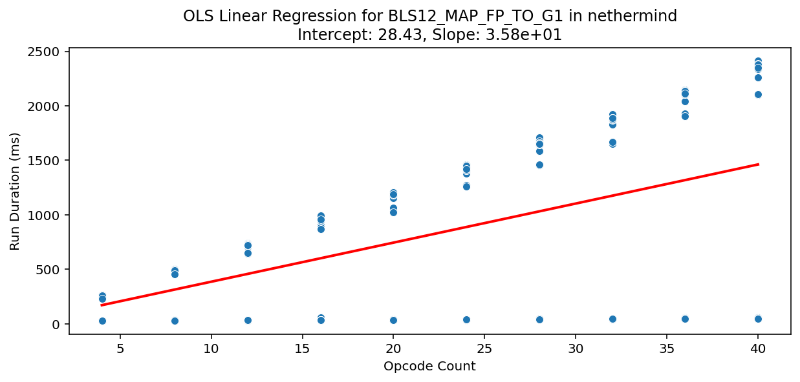

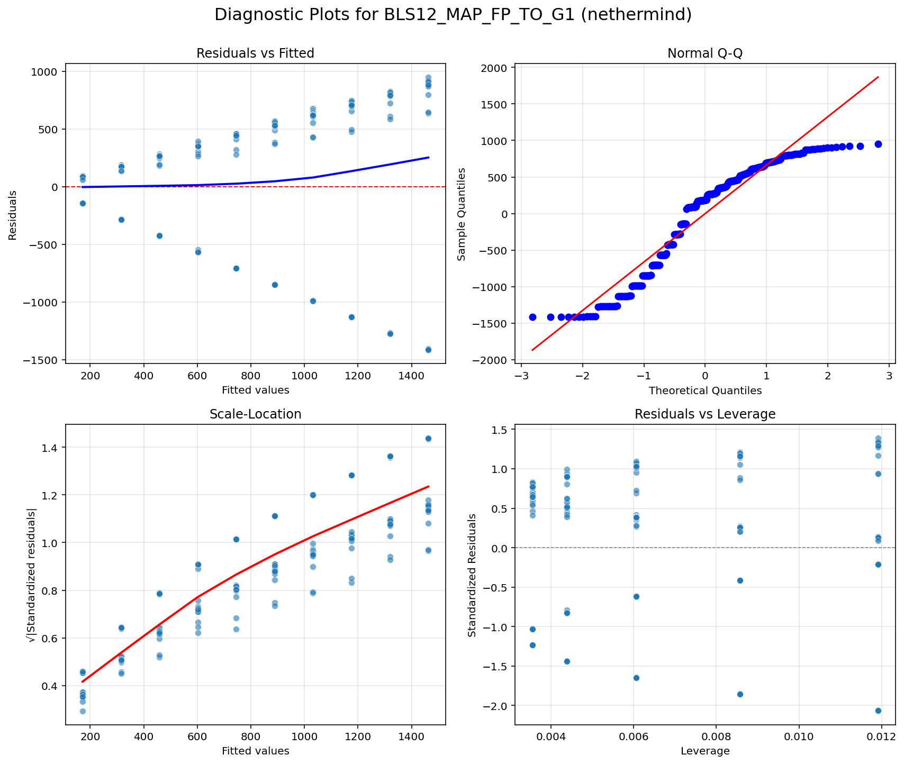


## erigon

OLS model did not run... Error: zero-size array to reduction operation maximum which has no identity

# BLS12_MAP_FP2_TO_G2

## geth


```python
                            OLS Regression Results                            
==============================================================================
Dep. Variable:        run_duration_ms   R-squared:                       0.992
Model:                            OLS   Adj. R-squared:                  0.992
Method:                 Least Squares   F-statistic:                 3.541e+04
Date:                Thu, 22 Jan 2026   Prob (F-statistic):          1.73e-303
Time:                        10:36:13   Log-Likelihood:                -1649.4
No. Observations:                 290   AIC:                             3303.
Df Residuals:                     288   BIC:                             3310.
Df Model:                           1                                         
Covariance Type:            nonrobust                                         
==============================================================================
                 coef    std err          t      P>|t|      [0.025      0.975]
------------------------------------------------------------------------------
const         35.2501      9.092      3.877      0.000      17.354      53.146
opcount      275.7631      1.465    188.186      0.000     272.879     278.647
==============================================================================
Omnibus:                      129.386   Durbin-Watson:                   0.776
Prob(Omnibus):                  0.000   Jarque-Bera (JB):              513.193
Skew:                          -1.916   Prob(JB):                    3.64e-112
Kurtosis:                       8.272   Cond. No.                         13.7
==============================================================================

Notes:
[1] Standard Errors assume that the covariance matrix of the errors is correctly specified.
```

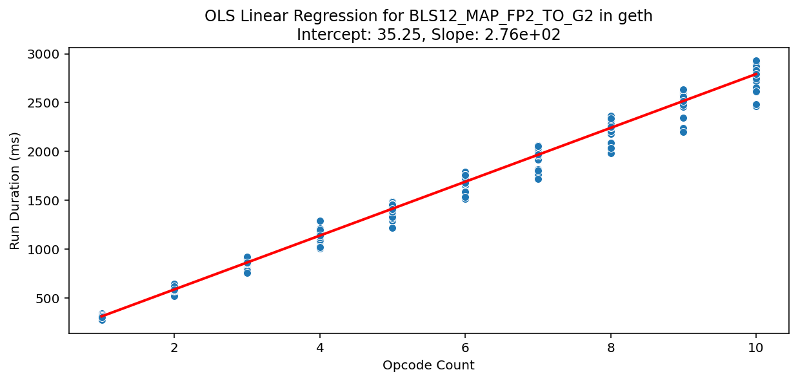

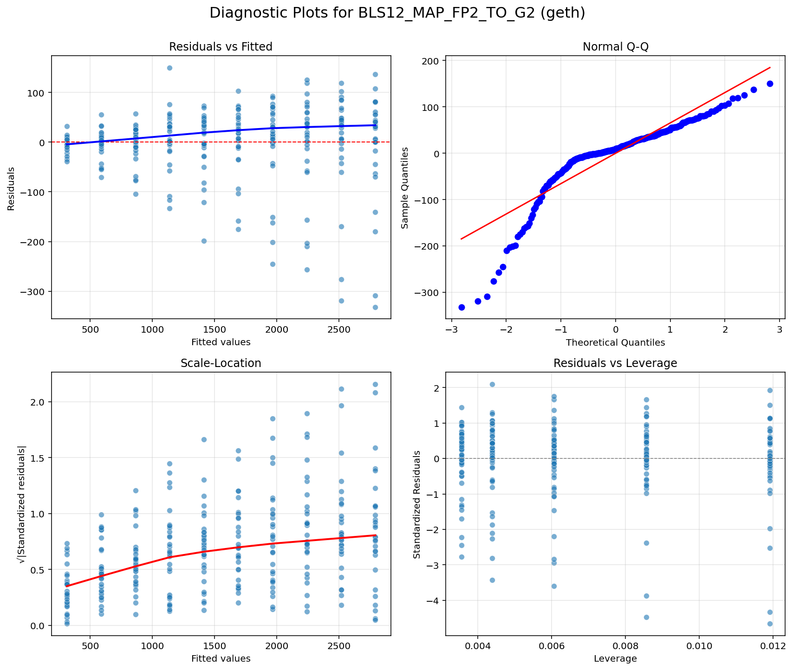


## besu


```python
                            OLS Regression Results                            
==============================================================================
Dep. Variable:        run_duration_ms   R-squared:                       0.990
Model:                            OLS   Adj. R-squared:                  0.990
Method:                 Least Squares   F-statistic:                 2.862e+04
Date:                Thu, 22 Jan 2026   Prob (F-statistic):          2.69e-290
Time:                        10:36:13   Log-Likelihood:                -1684.0
No. Observations:                 290   AIC:                             3372.
Df Residuals:                     288   BIC:                             3379.
Df Model:                           1                                         
Covariance Type:            nonrobust                                         
==============================================================================
                 coef    std err          t      P>|t|      [0.025      0.975]
------------------------------------------------------------------------------
const         29.7680     10.245      2.906      0.004       9.603      49.933
opcount      279.3512      1.651    169.188      0.000     276.101     282.601
==============================================================================
Omnibus:                      100.620   Durbin-Watson:                   0.783
Prob(Omnibus):                  0.000   Jarque-Bera (JB):              270.816
Skew:                          -1.614   Prob(JB):                     1.56e-59
Kurtosis:                       6.464   Cond. No.                         13.7
==============================================================================

Notes:
[1] Standard Errors assume that the covariance matrix of the errors is correctly specified.
```

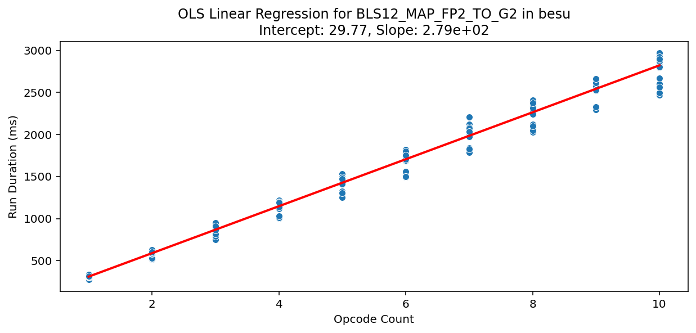

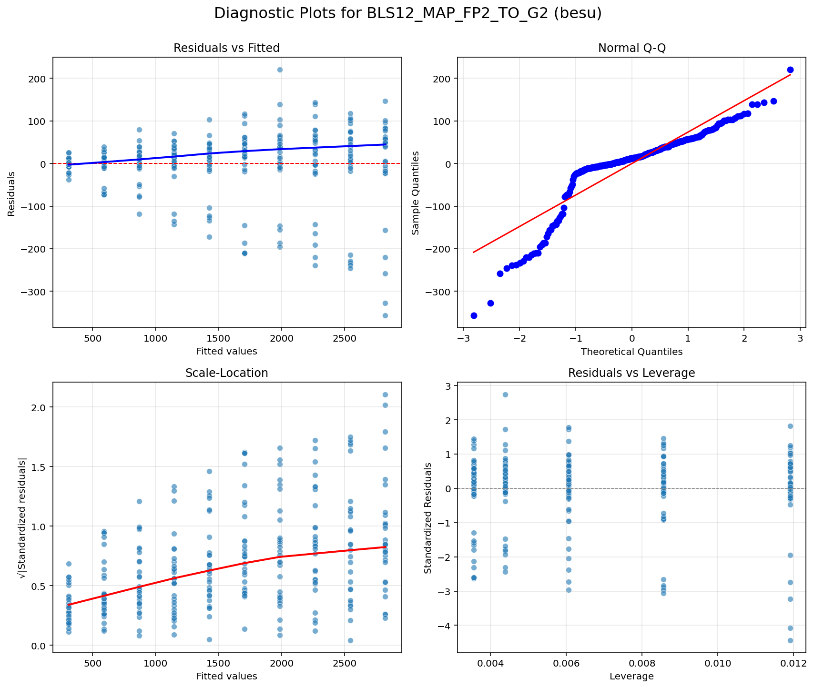


## reth


```python
                            OLS Regression Results                            
==============================================================================
Dep. Variable:        run_duration_ms   R-squared:                       0.993
Model:                            OLS   Adj. R-squared:                  0.993
Method:                 Least Squares   F-statistic:                 2.442e+04
Date:                Thu, 22 Jan 2026   Prob (F-statistic):          1.86e-192
Time:                        10:36:14   Log-Likelihood:                -942.79
No. Observations:                 180   AIC:                             1890.
Df Residuals:                     178   BIC:                             1896.
Df Model:                           1                                         
Covariance Type:            nonrobust                                         
==============================================================================
                 coef    std err          t      P>|t|      [0.025      0.975]
------------------------------------------------------------------------------
const         34.3412      7.375      4.656      0.000      19.787      48.895
opcount      185.7582      1.189    156.279      0.000     183.413     188.104
==============================================================================
Omnibus:                      124.298   Durbin-Watson:                   0.857
Prob(Omnibus):                  0.000   Jarque-Bera (JB):              807.235
Skew:                          -2.696   Prob(JB):                    5.14e-176
Kurtosis:                      11.864   Cond. No.                         13.7
==============================================================================

Notes:
[1] Standard Errors assume that the covariance matrix of the errors is correctly specified.
```

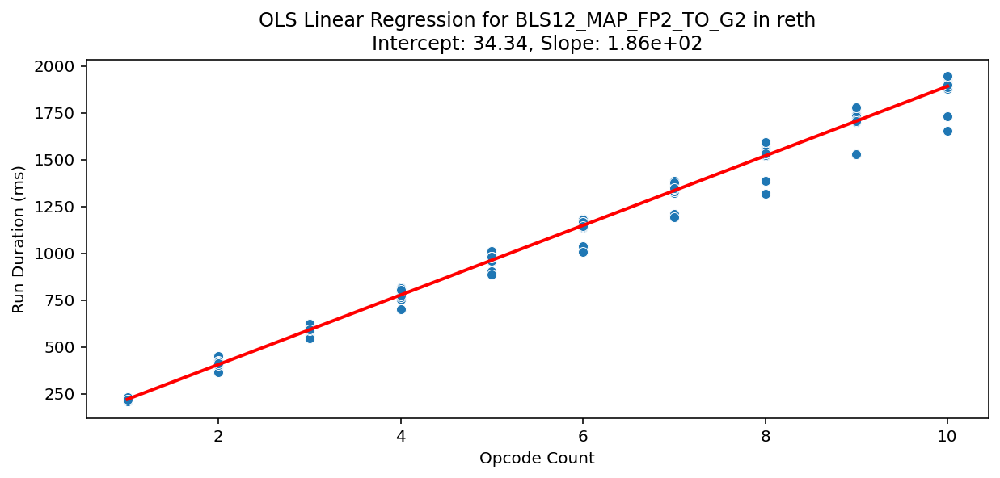

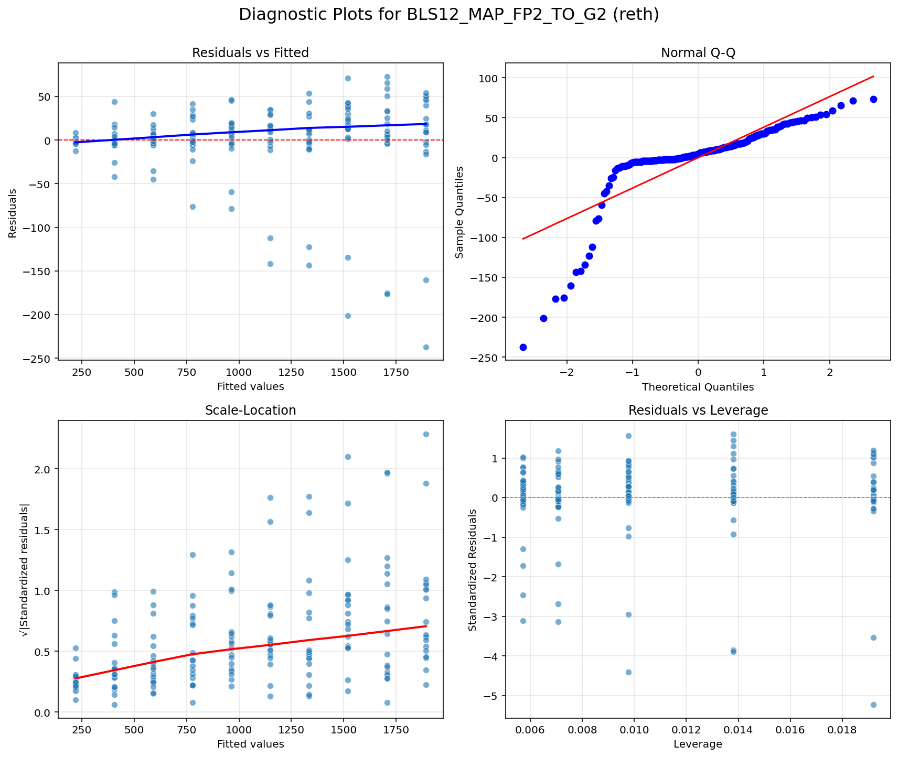


## nethermind


```python
                            OLS Regression Results                            
==============================================================================
Dep. Variable:        run_duration_ms   R-squared:                       0.260
Model:                            OLS   Adj. R-squared:                  0.257
Method:                 Least Squares   F-statistic:                     101.2
Date:                Thu, 22 Jan 2026   Prob (F-statistic):           1.33e-20
Time:                        10:36:14   Log-Likelihood:                -2245.3
No. Observations:                 290   AIC:                             4495.
Df Residuals:                     288   BIC:                             4502.
Df Model:                           1                                         
Covariance Type:            nonrobust                                         
==============================================================================
                 coef    std err          t      P>|t|      [0.025      0.975]
------------------------------------------------------------------------------
const         29.0427     70.964      0.409      0.683    -110.631     168.717
opcount      115.0648     11.437     10.061      0.000      92.554     137.575
==============================================================================
Omnibus:                       44.939   Durbin-Watson:                   0.526
Prob(Omnibus):                  0.000   Jarque-Bera (JB):               27.267
Skew:                          -0.614   Prob(JB):                     1.20e-06
Kurtosis:                       2.136   Cond. No.                         13.7
==============================================================================

Notes:
[1] Standard Errors assume that the covariance matrix of the errors is correctly specified.
```

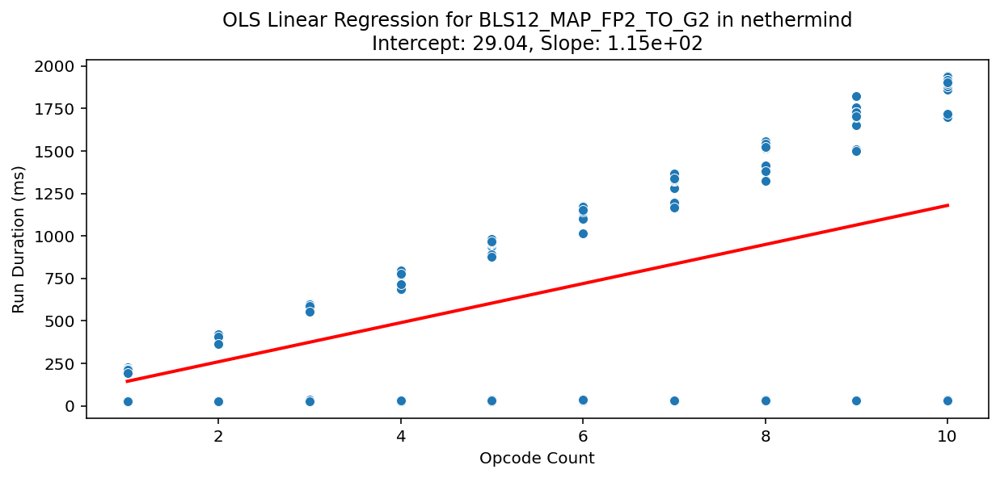

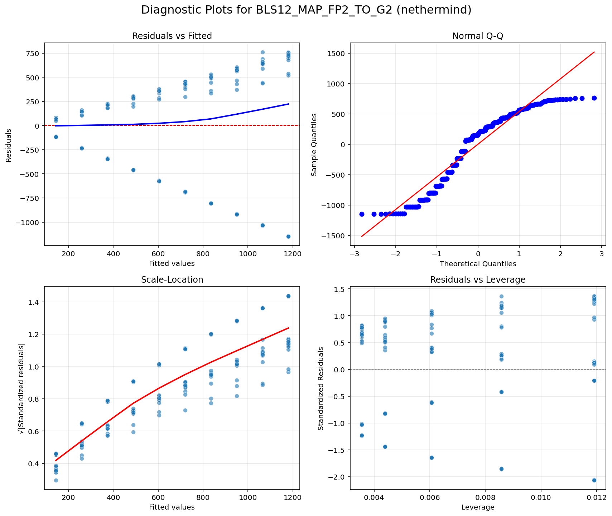


## erigon

OLS model did not run... Error: zero-size array to reduction operation maximum which has no identity

# P256VERIFY

## geth

OLS model did not run... Error: zero-size array to reduction operation maximum which has no identity

## besu

OLS model did not run... Error: zero-size array to reduction operation maximum which has no identity

## reth

OLS model did not run... Error: zero-size array to reduction operation maximum which has no identity

## nethermind

OLS model did not run... Error: zero-size array to reduction operation maximum which has no identity

## erigon

OLS model did not run... Error: zero-size array to reduction operation maximum which has no identity

# SHA2-256

## geth


```python
                            OLS Regression Results                            
==============================================================================
Dep. Variable:        run_duration_ms   R-squared:                       0.954
Model:                            OLS   Adj. R-squared:                  0.954
Method:                 Least Squares   F-statistic:                 1.160e+04
Date:                Thu, 22 Jan 2026   Prob (F-statistic):               0.00
Time:                        10:36:14   Log-Likelihood:                -6255.9
No. Observations:                1131   AIC:                         1.252e+04
Df Residuals:                    1128   BIC:                         1.253e+04
Df Model:                           2                                         
Covariance Type:            nonrobust                                         
==============================================================================
                 coef    std err          t      P>|t|      [0.025      0.975]
------------------------------------------------------------------------------
const          7.6760      4.706      1.631      0.103      -1.557      16.909
opcount        0.7425      0.005    143.655      0.000       0.732       0.753
size           0.1866      0.005     34.866      0.000       0.176       0.197
==============================================================================
Omnibus:                        7.916   Durbin-Watson:                   1.819
Prob(Omnibus):                  0.019   Jarque-Bera (JB):               10.376
Skew:                          -0.057   Prob(JB):                      0.00558
Kurtosis:                       3.455   Cond. No.                     1.99e+03
==============================================================================

Notes:
[1] Standard Errors assume that the covariance matrix of the errors is correctly specified.
[2] The condition number is large, 1.99e+03. This might indicate that there are
strong multicollinearity or other numerical problems.
```

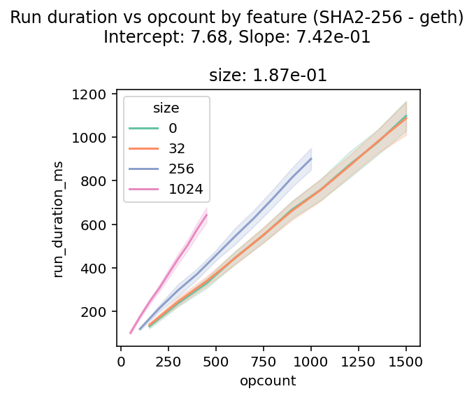

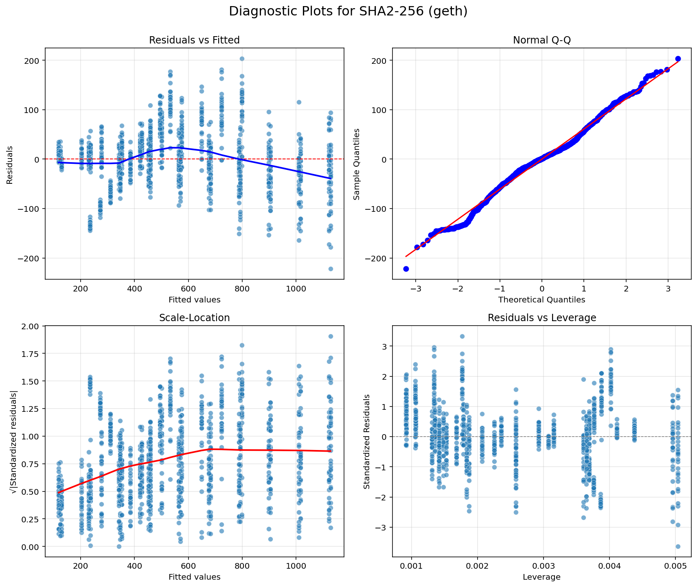


## besu


```python
                            OLS Regression Results                            
==============================================================================
Dep. Variable:        run_duration_ms   R-squared:                       0.795
Model:                            OLS   Adj. R-squared:                  0.795
Method:                 Least Squares   F-statistic:                     2192.
Date:                Thu, 22 Jan 2026   Prob (F-statistic):               0.00
Time:                        10:36:15   Log-Likelihood:                -8771.5
No. Observations:                1131   AIC:                         1.755e+04
Df Residuals:                    1128   BIC:                         1.756e+04
Df Model:                           2                                         
Covariance Type:            nonrobust                                         
==============================================================================
                 coef    std err          t      P>|t|      [0.025      0.975]
------------------------------------------------------------------------------
const       -155.7224     43.510     -3.579      0.000    -241.093     -70.352
opcount        3.1609      0.048     66.141      0.000       3.067       3.255
size           1.8979      0.049     38.354      0.000       1.801       1.995
==============================================================================
Omnibus:                       11.042   Durbin-Watson:                   2.012
Prob(Omnibus):                  0.004   Jarque-Bera (JB):               14.980
Skew:                           0.097   Prob(JB):                     0.000559
Kurtosis:                       3.529   Cond. No.                     1.99e+03
==============================================================================

Notes:
[1] Standard Errors assume that the covariance matrix of the errors is correctly specified.
[2] The condition number is large, 1.99e+03. This might indicate that there are
strong multicollinearity or other numerical problems.
```

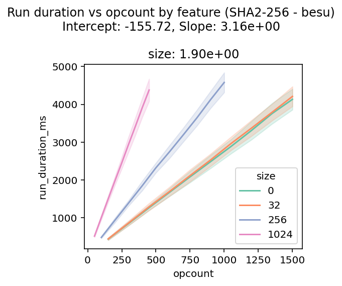

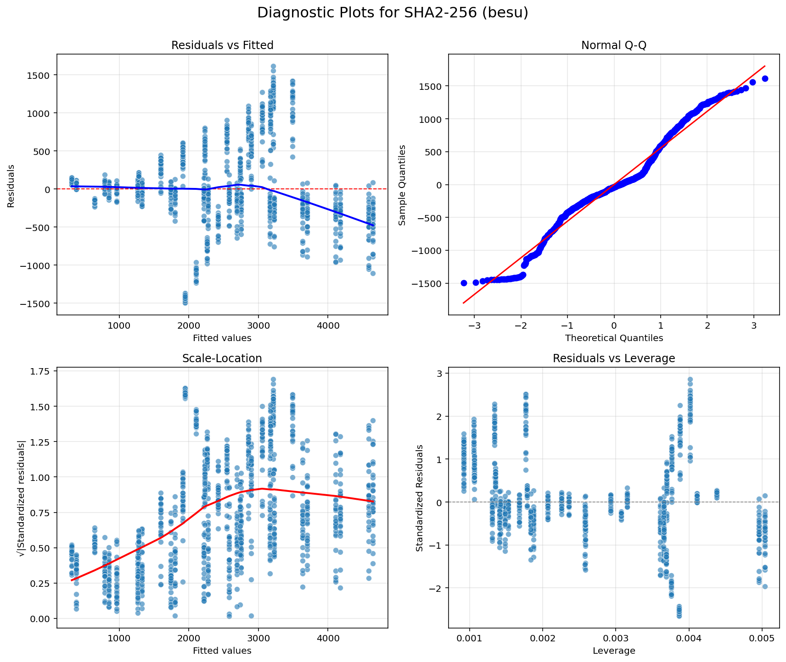


## reth


```python
                            OLS Regression Results                            
==============================================================================
Dep. Variable:        run_duration_ms   R-squared:                       0.903
Model:                            OLS   Adj. R-squared:                  0.903
Method:                 Least Squares   F-statistic:                     3265.
Date:                Thu, 22 Jan 2026   Prob (F-statistic):               0.00
Time:                        10:36:15   Log-Likelihood:                -4136.7
No. Observations:                 702   AIC:                             8279.
Df Residuals:                     699   BIC:                             8293.
Df Model:                           2                                         
Covariance Type:            nonrobust                                         
==============================================================================
                 coef    std err          t      P>|t|      [0.025      0.975]
------------------------------------------------------------------------------
const          9.7128      8.581      1.132      0.258      -7.134      26.560
opcount        0.7172      0.009     76.096      0.000       0.699       0.736
size           0.1768      0.010     18.114      0.000       0.158       0.196
==============================================================================
Omnibus:                        7.815   Durbin-Watson:                   2.115
Prob(Omnibus):                  0.020   Jarque-Bera (JB):                7.935
Skew:                          -0.246   Prob(JB):                       0.0189
Kurtosis:                       2.829   Cond. No.                     1.99e+03
==============================================================================

Notes:
[1] Standard Errors assume that the covariance matrix of the errors is correctly specified.
[2] The condition number is large, 1.99e+03. This might indicate that there are
strong multicollinearity or other numerical problems.
```

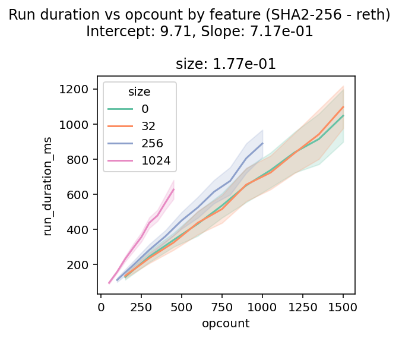

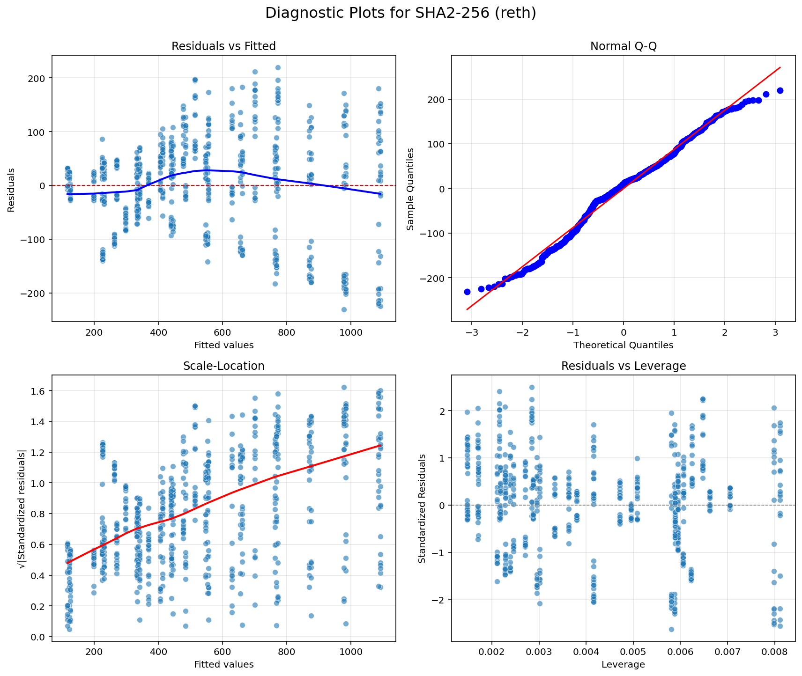


## nethermind


```python
                            OLS Regression Results                            
==============================================================================
Dep. Variable:        run_duration_ms   R-squared:                       0.651
Model:                            OLS   Adj. R-squared:                  0.651
Method:                 Least Squares   F-statistic:                     1054.
Date:                Thu, 22 Jan 2026   Prob (F-statistic):          7.12e-259
Time:                        10:36:15   Log-Likelihood:                -8172.1
No. Observations:                1131   AIC:                         1.635e+04
Df Residuals:                    1128   BIC:                         1.637e+04
Df Model:                           2                                         
Covariance Type:            nonrobust                                         
==============================================================================
                 coef    std err          t      P>|t|      [0.025      0.975]
------------------------------------------------------------------------------
const          5.0369     25.612      0.197      0.844     -45.216      55.290
opcount        1.1499      0.028     40.874      0.000       1.095       1.205
size           0.1288      0.029      4.422      0.000       0.072       0.186
==============================================================================
Omnibus:                       64.211   Durbin-Watson:                   0.514
Prob(Omnibus):                  0.000   Jarque-Bera (JB):               73.016
Skew:                          -0.611   Prob(JB):                     1.40e-16
Kurtosis:                       2.760   Cond. No.                     1.99e+03
==============================================================================

Notes:
[1] Standard Errors assume that the covariance matrix of the errors is correctly specified.
[2] The condition number is large, 1.99e+03. This might indicate that there are
strong multicollinearity or other numerical problems.
```

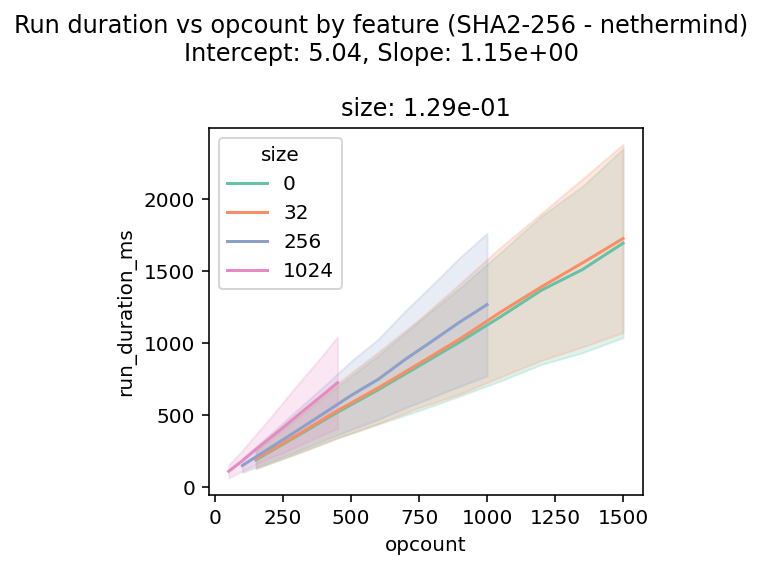

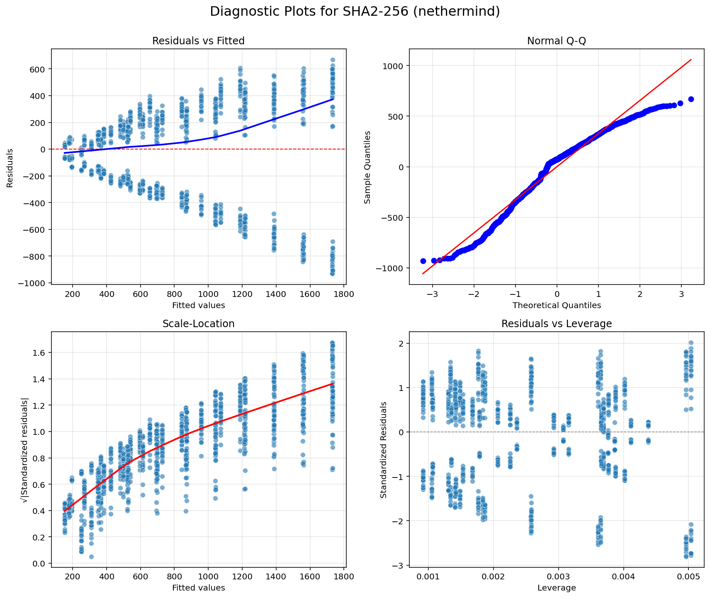


## erigon

OLS model did not run... Error: zero-size array to reduction operation maximum which has no identity

# RIPEMD-160

## geth


```python
                            OLS Regression Results                            
==============================================================================
Dep. Variable:        run_duration_ms   R-squared:                       0.705
Model:                            OLS   Adj. R-squared:                  0.705
Method:                 Least Squares   F-statistic:                     1384.
Date:                Thu, 22 Jan 2026   Prob (F-statistic):          1.24e-307
Time:                        10:36:16   Log-Likelihood:                -6316.7
No. Observations:                1160   AIC:                         1.264e+04
Df Residuals:                    1157   BIC:                         1.265e+04
Df Model:                           2                                         
Covariance Type:            nonrobust                                         
==============================================================================
                 coef    std err          t      P>|t|      [0.025      0.975]
------------------------------------------------------------------------------
const         54.0373      4.064     13.298      0.000      46.065      62.010
opcount        1.0255      0.020     51.728      0.000       0.987       1.064
size           0.1232      0.005     24.337      0.000       0.113       0.133
==============================================================================
Omnibus:                       76.533   Durbin-Watson:                   2.144
Prob(Omnibus):                  0.000   Jarque-Bera (JB):               92.718
Skew:                           0.625   Prob(JB):                     7.35e-21
Kurtosis:                       3.596   Cond. No.                     1.30e+03
==============================================================================

Notes:
[1] Standard Errors assume that the covariance matrix of the errors is correctly specified.
[2] The condition number is large, 1.3e+03. This might indicate that there are
strong multicollinearity or other numerical problems.
```

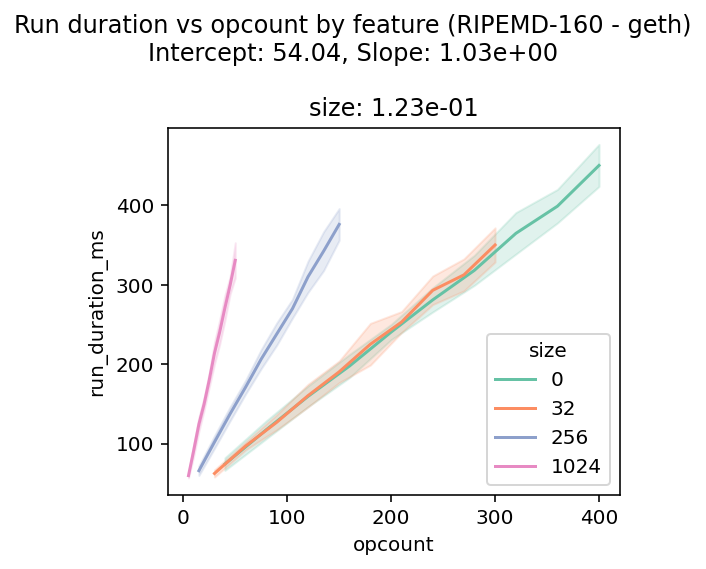

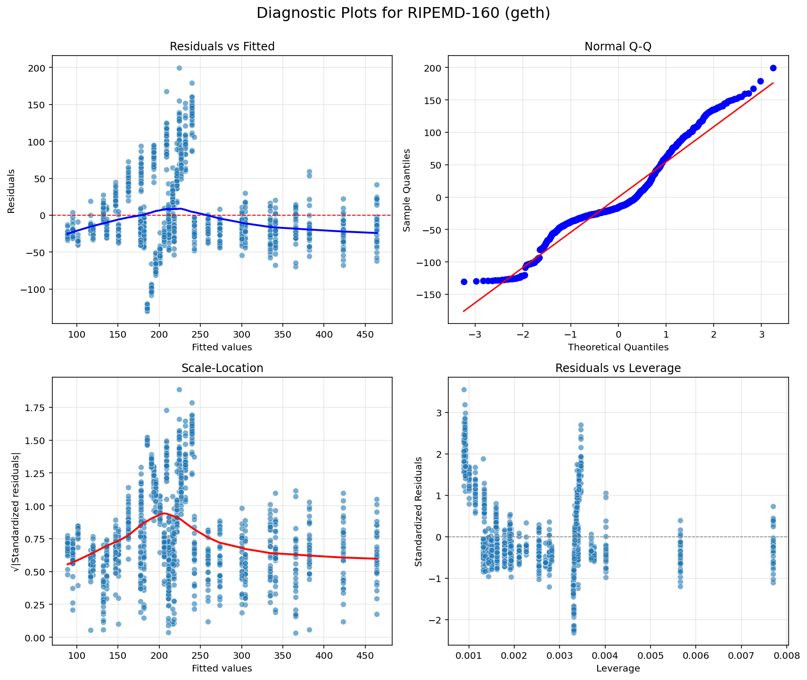


## besu


```python
                            OLS Regression Results                            
==============================================================================
Dep. Variable:        run_duration_ms   R-squared:                       0.781
Model:                            OLS   Adj. R-squared:                  0.781
Method:                 Least Squares   F-statistic:                     2063.
Date:                Thu, 22 Jan 2026   Prob (F-statistic):               0.00
Time:                        10:36:16   Log-Likelihood:                -7450.5
No. Observations:                1160   AIC:                         1.491e+04
Df Residuals:                    1157   BIC:                         1.492e+04
Df Model:                           2                                         
Covariance Type:            nonrobust                                         
==============================================================================
                 coef    std err          t      P>|t|      [0.025      0.975]
------------------------------------------------------------------------------
const         82.0953     10.799      7.602      0.000      60.907     103.284
opcount        3.2651      0.053     61.975      0.000       3.162       3.369
size           0.3351      0.013     24.920      0.000       0.309       0.362
==============================================================================
Omnibus:                       60.127   Durbin-Watson:                   2.117
Prob(Omnibus):                  0.000   Jarque-Bera (JB):               69.099
Skew:                           0.556   Prob(JB):                     9.89e-16
Kurtosis:                       3.441   Cond. No.                     1.30e+03
==============================================================================

Notes:
[1] Standard Errors assume that the covariance matrix of the errors is correctly specified.
[2] The condition number is large, 1.3e+03. This might indicate that there are
strong multicollinearity or other numerical problems.
```

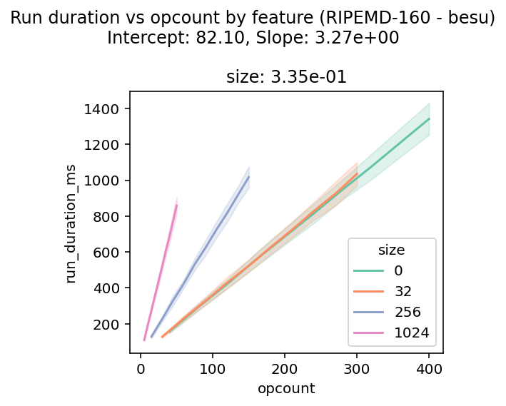

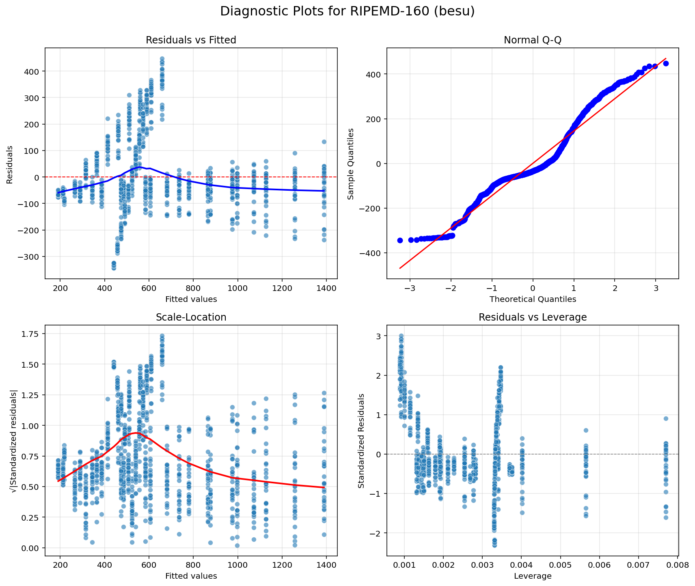


## reth


```python
                            OLS Regression Results                            
==============================================================================
Dep. Variable:        run_duration_ms   R-squared:                       0.736
Model:                            OLS   Adj. R-squared:                  0.736
Method:                 Least Squares   F-statistic:                     1002.
Date:                Thu, 22 Jan 2026   Prob (F-statistic):          2.37e-208
Time:                        10:36:16   Log-Likelihood:                -3759.0
No. Observations:                 720   AIC:                             7524.
Df Residuals:                     717   BIC:                             7538.
Df Model:                           2                                         
Covariance Type:            nonrobust                                         
==============================================================================
                 coef    std err          t      P>|t|      [0.025      0.975]
------------------------------------------------------------------------------
const         44.5566      4.123     10.806      0.000      36.461      52.652
opcount        0.8804      0.020     43.766      0.000       0.841       0.920
size           0.1006      0.005     19.598      0.000       0.091       0.111
==============================================================================
Omnibus:                       22.484   Durbin-Watson:                   2.233
Prob(Omnibus):                  0.000   Jarque-Bera (JB):               23.754
Skew:                           0.436   Prob(JB):                     6.95e-06
Kurtosis:                       3.175   Cond. No.                     1.30e+03
==============================================================================

Notes:
[1] Standard Errors assume that the covariance matrix of the errors is correctly specified.
[2] The condition number is large, 1.3e+03. This might indicate that there are
strong multicollinearity or other numerical problems.
```

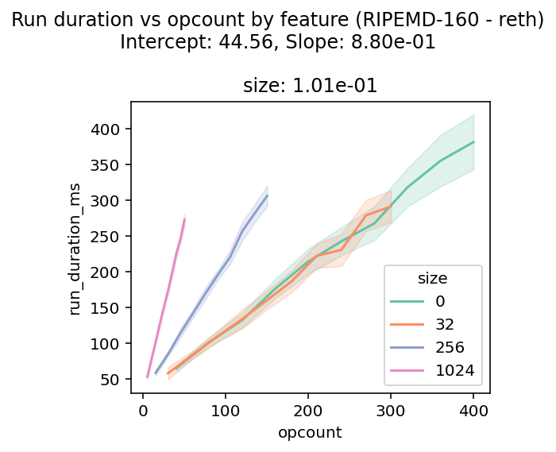

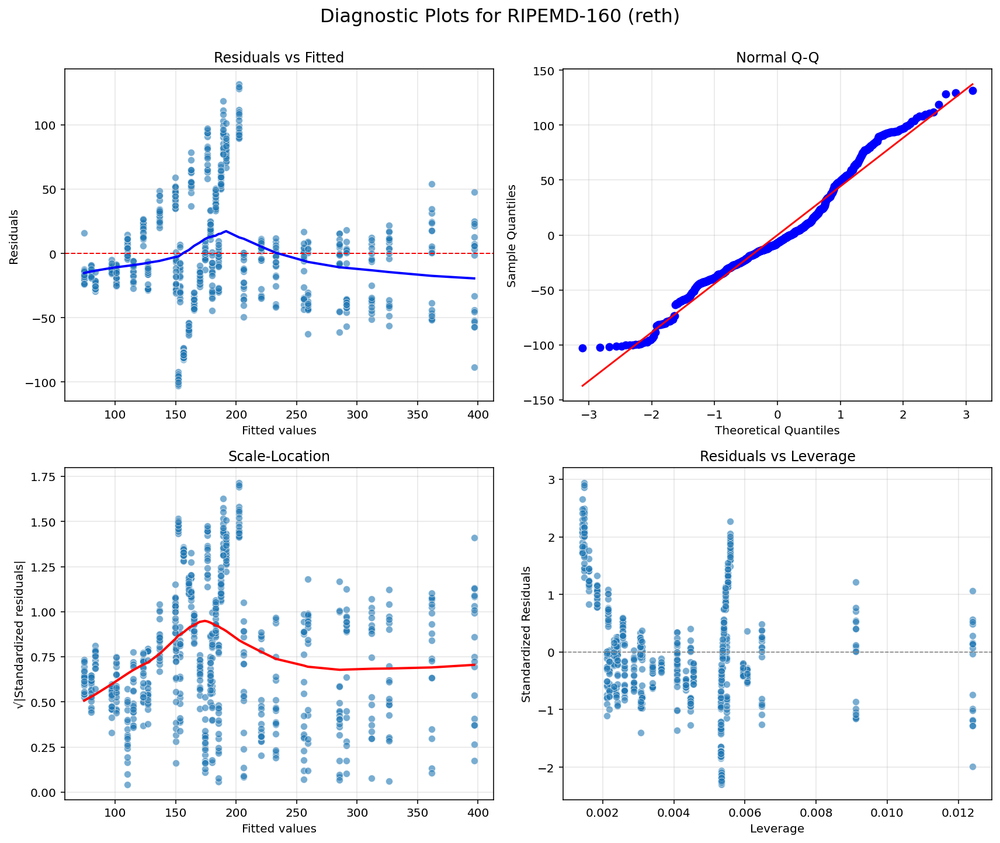


## nethermind


```python
                            OLS Regression Results                            
==============================================================================
Dep. Variable:        run_duration_ms   R-squared:                       0.357
Model:                            OLS   Adj. R-squared:                  0.356
Method:                 Least Squares   F-statistic:                     320.9
Date:                Thu, 22 Jan 2026   Prob (F-statistic):          1.33e-111
Time:                        10:36:17   Log-Likelihood:                -6999.3
No. Observations:                1160   AIC:                         1.400e+04
Df Residuals:                    1157   BIC:                         1.402e+04
Df Model:                           2                                         
Covariance Type:            nonrobust                                         
==============================================================================
                 coef    std err          t      P>|t|      [0.025      0.975]
------------------------------------------------------------------------------
const         52.0787      7.319      7.115      0.000      37.718      66.439
opcount        0.8862      0.036     24.819      0.000       0.816       0.956
size           0.1030      0.009     11.301      0.000       0.085       0.121
==============================================================================
Omnibus:                       90.193   Durbin-Watson:                   0.912
Prob(Omnibus):                  0.000   Jarque-Bera (JB):              110.031
Skew:                           0.746   Prob(JB):                     1.28e-24
Kurtosis:                       3.227   Cond. No.                     1.30e+03
==============================================================================

Notes:
[1] Standard Errors assume that the covariance matrix of the errors is correctly specified.
[2] The condition number is large, 1.3e+03. This might indicate that there are
strong multicollinearity or other numerical problems.
```

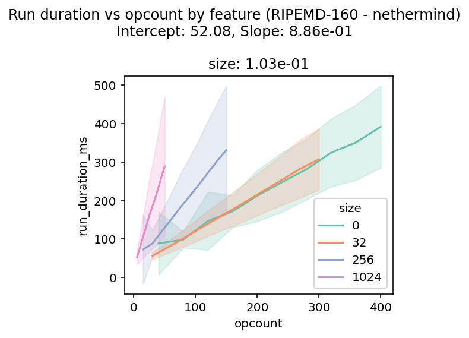

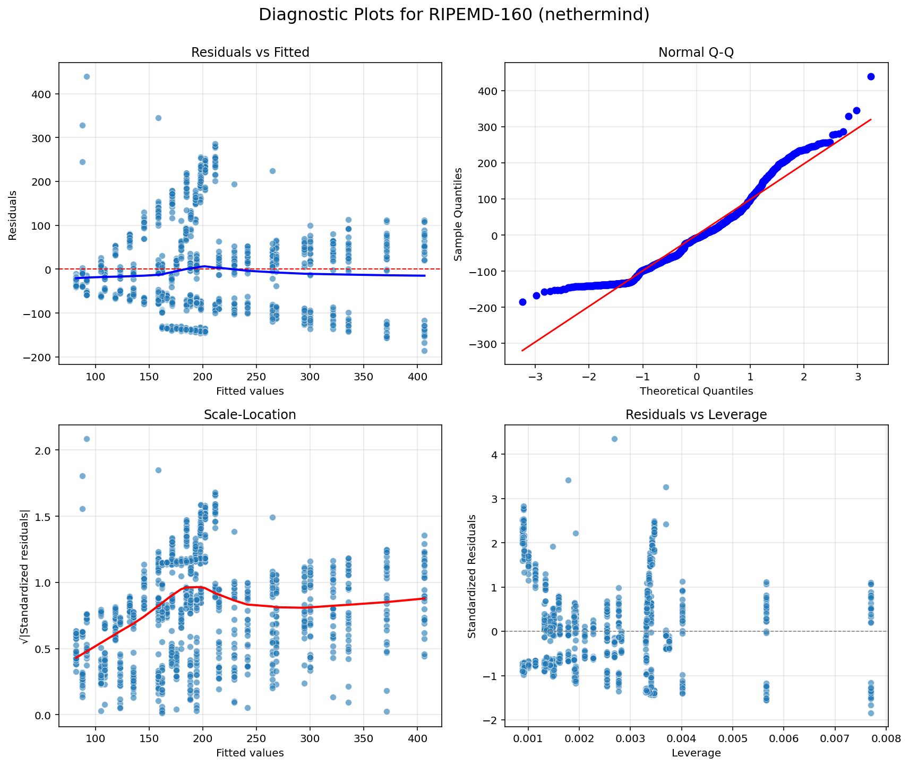


## erigon

OLS model did not run... Error: zero-size array to reduction operation maximum which has no identity

# IDENTITY

## geth


```python
                            OLS Regression Results                            
==============================================================================
Dep. Variable:        run_duration_ms   R-squared:                       0.947
Model:                            OLS   Adj. R-squared:                  0.947
Method:                 Least Squares   F-statistic:                 1.033e+04
Date:                Thu, 22 Jan 2026   Prob (F-statistic):               0.00
Time:                        10:36:17   Log-Likelihood:                -6643.4
No. Observations:                1160   AIC:                         1.329e+04
Df Residuals:                    1157   BIC:                         1.331e+04
Df Model:                           2                                         
Covariance Type:            nonrobust                                         
==============================================================================
                 coef    std err          t      P>|t|      [0.025      0.975]
------------------------------------------------------------------------------
const        -24.7638      5.552     -4.460      0.000     -35.657     -13.871
opcount        0.6405      0.004    142.414      0.000       0.632       0.649
size           0.2359      0.006     40.731      0.000       0.225       0.247
==============================================================================
Omnibus:                       20.343   Durbin-Watson:                   1.787
Prob(Omnibus):                  0.000   Jarque-Bera (JB):               29.944
Skew:                          -0.169   Prob(JB):                     3.15e-07
Kurtosis:                       3.711   Cond. No.                     2.70e+03
==============================================================================

Notes:
[1] Standard Errors assume that the covariance matrix of the errors is correctly specified.
[2] The condition number is large, 2.7e+03. This might indicate that there are
strong multicollinearity or other numerical problems.
```

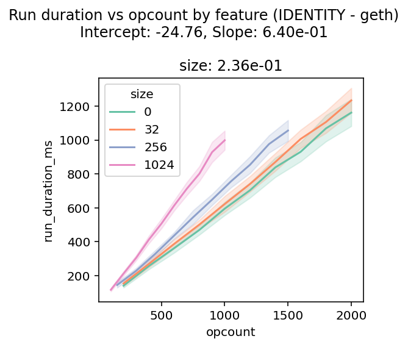

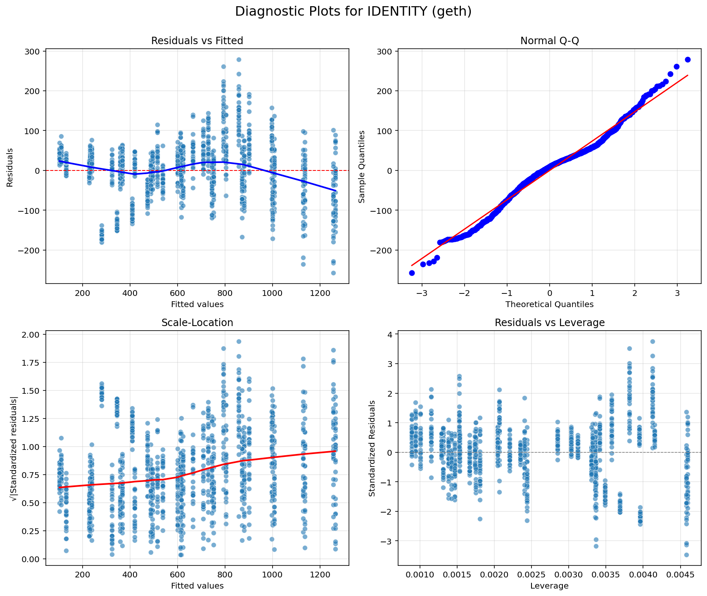


## besu


```python
                            OLS Regression Results                            
==============================================================================
Dep. Variable:        run_duration_ms   R-squared:                       0.982
Model:                            OLS   Adj. R-squared:                  0.982
Method:                 Least Squares   F-statistic:                 3.134e+04
Date:                Thu, 22 Jan 2026   Prob (F-statistic):               0.00
Time:                        10:36:17   Log-Likelihood:                -7524.1
No. Observations:                1160   AIC:                         1.505e+04
Df Residuals:                    1157   BIC:                         1.507e+04
Df Model:                           2                                         
Covariance Type:            nonrobust                                         
==============================================================================
                 coef    std err          t      P>|t|      [0.025      0.975]
------------------------------------------------------------------------------
const         19.7503     11.862      1.665      0.096      -3.524      43.025
opcount        2.2025      0.010    229.204      0.000       2.184       2.221
size           0.0311      0.012      2.515      0.012       0.007       0.055
==============================================================================
Omnibus:                      221.800   Durbin-Watson:                   0.679
Prob(Omnibus):                  0.000   Jarque-Bera (JB):              687.501
Skew:                          -0.943   Prob(JB):                    5.14e-150
Kurtosis:                       6.266   Cond. No.                     2.70e+03
==============================================================================

Notes:
[1] Standard Errors assume that the covariance matrix of the errors is correctly specified.
[2] The condition number is large, 2.7e+03. This might indicate that there are
strong multicollinearity or other numerical problems.
```

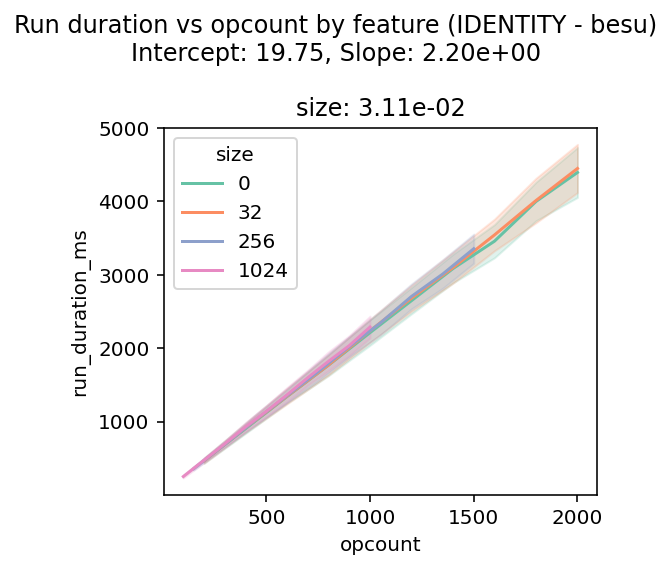

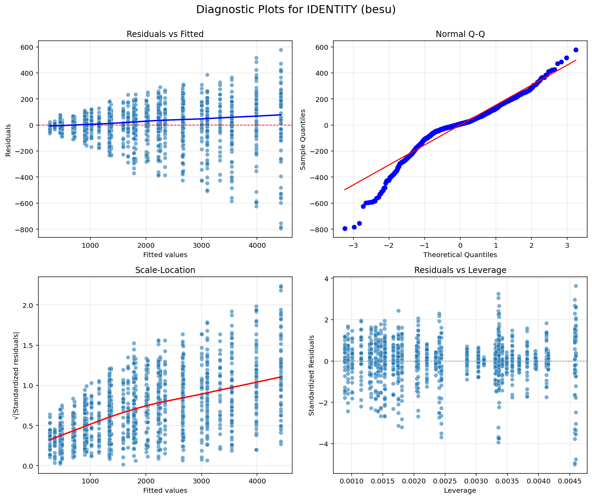


## reth


```python
                            OLS Regression Results                            
==============================================================================
Dep. Variable:        run_duration_ms   R-squared:                       0.911
Model:                            OLS   Adj. R-squared:                  0.911
Method:                 Least Squares   F-statistic:                     3659.
Date:                Thu, 22 Jan 2026   Prob (F-statistic):               0.00
Time:                        10:36:17   Log-Likelihood:                -4365.4
No. Observations:                 720   AIC:                             8737.
Df Residuals:                     717   BIC:                             8751.
Df Model:                           2                                         
Covariance Type:            nonrobust                                         
==============================================================================
                 coef    std err          t      P>|t|      [0.025      0.975]
------------------------------------------------------------------------------
const         16.3521      9.869      1.657      0.098      -3.024      35.728
opcount        0.6299      0.008     78.787      0.000       0.614       0.646
size           0.0211      0.010      2.048      0.041       0.001       0.041
==============================================================================
Omnibus:                       26.302   Durbin-Watson:                   2.001
Prob(Omnibus):                  0.000   Jarque-Bera (JB):               28.417
Skew:                          -0.485   Prob(JB):                     6.75e-07
Kurtosis:                       3.067   Cond. No.                     2.70e+03
==============================================================================

Notes:
[1] Standard Errors assume that the covariance matrix of the errors is correctly specified.
[2] The condition number is large, 2.7e+03. This might indicate that there are
strong multicollinearity or other numerical problems.
```

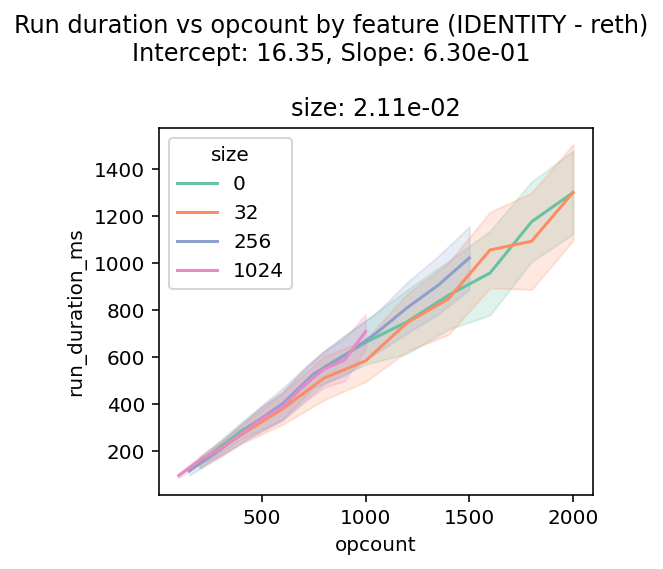

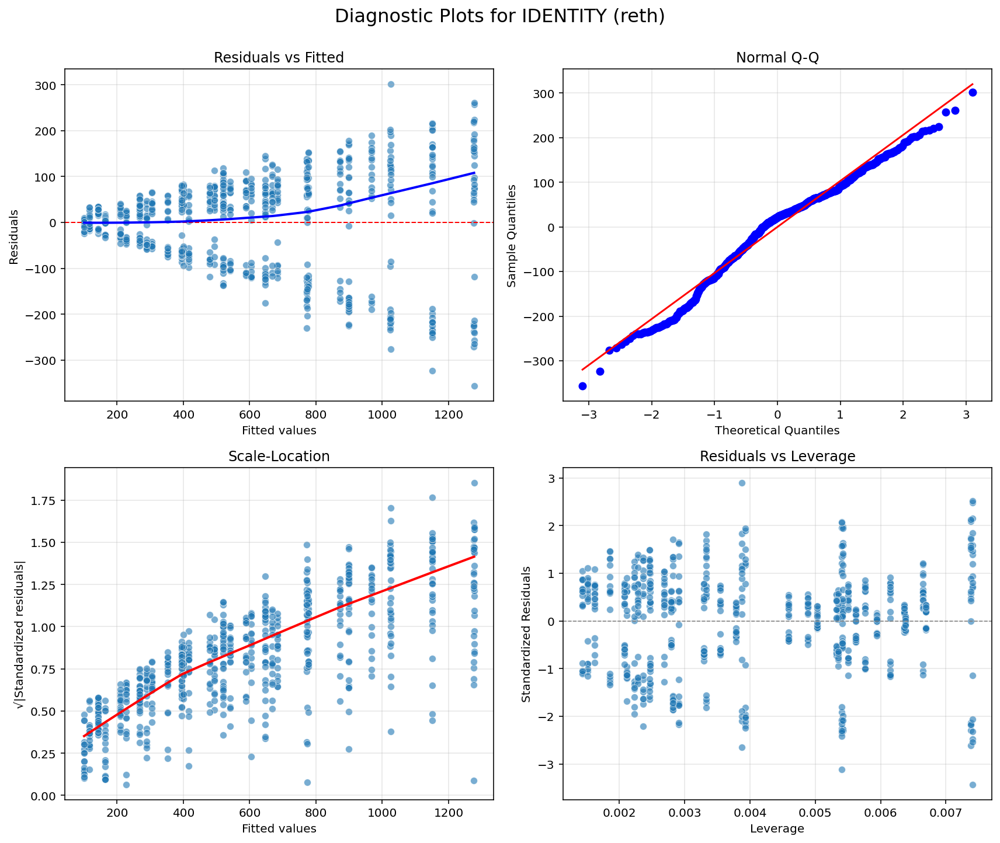


## nethermind


```python
                            OLS Regression Results                            
==============================================================================
Dep. Variable:        run_duration_ms   R-squared:                       0.915
Model:                            OLS   Adj. R-squared:                  0.915
Method:                 Least Squares   F-statistic:                     6219.
Date:                Thu, 22 Jan 2026   Prob (F-statistic):               0.00
Time:                        10:36:18   Log-Likelihood:                -6908.3
No. Observations:                1160   AIC:                         1.382e+04
Df Residuals:                    1157   BIC:                         1.384e+04
Df Model:                           2                                         
Covariance Type:            nonrobust                                         
==============================================================================
                 coef    std err          t      P>|t|      [0.025      0.975]
------------------------------------------------------------------------------
const          6.6235      6.976      0.949      0.343      -7.064      20.311
opcount        0.6042      0.006    106.914      0.000       0.593       0.615
size           0.1098      0.007     15.085      0.000       0.096       0.124
==============================================================================
Omnibus:                      471.495   Durbin-Watson:                   1.829
Prob(Omnibus):                  0.000   Jarque-Bera (JB):             2734.086
Skew:                           1.788   Prob(JB):                         0.00
Kurtosis:                       9.617   Cond. No.                     2.70e+03
==============================================================================

Notes:
[1] Standard Errors assume that the covariance matrix of the errors is correctly specified.
[2] The condition number is large, 2.7e+03. This might indicate that there are
strong multicollinearity or other numerical problems.
```

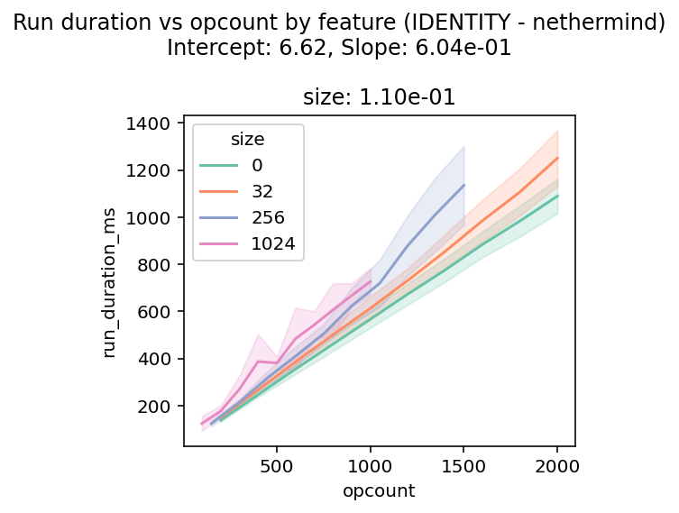

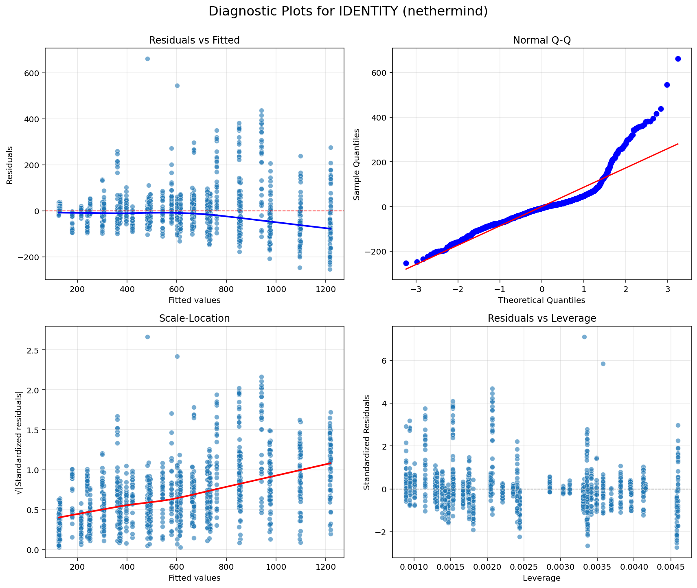


## erigon

OLS model did not run... Error: zero-size array to reduction operation maximum which has no identity

# MODEXP

## geth

OLS model did not run... Error: zero-size array to reduction operation maximum which has no identity

## besu

OLS model did not run... Error: zero-size array to reduction operation maximum which has no identity

## reth

OLS model did not run... Error: zero-size array to reduction operation maximum which has no identity

## nethermind

OLS model did not run... Error: zero-size array to reduction operation maximum which has no identity

## erigon

OLS model did not run... Error: zero-size array to reduction operation maximum which has no identity

# ECPAIRING

## geth


```python
                            OLS Regression Results                            
==============================================================================
Dep. Variable:        run_duration_ms   R-squared:                       0.145
Model:                            OLS   Adj. R-squared:                  0.144
Method:                 Least Squares   F-statistic:                     77.16
Date:                Thu, 22 Jan 2026   Prob (F-statistic):           1.13e-31
Time:                        10:36:18   Log-Likelihood:                -6817.4
No. Observations:                 910   AIC:                         1.364e+04
Df Residuals:                     907   BIC:                         1.366e+04
Df Model:                           2                                         
Covariance Type:            nonrobust                                         
==============================================================================
                 coef    std err          t      P>|t|      [0.025      0.975]
------------------------------------------------------------------------------
const        513.3349     25.102     20.450      0.000     464.071     562.599
opcount      386.3072     35.211     10.971      0.000     317.202     455.413
num_pairs     17.5835      1.867      9.416      0.000      13.918      21.249
==============================================================================
Omnibus:                      576.561   Durbin-Watson:                   1.938
Prob(Omnibus):                  0.000   Jarque-Bera (JB):            15116.520
Skew:                           2.429   Prob(JB):                         0.00
Kurtosis:                      22.367   Cond. No.                         33.1
==============================================================================

Notes:
[1] Standard Errors assume that the covariance matrix of the errors is correctly specified.
```

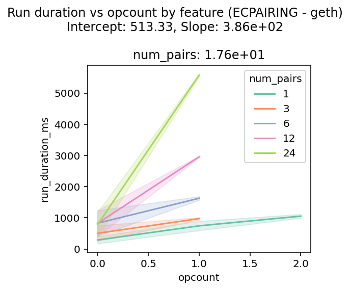

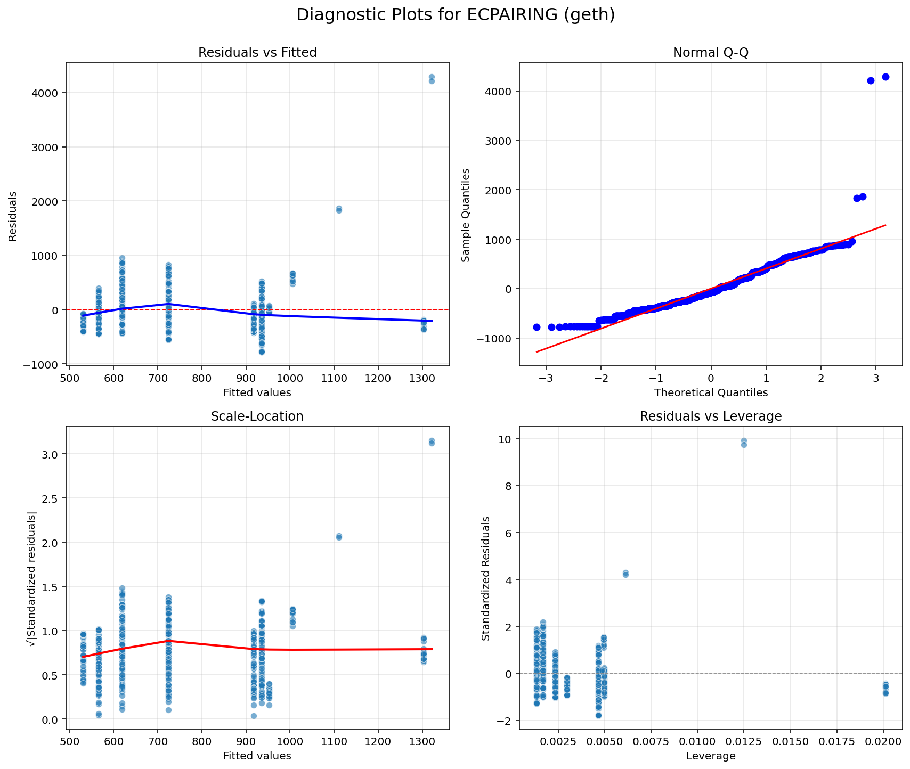


## besu


```python
                            OLS Regression Results                            
==============================================================================
Dep. Variable:        run_duration_ms   R-squared:                       0.148
Model:                            OLS   Adj. R-squared:                  0.146
Method:                 Least Squares   F-statistic:                     78.87
Date:                Thu, 22 Jan 2026   Prob (F-statistic):           2.64e-32
Time:                        10:36:18   Log-Likelihood:                -6808.9
No. Observations:                 910   AIC:                         1.362e+04
Df Residuals:                     907   BIC:                         1.364e+04
Df Model:                           2                                         
Covariance Type:            nonrobust                                         
==============================================================================
                 coef    std err          t      P>|t|      [0.025      0.975]
------------------------------------------------------------------------------
const        507.8326     24.870     20.420      0.000     459.023     556.642
opcount      388.3512     34.886     11.132      0.000     319.884     456.818
num_pairs     17.5076      1.850      9.462      0.000      13.876      21.139
==============================================================================
Omnibus:                      571.501   Durbin-Watson:                   1.934
Prob(Omnibus):                  0.000   Jarque-Bera (JB):            14755.364
Skew:                           2.403   Prob(JB):                         0.00
Kurtosis:                      22.133   Cond. No.                         33.1
==============================================================================

Notes:
[1] Standard Errors assume that the covariance matrix of the errors is correctly specified.
```

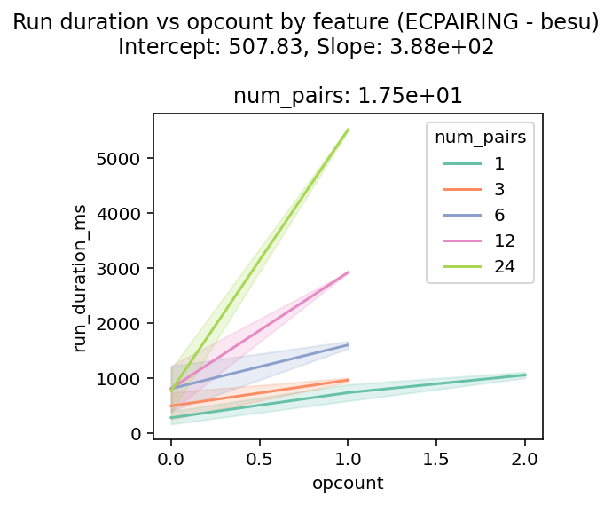


## reth


```python
                            OLS Regression Results                            
==============================================================================
Dep. Variable:        run_duration_ms   R-squared:                       0.183
Model:                            OLS   Adj. R-squared:                  0.179
Method:                 Least Squares   F-statistic:                     40.03
Date:                Thu, 22 Jan 2026   Prob (F-statistic):           2.07e-16
Time:                        10:36:19   Log-Likelihood:                -3032.4
No. Observations:                 360   AIC:                             6071.
Df Residuals:                     357   BIC:                             6082.
Df Model:                           2                                         
Covariance Type:            nonrobust                                         
==============================================================================
                 coef    std err          t      P>|t|      [0.025      0.975]
------------------------------------------------------------------------------
const        918.9130    101.682      9.037      0.000     718.941    1118.885
opcount     1062.0938    138.974      7.642      0.000     788.782    1335.405
num_pairs     52.8808      7.516      7.035      0.000      38.099      67.663
==============================================================================
Omnibus:                      291.554   Durbin-Watson:                   1.734
Prob(Omnibus):                  0.000   Jarque-Bera (JB):             7773.892
Skew:                           3.146   Prob(JB):                         0.00
Kurtosis:                      24.878   Cond. No.                         32.5
==============================================================================

Notes:
[1] Standard Errors assume that the covariance matrix of the errors is correctly specified.
```
OLS model did not run... Error: 'numpy.ndarray' object has no attribute 'iloc'

## nethermind


```python
                            OLS Regression Results                            
==============================================================================
Dep. Variable:        run_duration_ms   R-squared:                       0.109
Model:                            OLS   Adj. R-squared:                  0.107
Method:                 Least Squares   F-statistic:                     55.51
Date:                Thu, 22 Jan 2026   Prob (F-statistic):           1.81e-23
Time:                        10:36:19   Log-Likelihood:                -7522.7
No. Observations:                 910   AIC:                         1.505e+04
Df Residuals:                     907   BIC:                         1.507e+04
Df Model:                           2                                         
Covariance Type:            nonrobust                                         
==============================================================================
                 coef    std err          t      P>|t|      [0.025      0.975]
------------------------------------------------------------------------------
const       1155.1113     54.488     21.199      0.000    1048.174    1262.049
opcount      308.0425     76.433      4.030      0.000     158.036     458.049
num_pairs     42.7034      4.054     10.534      0.000      34.748      50.659
==============================================================================
Omnibus:                       32.909   Durbin-Watson:                   2.138
Prob(Omnibus):                  0.000   Jarque-Bera (JB):               31.370
Skew:                           0.408   Prob(JB):                     1.54e-07
Kurtosis:                       2.599   Cond. No.                         33.1
==============================================================================

Notes:
[1] Standard Errors assume that the covariance matrix of the errors is correctly specified.
```

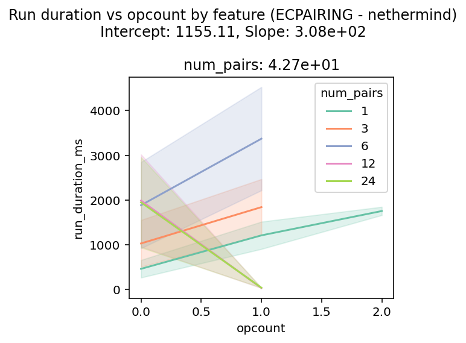

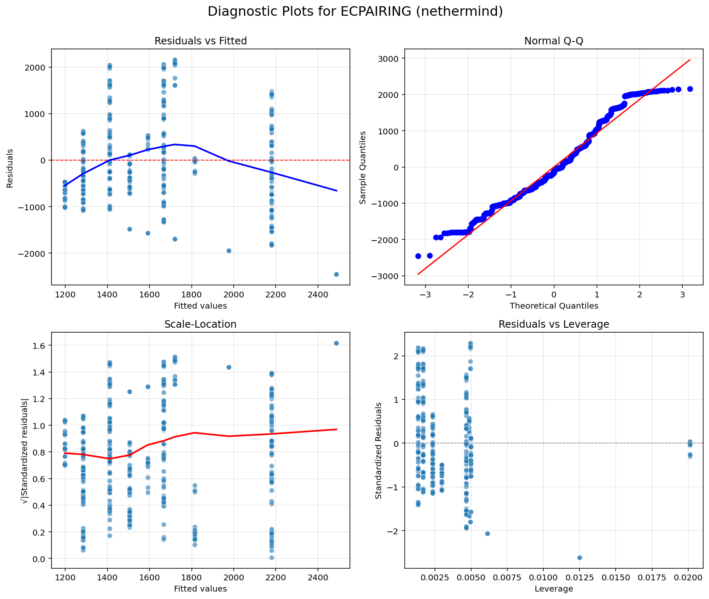


## erigon

OLS model did not run... Error: zero-size array to reduction operation maximum which has no identity

# BLAKE2F

## geth


```python
                            OLS Regression Results                            
==============================================================================
Dep. Variable:        run_duration_ms   R-squared:                       0.010
Model:                            OLS   Adj. R-squared:                  0.009
Method:                 Least Squares   F-statistic:                     9.434
Date:                Thu, 22 Jan 2026   Prob (F-statistic):            0.00219
Time:                        10:36:19   Log-Likelihood:                -8018.5
No. Observations:                 910   AIC:                         1.604e+04
Df Residuals:                     908   BIC:                         1.605e+04
Df Model:                           1                                         
Covariance Type:            nonrobust                                         
==============================================================================
                 coef    std err          t      P>|t|      [0.025      0.975]
------------------------------------------------------------------------------
const       1543.7772     87.806     17.582      0.000    1371.450    1716.104
opcount       -0.2443      0.080     -3.071      0.002      -0.400      -0.088
==============================================================================
Omnibus:                      494.571   Durbin-Watson:                   1.270
Prob(Omnibus):                  0.000   Jarque-Bera (JB):             2895.576
Skew:                           2.533   Prob(JB):                         0.00
Kurtosis:                      10.121   Cond. No.                     1.80e+03
==============================================================================

Notes:
[1] Standard Errors assume that the covariance matrix of the errors is correctly specified.
[2] The condition number is large, 1.8e+03. This might indicate that there are
strong multicollinearity or other numerical problems.
```
OLS model did not run... Error: Number of columns must be a positive integer, not 0

## besu


```python
                            OLS Regression Results                            
==============================================================================
Dep. Variable:        run_duration_ms   R-squared:                       0.153
Model:                            OLS   Adj. R-squared:                  0.152
Method:                 Least Squares   F-statistic:                     163.8
Date:                Thu, 22 Jan 2026   Prob (F-statistic):           1.36e-34
Time:                        10:36:19   Log-Likelihood:                -8355.9
No. Observations:                 910   AIC:                         1.672e+04
Df Residuals:                     908   BIC:                         1.673e+04
Df Model:                           1                                         
Covariance Type:            nonrobust                                         
==============================================================================
                 coef    std err          t      P>|t|      [0.025      0.975]
------------------------------------------------------------------------------
const       2236.4141    127.221     17.579      0.000    1986.733    2486.095
opcount        1.4749      0.115     12.797      0.000       1.249       1.701
==============================================================================
Omnibus:                      487.991   Durbin-Watson:                   1.262
Prob(Omnibus):                  0.000   Jarque-Bera (JB):             2787.713
Skew:                           2.502   Prob(JB):                         0.00
Kurtosis:                       9.963   Cond. No.                     1.80e+03
==============================================================================

Notes:
[1] Standard Errors assume that the covariance matrix of the errors is correctly specified.
[2] The condition number is large, 1.8e+03. This might indicate that there are
strong multicollinearity or other numerical problems.
```
OLS model did not run... Error: Number of columns must be a positive integer, not 0

## reth


```python
                            OLS Regression Results                            
==============================================================================
Dep. Variable:        run_duration_ms   R-squared:                       0.090
Model:                            OLS   Adj. R-squared:                  0.088
Method:                 Least Squares   F-statistic:                     46.07
Date:                Thu, 22 Jan 2026   Prob (F-statistic):           3.46e-11
Time:                        10:36:19   Log-Likelihood:                -4466.7
No. Observations:                 470   AIC:                             8937.
Df Residuals:                     468   BIC:                             8946.
Df Model:                           1                                         
Covariance Type:            nonrobust                                         
==============================================================================
                 coef    std err          t      P>|t|      [0.025      0.975]
------------------------------------------------------------------------------
const       3253.0243    206.257     15.772      0.000    2847.719    3658.329
opcount       -1.4616      0.215     -6.788      0.000      -1.885      -1.038
==============================================================================
Omnibus:                      124.919   Durbin-Watson:                   1.354
Prob(Omnibus):                  0.000   Jarque-Bera (JB):              240.744
Skew:                           1.495   Prob(JB):                     5.29e-53
Kurtosis:                       4.831   Cond. No.                     1.32e+03
==============================================================================

Notes:
[1] Standard Errors assume that the covariance matrix of the errors is correctly specified.
[2] The condition number is large, 1.32e+03. This might indicate that there are
strong multicollinearity or other numerical problems.
```
OLS model did not run... Error: Number of columns must be a positive integer, not 0

## nethermind


```python
                            OLS Regression Results                            
==============================================================================
Dep. Variable:        run_duration_ms   R-squared:                       0.953
Model:                            OLS   Adj. R-squared:                  0.953
Method:                 Least Squares   F-statistic:                 1.854e+04
Date:                Thu, 22 Jan 2026   Prob (F-statistic):               0.00
Time:                        10:36:19   Log-Likelihood:                -5685.2
No. Observations:                 910   AIC:                         1.137e+04
Df Residuals:                     908   BIC:                         1.138e+04
Df Model:                           1                                         
Covariance Type:            nonrobust                                         
==============================================================================
                 coef    std err          t      P>|t|      [0.025      0.975]
------------------------------------------------------------------------------
const          6.6379      6.760      0.982      0.326      -6.630      19.906
opcount        0.8339      0.006    136.155      0.000       0.822       0.846
==============================================================================
Omnibus:                      120.422   Durbin-Watson:                   1.680
Prob(Omnibus):                  0.000   Jarque-Bera (JB):              263.952
Skew:                           0.756   Prob(JB):                     4.83e-58
Kurtosis:                       5.162   Cond. No.                     1.80e+03
==============================================================================

Notes:
[1] Standard Errors assume that the covariance matrix of the errors is correctly specified.
[2] The condition number is large, 1.8e+03. This might indicate that there are
strong multicollinearity or other numerical problems.
```
OLS model did not run... Error: Number of columns must be a positive integer, not 0

## erigon

OLS model did not run... Error: zero-size array to reduction operation maximum which has no identity

# BLS12_G1MSM

## geth


```python
                            OLS Regression Results                            
==============================================================================
Dep. Variable:        run_duration_ms   R-squared:                       0.669
Model:                            OLS   Adj. R-squared:                  0.668
Method:                 Least Squares   F-statistic:                     733.9
Date:                Thu, 22 Jan 2026   Prob (F-statistic):          5.73e-175
Time:                        10:36:19   Log-Likelihood:                -5779.8
No. Observations:                 728   AIC:                         1.157e+04
Df Residuals:                     725   BIC:                         1.158e+04
Df Model:                           2                                         
Covariance Type:            nonrobust                                         
==============================================================================
                 coef    std err          t      P>|t|      [0.025      0.975]
------------------------------------------------------------------------------
const        939.9307     49.212     19.100      0.000     843.316    1036.546
opcount      188.2671      5.471     34.412      0.000     177.526     199.008
k              2.6039      0.604      4.314      0.000       1.419       3.789
==============================================================================
Omnibus:                      496.898   Durbin-Watson:                   1.652
Prob(Omnibus):                  0.000   Jarque-Bera (JB):            14764.521
Skew:                           2.617   Prob(JB):                         0.00
Kurtosis:                      24.433   Cond. No.                         141.
==============================================================================

Notes:
[1] Standard Errors assume that the covariance matrix of the errors is correctly specified.
```

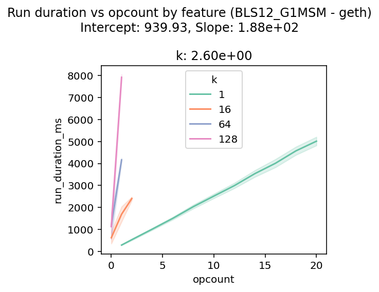

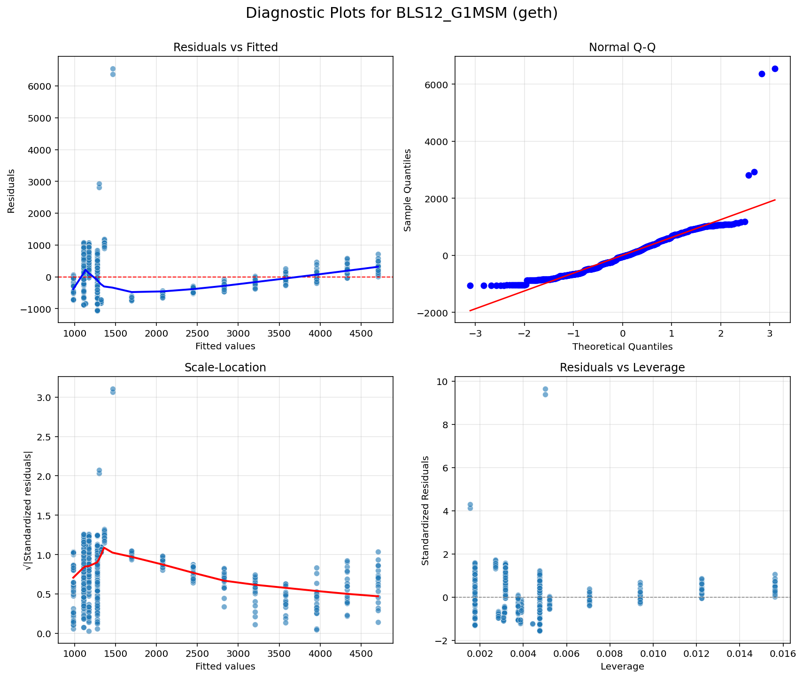


## besu


```python
                            OLS Regression Results                            
==============================================================================
Dep. Variable:        run_duration_ms   R-squared:                       0.009
Model:                            OLS   Adj. R-squared:                  0.007
Method:                 Least Squares   F-statistic:                     3.387
Date:                Thu, 22 Jan 2026   Prob (F-statistic):             0.0343
Time:                        10:36:20   Log-Likelihood:                -5743.9
No. Observations:                 728   AIC:                         1.149e+04
Df Residuals:                     725   BIC:                         1.151e+04
Df Model:                           2                                         
Covariance Type:            nonrobust                                         
==============================================================================
                 coef    std err          t      P>|t|      [0.025      0.975]
------------------------------------------------------------------------------
const        953.5610     46.845     20.355      0.000     861.592    1045.530
opcount       -3.5816      5.208     -0.688      0.492     -13.806       6.643
k              1.0034      0.575      1.746      0.081      -0.125       2.132
==============================================================================
Omnibus:                      483.229   Durbin-Watson:                   1.657
Prob(Omnibus):                  0.000   Jarque-Bera (JB):            12505.214
Skew:                           2.559   Prob(JB):                         0.00
Kurtosis:                      22.648   Cond. No.                         141.
==============================================================================

Notes:
[1] Standard Errors assume that the covariance matrix of the errors is correctly specified.
```

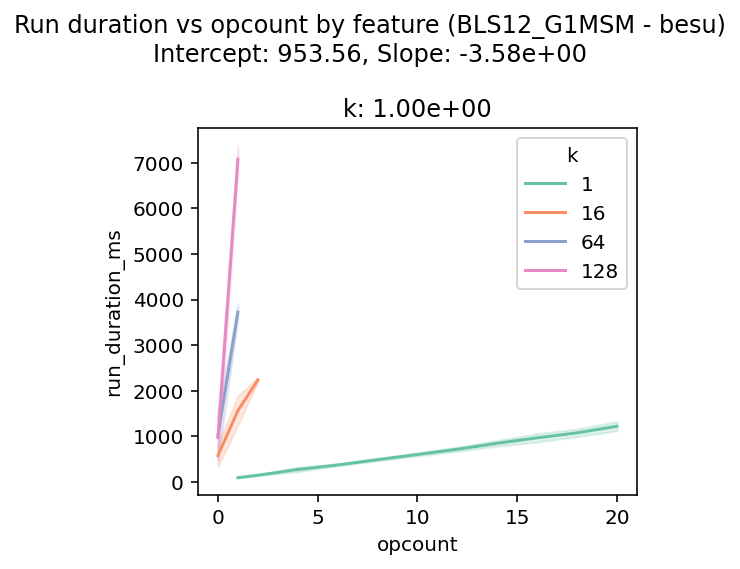

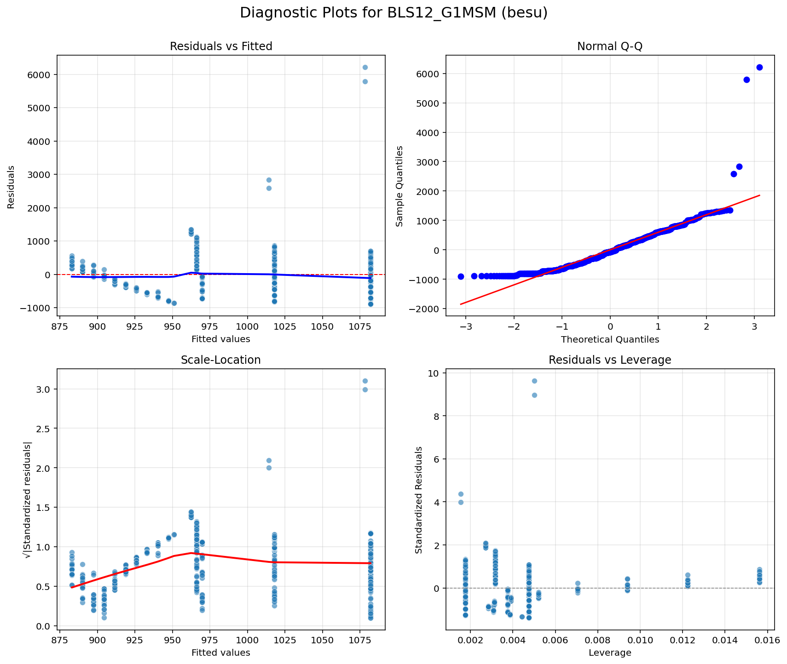


## reth


```python
                            OLS Regression Results                            
==============================================================================
Dep. Variable:        run_duration_ms   R-squared:                       0.341
Model:                            OLS   Adj. R-squared:                  0.336
Method:                 Least Squares   F-statistic:                     73.60
Date:                Thu, 22 Jan 2026   Prob (F-statistic):           1.70e-26
Time:                        10:36:20   Log-Likelihood:                -2385.0
No. Observations:                 288   AIC:                             4776.
Df Residuals:                     285   BIC:                             4787.
Df Model:                           2                                         
Covariance Type:            nonrobust                                         
==============================================================================
                 coef    std err          t      P>|t|      [0.025      0.975]
------------------------------------------------------------------------------
const       1295.8430    109.993     11.781      0.000    1079.341    1512.345
opcount      130.6372     12.331     10.594      0.000     106.366     154.908
k              0.8654      1.350      0.641      0.522      -1.793       3.523
==============================================================================
Omnibus:                      210.170   Durbin-Watson:                   1.575
Prob(Omnibus):                  0.000   Jarque-Bera (JB):             3408.705
Skew:                           2.764   Prob(JB):                         0.00
Kurtosis:                      18.921   Cond. No.                         140.
==============================================================================

Notes:
[1] Standard Errors assume that the covariance matrix of the errors is correctly specified.
```

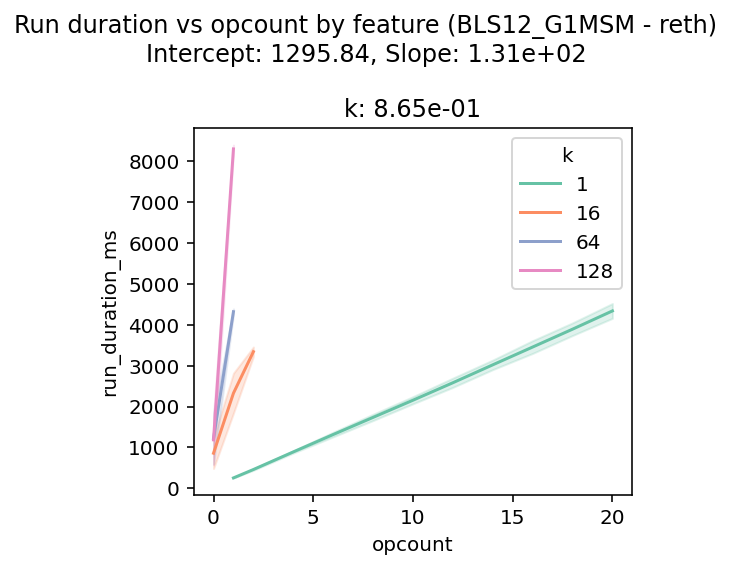

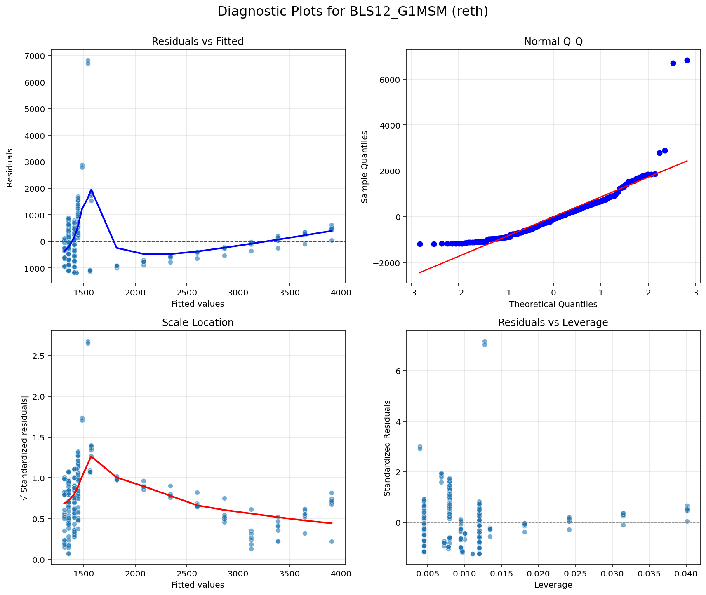


## nethermind


```python
                            OLS Regression Results                            
==============================================================================
Dep. Variable:        run_duration_ms   R-squared:                       0.703
Model:                            OLS   Adj. R-squared:                  0.702
Method:                 Least Squares   F-statistic:                     857.1
Date:                Thu, 22 Jan 2026   Prob (F-statistic):          9.96e-192
Time:                        10:36:20   Log-Likelihood:                -5603.5
No. Observations:                 728   AIC:                         1.121e+04
Df Residuals:                     725   BIC:                         1.123e+04
Df Model:                           2                                         
Covariance Type:            nonrobust                                         
==============================================================================
                 coef    std err          t      P>|t|      [0.025      0.975]
------------------------------------------------------------------------------
const       1111.6910     38.627     28.780      0.000    1035.857    1187.526
opcount      131.0547      4.294     30.519      0.000     122.624     139.485
k             -3.3966      0.474     -7.169      0.000      -4.327      -2.466
==============================================================================
Omnibus:                       23.070   Durbin-Watson:                   1.713
Prob(Omnibus):                  0.000   Jarque-Bera (JB):               19.592
Skew:                           0.330   Prob(JB):                     5.57e-05
Kurtosis:                       2.541   Cond. No.                         141.
==============================================================================

Notes:
[1] Standard Errors assume that the covariance matrix of the errors is correctly specified.
```

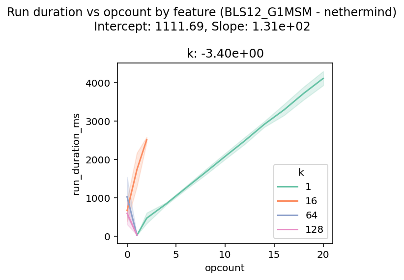

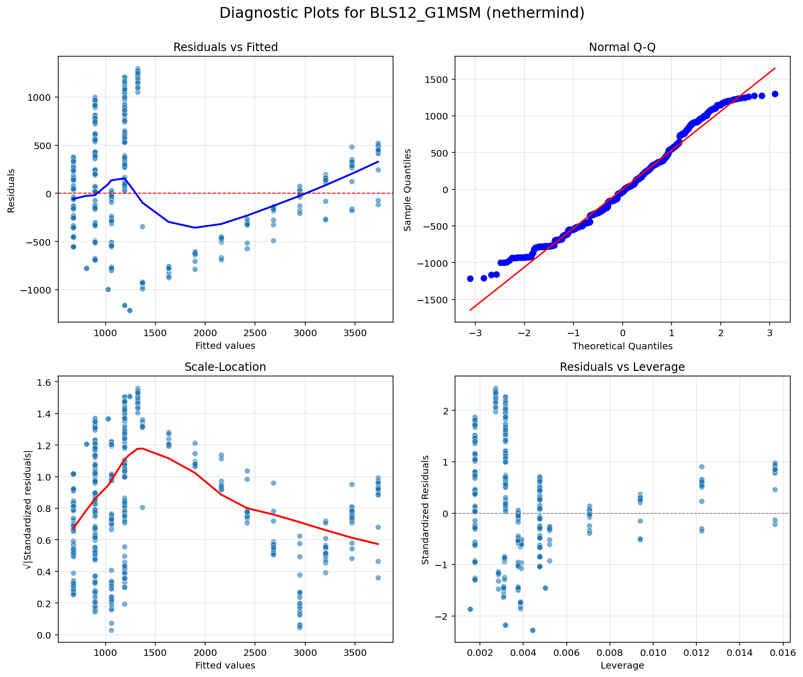


## erigon

OLS model did not run... Error: zero-size array to reduction operation maximum which has no identity

# BLS12_G2MSM

## geth


```python
                            OLS Regression Results                            
==============================================================================
Dep. Variable:        run_duration_ms   R-squared:                       0.757
Model:                            OLS   Adj. R-squared:                  0.757
Method:                 Least Squares   F-statistic:                     1131.
Date:                Thu, 22 Jan 2026   Prob (F-statistic):          1.19e-223
Time:                        10:36:21   Log-Likelihood:                -5717.6
No. Observations:                 728   AIC:                         1.144e+04
Df Residuals:                     725   BIC:                         1.145e+04
Df Model:                           2                                         
Covariance Type:            nonrobust                                         
==============================================================================
                 coef    std err          t      P>|t|      [0.025      0.975]
------------------------------------------------------------------------------
const        786.4391     44.032     17.861      0.000     699.994     872.884
opcount      359.5082      9.801     36.679      0.000     340.266     378.751
k             -3.8085      0.546     -6.979      0.000      -4.880      -2.737
==============================================================================
Omnibus:                     1124.817   Durbin-Watson:                   1.557
Prob(Omnibus):                  0.000   Jarque-Bera (JB):           431066.142
Skew:                           8.895   Prob(JB):                         0.00
Kurtosis:                     120.875   Cond. No.                         138.
==============================================================================

Notes:
[1] Standard Errors assume that the covariance matrix of the errors is correctly specified.
```

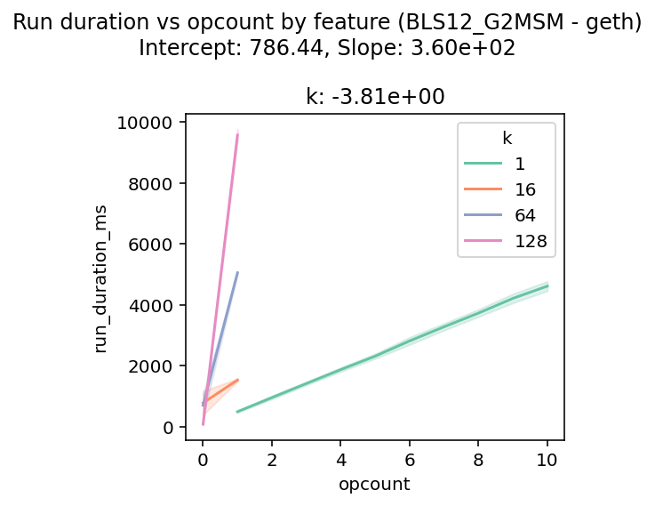

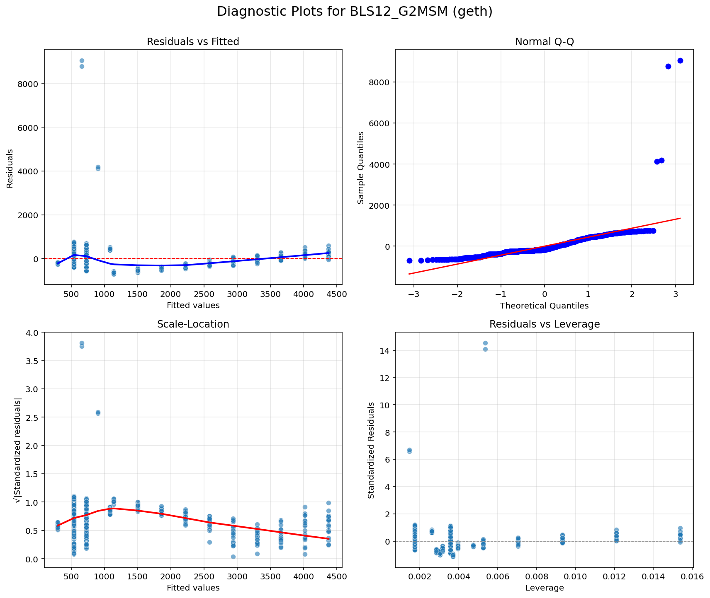


## besu


```python
                            OLS Regression Results                            
==============================================================================
Dep. Variable:        run_duration_ms   R-squared:                       0.072
Model:                            OLS   Adj. R-squared:                  0.070
Method:                 Least Squares   F-statistic:                     28.19
Date:                Thu, 22 Jan 2026   Prob (F-statistic):           1.62e-12
Time:                        10:36:21   Log-Likelihood:                -5723.9
No. Observations:                 728   AIC:                         1.145e+04
Df Residuals:                     725   BIC:                         1.147e+04
Df Model:                           2                                         
Covariance Type:            nonrobust                                         
==============================================================================
                 coef    std err          t      P>|t|      [0.025      0.975]
------------------------------------------------------------------------------
const        803.8397     44.412     18.100      0.000     716.648     891.032
opcount      -29.9040      9.886     -3.025      0.003     -49.313     -10.495
k             -4.0990      0.550     -7.447      0.000      -5.180      -3.018
==============================================================================
Omnibus:                     1101.749   Durbin-Watson:                   1.538
Prob(Omnibus):                  0.000   Jarque-Bera (JB):           381303.162
Skew:                           8.570   Prob(JB):                         0.00
Kurtosis:                     113.800   Cond. No.                         138.
==============================================================================

Notes:
[1] Standard Errors assume that the covariance matrix of the errors is correctly specified.
```

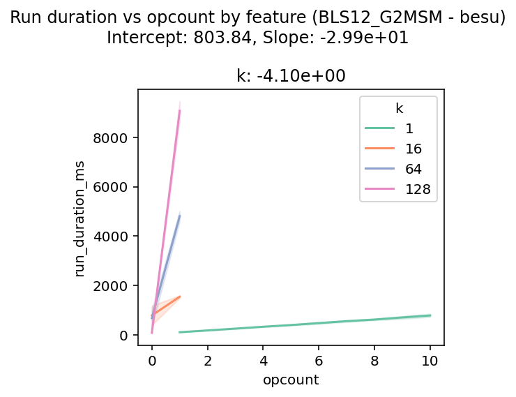

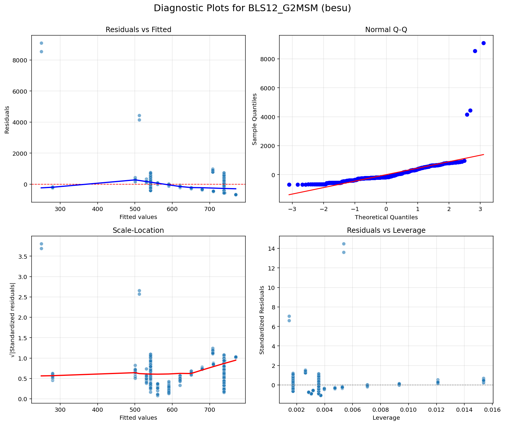


## reth


```python
                            OLS Regression Results                            
==============================================================================
Dep. Variable:        run_duration_ms   R-squared:                       0.451
Model:                            OLS   Adj. R-squared:                  0.447
Method:                 Least Squares   F-statistic:                     117.1
Date:                Thu, 22 Jan 2026   Prob (F-statistic):           7.67e-38
Time:                        10:36:21   Log-Likelihood:                -2400.4
No. Observations:                 288   AIC:                             4807.
Df Residuals:                     285   BIC:                             4818.
Df Model:                           2                                         
Covariance Type:            nonrobust                                         
==============================================================================
                 coef    std err          t      P>|t|      [0.025      0.975]
------------------------------------------------------------------------------
const       1079.5431    113.325      9.526      0.000     856.483    1302.603
opcount      280.4022     25.421     11.030      0.000     230.365     330.439
k             -4.8571      1.403     -3.461      0.001      -7.620      -2.095
==============================================================================
Omnibus:                      392.897   Durbin-Watson:                   1.496
Prob(Omnibus):                  0.000   Jarque-Bera (JB):            38228.442
Skew:                           6.447   Prob(JB):                         0.00
Kurtosis:                      57.950   Cond. No.                         138.
==============================================================================

Notes:
[1] Standard Errors assume that the covariance matrix of the errors is correctly specified.
```

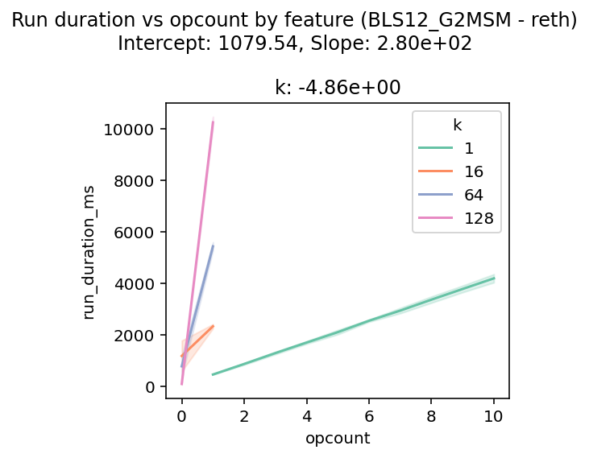

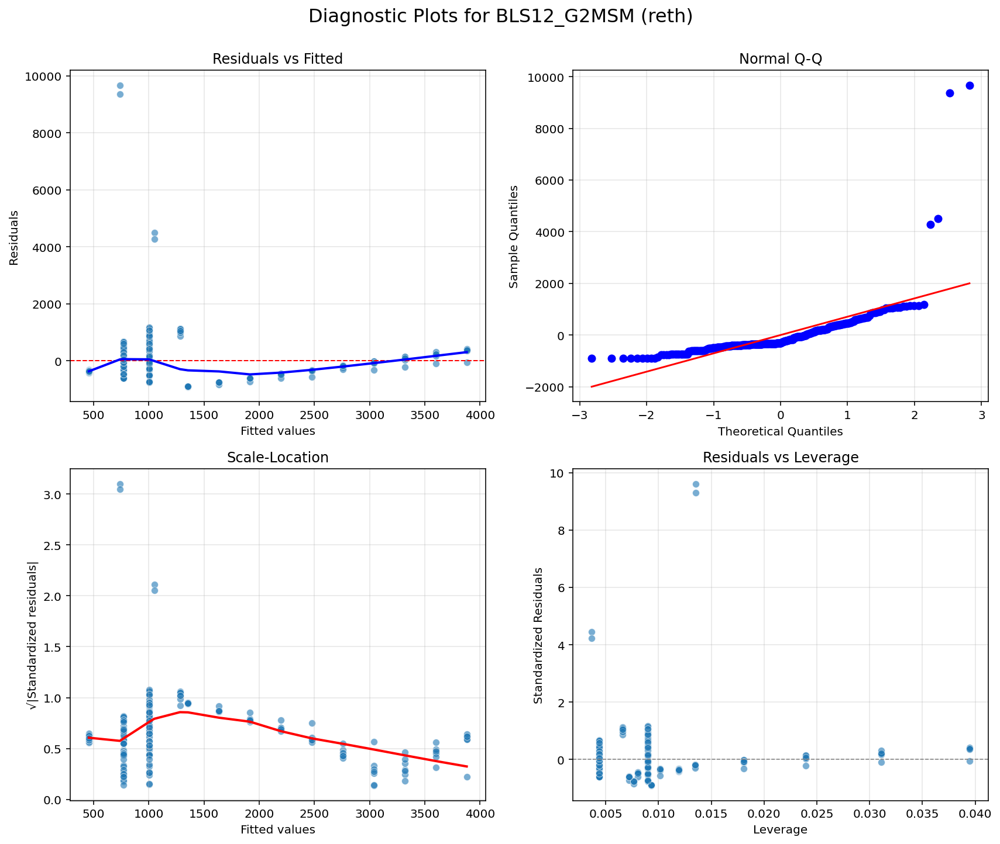


## nethermind


```python
                            OLS Regression Results                            
==============================================================================
Dep. Variable:        run_duration_ms   R-squared:                       0.786
Model:                            OLS   Adj. R-squared:                  0.786
Method:                 Least Squares   F-statistic:                     1335.
Date:                Thu, 22 Jan 2026   Prob (F-statistic):          8.16e-244
Time:                        10:36:22   Log-Likelihood:                -5532.5
No. Observations:                 728   AIC:                         1.107e+04
Df Residuals:                     725   BIC:                         1.108e+04
Df Model:                           2                                         
Covariance Type:            nonrobust                                         
==============================================================================
                 coef    std err          t      P>|t|      [0.025      0.975]
------------------------------------------------------------------------------
const       1147.0989     34.147     33.593      0.000    1080.060    1214.138
opcount      240.8426      7.601     31.685      0.000     225.920     255.765
k             -7.8651      0.423    -18.585      0.000      -8.696      -7.034
==============================================================================
Omnibus:                        9.228   Durbin-Watson:                   1.905
Prob(Omnibus):                  0.010   Jarque-Bera (JB):                9.222
Skew:                           0.272   Prob(JB):                      0.00994
Kurtosis:                       3.094   Cond. No.                         138.
==============================================================================

Notes:
[1] Standard Errors assume that the covariance matrix of the errors is correctly specified.
```

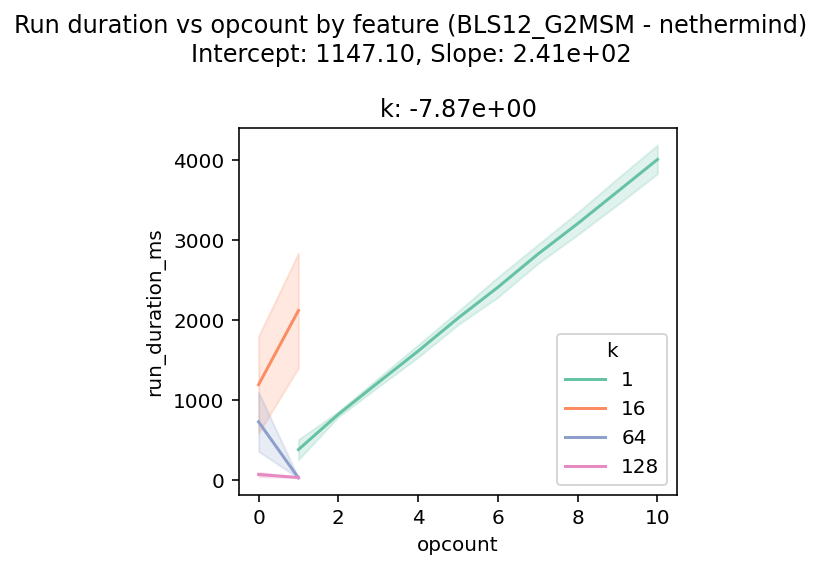

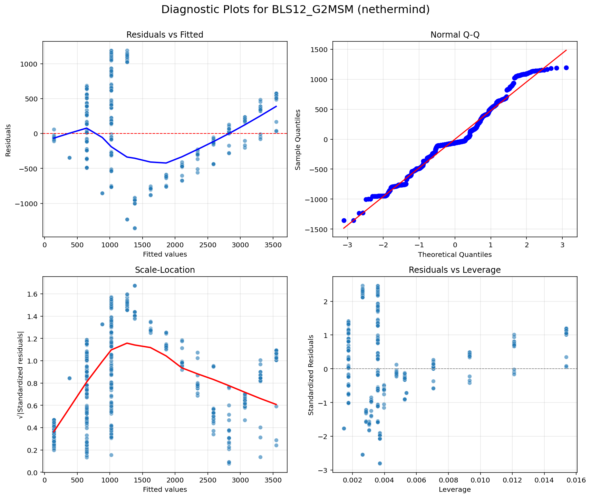


## erigon

OLS model did not run... Error: zero-size array to reduction operation maximum which has no identity

# BLS12_PAIRING_CHECK

## geth


```python
                            OLS Regression Results                            
==============================================================================
Dep. Variable:        run_duration_ms   R-squared:                       0.320
Model:                            OLS   Adj. R-squared:                  0.318
Method:                 Least Squares   F-statistic:                     196.5
Date:                Thu, 22 Jan 2026   Prob (F-statistic):           1.15e-70
Time:                        10:36:22   Log-Likelihood:                -6729.2
No. Observations:                 838   AIC:                         1.346e+04
Df Residuals:                     835   BIC:                         1.348e+04
Df Model:                           2                                         
Covariance Type:            nonrobust                                         
==============================================================================
                 coef    std err          t      P>|t|      [0.025      0.975]
------------------------------------------------------------------------------
const       1056.5525     48.899     21.607      0.000     960.574    1152.531
opcount      729.6925     37.563     19.426      0.000     655.963     803.422
num_pairs     16.1486      3.443      4.690      0.000       9.390      22.907
==============================================================================
Omnibus:                      484.797   Durbin-Watson:                   2.017
Prob(Omnibus):                  0.000   Jarque-Bera (JB):            10900.434
Skew:                           2.163   Prob(JB):                         0.00
Kurtosis:                      20.131   Cond. No.                         27.8
==============================================================================

Notes:
[1] Standard Errors assume that the covariance matrix of the errors is correctly specified.
```

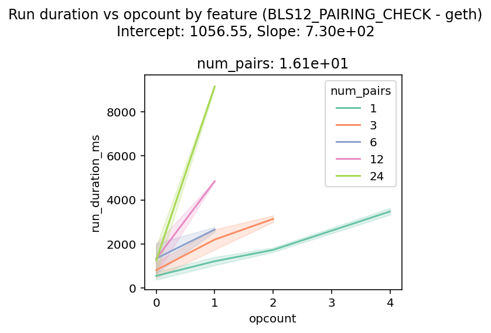

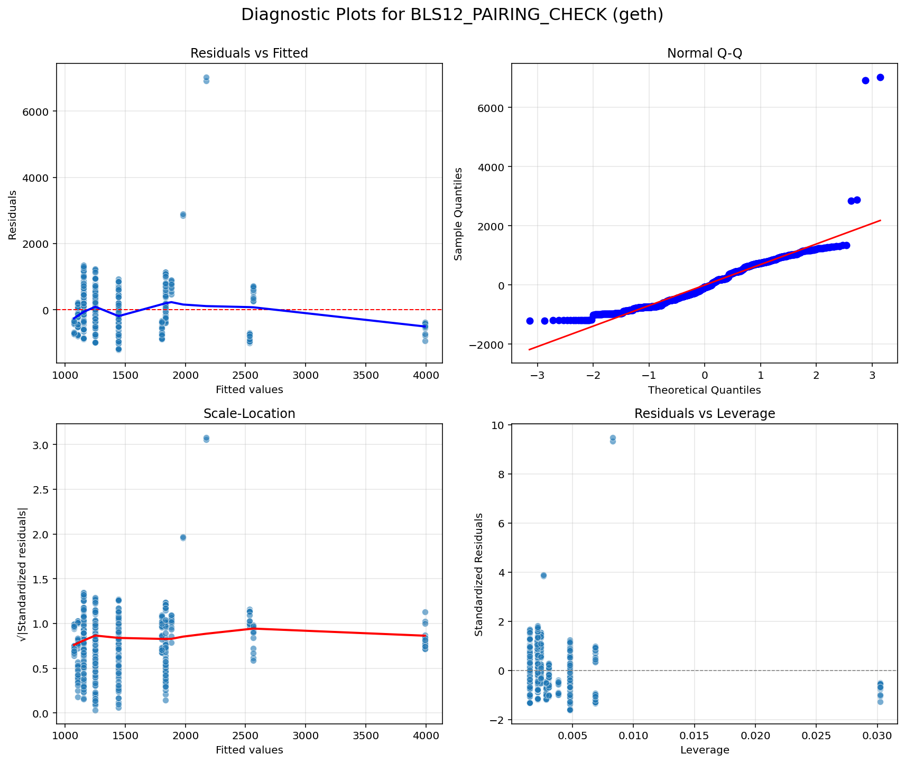


## besu


```python
                            OLS Regression Results                            
==============================================================================
Dep. Variable:        run_duration_ms   R-squared:                       0.332
Model:                            OLS   Adj. R-squared:                  0.331
Method:                 Least Squares   F-statistic:                     207.9
Date:                Thu, 22 Jan 2026   Prob (F-statistic):           5.35e-74
Time:                        10:36:22   Log-Likelihood:                -6726.2
No. Observations:                 838   AIC:                         1.346e+04
Df Residuals:                     835   BIC:                         1.347e+04
Df Model:                           2                                         
Covariance Type:            nonrobust                                         
==============================================================================
                 coef    std err          t      P>|t|      [0.025      0.975]
------------------------------------------------------------------------------
const       1053.6944     48.723     21.626      0.000     958.061    1149.328
opcount      745.2577     37.428     19.912      0.000     671.793     818.722
num_pairs     15.4363      3.431      4.499      0.000       8.702      22.170
==============================================================================
Omnibus:                      499.982   Durbin-Watson:                   2.006
Prob(Omnibus):                  0.000   Jarque-Bera (JB):            12032.013
Skew:                           2.238   Prob(JB):                         0.00
Kurtosis:                      21.016   Cond. No.                         27.8
==============================================================================

Notes:
[1] Standard Errors assume that the covariance matrix of the errors is correctly specified.
```

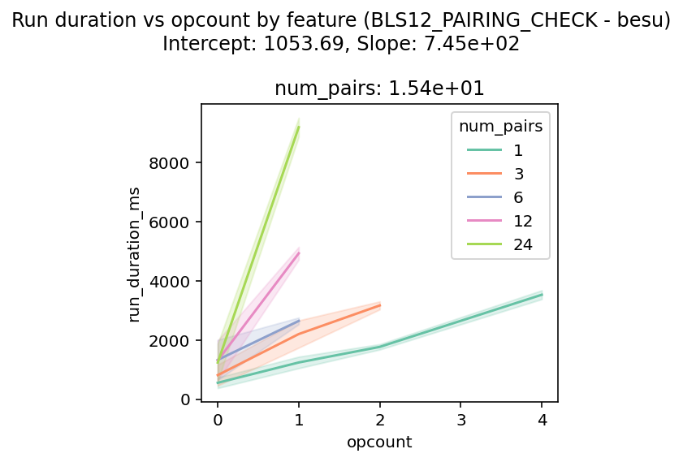

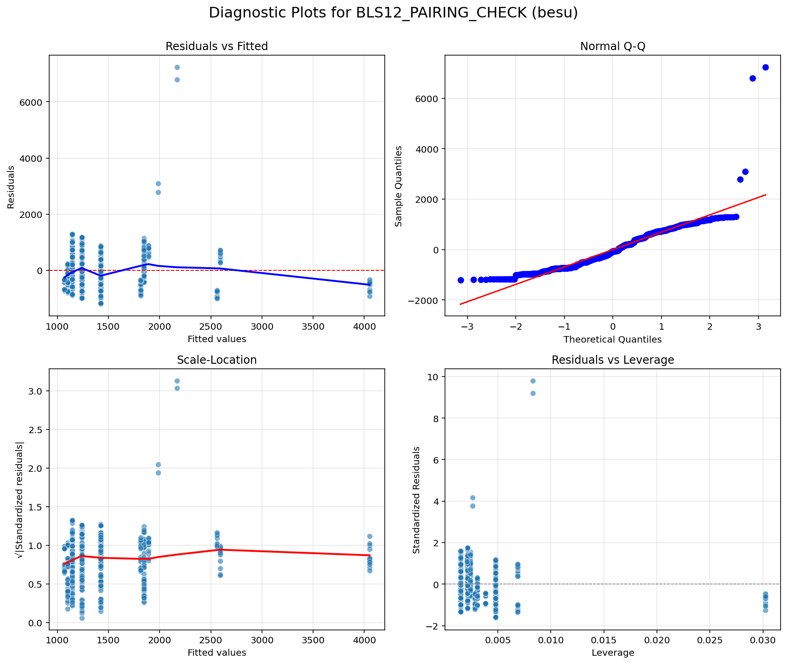


## reth


```python
                            OLS Regression Results                            
==============================================================================
Dep. Variable:        run_duration_ms   R-squared:                       0.228
Model:                            OLS   Adj. R-squared:                  0.223
Method:                 Least Squares   F-statistic:                     48.63
Date:                Thu, 22 Jan 2026   Prob (F-statistic):           3.14e-19
Time:                        10:36:22   Log-Likelihood:                -2777.1
No. Observations:                 332   AIC:                             5560.
Df Residuals:                     329   BIC:                             5572.
Df Model:                           2                                         
Covariance Type:            nonrobust                                         
==============================================================================
                 coef    std err          t      P>|t|      [0.025      0.975]
------------------------------------------------------------------------------
const       1076.2182    109.050      9.869      0.000     861.695    1290.741
opcount      823.7915     83.613      9.852      0.000     659.308     988.276
num_pairs     34.6935      7.643      4.539      0.000      19.658      49.729
==============================================================================
Omnibus:                      267.392   Durbin-Watson:                   2.010
Prob(Omnibus):                  0.000   Jarque-Bera (JB):             6891.921
Skew:                           3.086   Prob(JB):                         0.00
Kurtosis:                      24.451   Cond. No.                         27.8
==============================================================================

Notes:
[1] Standard Errors assume that the covariance matrix of the errors is correctly specified.
```

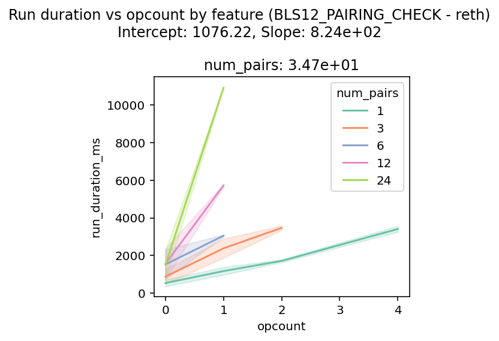

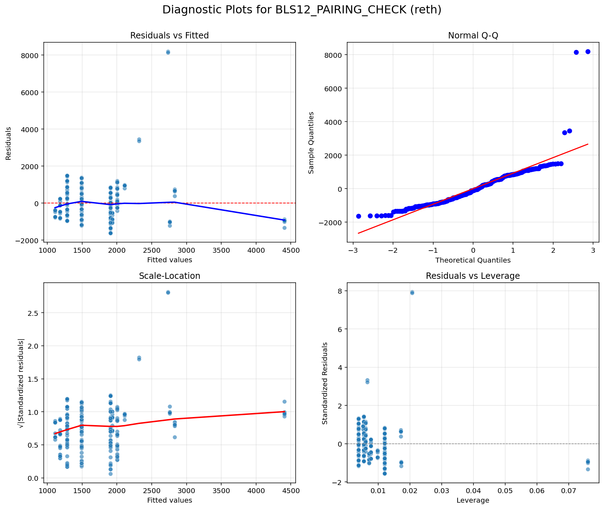


## nethermind


```python
                            OLS Regression Results                            
==============================================================================
Dep. Variable:        run_duration_ms   R-squared:                       0.230
Model:                            OLS   Adj. R-squared:                  0.228
Method:                 Least Squares   F-statistic:                     124.9
Date:                Thu, 22 Jan 2026   Prob (F-statistic):           3.46e-48
Time:                        10:36:23   Log-Likelihood:                -6782.1
No. Observations:                 838   AIC:                         1.357e+04
Df Residuals:                     835   BIC:                         1.358e+04
Df Model:                           2                                         
Covariance Type:            nonrobust                                         
==============================================================================
                 coef    std err          t      P>|t|      [0.025      0.975]
------------------------------------------------------------------------------
const       1238.7401     52.081     23.785      0.000    1136.515    1340.965
opcount      622.8235     40.008     15.567      0.000     544.296     701.352
num_pairs     15.2213      3.667      4.151      0.000       8.023      22.419
==============================================================================
Omnibus:                      110.789   Durbin-Watson:                   1.865
Prob(Omnibus):                  0.000   Jarque-Bera (JB):               29.167
Skew:                           0.066   Prob(JB):                     4.64e-07
Kurtosis:                       2.096   Cond. No.                         27.8
==============================================================================

Notes:
[1] Standard Errors assume that the covariance matrix of the errors is correctly specified.
```

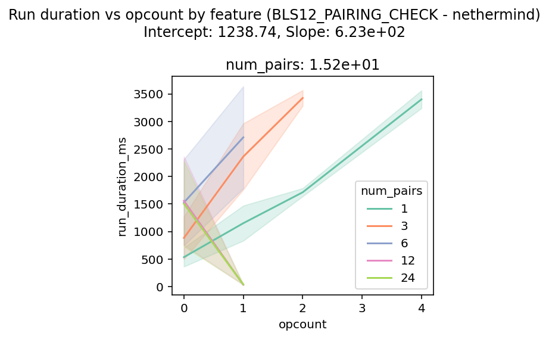

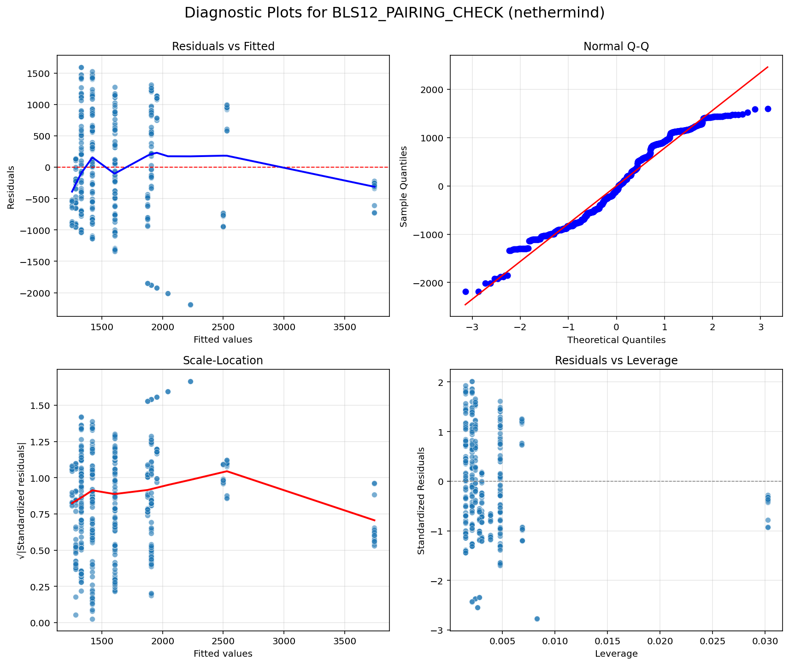


## erigon

OLS model did not run... Error: zero-size array to reduction operation maximum which has no identity
