Opcode run times estimation results - Simple opcodes
====================================================

Table of contents
=================

* [ADD](#add)
* [ADDMOD](#addmod)
* [ADDRESS](#address)
* [AND](#and)
* [BASEFEE](#basefee)
* [BLOBBASEFEE](#blobbasefee)
* [BLOBHASH](#blobhash)
* [BLOCKHASH](#blockhash)
* [BYTE](#byte)
* [CALLDATALOAD](#calldataload)
* [CALLDATASIZE](#calldatasize)
* [CALLER](#caller)
* [CALLVALUE](#callvalue)
* [CHAINID](#chainid)
* [CODESIZE](#codesize)
* [COINBASE](#coinbase)
* [DIV](#div)
* [DIFFICULTY](#difficulty)
* [DUP1](#dup1)
* [DUP2](#dup2)
* [DUP3](#dup3)
* [DUP4](#dup4)
* [DUP5](#dup5)
* [DUP6](#dup6)
* [DUP7](#dup7)
* [DUP8](#dup8)
* [DUP9](#dup9)
* [DUP10](#dup10)
* [DUP11](#dup11)
* [DUP12](#dup12)
* [DUP13](#dup13)
* [DUP14](#dup14)
* [DUP15](#dup15)
* [DUP16](#dup16)
* [EQ](#eq)
* [GAS](#gas)
* [GASLIMIT](#gaslimit)
* [GASPRICE](#gasprice)
* [GT](#gt)
* [INVALID](#invalid)
* [ISZERO](#iszero)
* [JUMP](#jump)
* [JUMPDEST](#jumpdest)
* [JUMPI](#jumpi)
* [LT](#lt)
* [MOD](#mod)
* [MSIZE](#msize)
* [MUL](#mul)
* [MULMOD](#mulmod)
* [NOT](#not)
* [NUMBER](#number)
* [OR](#or)
* [ORIGIN](#origin)
* [PC](#pc)
* [POP](#pop)
* [PREVRANDAO](#prevrandao)
* [PUSH0](#push0)
* [PUSH1](#push1)
* [PUSH2](#push2)
* [PUSH3](#push3)
* [PUSH4](#push4)
* [PUSH5](#push5)
* [PUSH6](#push6)
* [PUSH7](#push7)
* [PUSH8](#push8)
* [PUSH9](#push9)
* [PUSH10](#push10)
* [PUSH11](#push11)
* [PUSH12](#push12)
* [PUSH13](#push13)
* [PUSH14](#push14)
* [PUSH15](#push15)
* [PUSH16](#push16)
* [PUSH17](#push17)
* [PUSH18](#push18)
* [PUSH19](#push19)
* [PUSH20](#push20)
* [PUSH21](#push21)
* [PUSH22](#push22)
* [PUSH23](#push23)
* [PUSH24](#push24)
* [PUSH25](#push25)
* [PUSH26](#push26)
* [PUSH27](#push27)
* [PUSH28](#push28)
* [PUSH29](#push29)
* [PUSH30](#push30)
* [PUSH31](#push31)
* [PUSH32](#push32)
* [RETURNDATASIZE](#returndatasize)
* [SAR](#sar)
* [SDIV](#sdiv)
* [SELFBALANCE](#selfbalance)
* [SGT](#sgt)
* [SHL](#shl)
* [SHR](#shr)
* [SIGNEXTEND](#signextend)
* [SLT](#slt)
* [SMOD](#smod)
* [STOP](#stop)
* [SUB](#sub)
* [SWAP1](#swap1)
* [SWAP2](#swap2)
* [SWAP3](#swap3)
* [SWAP4](#swap4)
* [SWAP5](#swap5)
* [SWAP6](#swap6)
* [SWAP7](#swap7)
* [SWAP8](#swap8)
* [SWAP9](#swap9)
* [SWAP10](#swap10)
* [SWAP11](#swap11)
* [SWAP12](#swap12)
* [SWAP13](#swap13)
* [SWAP14](#swap14)
* [SWAP15](#swap15)
* [SWAP16](#swap16)
* [TIMESTAMP](#timestamp)
* [TLOAD](#tload)
* [TSTORE](#tstore)
* [XOR](#xor)

# Introduction


This is an automated report generated from the opcode run times 
estimation script `./src/estimate_opcode_run_times.py`. The script 
uses data generated by running the 
[EEST benchmark suite](https://github.com/ethereum/execution-spec-tests/tree/main/tests/benchmark) 
with the [Nethermind benchmarking tooling](https://github.com/NethermindEth/gas-benchmarks).

The data includes all the simple opcode tests run between 2026-01-10 and 2026-01-22.

For each opcode and client, an OLS linear regression model is fitted to estimate the 
opcode run time as a function of the opcode count. The results are presented below.

# ADD

## geth


```python
                            OLS Regression Results                            
==============================================================================
Dep. Variable:        run_duration_ms   R-squared:                       0.985
Model:                            OLS   Adj. R-squared:                  0.985
Method:                 Least Squares   F-statistic:                 1.786e+04
Date:                Thu, 22 Jan 2026   Prob (F-statistic):          6.04e-255
Time:                        10:33:29   Log-Likelihood:                -1360.5
No. Observations:                 281   AIC:                             2725.
Df Residuals:                     279   BIC:                             2732.
Df Model:                           1                                         
Covariance Type:            nonrobust                                         
==============================================================================
                 coef    std err          t      P>|t|      [0.025      0.975]
------------------------------------------------------------------------------
const         31.2150      3.909      7.986      0.000      23.521      38.909
opcount        0.0243      0.000    133.626      0.000       0.024       0.025
==============================================================================
Omnibus:                       38.423   Durbin-Watson:                   0.995
Prob(Omnibus):                  0.000   Jarque-Bera (JB):              102.306
Skew:                          -0.614   Prob(JB):                     6.09e-23
Kurtosis:                       5.689   Cond. No.                     4.58e+04
==============================================================================

Notes:
[1] Standard Errors assume that the covariance matrix of the errors is correctly specified.
[2] The condition number is large, 4.58e+04. This might indicate that there are
strong multicollinearity or other numerical problems.
```


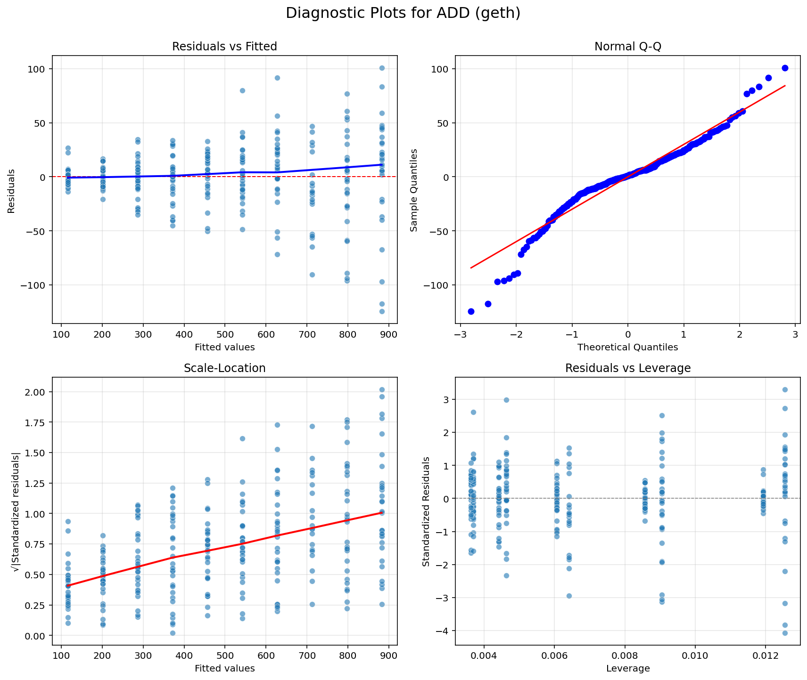


## besu


```python
                            OLS Regression Results                            
==============================================================================
Dep. Variable:        run_duration_ms   R-squared:                       0.678
Model:                            OLS   Adj. R-squared:                  0.677
Method:                 Least Squares   F-statistic:                     586.7
Date:                Thu, 22 Jan 2026   Prob (F-statistic):           1.45e-70
Time:                        10:33:29   Log-Likelihood:                -2378.3
No. Observations:                 281   AIC:                             4761.
Df Residuals:                     279   BIC:                             4768.
Df Model:                           1                                         
Covariance Type:            nonrobust                                         
==============================================================================
                 coef    std err          t      P>|t|      [0.025      0.975]
------------------------------------------------------------------------------
const         43.1263    146.226      0.295      0.768    -244.720     330.972
opcount        0.1649      0.007     24.222      0.000       0.151       0.178
==============================================================================
Omnibus:                       37.402   Durbin-Watson:                   0.496
Prob(Omnibus):                  0.000   Jarque-Bera (JB):               49.241
Skew:                          -1.021   Prob(JB):                     2.03e-11
Kurtosis:                       3.185   Cond. No.                     4.58e+04
==============================================================================

Notes:
[1] Standard Errors assume that the covariance matrix of the errors is correctly specified.
[2] The condition number is large, 4.58e+04. This might indicate that there are
strong multicollinearity or other numerical problems.
```

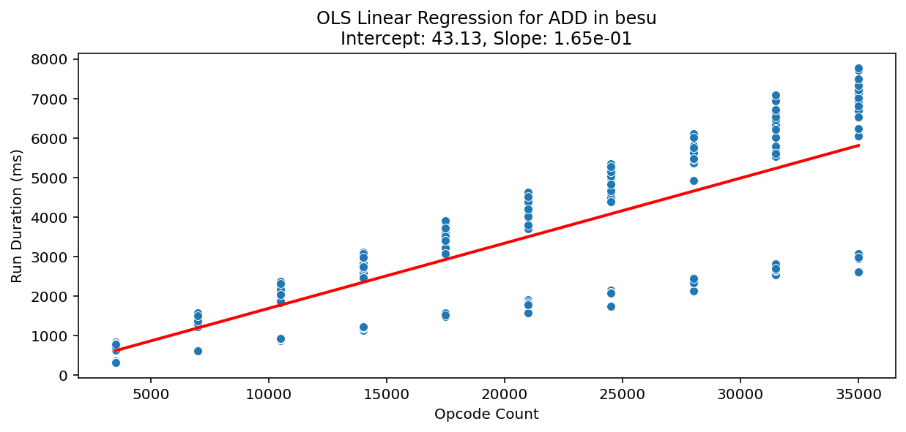

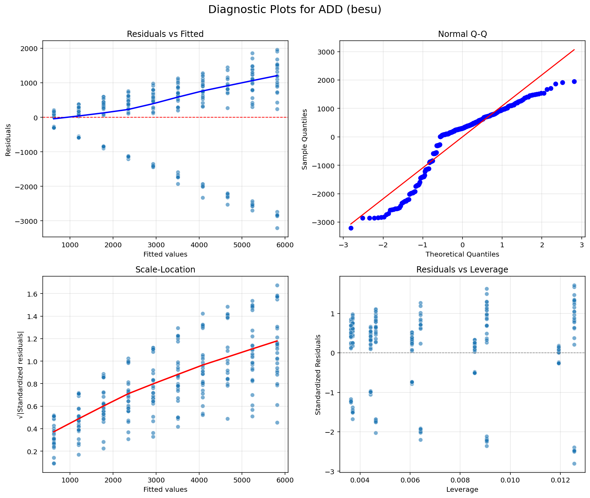


## reth


```python
                            OLS Regression Results                            
==============================================================================
Dep. Variable:        run_duration_ms   R-squared:                       0.970
Model:                            OLS   Adj. R-squared:                  0.970
Method:                 Least Squares   F-statistic:                     5494.
Date:                Thu, 22 Jan 2026   Prob (F-statistic):          8.32e-131
Time:                        10:33:29   Log-Likelihood:                -892.86
No. Observations:                 171   AIC:                             1790.
Df Residuals:                     169   BIC:                             1796.
Df Model:                           1                                         
Covariance Type:            nonrobust                                         
==============================================================================
                 coef    std err          t      P>|t|      [0.025      0.975]
------------------------------------------------------------------------------
const         22.1968      7.277      3.050      0.003       7.832      36.562
opcount        0.0253      0.000     74.119      0.000       0.025       0.026
==============================================================================
Omnibus:                       29.730   Durbin-Watson:                   1.802
Prob(Omnibus):                  0.000   Jarque-Bera (JB):               78.177
Skew:                          -0.697   Prob(JB):                     1.06e-17
Kurtosis:                       6.005   Cond. No.                     4.50e+04
==============================================================================

Notes:
[1] Standard Errors assume that the covariance matrix of the errors is correctly specified.
[2] The condition number is large, 4.5e+04. This might indicate that there are
strong multicollinearity or other numerical problems.
```

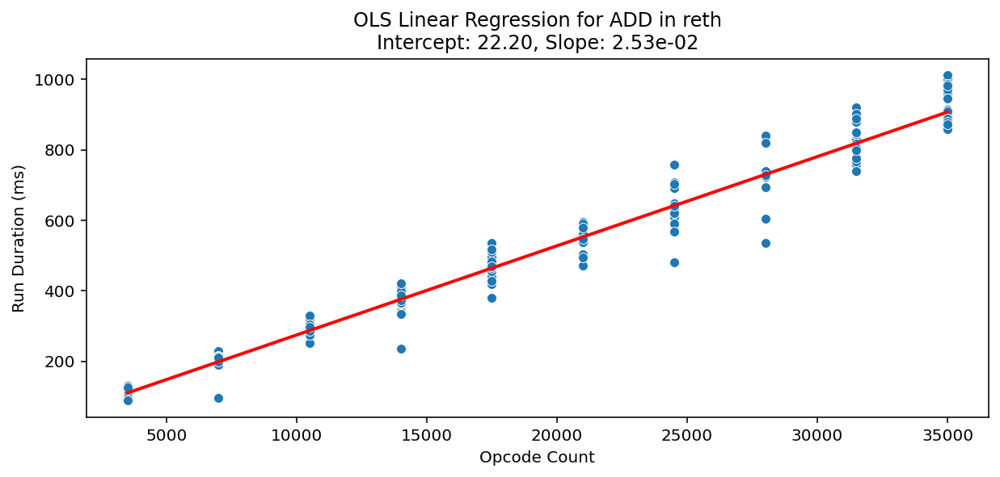

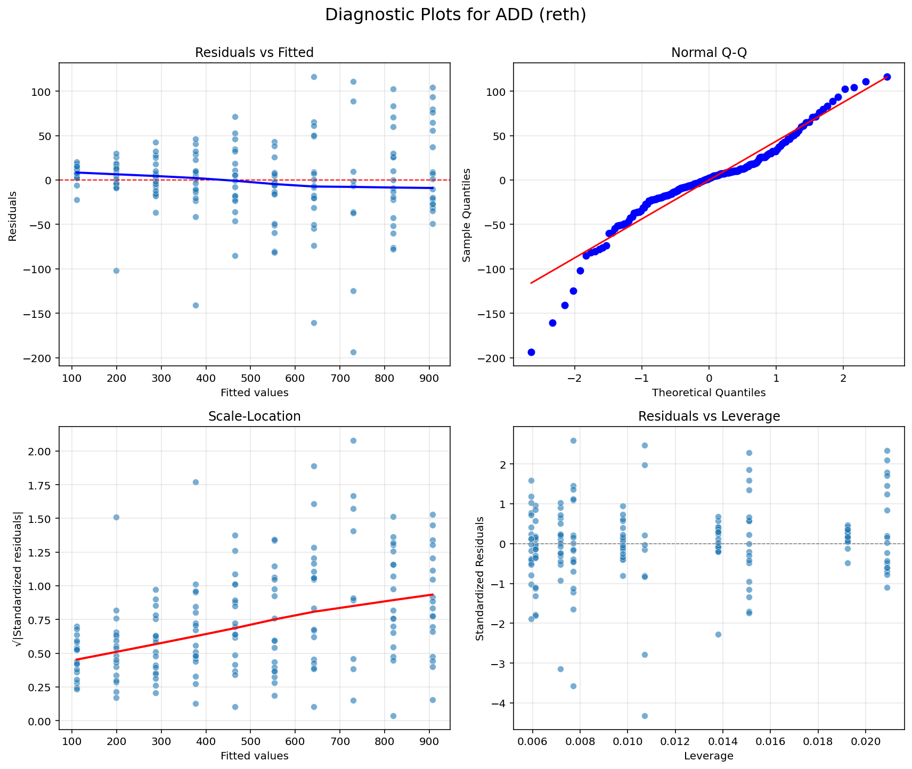


## nethermind


```python
                            OLS Regression Results                            
==============================================================================
Dep. Variable:        run_duration_ms   R-squared:                       0.982
Model:                            OLS   Adj. R-squared:                  0.982
Method:                 Least Squares   F-statistic:                 1.514e+04
Date:                Thu, 22 Jan 2026   Prob (F-statistic):          4.23e-245
Time:                        10:33:29   Log-Likelihood:                -1301.8
No. Observations:                 281   AIC:                             2608.
Df Residuals:                     279   BIC:                             2615.
Df Model:                           1                                         
Covariance Type:            nonrobust                                         
==============================================================================
                 coef    std err          t      P>|t|      [0.025      0.975]
------------------------------------------------------------------------------
const         28.6724      3.171      9.042      0.000      22.430      34.915
opcount        0.0182      0.000    123.028      0.000       0.018       0.018
==============================================================================
Omnibus:                       93.213   Durbin-Watson:                   0.997
Prob(Omnibus):                  0.000   Jarque-Bera (JB):             2060.501
Skew:                           0.737   Prob(JB):                         0.00
Kurtosis:                      16.184   Cond. No.                     4.58e+04
==============================================================================

Notes:
[1] Standard Errors assume that the covariance matrix of the errors is correctly specified.
[2] The condition number is large, 4.58e+04. This might indicate that there are
strong multicollinearity or other numerical problems.
```


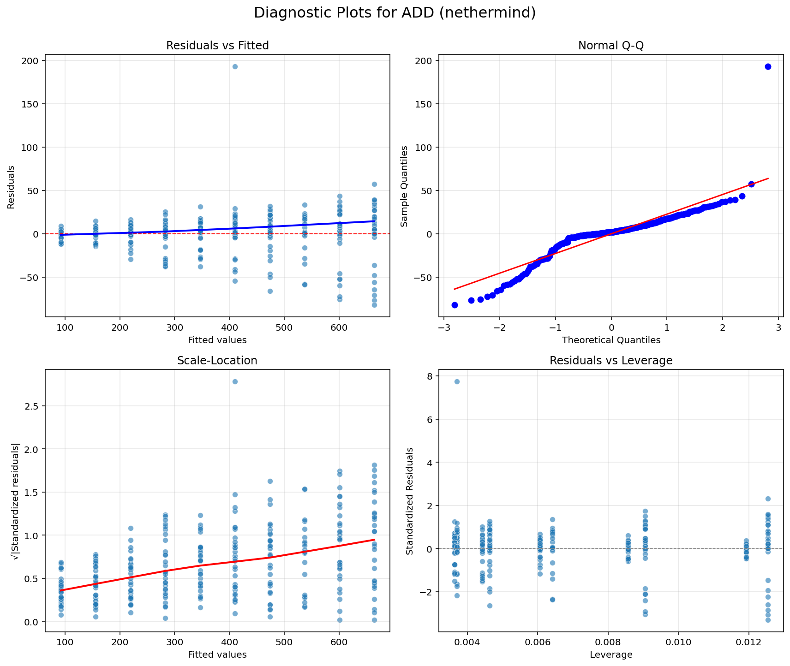


## erigon


```python
                            OLS Regression Results                            
==============================================================================
Dep. Variable:        run_duration_ms   R-squared:                       1.000
Model:                            OLS   Adj. R-squared:                  1.000
Method:                 Least Squares   F-statistic:                 7.591e+04
Date:                Thu, 22 Jan 2026   Prob (F-statistic):           1.28e-49
Time:                        10:33:30   Log-Likelihood:                -91.020
No. Observations:                  30   AIC:                             186.0
Df Residuals:                      28   BIC:                             188.8
Df Model:                           1                                         
Covariance Type:            nonrobust                                         
==============================================================================
                 coef    std err          t      P>|t|      [0.025      0.975]
------------------------------------------------------------------------------
const         31.9668      2.053     15.573      0.000      27.762      36.172
opcount        0.0260   9.45e-05    275.519      0.000       0.026       0.026
==============================================================================
Omnibus:                        6.911   Durbin-Watson:                   1.311
Prob(Omnibus):                  0.032   Jarque-Bera (JB):                5.188
Skew:                           0.819   Prob(JB):                       0.0747
Kurtosis:                       4.211   Cond. No.                     4.69e+04
==============================================================================

Notes:
[1] Standard Errors assume that the covariance matrix of the errors is correctly specified.
[2] The condition number is large, 4.69e+04. This might indicate that there are
strong multicollinearity or other numerical problems.
```

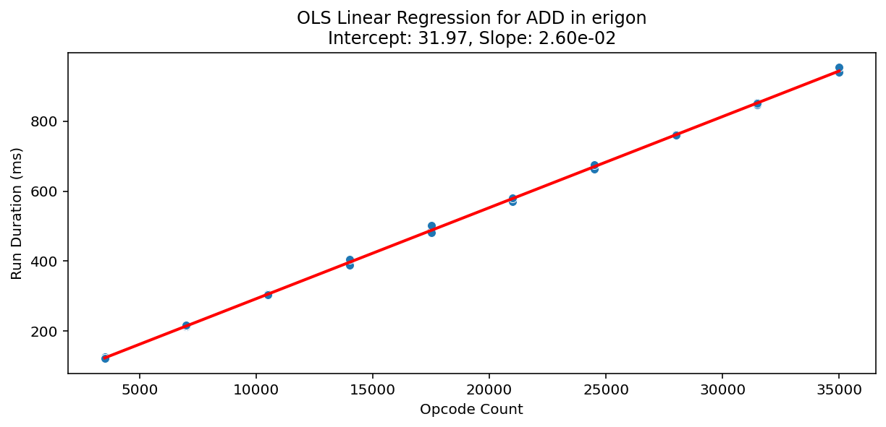

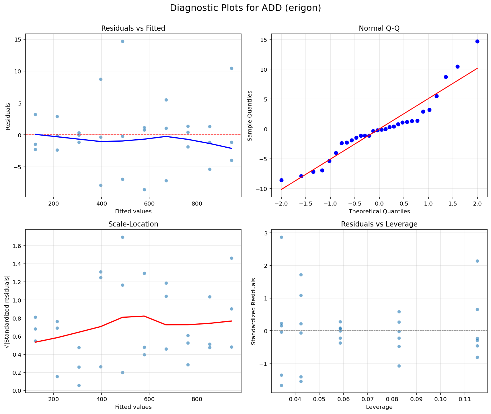


# ADDMOD

## geth


```python
                            OLS Regression Results                            
==============================================================================
Dep. Variable:        run_duration_ms   R-squared:                       0.989
Model:                            OLS   Adj. R-squared:                  0.989
Method:                 Least Squares   F-statistic:                 1.746e+04
Date:                Thu, 22 Jan 2026   Prob (F-statistic):          4.84e-195
Time:                        10:33:30   Log-Likelihood:                -1097.1
No. Observations:                 200   AIC:                             2198.
Df Residuals:                     198   BIC:                             2205.
Df Model:                           1                                         
Covariance Type:            nonrobust                                         
==============================================================================
                 coef    std err          t      P>|t|      [0.025      0.975]
------------------------------------------------------------------------------
const         33.4622      8.961      3.734      0.000      15.792      51.133
opcount        0.0545      0.000    132.126      0.000       0.054       0.055
==============================================================================
Omnibus:                       32.010   Durbin-Watson:                   0.914
Prob(Omnibus):                  0.000   Jarque-Bera (JB):               48.676
Skew:                          -0.898   Prob(JB):                     2.69e-11
Kurtosis:                       4.617   Cond. No.                     4.69e+04
==============================================================================

Notes:
[1] Standard Errors assume that the covariance matrix of the errors is correctly specified.
[2] The condition number is large, 4.69e+04. This might indicate that there are
strong multicollinearity or other numerical problems.
```

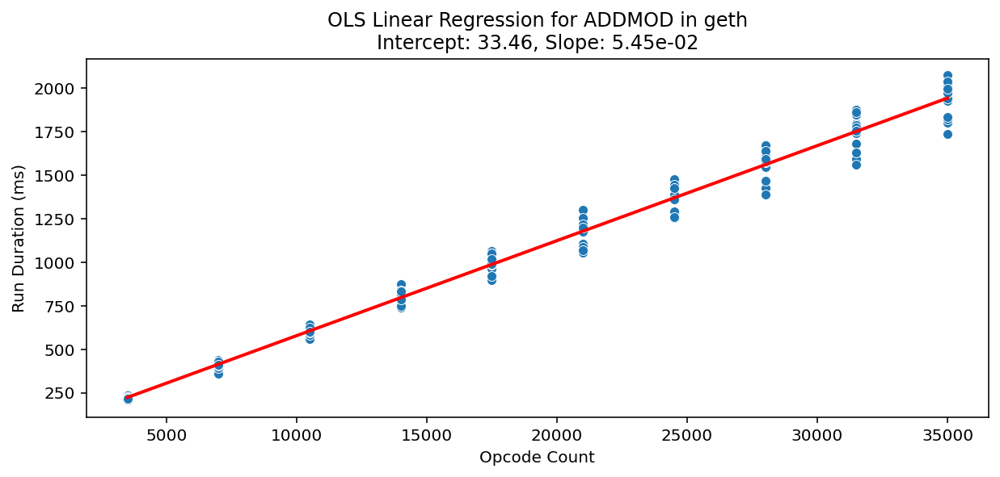

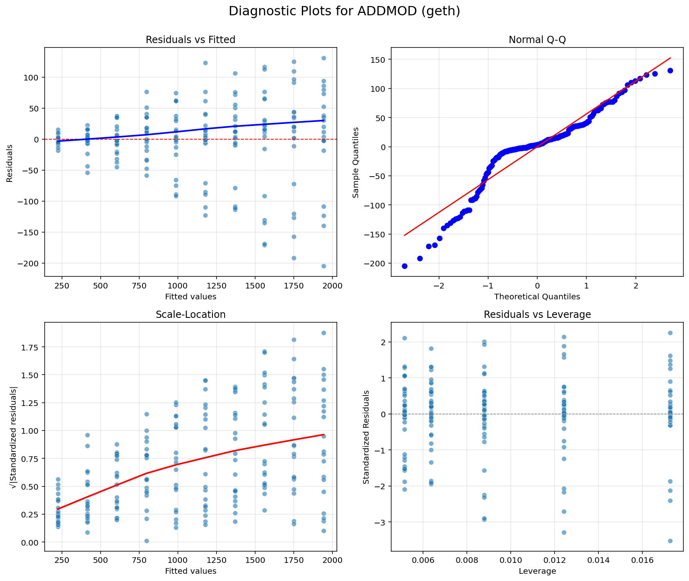


## besu


```python
                            OLS Regression Results                            
==============================================================================
Dep. Variable:        run_duration_ms   R-squared:                       0.982
Model:                            OLS   Adj. R-squared:                  0.982
Method:                 Least Squares   F-statistic:                 1.109e+04
Date:                Thu, 22 Jan 2026   Prob (F-statistic):          8.41e-176
Time:                        10:33:30   Log-Likelihood:                -1307.2
No. Observations:                 200   AIC:                             2618.
Df Residuals:                     198   BIC:                             2625.
Df Model:                           1                                         
Covariance Type:            nonrobust                                         
==============================================================================
                 coef    std err          t      P>|t|      [0.025      0.975]
------------------------------------------------------------------------------
const         37.0468     25.617      1.446      0.150     -13.471      87.565
opcount        0.1242      0.001    105.300      0.000       0.122       0.127
==============================================================================
Omnibus:                       15.624   Durbin-Watson:                   0.859
Prob(Omnibus):                  0.000   Jarque-Bera (JB):               39.354
Skew:                          -0.246   Prob(JB):                     2.85e-09
Kurtosis:                       5.117   Cond. No.                     4.69e+04
==============================================================================

Notes:
[1] Standard Errors assume that the covariance matrix of the errors is correctly specified.
[2] The condition number is large, 4.69e+04. This might indicate that there are
strong multicollinearity or other numerical problems.
```


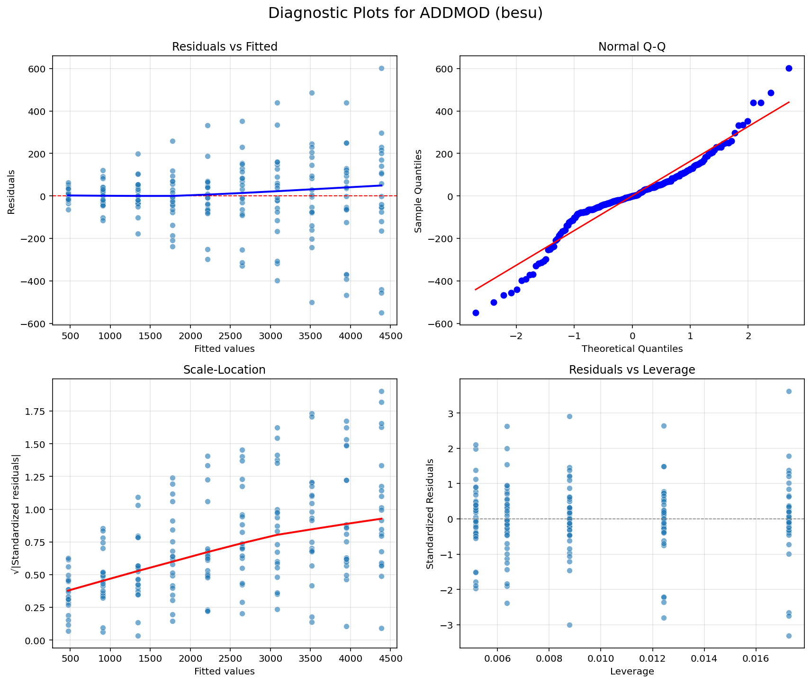


## reth


```python
                            OLS Regression Results                            
==============================================================================
Dep. Variable:        run_duration_ms   R-squared:                       0.992
Model:                            OLS   Adj. R-squared:                  0.992
Method:                 Least Squares   F-statistic:                 1.133e+04
Date:                Thu, 22 Jan 2026   Prob (F-statistic):           8.89e-95
Time:                        10:33:30   Log-Likelihood:                -417.78
No. Observations:                  90   AIC:                             839.6
Df Residuals:                      88   BIC:                             844.6
Df Model:                           1                                         
Covariance Type:            nonrobust                                         
==============================================================================
                 coef    std err          t      P>|t|      [0.025      0.975]
------------------------------------------------------------------------------
const         33.0303      5.781      5.714      0.000      21.542      44.519
opcount        0.0283      0.000    106.455      0.000       0.028       0.029
==============================================================================
Omnibus:                       28.038   Durbin-Watson:                   1.219
Prob(Omnibus):                  0.000   Jarque-Bera (JB):               55.057
Skew:                          -1.181   Prob(JB):                     1.11e-12
Kurtosis:                       6.017   Cond. No.                     4.69e+04
==============================================================================

Notes:
[1] Standard Errors assume that the covariance matrix of the errors is correctly specified.
[2] The condition number is large, 4.69e+04. This might indicate that there are
strong multicollinearity or other numerical problems.
```


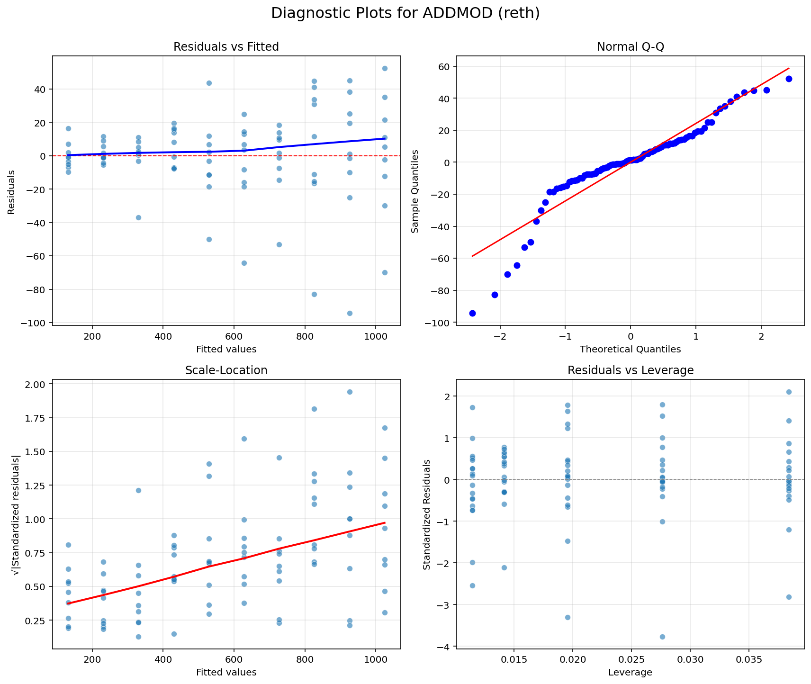


## nethermind


```python
                            OLS Regression Results                            
==============================================================================
Dep. Variable:        run_duration_ms   R-squared:                       0.988
Model:                            OLS   Adj. R-squared:                  0.988
Method:                 Least Squares   F-statistic:                 1.633e+04
Date:                Thu, 22 Jan 2026   Prob (F-statistic):          3.25e-192
Time:                        10:33:31   Log-Likelihood:                -1001.9
No. Observations:                 200   AIC:                             2008.
Df Residuals:                     198   BIC:                             2014.
Df Model:                           1                                         
Covariance Type:            nonrobust                                         
==============================================================================
                 coef    std err          t      P>|t|      [0.025      0.975]
------------------------------------------------------------------------------
const         31.6847      5.567      5.692      0.000      20.708      42.662
opcount        0.0328      0.000    127.803      0.000       0.032       0.033
==============================================================================
Omnibus:                       61.628   Durbin-Watson:                   0.941
Prob(Omnibus):                  0.000   Jarque-Bera (JB):              139.691
Skew:                          -1.410   Prob(JB):                     4.64e-31
Kurtosis:                       5.968   Cond. No.                     4.69e+04
==============================================================================

Notes:
[1] Standard Errors assume that the covariance matrix of the errors is correctly specified.
[2] The condition number is large, 4.69e+04. This might indicate that there are
strong multicollinearity or other numerical problems.
```


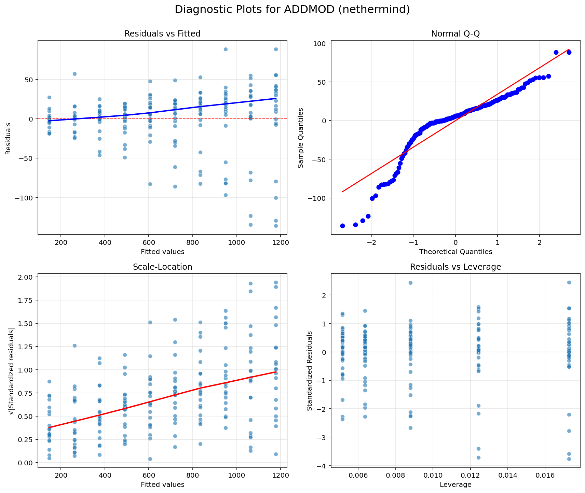


## erigon


```python
                            OLS Regression Results                            
==============================================================================
Dep. Variable:        run_duration_ms   R-squared:                       1.000
Model:                            OLS   Adj. R-squared:                  0.999
Method:                 Least Squares   F-statistic:                 5.620e+04
Date:                Thu, 22 Jan 2026   Prob (F-statistic):           8.62e-48
Time:                        10:33:31   Log-Likelihood:                -120.41
No. Observations:                  30   AIC:                             244.8
Df Residuals:                      28   BIC:                             247.6
Df Model:                           1                                         
Covariance Type:            nonrobust                                         
==============================================================================
                 coef    std err          t      P>|t|      [0.025      0.975]
------------------------------------------------------------------------------
const         29.4920      5.468      5.393      0.000      18.291      40.693
opcount        0.0597      0.000    237.062      0.000       0.059       0.060
==============================================================================
Omnibus:                        1.681   Durbin-Watson:                   0.696
Prob(Omnibus):                  0.431   Jarque-Bera (JB):                1.540
Skew:                           0.500   Prob(JB):                        0.463
Kurtosis:                       2.517   Cond. No.                     4.69e+04
==============================================================================

Notes:
[1] Standard Errors assume that the covariance matrix of the errors is correctly specified.
[2] The condition number is large, 4.69e+04. This might indicate that there are
strong multicollinearity or other numerical problems.
```

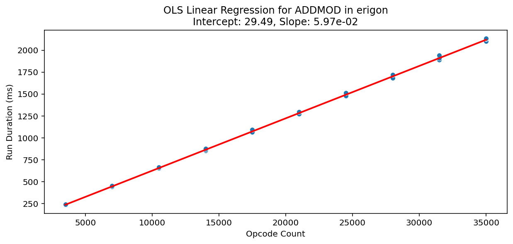

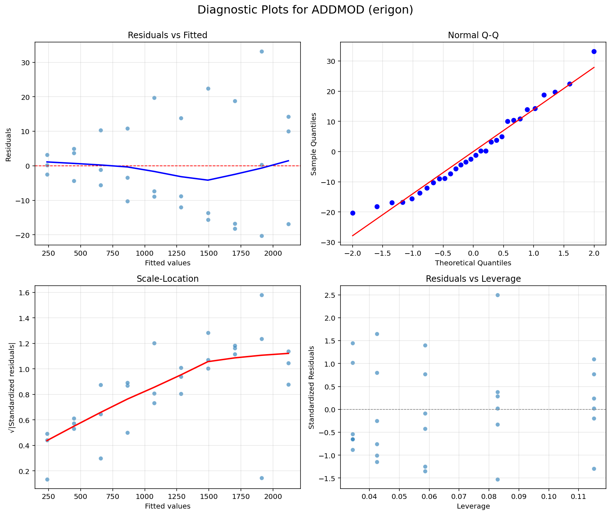


# ADDRESS

## geth


```python
                            OLS Regression Results                            
==============================================================================
Dep. Variable:        run_duration_ms   R-squared:                       0.984
Model:                            OLS   Adj. R-squared:                  0.984
Method:                 Least Squares   F-statistic:                 1.819e+04
Date:                Thu, 22 Jan 2026   Prob (F-statistic):          2.74e-262
Time:                        10:33:31   Log-Likelihood:                -1771.0
No. Observations:                 290   AIC:                             3546.
Df Residuals:                     288   BIC:                             3553.
Df Model:                           1                                         
Covariance Type:            nonrobust                                         
==============================================================================
                 coef    std err          t      P>|t|      [0.025      0.975]
------------------------------------------------------------------------------
const         34.0098     13.827      2.460      0.014       6.795      61.224
opcount        0.0301      0.000    134.861      0.000       0.030       0.030
==============================================================================
Omnibus:                       30.021   Durbin-Watson:                   0.849
Prob(Omnibus):                  0.000   Jarque-Bera (JB):               56.883
Skew:                          -0.573   Prob(JB):                     4.45e-13
Kurtosis:                       4.843   Cond. No.                     1.34e+05
==============================================================================

Notes:
[1] Standard Errors assume that the covariance matrix of the errors is correctly specified.
[2] The condition number is large, 1.34e+05. This might indicate that there are
strong multicollinearity or other numerical problems.
```

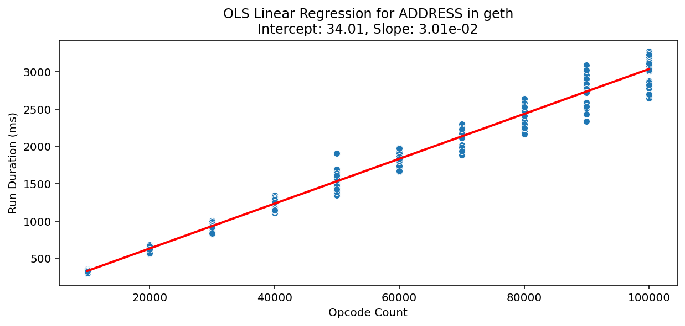

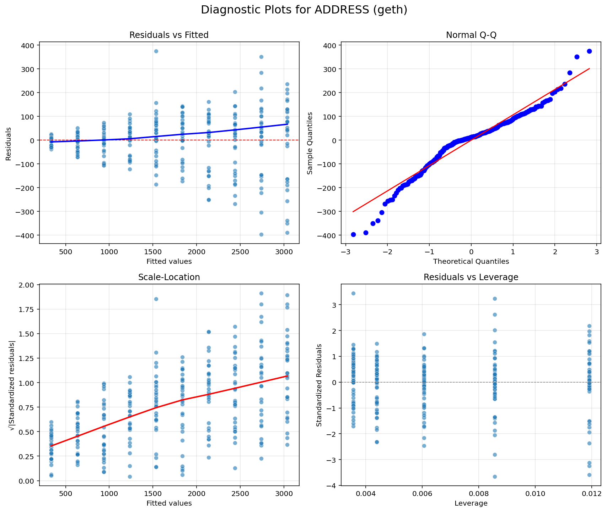


## besu


```python
                            OLS Regression Results                            
==============================================================================
Dep. Variable:        run_duration_ms   R-squared:                       0.983
Model:                            OLS   Adj. R-squared:                  0.983
Method:                 Least Squares   F-statistic:                 1.633e+04
Date:                Thu, 22 Jan 2026   Prob (F-statistic):          1.21e-255
Time:                        10:33:32   Log-Likelihood:                -1736.3
No. Observations:                 290   AIC:                             3477.
Df Residuals:                     288   BIC:                             3484.
Df Model:                           1                                         
Covariance Type:            nonrobust                                         
==============================================================================
                 coef    std err          t      P>|t|      [0.025      0.975]
------------------------------------------------------------------------------
const         38.5984     12.268      3.146      0.002      14.453      62.744
opcount        0.0253      0.000    127.770      0.000       0.025       0.026
==============================================================================
Omnibus:                       61.745   Durbin-Watson:                   0.800
Prob(Omnibus):                  0.000   Jarque-Bera (JB):              133.312
Skew:                          -1.056   Prob(JB):                     1.13e-29
Kurtosis:                       5.563   Cond. No.                     1.34e+05
==============================================================================

Notes:
[1] Standard Errors assume that the covariance matrix of the errors is correctly specified.
[2] The condition number is large, 1.34e+05. This might indicate that there are
strong multicollinearity or other numerical problems.
```

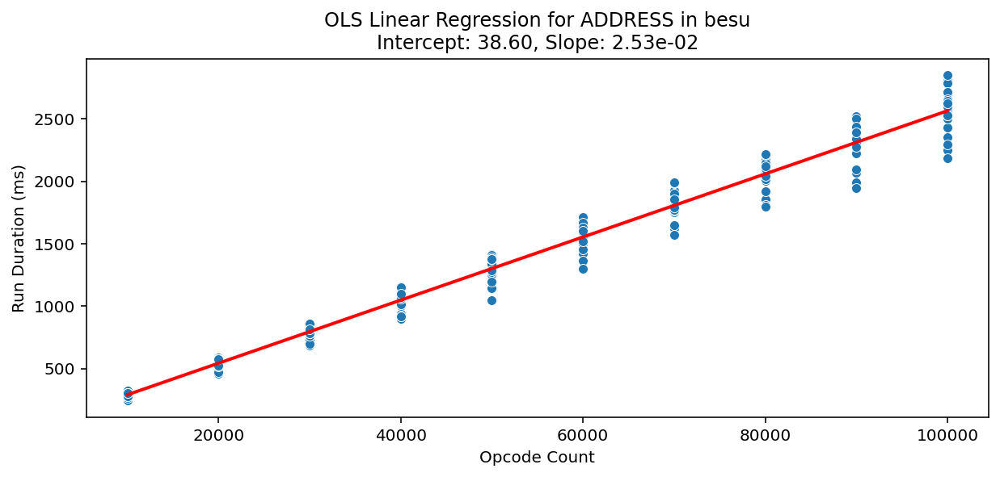

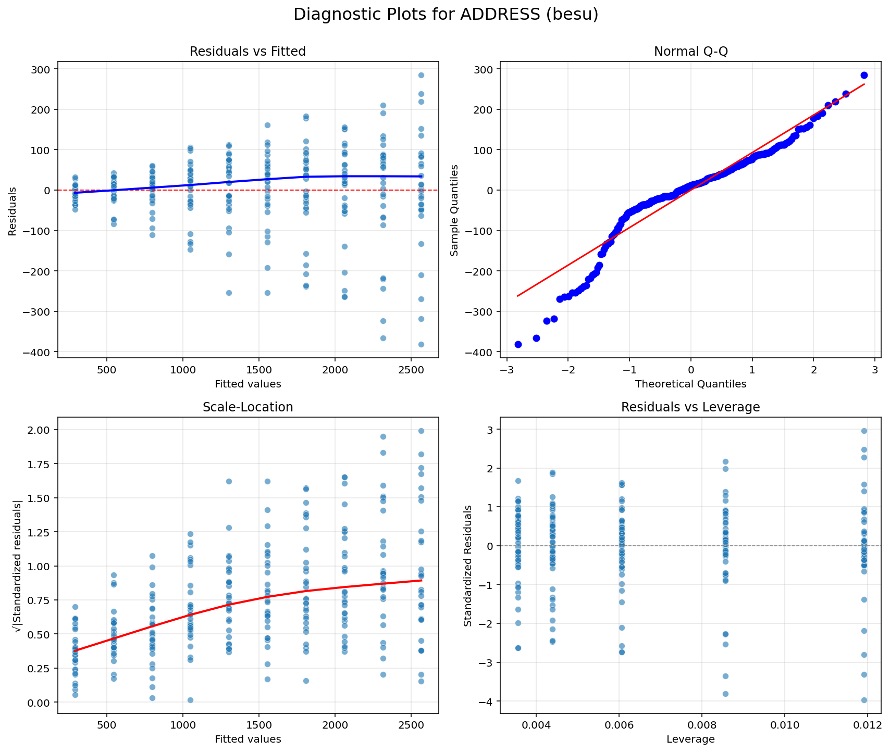


## reth


```python
                            OLS Regression Results                            
==============================================================================
Dep. Variable:        run_duration_ms   R-squared:                       0.982
Model:                            OLS   Adj. R-squared:                  0.982
Method:                 Least Squares   F-statistic:                     9547.
Date:                Thu, 22 Jan 2026   Prob (F-statistic):          1.40e-156
Time:                        10:33:32   Log-Likelihood:                -845.41
No. Observations:                 180   AIC:                             1695.
Df Residuals:                     178   BIC:                             1701.
Df Model:                           1                                         
Covariance Type:            nonrobust                                         
==============================================================================
                 coef    std err          t      P>|t|      [0.025      0.975]
------------------------------------------------------------------------------
const         29.7447      4.294      6.928      0.000      21.272      38.218
opcount        0.0068   6.92e-05     97.707      0.000       0.007       0.007
==============================================================================
Omnibus:                        5.884   Durbin-Watson:                   1.822
Prob(Omnibus):                  0.053   Jarque-Bera (JB):                5.900
Skew:                          -0.319   Prob(JB):                       0.0523
Kurtosis:                       3.616   Cond. No.                     1.34e+05
==============================================================================

Notes:
[1] Standard Errors assume that the covariance matrix of the errors is correctly specified.
[2] The condition number is large, 1.34e+05. This might indicate that there are
strong multicollinearity or other numerical problems.
```


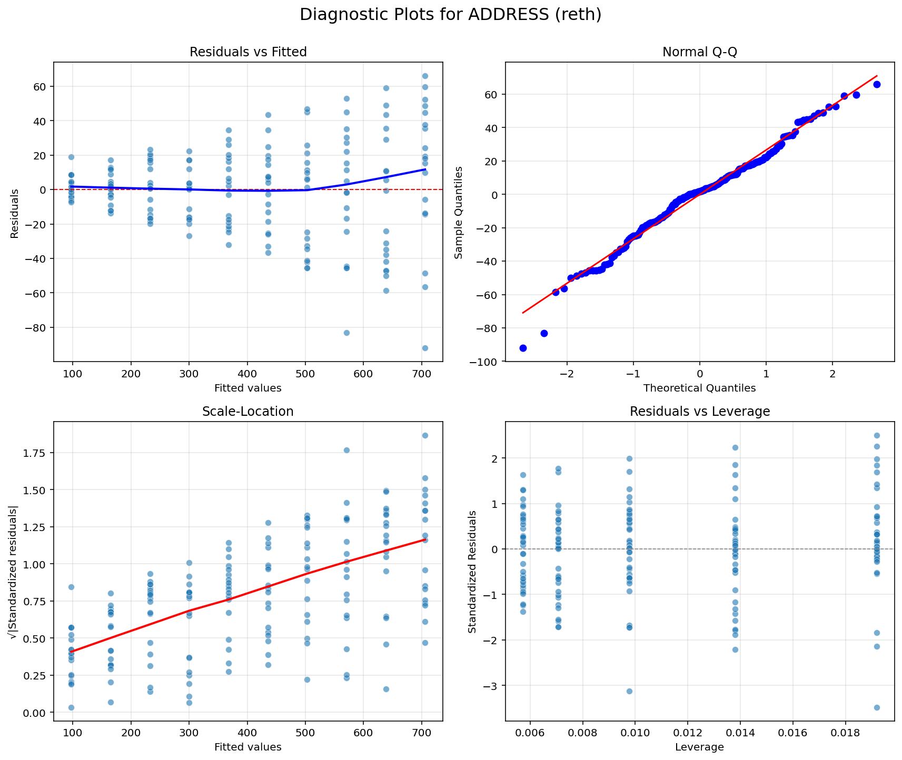


## nethermind


```python
                            OLS Regression Results                            
==============================================================================
Dep. Variable:        run_duration_ms   R-squared:                       0.985
Model:                            OLS   Adj. R-squared:                  0.985
Method:                 Least Squares   F-statistic:                 1.854e+04
Date:                Thu, 22 Jan 2026   Prob (F-statistic):          1.76e-263
Time:                        10:33:32   Log-Likelihood:                -1362.2
No. Observations:                 290   AIC:                             2728.
Df Residuals:                     288   BIC:                             2736.
Df Model:                           1                                         
Covariance Type:            nonrobust                                         
==============================================================================
                 coef    std err          t      P>|t|      [0.025      0.975]
------------------------------------------------------------------------------
const         28.8462      3.378      8.540      0.000      22.198      35.494
opcount        0.0074   5.44e-05    136.172      0.000       0.007       0.008
==============================================================================
Omnibus:                       88.430   Durbin-Watson:                   1.055
Prob(Omnibus):                  0.000   Jarque-Bera (JB):              262.678
Skew:                          -1.355   Prob(JB):                     9.13e-58
Kurtosis:                       6.794   Cond. No.                     1.34e+05
==============================================================================

Notes:
[1] Standard Errors assume that the covariance matrix of the errors is correctly specified.
[2] The condition number is large, 1.34e+05. This might indicate that there are
strong multicollinearity or other numerical problems.
```

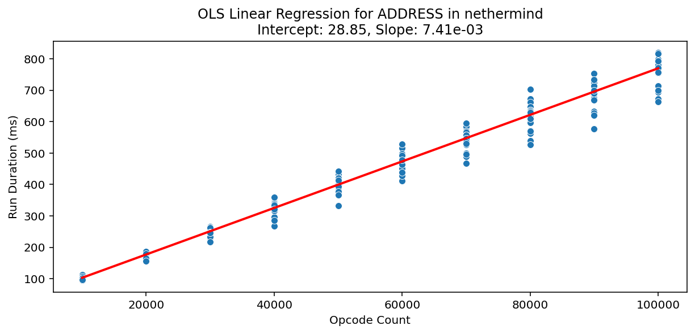

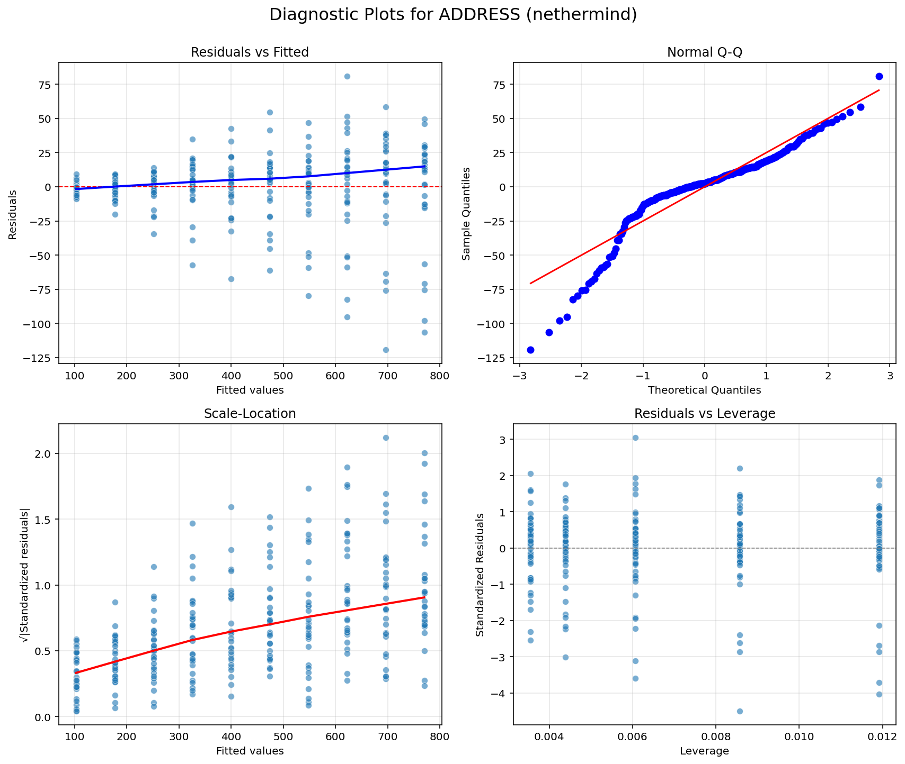


## erigon


```python
                            OLS Regression Results                            
==============================================================================
Dep. Variable:        run_duration_ms   R-squared:                       0.996
Model:                            OLS   Adj. R-squared:                  0.995
Method:                 Least Squares   F-statistic:                     6379.
Date:                Thu, 22 Jan 2026   Prob (F-statistic):           1.39e-34
Time:                        10:33:32   Log-Likelihood:                -162.37
No. Observations:                  30   AIC:                             328.7
Df Residuals:                      28   BIC:                             331.5
Df Model:                           1                                         
Covariance Type:            nonrobust                                         
==============================================================================
                 coef    std err          t      P>|t|      [0.025      0.975]
------------------------------------------------------------------------------
const         31.1459     22.144      1.407      0.171     -14.214      76.506
opcount        0.0285      0.000     79.869      0.000       0.028       0.029
==============================================================================
Omnibus:                        3.039   Durbin-Watson:                   0.484
Prob(Omnibus):                  0.219   Jarque-Bera (JB):                2.720
Skew:                           0.684   Prob(JB):                        0.257
Kurtosis:                       2.446   Cond. No.                     1.34e+05
==============================================================================

Notes:
[1] Standard Errors assume that the covariance matrix of the errors is correctly specified.
[2] The condition number is large, 1.34e+05. This might indicate that there are
strong multicollinearity or other numerical problems.
```

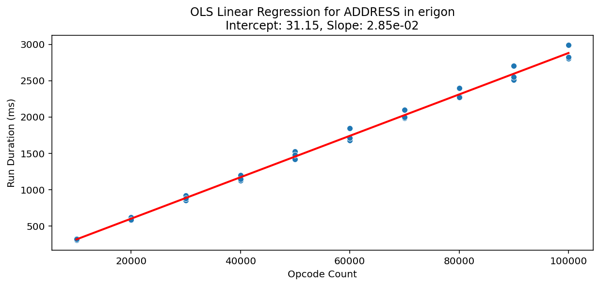

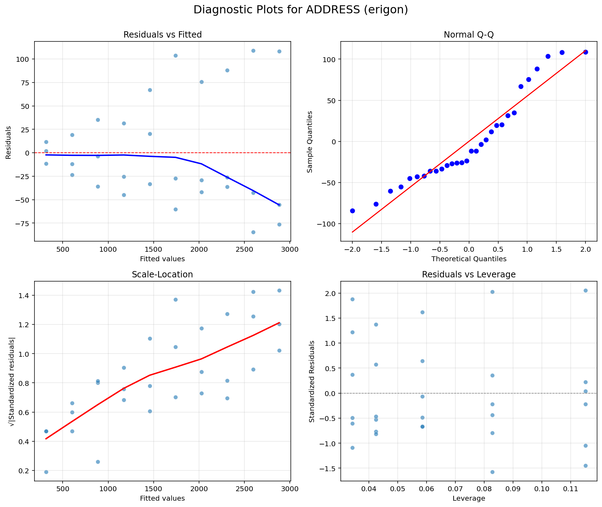


# AND

## geth


```python
                            OLS Regression Results                            
==============================================================================
Dep. Variable:        run_duration_ms   R-squared:                       0.985
Model:                            OLS   Adj. R-squared:                  0.985
Method:                 Least Squares   F-statistic:                 1.917e+04
Date:                Thu, 22 Jan 2026   Prob (F-statistic):          1.53e-265
Time:                        10:33:33   Log-Likelihood:                -1391.2
No. Observations:                 290   AIC:                             2786.
Df Residuals:                     288   BIC:                             2794.
Df Model:                           1                                         
Covariance Type:            nonrobust                                         
==============================================================================
                 coef    std err          t      P>|t|      [0.025      0.975]
------------------------------------------------------------------------------
const         32.6625      3.733      8.751      0.000      25.316      40.009
opcount        0.0238      0.000    138.470      0.000       0.023       0.024
==============================================================================
Omnibus:                       20.629   Durbin-Watson:                   0.974
Prob(Omnibus):                  0.000   Jarque-Bera (JB):               37.479
Skew:                          -0.409   Prob(JB):                     7.27e-09
Kurtosis:                       4.560   Cond. No.                     4.69e+04
==============================================================================

Notes:
[1] Standard Errors assume that the covariance matrix of the errors is correctly specified.
[2] The condition number is large, 4.69e+04. This might indicate that there are
strong multicollinearity or other numerical problems.
```


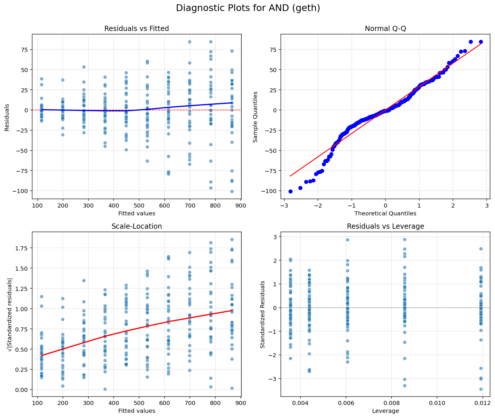


## besu


```python
                            OLS Regression Results                            
==============================================================================
Dep. Variable:        run_duration_ms   R-squared:                       0.993
Model:                            OLS   Adj. R-squared:                  0.993
Method:                 Least Squares   F-statistic:                 4.101e+04
Date:                Thu, 22 Jan 2026   Prob (F-statistic):          1.34e-312
Time:                        10:33:33   Log-Likelihood:                -1608.9
No. Observations:                 290   AIC:                             3222.
Df Residuals:                     288   BIC:                             3229.
Df Model:                           1                                         
Covariance Type:            nonrobust                                         
==============================================================================
                 coef    std err          t      P>|t|      [0.025      0.975]
------------------------------------------------------------------------------
const         35.8328      7.907      4.532      0.000      20.270      51.395
opcount        0.0737      0.000    202.517      0.000       0.073       0.074
==============================================================================
Omnibus:                       41.373   Durbin-Watson:                   0.860
Prob(Omnibus):                  0.000   Jarque-Bera (JB):              334.821
Skew:                           0.043   Prob(JB):                     1.97e-73
Kurtosis:                       8.263   Cond. No.                     4.69e+04
==============================================================================

Notes:
[1] Standard Errors assume that the covariance matrix of the errors is correctly specified.
[2] The condition number is large, 4.69e+04. This might indicate that there are
strong multicollinearity or other numerical problems.
```

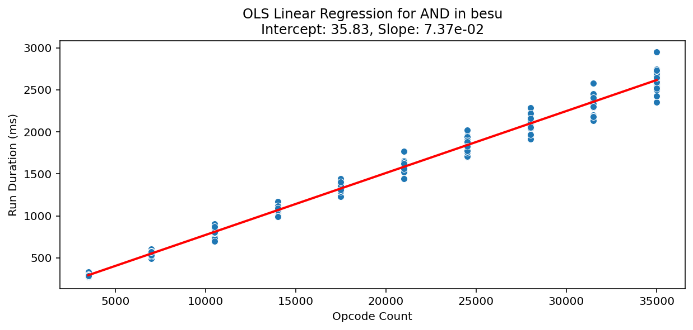


## reth


```python
                            OLS Regression Results                            
==============================================================================
Dep. Variable:        run_duration_ms   R-squared:                       0.979
Model:                            OLS   Adj. R-squared:                  0.979
Method:                 Least Squares   F-statistic:                     8497.
Date:                Thu, 22 Jan 2026   Prob (F-statistic):          3.66e-152
Time:                        10:33:33   Log-Likelihood:                -707.11
No. Observations:                 180   AIC:                             1418.
Df Residuals:                     178   BIC:                             1425.
Df Model:                           1                                         
Covariance Type:            nonrobust                                         
==============================================================================
                 coef    std err          t      P>|t|      [0.025      0.975]
------------------------------------------------------------------------------
const         34.0126      1.991     17.081      0.000      30.083      37.942
opcount        0.0085   9.17e-05     92.177      0.000       0.008       0.009
==============================================================================
Omnibus:                        9.442   Durbin-Watson:                   1.830
Prob(Omnibus):                  0.009   Jarque-Bera (JB):               20.122
Skew:                          -0.004   Prob(JB):                     4.27e-05
Kurtosis:                       4.638   Cond. No.                     4.69e+04
==============================================================================

Notes:
[1] Standard Errors assume that the covariance matrix of the errors is correctly specified.
[2] The condition number is large, 4.69e+04. This might indicate that there are
strong multicollinearity or other numerical problems.
```

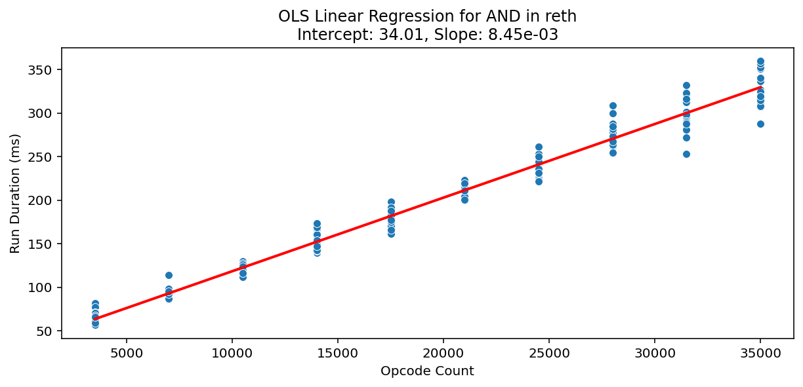

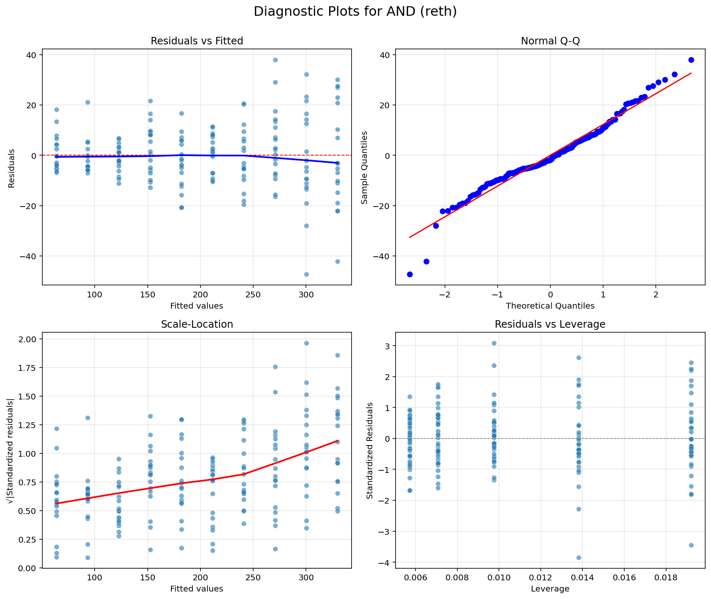


## nethermind


```python
                            OLS Regression Results                            
==============================================================================
Dep. Variable:        run_duration_ms   R-squared:                       0.610
Model:                            OLS   Adj. R-squared:                  0.609
Method:                 Least Squares   F-statistic:                     450.7
Date:                Thu, 22 Jan 2026   Prob (F-statistic):           7.51e-61
Time:                        10:33:33   Log-Likelihood:                -1907.3
No. Observations:                 290   AIC:                             3819.
Df Residuals:                     288   BIC:                             3826.
Df Model:                           1                                         
Covariance Type:            nonrobust                                         
==============================================================================
                 coef    std err          t      P>|t|      [0.025      0.975]
------------------------------------------------------------------------------
const         22.3164     22.127      1.009      0.314     -21.235      65.868
opcount        0.0216      0.001     21.229      0.000       0.020       0.024
==============================================================================
Omnibus:                       25.442   Durbin-Watson:                   0.814
Prob(Omnibus):                  0.000   Jarque-Bera (JB):               15.148
Skew:                          -0.412   Prob(JB):                     0.000514
Kurtosis:                       2.243   Cond. No.                     4.69e+04
==============================================================================

Notes:
[1] Standard Errors assume that the covariance matrix of the errors is correctly specified.
[2] The condition number is large, 4.69e+04. This might indicate that there are
strong multicollinearity or other numerical problems.
```

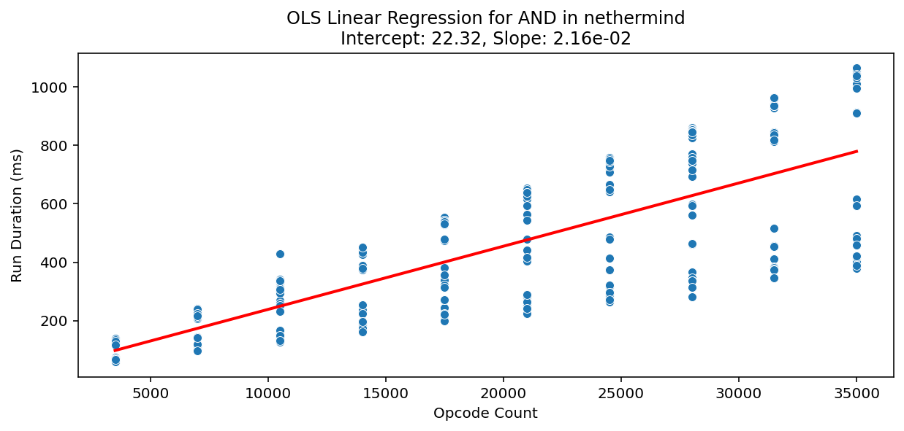

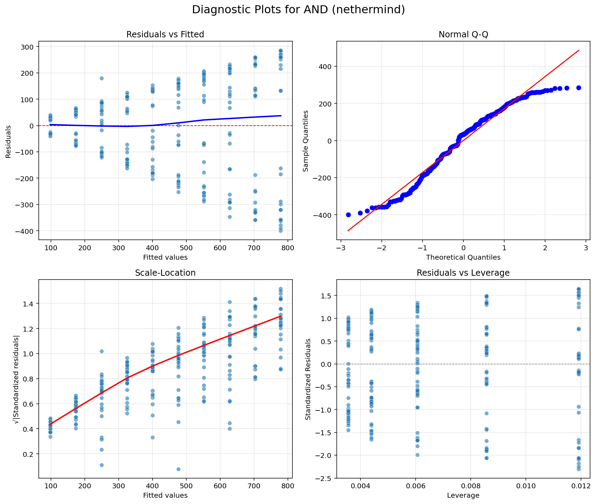


## erigon


```python
                            OLS Regression Results                            
==============================================================================
Dep. Variable:        run_duration_ms   R-squared:                       0.999
Model:                            OLS   Adj. R-squared:                  0.999
Method:                 Least Squares   F-statistic:                 2.328e+04
Date:                Thu, 22 Jan 2026   Prob (F-statistic):           1.95e-42
Time:                        10:33:34   Log-Likelihood:                -108.41
No. Observations:                  30   AIC:                             220.8
Df Residuals:                      28   BIC:                             223.6
Df Model:                           1                                         
Covariance Type:            nonrobust                                         
==============================================================================
                 coef    std err          t      P>|t|      [0.025      0.975]
------------------------------------------------------------------------------
const         30.9768      3.665      8.452      0.000      23.469      38.485
opcount        0.0257      0.000    152.569      0.000       0.025       0.026
==============================================================================
Omnibus:                       11.662   Durbin-Watson:                   0.991
Prob(Omnibus):                  0.003   Jarque-Bera (JB):               10.679
Skew:                           1.246   Prob(JB):                      0.00480
Kurtosis:                       4.527   Cond. No.                     4.69e+04
==============================================================================

Notes:
[1] Standard Errors assume that the covariance matrix of the errors is correctly specified.
[2] The condition number is large, 4.69e+04. This might indicate that there are
strong multicollinearity or other numerical problems.
```

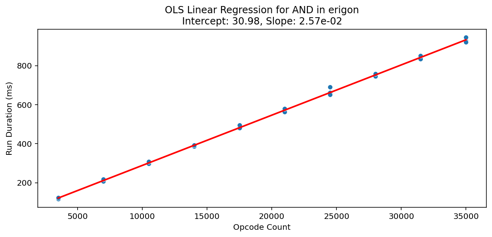

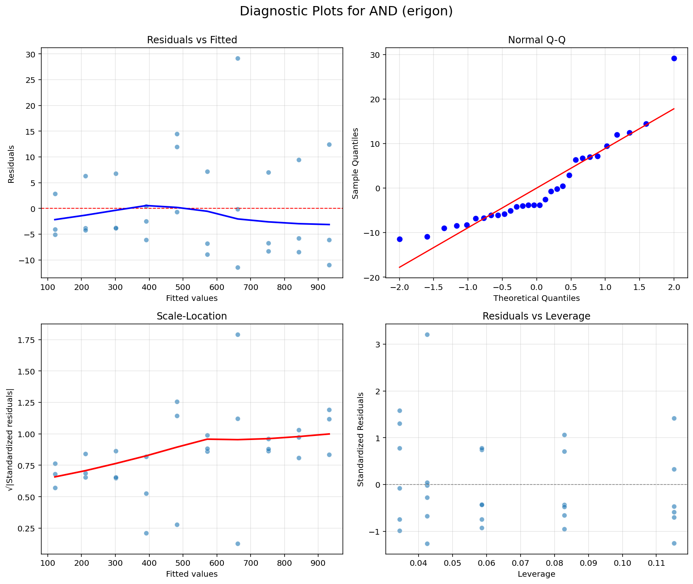


# BASEFEE

## geth


```python
                            OLS Regression Results                            
==============================================================================
Dep. Variable:        run_duration_ms   R-squared:                       0.962
Model:                            OLS   Adj. R-squared:                  0.962
Method:                 Least Squares   F-statistic:                     7348.
Date:                Thu, 22 Jan 2026   Prob (F-statistic):          5.02e-207
Time:                        10:33:34   Log-Likelihood:                -1790.9
No. Observations:                 290   AIC:                             3586.
Df Residuals:                     288   BIC:                             3593.
Df Model:                           1                                         
Covariance Type:            nonrobust                                         
==============================================================================
                 coef    std err          t      P>|t|      [0.025      0.975]
------------------------------------------------------------------------------
const         28.2304     14.812      1.906      0.058      -0.923      57.383
opcount        0.0205      0.000     85.720      0.000       0.020       0.021
==============================================================================
Omnibus:                       86.197   Durbin-Watson:                   0.977
Prob(Omnibus):                  0.000   Jarque-Bera (JB):              256.575
Skew:                           1.317   Prob(JB):                     1.93e-56
Kurtosis:                       6.781   Cond. No.                     1.34e+05
==============================================================================

Notes:
[1] Standard Errors assume that the covariance matrix of the errors is correctly specified.
[2] The condition number is large, 1.34e+05. This might indicate that there are
strong multicollinearity or other numerical problems.
```

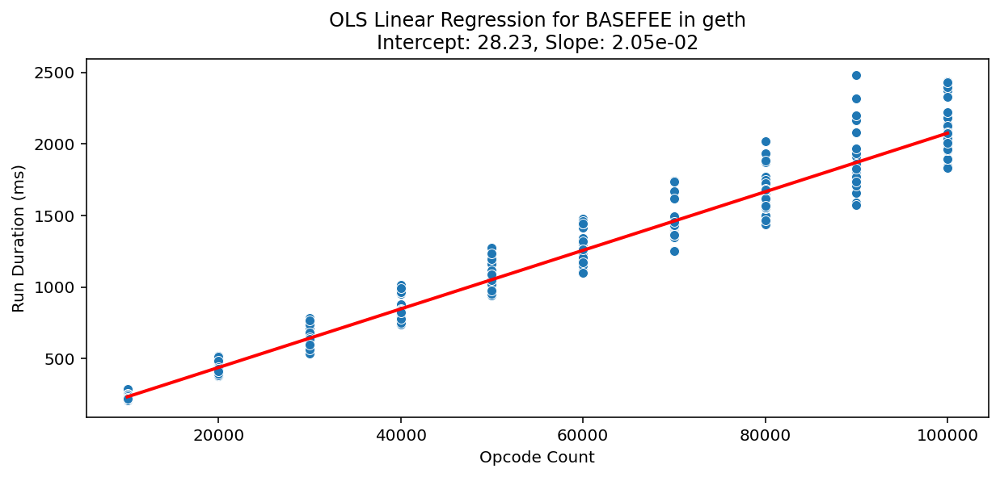

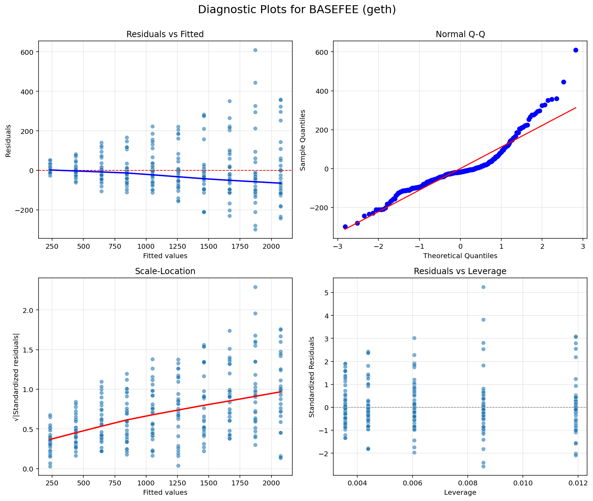


## besu


```python
                            OLS Regression Results                            
==============================================================================
Dep. Variable:        run_duration_ms   R-squared:                       0.987
Model:                            OLS   Adj. R-squared:                  0.987
Method:                 Least Squares   F-statistic:                 2.165e+04
Date:                Thu, 22 Jan 2026   Prob (F-statistic):          4.95e-273
Time:                        10:33:34   Log-Likelihood:                -1710.9
No. Observations:                 290   AIC:                             3426.
Df Residuals:                     288   BIC:                             3433.
Df Model:                           1                                         
Covariance Type:            nonrobust                                         
==============================================================================
                 coef    std err          t      P>|t|      [0.025      0.975]
------------------------------------------------------------------------------
const         31.0586     11.241      2.763      0.006       8.934      53.183
opcount        0.0267      0.000    147.140      0.000       0.026       0.027
==============================================================================
Omnibus:                       47.058   Durbin-Watson:                   1.008
Prob(Omnibus):                  0.000   Jarque-Bera (JB):              102.522
Skew:                          -0.811   Prob(JB):                     5.47e-23
Kurtosis:                       5.419   Cond. No.                     1.34e+05
==============================================================================

Notes:
[1] Standard Errors assume that the covariance matrix of the errors is correctly specified.
[2] The condition number is large, 1.34e+05. This might indicate that there are
strong multicollinearity or other numerical problems.
```

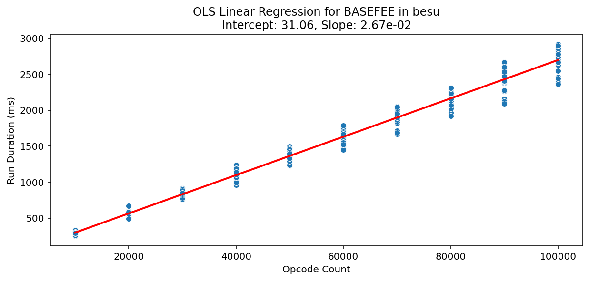

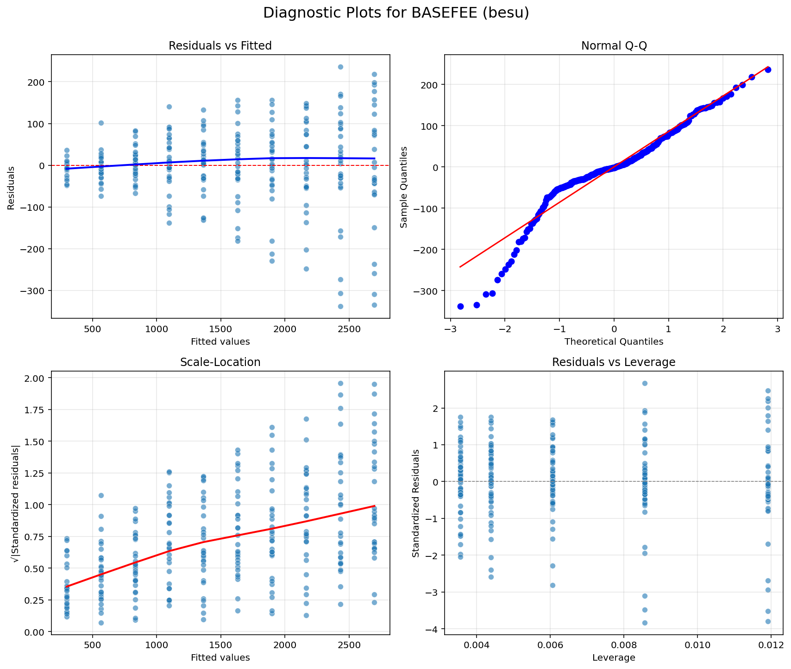


## reth


```python
                            OLS Regression Results                            
==============================================================================
Dep. Variable:        run_duration_ms   R-squared:                       0.974
Model:                            OLS   Adj. R-squared:                  0.974
Method:                 Least Squares   F-statistic:                     6696.
Date:                Thu, 22 Jan 2026   Prob (F-statistic):          3.59e-143
Time:                        10:33:34   Log-Likelihood:                -865.67
No. Observations:                 180   AIC:                             1735.
Df Residuals:                     178   BIC:                             1742.
Df Model:                           1                                         
Covariance Type:            nonrobust                                         
==============================================================================
                 coef    std err          t      P>|t|      [0.025      0.975]
------------------------------------------------------------------------------
const         30.7585      4.805      6.401      0.000      21.277      40.240
opcount        0.0063   7.74e-05     81.832      0.000       0.006       0.006
==============================================================================
Omnibus:                        1.424   Durbin-Watson:                   1.691
Prob(Omnibus):                  0.491   Jarque-Bera (JB):                1.057
Skew:                           0.154   Prob(JB):                        0.589
Kurtosis:                       3.215   Cond. No.                     1.34e+05
==============================================================================

Notes:
[1] Standard Errors assume that the covariance matrix of the errors is correctly specified.
[2] The condition number is large, 1.34e+05. This might indicate that there are
strong multicollinearity or other numerical problems.
```


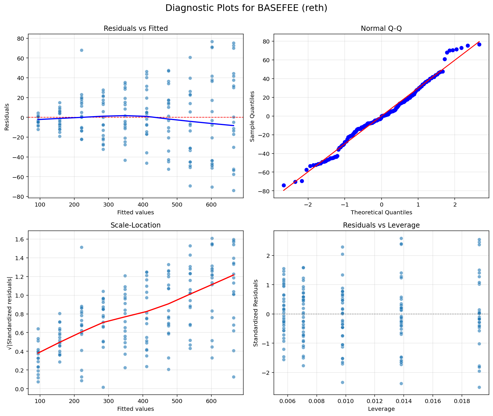


## nethermind


```python
                            OLS Regression Results                            
==============================================================================
Dep. Variable:        run_duration_ms   R-squared:                       0.896
Model:                            OLS   Adj. R-squared:                  0.896
Method:                 Least Squares   F-statistic:                     2492.
Date:                Thu, 22 Jan 2026   Prob (F-statistic):          7.86e-144
Time:                        10:33:35   Log-Likelihood:                -1639.8
No. Observations:                 290   AIC:                             3284.
Df Residuals:                     288   BIC:                             3291.
Df Model:                           1                                         
Covariance Type:            nonrobust                                         
==============================================================================
                 coef    std err          t      P>|t|      [0.025      0.975]
------------------------------------------------------------------------------
const         26.5559      8.796      3.019      0.003       9.244      43.868
opcount        0.0071      0.000     49.924      0.000       0.007       0.007
==============================================================================
Omnibus:                      594.332   Durbin-Watson:                   1.883
Prob(Omnibus):                  0.000   Jarque-Bera (JB):           519202.739
Skew:                          13.212   Prob(JB):                         0.00
Kurtosis:                     208.597   Cond. No.                     1.34e+05
==============================================================================

Notes:
[1] Standard Errors assume that the covariance matrix of the errors is correctly specified.
[2] The condition number is large, 1.34e+05. This might indicate that there are
strong multicollinearity or other numerical problems.
```
OLS model did not run... Error: 'numpy.ndarray' object has no attribute 'iloc'

## erigon


```python
                            OLS Regression Results                            
==============================================================================
Dep. Variable:        run_duration_ms   R-squared:                       0.997
Model:                            OLS   Adj. R-squared:                  0.997
Method:                 Least Squares   F-statistic:                     9600.
Date:                Thu, 22 Jan 2026   Prob (F-statistic):           4.63e-37
Time:                        10:33:35   Log-Likelihood:                -133.47
No. Observations:                  30   AIC:                             270.9
Df Residuals:                      28   BIC:                             273.7
Df Model:                           1                                         
Covariance Type:            nonrobust                                         
==============================================================================
                 coef    std err          t      P>|t|      [0.025      0.975]
------------------------------------------------------------------------------
const         30.1652      8.450      3.570      0.001      12.857      47.474
opcount        0.0133      0.000     97.981      0.000       0.013       0.014
==============================================================================
Omnibus:                       23.078   Durbin-Watson:                   1.707
Prob(Omnibus):                  0.000   Jarque-Bera (JB):               41.800
Skew:                           1.686   Prob(JB):                     8.38e-10
Kurtosis:                       7.698   Cond. No.                     1.34e+05
==============================================================================

Notes:
[1] Standard Errors assume that the covariance matrix of the errors is correctly specified.
[2] The condition number is large, 1.34e+05. This might indicate that there are
strong multicollinearity or other numerical problems.
```
OLS model did not run... Error: 'numpy.ndarray' object has no attribute 'iloc'

# BLOBBASEFEE

## geth


```python
                            OLS Regression Results                            
==============================================================================
Dep. Variable:        run_duration_ms   R-squared:                       0.956
Model:                            OLS   Adj. R-squared:                  0.956
Method:                 Least Squares   F-statistic:                     6303.
Date:                Thu, 22 Jan 2026   Prob (F-statistic):          8.03e-198
Time:                        10:33:35   Log-Likelihood:                -1829.4
No. Observations:                 290   AIC:                             3663.
Df Residuals:                     288   BIC:                             3670.
Df Model:                           1                                         
Covariance Type:            nonrobust                                         
==============================================================================
                 coef    std err          t      P>|t|      [0.025      0.975]
------------------------------------------------------------------------------
const         26.8776     16.913      1.589      0.113      -6.410      60.166
opcount        0.0216      0.000     79.392      0.000       0.021       0.022
==============================================================================
Omnibus:                        6.761   Durbin-Watson:                   0.815
Prob(Omnibus):                  0.034   Jarque-Bera (JB):                7.318
Skew:                          -0.259   Prob(JB):                       0.0258
Kurtosis:                       3.581   Cond. No.                     1.34e+05
==============================================================================

Notes:
[1] Standard Errors assume that the covariance matrix of the errors is correctly specified.
[2] The condition number is large, 1.34e+05. This might indicate that there are
strong multicollinearity or other numerical problems.
```

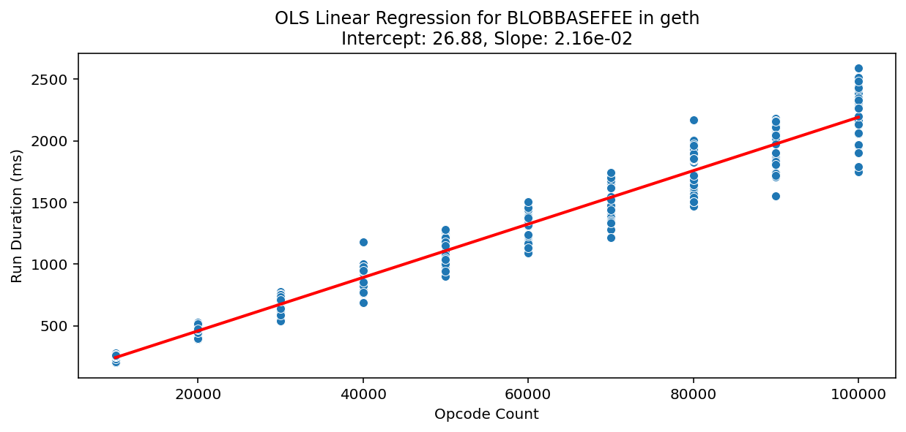

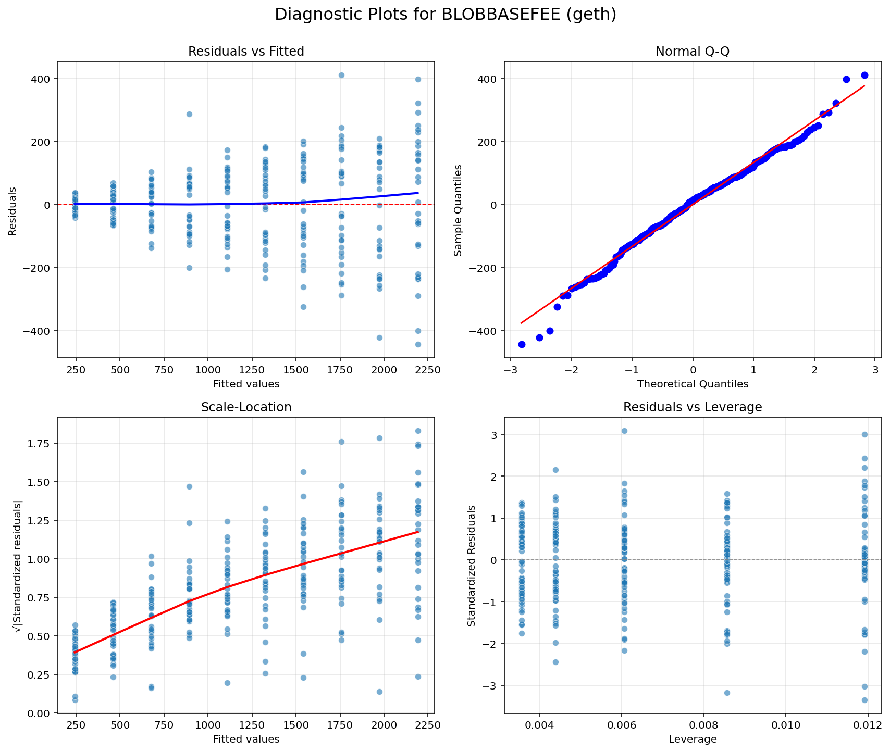


## besu


```python
                            OLS Regression Results                            
==============================================================================
Dep. Variable:        run_duration_ms   R-squared:                       0.987
Model:                            OLS   Adj. R-squared:                  0.987
Method:                 Least Squares   F-statistic:                 2.185e+04
Date:                Thu, 22 Jan 2026   Prob (F-statistic):          1.32e-273
Time:                        10:33:35   Log-Likelihood:                -1699.3
No. Observations:                 290   AIC:                             3403.
Df Residuals:                     288   BIC:                             3410.
Df Model:                           1                                         
Covariance Type:            nonrobust                                         
==============================================================================
                 coef    std err          t      P>|t|      [0.025      0.975]
------------------------------------------------------------------------------
const         29.5499     10.800      2.736      0.007       8.294      50.806
opcount        0.0257      0.000    147.826      0.000       0.025       0.026
==============================================================================
Omnibus:                       73.802   Durbin-Watson:                   0.882
Prob(Omnibus):                  0.000   Jarque-Bera (JB):              205.217
Skew:                          -1.146   Prob(JB):                     2.74e-45
Kurtosis:                       6.425   Cond. No.                     1.34e+05
==============================================================================

Notes:
[1] Standard Errors assume that the covariance matrix of the errors is correctly specified.
[2] The condition number is large, 1.34e+05. This might indicate that there are
strong multicollinearity or other numerical problems.
```


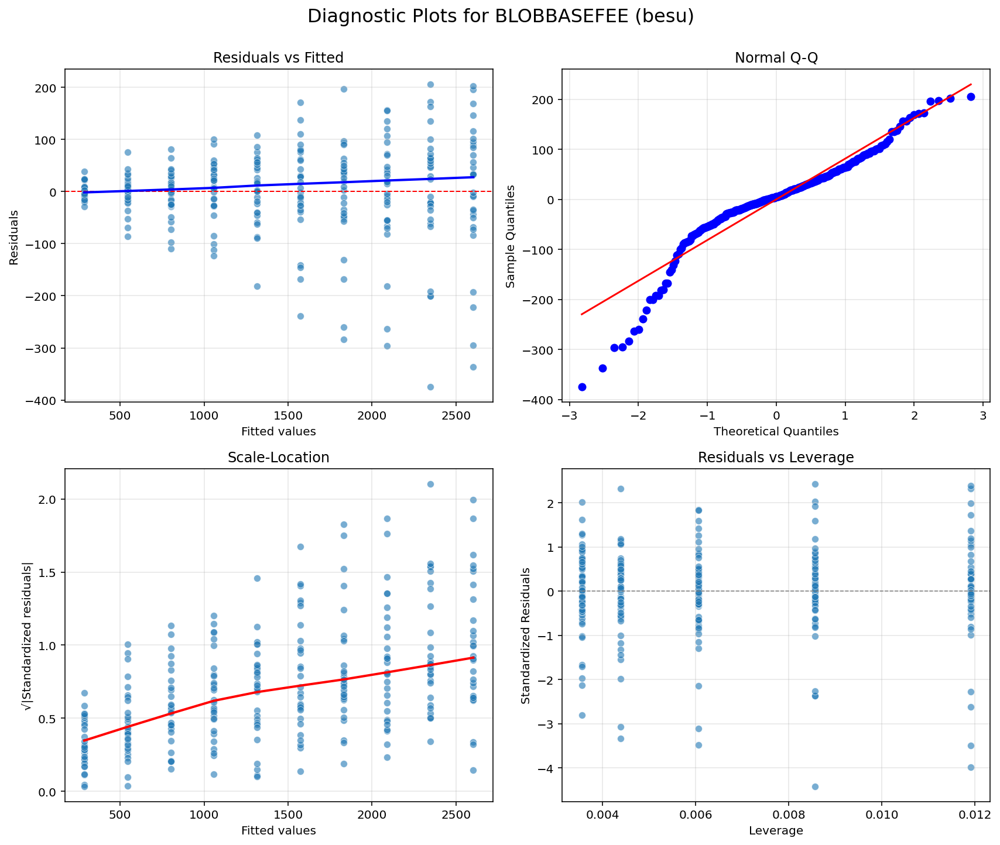


## reth


```python
                            OLS Regression Results                            
==============================================================================
Dep. Variable:        run_duration_ms   R-squared:                       0.983
Model:                            OLS   Adj. R-squared:                  0.983
Method:                 Least Squares   F-statistic:                 1.024e+04
Date:                Thu, 22 Jan 2026   Prob (F-statistic):          2.96e-159
Time:                        10:33:35   Log-Likelihood:                -845.07
No. Observations:                 180   AIC:                             1694.
Df Residuals:                     178   BIC:                             1701.
Df Model:                           1                                         
Covariance Type:            nonrobust                                         
==============================================================================
                 coef    std err          t      P>|t|      [0.025      0.975]
------------------------------------------------------------------------------
const         32.1344      4.286      7.498      0.000      23.677      40.591
opcount        0.0070   6.91e-05    101.211      0.000       0.007       0.007
==============================================================================
Omnibus:                        1.475   Durbin-Watson:                   1.877
Prob(Omnibus):                  0.478   Jarque-Bera (JB):                1.529
Skew:                           0.165   Prob(JB):                        0.466
Kurtosis:                       2.693   Cond. No.                     1.34e+05
==============================================================================

Notes:
[1] Standard Errors assume that the covariance matrix of the errors is correctly specified.
[2] The condition number is large, 1.34e+05. This might indicate that there are
strong multicollinearity or other numerical problems.
```


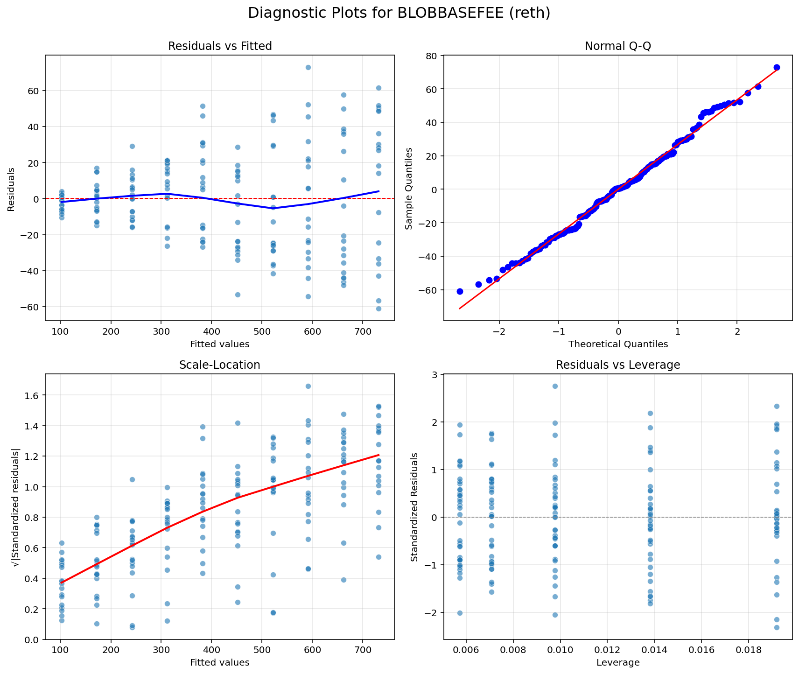


## nethermind


```python
                            OLS Regression Results                            
==============================================================================
Dep. Variable:        run_duration_ms   R-squared:                       0.981
Model:                            OLS   Adj. R-squared:                  0.981
Method:                 Least Squares   F-statistic:                 1.490e+04
Date:                Thu, 22 Jan 2026   Prob (F-statistic):          4.88e-250
Time:                        10:33:36   Log-Likelihood:                -1379.4
No. Observations:                 290   AIC:                             2763.
Df Residuals:                     288   BIC:                             2770.
Df Model:                           1                                         
Covariance Type:            nonrobust                                         
==============================================================================
                 coef    std err          t      P>|t|      [0.025      0.975]
------------------------------------------------------------------------------
const         27.1457      3.584      7.574      0.000      20.092      34.200
opcount        0.0071   5.78e-05    122.069      0.000       0.007       0.007
==============================================================================
Omnibus:                       55.182   Durbin-Watson:                   0.968
Prob(Omnibus):                  0.000   Jarque-Bera (JB):              153.314
Skew:                          -0.853   Prob(JB):                     5.11e-34
Kurtosis:                       6.127   Cond. No.                     1.34e+05
==============================================================================

Notes:
[1] Standard Errors assume that the covariance matrix of the errors is correctly specified.
[2] The condition number is large, 1.34e+05. This might indicate that there are
strong multicollinearity or other numerical problems.
```

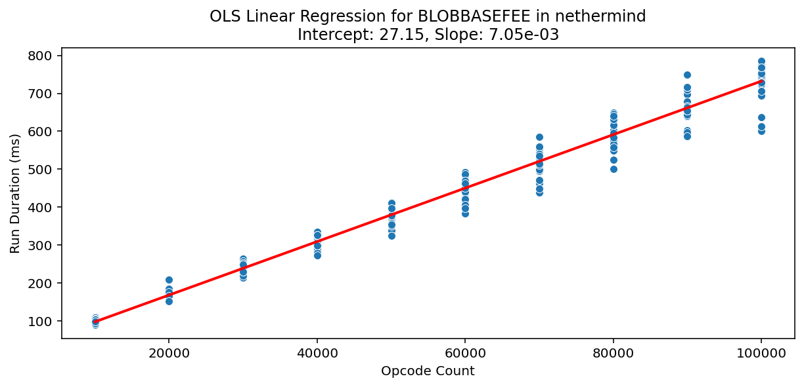

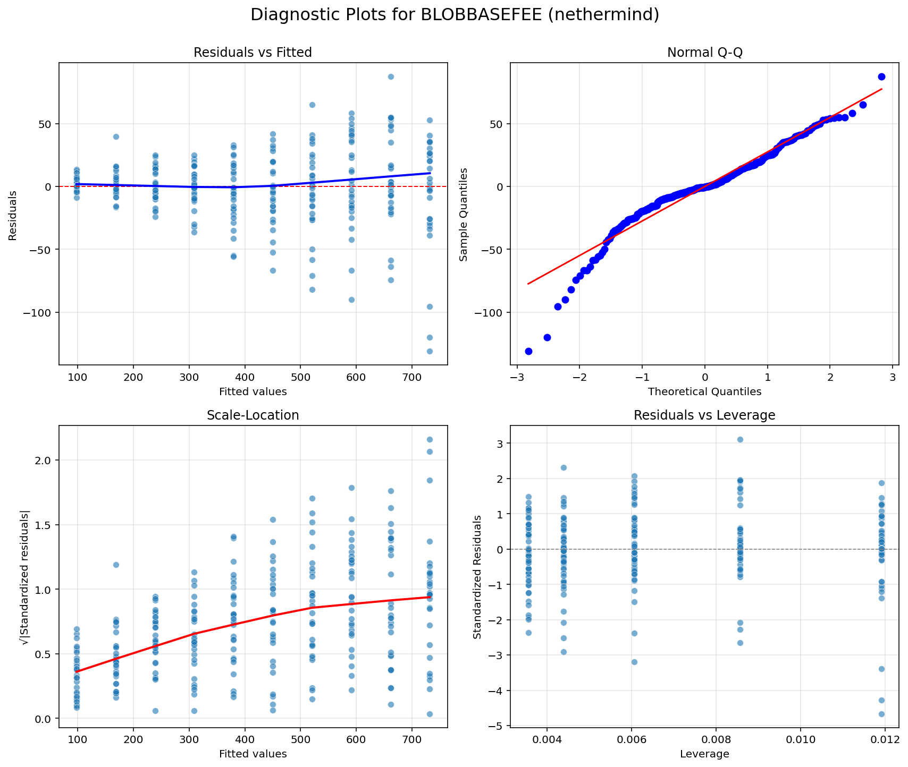


## erigon


```python
                            OLS Regression Results                            
==============================================================================
Dep. Variable:        run_duration_ms   R-squared:                       0.998
Model:                            OLS   Adj. R-squared:                  0.998
Method:                 Least Squares   F-statistic:                 1.388e+04
Date:                Thu, 22 Jan 2026   Prob (F-statistic):           2.70e-39
Time:                        10:33:36   Log-Likelihood:                -128.01
No. Observations:                  30   AIC:                             260.0
Df Residuals:                      28   BIC:                             262.8
Df Model:                           1                                         
Covariance Type:            nonrobust                                         
==============================================================================
                 coef    std err          t      P>|t|      [0.025      0.975]
------------------------------------------------------------------------------
const         26.8132      7.044      3.807      0.001      12.385      41.241
opcount        0.0134      0.000    117.799      0.000       0.013       0.014
==============================================================================
Omnibus:                        3.066   Durbin-Watson:                   1.434
Prob(Omnibus):                  0.216   Jarque-Bera (JB):                1.672
Skew:                           0.400   Prob(JB):                        0.433
Kurtosis:                       3.836   Cond. No.                     1.34e+05
==============================================================================

Notes:
[1] Standard Errors assume that the covariance matrix of the errors is correctly specified.
[2] The condition number is large, 1.34e+05. This might indicate that there are
strong multicollinearity or other numerical problems.
```

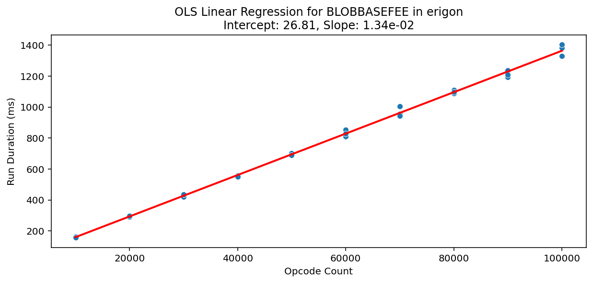

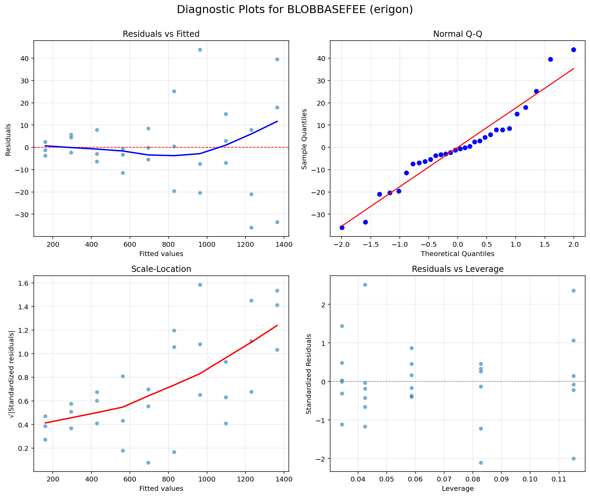


# BLOBHASH

## geth

OLS model did not run... Error: zero-size array to reduction operation maximum which has no identity

## besu

OLS model did not run... Error: zero-size array to reduction operation maximum which has no identity

## reth

OLS model did not run... Error: zero-size array to reduction operation maximum which has no identity

## nethermind

OLS model did not run... Error: zero-size array to reduction operation maximum which has no identity

## erigon

OLS model did not run... Error: zero-size array to reduction operation maximum which has no identity

# BLOCKHASH

## geth


```python
                            OLS Regression Results                            
==============================================================================
Dep. Variable:        run_duration_ms   R-squared:                       0.679
Model:                            OLS   Adj. R-squared:                  0.679
Method:                 Least Squares   F-statistic:                     3061.
Date:                Thu, 22 Jan 2026   Prob (F-statistic):               0.00
Time:                        10:33:36   Log-Likelihood:                -7925.4
No. Observations:                1450   AIC:                         1.585e+04
Df Residuals:                    1448   BIC:                         1.587e+04
Df Model:                           1                                         
Covariance Type:            nonrobust                                         
==============================================================================
                 coef    std err          t      P>|t|      [0.025      0.975]
------------------------------------------------------------------------------
const         29.6476      3.248      9.127      0.000      23.276      36.019
opcount        0.0290      0.001     55.322      0.000       0.028       0.030
==============================================================================
Omnibus:                      847.872   Durbin-Watson:                   1.900
Prob(Omnibus):                  0.000   Jarque-Bera (JB):             9808.194
Skew:                           2.526   Prob(JB):                         0.00
Kurtosis:                      14.697   Cond. No.                     1.34e+04
==============================================================================

Notes:
[1] Standard Errors assume that the covariance matrix of the errors is correctly specified.
[2] The condition number is large, 1.34e+04. This might indicate that there are
strong multicollinearity or other numerical problems.
```

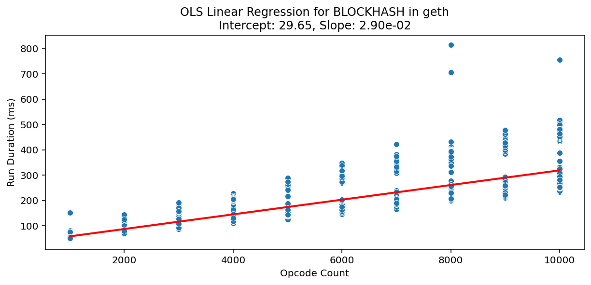

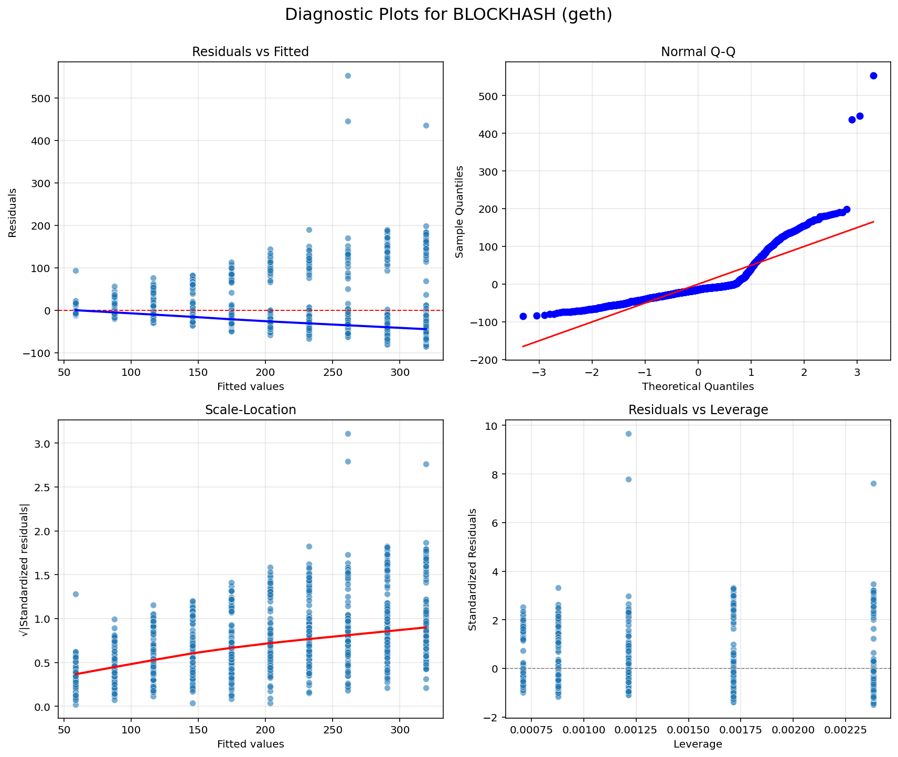


## besu


```python
                            OLS Regression Results                            
==============================================================================
Dep. Variable:        run_duration_ms   R-squared:                       0.429
Model:                            OLS   Adj. R-squared:                  0.429
Method:                 Least Squares   F-statistic:                     1090.
Date:                Thu, 22 Jan 2026   Prob (F-statistic):          1.15e-178
Time:                        10:33:37   Log-Likelihood:                -9977.9
No. Observations:                1450   AIC:                         1.996e+04
Df Residuals:                    1448   BIC:                         1.997e+04
Df Model:                           1                                         
Covariance Type:            nonrobust                                         
==============================================================================
                 coef    std err          t      P>|t|      [0.025      0.975]
------------------------------------------------------------------------------
const         28.9830     13.378      2.166      0.030       2.741      55.226
opcount        0.0712      0.002     33.014      0.000       0.067       0.075
==============================================================================
Omnibus:                      493.977   Durbin-Watson:                   1.874
Prob(Omnibus):                  0.000   Jarque-Bera (JB):             1241.896
Skew:                           1.872   Prob(JB):                    2.12e-270
Kurtosis:                       5.558   Cond. No.                     1.34e+04
==============================================================================

Notes:
[1] Standard Errors assume that the covariance matrix of the errors is correctly specified.
[2] The condition number is large, 1.34e+04. This might indicate that there are
strong multicollinearity or other numerical problems.
```

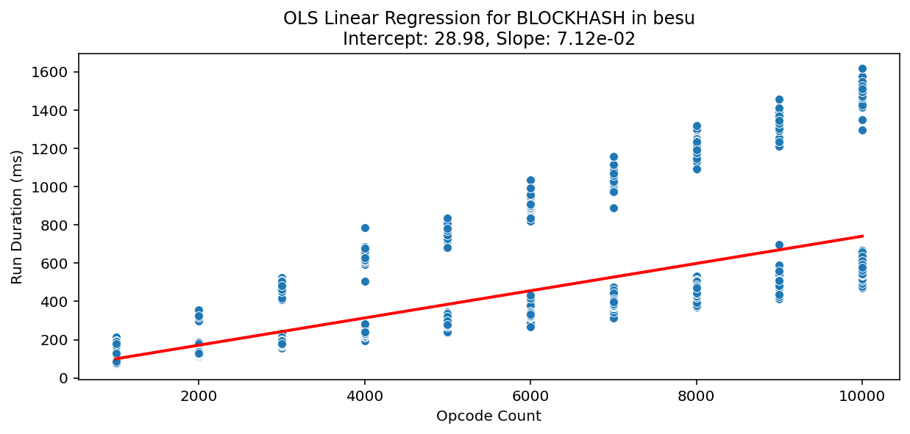

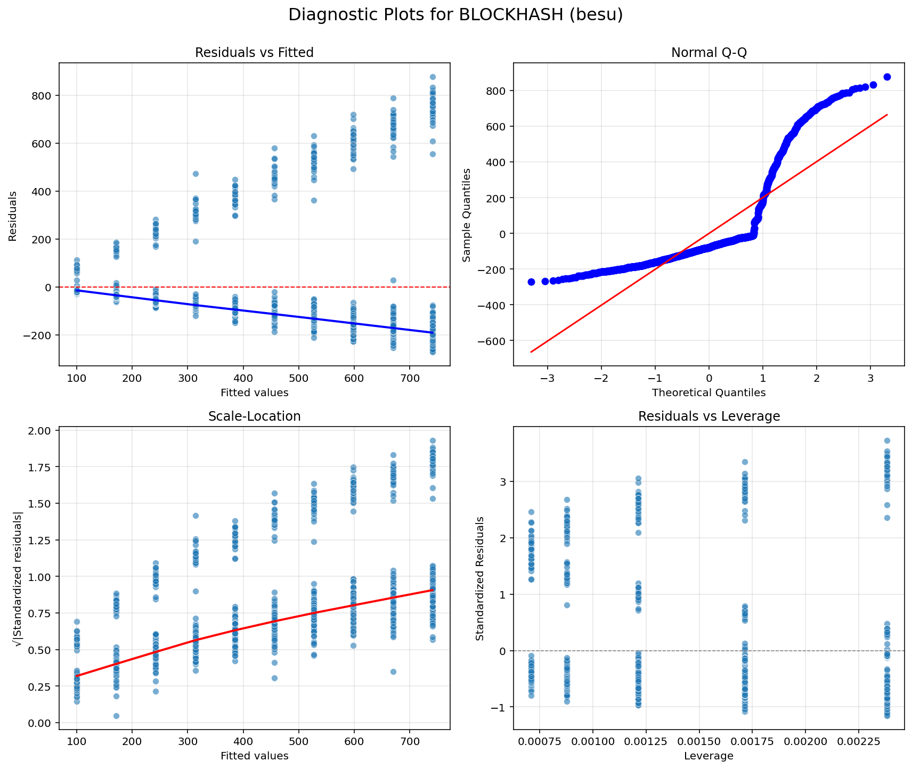


## reth


```python
                            OLS Regression Results                            
==============================================================================
Dep. Variable:        run_duration_ms   R-squared:                       0.788
Model:                            OLS   Adj. R-squared:                  0.788
Method:                 Least Squares   F-statistic:                     3345.
Date:                Thu, 22 Jan 2026   Prob (F-statistic):          4.95e-305
Time:                        10:33:37   Log-Likelihood:                -4021.6
No. Observations:                 900   AIC:                             8047.
Df Residuals:                     898   BIC:                             8057.
Df Model:                           1                                         
Covariance Type:            nonrobust                                         
==============================================================================
                 coef    std err          t      P>|t|      [0.025      0.975]
------------------------------------------------------------------------------
const         30.6730      1.521     20.160      0.000      27.687      33.659
opcount        0.0142      0.000     57.832      0.000       0.014       0.015
==============================================================================
Omnibus:                      265.143   Durbin-Watson:                   1.880
Prob(Omnibus):                  0.000   Jarque-Bera (JB):              576.164
Skew:                           1.657   Prob(JB):                    7.72e-126
Kurtosis:                       5.094   Cond. No.                     1.34e+04
==============================================================================

Notes:
[1] Standard Errors assume that the covariance matrix of the errors is correctly specified.
[2] The condition number is large, 1.34e+04. This might indicate that there are
strong multicollinearity or other numerical problems.
```

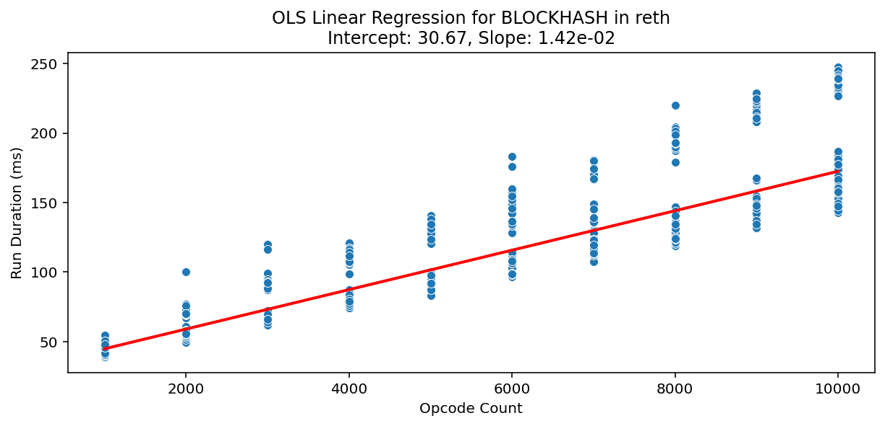

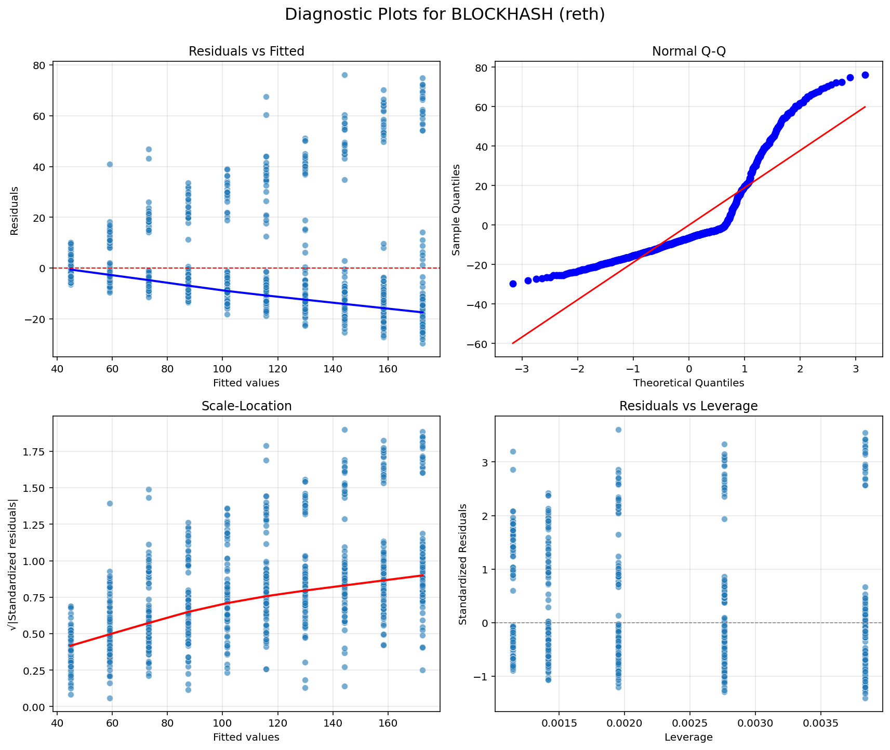


## nethermind


```python
                            OLS Regression Results                            
==============================================================================
Dep. Variable:        run_duration_ms   R-squared:                       0.909
Model:                            OLS   Adj. R-squared:                  0.909
Method:                 Least Squares   F-statistic:                 1.448e+04
Date:                Thu, 22 Jan 2026   Prob (F-statistic):               0.00
Time:                        10:33:37   Log-Likelihood:                -6633.1
No. Observations:                1450   AIC:                         1.327e+04
Df Residuals:                    1448   BIC:                         1.328e+04
Df Model:                           1                                         
Covariance Type:            nonrobust                                         
==============================================================================
                 coef    std err          t      P>|t|      [0.025      0.975]
------------------------------------------------------------------------------
const         27.5375      1.332     20.670      0.000      24.924      30.151
opcount        0.0258      0.000    120.322      0.000       0.025       0.026
==============================================================================
Omnibus:                      443.632   Durbin-Watson:                   1.793
Prob(Omnibus):                  0.000   Jarque-Bera (JB):             1239.262
Skew:                           1.584   Prob(JB):                    7.90e-270
Kurtosis:                       6.237   Cond. No.                     1.34e+04
==============================================================================

Notes:
[1] Standard Errors assume that the covariance matrix of the errors is correctly specified.
[2] The condition number is large, 1.34e+04. This might indicate that there are
strong multicollinearity or other numerical problems.
```

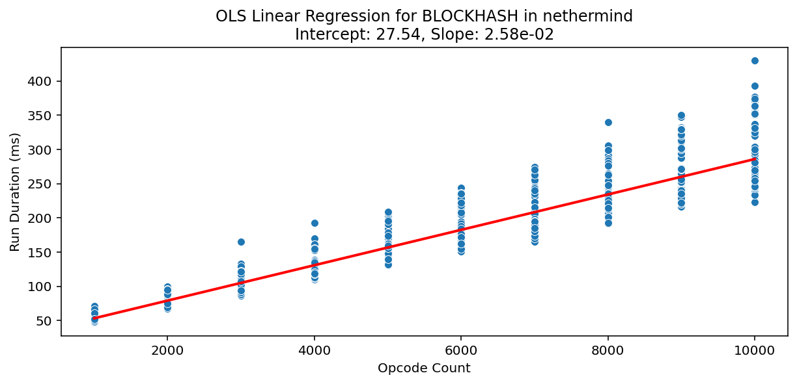

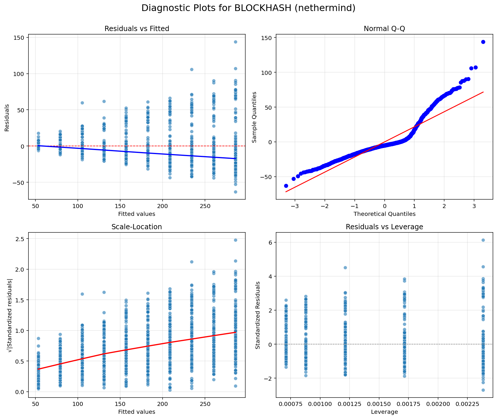


## erigon


```python
                            OLS Regression Results                            
==============================================================================
Dep. Variable:        run_duration_ms   R-squared:                       0.758
Model:                            OLS   Adj. R-squared:                  0.756
Method:                 Least Squares   F-statistic:                     462.9
Date:                Thu, 22 Jan 2026   Prob (F-statistic):           2.06e-47
Time:                        10:33:37   Log-Likelihood:                -822.56
No. Observations:                 150   AIC:                             1649.
Df Residuals:                     148   BIC:                             1655.
Df Model:                           1                                         
Covariance Type:            nonrobust                                         
==============================================================================
                 coef    std err          t      P>|t|      [0.025      0.975]
------------------------------------------------------------------------------
const         27.6113     10.344      2.669      0.008       7.170      48.053
opcount        0.0359      0.002     21.515      0.000       0.033       0.039
==============================================================================
Omnibus:                       29.669   Durbin-Watson:                   1.913
Prob(Omnibus):                  0.000   Jarque-Bera (JB):               40.039
Skew:                           1.151   Prob(JB):                     2.02e-09
Kurtosis:                       4.051   Cond. No.                     1.34e+04
==============================================================================

Notes:
[1] Standard Errors assume that the covariance matrix of the errors is correctly specified.
[2] The condition number is large, 1.34e+04. This might indicate that there are
strong multicollinearity or other numerical problems.
```

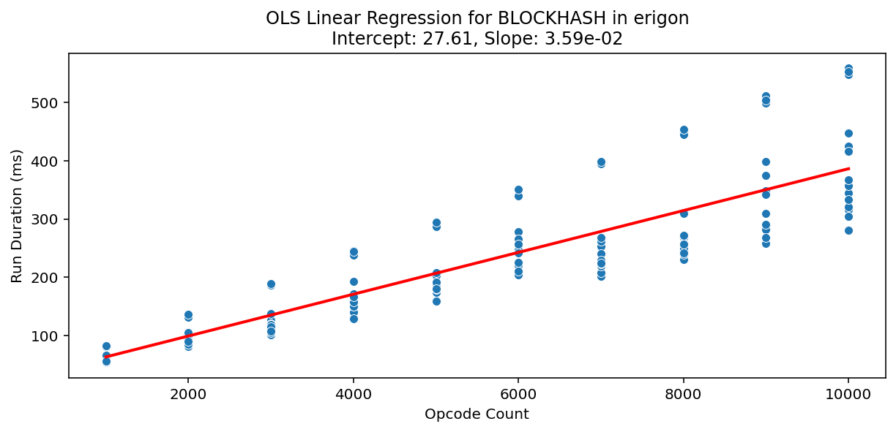

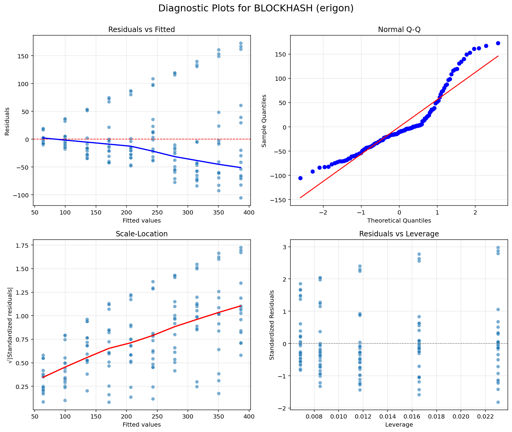


# BYTE

## geth


```python
                            OLS Regression Results                            
==============================================================================
Dep. Variable:        run_duration_ms   R-squared:                       0.975
Model:                            OLS   Adj. R-squared:                  0.975
Method:                 Least Squares   F-statistic:                 1.107e+04
Date:                Thu, 22 Jan 2026   Prob (F-statistic):          7.16e-232
Time:                        10:33:38   Log-Likelihood:                -1477.9
No. Observations:                 290   AIC:                             2960.
Df Residuals:                     288   BIC:                             2967.
Df Model:                           1                                         
Covariance Type:            nonrobust                                         
==============================================================================
                 coef    std err          t      P>|t|      [0.025      0.975]
------------------------------------------------------------------------------
const         36.9810      5.033      7.348      0.000      27.075      46.887
opcount        0.0244      0.000    105.224      0.000       0.024       0.025
==============================================================================
Omnibus:                      313.811   Durbin-Watson:                   1.397
Prob(Omnibus):                  0.000   Jarque-Bera (JB):            24951.181
Skew:                           4.279   Prob(JB):                         0.00
Kurtosis:                      47.628   Cond. No.                     4.69e+04
==============================================================================

Notes:
[1] Standard Errors assume that the covariance matrix of the errors is correctly specified.
[2] The condition number is large, 4.69e+04. This might indicate that there are
strong multicollinearity or other numerical problems.
```

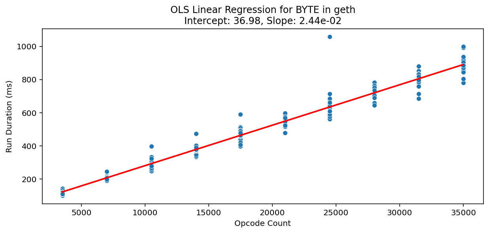

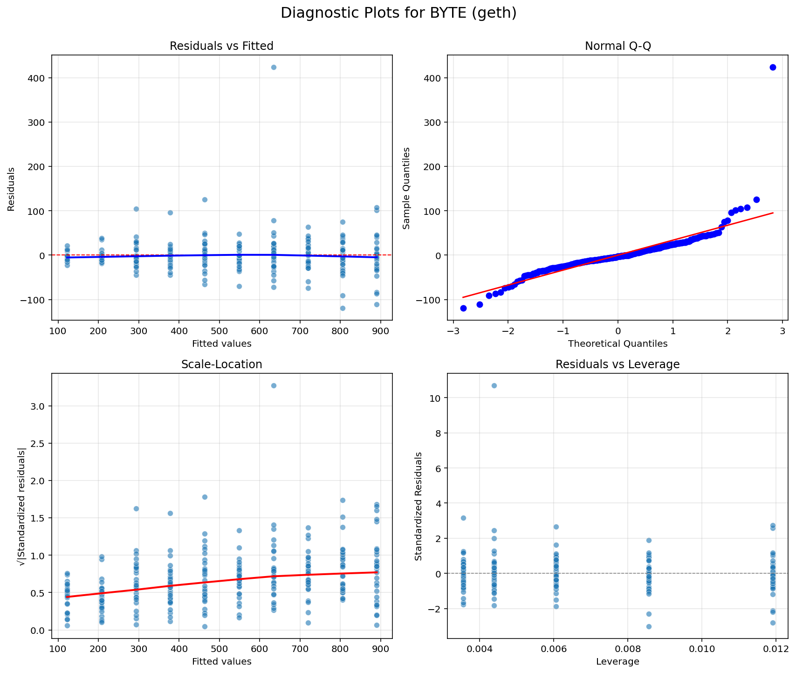


## besu


```python
                            OLS Regression Results                            
==============================================================================
Dep. Variable:        run_duration_ms   R-squared:                       0.988
Model:                            OLS   Adj. R-squared:                  0.988
Method:                 Least Squares   F-statistic:                 2.378e+04
Date:                Thu, 22 Jan 2026   Prob (F-statistic):          7.73e-279
Time:                        10:33:38   Log-Likelihood:                -1645.7
No. Observations:                 290   AIC:                             3295.
Df Residuals:                     288   BIC:                             3303.
Df Model:                           1                                         
Covariance Type:            nonrobust                                         
==============================================================================
                 coef    std err          t      P>|t|      [0.025      0.975]
------------------------------------------------------------------------------
const         30.1291      8.976      3.357      0.001      12.463      47.796
opcount        0.0637      0.000    154.222      0.000       0.063       0.065
==============================================================================
Omnibus:                       48.071   Durbin-Watson:                   0.964
Prob(Omnibus):                  0.000   Jarque-Bera (JB):              114.938
Skew:                          -0.794   Prob(JB):                     1.10e-25
Kurtosis:                       5.644   Cond. No.                     4.69e+04
==============================================================================

Notes:
[1] Standard Errors assume that the covariance matrix of the errors is correctly specified.
[2] The condition number is large, 4.69e+04. This might indicate that there are
strong multicollinearity or other numerical problems.
```


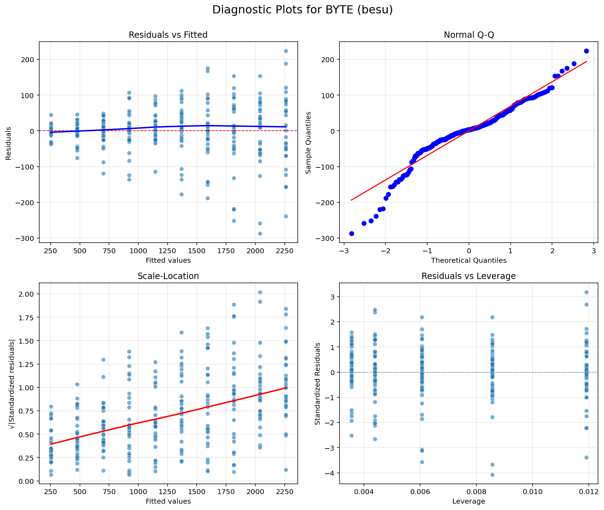


## reth


```python
                            OLS Regression Results                            
==============================================================================
Dep. Variable:        run_duration_ms   R-squared:                       0.978
Model:                            OLS   Adj. R-squared:                  0.977
Method:                 Least Squares   F-statistic:                     7774.
Date:                Thu, 22 Jan 2026   Prob (F-statistic):          8.40e-149
Time:                        10:33:38   Log-Likelihood:                -732.45
No. Observations:                 180   AIC:                             1469.
Df Residuals:                     178   BIC:                             1475.
Df Model:                           1                                         
Covariance Type:            nonrobust                                         
==============================================================================
                 coef    std err          t      P>|t|      [0.025      0.975]
------------------------------------------------------------------------------
const         31.1066      2.292     13.570      0.000      26.583      35.630
opcount        0.0093      0.000     88.172      0.000       0.009       0.010
==============================================================================
Omnibus:                       40.527   Durbin-Watson:                   1.360
Prob(Omnibus):                  0.000   Jarque-Bera (JB):              232.113
Skew:                           0.635   Prob(JB):                     3.96e-51
Kurtosis:                       8.416   Cond. No.                     4.69e+04
==============================================================================

Notes:
[1] Standard Errors assume that the covariance matrix of the errors is correctly specified.
[2] The condition number is large, 4.69e+04. This might indicate that there are
strong multicollinearity or other numerical problems.
```

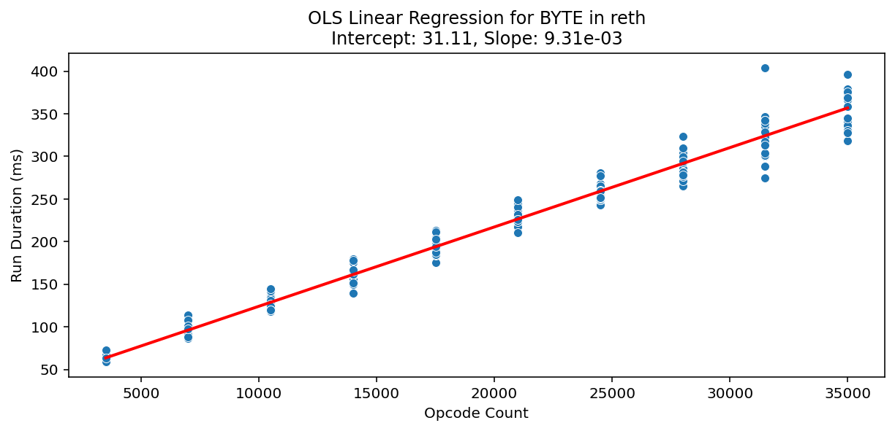

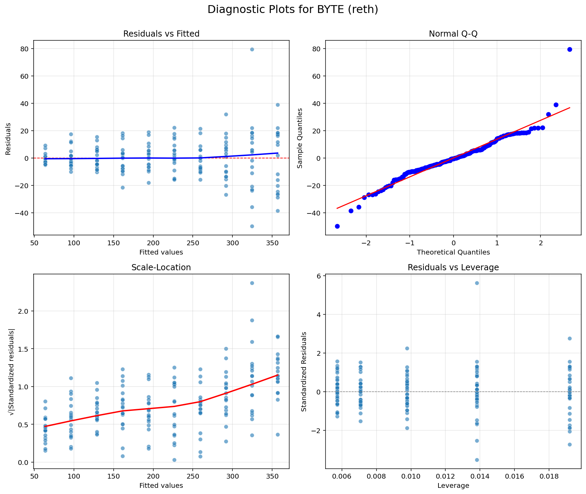


## nethermind


```python
                            OLS Regression Results                            
==============================================================================
Dep. Variable:        run_duration_ms   R-squared:                       0.983
Model:                            OLS   Adj. R-squared:                  0.983
Method:                 Least Squares   F-statistic:                 1.717e+04
Date:                Thu, 22 Jan 2026   Prob (F-statistic):          9.85e-259
Time:                        10:33:38   Log-Likelihood:                -1281.9
No. Observations:                 290   AIC:                             2568.
Df Residuals:                     288   BIC:                             2575.
Df Model:                           1                                         
Covariance Type:            nonrobust                                         
==============================================================================
                 coef    std err          t      P>|t|      [0.025      0.975]
------------------------------------------------------------------------------
const         28.6501      2.561     11.188      0.000      23.610      33.690
opcount        0.0154      0.000    131.021      0.000       0.015       0.016
==============================================================================
Omnibus:                      113.388   Durbin-Watson:                   1.101
Prob(Omnibus):                  0.000   Jarque-Bera (JB):             2697.915
Skew:                           0.987   Prob(JB):                         0.00
Kurtosis:                      17.811   Cond. No.                     4.69e+04
==============================================================================

Notes:
[1] Standard Errors assume that the covariance matrix of the errors is correctly specified.
[2] The condition number is large, 4.69e+04. This might indicate that there are
strong multicollinearity or other numerical problems.
```


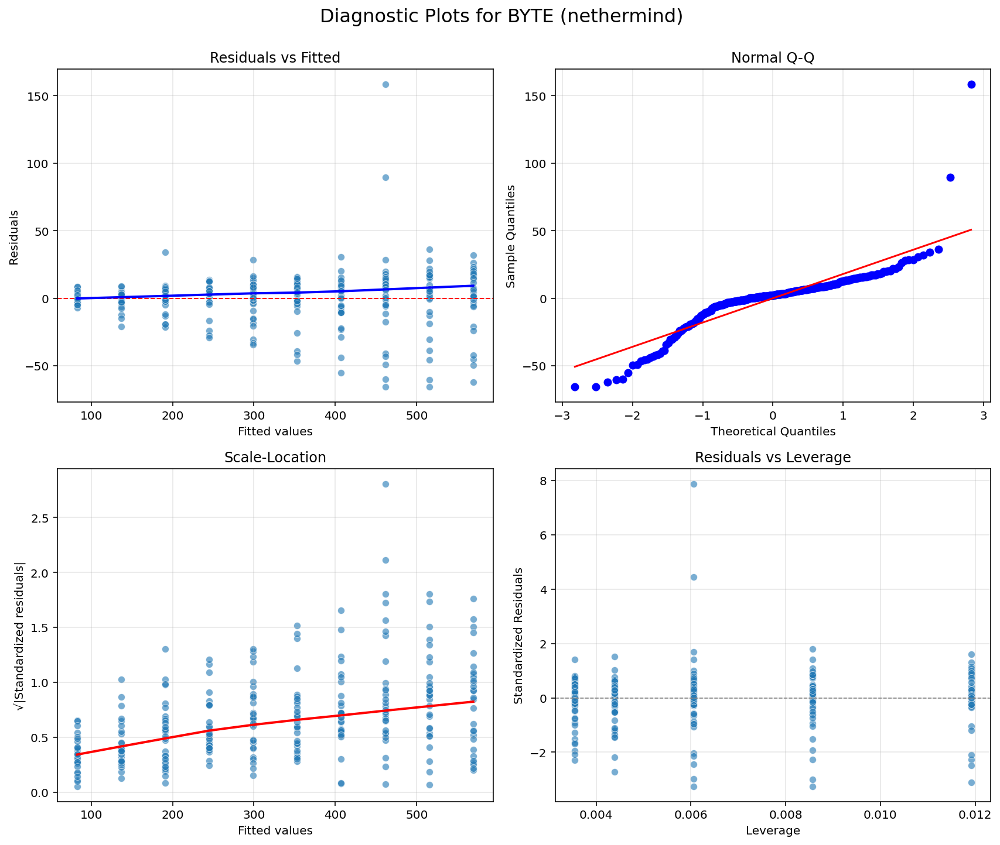


## erigon


```python
                            OLS Regression Results                            
==============================================================================
Dep. Variable:        run_duration_ms   R-squared:                       0.935
Model:                            OLS   Adj. R-squared:                  0.932
Method:                 Least Squares   F-statistic:                     401.3
Date:                Thu, 22 Jan 2026   Prob (F-statistic):           3.89e-18
Time:                        10:33:39   Log-Likelihood:                -172.63
No. Observations:                  30   AIC:                             349.3
Df Residuals:                      28   BIC:                             352.1
Df Model:                           1                                         
Covariance Type:            nonrobust                                         
==============================================================================
                 coef    std err          t      P>|t|      [0.025      0.975]
------------------------------------------------------------------------------
const         44.3896     31.173      1.424      0.166     -19.466     108.246
opcount        0.0288      0.001     20.032      0.000       0.026       0.032
==============================================================================
Omnibus:                       31.851   Durbin-Watson:                   2.167
Prob(Omnibus):                  0.000   Jarque-Bera (JB):               73.937
Skew:                           2.313   Prob(JB):                     8.81e-17
Kurtosis:                       9.145   Cond. No.                     4.69e+04
==============================================================================

Notes:
[1] Standard Errors assume that the covariance matrix of the errors is correctly specified.
[2] The condition number is large, 4.69e+04. This might indicate that there are
strong multicollinearity or other numerical problems.
```
OLS model did not run... Error: 'numpy.ndarray' object has no attribute 'iloc'

# CALLDATALOAD

## geth


```python
                            OLS Regression Results                            
==============================================================================
Dep. Variable:        run_duration_ms   R-squared:                       0.498
Model:                            OLS   Adj. R-squared:                  0.498
Method:                 Least Squares   F-statistic:                     1150.
Date:                Thu, 22 Jan 2026   Prob (F-statistic):          1.33e-175
Time:                        10:33:39   Log-Likelihood:                -8674.6
No. Observations:                1160   AIC:                         1.735e+04
Df Residuals:                    1158   BIC:                         1.736e+04
Df Model:                           1                                         
Covariance Type:            nonrobust                                         
==============================================================================
                 coef    std err          t      P>|t|      [0.025      0.975]
------------------------------------------------------------------------------
const         30.9551     27.171      1.139      0.255     -22.354      84.264
opcount        0.0297      0.001     33.908      0.000       0.028       0.031
==============================================================================
Omnibus:                      262.667   Durbin-Watson:                   2.024
Prob(Omnibus):                  0.000   Jarque-Bera (JB):              463.803
Skew:                           1.453   Prob(JB):                    1.93e-101
Kurtosis:                       4.072   Cond. No.                     6.70e+04
==============================================================================

Notes:
[1] Standard Errors assume that the covariance matrix of the errors is correctly specified.
[2] The condition number is large, 6.7e+04. This might indicate that there are
strong multicollinearity or other numerical problems.
```

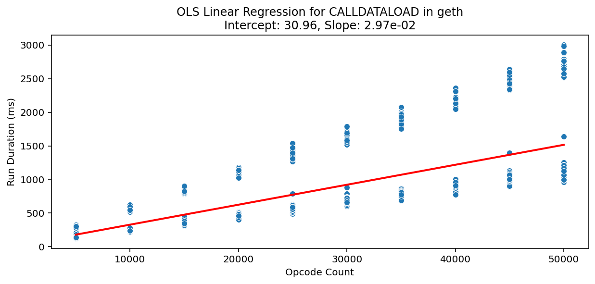

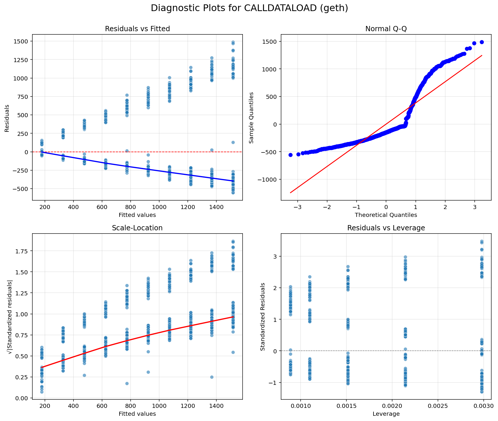


## besu


```python
                            OLS Regression Results                            
==============================================================================
Dep. Variable:        run_duration_ms   R-squared:                       0.842
Model:                            OLS   Adj. R-squared:                  0.842
Method:                 Least Squares   F-statistic:                     6159.
Date:                Thu, 22 Jan 2026   Prob (F-statistic):               0.00
Time:                        10:33:39   Log-Likelihood:                -8690.5
No. Observations:                1160   AIC:                         1.738e+04
Df Residuals:                    1158   BIC:                         1.740e+04
Df Model:                           1                                         
Covariance Type:            nonrobust                                         
==============================================================================
                 coef    std err          t      P>|t|      [0.025      0.975]
------------------------------------------------------------------------------
const         31.6272     27.546      1.148      0.251     -22.418      85.673
opcount        0.0697      0.001     78.480      0.000       0.068       0.071
==============================================================================
Omnibus:                      206.007   Durbin-Watson:                   1.938
Prob(Omnibus):                  0.000   Jarque-Bera (JB):              324.323
Skew:                          -1.213   Prob(JB):                     3.75e-71
Kurtosis:                       3.908   Cond. No.                     6.70e+04
==============================================================================

Notes:
[1] Standard Errors assume that the covariance matrix of the errors is correctly specified.
[2] The condition number is large, 6.7e+04. This might indicate that there are
strong multicollinearity or other numerical problems.
```

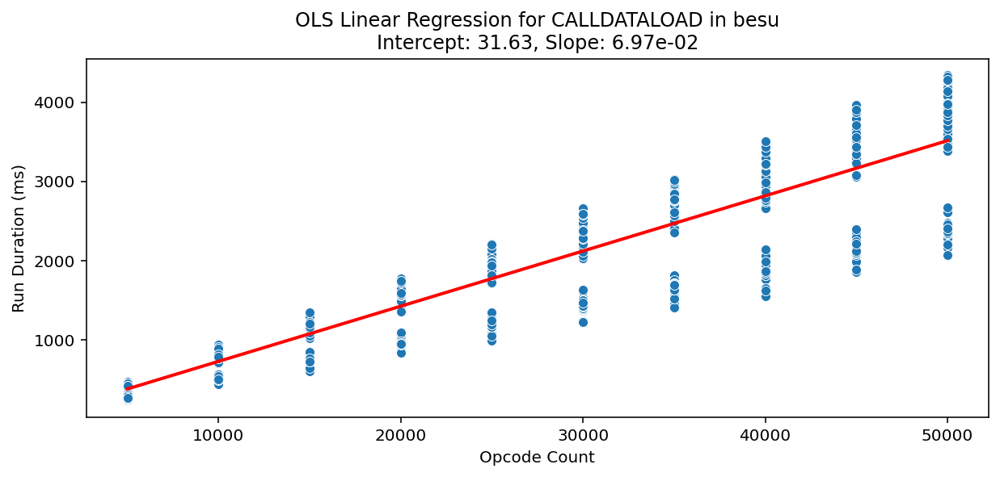

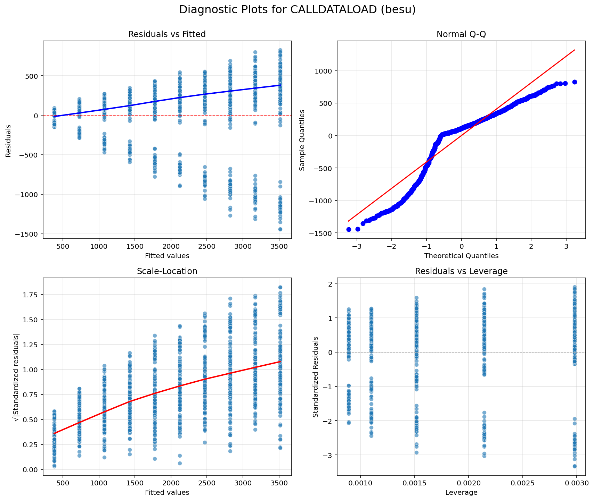


## reth


```python
                            OLS Regression Results                            
==============================================================================
Dep. Variable:        run_duration_ms   R-squared:                       0.940
Model:                            OLS   Adj. R-squared:                  0.940
Method:                 Least Squares   F-statistic:                 1.126e+04
Date:                Thu, 22 Jan 2026   Prob (F-statistic):               0.00
Time:                        10:33:39   Log-Likelihood:                -3790.2
No. Observations:                 720   AIC:                             7584.
Df Residuals:                     718   BIC:                             7594.
Df Model:                           1                                         
Covariance Type:            nonrobust                                         
==============================================================================
                 coef    std err          t      P>|t|      [0.025      0.975]
------------------------------------------------------------------------------
const         31.4981      3.771      8.354      0.000      24.095      38.901
opcount        0.0129      0.000    106.095      0.000       0.013       0.013
==============================================================================
Omnibus:                       91.545   Durbin-Watson:                   1.905
Prob(Omnibus):                  0.000   Jarque-Bera (JB):              632.360
Skew:                          -0.306   Prob(JB):                    4.84e-138
Kurtosis:                       7.550   Cond. No.                     6.70e+04
==============================================================================

Notes:
[1] Standard Errors assume that the covariance matrix of the errors is correctly specified.
[2] The condition number is large, 6.7e+04. This might indicate that there are
strong multicollinearity or other numerical problems.
```

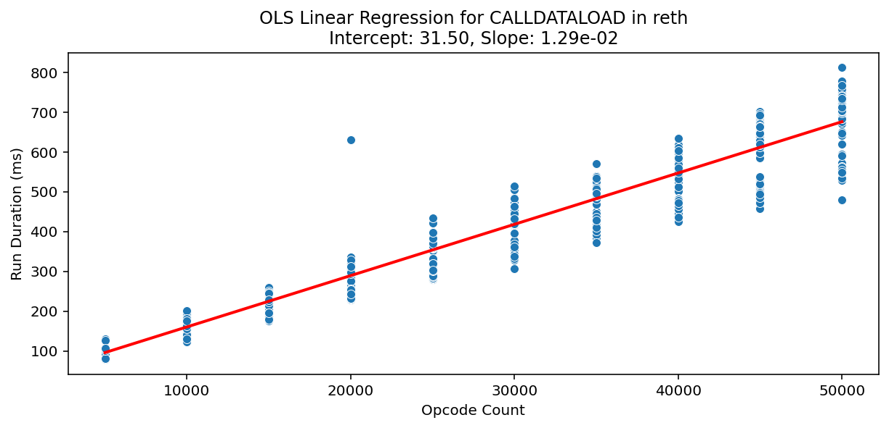

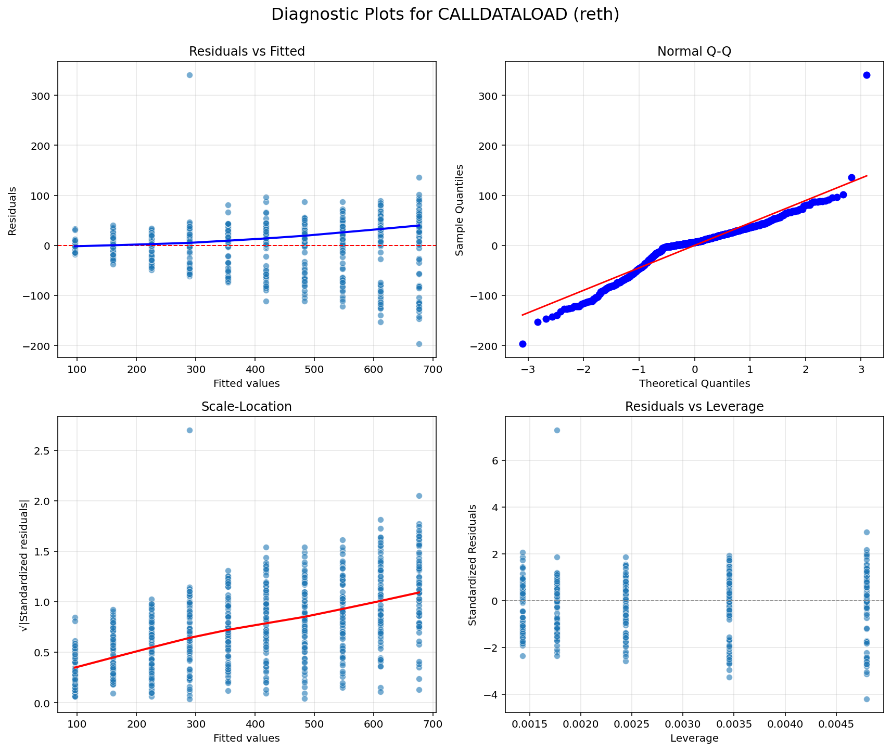


## nethermind


```python
                            OLS Regression Results                            
==============================================================================
Dep. Variable:        run_duration_ms   R-squared:                       0.956
Model:                            OLS   Adj. R-squared:                  0.956
Method:                 Least Squares   F-statistic:                 2.491e+04
Date:                Thu, 22 Jan 2026   Prob (F-statistic):               0.00
Time:                        10:33:39   Log-Likelihood:                -6294.1
No. Observations:                1160   AIC:                         1.259e+04
Df Residuals:                    1158   BIC:                         1.260e+04
Df Model:                           1                                         
Covariance Type:            nonrobust                                         
==============================================================================
                 coef    std err          t      P>|t|      [0.025      0.975]
------------------------------------------------------------------------------
const         28.2145      3.490      8.083      0.000      21.366      35.063
opcount        0.0178      0.000    157.815      0.000       0.018       0.018
==============================================================================
Omnibus:                      138.947   Durbin-Watson:                   1.655
Prob(Omnibus):                  0.000   Jarque-Bera (JB):              246.976
Skew:                           0.773   Prob(JB):                     2.34e-54
Kurtosis:                       4.648   Cond. No.                     6.70e+04
==============================================================================

Notes:
[1] Standard Errors assume that the covariance matrix of the errors is correctly specified.
[2] The condition number is large, 6.7e+04. This might indicate that there are
strong multicollinearity or other numerical problems.
```

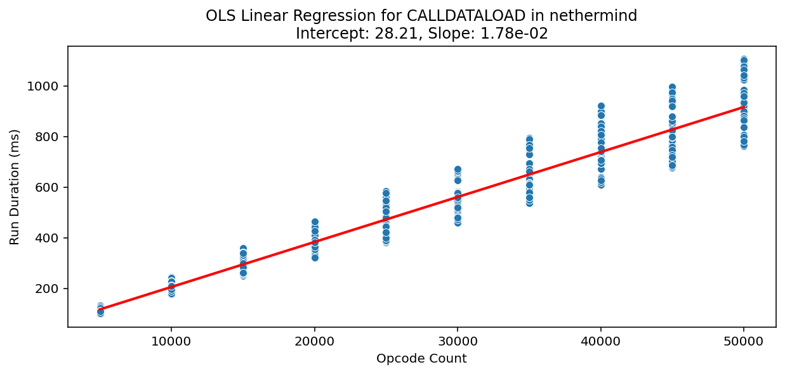

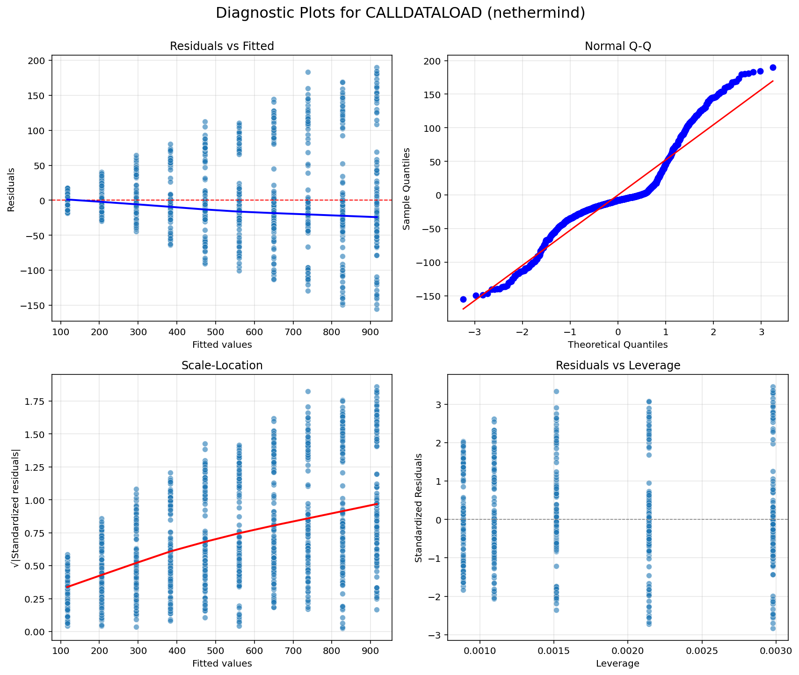


## erigon


```python
                            OLS Regression Results                            
==============================================================================
Dep. Variable:        run_duration_ms   R-squared:                       0.998
Model:                            OLS   Adj. R-squared:                  0.998
Method:                 Least Squares   F-statistic:                 7.339e+04
Date:                Thu, 22 Jan 2026   Prob (F-statistic):          9.83e-167
Time:                        10:33:40   Log-Likelihood:                -494.33
No. Observations:                 120   AIC:                             992.7
Df Residuals:                     118   BIC:                             998.2
Df Model:                           1                                         
Covariance Type:            nonrobust                                         
==============================================================================
                 coef    std err          t      P>|t|      [0.025      0.975]
------------------------------------------------------------------------------
const         30.6937      2.961     10.367      0.000      24.831      36.556
opcount        0.0259   9.54e-05    270.907      0.000       0.026       0.026
==============================================================================
Omnibus:                       37.969   Durbin-Watson:                   1.624
Prob(Omnibus):                  0.000   Jarque-Bera (JB):              142.961
Skew:                           1.028   Prob(JB):                     9.05e-32
Kurtosis:                       7.936   Cond. No.                     6.70e+04
==============================================================================

Notes:
[1] Standard Errors assume that the covariance matrix of the errors is correctly specified.
[2] The condition number is large, 6.7e+04. This might indicate that there are
strong multicollinearity or other numerical problems.
```

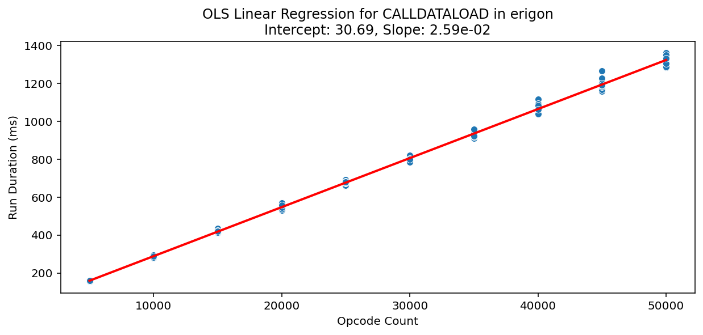

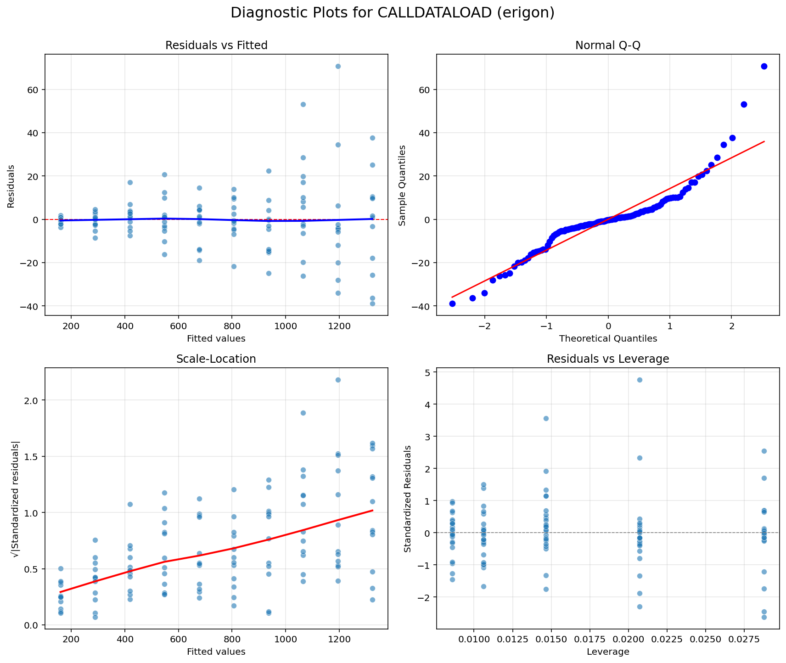


# CALLDATASIZE

## geth


```python
                            OLS Regression Results                            
==============================================================================
Dep. Variable:        run_duration_ms   R-squared:                       0.988
Model:                            OLS   Adj. R-squared:                  0.988
Method:                 Least Squares   F-statistic:                 9.272e+04
Date:                Thu, 22 Jan 2026   Prob (F-statistic):               0.00
Time:                        10:33:40   Log-Likelihood:                -6310.3
No. Observations:                1160   AIC:                         1.262e+04
Df Residuals:                    1158   BIC:                         1.263e+04
Df Model:                           1                                         
Covariance Type:            nonrobust                                         
==============================================================================
                 coef    std err          t      P>|t|      [0.025      0.975]
------------------------------------------------------------------------------
const         30.5939      3.539      8.644      0.000      23.649      37.538
opcount        0.0174    5.7e-05    304.505      0.000       0.017       0.017
==============================================================================
Omnibus:                      110.168   Durbin-Watson:                   0.949
Prob(Omnibus):                  0.000   Jarque-Bera (JB):              730.561
Skew:                          -0.038   Prob(JB):                    2.29e-159
Kurtosis:                       6.887   Cond. No.                     1.34e+05
==============================================================================

Notes:
[1] Standard Errors assume that the covariance matrix of the errors is correctly specified.
[2] The condition number is large, 1.34e+05. This might indicate that there are
strong multicollinearity or other numerical problems.
```

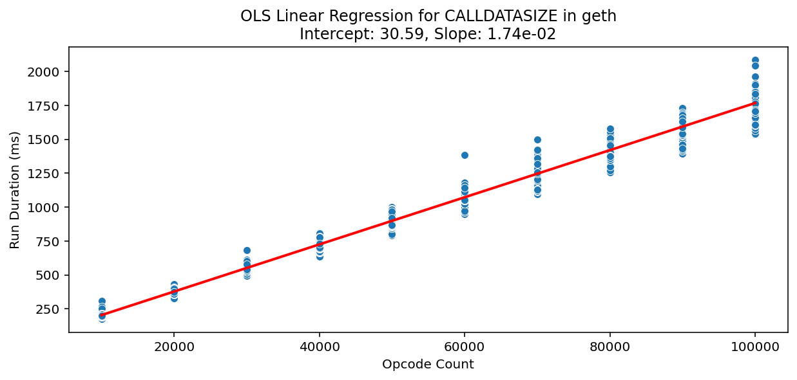

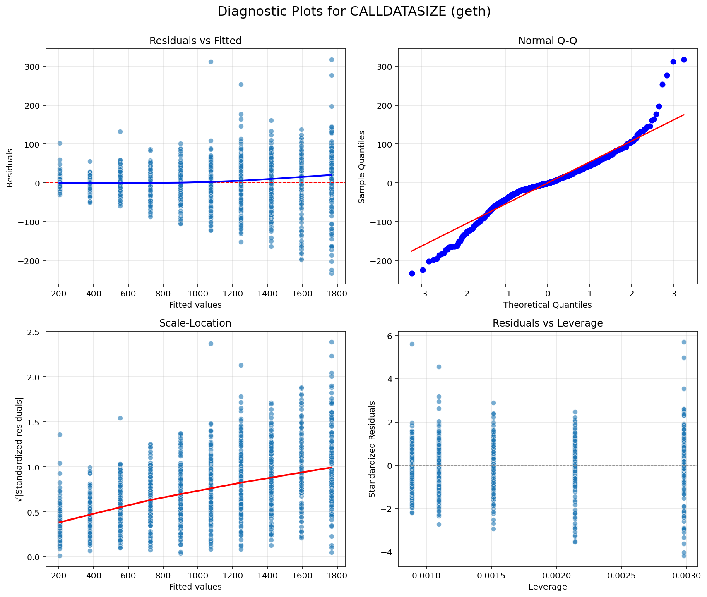


## besu


```python
                            OLS Regression Results                            
==============================================================================
Dep. Variable:        run_duration_ms   R-squared:                       0.981
Model:                            OLS   Adj. R-squared:                  0.981
Method:                 Least Squares   F-statistic:                 5.866e+04
Date:                Thu, 22 Jan 2026   Prob (F-statistic):               0.00
Time:                        10:33:40   Log-Likelihood:                -7225.2
No. Observations:                1160   AIC:                         1.445e+04
Df Residuals:                    1158   BIC:                         1.446e+04
Df Model:                           1                                         
Covariance Type:            nonrobust                                         
==============================================================================
                 coef    std err          t      P>|t|      [0.025      0.975]
------------------------------------------------------------------------------
const         32.3270      7.788      4.151      0.000      17.046      47.608
opcount        0.0304      0.000    242.206      0.000       0.030       0.031
==============================================================================
Omnibus:                       73.761   Durbin-Watson:                   1.256
Prob(Omnibus):                  0.000   Jarque-Bera (JB):              193.709
Skew:                          -0.329   Prob(JB):                     8.64e-43
Kurtosis:                       4.891   Cond. No.                     1.34e+05
==============================================================================

Notes:
[1] Standard Errors assume that the covariance matrix of the errors is correctly specified.
[2] The condition number is large, 1.34e+05. This might indicate that there are
strong multicollinearity or other numerical problems.
```

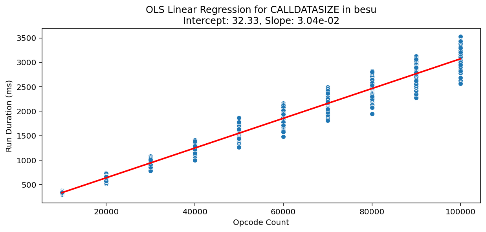

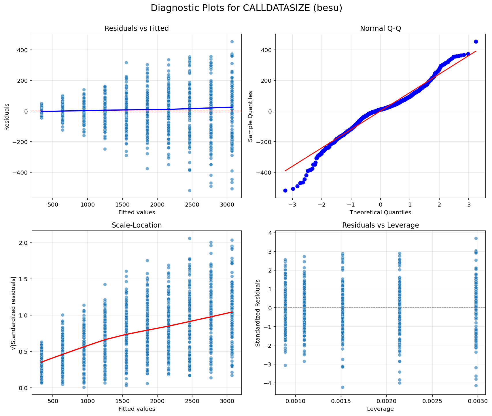


## reth


```python
                            OLS Regression Results                            
==============================================================================
Dep. Variable:        run_duration_ms   R-squared:                       0.944
Model:                            OLS   Adj. R-squared:                  0.944
Method:                 Least Squares   F-statistic:                 1.215e+04
Date:                Thu, 22 Jan 2026   Prob (F-statistic):               0.00
Time:                        10:33:41   Log-Likelihood:                -3792.4
No. Observations:                 720   AIC:                             7589.
Df Residuals:                     718   BIC:                             7598.
Df Model:                           1                                         
Covariance Type:            nonrobust                                         
==============================================================================
                 coef    std err          t      P>|t|      [0.025      0.975]
------------------------------------------------------------------------------
const         34.4356      3.782      9.105      0.000      27.010      41.861
opcount        0.0067    6.1e-05    110.244      0.000       0.007       0.007
==============================================================================
Omnibus:                     1073.568   Durbin-Watson:                   1.972
Prob(Omnibus):                  0.000   Jarque-Bera (JB):           379178.445
Skew:                           8.287   Prob(JB):                         0.00
Kurtosis:                     114.196   Cond. No.                     1.34e+05
==============================================================================

Notes:
[1] Standard Errors assume that the covariance matrix of the errors is correctly specified.
[2] The condition number is large, 1.34e+05. This might indicate that there are
strong multicollinearity or other numerical problems.
```

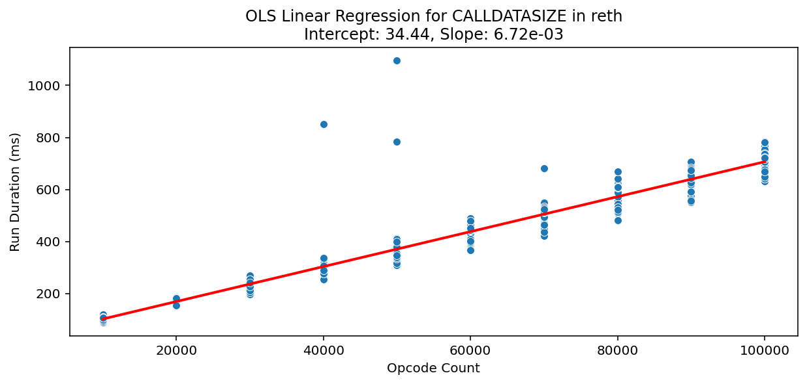

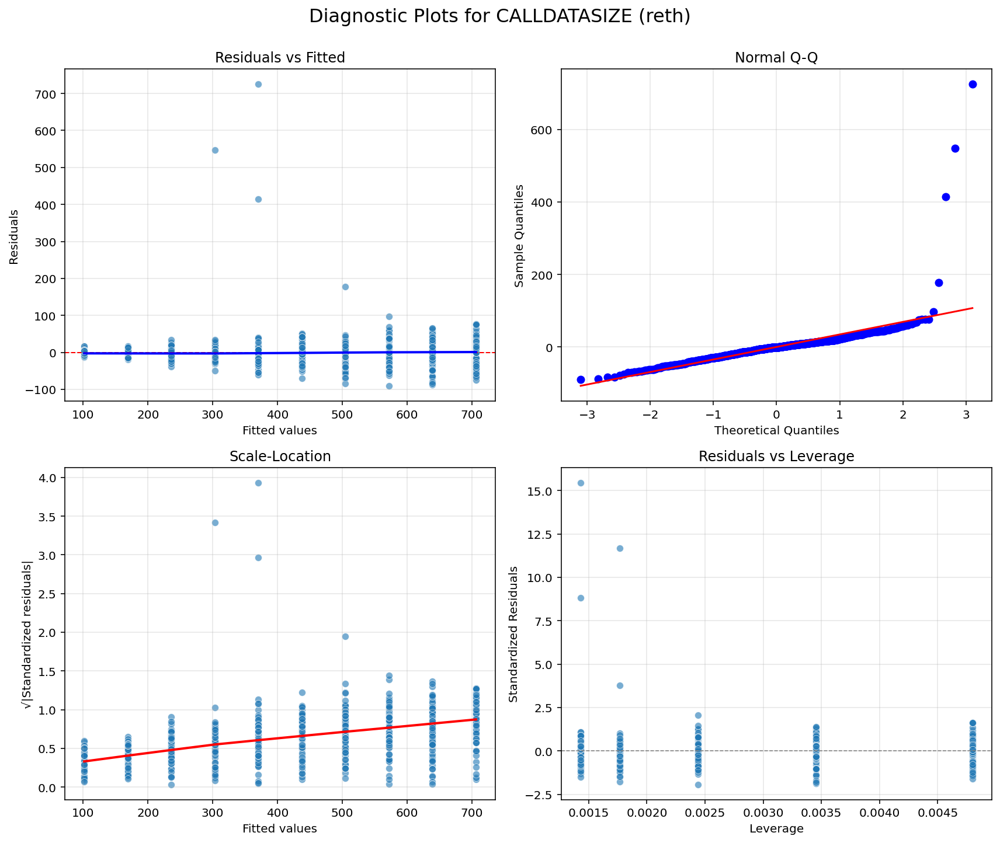


## nethermind


```python
                            OLS Regression Results                            
==============================================================================
Dep. Variable:        run_duration_ms   R-squared:                       0.976
Model:                            OLS   Adj. R-squared:                  0.976
Method:                 Least Squares   F-statistic:                 4.706e+04
Date:                Thu, 22 Jan 2026   Prob (F-statistic):               0.00
Time:                        10:33:41   Log-Likelihood:                -5681.6
No. Observations:                1160   AIC:                         1.137e+04
Df Residuals:                    1158   BIC:                         1.138e+04
Df Model:                           1                                         
Covariance Type:            nonrobust                                         
==============================================================================
                 coef    std err          t      P>|t|      [0.025      0.975]
------------------------------------------------------------------------------
const         29.2679      2.058     14.218      0.000      25.229      33.307
opcount        0.0072   3.32e-05    216.930      0.000       0.007       0.007
==============================================================================
Omnibus:                      106.491   Durbin-Watson:                   0.817
Prob(Omnibus):                  0.000   Jarque-Bera (JB):              654.333
Skew:                          -0.098   Prob(JB):                    8.19e-143
Kurtosis:                       6.674   Cond. No.                     1.34e+05
==============================================================================

Notes:
[1] Standard Errors assume that the covariance matrix of the errors is correctly specified.
[2] The condition number is large, 1.34e+05. This might indicate that there are
strong multicollinearity or other numerical problems.
```

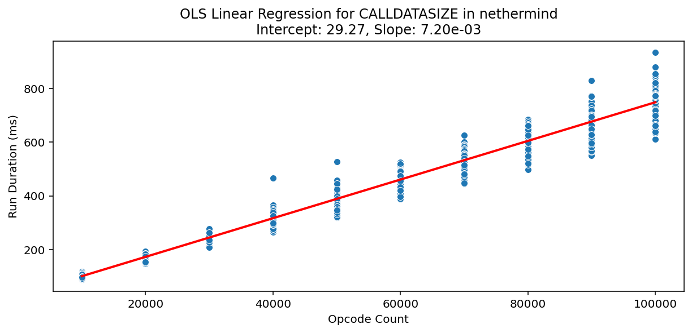

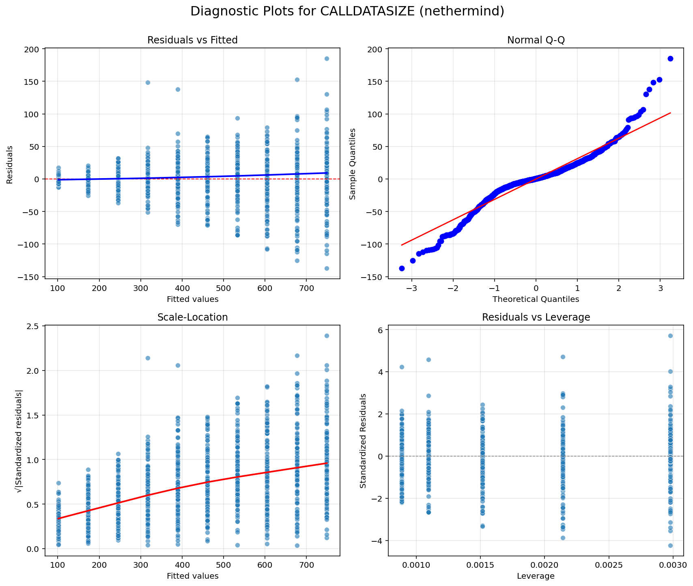


## erigon


```python
                            OLS Regression Results                            
==============================================================================
Dep. Variable:        run_duration_ms   R-squared:                       0.995
Model:                            OLS   Adj. R-squared:                  0.995
Method:                 Least Squares   F-statistic:                 2.209e+04
Date:                Thu, 22 Jan 2026   Prob (F-statistic):          4.60e-136
Time:                        10:33:41   Log-Likelihood:                -611.06
No. Observations:                 120   AIC:                             1226.
Df Residuals:                     118   BIC:                             1232.
Df Model:                           1                                         
Covariance Type:            nonrobust                                         
==============================================================================
                 coef    std err          t      P>|t|      [0.025      0.975]
------------------------------------------------------------------------------
const         24.6491      7.831      3.148      0.002       9.142      40.157
opcount        0.0188      0.000    148.629      0.000       0.019       0.019
==============================================================================
Omnibus:                      205.093   Durbin-Watson:                   1.791
Prob(Omnibus):                  0.000   Jarque-Bera (JB):            21854.553
Skew:                           7.057   Prob(JB):                         0.00
Kurtosis:                      67.589   Cond. No.                     1.34e+05
==============================================================================

Notes:
[1] Standard Errors assume that the covariance matrix of the errors is correctly specified.
[2] The condition number is large, 1.34e+05. This might indicate that there are
strong multicollinearity or other numerical problems.
```
OLS model did not run... Error: 'numpy.ndarray' object has no attribute 'iloc'

# CALLER

## geth


```python
                            OLS Regression Results                            
==============================================================================
Dep. Variable:        run_duration_ms   R-squared:                       0.984
Model:                            OLS   Adj. R-squared:                  0.984
Method:                 Least Squares   F-statistic:                 1.771e+04
Date:                Thu, 22 Jan 2026   Prob (F-statistic):          1.15e-260
Time:                        10:33:41   Log-Likelihood:                -1756.6
No. Observations:                 290   AIC:                             3517.
Df Residuals:                     288   BIC:                             3525.
Df Model:                           1                                         
Covariance Type:            nonrobust                                         
==============================================================================
                 coef    std err          t      P>|t|      [0.025      0.975]
------------------------------------------------------------------------------
const         37.2457     13.159      2.830      0.005      11.345      63.146
opcount        0.0282      0.000    133.094      0.000       0.028       0.029
==============================================================================
Omnibus:                       35.353   Durbin-Watson:                   1.141
Prob(Omnibus):                  0.000   Jarque-Bera (JB):              201.349
Skew:                           0.189   Prob(JB):                     1.90e-44
Kurtosis:                       7.065   Cond. No.                     1.34e+05
==============================================================================

Notes:
[1] Standard Errors assume that the covariance matrix of the errors is correctly specified.
[2] The condition number is large, 1.34e+05. This might indicate that there are
strong multicollinearity or other numerical problems.
```

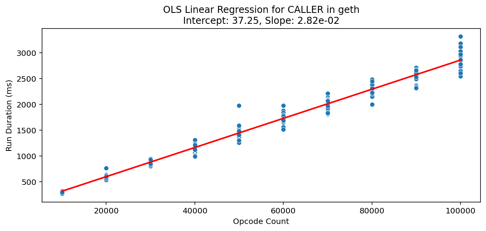

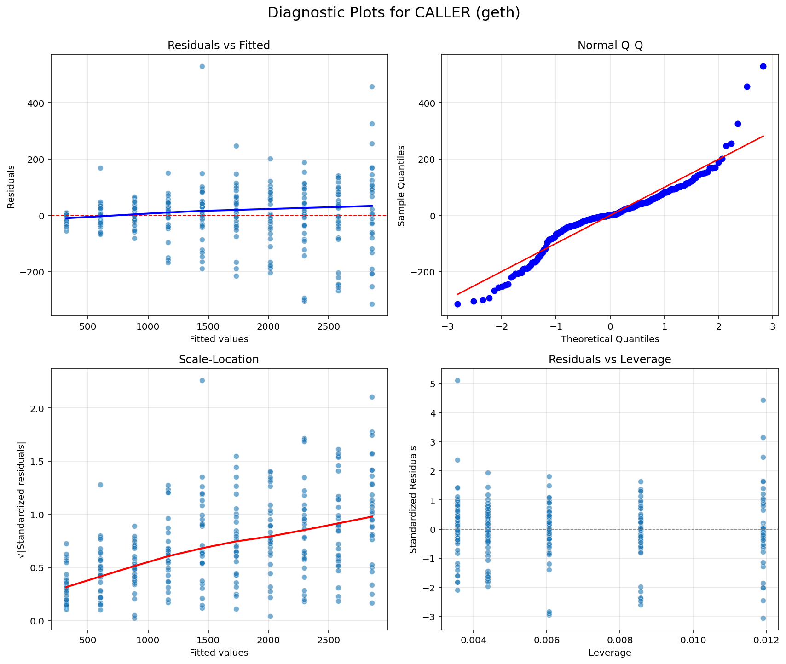


## besu


```python
                            OLS Regression Results                            
==============================================================================
Dep. Variable:        run_duration_ms   R-squared:                       0.983
Model:                            OLS   Adj. R-squared:                  0.983
Method:                 Least Squares   F-statistic:                 1.711e+04
Date:                Thu, 22 Jan 2026   Prob (F-statistic):          1.59e-258
Time:                        10:33:41   Log-Likelihood:                -1732.6
No. Observations:                 290   AIC:                             3469.
Df Residuals:                     288   BIC:                             3476.
Df Model:                           1                                         
Covariance Type:            nonrobust                                         
==============================================================================
                 coef    std err          t      P>|t|      [0.025      0.975]
------------------------------------------------------------------------------
const         33.5934     12.111      2.774      0.006       9.756      57.431
opcount        0.0255      0.000    130.798      0.000       0.025       0.026
==============================================================================
Omnibus:                       60.884   Durbin-Watson:                   0.802
Prob(Omnibus):                  0.000   Jarque-Bera (JB):              144.325
Skew:                          -1.003   Prob(JB):                     4.57e-32
Kurtosis:                       5.814   Cond. No.                     1.34e+05
==============================================================================

Notes:
[1] Standard Errors assume that the covariance matrix of the errors is correctly specified.
[2] The condition number is large, 1.34e+05. This might indicate that there are
strong multicollinearity or other numerical problems.
```

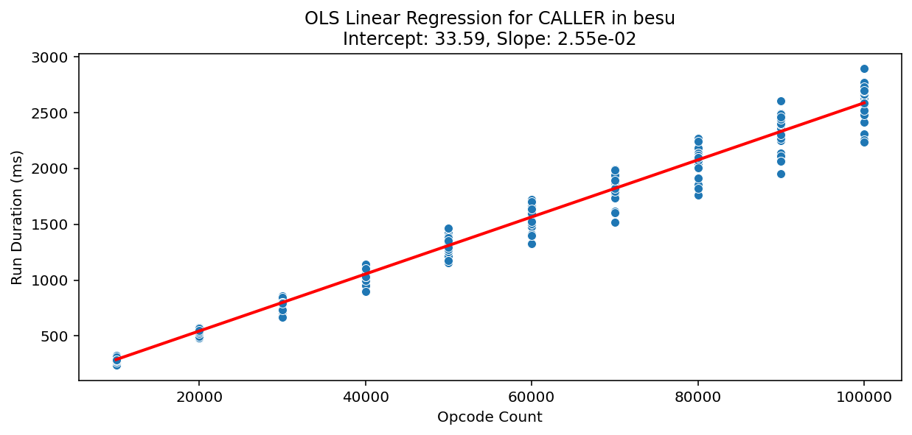

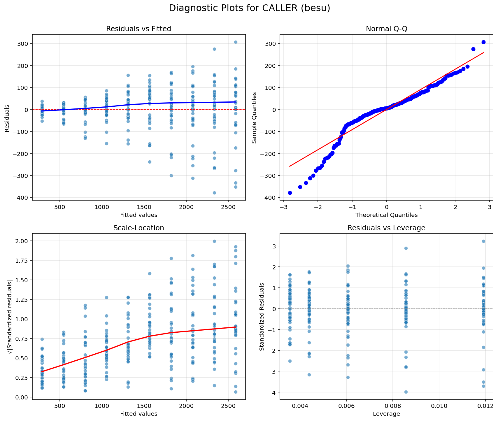


## reth


```python
                            OLS Regression Results                            
==============================================================================
Dep. Variable:        run_duration_ms   R-squared:                       0.982
Model:                            OLS   Adj. R-squared:                  0.982
Method:                 Least Squares   F-statistic:                     9952.
Date:                Thu, 22 Jan 2026   Prob (F-statistic):          3.71e-158
Time:                        10:33:42   Log-Likelihood:                -841.75
No. Observations:                 180   AIC:                             1687.
Df Residuals:                     178   BIC:                             1694.
Df Model:                           1                                         
Covariance Type:            nonrobust                                         
==============================================================================
                 coef    std err          t      P>|t|      [0.025      0.975]
------------------------------------------------------------------------------
const         28.6897      4.207      6.819      0.000      20.388      36.992
opcount        0.0068   6.78e-05     99.758      0.000       0.007       0.007
==============================================================================
Omnibus:                        4.363   Durbin-Watson:                   1.906
Prob(Omnibus):                  0.113   Jarque-Bera (JB):                4.193
Skew:                          -0.321   Prob(JB):                        0.123
Kurtosis:                       2.618   Cond. No.                     1.34e+05
==============================================================================

Notes:
[1] Standard Errors assume that the covariance matrix of the errors is correctly specified.
[2] The condition number is large, 1.34e+05. This might indicate that there are
strong multicollinearity or other numerical problems.
```

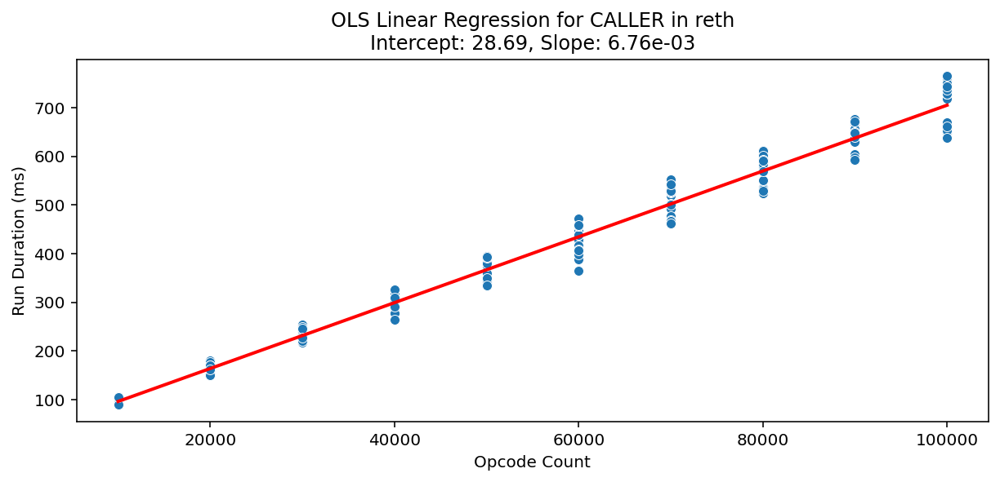

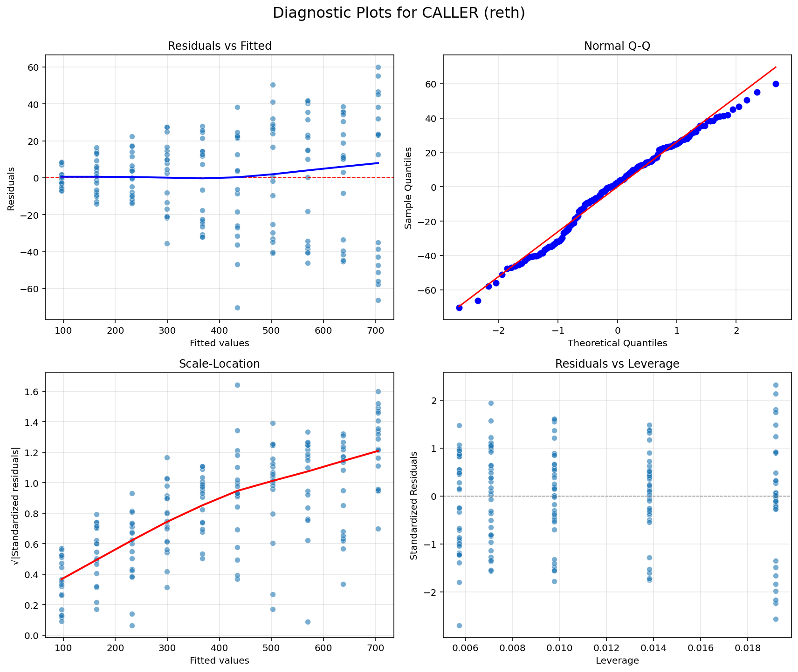


## nethermind


```python
                            OLS Regression Results                            
==============================================================================
Dep. Variable:        run_duration_ms   R-squared:                       0.982
Model:                            OLS   Adj. R-squared:                  0.982
Method:                 Least Squares   F-statistic:                 1.564e+04
Date:                Thu, 22 Jan 2026   Prob (F-statistic):          5.33e-253
Time:                        10:33:42   Log-Likelihood:                -1386.2
No. Observations:                 290   AIC:                             2776.
Df Residuals:                     288   BIC:                             2784.
Df Model:                           1                                         
Covariance Type:            nonrobust                                         
==============================================================================
                 coef    std err          t      P>|t|      [0.025      0.975]
------------------------------------------------------------------------------
const         29.0048      3.668      7.907      0.000      21.785      36.225
opcount        0.0074   5.91e-05    125.051      0.000       0.007       0.008
==============================================================================
Omnibus:                       39.966   Durbin-Watson:                   0.860
Prob(Omnibus):                  0.000   Jarque-Bera (JB):              159.780
Skew:                          -0.475   Prob(JB):                     2.01e-35
Kurtosis:                       6.510   Cond. No.                     1.34e+05
==============================================================================

Notes:
[1] Standard Errors assume that the covariance matrix of the errors is correctly specified.
[2] The condition number is large, 1.34e+05. This might indicate that there are
strong multicollinearity or other numerical problems.
```


## erigon


```python
                            OLS Regression Results                            
==============================================================================
Dep. Variable:        run_duration_ms   R-squared:                       0.992
Model:                            OLS   Adj. R-squared:                  0.991
Method:                 Least Squares   F-statistic:                     3370.
Date:                Thu, 22 Jan 2026   Prob (F-statistic):           1.00e-30
Time:                        10:33:42   Log-Likelihood:                -172.96
No. Observations:                  30   AIC:                             349.9
Df Residuals:                      28   BIC:                             352.7
Df Model:                           1                                         
Covariance Type:            nonrobust                                         
==============================================================================
                 coef    std err          t      P>|t|      [0.025      0.975]
------------------------------------------------------------------------------
const         20.3361     31.515      0.645      0.524     -44.219      84.891
opcount        0.0295      0.001     58.047      0.000       0.028       0.031
==============================================================================
Omnibus:                       42.436   Durbin-Watson:                   1.811
Prob(Omnibus):                  0.000   Jarque-Bera (JB):              196.340
Skew:                           2.740   Prob(JB):                     2.32e-43
Kurtosis:                      14.271   Cond. No.                     1.34e+05
==============================================================================

Notes:
[1] Standard Errors assume that the covariance matrix of the errors is correctly specified.
[2] The condition number is large, 1.34e+05. This might indicate that there are
strong multicollinearity or other numerical problems.
```
OLS model did not run... Error: 'numpy.ndarray' object has no attribute 'iloc'

# CALLVALUE

## geth


```python
                            OLS Regression Results                            
==============================================================================
Dep. Variable:        run_duration_ms   R-squared:                       0.943
Model:                            OLS   Adj. R-squared:                  0.943
Method:                 Least Squares   F-statistic:                     4748.
Date:                Thu, 22 Jan 2026   Prob (F-statistic):          5.39e-181
Time:                        10:33:42   Log-Likelihood:                -1665.1
No. Observations:                 290   AIC:                             3334.
Df Residuals:                     288   BIC:                             3342.
Df Model:                           1                                         
Covariance Type:            nonrobust                                         
==============================================================================
                 coef    std err          t      P>|t|      [0.025      0.975]
------------------------------------------------------------------------------
const         29.7857      9.597      3.104      0.002      10.896      48.676
opcount        0.0178      0.000     68.909      0.000       0.017       0.018
==============================================================================
Omnibus:                      471.372   Durbin-Watson:                   1.697
Prob(Omnibus):                  0.000   Jarque-Bera (JB):           113627.024
Skew:                           8.553   Prob(JB):                         0.00
Kurtosis:                      98.452   Cond. No.                     8.04e+04
==============================================================================

Notes:
[1] Standard Errors assume that the covariance matrix of the errors is correctly specified.
[2] The condition number is large, 8.04e+04. This might indicate that there are
strong multicollinearity or other numerical problems.
```

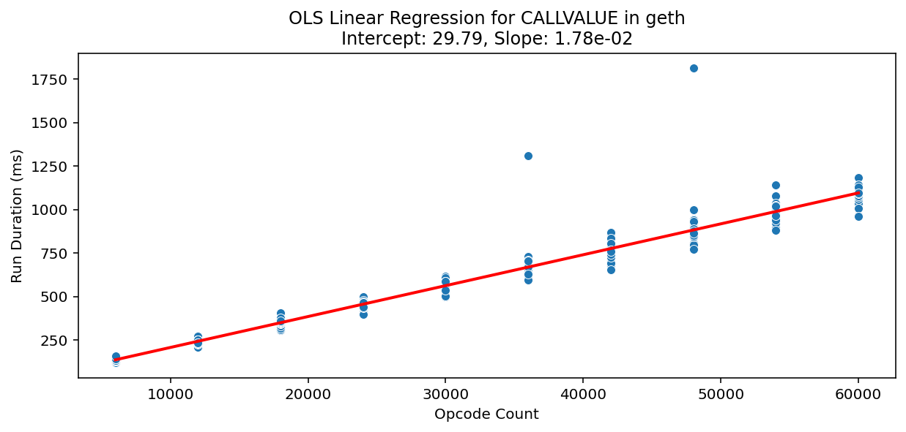

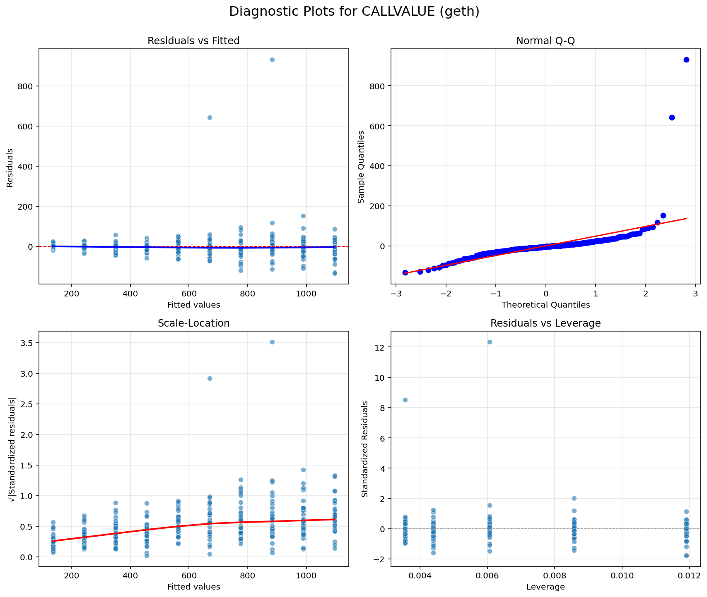


## besu


```python
                            OLS Regression Results                            
==============================================================================
Dep. Variable:        run_duration_ms   R-squared:                       0.984
Model:                            OLS   Adj. R-squared:                  0.984
Method:                 Least Squares   F-statistic:                 1.760e+04
Date:                Thu, 22 Jan 2026   Prob (F-statistic):          2.79e-260
Time:                        10:33:43   Log-Likelihood:                -1653.4
No. Observations:                 290   AIC:                             3311.
Df Residuals:                     288   BIC:                             3318.
Df Model:                           1                                         
Covariance Type:            nonrobust                                         
==============================================================================
                 coef    std err          t      P>|t|      [0.025      0.975]
------------------------------------------------------------------------------
const         27.7194      9.219      3.007      0.003       9.574      45.865
opcount        0.0329      0.000    132.680      0.000       0.032       0.033
==============================================================================
Omnibus:                       75.215   Durbin-Watson:                   0.836
Prob(Omnibus):                  0.000   Jarque-Bera (JB):              195.153
Skew:                          -1.198   Prob(JB):                     4.20e-43
Kurtosis:                       6.227   Cond. No.                     8.04e+04
==============================================================================

Notes:
[1] Standard Errors assume that the covariance matrix of the errors is correctly specified.
[2] The condition number is large, 8.04e+04. This might indicate that there are
strong multicollinearity or other numerical problems.
```


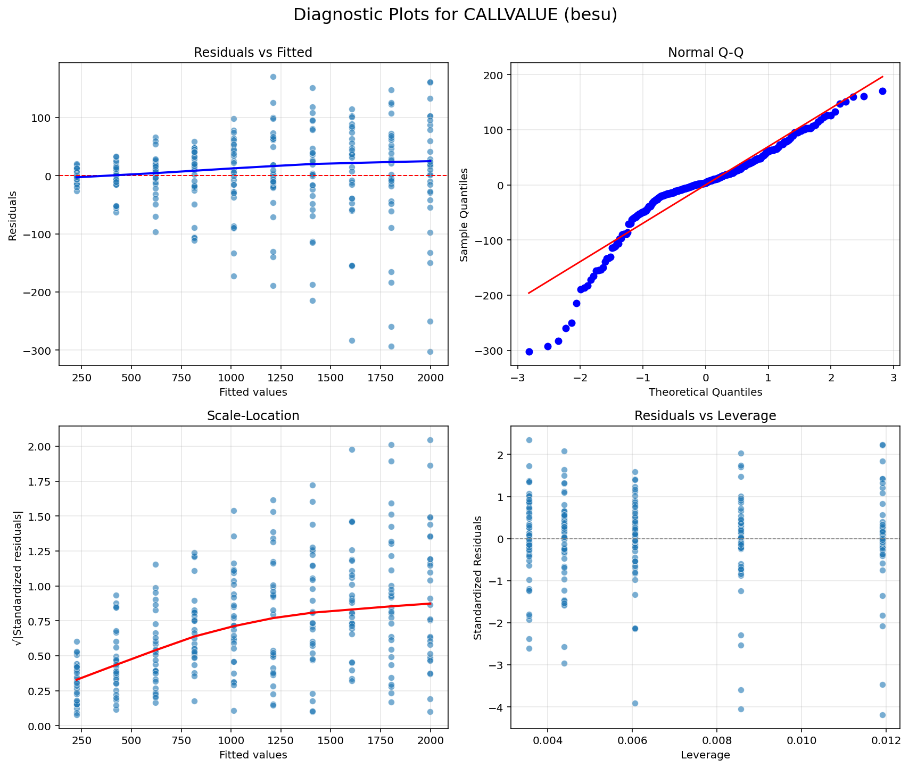


## reth


```python
                            OLS Regression Results                            
==============================================================================
Dep. Variable:        run_duration_ms   R-squared:                       0.984
Model:                            OLS   Adj. R-squared:                  0.984
Method:                 Least Squares   F-statistic:                 1.126e+04
Date:                Thu, 22 Jan 2026   Prob (F-statistic):          7.29e-163
Time:                        10:33:43   Log-Likelihood:                -779.40
No. Observations:                 180   AIC:                             1563.
Df Residuals:                     178   BIC:                             1569.
Df Model:                           1                                         
Covariance Type:            nonrobust                                         
==============================================================================
                 coef    std err          t      P>|t|      [0.025      0.975]
------------------------------------------------------------------------------
const         36.6653      2.975     12.323      0.000      30.794      42.537
opcount        0.0085   7.99e-05    106.128      0.000       0.008       0.009
==============================================================================
Omnibus:                       10.827   Durbin-Watson:                   1.875
Prob(Omnibus):                  0.004   Jarque-Bera (JB):               19.311
Skew:                           0.265   Prob(JB):                     6.41e-05
Kurtosis:                       4.515   Cond. No.                     8.04e+04
==============================================================================

Notes:
[1] Standard Errors assume that the covariance matrix of the errors is correctly specified.
[2] The condition number is large, 8.04e+04. This might indicate that there are
strong multicollinearity or other numerical problems.
```

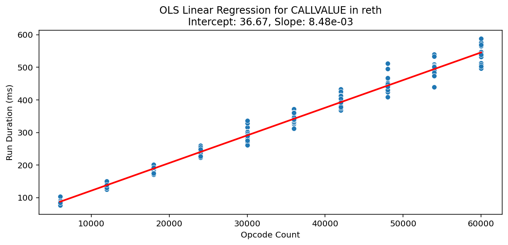

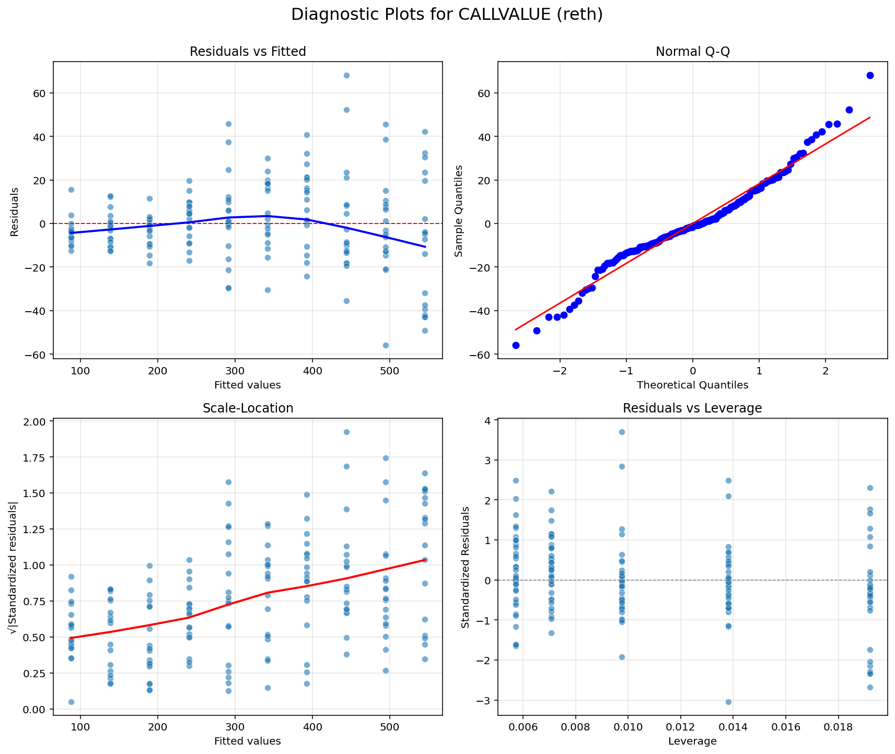


## nethermind


```python
                            OLS Regression Results                            
==============================================================================
Dep. Variable:        run_duration_ms   R-squared:                       0.866
Model:                            OLS   Adj. R-squared:                  0.865
Method:                 Least Squares   F-statistic:                     1858.
Date:                Thu, 22 Jan 2026   Prob (F-statistic):          1.28e-127
Time:                        10:33:43   Log-Likelihood:                -1611.7
No. Observations:                 290   AIC:                             3227.
Df Residuals:                     288   BIC:                             3235.
Df Model:                           1                                         
Covariance Type:            nonrobust                                         
==============================================================================
                 coef    std err          t      P>|t|      [0.025      0.975]
------------------------------------------------------------------------------
const         28.8279      7.985      3.610      0.000      13.112      44.544
opcount        0.0092      0.000     43.101      0.000       0.009       0.010
==============================================================================
Omnibus:                      228.822   Durbin-Watson:                   0.694
Prob(Omnibus):                  0.000   Jarque-Bera (JB):             2615.367
Skew:                           3.295   Prob(JB):                         0.00
Kurtosis:                      16.153   Cond. No.                     8.04e+04
==============================================================================

Notes:
[1] Standard Errors assume that the covariance matrix of the errors is correctly specified.
[2] The condition number is large, 8.04e+04. This might indicate that there are
strong multicollinearity or other numerical problems.
```

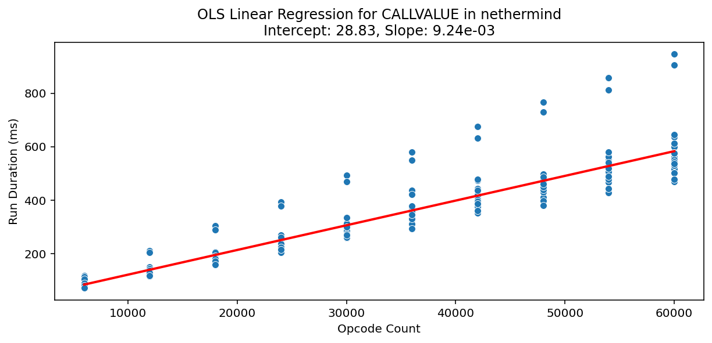

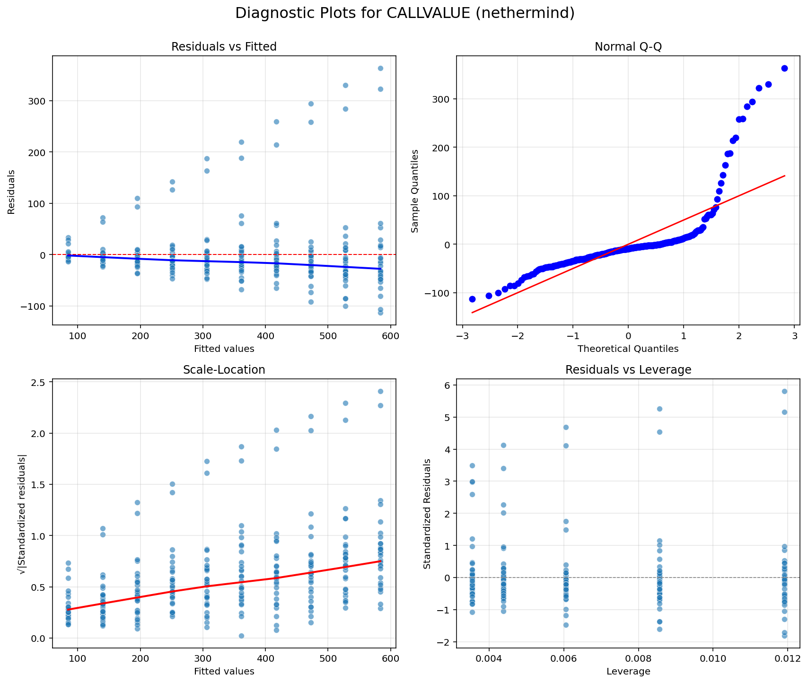


## erigon


```python
                            OLS Regression Results                            
==============================================================================
Dep. Variable:        run_duration_ms   R-squared:                       0.996
Model:                            OLS   Adj. R-squared:                  0.996
Method:                 Least Squares   F-statistic:                     7690.
Date:                Thu, 22 Jan 2026   Prob (F-statistic):           1.02e-35
Time:                        10:33:43   Log-Likelihood:                -133.83
No. Observations:                  30   AIC:                             271.7
Df Residuals:                      28   BIC:                             274.5
Df Model:                           1                                         
Covariance Type:            nonrobust                                         
==============================================================================
                 coef    std err          t      P>|t|      [0.025      0.975]
------------------------------------------------------------------------------
const         42.3774      8.551      4.956      0.000      24.862      59.893
opcount        0.0201      0.000     87.695      0.000       0.020       0.021
==============================================================================
Omnibus:                       47.883   Durbin-Watson:                   1.476
Prob(Omnibus):                  0.000   Jarque-Bera (JB):              245.219
Skew:                           3.208   Prob(JB):                     5.64e-54
Kurtosis:                      15.450   Cond. No.                     8.04e+04
==============================================================================

Notes:
[1] Standard Errors assume that the covariance matrix of the errors is correctly specified.
[2] The condition number is large, 8.04e+04. This might indicate that there are
strong multicollinearity or other numerical problems.
```
OLS model did not run... Error: 'numpy.ndarray' object has no attribute 'iloc'

# CHAINID

## geth


```python
                            OLS Regression Results                            
==============================================================================
Dep. Variable:        run_duration_ms   R-squared:                       0.980
Model:                            OLS   Adj. R-squared:                  0.980
Method:                 Least Squares   F-statistic:                 1.440e+04
Date:                Thu, 22 Jan 2026   Prob (F-statistic):          5.87e-248
Time:                        10:33:43   Log-Likelihood:                -1682.4
No. Observations:                 290   AIC:                             3369.
Df Residuals:                     288   BIC:                             3376.
Df Model:                           1                                         
Covariance Type:            nonrobust                                         
==============================================================================
                 coef    std err          t      P>|t|      [0.025      0.975]
------------------------------------------------------------------------------
const         23.5270     10.187      2.309      0.022       3.476      43.578
opcount        0.0197      0.000    120.017      0.000       0.019       0.020
==============================================================================
Omnibus:                      177.485   Durbin-Watson:                   1.353
Prob(Omnibus):                  0.000   Jarque-Bera (JB):             3436.264
Skew:                           2.071   Prob(JB):                         0.00
Kurtosis:                      19.347   Cond. No.                     1.34e+05
==============================================================================

Notes:
[1] Standard Errors assume that the covariance matrix of the errors is correctly specified.
[2] The condition number is large, 1.34e+05. This might indicate that there are
strong multicollinearity or other numerical problems.
```

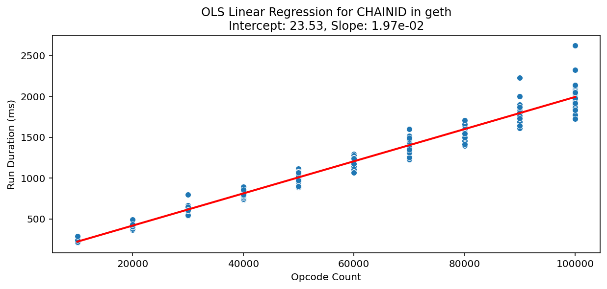

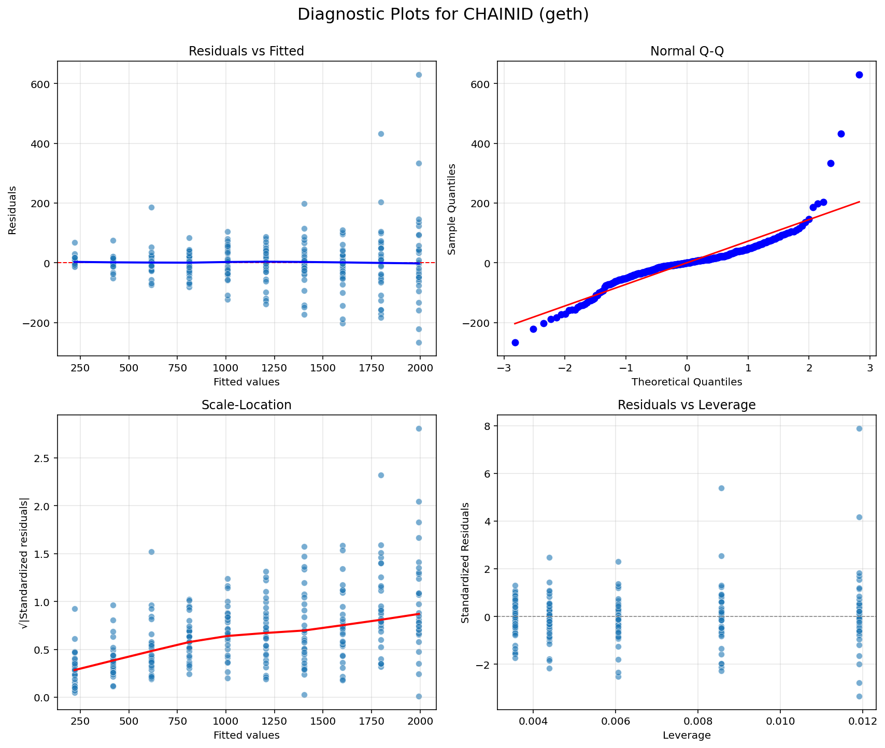


## besu


```python
                            OLS Regression Results                            
==============================================================================
Dep. Variable:        run_duration_ms   R-squared:                       0.983
Model:                            OLS   Adj. R-squared:                  0.983
Method:                 Least Squares   F-statistic:                 1.710e+04
Date:                Thu, 22 Jan 2026   Prob (F-statistic):          1.72e-258
Time:                        10:33:44   Log-Likelihood:                -1741.7
No. Observations:                 290   AIC:                             3487.
Df Residuals:                     288   BIC:                             3495.
Df Model:                           1                                         
Covariance Type:            nonrobust                                         
==============================================================================
                 coef    std err          t      P>|t|      [0.025      0.975]
------------------------------------------------------------------------------
const         22.2981     12.497      1.784      0.075      -2.299      46.895
opcount        0.0263      0.000    130.763      0.000       0.026       0.027
==============================================================================
Omnibus:                       31.129   Durbin-Watson:                   0.726
Prob(Omnibus):                  0.000   Jarque-Bera (JB):              117.553
Skew:                           0.326   Prob(JB):                     2.98e-26
Kurtosis:                       6.050   Cond. No.                     1.34e+05
==============================================================================

Notes:
[1] Standard Errors assume that the covariance matrix of the errors is correctly specified.
[2] The condition number is large, 1.34e+05. This might indicate that there are
strong multicollinearity or other numerical problems.
```


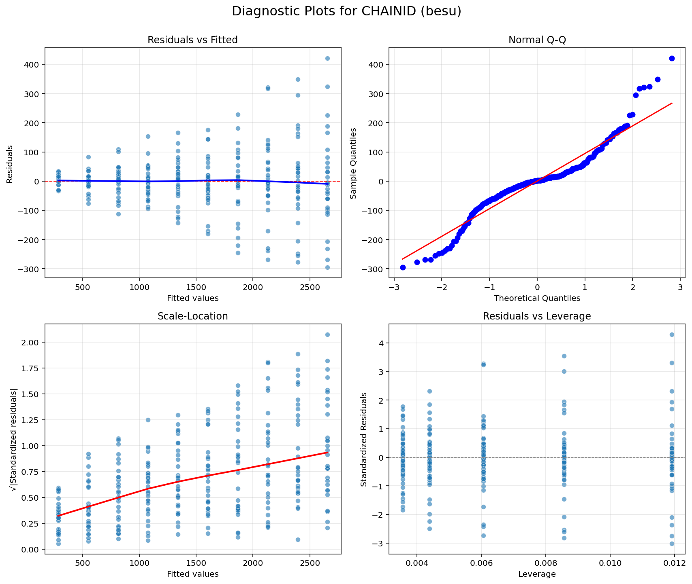


## reth


```python
                            OLS Regression Results                            
==============================================================================
Dep. Variable:        run_duration_ms   R-squared:                       0.978
Model:                            OLS   Adj. R-squared:                  0.978
Method:                 Least Squares   F-statistic:                     7981.
Date:                Thu, 22 Jan 2026   Prob (F-statistic):          8.61e-150
Time:                        10:33:44   Log-Likelihood:                -845.13
No. Observations:                 180   AIC:                             1694.
Df Residuals:                     178   BIC:                             1701.
Df Model:                           1                                         
Covariance Type:            nonrobust                                         
==============================================================================
                 coef    std err          t      P>|t|      [0.025      0.975]
------------------------------------------------------------------------------
const         34.5211      4.287      8.053      0.000      26.062      42.981
opcount        0.0062   6.91e-05     89.334      0.000       0.006       0.006
==============================================================================
Omnibus:                        0.563   Durbin-Watson:                   1.972
Prob(Omnibus):                  0.755   Jarque-Bera (JB):                0.570
Skew:                           0.132   Prob(JB):                        0.752
Kurtosis:                       2.923   Cond. No.                     1.34e+05
==============================================================================

Notes:
[1] Standard Errors assume that the covariance matrix of the errors is correctly specified.
[2] The condition number is large, 1.34e+05. This might indicate that there are
strong multicollinearity or other numerical problems.
```

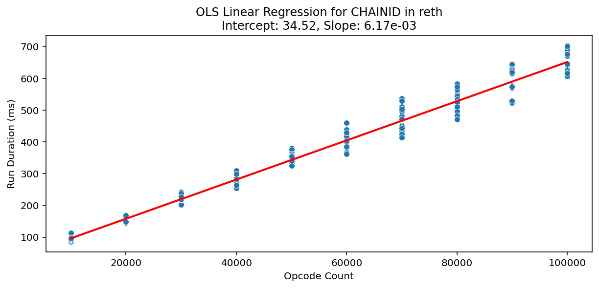


## nethermind


```python
                            OLS Regression Results                            
==============================================================================
Dep. Variable:        run_duration_ms   R-squared:                       0.980
Model:                            OLS   Adj. R-squared:                  0.979
Method:                 Least Squares   F-statistic:                 1.378e+04
Date:                Thu, 22 Jan 2026   Prob (F-statistic):          3.10e-245
Time:                        10:33:44   Log-Likelihood:                -1383.1
No. Observations:                 290   AIC:                             2770.
Df Residuals:                     288   BIC:                             2777.
Df Model:                           1                                         
Covariance Type:            nonrobust                                         
==============================================================================
                 coef    std err          t      P>|t|      [0.025      0.975]
------------------------------------------------------------------------------
const         29.3081      3.629      8.076      0.000      22.165      36.451
opcount        0.0069   5.85e-05    117.381      0.000       0.007       0.007
==============================================================================
Omnibus:                       14.571   Durbin-Watson:                   0.800
Prob(Omnibus):                  0.001   Jarque-Bera (JB):               25.941
Skew:                          -0.279   Prob(JB):                     2.33e-06
Kurtosis:                       4.355   Cond. No.                     1.34e+05
==============================================================================

Notes:
[1] Standard Errors assume that the covariance matrix of the errors is correctly specified.
[2] The condition number is large, 1.34e+05. This might indicate that there are
strong multicollinearity or other numerical problems.
```

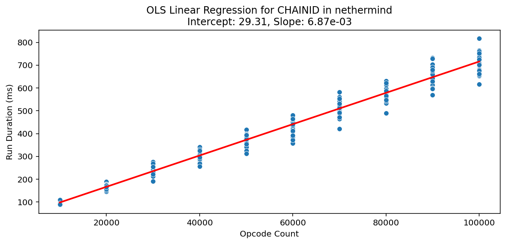

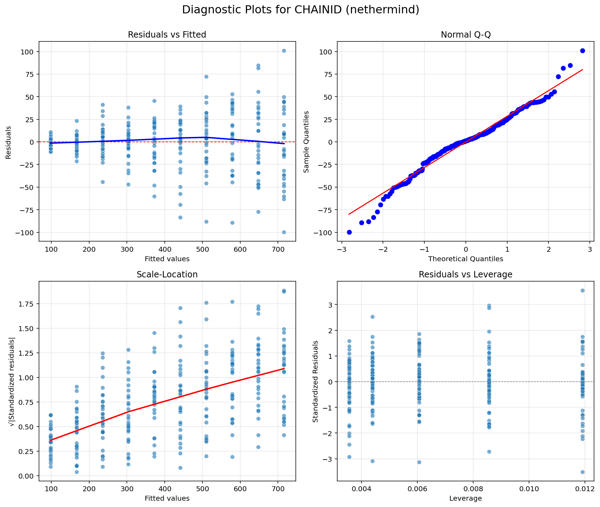


## erigon


```python
                            OLS Regression Results                            
==============================================================================
Dep. Variable:        run_duration_ms   R-squared:                       0.999
Model:                            OLS   Adj. R-squared:                  0.999
Method:                 Least Squares   F-statistic:                 5.350e+04
Date:                Thu, 22 Jan 2026   Prob (F-statistic):           1.72e-47
Time:                        10:33:44   Log-Likelihood:                -120.13
No. Observations:                  30   AIC:                             244.3
Df Residuals:                      28   BIC:                             247.1
Df Model:                           1                                         
Covariance Type:            nonrobust                                         
==============================================================================
                 coef    std err          t      P>|t|      [0.025      0.975]
------------------------------------------------------------------------------
const         26.7219      5.417      4.933      0.000      15.625      37.819
opcount        0.0202   8.73e-05    231.292      0.000       0.020       0.020
==============================================================================
Omnibus:                        2.049   Durbin-Watson:                   0.822
Prob(Omnibus):                  0.359   Jarque-Bera (JB):                1.773
Skew:                          -0.568   Prob(JB):                        0.412
Kurtosis:                       2.645   Cond. No.                     1.34e+05
==============================================================================

Notes:
[1] Standard Errors assume that the covariance matrix of the errors is correctly specified.
[2] The condition number is large, 1.34e+05. This might indicate that there are
strong multicollinearity or other numerical problems.
```

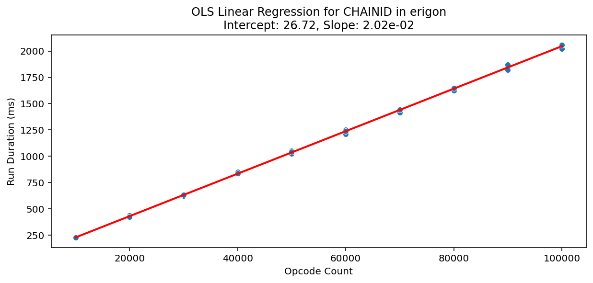

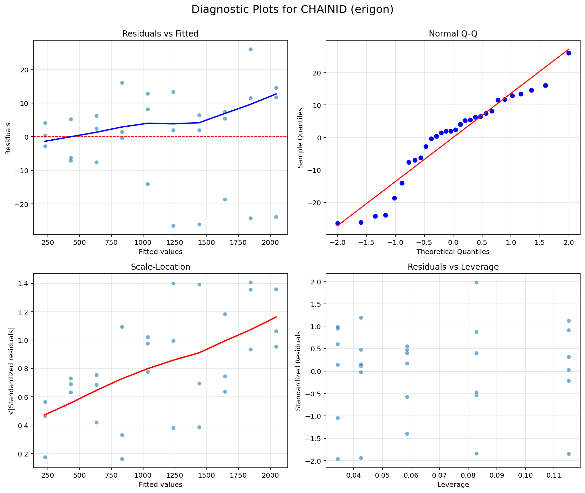


# CODESIZE

## geth


```python
                            OLS Regression Results                            
==============================================================================
Dep. Variable:        run_duration_ms   R-squared:                       0.988
Model:                            OLS   Adj. R-squared:                  0.988
Method:                 Least Squares   F-statistic:                 2.471e+04
Date:                Thu, 22 Jan 2026   Prob (F-statistic):          3.36e-281
Time:                        10:33:45   Log-Likelihood:                -1635.5
No. Observations:                 290   AIC:                             3275.
Df Residuals:                     288   BIC:                             3282.
Df Model:                           1                                         
Covariance Type:            nonrobust                                         
==============================================================================
                 coef    std err          t      P>|t|      [0.025      0.975]
------------------------------------------------------------------------------
const         15.8604      8.666      1.830      0.068      -1.196      32.917
opcount        0.0176      0.000    157.197      0.000       0.017       0.018
==============================================================================
Omnibus:                       28.578   Durbin-Watson:                   1.195
Prob(Omnibus):                  0.000   Jarque-Bera (JB):              104.047
Skew:                          -0.286   Prob(JB):                     2.55e-23
Kurtosis:                       5.878   Cond. No.                     1.68e+05
==============================================================================

Notes:
[1] Standard Errors assume that the covariance matrix of the errors is correctly specified.
[2] The condition number is large, 1.68e+05. This might indicate that there are
strong multicollinearity or other numerical problems.
```


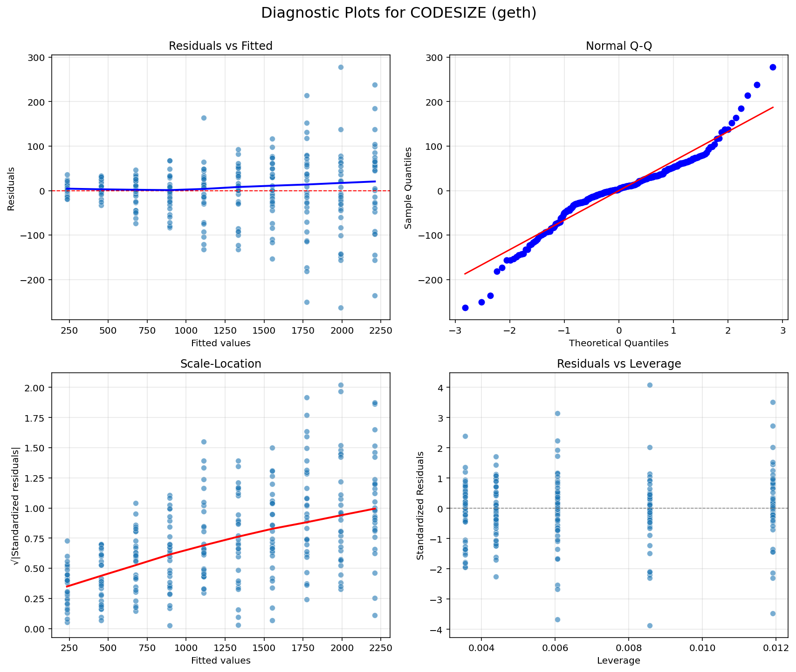


## besu


```python
                            OLS Regression Results                            
==============================================================================
Dep. Variable:        run_duration_ms   R-squared:                       0.852
Model:                            OLS   Adj. R-squared:                  0.851
Method:                 Least Squares   F-statistic:                     1657.
Date:                Thu, 22 Jan 2026   Prob (F-statistic):          1.78e-121
Time:                        10:33:45   Log-Likelihood:                -2184.5
No. Observations:                 290   AIC:                             4373.
Df Residuals:                     288   BIC:                             4380.
Df Model:                           1                                         
Covariance Type:            nonrobust                                         
==============================================================================
                 coef    std err          t      P>|t|      [0.025      0.975]
------------------------------------------------------------------------------
const         26.9522     57.554      0.468      0.640     -86.328     140.232
opcount        0.0302      0.001     40.708      0.000       0.029       0.032
==============================================================================
Omnibus:                      206.614   Durbin-Watson:                   0.904
Prob(Omnibus):                  0.000   Jarque-Bera (JB):             1606.044
Skew:                           3.041   Prob(JB):                         0.00
Kurtosis:                      12.794   Cond. No.                     1.68e+05
==============================================================================

Notes:
[1] Standard Errors assume that the covariance matrix of the errors is correctly specified.
[2] The condition number is large, 1.68e+05. This might indicate that there are
strong multicollinearity or other numerical problems.
```

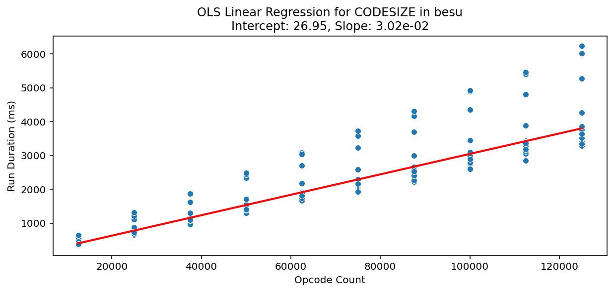

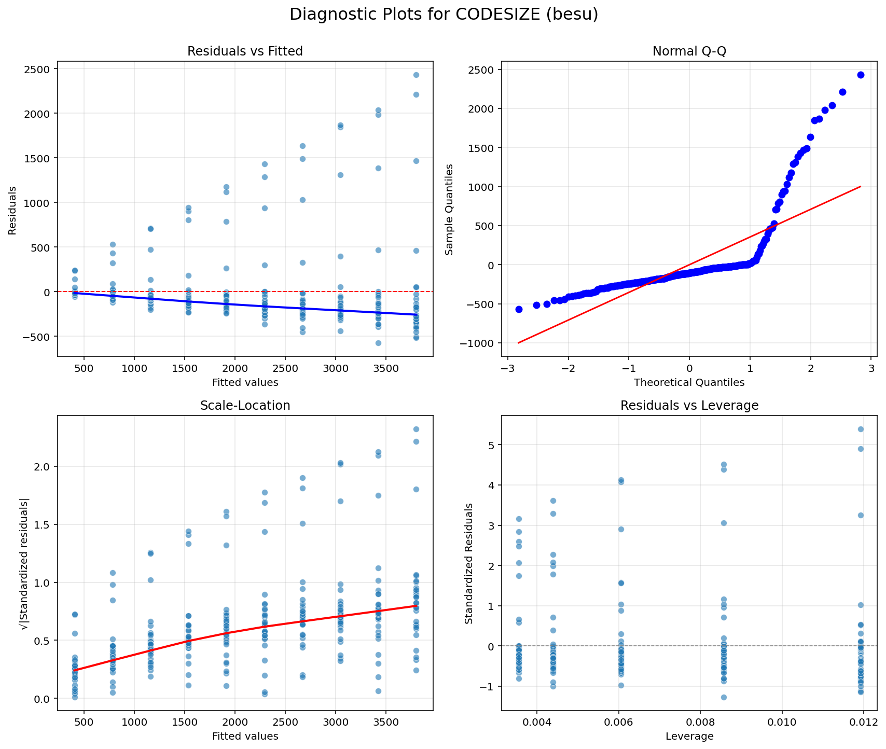


## reth


```python
                            OLS Regression Results                            
==============================================================================
Dep. Variable:        run_duration_ms   R-squared:                       0.973
Model:                            OLS   Adj. R-squared:                  0.973
Method:                 Least Squares   F-statistic:                     6396.
Date:                Thu, 22 Jan 2026   Prob (F-statistic):          1.93e-141
Time:                        10:33:45   Log-Likelihood:                -908.46
No. Observations:                 180   AIC:                             1821.
Df Residuals:                     178   BIC:                             1827.
Df Model:                           1                                         
Covariance Type:            nonrobust                                         
==============================================================================
                 coef    std err          t      P>|t|      [0.025      0.975]
------------------------------------------------------------------------------
const         28.3813      6.095      4.657      0.000      16.354      40.408
opcount        0.0063   7.86e-05     79.972      0.000       0.006       0.006
==============================================================================
Omnibus:                        1.494   Durbin-Watson:                   1.748
Prob(Omnibus):                  0.474   Jarque-Bera (JB):                1.109
Skew:                           0.125   Prob(JB):                        0.574
Kurtosis:                       3.293   Cond. No.                     1.68e+05
==============================================================================

Notes:
[1] Standard Errors assume that the covariance matrix of the errors is correctly specified.
[2] The condition number is large, 1.68e+05. This might indicate that there are
strong multicollinearity or other numerical problems.
```


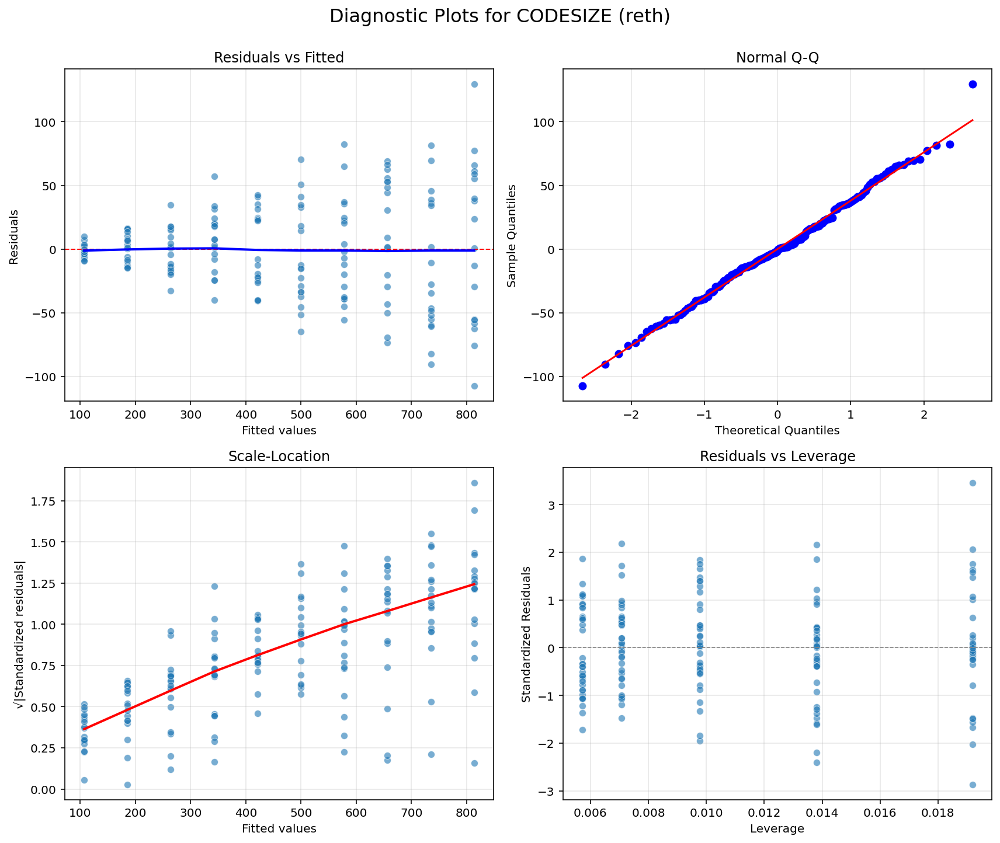


## nethermind


```python
                            OLS Regression Results                            
==============================================================================
Dep. Variable:        run_duration_ms   R-squared:                       0.984
Model:                            OLS   Adj. R-squared:                  0.983
Method:                 Least Squares   F-statistic:                 1.722e+04
Date:                Thu, 22 Jan 2026   Prob (F-statistic):          6.32e-259
Time:                        10:33:46   Log-Likelihood:                -1492.0
No. Observations:                 290   AIC:                             2988.
Df Residuals:                     288   BIC:                             2995.
Df Model:                           1                                         
Covariance Type:            nonrobust                                         
==============================================================================
                 coef    std err          t      P>|t|      [0.025      0.975]
------------------------------------------------------------------------------
const         29.6359      5.283      5.610      0.000      19.237      40.034
opcount        0.0089   6.81e-05    131.227      0.000       0.009       0.009
==============================================================================
Omnibus:                       57.693   Durbin-Watson:                   1.084
Prob(Omnibus):                  0.000   Jarque-Bera (JB):              137.816
Skew:                          -0.949   Prob(JB):                     1.19e-30
Kurtosis:                       5.794   Cond. No.                     1.68e+05
==============================================================================

Notes:
[1] Standard Errors assume that the covariance matrix of the errors is correctly specified.
[2] The condition number is large, 1.68e+05. This might indicate that there are
strong multicollinearity or other numerical problems.
```

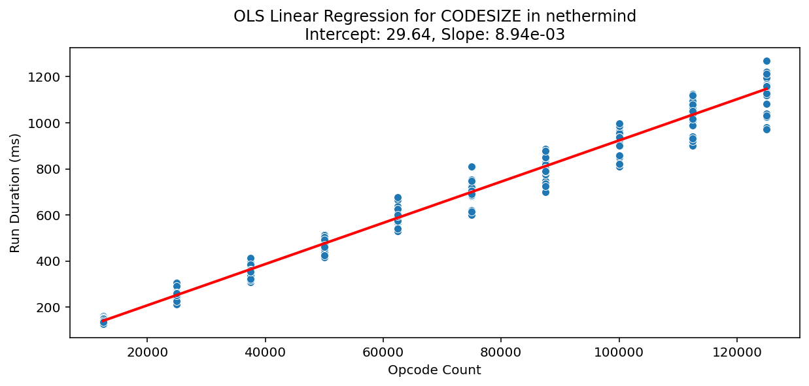


## erigon


```python
                            OLS Regression Results                            
==============================================================================
Dep. Variable:        run_duration_ms   R-squared:                       0.999
Model:                            OLS   Adj. R-squared:                  0.999
Method:                 Least Squares   F-statistic:                 2.439e+04
Date:                Thu, 22 Jan 2026   Prob (F-statistic):           1.02e-42
Time:                        10:33:46   Log-Likelihood:                -136.26
No. Observations:                  30   AIC:                             276.5
Df Residuals:                      28   BIC:                             279.3
Df Model:                           1                                         
Covariance Type:            nonrobust                                         
==============================================================================
                 coef    std err          t      P>|t|      [0.025      0.975]
------------------------------------------------------------------------------
const         24.3013      9.274      2.620      0.014       5.304      43.299
opcount        0.0187      0.000    156.159      0.000       0.018       0.019
==============================================================================
Omnibus:                        7.577   Durbin-Watson:                   1.717
Prob(Omnibus):                  0.023   Jarque-Bera (JB):                8.770
Skew:                           0.483   Prob(JB):                       0.0125
Kurtosis:                       5.466   Cond. No.                     1.68e+05
==============================================================================

Notes:
[1] Standard Errors assume that the covariance matrix of the errors is correctly specified.
[2] The condition number is large, 1.68e+05. This might indicate that there are
strong multicollinearity or other numerical problems.
```
OLS model did not run... Error: 'numpy.ndarray' object has no attribute 'iloc'

# COINBASE

## geth


```python
                            OLS Regression Results                            
==============================================================================
Dep. Variable:        run_duration_ms   R-squared:                       0.983
Model:                            OLS   Adj. R-squared:                  0.983
Method:                 Least Squares   F-statistic:                 1.661e+04
Date:                Thu, 22 Jan 2026   Prob (F-statistic):          1.00e-256
Time:                        10:33:46   Log-Likelihood:                -1696.6
No. Observations:                 290   AIC:                             3397.
Df Residuals:                     288   BIC:                             3405.
Df Model:                           1                                         
Covariance Type:            nonrobust                                         
==============================================================================
                 coef    std err          t      P>|t|      [0.025      0.975]
------------------------------------------------------------------------------
const         26.3951     10.699      2.467      0.014       5.336      47.454
opcount        0.0222      0.000    128.899      0.000       0.022       0.023
==============================================================================
Omnibus:                       31.731   Durbin-Watson:                   1.092
Prob(Omnibus):                  0.000   Jarque-Bera (JB):              131.045
Skew:                           0.295   Prob(JB):                     3.50e-29
Kurtosis:                       6.240   Cond. No.                     1.34e+05
==============================================================================

Notes:
[1] Standard Errors assume that the covariance matrix of the errors is correctly specified.
[2] The condition number is large, 1.34e+05. This might indicate that there are
strong multicollinearity or other numerical problems.
```

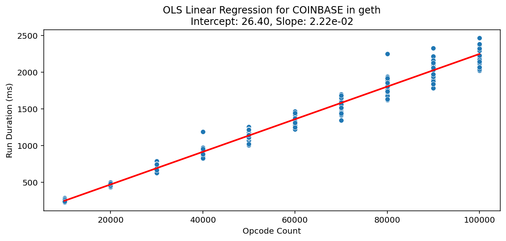

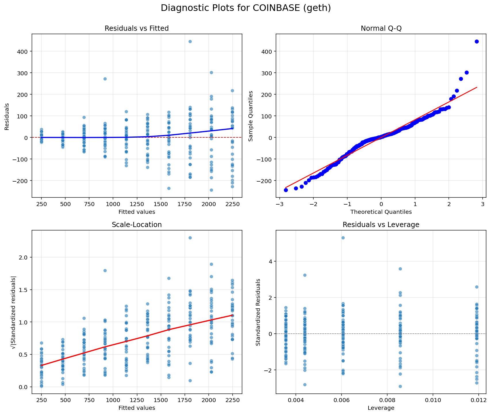


## besu


```python
                            OLS Regression Results                            
==============================================================================
Dep. Variable:        run_duration_ms   R-squared:                       0.983
Model:                            OLS   Adj. R-squared:                  0.983
Method:                 Least Squares   F-statistic:                 1.666e+04
Date:                Thu, 22 Jan 2026   Prob (F-statistic):          6.82e-257
Time:                        10:33:46   Log-Likelihood:                -1738.5
No. Observations:                 290   AIC:                             3481.
Df Residuals:                     288   BIC:                             3488.
Df Model:                           1                                         
Covariance Type:            nonrobust                                         
==============================================================================
                 coef    std err          t      P>|t|      [0.025      0.975]
------------------------------------------------------------------------------
const         26.2937     12.362      2.127      0.034       1.963      50.625
opcount        0.0257      0.000    129.075      0.000       0.025       0.026
==============================================================================
Omnibus:                       61.377   Durbin-Watson:                   0.827
Prob(Omnibus):                  0.000   Jarque-Bera (JB):              152.438
Skew:                          -0.993   Prob(JB):                     7.92e-34
Kurtosis:                       5.945   Cond. No.                     1.34e+05
==============================================================================

Notes:
[1] Standard Errors assume that the covariance matrix of the errors is correctly specified.
[2] The condition number is large, 1.34e+05. This might indicate that there are
strong multicollinearity or other numerical problems.
```


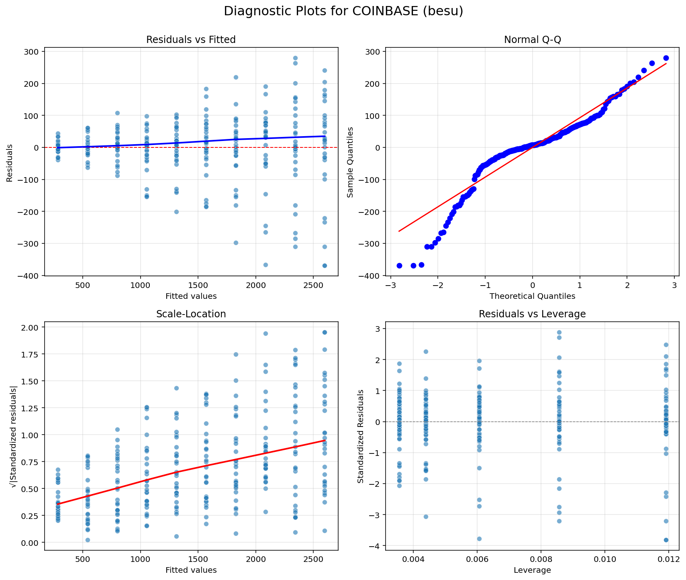


## reth


```python
                            OLS Regression Results                            
==============================================================================
Dep. Variable:        run_duration_ms   R-squared:                       0.978
Model:                            OLS   Adj. R-squared:                  0.978
Method:                 Least Squares   F-statistic:                     8059.
Date:                Thu, 22 Jan 2026   Prob (F-statistic):          3.69e-150
Time:                        10:33:46   Log-Likelihood:                -858.21
No. Observations:                 180   AIC:                             1720.
Df Residuals:                     178   BIC:                             1727.
Df Model:                           1                                         
Covariance Type:            nonrobust                                         
==============================================================================
                 coef    std err          t      P>|t|      [0.025      0.975]
------------------------------------------------------------------------------
const         32.9206      4.610      7.141      0.000      23.824      42.018
opcount        0.0067   7.43e-05     89.770      0.000       0.007       0.007
==============================================================================
Omnibus:                       11.935   Durbin-Watson:                   1.721
Prob(Omnibus):                  0.003   Jarque-Bera (JB):               28.193
Skew:                           0.145   Prob(JB):                     7.55e-07
Kurtosis:                       4.917   Cond. No.                     1.34e+05
==============================================================================

Notes:
[1] Standard Errors assume that the covariance matrix of the errors is correctly specified.
[2] The condition number is large, 1.34e+05. This might indicate that there are
strong multicollinearity or other numerical problems.
```


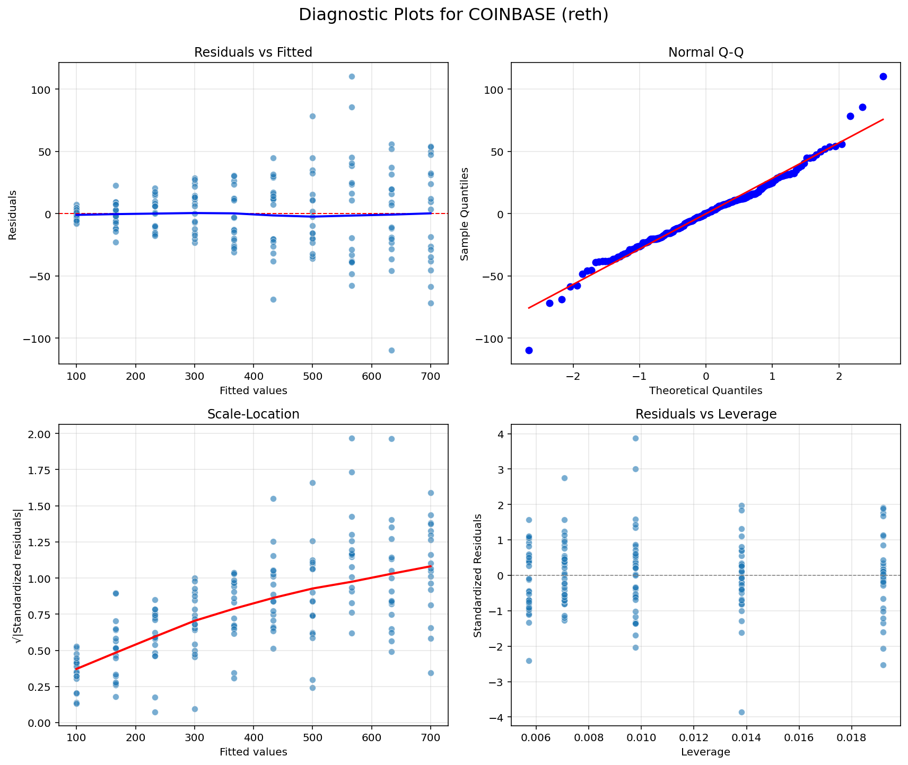


## nethermind


```python
                            OLS Regression Results                            
==============================================================================
Dep. Variable:        run_duration_ms   R-squared:                       0.976
Model:                            OLS   Adj. R-squared:                  0.975
Method:                 Least Squares   F-statistic:                 1.148e+04
Date:                Thu, 22 Jan 2026   Prob (F-statistic):          4.23e-234
Time:                        10:33:47   Log-Likelihood:                -1418.6
No. Observations:                 290   AIC:                             2841.
Df Residuals:                     288   BIC:                             2849.
Df Model:                           1                                         
Covariance Type:            nonrobust                                         
==============================================================================
                 coef    std err          t      P>|t|      [0.025      0.975]
------------------------------------------------------------------------------
const         30.4631      4.103      7.425      0.000      22.388      38.538
opcount        0.0071   6.61e-05    107.164      0.000       0.007       0.007
==============================================================================
Omnibus:                       18.400   Durbin-Watson:                   0.808
Prob(Omnibus):                  0.000   Jarque-Bera (JB):               53.967
Skew:                          -0.105   Prob(JB):                     1.91e-12
Kurtosis:                       5.103   Cond. No.                     1.34e+05
==============================================================================

Notes:
[1] Standard Errors assume that the covariance matrix of the errors is correctly specified.
[2] The condition number is large, 1.34e+05. This might indicate that there are
strong multicollinearity or other numerical problems.
```

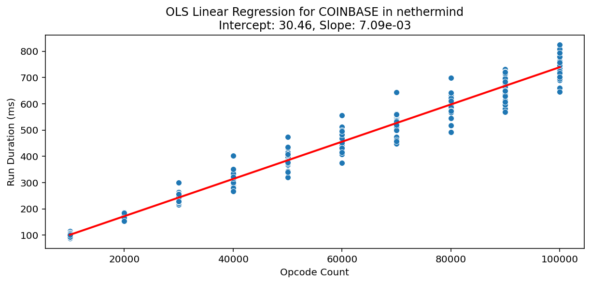

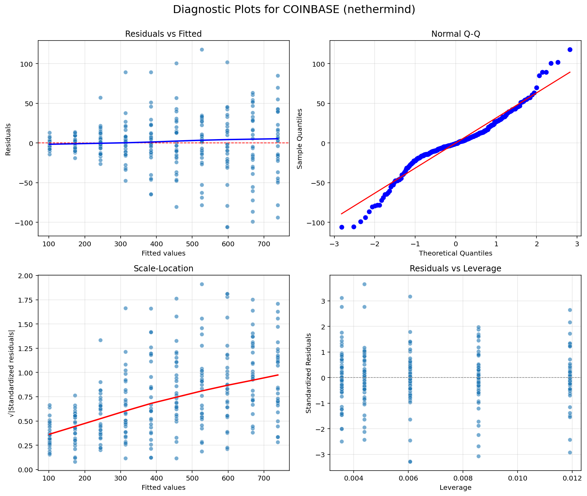


## erigon


```python
                            OLS Regression Results                            
==============================================================================
Dep. Variable:        run_duration_ms   R-squared:                       1.000
Model:                            OLS   Adj. R-squared:                  1.000
Method:                 Least Squares   F-statistic:                 1.675e+05
Date:                Thu, 22 Jan 2026   Prob (F-statistic):           1.98e-54
Time:                        10:33:47   Log-Likelihood:                -114.55
No. Observations:                  30   AIC:                             233.1
Df Residuals:                      28   BIC:                             235.9
Df Model:                           1                                         
Covariance Type:            nonrobust                                         
==============================================================================
                 coef    std err          t      P>|t|      [0.025      0.975]
------------------------------------------------------------------------------
const         36.1354      4.497      8.036      0.000      26.924      45.347
opcount        0.0297   7.25e-05    409.269      0.000       0.030       0.030
==============================================================================
Omnibus:                       20.313   Durbin-Watson:                   1.695
Prob(Omnibus):                  0.000   Jarque-Bera (JB):               33.140
Skew:                          -1.513   Prob(JB):                     6.36e-08
Kurtosis:                       7.166   Cond. No.                     1.34e+05
==============================================================================

Notes:
[1] Standard Errors assume that the covariance matrix of the errors is correctly specified.
[2] The condition number is large, 1.34e+05. This might indicate that there are
strong multicollinearity or other numerical problems.
```
OLS model did not run... Error: 'numpy.ndarray' object has no attribute 'iloc'

# DIV

## geth


```python
                            OLS Regression Results                            
==============================================================================
Dep. Variable:        run_duration_ms   R-squared:                       0.984
Model:                            OLS   Adj. R-squared:                  0.984
Method:                 Least Squares   F-statistic:                 1.814e+04
Date:                Thu, 22 Jan 2026   Prob (F-statistic):          4.03e-262
Time:                        10:33:47   Log-Likelihood:                -1664.7
No. Observations:                 290   AIC:                             3333.
Df Residuals:                     288   BIC:                             3341.
Df Model:                           1                                         
Covariance Type:            nonrobust                                         
==============================================================================
                 coef    std err          t      P>|t|      [0.025      0.975]
------------------------------------------------------------------------------
const         34.0989      9.585      3.557      0.000      15.232      52.965
opcount        0.0694      0.001    134.678      0.000       0.068       0.070
==============================================================================
Omnibus:                       59.809   Durbin-Watson:                   0.861
Prob(Omnibus):                  0.000   Jarque-Bera (JB):              113.475
Skew:                          -1.084   Prob(JB):                     2.29e-25
Kurtosis:                       5.165   Cond. No.                     4.02e+04
==============================================================================

Notes:
[1] Standard Errors assume that the covariance matrix of the errors is correctly specified.
[2] The condition number is large, 4.02e+04. This might indicate that there are
strong multicollinearity or other numerical problems.
```

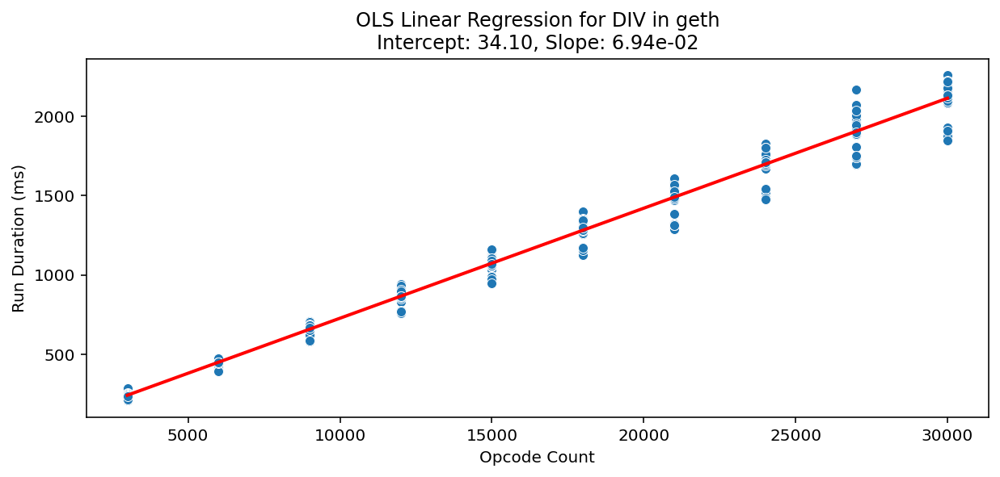

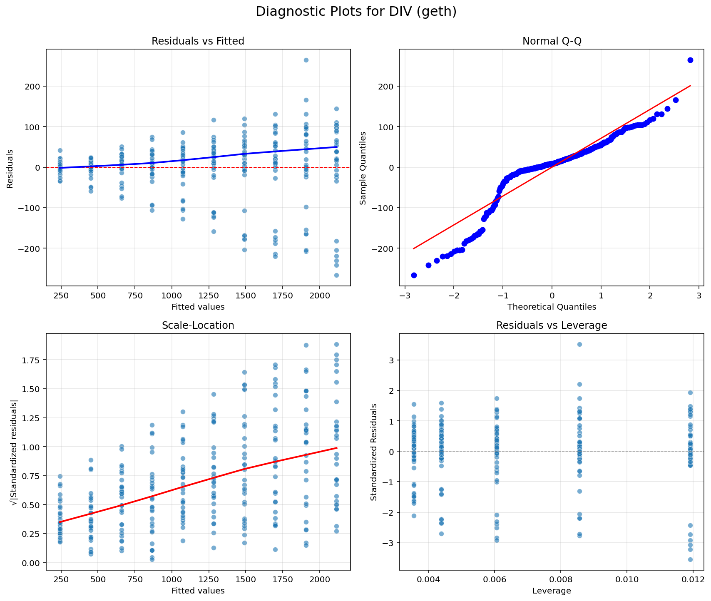


## besu


```python
                            OLS Regression Results                            
==============================================================================
Dep. Variable:        run_duration_ms   R-squared:                       0.971
Model:                            OLS   Adj. R-squared:                  0.971
Method:                 Least Squares   F-statistic:                     9747.
Date:                Thu, 22 Jan 2026   Prob (F-statistic):          4.08e-224
Time:                        10:33:47   Log-Likelihood:                -2125.4
No. Observations:                 290   AIC:                             4255.
Df Residuals:                     288   BIC:                             4262.
Df Model:                           1                                         
Covariance Type:            nonrobust                                         
==============================================================================
                 coef    std err          t      P>|t|      [0.025      0.975]
------------------------------------------------------------------------------
const         37.7299     46.934      0.804      0.422     -54.648     130.108
opcount        0.2489      0.003     98.728      0.000       0.244       0.254
==============================================================================
Omnibus:                        4.211   Durbin-Watson:                   0.730
Prob(Omnibus):                  0.122   Jarque-Bera (JB):                5.381
Skew:                           0.004   Prob(JB):                       0.0678
Kurtosis:                       3.667   Cond. No.                     4.02e+04
==============================================================================

Notes:
[1] Standard Errors assume that the covariance matrix of the errors is correctly specified.
[2] The condition number is large, 4.02e+04. This might indicate that there are
strong multicollinearity or other numerical problems.
```

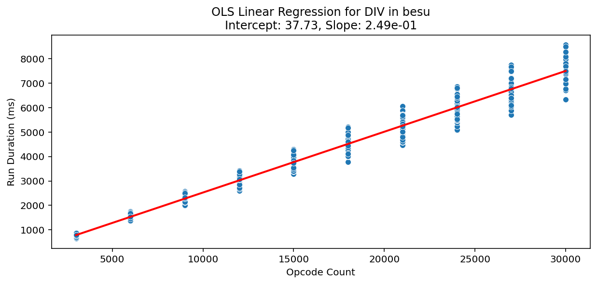

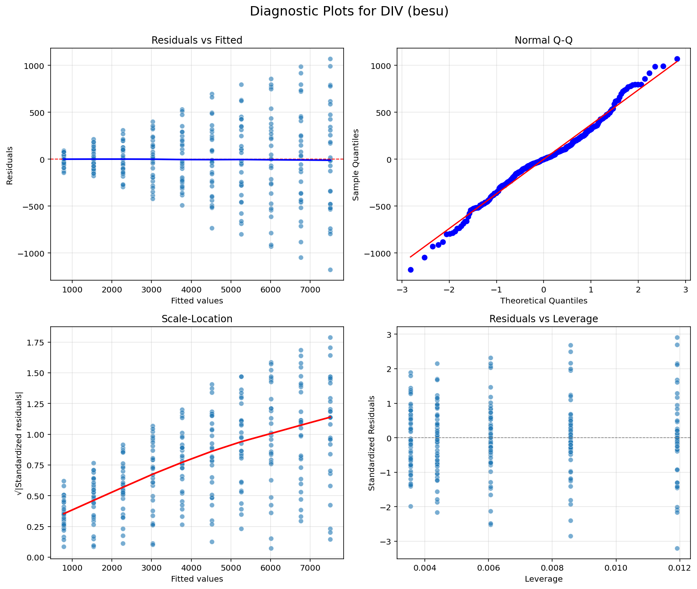


## reth


```python
                            OLS Regression Results                            
==============================================================================
Dep. Variable:        run_duration_ms   R-squared:                       0.993
Model:                            OLS   Adj. R-squared:                  0.993
Method:                 Least Squares   F-statistic:                 2.413e+04
Date:                Thu, 22 Jan 2026   Prob (F-statistic):          5.40e-192
Time:                        10:33:48   Log-Likelihood:                -919.06
No. Observations:                 180   AIC:                             1842.
Df Residuals:                     178   BIC:                             1849.
Df Model:                           1                                         
Covariance Type:            nonrobust                                         
==============================================================================
                 coef    std err          t      P>|t|      [0.025      0.975]
------------------------------------------------------------------------------
const         32.1698      6.464      4.977      0.000      19.413      44.926
opcount        0.0539      0.000    155.340      0.000       0.053       0.055
==============================================================================
Omnibus:                       96.984   Durbin-Watson:                   1.216
Prob(Omnibus):                  0.000   Jarque-Bera (JB):              487.433
Skew:                          -2.054   Prob(JB):                    1.43e-106
Kurtosis:                       9.937   Cond. No.                     4.02e+04
==============================================================================

Notes:
[1] Standard Errors assume that the covariance matrix of the errors is correctly specified.
[2] The condition number is large, 4.02e+04. This might indicate that there are
strong multicollinearity or other numerical problems.
```

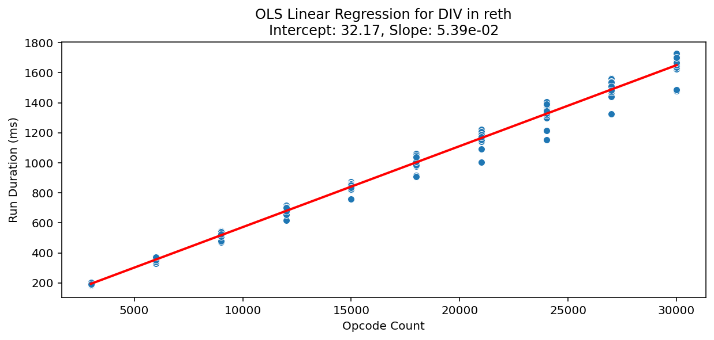

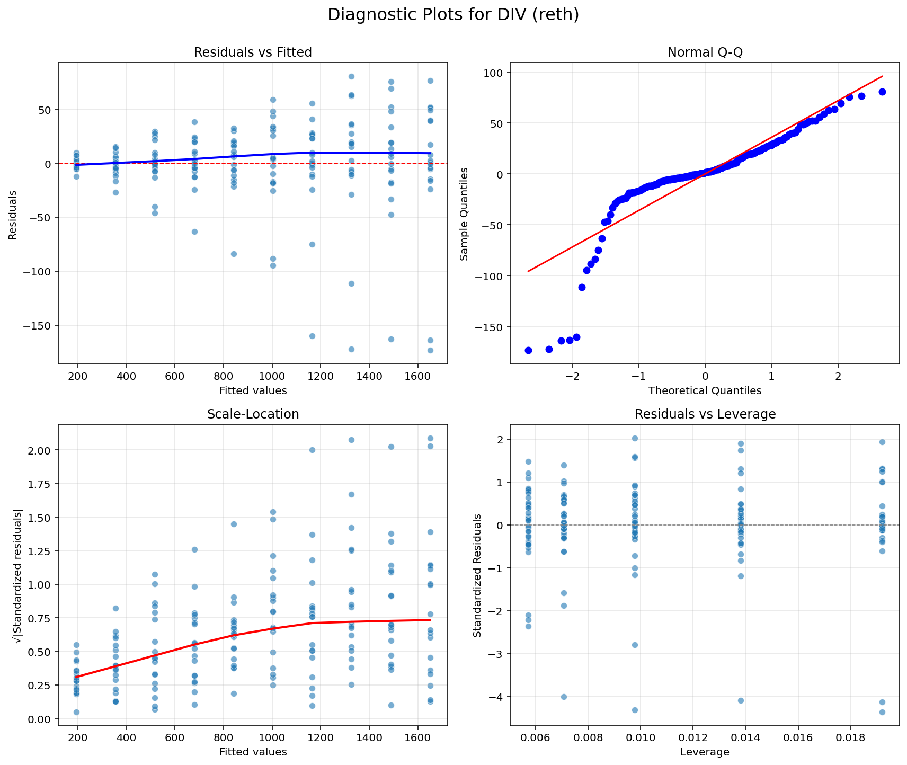


## nethermind


```python
                            OLS Regression Results                            
==============================================================================
Dep. Variable:        run_duration_ms   R-squared:                       0.986
Model:                            OLS   Adj. R-squared:                  0.986
Method:                 Least Squares   F-statistic:                 2.060e+04
Date:                Thu, 22 Jan 2026   Prob (F-statistic):          5.97e-270
Time:                        10:33:48   Log-Likelihood:                -1614.3
No. Observations:                 290   AIC:                             3233.
Df Residuals:                     288   BIC:                             3240.
Df Model:                           1                                         
Covariance Type:            nonrobust                                         
==============================================================================
                 coef    std err          t      P>|t|      [0.025      0.975]
------------------------------------------------------------------------------
const         27.3931      8.055      3.401      0.001      11.538      43.248
opcount        0.0621      0.000    143.511      0.000       0.061       0.063
==============================================================================
Omnibus:                       32.254   Durbin-Watson:                   0.640
Prob(Omnibus):                  0.000   Jarque-Bera (JB):              117.980
Skew:                          -0.365   Prob(JB):                     2.40e-26
Kurtosis:                       6.038   Cond. No.                     4.02e+04
==============================================================================

Notes:
[1] Standard Errors assume that the covariance matrix of the errors is correctly specified.
[2] The condition number is large, 4.02e+04. This might indicate that there are
strong multicollinearity or other numerical problems.
```

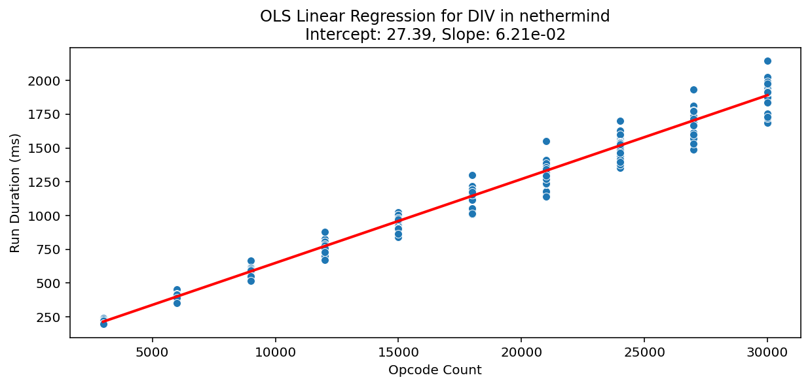

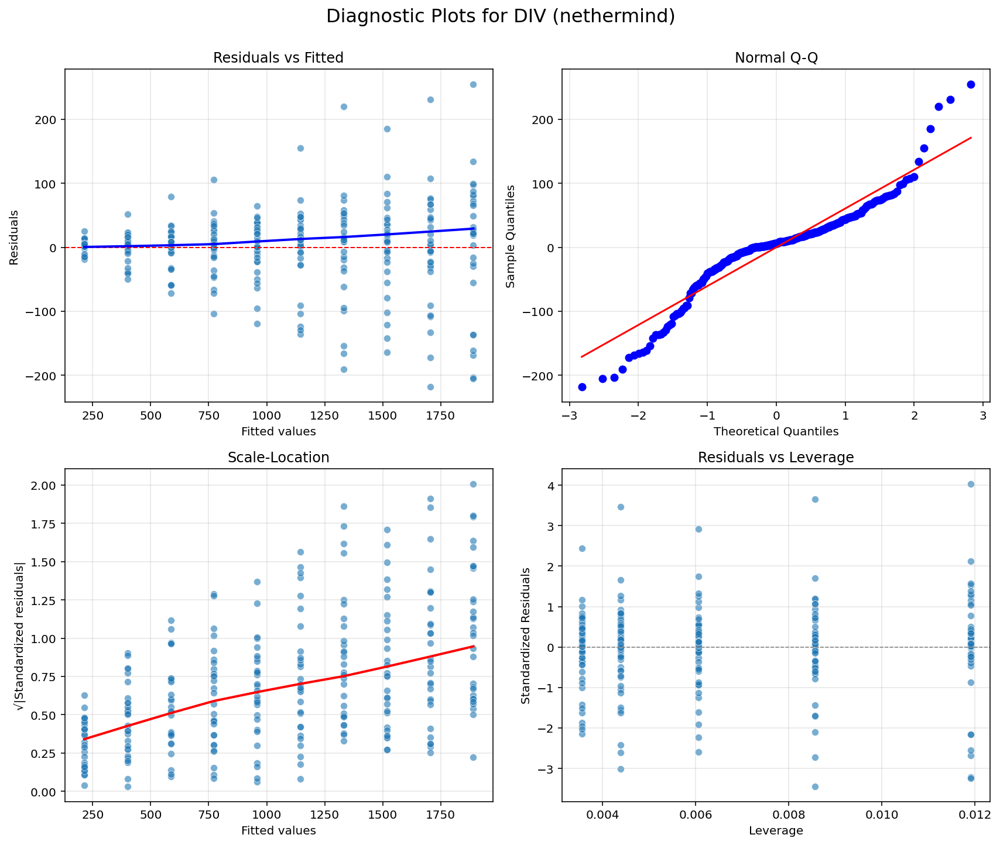


## erigon


```python
                            OLS Regression Results                            
==============================================================================
Dep. Variable:        run_duration_ms   R-squared:                       1.000
Model:                            OLS   Adj. R-squared:                  1.000
Method:                 Least Squares   F-statistic:                 1.150e+05
Date:                Thu, 22 Jan 2026   Prob (F-statistic):           3.82e-52
Time:                        10:33:48   Log-Likelihood:                -110.03
No. Observations:                  30   AIC:                             224.1
Df Residuals:                      28   BIC:                             226.9
Df Model:                           1                                         
Covariance Type:            nonrobust                                         
==============================================================================
                 coef    std err          t      P>|t|      [0.025      0.975]
------------------------------------------------------------------------------
const         33.7244      3.869      8.718      0.000      25.800      41.649
opcount        0.0705      0.000    339.171      0.000       0.070       0.071
==============================================================================
Omnibus:                        3.682   Durbin-Watson:                   0.960
Prob(Omnibus):                  0.159   Jarque-Bera (JB):                2.756
Skew:                           0.095   Prob(JB):                        0.252
Kurtosis:                       4.473   Cond. No.                     4.02e+04
==============================================================================

Notes:
[1] Standard Errors assume that the covariance matrix of the errors is correctly specified.
[2] The condition number is large, 4.02e+04. This might indicate that there are
strong multicollinearity or other numerical problems.
```
OLS model did not run... Error: 'numpy.ndarray' object has no attribute 'iloc'

# DIFFICULTY

## geth


```python
                            OLS Regression Results                            
==============================================================================
Dep. Variable:        run_duration_ms   R-squared:                       0.985
Model:                            OLS   Adj. R-squared:                  0.985
Method:                 Least Squares   F-statistic:                 1.885e+04
Date:                Thu, 22 Jan 2026   Prob (F-statistic):          1.73e-264
Time:                        10:33:48   Log-Likelihood:                -1706.1
No. Observations:                 290   AIC:                             3416.
Df Residuals:                     288   BIC:                             3424.
Df Model:                           1                                         
Covariance Type:            nonrobust                                         
==============================================================================
                 coef    std err          t      P>|t|      [0.025      0.975]
------------------------------------------------------------------------------
const         30.1155     11.056      2.724      0.007       8.355      51.876
opcount        0.0245      0.000    137.292      0.000       0.024       0.025
==============================================================================
Omnibus:                       30.757   Durbin-Watson:                   1.016
Prob(Omnibus):                  0.000   Jarque-Bera (JB):              150.309
Skew:                          -0.153   Prob(JB):                     2.29e-33
Kurtosis:                       6.514   Cond. No.                     1.34e+05
==============================================================================

Notes:
[1] Standard Errors assume that the covariance matrix of the errors is correctly specified.
[2] The condition number is large, 1.34e+05. This might indicate that there are
strong multicollinearity or other numerical problems.
```

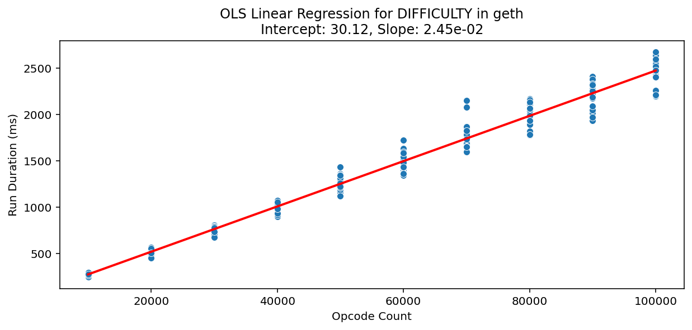

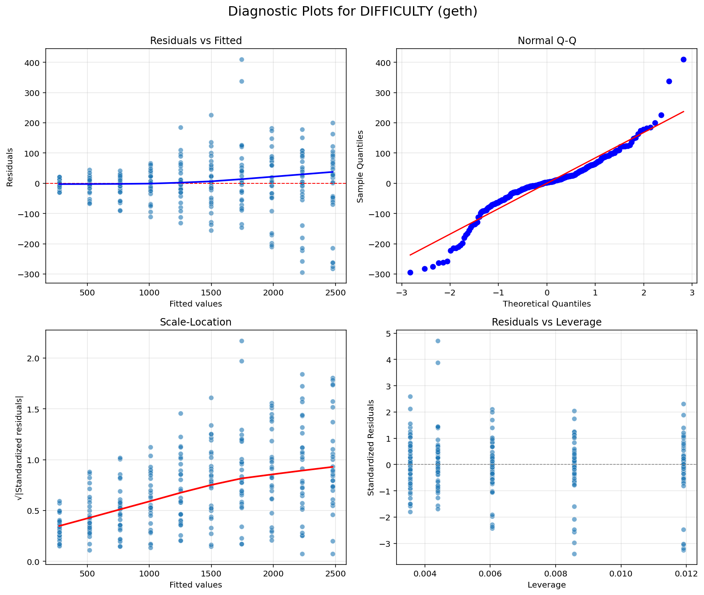


## besu


```python
                            OLS Regression Results                            
==============================================================================
Dep. Variable:        run_duration_ms   R-squared:                       0.987
Model:                            OLS   Adj. R-squared:                  0.987
Method:                 Least Squares   F-statistic:                 2.127e+04
Date:                Thu, 22 Jan 2026   Prob (F-statistic):          6.19e-272
Time:                        10:33:48   Log-Likelihood:                -1714.6
No. Observations:                 290   AIC:                             3433.
Df Residuals:                     288   BIC:                             3441.
Df Model:                           1                                         
Covariance Type:            nonrobust                                         
==============================================================================
                 coef    std err          t      P>|t|      [0.025      0.975]
------------------------------------------------------------------------------
const         33.3451     11.384      2.929      0.004      10.938      55.752
opcount        0.0268      0.000    145.837      0.000       0.026       0.027
==============================================================================
Omnibus:                       52.106   Durbin-Watson:                   0.931
Prob(Omnibus):                  0.000   Jarque-Bera (JB):              121.998
Skew:                          -0.866   Prob(JB):                     3.22e-27
Kurtosis:                       5.663   Cond. No.                     1.34e+05
==============================================================================

Notes:
[1] Standard Errors assume that the covariance matrix of the errors is correctly specified.
[2] The condition number is large, 1.34e+05. This might indicate that there are
strong multicollinearity or other numerical problems.
```

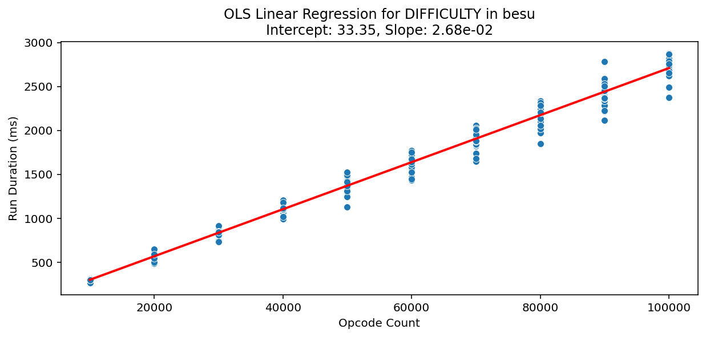

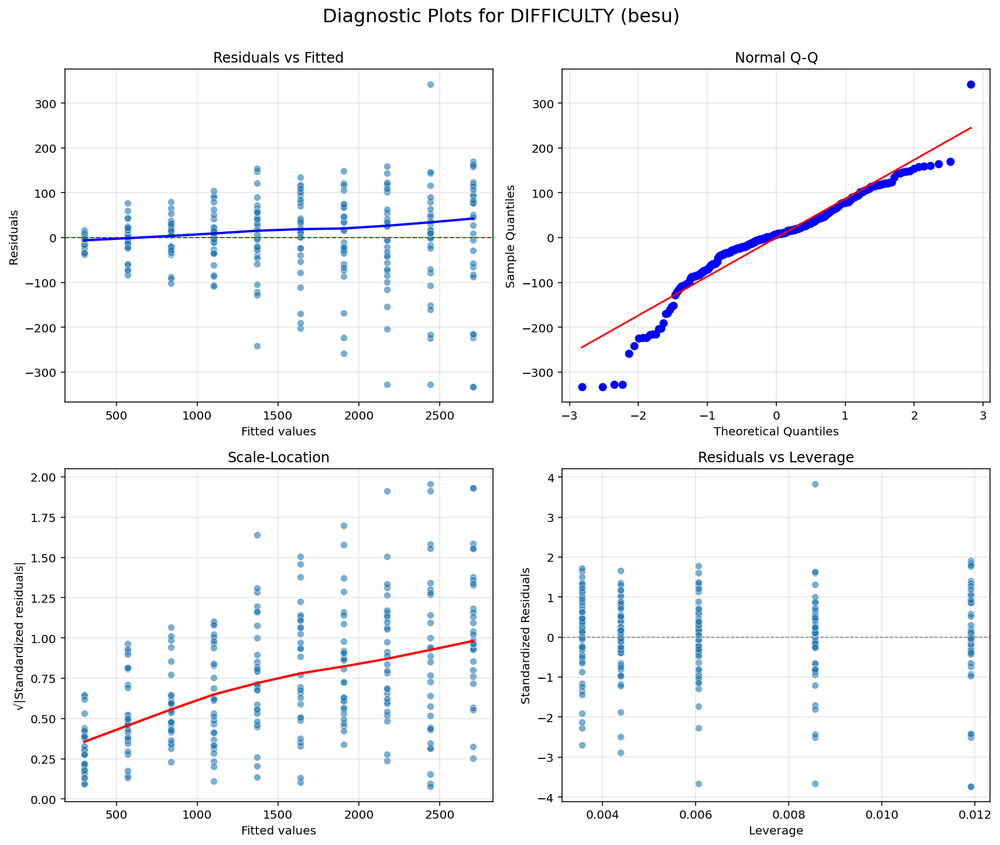


## reth


```python
                            OLS Regression Results                            
==============================================================================
Dep. Variable:        run_duration_ms   R-squared:                       0.978
Model:                            OLS   Adj. R-squared:                  0.978
Method:                 Least Squares   F-statistic:                     7923.
Date:                Thu, 22 Jan 2026   Prob (F-statistic):          1.62e-149
Time:                        10:33:49   Log-Likelihood:                -887.28
No. Observations:                 180   AIC:                             1779.
Df Residuals:                     178   BIC:                             1785.
Df Model:                           1                                         
Covariance Type:            nonrobust                                         
==============================================================================
                 coef    std err          t      P>|t|      [0.025      0.975]
------------------------------------------------------------------------------
const         32.9765      5.418      6.086      0.000      22.285      43.668
opcount        0.0078   8.73e-05     89.011      0.000       0.008       0.008
==============================================================================
Omnibus:                        9.620   Durbin-Watson:                   1.389
Prob(Omnibus):                  0.008   Jarque-Bera (JB):               20.780
Skew:                          -0.012   Prob(JB):                     3.07e-05
Kurtosis:                       4.664   Cond. No.                     1.34e+05
==============================================================================

Notes:
[1] Standard Errors assume that the covariance matrix of the errors is correctly specified.
[2] The condition number is large, 1.34e+05. This might indicate that there are
strong multicollinearity or other numerical problems.
```

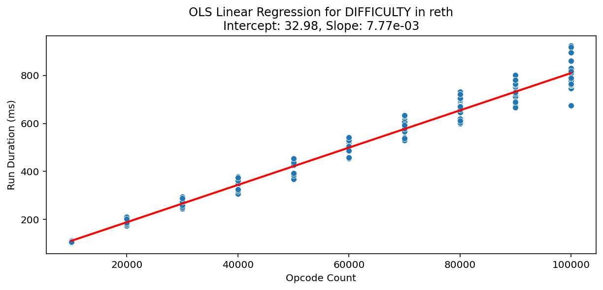

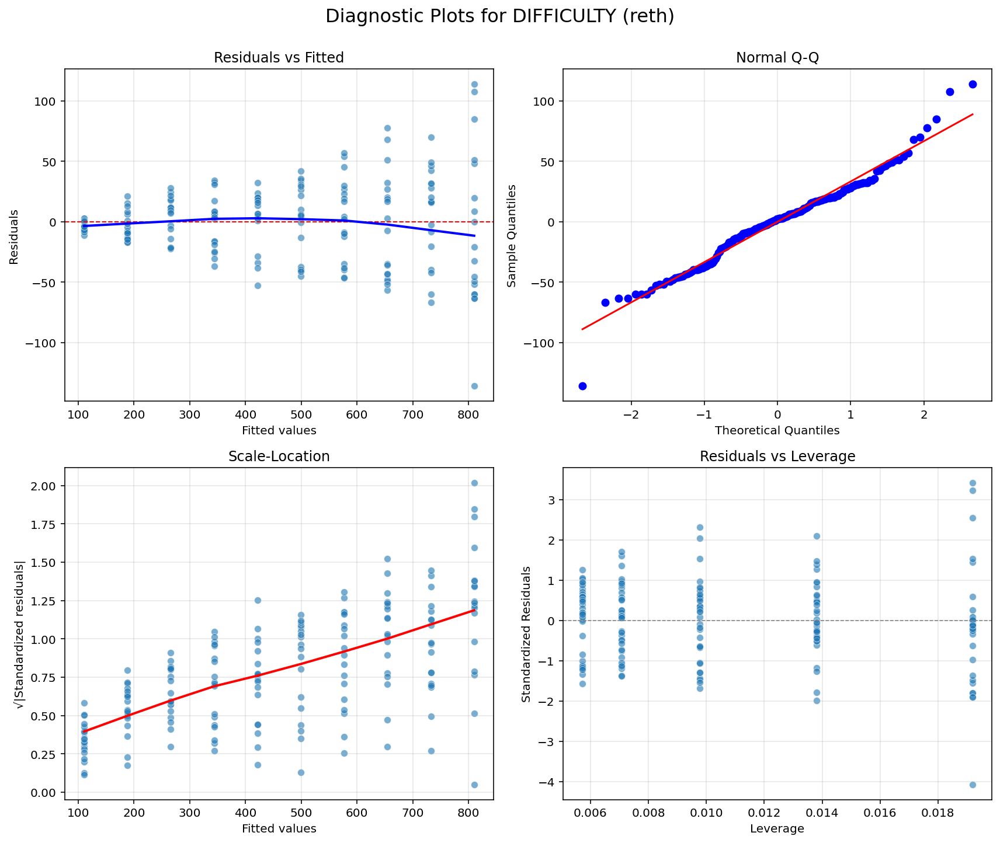


## nethermind


```python
                            OLS Regression Results                            
==============================================================================
Dep. Variable:        run_duration_ms   R-squared:                       0.972
Model:                            OLS   Adj. R-squared:                  0.972
Method:                 Least Squares   F-statistic:                 1.005e+04
Date:                Thu, 22 Jan 2026   Prob (F-statistic):          5.90e-226
Time:                        10:33:49   Log-Likelihood:                -1427.6
No. Observations:                 290   AIC:                             2859.
Df Residuals:                     288   BIC:                             2866.
Df Model:                           1                                         
Covariance Type:            nonrobust                                         
==============================================================================
                 coef    std err          t      P>|t|      [0.025      0.975]
------------------------------------------------------------------------------
const         30.9234      4.231      7.309      0.000      22.596      39.251
opcount        0.0068   6.82e-05    100.234      0.000       0.007       0.007
==============================================================================
Omnibus:                       30.025   Durbin-Watson:                   0.962
Prob(Omnibus):                  0.000   Jarque-Bera (JB):              133.251
Skew:                           0.206   Prob(JB):                     1.16e-29
Kurtosis:                       6.295   Cond. No.                     1.34e+05
==============================================================================

Notes:
[1] Standard Errors assume that the covariance matrix of the errors is correctly specified.
[2] The condition number is large, 1.34e+05. This might indicate that there are
strong multicollinearity or other numerical problems.
```


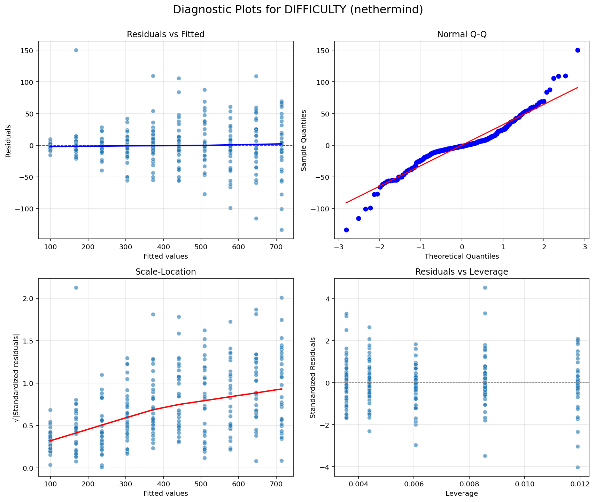


## erigon


```python
                            OLS Regression Results                            
==============================================================================
Dep. Variable:        run_duration_ms   R-squared:                       0.998
Model:                            OLS   Adj. R-squared:                  0.998
Method:                 Least Squares   F-statistic:                 1.406e+04
Date:                Thu, 22 Jan 2026   Prob (F-statistic):           2.24e-39
Time:                        10:33:49   Log-Likelihood:                -142.80
No. Observations:                  30   AIC:                             289.6
Df Residuals:                      28   BIC:                             292.4
Df Model:                           1                                         
Covariance Type:            nonrobust                                         
==============================================================================
                 coef    std err          t      P>|t|      [0.025      0.975]
------------------------------------------------------------------------------
const         39.7425     11.534      3.446      0.002      16.115      63.370
opcount        0.0220      0.000    118.583      0.000       0.022       0.022
==============================================================================
Omnibus:                        0.084   Durbin-Watson:                   1.032
Prob(Omnibus):                  0.959   Jarque-Bera (JB):                0.269
Skew:                           0.092   Prob(JB):                        0.874
Kurtosis:                       2.574   Cond. No.                     1.34e+05
==============================================================================

Notes:
[1] Standard Errors assume that the covariance matrix of the errors is correctly specified.
[2] The condition number is large, 1.34e+05. This might indicate that there are
strong multicollinearity or other numerical problems.
```

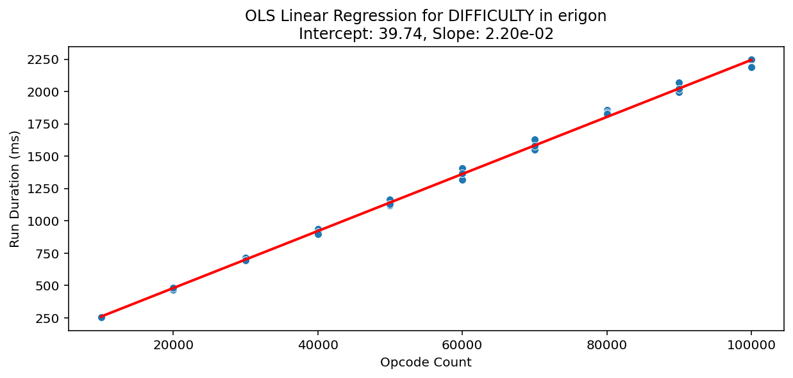

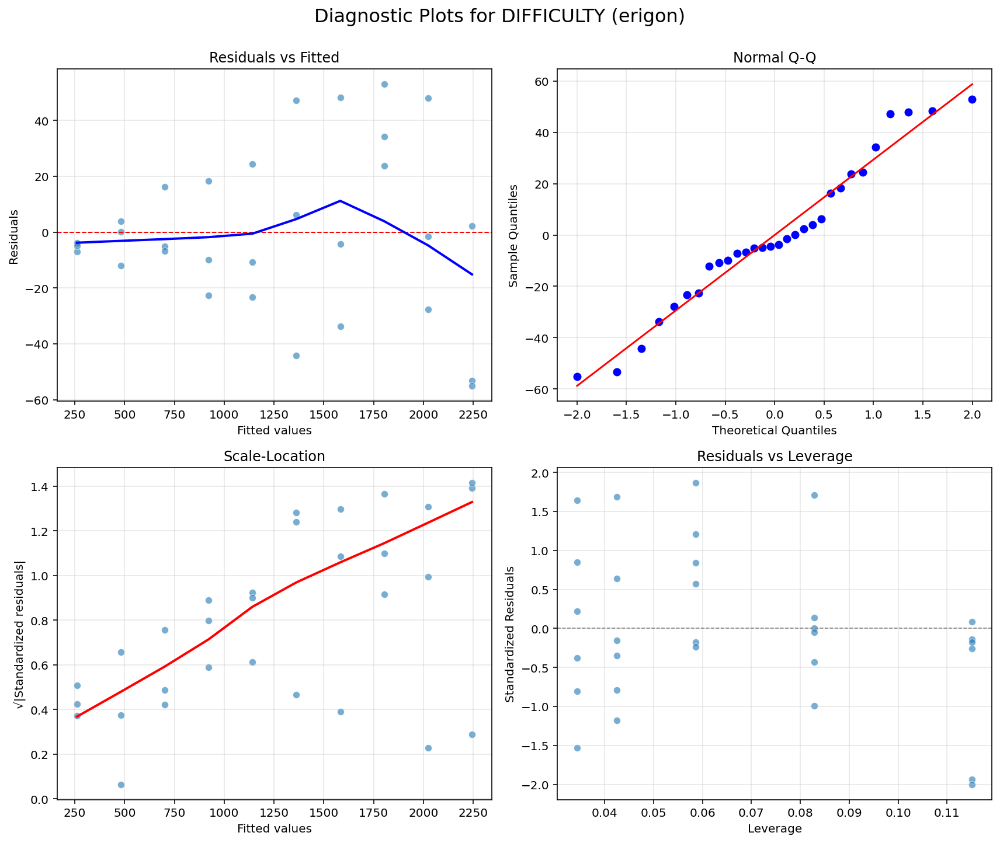


# DUP1

## geth


```python
                            OLS Regression Results                            
==============================================================================
Dep. Variable:        run_duration_ms   R-squared:                       0.984
Model:                            OLS   Adj. R-squared:                  0.984
Method:                 Least Squares   F-statistic:                 1.775e+04
Date:                Thu, 22 Jan 2026   Prob (F-statistic):          8.39e-261
Time:                        10:33:50   Log-Likelihood:                -1425.6
No. Observations:                 290   AIC:                             2855.
Df Residuals:                     288   BIC:                             2863.
Df Model:                           1                                         
Covariance Type:            nonrobust                                         
==============================================================================
                 coef    std err          t      P>|t|      [0.025      0.975]
------------------------------------------------------------------------------
const         34.3455      4.203      8.173      0.000      26.074      42.617
opcount        0.0129   9.68e-05    133.243      0.000       0.013       0.013
==============================================================================
Omnibus:                       24.492   Durbin-Watson:                   1.094
Prob(Omnibus):                  0.000   Jarque-Bera (JB):               57.564
Skew:                          -0.390   Prob(JB):                     3.16e-13
Kurtosis:                       5.038   Cond. No.                     9.38e+04
==============================================================================

Notes:
[1] Standard Errors assume that the covariance matrix of the errors is correctly specified.
[2] The condition number is large, 9.38e+04. This might indicate that there are
strong multicollinearity or other numerical problems.
```


## besu


```python
                            OLS Regression Results                            
==============================================================================
Dep. Variable:        run_duration_ms   R-squared:                       0.980
Model:                            OLS   Adj. R-squared:                  0.980
Method:                 Least Squares   F-statistic:                 1.429e+04
Date:                Thu, 22 Jan 2026   Prob (F-statistic):          1.85e-247
Time:                        10:33:50   Log-Likelihood:                -1617.5
No. Observations:                 290   AIC:                             3239.
Df Residuals:                     288   BIC:                             3246.
Df Model:                           1                                         
Covariance Type:            nonrobust                                         
==============================================================================
                 coef    std err          t      P>|t|      [0.025      0.975]
------------------------------------------------------------------------------
const         27.0765      8.146      3.324      0.001      11.044      43.109
opcount        0.0224      0.000    119.531      0.000       0.022       0.023
==============================================================================
Omnibus:                       48.734   Durbin-Watson:                   0.754
Prob(Omnibus):                  0.000   Jarque-Bera (JB):              160.472
Skew:                          -0.692   Prob(JB):                     1.43e-35
Kurtosis:                       6.372   Cond. No.                     9.38e+04
==============================================================================

Notes:
[1] Standard Errors assume that the covariance matrix of the errors is correctly specified.
[2] The condition number is large, 9.38e+04. This might indicate that there are
strong multicollinearity or other numerical problems.
```

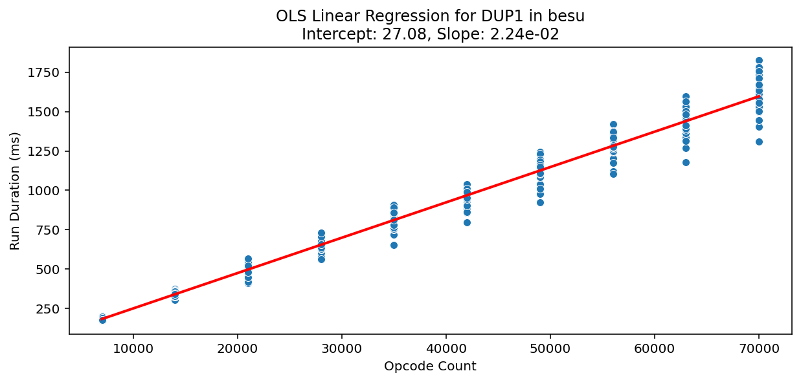

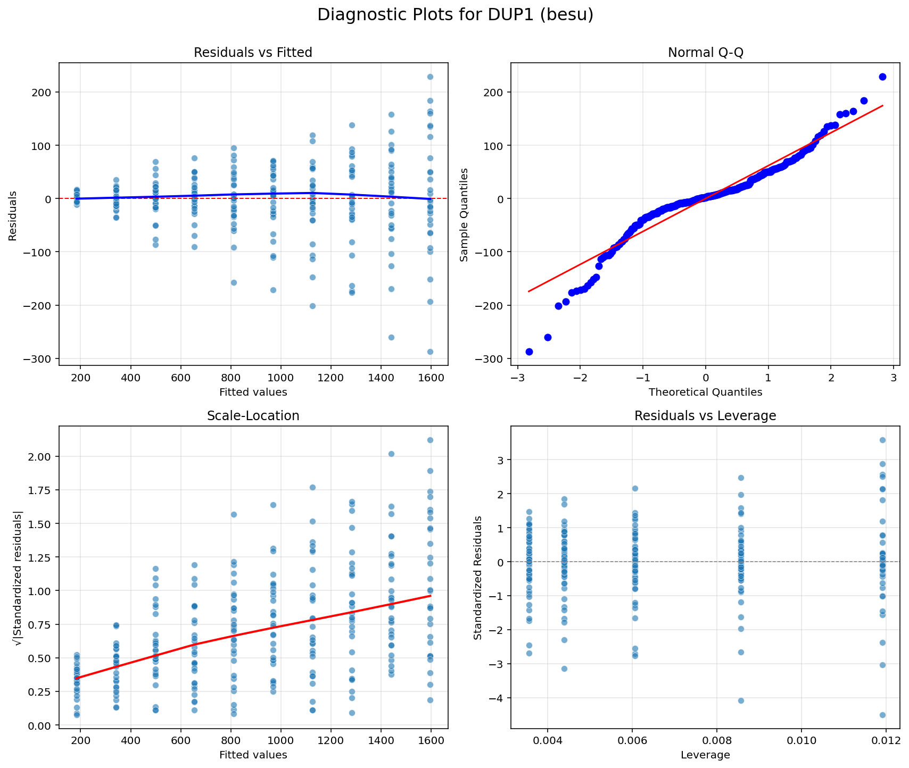


## reth


```python
                            OLS Regression Results                            
==============================================================================
Dep. Variable:        run_duration_ms   R-squared:                       0.972
Model:                            OLS   Adj. R-squared:                  0.972
Method:                 Least Squares   F-statistic:                     6144.
Date:                Thu, 22 Jan 2026   Prob (F-statistic):          6.19e-140
Time:                        10:33:50   Log-Likelihood:                -793.51
No. Observations:                 180   AIC:                             1591.
Df Residuals:                     178   BIC:                             1597.
Df Model:                           1                                         
Covariance Type:            nonrobust                                         
==============================================================================
                 coef    std err          t      P>|t|      [0.025      0.975]
------------------------------------------------------------------------------
const         31.5263      3.218      9.796      0.000      25.176      37.877
opcount        0.0058   7.41e-05     78.386      0.000       0.006       0.006
==============================================================================
Omnibus:                       10.763   Durbin-Watson:                   1.789
Prob(Omnibus):                  0.005   Jarque-Bera (JB):               11.365
Skew:                          -0.510   Prob(JB):                      0.00341
Kurtosis:                       3.689   Cond. No.                     9.38e+04
==============================================================================

Notes:
[1] Standard Errors assume that the covariance matrix of the errors is correctly specified.
[2] The condition number is large, 9.38e+04. This might indicate that there are
strong multicollinearity or other numerical problems.
```


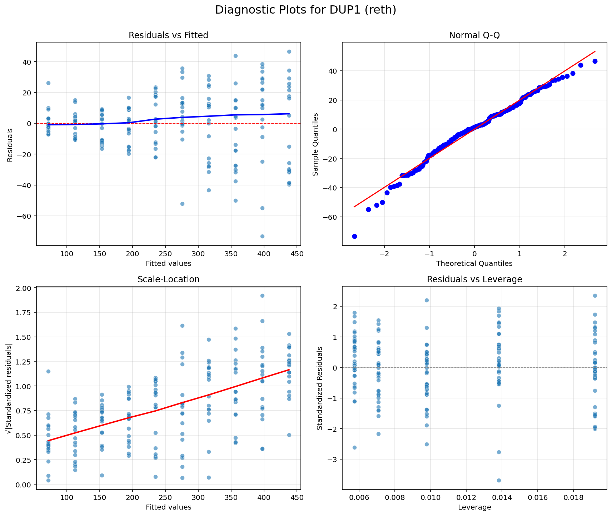


## nethermind


```python
                            OLS Regression Results                            
==============================================================================
Dep. Variable:        run_duration_ms   R-squared:                       0.976
Model:                            OLS   Adj. R-squared:                  0.976
Method:                 Least Squares   F-statistic:                 1.181e+04
Date:                Thu, 22 Jan 2026   Prob (F-statistic):          8.48e-236
Time:                        10:33:50   Log-Likelihood:                -1308.6
No. Observations:                 290   AIC:                             2621.
Df Residuals:                     288   BIC:                             2629.
Df Model:                           1                                         
Covariance Type:            nonrobust                                         
==============================================================================
                 coef    std err          t      P>|t|      [0.025      0.975]
------------------------------------------------------------------------------
const         28.4884      2.807     10.147      0.000      22.963      34.014
opcount        0.0070   6.46e-05    108.665      0.000       0.007       0.007
==============================================================================
Omnibus:                       31.646   Durbin-Watson:                   0.969
Prob(Omnibus):                  0.000   Jarque-Bera (JB):               95.155
Skew:                          -0.434   Prob(JB):                     2.17e-21
Kurtosis:                       5.669   Cond. No.                     9.38e+04
==============================================================================

Notes:
[1] Standard Errors assume that the covariance matrix of the errors is correctly specified.
[2] The condition number is large, 9.38e+04. This might indicate that there are
strong multicollinearity or other numerical problems.
```

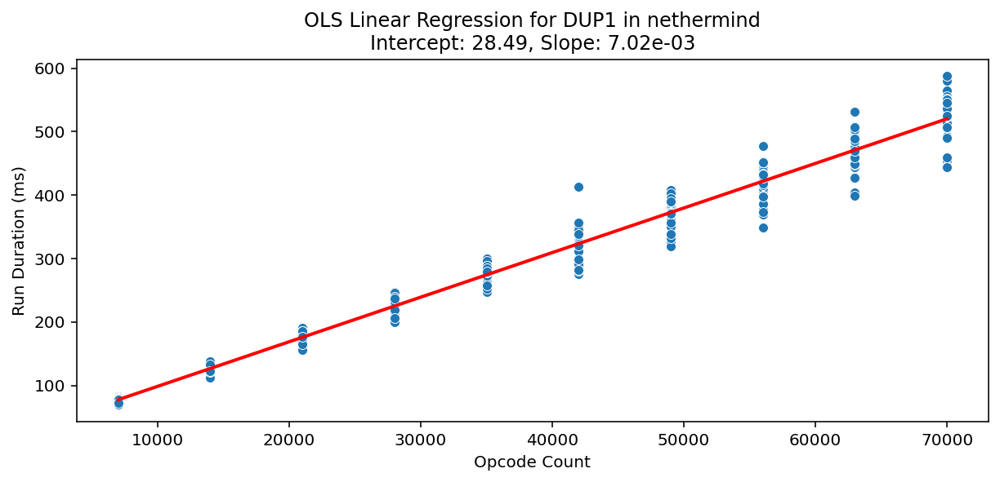

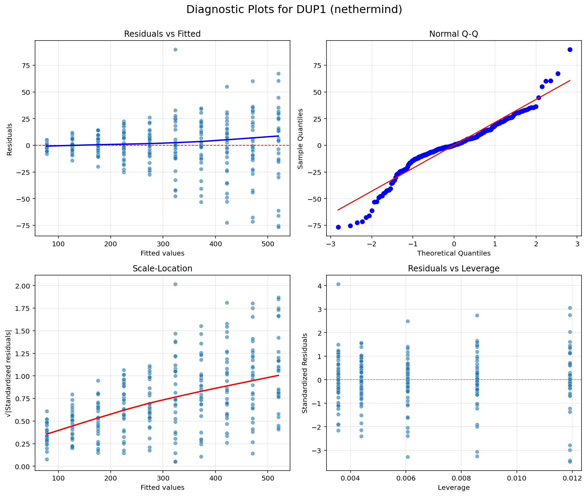


## erigon

OLS model did not run... Error: zero-size array to reduction operation maximum which has no identity

# DUP2

## geth


```python
                            OLS Regression Results                            
==============================================================================
Dep. Variable:        run_duration_ms   R-squared:                       0.984
Model:                            OLS   Adj. R-squared:                  0.984
Method:                 Least Squares   F-statistic:                 1.723e+04
Date:                Thu, 22 Jan 2026   Prob (F-statistic):          5.63e-259
Time:                        10:33:51   Log-Likelihood:                -1434.1
No. Observations:                 290   AIC:                             2872.
Df Residuals:                     288   BIC:                             2879.
Df Model:                           1                                         
Covariance Type:            nonrobust                                         
==============================================================================
                 coef    std err          t      P>|t|      [0.025      0.975]
------------------------------------------------------------------------------
const         28.7568      4.327      6.646      0.000      20.240      37.273
opcount        0.0131   9.96e-05    131.280      0.000       0.013       0.013
==============================================================================
Omnibus:                       24.211   Durbin-Watson:                   0.945
Prob(Omnibus):                  0.000   Jarque-Bera (JB):               77.711
Skew:                          -0.243   Prob(JB):                     1.33e-17
Kurtosis:                       5.489   Cond. No.                     9.38e+04
==============================================================================

Notes:
[1] Standard Errors assume that the covariance matrix of the errors is correctly specified.
[2] The condition number is large, 9.38e+04. This might indicate that there are
strong multicollinearity or other numerical problems.
```


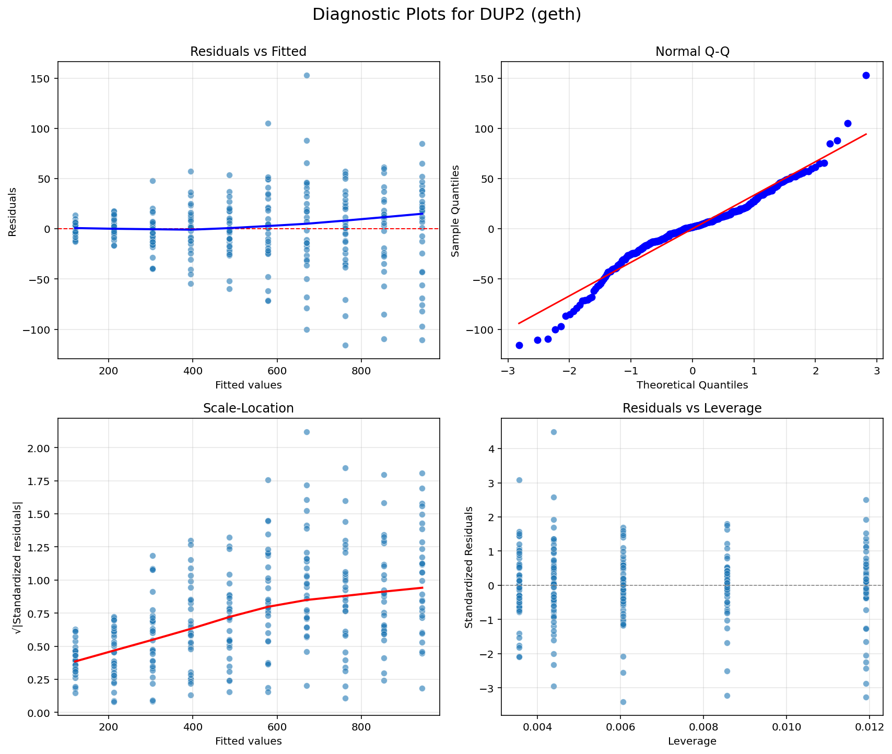


## besu


```python
                            OLS Regression Results                            
==============================================================================
Dep. Variable:        run_duration_ms   R-squared:                       0.981
Model:                            OLS   Adj. R-squared:                  0.981
Method:                 Least Squares   F-statistic:                 1.477e+04
Date:                Thu, 22 Jan 2026   Prob (F-statistic):          1.73e-249
Time:                        10:33:51   Log-Likelihood:                -1613.2
No. Observations:                 290   AIC:                             3230.
Df Residuals:                     288   BIC:                             3238.
Df Model:                           1                                         
Covariance Type:            nonrobust                                         
==============================================================================
                 coef    std err          t      P>|t|      [0.025      0.975]
------------------------------------------------------------------------------
const         27.9628      8.026      3.484      0.001      12.166      43.760
opcount        0.0225      0.000    121.523      0.000       0.022       0.023
==============================================================================
Omnibus:                       28.718   Durbin-Watson:                   0.697
Prob(Omnibus):                  0.000   Jarque-Bera (JB):               80.271
Skew:                          -0.407   Prob(JB):                     3.71e-18
Kurtosis:                       5.446   Cond. No.                     9.38e+04
==============================================================================

Notes:
[1] Standard Errors assume that the covariance matrix of the errors is correctly specified.
[2] The condition number is large, 9.38e+04. This might indicate that there are
strong multicollinearity or other numerical problems.
```


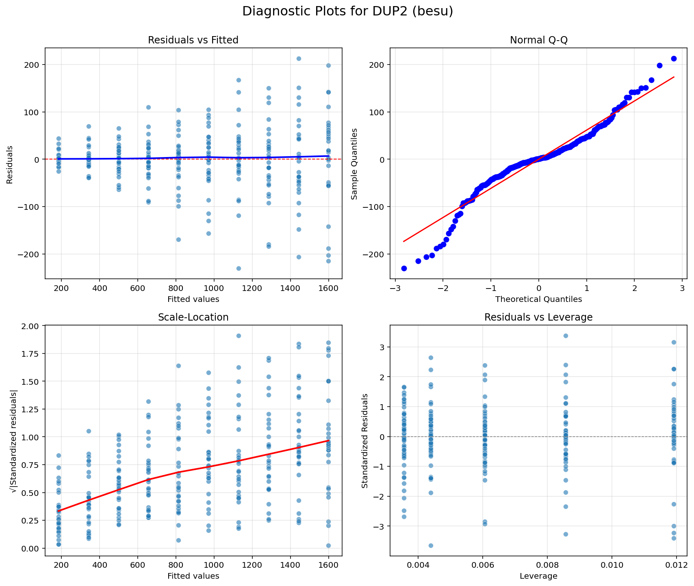


## reth


```python
                            OLS Regression Results                            
==============================================================================
Dep. Variable:        run_duration_ms   R-squared:                       0.966
Model:                            OLS   Adj. R-squared:                  0.966
Method:                 Least Squares   F-statistic:                     5012.
Date:                Thu, 22 Jan 2026   Prob (F-statistic):          2.63e-132
Time:                        10:33:51   Log-Likelihood:                -802.89
No. Observations:                 180   AIC:                             1610.
Df Residuals:                     178   BIC:                             1616.
Df Model:                           1                                         
Covariance Type:            nonrobust                                         
==============================================================================
                 coef    std err          t      P>|t|      [0.025      0.975]
------------------------------------------------------------------------------
const         34.2374      3.390     10.099      0.000      27.547      40.927
opcount        0.0055   7.81e-05     70.797      0.000       0.005       0.006
==============================================================================
Omnibus:                        4.913   Durbin-Watson:                   1.665
Prob(Omnibus):                  0.086   Jarque-Bera (JB):                6.858
Skew:                          -0.032   Prob(JB):                       0.0324
Kurtosis:                       3.954   Cond. No.                     9.38e+04
==============================================================================

Notes:
[1] Standard Errors assume that the covariance matrix of the errors is correctly specified.
[2] The condition number is large, 9.38e+04. This might indicate that there are
strong multicollinearity or other numerical problems.
```


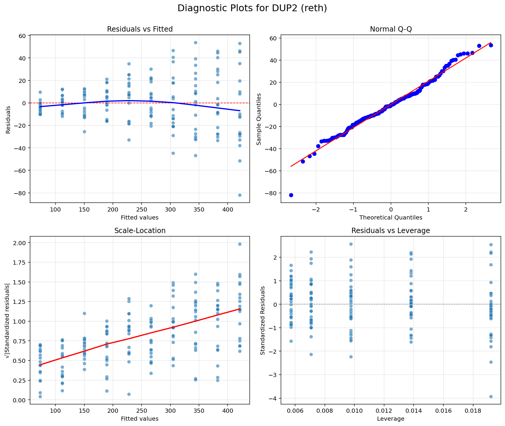


## nethermind


```python
                            OLS Regression Results                            
==============================================================================
Dep. Variable:        run_duration_ms   R-squared:                       0.977
Model:                            OLS   Adj. R-squared:                  0.977
Method:                 Least Squares   F-statistic:                 1.217e+04
Date:                Thu, 22 Jan 2026   Prob (F-statistic):          1.21e-237
Time:                        10:33:51   Log-Likelihood:                -1308.6
No. Observations:                 290   AIC:                             2621.
Df Residuals:                     288   BIC:                             2629.
Df Model:                           1                                         
Covariance Type:            nonrobust                                         
==============================================================================
                 coef    std err          t      P>|t|      [0.025      0.975]
------------------------------------------------------------------------------
const         27.2768      2.808      9.715      0.000      21.751      32.803
opcount        0.0071   6.46e-05    110.319      0.000       0.007       0.007
==============================================================================
Omnibus:                       36.360   Durbin-Watson:                   0.818
Prob(Omnibus):                  0.000   Jarque-Bera (JB):               65.463
Skew:                          -0.703   Prob(JB):                     6.09e-15
Kurtosis:                       4.854   Cond. No.                     9.38e+04
==============================================================================

Notes:
[1] Standard Errors assume that the covariance matrix of the errors is correctly specified.
[2] The condition number is large, 9.38e+04. This might indicate that there are
strong multicollinearity or other numerical problems.
```


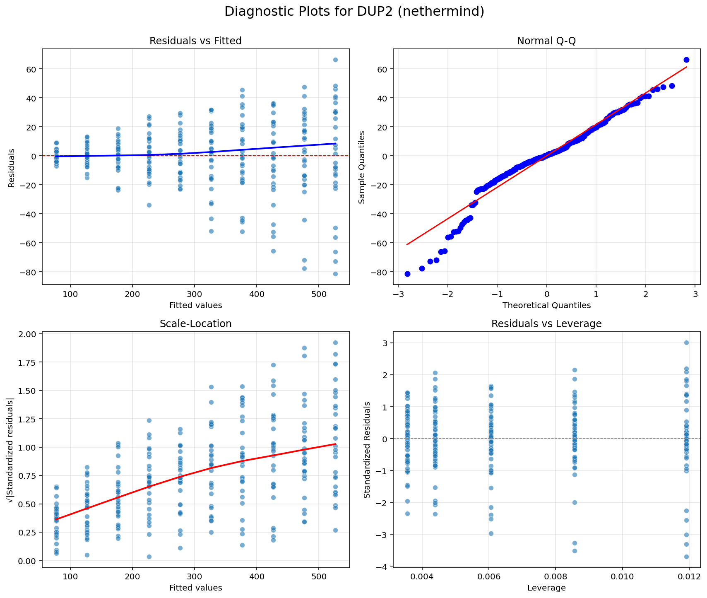


## erigon

OLS model did not run... Error: zero-size array to reduction operation maximum which has no identity

# DUP3

## geth


```python
                            OLS Regression Results                            
==============================================================================
Dep. Variable:        run_duration_ms   R-squared:                       0.983
Model:                            OLS   Adj. R-squared:                  0.983
Method:                 Least Squares   F-statistic:                 1.641e+04
Date:                Thu, 22 Jan 2026   Prob (F-statistic):          5.62e-256
Time:                        10:33:52   Log-Likelihood:                -1437.4
No. Observations:                 290   AIC:                             2879.
Df Residuals:                     288   BIC:                             2886.
Df Model:                           1                                         
Covariance Type:            nonrobust                                         
==============================================================================
                 coef    std err          t      P>|t|      [0.025      0.975]
------------------------------------------------------------------------------
const         38.3443      4.376      8.762      0.000      29.731      46.958
opcount        0.0129      0.000    128.117      0.000       0.013       0.013
==============================================================================
Omnibus:                       19.145   Durbin-Watson:                   0.956
Prob(Omnibus):                  0.000   Jarque-Bera (JB):               42.925
Skew:                          -0.293   Prob(JB):                     4.77e-10
Kurtosis:                       4.791   Cond. No.                     9.38e+04
==============================================================================

Notes:
[1] Standard Errors assume that the covariance matrix of the errors is correctly specified.
[2] The condition number is large, 9.38e+04. This might indicate that there are
strong multicollinearity or other numerical problems.
```

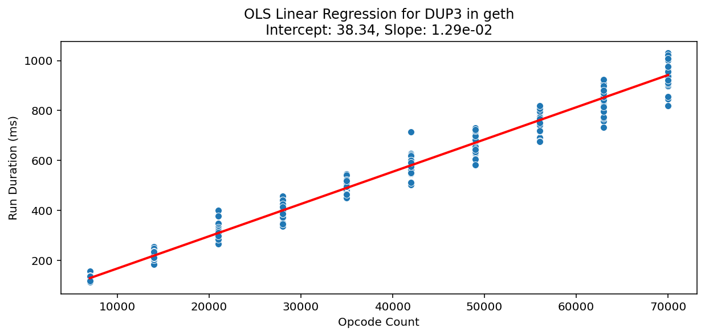

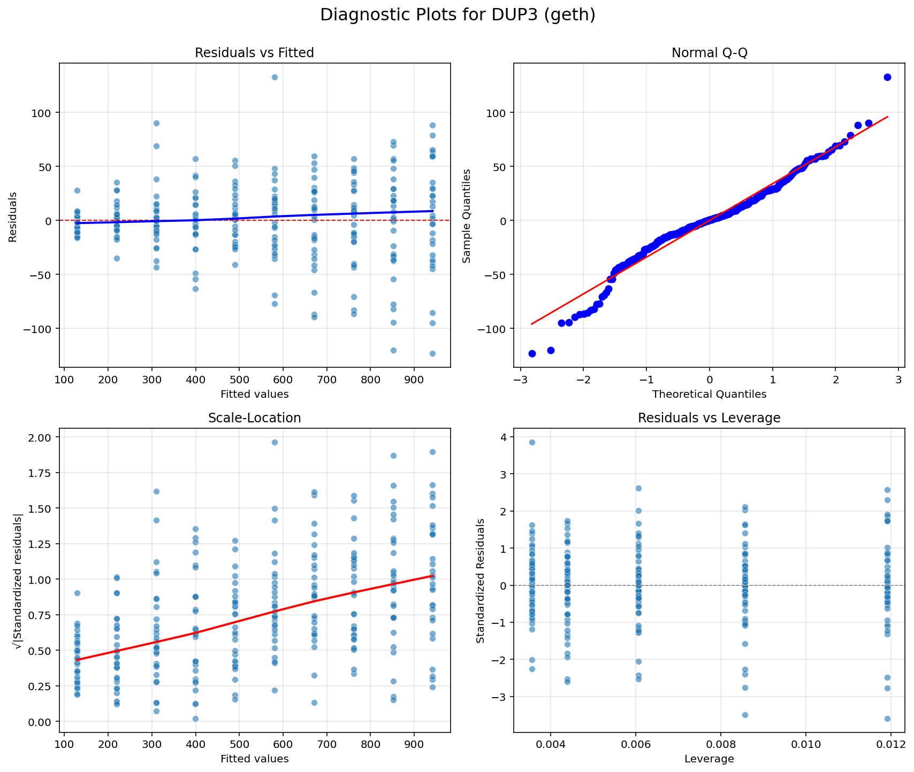


## besu


```python
                            OLS Regression Results                            
==============================================================================
Dep. Variable:        run_duration_ms   R-squared:                       0.981
Model:                            OLS   Adj. R-squared:                  0.981
Method:                 Least Squares   F-statistic:                 1.510e+04
Date:                Thu, 22 Jan 2026   Prob (F-statistic):          7.22e-251
Time:                        10:33:52   Log-Likelihood:                -1607.5
No. Observations:                 290   AIC:                             3219.
Df Residuals:                     288   BIC:                             3226.
Df Model:                           1                                         
Covariance Type:            nonrobust                                         
==============================================================================
                 coef    std err          t      P>|t|      [0.025      0.975]
------------------------------------------------------------------------------
const         28.9761      7.870      3.682      0.000      13.487      44.465
opcount        0.0223      0.000    122.898      0.000       0.022       0.023
==============================================================================
Omnibus:                       80.360   Durbin-Watson:                   0.604
Prob(Omnibus):                  0.000   Jarque-Bera (JB):              241.502
Skew:                          -1.219   Prob(JB):                     3.62e-53
Kurtosis:                       6.747   Cond. No.                     9.38e+04
==============================================================================

Notes:
[1] Standard Errors assume that the covariance matrix of the errors is correctly specified.
[2] The condition number is large, 9.38e+04. This might indicate that there are
strong multicollinearity or other numerical problems.
```


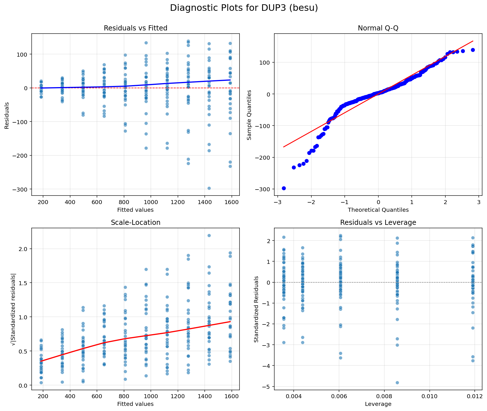


## reth


```python
                            OLS Regression Results                            
==============================================================================
Dep. Variable:        run_duration_ms   R-squared:                       0.969
Model:                            OLS   Adj. R-squared:                  0.969
Method:                 Least Squares   F-statistic:                     5600.
Date:                Thu, 22 Jan 2026   Prob (F-statistic):          1.87e-136
Time:                        10:33:52   Log-Likelihood:                -798.11
No. Observations:                 180   AIC:                             1600.
Df Residuals:                     178   BIC:                             1607.
Df Model:                           1                                         
Covariance Type:            nonrobust                                         
==============================================================================
                 coef    std err          t      P>|t|      [0.025      0.975]
------------------------------------------------------------------------------
const         33.8505      3.301     10.253      0.000      27.336      40.365
opcount        0.0057    7.6e-05     74.834      0.000       0.006       0.006
==============================================================================
Omnibus:                        1.770   Durbin-Watson:                   1.902
Prob(Omnibus):                  0.413   Jarque-Bera (JB):                1.414
Skew:                           0.106   Prob(JB):                        0.493
Kurtosis:                       3.379   Cond. No.                     9.38e+04
==============================================================================

Notes:
[1] Standard Errors assume that the covariance matrix of the errors is correctly specified.
[2] The condition number is large, 9.38e+04. This might indicate that there are
strong multicollinearity or other numerical problems.
```

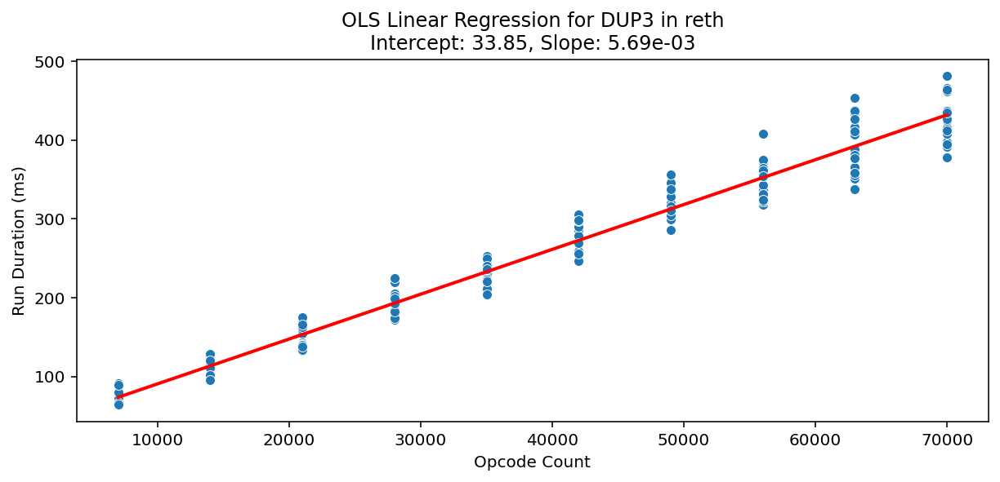

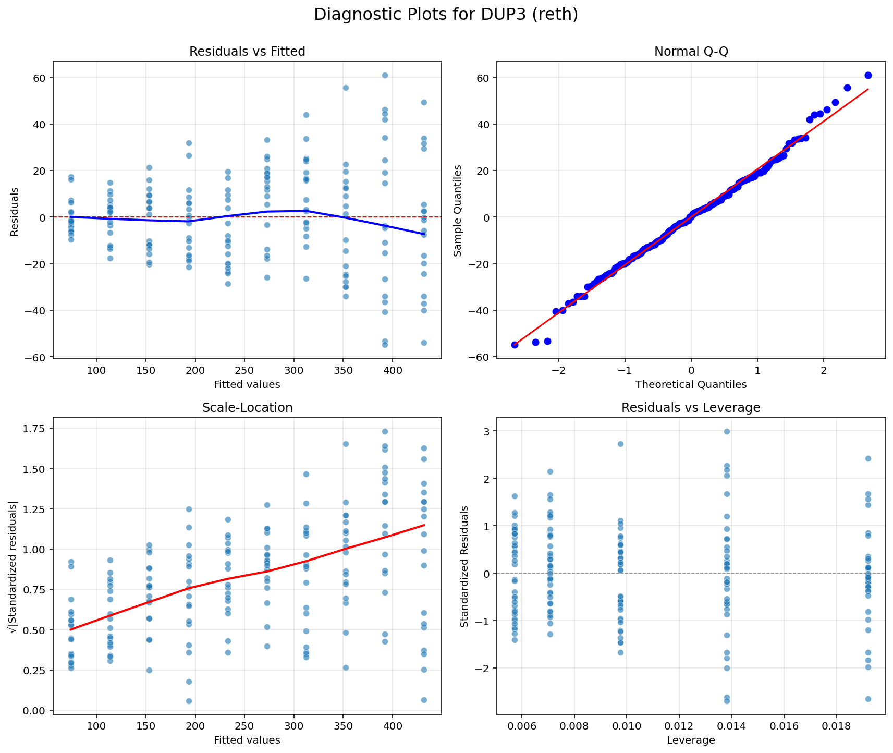


## nethermind


```python
                            OLS Regression Results                            
==============================================================================
Dep. Variable:        run_duration_ms   R-squared:                       0.980
Model:                            OLS   Adj. R-squared:                  0.980
Method:                 Least Squares   F-statistic:                 1.391e+04
Date:                Thu, 22 Jan 2026   Prob (F-statistic):          8.21e-246
Time:                        10:33:52   Log-Likelihood:                -1289.7
No. Observations:                 290   AIC:                             2583.
Df Residuals:                     288   BIC:                             2591.
Df Model:                           1                                         
Covariance Type:            nonrobust                                         
==============================================================================
                 coef    std err          t      P>|t|      [0.025      0.975]
------------------------------------------------------------------------------
const         27.9625      2.630     10.631      0.000      22.785      33.139
opcount        0.0071   6.06e-05    117.935      0.000       0.007       0.007
==============================================================================
Omnibus:                       15.058   Durbin-Watson:                   0.842
Prob(Omnibus):                  0.001   Jarque-Bera (JB):               32.075
Skew:                          -0.209   Prob(JB):                     1.08e-07
Kurtosis:                       4.575   Cond. No.                     9.38e+04
==============================================================================

Notes:
[1] Standard Errors assume that the covariance matrix of the errors is correctly specified.
[2] The condition number is large, 9.38e+04. This might indicate that there are
strong multicollinearity or other numerical problems.
```

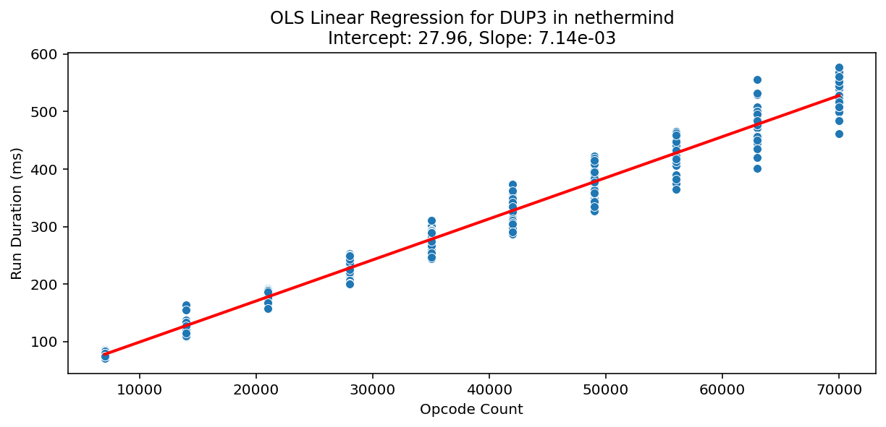

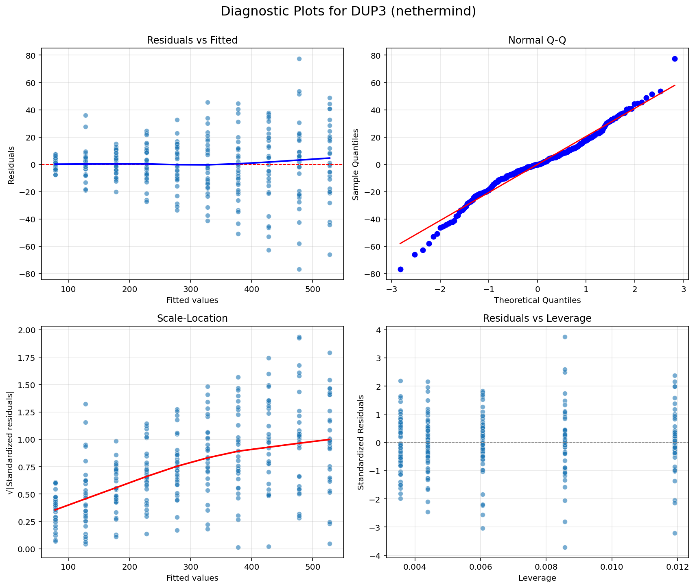


## erigon

OLS model did not run... Error: zero-size array to reduction operation maximum which has no identity

# DUP4

## geth


```python
                            OLS Regression Results                            
==============================================================================
Dep. Variable:        run_duration_ms   R-squared:                       0.977
Model:                            OLS   Adj. R-squared:                  0.977
Method:                 Least Squares   F-statistic:                 1.224e+04
Date:                Thu, 22 Jan 2026   Prob (F-statistic):          5.61e-238
Time:                        10:33:53   Log-Likelihood:                -1482.5
No. Observations:                 290   AIC:                             2969.
Df Residuals:                     288   BIC:                             2976.
Df Model:                           1                                         
Covariance Type:            nonrobust                                         
==============================================================================
                 coef    std err          t      P>|t|      [0.025      0.975]
------------------------------------------------------------------------------
const         33.1798      5.114      6.488      0.000      23.115      43.245
opcount        0.0130      0.000    110.622      0.000       0.013       0.013
==============================================================================
Omnibus:                      149.586   Durbin-Watson:                   1.341
Prob(Omnibus):                  0.000   Jarque-Bera (JB):             2437.136
Skew:                           1.673   Prob(JB):                         0.00
Kurtosis:                      16.802   Cond. No.                     9.38e+04
==============================================================================

Notes:
[1] Standard Errors assume that the covariance matrix of the errors is correctly specified.
[2] The condition number is large, 9.38e+04. This might indicate that there are
strong multicollinearity or other numerical problems.
```

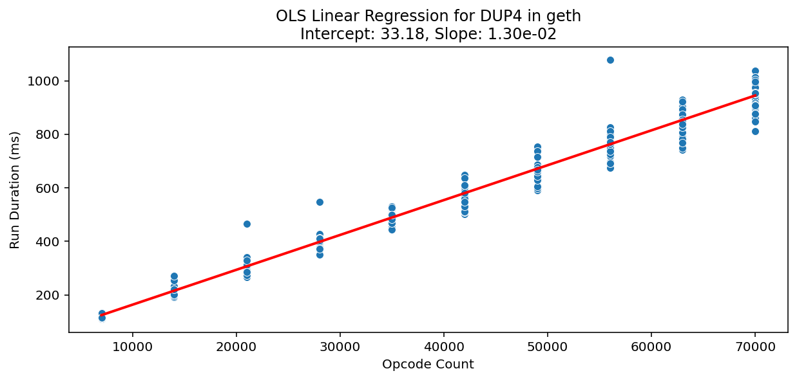

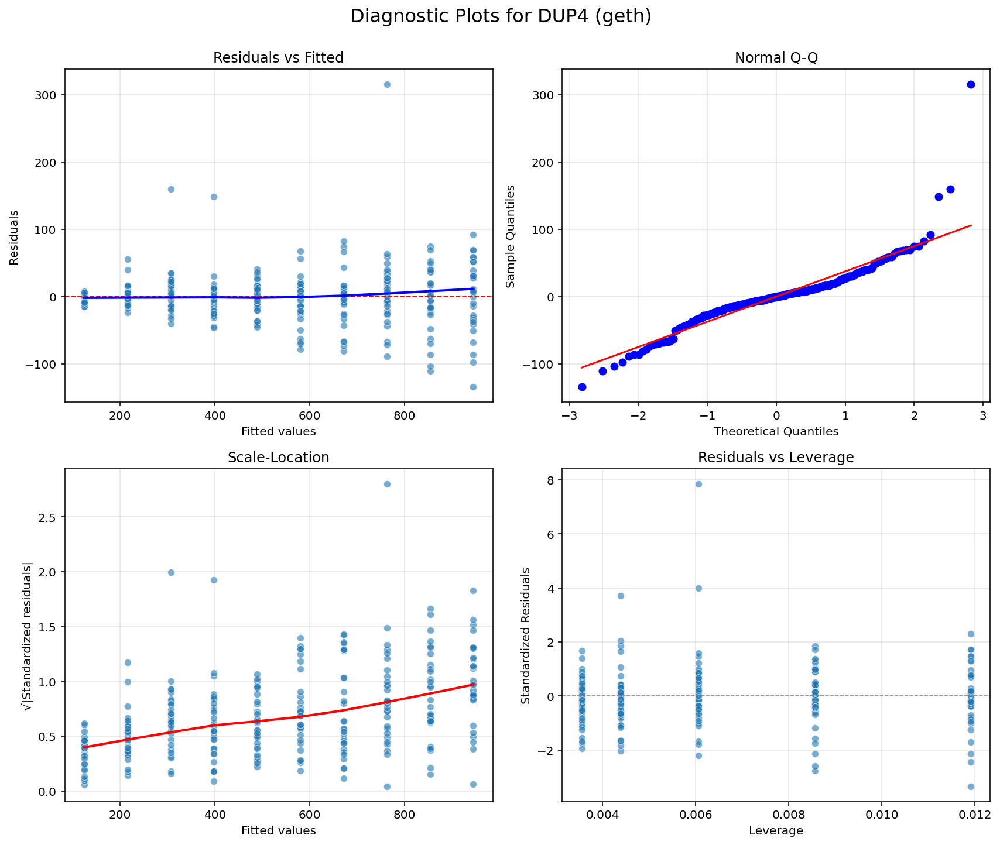


## besu


```python
                            OLS Regression Results                            
==============================================================================
Dep. Variable:        run_duration_ms   R-squared:                       0.981
Model:                            OLS   Adj. R-squared:                  0.980
Method:                 Least Squares   F-statistic:                 1.450e+04
Date:                Thu, 22 Jan 2026   Prob (F-statistic):          2.35e-248
Time:                        10:33:53   Log-Likelihood:                -1617.2
No. Observations:                 290   AIC:                             3238.
Df Residuals:                     288   BIC:                             3246.
Df Model:                           1                                         
Covariance Type:            nonrobust                                         
==============================================================================
                 coef    std err          t      P>|t|      [0.025      0.975]
------------------------------------------------------------------------------
const         29.8834      8.135      3.673      0.000      13.871      45.896
opcount        0.0226      0.000    120.407      0.000       0.022       0.023
==============================================================================
Omnibus:                       56.796   Durbin-Watson:                   0.719
Prob(Omnibus):                  0.000   Jarque-Bera (JB):              171.154
Skew:                          -0.849   Prob(JB):                     6.83e-38
Kurtosis:                       6.359   Cond. No.                     9.38e+04
==============================================================================

Notes:
[1] Standard Errors assume that the covariance matrix of the errors is correctly specified.
[2] The condition number is large, 9.38e+04. This might indicate that there are
strong multicollinearity or other numerical problems.
```

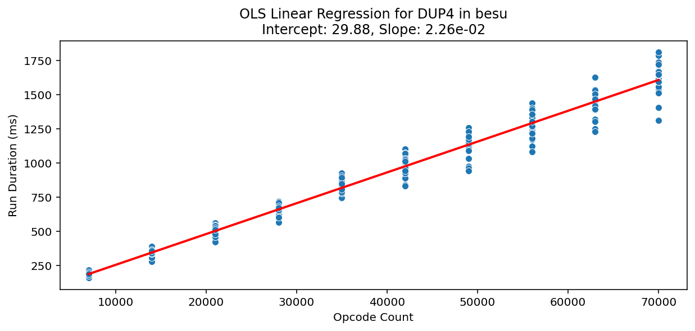

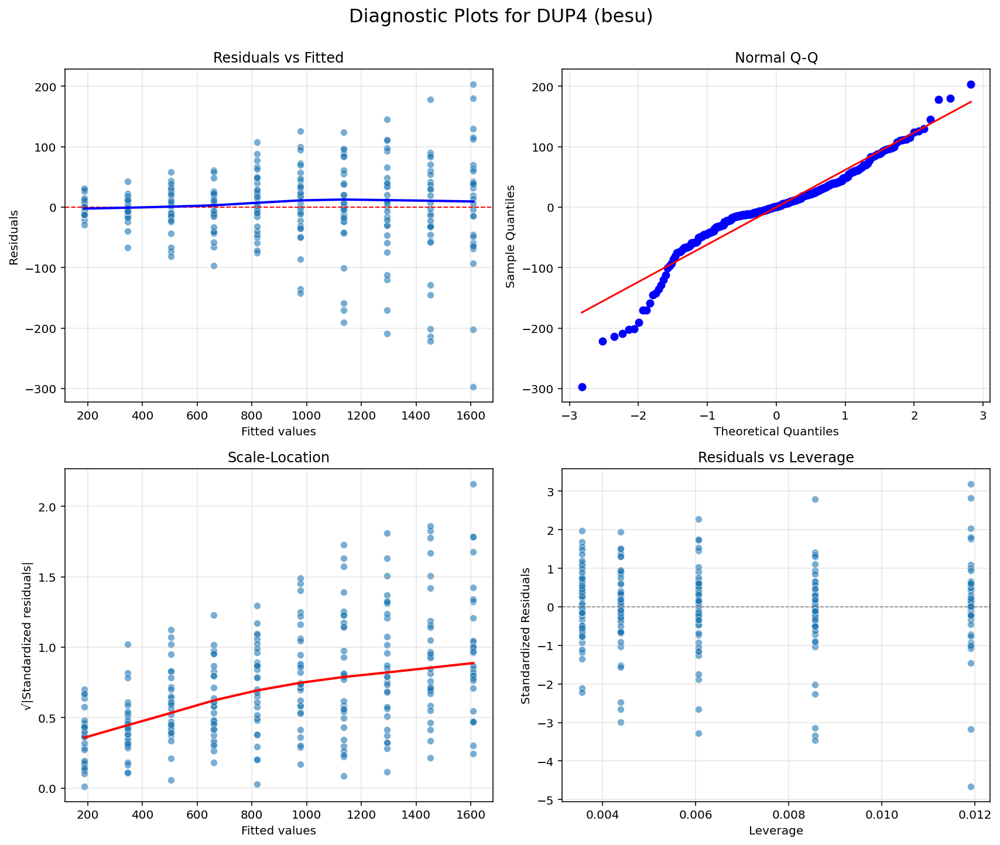


## reth


```python
                            OLS Regression Results                            
==============================================================================
Dep. Variable:        run_duration_ms   R-squared:                       0.963
Model:                            OLS   Adj. R-squared:                  0.963
Method:                 Least Squares   F-statistic:                     4654.
Date:                Thu, 22 Jan 2026   Prob (F-statistic):          1.54e-129
Time:                        10:33:53   Log-Likelihood:                -816.10
No. Observations:                 180   AIC:                             1636.
Df Residuals:                     178   BIC:                             1643.
Df Model:                           1                                         
Covariance Type:            nonrobust                                         
==============================================================================
                 coef    std err          t      P>|t|      [0.025      0.975]
------------------------------------------------------------------------------
const         30.9507      3.648      8.483      0.000      23.751      38.150
opcount        0.0057    8.4e-05     68.217      0.000       0.006       0.006
==============================================================================
Omnibus:                       13.035   Durbin-Watson:                   1.709
Prob(Omnibus):                  0.001   Jarque-Bera (JB):               26.728
Skew:                          -0.285   Prob(JB):                     1.57e-06
Kurtosis:                       4.800   Cond. No.                     9.38e+04
==============================================================================

Notes:
[1] Standard Errors assume that the covariance matrix of the errors is correctly specified.
[2] The condition number is large, 9.38e+04. This might indicate that there are
strong multicollinearity or other numerical problems.
```

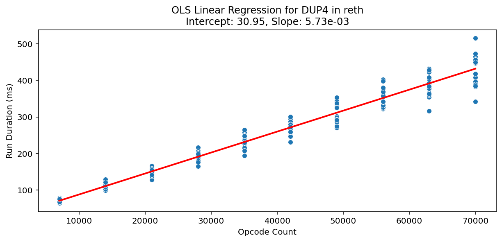

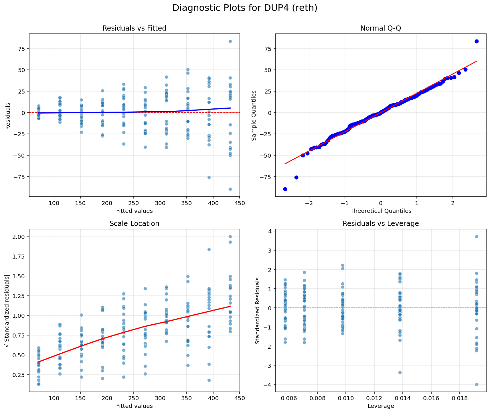


## nethermind


```python
                            OLS Regression Results                            
==============================================================================
Dep. Variable:        run_duration_ms   R-squared:                       0.967
Model:                            OLS   Adj. R-squared:                  0.967
Method:                 Least Squares   F-statistic:                     8476.
Date:                Thu, 22 Jan 2026   Prob (F-statistic):          1.21e-215
Time:                        10:33:54   Log-Likelihood:                -1364.3
No. Observations:                 290   AIC:                             2733.
Df Residuals:                     288   BIC:                             2740.
Df Model:                           1                                         
Covariance Type:            nonrobust                                         
==============================================================================
                 coef    std err          t      P>|t|      [0.025      0.975]
------------------------------------------------------------------------------
const         25.8419      3.402      7.597      0.000      19.146      32.537
opcount        0.0072   7.83e-05     92.064      0.000       0.007       0.007
==============================================================================
Omnibus:                      252.875   Durbin-Watson:                   1.213
Prob(Omnibus):                  0.000   Jarque-Bera (JB):            16059.670
Skew:                           3.015   Prob(JB):                         0.00
Kurtosis:                      38.954   Cond. No.                     9.38e+04
==============================================================================

Notes:
[1] Standard Errors assume that the covariance matrix of the errors is correctly specified.
[2] The condition number is large, 9.38e+04. This might indicate that there are
strong multicollinearity or other numerical problems.
```
OLS model did not run... Error: 'numpy.ndarray' object has no attribute 'iloc'

## erigon

OLS model did not run... Error: zero-size array to reduction operation maximum which has no identity

# DUP5

## geth


```python
                            OLS Regression Results                            
==============================================================================
Dep. Variable:        run_duration_ms   R-squared:                       0.971
Model:                            OLS   Adj. R-squared:                  0.971
Method:                 Least Squares   F-statistic:                     9671.
Date:                Thu, 22 Jan 2026   Prob (F-statistic):          1.22e-223
Time:                        10:33:54   Log-Likelihood:                -1524.2
No. Observations:                 290   AIC:                             3052.
Df Residuals:                     288   BIC:                             3060.
Df Model:                           1                                         
Covariance Type:            nonrobust                                         
==============================================================================
                 coef    std err          t      P>|t|      [0.025      0.975]
------------------------------------------------------------------------------
const         25.5937      5.904      4.335      0.000      13.973      37.214
opcount        0.0134      0.000     98.341      0.000       0.013       0.014
==============================================================================
Omnibus:                      282.744   Durbin-Watson:                   1.358
Prob(Omnibus):                  0.000   Jarque-Bera (JB):            17994.146
Skew:                           3.650   Prob(JB):                         0.00
Kurtosis:                      40.893   Cond. No.                     9.38e+04
==============================================================================

Notes:
[1] Standard Errors assume that the covariance matrix of the errors is correctly specified.
[2] The condition number is large, 9.38e+04. This might indicate that there are
strong multicollinearity or other numerical problems.
```

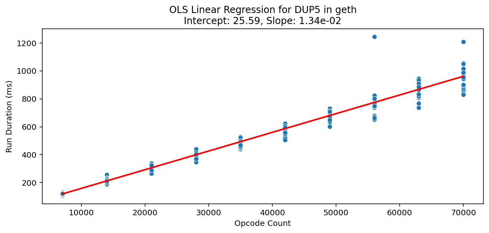


## besu


```python
                            OLS Regression Results                            
==============================================================================
Dep. Variable:        run_duration_ms   R-squared:                       0.980
Model:                            OLS   Adj. R-squared:                  0.980
Method:                 Least Squares   F-statistic:                 1.416e+04
Date:                Thu, 22 Jan 2026   Prob (F-statistic):          6.85e-247
Time:                        10:33:54   Log-Likelihood:                -1618.5
No. Observations:                 290   AIC:                             3241.
Df Residuals:                     288   BIC:                             3248.
Df Model:                           1                                         
Covariance Type:            nonrobust                                         
==============================================================================
                 coef    std err          t      P>|t|      [0.025      0.975]
------------------------------------------------------------------------------
const         30.5667      8.173      3.740      0.000      14.481      46.652
opcount        0.0224      0.000    118.977      0.000       0.022       0.023
==============================================================================
Omnibus:                       42.814   Durbin-Watson:                   0.810
Prob(Omnibus):                  0.000   Jarque-Bera (JB):              131.670
Skew:                          -0.620   Prob(JB):                     2.56e-29
Kurtosis:                       6.059   Cond. No.                     9.38e+04
==============================================================================

Notes:
[1] Standard Errors assume that the covariance matrix of the errors is correctly specified.
[2] The condition number is large, 9.38e+04. This might indicate that there are
strong multicollinearity or other numerical problems.
```

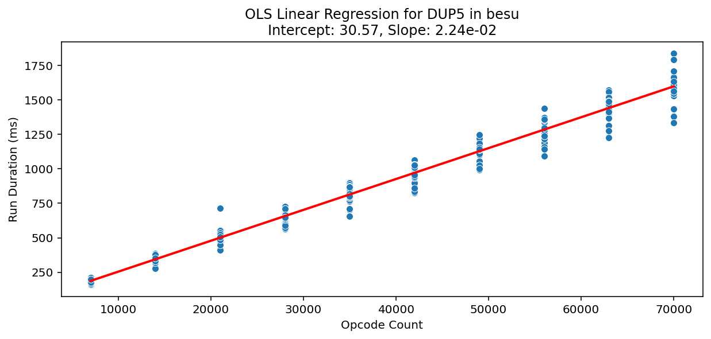

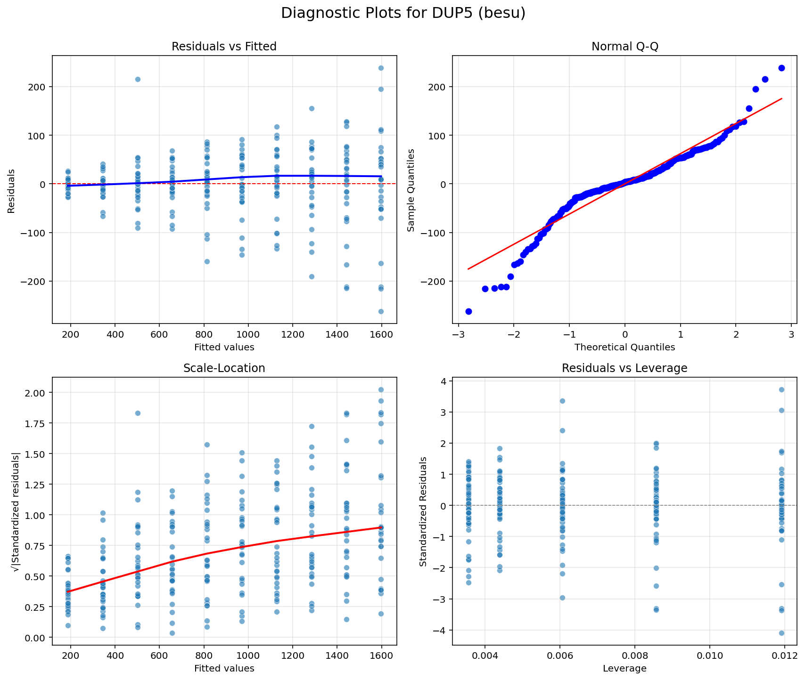


## reth


```python
                            OLS Regression Results                            
==============================================================================
Dep. Variable:        run_duration_ms   R-squared:                       0.968
Model:                            OLS   Adj. R-squared:                  0.968
Method:                 Least Squares   F-statistic:                     5417.
Date:                Thu, 22 Jan 2026   Prob (F-statistic):          3.29e-135
Time:                        10:33:54   Log-Likelihood:                -804.04
No. Observations:                 180   AIC:                             1612.
Df Residuals:                     178   BIC:                             1618.
Df Model:                           1                                         
Covariance Type:            nonrobust                                         
==============================================================================
                 coef    std err          t      P>|t|      [0.025      0.975]
------------------------------------------------------------------------------
const         31.0558      3.412      9.102      0.000      24.323      37.789
opcount        0.0058   7.86e-05     73.599      0.000       0.006       0.006
==============================================================================
Omnibus:                       61.054   Durbin-Watson:                   1.854
Prob(Omnibus):                  0.000   Jarque-Bera (JB):              367.615
Skew:                           1.095   Prob(JB):                     1.49e-80
Kurtosis:                       9.650   Cond. No.                     9.38e+04
==============================================================================

Notes:
[1] Standard Errors assume that the covariance matrix of the errors is correctly specified.
[2] The condition number is large, 9.38e+04. This might indicate that there are
strong multicollinearity or other numerical problems.
```

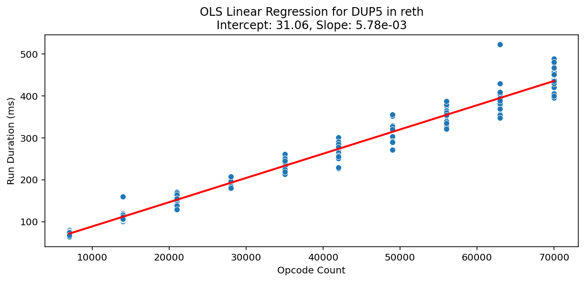

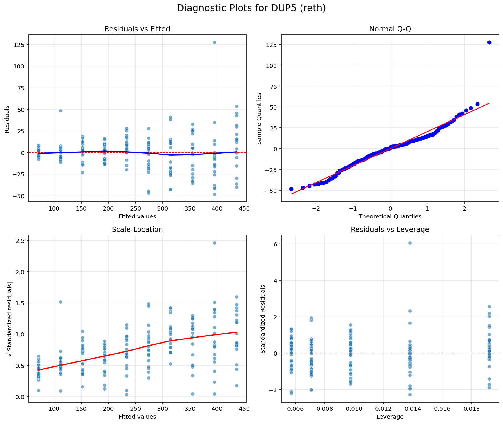


## nethermind


```python
                            OLS Regression Results                            
==============================================================================
Dep. Variable:        run_duration_ms   R-squared:                       0.977
Model:                            OLS   Adj. R-squared:                  0.977
Method:                 Least Squares   F-statistic:                 1.212e+04
Date:                Thu, 22 Jan 2026   Prob (F-statistic):          2.24e-237
Time:                        10:33:54   Log-Likelihood:                -1311.2
No. Observations:                 290   AIC:                             2626.
Df Residuals:                     288   BIC:                             2634.
Df Model:                           1                                         
Covariance Type:            nonrobust                                         
==============================================================================
                 coef    std err          t      P>|t|      [0.025      0.975]
------------------------------------------------------------------------------
const         27.2910      2.832      9.635      0.000      21.716      32.866
opcount        0.0072   6.52e-05    110.078      0.000       0.007       0.007
==============================================================================
Omnibus:                       26.171   Durbin-Watson:                   0.761
Prob(Omnibus):                  0.000   Jarque-Bera (JB):               48.817
Skew:                          -0.508   Prob(JB):                     2.51e-11
Kurtosis:                       4.734   Cond. No.                     9.38e+04
==============================================================================

Notes:
[1] Standard Errors assume that the covariance matrix of the errors is correctly specified.
[2] The condition number is large, 9.38e+04. This might indicate that there are
strong multicollinearity or other numerical problems.
```

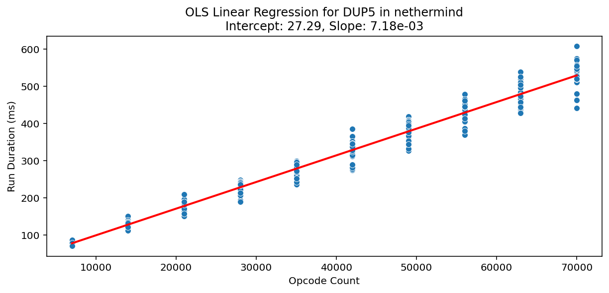

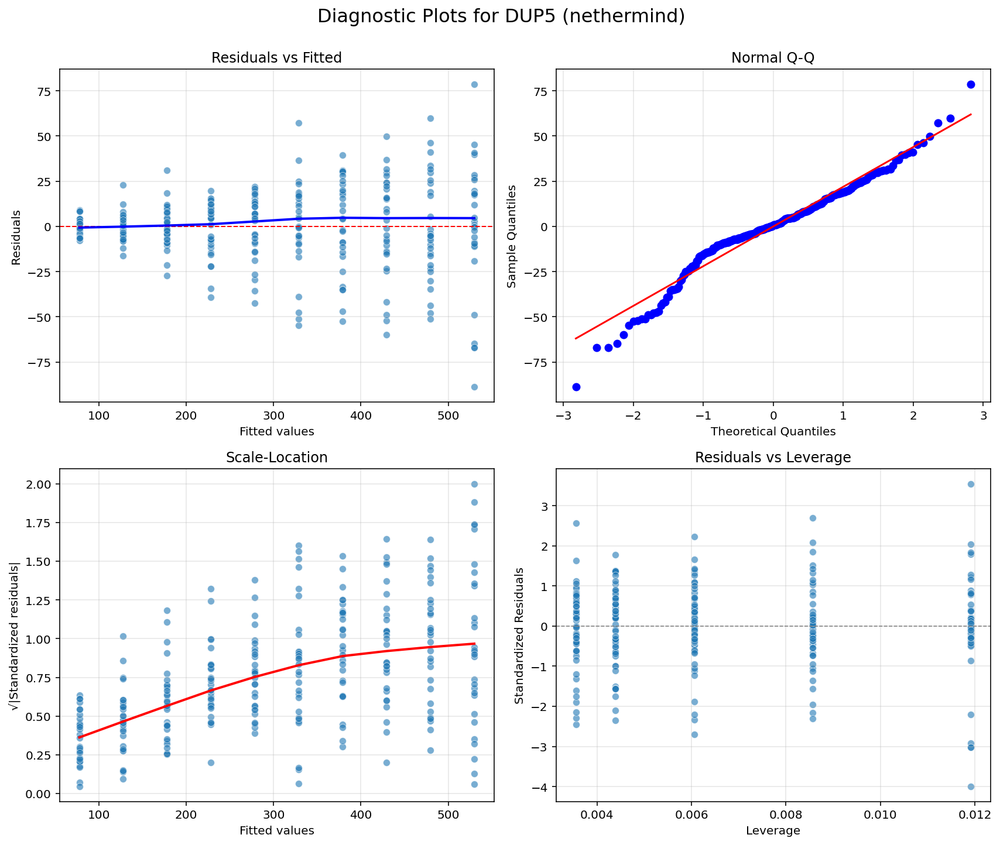


## erigon

OLS model did not run... Error: zero-size array to reduction operation maximum which has no identity

# DUP6

## geth


```python
                            OLS Regression Results                            
==============================================================================
Dep. Variable:        run_duration_ms   R-squared:                       0.981
Model:                            OLS   Adj. R-squared:                  0.981
Method:                 Least Squares   F-statistic:                 1.483e+04
Date:                Thu, 22 Jan 2026   Prob (F-statistic):          9.79e-250
Time:                        10:33:55   Log-Likelihood:                -1456.1
No. Observations:                 290   AIC:                             2916.
Df Residuals:                     288   BIC:                             2924.
Df Model:                           1                                         
Covariance Type:            nonrobust                                         
==============================================================================
                 coef    std err          t      P>|t|      [0.025      0.975]
------------------------------------------------------------------------------
const         33.3564      4.669      7.144      0.000      24.167      42.546
opcount        0.0131      0.000    121.769      0.000       0.013       0.013
==============================================================================
Omnibus:                       19.109   Durbin-Watson:                   1.103
Prob(Omnibus):                  0.000   Jarque-Bera (JB):               56.298
Skew:                          -0.135   Prob(JB):                     5.96e-13
Kurtosis:                       5.142   Cond. No.                     9.38e+04
==============================================================================

Notes:
[1] Standard Errors assume that the covariance matrix of the errors is correctly specified.
[2] The condition number is large, 9.38e+04. This might indicate that there are
strong multicollinearity or other numerical problems.
```


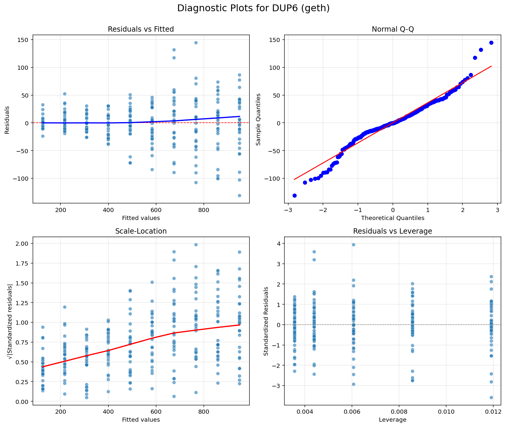


## besu


```python
                            OLS Regression Results                            
==============================================================================
Dep. Variable:        run_duration_ms   R-squared:                       0.977
Model:                            OLS   Adj. R-squared:                  0.977
Method:                 Least Squares   F-statistic:                 1.236e+04
Date:                Thu, 22 Jan 2026   Prob (F-statistic):          1.37e-238
Time:                        10:33:55   Log-Likelihood:                -1640.2
No. Observations:                 290   AIC:                             3284.
Df Residuals:                     288   BIC:                             3292.
Df Model:                           1                                         
Covariance Type:            nonrobust                                         
==============================================================================
                 coef    std err          t      P>|t|      [0.025      0.975]
------------------------------------------------------------------------------
const         29.2266      8.809      3.318      0.001      11.888      46.566
opcount        0.0225      0.000    111.177      0.000       0.022       0.023
==============================================================================
Omnibus:                       70.938   Durbin-Watson:                   0.909
Prob(Omnibus):                  0.000   Jarque-Bera (JB):              214.320
Skew:                          -1.068   Prob(JB):                     2.89e-47
Kurtosis:                       6.629   Cond. No.                     9.38e+04
==============================================================================

Notes:
[1] Standard Errors assume that the covariance matrix of the errors is correctly specified.
[2] The condition number is large, 9.38e+04. This might indicate that there are
strong multicollinearity or other numerical problems.
```

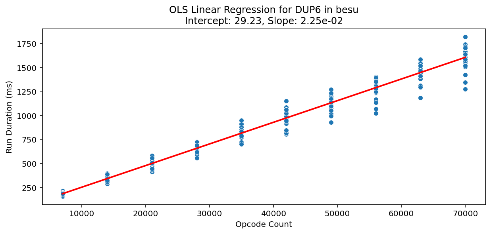


## reth


```python
                            OLS Regression Results                            
==============================================================================
Dep. Variable:        run_duration_ms   R-squared:                       0.967
Model:                            OLS   Adj. R-squared:                  0.967
Method:                 Least Squares   F-statistic:                     5243.
Date:                Thu, 22 Jan 2026   Prob (F-statistic):          5.46e-134
Time:                        10:33:55   Log-Likelihood:                -805.35
No. Observations:                 180   AIC:                             1615.
Df Residuals:                     178   BIC:                             1621.
Df Model:                           1                                         
Covariance Type:            nonrobust                                         
==============================================================================
                 coef    std err          t      P>|t|      [0.025      0.975]
------------------------------------------------------------------------------
const         29.5336      3.437      8.593      0.000      22.751      36.316
opcount        0.0057   7.91e-05     72.409      0.000       0.006       0.006
==============================================================================
Omnibus:                       10.478   Durbin-Watson:                   1.952
Prob(Omnibus):                  0.005   Jarque-Bera (JB):               24.002
Skew:                          -0.043   Prob(JB):                     6.14e-06
Kurtosis:                       4.787   Cond. No.                     9.38e+04
==============================================================================

Notes:
[1] Standard Errors assume that the covariance matrix of the errors is correctly specified.
[2] The condition number is large, 9.38e+04. This might indicate that there are
strong multicollinearity or other numerical problems.
```


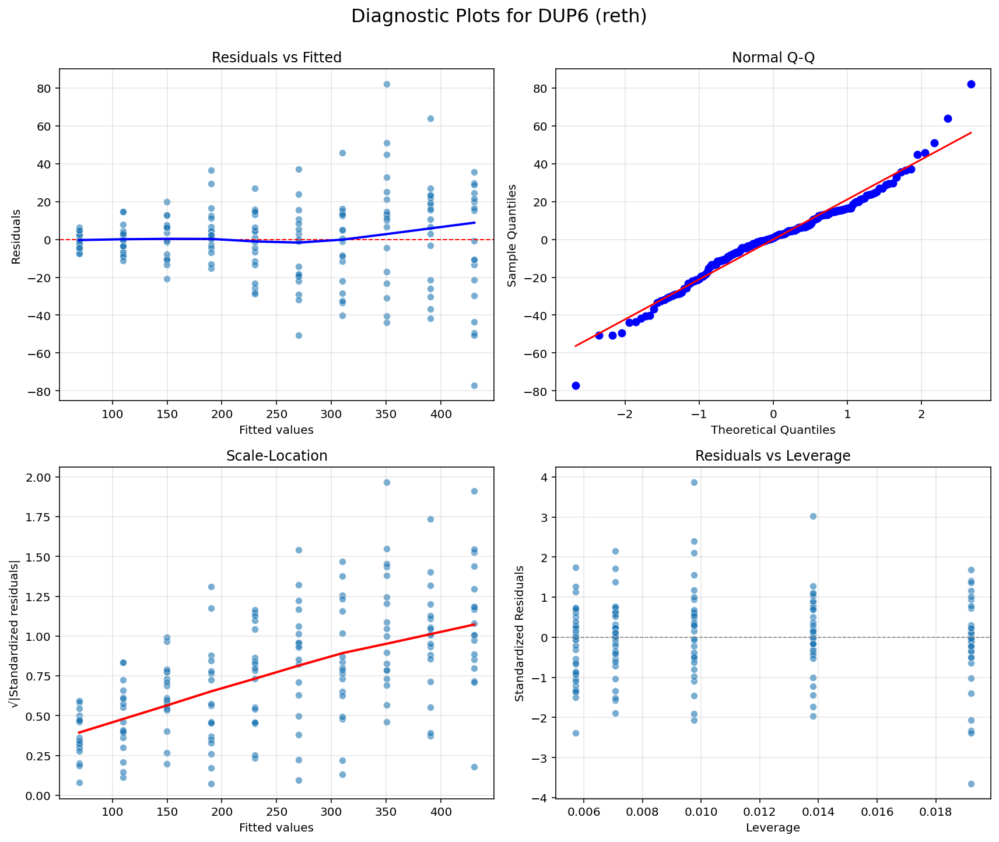


## nethermind


```python
                            OLS Regression Results                            
==============================================================================
Dep. Variable:        run_duration_ms   R-squared:                       0.976
Model:                            OLS   Adj. R-squared:                  0.976
Method:                 Least Squares   F-statistic:                 1.167e+04
Date:                Thu, 22 Jan 2026   Prob (F-statistic):          4.38e-235
Time:                        10:33:55   Log-Likelihood:                -1318.8
No. Observations:                 290   AIC:                             2642.
Df Residuals:                     288   BIC:                             2649.
Df Model:                           1                                         
Covariance Type:            nonrobust                                         
==============================================================================
                 coef    std err          t      P>|t|      [0.025      0.975]
------------------------------------------------------------------------------
const         26.4551      2.908      9.097      0.000      20.731      32.179
opcount        0.0072    6.7e-05    108.033      0.000       0.007       0.007
==============================================================================
Omnibus:                       25.041   Durbin-Watson:                   0.927
Prob(Omnibus):                  0.000   Jarque-Bera (JB):               48.755
Skew:                          -0.471   Prob(JB):                     2.59e-11
Kurtosis:                       4.774   Cond. No.                     9.38e+04
==============================================================================

Notes:
[1] Standard Errors assume that the covariance matrix of the errors is correctly specified.
[2] The condition number is large, 9.38e+04. This might indicate that there are
strong multicollinearity or other numerical problems.
```


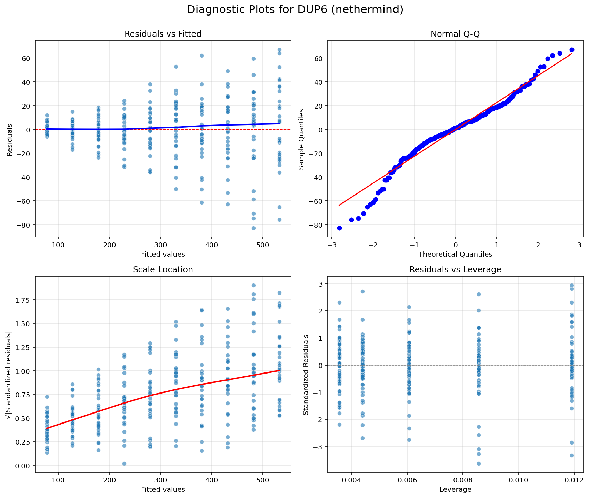


## erigon

OLS model did not run... Error: zero-size array to reduction operation maximum which has no identity

# DUP7

## geth


```python
                            OLS Regression Results                            
==============================================================================
Dep. Variable:        run_duration_ms   R-squared:                       0.980
Model:                            OLS   Adj. R-squared:                  0.980
Method:                 Least Squares   F-statistic:                 1.387e+04
Date:                Thu, 22 Jan 2026   Prob (F-statistic):          1.23e-245
Time:                        10:33:56   Log-Likelihood:                -1467.9
No. Observations:                 290   AIC:                             2940.
Df Residuals:                     288   BIC:                             2947.
Df Model:                           1                                         
Covariance Type:            nonrobust                                         
==============================================================================
                 coef    std err          t      P>|t|      [0.025      0.975]
------------------------------------------------------------------------------
const         34.1608      4.863      7.025      0.000      24.590      43.732
opcount        0.0132      0.000    117.766      0.000       0.013       0.013
==============================================================================
Omnibus:                       41.621   Durbin-Watson:                   1.442
Prob(Omnibus):                  0.000   Jarque-Bera (JB):              170.260
Skew:                           0.495   Prob(JB):                     1.07e-37
Kurtosis:                       6.621   Cond. No.                     9.38e+04
==============================================================================

Notes:
[1] Standard Errors assume that the covariance matrix of the errors is correctly specified.
[2] The condition number is large, 9.38e+04. This might indicate that there are
strong multicollinearity or other numerical problems.
```

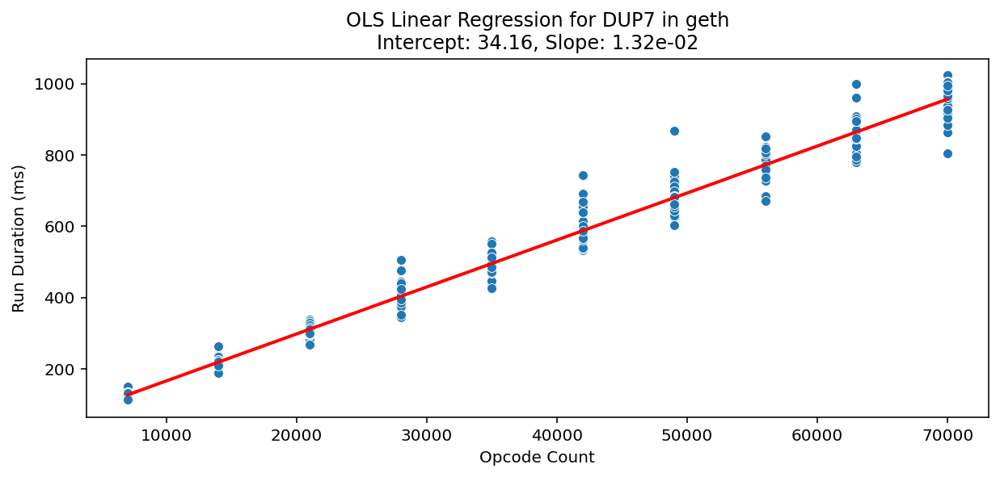


## besu


```python
                            OLS Regression Results                            
==============================================================================
Dep. Variable:        run_duration_ms   R-squared:                       0.979
Model:                            OLS   Adj. R-squared:                  0.979
Method:                 Least Squares   F-statistic:                 1.354e+04
Date:                Thu, 22 Jan 2026   Prob (F-statistic):          3.45e-244
Time:                        10:33:56   Log-Likelihood:                -1626.6
No. Observations:                 290   AIC:                             3257.
Df Residuals:                     288   BIC:                             3265.
Df Model:                           1                                         
Covariance Type:            nonrobust                                         
==============================================================================
                 coef    std err          t      P>|t|      [0.025      0.975]
------------------------------------------------------------------------------
const         31.7269      8.405      3.775      0.000      15.183      48.271
opcount        0.0225      0.000    116.382      0.000       0.022       0.023
==============================================================================
Omnibus:                       90.088   Durbin-Watson:                   0.752
Prob(Omnibus):                  0.000   Jarque-Bera (JB):              298.972
Skew:                          -1.334   Prob(JB):                     1.20e-65
Kurtosis:                       7.198   Cond. No.                     9.38e+04
==============================================================================

Notes:
[1] Standard Errors assume that the covariance matrix of the errors is correctly specified.
[2] The condition number is large, 9.38e+04. This might indicate that there are
strong multicollinearity or other numerical problems.
```


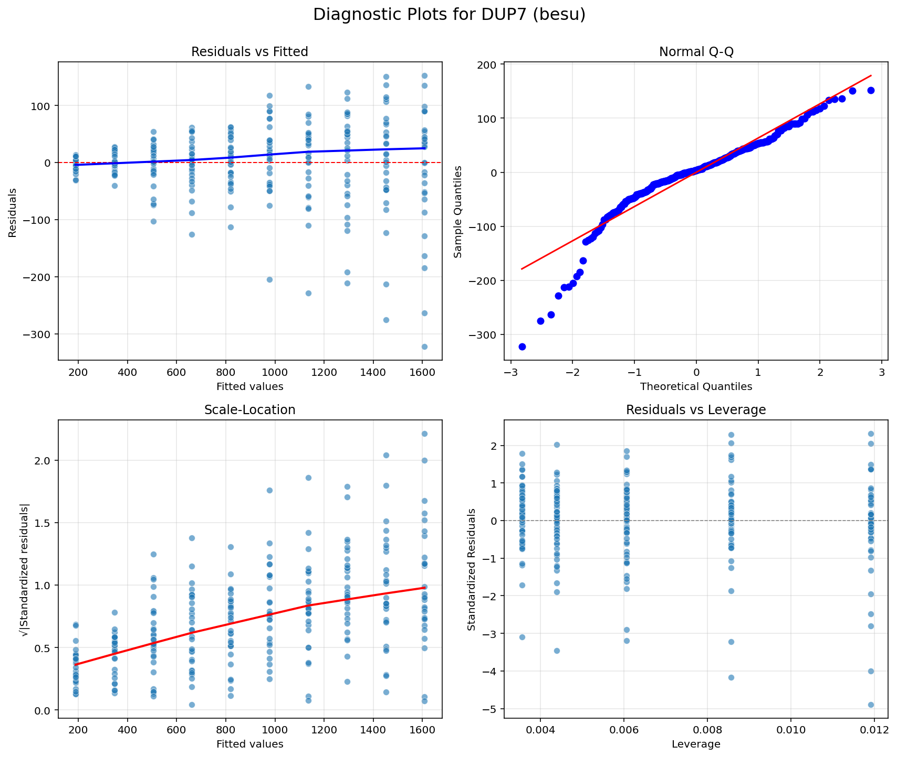


## reth


```python
                            OLS Regression Results                            
==============================================================================
Dep. Variable:        run_duration_ms   R-squared:                       0.973
Model:                            OLS   Adj. R-squared:                  0.972
Method:                 Least Squares   F-statistic:                     6296.
Date:                Thu, 22 Jan 2026   Prob (F-statistic):          7.53e-141
Time:                        10:33:56   Log-Likelihood:                -791.27
No. Observations:                 180   AIC:                             1587.
Df Residuals:                     178   BIC:                             1593.
Df Model:                           1                                         
Covariance Type:            nonrobust                                         
==============================================================================
                 coef    std err          t      P>|t|      [0.025      0.975]
------------------------------------------------------------------------------
const         30.5385      3.178      9.609      0.000      24.267      36.810
opcount        0.0058   7.32e-05     79.345      0.000       0.006       0.006
==============================================================================
Omnibus:                       19.535   Durbin-Watson:                   1.658
Prob(Omnibus):                  0.000   Jarque-Bera (JB):               32.818
Skew:                          -0.573   Prob(JB):                     7.48e-08
Kurtosis:                       4.750   Cond. No.                     9.38e+04
==============================================================================

Notes:
[1] Standard Errors assume that the covariance matrix of the errors is correctly specified.
[2] The condition number is large, 9.38e+04. This might indicate that there are
strong multicollinearity or other numerical problems.
```


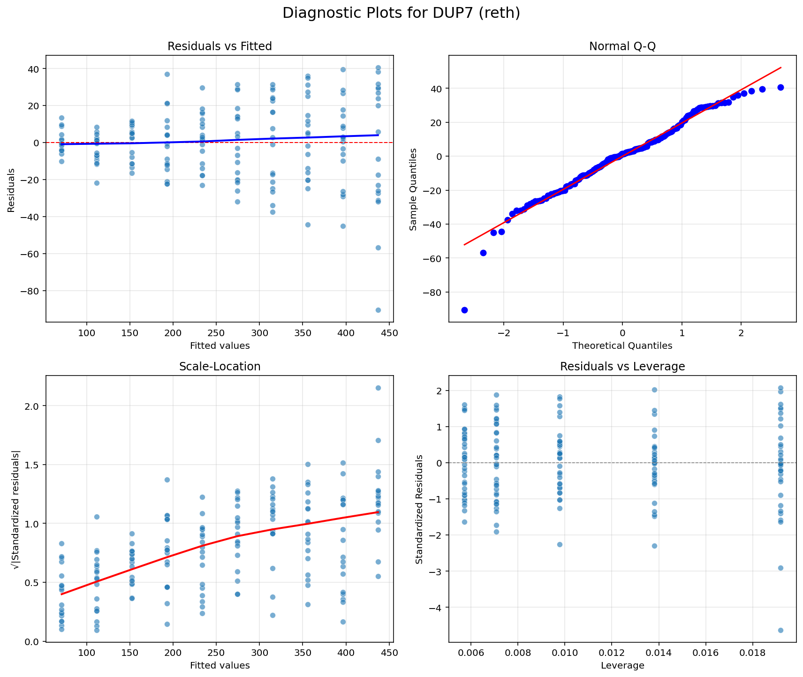


## nethermind


```python
                            OLS Regression Results                            
==============================================================================
Dep. Variable:        run_duration_ms   R-squared:                       0.971
Model:                            OLS   Adj. R-squared:                  0.971
Method:                 Least Squares   F-statistic:                     9759.
Date:                Thu, 22 Jan 2026   Prob (F-statistic):          3.46e-224
Time:                        10:33:57   Log-Likelihood:                -1344.0
No. Observations:                 290   AIC:                             2692.
Df Residuals:                     288   BIC:                             2699.
Df Model:                           1                                         
Covariance Type:            nonrobust                                         
==============================================================================
                 coef    std err          t      P>|t|      [0.025      0.975]
------------------------------------------------------------------------------
const         28.3589      3.171      8.942      0.000      22.117      34.601
opcount        0.0072    7.3e-05     98.787      0.000       0.007       0.007
==============================================================================
Omnibus:                       70.401   Durbin-Watson:                   0.998
Prob(Omnibus):                  0.000   Jarque-Bera (JB):              700.616
Skew:                           0.634   Prob(JB):                    7.30e-153
Kurtosis:                      10.508   Cond. No.                     9.38e+04
==============================================================================

Notes:
[1] Standard Errors assume that the covariance matrix of the errors is correctly specified.
[2] The condition number is large, 9.38e+04. This might indicate that there are
strong multicollinearity or other numerical problems.
```

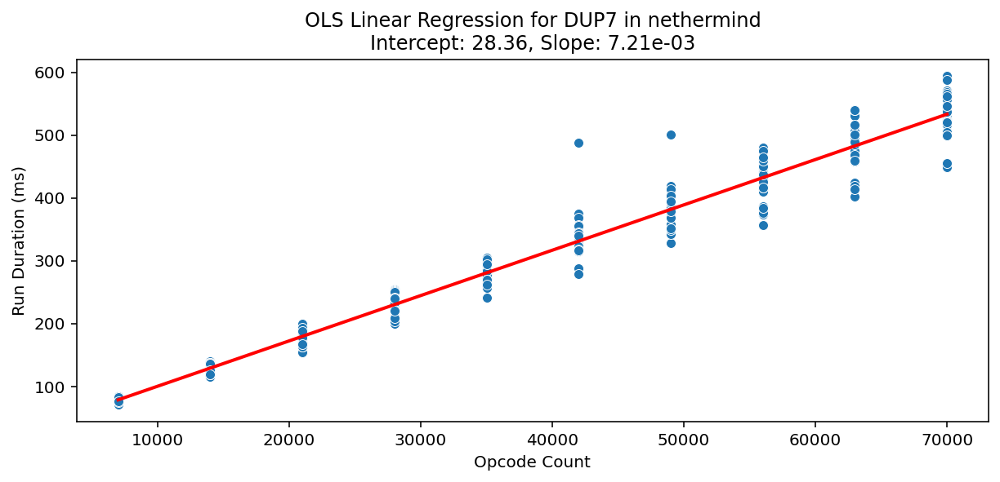

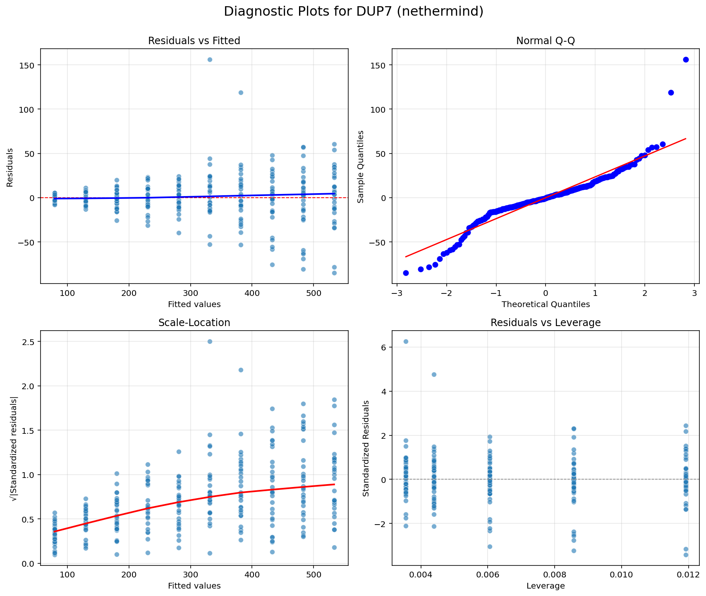


## erigon

OLS model did not run... Error: zero-size array to reduction operation maximum which has no identity

# DUP8

## geth


```python
                            OLS Regression Results                            
==============================================================================
Dep. Variable:        run_duration_ms   R-squared:                       0.985
Model:                            OLS   Adj. R-squared:                  0.985
Method:                 Least Squares   F-statistic:                 1.868e+04
Date:                Thu, 22 Jan 2026   Prob (F-statistic):          6.18e-264
Time:                        10:33:57   Log-Likelihood:                -1423.2
No. Observations:                 290   AIC:                             2850.
Df Residuals:                     288   BIC:                             2858.
Df Model:                           1                                         
Covariance Type:            nonrobust                                         
==============================================================================
                 coef    std err          t      P>|t|      [0.025      0.975]
------------------------------------------------------------------------------
const         35.5012      4.167      8.519      0.000      27.299      43.703
opcount        0.0131   9.59e-05    136.676      0.000       0.013       0.013
==============================================================================
Omnibus:                       31.806   Durbin-Watson:                   1.152
Prob(Omnibus):                  0.000   Jarque-Bera (JB):               63.164
Skew:                          -0.588   Prob(JB):                     1.92e-14
Kurtosis:                       4.961   Cond. No.                     9.38e+04
==============================================================================

Notes:
[1] Standard Errors assume that the covariance matrix of the errors is correctly specified.
[2] The condition number is large, 9.38e+04. This might indicate that there are
strong multicollinearity or other numerical problems.
```


## besu


```python
                            OLS Regression Results                            
==============================================================================
Dep. Variable:        run_duration_ms   R-squared:                       0.982
Model:                            OLS   Adj. R-squared:                  0.982
Method:                 Least Squares   F-statistic:                 1.593e+04
Date:                Thu, 22 Jan 2026   Prob (F-statistic):          3.78e-254
Time:                        10:33:57   Log-Likelihood:                -1607.0
No. Observations:                 290   AIC:                             3218.
Df Residuals:                     288   BIC:                             3225.
Df Model:                           1                                         
Covariance Type:            nonrobust                                         
==============================================================================
                 coef    std err          t      P>|t|      [0.025      0.975]
------------------------------------------------------------------------------
const         31.6199      7.856      4.025      0.000      16.158      47.082
opcount        0.0228      0.000    126.225      0.000       0.022       0.023
==============================================================================
Omnibus:                       63.604   Durbin-Watson:                   0.960
Prob(Omnibus):                  0.000   Jarque-Bera (JB):              178.824
Skew:                          -0.981   Prob(JB):                     1.48e-39
Kurtosis:                       6.310   Cond. No.                     9.38e+04
==============================================================================

Notes:
[1] Standard Errors assume that the covariance matrix of the errors is correctly specified.
[2] The condition number is large, 9.38e+04. This might indicate that there are
strong multicollinearity or other numerical problems.
```


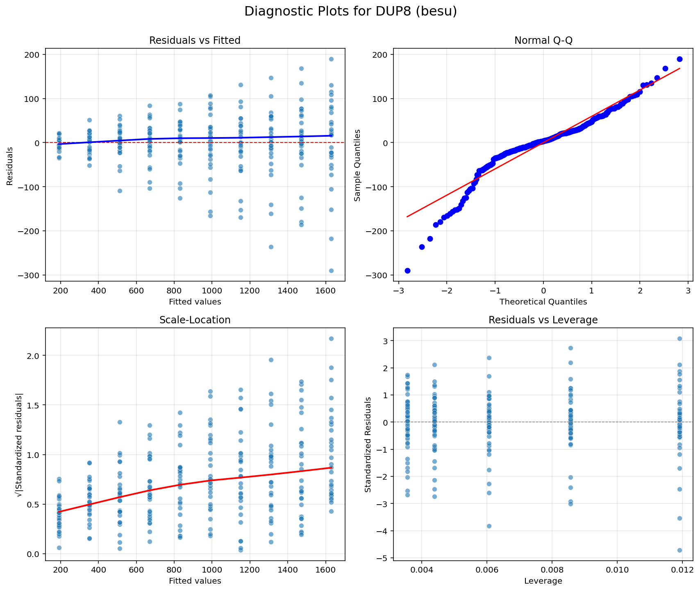


## reth


```python
                            OLS Regression Results                            
==============================================================================
Dep. Variable:        run_duration_ms   R-squared:                       0.970
Model:                            OLS   Adj. R-squared:                  0.970
Method:                 Least Squares   F-statistic:                     5812.
Date:                Thu, 22 Jan 2026   Prob (F-statistic):          7.62e-138
Time:                        10:33:57   Log-Likelihood:                -798.79
No. Observations:                 180   AIC:                             1602.
Df Residuals:                     178   BIC:                             1608.
Df Model:                           1                                         
Covariance Type:            nonrobust                                         
==============================================================================
                 coef    std err          t      P>|t|      [0.025      0.975]
------------------------------------------------------------------------------
const         31.6240      3.314      9.543      0.000      25.084      38.164
opcount        0.0058   7.63e-05     76.234      0.000       0.006       0.006
==============================================================================
Omnibus:                        1.781   Durbin-Watson:                   1.663
Prob(Omnibus):                  0.411   Jarque-Bera (JB):                1.400
Skew:                           0.127   Prob(JB):                        0.496
Kurtosis:                       3.349   Cond. No.                     9.38e+04
==============================================================================

Notes:
[1] Standard Errors assume that the covariance matrix of the errors is correctly specified.
[2] The condition number is large, 9.38e+04. This might indicate that there are
strong multicollinearity or other numerical problems.
```

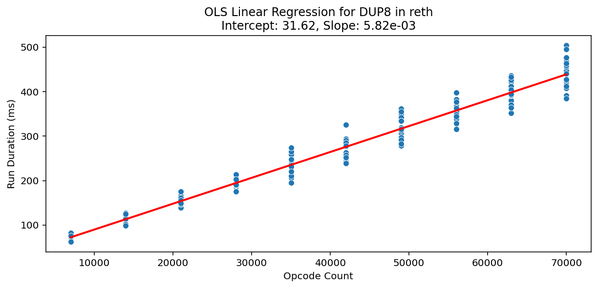

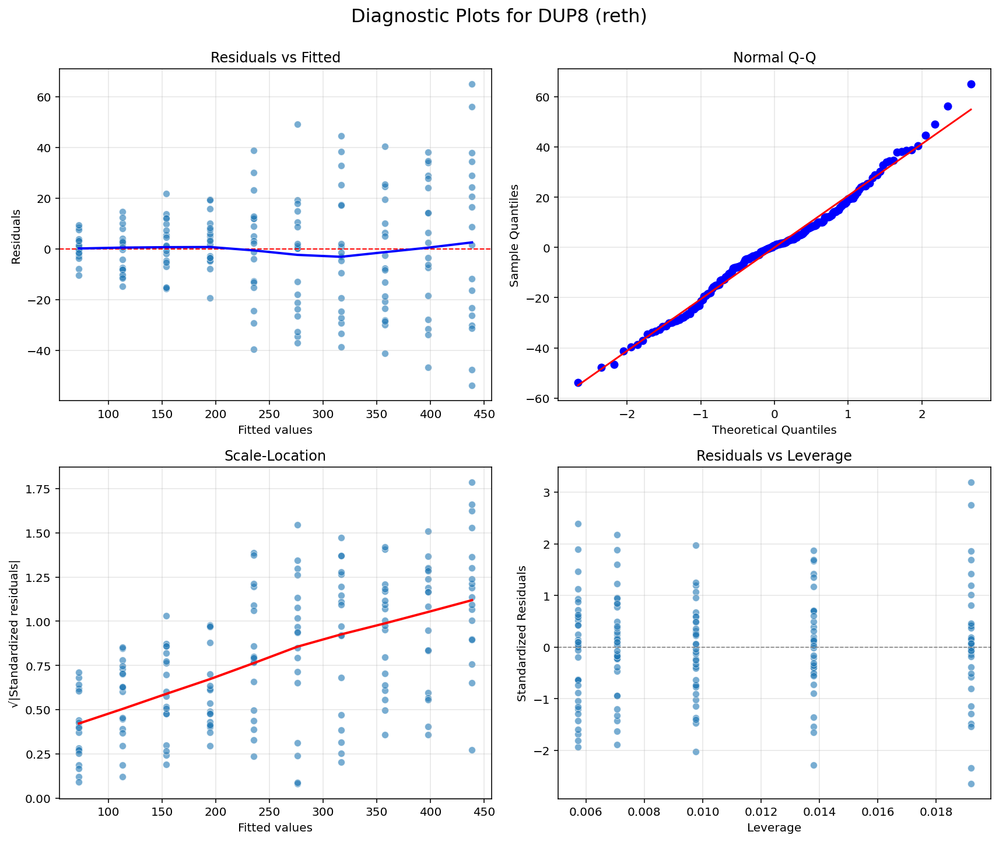


## nethermind


```python
                            OLS Regression Results                            
==============================================================================
Dep. Variable:        run_duration_ms   R-squared:                       0.974
Model:                            OLS   Adj. R-squared:                  0.974
Method:                 Least Squares   F-statistic:                 1.084e+04
Date:                Thu, 22 Jan 2026   Prob (F-statistic):          1.41e-230
Time:                        10:33:58   Log-Likelihood:                -1329.1
No. Observations:                 290   AIC:                             2662.
Df Residuals:                     288   BIC:                             2669.
Df Model:                           1                                         
Covariance Type:            nonrobust                                         
==============================================================================
                 coef    std err          t      P>|t|      [0.025      0.975]
------------------------------------------------------------------------------
const         29.0129      3.013      9.630      0.000      23.083      34.942
opcount        0.0072   6.94e-05    104.113      0.000       0.007       0.007
==============================================================================
Omnibus:                       16.459   Durbin-Watson:                   0.936
Prob(Omnibus):                  0.000   Jarque-Bera (JB):               31.834
Skew:                          -0.292   Prob(JB):                     1.22e-07
Kurtosis:                       4.515   Cond. No.                     9.38e+04
==============================================================================

Notes:
[1] Standard Errors assume that the covariance matrix of the errors is correctly specified.
[2] The condition number is large, 9.38e+04. This might indicate that there are
strong multicollinearity or other numerical problems.
```

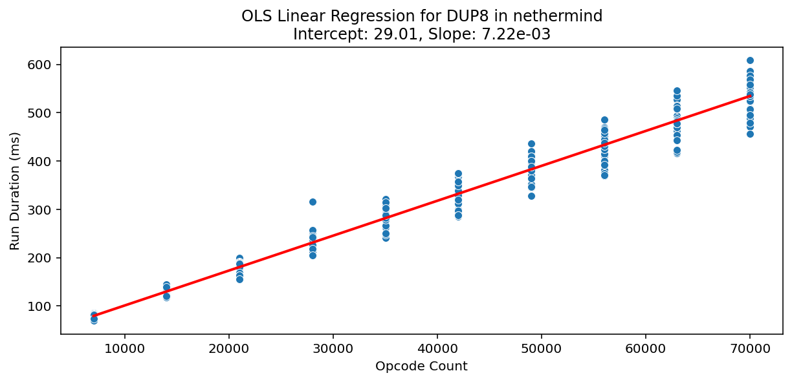

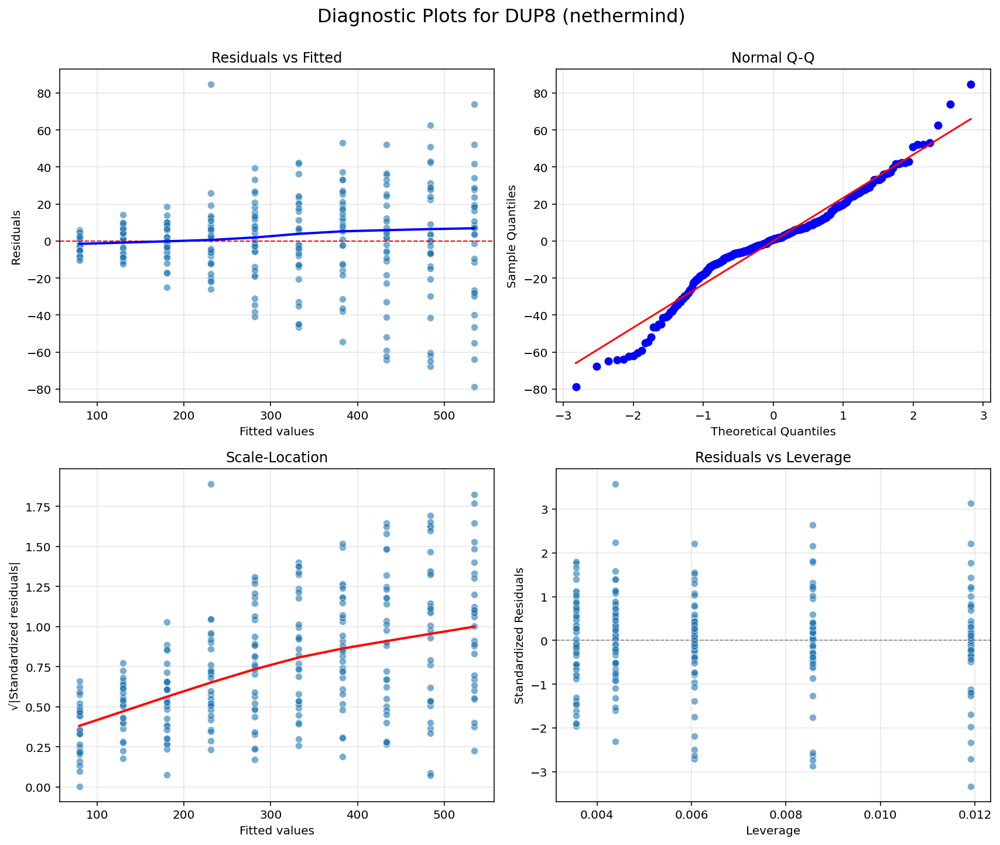


## erigon

OLS model did not run... Error: zero-size array to reduction operation maximum which has no identity

# DUP9

## geth


```python
                            OLS Regression Results                            
==============================================================================
Dep. Variable:        run_duration_ms   R-squared:                       0.983
Model:                            OLS   Adj. R-squared:                  0.983
Method:                 Least Squares   F-statistic:                 1.682e+04
Date:                Thu, 22 Jan 2026   Prob (F-statistic):          1.80e-257
Time:                        10:33:58   Log-Likelihood:                -1444.2
No. Observations:                 290   AIC:                             2892.
Df Residuals:                     288   BIC:                             2900.
Df Model:                           1                                         
Covariance Type:            nonrobust                                         
==============================================================================
                 coef    std err          t      P>|t|      [0.025      0.975]
------------------------------------------------------------------------------
const         30.6842      4.481      6.847      0.000      21.864      39.504
opcount        0.0134      0.000    129.684      0.000       0.013       0.014
==============================================================================
Omnibus:                       24.484   Durbin-Watson:                   1.355
Prob(Omnibus):                  0.000   Jarque-Bera (JB):               98.713
Skew:                          -0.039   Prob(JB):                     3.67e-22
Kurtosis:                       5.857   Cond. No.                     9.38e+04
==============================================================================

Notes:
[1] Standard Errors assume that the covariance matrix of the errors is correctly specified.
[2] The condition number is large, 9.38e+04. This might indicate that there are
strong multicollinearity or other numerical problems.
```

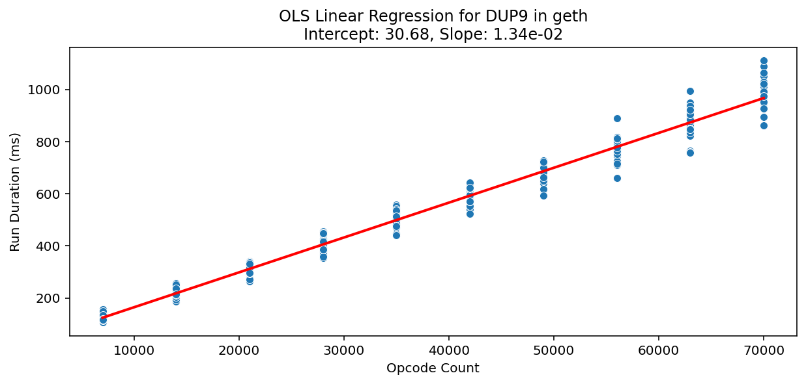

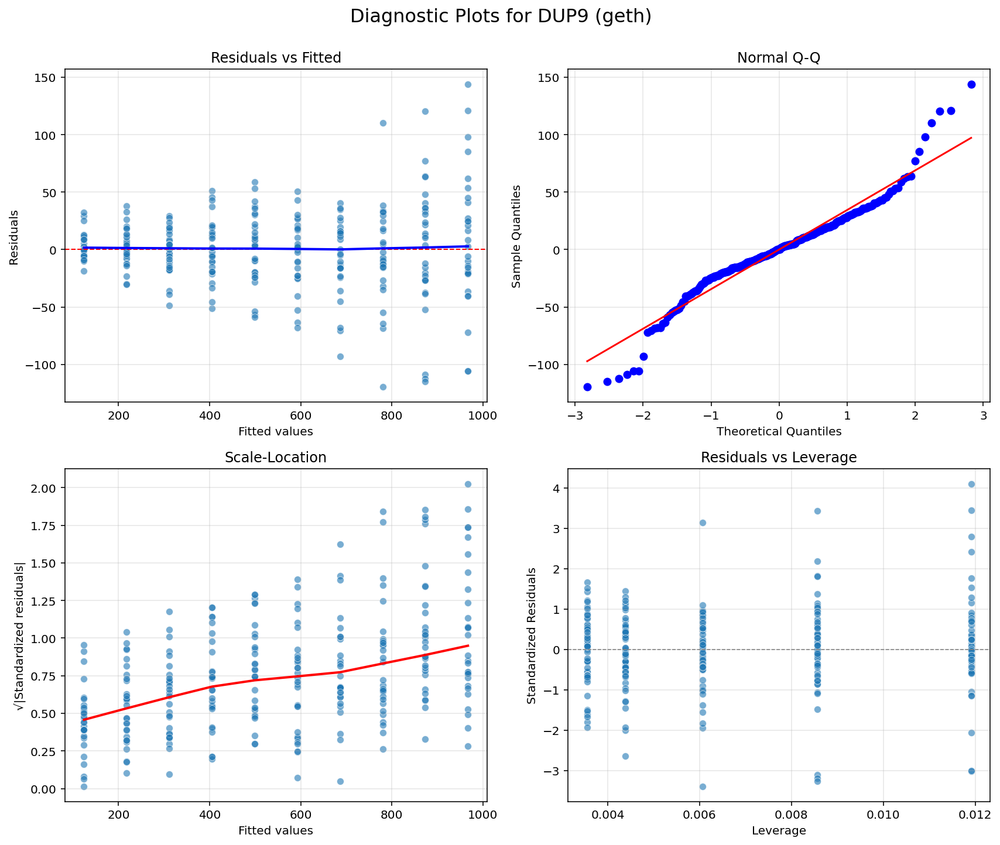


## besu


```python
                            OLS Regression Results                            
==============================================================================
Dep. Variable:        run_duration_ms   R-squared:                       0.979
Model:                            OLS   Adj. R-squared:                  0.979
Method:                 Least Squares   F-statistic:                 1.345e+04
Date:                Thu, 22 Jan 2026   Prob (F-statistic):          8.88e-244
Time:                        10:33:58   Log-Likelihood:                -1629.0
No. Observations:                 290   AIC:                             3262.
Df Residuals:                     288   BIC:                             3269.
Df Model:                           1                                         
Covariance Type:            nonrobust                                         
==============================================================================
                 coef    std err          t      P>|t|      [0.025      0.975]
------------------------------------------------------------------------------
const         27.7977      8.475      3.280      0.001      11.116      44.479
opcount        0.0226      0.000    115.992      0.000       0.022       0.023
==============================================================================
Omnibus:                       79.147   Durbin-Watson:                   1.076
Prob(Omnibus):                  0.000   Jarque-Bera (JB):              245.207
Skew:                          -1.188   Prob(JB):                     5.67e-54
Kurtosis:                       6.828   Cond. No.                     9.38e+04
==============================================================================

Notes:
[1] Standard Errors assume that the covariance matrix of the errors is correctly specified.
[2] The condition number is large, 9.38e+04. This might indicate that there are
strong multicollinearity or other numerical problems.
```


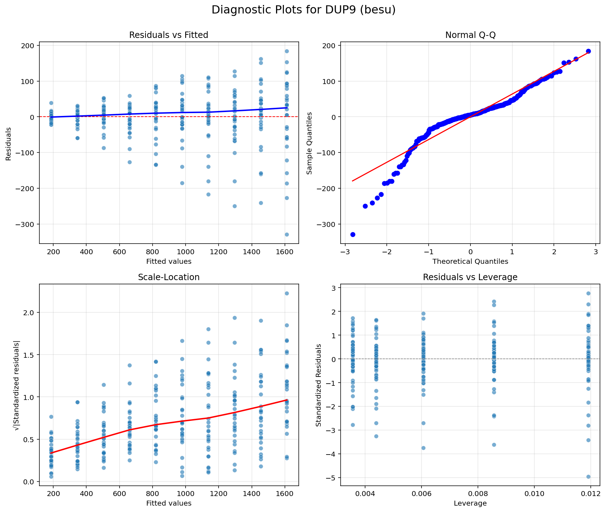


## reth


```python
                            OLS Regression Results                            
==============================================================================
Dep. Variable:        run_duration_ms   R-squared:                       0.966
Model:                            OLS   Adj. R-squared:                  0.966
Method:                 Least Squares   F-statistic:                     5072.
Date:                Thu, 22 Jan 2026   Prob (F-statistic):          9.52e-133
Time:                        10:33:58   Log-Likelihood:                -810.49
No. Observations:                 180   AIC:                             1625.
Df Residuals:                     178   BIC:                             1631.
Df Model:                           1                                         
Covariance Type:            nonrobust                                         
==============================================================================
                 coef    std err          t      P>|t|      [0.025      0.975]
------------------------------------------------------------------------------
const         32.0704      3.537      9.068      0.000      25.091      39.049
opcount        0.0058   8.14e-05     71.216      0.000       0.006       0.006
==============================================================================
Omnibus:                        7.966   Durbin-Watson:                   1.646
Prob(Omnibus):                  0.019   Jarque-Bera (JB):                9.904
Skew:                          -0.312   Prob(JB):                      0.00707
Kurtosis:                       3.966   Cond. No.                     9.38e+04
==============================================================================

Notes:
[1] Standard Errors assume that the covariance matrix of the errors is correctly specified.
[2] The condition number is large, 9.38e+04. This might indicate that there are
strong multicollinearity or other numerical problems.
```


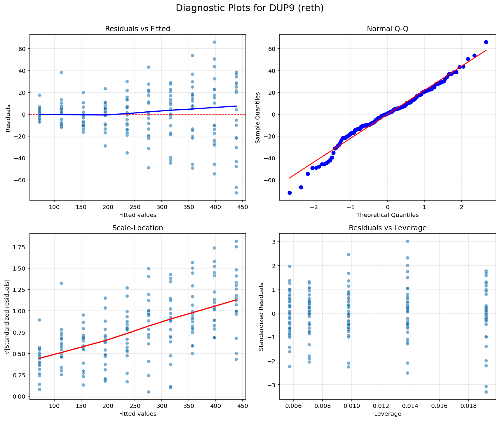


## nethermind


```python
                            OLS Regression Results                            
==============================================================================
Dep. Variable:        run_duration_ms   R-squared:                       0.979
Model:                            OLS   Adj. R-squared:                  0.979
Method:                 Least Squares   F-statistic:                 1.351e+04
Date:                Thu, 22 Jan 2026   Prob (F-statistic):          5.04e-244
Time:                        10:33:59   Log-Likelihood:                -1298.9
No. Observations:                 290   AIC:                             2602.
Df Residuals:                     288   BIC:                             2609.
Df Model:                           1                                         
Covariance Type:            nonrobust                                         
==============================================================================
                 coef    std err          t      P>|t|      [0.025      0.975]
------------------------------------------------------------------------------
const         27.2561      2.715     10.038      0.000      21.912      32.600
opcount        0.0073   6.25e-05    116.226      0.000       0.007       0.007
==============================================================================
Omnibus:                       17.180   Durbin-Watson:                   1.064
Prob(Omnibus):                  0.000   Jarque-Bera (JB):               26.476
Skew:                          -0.396   Prob(JB):                     1.78e-06
Kurtosis:                       4.250   Cond. No.                     9.38e+04
==============================================================================

Notes:
[1] Standard Errors assume that the covariance matrix of the errors is correctly specified.
[2] The condition number is large, 9.38e+04. This might indicate that there are
strong multicollinearity or other numerical problems.
```


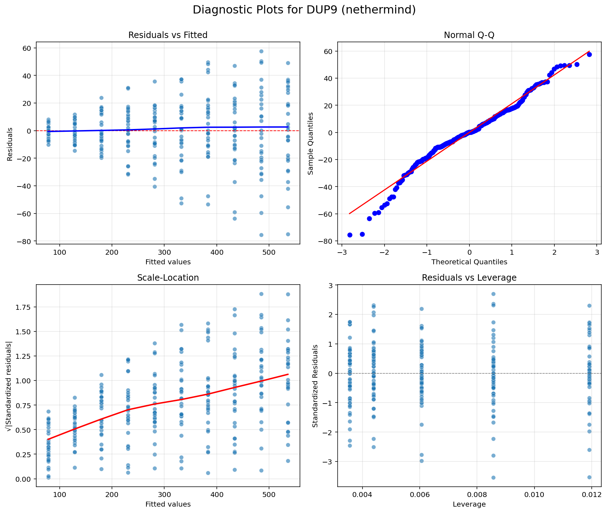


## erigon

OLS model did not run... Error: zero-size array to reduction operation maximum which has no identity

# DUP10

## geth


```python
                            OLS Regression Results                            
==============================================================================
Dep. Variable:        run_duration_ms   R-squared:                       0.983
Model:                            OLS   Adj. R-squared:                  0.983
Method:                 Least Squares   F-statistic:                 1.664e+04
Date:                Thu, 22 Jan 2026   Prob (F-statistic):          7.80e-257
Time:                        10:33:59   Log-Likelihood:                -1444.3
No. Observations:                 290   AIC:                             2893.
Df Residuals:                     288   BIC:                             2900.
Df Model:                           1                                         
Covariance Type:            nonrobust                                         
==============================================================================
                 coef    std err          t      P>|t|      [0.025      0.975]
------------------------------------------------------------------------------
const         31.3129      4.482      6.987      0.000      22.492      40.134
opcount        0.0133      0.000    129.014      0.000       0.013       0.014
==============================================================================
Omnibus:                       44.928   Durbin-Watson:                   1.339
Prob(Omnibus):                  0.000   Jarque-Bera (JB):              405.499
Skew:                          -0.112   Prob(JB):                     8.85e-89
Kurtosis:                       8.789   Cond. No.                     9.38e+04
==============================================================================

Notes:
[1] Standard Errors assume that the covariance matrix of the errors is correctly specified.
[2] The condition number is large, 9.38e+04. This might indicate that there are
strong multicollinearity or other numerical problems.
```


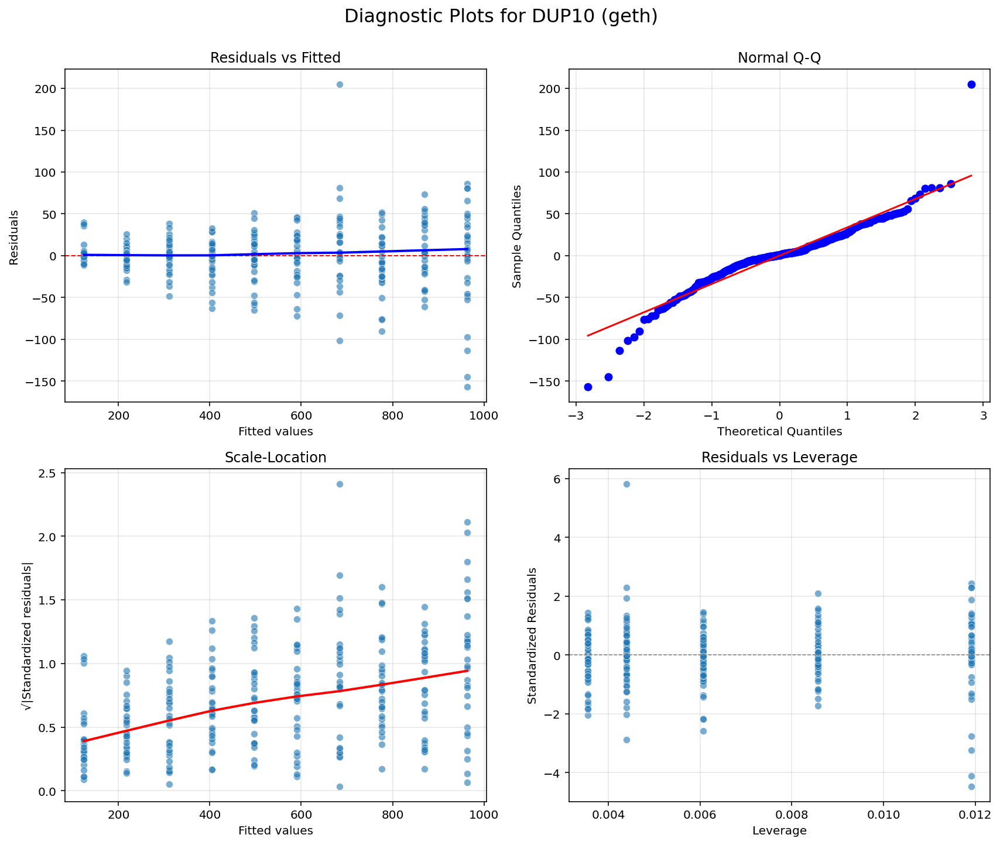


## besu


```python
                            OLS Regression Results                            
==============================================================================
Dep. Variable:        run_duration_ms   R-squared:                       0.979
Model:                            OLS   Adj. R-squared:                  0.978
Method:                 Least Squares   F-statistic:                 1.314e+04
Date:                Thu, 22 Jan 2026   Prob (F-statistic):          2.39e-242
Time:                        10:33:59   Log-Likelihood:                -1636.3
No. Observations:                 290   AIC:                             3277.
Df Residuals:                     288   BIC:                             3284.
Df Model:                           1                                         
Covariance Type:            nonrobust                                         
==============================================================================
                 coef    std err          t      P>|t|      [0.025      0.975]
------------------------------------------------------------------------------
const         29.6981      8.690      3.417      0.001      12.594      46.802
opcount        0.0229      0.000    114.646      0.000       0.023       0.023
==============================================================================
Omnibus:                       76.166   Durbin-Watson:                   0.907
Prob(Omnibus):                  0.000   Jarque-Bera (JB):              404.104
Skew:                          -0.947   Prob(JB):                     1.78e-88
Kurtosis:                       8.464   Cond. No.                     9.38e+04
==============================================================================

Notes:
[1] Standard Errors assume that the covariance matrix of the errors is correctly specified.
[2] The condition number is large, 9.38e+04. This might indicate that there are
strong multicollinearity or other numerical problems.
```

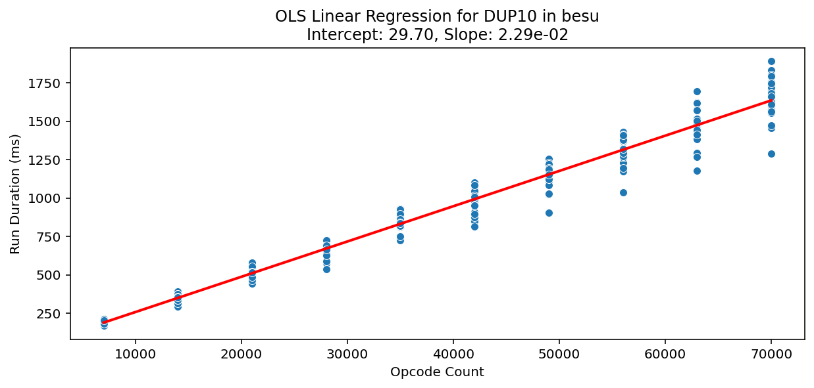

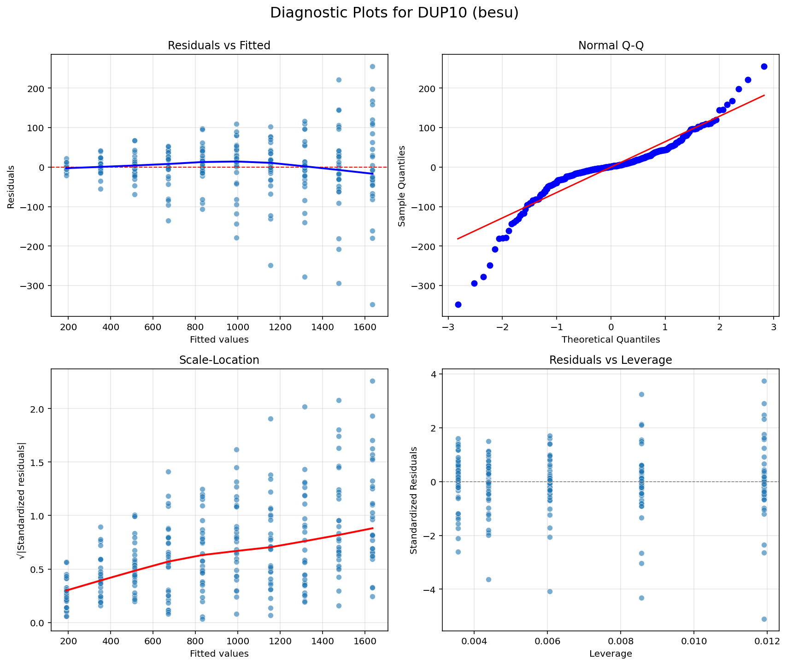


## reth


```python
                            OLS Regression Results                            
==============================================================================
Dep. Variable:        run_duration_ms   R-squared:                       0.964
Model:                            OLS   Adj. R-squared:                  0.964
Method:                 Least Squares   F-statistic:                     4814.
Date:                Thu, 22 Jan 2026   Prob (F-statistic):          8.43e-131
Time:                        10:33:59   Log-Likelihood:                -814.53
No. Observations:                 180   AIC:                             1633.
Df Residuals:                     178   BIC:                             1639.
Df Model:                           1                                         
Covariance Type:            nonrobust                                         
==============================================================================
                 coef    std err          t      P>|t|      [0.025      0.975]
------------------------------------------------------------------------------
const         32.6097      3.617      9.016      0.000      25.473      39.747
opcount        0.0058   8.33e-05     69.382      0.000       0.006       0.006
==============================================================================
Omnibus:                        6.194   Durbin-Watson:                   1.544
Prob(Omnibus):                  0.045   Jarque-Bera (JB):                7.567
Skew:                          -0.236   Prob(JB):                       0.0227
Kurtosis:                       3.887   Cond. No.                     9.38e+04
==============================================================================

Notes:
[1] Standard Errors assume that the covariance matrix of the errors is correctly specified.
[2] The condition number is large, 9.38e+04. This might indicate that there are
strong multicollinearity or other numerical problems.
```

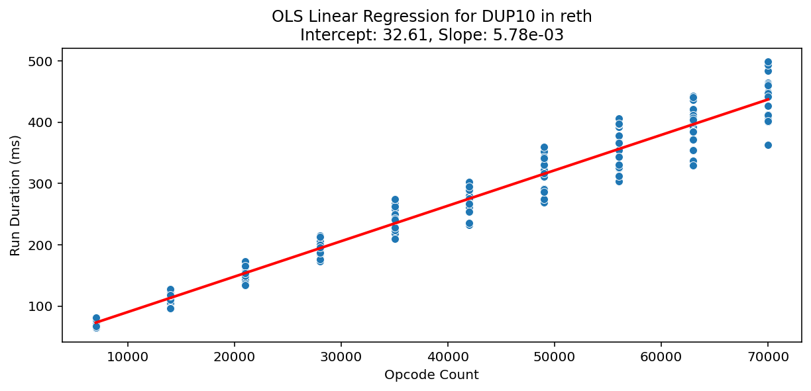

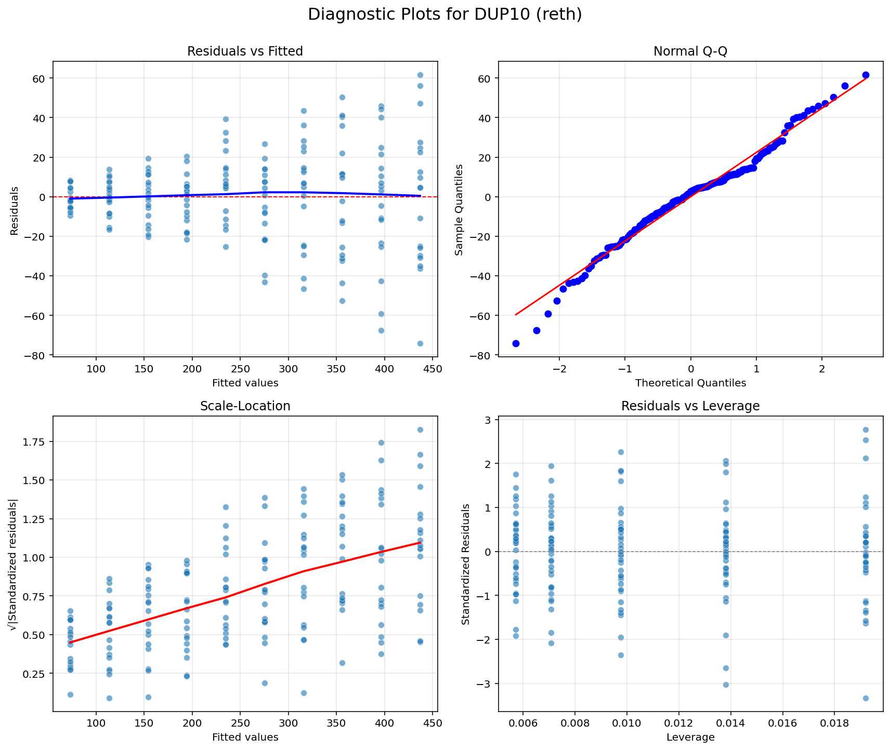


## nethermind


```python
                            OLS Regression Results                            
==============================================================================
Dep. Variable:        run_duration_ms   R-squared:                       0.973
Model:                            OLS   Adj. R-squared:                  0.973
Method:                 Least Squares   F-statistic:                 1.056e+04
Date:                Thu, 22 Jan 2026   Prob (F-statistic):          5.58e-229
Time:                        10:34:00   Log-Likelihood:                -1337.2
No. Observations:                 290   AIC:                             2678.
Df Residuals:                     288   BIC:                             2686.
Df Model:                           1                                         
Covariance Type:            nonrobust                                         
==============================================================================
                 coef    std err          t      P>|t|      [0.025      0.975]
------------------------------------------------------------------------------
const         27.5215      3.099      8.882      0.000      21.423      33.620
opcount        0.0073   7.13e-05    102.756      0.000       0.007       0.007
==============================================================================
Omnibus:                       74.547   Durbin-Watson:                   1.063
Prob(Omnibus):                  0.000   Jarque-Bera (JB):              616.732
Skew:                           0.767   Prob(JB):                    1.20e-134
Kurtosis:                       9.977   Cond. No.                     9.38e+04
==============================================================================

Notes:
[1] Standard Errors assume that the covariance matrix of the errors is correctly specified.
[2] The condition number is large, 9.38e+04. This might indicate that there are
strong multicollinearity or other numerical problems.
```


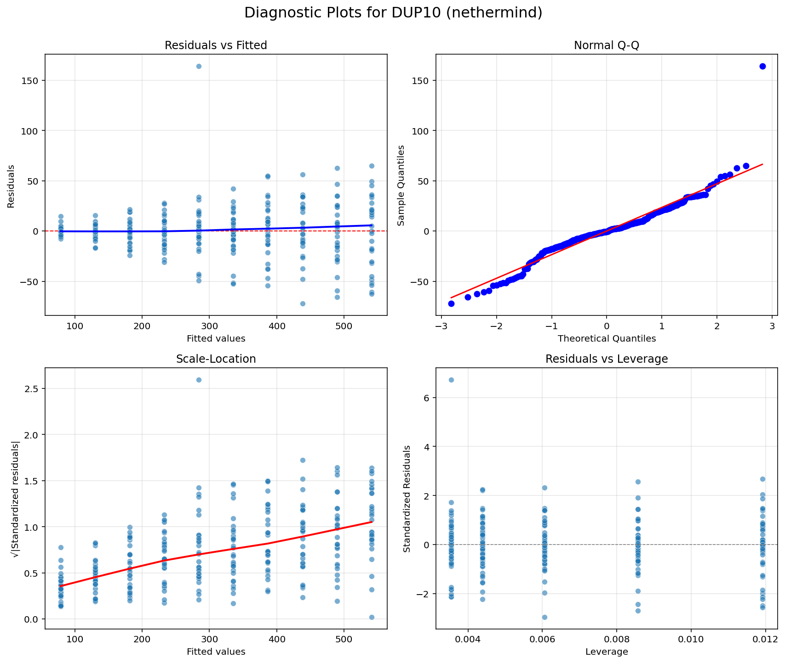


## erigon

OLS model did not run... Error: zero-size array to reduction operation maximum which has no identity

# DUP11

## geth


```python
                            OLS Regression Results                            
==============================================================================
Dep. Variable:        run_duration_ms   R-squared:                       0.985
Model:                            OLS   Adj. R-squared:                  0.985
Method:                 Least Squares   F-statistic:                 1.863e+04
Date:                Thu, 22 Jan 2026   Prob (F-statistic):          8.82e-264
Time:                        10:34:00   Log-Likelihood:                -1428.5
No. Observations:                 290   AIC:                             2861.
Df Residuals:                     288   BIC:                             2868.
Df Model:                           1                                         
Covariance Type:            nonrobust                                         
==============================================================================
                 coef    std err          t      P>|t|      [0.025      0.975]
------------------------------------------------------------------------------
const         31.5019      4.245      7.420      0.000      23.146      39.858
opcount        0.0133   9.77e-05    136.505      0.000       0.013       0.014
==============================================================================
Omnibus:                       30.085   Durbin-Watson:                   1.105
Prob(Omnibus):                  0.000   Jarque-Bera (JB):               99.767
Skew:                          -0.363   Prob(JB):                     2.17e-22
Kurtosis:                       5.780   Cond. No.                     9.38e+04
==============================================================================

Notes:
[1] Standard Errors assume that the covariance matrix of the errors is correctly specified.
[2] The condition number is large, 9.38e+04. This might indicate that there are
strong multicollinearity or other numerical problems.
```


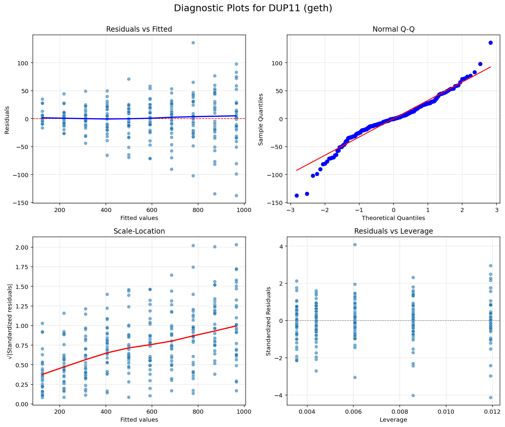


## besu


```python
                            OLS Regression Results                            
==============================================================================
Dep. Variable:        run_duration_ms   R-squared:                       0.981
Model:                            OLS   Adj. R-squared:                  0.981
Method:                 Least Squares   F-statistic:                 1.512e+04
Date:                Thu, 22 Jan 2026   Prob (F-statistic):          6.13e-251
Time:                        10:34:00   Log-Likelihood:                -1615.2
No. Observations:                 290   AIC:                             3234.
Df Residuals:                     288   BIC:                             3242.
Df Model:                           1                                         
Covariance Type:            nonrobust                                         
==============================================================================
                 coef    std err          t      P>|t|      [0.025      0.975]
------------------------------------------------------------------------------
const         23.0806      8.081      2.856      0.005       7.175      38.986
opcount        0.0229      0.000    122.969      0.000       0.023       0.023
==============================================================================
Omnibus:                       42.197   Durbin-Watson:                   0.922
Prob(Omnibus):                  0.000   Jarque-Bera (JB):               81.160
Skew:                          -0.778   Prob(JB):                     2.38e-18
Kurtosis:                       5.073   Cond. No.                     9.38e+04
==============================================================================

Notes:
[1] Standard Errors assume that the covariance matrix of the errors is correctly specified.
[2] The condition number is large, 9.38e+04. This might indicate that there are
strong multicollinearity or other numerical problems.
```


## reth


```python
                            OLS Regression Results                            
==============================================================================
Dep. Variable:        run_duration_ms   R-squared:                       0.963
Model:                            OLS   Adj. R-squared:                  0.963
Method:                 Least Squares   F-statistic:                     4672.
Date:                Thu, 22 Jan 2026   Prob (F-statistic):          1.09e-129
Time:                        10:34:00   Log-Likelihood:                -819.37
No. Observations:                 180   AIC:                             1643.
Df Residuals:                     178   BIC:                             1649.
Df Model:                           1                                         
Covariance Type:            nonrobust                                         
==============================================================================
                 coef    std err          t      P>|t|      [0.025      0.975]
------------------------------------------------------------------------------
const         29.3803      3.715      7.908      0.000      22.049      36.712
opcount        0.0058   8.55e-05     68.355      0.000       0.006       0.006
==============================================================================
Omnibus:                       25.361   Durbin-Watson:                   1.766
Prob(Omnibus):                  0.000   Jarque-Bera (JB):               76.619
Skew:                           0.502   Prob(JB):                     2.30e-17
Kurtosis:                       6.034   Cond. No.                     9.38e+04
==============================================================================

Notes:
[1] Standard Errors assume that the covariance matrix of the errors is correctly specified.
[2] The condition number is large, 9.38e+04. This might indicate that there are
strong multicollinearity or other numerical problems.
```

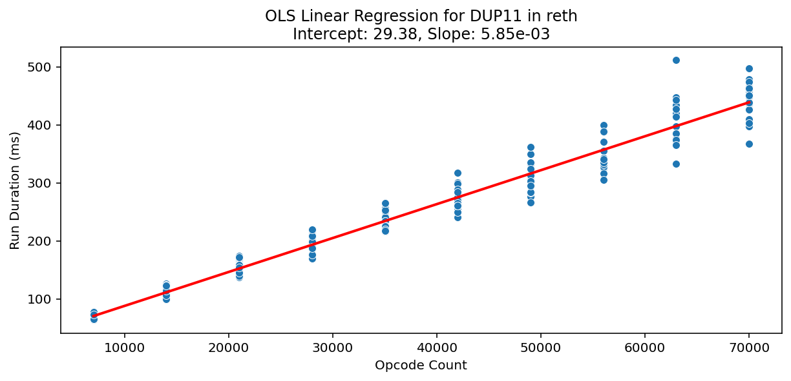

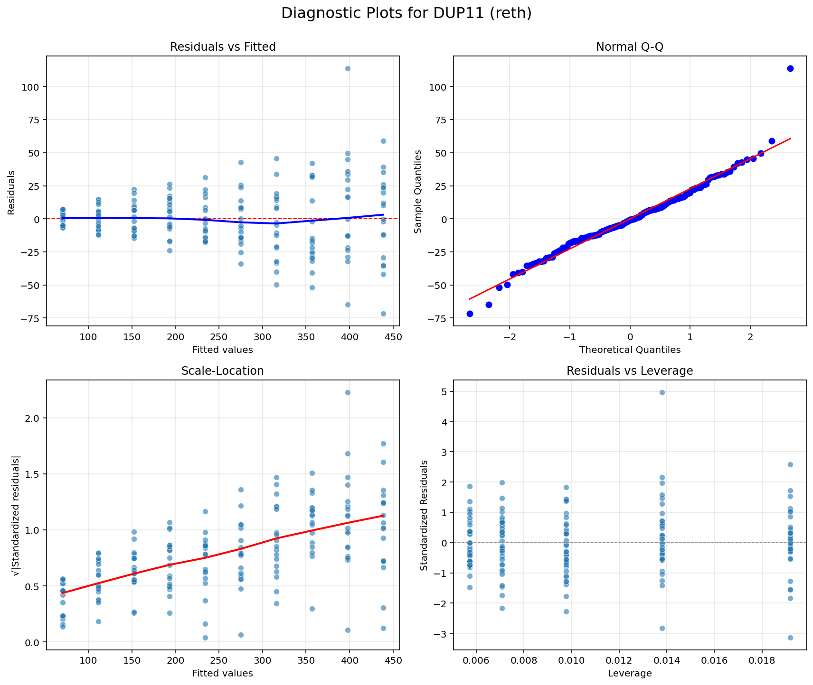


## nethermind


```python
                            OLS Regression Results                            
==============================================================================
Dep. Variable:        run_duration_ms   R-squared:                       0.975
Model:                            OLS   Adj. R-squared:                  0.975
Method:                 Least Squares   F-statistic:                 1.108e+04
Date:                Thu, 22 Jan 2026   Prob (F-statistic):          6.33e-232
Time:                        10:34:01   Log-Likelihood:                -1329.6
No. Observations:                 290   AIC:                             2663.
Df Residuals:                     288   BIC:                             2670.
Df Model:                           1                                         
Covariance Type:            nonrobust                                         
==============================================================================
                 coef    std err          t      P>|t|      [0.025      0.975]
------------------------------------------------------------------------------
const         27.1593      3.018      9.000      0.000      21.220      33.099
opcount        0.0073   6.95e-05    105.270      0.000       0.007       0.007
==============================================================================
Omnibus:                       16.186   Durbin-Watson:                   1.067
Prob(Omnibus):                  0.000   Jarque-Bera (JB):               43.549
Skew:                          -0.075   Prob(JB):                     3.50e-10
Kurtosis:                       4.892   Cond. No.                     9.38e+04
==============================================================================

Notes:
[1] Standard Errors assume that the covariance matrix of the errors is correctly specified.
[2] The condition number is large, 9.38e+04. This might indicate that there are
strong multicollinearity or other numerical problems.
```

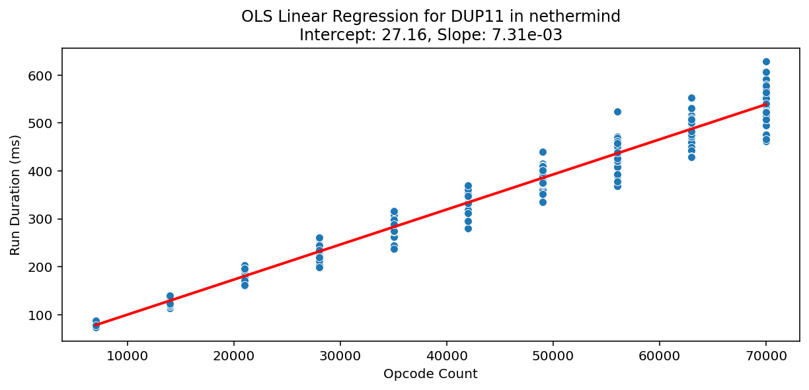

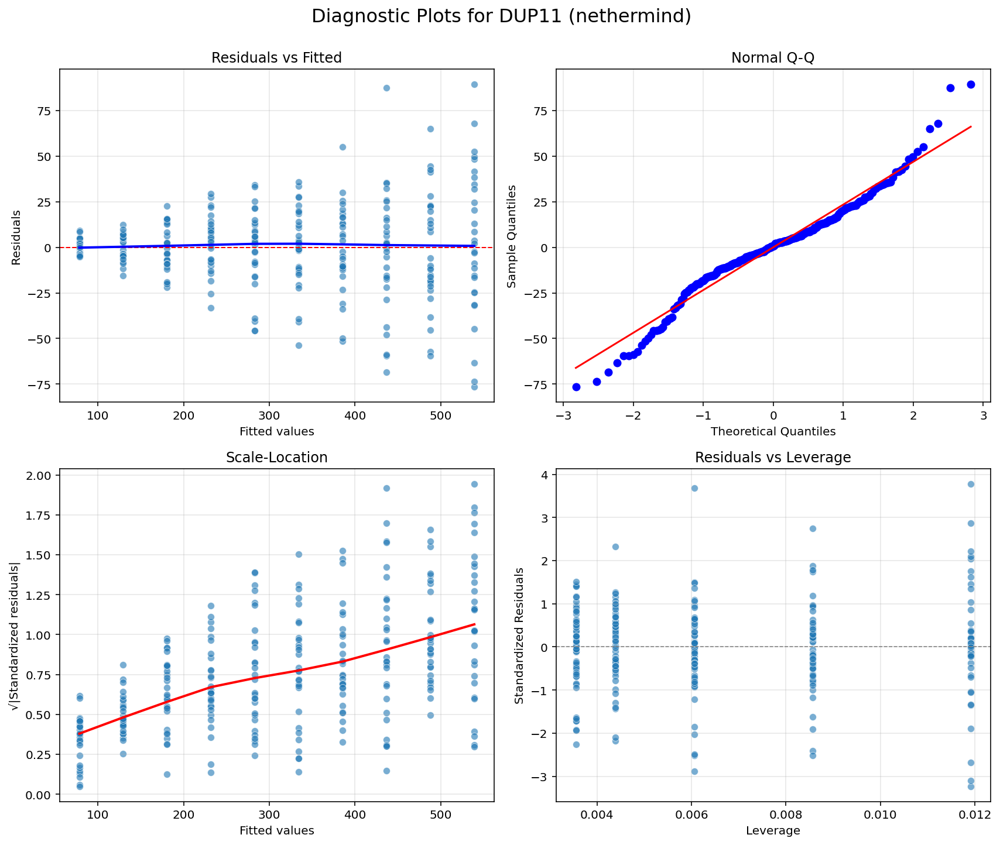


## erigon

OLS model did not run... Error: zero-size array to reduction operation maximum which has no identity

# DUP12

## geth


```python
                            OLS Regression Results                            
==============================================================================
Dep. Variable:        run_duration_ms   R-squared:                       0.986
Model:                            OLS   Adj. R-squared:                  0.986
Method:                 Least Squares   F-statistic:                 2.091e+04
Date:                Thu, 22 Jan 2026   Prob (F-statistic):          7.00e-271
Time:                        10:34:01   Log-Likelihood:                -1412.3
No. Observations:                 290   AIC:                             2829.
Df Residuals:                     288   BIC:                             2836.
Df Model:                           1                                         
Covariance Type:            nonrobust                                         
==============================================================================
                 coef    std err          t      P>|t|      [0.025      0.975]
------------------------------------------------------------------------------
const         30.3335      4.013      7.558      0.000      22.434      38.233
opcount        0.0134   9.24e-05    144.598      0.000       0.013       0.014
==============================================================================
Omnibus:                       23.888   Durbin-Watson:                   1.035
Prob(Omnibus):                  0.000   Jarque-Bera (JB):               44.293
Skew:                          -0.467   Prob(JB):                     2.41e-10
Kurtosis:                       4.672   Cond. No.                     9.38e+04
==============================================================================

Notes:
[1] Standard Errors assume that the covariance matrix of the errors is correctly specified.
[2] The condition number is large, 9.38e+04. This might indicate that there are
strong multicollinearity or other numerical problems.
```


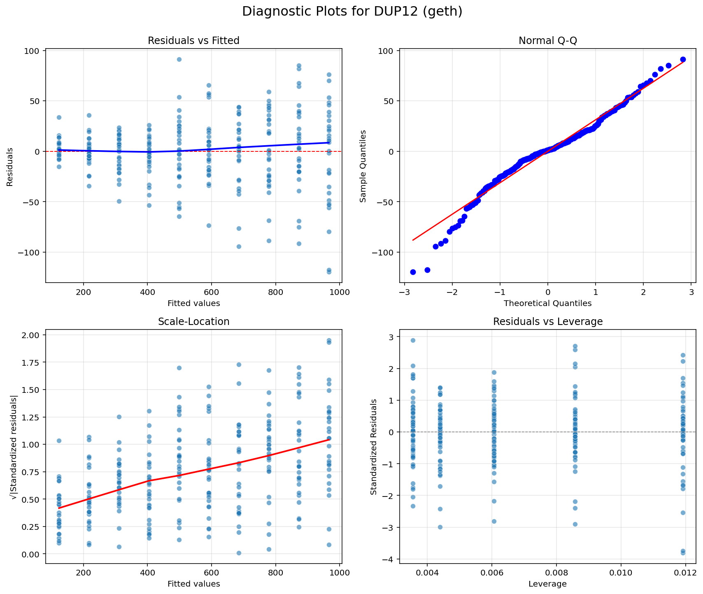


## besu


```python
                            OLS Regression Results                            
==============================================================================
Dep. Variable:        run_duration_ms   R-squared:                       0.980
Model:                            OLS   Adj. R-squared:                  0.980
Method:                 Least Squares   F-statistic:                 1.389e+04
Date:                Thu, 22 Jan 2026   Prob (F-statistic):          1.02e-245
Time:                        10:34:01   Log-Likelihood:                -1624.7
No. Observations:                 290   AIC:                             3253.
Df Residuals:                     288   BIC:                             3261.
Df Model:                           1                                         
Covariance Type:            nonrobust                                         
==============================================================================
                 coef    std err          t      P>|t|      [0.025      0.975]
------------------------------------------------------------------------------
const         30.4635      8.350      3.648      0.000      14.028      46.899
opcount        0.0227      0.000    117.842      0.000       0.022       0.023
==============================================================================
Omnibus:                       50.825   Durbin-Watson:                   0.963
Prob(Omnibus):                  0.000   Jarque-Bera (JB):              121.520
Skew:                          -0.838   Prob(JB):                     4.10e-27
Kurtosis:                       5.692   Cond. No.                     9.38e+04
==============================================================================

Notes:
[1] Standard Errors assume that the covariance matrix of the errors is correctly specified.
[2] The condition number is large, 9.38e+04. This might indicate that there are
strong multicollinearity or other numerical problems.
```

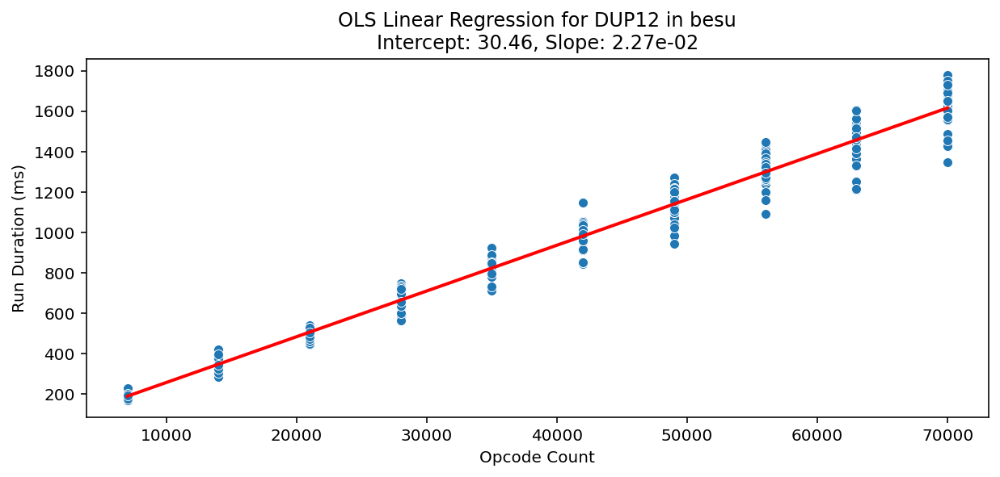

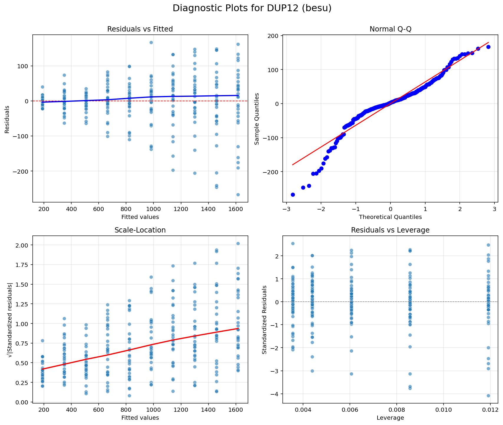


## reth


```python
                            OLS Regression Results                            
==============================================================================
Dep. Variable:        run_duration_ms   R-squared:                       0.971
Model:                            OLS   Adj. R-squared:                  0.971
Method:                 Least Squares   F-statistic:                     5893.
Date:                Thu, 22 Jan 2026   Prob (F-statistic):          2.27e-138
Time:                        10:34:02   Log-Likelihood:                -798.43
No. Observations:                 180   AIC:                             1601.
Df Residuals:                     178   BIC:                             1607.
Df Model:                           1                                         
Covariance Type:            nonrobust                                         
==============================================================================
                 coef    std err          t      P>|t|      [0.025      0.975]
------------------------------------------------------------------------------
const         29.6990      3.307      8.980      0.000      23.172      36.226
opcount        0.0058   7.61e-05     76.769      0.000       0.006       0.006
==============================================================================
Omnibus:                        4.997   Durbin-Watson:                   2.249
Prob(Omnibus):                  0.082   Jarque-Bera (JB):                5.272
Skew:                          -0.242   Prob(JB):                       0.0717
Kurtosis:                       3.684   Cond. No.                     9.38e+04
==============================================================================

Notes:
[1] Standard Errors assume that the covariance matrix of the errors is correctly specified.
[2] The condition number is large, 9.38e+04. This might indicate that there are
strong multicollinearity or other numerical problems.
```

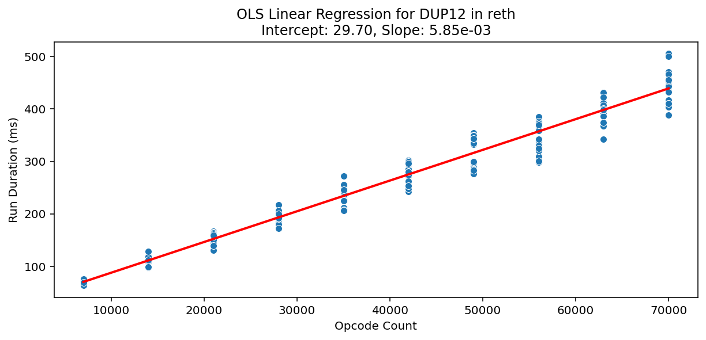

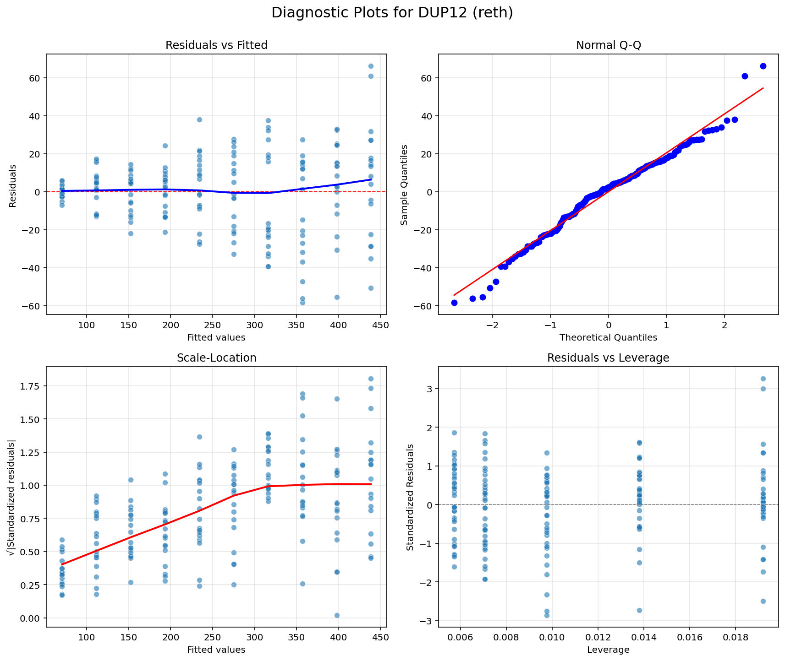


## nethermind


```python
                            OLS Regression Results                            
==============================================================================
Dep. Variable:        run_duration_ms   R-squared:                       0.977
Model:                            OLS   Adj. R-squared:                  0.977
Method:                 Least Squares   F-statistic:                 1.205e+04
Date:                Thu, 22 Jan 2026   Prob (F-statistic):          5.06e-237
Time:                        10:34:02   Log-Likelihood:                -1318.2
No. Observations:                 290   AIC:                             2640.
Df Residuals:                     288   BIC:                             2648.
Df Model:                           1                                         
Covariance Type:            nonrobust                                         
==============================================================================
                 coef    std err          t      P>|t|      [0.025      0.975]
------------------------------------------------------------------------------
const         26.9935      2.902      9.301      0.000      21.281      32.706
opcount        0.0073   6.68e-05    109.760      0.000       0.007       0.007
==============================================================================
Omnibus:                       31.216   Durbin-Watson:                   1.413
Prob(Omnibus):                  0.000   Jarque-Bera (JB):              168.238
Skew:                           0.021   Prob(JB):                     2.93e-37
Kurtosis:                       6.731   Cond. No.                     9.38e+04
==============================================================================

Notes:
[1] Standard Errors assume that the covariance matrix of the errors is correctly specified.
[2] The condition number is large, 9.38e+04. This might indicate that there are
strong multicollinearity or other numerical problems.
```

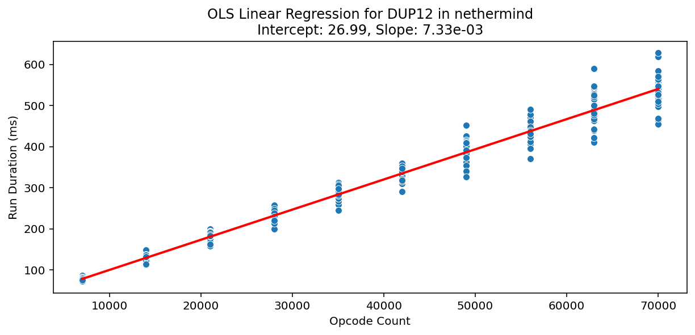

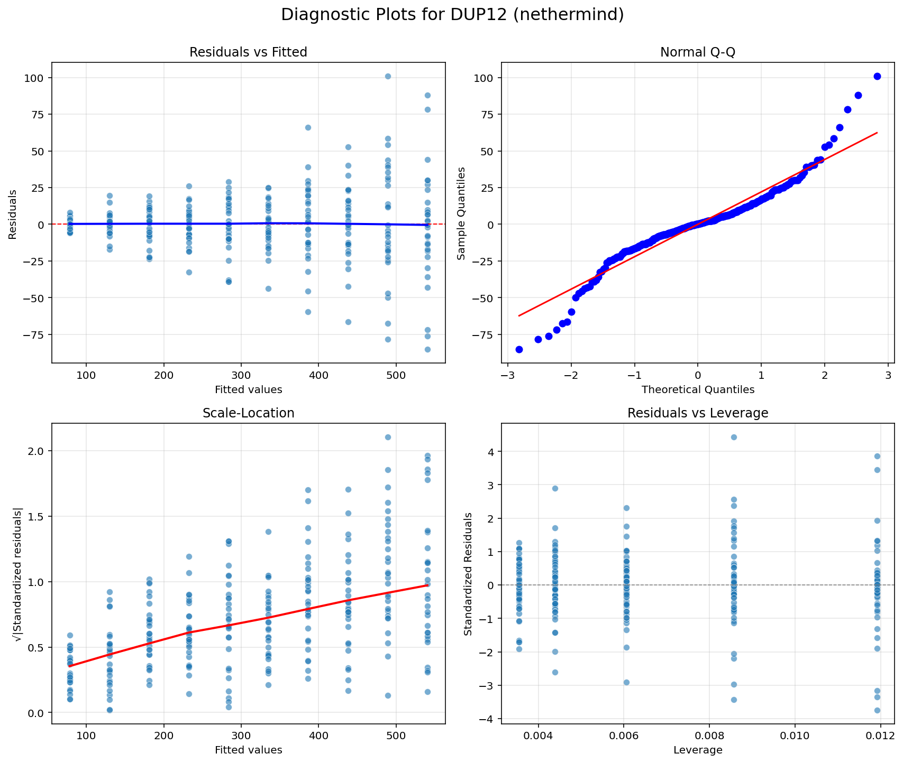


## erigon

OLS model did not run... Error: zero-size array to reduction operation maximum which has no identity

# DUP13

## geth


```python
                            OLS Regression Results                            
==============================================================================
Dep. Variable:        run_duration_ms   R-squared:                       0.963
Model:                            OLS   Adj. R-squared:                  0.963
Method:                 Least Squares   F-statistic:                     7516.
Date:                Thu, 22 Jan 2026   Prob (F-statistic):          2.19e-208
Time:                        10:34:02   Log-Likelihood:                -1567.4
No. Observations:                 290   AIC:                             3139.
Df Residuals:                     288   BIC:                             3146.
Df Model:                           1                                         
Covariance Type:            nonrobust                                         
==============================================================================
                 coef    std err          t      P>|t|      [0.025      0.975]
------------------------------------------------------------------------------
const         26.0023      6.853      3.794      0.000      12.513      39.491
opcount        0.0137      0.000     86.693      0.000       0.013       0.014
==============================================================================
Omnibus:                      403.851   Durbin-Watson:                   1.578
Prob(Omnibus):                  0.000   Jarque-Bera (JB):            73155.243
Skew:                           6.376   Prob(JB):                         0.00
Kurtosis:                      79.757   Cond. No.                     9.38e+04
==============================================================================

Notes:
[1] Standard Errors assume that the covariance matrix of the errors is correctly specified.
[2] The condition number is large, 9.38e+04. This might indicate that there are
strong multicollinearity or other numerical problems.
```
OLS model did not run... Error: 'numpy.ndarray' object has no attribute 'iloc'

## besu


```python
                            OLS Regression Results                            
==============================================================================
Dep. Variable:        run_duration_ms   R-squared:                       0.979
Model:                            OLS   Adj. R-squared:                  0.979
Method:                 Least Squares   F-statistic:                 1.373e+04
Date:                Thu, 22 Jan 2026   Prob (F-statistic):          5.34e-245
Time:                        10:34:02   Log-Likelihood:                -1628.4
No. Observations:                 290   AIC:                             3261.
Df Residuals:                     288   BIC:                             3268.
Df Model:                           1                                         
Covariance Type:            nonrobust                                         
==============================================================================
                 coef    std err          t      P>|t|      [0.025      0.975]
------------------------------------------------------------------------------
const         28.4337      8.458      3.362      0.001      11.786      45.082
opcount        0.0228      0.000    117.155      0.000       0.022       0.023
==============================================================================
Omnibus:                       38.834   Durbin-Watson:                   0.957
Prob(Omnibus):                  0.000   Jarque-Bera (JB):               93.272
Skew:                          -0.641   Prob(JB):                     5.57e-21
Kurtosis:                       5.465   Cond. No.                     9.38e+04
==============================================================================

Notes:
[1] Standard Errors assume that the covariance matrix of the errors is correctly specified.
[2] The condition number is large, 9.38e+04. This might indicate that there are
strong multicollinearity or other numerical problems.
```


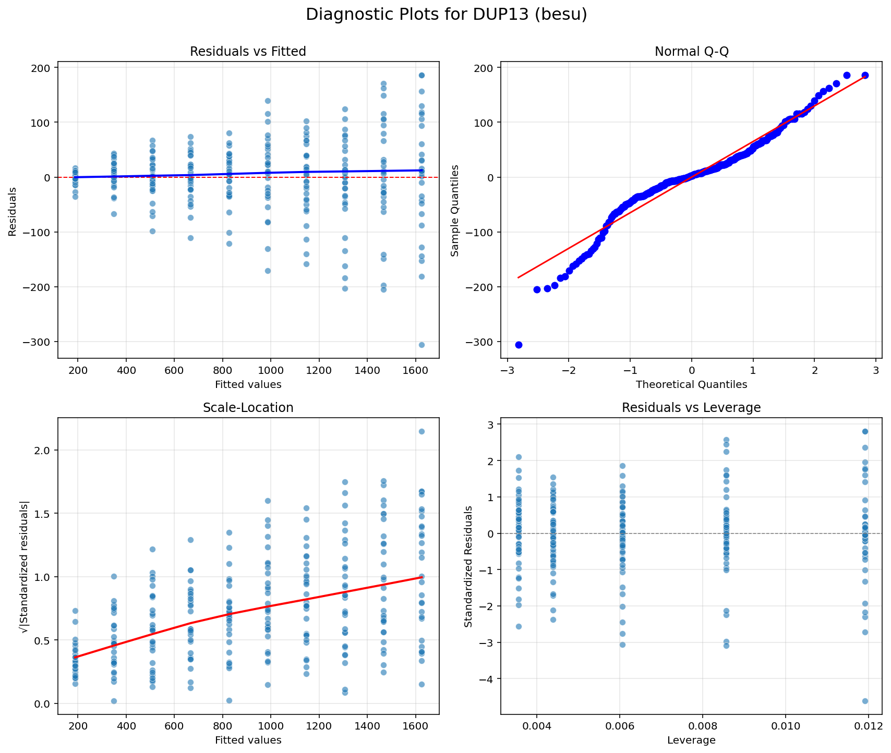


## reth


```python
                            OLS Regression Results                            
==============================================================================
Dep. Variable:        run_duration_ms   R-squared:                       0.962
Model:                            OLS   Adj. R-squared:                  0.962
Method:                 Least Squares   F-statistic:                     4542.
Date:                Thu, 22 Jan 2026   Prob (F-statistic):          1.24e-128
Time:                        10:34:02   Log-Likelihood:                -819.65
No. Observations:                 180   AIC:                             1643.
Df Residuals:                     178   BIC:                             1650.
Df Model:                           1                                         
Covariance Type:            nonrobust                                         
==============================================================================
                 coef    std err          t      P>|t|      [0.025      0.975]
------------------------------------------------------------------------------
const         34.0677      3.721      9.155      0.000      26.725      41.411
opcount        0.0058   8.57e-05     67.392      0.000       0.006       0.006
==============================================================================
Omnibus:                        2.342   Durbin-Watson:                   1.632
Prob(Omnibus):                  0.310   Jarque-Bera (JB):                1.958
Skew:                           0.169   Prob(JB):                        0.376
Kurtosis:                       3.383   Cond. No.                     9.38e+04
==============================================================================

Notes:
[1] Standard Errors assume that the covariance matrix of the errors is correctly specified.
[2] The condition number is large, 9.38e+04. This might indicate that there are
strong multicollinearity or other numerical problems.
```


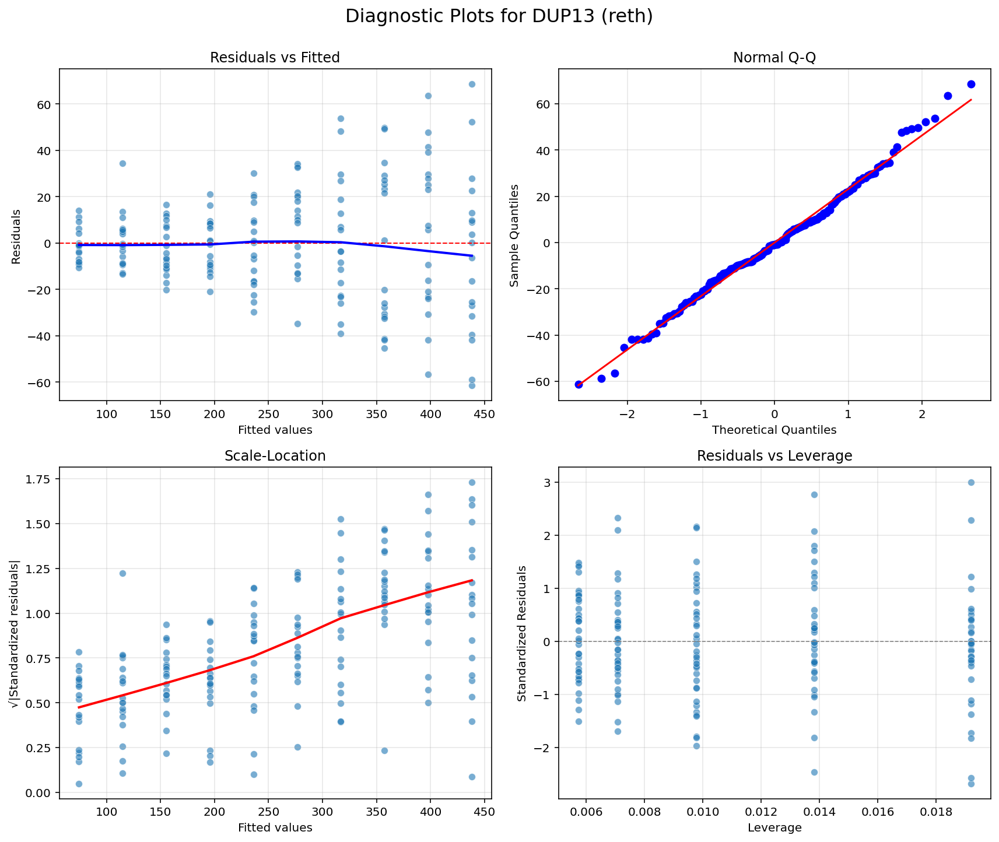


## nethermind


```python
                            OLS Regression Results                            
==============================================================================
Dep. Variable:        run_duration_ms   R-squared:                       0.962
Model:                            OLS   Adj. R-squared:                  0.962
Method:                 Least Squares   F-statistic:                     7331.
Date:                Thu, 22 Jan 2026   Prob (F-statistic):          6.90e-207
Time:                        10:34:03   Log-Likelihood:                -1388.6
No. Observations:                 290   AIC:                             2781.
Df Residuals:                     288   BIC:                             2789.
Df Model:                           1                                         
Covariance Type:            nonrobust                                         
==============================================================================
                 coef    std err          t      P>|t|      [0.025      0.975]
------------------------------------------------------------------------------
const         29.6333      3.700      8.010      0.000      22.352      36.915
opcount        0.0073   8.52e-05     85.622      0.000       0.007       0.007
==============================================================================
Omnibus:                      141.976   Durbin-Watson:                   1.177
Prob(Omnibus):                  0.000   Jarque-Bera (JB):             2467.260
Skew:                           1.530   Prob(JB):                         0.00
Kurtosis:                      16.958   Cond. No.                     9.38e+04
==============================================================================

Notes:
[1] Standard Errors assume that the covariance matrix of the errors is correctly specified.
[2] The condition number is large, 9.38e+04. This might indicate that there are
strong multicollinearity or other numerical problems.
```

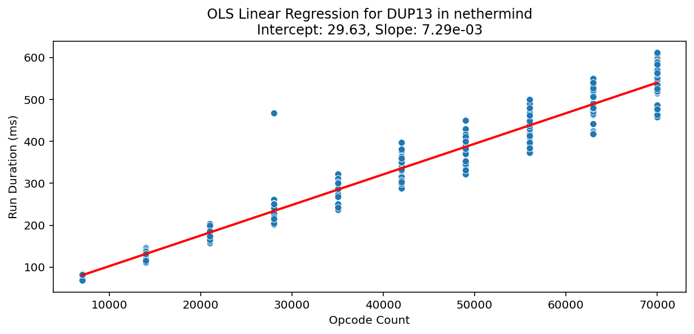

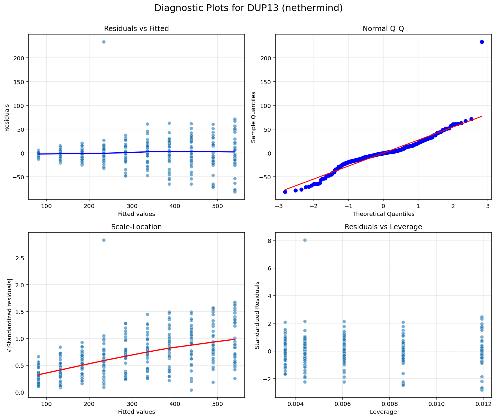


## erigon

OLS model did not run... Error: zero-size array to reduction operation maximum which has no identity

# DUP14

## geth


```python
                            OLS Regression Results                            
==============================================================================
Dep. Variable:        run_duration_ms   R-squared:                       0.980
Model:                            OLS   Adj. R-squared:                  0.980
Method:                 Least Squares   F-statistic:                 1.409e+04
Date:                Thu, 22 Jan 2026   Prob (F-statistic):          1.36e-246
Time:                        10:34:03   Log-Likelihood:                -1469.7
No. Observations:                 290   AIC:                             2943.
Df Residuals:                     288   BIC:                             2951.
Df Model:                           1                                         
Covariance Type:            nonrobust                                         
==============================================================================
                 coef    std err          t      P>|t|      [0.025      0.975]
------------------------------------------------------------------------------
const         34.4071      4.893      7.032      0.000      24.776      44.038
opcount        0.0134      0.000    118.688      0.000       0.013       0.014
==============================================================================
Omnibus:                      131.471   Durbin-Watson:                   1.331
Prob(Omnibus):                  0.000   Jarque-Bera (JB):             1251.319
Skew:                           1.581   Prob(JB):                    1.90e-272
Kurtosis:                      12.672   Cond. No.                     9.38e+04
==============================================================================

Notes:
[1] Standard Errors assume that the covariance matrix of the errors is correctly specified.
[2] The condition number is large, 9.38e+04. This might indicate that there are
strong multicollinearity or other numerical problems.
```


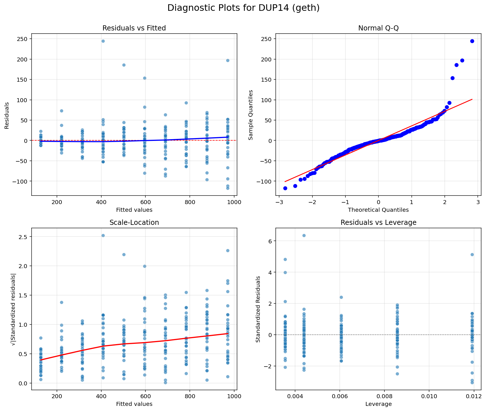


## besu


```python
                            OLS Regression Results                            
==============================================================================
Dep. Variable:        run_duration_ms   R-squared:                       0.984
Model:                            OLS   Adj. R-squared:                  0.984
Method:                 Least Squares   F-statistic:                 1.810e+04
Date:                Thu, 22 Jan 2026   Prob (F-statistic):          5.46e-262
Time:                        10:34:03   Log-Likelihood:                -1594.4
No. Observations:                 290   AIC:                             3193.
Df Residuals:                     288   BIC:                             3200.
Df Model:                           1                                         
Covariance Type:            nonrobust                                         
==============================================================================
                 coef    std err          t      P>|t|      [0.025      0.975]
------------------------------------------------------------------------------
const         25.7801      7.521      3.428      0.001      10.978      40.583
opcount        0.0233      0.000    134.534      0.000       0.023       0.024
==============================================================================
Omnibus:                       20.446   Durbin-Watson:                   0.777
Prob(Omnibus):                  0.000   Jarque-Bera (JB):               37.520
Skew:                          -0.401   Prob(JB):                     7.12e-09
Kurtosis:                       4.569   Cond. No.                     9.38e+04
==============================================================================

Notes:
[1] Standard Errors assume that the covariance matrix of the errors is correctly specified.
[2] The condition number is large, 9.38e+04. This might indicate that there are
strong multicollinearity or other numerical problems.
```

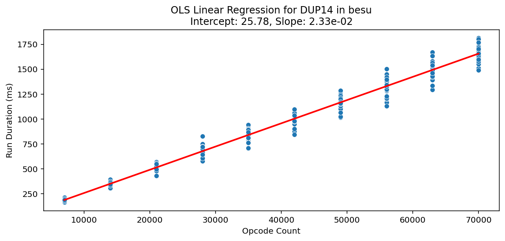

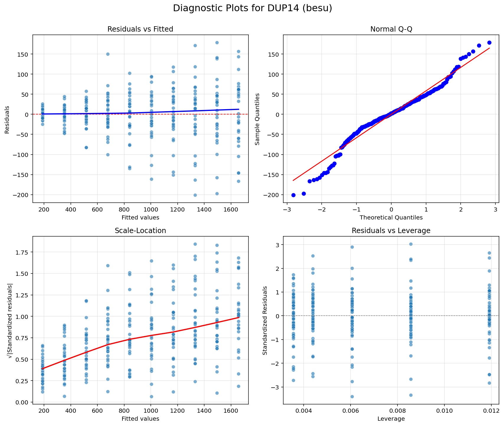


## reth


```python
                            OLS Regression Results                            
==============================================================================
Dep. Variable:        run_duration_ms   R-squared:                       0.971
Model:                            OLS   Adj. R-squared:                  0.970
Method:                 Least Squares   F-statistic:                     5882.
Date:                Thu, 22 Jan 2026   Prob (F-statistic):          2.68e-138
Time:                        10:34:03   Log-Likelihood:                -799.62
No. Observations:                 180   AIC:                             1603.
Df Residuals:                     178   BIC:                             1610.
Df Model:                           1                                         
Covariance Type:            nonrobust                                         
==============================================================================
                 coef    std err          t      P>|t|      [0.025      0.975]
------------------------------------------------------------------------------
const         30.9607      3.329      9.300      0.000      24.391      37.531
opcount        0.0059   7.67e-05     76.695      0.000       0.006       0.006
==============================================================================
Omnibus:                        4.934   Durbin-Watson:                   1.860
Prob(Omnibus):                  0.085   Jarque-Bera (JB):                5.021
Skew:                           0.257   Prob(JB):                       0.0812
Kurtosis:                       3.636   Cond. No.                     9.38e+04
==============================================================================

Notes:
[1] Standard Errors assume that the covariance matrix of the errors is correctly specified.
[2] The condition number is large, 9.38e+04. This might indicate that there are
strong multicollinearity or other numerical problems.
```

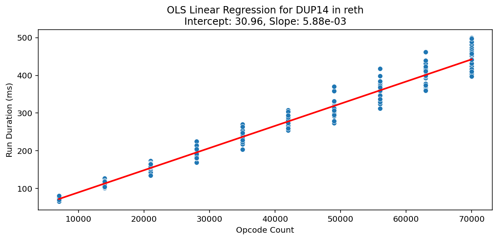

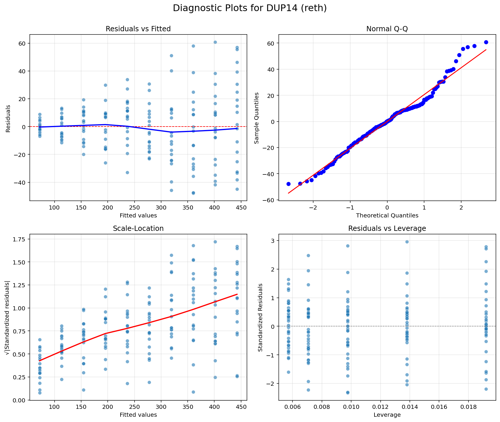


## nethermind


```python
                            OLS Regression Results                            
==============================================================================
Dep. Variable:        run_duration_ms   R-squared:                       0.969
Model:                            OLS   Adj. R-squared:                  0.969
Method:                 Least Squares   F-statistic:                     9003.
Date:                Thu, 22 Jan 2026   Prob (F-statistic):          2.69e-219
Time:                        10:34:04   Log-Likelihood:                -1354.8
No. Observations:                 290   AIC:                             2714.
Df Residuals:                     288   BIC:                             2721.
Df Model:                           1                                         
Covariance Type:            nonrobust                                         
==============================================================================
                 coef    std err          t      P>|t|      [0.025      0.975]
------------------------------------------------------------------------------
const         32.5848      3.292      9.897      0.000      26.104      39.065
opcount        0.0072   7.58e-05     94.884      0.000       0.007       0.007
==============================================================================
Omnibus:                       34.697   Durbin-Watson:                   1.040
Prob(Omnibus):                  0.000   Jarque-Bera (JB):              206.878
Skew:                           0.115   Prob(JB):                     1.19e-45
Kurtosis:                       7.131   Cond. No.                     9.38e+04
==============================================================================

Notes:
[1] Standard Errors assume that the covariance matrix of the errors is correctly specified.
[2] The condition number is large, 9.38e+04. This might indicate that there are
strong multicollinearity or other numerical problems.
```

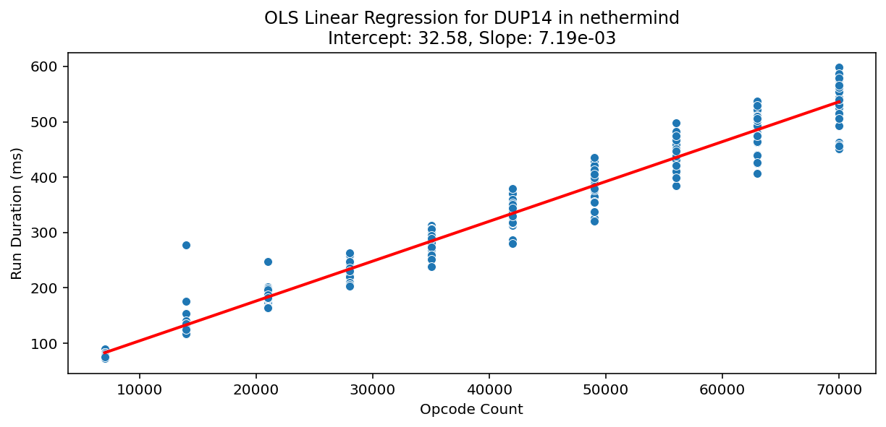

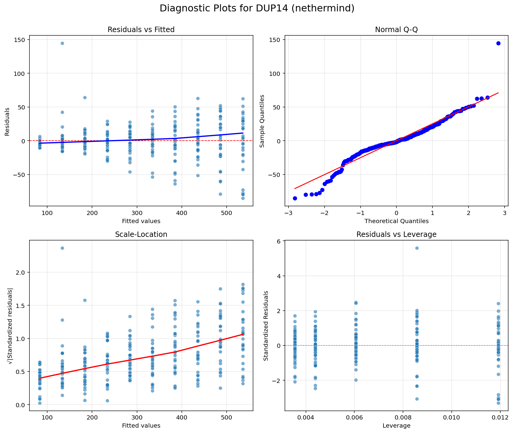


## erigon

OLS model did not run... Error: zero-size array to reduction operation maximum which has no identity

# DUP15

## geth


```python
                            OLS Regression Results                            
==============================================================================
Dep. Variable:        run_duration_ms   R-squared:                       0.986
Model:                            OLS   Adj. R-squared:                  0.986
Method:                 Least Squares   F-statistic:                 2.017e+04
Date:                Thu, 22 Jan 2026   Prob (F-statistic):          1.14e-268
Time:                        10:34:04   Log-Likelihood:                -1420.1
No. Observations:                 290   AIC:                             2844.
Df Residuals:                     288   BIC:                             2852.
Df Model:                           1                                         
Covariance Type:            nonrobust                                         
==============================================================================
                 coef    std err          t      P>|t|      [0.025      0.975]
------------------------------------------------------------------------------
const         33.9836      4.123      8.242      0.000      25.868      42.099
opcount        0.0135   9.49e-05    142.029      0.000       0.013       0.014
==============================================================================
Omnibus:                       16.143   Durbin-Watson:                   0.970
Prob(Omnibus):                  0.000   Jarque-Bera (JB):               37.021
Skew:                          -0.202   Prob(JB):                     9.14e-09
Kurtosis:                       4.703   Cond. No.                     9.38e+04
==============================================================================

Notes:
[1] Standard Errors assume that the covariance matrix of the errors is correctly specified.
[2] The condition number is large, 9.38e+04. This might indicate that there are
strong multicollinearity or other numerical problems.
```


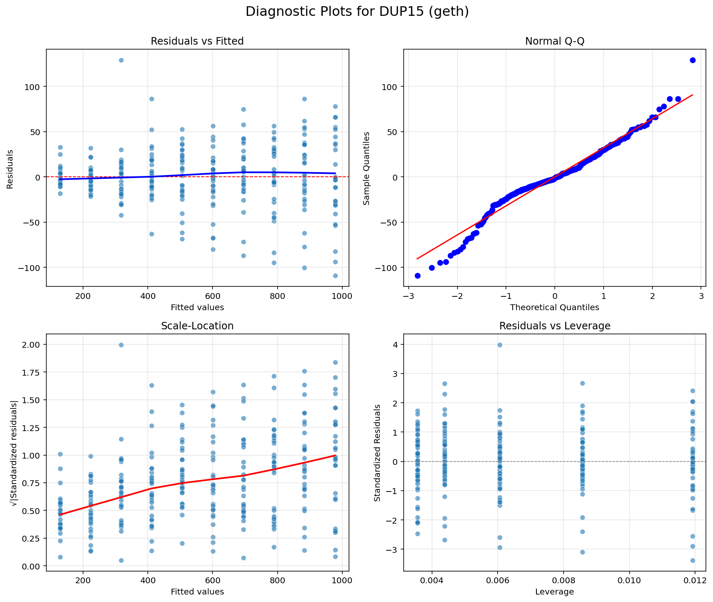


## besu


```python
                            OLS Regression Results                            
==============================================================================
Dep. Variable:        run_duration_ms   R-squared:                       0.979
Model:                            OLS   Adj. R-squared:                  0.979
Method:                 Least Squares   F-statistic:                 1.331e+04
Date:                Thu, 22 Jan 2026   Prob (F-statistic):          3.98e-243
Time:                        10:34:04   Log-Likelihood:                -1633.9
No. Observations:                 290   AIC:                             3272.
Df Residuals:                     288   BIC:                             3279.
Df Model:                           1                                         
Covariance Type:            nonrobust                                         
==============================================================================
                 coef    std err          t      P>|t|      [0.025      0.975]
------------------------------------------------------------------------------
const         27.5753      8.619      3.199      0.002      10.611      44.540
opcount        0.0229      0.000    115.377      0.000       0.023       0.023
==============================================================================
Omnibus:                       47.642   Durbin-Watson:                   0.903
Prob(Omnibus):                  0.000   Jarque-Bera (JB):              161.309
Skew:                          -0.664   Prob(JB):                     9.38e-36
Kurtosis:                       6.404   Cond. No.                     9.38e+04
==============================================================================

Notes:
[1] Standard Errors assume that the covariance matrix of the errors is correctly specified.
[2] The condition number is large, 9.38e+04. This might indicate that there are
strong multicollinearity or other numerical problems.
```

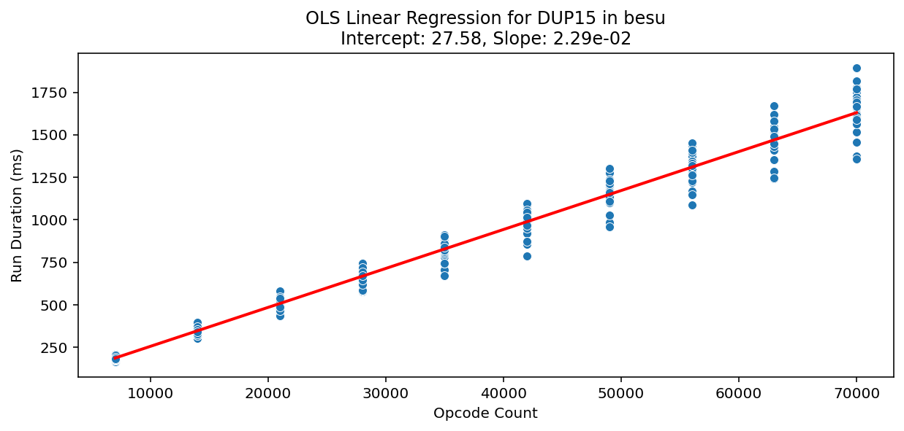

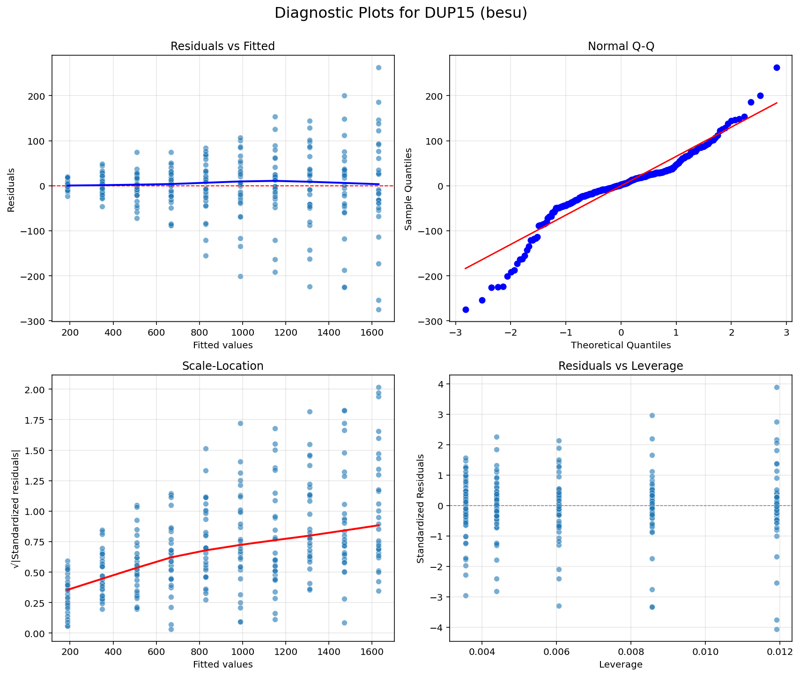


## reth


```python
                            OLS Regression Results                            
==============================================================================
Dep. Variable:        run_duration_ms   R-squared:                       0.965
Model:                            OLS   Adj. R-squared:                  0.965
Method:                 Least Squares   F-statistic:                     4924.
Date:                Thu, 22 Jan 2026   Prob (F-statistic):          1.20e-131
Time:                        10:34:05   Log-Likelihood:                -812.43
No. Observations:                 180   AIC:                             1629.
Df Residuals:                     178   BIC:                             1635.
Df Model:                           1                                         
Covariance Type:            nonrobust                                         
==============================================================================
                 coef    std err          t      P>|t|      [0.025      0.975]
------------------------------------------------------------------------------
const         34.0705      3.575      9.531      0.000      27.016      41.125
opcount        0.0058   8.23e-05     70.173      0.000       0.006       0.006
==============================================================================
Omnibus:                        1.197   Durbin-Watson:                   1.755
Prob(Omnibus):                  0.550   Jarque-Bera (JB):                1.116
Skew:                          -0.011   Prob(JB):                        0.572
Kurtosis:                       2.615   Cond. No.                     9.38e+04
==============================================================================

Notes:
[1] Standard Errors assume that the covariance matrix of the errors is correctly specified.
[2] The condition number is large, 9.38e+04. This might indicate that there are
strong multicollinearity or other numerical problems.
```


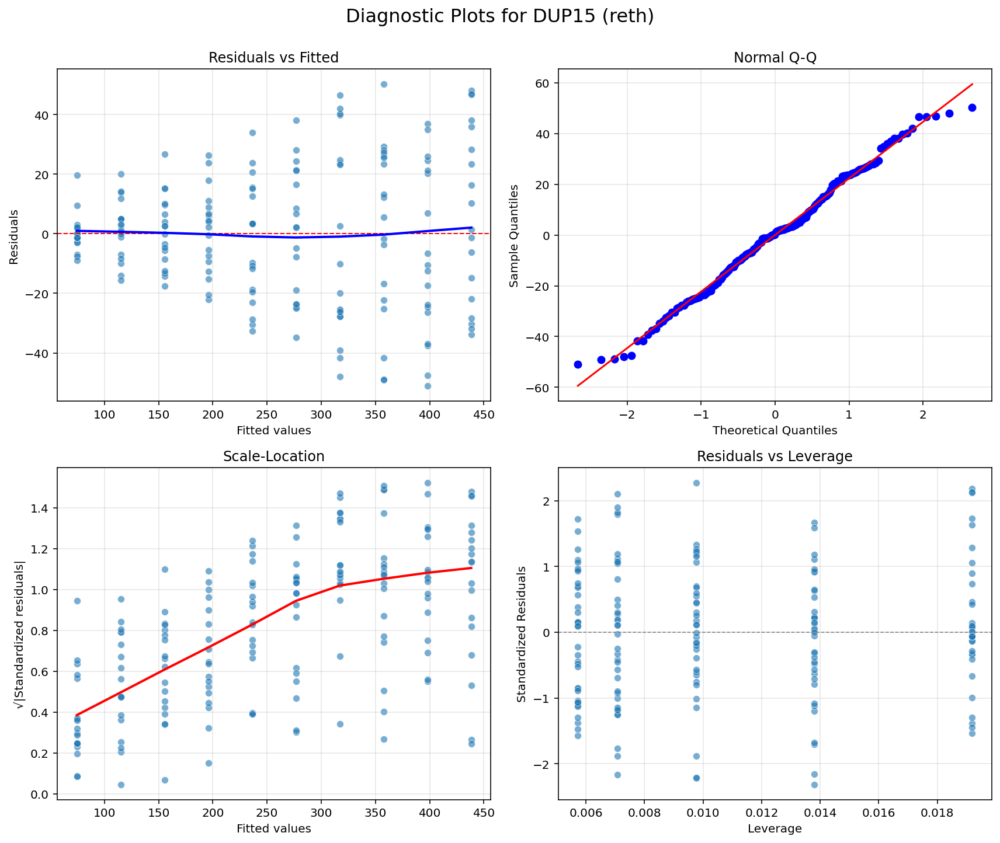


## nethermind


```python
                            OLS Regression Results                            
==============================================================================
Dep. Variable:        run_duration_ms   R-squared:                       0.971
Model:                            OLS   Adj. R-squared:                  0.971
Method:                 Least Squares   F-statistic:                     9693.
Date:                Thu, 22 Jan 2026   Prob (F-statistic):          8.86e-224
Time:                        10:34:05   Log-Likelihood:                -1349.4
No. Observations:                 290   AIC:                             2703.
Df Residuals:                     288   BIC:                             2710.
Df Model:                           1                                         
Covariance Type:            nonrobust                                         
==============================================================================
                 coef    std err          t      P>|t|      [0.025      0.975]
------------------------------------------------------------------------------
const         28.4340      3.232      8.799      0.000      22.074      34.794
opcount        0.0073   7.44e-05     98.455      0.000       0.007       0.007
==============================================================================
Omnibus:                       86.341   Durbin-Watson:                   0.999
Prob(Omnibus):                  0.000   Jarque-Bera (JB):             1068.391
Skew:                           0.804   Prob(JB):                    1.00e-232
Kurtosis:                      12.264   Cond. No.                     9.38e+04
==============================================================================

Notes:
[1] Standard Errors assume that the covariance matrix of the errors is correctly specified.
[2] The condition number is large, 9.38e+04. This might indicate that there are
strong multicollinearity or other numerical problems.
```

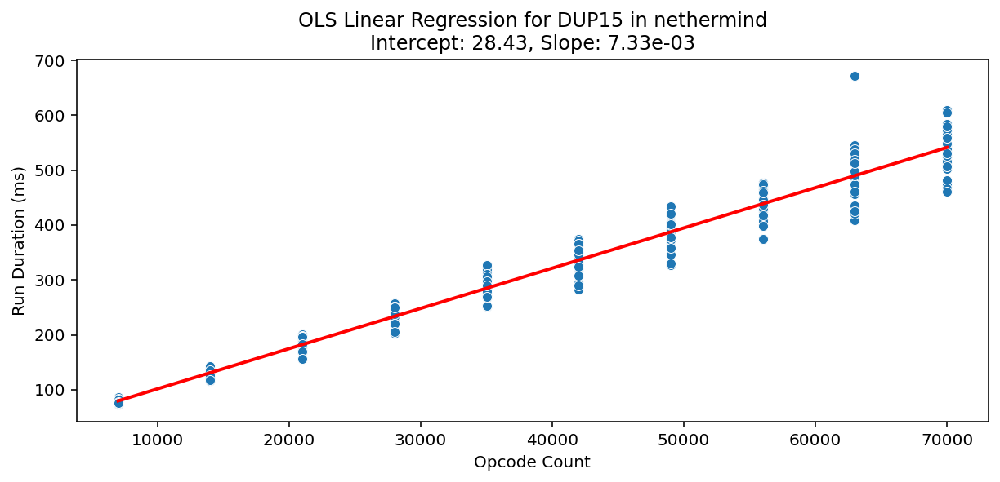

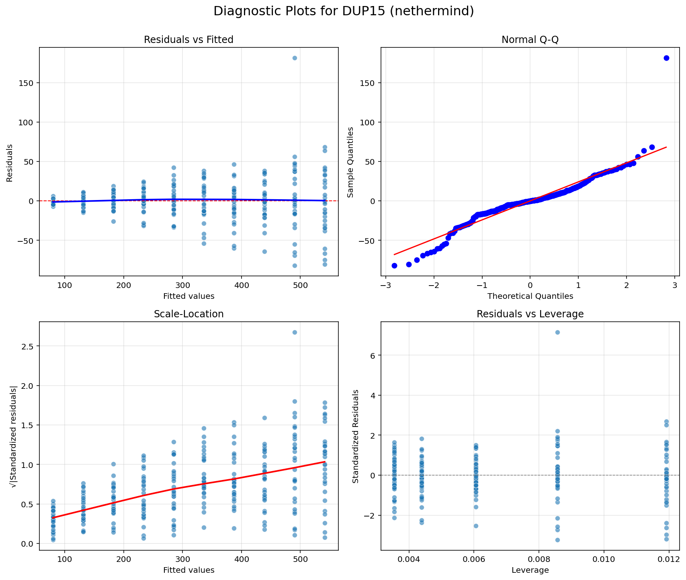


## erigon

OLS model did not run... Error: zero-size array to reduction operation maximum which has no identity

# DUP16

## geth


```python
                            OLS Regression Results                            
==============================================================================
Dep. Variable:        run_duration_ms   R-squared:                       0.983
Model:                            OLS   Adj. R-squared:                  0.983
Method:                 Least Squares   F-statistic:                 1.674e+04
Date:                Thu, 22 Jan 2026   Prob (F-statistic):          3.52e-257
Time:                        10:34:05   Log-Likelihood:                -1447.3
No. Observations:                 290   AIC:                             2899.
Df Residuals:                     288   BIC:                             2906.
Df Model:                           1                                         
Covariance Type:            nonrobust                                         
==============================================================================
                 coef    std err          t      P>|t|      [0.025      0.975]
------------------------------------------------------------------------------
const         29.8057      4.528      6.582      0.000      20.893      38.718
opcount        0.0135      0.000    129.376      0.000       0.013       0.014
==============================================================================
Omnibus:                      103.551   Durbin-Watson:                   1.297
Prob(Omnibus):                  0.000   Jarque-Bera (JB):              968.205
Skew:                           1.160   Prob(JB):                    5.71e-211
Kurtosis:                      11.646   Cond. No.                     9.38e+04
==============================================================================

Notes:
[1] Standard Errors assume that the covariance matrix of the errors is correctly specified.
[2] The condition number is large, 9.38e+04. This might indicate that there are
strong multicollinearity or other numerical problems.
```


## besu


```python
                            OLS Regression Results                            
==============================================================================
Dep. Variable:        run_duration_ms   R-squared:                       0.981
Model:                            OLS   Adj. R-squared:                  0.981
Method:                 Least Squares   F-statistic:                 1.487e+04
Date:                Thu, 22 Jan 2026   Prob (F-statistic):          6.40e-250
Time:                        10:34:05   Log-Likelihood:                -1620.6
No. Observations:                 290   AIC:                             3245.
Df Residuals:                     288   BIC:                             3253.
Df Model:                           1                                         
Covariance Type:            nonrobust                                         
==============================================================================
                 coef    std err          t      P>|t|      [0.025      0.975]
------------------------------------------------------------------------------
const         29.6256      8.232      3.599      0.000      13.423      45.829
opcount        0.0231      0.000    121.953      0.000       0.023       0.023
==============================================================================
Omnibus:                       35.928   Durbin-Watson:                   1.052
Prob(Omnibus):                  0.000   Jarque-Bera (JB):              105.365
Skew:                          -0.521   Prob(JB):                     1.32e-23
Kurtosis:                       5.763   Cond. No.                     9.38e+04
==============================================================================

Notes:
[1] Standard Errors assume that the covariance matrix of the errors is correctly specified.
[2] The condition number is large, 9.38e+04. This might indicate that there are
strong multicollinearity or other numerical problems.
```

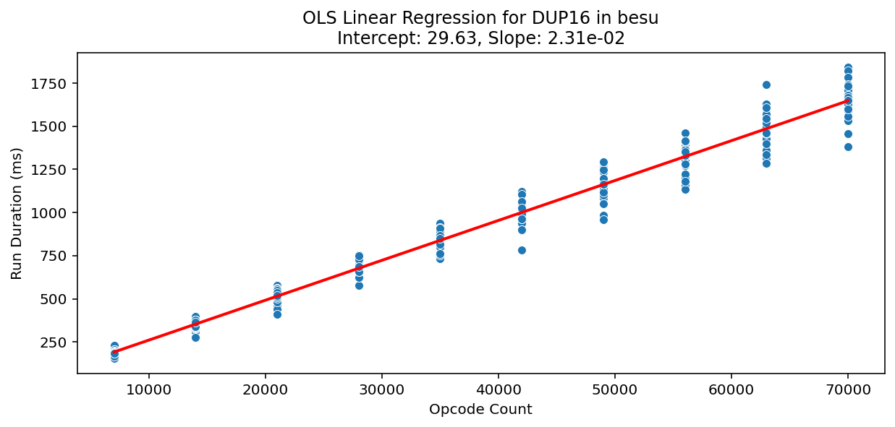

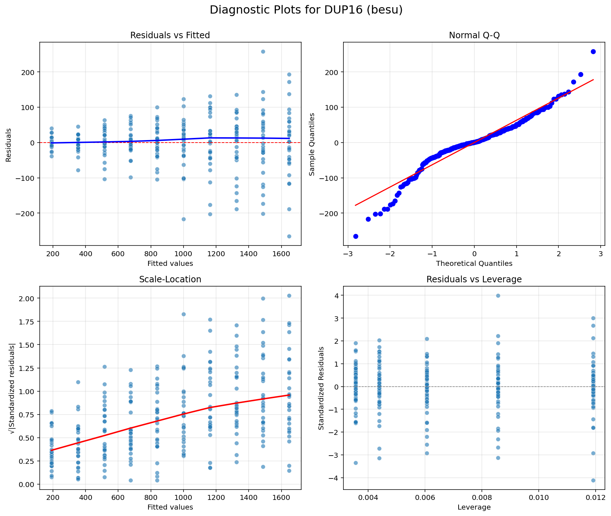


## reth


```python
                            OLS Regression Results                            
==============================================================================
Dep. Variable:        run_duration_ms   R-squared:                       0.973
Model:                            OLS   Adj. R-squared:                  0.973
Method:                 Least Squares   F-statistic:                     6504.
Date:                Thu, 22 Jan 2026   Prob (F-statistic):          4.52e-142
Time:                        10:34:06   Log-Likelihood:                -792.82
No. Observations:                 180   AIC:                             1590.
Df Residuals:                     178   BIC:                             1596.
Df Model:                           1                                         
Covariance Type:            nonrobust                                         
==============================================================================
                 coef    std err          t      P>|t|      [0.025      0.975]
------------------------------------------------------------------------------
const         29.7713      3.206      9.287      0.000      23.445      36.098
opcount        0.0060   7.38e-05     80.645      0.000       0.006       0.006
==============================================================================
Omnibus:                        0.095   Durbin-Watson:                   1.778
Prob(Omnibus):                  0.954   Jarque-Bera (JB):                0.084
Skew:                          -0.049   Prob(JB):                        0.959
Kurtosis:                       2.960   Cond. No.                     9.38e+04
==============================================================================

Notes:
[1] Standard Errors assume that the covariance matrix of the errors is correctly specified.
[2] The condition number is large, 9.38e+04. This might indicate that there are
strong multicollinearity or other numerical problems.
```


## nethermind


```python
                            OLS Regression Results                            
==============================================================================
Dep. Variable:        run_duration_ms   R-squared:                       0.974
Model:                            OLS   Adj. R-squared:                  0.974
Method:                 Least Squares   F-statistic:                 1.075e+04
Date:                Thu, 22 Jan 2026   Prob (F-statistic):          4.79e-230
Time:                        10:34:06   Log-Likelihood:                -1334.0
No. Observations:                 290   AIC:                             2672.
Df Residuals:                     288   BIC:                             2679.
Df Model:                           1                                         
Covariance Type:            nonrobust                                         
==============================================================================
                 coef    std err          t      P>|t|      [0.025      0.975]
------------------------------------------------------------------------------
const         28.2691      3.065      9.225      0.000      22.237      34.301
opcount        0.0073   7.06e-05    103.660      0.000       0.007       0.007
==============================================================================
Omnibus:                       18.635   Durbin-Watson:                   1.036
Prob(Omnibus):                  0.000   Jarque-Bera (JB):               53.611
Skew:                          -0.135   Prob(JB):                     2.28e-12
Kurtosis:                       5.089   Cond. No.                     9.38e+04
==============================================================================

Notes:
[1] Standard Errors assume that the covariance matrix of the errors is correctly specified.
[2] The condition number is large, 9.38e+04. This might indicate that there are
strong multicollinearity or other numerical problems.
```

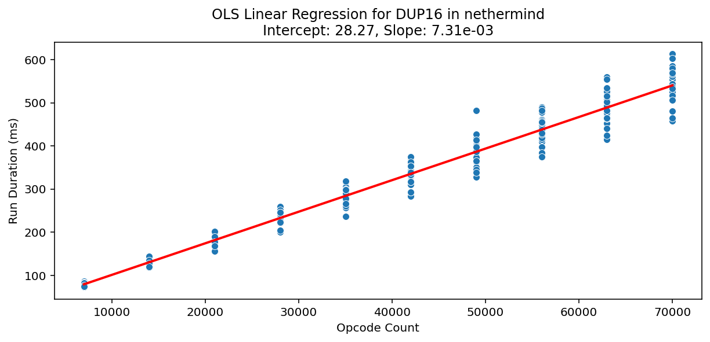

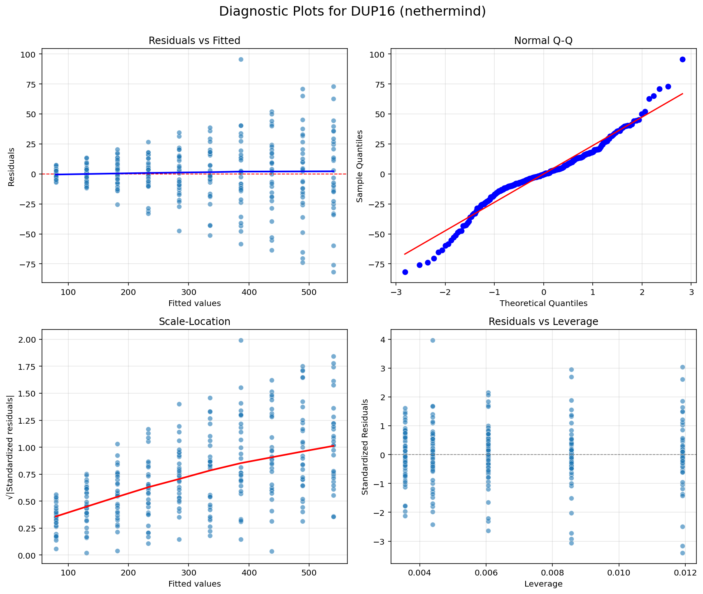


## erigon

OLS model did not run... Error: zero-size array to reduction operation maximum which has no identity

# EQ

## geth


```python
                            OLS Regression Results                            
==============================================================================
Dep. Variable:        run_duration_ms   R-squared:                       0.974
Model:                            OLS   Adj. R-squared:                  0.974
Method:                 Least Squares   F-statistic:                 1.070e+04
Date:                Thu, 22 Jan 2026   Prob (F-statistic):          9.02e-230
Time:                        10:34:06   Log-Likelihood:                -1515.4
No. Observations:                 290   AIC:                             3035.
Df Residuals:                     288   BIC:                             3042.
Df Model:                           1                                         
Covariance Type:            nonrobust                                         
==============================================================================
                 coef    std err          t      P>|t|      [0.025      0.975]
------------------------------------------------------------------------------
const         38.6691      5.728      6.751      0.000      27.396      49.942
opcount        0.0239      0.000    103.426      0.000       0.023       0.024
==============================================================================
Omnibus:                      327.423   Durbin-Watson:                   1.411
Prob(Omnibus):                  0.000   Jarque-Bera (JB):            30439.919
Skew:                           4.546   Prob(JB):                         0.00
Kurtosis:                      52.361   Cond. No.                     5.36e+04
==============================================================================

Notes:
[1] Standard Errors assume that the covariance matrix of the errors is correctly specified.
[2] The condition number is large, 5.36e+04. This might indicate that there are
strong multicollinearity or other numerical problems.
```


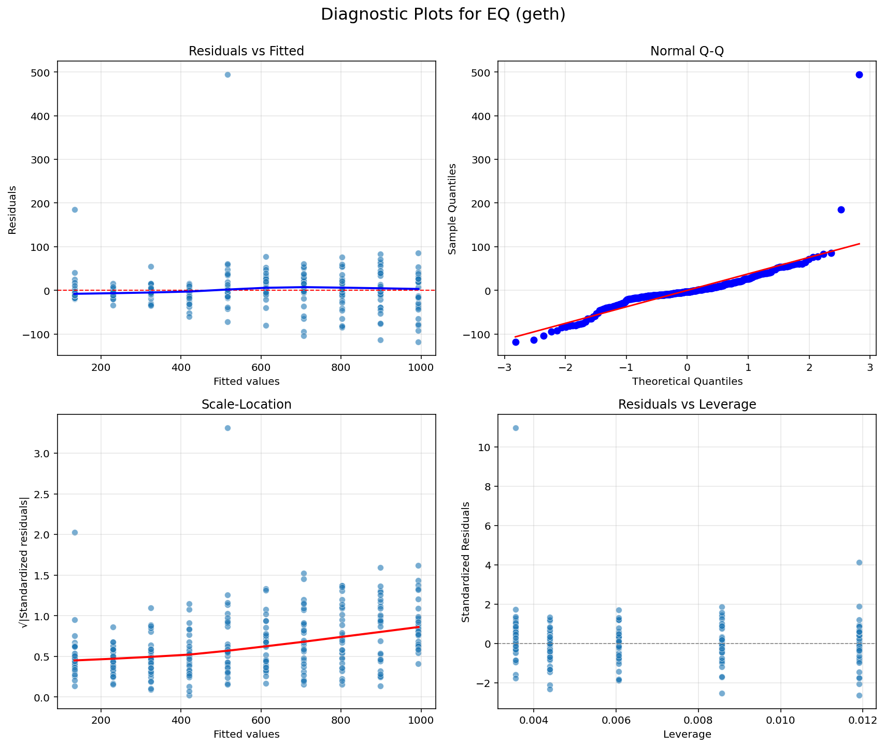


## besu


```python
                            OLS Regression Results                            
==============================================================================
Dep. Variable:        run_duration_ms   R-squared:                       0.984
Model:                            OLS   Adj. R-squared:                  0.984
Method:                 Least Squares   F-statistic:                 1.802e+04
Date:                Thu, 22 Jan 2026   Prob (F-statistic):          9.79e-262
Time:                        10:34:06   Log-Likelihood:                -2126.6
No. Observations:                 290   AIC:                             4257.
Df Residuals:                     288   BIC:                             4265.
Df Model:                           1                                         
Covariance Type:            nonrobust                                         
==============================================================================
                 coef    std err          t      P>|t|      [0.025      0.975]
------------------------------------------------------------------------------
const         34.5224     47.130      0.732      0.464     -58.240     127.285
opcount        0.2549      0.002    134.257      0.000       0.251       0.259
==============================================================================
Omnibus:                       83.503   Durbin-Watson:                   0.701
Prob(Omnibus):                  0.000   Jarque-Bera (JB):              176.571
Skew:                          -1.450   Prob(JB):                     4.55e-39
Kurtosis:                       5.490   Cond. No.                     5.36e+04
==============================================================================

Notes:
[1] Standard Errors assume that the covariance matrix of the errors is correctly specified.
[2] The condition number is large, 5.36e+04. This might indicate that there are
strong multicollinearity or other numerical problems.
```

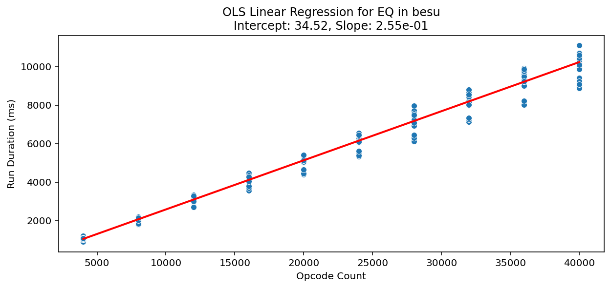

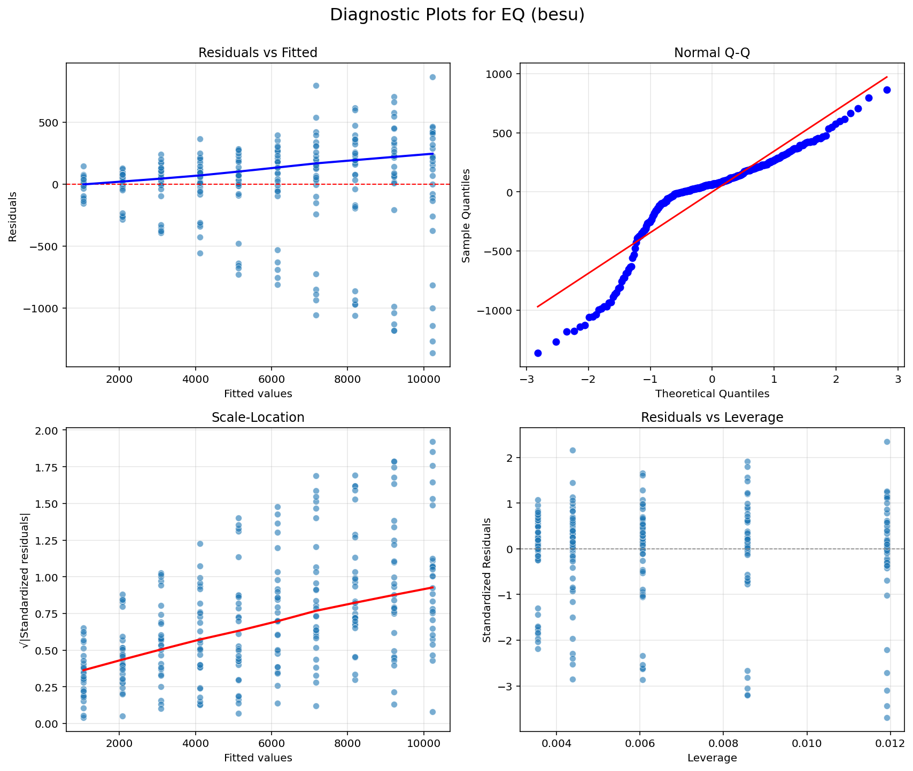


## reth


```python
                            OLS Regression Results                            
==============================================================================
Dep. Variable:        run_duration_ms   R-squared:                       0.924
Model:                            OLS   Adj. R-squared:                  0.924
Method:                 Least Squares   F-statistic:                     2178.
Date:                Thu, 22 Jan 2026   Prob (F-statistic):          8.97e-102
Time:                        10:34:07   Log-Likelihood:                -1063.1
No. Observations:                 180   AIC:                             2130.
Df Residuals:                     178   BIC:                             2137.
Df Model:                           1                                         
Covariance Type:            nonrobust                                         
==============================================================================
                 coef    std err          t      P>|t|      [0.025      0.975]
------------------------------------------------------------------------------
const         33.7611     14.391      2.346      0.020       5.362      62.160
opcount        0.0271      0.001     46.672      0.000       0.026       0.028
==============================================================================
Omnibus:                      106.382   Durbin-Watson:                   0.871
Prob(Omnibus):                  0.000   Jarque-Bera (JB):              538.128
Skew:                          -2.313   Prob(JB):                    1.40e-117
Kurtosis:                      10.096   Cond. No.                     5.36e+04
==============================================================================

Notes:
[1] Standard Errors assume that the covariance matrix of the errors is correctly specified.
[2] The condition number is large, 5.36e+04. This might indicate that there are
strong multicollinearity or other numerical problems.
```

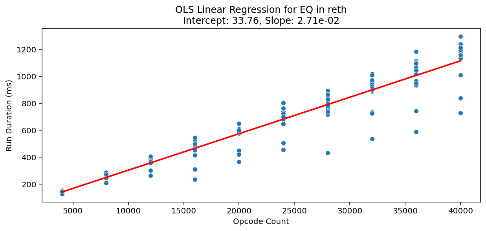

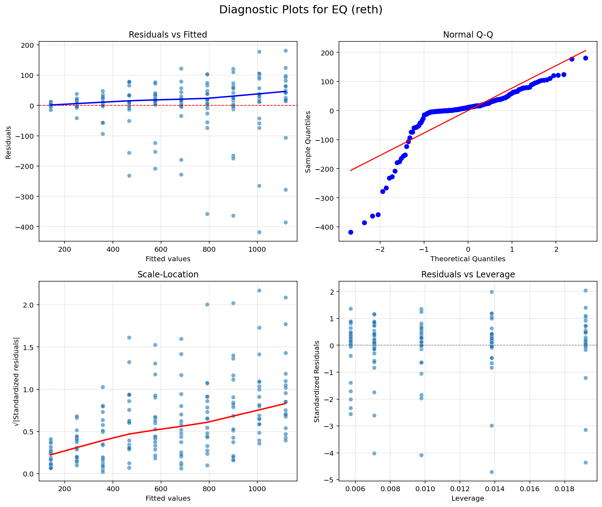


## nethermind


```python
                            OLS Regression Results                            
==============================================================================
Dep. Variable:        run_duration_ms   R-squared:                       0.984
Model:                            OLS   Adj. R-squared:                  0.984
Method:                 Least Squares   F-statistic:                 1.782e+04
Date:                Thu, 22 Jan 2026   Prob (F-statistic):          4.95e-261
Time:                        10:34:07   Log-Likelihood:                -1275.7
No. Observations:                 290   AIC:                             2555.
Df Residuals:                     288   BIC:                             2563.
Df Model:                           1                                         
Covariance Type:            nonrobust                                         
==============================================================================
                 coef    std err          t      P>|t|      [0.025      0.975]
------------------------------------------------------------------------------
const         29.1455      2.506     11.628      0.000      24.212      34.079
opcount        0.0135      0.000    133.492      0.000       0.013       0.014
==============================================================================
Omnibus:                       60.642   Durbin-Watson:                   0.827
Prob(Omnibus):                  0.000   Jarque-Bera (JB):              123.851
Skew:                          -1.063   Prob(JB):                     1.28e-27
Kurtosis:                       5.394   Cond. No.                     5.36e+04
==============================================================================

Notes:
[1] Standard Errors assume that the covariance matrix of the errors is correctly specified.
[2] The condition number is large, 5.36e+04. This might indicate that there are
strong multicollinearity or other numerical problems.
```

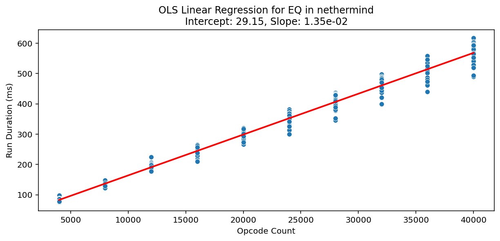

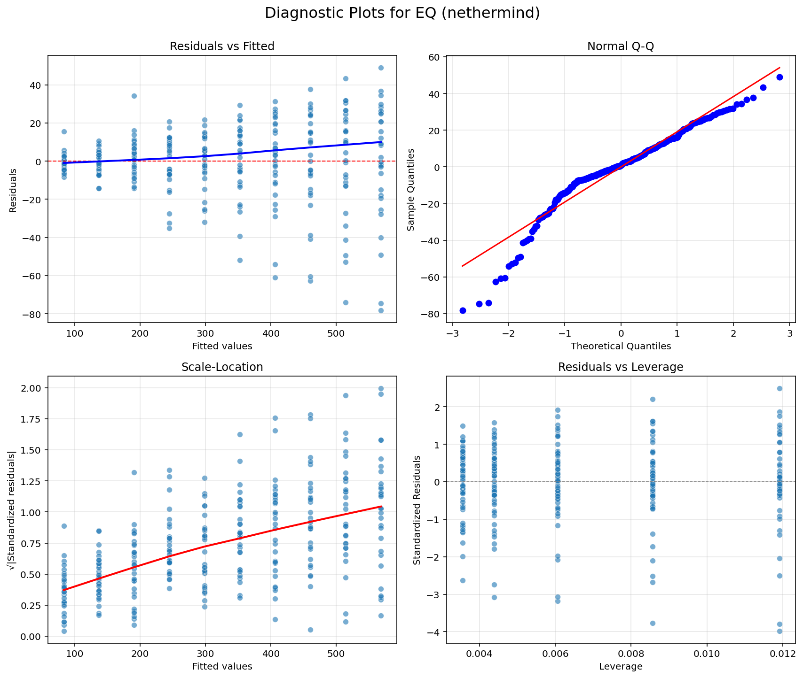


## erigon


```python
                            OLS Regression Results                            
==============================================================================
Dep. Variable:        run_duration_ms   R-squared:                       0.998
Model:                            OLS   Adj. R-squared:                  0.998
Method:                 Least Squares   F-statistic:                 1.429e+04
Date:                Thu, 22 Jan 2026   Prob (F-statistic):           1.79e-39
Time:                        10:34:07   Log-Likelihood:                -120.28
No. Observations:                  30   AIC:                             244.6
Df Residuals:                      28   BIC:                             247.4
Df Model:                           1                                         
Covariance Type:            nonrobust                                         
==============================================================================
                 coef    std err          t      P>|t|      [0.025      0.975]
------------------------------------------------------------------------------
const         25.3526      5.444      4.657      0.000      14.201      36.504
opcount        0.0262      0.000    119.545      0.000       0.026       0.027
==============================================================================
Omnibus:                       43.287   Durbin-Watson:                   1.532
Prob(Omnibus):                  0.000   Jarque-Bera (JB):              192.553
Skew:                           2.859   Prob(JB):                     1.54e-42
Kurtosis:                      14.016   Cond. No.                     5.36e+04
==============================================================================

Notes:
[1] Standard Errors assume that the covariance matrix of the errors is correctly specified.
[2] The condition number is large, 5.36e+04. This might indicate that there are
strong multicollinearity or other numerical problems.
```
OLS model did not run... Error: 'numpy.ndarray' object has no attribute 'iloc'

# GAS

## geth


```python
                            OLS Regression Results                            
==============================================================================
Dep. Variable:        run_duration_ms   R-squared:                       0.992
Model:                            OLS   Adj. R-squared:                  0.992
Method:                 Least Squares   F-statistic:                 3.729e+04
Date:                Thu, 22 Jan 2026   Prob (F-statistic):          1.09e-306
Time:                        10:34:07   Log-Likelihood:                -1560.4
No. Observations:                 290   AIC:                             3125.
Df Residuals:                     288   BIC:                             3132.
Df Model:                           1                                         
Covariance Type:            nonrobust                                         
==============================================================================
                 coef    std err          t      P>|t|      [0.025      0.975]
------------------------------------------------------------------------------
const         32.3603      6.690      4.837      0.000      19.192      45.528
opcount        0.0174   8.99e-05    193.104      0.000       0.017       0.018
==============================================================================
Omnibus:                       40.501   Durbin-Watson:                   0.877
Prob(Omnibus):                  0.000   Jarque-Bera (JB):               79.685
Skew:                          -0.741   Prob(JB):                     4.97e-18
Kurtosis:                       5.098   Cond. No.                     1.61e+05
==============================================================================

Notes:
[1] Standard Errors assume that the covariance matrix of the errors is correctly specified.
[2] The condition number is large, 1.61e+05. This might indicate that there are
strong multicollinearity or other numerical problems.
```

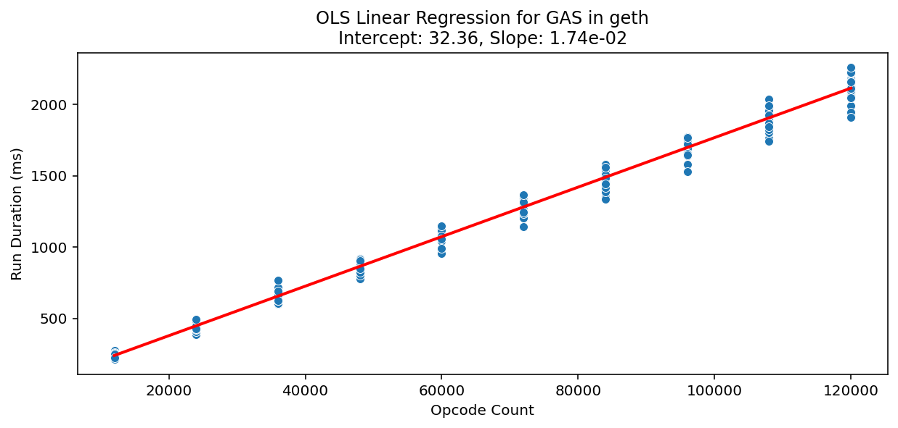

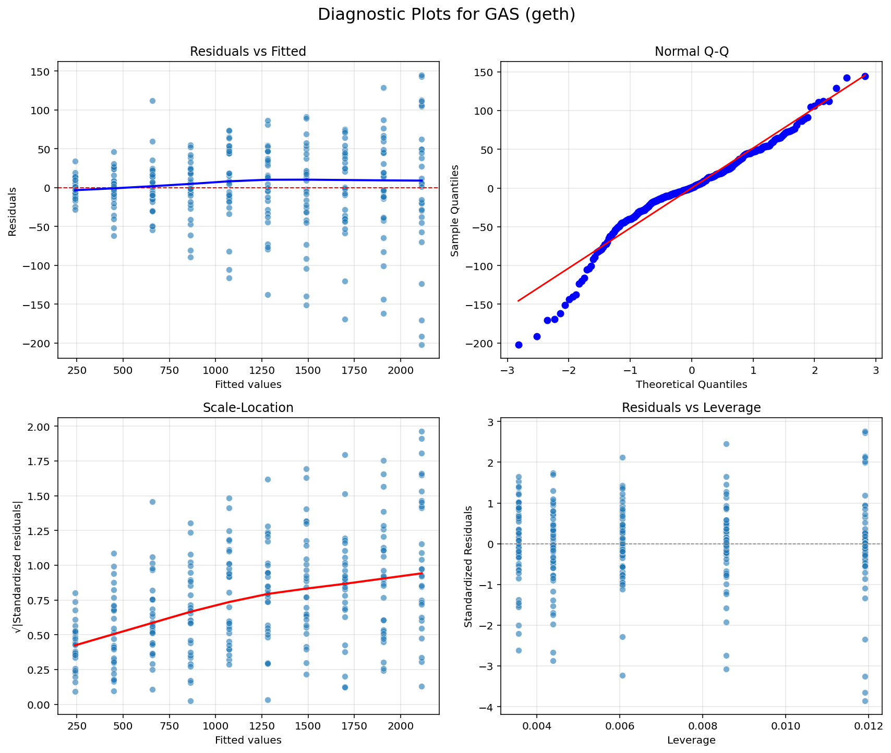


## besu


```python
                            OLS Regression Results                            
==============================================================================
Dep. Variable:        run_duration_ms   R-squared:                       0.990
Model:                            OLS   Adj. R-squared:                  0.990
Method:                 Least Squares   F-statistic:                 2.805e+04
Date:                Thu, 22 Jan 2026   Prob (F-statistic):          4.95e-289
Time:                        10:34:08   Log-Likelihood:                -1750.0
No. Observations:                 290   AIC:                             3504.
Df Residuals:                     288   BIC:                             3511.
Df Model:                           1                                         
Covariance Type:            nonrobust                                         
==============================================================================
                 coef    std err          t      P>|t|      [0.025      0.975]
------------------------------------------------------------------------------
const         27.9107     12.862      2.170      0.031       2.596      53.226
opcount        0.0289      0.000    167.469      0.000       0.029       0.029
==============================================================================
Omnibus:                       61.654   Durbin-Watson:                   0.944
Prob(Omnibus):                  0.000   Jarque-Bera (JB):              182.037
Skew:                          -0.932   Prob(JB):                     2.96e-40
Kurtosis:                       6.404   Cond. No.                     1.61e+05
==============================================================================

Notes:
[1] Standard Errors assume that the covariance matrix of the errors is correctly specified.
[2] The condition number is large, 1.61e+05. This might indicate that there are
strong multicollinearity or other numerical problems.
```

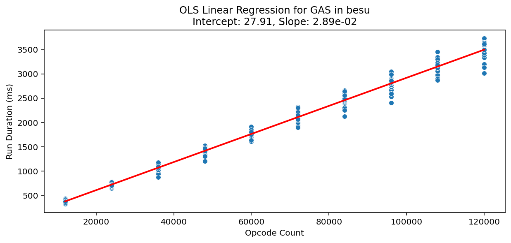

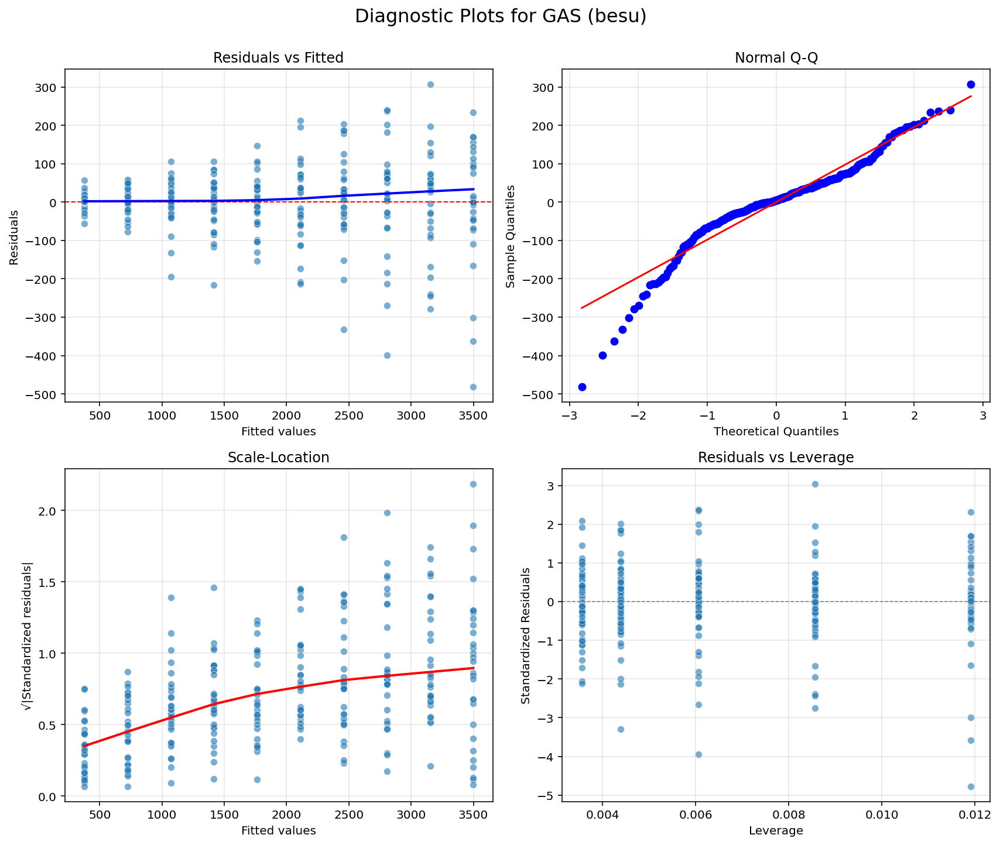


## reth


```python
                            OLS Regression Results                            
==============================================================================
Dep. Variable:        run_duration_ms   R-squared:                       0.971
Model:                            OLS   Adj. R-squared:                  0.971
Method:                 Least Squares   F-statistic:                     5976.
Date:                Thu, 22 Jan 2026   Prob (F-statistic):          6.83e-139
Time:                        10:34:08   Log-Likelihood:                -899.60
No. Observations:                 180   AIC:                             1803.
Df Residuals:                     178   BIC:                             1810.
Df Model:                           1                                         
Covariance Type:            nonrobust                                         
==============================================================================
                 coef    std err          t      P>|t|      [0.025      0.975]
------------------------------------------------------------------------------
const         37.4284      5.802      6.451      0.000      25.979      48.877
opcount        0.0060   7.79e-05     77.305      0.000       0.006       0.006
==============================================================================
Omnibus:                        9.910   Durbin-Watson:                   1.780
Prob(Omnibus):                  0.007   Jarque-Bera (JB):               15.040
Skew:                           0.303   Prob(JB):                     0.000542
Kurtosis:                       4.280   Cond. No.                     1.61e+05
==============================================================================

Notes:
[1] Standard Errors assume that the covariance matrix of the errors is correctly specified.
[2] The condition number is large, 1.61e+05. This might indicate that there are
strong multicollinearity or other numerical problems.
```


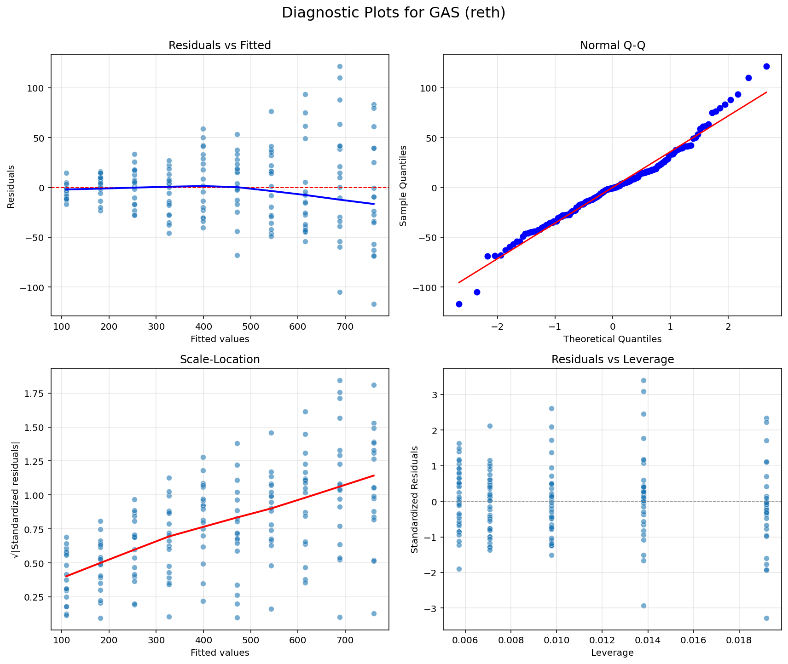


## nethermind


```python
                            OLS Regression Results                            
==============================================================================
Dep. Variable:        run_duration_ms   R-squared:                       0.976
Model:                            OLS   Adj. R-squared:                  0.976
Method:                 Least Squares   F-statistic:                 1.165e+04
Date:                Thu, 22 Jan 2026   Prob (F-statistic):          5.81e-235
Time:                        10:34:08   Log-Likelihood:                -1459.1
No. Observations:                 290   AIC:                             2922.
Df Residuals:                     288   BIC:                             2930.
Df Model:                           1                                         
Covariance Type:            nonrobust                                         
==============================================================================
                 coef    std err          t      P>|t|      [0.025      0.975]
------------------------------------------------------------------------------
const         34.9791      4.717      7.415      0.000      25.694      44.264
opcount        0.0068   6.34e-05    107.924      0.000       0.007       0.007
==============================================================================
Omnibus:                       27.919   Durbin-Watson:                   1.075
Prob(Omnibus):                  0.000   Jarque-Bera (JB):              121.595
Skew:                           0.146   Prob(JB):                     3.94e-27
Kurtosis:                       6.159   Cond. No.                     1.61e+05
==============================================================================

Notes:
[1] Standard Errors assume that the covariance matrix of the errors is correctly specified.
[2] The condition number is large, 1.61e+05. This might indicate that there are
strong multicollinearity or other numerical problems.
```


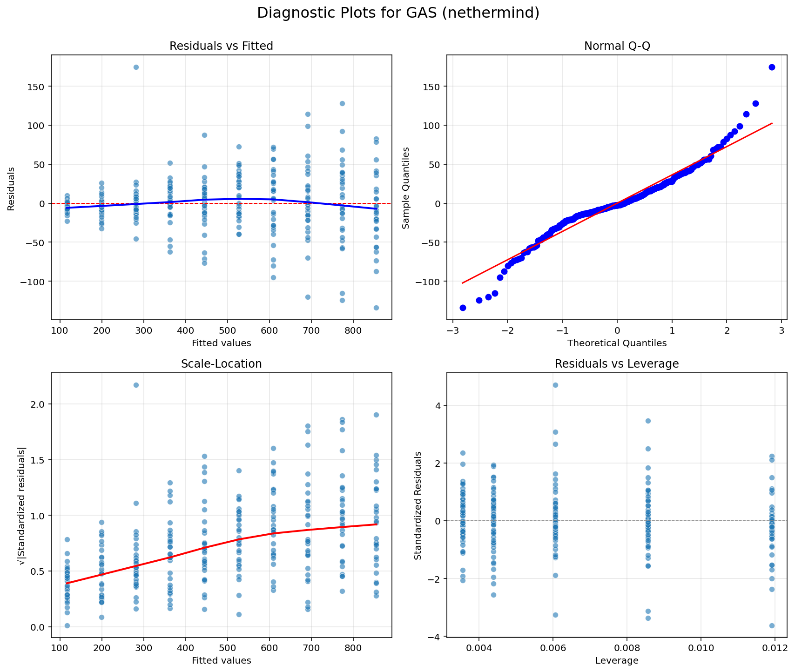


## erigon


```python
                            OLS Regression Results                            
==============================================================================
Dep. Variable:        run_duration_ms   R-squared:                       0.999
Model:                            OLS   Adj. R-squared:                  0.999
Method:                 Least Squares   F-statistic:                 4.710e+04
Date:                Thu, 22 Jan 2026   Prob (F-statistic):           1.02e-46
Time:                        10:34:08   Log-Likelihood:                -124.95
No. Observations:                  30   AIC:                             253.9
Df Residuals:                      28   BIC:                             256.7
Df Model:                           1                                         
Covariance Type:            nonrobust                                         
==============================================================================
                 coef    std err          t      P>|t|      [0.025      0.975]
------------------------------------------------------------------------------
const         27.2706      6.360      4.288      0.000      14.242      40.299
opcount        0.0185   8.54e-05    217.016      0.000       0.018       0.019
==============================================================================
Omnibus:                        0.138   Durbin-Watson:                   1.109
Prob(Omnibus):                  0.933   Jarque-Bera (JB):                0.289
Skew:                           0.136   Prob(JB):                        0.866
Kurtosis:                       2.605   Cond. No.                     1.61e+05
==============================================================================

Notes:
[1] Standard Errors assume that the covariance matrix of the errors is correctly specified.
[2] The condition number is large, 1.61e+05. This might indicate that there are
strong multicollinearity or other numerical problems.
```

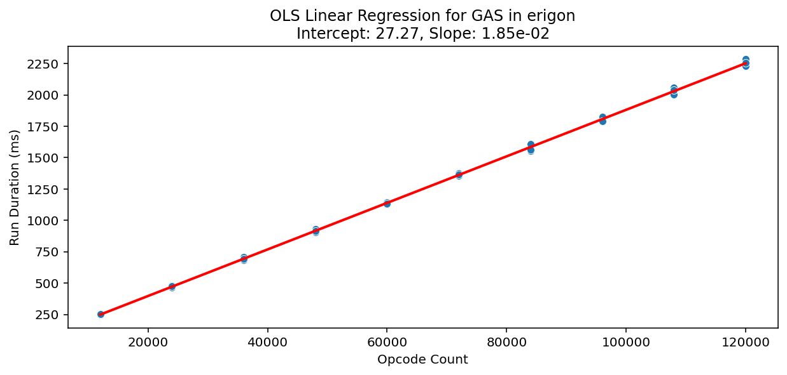

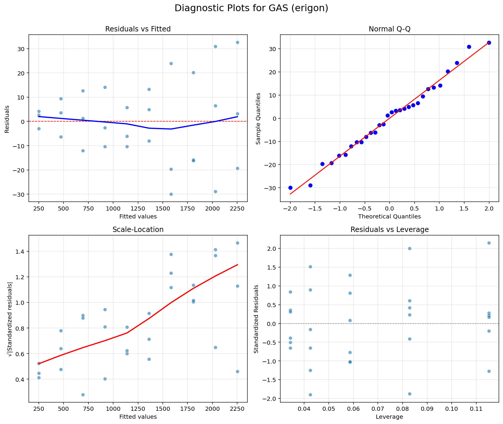


# GASLIMIT

## geth


```python
                            OLS Regression Results                            
==============================================================================
Dep. Variable:        run_duration_ms   R-squared:                       0.986
Model:                            OLS   Adj. R-squared:                  0.986
Method:                 Least Squares   F-statistic:                 2.097e+04
Date:                Thu, 22 Jan 2026   Prob (F-statistic):          4.71e-271
Time:                        10:34:09   Log-Likelihood:                -1591.3
No. Observations:                 290   AIC:                             3187.
Df Residuals:                     288   BIC:                             3194.
Df Model:                           1                                         
Covariance Type:            nonrobust                                         
==============================================================================
                 coef    std err          t      P>|t|      [0.025      0.975]
------------------------------------------------------------------------------
const         31.8436      7.441      4.279      0.000      17.197      46.490
opcount        0.0174      0.000    144.799      0.000       0.017       0.018
==============================================================================
Omnibus:                       22.473   Durbin-Watson:                   0.891
Prob(Omnibus):                  0.000   Jarque-Bera (JB):               82.648
Skew:                          -0.047   Prob(JB):                     1.13e-18
Kurtosis:                       5.614   Cond. No.                     1.34e+05
==============================================================================

Notes:
[1] Standard Errors assume that the covariance matrix of the errors is correctly specified.
[2] The condition number is large, 1.34e+05. This might indicate that there are
strong multicollinearity or other numerical problems.
```

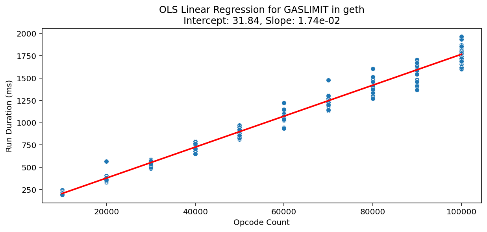

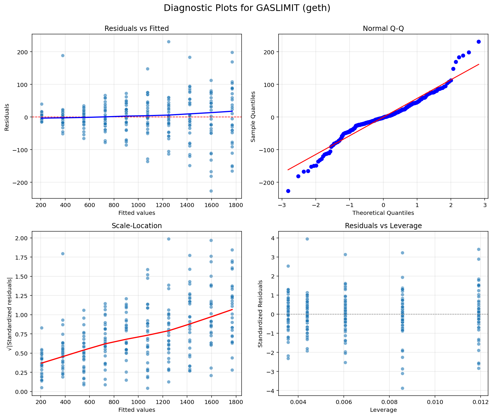


## besu


```python
                            OLS Regression Results                            
==============================================================================
Dep. Variable:        run_duration_ms   R-squared:                       0.991
Model:                            OLS   Adj. R-squared:                  0.991
Method:                 Least Squares   F-statistic:                 3.124e+04
Date:                Thu, 22 Jan 2026   Prob (F-statistic):          1.03e-295
Time:                        10:34:09   Log-Likelihood:                -1678.1
No. Observations:                 290   AIC:                             3360.
Df Residuals:                     288   BIC:                             3368.
Df Model:                           1                                         
Covariance Type:            nonrobust                                         
==============================================================================
                 coef    std err          t      P>|t|      [0.025      0.975]
------------------------------------------------------------------------------
const         29.2771     10.039      2.916      0.004       9.519      49.036
opcount        0.0286      0.000    176.750      0.000       0.028       0.029
==============================================================================
Omnibus:                       46.034   Durbin-Watson:                   0.762
Prob(Omnibus):                  0.000   Jarque-Bera (JB):              182.849
Skew:                          -0.581   Prob(JB):                     1.97e-40
Kurtosis:                       6.712   Cond. No.                     1.34e+05
==============================================================================

Notes:
[1] Standard Errors assume that the covariance matrix of the errors is correctly specified.
[2] The condition number is large, 1.34e+05. This might indicate that there are
strong multicollinearity or other numerical problems.
```

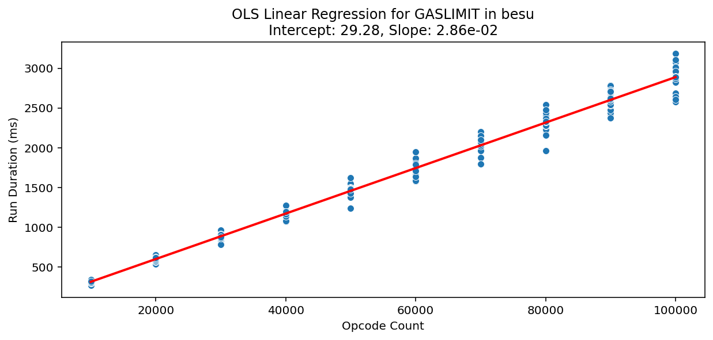

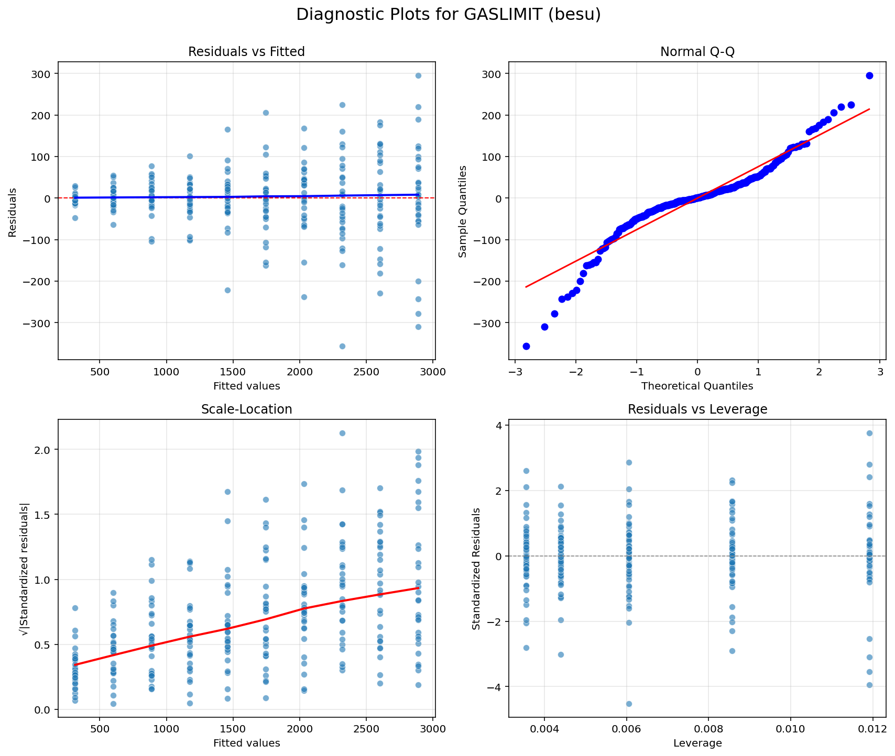


## reth


```python
                            OLS Regression Results                            
==============================================================================
Dep. Variable:        run_duration_ms   R-squared:                       0.969
Model:                            OLS   Adj. R-squared:                  0.969
Method:                 Least Squares   F-statistic:                     5584.
Date:                Thu, 22 Jan 2026   Prob (F-statistic):          2.38e-136
Time:                        10:34:09   Log-Likelihood:                -877.82
No. Observations:                 180   AIC:                             1760.
Df Residuals:                     178   BIC:                             1766.
Df Model:                           1                                         
Covariance Type:            nonrobust                                         
==============================================================================
                 coef    std err          t      P>|t|      [0.025      0.975]
------------------------------------------------------------------------------
const         33.2353      5.140      6.465      0.000      23.091      43.379
opcount        0.0062   8.28e-05     74.729      0.000       0.006       0.006
==============================================================================
Omnibus:                       66.245   Durbin-Watson:                   1.697
Prob(Omnibus):                  0.000   Jarque-Bera (JB):              645.857
Skew:                           1.033   Prob(JB):                    5.67e-141
Kurtosis:                      12.047   Cond. No.                     1.34e+05
==============================================================================

Notes:
[1] Standard Errors assume that the covariance matrix of the errors is correctly specified.
[2] The condition number is large, 1.34e+05. This might indicate that there are
strong multicollinearity or other numerical problems.
```

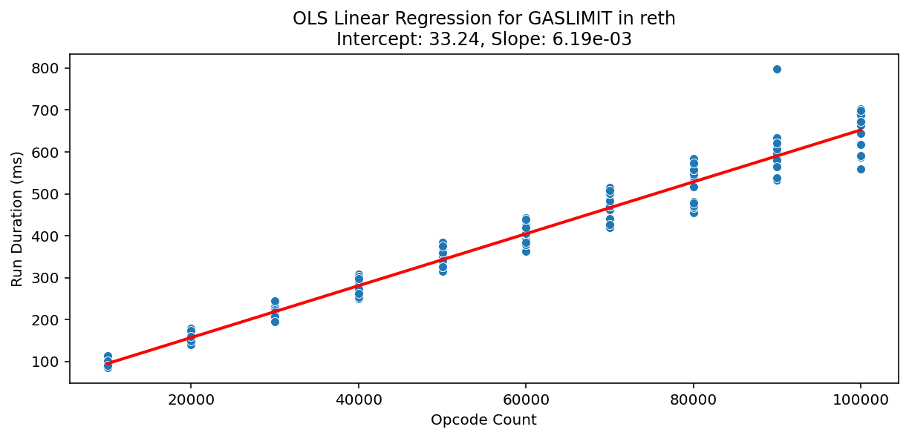

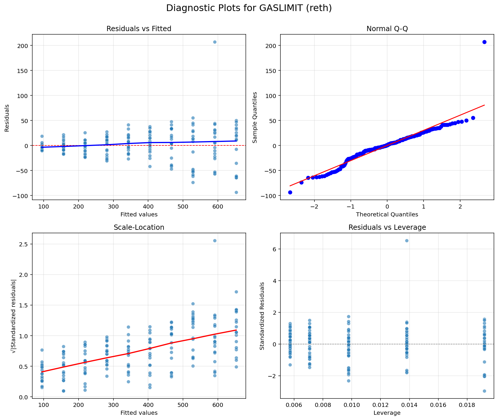


## nethermind


```python
                            OLS Regression Results                            
==============================================================================
Dep. Variable:        run_duration_ms   R-squared:                       0.979
Model:                            OLS   Adj. R-squared:                  0.979
Method:                 Least Squares   F-statistic:                 1.352e+04
Date:                Thu, 22 Jan 2026   Prob (F-statistic):          4.32e-244
Time:                        10:34:09   Log-Likelihood:                -1387.6
No. Observations:                 290   AIC:                             2779.
Df Residuals:                     288   BIC:                             2786.
Df Model:                           1                                         
Covariance Type:            nonrobust                                         
==============================================================================
                 coef    std err          t      P>|t|      [0.025      0.975]
------------------------------------------------------------------------------
const         30.3068      3.686      8.222      0.000      23.052      37.562
opcount        0.0069   5.94e-05    116.290      0.000       0.007       0.007
==============================================================================
Omnibus:                       12.378   Durbin-Watson:                   0.923
Prob(Omnibus):                  0.002   Jarque-Bera (JB):               14.882
Skew:                          -0.380   Prob(JB):                     0.000587
Kurtosis:                       3.809   Cond. No.                     1.34e+05
==============================================================================

Notes:
[1] Standard Errors assume that the covariance matrix of the errors is correctly specified.
[2] The condition number is large, 1.34e+05. This might indicate that there are
strong multicollinearity or other numerical problems.
```

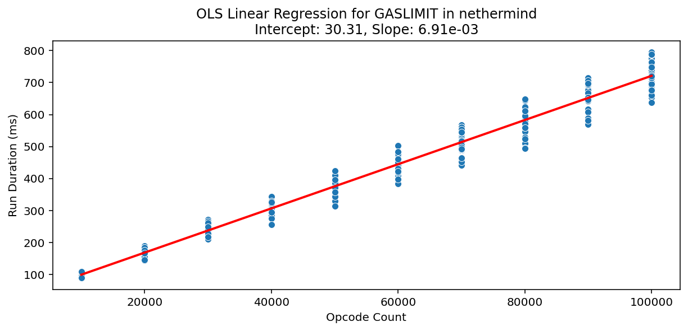

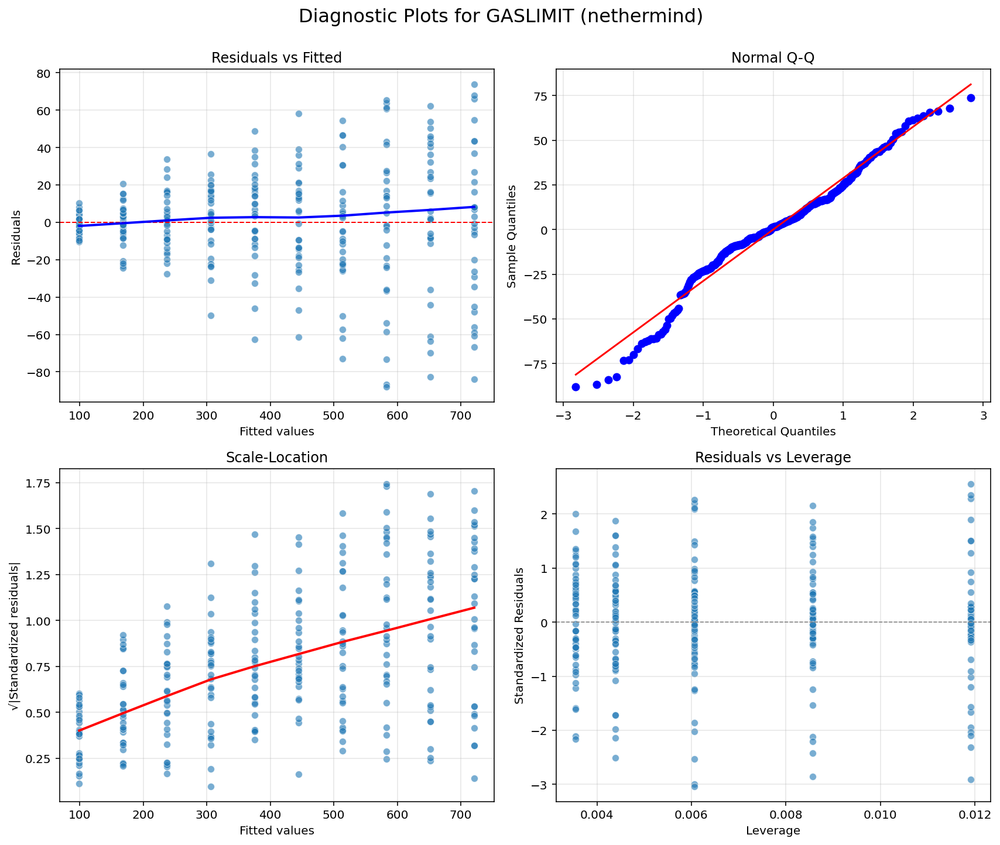


## erigon


```python
                            OLS Regression Results                            
==============================================================================
Dep. Variable:        run_duration_ms   R-squared:                       0.999
Model:                            OLS   Adj. R-squared:                  0.999
Method:                 Least Squares   F-statistic:                 4.375e+04
Date:                Thu, 22 Jan 2026   Prob (F-statistic):           2.87e-46
Time:                        10:34:10   Log-Likelihood:                -120.95
No. Observations:                  30   AIC:                             245.9
Df Residuals:                      28   BIC:                             248.7
Df Model:                           1                                         
Covariance Type:            nonrobust                                         
==============================================================================
                 coef    std err          t      P>|t|      [0.025      0.975]
------------------------------------------------------------------------------
const         29.9164      5.568      5.373      0.000      18.511      41.321
opcount        0.0188   8.97e-05    209.166      0.000       0.019       0.019
==============================================================================
Omnibus:                        0.625   Durbin-Watson:                   0.857
Prob(Omnibus):                  0.732   Jarque-Bera (JB):                0.705
Skew:                          -0.285   Prob(JB):                        0.703
Kurtosis:                       2.511   Cond. No.                     1.34e+05
==============================================================================

Notes:
[1] Standard Errors assume that the covariance matrix of the errors is correctly specified.
[2] The condition number is large, 1.34e+05. This might indicate that there are
strong multicollinearity or other numerical problems.
```

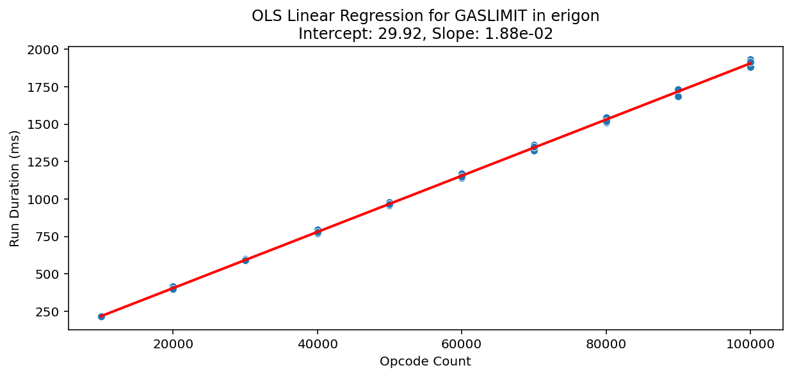

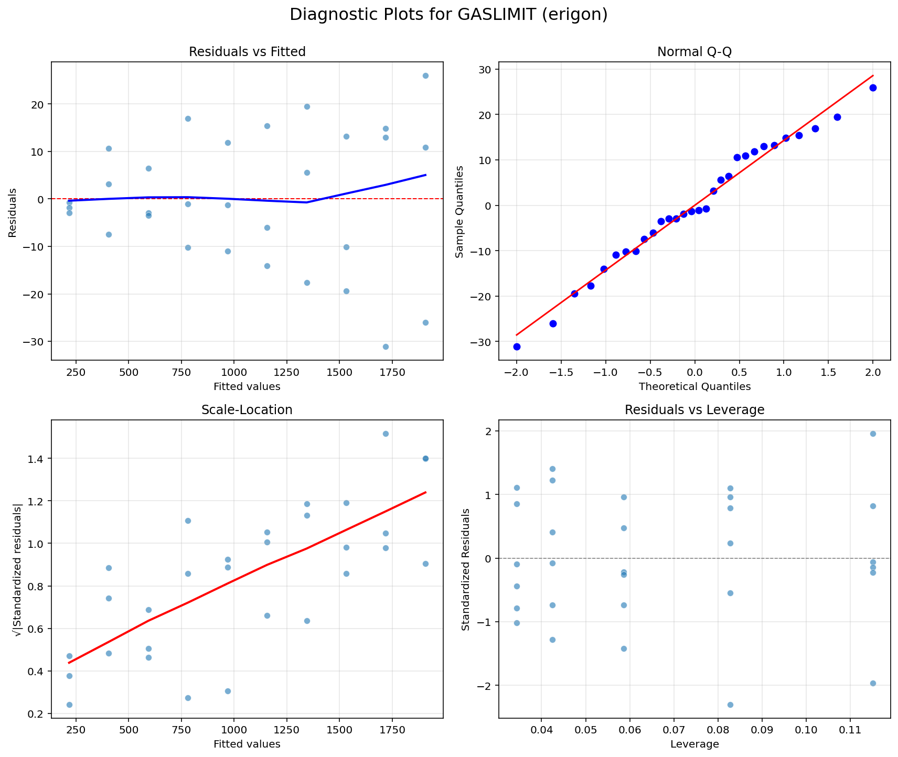


# GASPRICE

## geth


```python
                            OLS Regression Results                            
==============================================================================
Dep. Variable:        run_duration_ms   R-squared:                       0.985
Model:                            OLS   Adj. R-squared:                  0.985
Method:                 Least Squares   F-statistic:                 1.924e+04
Date:                Thu, 22 Jan 2026   Prob (F-statistic):          9.22e-266
Time:                        10:34:10   Log-Likelihood:                -1628.4
No. Observations:                 290   AIC:                             3261.
Df Residuals:                     288   BIC:                             3268.
Df Model:                           1                                         
Covariance Type:            nonrobust                                         
==============================================================================
                 coef    std err          t      P>|t|      [0.025      0.975]
------------------------------------------------------------------------------
const         41.5064      8.457      4.908      0.000      24.862      58.151
opcount        0.0189      0.000    138.718      0.000       0.019       0.019
==============================================================================
Omnibus:                       43.711   Durbin-Watson:                   1.253
Prob(Omnibus):                  0.000   Jarque-Bera (JB):              283.924
Skew:                          -0.330   Prob(JB):                     2.22e-62
Kurtosis:                       7.802   Cond. No.                     1.34e+05
==============================================================================

Notes:
[1] Standard Errors assume that the covariance matrix of the errors is correctly specified.
[2] The condition number is large, 1.34e+05. This might indicate that there are
strong multicollinearity or other numerical problems.
```

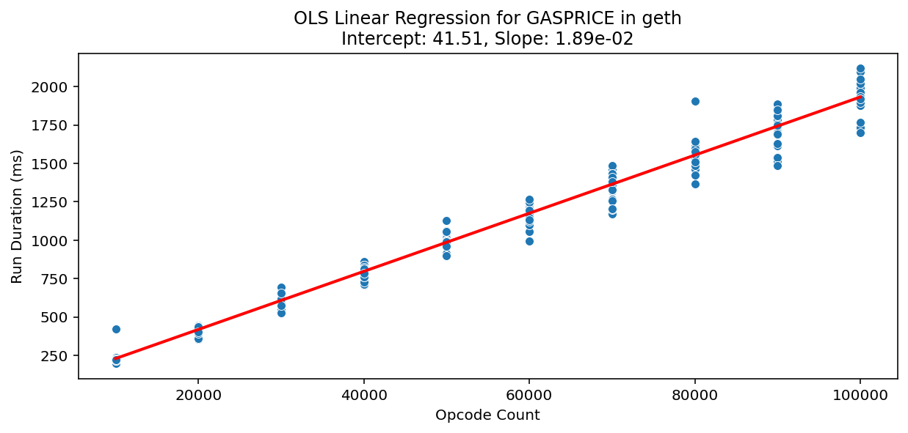


## besu


```python
                            OLS Regression Results                            
==============================================================================
Dep. Variable:        run_duration_ms   R-squared:                       0.970
Model:                            OLS   Adj. R-squared:                  0.970
Method:                 Least Squares   F-statistic:                     9352.
Date:                Thu, 22 Jan 2026   Prob (F-statistic):          1.33e-221
Time:                        10:34:10   Log-Likelihood:                -1855.8
No. Observations:                 290   AIC:                             3716.
Df Residuals:                     288   BIC:                             3723.
Df Model:                           1                                         
Covariance Type:            nonrobust                                         
==============================================================================
                 coef    std err          t      P>|t|      [0.025      0.975]
------------------------------------------------------------------------------
const         30.1700     18.526      1.629      0.105      -6.293      66.633
opcount        0.0289      0.000     96.706      0.000       0.028       0.029
==============================================================================
Omnibus:                       15.836   Durbin-Watson:                   0.995
Prob(Omnibus):                  0.000   Jarque-Bera (JB):               30.678
Skew:                          -0.276   Prob(JB):                     2.18e-07
Kurtosis:                       4.495   Cond. No.                     1.34e+05
==============================================================================

Notes:
[1] Standard Errors assume that the covariance matrix of the errors is correctly specified.
[2] The condition number is large, 1.34e+05. This might indicate that there are
strong multicollinearity or other numerical problems.
```


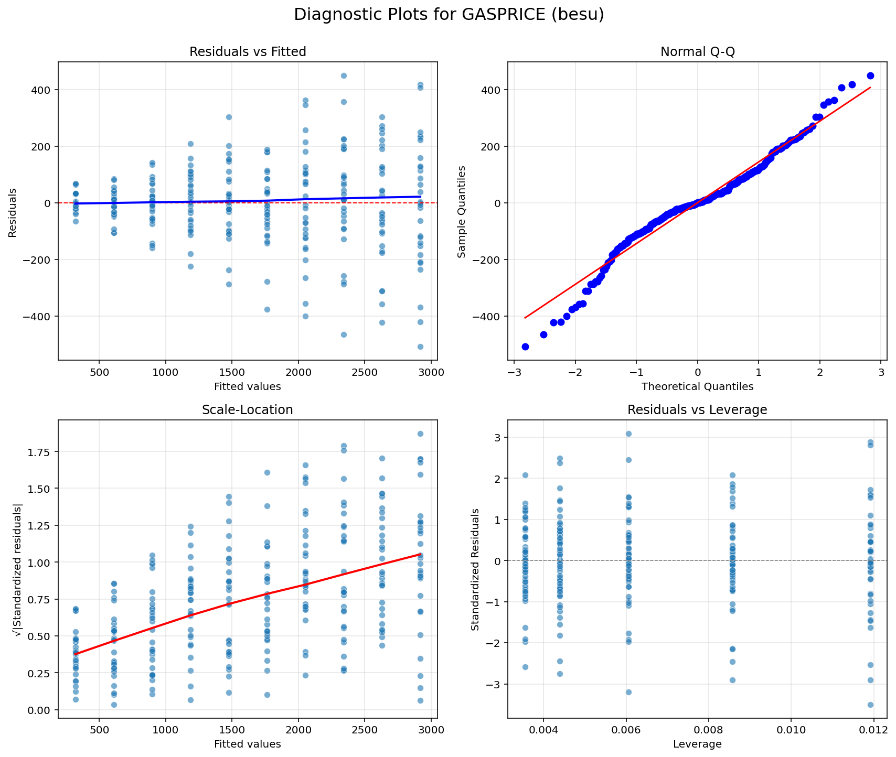


## reth


```python
                            OLS Regression Results                            
==============================================================================
Dep. Variable:        run_duration_ms   R-squared:                       0.976
Model:                            OLS   Adj. R-squared:                  0.975
Method:                 Least Squares   F-statistic:                     7115.
Date:                Thu, 22 Jan 2026   Prob (F-statistic):          1.87e-145
Time:                        10:34:10   Log-Likelihood:                -873.78
No. Observations:                 180   AIC:                             1752.
Df Residuals:                     178   BIC:                             1758.
Df Model:                           1                                         
Covariance Type:            nonrobust                                         
==============================================================================
                 coef    std err          t      P>|t|      [0.025      0.975]
------------------------------------------------------------------------------
const         32.6934      5.026      6.504      0.000      22.774      42.612
opcount        0.0068    8.1e-05     84.349      0.000       0.007       0.007
==============================================================================
Omnibus:                        9.896   Durbin-Watson:                   1.470
Prob(Omnibus):                  0.007   Jarque-Bera (JB):               12.162
Skew:                          -0.394   Prob(JB):                      0.00229
Kurtosis:                       4.000   Cond. No.                     1.34e+05
==============================================================================

Notes:
[1] Standard Errors assume that the covariance matrix of the errors is correctly specified.
[2] The condition number is large, 1.34e+05. This might indicate that there are
strong multicollinearity or other numerical problems.
```

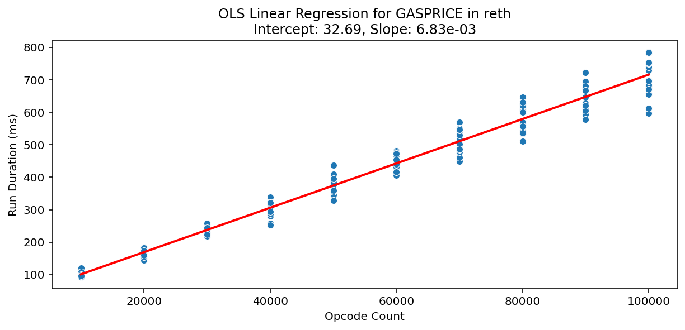

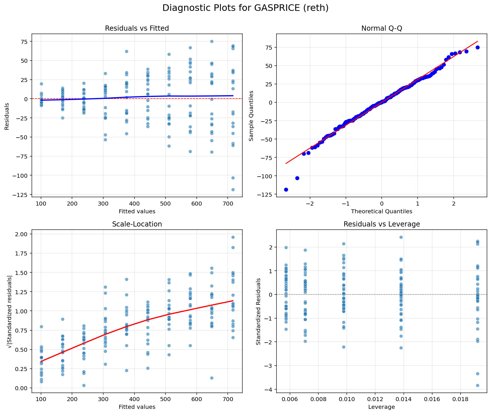


## nethermind


```python
                            OLS Regression Results                            
==============================================================================
Dep. Variable:        run_duration_ms   R-squared:                       0.953
Model:                            OLS   Adj. R-squared:                  0.953
Method:                 Least Squares   F-statistic:                     5824.
Date:                Thu, 22 Jan 2026   Prob (F-statistic):          4.20e-193
Time:                        10:34:11   Log-Likelihood:                -1510.1
No. Observations:                 290   AIC:                             3024.
Df Residuals:                     288   BIC:                             3031.
Df Model:                           1                                         
Covariance Type:            nonrobust                                         
==============================================================================
                 coef    std err          t      P>|t|      [0.025      0.975]
------------------------------------------------------------------------------
const         33.3443      5.624      5.929      0.000      22.276      44.413
opcount        0.0069   9.06e-05     76.316      0.000       0.007       0.007
==============================================================================
Omnibus:                      260.061   Durbin-Watson:                   1.425
Prob(Omnibus):                  0.000   Jarque-Bera (JB):             9181.966
Skew:                           3.412   Prob(JB):                         0.00
Kurtosis:                      29.708   Cond. No.                     1.34e+05
==============================================================================

Notes:
[1] Standard Errors assume that the covariance matrix of the errors is correctly specified.
[2] The condition number is large, 1.34e+05. This might indicate that there are
strong multicollinearity or other numerical problems.
```

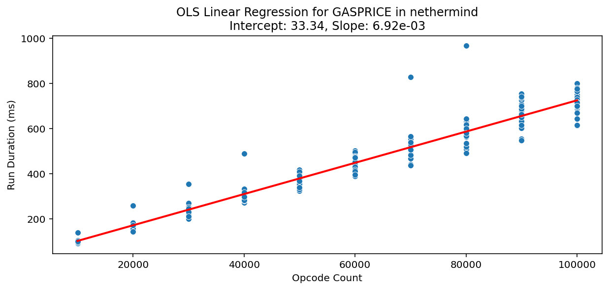

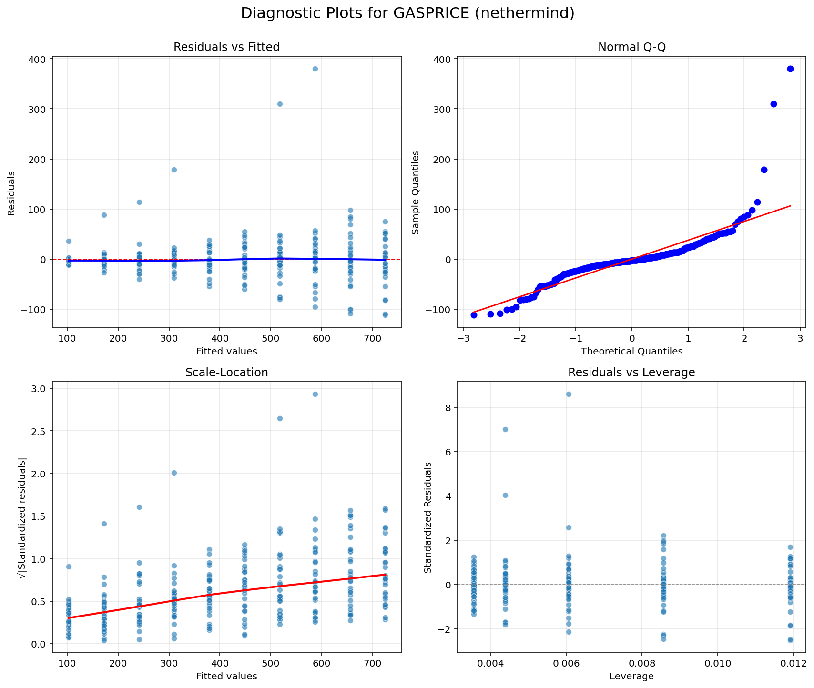


## erigon

OLS model did not run... Error: zero-size array to reduction operation maximum which has no identity

# GT

## geth


```python
                            OLS Regression Results                            
==============================================================================
Dep. Variable:        run_duration_ms   R-squared:                       0.985
Model:                            OLS   Adj. R-squared:                  0.985
Method:                 Least Squares   F-statistic:                 1.927e+04
Date:                Thu, 22 Jan 2026   Prob (F-statistic):          7.49e-266
Time:                        10:34:11   Log-Likelihood:                -1432.0
No. Observations:                 290   AIC:                             2868.
Df Residuals:                     288   BIC:                             2875.
Df Model:                           1                                         
Covariance Type:            nonrobust                                         
==============================================================================
                 coef    std err          t      P>|t|      [0.025      0.975]
------------------------------------------------------------------------------
const         34.7607      4.297      8.090      0.000      26.303      43.218
opcount        0.0240      0.000    138.819      0.000       0.024       0.024
==============================================================================
Omnibus:                       29.306   Durbin-Watson:                   0.979
Prob(Omnibus):                  0.000   Jarque-Bera (JB):              145.176
Skew:                           0.042   Prob(JB):                     2.99e-32
Kurtosis:                       6.465   Cond. No.                     5.36e+04
==============================================================================

Notes:
[1] Standard Errors assume that the covariance matrix of the errors is correctly specified.
[2] The condition number is large, 5.36e+04. This might indicate that there are
strong multicollinearity or other numerical problems.
```

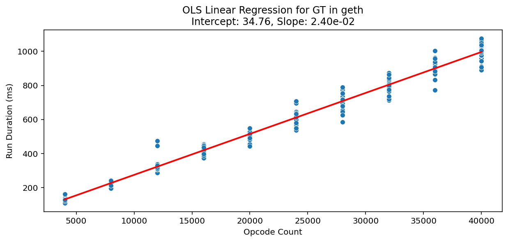

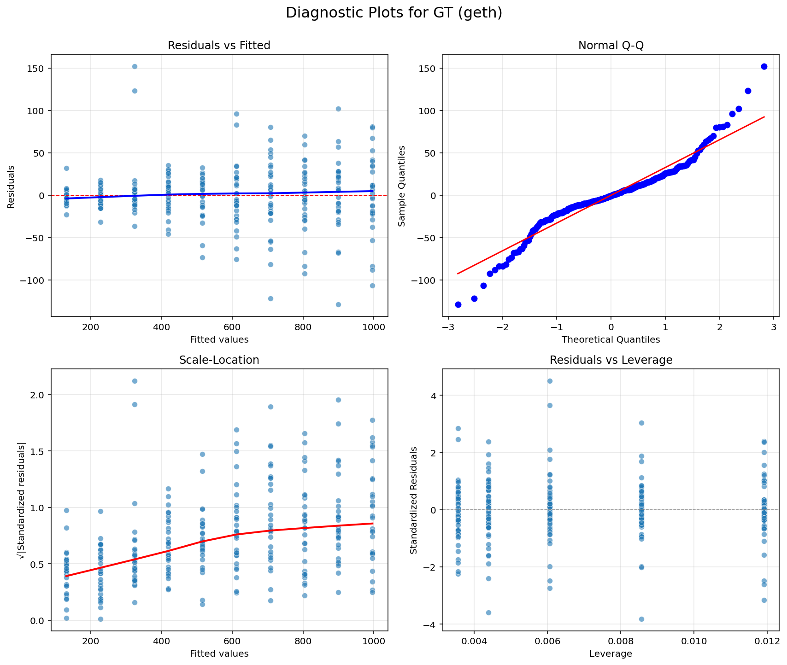


## besu


```python
                            OLS Regression Results                            
==============================================================================
Dep. Variable:        run_duration_ms   R-squared:                       0.978
Model:                            OLS   Adj. R-squared:                  0.978
Method:                 Least Squares   F-statistic:                 1.288e+04
Date:                Thu, 22 Jan 2026   Prob (F-statistic):          4.26e-241
Time:                        10:34:11   Log-Likelihood:                -1765.2
No. Observations:                 290   AIC:                             3534.
Df Residuals:                     288   BIC:                             3542.
Df Model:                           1                                         
Covariance Type:            nonrobust                                         
==============================================================================
                 coef    std err          t      P>|t|      [0.025      0.975]
------------------------------------------------------------------------------
const         28.2518     13.552      2.085      0.038       1.578      54.926
opcount        0.0620      0.001    113.480      0.000       0.061       0.063
==============================================================================
Omnibus:                       39.169   Durbin-Watson:                   0.577
Prob(Omnibus):                  0.000   Jarque-Bera (JB):               70.957
Skew:                          -0.750   Prob(JB):                     3.91e-16
Kurtosis:                       4.904   Cond. No.                     5.36e+04
==============================================================================

Notes:
[1] Standard Errors assume that the covariance matrix of the errors is correctly specified.
[2] The condition number is large, 5.36e+04. This might indicate that there are
strong multicollinearity or other numerical problems.
```


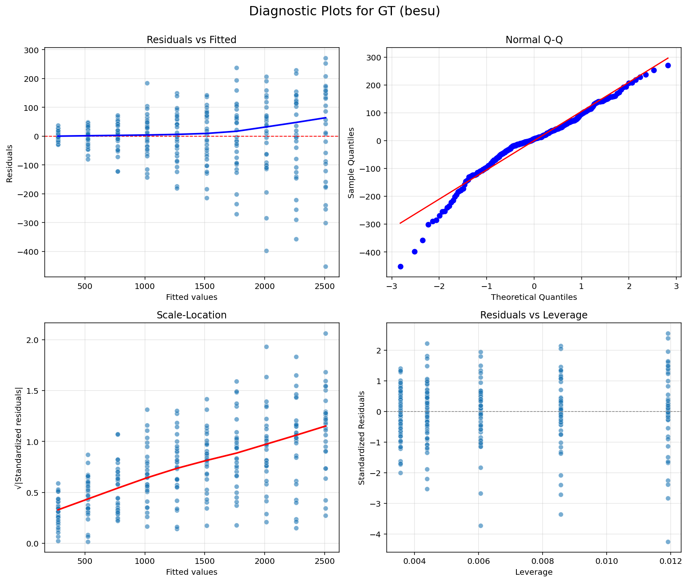


## reth


```python
                            OLS Regression Results                            
==============================================================================
Dep. Variable:        run_duration_ms   R-squared:                       0.984
Model:                            OLS   Adj. R-squared:                  0.984
Method:                 Least Squares   F-statistic:                 1.129e+04
Date:                Thu, 22 Jan 2026   Prob (F-statistic):          5.89e-163
Time:                        10:34:11   Log-Likelihood:                -721.07
No. Observations:                 180   AIC:                             1446.
Df Residuals:                     178   BIC:                             1453.
Df Model:                           1                                         
Covariance Type:            nonrobust                                         
==============================================================================
                 coef    std err          t      P>|t|      [0.025      0.975]
------------------------------------------------------------------------------
const         32.7289      2.152     15.209      0.000      28.482      36.975
opcount        0.0092   8.67e-05    106.258      0.000       0.009       0.009
==============================================================================
Omnibus:                        2.713   Durbin-Watson:                   1.436
Prob(Omnibus):                  0.258   Jarque-Bera (JB):                2.792
Skew:                           0.036   Prob(JB):                        0.248
Kurtosis:                       3.606   Cond. No.                     5.36e+04
==============================================================================

Notes:
[1] Standard Errors assume that the covariance matrix of the errors is correctly specified.
[2] The condition number is large, 5.36e+04. This might indicate that there are
strong multicollinearity or other numerical problems.
```

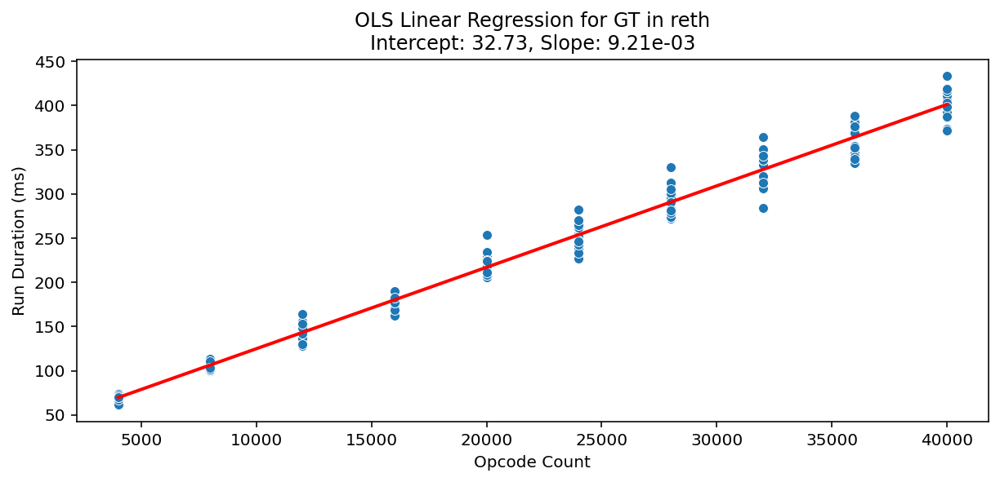

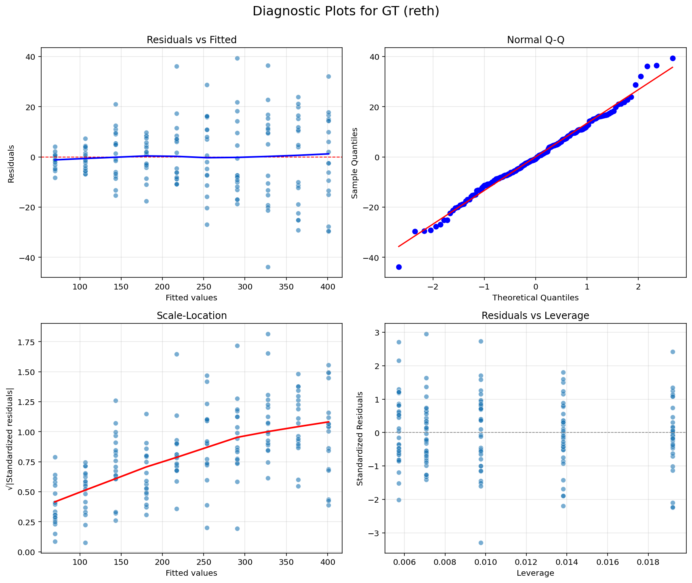


## nethermind


```python
                            OLS Regression Results                            
==============================================================================
Dep. Variable:        run_duration_ms   R-squared:                       0.986
Model:                            OLS   Adj. R-squared:                  0.986
Method:                 Least Squares   F-statistic:                 1.980e+04
Date:                Thu, 22 Jan 2026   Prob (F-statistic):          1.58e-267
Time:                        10:34:12   Log-Likelihood:                -1326.6
No. Observations:                 290   AIC:                             2657.
Df Residuals:                     288   BIC:                             2665.
Df Model:                           1                                         
Covariance Type:            nonrobust                                         
==============================================================================
                 coef    std err          t      P>|t|      [0.025      0.975]
------------------------------------------------------------------------------
const         31.6409      2.987     10.592      0.000      25.761      37.521
opcount        0.0169      0.000    140.720      0.000       0.017       0.017
==============================================================================
Omnibus:                       67.120   Durbin-Watson:                   0.892
Prob(Omnibus):                  0.000   Jarque-Bera (JB):              411.981
Skew:                          -0.759   Prob(JB):                     3.46e-90
Kurtosis:                       8.638   Cond. No.                     5.36e+04
==============================================================================

Notes:
[1] Standard Errors assume that the covariance matrix of the errors is correctly specified.
[2] The condition number is large, 5.36e+04. This might indicate that there are
strong multicollinearity or other numerical problems.
```


## erigon


```python
                            OLS Regression Results                            
==============================================================================
Dep. Variable:        run_duration_ms   R-squared:                       0.933
Model:                            OLS   Adj. R-squared:                  0.931
Method:                 Least Squares   F-statistic:                     391.2
Date:                Thu, 22 Jan 2026   Prob (F-statistic):           5.42e-18
Time:                        10:34:12   Log-Likelihood:                -177.85
No. Observations:                  30   AIC:                             359.7
Df Residuals:                      28   BIC:                             362.5
Df Model:                           1                                         
Covariance Type:            nonrobust                                         
==============================================================================
                 coef    std err          t      P>|t|      [0.025      0.975]
------------------------------------------------------------------------------
const         85.3206     37.097      2.300      0.029       9.331     161.310
opcount        0.0296      0.001     19.780      0.000       0.027       0.033
==============================================================================
Omnibus:                        2.080   Durbin-Watson:                   2.137
Prob(Omnibus):                  0.353   Jarque-Bera (JB):                1.278
Skew:                           0.198   Prob(JB):                        0.528
Kurtosis:                       2.070   Cond. No.                     5.36e+04
==============================================================================

Notes:
[1] Standard Errors assume that the covariance matrix of the errors is correctly specified.
[2] The condition number is large, 5.36e+04. This might indicate that there are
strong multicollinearity or other numerical problems.
```

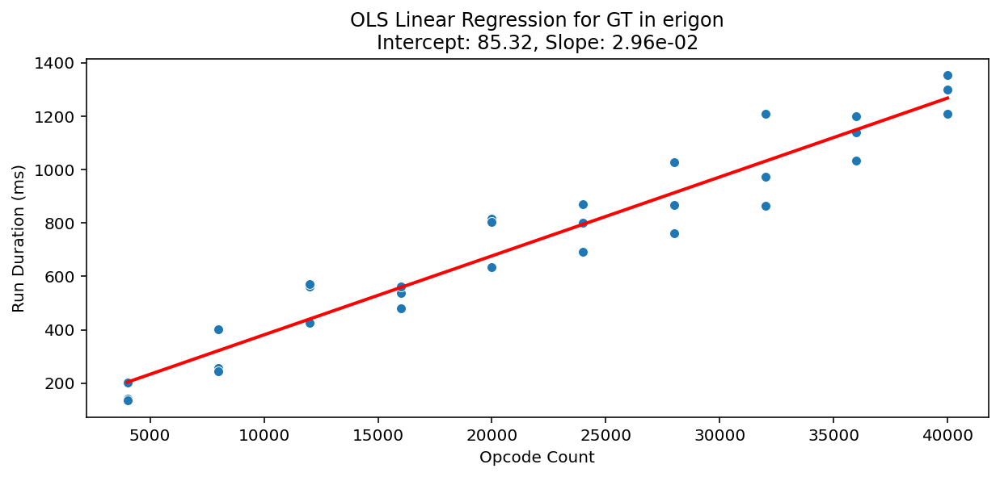

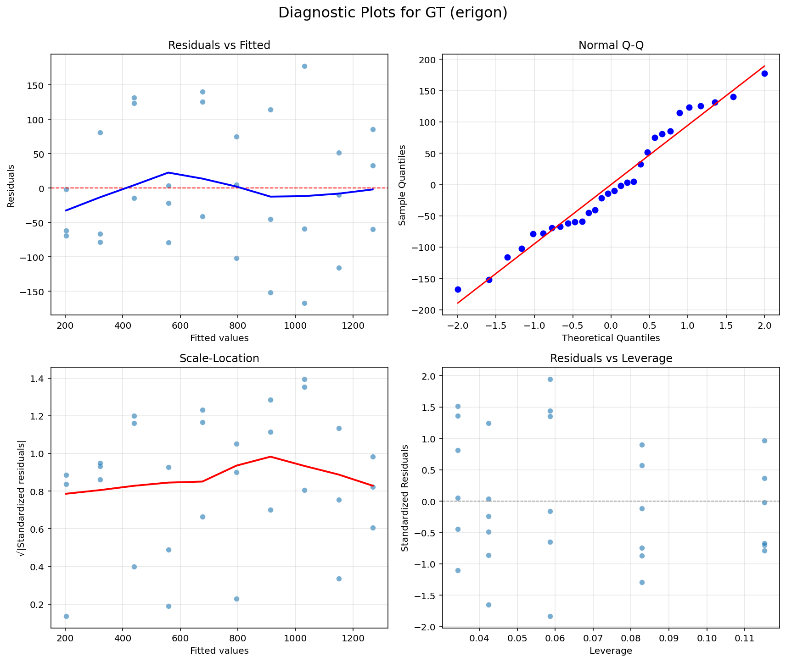


# INVALID

## geth

OLS model did not run... Error: zero-size array to reduction operation maximum which has no identity

## besu

OLS model did not run... Error: zero-size array to reduction operation maximum which has no identity

## reth

OLS model did not run... Error: zero-size array to reduction operation maximum which has no identity

## nethermind

OLS model did not run... Error: zero-size array to reduction operation maximum which has no identity

## erigon

OLS model did not run... Error: zero-size array to reduction operation maximum which has no identity

# ISZERO

## geth


```python
                            OLS Regression Results                            
==============================================================================
Dep. Variable:        run_duration_ms   R-squared:                       0.988
Model:                            OLS   Adj. R-squared:                  0.988
Method:                 Least Squares   F-statistic:                 2.323e+04
Date:                Thu, 22 Jan 2026   Prob (F-statistic):          2.17e-277
Time:                        10:34:12   Log-Likelihood:                -1384.3
No. Observations:                 290   AIC:                             2773.
Df Residuals:                     288   BIC:                             2780.
Df Model:                           1                                         
Covariance Type:            nonrobust                                         
==============================================================================
                 coef    std err          t      P>|t|      [0.025      0.975]
------------------------------------------------------------------------------
const         28.7623      3.644      7.892      0.000      21.589      35.935
opcount        0.0112   7.34e-05    152.426      0.000       0.011       0.011
==============================================================================
Omnibus:                       19.547   Durbin-Watson:                   1.051
Prob(Omnibus):                  0.000   Jarque-Bera (JB):               59.617
Skew:                           0.122   Prob(JB):                     1.13e-13
Kurtosis:                       5.208   Cond. No.                     1.07e+05
==============================================================================

Notes:
[1] Standard Errors assume that the covariance matrix of the errors is correctly specified.
[2] The condition number is large, 1.07e+05. This might indicate that there are
strong multicollinearity or other numerical problems.
```


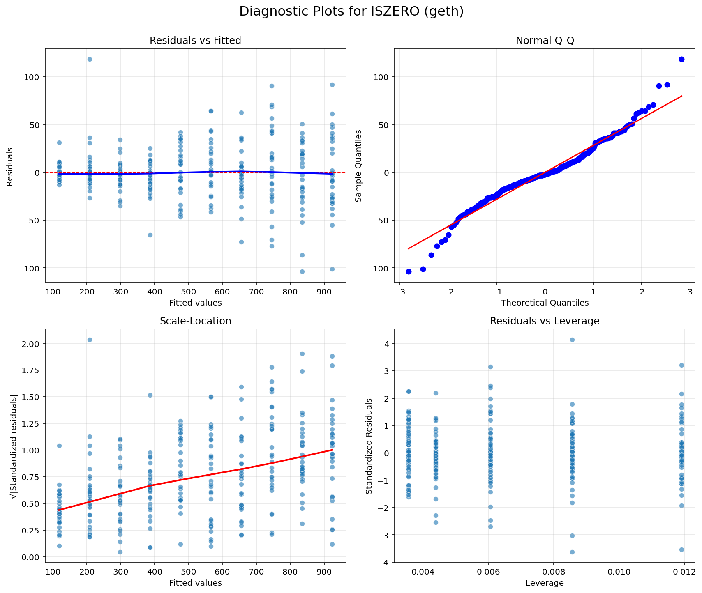


## besu


```python
                            OLS Regression Results                            
==============================================================================
Dep. Variable:        run_duration_ms   R-squared:                       0.980
Model:                            OLS   Adj. R-squared:                  0.980
Method:                 Least Squares   F-statistic:                 1.387e+04
Date:                Thu, 22 Jan 2026   Prob (F-statistic):          1.21e-245
Time:                        10:34:13   Log-Likelihood:                -1672.1
No. Observations:                 290   AIC:                             3348.
Df Residuals:                     288   BIC:                             3356.
Df Model:                           1                                         
Covariance Type:            nonrobust                                         
==============================================================================
                 coef    std err          t      P>|t|      [0.025      0.975]
------------------------------------------------------------------------------
const         31.3292      9.832      3.187      0.002      11.978      50.680
opcount        0.0233      0.000    117.774      0.000       0.023       0.024
==============================================================================
Omnibus:                       61.105   Durbin-Watson:                   0.673
Prob(Omnibus):                  0.000   Jarque-Bera (JB):              136.168
Skew:                          -1.032   Prob(JB):                     2.70e-30
Kurtosis:                       5.647   Cond. No.                     1.07e+05
==============================================================================

Notes:
[1] Standard Errors assume that the covariance matrix of the errors is correctly specified.
[2] The condition number is large, 1.07e+05. This might indicate that there are
strong multicollinearity or other numerical problems.
```


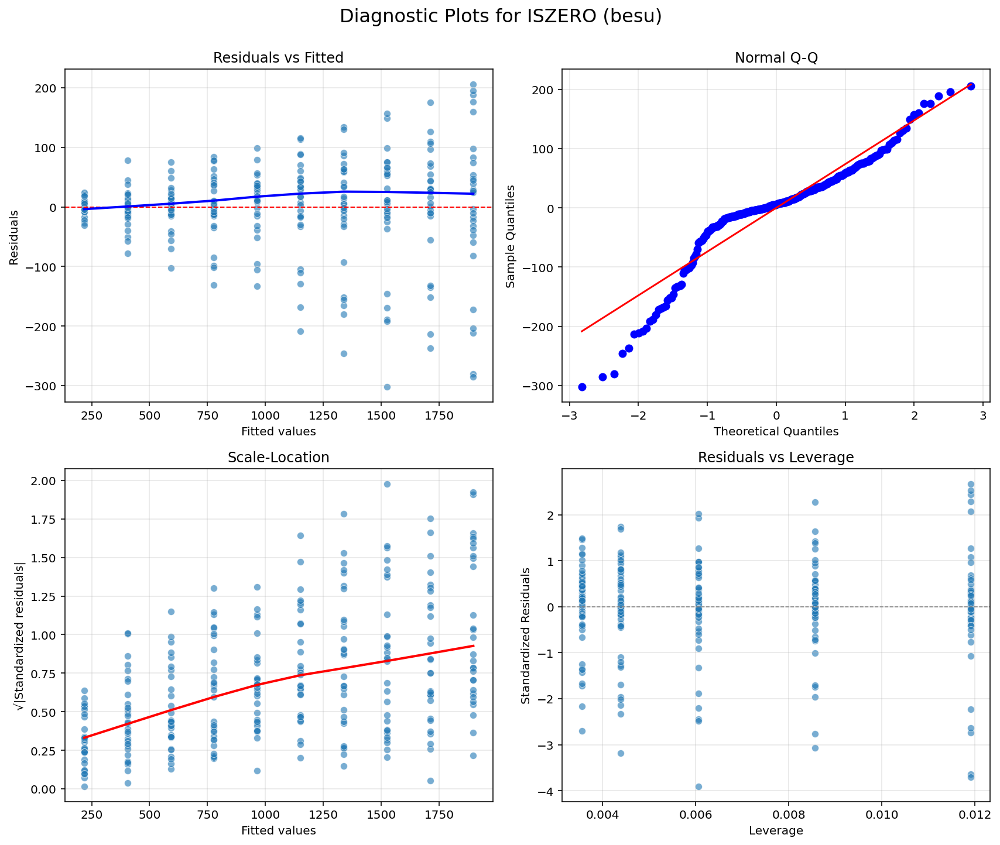


## reth


```python
                            OLS Regression Results                            
==============================================================================
Dep. Variable:        run_duration_ms   R-squared:                       0.975
Model:                            OLS   Adj. R-squared:                  0.975
Method:                 Least Squares   F-statistic:                     6845.
Date:                Thu, 22 Jan 2026   Prob (F-statistic):          5.37e-144
Time:                        10:34:13   Log-Likelihood:                -807.87
No. Observations:                 180   AIC:                             1620.
Df Residuals:                     178   BIC:                             1626.
Df Model:                           1                                         
Covariance Type:            nonrobust                                         
==============================================================================
                 coef    std err          t      P>|t|      [0.025      0.975]
------------------------------------------------------------------------------
const         30.3447      3.485      8.706      0.000      23.467      37.223
opcount        0.0058   7.02e-05     82.733      0.000       0.006       0.006
==============================================================================
Omnibus:                        4.363   Durbin-Watson:                   1.847
Prob(Omnibus):                  0.113   Jarque-Bera (JB):                4.238
Skew:                          -0.376   Prob(JB):                        0.120
Kurtosis:                       2.995   Cond. No.                     1.07e+05
==============================================================================

Notes:
[1] Standard Errors assume that the covariance matrix of the errors is correctly specified.
[2] The condition number is large, 1.07e+05. This might indicate that there are
strong multicollinearity or other numerical problems.
```


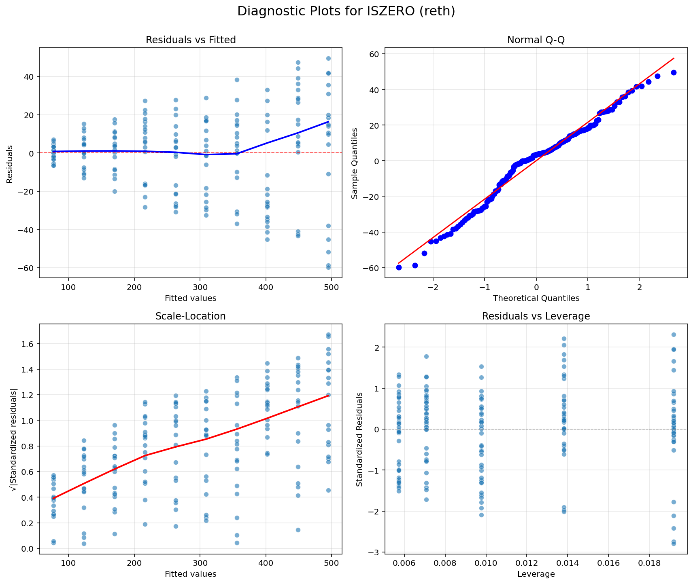


## nethermind


```python
                            OLS Regression Results                            
==============================================================================
Dep. Variable:        run_duration_ms   R-squared:                       0.972
Model:                            OLS   Adj. R-squared:                  0.972
Method:                 Least Squares   F-statistic:                 1.004e+04
Date:                Thu, 22 Jan 2026   Prob (F-statistic):          6.38e-226
Time:                        10:34:13   Log-Likelihood:                -1455.4
No. Observations:                 290   AIC:                             2915.
Df Residuals:                     288   BIC:                             2922.
Df Model:                           1                                         
Covariance Type:            nonrobust                                         
==============================================================================
                 coef    std err          t      P>|t|      [0.025      0.975]
------------------------------------------------------------------------------
const         29.8477      4.657      6.409      0.000      20.682      39.014
opcount        0.0094   9.38e-05    100.206      0.000       0.009       0.010
==============================================================================
Omnibus:                       11.564   Durbin-Watson:                   0.683
Prob(Omnibus):                  0.003   Jarque-Bera (JB):               17.915
Skew:                           0.257   Prob(JB):                     0.000129
Kurtosis:                       4.104   Cond. No.                     1.07e+05
==============================================================================

Notes:
[1] Standard Errors assume that the covariance matrix of the errors is correctly specified.
[2] The condition number is large, 1.07e+05. This might indicate that there are
strong multicollinearity or other numerical problems.
```

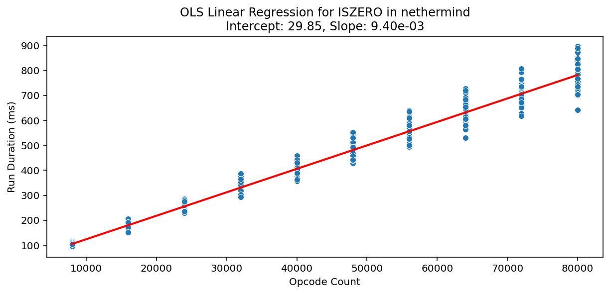

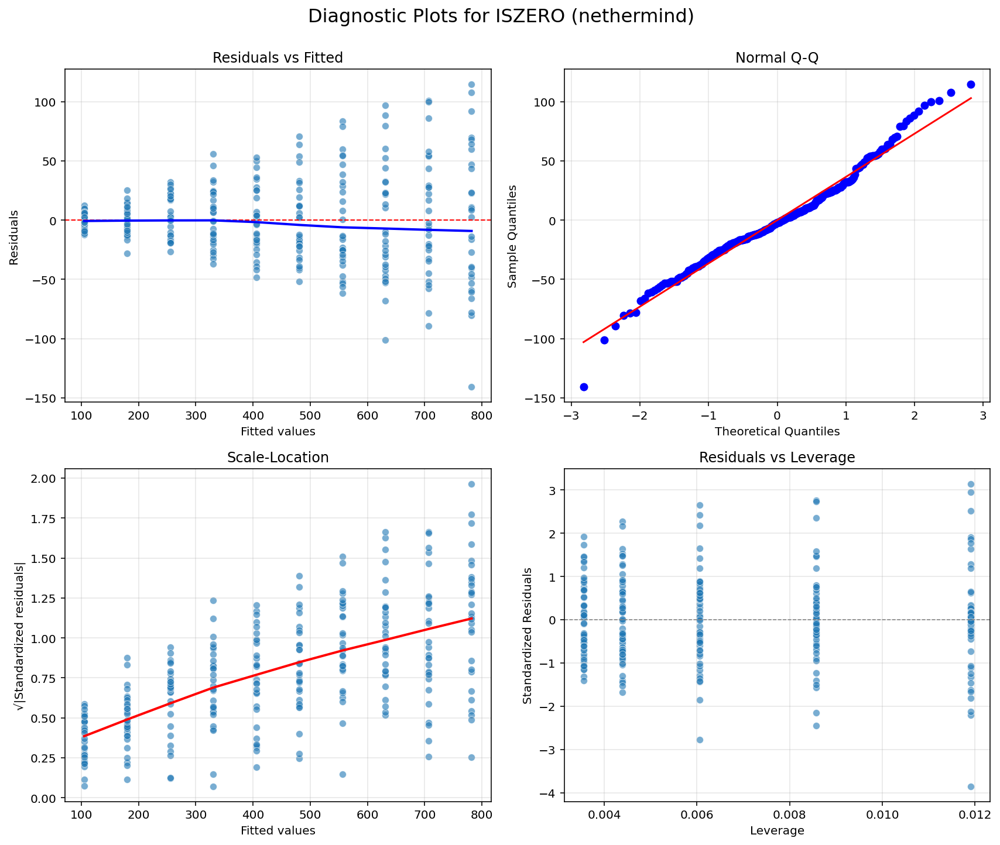


## erigon


```python
                            OLS Regression Results                            
==============================================================================
Dep. Variable:        run_duration_ms   R-squared:                       0.998
Model:                            OLS   Adj. R-squared:                  0.998
Method:                 Least Squares   F-statistic:                 1.456e+04
Date:                Thu, 22 Jan 2026   Prob (F-statistic):           1.38e-39
Time:                        10:34:13   Log-Likelihood:                -117.57
No. Observations:                  30   AIC:                             239.1
Df Residuals:                      28   BIC:                             241.9
Df Model:                           1                                         
Covariance Type:            nonrobust                                         
==============================================================================
                 coef    std err          t      P>|t|      [0.025      0.975]
------------------------------------------------------------------------------
const         33.9271      4.973      6.822      0.000      23.740      44.114
opcount        0.0121      0.000    120.659      0.000       0.012       0.012
==============================================================================
Omnibus:                        2.062   Durbin-Watson:                   0.899
Prob(Omnibus):                  0.357   Jarque-Bera (JB):                1.101
Skew:                           0.447   Prob(JB):                        0.577
Kurtosis:                       3.286   Cond. No.                     1.07e+05
==============================================================================

Notes:
[1] Standard Errors assume that the covariance matrix of the errors is correctly specified.
[2] The condition number is large, 1.07e+05. This might indicate that there are
strong multicollinearity or other numerical problems.
```


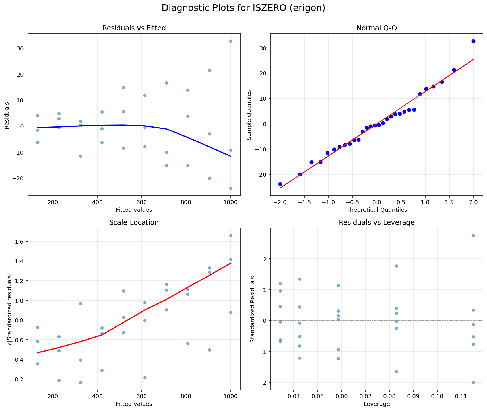


# JUMP

## geth

OLS model did not run... Error: zero-size array to reduction operation maximum which has no identity

## besu

OLS model did not run... Error: zero-size array to reduction operation maximum which has no identity

## reth

OLS model did not run... Error: zero-size array to reduction operation maximum which has no identity

## nethermind

OLS model did not run... Error: zero-size array to reduction operation maximum which has no identity

## erigon

OLS model did not run... Error: zero-size array to reduction operation maximum which has no identity

# JUMPDEST

## geth


```python
                            OLS Regression Results                            
==============================================================================
Dep. Variable:        run_duration_ms   R-squared:                       0.990
Model:                            OLS   Adj. R-squared:                  0.990
Method:                 Least Squares   F-statistic:                 2.947e+04
Date:                Thu, 22 Jan 2026   Prob (F-statistic):          4.16e-292
Time:                        10:34:14   Log-Likelihood:                -1588.3
No. Observations:                 290   AIC:                             3181.
Df Residuals:                     288   BIC:                             3188.
Df Model:                           1                                         
Covariance Type:            nonrobust                                         
==============================================================================
                 coef    std err          t      P>|t|      [0.025      0.975]
------------------------------------------------------------------------------
const         34.0436      7.365      4.622      0.000      19.548      48.539
opcount        0.0102   5.93e-05    171.681      0.000       0.010       0.010
==============================================================================
Omnibus:                       27.928   Durbin-Watson:                   0.998
Prob(Omnibus):                  0.000   Jarque-Bera (JB):              125.655
Skew:                           0.111   Prob(JB):                     5.18e-28
Kurtosis:                       6.217   Cond. No.                     2.68e+05
==============================================================================

Notes:
[1] Standard Errors assume that the covariance matrix of the errors is correctly specified.
[2] The condition number is large, 2.68e+05. This might indicate that there are
strong multicollinearity or other numerical problems.
```

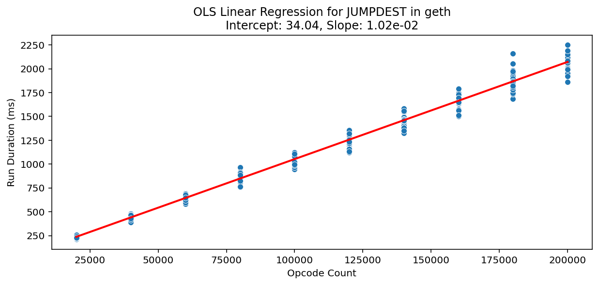


## besu


```python
                            OLS Regression Results                            
==============================================================================
Dep. Variable:        run_duration_ms   R-squared:                       0.983
Model:                            OLS   Adj. R-squared:                  0.983
Method:                 Least Squares   F-statistic:                 1.672e+04
Date:                Thu, 22 Jan 2026   Prob (F-statistic):          4.20e-257
Time:                        10:34:14   Log-Likelihood:                -1781.0
No. Observations:                 290   AIC:                             3566.
Df Residuals:                     288   BIC:                             3573.
Df Model:                           1                                         
Covariance Type:            nonrobust                                         
==============================================================================
                 coef    std err          t      P>|t|      [0.025      0.975]
------------------------------------------------------------------------------
const         32.6794     14.313      2.283      0.023       4.509      60.850
opcount        0.0149      0.000    129.297      0.000       0.015       0.015
==============================================================================
Omnibus:                       46.277   Durbin-Watson:                   0.773
Prob(Omnibus):                  0.000   Jarque-Bera (JB):              128.914
Skew:                          -0.711   Prob(JB):                     1.02e-28
Kurtosis:                       5.941   Cond. No.                     2.68e+05
==============================================================================

Notes:
[1] Standard Errors assume that the covariance matrix of the errors is correctly specified.
[2] The condition number is large, 2.68e+05. This might indicate that there are
strong multicollinearity or other numerical problems.
```


## reth


```python
                            OLS Regression Results                            
==============================================================================
Dep. Variable:        run_duration_ms   R-squared:                       0.965
Model:                            OLS   Adj. R-squared:                  0.964
Method:                 Least Squares   F-statistic:                     4861.
Date:                Thu, 22 Jan 2026   Prob (F-statistic):          3.64e-131
Time:                        10:34:14   Log-Likelihood:                -988.88
No. Observations:                 180   AIC:                             1982.
Df Residuals:                     178   BIC:                             1988.
Df Model:                           1                                         
Covariance Type:            nonrobust                                         
==============================================================================
                 coef    std err          t      P>|t|      [0.025      0.975]
------------------------------------------------------------------------------
const         34.4050      9.528      3.611      0.000      15.603      53.207
opcount        0.0054   7.68e-05     69.723      0.000       0.005       0.006
==============================================================================
Omnibus:                        2.466   Durbin-Watson:                   1.793
Prob(Omnibus):                  0.291   Jarque-Bera (JB):                2.223
Skew:                          -0.125   Prob(JB):                        0.329
Kurtosis:                       3.484   Cond. No.                     2.68e+05
==============================================================================

Notes:
[1] Standard Errors assume that the covariance matrix of the errors is correctly specified.
[2] The condition number is large, 2.68e+05. This might indicate that there are
strong multicollinearity or other numerical problems.
```


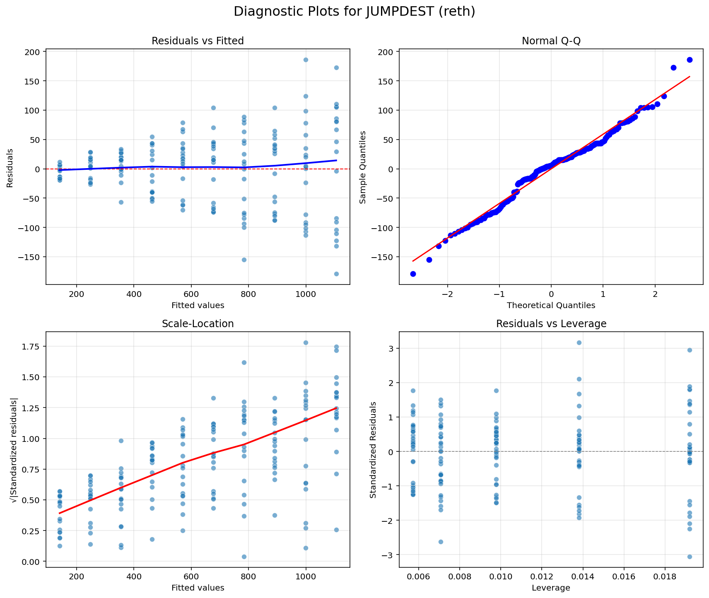


## nethermind


```python
                            OLS Regression Results                            
==============================================================================
Dep. Variable:        run_duration_ms   R-squared:                       0.975
Model:                            OLS   Adj. R-squared:                  0.975
Method:                 Least Squares   F-statistic:                 1.130e+04
Date:                Thu, 22 Jan 2026   Prob (F-statistic):          4.15e-233
Time:                        10:34:15   Log-Likelihood:                -1594.7
No. Observations:                 290   AIC:                             3193.
Df Residuals:                     288   BIC:                             3201.
Df Model:                           1                                         
Covariance Type:            nonrobust                                         
==============================================================================
                 coef    std err          t      P>|t|      [0.025      0.975]
------------------------------------------------------------------------------
const         27.6377      7.528      3.671      0.000      12.821      42.455
opcount        0.0064   6.07e-05    106.297      0.000       0.006       0.007
==============================================================================
Omnibus:                       24.230   Durbin-Watson:                   0.881
Prob(Omnibus):                  0.000   Jarque-Bera (JB):               82.085
Skew:                          -0.212   Prob(JB):                     1.50e-18
Kurtosis:                       5.572   Cond. No.                     2.68e+05
==============================================================================

Notes:
[1] Standard Errors assume that the covariance matrix of the errors is correctly specified.
[2] The condition number is large, 2.68e+05. This might indicate that there are
strong multicollinearity or other numerical problems.
```

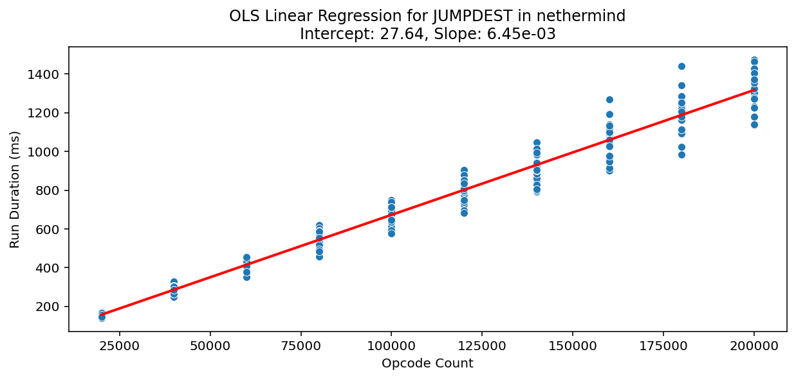


## erigon


```python
                            OLS Regression Results                            
==============================================================================
Dep. Variable:        run_duration_ms   R-squared:                       0.998
Model:                            OLS   Adj. R-squared:                  0.998
Method:                 Least Squares   F-statistic:                 1.366e+04
Date:                Thu, 22 Jan 2026   Prob (F-statistic):           3.35e-39
Time:                        10:34:15   Log-Likelihood:                -142.42
No. Observations:                  30   AIC:                             288.8
Df Residuals:                      28   BIC:                             291.6
Df Model:                           1                                         
Covariance Type:            nonrobust                                         
==============================================================================
                 coef    std err          t      P>|t|      [0.025      0.975]
------------------------------------------------------------------------------
const         33.5626     11.388      2.947      0.006      10.234      56.891
opcount        0.0107   9.18e-05    116.886      0.000       0.011       0.011
==============================================================================
Omnibus:                        0.845   Durbin-Watson:                   0.667
Prob(Omnibus):                  0.655   Jarque-Bera (JB):                0.841
Skew:                           0.216   Prob(JB):                        0.657
Kurtosis:                       2.303   Cond. No.                     2.68e+05
==============================================================================

Notes:
[1] Standard Errors assume that the covariance matrix of the errors is correctly specified.
[2] The condition number is large, 2.68e+05. This might indicate that there are
strong multicollinearity or other numerical problems.
```


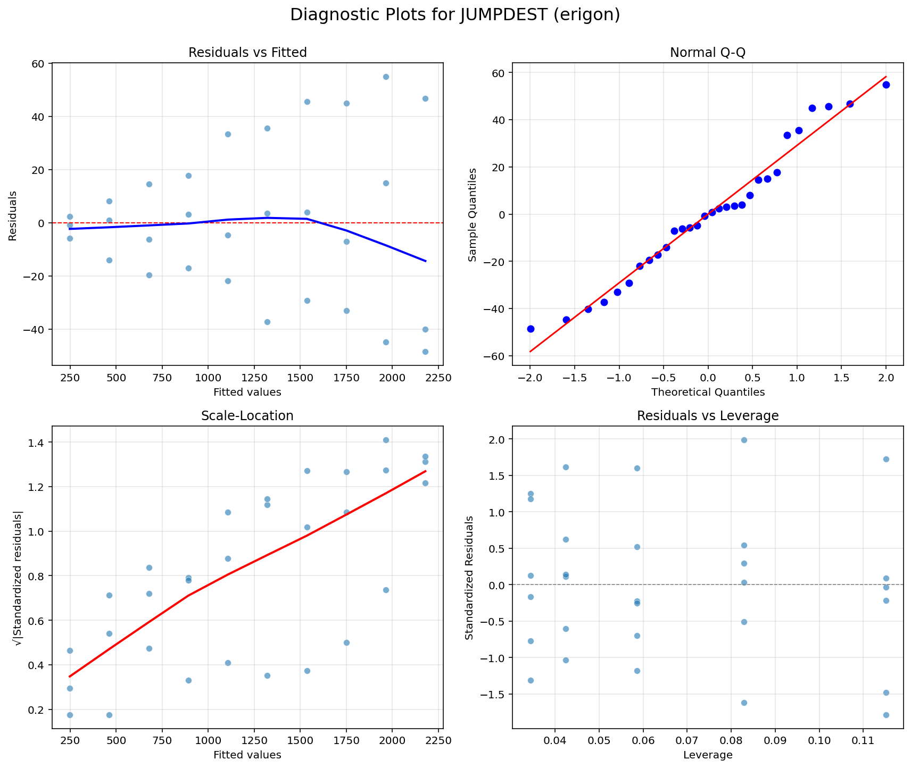


# JUMPI

## geth


```python
                            OLS Regression Results                            
==============================================================================
Dep. Variable:        run_duration_ms   R-squared:                       0.959
Model:                            OLS   Adj. R-squared:                  0.959
Method:                 Least Squares   F-statistic:                     6739.
Date:                Thu, 22 Jan 2026   Prob (F-statistic):          7.93e-202
Time:                        10:34:15   Log-Likelihood:                -1445.8
No. Observations:                 290   AIC:                             2896.
Df Residuals:                     288   BIC:                             2903.
Df Model:                           1                                         
Covariance Type:            nonrobust                                         
==============================================================================
                 coef    std err          t      P>|t|      [0.025      0.975]
------------------------------------------------------------------------------
const         30.4847      4.505      6.767      0.000      21.618      39.352
opcount        0.0298      0.000     82.091      0.000       0.029       0.031
==============================================================================
Omnibus:                      337.771   Durbin-Watson:                   1.803
Prob(Omnibus):                  0.000   Jarque-Bera (JB):            20814.566
Skew:                           5.020   Prob(JB):                         0.00
Kurtosis:                      43.272   Cond. No.                     2.68e+04
==============================================================================

Notes:
[1] Standard Errors assume that the covariance matrix of the errors is correctly specified.
[2] The condition number is large, 2.68e+04. This might indicate that there are
strong multicollinearity or other numerical problems.
```
OLS model did not run... Error: 'numpy.ndarray' object has no attribute 'iloc'

## besu


```python
                            OLS Regression Results                            
==============================================================================
Dep. Variable:        run_duration_ms   R-squared:                       0.980
Model:                            OLS   Adj. R-squared:                  0.980
Method:                 Least Squares   F-statistic:                 1.423e+04
Date:                Thu, 22 Jan 2026   Prob (F-statistic):          3.25e-247
Time:                        10:34:15   Log-Likelihood:                -1456.1
No. Observations:                 290   AIC:                             2916.
Df Residuals:                     288   BIC:                             2924.
Df Model:                           1                                         
Covariance Type:            nonrobust                                         
==============================================================================
                 coef    std err          t      P>|t|      [0.025      0.975]
------------------------------------------------------------------------------
const         27.8771      4.668      5.972      0.000      18.689      37.065
opcount        0.0449      0.000    119.292      0.000       0.044       0.046
==============================================================================
Omnibus:                       43.407   Durbin-Watson:                   0.919
Prob(Omnibus):                  0.000   Jarque-Bera (JB):               76.090
Skew:                          -0.836   Prob(JB):                     3.00e-17
Kurtosis:                       4.870   Cond. No.                     2.68e+04
==============================================================================

Notes:
[1] Standard Errors assume that the covariance matrix of the errors is correctly specified.
[2] The condition number is large, 2.68e+04. This might indicate that there are
strong multicollinearity or other numerical problems.
```


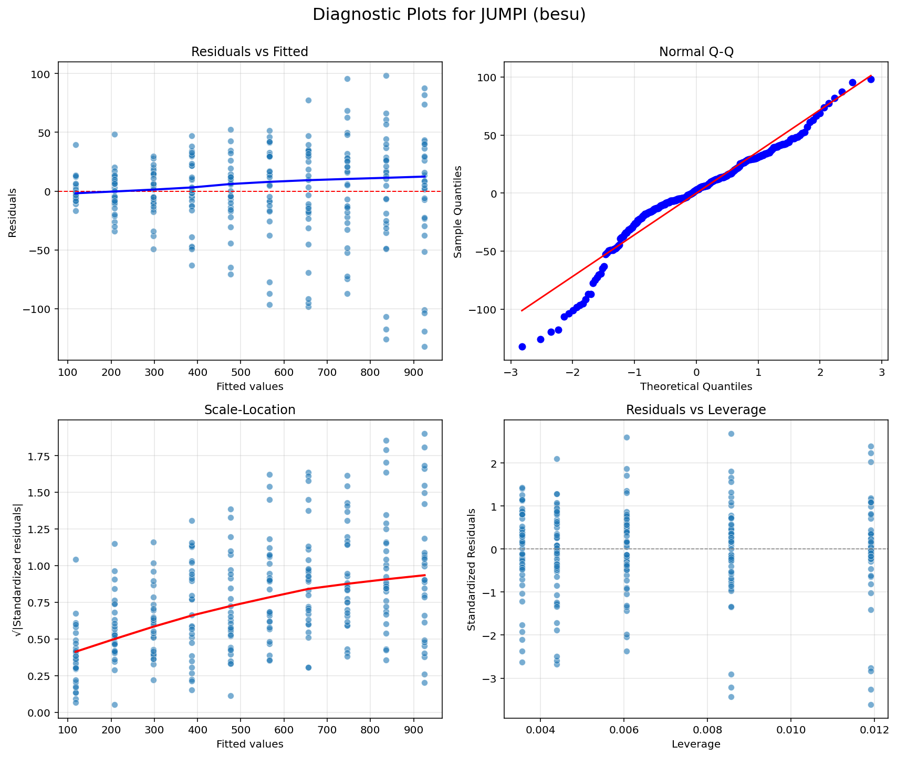


## reth


```python
                            OLS Regression Results                            
==============================================================================
Dep. Variable:        run_duration_ms   R-squared:                       0.983
Model:                            OLS   Adj. R-squared:                  0.983
Method:                 Least Squares   F-statistic:                 1.028e+04
Date:                Thu, 22 Jan 2026   Prob (F-statistic):          2.13e-159
Time:                        10:34:16   Log-Likelihood:                -664.17
No. Observations:                 180   AIC:                             1332.
Df Residuals:                     178   BIC:                             1339.
Df Model:                           1                                         
Covariance Type:            nonrobust                                         
==============================================================================
                 coef    std err          t      P>|t|      [0.025      0.975]
------------------------------------------------------------------------------
const         32.5261      1.569     20.735      0.000      29.431      35.622
opcount        0.0128      0.000    101.400      0.000       0.013       0.013
==============================================================================
Omnibus:                       23.599   Durbin-Watson:                   1.462
Prob(Omnibus):                  0.000   Jarque-Bera (JB):               51.965
Skew:                           0.579   Prob(JB):                     5.20e-12
Kurtosis:                       5.364   Cond. No.                     2.68e+04
==============================================================================

Notes:
[1] Standard Errors assume that the covariance matrix of the errors is correctly specified.
[2] The condition number is large, 2.68e+04. This might indicate that there are
strong multicollinearity or other numerical problems.
```

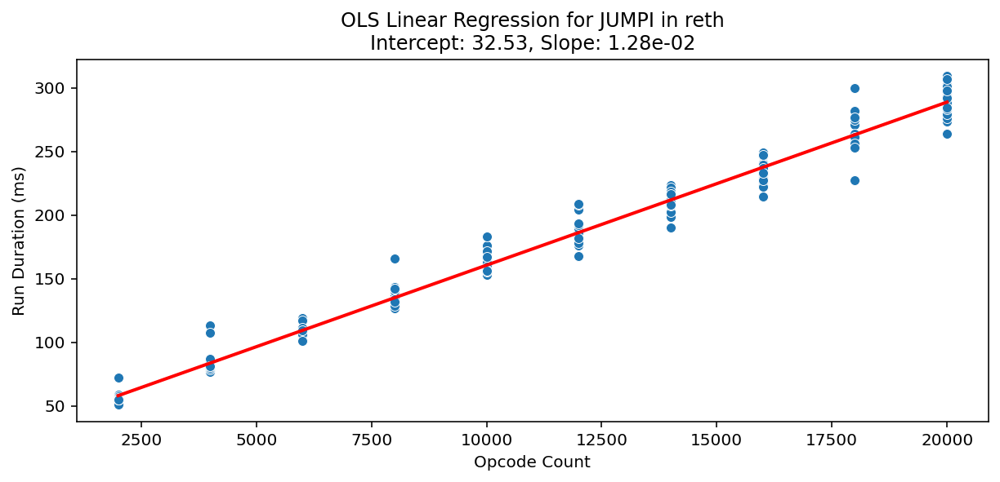

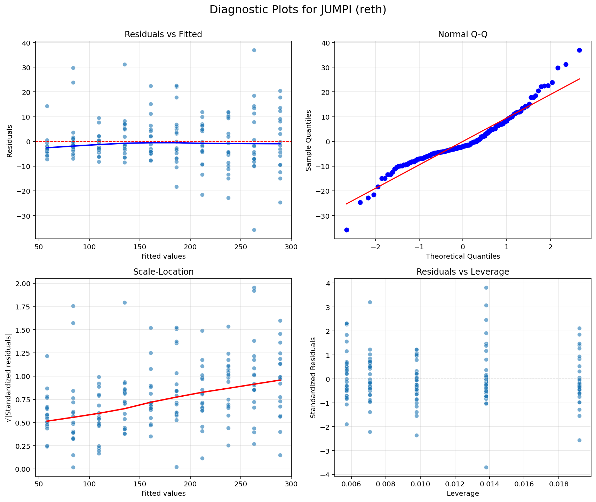


## nethermind


```python
                            OLS Regression Results                            
==============================================================================
Dep. Variable:        run_duration_ms   R-squared:                       0.961
Model:                            OLS   Adj. R-squared:                  0.961
Method:                 Least Squares   F-statistic:                     7107.
Date:                Thu, 22 Jan 2026   Prob (F-statistic):          5.07e-205
Time:                        10:34:16   Log-Likelihood:                -1255.0
No. Observations:                 290   AIC:                             2514.
Df Residuals:                     288   BIC:                             2521.
Df Model:                           1                                         
Covariance Type:            nonrobust                                         
==============================================================================
                 coef    std err          t      P>|t|      [0.025      0.975]
------------------------------------------------------------------------------
const         28.7512      2.334     12.320      0.000      24.158      33.344
opcount        0.0159      0.000     84.304      0.000       0.015       0.016
==============================================================================
Omnibus:                      183.494   Durbin-Watson:                   1.301
Prob(Omnibus):                  0.000   Jarque-Bera (JB):             4222.290
Skew:                           2.109   Prob(JB):                         0.00
Kurtosis:                      21.211   Cond. No.                     2.68e+04
==============================================================================

Notes:
[1] Standard Errors assume that the covariance matrix of the errors is correctly specified.
[2] The condition number is large, 2.68e+04. This might indicate that there are
strong multicollinearity or other numerical problems.
```


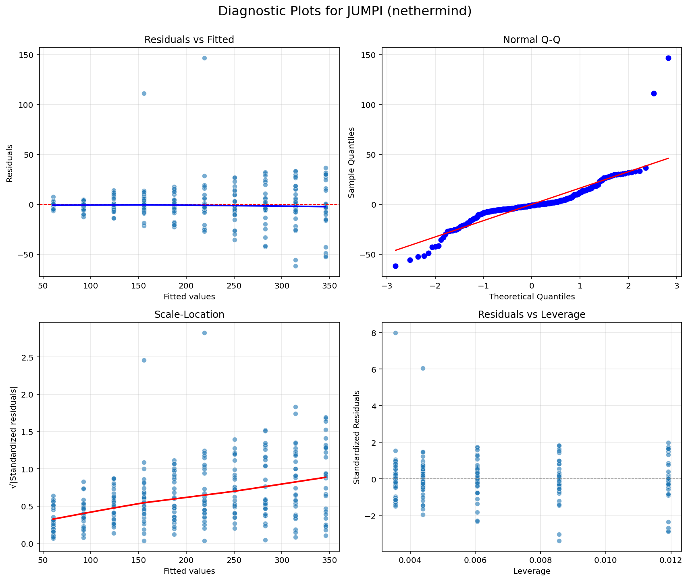


## erigon


```python
                            OLS Regression Results                            
==============================================================================
Dep. Variable:        run_duration_ms   R-squared:                       0.999
Model:                            OLS   Adj. R-squared:                  0.999
Method:                 Least Squares   F-statistic:                 1.936e+04
Date:                Thu, 22 Jan 2026   Prob (F-statistic):           2.57e-41
Time:                        10:34:16   Log-Likelihood:                -101.93
No. Observations:                  30   AIC:                             207.9
Df Residuals:                      28   BIC:                             210.7
Df Model:                           1                                         
Covariance Type:            nonrobust                                         
==============================================================================
                 coef    std err          t      P>|t|      [0.025      0.975]
------------------------------------------------------------------------------
const         30.9226      2.953     10.471      0.000      24.873      36.972
opcount        0.0331      0.000    139.141      0.000       0.033       0.034
==============================================================================
Omnibus:                       36.656   Durbin-Watson:                   1.920
Prob(Omnibus):                  0.000   Jarque-Bera (JB):              116.297
Skew:                           2.496   Prob(JB):                     5.58e-26
Kurtosis:                      11.253   Cond. No.                     2.68e+04
==============================================================================

Notes:
[1] Standard Errors assume that the covariance matrix of the errors is correctly specified.
[2] The condition number is large, 2.68e+04. This might indicate that there are
strong multicollinearity or other numerical problems.
```

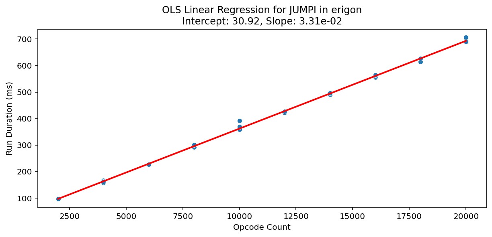

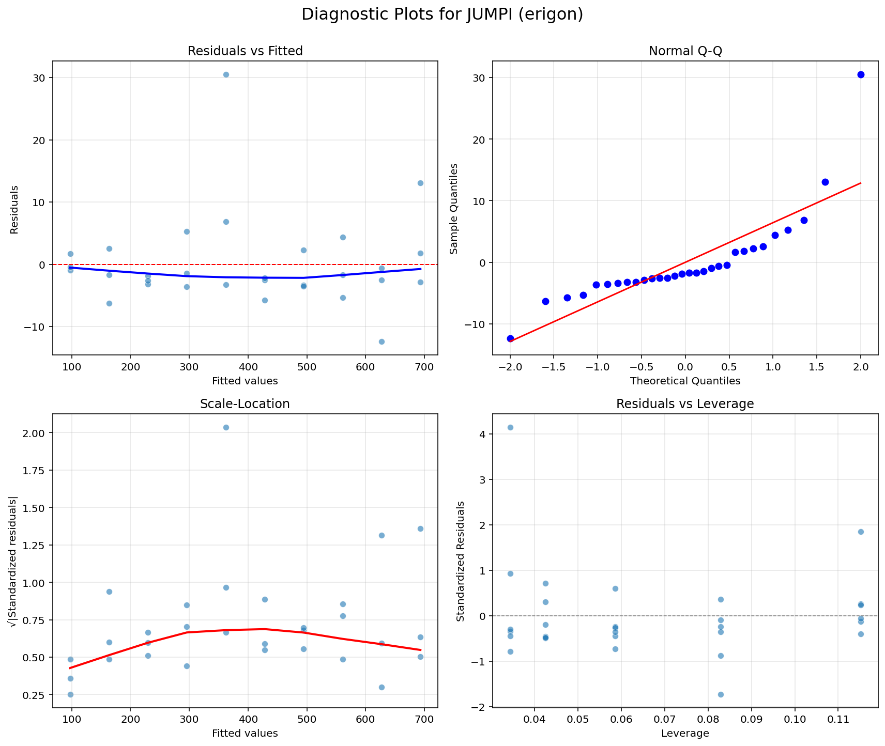


# LT

## geth


```python
                            OLS Regression Results                            
==============================================================================
Dep. Variable:        run_duration_ms   R-squared:                       0.985
Model:                            OLS   Adj. R-squared:                  0.985
Method:                 Least Squares   F-statistic:                 1.903e+04
Date:                Thu, 22 Jan 2026   Prob (F-statistic):          4.38e-265
Time:                        10:34:16   Log-Likelihood:                -1434.9
No. Observations:                 290   AIC:                             2874.
Df Residuals:                     288   BIC:                             2881.
Df Model:                           1                                         
Covariance Type:            nonrobust                                         
==============================================================================
                 coef    std err          t      P>|t|      [0.025      0.975]
------------------------------------------------------------------------------
const         38.4552      4.339      8.862      0.000      29.914      46.996
opcount        0.0241      0.000    137.958      0.000       0.024       0.024
==============================================================================
Omnibus:                      126.534   Durbin-Watson:                   1.139
Prob(Omnibus):                  0.000   Jarque-Bera (JB):             2129.866
Skew:                           1.303   Prob(JB):                         0.00
Kurtosis:                      16.018   Cond. No.                     5.36e+04
==============================================================================

Notes:
[1] Standard Errors assume that the covariance matrix of the errors is correctly specified.
[2] The condition number is large, 5.36e+04. This might indicate that there are
strong multicollinearity or other numerical problems.
```


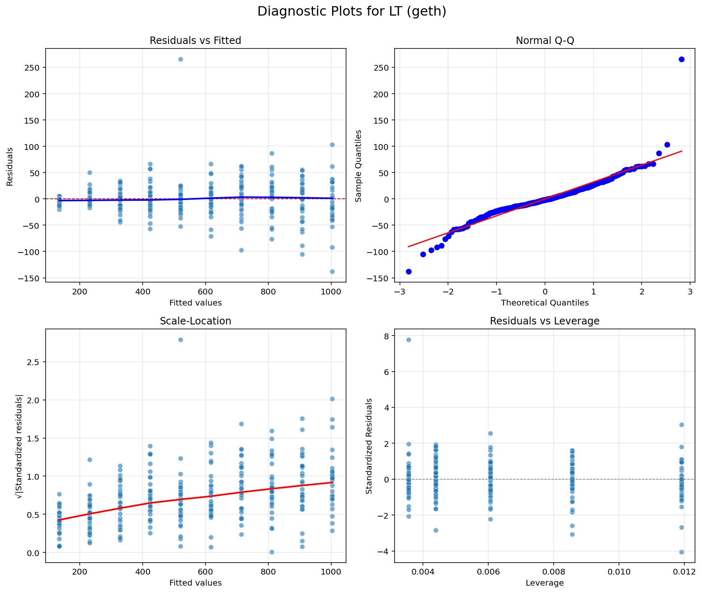


## besu


```python
                            OLS Regression Results                            
==============================================================================
Dep. Variable:        run_duration_ms   R-squared:                       0.979
Model:                            OLS   Adj. R-squared:                  0.979
Method:                 Least Squares   F-statistic:                 1.324e+04
Date:                Thu, 22 Jan 2026   Prob (F-statistic):          8.56e-243
Time:                        10:34:17   Log-Likelihood:                -1778.9
No. Observations:                 290   AIC:                             3562.
Df Residuals:                     288   BIC:                             3569.
Df Model:                           1                                         
Covariance Type:            nonrobust                                         
==============================================================================
                 coef    std err          t      P>|t|      [0.025      0.975]
------------------------------------------------------------------------------
const         29.3516     14.209      2.066      0.040       1.386      57.318
opcount        0.0659      0.001    115.064      0.000       0.065       0.067
==============================================================================
Omnibus:                       30.262   Durbin-Watson:                   0.691
Prob(Omnibus):                  0.000   Jarque-Bera (JB):               45.128
Skew:                          -0.669   Prob(JB):                     1.59e-10
Kurtosis:                       4.394   Cond. No.                     5.36e+04
==============================================================================

Notes:
[1] Standard Errors assume that the covariance matrix of the errors is correctly specified.
[2] The condition number is large, 5.36e+04. This might indicate that there are
strong multicollinearity or other numerical problems.
```

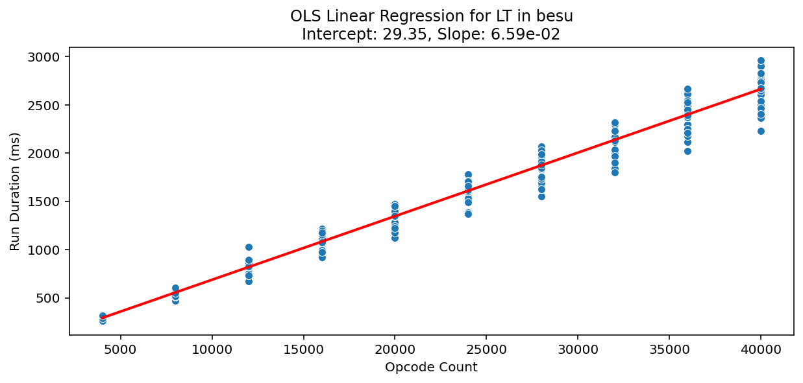


## reth


```python
                            OLS Regression Results                            
==============================================================================
Dep. Variable:        run_duration_ms   R-squared:                       0.984
Model:                            OLS   Adj. R-squared:                  0.984
Method:                 Least Squares   F-statistic:                 1.070e+04
Date:                Thu, 22 Jan 2026   Prob (F-statistic):          6.27e-161
Time:                        10:34:17   Log-Likelihood:                -727.25
No. Observations:                 180   AIC:                             1459.
Df Residuals:                     178   BIC:                             1465.
Df Model:                           1                                         
Covariance Type:            nonrobust                                         
==============================================================================
                 coef    std err          t      P>|t|      [0.025      0.975]
------------------------------------------------------------------------------
const         31.4704      2.227     14.131      0.000      27.075      35.865
opcount        0.0093   8.97e-05    103.463      0.000       0.009       0.009
==============================================================================
Omnibus:                       19.117   Durbin-Watson:                   1.496
Prob(Omnibus):                  0.000   Jarque-Bera (JB):               50.138
Skew:                           0.380   Prob(JB):                     1.30e-11
Kurtosis:                       5.471   Cond. No.                     5.36e+04
==============================================================================

Notes:
[1] Standard Errors assume that the covariance matrix of the errors is correctly specified.
[2] The condition number is large, 5.36e+04. This might indicate that there are
strong multicollinearity or other numerical problems.
```

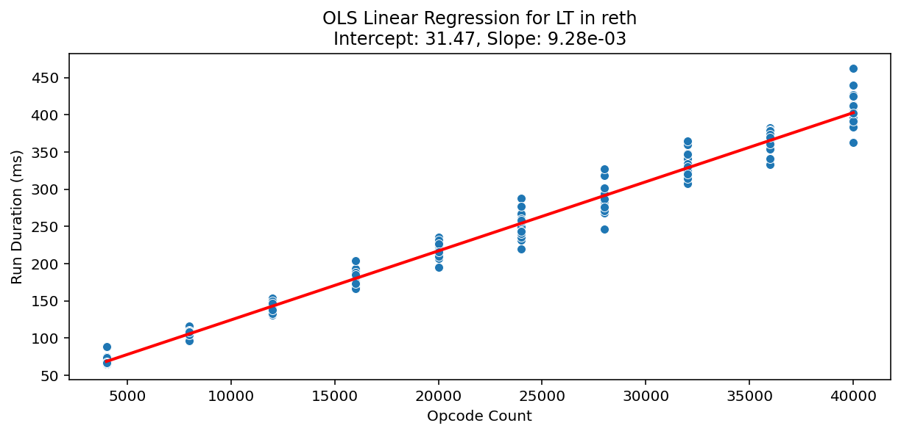

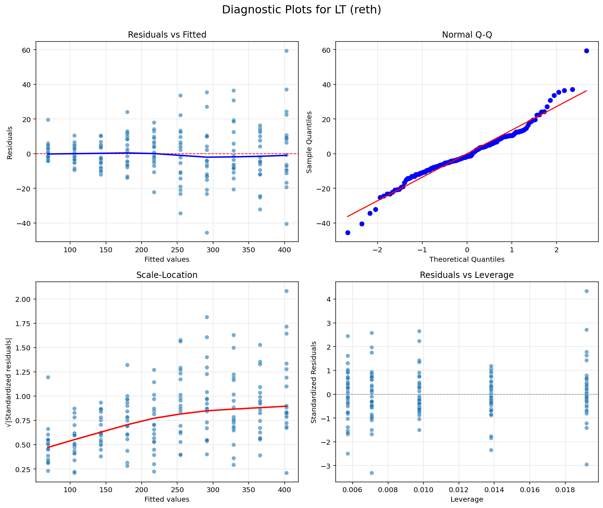


## nethermind


```python
                            OLS Regression Results                            
==============================================================================
Dep. Variable:        run_duration_ms   R-squared:                       0.983
Model:                            OLS   Adj. R-squared:                  0.983
Method:                 Least Squares   F-statistic:                 1.705e+04
Date:                Thu, 22 Jan 2026   Prob (F-statistic):          2.65e-258
Time:                        10:34:17   Log-Likelihood:                -1367.4
No. Observations:                 290   AIC:                             2739.
Df Residuals:                     288   BIC:                             2746.
Df Model:                           1                                         
Covariance Type:            nonrobust                                         
==============================================================================
                 coef    std err          t      P>|t|      [0.025      0.975]
------------------------------------------------------------------------------
const         31.2450      3.438      9.088      0.000      24.478      38.012
opcount        0.0181      0.000    130.565      0.000       0.018       0.018
==============================================================================
Omnibus:                       50.028   Durbin-Watson:                   0.689
Prob(Omnibus):                  0.000   Jarque-Bera (JB):              147.391
Skew:                          -0.751   Prob(JB):                     9.87e-33
Kurtosis:                       6.153   Cond. No.                     5.36e+04
==============================================================================

Notes:
[1] Standard Errors assume that the covariance matrix of the errors is correctly specified.
[2] The condition number is large, 5.36e+04. This might indicate that there are
strong multicollinearity or other numerical problems.
```


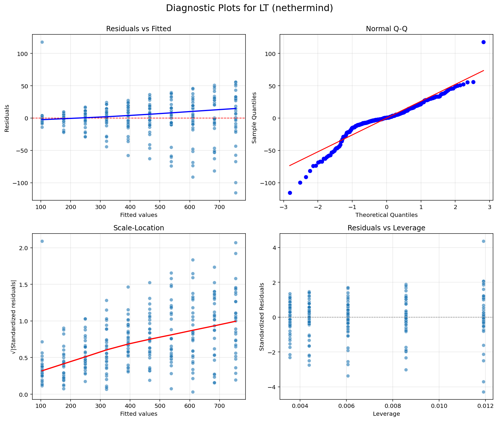


## erigon


```python
                            OLS Regression Results                            
==============================================================================
Dep. Variable:        run_duration_ms   R-squared:                       0.999
Model:                            OLS   Adj. R-squared:                  0.999
Method:                 Least Squares   F-statistic:                 4.043e+04
Date:                Thu, 22 Jan 2026   Prob (F-statistic):           8.64e-46
Time:                        10:34:17   Log-Likelihood:                -104.57
No. Observations:                  30   AIC:                             213.1
Df Residuals:                      28   BIC:                             215.9
Df Model:                           1                                         
Covariance Type:            nonrobust                                         
==============================================================================
                 coef    std err          t      P>|t|      [0.025      0.975]
------------------------------------------------------------------------------
const         32.2723      3.224     10.009      0.000      25.668      38.877
opcount        0.0261      0.000    201.074      0.000       0.026       0.026
==============================================================================
Omnibus:                        2.417   Durbin-Watson:                   1.430
Prob(Omnibus):                  0.299   Jarque-Bera (JB):                1.161
Skew:                           0.299   Prob(JB):                        0.559
Kurtosis:                       3.756   Cond. No.                     5.36e+04
==============================================================================

Notes:
[1] Standard Errors assume that the covariance matrix of the errors is correctly specified.
[2] The condition number is large, 5.36e+04. This might indicate that there are
strong multicollinearity or other numerical problems.
```

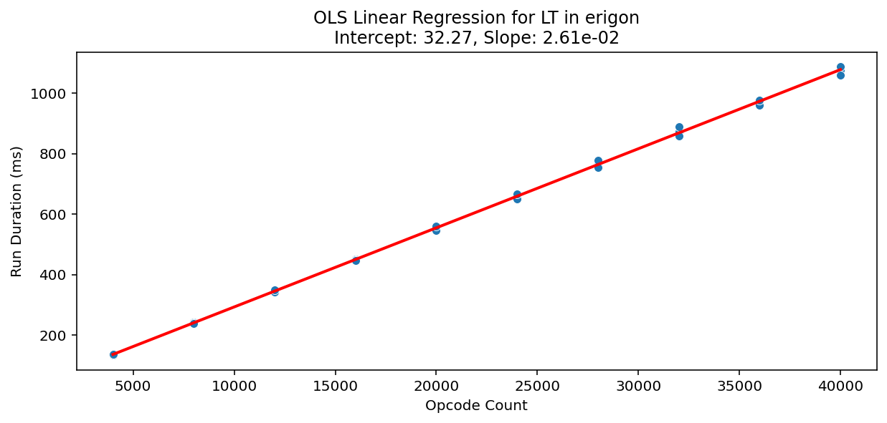

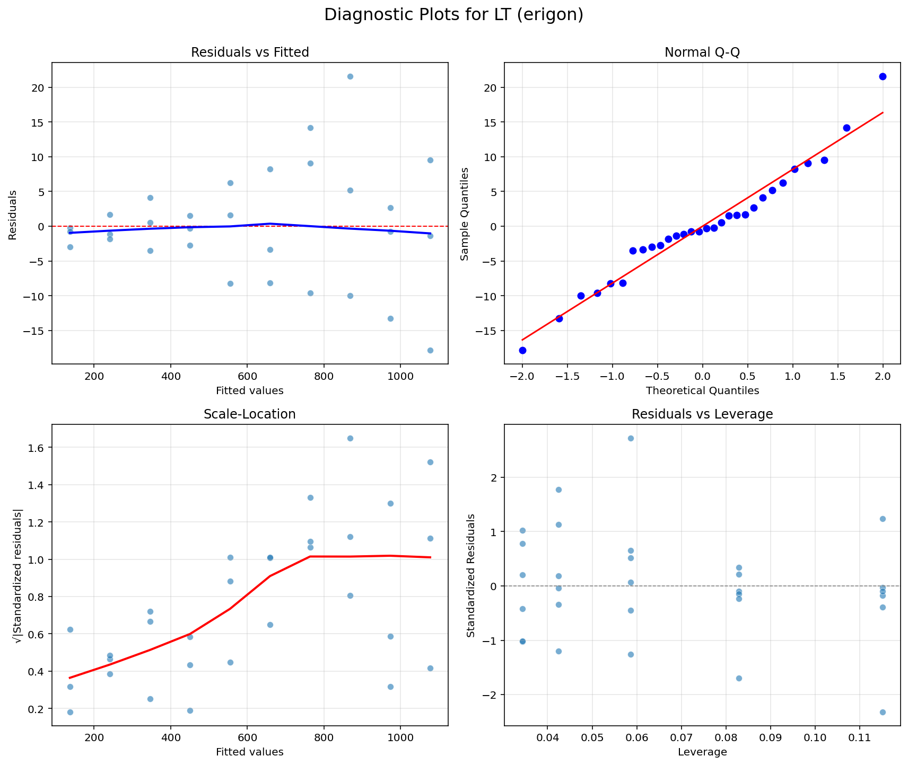


# MOD

## geth


```python
                            OLS Regression Results                            
==============================================================================
Dep. Variable:        run_duration_ms   R-squared:                       0.977
Model:                            OLS   Adj. R-squared:                  0.977
Method:                 Least Squares   F-statistic:                 1.236e+04
Date:                Thu, 22 Jan 2026   Prob (F-statistic):          1.43e-238
Time:                        10:34:18   Log-Likelihood:                -1649.0
No. Observations:                 290   AIC:                             3302.
Df Residuals:                     288   BIC:                             3309.
Df Model:                           1                                         
Covariance Type:            nonrobust                                         
==============================================================================
                 coef    std err          t      P>|t|      [0.025      0.975]
------------------------------------------------------------------------------
const         31.0824      9.079      3.424      0.001      13.214      48.951
opcount        0.0542      0.000    111.160      0.000       0.053       0.055
==============================================================================
Omnibus:                      213.393   Durbin-Watson:                   1.056
Prob(Omnibus):                  0.000   Jarque-Bera (JB):             7851.287
Skew:                           2.464   Prob(JB):                         0.00
Kurtosis:                      28.009   Cond. No.                     4.02e+04
==============================================================================

Notes:
[1] Standard Errors assume that the covariance matrix of the errors is correctly specified.
[2] The condition number is large, 4.02e+04. This might indicate that there are
strong multicollinearity or other numerical problems.
```


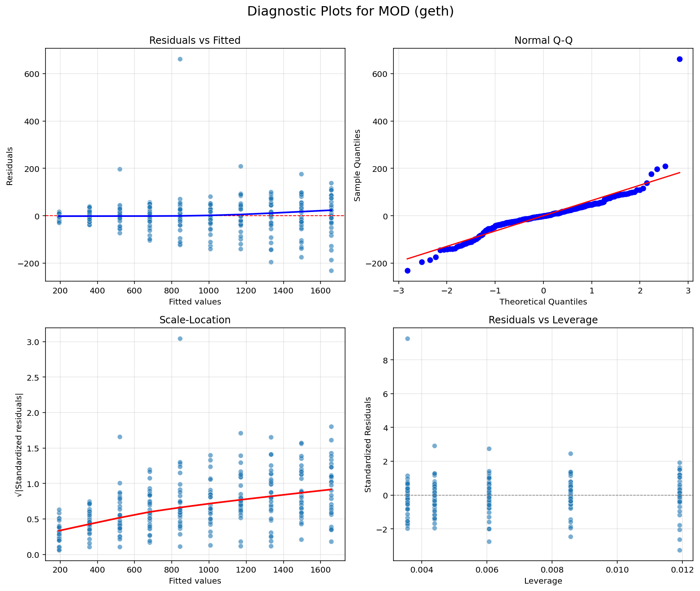


## besu


```python
                            OLS Regression Results                            
==============================================================================
Dep. Variable:        run_duration_ms   R-squared:                       0.980
Model:                            OLS   Adj. R-squared:                  0.980
Method:                 Least Squares   F-statistic:                 1.407e+04
Date:                Thu, 22 Jan 2026   Prob (F-statistic):          1.66e-246
Time:                        10:34:18   Log-Likelihood:                -2005.8
No. Observations:                 290   AIC:                             4016.
Df Residuals:                     288   BIC:                             4023.
Df Model:                           1                                         
Covariance Type:            nonrobust                                         
==============================================================================
                 coef    std err          t      P>|t|      [0.025      0.975]
------------------------------------------------------------------------------
const         42.5126     31.075      1.368      0.172     -18.651     103.676
opcount        0.1980      0.002    118.606      0.000       0.195       0.201
==============================================================================
Omnibus:                       59.718   Durbin-Watson:                   0.763
Prob(Omnibus):                  0.000   Jarque-Bera (JB):              115.489
Skew:                          -1.073   Prob(JB):                     8.35e-26
Kurtosis:                       5.225   Cond. No.                     4.02e+04
==============================================================================

Notes:
[1] Standard Errors assume that the covariance matrix of the errors is correctly specified.
[2] The condition number is large, 4.02e+04. This might indicate that there are
strong multicollinearity or other numerical problems.
```

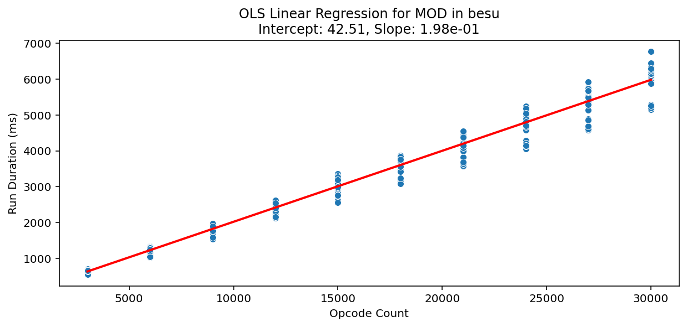

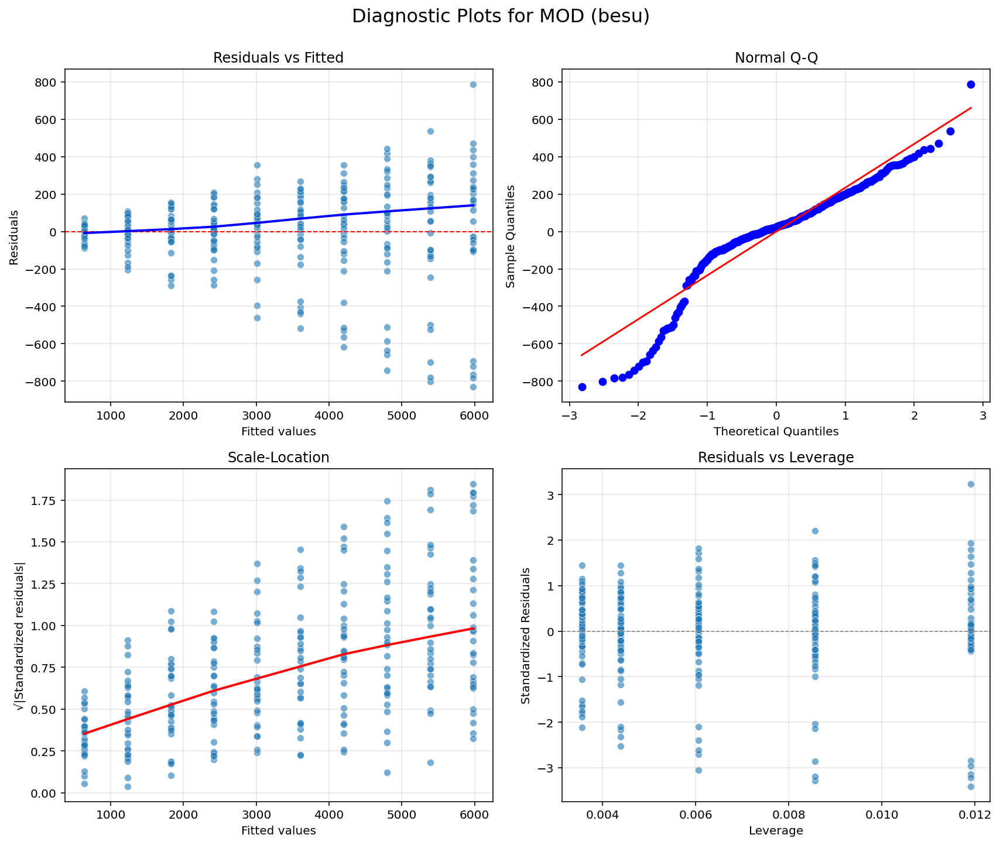


## reth


```python
                            OLS Regression Results                            
==============================================================================
Dep. Variable:        run_duration_ms   R-squared:                       0.993
Model:                            OLS   Adj. R-squared:                  0.993
Method:                 Least Squares   F-statistic:                 2.375e+04
Date:                Thu, 22 Jan 2026   Prob (F-statistic):          2.21e-191
Time:                        10:34:18   Log-Likelihood:                -858.34
No. Observations:                 180   AIC:                             1721.
Df Residuals:                     178   BIC:                             1727.
Df Model:                           1                                         
Covariance Type:            nonrobust                                         
==============================================================================
                 coef    std err          t      P>|t|      [0.025      0.975]
------------------------------------------------------------------------------
const         30.2760      4.613      6.563      0.000      21.172      39.380
opcount        0.0382      0.000    154.107      0.000       0.038       0.039
==============================================================================
Omnibus:                       85.742   Durbin-Watson:                   0.911
Prob(Omnibus):                  0.000   Jarque-Bera (JB):              362.196
Skew:                          -1.842   Prob(JB):                     2.24e-79
Kurtosis:                       8.892   Cond. No.                     4.02e+04
==============================================================================

Notes:
[1] Standard Errors assume that the covariance matrix of the errors is correctly specified.
[2] The condition number is large, 4.02e+04. This might indicate that there are
strong multicollinearity or other numerical problems.
```

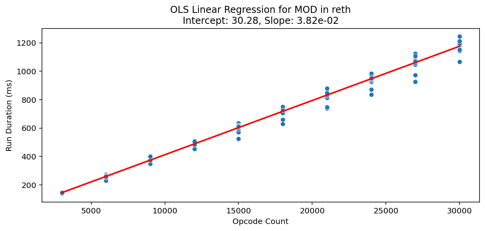

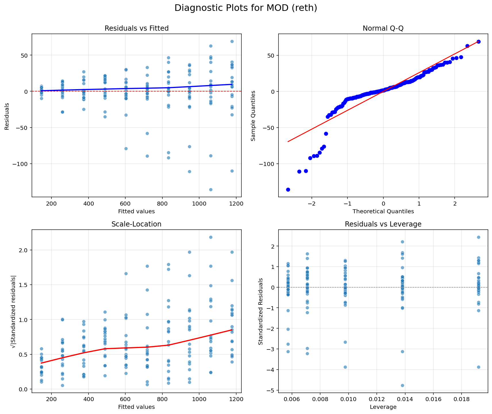


## nethermind


```python
                            OLS Regression Results                            
==============================================================================
Dep. Variable:        run_duration_ms   R-squared:                       0.986
Model:                            OLS   Adj. R-squared:                  0.986
Method:                 Least Squares   F-statistic:                 2.090e+04
Date:                Thu, 22 Jan 2026   Prob (F-statistic):          7.54e-271
Time:                        10:34:19   Log-Likelihood:                -1527.1
No. Observations:                 290   AIC:                             3058.
Df Residuals:                     288   BIC:                             3066.
Df Model:                           1                                         
Covariance Type:            nonrobust                                         
==============================================================================
                 coef    std err          t      P>|t|      [0.025      0.975]
------------------------------------------------------------------------------
const         30.3263      5.964      5.085      0.000      18.588      42.065
opcount        0.0463      0.000    144.560      0.000       0.046       0.047
==============================================================================
Omnibus:                       50.495   Durbin-Watson:                   0.793
Prob(Omnibus):                  0.000   Jarque-Bera (JB):               94.686
Skew:                          -0.929   Prob(JB):                     2.75e-21
Kurtosis:                       5.094   Cond. No.                     4.02e+04
==============================================================================

Notes:
[1] Standard Errors assume that the covariance matrix of the errors is correctly specified.
[2] The condition number is large, 4.02e+04. This might indicate that there are
strong multicollinearity or other numerical problems.
```


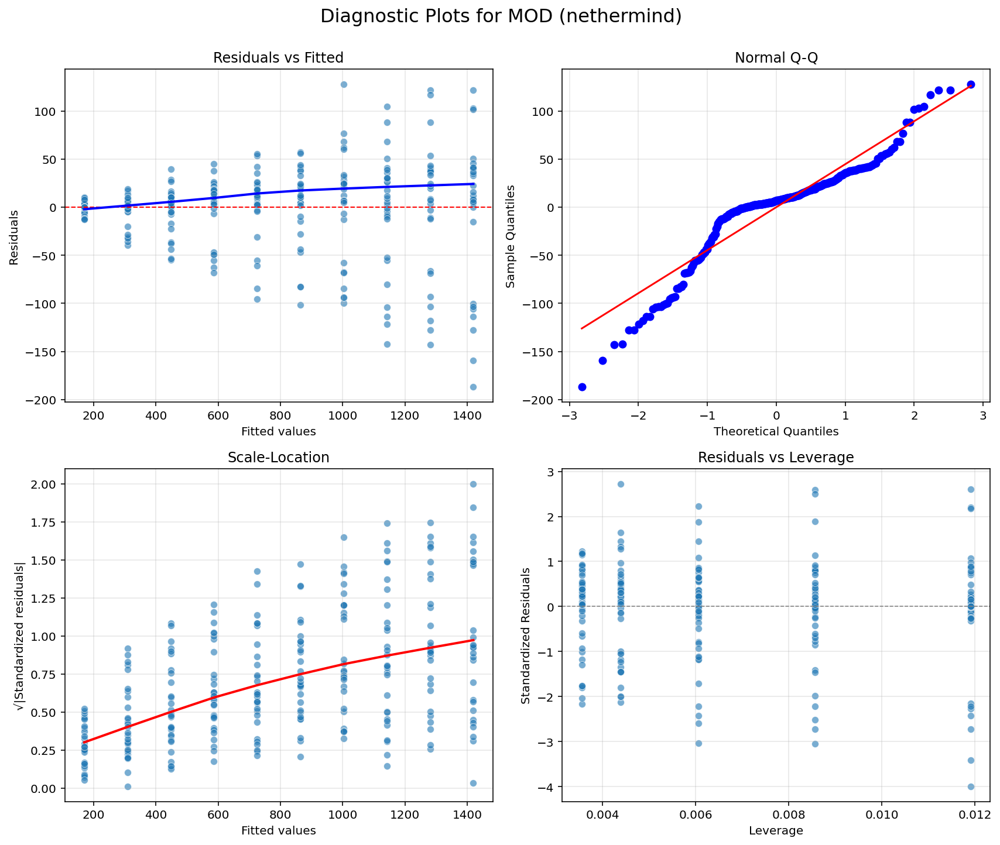


## erigon


```python
                            OLS Regression Results                            
==============================================================================
Dep. Variable:        run_duration_ms   R-squared:                       0.996
Model:                            OLS   Adj. R-squared:                  0.996
Method:                 Least Squares   F-statistic:                     7094.
Date:                Thu, 22 Jan 2026   Prob (F-statistic):           3.16e-35
Time:                        10:34:19   Log-Likelihood:                -144.78
No. Observations:                  30   AIC:                             293.6
Df Residuals:                      28   BIC:                             296.4
Df Model:                           1                                         
Covariance Type:            nonrobust                                         
==============================================================================
                 coef    std err          t      P>|t|      [0.025      0.975]
------------------------------------------------------------------------------
const         39.0732     12.320      3.171      0.004      13.836      64.310
opcount        0.0557      0.001     84.225      0.000       0.054       0.057
==============================================================================
Omnibus:                       16.793   Durbin-Watson:                   1.978
Prob(Omnibus):                  0.000   Jarque-Bera (JB):               21.058
Skew:                           1.410   Prob(JB):                     2.68e-05
Kurtosis:                       5.982   Cond. No.                     4.02e+04
==============================================================================

Notes:
[1] Standard Errors assume that the covariance matrix of the errors is correctly specified.
[2] The condition number is large, 4.02e+04. This might indicate that there are
strong multicollinearity or other numerical problems.
```
OLS model did not run... Error: 'numpy.ndarray' object has no attribute 'iloc'

# MSIZE

## geth


```python
                            OLS Regression Results                            
==============================================================================
Dep. Variable:        run_duration_ms   R-squared:                       0.989
Model:                            OLS   Adj. R-squared:                  0.989
Method:                 Least Squares   F-statistic:                 2.624e+04
Date:                Thu, 22 Jan 2026   Prob (F-statistic):          6.42e-285
Time:                        10:34:19   Log-Likelihood:                -1612.9
No. Observations:                 290   AIC:                             3230.
Df Residuals:                     288   BIC:                             3237.
Df Model:                           1                                         
Covariance Type:            nonrobust                                         
==============================================================================
                 coef    std err          t      P>|t|      [0.025      0.975]
------------------------------------------------------------------------------
const         36.7428      8.018      4.583      0.000      20.962      52.524
opcount        0.0174      0.000    161.995      0.000       0.017       0.018
==============================================================================
Omnibus:                       65.957   Durbin-Watson:                   0.841
Prob(Omnibus):                  0.000   Jarque-Bera (JB):              168.839
Skew:                          -1.054   Prob(JB):                     2.17e-37
Kurtosis:                       6.087   Cond. No.                     1.61e+05
==============================================================================

Notes:
[1] Standard Errors assume that the covariance matrix of the errors is correctly specified.
[2] The condition number is large, 1.61e+05. This might indicate that there are
strong multicollinearity or other numerical problems.
```

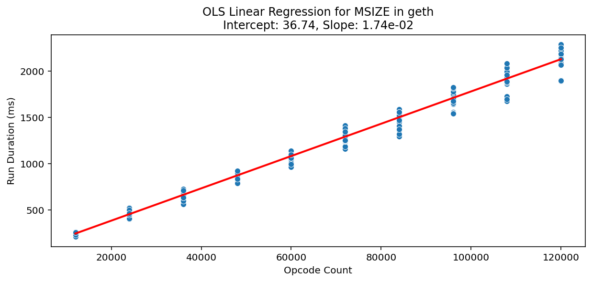


## besu


```python
                            OLS Regression Results                            
==============================================================================
Dep. Variable:        run_duration_ms   R-squared:                       0.975
Model:                            OLS   Adj. R-squared:                  0.975
Method:                 Least Squares   F-statistic:                 1.113e+04
Date:                Thu, 22 Jan 2026   Prob (F-statistic):          3.35e-232
Time:                        10:34:19   Log-Likelihood:                -1895.8
No. Observations:                 290   AIC:                             3796.
Df Residuals:                     288   BIC:                             3803.
Df Model:                           1                                         
Covariance Type:            nonrobust                                         
==============================================================================
                 coef    std err          t      P>|t|      [0.025      0.975]
------------------------------------------------------------------------------
const        303.7046     21.268     14.280      0.000     261.844     345.566
opcount        0.0301      0.000    105.509      0.000       0.030       0.031
==============================================================================
Omnibus:                       18.343   Durbin-Watson:                   1.354
Prob(Omnibus):                  0.000   Jarque-Bera (JB):               21.270
Skew:                           0.544   Prob(JB):                     2.41e-05
Kurtosis:                       3.760   Cond. No.                     1.61e+05
==============================================================================

Notes:
[1] Standard Errors assume that the covariance matrix of the errors is correctly specified.
[2] The condition number is large, 1.61e+05. This might indicate that there are
strong multicollinearity or other numerical problems.
```

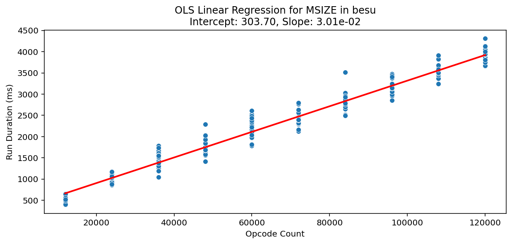

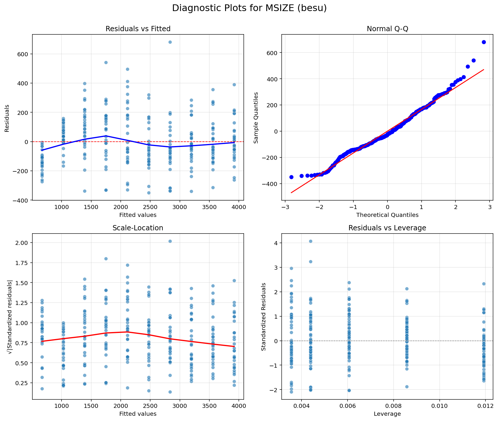


## reth


```python
                            OLS Regression Results                            
==============================================================================
Dep. Variable:        run_duration_ms   R-squared:                       0.975
Model:                            OLS   Adj. R-squared:                  0.975
Method:                 Least Squares   F-statistic:                     6860.
Date:                Thu, 22 Jan 2026   Prob (F-statistic):          4.41e-144
Time:                        10:34:19   Log-Likelihood:                -904.05
No. Observations:                 180   AIC:                             1812.
Df Residuals:                     178   BIC:                             1818.
Df Model:                           1                                         
Covariance Type:            nonrobust                                         
==============================================================================
                 coef    std err          t      P>|t|      [0.025      0.975]
------------------------------------------------------------------------------
const         37.0492      5.947      6.230      0.000      25.314      48.785
opcount        0.0066   7.99e-05     82.826      0.000       0.006       0.007
==============================================================================
Omnibus:                        2.523   Durbin-Watson:                   1.495
Prob(Omnibus):                  0.283   Jarque-Bera (JB):                2.531
Skew:                           0.003   Prob(JB):                        0.282
Kurtosis:                       3.581   Cond. No.                     1.61e+05
==============================================================================

Notes:
[1] Standard Errors assume that the covariance matrix of the errors is correctly specified.
[2] The condition number is large, 1.61e+05. This might indicate that there are
strong multicollinearity or other numerical problems.
```


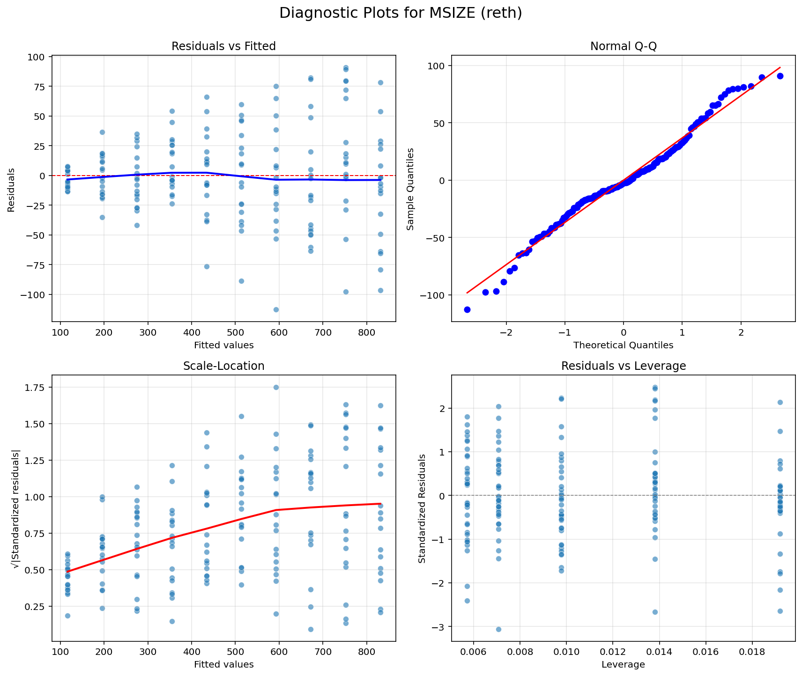


## nethermind


```python
                            OLS Regression Results                            
==============================================================================
Dep. Variable:        run_duration_ms   R-squared:                       0.981
Model:                            OLS   Adj. R-squared:                  0.981
Method:                 Least Squares   F-statistic:                 1.453e+04
Date:                Thu, 22 Jan 2026   Prob (F-statistic):          1.65e-248
Time:                        10:34:20   Log-Likelihood:                -1449.3
No. Observations:                 290   AIC:                             2903.
Df Residuals:                     288   BIC:                             2910.
Df Model:                           1                                         
Covariance Type:            nonrobust                                         
==============================================================================
                 coef    std err          t      P>|t|      [0.025      0.975]
------------------------------------------------------------------------------
const         27.3919      4.561      6.006      0.000      18.415      36.369
opcount        0.0074   6.13e-05    120.558      0.000       0.007       0.008
==============================================================================
Omnibus:                       44.239   Durbin-Watson:                   0.806
Prob(Omnibus):                  0.000   Jarque-Bera (JB):               93.922
Skew:                          -0.775   Prob(JB):                     4.03e-21
Kurtosis:                       5.318   Cond. No.                     1.61e+05
==============================================================================

Notes:
[1] Standard Errors assume that the covariance matrix of the errors is correctly specified.
[2] The condition number is large, 1.61e+05. This might indicate that there are
strong multicollinearity or other numerical problems.
```


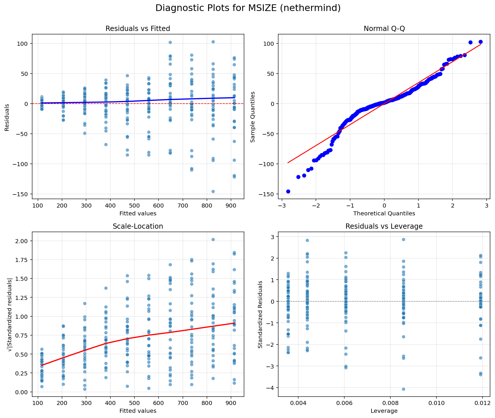


## erigon

OLS model did not run... Error: zero-size array to reduction operation maximum which has no identity

# MUL

## geth


```python
                            OLS Regression Results                            
==============================================================================
Dep. Variable:        run_duration_ms   R-squared:                       0.950
Model:                            OLS   Adj. R-squared:                  0.949
Method:                 Least Squares   F-statistic:                     5391.
Date:                Thu, 22 Jan 2026   Prob (F-statistic):          1.26e-187
Time:                        10:34:20   Log-Likelihood:                -1583.8
No. Observations:                 288   AIC:                             3172.
Df Residuals:                     286   BIC:                             3179.
Df Model:                           1                                         
Covariance Type:            nonrobust                                         
==============================================================================
                 coef    std err          t      P>|t|      [0.025      0.975]
------------------------------------------------------------------------------
const         21.4286      7.535      2.844      0.005       6.597      36.260
opcount        0.0298      0.000     73.426      0.000       0.029       0.031
==============================================================================
Omnibus:                      477.232   Durbin-Watson:                   1.816
Prob(Omnibus):                  0.000   Jarque-Bera (JB):           159359.223
Skew:                           8.693   Prob(JB):                         0.00
Kurtosis:                     116.920   Cond. No.                     4.00e+04
==============================================================================

Notes:
[1] Standard Errors assume that the covariance matrix of the errors is correctly specified.
[2] The condition number is large,  4e+04. This might indicate that there are
strong multicollinearity or other numerical problems.
```
OLS model did not run... Error: 'numpy.ndarray' object has no attribute 'iloc'

## besu


```python
                            OLS Regression Results                            
==============================================================================
Dep. Variable:        run_duration_ms   R-squared:                       0.982
Model:                            OLS   Adj. R-squared:                  0.982
Method:                 Least Squares   F-statistic:                 1.568e+04
Date:                Thu, 22 Jan 2026   Prob (F-statistic):          7.38e-252
Time:                        10:34:20   Log-Likelihood:                -2058.7
No. Observations:                 288   AIC:                             4121.
Df Residuals:                     286   BIC:                             4129.
Df Model:                           1                                         
Covariance Type:            nonrobust                                         
==============================================================================
                 coef    std err          t      P>|t|      [0.025      0.975]
------------------------------------------------------------------------------
const         29.6801     39.190      0.757      0.449     -47.458     106.818
opcount        0.2643      0.002    125.233      0.000       0.260       0.268
==============================================================================
Omnibus:                       26.744   Durbin-Watson:                   0.660
Prob(Omnibus):                  0.000   Jarque-Bera (JB):               88.622
Skew:                          -0.293   Prob(JB):                     5.70e-20
Kurtosis:                       5.654   Cond. No.                     4.00e+04
==============================================================================

Notes:
[1] Standard Errors assume that the covariance matrix of the errors is correctly specified.
[2] The condition number is large,  4e+04. This might indicate that there are
strong multicollinearity or other numerical problems.
```

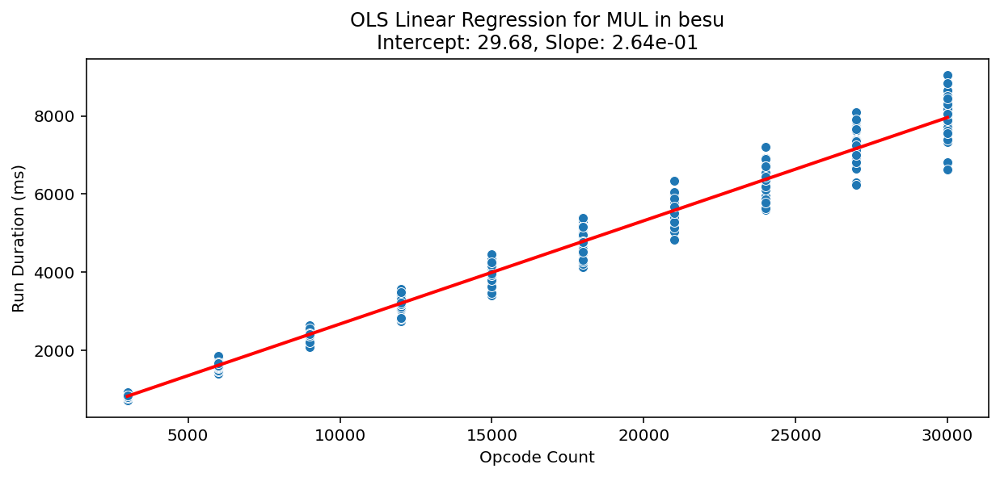

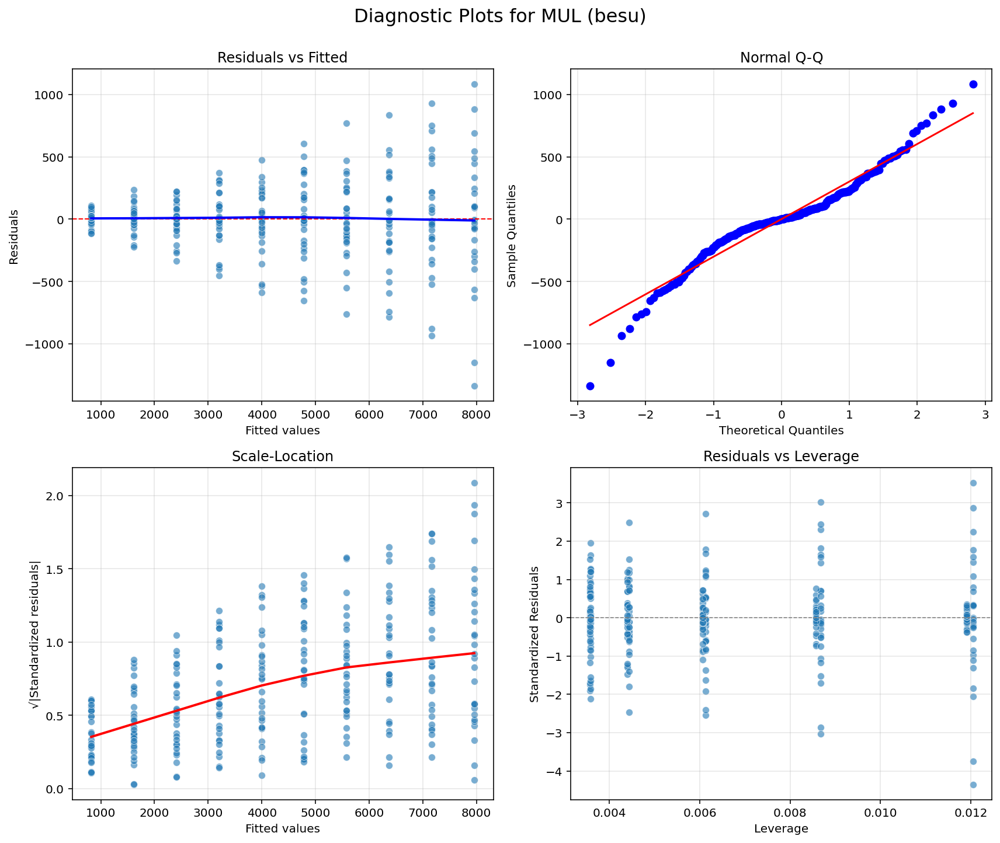


## reth


```python
                            OLS Regression Results                            
==============================================================================
Dep. Variable:        run_duration_ms   R-squared:                       0.971
Model:                            OLS   Adj. R-squared:                  0.971
Method:                 Least Squares   F-statistic:                     5916.
Date:                Thu, 22 Jan 2026   Prob (F-statistic):          2.16e-137
Time:                        10:34:20   Log-Likelihood:                -928.04
No. Observations:                 178   AIC:                             1860.
Df Residuals:                     176   BIC:                             1866.
Df Model:                           1                                         
Covariance Type:            nonrobust                                         
==============================================================================
                 coef    std err          t      P>|t|      [0.025      0.975]
------------------------------------------------------------------------------
const         21.3637      7.204      2.965      0.003       7.145      35.582
opcount        0.0299      0.000     76.913      0.000       0.029       0.031
==============================================================================
Omnibus:                      106.922   Durbin-Watson:                   1.361
Prob(Omnibus):                  0.000   Jarque-Bera (JB):              779.033
Skew:                          -2.164   Prob(JB):                    6.84e-170
Kurtosis:                      12.290   Cond. No.                     3.99e+04
==============================================================================

Notes:
[1] Standard Errors assume that the covariance matrix of the errors is correctly specified.
[2] The condition number is large, 3.99e+04. This might indicate that there are
strong multicollinearity or other numerical problems.
```

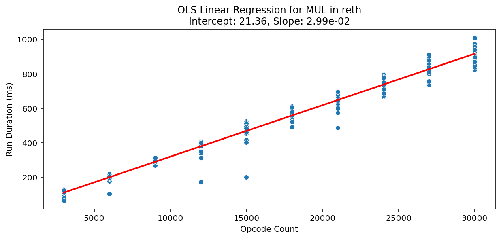

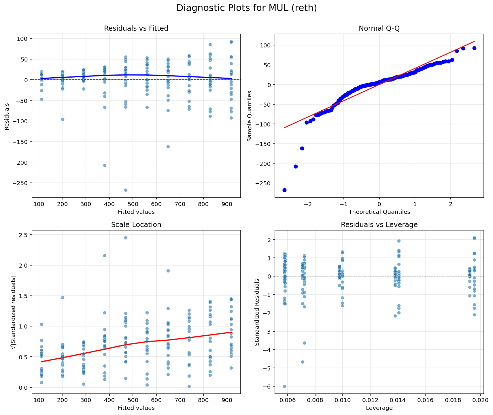


## nethermind


```python
                            OLS Regression Results                            
==============================================================================
Dep. Variable:        run_duration_ms   R-squared:                       0.988
Model:                            OLS   Adj. R-squared:                  0.988
Method:                 Least Squares   F-statistic:                 2.306e+04
Date:                Thu, 22 Jan 2026   Prob (F-statistic):          1.97e-275
Time:                        10:34:21   Log-Likelihood:                -1456.7
No. Observations:                 288   AIC:                             2917.
Df Residuals:                     286   BIC:                             2925.
Df Model:                           1                                         
Covariance Type:            nonrobust                                         
==============================================================================
                 coef    std err          t      P>|t|      [0.025      0.975]
------------------------------------------------------------------------------
const         30.1754      4.846      6.227      0.000      20.638      39.713
opcount        0.0396      0.000    151.839      0.000       0.039       0.040
==============================================================================
Omnibus:                       94.245   Durbin-Watson:                   0.786
Prob(Omnibus):                  0.000   Jarque-Bera (JB):              213.123
Skew:                          -1.620   Prob(JB):                     5.26e-47
Kurtosis:                       5.694   Cond. No.                     4.00e+04
==============================================================================

Notes:
[1] Standard Errors assume that the covariance matrix of the errors is correctly specified.
[2] The condition number is large,  4e+04. This might indicate that there are
strong multicollinearity or other numerical problems.
```

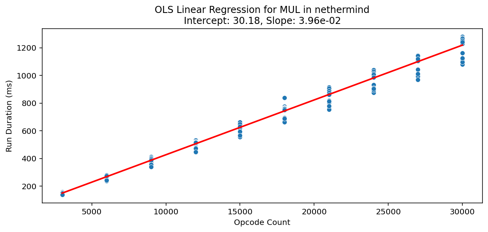


## erigon


```python
                            OLS Regression Results                            
==============================================================================
Dep. Variable:        run_duration_ms   R-squared:                       1.000
Model:                            OLS   Adj. R-squared:                  0.999
Method:                 Least Squares   F-statistic:                 5.726e+04
Date:                Thu, 22 Jan 2026   Prob (F-statistic):           6.63e-48
Time:                        10:34:21   Log-Likelihood:                -95.507
No. Observations:                  30   AIC:                             195.0
Df Residuals:                      28   BIC:                             197.8
Df Model:                           1                                         
Covariance Type:            nonrobust                                         
==============================================================================
                 coef    std err          t      P>|t|      [0.025      0.975]
------------------------------------------------------------------------------
const         28.1922      2.384     11.826      0.000      23.309      33.075
opcount        0.0306      0.000    239.299      0.000       0.030       0.031
==============================================================================
Omnibus:                        2.486   Durbin-Watson:                   1.417
Prob(Omnibus):                  0.289   Jarque-Bera (JB):                1.247
Skew:                          -0.207   Prob(JB):                        0.536
Kurtosis:                       3.910   Cond. No.                     4.02e+04
==============================================================================

Notes:
[1] Standard Errors assume that the covariance matrix of the errors is correctly specified.
[2] The condition number is large, 4.02e+04. This might indicate that there are
strong multicollinearity or other numerical problems.
```
OLS model did not run... Error: 'numpy.ndarray' object has no attribute 'iloc'

# MULMOD

## geth


```python
                            OLS Regression Results                            
==============================================================================
Dep. Variable:        run_duration_ms   R-squared:                       0.988
Model:                            OLS   Adj. R-squared:                  0.988
Method:                 Least Squares   F-statistic:                 1.656e+04
Date:                Thu, 22 Jan 2026   Prob (F-statistic):          8.56e-193
Time:                        10:34:21   Log-Likelihood:                -1118.1
No. Observations:                 200   AIC:                             2240.
Df Residuals:                     198   BIC:                             2247.
Df Model:                           1                                         
Covariance Type:            nonrobust                                         
==============================================================================
                 coef    std err          t      P>|t|      [0.025      0.975]
------------------------------------------------------------------------------
const         34.2359      9.952      3.440      0.001      14.611      53.861
opcount        0.0688      0.001    128.678      0.000       0.068       0.070
==============================================================================
Omnibus:                       30.945   Durbin-Watson:                   0.926
Prob(Omnibus):                  0.000   Jarque-Bera (JB):               50.817
Skew:                          -0.832   Prob(JB):                     9.23e-12
Kurtosis:                       4.825   Cond. No.                     4.02e+04
==============================================================================

Notes:
[1] Standard Errors assume that the covariance matrix of the errors is correctly specified.
[2] The condition number is large, 4.02e+04. This might indicate that there are
strong multicollinearity or other numerical problems.
```


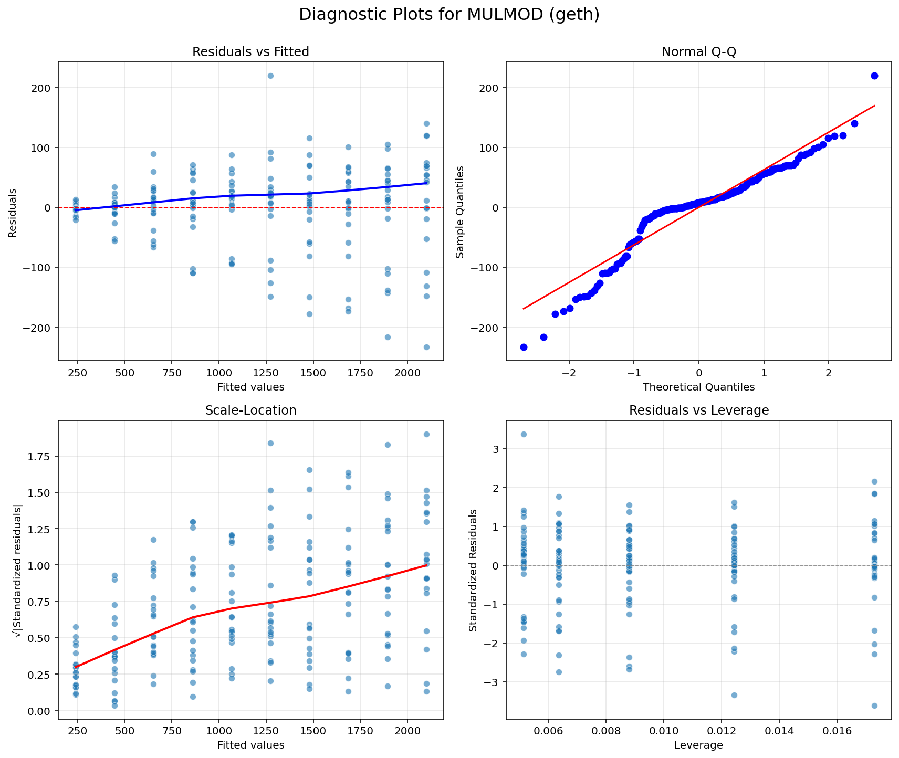


## besu


```python
                            OLS Regression Results                            
==============================================================================
Dep. Variable:        run_duration_ms   R-squared:                       0.984
Model:                            OLS   Adj. R-squared:                  0.984
Method:                 Least Squares   F-statistic:                 1.229e+04
Date:                Thu, 22 Jan 2026   Prob (F-statistic):          3.79e-180
Time:                        10:34:21   Log-Likelihood:                -1337.7
No. Observations:                 200   AIC:                             2679.
Df Residuals:                     198   BIC:                             2686.
Df Model:                           1                                         
Covariance Type:            nonrobust                                         
==============================================================================
                 coef    std err          t      P>|t|      [0.025      0.975]
------------------------------------------------------------------------------
const         49.3754     29.832      1.655      0.099      -9.453     108.204
opcount        0.1777      0.002    110.853      0.000       0.174       0.181
==============================================================================
Omnibus:                       44.068   Durbin-Watson:                   0.853
Prob(Omnibus):                  0.000   Jarque-Bera (JB):               77.339
Skew:                          -1.124   Prob(JB):                     1.61e-17
Kurtosis:                       5.057   Cond. No.                     4.02e+04
==============================================================================

Notes:
[1] Standard Errors assume that the covariance matrix of the errors is correctly specified.
[2] The condition number is large, 4.02e+04. This might indicate that there are
strong multicollinearity or other numerical problems.
```


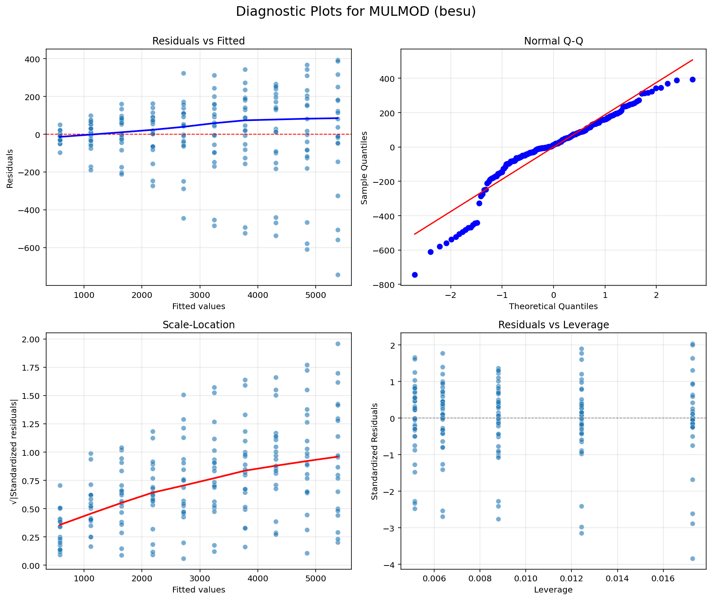


## reth


```python
                            OLS Regression Results                            
==============================================================================
Dep. Variable:        run_duration_ms   R-squared:                       0.993
Model:                            OLS   Adj. R-squared:                  0.993
Method:                 Least Squares   F-statistic:                 1.331e+04
Date:                Thu, 22 Jan 2026   Prob (F-statistic):           7.92e-98
Time:                        10:34:22   Log-Likelihood:                -431.42
No. Observations:                  90   AIC:                             866.8
Df Residuals:                      88   BIC:                             871.8
Df Model:                           1                                         
Covariance Type:            nonrobust                                         
==============================================================================
                 coef    std err          t      P>|t|      [0.025      0.975]
------------------------------------------------------------------------------
const         31.2702      6.727      4.648      0.000      17.901      44.639
opcount        0.0417      0.000    115.365      0.000       0.041       0.042
==============================================================================
Omnibus:                       35.259   Durbin-Watson:                   1.361
Prob(Omnibus):                  0.000   Jarque-Bera (JB):               94.890
Skew:                          -1.331   Prob(JB):                     2.48e-21
Kurtosis:                       7.269   Cond. No.                     4.02e+04
==============================================================================

Notes:
[1] Standard Errors assume that the covariance matrix of the errors is correctly specified.
[2] The condition number is large, 4.02e+04. This might indicate that there are
strong multicollinearity or other numerical problems.
```

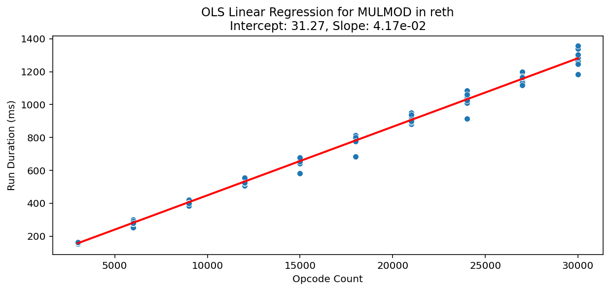

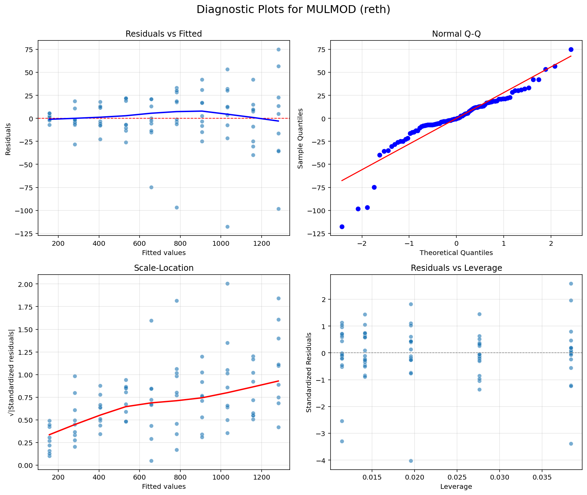


## nethermind


```python
                            OLS Regression Results                            
==============================================================================
Dep. Variable:        run_duration_ms   R-squared:                       0.982
Model:                            OLS   Adj. R-squared:                  0.982
Method:                 Least Squares   F-statistic:                 1.067e+04
Date:                Thu, 22 Jan 2026   Prob (F-statistic):          3.46e-174
Time:                        10:34:22   Log-Likelihood:                -1145.8
No. Observations:                 200   AIC:                             2296.
Df Residuals:                     198   BIC:                             2302.
Df Model:                           1                                         
Covariance Type:            nonrobust                                         
==============================================================================
                 coef    std err          t      P>|t|      [0.025      0.975]
------------------------------------------------------------------------------
const         28.0913     11.427      2.458      0.015       5.556      50.626
opcount        0.0634      0.001    103.307      0.000       0.062       0.065
==============================================================================
Omnibus:                       49.729   Durbin-Watson:                   0.650
Prob(Omnibus):                  0.000   Jarque-Bera (JB):               80.392
Skew:                          -1.358   Prob(JB):                     3.49e-18
Kurtosis:                       4.505   Cond. No.                     4.02e+04
==============================================================================

Notes:
[1] Standard Errors assume that the covariance matrix of the errors is correctly specified.
[2] The condition number is large, 4.02e+04. This might indicate that there are
strong multicollinearity or other numerical problems.
```

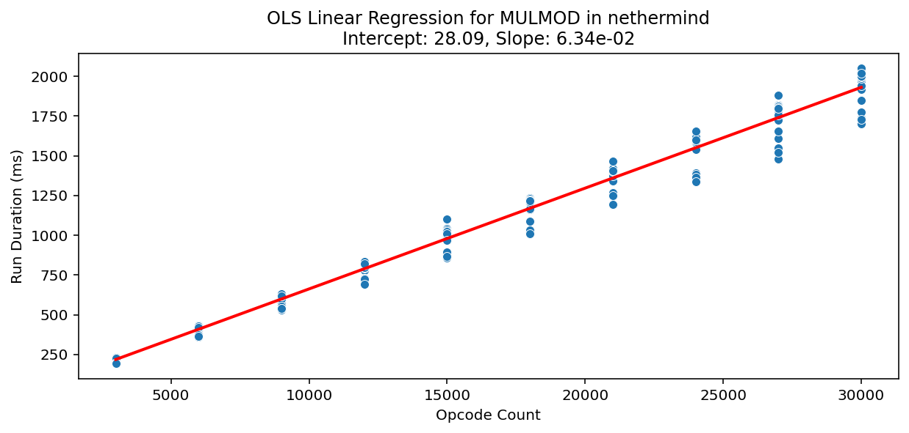

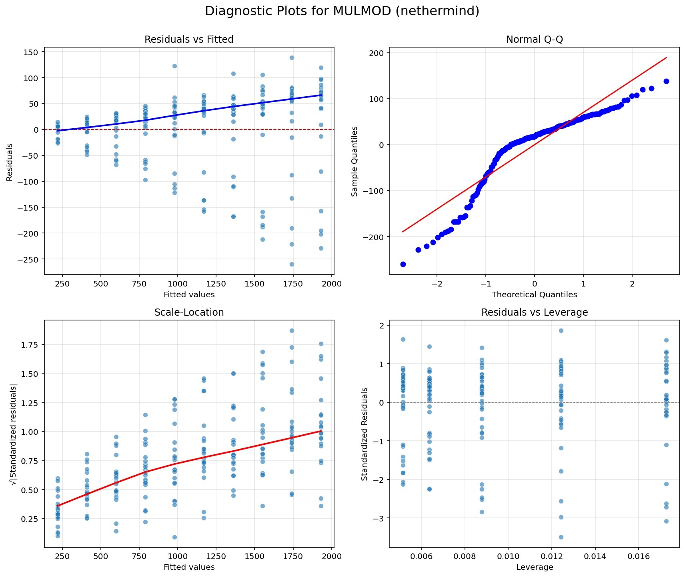


## erigon


```python
                            OLS Regression Results                            
==============================================================================
Dep. Variable:        run_duration_ms   R-squared:                       1.000
Model:                            OLS   Adj. R-squared:                  1.000
Method:                 Least Squares   F-statistic:                 9.010e+04
Date:                Thu, 22 Jan 2026   Prob (F-statistic):           1.17e-50
Time:                        10:34:22   Log-Likelihood:                -115.03
No. Observations:                  30   AIC:                             234.1
Df Residuals:                      28   BIC:                             236.9
Df Model:                           1                                         
Covariance Type:            nonrobust                                         
==============================================================================
                 coef    std err          t      P>|t|      [0.025      0.975]
------------------------------------------------------------------------------
const         27.7081      4.570      6.062      0.000      18.346      37.070
opcount        0.0737      0.000    300.168      0.000       0.073       0.074
==============================================================================
Omnibus:                       18.361   Durbin-Watson:                   1.183
Prob(Omnibus):                  0.000   Jarque-Bera (JB):               25.308
Skew:                           1.476   Prob(JB):                     3.19e-06
Kurtosis:                       6.396   Cond. No.                     4.02e+04
==============================================================================

Notes:
[1] Standard Errors assume that the covariance matrix of the errors is correctly specified.
[2] The condition number is large, 4.02e+04. This might indicate that there are
strong multicollinearity or other numerical problems.
```
OLS model did not run... Error: 'numpy.ndarray' object has no attribute 'iloc'

# NOT

## geth


```python
                            OLS Regression Results                            
==============================================================================
Dep. Variable:        run_duration_ms   R-squared:                       0.984
Model:                            OLS   Adj. R-squared:                  0.984
Method:                 Least Squares   F-statistic:                 1.736e+04
Date:                Thu, 22 Jan 2026   Prob (F-statistic):          1.98e-259
Time:                        10:34:22   Log-Likelihood:                -1408.5
No. Observations:                 290   AIC:                             2821.
Df Residuals:                     288   BIC:                             2828.
Df Model:                           1                                         
Covariance Type:            nonrobust                                         
==============================================================================
                 coef    std err          t      P>|t|      [0.025      0.975]
------------------------------------------------------------------------------
const         29.3943      3.962      7.418      0.000      21.595      37.193
opcount        0.0112   8.51e-05    131.764      0.000       0.011       0.011
==============================================================================
Omnibus:                       12.251   Durbin-Watson:                   1.283
Prob(Omnibus):                  0.002   Jarque-Bera (JB):               18.737
Skew:                           0.281   Prob(JB):                     8.54e-05
Kurtosis:                       4.111   Cond. No.                     1.01e+05
==============================================================================

Notes:
[1] Standard Errors assume that the covariance matrix of the errors is correctly specified.
[2] The condition number is large, 1.01e+05. This might indicate that there are
strong multicollinearity or other numerical problems.
```


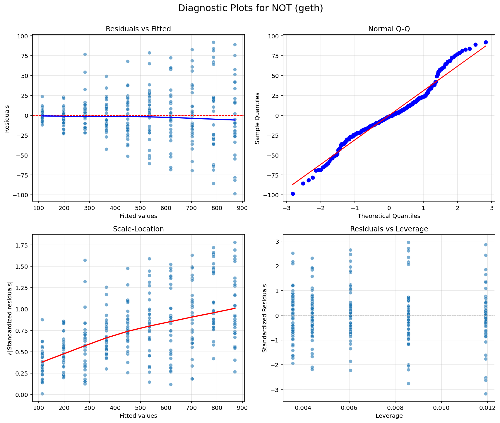


## besu


```python
                            OLS Regression Results                            
==============================================================================
Dep. Variable:        run_duration_ms   R-squared:                       0.996
Model:                            OLS   Adj. R-squared:                  0.996
Method:                 Least Squares   F-statistic:                 7.062e+04
Date:                Thu, 22 Jan 2026   Prob (F-statistic):               0.00
Time:                        10:34:23   Log-Likelihood:                -1600.2
No. Observations:                 290   AIC:                             3204.
Df Residuals:                     288   BIC:                             3212.
Df Model:                           1                                         
Covariance Type:            nonrobust                                         
==============================================================================
                 coef    std err          t      P>|t|      [0.025      0.975]
------------------------------------------------------------------------------
const         29.5812      7.673      3.855      0.000      14.479      44.684
opcount        0.0438      0.000    265.735      0.000       0.043       0.044
==============================================================================
Omnibus:                       17.176   Durbin-Watson:                   1.113
Prob(Omnibus):                  0.000   Jarque-Bera (JB):               33.976
Skew:                          -0.300   Prob(JB):                     4.19e-08
Kurtosis:                       4.566   Cond. No.                     1.01e+05
==============================================================================

Notes:
[1] Standard Errors assume that the covariance matrix of the errors is correctly specified.
[2] The condition number is large, 1.01e+05. This might indicate that there are
strong multicollinearity or other numerical problems.
```

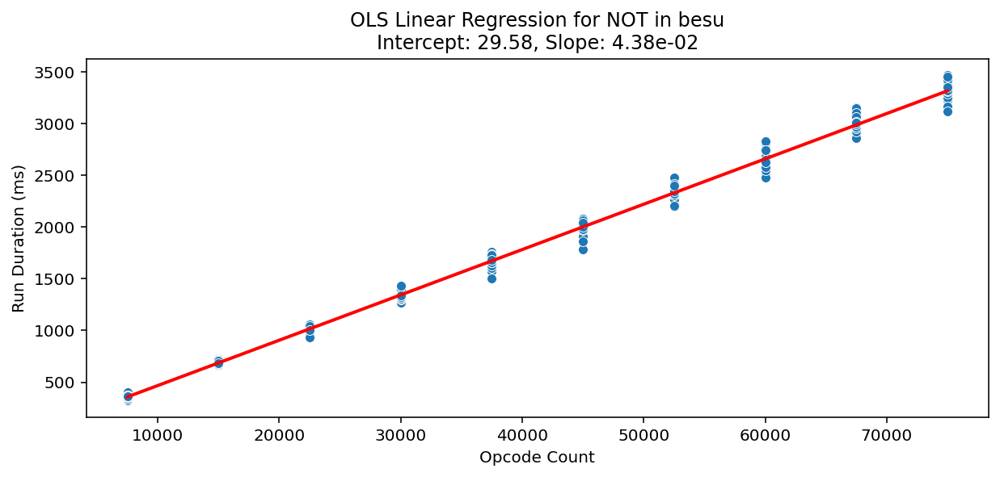


## reth


```python
                            OLS Regression Results                            
==============================================================================
Dep. Variable:        run_duration_ms   R-squared:                       0.972
Model:                            OLS   Adj. R-squared:                  0.972
Method:                 Least Squares   F-statistic:                     6188.
Date:                Thu, 22 Jan 2026   Prob (F-statistic):          3.35e-140
Time:                        10:34:23   Log-Likelihood:                -810.75
No. Observations:                 180   AIC:                             1625.
Df Residuals:                     178   BIC:                             1632.
Df Model:                           1                                         
Covariance Type:            nonrobust                                         
==============================================================================
                 coef    std err          t      P>|t|      [0.025      0.975]
------------------------------------------------------------------------------
const         31.8894      3.542      9.004      0.000      24.901      38.878
opcount        0.0060   7.61e-05     78.664      0.000       0.006       0.006
==============================================================================
Omnibus:                       12.132   Durbin-Watson:                   1.707
Prob(Omnibus):                  0.002   Jarque-Bera (JB):               12.775
Skew:                          -0.573   Prob(JB):                      0.00168
Kurtosis:                       3.625   Cond. No.                     1.01e+05
==============================================================================

Notes:
[1] Standard Errors assume that the covariance matrix of the errors is correctly specified.
[2] The condition number is large, 1.01e+05. This might indicate that there are
strong multicollinearity or other numerical problems.
```

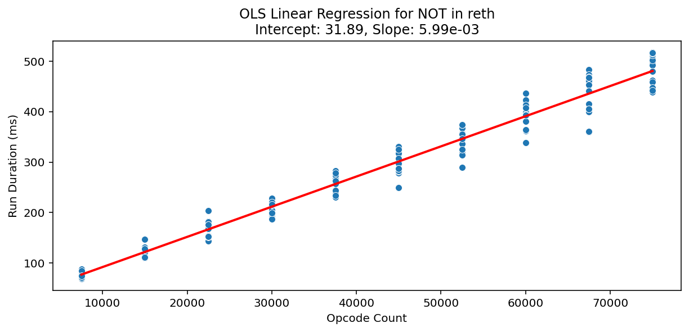

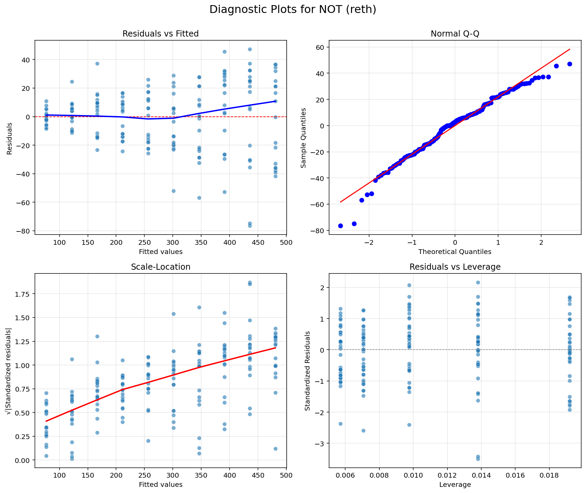


## nethermind


```python
                            OLS Regression Results                            
==============================================================================
Dep. Variable:        run_duration_ms   R-squared:                       0.980
Model:                            OLS   Adj. R-squared:                  0.980
Method:                 Least Squares   F-statistic:                 1.382e+04
Date:                Thu, 22 Jan 2026   Prob (F-statistic):          1.96e-245
Time:                        10:34:23   Log-Likelihood:                -1299.0
No. Observations:                 290   AIC:                             2602.
Df Residuals:                     288   BIC:                             2609.
Df Model:                           1                                         
Covariance Type:            nonrobust                                         
==============================================================================
                 coef    std err          t      P>|t|      [0.025      0.975]
------------------------------------------------------------------------------
const         27.6996      2.716     10.197      0.000      22.353      33.046
opcount        0.0069   5.84e-05    117.571      0.000       0.007       0.007
==============================================================================
Omnibus:                       30.693   Durbin-Watson:                   0.992
Prob(Omnibus):                  0.000   Jarque-Bera (JB):               67.446
Skew:                          -0.532   Prob(JB):                     2.26e-15
Kurtosis:                       5.109   Cond. No.                     1.01e+05
==============================================================================

Notes:
[1] Standard Errors assume that the covariance matrix of the errors is correctly specified.
[2] The condition number is large, 1.01e+05. This might indicate that there are
strong multicollinearity or other numerical problems.
```


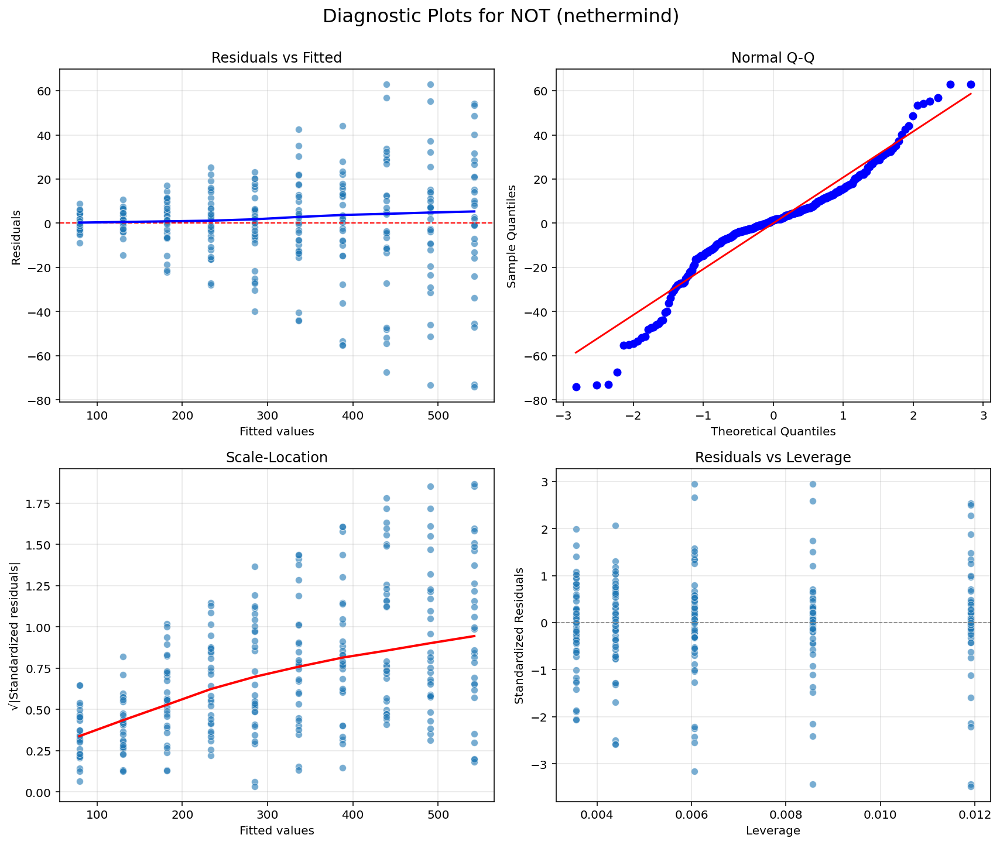


## erigon


```python
                            OLS Regression Results                            
==============================================================================
Dep. Variable:        run_duration_ms   R-squared:                       0.999
Model:                            OLS   Adj. R-squared:                  0.999
Method:                 Least Squares   F-statistic:                 1.980e+04
Date:                Thu, 22 Jan 2026   Prob (F-statistic):           1.87e-41
Time:                        10:34:23   Log-Likelihood:                -111.23
No. Observations:                  30   AIC:                             226.5
Df Residuals:                      28   BIC:                             229.3
Df Model:                           1                                         
Covariance Type:            nonrobust                                         
==============================================================================
                 coef    std err          t      P>|t|      [0.025      0.975]
------------------------------------------------------------------------------
const         28.7645      4.026      7.144      0.000      20.517      37.012
opcount        0.0122   8.65e-05    140.719      0.000       0.012       0.012
==============================================================================
Omnibus:                        1.036   Durbin-Watson:                   0.782
Prob(Omnibus):                  0.596   Jarque-Bera (JB):                1.025
Skew:                           0.379   Prob(JB):                        0.599
Kurtosis:                       2.506   Cond. No.                     1.01e+05
==============================================================================

Notes:
[1] Standard Errors assume that the covariance matrix of the errors is correctly specified.
[2] The condition number is large, 1.01e+05. This might indicate that there are
strong multicollinearity or other numerical problems.
```


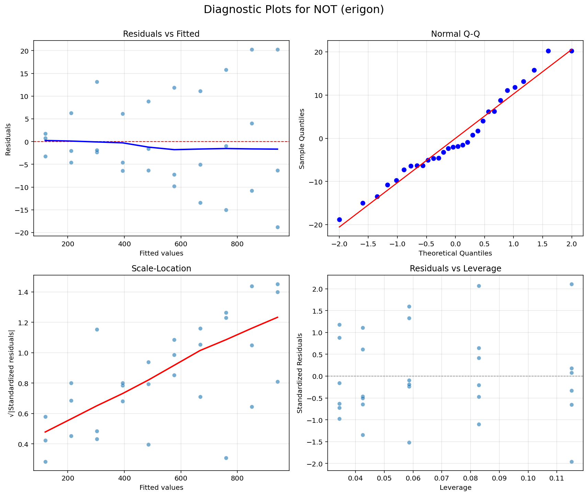


# NUMBER

## geth


```python
                            OLS Regression Results                            
==============================================================================
Dep. Variable:        run_duration_ms   R-squared:                       0.980
Model:                            OLS   Adj. R-squared:                  0.980
Method:                 Least Squares   F-statistic:                 1.433e+04
Date:                Thu, 22 Jan 2026   Prob (F-statistic):          1.23e-247
Time:                        10:34:24   Log-Likelihood:                -1682.3
No. Observations:                 290   AIC:                             3369.
Df Residuals:                     288   BIC:                             3376.
Df Model:                           1                                         
Covariance Type:            nonrobust                                         
==============================================================================
                 coef    std err          t      P>|t|      [0.025      0.975]
------------------------------------------------------------------------------
const         34.3232     10.185      3.370      0.001      14.277      54.370
opcount        0.0196      0.000    119.702      0.000       0.019       0.020
==============================================================================
Omnibus:                       97.339   Durbin-Watson:                   1.111
Prob(Omnibus):                  0.000   Jarque-Bera (JB):              721.350
Skew:                           1.148   Prob(JB):                    2.29e-157
Kurtosis:                      10.378   Cond. No.                     1.34e+05
==============================================================================

Notes:
[1] Standard Errors assume that the covariance matrix of the errors is correctly specified.
[2] The condition number is large, 1.34e+05. This might indicate that there are
strong multicollinearity or other numerical problems.
```

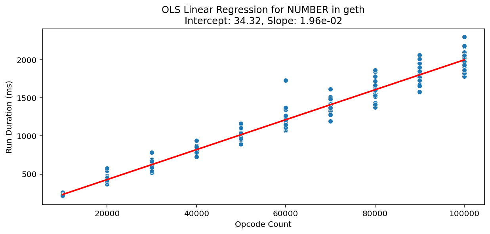

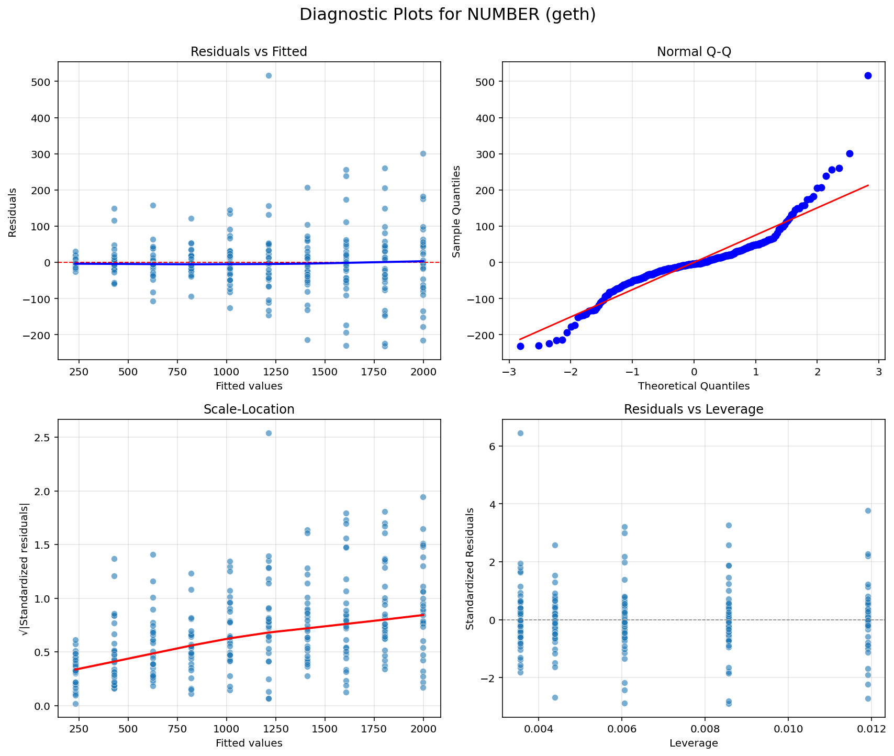


## besu


```python
                            OLS Regression Results                            
==============================================================================
Dep. Variable:        run_duration_ms   R-squared:                       0.993
Model:                            OLS   Adj. R-squared:                  0.993
Method:                 Least Squares   F-statistic:                 4.373e+04
Date:                Thu, 22 Jan 2026   Prob (F-statistic):          1.40e-316
Time:                        10:34:24   Log-Likelihood:                -1630.7
No. Observations:                 290   AIC:                             3265.
Df Residuals:                     288   BIC:                             3273.
Df Model:                           1                                         
Covariance Type:            nonrobust                                         
==============================================================================
                 coef    std err          t      P>|t|      [0.025      0.975]
------------------------------------------------------------------------------
const         22.6388      8.525      2.656      0.008       5.860      39.418
opcount        0.0287      0.000    209.110      0.000       0.028       0.029
==============================================================================
Omnibus:                       35.269   Durbin-Watson:                   0.960
Prob(Omnibus):                  0.000   Jarque-Bera (JB):              107.994
Skew:                          -0.493   Prob(JB):                     3.54e-24
Kurtosis:                       5.822   Cond. No.                     1.34e+05
==============================================================================

Notes:
[1] Standard Errors assume that the covariance matrix of the errors is correctly specified.
[2] The condition number is large, 1.34e+05. This might indicate that there are
strong multicollinearity or other numerical problems.
```


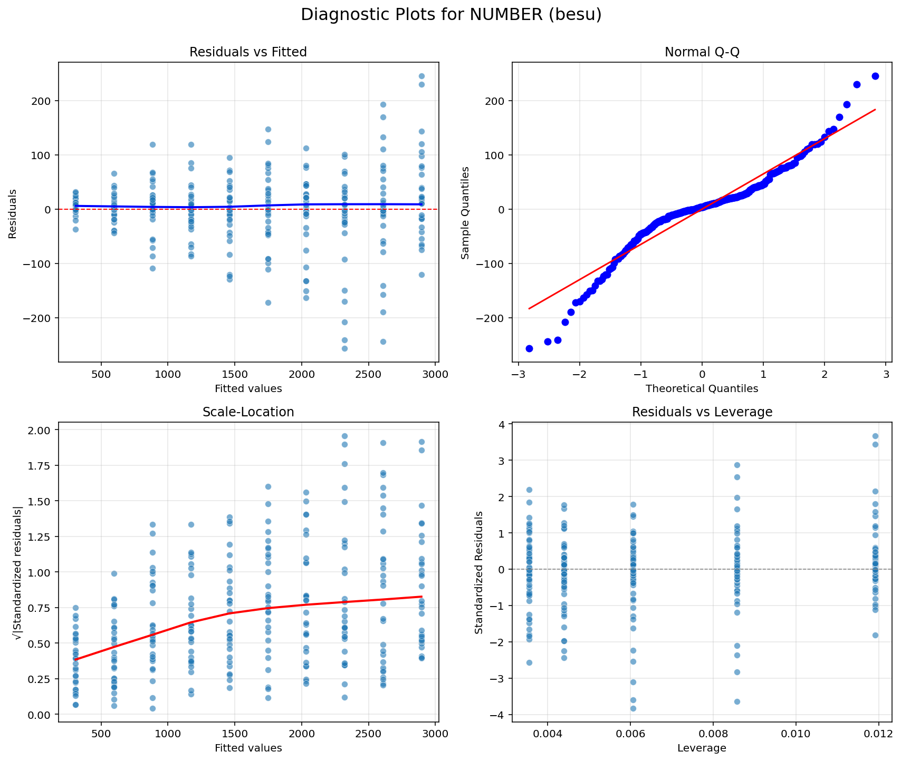


## reth


```python
                            OLS Regression Results                            
==============================================================================
Dep. Variable:        run_duration_ms   R-squared:                       0.973
Model:                            OLS   Adj. R-squared:                  0.973
Method:                 Least Squares   F-statistic:                     6532.
Date:                Thu, 22 Jan 2026   Prob (F-statistic):          3.10e-142
Time:                        10:34:24   Log-Likelihood:                -862.52
No. Observations:                 180   AIC:                             1729.
Df Residuals:                     178   BIC:                             1735.
Df Model:                           1                                         
Covariance Type:            nonrobust                                         
==============================================================================
                 coef    std err          t      P>|t|      [0.025      0.975]
------------------------------------------------------------------------------
const         31.3838      4.722      6.647      0.000      22.066      40.701
opcount        0.0062   7.61e-05     80.821      0.000       0.006       0.006
==============================================================================
Omnibus:                        4.212   Durbin-Watson:                   1.320
Prob(Omnibus):                  0.122   Jarque-Bera (JB):                4.606
Skew:                           0.171   Prob(JB):                        0.100
Kurtosis:                       3.705   Cond. No.                     1.34e+05
==============================================================================

Notes:
[1] Standard Errors assume that the covariance matrix of the errors is correctly specified.
[2] The condition number is large, 1.34e+05. This might indicate that there are
strong multicollinearity or other numerical problems.
```

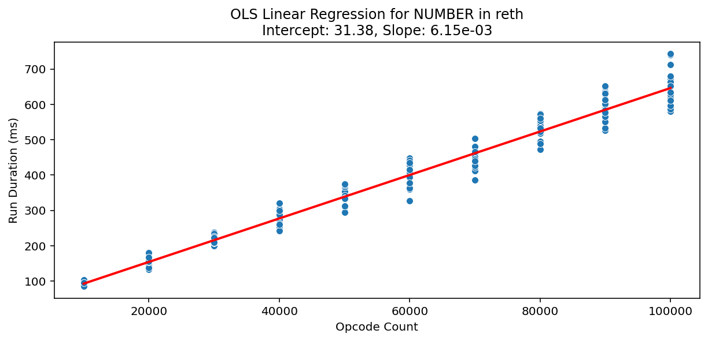

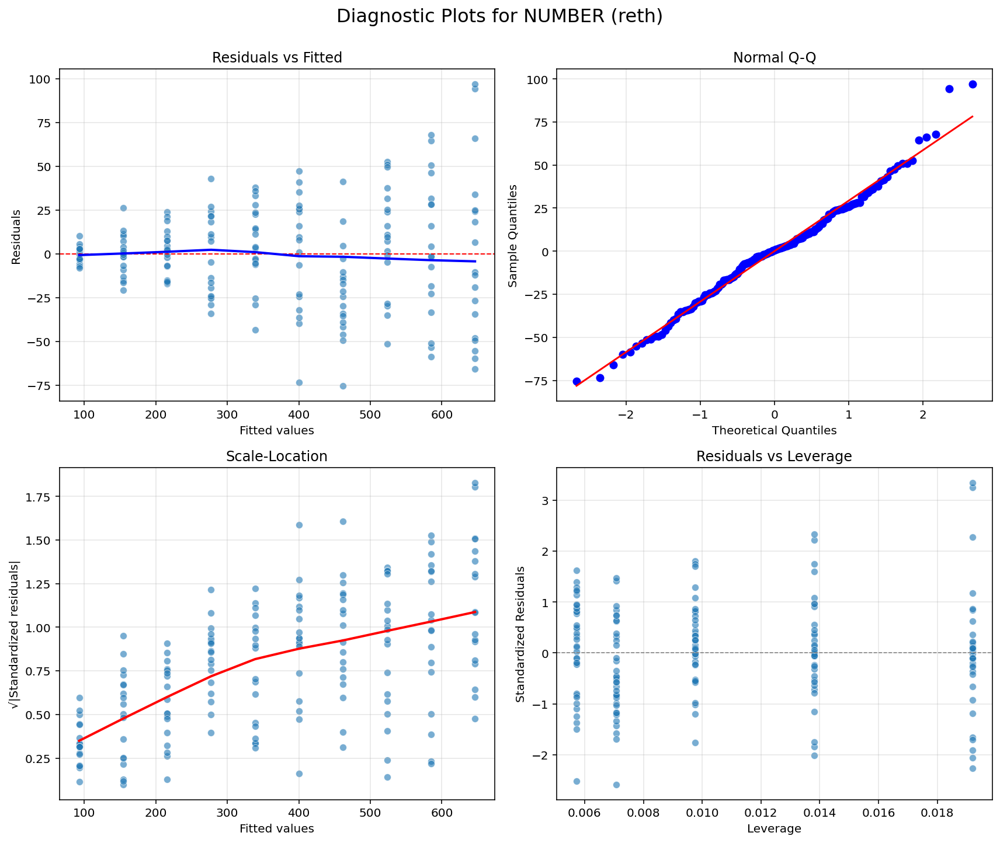


## nethermind


```python
                            OLS Regression Results                            
==============================================================================
Dep. Variable:        run_duration_ms   R-squared:                       0.980
Model:                            OLS   Adj. R-squared:                  0.980
Method:                 Least Squares   F-statistic:                 1.381e+04
Date:                Thu, 22 Jan 2026   Prob (F-statistic):          2.14e-245
Time:                        10:34:25   Log-Likelihood:                -1383.5
No. Observations:                 290   AIC:                             2771.
Df Residuals:                     288   BIC:                             2778.
Df Model:                           1                                         
Covariance Type:            nonrobust                                         
==============================================================================
                 coef    std err          t      P>|t|      [0.025      0.975]
------------------------------------------------------------------------------
const         32.0681      3.634      8.824      0.000      24.916      39.221
opcount        0.0069   5.86e-05    117.535      0.000       0.007       0.007
==============================================================================
Omnibus:                       29.394   Durbin-Watson:                   0.946
Prob(Omnibus):                  0.000   Jarque-Bera (JB):               62.638
Skew:                          -0.520   Prob(JB):                     2.50e-14
Kurtosis:                       5.026   Cond. No.                     1.34e+05
==============================================================================

Notes:
[1] Standard Errors assume that the covariance matrix of the errors is correctly specified.
[2] The condition number is large, 1.34e+05. This might indicate that there are
strong multicollinearity or other numerical problems.
```

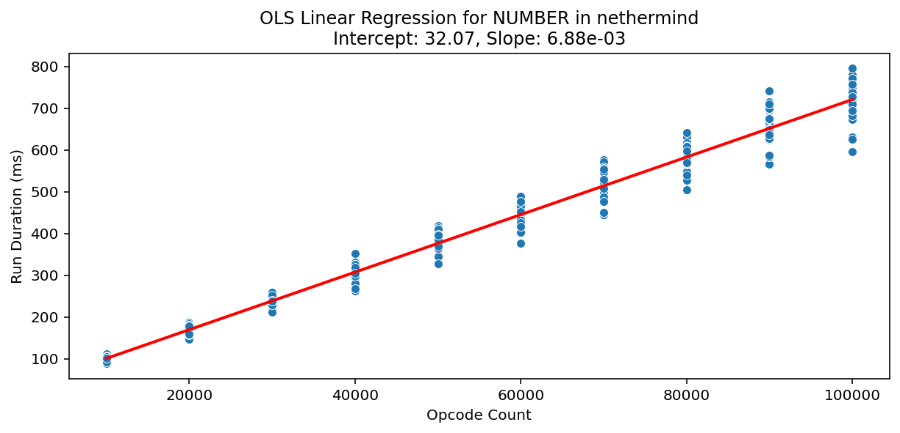

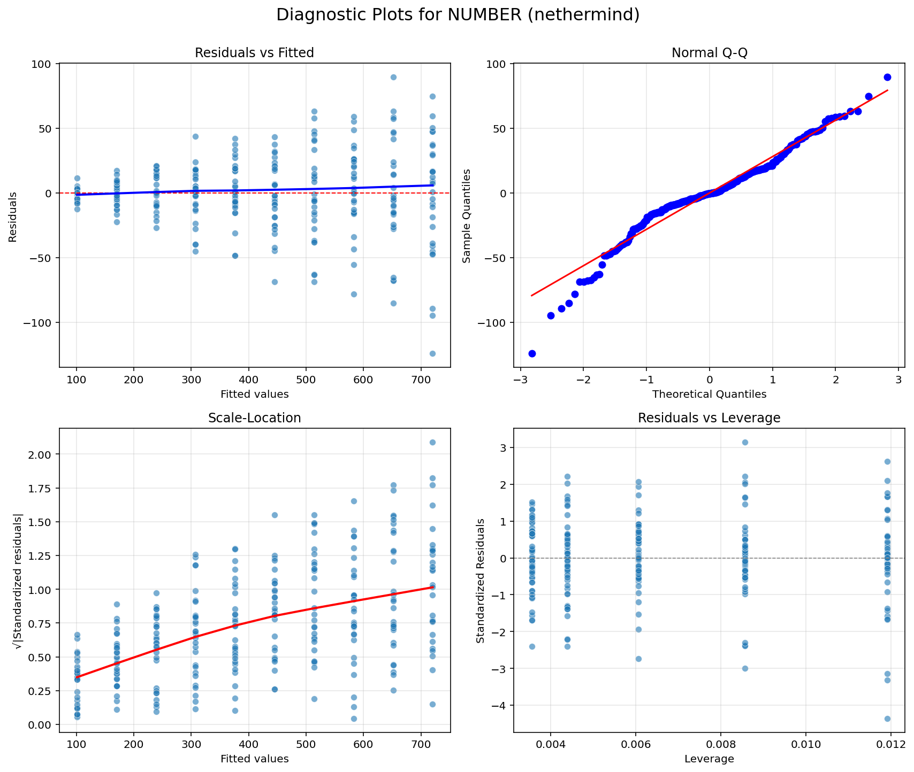


## erigon


```python
                            OLS Regression Results                            
==============================================================================
Dep. Variable:        run_duration_ms   R-squared:                       0.999
Model:                            OLS   Adj. R-squared:                  0.999
Method:                 Least Squares   F-statistic:                 3.956e+04
Date:                Thu, 22 Jan 2026   Prob (F-statistic):           1.17e-45
Time:                        10:34:25   Log-Likelihood:                -121.85
No. Observations:                  30   AIC:                             247.7
Df Residuals:                      28   BIC:                             250.5
Df Model:                           1                                         
Covariance Type:            nonrobust                                         
==============================================================================
                 coef    std err          t      P>|t|      [0.025      0.975]
------------------------------------------------------------------------------
const         34.7386      5.737      6.056      0.000      22.988      46.489
opcount        0.0184   9.25e-05    198.894      0.000       0.018       0.019
==============================================================================
Omnibus:                        0.090   Durbin-Watson:                   0.815
Prob(Omnibus):                  0.956   Jarque-Bera (JB):                0.176
Skew:                           0.113   Prob(JB):                        0.916
Kurtosis:                       2.700   Cond. No.                     1.34e+05
==============================================================================

Notes:
[1] Standard Errors assume that the covariance matrix of the errors is correctly specified.
[2] The condition number is large, 1.34e+05. This might indicate that there are
strong multicollinearity or other numerical problems.
```


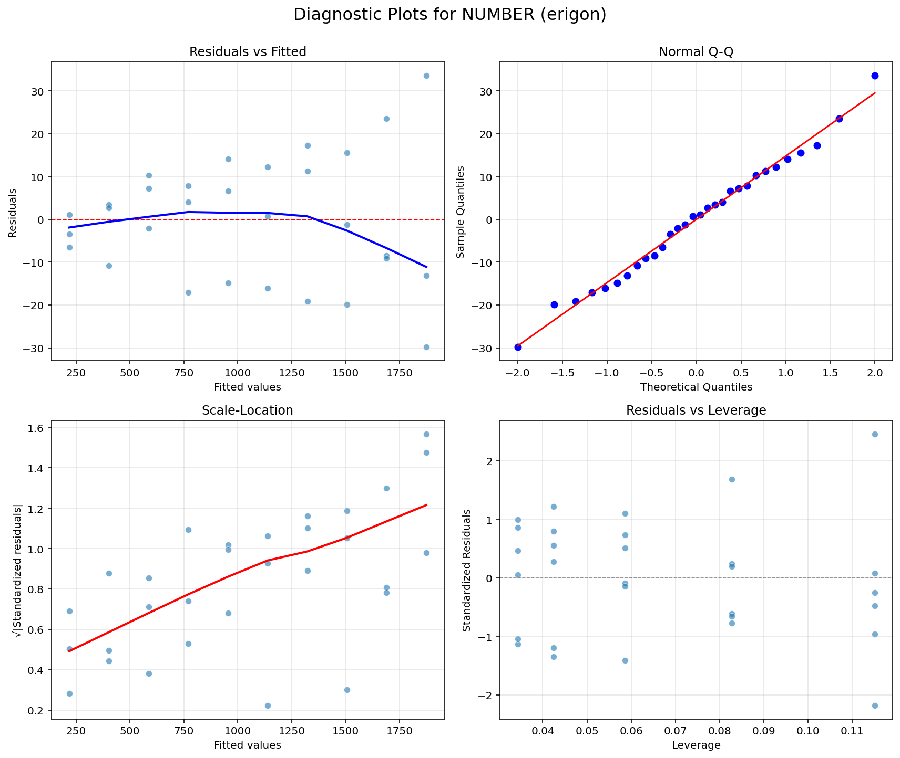


# OR

## geth


```python
                            OLS Regression Results                            
==============================================================================
Dep. Variable:        run_duration_ms   R-squared:                       0.984
Model:                            OLS   Adj. R-squared:                  0.984
Method:                 Least Squares   F-statistic:                 1.790e+04
Date:                Thu, 22 Jan 2026   Prob (F-statistic):          2.61e-261
Time:                        10:34:25   Log-Likelihood:                -1404.0
No. Observations:                 290   AIC:                             2812.
Df Residuals:                     288   BIC:                             2819.
Df Model:                           1                                         
Covariance Type:            nonrobust                                         
==============================================================================
                 coef    std err          t      P>|t|      [0.025      0.975]
------------------------------------------------------------------------------
const         31.3517      3.900      8.039      0.000      23.675      39.028
opcount        0.0240      0.000    133.793      0.000       0.024       0.024
==============================================================================
Omnibus:                       30.555   Durbin-Watson:                   1.032
Prob(Omnibus):                  0.000   Jarque-Bera (JB):               74.963
Skew:                          -0.490   Prob(JB):                     5.27e-17
Kurtosis:                       5.290   Cond. No.                     4.69e+04
==============================================================================

Notes:
[1] Standard Errors assume that the covariance matrix of the errors is correctly specified.
[2] The condition number is large, 4.69e+04. This might indicate that there are
strong multicollinearity or other numerical problems.
```

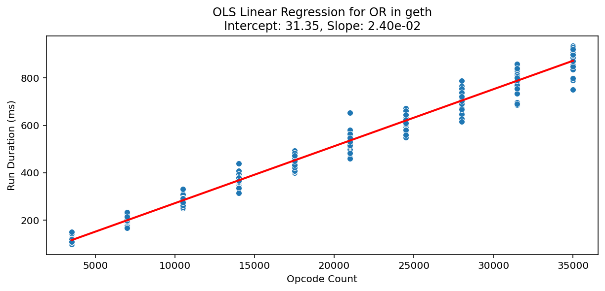

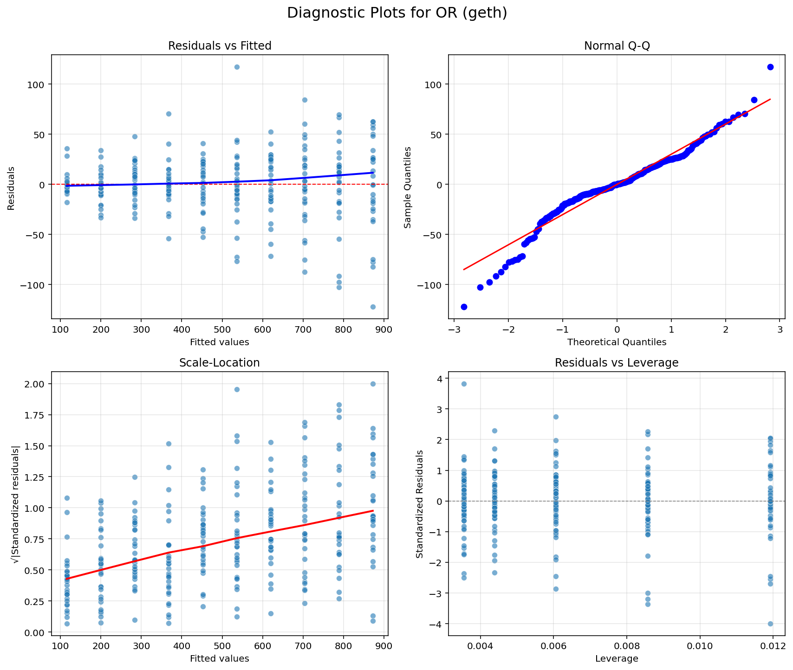


## besu


```python
                            OLS Regression Results                            
==============================================================================
Dep. Variable:        run_duration_ms   R-squared:                       0.993
Model:                            OLS   Adj. R-squared:                  0.993
Method:                 Least Squares   F-statistic:                 3.922e+04
Date:                Thu, 22 Jan 2026   Prob (F-statistic):          8.10e-310
Time:                        10:34:25   Log-Likelihood:                -1615.3
No. Observations:                 290   AIC:                             3235.
Df Residuals:                     288   BIC:                             3242.
Df Model:                           1                                         
Covariance Type:            nonrobust                                         
==============================================================================
                 coef    std err          t      P>|t|      [0.025      0.975]
------------------------------------------------------------------------------
const         39.9049      8.083      4.937      0.000      23.995      55.815
opcount        0.0737      0.000    198.032      0.000       0.073       0.074
==============================================================================
Omnibus:                       47.095   Durbin-Watson:                   1.282
Prob(Omnibus):                  0.000   Jarque-Bera (JB):              474.418
Skew:                           0.067   Prob(JB):                    9.58e-104
Kurtosis:                       9.265   Cond. No.                     4.69e+04
==============================================================================

Notes:
[1] Standard Errors assume that the covariance matrix of the errors is correctly specified.
[2] The condition number is large, 4.69e+04. This might indicate that there are
strong multicollinearity or other numerical problems.
```

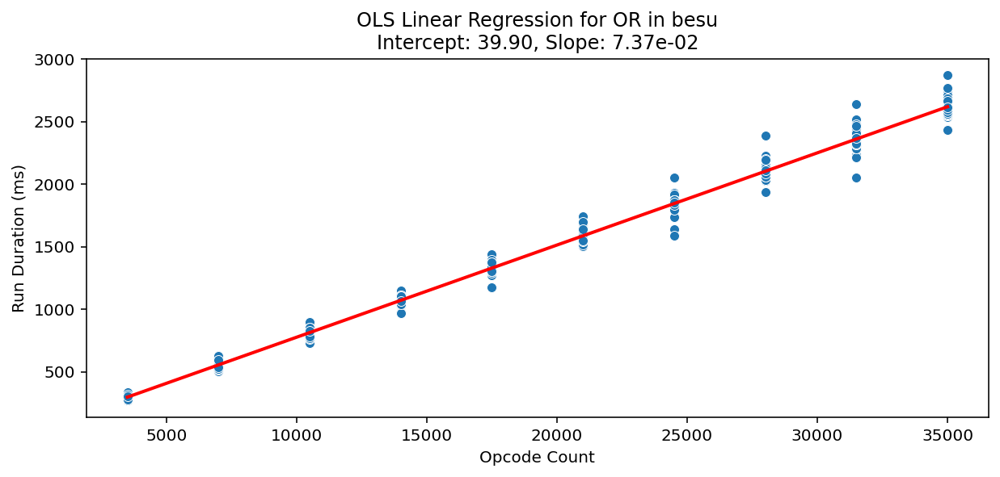

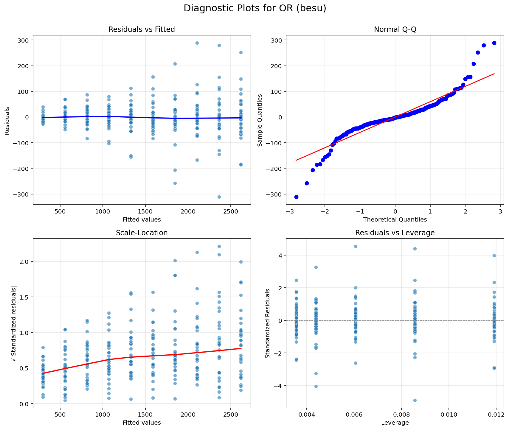


## reth


```python
                            OLS Regression Results                            
==============================================================================
Dep. Variable:        run_duration_ms   R-squared:                       0.971
Model:                            OLS   Adj. R-squared:                  0.970
Method:                 Least Squares   F-statistic:                     5884.
Date:                Thu, 22 Jan 2026   Prob (F-statistic):          2.60e-138
Time:                        10:34:26   Log-Likelihood:                -745.81
No. Observations:                 180   AIC:                             1496.
Df Residuals:                     178   BIC:                             1502.
Df Model:                           1                                         
Covariance Type:            nonrobust                                         
==============================================================================
                 coef    std err          t      P>|t|      [0.025      0.975]
------------------------------------------------------------------------------
const         32.4842      2.469     13.157      0.000      27.612      37.356
opcount        0.0087      0.000     76.709      0.000       0.008       0.009
==============================================================================
Omnibus:                      111.405   Durbin-Watson:                   1.516
Prob(Omnibus):                  0.000   Jarque-Bera (JB):             1140.225
Skew:                           2.103   Prob(JB):                    2.53e-248
Kurtosis:                      14.590   Cond. No.                     4.69e+04
==============================================================================

Notes:
[1] Standard Errors assume that the covariance matrix of the errors is correctly specified.
[2] The condition number is large, 4.69e+04. This might indicate that there are
strong multicollinearity or other numerical problems.
```

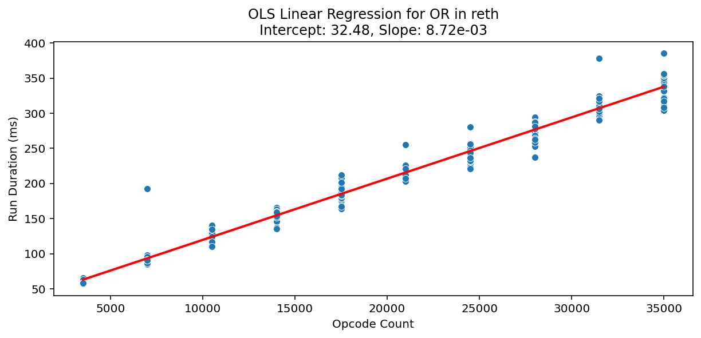

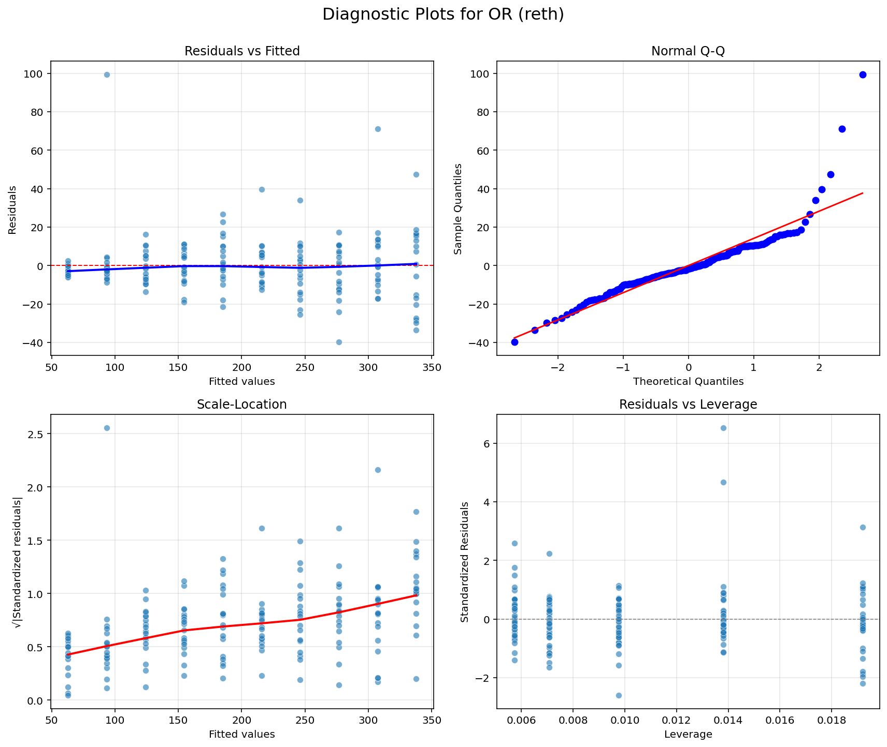


## nethermind


```python
                            OLS Regression Results                            
==============================================================================
Dep. Variable:        run_duration_ms   R-squared:                       0.606
Model:                            OLS   Adj. R-squared:                  0.605
Method:                 Least Squares   F-statistic:                     443.7
Date:                Thu, 22 Jan 2026   Prob (F-statistic):           2.95e-60
Time:                        10:34:26   Log-Likelihood:                -1913.5
No. Observations:                 290   AIC:                             3831.
Df Residuals:                     288   BIC:                             3838.
Df Model:                           1                                         
Covariance Type:            nonrobust                                         
==============================================================================
                 coef    std err          t      P>|t|      [0.025      0.975]
------------------------------------------------------------------------------
const         20.6942     22.607      0.915      0.361     -23.801      65.190
opcount        0.0219      0.001     21.064      0.000       0.020       0.024
==============================================================================
Omnibus:                       24.771   Durbin-Watson:                   0.771
Prob(Omnibus):                  0.000   Jarque-Bera (JB):               14.823
Skew:                          -0.407   Prob(JB):                     0.000604
Kurtosis:                       2.248   Cond. No.                     4.69e+04
==============================================================================

Notes:
[1] Standard Errors assume that the covariance matrix of the errors is correctly specified.
[2] The condition number is large, 4.69e+04. This might indicate that there are
strong multicollinearity or other numerical problems.
```

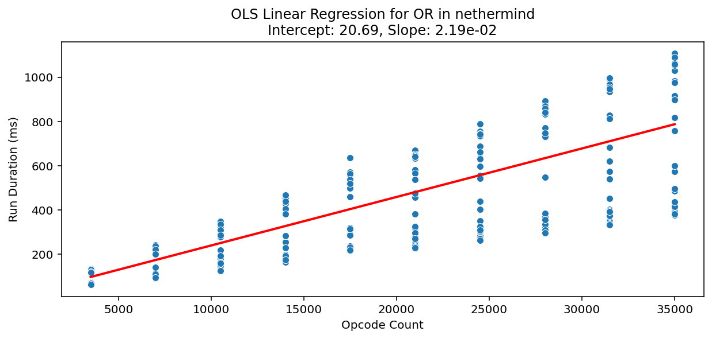

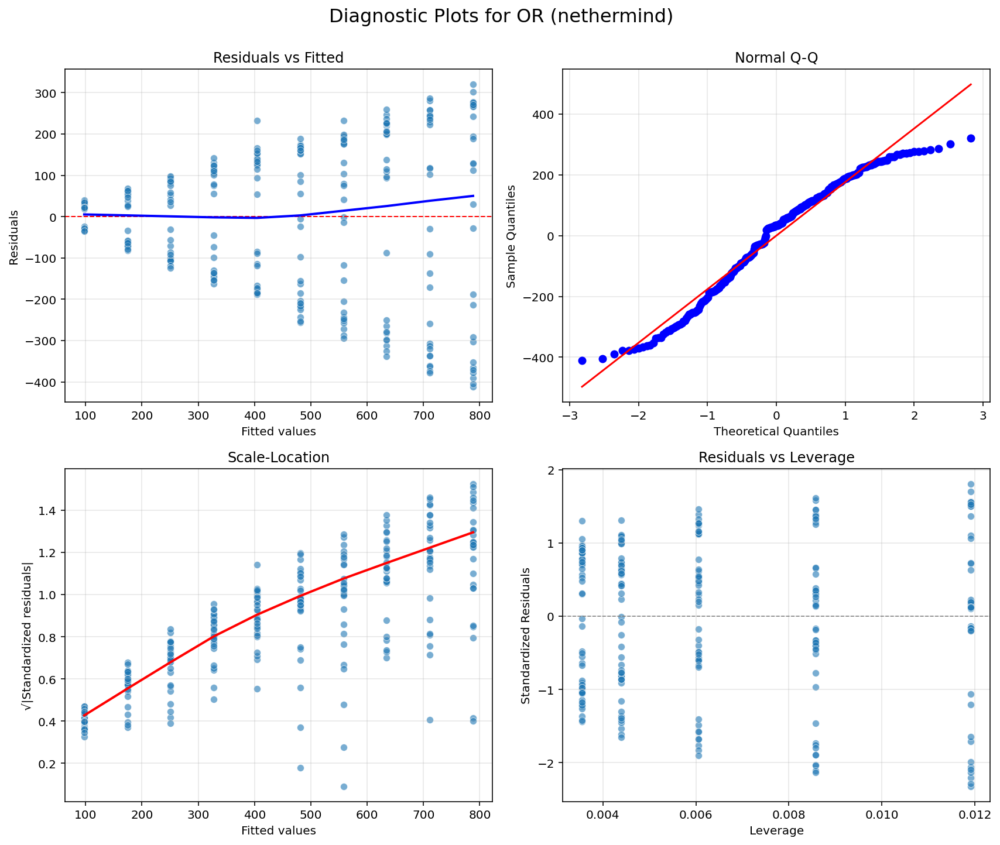


## erigon


```python
                            OLS Regression Results                            
==============================================================================
Dep. Variable:        run_duration_ms   R-squared:                       0.999
Model:                            OLS   Adj. R-squared:                  0.999
Method:                 Least Squares   F-statistic:                 2.811e+04
Date:                Thu, 22 Jan 2026   Prob (F-statistic):           1.39e-43
Time:                        10:34:26   Log-Likelihood:                -105.40
No. Observations:                  30   AIC:                             214.8
Df Residuals:                      28   BIC:                             217.6
Df Model:                           1                                         
Covariance Type:            nonrobust                                         
==============================================================================
                 coef    std err          t      P>|t|      [0.025      0.975]
------------------------------------------------------------------------------
const         32.5222      3.315      9.810      0.000      25.731      39.313
opcount        0.0256      0.000    167.672      0.000       0.025       0.026
==============================================================================
Omnibus:                       16.728   Durbin-Watson:                   1.054
Prob(Omnibus):                  0.000   Jarque-Bera (JB):               18.727
Skew:                           1.568   Prob(JB):                     8.58e-05
Kurtosis:                       5.270   Cond. No.                     4.69e+04
==============================================================================

Notes:
[1] Standard Errors assume that the covariance matrix of the errors is correctly specified.
[2] The condition number is large, 4.69e+04. This might indicate that there are
strong multicollinearity or other numerical problems.
```

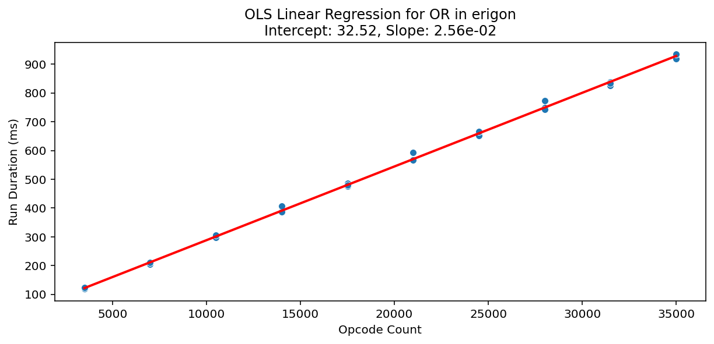

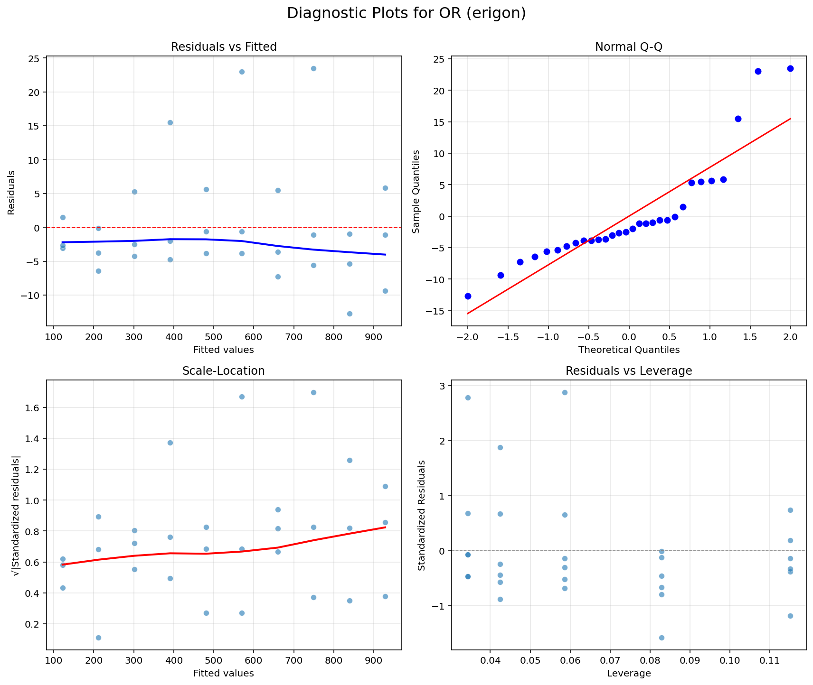


# ORIGIN

## geth


```python
                            OLS Regression Results                            
==============================================================================
Dep. Variable:        run_duration_ms   R-squared:                       0.980
Model:                            OLS   Adj. R-squared:                  0.980
Method:                 Least Squares   F-statistic:                 1.391e+04
Date:                Thu, 22 Jan 2026   Prob (F-statistic):          7.89e-246
Time:                        10:34:26   Log-Likelihood:                -1703.9
No. Observations:                 290   AIC:                             3412.
Df Residuals:                     288   BIC:                             3419.
Df Model:                           1                                         
Covariance Type:            nonrobust                                         
==============================================================================
                 coef    std err          t      P>|t|      [0.025      0.975]
------------------------------------------------------------------------------
const         32.4107     10.973      2.954      0.003      10.814      54.007
opcount        0.0209      0.000    117.951      0.000       0.021       0.021
==============================================================================
Omnibus:                       87.704   Durbin-Watson:                   1.087
Prob(Omnibus):                  0.000   Jarque-Bera (JB):             1134.713
Skew:                           0.809   Prob(JB):                    3.98e-247
Kurtosis:                      12.554   Cond. No.                     1.34e+05
==============================================================================

Notes:
[1] Standard Errors assume that the covariance matrix of the errors is correctly specified.
[2] The condition number is large, 1.34e+05. This might indicate that there are
strong multicollinearity or other numerical problems.
```

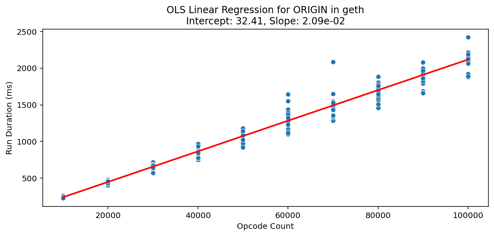

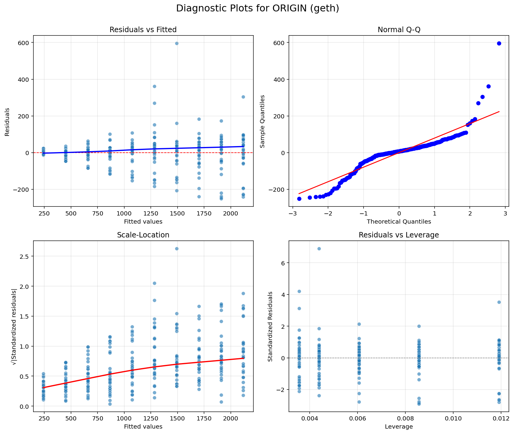


## besu


```python
                            OLS Regression Results                            
==============================================================================
Dep. Variable:        run_duration_ms   R-squared:                       0.974
Model:                            OLS   Adj. R-squared:                  0.974
Method:                 Least Squares   F-statistic:                 1.096e+04
Date:                Thu, 22 Jan 2026   Prob (F-statistic):          3.17e-231
Time:                        10:34:27   Log-Likelihood:                -1822.3
No. Observations:                 290   AIC:                             3649.
Df Residuals:                     288   BIC:                             3656.
Df Model:                           1                                         
Covariance Type:            nonrobust                                         
==============================================================================
                 coef    std err          t      P>|t|      [0.025      0.975]
------------------------------------------------------------------------------
const         28.7798     16.505      1.744      0.082      -3.705      61.265
opcount        0.0278      0.000    104.667      0.000       0.027       0.028
==============================================================================
Omnibus:                       43.445   Durbin-Watson:                   0.868
Prob(Omnibus):                  0.000   Jarque-Bera (JB):              114.723
Skew:                          -0.684   Prob(JB):                     1.23e-25
Kurtosis:                       5.761   Cond. No.                     1.34e+05
==============================================================================

Notes:
[1] Standard Errors assume that the covariance matrix of the errors is correctly specified.
[2] The condition number is large, 1.34e+05. This might indicate that there are
strong multicollinearity or other numerical problems.
```

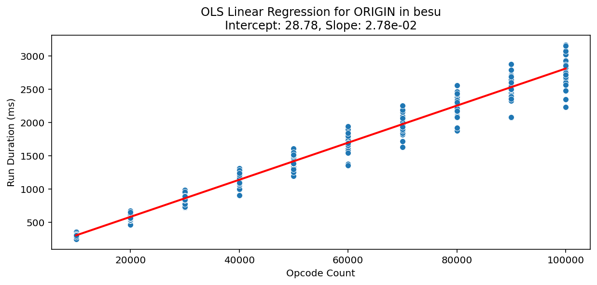

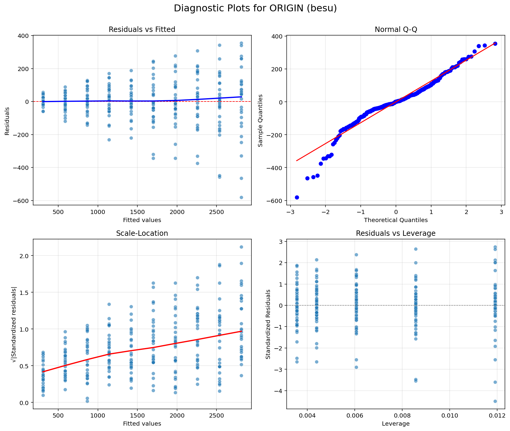


## reth


```python
                            OLS Regression Results                            
==============================================================================
Dep. Variable:        run_duration_ms   R-squared:                       0.981
Model:                            OLS   Adj. R-squared:                  0.981
Method:                 Least Squares   F-statistic:                     9366.
Date:                Thu, 22 Jan 2026   Prob (F-statistic):          7.47e-156
Time:                        10:34:27   Log-Likelihood:                -846.05
No. Observations:                 180   AIC:                             1696.
Df Residuals:                     178   BIC:                             1702.
Df Model:                           1                                         
Covariance Type:            nonrobust                                         
==============================================================================
                 coef    std err          t      P>|t|      [0.025      0.975]
------------------------------------------------------------------------------
const         29.5070      4.309      6.848      0.000      21.004      38.010
opcount        0.0067   6.94e-05     96.776      0.000       0.007       0.007
==============================================================================
Omnibus:                        2.153   Durbin-Watson:                   1.845
Prob(Omnibus):                  0.341   Jarque-Bera (JB):                2.079
Skew:                           0.191   Prob(JB):                        0.354
Kurtosis:                       2.638   Cond. No.                     1.34e+05
==============================================================================

Notes:
[1] Standard Errors assume that the covariance matrix of the errors is correctly specified.
[2] The condition number is large, 1.34e+05. This might indicate that there are
strong multicollinearity or other numerical problems.
```

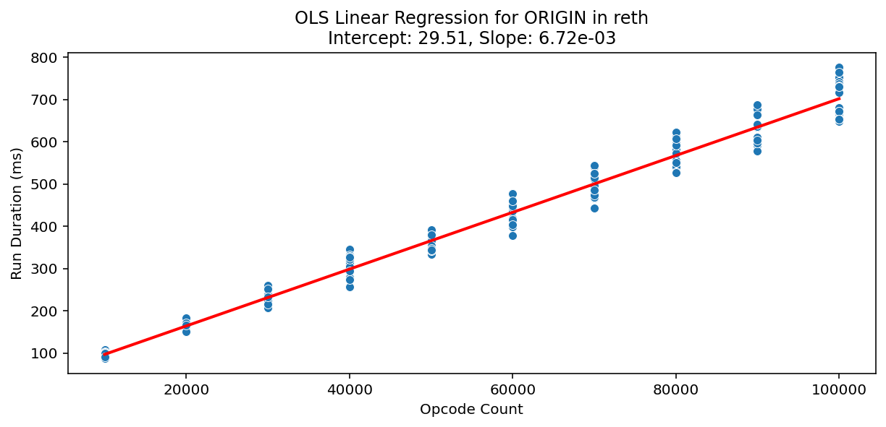

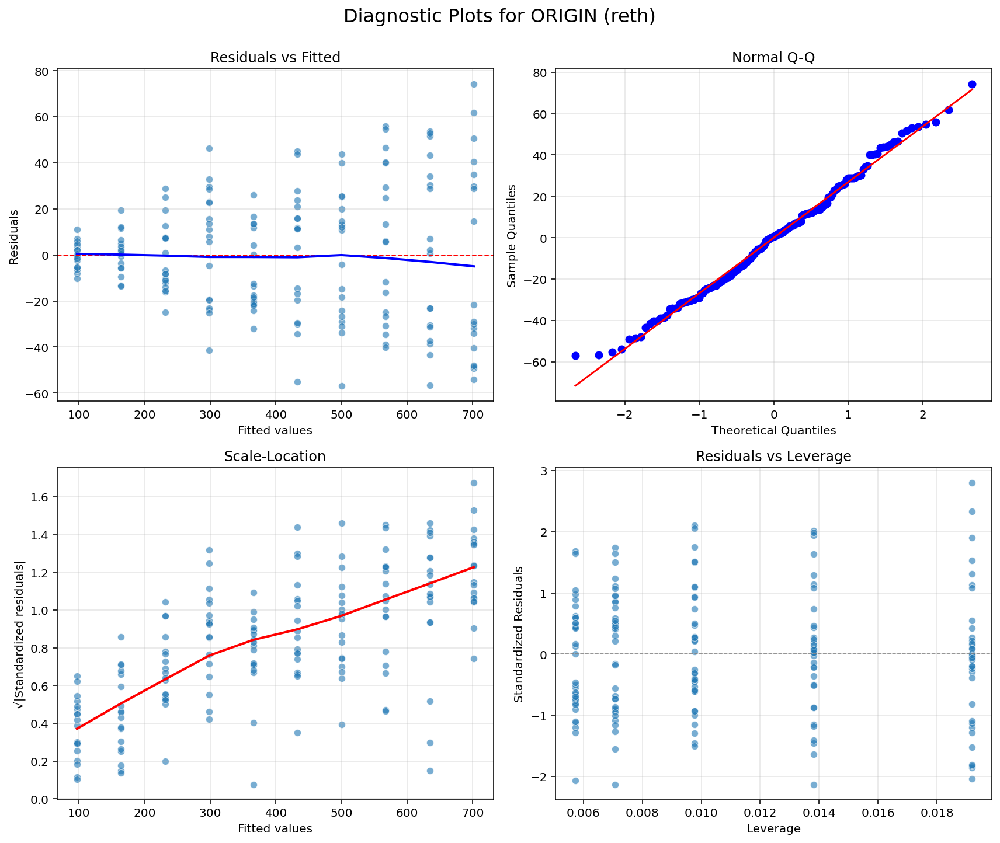


## nethermind


```python
                            OLS Regression Results                            
==============================================================================
Dep. Variable:        run_duration_ms   R-squared:                       0.977
Model:                            OLS   Adj. R-squared:                  0.977
Method:                 Least Squares   F-statistic:                 1.221e+04
Date:                Thu, 22 Jan 2026   Prob (F-statistic):          7.27e-238
Time:                        10:34:27   Log-Likelihood:                -1401.6
No. Observations:                 290   AIC:                             2807.
Df Residuals:                     288   BIC:                             2815.
Df Model:                           1                                         
Covariance Type:            nonrobust                                         
==============================================================================
                 coef    std err          t      P>|t|      [0.025      0.975]
------------------------------------------------------------------------------
const         29.8544      3.869      7.717      0.000      22.240      37.469
opcount        0.0069   6.24e-05    110.520      0.000       0.007       0.007
==============================================================================
Omnibus:                       15.269   Durbin-Watson:                   0.958
Prob(Omnibus):                  0.000   Jarque-Bera (JB):               32.891
Skew:                          -0.210   Prob(JB):                     7.21e-08
Kurtosis:                       4.596   Cond. No.                     1.34e+05
==============================================================================

Notes:
[1] Standard Errors assume that the covariance matrix of the errors is correctly specified.
[2] The condition number is large, 1.34e+05. This might indicate that there are
strong multicollinearity or other numerical problems.
```

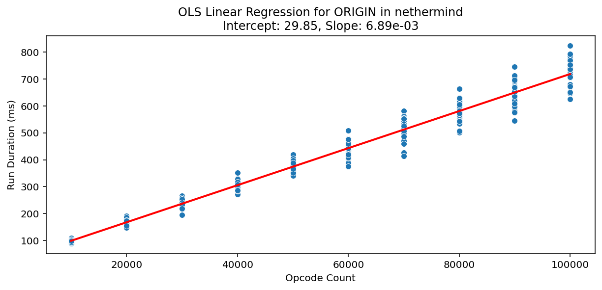

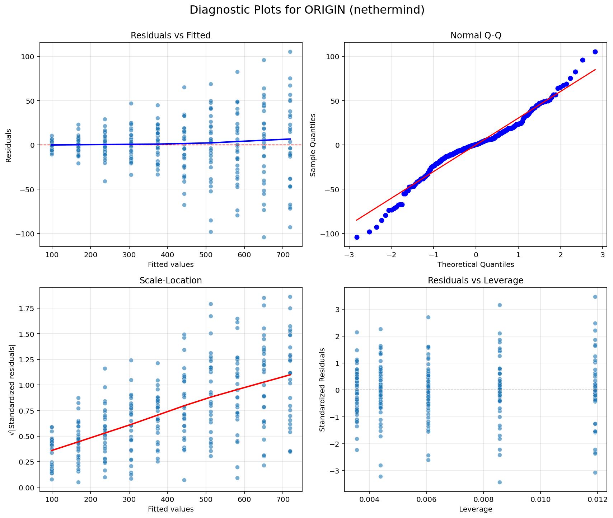


## erigon

OLS model did not run... Error: zero-size array to reduction operation maximum which has no identity

# PC

## geth


```python
                            OLS Regression Results                            
==============================================================================
Dep. Variable:        run_duration_ms   R-squared:                       0.990
Model:                            OLS   Adj. R-squared:                  0.989
Method:                 Least Squares   F-statistic:                 2.721e+04
Date:                Thu, 22 Jan 2026   Prob (F-statistic):          3.75e-287
Time:                        10:34:28   Log-Likelihood:                -1604.8
No. Observations:                 290   AIC:                             3214.
Df Residuals:                     288   BIC:                             3221.
Df Model:                           1                                         
Covariance Type:            nonrobust                                         
==============================================================================
                 coef    std err          t      P>|t|      [0.025      0.975]
------------------------------------------------------------------------------
const         36.4737      7.796      4.678      0.000      21.129      51.819
opcount        0.0173      0.000    164.946      0.000       0.017       0.017
==============================================================================
Omnibus:                       52.412   Durbin-Watson:                   1.073
Prob(Omnibus):                  0.000   Jarque-Bera (JB):              260.397
Skew:                          -0.604   Prob(JB):                     2.85e-57
Kurtosis:                       7.482   Cond. No.                     1.61e+05
==============================================================================

Notes:
[1] Standard Errors assume that the covariance matrix of the errors is correctly specified.
[2] The condition number is large, 1.61e+05. This might indicate that there are
strong multicollinearity or other numerical problems.
```

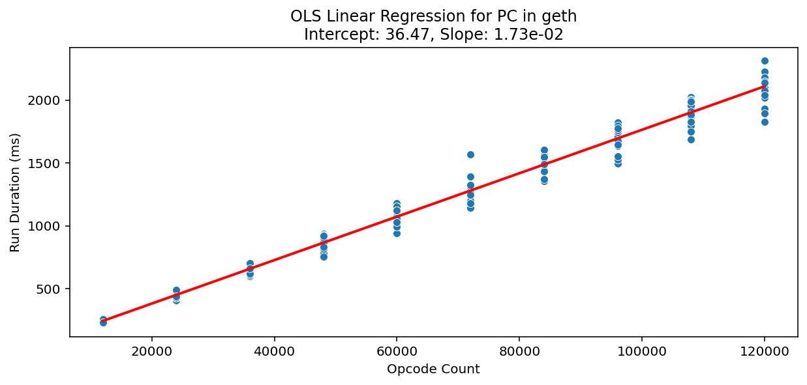

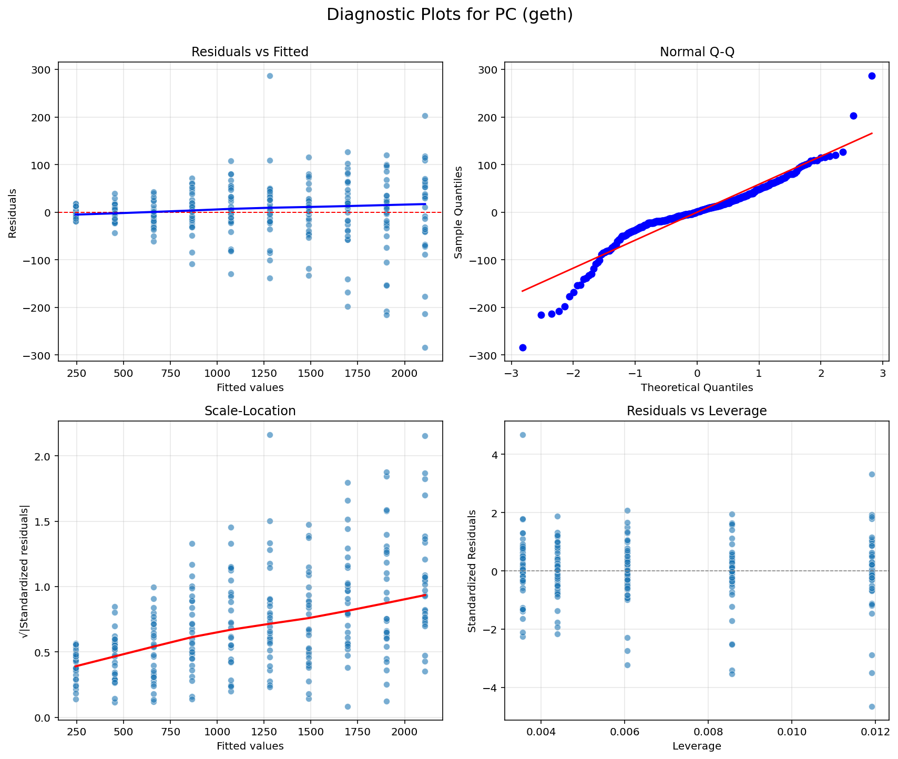


## besu


```python
                            OLS Regression Results                            
==============================================================================
Dep. Variable:        run_duration_ms   R-squared:                       0.984
Model:                            OLS   Adj. R-squared:                  0.984
Method:                 Least Squares   F-statistic:                 1.771e+04
Date:                Thu, 22 Jan 2026   Prob (F-statistic):          1.15e-260
Time:                        10:34:28   Log-Likelihood:                -1813.9
No. Observations:                 290   AIC:                             3632.
Df Residuals:                     288   BIC:                             3639.
Df Model:                           1                                         
Covariance Type:            nonrobust                                         
==============================================================================
                 coef    std err          t      P>|t|      [0.025      0.975]
------------------------------------------------------------------------------
const         32.4480     16.035      2.024      0.044       0.887      64.008
opcount        0.0287      0.000    133.097      0.000       0.028       0.029
==============================================================================
Omnibus:                       33.355   Durbin-Watson:                   0.895
Prob(Omnibus):                  0.000   Jarque-Bera (JB):               96.266
Skew:                          -0.481   Prob(JB):                     1.25e-21
Kurtosis:                       5.654   Cond. No.                     1.61e+05
==============================================================================

Notes:
[1] Standard Errors assume that the covariance matrix of the errors is correctly specified.
[2] The condition number is large, 1.61e+05. This might indicate that there are
strong multicollinearity or other numerical problems.
```


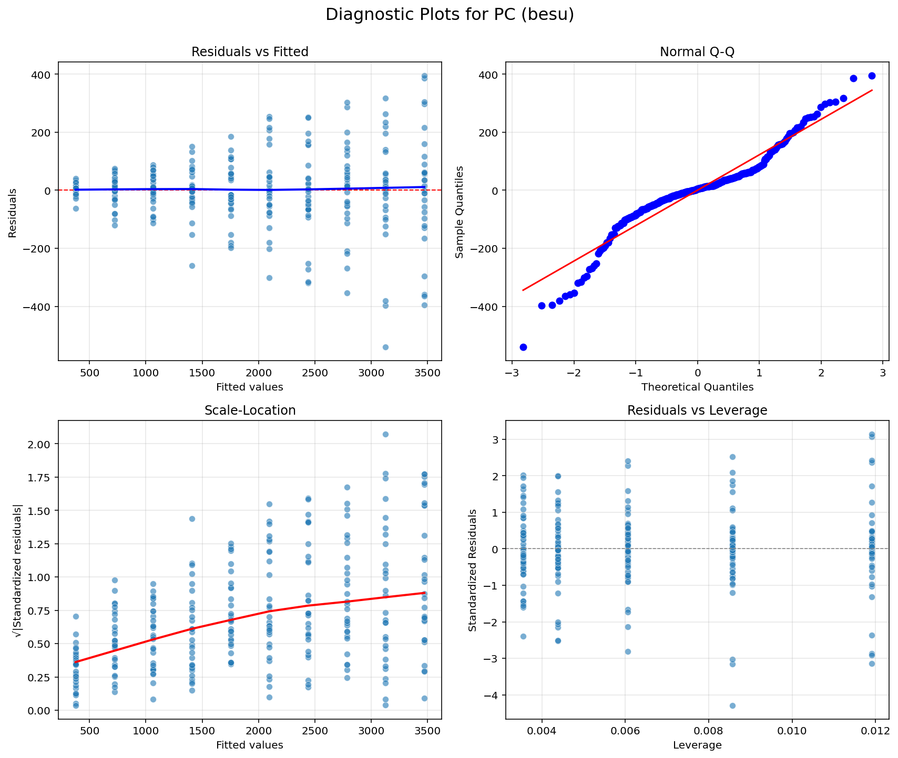


## reth


```python
                            OLS Regression Results                            
==============================================================================
Dep. Variable:        run_duration_ms   R-squared:                       0.976
Model:                            OLS   Adj. R-squared:                  0.976
Method:                 Least Squares   F-statistic:                     7253.
Date:                Thu, 22 Jan 2026   Prob (F-statistic):          3.51e-146
Time:                        10:34:28   Log-Likelihood:                -891.40
No. Observations:                 180   AIC:                             1787.
Df Residuals:                     178   BIC:                             1793.
Df Model:                           1                                         
Covariance Type:            nonrobust                                         
==============================================================================
                 coef    std err          t      P>|t|      [0.025      0.975]
------------------------------------------------------------------------------
const         30.5094      5.543      5.504      0.000      19.570      41.448
opcount        0.0063   7.44e-05     85.165      0.000       0.006       0.006
==============================================================================
Omnibus:                        2.480   Durbin-Watson:                   1.807
Prob(Omnibus):                  0.289   Jarque-Bera (JB):                2.367
Skew:                          -0.079   Prob(JB):                        0.306
Kurtosis:                       3.539   Cond. No.                     1.61e+05
==============================================================================

Notes:
[1] Standard Errors assume that the covariance matrix of the errors is correctly specified.
[2] The condition number is large, 1.61e+05. This might indicate that there are
strong multicollinearity or other numerical problems.
```

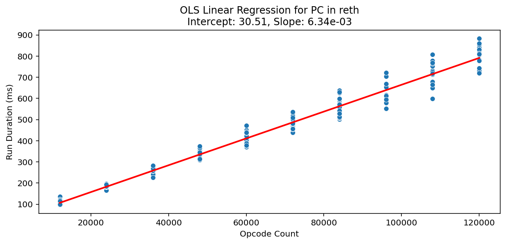

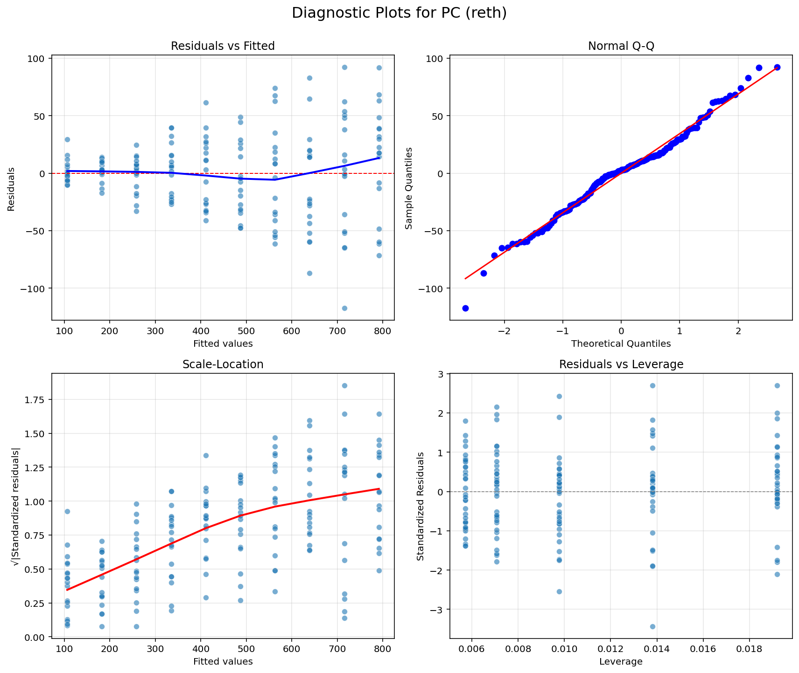


## nethermind


```python
                            OLS Regression Results                            
==============================================================================
Dep. Variable:        run_duration_ms   R-squared:                       0.980
Model:                            OLS   Adj. R-squared:                  0.980
Method:                 Least Squares   F-statistic:                 1.392e+04
Date:                Thu, 22 Jan 2026   Prob (F-statistic):          7.65e-246
Time:                        10:34:28   Log-Likelihood:                -1446.8
No. Observations:                 290   AIC:                             2898.
Df Residuals:                     288   BIC:                             2905.
Df Model:                           1                                         
Covariance Type:            nonrobust                                         
==============================================================================
                 coef    std err          t      P>|t|      [0.025      0.975]
------------------------------------------------------------------------------
const         27.9013      4.522      6.171      0.000      19.002      36.801
opcount        0.0072   6.07e-05    117.964      0.000       0.007       0.007
==============================================================================
Omnibus:                       29.308   Durbin-Watson:                   0.920
Prob(Omnibus):                  0.000   Jarque-Bera (JB):               48.354
Skew:                          -0.611   Prob(JB):                     3.16e-11
Kurtosis:                       4.584   Cond. No.                     1.61e+05
==============================================================================

Notes:
[1] Standard Errors assume that the covariance matrix of the errors is correctly specified.
[2] The condition number is large, 1.61e+05. This might indicate that there are
strong multicollinearity or other numerical problems.
```

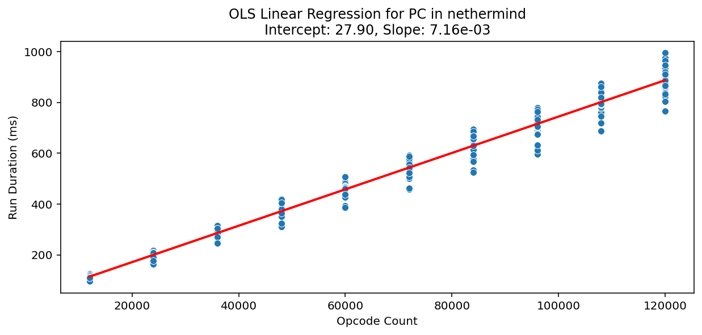

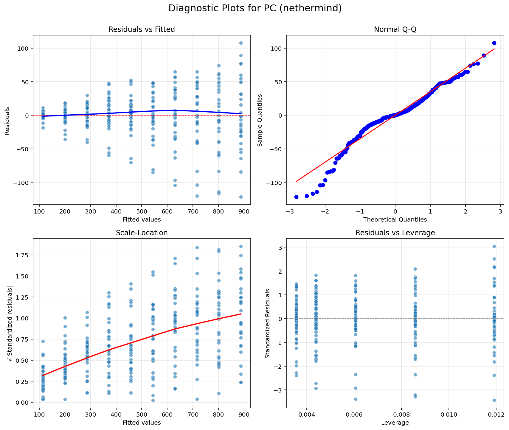


## erigon


```python
                            OLS Regression Results                            
==============================================================================
Dep. Variable:        run_duration_ms   R-squared:                       0.998
Model:                            OLS   Adj. R-squared:                  0.998
Method:                 Least Squares   F-statistic:                 1.791e+04
Date:                Thu, 22 Jan 2026   Prob (F-statistic):           7.65e-41
Time:                        10:34:29   Log-Likelihood:                -139.30
No. Observations:                  30   AIC:                             282.6
Df Residuals:                      28   BIC:                             285.4
Df Model:                           1                                         
Covariance Type:            nonrobust                                         
==============================================================================
                 coef    std err          t      P>|t|      [0.025      0.975]
------------------------------------------------------------------------------
const         31.6933     10.262      3.089      0.005      10.673      52.713
opcount        0.0184      0.000    133.812      0.000       0.018       0.019
==============================================================================
Omnibus:                       28.477   Durbin-Watson:                   1.230
Prob(Omnibus):                  0.000   Jarque-Bera (JB):               62.009
Skew:                           2.039   Prob(JB):                     3.43e-14
Kurtosis:                       8.743   Cond. No.                     1.61e+05
==============================================================================

Notes:
[1] Standard Errors assume that the covariance matrix of the errors is correctly specified.
[2] The condition number is large, 1.61e+05. This might indicate that there are
strong multicollinearity or other numerical problems.
```

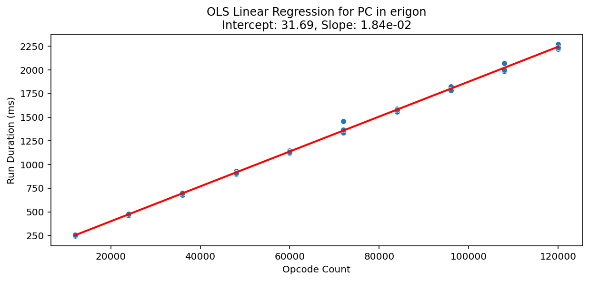

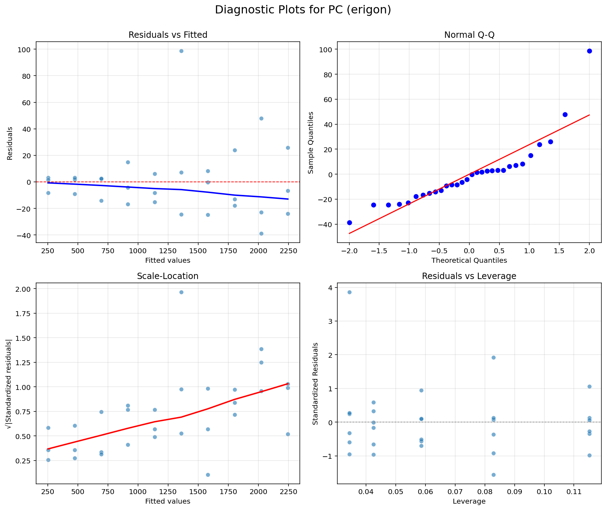


# POP

## geth

OLS model did not run... Error: zero-size array to reduction operation maximum which has no identity

## besu

OLS model did not run... Error: zero-size array to reduction operation maximum which has no identity

## reth

OLS model did not run... Error: zero-size array to reduction operation maximum which has no identity

## nethermind

OLS model did not run... Error: zero-size array to reduction operation maximum which has no identity

## erigon

OLS model did not run... Error: zero-size array to reduction operation maximum which has no identity

# PREVRANDAO

## geth

OLS model did not run... Error: zero-size array to reduction operation maximum which has no identity

## besu

OLS model did not run... Error: zero-size array to reduction operation maximum which has no identity

## reth

OLS model did not run... Error: zero-size array to reduction operation maximum which has no identity

## nethermind

OLS model did not run... Error: zero-size array to reduction operation maximum which has no identity

## erigon

OLS model did not run... Error: zero-size array to reduction operation maximum which has no identity

# PUSH0

## geth


```python
                            OLS Regression Results                            
==============================================================================
Dep. Variable:        run_duration_ms   R-squared:                       0.984
Model:                            OLS   Adj. R-squared:                  0.984
Method:                 Least Squares   F-statistic:                 1.724e+04
Date:                Thu, 22 Jan 2026   Prob (F-statistic):          5.25e-259
Time:                        10:34:29   Log-Likelihood:                -1486.5
No. Observations:                 290   AIC:                             2977.
Df Residuals:                     288   BIC:                             2984.
Df Model:                           1                                         
Covariance Type:            nonrobust                                         
==============================================================================
                 coef    std err          t      P>|t|      [0.025      0.975]
------------------------------------------------------------------------------
const         34.5191      5.184      6.659      0.000      24.316      44.722
opcount        0.0110   8.35e-05    131.313      0.000       0.011       0.011
==============================================================================
Omnibus:                       20.412   Durbin-Watson:                   1.219
Prob(Omnibus):                  0.000   Jarque-Bera (JB):               51.671
Skew:                          -0.269   Prob(JB):                     6.02e-12
Kurtosis:                       4.997   Cond. No.                     1.34e+05
==============================================================================

Notes:
[1] Standard Errors assume that the covariance matrix of the errors is correctly specified.
[2] The condition number is large, 1.34e+05. This might indicate that there are
strong multicollinearity or other numerical problems.
```


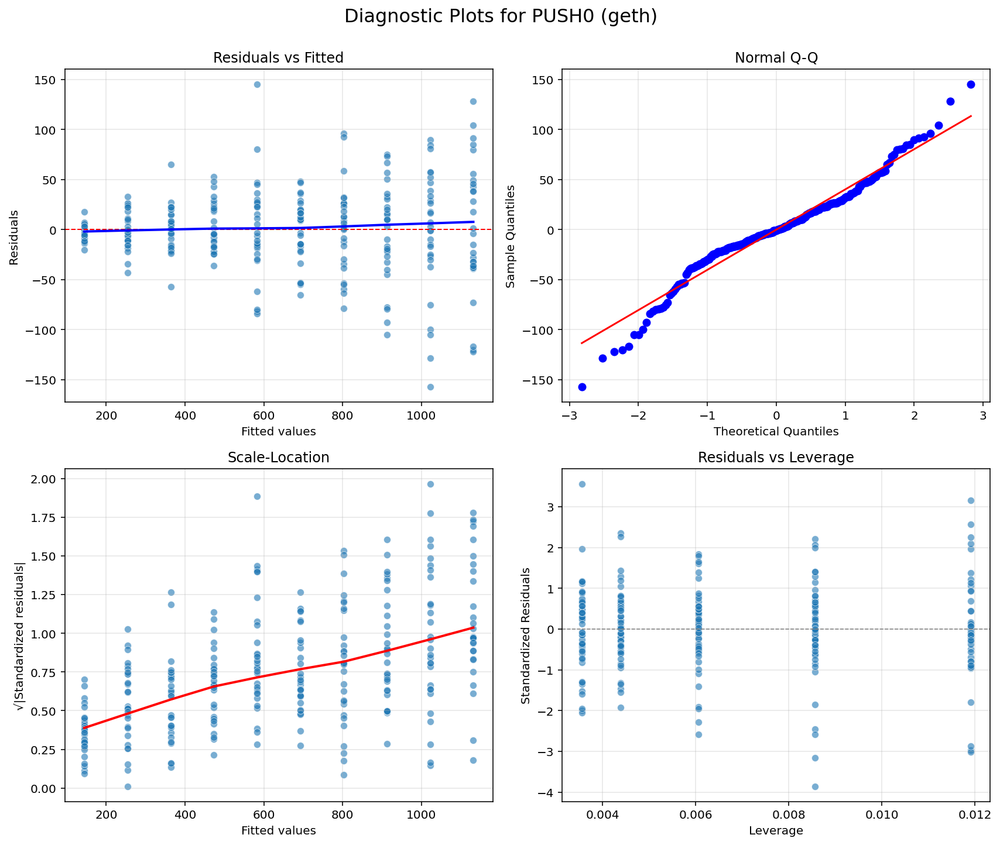


## besu


```python
                            OLS Regression Results                            
==============================================================================
Dep. Variable:        run_duration_ms   R-squared:                       0.981
Model:                            OLS   Adj. R-squared:                  0.980
Method:                 Least Squares   F-statistic:                 1.452e+04
Date:                Thu, 22 Jan 2026   Prob (F-statistic):          1.96e-248
Time:                        10:34:29   Log-Likelihood:                -1715.3
No. Observations:                 290   AIC:                             3435.
Df Residuals:                     288   BIC:                             3442.
Df Model:                           1                                         
Covariance Type:            nonrobust                                         
==============================================================================
                 coef    std err          t      P>|t|      [0.025      0.975]
------------------------------------------------------------------------------
const         23.7318     11.413      2.079      0.038       1.269      46.194
opcount        0.0222      0.000    120.483      0.000       0.022       0.023
==============================================================================
Omnibus:                       35.182   Durbin-Watson:                   1.093
Prob(Omnibus):                  0.000   Jarque-Bera (JB):               56.024
Skew:                          -0.732   Prob(JB):                     6.83e-13
Kurtosis:                       4.579   Cond. No.                     1.34e+05
==============================================================================

Notes:
[1] Standard Errors assume that the covariance matrix of the errors is correctly specified.
[2] The condition number is large, 1.34e+05. This might indicate that there are
strong multicollinearity or other numerical problems.
```


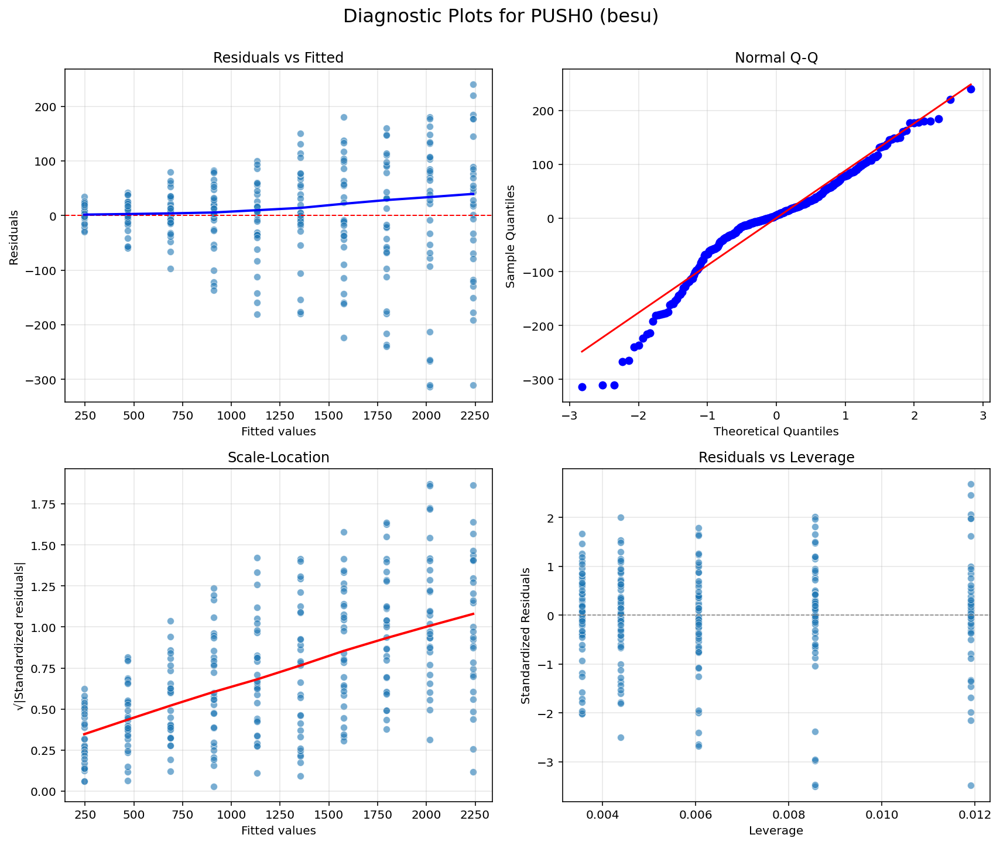


## reth


```python
                            OLS Regression Results                            
==============================================================================
Dep. Variable:        run_duration_ms   R-squared:                       0.969
Model:                            OLS   Adj. R-squared:                  0.968
Method:                 Least Squares   F-statistic:                     5481.
Date:                Thu, 22 Jan 2026   Prob (F-statistic):          1.18e-135
Time:                        10:34:30   Log-Likelihood:                -875.37
No. Observations:                 180   AIC:                             1755.
Df Residuals:                     178   BIC:                             1761.
Df Model:                           1                                         
Covariance Type:            nonrobust                                         
==============================================================================
                 coef    std err          t      P>|t|      [0.025      0.975]
------------------------------------------------------------------------------
const         28.9970      5.071      5.718      0.000      18.990      39.004
opcount        0.0061   8.17e-05     74.037      0.000       0.006       0.006
==============================================================================
Omnibus:                        3.308   Durbin-Watson:                   1.717
Prob(Omnibus):                  0.191   Jarque-Bera (JB):                2.875
Skew:                          -0.286   Prob(JB):                        0.238
Kurtosis:                       3.239   Cond. No.                     1.34e+05
==============================================================================

Notes:
[1] Standard Errors assume that the covariance matrix of the errors is correctly specified.
[2] The condition number is large, 1.34e+05. This might indicate that there are
strong multicollinearity or other numerical problems.
```


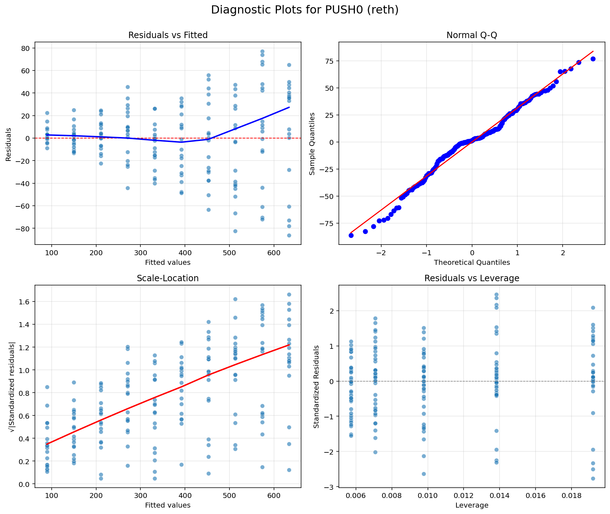


## nethermind


```python
                            OLS Regression Results                            
==============================================================================
Dep. Variable:        run_duration_ms   R-squared:                       0.972
Model:                            OLS   Adj. R-squared:                  0.971
Method:                 Least Squares   F-statistic:                     9835.
Date:                Thu, 22 Jan 2026   Prob (F-statistic):          1.16e-224
Time:                        10:34:30   Log-Likelihood:                -1428.2
No. Observations:                 290   AIC:                             2860.
Df Residuals:                     288   BIC:                             2868.
Df Model:                           1                                         
Covariance Type:            nonrobust                                         
==============================================================================
                 coef    std err          t      P>|t|      [0.025      0.975]
------------------------------------------------------------------------------
const         30.8271      4.241      7.269      0.000      22.480      39.174
opcount        0.0068   6.83e-05     99.172      0.000       0.007       0.007
==============================================================================
Omnibus:                       26.835   Durbin-Watson:                   1.213
Prob(Omnibus):                  0.000   Jarque-Bera (JB):               43.787
Skew:                          -0.569   Prob(JB):                     3.10e-10
Kurtosis:                       4.526   Cond. No.                     1.34e+05
==============================================================================

Notes:
[1] Standard Errors assume that the covariance matrix of the errors is correctly specified.
[2] The condition number is large, 1.34e+05. This might indicate that there are
strong multicollinearity or other numerical problems.
```

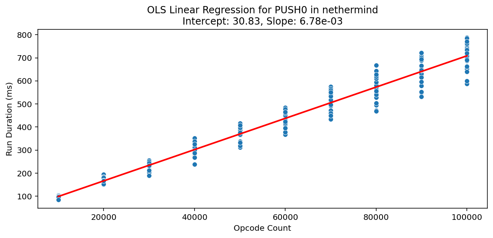


## erigon

OLS model did not run... Error: zero-size array to reduction operation maximum which has no identity

# PUSH1

## geth


```python
                            OLS Regression Results                            
==============================================================================
Dep. Variable:        run_duration_ms   R-squared:                       0.987
Model:                            OLS   Adj. R-squared:                  0.987
Method:                 Least Squares   F-statistic:                 2.124e+04
Date:                Thu, 22 Jan 2026   Prob (F-statistic):          7.31e-272
Time:                        10:34:30   Log-Likelihood:                -1528.6
No. Observations:                 290   AIC:                             3061.
Df Residuals:                     288   BIC:                             3069.
Df Model:                           1                                         
Covariance Type:            nonrobust                                         
==============================================================================
                 coef    std err          t      P>|t|      [0.025      0.975]
------------------------------------------------------------------------------
const         30.3022      5.995      5.055      0.000      18.503      42.101
opcount        0.0201      0.000    145.752      0.000       0.020       0.020
==============================================================================
Omnibus:                       53.561   Durbin-Watson:                   0.878
Prob(Omnibus):                  0.000   Jarque-Bera (JB):              158.299
Skew:                          -0.805   Prob(JB):                     4.23e-35
Kurtosis:                       6.241   Cond. No.                     9.38e+04
==============================================================================

Notes:
[1] Standard Errors assume that the covariance matrix of the errors is correctly specified.
[2] The condition number is large, 9.38e+04. This might indicate that there are
strong multicollinearity or other numerical problems.
```

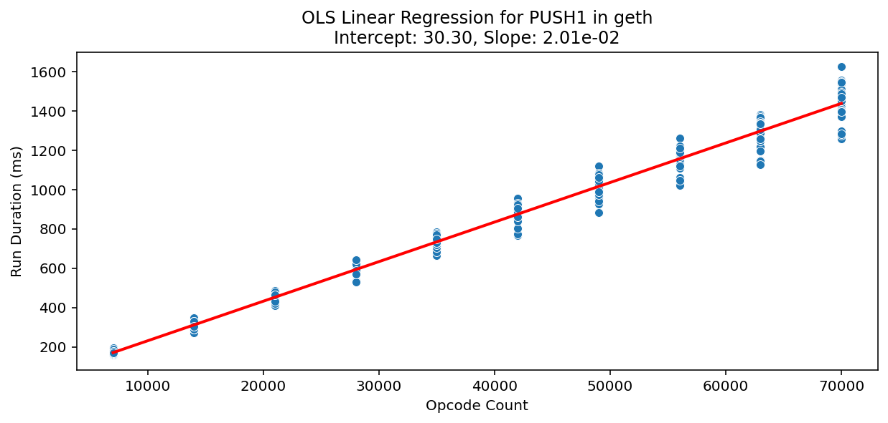

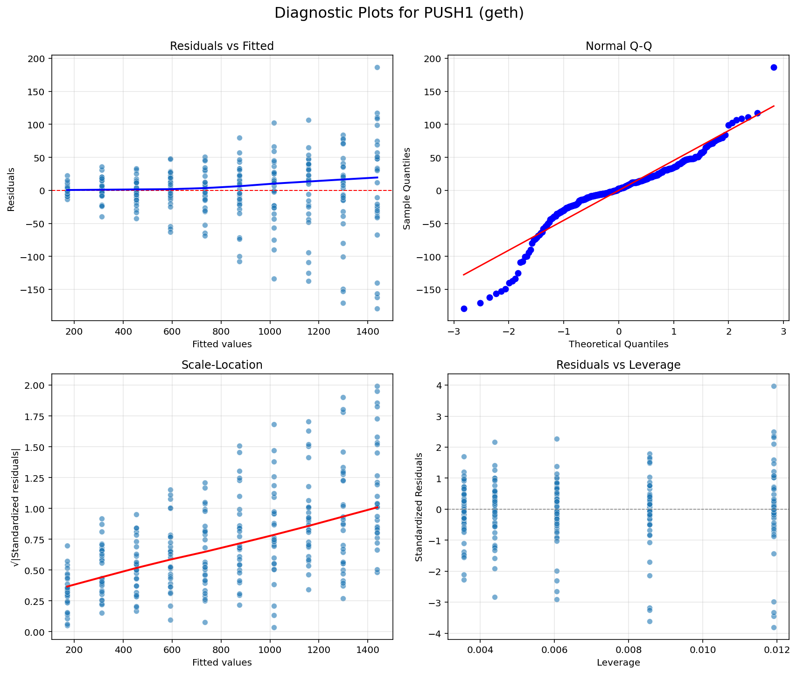


## besu


```python
                            OLS Regression Results                            
==============================================================================
Dep. Variable:        run_duration_ms   R-squared:                       0.976
Model:                            OLS   Adj. R-squared:                  0.976
Method:                 Least Squares   F-statistic:                 1.192e+04
Date:                Thu, 22 Jan 2026   Prob (F-statistic):          2.35e-236
Time:                        10:34:31   Log-Likelihood:                -1703.7
No. Observations:                 290   AIC:                             3411.
Df Residuals:                     288   BIC:                             3419.
Df Model:                           1                                         
Covariance Type:            nonrobust                                         
==============================================================================
                 coef    std err          t      P>|t|      [0.025      0.975]
------------------------------------------------------------------------------
const         26.2440     10.964      2.394      0.017       4.665      47.823
opcount        0.0276      0.000    109.162      0.000       0.027       0.028
==============================================================================
Omnibus:                       11.560   Durbin-Watson:                   0.701
Prob(Omnibus):                  0.003   Jarque-Bera (JB):               23.298
Skew:                           0.115   Prob(JB):                     8.73e-06
Kurtosis:                       4.369   Cond. No.                     9.38e+04
==============================================================================

Notes:
[1] Standard Errors assume that the covariance matrix of the errors is correctly specified.
[2] The condition number is large, 9.38e+04. This might indicate that there are
strong multicollinearity or other numerical problems.
```

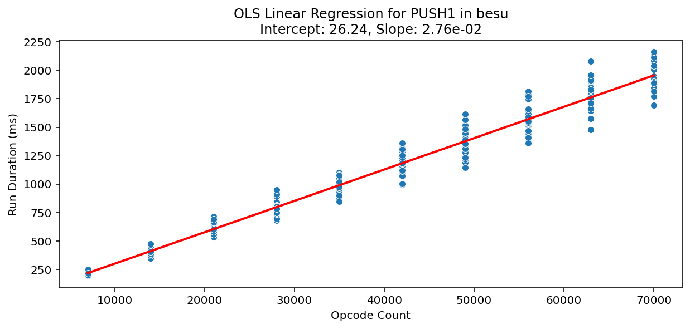

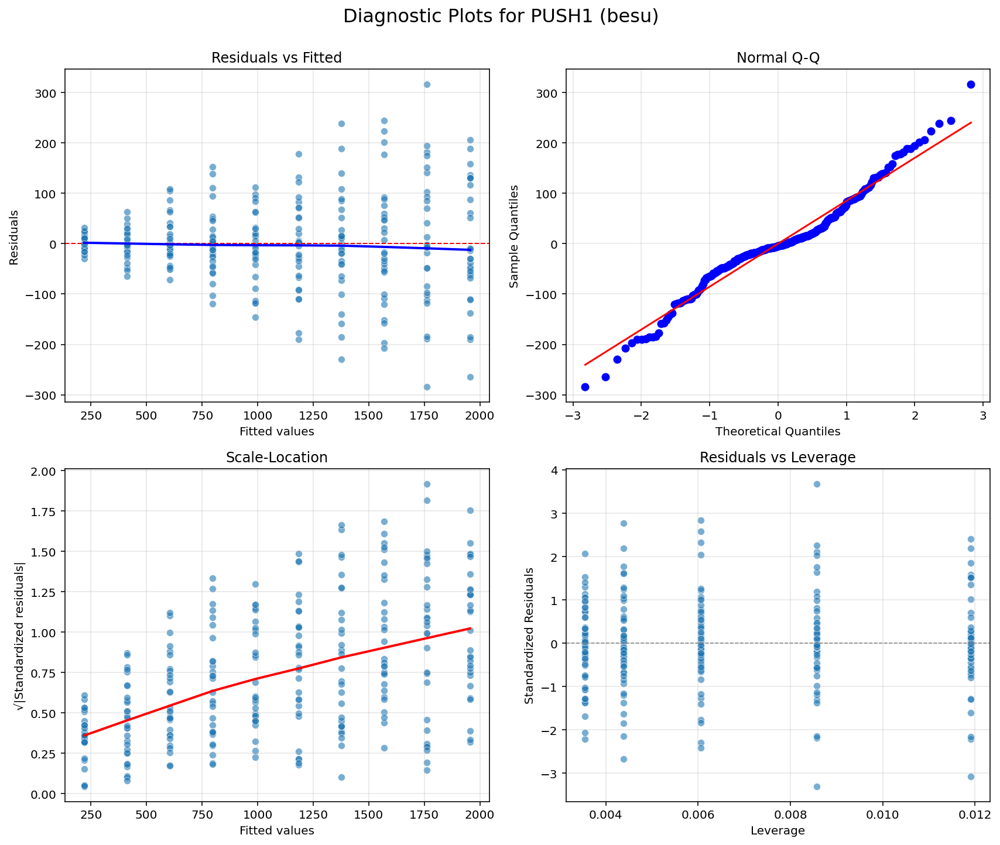


## reth


```python
                            OLS Regression Results                            
==============================================================================
Dep. Variable:        run_duration_ms   R-squared:                       0.973
Model:                            OLS   Adj. R-squared:                  0.973
Method:                 Least Squares   F-statistic:                     6370.
Date:                Thu, 22 Jan 2026   Prob (F-statistic):          2.73e-141
Time:                        10:34:31   Log-Likelihood:                -789.11
No. Observations:                 180   AIC:                             1582.
Df Residuals:                     178   BIC:                             1589.
Df Model:                           1                                         
Covariance Type:            nonrobust                                         
==============================================================================
                 coef    std err          t      P>|t|      [0.025      0.975]
------------------------------------------------------------------------------
const         34.9875      3.140     11.141      0.000      28.790      41.185
opcount        0.0058   7.23e-05     79.811      0.000       0.006       0.006
==============================================================================
Omnibus:                        7.170   Durbin-Watson:                   1.662
Prob(Omnibus):                  0.028   Jarque-Bera (JB):               10.692
Skew:                          -0.185   Prob(JB):                      0.00477
Kurtosis:                       4.136   Cond. No.                     9.38e+04
==============================================================================

Notes:
[1] Standard Errors assume that the covariance matrix of the errors is correctly specified.
[2] The condition number is large, 9.38e+04. This might indicate that there are
strong multicollinearity or other numerical problems.
```

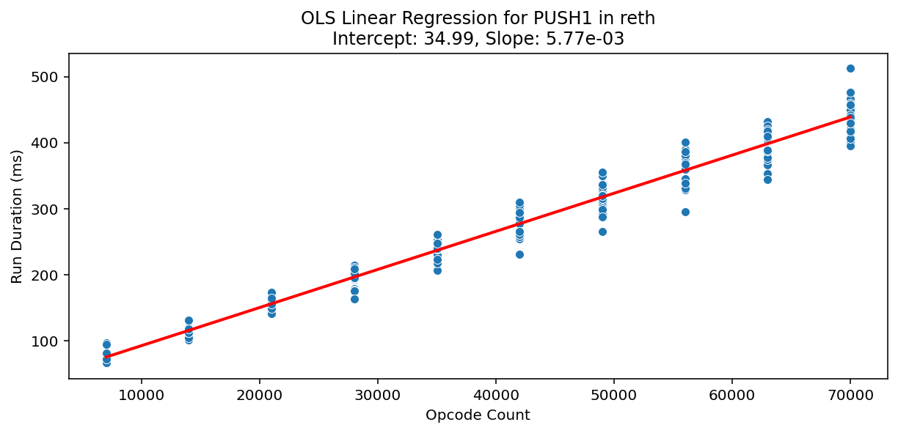

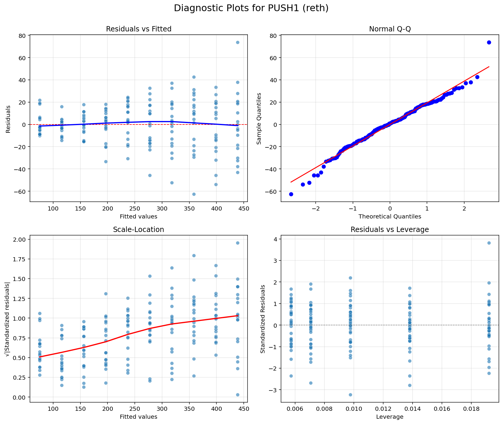


## nethermind


```python
                            OLS Regression Results                            
==============================================================================
Dep. Variable:        run_duration_ms   R-squared:                       0.975
Model:                            OLS   Adj. R-squared:                  0.975
Method:                 Least Squares   F-statistic:                 1.125e+04
Date:                Thu, 22 Jan 2026   Prob (F-statistic):          7.68e-233
Time:                        10:34:31   Log-Likelihood:                -1407.4
No. Observations:                 290   AIC:                             2819.
Df Residuals:                     288   BIC:                             2826.
Df Model:                           1                                         
Covariance Type:            nonrobust                                         
==============================================================================
                 coef    std err          t      P>|t|      [0.025      0.975]
------------------------------------------------------------------------------
const         30.1508      3.947      7.638      0.000      22.381      37.920
opcount        0.0096   9.09e-05    106.064      0.000       0.009       0.010
==============================================================================
Omnibus:                      140.280   Durbin-Watson:                   1.089
Prob(Omnibus):                  0.000   Jarque-Bera (JB):             2381.844
Skew:                           1.512   Prob(JB):                         0.00
Kurtosis:                      16.710   Cond. No.                     9.38e+04
==============================================================================

Notes:
[1] Standard Errors assume that the covariance matrix of the errors is correctly specified.
[2] The condition number is large, 9.38e+04. This might indicate that there are
strong multicollinearity or other numerical problems.
```

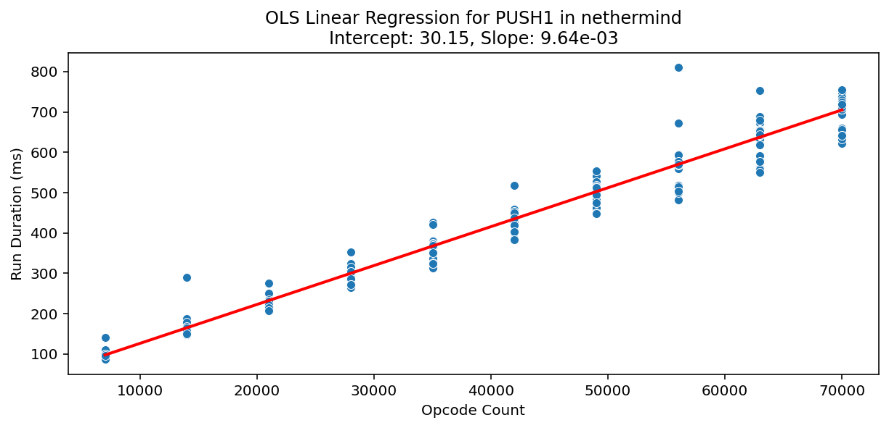

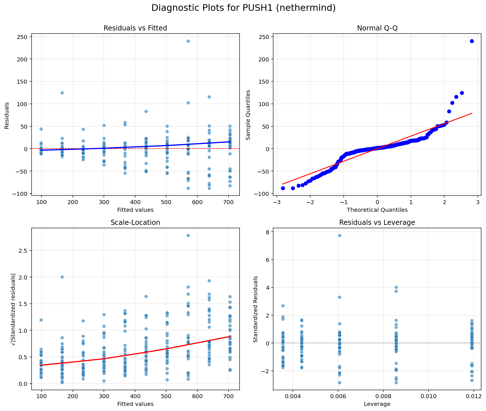


## erigon

OLS model did not run... Error: zero-size array to reduction operation maximum which has no identity

# PUSH2

## geth


```python
                            OLS Regression Results                            
==============================================================================
Dep. Variable:        run_duration_ms   R-squared:                       0.982
Model:                            OLS   Adj. R-squared:                  0.982
Method:                 Least Squares   F-statistic:                 1.615e+04
Date:                Thu, 22 Jan 2026   Prob (F-statistic):          5.39e-255
Time:                        10:34:31   Log-Likelihood:                -1530.6
No. Observations:                 290   AIC:                             3065.
Df Residuals:                     288   BIC:                             3073.
Df Model:                           1                                         
Covariance Type:            nonrobust                                         
==============================================================================
                 coef    std err          t      P>|t|      [0.025      0.975]
------------------------------------------------------------------------------
const         29.3817      6.036      4.868      0.000      17.502      41.261
opcount        0.0177      0.000    127.098      0.000       0.017       0.018
==============================================================================
Omnibus:                       51.670   Durbin-Watson:                   1.385
Prob(Omnibus):                  0.000   Jarque-Bera (JB):              417.787
Skew:                           0.388   Prob(JB):                     1.90e-91
Kurtosis:                       8.829   Cond. No.                     9.38e+04
==============================================================================

Notes:
[1] Standard Errors assume that the covariance matrix of the errors is correctly specified.
[2] The condition number is large, 9.38e+04. This might indicate that there are
strong multicollinearity or other numerical problems.
```

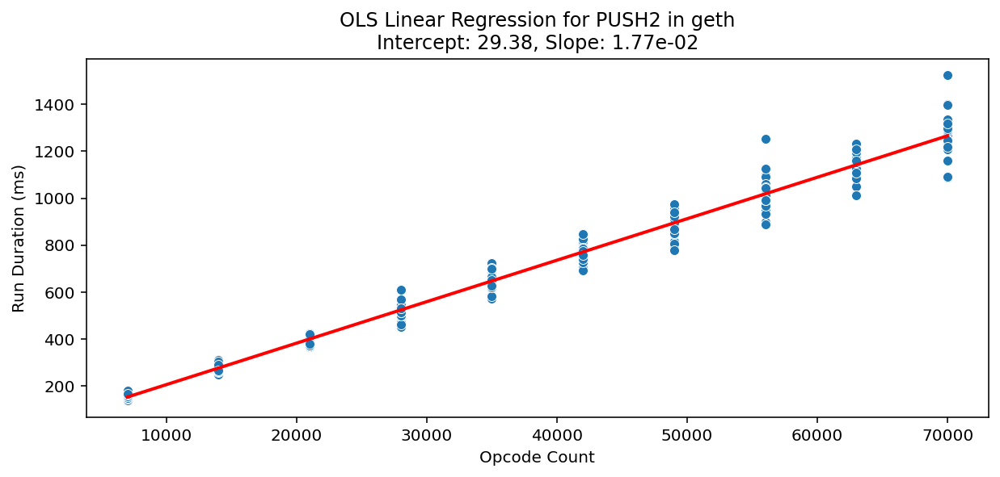

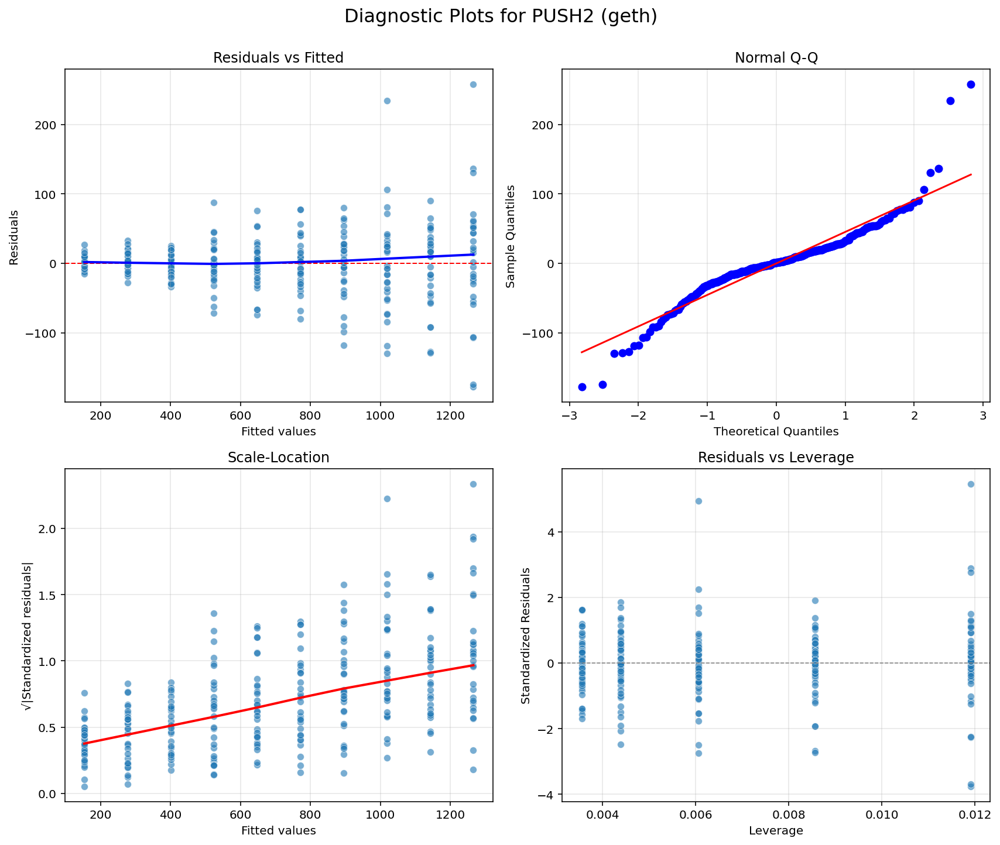


## besu


```python
                            OLS Regression Results                            
==============================================================================
Dep. Variable:        run_duration_ms   R-squared:                       0.977
Model:                            OLS   Adj. R-squared:                  0.977
Method:                 Least Squares   F-statistic:                 1.217e+04
Date:                Thu, 22 Jan 2026   Prob (F-statistic):          1.23e-237
Time:                        10:34:32   Log-Likelihood:                -1700.5
No. Observations:                 290   AIC:                             3405.
Df Residuals:                     288   BIC:                             3412.
Df Model:                           1                                         
Covariance Type:            nonrobust                                         
==============================================================================
                 coef    std err          t      P>|t|      [0.025      0.975]
------------------------------------------------------------------------------
const         28.7395     10.846      2.650      0.008       7.393      50.086
opcount        0.0275      0.000    110.312      0.000       0.027       0.028
==============================================================================
Omnibus:                       18.472   Durbin-Watson:                   1.101
Prob(Omnibus):                  0.000   Jarque-Bera (JB):               49.697
Skew:                           0.179   Prob(JB):                     1.62e-11
Kurtosis:                       4.996   Cond. No.                     9.38e+04
==============================================================================

Notes:
[1] Standard Errors assume that the covariance matrix of the errors is correctly specified.
[2] The condition number is large, 9.38e+04. This might indicate that there are
strong multicollinearity or other numerical problems.
```

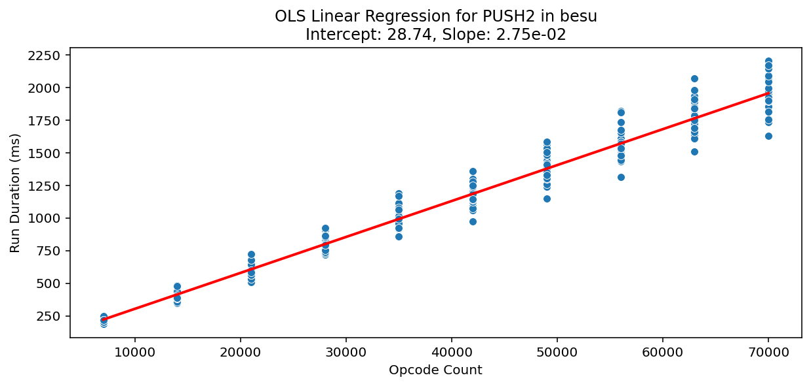

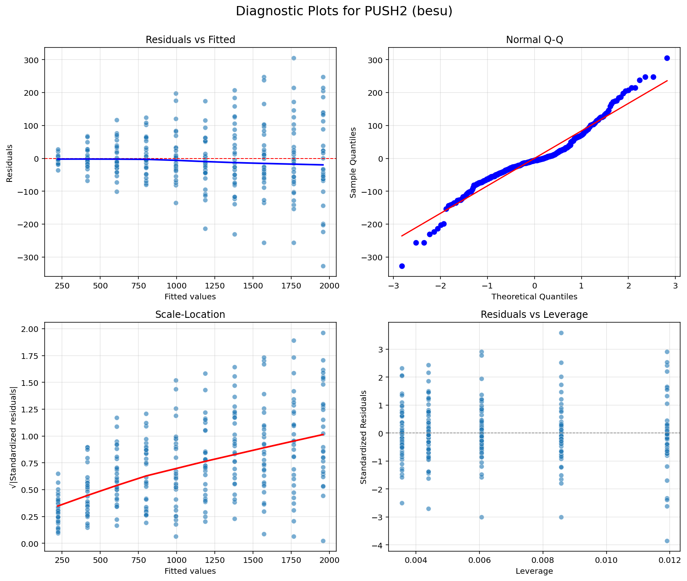


## reth


```python
                            OLS Regression Results                            
==============================================================================
Dep. Variable:        run_duration_ms   R-squared:                       0.973
Model:                            OLS   Adj. R-squared:                  0.973
Method:                 Least Squares   F-statistic:                     6402.
Date:                Thu, 22 Jan 2026   Prob (F-statistic):          1.77e-141
Time:                        10:34:32   Log-Likelihood:                -790.61
No. Observations:                 180   AIC:                             1585.
Df Residuals:                     178   BIC:                             1592.
Df Model:                           1                                         
Covariance Type:            nonrobust                                         
==============================================================================
                 coef    std err          t      P>|t|      [0.025      0.975]
------------------------------------------------------------------------------
const         30.3073      3.167      9.571      0.000      24.058      36.556
opcount        0.0058   7.29e-05     80.013      0.000       0.006       0.006
==============================================================================
Omnibus:                        2.649   Durbin-Watson:                   1.856
Prob(Omnibus):                  0.266   Jarque-Bera (JB):                2.705
Skew:                          -0.272   Prob(JB):                        0.259
Kurtosis:                       2.744   Cond. No.                     9.38e+04
==============================================================================

Notes:
[1] Standard Errors assume that the covariance matrix of the errors is correctly specified.
[2] The condition number is large, 9.38e+04. This might indicate that there are
strong multicollinearity or other numerical problems.
```

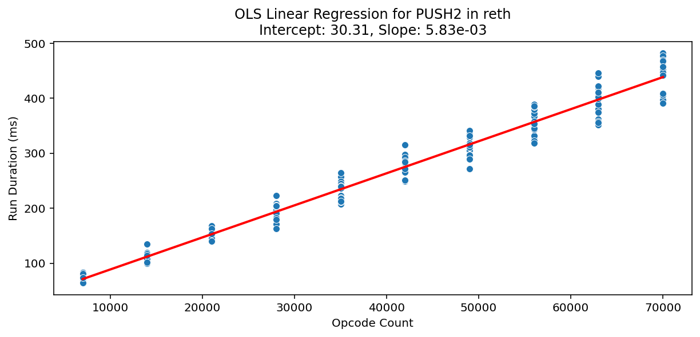


## nethermind


```python
                            OLS Regression Results                            
==============================================================================
Dep. Variable:        run_duration_ms   R-squared:                       0.983
Model:                            OLS   Adj. R-squared:                  0.983
Method:                 Least Squares   F-statistic:                 1.706e+04
Date:                Thu, 22 Jan 2026   Prob (F-statistic):          2.40e-258
Time:                        10:34:32   Log-Likelihood:                -1386.7
No. Observations:                 290   AIC:                             2777.
Df Residuals:                     288   BIC:                             2785.
Df Model:                           1                                         
Covariance Type:            nonrobust                                         
==============================================================================
                 coef    std err          t      P>|t|      [0.025      0.975]
------------------------------------------------------------------------------
const         27.0440      3.675      7.360      0.000      19.811      34.277
opcount        0.0110   8.46e-05    130.609      0.000       0.011       0.011
==============================================================================
Omnibus:                       84.133   Durbin-Watson:                   0.771
Prob(Omnibus):                  0.000   Jarque-Bera (JB):              178.064
Skew:                          -1.462   Prob(JB):                     2.16e-39
Kurtosis:                       5.488   Cond. No.                     9.38e+04
==============================================================================

Notes:
[1] Standard Errors assume that the covariance matrix of the errors is correctly specified.
[2] The condition number is large, 9.38e+04. This might indicate that there are
strong multicollinearity or other numerical problems.
```


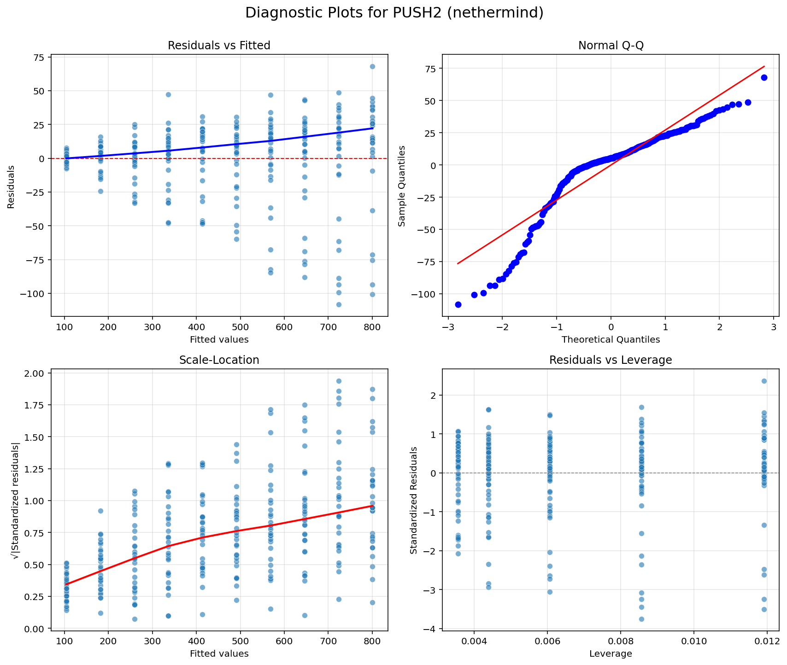


## erigon

OLS model did not run... Error: zero-size array to reduction operation maximum which has no identity

# PUSH3

## geth


```python
                            OLS Regression Results                            
==============================================================================
Dep. Variable:        run_duration_ms   R-squared:                       0.983
Model:                            OLS   Adj. R-squared:                  0.983
Method:                 Least Squares   F-statistic:                 1.642e+04
Date:                Thu, 22 Jan 2026   Prob (F-statistic):          5.18e-256
Time:                        10:34:33   Log-Likelihood:                -1582.0
No. Observations:                 290   AIC:                             3168.
Df Residuals:                     288   BIC:                             3175.
Df Model:                           1                                         
Covariance Type:            nonrobust                                         
==============================================================================
                 coef    std err          t      P>|t|      [0.025      0.975]
------------------------------------------------------------------------------
const         31.1926      7.207      4.328      0.000      17.007      45.378
opcount        0.0213      0.000    128.154      0.000       0.021       0.022
==============================================================================
Omnibus:                       72.929   Durbin-Watson:                   1.141
Prob(Omnibus):                  0.000   Jarque-Bera (JB):             1123.356
Skew:                           0.498   Prob(JB):                    1.16e-244
Kurtosis:                      12.590   Cond. No.                     9.38e+04
==============================================================================

Notes:
[1] Standard Errors assume that the covariance matrix of the errors is correctly specified.
[2] The condition number is large, 9.38e+04. This might indicate that there are
strong multicollinearity or other numerical problems.
```

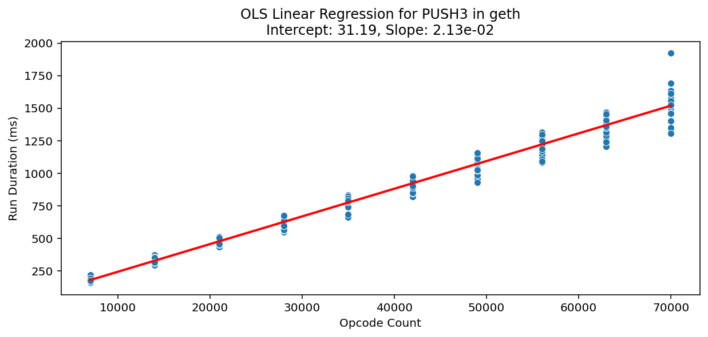

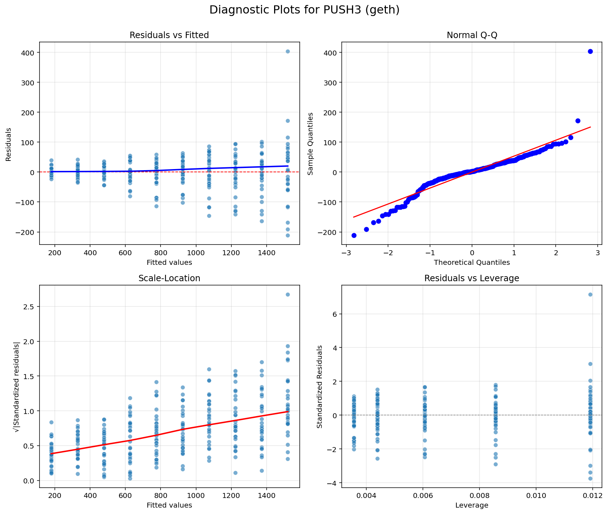


## besu


```python
                            OLS Regression Results                            
==============================================================================
Dep. Variable:        run_duration_ms   R-squared:                       0.977
Model:                            OLS   Adj. R-squared:                  0.977
Method:                 Least Squares   F-statistic:                 1.216e+04
Date:                Thu, 22 Jan 2026   Prob (F-statistic):          1.29e-237
Time:                        10:34:33   Log-Likelihood:                -1699.4
No. Observations:                 290   AIC:                             3403.
Df Residuals:                     288   BIC:                             3410.
Df Model:                           1                                         
Covariance Type:            nonrobust                                         
==============================================================================
                 coef    std err          t      P>|t|      [0.025      0.975]
------------------------------------------------------------------------------
const         30.9940     10.804      2.869      0.004       9.730      52.259
opcount        0.0274      0.000    110.295      0.000       0.027       0.028
==============================================================================
Omnibus:                       21.196   Durbin-Watson:                   0.891
Prob(Omnibus):                  0.000   Jarque-Bera (JB):               62.664
Skew:                           0.206   Prob(JB):                     2.47e-14
Kurtosis:                       5.240   Cond. No.                     9.38e+04
==============================================================================

Notes:
[1] Standard Errors assume that the covariance matrix of the errors is correctly specified.
[2] The condition number is large, 9.38e+04. This might indicate that there are
strong multicollinearity or other numerical problems.
```

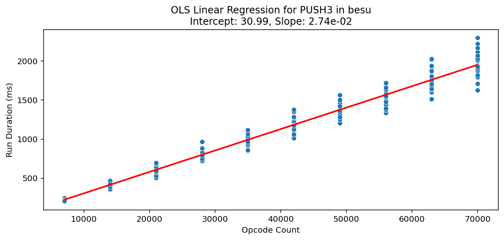

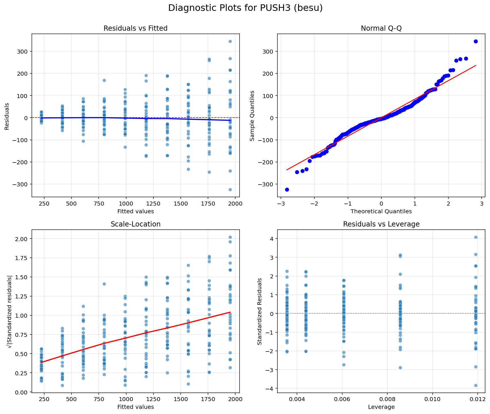


## reth


```python
                            OLS Regression Results                            
==============================================================================
Dep. Variable:        run_duration_ms   R-squared:                       0.969
Model:                            OLS   Adj. R-squared:                  0.969
Method:                 Least Squares   F-statistic:                     5533.
Date:                Thu, 22 Jan 2026   Prob (F-statistic):          5.24e-136
Time:                        10:34:33   Log-Likelihood:                -802.66
No. Observations:                 180   AIC:                             1609.
Df Residuals:                     178   BIC:                             1616.
Df Model:                           1                                         
Covariance Type:            nonrobust                                         
==============================================================================
                 coef    std err          t      P>|t|      [0.025      0.975]
------------------------------------------------------------------------------
const         31.8171      3.386      9.397      0.000      25.135      38.499
opcount        0.0058    7.8e-05     74.387      0.000       0.006       0.006
==============================================================================
Omnibus:                        7.251   Durbin-Watson:                   1.592
Prob(Omnibus):                  0.027   Jarque-Bera (JB):                9.625
Skew:                           0.249   Prob(JB):                      0.00813
Kurtosis:                       4.017   Cond. No.                     9.38e+04
==============================================================================

Notes:
[1] Standard Errors assume that the covariance matrix of the errors is correctly specified.
[2] The condition number is large, 9.38e+04. This might indicate that there are
strong multicollinearity or other numerical problems.
```

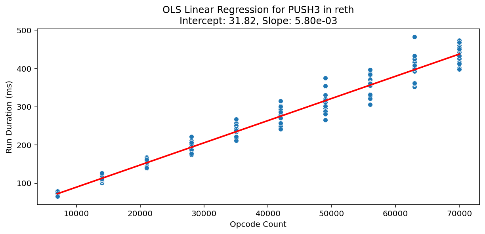

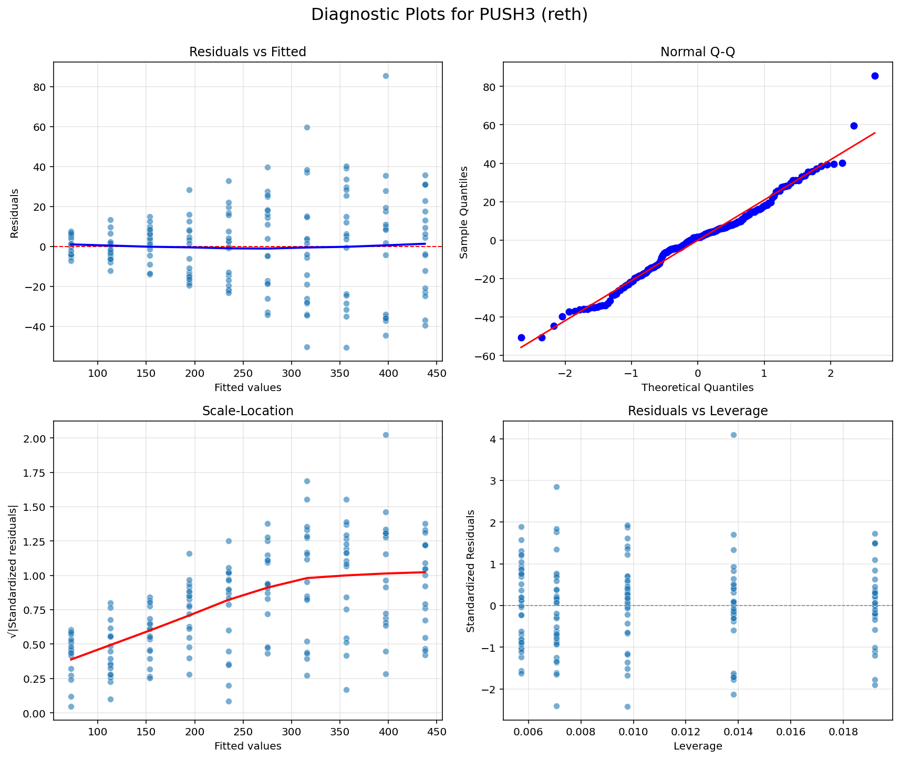


## nethermind


```python
                            OLS Regression Results                            
==============================================================================
Dep. Variable:        run_duration_ms   R-squared:                       0.984
Model:                            OLS   Adj. R-squared:                  0.984
Method:                 Least Squares   F-statistic:                 1.763e+04
Date:                Thu, 22 Jan 2026   Prob (F-statistic):          2.25e-260
Time:                        10:34:34   Log-Likelihood:                -1415.7
No. Observations:                 290   AIC:                             2835.
Df Residuals:                     288   BIC:                             2843.
Df Model:                           1                                         
Covariance Type:            nonrobust                                         
==============================================================================
                 coef    std err          t      P>|t|      [0.025      0.975]
------------------------------------------------------------------------------
const         26.1425      4.062      6.436      0.000      18.148      34.137
opcount        0.0124   9.35e-05    132.780      0.000       0.012       0.013
==============================================================================
Omnibus:                       53.721   Durbin-Watson:                   0.968
Prob(Omnibus):                  0.000   Jarque-Bera (JB):              117.769
Skew:                          -0.918   Prob(JB):                     2.67e-26
Kurtosis:                       5.525   Cond. No.                     9.38e+04
==============================================================================

Notes:
[1] Standard Errors assume that the covariance matrix of the errors is correctly specified.
[2] The condition number is large, 9.38e+04. This might indicate that there are
strong multicollinearity or other numerical problems.
```

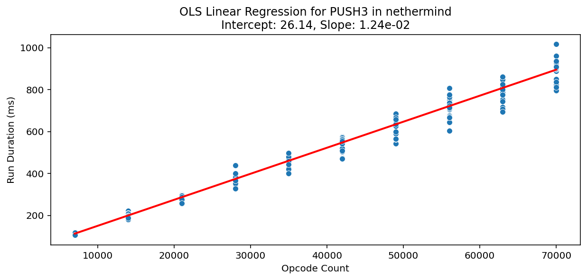

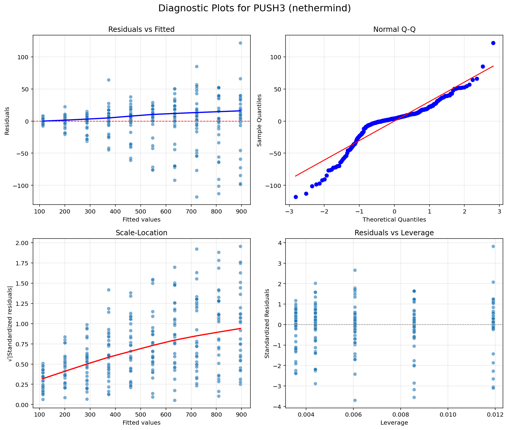


## erigon

OLS model did not run... Error: zero-size array to reduction operation maximum which has no identity

# PUSH4

## geth


```python
                            OLS Regression Results                            
==============================================================================
Dep. Variable:        run_duration_ms   R-squared:                       0.982
Model:                            OLS   Adj. R-squared:                  0.982
Method:                 Least Squares   F-statistic:                 1.549e+04
Date:                Thu, 22 Jan 2026   Prob (F-statistic):          2.03e-252
Time:                        10:34:34   Log-Likelihood:                -1588.7
No. Observations:                 290   AIC:                             3181.
Df Residuals:                     288   BIC:                             3189.
Df Model:                           1                                         
Covariance Type:            nonrobust                                         
==============================================================================
                 coef    std err          t      P>|t|      [0.025      0.975]
------------------------------------------------------------------------------
const         37.2639      7.374      5.054      0.000      22.751      51.777
opcount        0.0211      0.000    124.460      0.000       0.021       0.021
==============================================================================
Omnibus:                       73.688   Durbin-Watson:                   0.961
Prob(Omnibus):                  0.000   Jarque-Bera (JB):              983.374
Skew:                           0.573   Prob(JB):                    2.90e-214
Kurtosis:                      11.948   Cond. No.                     9.38e+04
==============================================================================

Notes:
[1] Standard Errors assume that the covariance matrix of the errors is correctly specified.
[2] The condition number is large, 9.38e+04. This might indicate that there are
strong multicollinearity or other numerical problems.
```


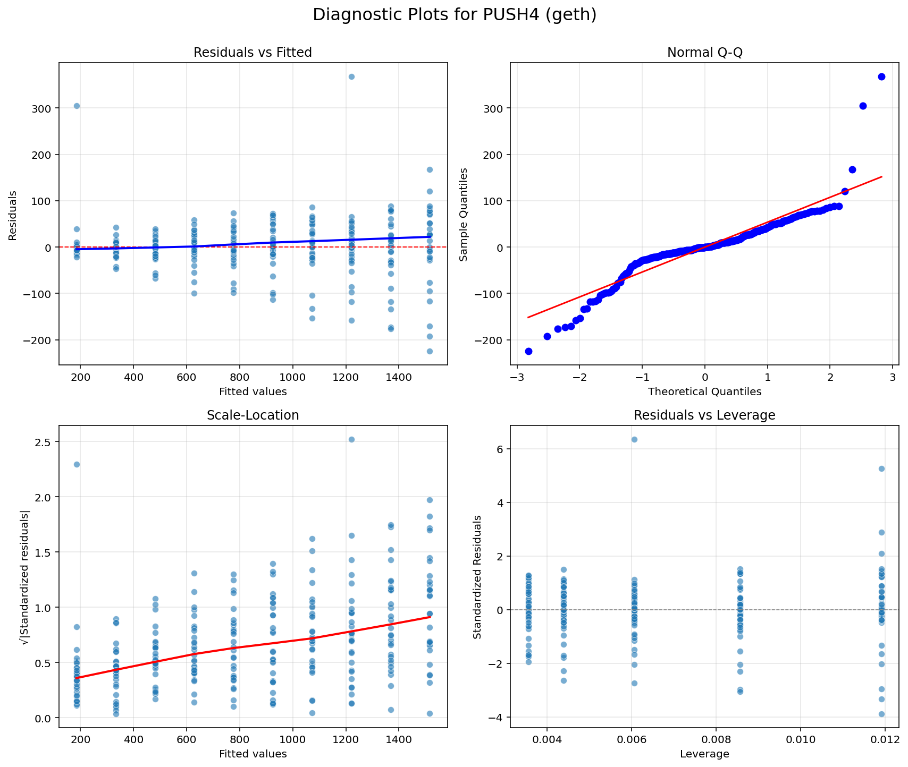


## besu


```python
                            OLS Regression Results                            
==============================================================================
Dep. Variable:        run_duration_ms   R-squared:                       0.977
Model:                            OLS   Adj. R-squared:                  0.977
Method:                 Least Squares   F-statistic:                 1.250e+04
Date:                Thu, 22 Jan 2026   Prob (F-statistic):          2.75e-239
Time:                        10:34:34   Log-Likelihood:                -1697.6
No. Observations:                 290   AIC:                             3399.
Df Residuals:                     288   BIC:                             3407.
Df Model:                           1                                         
Covariance Type:            nonrobust                                         
==============================================================================
                 coef    std err          t      P>|t|      [0.025      0.975]
------------------------------------------------------------------------------
const         31.3756     10.736      2.922      0.004      10.245      52.507
opcount        0.0276      0.000    111.812      0.000       0.027       0.028
==============================================================================
Omnibus:                       27.773   Durbin-Watson:                   0.826
Prob(Omnibus):                  0.000   Jarque-Bera (JB):               59.327
Skew:                           0.489   Prob(JB):                     1.31e-13
Kurtosis:                       4.988   Cond. No.                     9.38e+04
==============================================================================

Notes:
[1] Standard Errors assume that the covariance matrix of the errors is correctly specified.
[2] The condition number is large, 9.38e+04. This might indicate that there are
strong multicollinearity or other numerical problems.
```


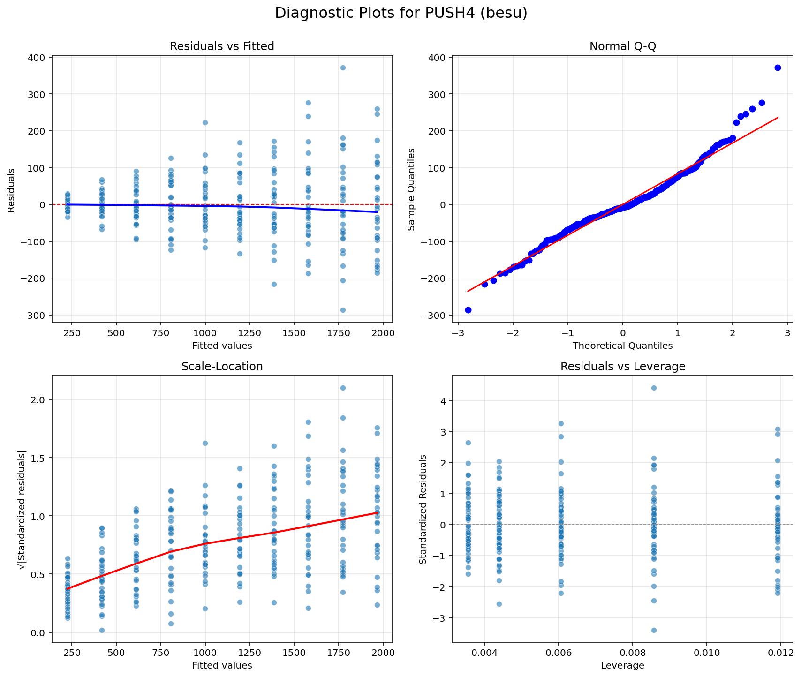


## reth


```python
                            OLS Regression Results                            
==============================================================================
Dep. Variable:        run_duration_ms   R-squared:                       0.970
Model:                            OLS   Adj. R-squared:                  0.970
Method:                 Least Squares   F-statistic:                     5786.
Date:                Thu, 22 Jan 2026   Prob (F-statistic):          1.11e-137
Time:                        10:34:35   Log-Likelihood:                -798.62
No. Observations:                 180   AIC:                             1601.
Df Residuals:                     178   BIC:                             1608.
Df Model:                           1                                         
Covariance Type:            nonrobust                                         
==============================================================================
                 coef    std err          t      P>|t|      [0.025      0.975]
------------------------------------------------------------------------------
const         32.0966      3.311      9.695      0.000      25.563      38.630
opcount        0.0058   7.62e-05     76.067      0.000       0.006       0.006
==============================================================================
Omnibus:                        2.193   Durbin-Watson:                   1.559
Prob(Omnibus):                  0.334   Jarque-Bera (JB):                1.974
Skew:                           0.080   Prob(JB):                        0.373
Kurtosis:                       3.487   Cond. No.                     9.38e+04
==============================================================================

Notes:
[1] Standard Errors assume that the covariance matrix of the errors is correctly specified.
[2] The condition number is large, 9.38e+04. This might indicate that there are
strong multicollinearity or other numerical problems.
```


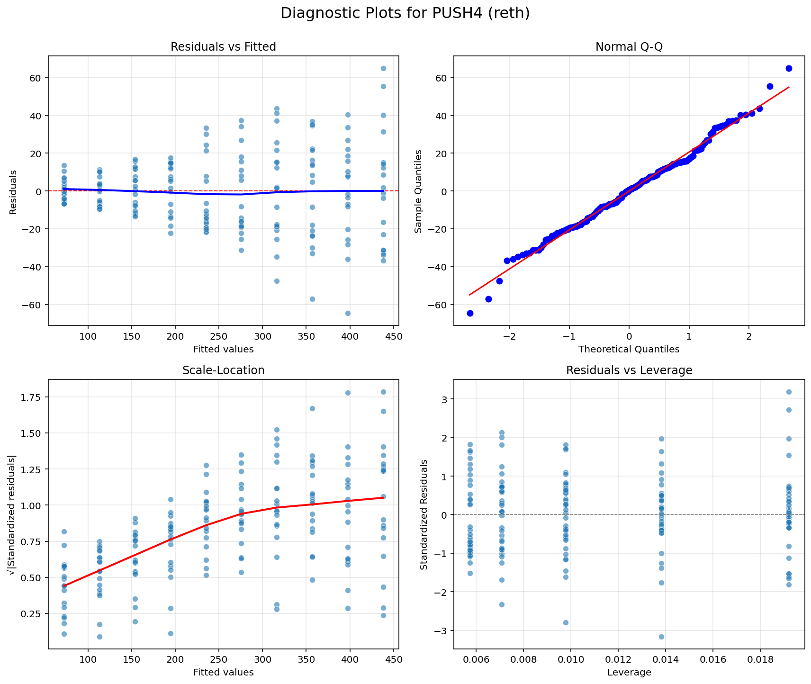


## nethermind


```python
                            OLS Regression Results                            
==============================================================================
Dep. Variable:        run_duration_ms   R-squared:                       0.978
Model:                            OLS   Adj. R-squared:                  0.978
Method:                 Least Squares   F-statistic:                 1.290e+04
Date:                Thu, 22 Jan 2026   Prob (F-statistic):          3.47e-241
Time:                        10:34:35   Log-Likelihood:                -1393.2
No. Observations:                 290   AIC:                             2790.
Df Residuals:                     288   BIC:                             2798.
Df Model:                           1                                         
Covariance Type:            nonrobust                                         
==============================================================================
                 coef    std err          t      P>|t|      [0.025      0.975]
------------------------------------------------------------------------------
const         29.9662      3.759      7.972      0.000      22.568      37.364
opcount        0.0098   8.65e-05    113.563      0.000       0.010       0.010
==============================================================================
Omnibus:                       42.438   Durbin-Watson:                   1.079
Prob(Omnibus):                  0.000   Jarque-Bera (JB):              360.377
Skew:                           0.004   Prob(JB):                     5.56e-79
Kurtosis:                       8.461   Cond. No.                     9.38e+04
==============================================================================

Notes:
[1] Standard Errors assume that the covariance matrix of the errors is correctly specified.
[2] The condition number is large, 9.38e+04. This might indicate that there are
strong multicollinearity or other numerical problems.
```

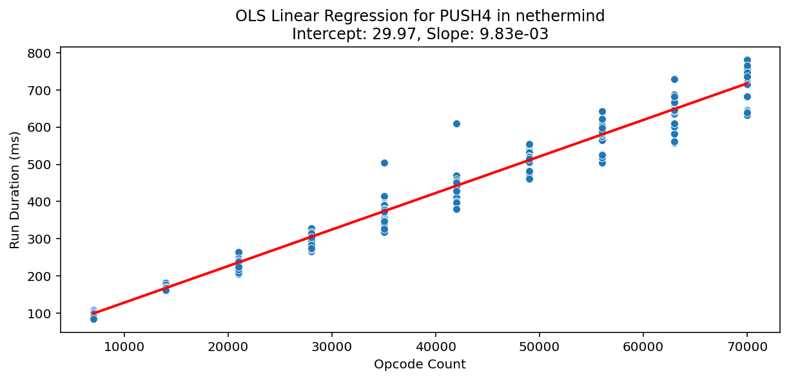

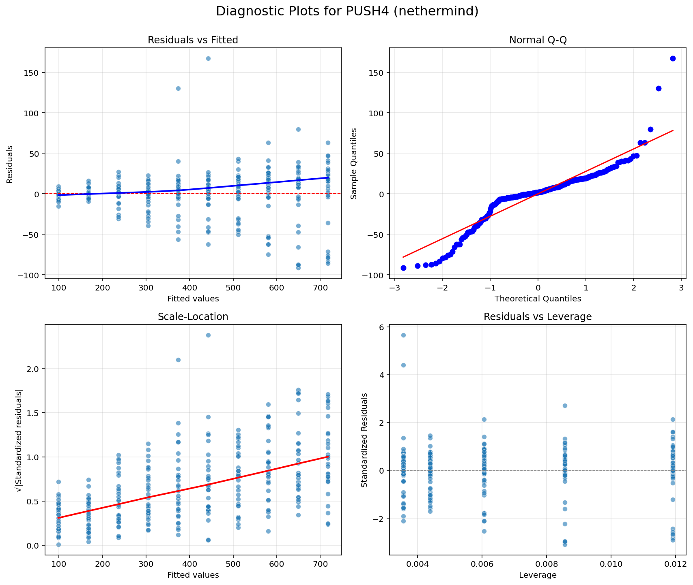


## erigon

OLS model did not run... Error: zero-size array to reduction operation maximum which has no identity

# PUSH5

## geth


```python
                            OLS Regression Results                            
==============================================================================
Dep. Variable:        run_duration_ms   R-squared:                       0.986
Model:                            OLS   Adj. R-squared:                  0.986
Method:                 Least Squares   F-statistic:                 1.978e+04
Date:                Thu, 22 Jan 2026   Prob (F-statistic):          1.86e-267
Time:                        10:34:35   Log-Likelihood:                -1550.7
No. Observations:                 290   AIC:                             3105.
Df Residuals:                     288   BIC:                             3113.
Df Model:                           1                                         
Covariance Type:            nonrobust                                         
==============================================================================
                 coef    std err          t      P>|t|      [0.025      0.975]
------------------------------------------------------------------------------
const         38.8500      6.469      6.005      0.000      26.117      51.583
opcount        0.0209      0.000    140.637      0.000       0.021       0.021
==============================================================================
Omnibus:                       68.379   Durbin-Watson:                   0.827
Prob(Omnibus):                  0.000   Jarque-Bera (JB):              155.090
Skew:                          -1.145   Prob(JB):                     2.10e-34
Kurtosis:                       5.756   Cond. No.                     9.38e+04
==============================================================================

Notes:
[1] Standard Errors assume that the covariance matrix of the errors is correctly specified.
[2] The condition number is large, 9.38e+04. This might indicate that there are
strong multicollinearity or other numerical problems.
```


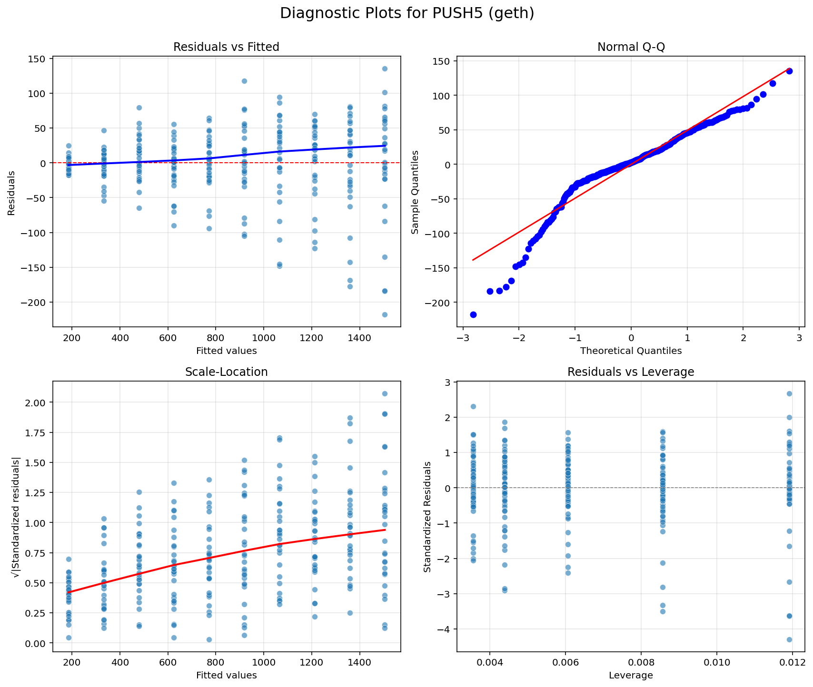


## besu


```python
                            OLS Regression Results                            
==============================================================================
Dep. Variable:        run_duration_ms   R-squared:                       0.977
Model:                            OLS   Adj. R-squared:                  0.977
Method:                 Least Squares   F-statistic:                 1.216e+04
Date:                Thu, 22 Jan 2026   Prob (F-statistic):          1.38e-237
Time:                        10:34:36   Log-Likelihood:                -1701.7
No. Observations:                 290   AIC:                             3407.
Df Residuals:                     288   BIC:                             3415.
Df Model:                           1                                         
Covariance Type:            nonrobust                                         
==============================================================================
                 coef    std err          t      P>|t|      [0.025      0.975]
------------------------------------------------------------------------------
const         26.7401     10.890      2.455      0.015       5.305      48.175
opcount        0.0276      0.000    110.267      0.000       0.027       0.028
==============================================================================
Omnibus:                       15.211   Durbin-Watson:                   0.806
Prob(Omnibus):                  0.000   Jarque-Bera (JB):               29.890
Skew:                           0.253   Prob(JB):                     3.23e-07
Kurtosis:                       4.489   Cond. No.                     9.38e+04
==============================================================================

Notes:
[1] Standard Errors assume that the covariance matrix of the errors is correctly specified.
[2] The condition number is large, 9.38e+04. This might indicate that there are
strong multicollinearity or other numerical problems.
```

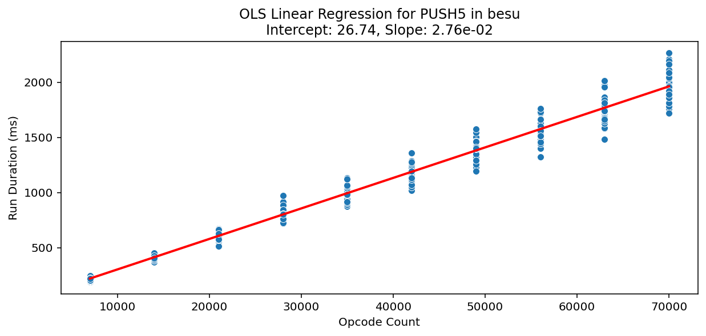

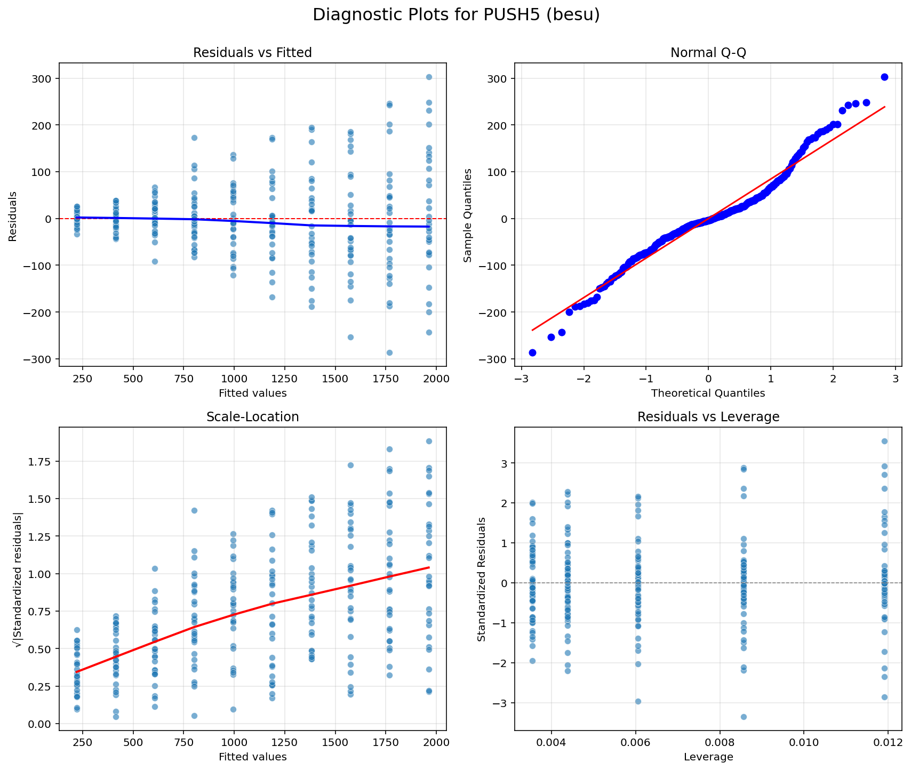


## reth


```python
                            OLS Regression Results                            
==============================================================================
Dep. Variable:        run_duration_ms   R-squared:                       0.963
Model:                            OLS   Adj. R-squared:                  0.963
Method:                 Least Squares   F-statistic:                     4694.
Date:                Thu, 22 Jan 2026   Prob (F-statistic):          7.33e-130
Time:                        10:34:36   Log-Likelihood:                -820.39
No. Observations:                 180   AIC:                             1645.
Df Residuals:                     178   BIC:                             1651.
Df Model:                           1                                         
Covariance Type:            nonrobust                                         
==============================================================================
                 coef    std err          t      P>|t|      [0.025      0.975]
------------------------------------------------------------------------------
const         29.9153      3.736      8.007      0.000      22.542      37.288
opcount        0.0059    8.6e-05     68.513      0.000       0.006       0.006
==============================================================================
Omnibus:                        3.636   Durbin-Watson:                   1.791
Prob(Omnibus):                  0.162   Jarque-Bera (JB):                4.322
Skew:                          -0.036   Prob(JB):                        0.115
Kurtosis:                       3.756   Cond. No.                     9.38e+04
==============================================================================

Notes:
[1] Standard Errors assume that the covariance matrix of the errors is correctly specified.
[2] The condition number is large, 9.38e+04. This might indicate that there are
strong multicollinearity or other numerical problems.
```


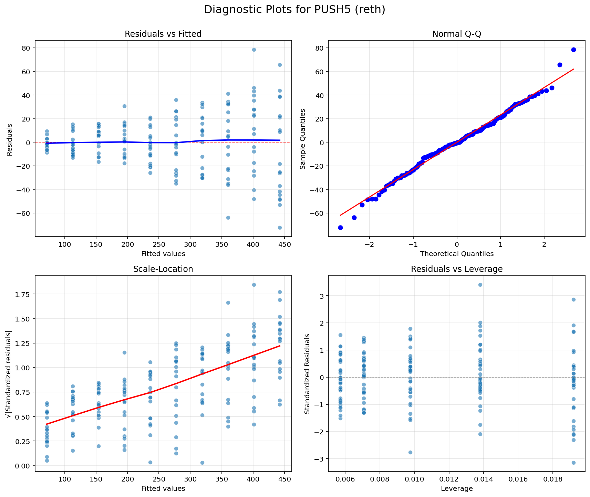


## nethermind


```python
                            OLS Regression Results                            
==============================================================================
Dep. Variable:        run_duration_ms   R-squared:                       0.980
Model:                            OLS   Adj. R-squared:                  0.980
Method:                 Least Squares   F-statistic:                 1.384e+04
Date:                Thu, 22 Jan 2026   Prob (F-statistic):          1.60e-245
Time:                        10:34:36   Log-Likelihood:                -1444.9
No. Observations:                 290   AIC:                             2894.
Df Residuals:                     288   BIC:                             2901.
Df Model:                           1                                         
Covariance Type:            nonrobust                                         
==============================================================================
                 coef    std err          t      P>|t|      [0.025      0.975]
------------------------------------------------------------------------------
const         27.5697      4.492      6.137      0.000      18.728      36.412
opcount        0.0122      0.000    117.657      0.000       0.012       0.012
==============================================================================
Omnibus:                       54.672   Durbin-Watson:                   0.925
Prob(Omnibus):                  0.000   Jarque-Bera (JB):               98.289
Skew:                          -1.022   Prob(JB):                     4.54e-22
Kurtosis:                       4.990   Cond. No.                     9.38e+04
==============================================================================

Notes:
[1] Standard Errors assume that the covariance matrix of the errors is correctly specified.
[2] The condition number is large, 9.38e+04. This might indicate that there are
strong multicollinearity or other numerical problems.
```


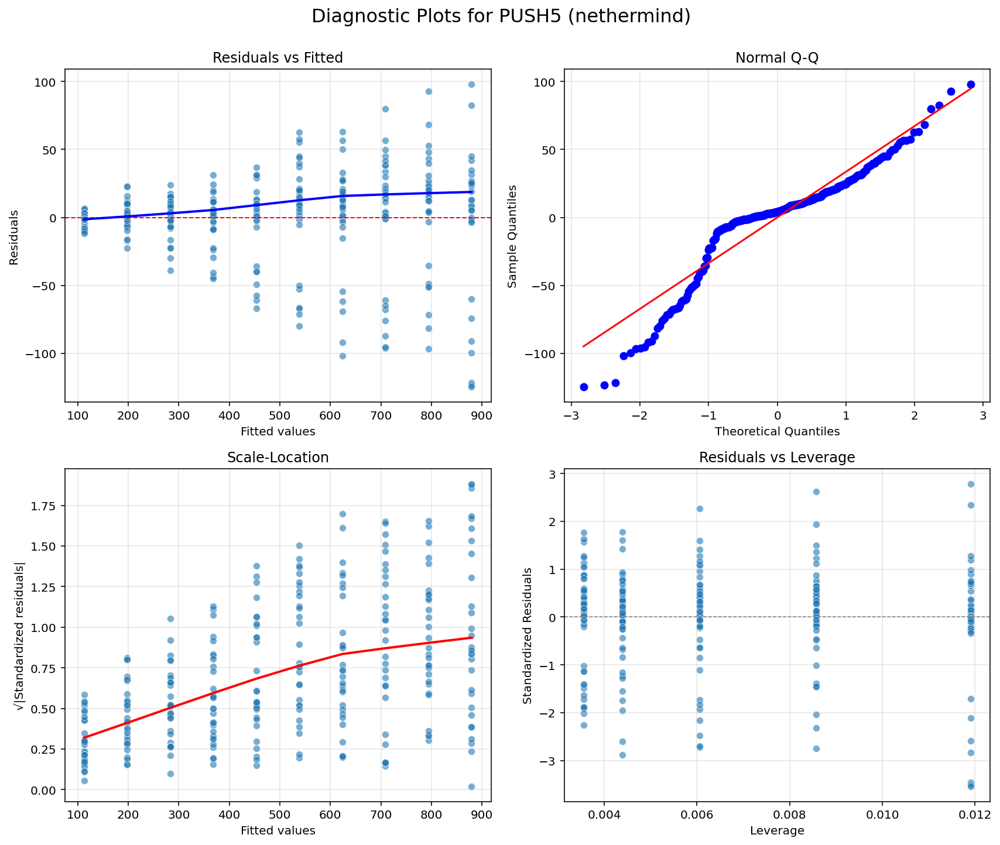


## erigon

OLS model did not run... Error: zero-size array to reduction operation maximum which has no identity

# PUSH6

## geth


```python
                            OLS Regression Results                            
==============================================================================
Dep. Variable:        run_duration_ms   R-squared:                       0.984
Model:                            OLS   Adj. R-squared:                  0.984
Method:                 Least Squares   F-statistic:                 1.755e+04
Date:                Thu, 22 Jan 2026   Prob (F-statistic):          4.37e-260
Time:                        10:34:36   Log-Likelihood:                -1571.4
No. Observations:                 290   AIC:                             3147.
Df Residuals:                     288   BIC:                             3154.
Df Model:                           1                                         
Covariance Type:            nonrobust                                         
==============================================================================
                 coef    std err          t      P>|t|      [0.025      0.975]
------------------------------------------------------------------------------
const         33.9710      6.947      4.890      0.000      20.297      47.645
opcount        0.0212      0.000    132.469      0.000       0.021       0.022
==============================================================================
Omnibus:                       96.435   Durbin-Watson:                   0.967
Prob(Omnibus):                  0.000   Jarque-Bera (JB):             2242.684
Skew:                           0.733   Prob(JB):                         0.00
Kurtosis:                      16.545   Cond. No.                     9.38e+04
==============================================================================

Notes:
[1] Standard Errors assume that the covariance matrix of the errors is correctly specified.
[2] The condition number is large, 9.38e+04. This might indicate that there are
strong multicollinearity or other numerical problems.
```


## besu


```python
                            OLS Regression Results                            
==============================================================================
Dep. Variable:        run_duration_ms   R-squared:                       0.977
Model:                            OLS   Adj. R-squared:                  0.977
Method:                 Least Squares   F-statistic:                 1.220e+04
Date:                Thu, 22 Jan 2026   Prob (F-statistic):          8.45e-238
Time:                        10:34:37   Log-Likelihood:                -1700.1
No. Observations:                 290   AIC:                             3404.
Df Residuals:                     288   BIC:                             3411.
Df Model:                           1                                         
Covariance Type:            nonrobust                                         
==============================================================================
                 coef    std err          t      P>|t|      [0.025      0.975]
------------------------------------------------------------------------------
const         28.2640     10.828      2.610      0.010       6.953      49.576
opcount        0.0275      0.000    110.460      0.000       0.027       0.028
==============================================================================
Omnibus:                       24.007   Durbin-Watson:                   0.778
Prob(Omnibus):                  0.000   Jarque-Bera (JB):               94.252
Skew:                          -0.055   Prob(JB):                     3.41e-21
Kurtosis:                       5.791   Cond. No.                     9.38e+04
==============================================================================

Notes:
[1] Standard Errors assume that the covariance matrix of the errors is correctly specified.
[2] The condition number is large, 9.38e+04. This might indicate that there are
strong multicollinearity or other numerical problems.
```


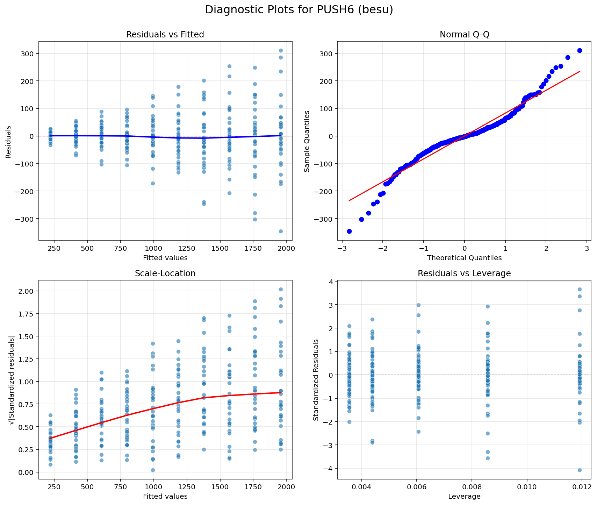


## reth


```python
                            OLS Regression Results                            
==============================================================================
Dep. Variable:        run_duration_ms   R-squared:                       0.966
Model:                            OLS   Adj. R-squared:                  0.965
Method:                 Least Squares   F-statistic:                     4993.
Date:                Thu, 22 Jan 2026   Prob (F-statistic):          3.63e-132
Time:                        10:34:37   Log-Likelihood:                -816.65
No. Observations:                 180   AIC:                             1637.
Df Residuals:                     178   BIC:                             1644.
Df Model:                           1                                         
Covariance Type:            nonrobust                                         
==============================================================================
                 coef    std err          t      P>|t|      [0.025      0.975]
------------------------------------------------------------------------------
const         31.6474      3.659      8.648      0.000      24.426      38.869
opcount        0.0060   8.43e-05     70.664      0.000       0.006       0.006
==============================================================================
Omnibus:                        0.895   Durbin-Watson:                   1.459
Prob(Omnibus):                  0.639   Jarque-Bera (JB):                0.663
Skew:                          -0.141   Prob(JB):                        0.718
Kurtosis:                       3.091   Cond. No.                     9.38e+04
==============================================================================

Notes:
[1] Standard Errors assume that the covariance matrix of the errors is correctly specified.
[2] The condition number is large, 9.38e+04. This might indicate that there are
strong multicollinearity or other numerical problems.
```

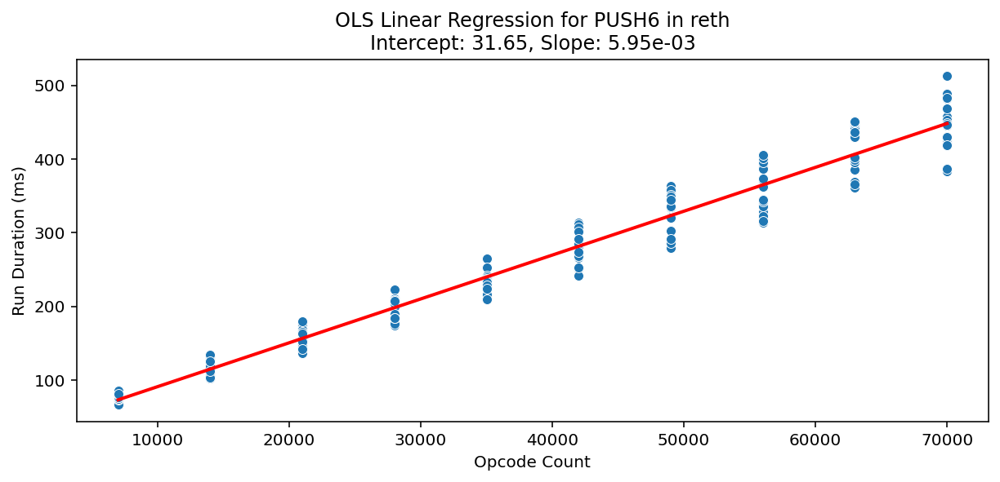

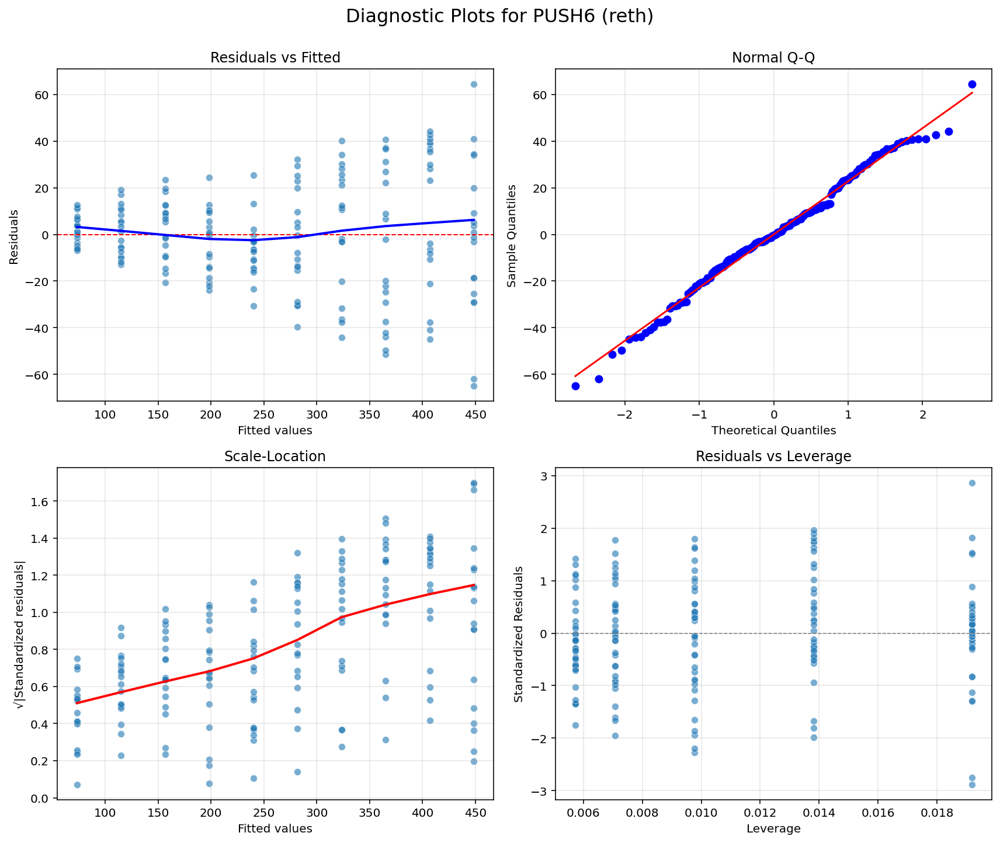


## nethermind


```python
                            OLS Regression Results                            
==============================================================================
Dep. Variable:        run_duration_ms   R-squared:                       0.960
Model:                            OLS   Adj. R-squared:                  0.959
Method:                 Least Squares   F-statistic:                     6831.
Date:                Thu, 22 Jan 2026   Prob (F-statistic):          1.22e-202
Time:                        10:34:37   Log-Likelihood:                -1550.6
No. Observations:                 290   AIC:                             3105.
Df Residuals:                     288   BIC:                             3113.
Df Model:                           1                                         
Covariance Type:            nonrobust                                         
==============================================================================
                 coef    std err          t      P>|t|      [0.025      0.975]
------------------------------------------------------------------------------
const         31.7472      6.467      4.909      0.000      19.019      44.475
opcount        0.0123      0.000     82.648      0.000       0.012       0.013
==============================================================================
Omnibus:                      139.158   Durbin-Watson:                   0.789
Prob(Omnibus):                  0.000   Jarque-Bera (JB):             1088.403
Skew:                           1.780   Prob(JB):                    4.53e-237
Kurtosis:                      11.798   Cond. No.                     9.38e+04
==============================================================================

Notes:
[1] Standard Errors assume that the covariance matrix of the errors is correctly specified.
[2] The condition number is large, 9.38e+04. This might indicate that there are
strong multicollinearity or other numerical problems.
```

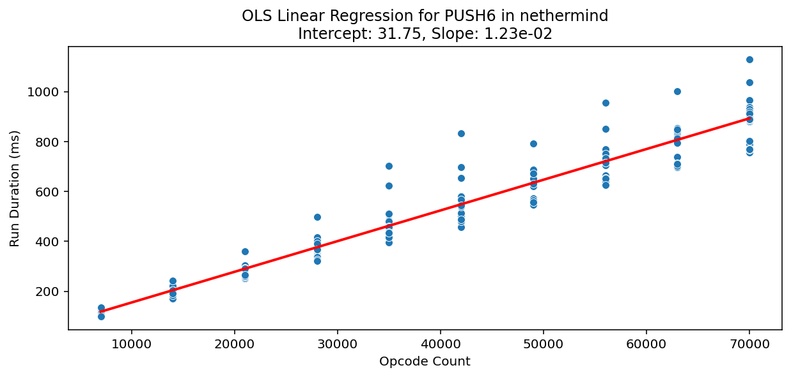

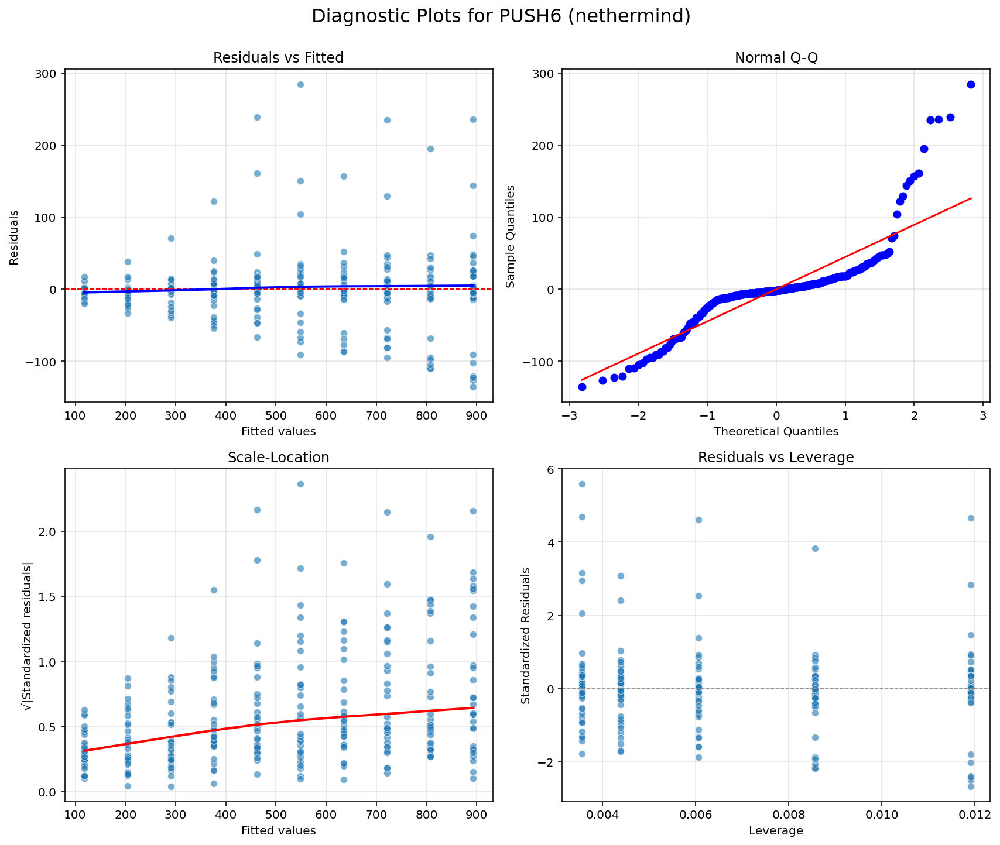


## erigon

OLS model did not run... Error: zero-size array to reduction operation maximum which has no identity

# PUSH7

## geth


```python
                            OLS Regression Results                            
==============================================================================
Dep. Variable:        run_duration_ms   R-squared:                       0.986
Model:                            OLS   Adj. R-squared:                  0.986
Method:                 Least Squares   F-statistic:                 2.048e+04
Date:                Thu, 22 Jan 2026   Prob (F-statistic):          1.37e-269
Time:                        10:34:38   Log-Likelihood:                -1554.1
No. Observations:                 290   AIC:                             3112.
Df Residuals:                     288   BIC:                             3119.
Df Model:                           1                                         
Covariance Type:            nonrobust                                         
==============================================================================
                 coef    std err          t      P>|t|      [0.025      0.975]
------------------------------------------------------------------------------
const         33.8144      6.544      5.167      0.000      20.933      46.695
opcount        0.0216      0.000    143.092      0.000       0.021       0.022
==============================================================================
Omnibus:                       68.762   Durbin-Watson:                   0.869
Prob(Omnibus):                  0.000   Jarque-Bera (JB):              178.987
Skew:                          -1.092   Prob(JB):                     1.36e-39
Kurtosis:                       6.169   Cond. No.                     9.38e+04
==============================================================================

Notes:
[1] Standard Errors assume that the covariance matrix of the errors is correctly specified.
[2] The condition number is large, 9.38e+04. This might indicate that there are
strong multicollinearity or other numerical problems.
```


## besu


```python
                            OLS Regression Results                            
==============================================================================
Dep. Variable:        run_duration_ms   R-squared:                       0.979
Model:                            OLS   Adj. R-squared:                  0.979
Method:                 Least Squares   F-statistic:                 1.348e+04
Date:                Thu, 22 Jan 2026   Prob (F-statistic):          7.08e-244
Time:                        10:34:38   Log-Likelihood:                -1688.3
No. Observations:                 290   AIC:                             3381.
Df Residuals:                     288   BIC:                             3388.
Df Model:                           1                                         
Covariance Type:            nonrobust                                         
==============================================================================
                 coef    std err          t      P>|t|      [0.025      0.975]
------------------------------------------------------------------------------
const         28.7556     10.396      2.766      0.006       8.294      49.217
opcount        0.0278      0.000    116.086      0.000       0.027       0.028
==============================================================================
Omnibus:                       12.780   Durbin-Watson:                   0.663
Prob(Omnibus):                  0.002   Jarque-Bera (JB):               29.139
Skew:                           0.053   Prob(JB):                     4.70e-07
Kurtosis:                       4.549   Cond. No.                     9.38e+04
==============================================================================

Notes:
[1] Standard Errors assume that the covariance matrix of the errors is correctly specified.
[2] The condition number is large, 9.38e+04. This might indicate that there are
strong multicollinearity or other numerical problems.
```


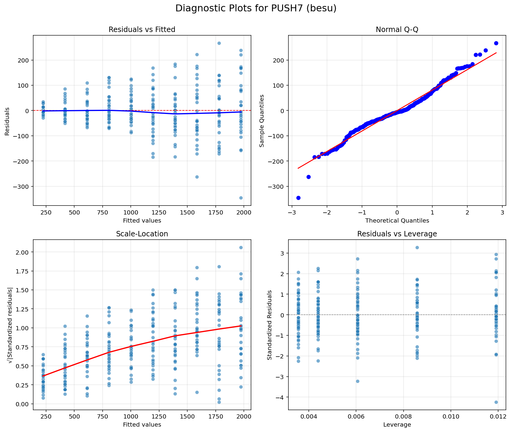


## reth


```python
                            OLS Regression Results                            
==============================================================================
Dep. Variable:        run_duration_ms   R-squared:                       0.970
Model:                            OLS   Adj. R-squared:                  0.970
Method:                 Least Squares   F-statistic:                     5701.
Date:                Thu, 22 Jan 2026   Prob (F-statistic):          4.02e-137
Time:                        10:34:38   Log-Likelihood:                -802.27
No. Observations:                 180   AIC:                             1609.
Df Residuals:                     178   BIC:                             1615.
Df Model:                           1                                         
Covariance Type:            nonrobust                                         
==============================================================================
                 coef    std err          t      P>|t|      [0.025      0.975]
------------------------------------------------------------------------------
const         35.3741      3.379     10.470      0.000      28.707      42.041
opcount        0.0059   7.78e-05     75.502      0.000       0.006       0.006
==============================================================================
Omnibus:                        6.221   Durbin-Watson:                   1.727
Prob(Omnibus):                  0.045   Jarque-Bera (JB):                6.328
Skew:                          -0.328   Prob(JB):                       0.0423
Kurtosis:                       3.642   Cond. No.                     9.38e+04
==============================================================================

Notes:
[1] Standard Errors assume that the covariance matrix of the errors is correctly specified.
[2] The condition number is large, 9.38e+04. This might indicate that there are
strong multicollinearity or other numerical problems.
```


## nethermind


```python
                            OLS Regression Results                            
==============================================================================
Dep. Variable:        run_duration_ms   R-squared:                       0.981
Model:                            OLS   Adj. R-squared:                  0.981
Method:                 Least Squares   F-statistic:                 1.461e+04
Date:                Thu, 22 Jan 2026   Prob (F-statistic):          7.57e-249
Time:                        10:34:39   Log-Likelihood:                -1438.0
No. Observations:                 290   AIC:                             2880.
Df Residuals:                     288   BIC:                             2887.
Df Model:                           1                                         
Covariance Type:            nonrobust                                         
==============================================================================
                 coef    std err          t      P>|t|      [0.025      0.975]
------------------------------------------------------------------------------
const         25.9831      4.386      5.925      0.000      17.351      34.615
opcount        0.0122      0.000    120.891      0.000       0.012       0.012
==============================================================================
Omnibus:                       35.803   Durbin-Watson:                   0.869
Prob(Omnibus):                  0.000   Jarque-Bera (JB):               58.457
Skew:                          -0.733   Prob(JB):                     2.02e-13
Kurtosis:                       4.641   Cond. No.                     9.38e+04
==============================================================================

Notes:
[1] Standard Errors assume that the covariance matrix of the errors is correctly specified.
[2] The condition number is large, 9.38e+04. This might indicate that there are
strong multicollinearity or other numerical problems.
```

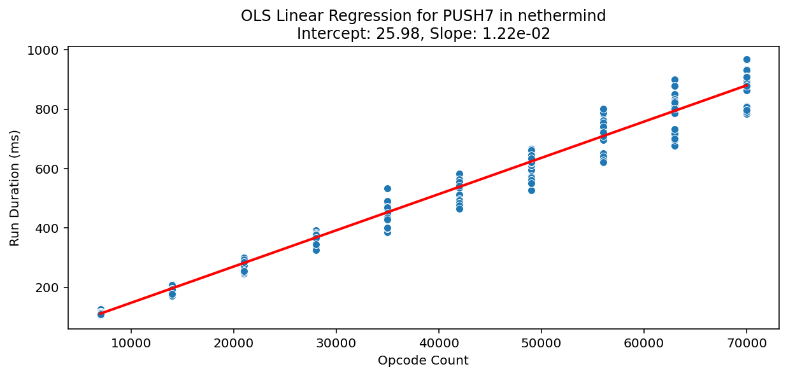

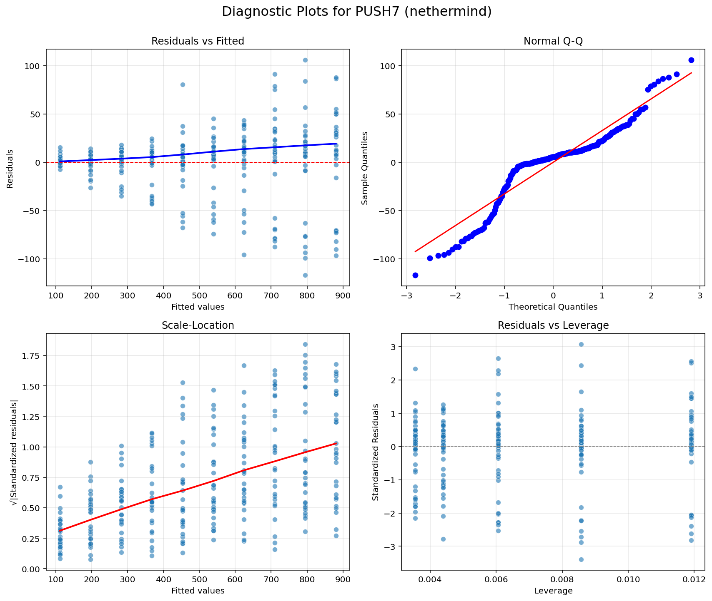


## erigon

OLS model did not run... Error: zero-size array to reduction operation maximum which has no identity

# PUSH8

## geth


```python
                            OLS Regression Results                            
==============================================================================
Dep. Variable:        run_duration_ms   R-squared:                       0.986
Model:                            OLS   Adj. R-squared:                  0.986
Method:                 Least Squares   F-statistic:                 1.978e+04
Date:                Thu, 22 Jan 2026   Prob (F-statistic):          1.88e-267
Time:                        10:34:39   Log-Likelihood:                -1555.7
No. Observations:                 290   AIC:                             3115.
Df Residuals:                     288   BIC:                             3123.
Df Model:                           1                                         
Covariance Type:            nonrobust                                         
==============================================================================
                 coef    std err          t      P>|t|      [0.025      0.975]
------------------------------------------------------------------------------
const         32.2874      6.581      4.906      0.000      19.335      45.240
opcount        0.0213      0.000    140.634      0.000       0.021       0.022
==============================================================================
Omnibus:                       48.131   Durbin-Watson:                   1.090
Prob(Omnibus):                  0.000   Jarque-Bera (JB):              483.544
Skew:                          -0.139   Prob(JB):                    9.99e-106
Kurtosis:                       9.320   Cond. No.                     9.38e+04
==============================================================================

Notes:
[1] Standard Errors assume that the covariance matrix of the errors is correctly specified.
[2] The condition number is large, 9.38e+04. This might indicate that there are
strong multicollinearity or other numerical problems.
```

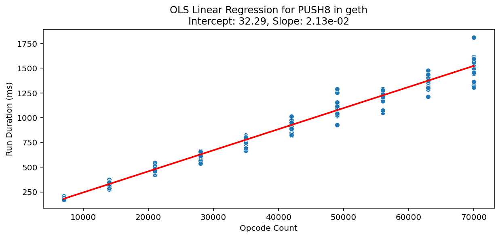

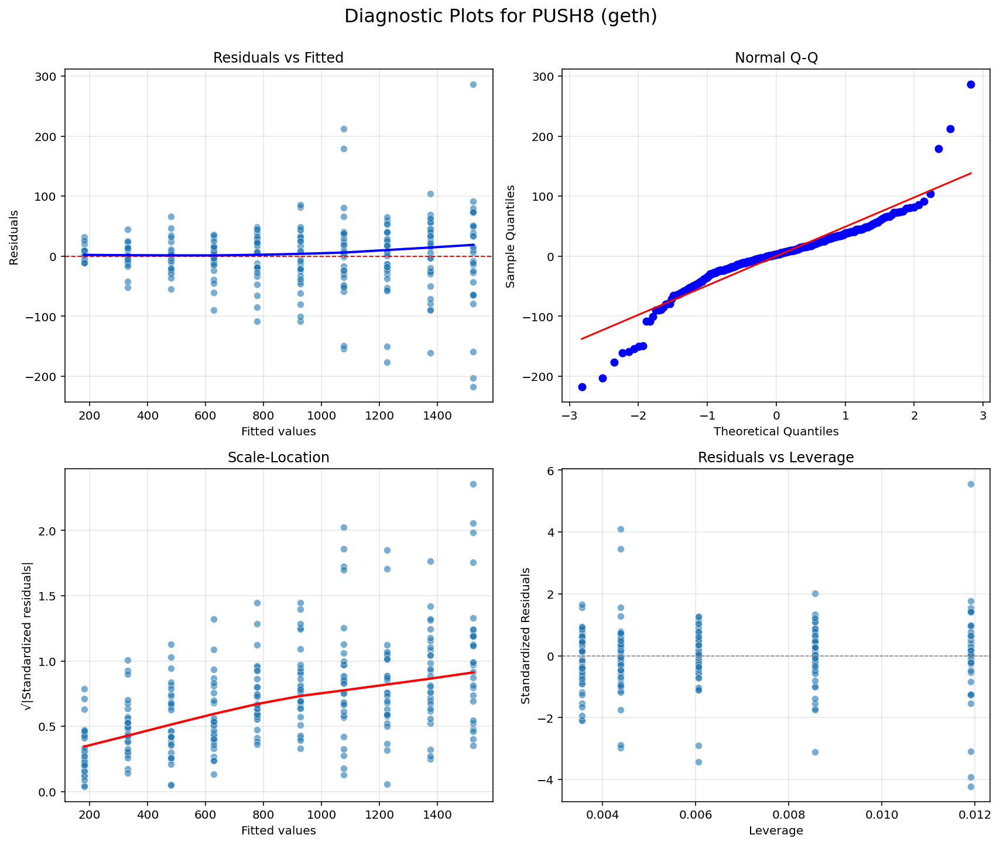


## besu


```python
                            OLS Regression Results                            
==============================================================================
Dep. Variable:        run_duration_ms   R-squared:                       0.980
Model:                            OLS   Adj. R-squared:                  0.980
Method:                 Least Squares   F-statistic:                 1.418e+04
Date:                Thu, 22 Jan 2026   Prob (F-statistic):          5.34e-247
Time:                        10:34:39   Log-Likelihood:                -1679.2
No. Observations:                 290   AIC:                             3362.
Df Residuals:                     288   BIC:                             3370.
Df Model:                           1                                         
Covariance Type:            nonrobust                                         
==============================================================================
                 coef    std err          t      P>|t|      [0.025      0.975]
------------------------------------------------------------------------------
const         32.4947     10.077      3.225      0.001      12.661      52.328
opcount        0.0276      0.000    119.082      0.000       0.027       0.028
==============================================================================
Omnibus:                       25.830   Durbin-Watson:                   0.739
Prob(Omnibus):                  0.000   Jarque-Bera (JB):               62.028
Skew:                           0.409   Prob(JB):                     3.39e-14
Kurtosis:                       5.113   Cond. No.                     9.38e+04
==============================================================================

Notes:
[1] Standard Errors assume that the covariance matrix of the errors is correctly specified.
[2] The condition number is large, 9.38e+04. This might indicate that there are
strong multicollinearity or other numerical problems.
```


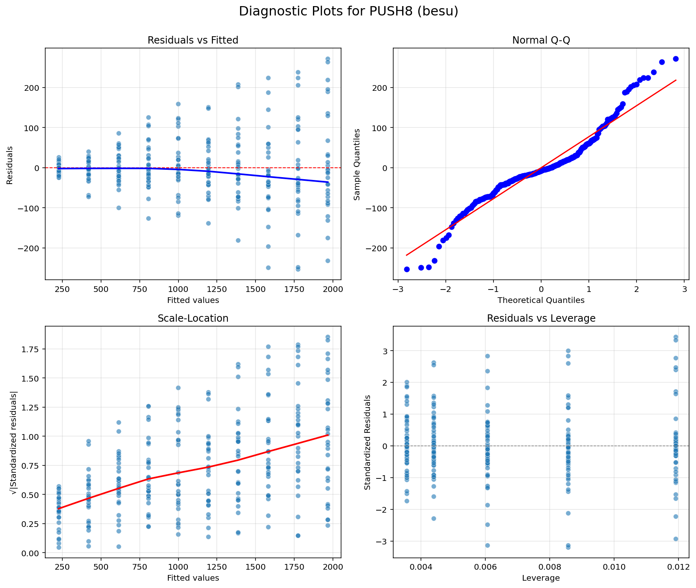


## reth


```python
                            OLS Regression Results                            
==============================================================================
Dep. Variable:        run_duration_ms   R-squared:                       0.979
Model:                            OLS   Adj. R-squared:                  0.979
Method:                 Least Squares   F-statistic:                     8313.
Date:                Thu, 22 Jan 2026   Prob (F-statistic):          2.46e-151
Time:                        10:34:40   Log-Likelihood:                -769.07
No. Observations:                 180   AIC:                             1542.
Df Residuals:                     178   BIC:                             1549.
Df Model:                           1                                         
Covariance Type:            nonrobust                                         
==============================================================================
                 coef    std err          t      P>|t|      [0.025      0.975]
------------------------------------------------------------------------------
const         33.8083      2.810     12.034      0.000      28.264      39.352
opcount        0.0059   6.47e-05     91.175      0.000       0.006       0.006
==============================================================================
Omnibus:                       10.498   Durbin-Watson:                   1.811
Prob(Omnibus):                  0.005   Jarque-Bera (JB):               10.750
Skew:                          -0.528   Prob(JB):                      0.00463
Kurtosis:                       3.566   Cond. No.                     9.38e+04
==============================================================================

Notes:
[1] Standard Errors assume that the covariance matrix of the errors is correctly specified.
[2] The condition number is large, 9.38e+04. This might indicate that there are
strong multicollinearity or other numerical problems.
```

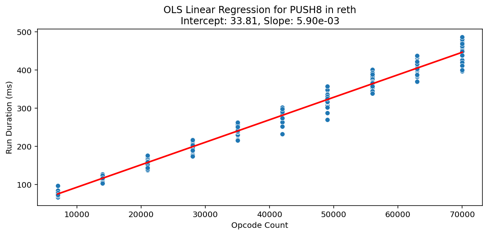

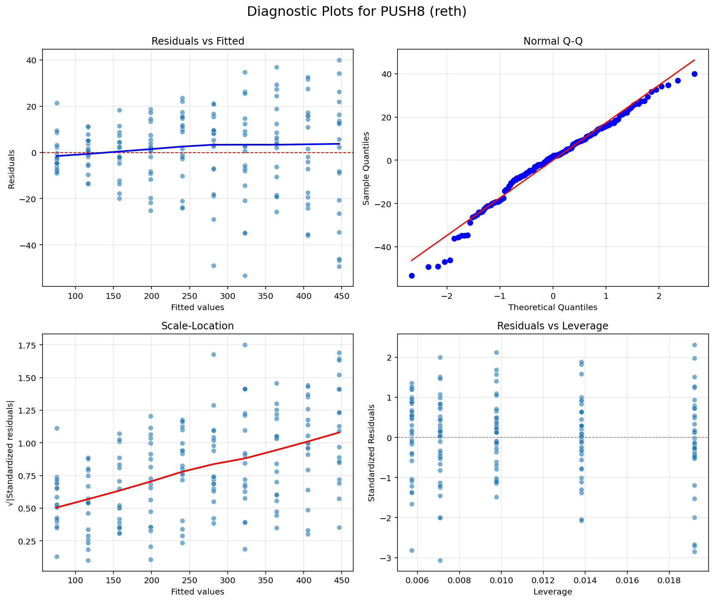


## nethermind


```python
                            OLS Regression Results                            
==============================================================================
Dep. Variable:        run_duration_ms   R-squared:                       0.927
Model:                            OLS   Adj. R-squared:                  0.926
Method:                 Least Squares   F-statistic:                     3642.
Date:                Thu, 22 Jan 2026   Prob (F-statistic):          1.80e-165
Time:                        10:34:40   Log-Likelihood:                -1577.0
No. Observations:                 290   AIC:                             3158.
Df Residuals:                     288   BIC:                             3165.
Df Model:                           1                                         
Covariance Type:            nonrobust                                         
==============================================================================
                 coef    std err          t      P>|t|      [0.025      0.975]
------------------------------------------------------------------------------
const         28.7100      7.084      4.053      0.000      14.767      42.653
opcount        0.0098      0.000     60.345      0.000       0.010       0.010
==============================================================================
Omnibus:                      560.700   Durbin-Watson:                   1.706
Prob(Omnibus):                  0.000   Jarque-Bera (JB):           381436.233
Skew:                          11.710   Prob(JB):                         0.00
Kurtosis:                     179.121   Cond. No.                     9.38e+04
==============================================================================

Notes:
[1] Standard Errors assume that the covariance matrix of the errors is correctly specified.
[2] The condition number is large, 9.38e+04. This might indicate that there are
strong multicollinearity or other numerical problems.
```
OLS model did not run... Error: 'numpy.ndarray' object has no attribute 'iloc'

## erigon

OLS model did not run... Error: zero-size array to reduction operation maximum which has no identity

# PUSH9

## geth


```python
                            OLS Regression Results                            
==============================================================================
Dep. Variable:        run_duration_ms   R-squared:                       0.985
Model:                            OLS   Adj. R-squared:                  0.985
Method:                 Least Squares   F-statistic:                 1.883e+04
Date:                Thu, 22 Jan 2026   Prob (F-statistic):          1.97e-264
Time:                        10:34:40   Log-Likelihood:                -1560.7
No. Observations:                 290   AIC:                             3125.
Df Residuals:                     288   BIC:                             3133.
Df Model:                           1                                         
Covariance Type:            nonrobust                                         
==============================================================================
                 coef    std err          t      P>|t|      [0.025      0.975]
------------------------------------------------------------------------------
const         35.6611      6.695      5.326      0.000      22.483      48.839
opcount        0.0212      0.000    137.230      0.000       0.021       0.021
==============================================================================
Omnibus:                      136.212   Durbin-Watson:                   1.116
Prob(Omnibus):                  0.000   Jarque-Bera (JB):             4343.361
Skew:                           1.235   Prob(JB):                         0.00
Kurtosis:                      21.798   Cond. No.                     9.38e+04
==============================================================================

Notes:
[1] Standard Errors assume that the covariance matrix of the errors is correctly specified.
[2] The condition number is large, 9.38e+04. This might indicate that there are
strong multicollinearity or other numerical problems.
```


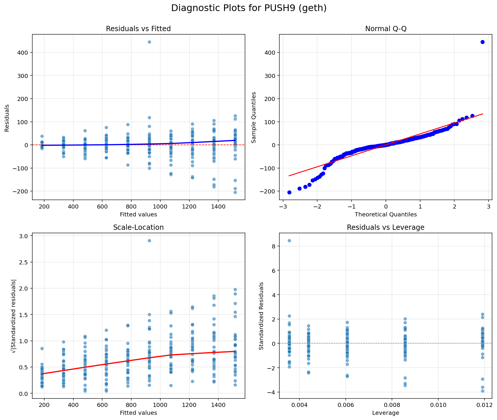


## besu


```python
                            OLS Regression Results                            
==============================================================================
Dep. Variable:        run_duration_ms   R-squared:                       0.979
Model:                            OLS   Adj. R-squared:                  0.979
Method:                 Least Squares   F-statistic:                 1.357e+04
Date:                Thu, 22 Jan 2026   Prob (F-statistic):          2.65e-244
Time:                        10:34:40   Log-Likelihood:                -1688.3
No. Observations:                 290   AIC:                             3381.
Df Residuals:                     288   BIC:                             3388.
Df Model:                           1                                         
Covariance Type:            nonrobust                                         
==============================================================================
                 coef    std err          t      P>|t|      [0.025      0.975]
------------------------------------------------------------------------------
const         27.3309     10.397      2.629      0.009       6.866      47.795
opcount        0.0279      0.000    116.491      0.000       0.027       0.028
==============================================================================
Omnibus:                       17.914   Durbin-Watson:                   0.920
Prob(Omnibus):                  0.000   Jarque-Bera (JB):               42.976
Skew:                           0.230   Prob(JB):                     4.66e-10
Kurtosis:                       4.829   Cond. No.                     9.38e+04
==============================================================================

Notes:
[1] Standard Errors assume that the covariance matrix of the errors is correctly specified.
[2] The condition number is large, 9.38e+04. This might indicate that there are
strong multicollinearity or other numerical problems.
```


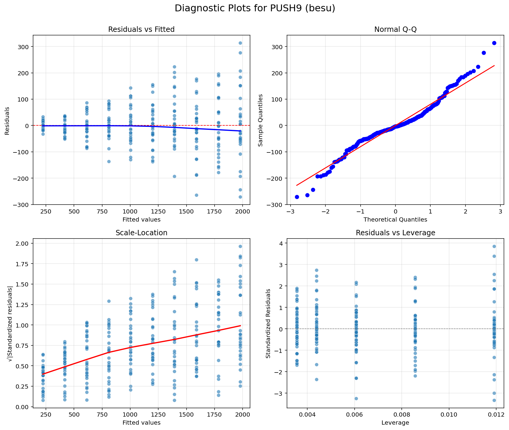


## reth


```python
                            OLS Regression Results                            
==============================================================================
Dep. Variable:        run_duration_ms   R-squared:                       0.974
Model:                            OLS   Adj. R-squared:                  0.974
Method:                 Least Squares   F-statistic:                     6783.
Date:                Thu, 22 Jan 2026   Prob (F-statistic):          1.17e-143
Time:                        10:34:41   Log-Likelihood:                -788.17
No. Observations:                 180   AIC:                             1580.
Df Residuals:                     178   BIC:                             1587.
Df Model:                           1                                         
Covariance Type:            nonrobust                                         
==============================================================================
                 coef    std err          t      P>|t|      [0.025      0.975]
------------------------------------------------------------------------------
const         30.3513      3.124      9.715      0.000      24.186      36.516
opcount        0.0059   7.19e-05     82.362      0.000       0.006       0.006
==============================================================================
Omnibus:                        7.314   Durbin-Watson:                   1.865
Prob(Omnibus):                  0.026   Jarque-Bera (JB):                7.891
Skew:                          -0.349   Prob(JB):                       0.0193
Kurtosis:                       3.751   Cond. No.                     9.38e+04
==============================================================================

Notes:
[1] Standard Errors assume that the covariance matrix of the errors is correctly specified.
[2] The condition number is large, 9.38e+04. This might indicate that there are
strong multicollinearity or other numerical problems.
```


## nethermind


```python
                            OLS Regression Results                            
==============================================================================
Dep. Variable:        run_duration_ms   R-squared:                       0.980
Model:                            OLS   Adj. R-squared:                  0.980
Method:                 Least Squares   F-statistic:                 1.418e+04
Date:                Thu, 22 Jan 2026   Prob (F-statistic):          5.34e-247
Time:                        10:34:41   Log-Likelihood:                -1441.5
No. Observations:                 290   AIC:                             2887.
Df Residuals:                     288   BIC:                             2894.
Df Model:                           1                                         
Covariance Type:            nonrobust                                         
==============================================================================
                 coef    std err          t      P>|t|      [0.025      0.975]
------------------------------------------------------------------------------
const         26.4605      4.439      5.961      0.000      17.724      35.197
opcount        0.0122      0.000    119.082      0.000       0.012       0.012
==============================================================================
Omnibus:                       38.334   Durbin-Watson:                   0.900
Prob(Omnibus):                  0.000   Jarque-Bera (JB):               91.947
Skew:                          -0.633   Prob(JB):                     1.08e-20
Kurtosis:                       5.451   Cond. No.                     9.38e+04
==============================================================================

Notes:
[1] Standard Errors assume that the covariance matrix of the errors is correctly specified.
[2] The condition number is large, 9.38e+04. This might indicate that there are
strong multicollinearity or other numerical problems.
```

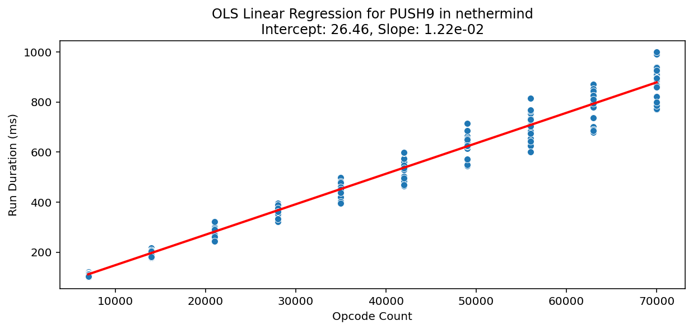

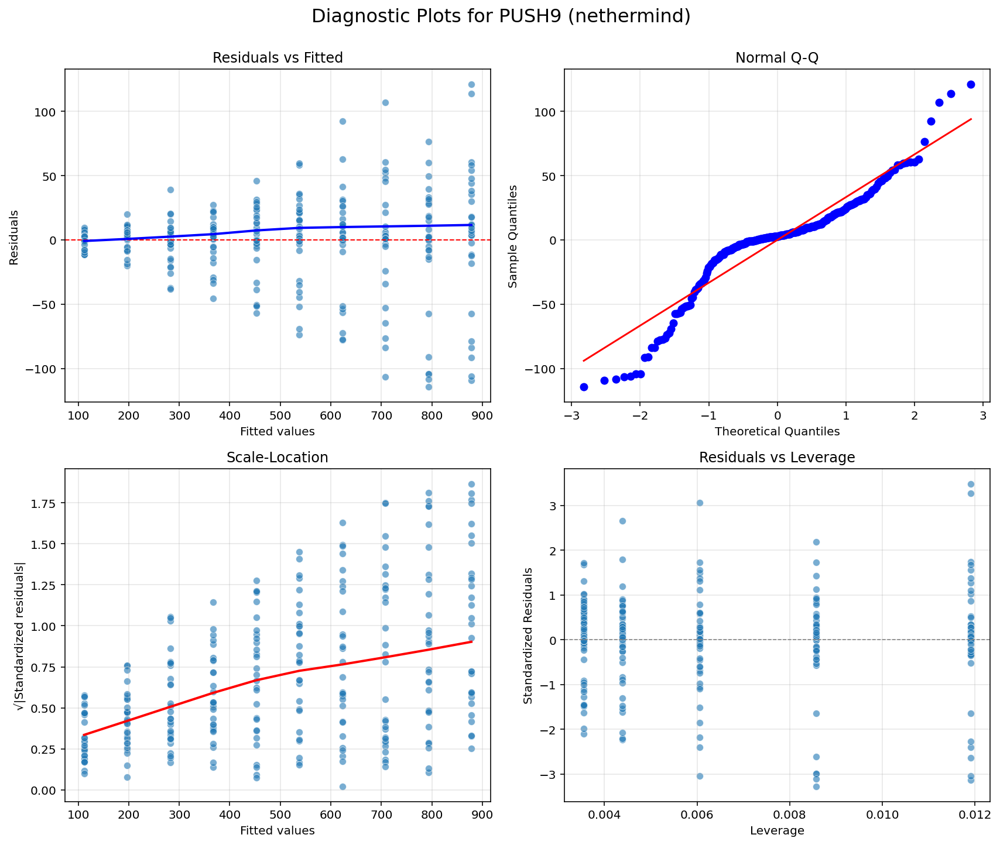


## erigon

OLS model did not run... Error: zero-size array to reduction operation maximum which has no identity

# PUSH10

## geth


```python
                            OLS Regression Results                            
==============================================================================
Dep. Variable:        run_duration_ms   R-squared:                       0.984
Model:                            OLS   Adj. R-squared:                  0.984
Method:                 Least Squares   F-statistic:                 1.794e+04
Date:                Thu, 22 Jan 2026   Prob (F-statistic):          1.93e-261
Time:                        10:34:41   Log-Likelihood:                -1569.2
No. Observations:                 290   AIC:                             3142.
Df Residuals:                     288   BIC:                             3150.
Df Model:                           1                                         
Covariance Type:            nonrobust                                         
==============================================================================
                 coef    std err          t      P>|t|      [0.025      0.975]
------------------------------------------------------------------------------
const         31.0500      6.896      4.503      0.000      17.477      44.623
opcount        0.0213      0.000    133.936      0.000       0.021       0.022
==============================================================================
Omnibus:                       67.095   Durbin-Watson:                   1.122
Prob(Omnibus):                  0.000   Jarque-Bera (JB):              872.464
Skew:                           0.466   Prob(JB):                    3.52e-190
Kurtosis:                      11.446   Cond. No.                     9.38e+04
==============================================================================

Notes:
[1] Standard Errors assume that the covariance matrix of the errors is correctly specified.
[2] The condition number is large, 9.38e+04. This might indicate that there are
strong multicollinearity or other numerical problems.
```


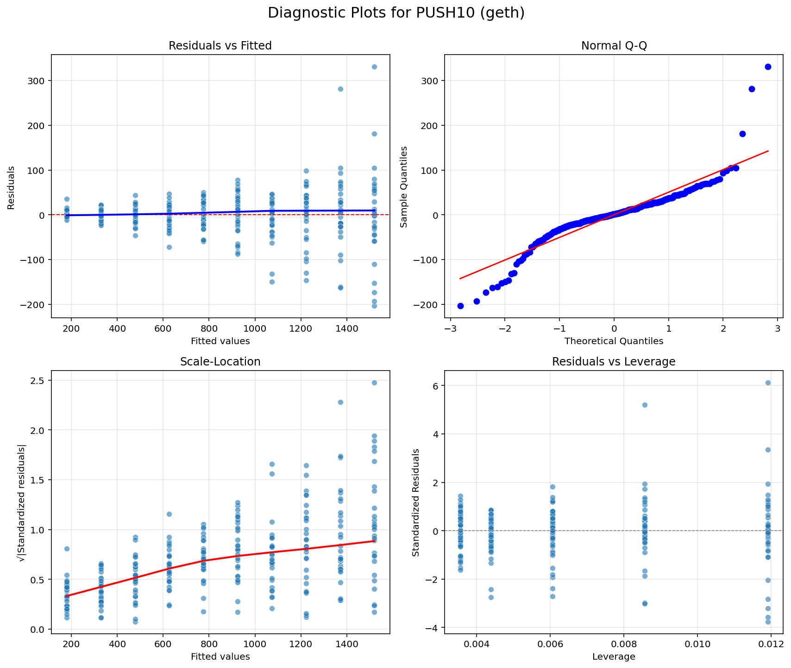


## besu


```python
                            OLS Regression Results                            
==============================================================================
Dep. Variable:        run_duration_ms   R-squared:                       0.975
Model:                            OLS   Adj. R-squared:                  0.975
Method:                 Least Squares   F-statistic:                 1.105e+04
Date:                Thu, 22 Jan 2026   Prob (F-statistic):          9.45e-232
Time:                        10:34:41   Log-Likelihood:                -1715.6
No. Observations:                 290   AIC:                             3435.
Df Residuals:                     288   BIC:                             3443.
Df Model:                           1                                         
Covariance Type:            nonrobust                                         
==============================================================================
                 coef    std err          t      P>|t|      [0.025      0.975]
------------------------------------------------------------------------------
const         31.4513     11.424      2.753      0.006       8.966      53.937
opcount        0.0276      0.000    105.120      0.000       0.027       0.028
==============================================================================
Omnibus:                       30.595   Durbin-Watson:                   0.696
Prob(Omnibus):                  0.000   Jarque-Bera (JB):               92.834
Skew:                           0.410   Prob(JB):                     6.94e-21
Kurtosis:                       5.647   Cond. No.                     9.38e+04
==============================================================================

Notes:
[1] Standard Errors assume that the covariance matrix of the errors is correctly specified.
[2] The condition number is large, 9.38e+04. This might indicate that there are
strong multicollinearity or other numerical problems.
```

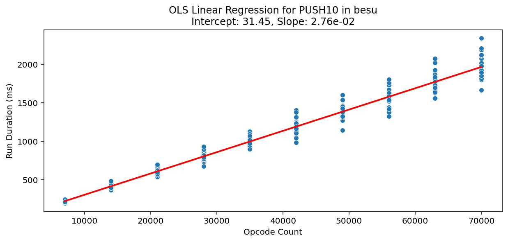

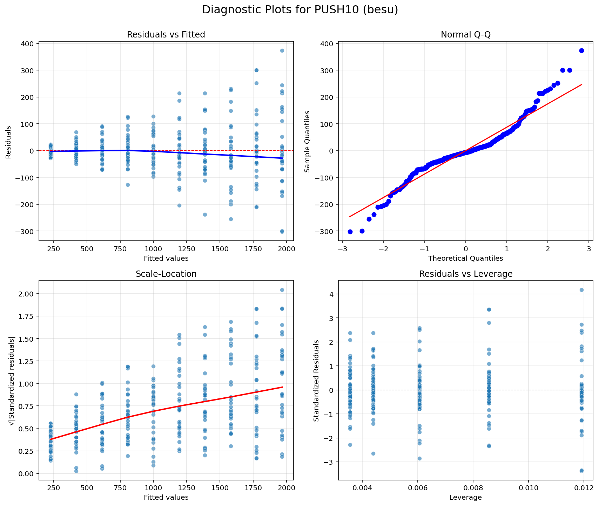


## reth


```python
                            OLS Regression Results                            
==============================================================================
Dep. Variable:        run_duration_ms   R-squared:                       0.971
Model:                            OLS   Adj. R-squared:                  0.971
Method:                 Least Squares   F-statistic:                     5903.
Date:                Thu, 22 Jan 2026   Prob (F-statistic):          1.99e-138
Time:                        10:34:42   Log-Likelihood:                -798.37
No. Observations:                 180   AIC:                             1601.
Df Residuals:                     178   BIC:                             1607.
Df Model:                           1                                         
Covariance Type:            nonrobust                                         
==============================================================================
                 coef    std err          t      P>|t|      [0.025      0.975]
------------------------------------------------------------------------------
const         33.5062      3.306     10.135      0.000      26.982      40.031
opcount        0.0058   7.61e-05     76.828      0.000       0.006       0.006
==============================================================================
Omnibus:                        1.900   Durbin-Watson:                   1.636
Prob(Omnibus):                  0.387   Jarque-Bera (JB):                1.543
Skew:                          -0.119   Prob(JB):                        0.462
Kurtosis:                       3.386   Cond. No.                     9.38e+04
==============================================================================

Notes:
[1] Standard Errors assume that the covariance matrix of the errors is correctly specified.
[2] The condition number is large, 9.38e+04. This might indicate that there are
strong multicollinearity or other numerical problems.
```

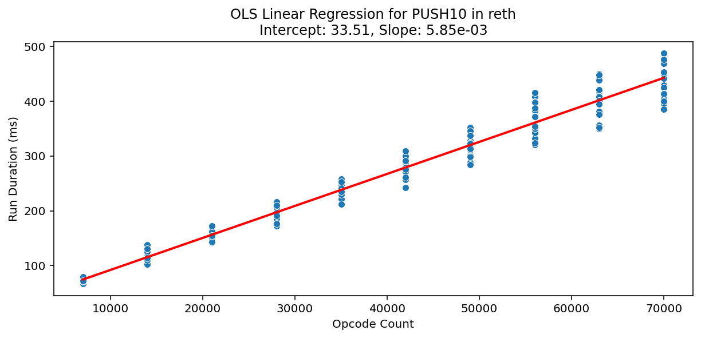


## nethermind


```python
                            OLS Regression Results                            
==============================================================================
Dep. Variable:        run_duration_ms   R-squared:                       0.980
Model:                            OLS   Adj. R-squared:                  0.980
Method:                 Least Squares   F-statistic:                 1.413e+04
Date:                Thu, 22 Jan 2026   Prob (F-statistic):          8.43e-247
Time:                        10:34:42   Log-Likelihood:                -1440.7
No. Observations:                 290   AIC:                             2885.
Df Residuals:                     288   BIC:                             2893.
Df Model:                           1                                         
Covariance Type:            nonrobust                                         
==============================================================================
                 coef    std err          t      P>|t|      [0.025      0.975]
------------------------------------------------------------------------------
const         28.1466      4.427      6.358      0.000      19.433      36.860
opcount        0.0121      0.000    118.889      0.000       0.012       0.012
==============================================================================
Omnibus:                       37.774   Durbin-Watson:                   1.006
Prob(Omnibus):                  0.000   Jarque-Bera (JB):               73.961
Skew:                          -0.696   Prob(JB):                     8.70e-17
Kurtosis:                       5.045   Cond. No.                     9.38e+04
==============================================================================

Notes:
[1] Standard Errors assume that the covariance matrix of the errors is correctly specified.
[2] The condition number is large, 9.38e+04. This might indicate that there are
strong multicollinearity or other numerical problems.
```


## erigon

OLS model did not run... Error: zero-size array to reduction operation maximum which has no identity

# PUSH11

## geth


```python
                            OLS Regression Results                            
==============================================================================
Dep. Variable:        run_duration_ms   R-squared:                       0.986
Model:                            OLS   Adj. R-squared:                  0.986
Method:                 Least Squares   F-statistic:                 2.085e+04
Date:                Thu, 22 Jan 2026   Prob (F-statistic):          1.05e-270
Time:                        10:34:42   Log-Likelihood:                -1546.5
No. Observations:                 290   AIC:                             3097.
Df Residuals:                     288   BIC:                             3104.
Df Model:                           1                                         
Covariance Type:            nonrobust                                         
==============================================================================
                 coef    std err          t      P>|t|      [0.025      0.975]
------------------------------------------------------------------------------
const         31.5666      6.377      4.950      0.000      19.015      44.119
opcount        0.0212      0.000    144.390      0.000       0.021       0.021
==============================================================================
Omnibus:                       61.622   Durbin-Watson:                   0.923
Prob(Omnibus):                  0.000   Jarque-Bera (JB):              156.329
Skew:                          -0.988   Prob(JB):                     1.13e-34
Kurtosis:                       6.005   Cond. No.                     9.38e+04
==============================================================================

Notes:
[1] Standard Errors assume that the covariance matrix of the errors is correctly specified.
[2] The condition number is large, 9.38e+04. This might indicate that there are
strong multicollinearity or other numerical problems.
```


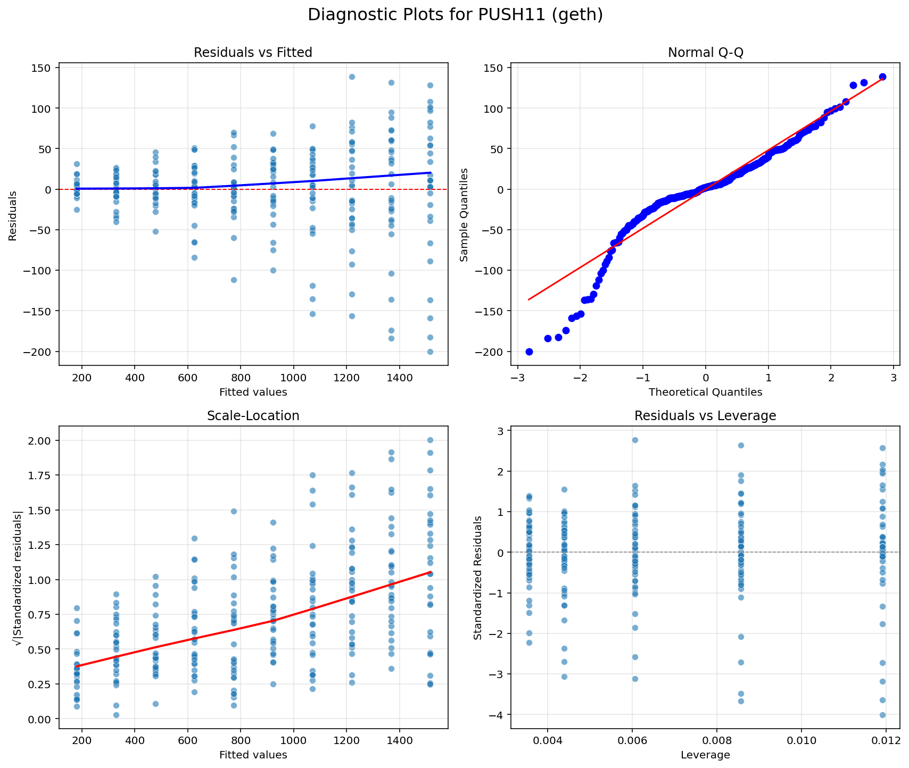


## besu


```python
                            OLS Regression Results                            
==============================================================================
Dep. Variable:        run_duration_ms   R-squared:                       0.981
Model:                            OLS   Adj. R-squared:                  0.981
Method:                 Least Squares   F-statistic:                 1.491e+04
Date:                Thu, 22 Jan 2026   Prob (F-statistic):          4.48e-250
Time:                        10:34:43   Log-Likelihood:                -1672.6
No. Observations:                 290   AIC:                             3349.
Df Residuals:                     288   BIC:                             3356.
Df Model:                           1                                         
Covariance Type:            nonrobust                                         
==============================================================================
                 coef    std err          t      P>|t|      [0.025      0.975]
------------------------------------------------------------------------------
const         25.5667      9.848      2.596      0.010       6.183      44.951
opcount        0.0277      0.000    122.107      0.000       0.027       0.028
==============================================================================
Omnibus:                       23.619   Durbin-Watson:                   0.685
Prob(Omnibus):                  0.000   Jarque-Bera (JB):               69.159
Skew:                           0.277   Prob(JB):                     9.60e-16
Kurtosis:                       5.328   Cond. No.                     9.38e+04
==============================================================================

Notes:
[1] Standard Errors assume that the covariance matrix of the errors is correctly specified.
[2] The condition number is large, 9.38e+04. This might indicate that there are
strong multicollinearity or other numerical problems.
```

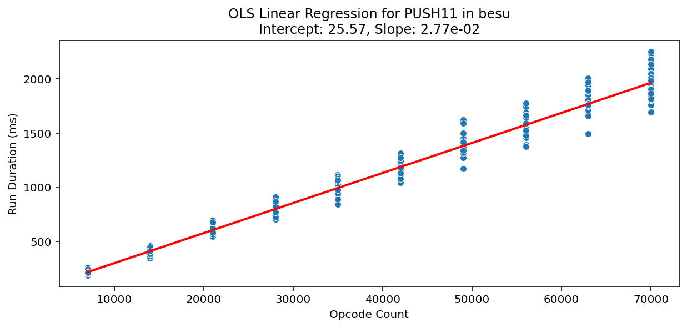

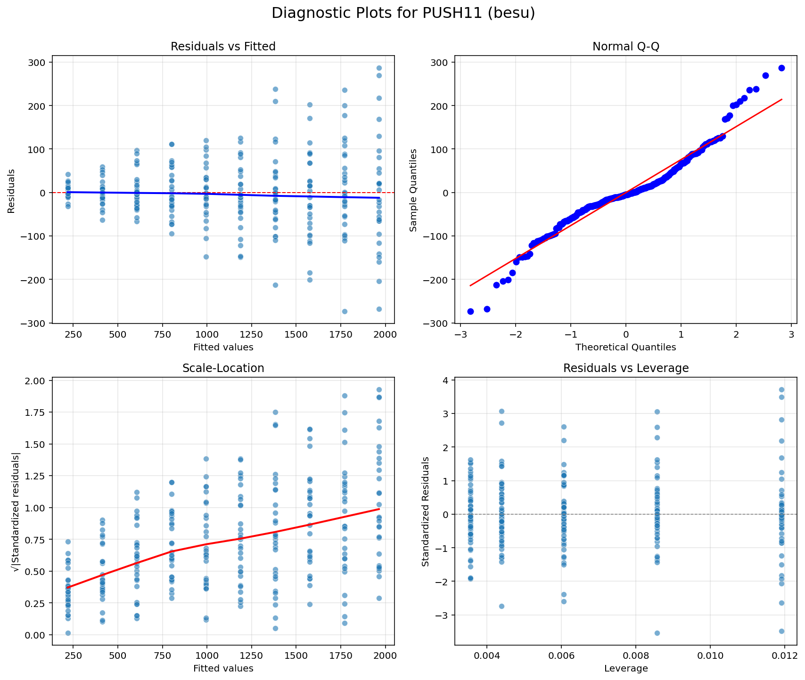


## reth


```python
                            OLS Regression Results                            
==============================================================================
Dep. Variable:        run_duration_ms   R-squared:                       0.972
Model:                            OLS   Adj. R-squared:                  0.972
Method:                 Least Squares   F-statistic:                     6269.
Date:                Thu, 22 Jan 2026   Prob (F-statistic):          1.09e-140
Time:                        10:34:43   Log-Likelihood:                -792.70
No. Observations:                 180   AIC:                             1589.
Df Residuals:                     178   BIC:                             1596.
Df Model:                           1                                         
Covariance Type:            nonrobust                                         
==============================================================================
                 coef    std err          t      P>|t|      [0.025      0.975]
------------------------------------------------------------------------------
const         32.8692      3.204     10.260      0.000      26.547      39.191
opcount        0.0058   7.38e-05     79.175      0.000       0.006       0.006
==============================================================================
Omnibus:                        2.606   Durbin-Watson:                   1.754
Prob(Omnibus):                  0.272   Jarque-Bera (JB):                2.174
Skew:                          -0.233   Prob(JB):                        0.337
Kurtosis:                       3.268   Cond. No.                     9.38e+04
==============================================================================

Notes:
[1] Standard Errors assume that the covariance matrix of the errors is correctly specified.
[2] The condition number is large, 9.38e+04. This might indicate that there are
strong multicollinearity or other numerical problems.
```


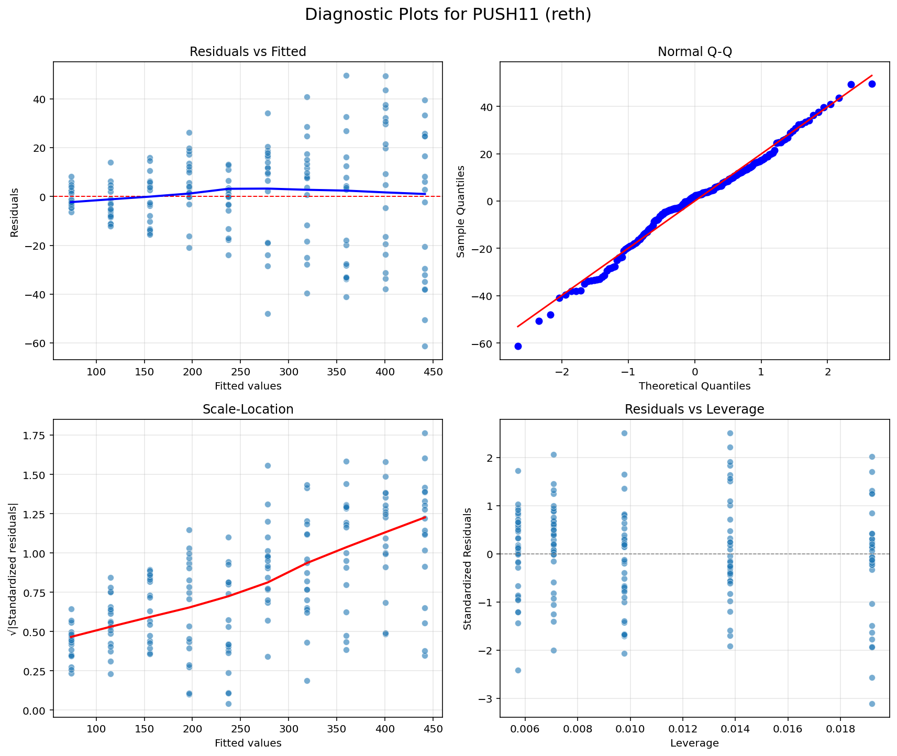


## nethermind


```python
                            OLS Regression Results                            
==============================================================================
Dep. Variable:        run_duration_ms   R-squared:                       0.976
Model:                            OLS   Adj. R-squared:                  0.976
Method:                 Least Squares   F-statistic:                 1.186e+04
Date:                Thu, 22 Jan 2026   Prob (F-statistic):          4.52e-236
Time:                        10:34:43   Log-Likelihood:                -1467.0
No. Observations:                 290   AIC:                             2938.
Df Residuals:                     288   BIC:                             2945.
Df Model:                           1                                         
Covariance Type:            nonrobust                                         
==============================================================================
                 coef    std err          t      P>|t|      [0.025      0.975]
------------------------------------------------------------------------------
const         30.0990      4.847      6.210      0.000      20.559      39.639
opcount        0.0122      0.000    108.908      0.000       0.012       0.012
==============================================================================
Omnibus:                       30.442   Durbin-Watson:                   1.010
Prob(Omnibus):                  0.000   Jarque-Bera (JB):              149.124
Skew:                          -0.137   Prob(JB):                     4.15e-33
Kurtosis:                       6.502   Cond. No.                     9.38e+04
==============================================================================

Notes:
[1] Standard Errors assume that the covariance matrix of the errors is correctly specified.
[2] The condition number is large, 9.38e+04. This might indicate that there are
strong multicollinearity or other numerical problems.
```

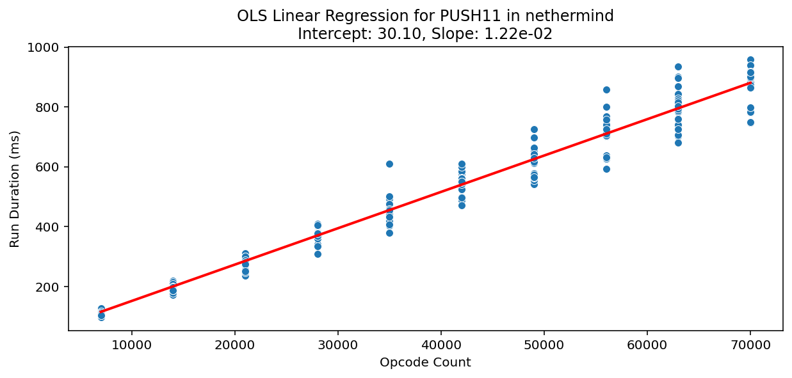

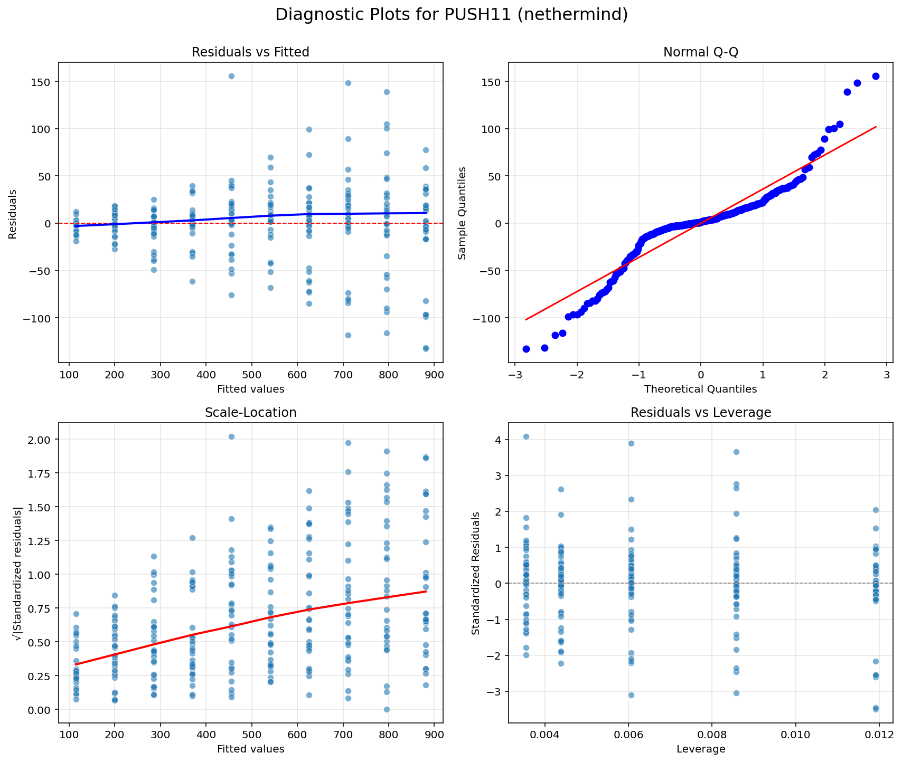


## erigon

OLS model did not run... Error: zero-size array to reduction operation maximum which has no identity

# PUSH12

## geth


```python
                            OLS Regression Results                            
==============================================================================
Dep. Variable:        run_duration_ms   R-squared:                       0.986
Model:                            OLS   Adj. R-squared:                  0.986
Method:                 Least Squares   F-statistic:                 2.021e+04
Date:                Thu, 22 Jan 2026   Prob (F-statistic):          8.69e-269
Time:                        10:34:43   Log-Likelihood:                -1549.6
No. Observations:                 290   AIC:                             3103.
Df Residuals:                     288   BIC:                             3111.
Df Model:                           1                                         
Covariance Type:            nonrobust                                         
==============================================================================
                 coef    std err          t      P>|t|      [0.025      0.975]
------------------------------------------------------------------------------
const         36.8296      6.445      5.714      0.000      24.144      49.516
opcount        0.0211      0.000    142.164      0.000       0.021       0.021
==============================================================================
Omnibus:                       60.202   Durbin-Watson:                   0.912
Prob(Omnibus):                  0.000   Jarque-Bera (JB):              207.011
Skew:                          -0.855   Prob(JB):                     1.12e-45
Kurtosis:                       6.769   Cond. No.                     9.38e+04
==============================================================================

Notes:
[1] Standard Errors assume that the covariance matrix of the errors is correctly specified.
[2] The condition number is large, 9.38e+04. This might indicate that there are
strong multicollinearity or other numerical problems.
```


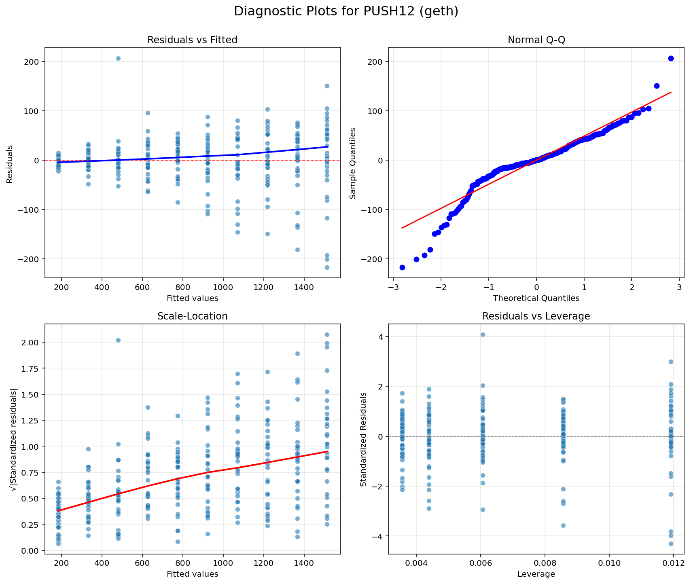


## besu


```python
                            OLS Regression Results                            
==============================================================================
Dep. Variable:        run_duration_ms   R-squared:                       0.980
Model:                            OLS   Adj. R-squared:                  0.980
Method:                 Least Squares   F-statistic:                 1.421e+04
Date:                Thu, 22 Jan 2026   Prob (F-statistic):          4.00e-247
Time:                        10:34:44   Log-Likelihood:                -1681.5
No. Observations:                 290   AIC:                             3367.
Df Residuals:                     288   BIC:                             3374.
Df Model:                           1                                         
Covariance Type:            nonrobust                                         
==============================================================================
                 coef    std err          t      P>|t|      [0.025      0.975]
------------------------------------------------------------------------------
const         25.6080     10.156      2.521      0.012       5.618      45.598
opcount        0.0279      0.000    119.204      0.000       0.027       0.028
==============================================================================
Omnibus:                       31.665   Durbin-Watson:                   0.770
Prob(Omnibus):                  0.000   Jarque-Bera (JB):               58.660
Skew:                           0.610   Prob(JB):                     1.83e-13
Kurtosis:                       4.834   Cond. No.                     9.38e+04
==============================================================================

Notes:
[1] Standard Errors assume that the covariance matrix of the errors is correctly specified.
[2] The condition number is large, 9.38e+04. This might indicate that there are
strong multicollinearity or other numerical problems.
```

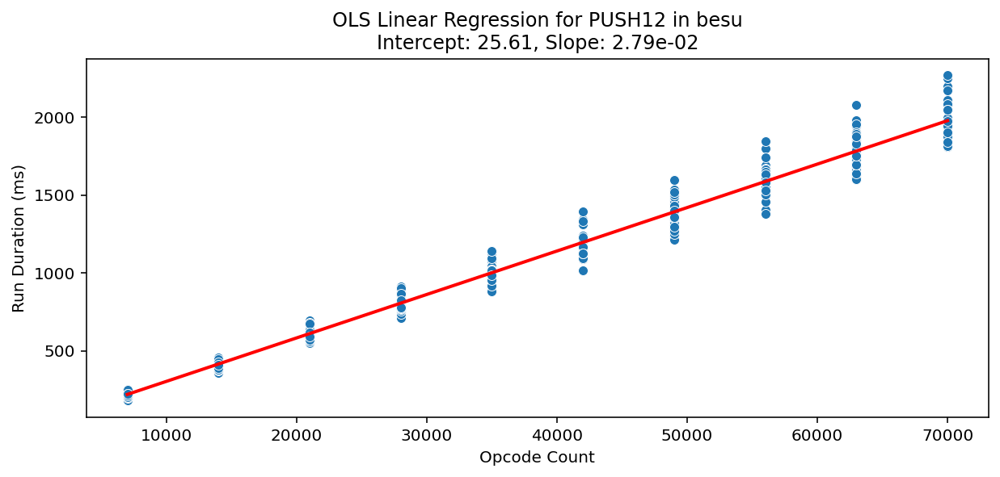

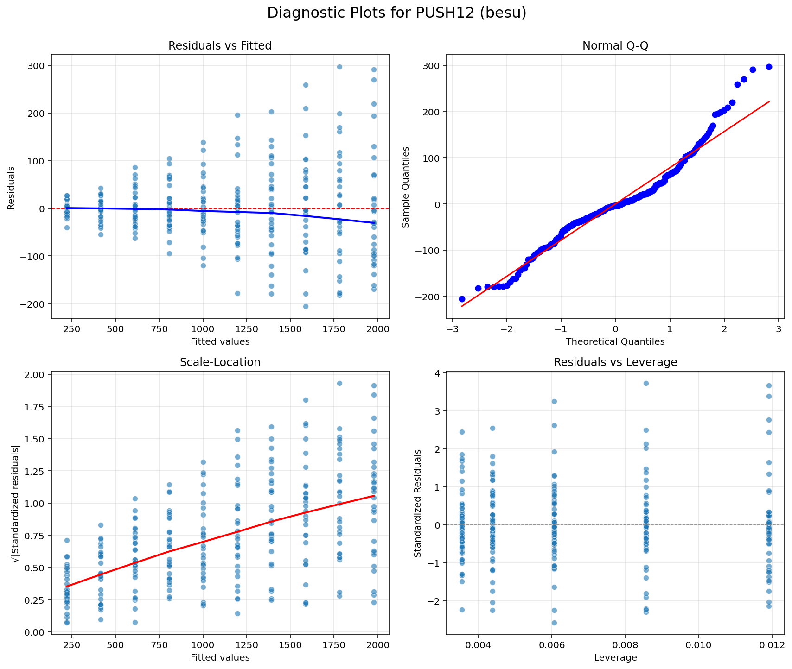


## reth


```python
                            OLS Regression Results                            
==============================================================================
Dep. Variable:        run_duration_ms   R-squared:                       0.976
Model:                            OLS   Adj. R-squared:                  0.976
Method:                 Least Squares   F-statistic:                     7180.
Date:                Thu, 22 Jan 2026   Prob (F-statistic):          8.47e-146
Time:                        10:34:44   Log-Likelihood:                -785.44
No. Observations:                 180   AIC:                             1575.
Df Residuals:                     178   BIC:                             1581.
Df Model:                           1                                         
Covariance Type:            nonrobust                                         
==============================================================================
                 coef    std err          t      P>|t|      [0.025      0.975]
------------------------------------------------------------------------------
const         28.6675      3.077      9.317      0.000      22.595      34.740
opcount        0.0060   7.08e-05     84.734      0.000       0.006       0.006
==============================================================================
Omnibus:                       12.730   Durbin-Watson:                   1.985
Prob(Omnibus):                  0.002   Jarque-Bera (JB):               15.323
Skew:                          -0.507   Prob(JB):                     0.000471
Kurtosis:                       4.008   Cond. No.                     9.38e+04
==============================================================================

Notes:
[1] Standard Errors assume that the covariance matrix of the errors is correctly specified.
[2] The condition number is large, 9.38e+04. This might indicate that there are
strong multicollinearity or other numerical problems.
```

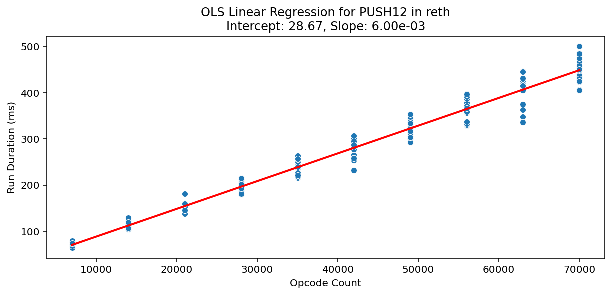

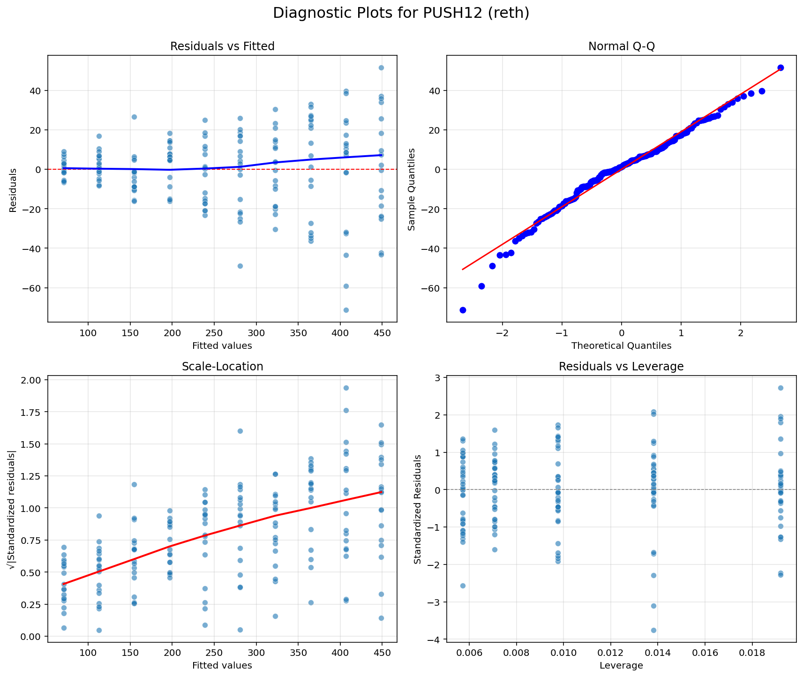


## nethermind


```python
                            OLS Regression Results                            
==============================================================================
Dep. Variable:        run_duration_ms   R-squared:                       0.957
Model:                            OLS   Adj. R-squared:                  0.956
Method:                 Least Squares   F-statistic:                     6335.
Date:                Thu, 22 Jan 2026   Prob (F-statistic):          4.03e-198
Time:                        10:34:44   Log-Likelihood:                -1560.6
No. Observations:                 290   AIC:                             3125.
Df Residuals:                     288   BIC:                             3133.
Df Model:                           1                                         
Covariance Type:            nonrobust                                         
==============================================================================
                 coef    std err          t      P>|t|      [0.025      0.975]
------------------------------------------------------------------------------
const         29.4445      6.694      4.399      0.000      16.270      42.619
opcount        0.0123      0.000     79.591      0.000       0.012       0.013
==============================================================================
Omnibus:                      182.863   Durbin-Watson:                   0.765
Prob(Omnibus):                  0.000   Jarque-Bera (JB):             2024.039
Skew:                           2.394   Prob(JB):                         0.00
Kurtosis:                      15.024   Cond. No.                     9.38e+04
==============================================================================

Notes:
[1] Standard Errors assume that the covariance matrix of the errors is correctly specified.
[2] The condition number is large, 9.38e+04. This might indicate that there are
strong multicollinearity or other numerical problems.
```

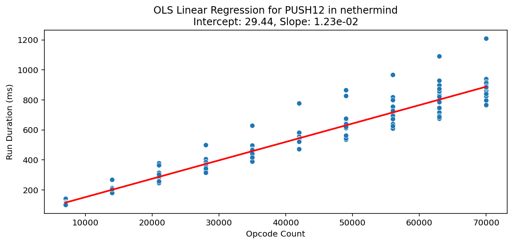

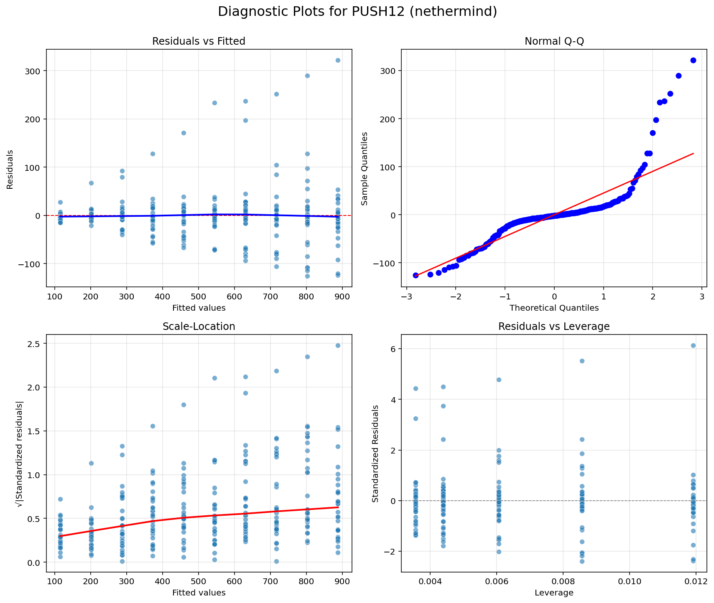


## erigon

OLS model did not run... Error: zero-size array to reduction operation maximum which has no identity

# PUSH13

## geth


```python
                            OLS Regression Results                            
==============================================================================
Dep. Variable:        run_duration_ms   R-squared:                       0.986
Model:                            OLS   Adj. R-squared:                  0.986
Method:                 Least Squares   F-statistic:                 2.064e+04
Date:                Thu, 22 Jan 2026   Prob (F-statistic):          4.27e-270
Time:                        10:34:45   Log-Likelihood:                -1547.8
No. Observations:                 290   AIC:                             3100.
Df Residuals:                     288   BIC:                             3107.
Df Model:                           1                                         
Covariance Type:            nonrobust                                         
==============================================================================
                 coef    std err          t      P>|t|      [0.025      0.975]
------------------------------------------------------------------------------
const         34.6337      6.405      5.408      0.000      22.028      47.240
opcount        0.0212      0.000    143.681      0.000       0.021       0.021
==============================================================================
Omnibus:                       47.609   Durbin-Watson:                   0.904
Prob(Omnibus):                  0.000   Jarque-Bera (JB):              131.350
Skew:                          -0.735   Prob(JB):                     3.00e-29
Kurtosis:                       5.951   Cond. No.                     9.38e+04
==============================================================================

Notes:
[1] Standard Errors assume that the covariance matrix of the errors is correctly specified.
[2] The condition number is large, 9.38e+04. This might indicate that there are
strong multicollinearity or other numerical problems.
```

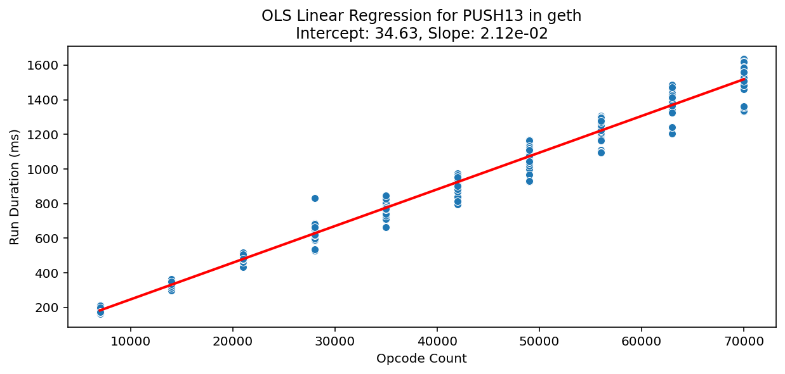

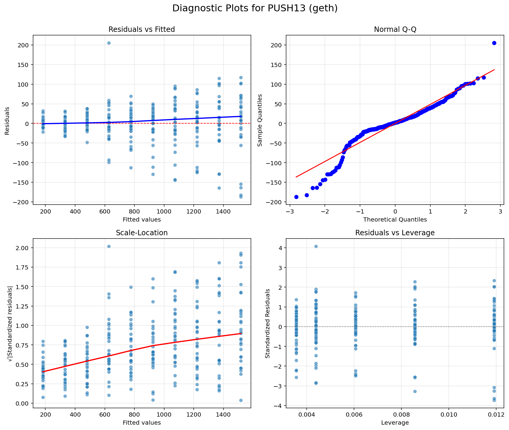


## besu


```python
                            OLS Regression Results                            
==============================================================================
Dep. Variable:        run_duration_ms   R-squared:                       0.982
Model:                            OLS   Adj. R-squared:                  0.982
Method:                 Least Squares   F-statistic:                 1.573e+04
Date:                Thu, 22 Jan 2026   Prob (F-statistic):          2.39e-253
Time:                        10:34:45   Log-Likelihood:                -1665.9
No. Observations:                 290   AIC:                             3336.
Df Residuals:                     288   BIC:                             3343.
Df Model:                           1                                         
Covariance Type:            nonrobust                                         
==============================================================================
                 coef    std err          t      P>|t|      [0.025      0.975]
------------------------------------------------------------------------------
const         33.5816      9.625      3.489      0.001      14.637      52.526
opcount        0.0278      0.000    125.406      0.000       0.027       0.028
==============================================================================
Omnibus:                       26.629   Durbin-Watson:                   0.787
Prob(Omnibus):                  0.000   Jarque-Bera (JB):               67.782
Skew:                           0.402   Prob(JB):                     1.91e-15
Kurtosis:                       5.228   Cond. No.                     9.38e+04
==============================================================================

Notes:
[1] Standard Errors assume that the covariance matrix of the errors is correctly specified.
[2] The condition number is large, 9.38e+04. This might indicate that there are
strong multicollinearity or other numerical problems.
```


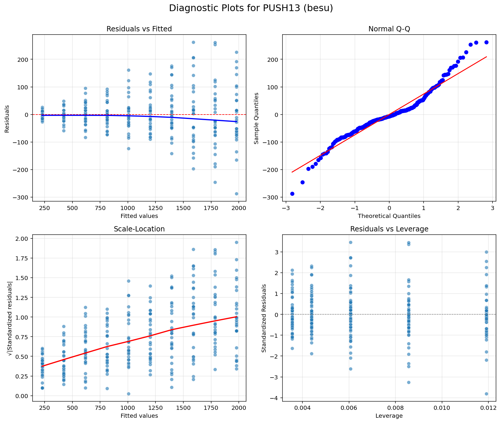


## reth


```python
                            OLS Regression Results                            
==============================================================================
Dep. Variable:        run_duration_ms   R-squared:                       0.968
Model:                            OLS   Adj. R-squared:                  0.968
Method:                 Least Squares   F-statistic:                     5433.
Date:                Thu, 22 Jan 2026   Prob (F-statistic):          2.53e-135
Time:                        10:34:45   Log-Likelihood:                -804.11
No. Observations:                 180   AIC:                             1612.
Df Residuals:                     178   BIC:                             1619.
Df Model:                           1                                         
Covariance Type:            nonrobust                                         
==============================================================================
                 coef    std err          t      P>|t|      [0.025      0.975]
------------------------------------------------------------------------------
const         34.5219      3.413     10.114      0.000      27.786      41.258
opcount        0.0058   7.86e-05     73.711      0.000       0.006       0.006
==============================================================================
Omnibus:                        0.717   Durbin-Watson:                   1.640
Prob(Omnibus):                  0.699   Jarque-Bera (JB):                0.445
Skew:                           0.100   Prob(JB):                        0.801
Kurtosis:                       3.140   Cond. No.                     9.38e+04
==============================================================================

Notes:
[1] Standard Errors assume that the covariance matrix of the errors is correctly specified.
[2] The condition number is large, 9.38e+04. This might indicate that there are
strong multicollinearity or other numerical problems.
```

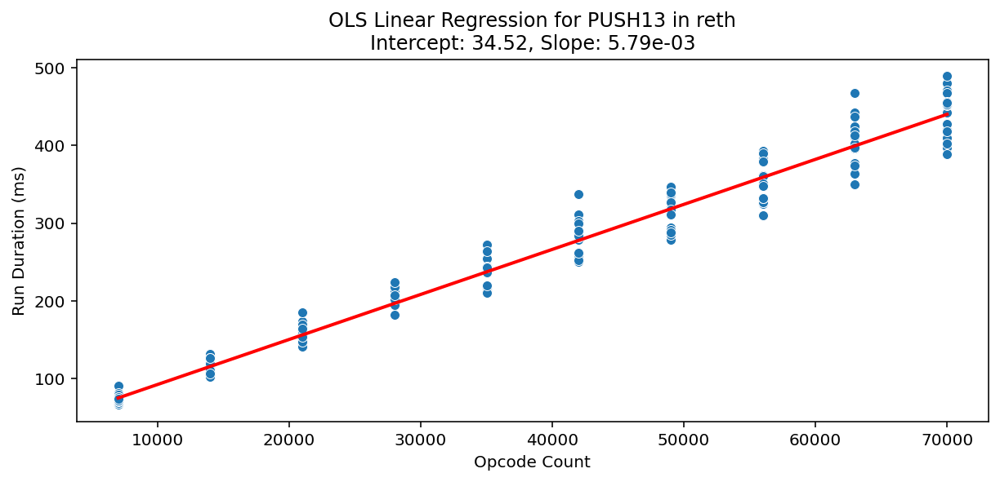


## nethermind


```python
                            OLS Regression Results                            
==============================================================================
Dep. Variable:        run_duration_ms   R-squared:                       0.979
Model:                            OLS   Adj. R-squared:                  0.979
Method:                 Least Squares   F-statistic:                 1.340e+04
Date:                Thu, 22 Jan 2026   Prob (F-statistic):          1.56e-243
Time:                        10:34:46   Log-Likelihood:                -1449.0
No. Observations:                 290   AIC:                             2902.
Df Residuals:                     288   BIC:                             2909.
Df Model:                           1                                         
Covariance Type:            nonrobust                                         
==============================================================================
                 coef    std err          t      P>|t|      [0.025      0.975]
------------------------------------------------------------------------------
const         30.7231      4.556      6.744      0.000      21.756      39.690
opcount        0.0121      0.000    115.762      0.000       0.012       0.012
==============================================================================
Omnibus:                       33.832   Durbin-Watson:                   1.051
Prob(Omnibus):                  0.000   Jarque-Bera (JB):               85.895
Skew:                          -0.536   Prob(JB):                     2.23e-19
Kurtosis:                       5.441   Cond. No.                     9.38e+04
==============================================================================

Notes:
[1] Standard Errors assume that the covariance matrix of the errors is correctly specified.
[2] The condition number is large, 9.38e+04. This might indicate that there are
strong multicollinearity or other numerical problems.
```


## erigon

OLS model did not run... Error: zero-size array to reduction operation maximum which has no identity

# PUSH14

## geth


```python
                            OLS Regression Results                            
==============================================================================
Dep. Variable:        run_duration_ms   R-squared:                       0.983
Model:                            OLS   Adj. R-squared:                  0.983
Method:                 Least Squares   F-statistic:                 1.642e+04
Date:                Thu, 22 Jan 2026   Prob (F-statistic):          5.41e-256
Time:                        10:34:46   Log-Likelihood:                -1587.1
No. Observations:                 290   AIC:                             3178.
Df Residuals:                     288   BIC:                             3185.
Df Model:                           1                                         
Covariance Type:            nonrobust                                         
==============================================================================
                 coef    std err          t      P>|t|      [0.025      0.975]
------------------------------------------------------------------------------
const         31.0894      7.333      4.239      0.000      16.656      45.523
opcount        0.0216      0.000    128.135      0.000       0.021       0.022
==============================================================================
Omnibus:                       91.301   Durbin-Watson:                   1.326
Prob(Omnibus):                  0.000   Jarque-Bera (JB):             1261.322
Skew:                           0.841   Prob(JB):                    1.28e-274
Kurtosis:                      13.078   Cond. No.                     9.38e+04
==============================================================================

Notes:
[1] Standard Errors assume that the covariance matrix of the errors is correctly specified.
[2] The condition number is large, 9.38e+04. This might indicate that there are
strong multicollinearity or other numerical problems.
```


## besu


```python
                            OLS Regression Results                            
==============================================================================
Dep. Variable:        run_duration_ms   R-squared:                       0.980
Model:                            OLS   Adj. R-squared:                  0.980
Method:                 Least Squares   F-statistic:                 1.401e+04
Date:                Thu, 22 Jan 2026   Prob (F-statistic):          2.96e-246
Time:                        10:34:46   Log-Likelihood:                -1683.5
No. Observations:                 290   AIC:                             3371.
Df Residuals:                     288   BIC:                             3378.
Df Model:                           1                                         
Covariance Type:            nonrobust                                         
==============================================================================
                 coef    std err          t      P>|t|      [0.025      0.975]
------------------------------------------------------------------------------
const         32.1644     10.225      3.146      0.002      12.039      52.290
opcount        0.0279      0.000    118.361      0.000       0.027       0.028
==============================================================================
Omnibus:                       20.043   Durbin-Watson:                   0.802
Prob(Omnibus):                  0.000   Jarque-Bera (JB):               66.515
Skew:                           0.015   Prob(JB):                     3.60e-15
Kurtosis:                       5.346   Cond. No.                     9.38e+04
==============================================================================

Notes:
[1] Standard Errors assume that the covariance matrix of the errors is correctly specified.
[2] The condition number is large, 9.38e+04. This might indicate that there are
strong multicollinearity or other numerical problems.
```


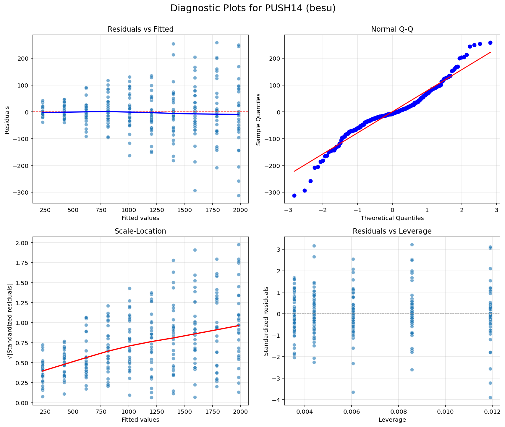


## reth


```python
                            OLS Regression Results                            
==============================================================================
Dep. Variable:        run_duration_ms   R-squared:                       0.968
Model:                            OLS   Adj. R-squared:                  0.967
Method:                 Least Squares   F-statistic:                     5313.
Date:                Thu, 22 Jan 2026   Prob (F-statistic):          1.74e-134
Time:                        10:34:46   Log-Likelihood:                -808.15
No. Observations:                 180   AIC:                             1620.
Df Residuals:                     178   BIC:                             1627.
Df Model:                           1                                         
Covariance Type:            nonrobust                                         
==============================================================================
                 coef    std err          t      P>|t|      [0.025      0.975]
------------------------------------------------------------------------------
const         31.5796      3.491      9.047      0.000      24.691      38.468
opcount        0.0059   8.04e-05     72.891      0.000       0.006       0.006
==============================================================================
Omnibus:                       20.074   Durbin-Watson:                   1.755
Prob(Omnibus):                  0.000   Jarque-Bera (JB):               32.950
Skew:                           0.598   Prob(JB):                     7.00e-08
Kurtosis:                       4.721   Cond. No.                     9.38e+04
==============================================================================

Notes:
[1] Standard Errors assume that the covariance matrix of the errors is correctly specified.
[2] The condition number is large, 9.38e+04. This might indicate that there are
strong multicollinearity or other numerical problems.
```

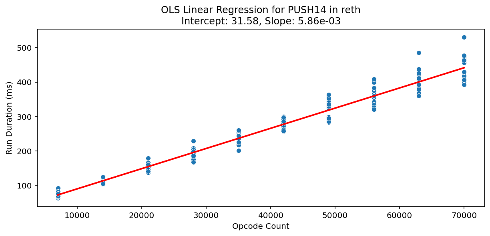

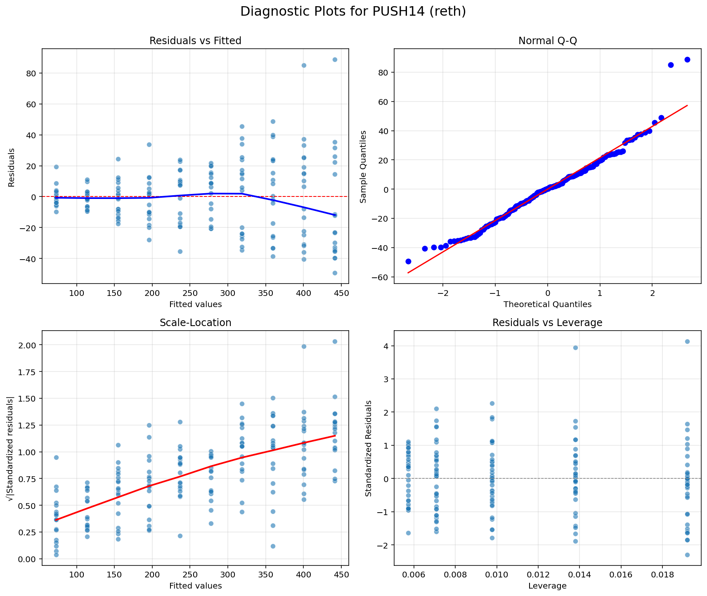


## nethermind


```python
                            OLS Regression Results                            
==============================================================================
Dep. Variable:        run_duration_ms   R-squared:                       0.983
Model:                            OLS   Adj. R-squared:                  0.983
Method:                 Least Squares   F-statistic:                 1.710e+04
Date:                Thu, 22 Jan 2026   Prob (F-statistic):          1.75e-258
Time:                        10:34:47   Log-Likelihood:                -1414.6
No. Observations:                 290   AIC:                             2833.
Df Residuals:                     288   BIC:                             2841.
Df Model:                           1                                         
Covariance Type:            nonrobust                                         
==============================================================================
                 coef    std err          t      P>|t|      [0.025      0.975]
------------------------------------------------------------------------------
const         27.1810      4.047      6.717      0.000      19.216      35.146
opcount        0.0122   9.32e-05    130.754      0.000       0.012       0.012
==============================================================================
Omnibus:                       78.864   Durbin-Watson:                   0.934
Prob(Omnibus):                  0.000   Jarque-Bera (JB):              203.701
Skew:                          -1.260   Prob(JB):                     5.85e-45
Kurtosis:                       6.242   Cond. No.                     9.38e+04
==============================================================================

Notes:
[1] Standard Errors assume that the covariance matrix of the errors is correctly specified.
[2] The condition number is large, 9.38e+04. This might indicate that there are
strong multicollinearity or other numerical problems.
```

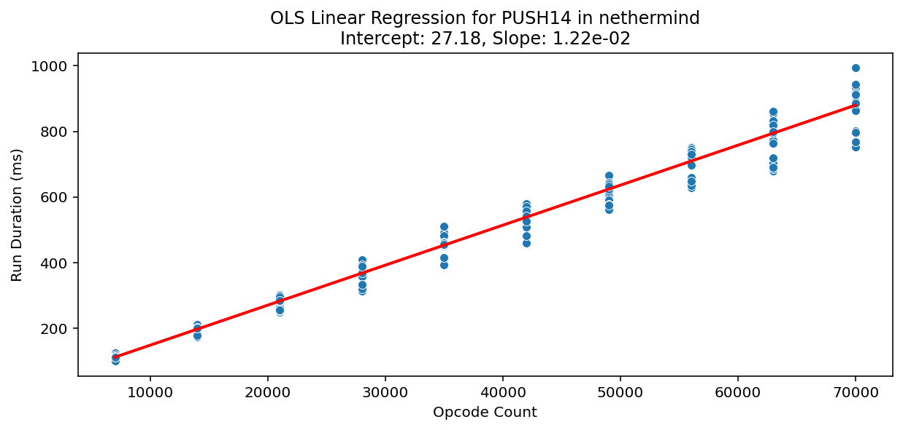


## erigon

OLS model did not run... Error: zero-size array to reduction operation maximum which has no identity

# PUSH15

## geth


```python
                            OLS Regression Results                            
==============================================================================
Dep. Variable:        run_duration_ms   R-squared:                       0.986
Model:                            OLS   Adj. R-squared:                  0.985
Method:                 Least Squares   F-statistic:                 1.958e+04
Date:                Thu, 22 Jan 2026   Prob (F-statistic):          7.93e-267
Time:                        10:34:47   Log-Likelihood:                -1561.3
No. Observations:                 290   AIC:                             3127.
Df Residuals:                     288   BIC:                             3134.
Df Model:                           1                                         
Covariance Type:            nonrobust                                         
==============================================================================
                 coef    std err          t      P>|t|      [0.025      0.975]
------------------------------------------------------------------------------
const         32.6367      6.710      4.864      0.000      19.430      45.843
opcount        0.0216      0.000    139.922      0.000       0.021       0.022
==============================================================================
Omnibus:                       59.946   Durbin-Watson:                   0.972
Prob(Omnibus):                  0.000   Jarque-Bera (JB):              160.568
Skew:                          -0.941   Prob(JB):                     1.36e-35
Kurtosis:                       6.122   Cond. No.                     9.38e+04
==============================================================================

Notes:
[1] Standard Errors assume that the covariance matrix of the errors is correctly specified.
[2] The condition number is large, 9.38e+04. This might indicate that there are
strong multicollinearity or other numerical problems.
```


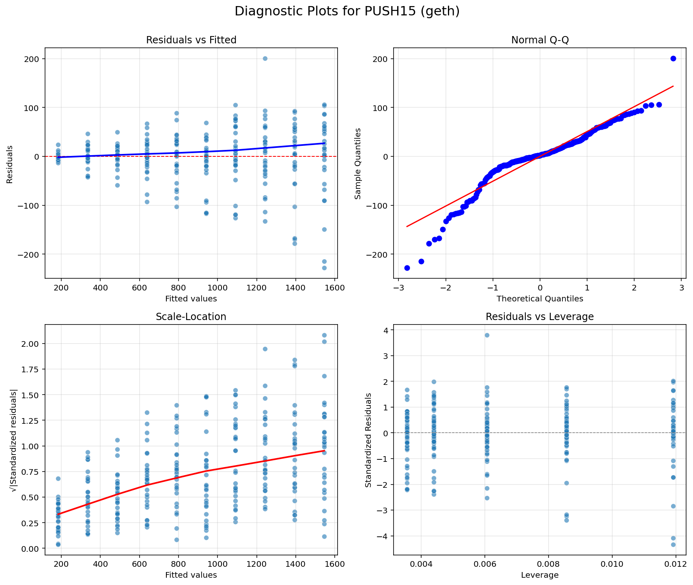


## besu


```python
                            OLS Regression Results                            
==============================================================================
Dep. Variable:        run_duration_ms   R-squared:                       0.978
Model:                            OLS   Adj. R-squared:                  0.978
Method:                 Least Squares   F-statistic:                 1.272e+04
Date:                Thu, 22 Jan 2026   Prob (F-statistic):          2.30e-240
Time:                        10:34:47   Log-Likelihood:                -1697.1
No. Observations:                 290   AIC:                             3398.
Df Residuals:                     288   BIC:                             3406.
Df Model:                           1                                         
Covariance Type:            nonrobust                                         
==============================================================================
                 coef    std err          t      P>|t|      [0.025      0.975]
------------------------------------------------------------------------------
const         26.8794     10.717      2.508      0.013       5.786      47.972
opcount        0.0278      0.000    112.802      0.000       0.027       0.028
==============================================================================
Omnibus:                       22.952   Durbin-Watson:                   0.806
Prob(Omnibus):                  0.000   Jarque-Bera (JB):               82.972
Skew:                           0.110   Prob(JB):                     9.61e-19
Kurtosis:                       5.611   Cond. No.                     9.38e+04
==============================================================================

Notes:
[1] Standard Errors assume that the covariance matrix of the errors is correctly specified.
[2] The condition number is large, 9.38e+04. This might indicate that there are
strong multicollinearity or other numerical problems.
```


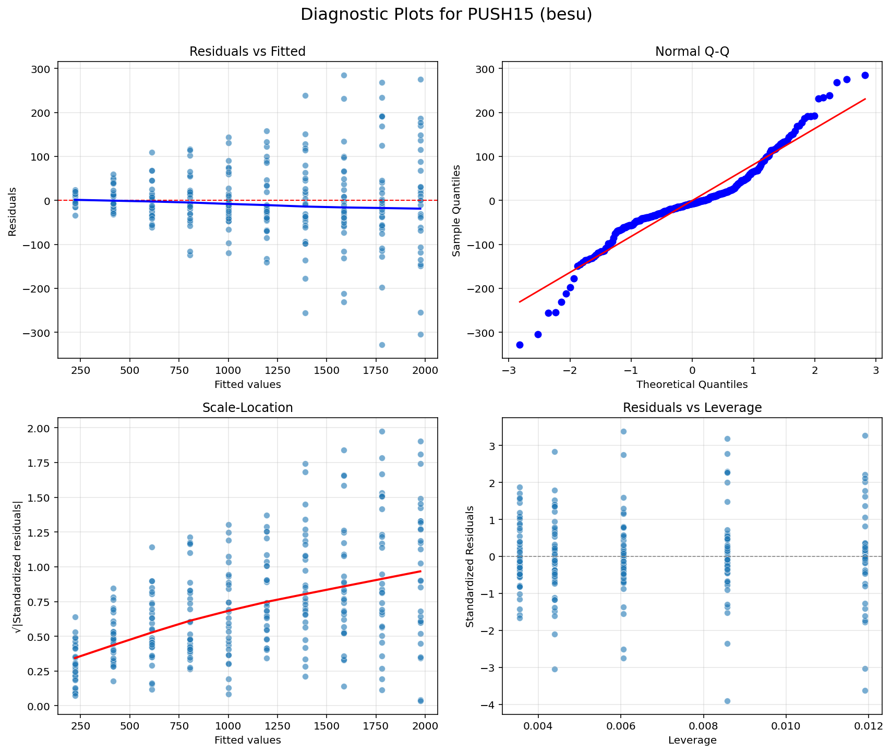


## reth


```python
                            OLS Regression Results                            
==============================================================================
Dep. Variable:        run_duration_ms   R-squared:                       0.974
Model:                            OLS   Adj. R-squared:                  0.974
Method:                 Least Squares   F-statistic:                     6601.
Date:                Thu, 22 Jan 2026   Prob (F-statistic):          1.24e-142
Time:                        10:34:47   Log-Likelihood:                -791.98
No. Observations:                 180   AIC:                             1588.
Df Residuals:                     178   BIC:                             1594.
Df Model:                           1                                         
Covariance Type:            nonrobust                                         
==============================================================================
                 coef    std err          t      P>|t|      [0.025      0.975]
------------------------------------------------------------------------------
const         30.1522      3.191      9.450      0.000      23.855      36.449
opcount        0.0060   7.35e-05     81.249      0.000       0.006       0.006
==============================================================================
Omnibus:                       13.308   Durbin-Watson:                   1.853
Prob(Omnibus):                  0.001   Jarque-Bera (JB):               16.382
Skew:                          -0.516   Prob(JB):                     0.000277
Kurtosis:                       4.059   Cond. No.                     9.38e+04
==============================================================================

Notes:
[1] Standard Errors assume that the covariance matrix of the errors is correctly specified.
[2] The condition number is large, 9.38e+04. This might indicate that there are
strong multicollinearity or other numerical problems.
```

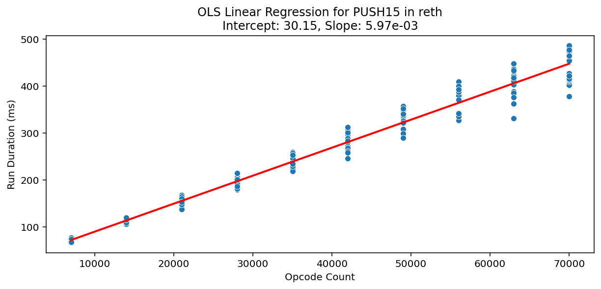

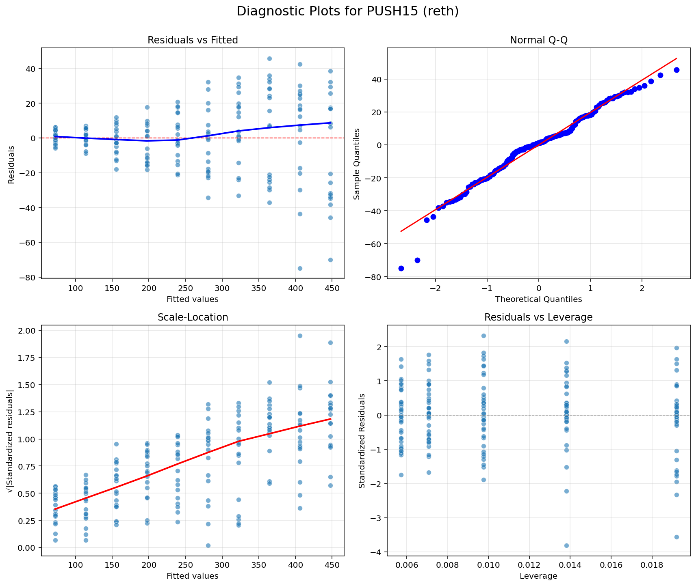


## nethermind


```python
                            OLS Regression Results                            
==============================================================================
Dep. Variable:        run_duration_ms   R-squared:                       0.977
Model:                            OLS   Adj. R-squared:                  0.977
Method:                 Least Squares   F-statistic:                 1.221e+04
Date:                Thu, 22 Jan 2026   Prob (F-statistic):          8.06e-238
Time:                        10:34:48   Log-Likelihood:                -1463.7
No. Observations:                 290   AIC:                             2931.
Df Residuals:                     288   BIC:                             2939.
Df Model:                           1                                         
Covariance Type:            nonrobust                                         
==============================================================================
                 coef    std err          t      P>|t|      [0.025      0.975]
------------------------------------------------------------------------------
const         30.1860      4.792      6.299      0.000      20.753      39.619
opcount        0.0122      0.000    110.479      0.000       0.012       0.012
==============================================================================
Omnibus:                       32.608   Durbin-Watson:                   1.185
Prob(Omnibus):                  0.000   Jarque-Bera (JB):               84.500
Skew:                          -0.507   Prob(JB):                     4.48e-19
Kurtosis:                       5.442   Cond. No.                     9.38e+04
==============================================================================

Notes:
[1] Standard Errors assume that the covariance matrix of the errors is correctly specified.
[2] The condition number is large, 9.38e+04. This might indicate that there are
strong multicollinearity or other numerical problems.
```

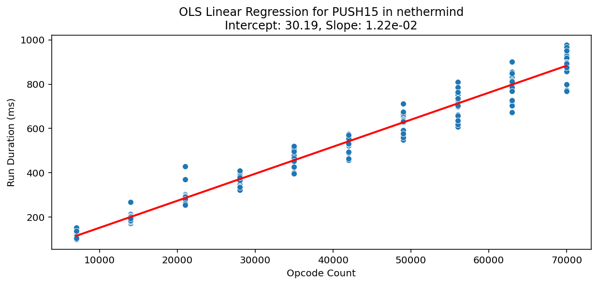

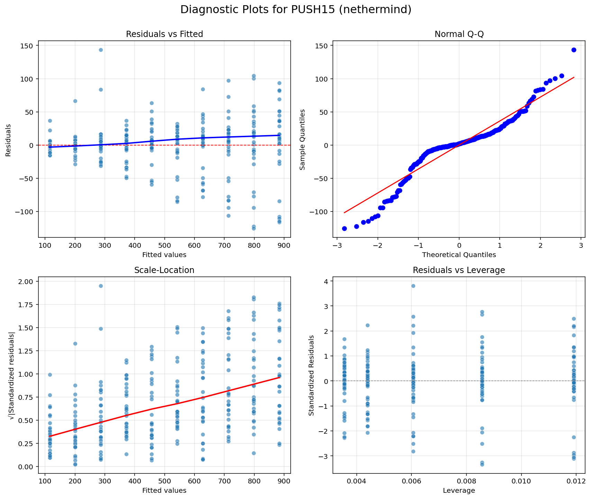


## erigon

OLS model did not run... Error: zero-size array to reduction operation maximum which has no identity

# PUSH16

## geth


```python
                            OLS Regression Results                            
==============================================================================
Dep. Variable:        run_duration_ms   R-squared:                       0.988
Model:                            OLS   Adj. R-squared:                  0.988
Method:                 Least Squares   F-statistic:                 2.372e+04
Date:                Thu, 22 Jan 2026   Prob (F-statistic):          1.11e-278
Time:                        10:34:48   Log-Likelihood:                -1528.0
No. Observations:                 290   AIC:                             3060.
Df Residuals:                     288   BIC:                             3067.
Df Model:                           1                                         
Covariance Type:            nonrobust                                         
==============================================================================
                 coef    std err          t      P>|t|      [0.025      0.975]
------------------------------------------------------------------------------
const         34.0642      5.983      5.694      0.000      22.289      45.839
opcount        0.0212      0.000    154.028      0.000       0.021       0.021
==============================================================================
Omnibus:                       54.158   Durbin-Watson:                   0.890
Prob(Omnibus):                  0.000   Jarque-Bera (JB):              102.520
Skew:                          -0.988   Prob(JB):                     5.47e-23
Kurtosis:                       5.141   Cond. No.                     9.38e+04
==============================================================================

Notes:
[1] Standard Errors assume that the covariance matrix of the errors is correctly specified.
[2] The condition number is large, 9.38e+04. This might indicate that there are
strong multicollinearity or other numerical problems.
```


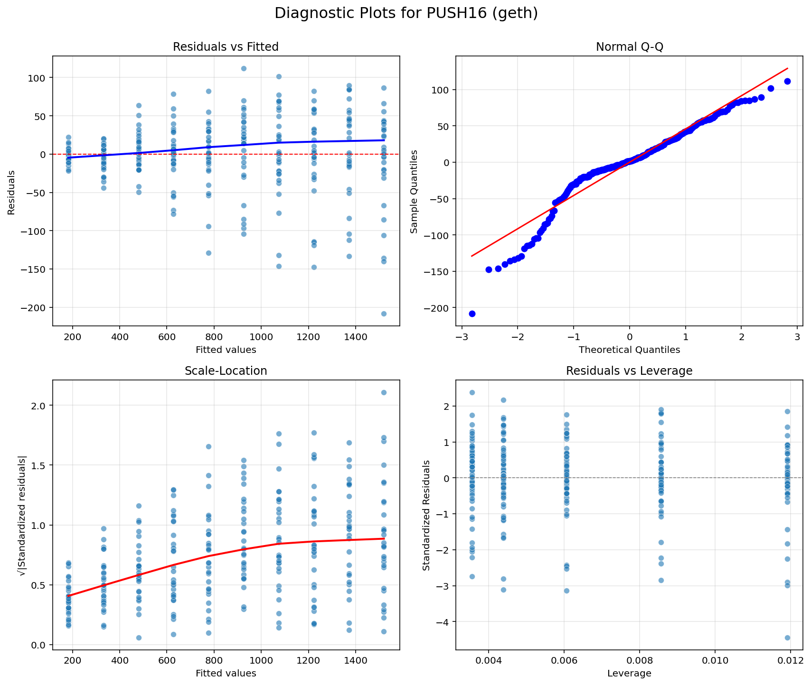


## besu


```python
                            OLS Regression Results                            
==============================================================================
Dep. Variable:        run_duration_ms   R-squared:                       0.979
Model:                            OLS   Adj. R-squared:                  0.979
Method:                 Least Squares   F-statistic:                 1.373e+04
Date:                Thu, 22 Jan 2026   Prob (F-statistic):          4.91e-245
Time:                        10:34:48   Log-Likelihood:                -1686.1
No. Observations:                 290   AIC:                             3376.
Df Residuals:                     288   BIC:                             3384.
Df Model:                           1                                         
Covariance Type:            nonrobust                                         
==============================================================================
                 coef    std err          t      P>|t|      [0.025      0.975]
------------------------------------------------------------------------------
const         25.5217     10.320      2.473      0.014       5.209      45.834
opcount        0.0278      0.000    117.190      0.000       0.027       0.028
==============================================================================
Omnibus:                       21.771   Durbin-Watson:                   0.795
Prob(Omnibus):                  0.000   Jarque-Bera (JB):               51.968
Skew:                           0.327   Prob(JB):                     5.19e-12
Kurtosis:                       4.968   Cond. No.                     9.38e+04
==============================================================================

Notes:
[1] Standard Errors assume that the covariance matrix of the errors is correctly specified.
[2] The condition number is large, 9.38e+04. This might indicate that there are
strong multicollinearity or other numerical problems.
```

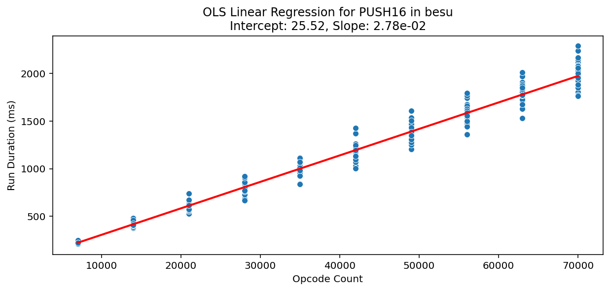


## reth


```python
                            OLS Regression Results                            
==============================================================================
Dep. Variable:        run_duration_ms   R-squared:                       0.975
Model:                            OLS   Adj. R-squared:                  0.975
Method:                 Least Squares   F-statistic:                     6947.
Date:                Thu, 22 Jan 2026   Prob (F-statistic):          1.48e-144
Time:                        10:34:48   Log-Likelihood:                -785.37
No. Observations:                 180   AIC:                             1575.
Df Residuals:                     178   BIC:                             1581.
Df Model:                           1                                         
Covariance Type:            nonrobust                                         
==============================================================================
                 coef    std err          t      P>|t|      [0.025      0.975]
------------------------------------------------------------------------------
const         30.6243      3.076      9.957      0.000      24.555      36.694
opcount        0.0059   7.08e-05     83.351      0.000       0.006       0.006
==============================================================================
Omnibus:                        2.341   Durbin-Watson:                   1.685
Prob(Omnibus):                  0.310   Jarque-Bera (JB):                1.940
Skew:                          -0.232   Prob(JB):                        0.379
Kurtosis:                       3.210   Cond. No.                     9.38e+04
==============================================================================

Notes:
[1] Standard Errors assume that the covariance matrix of the errors is correctly specified.
[2] The condition number is large, 9.38e+04. This might indicate that there are
strong multicollinearity or other numerical problems.
```


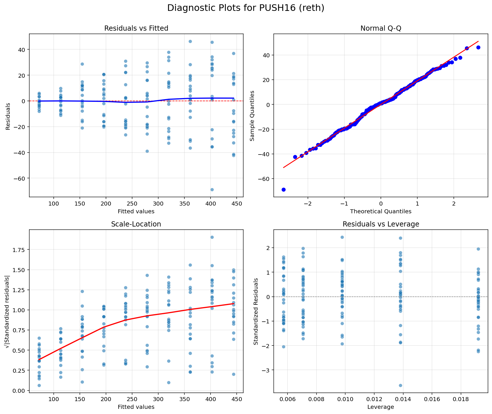


## nethermind


```python
                            OLS Regression Results                            
==============================================================================
Dep. Variable:        run_duration_ms   R-squared:                       0.980
Model:                            OLS   Adj. R-squared:                  0.980
Method:                 Least Squares   F-statistic:                 1.447e+04
Date:                Thu, 22 Jan 2026   Prob (F-statistic):          2.99e-248
Time:                        10:34:49   Log-Likelihood:                -1373.7
No. Observations:                 290   AIC:                             2751.
Df Residuals:                     288   BIC:                             2759.
Df Model:                           1                                         
Covariance Type:            nonrobust                                         
==============================================================================
                 coef    std err          t      P>|t|      [0.025      0.975]
------------------------------------------------------------------------------
const         29.2137      3.514      8.314      0.000      22.298      36.129
opcount        0.0097   8.09e-05    120.304      0.000       0.010       0.010
==============================================================================
Omnibus:                       39.247   Durbin-Watson:                   1.063
Prob(Omnibus):                  0.000   Jarque-Bera (JB):              211.039
Skew:                          -0.329   Prob(JB):                     1.49e-46
Kurtosis:                       7.127   Cond. No.                     9.38e+04
==============================================================================

Notes:
[1] Standard Errors assume that the covariance matrix of the errors is correctly specified.
[2] The condition number is large, 9.38e+04. This might indicate that there are
strong multicollinearity or other numerical problems.
```


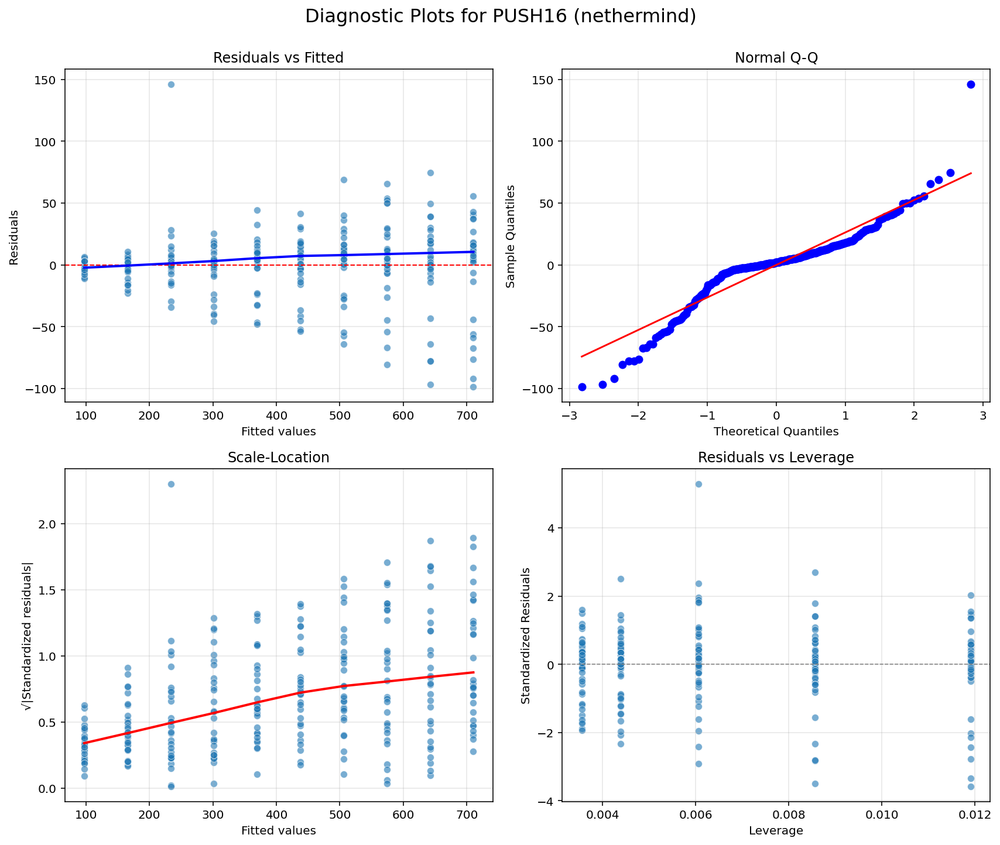


## erigon

OLS model did not run... Error: zero-size array to reduction operation maximum which has no identity

# PUSH17

## geth


```python
                            OLS Regression Results                            
==============================================================================
Dep. Variable:        run_duration_ms   R-squared:                       0.987
Model:                            OLS   Adj. R-squared:                  0.987
Method:                 Least Squares   F-statistic:                 2.207e+04
Date:                Thu, 22 Jan 2026   Prob (F-statistic):          3.17e-274
Time:                        10:34:49   Log-Likelihood:                -1544.7
No. Observations:                 290   AIC:                             3093.
Df Residuals:                     288   BIC:                             3101.
Df Model:                           1                                         
Covariance Type:            nonrobust                                         
==============================================================================
                 coef    std err          t      P>|t|      [0.025      0.975]
------------------------------------------------------------------------------
const         31.3974      6.337      4.954      0.000      18.924      43.871
opcount        0.0217      0.000    148.570      0.000       0.021       0.022
==============================================================================
Omnibus:                       64.343   Durbin-Watson:                   1.221
Prob(Omnibus):                  0.000   Jarque-Bera (JB):              156.437
Skew:                          -1.049   Prob(JB):                     1.07e-34
Kurtosis:                       5.924   Cond. No.                     9.38e+04
==============================================================================

Notes:
[1] Standard Errors assume that the covariance matrix of the errors is correctly specified.
[2] The condition number is large, 9.38e+04. This might indicate that there are
strong multicollinearity or other numerical problems.
```


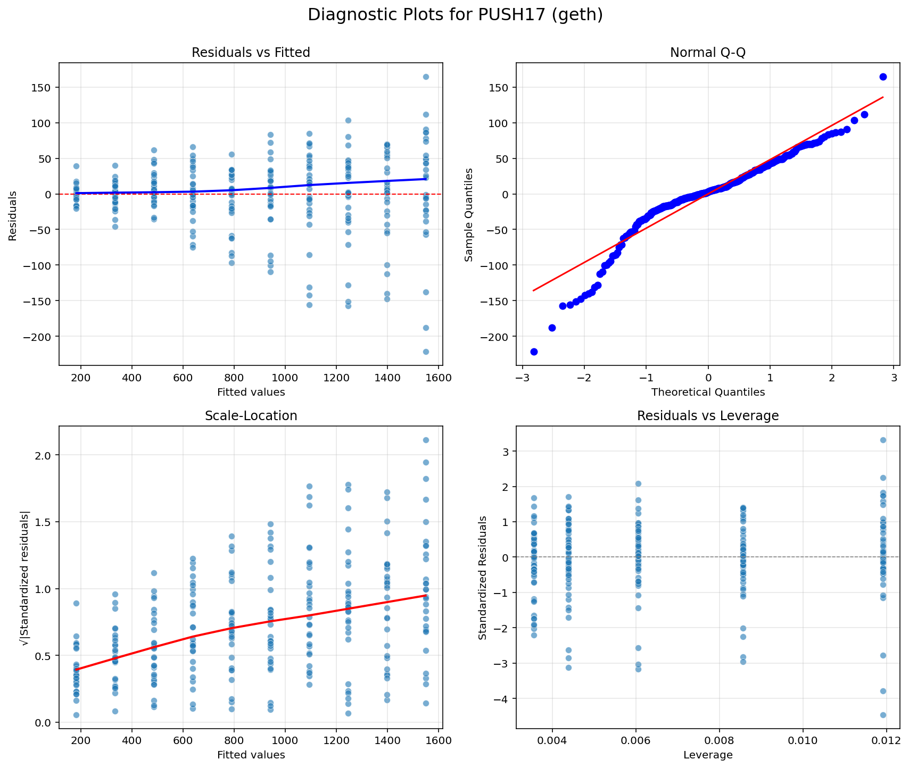


## besu


```python
                            OLS Regression Results                            
==============================================================================
Dep. Variable:        run_duration_ms   R-squared:                       0.975
Model:                            OLS   Adj. R-squared:                  0.975
Method:                 Least Squares   F-statistic:                 1.125e+04
Date:                Thu, 22 Jan 2026   Prob (F-statistic):          7.20e-233
Time:                        10:34:49   Log-Likelihood:                -1711.4
No. Observations:                 290   AIC:                             3427.
Df Residuals:                     288   BIC:                             3434.
Df Model:                           1                                         
Covariance Type:            nonrobust                                         
==============================================================================
                 coef    std err          t      P>|t|      [0.025      0.975]
------------------------------------------------------------------------------
const         31.1690     11.260      2.768      0.006       9.007      53.331
opcount        0.0275      0.000    106.088      0.000       0.027       0.028
==============================================================================
Omnibus:                       32.873   Durbin-Watson:                   1.233
Prob(Omnibus):                  0.000   Jarque-Bera (JB):              130.722
Skew:                           0.340   Prob(JB):                     4.11e-29
Kurtosis:                       6.218   Cond. No.                     9.38e+04
==============================================================================

Notes:
[1] Standard Errors assume that the covariance matrix of the errors is correctly specified.
[2] The condition number is large, 9.38e+04. This might indicate that there are
strong multicollinearity or other numerical problems.
```

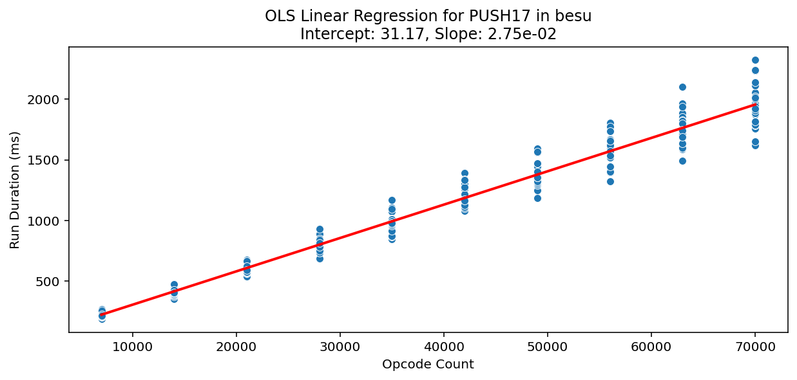

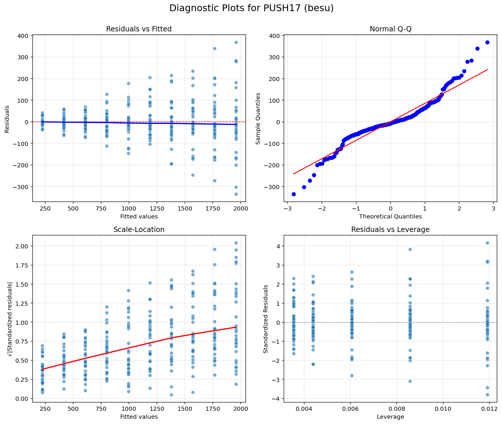


## reth


```python
                            OLS Regression Results                            
==============================================================================
Dep. Variable:        run_duration_ms   R-squared:                       0.965
Model:                            OLS   Adj. R-squared:                  0.964
Method:                 Least Squares   F-statistic:                     4846.
Date:                Thu, 22 Jan 2026   Prob (F-statistic):          4.80e-131
Time:                        10:34:50   Log-Likelihood:                -817.08
No. Observations:                 180   AIC:                             1638.
Df Residuals:                     178   BIC:                             1645.
Df Model:                           1                                         
Covariance Type:            nonrobust                                         
==============================================================================
                 coef    std err          t      P>|t|      [0.025      0.975]
------------------------------------------------------------------------------
const         33.1528      3.668      9.038      0.000      25.914      40.392
opcount        0.0059   8.45e-05     69.610      0.000       0.006       0.006
==============================================================================
Omnibus:                        2.828   Durbin-Watson:                   1.496
Prob(Omnibus):                  0.243   Jarque-Bera (JB):                2.411
Skew:                           0.216   Prob(JB):                        0.300
Kurtosis:                       3.368   Cond. No.                     9.38e+04
==============================================================================

Notes:
[1] Standard Errors assume that the covariance matrix of the errors is correctly specified.
[2] The condition number is large, 9.38e+04. This might indicate that there are
strong multicollinearity or other numerical problems.
```


## nethermind


```python
                            OLS Regression Results                            
==============================================================================
Dep. Variable:        run_duration_ms   R-squared:                       0.984
Model:                            OLS   Adj. R-squared:                  0.983
Method:                 Least Squares   F-statistic:                 1.717e+04
Date:                Thu, 22 Jan 2026   Prob (F-statistic):          9.54e-259
Time:                        10:34:50   Log-Likelihood:                -1414.8
No. Observations:                 290   AIC:                             2834.
Df Residuals:                     288   BIC:                             2841.
Df Model:                           1                                         
Covariance Type:            nonrobust                                         
==============================================================================
                 coef    std err          t      P>|t|      [0.025      0.975]
------------------------------------------------------------------------------
const         30.2725      4.048      7.478      0.000      22.305      38.240
opcount        0.0122   9.32e-05    131.036      0.000       0.012       0.012
==============================================================================
Omnibus:                       47.121   Durbin-Watson:                   1.224
Prob(Omnibus):                  0.000   Jarque-Bera (JB):              106.190
Skew:                          -0.800   Prob(JB):                     8.73e-24
Kurtosis:                       5.496   Cond. No.                     9.38e+04
==============================================================================

Notes:
[1] Standard Errors assume that the covariance matrix of the errors is correctly specified.
[2] The condition number is large, 9.38e+04. This might indicate that there are
strong multicollinearity or other numerical problems.
```


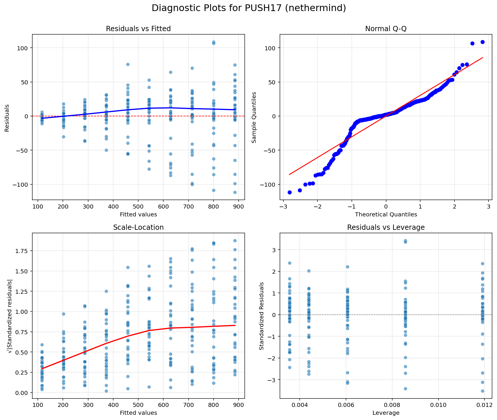


## erigon

OLS model did not run... Error: zero-size array to reduction operation maximum which has no identity

# PUSH18

## geth


```python
                            OLS Regression Results                            
==============================================================================
Dep. Variable:        run_duration_ms   R-squared:                       0.988
Model:                            OLS   Adj. R-squared:                  0.988
Method:                 Least Squares   F-statistic:                 2.289e+04
Date:                Thu, 22 Jan 2026   Prob (F-statistic):          1.82e-276
Time:                        10:34:50   Log-Likelihood:                -1540.3
No. Observations:                 290   AIC:                             3085.
Df Residuals:                     288   BIC:                             3092.
Df Model:                           1                                         
Covariance Type:            nonrobust                                         
==============================================================================
                 coef    std err          t      P>|t|      [0.025      0.975]
------------------------------------------------------------------------------
const         30.7374      6.242      4.925      0.000      18.453      43.022
opcount        0.0217      0.000    151.290      0.000       0.021       0.022
==============================================================================
Omnibus:                       90.645   Durbin-Watson:                   1.238
Prob(Omnibus):                  0.000   Jarque-Bera (JB):             1395.123
Skew:                           0.792   Prob(JB):                    1.13e-303
Kurtosis:                      13.628   Cond. No.                     9.38e+04
==============================================================================

Notes:
[1] Standard Errors assume that the covariance matrix of the errors is correctly specified.
[2] The condition number is large, 9.38e+04. This might indicate that there are
strong multicollinearity or other numerical problems.
```


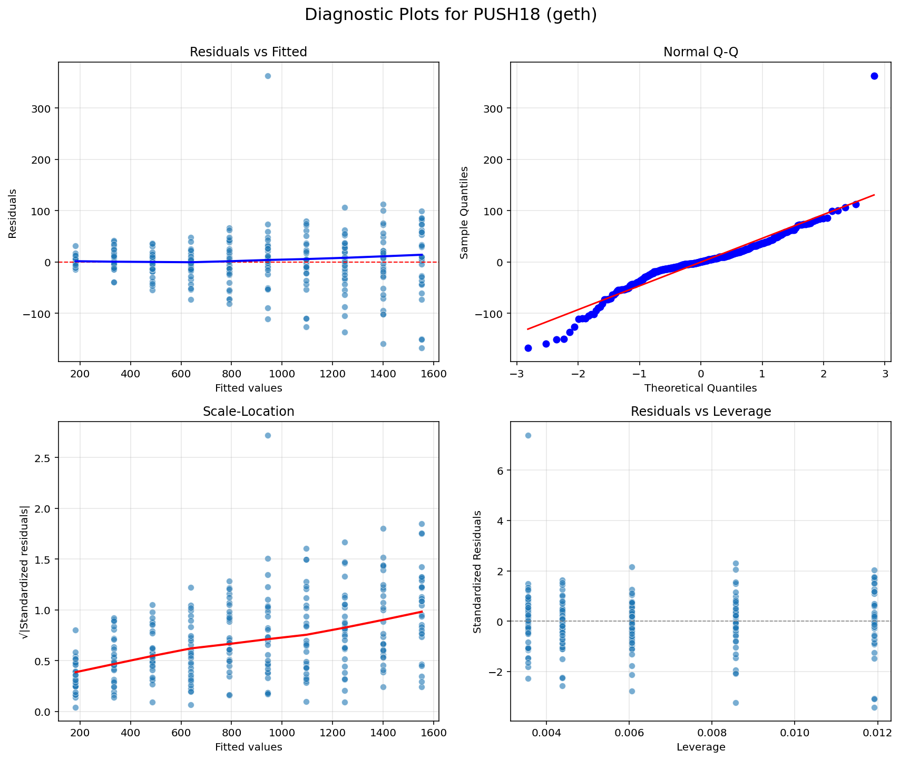


## besu


```python
                            OLS Regression Results                            
==============================================================================
Dep. Variable:        run_duration_ms   R-squared:                       0.979
Model:                            OLS   Adj. R-squared:                  0.979
Method:                 Least Squares   F-statistic:                 1.317e+04
Date:                Thu, 22 Jan 2026   Prob (F-statistic):          1.86e-242
Time:                        10:34:50   Log-Likelihood:                -1690.1
No. Observations:                 290   AIC:                             3384.
Df Residuals:                     288   BIC:                             3392.
Df Model:                           1                                         
Covariance Type:            nonrobust                                         
==============================================================================
                 coef    std err          t      P>|t|      [0.025      0.975]
------------------------------------------------------------------------------
const         28.7738     10.462      2.750      0.006       8.182      49.365
opcount        0.0276      0.000    114.747      0.000       0.027       0.028
==============================================================================
Omnibus:                       31.964   Durbin-Watson:                   0.966
Prob(Omnibus):                  0.000   Jarque-Bera (JB):               82.691
Skew:                           0.496   Prob(JB):                     1.11e-18
Kurtosis:                       5.420   Cond. No.                     9.38e+04
==============================================================================

Notes:
[1] Standard Errors assume that the covariance matrix of the errors is correctly specified.
[2] The condition number is large, 9.38e+04. This might indicate that there are
strong multicollinearity or other numerical problems.
```


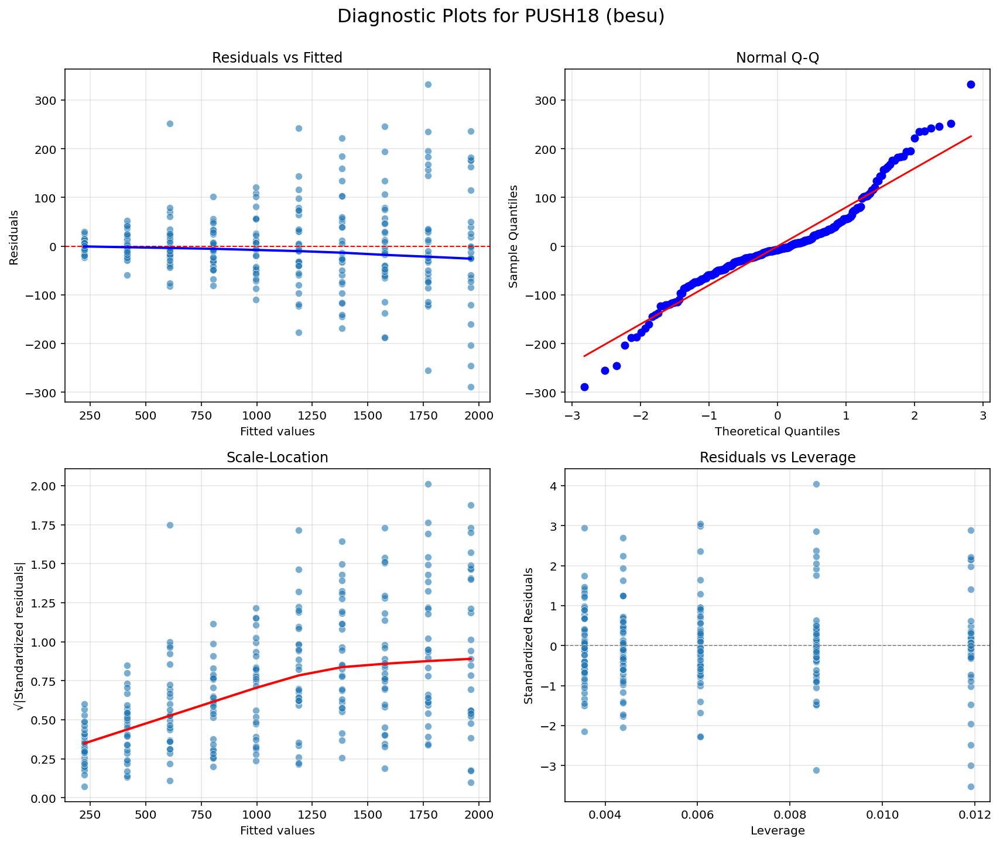


## reth


```python
                            OLS Regression Results                            
==============================================================================
Dep. Variable:        run_duration_ms   R-squared:                       0.919
Model:                            OLS   Adj. R-squared:                  0.919
Method:                 Least Squares   F-statistic:                     2029.
Date:                Thu, 22 Jan 2026   Prob (F-statistic):           3.01e-99
Time:                        10:34:51   Log-Likelihood:                -892.89
No. Observations:                 180   AIC:                             1790.
Df Residuals:                     178   BIC:                             1796.
Df Model:                           1                                         
Covariance Type:            nonrobust                                         
==============================================================================
                 coef    std err          t      P>|t|      [0.025      0.975]
------------------------------------------------------------------------------
const         39.2208      5.589      7.017      0.000      28.191      50.251
opcount        0.0058      0.000     45.047      0.000       0.006       0.006
==============================================================================
Omnibus:                      268.045   Durbin-Watson:                   1.994
Prob(Omnibus):                  0.000   Jarque-Bera (JB):            34166.096
Skew:                           6.399   Prob(JB):                         0.00
Kurtosis:                      69.270   Cond. No.                     9.38e+04
==============================================================================

Notes:
[1] Standard Errors assume that the covariance matrix of the errors is correctly specified.
[2] The condition number is large, 9.38e+04. This might indicate that there are
strong multicollinearity or other numerical problems.
```

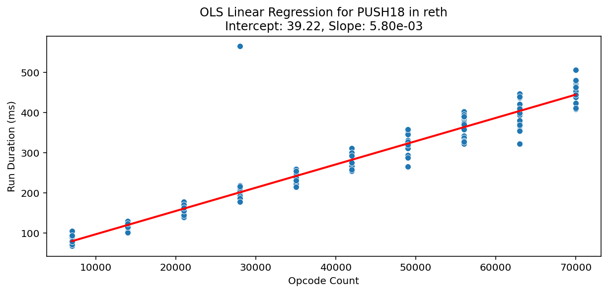

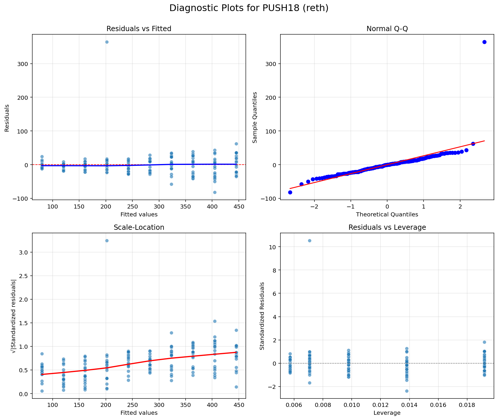


## nethermind


```python
                            OLS Regression Results                            
==============================================================================
Dep. Variable:        run_duration_ms   R-squared:                       0.976
Model:                            OLS   Adj. R-squared:                  0.976
Method:                 Least Squares   F-statistic:                 1.168e+04
Date:                Thu, 22 Jan 2026   Prob (F-statistic):          3.85e-235
Time:                        10:34:51   Log-Likelihood:                -1472.7
No. Observations:                 290   AIC:                             2949.
Df Residuals:                     288   BIC:                             2957.
Df Model:                           1                                         
Covariance Type:            nonrobust                                         
==============================================================================
                 coef    std err          t      P>|t|      [0.025      0.975]
------------------------------------------------------------------------------
const         28.6444      4.944      5.794      0.000      18.914      38.374
opcount        0.0123      0.000    108.082      0.000       0.012       0.013
==============================================================================
Omnibus:                       23.928   Durbin-Watson:                   1.054
Prob(Omnibus):                  0.000   Jarque-Bera (JB):               66.299
Skew:                          -0.310   Prob(JB):                     4.01e-15
Kurtosis:                       5.259   Cond. No.                     9.38e+04
==============================================================================

Notes:
[1] Standard Errors assume that the covariance matrix of the errors is correctly specified.
[2] The condition number is large, 9.38e+04. This might indicate that there are
strong multicollinearity or other numerical problems.
```

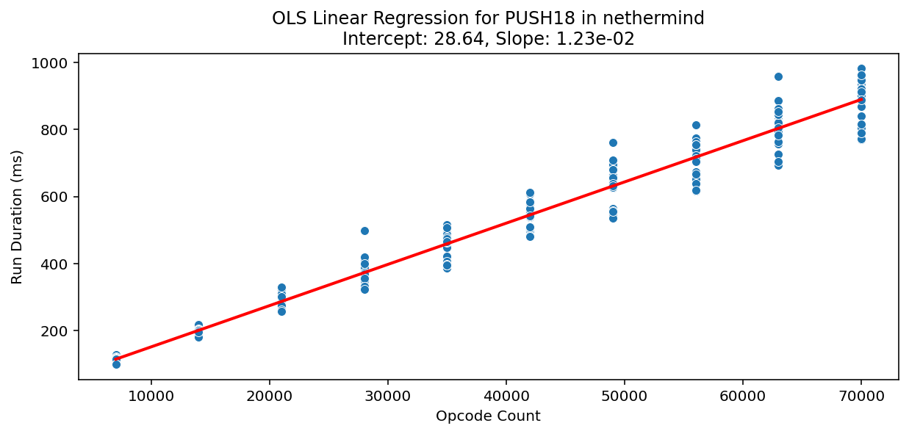


## erigon

OLS model did not run... Error: zero-size array to reduction operation maximum which has no identity

# PUSH19

## geth


```python
                            OLS Regression Results                            
==============================================================================
Dep. Variable:        run_duration_ms   R-squared:                       0.982
Model:                            OLS   Adj. R-squared:                  0.982
Method:                 Least Squares   F-statistic:                 1.580e+04
Date:                Thu, 22 Jan 2026   Prob (F-statistic):          1.27e-253
Time:                        10:34:51   Log-Likelihood:                -1596.2
No. Observations:                 290   AIC:                             3196.
Df Residuals:                     288   BIC:                             3204.
Df Model:                           1                                         
Covariance Type:            nonrobust                                         
==============================================================================
                 coef    std err          t      P>|t|      [0.025      0.975]
------------------------------------------------------------------------------
const         27.8728      7.568      3.683      0.000      12.976      42.769
opcount        0.0219      0.000    125.685      0.000       0.022       0.022
==============================================================================
Omnibus:                      317.556   Durbin-Watson:                   1.508
Prob(Omnibus):                  0.000   Jarque-Bera (JB):            33842.616
Skew:                           4.238   Prob(JB):                         0.00
Kurtosis:                      55.239   Cond. No.                     9.38e+04
==============================================================================

Notes:
[1] Standard Errors assume that the covariance matrix of the errors is correctly specified.
[2] The condition number is large, 9.38e+04. This might indicate that there are
strong multicollinearity or other numerical problems.
```
OLS model did not run... Error: 'numpy.ndarray' object has no attribute 'iloc'

## besu


```python
                            OLS Regression Results                            
==============================================================================
Dep. Variable:        run_duration_ms   R-squared:                       0.980
Model:                            OLS   Adj. R-squared:                  0.980
Method:                 Least Squares   F-statistic:                 1.421e+04
Date:                Thu, 22 Jan 2026   Prob (F-statistic):          4.01e-247
Time:                        10:34:51   Log-Likelihood:                -1683.9
No. Observations:                 290   AIC:                             3372.
Df Residuals:                     288   BIC:                             3379.
Df Model:                           1                                         
Covariance Type:            nonrobust                                         
==============================================================================
                 coef    std err          t      P>|t|      [0.025      0.975]
------------------------------------------------------------------------------
const         23.6206     10.240      2.307      0.022       3.465      43.776
opcount        0.0281      0.000    119.203      0.000       0.028       0.029
==============================================================================
Omnibus:                       21.840   Durbin-Watson:                   0.915
Prob(Omnibus):                  0.000   Jarque-Bera (JB):               51.928
Skew:                           0.330   Prob(JB):                     5.30e-12
Kurtosis:                       4.965   Cond. No.                     9.38e+04
==============================================================================

Notes:
[1] Standard Errors assume that the covariance matrix of the errors is correctly specified.
[2] The condition number is large, 9.38e+04. This might indicate that there are
strong multicollinearity or other numerical problems.
```


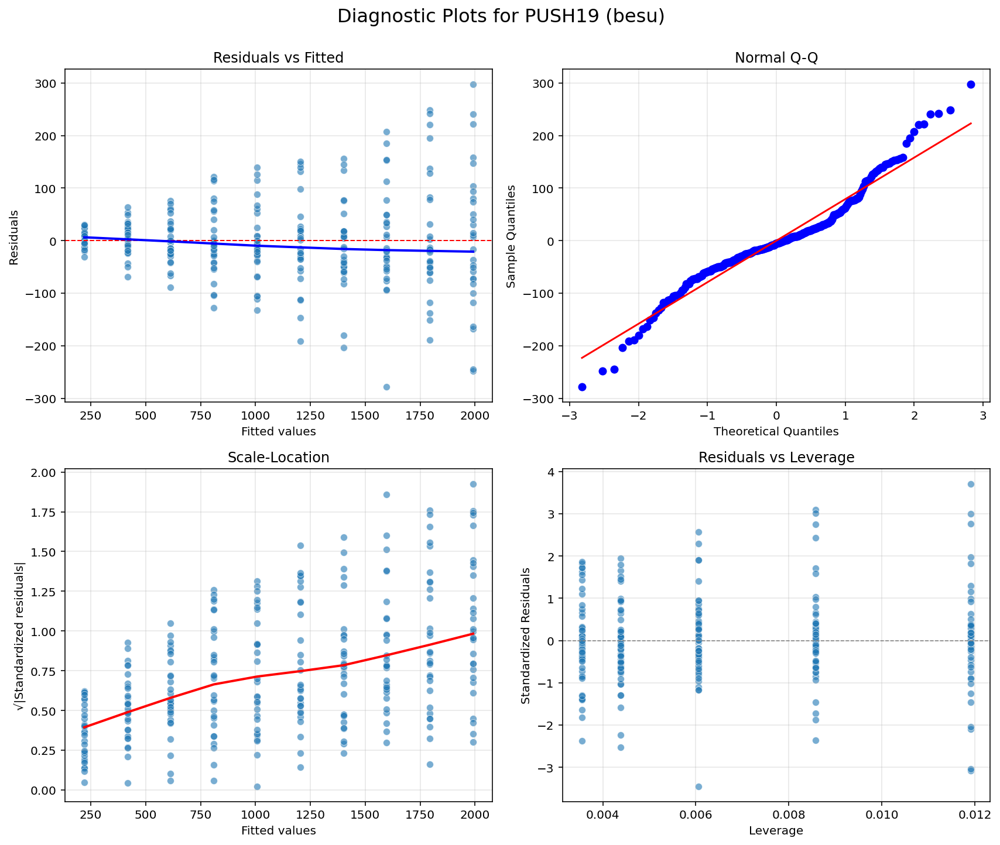


## reth


```python
                            OLS Regression Results                            
==============================================================================
Dep. Variable:        run_duration_ms   R-squared:                       0.970
Model:                            OLS   Adj. R-squared:                  0.970
Method:                 Least Squares   F-statistic:                     5718.
Date:                Thu, 22 Jan 2026   Prob (F-statistic):          3.08e-137
Time:                        10:34:52   Log-Likelihood:                -809.20
No. Observations:                 180   AIC:                             1622.
Df Residuals:                     178   BIC:                             1629.
Df Model:                           1                                         
Covariance Type:            nonrobust                                         
==============================================================================
                 coef    std err          t      P>|t|      [0.025      0.975]
------------------------------------------------------------------------------
const         31.7026      3.511      9.029      0.000      24.774      38.631
opcount        0.0061   8.08e-05     75.619      0.000       0.006       0.006
==============================================================================
Omnibus:                        1.680   Durbin-Watson:                   1.801
Prob(Omnibus):                  0.432   Jarque-Bera (JB):                1.366
Skew:                          -0.203   Prob(JB):                        0.505
Kurtosis:                       3.133   Cond. No.                     9.38e+04
==============================================================================

Notes:
[1] Standard Errors assume that the covariance matrix of the errors is correctly specified.
[2] The condition number is large, 9.38e+04. This might indicate that there are
strong multicollinearity or other numerical problems.
```

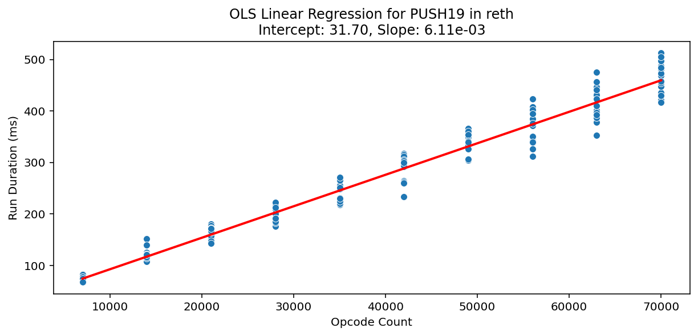

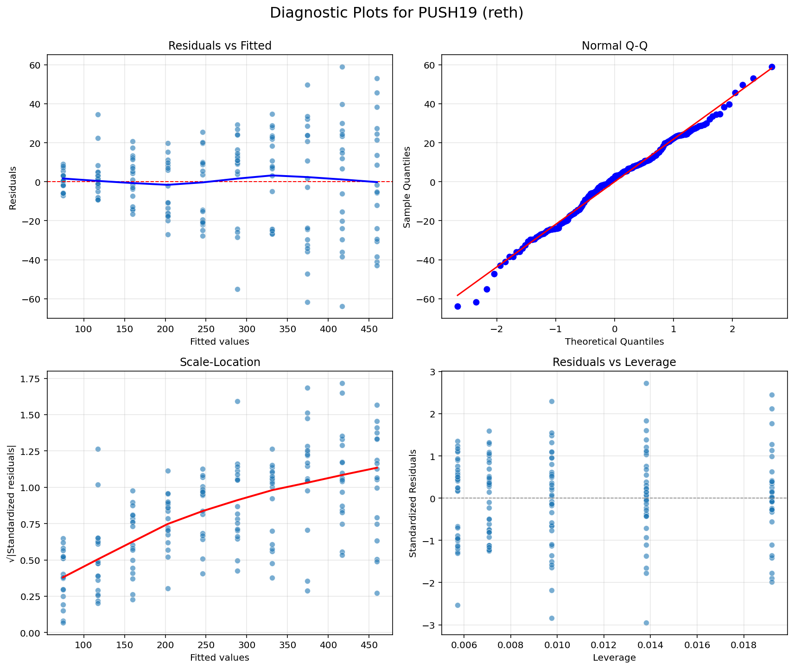


## nethermind


```python
                            OLS Regression Results                            
==============================================================================
Dep. Variable:        run_duration_ms   R-squared:                       0.956
Model:                            OLS   Adj. R-squared:                  0.956
Method:                 Least Squares   F-statistic:                     6292.
Date:                Thu, 22 Jan 2026   Prob (F-statistic):          1.02e-197
Time:                        10:34:52   Log-Likelihood:                -1567.9
No. Observations:                 290   AIC:                             3140.
Df Residuals:                     288   BIC:                             3147.
Df Model:                           1                                         
Covariance Type:            nonrobust                                         
==============================================================================
                 coef    std err          t      P>|t|      [0.025      0.975]
------------------------------------------------------------------------------
const         23.6397      6.864      3.444      0.001      10.130      37.149
opcount        0.0125      0.000     79.323      0.000       0.012       0.013
==============================================================================
Omnibus:                      424.344   Durbin-Watson:                   1.639
Prob(Omnibus):                  0.000   Jarque-Bera (JB):            93733.956
Skew:                           6.931   Prob(JB):                         0.00
Kurtosis:                      89.978   Cond. No.                     9.38e+04
==============================================================================

Notes:
[1] Standard Errors assume that the covariance matrix of the errors is correctly specified.
[2] The condition number is large, 9.38e+04. This might indicate that there are
strong multicollinearity or other numerical problems.
```
OLS model did not run... Error: 'numpy.ndarray' object has no attribute 'iloc'

## erigon

OLS model did not run... Error: zero-size array to reduction operation maximum which has no identity

# PUSH20

## geth


```python
                            OLS Regression Results                            
==============================================================================
Dep. Variable:        run_duration_ms   R-squared:                       0.985
Model:                            OLS   Adj. R-squared:                  0.985
Method:                 Least Squares   F-statistic:                 1.918e+04
Date:                Thu, 22 Jan 2026   Prob (F-statistic):          1.47e-265
Time:                        10:34:52   Log-Likelihood:                -1564.8
No. Observations:                 290   AIC:                             3134.
Df Residuals:                     288   BIC:                             3141.
Df Model:                           1                                         
Covariance Type:            nonrobust                                         
==============================================================================
                 coef    std err          t      P>|t|      [0.025      0.975]
------------------------------------------------------------------------------
const         32.8442      6.792      4.836      0.000      19.476      46.212
opcount        0.0217      0.000    138.490      0.000       0.021       0.022
==============================================================================
Omnibus:                       53.810   Durbin-Watson:                   0.992
Prob(Omnibus):                  0.000   Jarque-Bera (JB):              592.397
Skew:                           0.260   Prob(JB):                    2.30e-129
Kurtosis:                       9.983   Cond. No.                     9.38e+04
==============================================================================

Notes:
[1] Standard Errors assume that the covariance matrix of the errors is correctly specified.
[2] The condition number is large, 9.38e+04. This might indicate that there are
strong multicollinearity or other numerical problems.
```


## besu


```python
                            OLS Regression Results                            
==============================================================================
Dep. Variable:        run_duration_ms   R-squared:                       0.979
Model:                            OLS   Adj. R-squared:                  0.979
Method:                 Least Squares   F-statistic:                 1.361e+04
Date:                Thu, 22 Jan 2026   Prob (F-statistic):          1.68e-244
Time:                        10:34:52   Log-Likelihood:                -1689.6
No. Observations:                 290   AIC:                             3383.
Df Residuals:                     288   BIC:                             3391.
Df Model:                           1                                         
Covariance Type:            nonrobust                                         
==============================================================================
                 coef    std err          t      P>|t|      [0.025      0.975]
------------------------------------------------------------------------------
const         27.0451     10.444      2.590      0.010       6.489      47.601
opcount        0.0281      0.000    116.679      0.000       0.028       0.029
==============================================================================
Omnibus:                       36.982   Durbin-Watson:                   0.788
Prob(Omnibus):                  0.000   Jarque-Bera (JB):               81.218
Skew:                           0.641   Prob(JB):                     2.31e-18
Kurtosis:                       5.253   Cond. No.                     9.38e+04
==============================================================================

Notes:
[1] Standard Errors assume that the covariance matrix of the errors is correctly specified.
[2] The condition number is large, 9.38e+04. This might indicate that there are
strong multicollinearity or other numerical problems.
```

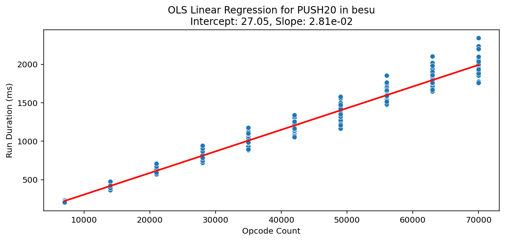

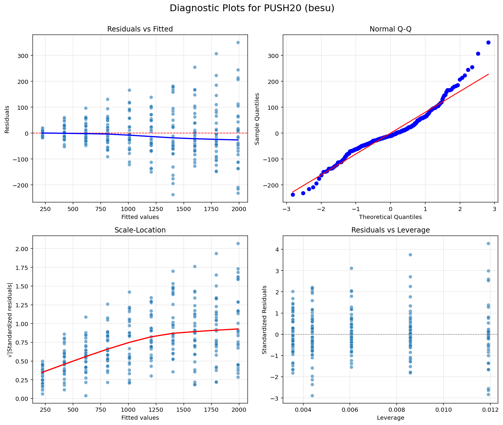


## reth


```python
                            OLS Regression Results                            
==============================================================================
Dep. Variable:        run_duration_ms   R-squared:                       0.972
Model:                            OLS   Adj. R-squared:                  0.972
Method:                 Least Squares   F-statistic:                     6254.
Date:                Thu, 22 Jan 2026   Prob (F-statistic):          1.35e-140
Time:                        10:34:53   Log-Likelihood:                -798.07
No. Observations:                 180   AIC:                             1600.
Df Residuals:                     178   BIC:                             1607.
Df Model:                           1                                         
Covariance Type:            nonrobust                                         
==============================================================================
                 coef    std err          t      P>|t|      [0.025      0.975]
------------------------------------------------------------------------------
const         28.8232      3.301      8.733      0.000      22.310      35.337
opcount        0.0060    7.6e-05     79.080      0.000       0.006       0.006
==============================================================================
Omnibus:                        0.114   Durbin-Watson:                   1.728
Prob(Omnibus):                  0.944   Jarque-Bera (JB):                0.009
Skew:                           0.009   Prob(JB):                        0.996
Kurtosis:                       3.029   Cond. No.                     9.38e+04
==============================================================================

Notes:
[1] Standard Errors assume that the covariance matrix of the errors is correctly specified.
[2] The condition number is large, 9.38e+04. This might indicate that there are
strong multicollinearity or other numerical problems.
```


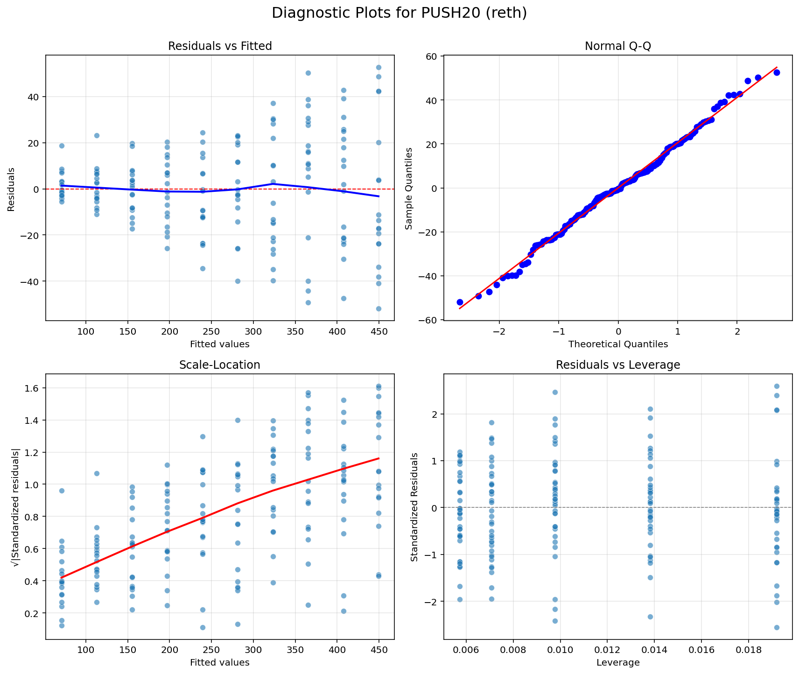


## nethermind


```python
                            OLS Regression Results                            
==============================================================================
Dep. Variable:        run_duration_ms   R-squared:                       0.980
Model:                            OLS   Adj. R-squared:                  0.980
Method:                 Least Squares   F-statistic:                 1.443e+04
Date:                Thu, 22 Jan 2026   Prob (F-statistic):          4.52e-248
Time:                        10:34:53   Log-Likelihood:                -1386.6
No. Observations:                 290   AIC:                             2777.
Df Residuals:                     288   BIC:                             2785.
Df Model:                           1                                         
Covariance Type:            nonrobust                                         
==============================================================================
                 coef    std err          t      P>|t|      [0.025      0.975]
------------------------------------------------------------------------------
const         29.7349      3.674      8.093      0.000      22.504      36.966
opcount        0.0102   8.46e-05    120.128      0.000       0.010       0.010
==============================================================================
Omnibus:                       74.054   Durbin-Watson:                   1.057
Prob(Omnibus):                  0.000   Jarque-Bera (JB):              176.832
Skew:                          -1.216   Prob(JB):                     3.99e-39
Kurtosis:                       5.953   Cond. No.                     9.38e+04
==============================================================================

Notes:
[1] Standard Errors assume that the covariance matrix of the errors is correctly specified.
[2] The condition number is large, 9.38e+04. This might indicate that there are
strong multicollinearity or other numerical problems.
```

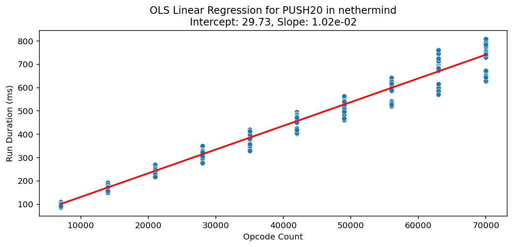

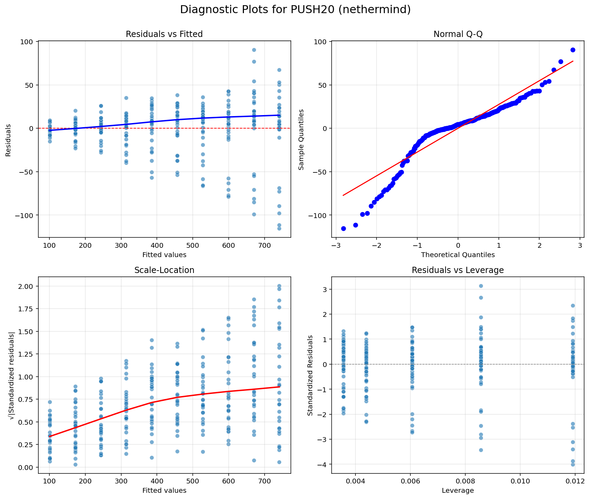


## erigon

OLS model did not run... Error: zero-size array to reduction operation maximum which has no identity

# PUSH21

## geth


```python
                            OLS Regression Results                            
==============================================================================
Dep. Variable:        run_duration_ms   R-squared:                       0.985
Model:                            OLS   Adj. R-squared:                  0.985
Method:                 Least Squares   F-statistic:                 1.899e+04
Date:                Thu, 22 Jan 2026   Prob (F-statistic):          5.96e-265
Time:                        10:34:53   Log-Likelihood:                -1574.9
No. Observations:                 290   AIC:                             3154.
Df Residuals:                     288   BIC:                             3161.
Df Model:                           1                                         
Covariance Type:            nonrobust                                         
==============================================================================
                 coef    std err          t      P>|t|      [0.025      0.975]
------------------------------------------------------------------------------
const         36.3989      7.032      5.176      0.000      22.559      50.239
opcount        0.0223      0.000    137.808      0.000       0.022       0.023
==============================================================================
Omnibus:                       34.057   Durbin-Watson:                   1.160
Prob(Omnibus):                  0.000   Jarque-Bera (JB):              177.089
Skew:                          -0.217   Prob(JB):                     3.51e-39
Kurtosis:                       6.804   Cond. No.                     9.38e+04
==============================================================================

Notes:
[1] Standard Errors assume that the covariance matrix of the errors is correctly specified.
[2] The condition number is large, 9.38e+04. This might indicate that there are
strong multicollinearity or other numerical problems.
```


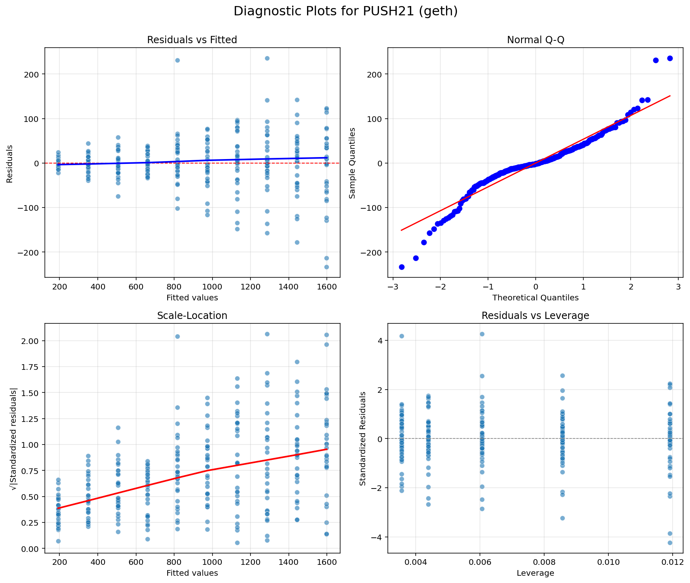


## besu


```python
                            OLS Regression Results                            
==============================================================================
Dep. Variable:        run_duration_ms   R-squared:                       0.979
Model:                            OLS   Adj. R-squared:                  0.978
Method:                 Least Squares   F-statistic:                 1.311e+04
Date:                Thu, 22 Jan 2026   Prob (F-statistic):          3.46e-242
Time:                        10:34:53   Log-Likelihood:                -1692.2
No. Observations:                 290   AIC:                             3388.
Df Residuals:                     288   BIC:                             3396.
Df Model:                           1                                         
Covariance Type:            nonrobust                                         
==============================================================================
                 coef    std err          t      P>|t|      [0.025      0.975]
------------------------------------------------------------------------------
const         34.4772     10.538      3.272      0.001      13.736      55.219
opcount        0.0278      0.000    114.495      0.000       0.027       0.028
==============================================================================
Omnibus:                       21.144   Durbin-Watson:                   0.997
Prob(Omnibus):                  0.000   Jarque-Bera (JB):               54.937
Skew:                           0.274   Prob(JB):                     1.18e-12
Kurtosis:                       5.061   Cond. No.                     9.38e+04
==============================================================================

Notes:
[1] Standard Errors assume that the covariance matrix of the errors is correctly specified.
[2] The condition number is large, 9.38e+04. This might indicate that there are
strong multicollinearity or other numerical problems.
```


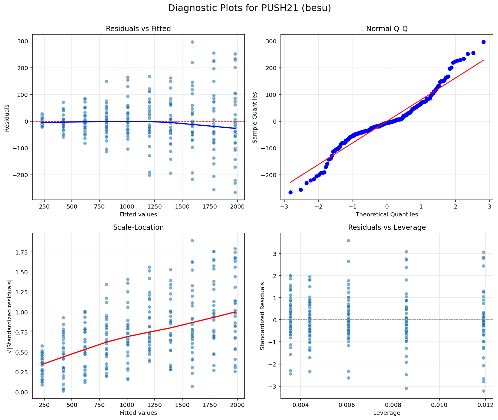


## reth


```python
                            OLS Regression Results                            
==============================================================================
Dep. Variable:        run_duration_ms   R-squared:                       0.973
Model:                            OLS   Adj. R-squared:                  0.973
Method:                 Least Squares   F-statistic:                     6426.
Date:                Thu, 22 Jan 2026   Prob (F-statistic):          1.29e-141
Time:                        10:34:54   Log-Likelihood:                -800.49
No. Observations:                 180   AIC:                             1605.
Df Residuals:                     178   BIC:                             1611.
Df Model:                           1                                         
Covariance Type:            nonrobust                                         
==============================================================================
                 coef    std err          t      P>|t|      [0.025      0.975]
------------------------------------------------------------------------------
const         28.9102      3.345      8.642      0.000      22.309      35.512
opcount        0.0062    7.7e-05     80.160      0.000       0.006       0.006
==============================================================================
Omnibus:                        1.916   Durbin-Watson:                   1.682
Prob(Omnibus):                  0.384   Jarque-Bera (JB):                1.674
Skew:                           0.038   Prob(JB):                        0.433
Kurtosis:                       3.466   Cond. No.                     9.38e+04
==============================================================================

Notes:
[1] Standard Errors assume that the covariance matrix of the errors is correctly specified.
[2] The condition number is large, 9.38e+04. This might indicate that there are
strong multicollinearity or other numerical problems.
```

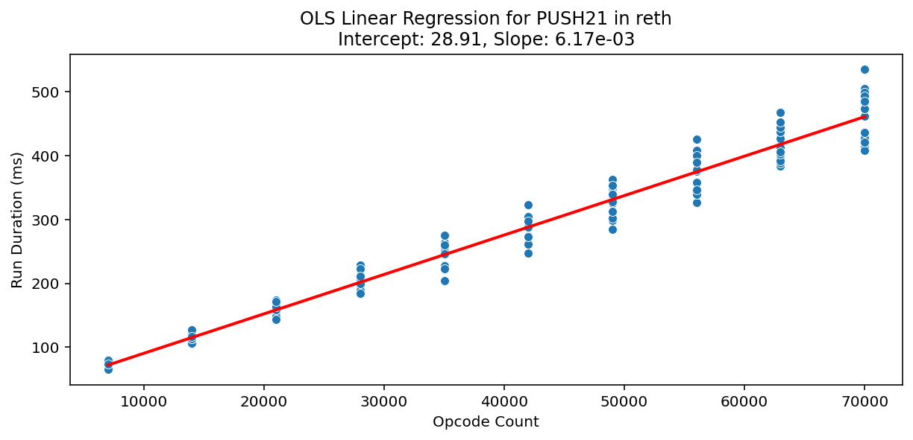

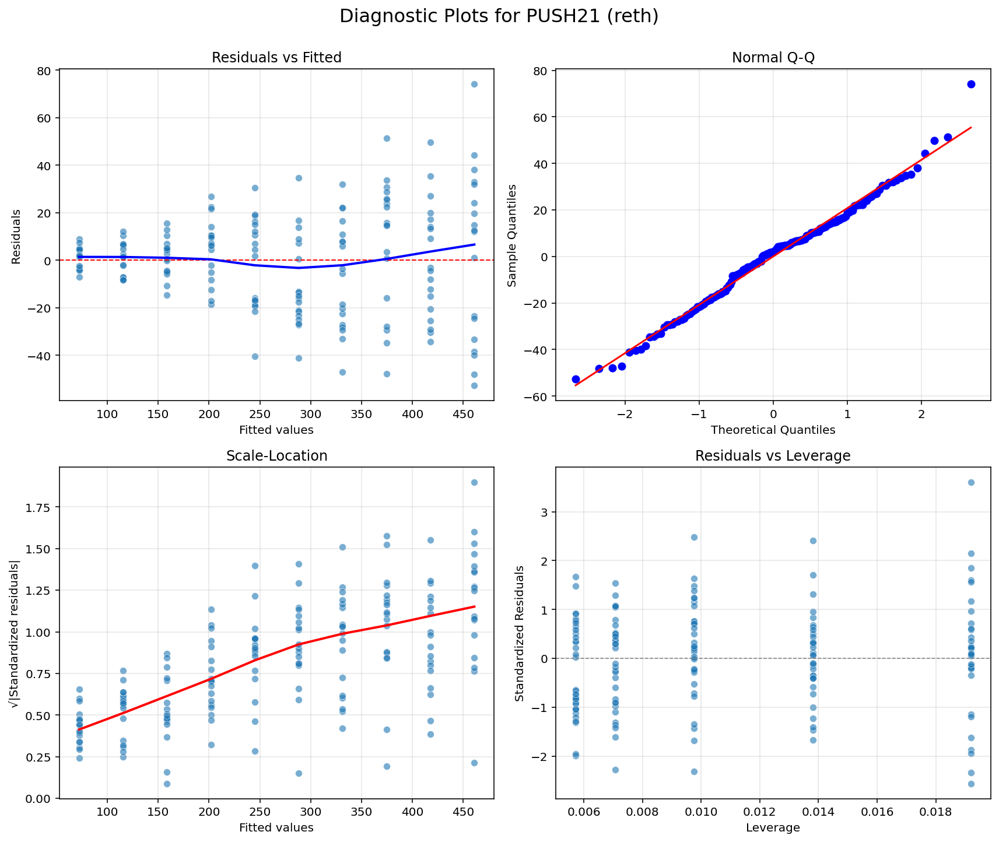


## nethermind


```python
                            OLS Regression Results                            
==============================================================================
Dep. Variable:        run_duration_ms   R-squared:                       0.983
Model:                            OLS   Adj. R-squared:                  0.983
Method:                 Least Squares   F-statistic:                 1.686e+04
Date:                Thu, 22 Jan 2026   Prob (F-statistic):          1.26e-257
Time:                        10:34:54   Log-Likelihood:                -1420.2
No. Observations:                 290   AIC:                             2844.
Df Residuals:                     288   BIC:                             2852.
Df Model:                           1                                         
Covariance Type:            nonrobust                                         
==============================================================================
                 coef    std err          t      P>|t|      [0.025      0.975]
------------------------------------------------------------------------------
const         28.5870      4.125      6.929      0.000      20.467      36.707
opcount        0.0123    9.5e-05    129.846      0.000       0.012       0.013
==============================================================================
Omnibus:                       35.842   Durbin-Watson:                   1.008
Prob(Omnibus):                  0.000   Jarque-Bera (JB):               89.470
Skew:                          -0.577   Prob(JB):                     3.73e-20
Kurtosis:                       5.464   Cond. No.                     9.38e+04
==============================================================================

Notes:
[1] Standard Errors assume that the covariance matrix of the errors is correctly specified.
[2] The condition number is large, 9.38e+04. This might indicate that there are
strong multicollinearity or other numerical problems.
```


## erigon

OLS model did not run... Error: zero-size array to reduction operation maximum which has no identity

# PUSH22

## geth


```python
                            OLS Regression Results                            
==============================================================================
Dep. Variable:        run_duration_ms   R-squared:                       0.977
Model:                            OLS   Adj. R-squared:                  0.977
Method:                 Least Squares   F-statistic:                 1.222e+04
Date:                Thu, 22 Jan 2026   Prob (F-statistic):          6.46e-238
Time:                        10:34:54   Log-Likelihood:                -1642.4
No. Observations:                 290   AIC:                             3289.
Df Residuals:                     288   BIC:                             3296.
Df Model:                           1                                         
Covariance Type:            nonrobust                                         
==============================================================================
                 coef    std err          t      P>|t|      [0.025      0.975]
------------------------------------------------------------------------------
const         33.5416      8.875      3.779      0.000      16.074      51.009
opcount        0.0226      0.000    110.566      0.000       0.022       0.023
==============================================================================
Omnibus:                      195.816   Durbin-Watson:                   1.480
Prob(Omnibus):                  0.000   Jarque-Bera (JB):             6230.477
Skew:                           2.203   Prob(JB):                         0.00
Kurtosis:                      25.276   Cond. No.                     9.38e+04
==============================================================================

Notes:
[1] Standard Errors assume that the covariance matrix of the errors is correctly specified.
[2] The condition number is large, 9.38e+04. This might indicate that there are
strong multicollinearity or other numerical problems.
```

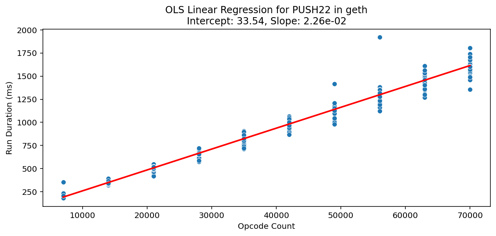

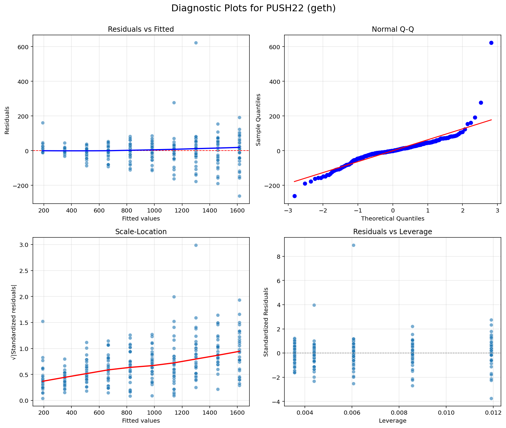


## besu


```python
                            OLS Regression Results                            
==============================================================================
Dep. Variable:        run_duration_ms   R-squared:                       0.977
Model:                            OLS   Adj. R-squared:                  0.977
Method:                 Least Squares   F-statistic:                 1.213e+04
Date:                Thu, 22 Jan 2026   Prob (F-statistic):          1.90e-237
Time:                        10:34:54   Log-Likelihood:                -1706.7
No. Observations:                 290   AIC:                             3417.
Df Residuals:                     288   BIC:                             3425.
Df Model:                           1                                         
Covariance Type:            nonrobust                                         
==============================================================================
                 coef    std err          t      P>|t|      [0.025      0.975]
------------------------------------------------------------------------------
const         24.3473     11.080      2.197      0.029       2.540      46.155
opcount        0.0281      0.000    110.144      0.000       0.028       0.029
==============================================================================
Omnibus:                       22.337   Durbin-Watson:                   0.965
Prob(Omnibus):                  0.000   Jarque-Bera (JB):               71.954
Skew:                           0.186   Prob(JB):                     2.37e-16
Kurtosis:                       5.412   Cond. No.                     9.38e+04
==============================================================================

Notes:
[1] Standard Errors assume that the covariance matrix of the errors is correctly specified.
[2] The condition number is large, 9.38e+04. This might indicate that there are
strong multicollinearity or other numerical problems.
```

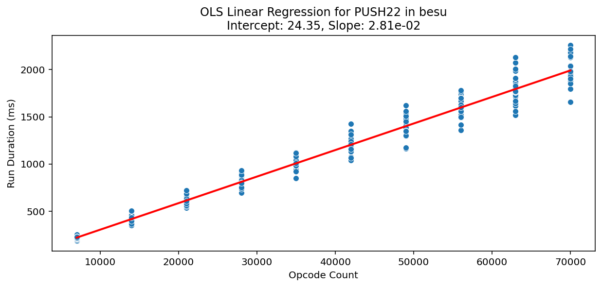

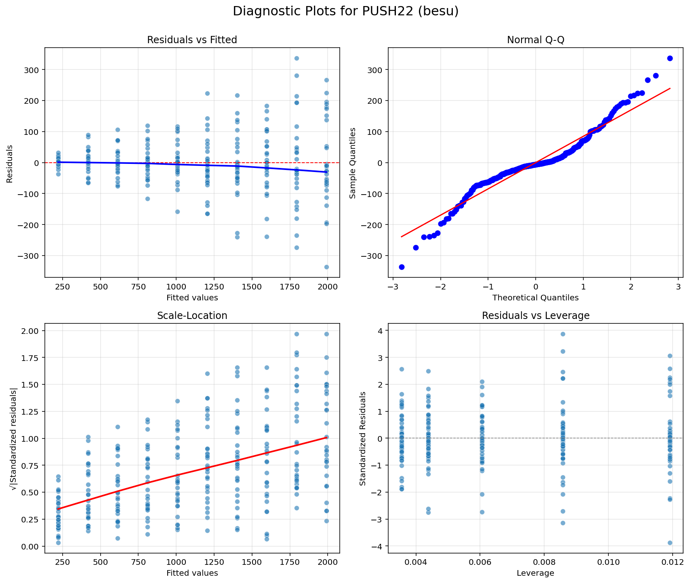


## reth


```python
                            OLS Regression Results                            
==============================================================================
Dep. Variable:        run_duration_ms   R-squared:                       0.969
Model:                            OLS   Adj. R-squared:                  0.969
Method:                 Least Squares   F-statistic:                     5568.
Date:                Thu, 22 Jan 2026   Prob (F-statistic):          3.08e-136
Time:                        10:34:55   Log-Likelihood:                -812.33
No. Observations:                 180   AIC:                             1629.
Df Residuals:                     178   BIC:                             1635.
Df Model:                           1                                         
Covariance Type:            nonrobust                                         
==============================================================================
                 coef    std err          t      P>|t|      [0.025      0.975]
------------------------------------------------------------------------------
const         29.9398      3.573      8.380      0.000      22.889      36.990
opcount        0.0061   8.23e-05     74.617      0.000       0.006       0.006
==============================================================================
Omnibus:                        5.689   Durbin-Watson:                   1.821
Prob(Omnibus):                  0.058   Jarque-Bera (JB):                5.367
Skew:                          -0.352   Prob(JB):                       0.0683
Kurtosis:                       3.468   Cond. No.                     9.38e+04
==============================================================================

Notes:
[1] Standard Errors assume that the covariance matrix of the errors is correctly specified.
[2] The condition number is large, 9.38e+04. This might indicate that there are
strong multicollinearity or other numerical problems.
```


## nethermind


```python
                            OLS Regression Results                            
==============================================================================
Dep. Variable:        run_duration_ms   R-squared:                       0.982
Model:                            OLS   Adj. R-squared:                  0.982
Method:                 Least Squares   F-statistic:                 1.606e+04
Date:                Thu, 22 Jan 2026   Prob (F-statistic):          1.19e-254
Time:                        10:34:55   Log-Likelihood:                -1430.4
No. Observations:                 290   AIC:                             2865.
Df Residuals:                     288   BIC:                             2872.
Df Model:                           1                                         
Covariance Type:            nonrobust                                         
==============================================================================
                 coef    std err          t      P>|t|      [0.025      0.975]
------------------------------------------------------------------------------
const         27.0070      4.273      6.320      0.000      18.597      35.417
opcount        0.0125   9.84e-05    126.742      0.000       0.012       0.013
==============================================================================
Omnibus:                       63.387   Durbin-Watson:                   1.116
Prob(Omnibus):                  0.000   Jarque-Bera (JB):              153.418
Skew:                          -1.035   Prob(JB):                     4.85e-34
Kurtosis:                       5.900   Cond. No.                     9.38e+04
==============================================================================

Notes:
[1] Standard Errors assume that the covariance matrix of the errors is correctly specified.
[2] The condition number is large, 9.38e+04. This might indicate that there are
strong multicollinearity or other numerical problems.
```

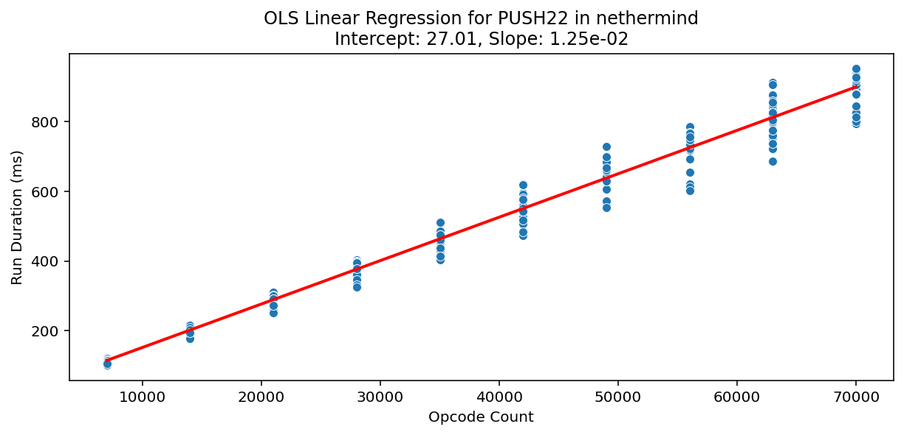

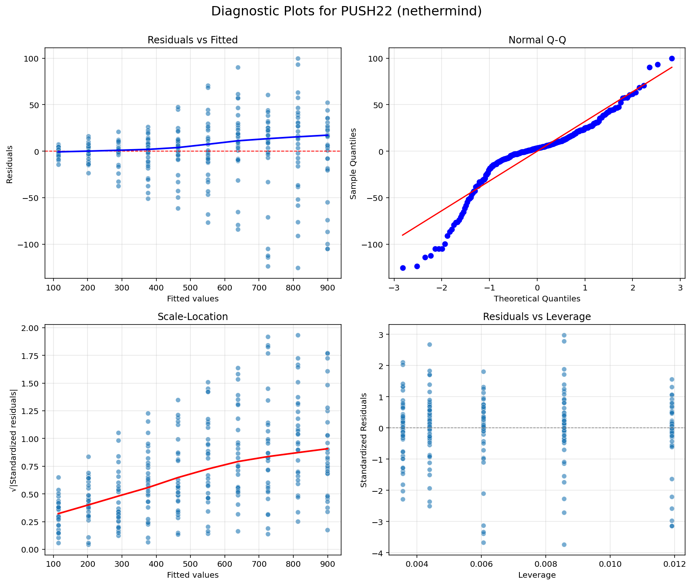


## erigon

OLS model did not run... Error: zero-size array to reduction operation maximum which has no identity

# PUSH23

## geth


```python
                            OLS Regression Results                            
==============================================================================
Dep. Variable:        run_duration_ms   R-squared:                       0.983
Model:                            OLS   Adj. R-squared:                  0.983
Method:                 Least Squares   F-statistic:                 1.680e+04
Date:                Thu, 22 Jan 2026   Prob (F-statistic):          2.05e-257
Time:                        10:34:55   Log-Likelihood:                -1593.1
No. Observations:                 290   AIC:                             3190.
Df Residuals:                     288   BIC:                             3197.
Df Model:                           1                                         
Covariance Type:            nonrobust                                         
==============================================================================
                 coef    std err          t      P>|t|      [0.025      0.975]
------------------------------------------------------------------------------
const         34.7511      7.487      4.642      0.000      20.015      49.487
opcount        0.0223      0.000    129.624      0.000       0.022       0.023
==============================================================================
Omnibus:                       97.587   Durbin-Watson:                   1.066
Prob(Omnibus):                  0.000   Jarque-Bera (JB):             1409.458
Skew:                           0.921   Prob(JB):                    8.71e-307
Kurtosis:                      13.642   Cond. No.                     9.38e+04
==============================================================================

Notes:
[1] Standard Errors assume that the covariance matrix of the errors is correctly specified.
[2] The condition number is large, 9.38e+04. This might indicate that there are
strong multicollinearity or other numerical problems.
```


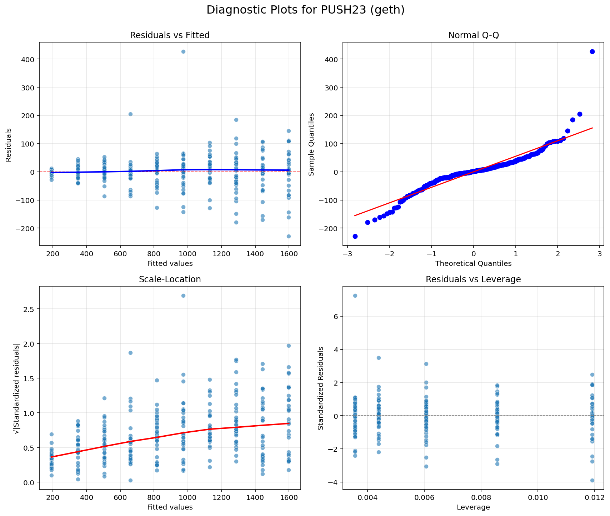


## besu


```python
                            OLS Regression Results                            
==============================================================================
Dep. Variable:        run_duration_ms   R-squared:                       0.982
Model:                            OLS   Adj. R-squared:                  0.982
Method:                 Least Squares   F-statistic:                 1.573e+04
Date:                Thu, 22 Jan 2026   Prob (F-statistic):          2.23e-253
Time:                        10:34:56   Log-Likelihood:                -1669.6
No. Observations:                 290   AIC:                             3343.
Df Residuals:                     288   BIC:                             3351.
Df Model:                           1                                         
Covariance Type:            nonrobust                                         
==============================================================================
                 coef    std err          t      P>|t|      [0.025      0.975]
------------------------------------------------------------------------------
const         22.1480      9.748      2.272      0.024       2.961      41.335
opcount        0.0282      0.000    125.436      0.000       0.028       0.029
==============================================================================
Omnibus:                       20.851   Durbin-Watson:                   0.724
Prob(Omnibus):                  0.000   Jarque-Bera (JB):               51.897
Skew:                           0.287   Prob(JB):                     5.38e-12
Kurtosis:                       4.991   Cond. No.                     9.38e+04
==============================================================================

Notes:
[1] Standard Errors assume that the covariance matrix of the errors is correctly specified.
[2] The condition number is large, 9.38e+04. This might indicate that there are
strong multicollinearity or other numerical problems.
```


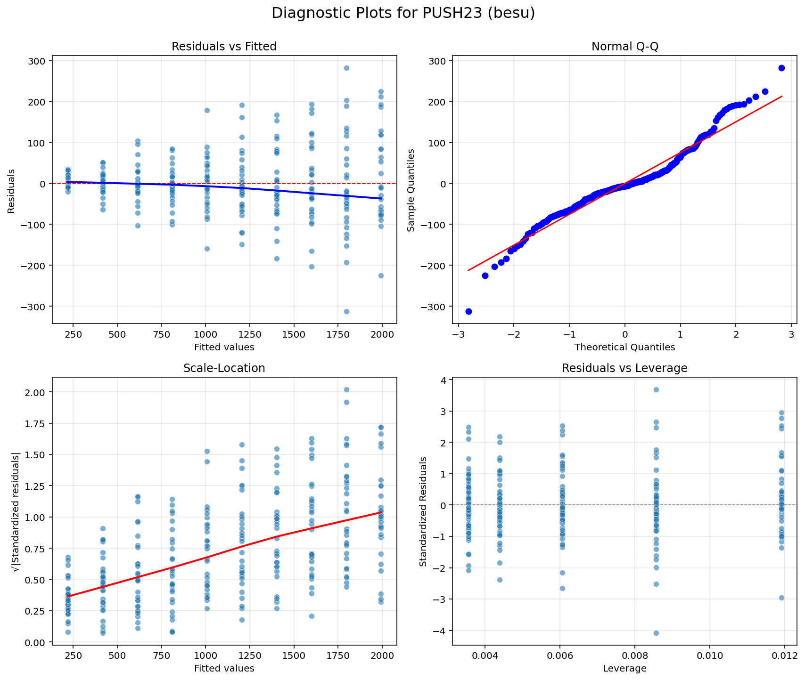


## reth


```python
                            OLS Regression Results                            
==============================================================================
Dep. Variable:        run_duration_ms   R-squared:                       0.964
Model:                            OLS   Adj. R-squared:                  0.964
Method:                 Least Squares   F-statistic:                     4783.
Date:                Thu, 22 Jan 2026   Prob (F-statistic):          1.46e-130
Time:                        10:34:56   Log-Likelihood:                -822.37
No. Observations:                 180   AIC:                             1649.
Df Residuals:                     178   BIC:                             1655.
Df Model:                           1                                         
Covariance Type:            nonrobust                                         
==============================================================================
                 coef    std err          t      P>|t|      [0.025      0.975]
------------------------------------------------------------------------------
const         34.9325      3.778      9.247      0.000      27.478      42.387
opcount        0.0060    8.7e-05     69.161      0.000       0.006       0.006
==============================================================================
Omnibus:                       11.385   Durbin-Watson:                   1.547
Prob(Omnibus):                  0.003   Jarque-Bera (JB):               14.930
Skew:                           0.421   Prob(JB):                     0.000573
Kurtosis:                       4.133   Cond. No.                     9.38e+04
==============================================================================

Notes:
[1] Standard Errors assume that the covariance matrix of the errors is correctly specified.
[2] The condition number is large, 9.38e+04. This might indicate that there are
strong multicollinearity or other numerical problems.
```


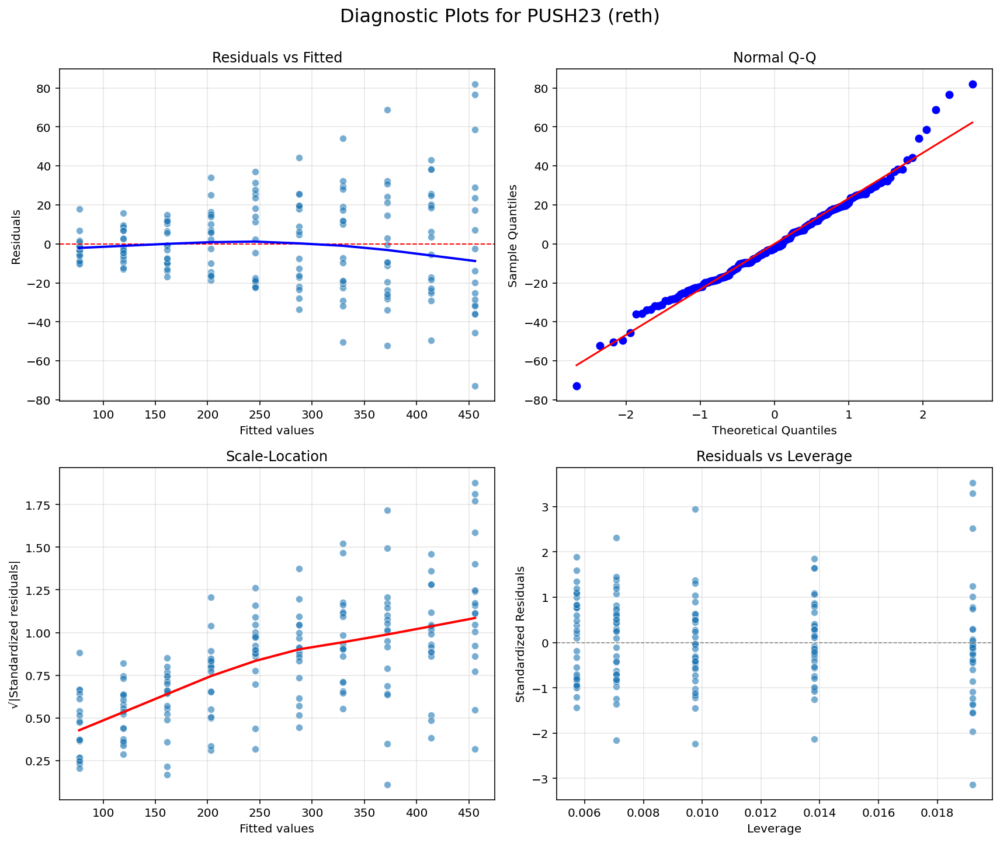


## nethermind


```python
                            OLS Regression Results                            
==============================================================================
Dep. Variable:        run_duration_ms   R-squared:                       0.969
Model:                            OLS   Adj. R-squared:                  0.969
Method:                 Least Squares   F-statistic:                     9087.
Date:                Thu, 22 Jan 2026   Prob (F-statistic):          7.32e-220
Time:                        10:34:56   Log-Likelihood:                -1511.9
No. Observations:                 290   AIC:                             3028.
Df Residuals:                     288   BIC:                             3035.
Df Model:                           1                                         
Covariance Type:            nonrobust                                         
==============================================================================
                 coef    std err          t      P>|t|      [0.025      0.975]
------------------------------------------------------------------------------
const         30.0002      5.660      5.301      0.000      18.861      41.140
opcount        0.0124      0.000     95.328      0.000       0.012       0.013
==============================================================================
Omnibus:                      116.562   Durbin-Watson:                   0.872
Prob(Omnibus):                  0.000   Jarque-Bera (JB):             1178.231
Skew:                           1.329   Prob(JB):                    1.41e-256
Kurtosis:                      12.510   Cond. No.                     9.38e+04
==============================================================================

Notes:
[1] Standard Errors assume that the covariance matrix of the errors is correctly specified.
[2] The condition number is large, 9.38e+04. This might indicate that there are
strong multicollinearity or other numerical problems.
```

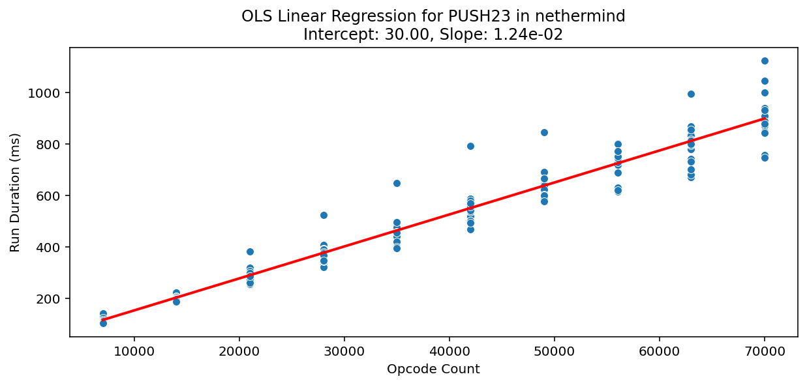

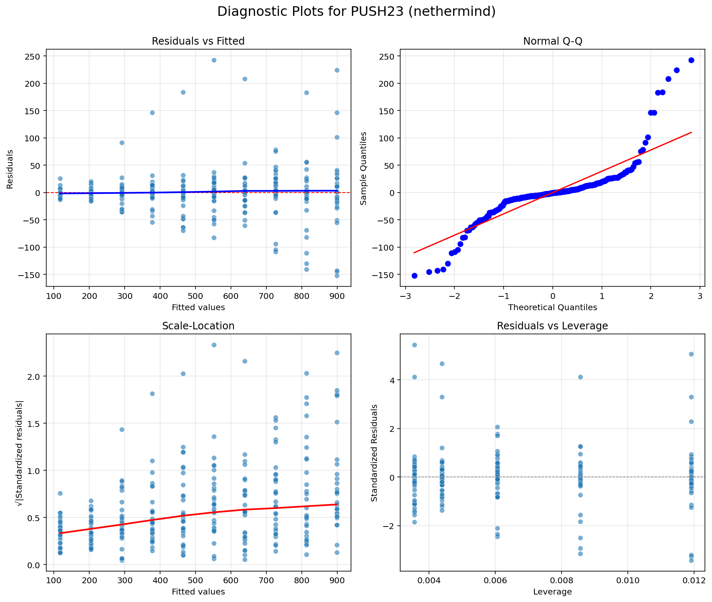


## erigon

OLS model did not run... Error: zero-size array to reduction operation maximum which has no identity

# PUSH24

## geth


```python
                            OLS Regression Results                            
==============================================================================
Dep. Variable:        run_duration_ms   R-squared:                       0.983
Model:                            OLS   Adj. R-squared:                  0.983
Method:                 Least Squares   F-statistic:                 1.695e+04
Date:                Thu, 22 Jan 2026   Prob (F-statistic):          6.19e-258
Time:                        10:34:57   Log-Likelihood:                -1584.1
No. Observations:                 290   AIC:                             3172.
Df Residuals:                     288   BIC:                             3180.
Df Model:                           1                                         
Covariance Type:            nonrobust                                         
==============================================================================
                 coef    std err          t      P>|t|      [0.025      0.975]
------------------------------------------------------------------------------
const         31.3768      7.258      4.323      0.000      17.091      45.663
opcount        0.0218      0.000    130.173      0.000       0.021       0.022
==============================================================================
Omnibus:                      164.261   Durbin-Watson:                   1.163
Prob(Omnibus):                  0.000   Jarque-Bera (JB):             3442.614
Skew:                           1.820   Prob(JB):                         0.00
Kurtosis:                      19.482   Cond. No.                     9.38e+04
==============================================================================

Notes:
[1] Standard Errors assume that the covariance matrix of the errors is correctly specified.
[2] The condition number is large, 9.38e+04. This might indicate that there are
strong multicollinearity or other numerical problems.
```


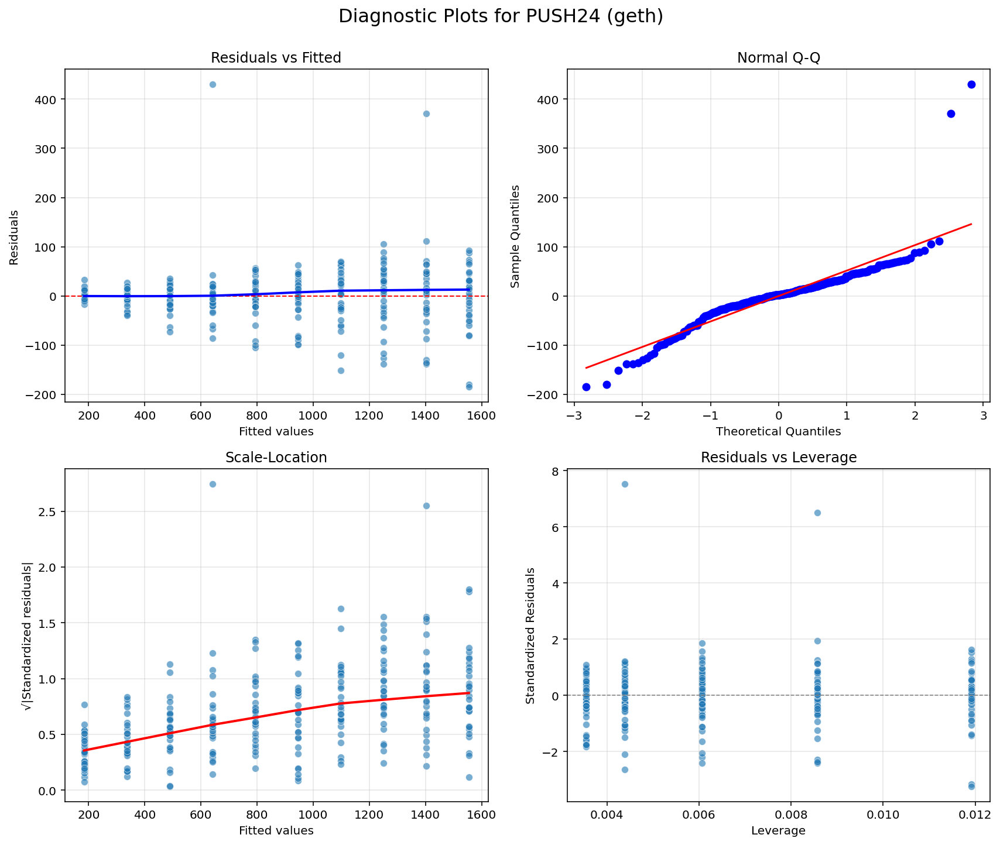


## besu


```python
                            OLS Regression Results                            
==============================================================================
Dep. Variable:        run_duration_ms   R-squared:                       0.977
Model:                            OLS   Adj. R-squared:                  0.976
Method:                 Least Squares   F-statistic:                 1.200e+04
Date:                Thu, 22 Jan 2026   Prob (F-statistic):          9.09e-237
Time:                        10:34:57   Log-Likelihood:                -1702.1
No. Observations:                 290   AIC:                             3408.
Df Residuals:                     288   BIC:                             3416.
Df Model:                           1                                         
Covariance Type:            nonrobust                                         
==============================================================================
                 coef    std err          t      P>|t|      [0.025      0.975]
------------------------------------------------------------------------------
const         33.1732     10.906      3.042      0.003      11.709      54.638
opcount        0.0275      0.000    109.532      0.000       0.027       0.028
==============================================================================
Omnibus:                       17.391   Durbin-Watson:                   1.058
Prob(Omnibus):                  0.000   Jarque-Bera (JB):               49.318
Skew:                           0.086   Prob(JB):                     1.95e-11
Kurtosis:                       5.013   Cond. No.                     9.38e+04
==============================================================================

Notes:
[1] Standard Errors assume that the covariance matrix of the errors is correctly specified.
[2] The condition number is large, 9.38e+04. This might indicate that there are
strong multicollinearity or other numerical problems.
```


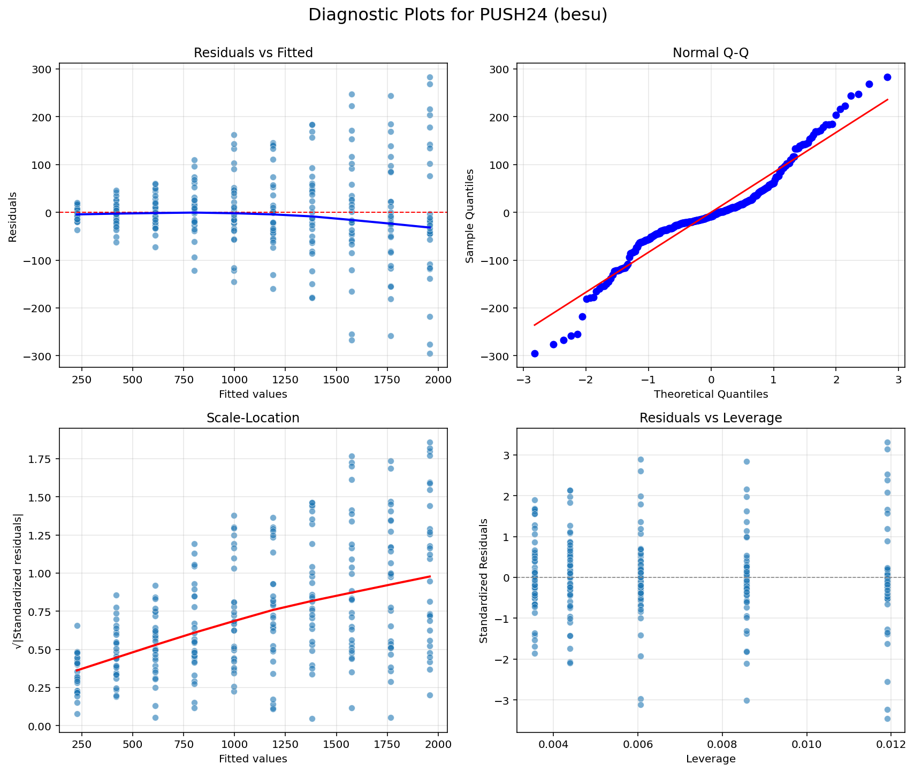


## reth


```python
                            OLS Regression Results                            
==============================================================================
Dep. Variable:        run_duration_ms   R-squared:                       0.972
Model:                            OLS   Adj. R-squared:                  0.972
Method:                 Least Squares   F-statistic:                     6294.
Date:                Thu, 22 Jan 2026   Prob (F-statistic):          7.72e-141
Time:                        10:34:57   Log-Likelihood:                -799.72
No. Observations:                 180   AIC:                             1603.
Df Residuals:                     178   BIC:                             1610.
Df Model:                           1                                         
Covariance Type:            nonrobust                                         
==============================================================================
                 coef    std err          t      P>|t|      [0.025      0.975]
------------------------------------------------------------------------------
const         29.1268      3.331      8.744      0.000      22.554      35.700
opcount        0.0061   7.67e-05     79.334      0.000       0.006       0.006
==============================================================================
Omnibus:                       14.210   Durbin-Watson:                   1.395
Prob(Omnibus):                  0.001   Jarque-Bera (JB):               23.621
Skew:                          -0.417   Prob(JB):                     7.43e-06
Kurtosis:                       4.566   Cond. No.                     9.38e+04
==============================================================================

Notes:
[1] Standard Errors assume that the covariance matrix of the errors is correctly specified.
[2] The condition number is large, 9.38e+04. This might indicate that there are
strong multicollinearity or other numerical problems.
```

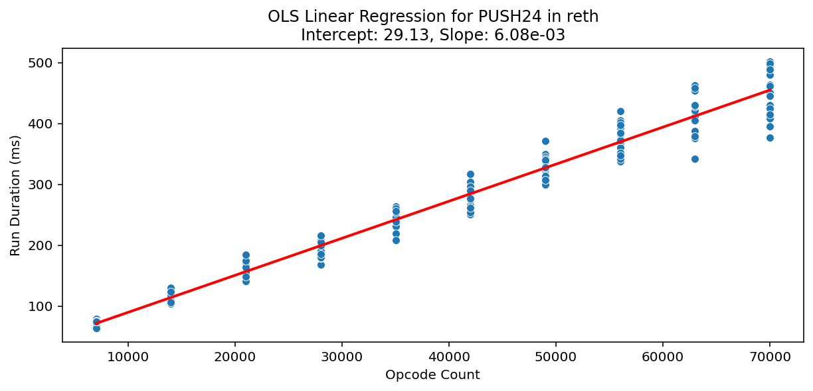

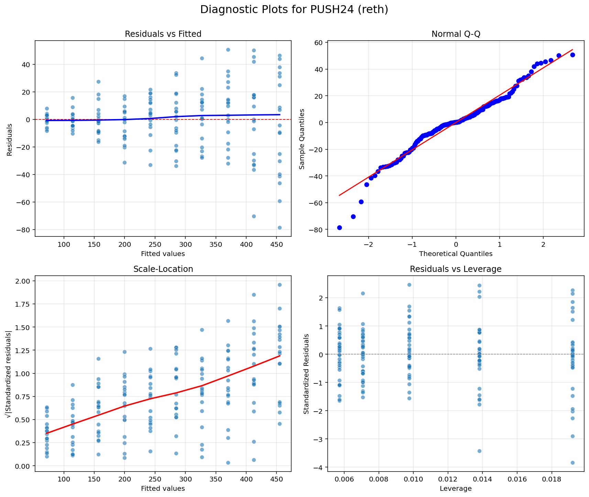


## nethermind


```python
                            OLS Regression Results                            
==============================================================================
Dep. Variable:        run_duration_ms   R-squared:                       0.981
Model:                            OLS   Adj. R-squared:                  0.981
Method:                 Least Squares   F-statistic:                 1.470e+04
Date:                Thu, 22 Jan 2026   Prob (F-statistic):          3.17e-249
Time:                        10:34:57   Log-Likelihood:                -1435.5
No. Observations:                 290   AIC:                             2875.
Df Residuals:                     288   BIC:                             2882.
Df Model:                           1                                         
Covariance Type:            nonrobust                                         
==============================================================================
                 coef    std err          t      P>|t|      [0.025      0.975]
------------------------------------------------------------------------------
const         30.4826      4.349      7.009      0.000      21.923      39.042
opcount        0.0121      0.000    121.263      0.000       0.012       0.012
==============================================================================
Omnibus:                       60.137   Durbin-Watson:                   0.902
Prob(Omnibus):                  0.000   Jarque-Bera (JB):              132.349
Skew:                          -1.021   Prob(JB):                     1.82e-29
Kurtosis:                       5.604   Cond. No.                     9.38e+04
==============================================================================

Notes:
[1] Standard Errors assume that the covariance matrix of the errors is correctly specified.
[2] The condition number is large, 9.38e+04. This might indicate that there are
strong multicollinearity or other numerical problems.
```

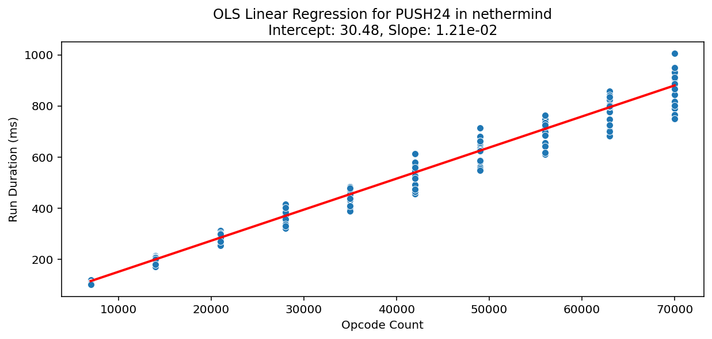

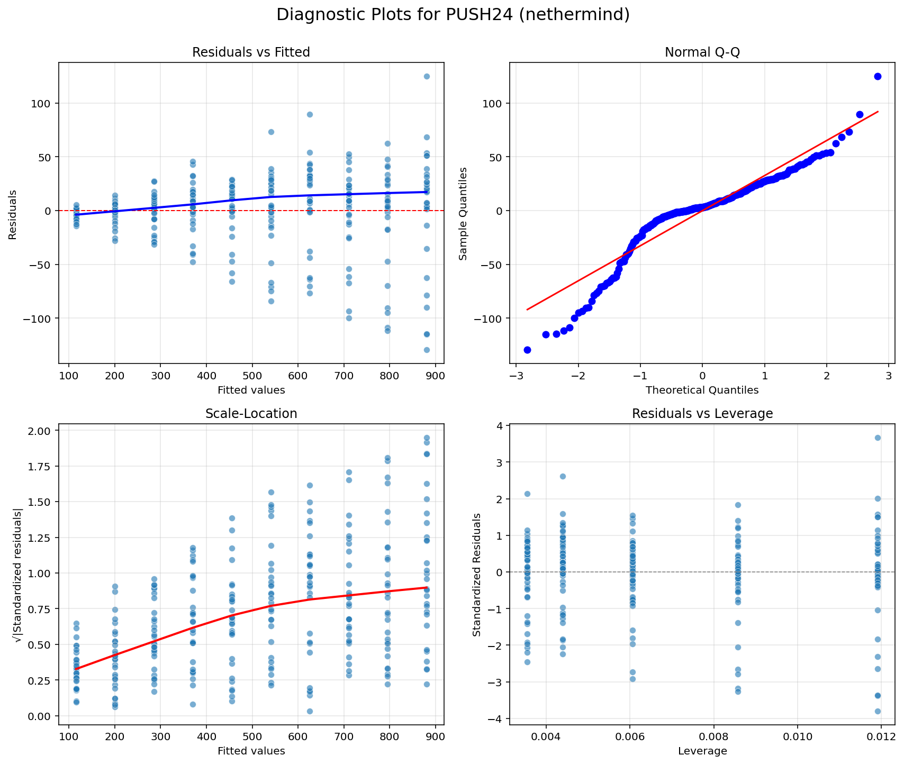


## erigon

OLS model did not run... Error: zero-size array to reduction operation maximum which has no identity

# PUSH25

## geth


```python
                            OLS Regression Results                            
==============================================================================
Dep. Variable:        run_duration_ms   R-squared:                       0.987
Model:                            OLS   Adj. R-squared:                  0.987
Method:                 Least Squares   F-statistic:                 2.237e+04
Date:                Thu, 22 Jan 2026   Prob (F-statistic):          4.73e-275
Time:                        10:34:58   Log-Likelihood:                -1545.1
No. Observations:                 290   AIC:                             3094.
Df Residuals:                     288   BIC:                             3101.
Df Model:                           1                                         
Covariance Type:            nonrobust                                         
==============================================================================
                 coef    std err          t      P>|t|      [0.025      0.975]
------------------------------------------------------------------------------
const         34.3636      6.345      5.416      0.000      21.876      46.851
opcount        0.0218      0.000    149.567      0.000       0.022       0.022
==============================================================================
Omnibus:                       28.646   Durbin-Watson:                   1.057
Prob(Omnibus):                  0.000   Jarque-Bera (JB):              122.903
Skew:                          -0.186   Prob(JB):                     2.05e-27
Kurtosis:                       6.167   Cond. No.                     9.38e+04
==============================================================================

Notes:
[1] Standard Errors assume that the covariance matrix of the errors is correctly specified.
[2] The condition number is large, 9.38e+04. This might indicate that there are
strong multicollinearity or other numerical problems.
```


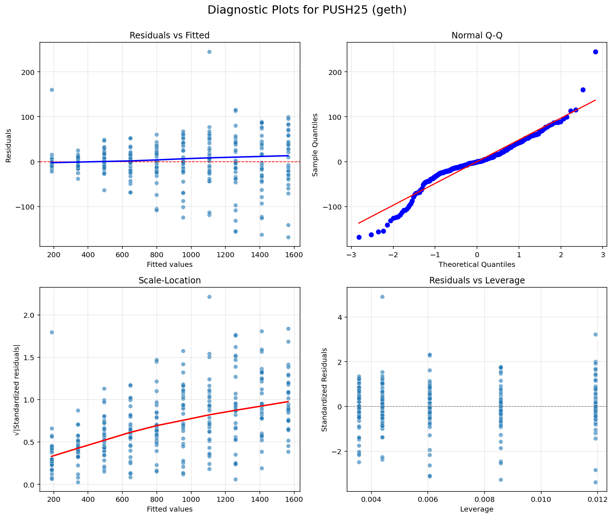


## besu


```python
                            OLS Regression Results                            
==============================================================================
Dep. Variable:        run_duration_ms   R-squared:                       0.979
Model:                            OLS   Adj. R-squared:                  0.979
Method:                 Least Squares   F-statistic:                 1.325e+04
Date:                Thu, 22 Jan 2026   Prob (F-statistic):          7.38e-243
Time:                        10:34:58   Log-Likelihood:                -1688.2
No. Observations:                 290   AIC:                             3380.
Df Residuals:                     288   BIC:                             3388.
Df Model:                           1                                         
Covariance Type:            nonrobust                                         
==============================================================================
                 coef    std err          t      P>|t|      [0.025      0.975]
------------------------------------------------------------------------------
const         30.5707     10.394      2.941      0.004      10.113      51.029
opcount        0.0276      0.000    115.125      0.000       0.027       0.028
==============================================================================
Omnibus:                       22.924   Durbin-Watson:                   0.837
Prob(Omnibus):                  0.000   Jarque-Bera (JB):               74.558
Skew:                          -0.198   Prob(JB):                     6.46e-17
Kurtosis:                       5.452   Cond. No.                     9.38e+04
==============================================================================

Notes:
[1] Standard Errors assume that the covariance matrix of the errors is correctly specified.
[2] The condition number is large, 9.38e+04. This might indicate that there are
strong multicollinearity or other numerical problems.
```


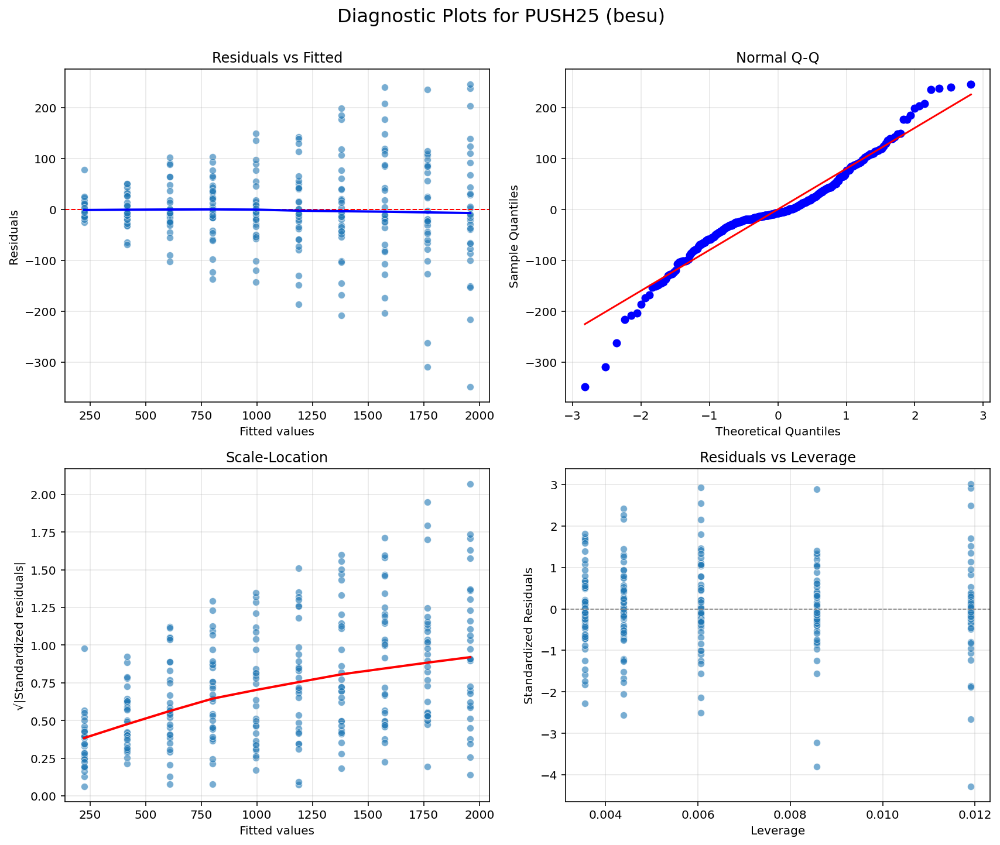


## reth


```python
                            OLS Regression Results                            
==============================================================================
Dep. Variable:        run_duration_ms   R-squared:                       0.972
Model:                            OLS   Adj. R-squared:                  0.971
Method:                 Least Squares   F-statistic:                     6070.
Date:                Thu, 22 Jan 2026   Prob (F-statistic):          1.78e-139
Time:                        10:34:58   Log-Likelihood:                -802.59
No. Observations:                 180   AIC:                             1609.
Df Residuals:                     178   BIC:                             1616.
Df Model:                           1                                         
Covariance Type:            nonrobust                                         
==============================================================================
                 coef    std err          t      P>|t|      [0.025      0.975]
------------------------------------------------------------------------------
const         30.5556      3.385      9.028      0.000      23.877      37.235
opcount        0.0061   7.79e-05     77.909      0.000       0.006       0.006
==============================================================================
Omnibus:                       20.229   Durbin-Watson:                   1.914
Prob(Omnibus):                  0.000   Jarque-Bera (JB):               35.676
Skew:                          -0.574   Prob(JB):                     1.79e-08
Kurtosis:                       4.855   Cond. No.                     9.38e+04
==============================================================================

Notes:
[1] Standard Errors assume that the covariance matrix of the errors is correctly specified.
[2] The condition number is large, 9.38e+04. This might indicate that there are
strong multicollinearity or other numerical problems.
```

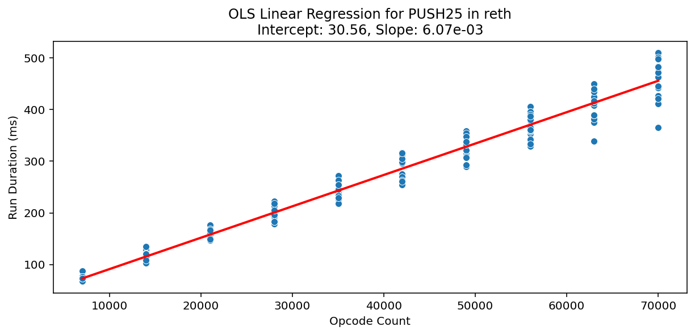

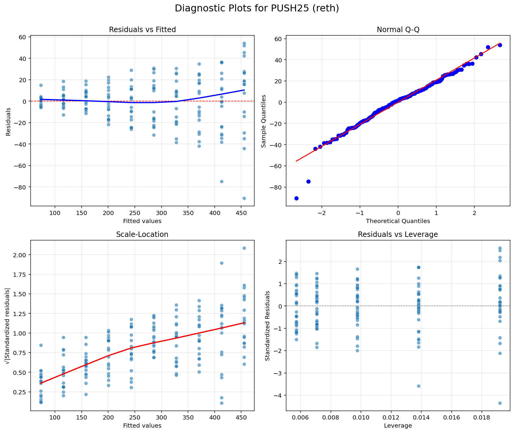


## nethermind


```python
                            OLS Regression Results                            
==============================================================================
Dep. Variable:        run_duration_ms   R-squared:                       0.982
Model:                            OLS   Adj. R-squared:                  0.982
Method:                 Least Squares   F-statistic:                 1.607e+04
Date:                Thu, 22 Jan 2026   Prob (F-statistic):          1.12e-254
Time:                        10:34:58   Log-Likelihood:                -1429.7
No. Observations:                 290   AIC:                             2863.
Df Residuals:                     288   BIC:                             2871.
Df Model:                           1                                         
Covariance Type:            nonrobust                                         
==============================================================================
                 coef    std err          t      P>|t|      [0.025      0.975]
------------------------------------------------------------------------------
const         27.6989      4.262      6.499      0.000      19.310      36.088
opcount        0.0124   9.81e-05    126.769      0.000       0.012       0.013
==============================================================================
Omnibus:                       47.230   Durbin-Watson:                   0.991
Prob(Omnibus):                  0.000   Jarque-Bera (JB):              100.103
Skew:                          -0.825   Prob(JB):                     1.83e-22
Kurtosis:                       5.359   Cond. No.                     9.38e+04
==============================================================================

Notes:
[1] Standard Errors assume that the covariance matrix of the errors is correctly specified.
[2] The condition number is large, 9.38e+04. This might indicate that there are
strong multicollinearity or other numerical problems.
```


## erigon

OLS model did not run... Error: zero-size array to reduction operation maximum which has no identity

# PUSH26

## geth


```python
                            OLS Regression Results                            
==============================================================================
Dep. Variable:        run_duration_ms   R-squared:                       0.971
Model:                            OLS   Adj. R-squared:                  0.971
Method:                 Least Squares   F-statistic:                     9760.
Date:                Thu, 22 Jan 2026   Prob (F-statistic):          3.38e-224
Time:                        10:34:59   Log-Likelihood:                -1662.5
No. Observations:                 290   AIC:                             3329.
Df Residuals:                     288   BIC:                             3336.
Df Model:                           1                                         
Covariance Type:            nonrobust                                         
==============================================================================
                 coef    std err          t      P>|t|      [0.025      0.975]
------------------------------------------------------------------------------
const         44.2043      9.512      4.647      0.000      25.482      62.926
opcount        0.0216      0.000     98.794      0.000       0.021       0.022
==============================================================================
Omnibus:                      339.527   Durbin-Watson:                   1.525
Prob(Omnibus):                  0.000   Jarque-Bera (JB):            26591.753
Skew:                           4.944   Prob(JB):                         0.00
Kurtosis:                      48.858   Cond. No.                     9.38e+04
==============================================================================

Notes:
[1] Standard Errors assume that the covariance matrix of the errors is correctly specified.
[2] The condition number is large, 9.38e+04. This might indicate that there are
strong multicollinearity or other numerical problems.
```

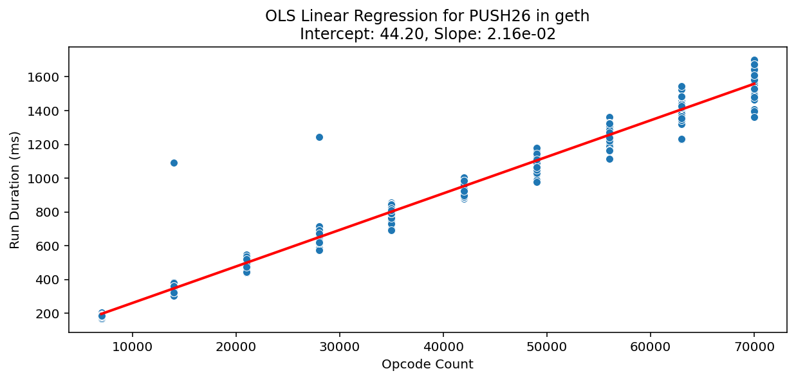

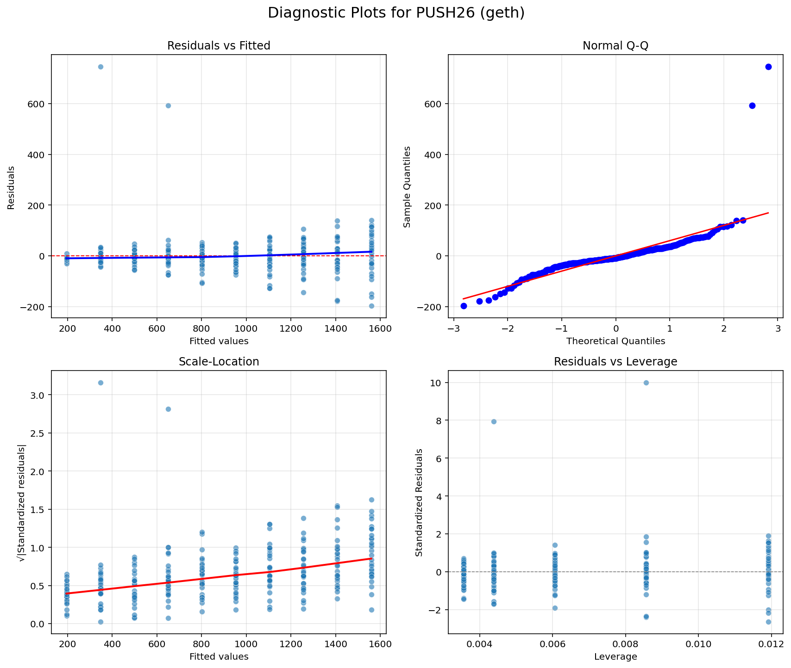


## besu


```python
                            OLS Regression Results                            
==============================================================================
Dep. Variable:        run_duration_ms   R-squared:                       0.983
Model:                            OLS   Adj. R-squared:                  0.983
Method:                 Least Squares   F-statistic:                 1.624e+04
Date:                Thu, 22 Jan 2026   Prob (F-statistic):          2.58e-255
Time:                        10:34:59   Log-Likelihood:                -1659.3
No. Observations:                 290   AIC:                             3323.
Df Residuals:                     288   BIC:                             3330.
Df Model:                           1                                         
Covariance Type:            nonrobust                                         
==============================================================================
                 coef    std err          t      P>|t|      [0.025      0.975]
------------------------------------------------------------------------------
const         27.7635      9.407      2.951      0.003       9.248      46.279
opcount        0.0276      0.000    127.429      0.000       0.027       0.028
==============================================================================
Omnibus:                       20.376   Durbin-Watson:                   0.789
Prob(Omnibus):                  0.000   Jarque-Bera (JB):               56.450
Skew:                           0.221   Prob(JB):                     5.52e-13
Kurtosis:                       5.116   Cond. No.                     9.38e+04
==============================================================================

Notes:
[1] Standard Errors assume that the covariance matrix of the errors is correctly specified.
[2] The condition number is large, 9.38e+04. This might indicate that there are
strong multicollinearity or other numerical problems.
```

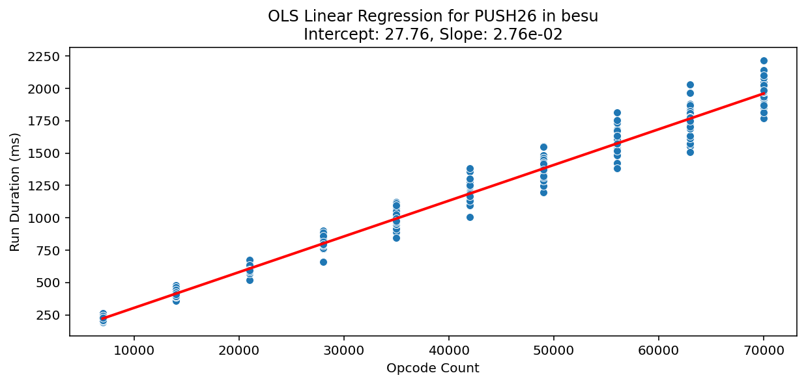

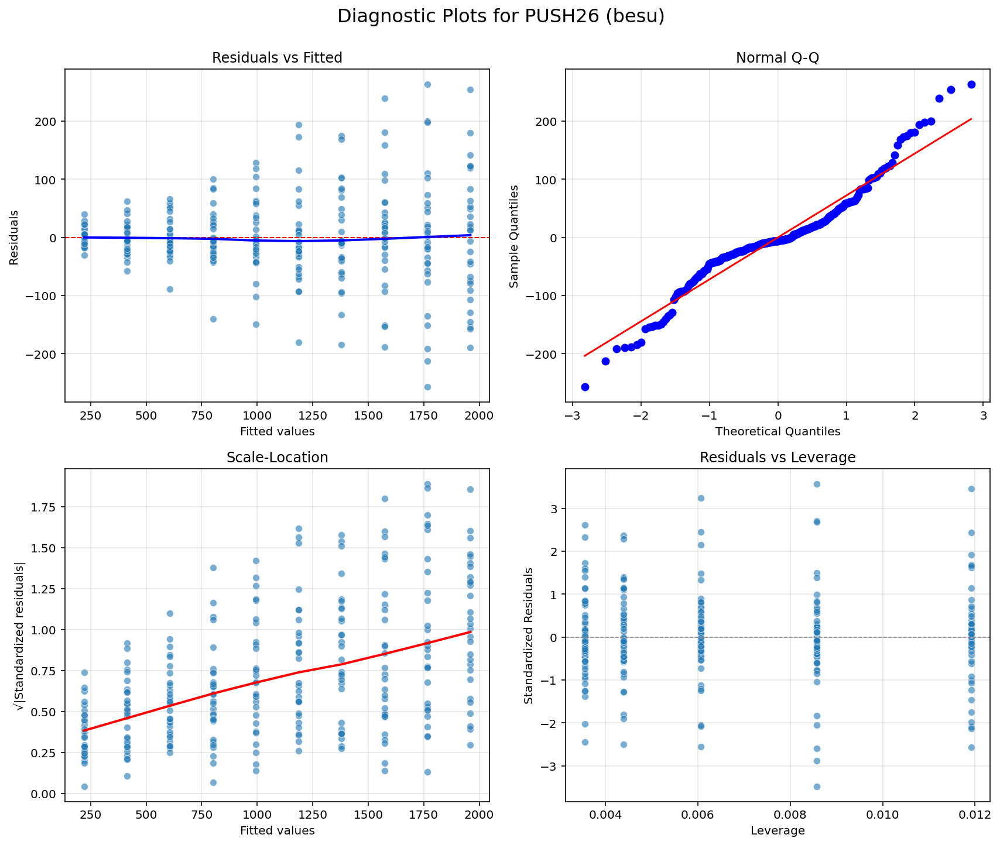


## reth


```python
                            OLS Regression Results                            
==============================================================================
Dep. Variable:        run_duration_ms   R-squared:                       0.963
Model:                            OLS   Adj. R-squared:                  0.963
Method:                 Least Squares   F-statistic:                     4645.
Date:                Thu, 22 Jan 2026   Prob (F-statistic):          1.82e-129
Time:                        10:34:59   Log-Likelihood:                -826.27
No. Observations:                 180   AIC:                             1657.
Df Residuals:                     178   BIC:                             1663.
Df Model:                           1                                         
Covariance Type:            nonrobust                                         
==============================================================================
                 coef    std err          t      P>|t|      [0.025      0.975]
------------------------------------------------------------------------------
const         31.5805      3.861      8.180      0.000      23.962      39.199
opcount        0.0061   8.89e-05     68.151      0.000       0.006       0.006
==============================================================================
Omnibus:                        1.802   Durbin-Watson:                   1.488
Prob(Omnibus):                  0.406   Jarque-Bera (JB):                1.544
Skew:                          -0.014   Prob(JB):                        0.462
Kurtosis:                       3.453   Cond. No.                     9.38e+04
==============================================================================

Notes:
[1] Standard Errors assume that the covariance matrix of the errors is correctly specified.
[2] The condition number is large, 9.38e+04. This might indicate that there are
strong multicollinearity or other numerical problems.
```

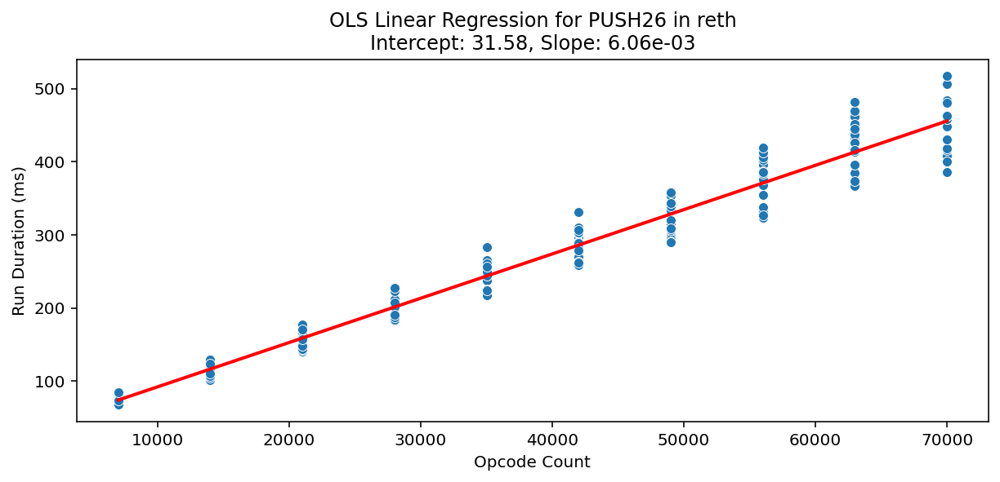

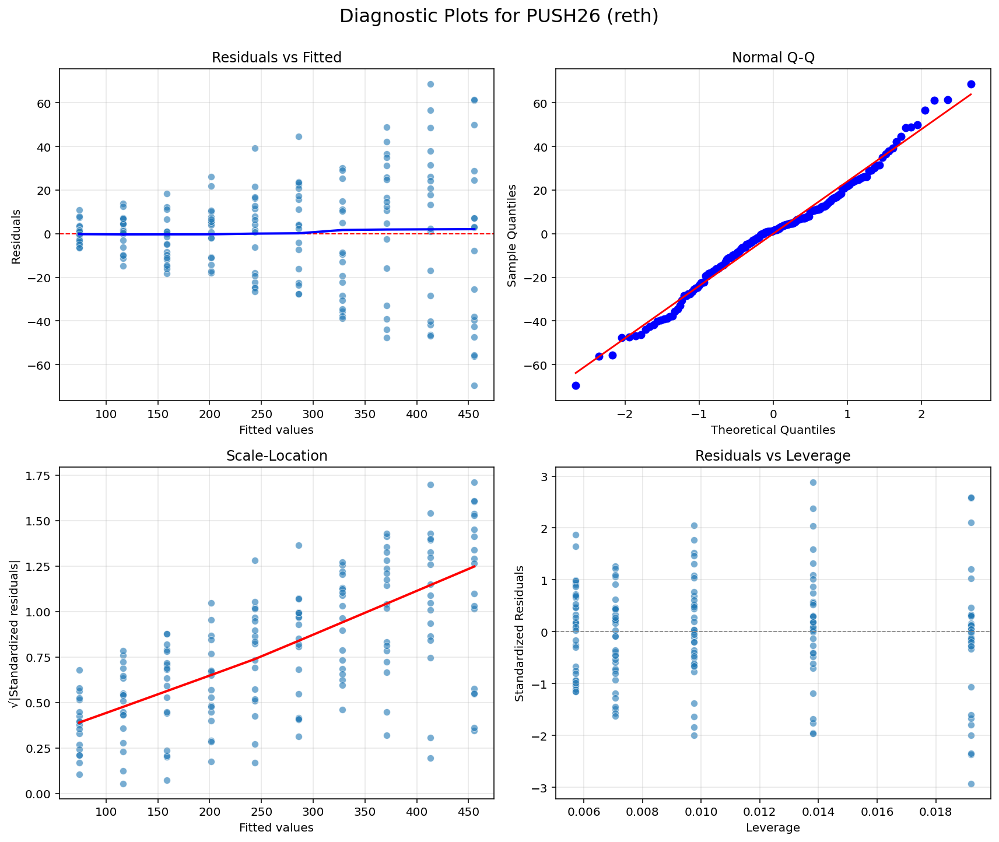


## nethermind


```python
                            OLS Regression Results                            
==============================================================================
Dep. Variable:        run_duration_ms   R-squared:                       0.981
Model:                            OLS   Adj. R-squared:                  0.981
Method:                 Least Squares   F-statistic:                 1.503e+04
Date:                Thu, 22 Jan 2026   Prob (F-statistic):          1.39e-250
Time:                        10:34:59   Log-Likelihood:                -1435.7
No. Observations:                 290   AIC:                             2875.
Df Residuals:                     288   BIC:                             2883.
Df Model:                           1                                         
Covariance Type:            nonrobust                                         
==============================================================================
                 coef    std err          t      P>|t|      [0.025      0.975]
------------------------------------------------------------------------------
const         31.2833      4.352      7.188      0.000      22.717      39.849
opcount        0.0123      0.000    122.613      0.000       0.012       0.012
==============================================================================
Omnibus:                       51.498   Durbin-Watson:                   1.115
Prob(Omnibus):                  0.000   Jarque-Bera (JB):              167.746
Skew:                          -0.739   Prob(JB):                     3.75e-37
Kurtosis:                       6.420   Cond. No.                     9.38e+04
==============================================================================

Notes:
[1] Standard Errors assume that the covariance matrix of the errors is correctly specified.
[2] The condition number is large, 9.38e+04. This might indicate that there are
strong multicollinearity or other numerical problems.
```

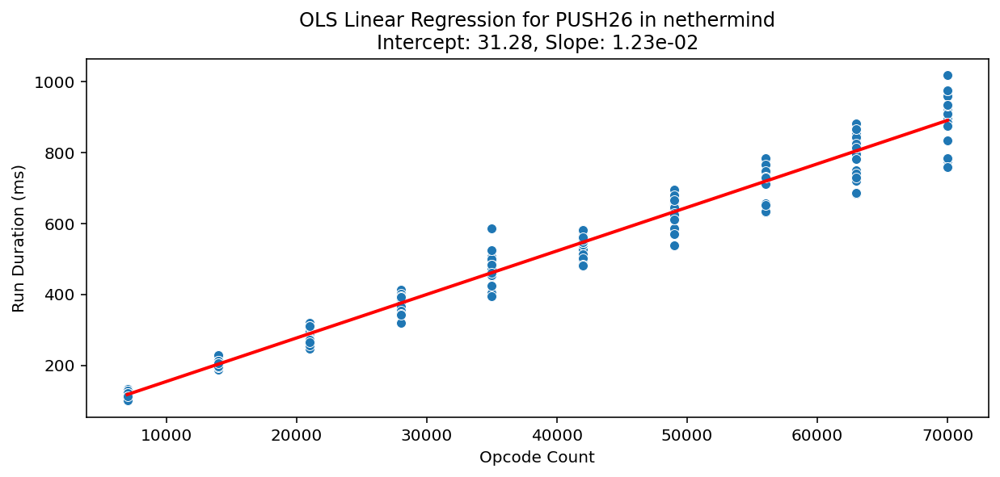

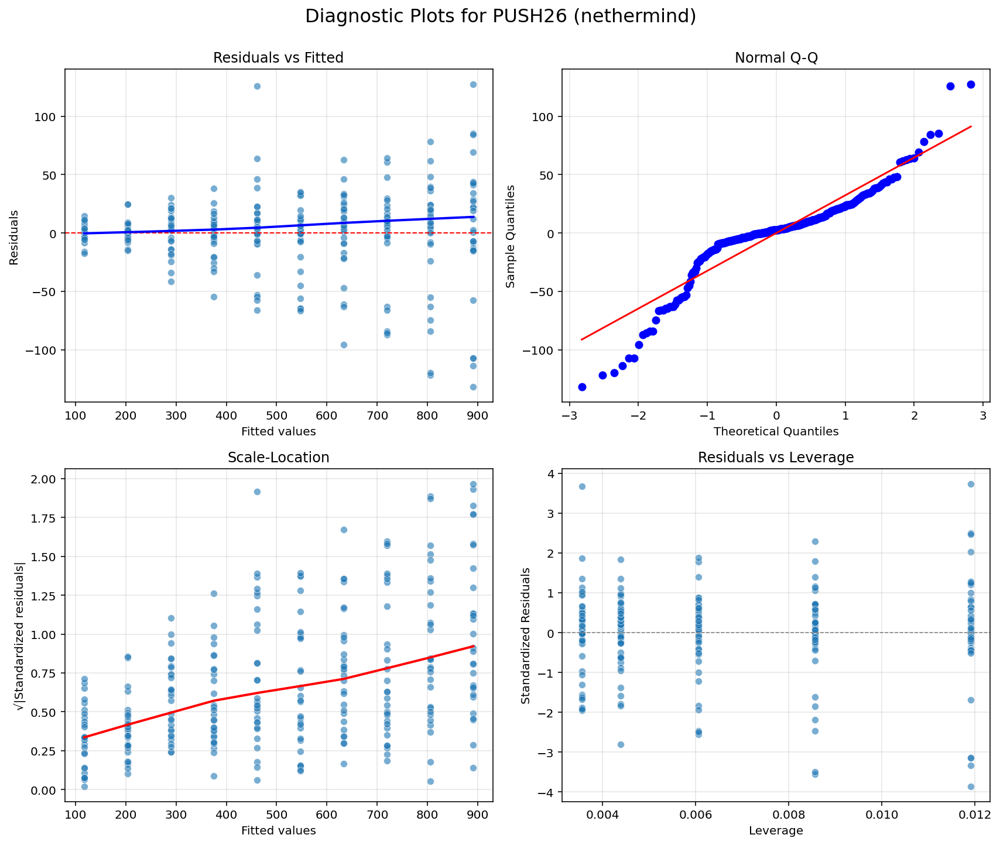


## erigon

OLS model did not run... Error: zero-size array to reduction operation maximum which has no identity

# PUSH27

## geth


```python
                            OLS Regression Results                            
==============================================================================
Dep. Variable:        run_duration_ms   R-squared:                       0.989
Model:                            OLS   Adj. R-squared:                  0.989
Method:                 Least Squares   F-statistic:                 2.624e+04
Date:                Thu, 22 Jan 2026   Prob (F-statistic):          6.48e-285
Time:                        10:35:00   Log-Likelihood:                -1521.1
No. Observations:                 290   AIC:                             3046.
Df Residuals:                     288   BIC:                             3054.
Df Model:                           1                                         
Covariance Type:            nonrobust                                         
==============================================================================
                 coef    std err          t      P>|t|      [0.025      0.975]
------------------------------------------------------------------------------
const         30.1395      5.841      5.160      0.000      18.643      41.636
opcount        0.0218      0.000    161.990      0.000       0.022       0.022
==============================================================================
Omnibus:                       44.065   Durbin-Watson:                   0.991
Prob(Omnibus):                  0.000   Jarque-Bera (JB):               93.239
Skew:                          -0.773   Prob(JB):                     5.67e-21
Kurtosis:                       5.308   Cond. No.                     9.38e+04
==============================================================================

Notes:
[1] Standard Errors assume that the covariance matrix of the errors is correctly specified.
[2] The condition number is large, 9.38e+04. This might indicate that there are
strong multicollinearity or other numerical problems.
```

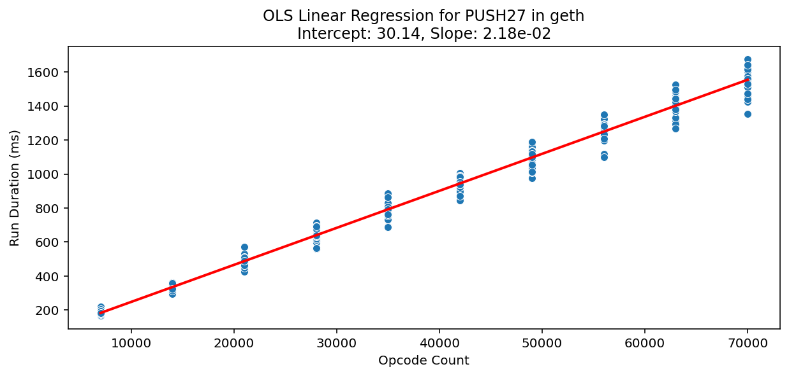


## besu


```python
                            OLS Regression Results                            
==============================================================================
Dep. Variable:        run_duration_ms   R-squared:                       0.980
Model:                            OLS   Adj. R-squared:                  0.980
Method:                 Least Squares   F-statistic:                 1.420e+04
Date:                Thu, 22 Jan 2026   Prob (F-statistic):          4.27e-247
Time:                        10:35:00   Log-Likelihood:                -1676.7
No. Observations:                 290   AIC:                             3357.
Df Residuals:                     288   BIC:                             3365.
Df Model:                           1                                         
Covariance Type:            nonrobust                                         
==============================================================================
                 coef    std err          t      P>|t|      [0.025      0.975]
------------------------------------------------------------------------------
const         32.7103      9.990      3.274      0.001      13.048      52.373
opcount        0.0274      0.000    119.177      0.000       0.027       0.028
==============================================================================
Omnibus:                       26.557   Durbin-Watson:                   0.733
Prob(Omnibus):                  0.000   Jarque-Bera (JB):               73.483
Skew:                           0.367   Prob(JB):                     1.10e-16
Kurtosis:                       5.354   Cond. No.                     9.38e+04
==============================================================================

Notes:
[1] Standard Errors assume that the covariance matrix of the errors is correctly specified.
[2] The condition number is large, 9.38e+04. This might indicate that there are
strong multicollinearity or other numerical problems.
```

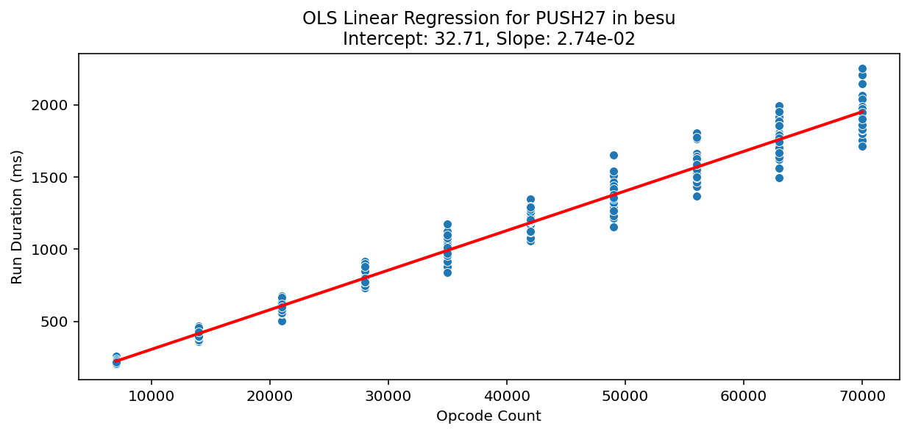

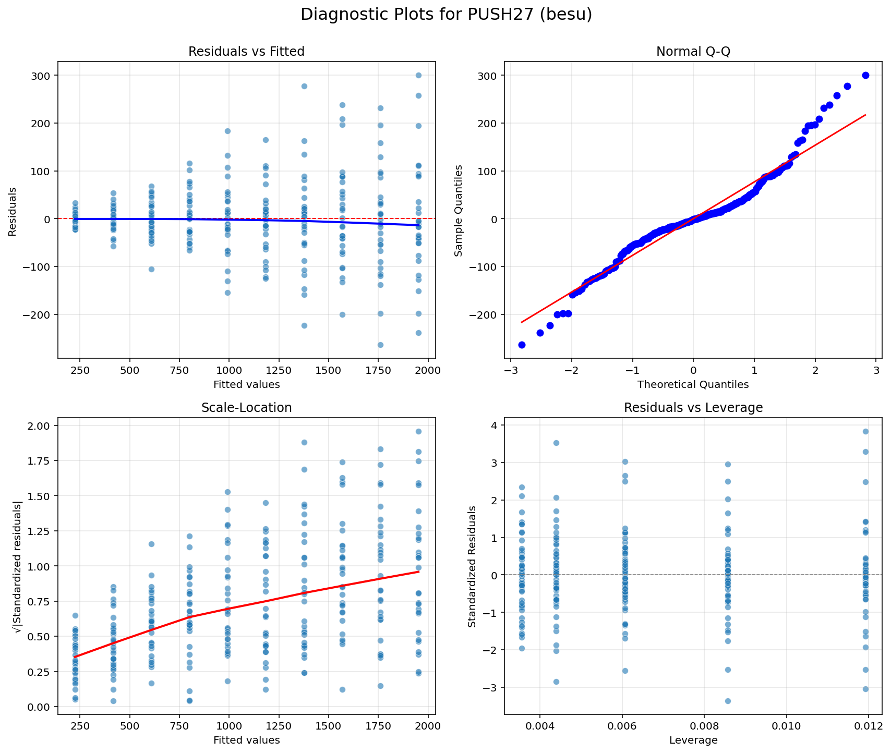


## reth


```python
                            OLS Regression Results                            
==============================================================================
Dep. Variable:        run_duration_ms   R-squared:                       0.978
Model:                            OLS   Adj. R-squared:                  0.978
Method:                 Least Squares   F-statistic:                     8081.
Date:                Thu, 22 Jan 2026   Prob (F-statistic):          2.89e-150
Time:                        10:35:00   Log-Likelihood:                -784.85
No. Observations:                 180   AIC:                             1574.
Df Residuals:                     178   BIC:                             1580.
Df Model:                           1                                         
Covariance Type:            nonrobust                                         
==============================================================================
                 coef    std err          t      P>|t|      [0.025      0.975]
------------------------------------------------------------------------------
const         26.6090      3.067      8.676      0.000      20.557      32.661
opcount        0.0063   7.06e-05     89.895      0.000       0.006       0.006
==============================================================================
Omnibus:                        7.296   Durbin-Watson:                   2.046
Prob(Omnibus):                  0.026   Jarque-Bera (JB):                7.067
Skew:                          -0.422   Prob(JB):                       0.0292
Kurtosis:                       3.479   Cond. No.                     9.38e+04
==============================================================================

Notes:
[1] Standard Errors assume that the covariance matrix of the errors is correctly specified.
[2] The condition number is large, 9.38e+04. This might indicate that there are
strong multicollinearity or other numerical problems.
```


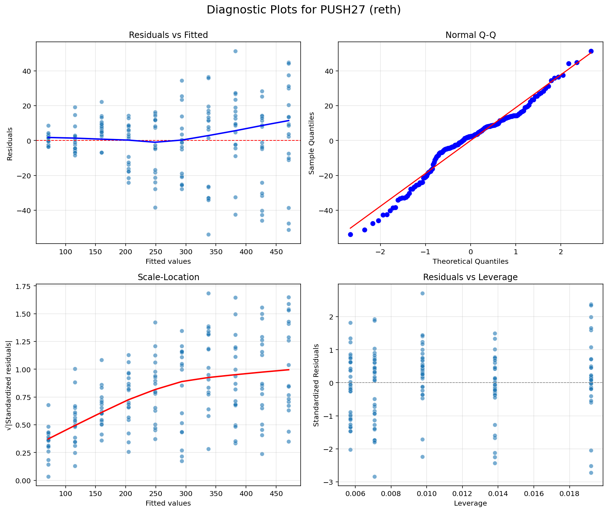


## nethermind


```python
                            OLS Regression Results                            
==============================================================================
Dep. Variable:        run_duration_ms   R-squared:                       0.982
Model:                            OLS   Adj. R-squared:                  0.982
Method:                 Least Squares   F-statistic:                 1.549e+04
Date:                Thu, 22 Jan 2026   Prob (F-statistic):          2.08e-252
Time:                        10:35:01   Log-Likelihood:                -1431.5
No. Observations:                 290   AIC:                             2867.
Df Residuals:                     288   BIC:                             2874.
Df Model:                           1                                         
Covariance Type:            nonrobust                                         
==============================================================================
                 coef    std err          t      P>|t|      [0.025      0.975]
------------------------------------------------------------------------------
const         30.5634      4.289      7.126      0.000      22.121      39.006
opcount        0.0123   9.88e-05    124.450      0.000       0.012       0.012
==============================================================================
Omnibus:                       55.637   Durbin-Watson:                   0.884
Prob(Omnibus):                  0.000   Jarque-Bera (JB):              106.470
Skew:                          -1.008   Prob(JB):                     7.59e-24
Kurtosis:                       5.179   Cond. No.                     9.38e+04
==============================================================================

Notes:
[1] Standard Errors assume that the covariance matrix of the errors is correctly specified.
[2] The condition number is large, 9.38e+04. This might indicate that there are
strong multicollinearity or other numerical problems.
```

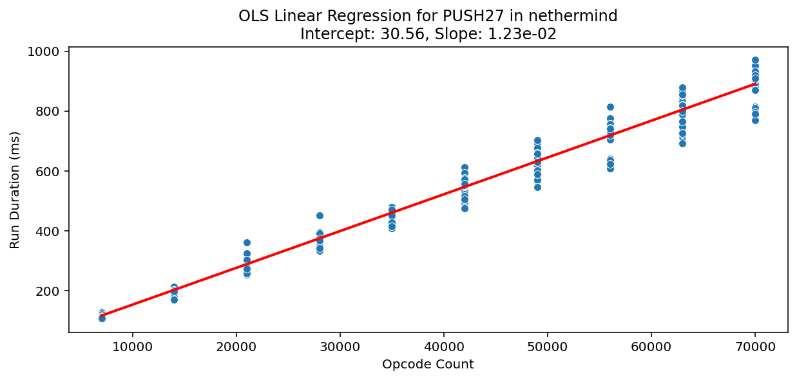


## erigon

OLS model did not run... Error: zero-size array to reduction operation maximum which has no identity

# PUSH28

## geth


```python
                            OLS Regression Results                            
==============================================================================
Dep. Variable:        run_duration_ms   R-squared:                       0.977
Model:                            OLS   Adj. R-squared:                  0.977
Method:                 Least Squares   F-statistic:                 1.231e+04
Date:                Thu, 22 Jan 2026   Prob (F-statistic):          2.40e-238
Time:                        10:35:01   Log-Likelihood:                -1631.6
No. Observations:                 290   AIC:                             3267.
Df Residuals:                     288   BIC:                             3275.
Df Model:                           1                                         
Covariance Type:            nonrobust                                         
==============================================================================
                 coef    std err          t      P>|t|      [0.025      0.975]
------------------------------------------------------------------------------
const         31.7533      8.551      3.713      0.000      14.922      48.584
opcount        0.0218      0.000    110.956      0.000       0.021       0.022
==============================================================================
Omnibus:                      263.499   Durbin-Watson:                   1.325
Prob(Omnibus):                  0.000   Jarque-Bera (JB):            13443.325
Skew:                           3.325   Prob(JB):                         0.00
Kurtosis:                      35.685   Cond. No.                     9.38e+04
==============================================================================

Notes:
[1] Standard Errors assume that the covariance matrix of the errors is correctly specified.
[2] The condition number is large, 9.38e+04. This might indicate that there are
strong multicollinearity or other numerical problems.
```

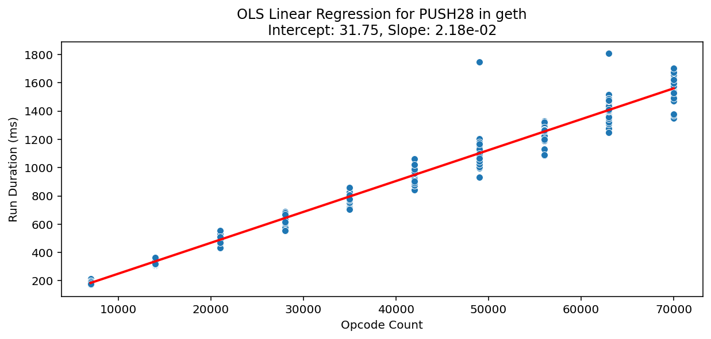

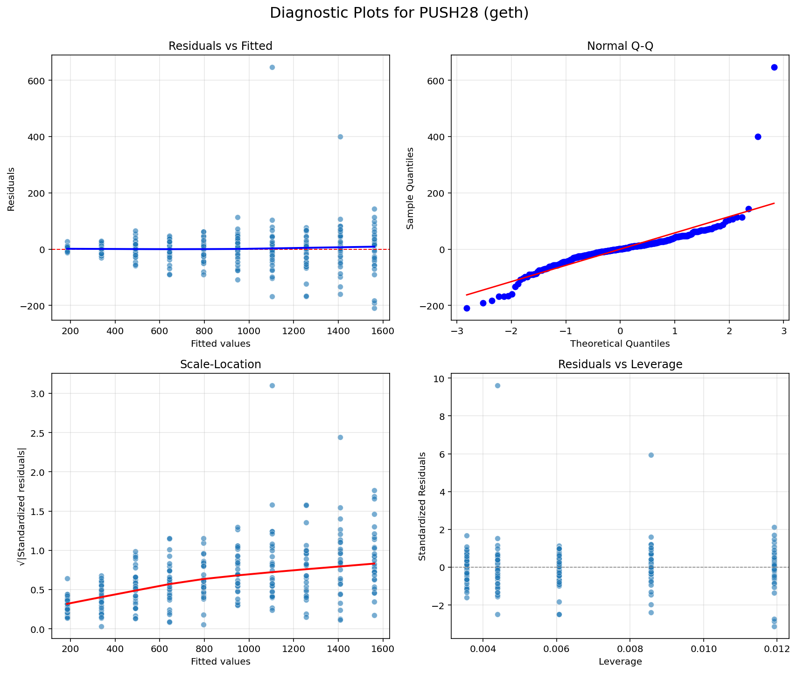


## besu


```python
                            OLS Regression Results                            
==============================================================================
Dep. Variable:        run_duration_ms   R-squared:                       0.985
Model:                            OLS   Adj. R-squared:                  0.985
Method:                 Least Squares   F-statistic:                 1.843e+04
Date:                Thu, 22 Jan 2026   Prob (F-statistic):          4.09e-263
Time:                        10:35:01   Log-Likelihood:                -1642.5
No. Observations:                 290   AIC:                             3289.
Df Residuals:                     288   BIC:                             3296.
Df Model:                           1                                         
Covariance Type:            nonrobust                                         
==============================================================================
                 coef    std err          t      P>|t|      [0.025      0.975]
------------------------------------------------------------------------------
const         27.8209      8.877      3.134      0.002      10.349      45.293
opcount        0.0277      0.000    135.769      0.000       0.027       0.028
==============================================================================
Omnibus:                       25.855   Durbin-Watson:                   1.106
Prob(Omnibus):                  0.000   Jarque-Bera (JB):               79.274
Skew:                           0.307   Prob(JB):                     6.11e-18
Kurtosis:                       5.487   Cond. No.                     9.38e+04
==============================================================================

Notes:
[1] Standard Errors assume that the covariance matrix of the errors is correctly specified.
[2] The condition number is large, 9.38e+04. This might indicate that there are
strong multicollinearity or other numerical problems.
```


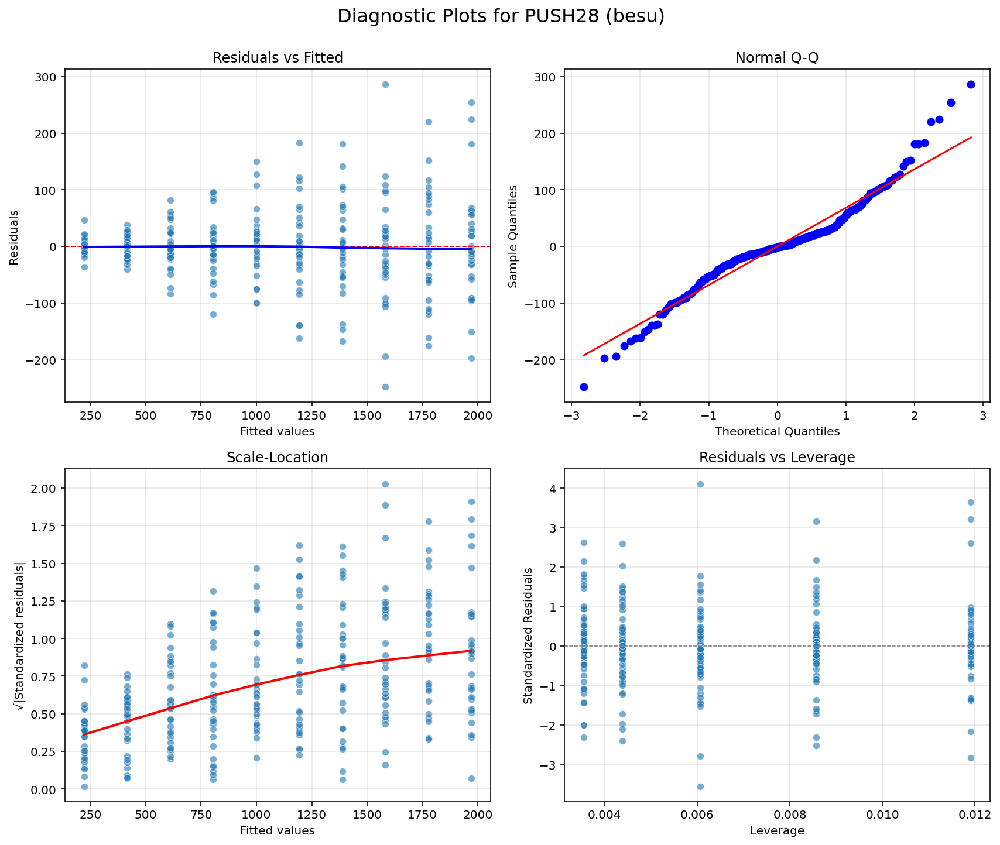


## reth


```python
                            OLS Regression Results                            
==============================================================================
Dep. Variable:        run_duration_ms   R-squared:                       0.980
Model:                            OLS   Adj. R-squared:                  0.980
Method:                 Least Squares   F-statistic:                     8573.
Date:                Thu, 22 Jan 2026   Prob (F-statistic):          1.68e-152
Time:                        10:35:01   Log-Likelihood:                -769.97
No. Observations:                 180   AIC:                             1544.
Df Residuals:                     178   BIC:                             1550.
Df Model:                           1                                         
Covariance Type:            nonrobust                                         
==============================================================================
                 coef    std err          t      P>|t|      [0.025      0.975]
------------------------------------------------------------------------------
const         28.8511      2.824     10.218      0.000      23.279      34.423
opcount        0.0060    6.5e-05     92.590      0.000       0.006       0.006
==============================================================================
Omnibus:                        2.844   Durbin-Watson:                   1.950
Prob(Omnibus):                  0.241   Jarque-Bera (JB):                2.745
Skew:                          -0.302   Prob(JB):                        0.253
Kurtosis:                       2.955   Cond. No.                     9.38e+04
==============================================================================

Notes:
[1] Standard Errors assume that the covariance matrix of the errors is correctly specified.
[2] The condition number is large, 9.38e+04. This might indicate that there are
strong multicollinearity or other numerical problems.
```


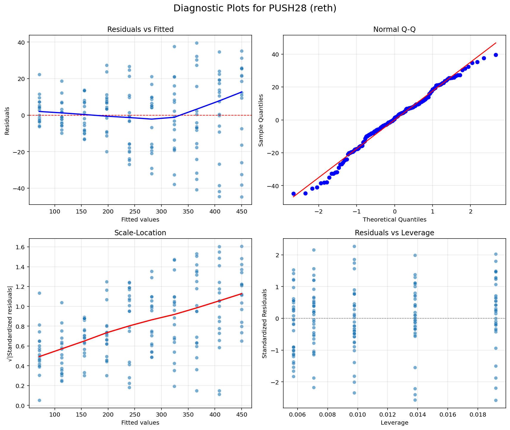


## nethermind


```python
                            OLS Regression Results                            
==============================================================================
Dep. Variable:        run_duration_ms   R-squared:                       0.981
Model:                            OLS   Adj. R-squared:                  0.981
Method:                 Least Squares   F-statistic:                 1.464e+04
Date:                Thu, 22 Jan 2026   Prob (F-statistic):          5.78e-249
Time:                        10:35:02   Log-Likelihood:                -1437.9
No. Observations:                 290   AIC:                             2880.
Df Residuals:                     288   BIC:                             2887.
Df Model:                           1                                         
Covariance Type:            nonrobust                                         
==============================================================================
                 coef    std err          t      P>|t|      [0.025      0.975]
------------------------------------------------------------------------------
const         27.4231      4.385      6.254      0.000      18.792      36.054
opcount        0.0122      0.000    121.006      0.000       0.012       0.012
==============================================================================
Omnibus:                       49.183   Durbin-Watson:                   1.007
Prob(Omnibus):                  0.000   Jarque-Bera (JB):               99.002
Skew:                          -0.877   Prob(JB):                     3.18e-22
Kurtosis:                       5.262   Cond. No.                     9.38e+04
==============================================================================

Notes:
[1] Standard Errors assume that the covariance matrix of the errors is correctly specified.
[2] The condition number is large, 9.38e+04. This might indicate that there are
strong multicollinearity or other numerical problems.
```


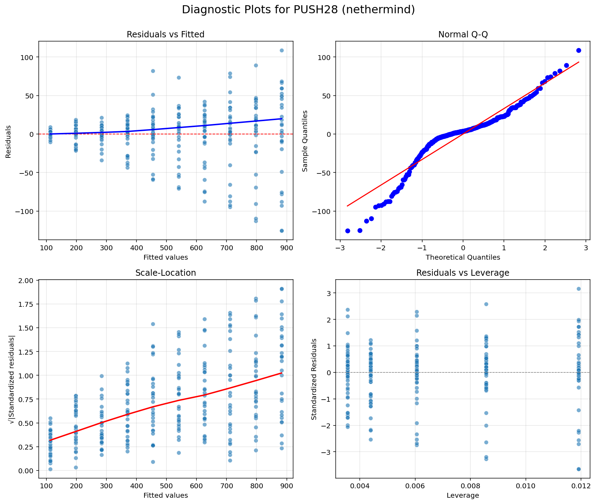


## erigon

OLS model did not run... Error: zero-size array to reduction operation maximum which has no identity

# PUSH29

## geth


```python
                            OLS Regression Results                            
==============================================================================
Dep. Variable:        run_duration_ms   R-squared:                       0.986
Model:                            OLS   Adj. R-squared:                  0.986
Method:                 Least Squares   F-statistic:                 2.077e+04
Date:                Thu, 22 Jan 2026   Prob (F-statistic):          1.84e-270
Time:                        10:35:02   Log-Likelihood:                -1563.7
No. Observations:                 290   AIC:                             3131.
Df Residuals:                     288   BIC:                             3139.
Df Model:                           1                                         
Covariance Type:            nonrobust                                         
==============================================================================
                 coef    std err          t      P>|t|      [0.025      0.975]
------------------------------------------------------------------------------
const         29.8930      6.766      4.418      0.000      16.575      43.211
opcount        0.0224      0.000    144.107      0.000       0.022       0.023
==============================================================================
Omnibus:                       46.559   Durbin-Watson:                   1.142
Prob(Omnibus):                  0.000   Jarque-Bera (JB):              279.548
Skew:                           0.426   Prob(JB):                     1.98e-61
Kurtosis:                       7.734   Cond. No.                     9.38e+04
==============================================================================

Notes:
[1] Standard Errors assume that the covariance matrix of the errors is correctly specified.
[2] The condition number is large, 9.38e+04. This might indicate that there are
strong multicollinearity or other numerical problems.
```

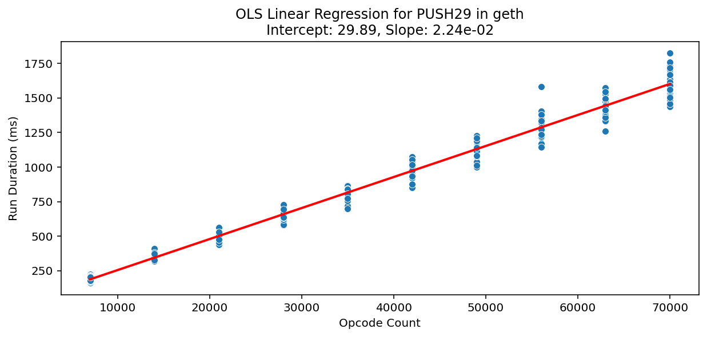

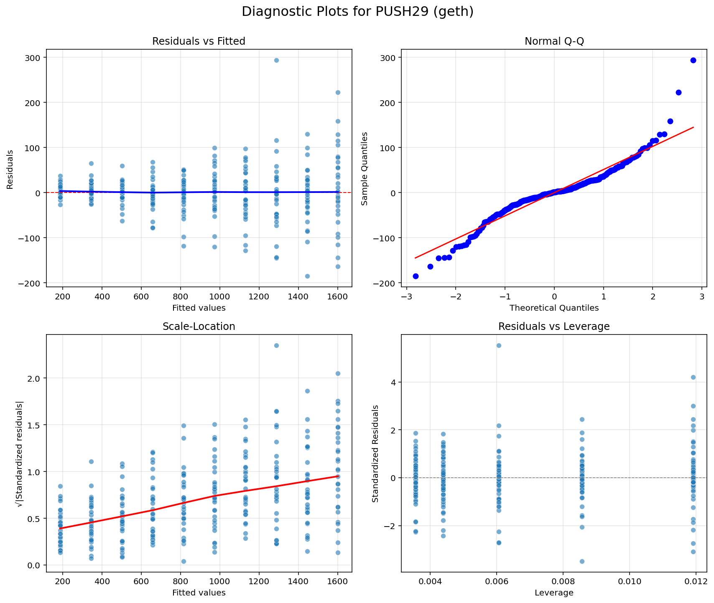


## besu


```python
                            OLS Regression Results                            
==============================================================================
Dep. Variable:        run_duration_ms   R-squared:                       0.983
Model:                            OLS   Adj. R-squared:                  0.983
Method:                 Least Squares   F-statistic:                 1.707e+04
Date:                Thu, 22 Jan 2026   Prob (F-statistic):          2.17e-258
Time:                        10:35:02   Log-Likelihood:                -1650.4
No. Observations:                 290   AIC:                             3305.
Df Residuals:                     288   BIC:                             3312.
Df Model:                           1                                         
Covariance Type:            nonrobust                                         
==============================================================================
                 coef    std err          t      P>|t|      [0.025      0.975]
------------------------------------------------------------------------------
const         24.9910      9.124      2.739      0.007       7.034      42.948
opcount        0.0274      0.000    130.656      0.000       0.027       0.028
==============================================================================
Omnibus:                       26.848   Durbin-Watson:                   1.033
Prob(Omnibus):                  0.000   Jarque-Bera (JB):              105.348
Skew:                           0.193   Prob(JB):                     1.33e-23
Kurtosis:                       5.927   Cond. No.                     9.38e+04
==============================================================================

Notes:
[1] Standard Errors assume that the covariance matrix of the errors is correctly specified.
[2] The condition number is large, 9.38e+04. This might indicate that there are
strong multicollinearity or other numerical problems.
```


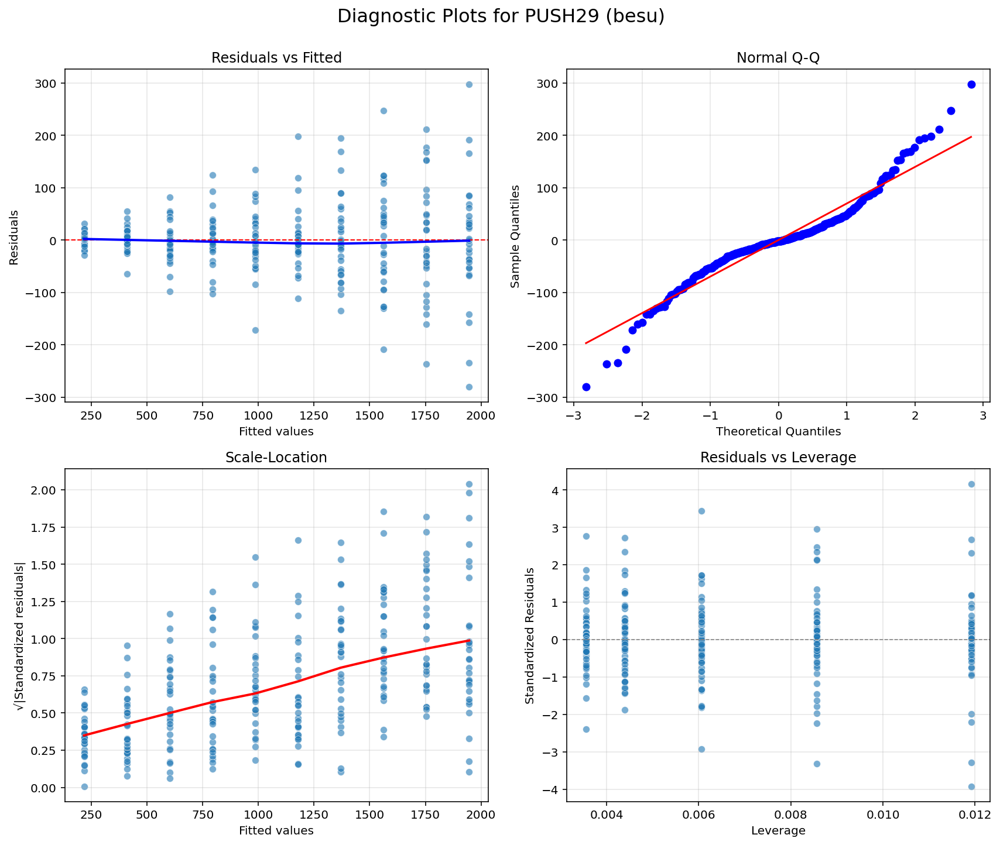


## reth


```python
                            OLS Regression Results                            
==============================================================================
Dep. Variable:        run_duration_ms   R-squared:                       0.974
Model:                            OLS   Adj. R-squared:                  0.974
Method:                 Least Squares   F-statistic:                     6693.
Date:                Thu, 22 Jan 2026   Prob (F-statistic):          3.78e-143
Time:                        10:35:02   Log-Likelihood:                -796.31
No. Observations:                 180   AIC:                             1597.
Df Residuals:                     178   BIC:                             1603.
Df Model:                           1                                         
Covariance Type:            nonrobust                                         
==============================================================================
                 coef    std err          t      P>|t|      [0.025      0.975]
------------------------------------------------------------------------------
const         29.9774      3.268      9.172      0.000      23.528      36.427
opcount        0.0062   7.53e-05     81.808      0.000       0.006       0.006
==============================================================================
Omnibus:                        0.077   Durbin-Watson:                   1.715
Prob(Omnibus):                  0.962   Jarque-Bera (JB):                0.085
Skew:                           0.046   Prob(JB):                        0.958
Kurtosis:                       2.946   Cond. No.                     9.38e+04
==============================================================================

Notes:
[1] Standard Errors assume that the covariance matrix of the errors is correctly specified.
[2] The condition number is large, 9.38e+04. This might indicate that there are
strong multicollinearity or other numerical problems.
```


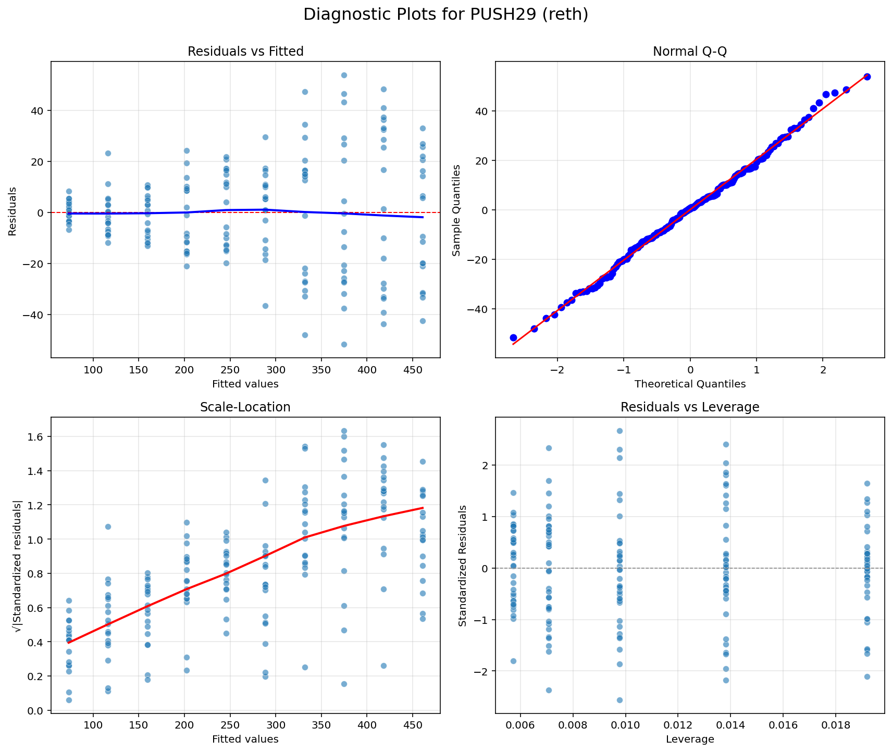


## nethermind


```python
                            OLS Regression Results                            
==============================================================================
Dep. Variable:        run_duration_ms   R-squared:                       0.979
Model:                            OLS   Adj. R-squared:                  0.979
Method:                 Least Squares   F-statistic:                 1.326e+04
Date:                Thu, 22 Jan 2026   Prob (F-statistic):          7.04e-243
Time:                        10:35:03   Log-Likelihood:                -1457.6
No. Observations:                 290   AIC:                             2919.
Df Residuals:                     288   BIC:                             2927.
Df Model:                           1                                         
Covariance Type:            nonrobust                                         
==============================================================================
                 coef    std err          t      P>|t|      [0.025      0.975]
------------------------------------------------------------------------------
const         26.3358      4.693      5.611      0.000      17.098      35.573
opcount        0.0124      0.000    115.144      0.000       0.012       0.013
==============================================================================
Omnibus:                       53.772   Durbin-Watson:                   1.178
Prob(Omnibus):                  0.000   Jarque-Bera (JB):              569.101
Skew:                          -0.285   Prob(JB):                    2.64e-124
Kurtosis:                       9.839   Cond. No.                     9.38e+04
==============================================================================

Notes:
[1] Standard Errors assume that the covariance matrix of the errors is correctly specified.
[2] The condition number is large, 9.38e+04. This might indicate that there are
strong multicollinearity or other numerical problems.
```

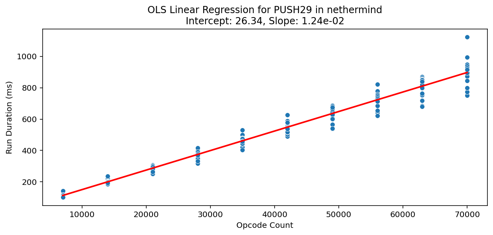

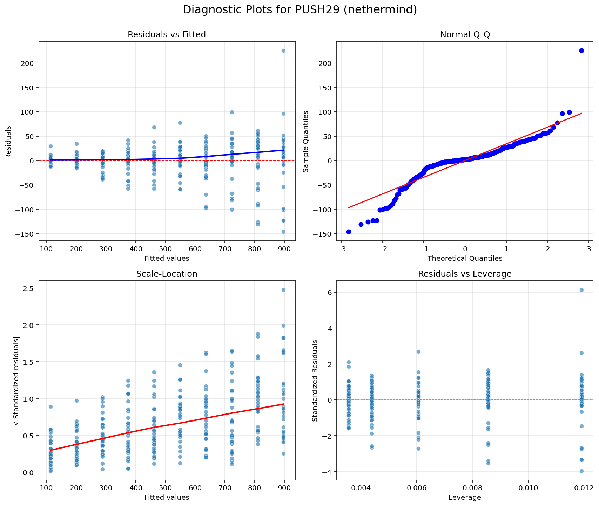


## erigon

OLS model did not run... Error: zero-size array to reduction operation maximum which has no identity

# PUSH30

## geth


```python
                            OLS Regression Results                            
==============================================================================
Dep. Variable:        run_duration_ms   R-squared:                       0.977
Model:                            OLS   Adj. R-squared:                  0.976
Method:                 Least Squares   F-statistic:                 1.200e+04
Date:                Thu, 22 Jan 2026   Prob (F-statistic):          9.07e-237
Time:                        10:35:03   Log-Likelihood:                -1645.8
No. Observations:                 290   AIC:                             3296.
Df Residuals:                     288   BIC:                             3303.
Df Model:                           1                                         
Covariance Type:            nonrobust                                         
==============================================================================
                 coef    std err          t      P>|t|      [0.025      0.975]
------------------------------------------------------------------------------
const         28.1353      8.981      3.133      0.002      10.458      45.813
opcount        0.0226      0.000    109.532      0.000       0.022       0.023
==============================================================================
Omnibus:                      175.697   Durbin-Watson:                   1.304
Prob(Omnibus):                  0.000   Jarque-Bera (JB):             3956.021
Skew:                           1.984   Prob(JB):                         0.00
Kurtosis:                      20.653   Cond. No.                     9.38e+04
==============================================================================

Notes:
[1] Standard Errors assume that the covariance matrix of the errors is correctly specified.
[2] The condition number is large, 9.38e+04. This might indicate that there are
strong multicollinearity or other numerical problems.
```

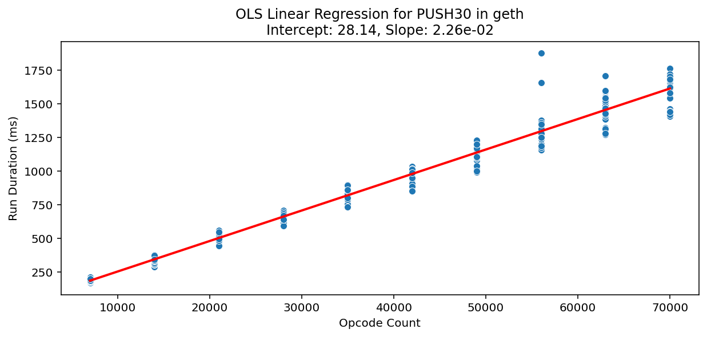

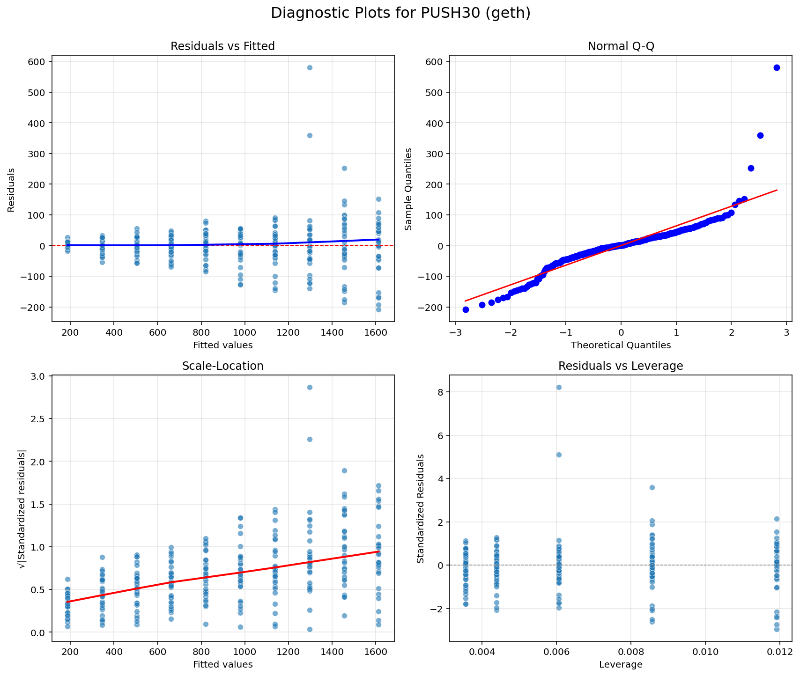


## besu


```python
                            OLS Regression Results                            
==============================================================================
Dep. Variable:        run_duration_ms   R-squared:                       0.983
Model:                            OLS   Adj. R-squared:                  0.983
Method:                 Least Squares   F-statistic:                 1.648e+04
Date:                Thu, 22 Jan 2026   Prob (F-statistic):          3.15e-256
Time:                        10:35:03   Log-Likelihood:                -1659.4
No. Observations:                 290   AIC:                             3323.
Df Residuals:                     288   BIC:                             3330.
Df Model:                           1                                         
Covariance Type:            nonrobust                                         
==============================================================================
                 coef    std err          t      P>|t|      [0.025      0.975]
------------------------------------------------------------------------------
const         28.8745      9.410      3.068      0.002      10.353      47.396
opcount        0.0278      0.000    128.379      0.000       0.027       0.028
==============================================================================
Omnibus:                       24.092   Durbin-Watson:                   1.014
Prob(Omnibus):                  0.000   Jarque-Bera (JB):               95.996
Skew:                           0.010   Prob(JB):                     1.43e-21
Kurtosis:                       5.819   Cond. No.                     9.38e+04
==============================================================================

Notes:
[1] Standard Errors assume that the covariance matrix of the errors is correctly specified.
[2] The condition number is large, 9.38e+04. This might indicate that there are
strong multicollinearity or other numerical problems.
```


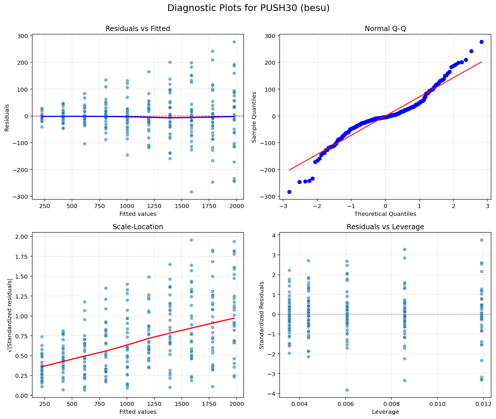


## reth


```python
                            OLS Regression Results                            
==============================================================================
Dep. Variable:        run_duration_ms   R-squared:                       0.962
Model:                            OLS   Adj. R-squared:                  0.962
Method:                 Least Squares   F-statistic:                     4561.
Date:                Thu, 22 Jan 2026   Prob (F-statistic):          8.64e-129
Time:                        10:35:04   Log-Likelihood:                -831.87
No. Observations:                 180   AIC:                             1668.
Df Residuals:                     178   BIC:                             1674.
Df Model:                           1                                         
Covariance Type:            nonrobust                                         
==============================================================================
                 coef    std err          t      P>|t|      [0.025      0.975]
------------------------------------------------------------------------------
const         32.8027      3.982      8.237      0.000      24.944      40.661
opcount        0.0062   9.17e-05     67.534      0.000       0.006       0.006
==============================================================================
Omnibus:                       95.160   Durbin-Watson:                   1.560
Prob(Omnibus):                  0.000   Jarque-Bera (JB):              850.953
Skew:                           1.746   Prob(JB):                    1.65e-185
Kurtosis:                      13.063   Cond. No.                     9.38e+04
==============================================================================

Notes:
[1] Standard Errors assume that the covariance matrix of the errors is correctly specified.
[2] The condition number is large, 9.38e+04. This might indicate that there are
strong multicollinearity or other numerical problems.
```

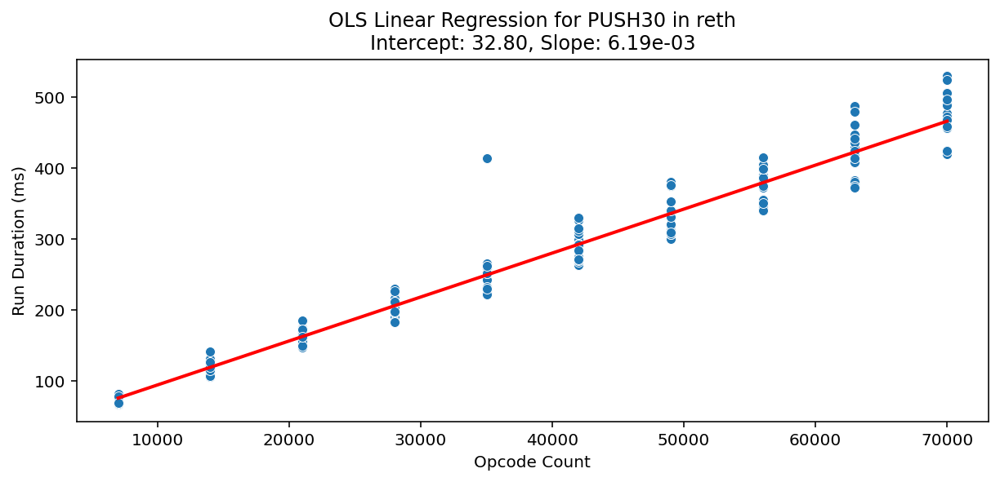

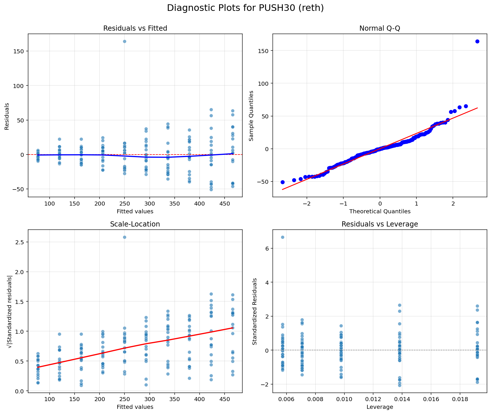


## nethermind


```python
                            OLS Regression Results                            
==============================================================================
Dep. Variable:        run_duration_ms   R-squared:                       0.981
Model:                            OLS   Adj. R-squared:                  0.981
Method:                 Least Squares   F-statistic:                 1.478e+04
Date:                Thu, 22 Jan 2026   Prob (F-statistic):          1.48e-249
Time:                        10:35:04   Log-Likelihood:                -1442.9
No. Observations:                 290   AIC:                             2890.
Df Residuals:                     288   BIC:                             2897.
Df Model:                           1                                         
Covariance Type:            nonrobust                                         
==============================================================================
                 coef    std err          t      P>|t|      [0.025      0.975]
------------------------------------------------------------------------------
const         25.5578      4.460      5.730      0.000      16.779      34.337
opcount        0.0125      0.000    121.591      0.000       0.012       0.013
==============================================================================
Omnibus:                       31.340   Durbin-Watson:                   1.140
Prob(Omnibus):                  0.000   Jarque-Bera (JB):               96.652
Skew:                          -0.418   Prob(JB):                     1.03e-21
Kurtosis:                       5.702   Cond. No.                     9.38e+04
==============================================================================

Notes:
[1] Standard Errors assume that the covariance matrix of the errors is correctly specified.
[2] The condition number is large, 9.38e+04. This might indicate that there are
strong multicollinearity or other numerical problems.
```

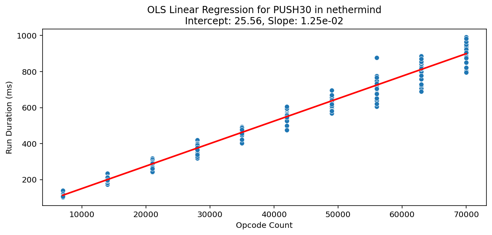

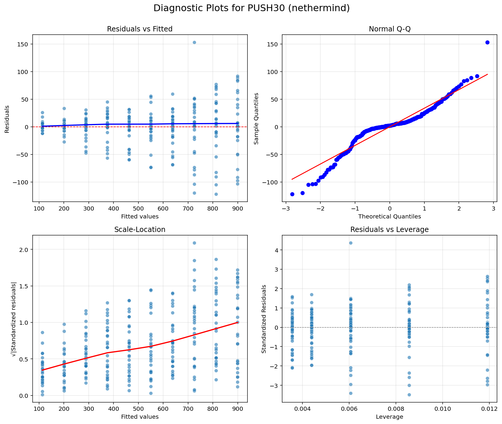


## erigon

OLS model did not run... Error: zero-size array to reduction operation maximum which has no identity

# PUSH31

## geth


```python
                            OLS Regression Results                            
==============================================================================
Dep. Variable:        run_duration_ms   R-squared:                       0.983
Model:                            OLS   Adj. R-squared:                  0.983
Method:                 Least Squares   F-statistic:                 1.675e+04
Date:                Thu, 22 Jan 2026   Prob (F-statistic):          3.19e-257
Time:                        10:35:04   Log-Likelihood:                -1593.8
No. Observations:                 290   AIC:                             3192.
Df Residuals:                     288   BIC:                             3199.
Df Model:                           1                                         
Covariance Type:            nonrobust                                         
==============================================================================
                 coef    std err          t      P>|t|      [0.025      0.975]
------------------------------------------------------------------------------
const         29.8322      7.506      3.975      0.000      15.059      44.605
opcount        0.0224      0.000    129.422      0.000       0.022       0.023
==============================================================================
Omnibus:                       39.034   Durbin-Watson:                   1.039
Prob(Omnibus):                  0.000   Jarque-Bera (JB):              289.120
Skew:                           0.019   Prob(JB):                     1.65e-63
Kurtosis:                       7.891   Cond. No.                     9.38e+04
==============================================================================

Notes:
[1] Standard Errors assume that the covariance matrix of the errors is correctly specified.
[2] The condition number is large, 9.38e+04. This might indicate that there are
strong multicollinearity or other numerical problems.
```


## besu


```python
                            OLS Regression Results                            
==============================================================================
Dep. Variable:        run_duration_ms   R-squared:                       0.981
Model:                            OLS   Adj. R-squared:                  0.981
Method:                 Least Squares   F-statistic:                 1.514e+04
Date:                Thu, 22 Jan 2026   Prob (F-statistic):          5.23e-251
Time:                        10:35:04   Log-Likelihood:                -1673.7
No. Observations:                 290   AIC:                             3351.
Df Residuals:                     288   BIC:                             3359.
Df Model:                           1                                         
Covariance Type:            nonrobust                                         
==============================================================================
                 coef    std err          t      P>|t|      [0.025      0.975]
------------------------------------------------------------------------------
const         24.9576      9.886      2.525      0.012       5.500      44.415
opcount        0.0280      0.000    123.038      0.000       0.028       0.028
==============================================================================
Omnibus:                       16.781   Durbin-Watson:                   0.644
Prob(Omnibus):                  0.000   Jarque-Bera (JB):               46.301
Skew:                           0.082   Prob(JB):                     8.83e-11
Kurtosis:                       4.951   Cond. No.                     9.38e+04
==============================================================================

Notes:
[1] Standard Errors assume that the covariance matrix of the errors is correctly specified.
[2] The condition number is large, 9.38e+04. This might indicate that there are
strong multicollinearity or other numerical problems.
```


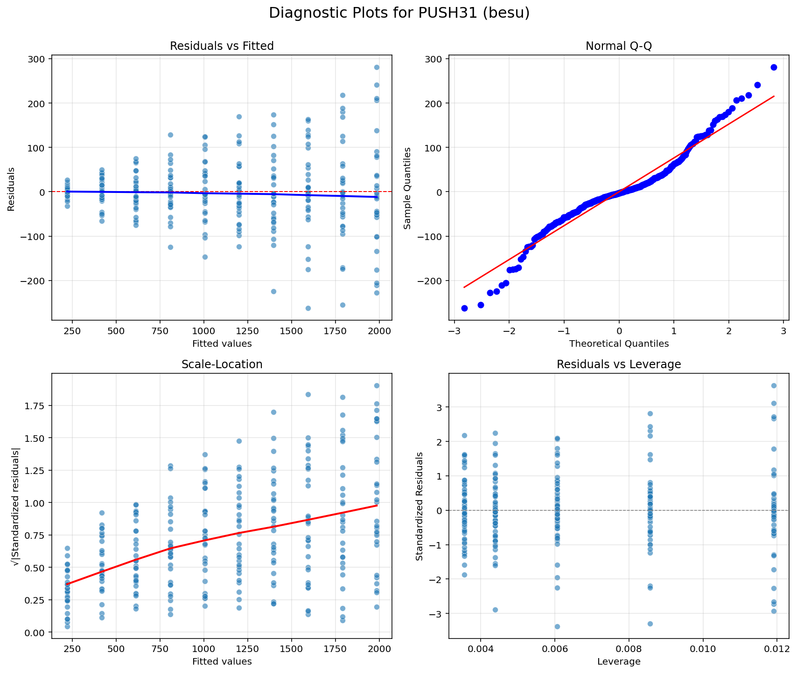


## reth


```python
                            OLS Regression Results                            
==============================================================================
Dep. Variable:        run_duration_ms   R-squared:                       0.960
Model:                            OLS   Adj. R-squared:                  0.960
Method:                 Least Squares   F-statistic:                     4318.
Date:                Thu, 22 Jan 2026   Prob (F-statistic):          9.28e-127
Time:                        10:35:05   Log-Likelihood:                -838.92
No. Observations:                 180   AIC:                             1682.
Df Residuals:                     178   BIC:                             1688.
Df Model:                           1                                         
Covariance Type:            nonrobust                                         
==============================================================================
                 coef    std err          t      P>|t|      [0.025      0.975]
------------------------------------------------------------------------------
const         30.2462      4.142      7.303      0.000      22.073      38.419
opcount        0.0063   9.54e-05     65.714      0.000       0.006       0.006
==============================================================================
Omnibus:                      194.609   Durbin-Watson:                   1.819
Prob(Omnibus):                  0.000   Jarque-Bera (JB):             9900.838
Skew:                           3.883   Prob(JB):                         0.00
Kurtosis:                      38.493   Cond. No.                     9.38e+04
==============================================================================

Notes:
[1] Standard Errors assume that the covariance matrix of the errors is correctly specified.
[2] The condition number is large, 9.38e+04. This might indicate that there are
strong multicollinearity or other numerical problems.
```

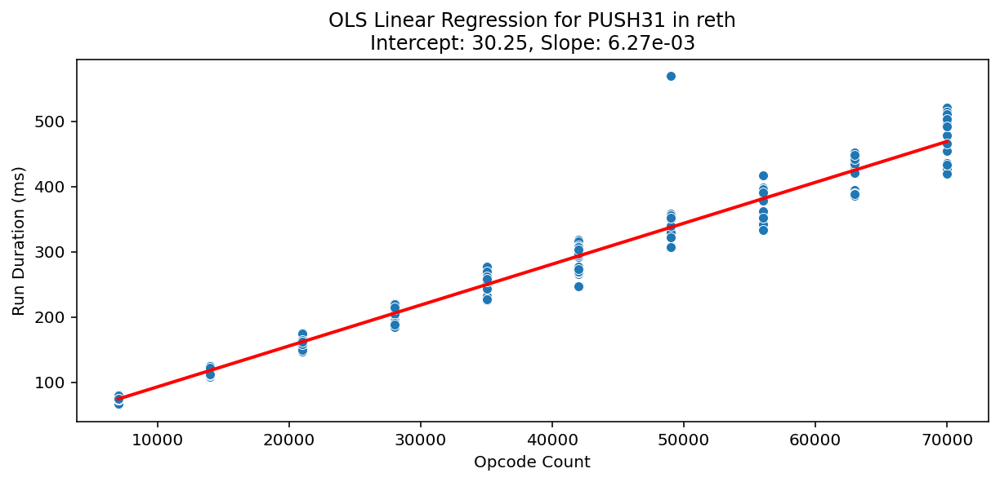

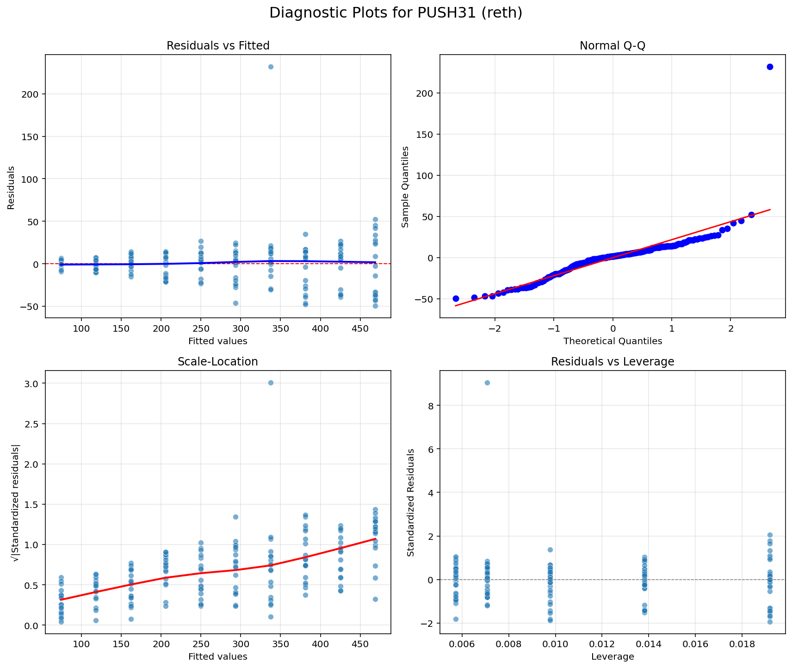


## nethermind


```python
                            OLS Regression Results                            
==============================================================================
Dep. Variable:        run_duration_ms   R-squared:                       0.980
Model:                            OLS   Adj. R-squared:                  0.980
Method:                 Least Squares   F-statistic:                 1.440e+04
Date:                Thu, 22 Jan 2026   Prob (F-statistic):          6.27e-248
Time:                        10:35:05   Log-Likelihood:                -1443.3
No. Observations:                 290   AIC:                             2891.
Df Residuals:                     288   BIC:                             2898.
Df Model:                           1                                         
Covariance Type:            nonrobust                                         
==============================================================================
                 coef    std err          t      P>|t|      [0.025      0.975]
------------------------------------------------------------------------------
const         30.5826      4.468      6.845      0.000      21.789      39.376
opcount        0.0123      0.000    119.989      0.000       0.012       0.013
==============================================================================
Omnibus:                       53.887   Durbin-Watson:                   0.810
Prob(Omnibus):                  0.000   Jarque-Bera (JB):              131.842
Skew:                          -0.879   Prob(JB):                     2.35e-29
Kurtosis:                       5.797   Cond. No.                     9.38e+04
==============================================================================

Notes:
[1] Standard Errors assume that the covariance matrix of the errors is correctly specified.
[2] The condition number is large, 9.38e+04. This might indicate that there are
strong multicollinearity or other numerical problems.
```

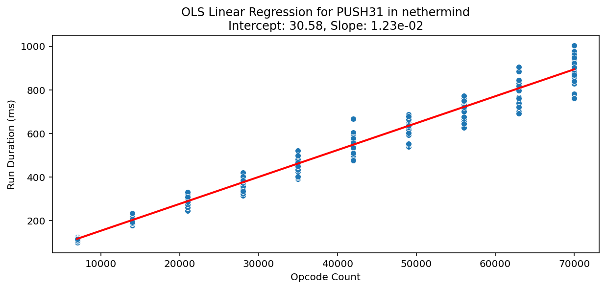

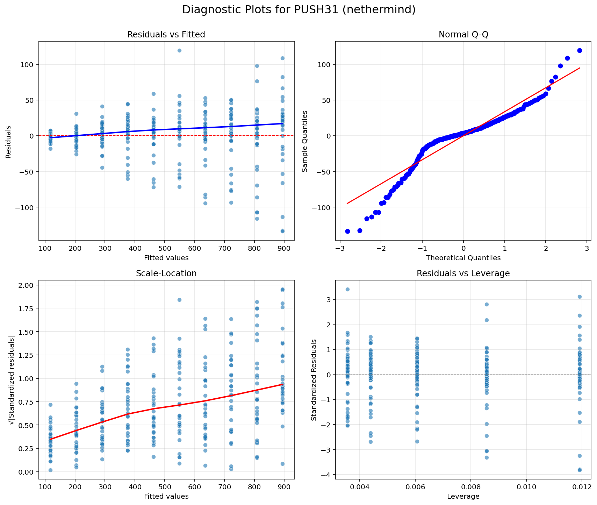


## erigon

OLS model did not run... Error: zero-size array to reduction operation maximum which has no identity

# PUSH32

## geth


```python
                            OLS Regression Results                            
==============================================================================
Dep. Variable:        run_duration_ms   R-squared:                       0.984
Model:                            OLS   Adj. R-squared:                  0.984
Method:                 Least Squares   F-statistic:                 1.811e+04
Date:                Thu, 22 Jan 2026   Prob (F-statistic):          5.11e-262
Time:                        10:35:05   Log-Likelihood:                -1572.4
No. Observations:                 290   AIC:                             3149.
Df Residuals:                     288   BIC:                             3156.
Df Model:                           1                                         
Covariance Type:            nonrobust                                         
==============================================================================
                 coef    std err          t      P>|t|      [0.025      0.975]
------------------------------------------------------------------------------
const         33.4729      6.972      4.801      0.000      19.750      47.196
opcount        0.0216      0.000    134.565      0.000       0.021       0.022
==============================================================================
Omnibus:                       26.993   Durbin-Watson:                   0.834
Prob(Omnibus):                  0.000   Jarque-Bera (JB):              117.719
Skew:                          -0.099   Prob(JB):                     2.74e-26
Kurtosis:                       6.115   Cond. No.                     9.38e+04
==============================================================================

Notes:
[1] Standard Errors assume that the covariance matrix of the errors is correctly specified.
[2] The condition number is large, 9.38e+04. This might indicate that there are
strong multicollinearity or other numerical problems.
```


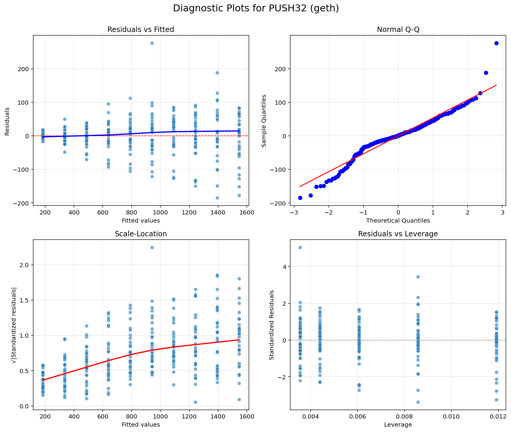


## besu


```python
                            OLS Regression Results                            
==============================================================================
Dep. Variable:        run_duration_ms   R-squared:                       0.974
Model:                            OLS   Adj. R-squared:                  0.974
Method:                 Least Squares   F-statistic:                 1.073e+04
Date:                Thu, 22 Jan 2026   Prob (F-statistic):          6.05e-230
Time:                        10:35:05   Log-Likelihood:                -1719.1
No. Observations:                 290   AIC:                             3442.
Df Residuals:                     288   BIC:                             3450.
Df Model:                           1                                         
Covariance Type:            nonrobust                                         
==============================================================================
                 coef    std err          t      P>|t|      [0.025      0.975]
------------------------------------------------------------------------------
const         28.3823     11.562      2.455      0.015       5.625      51.140
opcount        0.0276      0.000    103.574      0.000       0.027       0.028
==============================================================================
Omnibus:                       24.079   Durbin-Watson:                   0.869
Prob(Omnibus):                  0.000   Jarque-Bera (JB):               63.773
Skew:                           0.333   Prob(JB):                     1.42e-14
Kurtosis:                       5.198   Cond. No.                     9.38e+04
==============================================================================

Notes:
[1] Standard Errors assume that the covariance matrix of the errors is correctly specified.
[2] The condition number is large, 9.38e+04. This might indicate that there are
strong multicollinearity or other numerical problems.
```

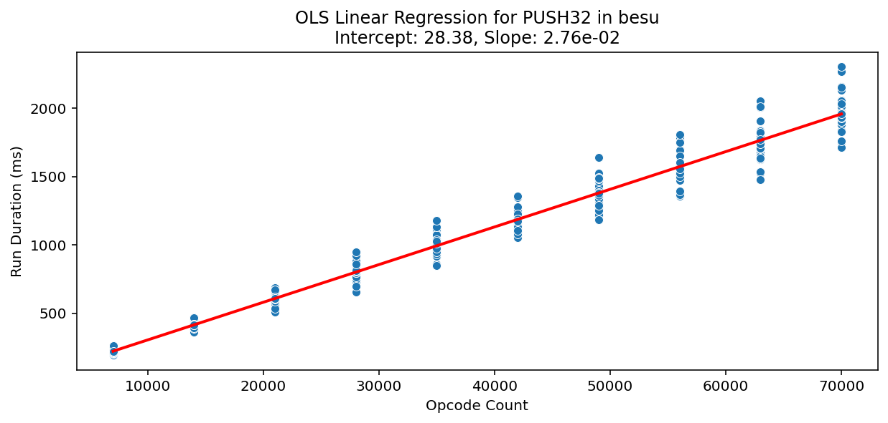


## reth


```python
                            OLS Regression Results                            
==============================================================================
Dep. Variable:        run_duration_ms   R-squared:                       0.965
Model:                            OLS   Adj. R-squared:                  0.965
Method:                 Least Squares   F-statistic:                     4932.
Date:                Thu, 22 Jan 2026   Prob (F-statistic):          1.04e-131
Time:                        10:35:06   Log-Likelihood:                -815.99
No. Observations:                 180   AIC:                             1636.
Df Residuals:                     178   BIC:                             1642.
Df Model:                           1                                         
Covariance Type:            nonrobust                                         
==============================================================================
                 coef    std err          t      P>|t|      [0.025      0.975]
------------------------------------------------------------------------------
const         34.4011      3.646      9.435      0.000      27.206      41.596
opcount        0.0059   8.39e-05     70.232      0.000       0.006       0.006
==============================================================================
Omnibus:                        6.202   Durbin-Watson:                   1.692
Prob(Omnibus):                  0.045   Jarque-Bera (JB):                8.995
Skew:                          -0.140   Prob(JB):                       0.0111
Kurtosis:                       4.059   Cond. No.                     9.38e+04
==============================================================================

Notes:
[1] Standard Errors assume that the covariance matrix of the errors is correctly specified.
[2] The condition number is large, 9.38e+04. This might indicate that there are
strong multicollinearity or other numerical problems.
```

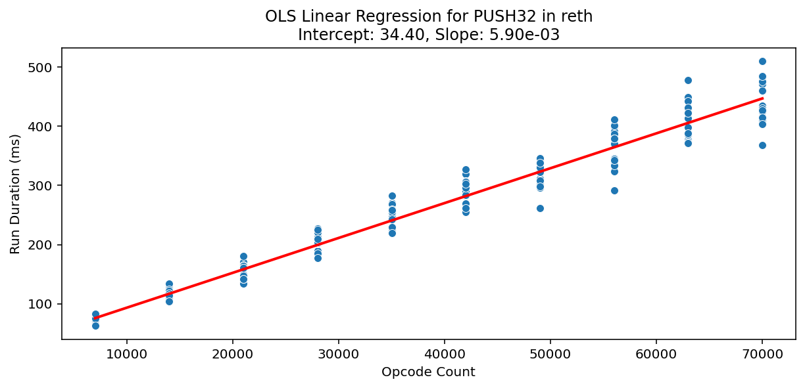

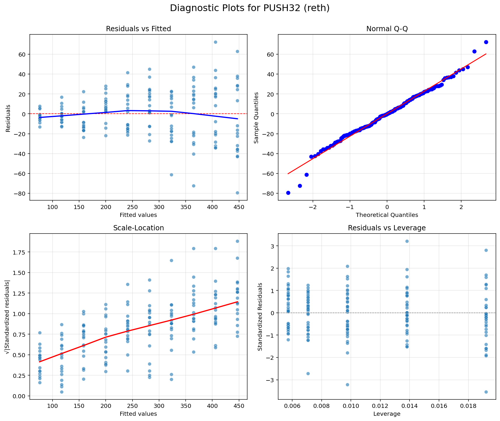


## nethermind


```python
                            OLS Regression Results                            
==============================================================================
Dep. Variable:        run_duration_ms   R-squared:                       0.985
Model:                            OLS   Adj. R-squared:                  0.984
Method:                 Least Squares   F-statistic:                 1.833e+04
Date:                Thu, 22 Jan 2026   Prob (F-statistic):          9.39e-263
Time:                        10:35:06   Log-Likelihood:                -1343.5
No. Observations:                 290   AIC:                             2691.
Df Residuals:                     288   BIC:                             2698.
Df Model:                           1                                         
Covariance Type:            nonrobust                                         
==============================================================================
                 coef    std err          t      P>|t|      [0.025      0.975]
------------------------------------------------------------------------------
const         29.0735      3.166      9.182      0.000      22.842      35.305
opcount        0.0099   7.29e-05    135.372      0.000       0.010       0.010
==============================================================================
Omnibus:                       55.482   Durbin-Watson:                   0.873
Prob(Omnibus):                  0.000   Jarque-Bera (JB):              165.125
Skew:                          -0.833   Prob(JB):                     1.39e-36
Kurtosis:                       6.300   Cond. No.                     9.38e+04
==============================================================================

Notes:
[1] Standard Errors assume that the covariance matrix of the errors is correctly specified.
[2] The condition number is large, 9.38e+04. This might indicate that there are
strong multicollinearity or other numerical problems.
```

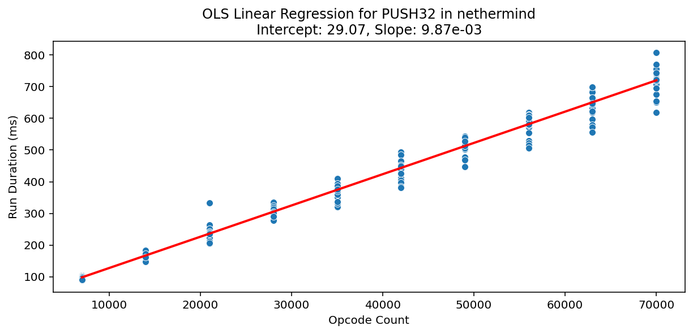

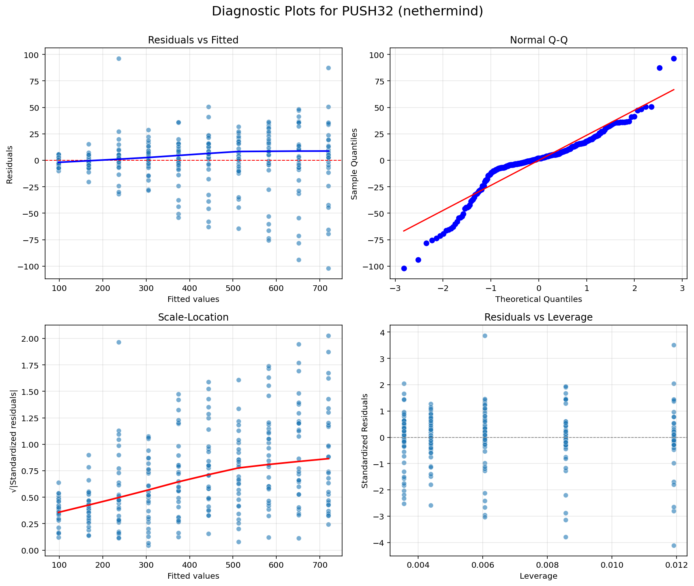


## erigon

OLS model did not run... Error: zero-size array to reduction operation maximum which has no identity

# RETURNDATASIZE

## geth


```python
                            OLS Regression Results                            
==============================================================================
Dep. Variable:        run_duration_ms   R-squared:                       0.978
Model:                            OLS   Adj. R-squared:                  0.978
Method:                 Least Squares   F-statistic:                 5.134e+04
Date:                Thu, 22 Jan 2026   Prob (F-statistic):               0.00
Time:                        10:35:06   Log-Likelihood:                -6448.5
No. Observations:                1160   AIC:                         1.290e+04
Df Residuals:                    1158   BIC:                         1.291e+04
Df Model:                           1                                         
Covariance Type:            nonrobust                                         
==============================================================================
                 coef    std err          t      P>|t|      [0.025      0.975]
------------------------------------------------------------------------------
const         30.8922      3.987      7.748      0.000      23.069      38.715
opcount        0.0243      0.000    226.575      0.000       0.024       0.024
==============================================================================
Omnibus:                      946.930   Durbin-Watson:                   1.534
Prob(Omnibus):                  0.000   Jarque-Bera (JB):            66395.881
Skew:                           3.241   Prob(JB):                         0.00
Kurtosis:                      39.492   Cond. No.                     8.04e+04
==============================================================================

Notes:
[1] Standard Errors assume that the covariance matrix of the errors is correctly specified.
[2] The condition number is large, 8.04e+04. This might indicate that there are
strong multicollinearity or other numerical problems.
```


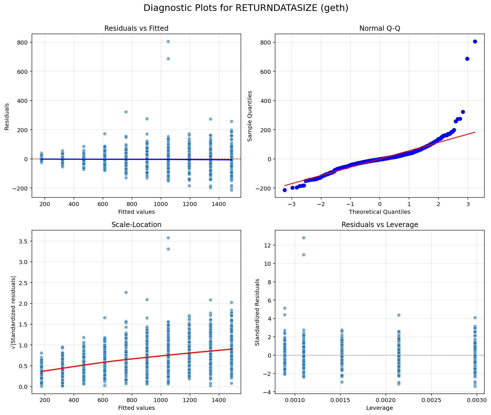


## besu


```python
                            OLS Regression Results                            
==============================================================================
Dep. Variable:        run_duration_ms   R-squared:                       0.980
Model:                            OLS   Adj. R-squared:                  0.980
Method:                 Least Squares   F-statistic:                 5.544e+04
Date:                Thu, 22 Jan 2026   Prob (F-statistic):               0.00
Time:                        10:35:07   Log-Likelihood:                -7170.6
No. Observations:                1160   AIC:                         1.435e+04
Df Residuals:                    1158   BIC:                         1.436e+04
Df Model:                           1                                         
Covariance Type:            nonrobust                                         
==============================================================================
                 coef    std err          t      P>|t|      [0.025      0.975]
------------------------------------------------------------------------------
const         30.7105      7.430      4.133      0.000      16.132      45.289
opcount        0.0470      0.000    235.464      0.000       0.047       0.047
==============================================================================
Omnibus:                      104.184   Durbin-Watson:                   0.908
Prob(Omnibus):                  0.000   Jarque-Bera (JB):              607.725
Skew:                          -0.125   Prob(JB):                    1.08e-132
Kurtosis:                       6.537   Cond. No.                     8.04e+04
==============================================================================

Notes:
[1] Standard Errors assume that the covariance matrix of the errors is correctly specified.
[2] The condition number is large, 8.04e+04. This might indicate that there are
strong multicollinearity or other numerical problems.
```

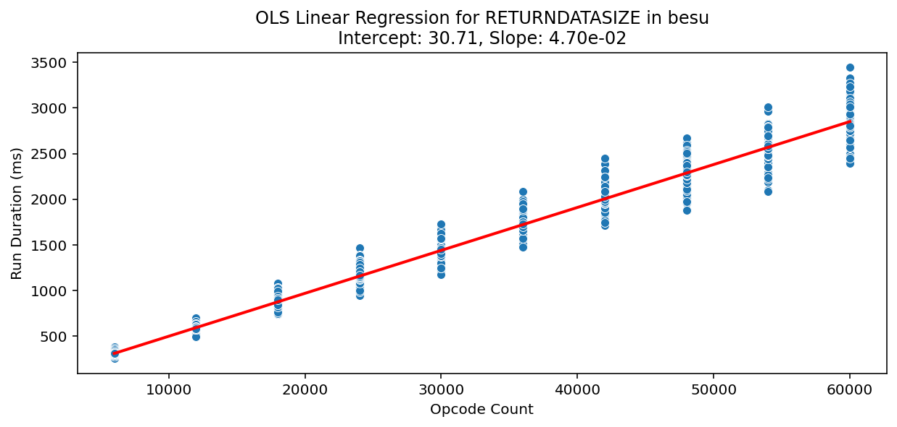

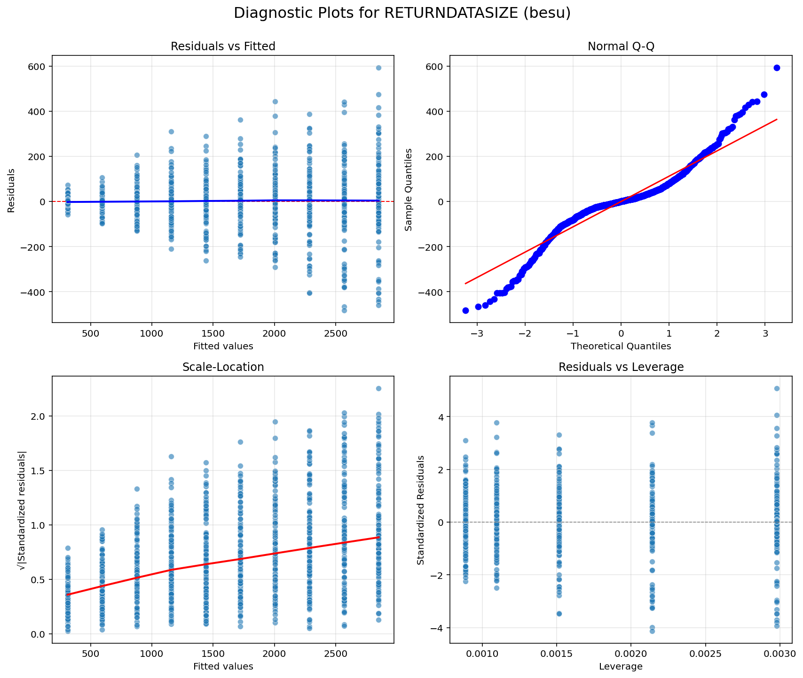


## reth


```python
                            OLS Regression Results                            
==============================================================================
Dep. Variable:        run_duration_ms   R-squared:                       0.969
Model:                            OLS   Adj. R-squared:                  0.969
Method:                 Least Squares   F-statistic:                 2.274e+04
Date:                Thu, 22 Jan 2026   Prob (F-statistic):               0.00
Time:                        10:35:07   Log-Likelihood:                -3570.9
No. Observations:                 720   AIC:                             7146.
Df Residuals:                     718   BIC:                             7155.
Df Model:                           1                                         
Covariance Type:            nonrobust                                         
==============================================================================
                 coef    std err          t      P>|t|      [0.025      0.975]
------------------------------------------------------------------------------
const         30.2166      2.781     10.867      0.000      24.758      35.676
opcount        0.0113   7.47e-05    150.792      0.000       0.011       0.011
==============================================================================
Omnibus:                      435.215   Durbin-Watson:                   1.762
Prob(Omnibus):                  0.000   Jarque-Bera (JB):            16959.255
Skew:                           2.084   Prob(JB):                         0.00
Kurtosis:                      26.408   Cond. No.                     8.04e+04
==============================================================================

Notes:
[1] Standard Errors assume that the covariance matrix of the errors is correctly specified.
[2] The condition number is large, 8.04e+04. This might indicate that there are
strong multicollinearity or other numerical problems.
```

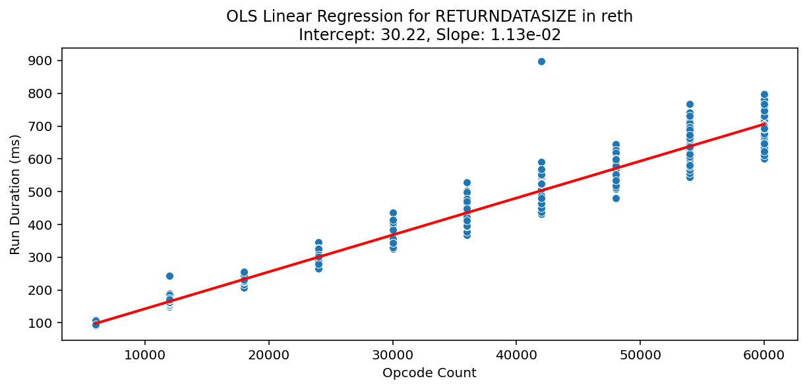

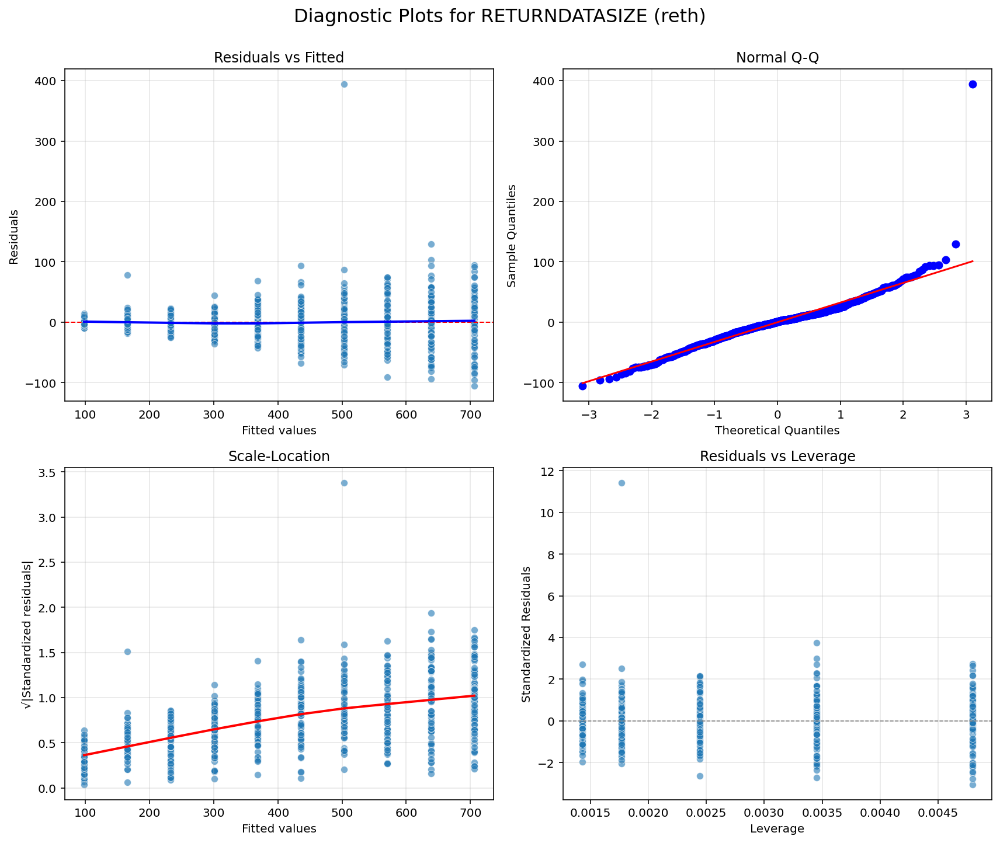


## nethermind


```python
                            OLS Regression Results                            
==============================================================================
Dep. Variable:        run_duration_ms   R-squared:                       0.901
Model:                            OLS   Adj. R-squared:                  0.901
Method:                 Least Squares   F-statistic:                 1.056e+04
Date:                Thu, 22 Jan 2026   Prob (F-statistic):               0.00
Time:                        10:35:07   Log-Likelihood:                -6586.3
No. Observations:                1160   AIC:                         1.318e+04
Df Residuals:                    1158   BIC:                         1.319e+04
Df Model:                           1                                         
Covariance Type:            nonrobust                                         
==============================================================================
                 coef    std err          t      P>|t|      [0.025      0.975]
------------------------------------------------------------------------------
const         27.1606      4.490      6.049      0.000      18.351      35.970
opcount        0.0124      0.000    102.774      0.000       0.012       0.013
==============================================================================
Omnibus:                      419.286   Durbin-Watson:                   0.934
Prob(Omnibus):                  0.000   Jarque-Bera (JB):             2013.952
Skew:                           1.627   Prob(JB):                         0.00
Kurtosis:                       8.575   Cond. No.                     8.04e+04
==============================================================================

Notes:
[1] Standard Errors assume that the covariance matrix of the errors is correctly specified.
[2] The condition number is large, 8.04e+04. This might indicate that there are
strong multicollinearity or other numerical problems.
```

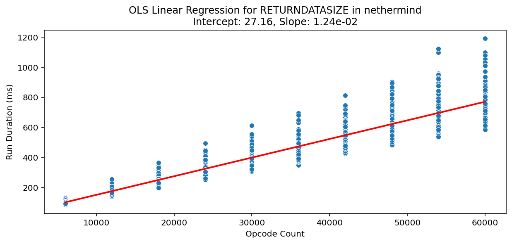

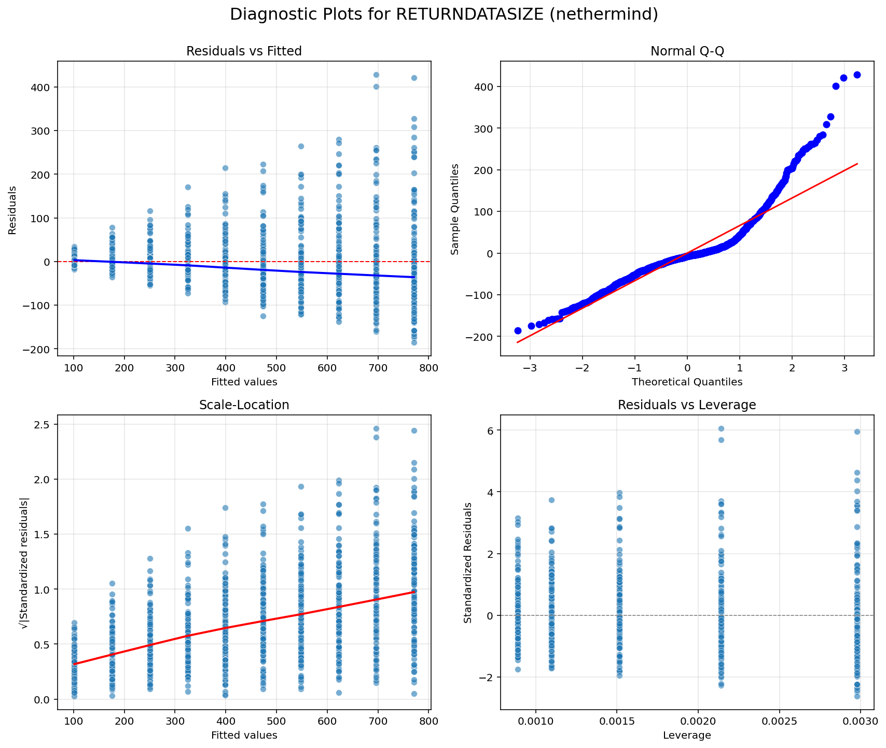


## erigon


```python
                            OLS Regression Results                            
==============================================================================
Dep. Variable:        run_duration_ms   R-squared:                       0.989
Model:                            OLS   Adj. R-squared:                  0.989
Method:                 Least Squares   F-statistic:                 1.055e+04
Date:                Thu, 22 Jan 2026   Prob (F-statistic):          2.76e-117
Time:                        10:35:07   Log-Likelihood:                -640.02
No. Observations:                 120   AIC:                             1284.
Df Residuals:                     118   BIC:                             1290.
Df Model:                           1                                         
Covariance Type:            nonrobust                                         
==============================================================================
                 coef    std err          t      P>|t|      [0.025      0.975]
------------------------------------------------------------------------------
const         31.9521      9.969      3.205      0.002      12.212      51.693
opcount        0.0275      0.000    102.733      0.000       0.027       0.028
==============================================================================
Omnibus:                        3.842   Durbin-Watson:                   1.944
Prob(Omnibus):                  0.146   Jarque-Bera (JB):                3.295
Skew:                           0.385   Prob(JB):                        0.193
Kurtosis:                       3.258   Cond. No.                     8.04e+04
==============================================================================

Notes:
[1] Standard Errors assume that the covariance matrix of the errors is correctly specified.
[2] The condition number is large, 8.04e+04. This might indicate that there are
strong multicollinearity or other numerical problems.
```

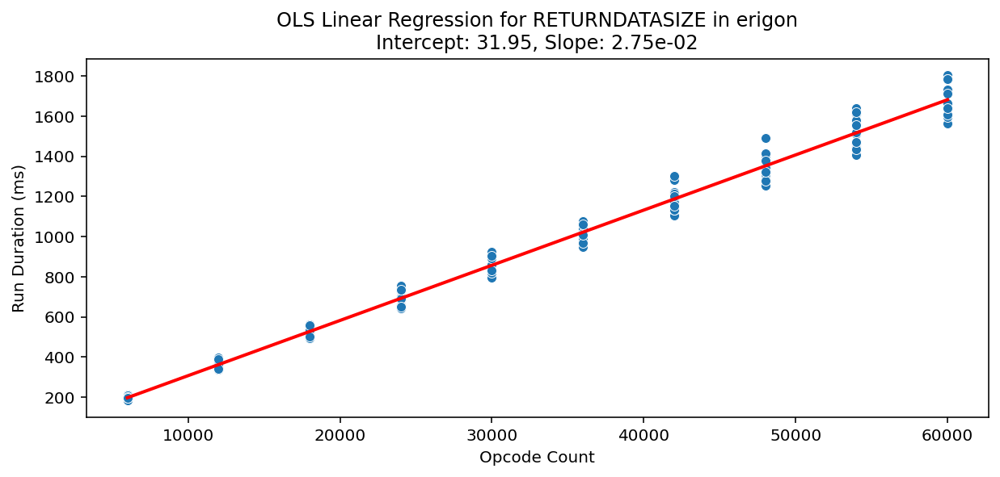

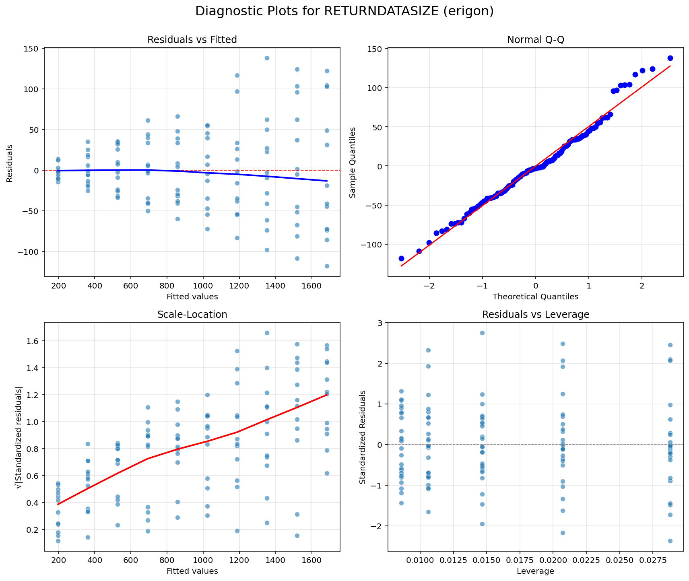


# SAR

## geth


```python
                            OLS Regression Results                            
==============================================================================
Dep. Variable:        run_duration_ms   R-squared:                       0.982
Model:                            OLS   Adj. R-squared:                  0.982
Method:                 Least Squares   F-statistic:                 1.550e+04
Date:                Thu, 22 Jan 2026   Prob (F-statistic):          1.84e-252
Time:                        10:35:08   Log-Likelihood:                -1479.0
No. Observations:                 290   AIC:                             2962.
Df Residuals:                     288   BIC:                             2969.
Df Model:                           1                                         
Covariance Type:            nonrobust                                         
==============================================================================
                 coef    std err          t      P>|t|      [0.025      0.975]
------------------------------------------------------------------------------
const         30.6608      5.052      6.069      0.000      20.718      40.604
opcount        0.0290      0.000    124.504      0.000       0.029       0.029
==============================================================================
Omnibus:                      146.678   Durbin-Watson:                   1.190
Prob(Omnibus):                  0.000   Jarque-Bera (JB):             3121.237
Skew:                           1.533   Prob(JB):                         0.00
Kurtosis:                      18.777   Cond. No.                     4.69e+04
==============================================================================

Notes:
[1] Standard Errors assume that the covariance matrix of the errors is correctly specified.
[2] The condition number is large, 4.69e+04. This might indicate that there are
strong multicollinearity or other numerical problems.
```

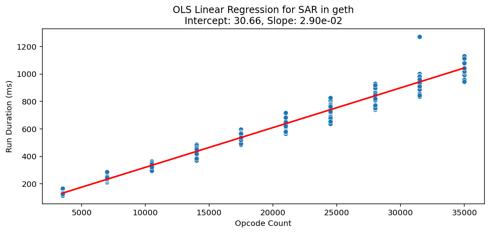

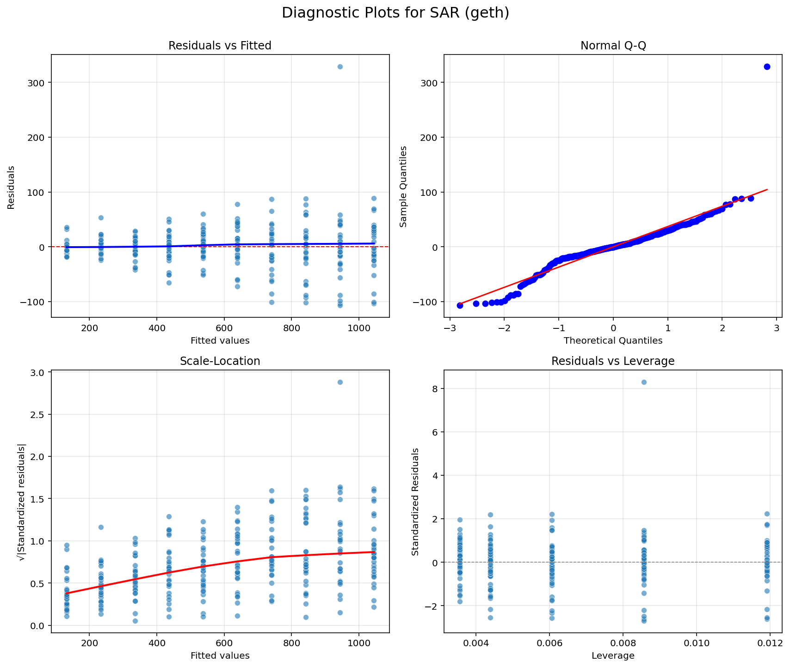


## besu


```python
                            OLS Regression Results                            
==============================================================================
Dep. Variable:        run_duration_ms   R-squared:                       0.981
Model:                            OLS   Adj. R-squared:                  0.981
Method:                 Least Squares   F-statistic:                 1.465e+04
Date:                Thu, 22 Jan 2026   Prob (F-statistic):          5.13e-249
Time:                        10:35:08   Log-Likelihood:                -2059.2
No. Observations:                 290   AIC:                             4122.
Df Residuals:                     288   BIC:                             4130.
Df Model:                           1                                         
Covariance Type:            nonrobust                                         
==============================================================================
                 coef    std err          t      P>|t|      [0.025      0.975]
------------------------------------------------------------------------------
const         28.5153     37.354      0.763      0.446     -45.006     102.036
opcount        0.2082      0.002    121.057      0.000       0.205       0.212
==============================================================================
Omnibus:                       79.642   Durbin-Watson:                   0.872
Prob(Omnibus):                  0.000   Jarque-Bera (JB):              214.243
Skew:                          -1.254   Prob(JB):                     3.00e-47
Kurtosis:                       6.382   Cond. No.                     4.69e+04
==============================================================================

Notes:
[1] Standard Errors assume that the covariance matrix of the errors is correctly specified.
[2] The condition number is large, 4.69e+04. This might indicate that there are
strong multicollinearity or other numerical problems.
```


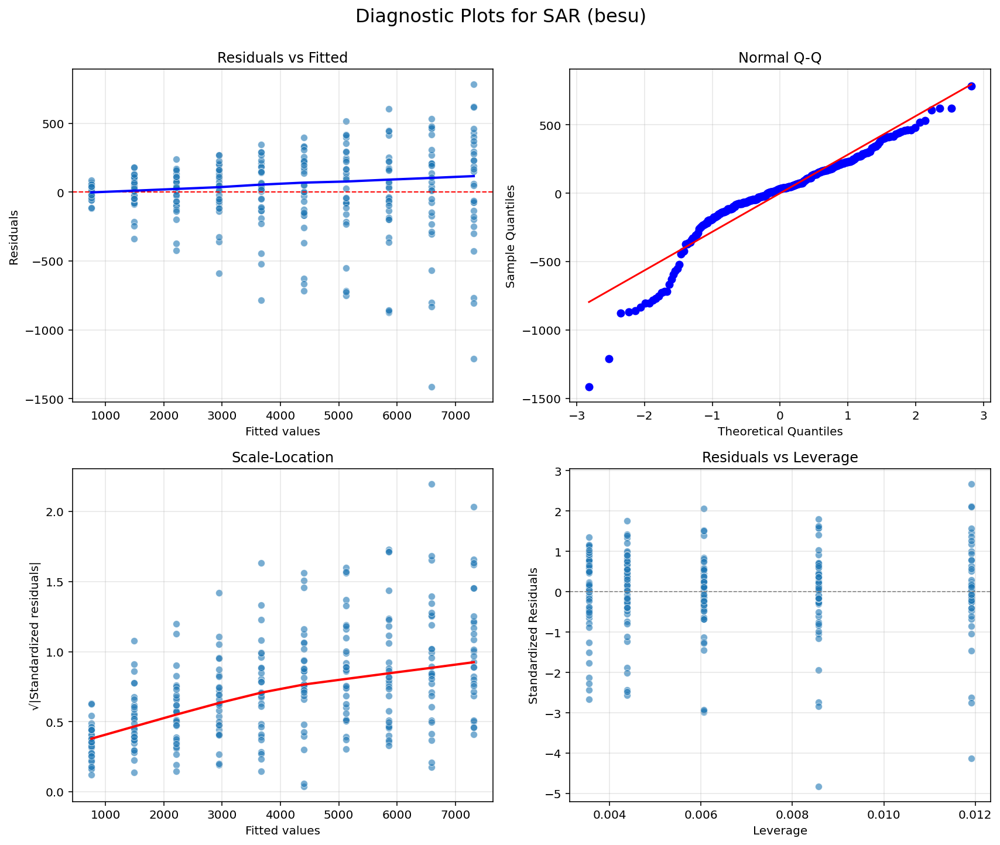


## reth


```python
                            OLS Regression Results                            
==============================================================================
Dep. Variable:        run_duration_ms   R-squared:                       0.991
Model:                            OLS   Adj. R-squared:                  0.991
Method:                 Least Squares   F-statistic:                 1.886e+04
Date:                Thu, 22 Jan 2026   Prob (F-statistic):          1.48e-182
Time:                        10:35:08   Log-Likelihood:                -812.30
No. Observations:                 180   AIC:                             1629.
Df Residuals:                     178   BIC:                             1635.
Df Model:                           1                                         
Covariance Type:            nonrobust                                         
==============================================================================
                 coef    std err          t      P>|t|      [0.025      0.975]
------------------------------------------------------------------------------
const         31.9446      3.572      8.943      0.000      24.895      38.994
opcount        0.0226      0.000    137.347      0.000       0.022       0.023
==============================================================================
Omnibus:                       59.201   Durbin-Watson:                   1.446
Prob(Omnibus):                  0.000   Jarque-Bera (JB):              200.637
Skew:                          -1.277   Prob(JB):                     2.70e-44
Kurtosis:                       7.497   Cond. No.                     4.69e+04
==============================================================================

Notes:
[1] Standard Errors assume that the covariance matrix of the errors is correctly specified.
[2] The condition number is large, 4.69e+04. This might indicate that there are
strong multicollinearity or other numerical problems.
```

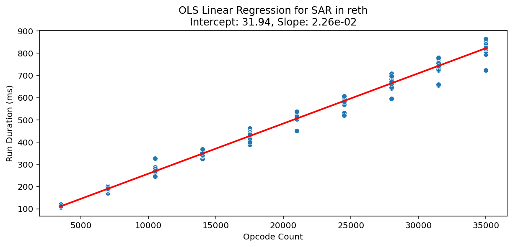

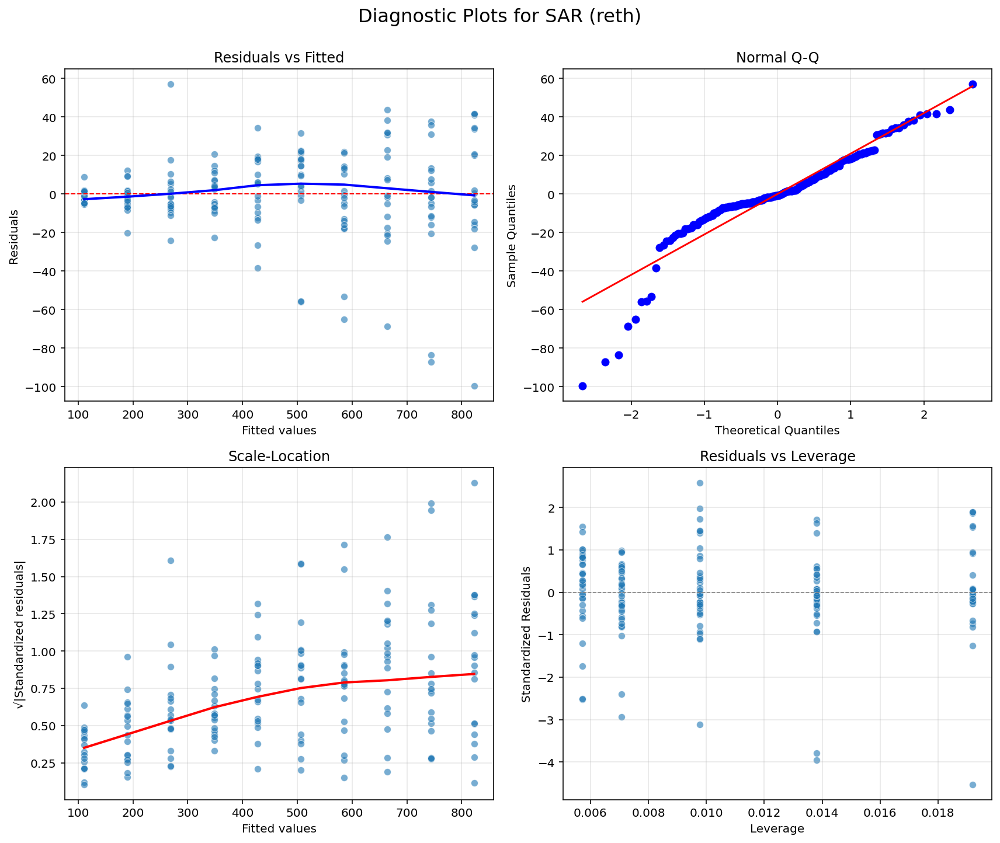


## nethermind


```python
                            OLS Regression Results                            
==============================================================================
Dep. Variable:        run_duration_ms   R-squared:                       0.982
Model:                            OLS   Adj. R-squared:                  0.982
Method:                 Least Squares   F-statistic:                 1.535e+04
Date:                Thu, 22 Jan 2026   Prob (F-statistic):          7.04e-252
Time:                        10:35:08   Log-Likelihood:                -1526.6
No. Observations:                 290   AIC:                             3057.
Df Residuals:                     288   BIC:                             3065.
Df Model:                           1                                         
Covariance Type:            nonrobust                                         
==============================================================================
                 coef    std err          t      P>|t|      [0.025      0.975]
------------------------------------------------------------------------------
const         29.3426      5.953      4.929      0.000      17.626      41.059
opcount        0.0340      0.000    123.914      0.000       0.033       0.035
==============================================================================
Omnibus:                       58.135   Durbin-Watson:                   0.879
Prob(Omnibus):                  0.000   Jarque-Bera (JB):              137.763
Skew:                          -0.959   Prob(JB):                     1.22e-30
Kurtosis:                       5.779   Cond. No.                     4.69e+04
==============================================================================

Notes:
[1] Standard Errors assume that the covariance matrix of the errors is correctly specified.
[2] The condition number is large, 4.69e+04. This might indicate that there are
strong multicollinearity or other numerical problems.
```

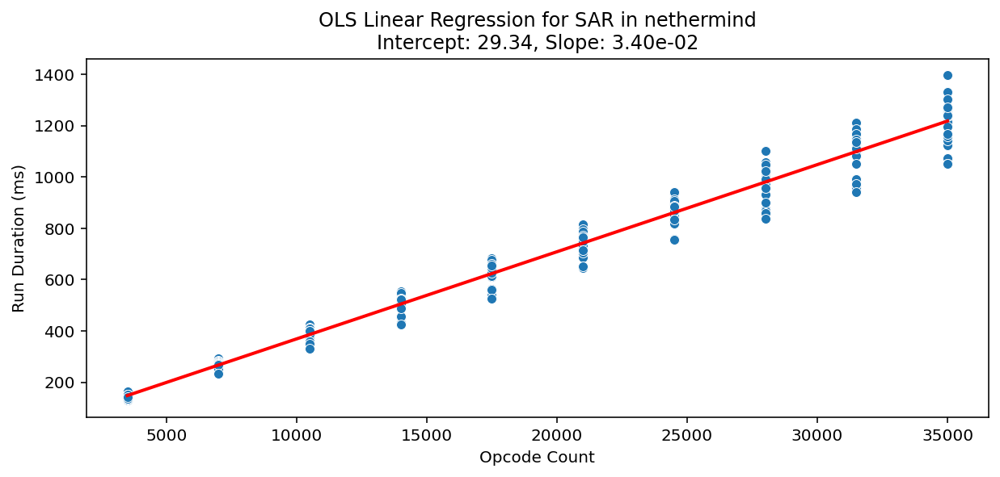

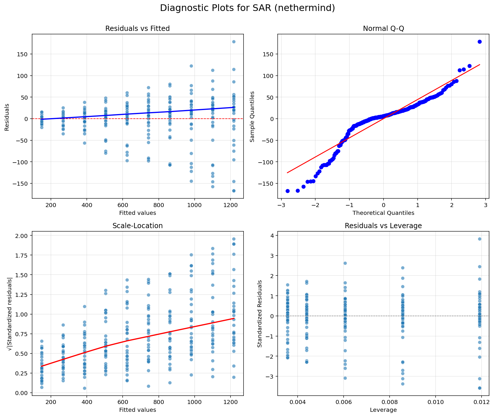


## erigon


```python
                            OLS Regression Results                            
==============================================================================
Dep. Variable:        run_duration_ms   R-squared:                       0.999
Model:                            OLS   Adj. R-squared:                  0.999
Method:                 Least Squares   F-statistic:                 4.488e+04
Date:                Thu, 22 Jan 2026   Prob (F-statistic):           2.00e-46
Time:                        10:35:09   Log-Likelihood:                -104.32
No. Observations:                  30   AIC:                             212.6
Df Residuals:                      28   BIC:                             215.4
Df Model:                           1                                         
Covariance Type:            nonrobust                                         
==============================================================================
                 coef    std err          t      P>|t|      [0.025      0.975]
------------------------------------------------------------------------------
const         30.9948      3.198      9.691      0.000      24.443      37.546
opcount        0.0312      0.000    211.858      0.000       0.031       0.032
==============================================================================
Omnibus:                        3.046   Durbin-Watson:                   0.721
Prob(Omnibus):                  0.218   Jarque-Bera (JB):                1.877
Skew:                          -0.379   Prob(JB):                        0.391
Kurtosis:                       2.037   Cond. No.                     4.69e+04
==============================================================================

Notes:
[1] Standard Errors assume that the covariance matrix of the errors is correctly specified.
[2] The condition number is large, 4.69e+04. This might indicate that there are
strong multicollinearity or other numerical problems.
```

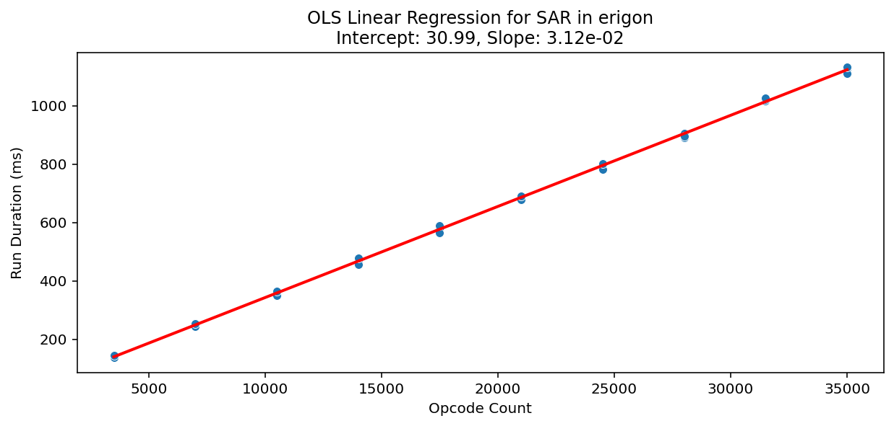

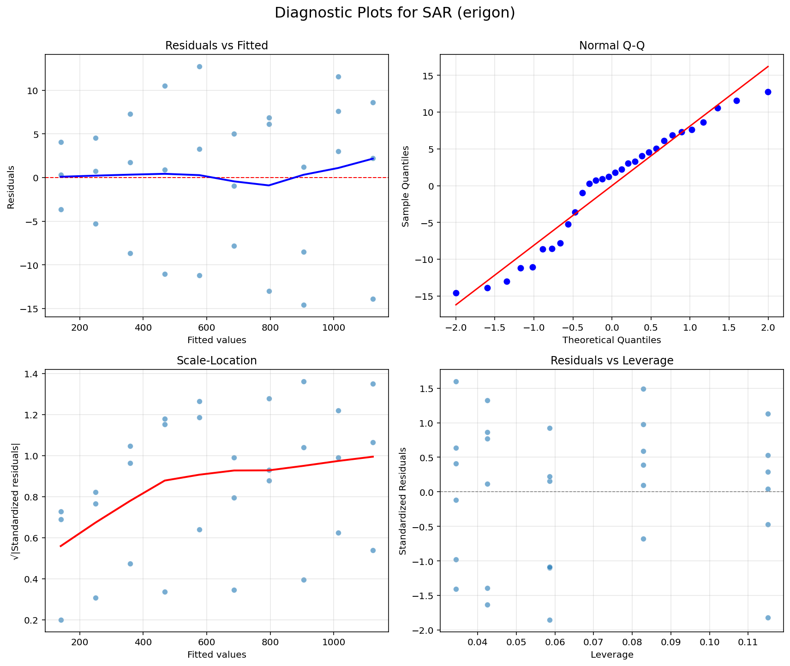


# SDIV

## geth


```python
                            OLS Regression Results                            
==============================================================================
Dep. Variable:        run_duration_ms   R-squared:                       0.988
Model:                            OLS   Adj. R-squared:                  0.988
Method:                 Least Squares   F-statistic:                 2.383e+04
Date:                Thu, 22 Jan 2026   Prob (F-statistic):          5.86e-279
Time:                        10:35:09   Log-Likelihood:                -1641.6
No. Observations:                 290   AIC:                             3287.
Df Residuals:                     288   BIC:                             3295.
Df Model:                           1                                         
Covariance Type:            nonrobust                                         
==============================================================================
                 coef    std err          t      P>|t|      [0.025      0.975]
------------------------------------------------------------------------------
const         32.5302      8.852      3.675      0.000      15.108      49.952
opcount        0.0734      0.000    154.372      0.000       0.072       0.074
==============================================================================
Omnibus:                       61.380   Durbin-Watson:                   0.843
Prob(Omnibus):                  0.000   Jarque-Bera (JB):              159.675
Skew:                          -0.975   Prob(JB):                     2.12e-35
Kurtosis:                       6.068   Cond. No.                     4.02e+04
==============================================================================

Notes:
[1] Standard Errors assume that the covariance matrix of the errors is correctly specified.
[2] The condition number is large, 4.02e+04. This might indicate that there are
strong multicollinearity or other numerical problems.
```

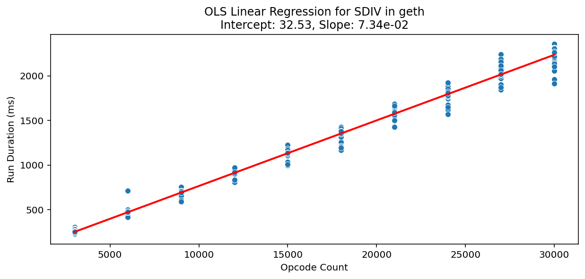


## besu


```python
                            OLS Regression Results                            
==============================================================================
Dep. Variable:        run_duration_ms   R-squared:                       0.981
Model:                            OLS   Adj. R-squared:                  0.981
Method:                 Least Squares   F-statistic:                 1.462e+04
Date:                Thu, 22 Jan 2026   Prob (F-statistic):          7.20e-249
Time:                        10:35:09   Log-Likelihood:                -2143.8
No. Observations:                 290   AIC:                             4292.
Df Residuals:                     288   BIC:                             4299.
Df Model:                           1                                         
Covariance Type:            nonrobust                                         
==============================================================================
                 coef    std err          t      P>|t|      [0.025      0.975]
------------------------------------------------------------------------------
const         44.8103     50.013      0.896      0.371     -53.628     143.248
opcount        0.3249      0.003    120.912      0.000       0.320       0.330
==============================================================================
Omnibus:                       42.059   Durbin-Watson:                   0.705
Prob(Omnibus):                  0.000   Jarque-Bera (JB):              258.498
Skew:                          -0.322   Prob(JB):                     7.38e-57
Kurtosis:                       7.580   Cond. No.                     4.02e+04
==============================================================================

Notes:
[1] Standard Errors assume that the covariance matrix of the errors is correctly specified.
[2] The condition number is large, 4.02e+04. This might indicate that there are
strong multicollinearity or other numerical problems.
```

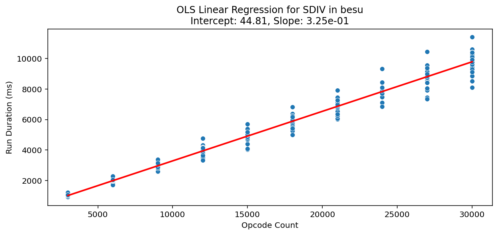

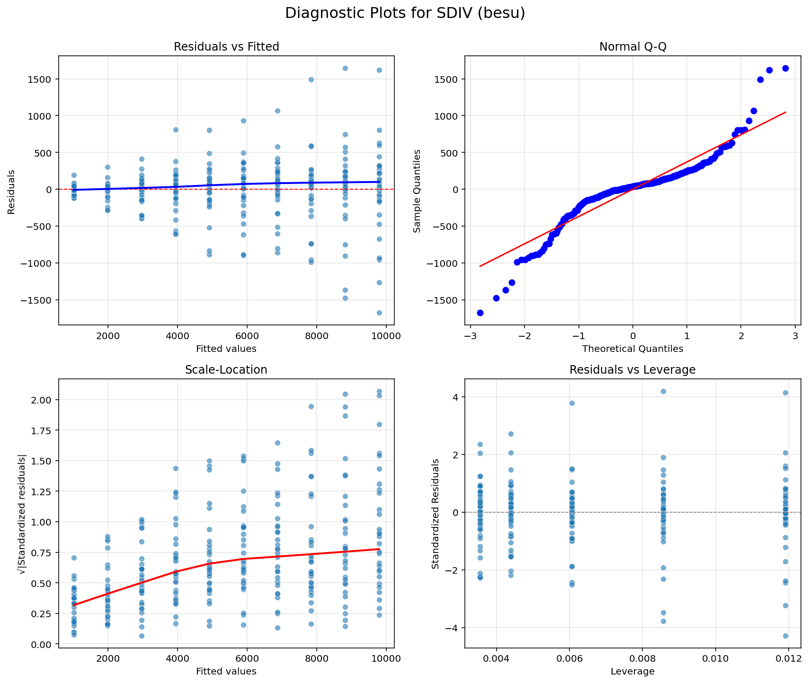


## reth


```python
                            OLS Regression Results                            
==============================================================================
Dep. Variable:        run_duration_ms   R-squared:                       0.992
Model:                            OLS   Adj. R-squared:                  0.992
Method:                 Least Squares   F-statistic:                 2.094e+04
Date:                Thu, 22 Jan 2026   Prob (F-statistic):          1.50e-186
Time:                        10:35:09   Log-Likelihood:                -974.39
No. Observations:                 180   AIC:                             1953.
Df Residuals:                     178   BIC:                             1959.
Df Model:                           1                                         
Covariance Type:            nonrobust                                         
==============================================================================
                 coef    std err          t      P>|t|      [0.025      0.975]
------------------------------------------------------------------------------
const         31.4679      8.790      3.580      0.000      14.121      48.815
opcount        0.0683      0.000    144.696      0.000       0.067       0.069
==============================================================================
Omnibus:                       98.719   Durbin-Watson:                   0.836
Prob(Omnibus):                  0.000   Jarque-Bera (JB):              466.658
Skew:                          -2.134   Prob(JB):                    4.64e-102
Kurtosis:                       9.633   Cond. No.                     4.02e+04
==============================================================================

Notes:
[1] Standard Errors assume that the covariance matrix of the errors is correctly specified.
[2] The condition number is large, 4.02e+04. This might indicate that there are
strong multicollinearity or other numerical problems.
```

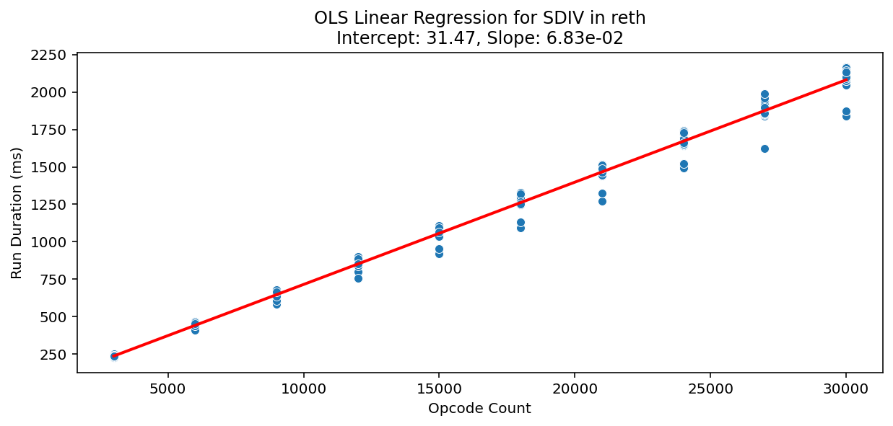

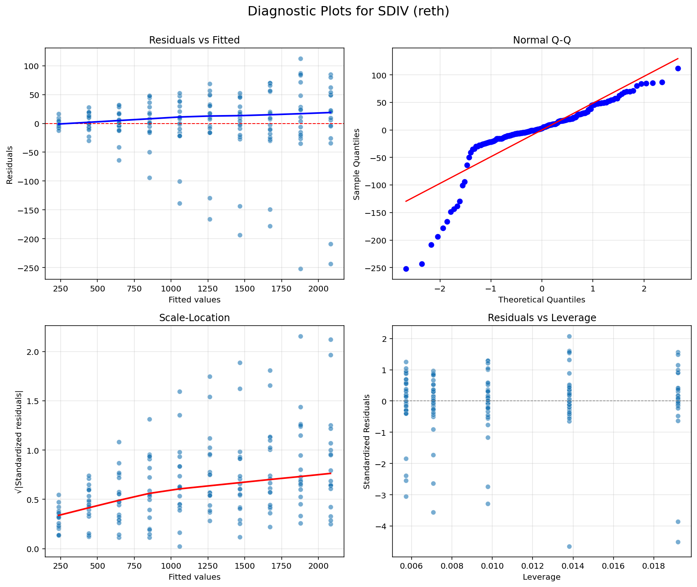


## nethermind


```python
                            OLS Regression Results                            
==============================================================================
Dep. Variable:        run_duration_ms   R-squared:                       0.974
Model:                            OLS   Adj. R-squared:                  0.974
Method:                 Least Squares   F-statistic:                 1.071e+04
Date:                Thu, 22 Jan 2026   Prob (F-statistic):          7.21e-230
Time:                        10:35:10   Log-Likelihood:                -1787.0
No. Observations:                 290   AIC:                             3578.
Df Residuals:                     288   BIC:                             3585.
Df Model:                           1                                         
Covariance Type:            nonrobust                                         
==============================================================================
                 coef    std err          t      P>|t|      [0.025      0.975]
------------------------------------------------------------------------------
const         28.3281     14.614      1.938      0.054      -0.437      57.093
opcount        0.0813      0.001    103.509      0.000       0.080       0.083
==============================================================================
Omnibus:                       41.875   Durbin-Watson:                   0.801
Prob(Omnibus):                  0.000   Jarque-Bera (JB):              127.078
Skew:                           0.609   Prob(JB):                     2.54e-28
Kurtosis:                       6.005   Cond. No.                     4.02e+04
==============================================================================

Notes:
[1] Standard Errors assume that the covariance matrix of the errors is correctly specified.
[2] The condition number is large, 4.02e+04. This might indicate that there are
strong multicollinearity or other numerical problems.
```


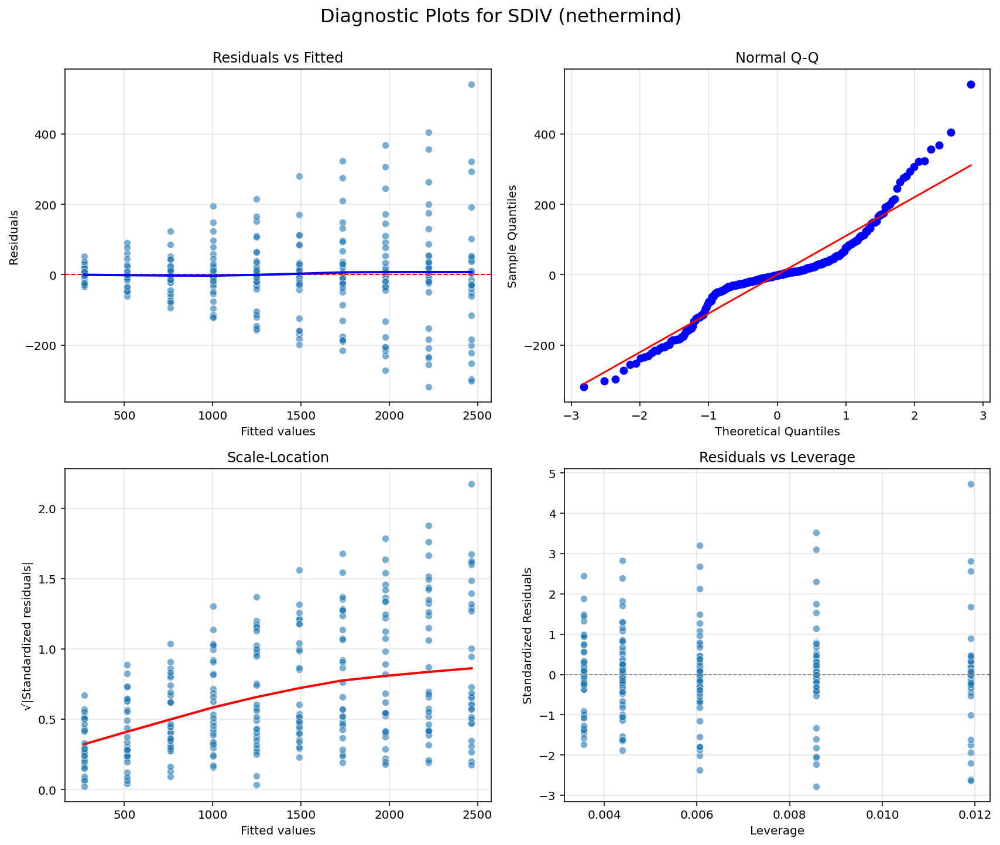


## erigon


```python
                            OLS Regression Results                            
==============================================================================
Dep. Variable:        run_duration_ms   R-squared:                       0.999
Model:                            OLS   Adj. R-squared:                  0.999
Method:                 Least Squares   F-statistic:                 4.002e+04
Date:                Thu, 22 Jan 2026   Prob (F-statistic):           9.95e-46
Time:                        10:35:10   Log-Likelihood:                -127.65
No. Observations:                  30   AIC:                             259.3
Df Residuals:                      28   BIC:                             262.1
Df Model:                           1                                         
Covariance Type:            nonrobust                                         
==============================================================================
                 coef    std err          t      P>|t|      [0.025      0.975]
------------------------------------------------------------------------------
const         32.0771      6.959      4.609      0.000      17.822      46.332
opcount        0.0748      0.000    200.061      0.000       0.074       0.076
==============================================================================
Omnibus:                       12.918   Durbin-Watson:                   1.573
Prob(Omnibus):                  0.002   Jarque-Bera (JB):               12.622
Skew:                           1.289   Prob(JB):                      0.00182
Kurtosis:                       4.857   Cond. No.                     4.02e+04
==============================================================================

Notes:
[1] Standard Errors assume that the covariance matrix of the errors is correctly specified.
[2] The condition number is large, 4.02e+04. This might indicate that there are
strong multicollinearity or other numerical problems.
```

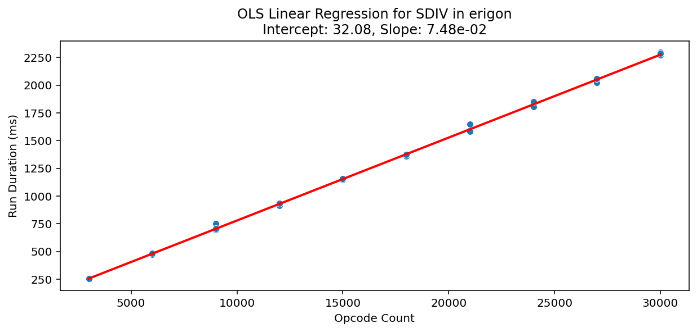

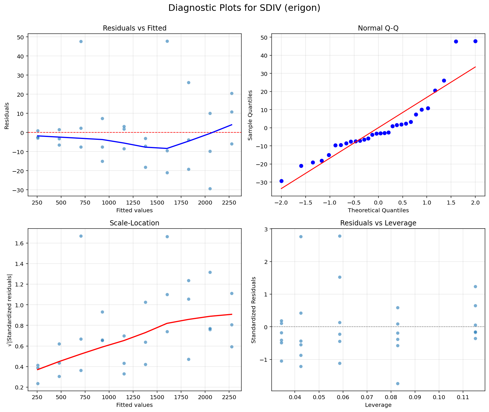


# SELFBALANCE

## geth


```python
                            OLS Regression Results                            
==============================================================================
Dep. Variable:        run_duration_ms   R-squared:                       0.984
Model:                            OLS   Adj. R-squared:                  0.984
Method:                 Least Squares   F-statistic:                 1.795e+04
Date:                Thu, 22 Jan 2026   Prob (F-statistic):          2.65e-268
Time:                        10:35:10   Log-Likelihood:                -1722.3
No. Observations:                 300   AIC:                             3449.
Df Residuals:                     298   BIC:                             3456.
Df Model:                           1                                         
Covariance Type:            nonrobust                                         
==============================================================================
                 coef    std err          t      P>|t|      [0.025      0.975]
------------------------------------------------------------------------------
const         26.9720      9.428      2.861      0.005       8.418      45.526
opcount        0.0407      0.000    133.959      0.000       0.040       0.041
==============================================================================
Omnibus:                      159.217   Durbin-Watson:                   0.922
Prob(Omnibus):                  0.000   Jarque-Bera (JB):             5047.286
Skew:                           1.524   Prob(JB):                         0.00
Kurtosis:                      22.862   Cond. No.                     6.70e+04
==============================================================================

Notes:
[1] Standard Errors assume that the covariance matrix of the errors is correctly specified.
[2] The condition number is large, 6.7e+04. This might indicate that there are
strong multicollinearity or other numerical problems.
```

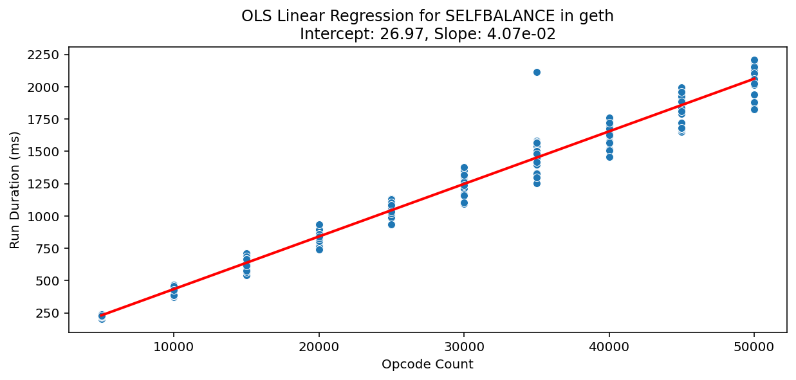

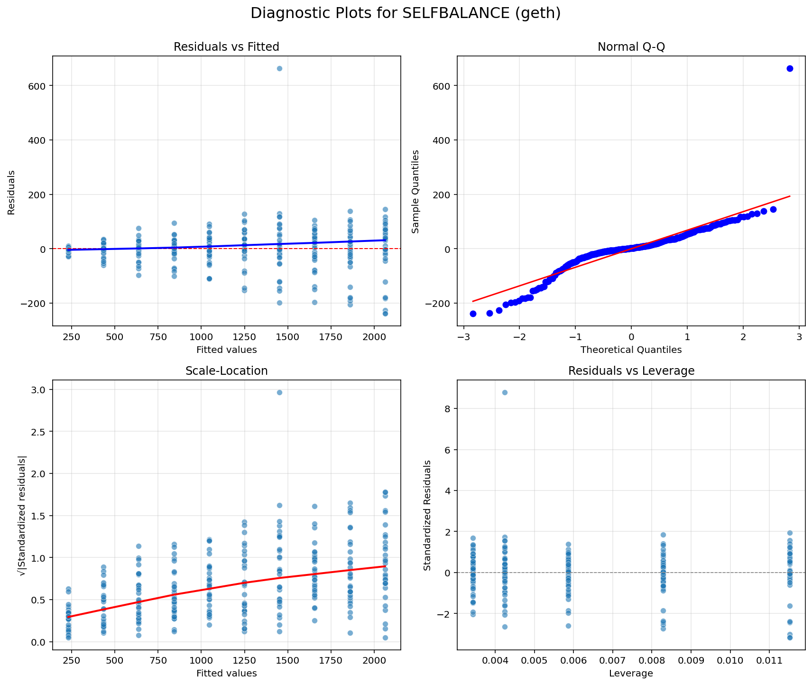


## besu


```python
                            OLS Regression Results                            
==============================================================================
Dep. Variable:        run_duration_ms   R-squared:                       0.933
Model:                            OLS   Adj. R-squared:                  0.933
Method:                 Least Squares   F-statistic:                     4150.
Date:                Thu, 22 Jan 2026   Prob (F-statistic):          5.83e-177
Time:                        10:35:10   Log-Likelihood:                -1986.0
No. Observations:                 300   AIC:                             3976.
Df Residuals:                     298   BIC:                             3983.
Df Model:                           1                                         
Covariance Type:            nonrobust                                         
==============================================================================
                 coef    std err          t      P>|t|      [0.025      0.975]
------------------------------------------------------------------------------
const        251.1664     22.708     11.061      0.000     206.477     295.855
opcount        0.0472      0.001     64.418      0.000       0.046       0.049
==============================================================================
Omnibus:                       81.468   Durbin-Watson:                   0.922
Prob(Omnibus):                  0.000   Jarque-Bera (JB):              177.515
Skew:                           1.351   Prob(JB):                     2.84e-39
Kurtosis:                       5.627   Cond. No.                     6.70e+04
==============================================================================

Notes:
[1] Standard Errors assume that the covariance matrix of the errors is correctly specified.
[2] The condition number is large, 6.7e+04. This might indicate that there are
strong multicollinearity or other numerical problems.
```

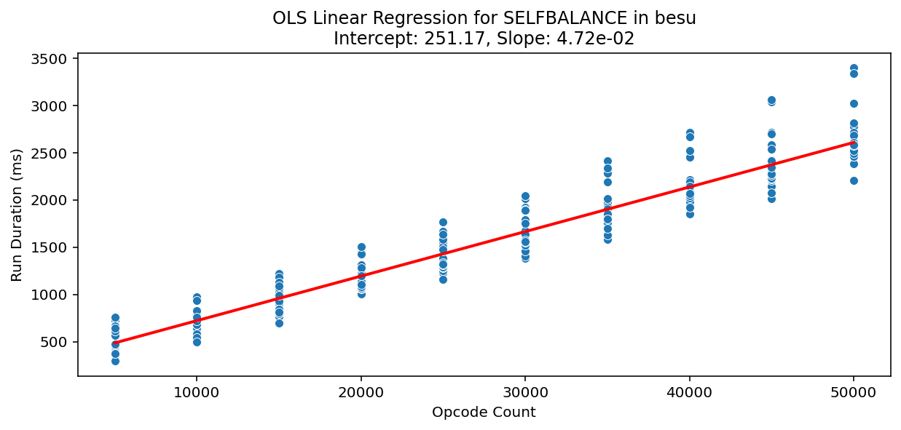

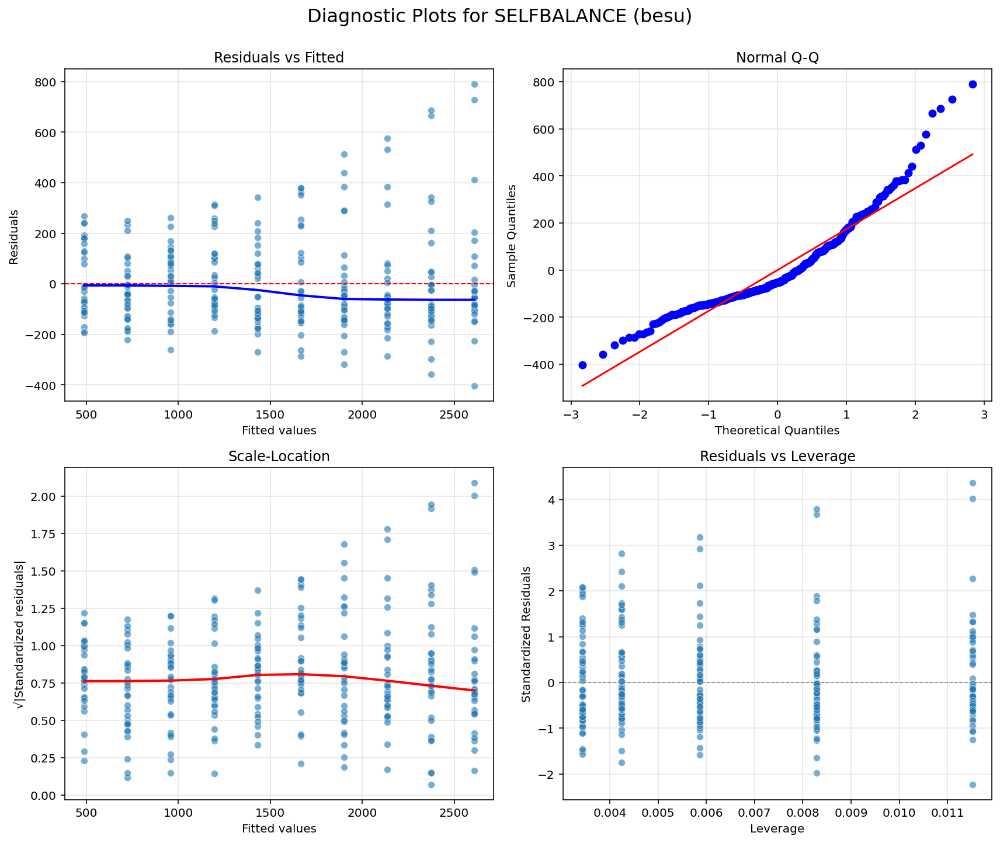


## reth


```python
                            OLS Regression Results                            
==============================================================================
Dep. Variable:        run_duration_ms   R-squared:                       0.995
Model:                            OLS   Adj. R-squared:                  0.995
Method:                 Least Squares   F-statistic:                 3.848e+04
Date:                Thu, 22 Jan 2026   Prob (F-statistic):          2.14e-219
Time:                        10:35:11   Log-Likelihood:                -1081.5
No. Observations:                 190   AIC:                             2167.
Df Residuals:                     188   BIC:                             2174.
Df Model:                           1                                         
Covariance Type:            nonrobust                                         
==============================================================================
                 coef    std err          t      P>|t|      [0.025      0.975]
------------------------------------------------------------------------------
const         32.6030     11.306      2.884      0.004      10.301      54.905
opcount        0.0715      0.000    196.152      0.000       0.071       0.072
==============================================================================
Omnibus:                       84.541   Durbin-Watson:                   0.892
Prob(Omnibus):                  0.000   Jarque-Bera (JB):              904.936
Skew:                          -1.340   Prob(JB):                    3.13e-197
Kurtosis:                      13.350   Cond. No.                     6.70e+04
==============================================================================

Notes:
[1] Standard Errors assume that the covariance matrix of the errors is correctly specified.
[2] The condition number is large, 6.7e+04. This might indicate that there are
strong multicollinearity or other numerical problems.
```

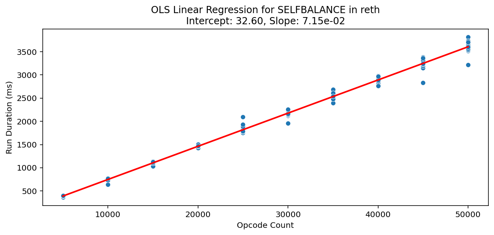

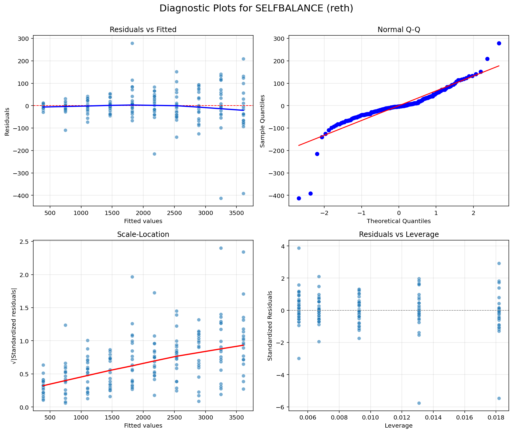


## nethermind


```python
                            OLS Regression Results                            
==============================================================================
Dep. Variable:        run_duration_ms   R-squared:                       0.960
Model:                            OLS   Adj. R-squared:                  0.960
Method:                 Least Squares   F-statistic:                     7169.
Date:                Thu, 22 Jan 2026   Prob (F-statistic):          1.71e-210
Time:                        10:35:11   Log-Likelihood:                -1648.7
No. Observations:                 300   AIC:                             3301.
Df Residuals:                     298   BIC:                             3309.
Df Model:                           1                                         
Covariance Type:            nonrobust                                         
==============================================================================
                 coef    std err          t      P>|t|      [0.025      0.975]
------------------------------------------------------------------------------
const        102.3883      7.377     13.879      0.000      87.870     116.906
opcount        0.0201      0.000     84.670      0.000       0.020       0.021
==============================================================================
Omnibus:                       73.595   Durbin-Watson:                   1.913
Prob(Omnibus):                  0.000   Jarque-Bera (JB):              161.133
Skew:                           1.214   Prob(JB):                     1.02e-35
Kurtosis:                       5.644   Cond. No.                     6.70e+04
==============================================================================

Notes:
[1] Standard Errors assume that the covariance matrix of the errors is correctly specified.
[2] The condition number is large, 6.7e+04. This might indicate that there are
strong multicollinearity or other numerical problems.
```

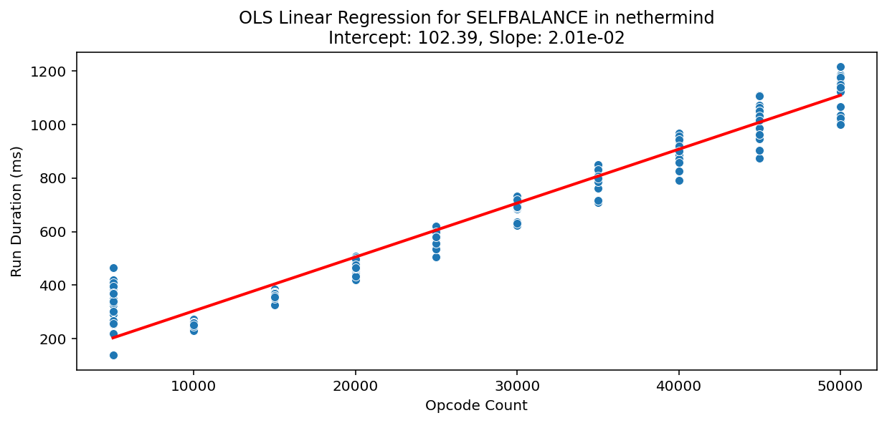

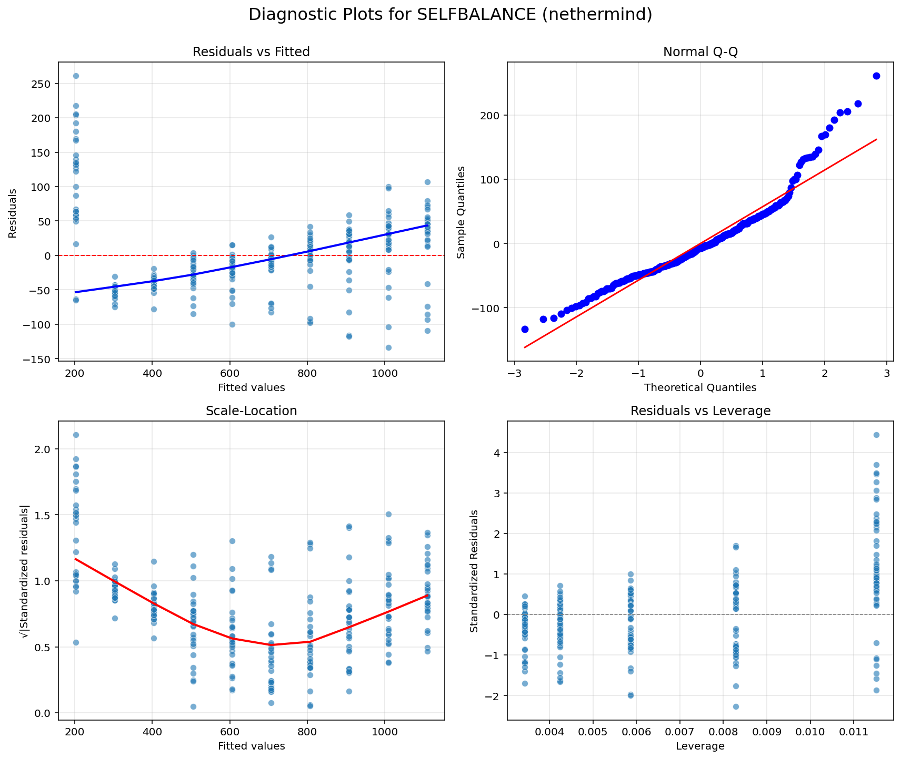


## erigon


```python
                            OLS Regression Results                            
==============================================================================
Dep. Variable:        run_duration_ms   R-squared:                       0.996
Model:                            OLS   Adj. R-squared:                  0.996
Method:                 Least Squares   F-statistic:                     9427.
Date:                Thu, 22 Jan 2026   Prob (F-statistic):           3.80e-47
Time:                        10:35:11   Log-Likelihood:                -182.73
No. Observations:                  40   AIC:                             369.5
Df Residuals:                      38   BIC:                             372.8
Df Model:                           1                                         
Covariance Type:            nonrobust                                         
==============================================================================
                 coef    std err          t      P>|t|      [0.025      0.975]
------------------------------------------------------------------------------
const         15.7158      8.171      1.923      0.062      -0.826      32.258
opcount        0.0256      0.000     97.092      0.000       0.025       0.026
==============================================================================
Omnibus:                       54.596   Durbin-Watson:                   2.498
Prob(Omnibus):                  0.000   Jarque-Bera (JB):              383.875
Skew:                           3.118   Prob(JB):                     4.39e-84
Kurtosis:                      16.836   Cond. No.                     6.70e+04
==============================================================================

Notes:
[1] Standard Errors assume that the covariance matrix of the errors is correctly specified.
[2] The condition number is large, 6.7e+04. This might indicate that there are
strong multicollinearity or other numerical problems.
```
OLS model did not run... Error: 'numpy.ndarray' object has no attribute 'iloc'

# SGT

## geth


```python
                            OLS Regression Results                            
==============================================================================
Dep. Variable:        run_duration_ms   R-squared:                       0.972
Model:                            OLS   Adj. R-squared:                  0.972
Method:                 Least Squares   F-statistic:                 1.007e+04
Date:                Thu, 22 Jan 2026   Prob (F-statistic):          4.03e-226
Time:                        10:35:11   Log-Likelihood:                -1542.3
No. Observations:                 290   AIC:                             3089.
Df Residuals:                     288   BIC:                             3096.
Df Model:                           1                                         
Covariance Type:            nonrobust                                         
==============================================================================
                 coef    std err          t      P>|t|      [0.025      0.975]
------------------------------------------------------------------------------
const         31.2216      6.284      4.969      0.000      18.854      43.589
opcount        0.0254      0.000    100.370      0.000       0.025       0.026
==============================================================================
Omnibus:                      322.723   Durbin-Watson:                   1.223
Prob(Omnibus):                  0.000   Jarque-Bera (JB):            24418.998
Skew:                           4.524   Prob(JB):                         0.00
Kurtosis:                      47.034   Cond. No.                     5.36e+04
==============================================================================

Notes:
[1] Standard Errors assume that the covariance matrix of the errors is correctly specified.
[2] The condition number is large, 5.36e+04. This might indicate that there are
strong multicollinearity or other numerical problems.
```

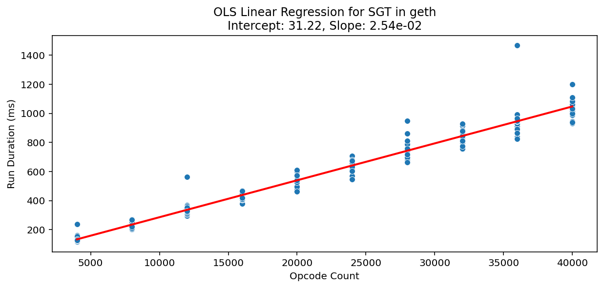

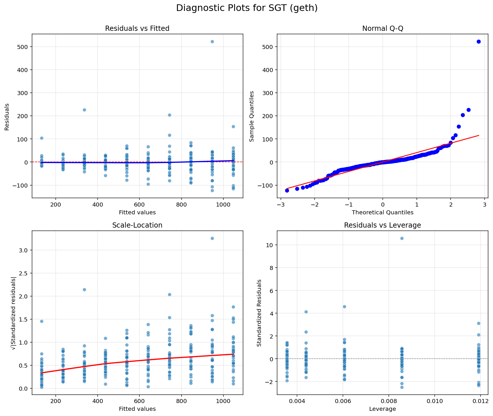


## besu


```python
                            OLS Regression Results                            
==============================================================================
Dep. Variable:        run_duration_ms   R-squared:                       0.983
Model:                            OLS   Adj. R-squared:                  0.983
Method:                 Least Squares   F-statistic:                 1.635e+04
Date:                Thu, 22 Jan 2026   Prob (F-statistic):          9.97e-256
Time:                        10:35:12   Log-Likelihood:                -1777.2
No. Observations:                 290   AIC:                             3558.
Df Residuals:                     288   BIC:                             3566.
Df Model:                           1                                         
Covariance Type:            nonrobust                                         
==============================================================================
                 coef    std err          t      P>|t|      [0.025      0.975]
------------------------------------------------------------------------------
const         30.5641     14.125      2.164      0.031       2.763      58.365
opcount        0.0728      0.001    127.858      0.000       0.072       0.074
==============================================================================
Omnibus:                       34.965   Durbin-Watson:                   0.870
Prob(Omnibus):                  0.000   Jarque-Bera (JB):               65.852
Skew:                          -0.662   Prob(JB):                     5.02e-15
Kurtosis:                       4.922   Cond. No.                     5.36e+04
==============================================================================

Notes:
[1] Standard Errors assume that the covariance matrix of the errors is correctly specified.
[2] The condition number is large, 5.36e+04. This might indicate that there are
strong multicollinearity or other numerical problems.
```

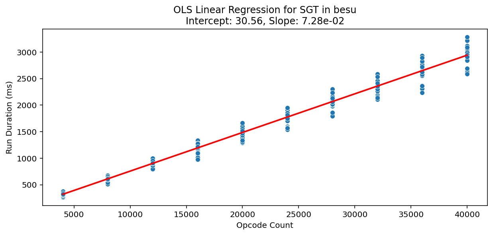

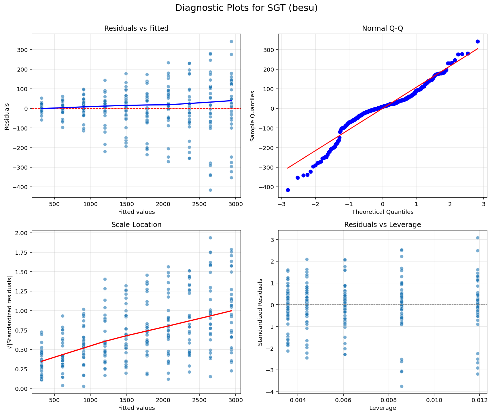


## reth


```python
                            OLS Regression Results                            
==============================================================================
Dep. Variable:        run_duration_ms   R-squared:                       0.984
Model:                            OLS   Adj. R-squared:                  0.983
Method:                 Least Squares   F-statistic:                 1.066e+04
Date:                Thu, 22 Jan 2026   Prob (F-statistic):          8.82e-161
Time:                        10:35:12   Log-Likelihood:                -739.27
No. Observations:                 180   AIC:                             1483.
Df Residuals:                     178   BIC:                             1489.
Df Model:                           1                                         
Covariance Type:            nonrobust                                         
==============================================================================
                 coef    std err          t      P>|t|      [0.025      0.975]
------------------------------------------------------------------------------
const         31.4494      2.381     13.209      0.000      26.751      36.148
opcount        0.0099   9.59e-05    103.263      0.000       0.010       0.010
==============================================================================
Omnibus:                       23.195   Durbin-Watson:                   1.393
Prob(Omnibus):                  0.000   Jarque-Bera (JB):               54.049
Skew:                          -0.546   Prob(JB):                     1.83e-12
Kurtosis:                       5.452   Cond. No.                     5.36e+04
==============================================================================

Notes:
[1] Standard Errors assume that the covariance matrix of the errors is correctly specified.
[2] The condition number is large, 5.36e+04. This might indicate that there are
strong multicollinearity or other numerical problems.
```

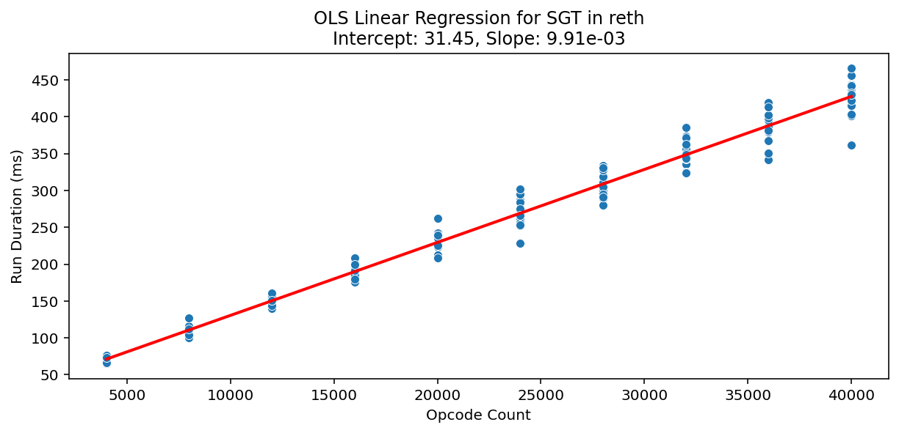

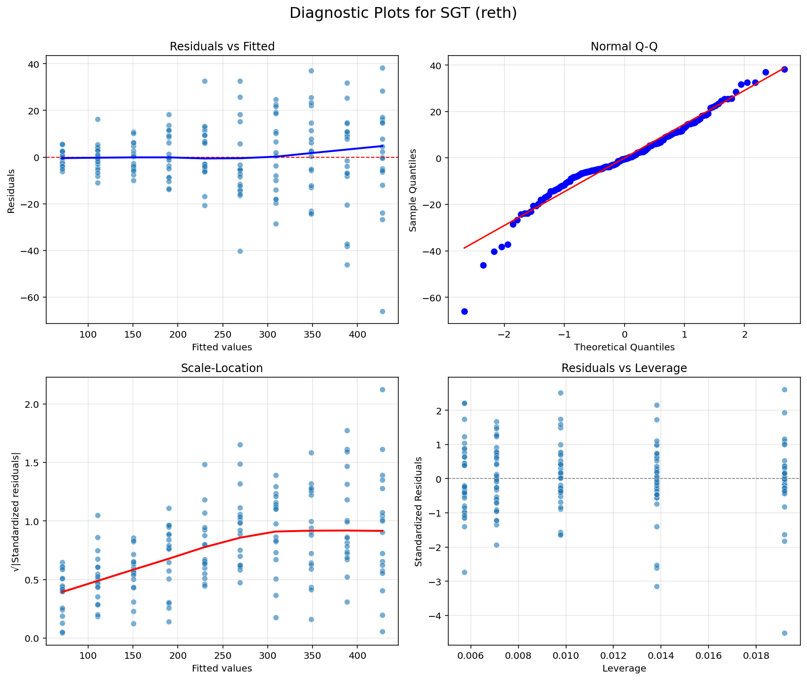


## nethermind


```python
                            OLS Regression Results                            
==============================================================================
Dep. Variable:        run_duration_ms   R-squared:                       0.987
Model:                            OLS   Adj. R-squared:                  0.987
Method:                 Least Squares   F-statistic:                 2.210e+04
Date:                Thu, 22 Jan 2026   Prob (F-statistic):          2.71e-274
Time:                        10:35:12   Log-Likelihood:                -1324.2
No. Observations:                 290   AIC:                             2652.
Df Residuals:                     288   BIC:                             2660.
Df Model:                           1                                         
Covariance Type:            nonrobust                                         
==============================================================================
                 coef    std err          t      P>|t|      [0.025      0.975]
------------------------------------------------------------------------------
const         27.2785      2.962      9.209      0.000      21.449      33.109
opcount        0.0177      0.000    148.652      0.000       0.018       0.018
==============================================================================
Omnibus:                       65.942   Durbin-Watson:                   0.822
Prob(Omnibus):                  0.000   Jarque-Bera (JB):              403.265
Skew:                          -0.743   Prob(JB):                     2.70e-88
Kurtosis:                       8.583   Cond. No.                     5.36e+04
==============================================================================

Notes:
[1] Standard Errors assume that the covariance matrix of the errors is correctly specified.
[2] The condition number is large, 5.36e+04. This might indicate that there are
strong multicollinearity or other numerical problems.
```

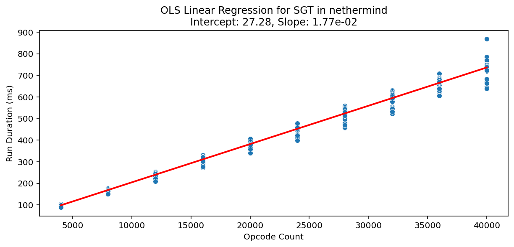

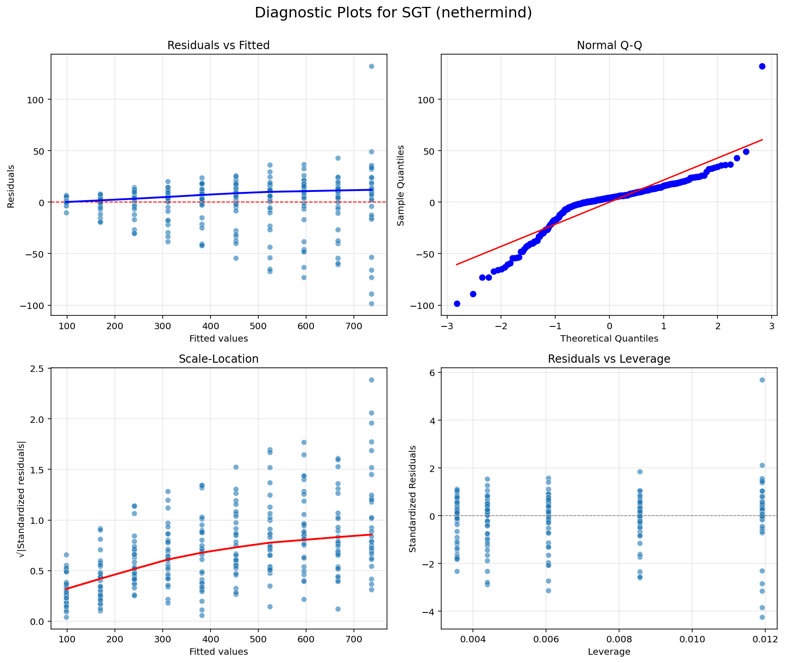


## erigon


```python
                            OLS Regression Results                            
==============================================================================
Dep. Variable:        run_duration_ms   R-squared:                       0.999
Model:                            OLS   Adj. R-squared:                  0.999
Method:                 Least Squares   F-statistic:                 3.752e+04
Date:                Thu, 22 Jan 2026   Prob (F-statistic):           2.46e-45
Time:                        10:35:12   Log-Likelihood:                -107.80
No. Observations:                  30   AIC:                             219.6
Df Residuals:                      28   BIC:                             222.4
Df Model:                           1                                         
Covariance Type:            nonrobust                                         
==============================================================================
                 coef    std err          t      P>|t|      [0.025      0.975]
------------------------------------------------------------------------------
const         30.9612      3.592      8.620      0.000      23.604      38.318
opcount        0.0280      0.000    193.702      0.000       0.028       0.028
==============================================================================
Omnibus:                        0.176   Durbin-Watson:                   0.579
Prob(Omnibus):                  0.916   Jarque-Bera (JB):                0.337
Skew:                          -0.148   Prob(JB):                        0.845
Kurtosis:                       2.573   Cond. No.                     5.36e+04
==============================================================================

Notes:
[1] Standard Errors assume that the covariance matrix of the errors is correctly specified.
[2] The condition number is large, 5.36e+04. This might indicate that there are
strong multicollinearity or other numerical problems.
```

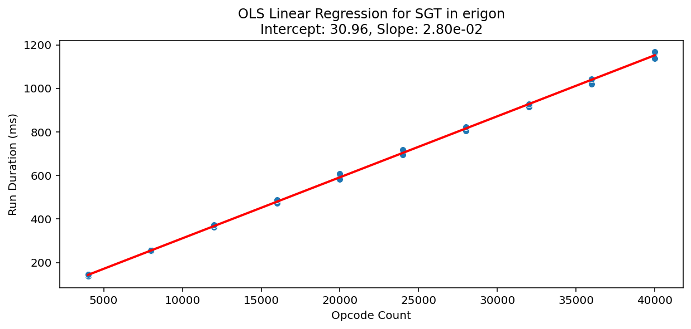

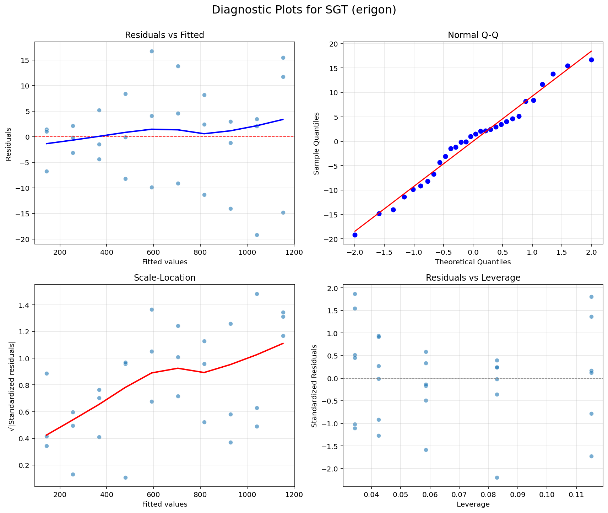


# SHL

## geth


```python
                            OLS Regression Results                            
==============================================================================
Dep. Variable:        run_duration_ms   R-squared:                       0.982
Model:                            OLS   Adj. R-squared:                  0.981
Method:                 Least Squares   F-statistic:                 1.528e+04
Date:                Thu, 22 Jan 2026   Prob (F-statistic):          1.41e-251
Time:                        10:35:13   Log-Likelihood:                -1459.5
No. Observations:                 290   AIC:                             2923.
Df Residuals:                     288   BIC:                             2930.
Df Model:                           1                                         
Covariance Type:            nonrobust                                         
==============================================================================
                 coef    std err          t      P>|t|      [0.025      0.975]
------------------------------------------------------------------------------
const         34.0787      4.724      7.213      0.000      24.780      43.377
opcount        0.0269      0.000    123.611      0.000       0.026       0.027
==============================================================================
Omnibus:                       72.901   Durbin-Watson:                   1.187
Prob(Omnibus):                  0.000   Jarque-Bera (JB):              589.826
Skew:                           0.750   Prob(JB):                    8.33e-129
Kurtosis:                       9.824   Cond. No.                     4.69e+04
==============================================================================

Notes:
[1] Standard Errors assume that the covariance matrix of the errors is correctly specified.
[2] The condition number is large, 4.69e+04. This might indicate that there are
strong multicollinearity or other numerical problems.
```

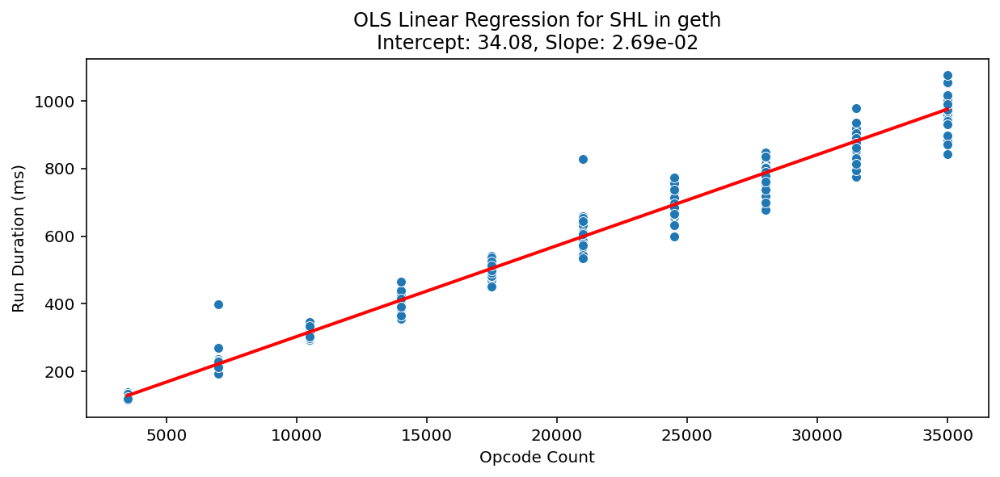

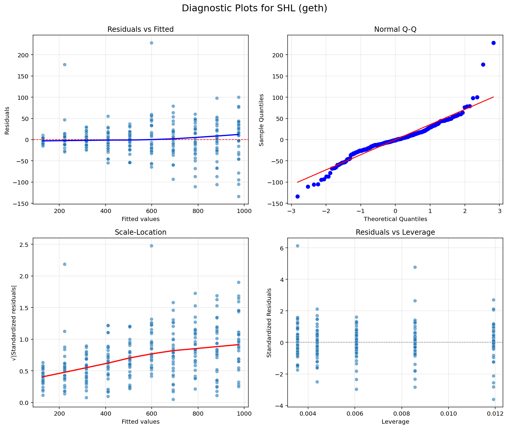


## besu


```python
                            OLS Regression Results                            
==============================================================================
Dep. Variable:        run_duration_ms   R-squared:                       0.972
Model:                            OLS   Adj. R-squared:                  0.972
Method:                 Least Squares   F-statistic:                     9881.
Date:                Thu, 22 Jan 2026   Prob (F-statistic):          6.09e-225
Time:                        10:35:13   Log-Likelihood:                -1964.3
No. Observations:                 290   AIC:                             3933.
Df Residuals:                     288   BIC:                             3940.
Df Model:                           1                                         
Covariance Type:            nonrobust                                         
==============================================================================
                 coef    std err          t      P>|t|      [0.025      0.975]
------------------------------------------------------------------------------
const         34.5271     26.927      1.282      0.201     -18.471      87.525
opcount        0.1232      0.001     99.402      0.000       0.121       0.126
==============================================================================
Omnibus:                       57.229   Durbin-Watson:                   1.113
Prob(Omnibus):                  0.000   Jarque-Bera (JB):              322.493
Skew:                           0.635   Prob(JB):                     9.37e-71
Kurtosis:                       8.007   Cond. No.                     4.69e+04
==============================================================================

Notes:
[1] Standard Errors assume that the covariance matrix of the errors is correctly specified.
[2] The condition number is large, 4.69e+04. This might indicate that there are
strong multicollinearity or other numerical problems.
```


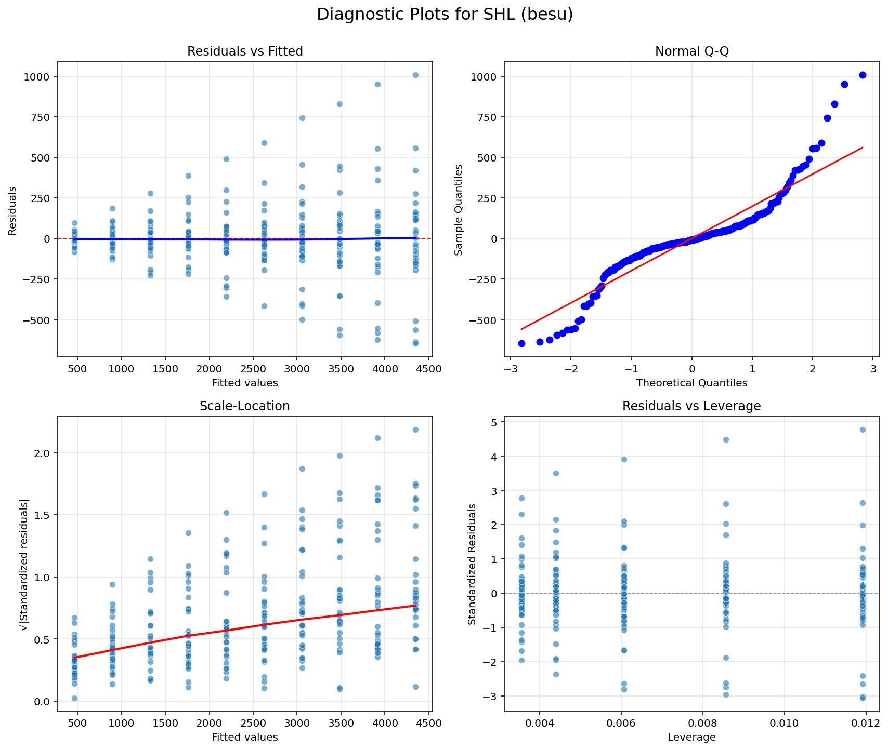


## reth


```python
                            OLS Regression Results                            
==============================================================================
Dep. Variable:        run_duration_ms   R-squared:                       0.990
Model:                            OLS   Adj. R-squared:                  0.990
Method:                 Least Squares   F-statistic:                 1.787e+04
Date:                Thu, 22 Jan 2026   Prob (F-statistic):          1.75e-180
Time:                        10:35:13   Log-Likelihood:                -737.77
No. Observations:                 180   AIC:                             1480.
Df Residuals:                     178   BIC:                             1486.
Df Model:                           1                                         
Covariance Type:            nonrobust                                         
==============================================================================
                 coef    std err          t      P>|t|      [0.025      0.975]
------------------------------------------------------------------------------
const         34.4669      2.361     14.598      0.000      29.808      39.126
opcount        0.0145      0.000    133.679      0.000       0.014       0.015
==============================================================================
Omnibus:                       52.220   Durbin-Watson:                   1.666
Prob(Omnibus):                  0.000   Jarque-Bera (JB):              218.663
Skew:                          -1.029   Prob(JB):                     3.30e-48
Kurtosis:                       7.992   Cond. No.                     4.69e+04
==============================================================================

Notes:
[1] Standard Errors assume that the covariance matrix of the errors is correctly specified.
[2] The condition number is large, 4.69e+04. This might indicate that there are
strong multicollinearity or other numerical problems.
```

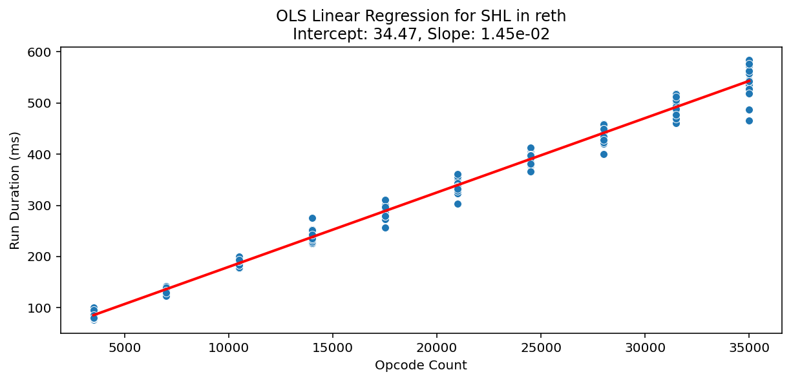

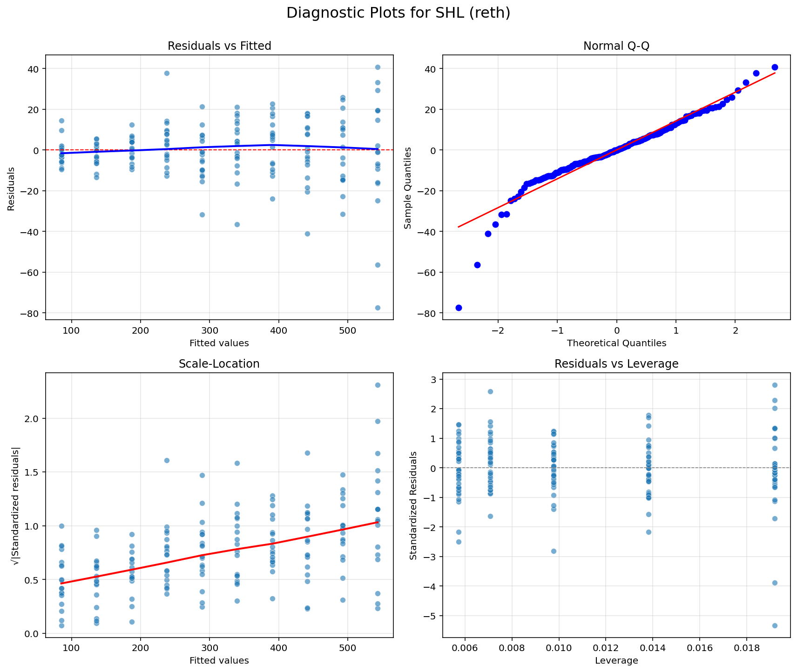


## nethermind


```python
                            OLS Regression Results                            
==============================================================================
Dep. Variable:        run_duration_ms   R-squared:                       0.986
Model:                            OLS   Adj. R-squared:                  0.986
Method:                 Least Squares   F-statistic:                 2.032e+04
Date:                Thu, 22 Jan 2026   Prob (F-statistic):          3.98e-269
Time:                        10:35:14   Log-Likelihood:                -1476.9
No. Observations:                 290   AIC:                             2958.
Df Residuals:                     288   BIC:                             2965.
Df Model:                           1                                         
Covariance Type:            nonrobust                                         
==============================================================================
                 coef    std err          t      P>|t|      [0.025      0.975]
------------------------------------------------------------------------------
const         28.6066      5.016      5.703      0.000      18.734      38.479
opcount        0.0329      0.000    142.556      0.000       0.032       0.033
==============================================================================
Omnibus:                      102.331   Durbin-Watson:                   0.889
Prob(Omnibus):                  0.000   Jarque-Bera (JB):              279.959
Skew:                          -1.635   Prob(JB):                     1.61e-61
Kurtosis:                       6.532   Cond. No.                     4.69e+04
==============================================================================

Notes:
[1] Standard Errors assume that the covariance matrix of the errors is correctly specified.
[2] The condition number is large, 4.69e+04. This might indicate that there are
strong multicollinearity or other numerical problems.
```

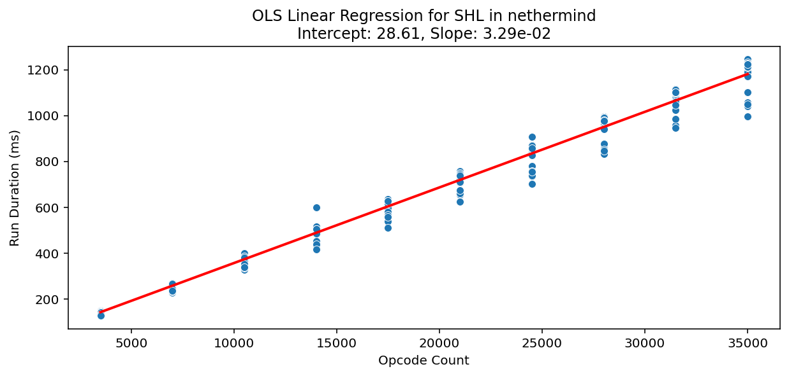

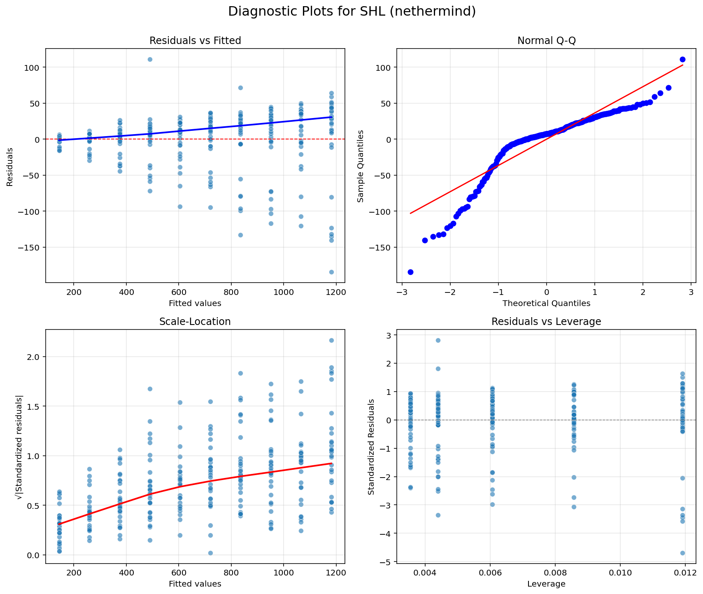


## erigon


```python
                            OLS Regression Results                            
==============================================================================
Dep. Variable:        run_duration_ms   R-squared:                       0.999
Model:                            OLS   Adj. R-squared:                  0.999
Method:                 Least Squares   F-statistic:                 2.275e+04
Date:                Thu, 22 Jan 2026   Prob (F-statistic):           2.70e-42
Time:                        10:35:14   Log-Likelihood:                -112.55
No. Observations:                  30   AIC:                             229.1
Df Residuals:                      28   BIC:                             231.9
Df Model:                           1                                         
Covariance Type:            nonrobust                                         
==============================================================================
                 coef    std err          t      P>|t|      [0.025      0.975]
------------------------------------------------------------------------------
const         28.9650      4.207      6.885      0.000      20.347      37.583
opcount        0.0292      0.000    150.815      0.000       0.029       0.030
==============================================================================
Omnibus:                        3.254   Durbin-Watson:                   1.532
Prob(Omnibus):                  0.197   Jarque-Bera (JB):                1.823
Skew:                           0.479   Prob(JB):                        0.402
Kurtosis:                       3.735   Cond. No.                     4.69e+04
==============================================================================

Notes:
[1] Standard Errors assume that the covariance matrix of the errors is correctly specified.
[2] The condition number is large, 4.69e+04. This might indicate that there are
strong multicollinearity or other numerical problems.
```

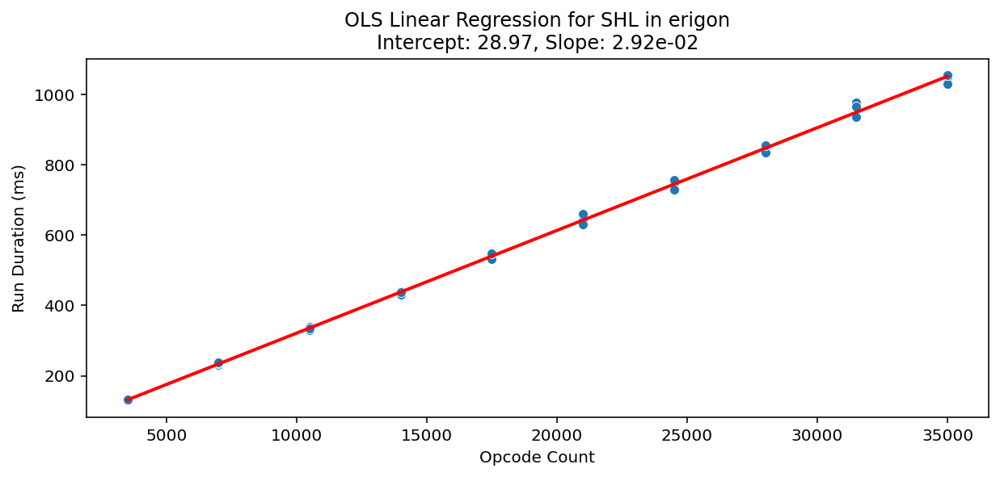

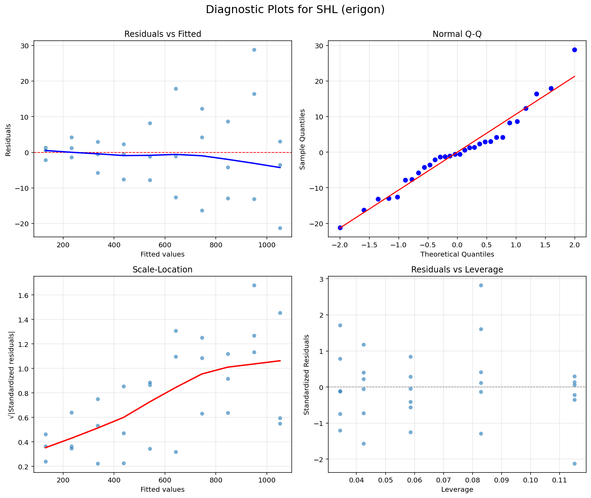


# SHR

## geth


```python
                            OLS Regression Results                            
==============================================================================
Dep. Variable:        run_duration_ms   R-squared:                       0.970
Model:                            OLS   Adj. R-squared:                  0.970
Method:                 Least Squares   F-statistic:                     9263.
Date:                Thu, 22 Jan 2026   Prob (F-statistic):          5.03e-221
Time:                        10:35:14   Log-Likelihood:                -1528.2
No. Observations:                 290   AIC:                             3060.
Df Residuals:                     288   BIC:                             3068.
Df Model:                           1                                         
Covariance Type:            nonrobust                                         
==============================================================================
                 coef    std err          t      P>|t|      [0.025      0.975]
------------------------------------------------------------------------------
const         30.2038      5.987      5.045      0.000      18.421      41.987
opcount        0.0265      0.000     96.247      0.000       0.026       0.027
==============================================================================
Omnibus:                      371.372   Durbin-Watson:                   1.535
Prob(Omnibus):                  0.000   Jarque-Bera (JB):            52861.731
Skew:                           5.526   Prob(JB):                         0.00
Kurtosis:                      68.212   Cond. No.                     4.69e+04
==============================================================================

Notes:
[1] Standard Errors assume that the covariance matrix of the errors is correctly specified.
[2] The condition number is large, 4.69e+04. This might indicate that there are
strong multicollinearity or other numerical problems.
```
OLS model did not run... Error: 'numpy.ndarray' object has no attribute 'iloc'

## besu


```python
                            OLS Regression Results                            
==============================================================================
Dep. Variable:        run_duration_ms   R-squared:                       0.985
Model:                            OLS   Adj. R-squared:                  0.985
Method:                 Least Squares   F-statistic:                 1.900e+04
Date:                Thu, 22 Jan 2026   Prob (F-statistic):          5.77e-265
Time:                        10:35:14   Log-Likelihood:                -1880.0
No. Observations:                 290   AIC:                             3764.
Df Residuals:                     288   BIC:                             3771.
Df Model:                           1                                         
Covariance Type:            nonrobust                                         
==============================================================================
                 coef    std err          t      P>|t|      [0.025      0.975]
------------------------------------------------------------------------------
const         32.7093     20.134      1.625      0.105      -6.919      72.337
opcount        0.1278      0.001    137.823      0.000       0.126       0.130
==============================================================================
Omnibus:                       62.834   Durbin-Watson:                   0.930
Prob(Omnibus):                  0.000   Jarque-Bera (JB):              127.453
Skew:                          -1.103   Prob(JB):                     2.11e-28
Kurtosis:                       5.383   Cond. No.                     4.69e+04
==============================================================================

Notes:
[1] Standard Errors assume that the covariance matrix of the errors is correctly specified.
[2] The condition number is large, 4.69e+04. This might indicate that there are
strong multicollinearity or other numerical problems.
```

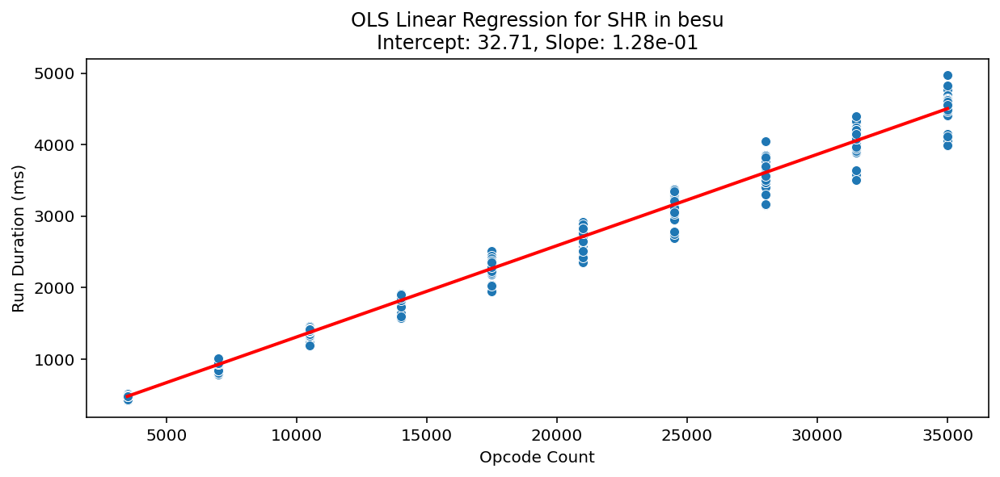

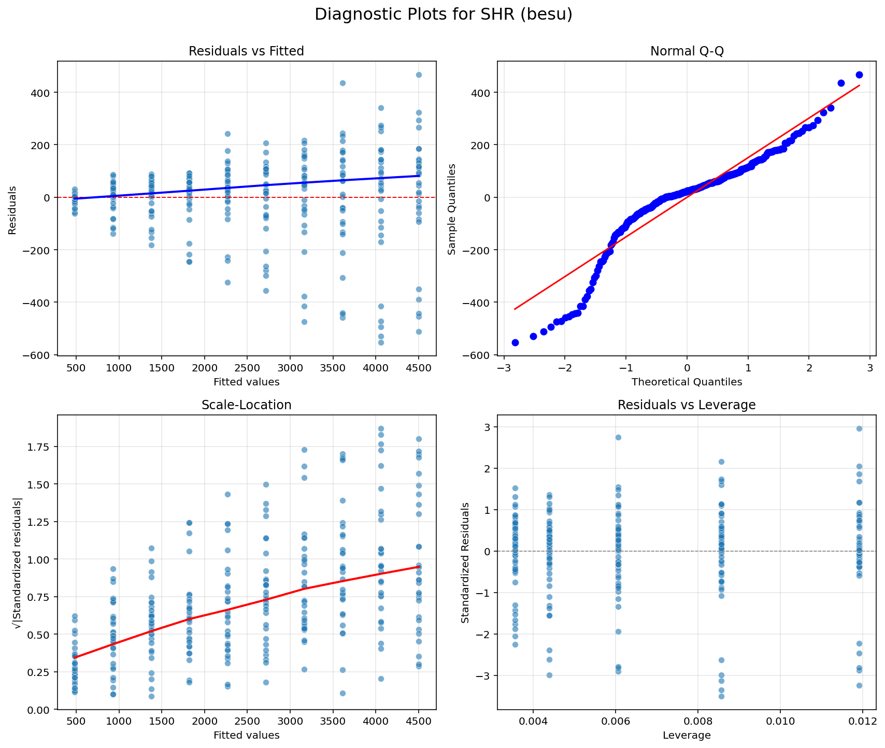


## reth


```python
                            OLS Regression Results                            
==============================================================================
Dep. Variable:        run_duration_ms   R-squared:                       0.991
Model:                            OLS   Adj. R-squared:                  0.991
Method:                 Least Squares   F-statistic:                 1.998e+04
Date:                Thu, 22 Jan 2026   Prob (F-statistic):          9.37e-185
Time:                        10:35:14   Log-Likelihood:                -727.11
No. Observations:                 180   AIC:                             1458.
Df Residuals:                     178   BIC:                             1465.
Df Model:                           1                                         
Covariance Type:            nonrobust                                         
==============================================================================
                 coef    std err          t      P>|t|      [0.025      0.975]
------------------------------------------------------------------------------
const         31.5052      2.225     14.158      0.000      27.114      35.897
opcount        0.0145      0.000    141.347      0.000       0.014       0.015
==============================================================================
Omnibus:                       17.454   Durbin-Watson:                   1.406
Prob(Omnibus):                  0.000   Jarque-Bera (JB):               21.996
Skew:                          -0.640   Prob(JB):                     1.67e-05
Kurtosis:                       4.138   Cond. No.                     4.69e+04
==============================================================================

Notes:
[1] Standard Errors assume that the covariance matrix of the errors is correctly specified.
[2] The condition number is large, 4.69e+04. This might indicate that there are
strong multicollinearity or other numerical problems.
```

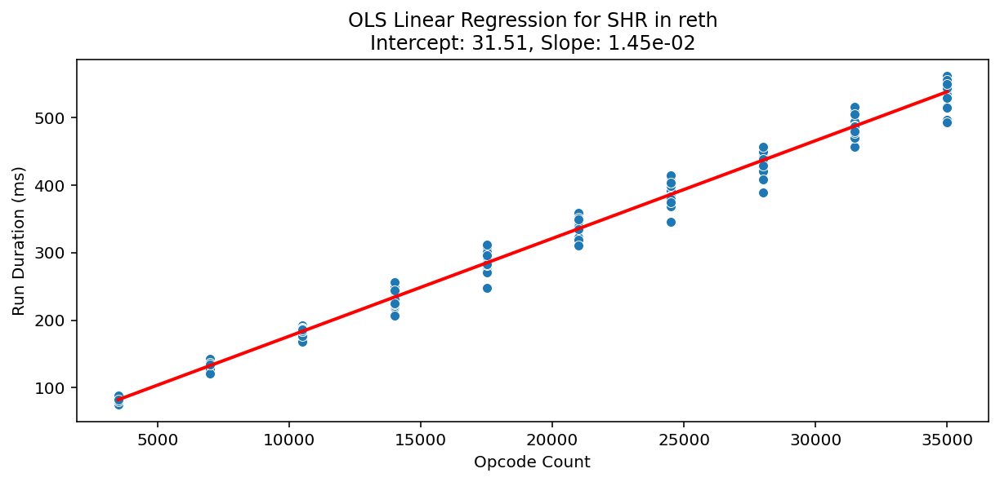


## nethermind


```python
                            OLS Regression Results                            
==============================================================================
Dep. Variable:        run_duration_ms   R-squared:                       0.984
Model:                            OLS   Adj. R-squared:                  0.984
Method:                 Least Squares   F-statistic:                 1.750e+04
Date:                Thu, 22 Jan 2026   Prob (F-statistic):          6.37e-260
Time:                        10:35:15   Log-Likelihood:                -1491.3
No. Observations:                 290   AIC:                             2987.
Df Residuals:                     288   BIC:                             2994.
Df Model:                           1                                         
Covariance Type:            nonrobust                                         
==============================================================================
                 coef    std err          t      P>|t|      [0.025      0.975]
------------------------------------------------------------------------------
const         27.8621      5.271      5.286      0.000      17.487      38.237
opcount        0.0321      0.000    132.294      0.000       0.032       0.033
==============================================================================
Omnibus:                       49.999   Durbin-Watson:                   0.809
Prob(Omnibus):                  0.000   Jarque-Bera (JB):              109.903
Skew:                          -0.856   Prob(JB):                     1.36e-24
Kurtosis:                       5.483   Cond. No.                     4.69e+04
==============================================================================

Notes:
[1] Standard Errors assume that the covariance matrix of the errors is correctly specified.
[2] The condition number is large, 4.69e+04. This might indicate that there are
strong multicollinearity or other numerical problems.
```


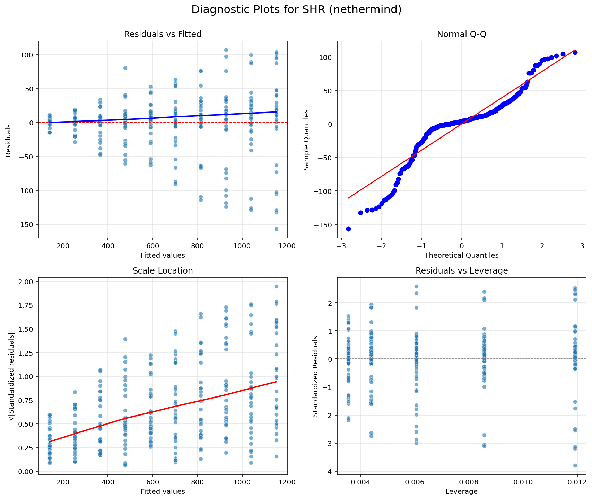


## erigon


```python
                            OLS Regression Results                            
==============================================================================
Dep. Variable:        run_duration_ms   R-squared:                       0.988
Model:                            OLS   Adj. R-squared:                  0.988
Method:                 Least Squares   F-statistic:                     2398.
Date:                Thu, 22 Jan 2026   Prob (F-statistic):           1.12e-28
Time:                        10:35:15   Log-Likelihood:                -147.01
No. Observations:                  30   AIC:                             298.0
Df Residuals:                      28   BIC:                             300.8
Df Model:                           1                                         
Covariance Type:            nonrobust                                         
==============================================================================
                 coef    std err          t      P>|t|      [0.025      0.975]
------------------------------------------------------------------------------
const         27.4333     13.271      2.067      0.048       0.249      54.618
opcount        0.0299      0.001     48.966      0.000       0.029       0.031
==============================================================================
Omnibus:                       34.028   Durbin-Watson:                   2.177
Prob(Omnibus):                  0.000   Jarque-Bera (JB):               84.212
Skew:                           2.470   Prob(JB):                     5.17e-19
Kurtosis:                       9.554   Cond. No.                     4.69e+04
==============================================================================

Notes:
[1] Standard Errors assume that the covariance matrix of the errors is correctly specified.
[2] The condition number is large, 4.69e+04. This might indicate that there are
strong multicollinearity or other numerical problems.
```
OLS model did not run... Error: 'numpy.ndarray' object has no attribute 'iloc'

# SIGNEXTEND

## geth


```python
                            OLS Regression Results                            
==============================================================================
Dep. Variable:        run_duration_ms   R-squared:                       0.984
Model:                            OLS   Adj. R-squared:                  0.984
Method:                 Least Squares   F-statistic:                 1.755e+04
Date:                Thu, 22 Jan 2026   Prob (F-statistic):          4.19e-260
Time:                        10:35:15   Log-Likelihood:                -1398.3
No. Observations:                 290   AIC:                             2801.
Df Residuals:                     288   BIC:                             2808.
Df Model:                           1                                         
Covariance Type:            nonrobust                                         
==============================================================================
                 coef    std err          t      P>|t|      [0.025      0.975]
------------------------------------------------------------------------------
const         28.3695      3.825      7.417      0.000      20.841      35.898
opcount        0.0272      0.000    132.489      0.000       0.027       0.028
==============================================================================
Omnibus:                      250.783   Durbin-Watson:                   1.365
Prob(Omnibus):                  0.000   Jarque-Bera (JB):            12037.654
Skew:                           3.085   Prob(JB):                         0.00
Kurtosis:                      33.954   Cond. No.                     4.02e+04
==============================================================================

Notes:
[1] Standard Errors assume that the covariance matrix of the errors is correctly specified.
[2] The condition number is large, 4.02e+04. This might indicate that there are
strong multicollinearity or other numerical problems.
```


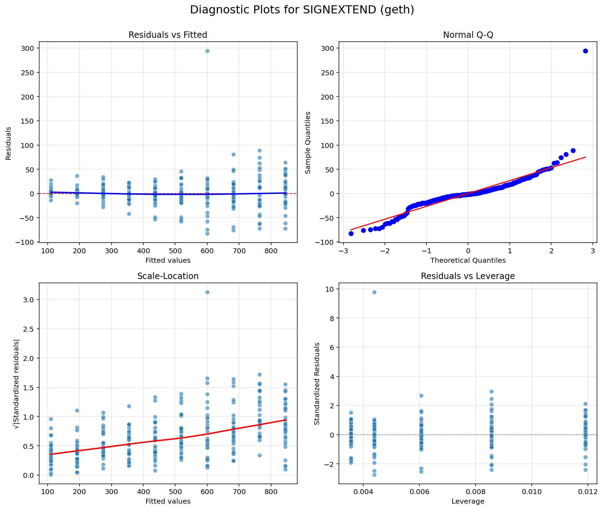


## besu


```python
                            OLS Regression Results                            
==============================================================================
Dep. Variable:        run_duration_ms   R-squared:                       0.978
Model:                            OLS   Adj. R-squared:                  0.978
Method:                 Least Squares   F-statistic:                 1.291e+04
Date:                Thu, 22 Jan 2026   Prob (F-statistic):          3.09e-241
Time:                        10:35:15   Log-Likelihood:                -1791.9
No. Observations:                 290   AIC:                             3588.
Df Residuals:                     288   BIC:                             3595.
Df Model:                           1                                         
Covariance Type:            nonrobust                                         
==============================================================================
                 coef    std err          t      P>|t|      [0.025      0.975]
------------------------------------------------------------------------------
const         34.9027     14.860      2.349      0.020       5.655      64.150
opcount        0.0907      0.001    113.609      0.000       0.089       0.092
==============================================================================
Omnibus:                       20.156   Durbin-Watson:                   0.864
Prob(Omnibus):                  0.000   Jarque-Bera (JB):               54.569
Skew:                           0.227   Prob(JB):                     1.41e-12
Kurtosis:                       5.076   Cond. No.                     4.02e+04
==============================================================================

Notes:
[1] Standard Errors assume that the covariance matrix of the errors is correctly specified.
[2] The condition number is large, 4.02e+04. This might indicate that there are
strong multicollinearity or other numerical problems.
```

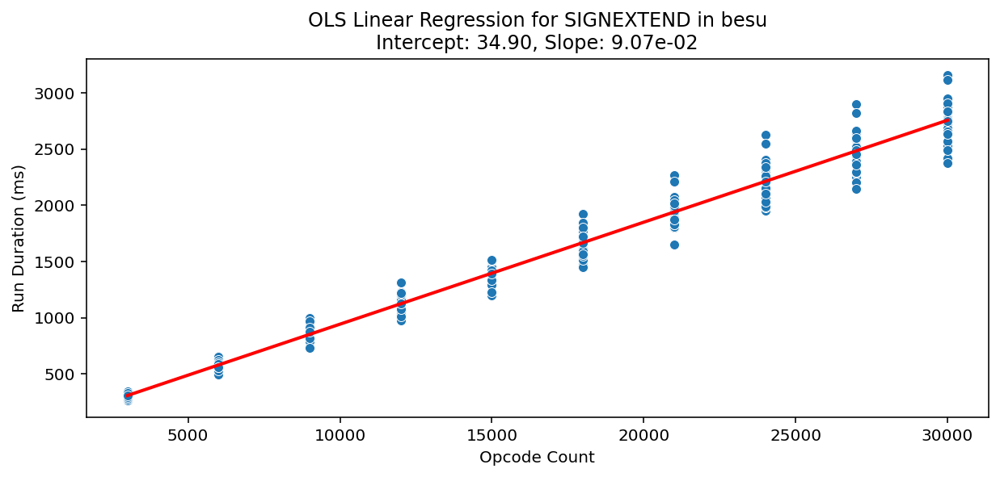

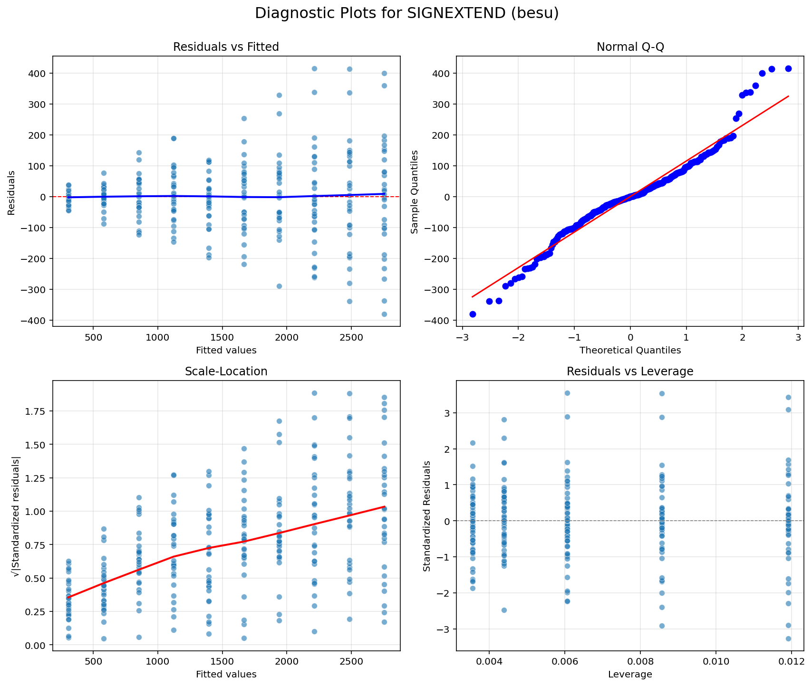


## reth


```python
                            OLS Regression Results                            
==============================================================================
Dep. Variable:        run_duration_ms   R-squared:                       0.990
Model:                            OLS   Adj. R-squared:                  0.990
Method:                 Least Squares   F-statistic:                 1.791e+04
Date:                Thu, 22 Jan 2026   Prob (F-statistic):          1.43e-180
Time:                        10:35:16   Log-Likelihood:                -714.87
No. Observations:                 180   AIC:                             1434.
Df Residuals:                     178   BIC:                             1440.
Df Model:                           1                                         
Covariance Type:            nonrobust                                         
==============================================================================
                 coef    std err          t      P>|t|      [0.025      0.975]
------------------------------------------------------------------------------
const         31.3419      2.079     15.075      0.000      27.239      35.445
opcount        0.0149      0.000    133.831      0.000       0.015       0.015
==============================================================================
Omnibus:                       32.877   Durbin-Watson:                   1.414
Prob(Omnibus):                  0.000   Jarque-Bera (JB):               61.978
Skew:                          -0.881   Prob(JB):                     3.48e-14
Kurtosis:                       5.271   Cond. No.                     4.02e+04
==============================================================================

Notes:
[1] Standard Errors assume that the covariance matrix of the errors is correctly specified.
[2] The condition number is large, 4.02e+04. This might indicate that there are
strong multicollinearity or other numerical problems.
```


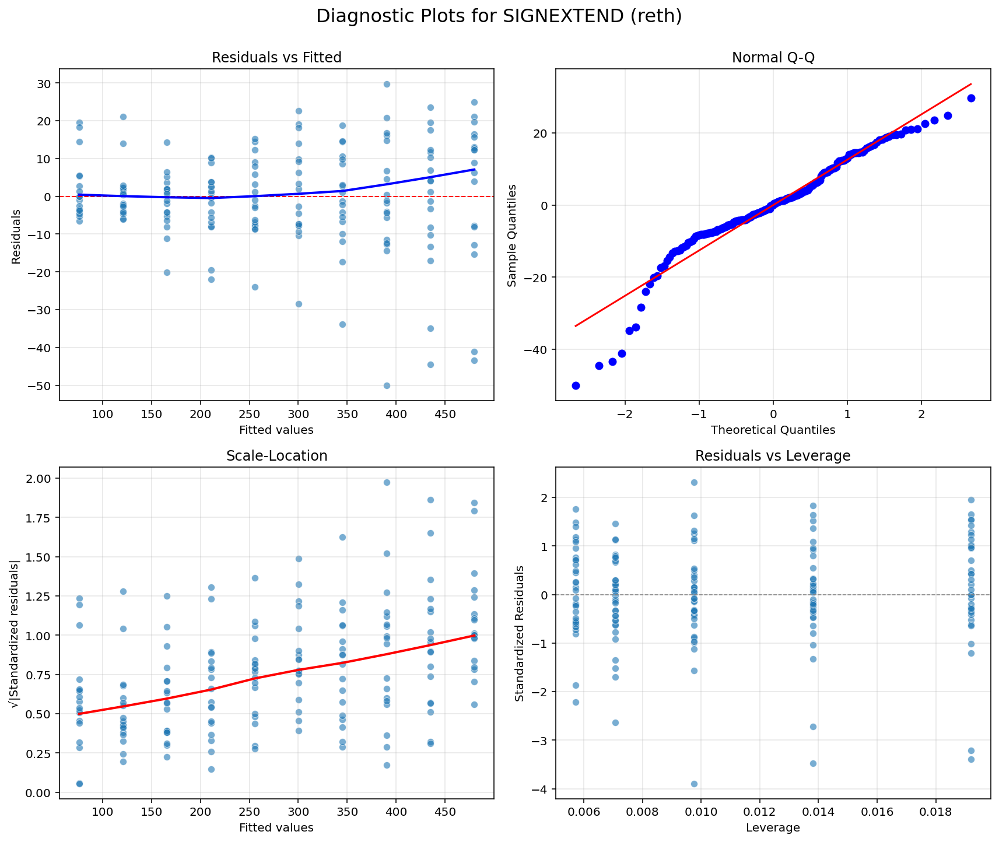


## nethermind


```python
                            OLS Regression Results                            
==============================================================================
Dep. Variable:        run_duration_ms   R-squared:                       0.983
Model:                            OLS   Adj. R-squared:                  0.983
Method:                 Least Squares   F-statistic:                 1.673e+04
Date:                Thu, 22 Jan 2026   Prob (F-statistic):          3.89e-257
Time:                        10:35:16   Log-Likelihood:                -1340.5
No. Observations:                 290   AIC:                             2685.
Df Residuals:                     288   BIC:                             2692.
Df Model:                           1                                         
Covariance Type:            nonrobust                                         
==============================================================================
                 coef    std err          t      P>|t|      [0.025      0.975]
------------------------------------------------------------------------------
const         30.1577      3.133      9.625      0.000      23.991      36.325
opcount        0.0218      0.000    129.332      0.000       0.021       0.022
==============================================================================
Omnibus:                       54.855   Durbin-Watson:                   0.993
Prob(Omnibus):                  0.000   Jarque-Bera (JB):              127.683
Skew:                          -0.913   Prob(JB):                     1.88e-28
Kurtosis:                       5.689   Cond. No.                     4.02e+04
==============================================================================

Notes:
[1] Standard Errors assume that the covariance matrix of the errors is correctly specified.
[2] The condition number is large, 4.02e+04. This might indicate that there are
strong multicollinearity or other numerical problems.
```


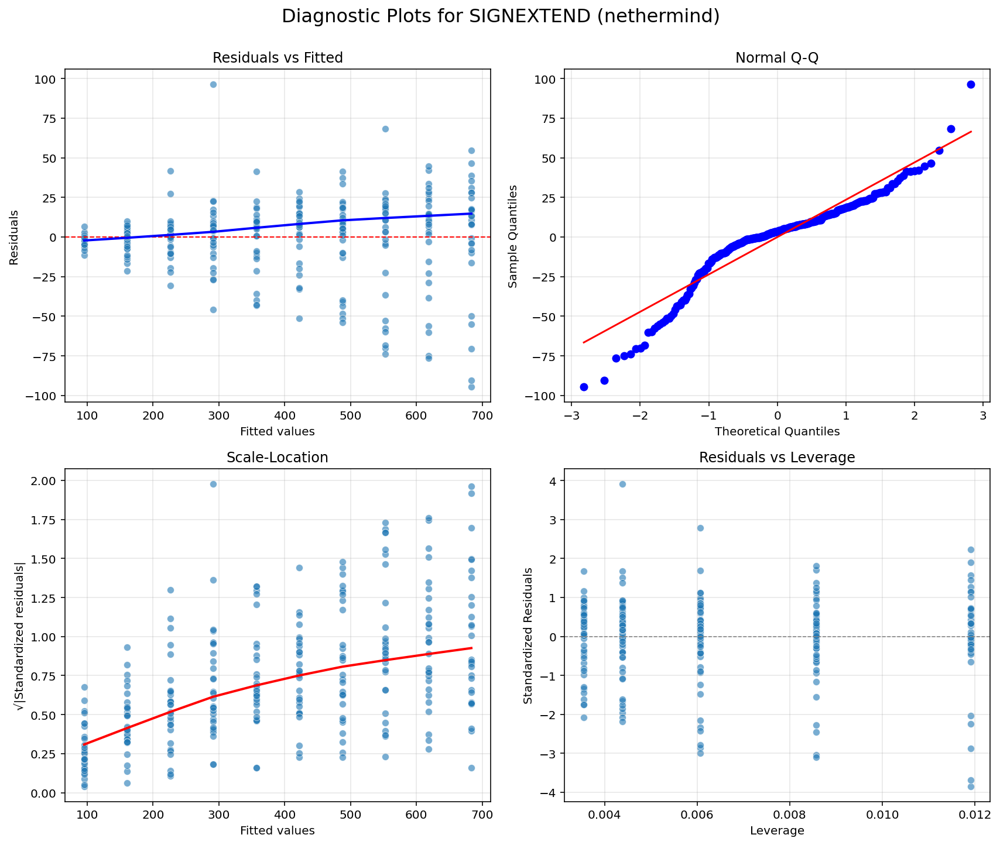


## erigon


```python
                            OLS Regression Results                            
==============================================================================
Dep. Variable:        run_duration_ms   R-squared:                       0.996
Model:                            OLS   Adj. R-squared:                  0.996
Method:                 Least Squares   F-statistic:                     7594.
Date:                Thu, 22 Jan 2026   Prob (F-statistic):           1.22e-35
Time:                        10:35:16   Log-Likelihood:                -124.44
No. Observations:                  30   AIC:                             252.9
Df Residuals:                      28   BIC:                             255.7
Df Model:                           1                                         
Covariance Type:            nonrobust                                         
==============================================================================
                 coef    std err          t      P>|t|      [0.025      0.975]
------------------------------------------------------------------------------
const         32.7719      6.254      5.241      0.000      19.962      45.582
opcount        0.0293      0.000     87.146      0.000       0.029       0.030
==============================================================================
Omnibus:                        0.844   Durbin-Watson:                   0.564
Prob(Omnibus):                  0.656   Jarque-Bera (JB):                0.868
Skew:                          -0.257   Prob(JB):                        0.648
Kurtosis:                       2.345   Cond. No.                     4.02e+04
==============================================================================

Notes:
[1] Standard Errors assume that the covariance matrix of the errors is correctly specified.
[2] The condition number is large, 4.02e+04. This might indicate that there are
strong multicollinearity or other numerical problems.
```

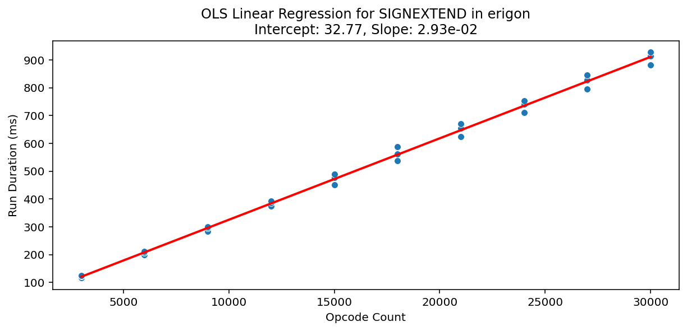

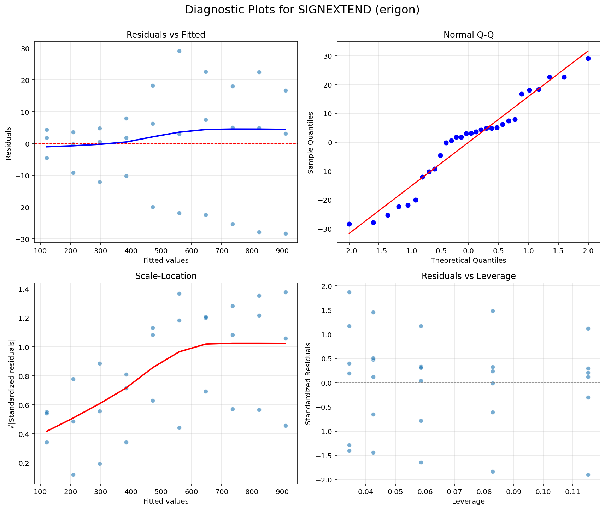


# SLT

## geth


```python
                            OLS Regression Results                            
==============================================================================
Dep. Variable:        run_duration_ms   R-squared:                       0.980
Model:                            OLS   Adj. R-squared:                  0.980
Method:                 Least Squares   F-statistic:                 1.445e+04
Date:                Thu, 22 Jan 2026   Prob (F-statistic):          3.85e-248
Time:                        10:35:17   Log-Likelihood:                -1491.5
No. Observations:                 290   AIC:                             2987.
Df Residuals:                     288   BIC:                             2994.
Df Model:                           1                                         
Covariance Type:            nonrobust                                         
==============================================================================
                 coef    std err          t      P>|t|      [0.025      0.975]
------------------------------------------------------------------------------
const         33.4849      5.275      6.348      0.000      23.103      43.867
opcount        0.0255      0.000    120.196      0.000       0.025       0.026
==============================================================================
Omnibus:                      149.017   Durbin-Watson:                   1.440
Prob(Omnibus):                  0.000   Jarque-Bera (JB):             2272.712
Skew:                           1.688   Prob(JB):                         0.00
Kurtosis:                      16.292   Cond. No.                     5.36e+04
==============================================================================

Notes:
[1] Standard Errors assume that the covariance matrix of the errors is correctly specified.
[2] The condition number is large, 5.36e+04. This might indicate that there are
strong multicollinearity or other numerical problems.
```

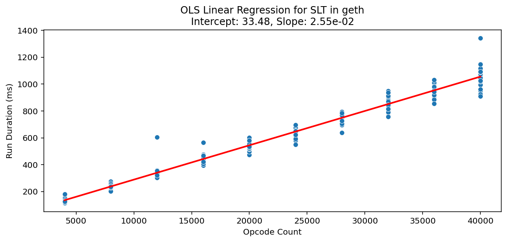

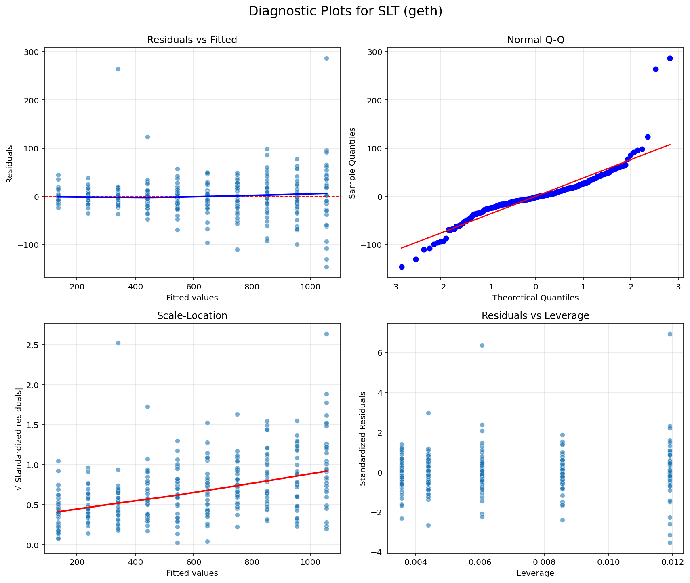


## besu


```python
                            OLS Regression Results                            
==============================================================================
Dep. Variable:        run_duration_ms   R-squared:                       0.980
Model:                            OLS   Adj. R-squared:                  0.980
Method:                 Least Squares   F-statistic:                 1.442e+04
Date:                Thu, 22 Jan 2026   Prob (F-statistic):          5.09e-248
Time:                        10:35:17   Log-Likelihood:                -1811.3
No. Observations:                 290   AIC:                             3627.
Df Residuals:                     288   BIC:                             3634.
Df Model:                           1                                         
Covariance Type:            nonrobust                                         
==============================================================================
                 coef    std err          t      P>|t|      [0.025      0.975]
------------------------------------------------------------------------------
const         34.0153     15.892      2.140      0.033       2.736      65.295
opcount        0.0769      0.001    120.078      0.000       0.076       0.078
==============================================================================
Omnibus:                       17.454   Durbin-Watson:                   0.820
Prob(Omnibus):                  0.000   Jarque-Bera (JB):               39.231
Skew:                          -0.250   Prob(JB):                     3.03e-09
Kurtosis:                       4.731   Cond. No.                     5.36e+04
==============================================================================

Notes:
[1] Standard Errors assume that the covariance matrix of the errors is correctly specified.
[2] The condition number is large, 5.36e+04. This might indicate that there are
strong multicollinearity or other numerical problems.
```


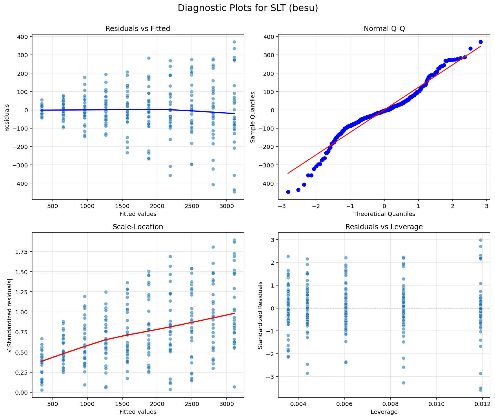


## reth


```python
                            OLS Regression Results                            
==============================================================================
Dep. Variable:        run_duration_ms   R-squared:                       0.981
Model:                            OLS   Adj. R-squared:                  0.981
Method:                 Least Squares   F-statistic:                     9325.
Date:                Thu, 22 Jan 2026   Prob (F-statistic):          1.09e-155
Time:                        10:35:17   Log-Likelihood:                -749.36
No. Observations:                 180   AIC:                             1503.
Df Residuals:                     178   BIC:                             1509.
Df Model:                           1                                         
Covariance Type:            nonrobust                                         
==============================================================================
                 coef    std err          t      P>|t|      [0.025      0.975]
------------------------------------------------------------------------------
const         33.6780      2.518     13.374      0.000      28.709      38.647
opcount        0.0098      0.000     96.568      0.000       0.010       0.010
==============================================================================
Omnibus:                       18.577   Durbin-Watson:                   1.228
Prob(Omnibus):                  0.000   Jarque-Bera (JB):               43.603
Skew:                           0.412   Prob(JB):                     3.40e-10
Kurtosis:                       5.266   Cond. No.                     5.36e+04
==============================================================================

Notes:
[1] Standard Errors assume that the covariance matrix of the errors is correctly specified.
[2] The condition number is large, 5.36e+04. This might indicate that there are
strong multicollinearity or other numerical problems.
```

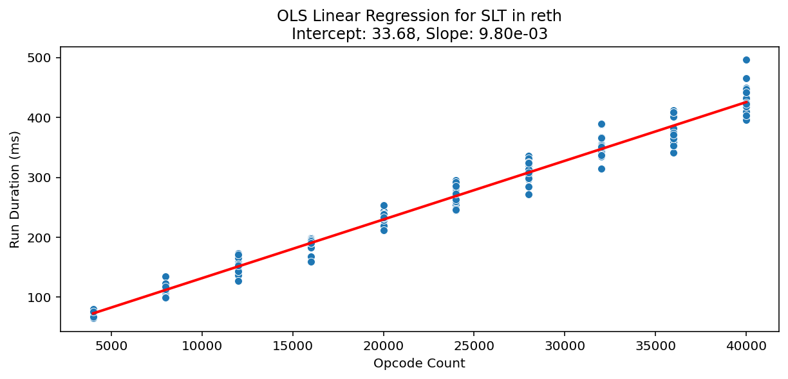

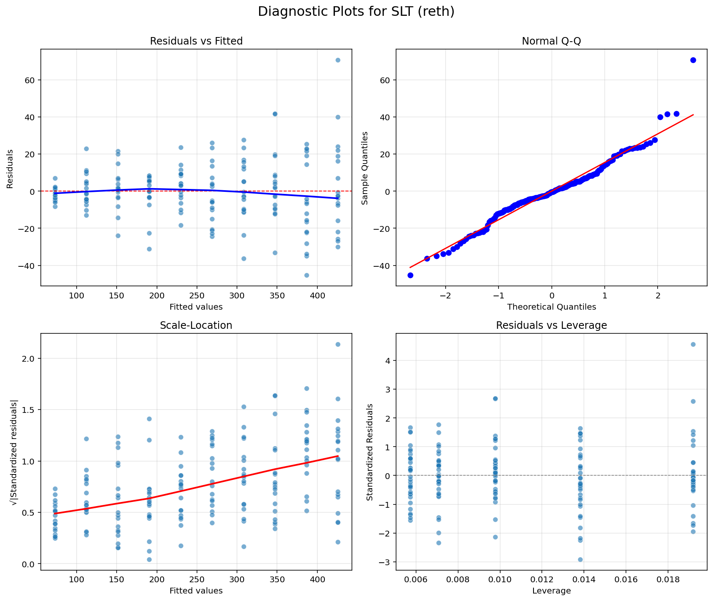


## nethermind


```python
                            OLS Regression Results                            
==============================================================================
Dep. Variable:        run_duration_ms   R-squared:                       0.966
Model:                            OLS   Adj. R-squared:                  0.966
Method:                 Least Squares   F-statistic:                     8272.
Date:                Thu, 22 Jan 2026   Prob (F-statistic):          3.59e-214
Time:                        10:35:17   Log-Likelihood:                -1476.2
No. Observations:                 290   AIC:                             2956.
Df Residuals:                     288   BIC:                             2964.
Df Model:                           1                                         
Covariance Type:            nonrobust                                         
==============================================================================
                 coef    std err          t      P>|t|      [0.025      0.975]
------------------------------------------------------------------------------
const         29.3272      5.003      5.862      0.000      19.480      39.175
opcount        0.0183      0.000     90.951      0.000       0.018       0.019
==============================================================================
Omnibus:                      335.603   Durbin-Watson:                   1.238
Prob(Omnibus):                  0.000   Jarque-Bera (JB):            31049.203
Skew:                           4.758   Prob(JB):                         0.00
Kurtosis:                      52.790   Cond. No.                     5.36e+04
==============================================================================

Notes:
[1] Standard Errors assume that the covariance matrix of the errors is correctly specified.
[2] The condition number is large, 5.36e+04. This might indicate that there are
strong multicollinearity or other numerical problems.
```

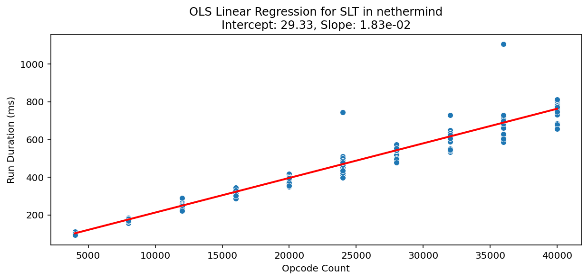

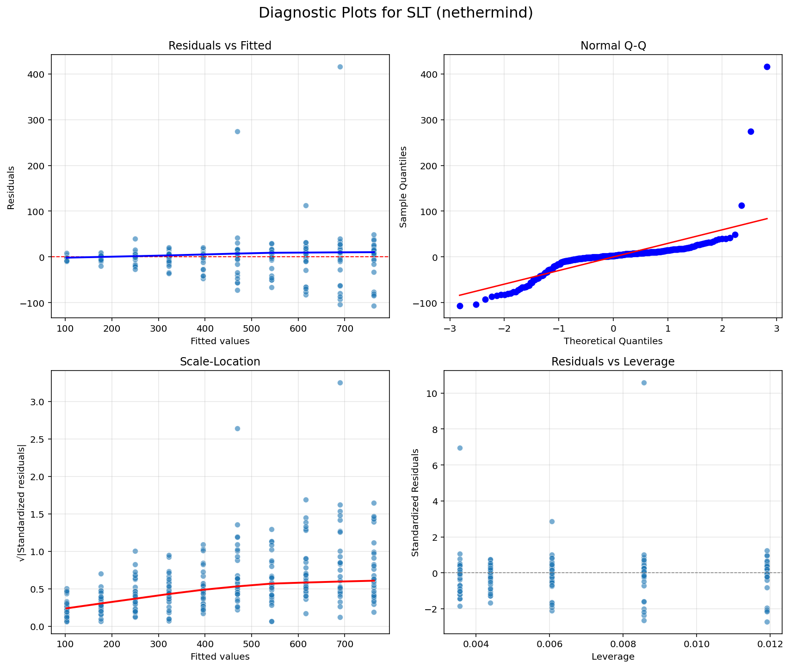


## erigon


```python
                            OLS Regression Results                            
==============================================================================
Dep. Variable:        run_duration_ms   R-squared:                       0.967
Model:                            OLS   Adj. R-squared:                  0.965
Method:                 Least Squares   F-statistic:                     809.3
Date:                Thu, 22 Jan 2026   Prob (F-statistic):           3.32e-22
Time:                        10:35:18   Log-Likelihood:                -166.51
No. Observations:                  30   AIC:                             337.0
Df Residuals:                      28   BIC:                             339.8
Df Model:                           1                                         
Covariance Type:            nonrobust                                         
==============================================================================
                 coef    std err          t      P>|t|      [0.025      0.975]
------------------------------------------------------------------------------
const         25.1445     25.424      0.989      0.331     -26.933      77.222
opcount        0.0291      0.001     28.447      0.000       0.027       0.031
==============================================================================
Omnibus:                       41.670   Durbin-Watson:                   2.291
Prob(Omnibus):                  0.000   Jarque-Bera (JB):              130.816
Skew:                           3.030   Prob(JB):                     3.92e-29
Kurtosis:                      11.242   Cond. No.                     5.36e+04
==============================================================================

Notes:
[1] Standard Errors assume that the covariance matrix of the errors is correctly specified.
[2] The condition number is large, 5.36e+04. This might indicate that there are
strong multicollinearity or other numerical problems.
```

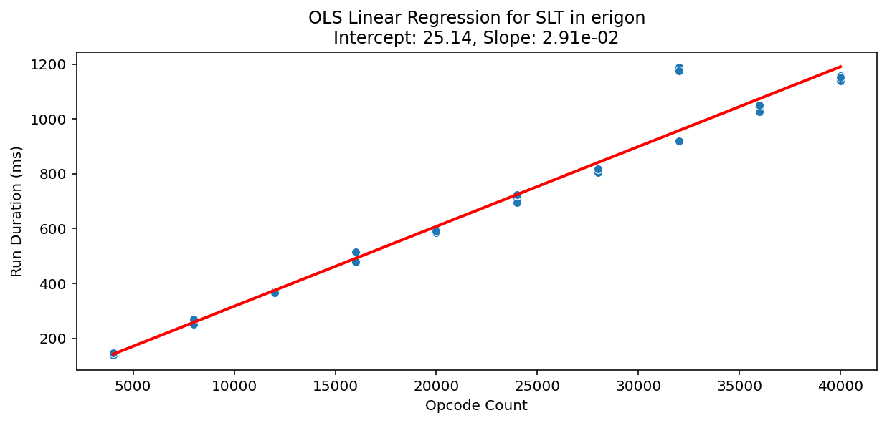

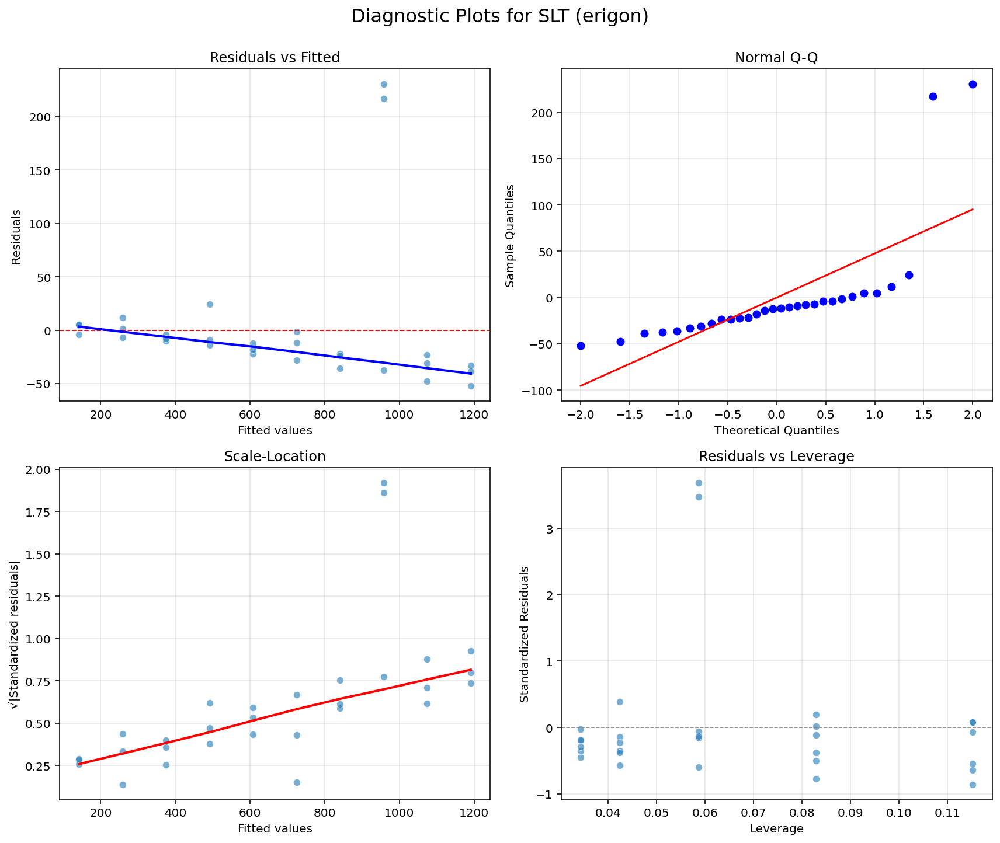


# SMOD

## geth


```python
                            OLS Regression Results                            
==============================================================================
Dep. Variable:        run_duration_ms   R-squared:                       0.948
Model:                            OLS   Adj. R-squared:                  0.948
Method:                 Least Squares   F-statistic:                     5230.
Date:                Thu, 22 Jan 2026   Prob (F-statistic):          1.05e-186
Time:                        10:35:18   Log-Likelihood:                -1600.2
No. Observations:                 290   AIC:                             3204.
Df Residuals:                     288   BIC:                             3212.
Df Model:                           1                                         
Covariance Type:            nonrobust                                         
==============================================================================
                 coef    std err          t      P>|t|      [0.025      0.975]
------------------------------------------------------------------------------
const         37.3533      7.674      4.867      0.000      22.249      52.458
opcount        0.0298      0.000     72.317      0.000       0.029       0.031
==============================================================================
Omnibus:                      486.708   Durbin-Watson:                   1.545
Prob(Omnibus):                  0.000   Jarque-Bera (JB):           170747.435
Skew:                           8.921   Prob(JB):                         0.00
Kurtosis:                     120.527   Cond. No.                     4.02e+04
==============================================================================

Notes:
[1] Standard Errors assume that the covariance matrix of the errors is correctly specified.
[2] The condition number is large, 4.02e+04. This might indicate that there are
strong multicollinearity or other numerical problems.
```

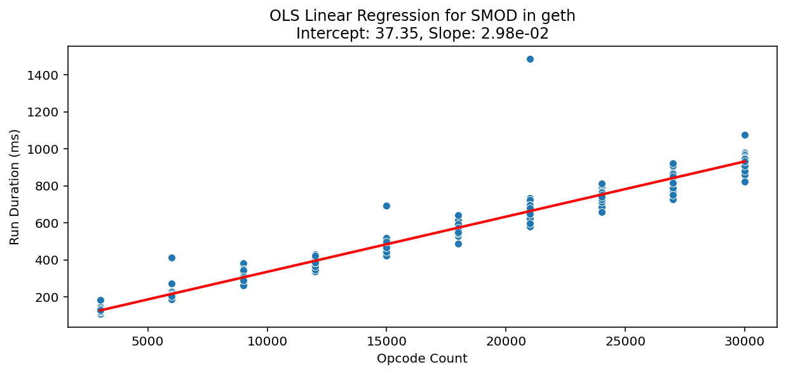

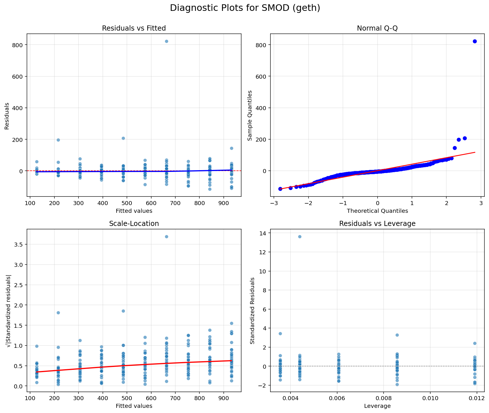


## besu


```python
                            OLS Regression Results                            
==============================================================================
Dep. Variable:        run_duration_ms   R-squared:                       0.984
Model:                            OLS   Adj. R-squared:                  0.984
Method:                 Least Squares   F-statistic:                 1.794e+04
Date:                Thu, 22 Jan 2026   Prob (F-statistic):          1.94e-261
Time:                        10:35:18   Log-Likelihood:                -1518.4
No. Observations:                 290   AIC:                             3041.
Df Residuals:                     288   BIC:                             3048.
Df Model:                           1                                         
Covariance Type:            nonrobust                                         
==============================================================================
                 coef    std err          t      P>|t|      [0.025      0.975]
------------------------------------------------------------------------------
const         29.7089      5.787      5.133      0.000      18.318      41.100
opcount        0.0416      0.000    133.932      0.000       0.041       0.042
==============================================================================
Omnibus:                       71.925   Durbin-Watson:                   0.765
Prob(Omnibus):                  0.000   Jarque-Bera (JB):              214.223
Skew:                          -1.089   Prob(JB):                     3.03e-47
Kurtosis:                       6.603   Cond. No.                     4.02e+04
==============================================================================

Notes:
[1] Standard Errors assume that the covariance matrix of the errors is correctly specified.
[2] The condition number is large, 4.02e+04. This might indicate that there are
strong multicollinearity or other numerical problems.
```

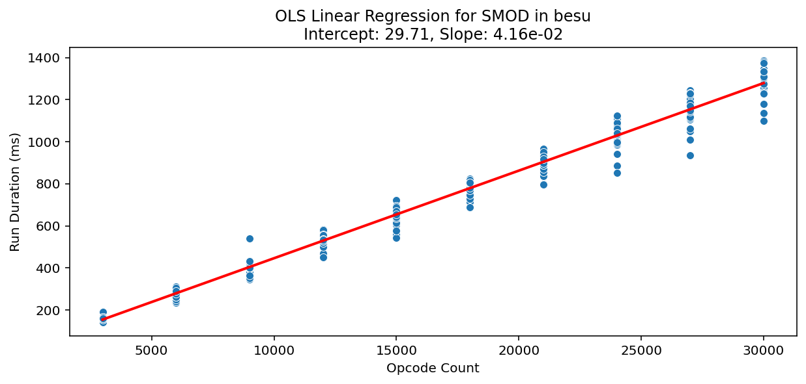

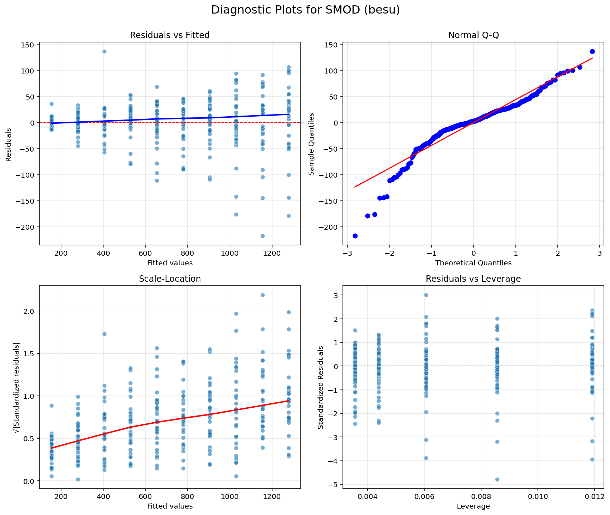


## reth


```python
                            OLS Regression Results                            
==============================================================================
Dep. Variable:        run_duration_ms   R-squared:                       0.968
Model:                            OLS   Adj. R-squared:                  0.968
Method:                 Least Squares   F-statistic:                     5433.
Date:                Thu, 22 Jan 2026   Prob (F-statistic):          2.53e-135
Time:                        10:35:18   Log-Likelihood:                -802.79
No. Observations:                 180   AIC:                             1610.
Df Residuals:                     178   BIC:                             1616.
Df Model:                           1                                         
Covariance Type:            nonrobust                                         
==============================================================================
                 coef    std err          t      P>|t|      [0.025      0.975]
------------------------------------------------------------------------------
const         32.9859      3.388      9.735      0.000      26.299      39.672
opcount        0.0134      0.000     73.711      0.000       0.013       0.014
==============================================================================
Omnibus:                      258.357   Durbin-Watson:                   1.879
Prob(Omnibus):                  0.000   Jarque-Bera (JB):            30118.954
Skew:                           6.000   Prob(JB):                         0.00
Kurtosis:                      65.224   Cond. No.                     4.02e+04
==============================================================================

Notes:
[1] Standard Errors assume that the covariance matrix of the errors is correctly specified.
[2] The condition number is large, 4.02e+04. This might indicate that there are
strong multicollinearity or other numerical problems.
```

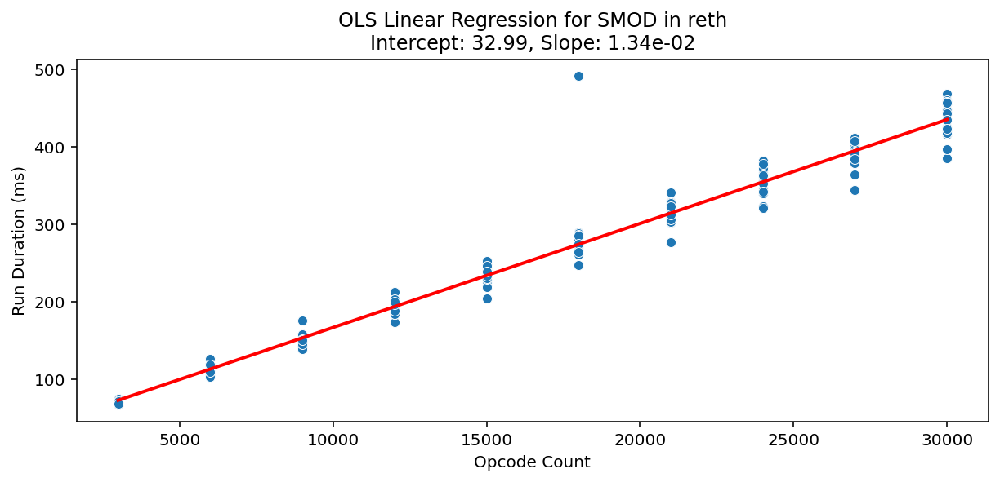

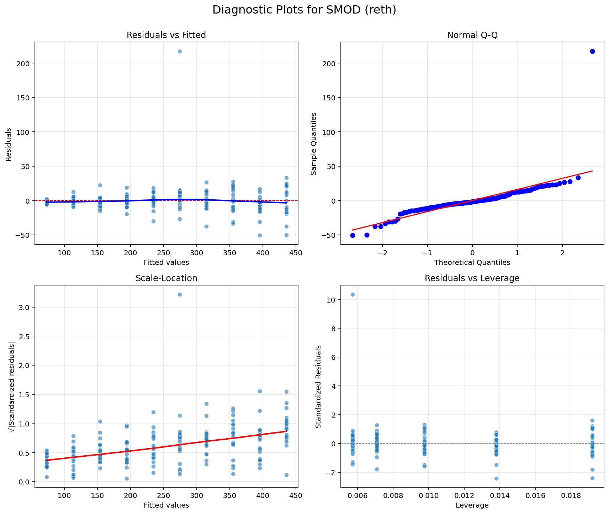


## nethermind


```python
                            OLS Regression Results                            
==============================================================================
Dep. Variable:        run_duration_ms   R-squared:                       0.983
Model:                            OLS   Adj. R-squared:                  0.983
Method:                 Least Squares   F-statistic:                 1.664e+04
Date:                Thu, 22 Jan 2026   Prob (F-statistic):          7.88e-257
Time:                        10:35:19   Log-Likelihood:                -1240.8
No. Observations:                 290   AIC:                             2486.
Df Residuals:                     288   BIC:                             2493.
Df Model:                           1                                         
Covariance Type:            nonrobust                                         
==============================================================================
                 coef    std err          t      P>|t|      [0.025      0.975]
------------------------------------------------------------------------------
const         30.8048      2.222     13.862      0.000      26.431      35.179
opcount        0.0154      0.000    129.009      0.000       0.015       0.016
==============================================================================
Omnibus:                       60.662   Durbin-Watson:                   0.916
Prob(Omnibus):                  0.000   Jarque-Bera (JB):              152.445
Skew:                          -0.977   Prob(JB):                     7.89e-34
Kurtosis:                       5.967   Cond. No.                     4.02e+04
==============================================================================

Notes:
[1] Standard Errors assume that the covariance matrix of the errors is correctly specified.
[2] The condition number is large, 4.02e+04. This might indicate that there are
strong multicollinearity or other numerical problems.
```


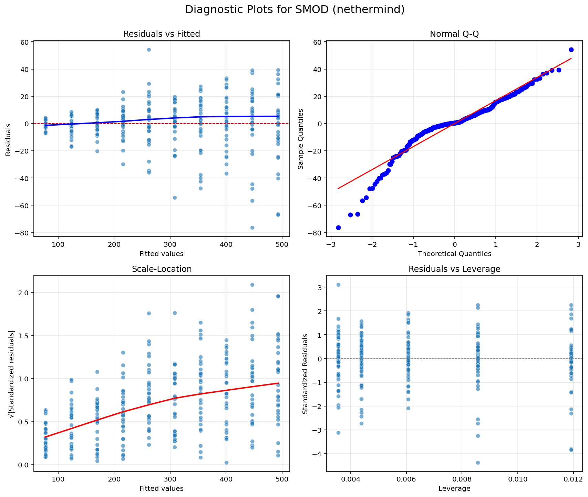


## erigon


```python
                            OLS Regression Results                            
==============================================================================
Dep. Variable:        run_duration_ms   R-squared:                       0.993
Model:                            OLS   Adj. R-squared:                  0.992
Method:                 Least Squares   F-statistic:                     3781.
Date:                Thu, 22 Jan 2026   Prob (F-statistic):           2.02e-31
Time:                        10:35:19   Log-Likelihood:                -138.53
No. Observations:                  30   AIC:                             281.1
Df Residuals:                      28   BIC:                             283.9
Df Model:                           1                                         
Covariance Type:            nonrobust                                         
==============================================================================
                 coef    std err          t      P>|t|      [0.025      0.975]
------------------------------------------------------------------------------
const         22.2938     10.002      2.229      0.034       1.806      42.781
opcount        0.0330      0.001     61.491      0.000       0.032       0.034
==============================================================================
Omnibus:                       58.725   Durbin-Watson:                   2.145
Prob(Omnibus):                  0.000   Jarque-Bera (JB):              463.777
Skew:                           4.002   Prob(JB):                    1.96e-101
Kurtosis:                      20.520   Cond. No.                     4.02e+04
==============================================================================

Notes:
[1] Standard Errors assume that the covariance matrix of the errors is correctly specified.
[2] The condition number is large, 4.02e+04. This might indicate that there are
strong multicollinearity or other numerical problems.
```
OLS model did not run... Error: 'numpy.ndarray' object has no attribute 'iloc'

# STOP

## geth

OLS model did not run... Error: zero-size array to reduction operation maximum which has no identity

## besu

OLS model did not run... Error: zero-size array to reduction operation maximum which has no identity

## reth

OLS model did not run... Error: zero-size array to reduction operation maximum which has no identity

## nethermind

OLS model did not run... Error: zero-size array to reduction operation maximum which has no identity

## erigon

OLS model did not run... Error: zero-size array to reduction operation maximum which has no identity

# SUB

## geth


```python
                            OLS Regression Results                            
==============================================================================
Dep. Variable:        run_duration_ms   R-squared:                       0.973
Model:                            OLS   Adj. R-squared:                  0.973
Method:                 Least Squares   F-statistic:                 1.031e+04
Date:                Thu, 22 Jan 2026   Prob (F-statistic):          1.50e-227
Time:                        10:35:19   Log-Likelihood:                -1488.3
No. Observations:                 290   AIC:                             2981.
Df Residuals:                     288   BIC:                             2988.
Df Model:                           1                                         
Covariance Type:            nonrobust                                         
==============================================================================
                 coef    std err          t      P>|t|      [0.025      0.975]
------------------------------------------------------------------------------
const         30.3919      5.216      5.826      0.000      20.125      40.659
opcount        0.0244      0.000    101.556      0.000       0.024       0.025
==============================================================================
Omnibus:                      333.331   Durbin-Watson:                   1.644
Prob(Omnibus):                  0.000   Jarque-Bera (JB):            32375.823
Skew:                           4.676   Prob(JB):                         0.00
Kurtosis:                      53.911   Cond. No.                     4.69e+04
==============================================================================

Notes:
[1] Standard Errors assume that the covariance matrix of the errors is correctly specified.
[2] The condition number is large, 4.69e+04. This might indicate that there are
strong multicollinearity or other numerical problems.
```

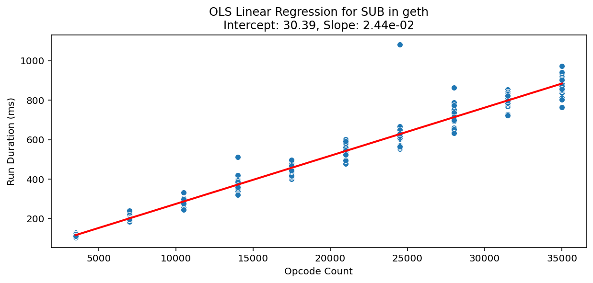

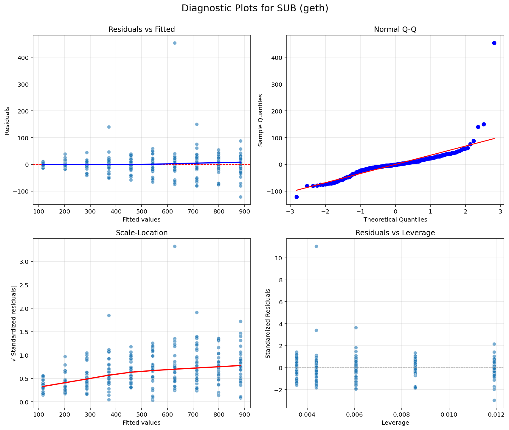


## besu


```python
                            OLS Regression Results                            
==============================================================================
Dep. Variable:        run_duration_ms   R-squared:                       0.978
Model:                            OLS   Adj. R-squared:                  0.978
Method:                 Least Squares   F-statistic:                 1.295e+04
Date:                Thu, 22 Jan 2026   Prob (F-statistic):          2.00e-241
Time:                        10:35:19   Log-Likelihood:                -2064.4
No. Observations:                 290   AIC:                             4133.
Df Residuals:                     288   BIC:                             4140.
Df Model:                           1                                         
Covariance Type:            nonrobust                                         
==============================================================================
                 coef    std err          t      P>|t|      [0.025      0.975]
------------------------------------------------------------------------------
const         30.3722     38.036      0.799      0.425     -44.491     105.235
opcount        0.1993      0.002    113.785      0.000       0.196       0.203
==============================================================================
Omnibus:                       15.395   Durbin-Watson:                   0.728
Prob(Omnibus):                  0.000   Jarque-Bera (JB):               40.563
Skew:                           0.039   Prob(JB):                     1.56e-09
Kurtosis:                       4.831   Cond. No.                     4.69e+04
==============================================================================

Notes:
[1] Standard Errors assume that the covariance matrix of the errors is correctly specified.
[2] The condition number is large, 4.69e+04. This might indicate that there are
strong multicollinearity or other numerical problems.
```

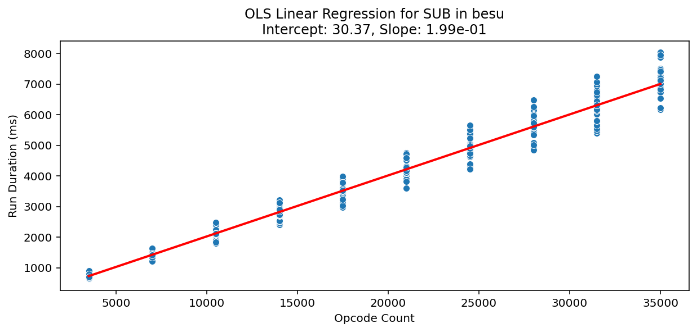

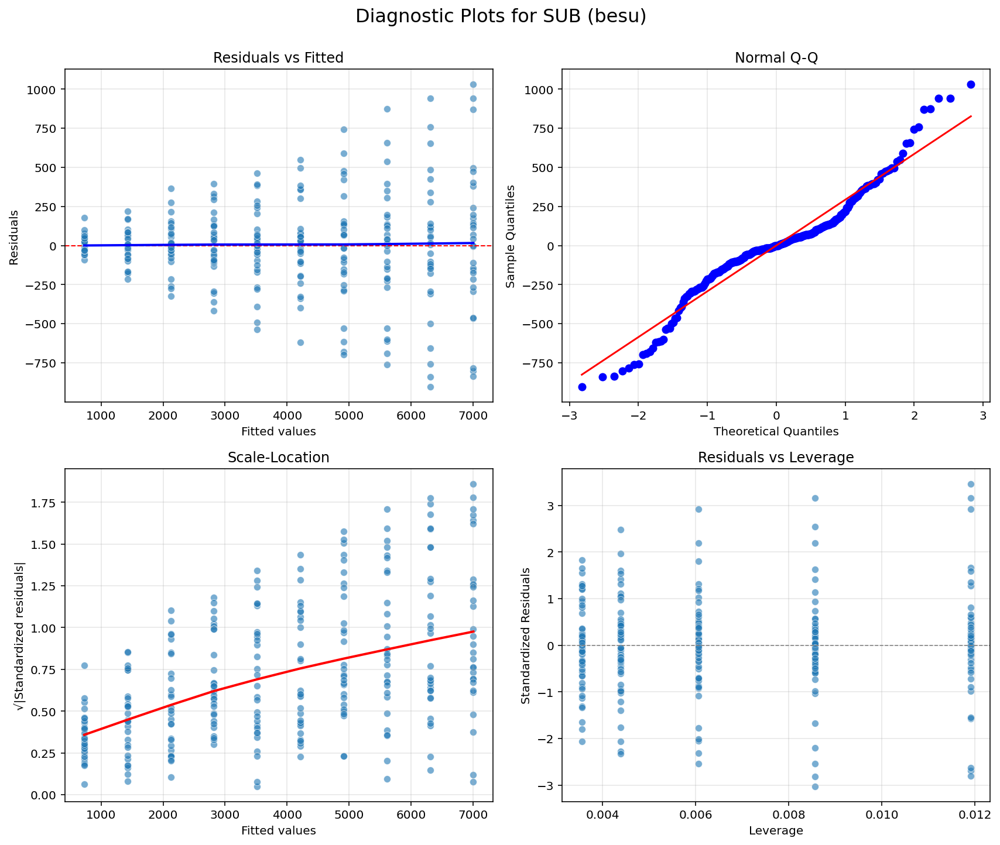


## reth


```python
                            OLS Regression Results                            
==============================================================================
Dep. Variable:        run_duration_ms   R-squared:                       0.984
Model:                            OLS   Adj. R-squared:                  0.984
Method:                 Least Squares   F-statistic:                 1.084e+04
Date:                Thu, 22 Jan 2026   Prob (F-statistic):          2.06e-161
Time:                        10:35:20   Log-Likelihood:                -693.57
No. Observations:                 180   AIC:                             1391.
Df Residuals:                     178   BIC:                             1398.
Df Model:                           1                                         
Covariance Type:            nonrobust                                         
==============================================================================
                 coef    std err          t      P>|t|      [0.025      0.975]
------------------------------------------------------------------------------
const         32.2947      1.847     17.485      0.000      28.650      35.939
opcount        0.0089    8.5e-05    104.125      0.000       0.009       0.009
==============================================================================
Omnibus:                        7.955   Durbin-Watson:                   1.478
Prob(Omnibus):                  0.019   Jarque-Bera (JB):                8.811
Skew:                           0.365   Prob(JB):                       0.0122
Kurtosis:                       3.802   Cond. No.                     4.69e+04
==============================================================================

Notes:
[1] Standard Errors assume that the covariance matrix of the errors is correctly specified.
[2] The condition number is large, 4.69e+04. This might indicate that there are
strong multicollinearity or other numerical problems.
```

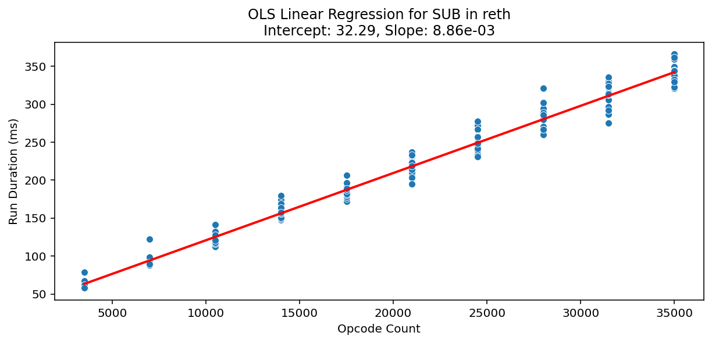

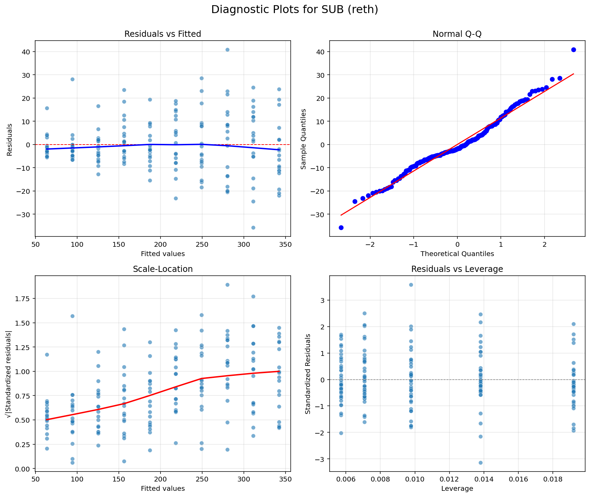


## nethermind


```python
                            OLS Regression Results                            
==============================================================================
Dep. Variable:        run_duration_ms   R-squared:                       0.982
Model:                            OLS   Adj. R-squared:                  0.981
Method:                 Least Squares   F-statistic:                 1.529e+04
Date:                Thu, 22 Jan 2026   Prob (F-statistic):          1.24e-251
Time:                        10:35:20   Log-Likelihood:                -1343.5
No. Observations:                 290   AIC:                             2691.
Df Residuals:                     288   BIC:                             2698.
Df Model:                           1                                         
Covariance Type:            nonrobust                                         
==============================================================================
                 coef    std err          t      P>|t|      [0.025      0.975]
------------------------------------------------------------------------------
const         31.9479      3.166     10.092      0.000      25.717      38.179
opcount        0.0180      0.000    123.666      0.000       0.018       0.018
==============================================================================
Omnibus:                       94.427   Durbin-Watson:                   0.977
Prob(Omnibus):                  0.000   Jarque-Bera (JB):             1729.750
Skew:                           0.788   Prob(JB):                         0.00
Kurtosis:                      14.860   Cond. No.                     4.69e+04
==============================================================================

Notes:
[1] Standard Errors assume that the covariance matrix of the errors is correctly specified.
[2] The condition number is large, 4.69e+04. This might indicate that there are
strong multicollinearity or other numerical problems.
```

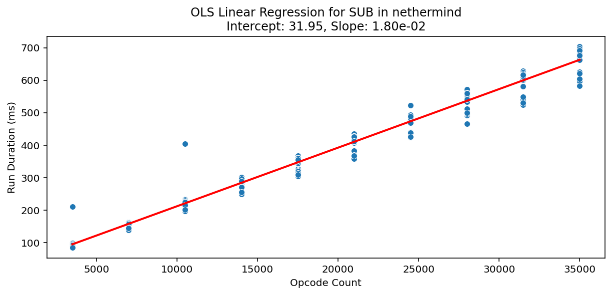

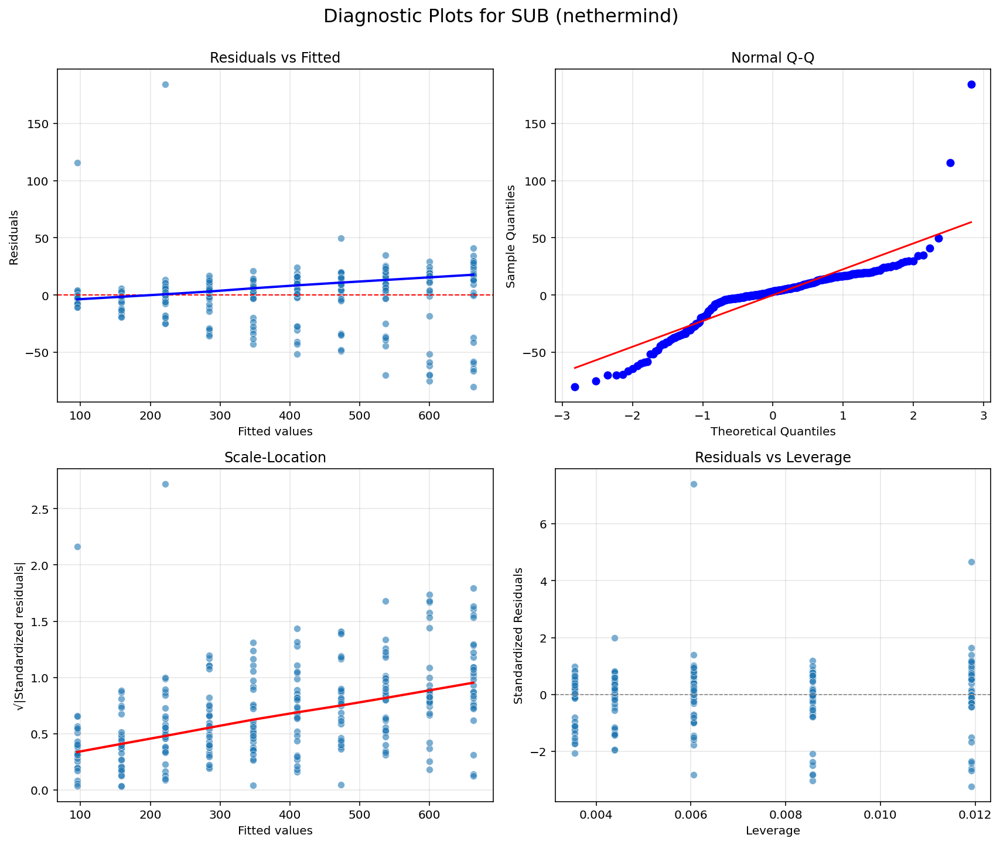


## erigon


```python
                            OLS Regression Results                            
==============================================================================
Dep. Variable:        run_duration_ms   R-squared:                       0.973
Model:                            OLS   Adj. R-squared:                  0.972
Method:                 Least Squares   F-statistic:                     997.6
Date:                Thu, 22 Jan 2026   Prob (F-statistic):           1.93e-23
Time:                        10:35:20   Log-Likelihood:                -157.50
No. Observations:                  30   AIC:                             319.0
Df Residuals:                      28   BIC:                             321.8
Df Model:                           1                                         
Covariance Type:            nonrobust                                         
==============================================================================
                 coef    std err          t      P>|t|      [0.025      0.975]
------------------------------------------------------------------------------
const         17.4985     18.823      0.930      0.360     -21.058      56.055
opcount        0.0274      0.001     31.586      0.000       0.026       0.029
==============================================================================
Omnibus:                       64.382   Durbin-Watson:                   1.981
Prob(Omnibus):                  0.000   Jarque-Bera (JB):              623.606
Skew:                           4.478   Prob(JB):                    3.85e-136
Kurtosis:                      23.462   Cond. No.                     4.69e+04
==============================================================================

Notes:
[1] Standard Errors assume that the covariance matrix of the errors is correctly specified.
[2] The condition number is large, 4.69e+04. This might indicate that there are
strong multicollinearity or other numerical problems.
```
OLS model did not run... Error: 'numpy.ndarray' object has no attribute 'iloc'

# SWAP1

## geth


```python
                            OLS Regression Results                            
==============================================================================
Dep. Variable:        run_duration_ms   R-squared:                       0.984
Model:                            OLS   Adj. R-squared:                  0.984
Method:                 Least Squares   F-statistic:                 1.820e+04
Date:                Thu, 22 Jan 2026   Prob (F-statistic):          2.56e-262
Time:                        10:35:20   Log-Likelihood:                -1390.0
No. Observations:                 290   AIC:                             2784.
Df Residuals:                     288   BIC:                             2791.
Df Model:                           1                                         
Covariance Type:            nonrobust                                         
==============================================================================
                 coef    std err          t      P>|t|      [0.025      0.975]
------------------------------------------------------------------------------
const         33.4487      3.717      8.999      0.000      26.133      40.765
opcount        0.0115   8.56e-05    134.894      0.000       0.011       0.012
==============================================================================
Omnibus:                       31.512   Durbin-Watson:                   0.850
Prob(Omnibus):                  0.000   Jarque-Bera (JB):               78.090
Skew:                          -0.504   Prob(JB):                     1.10e-17
Kurtosis:                       5.334   Cond. No.                     9.38e+04
==============================================================================

Notes:
[1] Standard Errors assume that the covariance matrix of the errors is correctly specified.
[2] The condition number is large, 9.38e+04. This might indicate that there are
strong multicollinearity or other numerical problems.
```

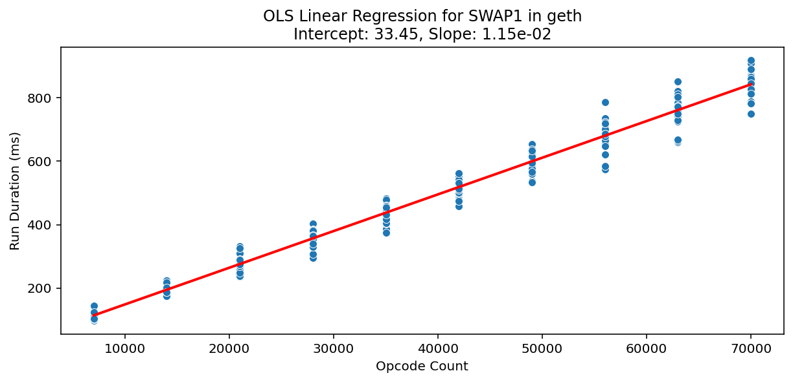

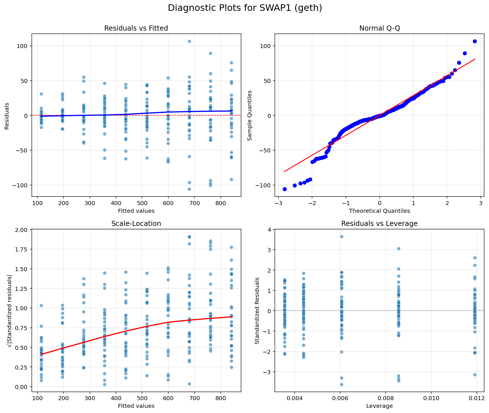


## besu


```python
                            OLS Regression Results                            
==============================================================================
Dep. Variable:        run_duration_ms   R-squared:                       0.978
Model:                            OLS   Adj. R-squared:                  0.978
Method:                 Least Squares   F-statistic:                 1.278e+04
Date:                Thu, 22 Jan 2026   Prob (F-statistic):          1.20e-240
Time:                        10:35:21   Log-Likelihood:                -1659.1
No. Observations:                 290   AIC:                             3322.
Df Residuals:                     288   BIC:                             3330.
Df Model:                           1                                         
Covariance Type:            nonrobust                                         
==============================================================================
                 coef    std err          t      P>|t|      [0.025      0.975]
------------------------------------------------------------------------------
const         30.3250      9.402      3.225      0.001      11.820      48.830
opcount        0.0245      0.000    113.063      0.000       0.024       0.025
==============================================================================
Omnibus:                       31.536   Durbin-Watson:                   0.549
Prob(Omnibus):                  0.000   Jarque-Bera (JB):              113.939
Skew:                          -0.355   Prob(JB):                     1.81e-25
Kurtosis:                       5.987   Cond. No.                     9.38e+04
==============================================================================

Notes:
[1] Standard Errors assume that the covariance matrix of the errors is correctly specified.
[2] The condition number is large, 9.38e+04. This might indicate that there are
strong multicollinearity or other numerical problems.
```

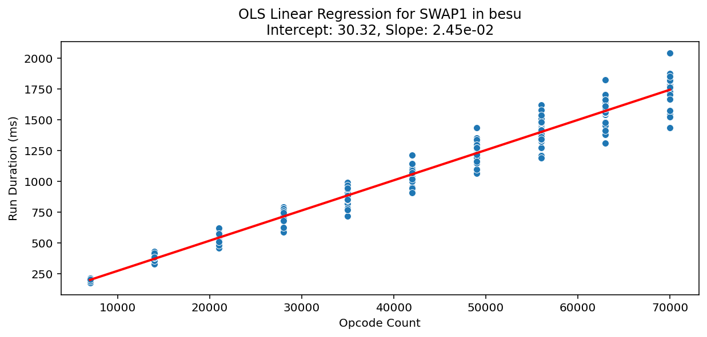

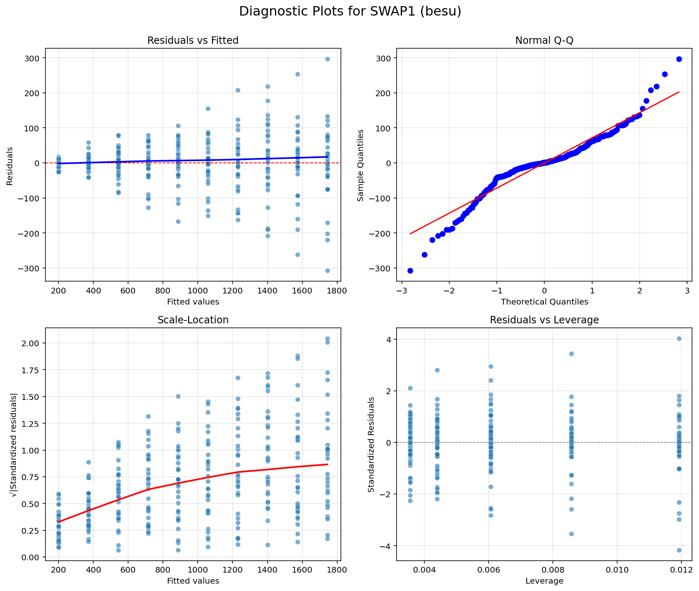


## reth


```python
                            OLS Regression Results                            
==============================================================================
Dep. Variable:        run_duration_ms   R-squared:                       0.977
Model:                            OLS   Adj. R-squared:                  0.976
Method:                 Least Squares   F-statistic:                     7419.
Date:                Thu, 22 Jan 2026   Prob (F-statistic):          4.91e-147
Time:                        10:35:21   Log-Likelihood:                -780.87
No. Observations:                 180   AIC:                             1566.
Df Residuals:                     178   BIC:                             1572.
Df Model:                           1                                         
Covariance Type:            nonrobust                                         
==============================================================================
                 coef    std err          t      P>|t|      [0.025      0.975]
------------------------------------------------------------------------------
const         30.1396      3.000     10.047      0.000      24.220      36.059
opcount        0.0059   6.91e-05     86.134      0.000       0.006       0.006
==============================================================================
Omnibus:                        0.097   Durbin-Watson:                   1.981
Prob(Omnibus):                  0.953   Jarque-Bera (JB):                0.148
Skew:                           0.055   Prob(JB):                        0.929
Kurtosis:                       2.912   Cond. No.                     9.38e+04
==============================================================================

Notes:
[1] Standard Errors assume that the covariance matrix of the errors is correctly specified.
[2] The condition number is large, 9.38e+04. This might indicate that there are
strong multicollinearity or other numerical problems.
```


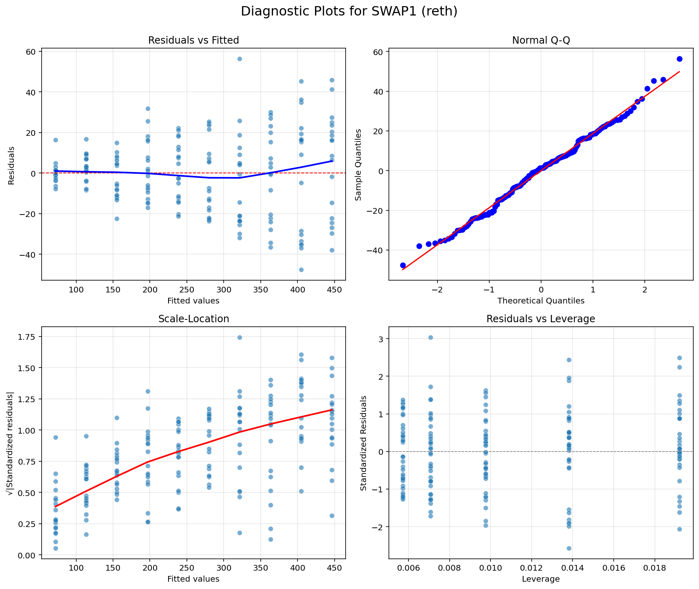


## nethermind


```python
                            OLS Regression Results                            
==============================================================================
Dep. Variable:        run_duration_ms   R-squared:                       0.981
Model:                            OLS   Adj. R-squared:                  0.981
Method:                 Least Squares   F-statistic:                 1.478e+04
Date:                Thu, 22 Jan 2026   Prob (F-statistic):          1.58e-249
Time:                        10:35:21   Log-Likelihood:                -1272.3
No. Observations:                 290   AIC:                             2549.
Df Residuals:                     288   BIC:                             2556.
Df Model:                           1                                         
Covariance Type:            nonrobust                                         
==============================================================================
                 coef    std err          t      P>|t|      [0.025      0.975]
------------------------------------------------------------------------------
const         27.8653      2.477     11.250      0.000      22.990      32.740
opcount        0.0069    5.7e-05    121.564      0.000       0.007       0.007
==============================================================================
Omnibus:                       36.677   Durbin-Watson:                   0.655
Prob(Omnibus):                  0.000   Jarque-Bera (JB):               73.999
Skew:                          -0.667   Prob(JB):                     8.54e-17
Kurtosis:                       5.085   Cond. No.                     9.38e+04
==============================================================================

Notes:
[1] Standard Errors assume that the covariance matrix of the errors is correctly specified.
[2] The condition number is large, 9.38e+04. This might indicate that there are
strong multicollinearity or other numerical problems.
```

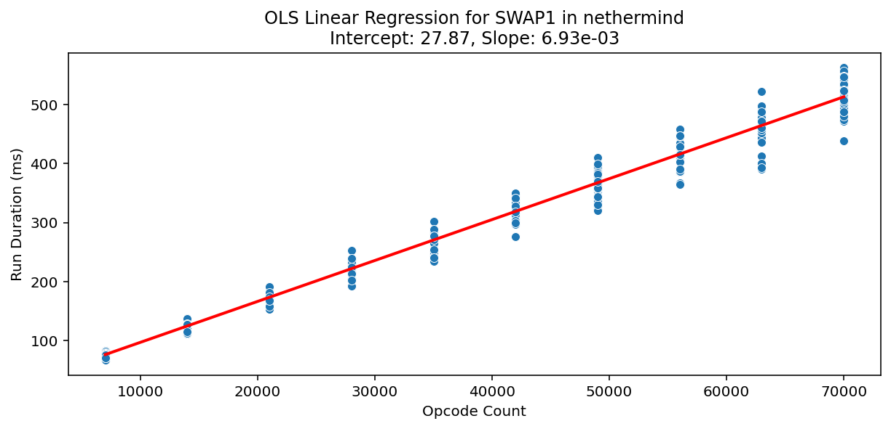

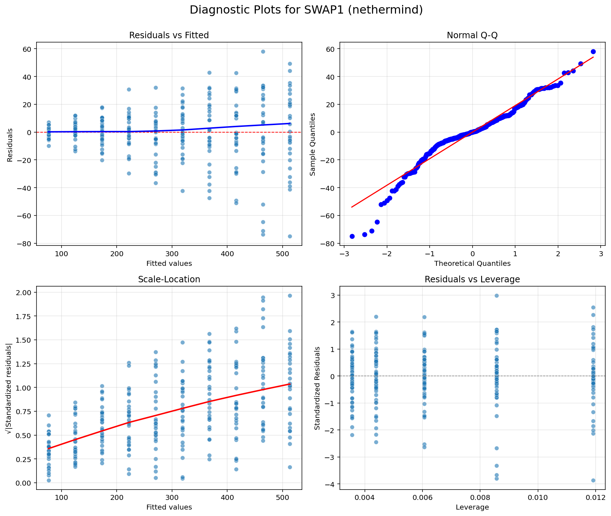


## erigon

OLS model did not run... Error: zero-size array to reduction operation maximum which has no identity

# SWAP2

## geth


```python
                            OLS Regression Results                            
==============================================================================
Dep. Variable:        run_duration_ms   R-squared:                       0.984
Model:                            OLS   Adj. R-squared:                  0.984
Method:                 Least Squares   F-statistic:                 1.809e+04
Date:                Thu, 22 Jan 2026   Prob (F-statistic):          5.89e-262
Time:                        10:35:22   Log-Likelihood:                -1392.9
No. Observations:                 290   AIC:                             2790.
Df Residuals:                     288   BIC:                             2797.
Df Model:                           1                                         
Covariance Type:            nonrobust                                         
==============================================================================
                 coef    std err          t      P>|t|      [0.025      0.975]
------------------------------------------------------------------------------
const         31.1132      3.755      8.287      0.000      23.723      38.503
opcount        0.0116   8.64e-05    134.497      0.000       0.011       0.012
==============================================================================
Omnibus:                       21.862   Durbin-Watson:                   0.858
Prob(Omnibus):                  0.000   Jarque-Bera (JB):               68.489
Skew:                          -0.189   Prob(JB):                     1.34e-15
Kurtosis:                       5.350   Cond. No.                     9.38e+04
==============================================================================

Notes:
[1] Standard Errors assume that the covariance matrix of the errors is correctly specified.
[2] The condition number is large, 9.38e+04. This might indicate that there are
strong multicollinearity or other numerical problems.
```

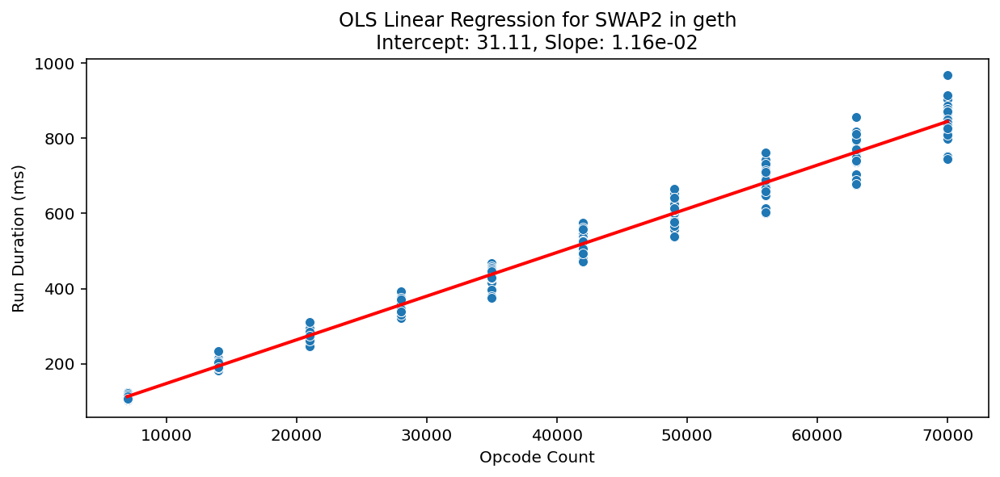

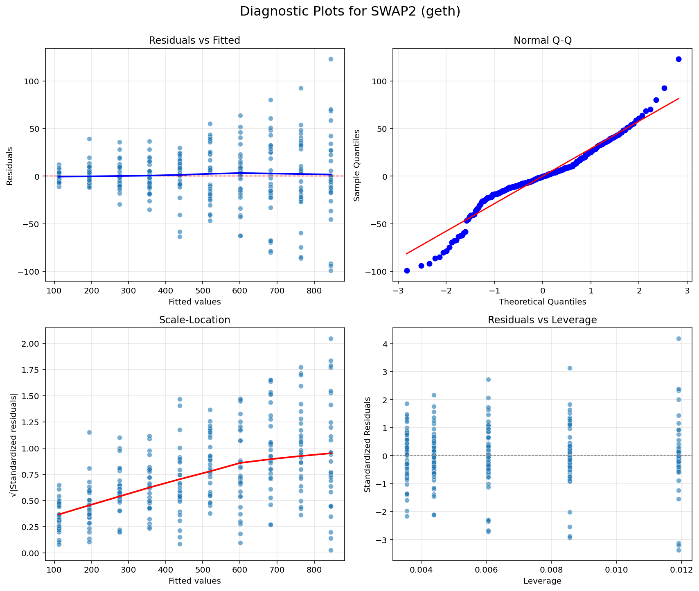


## besu


```python
                            OLS Regression Results                            
==============================================================================
Dep. Variable:        run_duration_ms   R-squared:                       0.981
Model:                            OLS   Adj. R-squared:                  0.981
Method:                 Least Squares   F-statistic:                 1.470e+04
Date:                Thu, 22 Jan 2026   Prob (F-statistic):          3.45e-249
Time:                        10:35:22   Log-Likelihood:                -1639.9
No. Observations:                 290   AIC:                             3284.
Df Residuals:                     288   BIC:                             3291.
Df Model:                           1                                         
Covariance Type:            nonrobust                                         
==============================================================================
                 coef    std err          t      P>|t|      [0.025      0.975]
------------------------------------------------------------------------------
const         25.9686      8.800      2.951      0.003       8.647      43.290
opcount        0.0246      0.000    121.228      0.000       0.024       0.025
==============================================================================
Omnibus:                       37.219   Durbin-Watson:                   0.517
Prob(Omnibus):                  0.000   Jarque-Bera (JB):               97.616
Skew:                          -0.583   Prob(JB):                     6.35e-22
Kurtosis:                       5.592   Cond. No.                     9.38e+04
==============================================================================

Notes:
[1] Standard Errors assume that the covariance matrix of the errors is correctly specified.
[2] The condition number is large, 9.38e+04. This might indicate that there are
strong multicollinearity or other numerical problems.
```


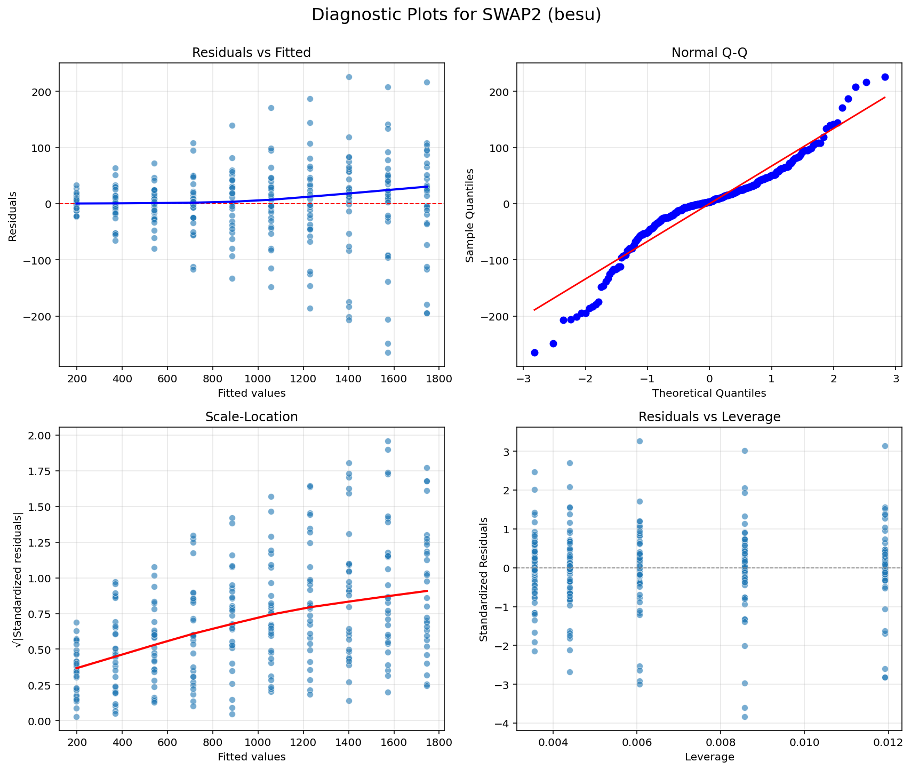


## reth


```python
                            OLS Regression Results                            
==============================================================================
Dep. Variable:        run_duration_ms   R-squared:                       0.962
Model:                            OLS   Adj. R-squared:                  0.962
Method:                 Least Squares   F-statistic:                     4557.
Date:                Thu, 22 Jan 2026   Prob (F-statistic):          9.26e-129
Time:                        10:35:22   Log-Likelihood:                -825.64
No. Observations:                 180   AIC:                             1655.
Df Residuals:                     178   BIC:                             1662.
Df Model:                           1                                         
Covariance Type:            nonrobust                                         
==============================================================================
                 coef    std err          t      P>|t|      [0.025      0.975]
------------------------------------------------------------------------------
const         31.6019      3.847      8.215      0.000      24.010      39.193
opcount        0.0060   8.86e-05     67.507      0.000       0.006       0.006
==============================================================================
Omnibus:                      163.655   Durbin-Watson:                   1.955
Prob(Omnibus):                  0.000   Jarque-Bera (JB):             4752.350
Skew:                           3.127   Prob(JB):                         0.00
Kurtosis:                      27.383   Cond. No.                     9.38e+04
==============================================================================

Notes:
[1] Standard Errors assume that the covariance matrix of the errors is correctly specified.
[2] The condition number is large, 9.38e+04. This might indicate that there are
strong multicollinearity or other numerical problems.
```

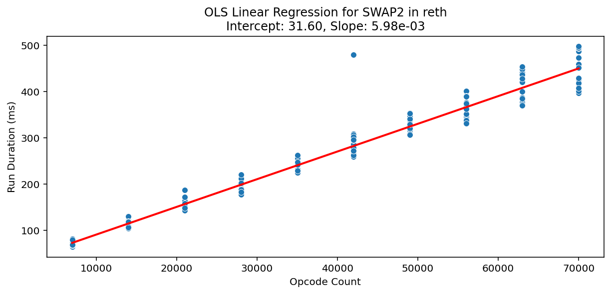

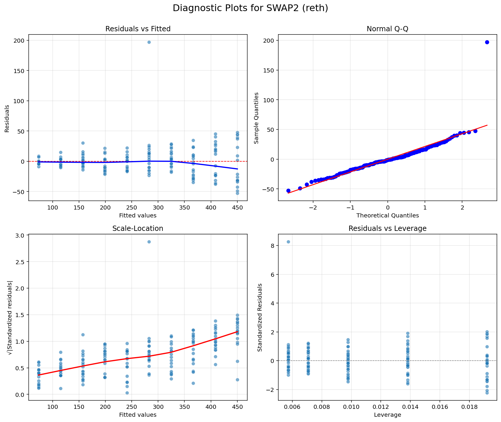


## nethermind


```python
                            OLS Regression Results                            
==============================================================================
Dep. Variable:        run_duration_ms   R-squared:                       0.971
Model:                            OLS   Adj. R-squared:                  0.971
Method:                 Least Squares   F-statistic:                     9726.
Date:                Thu, 22 Jan 2026   Prob (F-statistic):          5.54e-224
Time:                        10:35:22   Log-Likelihood:                -1333.1
No. Observations:                 290   AIC:                             2670.
Df Residuals:                     288   BIC:                             2678.
Df Model:                           1                                         
Covariance Type:            nonrobust                                         
==============================================================================
                 coef    std err          t      P>|t|      [0.025      0.975]
------------------------------------------------------------------------------
const         28.5363      3.055      9.341      0.000      22.523      34.549
opcount        0.0069   7.03e-05     98.620      0.000       0.007       0.007
==============================================================================
Omnibus:                      185.489   Durbin-Watson:                   1.020
Prob(Omnibus):                  0.000   Jarque-Bera (JB):             5636.022
Skew:                           2.041   Prob(JB):                         0.00
Kurtosis:                      24.208   Cond. No.                     9.38e+04
==============================================================================

Notes:
[1] Standard Errors assume that the covariance matrix of the errors is correctly specified.
[2] The condition number is large, 9.38e+04. This might indicate that there are
strong multicollinearity or other numerical problems.
```

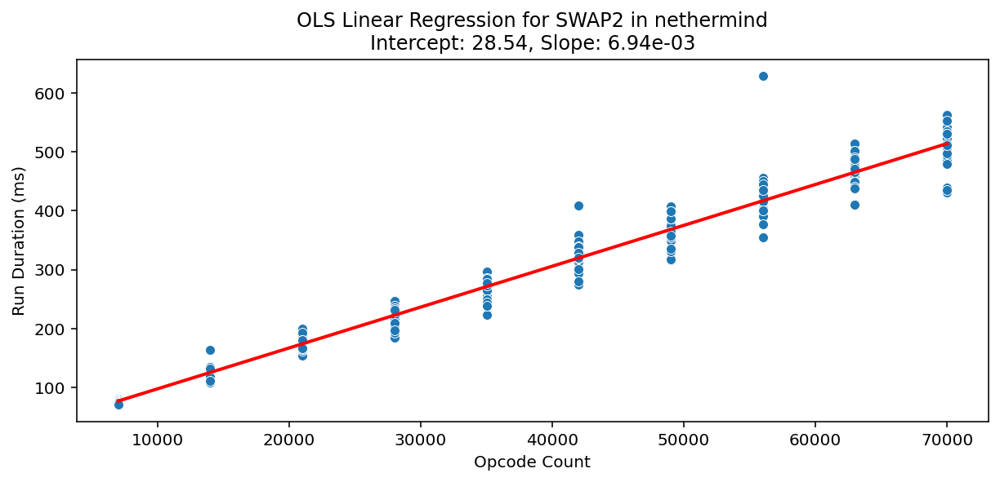

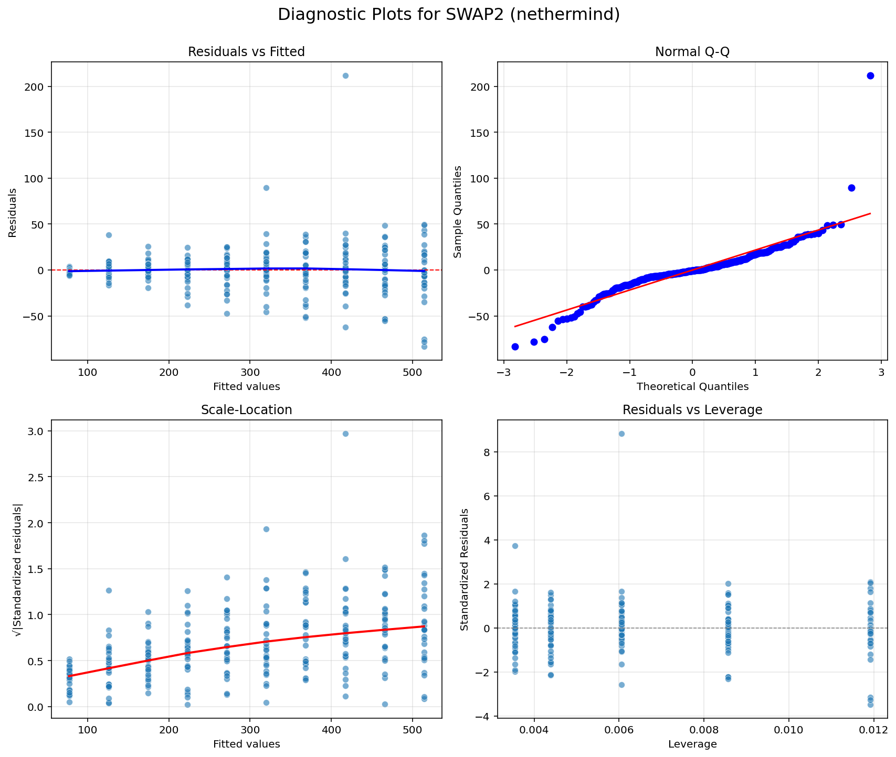


## erigon

OLS model did not run... Error: zero-size array to reduction operation maximum which has no identity

# SWAP3

## geth


```python
                            OLS Regression Results                            
==============================================================================
Dep. Variable:        run_duration_ms   R-squared:                       0.983
Model:                            OLS   Adj. R-squared:                  0.983
Method:                 Least Squares   F-statistic:                 1.654e+04
Date:                Thu, 22 Jan 2026   Prob (F-statistic):          1.90e-256
Time:                        10:35:23   Log-Likelihood:                -1406.6
No. Observations:                 290   AIC:                             2817.
Df Residuals:                     288   BIC:                             2825.
Df Model:                           1                                         
Covariance Type:            nonrobust                                         
==============================================================================
                 coef    std err          t      P>|t|      [0.025      0.975]
------------------------------------------------------------------------------
const         32.2902      3.936      8.203      0.000      24.542      40.038
opcount        0.0117   9.06e-05    128.609      0.000       0.011       0.012
==============================================================================
Omnibus:                       21.398   Durbin-Watson:                   1.190
Prob(Omnibus):                  0.000   Jarque-Bera (JB):               61.678
Skew:                          -0.227   Prob(JB):                     4.04e-14
Kurtosis:                       5.213   Cond. No.                     9.38e+04
==============================================================================

Notes:
[1] Standard Errors assume that the covariance matrix of the errors is correctly specified.
[2] The condition number is large, 9.38e+04. This might indicate that there are
strong multicollinearity or other numerical problems.
```


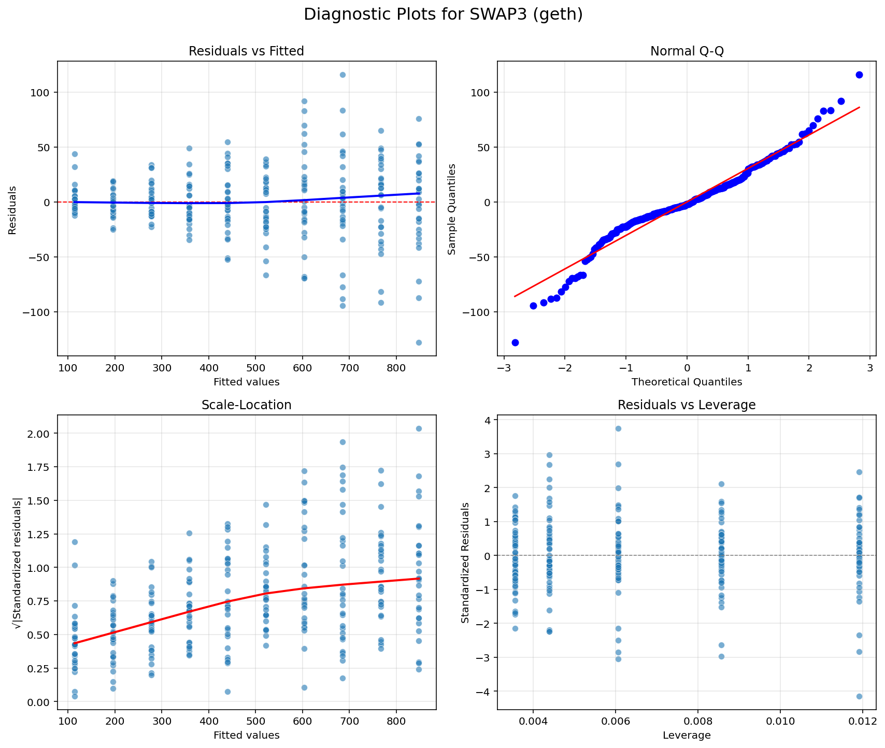


## besu


```python
                            OLS Regression Results                            
==============================================================================
Dep. Variable:        run_duration_ms   R-squared:                       0.980
Model:                            OLS   Adj. R-squared:                  0.980
Method:                 Least Squares   F-statistic:                 1.442e+04
Date:                Thu, 22 Jan 2026   Prob (F-statistic):          5.03e-248
Time:                        10:35:23   Log-Likelihood:                -1645.2
No. Observations:                 290   AIC:                             3294.
Df Residuals:                     288   BIC:                             3302.
Df Model:                           1                                         
Covariance Type:            nonrobust                                         
==============================================================================
                 coef    std err          t      P>|t|      [0.025      0.975]
------------------------------------------------------------------------------
const         22.8443      8.960      2.550      0.011       5.209      40.480
opcount        0.0248      0.000    120.083      0.000       0.024       0.025
==============================================================================
Omnibus:                       65.214   Durbin-Watson:                   0.926
Prob(Omnibus):                  0.000   Jarque-Bera (JB):              262.206
Skew:                          -0.878   Prob(JB):                     1.16e-57
Kurtosis:                       7.315   Cond. No.                     9.38e+04
==============================================================================

Notes:
[1] Standard Errors assume that the covariance matrix of the errors is correctly specified.
[2] The condition number is large, 9.38e+04. This might indicate that there are
strong multicollinearity or other numerical problems.
```

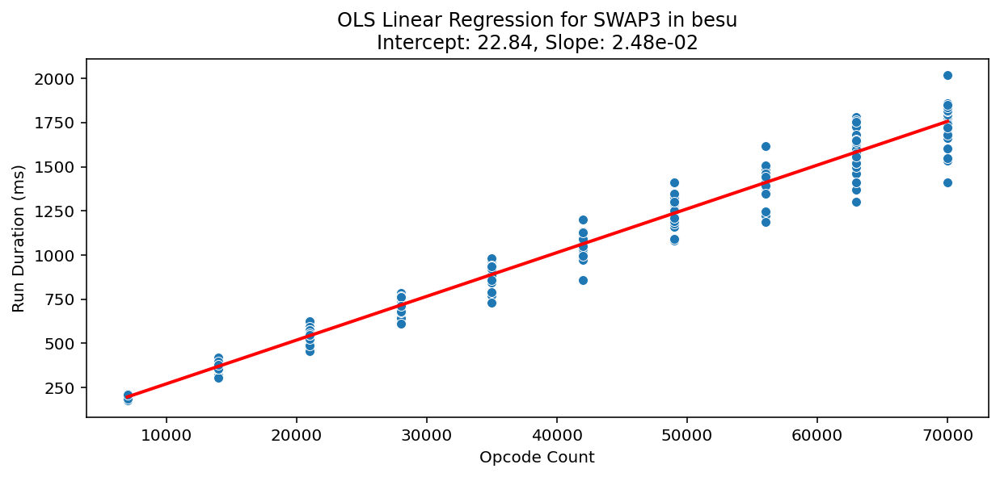

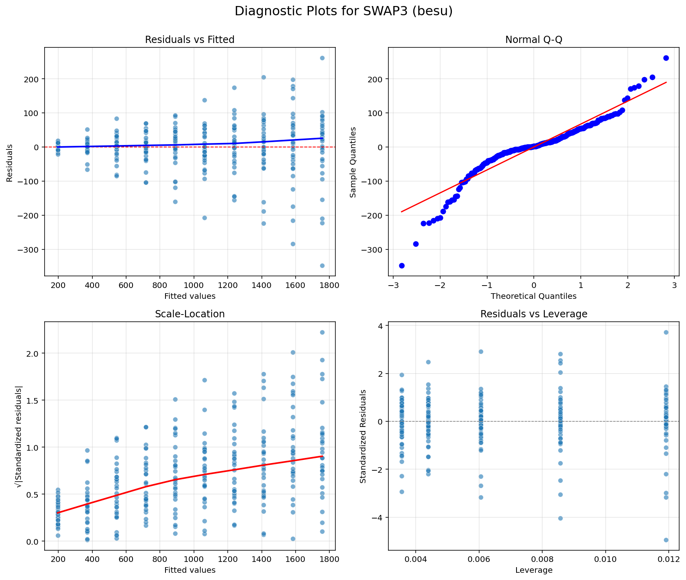


## reth


```python
                            OLS Regression Results                            
==============================================================================
Dep. Variable:        run_duration_ms   R-squared:                       0.976
Model:                            OLS   Adj. R-squared:                  0.976
Method:                 Least Squares   F-statistic:                     7285.
Date:                Thu, 22 Jan 2026   Prob (F-statistic):          2.38e-146
Time:                        10:35:23   Log-Likelihood:                -782.45
No. Observations:                 180   AIC:                             1569.
Df Residuals:                     178   BIC:                             1575.
Df Model:                           1                                         
Covariance Type:            nonrobust                                         
==============================================================================
                 coef    std err          t      P>|t|      [0.025      0.975]
------------------------------------------------------------------------------
const         31.3557      3.026     10.361      0.000      25.384      37.328
opcount        0.0059   6.97e-05     85.355      0.000       0.006       0.006
==============================================================================
Omnibus:                        1.112   Durbin-Watson:                   2.188
Prob(Omnibus):                  0.574   Jarque-Bera (JB):                1.076
Skew:                           0.040   Prob(JB):                        0.584
Kurtosis:                       2.630   Cond. No.                     9.38e+04
==============================================================================

Notes:
[1] Standard Errors assume that the covariance matrix of the errors is correctly specified.
[2] The condition number is large, 9.38e+04. This might indicate that there are
strong multicollinearity or other numerical problems.
```


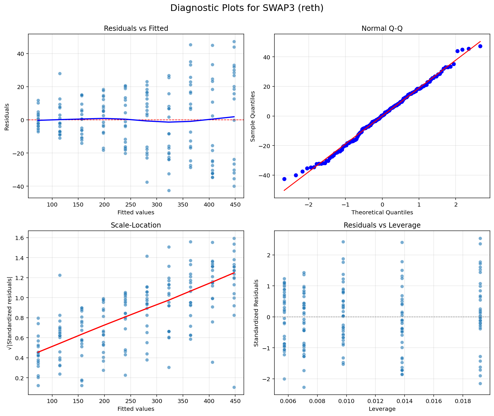


## nethermind


```python
                            OLS Regression Results                            
==============================================================================
Dep. Variable:        run_duration_ms   R-squared:                       0.965
Model:                            OLS   Adj. R-squared:                  0.965
Method:                 Least Squares   F-statistic:                     7855.
Date:                Thu, 22 Jan 2026   Prob (F-statistic):          4.77e-211
Time:                        10:35:23   Log-Likelihood:                -1366.3
No. Observations:                 290   AIC:                             2737.
Df Residuals:                     288   BIC:                             2744.
Df Model:                           1                                         
Covariance Type:            nonrobust                                         
==============================================================================
                 coef    std err          t      P>|t|      [0.025      0.975]
------------------------------------------------------------------------------
const         29.2281      3.425      8.534      0.000      22.487      35.969
opcount        0.0070   7.89e-05     88.629      0.000       0.007       0.007
==============================================================================
Omnibus:                       75.706   Durbin-Watson:                   0.741
Prob(Omnibus):                  0.000   Jarque-Bera (JB):              373.361
Skew:                           0.965   Prob(JB):                     8.43e-82
Kurtosis:                       8.213   Cond. No.                     9.38e+04
==============================================================================

Notes:
[1] Standard Errors assume that the covariance matrix of the errors is correctly specified.
[2] The condition number is large, 9.38e+04. This might indicate that there are
strong multicollinearity or other numerical problems.
```

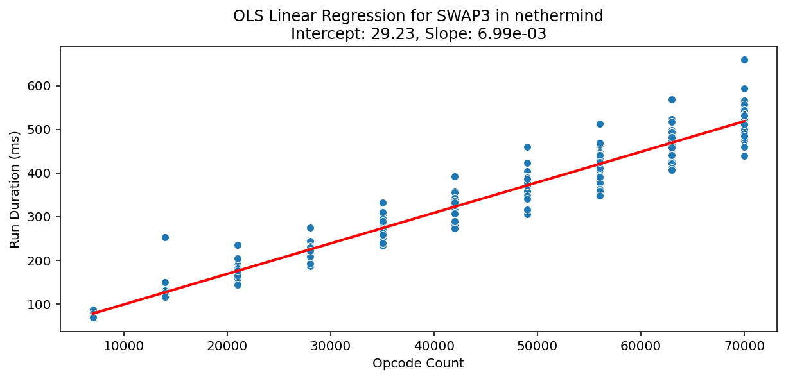

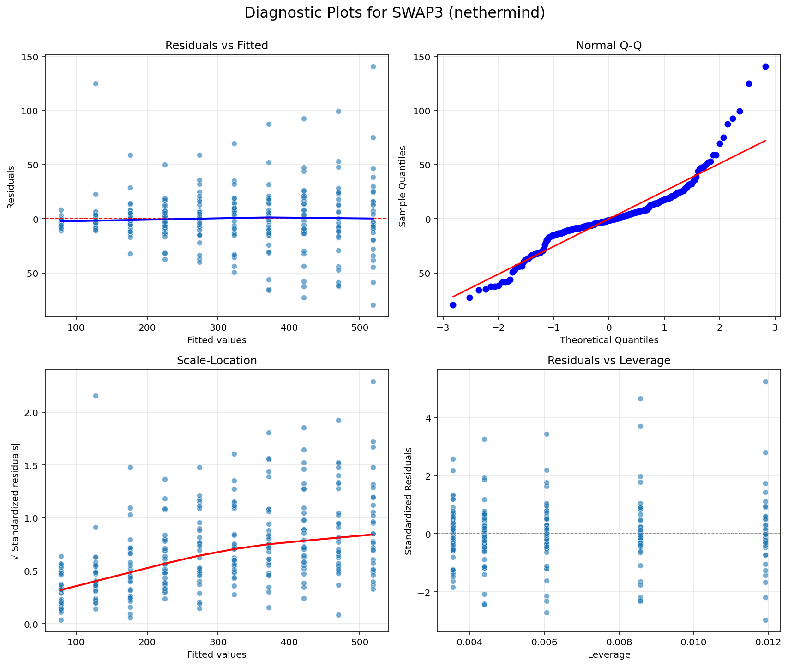


## erigon

OLS model did not run... Error: zero-size array to reduction operation maximum which has no identity

# SWAP4

## geth


```python
                            OLS Regression Results                            
==============================================================================
Dep. Variable:        run_duration_ms   R-squared:                       0.984
Model:                            OLS   Adj. R-squared:                  0.984
Method:                 Least Squares   F-statistic:                 1.765e+04
Date:                Thu, 22 Jan 2026   Prob (F-statistic):          1.94e-260
Time:                        10:35:24   Log-Likelihood:                -1398.1
No. Observations:                 290   AIC:                             2800.
Df Residuals:                     288   BIC:                             2808.
Df Model:                           1                                         
Covariance Type:            nonrobust                                         
==============================================================================
                 coef    std err          t      P>|t|      [0.025      0.975]
------------------------------------------------------------------------------
const         31.9311      3.822      8.354      0.000      24.408      39.454
opcount        0.0117    8.8e-05    132.850      0.000       0.012       0.012
==============================================================================
Omnibus:                       23.793   Durbin-Watson:                   1.175
Prob(Omnibus):                  0.000   Jarque-Bera (JB):               52.119
Skew:                          -0.403   Prob(JB):                     4.82e-12
Kurtosis:                       4.914   Cond. No.                     9.38e+04
==============================================================================

Notes:
[1] Standard Errors assume that the covariance matrix of the errors is correctly specified.
[2] The condition number is large, 9.38e+04. This might indicate that there are
strong multicollinearity or other numerical problems.
```


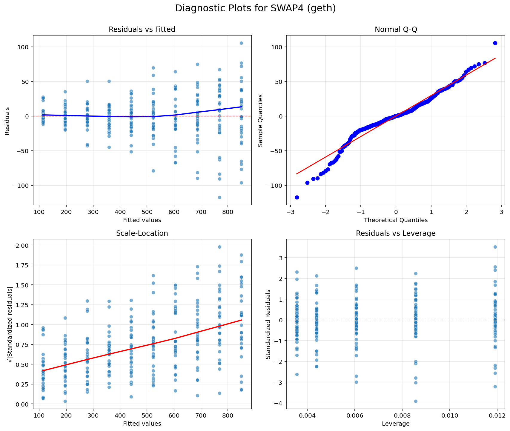


## besu


```python
                            OLS Regression Results                            
==============================================================================
Dep. Variable:        run_duration_ms   R-squared:                       0.980
Model:                            OLS   Adj. R-squared:                  0.980
Method:                 Least Squares   F-statistic:                 1.386e+04
Date:                Thu, 22 Jan 2026   Prob (F-statistic):          1.38e-245
Time:                        10:35:24   Log-Likelihood:                -1649.1
No. Observations:                 290   AIC:                             3302.
Df Residuals:                     288   BIC:                             3309.
Df Model:                           1                                         
Covariance Type:            nonrobust                                         
==============================================================================
                 coef    std err          t      P>|t|      [0.025      0.975]
------------------------------------------------------------------------------
const         21.5956      9.081      2.378      0.018       3.722      39.470
opcount        0.0246      0.000    117.719      0.000       0.024       0.025
==============================================================================
Omnibus:                       34.701   Durbin-Watson:                   0.852
Prob(Omnibus):                  0.000   Jarque-Bera (JB):              131.680
Skew:                          -0.398   Prob(JB):                     2.55e-29
Kurtosis:                       6.204   Cond. No.                     9.38e+04
==============================================================================

Notes:
[1] Standard Errors assume that the covariance matrix of the errors is correctly specified.
[2] The condition number is large, 9.38e+04. This might indicate that there are
strong multicollinearity or other numerical problems.
```

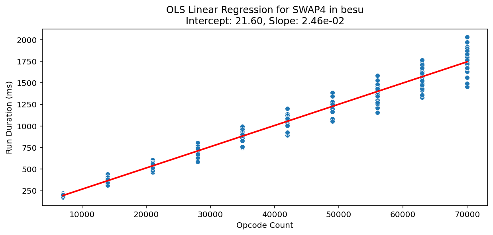

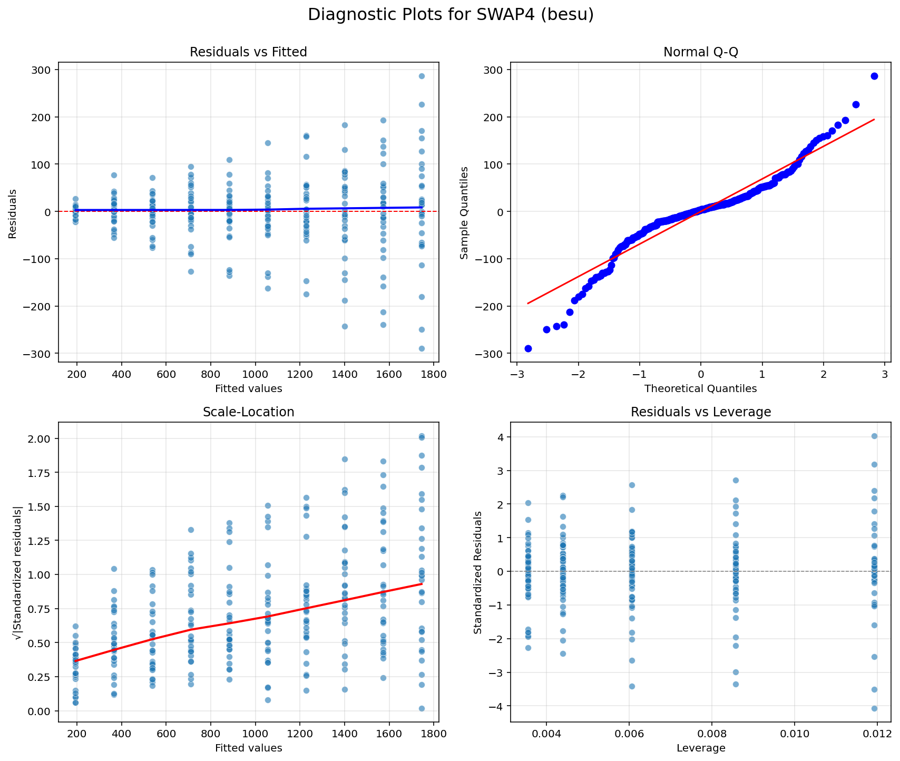


## reth


```python
                            OLS Regression Results                            
==============================================================================
Dep. Variable:        run_duration_ms   R-squared:                       0.968
Model:                            OLS   Adj. R-squared:                  0.968
Method:                 Least Squares   F-statistic:                     5391.
Date:                Thu, 22 Jan 2026   Prob (F-statistic):          4.96e-135
Time:                        10:35:24   Log-Likelihood:                -808.76
No. Observations:                 180   AIC:                             1622.
Df Residuals:                     178   BIC:                             1628.
Df Model:                           1                                         
Covariance Type:            nonrobust                                         
==============================================================================
                 coef    std err          t      P>|t|      [0.025      0.975]
------------------------------------------------------------------------------
const         37.7111      3.503     10.767      0.000      30.799      44.623
opcount        0.0059   8.06e-05     73.424      0.000       0.006       0.006
==============================================================================
Omnibus:                        7.028   Durbin-Watson:                   1.613
Prob(Omnibus):                  0.030   Jarque-Bera (JB):                6.891
Skew:                           0.395   Prob(JB):                       0.0319
Kurtosis:                       3.544   Cond. No.                     9.38e+04
==============================================================================

Notes:
[1] Standard Errors assume that the covariance matrix of the errors is correctly specified.
[2] The condition number is large, 9.38e+04. This might indicate that there are
strong multicollinearity or other numerical problems.
```

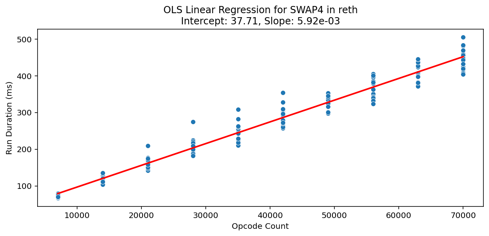

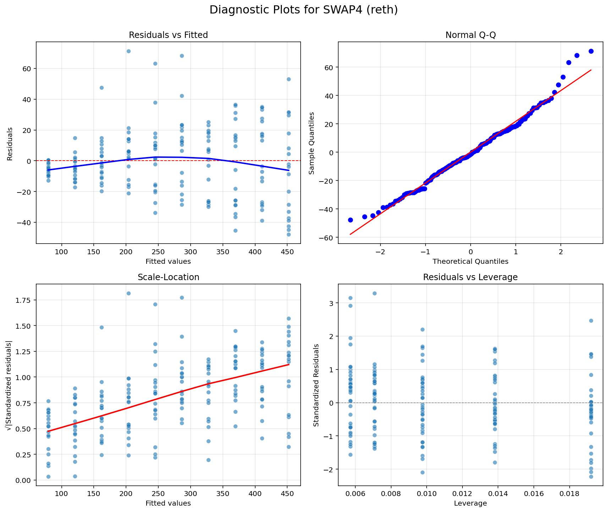


## nethermind


```python
                            OLS Regression Results                            
==============================================================================
Dep. Variable:        run_duration_ms   R-squared:                       0.981
Model:                            OLS   Adj. R-squared:                  0.981
Method:                 Least Squares   F-statistic:                 1.510e+04
Date:                Thu, 22 Jan 2026   Prob (F-statistic):          7.64e-251
Time:                        10:35:25   Log-Likelihood:                -1270.4
No. Observations:                 290   AIC:                             2545.
Df Residuals:                     288   BIC:                             2552.
Df Model:                           1                                         
Covariance Type:            nonrobust                                         
==============================================================================
                 coef    std err          t      P>|t|      [0.025      0.975]
------------------------------------------------------------------------------
const         27.3876      2.461     11.128      0.000      22.543      32.232
opcount        0.0070   5.67e-05    122.873      0.000       0.007       0.007
==============================================================================
Omnibus:                       43.990   Durbin-Watson:                   1.015
Prob(Omnibus):                  0.000   Jarque-Bera (JB):               85.431
Skew:                          -0.804   Prob(JB):                     2.81e-19
Kurtosis:                       5.117   Cond. No.                     9.38e+04
==============================================================================

Notes:
[1] Standard Errors assume that the covariance matrix of the errors is correctly specified.
[2] The condition number is large, 9.38e+04. This might indicate that there are
strong multicollinearity or other numerical problems.
```


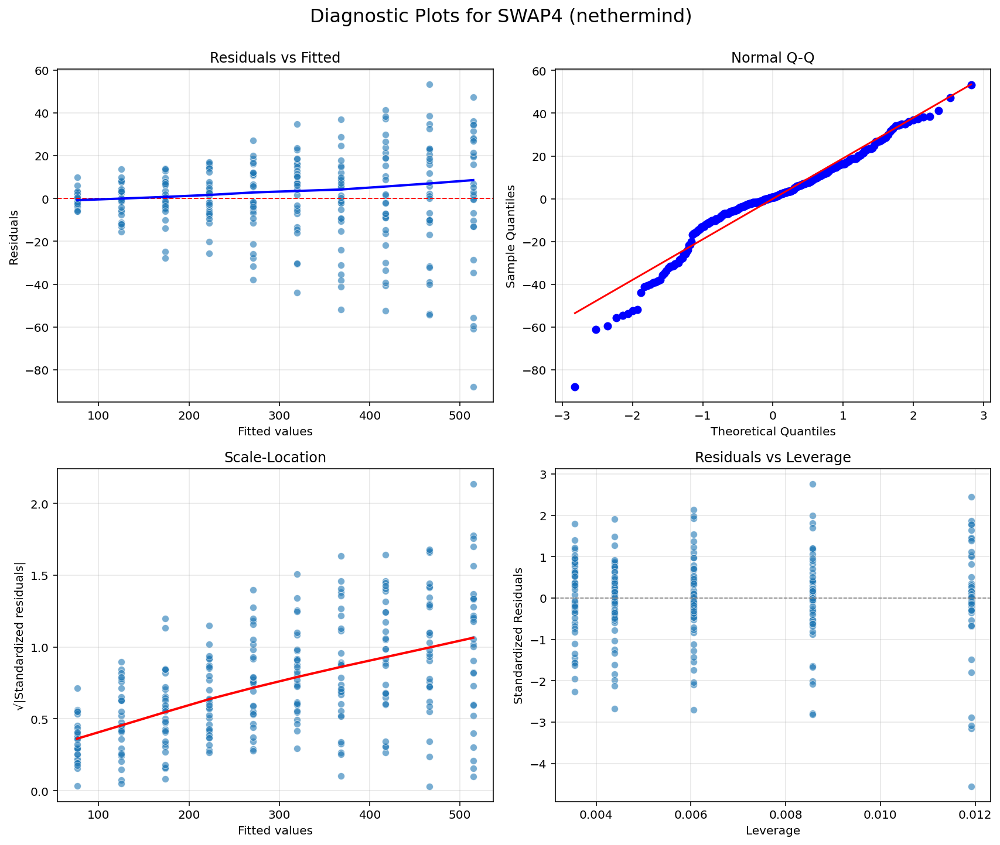


## erigon

OLS model did not run... Error: zero-size array to reduction operation maximum which has no identity

# SWAP5

## geth


```python
                            OLS Regression Results                            
==============================================================================
Dep. Variable:        run_duration_ms   R-squared:                       0.980
Model:                            OLS   Adj. R-squared:                  0.980
Method:                 Least Squares   F-statistic:                 1.412e+04
Date:                Thu, 22 Jan 2026   Prob (F-statistic):          1.00e-246
Time:                        10:35:25   Log-Likelihood:                -1434.7
No. Observations:                 290   AIC:                             2873.
Df Residuals:                     288   BIC:                             2881.
Df Model:                           1                                         
Covariance Type:            nonrobust                                         
==============================================================================
                 coef    std err          t      P>|t|      [0.025      0.975]
------------------------------------------------------------------------------
const         33.1997      4.336      7.657      0.000      24.665      41.734
opcount        0.0119   9.98e-05    118.816      0.000       0.012       0.012
==============================================================================
Omnibus:                       75.184   Durbin-Watson:                   1.198
Prob(Omnibus):                  0.000   Jarque-Bera (JB):              405.397
Skew:                           0.926   Prob(JB):                     9.32e-89
Kurtosis:                       8.488   Cond. No.                     9.38e+04
==============================================================================

Notes:
[1] Standard Errors assume that the covariance matrix of the errors is correctly specified.
[2] The condition number is large, 9.38e+04. This might indicate that there are
strong multicollinearity or other numerical problems.
```

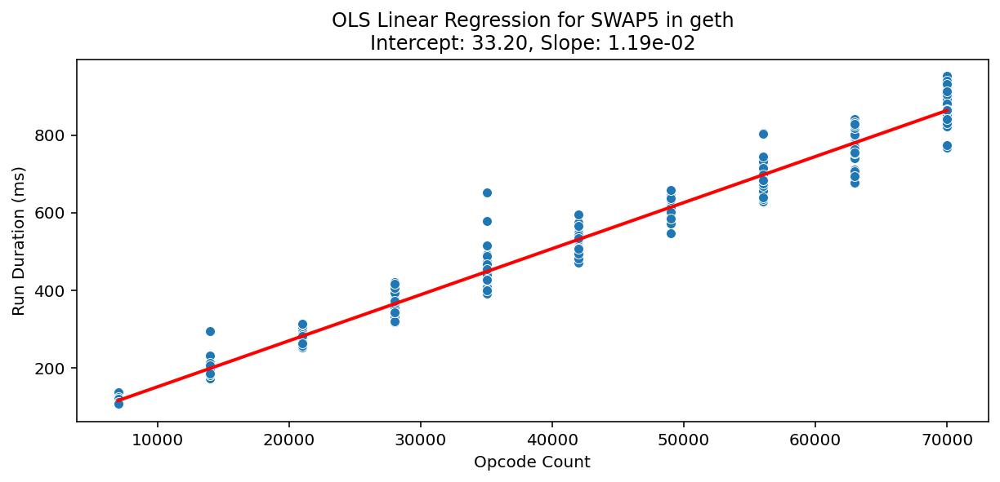


## besu


```python
                            OLS Regression Results                            
==============================================================================
Dep. Variable:        run_duration_ms   R-squared:                       0.981
Model:                            OLS   Adj. R-squared:                  0.981
Method:                 Least Squares   F-statistic:                 1.488e+04
Date:                Thu, 22 Jan 2026   Prob (F-statistic):          5.99e-250
Time:                        10:35:25   Log-Likelihood:                -1638.9
No. Observations:                 290   AIC:                             3282.
Df Residuals:                     288   BIC:                             3289.
Df Model:                           1                                         
Covariance Type:            nonrobust                                         
==============================================================================
                 coef    std err          t      P>|t|      [0.025      0.975]
------------------------------------------------------------------------------
const         27.5888      8.769      3.146      0.002      10.330      44.848
opcount        0.0246      0.000    121.981      0.000       0.024       0.025
==============================================================================
Omnibus:                       40.816   Durbin-Watson:                   0.924
Prob(Omnibus):                  0.000   Jarque-Bera (JB):              138.115
Skew:                          -0.553   Prob(JB):                     1.02e-30
Kurtosis:                       6.195   Cond. No.                     9.38e+04
==============================================================================

Notes:
[1] Standard Errors assume that the covariance matrix of the errors is correctly specified.
[2] The condition number is large, 9.38e+04. This might indicate that there are
strong multicollinearity or other numerical problems.
```

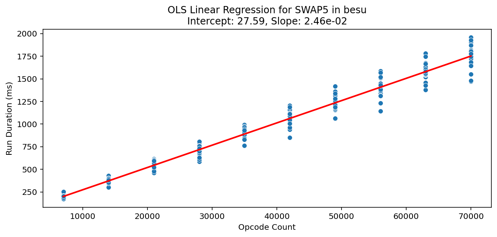

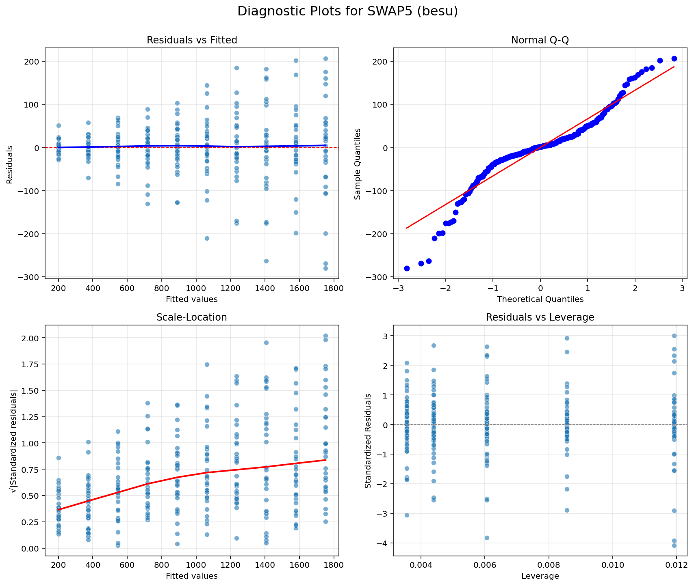


## reth


```python
                            OLS Regression Results                            
==============================================================================
Dep. Variable:        run_duration_ms   R-squared:                       0.971
Model:                            OLS   Adj. R-squared:                  0.971
Method:                 Least Squares   F-statistic:                     5993.
Date:                Thu, 22 Jan 2026   Prob (F-statistic):          5.32e-139
Time:                        10:35:25   Log-Likelihood:                -801.94
No. Observations:                 180   AIC:                             1608.
Df Residuals:                     178   BIC:                             1614.
Df Model:                           1                                         
Covariance Type:            nonrobust                                         
==============================================================================
                 coef    std err          t      P>|t|      [0.025      0.975]
------------------------------------------------------------------------------
const         32.7094      3.372      9.699      0.000      26.054      39.364
opcount        0.0060   7.76e-05     77.416      0.000       0.006       0.006
==============================================================================
Omnibus:                        1.406   Durbin-Watson:                   1.816
Prob(Omnibus):                  0.495   Jarque-Bera (JB):                1.033
Skew:                          -0.145   Prob(JB):                        0.596
Kurtosis:                       3.232   Cond. No.                     9.38e+04
==============================================================================

Notes:
[1] Standard Errors assume that the covariance matrix of the errors is correctly specified.
[2] The condition number is large, 9.38e+04. This might indicate that there are
strong multicollinearity or other numerical problems.
```

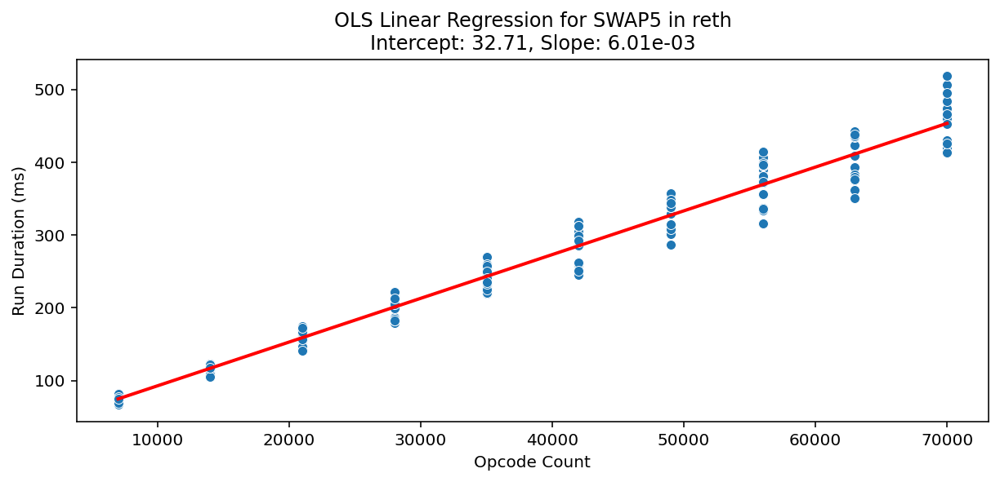

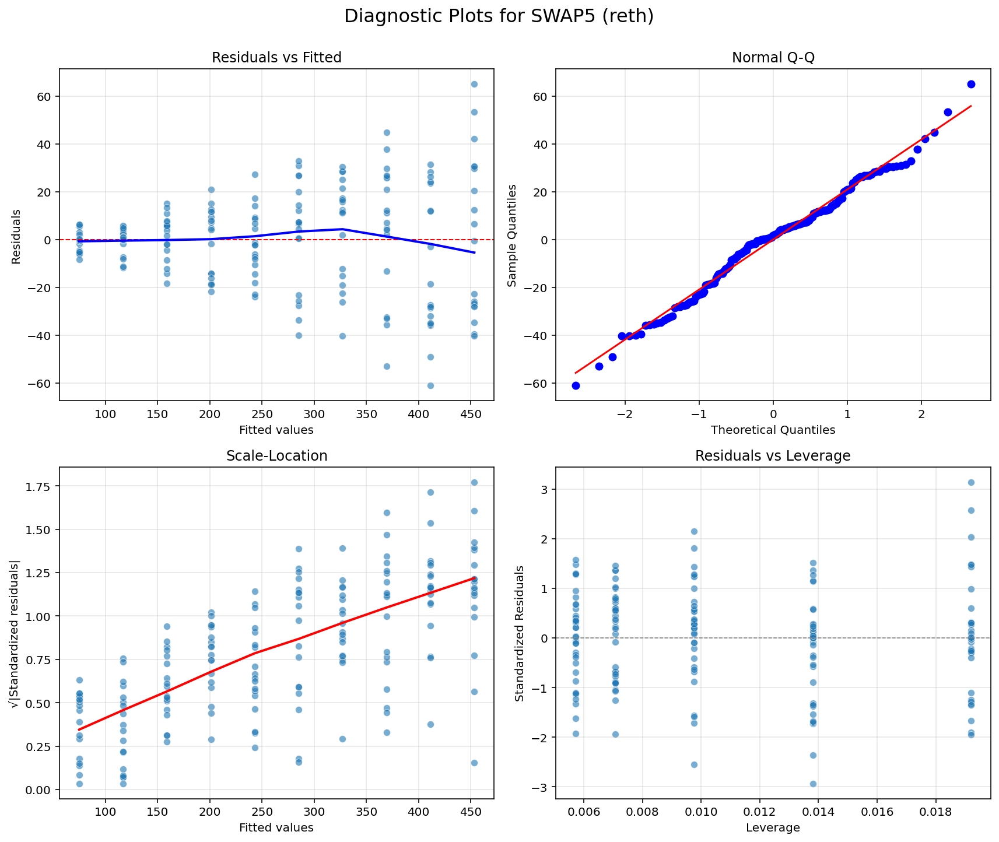


## nethermind


```python
                            OLS Regression Results                            
==============================================================================
Dep. Variable:        run_duration_ms   R-squared:                       0.980
Model:                            OLS   Adj. R-squared:                  0.980
Method:                 Least Squares   F-statistic:                 1.409e+04
Date:                Thu, 22 Jan 2026   Prob (F-statistic):          1.26e-246
Time:                        10:35:26   Log-Likelihood:                -1279.6
No. Observations:                 290   AIC:                             2563.
Df Residuals:                     288   BIC:                             2571.
Df Model:                           1                                         
Covariance Type:            nonrobust                                         
==============================================================================
                 coef    std err          t      P>|t|      [0.025      0.975]
------------------------------------------------------------------------------
const         29.3386      2.540     11.549      0.000      24.339      34.339
opcount        0.0069   5.85e-05    118.721      0.000       0.007       0.007
==============================================================================
Omnibus:                       41.460   Durbin-Watson:                   0.983
Prob(Omnibus):                  0.000   Jarque-Bera (JB):              337.622
Skew:                           0.032   Prob(JB):                     4.86e-74
Kurtosis:                       8.286   Cond. No.                     9.38e+04
==============================================================================

Notes:
[1] Standard Errors assume that the covariance matrix of the errors is correctly specified.
[2] The condition number is large, 9.38e+04. This might indicate that there are
strong multicollinearity or other numerical problems.
```


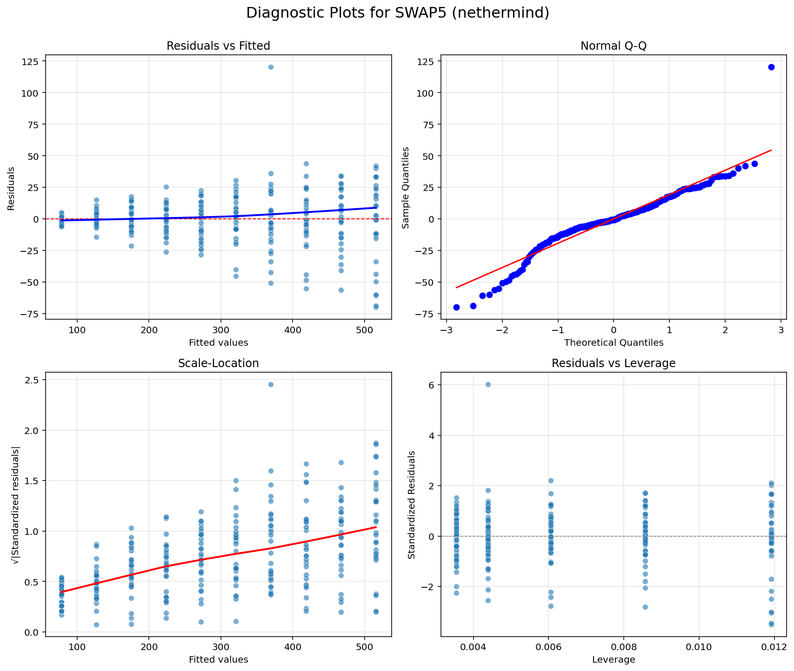


## erigon

OLS model did not run... Error: zero-size array to reduction operation maximum which has no identity

# SWAP6

## geth


```python
                            OLS Regression Results                            
==============================================================================
Dep. Variable:        run_duration_ms   R-squared:                       0.984
Model:                            OLS   Adj. R-squared:                  0.984
Method:                 Least Squares   F-statistic:                 1.765e+04
Date:                Thu, 22 Jan 2026   Prob (F-statistic):          1.97e-260
Time:                        10:35:26   Log-Likelihood:                -1399.4
No. Observations:                 290   AIC:                             2803.
Df Residuals:                     288   BIC:                             2810.
Df Model:                           1                                         
Covariance Type:            nonrobust                                         
==============================================================================
                 coef    std err          t      P>|t|      [0.025      0.975]
------------------------------------------------------------------------------
const         33.7035      3.840      8.777      0.000      26.146      41.261
opcount        0.0117   8.84e-05    132.843      0.000       0.012       0.012
==============================================================================
Omnibus:                       40.722   Durbin-Watson:                   0.965
Prob(Omnibus):                  0.000   Jarque-Bera (JB):               90.722
Skew:                          -0.699   Prob(JB):                     2.00e-20
Kurtosis:                       5.357   Cond. No.                     9.38e+04
==============================================================================

Notes:
[1] Standard Errors assume that the covariance matrix of the errors is correctly specified.
[2] The condition number is large, 9.38e+04. This might indicate that there are
strong multicollinearity or other numerical problems.
```


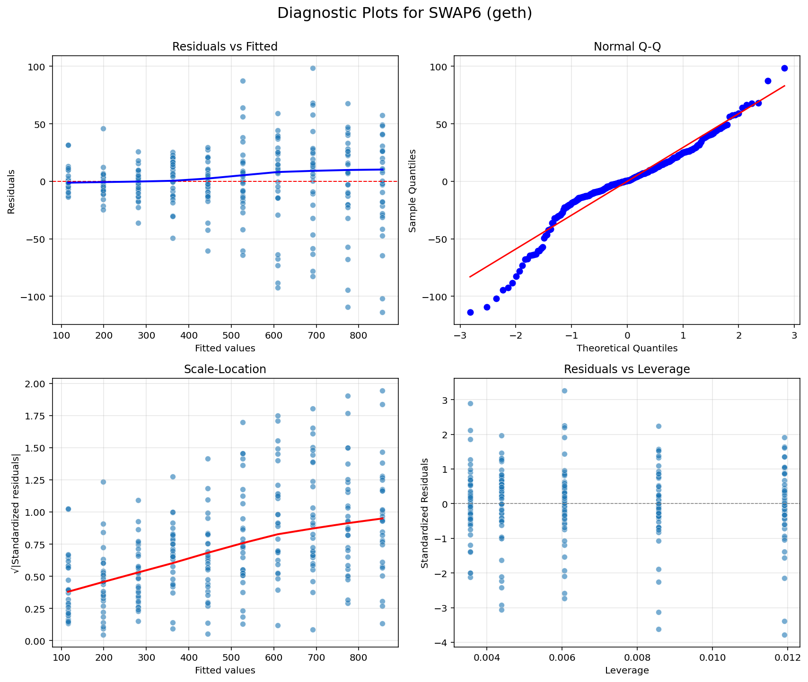


## besu


```python
                            OLS Regression Results                            
==============================================================================
Dep. Variable:        run_duration_ms   R-squared:                       0.981
Model:                            OLS   Adj. R-squared:                  0.981
Method:                 Least Squares   F-statistic:                 1.462e+04
Date:                Thu, 22 Jan 2026   Prob (F-statistic):          7.44e-249
Time:                        10:35:26   Log-Likelihood:                -1642.1
No. Observations:                 290   AIC:                             3288.
Df Residuals:                     288   BIC:                             3296.
Df Model:                           1                                         
Covariance Type:            nonrobust                                         
==============================================================================
                 coef    std err          t      P>|t|      [0.025      0.975]
------------------------------------------------------------------------------
const         26.1290      8.867      2.947      0.003       8.677      43.581
opcount        0.0247      0.000    120.898      0.000       0.024       0.025
==============================================================================
Omnibus:                       29.383   Durbin-Watson:                   0.884
Prob(Omnibus):                  0.000   Jarque-Bera (JB):               96.499
Skew:                          -0.353   Prob(JB):                     1.11e-21
Kurtosis:                       5.736   Cond. No.                     9.38e+04
==============================================================================

Notes:
[1] Standard Errors assume that the covariance matrix of the errors is correctly specified.
[2] The condition number is large, 9.38e+04. This might indicate that there are
strong multicollinearity or other numerical problems.
```

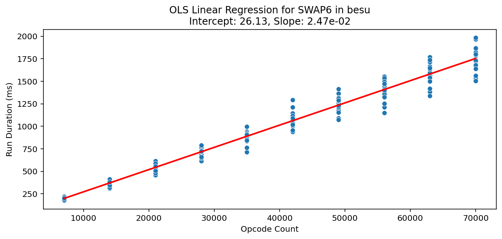

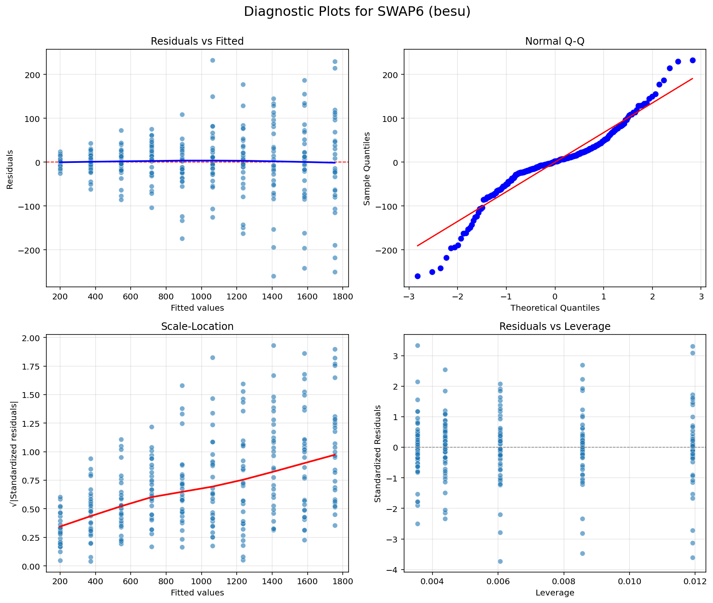


## reth


```python
                            OLS Regression Results                            
==============================================================================
Dep. Variable:        run_duration_ms   R-squared:                       0.972
Model:                            OLS   Adj. R-squared:                  0.972
Method:                 Least Squares   F-statistic:                     6280.
Date:                Thu, 22 Jan 2026   Prob (F-statistic):          9.29e-141
Time:                        10:35:26   Log-Likelihood:                -795.84
No. Observations:                 180   AIC:                             1596.
Df Residuals:                     178   BIC:                             1602.
Df Model:                           1                                         
Covariance Type:            nonrobust                                         
==============================================================================
                 coef    std err          t      P>|t|      [0.025      0.975]
------------------------------------------------------------------------------
const         35.4555      3.260     10.876      0.000      29.022      41.889
opcount        0.0059   7.51e-05     79.249      0.000       0.006       0.006
==============================================================================
Omnibus:                        1.167   Durbin-Watson:                   1.874
Prob(Omnibus):                  0.558   Jarque-Bera (JB):                0.966
Skew:                          -0.177   Prob(JB):                        0.617
Kurtosis:                       3.055   Cond. No.                     9.38e+04
==============================================================================

Notes:
[1] Standard Errors assume that the covariance matrix of the errors is correctly specified.
[2] The condition number is large, 9.38e+04. This might indicate that there are
strong multicollinearity or other numerical problems.
```


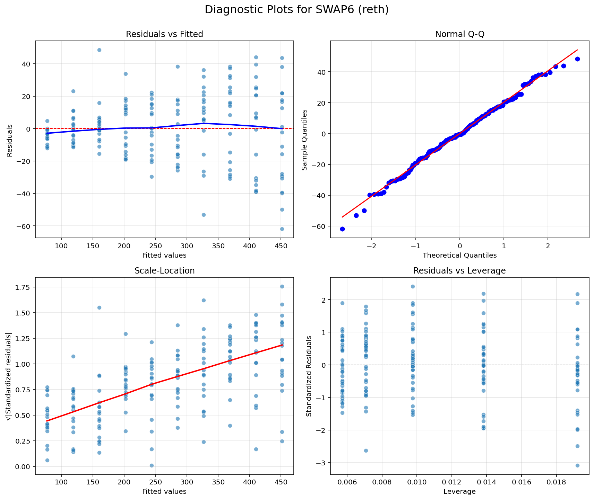


## nethermind


```python
                            OLS Regression Results                            
==============================================================================
Dep. Variable:        run_duration_ms   R-squared:                       0.964
Model:                            OLS   Adj. R-squared:                  0.964
Method:                 Least Squares   F-statistic:                     7774.
Date:                Thu, 22 Jan 2026   Prob (F-statistic):          2.03e-210
Time:                        10:35:27   Log-Likelihood:                -1369.6
No. Observations:                 290   AIC:                             2743.
Df Residuals:                     288   BIC:                             2751.
Df Model:                           1                                         
Covariance Type:            nonrobust                                         
==============================================================================
                 coef    std err          t      P>|t|      [0.025      0.975]
------------------------------------------------------------------------------
const         28.0725      3.465      8.102      0.000      21.253      34.892
opcount        0.0070   7.98e-05     88.168      0.000       0.007       0.007
==============================================================================
Omnibus:                      206.227   Durbin-Watson:                   0.972
Prob(Omnibus):                  0.000   Jarque-Bera (JB):             7208.217
Skew:                           2.353   Prob(JB):                         0.00
Kurtosis:                      26.967   Cond. No.                     9.38e+04
==============================================================================

Notes:
[1] Standard Errors assume that the covariance matrix of the errors is correctly specified.
[2] The condition number is large, 9.38e+04. This might indicate that there are
strong multicollinearity or other numerical problems.
```

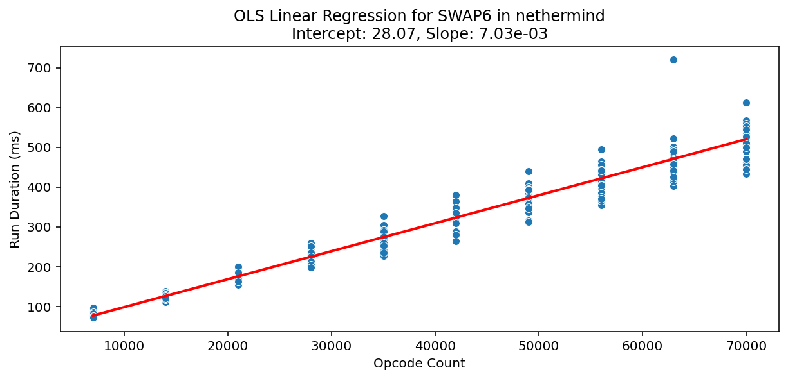

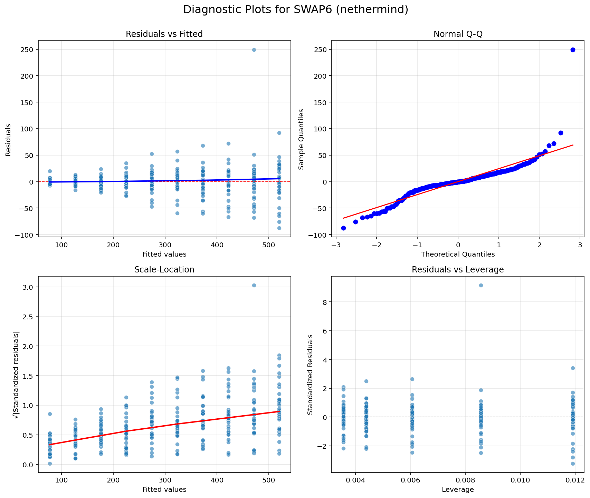


## erigon

OLS model did not run... Error: zero-size array to reduction operation maximum which has no identity

# SWAP7

## geth


```python
                            OLS Regression Results                            
==============================================================================
Dep. Variable:        run_duration_ms   R-squared:                       0.984
Model:                            OLS   Adj. R-squared:                  0.984
Method:                 Least Squares   F-statistic:                 1.829e+04
Date:                Thu, 22 Jan 2026   Prob (F-statistic):          1.21e-262
Time:                        10:35:27   Log-Likelihood:                -1394.6
No. Observations:                 290   AIC:                             2793.
Df Residuals:                     288   BIC:                             2800.
Df Model:                           1                                         
Covariance Type:            nonrobust                                         
==============================================================================
                 coef    std err          t      P>|t|      [0.025      0.975]
------------------------------------------------------------------------------
const         37.3209      3.776      9.884      0.000      29.889      44.753
opcount        0.0118   8.69e-05    135.250      0.000       0.012       0.012
==============================================================================
Omnibus:                       18.593   Durbin-Watson:                   1.099
Prob(Omnibus):                  0.000   Jarque-Bera (JB):               54.808
Skew:                           0.110   Prob(JB):                     1.26e-12
Kurtosis:                       5.118   Cond. No.                     9.38e+04
==============================================================================

Notes:
[1] Standard Errors assume that the covariance matrix of the errors is correctly specified.
[2] The condition number is large, 9.38e+04. This might indicate that there are
strong multicollinearity or other numerical problems.
```


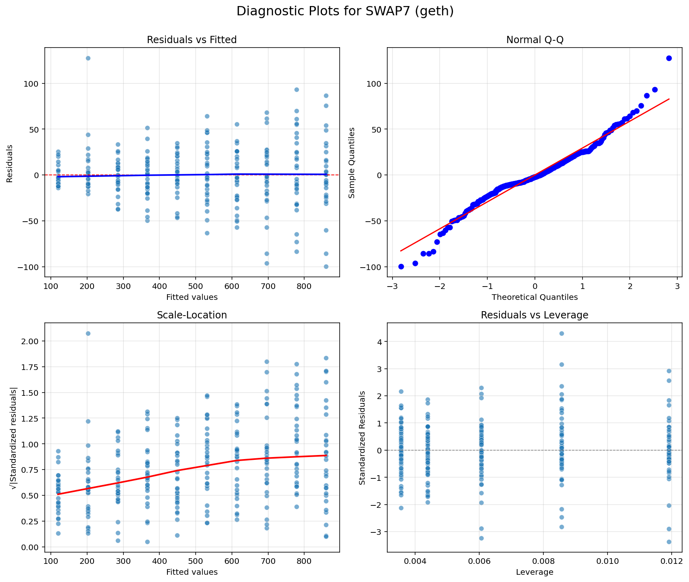


## besu


```python
                            OLS Regression Results                            
==============================================================================
Dep. Variable:        run_duration_ms   R-squared:                       0.978
Model:                            OLS   Adj. R-squared:                  0.978
Method:                 Least Squares   F-statistic:                 1.295e+04
Date:                Thu, 22 Jan 2026   Prob (F-statistic):          1.86e-241
Time:                        10:35:27   Log-Likelihood:                -1660.1
No. Observations:                 290   AIC:                             3324.
Df Residuals:                     288   BIC:                             3331.
Df Model:                           1                                         
Covariance Type:            nonrobust                                         
==============================================================================
                 coef    std err          t      P>|t|      [0.025      0.975]
------------------------------------------------------------------------------
const         27.4709      9.433      2.912      0.004       8.905      46.037
opcount        0.0247      0.000    113.814      0.000       0.024       0.025
==============================================================================
Omnibus:                       33.560   Durbin-Watson:                   0.961
Prob(Omnibus):                  0.000   Jarque-Bera (JB):              189.404
Skew:                          -0.125   Prob(JB):                     7.44e-42
Kurtosis:                       6.951   Cond. No.                     9.38e+04
==============================================================================

Notes:
[1] Standard Errors assume that the covariance matrix of the errors is correctly specified.
[2] The condition number is large, 9.38e+04. This might indicate that there are
strong multicollinearity or other numerical problems.
```


## reth


```python
                            OLS Regression Results                            
==============================================================================
Dep. Variable:        run_duration_ms   R-squared:                       0.976
Model:                            OLS   Adj. R-squared:                  0.976
Method:                 Least Squares   F-statistic:                     7308.
Date:                Thu, 22 Jan 2026   Prob (F-statistic):          1.81e-146
Time:                        10:35:28   Log-Likelihood:                -785.67
No. Observations:                 180   AIC:                             1575.
Df Residuals:                     178   BIC:                             1582.
Df Model:                           1                                         
Covariance Type:            nonrobust                                         
==============================================================================
                 coef    std err          t      P>|t|      [0.025      0.975]
------------------------------------------------------------------------------
const         29.4898      3.081      9.572      0.000      23.410      35.570
opcount        0.0061   7.09e-05     85.489      0.000       0.006       0.006
==============================================================================
Omnibus:                        0.383   Durbin-Watson:                   1.804
Prob(Omnibus):                  0.826   Jarque-Bera (JB):                0.351
Skew:                          -0.106   Prob(JB):                        0.839
Kurtosis:                       2.961   Cond. No.                     9.38e+04
==============================================================================

Notes:
[1] Standard Errors assume that the covariance matrix of the errors is correctly specified.
[2] The condition number is large, 9.38e+04. This might indicate that there are
strong multicollinearity or other numerical problems.
```

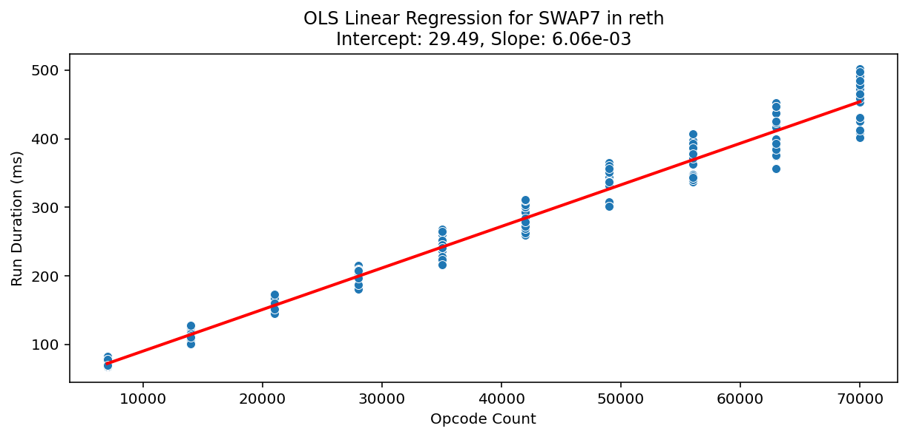

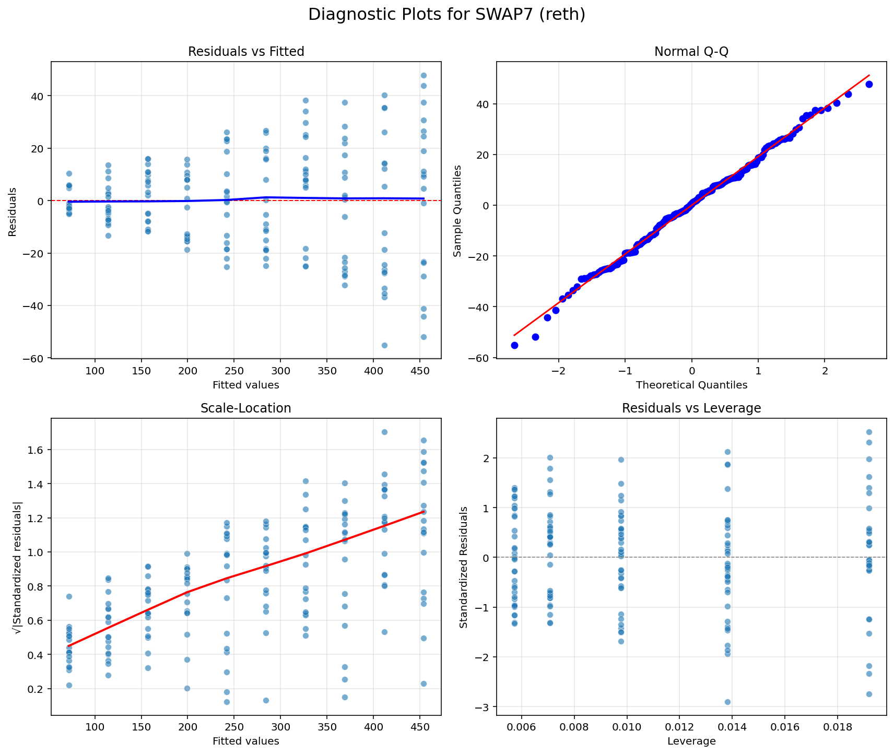


## nethermind


```python
                            OLS Regression Results                            
==============================================================================
Dep. Variable:        run_duration_ms   R-squared:                       0.966
Model:                            OLS   Adj. R-squared:                  0.966
Method:                 Least Squares   F-statistic:                     8182.
Date:                Thu, 22 Jan 2026   Prob (F-statistic):          1.66e-213
Time:                        10:35:28   Log-Likelihood:                -1362.6
No. Observations:                 290   AIC:                             2729.
Df Residuals:                     288   BIC:                             2737.
Df Model:                           1                                         
Covariance Type:            nonrobust                                         
==============================================================================
                 coef    std err          t      P>|t|      [0.025      0.975]
------------------------------------------------------------------------------
const         29.9850      3.382      8.866      0.000      23.328      36.642
opcount        0.0070   7.79e-05     90.452      0.000       0.007       0.007
==============================================================================
Omnibus:                      123.703   Durbin-Watson:                   0.865
Prob(Omnibus):                  0.000   Jarque-Bera (JB):             1281.459
Skew:                           1.429   Prob(JB):                    5.43e-279
Kurtosis:                      12.893   Cond. No.                     9.38e+04
==============================================================================

Notes:
[1] Standard Errors assume that the covariance matrix of the errors is correctly specified.
[2] The condition number is large, 9.38e+04. This might indicate that there are
strong multicollinearity or other numerical problems.
```

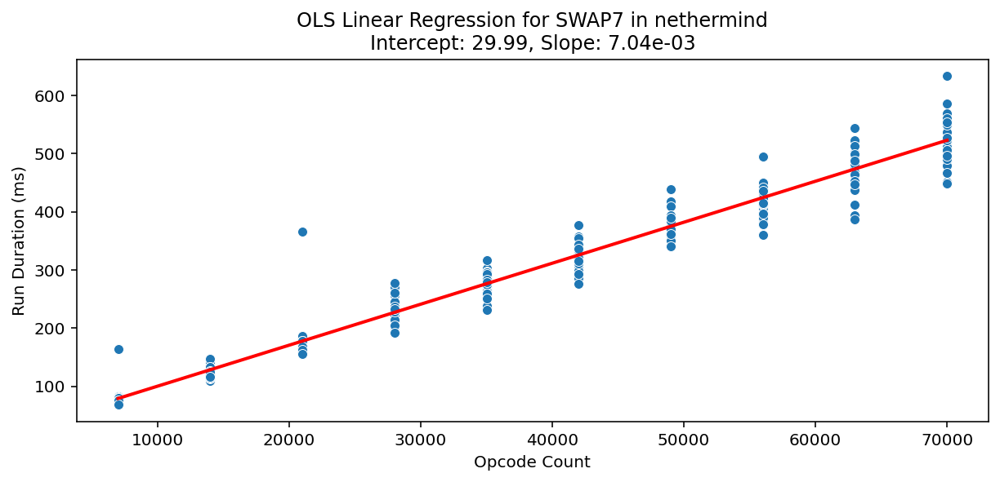

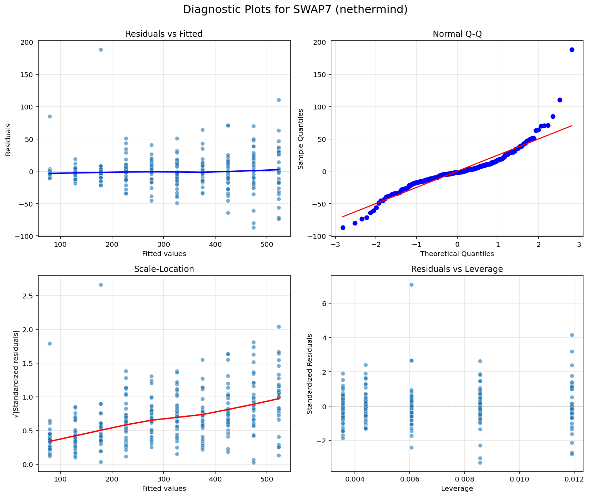


## erigon

OLS model did not run... Error: zero-size array to reduction operation maximum which has no identity

# SWAP8

## geth


```python
                            OLS Regression Results                            
==============================================================================
Dep. Variable:        run_duration_ms   R-squared:                       0.984
Model:                            OLS   Adj. R-squared:                  0.984
Method:                 Least Squares   F-statistic:                 1.784e+04
Date:                Thu, 22 Jan 2026   Prob (F-statistic):          4.13e-261
Time:                        10:35:28   Log-Likelihood:                -1402.7
No. Observations:                 290   AIC:                             2809.
Df Residuals:                     288   BIC:                             2817.
Df Model:                           1                                         
Covariance Type:            nonrobust                                         
==============================================================================
                 coef    std err          t      P>|t|      [0.025      0.975]
------------------------------------------------------------------------------
const         33.5266      3.883      8.633      0.000      25.883      41.170
opcount        0.0119   8.94e-05    133.577      0.000       0.012       0.012
==============================================================================
Omnibus:                       22.794   Durbin-Watson:                   0.898
Prob(Omnibus):                  0.000   Jarque-Bera (JB):               80.591
Skew:                          -0.127   Prob(JB):                     3.16e-18
Kurtosis:                       5.570   Cond. No.                     9.38e+04
==============================================================================

Notes:
[1] Standard Errors assume that the covariance matrix of the errors is correctly specified.
[2] The condition number is large, 9.38e+04. This might indicate that there are
strong multicollinearity or other numerical problems.
```


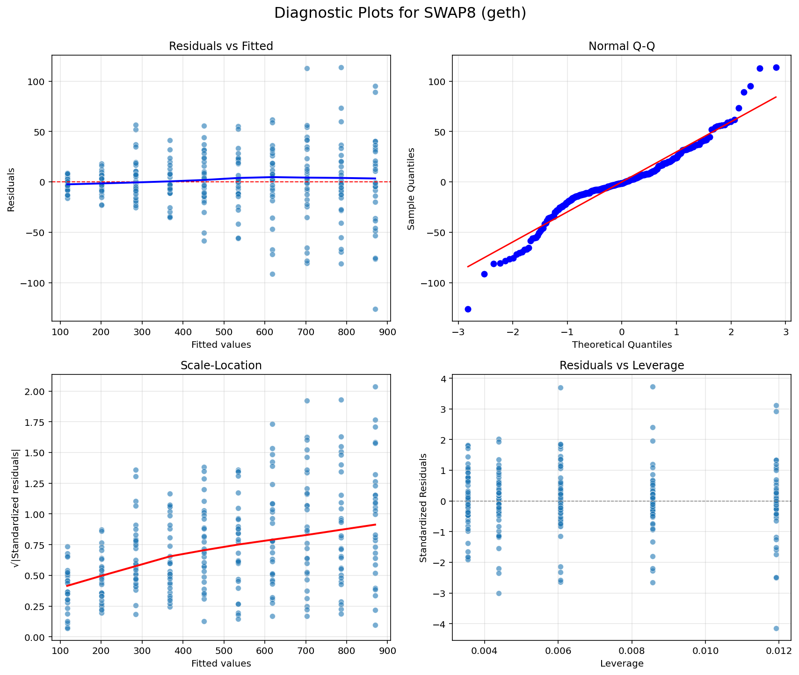


## besu


```python
                            OLS Regression Results                            
==============================================================================
Dep. Variable:        run_duration_ms   R-squared:                       0.980
Model:                            OLS   Adj. R-squared:                  0.980
Method:                 Least Squares   F-statistic:                 1.424e+04
Date:                Thu, 22 Jan 2026   Prob (F-statistic):          2.88e-247
Time:                        10:35:28   Log-Likelihood:                -1650.7
No. Observations:                 290   AIC:                             3305.
Df Residuals:                     288   BIC:                             3313.
Df Model:                           1                                         
Covariance Type:            nonrobust                                         
==============================================================================
                 coef    std err          t      P>|t|      [0.025      0.975]
------------------------------------------------------------------------------
const         24.4926      9.132      2.682      0.008       6.519      42.466
opcount        0.0251      0.000    119.342      0.000       0.025       0.026
==============================================================================
Omnibus:                       32.518   Durbin-Watson:                   0.697
Prob(Omnibus):                  0.000   Jarque-Bera (JB):               94.882
Skew:                          -0.462   Prob(JB):                     2.49e-21
Kurtosis:                       5.646   Cond. No.                     9.38e+04
==============================================================================

Notes:
[1] Standard Errors assume that the covariance matrix of the errors is correctly specified.
[2] The condition number is large, 9.38e+04. This might indicate that there are
strong multicollinearity or other numerical problems.
```

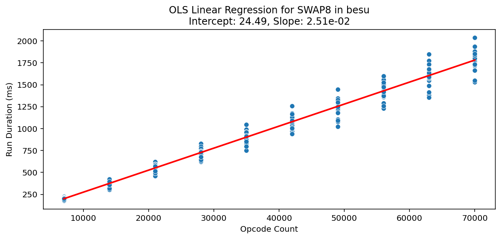

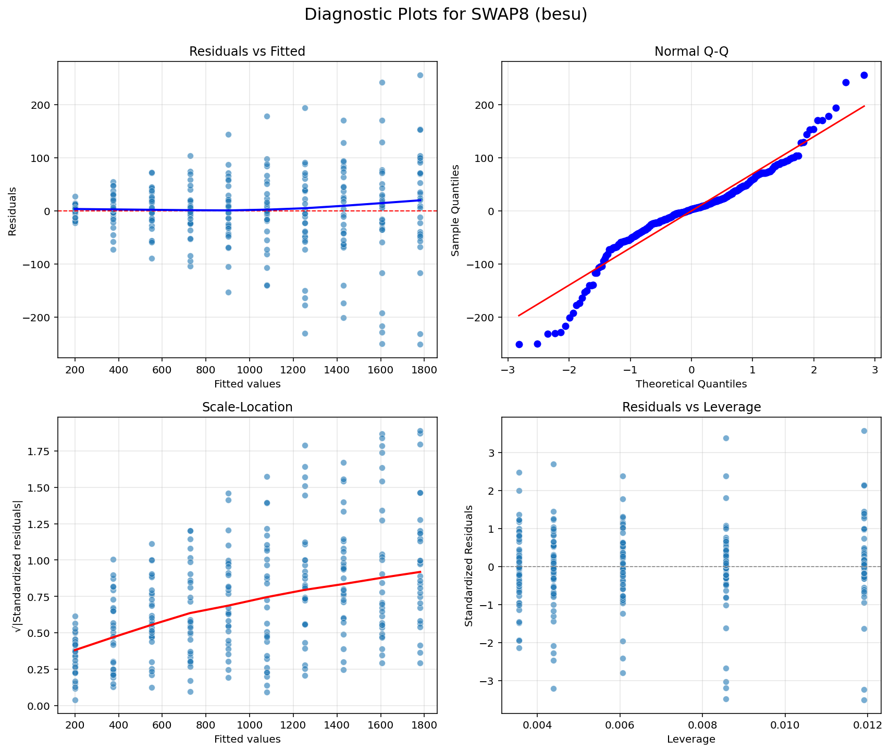


## reth


```python
                            OLS Regression Results                            
==============================================================================
Dep. Variable:        run_duration_ms   R-squared:                       0.965
Model:                            OLS   Adj. R-squared:                  0.965
Method:                 Least Squares   F-statistic:                     4906.
Date:                Thu, 22 Jan 2026   Prob (F-statistic):          1.64e-131
Time:                        10:35:29   Log-Likelihood:                -820.43
No. Observations:                 180   AIC:                             1645.
Df Residuals:                     178   BIC:                             1651.
Df Model:                           1                                         
Covariance Type:            nonrobust                                         
==============================================================================
                 coef    std err          t      P>|t|      [0.025      0.975]
------------------------------------------------------------------------------
const         33.0218      3.737      8.836      0.000      25.647      40.397
opcount        0.0060    8.6e-05     70.046      0.000       0.006       0.006
==============================================================================
Omnibus:                       86.842   Durbin-Watson:                   1.669
Prob(Omnibus):                  0.000   Jarque-Bera (JB):              681.815
Skew:                           1.595   Prob(JB):                    8.83e-149
Kurtosis:                      11.985   Cond. No.                     9.38e+04
==============================================================================

Notes:
[1] Standard Errors assume that the covariance matrix of the errors is correctly specified.
[2] The condition number is large, 9.38e+04. This might indicate that there are
strong multicollinearity or other numerical problems.
```

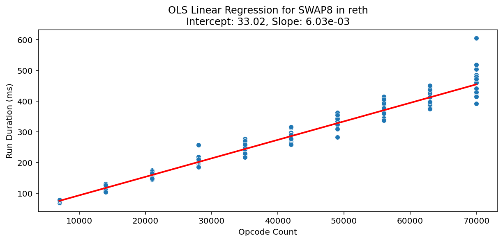

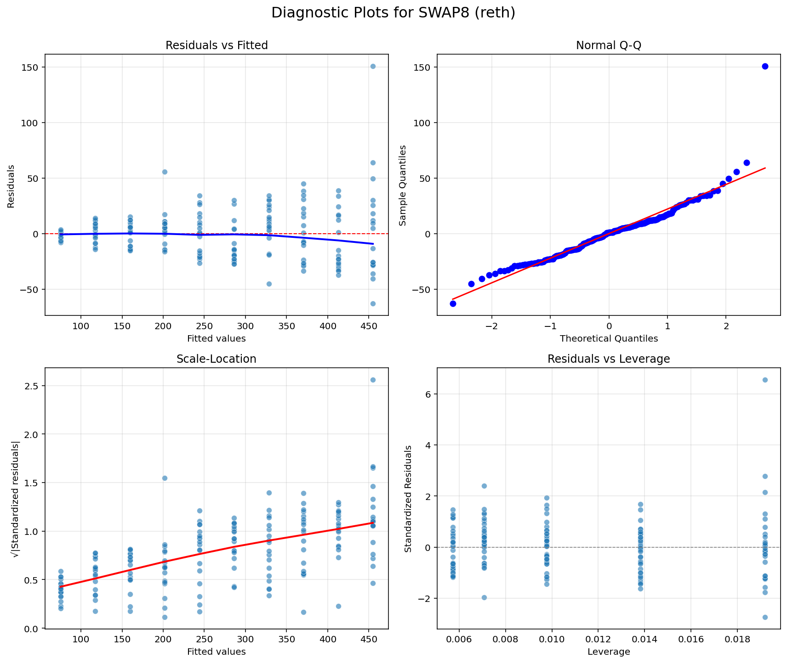


## nethermind


```python
                            OLS Regression Results                            
==============================================================================
Dep. Variable:        run_duration_ms   R-squared:                       0.977
Model:                            OLS   Adj. R-squared:                  0.977
Method:                 Least Squares   F-statistic:                 1.230e+04
Date:                Thu, 22 Jan 2026   Prob (F-statistic):          2.77e-238
Time:                        10:35:29   Log-Likelihood:                -1304.3
No. Observations:                 290   AIC:                             2613.
Df Residuals:                     288   BIC:                             2620.
Df Model:                           1                                         
Covariance Type:            nonrobust                                         
==============================================================================
                 coef    std err          t      P>|t|      [0.025      0.975]
------------------------------------------------------------------------------
const         27.0893      2.766      9.795      0.000      21.646      32.533
opcount        0.0071   6.37e-05    110.898      0.000       0.007       0.007
==============================================================================
Omnibus:                       46.546   Durbin-Watson:                   1.068
Prob(Omnibus):                  0.000   Jarque-Bera (JB):              454.420
Skew:                           0.088   Prob(JB):                     2.11e-99
Kurtosis:                       9.130   Cond. No.                     9.38e+04
==============================================================================

Notes:
[1] Standard Errors assume that the covariance matrix of the errors is correctly specified.
[2] The condition number is large, 9.38e+04. This might indicate that there are
strong multicollinearity or other numerical problems.
```


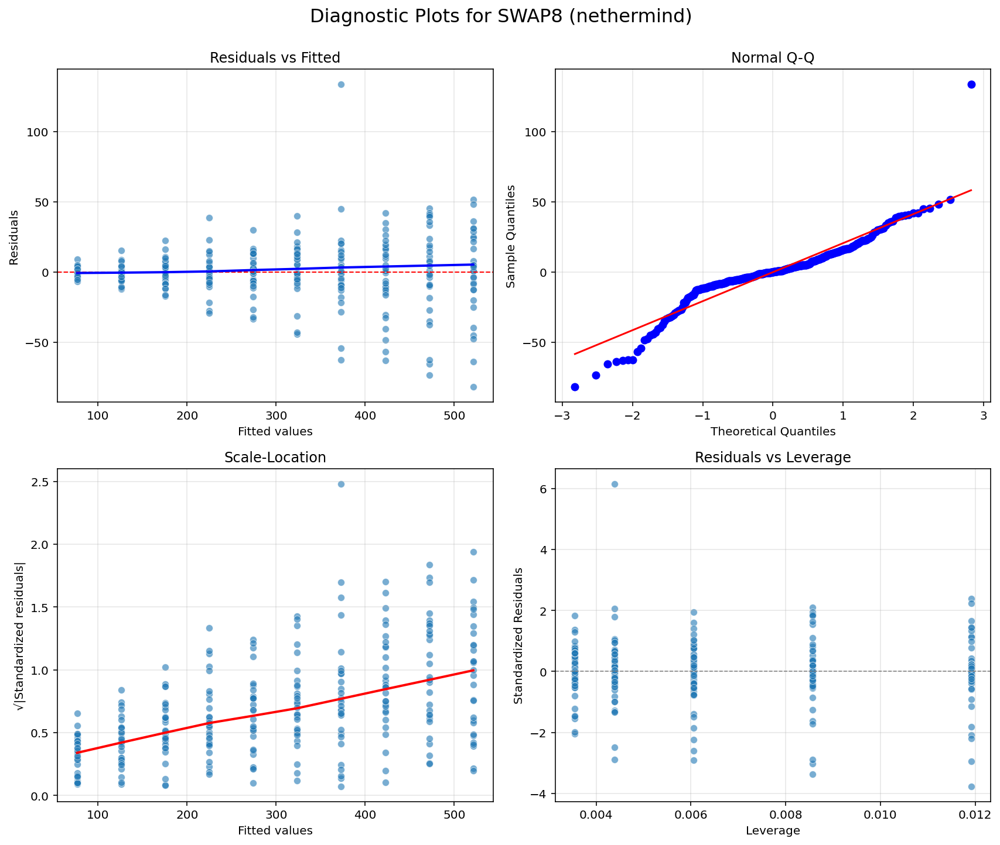


## erigon

OLS model did not run... Error: zero-size array to reduction operation maximum which has no identity

# SWAP9

## geth


```python
                            OLS Regression Results                            
==============================================================================
Dep. Variable:        run_duration_ms   R-squared:                       0.984
Model:                            OLS   Adj. R-squared:                  0.984
Method:                 Least Squares   F-statistic:                 1.743e+04
Date:                Thu, 22 Jan 2026   Prob (F-statistic):          1.16e-259
Time:                        10:35:29   Log-Likelihood:                -1407.5
No. Observations:                 290   AIC:                             2819.
Df Residuals:                     288   BIC:                             2826.
Df Model:                           1                                         
Covariance Type:            nonrobust                                         
==============================================================================
                 coef    std err          t      P>|t|      [0.025      0.975]
------------------------------------------------------------------------------
const         33.0188      3.949      8.362      0.000      25.247      40.791
opcount        0.0120   9.09e-05    132.014      0.000       0.012       0.012
==============================================================================
Omnibus:                       40.738   Durbin-Watson:                   1.188
Prob(Omnibus):                  0.000   Jarque-Bera (JB):              318.267
Skew:                          -0.071   Prob(JB):                     7.75e-70
Kurtosis:                       8.130   Cond. No.                     9.38e+04
==============================================================================

Notes:
[1] Standard Errors assume that the covariance matrix of the errors is correctly specified.
[2] The condition number is large, 9.38e+04. This might indicate that there are
strong multicollinearity or other numerical problems.
```


## besu


```python
                            OLS Regression Results                            
==============================================================================
Dep. Variable:        run_duration_ms   R-squared:                       0.980
Model:                            OLS   Adj. R-squared:                  0.980
Method:                 Least Squares   F-statistic:                 1.387e+04
Date:                Thu, 22 Jan 2026   Prob (F-statistic):          1.24e-245
Time:                        10:35:30   Log-Likelihood:                -1651.8
No. Observations:                 290   AIC:                             3308.
Df Residuals:                     288   BIC:                             3315.
Df Model:                           1                                         
Covariance Type:            nonrobust                                         
==============================================================================
                 coef    std err          t      P>|t|      [0.025      0.975]
------------------------------------------------------------------------------
const         29.6059      9.167      3.230      0.001      11.564      47.648
opcount        0.0249      0.000    117.761      0.000       0.024       0.025
==============================================================================
Omnibus:                       30.535   Durbin-Watson:                   0.760
Prob(Omnibus):                  0.000   Jarque-Bera (JB):              105.318
Skew:                          -0.355   Prob(JB):                     1.35e-23
Kurtosis:                       5.865   Cond. No.                     9.38e+04
==============================================================================

Notes:
[1] Standard Errors assume that the covariance matrix of the errors is correctly specified.
[2] The condition number is large, 9.38e+04. This might indicate that there are
strong multicollinearity or other numerical problems.
```


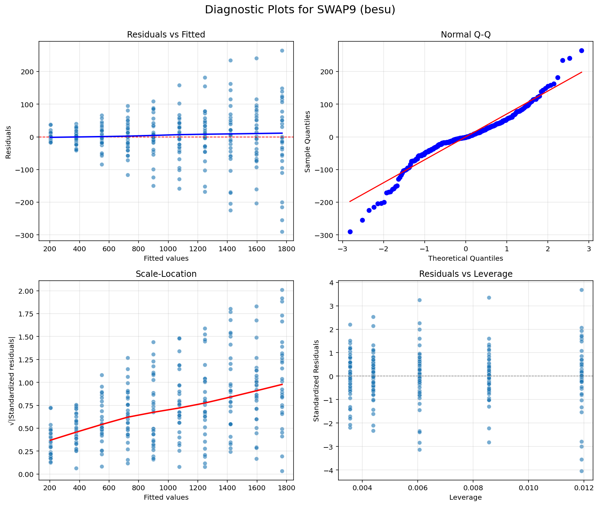


## reth


```python
                            OLS Regression Results                            
==============================================================================
Dep. Variable:        run_duration_ms   R-squared:                       0.972
Model:                            OLS   Adj. R-squared:                  0.972
Method:                 Least Squares   F-statistic:                     6200.
Date:                Thu, 22 Jan 2026   Prob (F-statistic):          2.85e-140
Time:                        10:35:30   Log-Likelihood:                -798.50
No. Observations:                 180   AIC:                             1601.
Df Residuals:                     178   BIC:                             1607.
Df Model:                           1                                         
Covariance Type:            nonrobust                                         
==============================================================================
                 coef    std err          t      P>|t|      [0.025      0.975]
------------------------------------------------------------------------------
const         33.4246      3.309     10.102      0.000      26.896      39.954
opcount        0.0060   7.62e-05     78.738      0.000       0.006       0.006
==============================================================================
Omnibus:                        1.535   Durbin-Watson:                   1.910
Prob(Omnibus):                  0.464   Jarque-Bera (JB):                1.158
Skew:                          -0.107   Prob(JB):                        0.560
Kurtosis:                       3.329   Cond. No.                     9.38e+04
==============================================================================

Notes:
[1] Standard Errors assume that the covariance matrix of the errors is correctly specified.
[2] The condition number is large, 9.38e+04. This might indicate that there are
strong multicollinearity or other numerical problems.
```

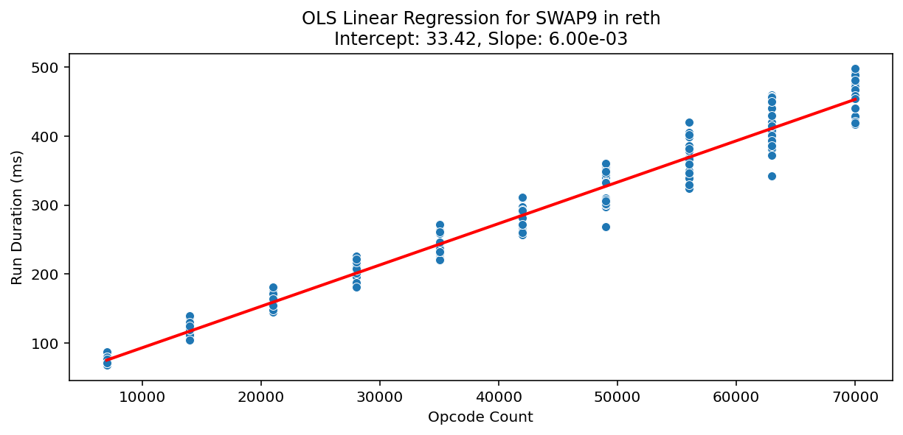

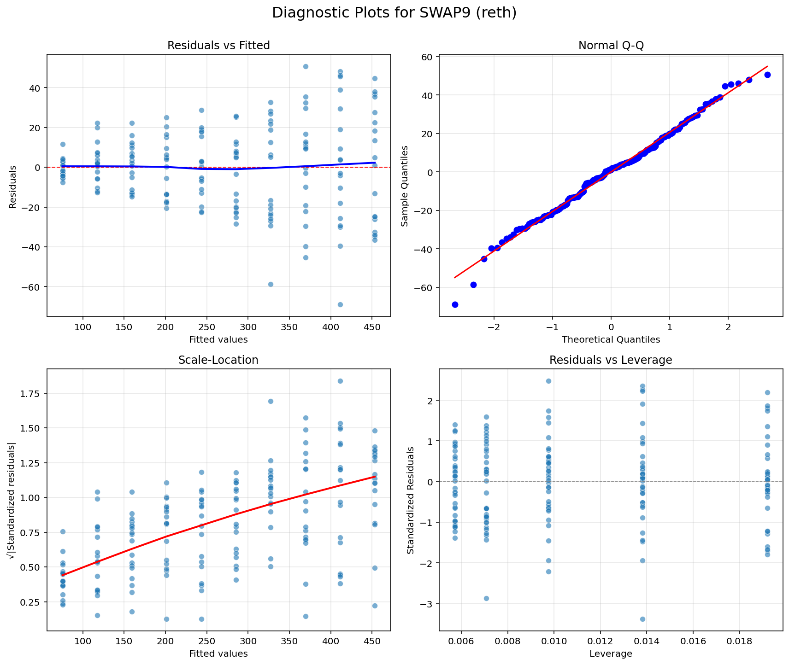


## nethermind


```python
                            OLS Regression Results                            
==============================================================================
Dep. Variable:        run_duration_ms   R-squared:                       0.974
Model:                            OLS   Adj. R-squared:                  0.974
Method:                 Least Squares   F-statistic:                 1.065e+04
Date:                Thu, 22 Jan 2026   Prob (F-statistic):          1.61e-229
Time:                        10:35:30   Log-Likelihood:                -1322.8
No. Observations:                 290   AIC:                             2650.
Df Residuals:                     288   BIC:                             2657.
Df Model:                           1                                         
Covariance Type:            nonrobust                                         
==============================================================================
                 coef    std err          t      P>|t|      [0.025      0.975]
------------------------------------------------------------------------------
const         28.7911      2.949      9.765      0.000      22.988      34.594
opcount        0.0070   6.79e-05    103.212      0.000       0.007       0.007
==============================================================================
Omnibus:                       49.683   Durbin-Watson:                   0.984
Prob(Omnibus):                  0.000   Jarque-Bera (JB):              356.379
Skew:                           0.406   Prob(JB):                     4.10e-78
Kurtosis:                       8.370   Cond. No.                     9.38e+04
==============================================================================

Notes:
[1] Standard Errors assume that the covariance matrix of the errors is correctly specified.
[2] The condition number is large, 9.38e+04. This might indicate that there are
strong multicollinearity or other numerical problems.
```

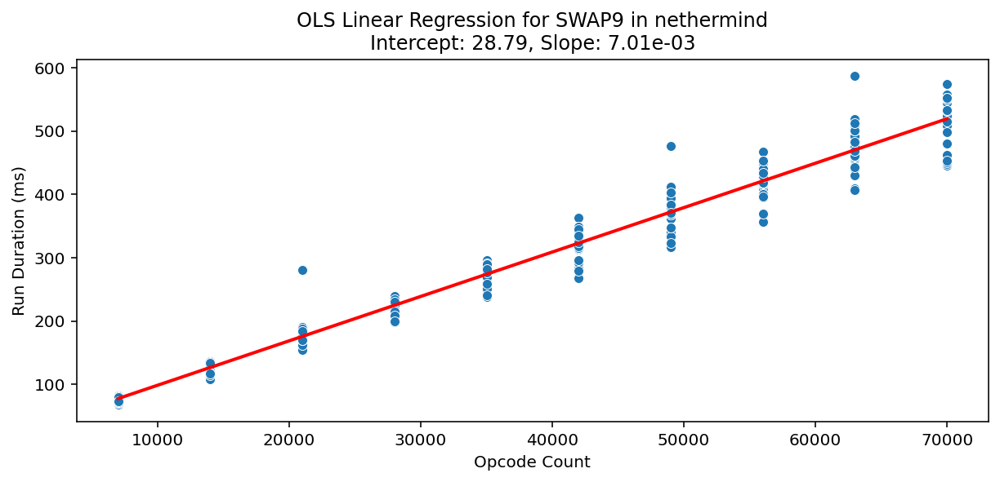

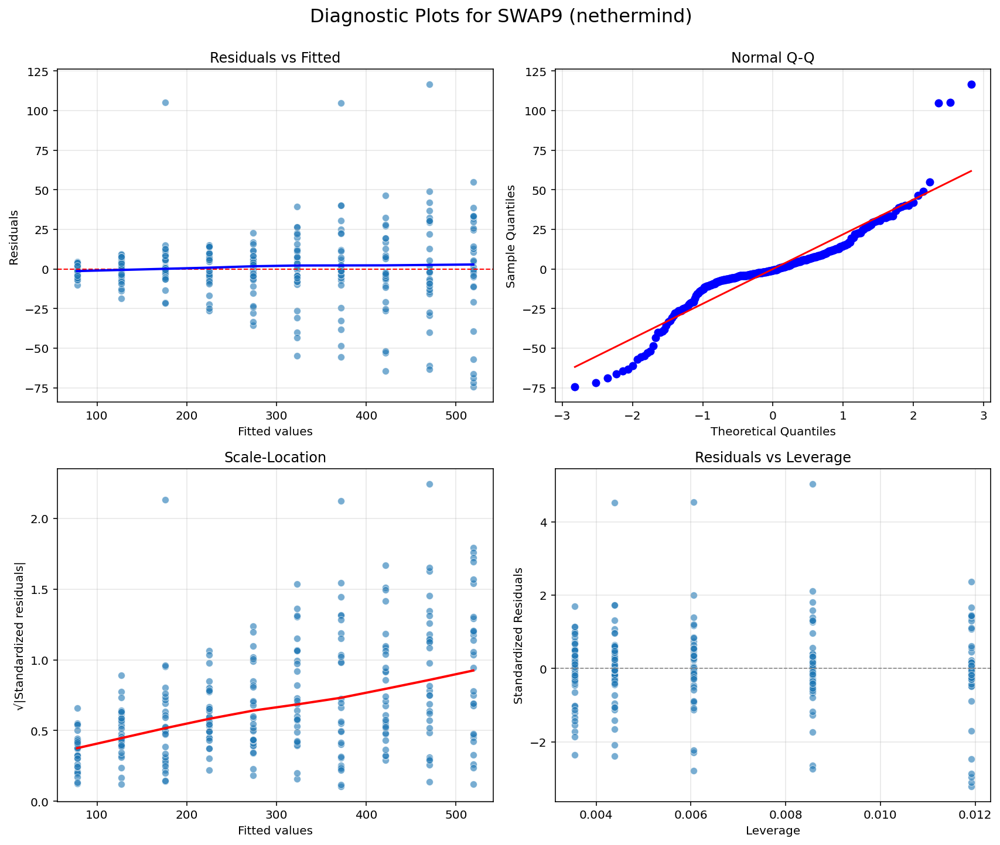


## erigon

OLS model did not run... Error: zero-size array to reduction operation maximum which has no identity

# SWAP10

## geth


```python
                            OLS Regression Results                            
==============================================================================
Dep. Variable:        run_duration_ms   R-squared:                       0.984
Model:                            OLS   Adj. R-squared:                  0.984
Method:                 Least Squares   F-statistic:                 1.769e+04
Date:                Thu, 22 Jan 2026   Prob (F-statistic):          1.38e-260
Time:                        10:35:30   Log-Likelihood:                -1402.3
No. Observations:                 290   AIC:                             2809.
Df Residuals:                     288   BIC:                             2816.
Df Model:                           1                                         
Covariance Type:            nonrobust                                         
==============================================================================
                 coef    std err          t      P>|t|      [0.025      0.975]
------------------------------------------------------------------------------
const         33.8705      3.878      8.734      0.000      26.237      41.504
opcount        0.0119   8.93e-05    133.010      0.000       0.012       0.012
==============================================================================
Omnibus:                       26.825   Durbin-Watson:                   1.115
Prob(Omnibus):                  0.000   Jarque-Bera (JB):              115.696
Skew:                           0.104   Prob(JB):                     7.53e-26
Kurtosis:                       6.087   Cond. No.                     9.38e+04
==============================================================================

Notes:
[1] Standard Errors assume that the covariance matrix of the errors is correctly specified.
[2] The condition number is large, 9.38e+04. This might indicate that there are
strong multicollinearity or other numerical problems.
```


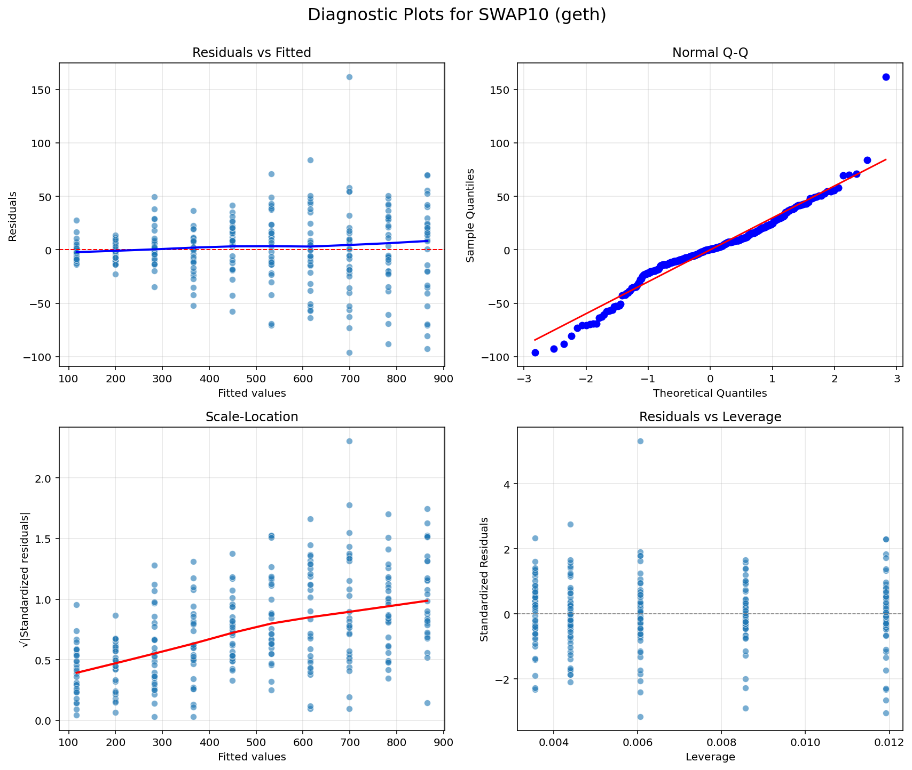


## besu


```python
                            OLS Regression Results                            
==============================================================================
Dep. Variable:        run_duration_ms   R-squared:                       0.980
Model:                            OLS   Adj. R-squared:                  0.980
Method:                 Least Squares   F-statistic:                 1.387e+04
Date:                Thu, 22 Jan 2026   Prob (F-statistic):          1.20e-245
Time:                        10:35:31   Log-Likelihood:                -1651.5
No. Observations:                 290   AIC:                             3307.
Df Residuals:                     288   BIC:                             3314.
Df Model:                           1                                         
Covariance Type:            nonrobust                                         
==============================================================================
                 coef    std err          t      P>|t|      [0.025      0.975]
------------------------------------------------------------------------------
const         29.4561      9.158      3.216      0.001      11.431      47.482
opcount        0.0248      0.000    117.778      0.000       0.024       0.025
==============================================================================
Omnibus:                       33.497   Durbin-Watson:                   0.638
Prob(Omnibus):                  0.000   Jarque-Bera (JB):              104.149
Skew:                          -0.455   Prob(JB):                     2.42e-23
Kurtosis:                       5.791   Cond. No.                     9.38e+04
==============================================================================

Notes:
[1] Standard Errors assume that the covariance matrix of the errors is correctly specified.
[2] The condition number is large, 9.38e+04. This might indicate that there are
strong multicollinearity or other numerical problems.
```


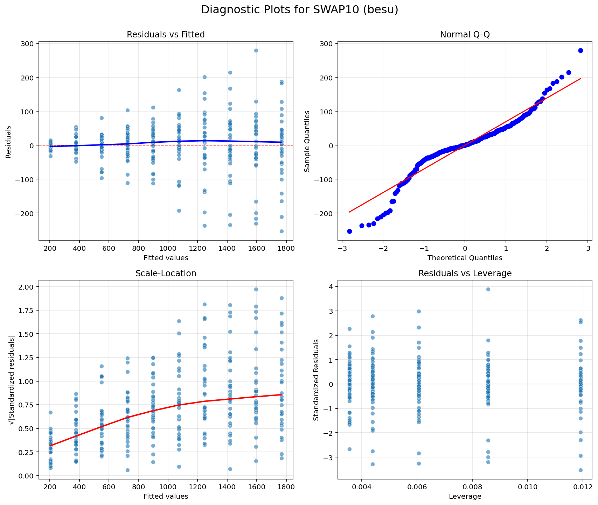


## reth


```python
                            OLS Regression Results                            
==============================================================================
Dep. Variable:        run_duration_ms   R-squared:                       0.971
Model:                            OLS   Adj. R-squared:                  0.971
Method:                 Least Squares   F-statistic:                     5998.
Date:                Thu, 22 Jan 2026   Prob (F-statistic):          4.97e-139
Time:                        10:35:31   Log-Likelihood:                -803.79
No. Observations:                 180   AIC:                             1612.
Df Residuals:                     178   BIC:                             1618.
Df Model:                           1                                         
Covariance Type:            nonrobust                                         
==============================================================================
                 coef    std err          t      P>|t|      [0.025      0.975]
------------------------------------------------------------------------------
const         33.5024      3.407      9.833      0.000      26.779      40.226
opcount        0.0061   7.84e-05     77.447      0.000       0.006       0.006
==============================================================================
Omnibus:                        8.932   Durbin-Watson:                   1.966
Prob(Omnibus):                  0.011   Jarque-Bera (JB):               10.836
Skew:                          -0.363   Prob(JB):                      0.00444
Kurtosis:                       3.959   Cond. No.                     9.38e+04
==============================================================================

Notes:
[1] Standard Errors assume that the covariance matrix of the errors is correctly specified.
[2] The condition number is large, 9.38e+04. This might indicate that there are
strong multicollinearity or other numerical problems.
```

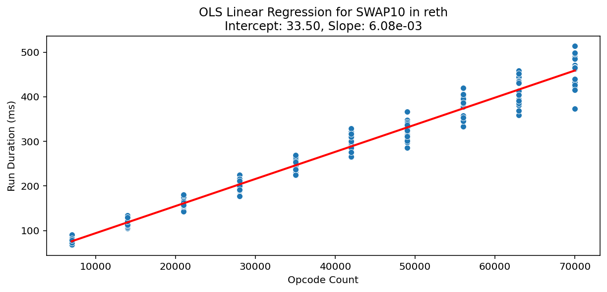

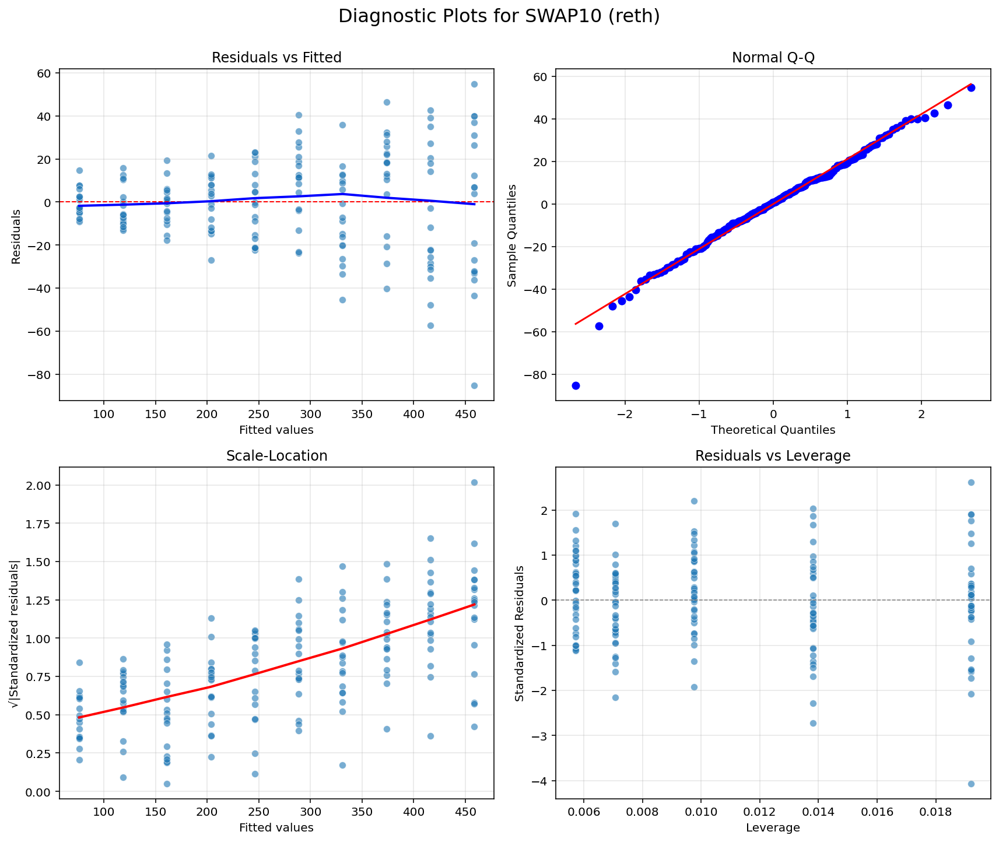


## nethermind


```python
                            OLS Regression Results                            
==============================================================================
Dep. Variable:        run_duration_ms   R-squared:                       0.976
Model:                            OLS   Adj. R-squared:                  0.976
Method:                 Least Squares   F-statistic:                 1.177e+04
Date:                Thu, 22 Jan 2026   Prob (F-statistic):          1.27e-235
Time:                        10:35:31   Log-Likelihood:                -1310.4
No. Observations:                 290   AIC:                             2625.
Df Residuals:                     288   BIC:                             2632.
Df Model:                           1                                         
Covariance Type:            nonrobust                                         
==============================================================================
                 coef    std err          t      P>|t|      [0.025      0.975]
------------------------------------------------------------------------------
const         27.1214      2.825      9.600      0.000      21.561      32.682
opcount        0.0071    6.5e-05    108.509      0.000       0.007       0.007
==============================================================================
Omnibus:                       54.912   Durbin-Watson:                   0.982
Prob(Omnibus):                  0.000   Jarque-Bera (JB):              567.318
Skew:                           0.328   Prob(JB):                    6.43e-124
Kurtosis:                       9.821   Cond. No.                     9.38e+04
==============================================================================

Notes:
[1] Standard Errors assume that the covariance matrix of the errors is correctly specified.
[2] The condition number is large, 9.38e+04. This might indicate that there are
strong multicollinearity or other numerical problems.
```


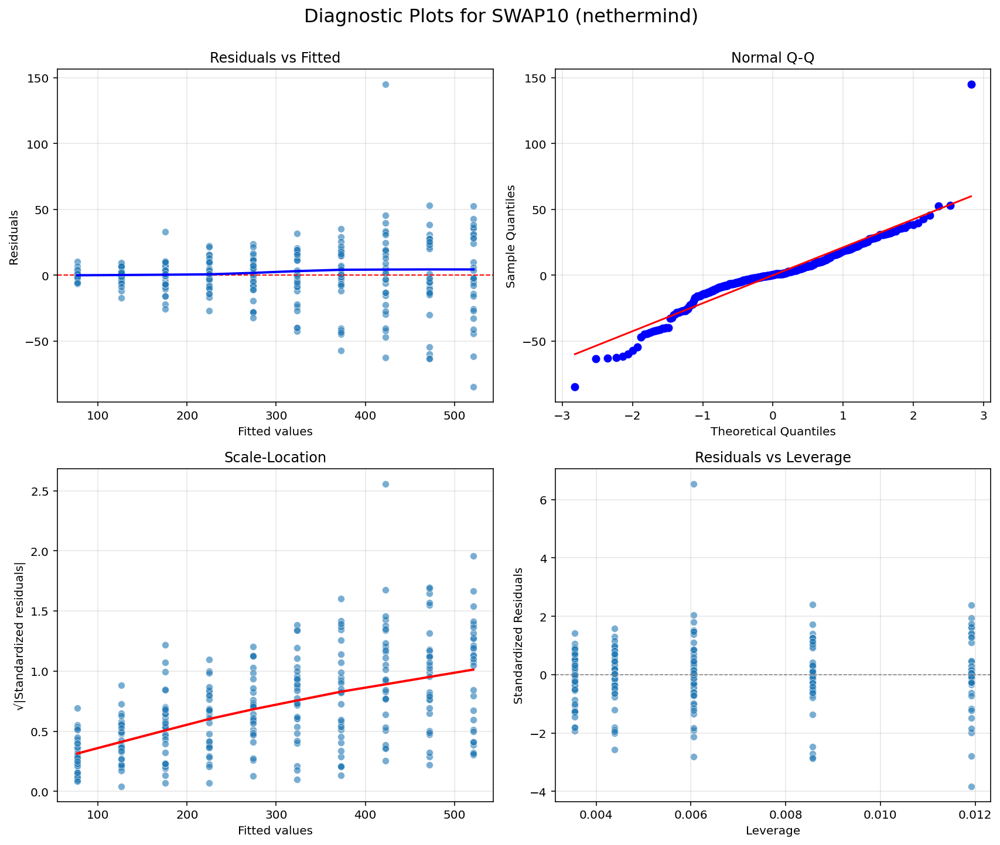


## erigon

OLS model did not run... Error: zero-size array to reduction operation maximum which has no identity

# SWAP11

## geth


```python
                            OLS Regression Results                            
==============================================================================
Dep. Variable:        run_duration_ms   R-squared:                       0.981
Model:                            OLS   Adj. R-squared:                  0.981
Method:                 Least Squares   F-statistic:                 1.525e+04
Date:                Thu, 22 Jan 2026   Prob (F-statistic):          1.82e-251
Time:                        10:35:32   Log-Likelihood:                -1425.7
No. Observations:                 290   AIC:                             2855.
Df Residuals:                     288   BIC:                             2863.
Df Model:                           1                                         
Covariance Type:            nonrobust                                         
==============================================================================
                 coef    std err          t      P>|t|      [0.025      0.975]
------------------------------------------------------------------------------
const         33.4628      4.204      7.959      0.000      25.188      41.738
opcount        0.0120   9.68e-05    123.498      0.000       0.012       0.012
==============================================================================
Omnibus:                       27.648   Durbin-Watson:                   1.237
Prob(Omnibus):                  0.000   Jarque-Bera (JB):              123.506
Skew:                           0.105   Prob(JB):                     1.52e-27
Kurtosis:                       6.190   Cond. No.                     9.38e+04
==============================================================================

Notes:
[1] Standard Errors assume that the covariance matrix of the errors is correctly specified.
[2] The condition number is large, 9.38e+04. This might indicate that there are
strong multicollinearity or other numerical problems.
```


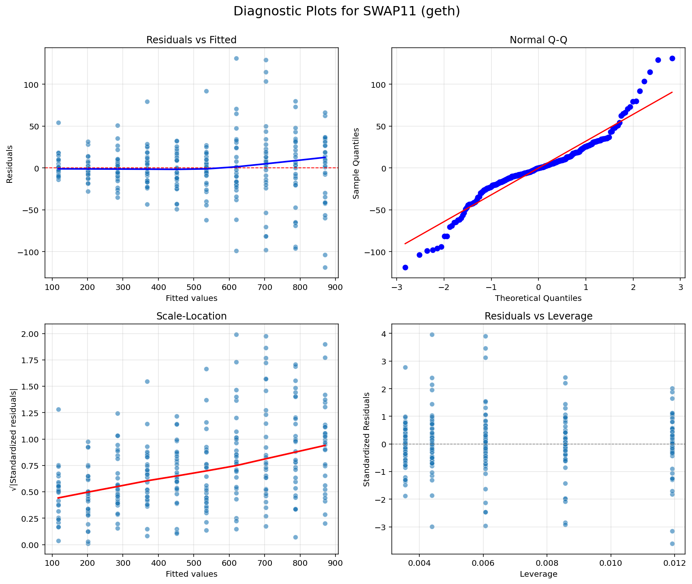


## besu


```python
                            OLS Regression Results                            
==============================================================================
Dep. Variable:        run_duration_ms   R-squared:                       0.980
Model:                            OLS   Adj. R-squared:                  0.980
Method:                 Least Squares   F-statistic:                 1.407e+04
Date:                Thu, 22 Jan 2026   Prob (F-statistic):          1.61e-246
Time:                        10:35:32   Log-Likelihood:                -1653.0
No. Observations:                 290   AIC:                             3310.
Df Residuals:                     288   BIC:                             3317.
Df Model:                           1                                         
Covariance Type:            nonrobust                                         
==============================================================================
                 coef    std err          t      P>|t|      [0.025      0.975]
------------------------------------------------------------------------------
const         22.0806      9.206      2.398      0.017       3.960      40.201
opcount        0.0251      0.000    118.618      0.000       0.025       0.026
==============================================================================
Omnibus:                       28.650   Durbin-Watson:                   0.791
Prob(Omnibus):                  0.000   Jarque-Bera (JB):              108.868
Skew:                          -0.265   Prob(JB):                     2.29e-24
Kurtosis:                       5.955   Cond. No.                     9.38e+04
==============================================================================

Notes:
[1] Standard Errors assume that the covariance matrix of the errors is correctly specified.
[2] The condition number is large, 9.38e+04. This might indicate that there are
strong multicollinearity or other numerical problems.
```

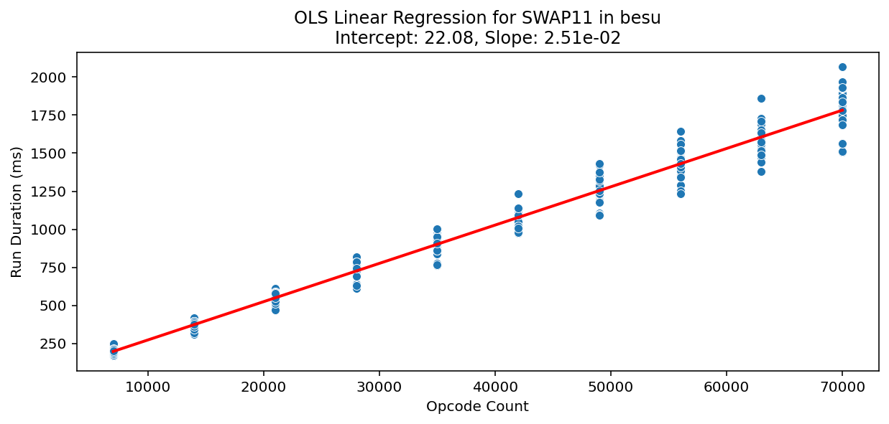

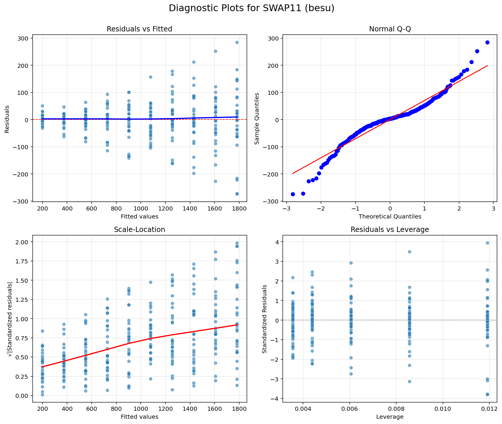


## reth


```python
                            OLS Regression Results                            
==============================================================================
Dep. Variable:        run_duration_ms   R-squared:                       0.963
Model:                            OLS   Adj. R-squared:                  0.963
Method:                 Least Squares   F-statistic:                     4651.
Date:                Thu, 22 Jan 2026   Prob (F-statistic):          1.61e-129
Time:                        10:35:32   Log-Likelihood:                -829.72
No. Observations:                 180   AIC:                             1663.
Df Residuals:                     178   BIC:                             1670.
Df Model:                           1                                         
Covariance Type:            nonrobust                                         
==============================================================================
                 coef    std err          t      P>|t|      [0.025      0.975]
------------------------------------------------------------------------------
const         30.7105      3.935      7.804      0.000      22.945      38.476
opcount        0.0062   9.06e-05     68.199      0.000       0.006       0.006
==============================================================================
Omnibus:                       34.404   Durbin-Watson:                   1.760
Prob(Omnibus):                  0.000   Jarque-Bera (JB):              180.224
Skew:                           0.514   Prob(JB):                     7.33e-40
Kurtosis:                       7.793   Cond. No.                     9.38e+04
==============================================================================

Notes:
[1] Standard Errors assume that the covariance matrix of the errors is correctly specified.
[2] The condition number is large, 9.38e+04. This might indicate that there are
strong multicollinearity or other numerical problems.
```

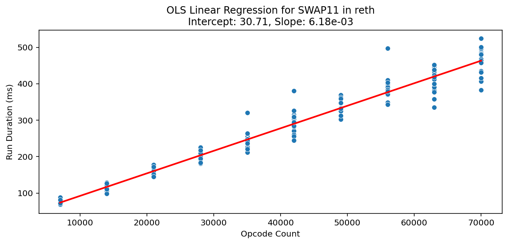

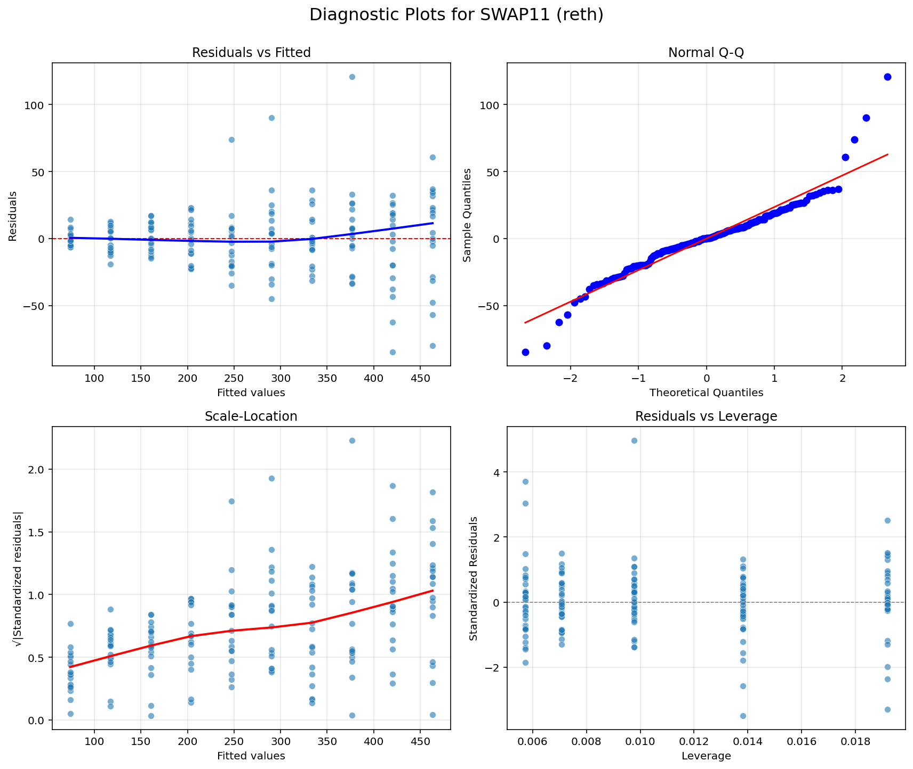


## nethermind


```python
                            OLS Regression Results                            
==============================================================================
Dep. Variable:        run_duration_ms   R-squared:                       0.978
Model:                            OLS   Adj. R-squared:                  0.978
Method:                 Least Squares   F-statistic:                 1.301e+04
Date:                Thu, 22 Jan 2026   Prob (F-statistic):          1.03e-241
Time:                        10:35:32   Log-Likelihood:                -1294.5
No. Observations:                 290   AIC:                             2593.
Df Residuals:                     288   BIC:                             2600.
Df Model:                           1                                         
Covariance Type:            nonrobust                                         
==============================================================================
                 coef    std err          t      P>|t|      [0.025      0.975]
------------------------------------------------------------------------------
const         28.4074      2.674     10.623      0.000      23.144      33.671
opcount        0.0070   6.16e-05    114.052      0.000       0.007       0.007
==============================================================================
Omnibus:                       47.684   Durbin-Watson:                   1.003
Prob(Omnibus):                  0.000   Jarque-Bera (JB):              273.292
Skew:                          -0.467   Prob(JB):                     4.52e-60
Kurtosis:                       7.663   Cond. No.                     9.38e+04
==============================================================================

Notes:
[1] Standard Errors assume that the covariance matrix of the errors is correctly specified.
[2] The condition number is large, 9.38e+04. This might indicate that there are
strong multicollinearity or other numerical problems.
```

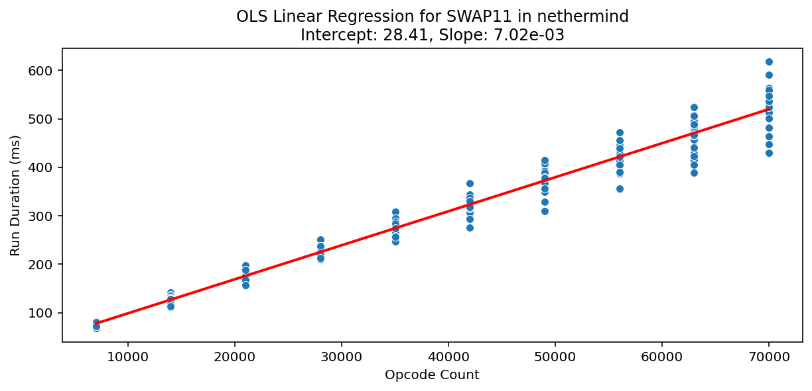

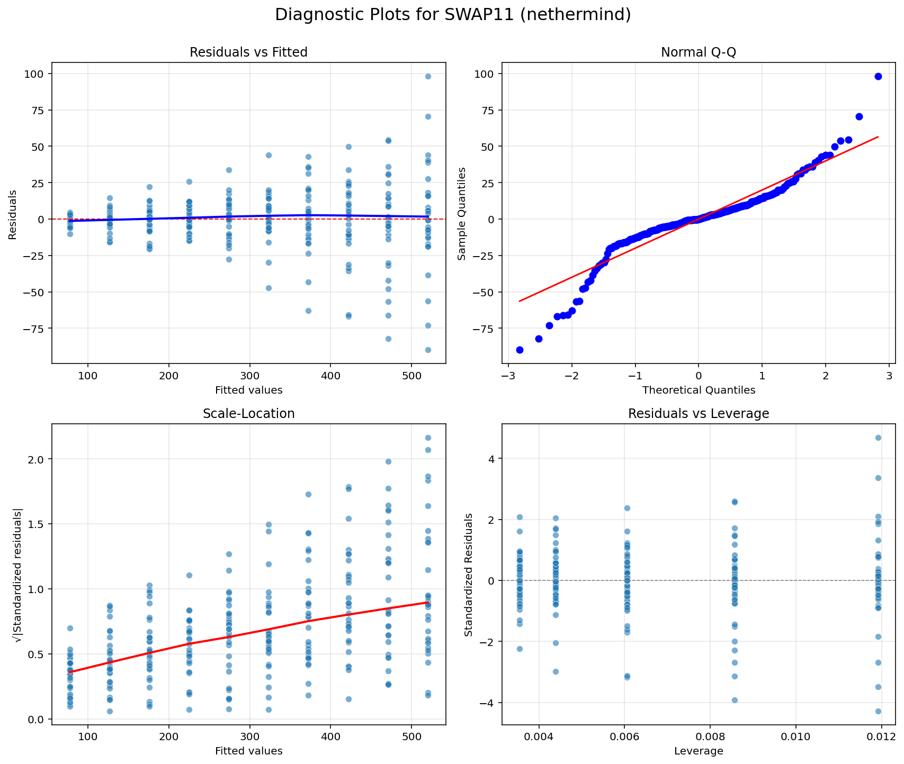


## erigon

OLS model did not run... Error: zero-size array to reduction operation maximum which has no identity

# SWAP12

## geth


```python
                            OLS Regression Results                            
==============================================================================
Dep. Variable:        run_duration_ms   R-squared:                       0.984
Model:                            OLS   Adj. R-squared:                  0.984
Method:                 Least Squares   F-statistic:                 1.756e+04
Date:                Thu, 22 Jan 2026   Prob (F-statistic):          4.11e-260
Time:                        10:35:33   Log-Likelihood:                -1404.2
No. Observations:                 290   AIC:                             2812.
Df Residuals:                     288   BIC:                             2820.
Df Model:                           1                                         
Covariance Type:            nonrobust                                         
==============================================================================
                 coef    std err          t      P>|t|      [0.025      0.975]
------------------------------------------------------------------------------
const         36.7620      3.903      9.419      0.000      29.080      44.444
opcount        0.0119   8.99e-05    132.498      0.000       0.012       0.012
==============================================================================
Omnibus:                       28.799   Durbin-Watson:                   1.238
Prob(Omnibus):                  0.000   Jarque-Bera (JB):              133.565
Skew:                          -0.120   Prob(JB):                     9.92e-30
Kurtosis:                       6.316   Cond. No.                     9.38e+04
==============================================================================

Notes:
[1] Standard Errors assume that the covariance matrix of the errors is correctly specified.
[2] The condition number is large, 9.38e+04. This might indicate that there are
strong multicollinearity or other numerical problems.
```


## besu


```python
                            OLS Regression Results                            
==============================================================================
Dep. Variable:        run_duration_ms   R-squared:                       0.980
Model:                            OLS   Adj. R-squared:                  0.980
Method:                 Least Squares   F-statistic:                 1.404e+04
Date:                Thu, 22 Jan 2026   Prob (F-statistic):          2.20e-246
Time:                        10:35:33   Log-Likelihood:                -1653.2
No. Observations:                 290   AIC:                             3310.
Df Residuals:                     288   BIC:                             3318.
Df Model:                           1                                         
Covariance Type:            nonrobust                                         
==============================================================================
                 coef    std err          t      P>|t|      [0.025      0.975]
------------------------------------------------------------------------------
const         23.9518      9.213      2.600      0.010       5.818      42.086
opcount        0.0251      0.000    118.486      0.000       0.025       0.026
==============================================================================
Omnibus:                       28.748   Durbin-Watson:                   0.710
Prob(Omnibus):                  0.000   Jarque-Bera (JB):               92.307
Skew:                          -0.349   Prob(JB):                     9.03e-21
Kurtosis:                       5.674   Cond. No.                     9.38e+04
==============================================================================

Notes:
[1] Standard Errors assume that the covariance matrix of the errors is correctly specified.
[2] The condition number is large, 9.38e+04. This might indicate that there are
strong multicollinearity or other numerical problems.
```

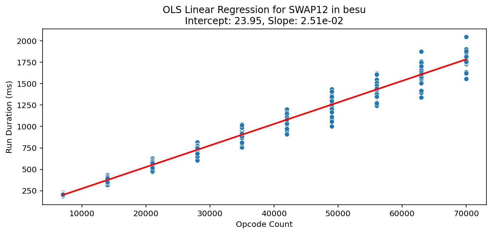

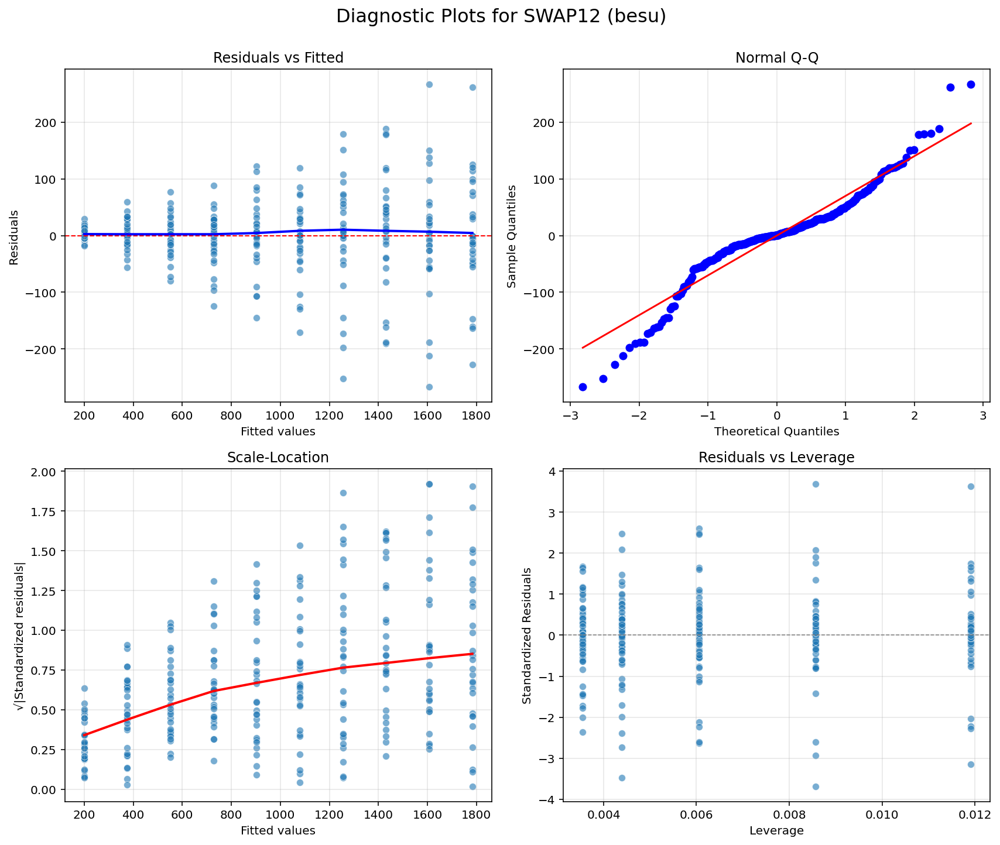


## reth


```python
                            OLS Regression Results                            
==============================================================================
Dep. Variable:        run_duration_ms   R-squared:                       0.974
Model:                            OLS   Adj. R-squared:                  0.974
Method:                 Least Squares   F-statistic:                     6733.
Date:                Thu, 22 Jan 2026   Prob (F-statistic):          2.23e-143
Time:                        10:35:33   Log-Likelihood:                -793.32
No. Observations:                 180   AIC:                             1591.
Df Residuals:                     178   BIC:                             1597.
Df Model:                           1                                         
Covariance Type:            nonrobust                                         
==============================================================================
                 coef    std err          t      P>|t|      [0.025      0.975]
------------------------------------------------------------------------------
const         31.0496      3.215      9.659      0.000      24.706      37.394
opcount        0.0061    7.4e-05     82.057      0.000       0.006       0.006
==============================================================================
Omnibus:                       14.827   Durbin-Watson:                   1.805
Prob(Omnibus):                  0.001   Jarque-Bera (JB):               30.011
Skew:                          -0.355   Prob(JB):                     3.04e-07
Kurtosis:                       4.870   Cond. No.                     9.38e+04
==============================================================================

Notes:
[1] Standard Errors assume that the covariance matrix of the errors is correctly specified.
[2] The condition number is large, 9.38e+04. This might indicate that there are
strong multicollinearity or other numerical problems.
```


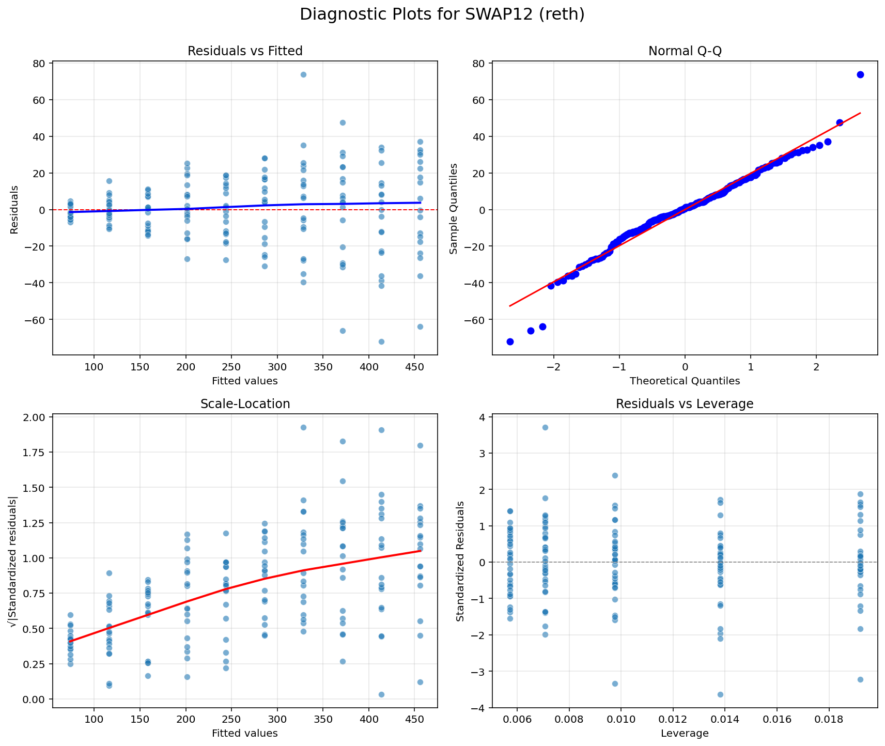


## nethermind


```python
                            OLS Regression Results                            
==============================================================================
Dep. Variable:        run_duration_ms   R-squared:                       0.977
Model:                            OLS   Adj. R-squared:                  0.977
Method:                 Least Squares   F-statistic:                 1.218e+04
Date:                Thu, 22 Jan 2026   Prob (F-statistic):          1.12e-237
Time:                        10:35:33   Log-Likelihood:                -1305.5
No. Observations:                 290   AIC:                             2615.
Df Residuals:                     288   BIC:                             2622.
Df Model:                           1                                         
Covariance Type:            nonrobust                                         
==============================================================================
                 coef    std err          t      P>|t|      [0.025      0.975]
------------------------------------------------------------------------------
const         29.2413      2.777     10.530      0.000      23.775      34.707
opcount        0.0071   6.39e-05    110.349      0.000       0.007       0.007
==============================================================================
Omnibus:                       43.215   Durbin-Watson:                   1.001
Prob(Omnibus):                  0.000   Jarque-Bera (JB):              314.087
Skew:                           0.250   Prob(JB):                     6.26e-69
Kurtosis:                       8.074   Cond. No.                     9.38e+04
==============================================================================

Notes:
[1] Standard Errors assume that the covariance matrix of the errors is correctly specified.
[2] The condition number is large, 9.38e+04. This might indicate that there are
strong multicollinearity or other numerical problems.
```

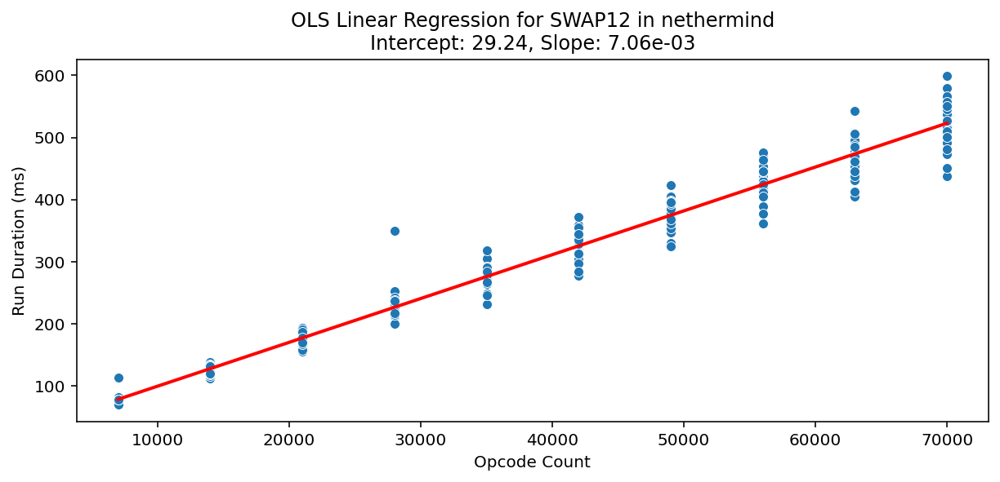

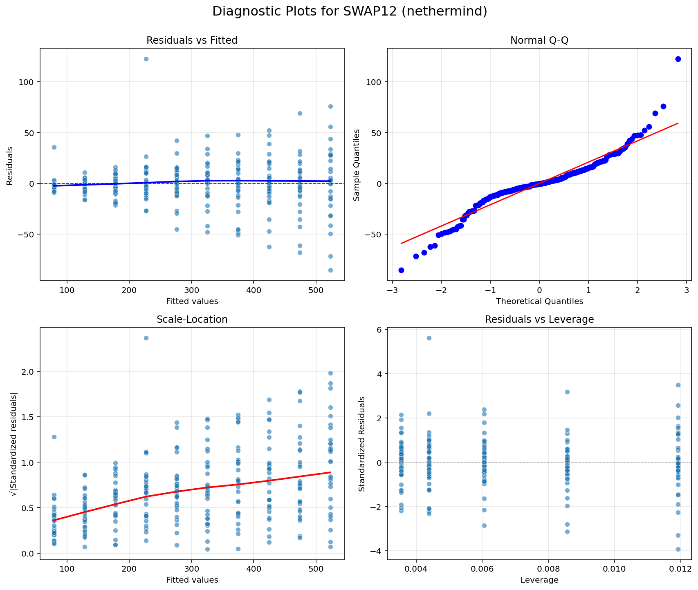


## erigon

OLS model did not run... Error: zero-size array to reduction operation maximum which has no identity

# SWAP13

## geth


```python
                            OLS Regression Results                            
==============================================================================
Dep. Variable:        run_duration_ms   R-squared:                       0.985
Model:                            OLS   Adj. R-squared:                  0.985
Method:                 Least Squares   F-statistic:                 1.868e+04
Date:                Thu, 22 Jan 2026   Prob (F-statistic):          6.24e-264
Time:                        10:35:34   Log-Likelihood:                -1398.7
No. Observations:                 290   AIC:                             2801.
Df Residuals:                     288   BIC:                             2809.
Df Model:                           1                                         
Covariance Type:            nonrobust                                         
==============================================================================
                 coef    std err          t      P>|t|      [0.025      0.975]
------------------------------------------------------------------------------
const         31.8336      3.831      8.310      0.000      24.294      39.373
opcount        0.0121   8.82e-05    136.672      0.000       0.012       0.012
==============================================================================
Omnibus:                       71.264   Durbin-Watson:                   1.133
Prob(Omnibus):                  0.000   Jarque-Bera (JB):              575.458
Skew:                           0.725   Prob(JB):                    1.10e-125
Kurtosis:                       9.747   Cond. No.                     9.38e+04
==============================================================================

Notes:
[1] Standard Errors assume that the covariance matrix of the errors is correctly specified.
[2] The condition number is large, 9.38e+04. This might indicate that there are
strong multicollinearity or other numerical problems.
```


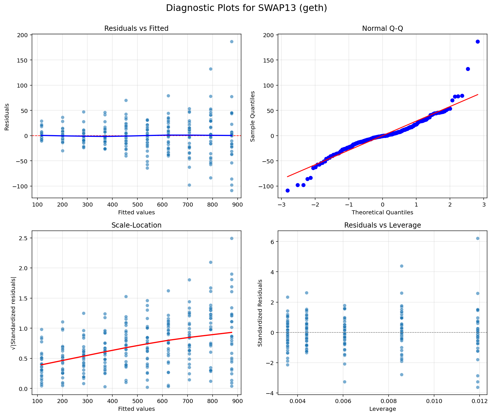


## besu


```python
                            OLS Regression Results                            
==============================================================================
Dep. Variable:        run_duration_ms   R-squared:                       0.979
Model:                            OLS   Adj. R-squared:                  0.979
Method:                 Least Squares   F-statistic:                 1.327e+04
Date:                Thu, 22 Jan 2026   Prob (F-statistic):          6.11e-243
Time:                        10:35:34   Log-Likelihood:                -1662.3
No. Observations:                 290   AIC:                             3329.
Df Residuals:                     288   BIC:                             3336.
Df Model:                           1                                         
Covariance Type:            nonrobust                                         
==============================================================================
                 coef    std err          t      P>|t|      [0.025      0.975]
------------------------------------------------------------------------------
const         32.2928      9.504      3.398      0.001      13.587      50.999
opcount        0.0252      0.000    115.202      0.000       0.025       0.026
==============================================================================
Omnibus:                       23.493   Durbin-Watson:                   0.725
Prob(Omnibus):                  0.000   Jarque-Bera (JB):               91.149
Skew:                          -0.013   Prob(JB):                     1.61e-20
Kurtosis:                       5.746   Cond. No.                     9.38e+04
==============================================================================

Notes:
[1] Standard Errors assume that the covariance matrix of the errors is correctly specified.
[2] The condition number is large, 9.38e+04. This might indicate that there are
strong multicollinearity or other numerical problems.
```

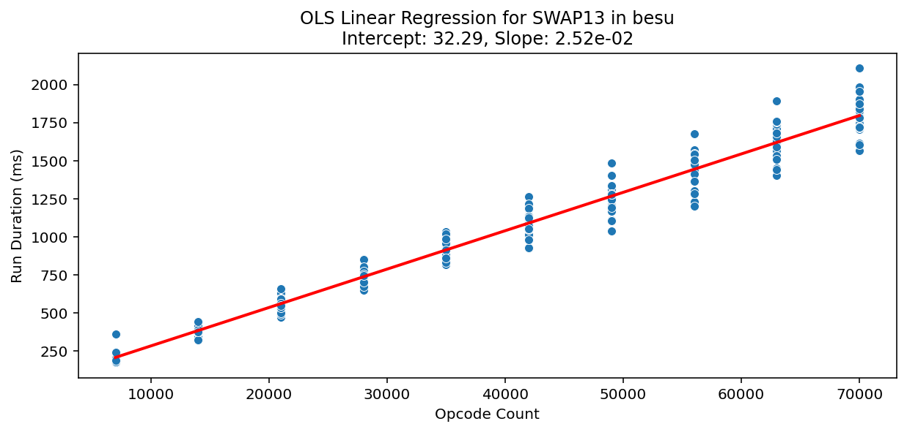

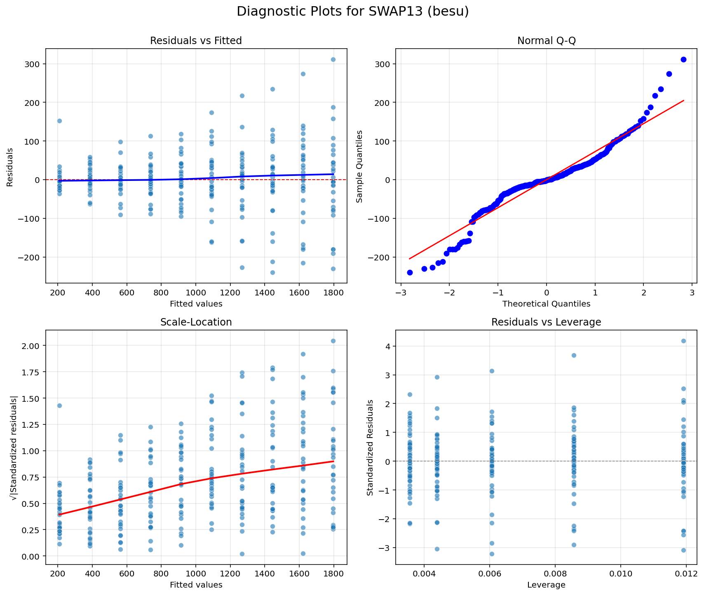


## reth


```python
                            OLS Regression Results                            
==============================================================================
Dep. Variable:        run_duration_ms   R-squared:                       0.965
Model:                            OLS   Adj. R-squared:                  0.965
Method:                 Least Squares   F-statistic:                     4943.
Date:                Thu, 22 Jan 2026   Prob (F-statistic):          8.63e-132
Time:                        10:35:34   Log-Likelihood:                -820.32
No. Observations:                 180   AIC:                             1645.
Df Residuals:                     178   BIC:                             1651.
Df Model:                           1                                         
Covariance Type:            nonrobust                                         
==============================================================================
                 coef    std err          t      P>|t|      [0.025      0.975]
------------------------------------------------------------------------------
const         32.7808      3.735      8.777      0.000      25.411      40.151
opcount        0.0060    8.6e-05     70.309      0.000       0.006       0.006
==============================================================================
Omnibus:                       30.483   Durbin-Watson:                   1.801
Prob(Omnibus):                  0.000   Jarque-Bera (JB):               49.676
Skew:                           0.886   Prob(JB):                     1.63e-11
Kurtosis:                       4.866   Cond. No.                     9.38e+04
==============================================================================

Notes:
[1] Standard Errors assume that the covariance matrix of the errors is correctly specified.
[2] The condition number is large, 9.38e+04. This might indicate that there are
strong multicollinearity or other numerical problems.
```

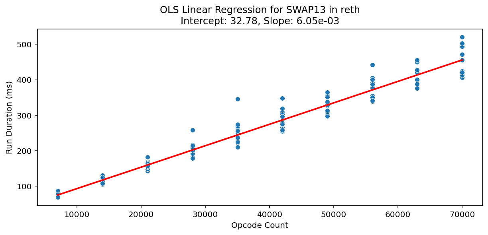

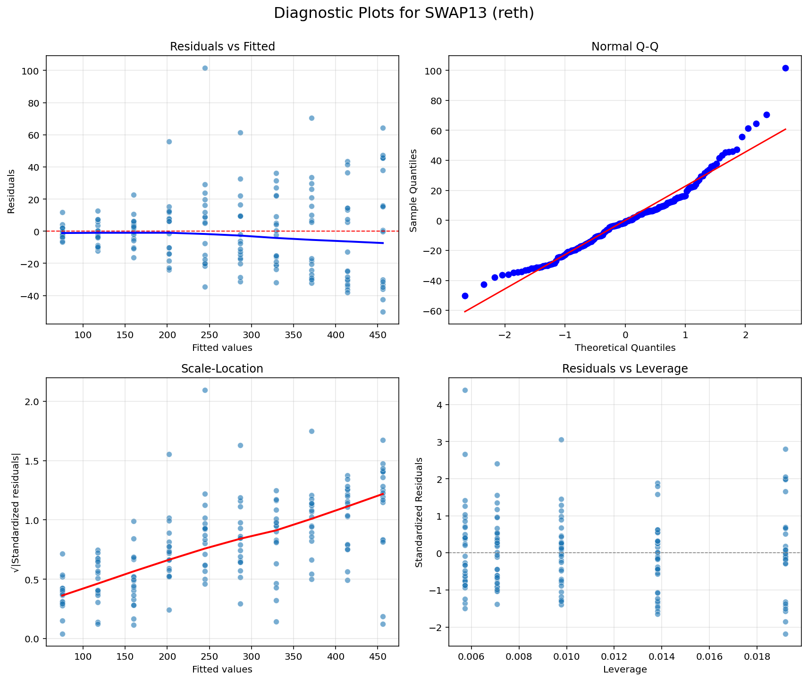


## nethermind


```python
                            OLS Regression Results                            
==============================================================================
Dep. Variable:        run_duration_ms   R-squared:                       0.980
Model:                            OLS   Adj. R-squared:                  0.980
Method:                 Least Squares   F-statistic:                 1.403e+04
Date:                Thu, 22 Jan 2026   Prob (F-statistic):          2.31e-246
Time:                        10:35:35   Log-Likelihood:                -1286.0
No. Observations:                 290   AIC:                             2576.
Df Residuals:                     288   BIC:                             2583.
Df Model:                           1                                         
Covariance Type:            nonrobust                                         
==============================================================================
                 coef    std err          t      P>|t|      [0.025      0.975]
------------------------------------------------------------------------------
const         29.0006      2.597     11.168      0.000      23.889      34.112
opcount        0.0071   5.98e-05    118.465      0.000       0.007       0.007
==============================================================================
Omnibus:                       32.628   Durbin-Watson:                   0.902
Prob(Omnibus):                  0.000   Jarque-Bera (JB):               64.257
Skew:                          -0.605   Prob(JB):                     1.11e-14
Kurtosis:                       4.963   Cond. No.                     9.38e+04
==============================================================================

Notes:
[1] Standard Errors assume that the covariance matrix of the errors is correctly specified.
[2] The condition number is large, 9.38e+04. This might indicate that there are
strong multicollinearity or other numerical problems.
```

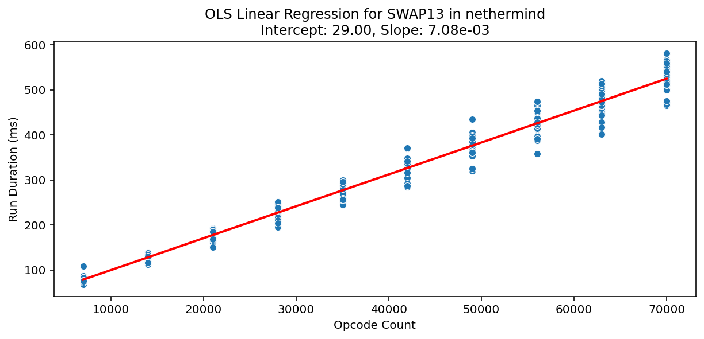

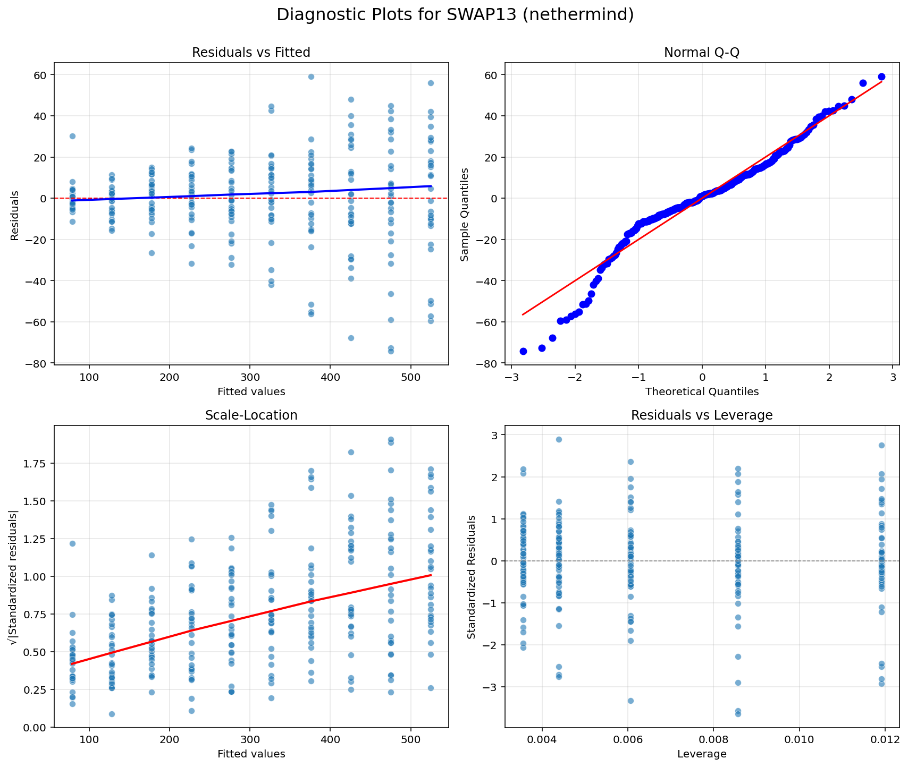


## erigon

OLS model did not run... Error: zero-size array to reduction operation maximum which has no identity

# SWAP14

## geth


```python
                            OLS Regression Results                            
==============================================================================
Dep. Variable:        run_duration_ms   R-squared:                       0.987
Model:                            OLS   Adj. R-squared:                  0.987
Method:                 Least Squares   F-statistic:                 2.163e+04
Date:                Thu, 22 Jan 2026   Prob (F-statistic):          5.60e-273
Time:                        10:35:35   Log-Likelihood:                -1379.3
No. Observations:                 290   AIC:                             2763.
Df Residuals:                     288   BIC:                             2770.
Df Model:                           1                                         
Covariance Type:            nonrobust                                         
==============================================================================
                 coef    std err          t      P>|t|      [0.025      0.975]
------------------------------------------------------------------------------
const         30.6910      3.582      8.568      0.000      23.641      37.741
opcount        0.0121   8.25e-05    147.076      0.000       0.012       0.012
==============================================================================
Omnibus:                       39.085   Durbin-Watson:                   0.997
Prob(Omnibus):                  0.000   Jarque-Bera (JB):               98.712
Skew:                          -0.627   Prob(JB):                     3.67e-22
Kurtosis:                       5.568   Cond. No.                     9.38e+04
==============================================================================

Notes:
[1] Standard Errors assume that the covariance matrix of the errors is correctly specified.
[2] The condition number is large, 9.38e+04. This might indicate that there are
strong multicollinearity or other numerical problems.
```


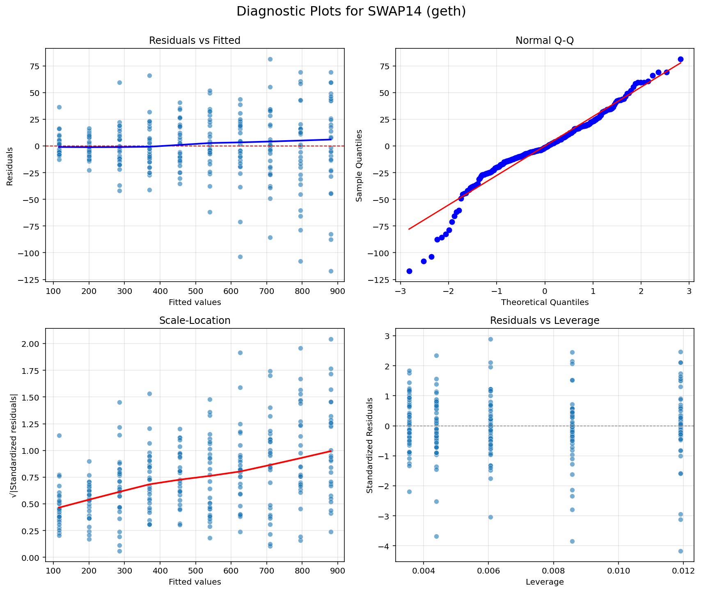


## besu


```python
                            OLS Regression Results                            
==============================================================================
Dep. Variable:        run_duration_ms   R-squared:                       0.978
Model:                            OLS   Adj. R-squared:                  0.978
Method:                 Least Squares   F-statistic:                 1.285e+04
Date:                Thu, 22 Jan 2026   Prob (F-statistic):          5.68e-241
Time:                        10:35:35   Log-Likelihood:                -1666.0
No. Observations:                 290   AIC:                             3336.
Df Residuals:                     288   BIC:                             3343.
Df Model:                           1                                         
Covariance Type:            nonrobust                                         
==============================================================================
                 coef    std err          t      P>|t|      [0.025      0.975]
------------------------------------------------------------------------------
const         24.5500      9.628      2.550      0.011       5.601      43.499
opcount        0.0251      0.000    113.364      0.000       0.025       0.026
==============================================================================
Omnibus:                       28.928   Durbin-Watson:                   0.702
Prob(Omnibus):                  0.000   Jarque-Bera (JB):               94.192
Skew:                          -0.347   Prob(JB):                     3.52e-21
Kurtosis:                       5.704   Cond. No.                     9.38e+04
==============================================================================

Notes:
[1] Standard Errors assume that the covariance matrix of the errors is correctly specified.
[2] The condition number is large, 9.38e+04. This might indicate that there are
strong multicollinearity or other numerical problems.
```

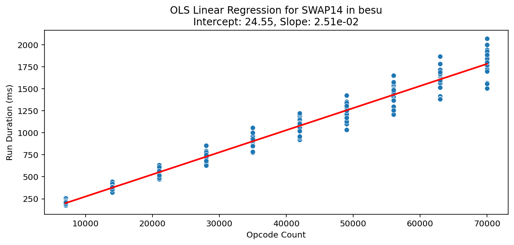

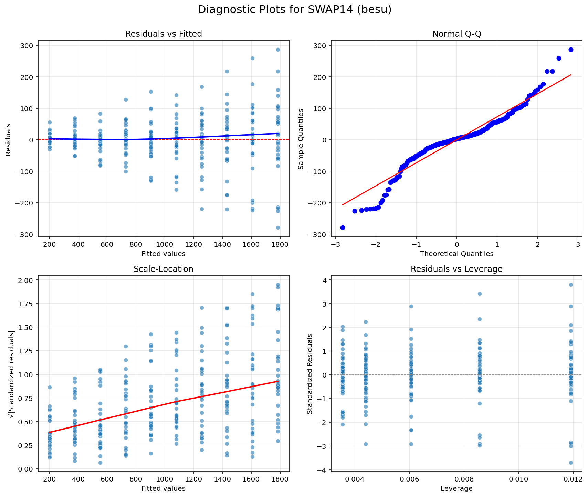


## reth


```python
                            OLS Regression Results                            
==============================================================================
Dep. Variable:        run_duration_ms   R-squared:                       0.965
Model:                            OLS   Adj. R-squared:                  0.964
Method:                 Least Squares   F-statistic:                     4851.
Date:                Thu, 22 Jan 2026   Prob (F-statistic):          4.39e-131
Time:                        10:35:36   Log-Likelihood:                -827.08
No. Observations:                 180   AIC:                             1658.
Df Residuals:                     178   BIC:                             1665.
Df Model:                           1                                         
Covariance Type:            nonrobust                                         
==============================================================================
                 coef    std err          t      P>|t|      [0.025      0.975]
------------------------------------------------------------------------------
const         30.6420      3.878      7.902      0.000      22.990      38.294
opcount        0.0062   8.93e-05     69.646      0.000       0.006       0.006
==============================================================================
Omnibus:                       87.883   Durbin-Watson:                   1.828
Prob(Omnibus):                  0.000   Jarque-Bera (JB):             1062.070
Skew:                           1.452   Prob(JB):                    2.37e-231
Kurtosis:                      14.540   Cond. No.                     9.38e+04
==============================================================================

Notes:
[1] Standard Errors assume that the covariance matrix of the errors is correctly specified.
[2] The condition number is large, 9.38e+04. This might indicate that there are
strong multicollinearity or other numerical problems.
```

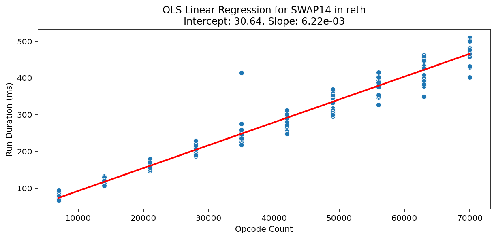

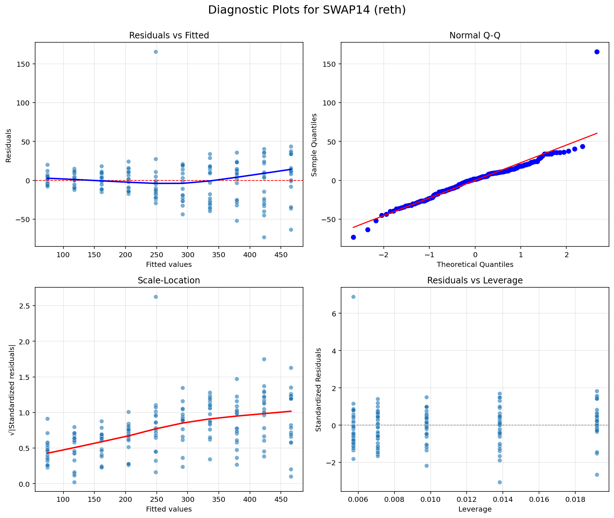


## nethermind


```python
                            OLS Regression Results                            
==============================================================================
Dep. Variable:        run_duration_ms   R-squared:                       0.968
Model:                            OLS   Adj. R-squared:                  0.968
Method:                 Least Squares   F-statistic:                     8752.
Date:                Thu, 22 Jan 2026   Prob (F-statistic):          1.39e-217
Time:                        10:35:36   Log-Likelihood:                -1358.0
No. Observations:                 290   AIC:                             2720.
Df Residuals:                     288   BIC:                             2727.
Df Model:                           1                                         
Covariance Type:            nonrobust                                         
==============================================================================
                 coef    std err          t      P>|t|      [0.025      0.975]
------------------------------------------------------------------------------
const         27.3629      3.328      8.222      0.000      20.812      33.913
opcount        0.0072   7.66e-05     93.552      0.000       0.007       0.007
==============================================================================
Omnibus:                       45.695   Durbin-Watson:                   0.826
Prob(Omnibus):                  0.000   Jarque-Bera (JB):              248.991
Skew:                           0.452   Prob(JB):                     8.56e-55
Kurtosis:                       7.448   Cond. No.                     9.38e+04
==============================================================================

Notes:
[1] Standard Errors assume that the covariance matrix of the errors is correctly specified.
[2] The condition number is large, 9.38e+04. This might indicate that there are
strong multicollinearity or other numerical problems.
```

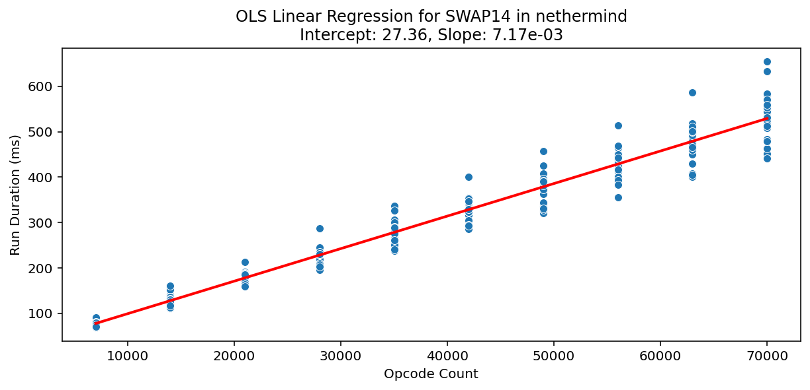

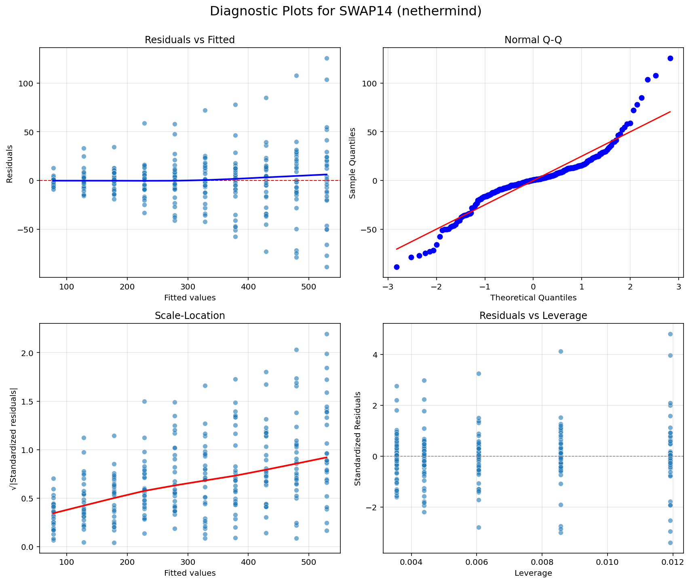


## erigon

OLS model did not run... Error: zero-size array to reduction operation maximum which has no identity

# SWAP15

## geth


```python
                            OLS Regression Results                            
==============================================================================
Dep. Variable:        run_duration_ms   R-squared:                       0.981
Model:                            OLS   Adj. R-squared:                  0.980
Method:                 Least Squares   F-statistic:                 1.451e+04
Date:                Thu, 22 Jan 2026   Prob (F-statistic):          2.17e-248
Time:                        10:35:36   Log-Likelihood:                -1440.1
No. Observations:                 290   AIC:                             2884.
Df Residuals:                     288   BIC:                             2892.
Df Model:                           1                                         
Covariance Type:            nonrobust                                         
==============================================================================
                 coef    std err          t      P>|t|      [0.025      0.975]
------------------------------------------------------------------------------
const         27.7141      4.418      6.273      0.000      19.018      36.410
opcount        0.0123      0.000    120.441      0.000       0.012       0.012
==============================================================================
Omnibus:                       21.944   Durbin-Watson:                   1.035
Prob(Omnibus):                  0.000   Jarque-Bera (JB):               72.723
Skew:                          -0.150   Prob(JB):                     1.62e-16
Kurtosis:                       5.435   Cond. No.                     9.38e+04
==============================================================================

Notes:
[1] Standard Errors assume that the covariance matrix of the errors is correctly specified.
[2] The condition number is large, 9.38e+04. This might indicate that there are
strong multicollinearity or other numerical problems.
```


## besu


```python
                            OLS Regression Results                            
==============================================================================
Dep. Variable:        run_duration_ms   R-squared:                       0.978
Model:                            OLS   Adj. R-squared:                  0.978
Method:                 Least Squares   F-statistic:                 1.271e+04
Date:                Thu, 22 Jan 2026   Prob (F-statistic):          2.68e-240
Time:                        10:35:36   Log-Likelihood:                -1669.2
No. Observations:                 290   AIC:                             3342.
Df Residuals:                     288   BIC:                             3350.
Df Model:                           1                                         
Covariance Type:            nonrobust                                         
==============================================================================
                 coef    std err          t      P>|t|      [0.025      0.975]
------------------------------------------------------------------------------
const         23.8559      9.735      2.450      0.015       4.695      43.017
opcount        0.0253      0.000    112.742      0.000       0.025       0.026
==============================================================================
Omnibus:                       31.908   Durbin-Watson:                   0.861
Prob(Omnibus):                  0.000   Jarque-Bera (JB):              114.563
Skew:                          -0.366   Prob(JB):                     1.33e-25
Kurtosis:                       5.991   Cond. No.                     9.38e+04
==============================================================================

Notes:
[1] Standard Errors assume that the covariance matrix of the errors is correctly specified.
[2] The condition number is large, 9.38e+04. This might indicate that there are
strong multicollinearity or other numerical problems.
```


## reth


```python
                            OLS Regression Results                            
==============================================================================
Dep. Variable:        run_duration_ms   R-squared:                       0.968
Model:                            OLS   Adj. R-squared:                  0.968
Method:                 Least Squares   F-statistic:                     5347.
Date:                Thu, 22 Jan 2026   Prob (F-statistic):          1.01e-134
Time:                        10:35:37   Log-Likelihood:                -815.19
No. Observations:                 180   AIC:                             1634.
Df Residuals:                     178   BIC:                             1641.
Df Model:                           1                                         
Covariance Type:            nonrobust                                         
==============================================================================
                 coef    std err          t      P>|t|      [0.025      0.975]
------------------------------------------------------------------------------
const         33.5995      3.630      9.256      0.000      26.436      40.763
opcount        0.0061   8.36e-05     73.120      0.000       0.006       0.006
==============================================================================
Omnibus:                       58.957   Durbin-Watson:                   1.993
Prob(Omnibus):                  0.000   Jarque-Bera (JB):              499.696
Skew:                           0.919   Prob(JB):                    3.11e-109
Kurtosis:                      10.953   Cond. No.                     9.38e+04
==============================================================================

Notes:
[1] Standard Errors assume that the covariance matrix of the errors is correctly specified.
[2] The condition number is large, 9.38e+04. This might indicate that there are
strong multicollinearity or other numerical problems.
```

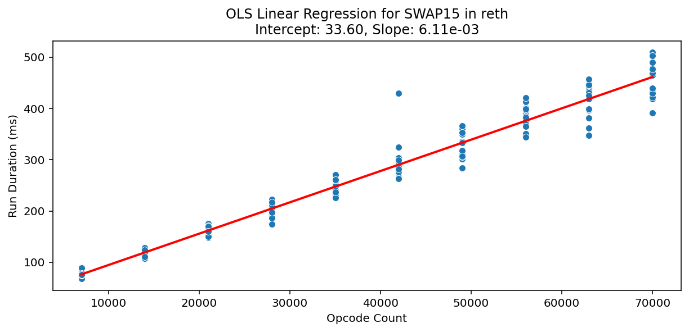

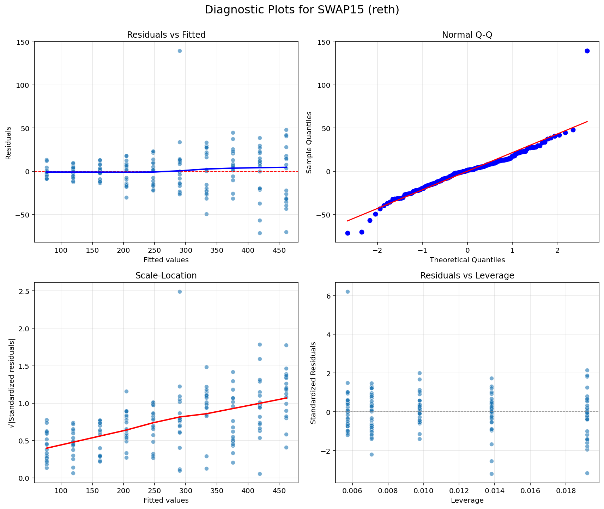


## nethermind


```python
                            OLS Regression Results                            
==============================================================================
Dep. Variable:        run_duration_ms   R-squared:                       0.973
Model:                            OLS   Adj. R-squared:                  0.973
Method:                 Least Squares   F-statistic:                 1.039e+04
Date:                Thu, 22 Jan 2026   Prob (F-statistic):          5.55e-228
Time:                        10:35:37   Log-Likelihood:                -1331.6
No. Observations:                 290   AIC:                             2667.
Df Residuals:                     288   BIC:                             2675.
Df Model:                           1                                         
Covariance Type:            nonrobust                                         
==============================================================================
                 coef    std err          t      P>|t|      [0.025      0.975]
------------------------------------------------------------------------------
const         28.7264      3.039      9.453      0.000      22.745      34.708
opcount        0.0071      7e-05    101.917      0.000       0.007       0.007
==============================================================================
Omnibus:                       52.279   Durbin-Watson:                   0.962
Prob(Omnibus):                  0.000   Jarque-Bera (JB):              535.846
Skew:                           0.267   Prob(JB):                    4.39e-117
Kurtosis:                       9.638   Cond. No.                     9.38e+04
==============================================================================

Notes:
[1] Standard Errors assume that the covariance matrix of the errors is correctly specified.
[2] The condition number is large, 9.38e+04. This might indicate that there are
strong multicollinearity or other numerical problems.
```

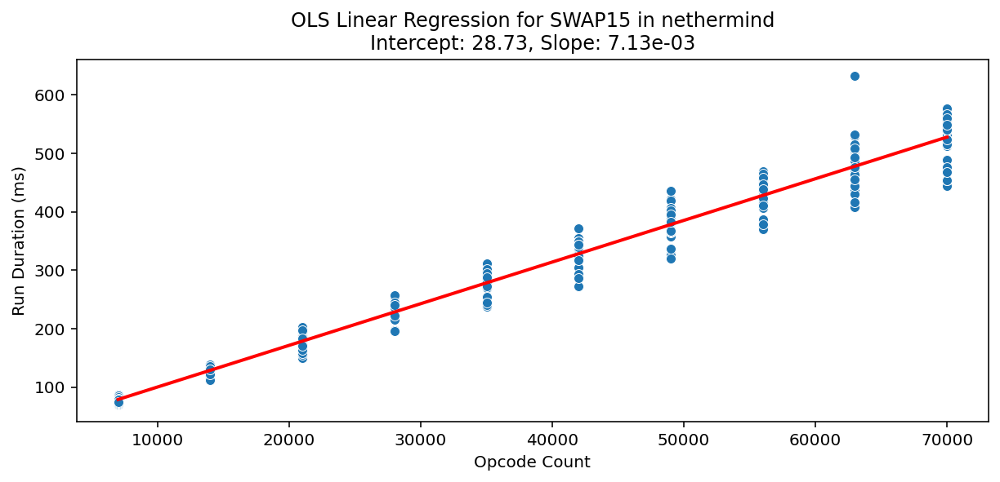

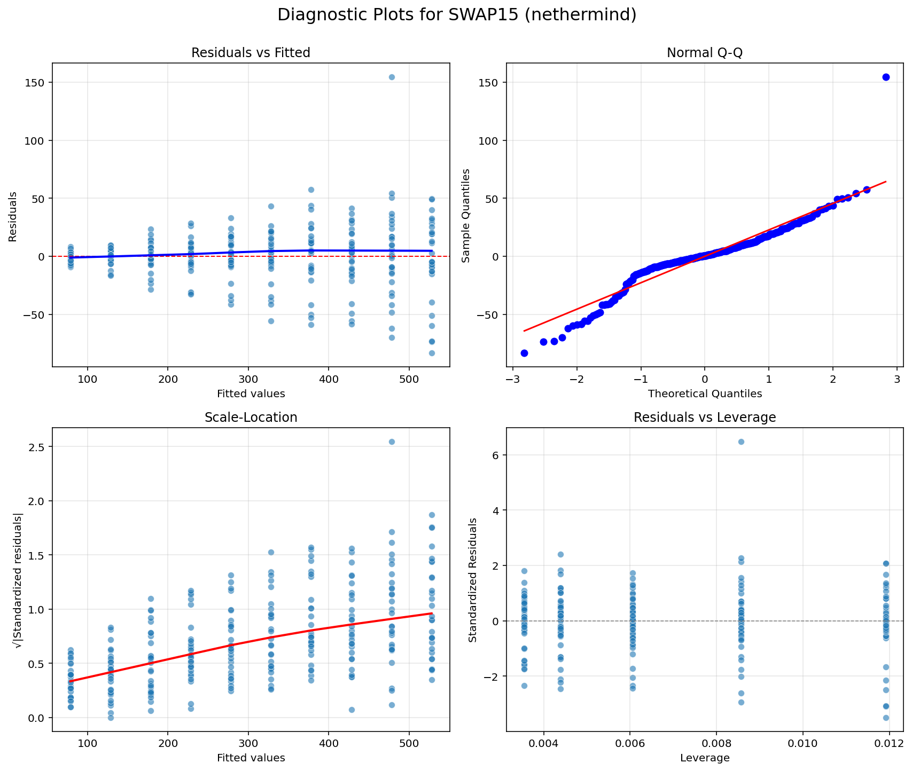


## erigon

OLS model did not run... Error: zero-size array to reduction operation maximum which has no identity

# SWAP16

## geth


```python
                            OLS Regression Results                            
==============================================================================
Dep. Variable:        run_duration_ms   R-squared:                       0.978
Model:                            OLS   Adj. R-squared:                  0.978
Method:                 Least Squares   F-statistic:                 1.309e+04
Date:                Thu, 22 Jan 2026   Prob (F-statistic):          4.17e-242
Time:                        10:35:37   Log-Likelihood:                -1453.7
No. Observations:                 290   AIC:                             2911.
Df Residuals:                     288   BIC:                             2919.
Df Model:                           1                                         
Covariance Type:            nonrobust                                         
==============================================================================
                 coef    std err          t      P>|t|      [0.025      0.975]
------------------------------------------------------------------------------
const         30.7670      4.629      6.646      0.000      21.655      39.879
opcount        0.0122      0.000    114.419      0.000       0.012       0.012
==============================================================================
Omnibus:                      218.826   Durbin-Watson:                   1.391
Prob(Omnibus):                  0.000   Jarque-Bera (JB):            10988.749
Skew:                           2.447   Prob(JB):                         0.00
Kurtosis:                      32.757   Cond. No.                     9.38e+04
==============================================================================

Notes:
[1] Standard Errors assume that the covariance matrix of the errors is correctly specified.
[2] The condition number is large, 9.38e+04. This might indicate that there are
strong multicollinearity or other numerical problems.
```

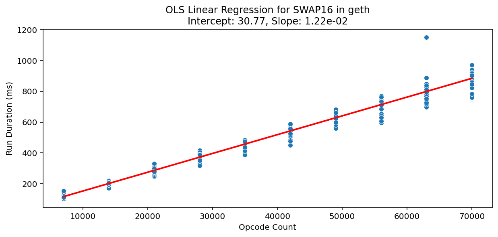

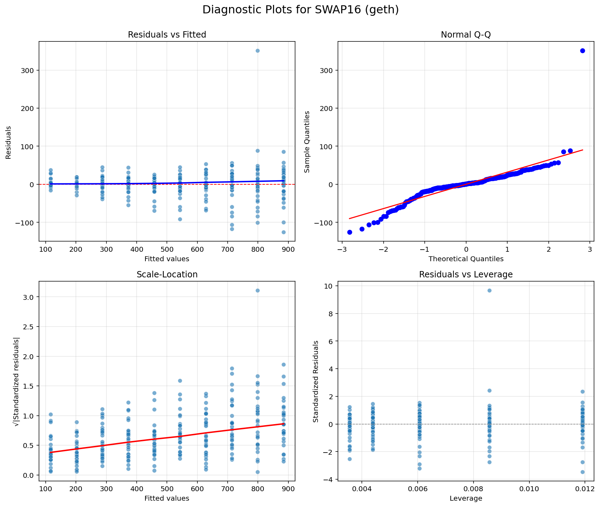


## besu


```python
                            OLS Regression Results                            
==============================================================================
Dep. Variable:        run_duration_ms   R-squared:                       0.977
Model:                            OLS   Adj. R-squared:                  0.977
Method:                 Least Squares   F-statistic:                 1.211e+04
Date:                Thu, 22 Jan 2026   Prob (F-statistic):          2.47e-237
Time:                        10:35:37   Log-Likelihood:                -1676.7
No. Observations:                 290   AIC:                             3357.
Df Residuals:                     288   BIC:                             3365.
Df Model:                           1                                         
Covariance Type:            nonrobust                                         
==============================================================================
                 coef    std err          t      P>|t|      [0.025      0.975]
------------------------------------------------------------------------------
const         25.8145      9.991      2.584      0.010       6.150      45.479
opcount        0.0253      0.000    110.040      0.000       0.025       0.026
==============================================================================
Omnibus:                       44.493   Durbin-Watson:                   0.880
Prob(Omnibus):                  0.000   Jarque-Bera (JB):              204.881
Skew:                          -0.499   Prob(JB):                     3.24e-45
Kurtosis:                       6.995   Cond. No.                     9.38e+04
==============================================================================

Notes:
[1] Standard Errors assume that the covariance matrix of the errors is correctly specified.
[2] The condition number is large, 9.38e+04. This might indicate that there are
strong multicollinearity or other numerical problems.
```

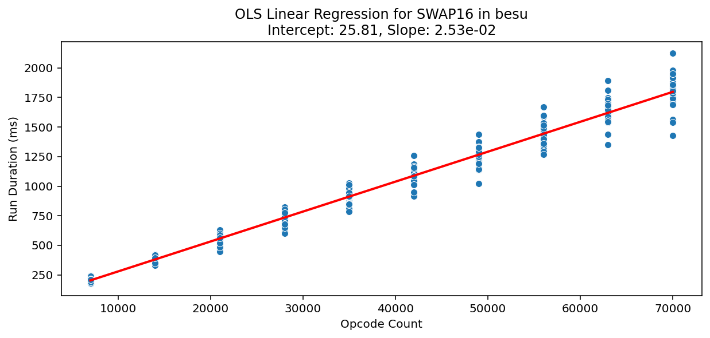

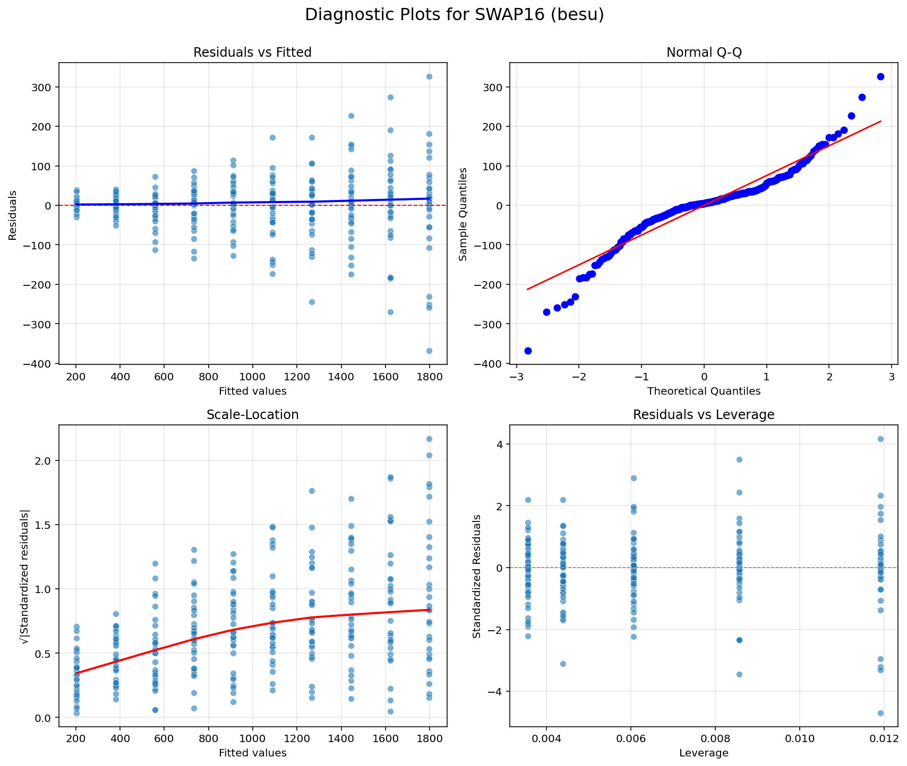


## reth


```python
                            OLS Regression Results                            
==============================================================================
Dep. Variable:        run_duration_ms   R-squared:                       0.974
Model:                            OLS   Adj. R-squared:                  0.974
Method:                 Least Squares   F-statistic:                     6700.
Date:                Thu, 22 Jan 2026   Prob (F-statistic):          3.44e-143
Time:                        10:35:38   Log-Likelihood:                -795.81
No. Observations:                 180   AIC:                             1596.
Df Residuals:                     178   BIC:                             1602.
Df Model:                           1                                         
Covariance Type:            nonrobust                                         
==============================================================================
                 coef    std err          t      P>|t|      [0.025      0.975]
------------------------------------------------------------------------------
const         28.8886      3.259      8.863      0.000      22.456      35.321
opcount        0.0061    7.5e-05     81.852      0.000       0.006       0.006
==============================================================================
Omnibus:                        0.432   Durbin-Watson:                   1.522
Prob(Omnibus):                  0.806   Jarque-Bera (JB):                0.424
Skew:                          -0.115   Prob(JB):                        0.809
Kurtosis:                       2.941   Cond. No.                     9.38e+04
==============================================================================

Notes:
[1] Standard Errors assume that the covariance matrix of the errors is correctly specified.
[2] The condition number is large, 9.38e+04. This might indicate that there are
strong multicollinearity or other numerical problems.
```


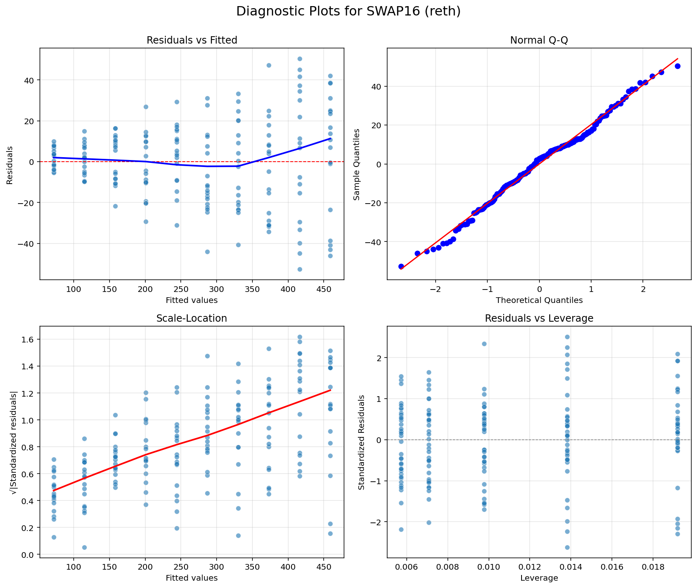


## nethermind


```python
                            OLS Regression Results                            
==============================================================================
Dep. Variable:        run_duration_ms   R-squared:                       0.977
Model:                            OLS   Adj. R-squared:                  0.977
Method:                 Least Squares   F-statistic:                 1.247e+04
Date:                Thu, 22 Jan 2026   Prob (F-statistic):          3.84e-239
Time:                        10:35:38   Log-Likelihood:                -1308.2
No. Observations:                 290   AIC:                             2620.
Df Residuals:                     288   BIC:                             2628.
Df Model:                           1                                         
Covariance Type:            nonrobust                                         
==============================================================================
                 coef    std err          t      P>|t|      [0.025      0.975]
------------------------------------------------------------------------------
const         27.4934      2.804      9.806      0.000      21.975      33.012
opcount        0.0072   6.45e-05    111.681      0.000       0.007       0.007
==============================================================================
Omnibus:                       51.749   Durbin-Watson:                   1.071
Prob(Omnibus):                  0.000   Jarque-Bera (JB):              100.999
Skew:                          -0.933   Prob(JB):                     1.17e-22
Kurtosis:                       5.208   Cond. No.                     9.38e+04
==============================================================================

Notes:
[1] Standard Errors assume that the covariance matrix of the errors is correctly specified.
[2] The condition number is large, 9.38e+04. This might indicate that there are
strong multicollinearity or other numerical problems.
```


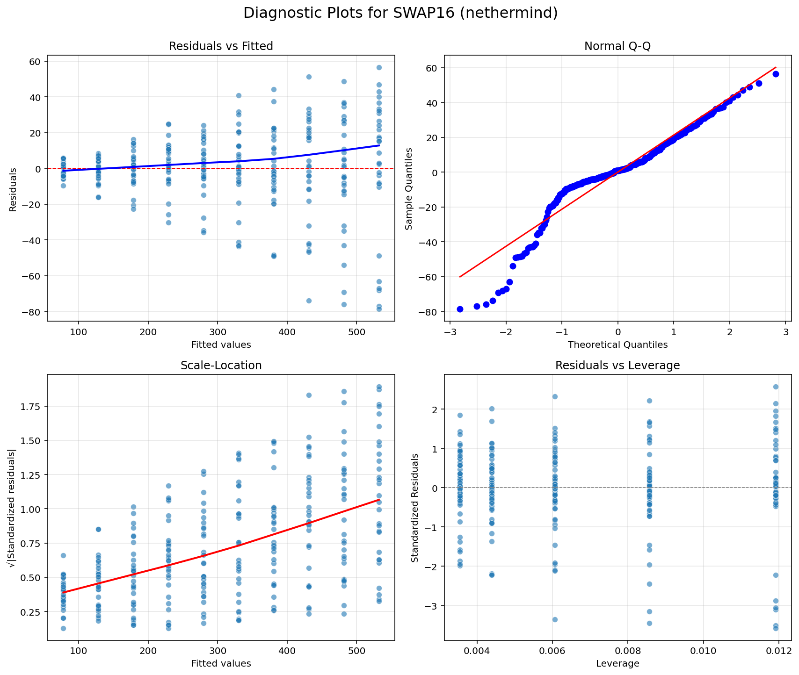


## erigon

OLS model did not run... Error: zero-size array to reduction operation maximum which has no identity

# TIMESTAMP

## geth


```python
                            OLS Regression Results                            
==============================================================================
Dep. Variable:        run_duration_ms   R-squared:                       0.988
Model:                            OLS   Adj. R-squared:                  0.988
Method:                 Least Squares   F-statistic:                 2.351e+04
Date:                Thu, 22 Jan 2026   Prob (F-statistic):          4.09e-278
Time:                        10:35:38   Log-Likelihood:                -1574.0
No. Observations:                 290   AIC:                             3152.
Df Residuals:                     288   BIC:                             3159.
Df Model:                           1                                         
Covariance Type:            nonrobust                                         
==============================================================================
                 coef    std err          t      P>|t|      [0.025      0.975]
------------------------------------------------------------------------------
const         34.2359      7.010      4.884      0.000      20.439      48.032
opcount        0.0173      0.000    153.321      0.000       0.017       0.018
==============================================================================
Omnibus:                       42.916   Durbin-Watson:                   1.052
Prob(Omnibus):                  0.000   Jarque-Bera (JB):              134.161
Skew:                          -0.616   Prob(JB):                     7.37e-30
Kurtosis:                       6.096   Cond. No.                     1.34e+05
==============================================================================

Notes:
[1] Standard Errors assume that the covariance matrix of the errors is correctly specified.
[2] The condition number is large, 1.34e+05. This might indicate that there are
strong multicollinearity or other numerical problems.
```

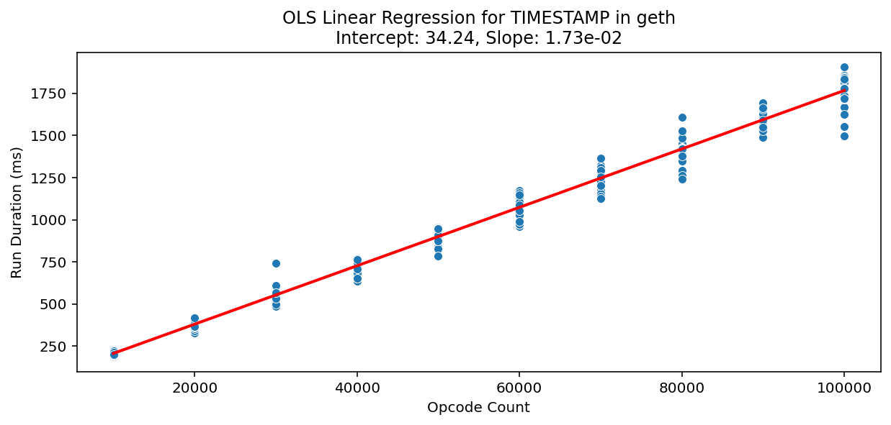

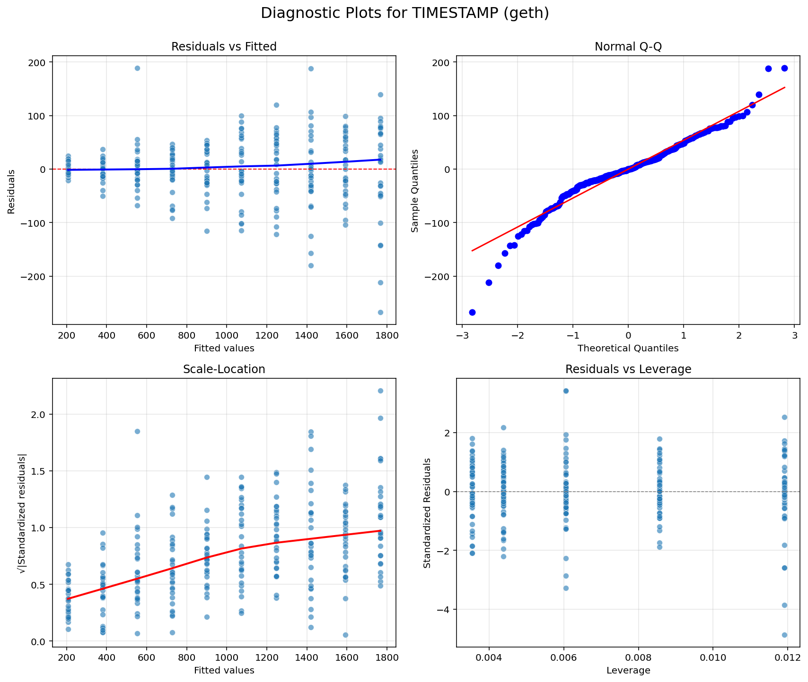


## besu


```python
                            OLS Regression Results                            
==============================================================================
Dep. Variable:        run_duration_ms   R-squared:                       0.991
Model:                            OLS   Adj. R-squared:                  0.991
Method:                 Least Squares   F-statistic:                 3.090e+04
Date:                Thu, 22 Jan 2026   Prob (F-statistic):          4.86e-295
Time:                        10:35:38   Log-Likelihood:                -1675.4
No. Observations:                 290   AIC:                             3355.
Df Residuals:                     288   BIC:                             3362.
Df Model:                           1                                         
Covariance Type:            nonrobust                                         
==============================================================================
                 coef    std err          t      P>|t|      [0.025      0.975]
------------------------------------------------------------------------------
const         31.0765      9.943      3.125      0.002      11.506      50.647
opcount        0.0282      0.000    175.791      0.000       0.028       0.028
==============================================================================
Omnibus:                      100.362   Durbin-Watson:                   0.685
Prob(Omnibus):                  0.000   Jarque-Bera (JB):              507.549
Skew:                          -1.331   Prob(JB):                    6.12e-111
Kurtosis:                       8.910   Cond. No.                     1.34e+05
==============================================================================

Notes:
[1] Standard Errors assume that the covariance matrix of the errors is correctly specified.
[2] The condition number is large, 1.34e+05. This might indicate that there are
strong multicollinearity or other numerical problems.
```

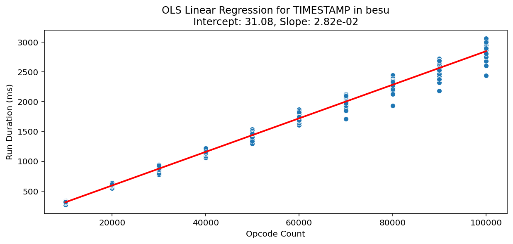

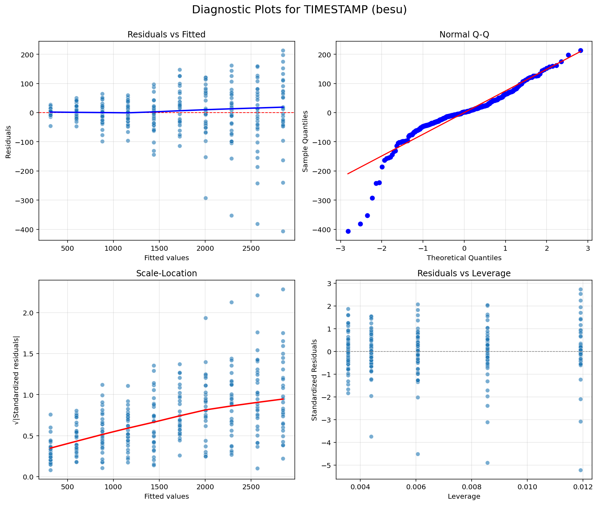


## reth


```python
                            OLS Regression Results                            
==============================================================================
Dep. Variable:        run_duration_ms   R-squared:                       0.973
Model:                            OLS   Adj. R-squared:                  0.973
Method:                 Least Squares   F-statistic:                     6346.
Date:                Thu, 22 Jan 2026   Prob (F-statistic):          3.78e-141
Time:                        10:35:39   Log-Likelihood:                -867.35
No. Observations:                 180   AIC:                             1739.
Df Residuals:                     178   BIC:                             1745.
Df Model:                           1                                         
Covariance Type:            nonrobust                                         
==============================================================================
                 coef    std err          t      P>|t|      [0.025      0.975]
------------------------------------------------------------------------------
const         30.9238      4.850      6.376      0.000      21.353      40.495
opcount        0.0062   7.82e-05     79.662      0.000       0.006       0.006
==============================================================================
Omnibus:                        5.684   Durbin-Watson:                   1.536
Prob(Omnibus):                  0.058   Jarque-Bera (JB):                6.070
Skew:                          -0.275   Prob(JB):                       0.0481
Kurtosis:                       3.712   Cond. No.                     1.34e+05
==============================================================================

Notes:
[1] Standard Errors assume that the covariance matrix of the errors is correctly specified.
[2] The condition number is large, 1.34e+05. This might indicate that there are
strong multicollinearity or other numerical problems.
```


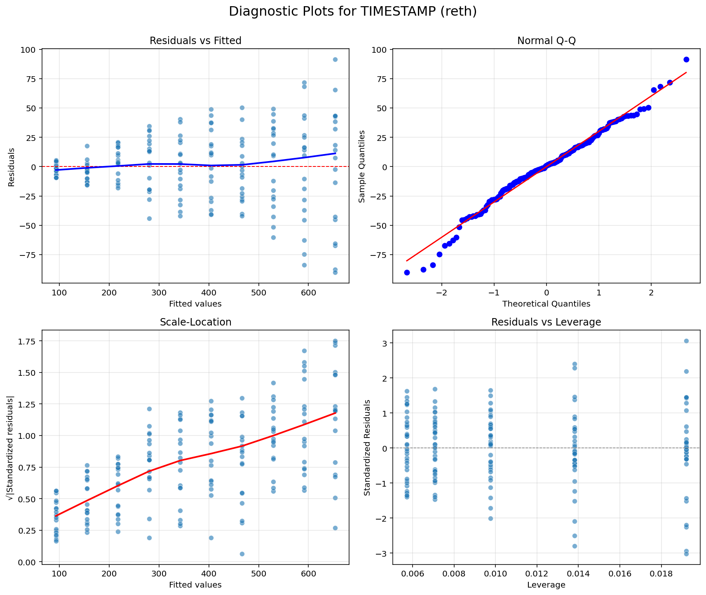


## nethermind


```python
                            OLS Regression Results                            
==============================================================================
Dep. Variable:        run_duration_ms   R-squared:                       0.979
Model:                            OLS   Adj. R-squared:                  0.979
Method:                 Least Squares   F-statistic:                 1.333e+04
Date:                Thu, 22 Jan 2026   Prob (F-statistic):          3.17e-243
Time:                        10:35:39   Log-Likelihood:                -1389.2
No. Observations:                 290   AIC:                             2782.
Df Residuals:                     288   BIC:                             2790.
Df Model:                           1                                         
Covariance Type:            nonrobust                                         
==============================================================================
                 coef    std err          t      P>|t|      [0.025      0.975]
------------------------------------------------------------------------------
const         31.1010      3.707      8.389      0.000      23.804      38.398
opcount        0.0069   5.97e-05    115.470      0.000       0.007       0.007
==============================================================================
Omnibus:                       25.630   Durbin-Watson:                   1.029
Prob(Omnibus):                  0.000   Jarque-Bera (JB):              102.906
Skew:                           0.127   Prob(JB):                     4.51e-23
Kurtosis:                       5.907   Cond. No.                     1.34e+05
==============================================================================

Notes:
[1] Standard Errors assume that the covariance matrix of the errors is correctly specified.
[2] The condition number is large, 1.34e+05. This might indicate that there are
strong multicollinearity or other numerical problems.
```

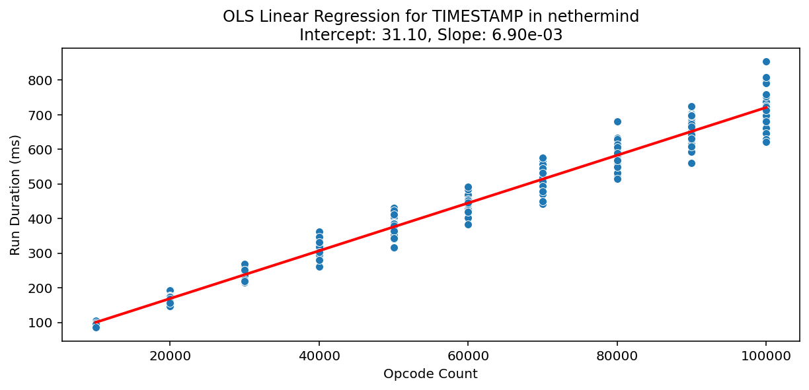

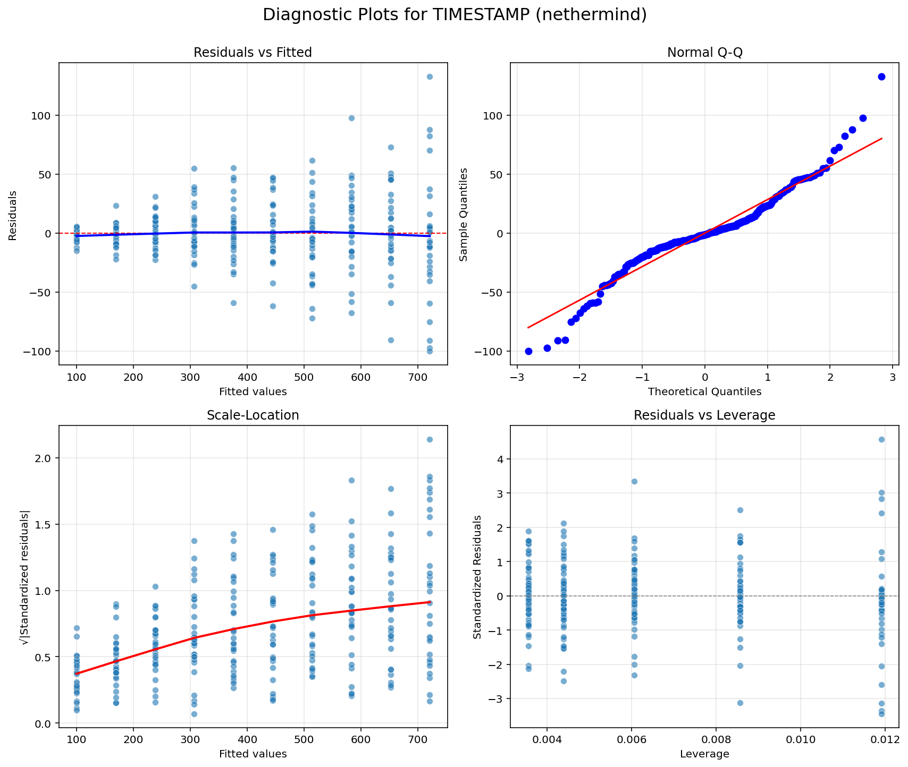


## erigon


```python
                            OLS Regression Results                            
==============================================================================
Dep. Variable:        run_duration_ms   R-squared:                       0.944
Model:                            OLS   Adj. R-squared:                  0.942
Method:                 Least Squares   F-statistic:                     473.9
Date:                Thu, 22 Jan 2026   Prob (F-statistic):           4.34e-19
Time:                        10:35:39   Log-Likelihood:                -190.68
No. Observations:                  30   AIC:                             385.4
Df Residuals:                      28   BIC:                             388.2
Df Model:                           1                                         
Covariance Type:            nonrobust                                         
==============================================================================
                 coef    std err          t      P>|t|      [0.025      0.975]
------------------------------------------------------------------------------
const        -20.5729     56.887     -0.362      0.720    -137.101      95.955
opcount        0.0200      0.001     21.769      0.000       0.018       0.022
==============================================================================
Omnibus:                       63.138   Durbin-Watson:                   2.092
Prob(Omnibus):                  0.000   Jarque-Bera (JB):              581.095
Skew:                           4.377   Prob(JB):                    6.56e-127
Kurtosis:                      22.704   Cond. No.                     1.34e+05
==============================================================================

Notes:
[1] Standard Errors assume that the covariance matrix of the errors is correctly specified.
[2] The condition number is large, 1.34e+05. This might indicate that there are
strong multicollinearity or other numerical problems.
```
OLS model did not run... Error: 'numpy.ndarray' object has no attribute 'iloc'

# TLOAD

## geth


```python
                            OLS Regression Results                            
==============================================================================
Dep. Variable:        run_duration_ms   R-squared:                       0.924
Model:                            OLS   Adj. R-squared:                  0.924
Method:                 Least Squares   F-statistic:                     3506.
Date:                Thu, 22 Jan 2026   Prob (F-statistic):          2.86e-163
Time:                        10:35:39   Log-Likelihood:                -1060.7
No. Observations:                 290   AIC:                             2125.
Df Residuals:                     288   BIC:                             2133.
Df Model:                           1                                         
Covariance Type:            nonrobust                                         
==============================================================================
                 coef    std err          t      P>|t|      [0.025      0.975]
------------------------------------------------------------------------------
const         28.5781      1.194     23.931      0.000      26.228      30.929
opcount        0.0570      0.001     59.209      0.000       0.055       0.059
==============================================================================
Omnibus:                      392.267   Durbin-Watson:                   1.792
Prob(Omnibus):                  0.000   Jarque-Bera (JB):            41064.066
Skew:                           6.311   Prob(JB):                         0.00
Kurtosis:                      59.913   Cond. No.                     2.68e+03
==============================================================================

Notes:
[1] Standard Errors assume that the covariance matrix of the errors is correctly specified.
[2] The condition number is large, 2.68e+03. This might indicate that there are
strong multicollinearity or other numerical problems.
```

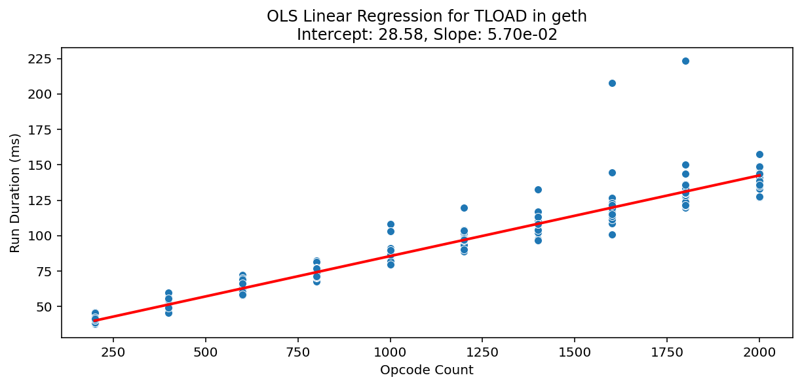

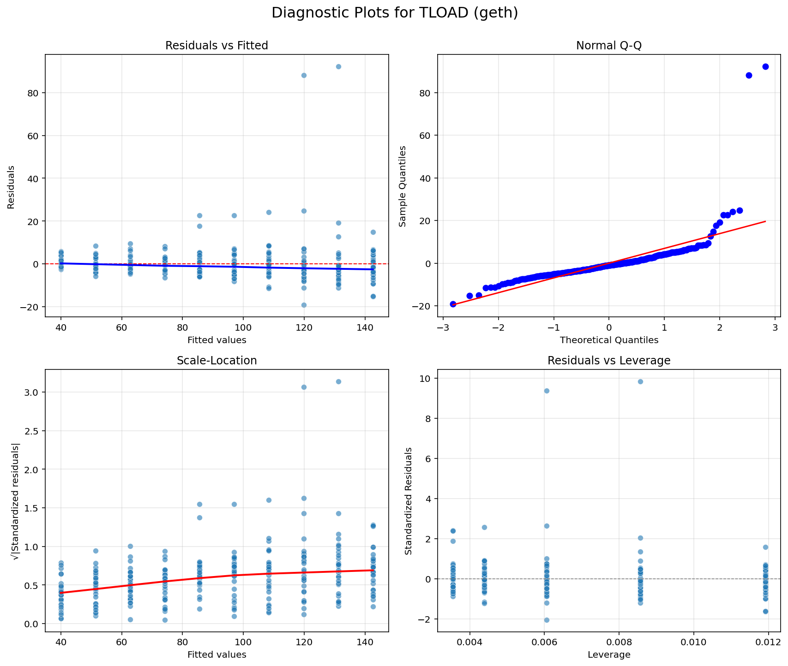


## besu


```python
                            OLS Regression Results                            
==============================================================================
Dep. Variable:        run_duration_ms   R-squared:                       0.980
Model:                            OLS   Adj. R-squared:                  0.979
Method:                 Least Squares   F-statistic:                 1.377e+04
Date:                Thu, 22 Jan 2026   Prob (F-statistic):          3.54e-245
Time:                        10:35:40   Log-Likelihood:                -1022.8
No. Observations:                 290   AIC:                             2050.
Df Residuals:                     288   BIC:                             2057.
Df Model:                           1                                         
Covariance Type:            nonrobust                                         
==============================================================================
                 coef    std err          t      P>|t|      [0.025      0.975]
------------------------------------------------------------------------------
const         27.8070      1.048     26.534      0.000      25.744      29.870
opcount        0.0991      0.001    117.326      0.000       0.097       0.101
==============================================================================
Omnibus:                       68.056   Durbin-Watson:                   1.478
Prob(Omnibus):                  0.000   Jarque-Bera (JB):              418.699
Skew:                           0.773   Prob(JB):                     1.20e-91
Kurtosis:                       8.680   Cond. No.                     2.68e+03
==============================================================================

Notes:
[1] Standard Errors assume that the covariance matrix of the errors is correctly specified.
[2] The condition number is large, 2.68e+03. This might indicate that there are
strong multicollinearity or other numerical problems.
```

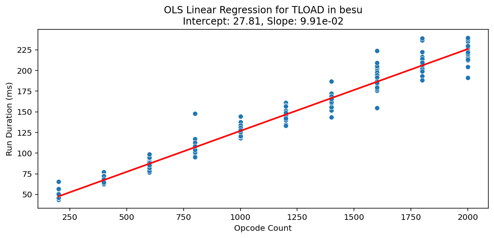

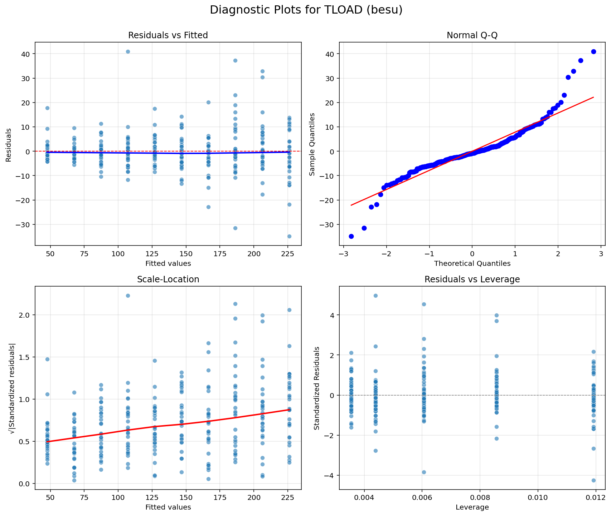


## reth


```python
                            OLS Regression Results                            
==============================================================================
Dep. Variable:        run_duration_ms   R-squared:                       0.905
Model:                            OLS   Adj. R-squared:                  0.905
Method:                 Least Squares   F-statistic:                     1705.
Date:                Thu, 22 Jan 2026   Prob (F-statistic):           4.12e-93
Time:                        10:35:40   Log-Likelihood:                -454.38
No. Observations:                 180   AIC:                             912.8
Df Residuals:                     178   BIC:                             919.2
Df Model:                           1                                         
Covariance Type:            nonrobust                                         
==============================================================================
                 coef    std err          t      P>|t|      [0.025      0.975]
------------------------------------------------------------------------------
const         29.6783      0.489     60.683      0.000      28.713      30.643
opcount        0.0163      0.000     41.296      0.000       0.015       0.017
==============================================================================
Omnibus:                       34.755   Durbin-Watson:                   1.687
Prob(Omnibus):                  0.000   Jarque-Bera (JB):               52.344
Skew:                           1.056   Prob(JB):                     4.30e-12
Kurtosis:                       4.587   Cond. No.                     2.68e+03
==============================================================================

Notes:
[1] Standard Errors assume that the covariance matrix of the errors is correctly specified.
[2] The condition number is large, 2.68e+03. This might indicate that there are
strong multicollinearity or other numerical problems.
```

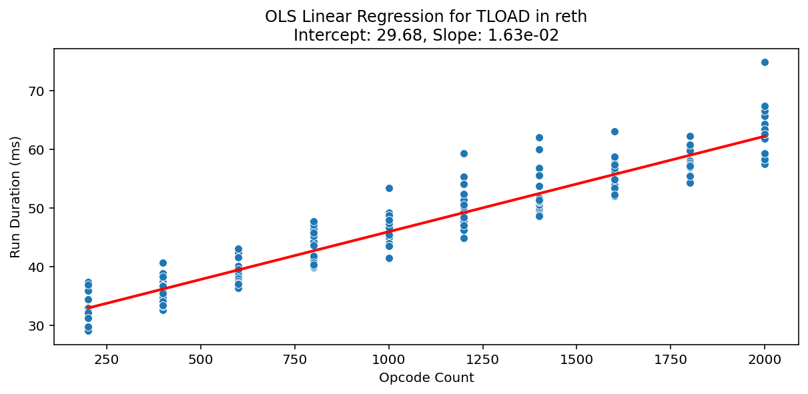

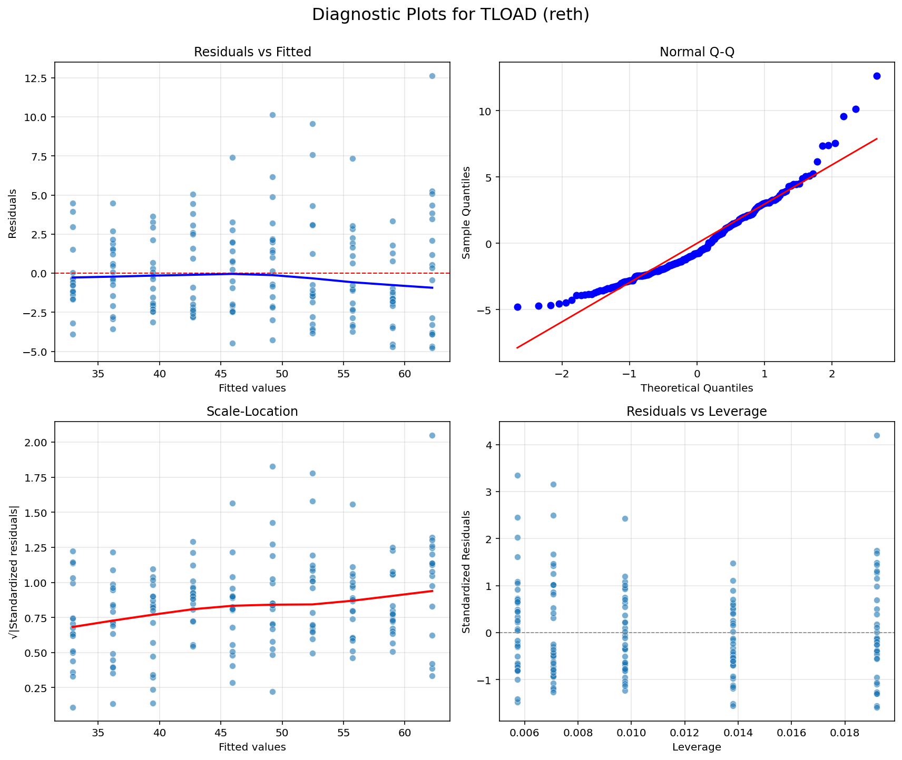


## nethermind


```python
                            OLS Regression Results                            
==============================================================================
Dep. Variable:        run_duration_ms   R-squared:                       0.976
Model:                            OLS   Adj. R-squared:                  0.976
Method:                 Least Squares   F-statistic:                 1.185e+04
Date:                Thu, 22 Jan 2026   Prob (F-statistic):          5.27e-236
Time:                        10:35:40   Log-Likelihood:                -655.20
No. Observations:                 290   AIC:                             1314.
Df Residuals:                     288   BIC:                             1322.
Df Model:                           1                                         
Covariance Type:            nonrobust                                         
==============================================================================
                 coef    std err          t      P>|t|      [0.025      0.975]
------------------------------------------------------------------------------
const         26.6253      0.295     90.264      0.000      26.045      27.206
opcount        0.0259      0.000    108.849      0.000       0.025       0.026
==============================================================================
Omnibus:                       21.133   Durbin-Watson:                   1.265
Prob(Omnibus):                  0.000   Jarque-Bera (JB):               24.913
Skew:                           0.600   Prob(JB):                     3.89e-06
Kurtosis:                       3.790   Cond. No.                     2.68e+03
==============================================================================

Notes:
[1] Standard Errors assume that the covariance matrix of the errors is correctly specified.
[2] The condition number is large, 2.68e+03. This might indicate that there are
strong multicollinearity or other numerical problems.
```

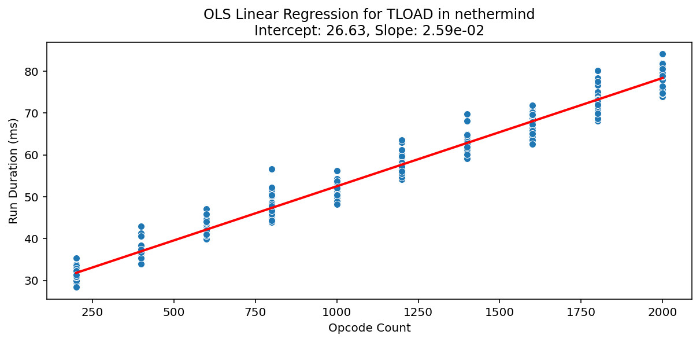

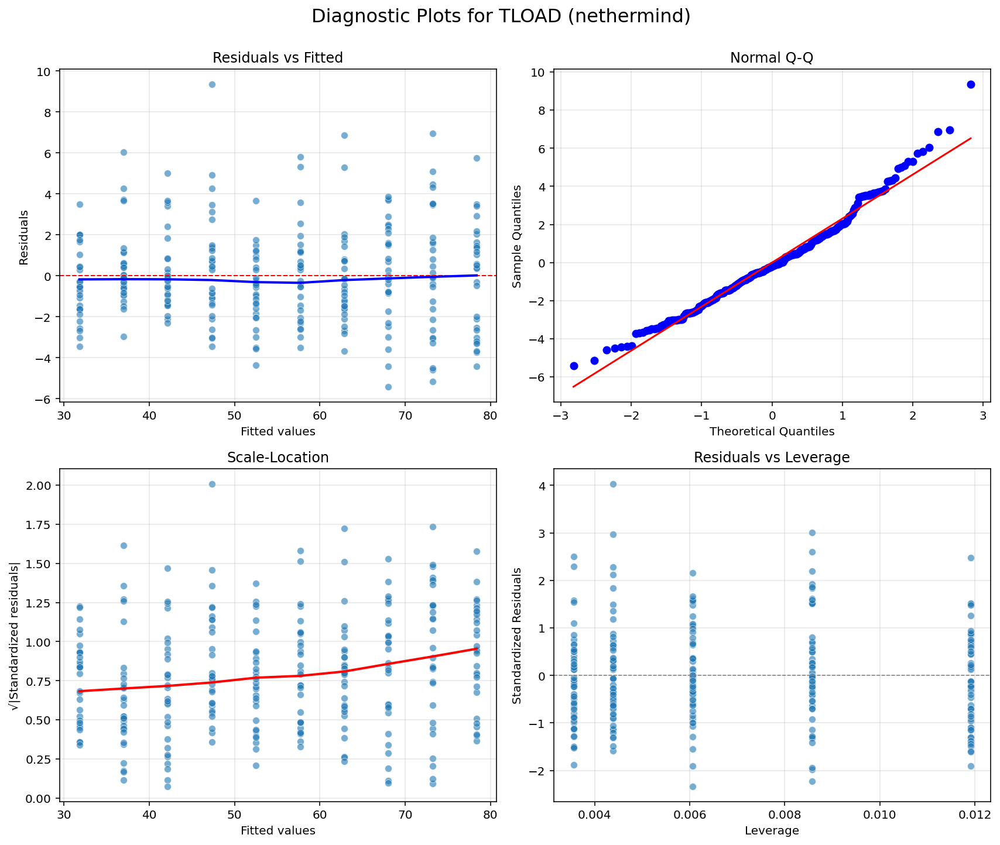


## erigon

OLS model did not run... Error: zero-size array to reduction operation maximum which has no identity

# TSTORE

## geth


```python
                            OLS Regression Results                            
==============================================================================
Dep. Variable:        run_duration_ms   R-squared:                       0.970
Model:                            OLS   Adj. R-squared:                  0.970
Method:                 Least Squares   F-statistic:                     9425.
Date:                Thu, 22 Jan 2026   Prob (F-statistic):          4.51e-222
Time:                        10:35:41   Log-Likelihood:                -1366.3
No. Observations:                 290   AIC:                             2737.
Df Residuals:                     288   BIC:                             2744.
Df Model:                           1                                         
Covariance Type:            nonrobust                                         
==============================================================================
                 coef    std err          t      P>|t|      [0.025      0.975]
------------------------------------------------------------------------------
const         40.2281      3.426     11.743      0.000      33.485      46.971
opcount        0.2680      0.003     97.081      0.000       0.263       0.273
==============================================================================
Omnibus:                       20.419   Durbin-Watson:                   1.506
Prob(Omnibus):                  0.000   Jarque-Bera (JB):               33.282
Skew:                           0.444   Prob(JB):                     5.93e-08
Kurtosis:                       4.402   Cond. No.                     2.68e+03
==============================================================================

Notes:
[1] Standard Errors assume that the covariance matrix of the errors is correctly specified.
[2] The condition number is large, 2.68e+03. This might indicate that there are
strong multicollinearity or other numerical problems.
```


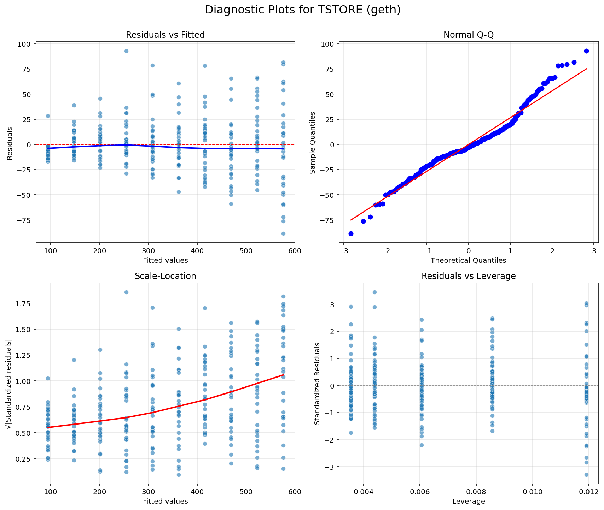


## besu


```python
                            OLS Regression Results                            
==============================================================================
Dep. Variable:        run_duration_ms   R-squared:                       0.836
Model:                            OLS   Adj. R-squared:                  0.836
Method:                 Least Squares   F-statistic:                     1469.
Date:                Thu, 22 Jan 2026   Prob (F-statistic):          3.99e-115
Time:                        10:35:41   Log-Likelihood:                -1800.4
No. Observations:                 290   AIC:                             3605.
Df Residuals:                     288   BIC:                             3612.
Df Model:                           1                                         
Covariance Type:            nonrobust                                         
==============================================================================
                 coef    std err          t      P>|t|      [0.025      0.975]
------------------------------------------------------------------------------
const        -36.5237     15.303     -2.387      0.018     -66.644      -6.403
opcount        0.4727      0.012     38.333      0.000       0.448       0.497
==============================================================================
Omnibus:                       14.043   Durbin-Watson:                   1.785
Prob(Omnibus):                  0.001   Jarque-Bera (JB):               26.792
Skew:                           0.235   Prob(JB):                     1.52e-06
Kurtosis:                       4.413   Cond. No.                     2.68e+03
==============================================================================

Notes:
[1] Standard Errors assume that the covariance matrix of the errors is correctly specified.
[2] The condition number is large, 2.68e+03. This might indicate that there are
strong multicollinearity or other numerical problems.
```

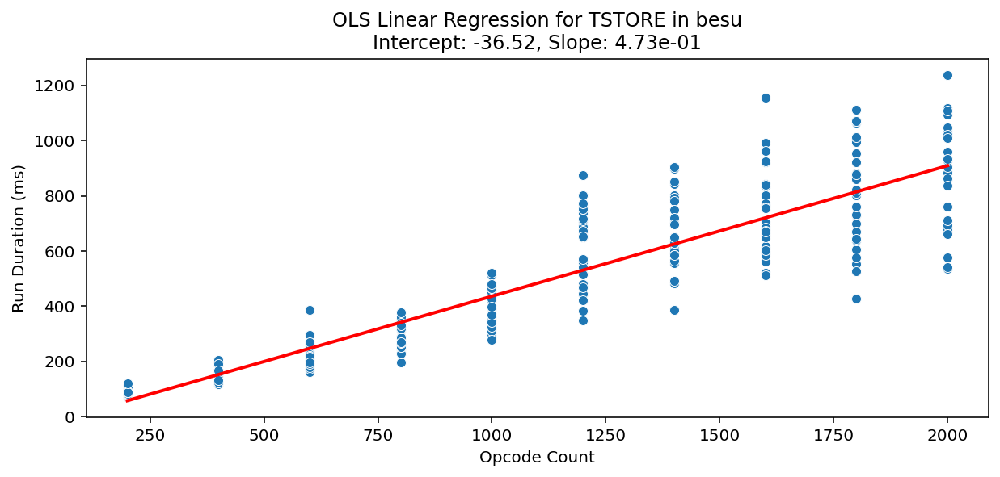

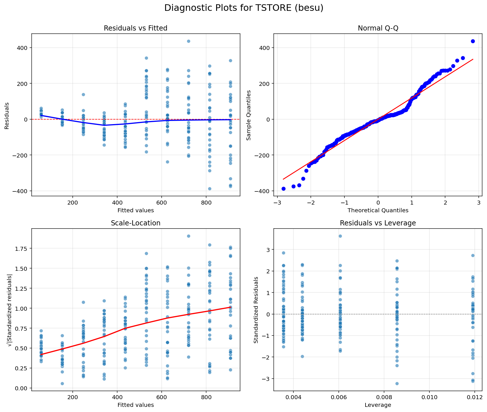


## reth


```python
                            OLS Regression Results                            
==============================================================================
Dep. Variable:        run_duration_ms   R-squared:                       0.952
Model:                            OLS   Adj. R-squared:                  0.951
Method:                 Least Squares   F-statistic:                     3502.
Date:                Thu, 22 Jan 2026   Prob (F-statistic):          5.11e-119
Time:                        10:35:41   Log-Likelihood:                -847.97
No. Observations:                 180   AIC:                             1700.
Df Residuals:                     178   BIC:                             1706.
Df Model:                           1                                         
Covariance Type:            nonrobust                                         
==============================================================================
                 coef    std err          t      P>|t|      [0.025      0.975]
------------------------------------------------------------------------------
const         36.7377      4.355      8.436      0.000      28.144      45.332
opcount        0.2077      0.004     59.182      0.000       0.201       0.215
==============================================================================
Omnibus:                        6.016   Durbin-Watson:                   2.154
Prob(Omnibus):                  0.049   Jarque-Bera (JB):                7.742
Skew:                           0.200   Prob(JB):                       0.0208
Kurtosis:                       3.934   Cond. No.                     2.68e+03
==============================================================================

Notes:
[1] Standard Errors assume that the covariance matrix of the errors is correctly specified.
[2] The condition number is large, 2.68e+03. This might indicate that there are
strong multicollinearity or other numerical problems.
```

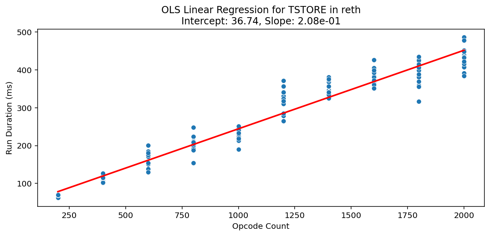

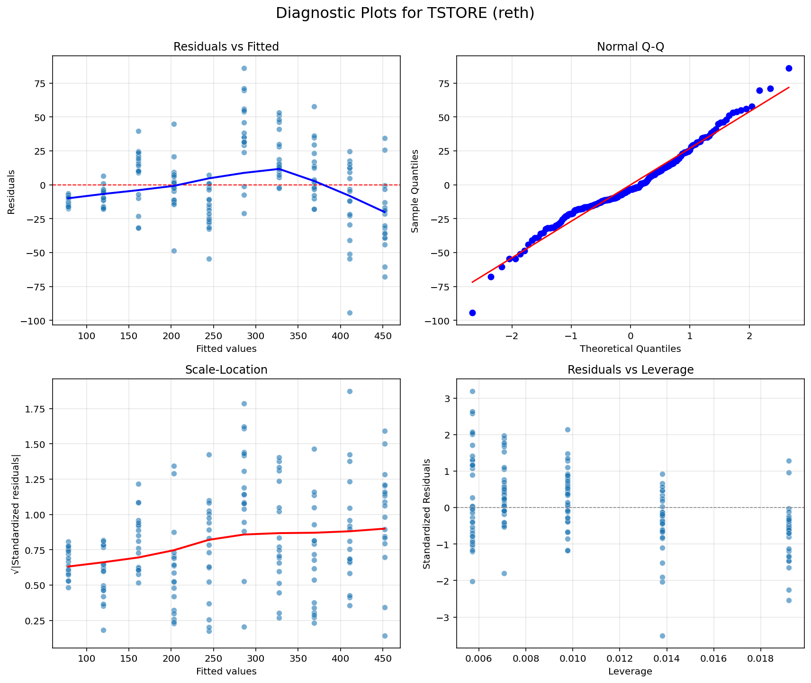


## nethermind


```python
                            OLS Regression Results                            
==============================================================================
Dep. Variable:        run_duration_ms   R-squared:                       0.945
Model:                            OLS   Adj. R-squared:                  0.945
Method:                 Least Squares   F-statistic:                     4952.
Date:                Thu, 22 Jan 2026   Prob (F-statistic):          1.81e-183
Time:                        10:35:41   Log-Likelihood:                -1193.8
No. Observations:                 290   AIC:                             2392.
Df Residuals:                     288   BIC:                             2399.
Df Model:                           1                                         
Covariance Type:            nonrobust                                         
==============================================================================
                 coef    std err          t      P>|t|      [0.025      0.975]
------------------------------------------------------------------------------
const         34.5620      1.889     18.294      0.000      30.843      38.281
opcount        0.1071      0.002     70.368      0.000       0.104       0.110
==============================================================================
Omnibus:                       32.234   Durbin-Watson:                   1.620
Prob(Omnibus):                  0.000   Jarque-Bera (JB):               95.109
Skew:                           0.452   Prob(JB):                     2.23e-21
Kurtosis:                       5.656   Cond. No.                     2.68e+03
==============================================================================

Notes:
[1] Standard Errors assume that the covariance matrix of the errors is correctly specified.
[2] The condition number is large, 2.68e+03. This might indicate that there are
strong multicollinearity or other numerical problems.
```

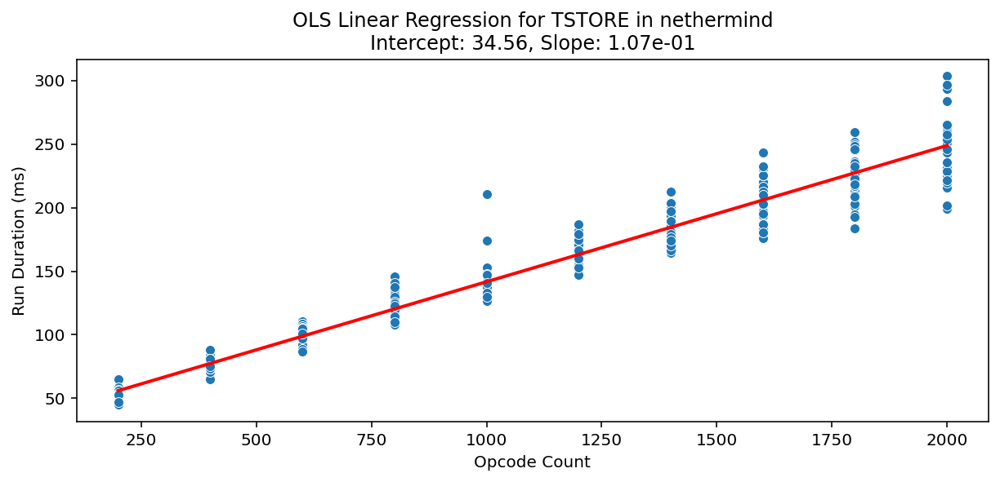

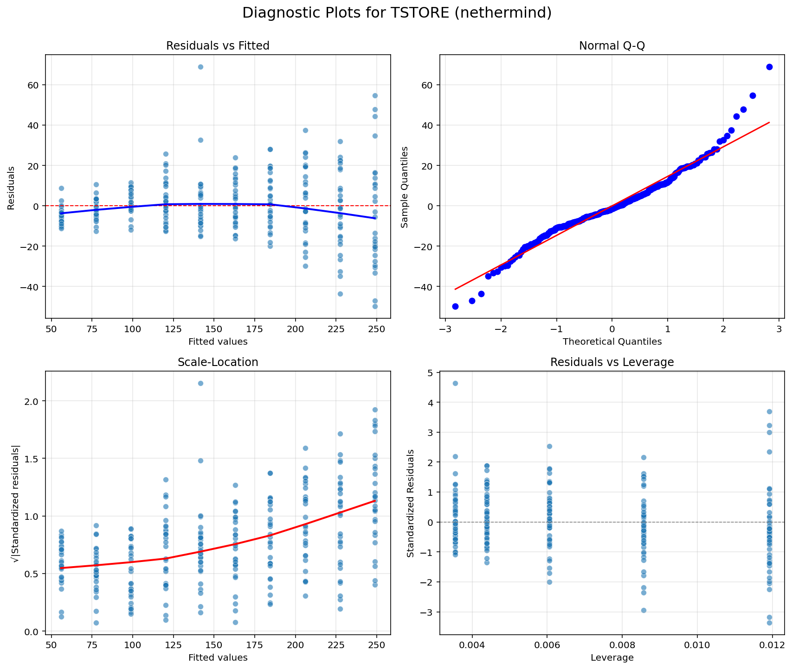


## erigon

OLS model did not run... Error: zero-size array to reduction operation maximum which has no identity

# XOR

## geth


```python
                            OLS Regression Results                            
==============================================================================
Dep. Variable:        run_duration_ms   R-squared:                       0.967
Model:                            OLS   Adj. R-squared:                  0.966
Method:                 Least Squares   F-statistic:                     8313.
Date:                Thu, 22 Jan 2026   Prob (F-statistic):          1.81e-214
Time:                        10:35:42   Log-Likelihood:                -1518.6
No. Observations:                 290   AIC:                             3041.
Df Residuals:                     288   BIC:                             3049.
Df Model:                           1                                         
Covariance Type:            nonrobust                                         
==============================================================================
                 coef    std err          t      P>|t|      [0.025      0.975]
------------------------------------------------------------------------------
const         30.7179      5.791      5.304      0.000      19.320      42.116
opcount        0.0243      0.000     91.175      0.000       0.024       0.025
==============================================================================
Omnibus:                      384.850   Durbin-Watson:                   1.759
Prob(Omnibus):                  0.000   Jarque-Bera (JB):            46770.947
Skew:                           6.003   Prob(JB):                         0.00
Kurtosis:                      64.046   Cond. No.                     4.69e+04
==============================================================================

Notes:
[1] Standard Errors assume that the covariance matrix of the errors is correctly specified.
[2] The condition number is large, 4.69e+04. This might indicate that there are
strong multicollinearity or other numerical problems.
```

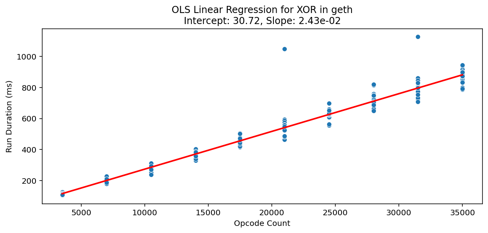

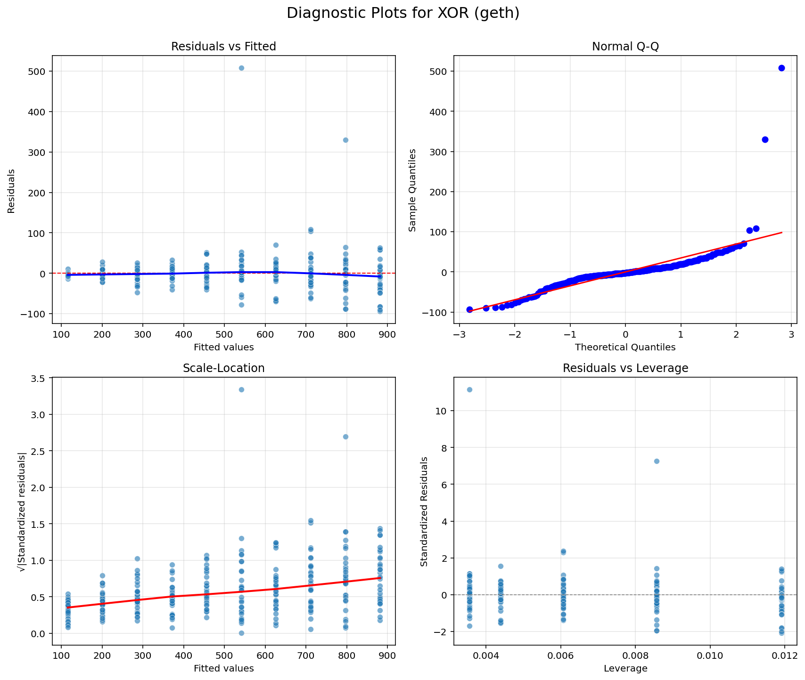


## besu


```python
                            OLS Regression Results                            
==============================================================================
Dep. Variable:        run_duration_ms   R-squared:                       0.995
Model:                            OLS   Adj. R-squared:                  0.995
Method:                 Least Squares   F-statistic:                 5.900e+04
Date:                Thu, 22 Jan 2026   Prob (F-statistic):               0.00
Time:                        10:35:42   Log-Likelihood:                -1555.5
No. Observations:                 290   AIC:                             3115.
Df Residuals:                     288   BIC:                             3122.
Df Model:                           1                                         
Covariance Type:            nonrobust                                         
==============================================================================
                 coef    std err          t      P>|t|      [0.025      0.975]
------------------------------------------------------------------------------
const         34.0961      6.577      5.184      0.000      21.152      47.040
opcount        0.0736      0.000    242.891      0.000       0.073       0.074
==============================================================================
Omnibus:                       73.918   Durbin-Watson:                   1.179
Prob(Omnibus):                  0.000   Jarque-Bera (JB):              482.781
Skew:                          -0.841   Prob(JB):                    1.46e-105
Kurtosis:                       9.093   Cond. No.                     4.69e+04
==============================================================================

Notes:
[1] Standard Errors assume that the covariance matrix of the errors is correctly specified.
[2] The condition number is large, 4.69e+04. This might indicate that there are
strong multicollinearity or other numerical problems.
```

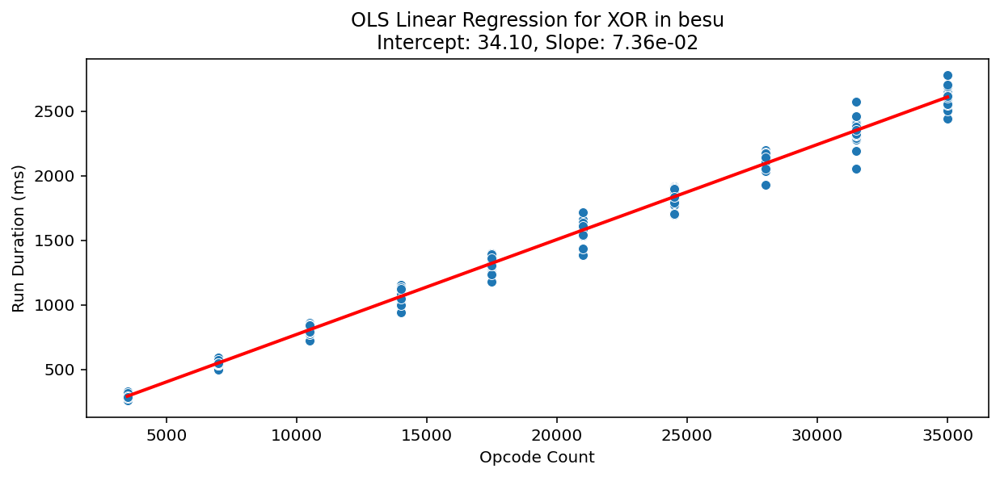

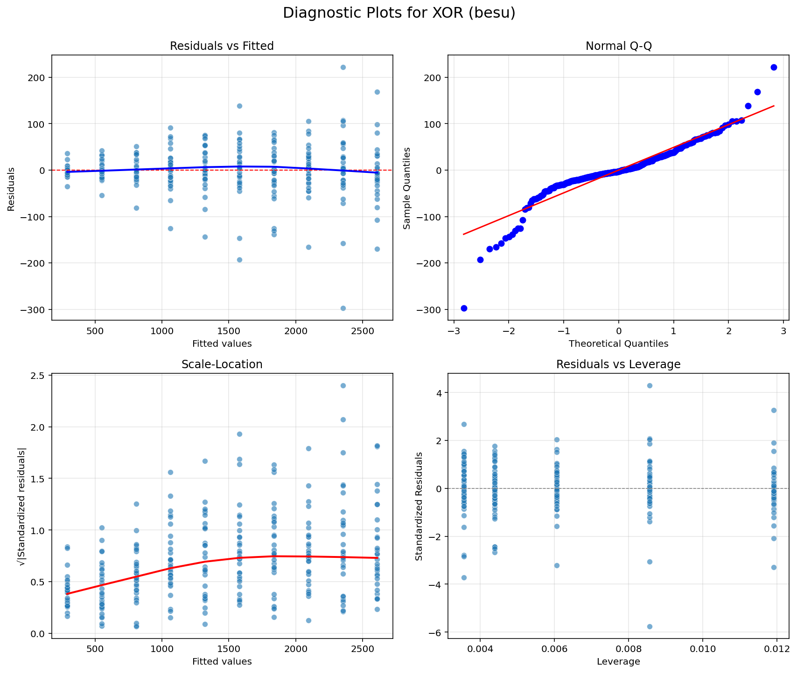


## reth


```python
                            OLS Regression Results                            
==============================================================================
Dep. Variable:        run_duration_ms   R-squared:                       0.980
Model:                            OLS   Adj. R-squared:                  0.980
Method:                 Least Squares   F-statistic:                     8928.
Date:                Thu, 22 Jan 2026   Prob (F-statistic):          4.89e-154
Time:                        10:35:42   Log-Likelihood:                -705.96
No. Observations:                 180   AIC:                             1416.
Df Residuals:                     178   BIC:                             1422.
Df Model:                           1                                         
Covariance Type:            nonrobust                                         
==============================================================================
                 coef    std err          t      P>|t|      [0.025      0.975]
------------------------------------------------------------------------------
const         31.4670      1.979     15.904      0.000      27.562      35.372
opcount        0.0086   9.11e-05     94.486      0.000       0.008       0.009
==============================================================================
Omnibus:                       18.671   Durbin-Watson:                   1.458
Prob(Omnibus):                  0.000   Jarque-Bera (JB):               74.601
Skew:                          -0.029   Prob(JB):                     6.32e-17
Kurtosis:                       6.153   Cond. No.                     4.69e+04
==============================================================================

Notes:
[1] Standard Errors assume that the covariance matrix of the errors is correctly specified.
[2] The condition number is large, 4.69e+04. This might indicate that there are
strong multicollinearity or other numerical problems.
```


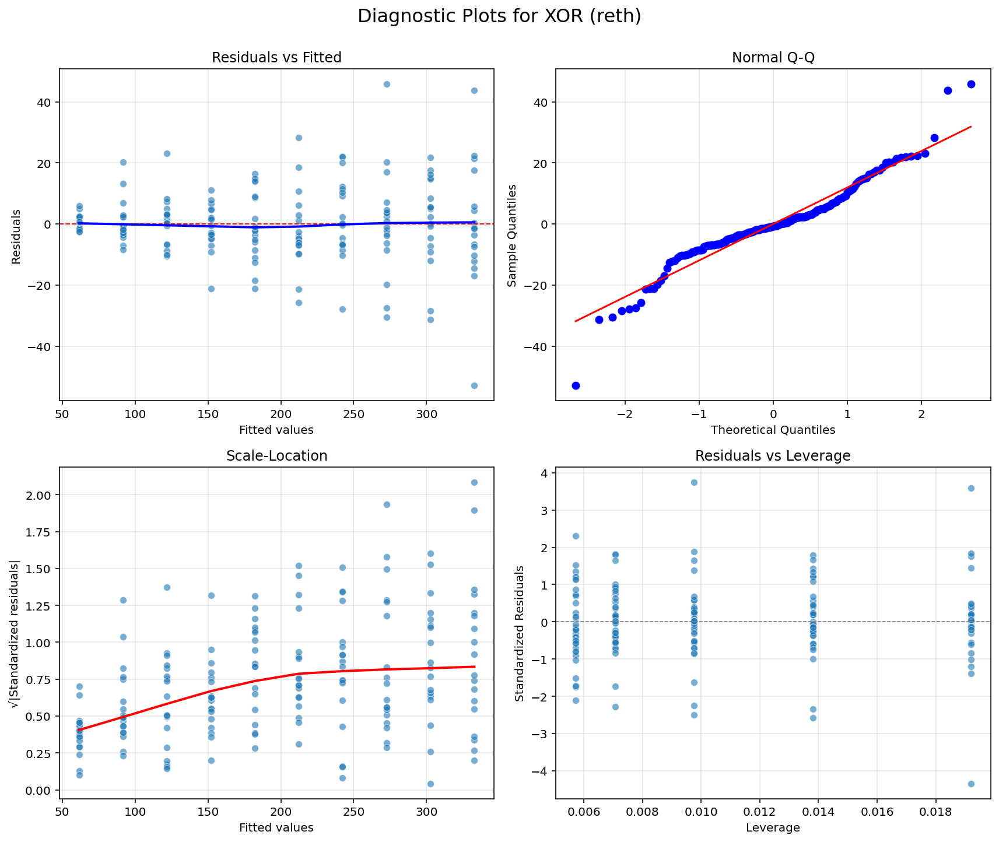


## nethermind


```python
                            OLS Regression Results                            
==============================================================================
Dep. Variable:        run_duration_ms   R-squared:                       0.563
Model:                            OLS   Adj. R-squared:                  0.562
Method:                 Least Squares   F-statistic:                     371.7
Date:                Thu, 22 Jan 2026   Prob (F-statistic):           9.16e-54
Time:                        10:35:43   Log-Likelihood:                -1923.8
No. Observations:                 290   AIC:                             3852.
Df Residuals:                     288   BIC:                             3859.
Df Model:                           1                                         
Covariance Type:            nonrobust                                         
==============================================================================
                 coef    std err          t      P>|t|      [0.025      0.975]
------------------------------------------------------------------------------
const         22.0539     23.417      0.942      0.347     -24.036      68.144
opcount        0.0208      0.001     19.280      0.000       0.019       0.023
==============================================================================
Omnibus:                       51.591   Durbin-Watson:                   0.780
Prob(Omnibus):                  0.000   Jarque-Bera (JB):               12.213
Skew:                          -0.083   Prob(JB):                      0.00223
Kurtosis:                       2.008   Cond. No.                     4.69e+04
==============================================================================

Notes:
[1] Standard Errors assume that the covariance matrix of the errors is correctly specified.
[2] The condition number is large, 4.69e+04. This might indicate that there are
strong multicollinearity or other numerical problems.
```

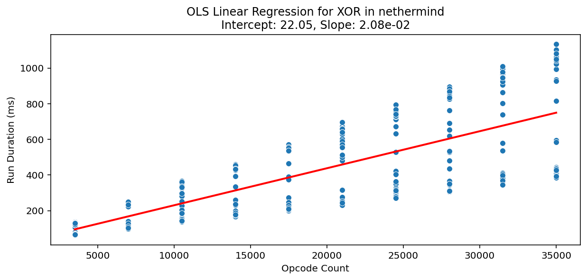

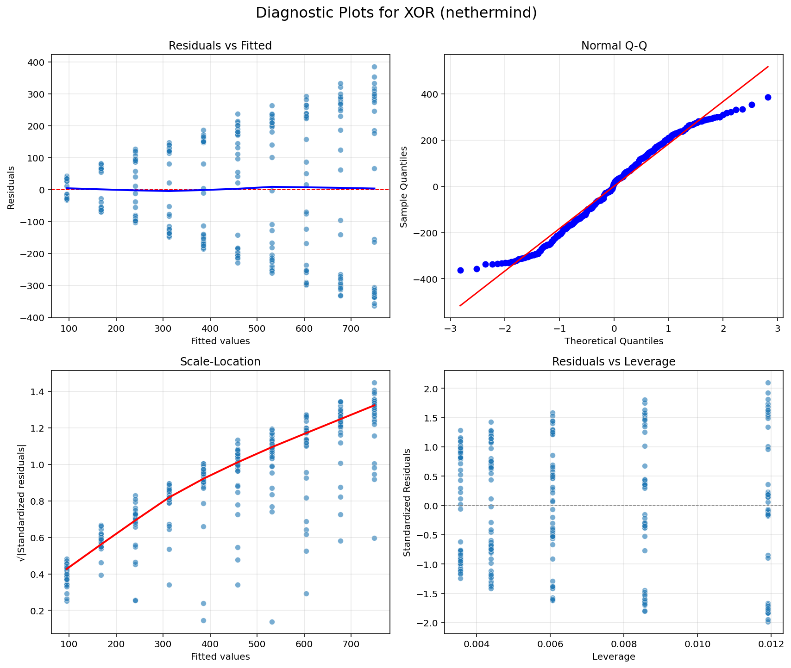


## erigon


```python
                            OLS Regression Results                            
==============================================================================
Dep. Variable:        run_duration_ms   R-squared:                       0.999
Model:                            OLS   Adj. R-squared:                  0.999
Method:                 Least Squares   F-statistic:                 2.276e+04
Date:                Thu, 22 Jan 2026   Prob (F-statistic):           2.68e-42
Time:                        10:35:43   Log-Likelihood:                -108.28
No. Observations:                  30   AIC:                             220.6
Df Residuals:                      28   BIC:                             223.4
Df Model:                           1                                         
Covariance Type:            nonrobust                                         
==============================================================================
                 coef    std err          t      P>|t|      [0.025      0.975]
------------------------------------------------------------------------------
const         36.6600      3.650     10.044      0.000      29.184      44.136
opcount        0.0254      0.000    150.853      0.000       0.025       0.026
==============================================================================
Omnibus:                       32.819   Durbin-Watson:                   2.275
Prob(Omnibus):                  0.000   Jarque-Bera (JB):               83.602
Skew:                           2.319   Prob(JB):                     7.02e-19
Kurtosis:                       9.736   Cond. No.                     4.69e+04
==============================================================================

Notes:
[1] Standard Errors assume that the covariance matrix of the errors is correctly specified.
[2] The condition number is large, 4.69e+04. This might indicate that there are
strong multicollinearity or other numerical problems.
```
OLS model did not run... Error: 'numpy.ndarray' object has no attribute 'iloc'
