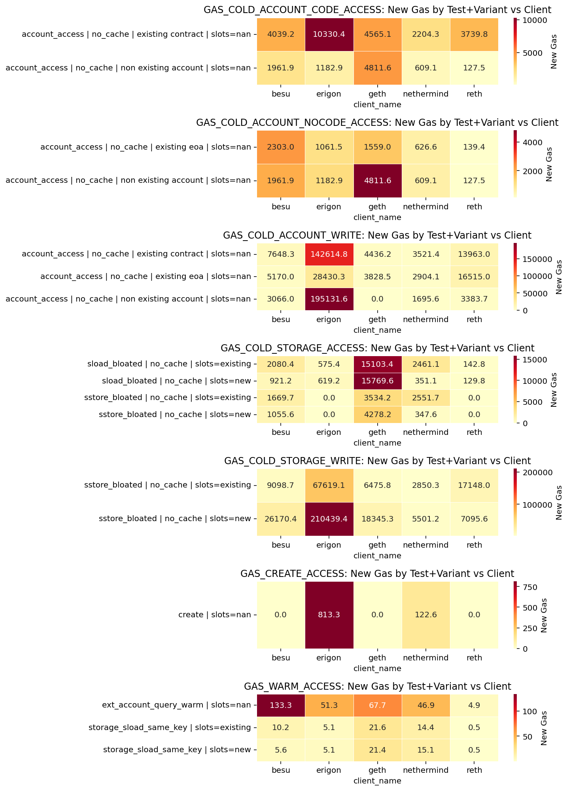

# EIP-7904 and EIP-8038 — Runtime Estimation Update (May 22–26, 2026)

### Maria Silva, May 2026

This report summarizes the latest runtime-estimation results for [EIP-7904](https://eips.ethereum.org/EIPS/eip-7904) and [EIP-8038](https://eips.ethereum.org/EIPS/eip-8038), based on the benchmark suite re-run between 2026-05-22 and 2026-05-26.

The runtime estimates were fit on data from two Benchmarkoor suites: a [compute suite (`3182dda7b93dee61`)](https://benchmarkoor.core.ethpandaops.io/suites/3182dda7b93dee61) for the EIP-7904 operations, and a [stateful suite (`a11611f320a39015`)](https://benchmarkoor.core.ethpandaops.io/suites/a11611f320a39015) for the EIP-8038 parameters, both run on `jochemnet` and `bal-devet-7`.

**Key findings:**

- **EIP-7904: `geth`'s pending optimizations are the gating factor.** `geth` is the worst client on 17 of the 18 (opcode, parameter) pairs, with worst/2nd-worst ratios of 5–6x on the precompiles. If `geth` merges its repricing-related optimizations and lands within the band of the next-slowest client, we can drop 7904.
- **EIP-8038: `geth` optimizations should help, but `erigon` is the bigger blocker.** Even assuming `geth`'s runtimes drop to match the next-slowest client per parameter, **`erigon` still drives the three largest proposed increases** — `GAS_COLD_ACCOUNT_CODE_ACCESS` (~3x), `GAS_COLD_ACCOUNT_WRITE` (~29x), and `GAS_COLD_STORAGE_WRITE` (~74x). Secondary post-geth drivers are `nethermind` on `GAS_COLD_STORAGE_ACCESS` (+0.16x) and `besu` on `GAS_WARM_ACCESS` (+0.34x), both small. `GAS_COLD_ACCOUNT_NOCODE_ACCESS` would no longer need an increase after a geth optimization.
- **Model-fit quality is broadly acceptable but uneven across clients.** EIP-7904 has 100% statistically significant slopes; EIP-8038 has a tail of poor fits (R² as low as 0.002) and 86–97% slope significance depending on the client. `GAS_CREATE_ACCESS` is excluded from the EIP-8038 analysis because 3 of 5 clients produced no significant fit.
- **EIP-2780: `besu` results are anomalous and the `opcount` proxy is the blocker for trustworthy estimates.** Comparing the combined value-transfer cost (`TX_BASE + WITH_VALUE`) against the current `TX_BASE = 21,000`, **3 of 5 clients** (`besu`, `erigon`, `reth`) come in *above* current. `besu`'s anomalous numbers rest on 4–5 observations per case and degenerate R² fits, so they need investigation. More importantly, `opcount` here is *derived* from the block gas limit divided by the current 21,000 — not the true number of transfers per block — so the slope is structurally biased.

**ToDo's:**

- Geth: merge optimizations to bal-devnet-3, so we can see your real performance
- Erigon: great progress so far! But we still need to work on state optimizations. Writes are still the worst, followed by `GAS_COLD_ACCOUNT_CODE_ACCESS`.
- Besu: Contnue work on write optimizations. `GAS_COLD_STORAGE_WRITE` is the worst, followed by `GAS_COLD_STORAGE_WRITE`.
- Reth: writes are still high in our analysis. We need to check what is hapenning there.
- Nethermind: no actions - fairly good across the board.
- Bech crew: figure out how to extract the number of eth transfers from test_ether_transfers_onchain_receivers

## Background and methodology

We measure per-operation runtimes by fitting a Non-Negative Least Squares (NNLS) linear regression to the total execution time of synthetic benchmark blocks, generated with the [EEST benchmark suite](https://github.com/ethereum/execution-spec-tests/tree/main/tests/benchmark) and collected with [Benchmarkoor](https://github.com/ethpandaops/benchmarkoor). Each block isolates and stresses a single target operation while varying the number of executions and any operation-specific parameters (e.g., message size, number of rounds, number of pairs). Independent models are fitted for every (client, opcode, test) combination.

For each block, the model decomposes the observed runtime as:

$$\text{runtime} = \text{intercept} + \text{slope} \times \text{opcount} + \sum_i \text{coef}_i \times \text{opcount} \times \text{param}_i$$

We additionally subtract the estimated runtime of the auxiliary "glue" opcodes (PUSH, MSTORE, etc.) so that the slope reflects the target opcode's per-execution cost in isolation. We convert per-operation runtime to gas at a 100 Mgas/s anchor:

$$\text{new\_gas} = \frac{\text{anchor\_rate} \times \text{runtime\_ms}}{1000}$$

Only models with R² > 0.5 and slope p-value < 0.05 are eligible. The worst-case value across clients is reported as the proposed new gas cost.

The full autogenerated reports underlying this summary are:

- **EIP-7904**: [new_gas_proposal.md](./eip-7904/runtime_estimation/2026-05-22_2026-05-26/new_gas_proposal.md), [runtime_estimation_autogenerated_report.md](./eip-7904/runtime_estimation/2026-05-22_2026-05-26/runtime_estimation_autogenerated_report.md)
- **EIP-8038**: [new_gas_proposal.md](./eip-8038/runtime_estimation/2026-05-22_2026-05-26/new_gas_proposal.md), [runtime_estimation_autogenerated_report.md](./eip-8038/runtime_estimation/2026-05-22_2026-05-26/runtime_estimation_autogenerated_report.md)

## EIP-7904

### Latest new gas estimates

The table below shows the new gas costs from the May 22–26 data, alongside the worst and second-worst client for each (opcode, parameter) pair. The **Needs ↑?** column flags whether the worst-case estimate exceeds the current gas cost (`↑` increase, `↓` decrease, `—` unchanged). The full autogenerated proposal lives in [new_gas_proposal.md](./eip-7904/runtime_estimation/2026-05-22_2026-05-26/new_gas_proposal.md).

|Opcode|Parameter|Current Gas|Worst Client|Worst Gas|2nd-Worst Client|2nd-Worst Gas|Worst/2nd|Needs ↑?|
| :--- | :--- | ---: | :---: | ---: | :---: | ---: | ---: | :---: |
|ADDMOD|constant|8|geth|9|besu|3|3.0x|↑|
|BLAKE2F|constant|0|erigon|38|reth|33|1.2x|↑|
|BLAKE2F|num_rounds|1|geth|2|besu/erigon/nethermind|1|2.0x|↑|
|BLS12_G1ADD|constant|375|geth|518|erigon|91|5.7x|↑|
|BLS12_G2ADD|constant|600|geth|675|erigon|112|6.0x|↑|
|DIV|constant|5|geth|5|besu|2|2.5x|—|
|ECADD|constant|150|geth|288|reth|88|3.3x|↑|
|ECPAIRING|constant|45000|geth|25236|reth|8339|3.0x|↓|
|ECPAIRING|num_pairs|34000|geth|19423|nethermind|8996|2.2x|↓|
|ECRECOVER|constant|3000|geth|4203|erigon|747|5.6x|↑|
|KECCAK256|constant|30|geth|43|besu|10|4.3x|↑|
|KECCAK256|msg_size|6|all tied|1|all tied|1|1.0x|↓|
|MOD|constant|5|geth|7|besu|2|3.5x|↑|
|MULMOD|constant|8|geth|13|besu|4|3.3x|↑|
|P256VERIFY|constant|6900|geth|7191|erigon|1360|5.3x|↑|
|POINT_EVALUATION|constant|50000|geth|125563|besu|22306|5.6x|↑|
|SDIV|constant|5|geth|6|besu/erigon/nethermind|2|3.0x|↑|
|SMOD|constant|5|geth|7|besu/erigon|2|3.5x|↑|

**Key observations:**

- `geth` is the worst client on **17 of 18 rows**. The only exception is `BLAKE2F constant`, where `erigon` (38 gas) and `reth` (33 gas) both have measurable runtimes while geth, besu, and nethermind all round to 0 gas.
- The worst-case rule would raise gas costs on **14 operations** and lower them on 3 (`ECPAIRING constant`, `ECPAIRING num_pairs`, `KECCAK256 msg_size`). The worst-to-second-worst ratio is **≥3x on 12 of the 14 increases and ≥5x on 6** (`BLS12_G1ADD`, `BLS12_G2ADD`, `ECRECOVER`, `KECCAK256 constant`, `P256VERIFY`, `POINT_EVALUATION`).
- These ratios suggest that, with the exception of `BLAKE2F constant`, the entire case for raising any cost in EIP-7904 rests on `geth`'s performance.

### What if we excluded `geth`?

`geth`'s repricing-related optimizations have not yet been merged. To get a sense of where the proposal would land once they do, we recompute the worst case excluding `geth`. The table below lists every (opcode, parameter) that would *still* need an increase under this scenario:

|Opcode|Parameter|Current Gas|Worst Gas (ex-geth)|Worst Client (ex-geth)|
| :--- | :--- | ---: | ---: | :---: |
|BLAKE2F|constant|0|38|erigon|

**Every other operation would either keep its current gas cost or qualify for a decrease.** Notable examples:

- `POINT_EVALUATION constant`: 50000 → max(besu, erigon, nethermind, reth) = 22306 (besu). Currently 50000.
- `P256VERIFY constant`: 6900 → max ex-geth = 1360 (erigon). Currently 6900.
- `ECRECOVER constant`: 3000 → max ex-geth = 747 (erigon). Currently 3000.
- `BLS12_G2ADD constant`: 600 → max ex-geth = 112 (erigon). Currently 600.

The remaining case, `BLAKE2F constant`, is qualitatively different: two clients (`erigon` at 38 gas, `reth` at 33 gas) sit substantially above the current cost of 0, with the gap between worst and second-worst only **1.2x**. This is consistent with a real underpricing rather than a single-client artifact.

### Fit quality

The table below summarizes the regression-fit quality across the EIP-7904 models. `#models` counts the (opcode, test) regressions per client; `nobs` is the number of benchmarked blocks fed into each model (min/median/max across models). `Slope sig.` is the fraction of models whose slope coefficient has p < 0.05.

|Client|#models|nobs (min)|nobs (median)|nobs (max)|R² (min)|R² (median)|R² (max)|Slope sig.|
| :--- | ---: | ---: | ---: | ---: | ---: | ---: | ---: | ---: |
|besu|18|1815|1815|29040|0.638|0.846|0.969|100%|
|erigon|18|66|66|1056|0.700|0.859|0.953|100%|
|geth|18|825|825|13200|0.842|0.997|0.998|100%|
|nethermind|18|2849|2849|45584|0.526|0.886|0.923|100%|
|reth|18|286|286|4576|0.558|0.842|0.988|100%|

**Key observations:**

- **All slope coefficients are statistically significant** (p < 0.05) for every (opcode, client) combination — no EIP-7904 operations are dropped due to non-significance.
- **Observation counts vary by ~40x between clients.** `nethermind` has the most data (~2849 obs per model median), `erigon` the fewest (~66). Larger samples narrow confidence intervals but do not appear to bias the worst-case selection: `geth`'s very tight fits (R² ≈ 0.997) are what produce the 5–6x worst-client ratios, not a sample-size advantage.
- **Median R² is at or above 0.84 for every client**, comfortably above the 0.5 inclusion threshold. `geth` stands out with R² ≈ 0.997 across the board, indicating very clean linear runtime behavior.
- **Minimum R² values around 0.53 (nethermind) and 0.56 (reth)** still pass the inclusion threshold but warrant a closer look in the per-opcode diagnostic plots before any increase that depends on them is locked in.

## EIP-8038

### Latest new gas estimates

EIP-8038 covers state-access gas parameters. The table below is the proposal from [new_gas_proposal.md](./eip-8038/runtime_estimation/2026-05-22_2026-05-26/new_gas_proposal.md), excluding `GAS_CREATE_ACCESS` — that parameter had no statistically significant fit on 3 of 5 clients (`besu`, `geth`, `reth`), so its worst-case estimate is based on only two clients and we treat it as not yet reliably estimated.

|Parameter|Current Gas|New Gas (Rounded)|Change|Worst Client|
| :--- | ---: | ---: | ---: | :---: |
|GAS_COLD_ACCOUNT_CODE_ACCESS|2600|10331|+2.97x|erigon|
|GAS_COLD_ACCOUNT_NOCODE_ACCESS|2600|4812|+0.85x|geth|
|GAS_COLD_ACCOUNT_WRITE|6700|195132|+28.12x|erigon|
|GAS_COLD_STORAGE_ACCESS|2200|15770|+6.17x|geth|
|GAS_COLD_STORAGE_WRITE|2800|210440|+74.16x|erigon|
|GAS_WARM_ACCESS|100|134|+0.34x|besu|

**Key observations:**

- **`erigon` and `geth` together dominate the worst case**, with `erigon` driving the two largest multipliers: `GAS_COLD_ACCOUNT_WRITE` ≈ 29x and `GAS_COLD_STORAGE_WRITE` ≈ 74x. The corresponding per-operation runtimes (~1.95 ms and ~2.10 ms) are roughly 10–40x larger than the next-slowest client's on the same parameter, which is consistent with either a benchmarking artifact or a specific erigon code path being exercised.
- The pattern echoes EIP-7904: a single client's runtime dominates the proposal. We would recommend client-side investigation of the erigon write-path numbers before treating these multipliers as load-bearing.

The heatmap below shows the new gas costs (rounded) broken down by parameter, test variant, and client. The color scale makes the per-client outliers — `erigon` on the write parameters and `geth` on `GAS_COLD_STORAGE_ACCESS` — visible at a glance.



### Prices by the second-worst client

To gauge how sensitive the EIP-8038 proposal is to the single slowest client per parameter, we recompute the new gas using the **second-worst** client instead of the worst.

|Parameter|Current Gas|Worst (Client)|2nd-Worst (Client)|Worst/2nd|Change @ 2nd-Worst|Needs ↑ @ 2nd-Worst?|
| :--- | ---: | ---: | ---: | ---: | ---: | :---: |
|GAS_COLD_ACCOUNT_CODE_ACCESS|2600|10331 (erigon)|4812 (geth)|2.1x|+0.85x|↑|
|GAS_COLD_ACCOUNT_NOCODE_ACCESS|2600|4812 (geth)|2303 (besu)|2.1x|-0.11x|—|
|GAS_COLD_ACCOUNT_WRITE|6700|195132 (erigon)|16516 (reth)|11.8x|+1.47x|↑|
|GAS_COLD_STORAGE_ACCESS|2200|15770 (geth)|2552 (nethermind)|6.2x|+0.16x|↑|
|GAS_COLD_STORAGE_WRITE|2800|210440 (erigon)|26171 (besu)|8.0x|+8.35x|↑|
|GAS_WARM_ACCESS|100|134 (besu)|68 (geth)|2.0x|-0.32x|↓|

**Key observations:**

- **Unlike EIP-7904, repricing pressure does not collapse under 2nd-worst pricing.** Four of the six parameters would still require an increase: `GAS_COLD_ACCOUNT_CODE_ACCESS`, `GAS_COLD_ACCOUNT_WRITE`, `GAS_COLD_STORAGE_ACCESS`, and `GAS_COLD_STORAGE_WRITE`.
- `GAS_COLD_STORAGE_WRITE` still proposes an **~8x increase even at the 2nd-worst client** (`besu` at 26171 gas). This signals that the underpricing of cold storage writes is broad-based rather than a single-client artifact, in contrast to the 74x worst-client multiplier which is `erigon`-specific.
- `GAS_COLD_ACCOUNT_WRITE` drops from a 29x worst-client multiplier to a 1.5x at 2nd-worst — most of the headline increase here *is* an erigon-specific effect, but the parameter would still need a modest bump.
- `GAS_COLD_STORAGE_ACCESS` and `GAS_COLD_ACCOUNT_CODE_ACCESS` move from large multipliers (6.2x and 3.0x respectively) to small ones (+0.16x and +0.85x) — these are borderline cases where the right answer depends on how much of the per-client gap is "real".
- `GAS_WARM_ACCESS`, whose worst case is already below the current cost, remains so under 2nd-worst pricing.

### Fit quality

|Client|#models|nobs (min)|nobs (median)|nobs (max)|R² (min)|R² (median)|R² (max)|Slope sig.|
| :--- | ---: | ---: | ---: | ---: | ---: | ---: | ---: | ---: |
|besu|36|33|44|3630|0.012|0.942|0.981|94.4%|
|erigon|36|132|220|440|0.021|0.912|0.996|88.9%|
|geth|36|638|638|1650|0.030|0.813|0.986|94.4%|
|nethermind|36|275|429|5698|0.003|0.858|0.973|97.2%|
|reth|36|561|561|1122|0.002|0.911|0.995|86.1%|

**Key observations:**

- **Median R² is 0.81–0.94 across clients** — broadly good fits.
- **However, the worst fits are very poor** (R² as low as 0.002 on `reth` and `nethermind`). Between **3% and 14% of slope coefficients per client are not statistically significant** and are dropped from the worst-case selection.
- **Observation counts are noticeably lower than in EIP-7904** for some clients (`besu` median ~44 obs; `erigon` ~220). The smaller samples partly explain the wider R² spread.
- Several glue opcodes also had poor fits (see [Errors and caveats](./eip-8038/runtime_estimation/2026-05-22_2026-05-26/new_gas_proposal.md#errors-and-caveats) in the autogenerated report), meaning some slopes are not adjusted for those glue contributions. This may inflate the reported per-operation runtime on the affected parameters — including, potentially, the large erigon write estimates above.

## EIP-2780

### Latest new gas estimates

[EIP-2780](https://eips.ethereum.org/EIPS/eip-2780) reduces the intrinsic transaction cost. Building on the `test_ether_transfers_onchain_receivers` benchmark from the same May 22–26 EIP-7904 suite, we fit an NNLS model per `(client, case_id)` with `transfer_amount` as an additional feature, decomposing each block's runtime into a per-transaction slope (→ `TX_BASE`) and a `transfer_amount` coefficient (→ `WITH_VALUE`, the extra gas charged when a transaction carries a non-zero value). The analysis can be reproduced by running [notebook 2.9](../notebooks/2.9-7904-ether-transfers-tx-base-value-gas.ipynb).

**A note on `opcount`.** Unlike the EIP-7904 and EIP-8038 fits, here `opcount` is not the number of executions of a target opcode — it is the number of *transactions* packed into each block, derived from the block gas limit and the **current** 21,000 intrinsic per-tx cost:

```python
TX_BASE = 21_000
df["opcount"] = (df["block_limit_million"] * 1e6) / TX_BASE
```

At a 100 Mgas block limit this is ~4,762 transactions. This `opcount` is then used as the slope feature in the NNLS fit (`[1, opcount, opcount × transfer_amount]`), so its coefficient maps to `TX_BASE` and the interaction coefficient maps to `WITH_VALUE` (a.k.a. `VALUE_GAS` in the notebook).

The benchmark covers four case variants — `diff_to_contract`, `diff_to_existent`, `diff_to_nonexistent`, and `diff_to_unique_code_jumpdest_contract`. The table below reports the **worst-case** new gas per client across these four variants, using only fits that pass `R² > 0.5` and slope `p < 0.05`. Current values are `TX_BASE = 21,000` and `WITH_VALUE = 9,000`.

|Client|TX_BASE (worst)|TX_BASE driving case|TX_BASE R²|WITH_VALUE (worst)|WITH_VALUE driving case|WITH_VALUE R²|
| :--- | ---: | :--- | ---: | ---: | :--- | ---: |
|besu|711,873\*|diff_to_nonexistent|0.701|—|(no significant fit)|—|
|erigon|51,467|diff_to_unique_code_jumpdest_contract|0.921|223,868|diff_to_contract|0.981|
|geth|10,429|diff_to_contract|0.936|8,960|diff_to_contract|0.936|
|nethermind|14,772|diff_to_unique_code_jumpdest_contract|0.861|4,741|diff_to_contract|0.907|
|reth|15,656|diff_to_unique_code_jumpdest_contract|0.979|12,935|diff_to_nonexistent|0.988|

\* `besu`'s `TX_BASE` fits have only 4–5 observations per case and two of the four cases produce R² ≈ 0; treat the besu numbers as indicative pending more data.

**Key observations:**

- **`erigon` is the gating client on `WITH_VALUE`**, at ~224k gas on `diff_to_contract` — roughly **25x** the current 9,000 and **~17x** the next-worst client (`reth` at 12,935). The other three erigon cases also land well above the current cost (38,943 and 176,222 gas), so the pattern is not isolated to one variant.
- **`besu` data is unreliable for both parameters.** Two of four `TX_BASE` cases have R² ≈ 0, and the only `WITH_VALUE` case that produced a fit fails the p < 0.05 threshold (p = 0.35). The besu numbers should not be load-bearing in the proposal.
- **Excluding `erigon`, the picture flips for `WITH_VALUE` too:** worst-case drops from 223,868 to 12,935 (reth), bringing it within ~1.4x of the current 9,000 gas. As with EIP-7904 and EIP-8038, single-client effects dominate the headline multipliers.

#### Combined value-transfer cost

A value-carrying ether transfer is currently charged `TX_BASE + WITH_VALUE = 30,000` gas. To check the EIP-2780 premise (intrinsic over-pricing) we therefore compare the **sum** of the worst per-client `TX_BASE` and `WITH_VALUE` against current. Because the two coefficients come from the same regression, the worst sum is taken per `(client, case)` (i.e. picking the worst case-variant per client, not mixing-and-matching cases):

|Client|Driving case|TX_BASE|WITH_VALUE|Sum|> 21,000?|> 30,000?|
| :--- | :--- | ---: | ---: | ---: | :---: | :---: |
|besu|diff_to_existent\*|229,966|756,949\*|986,915|✓|✓|
|erigon|diff_to_contract|15,744|223,868|239,612|✓|✓|
|geth|diff_to_contract|10,429|8,960|19,389|—|—|
|nethermind|diff_to_unique_code_jumpdest_contract|14,772|3,450|18,222|—|—|
|reth|diff_to_unique_code_jumpdest_contract|15,656|10,319|25,975|✓|—|

\* `besu` sum is from the only `(case)` with both coefficients estimated; the `WITH_VALUE` fit fails `p < 0.05` (p = 0.35) and `TX_BASE` rests on only 5 observations.

- **3 of 5 clients** (`besu`, `erigon`, `reth`) have a worst-case combined value-transfer cost **above the current 21,000** `TX_BASE`.
- **`besu` (unreliable) and `erigon` (~240k) exceed a 30,000** charge for a value-carrying transfer, while `geth`, `nethermind`, and `reth` worst-case sums sit between 18k–26k.

### Fit quality

Each `(client, case_id)` produces one NNLS regression with two slopes of interest — `opcount` (→ `TX_BASE`) and `opcount × transfer_amount` (→ `WITH_VALUE`). The table summarizes model fit and the fraction of significant slope coefficients per client (`p < 0.05`).

|Client|#models|nobs (min)|nobs (median)|nobs (max)|R² (min)|R² (median)|R² (max)|TX_BASE sig.|WITH_VALUE sig.|
| :--- | ---: | ---: | ---: | ---: | ---: | ---: | ---: | ---: | ---: |
|besu|4|4|4.5|5|0.000|0.350|1.000|100%|0%|
|erigon|4|440|440|440|0.921|0.952|0.983|100%|100%|
|geth|4|1276|1276|1276|0.898|0.923|0.936|100%|100%|
|nethermind|4|858|858|858|0.861|0.918|0.934|100%|100%|
|reth|4|1122|1122|1122|0.978|0.981|0.988|100%|100%|

**Key observations:**

- **TX_BASE slopes are 100% significant across every (client, case)** — the per-transaction runtime cost is cleanly identified everywhere.
- **WITH_VALUE significance collapses on `besu`.** Three of four besu cases have only a single `transfer_amount` value (= 0) in the data and drop the coefficient entirely; the one remaining case (`diff_to_existent`, 5 obs) fits the coefficient but at p = 0.35. No besu `WITH_VALUE` estimate clears the inclusion threshold.
- **Median R² is 0.92–0.98 on the four well-sampled clients** — comparable to EIP-7904 and noticeably tighter than EIP-8038. `reth` stands out with R² ≈ 0.98 across all cases.
- **`besu`'s low and bimodal R² (0.0 / 0.7 / 1.0) is driven by extreme sparsity** — 4–5 observations per case versus 440–1276 for the other clients. In two cases the NNLS solver returns a zero intercept and an R² of 0 even though the slope is significant with a tight confidence interval, an artifact of how R² is computed against a zero baseline rather than a sign that the slope is meaningless. Still, the besu numbers should not drive the proposal until a denser sample is available.
- **Across clients, observation counts span ~300x** (besu ≈ 4 vs. geth ≈ 1276). Unlike EIP-7904, where larger samples did not bias worst-case selection, here the smallest-sample client (`besu`) sits at the top of the `TX_BASE` worst case — sample-size caveats are load-bearing.
